# W1_L2 — Introduction & problem setting

> **Video:** [W1_L2: Introduction & problem setting \| generative AI basics explained](https://www.youtube.com/watch?v=HUunmwZfGzc&list=PLZ2ps__7DhBa5xCmncgH7kPqLqMBq7xlu&index=2) · **~59 min**  
> **Warm-up first:** [PREREQUISITES.md](./PREREQUISITES.md) · **Quiz:** [quiz.html](./quiz.html)

**Do PREREQUISITES before this article.** This lecture is chalkboard math, not an IDE session. The “code” is the **sampling algorithm** on the board — shown below as commented steps that match $G_\theta$, not invented PyTorch.

| When the lecture hits… | Warm-up |
|------------------------|---------|
| Random variable / instantiation | [p1-rv](./PREREQUISITES.md#p1-rv) |
| Density vs distribution | [p2-density](./PREREQUISITES.md#p2-density) |
| IID across photos | [p3-iid](./PREREQUISITES.md#p3-iid) |
| Flatten $R\times C\times 3$ | [p4-vectors](./PREREQUISITES.md#p4-vectors) |
| Model $=p_\theta$ | [p5-parametric](./PREREQUISITES.md#p5-parametric) |
| Divergence $d$ | [p6-divergence](./PREREQUISITES.md#p6-divergence) |
| $z\to G_\theta(z)$ | [p7-transform](./PREREQUISITES.md#p7-transform) |
| $\theta^\star=\arg\min$ | [p8-argmin](./PREREQUISITES.md#p8-argmin) |

**Previous:** [W1_L1 course outline](https://www.youtube.com/watch?v=skWhn8W9P_Y&list=PLZ2ps__7DhBa5xCmncgH7kPqLqMBq7xlu&index=1) · **Catalog:** [../NOTES.md](../NOTES.md)

---

## Table of Contents

1. [Topic 1 — Conditional generators in the wild](#topic-1--conditional-generators-in-the-wild-0011–0453) (00:11–04:53)
2. [Topic 2 — Data as IID samples from unknown $p_x$](#topic-2--data-as-iid-samples-from-unknown-p_x-0453–0654) (04:53–06:54)
3. [Topic 3 — Images as high-$D$ vectors](#topic-3--images-as-high-d-vectors-0654–0922) (06:54–09:22)
4. [Topic 4 — Vector random variable; IID across samples, not pixels](#topic-4--vector-random-variable-iid-across-samples-not-pixels-0922–1645) (09:22–16:45)
5. [Topic 5 — Estimate $p_x$ and learn to sample](#topic-5--estimate-p_x-and-learn-to-sample-1645–1947) (16:45–19:47)
6. [Topic 6 — Parametric family $p_\theta$ as a deep net](#topic-6--parametric-family-p_theta-as-a-deep-net-1947–2419) (19:47–24:19)
7. [Topic 7 — Divergence and $\arg\min$ (the unknown-$p_x$ trap)](#topic-7--divergence-and-argmin-the-unknown-p_x-trap-2419–2831) (24:19–28:31)
8. [Topic 8 — Sampling engine $z\to G_\theta(z)$](#topic-8--sampling-engine-z-to-g_theta-z-2831–3626) (28:31–36:26)
9. [Topic 9 — Train $G_{\theta^\star}$, then sample from near $p_x$](#topic-9--train-g_thetastar-then-sample-from-near-p_x-3626–4754) (36:26–47:54)
10. [Topic 10 — Four open questions and recap](#topic-10--four-open-questions-and-recap-4754–5832) (47:54–58:32)
11. [External references](#external-references)
12. [Sources](#sources)

---

## Executive Summary — architecture of this lecture

You hold $n$ files drawn independently from an unknown law $p_x$. The job is to estimate that law and mint a **new** file. The method is: assume $p_\theta$ (a net), score $d(p_\theta,p_x)$, pick $\theta^\star$ by $\arg\min$. Then sample with $z\sim\mathcal N(0,I)$ through $G_{\theta^\star}$.

**Worldview arc:** from ChatGPT / Gemini / Claude / diffusion / TTS as apps **to** estimate-and-sample via $z\to G_\theta$ and $\min d(p_\theta,p_x)$.

### System context

```
  ╔══════════════════════════════════════╗
  ║ Outside: ChatGPT, Gemini, Claude     ║
  ║ Outside: DALL·E / Stable Diffusion   ║
  ║ Outside: text-to-speech waveforms    ║
  ╚══════════════╤═══════════════════════╝
                 │ this lecture (~59 min)
                 ▼
        ┌────────────────────────────┐
        │ GenAI problem + recipe     │
        │ estimate p_x  AND  sample  │
        └────────────────────────────┘
                 │
                 ▼
        later: how to compute d, choose d,
               choose G_θ, optimize
```

### Main blueprint

```
  APPS (conditional generators)
  prompt ──► text/code     (ChatGPT, Gemini, Claude)
  text   ──► image         (DALL·E, Stable Diffusion)
  text   ──► wav/speech
                 │  “what is the math?”
                 ▼
  DATA   D = {x_1,…,x_n} unordered
         x_i ~ p_x  IID,  p_x unknown
         x_i ∈ R^D     D often 10^4–10^5+
                 │  flatten R×C×3  (e.g. 400×400×3 = 480,000)
                 ▼
  RV     x_i = instantiation of a D-dimensional RV
         IID = across samples, NOT across pixels
         one shared p_x  (mathematical ease)
                 │
                 ▼
  PROBLEM   estimate p_x  AND  learn to sample
            (discriminative: typically p(y|x), no sampling of x)
                 │
          ┌──────┴──────┐
          ▼             ▼
   explicit p_θ     implicit p_θ
   (write density)  (only a sampler)
          │             │
          └──────┬──────┘
                 ▼
  RECIPE  (i)  assume parametric family p_θ   [= “model”]
                 represented by a deep net (UAT)
          (ii) define/estimate d(p_θ, p_x)
          (iii) θ* = argmin_θ d(p_x ‖ p_θ)
                 d ≥ 0,  d=0  iff  p_θ = p_x
                 │
                 ▼
  ENGINE  z ~ N(0,I)  ──G_θ──►  x̂ ~ p_θ
          trained G_θ* + fresh z  ──►  x_new ≈ sample from p_x
          (not a copy of D)
                 │
                 ▼
  STOP    four questions for the rest of the course
          compute d from samples only · choose d
          choose G_θ / p_θ · how to optimize
```

Walk it as **one system** (not ten slogans): (1) apps are **conditional** generators; (2) science starts from unordered IID data in $\mathbb{R}^D$; (3) IID is **across files**, not across pixels; (4) the job is estimate **and** sample, unlike $p(y\mid x)$; (5) a net $G_\theta$ warps a known $k$-dimensional Gaussian into an $x$ in $\mathbb{R}^D$; (6) training turns $G_\theta$ until the output law sits near $p_x$. $z$ and $x$ need **not** have the same dimension.

**Recipe as the board would run it** (no IDE in this lecture — chalkboard algorithm with comments):

```python
# DATA  (we HAVE this)
# D = [x_1, ..., x_n]          # unordered; each x_i is a length-D list
# assume x_i ~ p_x IID         # p_x is UNKNOWN (no formula)

# MODEL  (we CHOOSE this)
# G_theta: R^k -> R^D          # neural net; k can differ from D
# p_theta := law of G_theta(Z) with Z ~ Normal(0, I_k)

# TRAIN  (d is a black box until later lectures)
# theta_star = argmin_theta  d(p_x || p_theta)
#   d >= 0, and d == 0  iff  the two laws match

# SAMPLE  (this we CAN run after training)
# z = sample_standard_normal(k)     # unlimited RNG
# x_new = G_theta_star(z)           # ~ p_theta_star  ≈  p_x
# x_new is NOT a reprint of any file in D
```

### Scenario walkthrough

A folder of 1000 RGB photos, each $400\times 400\times 3$. Stack each photo into a list of length $480{,}000$. Treat the 1000 lists as independent draws from one unknown $p_x$ (photo 1 ⟂ photo 2; pixels *inside* a photo may still cling together). Build a net $G_\theta$ that eats a Gaussian $z$ and emits a $480{,}000$-list. Train $\theta$ so the emitted lists look like they came from $p_x$. Then dump a new $z$ through the frozen net: you get a **new** photo, not a reprint of one of the 1000.

### Failure / contrast

```
  treat IID as “pixels independent”     ──X──►  board forbids this
  compute d from a formula for p_x      ──X──►  p_x is unknown
  replay D and call it sampling         ──X──►  not the underlying law
  train only p(y|x)                     ──X──►  discriminative, not generative
```

### STOP / out of scope

This video does **not** pick a divergence, does not implement a GAN/VAE, and does not run SGD. It installs the **job** and the **recipe**. The next modules answer the four questions on the last board.

### Load-bearing claims

- Generative modeling: given IID $D\sim p_x$ unknown, **estimate $p_x$ and sample**.
- $x_i\in\mathbb{R}^D$; $D$ is huge (worked $480{,}000$).
- IID is **across samples**, not across dimensions of one sample.
- **Model** (course slang) $=p_\theta$, usually a deep net.
- Recipe: family → divergence → $\arg\min_\theta$.
- $z\sim\mathcal N(0,I_k)$ through $G_\theta:\mathbb{R}^k\to\mathbb{R}^D$ yields samples from $p_\theta$; after training, from near $p_x$. $k$ need not equal $D$.
- After training, $p_x$ is **implicitly** estimated by $G_{\theta^\star}$; a fresh $z$ samples from near $p_x$ (not a reprint of $D$).
- $d\ge 0$ and $d=0$ iff the two laws match (for the divergences he will use).
- Four leftover questions: compute $d$ without densities; choose $d$; choose $G_\theta$; optimize.

**Speaker:** Prof. Prathosh A P · IIT Madras B.S. · Week 1 Lecture 2.

---

## Topic 1: Conditional generators in the wild (00:11–04:53)

### Where this sits on the master map

This fills the **EXAMPLES** box. Before any $p_x$, the lecture names the apps you already met, and labels them **conditional** generators: an input (prompt / description / text) in, a new object out. That is the public face of the PROBLEM box that Topic 5 will write in math.

### Board / screenshot

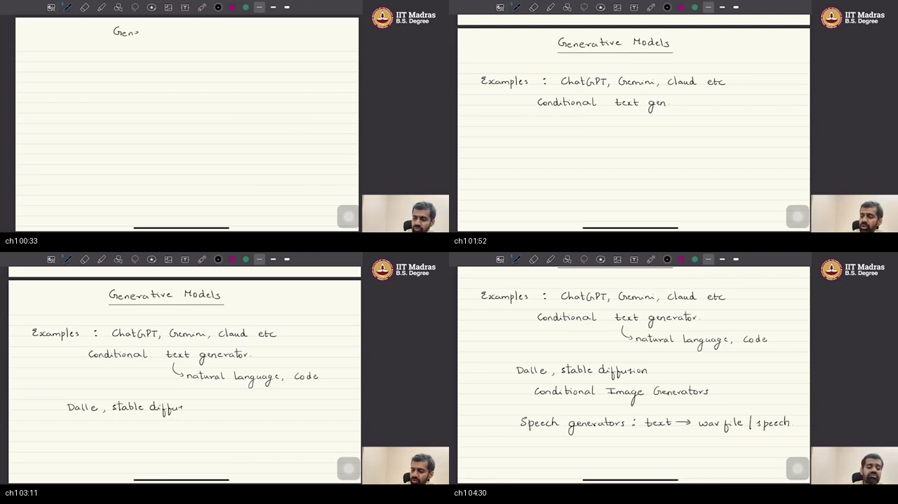
**Figure — ~00:33–04:30:** heading “Generative Models”; examples ChatGPT, Gemini, Claude = conditional text (natural language **or code**); DALL·E, Stable Diffusion = conditional image generators; speech generators = text → wav / speech.

### What he is establishing

This module’s job is to define **generative modeling** as a mathematical problem, not as a product tour. He still starts with products, because they fix the *kind* of map we care about.

ChatGPT, Gemini, and Claude take a **prompt** — a piece of text you typed — and emit a **response**. That is **conditional text generation**: the output is generated *given* the input. The same pattern covers computer **code**. The prompt is still text; the reply happens to be a program.

Image models (he names diffusion, DALL·E, Stable Diffusion) do the same job in another modality: given a **description**, they create an image that matches it. Text-to-speech is the third cousin: given text, emit a **waveform** / utterance.

Three boxes, one shape:

```
  given prompt text  ──►  new text or code
  given description  ──►  new image
  given text         ──►  new waveform
```

If you only remember “they generate stuff,” you miss the **given**. Unconditional generation (a random face with no prompt) is allowed later; today’s apps on this board are **conditional**. You can now name three modalities with the same arrow. What is still missing: the scientific starting point is not an app, it is an unordered pile of **data**.

### Analogy for this topic only

You hand a kitchen a **ticket** (“paneer tikka, less spice”) and a plate comes back. **Can you name the dish if you only know “a kitchen exists,” with no ticket?** Not on this board: every example waits for a condition. The ticket is the prompt; the kitchen is the generator. ChatGPT is that restaurant for sentences; diffusion for pictures; TTS for sound.

In lecture words: ticket = condition, kitchen = generative model, plate = new sample.

### Local picture

```
  condition c          generator           new object
  (prompt / caption)  ───────────────►    x_new
                      “corresponding to c”
```

Notice: every arrow is **in → out**. No density is written yet.

### Bridge

Apps tell you *what success looks like*. They do not tell you what you are given as a scientist. The starting point of every ML method, he says next, is an unordered pile of points drawn from a law you do not know.

---

## Topic 2: Data as IID samples from unknown $p_x$ (04:53–06:54)

### Where this sits on the master map

This installs the **DATA** box. If [IID](./PREREQUISITES.md#p3-iid) or [density vs distribution](./PREREQUISITES.md#p2-density) is still fuzzy, open those first. The leftover from Topic 1: what is the *scientific* starting point?

### Board / screenshot

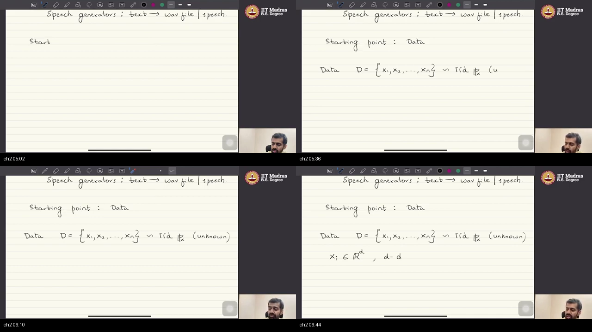
**Figure — ~05:02–06:44:** “Starting point: Data.” $D=\{x_1,\ldots,x_n\}\sim\mathrm{IID}\,\mathbb{P}_x$ (unknown). Then $x_i\in\mathbb{R}^d$, $d=$ dimensionality.

### What he is establishing

Data, for this course, is an **unordered set** of $n$ points. There is no privileged first row except as a label. Those points are drawn **IID** — independent and identically distributed — from a distribution $\mathbb{P}_x$ that is **unknown**.

He uses **script** letters for probability **distribution** functions and **non-script** letters for probability **density** functions. Keep that pocket distinction; he will mix the spoken words later for ease.

This starting point is not special to generative AI. **Any** machine learning task begins here: $n$ samples from an unknown law. Each $x_i$ lives in $D$-dimensional real space; $D$ is the **dimensionality** of one point (not the number of points). How large $D$ gets is the next box.

You can now write the dataset as a single line. You cannot yet say what “estimate $\mathbb{P}_x$” will mean for images.

### Analogy for this topic only

A jar of pebbles scooped from a river. **If you recite the $n$ pebbles, do you know the river?** No. You do not get the blueprint. You get $n$ independent scoops from **one** unknown river-law $p_x$.

In lecture words: jar = $D$, river-law = $p_x$, scoop = IID.

### Local picture

```
  unknown p_x
       │  IID draws
       ▼
  D = { x_1, x_2, …, x_n }     unordered
       each x_i ∈ R^D
```

Notice: $n$ is how many files you hold; $D$ is how long **one** file-vector is.

### Bridge

He has not said how big $D$ is. For images it is not “three numbers for RGB.” It is hundreds of thousands.

---

## Topic 3: Images as high-$D$ vectors (06:54–09:22)

### Where this sits on the master map

This fills $x\in\mathbb{R}^D$ on the DATA box. If stacking tensors is new, use [vectors warm-up](./PREREQUISITES.md#p4-vectors). Topic 2 left $D$ unnamed; here it becomes a computed size.

### Board / screenshot

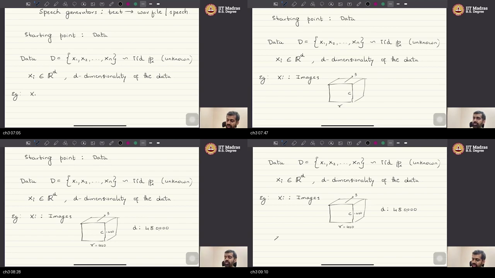
**Figure — ~07:05–09:10:** $x_i\in\mathbb{R}^d$. Example images: a cube with sides $r$, $c$, and $3$ (RGB). Worked numbers $r=400$, $c=400$, $d=480{,}000$.

### What he is establishing

$D$ is typically **very high** — tens of thousands, often hundreds of thousands. A color image is a **tensor**: $R$ rows, $C$ columns, **three** channels (red, green, blue). $R$ and $C$ are order hundreds if not thousands; times three pushes you into huge $D$.

Worked board number: $R=400$, $C=400$, three channels.

$$
D = 400 \times 400 \times 3 = 480{,}000
$$

In words: treat each pixel-channel as one coordinate. **One** photo is one point in a $480{,}000$-dimensional space.

The letter $D$ denotes that size for the rest of the course. High dimension is the default setting, not a special case you can ignore.

### Analogy for this topic only

A scanned book page looks 2-D on the desk. **Is $D$ equal to 400 (one side) or $480{,}000$ (every ink dot)?** The algorithm never “sees a rectangle”; it sees a **barcode** of every pixel-channel in order. On this board that barcode has length $400\times 400\times 3$.

In lecture words: page = tensor, barcode = vector in $\mathbb{R}^D$, $D=480{,}000$ on this board.

### Local picture

```
     3 (RGB)
      ┌──┐
      │  │ R = 400
      └──┘
       C = 400

  stack every entry ──►  x ∈ R^{480000}
```

Notice: $n$ photos means $n$ such barcodes, each of length $480{,}000$ — not $n=480{,}000$.

### Bridge

If each barcode is a random list, what random object is it an instance of? And does “IID” mean the $480{,}000$ coordinates are independent? The next box answers **no**.

---

## Topic 4: Vector random variable; IID across samples, not pixels (09:22–16:45)

### Where this sits on the master map

This is the **RV + IID** box — the worldview he says is “very very important” for the rest of the course. Lean on [random variable](./PREREQUISITES.md#p1-rv) and [IID](./PREREQUISITES.md#p3-iid). Topic 3 made $x$ a long list; this topic says what kind of random object that list is, and what independence is *not*.

### Board / screenshot

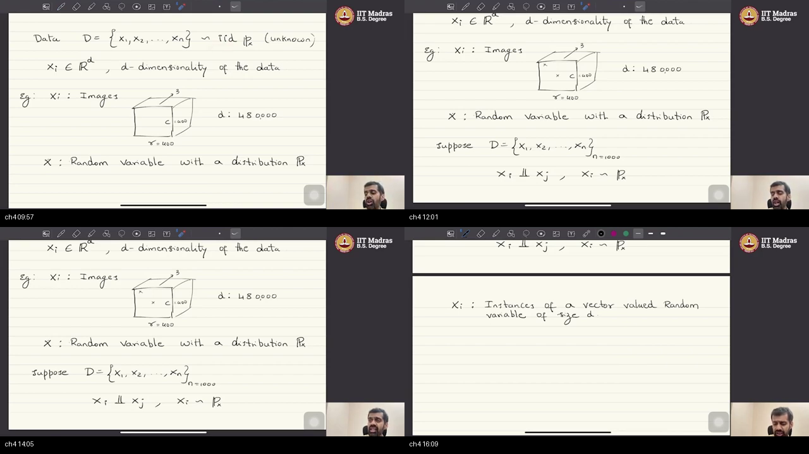
**Figure — ~09:57–16:15:** cube $r=400,c=400,d=480{,}000$; $X$ a RV with law $\mathbb{P}_x$; example $n=1000$; board writes $x_i \perp x_j$, $x_i\sim p_x$; then “instances of a vector valued random variable of size $d$.” Independence is **across** the 1000 images.

### What he is establishing

Each data point is an **instantiation** of a random variable with distribution $p_x$. IID means two things at once: the points are sampled **independently**, and they all come from **one** unknown $p_x$.

Take $n=1000$ images (the board’s number). Image $x_1$ and image $x_2$ are statistically **independent**, and both are drawn from the **same** $p_x$. That is a fair practical story: two photos captured at different times. $z$ in later topics lives in $\mathbb{R}^k$, which need **not** equal this $D=480{,}000$.

The trap: this does **not** say that pixel 1 and pixel 1000 **inside** one image are independent. IID is **across data points**, not **across dimensions** of one point. Unless he says otherwise, do **not** assume coordinates inside $x_i$ are independent.

Why one shared $p_x$? **Mathematical ease.** Estimating many unknown laws at once is harder. Assume one law to estimate. For GPT-scale chat models the “points” are documents from the internet; $p_x$ is treated as **one** law of “everything on the internet,” not because the web is a tiny subdomain, but because one unknown is tractable.

Because $x_i\in\mathbb{R}^D$, the random variable is **vector-valued** of size $D$. Distributions on vector RVs exist just as on scalars. The wrong move is to smash pixels apart in the name of IID; the right move is independence **across files** only. You can now state the course worldview in one line. Still open: what we will **do** with this $p_x$.

### Analogy for this topic only

A thousand separately baked cookies from **one** batter. **Does knowing cookie 7’s chips tell you cookie 8?** No — that is the independence we do assume. **Does a chip next to another chip inside cookie 7 have to be independent?** No — IID never smashed those chips apart. Batter = $p_x$; cookies = images.

In lecture words: cookies = images $x_i$, batter = $p_x$, chips inside = pixels.

### Local picture

```
  across samples (YES IID)
     x_1  ⟂  x_2  ⟂  …  ⟂  x_n     all ~ p_x

  inside one x_i (NOT claimed)
     pixel_1  —dependent—  pixel_1000
```

Notice: “one $p_x$ for the internet” is a modeling convenience, not a sociology of the web.

### Bridge

We have a precise description of **what we hold**. We still do not have the **goal**. Discriminative ML might stop at $p(y\mid x)$. Generative modeling asks for something extra: a **sampler**.

---

## Topic 5: Estimate $p_x$ and learn to sample (16:45–19:47)

### Where this sits on the master map

This is the **PROBLEM** box — the one-line job of the whole course. [Sampling vs estimating](./PREREQUISITES.md#p8-argmin) sits nearby; the contrast with discriminative models is new here.

### Board / screenshot

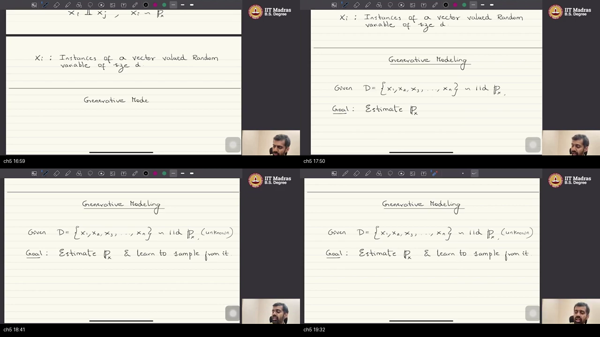
**Figure — ~16:59–19:32:** vector RV of size $d$; then “Generative Modeling / Given $D=\{x_1,\ldots,x_n\}\sim\mathrm{iid}\,\mathbb{P}_x$ (unknown) / Goal: Estimate $\mathbb{P}_x$ **& learn to sample from it**.”

### What he is establishing

Given those IID instantiations from an unknown $p_x$, generative modeling has a **two-fold** goal: **estimate** the underlying distribution (or density) **and learn to sample from it**.

Some models never write $p_x$ down as a formula (**implicit** estimate). Almost all generative models still learn **how to draw** new $x$. Sampling is not extra credit.

**Discriminative** models typically estimate conditionals of the form $p(y\mid x)$ — given an X-ray, the probability of a disease label. They do **not** need to sample a brand-new X-ray. That is the fork: discriminative can stop at conditionals; generative must mint new files.

You can now state the formal problem in one sentence. You cannot yet say *how* to estimate a law on $\mathbb{R}^{480000}$.

### Analogy for this topic only

A weather archive of daily temperature lists. Estimating $p_x$ is writing the climate. Sampling is **simulating tomorrow** without waiting for the sun. A discriminative model only answers “will it rain *given* this morning’s sensors?” It never has to invent a new morning.

In lecture words: climate = $p_x$, simulated tomorrow = sample, rain-given-sensors = $p(y\mid x)$.

### Local picture

```
  Discriminative                 Generative
  ──────────────                 ──────────
  data (x,y)                     data {x_i}
  estimate p(y|x)                estimate p_x
  (no need to mint x)            AND sample new x
```

Notice: implicit models still **sample**; they just skip writing the density.

### Bridge

How do you even start estimating a law on a 480{,}000-dimensional space? You do not search all laws. You assume a **parametric family** and call it the model.

---

## Topic 6: Parametric family $p_\theta$ as a deep net (19:47–24:19)

### Where this sits on the master map

This is recipe step (i) — the **MODEL** box. [Parametric family](./PREREQUISITES.md#p5-parametric) unlocks $p_\theta$. The PROBLEM box cannot search every law; it needs a family with knobs.

### Board / screenshot

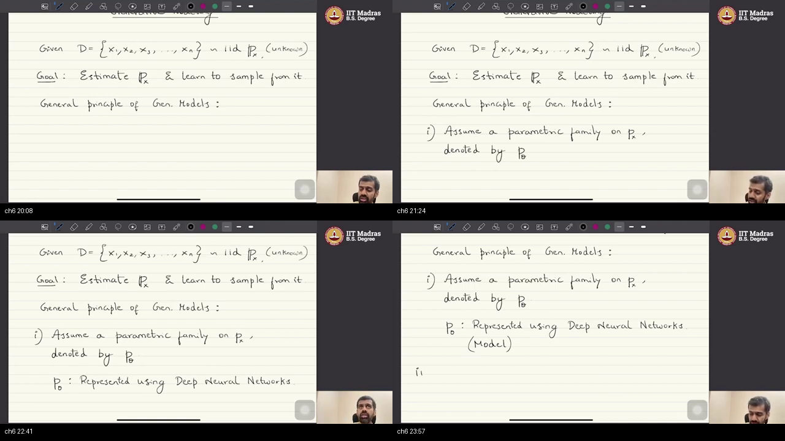
**Figure — ~20:08–23:57:** goal restated, then “General principle of Gen. Models: (i) Assume a parametric family on $\mathbb{P}_x$, denoted by $p_\theta$. $p_\theta$: represented using Deep Neural Networks. (Model).”

### What he is establishing

Looking at generative models as a field, one can abstract a **general principle**. It is not a sacred unique path, but it covers the families this course will study.

**Step (i):** assume a **parametric family** on $p_x$, written $p_\theta$. He switches to **densities** here, assuming they are well-behaved, so the algebra is easier.

That family is typically a **deep neural network**. Why: **universal approximation** — modern nets can approximate a large class of functions, “in fact any function,” to arbitrary closeness. Given that power, the density we care about is **represented** by a net.

**Course slang:** whenever he says **model**, he means this parametric stand-in $p_\theta$, not “the whole ChatGPT product.” The wrong move is to call ChatGPT “the model” in these notes; the right move is $p_\theta$ with knobs $\theta$. You can now name recipe step (i). You still have no score for “is this $p_\theta$ close to truth?”

### Analogy for this topic only

The true radio station is unknown. Your receiver only has a **dial**. **If you leave the dial at a random click, does the speaker match the station?** Not until you have a score for “how far.” Each dial setting is a candidate law; a deep net is a dial with millions of clicks. “Model” here is that dial-plus-circuit, not the music app.

In lecture words: dial = $\theta$, candidate station = $p_\theta$, circuit = DNN.

### Local picture

```
  unknown p_x
       │
       │  we don’t search all laws
       ▼
  family { p_θ }   θ = net weights
       │
       │  “model”  :=  p_θ
       ▼
  a DNN that represents that family
```

Notice: UAT is the **excuse** for using nets, not a trained theorem on this board.

### Bridge

A family is useless unless you can say which member is closest to $p_x$. That score is a **divergence**. And naming $d(p_\theta,p_x)$ immediately begs a question: we do not know $p_x$.

---

## Topic 7: Divergence and $\arg\min$ (the unknown-$p_x$ trap) (24:19–28:31)

### Where this sits on the master map

Recipe steps (ii)–(iii): **DIVERGENCE** then **optimize**. [Divergence](./PREREQUISITES.md#p6-divergence) and [argmin](./PREREQUISITES.md#p8-argmin) unlock the symbols. Step (i) left $p_\theta$ hanging without a training signal.

### Board / screenshot

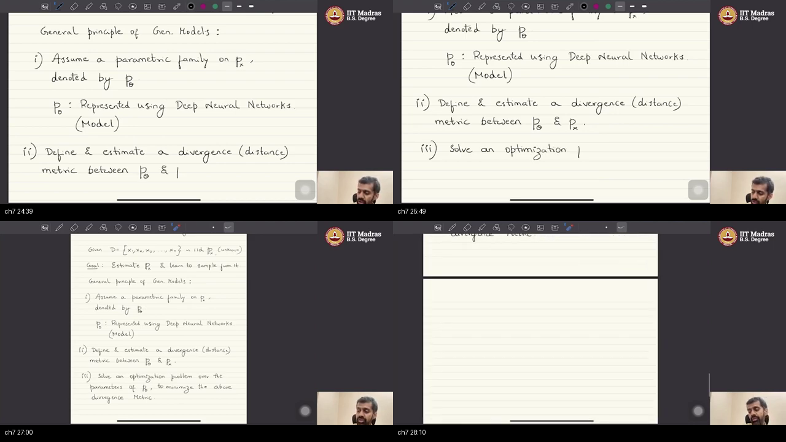
**Figure — ~24:39–27:00:** (i) parametric $p_\theta$ via DNNs (Model). (ii) Define & estimate a divergence (distance) metric between $p_\theta$ and $p_x$. (iii) Solve an optimization over the parameters of $p_\theta$ to minimize that divergence. (Last tile is a page turn.)

### What he is establishing

**Step (ii):** define and estimate a **divergence or distance** between the model’s $p_\theta$ and the true $p_x$ — a number that says how far apart two laws sit.

The honest objection: we began by saying $p_x$ is unknown. How can $d(p_\theta,p_x)$ be computed? He calls this **begging the question**, and parks it. At an abstract level, assume we *can* define such a score. The rest of the course will compute it from **samples**.

**Step (iii):** solve an **optimization** over $\theta$ to **minimize** that score. Tweak the net’s weights until $d$ is near zero, i.e. until $p_\theta$ **approaches** $p_x$.

Full recipe, once:

1. Assume $p_\theta$ (a DNN). Some models write this density explicitly; others only keep a sampler (**implicit**).
2. Define / estimate $d(p_\theta,p_x)$.
3. Choose $\theta$ to minimize $d$.

The goal remains **two-fold**: estimate **and** sample. The wrong move is to treat $d$ as if $p_x$ were a known formula today; the right move is to accept the three-step skeleton and park the “how to compute $d$” hole. You can now recite the recipe. Sampling is still not a procedure — that is the next engine.

### Analogy for this topic only

Two sand piles: the true beach (you only have handfuls) and your copy. **How many shovel-moves remain if you never saw the whole beach — only handfuls?** That is the parked question. Divergence is the shovel-count; turning knobs is shoveling; zero moves iff the piles coincide.

In lecture words: shovel-count = $d$, knobs = $\theta$, coincidence = $d=0$.

### Local picture

```
  (i)   pick family p_θ          (DNN)
  (ii)  score d(p_θ, p_x)        (unknown p_x → later)
  (iii) θ* = argmin_θ  d         (tweak weights)
                 │
                 ▼
         p_θ  close to  p_x
```

Notice: the recipe is **not** sacrosanct unique physics; it is the abstraction he sees across generative models.

### Bridge

Minimizing $d$ estimates a law. It does not, by itself, tell you how to **draw** a new $x$. For that he introduces an easy random $z$ and a deterministic map $G_\theta$.

---

## Topic 8: Sampling engine $z\to G_\theta(z)$ (28:31–36:26)

### Where this sits on the master map

This is the **GENERATOR** box. [Function of a random variable](./PREREQUISITES.md#p7-transform) is the warm-up. Recipe (i)–(iii) estimated $p_\theta$; this box is how samples **exist**.

### Board / screenshot

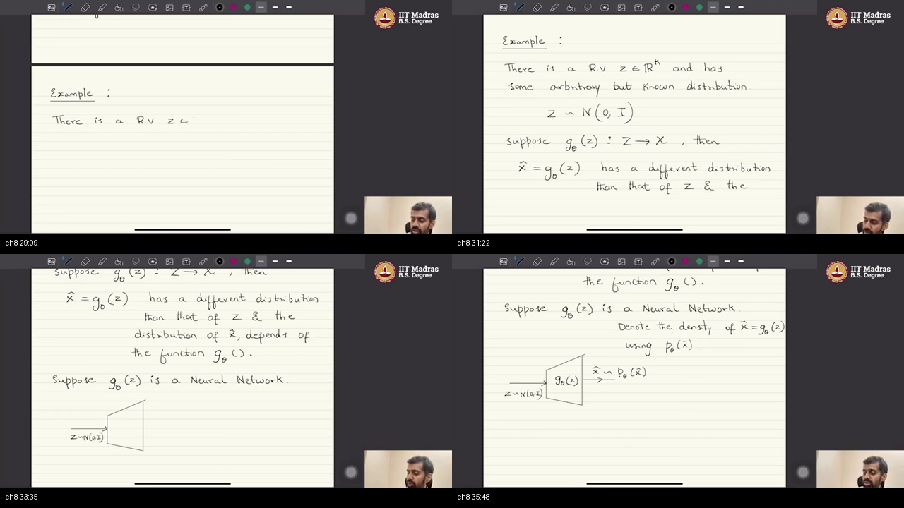
**Figure — ~29:09–35:48:** $Z\in\mathbb{R}^k$ with a known law, example $Z\sim\mathcal N(0,I)$. $G_\theta:Z\to X$ deterministic; $\hat x=G_\theta(z)$ has a **different** law that **depends on** $G_\theta$. Then $G_\theta$ is a neural net: $z\sim N(0,I)$ into a trapezoid $G_\theta(z)$ out to $\hat x\sim p_\theta(\hat x)$.

### What he is establishing

Introduce a random variable $Z$ in $\mathbb{R}^k$ with a **known** law. The running example is a $k$-dimensional **standard Gaussian** $Z\sim\mathcal N(0,I)$ — mean zero, identity covariance, something you already know how to sample.

Let $G_\theta$ be a **deterministic** function from $Z$-space to $X$-space. Probability fact: a deterministic function of a random variable is again a random variable. The law of $G_\theta(Z)$ is **not** the law of $Z$; it **depends on** $G_\theta$.

Now take $G_\theta$ to be a **neural network**. Feed it samples from $N(0,I_k)$ in **$k$ dimensions** — $k$ is the noise size, not necessarily $D$. Call the output $\hat x=G_\theta(z)\in\mathbb{R}^D$. Denote the density of $\hat x$ by $p_\theta(\hat x)$. Those outputs **are** samples from $p_\theta$.

He will use “distribution” and “density” interchangeably for ease; they are **not** strictly the same.

The net’s job: transform samples from a **known** law into samples from another law $p_\theta$. Then the recipe’s $d(p_x,p_\theta)$ and the $\arg\min$ apply to **this** $p_\theta$.

The wrong move is to wait for a closed-form density of $\hat x$ before drawing anything. The right move is: if you can run $G_\theta$ on a fresh $z$, you already have a sample from $p_\theta$. You can now draw from the **model**. You cannot yet make those draws look like **data**.

This lecture never opens an editor. The board algorithm is:

```python
# Known, unlimited:
z = sample_standard_normal(k)      # z ~ N(0, I)

# Deterministic net (weights = theta):
x_hat = G_theta(z)                 # x_hat ~ p_theta

# We do NOT need a closed-form formula for p_theta(x)
# to DRAW x_hat. Running G_theta is enough.
```

### Analogy for this topic only

A pasta machine. You know how to dump flour from a known bag. **Can you make a new shape without writing an equation for “density of fusilli”?** Yes: change the metal die, dump more flour. The die is deterministic; the flour is random; the pasta law depends on the die.

In lecture words: flour = $z$, die = $G_\theta$, pasta = $\hat x\sim p_\theta$.

### Local picture

```
   z ~ N(0, I)     known, easy
        │
        │  G_θ  (deterministic net)
        ▼
   x̂ = G_θ(z)  ~  p_θ     different law, depends on G_θ
```

Notice: implicit models live here — a sampler without a density formula.

### Bridge

If $p_\theta$ is the law of $G_\theta(Z)$, then minimizing $d(p_x\|p_\theta)$ **picks the die**. After that pick, a fresh $z$ should taste like a real photo.

---

## Topic 9: Train $G_{\theta^\star}$, then sample from near $p_x$ (36:26–47:54)

### Where this sits on the master map

This closes **TRAIN+SAMPLE**: optimization + the reason sampling works after training. [Argmin](./PREREQUISITES.md#p8-argmin) and [transform](./PREREQUISITES.md#p7-transform) are already in play. Topic 8 built the engine; this topic **sets $\theta$** and hits the ignition.

### Board / screenshot

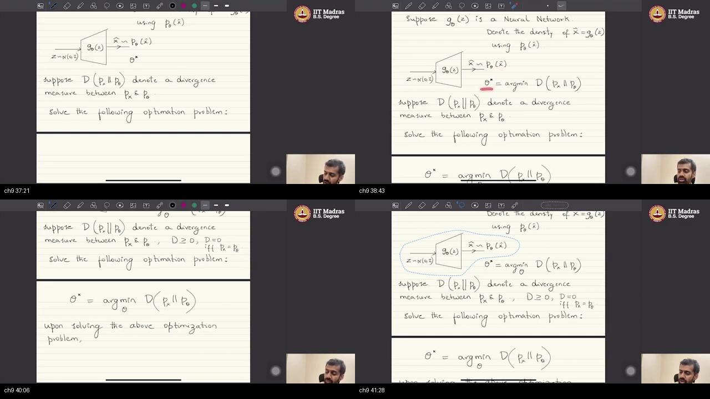
**Figure — ~37:21–41:28:** trapezoid $G_\theta$ with $z\sim N(0,I)$ and $\hat x\sim p_\theta(\hat x)$. $\theta^\star=\arg\min_\theta D(p_x\|p_\theta)$. Property: $D\ge 0$, and $D=0$ **iff** $p_x=p_\theta$.

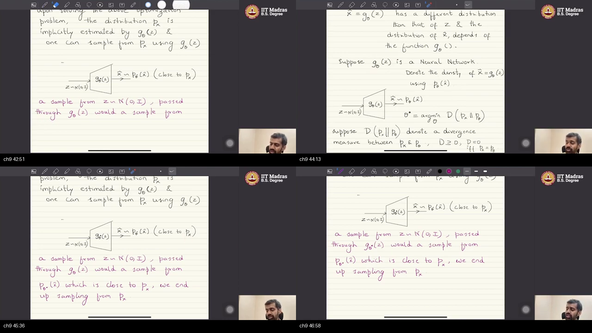
**Figure — ~42:51–46:58:** magenta line: a sample from $z\sim N(0,I)$ passed through $G_\theta$ is a sample from $p_\theta(\hat x)$ **close to** $p_x$, so we **end up sampling from** $p_x$. The board also says $p_x$ is **implicitly estimated** by $G_\theta(z)$.

### What he is establishing

The optimization is: choose $\theta$ so the divergence between true $p_x$ and the model’s $p_\theta$ is minimized. That score is a function of $\theta$. Board notation uses two vertical bars: $d(p_x\|p_\theta)$.

$$
\theta^\star = \arg\min_\theta \, d(p_x \| p_\theta)
$$

In words: $\theta^\star$ is the weight setting that makes the two laws as close as the score allows.

The divergences he will use are **non-negative**. Their minimum is **zero**, and that happens **if and only if** the two distributions match.

After a successful solve, $p_{\theta^\star}$ is close to $p_x$. The board’s later tiles say this more sharply: $p_x$ is **implicitly estimated** by $G_\theta(z)$, and one can **sample from** $p_x$ **using** $G_\theta(z)$. Sampling is mechanical: draw $z\sim N(0,I)$ (unlimited RNG), pass it through **trained** $G_{\theta^\star}$, get a draw from $p_{\theta^\star}$, hence from **near** $p_x$ **by construction**.

Why the package works as one idea: start from a law you **know how to sample**; a deterministic net changes the law; universal approximation says a net can implement a rich $G$; train $G$ so $d$ is small; unlimited Gaussians ⇒ unlimited new $x$.

Notation for the rest of the course: subscript on $p$ names the random variable **or** the parameters; the value in parentheses is a **particular evaluation point**. $p_{\theta^\star}(\hat x)$ means “the $\theta^\star$-parameterized density of $\hat x$, evaluated at this $\hat x$.” Strict $p_{\hat x,\theta^\star}(\hat x)$ is too heavy, so he writes $p_{\theta^\star}(\hat x)$.

This is the **general principle** behind GANs, VAEs, diffusion models, autoregressive models, and the rest. The wrong move after training is to reprint a file from $D$ and call it a sample. The right move is a **fresh** $z$ through $G_{\theta^\star}$. You can now sample. You still cannot compute $d$ from formulas — you never had $p_x$ as a function.

```python
# After theta_star is found (how we compute d is later lectures):
#
#   p_x  is IMPLICITLY estimated by  G_theta_star
#   (we never wrote a formula for p_x)

z = sample_standard_normal(k)   # known, unlimited; k need not equal D
x_new = G_theta_star(z)         # ~ p_theta_star, which is close to p_x
# => we end up sampling from p_x
# x_new is a NEW point — not required to equal any row of D
```

### Analogy for this topic only

A thermostat until the room-score is smallest, then **leave it**. **If tomorrow’s weather is a new random number, do you get yesterday’s indoor log again?** No: a fresh outdoor draw through the frozen machine is a new hour, not a replay. That is sampling after training.

In lecture words: thermostat = $\theta^\star$, climate match = $d\approx 0$, new hour = fresh $z$ through $G_{\theta^\star}$.

### Local picture

```
  TRAIN                         SAMPLE
  θ* = argmin d(p_x ‖ p_θ)      z ~ N(0,I)
           │                         │
           ▼                         ▼
     G_θ* frozen                x_new = G_θ*(z)
           │                         │
           └────────► p_θ* ≈ p_x ◄───┘
```

Notice: $d=0$ iff match is a **property he will require** of the divergences, not a theorem for every possible score.

### Bridge

Look at the recipe with a cold eye. To run $\arg\min d(p_x\|p_\theta)$ it seems you need **both** laws as functions. You have **neither**. You only have **samples**. That is the first question the course exists to answer.

---

## Topic 10: Four open questions and recap (47:54–58:32)

### Where this sits on the master map

This is **QUESTIONS / STOP**. Training-and-sampling works *if* you can score $d$. You cannot score $d$ from closed-form $p_x$. The rest of the syllabus is four precise holes.

### Board / screenshot

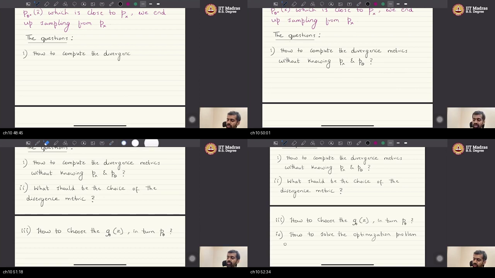
**Figure — ~48:45–52:34:** the four questions written out.

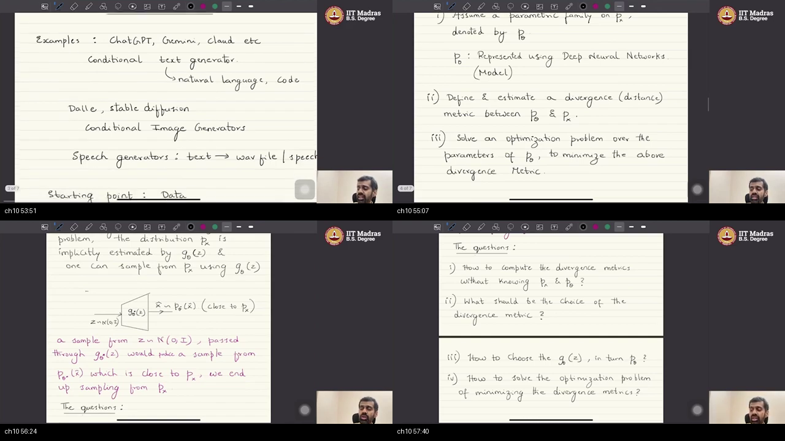
**Figure — ~53:51–57:40:** recap tiles — ChatGPT/DALL·E/speech; the three-step principle; trapezoid “implicitly estimated by $G_\theta$”; questions (i)–(iv) again. Use this panel as the closed-book cheat sheet.

### What he is establishing

**Q1.** How to **compute** $d$ without knowing $p_x$ or $p_\theta$. In the example you know **neither** density. You do have samples from $p_x$: that is the dataset $D$. You do have samples from $p_\theta$: draw $z$ and push it through $G_\theta$. So the live objects are two **clouds of points**, not two formulas.

**Q2.** What should the **choice** of $d$ be? Different choices yield different generative models with different properties.

**Q3.** How to choose $G_\theta$ / the parametric form of $p_\theta$. A GAN’s $p_\theta$ is very different from a VAE’s, a diffusion model’s, or an autoregressive model’s.

**Q4.** How to **solve** the minimization (the optimizer / algorithm).

Each different answer-set yields a different named model. Course preview: adversarial networks, VAEs, diffusion, autoregressive models, state-space models, and RL-based **alignment** for AR language models.

Recap of examples: ChatGPT-style conditional **text**; DALL·E / Stable Diffusion-style conditional **image**; speech generators.

Recap of problem: $n$ points IID from unknown $p_x$ in $\mathbb{R}^D$ (image / text / speech); independence **across** points; **estimate and sample**.

Recap of recipe: $p_\theta$ via a DNN, $d(p_x,p_\theta)$, $\min_\theta d$; Gaussian $z\to G_\theta$; trained $G$ emits points **not** copied from $D$. If you only reproduced the dataset you would not be sampling the underlying law. Each draw can look different, in accordance with the likelihood of each region.

Those four questions are the rest of the course. The wrong move is to treat this lecture as finished engineering; the right move is to leave with a recipe **and** four holes. You can now recite the job, the engine, and the holes. Next modules start filling Q1.

### Analogy for this topic only

You have a recipe that says “season to taste.” **Which spice, how do you taste without a lab, which pan, how long on the fire?** Those four missing decisions *are* Q1–Q4. GAN vs VAE vs diffusion vs AR are different kitchens answering them differently.

In lecture words: spice = $d$, tasting without a lab = samples-only $d$, pan = $G_\theta$, fire = optimizer.

### Local picture

```
  We have:   samples from p_x   =  D
             samples from p_θ   =  G_θ(z) for fresh z
  We lack:   formulas for p_x and (often) p_θ

  Q1  compute d from the two clouds
  Q2  which d?          (properties of the model)
  Q3  which G_θ / p_θ?  (GAN ≠ VAE ≠ diffusion ≠ AR)
  Q4  how to minimize?  (the algorithm)

  new x  ≠  a reprint of D
```

Notice: “not part of the dataset” is a **success criterion**, not a bug.

### Bridge

The leftover problem is Q1 in concrete form: define a usable $d$ from two clouds of points. The next lectures begin with **$f$-divergence** and then **variational divergence minimization** — a way to score $d$ with a critic instead of the unknown densities.

---

## External references

Links live **here only** (not repeated under each topic). For every sub-topic: **one video** + **one or two notes/blogs**. Open the row *after* you finish that topic. URLs were opened; none are Wikipedia.

**Hour path:** Topics 1–5 (job) → CS236 intro + Cornell L2. Topics 6–9 (engine) → 3Blue1Brown net + MIT 6.S191 + Lilian Weng. Topic 10 (holes) → CS231n 2025 slides + CS236 GAN notes.

### Topic 1 — Conditional generators (apps)

| Kind | Resource | Why |
|------|----------|-----|
| Video | [MIT 6.S191 (2026) Lec 4 — Deep Generative Modeling](https://www.youtube.com/watch?v=R8V8CbuxryI) · [slides](https://introtodeeplearning.com/slides/6S191_MIT_DeepLearning_L4.pdf) | ChatGPT / photoreal faces as the public face of $P_{\mathrm{model}}$ |
| Video | [3Blue1Brown / Welch Labs — How do AI images actually work?](https://www.youtube.com/watch?v=iv-5mZ_9CPY) | Conditional image generation without this course’s notation |
| Notes | [MIT 6.7960 Fall 2024 Lec 14 PDF](https://ocw.mit.edu/courses/6-7960-deep-learning-fall-2024/mit6_7960_f24_lec14.pdf) (Isola) | DALL·E-style prompt → image on an official OCW board |

### Topic 2 — IID data from unknown $p_x$

| Kind | Resource | Why |
|------|----------|-----|
| Video | [StatQuest — The Main Ideas behind Probability Distributions](https://www.youtube.com/watch?v=oI3hZJqXJuc) | What a distribution *is* before you estimate it |
| Video | [Harvard Stat 110 Lec 8 — Random variables and their distributions](https://www.youtube.com/watch?v=k2BB0p8byGA) | RV vs distribution; IID defined in a first-course lecture |
| Notes | [Stanford CS236 — Introduction](https://deepgenerativemodels.github.io/notes/introduction/) | Finite samples from unknown $p_{\mathrm{data}}$ |

### Topic 3 — Images as high-$D$ vectors

| Kind | Resource | Why |
|------|----------|-----|
| Video | [3Blue1Brown — But what is a neural network?](https://www.youtube.com/watch?v=aircAruvnKk) | $28\times 28$ digits → $D=784$; same stacking, smaller number |
| Blog / tutorial | [CS231n Python NumPy tutorial](https://cs231n.github.io/python-numpy-tutorial/) | Color image as array shape `(H, W, 3)`; flatten is a reshape |
| Notes | [CS236 introduction — RGB pixels](https://deepgenerativemodels.github.io/notes/introduction/) | Images as 3-channel arrays; huge discrete space |

### Topic 4 — Vector RV; IID across samples not pixels

| Kind | Resource | Why |
|------|----------|-----|
| Video | [3Blue1Brown — Central Limit Theorem](https://www.youtube.com/watch?v=zeJD6dqJ5lo) (IID segment) | Independent **and** identically distributed, with a case where both fail |
| Video | [Harvard Stat 110 Lec 8](https://www.youtube.com/watch?v=k2BB0p8byGA) | IID as “independent + same distribution” |
| Notes | [CS236 introduction](https://deepgenerativemodels.github.io/notes/introduction/) | Data points as samples of a high-dimensional RV |

### Topic 5 — Estimate $p_x$ **and** sample vs discriminative

| Kind | Resource | Why |
|------|----------|-----|
| Video | [Cornell CS 6785 Lec 2 — Intro to probabilistic modeling](https://www.youtube.com/watch?v=FBGj_B6hH9Y) (~41:23 disc vs gen) | Same fork: $p(y\mid x)$ vs a model of $x$ |
| Notes | [Stanford CS236 — Introduction](https://deepgenerativemodels.github.io/notes/introduction/) | Density **and** sampling as the generative job |
| Slides | [CS231n Spring 2025 Lecture 13](https://cs231n.stanford.edu/slides/2025/lecture_13.pdf) | $p(y\mid x)$ vs $p(x)$ vs $p(x\mid y)$ |

### Topic 6 — Parametric family $p_\theta$ as a deep net

| Kind | Resource | Why |
|------|----------|-----|
| Video | [3Blue1Brown — But what is a neural network?](https://www.youtube.com/watch?v=aircAruvnKk) | A net is a function with knobs; UAT motivation in pictures |
| Video | [3Blue1Brown — Gradient descent, how nets learn](https://www.youtube.com/watch?v=IHZwWFHWa-w) | What “tweak $\theta$” looks like before this course names $d$ |
| Notes | [CS236 introduction — $p_\theta$](https://deepgenerativemodels.github.io/notes/introduction/) | Learning as $\min_\theta d(p_{\mathrm{data}},p_\theta)$ |

### Topic 7 — Divergence and $\arg\min$ (unknown $p_x$)

| Kind | Resource | Why |
|------|----------|-----|
| Blog | [Lilian Weng — From GAN to WGAN](https://lilianweng.github.io/posts/2017-08-20-gan/) | JS/KL estimated from **samples**; you never plug in a formula for $p_x$ |
| Notes | [Stanford CS236 — GAN / $f$-GAN](https://deepgenerativemodels.github.io/notes/gan/) | Variational $f$-divergence: Q1 of this lecture, written out |
| Video | [Cornell CS 6785 Lec 10](https://www.youtube.com/watch?v=Ml15crPldBk) (~21:25 arbitrary divergences) | Train an implicit model by choosing $d$, from samples only |

### Topic 8 — Sampling engine $z\to G_\theta(z)$

| Kind | Resource | Why |
|------|----------|-----|
| Blog | [Lilian Weng — From GAN to WGAN](https://lilianweng.github.io/posts/2017-08-20-gan/) | $z$ through $G(z)$ as the sampler; no density required to **draw** |
| Notes | [Stanford CS236 — GAN notes](https://deepgenerativemodels.github.io/notes/gan/) | Implicit generator $x=G_\theta(z)$, $z\sim p(z)$ |
| Video | [MIT 6.S191 (2026) Lec 4](https://www.youtube.com/watch?v=R8V8CbuxryI) | Generator as a map from noise to data |

### Topic 9 — Train $G_{\theta^\star}$, then sample near $p_x$

| Kind | Resource | Why |
|------|----------|-----|
| Video | [3Blue1Brown — Gradient descent](https://www.youtube.com/watch?v=IHZwWFHWa-w) | What $\arg\min_\theta$ does to the knobs |
| Video | [MIT 6.S191 (2026) Lec 4](https://www.youtube.com/watch?v=R8V8CbuxryI) | After training, new draws from $P_{\mathrm{model}}\approx P_{\mathrm{data}}$ |
| Notes | [MIT 6.7960 Lec 14 PDF](https://ocw.mit.edu/courses/6-7960-deep-learning-fall-2024/mit6_7960_f24_lec14.pdf) | Nets whose **outputs are samples** (implicit $p_x$) |

### Topic 10 — Four open questions + recap

| Kind | Resource | Why |
|------|----------|-----|
| Slides | [CS231n 2025 Lecture 13](https://cs231n.stanford.edu/slides/2025/lecture_13.pdf) | Explicit vs implicit density — why GAN/VAE/AR/diffusion differ |
| Notes | [Stanford CS236 — GAN / $f$-GAN](https://deepgenerativemodels.github.io/notes/gan/) | Q1–Q2: samples-only $d$; choice of $d$ **is** the model |
| Notes | [CS236 notes home](https://deepgenerativemodels.github.io/notes/) | Map of AR / VAE / flow / GAN as answers to Q3 |
| Second pass | [NPTEL Lec 02 Problem Formulation](../../Mathematical-Foundation-for-GenerativeAI/15-Lec02-Generative-Models-Problem-Formulation/NOTES.md) | Same instructor, other recording; not a substitute |

Same-instructor sibling and Isola OCW video: [6.7960 Lec 14 video](https://ocw.mit.edu/courses/6-7960-deep-learning-fall-2024/resources/mit6_7960f24_lec14_mp4/) · [Cornell DGM course hub](https://kuleshov-group.github.io/dgm-website/).

---

## Sources

- Video: [W1_L2](https://www.youtube.com/watch?v=HUunmwZfGzc&list=PLZ2ps__7DhBa5xCmncgH7kPqLqMBq7xlu&index=2) · IIT Madras B.S. · Prof. Prathosh A P · ~58:32
- Timed captions: `raw/captions.en.timed.txt` (auto-captions cleaned)
- Claim sheets: `raw/claims/topic-01.md` … `topic-10.md`
- Boards: `screenshots/composites/` (unique per topic MM:SS)
