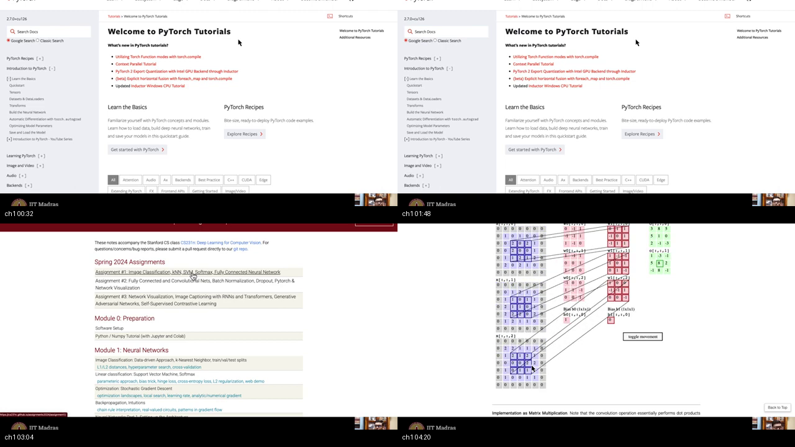
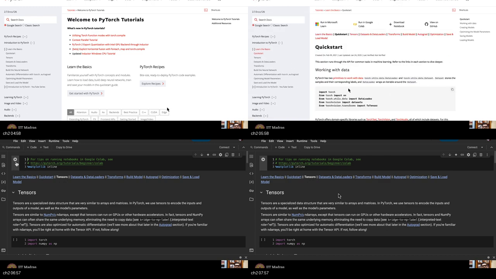
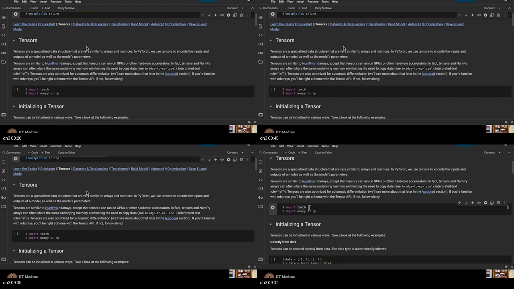
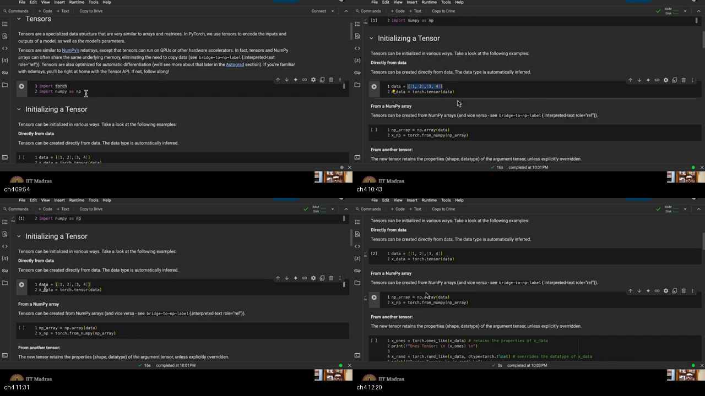
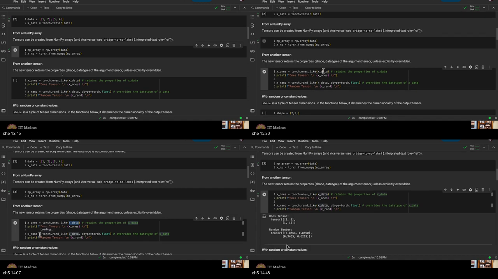
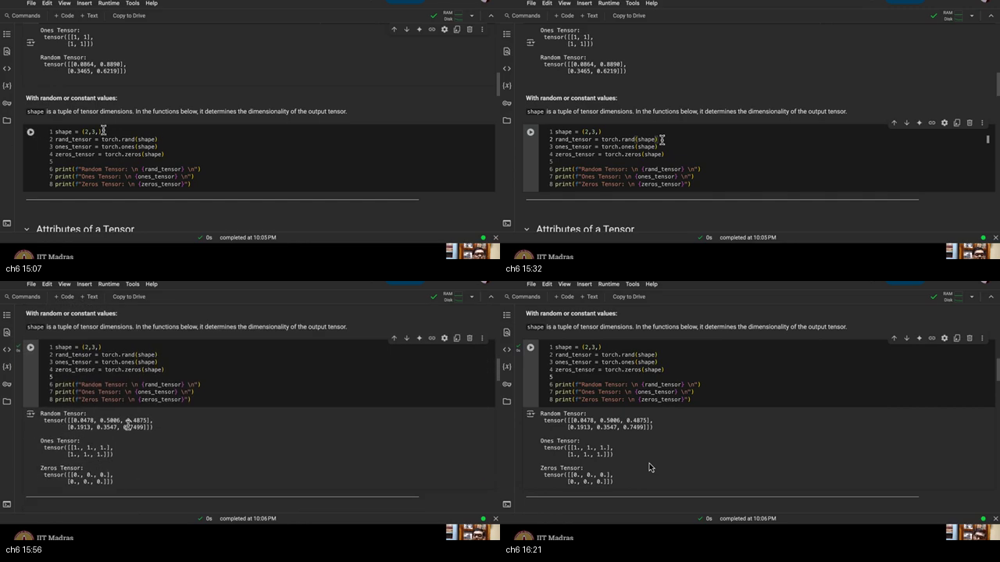
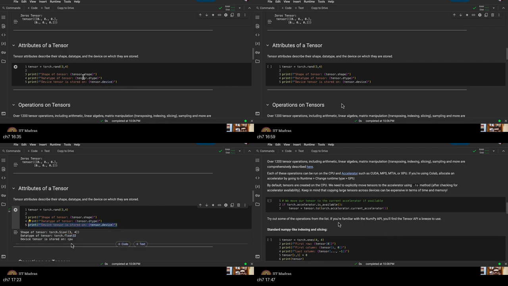
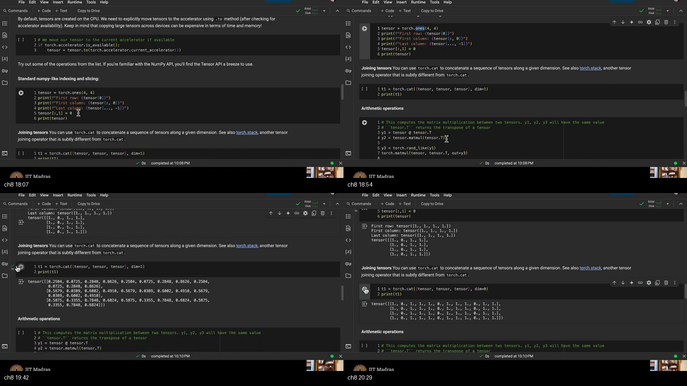
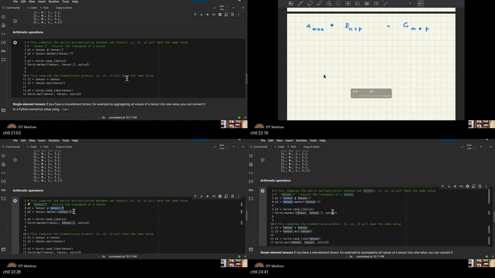
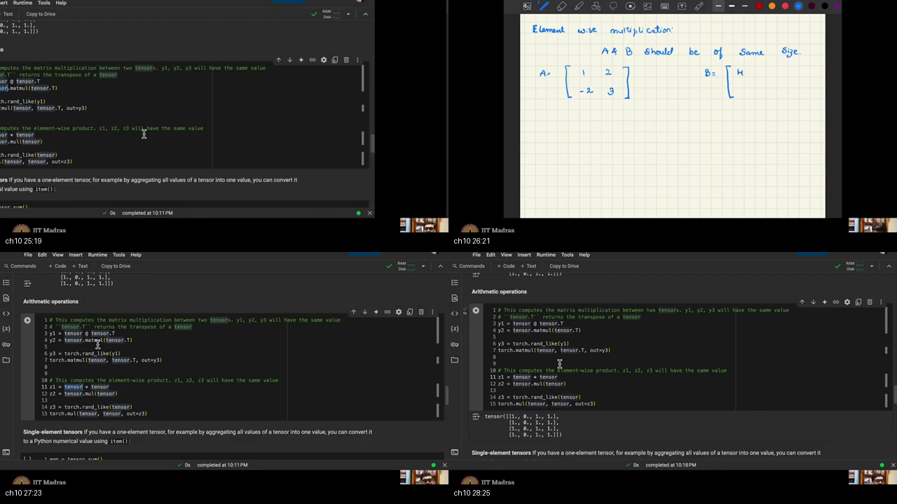

# W1_L3 — PyTorch Tensors & Hands-On Deep Learning Foundations

> **Course:** IIT Madras B.S. Degree in Data Science & AI · **Mathematical Foundations of Generative AI**  
> **Instructor:** IIT Madras BS Degree Tutorial Team  
> **Lecture Recording:** [W1_L3 on the IITM Playlist](https://www.youtube.com/watch?v=rHnrALMCyIQ&list=PLZ2ps__7DhBa5xCmncgH7kPqLqMBq7xlu&index=3) (~28:43)  
> **Prerequisites Warm-up:** [PREREQUISITES.md](./PREREQUISITES.md) · **Self-Assessment Quiz:** [quiz.html](./quiz.html)  
> **Course Catalog:** [../NOTES.md](../NOTES.md)

---

## Important Notice on Title vs. Recording Content

> [!NOTE]
> **Recording vs. Metadata Clarification:**  
> The YouTube playlist title and description for this slot display *"W1_L3: F-divergence | variational divergence minimization in generative models"*. However, the **actual 28:43 recording is a hands-on tutorial on PyTorch Tensors on Google Colab**.  
> This comprehensive study guide covers the **exact video content, code demonstrations, and pedagogical explanations presented on screen**. If you are looking for the theoretical chalkboard lecture on $f$-divergences and Variational Divergence Minimization (VDM), refer to [W1_L4 VDM](https://www.youtube.com/watch?v=nfZQYopzv20) or [NPTEL Lecture 03 Notes](../../Mathematical-Foundation-for-GenerativeAI/25-Lec03-f-Divergence-Examples/NOTES.md).

---

## Quick Navigation Matrix

| Topic & Timestamp | Focus Area | Core Python / PyTorch API | Prerequisite Link |
| :--- | :--- | :--- | :--- |
| [Topic 1: Colab GPU, Prereqs & CS231n](#topic-1-colab-gpu-environment-prerequisites--cs231n-review-00110442) (00:11–04:42) | Setup & CNNs | Hosted GPU Runtime / CS231n | [p4-colab](./PREREQUISITES.md#p4-colab) |
| [Topic 2: Official Tutorials & Colab Notebook](#topic-2-official-pytorch-tutorials--google-colab-workflow-04420814) (04:42–08:14) | Workflow | `.ipynb` Interactive Execution | [p4-colab](./PREREQUISITES.md#p4-colab) |
| [Topic 3: What is a Tensor?](#topic-3-what-is-a-tensor-08140941) (08:14–09:41) | Data Structure | `torch.Tensor` vs `np.ndarray` | [p3-numpy](./PREREQUISITES.md#p3-numpy) |
| [Topic 4: Tensor from List and NumPy](#topic-4-tensor-creation-from-python-lists--numpy-arrays-09411234) (09:41–12:34) | Initialization | `torch.tensor()`, `torch.from_numpy()` | [p1-list](./PREREQUISITES.md#p1-list) |
| [Topic 5: `ones_like` & `rand_like`](#topic-5-tensor-creation-from-existing-tensors-ones_like--rand_like-12341500) (12:34–15:00) | Template Cloning | `torch.ones_like()`, `torch.rand_like()` | [p2-shape](./PREREQUISITES.md#p2-shape) |
| [Topic 6: Create from Shape Tuples](#topic-6-direct-tensor-creation-from-shape-tuples-15001629) (15:00–16:29) | Direct Allocation | `torch.rand()`, `torch.ones()`, `torch.zeros()` | [p2-shape](./PREREQUISITES.md#p2-shape) |
| [Topic 7: Shape, Dtype, Device](#topic-7-tensor-attributes--hardware-inspection-16291754) (16:29–17:54) | Metadata | `.shape`, `.dtype`, `.device` | [p5-device](./PREREQUISITES.md#p5-device) |
| [Topic 8: Concatenate `dim=0` vs `dim=1`](#topic-8-tensor-concatenation-across-dimensions-17542043) (17:54–20:43) | Tensor Stacking | `torch.cat([...], dim=0/1)` | [p2-shape](./PREREQUISITES.md#p2-shape) |
| [Topic 9: Matrix Multiply Three Ways](#topic-9-matrix-multiplication-three-equivalent-apis-20432502) (20:43–25:02) | Linear Layers | `@`, `.matmul()`, `torch.matmul(out=)` | [p6-matmul](./PREREQUISITES.md#p6-matmul) |
| [Topic 10: Element-Wise Product](#topic-10-element-wise-hadamard-multiplication-25022843) (25:02–28:43) | Convolutions | `*`, `.mul()`, `torch.mul(out=)` | [p8-hadamard](./PREREQUISITES.md#p8-hadamard) |
| [Workplace Scenarios](#workplace-scenarios--debugging-tensors) | Hands-on Debugging | Production Tensor Issues | — |
| [External References](#external-references) | Multi-Source Study | 2–3 Videos & 2–3 Docs/Blogs per Subtopic | — |

---

## Executive Summary & Master Architecture

This tutorial provides the **practical, code-level execution engine** for the theoretical principles introduced in Lecture 2. In generative modeling, data points ($x \in \mathbb{R}^D$), latent noise ($z \in \mathbb{R}^k$), network parameters ($\theta$), and objective divergences are all represented and computed using **PyTorch Tensors**.

```
══════════════════════════════════════════════════════════════════════════════════════════════════
                            THE PYTORCH TENSOR COMPUTATIONAL BLUEPRINT
══════════════════════════════════════════════════════════════════════════════════════════════════

  1. THE RUNTIME ENVIRONMENT: GOOGLE COLAB
     • Hosted Linux VM with 12 GB GPU runtime (No local driver setup required).
     • Interactive cells execute Python code and persist memory state across blocks.

  2. DATA CONVERSION & INITIALIZATION
     ┌────────────────────────────────────────────────────────────────────────────────────────┐
     │ • From Python Data:   data = [[1, 2], [3, 4]] ──► torch.tensor(data)                   │
     │ • From NumPy Arrays:  np_arr = np.array(...)  ──► torch.from_numpy(np_arr) [Zero-Copy]│
     │ • From Template:      torch.ones_like(x_data),   torch.rand_like(x_data, dtype=float)  │
     │ • Direct from Shape:  shape = (2, 3)          ──► torch.rand / ones / zeros(shape)     │
     └────────────────────────────────────────────────────────────────────────────────────────┘

  3. TENSOR METADATA & HARDWARE MIGRATION
     • .shape:  Dimensions along each axis (e.g., torch.Size([3, 4]))
     • .dtype:  Numerical precision (e.g., torch.float32, torch.int64)
     • .device: Physical memory residency (cpu vs cuda:0 via .to(device))

  4. TENSOR MANIPULATION & ALGEBRAIC OPERATIONS
     • Concatenation: torch.cat([A, A], dim=1) [Wider / Columns] vs dim=0 [Taller / Rows]
     • Matrix Multiply (MatMul): (M × N) @ (N × P) ──► (M × P)  [Linear Forward Pass]
     • Element-Wise (Hadamard): A * B or A.mul(B)              [Convolutions & Masking]
══════════════════════════════════════════════════════════════════════════════════════════════════
```

---

## Complete Hands-On Tensor Cheat Sheet in Python / PyTorch

```python
import torch
import numpy as np

# ==============================================================================
# 1. INITIALIZATION & CREATION
# ==============================================================================
# (a) From native Python list
data_list = [[1, 2], [3, 4]]
t_from_list = torch.tensor(data_list)

# (b) From NumPy array (Zero-Copy memory sharing)
np_array = np.array(data_list)
t_from_np = torch.from_numpy(np_array)

# (c) From existing template tensor
t_ones_like = torch.ones_like(t_from_list)
t_rand_like = torch.rand_like(t_from_list, dtype=torch.float)  # Override int64 -> float32

# (d) Direct from shape tuple (Rows, Columns)
shape = (2, 3)
t_rand = torch.rand(shape)    # Uniform [0, 1)
t_ones = torch.ones(shape)    # All 1.0
t_zeros = torch.zeros(shape)  # All 0.0

# ==============================================================================
# 2. INSPECTION & HARDWARE ATTRIBUTES
# ==============================================================================
t_sample = torch.rand(3, 4)
print(f"Shape:  {t_sample.shape}")   # torch.Size([3, 4])
print(f"Dtype:  {t_sample.dtype}")   # torch.float32
print(f"Device: {t_sample.device}")  # cpu

# Device migration (CPU -> GPU)
device = "cuda" if torch.cuda.is_available() else "cpu"
t_device = t_sample.to(device)

# ==============================================================================
# 3. TENSOR CONCATENATION
# ==============================================================================
t_base = torch.ones(4, 4)
# dim=1 concatenates horizontally (increases columns: 4x4 + 4x4 + 4x4 -> 4x12)
t_cols = torch.cat([t_base, t_base, t_base], dim=1)

# dim=0 concatenates vertically (increases rows: 4x4 + 4x4 + 4x4 -> 12x4)
t_rows = torch.cat([t_base, t_base, t_base], dim=0)

# ==============================================================================
# 4. MATRIX MULTIPLICATION (Three Equivalent APIs)
# ==============================================================================
# Rule: A (M x N) @ B (N x P) = C (M x P)
A = torch.ones(4, 4)
B = A.T  # Transpose flips rows and columns (4x4 -> 4x4)

# API 1: Infix @ operator
y1 = A @ B

# API 2: Tensor method .matmul()
y2 = A.matmul(B)

# API 3: Functional API writing into pre-allocated memory
y3 = torch.empty_like(y1)
torch.matmul(A, B, out=y3)

assert torch.equal(y1, y2) and torch.equal(y2, y3)

# ==============================================================================
# 5. ELEMENT-WISE (HADAMARD) MULTIPLICATION
# ==============================================================================
# Rule: A (M x N) * B (M x N) = C (M x N) [Same shape required!]
z1 = A * A
z2 = A.mul(A)
z3 = torch.empty_like(A)
torch.mul(A, A, out=z3)

assert torch.equal(z1, z2) and torch.equal(z2, z3)
```

---

## Topic 1: Colab GPU Environment, Prerequisites & CS231n Review (00:11–04:42)

### Master Map Placement
Establishes the computing infrastructure for the course's practical track and references fundamental deep learning prerequisites.

### Chalkboard / Colab Screenshot

*Figure 1.1 (~00:14–02:45):* The official PyTorch documentation homepage (`pytorch.org/tutorials`). The instructor outlines the hardware requirements and prerequisites before launching Google Colab.

### In-Depth Conceptual Exposition

* **Course Coding Philosophy:**
  Throughout this course, theoretical generative formulations (GANs, VAEs, Diffusion) will be accompanied by hands-on implementations on simple, accessible datasets (MNIST, CIFAR-10, synthetic 2D distributions).
* **Hardware Setup on Google Colab:**
  * Google Colab provides a free cloud-hosted Linux virtual machine equipped with a **12 GB NVIDIA GPU**.
  * All coding exercises are specifically structured to run efficiently within this 12 GB GPU budget.
* **Assumed Prerequisites:**
  * **Multilayer Perceptrons (MLPs):** Forward propagation, backpropagation, gradient calculation, activation functions.
  * **Convolutional Neural Networks (CNNs):** If rusty, the instructor points to **Stanford CS231n (Convolutional Networks for Visual Recognition)**:
    * *Convolution Operation:* Sliding filter kernels over feature maps.
    * *Parameter Sharing:* Spatial invariance and parameter efficiency.
    * *Feature Extraction:* Low-level edges $\to$ mid-level textures $\to$ high-level semantic objects.

```
                  COURSE PROGRESSION TRACKS
  ┌─────────────────────────────────────────────────────────────┐
  │ THEORETICAL TRACK:                                          │
  │ Problem Setting ──► f-Divergence ──► Variational Minimization│
  ├─────────────────────────────────────────────────────────────┤
  │ PRACTICAL CODING TRACK:                                     │
  │ PyTorch Tensors ──► Datasets & Loaders ──► Neural Models    │
  └─────────────────────────────────────────────────────────────┘
```

### Real-World Analogy
* **The Culinary Masterclass:** In the theory room, you learn the chemistry of caramelization and emulsion ($p_x$, $G_\theta$, divergences). In the kitchen lab, you must know how to handle the chef's knife and pans (PyTorch tensors). If you don't know how to turn on the stove (CNNs/MLPs), the instructor hands you the CS231n kitchen manual.

---

## Topic 2: Official PyTorch Tutorials & Google Colab Workflow (04:42–08:14)

### Master Map Placement
Navigating official documentation and understanding interactive notebook execution.

### Chalkboard / Colab Screenshot

*Figure 2.1 (~04:47–08:14):* Opening the official *Tensors* notebook in Google Colab. The instructor highlights text blocks vs. code blocks and remote kernel connectivity.

### In-Depth Conceptual Exposition

* **Official Source Material:**
  Rather than using fragmented, custom notebooks, the tutorial directly leverages the official public **PyTorch "Learn the Basics"** tutorial repository (`pytorch.org/tutorials/beginner/basics/tensor_tutorial.html`).
* **Notebook Structure (`.ipynb`):**
  * **Text / Markdown Blocks:** Structured pedagogical explanations and equations.
  * **Code Blocks:** Executable Python snippets with run buttons (`[ ▶ ]`).
* **Remote VM Connection Lifecycle:**
  * When you open a Colab notebook, your browser connects to a remote Google Cloud server.
  * The initial cell execution is delayed while Colab provisions the container, attaches the runtime, and initializes the Python 3 kernel.
  * Package management is pre-configured (PyTorch, Torchvision, NumPy, Matplotlib are pre-installed).

```
   BROWSER CLIENT (Your Laptop)               GOOGLE CLOUD SERVER (Remote VM)
  ┌───────────────────────────┐              ┌───────────────────────────────┐
  │ Google Colab UI (.ipynb)  │   HTTPS      │ Linux Virtual Machine         │
  │ • Edit code blocks        │ ───────────► │ • Allocates 12 GB Tesla GPU   │
  │ • Click Run [ ▶ ]         │ ◄─────────── │ • Executes Python 3 Kernel    │
  └───────────────────────────┘  Cell Output │ • Stores variables in memory  │
                                             └───────────────────────────────┘
```

---

## Topic 3: What is a Tensor? (08:14–09:41)

### Master Map Placement
The foundational mathematical and computational building block of PyTorch.

### Chalkboard / Colab Screenshot

*Figure 3.1 (~08:14–09:12):* Official text defining tensors: *"Tensors are a specialized data structure that are very similar to arrays and matrices... to encode the inputs and outputs of a model, as well as the model’s parameters."*

### In-Depth Conceptual Exposition

* **Definition:**
  A tensor is a specialized, multi-dimensional geometric array of numerical values.
* **Tensors vs. NumPy `ndarray`:**
  * Like NumPy arrays, tensors represent $N$-dimensional grids of numbers (scalars, vectors, matrices, 4D batches).
  * **Key Distinction 1 (Hardware Acceleration):** PyTorch tensors can seamlessly execute on GPUs, TPUs, and specialized neural accelerators, unlocking massive SIMD parallel computing.
  * **Key Distinction 2 (Autograd Integration):** Tensors support automatic differentiation, recording computational graphs during forward passes to compute analytical gradients during backpropagation.
* **Role in Deep Generative Modeling:**
  * Tensors encode training data batches $X \in \mathbb{R}^{B \times D}$.
  * Tensors store neural network parameter weights $\theta = \{W_l, b_l\}$.
  * Tensors hold latent noise variables $Z \in \mathbb{R}^{B \times k}$.

```
  ┌─────────────────────────────────────────────────────────────────────────────┐
  │                            THE TENSOR SPECTRUM                              │
  │ Rank 0 (Scalar) ──► Rank 1 (Vector) ──► Rank 2 (Matrix) ──► Rank N (Tensor) │
  │    torch.tensor(5)     torch.randn(4)     torch.randn(3, 3)   torch.randn(B,C,H,W)│
  └─────────────────────────────────────────────────────────────────────────────┘
```

---

## Topic 4: Tensor Creation from Python Lists & NumPy Arrays (09:41–12:34)

### Master Map Placement
Converting existing Python data structures into PyTorch tensors.

### Chalkboard / Colab Screenshot

*Figure 4.1 (~09:54–12:20):* Code demonstrations of `torch.tensor(data)` and `torch.from_numpy(np_array)` using a 2D list `[[1, 2], [3, 4]]`.

### In-Depth Conceptual Exposition

* **Import Conventions:**
  ```python
  import torch
  import numpy as np
  ```
* **From Python List (`torch.tensor`):**
  ```python
  data = [[1, 2], [3, 4]]
  x_data = torch.tensor(data)
  ```
  * `data` is a nested Python list.
  * `torch.tensor(data)` constructs a new tensor object. The numerical values ($1, 2, 3, 4$) are preserved, while the underlying data type is upgraded to `torch.int64`.
* **From NumPy Array (`torch.from_numpy`):**
  ```python
  np_array = np.array(data)
  x_np = torch.from_numpy(np_array)
  ```
  * **Zero-Copy Memory Architecture:** `torch.from_numpy()` points directly to NumPy's memory buffer on the CPU. No data copying overhead is incurred.

```
  Python List: [[1,2],[3,4]] ──► torch.tensor()   ──► New Tensor Memory Buffer
  NumPy Array: np.array(...) ──► torch.from_numpy()──► Shared Pointer to Array Buffer
```

---

## Topic 5: Tensor Creation from Existing Tensors (`ones_like` & `rand_like`) (12:34–15:00)

### Master Map Placement
Cloning structural properties (shape, device, dtype) from an existing tensor.

### Chalkboard / Colab Screenshot

*Figure 5.1 (~12:20–14:50):* Instantiating `torch.ones_like(x_data)` and `torch.rand_like(x_data, dtype=torch.float)` to override integer types with floating-point random numbers.

### In-Depth Conceptual Exposition

* **Template-Based Creation:**
  Often you need to initialize a buffer with the **exact same shape and device** as an existing batch of data.
* **`torch.ones_like(input)`:**
  Creates a tensor filled with $1.0$ matching the shape and data type of `input`.
* **`torch.rand_like(input, dtype=...)`:**
  * Populates a matching shape with uniform random noise $\mathcal{U}[0, 1)$.
  * **Data Type Overriding:** If `input` has integer type (`int64`), drawing floating-point random numbers requires an explicit override: `dtype=torch.float`.

```python
x_data = torch.tensor([[1, 2], [3, 4]])  # Integer tensor

# Retains (2, 2) shape, fills with 1s:
x_ones = torch.ones_like(x_data)

# Retains (2, 2) shape, fills with floats in [0, 1):
x_rand = torch.rand_like(x_data, dtype=torch.float)
```

```
   Existing Tensor x_data (2 × 2, int64)
   ┌───────────────────────────────────┐
   │ ones_like ──► Shape (2, 2), int64, All 1s
   │ rand_like ──► Shape (2, 2), float32, Random Uniform [0, 1)
   └───────────────────────────────────┘
```

---

## Topic 6: Direct Tensor Creation from Shape Tuples (15:00–16:29)

### Master Map Placement
Allocating fresh tensors directly from dimensional specifications.

### Chalkboard / Colab Screenshot

*Figure 6.1 (~15:14–16:04):* Passing a shape tuple `shape = (2, 3)` to `torch.rand()`, `torch.ones()`, and `torch.zeros()`.

### In-Depth Conceptual Exposition

When allocating tensors from scratch (without a template tensor), you pass a **shape tuple**:

```python
shape = (2, 3)  # 2 Rows, 3 Columns

rand_tensor = torch.rand(shape)    # Uniform random numbers in [0, 1)
ones_tensor = torch.ones(shape)    # Filled with 1.0
zeros_tensor = torch.zeros(shape)  # Filled with 0.0
```

```
  rand(2, 3)                     ones(2, 3)                     zeros(2, 3)
  ┌───────┬───────┬───────┐      ┌───────┬───────┬───────┐      ┌───────┬───────┬───────┐
  │ 0.496 │ 0.768 │ 0.088 │      │  1.0  │  1.0  │  1.0  │      │  0.0  │  0.0  │  0.0  │
  ├───────┼───────┼───────┤      ├───────┼───────┼───────┤      ├───────┼───────┼───────┤
  │ 0.132 │ 0.307 │ 0.934 │      │  1.0  │  1.0  │  1.0  │      │  0.0  │  0.0  │  0.0  │
  └───────┴───────┴───────┘      └───────┴───────┴───────┘      └───────┴───────┴───────┘
```

* **Shape Flexibility:** The argument can be passed as a tuple `(2, 3)` or as unpacked positional arguments `torch.rand(2, 3)`.

---

## Topic 7: Tensor Attributes & Hardware Inspection (16:29–17:54)

### Master Map Placement
Inspecting the fundamental properties that define every PyTorch tensor.

### Chalkboard / Colab Screenshot

*Figure 7.1 (~16:29–17:45):* Printing `tensor.shape`, `tensor.dtype`, and `tensor.device` on a $3 \times 4$ random tensor.

### In-Depth Conceptual Exposition

Every PyTorch tensor carries three essential metadata attributes:

```python
tensor = torch.rand(3, 4)

print(f"Shape of tensor:  {tensor.shape}")   # torch.Size([3, 4])
print(f"Datatype of tensor: {tensor.dtype}") # torch.float32
print(f"Device of tensor:  {tensor.device}") # cpu
```

1. **`.shape` (or `.size()`):** Returns a `torch.Size` tuple representing dimensions along each axis.
2. **`.dtype`:** Specifies numerical precision (`torch.float32`, `torch.float64`, `torch.int32`, `torch.int64`, `torch.bool`).
3. **`.device`:** Identifies physical memory location (`cpu` or `cuda:0`).
   * By default, all tensors are allocated on the **CPU**.
   * To migrate tensors to GPU VRAM:
     ```python
     if torch.cuda.is_available():
         tensor = tensor.to("cuda")
     ```

```
   ┌─────────────────────────────────────────────────────────────┐
   │                      TENSOR ATTRIBUTES                      │
   │  ┌──────────────┐       ┌──────────────┐     ┌───────────┐  │
   │  │ .shape [3, 4]│       │.dtype float32│     │.device CPU│  │
   │  └──────────────┘       └──────────────┘     └───────────┘  │
   └─────────────────────────────────────────────────────────────┘
```

> [!NOTE]
> **Slicing and Indexing:**  
> PyTorch tensor slicing follows standard NumPy syntax (`tensor[0]`, `tensor[:, 0]`, `tensor[..., -1]`). The instructor deliberately bypasses extensive slicing demonstrations, noting that standard NumPy indexing knowledge is sufficient.

---

## Topic 8: Tensor Concatenation Across Dimensions (17:54–20:43)

### Master Map Placement
Combining multiple tensors along existing axes to assemble feature matrices or mini-batches.

### Chalkboard / Colab Screenshot

*Figure 8.1 (~18:07–20:29):* Demonstrating `torch.cat([tensor, tensor, tensor], dim=1)` (columns) versus `dim=0` (rows) on $4 \times 4$ tensors.

### In-Depth Conceptual Exposition

When concatenating a sequence of tensors using `torch.cat(tensors, dim=...)`, you must specify the axis along which they are joined:

```python
tensor = torch.ones(4, 4)

# 1. Concatenate along dim=1 (Horizontal / Columns)
# Three 4x4 matrices joined side-by-side -> Shape becomes (4, 12)
t_cols = torch.cat([tensor, tensor, tensor], dim=1)

# 2. Concatenate along dim=0 (Vertical / Rows)
# Three 4x4 matrices stacked on top of each other -> Shape becomes (12, 4)
t_rows = torch.cat([tensor, tensor, tensor], dim=0)
```

```
  DIMENSION 1 CONCATENATION (dim=1 -> Wider / More Columns):
  ┌───────────┐ ┌───────────┐ ┌───────────┐     ┌───────────────────────────────────┐
  │  4 × 4    │ │  4 × 4    │ │  4 × 4    │ ──► │           4 × 12                  │
  └───────────┘ └───────────┘ └───────────┘     └───────────────────────────────────┘

  DIMENSION 0 CONCATENATION (dim=0 -> Taller / More Rows):
  ┌───────────┐
  │  4 × 4    │                                 ┌───────────┐
  ├───────────┤                                 │           │
  │  4 × 4    │                                 │   12 × 4  │
  ├───────────┤                                 │           │
  │  4 × 4    │                                 └───────────┘
  └───────────┘
```

* **`torch.cat` vs. `torch.stack`:**
  * `torch.cat` concatenates tensors along an **existing dimension** (sizes on other dimensions must match).
  * `torch.stack` joins tensors along a **new dimension** (all input tensors must have identical shapes).

---

## Topic 9: Matrix Multiplication: Three Equivalent APIs (20:43–25:02)

### Master Map Placement
The foundational mathematical operation of deep learning: linear neural projections and attention maps.

### Chalkboard / Colab Screenshot

*Figure 9.1 (~20:43–25:04):* The mathematical rule $A_{M \times N} \times B_{N \times P} = C_{M \times P}$ written on the board, followed by the three equivalent PyTorch multiplication syntaxes.

### In-Depth Conceptual Exposition

* **Mathematical Law:**
  Matrix multiplication $C = A \times B$ requires that the number of columns in $A$ equals the number of rows in $B$:
  $$A \in \mathbb{R}^{M \times N}, \quad B \in \mathbb{R}^{N \times P} \implies C = A B \in \mathbb{R}^{M \times P}$$
* **Transposition (`.T`):**
  For a $4 \times 4$ tensor, `tensor.T` is its $4 \times 4$ transpose. Multiplying a matrix by its transpose (`tensor @ tensor.T`) is always mathematically legal.

```python
tensor = torch.ones(4, 4)

# 1. Infix Operator @
y1 = tensor @ tensor.T

# 2. Tensor Method .matmul()
y2 = tensor.matmul(tensor.T)

# 3. Functional API with Pre-allocated Output Buffer
y3 = torch.rand_like(y1)
torch.matmul(tensor, tensor.T, out=y3)

# All three compute identical numerical values:
assert torch.equal(y1, y2) and torch.equal(y2, y3)
```

```
   Matrix A (M × N)            Matrix B (N × P)                 Matrix C (M × P)
  ┌──────────────────┐        ┌──────────────────────┐        ┌──────────────────────┐
  │                  │        │                      │        │                      │
M │    Row i ────────┼───────►│ Col j                │ ─────► │ C_ij = Row_i · Col_j │
  │                  │        │                      │        │                      │
  └──────────────────┘        └──────────────────────┘        └──────────────────────┘
           N                             P                               P
                              ▲
                              │
                    Inner Dimensions N MUST MATCH!
```

---

## Topic 10: Element-Wise (Hadamard) Multiplication (25:02–28:43)

### Master Map Placement
Distinguishing element-wise operations from linear algebra matrix products.

### Chalkboard / Colab Screenshot

*Figure 10.1 (~25:19–28:25):* The chalkboard rule *"A & B should be of Same Size"* for element-wise products, with 2D worked calculations and Colab implementations.

### In-Depth Conceptual Exposition

* **Mathematical Law:**
  Element-wise multiplication (Hadamard product, $A \odot B$) requires that $A$ and $B$ have **identical shapes**:
  $$C_{i, j} = A_{i, j} \cdot B_{i, j}$$

* **Chalkboard Worked Calculation:**
  $$A = \begin{bmatrix} 1 & 2 \\ -2 & 3 \end{bmatrix}, \quad B = \begin{bmatrix} 4 & 2 \\ 1 & -1 \end{bmatrix}$$
  $$C = A \odot B = \begin{bmatrix} 1 \times 4 & 2 \times 2 \\ -2 \times 1 & 3 \times (-1) \end{bmatrix} = \begin{bmatrix} 4 & 4 \\ -2 & -3 \end{bmatrix}$$

```python
# 1. Infix Operator *
z1 = tensor * tensor

# 2. Tensor Method .mul()
z2 = tensor.mul(tensor)

# 3. Functional API with Pre-allocated Output Buffer
z3 = torch.rand_like(tensor)
torch.mul(tensor, tensor, out=z3)

assert torch.equal(z1, z2) and torch.equal(z2, z3)
```

* **Role in Convolutions & Activations:**
  * When a convolutional kernel slides over an image patch, it performs element-wise multiplication of the kernel weights with the pixel values, followed by a summation.
  * Applying non-linear gating (e.g., in Gated Linear Units or attention masks) uses element-wise multiplication.

```
  ┌─────────────────────────────────────────────────────────────────────────────┐
  │                           OPERATOR RECAP MATRIX                             │
  │  Operation             PyTorch Syntax     Shape Rule           Math         │
  │  Matrix Multiply       A @ B  / .matmul   (M × N) @ (N × P)   A × B (MatMul)│
  │  Element-Wise Multiply A * B  / .mul      (M × N) * (M × N)   A ⊙ B (Hadamard)│
  └─────────────────────────────────────────────────────────────────────────────┘
```

---

## Workplace Scenarios & Debugging Tensors

### Scenario 1: Device Mismatch Exception
**Context:** A junior engineer sets up a generator training loop:
```python
x_real = batch_data.to("cuda")  # Transferred to GPU
noise = torch.randn(32, 128)    # Allocated on CPU by default
output = generator(noise)       # Generator weights are on GPU
loss = divergence(x_real, output)
```
**Error:** `RuntimeError: Expected all tensors to be on the same device, but found at least two devices, cuda:0 and cpu!`  
**Fix:** Explicitly match device on tensor creation: `noise = torch.randn(32, 128, device=x_real.device)`.

### Scenario 2: Unintended Hadamard Product in Linear Projection
**Context:** An engineer implements a custom linear layer without `nn.Linear`:
```python
x = torch.randn(32, 128)
W = torch.randn(128, 64)
# Intended: Project 128 features down to 64
# Written:
h = x * W  # Crashes with Shape Mismatch!
```
**Error:** `RuntimeError: The size of tensor a (128) must match the size of tensor b (64) at non-singleton dimension 1`.  
**Fix:** Use matrix multiplication `h = x @ W`, yielding shape `(32, 64)`.

---

## External References

> Links and curated learning materials for every subtopic covered in this hands-on PyTorch module.

### Topic 1 — Colab GPU Environment & CS231n Foundations
* **Video Tutorials:**
  1. [Google Cloud Tech: Getting Started with Google Colab and GPUs](https://www.youtube.com/watch?v=inN8seMm7UI) — Official walkthrough of GPU allocation and cloud VM runtime settings.
  2. [Stanford CS231n: Lecture 5 — Convolutional Neural Networks](https://www.youtube.com/watch?v=bNb2fEVKeEo) — Comprehensive explanation of convolutions, filters, and parameter sharing.
  3. [3Blue1Brown: But What is a Convolution?](https://www.youtube.com/watch?v=KuXjwB4LzSA) — Visual intuition for sliding kernels and receptive fields.
* **Articles & Documentation:**
  1. [Stanford CS231n: Convolutional Networks Notes](https://cs231n.github.io/convolutional-networks/) — The exact CNN reference recommended in the lecture.
  2. [Google Colab Official FAQ & Resource Allocation Guide](https://research.google.com/colaboratory/faq.html) — Explains GPU limits, sessions, and kernel persistence.
  3. [PyTorch Official Installation & Cloud Setup Guide](https://pytorch.org/get-started/locally/) — Hardware prerequisites and CUDA driver compatibility.

### Topic 2 — Official PyTorch Tutorials & Notebook Workflow
* **Video Tutorials:**
  1. [PyTorch Official: Learn PyTorch in 60 Minutes](https://www.youtube.com/watch?v=u7x8RXwLKzA) — The official video companion to the "Learn the Basics" tutorial series.
  2. [Aladdin Persson: PyTorch Tutorial 01 — Installation & Environment Setup](https://www.youtube.com/watch?v=x9JiIFvlUwk) — Clean guide to interactive Python notebook workflows.
  3. [freeCodeCamp: PyTorch for Deep Learning Bootcamp (Basics Module)](https://www.youtube.com/watch?v=V_xro1bcAuA) — Comprehensive beginner-friendly walkthrough of PyTorch in Colab.
* **Articles & Documentation:**
  1. [Official PyTorch Tutorials Hub](https://pytorch.org/tutorials/) — The exact website navigated during the lecture.
  2. [PyTorch Beginner Basics: Tensors Tutorial](https://pytorch.org/tutorials/beginner/basics/tensor_tutorial.html) — The exact interactive notebook executed on screen.
  3. [Jupyter Project: The Jupyter Notebook Architecture](https://jupyter-notebook.readthedocs.io/en/stable/notebook.html) — Explains kernel execution, cell states, and JSON structure.

### Topic 3 — What is a Tensor?
* **Video Tutorials:**
  1. [StatQuest with Josh Starmer: PyTorch Tensors Explained Step-by-Step](https://www.youtube.com/watch?v=L35fFDpwIM4) — Visual breakdown of rank-0, rank-1, rank-2, and rank-$N$ tensors.
  2. [Dan Fleisch: What's a Tensor? (Conceptual Physics & Mathematics)](https://www.youtube.com/watch?v=f5liqUk0ZTw) — The classic intuitive explanation of tensors across dimensions.
  3. [DeepLearningAI: Tensor Operations for Deep Learning](https://www.youtube.com/watch?v=6pn4t4yOqps) — Andrew Ng's overview of tensors in neural computation.
* **Articles & Documentation:**
  1. [PyTorch Documentation: `torch.Tensor` Class Reference](https://pytorch.org/docs/stable/tensors.html) — Detailed technical specification of tensor memory layouts and strides.
  2. [PyTorch Deep Learning Blitz: Tensors](https://pytorch.org/tutorials/beginner/blitz/tensor_tutorial.html) — Deep dive into GPU tensor execution.
  3. [Eli Bendersky: Understanding PyTorch Tensor Storage and Strides](https://eli.thegreenplace.net/2021/understanding-tensor-storage-and-strides-in-pytorch/) — Clear technical blog on contiguous memory blocks and tensor offsets.

### Topic 4 — Tensor Creation from Python Lists & NumPy Arrays
* **Video Tutorials:**
  1. [Keith Galli: Complete NumPy & PyTorch Data Conversion Guide](https://www.youtube.com/watch?v=GB9ByLhuxhk) — Practical guide to bridging NumPy arrays and PyTorch tensors.
  2. [Patrick Loeber: PyTorch Tensor Basics (From Lists to Tensors)](https://www.youtube.com/watch?v=EMXFZB8FVUA) — Step-by-step code demonstrations.
  3. [StatQuest: NumPy Basics for Machine Learning](https://www.youtube.com/watch?v=QUT1VHiLmmI) — How multi-dimensional arrays work in Python.
* **Articles & Documentation:**
  1. [PyTorch Documentation: `torch.tensor`](https://pytorch.org/docs/stable/generated/torch.tensor.html) — Official API docs for constructor syntax and type inferencing.
  2. [PyTorch Documentation: `torch.from_numpy`](https://pytorch.org/docs/stable/generated/torch.from_numpy.html) — Details on zero-copy memory bridging.
  3. [Stanford CS231n: Python NumPy Tutorial](https://cs231n.github.io/python-numpy-tutorial/) — Foundational array operations before moving to PyTorch.

### Topic 5 — Tensor Creation from Existing Tensors (`ones_like` & `rand_like`)
* **Video Tutorials:**
  1. [Aladdin Persson: PyTorch Tensor Initialization Methods](https://www.youtube.com/watch?v=x9JiIFvlUwk) — Demonstrates `ones_like`, `zeros_like`, and `rand_like`.
  2. [DeepLizard: PyTorch Tensor Creation Options](https://www.youtube.com/watch?v=f3XgffS_74o) — Visual guide to template-based initialization.
  3. [freeCodeCamp: Tensor Creation Patterns](https://www.youtube.com/watch?v=V_xro1bcAuA) — Explains dtype overrides and device inheritance.
* **Articles & Documentation:**
  1. [PyTorch Documentation: `torch.ones_like`](https://pytorch.org/docs/stable/generated/torch.ones_like.html) — Template cloning specifications.
  2. [PyTorch Documentation: `torch.rand_like`](https://pytorch.org/docs/stable/generated/torch.rand_like.html) — Random uniform sampling with shape inheritance.
  3. [Machine Learning Mastery: Tensor Creation & Type Casting in PyTorch](https://machinelearningmastery.com/a-gentle-introduction-to-pytorch-tensors/) — Practical tutorial on memory-efficient buffer allocation.

### Topic 6 — Direct Tensor Creation from Shape Tuples
* **Video Tutorials:**
  1. [StatQuest: Generating Random Numbers and Distributions in PyTorch](https://www.youtube.com/watch?v=8nn1O9YO76A) — `torch.rand` vs `torch.randn` (Uniform vs Normal).
  2. [Daniel Bourke: PyTorch Fundamental Tensor Shapes](https://www.youtube.com/watch?v=Z_ikDlimN6A) — Direct shape allocation for image batches and weights.
  3. [PyTorch Official: Tensor Basics for Beginners](https://www.youtube.com/watch?v=r7QDUPb2dCM) — Code walkthrough of `rand`, `ones`, and `zeros`.
* **Articles & Documentation:**
  1. [PyTorch Documentation: `torch.rand`](https://pytorch.org/docs/stable/generated/torch.rand.html) — Uniform distribution $\mathcal{U}[0, 1)$ parameterization.
  2. [PyTorch Documentation: `torch.zeros`](https://pytorch.org/docs/stable/generated/torch.zeros.html) — Zero-buffer allocation.
  3. [PyTorch Documentation: `torch.ones`](https://pytorch.org/docs/stable/generated/torch.ones.html) — One-buffer allocation.

### Topic 7 — Tensor Attributes & Hardware Inspection
* **Video Tutorials:**
  1. [DeepLizard: PyTorch on GPUs — CUDA & Device Management](https://www.youtube.com/watch?v=8nn1O9YO76A) — Moving tensors to CUDA and inspecting `.device`.
  2. [Patrick Loeber: PyTorch CUDA & GPU Setup](https://www.youtube.com/watch?v=EMXFZB8FVUA) — Handling `.to(device)` memory migrations cleanly.
  3. [Aladdin Persson: PyTorch Tensor Indexing, Slicing & Reshaping](https://www.youtube.com/watch?v=k6ZoKz9M6mU) — In-depth tutorial on tensor slicing syntax.
* **Articles & Documentation:**
  1. [PyTorch Documentation: Tensor Attributes](https://pytorch.org/docs/stable/tensor_attributes.html) — Specification of `torch.dtype`, `torch.device`, and `torch.layout`.
  2. [PyTorch Documentation: CUDA Semantics](https://pytorch.org/docs/stable/notes/cuda.html) — Explains asynchronous CUDA execution and PCIe transfers.
  3. [PyTorch Documentation: Tensor Views and Slicing](https://pytorch.org/docs/stable/tensor_view.html) — How slicing creates non-contiguous tensor views.

### Topic 8 — Tensor Concatenation Across Dimensions
* **Video Tutorials:**
  1. [DeepLizard: PyTorch Concatenation and Stacking Explained](https://www.youtube.com/watch?v=k6ZoKz9M6mU) — Visual diagram comparing `torch.cat` vs `torch.stack`.
  2. [Aladdin Persson: PyTorch Tensor Reshaping & Combining](https://www.youtube.com/watch?v=k6ZoKz9M6mU) — Step-by-step examples of `dim=0` vs `dim=1`.
  3. [Daniel Bourke: Combining Tensors in PyTorch](https://www.youtube.com/watch?v=Z_ikDlimN6A) — Practical batching of image features.
* **Articles & Documentation:**
  1. [PyTorch Documentation: `torch.cat`](https://pytorch.org/docs/stable/generated/torch.cat.html) — Concatenation along existing dimensions.
  2. [PyTorch Documentation: `torch.stack`](https://pytorch.org/docs/stable/generated/torch.stack.html) — Stacking along new axes.
  3. [PyTorch Discussion Forum: Difference Between `torch.cat` and `torch.stack`](https://discuss.pytorch.org/t/what-is-the-difference-between-torch-stack-and-torch-cat/21494) — Official community deep-dive on dimension expansion.

### Topic 9 — Matrix Multiplication Three Equivalent APIs
* **Video Tutorials:**
  1. [3Blue1Brown: Linear Combinations, Span, and Matrix Multiplication](https://www.youtube.com/watch?v=k7RM-ot2NWY) — The geometric intuition behind linear transformations.
  2. [StatQuest: Matrix Multiplication Explained Clearly](https://www.youtube.com/watch?v=2spTnAiQg4M) — Dot products, row-by-column multiplication, and shape rules.
  3. [Aladdin Persson: PyTorch Matrix Multiplication Operations](https://www.youtube.com/watch?v=k6ZoKz9M6mU) — Comparing `@`, `matmul`, and batch matmul `bmm`.
* **Articles & Documentation:**
  1. [PyTorch Documentation: `torch.matmul`](https://pytorch.org/docs/stable/generated/torch.matmul.html) — Complete broadcasting and high-dimensional matmul rules.
  2. [PyTorch Documentation: `torch.Tensor.T`](https://pytorch.org/docs/stable/generated/torch.Tensor.T.html) — Transposition mechanics.
  3. [Khan Academy: Multiplying Matrices](https://www.khanacademy.org/math/precalculus/x9e81a4f98381481:matrices/x9e81a4f98381481:multiplying-matrices-by-matrices/v/multiplying-matrices) — Foundational linear algebra tutorial.

### Topic 10 — Element-Wise (Hadamard) Multiplication
* **Video Tutorials:**
  1. [3Blue1Brown: Convolutions and Image Filtering](https://www.youtube.com/watch?v=8rrHTtUzyZA) — How element-wise filter multiplication powers computer vision.
  2. [StatQuest: Hadamard Product vs Matrix Multiply](https://www.youtube.com/watch?v=2spTnAiQg4M) — Direct side-by-side calculation comparison.
  3. [Stanford CS231n: Convolution Layer Forward Pass](https://www.youtube.com/watch?v=bNb2fEVKeEo) — Step-by-step breakdown of spatial element-wise kernel products.
* **Articles & Documentation:**
  1. [PyTorch Documentation: `torch.mul`](https://pytorch.org/docs/stable/generated/torch.mul.html) — Element-wise multiplication API.
  2. [Stanford CS231n: Convolutional Layers Mechanics](https://cs231n.github.io/convolutional-networks/#conv) — How element-wise products form the core of feature maps.
  3. [Wolfram MathWorld: Hadamard Product](https://mathworld.wolfram.com/HadamardProduct.html) — Formal mathematical definition and algebraic properties.

---

## Sources & Production Notes

* **Primary Recording:** [W1_L3 on the IITM Playlist](https://www.youtube.com/watch?v=rHnrALMCyIQ&list=PLZ2ps__7DhBa5xCmncgH7kPqLqMBq7xlu&index=3) · IIT Madras BS Degree Programme · Runtime: 28:43
* **Official PyTorch Notebook Demonstrated:** [PyTorch Tensors Tutorial (Google Colab)](https://pytorch.org/tutorials/beginner/basics/tensor_tutorial.html)
* **Timed Audio Captions:** `raw/captions.en.timed.txt` (ASR transcripts matching this coding session)
* **Composite Screenshot Panels:** `./screenshots/composites/ch01-...` through `ch10-...` (High-resolution captures per topic MM:SS)
