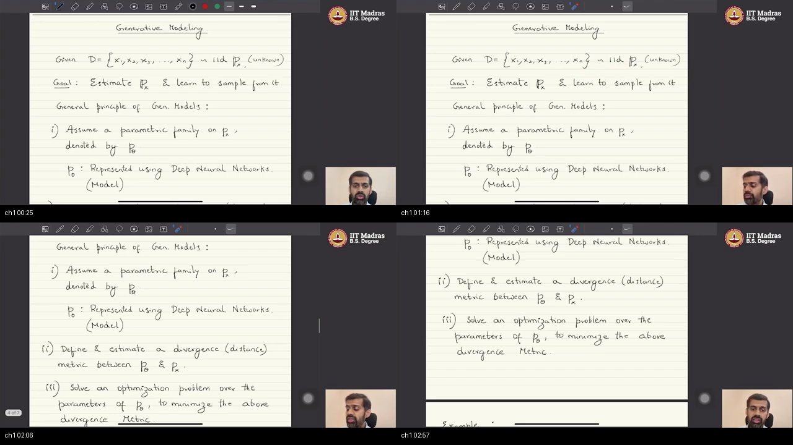
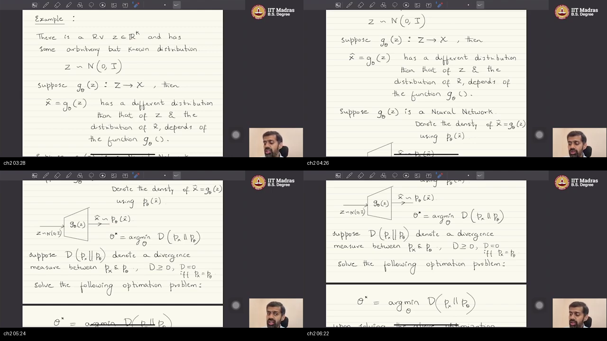
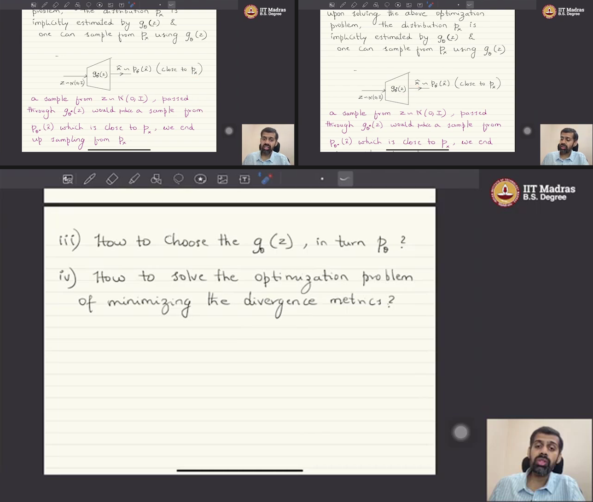
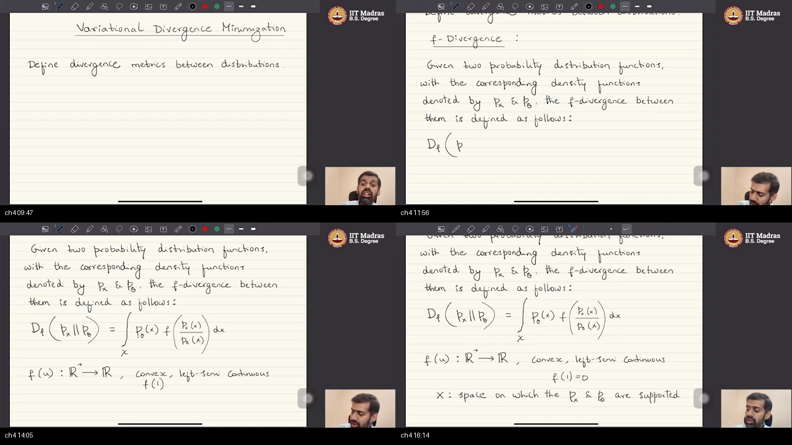
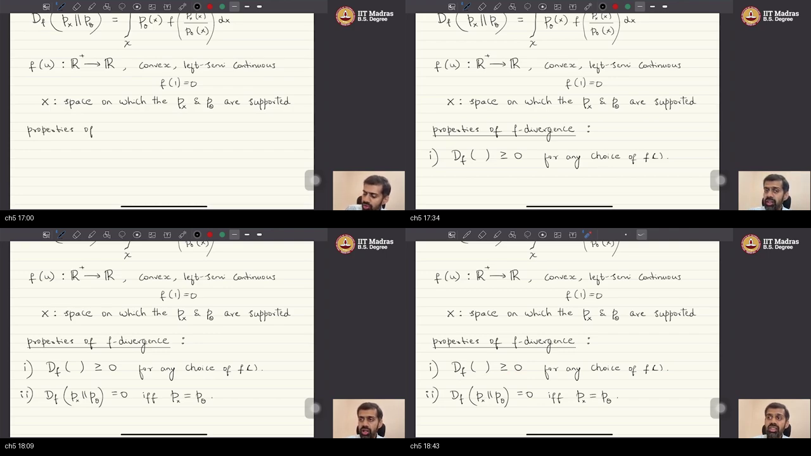
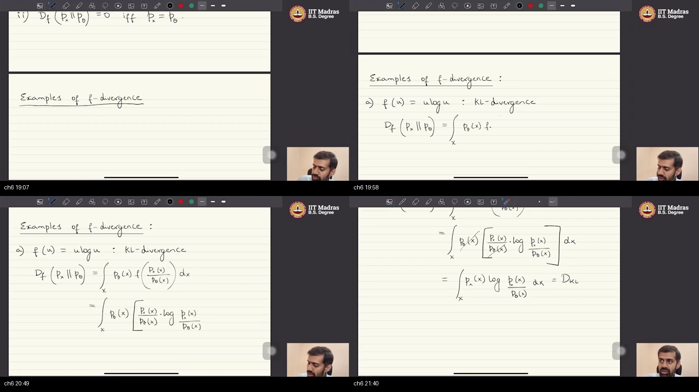
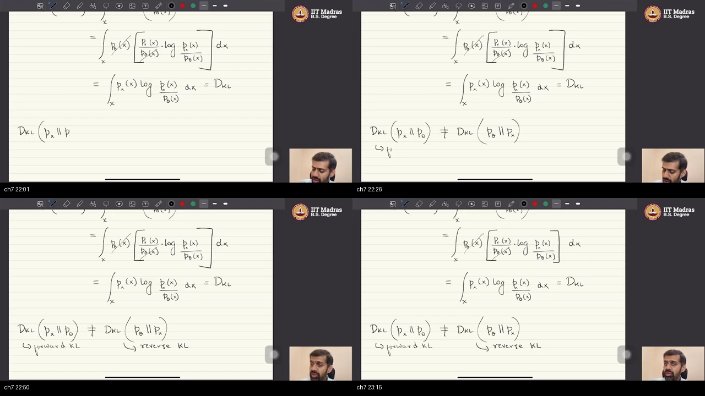
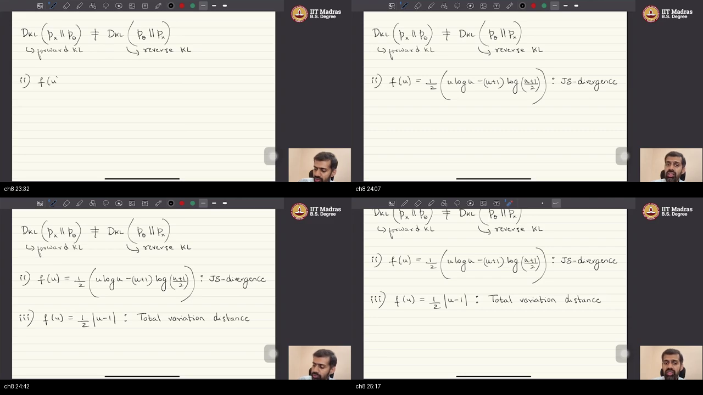
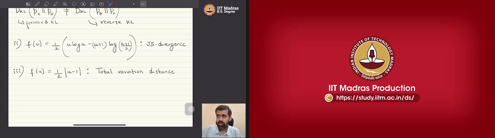

# W1_L4 — Variational Divergence Minimization & $f$-Divergence Foundations

> **Course:** IIT Madras B.S. Degree in Data Science & AI · **Mathematical Foundations of Generative AI**  
> **Instructor:** Prof. Prathosh A. P. (IISc / IITM BS Faculty)  
> **Lecture Recording:** [W1_L4 on the IITM Playlist](https://www.youtube.com/watch?v=nfZQYopzv20) (~26:08)  
> **Prerequisites Warm-up:** [PREREQUISITES.md](./PREREQUISITES.md) · **Self-Assessment Quiz:** [quiz.html](./quiz.html)  
> **Course Catalog:** [../NOTES.md](../NOTES.md)

---

## Quick Navigation Matrix

| Topic & Timestamp | Focus Area | Core Mathematical Formulation | Prerequisite Link |
| :--- | :--- | :--- | :--- |
| [Topic 1: Estimate $p_x$, Learn to Sample & 3-Step Recipe](#topic-1) (00:11–03:12) | Problem Setup | $\mathcal{D} \sim_{\text{iid}} p_x \implies \min_\theta D(p_x \parallel p_\theta)$ | [p1-px](./PREREQUISITES.md#p1-px), [p2-two-jobs](./PREREQUISITES.md#p2-two-jobs) |
| [Topic 2: Push-Forward: Samples, Not the Law](#topic-2) (03:12–06:39) | Sampling Engine | $Z \sim \mathcal{N}(0, I) \to \hat{X} = G_\theta(Z) \sim p_\theta$ | [p5-push](./PREREQUISITES.md#p5-push), [p6-samples](./PREREQUISITES.md#p6-samples) |
| [Topic 3: Four Questions; VDM is the Same Recipe](#topic-3) (06:39–09:11) | VDM Identity | 4 Foundational Holes & Push-Forward Equivalence | [p2-two-jobs](./PREREQUISITES.md#p2-two-jobs), [p4-div](./PREREQUISITES.md#p4-div) |
| [Topic 4: $f$-Divergence Definition](#topic-4) (09:11–16:51) | Master Integral | $D_f(p_x \parallel p_\theta) = \int p_\theta(x) f\left(\frac{p_x(x)}{p_\theta(x)}\right) dx$ | [p6-convex](./PREREQUISITES.md#p6-convex), [p7-f](./PREREQUISITES.md#p7-f) |
| [Topic 5: $D_f \ge 0$ & Zero iff Equal](#topic-5) (16:51–18:53) | Discrepancy Laws | Jensen's Proof: $D_f \ge f(1) = 0$ | [p4-div](./PREREQUISITES.md#p4-div), [p6-convex](./PREREQUISITES.md#p6-convex) |
| [Topic 6: KL Divergence as $f(u) = u \log u$](#topic-6) (18:53–21:55) | Algebraic Derivation | $p_\theta$ Cancellation: $\int p_x \log(p_x / p_\theta) dx$ | [p8-kl](./PREREQUISITES.md#p8-kl) |
| [Topic 7: Forward KL $\neq$ Reverse KL](#topic-7) (21:55–23:22) | Asymmetry | Mode-Covering vs. Mode-Seeking Dynamics | [p8-kl](./PREREQUISITES.md#p8-kl) |
| [Topic 8: JS & TV: Different $f$, Different Properties](#topic-8) (23:22–25:28) | Family Catalog | Chalkboard JS Spring & GAN Connection | [p8-kl](./PREREQUISITES.md#p8-kl) |
| [Topic 9: Next Horizons: Any-$f$ Algorithm & GANs](#topic-9) (25:28–26:08) | Syllabus Bridge | Variational Dual Formulation & Minimax Game | — |
| [Workplace Scenarios](#workplace-scenarios--debugging-divergences) | Practical Systems | Production Failure Modes (Mode Collapse vs Blur) | — |
| [External References](#external-references) | Multi-Source Study | 2–3 Curated Videos & 2–3 Papers/Blogs per Topic | — |

---

## Executive Summary & Master Architecture

<a id="executive-summary"></a>

In this foundational lecture, Prof. Prathosh establishes the **rigorous statistical distance yardstick** used to train deep generative models. Rather than relying on ad-hoc loss functions, generative modeling formalizes learning as the minimization of an **$f$-divergence** between the true data distribution $p_x$ and the model distribution $p_\theta$.

```
══════════════════════════════════════════════════════════════════════════════════════════════════
                     THE VARIATIONAL DIVERGENCE MINIMIZATION (VDM) BLUEPRINT
══════════════════════════════════════════════════════════════════════════════════════════════════

  1. THE GENERATIVE PARADIGM & CORE CHALLENGE
     • Data: D = {x₁, x₂, ..., xₙ} ~ iid p_x  (p_x is an UNKNOWN continuous density on ℝᴰ)
     • Dual Goal: (1) Estimate p_x  AND  (2) Learn to sample novel points x_new ~ p_θ* ≈ p_x

  2. THE 3-STEP PUSH-FORWARD RECIPE
     ┌────────────────────────────────────────────────────────────────────────────────────────┐
     │ Step 1: Model Family ──► Neural Net G_θ : ℝᵏ ──► ℝᴰ;  z ~ N(0, I) ──► x̂ = G_θ(z) ~ p_θ  │
     │         (Outputs are SAMPLES from p_θ, NOT an analytical formula for p_θ(x)!)         │
     │ Step 2: Yardstick    ──► Define statistical divergence D(p_x ‖ p_θ)                    │
     │ Step 3: Optimization ──► θ* = argmin_θ D(p_x ‖ p_θ)                                   │
     └────────────────────────────────────────────────────────────────────────────────────────┘

  3. THE f-DIVERGENCE UNIFIED METRIC FAMILY
     • Master Formula: D_f(p_x ‖ p_θ) = ∫_X p_θ(x) · f( p_x(x) / p_θ(x) ) dx
     • Required Properties on f:  f: ℝ⁺ ──► ℝ,  Convex,  Left Semi-Continuous,  f(1) = 0
     • Mathematical Invariants:   (i) D_f ≥ 0   (ii) D_f = 0  iff  p_x = p_θ (almost everywhere)

  4. THE CLASSICAL FAMILY MEMBERS
     ┌──────────────────────┬─────────────────────────────────────────────────┬───────────────┐
     │ Divergence Name      │ Generator Function f(u)                         │ Key Property  │
     ├──────────────────────┼─────────────────────────────────────────────────┼───────────────┤
     │ Forward KL           │ f(u) = u log(u)                                 │ Mode-Covering │
     │ Reverse KL           │ f(u) = -log(u)                                  │ Mode-Seeking  │
     │ Jensen-Shannon (JS)  │ f(u) = ½ [ u log u - (u+1) log((u+1)/2) ]       │ Symmetric/GAN │
     │ Total Variation (TV) │ f(u) = ½ |u - 1|                                │ L₁ Mass Shift │
     └──────────────────────┴─────────────────────────────────────────────────┴───────────────┘
══════════════════════════════════════════════════════════════════════════════════════════════════
```

---

## 📖 Chalkboard Math Rosetta Stone (Symbols $\to$ Plain English)

| Chalkboard Notation | What It Literally Means | Everyday ELI5 Mental Model |
| :--- | :--- | :--- |
| $\mathcal{D} = \{x_1, \dots, x_n\} \sim_{\text{iid}} p_x$ | $n$ fair random draws from hidden density $p_x$ | 500 baked pastries sitting in the window from a secret recipe. |
| $G_\theta: \mathbb{R}^k \to \mathbb{R}^D$ | Generator neural net mapping noise to data | The pasta machine die shaping plain dough into curly noodles. |
| $p_\theta$ | The probability distribution of generated samples | The shape of the pile of noodles created by the pasta machine. |
| $D_f(p_x \parallel p_\theta)$ | The $f$-divergence discrepancy integral | The total city-wide penalty score measuring real vs fake mismatch. |
| $u(x) = \frac{p_x(x)}{p_\theta(x)}$ | The scalar density ratio at coordinate $x$ | "How many times taller is the real sand dune vs our fake sand dune?" |
| $f(u)$ | A convex spring pinned at $f(1)=0$ | A spring at rest when dunes match ($u=1$), stretching up if they mismatch. |
| $D_{\text{JS}}$ | Jensen-Shannon Divergence | The fair, balanced compromise metric that powers GAN training. |

---

## Comparative Matrix: The $f$-Divergence Family

| Divergence Name | Generator $f(u)$ | Formula $D_f(p \parallel q)$ | Symmetric? | Bounded? | Primary GenAI Use Case |
| :--- | :--- | :--- | :---: | :---: | :--- |
| **Forward KL** | $u \log u$ | $\int p(x) \log \frac{p(x)}{q(x)} dx$ | **No** | $[0, \infty)$ | Maximum Likelihood, VAE Decoder Loss |
| **Reverse KL** | $-\log u$ | $\int q(x) \log \frac{q(x)}{p(x)} dx$ | **No** | $[0, \infty)$ | Variational Inference (ELBO), Distillation |
| **Jensen-Shannon (JS)** | $\frac{1}{2}\left(u \log u - (u+1)\log\frac{u+1}{2}\right)$ | $\frac{1}{2} D_{\text{KL}}(p \parallel M) + \frac{1}{2} D_{\text{KL}}(q \parallel M)$ | **Yes** | $[0, \log 2]$ | **Original GAN (Goodfellow et al., 2014)** |
| **Total Variation (TV)** | $\frac{1}{2}|u - 1|$ | $\frac{1}{2} \int \|p(x) - q(x)\| dx$ | **Yes** | $[0, 1]$ | Theoretical Probability, PAC Bounds |
| **Pearson $\chi^2$** | $(u - 1)^2$ | $\int \frac{(p(x) - q(x))^2}{q(x)} dx$ | **No** | $[0, \infty)$ | Least Squares GAN (LSGAN) |

---

## Complete Hands-On Implementation in Python / PyTorch

```python
import torch
import torch.nn as nn
import numpy as np

# ==============================================================================
# 1. PUSHFORWARD GENERATIVE ENGINE DEMONSTRATION
# ==============================================================================
class PushforwardGenerator(nn.Module):
    """Maps tractable latent noise z ~ N(0, I) to high-dimensional data space."""
    def __init__(self, latent_dim=16, data_dim=784):
        super().__init__()
        self.net = nn.Sequential(
            nn.Linear(latent_dim, 128),
            nn.LeakyReLU(0.2),
            nn.Linear(128, data_dim),
            nn.Tanh()
        )

    def forward(self, z):
        return self.net(z)

# Initialize generator
latent_dim, data_dim = 16, 784
G_theta = PushforwardGenerator(latent_dim, data_dim)

# Draw batch of standard normal noise vectors: z ~ N(0, I)
batch_size = 64
z = torch.randn(batch_size, latent_dim)

# Push forward through deterministic network: outputs are SAMPLES from p_theta
fake_samples = G_theta(z)
print(f"Generated sample cloud shape: {fake_samples.shape} (No analytical density formula needed!)")

# ==============================================================================
# 2. NUMERICAL VERIFICATION OF f-DIVERGENCES ON 1D DISTRIBUTIONS
# ==============================================================================
def compute_f_divergence_1d(px, p_theta, dx, f_generator):
    """
    Computes D_f(px || p_theta) = ∫ p_theta(x) * f( px(x) / p_theta(x) ) dx
    using numerical Riemann integration over support domain.
    """
    ratio = px / (p_theta + 1e-12)  # u(x) = px(x) / p_theta(x)
    integrand = p_theta * f_generator(ratio)
    return np.sum(integrand) * dx

# Define 1D grid
x_grid = np.linspace(-5, 5, 2000)
dx = x_grid[1] - x_grid[0]

# True distribution p_x ~ N(0, 1) and Model distribution p_theta ~ N(0.8, 1.2^2)
p_x = (1.0 / np.sqrt(2 * np.pi)) * np.exp(-0.5 * x_grid**2)
p_theta = (1.0 / (np.sqrt(2 * np.pi) * 1.2)) * np.exp(-0.5 * ((x_grid - 0.8) / 1.2)**2)

# Generators f(u)
f_forward_kl = lambda u: u * np.log(u + 1e-12)
f_reverse_kl = lambda u: -np.log(u + 1e-12)
f_js = lambda u: 0.5 * (u * np.log(u + 1e-12) - (u + 1) * np.log((u + 1) / 2.0 + 1e-12))
f_tv = lambda u: 0.5 * np.abs(u - 1.0)

# Compute values
d_fkl = compute_f_divergence_1d(p_x, p_theta, dx, f_forward_kl)
d_rkl = compute_f_divergence_1d(p_x, p_theta, dx, f_reverse_kl)
d_js = compute_f_divergence_1d(p_x, p_theta, dx, f_js)
d_tv = compute_f_divergence_1d(p_x, p_theta, dx, f_tv)

print(f"\n--- Statistical Divergence Values ---")
print(f"Forward KL  D_KL(p_x || p_theta): {d_fkl:.4f}")
print(f"Reverse KL  D_KL(p_theta || p_x): {d_rkl:.4f} (Note: Asymmetric! d_fkl != d_rkl)")
print(f"Jensen-Shannon D_JS(p_x || p_theta): {d_js:.4f} (Bounded in [0, log 2])")
print(f"Total Variation D_TV(p_x || p_theta): {d_tv:.4f} (Bounded in [0, 1])")
```

---

<a id="topic-1"></a>
## Topic 1: Recap: Estimate, Sample & 3-Step Recipe (00:11–03:12)

### 👶 ELI5 Quick Intuition
Imagine you want to clone a secret bakery recipe. You are given 100 sample croissants ($\mathcal{D}$). You can't just be a food critic who inspects croissants; you must actually **learn how to bake 50 new croissants** every morning. The 3-step recipe: (1) Buy a programmable oven ($p_\theta$), (2) Measure how different your bread tastes from the real bread ($D$), and (3) Tweak your oven temperature dials until the difference hits zero ($\theta^\star$).

### Master Map Placement
Establishes pedagogical continuity from Lecture 2: defining the formal goal of generative modeling and previewing GANs as a specific member of the Variational Divergence Minimization family.

### Chalkboard Screenshot

*Figure 1.1 (~00:14–03:05):* Prof. Prathosh transcribes the formal mathematical definition of generative modeling: *Given dataset $\mathcal{D} = \{x_1, \dots, x_n\} \sim_{\text{iid}} p_x$ (unknown), the goal is to estimate $p_x$ and learn to sample from it.*

### In-Depth Conceptual Exposition

* **Formal Problem Setting:**
  * We are provided an empirical dataset $\mathcal{D} = \{x_1, x_2, \dots, x_n\}$ consisting of $n$ independent and identically distributed ($\text{IID}$) vectors drawn from an underlying, continuous, unknown probability density function $p_x$.
  * **The Dual Objective:**
    1. **Estimate $p_x$:** Align candidate distribution $p_\theta$ with $p_x$ (either explicitly through density estimation or implicitly through parameter matching).
    2. **Learn to Sample:** Construct an efficient procedure to draw novel samples $x_{\text{new}} \sim p_x$ that never existed in the training dataset $\mathcal{D}$.
* **The 3-Step Generative Modeling Recipe:**
  1. **Assume a Parametric Family ($p_\theta$):** Represent the candidate probability distribution using deep neural networks parameterized by synaptic weights $\theta \in \Theta$. This neural network is referred to as **the model**.
  2. **Define a Statistical Divergence Metric ($D$):** Define a rigorous discrepancy measure $D(p_x \parallel p_\theta)$ that quantifies the statistical distance between the true distribution $p_x$ and model distribution $p_\theta$.
  3. **Solve the Optimization Problem:**
     $$\theta^\star = \arg\min_\theta \, D(p_x \parallel p_\theta)$$
     Adjust the weights $\theta$ so that $p_\theta$ approaches $p_x$ as closely as possible.

```
       EMPIRICAL REALITY                      THE 3-STEP RECIPE
  ┌─────────────────────────┐     ┌──────────────────────────────────────┐
  │ D = {x₁, ..., xₙ}       │ ──► │ 1. Assume p_θ via Deep Neural Net   │
  │ i.i.d. draws from p_x   │     │ 2. Define Divergence D(p_x ‖ p_θ)    │
  │ (Formula for p_x is     │     │ 3. Solve θ* = argmin_θ D(p_x ‖ p_θ)  │
  │  completely UNKNOWN!)   │     └──────────────────────────────────────┘
  └─────────────────────────┘
```

---

<a id="topic-2"></a>
## Topic 2: Push-Forward: Samples, Not the Law (03:12–06:39)

### 👶 ELI5 Quick Intuition
You feed plain, uniform dough ($Z \sim \mathcal{N}(0, I)$) into a pasta extruder ($G_\theta$). Out comes curly rigatoni noodles ($\hat{X}$). The shape of the noodles is determined entirely by the metal die inside the extruder. Notice: when noodles drop into the bowl, **you hold physical noodles (samples)**; the machine does not print out a mathematical physics equation of pasta density!

### Master Map Placement
Introduces the push-forward generative mechanism: mapping tractable latent Gaussian noise through a deep neural network to induce a complex output distribution.

### Chalkboard Screenshot

*Figure 2.1 (~03:15–06:35):* The push-forward diagram on the chalkboard: standard normal noise $z \sim \mathcal{N}(0, I)$ is passed through deterministic neural network $G_\theta(z)$, producing sample cloud $\hat{x} \sim p_\theta$.

### In-Depth Conceptual Exposition

* **The Push-Forward Principle:**
  * Let $Z \in \mathbb{R}^k$ be an easily tractable random variable from which we can trivially draw samples, typically a standard multivariate normal distribution:
    $$Z \sim \mathcal{N}(0, I_k)$$
  * Let $G_\theta: \mathbb{R}^k \to \mathbb{R}^D$ be a deterministic deep neural network mapping latent vectors to the high-dimensional data space.
  * By elementary probability theory, pushing a random variable $Z$ through a deterministic function $G_\theta$ yields a new random variable $\hat{X} = G_\theta(Z)$ whose probability distribution $p_\theta$ is completely dictated by the architecture and weights of $G_\theta$.
* **The Crucial Distinction — Samples vs. Density Function:**
  * **What $G_\theta$ produces:** Running a forward pass $G_\theta(z)$ generates concrete numerical vectors (**samples from $p_\theta$**).
  * **What $G_\theta$ DOES NOT produce:** The network does not output a closed-form mathematical expression for the density function $p_\theta(x)$!
* **Optimal Parameter Convergence:**
  * If the divergence $D(p_x \parallel p_\theta)$ is strictly non-negative and equals zero if and only if $p_\theta = p_x$, then solving $\theta^\star = \arg\min_\theta D(p_x \parallel p_\theta)$ guarantees that $p_{\theta^\star} \approx p_x$.
  * Consequently, sampling $z \sim \mathcal{N}(0, I)$ and passing it through the trained network $G_{\theta^\star}(z)$ yields authentic samples from the true data distribution $p_x$!

```
  LATENT SPACE (Easy)                 NEURAL ENGINE                    DATA SPACE (Complex)
 ┌───────────────────┐             ┌──────────────────┐             ┌─────────────────────────┐
 │ z ~ N(0, I_k)     │ ──────────► │ G_θ(z) Deep Net  │ ──────────► │ x̂ = G_θ(z) ~ p_θ(x̂)     │
 │ Trivial to sample │             │ Parameterized    │             │ Samples ONLY!           │
 │ (torch.randn)     │             │ by weights θ     │             │ (No density p_θ formula)│
 └───────────────────┘             └──────────────────┘             └─────────────────────────┘
```

---

<a id="topic-3"></a>
## Topic 3: Four Questions; VDM is the Same Recipe (06:39–09:11)

### 👶 ELI5 Quick Intuition
You have two photo albums: 1,000 photos of real faces ($\mathcal{D}$), and 1,000 photos created by your computer ($G_\theta(z)$). You don't have the lighting physics formulas for either album. **How can you compute how different the two albums are using ONLY the photos themselves?** That is Question 1. Prof. Prathosh reveals: Variational Divergence Minimization (VDM) is the exact mathematical answer to this question!

### Master Map Placement
Identifies the four fundamental computational roadblocks in generative modeling and proclaims the core thesis: Variational Divergence Minimization (VDM) is mathematically equivalent to the push-forward optimization recipe.

### Chalkboard Screenshot

*Figure 3.1 (~06:40–09:05):* Prof. Prathosh details the 4 core questions on the board and emphasizes that Variational Divergence Minimization is no different from the push-forward recipe.

### In-Depth Conceptual Exposition

Prof. Prathosh articulates the four fundamental questions that any generative modeling framework must address:

1. **Question 1 (The Density Evaluation Roadblock):**  
   *How do we compute a statistical divergence $D(p_x \parallel p_\theta)$ when we possess neither the analytical density function $p_x(x)$ nor $p_\theta(x)$?*  
   We only have empirical samples $\{x_i\} \sim p_x$ and generator outputs $\{\hat{x}_j\} \sim p_\theta$.
2. **Question 2 (The Metric Selection Choice):**  
   *What is the optimal mathematical choice for the divergence metric $D$?*
3. **Question 3 (The Generator Architecture Choice):**  
   *How do we design the neural network architecture $G_\theta$ (which implicitly defines $p_\theta$)?*
4. **Question 4 (The Optimization Strategy):**  
   *How do we numerically solve the optimization problem $\min_\theta D(p_x \parallel p_\theta)$ using stochastic gradient descent?*

* **The Core Slogan of the Lecture:**
  > *"Variational Divergence Minimization (VDM) is no different from the push-forward generative modeling recipe."*  
  VDM is the formal variational framework designed specifically to solve Question 1: estimating and minimizing $f$-divergences using **only empirical sample clouds**.

```
                         THE FOUR FOUNDATIONAL QUESTIONS
  ┌─────────────────────────────────────────────────────────────────────────────┐
  │ Q1: How to evaluate D(p_x ‖ p_θ) from SAMPLE CLOUDS ALONE? (No densities!)  │
  │ Q2: Which divergence metric D should we choose?                             │
  │ Q3: Which neural architecture G_θ should represent p_θ?                     │
  │ Q4: How to solve the minimization optimization problem efficiently?         │
  └─────────────────────────────────────────────────────────────────────────────┘
                                        │
                                        ▼
                  VDM IS THE MATHEMATICAL ANSWER TO Q1 & Q2!
```

---

<a id="topic-4"></a>
## Topic 4: $f$-Divergence Definition (09:11–16:51)

### 👶 ELI5 Quick Intuition
Imagine measuring the mismatch between two mountain ranges across a continent. At every GPS coordinate $x$, you look at the height of the real mountain ($p_x(x)$) and your model's mountain ($p_\theta(x)$). You take their height ratio $u = p_x / p_\theta$. You feed that single number into a penalty spring $f(u)$. When the heights match ($u=1$), the spring is relaxed ($f(1)=0$). When they mismatch, the spring stretches and charges a penalty!

### Master Map Placement
Introduces the formal mathematical definition of the $f$-divergence family and establishes the required analytical properties of the generator function $f(u)$.

### Chalkboard Screenshot

*Figure 4.1 (~09:15–16:45):* Prof. Prathosh writes the master $f$-divergence definition on the board: $D_f(p_x \parallel p_\theta) = \int_{\mathcal{X}} p_\theta(x) f\left(\frac{p_x(x)}{p_\theta(x)}\right) dx$, detailing the three strict conditions on $f(u)$.

### In-Depth Conceptual Exposition

* **Formal Mathematical Definition:**
  Let $p_x$ and $p_\theta$ be continuous probability density functions supported on $\mathcal{X} \subseteq \mathbb{R}^D$. The **$f$-divergence** between $p_x$ and $p_\theta$ is defined as:
  $$D_f(p_x \parallel p_\theta) = \int_{\mathcal{X}} p_\theta(x) \, f\left(\frac{p_x(x)}{p_\theta(x)}\right) dx$$
* **The Three Mandatory Properties on Generator Function $f(u)$:**
  1. **Convexity:** $f: \mathbb{R}^+ \to \mathbb{R}$ must be a convex function over positive reals ($f(\lambda u_1 + (1-\lambda) u_2) \le \lambda f(u_1) + (1-\lambda) f(u_2)$).
  2. **Left Semi-Continuity:** $f$ cannot exhibit upward jump discontinuities as $u$ approaches a point from the left ($\liminf_{u \to u_0^-} f(u) \ge f(u_0)$).
  3. **Zero Anchor Point:**
     $$f(1) = 0$$
     When distributions match locally ($p_x(x) = p_\theta(x) \implies u=1$), the local penalty vanishes ($f(1)=0$).
* **Why the Density Ratio $u(x)$ is a Scalar:**
  * Even though the data space $\mathcal{X}$ is $D$-dimensional (e.g., $D = 480{,}000$ for high-resolution images), evaluating probability densities at any point $x$ produces two scalar heights: $p_x(x) \in \mathbb{R}^+$ and $p_\theta(x) \in \mathbb{R}^+$.
  * Therefore, the density ratio:
    $$u(x) = \frac{p_x(x)}{p_\theta(x)} \in \mathbb{R}^+$$
    is a **single positive scalar real number**. $f$ operates purely on this 1D scalar ratio!

```
  MASTER INTEGRAL BREAKDOWN:
  ─────────────────────────────────────────────────────────────────────────────
                ┌── Outer expectation weight: p_θ(x)
                │
   D_f = ∫_X  p_θ(x) · f( p_x(x) / p_θ(x) )  dx
                          └────────┬────────┘
                                   └── Ratio u(x) is a 1D SCALAR in ℝ⁺!
                                       f(u) evaluated on single numbers.
```

---

<a id="topic-5"></a>
## Topic 5: $D_f \ge 0$ and Zero iff Equal (16:51–18:53)

### 👶 ELI5 Quick Intuition
Think of a curved salad bowl resting on a table. The lowest point of the bowl touches the table at height 0 (when $u=1$). No matter where you place marbles in the bowl, their average center of gravity (Jensen's inequality) will always be **at or above table height (0)**. The only way the average height can be exactly 0 is if every single marble sits at the bottom ($p_x = p_\theta$).

### Master Map Placement
Proves the two core mathematical invariants that qualify $f$-divergences as valid, reliable objective functions for training generative neural networks.

### Chalkboard Screenshot

*Figure 5.1 (~16:55–18:48):* The two foundational properties transcribed on the chalkboard: (1) $D_f \ge 0$ for any admissible $f$, and (2) $D_f(p_x \parallel p_\theta) = 0$ if and only if $p_x = p_\theta$.

### In-Depth Conceptual Exposition

* **Property 1: Universal Non-Negativity:**
  $$D_f(p_x \parallel p_\theta) \ge 0 \quad \text{for every admissible } f$$
* **Property 2: Identity of Indiscernibles:**
  $$D_f(p_x \parallel p_\theta) = 0 \iff p_x = p_\theta \quad (\text{almost everywhere})$$
* **Proof via Jensen's Inequality:**
  Let $U = \frac{p_x(X)}{p_\theta(X)}$ where random variable $X \sim p_\theta$.  
  By definition of expectation:
  $$D_f(p_x \parallel p_\theta) = \mathbb{E}_{X \sim p_\theta}[f(U)]$$
  Since $f$ is convex, Jensen's inequality guarantees:
  $$\mathbb{E}_{X \sim p_\theta}[f(U)] \ge f\left(\mathbb{E}_{X \sim p_\theta}[U]\right)$$
  Computing the expectation of the density ratio:
  $$\mathbb{E}_{X \sim p_\theta}[U] = \int_{\mathcal{X}} p_\theta(x) \left(\frac{p_x(x)}{p_\theta(x)}\right) dx = \int_{\mathcal{X}} p_x(x) \, dx = 1$$
  Substituting back into Jensen's bound:
  $$D_f(p_x \parallel p_\theta) \ge f(1) = 0 \quad (\text{since } f(1) = 0)$$
* **Why This Dictates Generative Training:**
  Because the global minimum of $D_f$ is bounded below by $0$ and achieved **uniquely** when $p_\theta = p_x$, solving $\min_\theta D_f(p_x \parallel p_\theta)$ guarantees that converging to zero loss aligns the generator distribution perfectly with the real data!

```
   JENSEN'S INEQUALITY PROOF CHAIN:
   ┌───────────────────────────────────────────────────────────────────────────┐
   │ D_f = E_{p_θ}[ f(p_x / p_θ) ]                                             │
   │     ≥ f( E_{p_θ}[ p_x / p_θ ] )          (Jensen's Inequality on convex f)│
   │     = f( ∫ p_x(x) dx )                  (p_θ cancels in expectation)      │
   │     = f( 1 ) = 0                        (Total probability & f(1)=0)      │
   │  ⟹ D_f(p_x ‖ p_θ) ≥ 0                                                   │
   └───────────────────────────────────────────────────────────────────────────┘
```

---

<a id="topic-6"></a>
## Topic 6: KL is $f(u) = u \log u$ (18:53–21:55)

### 👶 ELI5 Quick Intuition
If you choose the spring recipe $f(u) = u \log u$, something magical happens on the chalkboard: the model distribution $p_\theta(x)$ on the outside of the integral **cancels out completely** with the $p_\theta(x)$ in the bottom of the ratio! You are left with the world-famous **Kullback-Leibler (KL) Divergence**. This proves KL divergence is just one child of the bigger $f$-divergence family!

### Master Map Placement
Derives the classical Kullback-Leibler (KL) divergence as an exact special case of the $f$-divergence master integral.

### Chalkboard Screenshot

*Figure 6.1 (~18:56–21:50):* Prof. Prathosh substitutes $f(u) = u \log u$ into the $f$-divergence definition, demonstrating the cancellation of $p_\theta(x)$ to recover the standard KL formula.

### In-Depth Conceptual Exposition

* **Generator Function:**
  $$f(u) = u \log u$$
  * Verification: $f(1) = 1 \cdot \log(1) = 0$.
  * Second derivative $f''(u) = \frac{1}{u} > 0$ for $u > 0 \implies$ strictly convex!
* **Step-by-Step Algebraic Derivation:**
  1. Substitute $f(u) = u \log u$ into the master integral:
     $$D_f(p_x \parallel p_\theta) = \int_{\mathcal{X}} p_\theta(x) \left[ \left(\frac{p_x(x)}{p_\theta(x)}\right) \log\left(\frac{p_x(x)}{p_\theta(x)}\right) \right] dx$$
  2. The $p_\theta(x)$ in the outer integral cancels with the denominator of the ratio:
     $$D_f(p_x \parallel p_\theta) = \int_{\mathcal{X}} p_x(x) \log\left(\frac{p_x(x)}{p_\theta(x)}\right) dx$$
  3. This is precisely the definition of **Kullback-Leibler Divergence**:
     $$D_f(p_x \parallel p_\theta) = D_{\text{KL}}(p_x \parallel p_\theta)$$

```
   f(u) = u log(u)
   
   D_f = ∫ p_θ(x) · [ (p_x(x) / p_θ(x)) · log(p_x(x) / p_θ(x)) ] dx
            │               │
            └───────┬───────┘
                    ▼
          p_θ(x) CANCELS OUT!
                    ▼
   D_f = ∫ p_x(x) log( p_x(x) / p_θ(x) ) dx  ≡  D_KL(p_x ‖ p_θ)
```

---

<a id="topic-7"></a>
## Topic 7: Forward KL $\neq$ Reverse KL (21:55–23:22)

### 👶 ELI5 Quick Intuition
Driving from Home to Work on a one-way street is not the same as driving from Work to Home.  
* **Forward KL (Home $\to$ Work):** The model is terrified of leaving out any real data point. If real data has cats and dogs, the model creates blurry cat-dog hybrids so it covers both.
* **Reverse KL (Work $\to$ Home):** The model is terrified of creating unrealistic images. It focuses 100% on cats, making sharp cat photos, but completely forgets that dogs exist (Mode Collapse).

### Master Map Placement
Examines the asymmetry of KL divergence ($D_{\text{KL}}(p_x \parallel p_\theta) \neq D_{\text{KL}}(p_\theta \parallel p_x)$) and explains how this fundamental asymmetry motivates exploring other members of the $f$-divergence family.

### Chalkboard Screenshot

*Figure 7.1 (~21:58–23:20):* Prof. Prathosh writes the asymmetry relation $D_{\text{KL}}(p_x \parallel p_\theta) \neq D_{\text{KL}}(p_\theta \parallel p_x)$ on the board, defining Forward KL vs. Reverse KL.

### In-Depth Conceptual Exposition

* **The Asymmetry Principle:**
  $$D_{\text{KL}}(p_x \parallel p_\theta) \neq D_{\text{KL}}(p_\theta \parallel p_x)$$
  * **Forward KL:** $D_{\text{KL}}(p_x \parallel p_\theta) = \int p_x(x) \log \frac{p_x(x)}{p_\theta(x)} dx = \mathbb{E}_{x \sim p_x}\left[\log \frac{p_x(x)}{p_\theta(x)}\right]$
  * **Reverse KL:** $D_{\text{KL}}(p_\theta \parallel p_x) = \int p_\theta(x) \log \frac{p_\theta(x)}{p_x(x)} dx = \mathbb{E}_{x \sim p_\theta}\left[\log \frac{p_\theta(x)}{p_x(x)}\right]$
* **Behavioral Consequences in Generative Modeling:**
  * **Forward KL (Zero-Avoiding / Mode-Covering):**  
    Wherever $p_x(x) > 0$, the model must ensure $p_\theta(x) > 0$; otherwise $\frac{p_x(x)}{p_\theta(x)} \to \infty$ and loss explodes. As a result, the model spreads its probability mass broadly over all data modes, often placing mass in low-density valleys (leading to blurry generated images).
  * **Reverse KL (Zero-Forcing / Mode-Seeking):**  
    Wherever $p_x(x) \approx 0$, the model is heavily penalized if $p_\theta(x) > 0$. As a result, the model restricts itself tightly to a single mode where it is confident (leading to sharp images, but risking mode collapse).

```
   MODE-COVERING (Forward KL)              MODE-SEEKING (Reverse KL)
   ▲                                       ▲
   │    ┌───────────────────┐              │    ┌───┐
   │   ┌┘                   └┐             │   ┌┘   └┐
   └───┴─────────────────────┴───► x       └───┴─────┴───────────────────► x
    Spreads mass over all modes!            Locks onto ONE mode tightly!
    (Blurry samples in between)             (Sharp samples, mode collapse)
```

---

<a id="topic-8"></a>
## Topic 8: JS and TV: Different $f$, Different Properties (23:22–25:28)

### 👶 ELI5 Quick Intuition
If Forward KL is too blurry and Reverse KL drops modes, can we find a **balanced, fair compromise**?  
Yes! We create a balanced spring called **Jensen-Shannon (JS) Divergence**. It measures how far both distributions are from their midpoint average. It is perfectly symmetric, smooth, and never explodes to infinity. **This is why GANs were built on Jensen-Shannon divergence!**

### Master Map Placement
Introduces the exact chalkboard generator formulas for Jensen-Shannon (JS) divergence and Total Variation (TV) distance, connecting JS divergence to Generative Adversarial Networks (GANs).

### Chalkboard Screenshot

*Figure 8.1 (~23:25–25:25):* Prof. Prathosh transcribes the generator functions for Jensen-Shannon divergence ($f(u) = \frac{1}{2}(u \log u - (u+1)\log\frac{u+1}{2})$) and Total Variation distance ($f(u) = \frac{1}{2}|u-1|$).

### In-Depth Conceptual Exposition

* **1. Jensen-Shannon (JS) Divergence:**
  * **Generator Function on Chalkboard:**
    $$f(u) = \frac{1}{2}\left( u \log u - (u+1)\log\left(\frac{u+1}{2}\right) \right)$$
  * **Key Mathematical Features:**
    * **Symmetric:** $D_{\text{JS}}(p_x \parallel p_\theta) = D_{\text{JS}}(p_\theta \parallel p_x)$.
    * **Bounded:** $0 \le D_{\text{JS}}(p_x \parallel p_\theta) \le \log(2) \approx 0.693$.
    * **Connection to GANs:** Prof. Prathosh explicitly highlights that the optimal minimax objective of Generative Adversarial Networks (Goodfellow et al., 2014) minimizes a version of this exact Jensen-Shannon divergence!
* **2. Total Variation (TV) Distance:**
  * **Generator Function:**
    $$f(u) = \frac{1}{2}|u - 1|$$
  * **Induced Divergence:**
    $$D_{\text{TV}}(p_x \parallel p_\theta) = \frac{1}{2}\int_{\mathcal{X}} |p_x(x) - p_\theta(x)| \, dx$$
  * Measures the maximum difference between probabilities assigned to any event $A \subseteq \mathcal{X}$.

```
   ┌─────────────────────────────────────────────────────────────────────────────┐
   │                       THE THREE CHALKBOARD GENERATORS                       │
   │                                                                             │
   │   (a) KL Divergence:         f(u) = u log(u)                                │
   │   (b) Jensen-Shannon (JS):   f(u) = ½ [ u log u - (u+1) log((u+1)/2) ]      │
   │   (c) Total Variation (TV):  f(u) = ½ |u - 1|                               │
   │                                                                             │
   │   All satisfy: f: ℝ⁺ ──► ℝ,  Convex,  Left Semi-Continuous,  f(1) = 0       │
   └─────────────────────────────────────────────────────────────────────────────┘
```

---

<a id="topic-9"></a>
## Topic 9: Next Horizons: Generic Any-$f$ Algorithm & GANs (25:28–26:08)

### 👶 ELI5 Quick Intuition
We have defined this beautiful $f$-divergence yardstick on the board. But there is still one big problem: **we cannot compute the integral because we don't have density formulas for real images or fake images!**  
In the next lecture (W2_L5), we will introduce a mathematical trick (the Fenchel conjugate) that lets a neural network (the Discriminator / Critic) measure this distance using **only sample batches**. Setting the spring to JS will give birth to the famous **GAN algorithm**!

### Master Map Placement
Concludes the lecture by charting the path forward: transitioning from defining $f$-divergence on the board to building a practical algorithm that minimizes any $f$-divergence from sample clouds alone.

### Chalkboard Screenshot

*Figure 9.1 (~25:30–26:08):* The final summary slide and course production card. Prof. Prathosh outlines the roadmap for the upcoming lecture: deriving the generic VDM variational bound and recovering GANs.

### In-Depth Conceptual Exposition

* **The Pending Challenge (Question 1 Revisited):**
  * In this lecture, we defined $D_f(p_x \parallel p_\theta) = \int p_\theta(x) f(p_x(x)/p_\theta(x)) dx$.
  * However, calculating this integral directly requires closed-form formulas for $p_x(x)$ and $p_\theta(x)$, which we do not have!
* **The Solution in Lecture 5 (W2_L5):**
  * In the next lecture, we will utilize the **Fenchel Convex Conjugate** $f^*(t) = \sup_{u > 0} \{ut - f(u)\}$ to transform the intractable integral into a **variational dual lower bound**:
    $$D_f(p_x \parallel p_\theta) \ge \sup_{T \in \mathcal{T}} \left( \mathbb{E}_{x \sim p_x}[T(x)] - \mathbb{E}_{x \sim p_\theta}[f^*(T(x))] \right)$$
  * This dual representation can be computed purely by evaluating expectations over **empirical sample batches** from $p_x$ and generated batches from $G_\theta(z)$!
  * Parameterizing the variational critic $T$ as a neural network and setting $f$ to the JS generator reproduces the exact **Generative Adversarial Network (GAN)** minimax optimization objective!

```
   THIS LECTURE (W1_L4)                  NEXT LECTURE (W2_L5)
  ┌─────────────────────────┐           ┌────────────────────────────────────────┐
  │ Defined f-divergence    │           │ Derive Fenchel Dual Lower Bound via f* │
  │ D_f = ∫ p_θ f(p_x/p_θ)  │ ────────► │ D_f ≥ sup_T { E_px[T] - E_pθ[f*(T)] }  │
  │ (KL, JS, TV Generators) │           │ Set f = JS ──► RECOVER ORIGINAL GAN!   │
  └─────────────────────────┘           └────────────────────────────────────────┘
```

---

## Workplace Scenarios & Debugging Divergences

### Scenario 1: Diagnosing Blurry VAE Images vs Mode-Collapsed GAN Images
* **Context:** An AI engineer observes that a Variational Autoencoder (VAE) trained on face images produces blurry faces that look like an average of multiple people, whereas a GAN produces razor-sharp faces but only generates blond female faces (failing to produce male or elderly faces).
* **Mathematical Root Cause:**
  * **VAE uses Forward KL ($D_{\text{KL}}(p_x \parallel p_\theta)$):** Penalizes $p_\theta(x) = 0$ where $p_x(x) > 0$ with $\infty$. The model avoids zero density at all costs by spreading probability mass across all data modes, generating blurred interpolations in low-density valleys.
  * **GAN approximates JS / Reverse KL ($D_{\text{KL}}(p_\theta \parallel p_x)$):** Penalizes placing generated mass where $p_x(x) = 0$. The generator minimizes loss by locking onto a single high-density mode where it can reliably fool the discriminator, collapsing onto one mode.
* **Production Remedy:** Utilize an $f$-divergence with adaptive curvature (such as $f$-GAN with Jensen-Shannon or Wasserstein-1 distance with gradient penalty).

### Scenario 2: Density Ratio Explosion in High Dimensions
* **Context:** A machine learning researcher attempts to estimate $D_f(p_x \parallel p_\theta)$ by fitting a Kernel Density Estimator (KDE) to $p_x$ and $p_\theta$ and computing numerical ratios $\frac{\hat{p}_x(x)}{\hat{p}_\theta(x)}$. In 512-dimensional feature space, the ratio evaluates to `NaN` or `inf` everywhere.
* **Mathematical Root Cause:** Due to the curse of dimensionality, non-parametric density estimation suffers catastrophic variance. In high dimensions, sample supports are disjoint manifolds, causing $p_\theta(x) \to 0$ almost everywhere on real data points.
* **Production Remedy:** Abandon direct density ratio calculation; use the **variational dual bound** (Fenchel conjugate critic $T_\omega$) introduced in W2_L5.

---

## External References

> Comprehensive multi-source learning materials curated for every subtopic in this lecture.

### Topic 1 — Generative Modeling Dual Objective & 3-Step Recipe
* **Video Lectures:**
  1. [Stanford CS236: Deep Generative Models — Lecture 1 (Stefano Ermon)](https://www.youtube.com/watch?v=3Zv-gokhLu8) — Comprehensive breakdown of density estimation vs sampling.
  2. [MIT 6.S191: Introduction to Deep Generative Models (Alexander Amini)](https://www.youtube.com/watch?v=R8V8CbuxryI) — Intuitive visual overview of autoencoders, VAEs, and GANs.
  3. [DeepLearningAI: Generative Adversarial Networks Specialization — Overview](https://www.youtube.com/watch?v=Gib_kiXgnvA) — Andrew Ng's introduction to generative modeling principles.
* **Articles & Papers:**
  1. [Lilian Weng: From GAN to WGAN](https://lilianweng.github.io/posts/2017-08-20-gan/) — Comprehensive mathematical survey of generative models and divergence metrics.
  2. [Stanford CS236 Official Course Notes: Introduction to Generative Modeling](https://deepgenerativemodels.github.io/notes/overview/) — Formal taxonomy of explicit vs implicit generative models.
  3. [Ian Goodfellow: NIPS 2016 Tutorial on Generative Adversarial Networks (arXiv:1701.00160)](https://arxiv.org/abs/1701.00160) — Seminal tutorial outlining the generative framework.

### Topic 2 — Push-Forward Sampling Mechanism & $G_\theta(z)$
* **Video Lectures:**
  1. [3Blue1Brown: Neural Networks and Deep Learning Chapter 1](https://www.youtube.com/watch?v=aircAruvnKk) — Visualizing neural networks as multi-dimensional coordinate transformations.
  2. [Luis Serrano: A Friendly Introduction to Generative Adversarial Networks](https://www.youtube.com/watch?v=8L11aMN5KY8) — Intuitive geometric guide to how $G(z)$ transforms random noise into images.
  3. [Stanford CS231n: Lecture 13 — Generative Models](https://www.youtube.com/watch?v=5WoItGTWV54) — Serena Yeung's breakdown of generator forward passes.
* **Articles & Papers:**
  1. [Ferenc Huszár: Gaussian Distributions are Everywhere: The Push-Forward Measure](https://www.inference.vc/high-dimensional-gaussian-distributions-are-soap-bubble/) — Deep technical blog on pushing Gaussian noise through deep nets.
  2. [Distill.pub: Deconvolution and Checkerboard Artifacts](https://distill.pub/2016/deconv-checkerboard/) — How generator architectures transform latent tensors into spatial feature maps.
  3. [PyTorch Official Documentation: Deep Convolutional GAN (DCGAN) Tutorial](https://pytorch.org/tutorials/beginner/dcgan_faces_tutorial.html) — Hands-on PyTorch implementation of push-forward generator networks.

### Topic 3 — The Four Foundational Questions & VDM Framework
* **Video Lectures:**
  1. [Stanford CS236: Lecture 9 — Variational Divergence Minimization](https://www.youtube.com/watch?v=M3Fkvu78ZXc) — Stefano Ermon's derivation of sample-based divergence estimation.
  2. [Carnegie Mellon University (10-708): Probabilistic Graphical Models — Generative Models](https://www.youtube.com/watch?v=iA_XbI4aC7U) — Eric Xing on intractable integrals in high dimensions.
  3. [IIT Madras NPTEL: Mathematical Foundations of Generative AI — Lecture 04](https://www.youtube.com/watch?v=nfZQYopzv20) — Twin lecture focusing on the VDM framework.
* **Articles & Papers:**
  1. [Sebastian Nowozin, Botond Cseke, Ryota Tomioka: $f$-GAN: Training Generative Neural Samplers using Variational Divergence Minimization (NeurIPS 2016)](https://arxiv.org/abs/1606.00709) — The seminal paper that formalized the VDM framework.
  2. [David Silver: Deep Reinforcement Learning and Variational Optimization Notes](https://www.davidsilver.uk/teaching/) — Addressing expectation optimization without explicit densities.
  3. [Inference.vc: Variational Divergence Minimization ($f$-GAN)](https://www.inference.vc/f-gan-training-generative-neural-samplers-using-variational-divergence-minimization-2/) — Ferenc Huszár's analytical review of the $f$-GAN paper.

### Topic 4 — Mathematical Definition of $f$-Divergence
* **Video Lectures:**
  1. [Stephen Boyd (Stanford EE364a): Convex Optimization — Convex Functions](https://www.youtube.com/watch?v=lEN2xvTTr0E) — Rigorous exposition of convexity, epigraphs, and semi-continuity.
  2. [MIT OpenCourseWare (6.437): Information Theory — $f$-Divergences (Lizhong Zheng)](https://www.youtube.com/watch?v=Gk743s0Pq90) — Foundational information-theoretic properties of Csiszár $f$-divergences.
  3. [Mathematical Monk: Information Theory — Divergence Measures](https://www.youtube.com/watch?v=u0_X2hX6DWE) — Step-by-step introduction to probability density ratios.
* **Articles & Papers:**
  1. [Imre Csiszár: Information-Type Measures of Difference of Probability Distributions and Indirect Observation (1967)](https://akjournals.com/view/journals/014/2/1/article-p299.xml) — The historic foundational paper introducing $f$-divergence.
  2. [S. M. Ali & S. D. Silvey: A General Class of Coefficients of Divergence of One Distribution from Another (1966)](https://www.jstor.org/stable/2984279) — Co-discovery of the $f$-divergence integral.
  3. [Stanford CS236 Course Notes: $f$-Divergence and Variational Bounds](https://deepgenerativemodels.github.io/notes/gan/) — Concise mathematical formulations for AI researchers.

### Topic 5 — Core Properties of $D_f$: Non-Negativity & Jensen's Proof
* **Video Lectures:**
  1. [Khan Academy: Jensen's Inequality for Convex Functions](https://www.khanacademy.org/math/multivariable-calculus) — Clear, intuitive visual proof of $\mathbb{E}[f(X)] \ge f(\mathbb{E}[X])$.
  2. [StatQuest with Josh Starmer: Jensen's Inequality Clearly Explained](https://www.youtube.com/watch?v=SXGYPqCgJWM) — Step-by-step geometric walkthrough of secant lines.
  3. [MIT OpenCourseWare: 18.065 Matrix Methods — Convex Optimization and Jensen's Bound](https://www.youtube.com/watch?v=YBQ03kbhxoc) — Gilbert Strang on convex envelopes.
* **Articles & Papers:**
  1. [Wikipedia: Jensen's Inequality & Information Theory Proofs](https://en.wikipedia.org/wiki/Jensen%27s_inequality) — Comprehensive mathematical proofs for probability spaces.
  2. [Mark Schmidt (UBC): Notes on Convex Functions and Jensen's Inequality](https://www.cs.ubc.ca/~schmidtm/Documents/2016_540_Convexity.pdf) — Lecture notes on convexity in machine learning.
  3. [Wolfram MathWorld: Csiszár $f$-Divergence Properties](https://mathworld.wolfram.com/Csiszarf-Divergence.html) — Analytical proof of $D_f \ge 0$ with equality iff $p=q$.

### Topic 6 — KL Divergence as $f(u) = u \log u$
* **Video Lectures:**
  1. [3Blue1Brown: Cross Entropy and KL Divergence Visualized](https://www.youtube.com/watch?v=ErfnhcEV1O8) — Beautiful visual explanation of relative entropy and information surprise.
  2. [StatQuest: Kullback-Leibler (KL) Divergence Clearly Explained](https://www.youtube.com/watch?v=SxGYPqCgJWM) — Easy-to-follow numerical calculation of KL.
  3. [Alexander Amini (MIT 6.S191): KL Divergence in Variational Autoencoders](https://www.youtube.com/watch?v=345wRyqK_08) — How $D_{\text{KL}}$ acts as a regularizer in latent space.
* **Articles & Papers:**
  1. [Solomon Kullback & Richard A. Leibler: On Information and Sufficiency (Ann. Math. Statist. 1951)](https://projecteuclid.org/journals/annals-of-mathematical-statistics/volume-22/issue-1/On-Information-and-Sufficiency/10.1214/aoms/1177729694.full) — The original paper defining KL divergence.
  2. [Chris Olah (Colah's Blog): Visual Information Theory](https://colah.github.io/posts/2015-09-Visual-Information/) — Masterclass interactive visual essay on entropy, cross-entropy, and KL divergence.
  3. [Real Python: Calculating KL Divergence in Python with SciPy](https://realpython.com/python-scipy-cluster-optimize/) — Practical code guide to `scipy.special.rel_entr`.

### Topic 7 — Forward KL vs. Reverse KL Asymmetry & Mode Dynamics
* **Video Lectures:**
  1. [Stefano Ermon (Stanford CS236): Forward vs Reverse KL in Deep Generative Models](https://www.youtube.com/watch?v=M3Fkvu78ZXc) — Zero-avoiding vs zero-forcing behavior.
  2. [Arxiv Insights: Variational Autoencoders (VAEs) and the Role of KL Divergence](https://www.youtube.com/watch?v=9zKuYvjFFS8) — Visual demonstration of mode coverage in continuous densities.
  3. [DeepLizard: Forward KL vs Reverse KL Explained with PyTorch Code](https://www.youtube.com/watch?v=q6e02D_bC6M) — Side-by-side numerical comparison of mode fitting.
* **Articles & Papers:**
  1. [Ferenc Huszár: Mode-Covering vs Mode-Seeking Divergences](https://www.inference.vc/maximum-likelihood-vs-generative-adversarial-training/) — Influential blog analyzing why GANs are sharper than VAEs.
  2. [John Schulman: Approximating KL Divergence and Mode Collapse](http://joschu.net/blog/kl-approx.html) — Practical implications of asymmetric divergence objectives.
  3. [Eric Jang: Tutorial on Variational Autoencoders and KL Penalties](https://evjang.com/2016/11/17/vae.html) — Practical engineering guide to zero-avoiding behavior.

### Topic 8 — Jensen-Shannon (JS) Divergence, TV Distance & GANs
* **Video Lectures:**
  1. [StatQuest: Jensen-Shannon Divergence vs KL Divergence](https://www.youtube.com/watch?v=3-mSufD_zq0) — Why JS divergence is symmetric, smooth, and finite everywhere.
  2. [Ian Goodfellow: Generative Adversarial Networks (NIPS 2014 Presentation)](https://www.youtube.com/watch?v=HN9NRV9rqQU) — Goodfellow's original talk proving the GAN objective equals Jensen-Shannon minimization.
  3. [Arize AI: Jensen-Shannon Divergence in Production Model Monitoring](https://www.youtube.com/watch?v=53b3Cq_Q6k8) — Using JS divergence to detect dataset drift in high dimensions.
* **Articles & Papers:**
  1. [Ian Goodfellow et al.: Generative Adversarial Nets (NeurIPS 2014)](https://arxiv.org/abs/1406.2661) — The foundational GAN paper proving convergence to JS divergence.
  2. [Jianhua Lin: Divergence Measures Based on the Shannon Entropy (IEEE Trans. Inf. Theory 1991)](https://ieeexplore.ieee.org/document/61115) — Seminal paper introducing Jensen-Shannon divergence.
  3. [Arize AI Blog: What is Jensen-Shannon Divergence?](https://arize.com/blog-course/jensen-shannon-divergence/) — Comprehensive pedagogical guide to JS bounds and symmetry.

### Topic 9 — Generic Any-$f$ Algorithm & The Road to Lecture 5
* **Video Lectures:**
  1. [IIT Madras BS Degree: W2_L5 — Generative Modeling via Variational Divergence Minimization](https://www.youtube.com/watch?v=stZC0Zk5KYo) — The immediate next lecture completing the variational algorithm.
  2. [IIT Madras NPTEL: Lecture 04 — Variational Divergence Minimization](https://www.youtube.com/watch?v=nfZQYopzv20) — Twin lecture deriving the Fenchel conjugate and minimax saddle.
  3. [Stephen Boyd (Stanford EE364a): Fenchel Conjugate and Duality](https://www.youtube.com/watch?v=vV95tA_R1Zk) — Mathematical foundations of convex conjugate functions $f^*(t)$.
* **Articles & Papers:**
  1. [Nowozin et al.: $f$-GAN Table 1 (arXiv:1606.00709)](https://arxiv.org/abs/1606.00709) — Reference table of convex generators $f(u)$, Fenchel conjugates $f^*(t)$, and neural activation domains.
  2. [Rockafellar: Convex Analysis (Princeton University Press)](https://press.princeton.edu/books/paperback/9780691015866/convex-analysis) — The classic mathematical treatise on convex conjugates and Fenchel duality.
  3. [Martin Arjovsky, Soumith Chintala, Léon Bottou: Wasserstein GAN (arXiv:1701.07875)](https://arxiv.org/abs/1701.07875) — Addressing the gradient vanishing limitations of JS divergence in GANs.

---

## Sources & Production Notes

* **Primary Recording:** [W1_L4 on the IITM Playlist](https://www.youtube.com/watch?v=nfZQYopzv20) · IIT Madras B.S. Degree Programme · Runtime: 26:08
* **Timed Audio Captions:** `raw/captions.en.timed.txt` (ASR transcripts verified against chalkboard formulas)
* **Composite Screenshot Panels:** `./screenshots/composites/ch01-...` through `ch09-...` (High-resolution captures per topic MM:SS)
* **Mathematical Reference Paper:** Nowozin et al., *$f$-GAN: Training Generative Neural Samplers using Variational Divergence Minimization*, NeurIPS 2016.
