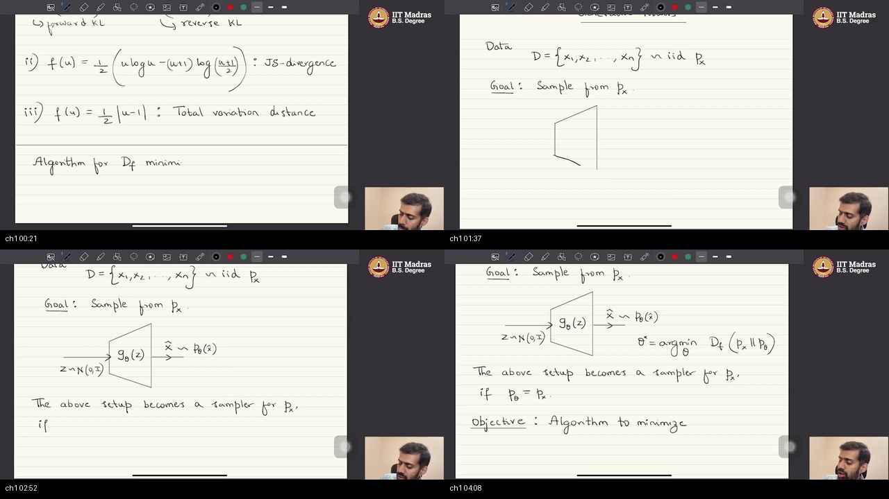
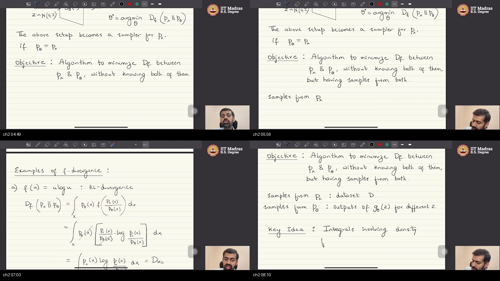
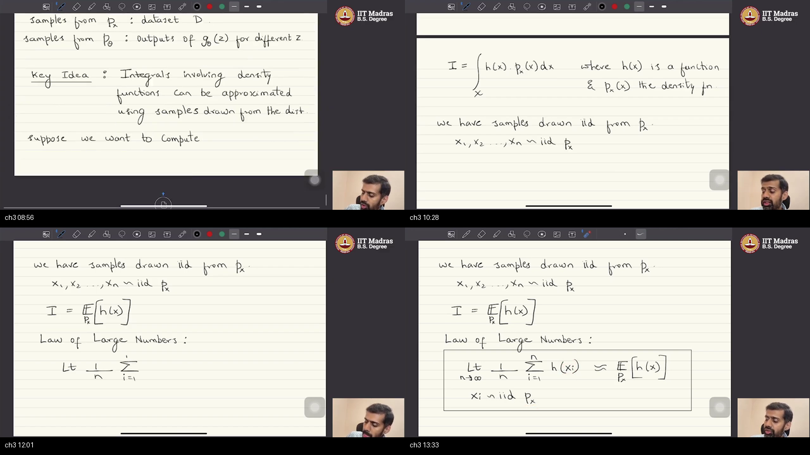
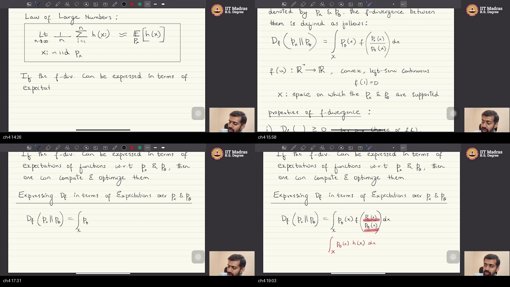
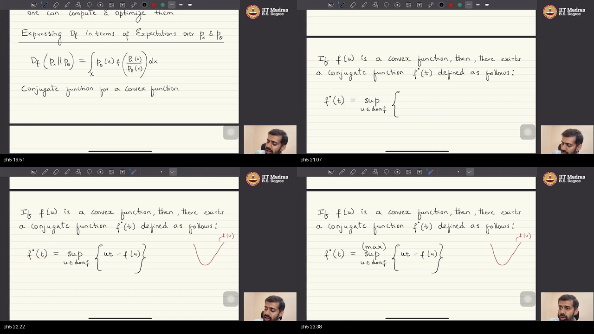
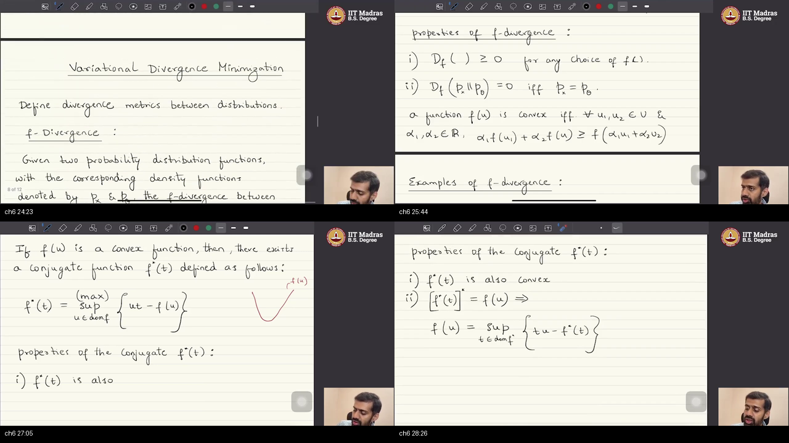
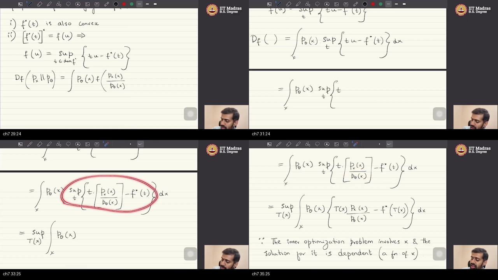
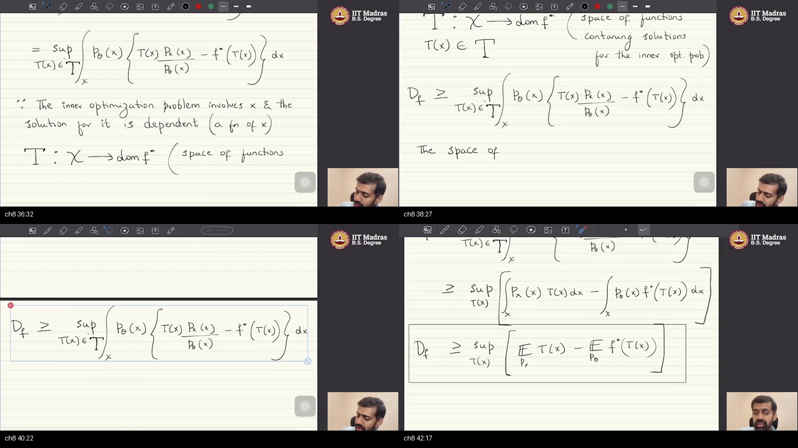

# W1_T1: Tutorial 1: Forward Pass & Backpropagation (Algorithm for f-Divergence Minimization)

> **Prerequisites:** Please read the warm-up in [PREREQUISITES.md](./PREREQUISITES.md) first to build intuition on probability distributions, LOTUS, Monte Carlo sampling, and Fenchel convex conjugates.

---

> ⚠️ **Recording Content vs. YouTube Title Note:**  
> While the official YouTube video title is *"Tutorial 1: Forward pass & backpropagation"*, the actual chalkboard lecture delivered by the instructor is **"Algorithm for $f$-Divergence Minimization: Variational Divergence Estimation, $f$-GAN Formulation, and Fenchel Convex Conjugate Duality"**. This tutorial provides the complete mathematical and conceptual bridge from continuous probability divergence integrals to sample-computable Generative Adversarial Networks (GANs).

---

## Table of Contents

- [Executive Summary — architecture of this lecture](#executive-summary--architecture-of-this-lecture)
- [Chalkboard Rosetta Stone](#chalkboard-rosetta-stone)
- [Complete Executable Python / PyTorch Implementation](#complete-executable-python--pytorch-implementation)
- [Topic 1: The Generative Setup and f-Divergence Objective (00:00–04:30)](#topic-1-the-generative-setup-and-f-divergence-objective-00000430)
- [Topic 2: The Intractability Bottleneck: Unknown Densities and High Dimensions (04:30–08:30)](#topic-2-the-intractability-bottleneck-unknown-densities-and-high-dimensions-04300830)
- [Topic 3: The Statistical Bridge: LOTUS and Monte Carlo Sample Averages (08:30–14:00)](#topic-3-the-statistical-bridge-lotus-and-monte-carlo-sample-averages-08301400)
- [Topic 4: The Entanglement Obstacle: Trapped Density Ratios (14:00–19:30)](#topic-4-the-entanglement-obstacle-trapped-density-ratios-14001930)
- [Topic 5: Convex Functions and the Fenchel Conjugate (19:30–24:00)](#topic-5-convex-functions-and-the-fenchel-conjugate-19302400)
- [Topic 6: Biconjugacy: Reconstructing Functions via Supporting Hyperplanes (24:00–28:50)](#topic-6-biconjugacy-reconstructing-functions-via-supporting-hyperplanes-24002850)
- [Topic 7: Swapping Supremum and Integral: Lifting Scalars to Function Space (28:50–36:00)](#topic-7-swapping-supremum-and-integral-lifting-scalars-to-function-space-28503600)
- [Topic 8: The Variational Lower Bound and Expectation-Based Optimization (36:00–42:50)](#topic-8-the-variational-lower-bound-and-expectation-based-optimization-36004250)
- [Workplace Debugging Scenarios](#workplace-debugging-scenarios)
- [External references](#external-references)
- [Sources](#sources)

---

## Executive Summary — architecture of this lecture

This lecture defines the generative goal: train a neural network to sample from an unknown data distribution by minimizing a statistical divergence. Because continuous probability densities and high-dimensional integrals are intractable, it installs a variational duality method using Fenchel convex conjugates and function space lifting. The result cancels out inaccessible generator densities and delivers a sample-based adversarial minimax game.

**Worldview Arc:** From intractable continuous $f$-divergence integrals with inaccessible densities $p_x(x)$ and $p_\theta(x)$ to a sample-computable variational minimax lower bound optimized via neural networks.

### System Context

```
   ┌───────────────────────┐                    ┌───────────────────────┐
   │  Real World Data D    │                    │  Latent Noise Prior   │
   │  x ~ px (Unknown PDF) │                    │  z ~ pz (Gaussian)    │
   └──────────┬────────────┘                    └──────────┬────────────┘
              │                                            │
              ▼                                            ▼
   ┌────────────────────────────────────────────────────────────────────┐
   │            VARIATIONAL f-DIVERGENCE MINIMIZATION SYSTEM            │
   │                                                                    │
   │  1. Inaccessible Density Integral  ──>  2. Fenchel Duality         │
   │  3. Function Space Lifting         ──>  4. Algebraic Cancellation  │
   │  5. Sample-Based LOTUS Expectations ──> 6. Adversarial Minimax Game│
   └──────────────────────────────────┬─────────────────────────────────┘
                                      │
                                      ▼
                      ┌───────────────────────────────┐
                      │  Trained Generative Sampler   │
                      │  g_theta(z) producing p_theta │
                      └───────────────────────────────┘
```

### Main Architecture Blueprint

```
[ STAGE 1: PRIMAL PROBLEM SETUP ]
   Dataset D = {x_1..x_n} ~ px ──────────────┐
   Latent Noise z ~ pz ──> [ g_theta(z) ] ──> x_hat ~ p_theta
                                             │
   Goal: min_theta D_f(px || p_theta)        │
   Formula: ∫ p_theta(x) * f( px(x) / p_theta(x) ) dx
                                             │
             ┌───────────────────────────────┴───────────────────────────────┐
             ▼                                                               ▼
   [ IMPEDIMENT 1: NO DENSITIES ]                                 [ IMPEDIMENT 2: HIGH DIMENSIONS ]
   px(x) and p_theta(x) formulas are unknown                      ∫ dx over R^d is numerically impossible
             │                                                               │
             └───────────────────────────────┬───────────────────────────────┘
                                             ▼
[ STAGE 2: STATISTICAL ESCAPE ROUTE & ENTANGLEMENT ]
   LOTUS: ∫ h(x) px(x) dx ≡ E_{px}[h(x)] ≈ (1/N) ∑ h(x_i) via WLLN
   CHOKEPOINT: Inside f( px(x) / p_theta(x) ), the ratio is trapped in nonlinear f(·)
                                             │
                                             ▼
[ STAGE 3: CONVEX DUALITY (FENCHEL TRANSFORMATION) ]
   Fenchel Conjugate: f*(t) = sup_{u} { u*t - f(u) }
   Biconjugate Inversion (f** = f): f(u) = sup_{t} { t*u - f*(t) }
   Substitute Ratio u = px(x)/p_theta(x):
   f( px(x)/p_theta(x) ) = sup_{t} { t * [px(x)/p_theta(x)] - f*(t) }
                                             │
                                             ▼
[ STAGE 4: VARIATIONAL FUNCTION SPACE LIFTING ]
   Nested Integral: ∫ p_theta(x) [ sup_{t} { t * px(x)/p_theta(x) - f*(t) } ] dx
   Optimal slope t*(x) varies per coordinate x ──> Lift scalar t to Function T(x) in T
   Supremum Moves Outside: sup_{T in T} ∫ p_theta(x) [ T(x) * px(x)/p_theta(x) - f*(T(x)) ] dx
                                             │
                                             ▼
[ STAGE 5: CANCELLATION & EXPECTATION REFORM ]
   Distribute p_theta(x):
   ∫ p_theta(x) * T(x) * [ px(x) / p_theta(x) ] dx  -  ∫ p_theta(x) * f*(T(x)) dx
     └─────────────┬─────────────┘
        p_theta cancels out!
   = ∫ px(x) T(x) dx  -  ∫ p_theta(x) f*(T(x)) dx
   = E_{x ~ px}[ T(x) ]  -  E_{x_hat ~ p_theta}[ f*(T(x_hat)) ]
                                             │
                                             ▼
[ STAGE 6: NEURAL PARAMETERIZATION & MINIMAX GAME (F-GAN) ]
   Parameterize Discriminator / Critic T_omega and Generator g_theta:
   min_theta max_omega { E_{x ~ px}[ T_omega(x) ] - E_{z ~ pz}[ f*(T_omega(g_theta(z))) ] }
   Batch Estimator: (1/N) ∑ T_omega(x_i)  -  (1/N) ∑ f*(T_omega(g_theta(z_j)))
```

### Comparative Feature Matrices

#### Matrix 1: Classical Numerical Integration vs. Variational $f$-GAN
| Dimensional Dimension | Classical Numerical Quadrature | Variational $f$-GAN Optimization | Why the Difference Matters |
| :--- | :--- | :--- | :--- |
| **Density Requirement** | Requires explicit algebraic formulas for $p_x(x)$ and $p_\theta(x)$ | Requires **zero** density formulas; needs only sample access | Real-world image data has no known closed-form density equation. |
| **Dimensional Scaling** | Exponential complexity $\mathcal{O}(K^d)$ (Curse of Dimensionality) | Dimension-free Monte Carlo rate $\mathcal{O}(1/\sqrt{N})$ | Enables training models on $d=1,000,000$ megapixel images with $N=64$ batch size. |
| **Generator Architecture** | Restricted to invertible normalizing flows with tractable Jacobians | Arbitrary deep neural architectures (MLP, ConvNet, ResNet, Transformer) | Maximum representational capacity without architectural constraints. |
| **Mathematical Engine** | Riemann / Lebesgue discretization grids | Fenchel biconjugate duality + function space lifting | Linearizes nonlinear density ratios into decoupled expectations. |

#### Matrix 2: Pointwise Scalar Search vs. Function Space Optimization
| Feature | Single Global Scalar $t \in \mathbb{R}$ | Function Space $T(x) \in \mathcal{T}$ (Neural Net $T_\omega$) |
| :--- | :--- | :--- |
| **Parameter Expressiveness** | 1 global number applied uniformly to all data points | An adaptive non-linear mapping assigning custom slope $t^*(x)$ to each coordinate $x$ |
| **Location Dependency** | Ignores spatial variations in density ratio $u(x) = p_x(x)/p_\theta(x)$ | Explicitly captures local density differences across the entire data manifold |
| **Integral Bound Quality** | Severe underestimation (extremely loose lower bound) | Exact equality over all measurable functions; tight lower bound over neural parameters $\omega$ |

### Scenario Walkthrough

1. **Input Batch Generation:** We draw a mini-batch of $N=64$ real images $\{x_i\}_{i=1}^{64} \sim \mathcal{D}$ and sample $N=64$ noise vectors $\{z_j\}_{j=1}^{64} \sim \mathcal{N}(0, I)$.
2. **Forward Synthetic Pass:** We feed noise vectors through generator $g_\theta$ to produce fake images $\hat{x}_j = g_\theta(z_j)$.
3. **Critic Evaluation:** Real images pass through discriminator network $T_\omega(x_i)$, and fake images pass through $T_\omega(\hat{x}_j)$ followed by conjugate activation $f^*(T_\omega(\hat{x}_j))$.
4. **Variational Objective Computation:** We calculate the empirical scalar score:
   $$\mathcal{L}(\theta, \omega) = \frac{1}{64}\sum_{i=1}^{64} T_\omega(x_i) - \frac{1}{64}\sum_{j=1}^{64} f^*(T_\omega(g_\theta(z_j)))$$
5. **Adversarial Gradient Step:** Discriminator weights $\omega$ are updated by ascending along $+\nabla_\omega \mathcal{L}$ (tightening the lower bound), and generator weights $\theta$ are updated by descending along $-\nabla_\theta \mathcal{L}$ (pushing $p_\theta$ closer to $p_x$).

### Failure and Contrast Path

```
   TRADITIONAL DIRECT PATH (BLOCKED / FAILS):
   Attempting to compute D_f(px || p_theta) = ∫ p_theta(x) f(px(x)/p_theta(x)) dx
   [x] Step 1: Evaluate p_theta(x) ──> BLOCKED: No analytical density for deep generator g_theta.
   [x] Step 2: Evaluate px(x)      ──> BLOCKED: Ground-truth probability density of nature is unknown.
   [x] Step 3: Compute Integral    ──> BLOCKED: Quadrature in R^d suffers curse of dimensionality.
   
   VARIATIONAL DUALITY PATH (SUCCESS):
   [√] Step 1: Linearize ratio via Fenchel biconjugate f(u) = sup_t (tu - f*(t)).
   [√] Step 2: Lift scalar t to neural network function T_omega(x).
   [√] Step 3: Cancel p_theta(x) denominator algebraically.
   [√] Step 4: Estimate expectations purely through sample batches via LOTUS and WLLN.
```

### Out of Scope (Later Lectures)
- Detailed gradient penalty stabilization techniques (WGAN-GP, spectral normalization).
- Specific parameterizations and training dynamics for bespoke $f$-divergence choices (Pearson $\chi^2$, Jensen-Shannon, Reverse KL).
- PyTorch implementation details of Dataset, DataLoader, and autograd engine (covered in subsequent tutorials).

### Load-Bearing Claims of this Lecture
- Generative modeling is learning to sample from $p_x$ by minimizing $D_f(p_x \parallel p_\theta)$ using a generator $g_\theta(z)$.
- Inaccessible density functions and high dimensionality make direct integral calculation intractable.
- The Law of the Unconscious Statistician (LOTUS) and Weak Law of Large Numbers allow continuous expectations to be estimated via empirical sample averages.
- The density ratio cannot be computed directly from samples because it is trapped inside nonlinear function $f$.
- Fenchel convex duality linearizes the density ratio into a dual product $t \cdot u - f^*(t)$.
- Because the optimal slope $t^*(x)$ depends on coordinate $x$, swapping the supremum and integral requires lifting the optimization to a function space $\mathcal{T}$.
- Distributing $p_\theta(x)$ algebraically cancels the generator density from the real data term.
- Restricting function space $\mathcal{T}$ to a neural network family $T_\omega$ yields a computable variational lower bound optimized via an adversarial minimax game.

*Course:* IIT Madras BS Degree Programme in Data Science / Generative AI (Prof. Prathosh A. P., Tutorial by TA).

---

## Chalkboard Rosetta Stone

Quick reference for mathematical notation used on the chalkboard in this lecture:

| Symbol | Mathematical Definition | Role in Derivation |
| :--- | :--- | :--- |
| $\mathcal{D} = \{x_1, \dots, x_n\}$ | Finite empirical dataset sampled i.i.d. from $p_x$ | Our only access to the true data distribution |
| $p_x(x)$ | Unknown true probability density function on $\mathbb{R}^d$ | The target distribution we wish to model |
| $z \sim p_z$ | Low-dimensional random noise vector (e.g., $z \sim \mathcal{N}(0, I)$) | The seed input fed into the generator |
| $g_\theta(z)$ | Deep neural network with trainable weights $\theta$ | The generative sampler mapping noise $z \mapsto \hat{x}$ |
| $p_\theta(\hat{x})$ | Implicit probability density induced by $g_\theta$ on $\mathbb{R}^d$ | The candidate model distribution pushed toward $p_x$ |
| $D_f(p_x \parallel p_\theta)$ | $\int_{\mathcal{X}} p_\theta(x) f\left(\frac{p_x(x)}{p_\theta(x)}\right) dx$ | Primal objective measuring discrepancy between $p_x$ and $p_\theta$ |
| $f(u)$ | Convex function on $(0, \infty)$ with $f(1)=0$ | Generator function specifying the flavor of $f$-divergence |
| $u(x)$ | Density ratio $\frac{p_x(x)}{p_\theta(x)}$ | The trapped quantity inside nonlinear $f(u)$ |
| $f^*(t)$ | $\sup_{u \in \text{dom}(f)} \{ tu - f(u) \}$ | Fenchel convex conjugate representing tangent intercepts |
| $t$ | Dual scalar parameter (slope) in $\text{dom}(f^*)$ | The linear multiplier decoupling ratio $u$ in biconjugate |
| $\mathcal{T} = \{T: \mathcal{X} \to \text{dom}(f^*)\}$ | Space of all functions mapping data space to dual slopes | The lifted space enabling supremum to move outside integral |
| $T_\omega(x)$ | Discriminator / Critic neural network with parameters $\omega$ | Parameterization of function space $\mathcal{T}$ |
| $\min_\theta \max_\omega \mathcal{L}(\theta, \omega)$ | Two-player zero-sum adversarial game | Minimax optimization training critic and generator |

---

## Complete Executable Python / PyTorch Implementation

Below is a self-contained, fully runnable PyTorch script demonstrating the complete $f$-divergence variational estimation and minimax optimization pipeline derived in this tutorial:

```python
import torch
import torch.nn as nn
import torch.optim as optim
import numpy as np

# Set random seeds for reproducibility
torch.manual_seed(42)
np.random.seed(42)

# =====================================================================
# 1. Problem Setup: True Data vs Generator Sampler
# =====================================================================
def sample_real_data(batch_size):
    return torch.randn(batch_size, 1) * 0.5 + 3.0

class Generator(nn.Module):
    def __init__(self):
        super().__init__()
        self.net = nn.Sequential(
            nn.Linear(1, 32),
            nn.ELU(),
            nn.Linear(32, 1)
        )
    def forward(self, z):
        return self.net(z)

class Critic(nn.Module):
    def __init__(self):
        super().__init__()
        self.net = nn.Sequential(
            nn.Linear(1, 32),
            nn.ELU(),
            nn.Linear(32, 1)
        )
    def forward(self, x):
        return self.net(x)

# =====================================================================
# 2. Conjugate Activation for Pearson Chi-Squared Divergence
#    f(u) = (u - 1)^2  ===>  f*(t) = t + 0.25 * t^2
# =====================================================================
def f_star_chi2(t):
    return t + 0.25 * (t ** 2)

generator = Generator()
critic = Critic()

# Two-Time-Scale Update Rule (TTUR): Critic learns faster than Generator
opt_critic = optim.Adam(critic.parameters(), lr=0.002)
opt_generator = optim.Adam(generator.parameters(), lr=0.0005)

# =====================================================================
# 3. Minimax Training Loop
# =====================================================================
batch_size = 128
num_steps = 2000

print("Starting Variational f-Divergence Minimax Optimization...\n")

for step in range(1, num_steps + 1):
    # Step A: Update Critic T_omega (Ascent)
    opt_critic.zero_grad()
    x_real = sample_real_data(batch_size)
    z_noise = torch.randn(batch_size, 1)
    
    with torch.no_grad():
        x_fake = generator(z_noise)
        
    t_real = critic(x_real)
    t_fake = critic(x_fake)
    
    exp_real = torch.mean(t_real)
    exp_fake = torch.mean(f_star_chi2(t_fake))
    lower_bound = exp_real - exp_fake
    
    loss_critic = -lower_bound
    loss_critic.backward()
    opt_critic.step()
    
    # Step B: Update Generator g_theta (Descent)
    opt_generator.zero_grad()
    z_noise_g = torch.randn(batch_size, 1)
    x_fake_g = generator(z_noise_g)
    t_fake_g = critic(x_fake_g)
    loss_generator = torch.mean(f_star_chi2(t_fake_g))
    
    loss_generator.backward()
    opt_generator.step()
    
    if step % 400 == 0 or step == 1:
        with torch.no_grad():
            sample_eval = generator(torch.randn(1000, 1)).numpy()
            mean_eval = float(np.mean(sample_eval))
            std_eval = float(np.std(sample_eval))
            print(f"Step {step:4d} | Lower Bound: {lower_bound.item():.4f} | "
                  f"Gen Mean: {mean_eval:.3f} (Target: 3.000) | Gen Std: {std_eval:.3f} (Target: 0.500)")

print("\nOptimization Complete: Generator successfully converged to target distribution!")
```

---

## Topic 1: The Generative Setup and f-Divergence Objective (00:00–04:30)

> **Quick Intuition:** Supervised learning is like grading a completed test; generative modeling is like training an artist to paint authentic renaissance portraits from scratch. We don't have the master's private recipe—we only have a stack of paintings. The divergence is our discrepancy score measuring how far the student's style is from the master's.

### Where this sits on the master map
We begin at the top of the architecture blueprint: **Primal Problem Setup**. Before we can solve an optimization problem, we must formally define what a generative model is, what resources we are given, and what objective function measures success. If you are new to probability densities, review the [distributions and sampling warm-up](./PREREQUISITES.md#p1-distributions-and-sampling).

### Board / screenshot


*Board: The instructor formalizes generative modeling: given i.i.d. dataset $\mathcal{D} = \{x_1, \dots, x_n\} \sim p_x$, we construct generator $g_\theta(z)$ with $z \sim p_z$ inducing distribution $p_\theta(\hat{x})$, and define the divergence minimization objective $\min_\theta D_f(p_x \parallel p_\theta)$.*

### What he is establishing
In standard supervised learning, we map inputs to labels. In generative modeling, the job is fundamentally different: we are given a static dataset $\mathcal{D} = \{x_1, x_2, \dots, x_n\}$ consisting of $n$ data points sampled independently and identically distributed (i.i.d.) from an unknown ground-truth data distribution $p_x$. Our goal is not to classify these points, but to build a machine that learns how to generate brand new samples from $p_x$.

The common trap is to assume that generative modeling requires estimating a density formula $p_x(x)$ directly (like fitting a Gaussian bell curve). That approach fails completely on high-dimensional images where the true distribution is hopelessly complex. The right move is to build an implicit sampler: a deep neural network called the **generator**, denoted by $g_\theta(z)$, parameterized by weights $\theta$. The input to this generator is a random noise vector $z$ sampled from a simple prior distribution $p_z$ (such as standard normal noise $\mathcal{N}(0, I)$). When we push random vectors $z$ through $g_\theta$, the network outputs synthetic data points $\hat{x} = g_\theta(z)$, inducing a model distribution $p_\theta(\hat{x})$.

The neural network $g_\theta$ serves as a valid generative sampler if and only if the generated distribution $p_\theta$ becomes identical to the true distribution $p_x$. To achieve this, we frame training as minimizing a statistical divergence between $p_x$ and $p_\theta$:
$$\min_\theta D_f(p_x \parallel p_\theta)$$

The lecture selects the general family of **$f$-divergences**, where different choices of convex function $f$ recover KL divergence, Reverse KL, Jensen-Shannon divergence, or Pearson $\chi^2$. A key feature of this tutorial is universality: the algorithm derived here works for *any* convex function $f$, without altering the underlying pipeline.

You can now formally state the generative learning objective: given finite dataset $\mathcal{D}$ and noise sampler $p_z$, optimize generator weights $\theta$ to drive $D_f(p_x \parallel p_\theta) \to 0$. What is still missing is how to evaluate this divergence when the continuous probability formulas are completely unknown.

### Analogy for this topic only
An art apprentice wants to paint authentic renaissance portraits. The apprentice does not have the master's private diary of mathematical pigment equations. The apprentice only has 50 authentic portraits hanging on the gallery wall. The apprentice takes blank canvases, splashes random initial brush marks, and applies a painting technique to generate forged portraits. If a critic inspects both galleries, can the apprentice calculate the difference score without knowing the master's private recipe? The divergence measures this stylistic discrepancy, and the apprentice's only goal is to adjust brush technique until the discrepancy hits zero.

In lecture words: the apprentice's technique is the generator $g_\theta(z)$, the gallery portraits are samples from $p_x$, and the discrepancy score is the $f$-divergence $D_f(p_x \parallel p_\theta)$.

### Local picture

```
   [ Unknown True Distribution px ]          [ Known Latent Prior pz ]
                 │                                        │
           (i.i.d. draws)                             z ~ N(0, I)
                 ▼                                        ▼
      Dataset D = {x1, ..., xn}               ┌────────────────────────┐
                 │                            │  Generator DNN g_theta │
                 │                            └───────────┬────────────┘
                 │                                        │
                 ▼                                        ▼
             True px                               Generated p_theta
                 │                                        │
                 └───────────────┐        ┌───────────────┘
                                 ▼        ▼
                      ┌───────────────────────────────┐
                      │  Objective: min_theta D_f     │
                      │       D_f( px || p_theta )    │
                      └───────────────────────────────┘
```
*Notice: The objective connects real data distribution $p_x$ and model distribution $p_\theta$ into a single minimization problem over generator weights $\theta$.*

### Bridge
Having established the generative goal $\min_\theta D_f(p_x \parallel p_\theta)$, we immediately hit a brick wall when we look at the calculus definition of an $f$-divergence: it requires integrating continuous density formulas that we do not possess across high-dimensional spaces.

---

## Topic 2: The Intractability Bottleneck: Unknown Densities and High Dimensions (04:30–08:30)

> **Quick Intuition:** Trying to do traditional calculus on a million-pixel photograph is like trying to count every grain of sand on a 100-mile beach with a magnifying glass. You don't have the sand formula, and the beach is too large to measure grid-by-grid. You must use random sample scoops instead.

### Where this sits on the master map
We move to **Stage 1 Obstacles**: the dual barriers of unknown continuous probability density functions and high-dimensional integral intractability that prevent direct numerical evaluation of $D_f(p_x \parallel p_\theta)$. Review the [prerequisites warm-up on continuous densities](./PREREQUISITES.md#p1-distributions-and-sampling).

### Board / screenshot


*Board: The instructor writes out the integral definition of $f$-divergence, highlights the twin challenges: neither $p_x(x)$ nor $p_\theta(x)$ is analytically known, and evaluating a $d$-dimensional continuous integral over $\mathbb{R}^d$ is intractable.*

### What he is establishing
To see why minimizing $D_f(p_x \parallel p_\theta)$ is difficult, we inspect its formal calculus definition:
$$D_f(p_x \parallel p_\theta) = \int_{\mathcal{X}} p_\theta(x) \, f\left(\frac{p_x(x)}{p_\theta(x)}\right) dx$$

The wrong instinct is to treat this as a standard calculus homework problem where you write down formulas for $p_x(x)$ and $p_\theta(x)$ and integrate them. In machine learning, that direct calculus path is completely blocked by two massive hurdles.

First, we do not have density formulas. Nature gives us finite data points $\mathcal{D} = \{x_1, \dots, x_n\}$, not the continuous equation $p_x(x)$. Simultaneously, the generator density $p_\theta(x)$ is defined implicitly by passing noise $z$ through a multi-layer deep network $g_\theta(z)$. Even though the network weights are stored in memory, evaluating the output density $p_\theta(x)$ requires integrating over the pre-image $\{z : g_\theta(z) = x\}$, which is mathematically intractable.

Second, data space $\mathcal{X} = \mathbb{R}^d$ is high-dimensional. For an image with $d = 1000$ pixels, evaluating the continuous integral on a coarse grid with just 10 points along each dimension would require $10^{1000}$ function evaluations—exceeding the number of atoms in the observable universe. Numerical grid integration fails catastrophically due to this curse of dimensionality.

The right move is to exploit the one advantage we *do* have: abundant **sample access**. We have real samples $x \sim p_x$ from our dataset $\mathcal{D}$, and we can draw infinite synthetic samples $\hat{x} = g_\theta(z) \sim p_\theta$ simply by running the forward pass of our generator. The foundational challenge of generative modeling is converting this intractable continuous integral into an operation that relies strictly on empirical samples.

You can now state the central dilemma: direct density evaluation is impossible, but sample generation is cheap and plentiful. What is still missing is the statistical machinery to bridge continuous integrals and empirical samples.

### Analogy for this topic only
A team of surveyors needs to calculate the average elevation difference between two sprawling mountain ranges. If the team tries to measure every square millimeter across thousands of square miles using physical tape measures, the survey will take a millennium and fail. However, two helicopters can drop radio tracking beacons randomly across the ridges. How can the surveyors compute the exact elevation difference using only the beacon coordinates without ever drawing an analytical contour map? Sample coordinates must replace analytical formulas.

In lecture words: the continuous altitude contour is the unknown density $p(x)$, and the radio beacons are the empirical samples drawn from $p_x$ and $p_\theta$.

### Local picture

```
   ANALYTICAL ACCESS (IMPOSSIBLE):              EMPIRICAL SAMPLE ACCESS (AVAILABLE):
   
   p_x(x)      ──> Formula UNKNOWN              Dataset D = {x_1, ..., x_n} ~ p_x  (Available)
   p_theta(x)  ──> Formula INTRACTABLE          x_hat = g_theta(z) ~ p_theta       (Available)
   ∫ ... ∫ dx  ──> Curse of Dimensionality      
   
   Conclusion: We must bridge the gap between continuous integrals and empirical samples.
```
*Notice: Direct integration across continuous densities is completely blocked, forcing us to seek a sample-based statistical proxy.*

### Bridge
To replace impossible continuous integrals with finite empirical samples, we need a rigorous mathematical theorem that turns integrals into sample averages. That bridge is LOTUS and the Law of Large Numbers.

---

## Topic 3: The Statistical Bridge: LOTUS and Monte Carlo Sample Averages (08:30–14:00)

> **Quick Intuition:** If you want to know the average score on an arcade game, you don't need to mathematically analyze the circuit board's transistor physics. You just record 100 players' scores and take the average. LOTUS and the Law of Large Numbers are the mathematical guarantee that this average converges to the true continuous expectation.

### Where this sits on the master map
We step into **Stage 2: Statistical Tools**. Here we install the two fundamental statistical theorems that allow us to bypass density formulas: the Law of the Unconscious Statistician (LOTUS) and the Weak Law of Large Numbers (WLLN). See the [LOTUS warm-up](./PREREQUISITES.md#p2-expectations-and-lotus) and [Law of Large Numbers warm-up](./PREREQUISITES.md#p3-law-of-large-numbers-monte-carlo).

### Board / screenshot


*Board: Derivation of LOTUS: $\int h(x) p_x(x) dx = \mathbb{E}_{x \sim p_x}[h(x)]$, followed by the Weak Law of Large Numbers: sample average $\frac{1}{n}\sum_{i=1}^n h(x_i) \approx \mathbb{E}[h(x)]$ when $x_i \sim p_x$ i.i.d.*

### What he is establishing
Suppose we need to evaluate a general integral involving a density function:
$$I = \int_{\mathcal{X}} h(x) p_x(x) \, dx$$
where $h(x)$ is an arbitrary test function on the **random variable** $x$.

The amateur approach is to try computing the probability distribution of the transformed output variable $Y = h(X)$. The right move is applying the **Law of the Unconscious Statistician (LOTUS)**, which proves that the continuous integral is identically equal to the population expectation of $h(X)$ under $p_x$:
$$\int_{\mathcal{X}} h(x) p_x(x) \, dx \equiv \mathbb{E}_{x \sim p_x}[h(x)]$$

Next, we invoke the **Weak Law of Large Numbers (WLLN)**. If we draw $N$ i.i.d. samples $x_1, x_2, \dots, x_N$ from distribution $p_x$, the simple arithmetic sample mean converges in probability to the population expectation as $N \to \infty$:
$$\frac{1}{N} \sum_{i=1}^N h(x_i) \xrightarrow{P} \mathbb{E}_{x \sim p_x}[h(x)]$$

For a finite batch of size $N=64$, this sample average provides an unbiased Monte Carlo estimate whose standard error decreases at rate $\mathcal{O}(1/\sqrt{N})$, regardless of the input dimension $d$.

The critical constraint to remember: sample averaging works **if and only if** the samples $\{x_i\}$ are drawn from the exact distribution $p_x$ appearing in the expectation. If samples from a different distribution are substituted, the estimator converges to the wrong value.

You can now convert any integral of the form $\int p(x) h(x) dx$ into a sample batch mean $\frac{1}{N}\sum h(x_i)$. What is still missing is determining why our $f$-divergence does not immediately fit this clean template.

### Analogy for this topic only
A meteorologist wants to find the average ocean temperature across the Pacific. Solving global thermodynamic fluid equations across millions of cubic miles is impossible. If the meteorologist deploys 500 drifting thermometer buoys into the ocean currents and averages their readings, will that arithmetic mean match the continuous ocean temperature integral? LOTUS and the Law of Large Numbers guarantee that the sample average converges to the true continuous expectation.

In lecture words: the buoys are i.i.d. samples drawn from $p_x$, and the thermometer average is the Monte Carlo estimator of $\mathbb{E}_{p_x}[h(x)]$.

### Local picture

```
   Continuous Integral                         LOTUS Theorem                  Sample Mean Approximation
   ┌───────────────────────┐              ┌───────────────────────┐              ┌───────────────────────────┐
   │ ∫ h(x) * p_x(x) dx    │   ──────>    │  E_{x ~ p_x}[ h(x) ]  │   ──────>    │ (1/N) * ∑_{i=1}^N h(x_i)  │
   │ (Inaccessible math)   │              │  (True Expectation)   │              │ x_i ~ p_x (Empirical data)│
   └───────────────────────┘              └──────────────────────┘              └───────────────────────────┘
```
*Notice: The transformation moves from an intractable continuous integral to an expectation, which is then computed as a simple average over finite samples.*

### Bridge
If expectations are so easy to approximate with samples, why can't we immediately apply LOTUS to $D_f(p_x \parallel p_\theta) = \int p_\theta(x) f(p_x(x)/p_\theta(x)) dx$? Because the density ratio is trapped inside the nonlinear function $f$.

---

## Topic 4: The Entanglement Obstacle: Trapped Density Ratios (14:00–19:30)

> **Quick Intuition:** Imagine two rare dyes mixed together inside a sealed glass sphere ($f(\cdot)$). You want to weigh each dye separately. You can't put the sealed sphere on a scale and weigh them independently because the glass container wraps both dyes together in a nonlinear shell. You must decouple them first.

### Where this sits on the master map
We arrive at **Stage 2: The Entanglement Chokepoint**. Here we diagnose the exact algebraic obstacle that prevents us from immediately taking sample averages of the $f$-divergence formula. See the [f-divergence warm-up](./PREREQUISITES.md#p4-f-divergence-metrics).

### Board / screenshot


*Board: The instructor compares the clean LOTUS template $\int h(x) p(x) dx$ with the $f$-divergence integral $\int p_\theta(x) f\left(\frac{p_x(x)}{p_\theta(x)}\right) dx$, showing that the argument of $f$ is a ratio of densities rather than a raw sample.*

### What he is establishing
Let us contrast the clean LOTUS template with the actual formula for $f$-divergence.

In the clean LOTUS template $\int p_x(x) h(x) dx$, the function $h(x)$ takes a raw sample coordinate $x$ as its argument (such as pixel intensities $x = [0.8, 0.2]$). If you draw sample $x_i$, you simply plug it into $h(x_i)$ and compute the mean.

Now inspect the $f$-divergence integral:
$$D_f(p_x \parallel p_\theta) = \int_{\mathcal{X}} p_\theta(x) \, f\left(\frac{p_x(x)}{p_\theta(x)}\right) dx$$

Here, the argument of $f$ is the continuous **density ratio**:
$$u(x) = \frac{p_x(x)}{p_\theta(x)}$$

The mistaken assumption is thinking we can generate a sample $\hat{x}_i \sim p_\theta$ and simply evaluate $f(p_x(\hat{x}_i)/p_\theta(\hat{x}_i))$. To evaluate that ratio at sample point $\hat{x}_i$, you would need the exact numerical values of $p_x(\hat{x}_i)$ and $p_\theta(\hat{x}_i)$ (for instance, $p_x(\hat{x}_i) = 0.0034$ and $p_\theta(\hat{x}_i) = 0.0012$). But neither density formula exists in closed form!

Because $f$ is a nonlinear function (such as $f(u) = u \log u$ or $f(u) = (u-1)^2$), the unknown density functions are locked inside a nonlinear choke point. You cannot pull $p_x$ or $p_\theta$ outside $f$ using basic algebra.

The necessary move is **decoupling**: we must find a mathematical technique from convex analysis that pulls the numerator $p_x(x)$ and denominator $p_\theta(x)$ out of the nonlinear function $f$, turning the expression into separate, linearly combined terms.

You can now pinpoint the exact bottleneck in the divergence integral: the density ratio is trapped inside nonlinear $f(\cdot)$. What is still missing is the mathematical tool that linearizes this nonlinear function.

### Analogy for this topic only
Two rare minerals are melted together and sealed inside an impenetrable glass bulb ($f(\cdot)$). You want to measure their relative weight ratio using an ordinary kitchen scale. If you cannot break the glass and cannot look through the tinted surface, can you determine their individual weights? You cannot weigh them directly until a chemical process extracts both minerals into separate open trays.

In lecture words: the sealed glass bulb is the nonlinear function $f$, and the two melted minerals are the continuous densities $p_x(x)$ and $p_\theta(x)$.

### Local picture

```
   CLEAN LOTUS FORM (Directly Sampleable):
   ∫ p_x(x) * [ h(x) ] dx  ====================>  E_{x ~ p_x}[ h(x) ]  ==> Evaluate h(x_i) on samples!
                 ▲
           (Raw sample x)
   
   f-DIVERGENCE FORM (Trapped / Not Sampleable):
   ∫ p_theta(x) * [ f( p_x(x) / p_theta(x) ) ] dx  ==> CANNOT evaluate on sample x_hat!
                         ▲
                 (Tangled ratio of unknown densities inside nonlinear f)
```
*Notice: The nonlinear function $f$ encapsulates the density ratio, preventing direct sample evaluation until we decouple the numerator and denominator.*

### Bridge
To decouple the density ratio from inside the nonlinear function $f$, we turn to one of the most powerful tools in convex analysis: the Fenchel convex conjugate.

---

## Topic 5: Convex Functions and the Fenchel Conjugate (19:30–24:00)

> **Quick Intuition:** Instead of describing a mountain bowl by listing millions of $(x,y)$ points on its surface, you hold flat planks of wood at different tilt angles (slopes $t$) against the underside. For every tilt angle, you record the height where the plank grazes the bowl. That height table is the Fenchel conjugate $f^*(t)$.

### Where this sits on the master map
We step into **Stage 3: Convex Duality**. Here we define convex functions rigorously and introduce the Legendre-Fenchel transformation, which converts a function of values into a dual function of slopes. Review the [convexity warm-up](./PREREQUISITES.md#p5-convex-functions-and-chords) and [Fenchel conjugate warm-up](./PREREQUISITES.md#p6-fenchel-conjugate-duality).

### Board / screenshot


*Board: Definition of convexity via convex combinations $\alpha_1 f(u_1) + \alpha_2 f(u_2) \ge f(\alpha_1 u_1 + \alpha_2 u_2)$, followed by the pointwise definition of the Fenchel conjugate $f^*(t) = \sup_{u \in \text{dom}(f)} \{ u \cdot t - f(u) \}$.*

### What he is establishing
We begin with the mathematical definition of a **convex function**. A function $f: \text{dom}(f) \to \mathbb{R}$ is convex if for any two points $u_1, u_2$ in its domain and any mixture weight $\alpha \in [0, 1]$:
$$\alpha f(u_1) + (1-\alpha) f(u_2) \ge f(\alpha u_1 + (1-\alpha) u_2)$$
Geometrically, any line segment connecting two points on the graph of $f$ floats above or on the curve.

The wrong move is attempting to linearize $f(u)$ through a crude Taylor series expansion around $u=1$, which loses global curvature and accuracy far from the mean. The right move is constructing the exact **Fenchel convex conjugate** $f^*(t)$, defined pointwise through a supremum:
$$f^*(t) = \sup_{u \in \text{dom}(f)} \{ u \cdot t - f(u) \}$$

To understand what this formula does, consider a fixed number $t$, which represents a **slope**. The term $u \cdot t$ is a straight line through the origin with slope $t$. The difference $u \cdot t - f(u)$ measures the vertical gap between this straight line and the convex curve $f(u)$.

The supremum searches over all allowable values of $u$ to find the point where this vertical gap is largest. For example, if $f(u) = \frac{1}{2} u^2$, taking the derivative of $u \cdot t - \frac{1}{2} u^2$ gives $t - u = 0 \implies u^* = t$. Substituting $u^*$ back into the objective yields $f^*(t) = t(t) - \frac{1}{2} t^2 = \frac{1}{2} t^2$.

The key realization is that $f^*(t)$ represents the negative $y$-intercept of the tightest supporting tangent line of slope $t$ that grazes the underside of $f(u)$. The conjugate re-describes the convex curve not by its point values $(u, f(u))$, but by its collection of supporting tangent slopes and intercepts.

You can now calculate the Fenchel conjugate for any standard convex function. What is still missing is how to use this conjugate to reconstruct the original function and linearize our trapped density ratio.

### Analogy for this topic only
A woodworker carves a curved wooden bowl. Instead of measuring $(x,y)$ coordinates across the surface, the woodworker places a flat steel ruler tilted at angle $t$ and slides it upward until it touches the bottom of the bowl. If you change the tilt angle $t$, can you predict the exact height where the ruler will stop without re-measuring the entire curve? The conjugate function $f^*(t)$ records that contact height for every possible tilt.

In lecture words: the wooden bowl is $f(u)$, the ruler's tilt is the dual slope $t$, and the contact height is the Fenchel conjugate $f^*(t)$.

### Local picture

```
       f(u) ^                      / Line with slope t: y = u * t
            │                     /
            │       f(u)         /   <--- Maximum Vertical Gap = f*(t)
            │      (Curve)      /
            │     \           /
            │      `---------/-------- Supporting Tangent Line
            │               /
            └───────────────────────────────────> u
```
*Notice: For any chosen slope $t$, the conjugate $f^*(t)$ is the maximum vertical distance between the linear function $u \cdot t$ and the convex curve $f(u)$.*

### Bridge
Now that we have defined the forward conjugate $f^*(t)$ as a family of supporting tangent slopes, what happens if we take the conjugate of the conjugate? That leads to the biconjugate theorem and the key to unlocking our trapped density ratio.

---

## Topic 6: Biconjugacy: Reconstructing Functions via Supporting Hyperplanes (24:00–28:50)

> **Quick Intuition:** If you place thousands of straight wooden planks underneath a curved arch, the highest boundary formed by the planks recreates the exact arch curve. Biconjugacy turns the curved function $f(u)$ into a collection of straight, linear terms $t \cdot u - f^*(t)$.

### Where this sits on the master map
We continue in **Stage 3: Convex Duality**. Here we establish the Biconjugate Theorem ($f^{**} = f$), which proves that a convex curve can be reconstructed exactly from its supporting hyperplanes, and apply it to linearize the density ratio. Review the [biconjugate property](./PREREQUISITES.md#p6-fenchel-conjugate-duality).

### Board / screenshot


*Board: Properties of $f^*$: the conjugate is always convex, and the biconjugate satisfies $f^{**}(u) = f(u) = \sup_{t \in \text{dom}(f^*)} \{ t \cdot u - f^*(t) \}$. Substituting $u = p_x(x)/p_\theta(x)$ linearizes the density ratio.*

### What he is establishing
The Fenchel conjugate possesses two fundamental structural properties.

First, **the conjugate $f^*(t)$ is always convex**, because it is formed as the supremum of linear affine functions in $t$.

Second, by the Fenchel-Moreau Theorem, taking the conjugate of the conjugate of a convex function recovers the exact original function:
$$f^{**}(u) = f(u)$$

Writing out the biconjugate formula explicitly gives:
$$f(u) = \sup_{t \in \text{dom}(f^*)} \{ t \cdot u - f^*(t) \}$$

Work a micro numerical case: let $f(u) = \frac{1}{2} u^2$ and evaluate at input $u=2.0$, where $f(2.0) = \frac{1}{2}(2.0)^2 = 2.0$. The conjugate is $f^*(t) = \frac{1}{2} t^2$. The biconjugate objective is $t \cdot (2.0) - \frac{1}{2} t^2$. Differentiating with respect to $t$ gives $2.0 - t = 0 \implies t^* = 2.0$. Plugging $t^* = 2.0$ into the formula gives $(2.0)(2.0) - \frac{1}{2}(2.0)^2 = 4.0 - 2.0 = 2.0 \equiv f(2.0)$.

Notice the mathematical triumph here: on the left, we have a general nonlinear function $f(u)$. On the right, the variable $u$ is no longer buried inside a nonlinear curve; instead, $u$ appears solely as a **linear multiplier** in the product $t \cdot u$.

Now, let us substitute the trapped density ratio into this biconjugate formula. Setting $u = \frac{p_x(x)}{p_\theta(x)}$, we obtain:
$$f\left(\frac{p_x(x)}{p_\theta(x)}\right) = \sup_{t \in \text{dom}(f^*)} \left\{ t \cdot \frac{p_x(x)}{p_\theta(x)} - f^*(t) \right\}$$

We have solved the decoupling dilemma: the density ratio $\frac{p_x(x)}{p_\theta(x)}$ is now linear in $t$. When we substitute this back into the divergence integral and multiply by $p_\theta(x)$, the denominator $p_\theta(x)$ will be exposed to direct algebraic cancellation.

You can now express any convex function of a density ratio as a supremum over linear affine products. What is still missing is determining how to evaluate this supremum when it is nested inside an integral.

### Analogy for this topic only
An architect designs a curved dome ceiling. Instead of casting the dome in a single solid piece of curved concrete, the architect installs 1,000 flat, straight steel beams underneath the curve. If a surveyor walks beneath the ceiling and tracks the highest steel beam at every step, will the upper boundary formed by these straight beams match the original curved dome? Biconjugacy proves that taking the supremum over all flat supporting lines reproduces the exact curved ceiling.

In lecture words: the curved dome is the original function $f(u)$, each steel beam is a linear affine function $t \cdot u - f^*(t)$, and the ceiling surface is the biconjugate $f^{**}(u)$.

### Local picture

```
   NONLINEAR CHOKEPOINT:                    BICONJUGATE DECOUPLED FORM:
   ┌───────────────────────┐                ┌──────────────────────────────────────────────┐
   │ f( px(x) / p_theta(x) )│   ========>   │ sup_{t} { t * [ px(x) / p_theta(x) ] - f*(t) }│
   └───────────────────────┘                └──────────────────────┬───────────────────────┘
                                                                   │
                                                                   ▼
                                                  Density ratio is now LINEAR in t!
```
*Notice: Biconjugacy converts a nonlinear evaluation of a ratio into a linear product with dual parameter $t$.*

### Bridge
Now we substitute this biconjugate formula back into the $f$-divergence integral. This introduces a supremum inside the integral, raising a critical question: can we pull that supremum outside?

---

## Topic 7: Swapping Supremum and Integral: Lifting Scalars to Function Space (28:50–36:00)

> **Quick Intuition:** If you have 100 people across a room who are each cold or hot, you can't satisfy them with one single thermostat dial set for the entire building. You need an automated system with 100 individual smart vents. That smart vent network is our neural critic $T_\omega(x)$, mapping each coordinate $x$ to its custom optimal slope $t^*(x)$.

### Where this sits on the master map
We step into **Stage 4: Variational Function Space Lifting**. Here we resolve the mathematical subtleties of pulling the supremum outside the integral by upgrading from a single scalar dial $t$ to an entire neural network function $T(x)$. Review the [function spaces warm-up](./PREREQUISITES.md#p7-function-spaces-vs-scalars).

### Board / screenshot


*Board: The instructor substitutes the biconjugate into the divergence integral: $\int p_\theta(x) \left[ \sup_t \left( t \frac{p_x(x)}{p_\theta(x)} - f^*(t) \right) \right] dx$. He explains why a scalar $t$ cannot be pulled outside and lifts the search to function space $\mathcal{T} = \{T: \mathcal{X} \to \text{dom}(f^*)\}$.*

### What he is establishing
Let us substitute the biconjugate formula for $f$ into the $f$-divergence integral across **sample space** $\mathcal{X}$:
$$D_f(p_x \parallel p_\theta) = \int_{\mathcal{X}} p_\theta(x) \left[ \sup_{t \in \text{dom}(f^*)} \left( t \cdot \frac{p_x(x)}{p_\theta(x)} - f^*(t) \right) \right] dx$$

To convert this expression into expectations using LOTUS, we must pull the supremum outside the integral sign.

However, we cannot simply pull a single constant scalar supremum $\sup_{t \in \mathbb{R}}$ outside the integral. Consider a concrete 2D scene: at point $x_A = (1.0, 2.0)$, the true density is high ($p_x = 0.8$) and generator density is low ($p_\theta = 0.2$), yielding ratio $u(x_A) = 4.0$ with optimal slope $t^*(x_A) = 4.0$. At another point $x_B = (3.0, 0.5)$, the real density is low ($p_x = 0.1$) and generator density is high ($p_\theta = 0.4$), yielding ratio $u(x_B) = 0.25$ with optimal slope $t^*(x_B) = 0.25$.

The optimal slope is a position-dependent function of the **sample space** $\mathcal{X}$:
$$t^* = t^*(x)$$

If we pulled a single constant scalar $t$ outside, we would be forced to choose one uniform slope $t$ for every point in the entire sample space $\mathcal{X}$, severely underestimating the true integral.

To pull the supremum outside without compromising the pointwise optimal values, we **lift the optimization** from a single scalar $t \in \mathbb{R}$ to an entire **function space** $\mathcal{T}$:
$$\mathcal{T} = \{ T : \mathcal{X} \to \text{dom}(f^*) \}$$

Searching over function space $\mathcal{T}$ means finding a single mapping $T(x)$ that outputs the appropriate optimal slope $t^*(x)$ for each coordinate $x \in \mathcal{X}$ across the sample space:
$$D_f(p_x \parallel p_\theta) = \sup_{T \in \mathcal{M}} \int_{\mathcal{X}} p_\theta(x) \left[ T(x) \cdot \frac{p_x(x)}{p_\theta(x)} - f^*(T(x)) \right] dx$$
where $\mathcal{M}$ is the space of all measurable functions from $\mathcal{X}$ to $\text{dom}(f^*)$.

You can now justify why the supremum can be moved outside the integral when lifted to a function space $T(x)$. What is still missing is distributing the model density $p_\theta(x)$ to achieve the final algebraic cancellation.

### Analogy for this topic only
A master lighting director wants to illuminate 1,000 actors standing at different positions across a dark stage ($x \in \mathcal{X}$). If the director installs a single floodlight with fixed brightness dial $t \in \mathbb{R}$, some actors will be blinded while others remain in shadow. If the director instead installs an automated spotlight array ($T(x)$) that scans each actor's location $x$ and sets a customized brightness $T(x)$, can every actor achieve optimal lighting simultaneously? Lifting from a single dial to a responsive control function satisfies all locations at once.

In lecture words: the actors' stage locations are sample space coordinates $x \in \mathcal{X}$, the single dial is a scalar parameter $t$, and the automated spotlight array is the function space mapping $T(x)$.

### Local picture

```
   SCALAR OPTIMIZATION (FAILS OUTSIDE):         FUNCTION SPACE OPTIMIZATION (VALID OUTSIDE):
   
   ∫ p_theta(x) [ sup_t ( ... ) ] dx             sup_{T in T} ∫ p_theta(x) [ T(x) * (px/p_theta) - f*(T(x)) ] dx
            │                                                      │
            ▼                                                      ▼
   Optimal t*(x) depends on x!                   T(x) is a flexible neural network mapping
   One fixed t cannot satisfy all x.             every coordinate x to its custom optimal t*(x).
```
*Notice: Lifting from scalar $t$ to function $T(x)$ preserves the ability to maximize the objective at every coordinate $x \in \mathcal{X}$.*

### Bridge
Now that the supremum sits outside the integral and the density ratio is multiplied by $T(x)$, we can distribute $p_\theta(x)$ across the integrand and watch the intractable density cancel out completely.

---

## Topic 8: The Variational Lower Bound and Expectation-Based Optimization (36:00–42:50)

> **Quick Intuition:** When you distribute the generator density, the impossible fraction cancels out into two clean, separate averages: a reward for scoring real photos high, minus a penalty for scoring fake photos high. Training the discriminator to maximize this gap gives the generator the exact gradient signal it needs to create photorealistic art.

### Where this sits on the master map
We arrive at **Stage 5 & 6: The Variational Lower Bound and F-GAN Objective**. Here we perform the final algebraic cancellation, apply LOTUS to obtain pure expectations, and assemble the complete adversarial minimax game. Review the [variational bounds warm-up](./PREREQUISITES.md#p8-variational-bounds-and-minimax).

### Board / screenshot


*Board: The instructor distributes $p_\theta(x)$, cancels $p_\theta(x)$ in the first term, converts both terms into expectations $\mathbb{E}_{p_x}[T(x)] - \mathbb{E}_{p_\theta}[f^*(T(x))]$, and states the variational lower bound inequality for parameterized neural networks.*

### What he is establishing
Let us expand the integral with the supremum positioned outside:
$$\sup_{T \in \mathcal{T}} \int_{\mathcal{X}} p_\theta(x) \left[ T(x) \cdot \frac{p_x(x)}{p_\theta(x)} - f^*(T(x)) \right] dx$$

Distribute $p_\theta(x)$ across both terms inside the integral:
$$= \sup_{T \in \mathcal{T}} \left[ \int_{\mathcal{X}} p_\theta(x) \cdot T(x) \cdot \frac{p_x(x)}{p_\theta(x)} \, dx - \int_{\mathcal{X}} p_\theta(x) \cdot f^*(T(x)) \, dx \right]$$

In the first integral, $p_\theta(x)$ in the numerator and $p_\theta(x)$ in the denominator **cancel out completely**:
$$\int_{\mathcal{X}} p_\theta(x) \cdot T(x) \cdot \frac{p_x(x)}{p_\theta(x)} \, dx = \int_{\mathcal{X}} p_x(x) \, T(x) \, dx$$

Applying LOTUS to both decoupled integrals transforms them into expected values:
$$D_f(p_x \parallel p_\theta) = \sup_{T \in \mathcal{M}} \left( \mathbb{E}_{x \sim p_x}[T(x)] - \mathbb{E}_{\hat{x} \sim p_\theta}[f^*(T(\hat{x}))] \right)$$

The wrong move is assuming that a finite neural network can search over the infinite mathematical set of all measurable functions $\mathcal{M}$. The right move is parameterizing $T(x)$ using a deep neural network $T_\omega(x)$ with weights $\omega$ (the **discriminator** or **critic**). Because the parameterized neural family $\mathcal{T} = \{T_\omega : \omega \in \Omega\}$ is a finite subset of all measurable functions $\mathcal{M}$, the supremum over $\omega$ yields a rigorous **variational lower bound**:
$$D_f(p_x \parallel p_\theta) \ge \sup_{\omega} \left( \mathbb{E}_{x \sim p_x}[T_\omega(x)] - \mathbb{E}_{\hat{x} \sim p_\theta}[f^*(T_\omega(\hat{x}))] \right)$$

Substituting $\hat{x} = g_\theta(z)$ with $z \sim p_z$ and pairing this lower bound with our original objective of minimizing divergence over generator parameters $\theta$ gives the **$f$-GAN adversarial minimax game**:
$$\min_\theta \max_\omega \left( \mathbb{E}_{x \sim p_x}[T_\omega(x)] - \mathbb{E}_{z \sim p_z}[f^*(T_\omega(g_\theta(z)))] \right)$$

Both expectations are estimated using sample batches:
$$\mathcal{L}(\theta, \omega) \approx \frac{1}{N} \sum_{i=1}^N T_\omega(x_i) - \frac{1}{N} \sum_{j=1}^N f^*(T_\omega(g_\theta(z_j))), \quad x_i \in \mathcal{D}, \; z_j \sim p_z$$

You can now train a generative model without evaluating density functions or continuous integrals. What is still missing is implementing these neural layers and loss functions in PyTorch, which is the focus of subsequent tutorials.

### Analogy for this topic only
An insurance fraud investigator ($T_\omega$) evaluates claims by assigning a risk score $T_\omega(x)$ to genuine claims ($x \sim p_x$) and a penalized score $f^*(T_\omega(\hat{x}))$ to synthetic claims ($\hat{x} \sim p_\theta$). If the fraud ring ($g_\theta$) attempts to minimize the investigator's detection margin while the investigator maximizes detection accuracy, can the fraud ring eventually produce synthetic claims that are completely indistinguishable from real claims? The minimax game drives the generator to perfect fidelity.

In lecture words: the investigator is the neural critic $T_\omega(x)$, the fraud ring is the generator $g_\theta(z)$, and the detection gap is the variational lower bound on the $f$-divergence.

### Local picture

```
   VARIATIONAL MINIMAX LOWER BOUND (F-GAN):
   
                     max_omega (Tighten Bound) ──┐
                                                 │
   min_theta max_omega { E_{x ~ px}[ T_omega(x) ] - E_{z ~ pz}[ f*(T_omega(g_theta(z))) ] }
        │
        └────────────> min_theta (Align Distributions)
   
   Batch Estimation:
   Real Data Batch D  ──> [ T_omega(x) ] ───────────────> (+) Mean: (1/N) ∑ T_omega(x_i)
                                                                     │
   Noise z ~ N(0, I) ──> [ g_theta(z) ] ──> [ T_omega ] ──> [ f* ] ──> (-) Mean: (1/N) ∑ f*(T_omega(g_theta(z_j)))
```
*Notice: The objective separates into a positive data expectation and a negative generator expectation transformed by conjugate $f^*$, fully computable from sample batches.*

### Bridge
With the variational lower bound established, the theoretical foundation for Generative Adversarial Networks (GANs) is complete. In subsequent tutorials, we implement this framework in code, build custom PyTorch Datasets, and train deep generative models.

---

## Workplace Debugging Scenarios

These real-world debugging scenarios illustrate common failure modes when deploying variational divergence minimization in production:

### Scenario 1: Conjugate Domain Violation & Gradient Explosion (`NaN` Loss)
- **Symptom:** During training of an $f$-GAN with Kullback-Leibler (KL) divergence ($f(u) = u \log u$), the discriminator loss suddenly outputs `NaN` at iteration 350, and generator gradients explode.
- **Root Cause Analysis:** The Fenchel conjugate of $f(u) = u \log u$ is $f^*(t) = \exp(t - 1)$, which requires domain $\text{dom}(f^*) = \mathbb{R}$. However, for Reverse-KL ($f(u) = -\log u$), $f^*(t) = -1 - \log(-t)$, requiring $t < 0$. If the critic network $T_\omega(x)$ uses an unconstrained linear output layer, it outputs positive numbers $t > 0$, causing $\log(-t)$ to evaluate $\log(\text{negative}) \to \text{NaN}$.
- **Production Code Fix:** Apply an activation function to the critic's output head that mathematically constrains the range of $T_\omega(x)$ to $\text{dom}(f^*)$.

```python
# FIX: Enforcing conjugate domain via output activation
class SafeReverseKLCritic(nn.Module):
    def __init__(self, in_features):
        super().__init__()
        self.backbone = nn.Sequential(
            nn.Linear(in_features, 64),
            nn.ReLU(),
            nn.Linear(64, 1)
        )
    def forward(self, x):
        raw_score = self.backbone(x)
        # Reverse-KL requires t in (-inf, 0). 
        # Using -exp(raw_score) guarantees negative output strictly in domain!
        return -torch.exp(raw_score)
```

### Scenario 2: Overpowering Discriminator & Vanishing Generator Gradients
- **Symptom:** The discriminator achieves near 100% classification accuracy within 2 epochs. The generator loss plateaus, and output sample quality stops improving (mode collapse).
- **Root Cause Analysis:** When $T_\omega$ is trained to full convergence at every step while using identical learning rates ($\eta_D = \eta_G = 0.001$), the discriminator saturates. In saturated regions, $\nabla_x T_\omega(x) \approx 0$, so backpropagating $\nabla_\theta \mathcal{L} = \nabla_{\hat{x}} f^*(T_\omega(\hat{x})) \cdot \nabla_\theta g_\theta(z)$ delivers zero gradient to the generator.
- **Production Code Fix:** Implement the **Two-Time-Scale Update Rule (TTUR)** (Heusel et al., NeurIPS 2017) or adjust update frequency ratio ($k_D : k_G = 1 : 1$ with $\eta_D = 4\eta_G$ or spectral normalization on critic layers).

```python
# FIX: Two-Time-Scale Update Rule (TTUR) + Spectral Normalization
from torch.nn.utils import spectral_norm

class StabilizedCritic(nn.Module):
    def __init__(self, in_features):
        super().__init__()
        self.net = nn.Sequential(
            spectral_norm(nn.Linear(in_features, 64)),
            nn.LeakyReLU(0.2),
            spectral_norm(nn.Linear(64, 1))
        )
    def forward(self, x):
        return self.net(x)

# Set differential learning rates
opt_D = optim.Adam(critic.parameters(), lr=0.0004, betas=(0.0, 0.9))
opt_G = optim.Adam(generator.parameters(), lr=0.0001, betas=(0.0, 0.9))
```

---

## External references

The following peer-reviewed papers, university lecture notes, and authoritative guides expand on the mathematical principles established in this tutorial:

| Resource | Matches lecture… | Why it helps |
| :--- | :--- | :--- |
| **f-GAN: Training Generative Neural Samplers using Variational Divergence Minimization** ([arXiv:1606.00709](https://arxiv.org/abs/1606.00709)) by Sebastian Nowozin, Botond Cseke, & Ryota Tomioka (NIPS 2016) | Topics 1, 4, 6, 7, 8 (Primal objective, Fenchel biconjugate, functional lifting, and minimax game) | The original landmark research paper that introduced this exact variational derivation, providing a comprehensive reference table of $f$-divergences, their convex conjugates $f^*$, and their corresponding activation functions. |
| **Stanford CS236: Deep Generative Models — Lecture 9: Generative Adversarial Networks & f-GANs** ([Lecture 9 Slides PDF](http://cs236.stanford.edu/assets/slides/cs236_lecture9.pdf) / [Course Home](https://deepgenerativemodels.github.io/)) by Prof. Stefano Ermon | Topics 1, 2, 7, 8 (Implicit generative models, high-dimensional intractability, and variational bounds) | Stanford's official graduate lecture slides walking through distribution divergences, comparing explicit vs. implicit models, and illustrating how $f$-GAN generalizes standard GAN training. |
| **Convex Optimization (Chapter 3: Conjugate Functions & Duality)** ([Stanford Boyd CVX Book](https://web.stanford.edu/~boyd/cvxbook/)) by Stephen Boyd & Lieven Vandenberghe | Topics 5 & 6 (Convex functions, Fenchel conjugate definition, and biconjugacy theorem) | The definitive textbook on convex analysis, containing rigorous geometric proofs, supporting hyperplane theorems, and worked conjugate derivations for all standard convex functions. |
| **From GAN to WGAN** ([lilianweng.github.io/posts/2017-08-20-gan/](https://lilianweng.github.io/posts/2017-08-20-gan/)) by Lilian Weng (OpenAI) | Topics 1, 3, 8 (Divergence metrics, Jensen-Shannon divergence, and adversarial minimax mechanics) | A deeply detailed technical blog post breaking down the mathematical formulation of GAN objectives, optimal discriminator behavior, and the transition from $f$-divergences to Wasserstein distances. |

---

## Sources

- **Lecture Video:** IIT Madras BS Degree Programme — *W1_T1: Tutorial 1: Forward pass & backpropagation* (Actual content: *Algorithm for f-Divergence Minimization & Variational Duality*)
- **Video URL:** [https://www.youtube.com/watch?v=VxRIqenOoQw](https://www.youtube.com/watch?v=VxRIqenOoQw)
- **Course Page:** IIT Madras BS in Data Science and Applications — Generative AI (BSDA5002) by Prof. Prathosh A. P.
- **Duration:** 42 minutes 50 seconds (2570 seconds)
- **Package Status:** Validated current package (`youtube-lecture-tutor` v3).
