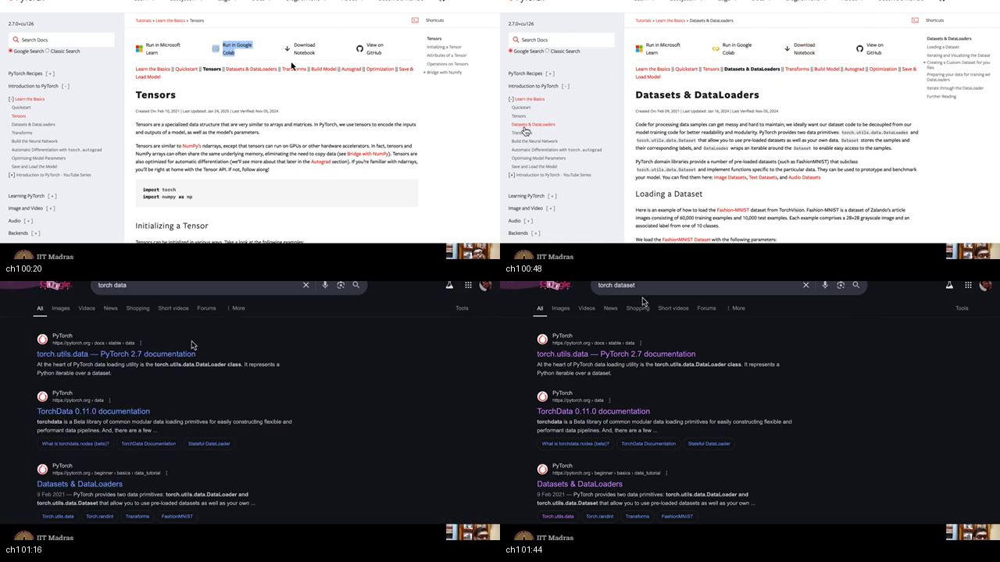
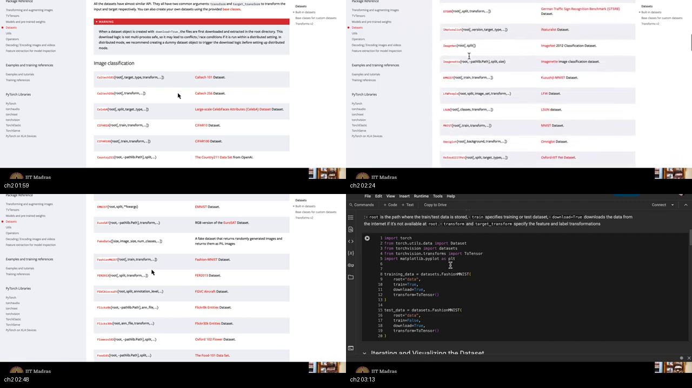
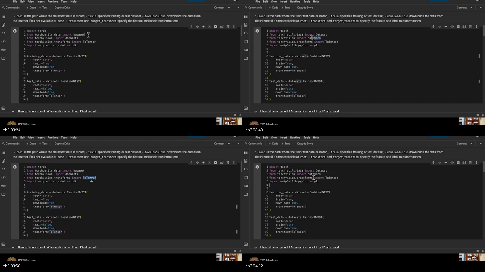
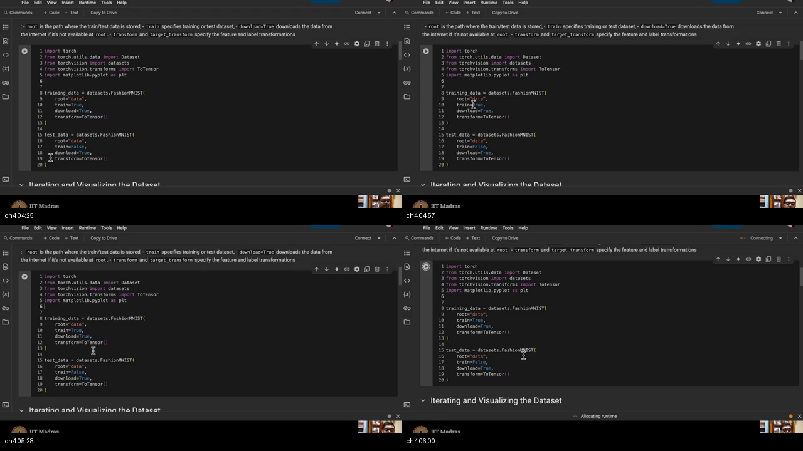
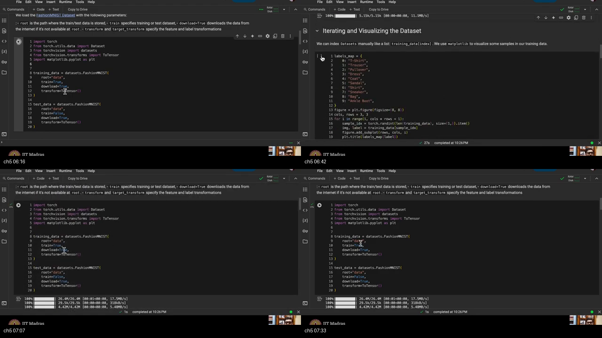
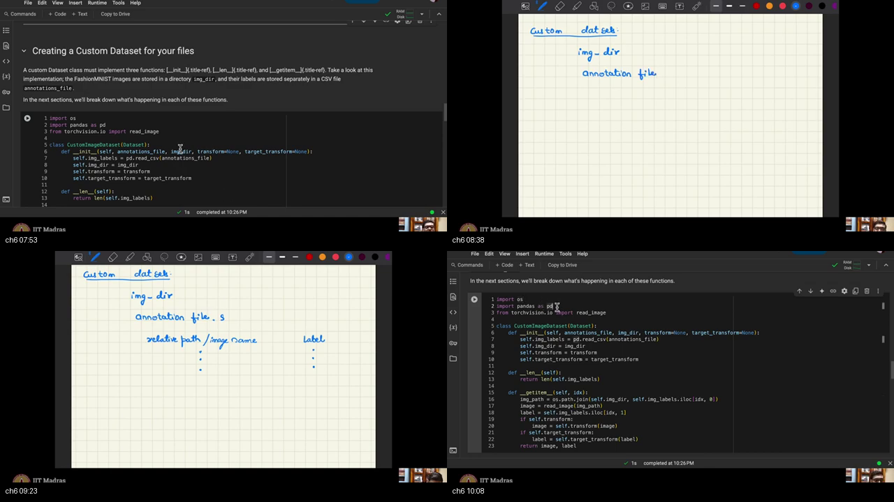
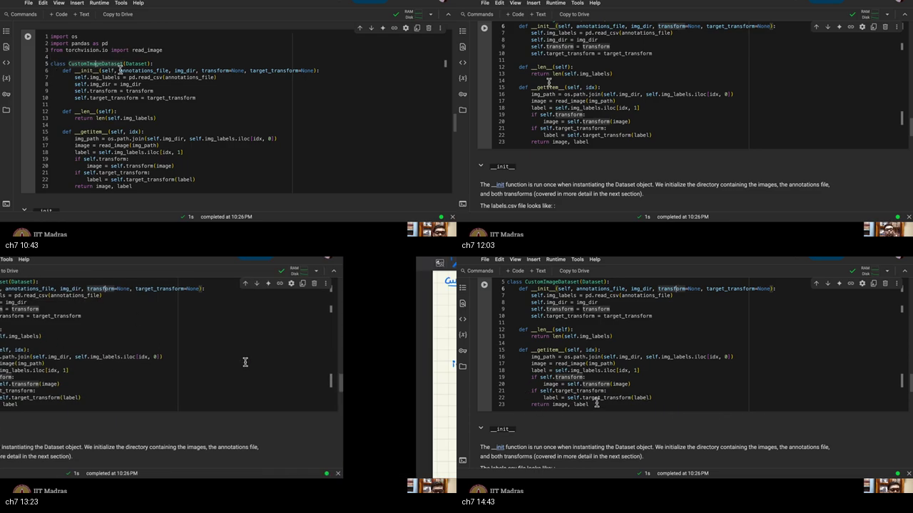
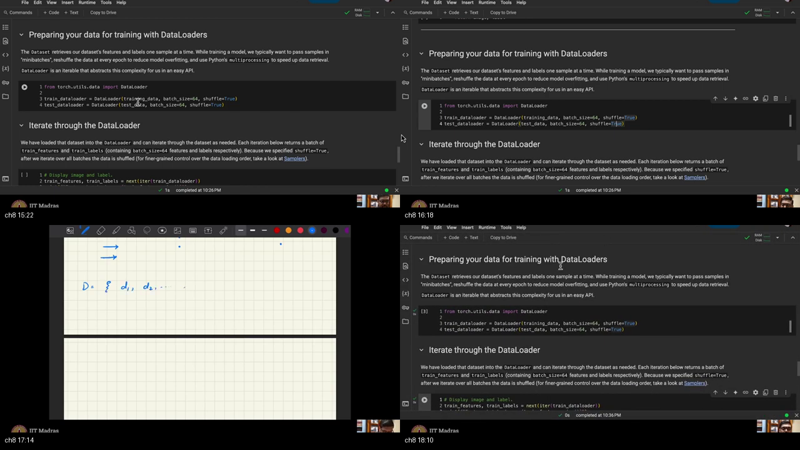

# W1_T2 — Introduction to PyTorch: tensors  
*(this recording: Dataset and DataLoader)*

> **Video:** [W1_T2: Tutorial 2: Introduction to pytorch: tensors](https://www.youtube.com/watch?v=L5n4rNrLZ_8) · **~18 min**  
> **Warm-up first:** [PREREQUISITES.md](./PREREQUISITES.md) · **Quiz:** [quiz.html](./quiz.html)

**Do PREREQUISITES before this article.**  
**Course:** IIT Madras B.S. · **BSDA5002** · Prof. Prathosh A. P. · tutorial live-code (Chandan)  
**Previous in this playlist:** [W1_L2 problem setting](../01-W1-L2-Introduction-Problem-Setting/NOTES.md) · W1_T1 forward/backprop · [W1_L3 tensors Colab](../02-W1-L3-F-Divergence/NOTES.md) (actual tensor algebra)

**Honest title note:** YouTube says **tensors**. The 18-minute notebook he actually opens is **Dataset and DataLoaders** (Fashion-MNIST + `CustomImageDataset`). These notes follow the **speech and the Colab**, not the title.

**Boards:** unique 2×2 composites from the recording (Colab + handwritten `img_dir` / `D={d1,d2,…}`). Code matches the cells he walks (`FashionMNIST`, `ToTensor`, `iloc`, `DataLoader(batch_size=64)`). Newer PyTorch docs renamed `read_image` → `decode_image`; he still types **`read_image`**.

| When he hits… | Warm-up |
|---------------|---------|
| Image → tensor | [p1-tensor](./PREREQUISITES.md#p1-tensor) |
| Train vs test | [p2-train-test](./PREREQUISITES.md#p2-train-test) |
| Labels 0–9 | [p3-label](./PREREQUISITES.md#p3-label) |
| Dataset vs loader | [p4-dataset-loader](./PREREQUISITES.md#p4-dataset-loader) |
| `__init__` / `__len__` / `__getitem__` | [p5-dunder](./PREREQUISITES.md#p5-dunder) |
| CSV + `iloc` | [p6-csv](./PREREQUISITES.md#p6-csv) |
| Batch 64 | [p7-batch](./PREREQUISITES.md#p7-batch) |
| Shuffle | [p8-shuffle](./PREREQUISITES.md#p8-shuffle) |

---

## Table of Contents

1. [Topic 1 — Tensors, then he opens the Dataset sheet](#topic-1-tensors-then-he-opens-the-dataset-sheet-0012–0153) (00:12–01:53)
2. [Topic 2 — Torchvision catalogs; Fashion-MNIST](#topic-2-torchvision-catalogs-fashion-mnist-0153–0320) (01:53–03:20)
3. [Topic 3 — Imports](#topic-3-imports-0320–0417) (03:20–04:17)
4. [Topic 4 — `FashionMNIST` train/test](#topic-4-fashionmnist-traintest-0417–0609) (04:17–06:09)
5. [Topic 5 — Plots; when the repo is not enough](#topic-5-plots-when-the-repo-is-not-enough-0609–0741) (06:09–07:41)
6. [Topic 6 — Custom data: folder + CSV](#topic-6-custom-data-folder--csv-0741–1021) (07:41–10:21)
7. [Topic 7 — `CustomImageDataset`](#topic-7-customimagedataset-1021–1506) (10:21–15:06)
8. [Topic 8 — `DataLoader`, batch 64, shuffle](#topic-8-dataloader-batch-64-shuffle-1506–1826) (15:06–18:26)
9. [External references](#external-references)
10. [Apply it (scenarios)](#apply-it-scenarios)
11. [Sources](#sources)

---

## Executive Summary — architecture of this lecture

Weight updates need **tensors in batches of 64**. This sheet installs a **Dataset** (one `(image, label)`) then a **DataLoader** (batch + shuffle). Lucky path: **Fashion-MNIST** constructors. Unlucky path: folder + CSV + `CustomImageDataset`. After $D_1,\ldots,D_k$, **data is ready**; the model is next.

**Worldview arc:** from “convert files to tensors” **to** “iterate shuffled batches of `(x, y)`.”

### The approach

```
  1. CONVERT   image matrix → tensor     (ToTensor, or read_image)
  2. FORK      lucky   = datasets.FashionMNIST(
                           root="data", train=True/False,
                           download=True, transform=ToTensor())
               unlucky = folder + 2-column CSV
                         CustomImageDataset(Dataset)
                           __init__  __len__  __getitem__
                           iloc[idx,0]=path  iloc[idx,1]=label
  3. WRAP      DataLoader(ds, batch_size=64,
                          shuffle=True)   # train, new order each epoch
                          shuffle=False)  # test, one eval (his advice)
  4. PEEK      images, labels = next(iter(loader))
               64 pairs; each Di = (x_j, y_j) j=1..64
  STOP         data ready as tensors; next sheet = the model
```

### Whole-sheet recipe (commented)

```python
# ===== LUCKY PATH — Fashion-MNIST is already in torchvision =====
import torch
from torch.utils.data import Dataset, DataLoader
from torchvision import datasets
from torchvision.transforms import ToTensor

# 1. CONVERT + LOAD  (image matrix → tensor; two splits, same root)
training_data = datasets.FashionMNIST(
    root="data", train=True, download=True, transform=ToTensor()
)
test_data = datasets.FashionMNIST(
    root="data", train=False, download=True, transform=ToTensor()
)

# 2. WRAP  batches of 64; shuffle TRAIN; do not shuffle TEST (his advice)
train_loader = DataLoader(training_data, batch_size=64, shuffle=True)
test_loader = DataLoader(test_data, batch_size=64, shuffle=False)

# 3. PEEK  one block Di of 64 pairs  ("iterator next")
images, labels = next(iter(train_loader))
# images: ~ (64, 1, 28, 28)    labels: (64,) ints 0..9

# DATA IS READY. Next sheet: a model that eats (images, labels).
```

If the files are **not** in the repo, swap step 1 for `CustomImageDataset` (Topics 6–7): folder + CSV, `__len__` / `__getitem__`, `iloc[idx,0]` path, `iloc[idx,1]` label. Then wrap the same way.

### System context

```
  ╔════════════════════════════════════╗
  ║ W1_T1: forward / backprop by hand  ║
  ║ W1_L3: tensor create / matmul      ║  (different recording)
  ║ W1_T3/T4: loaders / nn.Module      ║
  ╚════════════════╤═══════════════════╝
                   │ this 18 min (playlist T2)
                   ▼
        ┌──────────────────────────┐
        │ Dataset + DataLoader     │
        │ (Fashion-MNIST / custom) │
        └──────────────────────────┘
```

### Main blueprint

```
  JPEG / MNIST file
       │  ToTensor  (or read_image on custom path)
       ▼
  tensor x  +  integer y (0–9)
       │
       ▼
  ┌─ Dataset ─────────────────┐
  │  __len__ → how many       │
  │  __getitem__(i) → (x,y)   │
  │  builtin FashionMNIST     │
  │  or CustomImageDataset    │
  └──────────┬────────────────┘
             │ wrap
             ▼
  DataLoader  batch_size=64
             shuffle=True on TRAIN
             │
             ▼
  for batch in loader:
      x, y = batch     # 64 pairs = one Di
             │
  ┌ · · · · ┴ · · · · · · · ┐
  │ STOP: data ready        │
  │ next: model / training  │
  └ · · · · · · · · · · · · ┘
```

### Scenario walkthrough

Three private hospital photos live in `images/`: `coat/001.png`, `dress/019.png`, `sandal/007.png`. The packing list `annotations.csv` has two columns: those relative paths and bins `4, 3, 5`.

1. **Lucky fork blocked** — these files are not in torchvision.  
2. **Layout** — `img_dir="images"` plus the CSV.  
3. **Class** — `CustomImageDataset` joins folder + `iloc[idx,0]`, `read_image`, label `iloc[idx,1]`. `len(ds)` is 3. `ds[0]` is `(tensor, 4)`.  
4. **Wrap** — `DataLoader(ds, batch_size=64, shuffle=True)` still works: one undersized last batch of 3.  
5. **Peek** — `next(iter(loader))` yields those three pairs as tensors. **Data is ready.**

The lucky twin of the same walk: skip the class, call `FashionMNIST(root="data", …)` twice, wrap with 64.

### Failure / contrast

```
  WRONG  expect torch.matmul in this 18 min     (title trap)
  WRONG  swap CSV columns (path vs label)
  WRONG  shuffle test as if many test epochs
  WRONG  skip __len__ / __getitem__ names
  WRONG  train=True on both FashionMNIST calls
```

### STOP / out of scope

- Matplotlib axes API (he skips; `labels_map` is on screen anyway).
- `nn.Module` / autograd training loop (later tutorials).
- Hand-built `torch.tensor([[1,2],[3,4]])` algebra (playlist W1_L3, not this tape).
- `num_workers`, samplers, collate (mentioned in the notebook prose; he does not teach them).

### Load-bearing claims (closed-book)

- Data must be tensors; he still opens **Dataset / DataLoader**.
- Fashion-MNIST = 10 clothes, labels 0–9, in torchvision.
- `root="data"`, `download=True`, `transform=ToTensor()`.
- Custom = **image directory + two-column CSV**.
- `CustomImageDataset(Dataset)`: `__init__`, `__len__`, `__getitem__`; `iloc[idx,0]` path, `iloc[idx,1]` label.
- `DataLoader` batch **64**; **shuffle train**; test shuffle optional / prefer False.
- Access with **`next(iter(loader))`**; whole data is $D_1\ldots D_k$; **data is ready**.

**Speaker:** IITM BS tutorial (Chandan) · course Prof. Prathosh.

---

## Topic 1: Tensors, then he opens the Dataset sheet (00:12–01:53)

### Where this sits on the master map

This is the **JOB** box. [Everything becomes a tensor](./PREREQUISITES.md#p1-tensor), then **batches** for weight updates. He then clicks the **Datasets and DataLoaders** link — that is the sheet this hour actually runs.

### Board / screenshot



Caption: top-left is the official **Tensors** tutorial (what the YouTube title promised). Top-right is the tab he actually stays on: **Datasets & DataLoaders**, Fashion-MNIST in the first paragraph. Bottom: he even Bing-searches `torch dataset` / `torch data`. Follow the tab, not the title.

### What he is establishing

All data we get will be a **tensor**, or we convert it. Then we want it in **batches** for **updating weights**. That is tutorial two’s job. He also asks the practical questions: **where does the data lie**, and **how do you handle it**.

He then says the **second tutorial link** is **dataset and dataloaders** and goes there. So the *title* and the *tab* disagree. Follow the tab.

The first minute also plants a later fork: when the files **are** in the PyTorch repository you “don’t need to worry much”; **most of the time they are not**, and then you still need to know how to create a DataLoader. He does not build the custom class yet — he only names the leftover problem.

```python
# He does not type a cell in this minute. The job, in one line:
#   files  --convert-->  tensors  --batch-->  weight updates
#
# Official pages he clicks (sidebar of pytorch.org/tutorials):
#   Tensors                  ← YouTube title
#   Datasets & DataLoaders   ← the sheet he actually opens
```

The trap is waiting 18 minutes for `torch.mm`. You will not see it. Tensor *create/ops* live in the other Colab (playlist W1_L3).

You can now state the job: tensors in batches, from files. What is still open: *which* files.

### Analogy for this topic only

The warehouse robot only lifts **numbered grids** (tensors), in **carts** (batches). Today he shows how to fill carts, not how to multiply two grids.

Someone asks: **where is `torch.arange`?** Not this recording.

In lecture words: convert to tensor, then Dataset/DataLoader.

### Local picture

```
  files --convert--> tensors --batch--> optimizer
           ▲                    ▲
           │                    └── DataLoader (this hour)
           └── ToTensor / read_image

  Notice: conversion is ToTensor later, not a handwritten 2×2.
```

### Bridge

If the catalog is already on torchvision’s shelf, constructors stay short. He next scrolls that shelf — Caltech, CIFAR, ImageNet — and parks on Fashion-MNIST.

---

## Topic 2: Torchvision catalogs; Fashion-MNIST (01:53–03:20)

### Where this sits on the master map

This is **BUILTIN**. If the set lives in the [PyTorch repository](./PREREQUISITES.md#p3-label), you do not curate paths yet.

### Board / screenshot



Caption: he scrolls **Image classification** on pytorch.org/vision: Caltech 101, Caltech 256, CelebA, CIFAR-10 / CIFAR-100, then later Fashion-MNIST in the F’s. Bottom-right: the Colab he will run. “When it is available in the PyTorch repository itself, you don’t need to worry much.”

### What he is establishing

He scrolls datasets that **ship with PyTorch**: Caltech 101, Caltech 256 (ASR 205), CIFAR-10, ImageNet, detection/segmentation, pairs, video tasks. Plenty to play with. If it lives **in the repository**, you do not write a path-joining class yet.

**Fashion-MNIST:** **10-class** clothes. He does not list every English name; **0 through 9** is enough. “0 is something, one is something.” Coat / dress / sandal show up when he plots. Think bins in a warehouse, not MNIST digits.

The trap is treating Fashion-MNIST as handwritten digits (that is MNIST). These are **garments**.

```python
# He names the catalog; he does not instantiate yet.
# Fashion-MNIST = 10 clothing classes, labels 0..9.
# (Full English names sit in the next notebook cell as labels_map.)
BUILTIN_TODAY = "FashionMNIST"   # not MNIST digits, not ImageNet
N_CLASSES = 10
```

You can now name the lucky dataset. What is still open: the import list.

### Analogy for this topic only

The warehouse already has a public catalog of 10 clothing types. You download it; you do not photograph your closet yet.

Someone asks: **is ImageNet required today?** No. Fashion-MNIST only. ImageNet is on the same shelf; he scrolls past it.

In lecture words: built-in repo vs later custom wrapper.

### Local picture

```
  torchvision.datasets.*   ←  lucky   (Caltech, CIFAR, Fashion-MNIST, …)
  your private folder      ←  unlucky (Topic 6)

  Notice: 10 clothes, not 10 digits. 0..9 is enough for the net.
```

### Bridge

A catalog name is not enough to load pixels. He next imports `torch`, `Dataset`, `datasets`, `ToTensor`, and `plt` so the Fashion-MNIST constructors have something to call.

---

## Topic 3: Imports (03:20–04:17)

### Where this sits on the master map

This is **IMPORTS**. [Dataset vs the download package vs ToTensor](./PREREQUISITES.md#p4-dataset-loader).

### Board / screenshot



Caption: cursor on the five import lines. Capital **D** on `Dataset`; `datasets` (plural) downloads; `ToTensor` turns an image matrix into a tensor; `plt` only to look. The markdown above the cell already names `root`, `train`, `download`, `transform`.

### What he is establishing

**First library: `torch`.** Then `torch.utils.data` — you **create a Dataset** (`Dataset`, capital D). To **download from the repository**: package **`datasets`**. Once you have an image, convert to tensor: **`transforms` / `ToTensor`**. Plotting: **`matplotlib.pyplot as plt`**.

Those five are “the necessary libraries for our work.” `plt` is only so you can **see** how the clothes look; it is not the training engine.

```python
import torch
from torch.utils.data import Dataset          # protocol / parent class  (capital D)
from torchvision import datasets              # FashionMNIST, CIFAR, ...
from torchvision.transforms import ToTensor   # image matrix → tensor
import matplotlib.pyplot as plt               # peek at clothes; not the point
```

**What this does:** `datasets` fetches; `ToTensor` makes the grid; `Dataset` is the type you subclass later. Mixing `Dataset` (singular, class) with `datasets` (plural, download module) is the #1 import typo.

The trap is importing `Dataset` and never using torchvision `datasets` (no download), or the reverse.

You can now paste the import block. What is still open: the FashionMNIST call.

### Analogy for this topic only

Four tools on the bench: the engine (`torch`), the catalog (`datasets`), the converter (`ToTensor`), the protocol badge (`Dataset`). `plt` is a lamp so you can look; you can train in the dark.

Someone asks: **do I need `plt` to train?** He uses it to look, then shrugs.

In lecture words: those five imports are “necessary libraries for our work.”

### Local picture

```
  datasets  →  download from the repo
  ToTensor  →  matrix to tensor
  Dataset   →  class you inherit
  plt       →  look, then ignore axes API

  Notice: Dataset (singular, capital D) is not the same module as datasets (download).
```

### Bridge

Training pile vs test pile, then `root` and `download`. The next cell is two `FashionMNIST(...)` calls that use every flag he just named.

---

## Topic 4: `FashionMNIST` train/test (04:17–06:09)

### Where this sits on the master map

This is **BUILTIN LOAD**. [Train vs test](./PREREQUISITES.md#p2-train-test); `root="data"`; `download=True`; [ToTensor](./PREREQUISITES.md#p1-tensor).

### Board / screenshot



Caption: two constructors, same `root="data"`. `train=True` then `train=False`. Bottom-right: he **runs** the cell — “it will take some time” while files land under `./data`.

### What he is establishing

Any dataset has **two parts**: **training** (understand input–output) and **test** (evaluate). Fashion-MNIST ships them split. They have been **made separate**.

Constructor: **`datasets.FashionMNIST`**. **`root="data"`** = folder `data` in the **current working directory**. **`train=True`** for the training split. **`download=True`** (ASR “two”): if the files are not in that folder, **download**. After download, **transform** the image: an image is a **matrix**; **convert to a tensor**. Test: same `root`, **`train=False`**, `download=True`, same ToTensor.

He runs it; it **takes some time**. First run fetches; later runs reuse `./data`.

```python
# Training split: learn x → y
training_data = datasets.FashionMNIST(
    root="data",          # ./data relative to the notebook's cwd
    train=True,           # the training pile
    download=True,        # fetch if that folder is empty
    transform=ToTensor(), # pixel matrix → tensor
)

# Test split: evaluate once later
test_data = datasets.FashionMNIST(
    root="data",
    train=False,          # not the training pile
    download=True,
    transform=ToTensor(),
)
```

**What this does:** first run downloads into `./data`; later runs reuse the files. Each example is already a tensor plus a 0–9 label.

```python
# After the download finishes (he waits: "it will take some time"):
img0, y0 = training_data[0]   # Dataset protocol: one pair, not a batch
# img0 is a tensor (ToTensor already ran)
# y0 is an integer 0..9  — the bin, not the word "coat"

n_train = len(training_data)  # how many training examples (~60_000)
n_test = len(test_data)       # ~10_000
# He does not print these; they exist because FashionMNIST is a Dataset.
```

The trap is `train=True` on both calls, or `root` pointing at a folder you cannot write, or skipping `ToTensor` and feeding a PIL image to a Linear layer.

You can now copy the two constructors. What is still open: looking at labels, then the unlucky path.

### Analogy for this topic only

Public catalog in a drawer labeled `data`. If the drawer is empty, order from the PyTorch store (`download=True`). Practice pile vs exam pile — two flags, **one** folder.

Someone asks: **can I skip ToTensor and feed JPEGs to a Linear layer?** Not in this pipeline. An image is a matrix; the net wants a tensor.

In lecture words: root, train flag, download, transform to tensor.

### Local picture

```
  cwd/data/FashionMNIST/...
       train=True   training_data
       train=False  test_data

  Notice: same folder, two flags — not two roots.
```

### Bridge

He plots (and skips teaching `plt`), then says you will not always be this lucky. Coat / dress / sandal are the human names; 0–9 is what the net sees.

---

## Topic 5: Plots; when the repo is not enough (06:09–07:41)

### Where this sits on the master map

This is **LUCK**. Labels [0–9](./PREREQUISITES.md#p3-label). Real work is often **custom**.

### Board / screenshot



Caption: top-right is the **`labels_map`** he does not teach as matplotlib — T-Shirt … Ankle Boot, 0 through 9. Bottom: download progress, then he talks lucky vs confidential data.

### What he is establishing

Plotting (`plt` axes) — **he will not teach** (“I’ll not be going ahead how plt works”). After the run: **coat, dress, sandal** — ten classes **0–9**. Number them; the net never reads the English word.

The notebook still contains the map. You may read it even if he skips the axes API:

```python
# He skips axes / subplots. The cell he has open still names the bins.
labels_map = {
    0: "T-Shirt",
    1: "Trouser",
    2: "Pullover",
    3: "Dress",
    4: "Coat",
    5: "Sandal",
    6: "Shirt",
    7: "Sneaker",
    8: "Bag",
    9: "Ankle Boot",
}

# Peek one training example (Dataset, not DataLoader yet):
img, y = training_data[0]
# print(int(y), labels_map[int(y)])   # humans read "Coat"; the net reads 4
```

**Good case:** data **in the PyTorch repository**. **Most cases:** **custom**, **customer-sensitive**, **confidential** — **not** in torchvision. Then **curate** it and write a **wrapper script**. That wrapper is a **custom dataset**.

The trap is assuming every homework set is `FashionMNIST`.

You can now split lucky vs unlucky. What is still open: the two files the wrapper needs.

### Analogy for this topic only

Public mall catalog vs a hospital closet of private photos. The mall has a download button. The hospital needs your own list. Uploading the hospital closet into torchvision is the thing the wrapper exists to avoid.

Someone asks: **can I upload confidential images to torchvision?** That is exactly why the wrapper exists.

In lecture words: custom dataset when the repo does not have your files.

### Local picture

```
  torchvision  --yes-->  FashionMNIST constructors
               --no-->   folder + CSV + subclass

  Notice: confidential data is the reason torchvision cannot be the only path.
```

### Bridge

Custom data is not “another FashionMNIST flag.” You need an **image directory** plus an **annotation CSV** so `__getitem__` can join a path. That layout is the next box — he writes `img_dir` and `annotation file` on the tablet.

---

## Topic 6: Custom data: folder + CSV (07:41–10:21)

### Where this sits on the master map

This is **LAYOUT**. [Two-column CSV](./PREREQUISITES.md#p6-csv) plus a root folder.

### Board / screenshot



Caption: tablet: **Custom dataset = `img_dir` + annotation file**. Then two columns: **relative path / image name** | **label**. Colab already shows `read_image` and `iloc[idx, 0]` / `iloc[idx, 1]`. Extra imports: `os`, `pandas as pd`, `torchvision.io.read_image`.

### What he is establishing

Custom dataset **two parts**: **image directory** (OS path) and **annotation file**, preferably **CSV**. CSV holds **relative path and image name** (or other modality — **sequence is allowed**) and the **label**. **Two columns.**

From the folder + the CSV row you know which file and which label. Imports: **`os`** (retrieve by path), **`pandas`** (read CSV → DataFrame), **`torchvision.io.read_image`**. He **assumes** you know **OOP**: `__init__`, double-underscore, **inheritance**.

The trap is a CSV of only labels, or absolute Windows paths that break on another machine. Relative + `join` is the point.

```python
import os
import pandas as pd
from torchvision.io import read_image  # he: "torchvision.io ... read_image"
# Newer docs: decode_image. This recording types read_image.

# Toy annotation file he described: TWO columns (path, label)
# annotations.csv
# coat/001.png,4
# dress/019.png,3
# sandal/007.png,5

img_dir = "images"  # OS path / root — "image directory"
csv_path = "annotations.csv"

# Why pandas: read the CSV into a DataFrame
img_labels = pd.read_csv(csv_path)  # later: self.img_labels

# Why os: join the folder with the relative path in column 0
idx = 0  # "which example / which row"
rel = img_labels.iloc[idx, 0]       # column 0 = relative path + name
full = os.path.join(img_dir, rel)   # now you have a full path
# image = read_image(full)          # next topic, inside __getitem__
# label = img_labels.iloc[idx, 1]   # column 1 = label
```

**What this does:** proves you can recover one file and one bin from a folder + table *before* wrapping them in a class.

You can now sketch the two files. What is still open: the class body.

### Analogy for this topic only

A box of three photos: `coat/001.png`, `dress/019.png`, `sandal/007.png`. The packing list has two columns only: filename, bin number (4, 3, 5).

Someone asks: **which column does `read_image` open?** The filename column. Opening the bin number as a path is the wrong move.

In lecture words: image directory + two-column annotation CSV.

### Local picture

```
  join(img_dir, csv_row_path) → full path → read_image
  csv_row_label               → y

  img_dir/
    coat/001.png
    dress/019.png
  annotations.csv
    coat/001.png, 4
    dress/019.png, 3

  Notice: path is column 0, label column 1 in the next topic.
```

### Bridge

A folder and a CSV are still not a Dataset. You must **subclass `Dataset`** with three compulsory methods so DataLoader can ask “how many?” and “give me row i.” He already has the class on screen; next he walks every line.

---

## Topic 7: `CustomImageDataset` (10:21–15:06)

### Where this sits on the master map

This is **CLASS**. Child of [`Dataset`](./PREREQUISITES.md#p5-dunder); [`iloc`](./PREREQUISITES.md#p6-csv) for row `idx`.

### Board / screenshot



Caption: “these two methods should be there… almost as it is.” `__init__` stores CSV, folder, both transforms. `__len__` → `len(self.img_labels)`. `__getitem__`: `join` + `iloc[idx, 0]` + `read_image` + `iloc[idx, 1]` + optional transforms + `return image, label`.

### What he is establishing

Class name **`CustomImageDataset`**, **child of `Dataset`**. Constructor: `self`, **`annotations_file`** (CSV), **`img_dir`** (root), **`transform`** (on **X** / features), **`target_transform`** (on **Y** / label), both **None** by default.

Store `self.img_labels = pd.read_csv(...)`, `self.img_dir`, both transforms.

Compulsory: **`__len__`** = length of `img_labels` (how many items). **`__getitem__(self, idx)`**: `idx` = **which row**. Build **`img_path`** with **`os.path.join(img_dir, labels.iloc[idx, 0])`**. **`iloc`** accesses **rows**; column **0** = relative path. **`read_image(img_path)`**. Label = **`iloc[idx, 1]`** (first label column — he says “idx 1”). If `self.transform`: transform the **image**. If `self.target_transform`: transform the **label**. **`return image, label`**.

Most of the time you will need this custom class; they will give custom datasets so you must be proficient when data is **not** in the PyTorch repo.

```python
import os
import pandas as pd
from torchvision.io import read_image
from torch.utils.data import Dataset

class CustomImageDataset(Dataset):
    def __init__(
        self,
        annotations_file,   # CSV: col0 path, col1 label
        img_dir,            # root folder of images
        transform=None,     # optional transform on X
        target_transform=None,  # optional transform on y
    ):
        self.img_labels = pd.read_csv(annotations_file)
        self.img_dir = img_dir
        self.transform = transform
        self.target_transform = target_transform

    def __len__(self):
        # how many rows = how many examples
        return len(self.img_labels)

    def __getitem__(self, idx):
        # idx = which CSV row
        rel = self.img_labels.iloc[idx, 0]          # column 0 = relative path
        img_path = os.path.join(self.img_dir, rel)  # full path
        image = read_image(img_path)
        label = self.img_labels.iloc[idx, 1]        # column 1 = label
        if self.transform:
            image = self.transform(image)
        if self.target_transform:
            label = self.target_transform(label)
        return image, label
```

**What this does:** `dataset[17]` runs `__getitem__(17)` and returns one tensor and one label. DataLoader will call this 64 times per batch.

```python
# Use the class (he assumes you instantiate it on your custom folder):
ds = CustomImageDataset(
    annotations_file="annotations.csv",
    img_dir="images",
    transform=None,          # or ToTensor() if read_image is not already a tensor
    target_transform=None,   # leave labels as ints 0..9
)

print(len(ds))        # __len__ → number of CSV rows
image, label = ds[0]  # __getitem__(0): join + read_image + iloc[0,1]
# image: tensor from read_image
# label: integer from column 1
```

Walk **index 0** the way he narrates `iloc`:

```python
# Same as the body of __getitem__, unrolled for idx = 0
idx = 0
rel = ds.img_labels.iloc[idx, 0]                 # relative path
img_path = os.path.join(ds.img_dir, rel)         # two paths joined
image = read_image(img_path)                     # pixels
label = ds.img_labels.iloc[idx, 1]               # "idx 1" = column 1
# if transform: image = transform(image)
# if target_transform: label = target_transform(label)
# return image, label
```

The trap is swapping columns 0 and 1, or forgetting `return image, label`, or renaming `__len__` / `__getitem__`.

You can now write the class. What is still open: wrapping it so training sees **64 at a time**.

### Analogy for this topic only

Employee badge “Dataset”: when asked “how many?”, count CSV rows. When asked “number 17?”, join folder + row 17’s filename, read the photo, read the bin number, return both.

Someone asks: **can I name the methods `length` and `get`?** No. DataLoader looks up the dunders.

In lecture words: child of Dataset; `__len__`; `__getitem__` via `iloc`.

### Local picture

```
  idx=0
    iloc[0,0] = "coat/001.png"
    join(img_dir, ...) → full path
    read_image → tensor
    iloc[0,1] = 4
    return (tensor, 4)

  Notice: transform is optional None — ToTensor can live here too.
```

### Bridge

Dataset is the catalog. DataLoader is the cart of 64. He has curated the data; “then what?” is the loader, `shuffle=True`, and `next(iter(...))`.

---

## Topic 8: `DataLoader`, batch 64, shuffle (15:06–18:26)

### Where this sits on the master map

This is **LOADER**. [Batch 64](./PREREQUISITES.md#p7-batch); [shuffle train, not test](./PREREQUISITES.md#p8-shuffle). After this, **data is ready**.

### Board / screenshot



Caption: official cell uses `shuffle=True` on **both** loaders. He argues test **False** — one evaluation, no extra test epochs. Tablet: $D=\{d_1,d_2,\ldots\}$; each $d_i$ is 64 pairs. Bottom-right: `next(iter(train_dataloader))`. Then: “data is ready… let’s look into the next step.”

### What he is establishing

You have the data. Next: **DataLoader**. Take **training data**, **batches of 64**, **`shuffle=True`**: every time, batches are **not the same order**. Same idea for test **except** shuffle True is **not mandatory**. **`shuffle=False` makes sense** on test: you evaluate **once**, you will **not** have **multiple epochs** on test.

Access with **iterator / `next`**. Plotting the batch — he waves at it.

Outcome: whole data divided **D1 … Dk**. Each **Di** is tuples **`(x_j, y_j)` for `j = 1…64`**. Batch size 64. Data curated **as tensors**. **Data is ready.** Next sheet / next step. He can leave datasets now.

```python
from torch.utils.data import DataLoader

# Train: new order each epoch so the optimizer does not memorize trip order
train_dataloader = DataLoader(
    training_data,
    batch_size=64,
    shuffle=True,
)

# Test: he prefers no shuffle — one evaluation pass, not many epochs
test_dataloader = DataLoader(
    test_data,
    batch_size=64,
    shuffle=False,  # official sample often uses True; this recording argues False
)

# One plate of 64
images, labels = next(iter(train_dataloader))
# images: about (64, 1, 28, 28) for Fashion-MNIST after ToTensor
# labels: (64,) integers 0–9
```

**What this does:** training loops will be `for images, labels in train_dataloader:`. That is the next tutorials’ input.

```python
# He: "access these using iterator next" — one block = one batch
images, labels = next(iter(train_dataloader))
# Fashion-MNIST + ToTensor: images shape about (64, 1, 28, 28)
# labels shape (64,) with ints 0..9

# He draws D = { d1, d2, ..., dk }  each Di = 64 tuples (x_j, y_j)
# A full pass (one epoch on TRAIN) looks like:
for images, labels in train_dataloader:
    # later: model(images); loss(labels)
    # this sheet STOPS here — "data is ready"
    pass

# Test: one evaluation, not many epochs — that is why shuffle=False
images_t, labels_t = next(iter(test_dataloader))
```

The trap is `shuffle=True` on test “because the docs snippet did,” when he just told you why False fits evaluation.

You can now wrap any Dataset. What is still missing is a model that **eats** those batches — next sheet.

### Analogy for this topic only

64 tagged garments per cart. Reshuffle practice carts every night. Final inspection: one pass, no reshuffle ritual.

Someone asks: **what if I have 100 images?** Last cart may hold 36. He did not dwell; the loader still yields them.

In lecture words: batch 64; shuffle train; data ready as tensors.

### Local picture

```
  Dataset  --DataLoader(64, shuffle)-->  D1, D2, ..., Dk
  each Di = 64 × (x, y)

  D = { d1, d2, ..., dk }     ← his tablet

  Notice: Dataset never saw "64". The loader adds batching.
```

### Bridge

The leftover problem is a **network and an optimizer** that consume `(images, labels)`. That is W1_T4 model building, not more Dataset API. He leaves this sheet: “I don’t need datasets also.”

---

## External references

All companions live **here**, not under the topics. Mix of **video**, **blog/notes**, and **docs**. No Wikipedia.

**Start here (if you only open three).** Official Datasets tutorial → Learn PyTorch Fashion-MNIST chapter → `CustomImageDataset` walkthrough (Aladdin).

This recording is **~18 min**, not a 60-minute lab. Extra links are second passes of the **same eight boxes**. The YouTube title’s missing tensor algebra is Topic 1’s companions only.

### Per-topic companions (2–3 each)

| Topic / map box | Type | Resource | Why it helps |
|-----------------|------|----------|--------------|
| **1 · tensors then Dataset sheet** | video | [Aladdin Persson — Complete PyTorch tensor tutorial](https://www.youtube.com/watch?v=x9JiIFvlUwk) | The **title** hour (`torch.tensor`, math, view) that this tape skipped. |
| **1 · tensors then Dataset sheet** | docs | [PyTorch tensors (basics)](https://docs.pytorch.org/tutorials/beginner/basics/tensorqs_tutorial.html) | Official create/ops page he clicked and left. |
| **1 · tensors then Dataset sheet** | notes | [Learn PyTorch — 00 Fundamentals](https://www.learnpytorch.io/00_pytorch_fundamentals/) | Beginner tensor blog with the same “grid of numbers” picture. |
| **2 · torchvision / Fashion-MNIST** | video | [Samuel Chan — Fashion-MNIST + Dataset/DataLoader](https://www.youtube.com/watch?v=mDEoJhQEIuY) | First 9 min: what the 10 clothes **are**, then loaders. |
| **2 · torchvision / Fashion-MNIST** | data | [Zalando Fashion-MNIST](https://github.com/zalandoresearch/fashion-mnist) | Original 10-class clothes set (0–9). |
| **2 · torchvision / Fashion-MNIST** | docs | [FashionMNIST API](https://docs.pytorch.org/vision/stable/generated/torchvision.datasets.FashionMNIST.html) | `root`, `train`, `download`, `transform` — his constructor flags. |
| **3 · imports** | docs | [Datasets & DataLoaders](https://docs.pytorch.org/tutorials/beginner/basics/data_tutorial.html) | Same import block: `Dataset`, `datasets`, `ToTensor`, `plt`. |
| **3 · imports** | notes | [Learn PyTorch — 03 Computer vision](https://www.learnpytorch.io/03_pytorch_computer_vision/) | Same five libraries, explained as a table. |
| **3 · imports** | docs | [torchvision.transforms](https://docs.pytorch.org/vision/stable/transforms.html) | `ToTensor` = image matrix → tensor. |
| **4 · FashionMNIST constructors** | notes | [D2L — Fashion-MNIST dataset](https://www.d2l.ai/chapter_linear-classification/image-classification-dataset.html) | Train vs test sizes, `ToTensor`, batch 64. |
| **4 · FashionMNIST constructors** | docs | [Loading a Dataset (same tutorial)](https://docs.pytorch.org/tutorials/beginner/basics/data_tutorial.html#loading-a-dataset) | The two `FashionMNIST(...)` cells he runs. |
| **4 · FashionMNIST constructors** | video | [Daniel Bourke — PyTorch computer vision (Fashion-MNIST load)](https://youtu.be/Z_ikDlimN6A?t=50417) | University-style walk of the same constructor flags. |
| **5 · lucky vs custom** | video | [Aladdin Persson — custom Datasets for images](https://www.youtube.com/watch?v=ZoZHd0Zm3RY) | When torchvision is not enough — folder of your own photos. |
| **5 · lucky vs custom** | notes | [Learn PyTorch — 04 Custom datasets](https://www.learnpytorch.io/04_pytorch_custom_datasets/) | Lucky ImageFolder vs writing your own `Dataset`. |
| **5 · lucky vs custom** | docs | [Creating a Custom Dataset](https://docs.pytorch.org/tutorials/beginner/basics/data_tutorial.html#creating-a-custom-dataset-for-your-files) | Same fork: repo vs wrapper. |
| **6 · folder + CSV** | docs | [pandas.read_csv](https://pandas.pydata.org/docs/reference/api/pandas.read_csv.html) | Why he imports pandas for the annotation file. |
| **6 · folder + CSV** | docs | [os.path.join](https://docs.python.org/3/library/os.path.html#os.path.join) | Folder + relative path → full path. |
| **6 · folder + CSV** | notes | [Sasank — Writing custom datasets (legacy tutorial)](https://docs.pytorch.org/tutorials/beginner/data_loading_tutorial.html) | CSV + `iloc` + `join` on a folder of files. |
| **7 · CustomImageDataset** | docs | [`torch.utils.data.Dataset`](https://docs.pytorch.org/docs/stable/data.html#torch.utils.data.Dataset) | Parent protocol DataLoader calls. |
| **7 · CustomImageDataset** | blog | [Dare Data — PyTorch custom data](https://blog.daredata.engineering/pytorch-introduction-using-custom-data-2/) | Subclass + CSV + `next(iter(...))` in one post. |
| **7 · CustomImageDataset** | video | [Daniel Bourke — writing a custom Dataset class](https://youtu.be/Z_ikDlimN6A?t=78121) | `__init__` / `__len__` / `__getitem__` from scratch. |
| **8 · DataLoader 64 / shuffle** | video | [CampusX — Dataset & DataLoader](https://www.youtube.com/watch?v=RH6DeE3bY6I) | Why batch + shuffle exist; then the API. |
| **8 · DataLoader 64 / shuffle** | docs | [`DataLoader`](https://docs.pytorch.org/docs/stable/data.html#torch.utils.data.DataLoader) | `batch_size`, `shuffle` — his interesting argument. |
| **8 · DataLoader 64 / shuffle** | notes | [D2L — reading a minibatch](https://www.d2l.ai/chapter_linear-classification/image-classification-dataset.html#reading-a-minibatch) | `shuffle=train` (True on train, False on val) — same advice as this tape. |

**How to use.** After Topic 4, run the official Fashion-MNIST cells. After Topic 7, diff their `CustomImageDataset` with his `iloc` story (`read_image` here; some docs now say `decode_image`). After Topic 8, `next(iter(...))` and compare official test `shuffle=True` with his False. Open the **tensor** tutorial only if you still needed the title’s missing math.

---

## Apply it (scenarios)

*Workplace-style situations that use ideas from this video only.*

### Scenario 1: Download never finishes on a locked lab PC

**Context:** `root="data"`, `download=True`, no internet.  
**Challenge:** constructor hangs or errors.  
**Questions:**  
1. What does `download=True` do if the folder is empty?  
2. What is the lucky vs unlucky fork?

<details><summary>Show solution sketch</summary>

- Topic 4: download fetches into `./data`. Offline, pre-copy Fashion-MNIST into that folder and set `download=False`, or skip to custom (Topic 6).

</details>

### Scenario 2: CSV columns swapped

**Context:** intern’s `__getitem__` uses `iloc[idx, 0]` as the label.  
**Challenge:** `read_image("4")` crashes.  
**Questions:**  
1. Which column is path?  
2. Which is label?

<details><summary>Show solution sketch</summary>

- Topic 7: column 0 = relative path, column 1 = label. Swap and you treat `"4"` as a filename.

</details>

### Scenario 3: Test accuracy jitters every run

**Context:** `DataLoader(test_data, batch_size=64, shuffle=True)` and they “epoch” the test set.  
**Challenge:** numbers move.  
**Questions:**  
1. What did he say about shuffle on test?  
2. How many times do you evaluate test?

<details><summary>Show solution sketch</summary>

- Topic 8: shuffle True is not mandatory on test; False makes sense; one evaluation, not many test epochs. Official cell may still show True — follow his argument.

</details>

### Scenario 4: DataLoader says it has no length

**Context:** custom class has only `__getitem__`.  
**Challenge:** loader errors or never stops.  
**Questions:**  
1. Which method reports how many items?  
2. What does `__len__` return in his code?

<details><summary>Show solution sketch</summary>

- Topic 7: `__len__` → `len(self.img_labels)`. Compulsory, “almost as it is.”

</details>

### Scenario 5: Last cart is short

**Context:** 100 private images, `batch_size=64`.  
**Challenge:** intern thinks the last 36 must be dropped.  
**Questions:**  
1. Who decided 64 — Dataset or DataLoader?  
2. Does `next(iter(loader))` still work?

<details><summary>Show solution sketch</summary>

- Topics 7–8: Dataset still returns one pair; the loader stacks. Last batch may have 36. He did not dwell; the iterator still yields them. Data is still ready.

</details>

---

## Sources

- Video: [W1_T2 tensors (recording = Dataset/DataLoader)](https://www.youtube.com/watch?v=L5n4rNrLZ_8) · [IITM playlist](https://www.youtube.com/playlist?list=PLZ2ps__7DhBa5xCmncgH7kPqLqMBq7xlu) index 6
- Captions: `raw/captions.en.vtt` / `raw/captions.en.timed.txt`
- Claim sheets: `raw/claims/topic-01.md` … `topic-08.md`
- Code aligned to the Colab he walks, matching [PyTorch Datasets & DataLoaders tutorial](https://docs.pytorch.org/tutorials/beginner/basics/data_tutorial.html) (he types `read_image`; current docs often say `decode_image`)
- Course page: https://study.iitm.ac.in/ds/course_pages/BSDA5002.html
- Ingest: captions yes · video yes (`raw/lecture.mp4`) · 8 unique composites · `ingest_evidence: E3`
