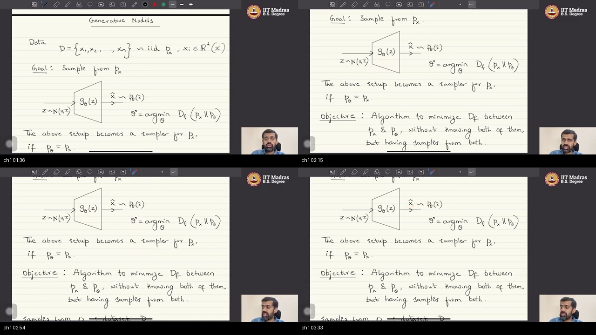
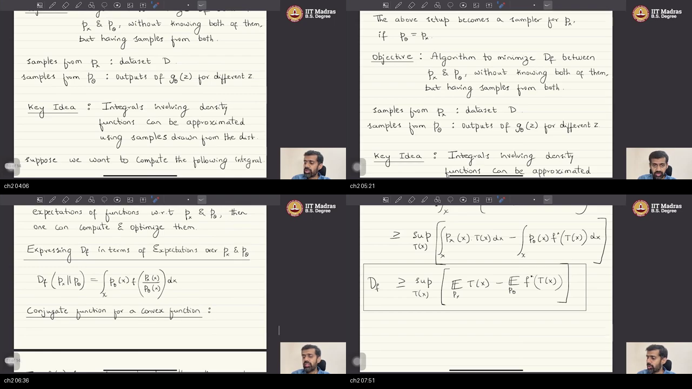
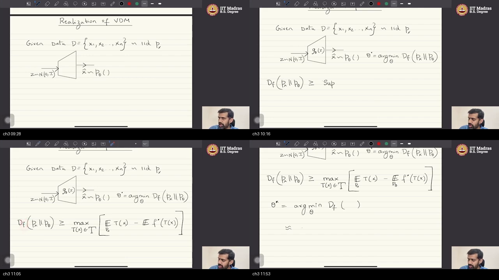
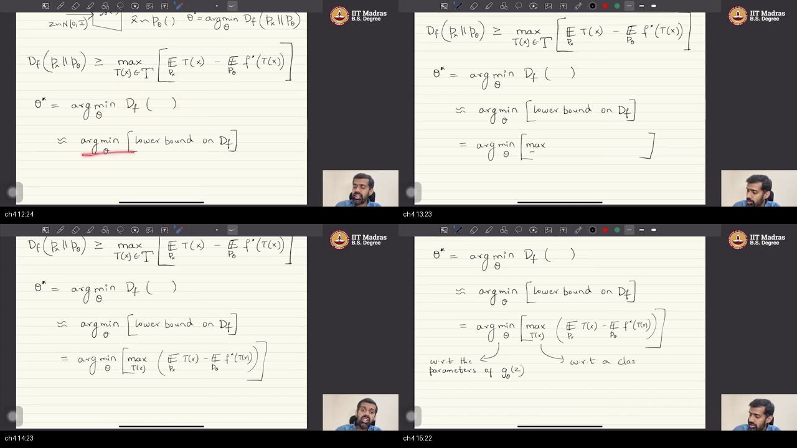
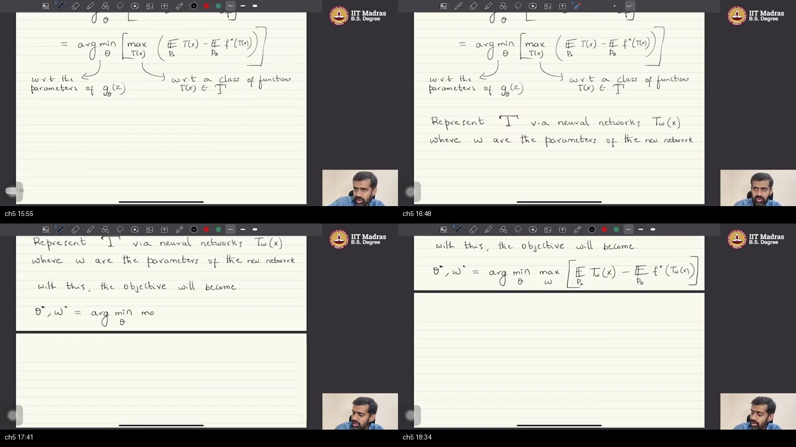
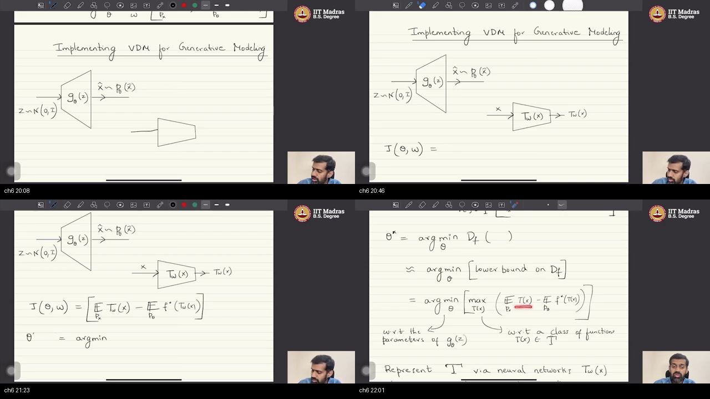
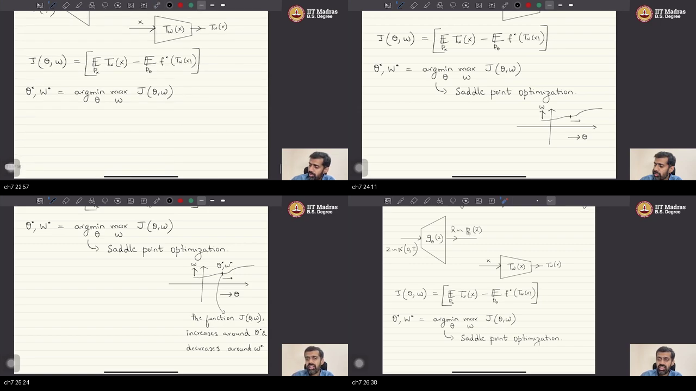
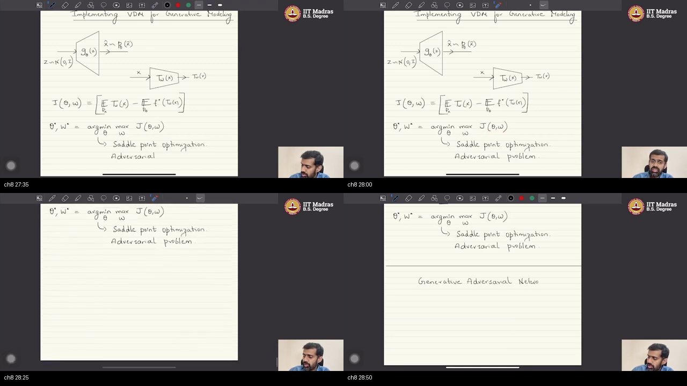
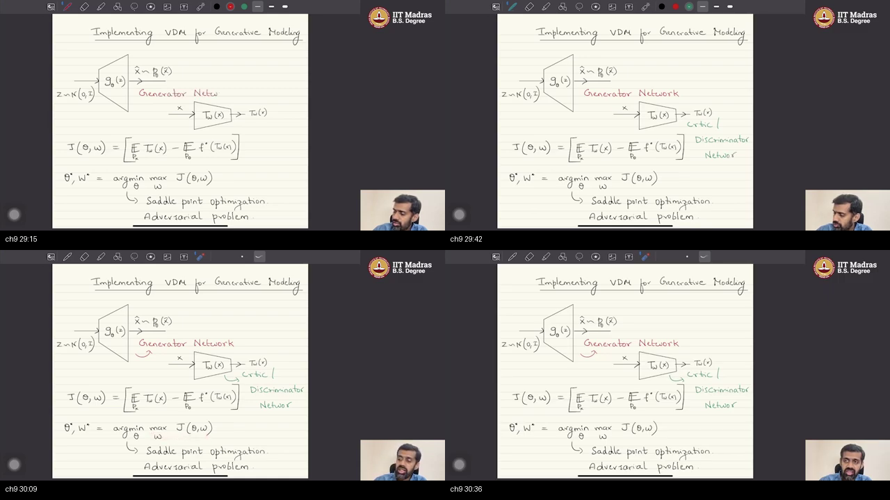

# W1_T3 — Realization of variational divergence minimization  
*(YouTube title: Introduction to pytorch: datasets & dataloaders)*

> **Video:** [W1_T3: Tutorial 3: Introduction to pytorch: datasets & dataloaders](https://www.youtube.com/watch?v=c2gN3TK3U74) · **~31 min**  
> **Warm-up first:** [PREREQUISITES.md](./PREREQUISITES.md) · **Quiz:** [quiz.html](./quiz.html)

**Do PREREQUISITES before this article.**  
**Course:** IIT Madras B.S. · **BSDA5002** · Prof. Prathosh A. P.  
**Previous:** [W1_L4 names $f$-divergence](../03-W1-L4-Variational-Divergence-Minimization/NOTES.md) · bound sitting (playlist T1) · [W1_T2 Dataset/DataLoader](../04-W1-T2-Introduction-to-PyTorch-Tensors/NOTES.md)

**Honest title note:** YouTube and the playlist blurb advertise **Fashion-MNIST, custom `Dataset`, `DataLoader`**. The 31-minute pad he actually writes is **variational divergence minimization in practice**: two nets, one score, a saddle, then the GAN names. These notes follow the **speech and the board**, not the title. Dataset code is [W1_T2](../04-W1-T2-Introduction-to-PyTorch-Tensors/NOTES.md). **No Python this hour.** Do not invent a training loop.

| When he hits… | Warm-up |
|---------------|---------|
| IID $D$, unknown $p_x$ | [p1-px](./PREREQUISITES.md#p1-px) |
| $z\to G_\theta\to\hat x$ | [p2-push](./PREREQUISITES.md#p2-push) |
| $f$-divergence yardstick | [p3-fdiv](./PREREQUISITES.md#p3-fdiv) |
| Integrals ≈ averages | [p4-lln](./PREREQUISITES.md#p4-lln) |
| Lower bound, $f^*$ | [p5-bound](./PREREQUISITES.md#p5-bound) |
| Nested min / max | [p6-nested](./PREREQUISITES.md#p6-nested) |
| Second net $T_w$ | [p7-approx](./PREREQUISITES.md#p7-approx) |
| Saddle, adversaries | [p8-saddle](./PREREQUISITES.md#p8-saddle) |

---

## Table of Contents

1. [Topic 1 — Recap: IID data, $G_\theta$ sampler, min $D_f$](#topic-1--recap-iid-data-g_theta-sampler-min-d_f-0013–0345) (00:13–03:45)
2. [Topic 2 — Samples only; $f$-div; LLN; conjugate bound](#topic-2--samples-only-f-div-lln-conjugate-bound-0345–0813) (03:45–08:13)
3. [Topic 3 — Realization: bound as $\max_T$ of two expectations](#topic-3--realization-bound-as-max_t-of-two-expectations-0813–1207) (08:13–12:07)
4. [Topic 4 — Min lower bound $\neq$ min $D_f$; nested min-max](#topic-4--min-lower-bound-neq-min-d_f-nested-min-max-1207–1540) (12:07–15:40)
5. [Topic 5 — Represent $\mathcal{T}$ by a net $T_w$](#topic-5--represent-mathcalt-by-a-net-t_w-1540–1850) (15:40–18:50)
6. [Topic 6 — Two-net diagram: $G$ sampler + $T$ critic](#topic-6--two-net-diagram-g-sampler--t-critic-1850–2237) (18:50–22:37)
7. [Topic 7 — Saddle point on purpose](#topic-7--saddle-point-on-purpose-2237–2659) (22:37–26:59)
8. [Topic 8 — Adversarial: opposite verbs on one $J$](#topic-8--adversarial-opposite-verbs-on-one-j-2659–2858) (26:59–28:58)
9. [Topic 9 — GAN names: generator, discriminator, critic](#topic-9--gan-names-generator-discriminator-critic-2858–3044) (28:58–30:44)
10. [External references](#external-references)
11. [Sources](#sources)

---

## Executive Summary — architecture of this lecture

You have a folder of files from an unknown rule $p_x$. The job is to **print new files** that could have come from the same rule. Last class built a **floor** under the true mismatch score, using two averages of a judge $T$. This class turns that floor into two nets sharing one number $J$, and walks to a **saddle on purpose**. Generator and critic are names for those two nets; the usual GAN $f$ is next time.

**Worldview arc:** from “$T$ is still an abstract function in a bag $\mathcal{T}$” **to** “two nets, one scoreboard, a saddle, adversarial names.”

### System context

```
  ╔══════════════════════════════════════════════╗
  ║ W1_L2: estimate p_x AND sample               ║
  ║ W1_L4: named D_f (KL / JS / TV)              ║
  ║ T1 sitting: conjugate → two-E lower bound    ║
  ║ W1_T2: Dataset / DataLoader (different tape) ║
  ║ Next: one f  →  vanilla GAN                  ║
  ╚══════════════════╤═══════════════════════════╝
                     │ this sitting (~31 min)
                     ▼
        use the bound as two nets + a saddle
```

### Main blueprint

```
  ╔════════ JOB ════════╗
  ║ print new x that    ║
  ║ could have come     ║
  ║ from unknown p_x    ║
  ╚════════╤════════════╝
           │ you only hold folder D
           ▼
  ┌────────────────────────────────────────────┐
  │  RECIPE                                    │
  │  easy noise z ~ N(0,I)                     │
  │       → printer G_θ  →  fake x̂ ~ p_θ       │
  │  tune θ so a mismatch score D_f is small   │
  │  if p_θ = p_x, the printer IS a sampler    │
  └────────────────────┬───────────────────────┘
                       │ you never have the PDFs
                       ▼
  ┌────────────────────────────────────────────┐
  │  FLOOR (last hour, reused today)           │
  │  D_f  ≥  max_T ( avg T on REALS            │
  │                 − avg f*(T) on FAKES )     │
  │  T = a judge; f* = conjugate of this f     │
  └────────────────────┬───────────────────────┘
                       │ red ≈ on the pad
                       ▼
  ┌────────────────────────────────────────────┐
  │  LIMITATION                                │
  │  lowering the floor ≠ lowering the roof    │
  │  still the only number you can compute     │
  └────────────────────┬───────────────────────┘
                       │ cannot search all judges
                       ▼
  ┌────────────────────────────────────────────┐
  │  TWO NETS, ONE SCOREBOARD J                │
  │  printer G_θ  (eats z)     min over θ      │
  │  judge   T_w  (eats x)     max over w      │
  │  J ≈ mean T_w(reals) − mean f*(T_w(fakes)) │
  └────────────────────┬───────────────────────┘
                       │
          ┌────────────┴────────────┐
          ▼                         ▼
   ┌─────────────┐           ┌──────────────┐
   │ SADDLE      │           │ ADVERSARIAL  │
   │ walk θ: J up│           │ θ tries small│
   │ walk w: J dn│           │ w tries large│
   │ seek it     │           │ they undo    │
   └──────┬──────┘           └──────┬───────┘
          │                         │
          └────────────┬────────────┘
                       ▼
           ┌ · · · · · · · · · · · · ┐
           │ STOP                    │
           │ G  = generator          │
           │ T_w = critic (the floor)│
           │     = discriminator     │
           │       (later: a classifier)
           │ GAN = this diagram + one f
           │ no PyTorch this hour    │
           └ · · · · · · · · · · · · ┘
```

### Method card — hold this recipe

Same story as the boxes, as a checklist.

```
  HOLD     folder D of real files  (samples of unknown p_x)
           printer:  z ~ N(0,I)  →  G_θ(z)  →  fake file
           last hour’s floor:
             D_f  ≥  max_T ( E_real[T] − E_fake[f*(T)] )

  USE IT   1. write max instead of sup  (pretend the best T is in the bag)
           2. you cannot min D_f        →  min the FLOOR   (red ≈)
           3. that floor is itself a max over judges T
           4. too many judges           →  replace T by a net T_w
           5. one scoreboard
                J(θ,w) = E_real[T_w] − E_fake[f*(T_w)]
                on disk:  mean T_w(reals) − mean f*(T_w(fakes))
           6. (θ*, w*) = argmin_θ max_w J     ← walk to a saddle on purpose

  NAME     G_θ  = generator   (the printer)
           T_w  = critic      (builds the floor)
                = discriminator (in one later f, a classifier)
           opposite verbs on one J  =  “adversarial”

  STOP     the particular f that makes T_w a classifier  →  next class
           Dataset / DataLoader                          →  W1_T2
```

### Scenario walkthrough — a gallery, a printer, a judge

Imagine a gallery with 60,000 handwritten **7**s. You do not own the hidden rule that made them. You own a **printer** that eats TV-static $z$ and dumps a new grid. Success is a dump that could have hung on the wall — not a photocopy of a training 7.

You would like a red-pen score $D_f$ that is zero **only** when the printer’s law matches the gallery’s law. You cannot type that score: both laws are unknown, and the integral is 784-dimensional.

Last class built a **mat under the building**. A judge $T$ looks at a grid (real or dumped) and writes a number. Average the numbers on real 7s. Average a transformed number $f^*(T)$ on fake 7s. Subtract. Pick the **strictest** judge (the inner max). That mat is always **below** the true height $D_f$.

This class admits the catch, underlined in red: **pushing the mat down does not shrink the building.** It is still the only mat you can push. Then it replaces “search every possible judge” by a second net $T_w$ — a law firm instead of every lawyer on earth.

Now two machines share **one spreadsheet cell** $J$:

```
  REAL folder D          FAKE dumps G_θ(z)
        \                      /
         \                    /
          v                  v
         judge T_w writes a number on each grid
          |
          +-->  J = (average on reals) − (average f* on fakes)

  printer G_θ   tries to make J SMALL
  judge   T_w   tries to make J LARGE
```

Ordinary homework says: run an optimizer until the loss is a quiet bowl. Here the target is a **mountain pass**: walk along the printer’s knobs and $J$ goes **up**; walk along the judge’s knobs and $J$ goes **down**. They **seek** that pass. That is why people say these nets are hard — many passes on one range, before any bug in code.

Call the printer the **generator**. Call the judge the **critic** (it *is* the floor) and, in one later contest format, the **discriminator** (it will look like a real-vs-fake classifier). **Generative adversarial networks (GANs)** are this diagram with a particular $f$. He does not pick that $f$ today. He does not open PyTorch.

**Walk topics 1–9 in that picture.** (1) Gallery + printer recipe. (2) Two folders, no PDFs; LLN; last hour’s mat. (3) Write the mat with $\max_T$. (4) Red $\approx$; nested min/max. (5) Judge becomes a net. (6) Two triangles, name $J$. (7) Saddle on purpose. (8) Opposite verbs = adversarial. (9) Stamp the names; STOP.

### Failure / contrast path

```
  want:   match printer-law to gallery-law
          (min D_f until it hits 0)
                │
             ──X──►  no formula for either law
                │
                ▼
  push the MAT instead
                │
             ──X──►  treat min(mat) as min(building)
             ──X──►  fire the judge (drop the inner max)
             ──X──►  treat the mountain pass as a bug
                │
                ▼
  this hour:  two nets, one J, walk to the pass
```

### STOP / out of scope

- The particular $f$ that turns $T_w$ into a **classifier** (vanilla GAN) — next sitting.  
- Freeze-one / train-the-other, backprop, a training loop.  
- PyTorch `Dataset` / `DataLoader` / Fashion-MNIST — **not this tape** ([W1_T2](../04-W1-T2-Introduction-to-PyTorch-Tensors/NOTES.md)).  
- **Code this hour:** none. The pad only licenses LLN: replace each $\mathbb{E}$ by an average on the folder you hold.

### Load-bearing claims (closed-book)

1. Sampler recipe: $z\sim\mathcal{N}(0,I)$ through $G_\theta$; success iff $p_\theta=p_x$.  
2. Algorithm may use only two sample piles: $D$ and $G_\theta(z)$.  
3. Working object is a **lower bound**, $D_f\ge\max_T(\mathbb{E}_{p_x}T-\mathbb{E}_{p_\theta}f^*(T))$.  
4. $\arg\min$ of the bound is **not equivalent** to $\arg\min D_f$ (red $\approx$).  
5. Inner max over $T$ becomes max over weights $w$ of a net $T_w$.  
6. $J(\theta,w)=\mathbb{E}_{p_x}T_w-\mathbb{E}_{p_\theta}f^*(T_w)$; $(\theta^*,w^*)=\arg\min_\theta\max_w J$.  
7. That point is a **saddle** ($J$ increases in $\theta$, decreases in $w$); seek it on purpose.  
8. Opposite verbs on one $J$ **are** adversarial; $G$=generator, $T_w$=critic/discriminator; GAN is one instance.

**Speaker:** Prof. Prathosh A. P. · IIT Madras B.S. / IISc EECS.

---

## Topic 1: Recap: IID data, $G_\theta$ sampler, min $D_f$ (00:13–03:45)

### Where this sits on the master map

This is the **RECIPE** box. He does not start from tensors. He continues **variational divergence minimization (VDM)**: last sitting *constructed* a bound; this sitting will *use* it to build the sampler. Before the bound can move, the recipe must be on the pad again. Warm-up: [unknown law vs pile](./PREREQUISITES.md#p1-px), [push-forward](./PREREQUISITES.md#p2-push).

### Board / screenshot


**Figure — ~01:36–03:33:** Clean “Generative Models” sheet (leftover bound from 00:29 dropped). $D=\{x_1,\ldots,x_n\}\sim\mathrm{iid}\,p_x$, $x_i\in\mathbb{R}^d$; goal “Sample from $p_x$”; triangle $z\sim\mathcal{N}(0,I)\to G_\theta(z)\to\hat x\sim p_\theta$; $\theta^*=\arg\min_\theta D_f(p_x\|p_\theta)$; “setup becomes a sampler for $p_x$ if $p_\theta=p_x$.” Then the algorithm objective: minimize $D_f$ **without knowing both laws, having samples from both**.

### What he is establishing

The hour’s job is announced in the first minute. They already built a **bound** on the divergence they want to optimize. Today they will **use that bound** to get the sampler they wanted. Everything until 08:00 is recap so that bound has a place to sit.

You are given $n$ points $x_1,\ldots,x_n$ drawn **IID** from an unknown law $p_x$, each sitting in a $d$-dimensional real space he names $\mathcal{X}$. The pile is not the law. The **goal** is to **sample** from that unknown $p_x$ — emit a new $x$ that could have come from the same rule.

The method they chose: start from a **known** easy law, a **unit / standard Gaussian** $\mathcal{N}(0,I)$. You *can* sample $z$ from it. Pass $z$ through a **learnable deterministic** neural net $G_\theta$. The output $\hat x$ is treated as a draw from some law $p_\theta$, and $p_\theta$ **depends on** the weights $\theta$. Chance lives in $z$; $G$ is a function.

Training is then one sentence: find $\theta$ of $G_\theta$ so that a **distributional divergence** between $p_x$ and $p_\theta$ is minimized. If that divergence is a **good** one — minimized **if and only if** the two laws match — then a $\theta^*$ that hits the minimum makes $p_\theta=p_x$. The triangle on the pad **becomes a sampler for $p_x$**. That “iff” is why they spent last lectures on $f$-divergence instead of an arbitrary score.

A wrong move here is to think the net **prints** $p_\theta(x)$. It prints **samples**. Another wrong move is to treat $D$ as the answer: storing 60,000 digits does not emit digit $60{,}001$.

You can now redraw the recipe with the triangle and the $\arg\min$ line. What is still missing: you do not have $p_x$ or $p_\theta$ as formulas, so $\arg\min D_f$ is not a button you can press. That obstacle is Topic 2.

### Analogy for this topic only

Suppose the gallery has 60,000 real canvases (the pile) painted by an unknown studio rule (the law). You own a printer that eats Gaussian static and dumps a new canvas. You want the printer’s dumps to look like they came from the same studio.

Someone asks: **can you hang a canvas that was never in the 60,000?** Filing the pile does not answer that.

Success is not “I filed the 60,000.” Success is “a new dump could have hung on the wall.” If a score of mismatch hits zero **only** when the printer’s law equals the studio’s law, tuning the printer until that score is zero **is** building a sampler.

In lecture words: canvases $=D$, studio $=p_x$, printer $=G_\theta$, dumps $\sim p_\theta$.

### Local picture

```
  D = {x1..xn}  ~ iid p_x unknown,  xi ∈ R^d

  z ~ N(0,I)  →  [ G_θ ]  →  x̂ ~ p_θ(x̂)

  θ* = argmin_θ  D_f(p_x || p_θ)

  IF  p_θ = p_x  THEN  the triangle samples p_x
```

**Notice:** last hour’s boxed bound is off-screen on this composite (it flashed at 00:29). Today’s first clean sheet is the recipe the bound will sit on.

### Bridge

The $\arg\min$ is written as if $D_f$ were a calculator key. It is not: both densities are unknown. The next box is the **samples-only** constraint, and the tools last hour used to live with it.

---

## Topic 2: Samples only; $f$-div; LLN; conjugate bound (03:45–08:13)

### Where this sits on the master map

**OBSTACLE + LAST HOUR’S TOOLS.** The recipe needs an **algorithm** that never sees $p_x$ or $p_\theta$ as functions — only two files. Warm-up: [f-divergence](./PREREQUISITES.md#p3-fdiv), [LLN](./PREREQUISITES.md#p4-lln), [bound](./PREREQUISITES.md#p5-bound).

### Board / screenshot


**Figure — ~04:06–07:51:** “Samples from $p_x$: dataset $D$. Samples from $p_\theta$: outputs of $G_\theta(z)$ for different $z$.” Key idea: integrals involving densities can be approximated using samples. Then $D_f(p_x\|p_\theta)=\int p_\theta(x)\,f(p_x(x)/p_\theta(x))\,dx$ and “conjugate function for a convex function.” Last tile boxes $D_f\ge\sup_T(\mathbb{E}_{p_x}T-\mathbb{E}_{p_\theta}f^*(T))$.

### What he is establishing

The next step after the recipe is not “run gradient descent on $D_f$.” It is: get an algorithm that minimizes the divergence **without knowing both distributions**, only **having samples from both**.

Where the two files come from is easy to forget, so he writes it. Samples from $p_x$ **are the dataset** $D$. Samples from $p_\theta$ are **outputs of $G_\theta(z)$** for different $z$. Two piles. Zero PDFs.

The yardstick is the class of **$f$-divergences**: one convex $f$ gives one $D_f$. Plug a different $f$, get a different named score (KL, JS, TV, … from last lecture). The property they need: $D_f$ is always **non-negative**, and it is **zero if and only if** the two laws match. That is what “good divergence” meant in Topic 1.

The key idea — he calls it a classical statistics result they already used — is that **integrals involving density functions can be approximated using samples** drawn from those densities. Write $\int h(x)\,v(x)\,dx$. If you have IID draws from $v$, the average of $h$ on those draws estimates the integral. That result is the **law of large numbers (LLN)**.

So the plan: if $D_f$, which is an integral involving $p_x$ and $p_\theta$, can be written as **expectations** of some function under $p_x$ and under $p_\theta$, then perhaps you can compute it and optimize $\theta$. That is the key idea, not yet the algebra.

They did **not** get exact $D_f$ as two expectations. They rewrote the convex $f$ through its **convex / Fenchel conjugate** $f^*$ (ASR: “fential conjugate”), did algebra, and landed on a **bound**. He is explicit: we will **not** get the exact representation of $D_f$ in terms of expectations; we get a **lower bound** whose pieces **are** expectations we know how to estimate. That boxed two-E formula is **where the previous session stopped**. Today starts from there.

That is the only “code” this chalk hour licenses — not a `DataLoader`, an **average on a file**:

```
  # LLN recipe (what “compute the expectation” means here)
  E_px[ T(x) ]          ≈  mean of T(x)          for x  in REAL folder D
  E_pθ[ f*(T(x̂)) ]      ≈  mean of f*(T(G_θ(z))) for z  ~ N(0,I)
```

A wrong move is to treat $D_f=\int p_\theta f(p_x/p_\theta)$ as already an average you can type. The ratio of two unknown densities still sits inside $f$. The conjugate was the unzip. Another wrong move is to hear “bound” and think “approximately equal.” A floor is not the roof.

You can now point at two files, name $D_f$, quote LLN, and say last hour’s object is a **lower bound**. Using that bound as a training problem is Topic 3.

### Analogy for this topic only

You want the average height in a city. You do not have the city’s height-formula. You measure 1,000 people.

Someone asks: **what is the city’s average height if you have no density on paper?** The sample mean is the answer LLN allows.

The original mismatch score is nastier: its integrand still contains **two** unknown height-formulas in a ratio. Last hour built a **different** average — a floor you *can* estimate from two queues, the real queue and the fake queue — instead of the original integral.

In lecture words: real queue $=D$, fake queue $=G_\theta(z)$, floor = the boxed $\sup_T$ line.

### Local picture

```
  have files, not PDFs
     p_x samples  =  D
     p_θ samples  =  G_θ(z) for many z

  want D_f = ∫ p_θ f(p_x / p_θ) dx
       │
       │  LLN helps only AFTER the integrand is an h you can evaluate
       ▼
  last hour:  D_f  ≥  sup_T ( E_{p_x}[T] − E_{p_θ}[f*(T)] )
              └── floor made of two expectations on the two files
```

**Notice:** “zero iff the laws match” is why this family was chosen. “Lower bound, not exact $D_f$” is why today’s $\arg\min$ will get a red $\approx$.

### Bridge

The bound is still written with a **supremum over functions**. Realization means: write it as a $\max$, name $f^*$, and admit you will optimize the floor. That is the next box.

---

## Topic 3: Realization: bound as $\max_T$ of two expectations (08:13–12:07)

### Where this sits on the master map

**TODAY’S OBJECT.** Heading on the pad: **Realization of VDM**. They already *know* VDM; now rearrange it **in practice**. Warm-up: [bound](./PREREQUISITES.md#p5-bound), [nested min/max](./PREREQUISITES.md#p6-nested).

### Board / screenshot


**Figure — ~09:28–11:53:** Empty title-only tile dropped. “Realization of VDM” plus the triangle, then $D_f\ge\max_{T\in\mathcal{T}}\bigl(\mathbb{E}_{p_x}T(x)-\mathbb{E}_{p_\theta}f^*(T(x))\bigr)$ written in full, then $\theta^*=\arg\min_\theta D_f$ with $\approx$ begun.

### What he is establishing

“Realization of variational divergence minimization” is the title of the hour, not a new definition of $D_f$. The givens are restated so the bound has the same left-hand side as the recipe: data IID from $p_x$; a net that pushes a Gaussian to $p_\theta$; goal $\theta^*=\arg\min_\theta D_f(p_x\|p_\theta)$.

Last sitting showed $D_f$ is **bounded below** by a **supremum** over a class of functions $\mathcal{T}$. For ease of understanding he **replaces supremum by maximum**, **assuming the supremum can be reached**. That assumption is load-bearing: if the best $T$ is not in $\mathcal{T}$, you never attain the sup, and “max” is a fiction. He says the assumption out loud.

The expression being maximized is two expectations:

$$
\max_{T\in\mathcal{T}}\Bigl(\mathbb{E}_{p_x}[T(x)]-\mathbb{E}_{p_\theta}[f^*(T(x))]\Bigr).
$$

$f^*$ is the **conjugate of the particular $f$** that defined this $f$-divergence. First average: $T$ on **real** $x\sim p_x$ (the dataset). Second average: $f^*(T)$ on **fake** $\hat x\sim p_\theta$ (the generator’s outputs). ASR says “FAR of $T(x)$”; the pad writes $f^*$.

They still *want* $\theta^*$ that minimizes $D_f$. Because $D_f$ cannot be minimized “as it is,” they **optimize the lower bound instead**. He already flags: this is **not** an exact optimization of $D_f$. Topic 4 will put a red $\approx$ under that sentence.

A wrong move is to treat $\max$ and $\sup$ as interchangeable without the “attained” clause. A second wrong move is to average $T$ on fakes and $f^*(T)$ on reals — the two piles are not symmetric in this formula.

You can now copy the working inequality with $\max_{T\in\mathcal{T}}$ and point at $f^*$. The leftover problem: $\arg\min D_f$ and $\arg\min$ of that max are **two different problems**.

### Analogy for this topic only

A contest with a huge list of judges. The official mismatch score is at least as large as the **best judge’s** two-pile report: average the judge’s number on real photos, subtract the conjugate-transformed number on fake photos.

Someone asks: **is the best judge on your list, or only the best you happened to hire?** If the ideal judge is missing, “best on the list” is not the true supremum. He pretends the best *is* on the list so he can write a maximum.

In lecture words: judges $=T\in\mathcal{T}$, report $=\mathbb{E}_{p_x}T-\mathbb{E}_{p_\theta}f^*(T)$, official score $=D_f$.

### Local picture

```
  D_f(p_x || p_θ)  ≥  max_{T ∈ 𝒯} [ E_{p_x} T(x)  −  E_{p_θ} f*(T(x)) ]

  T   averaged on REAL files D
  f*(T) averaged on FAKE files G_θ(z)

  he writes max not sup  ⇔  “assume the sup can be reached”
```

**Notice:** $f^*$ is not a new divergence. It is the conjugate of **this** $f$. Change $f$ (next sitting’s GAN) and $f^*$ changes.

### Bridge

The next line on the pad still says $\theta^*=\arg\min D_f$. He will immediately mark that as **not equivalent** to minimizing the bound, and that limitation is the method.

---

## Topic 4: Min lower bound $\neq$ min $D_f$; nested min-max (12:07–15:40)

### Where this sits on the master map

**LIMITATION + NESTED OPT.** The recipe’s $\arg\min D_f$ is replaced by a **floor-min** that **contains another max**. Warm-up: [bound vs quantity](./PREREQUISITES.md#p5-bound), [nested arrows](./PREREQUISITES.md#p6-nested).

### Board / screenshot


**Figure — ~12:24–15:22:** $D_f\ge\max_T(\mathbb{E}_{p_x}T-\mathbb{E}_{p_\theta}f^*(T))$. Then $\theta^*=\arg\min_\theta D_f(\cdot)$ **$\approx$** $\arg\min_\theta[$lower bound on $D_f]$ with the $\approx$ underlined in red, then $=$ $\arg\min_\theta\bigl[\max_T(\mathbb{E}_{p_x}T-\mathbb{E}_{p_\theta}f^*(T))\bigr]$. Arrows: outer wrt **parameters of $G_\theta(z)$**; inner wrt **a class of functions** $T(x)\in\mathcal{T}$.

### What he is establishing

He stops to say the quiet part. The two optimization problems are **not equivalent**. Line 1 seeks the minimum of $D_f$. Line 2 seeks the minimum of a **lower bound** of $D_f$. **Minimizing a lower bound does not mean you minimized the actual function.** That is a **limitation of the method**, not a rounding error they hope you ignore.

Why accept it? They cannot “do anything with” $D_f$ itself: the integrals are **intractable**, and the **densities are unknown**. What they *can* do is construct a lower bound and optimize **that**. “That’s the best that we can do.”

The bound is not a constant. It **itself** involves an optimization over $T$: $\mathbb{E}_{p_x}[T]-\mathbb{E}_{p_\theta}[f^*(T)]$. So the object they will actually run is nested:

$$
\theta^*\;\approx\;\arg\min_\theta\;\max_{T\in\mathcal{T}}\Bigl(\mathbb{E}_{p_x}[T(x)]-\mathbb{E}_{p_\theta}[f^*(T(x))]\Bigr).
$$

Final objective = **two** optimizations of the **same** score: **minimize** over $\theta$ of $G$, **maximize** over a class of functions $T$. (He briefly says “$d$ of $x$”; the pad keeps $T$.) Outer = parameters of the **$G$ function**. Inner = $T$ from a **large family** $\mathcal{T}$.

A wrong move is to drop the inner max and “just descend $J$ wrt $\theta$” with a frozen random $T$. Then you are not even computing the bound. Another wrong move is to hear $\approx$ as $=$ and later blame GANs for “not minimizing JS” when the method never claimed that equivalence.

You can now read the nested $\min_\theta\max_T$ and the red $\approx$ as a **design choice with a named cost**. The leftover problem: maximizing over a **function space** is not an analytic calculation.

### Analogy for this topic only

A building is 40 m tall. You only see a mat whose height is a **lower bound**. Pushing the mat down to 1 m does not shrink the building. It *is* something you can push.

Someone asks: **if the mat is at 1 m, is the building 1 m?** No. The mat’s height is not printed on a sticker. You get it by running a **contest among judges** (the inner max). Then you try to make even the winning judge’s number small (the outer min). Two contests, one scoreboard.

In lecture words: building $=D_f$, mat = the $\max_T$ expression, red $\approx$ = “we train the mat.”

### Local picture

```
  line 1:  θ* = argmin_θ  D_f(p_x || p_θ)          ← cannot compute
  line 2:  θ* ≈ argmin_θ  [ lower bound on D_f ]   ← red ≈
          = argmin_θ  [ max_{T ∈ 𝒯} ( E_{p_x} T − E_{p_θ} f*(T) ) ]

  outer arrow:  parameters of G_θ(z)
  inner arrow:  class of functions T(x) ∈ 𝒯

  min of a floor  ≠  min of the roof
```

**Notice:** he does not hide the limitation. The next two topics are *how* they live with it, not a claim that the $\approx$ becomes $=$.

### Bridge

Inner $\max_T$ ranges over a **space of functions**. You cannot solve that with a closed form. Practice needs a **parameterization**. That is the next box.

---

## Topic 5: Represent $\mathcal{T}$ by a net $T_w$ (15:40–18:50)

### Where this sits on the master map

**PARAMETERIZE.** The inner player stops being “a function in $\mathcal{T}$” and becomes **weights $w$ of a second net**. Warm-up: [nets as stand-ins](./PREREQUISITES.md#p7-approx).

### Board / screenshot


**Figure — ~15:55–18:34:** Nested $\arg\min_\theta\max_T(\mathbb{E}_{p_x}T-\mathbb{E}_{p_\theta}f^*(T))$ with arrows still on $G_\theta$ vs $\mathcal{T}$. Then: “Represent $\mathcal{T}$ via neural networks $T_w(x)$ where $w$ are the parameters of the neu. network.” Final line $\theta^*,w^*=\arg\min_\theta\max_w\bigl[\mathbb{E}_{p_x}T_w(x)-\mathbb{E}_{p_\theta}f^*(T_w(x))\bigr]$.

### What he is establishing

Optimizing over a **function space** cannot be done **analytically**. The $T$’s they have in mind are not a handful of parabolas you can differentiate on paper. What is done **in practice**: represent the set of functions you optimize over — script $\mathcal{T}$ — **via neural networks**. Call them $T_w(x)$, where $w$ are **that** net’s parameters.

Why a net? Because nets are “powerful enough”; they are **universal function approximators**. That sentence is the **license** for the swap, not a theorem he proves on the pad, and not a guarantee that *your* $T_w$ hits the ideal $T^*$. If $T^*$ lies outside the net family, the inner max is strictly smaller than the true $\sup$, and the floor is looser.

A tiny picture of “parameterize”: if $\mathcal{T}$ were “all parabolas $ax^2+bx+c$,” then $w=(a,b,c)$ already turns $\max_T$ into $\max_w$. A net is that idea with millions of knobs.

After the swap the problem is over **two parameter vectors**: minimize with respect to $\theta$, maximize with respect to $w$, **the same** objective. The subscript $w$ exists because $T$ is now a net. Written out:

$$
\theta^*,\,w^*
=\arg\min_\theta\max_w
\Bigl(\mathbb{E}_{p_x}[T_w(x)]-\mathbb{E}_{p_\theta}[f^*(T_w(x))]\Bigr).
$$

He announces the picture he is about to draw: **two neural networks**, one parameterized by $\theta$, one by $w$.

A wrong move is to treat $T_w$ as “the discriminator from a GAN tutorial you already watched,” imported from the internet. In *this* derivation $T_w$ is **the variational function from the bound**, now with weights. Another wrong move is to think universal approximation erases Topic 4’s red $\approx$. It only says: the inner bag is rich.

You can now write $\min_\theta\max_w$ with $T_w$ on both expectations. The leftover problem: what does the **machine** look like — who eats $z$, who eats $x$?

### Analogy for this topic only

You need the best lawyer in the country. You can only hire from **one firm** whose staff you can actually pay. A huge firm approximates “all lawyers.” A three-person firm does not.

Someone asks: **did you hire the best lawyer in the country, or only the best at this firm?** Universal approximation is the claim “in theory a huge firm can mimic any reasonable lawyer.” Your GPU is still a finite firm.

In lecture words: firm $=T_w$, staff $=w$, all lawyers $=\mathcal{T}$.

### Local picture

```
  max over T ∈ 𝒯          cannot do analytically
           │
           ▼
  represent 𝒯 by a net     T_w(x),  w = weights
           │
           ▼
  θ*, w* = argmin_θ max_w [ E_{p_x} T_w − E_{p_θ} f*(T_w) ]

  two nets, two knobs, one score
```

**Notice:** $T_w$ will take **$x$** (real or fake). $G_\theta$ takes **$z$**. Different inputs, drawn next.

### Bridge

He says “diagrammatically this is how it looks.” The next box is the two-triangle implementation, and the cost $J$ named on the pad.

---

## Topic 6: Two-net diagram: $G$ sampler + $T$ critic (18:50–22:37)

### Where this sits on the master map

**IMPLEMENT.** The architecture you could almost code — still no Python. Warm-up: [push-forward](./PREREQUISITES.md#p2-push), [nested](./PREREQUISITES.md#p6-nested), [T_w](./PREREQUISITES.md#p7-approx).

### Board / screenshot


**Figure — ~20:08–22:01:** Heading-only tile dropped. Two triangles: $G_\theta$ eats $z$, $T_w$ eats $x$. Then $J(\theta,w)=\mathbb{E}_{p_x}T_w-\mathbb{E}_{p_\theta}f^*(T_w)$. Last tile recopies nested $\arg\min_\theta\max_T$ plus “Represent $\mathcal{T}$ via neural networks $T_w$” so the diagram and the algebra sit together.

### What he is establishing

Picture 64 fake digits coming out of a printer while 64 real digits sit in a folder. This is **how you finally implement** variational divergence minimization for generative sampling. First network = the **actual sampler**: it **pushes a normal** $\mathcal{N}(0,I)$ into the distribution of interest. They have been calling it the **$G$ network**. Parameters $\theta$. Output $\hat x\sim p_\theta(\hat x)$.

Second network **is** the $T$ function: $T_w(x)$. It takes an $x$ as input and emits $T_w(x)$. Real $x$ from $D$ and fake $\hat x$ from $G$ both go through this same net when you estimate the two expectations.

Two sets of parameters, one **cost / loss**

$$
J(\theta,w)=\mathbb{E}_{p_x}[T_w(x)]-\mathbb{E}_{p_\theta}[f^*(T_w(x))].
$$

Need a $\theta$ that **minimizes** this cost and a $w$ that **maximizes** the **same** cost.

Work four files so the expectations are not fog. Reals $x=1,2,3,4$ with $T_w=0,1,1,2$ (mean $1$). Fakes $\hat x$ with $T_w=3,3,1,1$; suppose $f^*(t)=t$ for this cartoon (not a real $f^*$). Fake mean of $f^*(T_w)=2$. Then $J=1-2=-1$. The judge wants to **raise** that number; the printer wants to **lower** it. LLN says: with 64 reals and 64 fakes the two means stand in for the two $\mathbb{E}$s.

```
  J_hat = mean(T_w(x) for x in reals) - mean(f*(T_w(xhat)) for xhat in fakes)
  # still not a training loop — just what “the two expectations” become on disk
```

He spends a full minute reminding you **why $T$ exists at all**. You wanted to minimize $D_f$. You could not. You constructed a lower bound. While constructing it you **landed on** another class of functions $T$. To **obtain** the bound you **maximize** over $T$; once you have the bound you **minimize** it over generator $\theta$. Then you represented that class by a second net. $T_w$ is not a Hollywood character glued on afterwards. It **is** the variational function.

A wrong move is to draw two unrelated nets with two unrelated losses. One $J$. Another wrong move is to feed $z$ into $T_w$. $T_w$ scores **data-space** $x$.

You can now sketch both triangles and write $J$. The leftover problem: $\min$ and $\max$ of the same $J$ is not “run Adam until small.” It is a **saddle**.

### Analogy for this topic only

A printer dumps fake photos. A judge looks at a photo — real *or* fake — and writes a number. The scoreboard is: average number on real photos, minus a transformed average on fake photos.

Someone asks: **do the printer and the judge keep separate scoreboards?** No. You tune the judge to make the number **large** (strict floor). You tune the printer to make the number **small** (fakes that survive the judge). Same scoreboard.

In lecture words: printer $=G_\theta$, judge $=T_w$, scoreboard $=J$.

### Local picture

```
  z ~ N(0,I)  →  [ G_θ ]  →  x̂ ~ p_θ          sampler (eats z)

  x (real or fake)  →  [ T_w ]  →  T_w(x)     variational net (eats x)

  J(θ, w) = E_{p_x}[ T_w(x) ]  −  E_{p_θ}[ f*(T_w(x)) ]

  want:  θ that MINs J ,  w that MAXs J
  T_w exists because the BOUND needed a T
```

**Notice:** he copies the older nested-$\max_T$ line next to the diagram so you do not think $J$ is a new invention.

### Bridge

Alternate min and max of one function of two arguments has a name in optimization, and it is a name ordinary training **tries to avoid**. That name is next.

---

## Topic 7: Saddle point on purpose (22:37–26:59)

### Where this sits on the master map

**SADDLE.** Geometry of $\min_\theta\max_w J$: seek a point ordinary textbooks tell you to **flee**. Warm-up: [saddle](./PREREQUISITES.md#p8-saddle).

### Board / screenshot


**Figure — ~22:57–26:38:** $\theta^*,w^*=\arg\min_\theta\max_w J(\theta,w)$ with a brace “Saddle point optimization.” Axes: $\theta$ horizontal, $w$ vertical; a curve through a marked $(\theta^*,w^*)$. Caption on the pad: “the function $J(\theta,w)$, increases around $\theta^*$ & decreases around $w^*$.” Last tile returns to the two-net diagram with the same $\arg\min\max$.

### What he is establishing

Two optimizations on the **same** $J$: find the $T$/$w$ parameters that **maximize**; then, same objective, **minimize** with respect to generative $\theta$. Problems with an **alternate min and max** of one function are called **saddle-point optimization**, because the point you seek is a **saddle point**.

$\theta$ and $w$ are **vector-valued** — they are neural-net weights. He draws them as **scalars** only so the sketch fits.

Definition, twice, so it sticks. At $(\theta^*,w^*)$, if you move along the **$\theta$ direction** the function **increases**; if you move along the **$w$ direction** the function **decreases**. Same in contour language: $J$ **increases around $\theta^*$** and **decreases around $w^*$**. That is exactly $\min_\theta\max_w$: leave a minimizer in $\theta$ and $J$ goes up; leave a maximizer in $w$ and $J$ goes down.

Cartoon numbers (not on the pad, same geometry): $J=\theta^2-w^2$ at $(0,0)$. Step $\theta$ to $1$: $J=+1$ (up). Step $w$ to $1$: $J=-1$ (down). Zero gradient, not a bowl.

Variational divergence minimization seeks a saddle **by construction**. Typical optimization **guidelines say to avoid** saddles. A saddle is not an absolute optimum: up one way, down the other. This is a **rare** problem where they **deliberately seek a saddle**. That is why “these kinds of networks / these kinds of optimization problems are pretty difficult”: getting to a saddle is not easy, and a landscape can have **multiple** saddles. Solutions of $\min_\theta\max_w J$ **are** saddle-point solutions.

A wrong move is to treat a training “loss going to zero” as success. A saddle need not look like a quiet bowl. Another wrong move is to hear “difficult” as “buggy implementation.” He places the difficulty in **geometry**, before any framework.

You can now state the saddle definition with the two directions and the “on purpose” contrast. The leftover name is why people already call this **adversarial**.

### Analogy for this topic only

A mountain pass. Walk along the ridge: you climb. Walk into the valley: you descend. Hikers looking for a campsite (ordinary min) **avoid** the pass. This algorithm **wants** the pass.

Someone asks: **is the pass a campsite?** No. Several passes on one range: multiple saddles. Reaching *a* pass is already hard. Reaching “the” pass is not even well-posed.

In lecture words: pass $=(\theta^*,w^*)$, ridge = $\theta$-direction, valley = $w$-direction.

### Local picture

```
            w
            ^
            │  J decreases  (max over w)
            │       ╱  ╲
            │      ╱  * ╲     * = (θ*, w*)
            │         |
            +---------+---- θ →
                      J increases  (min over θ)

  ordinary training:  avoid saddles
  VDM:                walk to a saddle on purpose
  extra pain:         many saddles on one landscape
```

**Notice:** vector $\theta,w$ vs scalar sketch. The picture is a cartoon of a high-dimensional object.

### Bridge

If one net mins $J$ and the other maxes $J$, they are **opponents**. That opposition is about to become the word **adversarial**, and then the acronym GAN.

---

## Topic 8: Adversarial: opposite verbs on one $J$ (26:59–28:58)

### Where this sits on the master map

**ADVERSARIAL NAME.** Same geometry as Topic 7, renamed as two players. Warm-up: [saddle / two players](./PREREQUISITES.md#p8-saddle).

### Board / screenshot


**Figure — ~27:35–28:50:** Two-net sheet with the brace now reading “Saddle point optimization. **Adversarial problem.**” Last tiles peel the diagram and start “Generative Adversarial Netwo…” — the rename, not a new architecture.

### What he is establishing

For people who already know adversarial training or generative adversarial networks: **this diagram is the blueprint** of an adversarial network. Not a cousin. The blueprint.

**Any saddle-point problem** can also be called an **adversarial optimization problem**. Why the word: whatever the **$\theta$ network** is trying to do — **minimize** $J$ — the **$w$ network** is trying to do the **exact opposite**, and vice versa. One objective: $\theta$ **mins** it, $w$ **maxes** the **same** objective. The two nets are **adversaries**. Each tries to **undo** what the other does, in terms of objectives. Hence saddle-point problems can be called adversarial optimization, **hence the name adversarial networks**. He will “see more into it.”

**Next** they will see **one concrete instantiation** of this setup, popularly **GANs**.

A wrong move is to think “adversarial” means “the discriminator is angry” or “a security attack.” In this lecture it is a **min/max on one $J$**. Another wrong move is to wait for a *new* diagram called GAN. He just told you the diagram you already have **is** the blueprint.

You can now translate saddle $\leftrightarrow$ adversarial without adding architecture. The leftover: names for the two triangles, and the claim that GAN is **this** VDM with a particular $f$.

### Analogy for this topic only

Tug-of-war on **one rope**. One team pulls to shorten the score. The other pulls to lengthen it. Equilibrium is a stalemate, not both teams sitting down.

Someone asks: **why not give each team their own rope?** Because the bound is one number. If you already heard “GAN,” this rope **is** that game. The next lecture only picks a **particular** scoring rule.

In lecture words: rope $=J$, team $\theta$ = generator-to-be, team $w$ = critic-to-be.

### Local picture

```
           same J(θ, w)
        ┌─────────────────┐
   θ-net │  MINIMIZE  J    │  tries to undo w
        └────────┬────────┘
                 │
        ┌────────┴────────┐
   w-net │  MAXIMIZE  J    │  tries to undo θ
        └─────────────────┘

  opposite verbs + one score  =  adversaries
  =  the name “adversarial networks”
```

**Notice:** he has **not** yet said “discriminator classifies real vs fake.” That interpretation is Topic 9’s *promise*, for one $f$.

### Bridge

GANs are the named instance. He still has to stamp **generator** and **discriminator / critic** on the two triangles, and say why both names.

---

## Topic 9: GAN names: generator, discriminator, critic (28:58–30:44)

### Where this sits on the master map

**NAMES / NEXT.** Payoff of the hour: GAN is **one $f$** of this VDM; labels on the triangles; STOP before the classifier derivation. Warm-up: [saddle](./PREREQUISITES.md#p8-saddle).

### Board / screenshot


**Figure — ~29:06–30:35:** Same implementation sheet. Red “Generator Network” under $G_\theta$. Green “critic” and “Discriminator Network” on $T_w$. $J$ and $\arg\min_\theta\max_w$ still titled “Saddle point optimization. Adversarial problem.” No code. Sitting ends on this board.

### What he is establishing

GANs — generative adversarial networks — are **nothing but a particular instance** of the variational divergence minimization they just built. Not a rival school. One choice of $f$ (and of how you read $T_w$) inside this blueprint.

The $G_\theta$ net is typically called the **generator network**, because it tries to **sample** from the distribution of interest.

The $T_w$ net wears **two names**. **Discriminator network:** in **one instantiation** this net can be **interpreted as a classifier**. He will tell you why later. That reading is **not** claimed for every $f$ today. **Critic / critique network:** $T_w$ is trying to **bound the divergence**. Not “sort of.” It is **exactly** constructing the bound that the generator is trying to optimize. That is why the name **critic**. Dual stamp remains: critic because it **creates the bound**; discriminator because in one instantiation it **boils down to a classification network** — “which we will see.”

The tape stops mid-sentence. There is no homework list. There is **no** Fashion-MNIST, **no** `Dataset`, **no** `DataLoader`, **no** training loop. Those objects belong to a different recording whose YouTube title also drifted.

A wrong move is to leave this hour thinking a GAN *is* “a classifier plus a generator” as the **definition**. That is one **instance**. The definition he installed is: VDM realized as $\min_\theta\max_w J$ on two nets. Another wrong move is to fill in JS, BCE, or `nn.BCELoss` from memory. He did not write them.

You can now label the triangles and state STOP. Next sitting: pick an $f$ that makes $T_w$ a classifier, and that instance is the vanilla GAN.

### Analogy for this topic only

The printer keeps the name **generator** — it generates canvases. The judge keeps two job titles. As **critic**, the job is “write the strongest bound on how far the printer still is.” As **discriminator**, in *one* contest format, the job happens to look like “this canvas is real or fake” (a classifier).

Someone asks: **is the judge a classifier today?** Not yet. He has shown the critic job. The classifier job is the next contest format.

In lecture words: printer = generator, judge-as-bound = critic, judge-as-classifier = discriminator (later $f$).

### Local picture

```
  z → [ G_θ ] → x̂          GENERATOR   (sampler)

  x → [ T_w ] → T_w(x)     CRITIC         (exactly builds the bound)
                           DISCRIMINATOR  (in one later f: a classifier)

  GAN  =  this VDM diagram  +  a particular f
  STOP =  that f, the classifier reading, the PyTorch loop
```

**Notice:** “critic” is the name that matches **this** derivation (bound-builder). “Discriminator” is the name that matches **one** upcoming $f$. He writes both so you recognize papers.

### Bridge

The leftover problem is the one he names: pick a concrete $f$, read $T_w$ as a classifier, and instantiate GAN. That is **not this video**. Dataset plumbing is **not this video** either.

---

## External references

All links live **here**, not under topics. Each row maps to one map box. University items include **original notes/slides** when public. Validator will WARN that 3–8 is the skill default; this table is **2–3 companions per topic** as requested. Skip Dataset API pages — that sitting is [W1_T2](../04-W1-T2-Introduction-to-PyTorch-Tensors/NOTES.md).

**How to use:** after Topic $k$, watch/read that topic’s rows only. Nowozin is the paper this pad is teaching; CS236 GAN notes are the closest university twin.

| Resource | Matches lecture… | Why it helps |
|----------|------------------|--------------|
| [Stanford CS236 notes · Introduction](https://deepgenerativemodels.github.io/notes/introduction/) | Topic 1 | Original course notes: why generative models, samples vs densities. |
| [3Blue1Brown · What is a neural network?](https://www.youtube.com/watch?v=aircAruvnKk) | Topic 1 | Video: a net as a deterministic machine (his $G_\theta$). |
| [Stanford CS231n 2026 · Lec 13 slides](https://cs231n.stanford.edu/slides/2026/lecture_13.pdf) | Topic 1 | Latest CS231n generative-models lecture notes/slides (VAE / GAN / AR). |
| [Khan Academy · Law of large numbers (video)](https://www.khanacademy.org/math/statistics-probability/random-variables-stats-library/expected-value-lib/v/law-of-large-numbers) | Topic 2 | Video: sample average $\to$ expectation. |
| [Seeing Theory (Brown) · expectation / frequentist chapter](https://seeing-theory.brown.edu/index.html) | Topic 2 | Interactive notes: averages vs laws. PDF draft: [seeing-theory.pdf](https://seeing-theory.brown.edu/doc/seeing-theory.pdf). |
| [Nowozin, Cseke, Tomioka · $f$-GAN (arXiv:1606.00709)](https://arxiv.org/abs/1606.00709) | Topic 2 | **Primary paper:** VDM, Fenchel $f^*$, two-E bound. PDF: [arxiv.org/pdf/1606.00709](https://arxiv.org/pdf/1606.00709). |
| [Stanford CS236 notes · GANs](https://deepgenerativemodels.github.io/notes/gan/) | Topic 3 | Original notes: two-sample tests, **$f$-GAN / VDM**, then vanilla GAN. |
| [CS236 Lecture 10 slides ($f$-GAN)](https://deepgenerativemodels.github.io/assets/slides/cs236_lecture10.pdf) | Topic 3 | Original slides: substitute any $f$, variational bound. |
| [Nowozin · From GANs to VDM (MSR talk)](https://www.microsoft.com/en-us/research/video/gans-variational-divergence-minimization/) | Topic 3 | Author lecture: GAN objectives as variational bounds. |
| [Colin Raffel · GANs and divergence minimization](https://colinraffel.com/blog/gans-and-divergence-minimization.html) | Topic 4 | Blog: which losses are which divergences; min of a bound is a sharp edge. |
| [Boyd & Vandenberghe · Convex Optimization (free book)](https://web.stanford.edu/~boyd/cvxbook/bv_cvxbook.pdf) | Topic 4 | Original notes: conjugate $f^*$ (Ch. 3.3). Slides: [bv_cvxslides.pdf](https://web.stanford.edu/~boyd/cvxbook/bv_cvxslides.pdf). |
| [NPTEL / IISc · Lec 04 VDM](https://www.youtube.com/watch?v=4vtL3NhCkgg) | Topic 4 | Twin recording, same instructor; red $\approx$ and nested min-max. Notes: [`27-Lec04`](../../Mathematical-Foundation-for-GenerativeAI/27-Lec04-Variational-Divergence-Minimization/NOTES.md). |
| [Michael Nielsen · Universal approximation (video)](https://www.youtube.com/watch?v=Ijqkc7OLenI) | Topic 5 | Video: why a net may stand in for “all functions.” Book ch. 4 is the full proof. |
| [Luis Serrano · Universal Approximation Theorem](https://www.youtube.com/watch?v=wen3221_3gU) | Topic 5 | Video: one hidden layer can approximate continuous functions — the license he cites. |
| [Tübingen ML · Universal approximation lecture](https://www.youtube.com/watch?v=a0jefKspxFU) | Topic 5 | University lecture (Geiger): nets as function approximators, with course notes. |
| [MIT 6.S191 2026 · Lec 4 Deep Generative Modeling](https://www.youtube.com/watch?v=R8V8CbuxryI) | Topic 6 | Current MIT video: generator/discriminator picture (not the conjugate algebra). |
| [MIT 6.S191 2026 · Lec 4 slides](https://introtodeeplearning.com/slides/6S191_MIT_DeepLearning_L4.pdf) | Topic 6 | Original slides (hub: [introtodeeplearning.com](https://introtodeeplearning.com/)). |
| [CS231n 2026 Lec 13 slides](https://cs231n.stanford.edu/slides/2026/lecture_13.pdf) (again, GAN diagrams) | Topic 6 | Two-net cartoon after you have $J$ on the pad. |
| [Goodfellow · NIPS 2016 GAN tutorial (arXiv:1701.00160)](https://arxiv.org/abs/1701.00160) | Topic 7 | Original tutorial notes: minimax / saddle. Slides: [2016-12-04-NIPS.pdf](https://www.iangoodfellow.com/slides/2016-12-04-NIPS.pdf). |
| [Lilian Weng · From GAN to WGAN](https://lilianweng.github.io/posts/2017-08-20-gan/) | Topic 7 | Blog: why the game is hard; many saddles before any code bug. |
| [Steve Brunton · Law of large numbers](https://www.youtube.com/watch?v=0VoRWJMt6mk) | Topic 7 | Video: averages vs geometry — useful when $J$ is an average sitting on a saddle. |
| [Luis Serrano · Friendly introduction to GANs](https://www.youtube.com/watch?v=8L11aMN5KY8) | Topic 8 | Video: two players, one game — the “adversarial” rename. |
| [Google ML Crash Course · GANs](https://developers.google.com/machine-learning/gan) | Topic 8 | Short notes: generator vs discriminator as opponents. |
| [NYU / Hegde · Lecture 11 GAN notes](https://chinmayhegde.github.io/dl-notes/notes/lecture12/) | Topic 8 | University notes: two-player game, then the usual GAN loss (next $f$). |
| [Goodfellow et al. · GAN paper (arXiv:1406.2661)](https://arxiv.org/abs/1406.2661) | Topic 9 | Original paper. Read **after** this sitting so GAN is one $f$, not a new religion. |
| [NPTEL / IISc · Lec 05 GANs](https://www.youtube.com/watch?v=5uqga82bDNA) | Topic 9 | Next instance, same instructor. Notes: [`28-Lec05`](../../Mathematical-Foundation-for-GenerativeAI/28-Lec05-Generative-Adversarial-Networks/NOTES.md). |
| [Berkeley CS294-158 (Abbeel) · Deep Unsupervised Learning](https://sites.google.com/view/berkeley-cs294-158-sp20/home) | Topic 9 | University course (implicit models / GANs). 2024 videos: [playlist](https://www.youtube.com/playlist?list=PLwRJQ4m4UJjPIvv4kgBkvu_uygrV3ut_U). |

---

## Sources

- IIT Madras B.S. · BSDA5002 · [W1_T3 video `c2gN3TK3U74`](https://www.youtube.com/watch?v=c2gN3TK3U74) · Prof. Prathosh A. P.  
- Auto-captions in `raw/captions.en.timed.txt` (ASR cleaned: Fenchel not “fential,” $f^*$ not “FAR,” saddle not “settle”).  
- Boards: `screenshots/composites/ch01`–`ch09` from `raw/topic-ranges.json`.  
- Dataset / DataLoader **not on this tape**; see [W1_T2](../04-W1-T2-Introduction-to-PyTorch-Tensors/NOTES.md).

