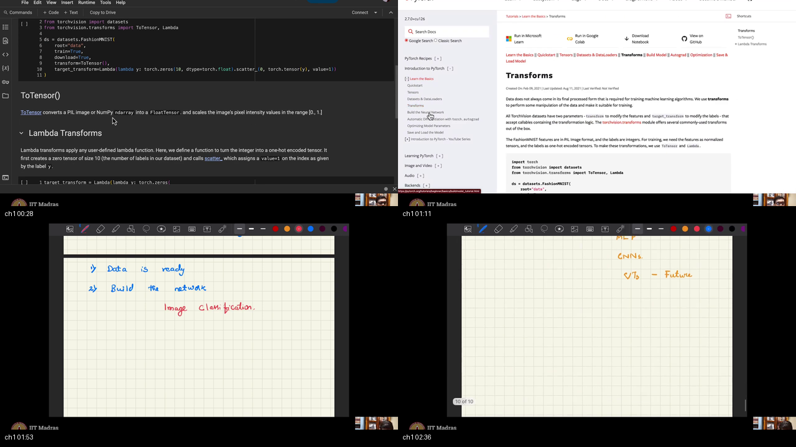
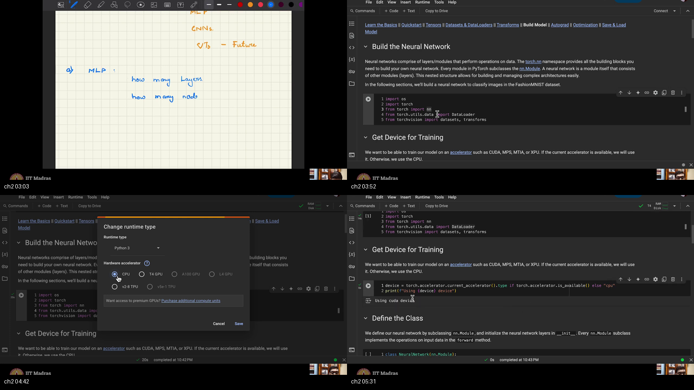
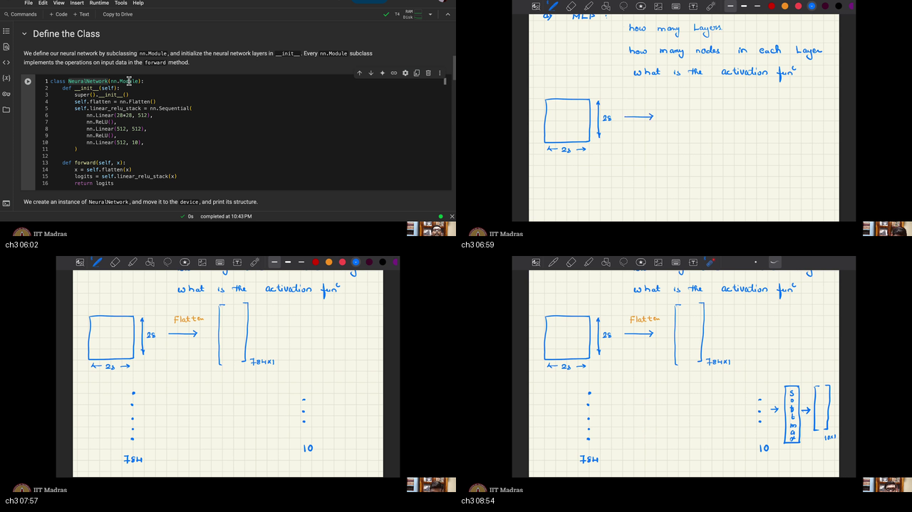
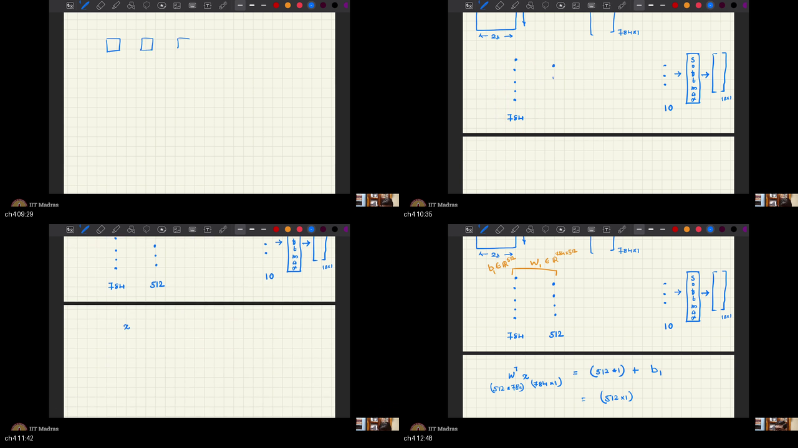
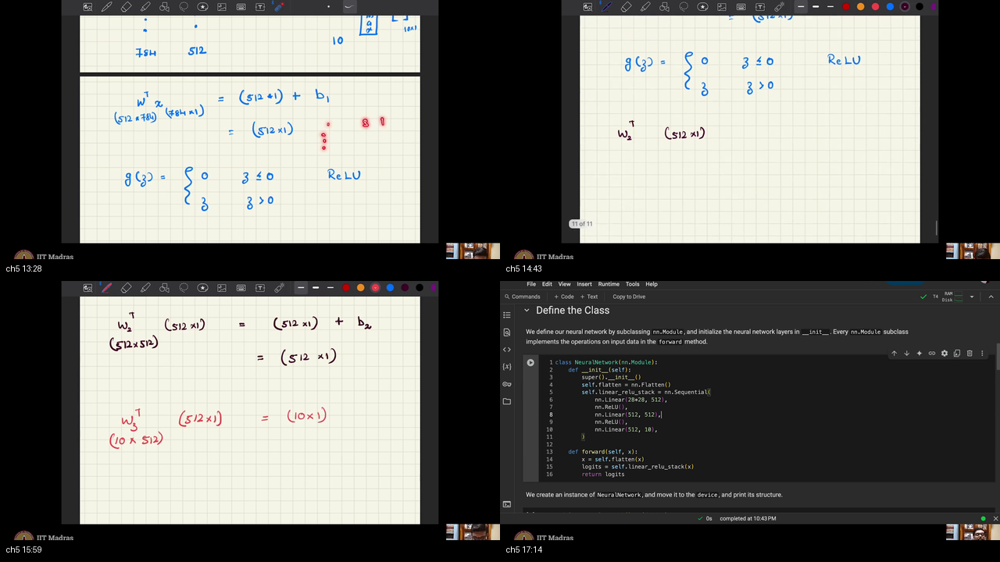
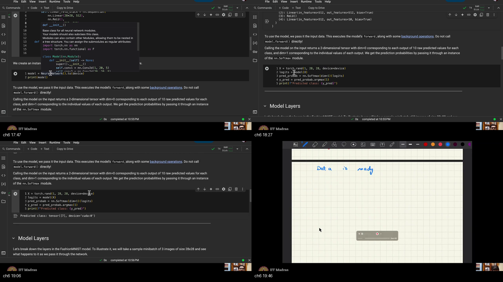
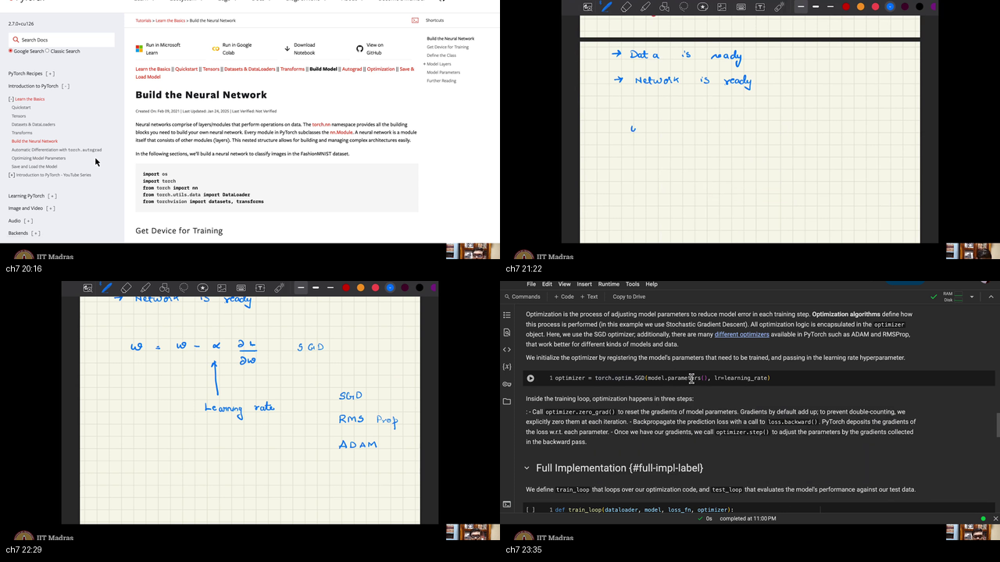
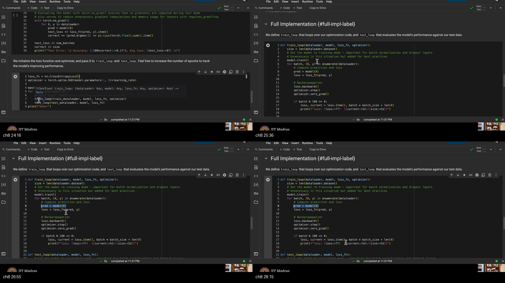
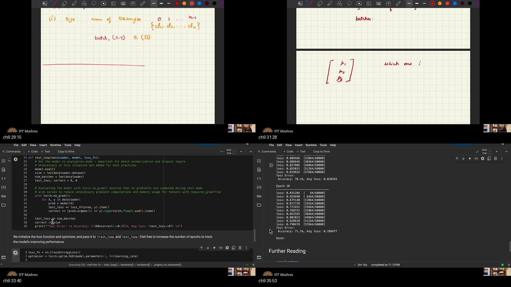
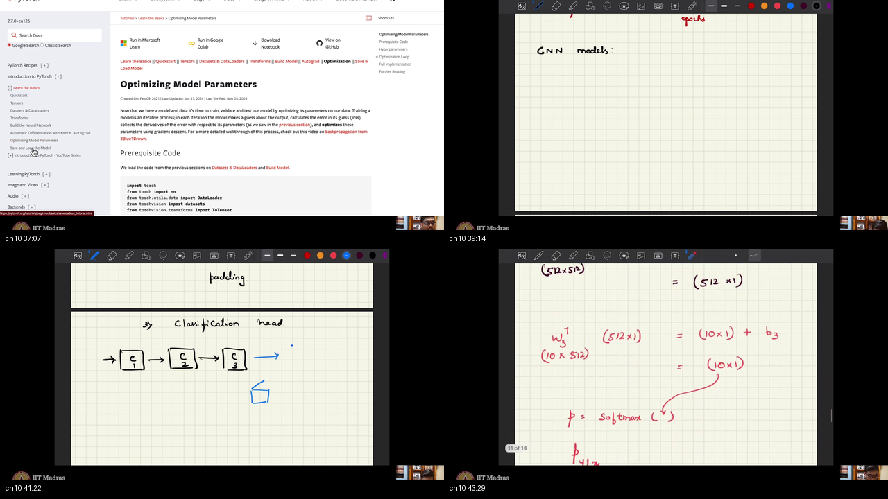

# W1_T4 — Introduction to PyTorch: model building

> **Video:** [W1_T4: Tutorial 4: Introduction to pytorch: model building](https://www.youtube.com/watch?v=h1hEddM0aVE) · **~44 min**  
> **Warm-up first:** [PREREQUISITES.md](./PREREQUISITES.md) · **Quiz:** [quiz.html](./quiz.html)

**Do PREREQUISITES before this article.**  
**Course:** IIT Madras B.S. · **BSDA5002** · Prof. Prathosh A. P. · tutorial live-code (Chandan)  
**Previous:** [W1_T2 Dataset/DataLoader](../04-W1-T2-Introduction-to-PyTorch-Tensors/NOTES.md) (data ready). **Next in his mouth:** code GANs.

He walks the official **Build the Neural Network** + **Optimizing Model Parameters** + **Save and Load** sheets. ASR “28 plus 28” is **$28\times 28$**; “784 plus 1” is a **column** $784\times 1$.

| When he hits… | Warm-up |
|---------------|---------|
| MLP stack | [p1-mlp](./PREREQUISITES.md#p1-mlp) |
| Flatten 784 | [p2-flatten](./PREREQUISITES.md#p2-flatten) |
| Logits / softmax | [p3-logits](./PREREQUISITES.md#p3-logits) |
| `nn.Module` | [p4-module](./PREREQUISITES.md#p4-module) |
| $W \leftarrow W-\alpha\nabla L$ | [p5-gd](./PREREQUISITES.md#p5-gd) |
| Epoch / batch / α | [p6-epoch](./PREREQUISITES.md#p6-epoch) |
| train vs eval | [p7-eval](./PREREQUISITES.md#p7-eval) |
| `.pth` | [p8-save](./PREREQUISITES.md#p8-save) |

---

## Table of Contents

1. [Topic 1 — Data ready; MLP / CNN / ViT](#topic-1-data-ready-mlp--cnn--vit-0016–0249) (00:16–02:49)
2. [Topic 2 — Choices, imports, Colab GPU](#topic-2-choices-imports-colab-gpu-0249–0546) (02:49–05:46)
3. [Topic 3 — `NeuralNetwork`, flatten, 10 logits](#topic-3-neuralnetwork-flatten-10-logits-0546–0911) (05:46–09:11)
4. [Topic 4 — Sequential; Linear $784\to 512$](#topic-4-sequential-linear-784-to-512-0911–1307) (09:11–13:07)
5. [Topic 5 — ReLU stack, logits, $P(Y\mid X)$](#topic-5-relu-stack-logits-pyx-1307–1736) (13:07–17:36)
6. [Topic 6 — `.to(device)` and a dummy predict](#topic-6-todevice-and-a-dummy-predict-1736–1958) (17:36–19:58)
7. [Topic 7 — SGD / Adam, CE, hyperparameters](#topic-7-sgd--adam-ce-hyperparameters-1958–2354) (19:58–23:54)
8. [Topic 8 — `train_loop`: four steps](#topic-8-train_loop-four-steps-2354–2838) (23:54–28:38)
9. [Topic 9 — `test_loop`, accuracy, curves](#topic-9-test_loop-accuracy-curves-2838–3631) (28:38–36:31)
10. [Topic 10 — Save/load, CNN preview, GANs next](#topic-10-saveload-cnn-preview-gans-next-3631–4406) (36:31–44:06)
11. [External references](#external-references)
12. [Apply it (scenarios)](#apply-it-scenarios)
13. [Sources](#sources)

---

## Executive Summary — architecture of this lecture

Data is ready. Build an **MLP**, train it with **SGD + cross-entropy**, test with **argmax**, save **`model.pth`**. Fashion-MNIST uses **MLP today**; **CNN** is the same loop with a different class; **ViT** waits. After 10 epochs the Colab shows accuracy **~71%** (he also reads ~68.7%). Next videos: **GANs**.

**Worldview arc:** from “tensors in batches” **to** “a trained `nn.Module` you can save.”

### The approach

```
  1. DEVICE     CUDA if Colab T4 GPU else CPU   (session dies on switch — rerun)
  2. CLASS      NeuralNetwork(nn.Module)
                flatten 28×28 → 784
                Sequential: 784→512 ReLU → 512→512 ReLU → 512→10 logits
  3. OPT        CrossEntropyLoss + SGD(model.parameters(), lr=1e-3)
  4. TRAIN      predict → loss → backward → step → zero_grad
  5. TEST       model.eval(); no_grad; argmax vs y
  6. SAVE       state_dict → model.pth
  STOP          CNN later; autograd internals skipped; next = GANs
```

### Whole-sheet recipe (commented)

```python
import torch
from torch import nn

# He: current accelerator if present, else CPU. CUDA = GPU name.
device = "cuda" if torch.cuda.is_available() else "cpu"

class NeuralNetwork(nn.Module):
    def __init__(self):
        super().__init__()                       # parent init — tracks W, b
        self.flatten = nn.Flatten()              # 28×28 → 784; batch kept
        self.linear_relu_stack = nn.Sequential(  # pipeline: out of one = in of next
            nn.Linear(28 * 28, 512),
            nn.ReLU(),
            nn.Linear(512, 512),
            nn.ReLU(),
            nn.Linear(512, 10),                  # logits; NO ReLU on last layer
        )

    def forward(self, x):
        x = self.flatten(x)
        logits = self.linear_relu_stack(x)
        return logits                            # CrossEntropy eats logits

model = NeuralNetwork().to(device)
loss_fn = nn.CrossEntropyLoss()
optimizer = torch.optim.SGD(model.parameters(), lr=1e-3)
batch_size, epochs = 64, 10                    # he also said 5; the cell uses 10

def train_loop(dataloader, model, loss_fn, optimizer):
    size = len(dataloader.dataset)
    model.train()
    for batch, (X, y) in enumerate(dataloader):  # D1..Dk plus an index
        X, y = X.to(device), y.to(device)
        pred = model(X)                          # (1) predict
        loss = loss_fn(pred, y)                  # (2) CE
        loss.backward()                          # (3) grads
        optimizer.step()                         # (4) W ← W − α∇L
        optimizer.zero_grad()                    # else grads accumulate
        if batch % 100 == 0:
            current = batch * batch_size + len(X)
            print(loss.item(), current, size)    # .item = number, not the graph

def test_loop(dataloader, model, loss_fn):
    size, num_batches = len(dataloader.dataset), len(dataloader)
    model.eval()
    test_loss, correct = 0, 0
    with torch.no_grad():                        # best practice; no graph
        for X, y in dataloader:
            X, y = X.to(device), y.to(device)
            pred = model(X)
            test_loss += loss_fn(pred, y).item()
            correct += (pred.argmax(1) == y).type(torch.float).sum().item()
    print(100 * correct / size, test_loss / num_batches)

for t in range(epochs):
    train_loop(train_loader, model, loss_fn, optimizer)
    test_loop(test_loader, model, loss_fn)

torch.save(model.state_dict(), "model.pth")      # weights only; class source stays here
```

### System context

```
  ╔════════════════════════════════════╗
  ║ W1_T2: Dataset / DataLoader ready  ║
  ║ W1_T1: forward / backprop by hand  ║
  ╚════════════════╤═══════════════════╝
                   │ this 44 min
                   ▼
        ┌──────────────────────────┐
        │ nn.Module MLP + train    │
        └──────────┬───────────────┘
                   │ next
                   ▼
        ┌ · · · CNN class; then GANs · · · ┐
```

### Main blueprint

```
  28×28 image
       │  Flatten
       ▼
  784 vector
       │  Linear 784→512, ReLU
       │  Linear 512→512, ReLU
       │  Linear 512→10
       ▼
  logits (10)  --softmax-->  P(Y|X)  --argmax-->  class
       │
       ▼
  CrossEntropy  vs  true y
       │  backward
       ▼
  SGD: W ← W − α ∇W     α=1e-3
       │
       ▼
  test accuracy   then   model.pth
```

### Scenario walkthrough

1. Switch Colab to **T4 GPU** (not A100/L4 unless you pay). Session dies; rerun imports. Device prints **CUDA**.
2. Dummy `X` shape `(1, 28, 28)` on CUDA. `model(X)` → 10 logits → softmax → argmax class **7** (untrained noise).
3. Ten epochs: `train_loop` then `test_loop`. Speech: accuracy ~42.4% then ~68.7%, loss ~2.16. **On-screen Epoch 10:** **71.1%**, avg loss **0.788**. Curve should fall then flatten.
4. `torch.save(model.state_dict(), "model.pth")`. Tomorrow: new `NeuralNetwork()` + `load_state_dict`. CNN later: same loops, different class.

### Failure / contrast

```
  WRONG  ReLU / sigmoid on the last layer
  WRONG  skip optimizer.zero_grad()     (grads accumulate)
  WRONG  call model.forward(x) as the API
  WRONG  tensors on CPU, model on CUDA
  WRONG  many epochs on test
```

### STOP / out of scope

- Autograd internals (`grad_fn`) — he skips.
- RandomCrop / Resize — deferred.
- Coding the CNN class — later; only the five conv knobs today.
- Next course videos: **GANs**.

### Load-bearing claims (closed-book)

- Flatten $28\times 28=784$; output 10 logits; softmax → $P(Y\mid X)$.
- Sequential Linear–ReLU–Linear–ReLU–Linear; **no activation on last**.
- SGD $W\leftarrow W-\alpha\nabla L$, $\alpha=10^{-3}$, CE loss, `model.parameters()`.
- Train four steps + `zero_grad`; `loss.item()` drops the graph.
- `model.eval()` + `no_grad`; accuracy = mean of `argmax == y` (~71% at epoch 10 on screen).
- Save/load `state_dict` as `.pth`. CNN: in/out/kernel/stride/padding; convs = feature extractor, then MLP head.

**Speaker:** IITM BS tutorial (Chandan) · course Prof. Prathosh.

---

## Topic 1: Data ready; MLP / CNN / ViT (00:16–02:49)

### Where this sits on the master map

This is the **JOB** box. [Data is ready](../04-W1-T2-Introduction-to-PyTorch-Tensors/NOTES.md); next is **build the network** for [image classification](./PREREQUISITES.md#p1-mlp).

### Board / screenshot



Caption: Transforms page — **`ToTensor`** (PIL/ndarray → FloatTensor in `[0,1]`) and an optional **`Lambda` one-hot** on labels. Tablet: “1) Data is ready  2) Build the network — image classification.” Then orange: MLP, CNNs, **ViTs — future**.

### What he is establishing

You have downloaded the data. The transform you preferably use is **`ToTensor`**, and it is **mandatory**. Other transforms exist — **random crop, resize** — he will not elaborate until that code appears. The official cell also shows `target_transform=Lambda(...)` to one-hot a label; he does **not** teach that API tonight. Classification later uses integer `y` with **cross-entropy**, so leave labels as 0–9.

**Data is ready.** Next: **build the network**. The task is **classification** (image classification). Similar principles hold for **other modalities** (not only photos).

The crudest architectures: **MLP**, **CNNs**, or nowadays **vision transformers (ViT)**. ViTs are **for the future**; today he prefers **MLP and convolutional nets**.

```python
# Leftover from the Dataset sheet — ToTensor is the required convert.
from torchvision.transforms import ToTensor
# RandomCrop / Resize exist; he defers them.
# JOB after data is ready:
#   build the network  for  image classification
# CHOICES he names:  MLP   |   CNN   |   ViT (later)
```

The trap is jumping to ViT because it is fashionable, or one-hotting labels when CE already wants class **indices**.

You can now name the job and the three families. What is still open: MLP’s internal knobs, then the GPU.

### Analogy for this topic only

The warehouse already has labeled carts. Tonight you build the **scoring machine**. Three machine types sit in the catalog: a stack of desks (MLP), a stamp that slides over the photo (CNN), and a future transformer. He only assembles the desks.

Someone asks: **do we train a GAN tonight?** No. Data ready, then MLP.

In lecture words: ToTensor; data ready; build the network; MLP/CNN now, ViT later.

### Local picture

```
  Dataset/DataLoader  -->  DATA READY
                           │
                           ▼
                      BUILD NETWORK
                      MLP  |  CNN  |  ViT (future)

  Notice: ToTensor is mandatory; crop/resize wait.
```

### Bridge

An MLP is not “just call Sequential.” You must choose **how many layers, nodes per layer, and the activation**. Those three questions open the next box.

---

## Topic 2: Choices, imports, Colab GPU (02:49–05:46)

### Where this sits on the master map

This is **DEVICE**. [MLP knobs](./PREREQUISITES.md#p1-mlp) plus where the math runs.

### Board / screenshot



Caption: tablet still lists MLP knobs (how many layers / nodes). Colab **Change runtime type**: CPU, **T4 GPU** (free), plus greyed **A100 / L4** (paid) and TPU. He picks T4. Switching **terminates** the session — “I’ve saved it”; rerun imports. Bottom-right: `Using cuda device`.

### What he is establishing

MLP choices: **how many layers**, **nodes in each layer**, **activation function**.

Libraries: **`os`** (paths), **`torch`**, **`from torch import nn`** (`nn` = neural network), **DataLoader**, **datasets**, **transforms**. Big libraries: they take time to initialize.

**Device:** Colab **Runtime → Change runtime type**. Free: CPU, **T4 GPU**, TPU. Paid greyed: A100, L4. He picks **T4**. The dialog warns it will **terminate** the current session; he says that is fine — **he has saved**. Everything in RAM is gone; **rerun** the import cell (libraries are “very big”). Code: if a current accelerator exists, use it, else CPU. He prints **CUDA** — the name given to these GPU devices.

```python
import os
import torch
from torch import nn                       # neural-network building blocks
from torch.utils.data import DataLoader
from torchvision import datasets, transforms

# He: current accelerator if present, else CPU. CUDA = GPU name.
device = torch.accelerator.current_accelerator().type \
    if torch.accelerator.is_available() else "cpu"
# Older notebooks:  device = "cuda" if torch.cuda.is_available() else "cpu"
print(f"Using {device} device")
```

**What this does:** later `.to(device)` parks the net and tensors on the same chip. CPU tensors × CUDA model is a classic crash.

The trap is changing runtime and forgetting to rerun imports.

You can now pick GPU and paste imports. What is still open: the class body.

### Analogy for this topic only

Three design questions before you hire desks: how many desks, how many stamps on each desk, which “paint negatives zero” rule. Then you decide whether the warehouse robot runs on a bicycle (CPU) or a forklift (T4 GPU). Switching forklifts dumps the previous shift’s work on the floor — rerun the hiring paperwork.

Someone asks: **can I skip GPU?** Yes. He just prefers CUDA tonight.

In lecture words: layers, nodes, activation; `nn`; T4; CUDA.

### Local picture

```
  Runtime → Change runtime type → T4 GPU
       │ terminates session
       ▼
  rerun imports  →  device = CUDA

  Notice: model AND batch must share this device.
```

### Bridge

Fashion-MNIST is a 28×28 grid; an MLP wants a vector of 784. The class must flatten, then emit 10 logits. That is the next constructor.

---

## Topic 3: `NeuralNetwork`, flatten, 10 logits (05:46–09:11)

### Where this sits on the master map

This is **CLASS**. Child of [`nn.Module`](./PREREQUISITES.md#p4-module); [flatten](./PREREQUISITES.md#p2-flatten) $28\times 28\to 784$; [10 logits](./PREREQUISITES.md#p3-logits).

### Board / screenshot



Caption: Colab `class NeuralNetwork(nn.Module)` with Flatten + Sequential. Tablet: 28×28 square → flatten → 784×1 column; right side 10 then softmax to 10×1.

### What he is establishing

Class name **`NeuralNetwork`**, **child of `nn.Module`**. In **`__init__`**: `self`, optional extra arguments, **`super().__init__()`** — call the **parent** constructor. Init initializes parameters.

Fashion-MNIST: **28×28**, single channel. MLP input must be a **vector**. **Flatten:** first row, then next row, … → **784**. Input dimension is **fixed 784**. Output dimension is **fixed 10** (10 classes) as **logits**, then **softmax** to a probability vector of size 10. What sits **in between** (hidden widths) is a **choice**.

```python
class NeuralNetwork(nn.Module):
    def __init__(self):
        super().__init__()                 # MUST call parent
        self.flatten = nn.Flatten()        # (N, 1, 28, 28) or (N, 28, 28) → (N, 784)
        # linear_relu_stack filled in the next topics
```

**What this does:** every `self.` layer is registered so `model.parameters()` can see it.

The trap is forgetting `super().__init__()` or treating 28+28 as addition (it is **times**).

You can now state input 784 and output 10. What is still open: the hidden pipeline and $Wx+b$.

### Analogy for this topic only

A 28-by-28 crossword is copied into one spreadsheet column of 784 cells. Ten bins wait at the far end. The middle of the column-to-bins map is still blank — that is the next topic.

Someone asks: **why 784 not 28?** Because this MLP has no notion of “neighbor pixels.” Flatten throws the grid away on purpose.

In lecture words: child of `nn.Module`; flatten to 784; 10 logits then softmax.

### Local picture

```
  28          flatten         784
  ┌────┐      ------>      ┌     ┐
  │    │ 28                │     │
  └────┘                   │     │  then … then 10 logits
                           └     ┘

  Notice: 28×28 = 784. Batch axis is kept.
```

### Bridge

Rather than instantiate three Linears by hand, he wraps them as **one Sequential pipeline**: output of stage $k$ is input of stage $k+1$. First stage is $784\to 512$.

---

## Topic 4: Sequential; Linear $784\to 512$ (09:11–13:07)

### Where this sits on the master map

This is **LINEAR**. [Pipeline + first affine map](./PREREQUISITES.md#p1-mlp).

### Board / screenshot



Caption: `nn.Sequential` with `nn.Linear(28*28, 512)` then ReLU. He narrates $W\in\mathbb{R}^{784\times 512}$, $b\in\mathbb{R}^{512}$, $W^\top x + b$.

### What he is establishing

**Pipeline:** multiple processes; output of the first is input to the next. Rather than create each separately, wrap them as **one entity**. That is **`nn.Sequential`**. He names it `self.linear_relu_stack` (ReLU activation).

First layer: **`nn.Linear(28*28, 512)`**. Weight matrix in $\mathbb{R}^{784\times 512}$, bias in $\mathbb{R}^{512}$. For a column $x\in\mathbb{R}^{784}$, he writes $W^\top x$ giving a $512\times 1$, then adds $b$.

Every neural-network step is **matrix–vector** multiplication (MLP) or **matrix–matrix** (convolutions). The 512-vector then goes through **ReLU**.

```python
self.linear_relu_stack = nn.Sequential(
    nn.Linear(28 * 28, 512),   # W ~ (512, 784) stored; forward ≈ x @ W.T + b
    nn.ReLU(),
    # … later layers in Topic 5
)
```

**What this does:** one call `self.linear_relu_stack(flat_x)` runs the whole chain in order.

```python
# His tablet algebra for ONE linear step (column convention):
#   x      : 784 × 1
#   W^T    : 512 × 784
#   W^T x  : 512 × 1
#   + b    : 512 × 1
```

The trap is swapping in/out features (`Linear(512, 784)` would explode on flatten).

You can now multiply $784\to 512$. What is still open: ReLU’s formula and the remaining two Linears.

### Analogy for this topic only

Desk 1 takes the 784-column and writes 512 numbers using a giant spreadsheet of weights plus 512 offsets. Sequential is a piece of tape that glues desk 1 to desk 2 so you pass **one** object down the line.

Someone asks: **why 512?** It is a **choice**, not a law. The input 784 and the output 10 are the laws.

In lecture words: Sequential pipeline; Linear 784 to 512; $W^\top x + b$; then ReLU.

### Local picture

```
  x (784×1)
     │  W^T x + b     W is 784×512
     ▼
  h  (512×1)
     │  ReLU
     ▼
  max(h, 0)

  Notice: PyTorch stores Linear weight as (out, in) = (512, 784).
```

### Bridge

ReLU is not optional flavor. It is the **bend** that stops many Linears from collapsing to one. Then 512→512 and 512→10, and the last layer must **not** be activated.

---

## Topic 5: ReLU stack, logits, $P(Y\mid X)$ (13:07–17:36)

### Where this sits on the master map

This is **STACK**. [ReLU](./PREREQUISITES.md#p1-mlp) + remaining Linears + [logits / softmax](./PREREQUISITES.md#p3-logits).

### Board / screenshot



Caption: he writes ReLU piecewise, then $W_2$ $512\times 512$, $W_3$ $512\times 10$, logits, softmax → $P(Y\mid X)$. Last layer: **no** activation.

### What he is establishing

**ReLU:** $0$ if $z\le 0$, else $z$. Applied **elementwise** on the 512-vector.

Second Linear **512→512** ($W_2$ $512\times 512$, $b_2$ length 512). ReLU again. Third Linear **512→10** ($W_3$ $512\times 10$, $b_3$ length 10) → **logits** $10\times 1$. **Softmax** → posteriors **$P(Y\mid X)$**.

**Do not** put ReLU, tanh, or sigmoid on the **last** layer. Leave logits raw. Widths and activations elsewhere are **your choice**.

**`forward`:** flatten 28×28 → 784, pass through the ReLU stack, **return logits**.

```python
class NeuralNetwork(nn.Module):
    def __init__(self):
        super().__init__()
        self.flatten = nn.Flatten()
        self.linear_relu_stack = nn.Sequential(
            nn.Linear(28 * 28, 512),
            nn.ReLU(),
            nn.Linear(512, 512),
            nn.ReLU(),
            nn.Linear(512, 10),      # logits — no ReLU here
        )

    def forward(self, x):
        x = self.flatten(x)
        logits = self.linear_relu_stack(x)
        return logits
```

**What this does:** `CrossEntropyLoss` in the train loop applies log-softmax internally. Returning softmax twice would be wrong.

The trap is a final ReLU that clips negative logits to 0.

You can now write the full class. What is still open: putting it on CUDA and running one dummy $X$.

### Analogy for this topic only

After desk 1, a bouncer (ReLU) zeros every negative stamp. Desk 2 restamps 512→512, another bouncer. Desk 3 writes 10 **shouts**. You do **not** send those shouts through the bouncer — a negative shout is still information. Softmax turns shouts into “how sure.”

Someone asks: **why return logits not probabilities?** Because the loss function wants the shouts.

In lecture words: ReLU elementwise; 512–512–10; no last activation; softmax is $P(Y\mid X)$; forward returns logits.

### Local picture

```
  784 --L--> 512 --ReLU--> 512 --L--> 512 --ReLU--> 512 --L--> 10 logits
                                                                  │
                                                              softmax
                                                                  ▼
                                                               P(Y|X)

  ReLU(z) = 0 if z≤0 else z     (each of 512 slots)

  Notice: last Linear is naked.
```

### Bridge

The class is a blueprint. You still need an **instance on the GPU** and proof that `model(X)` runs. That is a random `(1,28,28)` tensor.

---

## Topic 6: `.to(device)` and a dummy predict (17:36–19:58)

### Where this sits on the master map

This is **INSTANCE**. [Call `model(x)`](./PREREQUISITES.md#p4-module) on CUDA.

### Board / screenshot



Caption: `model = NeuralNetwork().to(device)` then `print(model)`. Dummy `torch.rand(1, 28, 28, device=device)`; softmax; argmax.

### What he is establishing

Create an **instance** and **push it to device**. Until then it lived on CPU. Print shows Flatten + Sequential layers.

Dummy input shape **`(1, 28, 28)`**, already on the device. **`model(X)`** runs **forward**. Softmax → probability vector; **argmax** → class. He sees class **7**. Random input: **no significance**.

**Data is ready. Network is ready.** Next: **optimize**.

```python
model = NeuralNetwork().to(device)
print(model)   # Flatten + three Linears + two ReLUs

X = torch.rand(1, 28, 28, device=device)   # one fake photo on CUDA
logits = model(X)                          # runs forward (do not call .forward)
pred_probab = nn.Softmax(dim=1)(logits)
y_pred = pred_probab.argmax(1)
print(f"Predicted class: {y_pred}")        # e.g. tensor([7]) — untrained
```

**What this does:** proves the shapes chain. Untrained weights are random, so class 7 is noise.

The trap is `X` on CPU while `model` is on CUDA.

You can now run one forward. What is still open: the solver (SGD/Adam), the loss, α.

### Analogy for this topic only

You photocopy the desk layout onto the forklift (`to(device)`), then shove one blank Polaroid through. The machine shouts “bin 7.” Nobody should believe it — the stamps are still factory-random.

Someone asks: **is 7 a coat?** Not tonight. Wait for training.

In lecture words: instance on GPU; `model(X)`; softmax; argmax; data and network ready.

### Local picture

```
  NeuralNetwork() --.to(CUDA)-->  model
  rand(1,28,28) on CUDA --> model --> logits --> softmax --> argmax

  Notice: call model(X), not model.forward(X).
```

### Bridge

Ready objects still have random $W$. He will not deep-dive autograd. He will write $W\leftarrow W-\alpha\nabla L$, name SGD / RMSprop / Adam, pick CE and $\alpha=10^{-3}$.

---

## Topic 7: SGD / Adam, CE, hyperparameters (19:58–23:54)

### Where this sits on the master map

This is **OPT**. [Gradient descent](./PREREQUISITES.md#p5-gd); [α, batch, epoch](./PREREQUISITES.md#p6-epoch).

### Board / screenshot



Caption: $W=W-\alpha\partial L/\partial W$. Names: SGD, RMSprop, Adam. `lr=1e-3`, batch 64, `CrossEntropyLoss`, `torch.optim.SGD(model.parameters(), lr=learning_rate)`.

### What he is establishing

Autograd (how grads are stored) — **he skips**; internally taken care of.

**Gradient descent:** $W \leftarrow W - \alpha \partial L/\partial W$. On a batch: **SGD**. Other solvers he **names only**: **RMSprop**, **Adam** (adaptive with momentum).

Need **learning rate / step size** $10^{-3}$ (`1e-3`), **batches of 64**, some number of epochs (he says five, then the cell uses **10**). **Loss = cross-entropy (CE)**. Optimizer: **`torch.optim.SGD`** on **`model.parameters()`**. You *can* optimize a subset later.

```python
learning_rate = 1e-3          # 10^{-3}
batch_size = 64               # already on the DataLoader
epochs = 10                   # cell uses 10; he also said 5

loss_fn = nn.CrossEntropyLoss()
optimizer = torch.optim.SGD(model.parameters(), lr=learning_rate)
# Later you could pass a subset of parameters. Not tonight.
```

**What this does:** `optimizer.step()` will apply the SGD rule to every Linear weight and bias.

The trap is CE on **softmax probabilities**. Pass **logits**.

You can now name loss and solver. What is still open: the **train loop’s four steps**.

### Analogy for this topic only

Each cart of 64 photos yields one “how wrong” number (CE). SGD nudges every stamp downhill by $0.001\times$slope. Adam is a fancier forklift with momentum; he points at it on the shelf and does not unpack it.

Someone asks: **must I use SGD?** No. He chooses it because the notebook does. Adam is allowed; he just does not derive it.

In lecture words: $W-\alpha\nabla L$; SGD / RMSprop / Adam; CE; `1e-3`; `model.parameters()`.

### Local picture

```
  W  ←  W  −  α ∇_W L          α = 1e-3
  batch 64
  loss = CrossEntropy(logits, y)
  optimizer = SGD(all parameters)

  Notice: CE wants logits, not softmax(logits).
```

### Bridge

A named optimizer does nothing until a loop **predicts, computes loss, backprops, and steps** — then **zeros grads**. That function is `train_loop`.

---

## Topic 8: `train_loop`: four steps (23:54–28:38)

### Where this sits on the master map

This is **TRAIN**. [Four steps + `zero_grad`](./PREREQUISITES.md#p5-gd); [`model.train()`](./PREREQUISITES.md#p7-eval).

### Board / screenshot



Caption: `model.train()`; `for batch, (X, y) in enumerate(dataloader)`; `pred = model(X)`; `loss = loss_fn(pred, y)`; `loss.backward()`; `optimizer.step()`; `optimizer.zero_grad()`; print every 100 batches via `loss.item()`.

### What he is establishing

Outer program: instantiate CE and SGD; **`for t in range(epochs)`** (10); print; call **`train_loop(train_loader, model, loss_fn, optimizer)`**.

Inside: `size = len(dataloader.dataset)`. **`model.train()`** — training phase **computes gradients**; evaluation phase does not. **`enumerate(dataloader)`**: index $0,1,\ldots$ plus batches $D_1,\ldots,D_k$ as `(X, y)`.

Four steps (same as the earlier hand tutorial): **(1) predict** `(pred = model(X))` **(2) loss** **(3) `loss.backward()`** grads **(4) `optimizer.step()`** update. Then **`optimizer.zero_grad()`**: grads **accumulate** unless you refresh them to zero. He calls zeroing a **programming** step, not a critical math step — skip it and math still “runs,” but wrongly.

Every 100 batches: **`loss.item()`** — the **number** only; drop the **computational graph**. Current example count: `batch * batch_size + len(X)`.

```python
def train_loop(dataloader, model, loss_fn, optimizer):
    size = len(dataloader.dataset)
    model.train()                              # compute grads
    for batch, (X, y) in enumerate(dataloader):
        pred = model(X)                        # (1) predict
        loss = loss_fn(pred, y)                # (2) loss
        loss.backward()                        # (3) gradients
        optimizer.step()                       # (4) update W
        optimizer.zero_grad()                  # else grads accumulate

        if batch % 100 == 0:
            loss_num = loss.item()             # number, not the graph
            current = batch * batch_size + len(X)
            print(f"loss: {loss_num:>7f}  [{current:>5d}/{size:>5d}]")
```

**What this does:** one epoch of SGD on every training batch.

The trap is swapping `zero_grad` before `backward` in an old style vs after `step` here — both work if consistent; **omitting** it does not.

You can now train one epoch. What is still open: **test** without updating weights.

### Analogy for this topic only

Each cart: guess the bins (predict), count how wrong (loss), feel the downhill (backward), move the stamps (step), **erase the scratch paper** (`zero_grad`) so the next cart does not add yesterday’s arrows. Every hundredth cart you shout the numeric loss, not the whole scratch paper.

Someone asks: **why enumerate?** So you know you are on batch 0, 100, 200… for the printout. $D_1$ is still `(X, y)`.

In lecture words: `model.train`; four steps; `zero_grad`; `loss.item`.

### Local picture

```
  for (X, y) in train_loader:     # D1 … Dk
      pred = model(X)
      loss = CE(pred, y)
      loss.backward()
      optimizer.step()
      optimizer.zero_grad()       # programming step he flags

  Notice: size = len(dataset), not len(dataloader).
```

### Bridge

Training changes $W$. Judging $W$ needs a **held-out** pass: `model.eval()`, **no grads**, **argmax vs y**, average loss and accuracy.

---

## Topic 9: `test_loop`, accuracy, curves (28:38–36:31)

### Where this sits on the master map

This is **EVAL**. [`eval` / `no_grad`](./PREREQUISITES.md#p7-eval); argmax accuracy.

### Board / screenshot



Caption: tablet — `size` = number of examples; batches $D=\{d_1,\ldots,d_k\}$; three-class $[p_1,p_2,p_3]$ “which one is highest → index.” Colab `test_loop` + live log: mid-run **Accuracy 70.1%, Avg loss 0.820**; **Epoch 10: 71.1%, 0.788**. Speech also quotes ~42.4% then ~68.7% and loss ~2.16 earlier.

### What he is establishing

`test_loop(dataloader, model, loss_fn)` — **no optimizer**. **`model.eval()`**. Placeholders: test loss, number correct. **`with torch.no_grad()`**: no grads in the indented block. He says eval may already skip grads; `no_grad` is **best practice**.

For each test batch: `pred = model(X)`; add `loss_fn(...).item()`. Accuracy: take **argmax** (index of the largest score — he walks a 3-class `[p1,p2,p3]` example), compare to $y$. `(pred.argmax(1) == y)` is True/False; **`.type(torch.float)`** maps True→1, False→0; **`.sum().item()`** = how many correct in the batch.

Average loss = total / **number of batches**. Accuracy = correct / **size** × 100.

Run: accuracy **increases**, loss **decreases**. He reads ~**42.4%** and loss ~**2.16** mid-way, then ~**68.7%**. The **on-screen** log at **Epoch 10** is **71.1%** accuracy and avg loss **0.788**. Optionally append losses and plot epoch vs loss — should **drop then flatten**. **How many epochs?** No standard answer; later generative-model tutorials.

Recap of the process: prepare data (builtin or custom loader); create the model (know its parameters); pick loss and optimizer; train = predict, loss, grads, update, **zero_grad**; test; repeat epochs → **optimal $\theta$ when loss is least**.

```python
def test_loop(dataloader, model, loss_fn):
    size = len(dataloader.dataset)
    num_batches = len(dataloader)
    model.eval()
    test_loss, correct = 0, 0
    with torch.no_grad():                      # best practice
        for X, y in dataloader:
            pred = model(X)
            test_loss += loss_fn(pred, y).item()
            correct += (pred.argmax(1) == y).type(torch.float).sum().item()
    test_loss /= num_batches
    correct /= size
    print(f"Accuracy: {(100 * correct):>0.1f}%, Avg loss: {test_loss:>8f}")
```

**What this does:** one evaluation sitting. No `step`, no `zero_grad`.

The trap is `shuffle=True` plus many test epochs (T2 advice) or computing grads on test.

You can now read a test score. What is still open: **saving** so you do not retrain, then a CNN sketch.

### Analogy for this topic only

Exam night: lock the stamp notebook (`eval` + `no_grad`). Three bins shout $p_1,p_2,p_3$; you take the **index** of the loudest, not the shout. Tally ones and zeros. The Colab shouts **71.1%** after ten nights (he also says ~68.7%). Draw a curve of night-number vs wrongness — it should fall and then go flat. How many nights? He will not give a universal number.

Someone asks: **is 71% good?** For this tiny MLP on Fashion-MNIST it is “the loss went the right way.” Not the point of the hour.

In lecture words: `eval`; `no_grad`; argmax vs $y$; loss down, accuracy up; no standard epoch count.

### Local picture

```
  pred.argmax(1) == y     →  True/False per example
  .float().sum()          →  count correct in the batch
  correct / N * 100       →  accuracy %
  test_loss / num_batches →  mean CE

  Notice: argmax needs the index, not the probability value.
```

### Bridge

Optimal $\theta$ lives in RAM. Close the Colab and it dies. **`model.pth`** is the photocopy. After that he previews CNN knobs and points at **GANs**.

---

## Topic 10: Save/load, CNN preview, GANs next (36:31–44:06)

### Where this sits on the master map

This is **SAVE / CNN / STOP**. [`.pth`](./PREREQUISITES.md#p8-save); conv knobs; recap.

### Board / screenshot



Caption: he clicks toward Save & Load (optimization page still open). Tablet: **CNN models**; then $C_1\to C_2\to C_3$ **classification head** after **padding**; recap algebra $W_3^\top$ is $10\times 512$ times $512\times 1$ plus $b_3$ → $10\times 1$, $p=\mathrm{softmax}(\cdot)=P(Y\mid X)$.

### What he is establishing

You do not want to **retrain** every time. **Save:** current path, **`model.pth`**, extension **`.pth`**. **Load:** create an instance, **`torch.load`**, copy **weights** (`load_state_dict`).

They have built an **MLP**. At the back end of a later tutorial: a **CNN**. Assume CNN comfort. Per conv layer specify: **in_channels** (depends on previous stage), **out_channels** (= **number of filters**), **kernel size** (square; `5` means $5\times 5$), **stride**, **padding**. Input channel is the only one forced by the previous tensor.

CNN models: conv1, conv2, conv3, … then a block you **flatten**, then an **MLP**. Conv stack = **feature extractor**. MLP = **classifier**. The MLP still needs layer counts, nodes, activations.

**Only the neural-network class changes.** Train loop, loaders, loss, optimizer **stay**.

Recap of the day: **tensors**, **dataloaders**, **transforms**, **build MLP** (parameters, forward), **train loop**, **test loop**, CNN as a possible model. Next session: **interesting stuff — coding GANs**. Bye.

```python
# Save weights only (architecture is the class source)
torch.save(model.state_dict(), "model.pth")

# Later / other process:
model = NeuralNetwork().to(device)
model.load_state_dict(torch.load("model.pth", weights_only=True))
model.eval()
```

**What this does:** tomorrow’s Colab starts from tonight’s $\theta^\star$.

```python
# CNN is NOT coded tonight. Knobs he lists for later:
#   nn.Conv2d(in_channels, out_channels, kernel_size, stride=..., padding=...)
# Feature extractor (convs) --> flatten --> MLP classifier
# train_loop / DataLoader / CE / SGD  stay the same
```

The trap is saving the whole Python object with a different class later, or loading 784-MLP weights into a conv net.

You can now checkpoint an MLP and name CNN’s five knobs. The leftover problem is a **generator** $G_\theta(z)$ — that is GAN week, not more `nn.Linear`.

### Analogy for this topic only

Photocopy the stamp settings into `model.pth`. Tomorrow hire a new employee and hand them the photocopies. A CNN is a different employee (sliding stamps on the photo, then a small MLP). The **practice/exam ritual** does not change. Next course: a machine that **prints new clothes**, not one that **sorts** them.

Someone asks: **do we write Conv2d tonight?** No. He only lists in/out/kernel/stride/padding.

In lecture words: save/load `.pth`; CNN feature extractor + MLP; loops unchanged; next GANs.

### Local picture

```
  MLP tonight:     Flatten → Linear-ReLU stack → 10
  CNN later:       C1 → C2 → C3  → flatten → MLP head
                   \__ feature extractor __/     \ classifier /
                   each Ci: in, out(=filters), kernel, stride, padding

  W3^T (10×512)  ×  (512×1)  + b3  =  (10×1) logits
  p = softmax(logits) = P(Y|X)

  train_loop  ═══════════════════  SAME

  Notice: out_channels = number of filters. Kernel 5 means 5×5.
```

### Bridge

The leftover problem is **sampling new $x$**, not classifying Fashion-MNIST. He will start **coding GANs** next. This sheet stops: tensors, loaders, transforms, MLP, train, test, save.

---

## External references

All companions live **here**, not under the topics. Mix of **university lecture + slides/notes** and **official / blog** walkthroughs. No Wikipedia.

**Start here (if you only open three).** Official Build the Neural Network → Optimizing Model Parameters → CS231n 2025 Lecture 4 slides.

### Per-topic companions (2–3 each)

| Topic / map box | Type | Resource | Why it helps |
|-----------------|------|----------|--------------|
| **1 · data ready / MLP vs CNN vs ViT** | video | [MIT 6.S191 2026 — Intro to Deep Learning](https://www.youtube.com/watch?v=II4giR4vOOo) | University MLP-vs-other-architectures; labs at [introtodeeplearning.com](http://introtodeeplearning.com/). |
| **1 · data ready / MLP vs CNN vs ViT** | notes | [Stanford CS231n 2025 Lecture 4 slides (PDF)](https://cs231n.stanford.edu/slides/2025/lecture_4.pdf) | Neural nets + SGD; same classification job. |
| **1 · data ready / MLP vs CNN vs ViT** | docs | [PyTorch Transforms](https://docs.pytorch.org/tutorials/beginner/basics/transforms_tutorial.html) | `ToTensor` mandatory; Lambda one-hot he does not teach tonight. |
| **2 · imports / CUDA** | video | [Aladdin Persson — PyTorch neural network example](https://www.youtube.com/watch?v=Jy4wM2X21u0) | Same `nn` imports + a small net. |
| **2 · imports / CUDA** | notes | [Learn PyTorch — 03 Computer vision](https://www.learnpytorch.io/03_pytorch_computer_vision/) | Device-agnostic code + `nn`. |
| **2 · imports / CUDA** | docs | [Colab GPU notebook](https://colab.research.google.com/notebooks/gpu.ipynb) | Runtime → GPU; matches his T4 switch (session dies). |
| **3 · Flatten 784 / 10 logits** | video | [3Blue1Brown — But what is a neural network?](https://www.youtube.com/watch?v=aircAruvnKk) | Flattened pixels into a first layer. |
| **3 · Flatten 784 / 10 logits** | notes | [CS231n — Linear classification notes](https://cs231n.github.io/linear-classify/) | Scores / 10-class picture. |
| **3 · Flatten 784 / 10 logits** | docs | [`nn.Module`](https://docs.pytorch.org/docs/stable/generated/torch.nn.Module.html) | Parent he subclasses; `parameters()` / `forward`. |
| **4 · Sequential / Linear Wx+b** | video | [StatQuest — Essential ideas of neural nets](https://www.youtube.com/watch?v=CqOfi41LfDw) | Matrix maps + stacked layers. |
| **4 · Sequential / Linear Wx+b** | docs | [nn.Linear](https://docs.pytorch.org/docs/stable/generated/torch.nn.Linear.html) | `(out, in)` weight; $y = xA^\top + b$. |
| **4 · Sequential / Linear Wx+b** | docs | [Blitz: Neural Networks](https://docs.pytorch.org/tutorials/beginner/blitz/neural_networks_tutorial.html) | Official `nn.Module` + Linear walkthrough. |
| **5 · ReLU / no last activation / softmax** | video | [StatQuest — Softmax](https://www.youtube.com/watch?v=KpKog-L9veg) | Logits → probabilities that sum to 1. |
| **5 · ReLU / no last activation / softmax** | notes | [CS231n — Neural nets 1](https://cs231n.github.io/neural-networks-1/) | Activations; why the last layer is linear. |
| **5 · ReLU / no last activation / softmax** | docs | [nn.ReLU](https://docs.pytorch.org/docs/stable/generated/torch.nn.ReLU.html) | Elementwise max(0, z). |
| **6 · model(x) / argmax** | video | [StatQuest Intro to PyTorch](https://www.youtube.com/watch?v=FHdlXe1bSe4) | Call the module like a function. |
| **6 · model(x) / argmax** | notes | [Learn PyTorch — 02 classification](https://www.learnpytorch.io/02_pytorch_classification/) | Dummy forward then a real train. |
| **6 · model(x) / argmax** | docs | [Build the Neural Network — define the class](https://docs.pytorch.org/tutorials/beginner/basics/buildmodel_tutorial.html#define-the-class) | Do **not** call `forward` directly; softmax + argmax. |
| **7 · SGD / Adam / CE / 1e-3** | video | [StatQuest — Gradient descent](https://www.youtube.com/watch?v=sDv4f4s2SB8) | $W\leftarrow W-\alpha\nabla L$ with a picture. |
| **7 · SGD / Adam / CE / 1e-3** | notes | [CS231n 2025 Lec 4 PDF](https://cs231n.stanford.edu/slides/2025/lecture_4.pdf) | SGD vs RMSprop vs Adam on one deck. |
| **7 · SGD / Adam / CE / 1e-3** | docs | [torch.optim](https://docs.pytorch.org/docs/stable/optim.html) | `SGD` / `Adam` / `RMSprop` — names he lists. |
| **8 · train_loop four steps** | video | [3Blue1Brown — Gradient descent](https://www.youtube.com/watch?v=IHZwWFHWa-w) | Why backward exists, visually. |
| **8 · train_loop four steps** | notes | [CS231n backprop notes](https://cs231n.github.io/optimization-2/) | Chain rule behind `loss.backward()`. |
| **8 · train_loop four steps** | docs | [Autograd tutorial](https://docs.pytorch.org/tutorials/beginner/basics/autogradqs_tutorial.html) | Graph he skips; `.item()` drops it. |
| **9 · test_loop / accuracy** | video | [Daniel Bourke — PyTorch in a day (Fashion-MNIST train)](https://youtu.be/Z_ikDlimN6A?t=50417) | Train vs test accuracy on the same clothes set. |
| **9 · test_loop / accuracy** | notes | [D2L — softmax regression](https://www.d2l.ai/chapter_linear-classification/softmax-regression.html) | Accuracy as mean of correct indices. |
| **9 · test_loop / accuracy** | docs | [optimization tutorial — full implementation](https://docs.pytorch.org/tutorials/beginner/basics/optimization_tutorial.html#full-implementation) | `eval`, `no_grad`, `argmax(1) == y` — his cell. |
| **10 · save/load / CNN knobs** | video | [MIT 6.S191 2026 — CNNs](https://www.youtube.com/watch?v=pqIcoskUuWs) | in/out/kernel/stride/padding, university 2026. |
| **10 · save/load / CNN knobs** | notes | [CS231n Convolutional Networks](https://cs231n.github.io/convolutional-networks/) | Filters, kernel, stride, pad; then FC head. |
| **10 · save/load / CNN knobs** | docs | [Save and Load the Model](https://docs.pytorch.org/tutorials/beginner/basics/saveloadrun_tutorial.html) | `state_dict` + `.pth` — his two statements. |

**How to use.** After Topic 5, paste the class and `print(model)`. After Topic 8, run `train_loop` one epoch. After Topic 9, confirm loss down / accuracy up. After Topic 10, save `model.pth` and read the CNN notes — do not expect Conv2d in this recording. Open MIT 6.S191 Lecture 1 if $W-\alpha\nabla L$ is still fog.

---

## Apply it (scenarios)

*Workplace-style situations that use ideas from this video only.*

### Scenario 1: Last-layer ReLU

**Context:** intern adds `nn.ReLU()` after `nn.Linear(512, 10)`.  
**Challenge:** CE loss saturates; many logits are 0.  
**Questions:**  
1. What did he say about activations on the last layer?  
2. What should `forward` return — logits or softmax?

<details><summary>Show solution sketch</summary>

- Topic 5: do not put ReLU/sigmoid on the last layer. Return logits. CE applies log-softmax internally.

</details>

### Scenario 2: Loss explodes after batch 2

**Context:** they comment out `optimizer.zero_grad()`.  
**Challenge:** grads grow every step.  
**Questions:**  
1. What accumulates?  
2. Is zero_grad math or a programming step in his words?

<details><summary>Show solution sketch</summary>

- Topic 8: gradients accumulate; `zero_grad` refreshes them. He calls it a programming step — skip it and training is wrong.

</details>

### Scenario 3: RuntimeError device mismatch

**Context:** `model.to("cuda")` but `next(iter(loader))` tensors stay on CPU.  
**Challenge:** crash on `model(X)`.  
**Questions:**  
1. What does `.to(device)` move?  
2. Must X and the module share a device?

<details><summary>Show solution sketch</summary>

- Topics 2 and 6: CUDA is the GPU name. Dummy X was created `device=device`. Move the batch too: `X, y = X.to(device), y.to(device)`.

</details>

### Scenario 4: Accuracy 11% after “training”

**Context:** they ran `test_loop` but never `model.train()` / `backward` / `step`.  
**Challenge:** chance-level 10-class accuracy.  
**Questions:**  
1. Which four train steps are missing?  
2. Should test use `no_grad`?

<details><summary>Show solution sketch</summary>

- Topics 8–9: predict, loss, backward, step, then zero_grad. Test is eval + no_grad + argmax — it does not update W.

</details>

### Scenario 5: They retrain every morning

**Context:** 10 epochs take 20 minutes; no file on disk.  
**Challenge:** wasted compute.  
**Questions:**  
1. What filename/extension did he use?  
2. What object do you `load_state_dict` into?

<details><summary>Show solution sketch</summary>

- Topic 10: `torch.save(model.state_dict(), "model.pth")`. New `NeuralNetwork()` then `load_state_dict`. CNN later does not reuse this file.

</details>

---

## Sources

- Video: [W1_T4 model building](https://www.youtube.com/watch?v=h1hEddM0aVE) · [IITM playlist](https://www.youtube.com/playlist?list=PLZ2ps__7DhBa5xCmncgH7kPqLqMBq7xlu) index 8
- Captions: `raw/captions.en.vtt` / `raw/captions.en.timed.txt`
- Claim sheets: `raw/claims/topic-01.md` … `topic-10.md`
- Official sheets he walks: [Build the Neural Network](https://docs.pytorch.org/tutorials/beginner/basics/buildmodel_tutorial.html) · [Optimizing Model Parameters](https://docs.pytorch.org/tutorials/beginner/basics/optimization_tutorial.html) · [Save and Load](https://docs.pytorch.org/tutorials/beginner/basics/saveloadrun_tutorial.html)
- Course page: https://study.iitm.ac.in/ds/course_pages/BSDA5002.html
- Ingest: captions yes · video yes · 10 unique composites · `ingest_evidence: E3`
