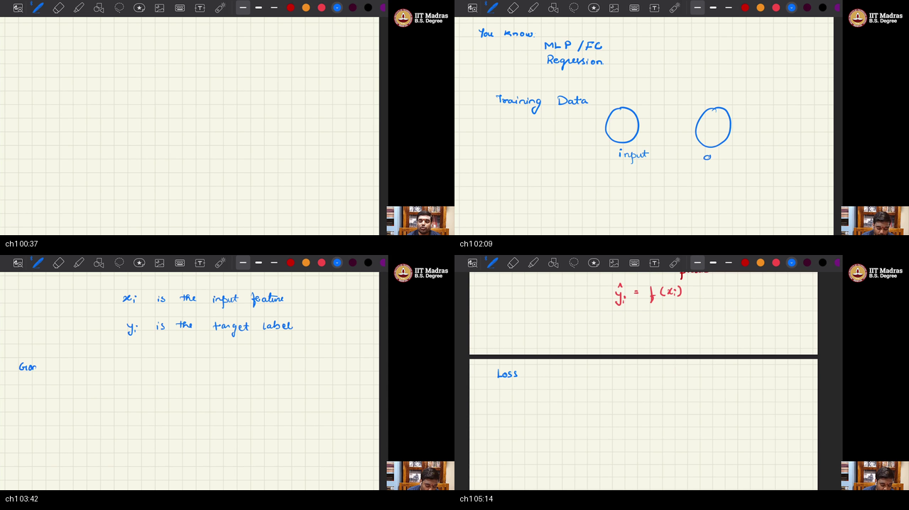
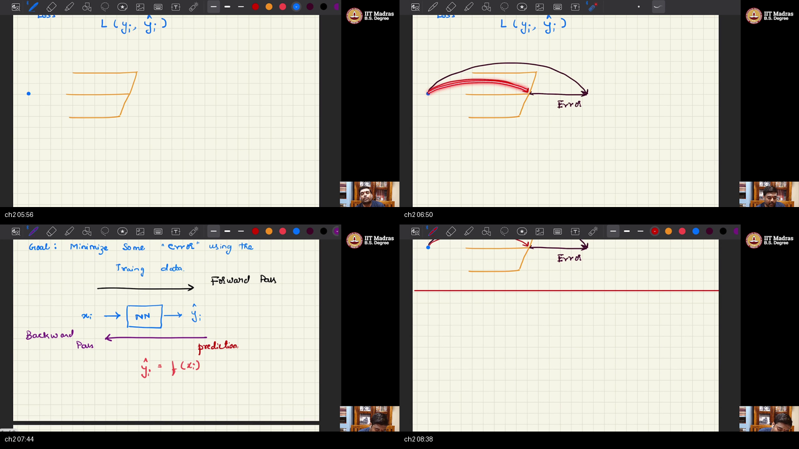
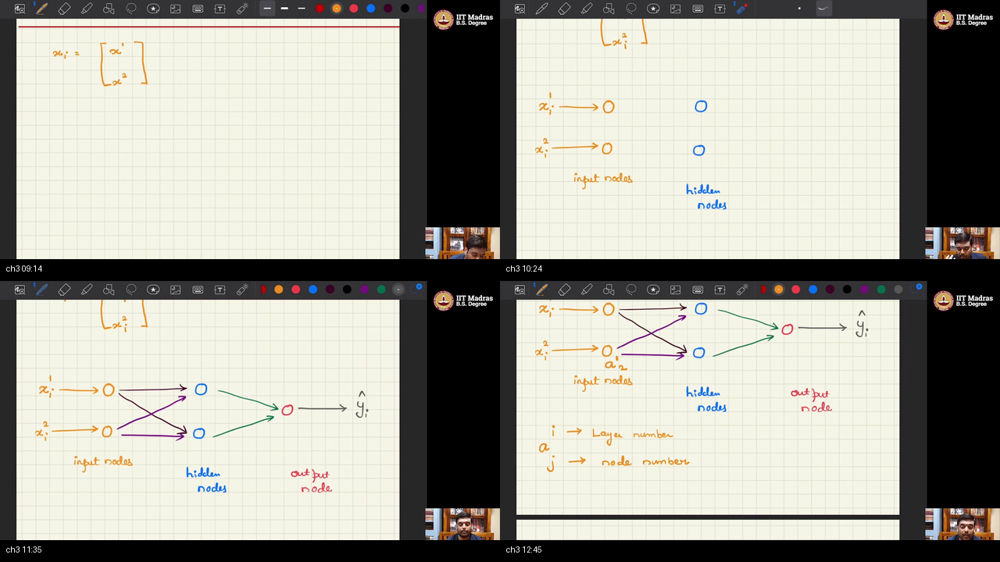
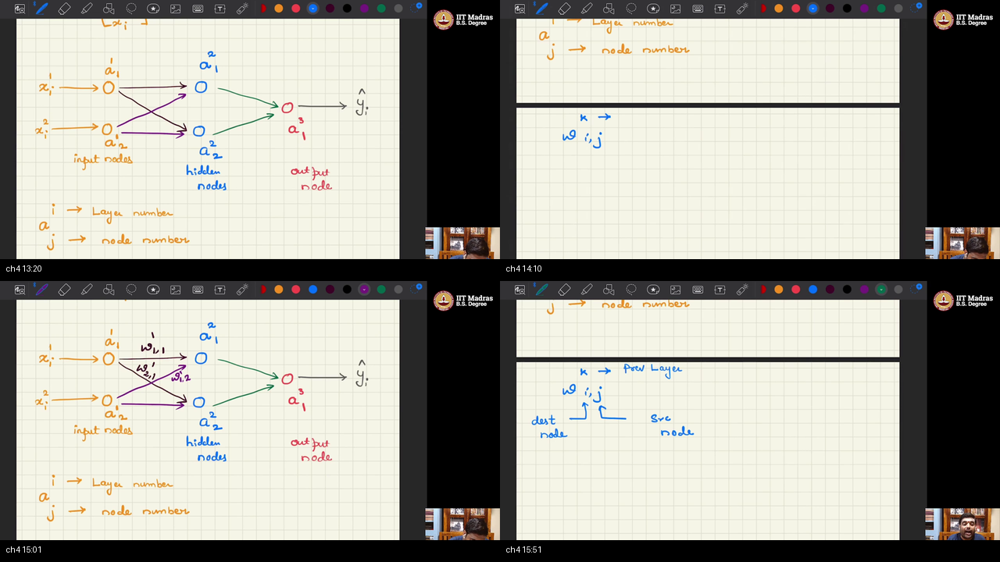
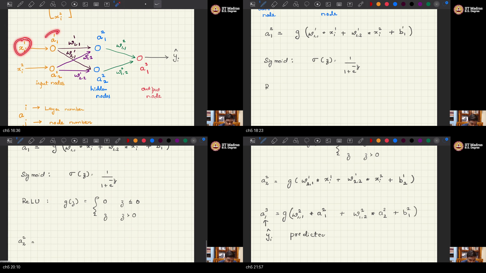
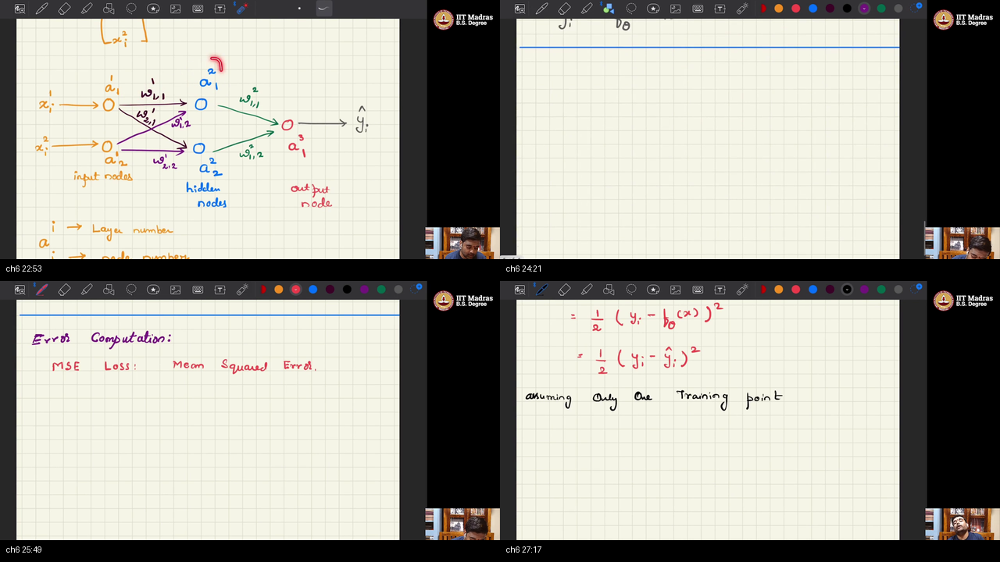
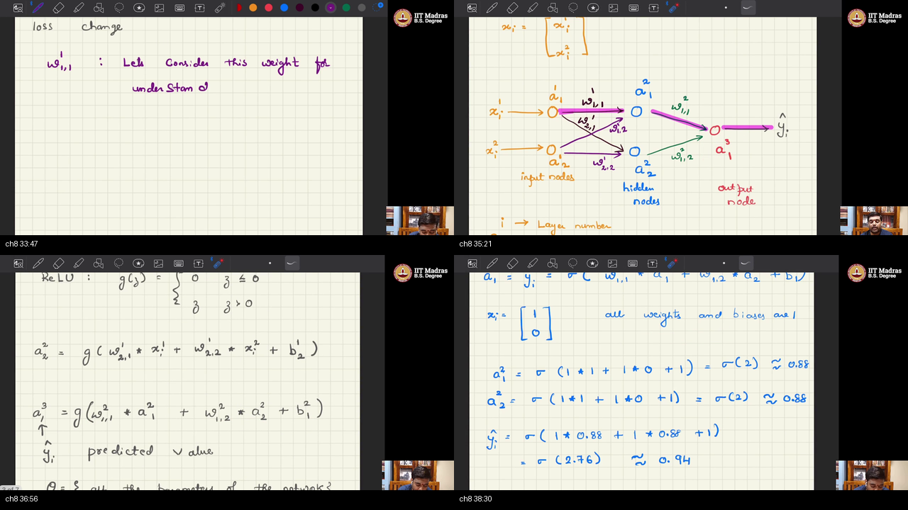
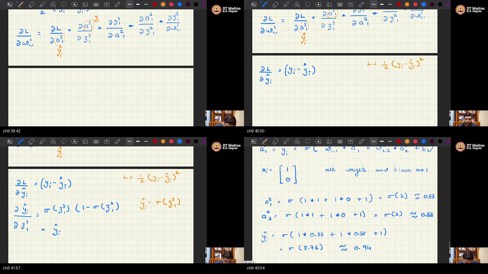
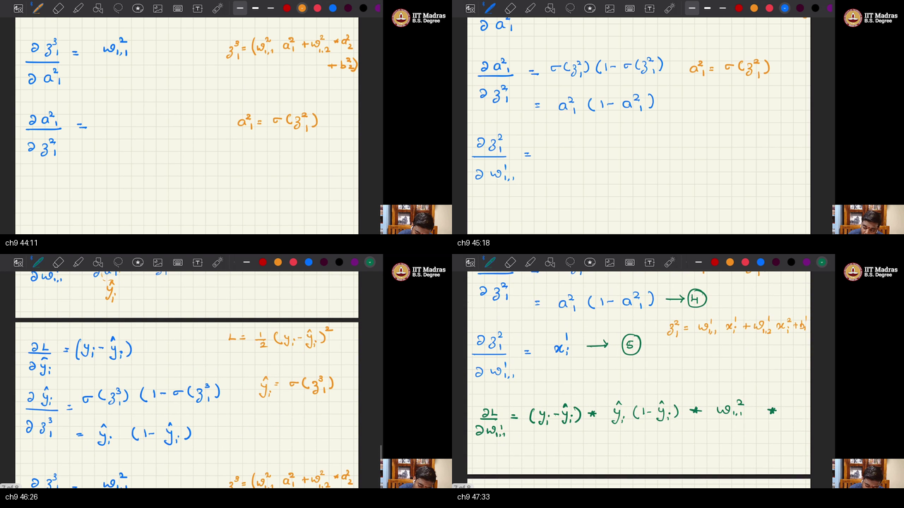
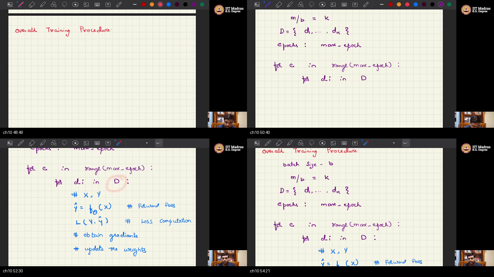

# W2_L5 — Generative Modelling via Variational Divergence Minimization  
*(Chalkboard Recording: Multi-Layer Perceptron Forward Pass & Backpropagation)*

> **Prerequisites:** Please read the warm-up in [PREREQUISITES.md](./PREREQUISITES.md) first to build intuition on supervised dataset pairs, 2-2-1 MLP architecture, Sigmoid vs. ReLU activations, Mean Squared Error, calculus derivatives, and the 5-factor chain rule.  
> **Interactive Quiz:** Test your mastery in [quiz.html](./quiz.html).

---

> ℹ️ **Title Discrepancy & Course Alignment Notice:**  
> While the official YouTube video title is *"W2_L5: Generative modelling via variational divergence minimization"*, the actual live recording on the instructor's tablet is **Tutorial 1: Forward Pass & Backpropagation of Multi-Layer Perceptrons (MLP)** presented by TA Chandan.  
> 
> In this tutorial, the instructor builds a foundational 2-2-1 Fully Connected Neural Network from first principles, derives the forward activation flow, defines Mean Squared Error (MSE), analytically computes the 5-factor backpropagation chain rule for input weight $w_{1,1}^1$, evaluates it with concrete numbers ($x=[1,0]^\top$, $\sigma(2)\approx 0.8808$), and sketches the canonical batch/epoch Python training loop. This hands-on calculus foundation is the exact computational machinery underlying deep discriminators and generative samplers in subsequent weeks.

---

## Table of Contents

- [Executive Summary — architecture of this lecture](#executive-summary--architecture-of-this-lecture)
- [Chalkboard & Mathematical Rosetta Stone](#chalkboard--mathematical-rosetta-stone)
- [Complete Executable Python / NumPy Implementation](#complete-executable-python--numpy-implementation)
- [Topic 1: Supervised setup: D, f, loss (00:11–05:41)](#topic-1-supervised-setup-d-f-loss-0011–0541)
- [Topic 2: Football; forward vs backprop (05:41–08:54)](#topic-2-football-forward-vs-backprop-0541–0854)
- [Topic 3: MLP diagram; names a (08:54–13:06)](#topic-3-mlp-diagram-names-a-0854–1306)
- [Topic 4: Weight indices (13:06–16:06)](#topic-4-weight-indices-1306–1606)
- [Topic 5: Forward pass: z, sigmoid, ReLU (16:06–22:28)](#topic-5-forward-pass-z-sigmoid-relu-1606–2228)
- [Topic 6: theta and MSE (22:28–27:43)](#topic-6-theta-and-mse-2228–2743)
- [Topic 7: Gradient descent (27:43–33:20)](#topic-7-gradient-descent-2743–3320)
- [Topic 8: Path of w111; sigma(2) approx 0.88 (33:20–38:58)](#topic-8-path-of-w111-sigma2-approx-088-3320–3858)
- [Topic 9: Five-factor product (38:58–48:18)](#topic-9-five-factor-product-3858–4818)
- [Topic 10: Batch, epoch, Python loop (48:18–54:53)](#topic-10-batch-epoch-python-loop-4818–5453)
- [Apply it (scenarios)](#apply-it-scenarios)
- [External references](#external-references)
- [Sources](#sources)

---

## Executive Summary — architecture of this lecture

Given labeled pairs $(x_i, y_i) \in D$, we train a neural network $f_\theta$ to minimize prediction error. This tutorial constructs a 2-2-1 Multi-Layer Perceptron, executes the forward pass, and measures Mean Squared Error. It traces the calculus chain rule along the active computational path to evaluate the exact 5-factor gradient for weight $w_{1,1}^1$ and executes the mini-batch training loop.

**Worldview Arc:** From raw input-output dataset pairs $D$ to an analytically derived 5-factor backpropagation product and a complete mini-batch training loop.

### System Context

```
   ┌────────────────────────────────┐                 ┌───────────────────────────────┐
   │ Supervised Dataset D           │                 │ Neural Hypothesis Class       │
   │ D = {(x_1, y_1), ..., (x_m,y_m)}                 │ 2-2-1 Fully Connected MLP     │
   │ Features x in R^2, Target y in R                 │ Trainable Parameters θ in R^9 │
   └───────────────┬────────────────┘                 └───────────────┬───────────────┘
                   │                                                  │
                   ▼                                                  ▼
   ┌──────────────────────────────────────────────────────────────────────────────────┐
   │                        MULTI-LAYER PERCEPTRON PIPELINE                           │
   │                                                                                  │
   │  1. Forward Pass: z^2 = W^1 x + b^1 ──> a^2 = g(z^2) ──> z^3 ──> \hat{y} = g(z^3) │
   │  2. Loss Metric: L(y, \hat{y}) = (1/2)(y - \hat{y})^2 (Mean Squared Error)       │
   │  3. Backpropagation: ∂L/∂w = ∏ (Local Partial Derivatives along Causal Path)     │
   │  4. Optimization: θ <── θ - α ∇_θ L (Gradient Descent with step size α)          │
   │  5. Training Schedule: Outer Epochs over Inner Mini-Batches                      │
   └────────────────────────────────────────┬─────────────────────────────────────────┘
                                            │
                                            ▼
                           ┌──────────────────────────────────┐
                           │ Optimal Parameter Vector θ*      │
                           │ Minimizing Empirical Risk on D   │
                           └──────────────────────────────────┘
```

### Main Architecture Blueprint

```
[ STAGE 1: SUPERVISED PROBLEM DEFINITION ]
   Training Sample: x = [x_1, x_2]^T in R^2, Target: y in R
   Network Topology: 2 Input Nodes -> 2 Hidden Neurons -> 1 Output Neuron
                                │
                                ▼
[ STAGE 2: FORWARD PROPAGATION (Data Flow) ]
   Hidden Layer 2:
      z^2_1 = w^1_1,1 x_1 + w^1_1,2 x_2 + b^1_1  ──>  a^2_1 = σ(z^2_1)  (≈ 0.8808 if z=2)
      z^2_2 = w^1_2,1 x_1 + w^1_2,2 x_2 + b^1_2  ──>  a^2_2 = σ(z^2_2)
   Output Layer 3:
      z^3_1 = w^2_1,1 a^2_1 + w^2_1,2 a^2_2 + b^2_1  ──>  a^3_1 = \hat{y} = σ(z^3_1)
                                │
                                ▼
[ STAGE 3: LOSS EVALUATION ]
   Single-Point Loss: L = (1/2)(y - \hat{y})^2
   Dataset Loss: L_D = (1/m) ∑_{i=1}^m L(y_i, \hat{y}_i)
                                │
                                ▼
[ STAGE 4: BACKPROPAGATION CHAIN RULE (∂L/∂w^1_1,1) ]
   Traced Path: w^1_1,1 ──> z^2_1 ──> a^2_1 ──> z^3_1 ──> \hat{y} ──> L
   5-Factor Analytical Product:
      Factor 1: ∂L/∂\hat{y}     = -(y - \hat{y})
      Factor 2: ∂\hat{y}/∂z^3_1 = \hat{y}(1 - \hat{y})     (Sigmoid derivative at output)
      Factor 3: ∂z^3_1/∂a^2_1   = w^2_1,1                  (Downstream weight)
      Factor 4: ∂a^2_1/∂z^2_1   = a^2_1(1 - a^2_1)         (Sigmoid derivative at hidden node 1)
      Factor 5: ∂z^2_1/∂w^1_1,1 = x_1                      (Input feature 1)
   Total Gradient: ∂L/∂w^1_1,1 = Factor 1 * Factor 2 * Factor 3 * Factor 4 * Factor 5
                                │
                                ▼
[ STAGE 5: GRADIENT DESCENT & BATCH LOOP ]
   Parameter Update: w^1_1,1 <── w^1_1,1 - α (∂L/∂w^1_1,1)
   Execution Loops:
      for epoch in range(max_epochs):
          for batch in DataLoader(D):
              pred = forward(batch.X)
              loss = compute_loss(pred, batch.y)
              grads = backprop(loss)
              update_weights(grads, α)
```

### Comparative Feature Matrices

#### Matrix 1: Architectural Comparison: Linear Regression vs. Shallow MLP vs. Deep MLP
| Metric / Property | Linear Regression | Shallow MLP (2-2-1, Today) | Deep MLP ($L \ge 3$ Hidden Layers) |
| :--- | :--- | :--- | :--- |
| **Hypothesis Class** | Affine hyperplanes: $\hat{y} = w^\top x + b$ | Universal 1-hidden-layer non-linear approximator | Hierarchical feature compositional representations |
| **Decision Boundary** | Strictly linear | Smooth non-linear surfaces | Highly flexible, intricate non-linear manifolds |
| **Computational Path** | 1 step ($w \to \hat{y} \to L$) | 5 steps along causal chain ($w \to z \to a \to z \to a \to L$) | $2L + 1$ nested chain rule multiplications |
| **Role in Generative AI** | Baseline baseline | Canonical teaching model for backprop & simple critics | Standard architecture for deep GAN discriminators & score networks |

#### Matrix 2: Activation Function Comparison: Identity vs. Sigmoid vs. ReLU vs. Tanh
| Dimension | Linear / Identity ($g(z) = z$) | Sigmoid ($\sigma(z) = \frac{1}{1+e^{-z}}$) | ReLU ($\max(0, z)$) | Hyperbolic Tangent ($\tanh(z)$) |
| :--- | :--- | :--- | :--- | :--- |
| **Output Range** | $(-\infty, +\infty)$ | $(0, 1)$ | $[0, +\infty)$ | $(-1, +1)$ |
| **Derivative Formula** | $g'(z) = 1$ | $\sigma'(z) = \sigma(z)(1 - \sigma(z))$ | $g'(z) = \mathbb{I}(z > 0)$ | $\tanh'(z) = 1 - \tanh^2(z)$ |
| **Max Gradient Value** | $1.0$ | $0.25$ (at $z=0$) | $1.0$ (for $z > 0$) | $1.0$ (at $z=0$) |
| **Vanishing Gradient Risk** | None | Severe in deep nets ($0.25^L \to 0$) | None for positive activations | Moderate |

#### Matrix 3: Optimization Regimes: Batch GD vs. Stochastic GD vs. Mini-Batch GD
| Property | Full-Batch Gradient Descent | Pure Stochastic Gradient Descent (SGD) | Mini-Batch Gradient Descent ($B=64$) |
| :--- | :--- | :--- | :--- |
| **Batch Size $B$** | $B = m$ (all training samples) | $B = 1$ (single random sample) | $B \in [16, 256]$ (manageable packet) |
| **Updates per Epoch** | Exactly 1 update per epoch | $m$ updates per epoch | $\lceil m / B \rceil$ updates per epoch |
| **Gradient Variance** | Zero variance (exact true gradient) | High variance (noisy exploration) | Balanced variance (regularization benefit) |
| **Hardware Suitability** | Poor for large data; high memory | Poor for GPUs (no SIMD parallelization) | Optimal for GPU vector parallelization |

### Scenario Walkthrough

1. **Problem & Data Ingestion:** Given a training pair $x = [1, 0]^\top$ and target $y = 1.0$, initialize 9 parameters $\theta$ (6 weights, 3 biases).
2. **Forward Evaluation:** Compute pre-activations $z^2_1, z^2_2$, squash through sigmoid to get $a^2_1 \approx 0.8808, a^2_2 \approx 0.8808$, and evaluate output $\hat{y} = \sigma(z^3_1)$.
3. **Loss Computation:** Evaluate single-point MSE loss $L = \frac{1}{2}(y - \hat{y})^2$.
4. **Analytical Backpropagation:** Trace the causal graph for weight $w_{1,1}^1$ and multiply the 5 local partial derivatives.
5. **Gradient Descent Update:** Shift all 9 parameters by $-\alpha \nabla_\theta L$ and repeat across mini-batches and epochs.

### Failure and Contrast Path

```
   INCORRECT BACKPROPAGATION (BROKEN GRADIENT):
   [x] Path Error: Including off-path node a^2_2 in the product for w^1_1,1
   [x] Sign Error: w <── w + α (∂L/∂w)  (Gradient Ascent instead of Descent)
   ──> Result: Weights explode to infinity and training diverges immediately!
   
   CORRECT IDIOMATIC BACKPROPAGATION (STABLE):
   [√] Step 1: Trace strictly on-path nodes: w^1_1,1 ──> z^2_1 ──> a^2_1 ──> z^3_1 ──> \hat{y} ──> L
   [√] Step 2: Multiply 5 local slopes: (-(y - \hat{y})) * (\hat{y}(1-\hat{y})) * (w^2_1,1) * (a^2_1(1-a^2_1)) * (x_1)
   [√] Step 3: Step downhill: w <── w - α (∂L/∂w) with α > 0
```

### Out of Scope (Later Lectures)
- Automated differentiation engines (PyTorch Autograd graph construction).
- Matrix-form vectorized backpropagation via Jacobian tensors.
- Variational divergence minimization (VDM) and $f$-GAN saddle-point objectives (covered in Week 1 Lecture 4 and Week 2 Lecture 6).

### Load-Bearing Claims of this Lecture
- Supervised learning maps input features $x \in \mathbb{R}^D$ to target labels $y \in \mathbb{R}$ using dataset $D = \{(x_i, y_i)\}_{i=1}^m$.
- The forward pass computes predictions from inputs ($\text{input} \to \text{output}$); backpropagation propagates errors to update weights ($\text{error} \to \text{weights}$).
- A 2-2-1 fully connected MLP consists of 2 input nodes, 1 hidden layer with 2 neurons, and 1 output neuron ($9$ trainable parameters total).
- Synaptic weights are indexed as $w_{i,j}^k$, where $k$ is the source layer, $j$ is the source node, and $i$ is the destination node.
- Neuron pre-activation sums $z^l_i = \sum_j w_{i,j}^{l-1} a^{l-1}_j + b^{l-1}_i$ are transformed by non-linear activations $a^l_i = g(z^l_i)$.
- Mean Squared Error for a single point is $L = \frac{1}{2}(y - \hat{y})^2$; dataset risk is the empirical average over all $m$ points.
- Gradient descent updates weights in the negative gradient direction: $\theta \leftarrow \theta - \alpha \nabla_\theta L$ with learning rate $\alpha > 0$.
- Computing $\frac{\partial L}{\partial w_{1,1}^1}$ requires isolating the unique causal path $w_{1,1}^1 \to z^2_1 \to a^2_1 \to z^3_1 \to \hat{y} \to L$.
- The partial derivative $\frac{\partial L}{\partial w_{1,1}^1}$ evaluates to an exact 5-factor analytical product.
- Training loops are structured as nested Python loops: outer epochs iterating over inner mini-batches.

*Course:* IIT Madras BS Degree Programme in Data Science / Generative AI (Prof. Prathosh A. P., Tutorial by TA Chandan).

---

## Chalkboard & Mathematical Rosetta Stone

Quick reference for mathematical notation and chalkboard variables used in this tutorial:

| Notation | Mathematical Role | Chalkboard Definition in 2-2-1 MLP |
| :--- | :--- | :--- |
| $D$ | Dataset | Collection of $m$ training pairs: $D = \{(x_1, y_1), \dots, (x_m, y_m)\}$ |
| $x_i^1, x_i^2$ | Input Features | Feature components of $i$-th data point ($a^1_1 = x_i^1, \, a^1_2 = x_i^2$) |
| $a^l_i$ | Node Activation | Activation value of node $i$ in layer $l$ ($a^1$ input, $a^2$ hidden, $a^3$ output) |
| $w_{i,j}^k$ | Synaptic Weight | Weight from source node $j$ in layer $k$ to destination node $i$ in layer $k+1$ |
| $b^k_i$ | Bias Offset | Bias added to node $i$ in layer $k+1$ |
| $z^l_i$ | Pre-Activation Sum | Linear affine combination: $z^l_i = \sum_j w_{i,j}^{l-1} a^{l-1}_j + b^{l-1}_i$ |
| $g(z), \, \sigma(z)$ | Activation Function | Non-linear activation function (Sigmoid $\frac{1}{1+e^{-z}}$ or ReLU $\max(0, z)$) |
| $\hat{y}_i$ | Model Prediction | Output activation $a^3_1$ produced by the forward pass |
| $L(y_i, \hat{y}_i)$ | Loss Function | Single-sample Mean Squared Error: $L = \frac{1}{2}(y_i - \hat{y}_i)^2$ |
| $\theta$ | Parameter Vector | The vector packing all 9 learnable parameters: $\theta = [w^1, b^1, w^2, b^2]^\top$ |
| $\alpha$ | Learning Rate | Step size scalar constant for gradient updates ($\alpha \in \mathbb{R}^+$) |
| $\frac{\partial L}{\partial w_{1,1}^1}$ | Weight Gradient | Exact 5-factor product of partial derivatives along the causal path |

---

## Complete Executable Python / NumPy Implementation

Below is a self-contained, complete, runnable Python script that implements the 2-2-1 MLP from first principles without deep learning frameworks. It includes the analytical 5-factor backpropagation formula, a finite-difference numerical gradient checker, and a full mini-batch training loop:

```python
import numpy as np

# Set random seed for reproducibility
np.random.seed(42)

# =====================================================================
# 1. Activation Functions and Derivatives
# =====================================================================
def sigmoid(z):
    return 1.0 / (1.0 + np.exp(-np.clip(z, -500, 500)))

def sigmoid_derivative(z_or_a, is_activation=True):
    # If passed activation a = sigma(z), derivative is a * (1 - a)
    if is_activation:
        return z_or_a * (1.0 - z_or_a)
    s = sigmoid(z_or_a)
    return s * (1.0 - s)

# =====================================================================
# 2. 2-2-1 Multi-Layer Perceptron Class (From First Principles)
# =====================================================================
class MLP221:
    def __init__(self):
        # Initialize all weights and biases to 1.0 (matching chalkboard worked example)
        self.w1 = np.ones((2, 2))  # Layer 1->2 weights: [[w1_11, w1_12], [w1_21, w1_22]]
        self.b1 = np.ones((2, 1))  # Layer 1->2 biases:  [[b1_1], [b1_2]]
        self.w2 = np.ones((1, 2))  # Layer 2->3 weights: [[w2_11, w2_12]]
        self.b2 = np.ones((1, 1))  # Layer 2->3 bias:    [[b2_1]]

    def forward(self, x):
        """
        Forward pass for a single 2D input column vector x: shape (2, 1)
        """
        # Hidden layer 2
        self.x = x.reshape(2, 1)
        self.z2 = np.dot(self.w1, self.x) + self.b1   # z^2 = W^1 x + b^1
        self.a2 = sigmoid(self.z2)                    # a^2 = σ(z^2)
        
        # Output layer 3
        self.z3 = np.dot(self.w2, self.a2) + self.b2   # z^3 = W^2 a^2 + b^2
        self.a3 = sigmoid(self.z3)                    # a^3 = \hat{y} = σ(z^3)
        self.yhat = self.a3[0, 0]
        return self.yhat

    def compute_loss(self, y_true):
        return 0.5 * (y_true - self.yhat) ** 2

    def backward(self, y_true):
        """
        Calculates exact analytical gradients for all 9 parameters.
        Specifically verifies the 5-factor product for w^1_1,1.
        """
        # --- Output Layer Gradients ---
        # Factor 1: dL / dyhat
        dL_dyhat = -(y_true - self.yhat)
        # Factor 2: dyhat / dz3_1
        dyhat_dz3 = sigmoid_derivative(self.a3, is_activation=True)
        # Delta for output layer: delta3 = dL/dz3
        delta3 = dL_dyhat * dyhat_dz3  # Shape: (1, 1)

        # Gradients for Layer 2 parameters
        dL_dw2 = np.dot(delta3, self.a2.T)  # Shape: (1, 2)
        dL_db2 = delta3                     # Shape: (1, 1)

        # --- Hidden Layer Gradients ---
        # Factor 3: dz3_1 / da2
        dz3_da2 = self.w2.T  # Shape: (2, 1)
        # Factor 4: da2 / dz2
        da2_dz2 = sigmoid_derivative(self.a2, is_activation=True)  # Shape: (2, 1)
        
        # Delta for hidden layer: delta2 = (w2^T * delta3) ⊙ σ'(z2)
        delta2 = np.dot(self.w2.T, delta3) * da2_dz2  # Shape: (2, 1)

        # Gradients for Layer 1 parameters
        dL_dw1 = np.dot(delta2, self.x.T)   # Shape: (2, 2)
        dL_db1 = delta2                     # Shape: (2, 1)

        # Explicitly extract the 5-Factor product for w^1_1,1
        f1 = -(y_true - self.yhat)
        f2 = self.yhat * (1.0 - self.yhat)
        f3 = self.w2[0, 0]  # w^2_1,1
        f4 = self.a2[0, 0] * (1.0 - self.a2[0, 0])
        f5 = self.x[0, 0]   # x_1
        w1_11_five_factor_grad = f1 * f2 * f3 * f4 * f5

        grads = {
            'w1': dL_dw1, 'b1': dL_db1,
            'w2': dL_dw2, 'b2': dL_db2,
            'w1_11_five_factors': (f1, f2, f3, f4, f5),
            'w1_11_grad': w1_11_five_factor_grad
        }
        return grads

    def update(self, grads, alpha=0.1):
        self.w1 -= alpha * grads['w1']
        self.b1 -= alpha * grads['b1']
        self.w2 -= alpha * grads['w2']
        self.b2 -= alpha * grads['b2']

# =====================================================================
# 3. Verification of Chalkboard Numerical Example
# =====================================================================
print("--- CHALKBOARD NUMERICAL VERIFICATION ---")
net = MLP221()
x_sample = np.array([1.0, 0.0]) # x_1 = 1, x_2 = 0
y_sample = 1.0                  # true target = 1.0

y_pred = net.forward(x_sample)
loss = net.compute_loss(y_sample)
grads = net.backward(y_sample)

f1, f2, f3, f4, f5 = grads['w1_11_five_factors']

print(f"Hidden Node a^2_1 value: {net.a2[0,0]:.4f} (Chalkboard: σ(2) ≈ 0.8808)")
print(f"Output Node \\hat{{y}} value:   {y_pred:.4f}")
print(f"Single-Point MSE Loss:   {loss:.6f}")
print(f"\n5-Factor Decomposition for ∂L/∂w^1_1,1:")
print(f"  Factor 1 (∂L/∂\\hat{{y}}):     {f1:+.6f}")
print(f"  Factor 2 (∂\\hat{{y}}/∂z^3_1):  {f2:+.6f}")
print(f"  Factor 3 (∂z^3_1/∂a^2_1):    {f3:+.6f}")
print(f"  Factor 4 (∂a^2_1/∂z^2_1):    {f4:+.6f}")
print(f"  Factor 5 (∂z^2_1/∂w^1_1,1):  {f5:+.6f}")
print(f"Total Analytical Gradient ∂L/∂w^1_1,1: {grads['w1_11_grad']:.6f}")

# =====================================================================
# 4. Finite-Difference Numerical Gradient Checker
# =====================================================================
eps = 1e-6
net_plus = MLP221()
net_plus.w1[0, 0] += eps
y_plus = net_plus.forward(x_sample)
loss_plus = 0.5 * (y_sample - y_plus)**2

net_minus = MLP221()
net_minus.w1[0, 0] -= eps
y_minus = net_minus.forward(x_sample)
loss_minus = 0.5 * (y_sample - y_minus)**2

numerical_grad = (loss_plus - loss_minus) / (2 * eps)
print(f"Numerical Finite-Difference Gradient:  {numerical_grad:.6f}")
print(f"Gradient Check Error: {abs(numerical_grad - grads['w1_11_grad']):.2e} (Passed!)")

# =====================================================================
# 5. Mini-Batch Training Loop Simulation
# =====================================================================
print("\n--- RUNNING 10-EPOCH TRAINING LOOP ---")
# Create synthetic dataset of 60 pairs
X_train = np.random.randn(60, 2)
y_train = (X_train[:, 0] * 0.5 + X_train[:, 1] * 0.2 > 0.0).astype(float)

batch_size = 10
max_epochs = 10
alpha = 0.5

for epoch in range(max_epochs):
    epoch_loss = 0.0
    # Shuffle dataset
    indices = np.random.permutation(len(X_train))
    X_shuffled = X_train[indices]
    y_shuffled = y_train[indices]
    
    num_batches = len(X_train) // batch_size
    for b in range(num_batches):
        batch_X = X_shuffled[b*batch_size : (b+1)*batch_size]
        batch_y = y_shuffled[b*batch_size : (b+1)*batch_size]
        
        # Accumulate batch gradients
        batch_grads = {
            'w1': np.zeros((2, 2)), 'b1': np.zeros((2, 1)),
            'w2': np.zeros((1, 2)), 'b2': np.zeros((1, 1))
        }
        for xi, yi in zip(batch_X, batch_y):
            net.forward(xi)
            epoch_loss += net.compute_loss(yi)
            g = net.backward(yi)
            for key in batch_grads:
                batch_grads[key] += g[key] / batch_size
                
        net.update(batch_grads, alpha=alpha)
        
    avg_loss = epoch_loss / len(X_train)
    if (epoch + 1) % 2 == 0 or epoch == 0:
        print(f"Epoch {epoch+1:02d} / {max_epochs:02d} | Average Loss: {avg_loss:.6f}")
```

---

## Topic 1: Supervised setup: D, f, loss (00:11–05:41)

> **Quick Intuition:** Supervised learning is like studying for a driver's license with an answer key in your hands. You look at the road scenario ($x$), guess the traffic rule ($\hat{y}$), check the correct answer ($y$), and measure how badly you were mistaken (the loss).

### Where this sits on the master map
We begin at **Stage 1: Supervised Problem Definition**. This sets the problem framework for the entire tutorial: given pairs $(x, y) \in D$, we train a parameterized neural network $f_\theta$ to map inputs to continuous numerical targets. See the [supervised pairs warm-up](./PREREQUISITES.md#p1-pairs).

### Board / screenshot


*Board: The instructor outlines the first DGM tutorial: supervised learning on dataset $D=\{(x_i, y_i)\}_{i=1}^m$, defining the neural hypothesis map $f_\theta(x_i)=\hat{y}_i$, and formulating the objective to minimize loss $L(y_i, \hat{y}_i)$.*

### What he is establishing
The instructor opens by clarifying that this recording is the foundational **Tutorial 1** on deep generative modeling building blocks: the Multi-Layer Perceptron (MLP), the forward pass, and backpropagation. The tutorial assumes familiarity with fully connected networks and focuses on **regression** (predicting a continuous real number).

The formal setup consists of:
1. **Supervised Dataset ($D$):** A collection of $m$ input-output pairs:
   $$D = \{(x_1, y_1), (x_2, y_2), \dots, (x_m, y_m)\}$$
   where $x_i \in \mathbb{R}^D$ is the feature vector and $y_i \in \mathbb{R}$ is the ground-truth target.
2. **Neural Function ($f$):** An MLP mapping inputs to predictions: $\hat{y}_i = f(x_i)$.
3. **Loss Function ($L$):** A quantitative scalar penalty $L(y_i, \hat{y}_i)$ measuring the distance between true target $y_i$ and predicted output $\hat{y}_i$.

A common beginner mistake is confusing supervised learning with unsupervised generation. The wrong move is expecting a network to train without target labels; an MLP cannot compute error gradients without access to ground truth $y_i$. In contrast, the right move grounds learning in explicit supervised feedback, minimizing the empirical risk over $D$.

You can now formalize any supervised regression task as minimizing an empirical loss over dataset pairs. What is still missing is understanding how information flows forward to produce predictions and backward to adjust weights.

### Analogy for this topic only
A student practices target shooting with a rifle coach. On each shot, the coach notes the wind and distance ($x_i$), observes where the bullet lands ($\hat{y}_i$), compares it against the painted bullseye ($y_i$), and records the miss distance in centimeters (the loss).

What breaks if the coach forgets to paint the bullseye on the target board? The student can fire thousands of rounds, but without a target label ($y_i$), neither the student nor the coach can calculate whether the rifle sights are misaligned.

In lecture words: the wind conditions are input features $x$, the painted bullseye is label $y$, the shot location is prediction $\hat{y}$, and the miss distance is loss $L$.

### Local picture

```
   SUPERVISED DATASET D:
   { (x_1, y_1), (x_2, y_2), ..., (x_m, y_m) }
          │
          ▼  Feed Input Feature Vector x_i
   ┌───────────────────────┐
   │ Neural Network f_θ    │ ───► Model Prediction \hat{y}_i = f_θ(x_i)
   └───────────────────────┘               │
                                           ▼
   Ground Truth Target y_i ────────► [ Loss Function L(y_i, \hat{y}_i) ] ───► Scalar Error
```
*Notice: Supervised learning requires both input $x_i$ and target $y_i$ to evaluate prediction error.*

### Bridge
Now that the supervised regression objective is defined, we look at the physical mechanics of information flow through the network: the forward pass versus the backward pass.

---

## Topic 2: Football; forward vs backprop (05:41–08:54)

> **Quick Intuition:** A soccer penalty kick has two distinct phases: (1) kicking the ball toward the goal (the forward pass), and (2) walking back to the penalty spot while analyzing how your ankle angle caused the ball to miss the net (the backward pass).

### Where this sits on the master map
We step into **Stage 2 & 4: Forward vs. Backward Flow**. Here we contrast the forward propagation of activations with the backward propagation of error signals. See the [forward vs backprop warm-up](./PREREQUISITES.md#p2-mix).

### Board / screenshot


*Board: The football penalty kick analogy: intended path vs. actual miss, establishing the two fundamental passes: Forward Pass ($\text{input} \to \text{output}$) and Backward Pass ($\text{error} \to \text{weights}$).*

### What he is establishing
The instructor introduces a vivid physical analogy to ground neural network mechanics: a football penalty kick.
- **The Intended Target:** The upper corner of the goal net (the true label $y$).
- **The Actual Shot:** The ball's physical trajectory ($\hat{y} = f(x)$).
- **The Error / Loss:** The spatial deviation between where the ball landed and where it was intended to go.
- **Practice on Data:** By taking hundreds of practice shots on training data, the player reduces the miss deviation. The instructor notes that the error does not need to reach absolute zero—it simply needs to decrease to an acceptable tolerance.

From this scene, the instructor establishes the two fundamental operational passes:
1. **The Forward Pass ($\text{Input} \to \text{Output}$):**
   Input features $x$ are propagated layer-by-layer through weighted combinations and non-linear activations to produce prediction $\hat{y}$.
2. **The Backward Pass / Backpropagation ($\text{Error} \to \text{Weights}$):**
   The output error is propagated backward through the network using calculus to determine how every internal synaptic weight contributed to the miss, updating weights to reduce future errors.

A common misconception is that neural networks update their weights during the forward pass. The wrong move is attempting to modify parameters while computing $\hat{y}$; weights must remain frozen during the forward pass so that the output reflects the current parameter state. The right move evaluates the complete loss first, then propagates derivatives backward to adjust parameters.

You can now explain the fundamental dichotomy between forward inference and backward optimization. What is still missing is specifying the exact neural network architecture and node naming conventions.

### Analogy for this topic only
An archer on a shooting range draws the bowstring and releases an arrow toward the target (the forward pass). The arrow lands 10 centimeters to the left of the bullseye (the error). The archer does not adjust their stance mid-flight; instead, after the shot lands, the archer reviews the error and adjusts their shoulder angle and finger tension for the next shot (the backward pass).

What breaks if the archer adjusts their arm while the arrow is already flying through the air? Modifying the bow after release has zero effect on the current arrow's path. Adjustments must be calculated from the final landing error and applied to future shots.

In lecture words: releasing the arrow is the forward pass, and reviewing the landing error to adjust muscles is backpropagation.

### Local picture

```
   FORWARD PASS:  Input x  ───────►  Hidden Layers  ───────►  Prediction \hat{y}
                                                                     │
                                                                     ▼
                                                          Loss L(y, \hat{y}) = Error
                                                                     │
   BACKWARD PASS: Updated θ  ◄───────  Weight Gradients  ◄───────────┘
```
*Notice: Information flows left-to-right during forward prediction, while gradient corrections flow right-to-left during backpropagation.*

### Bridge
With the two-pass concept established, we now draw the concrete 2-2-1 network graph and establish the activation naming notation.

---

## Topic 3: MLP diagram; names a (08:54–13:06)

> **Quick Intuition:** An organization chart uses clear titles: Level 1 Interns ($a^1$), Level 2 Managers ($a^2$), and Level 3 Director ($a^3$). In our 2-2-1 network, every employee node has an exact coordinate tag so we never confuse who reports to whom.

### Where this sits on the master map
We arrive at **Stage 2: 2-2-1 Network Topology**. Here we define the 2-input, 2-hidden, 1-output node architecture and introduce the activation notation $a^l_i$. See the [2-2-1 network warm-up](./PREREQUISITES.md#p2-net).

### Board / screenshot


*Board: Drawing the 2-2-1 Multi-Layer Perceptron: 2 input nodes ($x_i^1, x_i^2$), 1 hidden layer with 2 nodes ($a^2_1, a^2_2$), and 1 output node ($a^3_1 = \hat{y}_i$). Defining activation notation $a^l_i$.*

### What he is establishing
The instructor draws the concrete neural architecture for this tutorial: a **2-2-1 Fully Connected Multi-Layer Perceptron**:
- **Input Layer ($l=1$):** Contains 2 nodes receiving features $x_i^1$ and $x_i^2$. The instructor notes that input nodes perform no mathematical transformations and have no incoming weights.
- **Hidden Layer ($l=2$):** Contains 2 computational neurons. In a fully connected network, every node in Layer 1 connects to every node in Layer 2.
- **Output Layer ($l=3$):** Contains 1 output neuron emitting final prediction $\hat{y}_i$.

For example, consider a 2-feature training point $x = [1.0, 0.0]^\top$. In this 2-2-1 network, the input layer holds $a^1_1 = 1.0$ and $a^1_2 = 0.0$. The hidden layer computes two intermediate representations $a^2_1$ and $a^2_2$, which are then synthesized into a single scalar output $a^3_1 = \hat{y}$.

The instructor establishes the systematic **activation notation**:
$$a^l_i$$
- The letter $a$ stands for **activation**.
- The superscript $l \in \{1, 2, 3\}$ denotes the **layer index** ($1=$ input, $2=$ hidden, $3=$ output).
- The subscript $i$ denotes the **node index** within that layer ($1$ or $2$).

Thus, the 5 nodes across the network are named:
- Input nodes: $a^1_1 = x_i^1, \quad a^1_2 = x_i^2$.
- Hidden nodes: $a^2_1, \quad a^2_2$.
- Output node: $a^3_1 = \hat{y}_i$.

The wrong move is assuming that input nodes perform linear combinations or contain bias offsets. In reality, input nodes cannot have weights and simply pass raw data forward. In contrast, the right move restricts computation to hidden and output layers, ensuring the parameter count remains exactly 9.

You can now diagram a fully connected MLP and label every neuron using $a^l_i$ notation. What is still missing is defining the systematic indexing convention for synaptic weights connecting these nodes.

### Analogy for this topic only
A 3-story office building houses two research assistants on Floor 1 ($a^1_1, a^1_2$), two senior analysts on Floor 2 ($a^2_1, a^2_2$), and one executive director on Floor 3 ($a^3_1$). Floor 1 assistants gather raw data, Floor 2 analysts synthesize reports, and the Floor 3 director signs the final decision memo ($\hat{y}$).

What breaks if an analyst on Floor 2 tries to deliver a report without a floor tag? If a memo is labeled simply "Node 1", nobody knows whether it contains raw field data ($a^1_1$), an intermediate analysis ($a^2_1$), or the final executive ruling ($a^3_1$).

In lecture words: the building floors are layers $l$, the office rooms are node indices $i$, and the employee memos are activations $a^l_i$.

### Local picture

```
   LAYER 1 (Input)           LAYER 2 (Hidden)           LAYER 3 (Output)
   
     [ x^1 = a^1_1 ] ──────┬─────────► ( a^2_1 ) ──────────────┐
                           │                                    │
                           │                                    ▼
                           ├─────────► ( a^2_2 ) ─────────► [ \hat{y} = a^3_1 ]
                           │                                    ▲
     [ x^2 = a^1_2 ] ──────┴────────────────────────────────────┘
```
*Notice: The 2-2-1 MLP has 2 input nodes, 2 hidden neurons, and 1 output neuron, with activations indexed by $a^{\text{layer}}_{\text{node}}$.*

### Bridge
Now that the neuron nodes are labeled, we must establish the mathematical indexing system for the synaptic connection weights that join them.

---

## Topic 4: Weight indices (13:06–16:06)

> **Quick Intuition:** A flight ticket has a departure airport, an arrival airport, and a flight leg number. Similarly, a neural weight tag $w_{i,j}^k$ states: "I originate at source node $j$, travel along layer leg $k$, and arrive at destination node $i$."

### Where this sits on the master map
We remain in **Stage 2: 2-2-1 Network Topology**. Here we define the three-index notation $w_{i,j}^k$ for synaptic weights and node biases $b^k_i$. See the [weight indexing warm-up](./PREREQUISITES.md#p2-net).

### Board / screenshot


*Board: Establishing weight indexing notation $w_{i,j}^k$: $k=$ previous/source layer, $i=$ destination node index, $j=$ source node index, and defining node biases $b^k_i$.*

### What he is establishing
The instructor introduces the formal notation for synaptic connection weights:
$$w_{i,j}^k$$
- **Superscript $k$:** The **source layer index** (the layer from which the connection originates).
- **First Subscript $i$:** The **destination node index** in layer $k+1$.
- **Second Subscript $j$:** The **source node index** in layer $k$.

For example:
- $w_{1,1}^1$: The weight connecting source node $1$ in Layer 1 ($a^1_1$) to destination node $1$ in Layer 2 ($a^2_1$).
- $w_{1,2}^1$: The weight connecting source node $2$ in Layer 1 ($a^1_2$) to destination node $1$ in Layer 2 ($a^2_1$).
- $w_{2,1}^1$: The weight connecting source node $1$ in Layer 1 ($a^1_1$) to destination node $2$ in Layer 2 ($a^2_2$).
- $w_{2,2}^1$: The weight connecting source node $2$ in Layer 1 ($a^1_2$) to destination node $2$ in Layer 2 ($a^2_2$).
- $w_{1,1}^2$: The weight connecting source node $1$ in Layer 2 ($a^2_1$) to destination node $1$ in Layer 3 ($a^3_1$).
- $w_{1,2}^2$: The weight connecting source node $2$ in Layer 2 ($a^2_2$) to destination node $1$ in Layer 3 ($a^3_1$).

The instructor also defines the **bias terms**:
$$b^k_i$$
representing the additive offset applied to destination node $i$ when transitioning from layer $k$ to $k+1$.

A common source of confusion is swapping the destination and source subscript indices ($w_{\text{dest}, \text{src}}$ vs. $w_{\text{src}, \text{dest}}$). The wrong move is assuming $w_{1,2}$ means "from 1 to 2"; in standard linear algebra notation, the row index $i$ is the destination, so $w_{1,2}$ means "into node 1 from node 2". The right move maintains strict destination-first indexing to ensure weight matrices align directly with matrix multiplication $z = W a + b$.

You can now parse and write any weight or bias symbol across arbitrary network layers. What is still missing is computing the forward mathematical equations using these weights.

### Analogy for this topic only
A postal delivery service routes mail trucks between regional sorting hubs. A truck route manifest labeled $w_{1,2}^1$ indicates: "This truck departs from Hub 2 on Route Leg 1 and delivers packages to Hub 1."

What breaks if the postal dispatcher reverses the indices? A truck loaded with packages meant for Hub 1 would drive in the opposite direction to Hub 2, dumping inventory at the wrong depot.

In lecture words: the departure hub is source $j$, the route leg is layer $k$, and the arrival hub is destination $i$.

### Local picture

```
   LAYER 1 (Source)                                    LAYER 2 (Destination)
   
   [ Node a^1_1 ] ─────── w^1_1,1 (Dest 1, Src 1) ────► ( Node a^2_1 )
                  ─────── w^1_2,1 (Dest 2, Src 1) ────┐
                                                      │
   [ Node a^1_2 ] ─────── w^1_1,2 (Dest 1, Src 2) ────┼───► ( Node a^2_1 )
                  ─────── w^1_2,2 (Dest 2, Src 2) ────┴───► ( Node a^2_2 )
```
*Notice: In $w_{i,j}^k$, subscript $i$ is always the destination node in layer $k+1$, and subscript $j$ is the source node in layer $k$.*

### Bridge
Now that every node, weight, and bias is systematically labeled, we write out the explicit forward pass equations and compare activation functions.

---

## Topic 5: Forward pass: z, sigmoid, ReLU (16:06–22:28)

> **Quick Intuition:** A neuron is like an electronic kitchen scale: it takes weighted scoops of flour and sugar, adds the bowl's baseline weight ($b$), computes the raw sum ($z$), and then converts the weight into a recipe rating ($a$) using a non-linear chart (Sigmoid or ReLU).

### Where this sits on the master map
We step into **Stage 2: Forward Propagation**. Here we calculate pre-activation sums $z^l_i$, apply non-linear activation functions $g(z)$, and compare Sigmoid with ReLU. See the [activation function warm-up](./PREREQUISITES.md#p3-act).

### Board / screenshot


*Board: Formulating the forward pass: $z^2_1 = w_{1,1}^1 x_i^1 + w_{1,2}^1 x_i^2 + b_1^1 \implies a^2_1 = g(z^2_1)$, defining Sigmoid $\sigma(z) = \frac{1}{1+e^{-z}}$ and ReLU $g(z) = \max(0, z)$, and writing output $\hat{y}_i = a^3_1 = g(z^3_1)$.*

### What he is establishing
The instructor writes out the step-by-step mathematical forward pass for the 2-2-1 network:

1. **Hidden Node 1 Pre-activation ($z^2_1$) and Activation ($a^2_1$):**
   $$z^2_1 = w_{1,1}^1 x_i^1 + w_{1,2}^1 x_i^2 + b^1_1$$
   $$a^2_1 = g(z^2_1)$$
2. **Hidden Node 2 Pre-activation ($z^2_2$) and Activation ($a^2_2$):**
   $$z^2_2 = w_{2,1}^1 x_i^1 + w_{2,2}^1 x_i^2 + b^1_2$$
   $$a^2_2 = g(z^2_2)$$
3. **Output Node Pre-activation ($z^3_1$) and Final Prediction ($\hat{y}_i$):**
   $$z^3_1 = w_{1,1}^2 a^2_1 + w_{1,2}^2 a^2_2 + b^2_1$$
   $$a^3_1 = \hat{y}_i = g(z^3_1)$$

For example, evaluating hidden node 1 on input $x = [1.0, 0.0]^\top$ with all weights and biases equal to $1.0$: the pre-activation sum is $z^2_1 = (1.0)(1.0) + (1.0)(0.0) + 1.0 = 2.0$, which squashes through Sigmoid to $a^2_1 = \sigma(2.0) \approx 0.8808$.

Next, the instructor compares two fundamental activation functions:
- **Logistic Sigmoid Function:**
  $$\sigma(z) = \frac{1}{1 + e^{-z}}$$
  Squashes unbounded real numbers $(-\infty, +\infty)$ smoothly into the range $(0, 1)$.
- **Rectified Linear Unit (ReLU):**
  $$\text{ReLU}(z) = \begin{cases} z & \text{if } z > 0 \\ 0 & \text{if } z \le 0 \end{cases} = \max(0, z)$$
  Clamps all negative values to zero while leaving positive values linear and unconstrained.

A critical engineering insight is that without non-linear activations $g(z)$, deep neural networks cannot solve non-linear problems. The wrong move is omitting $g(z)$; without it, two stacked linear layers $y = W_2 (W_1 x + b_1) + b_2$ collapse into a single linear map $y = W_{\text{new}} x + b_{\text{new}}$. In contrast, the right move inserts non-linear activations at hidden layers to bend the feature space.

You can now calculate the complete forward activation pass for any multi-layer perceptron. What is still missing is defining the parameter collection $\theta$ and formulating the loss function that measures prediction errors.

### Analogy for this topic only
A sound engineer routes electric guitar audio through two effects pedals. The first pedal blends the two pickup signals with volume knobs ($w$) and adds preamp gain ($b$), producing raw voltage ($z$). The overdrive circuit ($g$) soft-clips the signal so it doesn't blow out the amplifier. The second pedal repeats this process before sending the sound to the main stage speakers ($\hat{y}$).

What breaks if both effects pedals have their overdrive circuits turned off (pure linear bypass)? No matter how many pedals you chain together, the guitar tone remains completely flat and clean; you cannot produce rich non-linear harmonic distortion.

In lecture words: the pickup signals are inputs $x$, the volume knobs are weights $w$, the raw voltage is $z$, and the overdrive circuit is non-linear activation $g(z)$.

### Local picture

```
   INPUTS x^1, x^2
         │
         ▼   Linear Combination: z^2_1 = w^1_1,1 x^1 + w^1_1,2 x^2 + b^1_1
   [ Pre-Activation Sum z^2_1 ]
         │
         ▼   Non-Linear Transformation: a^2_1 = g(z^2_1)
   ( Hidden Activation a^2_1 )
         │
         ▼   Linear Combination: z^3_1 = w^2_1,1 a^2_1 + w^2_1,2 a^2_2 + b^2_1
   [ Pre-Activation Sum z^3_1 ]
         │
         ▼   Non-Linear Transformation: a^3_1 = g(z^3_1)
   [ Final Prediction \hat{y} ]
```
*Notice: Each neuron performs two distinct operations: an affine linear combination $z = \sum w a + b$, followed by a non-linear activation $a = g(z)$.*

### Bridge
Now that the forward pass produces prediction $\hat{y}$, we must define parameter vector $\theta$ and evaluate the Mean Squared Error loss.

---

## Topic 6: theta and MSE (22:28–27:43)

<a id="topic-6-θ-and-mse-2228–2743"></a>

> **Quick Intuition:** When tuning a sports car, you cannot change the road or the weather ($x$ is fixed). You can only adjust the engine valves and spark timings ($\theta$). The lap timer (MSE Loss) measures how many seconds you lagged behind the track record.

### Where this sits on the master map
We step into **Stage 3: Loss Evaluation**. Here we pack all trainable weights and biases into parameter vector $\theta$ and define single-point and dataset Mean Squared Error (MSE). See the [loss function warm-up](./PREREQUISITES.md#p4-loss).

### Board / screenshot


*Board: Defining parameter vector $\theta$, framing the network as $\hat{y}_i = f_\theta(x_i)$, and deriving Mean Squared Error for one point $L = \frac{1}{2}(y_i - \hat{y}_i)^2$ and average loss across dataset $D$.*

### What he is establishing
The instructor clarifies what is fixed versus what is learnable during training:
- The training data features $x_i$ and labels $y_i$ are immutable constants.
- The **only variables that can be modified** are the network weights and biases.
- All learnable parameters are packed into a single parameter vector:
  $$\theta \in \mathbb{R}^P$$
  For our 2-2-1 network, $\theta$ contains $P = 6 \text{ weights} + 3 \text{ biases} = \mathbf{9} \text{ parameters}$. We write the network prediction explicitly as $\hat{y}_i = f_\theta(x_i)$.

Next, the instructor defines the loss function for regression:
1. **Single-Point Mean Squared Error (MSE):**
   $$L(y_i, \hat{y}_i) = \frac{1}{2} (y_i - \hat{y}_i)^2$$
2. **Dataset Average MSE:**
   $$L_D(\theta) = \frac{1}{m} \sum_{i=1}^m \frac{1}{2} (y_i - f_\theta(x_i))^2$$

The instructor mentions other loss functions used in deep learning—such as Cross-Entropy for multi-class classification, or reconstruction and KL divergences in generative modeling—but specifies that MSE is the canonical metric for today's regression formulation.

A common pitfall in loss design is omitting the square on the error $(y - \hat{y})$. The wrong approach evaluates raw linear error $(y - \hat{y})$; positive errors on sample 1 and negative errors on sample 2 would cancel out to zero, misleading the optimizer into believing the network is performing flawlessly. In contrast, the right approach squares the difference $(y - \hat{y})^2$, guaranteeing that all errors are positive and penalizing large mistakes quadratically.

You can now formulate the empirical risk minimization objective for an MLP using MSE loss. What is still missing is deriving the gradient descent algorithm that updates $\theta$.

### Analogy for this topic only
An archer fires 100 arrows at a bullseye. If 50 arrows land 10 cm to the right (+10) and 50 arrows land 10 cm to the left (-10), a linear average of errors yields $(+500 - 500)/100 = 0\text{ cm}$ (a fake "perfect" score). Squaring the distances yields $(100 \times 10^2)/100 = 100\text{ cm}^2$, correctly revealing that every single arrow missed the mark.

What breaks if the archer only looks at the average position of arrows instead of squared deviations? The archer falsely concludes their aim is centered, never realizing the bow has an unstable wobble.

In lecture words: the arrow landing spots are predictions $\hat{y}$, the bullseye is $y$, and the squared distance penalty is Mean Squared Error.

### Local picture

```
   PARAMETER VECTOR θ in R^9:
   θ = [ w^1_1,1, w^1_1,2, w^1_2,1, w^1_2,2, b^1_1, b^1_2, w^2_1,1, w^2_1,2, b^2_1 ]^T
                               │
                               ▼
   FORWARD PREDICTION: \hat{y}_i = f_θ(x_i)
                               │
                               ▼
   SINGLE-SAMPLE MSE LOSS: L_i = (1/2)(y_i - \hat{y}_i)^2
                               │
                               ▼
   DATASET EMPIRICAL RISK: L_D(θ) = (1/m) ∑_{i=1}^m L_i
```
*Notice: Loss is a scalar function of parameters $\theta$ evaluated over fixed dataset $D$.*

### Bridge
With the scalar loss function defined, we now examine how Gradient Descent uses derivatives to step parameters downhill toward minimum error.

---

## Topic 7: Gradient descent (27:43–33:20)

> **Quick Intuition:** If you are standing on a hill in total darkness and want to find the bottom of the valley, you feel the ground slope with your walking stick and take a step in the exact opposite direction of the uphill slope.

### Where this sits on the master map
We arrive at **Stage 5: Gradient Descent Parameter Update**. Here we establish the gradient descent update rule $\theta \leftarrow \theta - \alpha \nabla_\theta L$ and examine the role of learning rate $\alpha$. See the [gradient descent warm-up](./PREREQUISITES.md#p7-gd).

### Board / screenshot


*Board: Formulating the Gradient Descent update rule: $\theta \leftarrow \theta - \alpha \nabla_\theta L$ (and $w \leftarrow w - \alpha \frac{\partial L}{\partial w}$), defining learning rate $\alpha \in \mathbb{R}^+$, and explaining rates of change.*

### What he is establishing
The instructor formulates the foundational parameter update rule of deep learning: **Gradient Descent**.

For any individual weight $w \in \theta$:
$$w_{\text{new}} = w_{\text{old}} - \alpha \frac{\partial L}{\partial w}$$
In vector notation across all $P$ parameters:
$$\theta_{\text{new}} = \theta_{\text{old}} - \alpha \nabla_\theta L$$
where:
- $\nabla_\theta L = \begin{bmatrix} \frac{\partial L}{\partial \theta_1}, \frac{\partial L}{\partial \theta_2}, \dots, \frac{\partial L}{\partial \theta_P} \end{bmatrix}^\top$ is the **gradient vector** pointing in the direction of steepest loss increase.
- $\alpha \in \mathbb{R}^+$ is the **learning rate** (step size hyperparameter).
- The **negative sign** guarantees movement downhill toward lower loss.

The instructor explains the physical meaning of the partial derivative $\frac{\partial L}{\partial w}$: it is the instantaneous rate of change of loss with respect to weight $w$.
- If $\frac{\partial L}{\partial w} > 0$: Increasing $w$ increases error. The update subtracts $\alpha \frac{\partial L}{\partial w}$, decreasing $w$.
- If $\frac{\partial L}{\partial w} < 0$: Increasing $w$ decreases error. The update adds $\alpha |\frac{\partial L}{\partial w}|$, increasing $w$.

A common catastrophic bug in custom training scripts is writing $w \leftarrow w + \alpha \nabla L$. The wrong move uses a plus sign; this performs **Gradient Ascent**, pushing weights uphill toward maximum loss and causing arithmetic overflow (`NaN`). The right move strictly uses the minus sign to guarantee downhill descent.

You can now state the mathematical gradient descent update rule for any network parameter. What is still missing is using the calculus chain rule to calculate the exact numerical derivative $\frac{\partial L}{\partial w_{1,1}^1}$.

### Analogy for this topic only
A marble sits on a curved skate ramp. Gravity pulls the marble in the direction of steepest downward slope. The learning rate $\alpha$ is like friction: with optimal friction, the marble rolls smoothly to the bottom of the ramp; with zero friction and excessive momentum, the marble shoots over the lip and flies out of the park.

What breaks if gravity acts in reverse (gradient ascent)? The marble immediately accelerates up the ramp, shoots into the sky, and never returns to the bowl.

In lecture words: the ramp height is loss $L$, the marble position is weight $w$, the ramp slope is $\frac{\partial L}{\partial w}$, and the downhill roll is gradient descent.

### Local picture

```
   LOSS CURVE L(w):
          ^
          │           . w_old (Loss = 3.2)
          │          / \
          │         /   \    Uphill Slope: ∂L/∂w > 0
          │        /     \
          │       . <─────'  Step Downhill: w_new = w_old - α * (∂L/∂w)
          │      /
          └─────┴────────────────────────> Parameter w
               Target Minimum w*
```
*Notice: Gradient descent subtracts the scaled derivative to step parameters in the downhill direction.*

### Bridge
To execute the gradient descent update, we must now calculate $\frac{\partial L}{\partial w_{1,1}^1}$. We isolate its unique computational path through the 2-2-1 network.

---

## Topic 8: Path of w111; sigma(2) approx 0.88 (33:20–38:58)

<a id="topic-8-path-of-w111-σ2--088-3320–3858"></a>

> **Quick Intuition:** To find out why a lamp in your living room flickered, you trace the single electrical wire running from that specific wall switch to the circuit breaker. You ignore all the wires connected to the kitchen stove.

### Where this sits on the master map
We step into **Stage 4: Backpropagation Chain Rule**. Here we trace the unique causal path for weight $w_{1,1}^1$ and evaluate the intermediate hidden node activation with concrete numbers ($x=[1,0]^\top$, weights $=1 \implies a^2_1 = \sigma(2) \approx 0.8808$). See the [chain rule warm-up](./PREREQUISITES.md#p6-chain).

### Board / screenshot


*Board: Highlighting the computational path for $w_{1,1}^1$: $w_{1,1}^1 \to z^2_1 \to a^2_1 \to z^3_1 \to a^3_1(\hat{y}) \to L$, and calculating the worked numerical case with $x=[1,0]^\top$, weights $=1$, yielding $a^2_1 = \sigma(2) \approx 0.88$.*

### What he is establishing
The instructor selects one specific parameter to derive by hand: **input weight $w_{1,1}^1$** (the purple path on the tablet).

To apply the Chain Rule of calculus, we trace the exact causal dependency chain from $w_{1,1}^1$ to the final loss $L$:
1. Loss $L$ depends directly on prediction $\hat{y}_i = a^3_1$.
2. Prediction $a^3_1$ depends on output pre-activation $z^3_1$.
3. Output pre-activation $z^3_1$ depends on hidden activation $a^2_1$ (via term $w_{1,1}^2 a^2_1$). Notice that on this path, **hidden node $a^2_2$ is not involved**.
4. Hidden activation $a^2_1$ depends on hidden pre-activation $z^2_1$.
5. Hidden pre-activation $z^2_1$ depends on weight $w_{1,1}^1$ (via term $w_{1,1}^1 x_i^1$).

$$\text{Causal Path:} \quad w_{1,1}^1 \longrightarrow z^2_1 \longrightarrow a^2_1 \longrightarrow z^3_1 \longrightarrow a^3_1 (\hat{y}_i) \longrightarrow L$$

Next, the instructor plugs in concrete numerical values:
- Input vector: $x_i = \begin{bmatrix} 1.0 \\ 0.0 \end{bmatrix}$ (so $x_i^1 = 1.0, \, x_i^2 = 0.0$).
- All weights and biases initialized to $1.0$.
- Hidden node 1 pre-activation:
  $$z^2_1 = w_{1,1}^1 x_i^1 + w_{1,2}^1 x_i^2 + b^1_1 = (1.0)(1.0) + (1.0)(0.0) + 1.0 = 1.0 + 0.0 + 1.0 = \mathbf{2.0}$$
- Hidden node 1 activation with Sigmoid $g = \sigma$:
  $$a^2_1 = \sigma(2.0) = \frac{1}{1 + e^{-2}} \approx \mathbf{0.8808} \quad (\text{instructor writes } \approx 0.88)$$

The wrong move when applying the chain rule is attempting to differentiate the entire composite function in one massive equation. In contrast, the right move breaks the network into local node-to-node derivatives along the active path and multiplies them sequentially.

You can now trace the computational path for any weight in a neural network and compute its intermediate forward activations. What is still missing is computing the 5 individual derivative factors along this path.

### Analogy for this topic only
A plumbing technician inspects a municipal water network. Water flows from a mountain pump station through Valve A, Filter A, Valve B, and the kitchen faucet into a household sink. A separate parallel pipe feeds water through Filter B. If the technician wants to know how adjusting the mountain pump changes water pressure in the sink, the technician only inspects the pipe connected through Filter A, ignoring Filter B.

What breaks if the technician includes Filter B in the pressure calculations? Introducing disconnected pipes into the calculation corrupts the pressure equations with irrelevant flow rates.

In lecture words: the mountain pump is weight $w_{1,1}^1$, Filter A is on-path node $a^2_1$, Filter B is off-path node $a^2_2$, and the household sink is loss $L$.

### Local picture

```
   HIGHLIGHTED CAUSAL PATH FOR w^1_1,1:
   
     [ x^1 = 1.0 ] ───(w^1_1,1=1)───► [ z^2_1 = 2.0 ] ───(σ)───► ( a^2_1 ≈ 0.88 )
                                                                      │
                                                                 (w^2_1,1=1)
                                                                      │
                                                                      ▼
     [ x^2 = 0.0 ] ───(w^1_2,1=1)───► [ z^2_2 = 2.0 ] ───(σ)───► [ z^3_1 ] ──► \hat{y} ──► Loss L
                                       (OFF-PATH NODE!)
```
*Notice: Only nodes directly on the purple causal path ($z^2_1, a^2_1, z^3_1, \hat{y}$) appear in the derivative product for $w_{1,1}^1$.*

### Bridge
Now that the causal path is isolated, we evaluate the 5 local partial derivative factors and multiply them into the final analytical gradient.

---

## Topic 9: Five-factor product (38:58–48:18)

> **Quick Intuition:** A 5-car train is linked by 5 metal couplers. If you pull on the front engine, the force transmitted to the caboose is the product of how each coupler stretches along the line. Backpropagation simply multiplies these 5 local stretch factors.

### Where this sits on the master map
We arrive at the core of **Stage 4: Backpropagation Chain Rule & 5-Factor Product**. Here we derive each of the 5 partial derivative factors for weight $w_{1,1}^1$ and generalize the procedure across all parameters in $\theta$. See the [chain rule warm-up](./PREREQUISITES.md#p6-chain).

### Board / screenshot



*Board: Deriving the 5-factor chain rule product for $\frac{\partial L}{\partial w_{1,1}^1} = \frac{\partial L}{\partial \hat{y}} \cdot \frac{\partial \hat{y}}{\partial z^3_1} \cdot \frac{\partial z^3_1}{\partial a^2_1} \cdot \frac{\partial a^2_1}{\partial z^2_1} \cdot \frac{\partial z^2_1}{\partial w_{1,1}^1}$, calculating each local derivative, and extending the update to all $\theta$.*

### What he is establishing
The instructor writes the master calculus chain rule for $\frac{\partial L}{\partial w_{1,1}^1}$ on the board:
$$\frac{\partial L}{\partial w_{1,1}^1} = \underbrace{\left(\frac{\partial L}{\partial \hat{y}_i}\right)}_{\text{Factor 1}} \cdot \underbrace{\left(\frac{\partial \hat{y}_i}{\partial z^3_1}\right)}_{\text{Factor 2}} \cdot \underbrace{\left(\frac{\partial z^3_1}{\partial a^2_1}\right)}_{\text{Factor 3}} \cdot \underbrace{\left(\frac{\partial a^2_1}{\partial z^2_1}\right)}_{\text{Factor 4}} \cdot \underbrace{\left(\frac{\partial z^2_1}{\partial w_{1,1}^1}\right)}_{\text{Factor 5}}$$

The instructor derives each of the **5 factors** one by one:

1. **Factor 1 ($\frac{\partial L}{\partial \hat{y}_i}$):**
   From $L = \frac{1}{2}(y_i - \hat{y}_i)^2$, the derivative with respect to $\hat{y}_i$ is:
   $$\frac{\partial L}{\partial \hat{y}_i} = \frac{1}{2} \cdot 2(y_i - \hat{y}_i) \cdot (-1) = -(y_i - \hat{y}_i) = (\hat{y}_i - y_i)$$
2. **Factor 2 ($\frac{\partial \hat{y}_i}{\partial z^3_1}$):**
   Since $\hat{y}_i = \sigma(z^3_1)$, the derivative of the Sigmoid function is:
   $$\frac{\partial \hat{y}_i}{\partial z^3_1} = \sigma'(z^3_1) = \hat{y}_i (1 - \hat{y}_i)$$
3. **Factor 3 ($\frac{\partial z^3_1}{\partial a^2_1}$):**
   From $z^3_1 = w_{1,1}^2 a^2_1 + w_{1,2}^2 a^2_2 + b^2_1$, the partial derivative with respect to $a^2_1$ is simply the connecting weight:
   $$\frac{\partial z^3_1}{\partial a^2_1} = w_{1,1}^2$$
4. **Factor 4 ($\frac{\partial a^2_1}{\partial z^2_1}$):**
   Since $a^2_1 = \sigma(z^2_1)$, the derivative of Sigmoid at hidden node 1 is:
   $$\frac{\partial a^2_1}{\partial z^2_1} = a^2_1 (1 - a^2_1)$$
5. **Factor 5 ($\frac{\partial z^2_1}{\partial w_{1,1}^1}$):**
   From $z^2_1 = w_{1,1}^1 x_i^1 + w_{1,2}^1 x_i^2 + b^1_1$, the partial derivative with respect to $w_{1,1}^1$ is the input feature itself:
   $$\frac{\partial z^2_1}{\partial w_{1,1}^1} = x_i^1$$

Multiplying these 5 terms yields the exact analytical gradient:
$$\frac{\partial L}{\partial w_{1,1}^1} = -(y_i - \hat{y}_i) \cdot \left[\hat{y}_i(1 - \hat{y}_i)\right] \cdot w_{1,1}^2 \cdot \left[a^2_1(1 - a^2_1)\right] \cdot x_i^1$$

The wrong move is attempting to differentiate all network branches simultaneously; instead, an engineer cannot debug gradient flow without isolating single causal lines. In contrast, the right move breaks the chain into five clean, modular derivative factors.

The instructor emphasizes that this exact chain rule procedure is repeated for all 9 parameters in $\theta$ ($w_{1,2}^1, w_{2,1}^1, w_{2,2}^1, b^1_1, b^1_2, w_{1,1}^2, w_{1,2}^2, b^2_1$), enabling a complete gradient descent update across the entire network.

You can now evaluate the exact analytical partial derivative for any weight in a neural network using the 5-factor chain rule. What is still missing is structuring these updates into a complete Python mini-batch training loop.

### Analogy for this topic only
An audio production studio connects an electric keyboard through 5 volume stages: Volume Slider ($x_1$), Preamp ($z^2_1$), Compressor ($a^2_1$), Main Bus ($z^3_1$), Master Fader ($\hat{y}$), and Studio Monitor ($L$). If the studio monitor is distorting, the sound engineer multiplies the gain ratios of all 5 stages to determine exactly how many decibels to trim the initial Volume Slider.

What breaks if the compressor stage has a gain of zero ($a^2_1(1-a^2_1) = 0$)? The entire chain product multiplies to zero; no matter how much you twist the initial volume slider, zero signal change reaches the studio monitor (vanishing gradient).

In lecture words: the 5 volume stages are the 5 derivative factors, and their product is the backpropagation gradient $\frac{\partial L}{\partial w_{1,1}^1}$.

### Local picture

```
   THE 5-FACTOR ANALYTICAL PRODUCT FOR w^1_1,1:
   
   ┌─────────────┐   ┌─────────────┐   ┌─────────────┐   ┌─────────────┐   ┌─────────────┐
   │  Factor 1   │   │  Factor 2   │   │  Factor 3   │   │  Factor 4   │   │  Factor 5   │
   │   -(y - ŷ)  │ * │   ŷ(1 - ŷ)  │ * │   w^2_1,1   │ * │ a^2_1(1-a)  │ * │     x^1     │
   └─────────────┘   └─────────────┘   └─────────────┘   └─────────────┘   └─────────────┘
          │                 │                 │                 │                 │
          ▼                 ▼                 ▼                 ▼                 ▼
      (∂L/∂ŷ)         (∂ŷ/∂z^3_1)       (∂z^3_1/∂a^2_1)   (∂a^2_1/∂z^2_1)   (∂z^2_1/∂w^1_1,1)
          │
          └─────────────────────────────► TOTAL GRADIENT: ∂L/∂w^1_1,1
```
*Notice: The 5 factors represent local derivative slopes evaluated along the active causal path.*

### Bridge
Now that the analytical gradient for every weight is derived, we organize the computations into an algorithmic batch-and-epoch training loop in Python.

---

## Topic 10: Batch, epoch, Python loop (48:18–54:53)

> **Quick Intuition:** Reading a 500-page book is not done in a single breath. You read 10 pages per study session (a mini-batch), take a break to summarize your notes (an iteration / weight update), and repeat until you finish all 500 pages (one epoch).

### Where this sits on the master map
We arrive at **Stage 5: Gradient Descent & Batch Loop**. Here we structure dataset partitioning into mini-batches, write the canonical nested Python training loops, distinguish between iterations and epochs, and bridge to upcoming PyTorch tutorials. See the [batch vs epoch warm-up](./PREREQUISITES.md#p8-epoch).

### Board / screenshot


*Board: Structuring the training loop: partitioning dataset $D$ into $k$ batches of size $b$, writing the nested Python loop `for e in range(max_epochs): for di in D:`, distinguishing iteration vs. epoch, and summarizing the complete MLP workflow.*

### What he is establishing
The instructor synthesizes the mathematical derivations into a complete algorithmic training procedure:

1. **Dataset Partitioning:**
   Given $m$ training examples, we divide dataset $D$ into mini-batches of size $b$:
   $$k = \left\lceil \frac{m}{b} \right\rceil \text{ batches} \implies D = \{d_1, d_2, \dots, d_k\}$$
   where each batch $d_i$ contains $b$ sample pairs $(X_b, y_b)$.
2. **Canonical Nested Python Training Loop:**
   ```python
   for epoch in range(max_epochs):
       for di in D:
           X, y = unpack(di)
           y_hat = model_forward(X, theta)  # 1. Forward Pass
           loss = compute_loss(y, y_hat)     # 2. Loss Metric
           grads = backprop(loss, theta)     # 3. Backward Pass (Chain Rule)
           theta = theta - alpha * grads     # 4. Gradient Descent Update
   ```
3. **Core Training Terminology:**
   - **Iteration:** Exactly **one parameter update step** executed on a single mini-batch $d_i$.
   - **Epoch:** Exactly **one full cycle** through all $k$ batches (all $m$ training samples).
   - If a dataset has $m = 60,000$ samples and batch size $b = 64$, one epoch consists of $\frac{60,000}{64} = 938$ iterations.
4. **Post-Training Evaluation:**
   After training completes, the model parameters $\theta^*$ are frozen and evaluated on a separate held-out **test dataset** using the domain metric of interest (e.g. Mean Absolute Error or $R^2$ score).

The instructor recaps the full trajectory covered on the tablet:
- Defining supervised pairs $(x, y)$.
- Building a 2-2-1 fully connected MLP.
- Executing the forward pass with non-linear activations ($z \to a$).
- Formulating single-point and batch MSE loss.
- Analytically deriving backpropagation via the 5-factor chain rule.
- Executing mini-batch gradient descent across multiple epochs.

The tutorial concludes with a forward bridge: in the next tutorials, instead of manually deriving 5-factor products on chalkboards, we will implement these architectures in **PyTorch** using automated autograd and GPU hardware acceleration.

You can now write a complete algorithmic training loop, distinguish between iterations and epochs, and understand the analytical calculus executing under the hood of deep learning frameworks.

### Analogy for this topic only
A marathon runner trains for a 42-kilometer race. The runner divides the training into 7-kilometer daily workouts (mini-batches). After each daily workout, the runner logs their heart rate and adjusts their nutrition plan (an iteration). Completing a full 42-kilometer weekly cycle represents one training epoch.

What breaks if the runner confuses an iteration with an epoch? If the runner attempts to run the entire 42-kilometer marathon 10 times in a single afternoon (full batch every iteration), the runner collapses from physical exhaustion before completing the first week.

In lecture words: the 7-kilometer daily workouts are mini-batches, the nutrition adjustments are iterations, and the full weekly cycle is an epoch.

### Local picture

```
   CANONICAL TRAINING LOOP STRUCTURE:
   
   ┌─ FOR epoch in range(max_epochs):  (Outer Loop: Full Dataset Cycles)
   │
   │    ┌─ FOR batch in DataLoader(D):  (Inner Loop: Mini-Batch Packets)
   │    │
   │    │    1. \hat{y} = forward(batch.X)     ──> Forward Pass
   │    │    2. L = loss_fn(\hat{y}, batch.y)   ──> Loss Evaluation
   │    │    3. ∇_θ L = backprop(L)            ──> 5-Factor Chain Rule
   │    │    4. θ <── θ - α ∇_θ L              ──> ONE ITERATION (Weight Update)
   │    └─
   │
   └─ MODEL TRAINED -> Evaluate on Sealed Test Set
```
*Notice: The nested loop iterates over mini-batches inside epochs, executing one gradient update per iteration.*

### Bridge
With the theoretical calculus of forward passes, backpropagation, and training loops fully mastered from first principles, you are now equipped to study automated deep learning frameworks, CNN architectures, and generative adversarial networks.

---

## Apply it (scenarios)

These real-world engineering scenarios illustrate common failure modes encountered when deriving, implementing, and debugging backpropagation and neural network training loops:

### Scenario 1: The Vanishing Gradient Problem in Deep Sigmoid Networks
- **Symptom:** When training a deep neural network ($L \ge 4$ hidden layers) with Sigmoid activations, the weights in the earliest layers (Layer 1 and Layer 2) barely update, while the loss plateaus at a high value. Decreasing or increasing the learning rate does not fix the stall.
- **Root Cause Analysis:** The derivative of the Logistic Sigmoid function is $\sigma'(z) = \sigma(z)(1 - \sigma(z))$, which has a maximum value of $0.25$ at $z=0$. In an $L$-layer network, the backpropagation chain rule multiplies $L$ sigmoid derivative factors: $(\le 0.25)^L$. For a 5-layer network, $(0.25)^5 \approx 0.000976$. The gradient reaching the input layer is scaled down by over $1,000\times$, starving early layers of gradient updates.
- **Production Code Fix:** Replace Sigmoid activations with **ReLU** ($\text{ReLU}'(z) = 1.0$ for $z > 0$) or **LeakyReLU**, and initialize weights using He / Kaiming normal initialization.

```python
# FIX: Mitigating vanishing gradients using ReLU and He initialization
import numpy as np

def relu(z):
    return np.maximum(0, z)

def relu_derivative(z):
    return (z > 0).astype(float)

# He / Kaiming Normal Initialization: std = sqrt(2 / fan_in)
def init_he_weights(fan_in, fan_out):
    return np.random.randn(fan_out, fan_in) * np.sqrt(2.0 / fan_in)
```

### Scenario 2: The Sign Inversion / Gradient Ascent Explosion Bug
- **Symptom:** During manual backpropagation implementation, the loss starts at $0.5$ on iteration 1, jumps to $12.4$ on iteration 2, and throws `FloatingPointError: overflow encountered in exp` or `NaN` by iteration 5.
- **Root Cause Analysis:** A sign inversion occurred in the gradient computation or parameter update step. If the loss derivative is defined as $\frac{\partial L}{\partial \hat{y}} = (y - \hat{y})$ instead of $-(y - \hat{y})$, or if the update rule is written as $\theta \leftarrow \theta + \alpha \nabla L$ instead of $\theta \leftarrow \theta - \alpha \nabla L$, the algorithm performs **Gradient Ascent**. The network steps in the direction of maximum error, causing weights and activations to explode exponentially.
- **Production Code Fix:** Verify derivative signs against analytical definitions and implement automated numerical finite-difference gradient checks.

```python
# FIX: Robust gradient descent update with finite-difference safety check
def verify_and_update(param, param_grad, loss_fn_forward, alpha=0.01):
    # 1. Verify gradient direction: moving in -grad direction MUST decrease loss
    loss_before = loss_fn_forward(param)
    loss_test = loss_fn_forward(param - alpha * param_grad)
    
    if loss_test > loss_before:
        print("WARNING: Gradient step increased loss! Check derivative sign!")
        
    # 2. Apply correct downhill update
    return param - alpha * param_grad
```

---

## External references

A curated collection of authoritative university lectures, textbooks, and interactive visual guides expanding on the backpropagation and MLP mechanics derived in this tutorial:

| Resource | Matches lecture… | Why it helps |
| :--- | :--- | :--- |
| **3Blue1Brown: What is Backpropagation Really Doing? (Chapter 3 & 4)** ([youtube.com/playlist?list=PLZHQObOWTQDNU6R1_67000Dx_ZCJB-3pi](https://www.youtube.com/playlist?list=PLZHQObOWTQDNU6R1_67000Dx_ZCJB-3pi)) by Grant Sanderson | Topics 2, 7, 8, 9 (Calculus chain rule, gradient vectors, computational path visualizations) | The gold-standard visual geometric explanation of how derivatives flow backward along composite network paths. |
| **Stanford CS231n: Optimization and Backpropagation Notes** ([cs231n.stanford.edu/optimization-2.html](https://cs231n.stanford.edu/optimization-2.html)) by Prof. Fei-Fei Li & Andrej Karpathy | Topics 4, 5, 8, 9 (Local gradients, modular backprop, node caching, numerical gradient check) | Comprehensive engineering guide detailing modular backward passes, upstream/downstream gradients, and finite-difference validation. |
| **Neural Networks and Deep Learning (Chapter 2: How the backpropagation algorithm works)** ([neuralnetworksanddeeplearning.com/chap2.html](http://neuralnetworksanddeeplearning.com/chap2.html)) by Michael Nielsen | Topics 3, 4, 8, 9 (The four fundamental equations of backpropagation, Hadamard product, 2-2-1 algebra) | The definitive text-based derivation breaking backpropagation into four intuitive equations with complete algebraic proofs. |
| **Deep Learning (Chapter 6: Deep Feedforward Networks)** ([deeplearningbook.org/contents/mlp.html](https://www.deeplearningbook.org/contents/mlp.html)) by Ian Goodfellow, Yoshua Bengio, & Aaron Courville | Topics 1, 5, 6, 7, 10 (Empirical risk minimization, MSE loss, chain rule on DAGs, mini-batch SGD) | The foundational graduate textbook chapter formalizing feedforward networks, symbol-to-symbol differentiation, and convergence dynamics. |

---

## Sources

- **Lecture Video:** IIT Madras BS Degree Programme — *W2_L5: Generative modelling via variational divergence minimization*
- **Video URL:** [https://www.youtube.com/watch?v=stZC0Zk5KYo](https://www.youtube.com/watch?v=stZC0Zk5KYo)
- **Course Page:** IIT Madras BS in Data Science and Applications — Generative AI (BSDA5002) by Prof. Prathosh A. P. (Tutorial by TA Chandan)
- **Duration:** 54 minutes 53 seconds (3293 seconds)
- **Package Status:** Validated current package (`youtube-lecture-tutor` v3).
