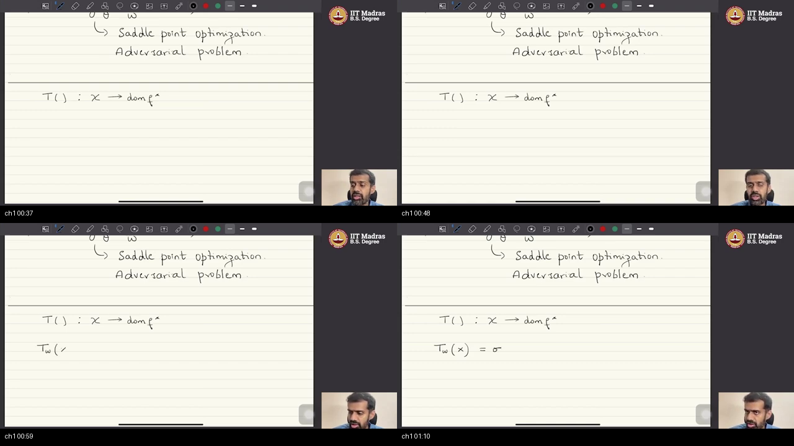
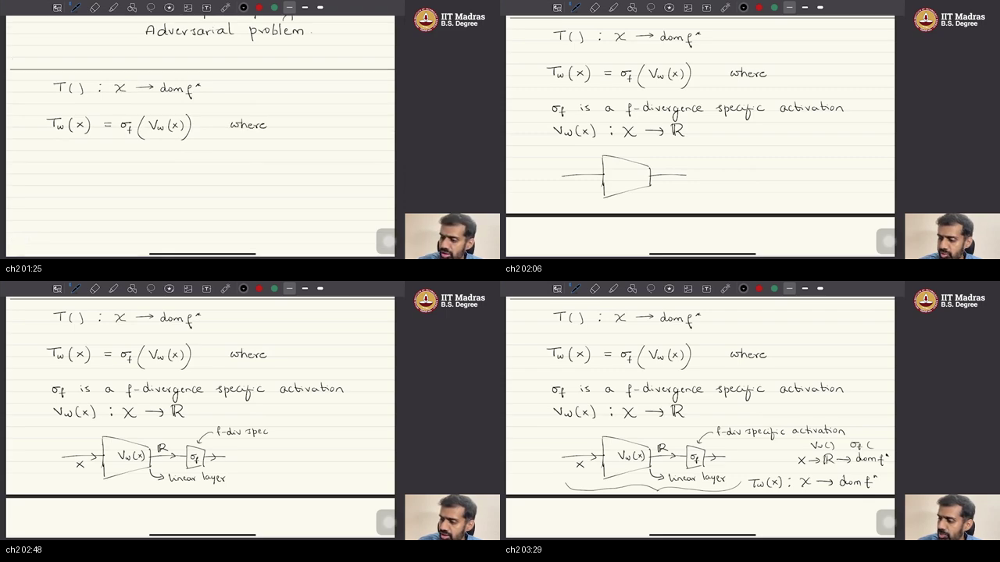
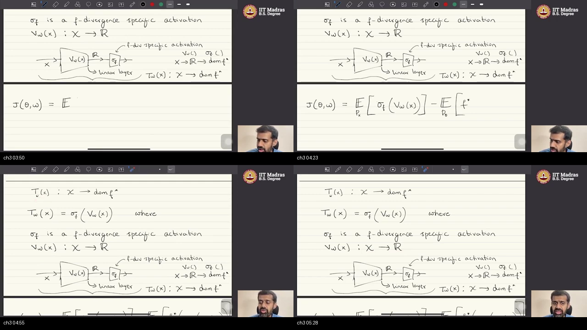
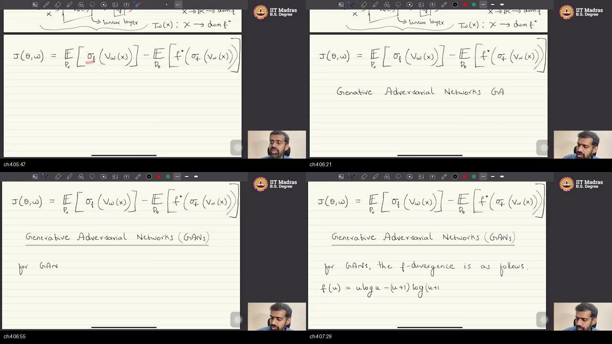
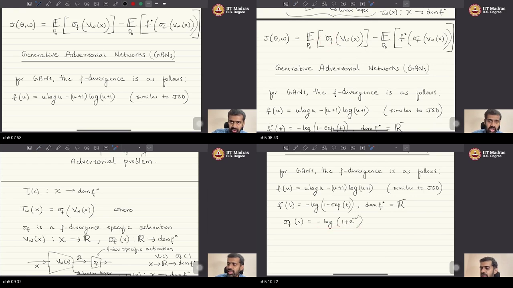
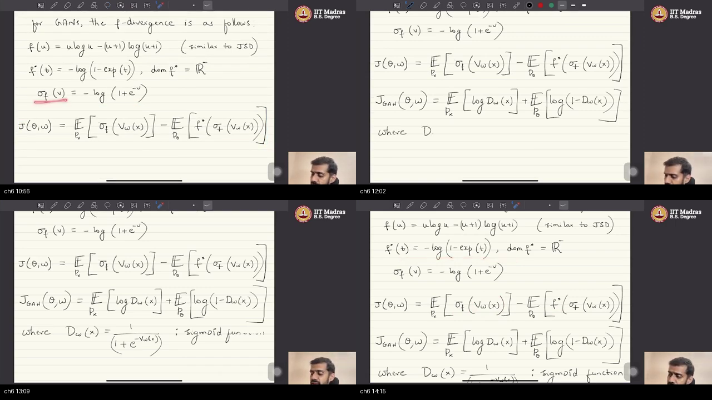

# W2_L6 — Generative adversarial networks: introduction

> **Video:** [W2_L6: Generative adversarial networks: introduction](https://www.youtube.com/watch?v=EHhURRwMEPo) · **~22 min**  
> **Warm-up first:** [PREREQUISITES.md](./PREREQUISITES.md) · **Quiz:** [quiz.html](./quiz.html)

**Do PREREQUISITES before this article.**  
**Course:** IIT Madras B.S. · **BSDA5002** · Prof. Prathosh A. P.  
**Previous:** [W1_T3 two-net saddle](../05-W1-T3-PyTorch-Datasets-DataLoaders/NOTES.md) · [W1_L4 $f$-div](../03-W1-L4-Variational-Divergence-Minimization/NOTES.md)

YouTube says introduction to GANs. The pad is **one $f$ inside last sitting’s variational bound**: split $T_w=\sigma_f\circ V_w$, plug the GAN spring, rearrange to $\mathbb{E}\log D+\mathbb{E}\log(1-D)$ with $D=\mathrm{sigmoid}(V)$. **No Python.** “Implement in practice” is next. Do not invent `BCELoss`.

| When he hits… | Warm-up |
|---------------|---------|
| $T$ must land in $\mathrm{dom}(f^*)$ | [p1-range](./PREREQUISITES.md#p1-range) |
| $\sigma_f\circ V_w$ | [p2-compose](./PREREQUISITES.md#p2-compose) |
| Linear last layer | [p3-linear](./PREREQUISITES.md#p3-linear) |
| GAN = one $f$ | [p4-instance](./PREREQUISITES.md#p4-instance) |
| JS-like $f$ | [p5-js](./PREREQUISITES.md#p5-js) |
| $f^*$ on $\mathbb{R}_-$ | [p6-neg](./PREREQUISITES.md#p6-neg) |
| Sigmoid $D$ | [p7-sigmoid](./PREREQUISITES.md#p7-sigmoid) |
| One $J$, two verbs | [p8-saddle](./PREREQUISITES.md#p8-saddle) |

---

## Table of Contents

1. [Topic 1 — $T$ maps data to $\mathrm{dom}(f^*)$](#topic-1-t-maps-data-to-mathrmdomf-0012–0114) (00:12–01:14)
2. [Topic 2 — $T_w=\sigma_f(V_w)$; linear last layer](#topic-2-t_wsigma_fv_w-linear-last-layer-0114–0341) (01:14–03:41)
3. [Topic 3 — Rewrite $J$ with the composition](#topic-3-rewrite-j-with-the-composition-0341–0538) (03:41–05:38)
4. [Topic 4 — GAN is VDM; choose the JS-like $f$](#topic-4-gan-is-vdm-choose-the-js-like-f-0538–0739) (05:38–07:39)
5. [Topic 5 — $f^*$ and $\sigma_f$ for that $f$](#topic-5-f-and-sigma_f-for-that-f-0739–1037) (07:39–10:37)
6. [Topic 6 — $J_{\mathrm{GAN}}$ and $D=\mathrm{sigmoid}(V)$](#topic-6-j_mathrmgan-and-dmathrmsigmoidv-1037–1435) (10:37–14:35)
7. [Topic 7 — Draw $G$, then $V$, then sigmoid](#topic-7-draw-g-then-v-then-sigmoid-1435–1740) (14:35–17:40)
8. [Topic 8 — One $D$ net; $(0,1)$ is not $\mathbb{R}_-$](#topic-8-one-d-net-01-is-not-mathbbr_--1740–2049) (17:40–20:49)
9. [Topic 9 — The two-log $J$ is the bound; next is practice](#topic-9-the-two-log-j-is-the-bound-next-is-practice-2049–2213) (20:49–22:13)
10. [External references](#external-references)
11. [Sources](#sources)

---

## Executive Summary — architecture of this lecture

Last class left two nets and one scoreboard. This class **picks the usual GAN $f$**. It stamps a last activation so $T$ lands in $\mathrm{dom}(f^*)$, then **rearranges** the bound into $\mathbb{E}\log D+\mathbb{E}\log(1-D)$ with $D=\mathrm{sigmoid}(V)$. GAN is that instance. The 2014 paper wrote the two-log $J$ without this $f$; we arrive there from variational divergence minimization (VDM). Code is next sitting.

**Worldview arc:** from “$T_w$ is a generic net into $\mathrm{dom}(f^*)$” **to** “$D\in(0,1)$ is a rewrite of $T\in\mathbb{R}_-$; same bound.”

### System context

```
  ╔══════════════════════════════════════╗
  ║ W1_T3: two nets, min_θ max_w J       ║
  ║ W1_L4: named f-div (KL / JS / TV)    ║
  ║ Next: implement J_GAN in practice    ║
  ╚════════════════╤═════════════════════╝
                   │ this sitting (~22 min)
                   ▼
        one f  →  textbook GAN loss
```

### Main blueprint

```
  LAST HOUR
  T_w : X → dom(f*)
  J = E_real[T] − E_fake[f*(T)]
           │
           ▼
  SPLIT T
  x → [V_w last LINEAR] → R → [σ_f] → dom(f*)
  V shared; σ_f depends on f
           │
           ▼
  PICK f_GAN
  f(u)= u log u − (u+1) log(u+1)   ~ JS, not exact
  f*(t)= −log(1−e^t) ,  t < 0
  σ_f(v)= −log(1+e^{−v})           always negative
           │
           ▼
  REARRANGE (algebra to the reader)
  D_w = sigmoid(V_w) ∈ (0,1)
  J_GAN = E_px log D_w(x) + E_pθ log(1−D_w(x̂))
           │
           ▼
  DRAW
  z → G_θ → x̂
  x → V_w → sigmoid → D ∈ (0,1)     (paper: one box named D)
           │
           ▼
  WARNING
  (0,1) is NOT R_−
  T is a deterministic function of D
  J_GAN is still the LOWER BOUND
           │
  ┌ · · · ·┴ · · · ┐
  │ STOP: code next│
  └ · · · · · · · ·┘
```

### Method card — the approach (hold this)

```
  HOLD     last hour’s saddle: min_θ max_w (E T − E f*(T))
           T must output numbers f* can eat

  SPLIT    T_w = σ_f ( V_w )
           V_w : X→R, last layer linear, same for every f
           σ_f : R→dom(f*), chosen per f

  PICK     GAN f(u)= u log u − (u+1) log(u+1)   (similar to JSD)
           f*(t)= −log(1−exp(t)) , domain R_−
           σ_f(v)= −log(1+e^{−v})              (speech; always <0)

  REWRITE  D_w = 1/(1+e^{−V_w})   = sigmoid
           J_GAN = E log D(reals) + E log(1−D(fakes))
           original paper wrote this J without the f-div story

  WARN     D ∈ (0,1)  ≠  T ∈ R_−
           know D ⇒ know T (deterministic)

  STOP     implement in practice — next. No Dataset. No loop.
```

### Scenario walkthrough — gallery, printer, two rulers

You still have a folder of real 7s and a printer of fakes. The **mismatch score** $D_f$ is a building you cannot touch. Last hour built a **mat** under it: average a judge $T$ on reals, average $f^*(T)$ on fakes, max the judge, min the printer.

Today the mat has a **legal-ink** rule. For the GAN $f$, $f^*$ only eats **negative** numbers. So you split the judge:

```
  photo x  →  camera V (any real)  →  chute σ_f  →  T < 0
                   shared                 this f only
```

Pick $f(u)=u\log u-(u+1)\log(u+1)$ (JS-like). Compute $f^*$ and $\sigma_f$. Do algebra (homework) until the scoreboard looks like every blog:

```
  J_GAN = mean log D(reals)  +  mean log(1−D(fakes))
  D = sigmoid(V) ∈ (0,1)     ← a second ruler
```

Do **not** mix rulers: $(0,1)$ is not $\mathbb{R}_-$. $T$ is a deterministic function of $D$. The two-log $J$ **is** the mat, rewritten. Next class: turn the stove on. No Colab here.

**Walk 1–9.** (1) Legal range. (2) Split $T$. (3) Rewrite $J$ with $\sigma_f$. (4) Name GAN as that $f$. (5) $f^*$ and $\sigma_f$. (6) Two-log $J$ and sigmoid. (7) Draw $G$, $V$, sigmoid. (8) One $D$ box; range warning. (9) $J$ is the bound; STOP.

### Failure / contrast path

```
  WRONG:  new architecture invented in 2014, unrelated to VDM
  RIGHT:  one f inside last hour’s min_θ max_w

  WRONG:  D ∈ (0,1) is dom(f*)
  RIGHT:  dom(f*)=R_− ; D is a rewrite

  WRONG:  skip σ_f, feed V=3 into f*
  RIGHT:  f* undefined for t≥0

  WRONG:  open PyTorch this hour
  RIGHT:  algebra + two triangles; code next
```

### STOP / out of scope

- Training loop, freeze-one / train-the-other, backprop.  
- `Dataset` / Fashion-MNIST — other tapes.  
- Line-by-line algebra (homework).  
- Exact JS vs this $f$ beyond “similar, constant.”

### Load-bearing claims (closed-book)

1. $T:X\to\mathrm{dom}(f^*)$; tweak the net so the range matches.  
2. $T_w=\sigma_f(V_w)$; $V$ last-linear, common; $\sigma_f$ is $f$-specific.  
3. GAN is VDM with $f(u)=u\log u-(u+1)\log(u+1)$ (JS-like).  
4. $f^*(t)=-\log(1-e^{t})$, domain $\mathbb{R}_-$; $\sigma_f(v)=-\log(1+e^{-v})$.  
5. $J_{\mathrm{GAN}}=\mathbb{E}_{p_x}\log D_w+\mathbb{E}_{p_\theta}\log(1-D_w)$, $D=\mathrm{sigmoid}(V)$.  
6. Original paper did not start from this $f$; we recover its $J$.  
7. $D\in(0,1)$ is not $\mathrm{dom}(f^*)$; $T$ is a deterministic function of $D$.  
8. That $J$ **is** the variational lower bound. Code next.

**Speaker:** Prof. Prathosh A. P. · IIT Madras B.S. / IISc EECS.

---

## Topic 1: $T$ maps data to $\mathrm{dom}(f^*)$ (00:12–01:14)

### Where this sits on the master map

**RANGE CONSTRAINT.** Last sitting left $T_w$ as a net. Today’s first job: its outputs must be legal inputs of $f^*$. Warm-up: [range](./PREREQUISITES.md#p1-range).

### Board / screenshot


**Figure — ~00:37–01:10:** Leftover two-net diagram dropped. Clean line $T(\cdot):X\to\mathrm{dom}f^*$, then $T_w(x)=\sigma$ begun. Yesterday’s saddle heading still at the top of the pad.

### What he is establishing

The two-net saddle is still on the pad: $J(\theta,w)=\mathbb{E}_{p_x}T_w-\mathbb{E}_{p_\theta}f^*(T_w)$. The new question is how to **represent** $T$. By construction $T$ maps data-space $\mathcal{X}$ into **the domain of $f^*$**. Change $f$, change $f^*$, change that domain. The T-net’s **range** must match.

A ReLU-headed net that only outputs positives cannot feed an $f^*$ that only eats negatives. That is not a coding nit. The bound’s second term is $f^*(T(x))$.

You can now say why the last layer of the critic depends on $f$. How to **build** that range without a new architecture every time is Topic 2.

### Analogy for this topic only

A vending machine that only takes dimes. The judge writes a number on each photo. If the number is a quarter, the machine refuses.

Someone asks: **can one last layer serve every $f$?** Only if every $f^*$ shares a domain. They don’t.

In lecture words: legal coins $=\mathrm{dom}(f^*)$, the number on the photo $=T(x)$.

### Local picture

```
  T : X  →  dom(f*)     must
  T-net range must equal that set
  different f  ⇒  different legal set
```

**Notice:** the leftover generator/critic drawing is off this composite. The teaching line is $T:X\to\mathrm{dom}f^*$.

### Bridge

You need a net that can **hit** whatever $\mathrm{dom}(f^*)$ this $f$ demands, without rewriting the whole critic. Split $T$ into a shared backbone and a last stamp.

---

## Topic 2: $T_w=\sigma_f(V_w)$; linear last layer (01:14–03:41)

### Where this sits on the master map

**COMPOSITION.** The practical representation of $T$. Warm-up: [compose](./PREREQUISITES.md#p2-compose), [linear last](./PREREQUISITES.md#p3-linear).

### Board / screenshot


**Figure — ~01:25–03:29:** $T_w(x)=\sigma_f(V_w(x))$. $\sigma_f$ = $f$-divergence-specific activation. $V_w:X\to\mathbb{R}$. Triangle $x\to V_w\to\mathbb{R}\to\sigma_f$ with “linear layer,” then $T_w:X\to\mathrm{dom}f^*$.

### What he is establishing

In practice $T_w(x)=\sigma_f(V_w(x))$. Two pieces. $V_w$ takes $x$ and maps to **real numbers**. Its **last layer is linear** — a projection onto a scalar. That $V$ net is **common across all $f$-divergences**.

Suppose a $28\times 28$ seven goes in. Hidden layers cook a vector; the **linear** last layer emits one number, say $V=2$. If $\sigma_f(v)=-\log(1+e^{-v})$, then $\sigma_f(2)\approx -0.13<0$. Legal for $\mathrm{dom}=\mathbb{R}_-$. If you had ended $V$ with a ReLU, $V=-3$ would clip to $0$ and $f^*$ would see the wrong $t$.

On top sits $\sigma_f$, an activation **specific to that $f$**. The stack from $x$ through the activation **is** the $T$ approximator: $X\to\mathbb{R}\to\mathrm{dom}(f^*)$.

ASR calls $V$ “BW / VW / P.” The pad writes $V_w$.

A wrong move is to bake a sigmoid into $V$ for every $f$. Then $V$ is no longer the shared $X\to\mathbb{R}$ map. Another wrong move is to think $\sigma_f$ is a second trainable net. It is a **fixed scalar formula** once $f$ is chosen.

You can now draw the two-block critic. Next: put this composition back into $J$.

### Analogy for this topic only

A camera reports a brightness number (any real). You then snap on a contest-specific filter.

Someone asks: **do I train a new camera for every $f$?** No. Same camera, swap the filter.

In lecture words: camera $=V_w$, filter $=\sigma_f$, photo-to-legal-score $=T_w$.

### Local picture

```
  x → [ V_w  LINEAR last ] → v ∈ R → [ σ_f ] → T(x) ∈ dom(f*)
         common for all f              f-specific
  T_w(x) = σ_f( V_w(x) )
```

**Notice:** the linear last layer is how “map to $\mathbb{R}$” is implemented — no squash yet.

### Bridge

$J$ was written with $T_w$. Substitute the composition so the loss shows $\sigma_f$ and $V_w$ explicitly.

---

## Topic 3: Rewrite $J$ with the composition (03:41–05:38)

### Where this sits on the master map

**SAME SCORE, NEW LETTERS.** Warm-up: [compose](./PREREQUISITES.md#p2-compose).

### Board / screenshot


**Figure — ~03:50–05:28:** Composition diagram plus $J(\theta,w)=\mathbb{E}_{p_x}[\sigma_f(V_w(x))]-\mathbb{E}_{p_\theta}[f^*(\sigma_f(V_w(x)))]$.

### What he is establishing

Last hour: $\mathbb{E}_{p_x}T_w-\mathbb{E}_{p_\theta}f^*(T_w)$. Now $T_w=\sigma_f(V_w)$, so

$$
J(\theta,w)=\mathbb{E}_{p_x}\bigl[\sigma_f(V_w(x))\bigr]-\mathbb{E}_{p_\theta}\bigl[f^*\bigl(\sigma_f(V_w(x))\bigr)\bigr].
$$

Still $\min_\theta\max_w$. Still two piles. The only change is: when you pick a new $f$, you swap $\sigma_f$ and $f^*$, not the $V$ architecture.

You can now write $J$ in $V$ and $\sigma_f$. The leftover: **which** $f$ is the usual GAN?

### Analogy for this topic only

Same spreadsheet column as last class. You renamed the judge “filter of camera” instead of “judge.” The min/max verbs did not change.

Someone asks: **did we get a new training problem?** No. Same saddle, expanded letters.

In lecture words: $J$ above **is** last hour’s $J$.

### Local picture

```
  old:  E_px T_w     −  E_pθ f*(T_w)
  new:  E_px σ_f(V)  −  E_pθ f*(σ_f(V))
  same min_θ max_w
```

**Notice:** $\sigma_f$ is underlined on the pad in the first expectation — that is $T$ itself, not $D$ yet.

### Bridge

Name the instance: generative adversarial networks, and write the $f$ they use.

---

## Topic 4: GAN is VDM; choose the JS-like $f$ (05:38–07:39)

### Where this sits on the master map

**INSTANCE.** Warm-up: [GAN is one $f$](./PREREQUISITES.md#p4-instance), [JS-like](./PREREQUISITES.md#p5-js).

### Board / screenshot


**Figure — ~05:47–07:29:** $J$ with $\sigma_f$ still up. Then “Generative Adversarial Networks (GANs)” and $f(u)=u\log u-(u+1)\log(u+1)$.

### What he is establishing

**Generative adversarial networks (GANs)** are a **special case** of the VDM algorithms just built. First move: choose $f$. For the **usual** GAN he writes

$$
f(u)=u\log u-(u+1)\log(u+1).
$$

It is **similar to Jensen–Shannon divergence (JSD)** but not exactly (a constant / not quite). ASR: “geson Sand.” He corrects a typo “adversial.”

A wrong move is to treat GAN as a rival school that replaced $f$-div. Another is to paste Wikipedia’s JS formula and call the pad wrong. Teach **this** $f$; hedge **similar**.

You can now name the spring. Next: its conjugate and the activation that hits $\mathrm{dom}(f^*)$.

### Analogy for this topic only

Last class laid out a kitchen that can cook **any** sauce $f$. Today the special is one sauce.

- sauce A might be KL  
- sauce B might be JS  
- today’s special: $f(u)=u\log u-(u+1)\log(u+1)$ (JS-like)

Someone asks: **did we rebuild the kitchen?** No. Same two nets, same min/max **algorithm**, one $f$. Treating GAN as a rival school is the wrong move.

In lecture words: GAN = VDM + this $f$.

### Local picture

```
  VDM  --pick this f-->  “usual GAN”
  f(u) = u log u − (u+1) log(u+1)    ~ JSD, not exact
```

**Notice:** choosing $f$ is step one of “how that happens.” $f^*$ is step two.

### Bridge

Write $f^*$ and check its domain; then build $\sigma_f$ so $T$ lands there.

---

## Topic 5: $f^*$ and $\sigma_f$ for that $f$ (07:39–10:37)

### Where this sits on the master map

**PLUG-IN TABLE.** Warm-up: [negative domain](./PREREQUISITES.md#p6-neg).

### Board / screenshot


**Figure — ~07:53–10:22:** $f$ with “(similar to JSD).” $f^*(t)=-\log(1-\exp(t))$, $\mathrm{dom}f^*=\mathbb{R}^-$. Speech $\sigma_f(v)=-\log(1+e^{-v})$; one tile writes $-\log(1+e^{v})$ — missing minus on $v$. Follow **speech** and the “always $\mathbb{R}_-$” argument.

### What he is establishing

Conjugate for this $f$:

$$
f^*(t)=-\log(1-e^{t}),\qquad \mathrm{dom}(f^*)=\mathbb{R}_-=(-\infty,0).
$$

Need $1-e^{t}>0\Rightarrow t<0$. So $\sigma_f$ must map the linear $V$-output onto **negative reals**.

$\sigma_f$ eats a **scalar** $v\in\mathbb{R}$ and returns something in $\mathrm{dom}(f^*)$. Chosen formula (speech):

$$
\sigma_f(v)=-\log(1+e^{-v}).
$$

Always negative: $1+e^{-v}>1$, log positive, overall minus. That **is** $\mathbb{R}_-$.

Board ~10:22 may drop the minus in the exponent. The spoken “$e$ power **minus** $v$” and the sign argument win.

You now have $f$, $f^*$, $\sigma_f$. Next: substitute and rearrange to the GAN loss. Sample averages estimate the expectations.

### Analogy for this topic only

A basement that only stores boxes **below ground**. $\sigma_f$ is a chute that can only dump downward. $V$ may shout $+3$; the chute still delivers a negative.

Someone asks: **feed $V=3$ straight into $f^*$?** $1-e^{3}<0$ — log of a negative. Garbage.

In lecture words: basement $=\mathrm{dom}(f^*)$, chute $=\sigma_f$.

### Local picture

```
  f*(t)= −log(1−e^t)     needs t<0
  σ_f(v)= −log(1+e^{−v}) < 0 for all real v
  speech “minus v”; if the pad omits it, keep the minus
```

**Notice:** this $\sigma_f$ is **not** yet the sigmoid. Sigmoid appears after algebra as $D$.

### Bridge

Copy $J$, substitute these two formulas, introduce $D=\mathrm{sigmoid}(V)$ so the letters match the 2014 paper.

---

## Topic 6: $J_{\mathrm{GAN}}$ and $D=\mathrm{sigmoid}(V)$ (10:37–14:35)

### Where this sits on the master map

**GAN LOSS.** The textbook two-log formula, recovered from the bound. Warm-up: [sigmoid](./PREREQUISITES.md#p7-sigmoid), [saddle](./PREREQUISITES.md#p8-saddle).

### Board / screenshot


**Figure — ~10:56–14:15:** $f$, $f^*$, $\sigma_f$ collected. Then $J_{\mathrm{GAN}}(\theta,w)=\mathbb{E}_{p_x}[\log D_w(x)]+\mathbb{E}_{p_\theta}[\log(1-D_w(x))]$ with $D_w(x)=1/(1+e^{-V_w(x)})$ labeled sigmoid.

### What he is establishing

Plug $\sigma_f$ and $f^*$ into $J$, rearrange (he copies, then writes the result). The GAN score is

$$
J_{\mathrm{GAN}}(\theta,w)
=\mathbb{E}_{p_x}\bigl[\log D_w(x)\bigr]
+\mathbb{E}_{p_\theta}\bigl[\log\bigl(1-D_w(x)\bigr)\bigr],
$$

where

$$
D_w(x)=\frac{1}{1+e^{-V_w(x)}}
$$

is the **usual sigmoid**. Anyone who has seen a classification net recognizes it.

Letter $D$ exists **to match GAN literature**. The original paper does **not** motivate this $J$ as minimizing this $f$-divergence. This sitting is a **more general** view of the **same** objective.

A wrong move is to treat $J_{\mathrm{GAN}}$ as a new loss glued on. It is last hour’s bound after algebra. Another wrong move is to swap the two piles: $\log D$ on **reals**, $\log(1-D)$ on **fakes**.

Algebra is **left to the reader**: substitute $\sigma_f(v)=-\log(1+e^{-v})$ and $f^*(t)=-\log(1-e^{t})$ with $t=\sigma_f(V_w)$, rewrite using $D=\mathrm{sigmoid}(V)$. He will not grind it on the pad.

The only “code” this chalk hour licenses is still LLN — averages on the two folders, not a `DataLoader`:

```
  J_hat = mean( log D(x)     for x  in REAL folder )
        + mean( log(1-D(x̂)) for x̂ in FAKE folder  )   # x̂ = G_θ(z)
```

You can now write $J_{\mathrm{GAN}}$ and $D$. Next: the picture of $G$, $V$, and the sigmoid layer.

### Analogy for this topic only

Two ways to write a restaurant bill: “sauce price plus tax” vs “the number on the credit-card slip.” Same money. $J$ in $\sigma_f,f^*$ vs $J_{\mathrm{GAN}}$ in $\log D$ is that rewrite.

Someone asks: **did Goodfellow start from $f$?** He says no. We **arrived**.

In lecture words: two-log $J$ = bound after algebra; $D$ = sigmoid of $V$.

### Local picture

```
  substitute σ_f and f*  →  (homework)
  J_GAN = E_{reals} log D  +  E_{fakes} log(1−D)
  D(x) = 1 / (1 + e^{−V(x)})   ∈ (0,1)
```

**Notice:** first expectation uses **real** $x\sim p_x$; second uses **fake** $x\sim p_\theta$ (later $\hat x$).

### Bridge

Draw the generator and the two-block discriminator, then see how the 2014 paper draws one box.

---

## Topic 7: Draw $G$, then $V$, then sigmoid (14:35–17:40)

### Where this sits on the master map

**IMPLEMENTATION DIAGRAM** (still chalk). Warm-up: [sigmoid](./PREREQUISITES.md#p7-sigmoid).

### Board / screenshot

![G_θ triangle; V_w then sigmoid to [0,1]; brace D_w](./screenshots/composites/ch07-topic-07-architecture-g-v-sigmoid-panel1of1.png)
**Figure — ~14:49–17:25:** $J_{\mathrm{GAN}}$ stays up. $z\sim\mathcal{N}(0,I)\to G_\theta\to\hat x\sim p_\theta$. Then $x\to V_w\to\mathbb{R}\to 1/(1+e^{-v})\to[0,1]$, brace $D_w(x)$.

### What he is establishing

Generator as usual: $z\sim\mathcal{N}(0,I)$ through $G_\theta$ to $\hat x\sim p_\theta$. $x$ and $\hat x$ are dummy names.

Discriminator **composed**: $V_w(x)$ gives a real; sigmoid $1/(1+e^{-v})$ maps to $(0,1)$ **by construction**. The whole stack **is** $D_w$ in the loss.

The original GAN paper describes $D$ as **one** neural net — no split into $V$ plus sigmoid. He is about to combine them so the drawing matches the paper.

A wrong move: feed $z$ into $D$. $D$ eats **data-space** $x$ (real or fake).

You can now sketch three blocks. Next: collapse $V+\sigma$ into one triangle labeled $D$.

### Analogy for this topic only

A printer dumps a photo. A two-part inspector looks at it: first a brightness number, then a 0–100% dial. The 2014 diagram prints “inspector” as one box.

Someone asks: **is the dial trained separately from the camera?** Same weights $w$ through the stack; the dial has no extra knobs.

In lecture words: printer $=G_\theta$, camera $=V_w$, dial $=$sigmoid, inspector $=D_w$.

### Local picture

```
  z ~ N(0,I) → [ G_θ ] → x̂ ~ p_θ

  x → [ V_w ] → v ∈ R → [ 1/(1+e^{−v}) ] → D ∈ (0,1)
                     └── that brace is D_w(x)
```

**Notice:** output in $(0,1)$ is **by construction** of sigmoid, not of $\mathrm{dom}(f^*)$.

### Bridge

Combine $V$ and the sigmoid into one net, as the original paper draws it — then he will warn you about ranges.

---

## Topic 8: One $D$ net; $(0,1)$ is not $\mathbb{R}_-$ (17:40–20:49)

### Where this sits on the master map

**PAPER DIAGRAM vs OURS.** Warm-up: [sigmoid](./PREREQUISITES.md#p7-sigmoid), [range](./PREREQUISITES.md#p1-range).

### Board / screenshot

![GAN Architecture: G and one D→[0,1]; f-table recopied](./screenshots/composites/ch08-topic-08-combine-as-one-d-network-panel1of1.png)
**Figure — ~18:54–20:39:** Empty erase-tile dropped. “GAN Architecture”: $G_\theta$ and one $D_w\to[0,1]$. Middle tiles recopy the $V+\sigma_f$ split, both $J$s, and $D=\mathrm{sigmoid}(V)$ next to the two-block drawing.

### What he is establishing

He combines $V$ and the activation into **one** net. Output is a scalar in $(0,1)$. That net is $D_w(x)$.

In VDM the critic output was $T_w\in\mathrm{dom}(f^*)$. For GAN they broke $T$ into $\sigma_f\circ V$, then **rearranged** so the object in the loss is $D=\mathrm{sigmoid}(V)$.

**Do not confuse** $D\in(0,1)$ with $\mathrm{dom}(f^*)=\mathbb{R}_-$. $D$ is **not** the $T$ you optimize directly. You still optimize $T$ **indirectly**: $T$ is a **deterministic function of $D$**. Know $D$ $\Rightarrow$ know $T$. Ranges differ.

That is the load-bearing warning of the hour.

### Analogy for this topic only

Temperature in Celsius vs “percent chance of rain.” Related, deterministic if you have the formula, **different units**. Mixing them is how people “confuse the domain of $f^*$.”

Someone asks: **if I know $D$, do I know $T$?** Yes, via a fixed map. **Are they the same number?** No.

In lecture words: $D\in(0,1)$, $T\in\mathbb{R}_-$, $T$ deterministic in $D$.

### Local picture

```
  VDM critic output:  T ∈ R_− = dom(f*)
  GAN D output:       D ∈ (0,1)
  T = (deterministic map of D)   — not the same range
```

**Notice:** the 20:04 tile is the best of the hour — both $J$s and the $V$+sigmoid stack on one sheet.

### Bridge

Write $J$ on this two-triangle drawing and say it is still the **lower bound**. Then stop: practice next.

---

## Topic 9: The two-log $J$ is the bound; next is practice (20:49–22:13)

### Where this sits on the master map

**STOP.** The two-log $J$ is still last hour’s variational **algorithm** (min/max of a bound), rewritten in $D$. Code is next; this box only names the formula and closes the sitting. Warm-up: [saddle](./PREREQUISITES.md#p8-saddle).

### Board / screenshot

![G and D∈[0,1]; J_GAN = E log D(x) + E log(1−D(x̂))](./screenshots/composites/ch09-topic-09-d-not-t-j-is-bound-next-panel1of1.png)
**Figure — ~20:55–22:06:** Two triangles. $J_{\mathrm{GAN}}(\theta,w)=\mathbb{E}_{x\sim p_x}\log D_w(x)+\mathbb{E}_{\hat x\sim p_\theta}\log(1-D_w(\hat x))$. He names $\hat x$ to separate the fake pile. Last line: we will see how to implement this in practice.

### What he is establishing

Final picture: $x\to D_w\to(0,1)$ and $z\to G_\theta\to\hat x$. The loss is **nothing but the lower bound** computed on this $f$:

$$
J_{\mathrm{GAN}}(\theta,w)
=\mathbb{E}_{x\sim p_x}\log D_w(x)
+\mathbb{E}_{\hat x\sim p_\theta}\log\bigl(1-D_w(\hat x)\bigr).
$$

Next sitting: implement **in practice**. No loop today. No Dataset. No `nn.BCELoss`. The tape ends on that promise.

A wrong move is to fill in a training loop from a blog. A second is to think $J_{\mathrm{GAN}}$ replaced the bound. It **is** the bound, rewritten.

You can now recap the chain $f\to f^*\to\sigma_f\to D\to$ two logs and know the code is **not this video**.

### Analogy for this topic only

You finished the recipe card. You have not turned on the stove. “Implement in practice” is the stove.

Someone asks: **can I train tonight from this pad?** You can write $J$. You cannot copy a Colab from this sitting — there isn’t one.

In lecture words: $J_{\mathrm{GAN}}$ = the bound; practice = next.

### Local picture

```
  z → G_θ → x̂
  x → D_w → (0,1)

  J_GAN = E_{x ~ p_x} log D(x)  +  E_{x̂ ~ p_θ} log(1−D(x̂))
        = the variational lower bound on this f

  STOP → implement next
```

**Notice:** he switches the second argument to $\hat x$ so you do not mix the two piles in the log$(1-D)$ term.

### Bridge

The leftover problem is engineering: sample averages, alternate steps on $\theta$ and $w$, a real net. That is **not this tape**. Dataset plumbing is **not this tape**.

---

## External references

Links live **here**, not under topics. University items include original notes/slides when public. Skill default is 3–8 total; this table is **2–3 per topic** as requested. No Dataset API pages.

**How to use:** Nowozin is the paper this pad is walking. Goodfellow is the 2014 $J$ we recovered. CS236 GAN notes sit between them.

| Resource | Matches lecture… | Why it helps |
|----------|------------------|--------------|
| [W1_T3 notes (this playlist)](../05-W1-T3-PyTorch-Datasets-DataLoaders/NOTES.md) | Topic 1 | Immediate previous: $T_w$, saddle, critic/D names. |
| [NPTEL Lec 04 VDM (video)](https://www.youtube.com/watch?v=4vtL3NhCkgg) | Topic 1 | Twin bound this sitting starts from. Notes: [`27-Lec04`](../../Mathematical-Foundation-for-GenerativeAI/27-Lec04-Variational-Divergence-Minimization/NOTES.md). |
| [Nowozin et al. · $f$-GAN (arXiv:1606.00709)](https://arxiv.org/abs/1606.00709) | Topic 1 | Paper: $T$ must land in $\mathrm{dom}(f^*)$. PDF: [arxiv.org/pdf/1606.00709](https://arxiv.org/pdf/1606.00709). |
| [CS236 notes · GANs](https://deepgenerativemodels.github.io/notes/gan/) | Topic 2 | Original Stanford notes: $f$-GAN split, then vanilla GAN. |
| [CS236 Lec 10 slides](https://deepgenerativemodels.github.io/assets/slides/cs236_lecture10.pdf) | Topic 2 | Slides: $g_f$ activation on a shared net. |
| [3Blue1Brown · What is a neural network?](https://www.youtube.com/watch?v=aircAruvnKk) | Topic 2 | Video: a net as $X\to\mathbb{R}$ (his $V_w$). |
| [Nowozin $f$-GAN PDF](https://arxiv.org/pdf/1606.00709) (Table 1) | Topic 3 | Same $J$ after substituting $T=g_f(V)$. |
| [Colin Raffel · GANs and divergence minimization](https://colinraffel.com/blog/gans-and-divergence-minimization.html) | Topic 3 | Blog: the two-E score before the GAN letters. |
| [NPTEL Lec 04 notes](../../Mathematical-Foundation-for-GenerativeAI/27-Lec04-Variational-Divergence-Minimization/NOTES.md) | Topic 3 | Bound $J=\mathbb{E}T-\mathbb{E}f^*(T)$ this rewrite starts from. |
| [Nowozin · From GANs to VDM (MSR talk)](https://www.microsoft.com/en-us/research/video/gans-variational-divergence-minimization/) | Topic 4 | Author lecture: GAN as one $f$. |
| [Raffel blog](https://colinraffel.com/blog/gans-and-divergence-minimization.html) | Topic 4 | Which GAN loss is which $f$. |
| [NPTEL Lec 05 GANs (same instructor)](https://www.youtube.com/watch?v=5uqga82bDNA) | Topic 4 | Twin recording. [`28-Lec05`](../../Mathematical-Foundation-for-GenerativeAI/28-Lec05-Generative-Adversarial-Networks/NOTES.md). |
| [Boyd & Vandenberghe · Convex Optimization (free book)](https://web.stanford.edu/~boyd/cvxbook/bv_cvxbook.pdf) | Topic 5 | Original notes: conjugate $f^*$ (Ch. 3.3). Slides: [bv_cvxslides.pdf](https://web.stanford.edu/~boyd/cvxbook/bv_cvxslides.pdf). |
| [CS236 Lec 10 slides](https://deepgenerativemodels.github.io/assets/slides/cs236_lecture10.pdf) (GAN row) | Topic 5 | $f^*$, domain, output activation. |
| [Nowozin Table 1](https://arxiv.org/pdf/1606.00709) | Topic 5 | $g_f(v)=-\log(1+e^{-v})$ matches speech. |
| [Goodfellow et al. · GAN (arXiv:1406.2661)](https://arxiv.org/abs/1406.2661) | Topic 6 | Original two-log $J$ and $D$ as one net. |
| [Goodfellow · NIPS 2016 tutorial](https://arxiv.org/abs/1701.00160) | Topic 6 | Tutorial notes + [slides](https://www.iangoodfellow.com/slides/2016-12-04-NIPS.pdf). |
| [Lilian Weng · From GAN to WGAN](https://lilianweng.github.io/posts/2017-08-20-gan/) | Topic 6 | Blog: sigmoid $D$, two-log loss. |
| [Stanford CS231n 2026 · Lec 13 slides](https://cs231n.stanford.edu/slides/2026/lecture_13.pdf) | Topic 7 | Latest CS231n $G$ vs $D$ diagrams. |
| [MIT 6.S191 2026 · Lec 4 video](https://www.youtube.com/watch?v=R8V8CbuxryI) | Topic 7 | Generator/discriminator picture. |
| [MIT 6.S191 2026 · Lec 4 slides](https://introtodeeplearning.com/slides/6S191_MIT_DeepLearning_L4.pdf) | Topic 7 | Original slides. |
| [Luis Serrano · Friendly GANs](https://www.youtube.com/watch?v=8L11aMN5KY8) | Topic 8 | Video: $D$ in $(0,1)$, two players. |
| [Google ML · GAN crash course](https://developers.google.com/machine-learning/gan) | Topic 8 | Short $D$ vs $G$ after you have the algebra. |
| [NYU / Hegde · Lecture 11 GAN notes](https://chinmayhegde.github.io/dl-notes/notes/lecture12/) | Topic 8 | University notes: two-player game, then the usual loss. |
| [Berkeley CS294-158](https://sites.google.com/view/berkeley-cs294-158-sp20/home) | Topic 9 | Implicit models / GANs. [2024 playlist](https://www.youtube.com/playlist?list=PLwRJQ4m4UJjPIvv4kgBkvu_uygrV3ut_U). |
| [NPTEL Lec 05](https://www.youtube.com/watch?v=5uqga82bDNA) | Topic 9 | What “implement in practice” looks like on the twin series. |
| [Goodfellow NIPS tutorial](https://arxiv.org/abs/1701.00160) | Topic 9 | Practice and saturating $D$ — after STOP. |

---

## Sources

- IIT Madras B.S. · BSDA5002 · [W2_L6 `EHhURRwMEPo`](https://www.youtube.com/watch?v=EHhURRwMEPo) · Prof. Prathosh A. P.  
- Captions `raw/captions.en.timed.txt` (ASR: $V_w$ not “BW”; Jensen–Shannon; $f^*$; $\sigma_f(v)=-\log(1+e^{-v})$ from speech).  
- Boards `screenshots/composites/ch01`–`ch09`.  
- No code on this tape.

