# W2_L7 — Generative adversarial networks: formulation

> **Video:** [W2_L7: Generative adversarial networks: formulation](https://www.youtube.com/watch?v=pLD5Q5cS4kI) · **~35 min**  
> **Warm-up first:** [PREREQUISITES.md](./PREREQUISITES.md) · **Quiz:** [quiz.html](./quiz.html)

**Do PREREQUISITES before this article.**  
**Course:** IIT Madras B.S. · **BSDA5002** · Prof. Prathosh A. P.  
**Previous:** [W2_L6 GAN intro](https://www.youtube.com/watch?v=EHhURRwMEPo) ($T=\sigma\circ V$) · [W1_L4 $f$-div](../03-W1-L4-Variational-Divergence-Minimization/NOTES.md)

This hour is **GAN in practice**: two nets, one score $J_{\mathrm{GAN}}$, **alternate frozen batch steps**. He does not open Colab; the “coding” is the algorithm on the tablet. Next module: classifier interpretation, improvisations, inference.

| When he hits… | Warm-up |
|---------------|---------|
| $G(z)$ | [p1-gen](./PREREQUISITES.md#p1-gen) |
| $D\in(0,1)$ | [p2-disc](./PREREQUISITES.md#p2-disc) |
| Batch average | [p3-batch](./PREREQUISITES.md#p3-batch) |
| $J_{\mathrm{GAN}}$ | [p4-jgan](./PREREQUISITES.md#p4-jgan) |
| Freeze | [p5-freeze](./PREREQUISITES.md#p5-freeze) |
| Plus vs minus | [p6-ascent](./PREREQUISITES.md#p6-ascent) |
| IID $D$ | [p7-iid](./PREREQUISITES.md#p7-iid) |
| Step vs epoch | [p8-epoch](./PREREQUISITES.md#p8-epoch) |

---

## Table of Contents

1. [Topic 1 — Two nets; $n$ IID; architecture-agnostic](#topic-1-two-nets-n-iid-architecture-agnostic-0022–0228) (00:22–02:28)
2. [Topic 2 — $D=\sigma(V)$; $J_{\mathrm{GAN}}$; alternate](#topic-2-dσv-j_gan-alternate-0228–0427) (02:28–04:27)
3. [Topic 3 — Batch averages; D plus-step](#topic-3-batch-averages-d-plus-step-0427–0636) (04:27–06:36)
4. [Topic 4 — G minimizes; $\hat x=G(z)$; drop first term](#topic-4-g-minimizes-x̂gz-drop-first-term-0636–0934) (06:36–09:34)
5. [Topic 5 — Freeze; ascent vs descent](#topic-5-freeze-ascent-vs-descent-0934–1137) (09:34–11:37)
6. [Topic 6 — Train D: real batch, frozen G](#topic-6-train-d-real-batch-frozen-g-1137–2038) (11:37–20:38)
7. [Topic 7 — Train G: no real data; grads through D](#topic-7-train-g-no-real-data-grads-through-d-2038–2841) (20:38–28:41)
8. [Topic 8 — $k$:1 steps; no stopping formula](#topic-8-k1-steps-no-stopping-formula-2841–3008) (28:41–30:08)
9. [Topic 9 — VDM special case; why it works](#topic-9-vdm-special-case-why-it-works-3008–3229) (30:08–32:29)
10. [Topic 10 — Recap; next classifier / inference](#topic-10-recap-next-classifier--inference-3229–3520) (32:29–35:20)
11. [External references](#external-references)
12. [Apply it (scenarios)](#apply-it-scenarios)
13. [Sources](#sources)

---

## Executive Summary — architecture of this lecture

You hold $n$ IID files from unknown $p_x$ and two nets $G$ and $D$. This lecture installs the **training procedure**: one score $J_{\mathrm{GAN}}$, plus on $w$, minus on $\theta$, alternating on batch averages. D needs real and fake; G needs **only fakes**. Stop by looking at samples. Classifier story is next.

### The approach (seven moves)

```
  1. INPUT    n files ~ iid p_x. No labels. No formula for p_x.
  2. NETS     G_θ : z → x̂     D_w = σ∘V : x → (0,1)
              MLP or CNN — he will not pick (architecture-agnostic).
  3. SCORE    J_GAN(θ,w) = E_{p_x} log D(x) + E_{p_θ} log(1-D(x̂))
              same J: max in w, min in θ.
  4. APPROX   replace E by batch means
              B1 = random subset of reals (need not be contiguous)
              B2 = G(z), z ~ N(0,I)          (two sizes may differ)
  5. D-STEP   freeze θ (run G, do not update it)
              both piles through D → plus  α1 ∇_w J     (ascent)
              green = D, red = backprop through D only
  6. G-STEP   freeze w (run D, do not update it)
              DROP first term (independent of θ). No real x.
              z → G → frozen D → minus α2 ∇_θ J          (descent)
              grads flow through D into G; w stays put
  7. LOOP     1:1 or k:1 (five D then one G, or the reverse)
              STOP by sample quality / metrics — no J=0 rule
```

**Worldview arc:** from “a log-$D$ bound on an $f$-divergence” **to** “frozen batch ascent on D, frozen batch descent on G.” Every topic below is one of the seven moves.

### Whole-sheet recipe (commented)

He did not open Colab. This is the tablet algorithm as you would type it. `log` is elementwise; `.mean()` is the $1/B$ he writes.

```python
# Tablet algorithm. z ~ N(0, I). α1, α2 may differ.
# J = mean log D(real) + mean log(1 - D(fake))

def j_d(D, G, x_real, z):
    # D-step uses BOTH piles. G is run, not updated.
    x_fake = G(z)                          # θ frozen (requires_grad=False on θ)
    return (log(D(x_real)).mean()          # first term: museum
            + log(1 - D(x_fake)).mean())   # second term: forgeries

def j_g(D, G, z):
    # G-step: first term independent of θ — DROP it. No real x.
    x_fake = G(z)
    return log(1 - D(x_fake)).mean()       # w frozen; grads still flow through D

for epoch in range(E):                     # epoch ≈ one pass over reals
    for _ in range(k_d):                   # usually 1; Topic 8 allows 5
        x_real = random_subset(data, B1)   # not necessarily contiguous
        z = randn(B2, z_dim)
        w = w + alpha1 * grad_w(j_d(D, G, x_real, z))   # ASCENT
    for _ in range(k_g):                   # usually 1; Topic 8 allows 5
        z = randn(B2, z_dim)
        theta = theta - alpha2 * grad_theta(j_g(D, G, z))  # DESCENT
# Stop when generated x̂ look good enough (metrics). Next: classifier view.
```

### System context

```
  ╔════════════════════════════════════╗
  ║ W2_L6: T = σ∘V, GAN f-choice       ║
  ║ next: classifier interpretation    ║
  ╚════════════════╤═══════════════════╝
                   │ this sitting (playlist 11)
                   ▼
        ┌──────────────────────────┐
        │ Alternate frozen steps   │
        │ on J_GAN                 │
        └──────────────────────────┘
```

### Main blueprint

```
  n files  ~  p_x     (IID, unlabeled)
       │
       ▼
  ┌─ J_GAN ──────────────────────────────────────┐
  │  (mini) log D on reals   +  log(1-D) on G(z) │
  │  (mini) ≈ (1/B1) Σ  +  (1/B2) Σ              │
  └──────────┬───────────────────────────────────┘
             │
     freeze θ│  run G          freeze w│  run D, pass grads
             ▼                         ▼
     w ← w + α1 ∇_w J           θ ← θ − α2 ∇_θ J
     need real+fake             fakes only (drop first term)
     green D / red through D    green G / red through D into G
             │                         │
             └──────── alternate ──────┘
                       │
  ┌ · · · · · · · · · ┴ · · · · · · · · ┐
  │ STOP: look at samples / metrics      │
  │ next: classifier / inference         │
  └ · · · · · · · · · · · · · · · · · · ┘
```

### Scenario walkthrough

Museum has 1000 photos. One cycle:

```
  1. Draw B1=64 reals (random subset of the 1000).
  2. Draw B2=64 Gaussians, run FROZEN G → 64 fakes.
  3. Forward both piles through D. Add the two log-means.
  4. Plus-step w. Do not touch θ.          ← one D step
  5. New 64 Gaussians. Forward G, then FROZEN D.
     Only the fake term. Backprop through D into G.
  6. Minus-step θ. Do not touch w.         ← one G step
  7. Repeat. After many epochs, look at x̂ — not at J=0.
```

### Failure / contrast

```
  WRONG  descent (minus) on w                    (D must climb)
  WRONG  use real x when training G              (first term ignores θ)
  WRONG  update G while taking the D step        (θ must freeze)
  WRONG  update D while backpropping into G      (w must freeze)
  WRONG  wait for a loss=0 stopping rule
```

### STOP / out of scope

- Classifier interpretation of this $f$ (next module).
- Conditional generation / post-training inference (next).
- CNN vs MLP weights (tutorials; architecture-agnostic today).
- Adam, spectral norm, WGAN (improvisations later).

### Load-bearing claims (closed-book)

- Input: $n$ IID files from unknown $p_x$; G and D any nets.
- $D=\sigma(V)\in(0,1)$; $J=\mathbb{E}\log D+\mathbb{E}\log(1-D)$.
- Batch averages; D step **plus** $\alpha_1\nabla_w$; G frozen.
- $\hat x=G_\theta(z)$; first term independent of $\theta$; G step **minus**.
- Alternate; D needs both piles; G needs no reals; grads through frozen D.
- Not always 1:1; stop by sample metrics.

**Speaker:** Prof. Prathosh · IITM BS.

---

## Topic 1: Two nets; $n$ IID; architecture-agnostic (00:22–02:28)

### Where this sits on the master map

This is **SETUP** on the master map: you already have the $f$-choice; now you need two boxes that will take turns. [IID pile](./PREREQUISITES.md#p7-iid). He assumes [backprop](../07-W2-L5-Generative-Modelling-via-VDM/NOTES.md) already sits in your hands — he will not reteach derivatives.

### Board / screenshot

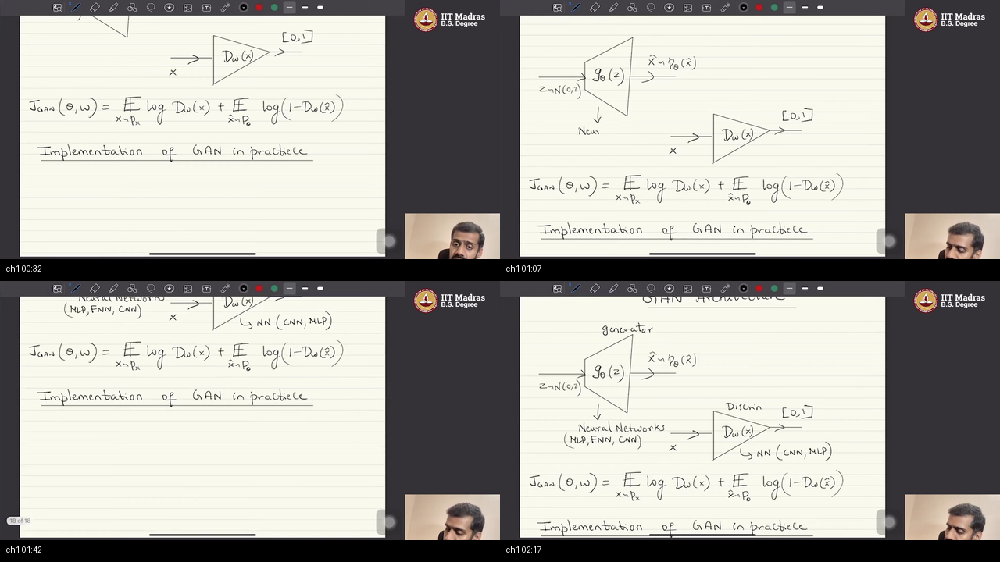

Caption: Title line “Implementation of GAN in practice.” $G_\theta(z)$ triangle, $z\sim\mathcal{N}(0,1)$, $\hat x\sim p_\theta$. $D_w(x)$ triangle to $[0,1]$. Both nets labeled MLP / feed-forward / CNN — he will not choose. $J_{\mathrm{GAN}}$ already written from last lecture (two log expectations). Input is only the $n$ files.

### What he is establishing

This sitting is **implementation of a GAN in practice**. He assumes you know **error backprop** and **gradient descent**; he will not reteach them. The course is **architecture-agnostic**: he will not tell you which architecture to use for generator or discriminator. In general they are neural nets — **MLP / feed-forward** or **CNN**. Tutorials will pick one later.

The **only input** is data: $n$ samples drawn **IID** from unknown $p_x$. No labels. Then you choose an architecture for $G$ and for $D$. Picture $n=1000$ unlabeled museum photos. That pile *is* the problem.

The trap is waiting for a ResNet diagram. There is none. The hour is the **update rules**.

You can now name the two nets and the pile. What is still open: the score they share.

### Analogy for this topic only

A museum wall of unlabeled paintings — say a thousand — and two employees you have not yet named. One will paint from scribbles. One will score “real?” Tools (CNN vs MLP) are later. Today: how they take turns.

Someone asks: **must $G$ be a CNN?** He: any net. Same for $D$.

In lecture words: $n$ IID from $p_x$; architecture-agnostic.

### Local picture

```
  D = {x1,...,xn}  ~ iid p_x   (unknown)

       G_θ                 D_w
     (any net)           (any net)

  Notice: no labels y. No formula for p_x.
```

### Bridge

Last lecture wrote $T$ as sigmoid of a real-valued $V$. That turns $T$ into a $(0,1)$ **discriminator**.

---

## Topic 2: $D=\sigma(V)$; $J_{\mathrm{GAN}}$; alternate (02:28–04:27)

### Where this sits on the master map

This is **SCORE**. [$D$ in $(0,1)$](./PREREQUISITES.md#p2-disc); [$J$](./PREREQUISITES.md#p4-jgan).

### Board / screenshot

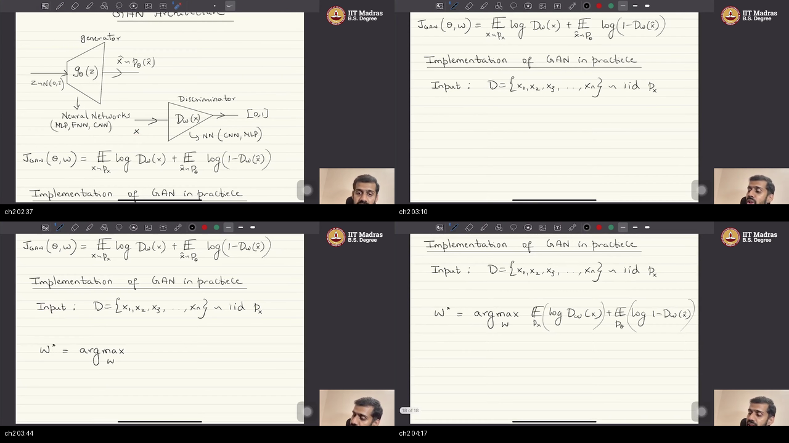

Caption: $D$ is sigmoid of $V$, hence in $(0,1)$, readable as a binary classifier. $w^\star=\arg\max_w(\mathbb{E}_{p_x}\log D_w(x)+\mathbb{E}_{p_\theta}\log(1-D_w(\hat x)))$. Alternate G and D. Classifier story = next module.

### What he is establishing

For this $f$, $T$ is equivalently a function $D$ that maps an image (or any file $x$) to a number in $(0,1)$: **sigmoid of the $V$ function**. So $D$ can be interpreted as a **binary classifier**. **More in the next module.** Call it the **discriminator**. Suppose a museum photo: $D$ near $1$ means “I think this is real.”

Train generator and discriminator **alternately**. Need $w^\star$ (the $T$ equivalent) by **maximizing** the $f$-divergence bound wrt $T$:

$$
\mathbb{E}_{p_x}[\log D_w(x)]+\mathbb{E}_{p_\theta}[\log(1-D_w(\hat x))]
$$

Neural nets are trained with **batch** gradient descent, so those $\mathbb{E}$ become sample averages next.

The trap is treating $D$ as already a full classification lecture. Today it is a **score in $(0,1)$**.

You can now write $J$ with two logs. What is still open: replacing $\mathbb{E}$ by sums, and the **sign** of the $w$ update.

### Analogy for this topic only

Detective outputs a probability. Maximize “I am right on museum pieces and right that fakes are fake.” The forger will try to wreck the same score.

Someone asks: **is this the classifier module?** Next sitting.

In lecture words: $D=\sigma(V)$; maximize $\mathbb{E}\log D+\mathbb{E}\log(1-D)$.

### Local picture

```
  V_w(x) ∈ R     then    D_w = σ(V_w) ∈ (0,1)

  J = E_{real} log D  +  E_{fake} log(1-D)

  Notice: same J will be minimized in θ. Alternate.
```

### Bridge

He replaces those two expectations by two **batch** sums, then writes a **plus** on $w$.

---

## Topic 3: Batch averages; D plus-step (04:27–06:36)

### Where this sits on the master map

This is **D-STEP**. [Batch average](./PREREQUISITES.md#p3-batch); [ascent](./PREREQUISITES.md#p6-ascent).

### Board / screenshot

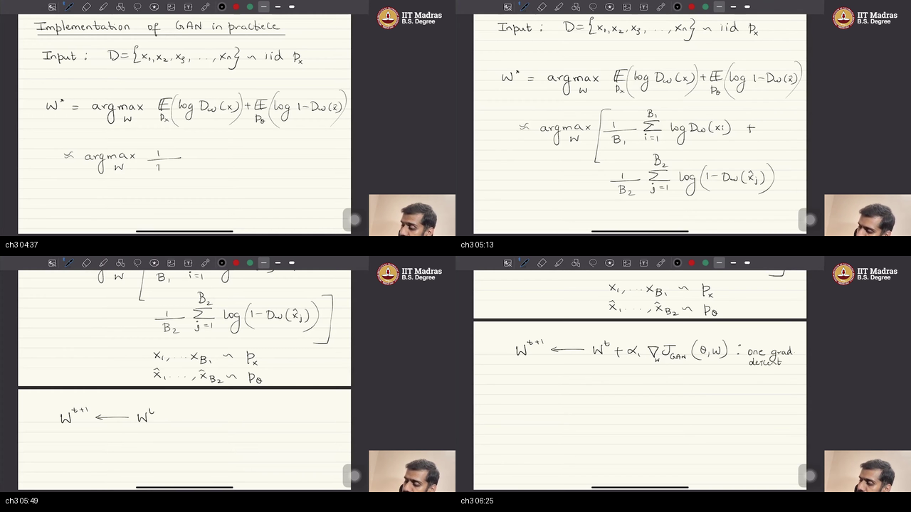

Caption: $D=\{x_i\}\sim\mathrm{iid}\,p_x$. $w^\star\approx\arg\max$ of $\frac1{B_1}\sum\log D(x_i)+\frac1{B_2}\sum\log(1-D(\hat x_j))$. Reals $\sim p_x$, fakes $\sim p_\theta$. Update $w^{t+1}\leftarrow w^t+\alpha_1\nabla_w J_{\mathrm{GAN}}$ — he labels it “one grad descent” **while writing a plus** (ascent).

### What he is establishing

The two $\mathbb{E}$ in $J$ are population means. We type **batch means**. Cost:

$$
\frac1{B_1}\sum_{i=1}^{B_1}\log D_w(x_i)+\frac1{B_2}\sum_{j=1}^{B_2}\log\bigl(1-D_w(\hat x_j)\bigr)
$$

with $x_{1:B_1}$ from $p_x$ and $\hat x_{1:B_2}$ from $p_\theta$.

**One gradient step** on $w$: we are **maximizing**, so

$$
w \leftarrow w + \alpha_1\,\nabla_w J_{\mathrm{GAN}}(\theta,w)
$$

**Plus.** He labels the line “one grad descent through discriminator” **while writing a plus**. While the discriminator is trained, **keep the generator constant**.

Work a scalar: $\alpha_1=0.1$, $\nabla_w J=+2$. The update is $w\leftarrow w+0.2$, not $w-0.2$.

The trap is copying a descent optimizer onto $w$ because he said the word “descent.” The **sign on the board is plus**.

You can now write the D update. What is still open: the G update, and where $\theta$ even sits in $J$.

### Analogy for this topic only

Poll a handful of museum rooms and a handful of forgeries. Nudge the detective **uphill** on that poll. The forger’s hand is tied.

Someone asks: **same batch size $B_1=B_2$?** He writes two sizes; they need not match.

In lecture words: sample averages; plus $\alpha_1$; G constant.

### Local picture

```
  J ≈ (1/B1) Σ log D(x_i) + (1/B2) Σ log(1-D(x̂_j))

  w ← w + α1 ∇_w J     ← plus because max
  θ frozen this step

  Notice: board says “grad descent” next to a plus. Follow the plus.
```

### Bridge

Same $J$, now **minimize** in $\theta$. The first log does not even see $\theta$.

---

## Topic 4: G minimizes; $\hat x=G(z)$; drop first term (06:36–09:34)

### Where this sits on the master map

This is **G-STEP**. [Generator](./PREREQUISITES.md#p1-gen); drop the real term.

### Board / screenshot

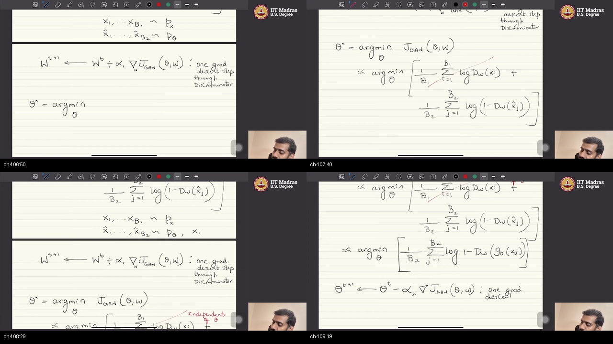

Caption: minimize the same $J$ in $\theta$. First term independent of $\theta$. $\hat x_j=G_\theta(z_j)$, so $\log(1-D(G_\theta(z_j)))$. One G step: minus another step size times $\nabla_\theta J$. $\alpha_1$ and $\alpha_2$ may differ.

### What he is establishing

Minimize the bound — **the same objective** — wrt $\theta$. **Adversarial:** D maximizes $J$, G minimizes $J$.

**Where is $\theta$?** The first term is **independent of $\theta$**. Take it out when training G. The second term depends on $\theta$ because

$$
\hat x_j = G_\theta(z_j)
$$

so you optimize $\frac1{B_2}\sum\log(1-D_w(G_\theta(z_j)))$. One G step:

$$
\theta \leftarrow \theta - \alpha_2\,\nabla_\theta J
$$

**Minus.** Another learning rate; same as $\alpha_1$ or different.

The trap is keeping $\sum\log D(x_{\mathrm{real}})$ in the G loss. It does not move $\theta$.

You can now write the G loss with $G(z)$ inside $D$. What is still open: saying “freeze” out loud, and plus vs minus as the adversarial fact.

### Analogy for this topic only

The forger cannot change how the detective scores museum pieces. He can only change the fake canvases $G(z)$.

Someone asks: **do I still sample reals on a G step?** Not for this loss.

In lecture words: drop first term; $\hat x=G(z)$; minus $\alpha_2$.

### Local picture

```
  first term  E log D(x)      independent of θ   →  drop
  second term E log(1-D(G_θ(z)))                 →  G loss

  θ ← θ − α2 ∇_θ J

  Notice: α1 and α2 may differ.
```

### Bridge

Two updates, opposite signs, each with the other net locked.

---

## Topic 5: Freeze; ascent vs descent (09:34–11:37)

### Where this sits on the master map

This is **FREEZE**. [Freeze](./PREREQUISITES.md#p5-freeze); [plus vs minus](./PREREQUISITES.md#p6-ascent).

### Board / screenshot

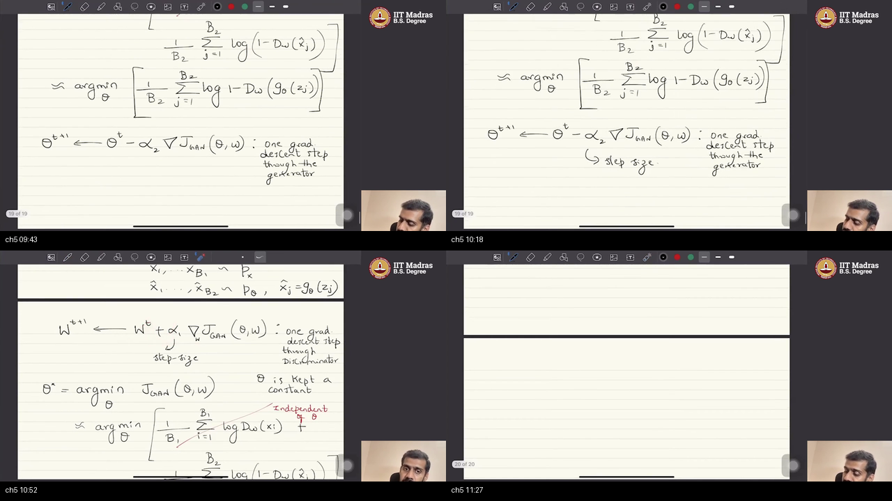

Caption: while optimizing D, $\theta$ constant; while optimizing G, $w$ constant. Alternate. ML is usually descent; D has a **plus** because it **maximizes**. That is the adversarial part.

### What he is establishing

While doing the D step, **keep $\theta$ constant**. While doing the G step, **keep $w$ constant**. **Alternate:** update G with D fixed, then D with G fixed.

Typical optimization is **gradient descent** because most ML is minimization. Here D’s update has a **plus** because D **maximizes**. G **minimizes**. That opposite pair **is** adversarial.

The trap is training both nets in one fused backward with the same sign.

You can now say freeze and plus/minus. What is still open: the **forward-pass plumbing** for a D step (two piles).

### Analogy for this topic only

Detective studies while the forger’s wrist is locked. Forger paints while the detective’s grade book is locked. Opposite walks on the same scoreboard.

Someone asks: **can I unlock both?** Not in this procedure.

In lecture words: alternate; D ascent, G descent.

### Local picture

```
  D step:  θ frozen     w ← w + α1 ∇_w J
  G step:  w frozen     θ ← θ − α2 ∇_θ J

  Notice: plus on w is the adversarial fact, not a typo.
```

### Bridge

He now draws the D pipeline in green: what is trained vs what is only run.

---

## Topic 6: Train D: real batch, frozen G (11:37–20:38)

### Where this sits on the master map

This is **TRAIN-D**. Long box: [batch](./PREREQUISITES.md#p3-batch) + frozen [G](./PREREQUISITES.md#p1-gen).

### Board / screenshot

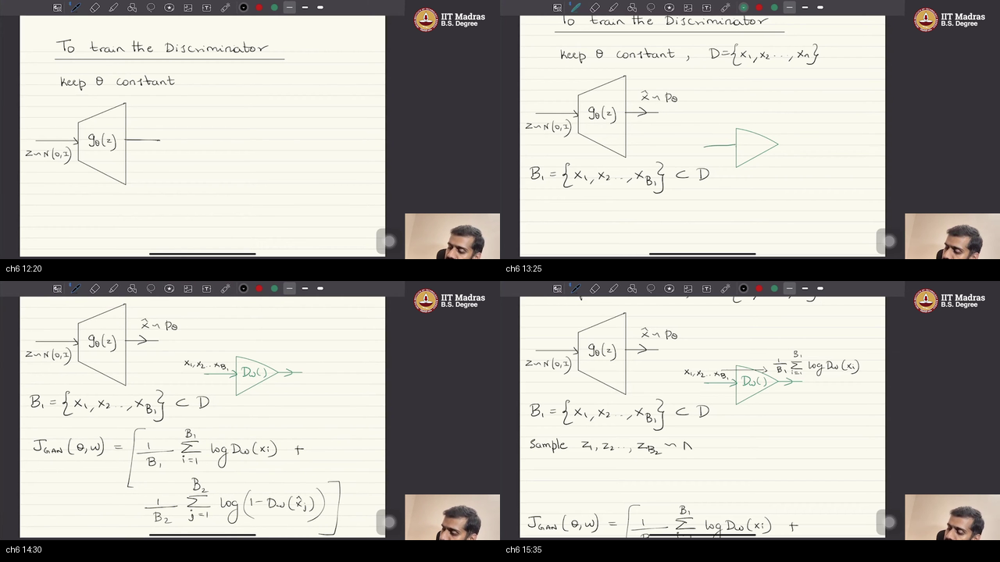

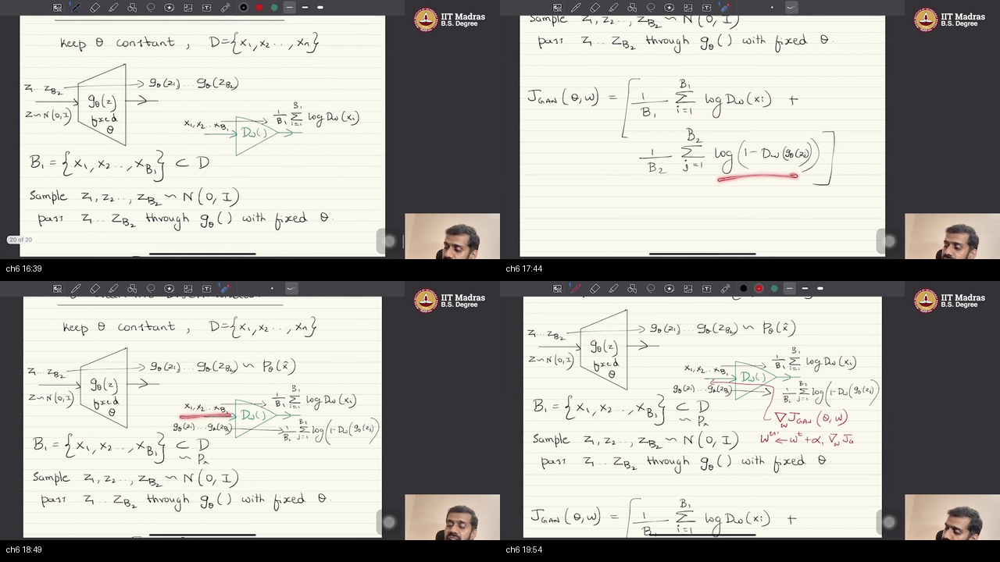

Caption: “To train the Discriminator / keep $\theta$ constant.” $G_\theta(z)$ triangle, $z\sim\mathcal{N}(0,1)$, $\hat x\sim p_\theta$. Green $D_w$. $B_1=\{x_1,\ldots,x_{B_1}\}\subset D$ a random subset (need not be contiguous). $J$ = two batch logs. Later panel: sample $z_{1:B_2}\sim\mathcal{N}$, pass frozen $G$ then $D$. Green = forward / trained net; red (next composite) = backprop. Only the green net is trained.

### What he is establishing

**Keep $\theta$ constant.** To train $D$ you need samples from **both** $p_x$ and $p_\theta$.

Reals: you already have $x_1,\ldots,x_n$. Take a **batch** $B_1=\{x_1,\ldots,x_{B_1}\}\subset D$ — **not necessarily contiguous**, just some **random** subset.

Fakes: sample $z_1,\ldots,z_{B_2}\sim\mathcal{N}(0,1)$, **pass through $G$ with fixed $\theta$**, get $G_\theta(z_j)$ which **are** samples from $p_\theta$.

**First term:** pass $x_1,\ldots,x_{B_1}$ through $D$ (one **forward pass**), average $\log D_w(x_i)$.

**Second term:** pass those $G_\theta(z_j)$ through $D$, average $\log(1-D_w(G_\theta(z_j)))$.

Then $\nabla_w J$, **backprop through $D$ to its input**, update $w$ with the **plus** (he says “usual gradient descent but with a plus sign here because what we are doing here is gradient ascent”). Batch-level or sample-level — depends on implementation. **Do not touch $G$.** Green = trained net / forward; red = backprop.

```python
# Topic 6 — one D step (θ frozen). Needs BOTH piles.
z = randn(B2, z_dim)
x_fake = G(z)                         # run G, do not update θ
x_real = random_subset(data, B1)      # not necessarily consecutive
J = log(D(x_real)).mean() + log(1 - D(x_fake)).mean()
w = w + alpha1 * grad(J, w)           # ASCENT; backprop only through D
# last real batch may be shorter than B1 — still a mean
```

The trap is backpropping into $G$ on this step. $\theta$ is frozen. He repeats the two-pile story twice on the tablet; it is the same D step.

You can now run a D step. What is still open: G **without** museum photos.

### Analogy for this topic only

Detective quizzes a handful of museum rooms and a handful of canvases the forger painted **yesterday** (hand locked). Grade book updates; forger’s hand stays locked.

Someone asks: **must $B_1=B_2$?** He writes two sizes.

In lecture words: both piles; frozen $G$; forward $D$; plus-step $w$.

### Local picture

```
  z ~ N(0,1) → [G_θ frozen] → x̂
  x  from B1 ⊂ D  ────────────┐
                              ▼
                           [D_w green]
                              │
                     J = log D(x) + log(1-D(x̂))
                              │ red backprop
                           w ← w + α1 ∇_w J

  Notice: G is used, not trained.
```

### Bridge

For G, the museum term is a constant. You will not even load $x$.

---

## Topic 7: Train G: no real data; grads through D (20:38–28:41)

### Where this sits on the master map

This is **TRAIN-G**. [Freeze $D$](./PREREQUISITES.md#p5-freeze); grads still pass through it.

### Board / screenshot

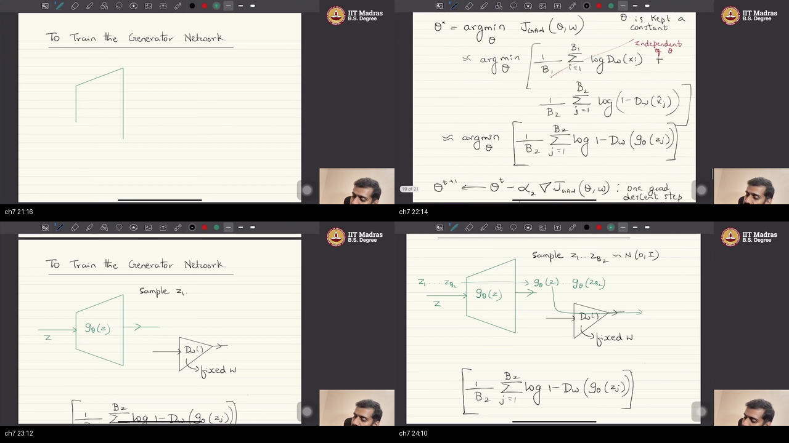

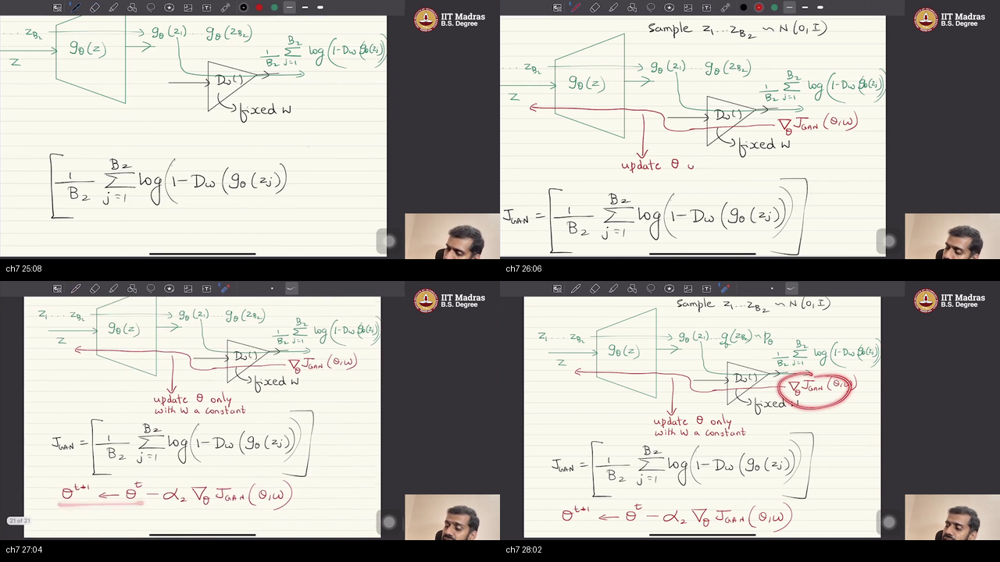

Caption: green $G$, **fixed** $D_w$. First term independent of $\theta$ — **no $p_x$**. $z\sim\mathcal{N}$, forward $G$, forward frozen $D$, $\frac1{B_2}\sum\log(1-D(G(z_j)))$. Backprop from D’s output **to G’s input** without updating $w$. Then minus-step $\theta$.

### What he is establishing

Train $G$ with $w$ **fixed** (green $G$, “fixed $w$” on $D$). Loss is only the second term. **Data from $p_x$ is not needed at all** while training G (D needed both). He almost writes $B_1$ for the noise batch, then corrects: **$B_2$**.

Sample $z_{1:B_2}\sim\mathcal{N}(0,1)$, forward $G_\theta$, get fakes from $p_\theta$, pass them through **frozen** $D$, compute

$$
\frac1{B_2}\sum_{j=1}^{B_2}\log\bigl(1-D_w(G_\theta(z_j))\bigr)
$$

$\nabla_\theta$ of that: pass gradients **from the output of $D$ all the way to the input of $G$**, **keeping $w$ constant** as they travel through $D$. Then

$$
\theta \leftarrow \theta - \alpha_2\nabla_\theta J
$$

**Minus.** One G step.

```python
# Topic 7 — one G step (w frozen). NO real x.
z = randn(B2, z_dim)                  # he corrects: B2, not B1
x_fake = G(z)
J_g = log(1 - D(x_fake)).mean()       # D is run; w not updated
# backprop from D's output all the way to G's input; keep w constant
theta = theta - alpha2 * grad(J_g, theta)  # DESCENT; grads flow through D
```

The trap is updating $D$ because “the graph goes through $D$.” Frozen means the graph is a pipe, not a student.

You can now run a G step. What is still open: how many times to alternate, and when to stop.

### Analogy for this topic only

Forger paints, walks the canvas through a **locked** detective, feels how the score would move, and adjusts only his own wrist. No museum painting enters the studio.

Someone asks: **do gradients stop at $D$?** No — they continue into $G$; $w$ just does not change.

In lecture words: no $p_x$; second term only; backprop through frozen D; minus $\theta$.

### Local picture

```
  z ~ N → [G_θ green] → x̂ → [D_w frozen] → log(1-D)
                                              │
                         backprop through D (w constant)
                                              ▼
                                    θ ← θ − α2 ∇_θ J

  Notice: real x never appears.
```

### Bridge

People often refuse 1:1. Stopping is not “loss = 0.”

---

## Topic 8: $k$:1 steps; no stopping formula (28:41–30:08)

### Where this sits on the master map

This is **PRACTICE**. [Step vs epoch](./PREREQUISITES.md#p8-epoch).

### Board / screenshot

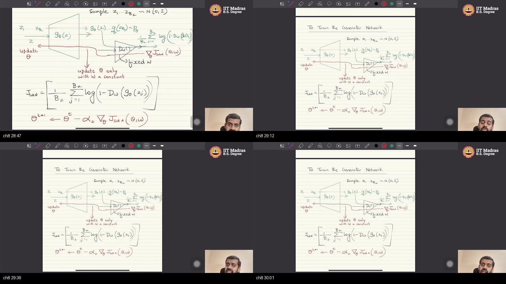

Caption: the tablet **still shows the G-step diagram** (green $G$, fixed $w$, red grads, minus $\alpha_2$) — he does not draw a new $k$:1 board. Spoken over it: typically alternate one G and one D; practical tip: **not** always 1:1 (five G and one D, or five D and one G). **No well-defined stopping.** Look at generated $p_\theta$ with metrics. More in the classifier module.

### What he is establishing

Typically **alternate** one generator step and one discriminator step. **Practical tips:** people **don’t** always use the same number. Sometimes **five G steps and one D**, sometimes **five D and one G**. Depends on the use case.

**Stopping:** typically **no well-defined criterion**. Look at **quality of generated data** $p_\theta$ using some **metrics**; stop when those reach a satisfactory level. More detail when they do the **classifier interpretation** next module.

```python
# Topic 8 — not always 1:1. k_d, k_g ∈ {1, 5, …} by use case.
for epoch in range(E):
    for _ in range(k_d):
        d_step()                       # plus on w; G frozen
    for _ in range(k_g):
        g_step()                       # minus on θ; D frozen; no real x
# STOP: inspect x̂ / metrics. There is no J==0 halt on this tape.
```

The trap is training until $J=0$. He never writes that. The composite for this minute still shows the G diagram — the $k$:1 rule is **speech**, not a new drawing.

You can now say $k$:1 and “stop by samples.” What is still open: *why* this $f$ should make $G$ sample like $p_x$.

### Analogy for this topic only

Some days the forger paints five canvases per detective quiz; some days the detective sits five quizzes per canvas. You stop when the wall looks right, not when a loss hits a magic number.

Someone asks: **is 1:1 required?** No.

In lecture words: not always 1:1; stop by metrics.

### Local picture

```
  default:  D-step, G-step, D-step, G-step, ...
  also OK:  5× D-step then 1× G-step   (or the reverse)

  STOP: look at x̂ quality / metrics
  Notice: no loss=0 rule on this tape.
```

### Bridge

He zooms out: this was one $f$ of VDM.

---

## Topic 9: VDM special case; why it works (30:08–32:29)

### Where this sits on the master map

This is **WHY**. Tie-back to [W2_L6 / $f$-div](../03-W1-L4-Variational-Divergence-Minimization/NOTES.md).

### Board / screenshot

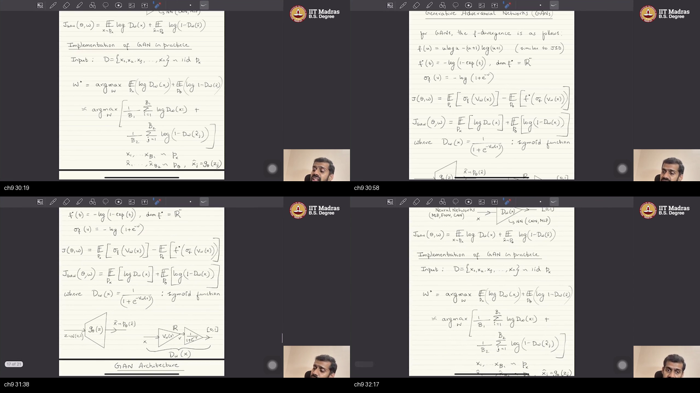

Caption: GAN = one instance of variational divergence minimization in practice. $D$ **is** $T$ (lower bound on an $f$-div). Minimize divergence $p_\theta$ vs $p_x$; then sampling $G_\theta$ is sampling from $p_x$. $f$ → conjugate → activation → $D=\sigma\circ V$. Batch GD, many epochs.

### What he is establishing

We looked at **one instance of VDM as a GAN, in practice**. Push-forward / generator net, discriminator net. For practical purposes the discriminator **is** the $T$ function that constructs a **lower bound** on an $f$-divergence.

**Why it should work:** we minimize a **divergence metric** between $p_\theta$ and $p_x$. Once we do that, **sampling through $G_\theta$ is equivalent to sampling from $p_x$**. That course idea is still there.

Recipe: start with an $f$, lower bound, minimize the bound. GAN’s $f$ gives a conjugate and an activation so the **range of $T$ is the domain of $f^*$**. Plug in → rewrite as $D_w=\sigma(V_w)$. Expectations → sample averages. **Batch gradient descent:** one gradient step per batch, through the data = one **epoch**, many epochs. He assumes you know batch GD.

The trap is thinking GAN left VDM. It is **one $f$**.

You can now say “GAN ⊂ VDM.” What is still open: a second recap of the two pipes, then next module.

### Analogy for this topic only

Same museum job as week 1: match the unknown wall-law. GAN is one ruler ($f$) and one way to hold the ruler ($T=D$).

Someone asks: **did we pick CNN?** Still no.

In lecture words: one $f$; $D$ is $T$; then $G$ samples like $p_x$.

### Local picture

```
  f  →  conjugate f*  →  activation  →  T = D = σ∘V
                    │
                    ▼
         min bound  ⇒  p_θ ≈ p_x  ⇒  G(z) looks real

  Notice: batch step ≠ epoch. Many epochs.
```

### Bridge

He repeats both pipes once, then points at inference and a classifier story.

---

## Topic 10: Recap; next classifier / inference (32:29–35:20)

### Where this sits on the master map

This is **RECAP / NEXT** on the master map: say both pipes once more, then the leftover jobs (classifier reading, inference) that this tape does not finish.

### Board / screenshot

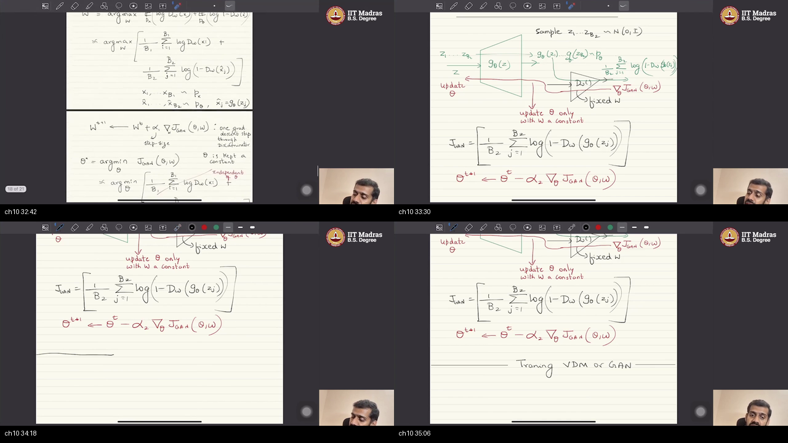

Caption: D recap — both piles, frozen $G$, plus-step $w$. G recap — no $p_x$, frozen $D$, grads to $G$, minus-step $\theta$. End of this VDM/GAN special case. Next: inference, classifier interpretation, improvisations, different $f$ → different sample behavior, conditional generation.

### What he is establishing

End-of-lecture **review** (the list he recites, not new algebra):

1. **D pipe.** Keep $G$ fixed; $z\sim\mathcal{N}$ through frozen $G$ for $p_\theta$; one batch of reals; two terms; $\nabla_w$; backprop through $D$; one **plus** step; $\theta$ fixed.
2. **G pipe.** Keep $D$ fixed; $z_{1:B_2}$; through $G$ then frozen $D$; **independent of real data**; $\nabla_\theta$ through $D$ into $G$; $w$ constant; one **minus** step.

That is the end of training **this** VDM / special case of GANs.

Wrong complete answer: “we are done when $J=0$” or “now sample from $D$.” Right: stop by looking at $G$’s images; inference uses $G$, not $D$.

**Next module:** how to do **inference**; **classifier interpretation** of this special case; **improvisations**; different $f$ → different behavior of generated data; start **conditional generation** and other post-training tasks.

Thank you.

You can now write both frozen steps without looking. Still missing: reading $D$ as a classifier and using $G$ after training.

### Analogy for this topic only

The two locked-wrist drills, said once more, then class dismissed toward “how the detective’s score *means* class” and “how to commission a painting with a prompt.”

Someone asks: **do we sample at test time from $D$?** Next sitting — inference is on $G$.

In lecture words: recap both steps; next is classifier / inference / other $f$.

### Local picture

```
  D-step: real + fake, freeze G, plus w
  G-step: fake only, freeze D, minus θ  (grads through D)

  NEXT: classifier view · metrics / stop · other f · conditional G

  Notice: this tape ends training, not sampling-with-a-prompt.
```

### Bridge

Tutorials will type this loop in PyTorch. Theory next is how this $f$ is a classifier game.

---

## External references

Companions for **this recording’s** boxes. All links live in **this section** (not under topics). Mix of **video**, **blog / course notes**, **paper / code**. No Wikipedia. Each map box has two or three companions.

**Start here (if you only open three).** [Goodfellow 2014](https://arxiv.org/abs/1406.2661) → [Stanford CS236 GAN notes](https://deepgenerativemodels.github.io/notes/gan/) → [MIT 6.S191 2026 L4](https://www.youtube.com/watch?v=R8V8CbuxryI).

| Topic / box | Video | Notes / blog | Paper / code |
|-------------|-------|--------------|--------------|
| 1 · two nets, $n$ IID, architecture-agnostic | [MIT 6.S191 2026 L4](https://www.youtube.com/watch?v=R8V8CbuxryI) | [Google ML — GAN overview](https://developers.google.com/machine-learning/gan) | [CS231n 2025 L14 slides](https://cs231n.stanford.edu/slides/2025/lecture_14.pdf) |
| 2 · $D=\sigma(V)$, $J_{\mathrm{GAN}}$, alternate | [Stanford CS236 2023 L9](https://www.youtube.com/watch?v=3Zv-gokhLu8) | [CS236 notes — GANs](https://deepgenerativemodels.github.io/notes/gan/) | [Goodfellow et al. 2014](https://arxiv.org/abs/1406.2661) |
| 3 · batch averages, D plus-step | [CS231n 2025 L14](https://www.youtube.com/watch?v=Edr4uZFh4EE) | [Google ML — GAN loss](https://developers.google.com/machine-learning/gan/loss) | [D2L — GAN](https://d2l.ai/chapter_generative-adversarial-networks/gan.html) |
| 4 · G min, $\hat x=G(z)$, drop first term | [Understanding GANs](https://www.youtube.com/watch?v=RAa55G-oEuk) | [Lilian Weng — From GAN to WGAN](https://lilianweng.github.io/posts/2017-08-20-gan/) | [Google ML — GAN loss](https://developers.google.com/machine-learning/gan/loss) (G cannot affect $\log D(x)$) |
| 5 · freeze; ascent vs descent | [Berkeley CS294-158 SP24 L5](https://www.youtube.com/watch?v=lFAHPJS2HHc) | [Google ML — GAN generator](https://developers.google.com/machine-learning/gan/generator) | [Goodfellow NIPS 2016 tutorial](https://arxiv.org/abs/1701.00160) |
| 6 · train D: real batch, frozen G | [MIT 6.S191 2026 L4](https://www.youtube.com/watch?v=R8V8CbuxryI) | [Google ML — GAN generator](https://developers.google.com/machine-learning/gan/generator) | [TensorFlow DCGAN tutorial](https://www.tensorflow.org/tutorials/generative/dcgan) |
| 7 · train G: no reals, grads through D | [Stanford CS236 2023 L9](https://www.youtube.com/watch?v=3Zv-gokhLu8) | [D2L — GAN](https://d2l.ai/chapter_generative-adversarial-networks/gan.html) | [PyTorch DCGAN tutorial](https://pytorch.org/tutorials/beginner/dcgan_faces_tutorial.html) |
| 8 · $k$:1; no stopping formula | [Berkeley CS294-158 SP24 L5](https://www.youtube.com/watch?v=lFAHPJS2HHc) | [Google ML — GAN problems](https://developers.google.com/machine-learning/gan/problems) | [Goodfellow NIPS 2016 tutorial](https://arxiv.org/abs/1701.00160) |
| 9 · VDM special case; why it works | [CS231n 2025 L14](https://www.youtube.com/watch?v=Edr4uZFh4EE) | [CS236 notes — GANs](https://deepgenerativemodels.github.io/notes/gan/) | [Goodfellow et al. 2014](https://arxiv.org/abs/1406.2661) (JS / optimal $D$) |
| 10 · recap; next classifier / inference | [Stanford CS236 2023 L10](https://www.youtube.com/watch?v=M3Fkvu78ZXc) | [Lilian Weng — From GAN to WGAN](https://lilianweng.github.io/posts/2017-08-20-gan/) | [CS231n 2025 L14 slides](https://cs231n.stanford.edu/slides/2025/lecture_14.pdf) |

**Official slides next to those lectures (same sitting, not extra topics).** MIT 6.S191 L4: `https://introtodeeplearning.com/slides/6S191_MIT_DeepLearning_L4.pdf`. Berkeley L5 deck: [Google Slides](https://docs.google.com/presentation/d/1xkyKsKFeYqtsiAbrvLOsDFn3YE2Q5XHZ5SzOWZSC3D4/htmlpresent).

**How to use.** After Topic 2, Goodfellow’s value function + CS236 notes. After Topic 4, Google’s line that G cannot affect $\log D(x)$. After Topic 7, D2L or PyTorch DCGAN beside the tablet loop (their G loss is often $-\log D(G(z))$ — he keeps $\log(1-D)$; compare, do not swap silently). After Topic 8, NIPS 2016 tutorial + Google “problems” for why there is no $J=0$ halt. After Topic 9, CS236 notes for the JS/VDM link. Next IITM sitting is classifier interpretation — Weng’s WGAN half waits until then.

---

## Apply it (scenarios)

*Workplace-style situations that use ideas from this video only.*

### Scenario 1: Intern uses reals on the G step

**Context:** G loss includes $\log D(x_{\mathrm{real}})$.  
**Challenge:** $\theta$ barely moves.  
**Questions:**  
1. Which term depends on $\theta$?  
2. Do we need $p_x$ to train $G$?

<details><summary>Show solution sketch</summary>

- Topics 4 and 7: first term independent of $\theta$; G training needs **no** real data.

</details>

### Scenario 2: D trainer is a stock `loss.backward()` descent

**Context:** they minimize $J$ for $w$.  
**Challenge:** D gets worse at spotting fakes.  
**Questions:**  
1. What sign sits on the $w$ update?  
2. Why did he say “descent” on that line?

<details><summary>Show solution sketch</summary>

- Topics 3 and 5: **plus** $\alpha\nabla_w$ because D **maximizes**. Board may say “descent”; the plus is the law.

</details>

### Scenario 3: Gradients into $G$ also update $D$

**Context:** one `backward()` on $J_g$ with both nets in the graph.  
**Challenge:** D un-learns on G steps.  
**Questions:**  
1. What does freeze $w$ mean?  
2. Do gradients still pass through $D$?

<details><summary>Show solution sketch</summary>

- Topic 7: grads flow **through** D to G; **do not** change $w$. Detach/freeze D’s parameters.

</details>

### Scenario 4: They train 1:1 for 200 epochs with no sample check

**Context:** $J$ wiggles; nobody looked at $\hat x$.  
**Challenge:** “when are we done?”  
**Questions:**  
1. Is 1:1 required?  
2. What is the stopping rule on this tape?

<details><summary>Show solution sketch</summary>

- Topic 8: $k$:1 is allowed; **no** well-defined loss stop; look at generated quality / metrics.

</details>

---

## Sources

- Video: [W2_L7 GAN formulation](https://www.youtube.com/watch?v=pLD5Q5cS4kI) · [IITM playlist](https://www.youtube.com/playlist?list=PLZ2ps__7DhBa5xCmncgH7kPqLqMBq7xlu) index 11
- Captions: `raw/captions.en.vtt` / `raw/captions.en.timed.txt`
- Claim sheets: `raw/claims/topic-01.md` … `topic-10.md`
- Course page: https://study.iitm.ac.in/ds/course_pages/BSDA5002.html
- Original GAN: [arXiv:1406.2661](https://arxiv.org/abs/1406.2661) · NIPS 2016 tutorial [arXiv:1701.00160](https://arxiv.org/abs/1701.00160)
- University: Stanford CS236 notes + CS231n 2025 L14; MIT 6.S191 2026 L4; Berkeley CS294-158 SP24 L5
- Ingest: captions yes · video yes · 10 unique topic composites (Topics 6–7 have two panels) · `ingest_evidence: E3`
