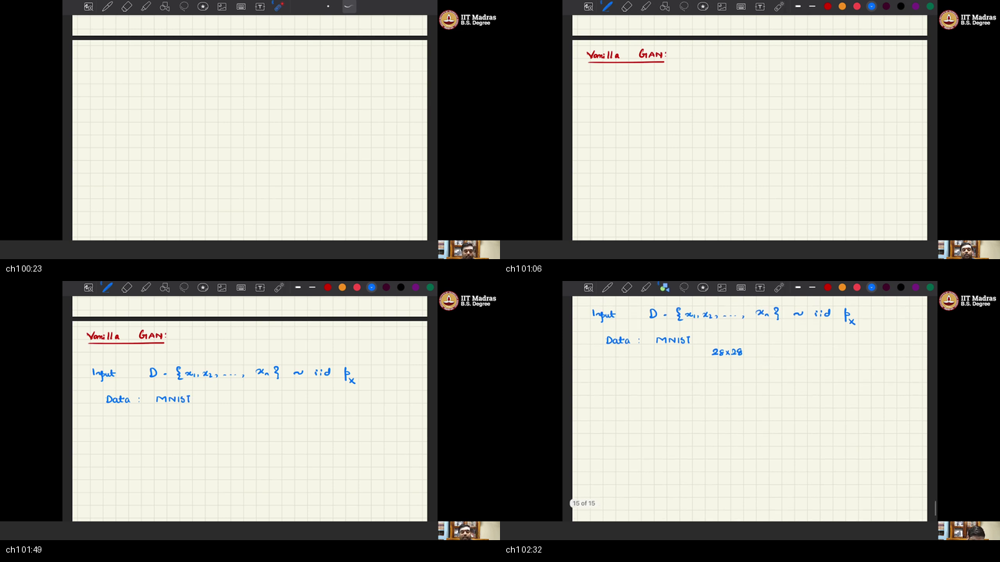
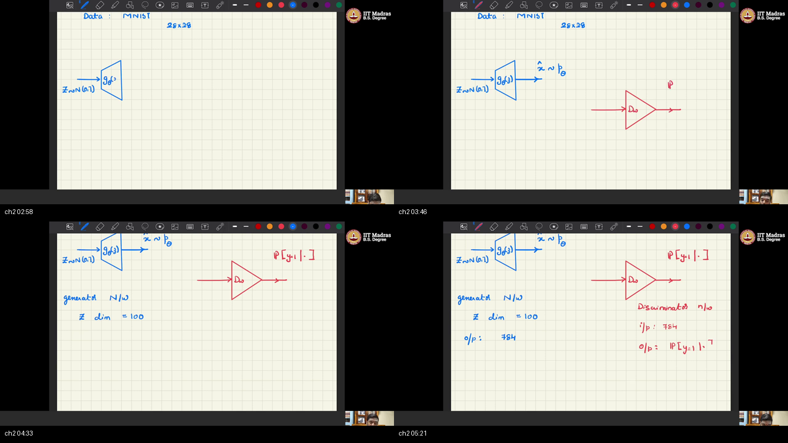
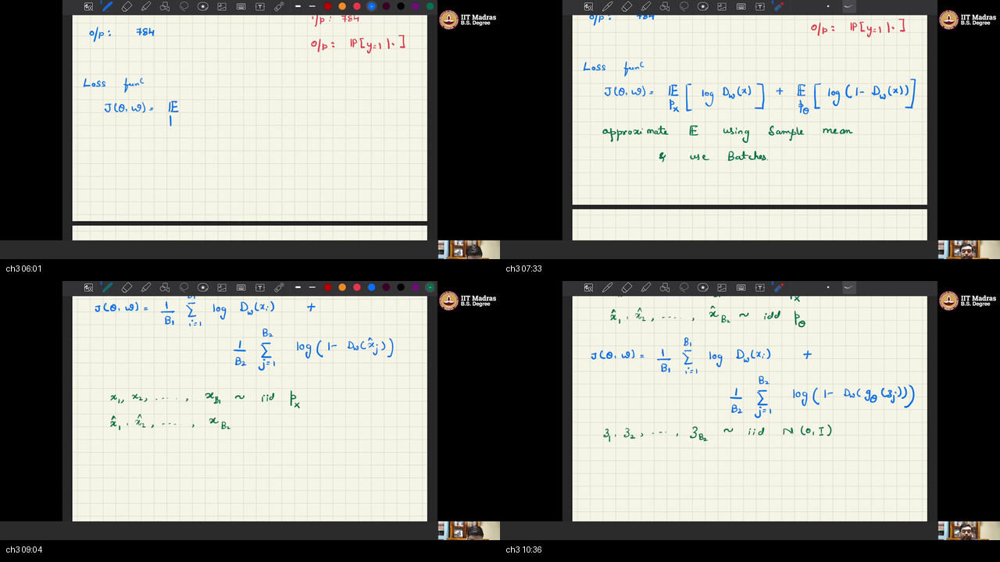
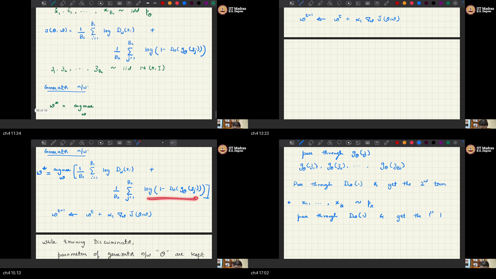
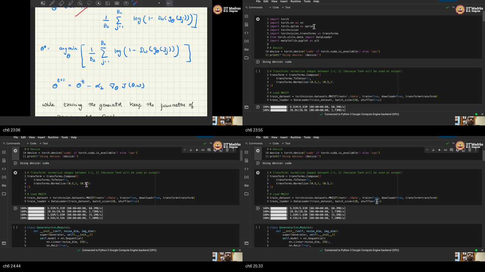
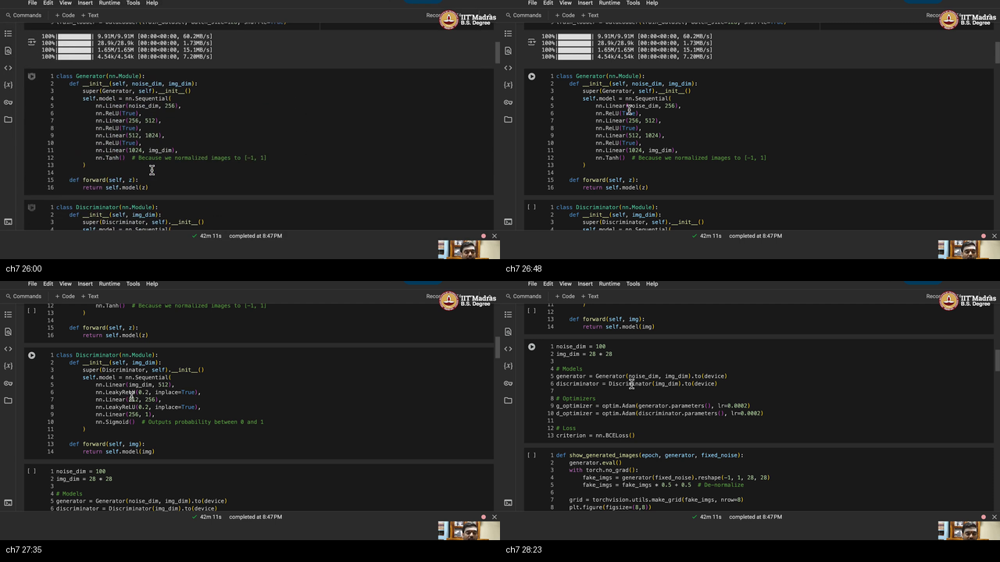
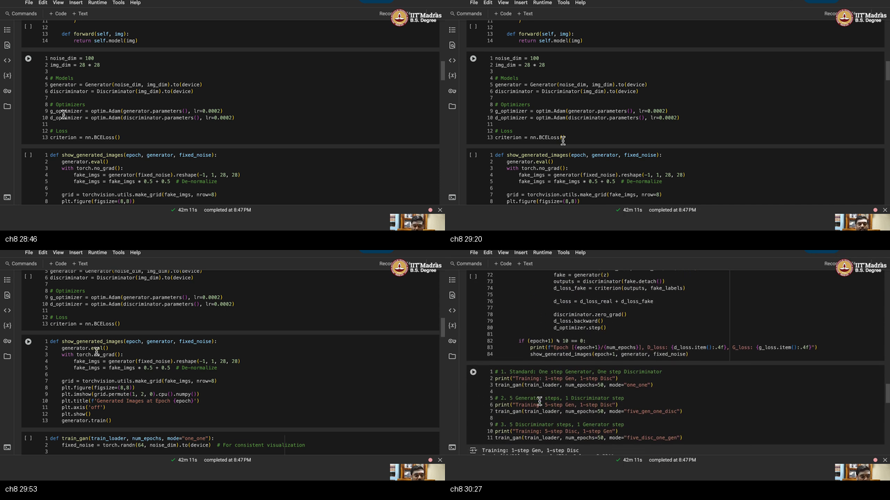
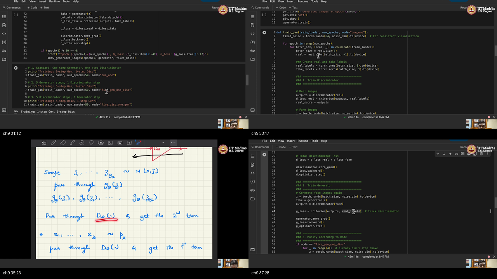
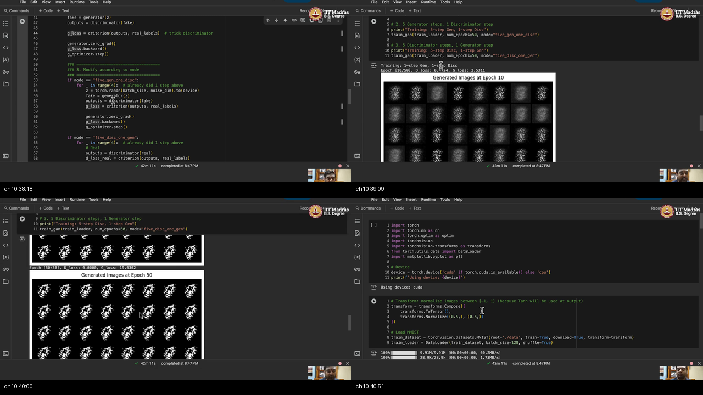

# W2_T5 — Tutorial: implementation of a vanilla GAN

> **Video:** [W2_T5: Tutorial: implementation of generative adversarial network](https://www.youtube.com/watch?v=iOb8vmlJd8o) · **~41 min**  
> **Warm-up first:** [PREREQUISITES.md](./PREREQUISITES.md) · **Quiz:** [quiz.html](./quiz.html)

**Do PREREQUISITES before this article.**  
**Course:** IIT Madras B.S. · **BSDA5002** · Prof. Prathosh A. P. · tutorial live-code (Chandan)  
**Theory already on the board:** [W2_L5 VDM](../07-W2-L5-Generative-Modelling-via-VDM/NOTES.md) → GAN as minmax. **This hour:** run the **vanilla** flavor on **MNIST**.  
**Notebook:** [`IITM_DGM_Vanilla_GAN.ipynb`](https://github.com/Chandan-IISc/IITM_GenAI/blob/main/IITM_DGM_Vanilla_GAN.ipynb)

ASR “28 + 28” is **$28\times 28$**; “emnest” is **MNIST**; “BC laws” is **BCE**; “WDM” is **VDM**; “1us” is **$1-$**.

| When he hits… | Warm-up |
|---------------|---------|
| $D$ IID from $p_x$ | [p1-iid-px](./PREREQUISITES.md#p1-iid-px) |
| $z\sim\mathcal{N}(0,I)$ | [p2-noise-z](./PREREQUISITES.md#p2-noise-z) |
| $G_\theta$ vs $D_w$ | [p3-g-d](./PREREQUISITES.md#p3-g-d) |
| sigmoid $P(y=1\mid x)$ | [p4-sigmoid-real](./PREREQUISITES.md#p4-sigmoid-real) |
| BCE / $\log D$ | [p5-bce](./PREREQUISITES.md#p5-bce) |
| ascent vs descent | [p6-ascent-descent](./PREREQUISITES.md#p6-ascent-descent) |
| freeze / two Adams / `.detach()` | [p7-detach-freeze](./PREREQUISITES.md#p7-detach-freeze) |
| Tanh $\leftrightarrow$ Normalize $[−1,1]$ | [p8-tanh-norm](./PREREQUISITES.md#p8-tanh-norm) |

---

## Table of Contents

1. [Topic 1 — Vanilla GAN on MNIST, why small](#topic-1-vanilla-gan-on-mnist-why-small-0011–0245) (00:11–02:45)
2. [Topic 2 — Two MLPs: $z$ dim 100, image dim 784](#topic-2-two-mlps-z-dim-100-image-dim-784-0245–0535) (02:45–05:35)
3. [Topic 3 — Loss $J$, batches, $\hat{x}=G(z)$](#topic-3-loss-j-batches-xhatgz-0535–1103) (05:35–11:03)
4. [Topic 4 — D ascent, freeze $G$, two BCE terms](#topic-4-d-ascent-freeze-g-two-bce-terms-1103–1734) (11:03–17:34)
5. [Topic 5 — G descent, drop term 1, trick with ones](#topic-5-g-descent-drop-term-1-trick-with-ones-1734–2252) (17:34–22:52)
6. [Topic 6 — Colab: imports, Normalize, MNIST 128](#topic-6-colab-imports-normalize-mnist-128-2252–2547) (22:52–25:47)
7. [Topic 7 — Generator Tanh; Discriminator LeakyReLU + Sigmoid](#topic-7-generator-tanh-discriminator-leakyrelu--sigmoid-2547–2837) (25:47–28:37)
8. [Topic 8 — Two Adams, BCE, fixed noise](#topic-8-two-adams-bce-fixed-noise-2837–3037) (28:37–30:37)
9. [Topic 9 — `train_gan`: detach, D then G, three modes](#topic-9-train_gan-detach-d-then-g-three-modes-3037–3804) (30:37–38:04)
10. [Topic 10 — 50-epoch grids, extra $k$-steps, CNN exercise](#topic-10-50-epoch-grids-extra-k-steps-cnn-exercise-3804–4106) (38:04–41:06)
11. [External references](#external-references)
12. [Apply it (scenarios)](#apply-it-scenarios)
13. [Sources](#sources)

---

## Executive Summary — architecture of this lecture

This tutorial implements a **vanilla GAN** on MNIST. A **generator** $G_\theta$ maps noise $z\sim\mathcal{N}(0,I)$ into a $28\times 28$ fake; a **discriminator** $D_w$ scores $P(\text{real})$. $J(\theta,w)$ becomes two BCE terms on batches of 128. $D$ climbs $J$ with $G$ frozen; $G$ descends the fake term, tagging fakes as real.

```
  z → G_θ → xhat     x → D_w → P(real)
  D ascent (freeze G)     G descent + trick ones
```

**Worldview arc:** from chalkboard minmax $J(\theta,w)$ **to** a runnable `train_gan`.

**How to run one batch (the method):** (1) load 128 normalized MNIST vectors; (2) $D$ on reals vs ones; (3) $z\to G\to D(\text{fake.detach()})$ vs zeros; (4) add, step **only** $D$; (5) $D(G(z))$ vs ones, step **only** $G$; (6) every 10 epochs, plot the **same** 64 $z$.

### System context

```
  ╔════════ theory already done ════════╗
  ║  VDM / GAN formulation:             ║
  ║  min_θ max_w  J(θ, w)               ║
  ╚══════════════════╤══════════════════╝
                     │ this tutorial
                     ▼
  ╔════════ Colab + MNIST ══════════════╗
  ║  limited GPU → miniature data       ║
  ║  notebook IITM_DGM_Vanilla_GAN.ipynb║
  ╚══════════════════╤══════════════════╝
                     │
                     ▼
            two MLPs + two Adams
```

### Main blueprint

```
  p_x  ──IID──►  MNIST 28×28  ──flatten──►  x ∈ R^784
                                              │
  z ~ N(0,I)                                  │  batch B1 = 128 reals
  dim 100 ──► G_θ (MLP, Tanh) ──► xhat        │
                   │                          │
                   │  batch B2 = 128 fakes    │
                   ▼                          ▼
                D_w (MLP, LeakyReLU, Sigmoid)
                   │
                   ▼
              p = P(y=1 | photo) ∈ (0,1)

  J(θ,w) = E_px[log D(x)]  +  E_z[log(1 − D(G(z)))]
             term 1 (no θ)         term 2 (has θ)

  D step:  ASCENT on J, freeze θ
           BCE(D(x), 1) + BCE(D(G(z).detach()), 0)
           d_optimizer.step()     ← only w

  G step:  DESCENT, drop term 1, freeze w
           BCE(D(G(z)), 1)        ← trick: tag fakes as real
           g_optimizer.step()     ← only θ

  modes:  one_one  |  5 G + 1 D  |  5 D + 1 G
  look:   50 epochs, plot fixed_noise every 10
  STOP:   CNN / other data = homework; next flavor next tutorial
```

### Scenario walkthrough

Take one real MNIST **“7”** in a batch of 128. $D$ wants $D(\text{7})\to 1$. Draw $z\sim\mathcal{N}(0,I)$, push through $G$: at epoch 1 you get a gray blob. $D$ wants $D(\text{blob})\to 0$. Then freeze $D$, tell BCE the blob’s tag is **1**, and step only $G$: the blob’s score must climb. Keep one $z$ in a drawer (`fixed_noise`). Every 10 epochs print that same 8×8 grid. By epoch 50 some cells look digit-like. They are **generated**, not reconstructed — nobody encoded that “7” into $z$.

### Failure / contrast path

```
  WRONG  one optimizer for both nets     →  freeze story dies
  WRONG  D(fake) without .detach()       →  D's backward writes θ
  WRONG  G BCE vs zeros                  →  G tries to look *more* fake
  WRONG  Tanh G + pixels still in [0,1]  →  D separates ranges, not digits
  WRONG  10-way softmax on D             →  this is real-vs-fake, not 0–9
```

### STOP / out of scope

CNN weights are **not** coded here (exercise: swap MLP → CNN). Other datasets are an exercise. **Next tutorial** codes the **next GAN variation**. No test split, no FID, no plotting-library lecture.

### Load-bearing claims

- Vanilla = the **basic flavor**, run on MNIST because GPU is limited.
- $G_\theta(z)$, $z\sim\mathcal{N}(0,I)$ dim 100, output 784; $D_w$ sigmoid $P(y=1\mid x)$.
- $J$ is two logs; replace expectations by batch means $B_1,B_2$; $\hat{x}=G(z)$.
- $D$: $\arg\max$, **ascent**, freeze $\theta$, term1 + term2.
- $G$: $\arg\min$, **drop term 1**, **descent**, freeze $w$, BCE vs **ones** (trick).
- Two Adams, `lr=2e-4`, `BCELoss`; `.detach()` on D’s fake path.
- Modes `one_one` / `five_gen_one_disc` / `five_disc_one_gen`; 50 epochs is a **trial**.
- Homework: MLP → CNN; MNIST → other data; next video = next flavor.

**Speaker / course:** IIT Madras B.S. Generative AI (BSDA5002). Theory: Prof. Prathosh A. P. This tutorial: Chandan live-coding the shared Colab.

---

## Topic 1: Vanilla GAN on MNIST, why small (00:11–02:45)

### Where this sits on the master map

**SETUP** box. Theory already derived the GAN from **VDM**. This hour does not re-prove $J$. It names the **flavor** (vanilla), names the **data** (MNIST), and explains why the set is tiny: limited GPU, they want to **run it and see**. Unlock [IID sample from $p_x$](./PREREQUISITES.md#p1-iid-px) before the $D=\{x_i\}$ sentence.

### Board / screenshot


**Figure — ~00:23–02:32:** tiles 1–2 are the pad still empty, then the red title **Vanilla GAN:**. Tiles 3–4 write the load-bearing line: Input $D=\{x_1,\ldots,x_n\}\sim\mathrm{iid}\,p_x$, Data **MNIST**, **$28\times 28$**. GPU-limit reason is spoken over these tiles.

### What he is establishing

Theory sessions called the object **GAN**. There are **lots of flavors**. This tutorial implements the **basic** one, so he writes **vanilla GAN**. Nothing in the math changes yet — the word only marks “no extra tricks, no later variant.”

The input is the usual generative pile: a finite set $D=\{x_1,\ldots,x_n\}$ drawn **IID** from unknown $p_x$. That is the only data the implementation is given. They instantiate $p_x$ as **MNIST**: grayscale handwritten digits, each of size **$28\times 28$** (captions say “28 + 28”). Work the size: $28\times 28=784$ numbers after flatten — that 784 is the rest of the hour. They do **not** need ImageNet. GPU resources for the course are limited, so they take a **miniature** set, run the loop, and **look at outcomes**. If the digits start to appear, the wiring is right. If you start on a huge corpus, you wait hours to debug a missing `.detach()`.

If you instead start from CelebA because “GANs mean celebrity faces,” you wait hours to debug a missing `.detach()`. **Vanilla + MNIST** is a lab-bench. The interesting law is still $p_x$; MNIST is a $p_x$ you can **fit in Colab**. That is not a mistake about fashion — it is the point of a miniature set.

You can now name the experiment: vanilla flavor, IID MNIST, $28\times 28$, chosen small on purpose. What is still missing: the two networks and the sizes of $z$ and the image vector.

### Analogy for this topic only

The bank has 60,000 real deposit slips (MNIST). The manager does not open a national archive — the branch printer is small. Someone asks: **can you print a new slip that could have come from this vault, without copying slip #42?** If you only recite #42 and shrug, you stored $D$; you did not sample $p_x$. Use the **plain** press (vanilla), not the deluxe watermark press (later flavors).

In lecture words: vault law = $p_x$, 60,000 slips = $D$, plain press = vanilla GAN.

### Local picture

```
  unknown p_x
       │  IID
       ▼
  D = {x1, …, xn}     MNIST train
       │
       ▼
  each xi :  28 × 28  grayscale
             (ASR “28 + 28” = times)

  WHY THIS D?   GPU small  →  miniature  →  you can watch it work
  NOT because MNIST is the research target
```

**Notice:** “vanilla” is a **flavor label**, not a new equation. The equation arrives in Topic 3.

### Bridge

$D$ is a pile of $28\times 28$ grids. A generator cannot eat a grid until we say what **noise** it starts from, and a discriminator cannot judge until we say what **number** it outputs. Those two nets are the next box.

---

## Topic 2: Two MLPs: $z$ dim 100, image dim 784 (02:45–05:35)

### Where this sits on the master map

**TWO NETS** box. Setup named MNIST; now size the pipes so $G$ can emit a $28\times 28$ and $D$ can score it. Warm-ups: [noise $z$](./PREREQUISITES.md#p2-noise-z), [forger vs detective](./PREREQUISITES.md#p3-g-d), [sigmoid $P(\text{real})$](./PREREQUISITES.md#p4-sigmoid-real).

### Board / screenshot


**Figure — ~02:58–05:21:** $z\sim\mathcal{N}(0,I)$ into $G_\theta$ producing $\hat{x}$; $D_w$ on $x$ or $\hat{x}$ with a **sigmoid**; $z$ dim **100**; G out **784**; D in 784, out $P(y=1)$.

### What he is establishing

Sample $z$ from a **standard normal** $z\sim\mathcal{N}(0,I)$. The **generator**, parameterized by $\theta$, takes that $z$ and produces $\hat{x}$ that is supposed to look like a draw from the model distribution $p_\theta$ (he says “E theta”). You never encode a real photo to get $z$ in this vanilla loop. You only sample $z$ and push.

The **discriminator** takes either a real $x$ or a fake $\hat{x}$. A **sigmoid** sits at the end, so the last number is $P(y=1\mid\text{input})$: how much probability the photo belongs to the **real** data. $y=1$ means real, not “this is a seven.”

Both nets will be **simple MLPs** (fully connected). The exact stack waits for Colab. Two sizes must be chosen now. **Dimension of $z$ is 100** — “a random thing”; you may change it. **Output of $G$ must be an image** of size $28\times 28$, so the last Linear has **784** units, then you **reshape** to $28\times 28$. $D$ eats that same 784 (flattened $28\times 28$) and emits one probability.

If you give $G$ 10 outputs because MNIST has 10 digits, you built a classifier, not a generator — that is the wrong size. If you give $D$ 10 logits, you asked “which digit?” instead of “real or fake?” The trap is treating this hour like W1_T4.

You can now draw $z$ (100) → $G$ → 784 → reshape; 784 → $D$ → sigmoid. What is still missing: the scalar $J$ that tells each net which way to move.

### Analogy for this topic only

The forger gets a **100-number envelope** (not a photo). The press must spit a **28×28 slip** (784 cells). Someone asks: **does the teller ever see the envelope, and do they shout a digit?** The teller never sees $z$ — only the slip — and whispers $P(\text{real})$. If they instead shouted “this is a 7,” they answered the wrong question.

In lecture words: envelope = $z$, press = $G_\theta$, whisper = $D_w$ after sigmoid.

### Local picture

```
  z ∈ R^100  ~  N(0, I)          x ∈ R^784  (real, flattened)
        │                              │
        ▼                              │
     G_θ  (MLP)                        │
        │                              │
        ▼                              ▼
     xhat ∈ R^784  ──────────►  D_w (MLP) ──sigmoid──► P(y=1|·)
     reshape 28×28                  also eats real x

  100 is arbitrary.  784 = 28×28 is not.
```

**Notice:** $D$’s input is **always an image vector**, never $z$. $G$’s output dimension is locked to the data, not to the number of digit classes.

### Bridge

The two pipes have sizes. They still do not know **what to optimize**. Theory already wrote $J(\theta,w)$. Next: copy that equation, replace expectations by **batch means**, and rewrite fakes as $G(z)$.

---

## Topic 3: Loss $J$, batches, $\hat{x}=G(z)$ (05:35–11:03)

### Where this sits on the master map

**OBJECTIVE** box. Nets exist; now the scalar they share. Warm-up [BCE](./PREREQUISITES.md#p5-bce) is the code name for the two logs.

### Board / screenshot


**Figure — ~06:01–10:36:** $J(\theta,w)$ two expectations; sample-mean batches $B_1$ from $p_x$, $B_2$ from $p_\theta$; rewrite $\hat{x}_j=G_\theta(z_j)$; minmax.

### What he is establishing

He copies the overall loss from theory, the one that is comfortable to look at:

$$
J(\theta,w)=\mathbb{E}_{x\sim p_x}\bigl[\log D_w(x)\bigr]+\mathbb{E}_{\hat{x}\sim p_\theta}\bigl[\log\bigl(1-D_w(\hat{x})\bigr)\bigr].
$$

First term: on **real** $x$, you want $\log D$ large, so $D(x)$ near 1. Second term: on **fake** $\hat{x}$, you want $\log(1-D)$ large, so $D(\hat{x})$ near 0. Captions say “1us” for $1-$.

Expectations are not computable. **Approximate each by a sample mean** and **use batches**. Take a batch of size $B_1$ from $p_x$ and a batch of size $B_2$ from $p_\theta$:

$$
J\approx\frac{1}{B_1}\sum_{i=1}^{B_1}\log D_w(x_i)+\frac{1}{B_2}\sum_{j=1}^{B_2}\log\bigl(1-D_w(\hat{x}_j)\bigr).
$$

The $x_i$ are IID from $p_x$. The $\hat{x}_j$ are IID from $p_\theta$ — **fake images**. How did you get a fake? **Sample $z$ from the normal, pass through $G$**. So rewrite the second term: $\hat{x}_j=G_\theta(z_j)$ with $z_1,\ldots,z_{B_2}$ IID $\mathcal{N}(0,I)$. After that rewrite, $\theta$ sits **inside** $D(G(z))$. If you instead download a second “fake MNIST” from disk, $\theta$ never appears and $G$ cannot train — that is the wrong $B_2$.

The **adversarial / minmax** criterion: **maximize** discriminator parameters $w$, **minimize** generator parameters $\theta$. Same $J$, opposite directions. That is the whole game. In Colab both batches will happen to be 128, so $B_1=B_2=128$, but the board keeps them as two names so you can see they come from **two laws**.

```python
# Board J → later Colab (batch 128 = B1 = B2)
# term 1:  mean log D(real)          →  criterion(D(real), ones)
# term 2:  mean log(1 − D(G(z)))     →  criterion(D(G(z).detach()), zeros)
# fakes are NOT a second download; they are G(z) with z = torch.randn(B, 100)
```

You can now write $J$, the two batch sums, and $\hat{x}=G(z)$. What is still missing: the **plus** vs **minus** on the learning-rate line, and the freeze.

### Analogy for this topic only

The teller gets a cart of 128 vault slips and a cart of 128 forgeries. Score = (how sure on vault) + (how sure the forgeries are fake). That score is $J$. Someone asks: **where did the second cart come from — another vault, or the press?** If you treat fakes as a second downloaded dataset, you never train $G$. The right move is envelopes through $G$. The teller wants the score **up**; the forger wants it **down**.

In lecture words: cart of vault slips = $B_1$, cart of $G(z)$ = $B_2$, score = $J$.

### Local picture

```
  term 1                         term 2
  x_i ~ p_x,  i=1..B1            z_j ~ N(0,I), j=1..B2
       │                              │
       ▼                              ▼
    D_w(x_i)                      G_θ(z_j)=xhat_j
       │                              │
       ▼                              ▼
   log D(x_i)                    log(1 − D(xhat_j))
       │                              │
       └──────── sum / B1  +  sum / B2 ────────┘
                          J(θ, w)

  then:  max_w J    and    min_θ J
```

**Notice:** after the rewrite, sampling $p_\theta$ **is** sampling $z$ and running $G$. There is no second MNIST of fakes on disk.

### Bridge

Minmax is two sentences. Code is two **different** update rules, and one player’s weights must sit still while the other moves. Discriminator first: **ascent**, freeze $G$.

---

## Topic 4: D ascent, freeze $G$, two BCE terms (11:03–17:34)

### Where this sits on the master map

**D UPDATE** box. $J$ is known; now $w^\star=\arg\max_w J$. Warm-ups: [ascent vs descent](./PREREQUISITES.md#p6-ascent-descent), [freeze](./PREREQUISITES.md#p7-detach-freeze), [BCE](./PREREQUISITES.md#p5-bce).

### Board / screenshot


**Figure — ~11:34–17:02:** tile 1 copies $J$ as two batch sums with $z_j\sim\mathrm{iid}\,\mathcal{N}(0,I)$ and $w^\star=\arg\max_w$. Tile 2 is the **plus**: $w^{t+1}\leftarrow w^t+\alpha_1\nabla_w J$. Tile 3: while training $D$, generator parameters $\theta$ are kept constant. Tile 4: procedure — pass $z$ through $G$ then $D$ for term 2; pass $x\sim p_x$ through $D$ for term 1.

### What he is establishing

Discriminator objective: $w^\star=\arg\max_w J(\theta,w)$. Because it is a **maximization**, they do **gradient ascent**, not descent:

$$
w_{t+1}=w_t+\eta_D\,\nabla_w J.
$$

The **plus** is the whole point. He also says they will have **two different learning rates** — one for $G$, one for $D$. While training $D$, **all $\theta$ stay constant**. If $\theta$ moved on $D$'s step, you would be changing the forgeries while the teller studies them.

Procedure for **term 2**: sample $z_1,\ldots,z_{B_2}$ IID $\mathcal{N}(0,I)$; pass through $G_\theta$ to get fake images $G_\theta(z_1),\ldots,G_\theta(z_{B_2})$; pass those through $D_w$. That gives the $1-D_w(\hat{x})$ piece. He says this probability is a **straightforward BCE**. Procedure for **term 1**: take $x_1,\ldots,x_{B_1}$ from $p_x$; pass through $D_w$. **Total discriminator loss = term 1 + term 2.** Using that scalar, **only update discriminator parameters**.

In a minimizer-only library (PyTorch), “ascent on $J$” becomes **descent on BCE**, because BCE already carries the minus logs. The student who types `w -= lr * grad_of_J` has inverted the teller — that descent is the wrong sign for $D$. If you also step $\theta$ on this turn, you fail the freeze.

```python
# Board D step → Colab (ascent implemented as minimize BCE)
z = torch.randn(batch_size, 100)          # iid N(0,I)
fake = generator(z)
d_loss_real = criterion(discriminator(real), ones)           # term 1
d_loss_fake = criterion(discriminator(fake.detach()), zeros) # term 2
d_loss = d_loss_real + d_loss_fake
discriminator.zero_grad(); d_loss.backward(); d_optimizer.step()  # only w
# freeze θ: d_optimizer does not own generator.parameters(); detach cuts tape
```

You can now run a D step on paper: two terms, add, plus the gradient, freeze $G$. What is still missing: $G$'s step, which **throws term 1 away** and uses a **trick** with target 1.

### Analogy for this topic only

Study hall for the teller. Lock the forger’s studio. Show 128 vault slips: the teller should say “real.” Show 128 forgeries: the teller should say “fake.” Someone asks: **whose stamps move during this hour — teller, forger, or both?** If you also moved the forger’s stamps, the forgeries would change mid-exam. The right move is **only** the teller’s stamps **up** $J$.

In lecture words: lock $\theta$ = freeze $G$; plus the gradient = ascent; two carts = two terms.

### Local picture

```
  z ~ N(0,I)  →  G_θ  →  xhat  →  D_w  →  term 2   (1 − D)
  x  ~ p_x                 →  D_w  →  term 1   (log D)

  D_loss = term1 + term2
  w  ←  w  +  η_D ∇_w D_loss     ← ASCENT (plus)
  θ  stays put

  two learning rates:  η_D  and  η_G  need not match
```

**Notice:** “BCE implements the logs” is why Colab never writes `log(1-D)` by hand. The freeze is a **parameter** story; `.detach()` (Topic 9) is the **autograd** story for the same freeze.

### Bridge

$D$ now knows how to climb $J$. $G$ must **go the other way**, but term 1 does not even contain $\theta$. Next: drop it, descend, freeze $w$, and **trick** $D$ with real labels.

---

## Topic 5: G descent, drop term 1, trick with ones (17:34–22:52)

### Where this sits on the master map

**G UPDATE** box. $D$ climbs; $G$ must lower $J$ without touching $w$. Warm-ups: [ascent vs descent](./PREREQUISITES.md#p6-ascent-descent), [BCE trick](./PREREQUISITES.md#p5-bce), [freeze](./PREREQUISITES.md#p7-detach-freeze).

### Board / screenshot


**Figure — ~18:02–22:52:** $\theta^\star=\arg\min_\theta J$; first term independent of $\theta$; remaining sum $\log(1-D(G(z)))$; **gradient descent**; freeze $w$; backward through $G$ then $D$ but **do not update $w$**; sample $z\to G\to D$; **BCE vs real labels (ones)** to trick $D$.

### What he is establishing

Generator seeks $\theta^\star=\arg\min_\theta J(\theta,w)$. Look closely: **the first term has no $\theta$**. It is $D$ on real $x$ only. **Only the second term involves $\theta$**. Drop term 1. What remains is

$$
\frac{1}{B_2}\sum_{j=1}^{B_2}\log\bigl(1-D_w(G_\theta(z_j))\bigr).
$$

Minimization ⇒ **gradient descent**:

$$
\theta_{t+1}=\theta_t-\eta_G\,\nabla_\theta(\text{that sum}).
$$

Learning rate may match $D$'s or not. While training $G$, **keep $w$ constant**. The backward pass runs **through the whole chain** $G$ then $D$ (he draws the backward arrow the other way around), but **you do not update $w$**. Only $\theta$ moves.

How to do it in loss language: sample $z$ from the normal, pass through $G$, pass through $D$, and use **BCE with respect to the real images**. To **trick the discriminator**, the **target is the labels of real images, which is 1**. You show a fake and **claim it is real**. The only way for that BCE to fall is $D(G(z))\to 1$, which is exactly “fool $D$.”

People copy $D$'s fake term and train $G$ with target **0**. That is the trap: it asks $G$ to make $D(\hat{x})$ even smaller — look *more* fake. Instead, swap the target to **1**. The trick is that swap, not a new network.

With that background he goes to **Colab**. He **pre-wrote the code** so they can skim it and look at **outputs already ready**.

```python
# Board procedure for G (the trick)
z = sample_normal()           # N(0, I)
xhat = G_theta(z)
p = D_w(xhat)                 # no detach — grad must reach θ
g_loss = BCE(p, ones)         # claim "real"; ones, not zeros
# backward through D into G; step only θ; w frozen
```

You can now state $G$'s update on paper, including why term 1 dies and why the target is 1. What is still missing: the actual `import` list, the MNIST transform, and the class stacks.

### Analogy for this topic only

The forger cannot change vault slips (term 1 is not their business). They only change drawings. The teller stands still. Someone asks: **what tag is on the forger’s score sheet — real or fake?** The right rule is “treat this drawing as a **real** slip.” If the tag stayed **fake**, the forger would be rewarded for looking *more* fake.

In lecture words: drop term 1; target 1 = trick; freeze $w$.

### Local picture

```
  J =  term1(w only)  +  term2(θ, w)
           ✕ drop                 │
                                 ▼
              (1/B2) Σ log(1 − D_w(G_θ(z_j)))

  θ  ←  θ  −  η_G ∇_θ     DESCENT (minus)
  w  stays put            but grad *flows through* D

  trick:  BCE( D(G(z)) ,  ones )   ←  tag fakes as real
```

**Notice:** flowing through $D$ ≠ updating $w$. Tape is live; `d_optimizer.step()` is simply not called.

### Bridge

The chalkboard is done. Colab must now pick a **device**, a **pixel scale**, and a **batch size** before any `nn.Linear` exists.

---

## Topic 6: Colab: imports, Normalize, MNIST 128 (22:52–25:47)

### Where this sits on the master map

**COLAB PIPE** box. Theory mapped to code starts with packages and data, not with `class Generator`. Warm-up: [Tanh matches Normalize](./PREREQUISITES.md#p8-tanh-norm), [IID MNIST](./PREREQUISITES.md#p1-iid-px).

### Board / screenshot


**Figure — ~23:21–25:47:** `torch` / `nn` / `optim` / `torchvision` / `transforms` / `DataLoader` / `plt`; `cuda` if available else `cpu`; `Normalize((0.5,), (0.5,))`; `MNIST(..., train=True)`; batch **128**, shuffle.

### What he is establishing

Google Colab. Previous tutorials already covered PyTorch. Packages: `torch`, `torch.nn` for the nets, `torch.optim` for Adam, `torchvision` for MNIST, `transforms`, `DataLoader`, `matplotlib.pyplot` as `plt` to plot generated images.

Device: use GPU if present.

```python
import torch
import torch.nn as nn
import torch.optim as optim
import torchvision
import torchvision.transforms as transforms
from torch.utils.data import DataLoader
import matplotlib.pyplot as plt

# CUDA if the machine has a GPU, else CPU
device = torch.device('cuda' if torch.cuda.is_available() else 'cpu')
print(f'Using device: {device}')
```

**What this does:** one device string for every `.to(device)` later. Switching GPU on/off mid-session means rerun from here.

Transform: **compose** `ToTensor()` then `Normalize((0.5,), (0.5,))` — mean tuple and std tuple (he says “variance”). MNIST is **single-channel**, so **one value**. Multi-channel would need **multiple values**. Then download **training** MNIST into `./data`. `train=True`. They are **not doing inference**, so **no test set**. Apply the transform on load. Wrap in a `DataLoader` with **batch size 128** and **shuffle=True**.

```python
# Tanh on G will live in [−1, 1]; match that scale here
transform = transforms.Compose([
    transforms.ToTensor(),                 # bytes → [0, 1]
    transforms.Normalize((0.5,), (0.5,)),  # (x−0.5)/0.5 → [−1, 1]
])

train_dataset = torchvision.datasets.MNIST(
    root='./data', train=True, download=True, transform=transform
)
train_loader = DataLoader(train_dataset, batch_size=128, shuffle=True)
```

**What this does:** every real batch already lives in the same $[-1,1]$ box $G$ will paint into. Shuffle so $B_1$ is not the same 128 digits every epoch.

$G$ is a **function approximator** for $G_\theta$. Theoretically **MLP or CNN**. He used **MLP**. CNN is the later exercise. If you skip Normalize and leave pixels in $[0,1]$ while Tanh paints $[-1,1]$, $D$ separates **ranges**, not digits — a silent fail.

You can now load 128 normalized MNIST tensors on `device`. What is still missing: the two class stacks.

### Analogy for this topic only

Before the press and the teller exist, the branch sets the paper size and the pencil range. Every vault slip is rescaled to **signed gray** $[-1,1]$. Cart size is **128**. Someone asks: **do you also need a test split, and must the press use the same gray scale as the vault?** There is no exam pile because nobody is classifying digits. If you leave slips in $[0,1]$ and let the press write $[-1,1]$, the teller learns **which scale**, not **which handwriting**.

In lecture words: Compose + Normalize = shared $[-1,1]$; batch 128; train only.

### Local picture

```
  MNIST file 0–255
       │  ToTensor
       ▼
     [0, 1]   (1 channel → one Normalize number)
       │  (x − 0.5) / 0.5
       ▼
    [−1, 1]   ── DataLoader 128, shuffle ──►  real batches
       ▲
       └── G's Tanh must land here too  (Topic 7)
```

**Notice:** `train=True` is a **choice**, not an accident. Vanilla GAN has nothing to do with test accuracy.

### Bridge

Data is a 128-long cart of 784-vectors in $[-1,1]$. Next: write `class Generator` and `class Discriminator` so those vectors have a press and a teller.

---

## Topic 7: Generator Tanh; Discriminator LeakyReLU + Sigmoid (25:47–28:37)

### Where this sits on the master map

**MLP STACKS** box. Data pipe is ready; now the two `nn.Module`s. Warm-ups: [G vs D](./PREREQUISITES.md#p3-g-d), [sigmoid](./PREREQUISITES.md#p4-sigmoid-real), [Tanh range](./PREREQUISITES.md#p8-tanh-norm).

### Board / screenshot


**Figure — ~26:00–28:23:** tiles 1–2: `Generator` Sequential 100→256→512→1024→784 with comment *Because we normalized images to [−1, 1]* on `Tanh`. Tiles 3–4: `Discriminator` `LeakyReLU(0.2)` then Linear 256→1 + `Sigmoid`; `noise_dim=100`, `img_dim=28*28`, both `.to(device)` — Adams peek at the bottom of tile 4.

### What he is establishing

`class Generator(nn.Module)`. `__init__` takes `self`, **noise_dim**, **img_dim** (100 and 784). Call the parent constructor. The stack is `nn.Sequential`: `Linear(100,256)` + **ReLU**; `Linear(256,512)` + ReLU; `Linear(512,1024)` + ReLU; `Linear(1024,784)` + **Tanh**. Tanh because the image must sit in **$[-1,1]$**.

Discriminator: `Linear(784,512)` + **LeakyReLU** (a **different** activation); `Linear(512,256)` + LeakyReLU; `Linear(256,1)` + **Sigmoid**. Output size **1** because it is a **probability**. Both are MLPs / fully connected — “whatever you want to call them.” Instantiate, put each on `device`.

```python
class Generator(nn.Module):
    def __init__(self, noise_dim, img_dim):
        super(Generator, self).__init__()
        self.model = nn.Sequential(
            nn.Linear(noise_dim, 256),
            nn.ReLU(True),
            nn.Linear(256, 512),
            nn.ReLU(True),
            nn.Linear(512, 1024),
            nn.ReLU(True),
            nn.Linear(1024, img_dim),
            nn.Tanh()  # match Normalize: pixels in [−1, 1]
        )

    def forward(self, z):
        return self.model(z)


class Discriminator(nn.Module):
    def __init__(self, img_dim):
        super(Discriminator, self).__init__()
        self.model = nn.Sequential(
            nn.Linear(img_dim, 512),
            nn.LeakyReLU(0.2, inplace=True),  # notebook; he says “leaky relu”
            nn.Linear(512, 256),
            nn.LeakyReLU(0.2, inplace=True),
            nn.Linear(256, 1),                # one number, not 10 classes
            nn.Sigmoid()                      # P(real) in (0, 1)
        )

    def forward(self, img):
        return self.model(img)


noise_dim = 100
img_dim = 28 * 28
generator = Generator(noise_dim, img_dim).to(device)
discriminator = Discriminator(img_dim).to(device)
```

**What this does:** two callable modules. `generator(z)` is 784 numbers in $(-1,1)$. `discriminator(img)` is one probability. Last $D$ layer is **1**, not 10. If you instead end $D$ with 10 logits plus softmax, you built last week’s classifier and the GAN game disappears.

You can now construct both nets. What is still missing: who owns the `.step()` calls, and which loss object.

### Analogy for this topic only

Four desks for the forger (100→256→512→1024→784) with a **signed-ink** last stamp (Tanh). Three desks for the teller (784→512→256→1) with a **leaky** bouncer (LeakyReLU) and a whisper at the end (Sigmoid). Someone asks: **how many numbers does the teller shout — 1 or 10?** If the last desk had 10 slots, they would be sorting digits, not guarding the vault.

In lecture words: Tanh = $[-1,1]$; Sigmoid = $P(y=1)$; LeakyReLU is D’s bend.

### Local picture

```
  G:  100 ─ReLU→ 256 ─ReLU→ 512 ─ReLU→ 1024 ─Tanh→ 784
  D:  784 ─LReLU→ 512 ─LReLU→ 256 ─Sigmoid→ 1

  both: nn.Module → Sequential → .to(device)
```

**Notice:** he chose LeakyReLU on $D$ and ReLU on $G$ as a **recipe**, not a theorem. CNN would replace these Linears; the train loop would stay.

### Bridge

Two modules on `device` still share **one** default optimizer if you are careless. Next: **two Adams**, **BCE**, and a **fixed** $z$ for pictures.

---

## Topic 8: Two Adams, BCE, fixed noise (28:37–30:37)

### Where this sits on the master map

**TWO OPTIMIZERS** box. Stacks exist; freeze is implemented by **who `.step()` is allowed to see**. Warm-up: [two opts / detach](./PREREQUISITES.md#p7-detach-freeze), [BCE](./PREREQUISITES.md#p5-bce), [fixed $z$](./PREREQUISITES.md#p2-noise-z).

### Board / screenshot


**Figure — ~28:37–30:37:** two Adam optimizers, `lr=2e-4`; `nn.BCELoss`; fixed noise kept across loops for plotting; plotting itself not taught in depth.

### What he is establishing

**Two different optimizers**, because when you update $G$, $D$ stays constant and vice versa. `g_optimizer` and `d_optimizer`. Both **Adam**, learning rate **$2\times 10^{-4}$**. Loss is **BCE** (`nn.BCELoss`). $D$'s output is a **binary classification probability**, so $\log D$ and $\log(1-D)$ are that classification problem.

**Fixed noise** for plotting: the **same** $z$ every loop so you can compare generated images across epochs. Renormalize then plot. He will **not** go deep into plotting — this is not a plotting session.

```python
g_optimizer = optim.Adam(generator.parameters(), lr=0.0002)
d_optimizer = optim.Adam(discriminator.parameters(), lr=0.0002)
criterion = nn.BCELoss()

def show_generated_images(epoch, generator, fixed_noise):
    generator.eval()
    with torch.no_grad():
        fake_imgs = generator(fixed_noise).reshape(-1, 1, 28, 28)
        fake_imgs = fake_imgs * 0.5 + 0.5  # back toward [0, 1] for imshow
    grid = torchvision.utils.make_grid(fake_imgs, nrow=8)
    plt.figure(figsize=(8, 8))
    plt.imshow(grid.permute(1, 2, 0).cpu().numpy())
    plt.title(f'Generated Images at Epoch {epoch}')
    plt.axis('off')
    plt.show()
    generator.train()
```

**What this does:** `g_optimizer.step()` cannot write $w$. `d_optimizer.step()` cannot write $\theta$. BCE expects probabilities already in $(0,1)$. The plot helper is the “renormalize” he mentioned; he skips teaching matplotlib.

Before the inner loop, look at the **function call**. Theory already allowed **multiple variations**: 1-1, 5 G and 1 D, or 5 D and 1 G. Those modes are the next box.

You can now name the two Adams, the BCE object, and why $z$ is frozen for pictures. What is still missing: the actual batch algebra and `.detach()`.

### Analogy for this topic only

Two separate stamp kits, same brand (Adam), same step size $2\times 10^{-4}$. The teller’s kit cannot reach the forger’s stamps. One envelope is taped to the wall. Someone asks: **if the grid looks better at epoch 50, did $G$ improve or did you just draw an easier $z$?** If you drew a fresh $z$ every time, “better” could just mean “easier envelope.” The right move is **fixed noise**.

In lecture words: two optimizers = freeze in the optimizer table; fixed noise = fair photos.

### Local picture

```
  generator.parameters()  ──►  Adam  lr=2e-4  ──►  g_optimizer
  discriminator.parameters() ►  Adam  lr=2e-4  ──►  d_optimizer

  criterion = BCELoss()     # eats probabilities from Sigmoid

  fixed_noise:  64 × 100  drawn ONCE
       │  every 10 epochs
       ▼
  same 8×8 grid, G has changed, z has not
```

**Notice:** two learning rates on the board became **the same number** in the cell (`0.0002` twice). The architecture still has two knobs.

### Bridge

Optimizers exist. The loop must now **map each chalkboard term onto one Python line**, including the `.detach()` that makes freeze true in autograd, and the three **modes**.

---

## Topic 9: `train_gan`: detach, D then G, three modes (30:37–38:04)

### Where this sits on the master map

**TRAIN LOOP** box. This is the one-to-one map from Topics 3–5 onto code. Warm-ups: [detach](./PREREQUISITES.md#p7-detach-freeze), [BCE trick](./PREREQUISITES.md#p5-bce), [ignore digit labels](./PREREQUISITES.md#p1-iid-px).

### Board / screenshot


**Figure — ~31:12–37:28:** tiles 1 and 4 are the Colab: `fake.detach()`, three `train_gan(..., mode=...)` calls, then `g_loss = criterion(outputs, real_labels)  # trick discriminator`. Tile 2 is the live `train_gan` body (`real, _`, ones/zeros). Tile 3 revisits the chalkboard $z\to G\to D$ term 2 and $x\sim p_x$ term 1.

### What he is establishing

Three training variations: (a) **one** $G$ step and **one** $D$ step; (b) **five** $G$ steps and one $D$ step; (c) **five** $D$ steps and one $G$ step. Update $G$ more → tend to get **good fake images**. Update $D$ more → $D$ **classifies real vs fake better**. Stopping should come from **looking at generated images**. He used **50 epochs** as a **trial run**. At 50 you do **not** get very good reconstructions — you start seeing **initial stages of images being generated**. Not reconstructed: **generated**. All three modes live in **one function**. Five is **not holy**.

`fixed_noise` so the same noise is compared after epochs. Outer `for epoch`, inner `enumerate(train_loader)`. The loader yields **image and label**. MNIST labels exist; **they are of no consequence in vanilla GAN** — unpack `real, _`. Flatten, `.to(device)`. `real_labels = torch.ones(batch_size, 1)` — 128 ones. `fake_labels = torch.zeros(...)` — 0 means fake.

**D term 1:** reals from $p_x$ through $D_w$; BCE vs ones. **D term 2:** `torch.randn(batch_size, 100)` standard normal; `fake = generator(z)`; `discriminator(fake.detach())`. **`.detach()`** so the fake is **not in the computational graph** — **gradients need not flow** toward $G$. BCE vs zeros. Add: `d_loss = d_loss_real + d_loss_fake`. `discriminator.zero_grad()`; `d_loss.backward()`; `d_optimizer.step()` — **only $D$ weights**.

**G step:** sample $z$, `generator(z)`, `discriminator(fake)` **without detach**. Trick: BCE vs **real labels**. `generator.zero_grad()`; backward **only w.r.t. $G$**; `g_optimizer.step()`. That is **one-one**. Extra $k$-steps for the other modes wait one topic.

```python
def train_gan(train_loader, num_epochs, mode="one_one"):
    # 64 envelopes taped to the wall for the 8×8 picture
    fixed_noise = torch.randn(64, noise_dim).to(device)

    for epoch in range(num_epochs):
        for batch_idx, (real, _) in enumerate(train_loader):
            # MNIST class labels unused in vanilla GAN
            batch_size = real.size(0)
            real = real.view(batch_size, -1).to(device)

            real_labels = torch.ones(batch_size, 1).to(device)
            fake_labels = torch.zeros(batch_size, 1).to(device)

            # ---------- 1. Discriminator (ascent via BCE) ----------
            outputs = discriminator(real)
            d_loss_real = criterion(outputs, real_labels)   # term 1

            z = torch.randn(batch_size, noise_dim).to(device)
            fake = generator(z)
            # detach: D may look at the fake, G's tape is cut
            outputs = discriminator(fake.detach())
            d_loss_fake = criterion(outputs, fake_labels)   # term 2

            d_loss = d_loss_real + d_loss_fake
            discriminator.zero_grad()
            d_loss.backward()
            d_optimizer.step()   # only w

            # ---------- 2. Generator (trick: tag fakes as real) ----------
            z = torch.randn(batch_size, noise_dim).to(device)
            fake = generator(z)
            outputs = discriminator(fake)                   # NO detach
            g_loss = criterion(outputs, real_labels)        # ones, not zeros

            generator.zero_grad()
            g_loss.backward()
            g_optimizer.step()   # only θ

            # extra k-steps for five_* modes: Topic 10
        # every 10 epochs: print D_loss, G_loss; show_generated_images(...)
```

**What this does:** each chalkboard term is one call. `.detach()` is freeze-$\theta$ in autograd. G’s target `real_labels` is the trick. Digit labels never enter `criterion`.

If you omit `.detach()`, `d_loss.backward()` writes $\theta$ on $D$'s turn — the freeze fails. If G uses `fake_labels` instead of ones, G is rewarded for looking fake. Both are silent traps: losses still print.

You can now walk one-one training line by line. What is still missing: the extra four steps, the 10-epoch print, the grids, and the homework.

### Analogy for this topic only

One cart arrives. Teller studies vault slips (ones) and forgeries with the studio **locked** (detach). Then the forger practices with the teller **frozen**, but the score sheet is marked **real** (ones). Digit stickers 0–9 stay in the junk drawer. Someone asks: **on the teller’s turn, is the studio door locked?** If you leave it unlocked, the forger’s stamps move for the teller’s benefit — that is the missing `.detach()`.

In lecture words: `detach` = lock studio; G vs ones = trick; `_` = ignore class labels.

### Local picture

```
  enumerate(loader) → (real, _)     ignore y in {0,…,9}

  D:  D(real)      vs  ones     →  d_loss_real
      D(G(z).detach()) vs zeros →  d_loss_fake
      d_loss = sum;  d_optimizer.step()

  G:  D(G(z))      vs  ones     →  g_loss     (trick)
      g_optimizer.step()

  modes (next topic add 4 extra steps):
    one_one            |  this block once
    five_gen_one_disc  |  this block + 4 more G
    five_disc_one_gen  |  this block + 4 more D
```

**Notice:** 50 epochs is a **trial**, not a claim that vanilla MLP-GAN is done. He already warns the pictures will be messy.

### Bridge

One-one is the default body. The function still has to **repeat $G$ or $D$ four more times**, **print every 10 epochs**, and **leave you two exercises** plus a pointer to the next flavor.

---

## Topic 10: 50-epoch grids, extra $k$-steps, CNN exercise (38:04–41:06)

### Where this sits on the master map

**LOOK + HOMEWORK** box. The loop works; now the knobs, the pictures, and what this video refuses to finish.

### Board / screenshot


**Figure — ~38:04–41:06:** `for _ in range(4)` extra G or D steps; print $D$/$G$ loss every 10 epochs; 8×8 grids getting more structured; “outcomes not so great”; exercises **MLP→CNN** and **other data**; next tutorial = **next variation of GAN**.

### What he is establishing

Mode `five_gen_one_disc`: one $G$ and one $D$ already happened, so **update $G$ four more times** (`for i in range(4)`), same G-step code. Mode `five_disc_one_gen`: **update $D$ four more times**. Five is **not holy**. Every **10 epochs**, print both losses and **plot with the fixed noise**. Same $z$, different $G$, so the grid is comparable.

He runs one-one: after 10 epochs, D loss, G loss, an **8×8** grid (captions “8 + 8”; notebook `nrow=8` on 64 fakes). After 20 some images become more comfortable; 30 more; 40 more structure; 50 a better thing is happening. **Outcomes are not so great but you can make sense of it.** Same for 5G-1D and 5D-1G.

**Exercises** (Colab will be shared): keep everything the same, **change MLP to CNN**, see whether generated images get better. Second: rather than MNIST, **use some other data** and see how generation happens. **Next tutorial:** coding the **next variation of GAN**.

```python
            # 3. extra k-steps (5 is not holy)
            if mode == "five_gen_one_disc":
                for _ in range(4):          # already did 1 G step
                    z = torch.randn(batch_size, noise_dim).to(device)
                    fake = generator(z)
                    outputs = discriminator(fake)
                    g_loss = criterion(outputs, real_labels)
                    generator.zero_grad()
                    g_loss.backward()
                    g_optimizer.step()

            if mode == "five_disc_one_gen":
                for _ in range(4):          # already did 1 D step
                    outputs = discriminator(real)
                    d_loss_real = criterion(outputs, real_labels)
                    z = torch.randn(batch_size, noise_dim).to(device)
                    fake = generator(z)
                    outputs = discriminator(fake.detach())
                    d_loss_fake = criterion(outputs, fake_labels)
                    d_loss = d_loss_real + d_loss_fake
                    discriminator.zero_grad()
                    d_loss.backward()
                    d_optimizer.step()

        if (epoch + 1) % 10 == 0:
            print(f"Epoch [{epoch+1}/{num_epochs}], "
                  f"D_loss: {d_loss.item():.4f}, G_loss: {g_loss.item():.4f}")
            show_generated_images(epoch + 1, generator, fixed_noise)


# three trial runs — 50 epochs each
train_gan(train_loader, num_epochs=50, mode="one_one")
train_gan(train_loader, num_epochs=50, mode="five_gen_one_disc")
train_gan(train_loader, num_epochs=50, mode="five_disc_one_gen")
```

**What this does:** $k=5$ is “already did 1, plus 4.” Extra $D$ steps still **detach**. Extra $G$ steps still use **ones**. The print is not a stopping theorem — **your eyes** on the grid are the criterion. If you instead declare failure because epoch 50 is blurry, you treated a **trial run** as a gallery opening. Homework does **not** change the minmax; it changes the **function class** (CNN) or the **$p_x$** (other data).

You can now run all three modes, read a messy 50-epoch grid without panicking, and name the two exercises plus the next video. The vanilla MLP on MNIST is the lab-bench, not the last GAN.

### Analogy for this topic only

Some days the forger practices five sketches per cart, the teller only one. Some days the reverse. Five is a **habit**, not a law. Every 10 days you photograph the **same** 64 envelopes. Someone asks: **at day 50, did you reconstruct slip #42 or generate a new drawing from a taped envelope?** If you call a blurry grid a failed reconstruct, you answered the wrong question. It was a **trial**, not a gallery opening. Homework: camera-stamp (CNN) or a different vault. Next week: a **different press**.

In lecture words: extra 4 = $k$-step; generated ≠ reconstructed; CNN / other data = exercises; next variant next time.

### Local picture

```
  already 1 D + 1 G in the body

  five_gen_one_disc :  +4 G steps   (still BCE vs ones)
  five_disc_one_gen :  +4 D steps   (still detach fakes)
  one_one           :  stop there

  every 10 epochs:
     print D_loss, G_loss
     show 8×8 from the SAME 64 z

  epoch 10  blob-ish
  epoch 30  more structure
  epoch 50  “you can make sense of it”  (not great)

  homework:  Linear stack → Conv  |  MNIST → other p_x
  STOP:      next tutorial = next GAN flavor
```

**Notice:** he corrects himself: not **reconstructed**, **generated**. Nobody autoencoded the test digit.

### Bridge

Vanilla MLP-GAN on MNIST is a complete runnable object. Later tutorials change the **flavor** of $J$ or the **nets**. The freeze / two-optimizer / detach skeleton is the part that should survive those changes.

---

## External references

Companions for **this video’s map boxes**. All links live **here**, not inside topics. Each topic has a **video** plus **notes/blog** (sometimes a third official doc). Verified 2026; no Wikipedia.

**How to use:** after a topic, play the video for that row, then skim the notes. Run the IITM notebook alongside Topics 6–10.

| Topic | Video | Notes / blog / official | Why it matches |
|-------|-------|-------------------------|----------------|
| **1** Vanilla + MNIST, why small | [MIT 6.S191 2026 L4 Deep Generative Modeling](https://www.youtube.com/watch?v=R8V8CbuxryI) (why generate new instances) | [Goodfellow et al. 2014 GAN paper](https://arxiv.org/abs/1406.2661) · [MNIST home (LeCun)](http://yann.lecun.com/exdb/mnist/) | Vanilla = original two-player game; MNIST $28\times 28$ is the miniature $p_x$ he picks because GPU is limited. |
| **2** $G_\theta(z)$, $D_w$, $z$ dim 100, 784 | [Aladdin Persson — Intro to GANs](https://www.youtube.com/watch?v=OXWvrRLzEaU) | [MIT 6.S191 L4 2026 slides](http://introtodeeplearning.com/slides/6S191_MIT_DeepLearning_L4.pdf) · [course + labs](http://introtodeeplearning.com) | $z\to G\to$ image; $D$ scores real vs fake (not digit class). |
| **3** $J$, batches, $\hat{x}=G(z)$ | [Stanford CS236 2023 L9 GANs](https://www.youtube.com/watch?v=3Zv-gokhLu8) | [CS236 original notes: GANs](https://deepgenerativemodels.github.io/notes/gan/) · [Lilian Weng, *From GAN to WGAN*](https://lilianweng.github.io/posts/2017-08-20-gan/) | Same two-log $J$; fakes are $G(z)$, not a second download. |
| **4** $D$ ascent, freeze $G$, two terms | [CS236 L9](https://www.youtube.com/watch?v=3Zv-gokhLu8) (training algorithm) | [CS236 notes minibatch: **ascent** on $D$](https://deepgenerativemodels.github.io/notes/gan/) · [Goodfellow NIPS 2016 tutorial (PDF)](https://arxiv.org/pdf/1701.00160) | $w^{t+1}\leftarrow w^t+\alpha\nabla_w J$; $\theta$ held constant; term1+term2. |
| **5** $G$ descent, drop term 1, trick ones | [MIT 6.S191 L4](https://www.youtube.com/watch?v=R8V8CbuxryI) (GAN training) | [Goodfellow NIPS 2016](https://arxiv.org/abs/1701.00160) (non-saturating / trick) · [Weng: non-saturating loss](https://lilianweng.github.io/posts/2017-08-20-gan/) | Term 1 has no $\theta$; BCE vs **ones** to fool $D$. Slides: [NIPS 2016](http://www.iangoodfellow.com/slides/2016-12-04-NIPS.pdf). |
| **6** Colab, Normalize, MNIST 128 | [Aladdin — first simple GAN](https://www.youtube.com/watch?v=OljTVUVzPpM) (imports + MNIST) | [PyTorch `Datasets` / `DataLoader`](https://docs.pytorch.org/tutorials/beginner/basics/data_tutorial.html) · [torchvision `MNIST`](https://docs.pytorch.org/vision/stable/generated/torchvision.datasets.MNIST.html) | `ToTensor` + `Normalize((0.5,), (0.5,))`; `train=True`; batch 128; no test split. |
| **7** MLP Tanh / LeakyReLU / Sigmoid | [Aladdin — first simple GAN](https://www.youtube.com/watch?v=OljTVUVzPpM) (MLP $G$/$D$ on 784) | [`nn.Tanh`](https://docs.pytorch.org/docs/stable/generated/torch.nn.Tanh.html) · [`nn.LeakyReLU`](https://docs.pytorch.org/docs/stable/generated/torch.nn.LeakyReLU.html) | Same 100→…→784 Tanh and 784→…→1 Sigmoid pattern; LeakyReLU(0.2) is in the notebook. |
| **8** Two Adams, BCE, fixed noise | [PyTorch DCGAN tutorial (video-length walkthrough)](https://docs.pytorch.org/tutorials/beginner/dcgan_faces_tutorial.html) | [`torch.optim.Adam`](https://docs.pytorch.org/docs/stable/generated/torch.optim.Adam.html) · [`nn.BCELoss`](https://docs.pytorch.org/docs/stable/generated/torch.nn.BCELoss.html) | Two optimizers, `lr=0.0002`, BCE on probabilities; fixed $z$ for fair plots. |
| **9** `train_gan`, `.detach()`, modes | [Aladdin — first simple GAN](https://www.youtube.com/watch?v=OljTVUVzPpM) (train loop) | [`Tensor.detach`](https://docs.pytorch.org/docs/stable/generated/torch.Tensor.detach.html) · [Soumith `ganhacks`](https://github.com/soumith/ganhacks) | Detach on $D$’s fake path; ones/zeros; ignore class labels; $k$-step ratios. |
| **10** 50-epoch grids, CNN exercise, next flavor | [Aladdin — DCGAN from scratch](https://www.youtube.com/watch?v=IZtv9s_Wx9I) | [PyTorch DCGAN tutorial](https://docs.pytorch.org/tutorials/beginner/dcgan_faces_tutorial.html) · [Radford et al. DCGAN paper](https://arxiv.org/abs/1511.06434) · [Stanford CS236 L10](https://www.youtube.com/watch?v=M3Fkvu78ZXc) | MLP→CNN homework; 50 epochs is a trial; next tutorial = next GAN variant. |

**Official Colab for the whole hour:** [Chandan `IITM_DGM_Vanilla_GAN.ipynb`](https://github.com/Chandan-IISc/IITM_GenAI/blob/main/IITM_DGM_Vanilla_GAN.ipynb)

**Also:** [MIT OCW 6.7960 Fall 2024 Lec 14 notes (Isola / Beery)](https://ocw.mit.edu/courses/6-7960-deep-learning-fall-2024/resources/mit6_7960_f24_lec14_pdf/) for generative-model context around Topics 1–3.

---

## Apply it (scenarios)

*Workplace-style situations that use ideas from this video only.*

### Scenario 1: One optimizer “to keep it simple”
**Context:** intern merges `g_optimizer` and `d_optimizer` into `optim.Adam(list(G.parameters())+list(D.parameters()), lr=2e-4)` and calls `.step()` once per batch.  
**Challenge:** losses print, but digits never appear.  
**Questions:**  
1. Which freeze story died?  
2. Where would you put `.step()` back?

<details>
<summary>Show solution sketch</summary>

- Tie to **Topics 4, 5, 8**: two players, two parameter piles. One `.step()` writes **both** $\theta$ and $w$ on every backward.
- Concrete: restore two Adams; `d_optimizer.step()` after `d_loss.backward()` only; `g_optimizer.step()` after `g_loss.backward()` only.

</details>

### Scenario 2: Forgot `.detach()` on D’s fake path
**Context:** reviewer sees `discriminator(fake)` on the D step (no detach). G loss looks “too correlated” with D loss.  
**Challenge:** is this a style nit or a bug?

<details>
<summary>Show solution sketch</summary>

- Tie to **Topics 4 and 9**: D step must **not** compute $\nabla_\theta$. Without `.detach()`, `d_loss.backward()` sends tape into $G$.
- Concrete: `discriminator(fake.detach())` on **every** D fake path, including the extra four D steps in `five_disc_one_gen`.

</details>

### Scenario 3: G trained with `fake_labels`
**Context:** copy-paste BCE: G uses `criterion(outputs, fake_labels)` “because they are fakes.”  
**Challenge:** fakes get **worse**. Why?

<details>
<summary>Show solution sketch</summary>

- Tie to **Topic 5 trick**: G must BCE vs **ones**. Target zeros asks $D(G(z))\to 0$ — look *more* fake.
- Concrete: `g_loss = criterion(discriminator(fake), real_labels)`.

</details>

### Scenario 4: Pixel range mismatch
**Context:** drop `Normalize((0.5,), (0.5,))` but keep Tanh on $G$. D accuracy on “real vs fake” is high from epoch 1; samples look like noise.  
**Challenge:** what did $D$ actually learn?

<details>
<summary>Show solution sketch</summary>

- Tie to **Topics 6–7**: reals in $[0,1]$, fakes in $[-1,1]$. $D$ separates **ranges**, not handwriting.
- Concrete: keep Normalize, or change G’s last layer to Sigmoid **and** drop Normalize — both ends of the stick must match.

</details>

### Scenario 5: “50 epochs failed, GAN does not work”
**Context:** one-one MLP on MNIST, epoch-50 grid is blurry. Product manager wants to abandon GANs.  
**Challenge:** what did this tutorial actually claim?

<details>
<summary>Show solution sketch</summary>

- Tie to **Topics 9–10**: 50 is a **trial**; images **generated** not reconstructed; “not so great but you can make sense of it.” Next knobs in-video: modes 5-1, MLP→CNN, other data, next flavor.
- Concrete: compare the **same** `fixed_noise` at 10 vs 50 before changing architecture; then try `five_gen_one_disc` or CNN as assigned.

</details>

---

## Sources

- **YouTube:** [W2_T5 implementation of generative adversarial network](https://www.youtube.com/watch?v=iOb8vmlJd8o) · IIT Madras B.S. · playlist index **12** · ~41 min
- **Course:** BSDA5002 · Prof. Prathosh A. P. · tutorial coding (Chandan)
- **GitHub notebook:** https://github.com/Chandan-IISc/IITM_GenAI/blob/main/IITM_DGM_Vanilla_GAN.ipynb  
  **Files shown:** that notebook’s cells (imports, `Generator`, `Discriminator`, `train_gan`, three `mode=` calls)
- **Captions:** `raw/captions.en.vtt` / `raw/captions.en.timed.txt` (ASR cleaned in NOTES)
- **Frames:** `screenshots/composites/` from `raw/topic-ranges.json` (10 unique panels)
