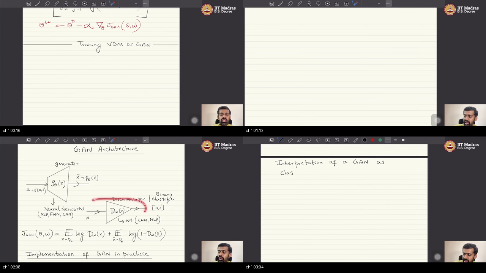
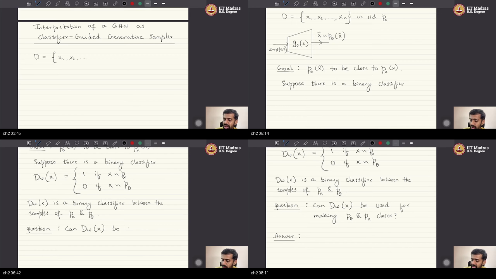
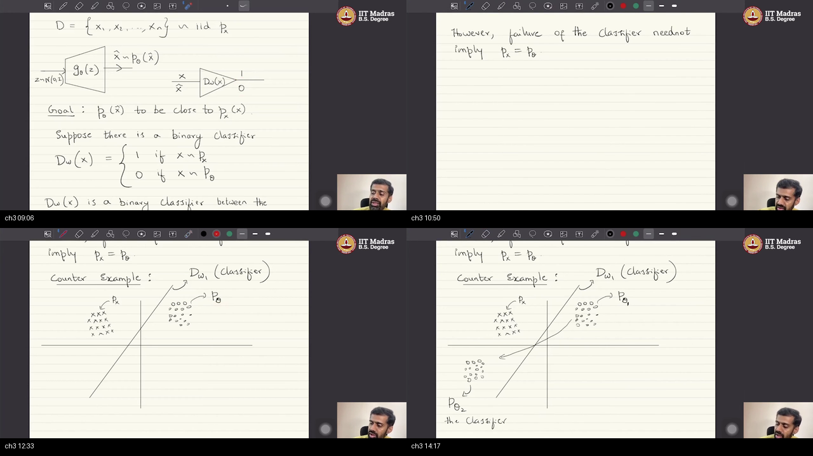
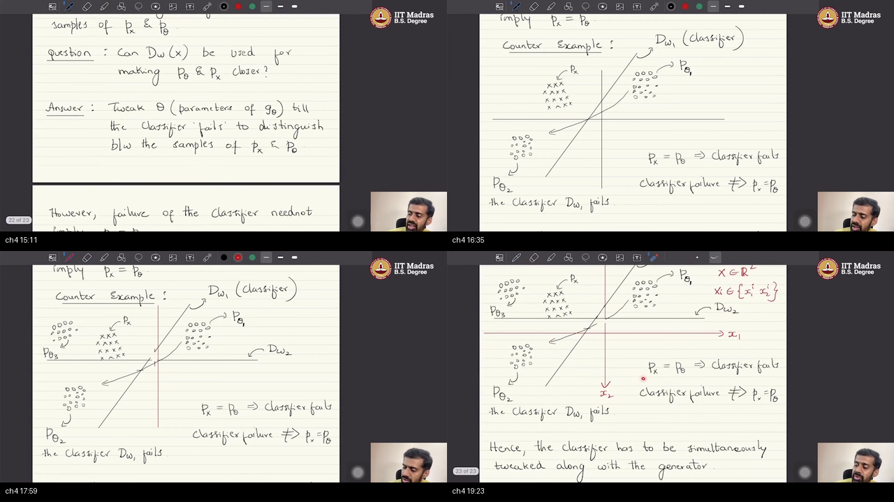
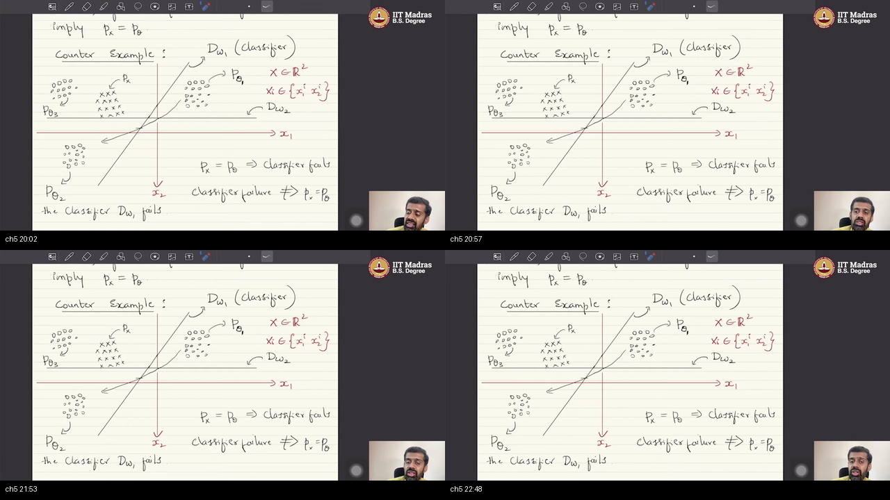
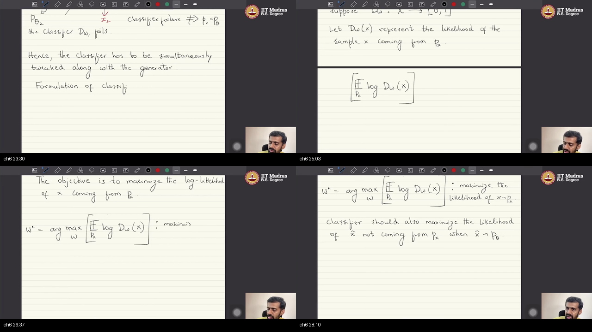
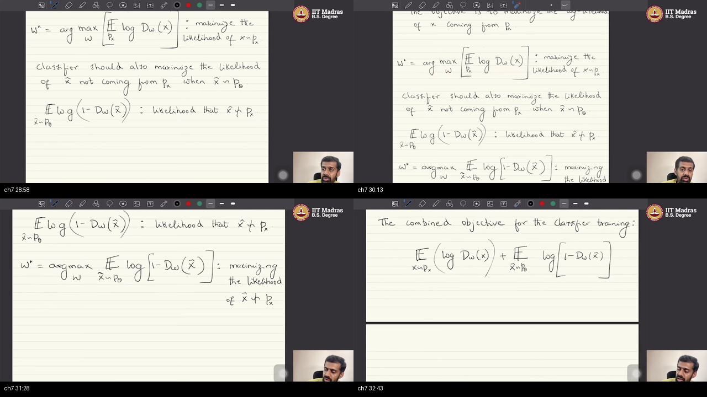
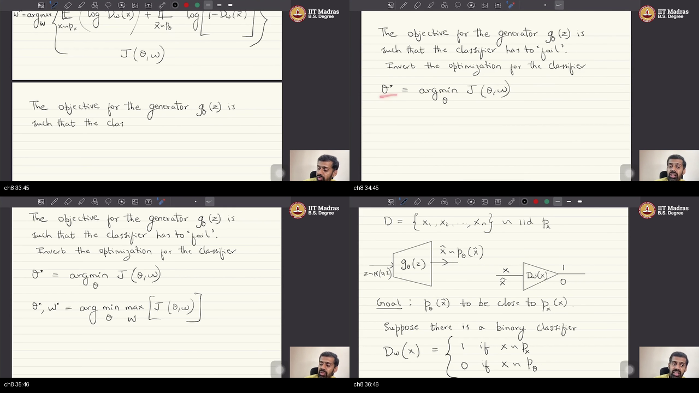

# W3L8: GANs as Classifier-Guided Generative Sampler

> **Prerequisites first:** Before reading these notes, study [PREREQUISITES.md](./PREREQUISITES.md) for foundational concepts on probability densities, neural samplers, binary cross-entropy, and minimax games.

---

## Table of Contents

- [Executive Summary — architecture of this lecture](#executive-summary--architecture-of-this-lecture)
- [Topic 1: From VDM Lower Bounds to Classifier-Guided Sampling (00:00–03:20)](#topic-1-from-vdm-lower-bounds-to-classifier-guided-sampling-00000320)
- [Topic 2: The Naive Heuristic: Guiding Generation with a Fixed Classifier (03:20–08:37)](#topic-2-the-naive-heuristic-guiding-generation-with-a-fixed-classifier-03200837)
- [Topic 3: The Logical Trap and the 2D Counter-Example (08:37–14:47)](#topic-3-the-logical-trap-and-the-2d-counter-example-08371447)
- [Topic 4: Dynamic Co-Evolution: Jointly Updating Generator and Classifier (14:47–19:47)](#topic-4-dynamic-co-evolution-jointly-updating-generator-and-classifier-14471947)
- [Topic 5: Oscillations, Limit Cycles, and Mode Collapse in the Joint Game (19:47–23:04)](#topic-5-oscillations-limit-cycles-and-mode-collapse-in-the-joint-game-19472304)
- [Topic 6: Formal Classifier Objectives: Real Log-Likelihood and Fake Rejection (23:04–28:37)](#topic-6-formal-classifier-objectives-real-log-likelihood-and-fake-rejection-23042837)
- [Topic 7: The Unified Value Function J(θ, w) and the VDM Lower-Bound Bridge (28:37–33:05)](#topic-7-the-unified-value-function-jθ-w-and-the-vdm-lower-bound-bridge-28373305)
- [Topic 8: The Minimax Adversarial Game and JS Specificity (33:05–41:29)](#topic-8-the-minimax-adversarial-game-and-js-specificity-33054129)
- [External references](#external-references)
- [Sources](#sources)

---

## Executive Summary — architecture of this lecture

This lecture establishes the dual interpretation of Generative Adversarial Networks (GANs) as classifier-guided neural samplers. It installs the method: a dynamic discriminator classifies real from synthetic data, herding the generator across feature space. It proves why a static classifier fails through a 2D counter-example, requiring simultaneous co-evolution. Finally, it unifies the minimax objective with the Variational Divergence Minimization (VDM) lower bound on Jensen–Shannon divergence.

**Worldview arc:** From viewing GANs as an abstract convex-conjugate lower bound on $f$-divergence to dynamic classifier-guided sampling.

### System Context

```
   ┌─────────────────────────────────────────────────────────────────────────┐
   │                          PREVIOUS LECTURES                              │
   │  W1-W2: f-Divergence D_f(p_x ║ p_θ) ──► Fenchel Dual Lower Bound T(x)   │
   └────────────────────────────────────┬────────────────────────────────────┘
                                        │
                                        ▼ (Dual Perspective)
   ┌─────────────────────────────────────────────────────────────────────────┐
   │                     THIS LECTURE (W3L8 ARCHITECTURE)                    │
   │  Discriminator as Binary Classifier D_w(x) ──► Minimax Herding Game     │
   │  Real Data (px) vs Fake Data (p_θ) ──► Joint Dynamic Co-Evolution       │
   └────────────────────────────────────┬────────────────────────────────────┘
                                        │
                                        ▼ (Next Modules)
   ┌─────────────────────────────────────────────────────────────────────────┐
   │                          UPCOMING LECTURES                              │
   │  W3-W4: Stabilizing Architectures (DCGAN, cGAN) ──► Metric Shift (WGAN) │
   └─────────────────────────────────────────────────────────────────────────┘
```

### Main Blueprint: The Classifier-Guided Sampling Architecture

```
                                  DATA ENVIRONMENT
               True Data Dataset: D = {x₁, ..., x_N} ~ p_x ⊂ R^d
                                        │
                       ┌────────────────┴────────────────┐
                       │                                 │
                       ▼                                 ▼
           ┌───────────────────────┐         ┌───────────────────────┐
           │ Real Sample Stream x  │         │ Latent Noise z ~ p_z  │
           │  (Drawn from p_x)     │         │   z ~ N(0, I) ⊂ R^k   │
           └───────────┬───────────┘         └───────────┬───────────┘
                       │                                 │
                       │                                 ▼
                       │                     ┌───────────────────────┐
                       │                     │ Generator Network G_θ │
                       │                     │   x̂ = G_θ(z) ~ p_θ    │
                       │                     └───────────┬───────────┘
                       │                                 │
                       │     Fake Sample Stream x̂        │
                       │     (Drawn from p_θ)            │
                       │ ◄───────────────────────────────┘
                       │
                       ▼
        ┌─────────────────────────────────────────────────┐
        │       BINARY DISCRIMINATOR / CLASSIFIER D_w     │
        │   Maps x ↦ D_w(x) ∈ [0, 1] (Posterior Likelihood)│
        │   Objective: Classify Real (Y=1) vs Fake (Y=0)  │
        └──────────────┬───────────────────┬──────────────┘
                       │                   │
         [Real Branch] │                   │ [Fake Branch]
                       ▼                   ▼
        ┌───────────────────────┐ ┌───────────────────────┐
        │  Log-Likelihood Real  │ │ Log-Likelihood Fake   │
        │   E_x [log D_w(x)]    │ │ E_x̂ [log(1 - D_w(x̂))]│
        └───────────┬───────────┘ └───────────┬───────────┘
                    │                         │
                    └────────────┬────────────┘
                                 │
                                 ▼
        ┌─────────────────────────────────────────────────┐
        │          UNIFIED VALUE FUNCTION J(θ, w)         │
        │  J(θ,w) = E_x[log D_w(x)] + E_z[log(1-D_w(G(z)))]│
        └──────────────┬───────────────────┬──────────────┘
                       │                   │
      Adversarial Max  │                   │ Adversarial Min
      (Tighten Bound)  ▼                   ▼ (Fool Classifier)
        ┌───────────────────────┐ ┌───────────────────────┐
        │  Discriminator Step   │ │    Generator Step     │
        │   w* = argmax_w J     │ │   θ* = argmin_θ J     │
        │ (Boundary Realignment)│ │ (Cluster Relocation)  │
        └───────────────────────┘ └───────────────────────┘
                       │                   │
                       └─────────►◄────────┘
                                 │
                                 ▼
        ┌─────────────────────────────────────────────────┐
        │            MINIMAX SADDLE POINT GAME            │
        │             min_θ max_w J(θ, w)                 │
        │    Equilibrium: p_θ = p_x  &  D_w*(x) = 1/2     │
        └─────────────────────────────────────────────────┘
```

### Scenario Walkthrough: Training Dynamics Across 2D Feature Space

1. **Initialization:** Generator starts with arbitrary weights $\theta_1$, outputting a point cloud $p_{\theta_1}$ far from real data $p_x$.
2. **Discriminator Assessment ($D_{w_1}$):** Discriminator trains to separate $p_x$ (label 1) and $p_{\theta_1}$ (label 0), forming an optimal separating boundary.
3. **Generator Update ($\theta_1 \to \theta_2$):** Generator takes gradient descent steps along $-\nabla_\theta J(\theta, w_1)$, shifting its output cloud to $p_{\theta_2}$ to maximize classifier confusion.
4. **Boundary Update ($D_{w_1} \to D_{w_2}$):** Discriminator retrains on the new fake positions $p_{\theta_2}$, pivoting the decision boundary to re-separate the clouds.
5. **Progressive Herding:** Iterating this min-max feedback loop continuously herds the generated distribution toward $p_x$.
6. **Indistinguishability Equilibrium:** When $p_\theta$ covers $p_x$, the optimal classifier output collapses to $D^*(x) = 0.5$ everywhere.

### Failure Paths and Pathology Callout

```
  [FAILURE PATH 1: Fixed Classifier Exploit]
  Static Classifier D_w1 ──► Generator moves across boundary to p_θ2 ──► Classifier fails, but p_θ2 ≠ p_x!

  [FAILURE PATH 2: Rotational Limit Cycle]
  p_θ1 (fool D_w1) ──► D_w2 separates p_θ2 ──► Generator flips back to p_θ1 ──► Infinite Orbit / Mode Collapse!
```

### STOP / Out of Scope for this Lecture

- **DCGAN Convolutional Principles:** Stride-2 convolutions, batch normalization, and LeakyReLU architectures (deferred to W3L9).
- **Conditional GANs (cGAN):** Concatenating class label conditioning vectors $y$ to $G$ and $D$ (deferred to W3L9).
- **Wasserstein Metric & Lipschitz Critic:** Earth-Mover distance and gradient penalties solving vanishing gradient saturation (deferred to Week 4).
- **Variational Autoencoders (VAEs) & Diffusion:** Explicit latent integrals, ELBO, and score-based reverse SDEs (deferred to Weeks 5–9).

### Load-Bearing Claims

1. **Dual Interpretation:** GANs are simultaneously a variational lower bound on Jensen–Shannon divergence and a classifier-guided neural sampler.
2. **Converse Fallacy:** Classifier confusion is a necessary condition for distribution matching ($p_\theta = p_x \implies D \text{ fails}$), but it is never sufficient on its own ($D \text{ fails} \not\implies p_\theta = p_x$).
3. **2D Geometry of Failure:** A fixed linear classifier can be 100% defeated by simply translating a generated cluster across the separating hyperplane, without coming anywhere near the real data support.
4. **Dynamic Co-Evolution:** The discriminator must be updated continuously alongside the generator to close exploit regions and herd the distribution.
5. **Periodic Orbits:** Simultaneous gradient updates in zero-sum games often produce rotational limit cycles rather than converging to saddle points, directly causing mode collapse.
6. **Unified Classification Functional:** The two-player objective $J(\theta, w) = \mathbb{E}_{x \sim p_x}[\log D_w(x)] + \mathbb{E}_{z \sim p_z}[\log(1 - D_w(G_\theta(z)))]$ represents joint real log-likelihood maximization and fake rejection log-likelihood maximization.
7. **JS Specificity:** The interpretation of the variational witness as a standard $[0, 1]$ binary classifier is unique to the Jensen–Shannon $f$-divergence and fails for general $f$-divergences.

**Course & Instructor:** IIT Madras BS in Data Science (BSDA5002) · Prof. Prathosh A P (EECS, IISc Bangalore).

---

## Topic 1: From VDM Lower Bounds to Classifier-Guided Sampling (00:00–03:20)

### Where this sits on the master map

This topic opens the lecture by establishing the conceptual bridge from Variational Divergence Minimization (VDM) to the classifier-guided perspective of generative adversarial learning. If you need to review how variational bounds circumvent intractable integrals, review the [VDM convex duality warm-up](./PREREQUISITES.md#p5-vdm-duality).

```
   Master Map:
  ┌────────────────────────┐      ┌────────────────────────┐
  │ [TOPIC 1: VDM BRIDGE]  │ ───► │ Topic 2: Naive Setup   │ ───► ... ───► Minimax Equilibrium
  │ Convex Dual to Sampler │      │ Binary Classifier D_w  │
  └────────────────────────┘      └────────────────────────┘
```

### Board / screenshot



*The instructor recaps the Variational Divergence Minimization (VDM) framework, writing the generator mapping $G_\theta(z)$ from Gaussian noise to $p_\theta(x)$ and introducing the new agenda: interpreting GANs through the lens of classifier guidance.*

### What he is establishing

In the preceding sessions, generative modeling was framed as a fundamental distribution estimation problem: given finite empirical observations $D = \{x_1, \dots, x_N\} \subset \mathbb{R}^d$ drawn from an unknown target distribution $p_x$, we construct a parameterized generator model $G_\theta$. The generator takes an arbitrary source random variable $z \sim \mathcal{N}(0, I)$ and transforms it into the target random variable of interest, producing a synthetic pushforward distribution $p_\theta(x)$.

The objective is to make the model distribution $p_\theta$ identical to $p_x$ by minimizing an $f$-divergence $D_f(p_x \parallel p_\theta) = \int p_\theta(x) f\left(\frac{p_x(x)}{p_\theta(x)}\right) dx$. The wrong move is attempting to evaluate or differentiate this integral directly, which fails because neither $p_x(x)$ nor $p_\theta(x)$ is analytically accessible. The right move is constructing a variational lower bound via Fenchel convex duality, parameterized by a neural network witness $T(x)$:

$$D_f(p_x \parallel p_\theta) \ge \sup_{T \in \mathcal{T}} \left\{ \mathbb{E}_{x \sim p_x}[T(x)] - \mathbb{E}_{x \sim p_\theta}[f^*(T(x))] \right\}$$

Training alternates between maximizing the lower bound with respect to discriminator weights $w$ and minimizing the divergence with respect to generator weights $\theta$.

You can now view this entire generative model through a powerful dual interpretation: instead of seeing GANs merely as abstract convex duality, we interpret them as a **classifier-guided generative sampler**. What is still missing is formalizing the exact binary classification setup and proving whether a simple classifier is sufficient to guide the generator.

### Analogy for this topic only

Consider an apprentice sculptor trying to replicate a masterpiece hidden behind a curtain. The sculptor cannot measure the original statue directly. Instead, an art critic inspects both the master's work and the apprentice's rough clay replica, delivering specific critique notes on where the contours diverge.

Why does the apprentice fail if the critic only examines one angle? Because the apprentice will fix that single angle while leaving the back distorted.

*In lecture words:* The apprentice is generator $G_\theta$, the critic is discriminator $D_w$, and the sculpting iterations are the alternating minimax updates.

### Local picture

```
   VARIATIONAL DIVERGENCE MINIMIZATION (VDM) PIPELINE
   ──────────────────────────────────────────────────
   Source Noise z ~ N(0, I) ──► [ Generator G_θ ] ──► Synthetic Cloud p_θ(x)
                                                            │
                                  ┌─────────────────────────┴─────────────────────────┐
                                  ▼                                                   ▼
   True Dataset D ~ p_x(x)  ──► [ E_x[T(x)] ]                               [ E_x̂[f*(T(x̂))] ]
                                  │                                                   │
                                  └─────────────────────────┬─────────────────────────┘
                                                            ▼
                                                 Variational Lower Bound
                                               J(θ, w) ≤ D_f(p_x ║ p_θ)
                                                            │
                                        ┌───────────────────┴───────────────────┐
                                        ▼                                       ▼
                              Discriminator Step                      Generator Step
                             max_w J(θ, w) [Tighten]                 min_θ J(θ, w) [Align]

   Notice: The critic T(x) converts an intractable continuous density ratio into
   an empirical expectation over sample batches.
```

### Bridge

Having established the VDM foundation and motivated the classifier-guided perspective, the immediate leftover problem is: how do we formalize a binary classifier as a generative guide, and what happens if we attempt to use a standard fixed classifier?

---

## Topic 2: The Naive Heuristic: Guiding Generation with a Fixed Classifier (03:20–08:37)

### Where this sits on the master map

This topic introduces the binary classification setup for generative modeling and formulates the naive single-classifier optimization strategy. For a reminder on how decision boundaries partition feature space, see the [classification boundary warm-up](./PREREQUISITES.md#p3-classification-boundary).

```
   Master Map:
  ┌────────────────────────┐      ┌────────────────────────┐      ┌────────────────────────┐
  │ Topic 1: VDM Bridge    │ ───► │ [TOPIC 2: NAIVE SETUP] │ ───► │ Topic 3: 2D Trap       │
  │ Dual Interpretation    │      │ Fixed Classifier D_w   │      │ Counter-Example        │
  └────────────────────────┘      └────────────────────────┘      └────────────────────────┘
```

### Board / screenshot



*The instructor sketches the binary classification problem setting, defining the classifier $D_w(x)$ mapping real data to label 1 and synthetic data to label 0, posing the core question of whether a fixed classifier can steer $p_\theta$ to $p_x$.*

### What he is establishing

We formalize the classifier-guided setup in concrete mathematical terms. We are given an empirical dataset $D = \{x_1, x_2, \dots, x_N\} \subset \mathbb{R}^d$ drawn i.i.d. from true distribution $p_x$, and a generator $G_\theta(z)$ producing synthetic samples $\hat{x} \sim p_\theta$ from noise $z \sim \mathcal{N}(0, I)$.

We define a binary classifier $D_w: \mathbb{R}^d \to \{0, 1\}$ with weights $w$:
- For real data $x \sim p_x$, $D_w(x) = 1$.
- For fake data $\hat{x} \sim p_\theta$, $D_w(\hat{x}) = 0$.

The core question is: can this binary classifier be used to force $p_\theta$ to match $p_x$?

The proposed naive strategy is: pre-train a classifier $D_w$ to separate real from fake samples, freeze $w$, and tweak generator parameters $\theta$ until $D_w$ fails to distinguish between $p_x$ and $p_\theta$. The wrong move is assuming that classifier failure automatically implies success. The right move is recognizing that while $p_\theta \to p_x$ forces the classifier to fail (random guessing at $50\%$ error rate), the converse is not guaranteed.

You can now state the forward condition: if distributions match, any classifier will fail. What is still missing is proving whether classifier failure guarantees distribution convergence.

### Analogy for this topic only

Imagine a customs inspector examining luggage for contraband using a fixed checklist of five visual flaws. The counterfeiter modifies their manufacturing process until this specific inspector cannot find those five flaws.

Can the counterfeiter be sure the luggage is genuine just because this single inspector found no flaws? No, because the luggage might have glaring flaws that this particular inspector never checks.

*In lecture words:* The luggage maker is $G_\theta$, the inspector is $D_w$, genuine bags are $p_x$, and counterfeit bags are $p_\theta$.

### Local picture

```
   THE NAIVE FIXED-CLASSIFIER HYPOTHESIS
   ─────────────────────────────────────
   True Data x ~ p_x     ───► [ Label = 1 ]
                                    │
                                    ├───► [ Train Fixed Classifier D_w ]
                                    │
   Fake Data x̂ ~ p_θ     ───► [ Label = 0 ]
                                    │
                                    ▼
                           [ Freeze Classifier D_w ]
                                    │
                                    ▼
                  [ Tweak Generator θ to maximize confusion ]
                                    │
                                    ▼
                        Does Classifier Failure imply p_θ = p_x?
                                  /   \
                          YES?   /     \   NO! (Logical Fallacy)
                         (Naive Hope)   (See Topic 3)

   Notice: The forward implication holds (p_θ = p_x => D_w fails), but
   relying on a frozen classifier opens dangerous blind spots.
```

### Bridge

While identical distributions will always cause a classifier to fail, we must test whether classifier failure guarantees that $p_\theta$ matches $p_x$. The next topic proves this mathematically and geometrically.

---

## Topic 3: The Logical Trap and the 2D Counter-Example (08:37–14:47)

### Where this sits on the master map

This topic exposes the fatal flaw of the fixed-classifier heuristic through a rigorous geometric counter-example in $\mathbb{R}^2$. To review how linear hyperplanes slice vector spaces, revisit the [classification boundary warm-up](./PREREQUISITES.md#p3-classification-boundary).

```
   Master Map:
  ┌────────────────────────┐      ┌────────────────────────┐      ┌────────────────────────┐
  │ Topic 2: Naive Setup   │ ───► │ [TOPIC 3: 2D TRAP]     │ ───► │ Topic 4: Dynamic Update│
  │ Fixed Classifier D_w   │      │ Geometric Proof        │      │ Co-Evolution Principle │
  └────────────────────────┘      └────────────────────────┘      └────────────────────────┘
```

### Board / screenshot



*The instructor draws a 2D coordinate plane $(x_1, x_2)$, plotting real data crosses, fake data dots $P_{\theta_1}$, the separating line $D_{w_1}$, and shows how the optimizer cheats by translating the cluster to $P_{\theta_2}$ across the boundary.*

### What he is establishing

The core mathematical realization is a fundamental logical fallacy: **the failure of a classifier does not imply that the distributions are equal ($D_w \text{ fails} \not\implies p_\theta = p_x$).**

To prove this, consider a counter-example in $\mathbb{R}^2$ with coordinates $x = (x_1, x_2)^T$. True data $p_x$ forms a cluster of crosses in the upper-left, while initial fake data $p_{\theta_1}$ forms a cluster of dots in the lower-right. A linear classifier $D_{w_1}$ forms a hyperplane dividing the plane into a positive half-space ($D_{w_1} = 1$) and a negative half-space ($D_{w_1} = 0$).

The wrong move is fixing $D_{w_1}$ and optimizing $\theta$. Gradient descent simply shifts the generated cluster from $p_{\theta_1}$ across the line $D_{w_1}$ into an empty portion of the positive half-space at location $p_{\theta_2}$. At $p_{\theta_2}$, the classifier outputs $1$ for all fake samples, so the classifier fails completely ($100\%$ error on fakes). The right move is recognizing that $p_{\theta_2}$ and $p_x$ share zero overlap—the generator has merely exploited an empty acceptance region.

You can now prove geometrically why fixed classifiers fail. What is still missing is designing an algorithm that eliminates these static blind spots.

### Analogy for this topic only

Consider a bank security detector that tests counterfeit bills by checking for magnetic ink. A counterfeiter adds cheap magnetic ink to plain cardboard bills.

Does the detector passing the cardboard bill mean authentic currency was created? No, the detector failed completely while the fake remains utterly bogus.

*In lecture words:* The cardboard bill is $p_{\theta_2}$, authentic cash is $p_x$, and the magnetic detector is $D_{w_1}$.

### Local picture

```
   THE GEOMETRIC ADVERSARIAL CHEAT IN R^2
   ──────────────────────────────────────
   Feature Coordinates: x = (x₁, x₂) ∈ R²
   
   Region A [Above D_w1]: Classifier Output = 1 (Real)
   Region B [Below D_w1]: Classifier Output = 0 (Fake)

   Step 1: Real p_x ∈ Region A   |   Fake p_θ1 ∈ Region B   ===> D_w1 Accuracy = 100%
   Step 2: Generator updates θ1 ──► θ2
   Step 3: Fake p_θ2 ∈ Region A (Far from p_x)              ===> D_w1 Accuracy = 0% on fakes

   Metric Check:
   ┌──────────────────────┬──────────────────────┬──────────────────────────────┐
   │ Configuration        │ Classifier Error     │ Distribution Match ||p_x-p_θ||│
   ├──────────────────────┼──────────────────────┼──────────────────────────────┤
   │ Initial (p_θ1)       │ 0% (Perfect D)       │ High Error (Distributions far)│
   │ Cheated (p_θ2)       │ 100% (D Fails!)      │ High Error (Still far apart!) │
   │ Optimal (p_θ = p_x)  │ 50% (Bayes Chance)   │ Zero Error (Perfect Match)    │
   └──────────────────────┴──────────────────────┴──────────────────────────────┘

   Notice: D_w1 failing at p_θ2 produces zero distribution overlap!
```

### Bridge

The geometric counter-example proves that static classifiers are useless. How do we prevent the generator from exploiting empty acceptance regions?

---

## Topic 4: Dynamic Co-Evolution: Jointly Updating Generator and Classifier (14:47–19:47)

### Where this sits on the master map

This topic introduces the principle of dynamic co-evolution, showing how alternating updates eliminate static blind spots. To see why continuous retraining turns classification into an active herding mechanism, follow the [minimax game warm-up](./PREREQUISITES.md#p6-minimax-games).

```
   Master Map:
  ┌────────────────────────┐      ┌────────────────────────┐      ┌────────────────────────┐
  │ Topic 3: 2D Trap       │ ───► │ [TOPIC 4: CO-EVOLUTION]│ ───► │ Topic 5: Instabilities │
  │ Static Blind Spots     │      │ Simultaneous Updating  │      │ Limit Cycles & Collapse│
  └────────────────────────┘      └────────────────────────┘      └────────────────────────┘
```

### Board / screenshot



*The instructor illustrates the iterative chase: after the generator moves to $P_{\theta_2}$, the classifier updates its boundary to $D_{w_2}$, forcing the generator to migrate to $P_{\theta_3}$, progressively herding $p_\theta$ toward $p_x$.*

### What he is establishing

To close static blind spots, the classifier must be updated simultaneously and dynamically alongside the generator.

The dynamic co-evolution operates as an alternating feedback loop:
1. Generator moves from $p_{\theta_1}$ across $D_{w_1}$ to $p_{\theta_2}$.
2. Discriminator retrains on the new fake cluster $p_{\theta_2}$ and real data $p_x$, rotating its boundary to $D_{w_2}$.
3. Under $D_{w_2}$, the fake cluster $p_{\theta_2}$ is penalized again (classified as 0), forcing the generator to move to $p_{\theta_3}$.
4. The discriminator updates to $D_{w_3}$, cutting off the new escape route.

The wrong move is treating classifier training as a one-off pre-processing step. The right move is alternating discriminator retraining with generator updates. The only stationary state is where $p_\theta$ overlaps $p_x$ everywhere, forcing the optimal discriminator to output $D^*(x) = 0.5$ across the entire support.

You can now understand the dynamic herding principle. What is still missing is analyzing the pathological failure modes of this alternating optimization.

### Analogy for this topic only

Consider a game of cat-and-mouse in an open field. If the cat sits in one spot, the mouse runs behind a rock and stays safe. But if the cat chases the mouse every time it moves, the mouse is forced toward the burrow.

What happens if the mouse finds two rocks and runs between them in a circle? It avoids the burrow indefinitely.

*In lecture words:* The mouse is generator $p_\theta$, the cat is discriminator $D_w$, and the burrow is true data support $p_x$.

### Local picture

```
   THE DYNAMIC CO-EVOLUTIONARY LOOP
   ────────────────────────────────
   
   ┌────────────────────────────────────────────────────────┐
   │                                                        │
   │   1. Generator produces samples p_θk                   │
   │      │                                                 │
   │      ▼                                                 │
   │   2. Discriminator updates w: D_wk separates px, p_θk  │
   │      │                                                 │
   │      ▼                                                 │
   │   3. Generator updates θ: p_θ(k+1) fools D_wk          │
   │      │                                                 │
   │      ▼                                                 │
   │   4. Are distributions identical? (p_θ = px?)          │
   │         │                                              │
   │         ├─ NO  ──► Repeat from Step 2 (Chase continues)│
   │         │                                              │
   │         └─ YES ──► D*(x) = 0.5 Everywhere (Equilibrium)│
   │                                                        │
   └────────────────────────────────────────────────────────┘

   Notice: The generator is progressively boxed in until the only surviving
   strategy is exact distribution matching.
```

### Bridge

Although dynamic co-evolution guarantees distribution matching at equilibrium, alternating gradient updates in non-convex games can enter pathological limit cycles.

---

## Topic 5: Oscillations, Limit Cycles, and Mode Collapse in the Joint Game (19:47–23:04)

### Where this sits on the master map

This topic examines the pathological failure modes of adversarial training, analyzing why alternating optimization can fail to reach the saddle point. To understand how saddle points differ from standard convex minima, review the [minimax game warm-up](./PREREQUISITES.md#p6-minimax-games).

```
   Master Map:
  ┌────────────────────────┐      ┌────────────────────────┐      ┌────────────────────────┐
  │ Topic 4: Co-Evolution  │ ───► │ [TOPIC 5: COLLAPSE]    │ ───► │ Topic 6: Formulation   │
  │ Dynamic Iteration      │      │ Limit Cycles & Traps   │      │ Real & Fake Likelihood │
  └────────────────────────┘      └────────────────────────┘      └────────────────────────┘
```

### Board / screenshot



*The instructor illustrates the rotational limit cycle pathology: the generator bounces back and forth between states $P_{\theta_1}$ and $P_{\theta_2}$ while the classifier alternates between $D_{w_1}$ and $D_{w_2}$, causing mode collapse and eternal oscillation.*

### What he is establishing

Alternating gradient descent-ascent does not guarantee convergence in non-convex, non-concave games. Instead, parameters frequently enter **rotational limit cycles (periodic orbits)**.

Work a concrete scene in $\mathbb{R}^2$: suppose true data $p_x$ consists of two distinct Gaussian modes centered at coordinates $\mu_1 = (2, 2)$ and $\mu_2 = (-2, -2)$. The generator begins at $p_{\theta_1} = (2, -2)$. 
1. The discriminator draws boundary $D_{w_1}$ separating true modes from $(2, -2)$.
2. The generator takes a gradient step and moves to $p_{\theta_2} = (-2, 2)$ to fool $D_{w_1}$.
3. The discriminator updates to $D_{w_2}$, placing its decision line to isolate $(-2, 2)$.
4. The generator flips directly back to $p_{\theta_1} = (2, -2)$ to fool $D_{w_2}$.
5. The discriminator returns to $D_{w_1}$, locking the optimization in an eternal orbit ($p_{\theta_1} \leftrightarrow p_{\theta_2}$) without ever placing probability mass on the true modes at $(2, 2)$ or $(-2, -2)$.

This dynamic pathology causes **mode collapse**, where the generator outputs samples from only one narrow mode or cycles between isolated regions. In VDM terms, a weak discriminator represents a loose lower bound; the wrong move is assuming that decreasing a loose lower bound reduces the true divergence. The right move is recognizing that the generator exploits the looseness of the bound.

You can now diagnose limit cycles and mode collapse. What is still missing is formulating the exact mathematical cross-entropy loss functions for the classifier.

### Analogy for this topic only

Imagine two sports teams repeatedly playing each other. Team A runs an all-offense strategy. Team B switches to an all-defense strategy. Team A counters with high-tempo pressing. Team B switches back to counter-attacking.

Why do the teams never reach a balanced strategy? Because each team optimizes purely against the opponent's previous game.

*In lecture words:* The cycling strategies are limit cycles in parameter space $(\theta_t, w_t)$ orbiting the saddle point.

### Local picture

```
   VDM BOUND DISCONNECT & SADDLE-POINT DRIFT
   ─────────────────────────────────────────
   Divergence Value
        ▲
        │    True Divergence D_f(p_x ║ p_θ)  [Remains High / Unchanged!]
        │    ═══════════════════════════════════════════════════════════
        │
        │    Loose Lower Bound J(θ, w)       [Artificially Decreases!]
        │    ───────\               /───────
        │            \             /
        │             \___________/  <--- Generator exploits weak critic!
        └─────────────────────────────────────────────────────────────► Iterations

   Notice: Minimizing a loose lower bound does not minimize the true divergence!
```

### Bridge

With the dynamics and failure modes established, we now write down the explicit mathematical objective functions governing classifier training.

---

## Topic 6: Formal Classifier Objectives: Real Log-Likelihood and Fake Rejection (23:04–28:37)

### Where this sits on the master map

This topic derives the mathematical loss functions for the discriminator from first principles of probability and maximum likelihood estimation. To review log-likelihood curves, consult the [binary cross-entropy warm-up](./PREREQUISITES.md#p4-cross-entropy).

```
   Master Map:
  ┌────────────────────────┐      ┌────────────────────────┐      ┌────────────────────────┐
  │ Topic 5: Instabilities │ ───► │ [TOPIC 6: FORMULATION] │ ───► │ Topic 7: Unified J     │
  │ Cycles & Mode Collapse │      │ Real & Fake Likelihood │      │ VDM Lower-Bound Bridge │
  └────────────────────────┘      └────────────────────────┘      └────────────────────────┘
```

### Board / screenshot



*The instructor derives the two probabilistic objectives for the classifier: maximizing the expected log-likelihood for real data $\mathbb{E}_{p_x}[\log D_w(x)]$ and maximizing the rejection log-likelihood for generated data $\mathbb{E}_{p_\theta}[\log(1 - D_w(\hat{x}))]$.*

### What he is establishing

We formalize the discriminator as a neural network $D_w: \mathcal{X} \to [0, 1]$ outputting the posterior likelihood $D_w(x) = P(\text{Real} \mid x)$.

Discriminator training requires two probabilistic objectives:
1. **Real Data Log-Likelihood:** For real samples $x \sim p_x$, maximize the expected log-likelihood of positive classification:
   $$\max_w \mathbb{E}_{x \sim p_x}[\log D_w(x)]$$
2. **Fake Data Rejection Log-Likelihood:** For generated samples $\hat{x} \sim p_\theta$, the probability of being fake is $1 - D_w(\hat{x})$. We maximize the expected log-likelihood of rejection:
   $$\max_w \mathbb{E}_{\hat{x} \sim p_\theta}[\log(1 - D_w(\hat{x}))]$$

The wrong move is evaluating both expectations over the same distribution. The right move is evaluating the real term over $p_x$ and the fake term over $p_\theta$.

You can now formulate both branches of the binary cross-entropy discriminator loss. What is still missing is combining them into a single value functional and connecting it to VDM.

### Analogy for this topic only

Consider a quality-control inspector testing factory widgets. The inspector has two distinct scoring rules: rewarding correct identification of flawless widgets, and penalizing any defective widget that slips through unflagged.

Why must both error types be penalized symmetrically? If only flaws are penalized, the inspector could reject every widget; if only successes are rewarded, the inspector could accept every widget.

*In lecture words:* Genuine widgets are $x \sim p_x$, defective widgets are $\hat{x} \sim p_\theta$, and the two scoring rules are $\mathbb{E}[\log D]$ and $\mathbb{E}[\log(1-D)]$.

### Local picture

```
   THE DUAL CLASSIFICATION OBJECTIVES
   ──────────────────────────────────
   
   Real Data Stream: x ~ p_x ──► [ D_w(x) ] ──► [ log D_w(x) ] ──► Maximize E_px[log D_w(x)]
                                                                           ▲
                                                                           │ (Combined w*)
                                                                           ▼
   Fake Data Stream: x̂ ~ p_θ ──► [ D_w(x̂) ] ──► [ log(1 - D_w(x̂)) ] ──► Maximize E_pθ[log(1 - D_w(x̂))]

   Worked Micro-Loss Numbers:
   ┌──────────────────────┬──────────────┬──────────────┬──────────────────────────────┐
   │ Sample Type          │ D_w Output   │ Active Loss  │ Loss Value (Penalty)         │
   ├──────────────────────┼──────────────┼──────────────┼──────────────────────────────┤
   │ Real Sample x        │ 0.95 (Real)  │ log(0.95)    │ -0.051 (Minimal penalty)     │
   │ Real Sample x        │ 0.05 (Fake!) │ log(0.05)    │ -2.996 (Severe penalty!)     │
   │ Fake Sample x̂        │ 0.05 (Fake)  │ log(1 - 0.05)│ -0.051 (Minimal penalty)     │
   │ Fake Sample x̂        │ 0.95 (Real!) │ log(1 - 0.95)│ -2.996 (Severe penalty!)     │
   └──────────────────────┴──────────────┴──────────────┴──────────────────────────────┘

   Notice: The symmetric logarithmic penalty harshly punishes classification errors
   on both real and generated samples.
```

### Bridge

Now that both likelihood terms are derived, we combine them into the unified objective $J(\theta, w)$ and prove its exact equivalence to the VDM lower bound.

---

## Topic 7: The Unified Value Function J(θ, w) and the VDM Lower-Bound Bridge (28:37–33:05)

### Where this sits on the master map

This topic unifies the dual likelihood terms into the scalar functional $J(\theta, w)$ and proves its mathematical equivalence to the Fenchel lower bound of Jensen–Shannon divergence. For the underlying density-ratio proof, revisit the [density ratio warm-up](./PREREQUISITES.md#p7-density-ratio-jsd).

```
   Master Map:
  ┌────────────────────────┐      ┌────────────────────────┐      ┌────────────────────────┐
  │ Topic 6: Formulation   │ ───► │ [TOPIC 7: UNIFIED J]   │ ───► │ Topic 8: Minimax Game  │
  │ Real & Fake Likelihood │      │ VDM Lower Bound Bridge │      │ JS Specificity & Wrap  │
  └────────────────────────┘      └────────────────────────┘      └────────────────────────┘
```

### Board / screenshot



*The instructor writes the combined objective function $J(\theta, w)$ for discriminator training and demonstrates that this cross-entropy loss is mathematically identical to the variational lower bound constructed for the $f$-divergence in VDM.*

### What he is establishing

Combining the real and fake likelihood objectives yields the unified value function $J(\theta, w)$:

$$J(\theta, w) = \mathbb{E}_{x \sim p_x}[\log D_w(x)] + \mathbb{E}_{z \sim p_z}[\log(1 - D_w(G_\theta(z)))]$$

The optimal discriminator weights maximize this functional: $w^* = \arg\max_w J(\theta, w)$.

The critical insight is that $J(\theta, w)$ is mathematically identical to the VDM lower bound on the Jensen–Shannon divergence. When choosing $f(u) = u \log u - (u+1)\log((u+1)/2)$, the Fenchel conjugate is $f^*(t) = -\log(1 - e^t)$. Setting $T(x) = \log D_w(x)$ produces the exact cross-entropy loss. The wrong move is thinking GAN loss is an ad-hoc heuristic; the right move is recognizing it as a rigorous variational lower bound.

You can now prove the equivalence between binary classification loss and Jensen–Shannon divergence lower bounding. What is still missing is inverting the objective for the generator and analyzing the minimax saddle point.

### Analogy for this topic only

Imagine an architect using an intuitive rule of thumb for bridge curvature, only for a civil engineer to prove that this rule of thumb is identical to the calculus of catenary tension.

Why is this equivalence profound? Because it proves that an intuitive design rule is backed by fundamental physics.

*In lecture words:* The rule of thumb is binary cross-entropy, and the physical law is the Fenchel lower bound on Jensen–Shannon divergence.

### Local picture

```
   THE BRIDGE: CLASSIFICATION LOSS ≡ VDM FENCHEL BOUND
   ───────────────────────────────────────────────────
   
   Supervised Classification Loss           Variational Divergence Bound
   (Binary Cross-Entropy)                   (Fenchel Conjugate with JS f-div)
   
   E_px[log D_w(x)]                 <===>   E_px[T(x)]  with T(x) = log D_w(x)
          +                                       -
   E_pθ[log(1 - D_w(x̂))]            <===>   E_pθ[f*(T(x̂))] with f*(t) = -log(1 - e^t)
          ║                                       ║
          ▼                                       ▼
   ┌─────────────────────────────────────────────────────────────┐
   │                    J(θ, w) = VDM Lower Bound                │
   │  Maximizing over w computes the exact JS Divergence!        │
   └─────────────────────────────────────────────────────────────┘

   Notice: The discriminator parameter w acts as the variational witness
   that tightens the lower bound onto the true Jensen-Shannon divergence.
```

### Bridge

With $J(\theta, w)$ established and tied to VDM, we complete the minimax formulation, explain why the game is called adversarial, and highlight the uniqueness of the Jensen–Shannon divergence.

---

## Topic 8: The Minimax Adversarial Game and JS Specificity (33:05–41:29)

### Where this sits on the master map

This final topic synthesizes the complete minimax game, explains the origin of the term "adversarial", proves the structural specificity of the Jensen–Shannon divergence, and outlines practical stabilization strategies. To review two-player zero-sum equilibria, consult the [minimax game warm-up](./PREREQUISITES.md#p6-minimax-games).

```
   Master Map:
  ┌────────────────────────┐      ┌────────────────────────┐      ┌────────────────────────┐
  │ Topic 7: Unified J     │ ───► │ [TOPIC 8: MINIMAX GAME]│ ───► │ Future Modules:        │
  │ VDM Lower Bound Bridge │      │ JS Specificity & Wrap  │      │ DCGAN, cGAN, WGAN      │
  └────────────────────────┘      └────────────────────────┘      └────────────────────────┘
```

### Board / screenshot



*The instructor derives the zero-sum minimax saddle-point problem $\min_\theta \max_w J(\theta, w)$, explains the adversarial optimization dynamic, and highlights why this classification interpretation is unique to the Jensen–Shannon divergence.*

### What he is establishing

To make the classifier fail, the generator inverts the classifier's optimization problem: $\theta^* = \arg\min_\theta J(\theta, w)$. Combining both players yields the minimax game:

$$\min_\theta \max_w J(\theta, w) = \min_\theta \max_w \left\{ \mathbb{E}_{x \sim p_x}[\log D_w(x)] + \mathbb{E}_{z \sim p_z}[\log(1 - D_w(G_\theta(z)))] \right\}$$

The wrong move is assuming that every $f$-divergence yields a classifier. The right move is recognizing that the binary classifier interpretation ($D_w: \mathcal{X} \to [0, 1]$) holds strictly for the Jensen–Shannon divergence. For general $f$-divergences (forward/reverse KL, Pearson $\chi^2$), the witness $T(x)$ is an unbounded real function.

You can now formulate the complete minimax GAN game and its JS specificity. What is still open is resolving practical vanishing gradients, which leads to DCGAN and Wasserstein GANs in upcoming lectures.

### Analogy for this topic only

Consider a game between a master safe designer and a safecracker. The safecracker tries to maximize detection of design flaws ($\max_w$), while the designer tries to minimize all vulnerabilities ($\min_\theta$).

Why does the safe designer win only when the safe is indistinguishable from solid steel? Because any remaining flaw will be exploited by an optimal safecracker.

*In lecture words:* The safecracker is $D_w$, the safe designer is $G_\theta$, and the zero-vulnerability state is $p_\theta = p_x$.

### Local picture

```
   THE COMPLETE GAN / VDM TAXONOMY
   ───────────────────────────────
   
   f-Divergence Family D_f(px ║ p_θ)
   ├── Forward KL (f(u) = u log u)       ──► Witness T(x) ∈ R (Unbounded Score)
   ├── Reverse KL (f(u) = -log u)        ──► Witness T(x) ∈ R (Unbounded Score)
   ├── Pearson χ² (f(u) = (u-1)²)        ──► Witness T(x) ∈ R (Quadratic Witness)
   └── Jensen-Shannon Divergence         ──► Witness T(x) = log D_w(x)
                                             └──► D_w: X ──► [0, 1]
                                                  └──► BINARY CLASSIFIER GAN!
                                                       min_θ max_w J(θ, w)

   Notice: The binary classification interpretation is a special structural property
   of the Jensen-Shannon divergence, not a universal property of all f-divergences.
```

### Bridge

This completes the dual formulation of GANs as classifier-guided generative samplers. In the next lecture, we begin exploring structural improvisations—specifically Deep Convolutional GANs (DCGAN) and Conditional GANs (cGAN)—to stabilize the adversarial game on complex image distributions.

---

## External references

The following external resources provide deep theoretical, mathematical, and practical study companions for the concepts introduced in this lecture:

| Resource | Matches Lecture Topic | Why it Helps |
| :--- | :--- | :--- |
| [Goodfellow et al. (2014) — Generative Adversarial Nets](https://arxiv.org/abs/1406.2661) | **Topics 6, 7, 8** (Formulation & Minimax Game) | The foundational paper introducing the minimax game $\min_G \max_D V(D, G)$, the optimal discriminator proof $D^*(x) = \frac{p_{\text{data}}}{p_{\text{data}} + p_g}$, and the reduction to Jensen–Shannon divergence. |
| [Nowozin et al. (2016) — f-GAN: Training Generative Neural Samplers via VDM](https://arxiv.org/abs/1606.00709) | **Topics 1, 7, 8** (VDM Bridge & JS Specificity) | The seminal NIPS 2016 paper proving that GANs are a special case of Variational Divergence Minimization and analyzing general $f$-divergence witness functions. |
| [Stanford CS236: Deep Generative Models — GAN Notes (Ermon & Grover)](https://deepgenerativemodels.github.io/notes/gans/) | **Topics 2, 6, 7** (Classifier Guidance & Density Ratio) | Stanford course notes explaining likelihood-free learning, density ratio estimation, and the binary cross-entropy derivation of GAN loss functions. |
| [Berkeley CS294-158: Deep Unsupervised Learning — GAN Lecture (Abbeel)](https://sites.google.com/view/berkeley-cs294-158-sp20/home) | **Topics 3, 4, 5** (2D Counter-Example & Limit Cycles) | UC Berkeley graduate lecture deep-diving into adversarial optimization dynamics, rotational limit cycles, mode collapse, and stability challenges. |
| [MIT 6.S191: Introduction to Deep Learning — Generative Models (Amini)](http://introtodeeplearning.com/) | **Topics 2, 4, 8** (Two-Player Game & Feedback Loops) | MIT lecture providing clear visual and architectural explanations of the generator-discriminator feedback loop and game-theoretic training. |
| [Goodfellow (2016) — NIPS Tutorial on Generative Adversarial Networks](https://arxiv.org/abs/1701.00160) | **Topics 3, 5, 8** (Adversarial Training & Pitfalls) | Comprehensive 57-page tutorial detailing why static discriminators fail, gradient saturation mechanics, non-saturating heuristics ($\max \log D$), and mode collapse. |

---

## Sources

- **Lecture Video:** [W3L8: GANs as classifier-guided generative sampler](https://www.youtube.com/watch?v=ga8VOW6pPeA&list=PLZ2ps__7DhBa5xCmncgH7kPqLqMBq7xlu&index=13)
- **Course Playlist:** [Mathematical Foundations of Generative AI (IIT Madras BSDA5002)](https://www.youtube.com/playlist?list=PLZ2ps__7DhBa5xCmncgH7kPqLqMBq7xlu)
- **Instructor:** Prof. Prathosh A P (Department of Electrical Communication Engineering / EECS, IISc Bangalore)
- **Prescribed Text:** David Foster, *Generative Deep Learning: Teaching Machines to Paint, Write, Compose, and Play* (O'Reilly Media, 2nd Edition, 2023).
