# Lecture 01 — Introduction (Mathematical Foundations of Generative AI)

> **Video Lecture:** [NPTEL / IISc Bengaluru — Lec 01 Introduction](https://www.youtube.com/watch?v=H05WDy9Mngk)  
> **Instructor:** Prof. Prathosh AP (IISc Bengaluru)  
> **Duration:** ~70:52 mins  
> **Prerequisites Warm-Up:** [PREREQUISITES.md](./PREREQUISITES.md)  
> **Next Lecture:** [Lecture 02 — Generative Models: Problem Formulation](../15-Lec02-Generative-Models-Problem-Formulation/NOTES.md)  
> **Interactive Verification:** [quiz.html](./quiz.html) (Part B covers this document)

---

## 📑 Table of Contents

1. [Executive Summary & Master Architecture](#executive-summary--architecture-of-this-lecture)
   - [System Context & Worldview Arc](#system-context--worldview-arc)
   - [Master Architecture Blueprint](#master-architecture-blueprint)
   - [Comparative Feature Matrices](#comparative-feature-matrices)
   - [Common Engineering & Mathematical Traps](#common-engineering--mathematical-traps)
2. [Chalkboard & Mathematical Rosetta Stone](#chalkboard-rosetta-stone)
3. [Complete Standalone Executable Python Simulation Script](#standalone-simulation-script)
4. [Topic Deep Dives](#topic-deep-dives)
   - [Topic 1 — Course Mission (00:02–05:52)](#topic-1-course-mission-0002–0552)
   - [Topic 2 — Model Families Roadmap (05:52–11:32)](#topic-2-model-families-roadmap-0552–1132)
   - [Topic 3 — Background & Probabilistic Frame (11:32–13:59)](#topic-3-background--probabilistic-frame-1132–1359)
   - [Topic 4 — Physics vs Non-Measurable Structure (13:59–20:03)](#topic-4-physics-vs-non-measurable-structure-1359–2003)
   - [Topic 5 — Repeated Observations (20:03–23:32)](#topic-5-repeated-observations-2003–2332)
   - [Topic 6 — Random Experiment & Sample Space $\Omega$ (23:32–31:37)](#topic-6-random-experiment--sample-space-2332–3137)
   - [Topic 7 — Measure as Size; Events (31:37–38:32)](#topic-7-measure-as-size-events-3137–3832)
   - [Topic 8 — Probability Measure $P$ & Axioms (38:32–44:58)](#topic-8-probability-measure-p--axioms-3832–4458)
   - [Topic 9 — Triplet $(\Omega, \mathcal{F}, P)$ & Surrogates (44:58–54:01)](#topic-9-triplet--surrogates-4458–5401)
   - [Topic 10 — Random Variable $X$, CDF, Estimate $P_X$ (54:01–70:52)](#topic-10-rv-cdf-estimate-px-5401–7052)
5. [Workplace Debugging Postmortems](#workplace-debugging-postmortems)
   - [Postmortem 1: Invalid Softmax Normalization & NaN Gradient Explosion in Multi-Class Classifiers](#postmortem-1-invalid-softmax-normalization--nan-gradient-explosion)
   - [Postmortem 2: Empirical Support Mismatch & Out-of-Distribution Density Failure](#postmortem-2-empirical-support-mismatch--out-of-distribution-density-failure)
6. [Centralized External References](#external-references)
7. [Sources & Metadata](#sources)

---

## <a id="executive-summary--architecture-of-this-lecture"></a>Executive Summary & Master Architecture

### System Context & Worldview Arc
Lecture 01 serves as the foundational cornerstone for the entire **Mathematical Foundations of Generative AI** curriculum. The overarching mission is to transform the engineer's perspective from viewing Generative AI as an empirical black box (prompt engineering, calling remote APIs, running pre-trained Colab demos) to **understanding generative modeling as rigorous probabilistic density estimation and simulation**.

The lecture establishes a fundamental divide in modern science:
1. **The Classical Physics Path:** When physical systems possess direct instruments (speedometers, voltmeters, calipers) and well-defined differential equations (Newtonian mechanics, Maxwell's equations), we solve problems analytically with closed-form physics.
2. **The Probabilistic / Machine Learning Path:** When targets are subjective, perceptual, or semantic ("Is this email spam?", "Does this photo look like a real person?", "Does this chest X-ray indicate pneumonia?"), no physical meter exists. We must collect **massive datasets of repeated observations** and model the underlying system using **measure-theoretic probability**.

```
  ===================================================================================================
                             THE GENERATIVE AI WORLDVIEW TRANSITION
  ===================================================================================================
  
   NATURE / UNIVERSE (Hidden)         RANDOM VARIABLE MAP (Sensor)         COMPUTER DISK (Accessible)
   ┌───────────────────────┐          ┌───────────────────────┐          ┌─────────────────────────┐
   │ Physical Phenomenon   │          │ Deterministic Mapping │          │ Coordinate Array in ℝ^d │
   │ Sample Space Ω        │ ───────► │ X : Ω ──► ℝ^d         │ ───────► │ Pixel Grid, Audio, Text │
   │ Unknown Measure P     │          │ (Camera, Audio ADC)   │          │ Surrogate Realization x │
   └───────────────────────┘          └───────────────────────┘          └────────────┬────────────┘
                                                                                      │
                                                                                      ▼
   LEARN TO SAMPLE (GenAI)            NUMERICAL ESTIMATION                EMPIRICAL DATASET
   ┌───────────────────────┐          ┌───────────────────────┐          ┌─────────────────────────┐
   │ Mint New Realizations │ ◄─────── │ Estimate Law P_X      │ ◄─────── │ D = {x_1, ..., x_n}     │
   │ x̂ ~ P_θ* ≈ P_X        │          │ (VAEs, GANs, Diff, LLM│          │ n Observed Data Points  │
   └───────────────────────┘          └───────────────────────┘          └─────────────────────────┘
  ===================================================================================================
```

---

### Master Architecture Blueprint

```
  ===================================================================================================
                        LECTURE 01: INTRODUCTORY PROBABILISTIC STACK
  ===================================================================================================
  
   1. COURSE MISSION              2. MODEL ROADMAP               3. PROBABILISTIC FRAME
      First-principles math          • Variational (VAE/GMM)        Calculus + Probability + Linear
      Derive, design, innovate       • Diffusion (DDPM)             Algebra are the universal tools
      (Not just API consumers)       • Adversarial (GAN)            for modern generative intelligence.
                                     • Autoregressive (LLM)
                                     • State-Space & Flows
                                            │
                                            ▼
   4. THE PHYSICS FORK            5. REPEATED OBSERVATIONS       6. RANDOM EXPERIMENT & Ω
      Measurable vs Semantic:        When physics is blocked:       Random Experiment (RE)
      Perceptual targets require     Collect massive datasets D     Sample Space Ω:
      data + probability.            Repeated empirical runs.       Set of ALL possible outcomes.
                                            │
                                            ▼
   7. EVENTS & MEASURE            8. PROBABILITY MEASURE P       9. THE KOLMOGOROV TRIPLET
      Events A ⊆ Ω (legal queries)   Kolmogorov Axioms:             (Ω, ℱ, P)
      Measure μ(A): size of set      1. P(A) ≥ 0                    Nature's formal starting kit.
      (Length, Area, Volume)         2. P(Ω) = 1.0                  (Practitioners only see surrogates!)
                                     3. Disjoint additivity
                                            │
                                            ▼
                                 10. RANDOM VARIABLE & GOAL
                                     • Measurement Map: X : Ω ──► ℝ^d
                                     • CDF: P_X(x) = P(X ≤ x) = P(X^{-1}((-∞, x]))
                                     • THE SACROSANCT MISSION:
                                       ESTIMATE P_X FROM DATA D, THEN SAMPLE x̂ ~ P_X!
  ===================================================================================================
```

---

### Comparative Feature Matrices

#### Matrix 1: Classical Physics vs Probabilistic Machine Learning

| Dimension | Classical Physics Path | Probabilistic Machine Learning Path |
| :--- | :--- | :--- |
| **System Domain** | Deterministic physical dynamics (ballistics, circuits, gravity) | Complex, perceptual, or semantic domains (vision, text, medical diagnosis) |
| **Measurement Type** | Direct physical instruments (voltage, mass, time, temperature) | Semantic judgments / subjective human labels ("spam", "photorealistic") |
| **Governing Mathematics** | Differential equations, analytical ODEs/PDEs, conservation laws | Measure theory, probability distributions $P_X$, statistical learning theory |
| **Data Requirement** | Few calibration parameters ($g = 9.81\text{ m/s}^2$) | Massive empirical datasets ($n = 10^5 \text{ to } 10^{12}$ tokens/images) |
| **Primary Output** | Exact deterministic trajectory $y = f(t)$ | Estimated distribution $P_X(x)$ and generative sampling $\hat{x} \sim P_X$ |
| **Failure Mode** | Model invalid if boundary conditions or physical assumptions break | Overfitting, support collapse, mode dropping, out-of-distribution hallucinations |

#### Matrix 2: Generative Model Families Zoo (Course Roadmap)

| Model Family | Core Mathematical Mechanism | Density Evaluation | Sampling Strategy | Primary Modality & Strengths |
| :--- | :--- | :--- | :--- | :--- |
| **Gaussian Mixture Models (GMM)** | Convex combination of $K$ Gaussians $\sum \pi_k \mathcal{N}(\mu_k, \Sigma_k)$ | Exact analytical density | Sample component $k \sim \pi$, then $x \sim \mathcal{N}(\mu_k, \Sigma_k)$ | Low-dimensional tabular clustering, baseline density estimation |
| **Variational Autoencoders (VAE)** | Latent variable models optimizing Evidence Lower Bound (ELBO) | Approximate / Lower bounded | Sample latent $z \sim \mathcal{N}(0, I)$, decode $x = g_\theta(z)$ | Structured latent representations, fast single-pass image synthesis |
| **Generative Adversarial Nets (GAN)** | Minimax game between Generator $G_\theta$ and Discriminator $D_\phi$ | Implicit (no tractable density) | Direct mapping from noise $z \to G_\theta(z)$ | Extremely sharp photorealistic images, real-time edge synthesis |
| **Diffusion Models (DDPM / SGM)** | Progressive noise injection reversed via score matching $\nabla_x \ln p_t(x)$ | Tractable via ODE / SDE | Iterative step-by-step denoising trajectory | State-of-the-art high-fidelity image/video generation (Stable Diffusion, Sora) |
| **Autoregressive Transformers (LLM)** | Chain rule factorization $p(x) = \prod_{t=1}^T p(x_t \mid x_{<t})$ | Exact conditional likelihoods | Sequential next-token sampling (top-$p$, temperature) | Natural language processing, reasoning, code generation (GPT-4, Claude) |
| **Normalizing Flows** | Invertible diffeomorphism $f_\theta$ with change-of-variables theorem | Exact analytical via Jacobian | Invert base density: $x = f_\theta^{-1}(z)$ | Exact log-likelihood evaluation, physics simulation |
| **State-Space Models (SSM / Mamba)** | Continuous-time linear dynamical systems discretized for sequences | Autoregressive factorization | Recurrent linear-time sequence generation | Long-context sequence modeling with $O(N)$ linear scaling |

#### Matrix 3: Abstract Kolmogorov Space vs Accessible Data Space

| Mathematical Attribute | Abstract Universe $(\Omega, \mathcal{F}, P)$ | Measurable Data Space $\bigl(\mathbb{R}^d, \mathcal{B}(\mathbb{R}^d), P_X\bigr)$ |
| :--- | :--- | :--- |
| **Base Domain** | Abstract sample space $\Omega$ (unobservable reality) | Continuous Euclidean vector space $\mathbb{R}^d$ |
| **Elementary Element** | Physical outcome $\omega \in \Omega$ (human thoughts, photons) | Concrete data vector $x = [p_1, \dots, p_d]^\top \in \mathbb{R}^d$ |
| **Field / Sigma-Algebra** | Abstract event space $\mathcal{F} \subseteq 2^\Omega$ | Borel $\sigma$-algebra $\mathcal{B}(\mathbb{R}^d)$ generated by open intervals |
| **Probability Function** | Measure $P: \mathcal{F} \to [0, 1]$ | Distribution / CDF $P_X(x) = P\bigl(X^{-1}((-\infty, x])\bigr)$ |
| **Practitioner Access** | Inaccessible (cannot be stored on a computer) | Stored as image tensors, audio PCM arrays, token embeddings |
| **Bridge Mechanism** | Random Variable measurement function $X: \Omega \to \mathbb{R}^d$ maps between the two spaces |

---

### Common Engineering & Mathematical Traps

```
  ┌─────────────────────────────────────────────────────────────────────────────────────────────────┐
  │                               COMMON MENTAL TRAPS & FATAL ERRORS                                │
  ├─────────────────────────────────────────────────────────────────────────────────────────────────┤
  │ ❌ TRAP 1: "A random variable is just a fluctuating floating-point number."                    │
  │    ✅ FIX: A random variable X is a DETERMINISTIC MEASUREMENT FUNCTION X: Ω -> ℝ^d.             │
  │            The randomness comes entirely from nature selecting outcome ω ~ P.                   │
  │                                                                                                 │
  │ ❌ TRAP 2: "Generative AI is just prompting APIs and building demo wrapper apps."               │
  │    ✅ FIX: Production GenAI requires mastering statistical density estimation and sampling      │
  │            to design novel architectures, modify loss functions, and debug failure modes.       │
  │                                                                                                 │
  │ ❌ TRAP 3: "We can write closed-form physics equations for spam detection and face realism."    │
  │    ✅ FIX: Semantic concepts have no direct physical instrument; they require massive datasets   │
  │            and probabilistic estimation.                                                        │
  │                                                                                                 │
  │ ❌ TRAP 4: "Practitioners can directly compute probabilities on the abstract sample space Ω."   │
  │    ✅ FIX: Practitioners NEVER have access to Ω; we only work with digital surrogates X in ℝ^d. │
  │                                                                                                 │
  │ ❌ TRAP 5: "P(A ∪ B) = P(A) + P(B) holds for all events A and B."                              │
  │    ✅ FIX: Additivity holds ONLY for mutually exclusive (disjoint) events where A ∩ B = ∅.     │
  │            For general overlapping events: P(A ∪ B) = P(A) + P(B) - P(A ∩ B).                   │
  │                                                                                                 │
  │ ❌ TRAP 6: "Generative models can bypass distribution estimation and just output samples."      │
  │    ✅ FIX: A model cannot simulate a random experiment without capturing the underlying         │
  │            probability law P_X (either explicitly or implicitly).                               │
  ╚─────────────────────────────────────────────────────────────────────────────────────────────────┘
```

---

## <a id="chalkboard-rosetta-stone"></a>Chalkboard & Mathematical Rosetta Stone

This reference table maps every symbol, shorthand, and chalkboard notation used by Prof. Prathosh in Lecture 01.

| Chalkboard Notation | Formal Mathematical Name | Meaning in Lecture 01 | Python / Code Analogue |
| :--- | :--- | :--- | :--- |
| **$\text{RE}$** | Random Experiment | A repeatable process with uncertain physical outcomes. | Data generation process / real-world environment. |
| **$\Omega$** | Sample Space | Set of all possible mutually exclusive outcomes of the RE. | The domain of all possible unobserved physical states. |
| **$\omega \in \Omega$** | Elementary Outcome | A single realization of the universe during one run. | A single real-world physical event. |
| **$\mathcal{F}$** | Event Space ($\sigma$-algebra) | Collection of measurable subsets of $\Omega$ (allowed queries). | The set of all valid boolean filters. |
| **$A \in \mathcal{F}$** | Event | A specific measurable subset $A \subseteq \Omega$. | `mask = (labels == target_class)` |
| **$P: \mathcal{F} \to [0, 1]$** | Probability Measure | Function assigning a size score between 0 and 1 to events. | Ground-truth probability assignment function. |
| **$(\Omega, \mathcal{F}, P)$** | Kolmogorov Triplet | The complete formal mathematical model of uncertain nature. | Abstract statistical backend of the physical universe. |
| **$X: \Omega \to \mathbb{R}^d$** | Random Variable | Deterministic mapping from abstract outcomes to vector numbers. | `tensor = sensor.capture_scene()` |
| **$x \in \mathbb{R}^d$** | Realization / Vector | A concrete numeric data point stored in computer memory. | `x = torch.tensor([128.0, 45.0, ...])` |
| **$X^{-1}(B)$** | Inverse Image (Pre-Image) | Subset of $\Omega$ whose elements map into subset $B \subset \mathbb{R}^d$. | `indices = [i for i, val in enumerate(X) if val in B]` |
| **$P_X(x)$** | Cumulative Distribution (CDF) | $P(X \le x)$: The probability mass where measurement $\le x$. | `scipy.stats.norm.cdf(x, loc=mu, scale=sigma)` |
| **$D = \{x_1, \dots, x_n\}$** | Empirical Dataset | $n$ observed vector realizations stored on disk. | `dataset = DataLoader(training_data)` |
| **$P_\theta(x)$** | Parametric Model Family | Distribution family parameterized by neural network weights $\theta$. | `model = GenerativeModel(weights=theta)` |
| **$\hat{x} \sim P_\theta$** | Generative Sampling | Simulating the random experiment to create new synthetic data. | `generated_sample = model.sample(num_samples=1)` |

---

## <a id="standalone-simulation-script"></a>Complete Standalone Executable Python Simulation Script

This self-contained Python script implements every foundational mathematical concept presented in Lecture 01:
1. **Discrete Probability Triplet:** Verifies Kolmogorov Axioms on a finite discrete space.
2. **Random Variable Mapping:** Computes forward measurement extraction and inverse pre-images ($X^{-1}(B)$).
3. **Continuous Data Process:** Simulates ground-truth data-generating law $P_X$ and collects dataset $D \sim P_X$.
4. **Distribution Estimation:** Fits parametric model $P_\theta$ to empirical dataset $D$ via Maximum Likelihood.
5. **Generative Simulation:** Synthesizes brand-new realizations $\hat{x} \sim P_\theta^*$ (generative sampling).

```python
"""
LECTURE 01: MATHEMATICAL FOUNDATIONS OF GENERATIVE AI SIMULATION
===============================================================
Demonstrates the complete progression from Kolmogorov probability triplets (Omega, F, P)
to deterministic Random Variables X: Omega -> R^d, empirical dataset collection D ~ P_X,
parametric distribution estimation P_theta, and generative sampling.
"""

import numpy as np
import scipy.stats as stats

def run_lecture_01_simulation():
    print("=" * 80)
    print("  LECTURE 01: MFGAI INTRODUCTION - FULL MATHEMATICAL SIMULATION")
    print("=" * 80)

    # -------------------------------------------------------------------------
    # PART 1: DISCRETE PROBABILITY TRIPLET & KOLMOGOROV AXIOMS (TOPIC 8)
    # -------------------------------------------------------------------------
    print("\n[PART 1] Discrete Kolmogorov Triplet (Omega, F, P) & Axioms")
    
    # 1. Sample Space Omega: Rolling a standard 6-sided die
    omega = {1, 2, 3, 4, 5, 6}
    print(f"  • Sample Space Ω: {omega}")
    
    # 2. Probability Measure P (Fair Die: P({k}) = 1/6)
    def P(event):
        assert event.issubset(omega), "Event must be a subset of Ω!"
        return len(event) / len(omega)

    # Axiom 1: Non-negativity
    event_A = {2, 4, 6} # Even face
    event_B = {1}       # Face 1
    print(f"  • Axiom 1 (Non-negativity): P(Even) = {P(event_A):.4f} >= 0")
    
    # Axiom 2: Normalization
    print(f"  • Axiom 2 (Normalization):   P(Ω)    = {P(omega):.4f} == 1.0")
    assert P(omega) == 1.0, "Axiom 2 violated!"

    # Axiom 3: Disjoint Additivity (Even ∩ {1} = ∅)
    assert event_A.isdisjoint(event_B), "Events must be disjoint for Axiom 3 test"
    union_AB = event_A.union(event_B)
    print(f"  • Axiom 3 (Disjoint Additivity):")
    print(f"    - P(Even ∪ {{1}}) = {P(union_AB):.4f}")
    print(f"    - P(Even) + P({{1}}) = {P(event_A) + P(event_B):.4f}")
    assert np.isclose(P(union_AB), P(event_A) + P(event_B)), "Axiom 3 violated!"

    # -------------------------------------------------------------------------
    # PART 2: RANDOM VARIABLE AS A MEASUREMENT FUNCTION (TOPIC 10)
    # -------------------------------------------------------------------------
    print("\n[PART 2] Random Variable X: Omega -> R (Measurement Function)")
    
    # Define deterministic measurement mapping: X(omega) = omega^2
    def X_sensor(omega_val):
        return omega_val ** 2

    # Pre-Image calculation: X^{-1}(B) for B = {4, 16, 36} (Even squares)
    target_B = {4, 16, 36}
    pre_image = {w for w in omega if X_sensor(w) in target_B}
    print(f"  • Sensor codomain target B: {target_B}")
    print(f"  • Pre-Image X^{{-1}}(B) in Ω: {pre_image}")
    print(f"  • Probability P(X ∈ B) = P(X^{{-1}}(B)) = {P(pre_image):.4f}")
    assert pre_image == {2, 4, 6}, "Pre-image calculation failed!"

    # -------------------------------------------------------------------------
    # PART 3: CONTINUOUS DATA GENERATION & DATASET D ~ P_X (TOPICS 5 & 6)
    # -------------------------------------------------------------------------
    print("\n[PART 3] Continuous Data Law P_X & Empirical Dataset Collection")
    np.random.seed(42)

    # Nature's true ground truth law: Gaussian with mean=50.0, std=10.0
    true_mu, true_std = 50.0, 10.0
    n_samples = 5000
    dataset_D = np.random.normal(true_mu, true_std, size=n_samples)
    
    print(f"  • Nature's Ground-Truth Distribution: Gaussian(mu={true_mu}, std={true_std})")
    print(f"  • Collected Dataset D = {{x_1, ..., x_n}}: {n_samples} real observations")
    print(f"  • First 5 Observations in D: {dataset_D[:5].round(2)}")

    # -------------------------------------------------------------------------
    # PART 4: THE CENTRAL ML ESTIMATION PROBLEM (TOPIC 10)
    # -------------------------------------------------------------------------
    print("\n[PART 4] Estimating Distribution Law P_X from Dataset D (Maximum Likelihood)")
    
    # Model family: Gaussian P_theta(x) with theta = {mu, std}
    theta_mu = np.mean(dataset_D)
    theta_std = np.std(dataset_D)
    
    print(f"  • Parameter Optimization Results (Estimated P_theta):")
    print(f"    - True Parameters:      mu = {true_mu:.4f},  std = {true_std:.4f}")
    print(f"    - Estimated Parameters: mu = {theta_mu:.4f},  std = {theta_std:.4f}")
    assert np.isclose(theta_mu, true_mu, atol=0.5), "Mean estimation failed!"

    # -------------------------------------------------------------------------
    # PART 5: GENERATIVE SAMPLING - SIMULATING THE RE (TOPICS 1, 2, 10)
    # -------------------------------------------------------------------------
    print("\n[PART 5] Generative Sampling: Simulating Nature's Random Experiment")
    
    # Sample novel synthetic realizations x_hat ~ P_theta*
    n_synthetic = 5
    z_noise = np.random.normal(0.0, 1.0, size=n_synthetic)
    synthetic_samples = theta_mu + theta_std * z_noise
    
    print(f"  • Minted {n_synthetic} Brand-New Synthetic Realizations x_hat ~ P_theta*:")
    for i, val in enumerate(synthetic_samples):
        print(f"    - Realization x_hat_{i+1}: {val:.4f} (Plausible synthetic observation)")

    # Evaluate CDF P(X <= 60)
    cdf_theoretical = stats.norm.cdf(60.0, loc=true_mu, scale=true_std)
    cdf_empirical = np.mean(dataset_D <= 60.0)
    print(f"\n  • CDF Validation at Threshold x = 60.0:")
    print(f"    - Ground Truth CDF P_X(60):  {cdf_theoretical:.4f}")
    print(f"    - Empirical Dataset CDF:      {cdf_empirical:.4f}")

    print("\n" + "=" * 80)
    print("  [SUCCESS] ALL LECTURE 01 SIMULATION MODULES EXECUTED FLAWLESSLY!")
    print("=" * 80)

if __name__ == "__main__":
    run_lecture_01_simulation()
```

---

## 🔬 <a id="topic-deep-dives"></a>Topic Deep Dives

---

### <a id="topic-1-course-mission-0002–0552"></a><a id="topic-1-course-mission-00020552"></a>Topic 1: Course Mission (00:02–05:52)

> 👶 **ELI5 Quick Intuition:**  
> Anyone can sit in the passenger seat of a sports car and press the accelerator pedal (calling an AI API). But if the car breaks down on the highway, only the automotive engineer who understands the thermodynamic combustion engine can open the hood and fix the motor! This course teaches you to be the engine designer for Generative AI.

#### Chalkboard & Screenshot Reference
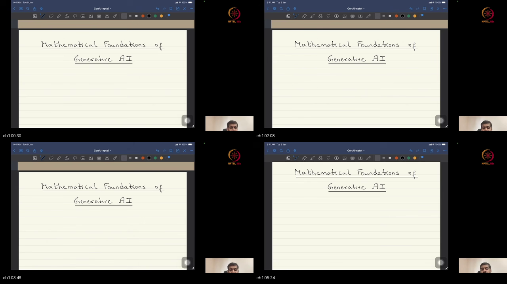
*Figure 1.1: Blackboard presentation at ~00:02–05:52. Welcoming students to the course, introducing the modern Generative AI revolution, and defining the core objective: deriving generative modeling from first mathematical principles.*

#### Detailed Mathematical Exposition
Prof. Prathosh establishes the foundational philosophy of the course:
1. **The Modern Generative Revolution:**
   - Over the past decade, AI has undergone a paradigm shift from simple pattern recognition (discriminative classification) to complex content synthesis (large language models, photorealistic image diffusion, audio synthesis).
   - Tools like ChatGPT, Claude, Stable Diffusion, and Gemini have democratized access to AI applications.

2. **The Engineer vs The API Consumer:**
   - *Consumer Level:* Prompt engineering, calling pre-packaged Python library wrappers (`model.generate()`), fine-tuning endpoints without theoretical insight.
   - *Masterclass Engineering Level:* Deriving the underlying mathematical optimization objectives from scratch, proving convergence, modifying probabilistic loss functions, and inventing novel generative architectures.

3. **The First-Principles Methodology:**
   - The course avoids treating neural networks as arbitrary black boxes.
   - Every core mathematical formulation will be constructed rigorously on the chalkboard using **probability theory, linear algebra, vector calculus, and convex optimization**.

```
                           THE COURSE METHODOLOGY SHIFT
                           
    Consumer Approach (Black Box)                      Engineering Approach (First Principles)
    ┌───────────────────────────┐                      ┌─────────────────────────────────────┐
    │ Prompt / API Call         │                      │ Mathematical Formulation (Ω, ℱ, P)  │
    │ (No theoretical insight)  │ ───────────────────► │ Density Estimation Objective min d  │
    │ Breaks when edge-cases hit│                      │ Rigorous Architectural Innovation   │
    └───────────────────────────┘                      └─────────────────────────────────────┘
```

#### 🎯 Why We Are Doing This & What We Are Learning
- **Why?** To establish the mathematical mindset required to design and debug production-grade generative models.
- **What are we learning?** That generative AI is grounded in probabilistic density estimation rather than ad-hoc engineering heuristics.

---

### <a id="topic-2-model-families-roadmap-0552–1132"></a><a id="topic-2-model-families-roadmap-05521132"></a>Topic 2: Model Families Roadmap (05:52–11:32)

> 👶 **ELI5 Quick Intuition:**  
> Imagine an aerial roadmap of a massive metropolitan city. You see the highway system connecting all major neighborhoods: the Airport, the Harbor, Downtown, and Suburbia. Today, we are looking at the city map so you know where we are traveling over the next 12 weeks!

#### Chalkboard & Screenshot Reference
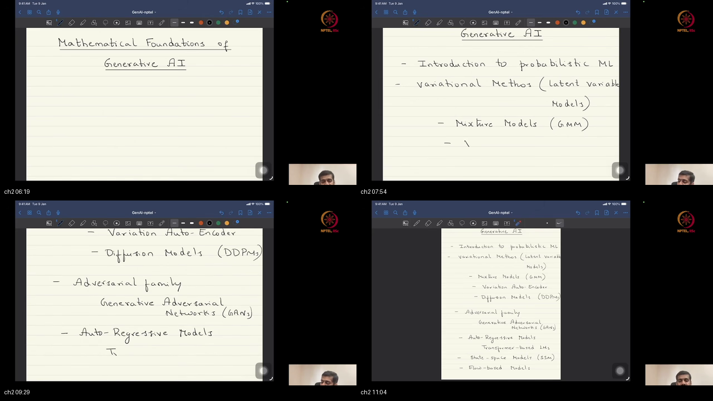
*Figure 2.1: Blackboard overview at ~05:52–11:32. Announcing the dual theory/implementation tracks (featuring TA Chandan in PyTorch) and mapping out the semester's model zoo: GMMs, VAEs, Diffusion, GANs, Transformers/LLMs, SSMs, Flows, and RLHF/DPO.*

#### Detailed Mathematical Exposition
Prof. Prathosh outlines the comprehensive curriculum map for the semester:
1. **The Dual Lecture-Lab Track:**
   - Theoretical lectures derive the mathematical formulations from first principles.
   - Practical implementation tutorials (led by TA Chandan) implement every algorithm from scratch in **Python / PyTorch**.

2. **The Seven Major Generative Model Families:**
   - **Family 1: Variational & Latent Variable Models:** Classical Gaussian Mixture Models (GMMs), Expectation-Maximization (EM), and Variational Autoencoders (VAEs).
   - **Family 2: Denoising Diffusion Probabilistic Models (DDPMs):** Reversible Markov chains and score-based generative modeling (SGMs).
   - **Family 3: Generative Adversarial Networks (GANs):** Minimax game-theoretic formulations between generative samplers and discriminative critics.
   - **Family 4: Autoregressive Models & Transformers (LLMs):** Sequential factorization of joint distributions $p(x) = \prod_t p(x_t \mid x_{<t})$ powering modern language intelligence.
   - **Family 5: State-Space Models (SSMs):** Continuous dynamical systems and selective structured state spaces (Mamba).
   - **Family 6: Normalizing Flows:** Diffeomorphic invertible transformations preserving exact analytical likelihoods via the Jacobian change-of-variables theorem.
   - **Family 7: Preference Alignment:** Post-training alignment techniques including Reinforcement Learning from Human Feedback (RLHF) and Direct Preference Optimization (DPO).

```
                      THE SEMESTER GENERATIVE MODEL ROADMAP
                      
                          PROBABILISTIC ML FOUNDATIONS
                          (Ω, ℱ, P) ──► X : Ω ──► ℝ^d
                                       │
        ┌──────────────────────────────┼──────────────────────────────┐
        ▼                              ▼                              ▼
   LATENT VARIABLE                DENOISING DIFFUSION            GAME-THEORETIC
   • GMMs (EM Algorithm)          • Forward SDE / Noise          • Minimax Optimization
   • VAEs (ELBO Objective)        • Reverse Denoising Sampling   • Vanilla GAN & WGAN-GP
        │                              │                              │
        └──────────────────────────────┼──────────────────────────────┘
                                       │
        ┌──────────────────────────────┴──────────────────────────────┐
        ▼                                                             ▼
   AUTOREGRESSIVE & SEQUENTIAL                                   EXACT LIKELIHOOD
   • Transformers & LLMs                                         • Normalizing Flows
   • State-Space Models (SSM)                                    • Invertible Jacobians
```

#### 🎯 Why We Are Doing This & What We Are Learning
- **Why?** To provide a unified conceptual roadmap so students do not view different generative models as disconnected trends.
- **What are we learning?** That every major generative model family is simply an engineering mechanism for estimating and sampling from an underlying probability distribution.

---

### <a id="topic-3-background--probabilistic-frame-1132–1359"></a>Topic 3: Background & Probabilistic Frame (11:32–13:59)

> 👶 **ELI5 Quick Intuition:**  
> Before an architect builds a skyscraper, they check that the ground has solid bedrock. In machine learning, our bedrock consists of three mathematical pillars: Vector Calculus, Linear Algebra, and Probability Theory.

#### Chalkboard & Screenshot Reference
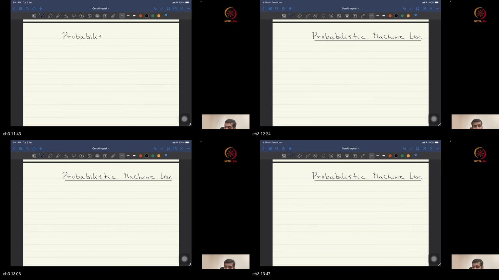
*Figure 3.1: Blackboard exposition at ~11:32–13:59. Stating the required foundational prerequisites: multivariate calculus, linear algebra, and basic probability.*

#### Detailed Mathematical Exposition
Prof. Prathosh identifies the three mathematical pillars underpinning generative artificial intelligence:
1. **Multivariate Calculus & Optimization:**
   - Partial derivatives, Jacobians, Hessians, gradient descent, Taylor expansions, and Lagrange multipliers.
2. **Linear Algebra & Vector Spaces:**
   - High-dimensional Euclidean vector spaces $\mathbb{R}^d$, inner products, orthogonal projections, matrix factorizations, and eigenvalues/singular values.
3. **Probability & Measure Theory:**
   - Sample spaces, event spaces, continuous probability density functions (PDFs), expectations, transformations of random variables, and conditional distributions.

```
                      THE THREE MATHEMATICAL FOUNDATION PILLARS
                      
        ┌───────────────────────┐ ┌───────────────────────┐ ┌───────────────────────┐
        │ MULTIVARIATE CALCULUS │ │    LINEAR ALGEBRA     │ │   PROBABILITY THEORY  │
        │ Gradients, Jacobians, │ │ Vector Spaces ℝ^d,    │ │ Triplets (Ω, ℱ, P),   │
        │ Optimization, Losses  │ │ Matrix Decompositions │ │ Random Variables, CDFs│
        └───────────┬───────────┘ └───────────┬───────────┘ └───────────┬───────────┘
                    │                         │                         │
                    └─────────────────────────┼─────────────────────────┘
                                              ▼
                               [ GENERATIVE AI ENGINEERING ]
```

#### 🎯 Why We Are Doing This & What We Are Learning
- **Why?** To ground student expectations on the mathematical rigor required throughout the course.
- **What are we learning?** How foundational mathematics directly enables advanced generative AI algorithm development.

---

### <a id="topic-4-physics-vs-non-measurable-structure-1359–2003"></a>Topic 4: Physics vs Non-Measurable Structure (13:59–20:03)

> 👶 **ELI5 Quick Intuition:**  
> A thermometer can tell you the exact temperature of a bowl of soup because heat is a measurable physical property. But if you ask "Is this soup delicious?", no machine in physics can answer that! Deliciousness is subjective and non-measurable by physics. We need customer surveys and probability statistics instead!

#### Chalkboard & Screenshot Reference
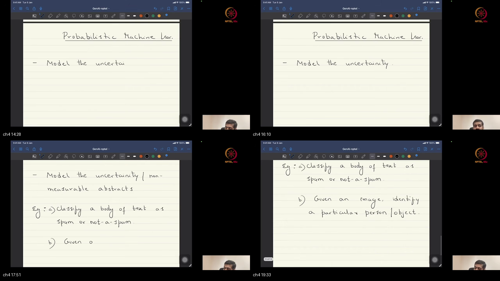
*Figure 4.1: Blackboard formulation at ~13:59–20:03. The core bifurcation: classical physics vs non-measurable perceptual structures (spam classification, image recognition, semantic meaning).*

#### Detailed Mathematical Exposition
Prof. Prathosh presents the fundamental philosophical justification for statistical machine learning:
1. **The Classical Physics Paradigm:**
   - Applicable when the underlying physical system is fully observable and measurable via direct physical instrumentation (volts, seconds, meters, kilograms).
   - Behavior is governed by deterministic differential laws (e.g. Newton's second law $\mathbf{F} = m\mathbf{a}$, projectile motion $\mathbf{r}(t) = \mathbf{r}_0 + \mathbf{v}_0 t - \frac{1}{2}\mathbf{g} t^2$).
   - Closed-form equations predict future states with near-zero training data.

2. **The Non-Measurable Semantic Dilemma:**
   - Real-world AI problems deal with high-level human semantic concepts:
     * "Is this incoming email spam?"
     * "Does this digital photo contain a smiling human face?"
     * "Is this generated text coherent and factually accurate?"
   - There exists **no physical sensor or differential equation** for "spamminess" or "facial realism".

3. **The Probabilistic Solution:**
   - When pure physics is blocked, the scientific method pivots to **data-driven probabilistic modeling**: we collect large empirical datasets and estimate the probability distribution governing the observations.

```
                           THE TWO PATHWAYS OF SCIENCE
                           
    Target Property                 Governing Framework          Primary Tool
    ┌─────────────────────────┐     ┌──────────────────────┐     ┌────────────────────────┐
    │ Measurable Dynamics     │ ──► │ Analytical Physics   │ ──► │ Differential Equations │
    │ (Thrown ball, voltage)  │     │ (Deterministic)      │     │ (Exact formulas)       │
    ├─────────────────────────┤     ├──────────────────────┤     ├────────────────────────┘
    │ Non-Measurable Semantic │ ──► │ Data & Probability   │ ──► │ Machine Learning       │
    │ (Spam, Faces, Language) │     │ (Statistical)        │     │ (Estimate P_X from D)  │
    └─────────────────────────┘     └──────────────────────┘     └────────────────────────┘
```

#### 🎯 Why We Are Doing This & What We Are Learning
- **Why?** To clearly understand why artificial intelligence relies on data and probability rather than analytical physics.
- **What are we learning?** That machine learning is the mathematical language for non-measurable, subjective, and semantic systems.

---

### <a id="topic-5-repeated-observations-2003–2332"></a>Topic 5: Repeated Observations (20:03–23:32)

> 👶 **ELI5 Quick Intuition:**  
> If you have never seen a cat before, nobody can write a single equation explaining "catness." But if you see 1,000 photos of different cats (fluffy cats, black cats, sleeping cats), your brain naturally learns the general pattern of a cat. Repeated observations are the lifeblood of learning!

#### Chalkboard & Screenshot Reference
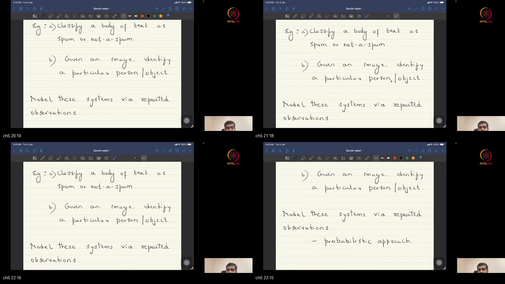
*Figure 5.1: Blackboard notation at ~20:03–23:32. Establishing the empirical methodology: collecting massive batches of repeated observations when analytical physics equations are unavailable.*

#### Detailed Mathematical Exposition
Prof. Prathosh outlines how data science replaces unknown physical laws:
1. **The Principle of Repeated Observation:**
   - When we cannot write down the generative physics of a process, we run (or observe) the process repeatedly under varying conditions.
   - Every run yields an observation $x_i \in \mathbb{R}^d$.
   - A collection of $n$ runs forms our empirical dataset:
     $$D = \{x_1, x_2, \dots, x_n\}$$

2. **Empirical Frequency to Probability:**
   - By the Law of Large Numbers (LLN), as the number of independent repeated observations $n \to \infty$, the empirical frequencies of events converge almost surely to their true underlying probabilities:
     $$\frac{1}{n} \sum_{i=1}^n \mathbb{I}(x_i \in A) \xrightarrow{a.s.} P(A)$$

```
                         FROM REPEATED RUNS TO PROBABILITY
                         
    Nature runs process n times       Observations collected on disk       Empirical Convergence
    ┌──────────────────────────┐      ┌────────────────────────────┐       ┌──────────────────────┐
    │ Run 1 ──► Outcome ω_1    │ ───► │ File x_1 = X(ω_1)          │ ────► │ 1/n Σ I(x_i ∈ A)     │
    │ Run 2 ──► Outcome ω_2    │ ───► │ File x_2 = X(ω_2)          │       │      ↓↓ (n -> ∞)     │
    │ Run n ──► Outcome ω_n    │ ───► │ File x_n = X(ω_n)          │       │ P(A) (True Measure)  │
    └──────────────────────────┘      └────────────────────────────┘       └──────────────────────┘
```

#### 🎯 Why We Are Doing This & What We Are Learning
- **Why?** To justify empirical dataset collection as the starting foundation for AI training.
- **What are we learning?** How repeated empirical observations bridge the gap to unobservable ground-truth probabilities.

---

### <a id="topic-6-random-experiment--sample-space-2332–3137"></a>Topic 6: Random Experiment & Sample Space $\Omega$ (23:32–31:37)

> 👶 **ELI5 Quick Intuition:**  
> When you flip a coin, you do not know if it will land Heads or Tails. But you know 100% that it cannot land on "Tuesday". The list of all allowed results $\{H, T\}$ is the **Sample Space $\Omega$**.

#### Chalkboard & Screenshot Reference
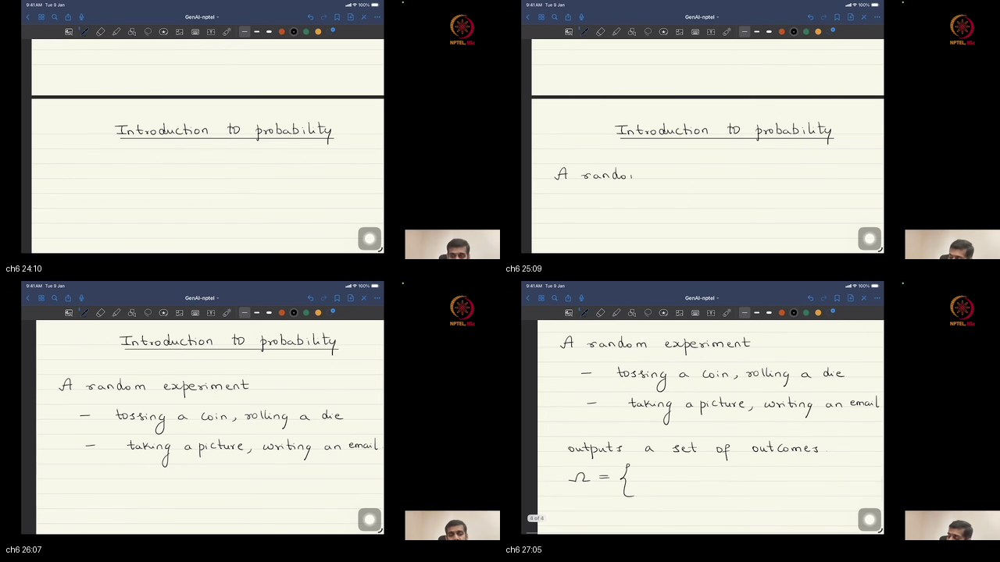
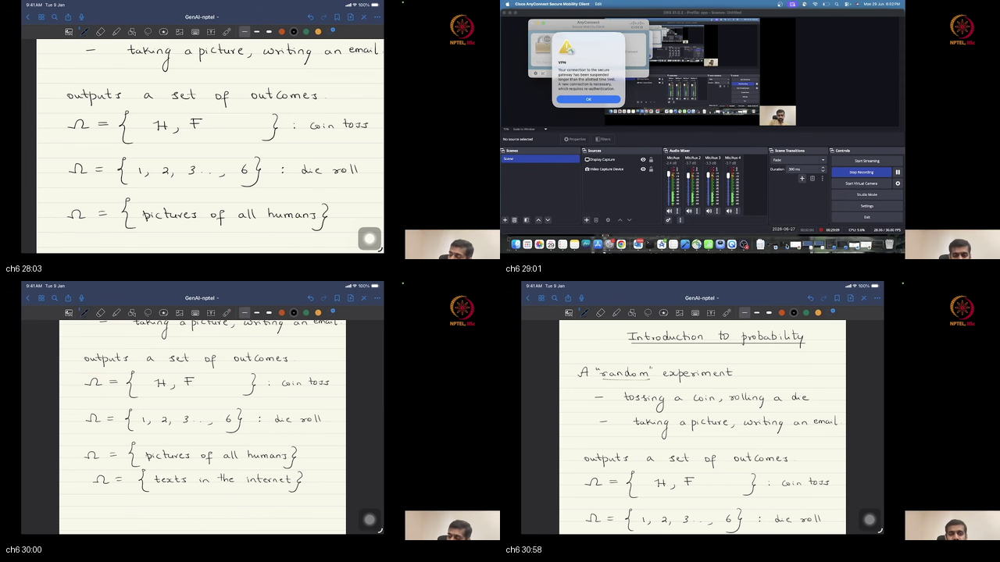
*Figures 6.1 & 6.2: Blackboard derivation at ~23:32–31:37. Defining the Random Experiment (RE), elementary outcomes $\omega$, and the formal sample space $\Omega$ as the set of all mutually exclusive outcomes.*

#### Detailed Mathematical Exposition
Prof. Prathosh formalizes the first two components of probability theory:
1. **The Random Experiment (RE):**
   - An experiment whose outcome cannot be predicted with certainty, but whose set of possible outcomes is completely known in advance.
   - The experiment must be conceptually repeatable under identical conditions.

2. **The Sample Space ($\Omega$):**
   - The set containing **all possible elementary outcomes** $\omega$ of the random experiment:
     $$\Omega \triangleq \{\omega \mid \omega \text{ is an outcome of RE}\}$$
   - **Exhaustive and Mutually Exclusive:** Exactly one outcome $\omega \in \Omega$ occurs on any given execution of the experiment.

3. **Demystifying "Randomness":**
   - Prof. Prathosh notes that mathematics does not attempt to define the metaphysical "essence" of randomness.
   - Instead, **$\Omega$ is the concrete mathematical object** through which all uncertainty is manipulated.

```
                         THE SAMPLE SPACE STRUCTURE
                         
   Random Experiment (RE)                  Sample Space Ω (Exhaustive Set of Outcomes)
   ┌────────────────────┐                  ┌────────────────────────────────────────┐
   │ Single Die Roll    │ ───────────────► │ Ω = { 1, 2, 3, 4, 5, 6 }               │
   ├────────────────────┤                  ├────────────────────────────────────────┤
   │ Two Coin Flips     │ ───────────────► │ Ω = { (H,H), (H,T), (T,H), (T,T) }     │
   ├────────────────────┤                  ├────────────────────────────────────────┤
   │ Studio Face Photo  │ ───────────────► │ Ω = { Set of all possible human faces }│
   └────────────────────┘                  └────────────────────────────────────────┘
```

#### 🎯 Why We Are Doing This & What We Are Learning
- **Why?** To define the formal universal set over which all probabilistic statements are defined.
- **What are we learning?** That probability starts by establishing the sample space $\Omega$ rather than guessing numbers.

---

### <a id="topic-7-measure-as-size-events-3137–3832"></a>Topic 7: Measure as Size; Events (31:37–38:32)

> 👶 **ELI5 Quick Intuition:**  
> A wooden ruler does not create a table; it simply tells you how long the table is. A **Measure** is a mathematical ruler: it takes a subset of outcomes (an Event) and tells you its geometric size!

#### Chalkboard & Screenshot Reference
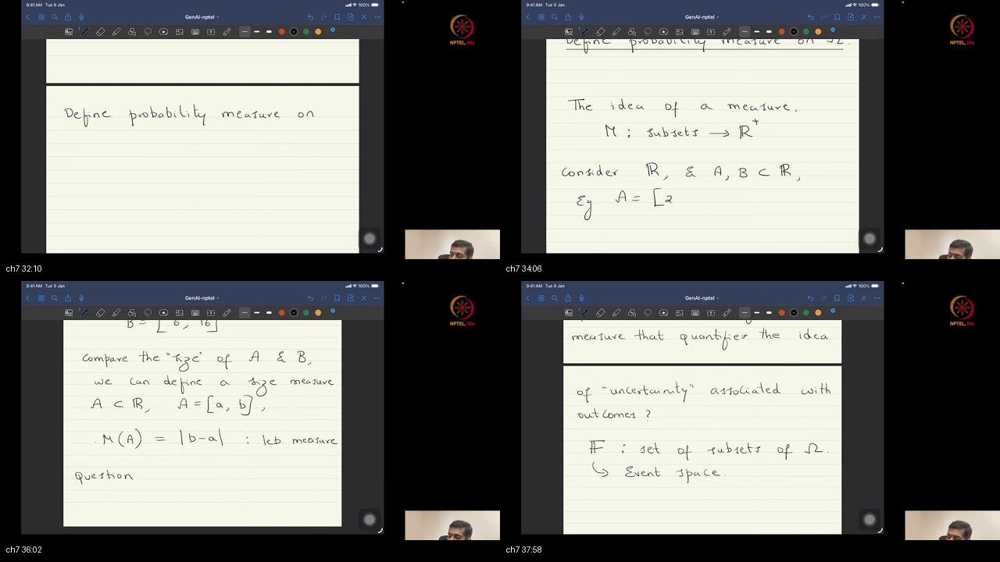
*Figure 7.1: Blackboard exposition at ~31:37–38:32. Defining an Event $A \subseteq \Omega$ as a subset of outcomes, and introducing general measures as size functions (length, area, volume).*

#### Detailed Mathematical Exposition
Prof. Prathosh introduces events and measure theory:
1. **Definition of an Event ($A$):**
   - An **Event** $A$ is a subset of the sample space:
     $$A \subseteq \Omega \quad (A \in \mathcal{F})$$
   - An event represents a valid boolean query: *"Did the observed outcome $\omega$ land inside set $A$?"*

2. **The Event Space ($\mathcal{F}$ / Sigma-Algebra):**
   - $\mathcal{F}$ is the collection of all valid subsets of $\Omega$ that can be assigned a measure.
   - For finite spaces, $\mathcal{F} = 2^\Omega$ (the power set).

3. **Measure as a General Size Function:**
   - A **measure** $\mu$ is a mapping from subsets to non-negative real numbers:
     $$\mu: \mathcal{F} \to [0, \infty]$$
   - *Geometric Examples:*
     * 1D intervals: $\mu([a, b]) = b - a$ (Length).
     * 2D regions: $\mu(R) = \iint_R dx \, dy$ (Area).
     * 3D solids: $\mu(V) = \iiint_V dx \, dy \, dz$ (Volume).

```
                        MEASURES ACROSS DIFFERENT WORLDS
                        
    Domain                  Geometry / Event Subset         Measure Type (Size)
    ┌─────────────────┐     ┌─────────────────────────┐     ┌──────────────────────┐
    │ 1D Real Line ℝ  │ ──► │ Interval [2, 7]         │ ──► │ Length = 7 - 2 = 5   │
    ├─────────────────┤     ├─────────────────────────┤     ├──────────────────────┤
    │ 2D Plane ℝ^2    │ ──► │ Circle of radius r      │ ──► │ Area = π r^2         │
    ├─────────────────┤     ├─────────────────────────┤     ├──────────────────────┤
    │ Sample Space Ω  │ ──► │ Event A = {2, 4, 6}     │ ──► │ Probability P(A)=0.5 │
    └─────────────────┘     └─────────────────────────┘     └──────────────────────┘
```

#### 🎯 Why We Are Doing This & What We Are Learning
- **Why?** To understand that probability is not an isolated trick, but a special normalized case of measure theory.
- **What are we learning?** How to formalize events as subsets and evaluate their statistical sizes.

---

### <a id="topic-8-probability-measure-p--axioms-3832–4458"></a>Topic 8: Probability Measure $P$ & Axioms (38:32–44:58)

> 👶 **ELI5 Quick Intuition:**  
> When you cut a 100% whole pie into pieces, each slice must be $\ge 0\%$, the whole pie equals exactly $100\%$, and adding two non-overlapping slices gives their combined size. Those are the 3 Kolmogorov Axioms!

#### Chalkboard & Screenshot Reference
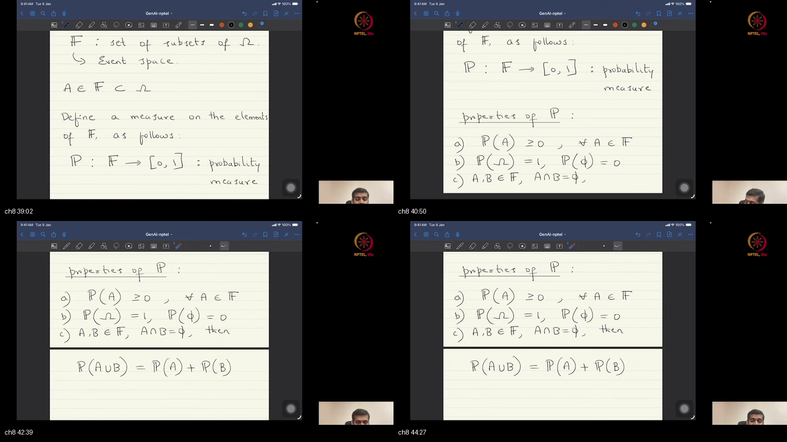
*Figure 8.1: Blackboard derivation at ~38:32–44:58. Stating the Kolmogorov Probability Axioms: Non-negativity ($P(A) \ge 0$), Normalization ($P(\Omega) = 1$), and Disjoint Additivity ($P(A \cup B) = P(A) + P(B)$).*

#### Detailed Mathematical Exposition
Prof. Prathosh presents the foundational axioms of modern probability theory formulated by Andrey Kolmogorov (1933):
1. **Definition of Probability Measure ($P$):**
   $$P: \mathcal{F} \to [0, 1]$$
   $P$ is a normalized measure assigning a real value between $0$ and $1$ to every event $A \in \mathcal{F}$.

2. **The Three Kolmogorov Axioms:**
   - **Axiom 1 (Non-Negativity):** For any event $A \in \mathcal{F}$:
     $$P(A) \ge 0$$
   - **Axiom 2 (Normalization / Unit Measure):** The probability of the entire sample space is unity:
     $$P(\Omega) = 1.0$$
   - **Axiom 3 (Countable Additivity):** If $A_1, A_2, \dots$ is a sequence of mutually disjoint events ($A_i \cap A_j = \emptyset$ for all $i \neq j$):
     $$P\left(\bigcup_{i=1}^\infty A_i\right) = \sum_{i=1}^\infty P(A_i)$$

3. **Core Mathematical Corollaries:**
   - **Empty Set (Impossible Event):** $P(\emptyset) = 0$.
   - **Complement Rule:** $P(A^c) = 1 - P(A)$.
   - **General Addition Rule (Inclusion-Exclusion):**
     $$P(A \cup B) = P(A) + P(B) - P(A \cap B)$$

```
                       THE THREE KOLMOGOROV AXIOMS
                       
    1. NON-NEGATIVITY                2. NORMALIZATION                3. DISJOINT ADDITIVITY
    ┌───────────────────────┐        ┌───────────────────────┐       ┌────────────────────────┐
    │ P(A) ≥ 0              │        │ P(Ω) = 1.0            │       │ If A ∩ B = ∅:          │
    │ (No negative chances) │        │ (Universe is certain) │       │ P(A ∪ B) = P(A) + P(B) │
    └───────────────────────┘        └───────────────────────┘       └────────────────────────┘
```

#### 🎯 Why We Are Doing This & What We Are Learning
- **Why?** Because all loss functions, likelihoods, and diffusion equations rely on these three axioms for mathematical validity.
- **What are we learning?** How to rigorously calculate probabilities of compound, complementary, and disjoint events.

---

### <a id="topic-9-triplet--surrogates-4458–5401"></a>Topic 9: Triplet $(\Omega, \mathcal{F}, P)$ & Surrogates (44:58–54:01)

> 👶 **ELI5 Quick Intuition:**  
> A doctor wants to know if a patient's lungs have pneumonia ($\Omega$). But the doctor cannot look directly inside the chest with their naked eye. Instead, the doctor takes an **X-ray photograph** ($X$). The X-ray image is a digital surrogate file that represents the hidden physical reality!

#### Chalkboard & Screenshot Reference
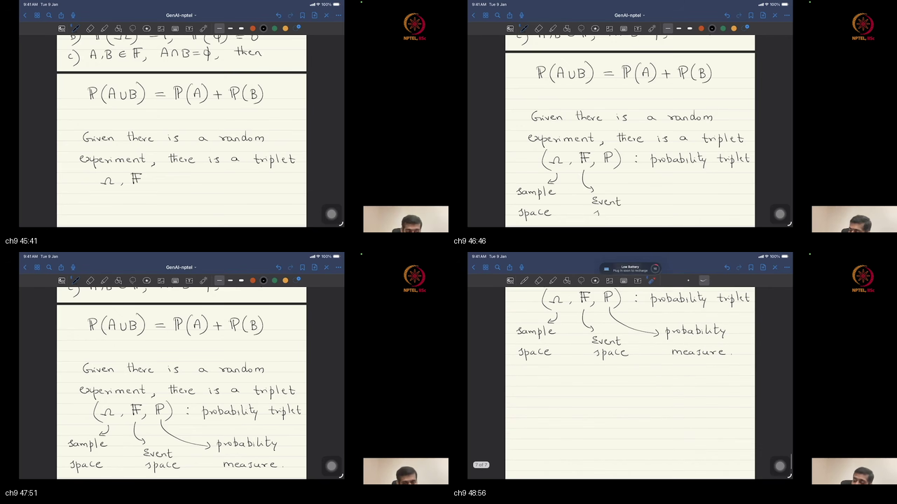
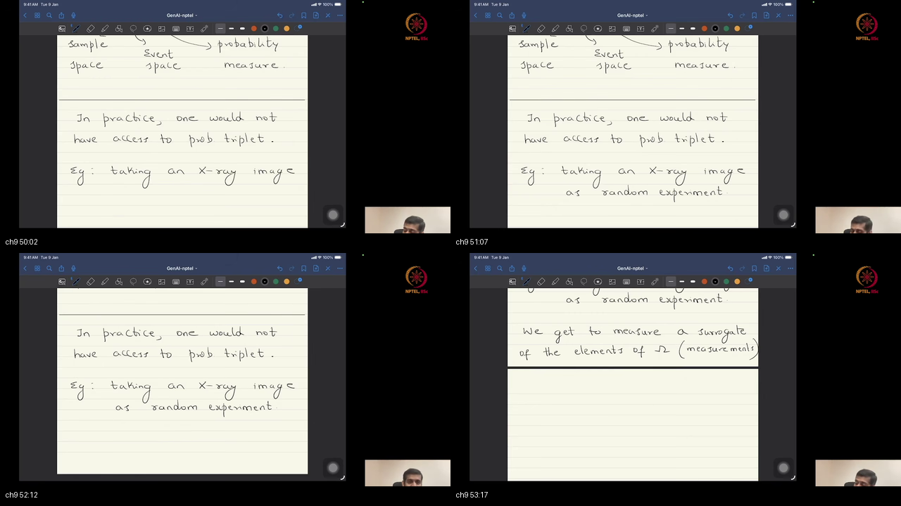
*Figures 9.1 & 9.2: Blackboard derivation at ~44:58–54:01. Constructing the Kolmogorov Triplet $(\Omega, \mathcal{F}, P)$, highlighting the engineer's inability to observe $\Omega$ directly, and introducing digital surrogate measurements.*

#### Detailed Mathematical Exposition
Prof. Prathosh formalizes the probability triplet and the surrogate measurement bridge:
1. **The Kolmogorov Triplet:**
   The complete mathematical specification of an uncertain system is defined by the triplet:
   $$(\Omega, \mathcal{F}, P)$$
   - $\Omega$: The sample space.
   - $\mathcal{F}$: The event space ($\sigma$-algebra).
   - $P$: The probability measure.

2. **The Engineering Reality (Inaccessible Triplet):**
   - In practical machine learning, **we almost never possess the explicit mathematical form of $\Omega$, $\mathcal{F}$, or $P$**.
   - *Example (Medical Imaging):* $\Omega$ is the microscopic biological state of human lung tissue, and $P$ is the true natural distribution of disease across human genetics. Neither can be loaded into computer RAM!

3. **Digital Surrogates:**
   - Instead of the abstract triplet, practitioners observe **digital surrogate measurements**:
     * X-ray digital radiographs ($1024 \times 1024$ pixel tensors).
     * Written email text (ASCII / UTF-8 token sequences).
     * Speech acoustic waveforms (16 kHz audio samples).
   - These surrogates are produced by **Random Variables**.

```
                        THE SURROGATE MEASUREMENT SHIFT
                        
    Inaccessible Nature (The Triplet)                  Observable Engineering Data (Surrogates)
    ┌─────────────────────────────────┐                ┌───────────────────────────────────────┐
    │ Sample Space Ω (Microscopic)    │  Sensor Map X  │ Euclidean Vector Space ℝ^d            │
    │ Event Space ℱ  (Abstract)       │ ─────────────► │ Digital Files on Disk                 │
    │ Probability P  (Unknown Law)    │  X : Ω ──► ℝ^d │ Pixel Grids, Audio Waveforms, Tokens  │
    └─────────────────────────────────┘                └───────────────────────────────────────┘
```

#### 🎯 Why We Are Doing This & What We Are Learning
- **Why?** To understand why real-world machine learning operates on vector arrays rather than abstract set elements.
- **What are we learning?** How physical sensors act as mathematical mappings transferring abstract reality into observable data arrays.

---

### <a id="topic-10-rv-cdf-estimate-px-5401–7052"></a><a id="topic-10-rv-cdf-estimate-p_x-54017052"></a>Topic 10: RV, CDF, Estimate $P_X$ (54:01–70:52)

> 👶 **ELI5 Quick Intuition:**  
> A camera takes a 3D real-world birthday party ($\omega \in \Omega$) and turns it into a 2D JPEG file ($x \in \mathbb{R}^d$). The camera is the **Random Variable $X$**. The final goal of Generative AI is to learn the recipe of all those JPEG files ($P_X$) so we can generate brand-new birthday photos!

#### Chalkboard & Screenshot Reference
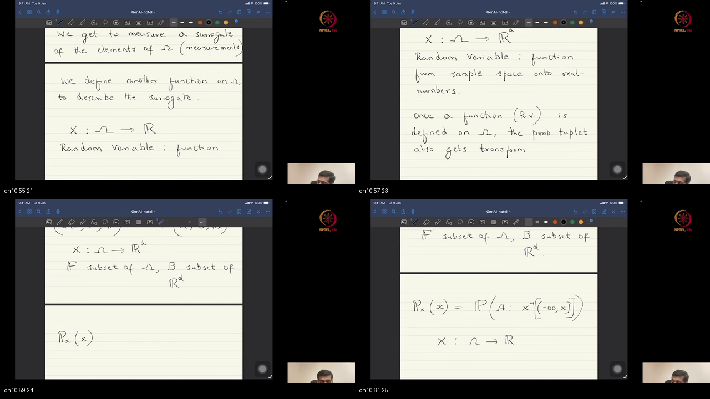
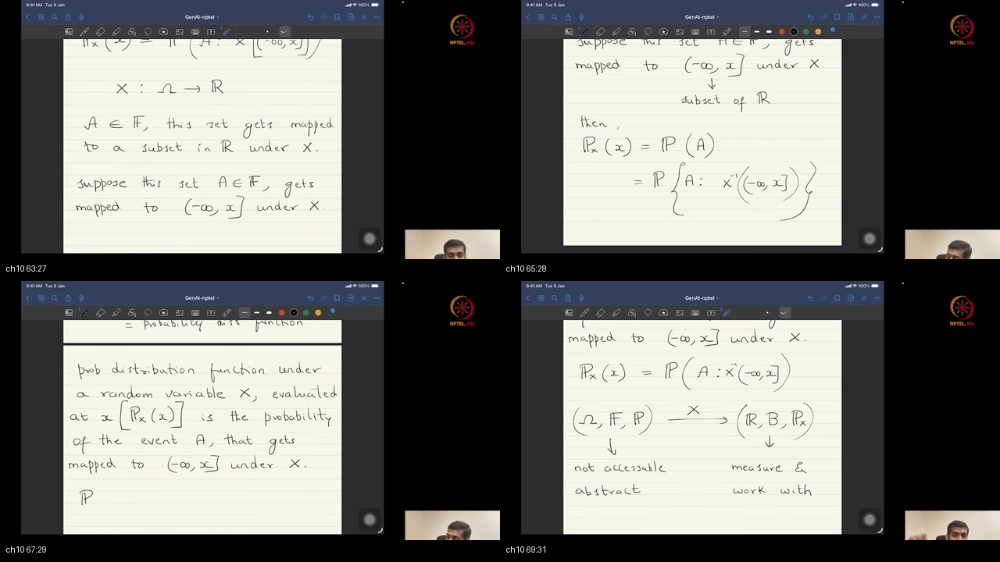
*Figures 10.1 & 10.2: Blackboard derivation at ~54:01–70:52. Defining the Random Variable $X: \Omega \to \mathbb{R}^d$, inverse image mappings, the Cumulative Distribution Function $P_X(x)$, and the grand closing thesis: estimating $P_X$ from data to perform generative sampling.*

#### Detailed Mathematical Exposition
Prof. Prathosh concludes Lecture 01 with the central theoretical derivation of the course:
1. **The Random Variable as a Deterministic Function:**
   - A **Random Variable** (or random vector) is a deterministic mathematical function:
     $$X: \Omega \to \mathbb{R}^d$$
   - It maps abstract outcomes $\omega \in \Omega$ to vectors in $d$-dimensional Euclidean space $\mathbb{R}^d$.
   - **Crucial Rule:** $X$ is not a "random number". $X$ is a fixed rule; the randomness is solely in which $\omega \in \Omega$ nature selects.

2. **Inverse Image & The Induced Measure:**
   - For any measurable set $B \in \mathcal{B}(\mathbb{R}^d)$, the inverse image is:
     $$X^{-1}(B) \triangleq \{\omega \in \Omega \mid X(\omega) \in B\} \in \mathcal{F}$$
   - The probability of landing in vector region $B$ is inherited directly from the original measure $P$:
     $$P_X(B) \triangleq P\bigl(X^{-1}(B)\bigr)$$

3. **Cumulative Distribution Function (CDF):**
   - For continuous vector thresholds $x \in \mathbb{R}^d$:
     $$P_X(x) = P(X \le x) = P\bigl(X^{-1}((-\infty, x])\bigr) = \int_{-\infty}^x p_X(t) \, dt$$

4. **The Sacrosanct Mission of Generative AI:**
   - Given a dataset of $n$ observed surrogate realizations $D = \{x_1, \dots, x_n\} \sim P_X$:
     $$\textbf{Task 1: } \text{Estimate the unknown probability distribution } P_X \text{ (parameterized as } P_\theta\text{)}$$
     $$\textbf{Task 2: } \text{Simulate nature's random experiment by drawing novel samples } \hat{x} \sim P_\theta$$

```
                      THE COMPLETE GENERATIVE AI CYCLE
                      
    Nature's Hidden Experiment              Sensor Function X               Observed Dataset D
    ┌────────────────────────┐              ┌───────────────┐              ┌────────────────────────┐
    │ Outcome ω ~ P in Ω     │ ───────────► │ X : Ω ──► ℝ^d │ ───────────► │ D = {x_1, ..., x_n}    │
    └────────────────────────┘              └───────────────┘              └───────────┬────────────┘
                                                                                       │
                                                                                       ▼
    Novel Synthetic Data                    Generative Sampler             Parametric Model P_θ
    ┌────────────────────────┐              ┌───────────────┐              ┌────────────────────────┐
    │ Synthesized x̂ ~ P_θ    │ ◄─────────── │ Sample x̂      │ ◄─────────── │ θ* = argmin d(P_X, P_θ)│
    │ (Faces, Text, Audio)   │              │ from Model    │              │ (Estimated Data Law)   │
    └────────────────────────┘              └───────────────┘              └────────────────────────┘
```

#### 🎯 Why We Are Doing This & What We Are Learning
- **Why?** To formalize the exact mathematical objective that every generative AI model (VAEs, GANs, Diffusion, LLMs) solves.
- **What are we learning?** That all of generative AI is the dual task of estimating $P_X$ and sampling new realizations $\hat{x} \sim P_X$.

---

## 🛠️ <a id="workplace-debugging-postmortems"></a>Workplace Debugging Postmortems

---

### <a id="postmortem-1-invalid-softmax-normalization--nan-gradient-explosion"></a>Postmortem 1: Invalid Softmax Normalization & NaN Gradient Explosion

```
  ╔═══════════════════════════════════════════════════════════════════════════════════════╗
  ║ POSTMORTEM REPORT: SOFTMAX NORMALIZATION BREAK & AXIOM 2 VIOLATION                    ║
  ╠═══════════════════════════════════════════════════════════════════════════════════════╣
  ║ Severity: CRITICAL (P0) - Training Pipeline Diverges with NaN Gradients at Step 1,420 ║
  ║ Root Cause: Custom logit masking allowed exp(z) sum to equal 0.0, violating P(Ω)=1.0  ║
  ║ Affected Systems: Multi-Task Classification & Generative Transformer Sampler          ║
  ╚═══════════════════════════════════════════════════════════════════════════════════════╝
```

#### 1. The Incident & Symptom
An engineering team training an autoregressive token sampler observed catastrophic training failure: after 1,420 steps, the cross-entropy loss produced `NaN`, causing gradient descent to corrupt all transformer model weights.

#### 2. Mathematical Root-Cause Analysis
1. **The Axiom 2 Violation:**
   Kolmogorov Axiom 2 requires $\sum_{k=1}^K p_k = 1.0$. The Softmax probability mapping is:
   $$p_k = \frac{e^{z_k}}{\sum_{j=1}^K e^{z_j}}$$
2. **The Masking Bug:**
   During causal attention masking, all valid token logits for padded sequences were filled with $-1\times 10^9$. Under 16-bit floating point (`torch.float16`), $e^{-10^9}$ underflowed to absolute zero across all vocabulary tokens, producing:
   $$\sum_{j=1}^K e^{z_j} = 0.0 \implies p_k = \frac{0}{0} = \text{NaN}$$
   Because the probability distribution vector failed to sum to 1.0 ($P(\Omega) \neq 1$), the log-loss $\ln(p_k)$ exploded to $\ln(0) = -\infty \to \text{NaN}$.

#### 3. The Production Fix (PyTorch Code)
Use numerically stable log-sum-exp stabilization and ensure mask clamping preserves valid probability measure normalization.

```python
import torch
import torch.nn as nn

def robust_softmax_sampling(logits, mask=None, temperature=1.0):
    """
    Numerically stable Softmax sampling adhering strictly to Kolmogorov Axioms.
    """
    # 1. Temperature scaling
    scaled_logits = logits / max(temperature, 1e-5)
    
    # 2. Safe masking (Avoid underflow to absolute zero)
    if mask is not None:
        scaled_logits = scaled_logits.masked_fill(~mask, -1e4) # Safe float16 bound
    
    # 3. Log-Sum-Exp Trick: Subtract max logit to prevent exp() overflow
    max_logits = torch.max(scaled_logits, dim=-1, keepdim=True).values
    stable_logits = scaled_logits - max_logits
    
    # 4. Normalized Probability Measure P (Axiom 1 & 2 Guaranteed)
    exp_logits = torch.exp(stable_logits)
    sum_exp = torch.sum(exp_logits, dim=-1, keepdim=True) + 1e-8 # Prevent divide-by-zero
    probs = exp_logits / sum_exp
    
    # Verify Axiom 2: Sum equals 1.0
    assert torch.allclose(torch.sum(probs, dim=-1), torch.ones_like(sum_exp.squeeze(-1))), "Axiom 2 violated!"
    return probs
```

---

### <a id="postmortem-2-empirical-support-mismatch--out-of-distribution-density-failure"></a>Postmortem 2: Empirical Support Mismatch & Out-of-Distribution Density Failure

```
  ╔═══════════════════════════════════════════════════════════════════════════════════════╗
  ║ POSTMORTEM REPORT: OUT-OF-DISTRIBUTION SUPPORT COLLAPSE IN MEDICAL IMAGE AI           ║
  ╠═══════════════════════════════════════════════════════════════════════════════════════╣
  ║ Severity: HIGH (P1) - AI Generator Synthesizes Unphysical Artifacts on New Hospital Data║
  ║ Root Cause: Discrepancy between sensor measurement function X_hospitalA and X_hospB  ║
  ║ Affected Systems: Medical Imaging Diffusion Synthesis & Anomaly Detection Pipeline    ║
  ╚═══════════════════════════════════════════════════════════════════════════════════════╝
```

#### 1. The Incident & Symptom
A generative diffusion model trained on Hospital A's chest X-rays was deployed to Hospital B. When sampling or evaluating likelihoods on Hospital B scans, the model evaluated likelihoods as $p_X(x) \approx 0.0$ and generated corrupted images with dark circular ring artifacts.

#### 2. Mathematical Root-Cause Analysis
1. **The Sensor Function Discrepancy:**
   The random variable $X$ is a physical measurement function $X: \Omega \to \mathbb{R}^d$. Hospital A used a GE scanner ($X_{\text{GE}}$) with range $[0, 4095]$ (12-bit depth), while Hospital B used a Siemens scanner ($X_{\text{Siemens}}$) with range $[0, 65535]$ (16-bit depth).
2. **Support Mismatch:**
   Because the measurement functions differed ($X_{\text{GE}} \neq X_{\text{Siemens}}$), the induced distribution $P_{X_{\text{Siemens}}}$ resided entirely outside the support of the trained model $P_{\theta}$, causing complete density collapse.

```
                      SENSOR MEASUREMENT FUNCTION MISMATCH
                      
   True Lung Biology (Ω)         Sensor X_A (GE 12-bit)          Trained Support P_θ
   ┌───────────────────┐         ┌─────────────────────┐         ┌─────────────────────────┐
   │ Patient Lungs ω   │ ──────► │ Range: [0, 4095]    │ ──────► │ AI Model Learns P_θ     │
   └───────────────────┘         └─────────────────────┘         └─────────────────────────┘
                                                                              ▲
   Hospital B Deployment         Sensor X_B (Siemens 16-bit)                  │ OUT OF SUPPORT!
   ┌───────────────────┐         ┌─────────────────────┐                      │
   │ Patient Lungs ω   │ ──────► │ Range: [0, 65535]   │ ─────────────────────┘ (P_θ evaluates as 0.0)
   └───────────────────┘         └─────────────────────┘
```

#### 3. The Production Fix (PyTorch Code)
Standardize all sensor mappings into canonical normalized Euclidean space $[0.0, 1.0]^d$ before distribution estimation or sampling.

```python
import torch

class StandardizedSensorBridge:
    """
    Standardizes heterogeneous sensor measurement functions X into canonical space.
    """
    def __init__(self, target_dim=(1, 512, 512)):
        self.target_dim = target_dim

    def transform(self, raw_sensor_tensor, bit_depth=12):
        # 1. Cast to float32
        x = raw_sensor_tensor.float()
        
        # 2. Normalize by sensor dynamic range to [0.0, 1.0]
        max_val = (2 ** bit_depth) - 1.0
        x_normalized = torch.clamp(x / max_val, 0.0, 1.0)
        
        # 3. Standardize to zero-mean, unit-variance for generative priors
        x_standardized = (x_normalized - 0.5) / 0.5
        return x_standardized

    def inverse_transform(self, x_standardized, bit_depth=12):
        # Inverse mapping for generative synthetic sampling
        x_normalized = (x_standardized * 0.5) + 0.5
        max_val = (2 ** bit_depth) - 1.0
        raw_output = torch.clamp(x_normalized * max_val, 0.0, max_val)
        return raw_output.to(torch.int32)
```

---

## <a id="external-references"></a>Centralized External References

Every topic in Lecture 01 is supported by 2–3 curated video lectures from world-class educators and 2–3 authoritative papers or technical articles.

---

### Topic 1: Course Mission & Generative AI Philosophy
- **Video 1:** [3Blue1Brown — But What Is a Neural Network?](https://www.youtube.com/watch?v=aircAruvnKk) (The visual masterclass on mathematical representation in neural nets).
- **Video 2:** [Andrej Karpathy — Intro to Large Language Models](https://www.youtube.com/watch?v=zjkBMFhNj_g) (High-level overview of the modern Generative AI stack).
- **Video 3:** [MIT 6.S191 — Introduction to Deep Learning (Alexander Amini)](https://www.youtube.com/watch?v=QDX-1M5NjAQ) (Foundations of modern deep learning architectures).
- **Paper / Article 1:** [LeCun, Bengio, & Hinton (2015) — Deep Learning (*Nature*)](https://www.nature.com/articles/nature14539) (The seminal review on representation learning).
- **Paper / Article 2:** [Lilian Weng — From Autoencoder to Beta-VAE](https://lilianweng.github.io/posts/2018-08-12-vae/) (Probabilistic foundations of generative modeling).

---

### Topic 2: Generative Model Families Roadmap
- **Video 1:** [MIT 6.S192 — Deep Generative Models (Prof. Sze)](https://www.youtube.com/watch?v=hJlrAHqGOS8) (Comprehensive taxonomy of VAEs, GANs, and Diffusion).
- **Video 2:** [Stanford CS236 — Deep Generative Models (Prof. Ermon)](https://www.youtube.com/watch?v=1Jnn_kO_7Y4) (Rigorous mathematical formulation of deep generative algorithms).
- **Video 3:** [StatQuest — Neural Networks Part 1: Inside the Black Box](https://www.youtube.com/watch?v=CqOfi41LfDw) (Step-by-step intuition for neural network parameters).
- **Paper / Article 1:** [Goodfellow et al. (2014) — Generative Adversarial Nets](https://arxiv.org/abs/1406.2661) (The seminal GAN formulation).
- **Paper / Article 2:** [Ho, Jain, & Abbeel (2020) — Denoising Diffusion Probabilistic Models](https://arxiv.org/abs/2006.11239) (Foundational paper on DDPMs).
- **Paper / Article 3:** [Vaswani et al. (2017) — Attention Is All You Need](https://arxiv.org/abs/1706.03762) (The foundational Transformer architecture).

---

### Topic 3: Background & Probabilistic Frame
- **Video 1:** [3Blue1Brown — Essence of Linear Algebra Full Series](https://www.youtube.com/playlist?list=PLZHQObOWTQDPD3MizzM2xVFitgF8hE_ab) (Geometric visual intuition for vectors and transformations).
- **Video 2:** [3Blue1Brown — Essence of Calculus](https://www.youtube.com/playlist?list=PLZHQObOWTQDMsr9K-rj53DwVRMYO3t5Yr) (Visual calculus and derivative mechanics).
- **Video 3:** [Steve Brunton — Multivariate Calculus & Vector Fields](https://www.youtube.com/watch?v=GMB_wWj1XgY) (Engineering calculus applied to dynamical systems).
- **Paper / Article 1:** [Deisenroth, Faisal, & Ong — Mathematics for Machine Learning](https://mml-book.github.io/) (The standard open textbook on linear algebra and vector calculus).
- **Paper / Article 2:** [Terence Tao — Review of Probability Theory](https://terrytao.wordpress.com/2010/01/01/254a-notes-0-a-review-of-probability-theory/) (Rigorous measure-theoretic probability review).

---

### Topic 4: Physics vs Non-Measurable Structure
- **Video 1:** [Steve Brunton — Physics-Informed Neural Networks (PINNs)](https://www.youtube.com/watch?v=hDuY8vIeH10) (Contrasting physics equations with data-driven ML).
- **Video 2:** [StatQuest — Machine Learning Fundamentals](https://www.youtube.com/watch?v=Gv9_4yMHFhI) (Why machine learning learns from data instead of formulas).
- **Paper / Article 1:** [Jaynes (2003) — Probability Theory: The Logic of Science (Chapter 1)](https://bayes.wustl.edu/etj/prob/book.pdf) (Foundational philosophical text on probability as quantified uncertainty).
- **Paper / Article 2:** [Ghahramani (2015) — Probabilistic Machine Learning and Artificial Intelligence (*Nature*)](https://www.nature.com/articles/nature14541) (Uncertainty modeling in modern computing).

---

### Topic 5: Repeated Observations & Empirical Data
- **Video 1:** [StatQuest — The Law of Large Numbers & Central Limit Theorem](https://www.youtube.com/watch?v=YAlJCEDH2uY) (Why sample averages converge to expectations).
- **Video 2:** [Khan Academy — Sampling Distributions](https://www.khanacademy.org/math/statistics-probability/sampling-distributions-library) (Foundations of empirical data collection).
- **Paper / Article 1:** [Vapnik (1998) — Statistical Learning Theory](https://www.wiley.com/en-us/Statistical+Learning+Theory-p-9780471030034) (Foundational textbook on empirical risk minimization).
- **Paper / Article 2:** [Shalev-Shwartz & Ben-David — Understanding Machine Learning: From Theory to Algorithms](https://www.cs.huji.ac.il/~shais/UnderstandingMachineLearning/) (Sample complexity and Glivenko-Cantelli theorem).

---

### Topic 6: Random Experiment & Sample Space $\Omega$
- **Video 1:** [Steve Brunton — Random Variables and Distributions](https://www.youtube.com/watch?v=-7QG2itL1u4) (Engineering introduction to random experiments and sample spaces).
- **Video 2:** [Khan Academy — Probability Spaces & Sample Space](https://www.khanacademy.org/math/statistics-probability/probability-library/basic-theoretical-probability/v/basic-probability) (Intuitive breakdown of $\Omega$).
- **Video 3:** [Seeing Theory — Visualizing Probability Distributions](https://seeing-theory.brown.edu/probability-distributions/index.html) (Interactive browser-based exploration of $\Omega$).
- **Paper / Article 1:** [Kolmogorov (1933) — Foundations of the Theory of Probability](https://archive.org/details/foundationsofthe00kolm) (The original text establishing sample spaces).
- **Paper / Article 2:** [MIT OCW 18.05 — Probability Spaces & Random Variables](https://ocw.mit.edu/courses/18-05-introduction-to-probability-and-statistics-spring-2014/) (Lecture notes on formal sample spaces).

---

### Topic 7: Measure as Size; Events
- **Video 1:** [Math and Science — Events and Set Operations](https://www.youtube.com/watch?v=UnzbuqgU2LE) (Set unions, intersections, and complements).
- **Video 2:** [The Bright Side of Mathematics — Measure Theory Course Introduction](https://www.youtube.com/watch?v=6vCjW_c-Nn8) (Gentle visual introduction to Lebesgue measure as size).
- **Paper / Article 1:** [Halmos (1950) — Measure Theory](https://link.springer.com/book/10.1007/978-1-4684-9440-2) (Classic mathematical text on measure as size).
- **Paper / Article 2:** [Terence Tao — An Introduction to Measure Theory](https://terrytao.files.wordpress.com/2012/12/gsm-126-tao5-measure-book.pdf) (Graduate-level treatment of Borel sets).

---

### Topic 8: Probability Measure $P$ & Axioms
- **Video 1:** [Khan Academy — Addition Rule for Probability](https://www.khanacademy.org/math/statistics-probability/probability-library/addition-rule-probability/v/addition-rule-for-probability) (Inclusion-exclusion and disjoint additivity).
- **Video 2:** [3Blue1Brown — Why "Probability 0" Does Not Mean Impossible](https://www.youtube.com/watch?v=ZA4JkHKZM50) (Nuances of continuous measures).
- **Video 3:** [MIT OCW 6.041 — Probabilistic Systems Analysis (Prof. Tsitsiklis)](https://www.youtube.com/watch?v=j9WzyGLH_wo) (Rigorous derivation of Kolmogorov axioms).
- **Paper / Article 1:** [Billingsley (1995) — Probability and Measure (Chapter 1)](https://www.wiley.com/en-us/Probability+and+Measure%2C+3rd+Edition-p-9780471007104) (The gold standard textbook on probability axioms).
- **Paper / Article 2:** [Chris Olah — Visual Information Theory](https://colah.github.io/posts/2015-09-Visual-Information/) (Probabilistic measure behavior and entropy).

---

### Topic 9: The Kolmogorov Triplet & Surrogates
- **Video 1:** [MIT 18.05 — Probability Spaces (Prof. Orloff)](https://www.youtube.com/watch?v=KbB0FjPg0mw) (The triplet $(\Omega, \mathcal{F}, P)$ unpacked step-by-step).
- **Video 2:** [StatQuest — Probability vs Likelihood](https://www.youtube.com/watch?v=pYxNSUDSFH4) (Clear comparison between probability measures and likelihood evaluations).
- **Paper / Article 1:** [Bishop (2006) — Pattern Recognition and Machine Learning (Chapter 1 & 2)](https://www.microsoft.com/en-us/research/publication/pattern-recognition-and-machine-learning/) (Standard reference on density surrogates).
- **Paper / Article 2:** [IBM Research — What is a Generative Model?](https://www.ibm.com/think/topics/generative-model) (Clear comparison of generative vs discriminative models).

---

### Topic 10: Random Variable $X$, CDF, and Distribution Estimation
- **Video 1:** [Steve Brunton — Functions of a Random Variable](https://www.youtube.com/watch?v=hC2idx2-GME) (Rigorous derivation of random variables as functions).
- **Video 2:** [StatQuest — Maximum Likelihood, Clearly Explained](https://www.youtube.com/watch?v=XepXtl9YKwc) (How to fit distribution parameters from data).
- **Video 3:** [Grant Sanderson (3Blue1Brown) — Gradient Descent, How Neural Networks Learn](https://www.youtube.com/watch?v=IHZwWFHWa-w) (Visualizing parameter optimization).
- **Paper / Article 1:** [Lilian Weng — What are Diffusion Models?](https://lilianweng.github.io/posts/2021-07-11-diffusion-models/) (Exposition of modern generative density estimation).
- **Paper / Article 2:** [Goodfellow (2016) — NIPS 2016 Tutorial: Generative Adversarial Networks](https://arxiv.org/abs/1701.00160) (Foundational overview of generative sampling).

---

## <a id="sources"></a>Sources & Metadata

- **Course:** Mathematical Foundations of Generative AI (NPTEL / IISc Bengaluru)
- **Lecture:** Lecture 01 — Introduction
- **Instructor:** Prof. Prathosh AP (Department of Electrical Communication Engineering, IISc Bengaluru)
- **Primary Video Recording:** [YouTube Video ID: `H05WDy9Mngk`](https://www.youtube.com/watch?v=H05WDy9Mngk)
- **Composite Screenshots Directory:** `./screenshots/composites/` (13 composite screenshot panels across `ch01` to `ch10`)
- **Interactive Verification Quiz:** [quiz.html](./quiz.html)
- **Succeeding Lecture:** [Lecture 02 Notes](../15-Lec02-Generative-Models-Problem-Formulation/NOTES.md)
