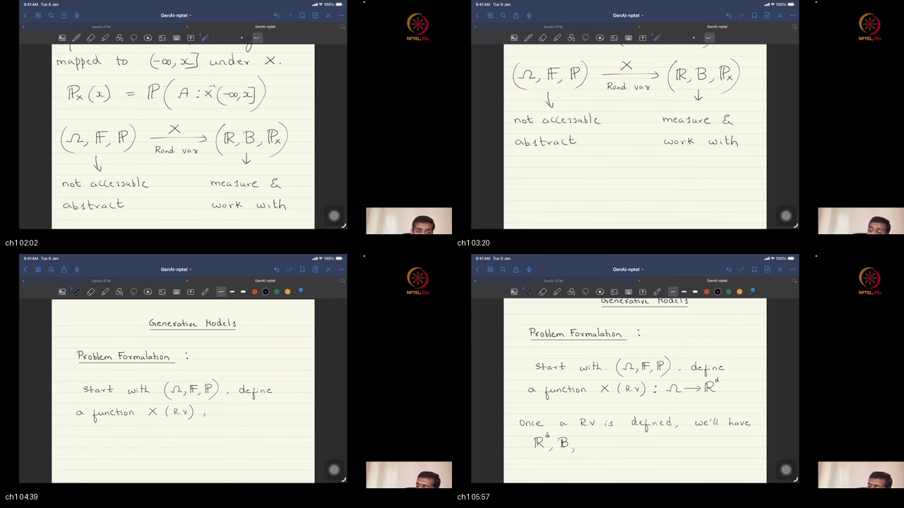
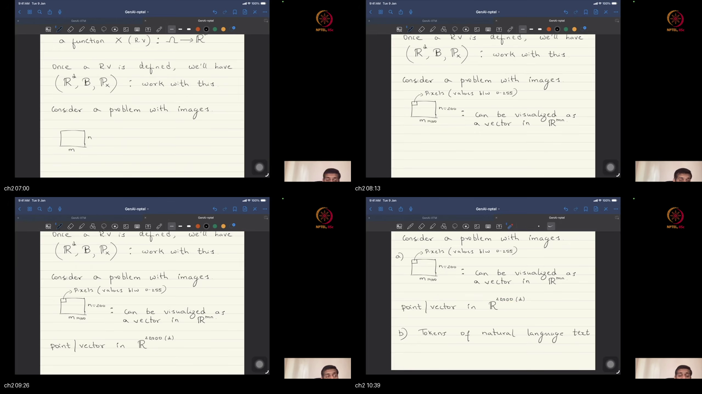
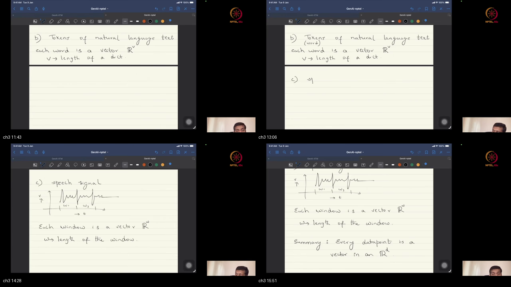
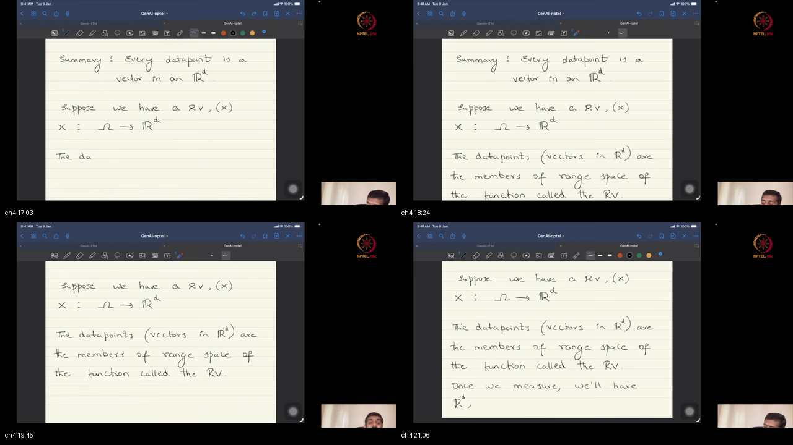
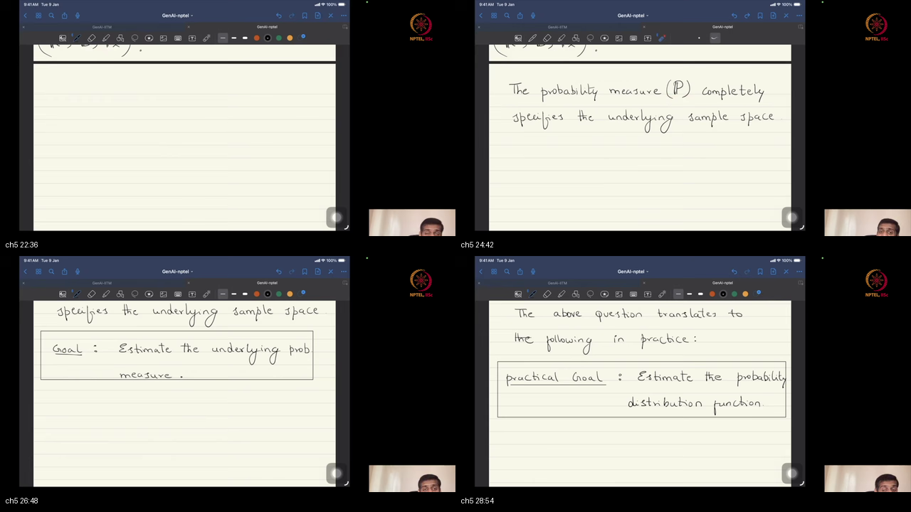
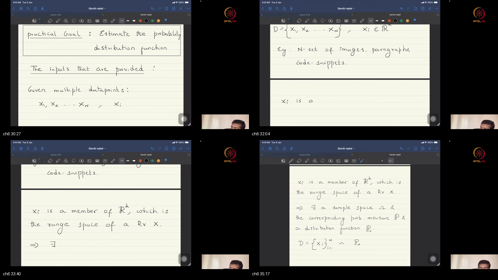
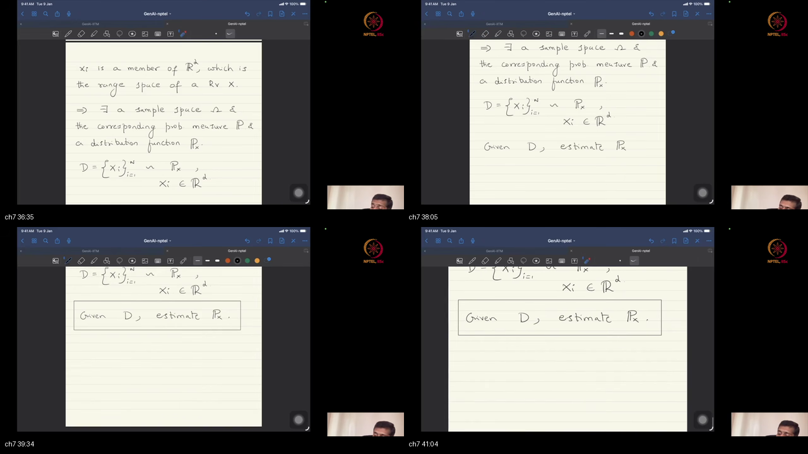
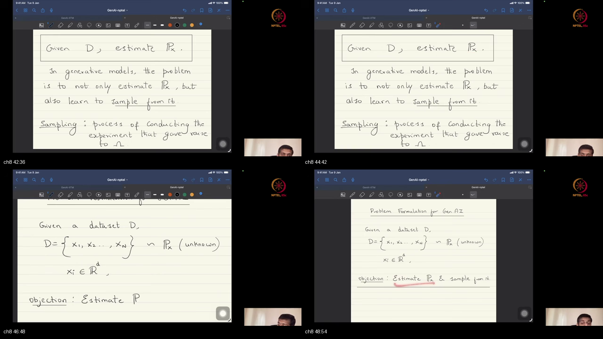
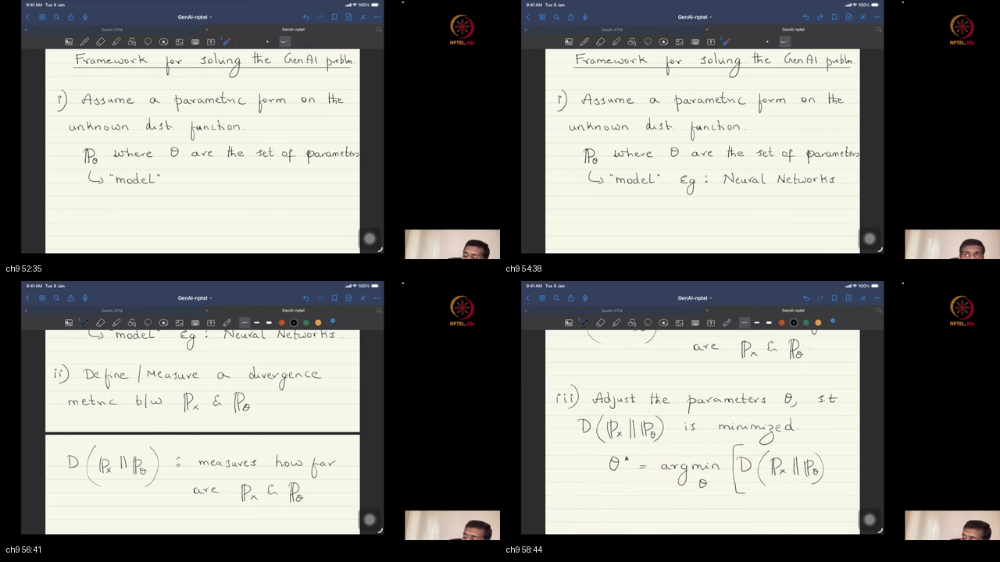
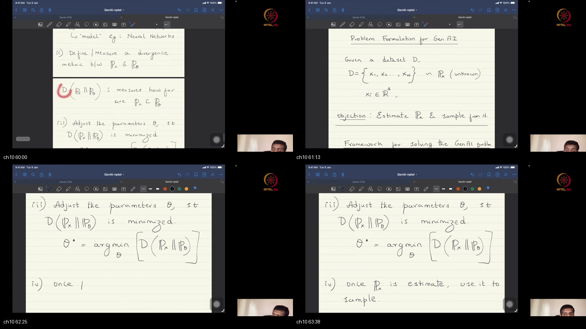

# Lec 02 — Generative Models: Problem Formulation

**Video:** [Lec 02 Generative Models Problem Formulation](https://www.youtube.com/watch?v=GKfv4l6r7hQ) · NPTEL / IISc  
**Warm-up first:** [PREREQUISITES.md](./PREREQUISITES.md)  
**Previous:** [Lec 01 Introduction](../14-Lec01-MFGAI-Introduction/NOTES.md)  
**Course:** Mathematical Foundations of **Generative AI** (~64 min)

---

## Table of Contents

1. [Topic 1 — Recap: triplet → RV → distribution on R^d](#topic-1-recap-triplet--rv--distribution-on-rd-0003–0620) (00:03–06:20)
2. [Topic 2 — Images as high-d vectors; stacking](#topic-2-images-as-high-d-vectors-stacking-0620–1100) (06:20–11:00)
3. [Topic 3 — Text, speech, data-agnostic](#topic-3-text-speech-data-agnostic-1100–1615) (11:00–16:15)
4. [Topic 4 — Data ∈ range(X)](#topic-4-data--rangex-1615–2130) (16:15–21:30)
5. [Topic 5 — Know P / estimate p_X](#topic-5-know-p--estimate-px-2130–2930) (21:30–29:30)
6. [Topic 6 — Data as oil; D ~ p_x](#topic-6-data-as-oil-d--px-2930–3545) (29:30–35:45)
7. [Topic 7 — Central ML: estimate p_x](#topic-7-central-ml-estimate-px-3545–4130) (35:45–41:30)
8. [Topic 8 — Sampling + GenAI problem](#topic-8-sampling--genai-problem-4130–4930) (41:30–49:30)
9. [Topic 9 — Recipe: model, divergence, train](#topic-9-recipe-model-divergence-train-4930–5920) (49:30–59:20)
10. [Topic 10 — Open questions, recap, homework](#topic-10-open-questions-recap-homework-5920–6359) (59:20–63:59)
11. [External references](#external-references)
12. [Sources](#sources)

---

## Executive Summary — architecture of this lecture

A generative model still has one job: look at many examples of a thing (faces, emails, sentences) and learn their **pattern** well enough to make a *new* example of the same kind. Last lecture named the math objects. This one writes the actual problem. Nature runs a random experiment we almost never open; we only store **files** — pixel lists, word lists — as vectors in $\mathbb{R}^d$. All machine learning is trying to estimate the unknown pattern of those files. Generative AI adds one extra demand: after you estimate that pattern, you must also **draw a brand-new file** that was never in the pile.

**Worldview arc:** from abstract triplet + “a random variable is a function” **to** “given $D\sim p_x$, estimate $p_x$ and learn to sample.”

**Hour at a glance (whole video).** The first half is *what we actually hold*. He recaps the **probability triplet** — sample space Ω (every outcome that could happen), the menu of events F, and probability $P$ — then repeats the hard fact: practitioners almost never see that triplet. A **random variable** $X$ is the function that turns a hidden outcome into a list of numbers. An image is just such a list: stack a $100\times 200$ grid into one point in $\mathbb{R}^{20000}$. A word can be a one-hot list (a 1 in one dictionary slot, 0 elsewhere). A speech window is another list. The algorithms later will not care which modality you started from — they see vectors. Those vectors live in the **range** of $X$: they are camera/microphone outputs, not the hidden world. If you knew the law of those outputs, written $p_X$ or $p_x$, you could answer every uncertainty question about the system. That is why the goal shifts from “estimate abstract $P$” to “estimate $p_x$ from files.”

The rest of the hour is *the problem you will train*. Data is the raw material (“the new oil”). A **dataset** $D=\{x_1,\ldots,x_n\}$ is $n$ vectors treated as draws from unknown $p_x$. The sacrosanct job of all machine learning — linear models, nets, language models — is: **given $D$, estimate $p_x$**. Discriminative work can stop there (classify an X-ray). **Generative AI** also needs **sampling**: simulate the random experiment without the real Ω, so you can mint a new photo or sentence. You cannot skip the law and “just sample.” The engineering recipe is the same as high-school curve fitting: assume a parametric family $p_\theta$ (today often a neural net), score how far it sits from truth with a **divergence** $d(p_x,p_\theta)$ (Kullback–Leibler, Jensen–Shannon, $f$-divergences), **train** by $\theta^\star=\arg\min_\theta d$, then sample from the fit. The open knot — how to compute $d$ when you never observe true $p_x$ — is next lectures.

### System context

```
  ╔══════════════════════════════════════╗
  ║ Outside: GPT / diffusion / VAE / GAN ║
  ║ Outside: “just generate new images”  ║
  ╚══════════════╤═══════════════════════╝
                 │ this lecture (~64 min)
                 ▼
        ┌────────────────────────────┐
        │ GenAI problem formulation  │
        │ estimate p_x  +  sample    │
        └────────────────────────────┘
                 │
                 ▼
        next: how algorithms compute d
        without access to true p_x
```

### Main blueprint

```
  Nature: RE  →  (Ω, F, P)     [inaccessible in practice]
         random experiment → sample space, events, probability
                    │
                    │  X : Ω → R^d   (RV = function / sensor)
                    ▼
  Surrogate:  (R^d, Borel σ-algebra, p_x)
              files live here; p_x = law of the files
                    │
                    │  images / text / speech → vectors
                    ▼
  Data ∈ range(X)   x = X(ω) for some unknown ω
                    │
                    ▼
  Dataset D = {x_1,…,x_n} ⊂ R^d ,   x_i ∼ p_x
                    │
          ┌─────────┴─────────┐
          ▼                   ▼
   ML core:              GenAI add-on:
   estimate p_x          also sample
   (model uncertainty)   (= simulate RE)
          │                   │
          └─────────┬─────────┘
                    ▼
  Recipe:  assume p_θ  →  d(p_x ∥ p_θ)  →  θ* = argmin_θ d
           (model family)   (how far?)      (train)
                    │
                    ▼
  then sample from p_θ*   (open: how to compute d without p_x)
```

### Scenario walkthrough

Walk this **one** story through the blueprint above. Each step answers “so what?” for the next box.

**Story:** you want a machine that can look at a pile of **studio face photos** and then draw a **new** face that looks like it came from the same studio. (A chatbot is the same shape: new sentences instead of a new photo.)

1. **Why not just write down “nature”?** The full random experiment — who walked in, the lighting, the pose — lives in Ω. You never get that list. That is the inaccessible-triplet box.

2. **So what do you actually store?** The camera is the random variable $X$. It turns the hidden scene into a $100\times 200$ grid, stacked into one vector in $\mathbb{R}^{20000}$. Text and speech get the same treatment: each is a vector of some length $d$. That is IMAGE / TEXT / SPEECH → $\mathbb{R}^d$.

3. **Where do the training files live?** In the **range** of $X$. Each photo is $X(\omega)$ for some unknown $\omega$. You keep files, not souls. That is the RANGE box.

4. **What is the pile formally?** $n$ photos $D=\{x_1,\ldots,x_n\}$, written $x_i\sim p_x$ — draws from an unknown law of studio pictures. Data is the raw material. That is the DATA / “oil” box.

5. **What is the one job of machine learning?** Estimate that unknown law $p_x$. If you knew it, you could score “how typical is this lighting?” the way a known coin law scores “ten heads.” Linear models, nets, and language models are all after that law. That is the ML-CORE box.

6. **What extra demand is generative AI?** Classification can stop after estimation (this X-ray: diseased or not). Generation must **sample**: simulate “take a studio photo” without the real studio, so a new file appears that was never in $D$. You still need a law — implicit or explicit — before you can sample. That is SAMPLE + GENAI.

7. **How do you actually fit the law?** Same as fitting a line to points: assume a family $p_\theta$ (often a neural net), pick a divergence that scores “how far is my family from truth,” train by minimizing that score, then draw from the fit. You never plug true $p_x$ into the formula — that knot is later. That is the RECIPE box.

```
  want a new studio face
         │  (not: list Ω of every possible person)
         ▼
  camera files X  =  stacked pixel vectors
         │  n of them
         ▼
  dataset D ∼ unknown p_x
         │  estimate the law
         ▼
  fit p_θ by min d(p_x, p_θ)
         │  then
         ▼
  sample a new file   =  generate
```

Same chain for new sentences or new code: pile of vectors → estimate $p_x$ → also sample. Diffusion, VAEs, GANs, and transformers are later engines for those last two arrows.

### Failure / contrast path

```
  “I’ll work on abstract Ω with no files”           ──X──► nothing a computer can hold
  “An image is only a 2-D grid, not a vector”       ──X──► you left the R^d worldview
  “Data is just numbers; no map X underneath”       ──X──► you lost why probability applies
  “I’ll just sample; skip estimating the law”       ──X──► lecture: you still need a law
  “Plug true p_x into d on the board”               ──X──► you never observe p_x
  “Estimate only, then stop”                        ──X──► fine for classify; not GenAI
```

### STOP / out of scope

He does **not** train a VAE, a diffusion model, or an autoregressive net today. He does not show how each family evaluates $d$ from samples alone, or pick an optimizer. Full measure-theory proofs stay in Lec 01 / the tutorials. Today ends when you can state the problem: estimate $p_x$ **and** learn to sample.

### Load-bearing claims (closed-book)

- Practitioners work with the **surrogate** (vectors in $\mathbb{R}^d$ + their law $p_x$), not the hidden triplet $(\Omega,\mathcal{F},P)$.
- Every data point is a **vector** (the modality only chooses $d$) and a **range member** of $X$.
- Knowing $P$ — equivalently $p_x$ on the files — **completely quantifies** the system’s uncertainty.
- **All ML** (discriminative and generative) aims to **estimate that unknown law** from data.
- A dataset is $n$ **realizations** of $X$: $D=\{x_i\}$ with $x_i\sim p_x$.
- **GenAI** = given $D$, **estimate $p_x$ and learn to sample** (simulate the experiment without real Ω).
- Recipe: assume a model $p_\theta$, score $d(p_x,p_\theta)$, train $\theta^\star=\arg\min_\theta d$, then sample.
- Still open: which $p_\theta$, which optimizer, and **how to compute $d$ without access to $p_x$**.

**Speaker / course:** NPTEL IISc · Mathematical Foundations of Generative AI · Lec 02.

---

## Topic 1: Recap: triplet → RV → distribution on R^d (00:03–06:20)

### Where this sits on the master map

**RECAP** — Nature uses $(\Omega,\mathcal{F},P)$ to generate uncertainty; practitioners almost never see that triplet, so introduce RV $X:\Omega\to\mathbb{R}^d$ and work with the measurable surrogate. Warm-up: [triplet](./PREREQUISITES.md#p1-triplet) · [RV](./PREREQUISITES.md#p2-rv) · [$p_X$](./PREREQUISITES.md#p5-px). Continues [Lec 01](../14-Lec01-MFGAI-Introduction/NOTES.md).

### Board / screenshot



**Figure — ~00:03–06:20:** probability triplet; RV as function into $\mathbb{R}^d$; distribution via pre-image; practitioner surrogate.

### What he is establishing

This class continues last lecture’s probabilistic framing of generative models and extends it into a full **problem formulation** of generative modeling — not only “what is $P$,” but what problem we will eventually train algorithms to solve.

In statistics we use the **probability triplet** — sample space $\Omega$, event space $\mathcal{F}$, and probability measure $P$ — to quantify the uncertainty in a system we want to model. That is the formal language of random experiments. Practitioners typically do **not** have access to the underlying triplet: neither the sample space, nor the event space, nor the probability measure as an abstract function on events. You cannot open a file and read $\Omega$ for “human language” or “everyday photographs.”

For convenience we define a **random variable** as a **function** that maps members of the sample space to real numbers or real vectors. Keep the worldview firm: a random variable is not a free-floating “random number”; it is a map. Once the RV is defined, the event structure is carried over as a $\sigma$-algebra on the range side, and the probability measure is translated into a **probability distribution function** on that range. The distribution function is defined on the **range space** of $X$: you take a scalar or vector in that range and evaluate the distribution there.

Evaluating the distribution function at a point equals the probability of a corresponding event under the original $P$. Concretely, for the one-dimensional sketch, the distribution function at a threshold is $P$ of the **inverse image** under $X$ of the set $(-\infty,x]$ — the event in $\Omega$ of outcomes that map into that subset of the reals. So the distribution function is a valid probability measure on the events we care about via pre-images.

Because the original triplet is inaccessible, what is accessible to practitioners is the **surrogate triplet**: the reals (or $\mathbb{R}^d$), the Borel $\sigma$-algebra, and the probability distribution function. That is what we measure and what we must work with.

Session narrative from here: continue from that surrogate through to formulating generative modeling as a problem and using algorithms to solve it. Nature generates data under $(\Omega,\mathcal{F},P)$; then we define a function called the random variable. Slogan: **a random variable is a function**.

In general $X$ maps the sample space into **$d$-dimensional real (Euclidean) space**:

$$
X:\Omega\to\mathbb{R}^{d}
$$

Notation: $\mathbb{R}^d$ means $d$-dimensional Euclidean space; members are $d$-dimensional vectors; $d$ is any positive integer ($\mathbb{R}^3$ holds 3-vectors, $\mathbb{R}^2$ holds 2-vectors, and later $d$ will be huge). In practice, once $X$ is defined we end up working with $\mathbb{R}^d$, a $\sigma$-algebra of subsets of $\mathbb{R}^d$, and the probability distribution function on that space.

You can now restate the Lec 01 endpoint as a practitioner stack: inaccessible $(\Omega,\mathcal{F},P)$ → RV $X$ → surrogate $(\mathbb{R}^d,$ Borel, distribution). Still missing: what “a data point” looks like when the data are images, text, or speech.

If you skip this box, the next ideas float. A common trap is treating the board symbols as decoration instead of the actual objects you will reuse.

### Analogy for this topic only

The full theater of possible plays is $\Omega$; you almost never hold the script. The camera that outputs a numeric file is $X$. You stock the archive by **file statistics** (the distribution on $\mathbb{R}^d$), not by metaphysical plot indices.

Question: **If you only have pixel files, can you name every abstract omega that produced them?**

If you cannot answer that without the formal objects above, the analogy is doing its job.

In lecture words: work on the surrogate (R^d, sigma-algebra, p_X), not raw Omega.

### Local picture

```
  Nature: (Ω, F, P)     ← usually inaccessible
              │
              │  X : Ω → R^d   (RV = function)
              ▼
  Surrogate:  R^d
              Borel σ-algebra
              probability distribution of X
              │
              │  p_X(x) ↔ P( X^{-1}(relevant set) )
              ▼
  Work here with what you measure
```

**Notice:** “distribution function at a range point” means probability of the pre-image event in $\Omega$ — same uncertainty, measurable coordinates.

### Bridge

How do everyday data — starting with images — become members of $\mathbb{R}^d$?

---

## Topic 2: Images as high-d vectors; stacking (06:20–11:00)

### Where this sits on the master map

**IMAGE→R^d** — An image is a grid of $mn$ pixel values; stack rows into one long vector so each image is a single point in $\mathbb{R}^{mn}$. Warm-up: [vectors & $\mathbb{R}^d$](./PREREQUISITES.md#p3-rd).

### Board / screenshot



**Figure — ~06:20–11:00:** $m\times n$ grid; row-wise stacking; $100\times 200\to\mathbb{R}^{20000}$; point in high-d Euclidean space.

### What he is establishing

Connect the abstract probability discussion to practice by taking **images** as the data space. An image on a computer is a **grid-like topology**: $m$ pixels horizontally and $n$ pixels vertically; each grid cell holds a numeric value (for example in $0$–$255$ depending on bit depth). We typically deal with **multiple** such images; the modeling question is how to fit them into the $\Omega\to\mathbb{R}^d$ framework already developed.

Pixel entries are simply numbers, and there are **$mn$** of them. One way to view an image is as a single **vector in $\mathbb{R}^{mn}$** — $mn$-dimensional Euclidean space. Teacher example: if $m=100$ and $n=200$, the image is size $100\times 200$ and is a **point (vector) in $\mathbb{R}^{20000}$**.

Low-dimensional analogy: a point $(2,3)$ in 2D Euclidean space means $2$ units on one axis and $3$ on the other. Likewise, an image is a coordinate tuple along $20{,}000$ axes in Euclidean space. In the course notation $\mathbb{R}^d$, for this example **$d=20{,}000$**; every data image is one vector lying in that high-dimensional Euclidean space.

Stacking procedure for those $20{,}000$ values: take row $1$, concatenate row $2$, then row $3$, and so on — form one long vector of length $20{,}000$ whose entries are the pixel intensities. Do not leave images as “just 2D arrays” in the probabilistic worldview; flatten into $\mathbb{R}^d$ so every observation is one point for the law $p_x$.

Worldview slogan: **every data point we deal with is a vector in a very high-dimensional Euclidean space**, and the dimensionality depends on the kind of data. The same “vector in $\mathbb{R}^d$” idea applies to other data types; images are only Example A — next come textual tokens and speech.

You can now map a grid image to $x\in\mathbb{R}^{mn}$ with $d=mn$. Still missing: how text and audio become vectors, and that the algorithms will not care which modality you started from.

If you skip this box, the next ideas float. A common trap is treating the board symbols as decoration instead of the actual objects you will reuse.

### Analogy for this topic only

A flat-pack furniture **bill of materials**: every panel and screw count listed in one long order. The assembled wardrobe is what your eyes see; the long list is what the math sees — one address in a huge coordinate system.

Question: **Where does a 100 by 200 photo live as one object in the math?**

If you cannot answer that without the formal objects above, the analogy is doing its job.

In lecture words: one vector in R^{20000} after stacking.

### Local picture

```
  Image grid m × n
  ┌───┬───┬───┐
  │p11│p12│ … │  row 1
  ├───┼───┼───┤
  │p21│ … │   │  row 2
  └───┴───┴───┘
        │ stack rows
        ▼
  x = (p11, p12, …, pmn)  ∈  R^{mn}
        │
        │  example: 100×200 → d = 20,000
        ▼
  one point in high-d Euclidean space
```

**Notice:** dimensionality is data-dependent; the probabilistic objects live on $\mathbb{R}^d$, not on “image type” as a special category.

### Bridge

How do natural-language tokens and speech signals become vectors in some $\mathbb{R}^d$?

---

## Topic 3: Text, speech, data-agnostic (11:00–16:15)

### Where this sits on the master map

**MODALITIES** — Text tokens → one-hot vectors in $\mathbb{R}^v$; speech → windowed vectors in $\mathbb{R}^w$; any modality becomes a point in some $\mathbb{R}^d$. Course algorithms are data-type agnostic. Warm-up: [$\mathbb{R}^d$](./PREREQUISITES.md#p3-rd).

### Board / screenshot



**Figure — ~11:00–16:15:** vocabulary / one-hot; speech windows; unified “data point = vector in $\mathbb{R}^d$.”

### What he is establishing

For natural-language text tokens, represent each word as a vector in **$\mathbb{R}^v$**, where $v$ is the length of a dictionary (vocabulary). A **dictionary / vocabulary** is an exhaustive list of all possible words that can appear in the language under consideration. Encode each word as a vector of zeros and ones with a **$1$** only at the dictionary index of that word and **$0$** elsewhere; length equals the number of words in the dictionary. That all-zeros-but-one encoding is called the **one-hot representation** — one of several possible representations, used here to convey the vector idea, not as a claim that modern LLMs store only one-hots forever.

A token may be a word, a syllable, or another unit; for ease of understanding, treat tokens as words — each is still a one-hot vector in $v$-dimensional space.

Third modality — **speech / audio**: a one-dimensional signal over time (for example voltage versus time for one utterance). Applications include generate speech from text, or recognize speech — both operate on such signals. Speech procedure: **chunk** the signal into successive **windows**; the samples inside one window form a vector in **$\mathbb{R}^w$**, where $w$ is the window length.

Take-home definition of **data point**: an image, a speech window, a word in a sentence — whatever the problem needs; always a vector in **$\mathbb{R}^d$** Euclidean space. Whenever the course later says “a data point,” always imagine a vector in $d$-dimensional space — image, video chunk, speech signal, word/token, even a piece of code; **anything**.

Course policy: generative algorithms are treated in a **data-type-agnostic** (data-set-agnostic) manner — the same algorithmic ideas apply across modalities. When a nuance is specific to one data type, it will be called out; in general the discussed algorithms apply to speech, natural-language tokens, code, and other data types.

Summary slogan: every data point we look at is a vector in a $d$-dimensional Euclidean space. That bridges back to probability: next, $X:\Omega\to\mathbb{R}^d$ and data as range members.

You can now package image, text, and speech as $x\in\mathbb{R}^d$ with modality-chosen $d$. Still missing: how those vectors sit inside the range of the random variable and why $\Omega$ still “stands behind” every dataset.

If you skip this box, the next ideas float. A common trap is treating the board symbols as decoration instead of the actual objects you will reuse.

### Analogy for this topic only

Three shipping crates (image, text, audio) of different shapes all get **repacked into the same kind of barcode sticker** — a length-$d$ numeric list. The warehouse robots (algorithms) only read barcodes unless a crate type needs a special handling note.

Question: **What single object type do images, words, and speech windows share for the algorithms?**

If you cannot answer that without the formal objects above, the analogy is doing its job.

In lecture words: every data point is a vector in R^d; algorithms are data-type agnostic.

### Local picture

```
  Image     →  stack pixels     →  R^{mn}
  Text      →  one-hot index    →  R^{v}   (v = vocab size)
  Speech    →  window samples   →  R^{w}   (w = window length)
  Code / …  →  chosen encoding  →  R^{d}
                 │
                 ▼
  “data point” ≔ x ∈ R^d
  algorithms: data-type agnostic (unless nuance called out)
```

**Notice:** one-hot is illustrative; the permanent idea is “modality → vector,” not “one-hot forever.”

### Bridge

If $X$ maps $\Omega$ into $\mathbb{R}^d$, where exactly do observed data points live?

---

## Topic 4: Data ∈ range(X) (16:15–21:30)

### Where this sits on the master map

**RANGE** — Observed data in $\mathbb{R}^d$ are **members of the range** of RV $X:\Omega\to\mathbb{R}^d$. Sensors act as $X$. Warm-up: [range of $X$](./PREREQUISITES.md#p4-range) · [RV](./PREREQUISITES.md#p2-rv).

### Board / screenshot



**Figure — ~16:15–21:30:** domain $\Omega$ vs range $\subseteq\mathbb{R}^d$; data $=X(\omega)$; sensor-as-RV; working surrogate after measurement.

### What he is establishing

If random variable $X$ maps the sample space to $\mathbb{R}^d$, then the data points we hold in $\mathbb{R}^d$ are **members of the range** of that function $X$. An image already treated as a vector in $\mathbb{R}^d$ is, under the probabilistic worldview, a point in the **range space** of the RV.

Function basics: a function maps a **domain** set to a **range** set; for an RV the domain is $\Omega$, the range is (a subset of) $\mathbb{R}^d$, and data live there. Every data point we encounter is a member of the range space of the random variable — or equivalently, seeing a vector in $\mathbb{R}^d$ means treating it as $X(\omega)$ for some $\omega\in\Omega$. That reading implies an **underlying sample space** that was mapped to this vector under $X$ — the worldview students must hold even when $\omega$ is never named.

In probabilistic ML: every data point is a vector in $\mathbb{R}^d$ **and** a range member of an RV, which automatically brings an underlying $\Omega$ and an (implicit) probability measure on that $\Omega$. Datasets we see are vectors in $\mathbb{R}^d$; that $\mathbb{R}^d$ is the range of $X$, so there exists an underlying sample space we **do not have access to**.

Beauty of the construction: once $X$ is defined, we need not know what the abstract elements of $\Omega$ are — the RV **takes the burden** of converting them into something measurable in $\mathbb{R}^d$. Sensors as RV: a camera (image sensor) or microphone (speech sensor) converts members of the sample space into measurements in $\mathbb{R}^d$ — that conversion is what a random variable does.

Working with measured range elements always carries the implicit understanding that some $\Omega$ generated the observation under $X$ and that a probability measure is defined on that $\Omega$. Operational surrogate after measurement: elements of $\mathbb{R}^d$, a $\sigma$-algebra of subsets of $\mathbb{R}^d$, and a **probability distribution function** as surrogate for the probability measure.

This closes one part of the story; the next part returns to the fundamental goal — modeling **uncertainty** in the system.

You can now say “every data vector is a range member of $X$” and keep $\Omega,P$ implicit. Still missing: why knowing $P$ (or $p_X$) is the entire uncertainty-quantification game, and why ML’s central goal becomes estimating that law.

If you skip this box, the next ideas float. A common trap is treating the board symbols as decoration instead of the actual objects you will reuse.

### Analogy for this topic only

Three people walk into a passport booth. The machine prints three photos. Your hard drive stores those three photo files — never the people themselves.

Question: **If a fourth photo appears tomorrow, where does it “live” in the story — among people, or among printable machine outputs?**

Right move: treat every photo as an output of the same booth map (abstract person → printable array). Wrong move: treat the file as a free-floating number with no map underneath, then wonder why probability language still applies.

In lecture words: each data vector is a member of the range of $X$; $X$ maps abstract $\Omega$ into $\mathbb{R}^d$.

### Local picture

```
  Ω  (abstract outcomes)          [not accessed]
       │
       │  X(·)  camera / mic / encoder
       ▼
  range(X) ⊆ R^d
       │
       │  observed data points live here
       ▼
  x = X(ω)  for some unknown ω
       │
       ▼
  work with (R^d, σ-algebra, distribution of X)
```

**Notice:** saying “$x\in\mathbb{R}^d$ is data” already implies (in this worldview) an underlying $\Omega$ and $P$ even if you never write them.

### Bridge

What single mathematical object completely quantifies system uncertainty — and what do we estimate in practice?

---

## Topic 5: Know P / estimate p_X (21:30–29:30)

### Where this sits on the master map

**CLAIM+GOAL** — Knowing $P$ completely quantifies system uncertainty; in practice estimate unknown $p_X$. Warm-up: [triplet](./PREREQUISITES.md#p1-triplet) · [$p_X$](./PREREQUISITES.md#p5-px). Dense core of the lecture’s “why ML.”

### Board / screenshot



**Figure — ~22:36–28:54:** board for $P$ as uncertainty quantifier and the practical shift to estimate $p_X$ on $\mathbb{R}^d$.

### What he is establishing

The system whose uncertainty we model can be a coin toss, a die roll, or — practically — generating natural language. Large language models try to model the system of **human language**. Statistics and probability theory supply the **mathematical tooling** to quantify uncertainty in such systems.

Recap of working objects: we defined $P$ and $\Omega$, but for measurement reasons we work with $d$-dimensional Euclidean space, Borel sets, and the probability distribution function — not directly with $(\Omega,\mathcal{F},P)$. That does not weaken the claim about what “knowing uncertainty” means; it only changes the coordinate system in which we compute.

**Central claim:** the probability measure $P$ defined on the sample space **completely specifies** (quantifies) the uncertainty in the system. Mathematically $P$ is a function from members of the event space into $[0,1]$; if that function is known, everything needed to quantify uncertainty is known. Intuition: the fundamental goal is to quantify uncertainty, and **$P$ itself is the function that does that quantification**.

Coin-toss example: if $P$ is known, one can answer any uncertainty question — likelihood of ten heads, fifth toss tails, six heads then a seventh tails, and so on. Therefore the goal of the entire engineering exercise around uncertainty measurement is to **estimate / evaluate / understand the underlying probability measure $P$**.

Goal of machine learning (and statistical measures generally): **estimate the underlying probability measure** — this is the **central question of machine learning**. Scope of that question: **both discriminative and generative models**; from neural networks to kernel machines to linear models to generative models — all ultimately try to estimate the probability measure. If you treat “generative AI” as a totally separate species of math, you miss the shared formative question.

In practice we almost never access $\Omega$ or $P$; we work with range elements of the RV (our data points in $\mathbb{R}^d$) and the probability distribution function. The probability distribution function **completely specifies** the probability measure as well, because the events used to define it are rich enough that knowing those probabilities recovers $P$ on the relevant sets. Translation of the central question under that fact: the **practical goal** is to **estimate the probability distribution function** (not raw $P$ on abstract events).

Why the translation: we work with the surrogate triplet $(\mathbb{R}^d,$ Borel, $p_X)$, not $(\Omega,\mathcal{F},P)$; given elements of $\mathbb{R}^d$ the question is estimate **$p_X$**, not $P$. Estimating $p_X$ is **equivalent** to estimating $P$ because the distribution function is defined so that it carries the same probabilistic information (via pre-images under $X$). Slogan: **all machine learning is estimating the unknown probability distribution function.**

Any estimation problem needs **input / data**: you cannot free-float “estimate a distribution” without the underlying setup and the wherewithal (observations) to solve it. That leads into the next topic on data as the raw material of learning.

You can now state both the abstract goal (estimate $P$) and the practical goal (estimate $p_X$), and the equivalence that justifies the shift. Still missing: the formal package for “$n$ vectors given,” and the compact notation $x_i\sim p_x$.

If you skip this box, the next ideas float. A common trap is treating the board symbols as decoration instead of the actual objects you will reuse.

### Analogy for this topic only

If you own the complete climate probability model for a city, you can answer “chance of ten rainy days in a row.” If you only have thirty days of logs, you estimate that climate file from logs — that estimate **is** the ML job. Discriminative and generative models both need a climate file; they use it for different questions later.

Question: **If you knew p_X completely, what class of questions could you answer?**

If you cannot answer that without the formal objects above, the analogy is doing its job.

In lecture words: knowing the law quantifies uncertainty; ML aims to estimate p_X.

### Local picture

```
  Ideal object:  P : F → [0,1]
       │  “know P ⇒ uncertainty fully quantified”
       │  (coin sequences, language, …)
       ▼
  Reality: no access to Ω / F / P
       │
       ▼
  Surrogate: p_X on R^d  (law of measurements)
       │
       │  p_X carries P via pre-images under X
       ▼
  Practical ML goal: estimate unknown p_X
       │
       │  needs data as input ──► next topic
       ▼
  Slogan: all ML estimates the unknown distribution
```

**Notice:** the course does not yet say *how* to estimate; it fixes *what* is being estimated and why that is the whole uncertainty game.

### Bridge

What is the formal starting package of “given data,” and how does the probabilistic worldview rewrite a pile of vectors?

---

## Topic 6: Data as oil; D ~ p_x (29:30–35:45)

### Where this sits on the master map

**DATA** — Data is the raw material (“new oil”); formal start is dataset $D=\{x_1,\ldots,x_n\}$ with $x_i\in\mathbb{R}^d$ and $x_i\sim p_x$. Warm-up: [dataset & $\sim p_x$](./PREREQUISITES.md#p6-dataset).

### Board / screenshot



**Figure — ~29:30–35:45:** data as oil; $D=\{x_i\in\mathbb{R}^d\}$; range of $X$; implicit $(\Omega,P)$; tilde notation $x_i\sim p_x$.

### What he is establishing

Colloquial slogan: **data is the new oil** — the raw material for all machine learning (analogous to crude oil as raw material for non-renewable energy). Starting inputs for an ML problem: we are **given** $n$ data points $x_1,x_2,\ldots,x_n$. Each data point is a vector: **$x_i\in\mathbb{R}^d$** (element of $d$-dimensional Euclidean space). Concrete dataset examples of the $n$ points: **$n$ images**, **$n$ pictures**, **$n$ paragraphs** (any modality already cast as vectors).

Starting point for **all** machine learning: given $n$ data points that are elements of $\mathbb{R}^d$ — think of **$n$ vectors in $d$-dimensional space** (for example an image as a long high-dimensional vector). Name the collection: **dataset**

$$
D=\{x_1,\ldots,x_n\},\qquad x_i\in\mathbb{R}^{d}
$$

for example a thousand or ten thousand images as the $x_i$.

Probabilistic connection: $\mathbb{R}^d$ is the **range** of a random variable $X$; the $n$ points are obtained by applying $X$ to elements of the **sample space** $\Omega$. **Critical mindset / worldview** (the instructor will not keep restating this every time later): whenever the course says “$n$ data points,” visualize them as members of $d$-dimensional real space obtained by operating RV $X$ on the **nonmeasurable / unobserved** underlying sample space.

Implication of that worldview: there **exists** a sample space $\Omega$ and a corresponding **probability measure $P$** (implicit assumption in all probabilistic ML when we see data). Full implicit package when data is seen: data points are members of the **range** of RV $X$ on the sample space; because $X$ acted on $\Omega$ there exists **unknown $P$**, and with $(X,P)$ there is a **distribution function $p_x$**.

Compact notation used throughout the course: for $i=1,\ldots,n$, data points are **sampled from** an underlying probability distribution function **$p_x$** (the tilde “$\sim$” means sampled from):

$$
x_i\sim p_x,\qquad i=1,\ldots,n
$$

Operational meaning: $n$ images / vectors / code / speech / anything — all treated as samples from one unknown underlying PDF. That package bridges into the central ML problem of *estimating* that PDF.

You can now write $D$ and $x_i\sim p_x$ with the full implicit $(\Omega,X,P)$ story behind it. Still missing: the clean problem statement “given $D$, estimate $p_x$,” and the vocabulary of **realizations**.

If you skip this box, the next ideas float. A common trap is treating the board symbols as decoration instead of the actual objects you will reuse.

### Analogy for this topic only

Crude oil barrels are raw material for fuel. **Data barrels** $x_1,\ldots,x_n$ are raw material for learning $p_x$. Empty talk about “AI” without $D$ is a refinery with no oil — and each barrel is still a range sample of a map you never see.

Question: **What is the raw material of ML if oil is the raw material of fuel?**

If you cannot answer that without the formal objects above, the analogy is doing its job.

In lecture words: dataset D = {x_i} with x_i ~ p_x.

### Local picture

```
  Colloquial:  “data is the new oil”
                    │
                    ▼
  Formal:  D = {x_1, …, x_n},  x_i ∈ R^d
                    │
                    │  critical mindset (not restated forever)
                    ▼
  each x_i = X(ω_i)  for unobserved ω_i ∈ Ω
                    │
                    │  ⇒ exists P; law p_x on R^d
                    ▼
  notation:  x_i ∼ p_x   (sampled from unknown PDF)
```

**Notice:** the tilde is a worldview stamp, not a claim that you know $p_x$ already — $p_x$ is exactly what remains unknown.

### Bridge

What is the single sacrosanct problem of all machine learning once $D$ is in hand?

---

## Topic 7: Central ML: estimate p_x (35:45–41:30)

### Where this sits on the master map

**ML-CORE** — Given $D=\{x_i\in\mathbb{R}^d\}\sim p_x$, the central problem of all ML is **estimate unknown $p_x$**. Data = $n$ **realizations** of the RV. Warm-up: [dataset](./PREREQUISITES.md#p6-dataset) · [$p_X$](./PREREQUISITES.md#p5-px). Dense core.

### Board / screenshot



**Figure — ~35:45–41:30:** RE repeated $n$ times; realizations; “given $D$, estimate $p_x$”; uncertainty modeling goal.

### What he is establishing

Restate the chain: all $x_i$ live in $\mathbb{R}^d$ equal to the **range space** of RV $X$; $X$ operated on sample space $\Omega$; there exists an underlying **probability measure** that is translated into a **probability distribution function**. Origin of the $n$ points: they come from **repeating the underlying random experiment $n$ times** (the discussion began with RE $\to$ outcomes in the sample space). Concrete RE examples for the $n$-fold repetition: **tossing a coin** $n$ times $\to$ set $D$ of outcomes; or RE of **taking images of sceneries** / **generating natural language text** repeated many times.

Full story in one chain: RE + sample space + probability measure $\to$ under RV $X$ each outcome becomes a vector in $\mathbb{R}^d$, and the measure becomes the PDF under $X$. From now on the instructor will **not** restate the full story; shorthand is: **given $D$** (the set defined above), **estimate the unknown probability distribution function**.

This is the **central / sacrosanct problem of the entire machine learning**: from linear models and linear regression through Bayesian models, neural networks, LLMs, and all generative modeling — the one underlying problem is **estimating the distribution function given data**. If you hear “linear regression” and “LLM” as unrelated slogans, re-read them as different parametric stories about the same estimation job.

What “data” means under this problem: data points are outcomes of **$n$ repetitions** of the RE; because we measure, RV $X$ transforms those outcomes into vectors in $\mathbb{R}^d$. Central ML question stated cleanly: **given dataset $D$, estimate the underlying distribution function $p_x$**; and **$p_x$ is completely unknown**.

**Why** estimate $p_x$: to **model the uncertainty** associated with the system; once $p_x$ is known, many questions about quantifying uncertainty of the underlying system become answerable.

Alternate terminology: the data points are also called **realizations of the random variable**. Definition of **realization**: RE is conducted $n$ times; each outcome is translated into a vector in $\mathbb{R}^d$ by RV $X$ — that vector is a realization of the RV. Brevity convention: when the instructor says **“distribution function,”** they mean **probability distribution function**.

Textbook / research-paper form of the statement (appreciable after prior lectures): **the central problem in ML is to estimate the underlying distribution function given $n$ observations / realizations from the random variable**.

Bridge to generative modeling: generative modeling will add a **small corollary** to this ML problem — after estimating $p_x$, generative models do more (handed off to the next topic).

You can now state the ML core in one line and call data points realizations. Still missing: what “sample” means formally, and the GenAI problem as estimate **plus** sample.

If you skip this box, the next ideas float. A common trap is treating the board symbols as decoration instead of the actual objects you will reuse.

### Analogy for this topic only

A blood lab runs the same test on $n$ patients and files $n$ numeric result sheets. Linear models, neural nets, and language models are different tools — but the scientist’s core job is still: recover the **law of those results**, not decorate the folder with the brand name of the tool.

Question: **Someone gives you only the $n$ sheets and no closed-form formula for the population. What single mathematical object are you trying to recover?**

Right move: say “the unknown distribution of the measurements.” Wrong move: say “just memorize the $n$ sheets” and call that the whole of ML.

In lecture words: given dataset $D$, estimate unknown $p_x$.

### Local picture

```
  RE repeated n times
       │ outcomes in Ω
       │ X maps each outcome → R^d
       ▼
  D = { realizations of X }
       │
       │  shorthand (instructor will not re-expand forever)
       ▼
  Given D, estimate unknown p_x
       │
       │  why? model / quantify system uncertainty
       ▼
  SACROSANCT PROBLEM OF ALL ML
  (linear · Bayesian · NN · LLM · generative …)
       │
       ▼
  GenAI will add a corollary: also sample  ──► Topic 8
```

**Notice:** $p_x$ is completely unknown at the start; $D$ is the only gift.

### Bridge

What extra demand turns “estimate $p_x$” into the generative AI problem?

---

## Topic 8: Sampling + GenAI problem (41:30–49:30)

### Where this sits on the master map

**SAMPLE+GEN** — Sampling = simulate the RE without real $\Omega$; GenAI = estimate $p_x$ **and** learn to sample. Warm-up: [sampling vs estimating](./PREREQUISITES.md#p7-sample). Dense core.

### Board / screenshot



**Figure — ~42:36–48:54:** sampling as synthetic RE; GenAI = estimate $p_x$ **and** learn to sample.

### What he is establishing

Generative modeling does **not** stop at estimating the distribution function; it also requires **learning to sample** from it. **Sampling** (introduced terminology): the process of algorithms that **simulate the underlying random experiment** that gives rise to the sample space. Random-experiment examples revisited for sampling: **tossing a coin**, **rolling a die**, **taking a picture / generating an image** — all REs whose outcomes live in $\Omega$.

Practical sampling questions by domain: can we **simulate a coin toss** synthetically? **simulate a die roll** that gave rise to a dataset? **create new images that do not exist** (image generation)? **generate humanlike text** (LLMs)? **generate humanlike code** (code LLMs)? Formal definition of sampling: the process of conducting — or having the ability to conduct — the experiment that gives rise to sample space $\Omega$ **without having access to the real $\Omega$ at all**.

Contrast with **discriminative models**: roughly, they **stop at estimating** the underlying distribution function (question nature: for example classification — given an X-ray, diseased or not). In **generative models** we add a second question on top of estimation: given dataset (samples from the underlying distribution), **estimate the distribution and also learn how to sample** = simulate the underlying experiment that gave rise to the sample space.

Problem formulation for **generative AI** (GenAI): **given** dataset $D$ of $n$ realizations of the underlying RV, each $x_i\in\mathbb{R}^d$, sampled according to an **unknown** underlying PDF — **estimate $p_x$ and sample from it**. Terminology note: “GenAI” is somewhat cliché — it just means **models that can sample** — but the course uses the terminology used in practice.

Restated problem setting: given $n$ data points = $n$ realizations of a RV $\to$ **estimate the underlying distribution function and learn to sample from it** (sampling = simulate the RE).

Trap / important answer: can we learn to sample **without** fully estimating the distribution? **No** — one must know how to estimate the underlying distribution in order to learn to sample from it; the **central problem remains distribution estimation**. For generative modeling the model must either **implicitly** or **explicitly** estimate the distribution **before** it learns how to sample. Skipping estimation and “just sampling” is not a free pass; the law still has to be in the model somehow.

Foundational course question: start with $n$ realizations of a RV with **unknown** distribution, points in $\mathbb{R}^d$; solve (via many algorithms) **estimate $p_x$ (implicitly or explicitly) and learn to sample**. Family of methods that all answer this **one** question: **diffusion models**, **VAEs**, **adversarial models**, **LLMs**, **autoregressive models**, **state space models**.

You can now write the GenAI problem in one sentence and separate it from discriminative “estimate-only.” Still missing: the engineering recipe — parametric model, divergence, training as minimization — that turns the problem into an optimization loop.

### Analogy for this topic only

You have thirty years of daily weather logs for one city.

- Task A (estimate only): build a climate file good enough to score “how rare is a 10-day drought?”  
- Task B (generate): invent a brand-new synthetic year of weather that was never logged, but still looks like that city’s climate.

Classification is closer to Task A with labels. Image / text GenAI is Task B: **new photos or sentences that did not exist in the training set**.

Question: **Which task requires you to re-run something like the original random experiment without the real planet state?**

Right move: Task B — sampling / simulation. Wrong move: treat “generate” as pure memorization of the thirty-year log.

In lecture words: estimate $p_x$ **and** learn to sample (simulate the RE without real $\Omega$).

### Local picture

```
  Discriminative path:
    D  →  estimate (parts of) the law  →  STOP (e.g. classify)

  Generative / GenAI path:
    D = {x_i ∈ R^d} ∼ p_x (unknown)
         │
         ├─► estimate p_x   (implicitly or explicitly)
         │
         └─► learn to sample
                = simulate RE
                without real Ω
         │
         ▼
  new x̂ that “look like” draws from p_x

  Trap: “just sample, skip estimation”  ──X──► still need a law
  Families answering ONE question:
    diffusion · VAE · GAN · LLM · AR · SSM …
```

**Notice:** GenAI is not a different universe from ML’s sacrosanct estimation problem — it is that problem **plus** sampling.

### Bridge

What high-level engineering recipe turns “estimate $p_x$” into parameters you can optimize?

---

## Topic 9: Recipe: model, divergence, train (49:30–59:20)

### Where this sits on the master map

**RECIPE** — Assume $p_\theta$, define divergence $d(p_x,p_\theta)$, train $\theta^\star=\arg\min_\theta d$. Warm-up: [model + divergence + train](./PREREQUISITES.md#p8-recipe). Dense core.

### Board / screenshot



**Figure — ~52:35–58:44:** three-step framework — assume $p_\theta$ (model), define divergence $D(p_x\|p_\theta)$, train $\theta^\star=\arg\min_\theta D(p_x\|p_\theta)$.

### What he is establishing

There is a **general framework / recipe** for solving the GenAI problem — the same spirit as any engineering or modeling problem since high school. **Curve-fitting analogy:** given points in Euclidean space, assume they come from a shape (line, quadratic, cubic polynomial, circle, conic section) and **estimate the parameters** of that shape. Parameter examples: **line** $\to$ slope and intercept (two parameters); **circle** $\to$ center and radius; conic section $\to$ its parameters.

Same principle for generative modeling: **assume** the unknown distribution has a **particular parametric form**, then **estimate the parameters** of that assumed function.

**Step 1 of the recipe:** assume parametric form denoted **$p_\theta$**, where **$\theta$** is the set of parameters to estimate; this **$p_\theta$ is what is referred to as a model**. Definition of “model” in this course: the **parametric assumption** made on the underlying unknown distribution being estimated. Example: if the model is $mx+b$, then $\theta=\{m,b\}$. Large language models and diffusion models are, at this altitude, still “a $p_\theta$.”

Today’s go-to parametric forms are **neural networks**, chosen because they are **universal function approximators** (UFA); transformers in state-of-the-art LLMs are specialized NNs; CNNs, RNNs, feed-forward NNs are all usable. Nothing is sacrosanct about neural networks **except** UFA: given enough parameters they can approximate **any function to arbitrary closeness**. Broadly, $p_\theta$ can take **any** parametric form; **goodness of the estimator depends on the parametric family** assumed. Choosing a terrible family is not fixed by a fancy optimizer.

**Step 2 of the recipe:** **define and measure a divergence** (distance metric of sorts) between **$p_x$** and **$p_\theta$** — estimation is trial-and-error: check whether the model assumption fits the data / observations. Valid open difficulty (acknowledged, not solved yet): **without knowing $p_x$**, how do we compute the divergence? Different algorithms answer this differently; the course will return to it.

Notation: divergence metric **$d(p_x\parallel p_\theta)$** (double bars) measures how far $p_x$ and $p_\theta$ are from each other; analogous to Euclidean distance for points and lines, but for a **pair of distribution functions**. Common divergence metrics named: **Kullback–Leibler (KL) divergence**, **Jensen–Shannon divergence**, **$f$-divergence**, and so on — ways to say how far or close the model distribution and the true (unknown) distribution are.

**Step 3 of the recipe:** **adjust $\theta$** of $p_\theta$ so the defined distance between true and model distribution is **minimized**. Mathematically: find parameters $\theta$ that minimize the divergence

$$
\theta^{\star}=\arg\min_{\theta}\, d(p_x,p_\theta)
$$

“argmin” means “give me the $\theta$ that minimizes this function.” Definition of **training the model**: the process of finding model parameters such that the distance between the true distribution and the model distribution is minimized. If $\theta^\star$ makes the divergence as low as possible, $p_\theta$ is close to $p_x$ and the original estimation problem is solved — this is the **general recipe**.

You can now recite model / divergence / train as a three-step loop and name KL, JS, and $f$-divergences as candidate $d$’s. Still missing: the hard fact that we never observe $p_x$ (only samples), the open knobs algorithms will turn, and the explicit **sample after estimate** step in the GenAI recap.

If you skip this box, the next ideas float. A common trap is treating the board symbols as decoration instead of the actual objects you will reuse.

### Analogy for this topic only

High-school lab: scatter of points on paper.

1. Assume “these came from a line” (or circle, or conic).  
2. Score how far the assumed shape sits from the cloud of points.  
3. Twist the shape’s knobs until the score is as small as possible.

Same three moves for distributions: assume a family of laws, score law-vs-law distance, twist parameters. Thermostat story: outdoor climate is truth; thermostat knobs define a comfort model; training minimizes the gap.

Question: **Name the three recipe steps without looking back at the board.**

Right move: model family → divergence score → minimize over parameters. Wrong move: download a “model” file and skip any score between truth and model.

In lecture words: assume $p_\theta$, define $d(p_x,p_\theta)$, train by $\arg\min_\theta d$.

### Local picture

```
  High-school curve fit:
    points → assume shape (line / circle / …) → fit parameters

  GenAI / ML recipe:
    (1) Model:   assume p_θ     (θ = parameters; often a NN / UFA)
    (2) Score:   define d(p_x ∥ p_θ)   (KL, JS, f-div, …)
    (3) Train:   θ* = argmin_θ d(p_x, p_θ)

  Success: small d ⇒ p_θ close to p_x

  Open difficulty (not solved here):
    we do not know p_x → how to compute d?  (algorithms differ)
```

**Notice:** “model” here means **parametric assumption on the law**, not “a Python class file” — though NNs implement that assumption in code later.

### Bridge

What remains open once the recipe is written, and how does the full GenAI loop close with sampling?

---

## Topic 10: Open questions, recap, homework (59:20–63:59)

### Where this sits on the master map

**CLOSE** — Never had access to $p_x$, only samples; open knobs; full recap + sample-after-estimate; homework = refresh probability theory. Warm-up: [recipe](./PREREQUISITES.md#p8-recipe) · [sampling](./PREREQUISITES.md#p7-sample).

### Board / screenshot



**Figure — ~59:20–63:59:** no access to $p_x$; knobs; recap estimate+sample; recipe + step 3B sample; PT homework.

### What he is establishing

Core difficulty restated: we **never had access to $p_x$** — the problem itself is that we lack the underlying distribution and only have **samples** from it. Therefore the live questions are: **how do we compute the divergence metric** and **how do we solve the optimization problem** without access to $p_x$? **Every algorithm** answers those questions in a **different way** (examples named: variational divergence minimization; diffusion models; autoregressive models).

Open **knobs** the course will tweak: (1) **choice of $p_\theta$**, (2) **algorithm used to solve the optimization**, and (3) **how to compute the divergence metric** when we have no knowledge of $p_x$ (and the model side).

Recap — problem of generative modeling: given **$n$ realizations / samples** that are outcomes of a **random experiment**, with a **random variable** mapping them to members of **$d$-dimensional real space** (the dataset). Recap — given $n$ data points from an **unknown** underlying distribution, the **objective** is to **estimate the underlying distribution function and also learn to sample from it**. (Instructor corrects “objection” $\to$ “objective” in speech.) Sampling is essential in generative modeling.

Recap — general framework steps 1–3: assume parametric form **$p_\theta$** (typically neural networks today); define / measure a **divergence** between true and model distributions; **estimate parameters** of $p_\theta$ so that divergence is **minimized**. Extra step (**3B / fourth step**): once the distribution is **estimated**, **use it to sample** — sampling is a major part of the generative-modeling problem; multiple algorithms do sampling in different ways (covered later).

Course roadmap from this session: several ways to **choose $p_\theta$**, **solve the optimization**, **measure the divergence metric**, and sample; next lectures go into **variational / divergence minimization** algorithms.

Student homework: **refresh probability theory fundamentals**; some coverage is in the **tutorials** — go through them carefully. Scope warning: this lecture is only an **overview** (philosophical / mathematical sense of what is happening); students are assumed **rigorously trained in probability theory**, otherwise they will not appreciate the course content well.

You can now close the lecture as one checklist: RE $\to$ RV $\to$ $D\subset\mathbb{R}^d$ $\to$ estimate $p_x$ $\to$ minimize $d(p_x,p_\theta)$ $\to$ sample from $p_{\theta^\star}$, with three open knobs for later algorithms. Still missing: the concrete variational and divergence-minimization methods that implement those knobs — next sessions.

If you skip this box, the next ideas float. A common trap is treating the board symbols as decoration instead of the actual objects you will reuse.

### Analogy for this topic only

You have a recipe book that says “mix spices until the stew matches the memory of home.” You never get the original home kitchen ($p_x$) — only leftover bowls ($D$). Every chef (algorithm) invents a different way to taste and adjust. Homework: re-learn basic kitchen chemistry (probability theory) before the specialty techniques arrive.

Question: **Which knobs stay open after this lecture?**

If you cannot answer that without the formal objects above, the analogy is doing its job.

In lecture words: choice of p_theta, choice of d, and how to optimize without plugging p_x.

### Local picture

```
  CHECKLIST (end of Lec 02)
  ─────────────────────────
  RE → Ω → X: Ω→R^d → data as range members
  D = {x_i} ∼ p_x unknown
  ML core: estimate p_x
  GenAI: estimate p_x AND sample (= simulate RE)

  Recipe:
    p_θ  +  d(p_x, p_θ)  +  θ* = argmin  +  sample from p_θ*

  OPEN KNOBS (next lectures):
    (1) choice of p_θ
    (2) optimization algorithm
    (3) compute d without knowing p_x

  Homework: refresh probability theory (+ tutorials)
  Scope: overview only — PT rigor assumed
```

**Notice:** algorithms differ precisely in how they dodge the barrier “no access to true $p_x$.”

### Bridge

Next lectures open the knobs: variational / divergence-minimization algorithms that estimate and sample without ever handing you the true $p_x$.

---

## External references

Two layers, **both kept**.

1. **Start here** — the newer high-signal companions (famous teachers, mapped to this lecture’s hard boxes).
2. **Full topic map** — the previous per-topic list (2–3 companions each) **plus** any new entries already woven above. Use a group when one box still feels thin.

### Start here — high-signal companions

Only a few **widely used** companions — the ones people actually finish. Not a pile of random blogs. Use them after the matching topic, with this lecture still closed.

**If last lecture’s triplet still blurs (Topics 1, 4).** Replay the same-series [Lec 01 Introduction](../14-Lec01-MFGAI-Introduction/NOTES.md). For “$X$ is a function, not a floating number,” Khan Academy’s [random-variables unit](https://www.khanacademy.org/math/statistics-probability/random-variables-stats-library) is the usual classroom stop.

**If “one photo = one point in $\mathbb{R}^{20000}$” still feels fake (Topics 2–3).** Grant Sanderson’s [3Blue1Brown — Vectors, what even are they?](https://www.youtube.com/watch?v=fNk_zzaMoSs) is the standard visual of a coordinate space. For the one-hot token picture, Josh Starmer’s [StatQuest — One-Hot encoding](https://www.youtube.com/watch?v=589nCGeWG1w).

**If “the law answers every uncertainty question” is still fog (Topics 5–7).** Two classroom standards: StatQuest’s [Main ideas behind probability distributions](https://www.youtube.com/watch?v=oI3hZJqXJuc) and Brown’s [Seeing Theory](https://seeing-theory.brown.edu/). Those two beat a dozen SEO probability articles.

**If estimate vs sample still mix (Topic 8).** Lilian Weng’s [What are diffusion models?](https://lilianweng.github.io/posts/2021-07-11-diffusion-models/) is the blog the field actually points at for one modern family that still does both: learn a law, then draw new files.

**If “divergence” is just a word (Topics 9–10).** ritvikmath’s [The KL Divergence](https://www.youtube.com/watch?v=q0AkK8aYbLY) is the popular algebra for $d(p\parallel q)$ (this is **not** a StatQuest video — same idea, different teacher). The instructor’s homework — refresh probability — is again Khan’s [random-variables hub](https://www.khanacademy.org/math/statistics-probability/random-variables-stats-library). Next lecture in this series, [Lec 03 — f-Divergence](../25-Lec03-f-Divergence-Examples/NOTES.md), is where $d$ becomes a family of springs.

**How to use.** Probability fog → Khan or Seeing Theory *before* Topic 5. Vectors → 3Blue1Brown *after* Topic 2. Recipe score → StatQuest KL *after* Topic 9. Do not open ten tabs. One famous teacher per stuck idea.

---

### Full topic map — previous list plus new entries

**How to use:** finish the NOTES chain first. When one map box still feels thin, open **only that topic’s group** below (about 2–3 companions each: video + blog/notes). All links live **here** — not inside topic bodies.

Links are study companions for *this* lecture’s claims. Prefer free videos and teaching notes; skip Wikipedia dumps.

### Topic 1 — Triplet → RV → distribution on $\mathbb{R}^d$

| Resource | Type | Why it helps |
|----------|------|--------------|
| [Lec 01 — MFGAI Introduction (this series)](../14-Lec01-MFGAI-Introduction/NOTES.md) | Series notes | Builds $(\Omega,\mathcal{F},P)$ and RV before this formulation lecture |
| [Steve Brunton — Random variables and distributions](https://www.youtube.com/watch?v=-7QG2itL1u4) | Video | Clean “RV + distribution” picture matching the surrogate-triplet move |
| [Khan Academy — Discrete probability distribution](https://www.khanacademy.org/math/statistics-probability/random-variables-stats-library/random-variables-discrete/v/discrete-probability-distribution) | Video | Worked construction of a distribution for a simple RV |

### Topic 2 — Images as high-$d$ vectors; stacking

| Resource | Type | Why it helps |
|----------|------|--------------|
| [3Blue1Brown — Vectors, what even are they?](https://www.youtube.com/watch?v=fNk_zzaMoSs) | Video | $\mathbb{R}^d$ as coordinate space; one point with many axes |
| [3Blue1Brown — Essence of linear algebra playlist](https://www.youtube.com/playlist?list=PLZHQObOWTQDPD3MizzM2xVFitgF8hE_ab) | Playlist | Deeper vector geometry if $d=20000$ still feels abstract |
| [Seeing Theory — Random variables (visual)](https://seeing-theory.brown.edu/probability-distributions/index.html) | Interactive | Visual “one sample = one point” intuition |

### Topic 3 — Text, speech, data-agnostic

| Resource | Type | Why it helps |
|----------|------|--------------|
| [StatQuest — One-Hot, Label, Target encoding](https://www.youtube.com/watch?v=589nCGeWG1w) | Video | One-hot $\in\mathbb{R}^v$ matching the lecture’s token story |
| [Google ML Crash Course — One-hot encoding](https://developers.google.com/machine-learning/crash-course/categorical-data/one-hot-encoding) | Notes | Short written definition of one-hot vectors |
| [3Blue1Brown — But what is a neural network?](https://www.youtube.com/watch?v=aircAruvnKk) | Video | Why later algorithms can treat any modality as a vector of numbers |

### Topic 4 — Data ∈ range($X$)

| Resource | Type | Why it helps |
|----------|------|--------------|
| [Lec 01 package — RV as measurement](../14-Lec01-MFGAI-Introduction/NOTES.md) | Series notes | Reinforces $X:\Omega\to\mathbb{R}^d$ before “range member” slogan |
| [Math and Science — Random variables & discrete distributions](https://www.youtube.com/watch?v=UnzbuqgU2LE) | Video | RV as numerical encoding of outcomes |
| [Steve Brunton — Functions of a random variable](https://www.youtube.com/watch?v=hC2idx2-GME) | Video | “Function of outcomes” mindset (related to RV-as-function worldview) |

### Topic 5 — Know $P$ / estimate $p_X$

| Resource | Type | Why it helps |
|----------|------|--------------|
| [3Blue1Brown — Why “probability 0” is not impossible](https://www.youtube.com/watch?v=ZA4JkHKZM50) | Video | Density / continuous-law intuition behind working with $p_x$ |
| [StatQuest — Main ideas behind probability distributions](https://www.youtube.com/watch?v=oI3hZJqXJuc) | Video | Distribution as the object that answers uncertainty questions |
| [Khan Academy — Probability density functions](https://www.khanacademy.org/math/statistics-probability/random-variables-stats-library/random-variables-continuous/v/probability-density-functions) | Video | Continuous case of “law of measurements” |

### Topic 6 — Data as oil; $D\sim p_x$

| Resource | Type | Why it helps |
|----------|------|--------------|
| [Series Lec 06 — X-ray as sample from a distribution](../../07-Lec06-XRay-Sample-From-Distribution/NOTES.md) | Series notes | Same “image is a sample from a law” worldview with medical example |
| [Series Lec 07 — IID assumption](../../08-Lec07-IID-Assumption/NOTES.md) | Series notes | What $x_i\sim p_x$ (IID story) really assumes |
| [Data Talks — IID explained](https://www.youtube.com/watch?v=lhzndcgCXeo) | Video | Independent + identically distributed in plain language |

### Topic 7 — Central ML: estimate $p_x$

| Resource | Type | Why it helps |
|----------|------|--------------|
| [StatQuest — Maximum Likelihood, clearly explained](https://www.youtube.com/watch?v=XepXtl9YKwc) | Video | Classic “fit a law to data” mindset |
| [Series Lec 08 — Distribution estimation](../../09-Lec08-Distribution-Estimation/NOTES.md) | Series notes | Course-line continuation: given $D$, estimate $P$ / targets |
| [IBM — What is a generative model?](https://www.ibm.com/think/topics/generative-model) | Blog | Plain “learn the distribution, then create similar data” framing |

### Topic 8 — Sampling + GenAI problem

| Resource | Type | Why it helps |
|----------|------|--------------|
| [MIT OCW — Generative Models: Basics (Lec 14)](https://www.youtube.com/watch?v=hJlrAHqGOS8) | Video | Density, sampling, and modern families under one umbrella |
| [Lilian Weng — What are diffusion models?](https://lilianweng.github.io/posts/2021-07-11-diffusion-models/) | Blog | One modern family that still does estimate + sample |
| [Cambridge MLG — Introduction to flow matching (opening)](https://mlg.eng.cam.ac.uk/blog/2024/01/20/flow-matching.html) | Blog | Clear statement: approximate a distribution from samples, then generate |

### Topic 9 — Recipe: model, divergence, train

| Resource | Type | Why it helps |
|----------|------|--------------|
| [StatQuest — KL Divergence](https://www.youtube.com/watch?v=q0AkK8aYbLY) | Video | Concrete $d(p\parallel q)$ when KL is the training score |
| [Series Lec 13 — Minimization of KL](../../14-Lec13-Minimization-of-KL/NOTES.md) | Series notes | Full path $\min$ KL $\to$ sample averages / MLE (next depth after this recipe) |
| [Neural Networks and Deep Learning — Ch.4 universal approximation](http://neuralnetworksanddeeplearning.com/chap4.html) | Notes | Why neural nets are a default $p_\theta$ family (UFA idea) |

### Topic 10 — Open questions, recap, homework

| Resource | Type | Why it helps |
|----------|------|--------------|
| [Series Lec 10 — Challenges of ML (recipe needs $d$)](../../11-Lec10-Challenges-of-ML/NOTES.md) | Series notes | Why “model + distance + minimize” is forced when $p$ is unknown |
| [Tuan Anh Le — Reverse vs forward KL](https://www.tuananhle.co.uk/notes/reverse-forward-kl.html) | Notes | Preview of “which $d$?” and why direction matters |
| [Probability refresh (Khan — random variables hub)](https://www.khanacademy.org/math/statistics-probability/random-variables-stats-library) | Course | Matches the instructor’s homework: re-strengthen probability fundamentals |

### Whole-map companions

| Resource | Type | Why it helps |
|----------|------|--------------|
| [Lec 01 Introduction (this series)](../14-Lec01-MFGAI-Introduction/NOTES.md) | Series notes | Immediate prequel for the probability stack |
| [PREREQUISITES.md (this package)](./PREREQUISITES.md) | Warm-up | Dense beginner definitions used by every topic above |

---


## Sources

- Video: [Lec 02 Generative Models: Problem Formulation](https://www.youtube.com/watch?v=GKfv4l6r7hQ)
- Channel: NPTEL — Indian Institute of Science, Bengaluru
- Course: Mathematical Foundations of Generative AI
- Skill: `youtube-lecture-tutor`
- Captions cleaned via timed transcript / claim sheets (restructure: **10 topics** for ~64 min)
- Previous package: [Lec 01 Introduction](../14-Lec01-MFGAI-Introduction/NOTES.md)
- Warm-up: [PREREQUISITES.md](./PREREQUISITES.md)
