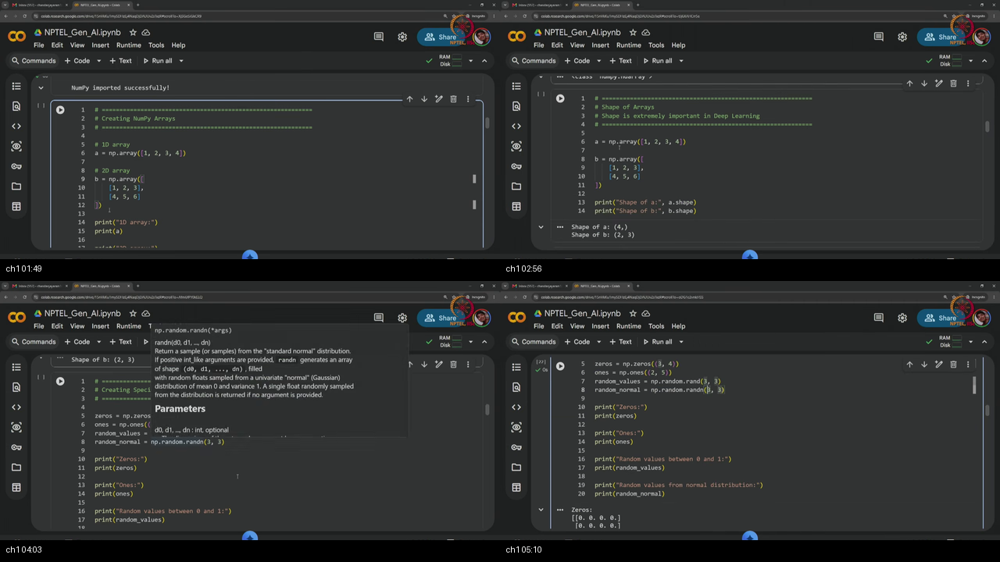
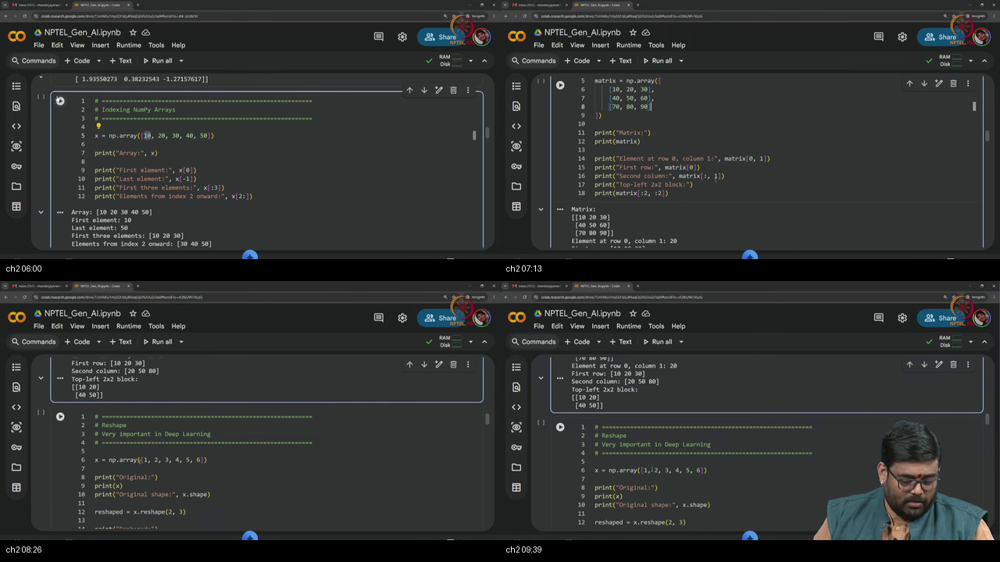
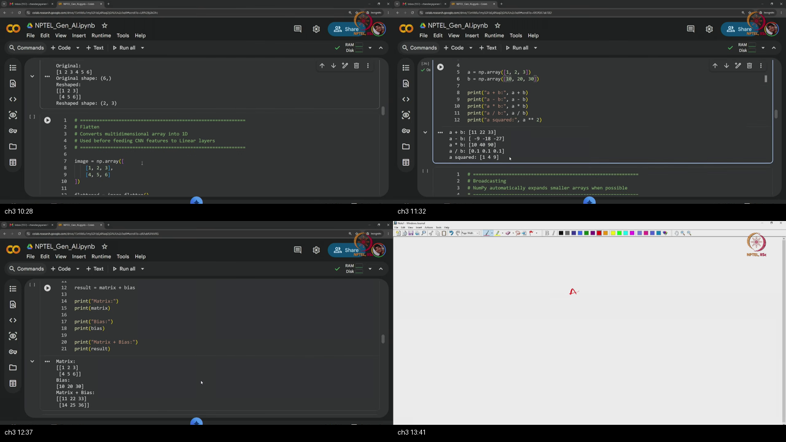
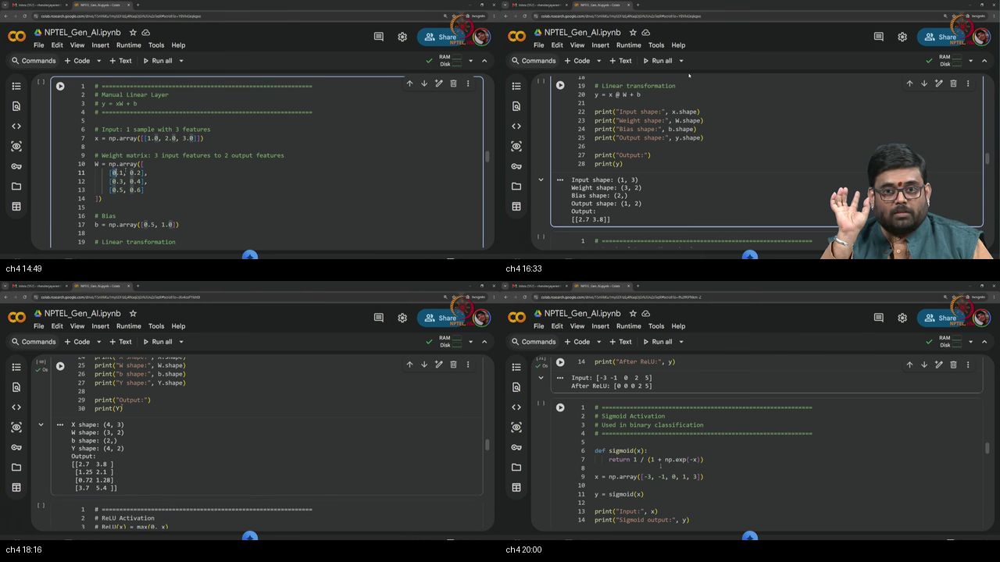
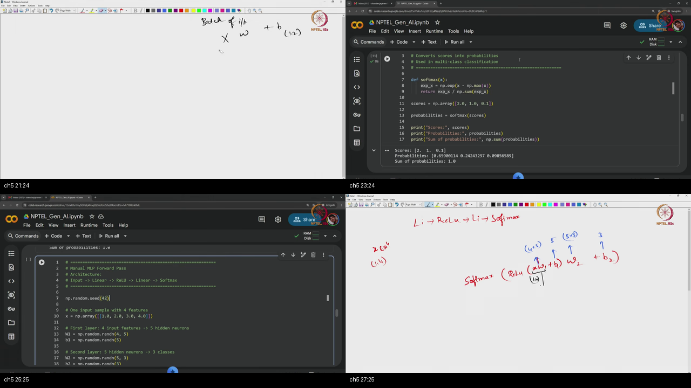
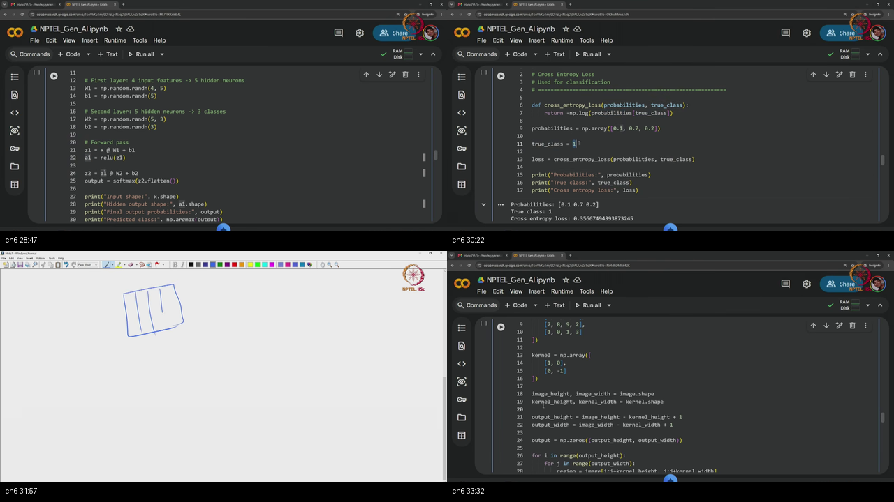
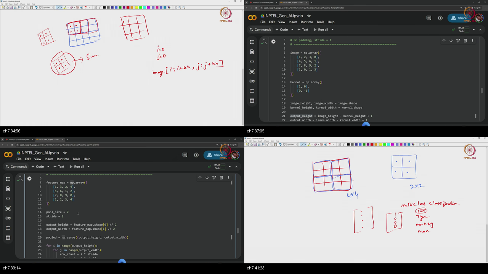
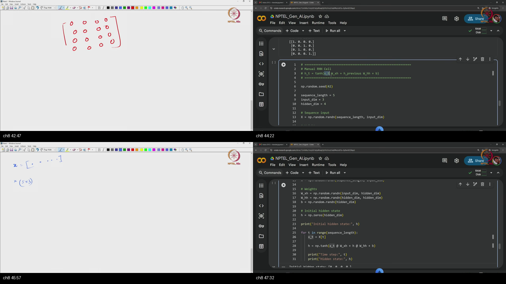
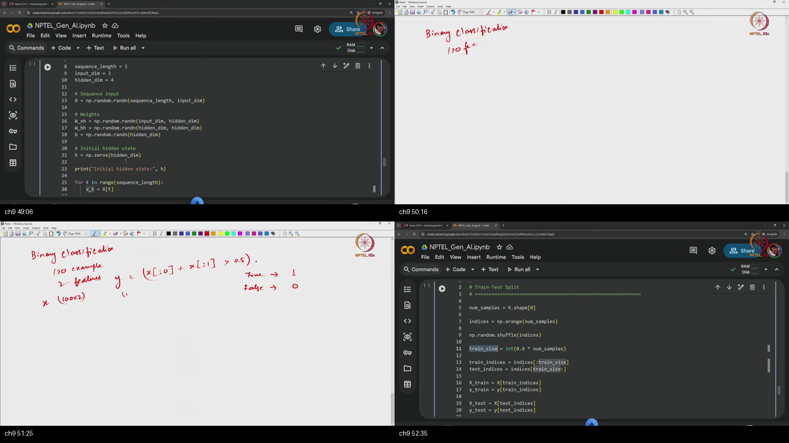
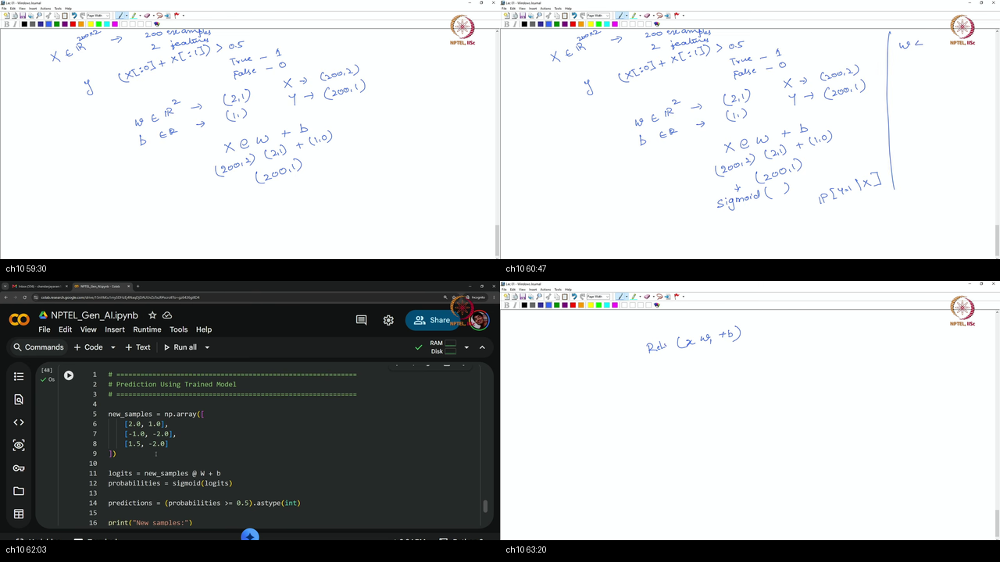

# Tutorial 2 — Introduction to NumPy

**Video:** [Tutorial 2 : Introduction to Numpy](https://www.youtube.com/watch?v=E79ld44pfGM) · NPTEL / IISc  
**Warm-up first:** [PREREQUISITES.md](./PREREQUISITES.md)  
**Course:** Mathematical Foundations of **Generative AI** (~69 min)  
**Speaker:** NPTEL IISc · Essential NumPy functions for AI / ML

---

## Table of Contents

1. [Topic 1 — Create arrays & shapes](#topic-1-create-arrays--shapes-0003–0530) (00:03–05:30)
2. [Topic 2 — Indexing slicing + reshape start](#topic-2-indexing-slicing--reshape-start-0530–1000) (05:30–10:00)
3. [Topic 3 — Flatten elementwise broadcast matmul](#topic-3-flatten-elementwise-broadcast-matmul-1000–1400) (10:00–14:00)
4. [Topic 4 — Linear layer ReLU sigmoid](#topic-4-linear-layer-relu-sigmoid-1400–2030) (14:00–20:30)
5. [Topic 5 — Softmax MLP forward shapes](#topic-5-softmax-mlp-forward-shapes-2030–2800) (20:30–28:00)
6. [Topic 6 — CE loss mini-MLP](#topic-6-ce-loss-mini-mlp-2800–3400) (28:00–34:00)
7. [Topic 7 — Manual conv + pooling](#topic-7-manual-conv--pooling-3400–4200) (34:00–42:00)
8. [Topic 8 — One-hot + RNN cell](#topic-8-one-hot--rnn-cell-4200–4800) (42:00–48:00)
9. [Topic 9 — RNN loop shuffle train-test accuracy](#topic-9-rnn-loop-shuffle-train-test-accuracy-4800–5800) (48:00–58:00)
10. [Topic 10 — Logistic GD + MLP 784-128-10 + recap](#topic-10-logistic-gd--mlp-784-128-10--recap-5800–6917) (58:00–69:17)
11. [Apply it (scenarios)](#apply-it-scenarios)
12. [External references](#external-references)
13. [Sources](#sources)

---

## Executive Summary — architecture of this lecture

A neural net is a machine that eats **grids of numbers** and writes new grids of numbers. Last tutorial gave you Python lists and loops; those are too slow and too shapeless for that job. **NumPy** (Numerical Python) is the calculator this course uses first: a typed grid called an `ndarray`, plus a **shape** that says how the grid is laid out. Every later layer is the same three moves — change the layout, multiply grids, squash numbers. This hour builds that spine by hand so that when PyTorch hides the math, you still own the shapes.

**Worldview arc:** from Tutorial-1 Python (lists, loops, classes) **to** “everything in deep learning is tensor shape gymnastics; NumPy is the language of those shapes before PyTorch.”

**Hour at a glance (whole video).** The first half is *the grid and the multiply*. He imports `numpy as np`, turns lists into arrays, and hammers `.shape` as a **tuple** — that is why later people write `(3, 224, 224)` or `(32, 784)`. He fills biases with **zeros** and weights with **normal** draws (`randn`). Then he indexes like a spreadsheet, **reshapes** a length-6 vector into a $2\times 3$ matrix (same numbers, new floor plan), and **flattens** a patch so a fully connected layer can eat it. Same-shape arrays add and multiply **elementwise**; a smaller array can **broadcast** (a bias row stamps every example). The core network op is **matrix multiply** `@` with the inner-dimension rule $(M\times N)\cdot(N\times P)\to(M\times P)$. That is already a **linear layer**: $y = XW + b$. **ReLU** zeros negatives; **sigmoid** squishes a score into $(0,1)$ for binary work.

The rest of the hour is *a tiny net, then pictures and sequences*. **Softmax** turns raw scores (logits) into a probability vector that sums to 1. He stacks Linear → ReLU → Linear → Softmax and reads the class with **argmax**. **Mean squared error** scores regression; **cross-entropy** scores how much probability sat on the true class. Then he slides a $2\times 2$ kernel across a $4\times 4$ image (multiply, sum, step) and **max-pools** to shrink space. Words become integer IDs, then **one-hot** rows. A manual **recurrent** cell (RNN) carries a hidden note across five steps. He builds a tiny binary dataset, **shuffles shared indices** for an 80/20 split, trains **logistic regression** with gradient descent, and debugs an MNIST-like multi-layer net $784\to 128\to 10$ by **printing the shape after every layer**. Next unit: the same ops in PyTorch.

### System context

```
  ╔══════════════════════════════════════╗
  ║ Outside: full PyTorch / JAX training ║
  ║ Outside: production CNN / RNN stacks ║
  ╚══════════════╤═══════════════════════╝
                 │ this tutorial (~69 min)
                 ▼
        ┌────────────────────────────┐
        │ NumPy as DL numeric toolkit│
        │ arrays · shapes · NN ops   │
        └────────────────────────────┘
                 │
                 ▼
        next unit: PyTorch (same ops, tensors)
```

### Main blueprint

```
  Python list / nested list
          │
          │  np.array
          ▼
  ndarray  +  .shape (tuple)
          │
    ┌─────┼──────┬──────────┐
    ▼     ▼      ▼          ▼
  index  reshape flatten  create
  slice  (MNIST 28²↔784)  zeros/ones/randn
    │
    ▼
  elementwise  *  +  **
  broadcast (bias, scalar)
          │
          ▼
  matmul  @     shape rule (M×N)·(N×P)→(M×P)
          │
          ▼
  linear:  y = X @ W + b
          │
    ┌─────┴──────┬──────────┐
    ▼            ▼          ▼
  ReLU       sigmoid    softmax
  max(0,z)   binary     multi-class probs
          │
          ▼
  losses: MSE (reg) · CE / BCE (class)
          │
    ┌─────┴──────┬──────────┐
    ▼            ▼          ▼
  conv+pool   one-hot+RNN  logreg GD
  (loops)     cell loop    + MLP 784→128→10
```

### Scenario walkthrough

Walk this **one** story through the blueprint above. Each step answers “so what?” for the next box.

**Story:** you want to score handwritten digits in pure NumPy — 28×28 pictures in, a guess 0–9 out — so that when PyTorch arrives you already know what each layer is *doing*.

1. **Why leave Python lists?** A list of lists has no contract. NumPy gives you a typed grid and a **shape tuple**. That is CREATE + SHAPE. So what? Every later bug is a shape bug; you need a language for the floor plan.

2. **How do you start the knobs?** Biases as **zeros**, weights as **normal** draws. That is INIT. So what? The rest of the hour reuses those two factories.

3. **How does a 28×28 photo become something a linear layer can eat?** Index the grid like a spreadsheet, **reshape** / **flatten** to length 784 (same pixels, new layout). That is RESHAPE. So what? A fully connected layer wants one long row per example.

4. **How do you score one example, then a whole batch, without a Python loop?** $y = XW + b$. The inner dimensions of `@` must match; the bias **broadcasts** across rows. **ReLU** then zeros the negative scores. That is LINEAR + ACT. So what? This *is* a hidden layer.

5. **How do ten raw scores become a guess?** **Softmax** turns logits into a probability vector that sums to 1. **Argmax** is the class. **Cross-entropy** is $-\log$ of the true-class probability (use **MSE** only if the target is a continuous number). That is SOFTMAX + LOSS.

6. **What if the input is a photo, not a flat 784?** Slide a $2\times 2$ kernel: multiply the patch, sum, step. **Max-pool** keeps the strongest number in each tile and shrinks the map. That is CONV + POOL.

7. **What if the input is words?** Map words to IDs, then **one-hot** rows. An **RNN** cell rewrites a hidden note at each step: new word plus old note, then tanh. That is SEQUENCE.

8. **How do you know the net learned?** Build a tiny labeled pile, **shuffle shared indices** so features and labels stay married, hold out 20%, train logistic regression by gradient descent, and **print the shape after every layer** on a $32\times784\to128\to10$ ladder. That is TRAIN + DEBUG.

```
  28×28 digit photo
         │  flatten
         ▼
  length-784 vector
         │  XW + b, ReLU, XW + b
         ▼
  10 logits  →  softmax  →  guess 0–9
         │  score with −log p_true
         ▼
  print every .shape   (that is how you debug)
```

Same spine for a tiny convolution on a $4\times 4$ patch or a five-word RNN: grid → shape-legal multiply → squash → score. PyTorch will later hide the loops, not the shapes.

### Failure / contrast path

```
  “I’ll do bulk math with nested Python lists”     ──X──► slow, no shape contract
  “* and @ are the same multiply”                  ──X──► silent wrong math
  “Why do people write (3, 224, 224)?”             ──X──► .shape is always a tuple
  “These matmul sizes look close enough”           ──X──► crash, or a wrong layer
  “Softmax the raw scores; skip subtracting max”   ──X──► overflow on large logits
  “Shuffle X, then shuffle y separately”           ──X──► labels desync from features
  “I’ll inspect the weights; skip printing shapes” ──X──► un-debuggable MLP
```

### STOP / out of scope

He does **not** open a full PyTorch / autograd trainer today (preview only at the end). No optimized `scipy` / cuDNN convolution, no LSTM/GRU, no real MNIST download, no multi-GPU, no production embeddings. Today ends when you can track shapes through a small net in pure NumPy.

### Load-bearing claims (closed-book)

- NumPy is the **numerical-computing** library that makes multi-dimensional arrays (proto-tensors) practical.
- `.shape` is always a **tuple**; that is why deep-learning shapes are written `(3, 224, 224)` and `(32, 784)`.
- Init habit: **biases → zeros**, **weights → normal** (or uniform for demos).
- Reshape and flatten rearrange the same data; they **do not invent values**.
- Broadcasting **expands smaller arrays when possible** (a scalar, or a bias row on a batch).
- Core network op: **matrix multiply** with rule $(M\times N)\cdot(N\times P)\to(M\times P)$.
- Linear layer (row / batch layout): $y = XW + b$; activations are elementwise.
- Softmax turns logits into a probability vector; cross-entropy scores the true-class probability.
- Manual conv = slide, elementwise multiply, sum; pool shrinks space **without** a learned kernel.
- Always **track shapes**; shape bugs dominate practical failures.

**Speaker / course:** NPTEL IISc · Mathematical Foundations of Generative AI · Tutorial 2.

---

## Chalkboard & Mathematical Rosetta Stone

This reference table maps every operator, matrix transformation, and layer function used across Tutorial 02 to its plain-English software meaning, mathematical definition, and dedicated guide in [`MathsTerms`](../../MathsTerms).

| Chalkboard / Code Syntax | Formal Mathematical Concept | Plain-English Software Role | Output Shape / Behavior | Dedicated MathsTerm Guide |
| :--- | :--- | :--- | :--- | :--- |
| **`np.ndarray`** | $T \in \mathbb{R}^{d_1 \times \dots \times d_k}$ | Homogeneous, contiguous multi-dimensional array buffer in RAM. | N-dimensional grid | [Tensors & Shapes](../../MathsTerms/Tensors_and_Shapes.md) |
| **`arr.shape`** | Dimension Tuple $(d_1, \dots, d_k)$ | Tuple containing the exact element counts along each axis. | `(32, 784)` | [Tensors & Shapes](../../MathsTerms/Tensors_and_Shapes.md) |
| **`X.reshape(B, -1)`** | $\text{vec}(I): \mathbb{R}^{H \times W} \to \mathbb{R}^{HW}$ | Flattening 2D/3D images into 1D coordinate vectors. | `(B, H*W)` | [Tensors & Shapes](../../MathsTerms/Tensors_and_Shapes.md) |
| **`A * B`** | Hadamard Product $A \odot B$ | Elementwise multiplication between matching/broadcasted shapes. | Same as broadcast | [Vector Norms & Inner Products](../../MathsTerms/Vector_Norms_and_Inner_Products.md) |
| **`X @ W`** | Matrix Multiply $X \cdot W$ | Dot products satisfying inner dimension $(M \times K) \cdot (K \times N)$. | $(M \times N)$ | [Tensors & Shapes](../../MathsTerms/Tensors_and_Shapes.md) |
| **`Y = X @ W + b`** | Affine Transformation | Linear dense layer with broadcasted bias addition across batch. | $(B \times D_{\text{out}})$ | [Tensors & Shapes](../../MathsTerms/Tensors_and_Shapes.md) |
| **`np.maximum(0, z)`** | $\text{ReLU}(z) = \max(0, z)$ | Non-linear activation zeroing negative activations. | Same shape | [Activation Functions](../../MathsTerms/Activation_Functions.md) |
| **`1 / (1 + exp(-z))`** | Sigmoid $\sigma(z)$ | S-curve squashing logits to $(0, 1)$ for binary decisions. | Same shape | [Activation Functions](../../MathsTerms/Activation_Functions.md) |
| **`exp(z) / sum(exp(z))`**| $\text{Softmax}(z)$ | Normalizing unconstrained logits to valid probability distribution. | Probs sum to $1.0$ | [Softmax](../../MathsTerms/Softmax.md) |
| **`np.argmax(probs, -1)`** | $\arg\max_k p_k$ | Picking the discrete class index with maximum predicted confidence. | `(B,)` integer index | [Argmax & Argmin](../../MathsTerms/Argmax.md) |
| **`-np.log(p_true)`** | Negative Log-Likelihood / CCE | Cross-Entropy loss evaluating model surprise on ground-truth class. | Scalar $\ge 0$ | [Loss Functions](../../MathsTerms/Loss_Functions.md) |
| **`patch * kernel -> sum`**| 2D Spatial Cross-Correlation | Local sliding window filter extracting translation-invariant features. | Feature Map | [Convolution & Pooling](../../MathsTerms/Convolution_and_Pooling.md) |
| **`h_t = tanh(Whh·h + Wxh·x)`**| RNN Hidden State Update | Sequential recurrence maintaining historical memory across time. | $(B, H)$ hidden vector | [Recurrent Neural Networks](../../MathsTerms/Recurrent_Neural_Networks.md) |
| **`W = W - lr * dW`** | Gradient Descent Step | Iteratively shifting parameter weights in direction of steepest descent. | Optimized $\theta^*$ | [Gradient Descent](../../MathsTerms/Gradient_Descent.md) |

---

## Complete Standalone Executable Python Simulation Script

This self-contained Python script implements and tests every foundational operation taught in Tutorial 02 in pure NumPy:
1. **Array Creation & Shape Inspection:** Validates zeros, ones, randn, and shape tuples.
2. **Flattening & Reshaping:** Simulates an MNIST batch `(4, 28, 28)` vectorized to `(4, 784)`.
3. **Affine Linear Layer & Broadcasting:** Computes $Y = XW + b$ for multi-neuron output.
4. **Activations & Safe Softmax:** Evaluates ReLU, Sigmoid, and shift-invariant Softmax.
5. **Loss & Argmax:** Computes Cross-Entropy loss and discrete class predictions.
6. **2D Convolution & Max Pooling:** Slides a $2 \times 2$ kernel across a $4 \times 4$ image grid.
7. **Recurrent Hidden State Update:** Unrolls an RNN cell across 3 timesteps.
8. **End-to-End Logistic Regression:** Trains a binary classifier with Gradient Descent.

```python
"""
TUTORIAL 02: COMPLETE NUMPY NEURAL NETWORK & DL MECHANICS SUITE
==============================================================
Demonstrates pure NumPy implementations of tensor manipulations, linear layers,
activations, losses, CNN convolutions, RNN recurrence, and logistic regression training.
"""

import numpy as np

def run_tutorial_02_simulation():
    print("=" * 80)
    print("  TUTORIAL 02: INTRODUCTION TO NUMPY - COMPLETE SIMULATION")
    print("=" * 80)

    # -------------------------------------------------------------------------
    # PART 1: ARRAY CREATION, SHAPES, AND DTYPES
    # -------------------------------------------------------------------------
    print("\n[PART 1] Array Creation, Shapes & Memory Layout")
    np.random.seed(42)
    
    # 1D vector and 2D matrix
    vec_1d = np.array([1.0, 2.0, 3.0, 4.0], dtype=np.float32)
    mat_2d = np.zeros((3, 4), dtype=np.float32)
    weights = np.random.randn(4, 2).astype(np.float32)

    print(f"  * 1D Vector Shape: {vec_1d.shape}, Dtype: {vec_1d.dtype}")
    print(f"  * 2D Matrix Shape: {mat_2d.shape}, Total Elements: {mat_2d.size}")
    print(f"  * Weights Shape:   {weights.shape}, Total Bytes: {weights.nbytes} bytes")
    assert vec_1d.shape == (4,), "Vector shape mismatch!"
    assert mat_2d.shape == (3, 4), "Matrix shape mismatch!"

    # -------------------------------------------------------------------------
    # PART 2: RESHAPING & IMAGE VECTORIZATION (MNIST 28x28 -> 784)
    # -------------------------------------------------------------------------
    print("\n[PART 2] Image Reshaping & Vectorization for Dense Layers")
    batch_images = np.random.rand(8, 28, 28).astype(np.float32)
    print(f"  * Input Image Batch Shape: {batch_images.shape}")
    
    # Vectorize to (8, 784)
    flattened_images = batch_images.reshape(8, -1)
    print(f"  * Flattened Feature Shape: {flattened_images.shape}")
    assert flattened_images.shape == (8, 784), "Image flattening failed!"

    # -------------------------------------------------------------------------
    # PART 3: AFFINE LINEAR LAYER (Y = X @ W + b) WITH BROADCASTING
    # -------------------------------------------------------------------------
    print("\n[PART 3] Affine Linear Transformation & Broadcasting (Y = XW + b)")
    # Batch of 4 samples, 3 input features -> 2 output classes
    X = np.array([[1.0, 2.0, 3.0],
                  [4.0, 5.0, 6.0],
                  [0.5, 1.5, 2.5],
                  [3.0, 1.0, 2.0]], dtype=np.float32)
    
    W = np.array([[1.0, 0.0],
                  [0.0, 1.0],
                  [1.0, 1.0]], dtype=np.float32)
    
    b = np.array([10.0, 20.0], dtype=np.float32)

    # Forward linear affine map
    logits = X @ W + b
    print(f"  * Input X:      (4, 3)")
    print(f"  * Weight W:     (3, 2)")
    print(f"  * Output Y:     {logits.shape} -> First row: {logits[0]}")
    # Expected row 0: [1.0*1 + 2.0*0 + 3.0*1 + 10.0, 1.0*0 + 2.0*1 + 3.0*1 + 20.0] = [14, 25]
    assert np.allclose(logits[0], np.array([14.0, 25.0])), "Affine calculation failed!"

    # -------------------------------------------------------------------------
    # PART 4: ACTIVATIONS, SAFE SOFTMAX, AND CROSS-ENTROPY LOSS
    # -------------------------------------------------------------------------
    print("\n[PART 4] Non-Linear Activations, Safe Softmax & Loss")
    # Safe Softmax function
    def softmax_safe(z):
        c = np.max(z, axis=-1, keepdims=True)
        exp_z = np.exp(z - c)
        return exp_z / np.sum(exp_z, axis=-1, keepdims=True)

    probs = softmax_safe(logits)
    predictions = np.argmax(probs, axis=-1)
    
    # Ground truth labels: [1, 1, 1, 1]
    true_labels = np.array([1, 1, 1, 1])
    # Categorical Cross-Entropy Loss
    ce_loss = -np.mean(np.log(probs[np.arange(len(true_labels)), true_labels]))

    print(f"  * Predicted Probs (Row 0): {probs[0].round(4)}")
    print(f"  * Argmax Predictions:     {predictions}")
    print(f"  * Cross-Entropy Loss:      {ce_loss:.4f} nats")
    assert np.allclose(np.sum(probs, axis=-1), 1.0), "Probabilities must sum to 1.0!"

    # -------------------------------------------------------------------------
    # PART 5: 2D CONVOLUTION SLIDING FILTER & MAX POOLING
    # -------------------------------------------------------------------------
    print("\n[PART 5] 2D Convolution Sliding Filter & Max Pooling (CNN)")
    img_4x4 = np.array([[1, 2, 0, 1],
                        [0, 3, 1, 0],
                        [2, 0, 1, 2],
                        [1, 1, 0, 3]], dtype=np.float32)
    
    kernel_2x2 = np.array([[1.0, 0.0],
                           [-1.0, 2.0]], dtype=np.float32)

    # 2D Cross-Correlation loop
    H, W_dim = img_4x4.shape
    kh, kw = kernel_2x2.shape
    out_h, out_w = H - kh + 1, W_dim - kw + 1
    conv_out = np.zeros((out_h, out_w), dtype=np.float32)

    for i in range(out_h):
        for j in range(out_w):
            patch = img_4x4[i:i+kh, j:j+kw]
            conv_out[i, j] = np.sum(patch * kernel_2x2)

    print(f"  * Input Image (4x4):\n{img_4x4}")
    print(f"  * Conv Feature Map (3x3):\n{conv_out}")

    # 2x2 Max Pooling on top-left 2x2 block
    pooled_val = np.max(conv_out[0:2, 0:2])
    print(f"  * MaxPool (2x2) Output: {pooled_val:.1f}")

    # -------------------------------------------------------------------------
    # PART 6: RECURRENT HIDDEN STATE UNROLLING (RNN)
    # -------------------------------------------------------------------------
    print("\n[PART 6] Recurrent Neural Network (RNN) Hidden State Updates")
    W_xh = 0.8
    W_hh = 0.5
    b_h = 0.0
    h_t = 0.0 # Initial hidden state

    # Sequence of 3 token inputs
    x_sequence = [1.0, 0.5, -0.8]
    print(f"  * Initial Hidden State h_0: {h_t:.4f}")
    for t, x_val in enumerate(x_sequence):
        h_t = np.tanh(W_xh * x_val + W_hh * h_t + b_h)
        print(f"    - Step t={t+1} (Input x={x_val:4.1f}): Updated Hidden State h_{t+1} = {h_t:.4f}")

    # -------------------------------------------------------------------------
    # PART 7: LOGISTIC REGRESSION WITH GRADIENT DESCENT FROM SCRATCH
    # -------------------------------------------------------------------------
    print("\n[PART 7] Binary Logistic Regression with Gradient Descent")
    # Synthetic dataset: 100 samples, 2 features
    X_train = np.random.randn(100, 2)
    y_train = (X_train[:, 0] + X_train[:, 1] > 0).astype(np.float32).reshape(-1, 1)

    # Initialize parameters
    W_log = np.zeros((2, 1), dtype=np.float32)
    b_log = np.zeros((1,), dtype=np.float32)
    lr = 0.1

    def sigmoid(z):
        return 1.0 / (1.0 + np.exp(-np.clip(z, -500, 500)))

    # Train for 200 epochs
    for epoch in range(200):
        # Forward
        z_log = X_train @ W_log + b_log
        y_hat = sigmoid(z_log)
        
        # Gradients
        error = y_hat - y_train
        dW = (X_train.T @ error) / len(X_train)
        db = np.mean(error)
        
        # Update
        W_log -= lr * dW
        b_log -= lr * db

    train_preds = (sigmoid(X_train @ W_log + b_log) > 0.5).astype(np.float32)
    accuracy = np.mean(train_preds == y_train) * 100.0
    print(f"  * Trained Weights W:\n{W_log.round(4)}")
    print(f"  * Trained Bias b:    {b_log.round(4)}")
    print(f"  * Final Training Accuracy: {accuracy:.1f}%")
    assert accuracy > 85.0, "Logistic regression failed to converge!"

    print("\n" + "=" * 80)
    print("  [SUCCESS] ALL TUTORIAL 02 NUMPY SIMULATION MODULES PASSED FLAWLESSLY!")
    print("=" * 80)

if __name__ == "__main__":
    run_tutorial_02_simulation()
```

---

## Topic 1: Create arrays & shapes (00:03–05:30)

### Where this sits on the master map

**NUMPY = numeric spine** — After Tutorial-1 Python (lists, loops, classes), NumPy is the library for numerical computing; treat arrays as multi-dimensional lists (proto-tensors) before formal tensors in PyTorch. Warm-up: [arrays](./PREREQUISITES.md#p1-array) · [shape](./PREREQUISITES.md#p2-shape).

### Board / screenshot



**Figure — ~00:03–05:30:** `import numpy as np`; 1D/2D `ndarray`; `.shape` tuples; `zeros` / `ones` / `rand` / `randn`.

### What he is establishing

The previous tutorial covered basic Python: looping, conditionals, functions, classes and methods, plus lists, tuples, dictionaries, and basic data types. That is enough to write programs, but not enough to implement even small-scale numerical systems at the speed and shape discipline deep learning needs.

The next library is **NumPy** — Numerical Python — the standard library for **numerical computing**. The dual teaching goal of this whole session is already visible: (1) NumPy fluency and (2) sensitivity to the **operations inside neural networks**. Formal tensors arrive later in PyTorch; for now a **tensor is a multi-dimensional list** — a list inside a list, and so on.

```
  list:        [1, 2, 3, 4]              → 1D array
  list-of-lists:
    [[1, 2, 3],
     [4, 5, 6]]                          → 2D array (matrix)
```

Import under the conventional alias `np`. A successful import means the environment is ready for numerical work.

```python
import numpy as np
print("NumPy imported successfully!")
```

This binds the library under the short name every notebook expects (`np.array`, `np.zeros`, …).

Convert a Python list into a NumPy array with `np.array(...)`. A one-dimensional array is a single sequence of numbers.

```python
# 1D array
a = np.array([1, 2, 3, 4])
print("1D array:")
print(a)
```

That builds a length-4 vector from a plain Python list and prints the values.

A **2D array** (matrix) is a list-of-lists. Watch opening/closing brackets and the commas that separate elements and rows.

```python
# 2D array
b = np.array([
    [1, 2, 3],
    [4, 5, 6]
])
print("2D array:")
print(b)
```

Two rows and three columns appear as a matrix; the type of any such object is `numpy.ndarray` (n-dimensional array).

```python
print(type(a))  # <class 'numpy.ndarray'>
```

**Shapes** of matrices and arrays are crucial for deep learning. The attribute `.shape` returns a **tuple** describing the array dimensions. For 1D `a` with four elements, `a.shape` is `(4,)` — a one-element tuple. For 2D `b` with two rows and three columns, `b.shape` is `(2, 3)`.

```python
print("Shape of a:", a.shape)  # (4,)
print("Shape of b:", b.shape)  # (2, 3)
```

That is why ImageNet-style shapes like **(3, 224, 224)** are written as tuples: array `.shape` always yields a tuple. The notation used earlier for tensor shapes was never decorative — it is the same object NumPy returns.

Special arrays for model initialization matter next. A practical habit: preferably initialize **biases with zeros** and **weights with samples from a normal distribution**.

`np.zeros(shape)` creates an array filled with zeros; pass the desired shape as a **tuple**. Example: `np.zeros((3, 4))` yields twelve zeros laid out as 3 rows × 4 columns.

```python
zeros = np.zeros((3, 4))
print("Zeros:")
print(zeros)
```

`np.ones(shape)` fills with ones. Example: `np.ones((2, 5))` is 2 rows × 5 columns of ones.

```python
ones = np.ones((2, 5))
print("Ones:")
print(ones)
```

`np.random.rand(d1, d2, ...)` draws **uniform random** values in **[0, 1)**. Shape arguments are separate integers (not a single tuple) for `rand` / `randn`.

```python
random_values = np.random.rand(3, 3)
print("Random values between 0 and 1:")
print(random_values)
```

`np.random.randn(d1, d2, ...)` samples from the **standard normal** distribution. Values are unbounded (theoretically $-\infty$ to $+\infty$).

```python
random_normal = np.random.randn(3, 3)
print("Random values from normal distribution:")
print(random_normal)
```

Summary of the special constructors used throughout the tutorial:

```python
# Creating Special Arrays
zeros = np.zeros((3, 4))
ones = np.ones((2, 5))
random_values = np.random.rand(3, 3)
random_normal = np.random.randn(3, 3)
```

These four cover the common deep-learning init patterns (zero bias, random weights). Many other constructors exist; own these first.

You can now run the patterns above in a notebook and check every .shape. Still missing: the next map box builds on these shapes.

### Analogy for this topic only

Python lists are loose cardboard boxes of mixed goods. NumPy arrays are **shipping pallets**: same item type, stacked in a regular grid, moved by forklifts (vectorized ops) in one go. The **shape tuple** is the pallet’s floor plan — 3×4 means three rows of four slots, not “twelve loose numbers.”

Question: **If someone hands you shape `(3, 224, 224)`, can you say what each number means without inventing new data?**


In lecture words: this box is a NumPy skill you will reuse in later DL code.

### Local picture

```
  Python list  ──np.array──►  ndarray
                                  │
                                  ├── type: numpy.ndarray
                                  └── .shape → tuple
                                        (4,)      1D
                                        (2, 3)    2D
                                        (3,224,224) image-like

  Special create:
    zeros((r,c))     →  all 0   (biases)
    ones((r,c))      →  all 1
    rand(d1,d2)      →  U[0,1)
    randn(d1,d2)     →  N(0,1)  (weights)
```

**Notice:** `rand` / `randn` take *separate* dimension ints; `zeros` / `ones` take a *tuple* shape.

### Bridge

Once arrays exist, you must **select** entries and sub-blocks the way you will later grab rows, feature columns, and image patches — indexing and slicing next.

---

## Topic 2: Indexing slicing + reshape start (05:30–10:00)

### Where this sits on the master map

**INDEX → SHAPE** — Indexing/slicing on `ndarray` mirrors lists/strings (0-based; negative end); 2D uses (row, col). Reshape is the first “shape gymnastics” skill for DL (e.g. MNIST 28×28 ↔ 784). Warm-up: [indexing](./PREREQUISITES.md#p3-index) · [reshape](./PREREQUISITES.md#p4-reshape).

### Board / screenshot



**Figure — ~05:30–10:00:** 1D indices; 2D `matrix[r, c]`; column with `[:, j]`; top-left block; `reshape(2, 3)`.

### What he is establishing

**Indexing and slicing** on NumPy arrays work like Python **lists** and **strings**. For a 1D array, indices run from 0; negative indices count from the end.

```python
x = np.array([10, 20, 30, 40, 50])
print("Array:", x)
print("First element:", x[0])   # 10
print("Last element:", x[-1])   # 50
```

This picks the endpoints of a length-5 vector with 0-based and negative indexing.

Slicing is half-open as in Python: `x[:3]` gives indices 0,1,2; `x[2:]` gives from index 2 to the end.

```python
print("First three elements:", x[:3])           # [10 20 30]
print("Elements from index 2 onward:", x[2:])   # [30 40 50]
```

Those two slices show the “start inclusive / stop exclusive” rule on a 1D array.

2D indexing is more important for ML. For a matrix, the **first index is the row** and the **second index is the column**; both are **0-based**. Teacher’s 3×3 matrix has rows `[10,20,30]`, `[40,50,60]`, `[70,80,90]`. Element `matrix[0, 1]` is row 0, column 1 → **20**.

```python
matrix = np.array([
    [10, 20, 30],
    [40, 50, 60],
    [70, 80, 90]
])
print("Element at row 0, column 1:", matrix[0, 1])  # 20
```

Selecting a full row: `matrix[0]` (or `matrix[0, :]`) returns the first row. Selecting a full column uses a colon on the row axis — `matrix[:, 1]` returns the **second** column `[20, 50, 80]`. Slogan: indexing always starts at zero.

```python
print("First row:", matrix[0])           # [10 20 30]
print("Second column:", matrix[:, 1])    # [20 50 80]
```

2D block / submatrix slicing: `matrix[:2, :2]` takes rows 0–1 and columns 0–1 — the top-left 2×2 block.

```python
print("Top-left 2x2 block:")
print(matrix[:2, :2])
# [[10 20]
#  [40 50]]
```

The same ideas extend to multi-dimensional arrays (hypervolumes): first index rows, second columns, further axes when tensors appear.

**Reshape** is a core deep-learning skill: change how the **same elements** are laid out without inventing new values. Standard need for MLPs on **MNIST**: each digit image is a **28×28 matrix**; flatten it to a length-**784** vector before a fully connected layer. Inverse use-case: generative / sampling MLPs that output a vector of size 784 must **reshape** it back into a **28×28** matrix to view an MNIST-like image.

Demo reshape: start with 1D `x` of six elements, shape `(6,)`, then `x.reshape(2, 3)` → matrix shape `(2, 3)`.

```python
x = np.array([1, 2, 3, 4, 5, 6])
print("Original:")
print(x)
print("Original shape:", x.shape)  # (6,)
reshaped = x.reshape(2, 3)
print("Reshaped:")
print(reshaped)
# [[1 2 3]
#  [4 5 6]]
print("Reshaped shape:", reshaped.shape)  # (2, 3)
```

Reshape fills **row-wise** — first three elements become the first row, next three the second. So reshape converts a **vector into a matrix** (and, next topic, a matrix back into a vector via flatten).

A common trap is treating slices as always independent copies — many slices are views that share memory.

### Analogy for this topic only

Indexing is clicking one spreadsheet cell; slicing is drag-selecting a block; `:` means “whole row/column.” Reshape is **folding a letter**: same paper (data), new layout. Wrong product of dimensions is like claiming a six-line letter becomes a 3×3 grid — the paper is not long enough.

Question: **Why does MNIST need reshape at all before a fully connected layer?**


In lecture words: this box is a NumPy skill you will reuse in later DL code.

### Local picture

```
  1D:  x[0]  x[-1]  x[:3]  x[2:]

  2D matrix:
        col0  col1  col2
  row0   10    20    30     matrix[0,1] = 20
  row1   40    50    60     matrix[:,1] = [20,50,80]
  row2   70    80    90     matrix[:2,:2] = top-left 2×2

  reshape (row-wise fill):
  [1 2 3 4 5 6]  →  [[1 2 3]
                      [4 5 6]]
  MNIST: 28×28 ↔ 784
```

**Notice:** product of shape entries must match; reshape never invents values.

### Bridge

You can now pack a vector into a matrix. The reverse path for MLPs and CNNs is **flatten**, then elementwise arithmetic, broadcasting, and the matrix multiply that drives every linear layer.

---

## Topic 3: Flatten elementwise broadcast matmul (10:00–14:00)

### Where this sits on the master map

**FLATTEN → BROADCAST → @** — Flatten matrix→vector for linear layers; same-shape elementwise ops; NumPy **broadcasts** smaller arrays when possible; matmul (`@`) is the core NN op with shape rule $(M\times N)\cdot(N\times P)\to(M\times P)$. Warm-up: [reshape/flatten](./PREREQUISITES.md#p4-reshape) · [elementwise vs `@`](./PREREQUISITES.md#p5-mul) · [broadcast](./PREREQUISITES.md#p6-broadcast).

### Board / screenshot



**Figure — ~10:00–14:00:** `.flatten()`; elementwise `+ - * / **`; scalar and row bias broadcast; `A @ B` with shape rule.

### What he is establishing

To convert a **matrix into a vector** (feature map → vector for an MLP), use **`.flatten()`**. Flatten converts a multidimensional array into 1D and is the usual step before feeding CNN features into linear layers.

```python
# Flatten — converts multidimensional array into 1D
# Used before feeding CNN features to Linear layers
image = np.array([
    [1, 2, 3],
    [4, 5, 6]
])
print("Flattened:")
print(image.flatten())  # [1 2 3 4 5 6]
# Optional column view:
# print(image.flatten().reshape(-1, 1))
```

That collapses the 2×3 patch into a length-6 row vector in C-order (row-wise).

**Elementwise operations** on same-shape arrays: add, subtract, multiply, divide, and power apply **per element**. When both arrays share a shape, no broadcasting is needed.

```python
a = np.array([1, 2, 3])
b = np.array([10, 20, 30])
print("a + b:", a + b)      # [11 22 33]
print("a - b:", a - b)      # [-9 -18 -27]
print("a * b:", a * b)      # [10 40 90]
print("a / b:", a / b)      # [0.1 0.1 0.1]
print("a squared:", a ** 2) # [1 4 9]
```

Each operator pairs corresponding entries; `*` is **not** matrix multiplication.

**Broadcasting** is a key NumPy idea: NumPy **automatically expands smaller arrays when possible** so arithmetic can proceed. Slogan to keep: **expand smaller arrays when possible**.

1D example: `np.array([1, 2, 3]) + 10` does **not** append 10 or add only to the first entry. Scalar 10 expands to `[10, 10, 10]`, yielding `[11, 12, 13]`.

```python
a = np.array([1, 2, 3])
print(a + 10)  # [11 12 13]  — 10 broadcasts to [10, 10, 10]
```

2D example: matrix plus a bias **row** — the bias expands across rows so every row receives the same add.

```python
matrix = np.array([
    [1, 2, 3],
    [4, 5, 6]
])
bias = np.array([10, 20, 30])
result = matrix + bias
print("Matrix:")
print(matrix)
print("Bias:")
print(bias)
print("Matrix + Bias:")
print(result)
# [[11 22 33]
#  [14 25 36]]
```

Any arithmetic op (not only `+`) can broadcast under the same rules when shapes are compatible. This is exactly how a bias of shape `(features,)` is applied to a whole batch without a Python loop.

**Matrix multiplication** is the **core operation in neural networks**. Shape rule: if **A** is **M×N** and **B** is **N×P**, the inner dimensions **N** must match; product **C = A @ B** has shape **M×P**. Standard linear-algebra rules always apply; if shapes do not align for `@`, NumPy raises an error.

```python
# Shape rule: (M, N) @ (N, P) -> (M, P)
A = np.array([[1, 2],
              [3, 4]])      # 2×2
B = np.array([[5, 6],
              [7, 8]])      # 2×2
C = A @ B                   # 2×2
print("A @ B:")
print(C)
# [[19 22]
#  [43 50]]
```

That computes a true matrix product (not elementwise); each output entry is a row–column dot product.

You can now run the patterns above in a notebook and check every .shape. Still missing: the next map box builds on these shapes.

A common trap is using * when you meant @ for a linear layer — silent wrong math.

### Analogy for this topic only

Elementwise `*` seasons each piece of food separately. `@` is a recipe that mixes ingredients with fixed weights (rows combine columns). Broadcasting is a **rubber stamp**: the bias line is pressed onto every row of the batch without rewriting the stamp for each row.

Question: **If `A * B` and `A @ B` both run on 2×2 matrices, when do they agree?**


In lecture words: this box is a NumPy skill you will reuse in later DL code.

### Local picture

```
  flatten:  [[1 2 3]     →  [1 2 3 4 5 6]
             [4 5 6]]

  same-shape elementwise:  a ⊙ b  (entry by entry)

  broadcast:
    [1 2 3] + 10          → [11 12 13]
    [[1 2 3]              → [[11 22 33]
     [4 5 6]] + [10 20 30]   [14 25 36]]

  matmul:
    (M, N) @ (N, P)  =  (M, P)
         └── must match ──┘
```

**Notice:** confusing `*` with `@` is a classic silent bug when both happen to be defined.

### Bridge

With `@` and broadcast in hand, implement a full **linear layer** $xW+b$ for one sample and for a batch, then add **ReLU** and **sigmoid**.

---

## Topic 4: Linear layer ReLU sigmoid (14:00–20:30)

### Where this sits on the master map

**LINEAR = xW+b** — Manual linear layer is matmul + bias (broadcast); batch stacks samples on axis 0. Activations: **ReLU** $g(z)=\max(0,z)$ via `np.maximum`; **sigmoid** $1/(1+e^{-x})$ for binary. Dual goal: NumPy fluency + NN ops. Warm-up: [linear layer](./PREREQUISITES.md#p7-linear) · [activations](./PREREQUISITES.md#p8-act) · [broadcast](./PREREQUISITES.md#p6-broadcast).

### Board / screenshot



**Figure — ~14:00–20:30:** 2×2 matmul; single and batch `xW+b`; ReLU and sigmoid definitions.

### What he is establishing

Continuing matmul: with two **2×2** matrices A and B, `C = A @ B` is also **2×2**. Standard matrix-multiply rules are assumed known; NumPy just executes them.

```python
A = np.array([[1, 2], [3, 4]])
B = np.array([[5, 6], [7, 8]])
print("A @ B:")
print(A @ B)  # [[19 22], [43 50]]
```

Manual **linear layer**: form is **y = xW + b** (the notebook uses **xW + b** with row-vector samples; general texts also write $Wx+b$ with column vectors). Single-sample shapes: **x** is **1×3** (one sample, three features), **W** is **3×2** (three input features → two output features), **b** is **1×2**. Shape arithmetic: $(1\times3)\cdot(3\times2)\to(1\times2)$, then add $b$ → outcome **(1×2)**.

```python
# Manual Linear Layer
# y = xW + b
# Input: 1 sample with 3 features
x = np.array([[1.0, 2.0, 3.0]])  # shape (1, 3)
# Weight matrix: 3 input features to 2 output features
W = np.array([
    [0.1, 0.2],
    [0.3, 0.4],
    [0.5, 0.6]
])  # shape (3, 2)
b = np.array([[0.1, 0.2]])        # shape (1, 2)
y = x @ W + b                    # shape (1, 2)
print("Linear output y:", y)
print("y shape:", y.shape)
```

This is one forward affine transform for a single example: matmul then bias add.

Whenever matrices are involved, always check **shape alignment**; misaligned shapes produce an **error**.

**Batch** of inputs through the same linear layer: each row of $X$ is one example; $W$ and $b$ stay shared across the batch. Batch shapes: **X** is **4×3** (four samples, three features), **W** remains **3×2**, **b** is **1×2**. Then $X @ W$ is **4×2**; adding $b$ uses **broadcasting** to get **4×2**. No special per-example loop is required.

```python
# Batch of inputs through linear layer
# X: 4 samples × 3 features; W: 3×2; b: 1×2 (broadcast)
X = np.array([
    [1.0, 2.0, 3.0],
    [1.5, 2.5, 3.5],
    [0.5, 1.0, 1.5],
    [2.0, 1.0, 0.0],
])  # shape (4, 3)
W = np.array([
    [0.1, 0.2],
    [0.3, 0.4],
    [0.5, 0.6]
])  # (3, 2)
b = np.array([[0.1, 0.2]])  # (1, 2)
Y = X @ W + b              # (4, 2) via broadcast of b
print("Batch Y shape:", Y.shape)
print(Y)
```

This is standard **linear propagation** (forward affine transform) for a fully connected layer: one matmul, one broadcast bias, whole batch at once.

**ReLU** activation: plot of $g(z)$ vs $z$ is zero for $z < 0$ and the identity line for $z \ge 0$. Definition: **$g(z) = \max(0, z)$** — the ReLU formula used predominantly in modern networks. NumPy: `np.maximum(0, x)` applied elementwise.

```python
def relu(x):
    return np.maximum(0, x)

x = np.array([-3, -1, 0, 2, 5])
y = relu(x)
print("Input:", x)
print("After ReLU:", y)  # [0 0 0 2 5]
```

Negatives are clipped to zero; non-negatives pass through unchanged. Shape is preserved.

**Sigmoid** for binary classification: $\sigma(x) = 1 / (1 + e^{-x})$, applied elementwise; outputs lie in **(0, 1)**.

```python
# Sigmoid Activation
# Used in binary classification
def sigmoid(x):
    return 1 / (1 + np.exp(-x))

x = np.array([-3, -1, 0, 1, 3])
y = sigmoid(x)
print("Input:", x)
print("Sigmoid output:", y)
# ~ [0.047, 0.269, 0.5, 0.731, 0.953]
```

You can pipe linear-layer output into ReLU or sigmoid — compose affine transform + nonlinearity.

```python
# Compose linear + activation (reuse single-sample x, W, b from above)
x = np.array([[1.0, 2.0, 3.0]])
y_linear = x @ W + b
y_relu = relu(y_linear)
y_sig = sigmoid(y_linear)
print("linear:", y_linear)
print("ReLU:", y_relu)
print("sigmoid:", y_sig)
```

Dual teaching goal (continued into the next topic): introduce NumPy functionalities **and** sensitize students to the operations inside neural networks.

You can now run the patterns above in a notebook and check every .shape. Still missing: the next map box builds on these shapes.

A common trap is wrong bias shape so broadcast fails, or mixing row/column conventions for W.

### Analogy for this topic only

Each student is a row of answers ($X$). Each column of $W$ is a rubric for one skill score. Bias is a constant curve applied to every student. ReLU is a **one-way valve**: negative scores become zero. Sigmoid is a soft gate that squashes any score into an open unit interval for binary decisions.

Question: **Why does adding a length-2 bias to a 4×2 batch not need a Python `for` loop?**


In lecture words: this box is a NumPy skill you will reuse in later DL code.

### Local picture

```
  single:  x(1,3) @ W(3,2) + b(1,2)  →  y(1,2)
  batch:   X(4,3) @ W(3,2) + b(1,2)  →  Y(4,2)
                         └── broadcast ──┘

  ReLU:    max(0, z)     elementwise
  sigmoid: 1/(1+e^{-z})  elementwise → (0,1)
```

**Notice:** bias and ReLU change values, not shape; only the linear map changes the last dimension.

### Bridge

Multi-class heads need a probability vector over classes — **softmax** — and a full **Linear → ReLU → Linear → Softmax** forward pass with explicit shape tracking.

---

## Topic 5: Softmax MLP forward shapes (20:30–28:00)

### Where this sits on the master map

**LOGITS → PROBS** — Softmax turns logits into a probability vector (nonneg, sum=1) for multi-class. Manual MLP: Linear → ReLU → Linear → Softmax; track shapes (e.g. 1×4 → 1×5 → 1×3) with seed for reproducibility. Warm-up: [activations](./PREREQUISITES.md#p8-act) · [linear](./PREREQUISITES.md#p7-linear).

### Board / screenshot



**Figure — ~20:30–28:00:** softmax formula; Li → ReLU → Li → Softmax; shapes 4→5→3 with seed 42.

### What he is establishing

Dual goal restated: use NumPy while building familiarity with **neural-network operations**. Multi-class classification needs converting raw **logits** into a **probability vector**. Running MNIST-style MLP sketch: input dim **784** → hidden **128** → output **10** (ten digit classes). Final layer outputs are logits, not probabilities.

With 10 logits, the $i$-th entry after softmax is intended as $P(y=i\mid x)$. Probabilities over classes must **sum to 1**: $\sum_i P(y=i\mid x) = 1$. Raw **logits do not** automatically satisfy the probability axioms (nonneg + sum to 1); pass them through **softmax** to normalize.

Softmax idea: take **exp** of each score and **divide by the total sum** of those exp values. Numerically stable NumPy form: subtract max before exp so large logits do not overflow.

```python
# Softmax Activation
# Converts scores into probabilities
# Used in multi-class classification
def softmax(x):
    exp_x = np.exp(x - np.max(x))
    return exp_x / np.sum(exp_x)

scores = np.array([2.0, 1.0, 0.1])
probabilities = softmax(scores)
print("Scores:", scores)
print("Probabilities:", probabilities)
print("Sum:", probabilities.sum())  # ~ 1.0
```

This maps three raw scores into a probability vector that sums to one.

Manual **MLP forward pass** structure: **Linear → ReLU → Linear → Softmax**. Whiteboard slogan: **Li → ReLU → Li → Softmax**. For reproducibility set `np.random.seed(42)` before sampling weights and inputs.

Toy MLP input: $x \in \mathbb{R}^4$, shape **(1, 4)** — one sample with four features. Forward math:

$$
h = \mathrm{ReLU}(x W_1 + b_1),\quad
\mathrm{logits} = h W_2 + b_2,\quad
\mathrm{probs} = \mathrm{softmax}(\mathrm{logits}).
$$

Weight/bias shapes for the demo: **W₁** is **4×5**, **b₁** length **5**; **W₂** is **5×3**, **b₂** length **3** (three classes).

Shape trace: $(1\times4)\cdot(4\times5)\to(1\times5)+b_1$; ReLU keeps $(1\times5)$; then $(1\times5)\cdot(5\times3)\to(1\times3)+b_2$; softmax yields a length-**3** probability vector $P(y=0\mid x), P(y=1\mid x), P(y=2\mid x)$.

Full manual forward recipe:

```python
np.random.seed(42)

def relu(x):
    return np.maximum(0, x)

def softmax(x):
    exp_x = np.exp(x - np.max(x))
    return exp_x / np.sum(exp_x)

x = np.random.randn(1, 4)       # (1, 4)
W1 = np.random.randn(4, 5)      # (4, 5)
b1 = np.random.randn(5)         # (5,)  — broadcasts with (1, 5)
W2 = np.random.randn(5, 3)      # (5, 3)
b2 = np.random.randn(3)         # (3,)

h = relu(x @ W1 + b1)           # (1, 5)
logits = h @ W2 + b2            # (1, 3)
probs = softmax(logits.ravel()) # length-3 probability vector
print("Hidden h shape:", h.shape)
print("Logits:", logits)
print("Class probabilities:", probs)
print("Sum of probs:", probs.sum())
```

That runs Softmax(ReLU($x W_1+b_1$) $W_2+b_2$) with annotated shapes $(1\times4)\to(4\times5)/(5)\to(5\times3)/(3)$. The three softmax outputs are the class-conditional probabilities for indices 0, 1, 2.

You can now run the patterns above in a notebook and check every .shape. Still missing: the next map box builds on these shapes.

A common trap is softmax without max-subtraction on large logits — overflow to inf/nan.

### Analogy for this topic only

Logits are raw judge scores at a contest. Softmax turns them into a **share of the prize pot** (probabilities that sum to 1). The mini-MLP is a two-stage scoring board: first rubric (4→5) with a ReLU cutoff, second rubric (5→3) that hands each class a score, then the pot-sharing step.

Question: **What still fails if you skip softmax and pick argmax of raw logits for hard decisions? What fails for a proper probability model / CE loss?**


In lecture words: this box is a NumPy skill you will reuse in later DL code.

### Local picture

```
  MNIST sketch:  784  →  128  →  10 logits  →  softmax  →  P(y|x)

  Demo MLP:
    x (1,4)
      │  W1(4,5), b1(5)
      ▼
    z1 (1,5) ──ReLU──► h (1,5)
      │  W2(5,3), b2(3)
      ▼
    logits (1,3) ──softmax──► probs (3,)  sum=1
```

**Notice:** seed 42 makes the random weights and inputs reproducible across runs.

### Bridge

Interpret those probabilities, decide the class with **argmax**, and score predictions with **MSE** (regression) or **categorical CE** (classification); then open image tensors and the convolution recipe.

---

## Topic 6: CE loss mini-MLP (28:00–34:00)

### Where this sits on the master map

**METHOD** — After ReLU+softmax, interpret the probability vector, decide with argmax, score with MSE or categorical CE; open image tensors (H×W / C×H×W) and the 2D-convolution size formula. Warm-up: [activations / loss idea](./PREREQUISITES.md#p8-act) · [shape](./PREREQUISITES.md#p2-shape).

### Board / screenshot



**Figure — ~28:00–34:00:** argmax decision; MSE vs CE; grayscale / RGB shapes; valid conv output size $H-k+1$.

### What he is establishing

Softmax output entries are class-conditional probabilities: index $i$ is $P(y=i\mid x)$. Restate the mini-MLP chain with explicit shapes:

```python
import numpy as np

np.random.seed(42)
x = np.random.randn(1, 4)
W1 = np.random.randn(4, 5)
b1 = np.random.randn(5)
W2 = np.random.randn(5, 3)
b2 = np.random.randn(3)

def relu(z):
    return np.maximum(0, z)

def softmax(z):
    e = np.exp(z - np.max(z, axis=-1, keepdims=True))
    return e / e.sum(axis=-1, keepdims=True)

h = relu(x @ W1 + b1)       # (1, 5)
logits = h @ W2 + b2        # (1, 3)
probs = softmax(logits)     # (1, 3) probability vector
probs_vec = probs.flatten() # length 3 for consistent 1D reading
print("probs:", probs_vec)
```

After the second linear + bias, flatten to a consistent length-3 vector for reading class probs. **Predicted class = argmax** of the probability (or logit) vector — the index of the maximum entry.

```python
predicted_class = int(np.argmax(probs))
print("Predicted class:", predicted_class)
# if max ≈ 0.999 at index 0 → classify as class 0
```

That chain (linear → ReLU → linear → softmax → argmax) **is the forward pass** for this mini multiclass MLP.

**Mean squared error (MSE)** is the famous loss for **regression**: given two vectors, subtract, square, then take the mean.

```python
def mse_loss(y_true, y_pred):
    return np.mean((y_true - y_pred) ** 2)

y_true = np.array([10.0, 20.0, 30.0])
y_pred = np.array([12.0, 18.0, 33.0])
print("MSE Loss:", mse_loss(y_true, y_pred))  # ≈ 5.666...
```

**Categorical cross-entropy (CE)** for classification: take the probability of the **true class**, then return $-\log(p_{\mathrm{true}})$.

```python
def cross_entropy_loss(probabilities, true_class):
    return -np.log(probabilities[true_class])

probabilities = np.array([0.1, 0.7, 0.2])
true_class = 1
loss = cross_entropy_loss(probabilities, true_class)
print("CE Loss:", loss)  # = -log(0.7)
```

Slogan: **MSE suits regression** (continuous targets); **CE suits classification** (true-class probability scoring).

**Grayscale image** = 2D matrix **height × width**; each entry is a pixel intensity.

```python
# grayscale HxW (example 4x4 intensities)
image_gray = np.array([
    [1, 2, 3, 0],
    [4, 5, 6, 1],
    [7, 8, 9, 2],
    [1, 0, 1, 3],
], dtype=float)
print(image_gray.shape)  # (4, 4)
```

**Three-channel (color) image** lifts H×W into a 3D array of shape **(3, 4, 4)** (channels × height × width in the demo). `np.random.rand` draws values in **[0, 1]** — treat as a **normalized** intensity range.

```python
image_rgb = np.random.rand(3, 4, 4)  # 3 channels, 4x4 spatial
print(image_rgb.shape)  # (3, 4, 4)
```

**2D convolution (conceptual):** place a $2\times2$ kernel on a $4\times4$ image; **element-wise multiply** region and kernel; **sum** all products → one output scalar at that location. With **stride = 1**, the kernel slides one step right (then next row). **Valid output size** (no padding, stride 1):


$$
\mathrm{out}_h = H - k_h + 1,\qquad \mathrm{out}_w = W - k_w + 1.
$$

Demo: $4\times4$ image, $2\times2$ kernel → **$3\times3$** output. Manual scaffold:

```python
image = np.array([
    [1, 2, 3, 0],
    [4, 5, 6, 1],
    [7, 8, 9, 2],
    [1, 0, 1, 3],
], dtype=float)
kernel = np.array([[1, 0],
                   [0, -1]], dtype=float)

image_height, image_width = image.shape
kernel_height, kernel_width = kernel.shape
output_height = image_height - kernel_height + 1  # 3
output_width = image_width - kernel_width + 1     # 3
output = np.zeros((output_height, output_width))

for i in range(output_height):
    for j in range(output_width):
        region = image[i:i + kernel_height, j:j + kernel_width]
        output[i, j] = np.sum(region * kernel)

print("Output shape:", output.shape)  # (3, 3)
print(output)
```

That allocates a zero buffer, slides the kernel with nested loops, and writes each local sum into the feature map. The detailed walkthrough of each stride step continues in the next topic.

You can now run the patterns above in a notebook and check every .shape. Still missing: the next map box builds on these shapes.

A common trap is CE without the true-class probability — always take -log of p at the correct index.

### Analogy for this topic only

CE is a **fine if the winner you claimed is not the true winner** — you only look at the probability mass on the true class and take $-\log$ of it. Convolution is a **flashlight of fixed shape**: wherever you aim the $2\times2$ light, you multiply and sum the illuminated patch into one number, then step the light across the photo.

Question: **Why is MSE the wrong default loss when the target is a class index rather than a continuous vector?**


In lecture words: this box is a NumPy skill you will reuse in later DL code.

### Local picture

```
  forward:  Linear → ReLU → Linear → Softmax → argmax

  losses:
    regression     → MSE = mean((y - ŷ)²)
    classification → CE  = -log p_true

  images:
    gray (H, W)     e.g. (4, 4)
    RGB  (C, H, W)  e.g. (3, 4, 4)

  valid conv (stride 1): out = H - k + 1
    4×4 ⋆ 2×2 → 3×3
```

**Notice:** softmax vector **is** the probability vector; CE reads only the true-class entry.

### Bridge

Finish the nested-loop convolution carefully, add **max / average pooling**, then bridge into sequence data with word IDs and **one-hot** labels.

---

## Topic 7: Manual conv + pooling (34:00–42:00)

### Where this sits on the master map

**METHOD** — Implement 2D convolution with nested Python loops + NumPy slicing (`region * kernel` sum); max-pool (and average-pool) to shrink spatial size; sequence data via word→ID maps and single-label **one-hot** vectors. Warm-up: [indexing/slicing](./PREREQUISITES.md#p3-index) · [arrays](./PREREQUISITES.md#p1-array).

### Board / screenshot



**Figure — ~34:00–42:00:** sliding 2×2 kernel on 4×4; filled 3×3 map; max-pool to 2×2; word_to_id; single-label one-hot.

### What he is establishing

For a $4\times4$ image and $2\times2$ kernel (valid, stride 1), allocate a zero matrix of shape **$3\times3$** as the convolution output buffer. Outer loop `i in range(output_height)`, inner loop `j in range(output_width)` — each `(i, j)` is one output cell.

Region of interest via **2D slicing**: `region = image[i:i+kernel_height, j:j+kernel_width]`. For $i=0,j=0$, $k_h=k_w=2$ this is the top-left $2\times2$ block. Kernel operation is **element-wise multiply** `region * kernel` then **`np.sum(...)`** into `output[i, j]` — not a full-image matmul.

Increment $j$ shifts the window horizontally; after the inner loop, increment $i$ and sweep the next row. This sliding is what a conv layer does internally. After both loops, the **final feature map is $3\times3$**.

```python
image = np.array([
    [1, 2, 3, 0],
    [4, 5, 6, 1],
    [7, 8, 9, 2],
    [1, 0, 1, 3],
], dtype=float)
kernel = np.array([[1, 0],
                   [0, -1]], dtype=float)

image_height, image_width = image.shape
kernel_height, kernel_width = kernel.shape
output_height = image_height - kernel_height + 1
output_width = image_width - kernel_width + 1
output = np.zeros((output_height, output_width))

for i in range(output_height):
    for j in range(output_width):
        region = image[i:i + kernel_height, j:j + kernel_width]
        output[i, j] = np.sum(region * kernel)

print("Input image:\n", image)
print("Kernel:\n", kernel)
print("Conv output:\n", output)
```

That is the full valid convolution: same 2D slice skill as earlier, plus elementwise mult and sum into each cell.

**Max pooling** reduces spatial size in CNNs: over each pooling window, take the **maximum** element (no element-wise mult with a learned kernel). Alternative: **average pooling** — same windows, take the mean. With **pool size $2\times2$** and **stride = 2**, a $4\times4$ input shrinks to **$2\times2$** (half height and half width). Kernel/pool size is not mandatory $2\times2$ — choose other sizes and recompute dimensions.

```python
# Conceptual 2x2 max-pool, stride 2 on 4x4
pool_size = 2
stride = 2
out_h = image_height // stride  # 2
out_w = image_width // stride   # 2
pooled = np.zeros((out_h, out_w))

for i in range(out_h):
    for j in range(out_w):
        region = image[
            i * stride:i * stride + pool_size,
            j * stride:j * stride + pool_size,
        ]
        pooled[i, j] = np.max(region)  # or np.mean(region) for avg-pool

print("Max-pooled:\n", pooled)
```

Pedagogical goal of the CNN demos: practice **`np.zeros`**, **`np.max` / `np.amax`**, and **2D slicing** on operations students already know conceptually (conv, pool).

**Sequence data / RNNs:** text is processed as a sequence. Demo sentence **“I love deep learning”**. **Word → index (word_to_id)** maps each vocabulary token to an integer ID.

```python
sentence = ["I", "love", "deep", "learning"]
word_to_id = {
    "I": 0,
    "love": 1,
    "deep": 2,
    "learning": 3,
}
sequence = [word_to_id[word] for word in sentence]
print("Sentence:", sentence)
print("Sequence of word IDs:", sequence)  # [0, 1, 2, 3]
```

Integer IDs are a first step before **one-hot encoding** (and later embeddings).

**One-hot encoding** for multiclass labels: vector of length = number of classes, **1 at the true class index, 0 elsewhere**. Demo classes: lion, tiger, monkey, man → four dims:

```
  lion   → [1, 0, 0, 0]
  tiger  → [0, 1, 0, 0]
  monkey → [0, 0, 1, 0]
  man    → [0, 0, 0, 1]
```

A one-hot vector is a **probability vector**: entries ≥ 0 and **sum to 1**. Single-label procedure: `num_classes=4`, `label=2` → zeros then place the 1.

```python
# One-Hot Encoding — single label
num_classes = 4
label = 2
one_hot = np.zeros(num_classes)
one_hot[label] = 1
print("Label:", label)
print("One-hot:", one_hot)  # [0. 0. 1. 0.]
```

That builds the standard unit vector $e_{\mathrm{class}}$ used as a hard label distribution.

You can now run the patterns above in a notebook and check every .shape. Still missing: the next map box builds on these shapes.

A common trap is forgetting out = H-k+1, so the nested loops index off the image.

### Analogy for this topic only

Convolution is a sliding **cookie cutter**: cut a patch, multiply by the cutter’s pattern, sum into one number, move one step. Pooling is a **downsampler** — keep only the strongest (max) or average signal in each tile; no learned cookie pattern. One-hot is a seating chart with a single “occupied” seat — a degenerate probability over classes.

Question: **What is different between a 2×2 conv step and a 2×2 max-pool step on the same patch?**


In lecture words: this box is a NumPy skill you will reuse in later DL code.

### Local picture

```
  conv (valid, s=1):
    image 4×4, kernel 2×2
    for i,j:  sum( image[i:i+2, j:j+2] * kernel ) → out[i,j]
    result 3×3

  max-pool (k=2, s=2):
    4×4 → 2×2   (non-overlapping tiles)

  sequence:
    "I love deep learning" → [0,1,2,3] via word_to_id

  one-hot(label=2, C=4):  [0, 0, 1, 0]  (sums to 1)
```

**Notice:** pooling has **no** element-wise kernel multiply — just max (or avg).

### Bridge

Lift single-label one-hot to a **batch matrix**, then implement a **manual RNN cell** over a sequence with full shape discipline.

---

## Topic 8: One-hot + RNN cell (42:00–48:00)

### Where this sits on the master map

**METHOD** — Lift single-label one-hot to a **batch matrix** with `np.zeros` + `enumerate`; then implement a **manual RNN cell** $h_t=\tanh(x_t W_{xh}+h_{t-1} W_{hh}+b)$ over a sequence, tracking every matrix shape. Warm-up: [linear / matmul](./PREREQUISITES.md#p7-linear) · [indexing](./PREREQUISITES.md#p3-index).

### Board / screenshot



**Figure — ~42:00–48:00:** batch one-hot fill; RNN cell with $W_{xh}$, $W_{hh}$, $b$; $h_0=0$; loop body with shapes.

### What he is establishing

Batch of integer labels: `labels = [0, 2, 1, 3]` with `num_classes = 4`. Batch one-hot matrix shape: **`np.zeros((len(labels), num_classes))`** → all zeros of shape (4, 4). Fill: for each row `i` with label `label`, set `one_hot_batch[i, label] = 1`. Read **row-wise**: row 0 → class 0, row 1 → class 2, etc.

```
  [[1, 0, 0, 0],   # label 0
   [0, 0, 1, 0],   # label 2
   [0, 1, 0, 0],   # label 1
   [0, 0, 0, 1]]   # label 3
```

```python
# Batch of One-Hot Vectors
labels = np.array([0, 2, 1, 3])
num_classes = 4
one_hot_batch = np.zeros((len(labels), num_classes))
for i, label in enumerate(labels):
    one_hot_batch[i, label] = 1
print("Labels:", labels)
print("One-hot batch:\n", one_hot_batch)
```

Skills practiced: `np.zeros`, integer indexing, `enumerate` — building one-hot for a whole batch (as needed before CE with hard labels).

**RNN cell** recurrence (manual): combine current input and previous hidden state:


$$
h = \tanh(x W_{xh} + h_{\mathrm{prev}} W_{hh} + b).
$$

Teacher also says “$X W_1 + H W_2 + B$” then **tanh** (standard RNN nonlinearity).

Demo hyperparameters: `sequence_length = 5`, `input_dim = 3`, `hidden_dim = 4`, seed 42. Sequence tensor $X$ has shape **(5, 3)** = sequence length × input features (five “words”, each a 3-D feature vector). Process **one time step at a time** — not all timesteps as one giant matmul without the loop.

Weights: **$W_{xh}$** (input→hidden) shape **(3, 4)**; **$W_{hh}$** (hidden→hidden / context) shape **(4, 4)**; bias **$b$** length **4**. Initial hidden state $h_0 = \mathbf{0}$.

Time-step update:

```python
np.random.seed(42)
sequence_length = 5
input_dim = 3
hidden_dim = 4

X = np.random.randn(sequence_length, input_dim)  # (5, 3)
W_xh = np.random.randn(input_dim, hidden_dim)    # (3, 4)
W_hh = np.random.randn(hidden_dim, hidden_dim)   # (4, 4)
b = np.random.randn(hidden_dim)                  # (4,)

h = np.zeros(hidden_dim)
print("Initial hidden state:", h)

# Manual RNN Cell
# h_t = tanh(x_t @ W_xh + h_prev @ W_hh + b)
for t in range(sequence_length):
    x_t = X[t]  # (3,)
    h = np.tanh(x_t @ W_xh + h @ W_hh + b)  # (4,)
    print("Time step:", t)
    print("Hidden state:", h)
```

**Shape check at one step:** $x_t$ length 3; $W_{xh}$ is $3\times4$ → length 4; $h$ length 4; $W_{hh}$ is $4\times4$ → length 4; add $b$ → still length 4; tanh elementwise keeps **(4,)**. Every term must land in `hidden_dim` before the add.

You can now run the patterns above in a notebook and check every .shape. Still missing: the next map box builds on these shapes.

A common trap is one-hot length not equal to number of classes, or RNN h0 left uninitialized.

### Analogy for this topic only

Batch one-hot is a **classroom seating chart**: each student (row) occupies exactly one class seat. The RNN cell is a **running sticky note**: at each new word you rewrite the note as a blend of “what I just heard” ($x_t W_{xh}$) and “what I already wrote” ($h W_{hh}$), then squash with tanh. Context is the note you carry forward.

Question: **Why must $W_{hh}$ be square (`hidden_dim × hidden_dim`)?**


In lecture words: this box is a NumPy skill you will reuse in later DL code.

### Local picture

```
  one-hot batch: zeros(N, C); M[i, labels[i]] = 1

  RNN one step:
    x_t (3,)  @  W_xh (3,4)  →  (4,)
    h   (4,)  @  W_hh (4,4)  →  (4,)
    + b (4,)  →  tanh → h_new (4,)

  sequence: t = 0..4, five updates, reuse h
```

**Notice:** recurrence **updates h** and reuses it for the next token — that is the context.

### Bridge

Finish the “five updates for five tokens” narrative, then leave sequence models to build a tiny binary dataset, **shuffle-split**, accuracy, and logistic-regression scaffolding.

---

## Topic 9: RNN loop shuffle train-test accuracy (48:00–58:00)

### Where this sits on the master map

**METHOD** — Finish the recurrence story (update $h$ once per sequence element); then build a tiny binary-classification dataset in pure NumPy, **shuffle indices** for an 80/20 train-test split, define **accuracy**, and scaffold **logistic regression** (single-neuron binary classifier). Warm-up: [indexing](./PREREQUISITES.md#p3-index) · [shape](./PREREQUISITES.md#p2-shape).

### Board / screenshot



**Figure — ~48:00–58:00:** five-step RNN wrap-up; synthetic $X,y$; index shuffle 80/20; accuracy helper; logreg $W,b$ init.

### What he is establishing

RNN loop semantics: at each timestamp, take the next sequence element, update $h$; with sequence length 5 you update **five times** — each new $h$ is the context for the next token. Main pedagogical outcome: practice implementing **recurrence** with matmul + tanh + a Python loop (not a full training RNN).

```python
# (continuation of Topic 8 cell — same X, W_xh, W_hh, b, dims)
h = np.zeros(hidden_dim)
for t in range(sequence_length):  # 5 times
    x_t = X[t]
    h = np.tanh(x_t @ W_xh + h @ W_hh + b)
# final h is the last hidden state after the whole sequence
print("Final hidden state:", h)
```

Next demos: create a **small binary-classification dataset** with a simple rule, then train/evaluate tooling in pure NumPy. Reproducibility: `np.random.seed(42)`.

Small dataset: **100 samples**, each with **2 features** → $X$ shape **(100, 2)**. Label rule: $y_i = 1$ if $X[i,0] + X[i,1] > 0.5$, else $0$. Implemented with boolean comparison then `.astype(int)`. Shape of $y$: **(100,)**. Column selection: `X[:, 0]` and `X[:, 1]`.

```python
np.random.seed(42)
X = np.random.randn(100, 2)
y = (X[:, 0] + X[:, 1] > 0.5).astype(int)
# y.shape == (100,)
print("X shape:", X.shape, "y shape:", y.shape)
print("Positive rate:", y.mean())
```

**Train/test split via shuffled indices** (no sklearn): `num_samples = X.shape[0]`; `indices = np.arange(num_samples)`; **`np.random.shuffle(indices)`** (in-place). `train_size = 0.8` → 80% train, 20% test. After shuffle, first 80% of indices = train, remainder = test. Fancy indexing: `X[train_indices]` pulls the corresponding rows. Main NumPy skill: **`np.random.shuffle`** on an index array so $X$ and $y$ stay aligned.

```python
num_samples = X.shape[0]
indices = np.arange(num_samples)
np.random.shuffle(indices)

train_size = int(0.8 * num_samples)
train_indices = indices[:train_size]
test_indices = indices[train_size:]
X_train, y_train = X[train_indices], y[train_indices]
X_test, y_test = X[test_indices], y[test_indices]
# 80 train examples, 20 test examples when N=100
print("Train:", X_train.shape, "Test:", X_test.shape)
```

**Accuracy** for classification: fraction of positions where prediction equals true label. Comparison `y_true == y_pred` is **element-wise** and yields a boolean array; summing booleans counts Trues (True→1). Worked example: 4 of 5 matches → accuracy **0.8**. Same idea applies to batch predictions.

```python
def accuracy(y_true, y_pred):
    correct = np.sum(y_true == y_pred)
    total = len(y_true)
    return correct / total

y_true = np.array([0, 1, 1, 0, 1])
y_pred = np.array([0, 1, 0, 0, 1])
acc = accuracy(y_true, y_pred)
print("Accuracy:", acc)  # 0.8  (4/5)
```

**Logistic regression** = **single-neuron binary classifier**; build it **from scratch** in NumPy. Demo dataset: $X\in\mathbb{R}^{200\times2}$; same label rule (sum of features **> 0.5** → class 1). Reshape $y$ from `(200,)` to **`(200, 1)`** with `y.reshape(-1, 1)` for matmul-friendly column vector. Parameters: weight $W\in\mathbb{R}^{2}$ stored as **(2, 1)**; bias $b$ scalar / length-1. Shapes: $X\,(200,2) @ W\,(2,1) + b \to$ logits $(200,1)$.

```python
# Logistic Regression from Scratch Using NumPy
# This is a single neuron binary classifier
np.random.seed(42)
X = np.random.randn(200, 2)
y = (X[:, 0] + X[:, 1] > 0.5).astype(int)
# Convert y shape from (200,) to (200, 1)
y = y.reshape(-1, 1)

W = np.random.randn(2, 1)
b = np.zeros((1,))  # or 0.0
# X (200,2) @ W (2,1) + b → logits (200,1)
print("X", X.shape, "y", y.shape, "W", W.shape, "b", b.shape)
```

Training (sigmoid, BCE, gradients, GD, threshold 0.5, inference) is the next topic.

You can now run the patterns above in a notebook and check every .shape. Still missing: the next map box builds on these shapes.

A common trap is shuffling X without the same permutation on y — labels desync.

### Analogy for this topic only

Shuffling **indices** is like shuffling a deck of flashcards that have question on one side and answer on the other — you never shuffle questions alone or answers alone. Accuracy is a **multiple-choice score**: fraction of cards you got right. Logistic regression here is a **single voting neuron** that outputs a probability of class 1.

Question: **What breaks if you shuffle `X` with one permutation and `y` with another?**


In lecture words: this box is a NumPy skill you will reuse in later DL code.

### Local picture

```
  RNN:  h0 → h1 → h2 → h3 → h4 → h5   (T=5 updates)

  dataset N=100, d=2:
    y = 1[ x0 + x1 > 0.5 ]

  split:
    arange → shuffle → prefix 80% train / suffix 20% test
    X[idx], y[idx]  (aligned fancy index)

  accuracy = mean(y_true == y_pred)

  logreg init (N=200):
    W (2,1), b (1,), y (200,1)
```

**Notice:** N=100 is the split demo; N=200 is the logistic demo — do not conflate sizes.

### Bridge

Close the loop: train logistic regression with a NumPy GD loop, run inference, then **debug by shapes** on an MNIST-like MLP $32\times784\to128\to10$, and recap the whole tutorial before PyTorch.

---

## Topic 10: Logistic GD + MLP 784-128-10 + recap (58:00–69:17)

### Where this sits on the master map

**METHOD + RECAP** — Train logistic regression with a NumPy loop (logits → sigmoid → BCE → gradients → GD); threshold at 0.5; then **debug by shapes** on a MNIST-like MLP $32\times784\to128\to10$; close with full recap and forward pointer to **PyTorch**. Warm-up: [linear](./PREREQUISITES.md#p7-linear) · [activations](./PREREQUISITES.md#p8-act) · [elementwise vs matmul](./PREREQUISITES.md#p5-mul).

### Board / screenshot



**Figure — ~58:00–69:17:** GD training loop; threshold 0.5; shape ladder 784→128→10; “You have covered” recap → PyTorch next.

### What he is establishing

Logistic setup recap: $X$ is $200\times2$, $y$ is $200\times1$; binary classification. Assume comfort with **learning rate** and **epochs**. **Sigmoid** maps logits to probabilities in (0,1): $\sigma(z)=1/(1+e^{-z})$. Training loop: `for epoch in range(epochs):` run forward → loss → gradients → parameter update.

**Logits** = linear score: `logits = X @ W + b` → shape **(200, 1)** — one logit per example. **Predicted probabilities** `y_pred = sigmoid(logits)` = $P(y=1\mid x)$ (not hard 0/1 yet).

Binary classification uses **binary cross-entropy (BCE)** with numerical stability eps:


$$
\mathrm{BCE}=-\mathrm{mean}\big[y\log(\hat y+\varepsilon)+(1-y)\log(1-\hat y+\varepsilon)\big].
$$

Gradient ingredients: **error** = `y_pred - y`; then `dW`, `db` for this sigmoid+BCE model; **gradient descent**:


$$
W \leftarrow W - \alpha\,\partial L/\partial W,\qquad
b \leftarrow b - \alpha\,\partial L/\partial b.
$$


**Decision rule**: probability **> 0.5** → class 1, else class 0. On this linearly separable synthetic problem, loss falls and accuracy can reach **~1.0**.

```python
import numpy as np

np.random.seed(42)
X = np.random.randn(200, 2)
y = (X[:, 0] + X[:, 1] > 0.5).astype(int).reshape(-1, 1)
W = np.random.randn(2, 1)
b = np.zeros((1,))
learning_rate = 0.1
epochs = 1000

def sigmoid(x):
    return 1 / (1 + np.exp(-x))

for epoch in range(epochs):
    # Forward pass
    logits = X @ W + b
    y_pred = sigmoid(logits)

    # Binary cross entropy loss
    loss = -np.mean(
        y * np.log(y_pred + 1e-8) +
        (1 - y) * np.log(1 - y_pred + 1e-8)
    )

    # Gradients
    error = y_pred - y
    dW = (X.T @ error) / len(X)
    db = np.mean(error)

    # Parameter update (GD)
    W = W - learning_rate * dW
    b = b - learning_rate * db

    if epoch % 100 == 0:
        preds = (y_pred > 0.5).astype(int)
        acc = np.mean(preds == y)
        print(f"Epoch {epoch}, Loss: {loss:.4f}, Accuracy: {acc:.4f}")

print("Final weights:\n", W)
print("Final bias:\n", b)
```

This trains a single-neuron classifier end-to-end: forward, BCE, mean gradients, GD step, and periodic hard accuracy via the 0.5 threshold.

**Inference on new features**: same forward path with trained $W,b$ → sigmoid → threshold 0.5.

```python
X_new = np.array([[0.2, 0.4],
                  [1.0, 1.0],
                  [-0.5, -0.5]])
logits_new = X_new @ W + b
probs_new = sigmoid(logits_new)
preds_new = (probs_new > 0.5).astype(int)
print("Probabilities:\n", probs_new)
print("Predictions:\n", preds_new)
```

**Critical habit:** when doing matrix multiplications in neural nets, **always track shapes** — shape bugs dominate practical failures.

MLP-under-test formula:

$$
\mathrm{out} = \mathrm{ReLU}(X W_1 + b_1)\, W_2 + b_2
$$

(then softmax for posteriors; the shape demo prints pre-softmax logits). Batch input shape **$X$: (32, 784)** — 32 examples, each with 784 features. Those 784 features should **ring a bell**: flattened **28×28** image — **MNIST / Fashion-MNIST**-like data.

$W_1$ shape **(784, 128)** maps 784-D → 128-D hidden space; $b_1$ length **128**. $W_2$ shape **(128, 10)**; $b_2$ length **10** — 10 logits for 10 classes. Architecture: **784 → 128 → 10** — one hidden layer with 128 units.

Shape-transform procedure (print after each step):

- Input: (32, 784)
- `z1 = X @ W1 + b1` → (32, 128)  [bias changes values, **not** shape]
- `a1 = relu(z1)` → (32, 128)  [ReLU elementwise; **shape unchanged**]
- `z2 = a1 @ W2 + b2` → (32, 10)  [10 logits per example]
- Softmax on last axis → posteriors (32, 10)

```python
def relu(z):
    return np.maximum(0, z)

X = np.random.randn(32, 784)
W1 = np.random.randn(784, 128)
b1 = np.random.randn(128)
W2 = np.random.randn(128, 10)
b2 = np.random.randn(10)

print("Input shape:", X.shape)                 # (32, 784)
z1 = X @ W1 + b1
print("After first linear layer:", z1.shape)   # (32, 128)
a1 = relu(z1)
print("After ReLU:", a1.shape)                 # (32, 128)
z2 = a1 @ W2 + b2
print("After second linear layer:", z2.shape)  # (32, 10)
print("Expected final shape: batch_size x num_classes")
```

You cannot inspect every scalar, but you **must** know how each layer **modifies the shape** of the tensor. Bias and ReLU **do not** change matrix shape; linear layers change the last dimension.

Tutorial design: NumPy examples were **explicitly NN-related** so students learn the package **and** rehearse DL operations before PyTorch.

**Full recap list:**

```python
print("You have covered:")
print("1. Python variables, lists, tuples, dictionaries")
print("2. Loops, conditions, functions, classes")
print("3. NumPy arrays and shapes")
print("4. Indexing, slicing, reshaping")
print("5. Matrix multiplication")
print("6. Manual linear layer")
print("7. Activation functions")
print("8. CNN operations: convolution and pooling")
print("9. RNN hidden state update")
print("10. Logistic regression from scratch")
print("11. Shape debugging")
print()
print("Now you are ready to move to PyTorch.")
```

This **completes the NumPy tutorial**; the **next** course unit introduces **PyTorch**.

You can now run the patterns above in a notebook and check every .shape. Still missing: the next map box builds on these shapes.

### Analogy for this topic only

GD training is **walking downhill on a loss hill**: each epoch measures how wrong you are (BCE), estimates the slope (`dW`, `db`), and takes a step of size $\alpha$. Shape debugging is a **shipping manifest** at each warehouse: you may not open every box, but you must know whether the pallet that left the dock still has dimensions that fit the next truck (layer).

Question: **If `z1` is (32, 128) and someone multiplies by `W2` of shape (10, 128), what is wrong and how do you fix the layout?**


In lecture words: this box is a NumPy skill you will reuse in later DL code.

### Local picture

```
  logreg train (per epoch):
    logits = X @ W + b
    ŷ = σ(logits)
    BCE(y, ŷ)
    error = ŷ - y
    W ← W - α (Xᵀ error)/N
    b ← b - α mean(error)
    hard: ŷ > 0.5

  MLP shape ladder:
    (32,784) --W1(784,128)--> (32,128) --ReLU--> (32,128)
             --W2(128,10)-->  (32,10)  [= logits]
    784 = 28×28 MNIST-style

  STOP: full PyTorch frameworks (next unit)
```

**Notice:** synthetic logreg can hit 100% accuracy — the problem is deliberately simple so the loop, not the data, is the lesson.

### Bridge

You now own the **shape language** of DL in pure NumPy. Next course unit ports the same ops — linear, activations, losses, modules — into **PyTorch** tensors and autograd.

---

## Apply it (scenarios)

Practice these without the video open.

1. **Create & inspect.** Build a batch of 16 random images as shape `(16, 28, 28)`, print `shape`, `dtype`, and `size`. Flatten to `(16, 784)`.
2. **Linear + ReLU.** With `X` of shape `(8, 4)`, invent `W` and `b` for 4→5 units; compute `Y = relu(X @ W + b)` and assert `Y.shape == (8, 5)`.
3. **Softmax + CE idea.** Take logits `(3,)`, compute softmax, then $-\log p_k$ for a chosen true class $k$.
4. **One-hot batch.** Labels `[0, 2, 1, 3]` with 4 classes → matrix shape `(4, 4)` using `np.zeros` and fancy indexing.
5. **Mini logistic step.** Synthetic `X` `(100, 2)`, binary `y`; run 50 gradient steps with sigmoid BCE as in Topic 10 and plot loss decreasing (or print every 10 steps).

---

## External references

Two layers, **both kept**.

1. **Start here** — the newer high-signal companions (famous teachers, mapped to this lecture’s hard boxes).
2. **Full topic map** — the previous per-topic list (2–3 companions each) **plus** any new entries already woven above. Use a group when one box still feels thin.

### Start here — high-signal companions

Only a few **widely used** companions — the ones people actually finish. Not a pile of random blogs. Use them after the matching topic, with this tutorial still closed.

**If arrays and shapes still feel like vocabulary (Topics 1–3).** The [official NumPy beginner tutorial](https://numpy.org/doc/stable/user/absolute_beginners.html) is the library in its own words (`array`, `zeros`, `shape`). For the broadcast / reshape rules used on the board, stay on the official [broadcasting guide](https://numpy.org/doc/stable/user/basics.broadcasting.html).

**If $XW+b$ and “what is a layer?” still blur (Topics 4–5).** Grant Sanderson’s [3Blue1Brown — But what is a neural network?](https://www.youtube.com/watch?v=aircAruvnKk) is the standard visual of affine map + activation. Stanford’s [CS231n linear-classification notes](https://cs231n.github.io/linear-classify/) write the same $XW+b$ shapes this tutorial prints.

**If softmax, argmax, or cross-entropy are just names (Topics 5–6).** Josh Starmer’s [StatQuest — SoftMax](https://www.youtube.com/watch?v=KpKog-L9veg) and [StatQuest — Cross Entropy](https://www.youtube.com/watch?v=6ArSys5qHAU) are the popular English for “prize shares” and $-\log p_{\mathrm{true}}$.

**If the sliding kernel is only a loop (Topic 7).** The same 3Blue1Brown / Welch Labs [convolutions video](https://www.youtube.com/watch?v=KuXjwB4LzSA) is the usual picture of a window that multiplies and sums.

**If the RNN cell is only a `for` loop (Topics 8–9).** Josh Starmer’s [StatQuest — Recurrent Neural Networks](https://www.youtube.com/watch?v=AsNTP8Kwu80) is the same shared-weight unroll this notebook writes by hand. Tutorial 5 later does it in PyTorch.

**If one-hot, logistic, or gradient steps still slip (Topics 8–10).** StatQuest’s [One-Hot encoding](https://www.youtube.com/watch?v=589nCGeWG1w) and [Logistic Regression](https://www.youtube.com/watch?v=yIYKR4sgzI8), plus 3Blue1Brown’s [gradient descent](https://www.youtube.com/watch?v=IHZwWFHWa-w). For the official shuffle used in the 80/20 split, [NumPy `np.random.shuffle`](https://numpy.org/doc/stable/reference/random/generated/numpy.random.shuffle.html).

**How to use.** Shape fog → official NumPy *before* Topic 3. Layer picture → 3Blue1Brown *after* Topic 4. Loss words → StatQuest *after* Topic 6. Do not open ten tabs. One famous teacher per stuck idea.

---

### Full topic map — previous list plus new entries

**How to use:** finish the NOTES chain first. When one map box still feels thin, open **only that topic’s group** below (**~2–3 companions each**: video + docs/blog). All links live **here**, not inside topic bodies.

Prefer free official docs and teaching videos. Skip Wikipedia dumps.

### Topic 1 — Create arrays & shapes

| Resource | Type | Why it helps |
|----------|------|--------------|
| [NumPy: Absolute basics for beginners](https://numpy.org/doc/stable/user/absolute_beginners.html) | Official tutorial | `array`, `zeros`, `ones`, shape, dtype in the library’s words |
| [NumPy: Array creation routines](https://numpy.org/doc/stable/reference/routines.array-creation.html) | Docs | Full catalog: `zeros`, `ones`, `rand`/`randn` family |
| [Python Data Science Handbook — NumPy arrays](https://jakevdp.github.io/PythonDataScienceHandbook/02.01-understanding-data-types.html) | Free book chapter | Why arrays beat lists for numeric work |

### Topic 2 — Indexing, slicing, reshape start

| Resource | Type | Why it helps |
|----------|------|--------------|
| [NumPy: Indexing on ndarrays](https://numpy.org/doc/stable/user/basics.indexing.html) | Official guide | 1D/2D indexing and slicing used on the board |
| [NumPy quickstart — indexing & slicing](https://numpy.org/doc/stable/user/quickstart.html#indexing-slicing-and-iterating) | Official tutorial | Interactive-style examples of slices |
| [Real Python — NumPy indexing](https://realpython.com/numpy-array-programming/#indexing-and-slicing) | Blog | Clear pictures of row/column/block selection |

### Topic 3 — Flatten, elementwise, broadcast, matmul

| Resource | Type | Why it helps |
|----------|------|--------------|
| [NumPy: Broadcasting](https://numpy.org/doc/stable/user/basics.broadcasting.html) | Official guide | Rules for bias rows and scalar expand |
| [NumPy quickstart — shape manipulation](https://numpy.org/doc/stable/user/quickstart.html#shape-manipulation) | Official tutorial | `reshape` / flatten for MNIST-style vectors |
| [NumPy: Linear algebra (`matmul` / `@`)](https://numpy.org/doc/stable/reference/routines.linalg.html) | Docs | Official matmul vs elementwise distinction |

### Topic 4 — Linear layer, ReLU, sigmoid

| Resource | Type | Why it helps |
|----------|------|--------------|
| [3Blue1Brown — But what is a neural network?](https://www.youtube.com/watch?v=aircAruvnKk) | Video | Affine map + activation as one unit |
| [CS231n — Linear classification notes](https://cs231n.github.io/linear-classify/) | Course notes | $XW+b$ shape intuition (batch-friendly) |
| [NumPy `np.maximum` / ufuncs](https://numpy.org/doc/stable/reference/generated/numpy.maximum.html) | Docs | Elementwise ReLU implementation detail |

### Topic 5 — Softmax + MLP forward shapes

| Resource | Type | Why it helps |
|----------|------|--------------|
| [StatQuest — ArgMax and SoftMax](https://www.youtube.com/watch?v=KpKog-L9veg) | Video | Softmax as “shares of a pot” matching class probs |
| [3Blue1Brown — Homeomorphic softmax visual (NN series)](https://www.youtube.com/watch?v=aircAruvnKk) | Video | Same stack: layers → scores (use with Topic 4) |
| [CS231n — Softmax classifier](https://cs231n.github.io/linear-classify/#softmax) | Course notes | Stable softmax + multi-class setup |

### Topic 6 — CE loss + mini-MLP

| Resource | Type | Why it helps |
|----------|------|--------------|
| [StatQuest — Cross Entropy](https://www.youtube.com/watch?v=6ArSys5qHAU) | Video | $-\log p_{\mathrm{true}}$ intuition for CE |
| [StatQuest — Cross Entropy derivatives (optional depth)](https://www.youtube.com/watch?v=xBEh66V9gZo) | Video | Why CE pairs with softmax training |
| [ML Mastery — Softmax + cross-entropy (overview)](https://machinelearningmastery.com/cross-entropy-for-machine-learning/) | Blog | Written pairing of softmax + CE |

### Topic 7 — Manual conv + pooling

| Resource | Type | Why it helps |
|----------|------|--------------|
| [3Blue1Brown / Welch Labs — Convolutions](https://www.youtube.com/watch?v=KuXjwB4LzSA) | Video | Sliding window / kernel intuition |
| [CNN Explainer (interactive)](https://poloclub.github.io/cnn-explainer/) | Interactive | See kernels and feature maps without code |
| [StatQuest — Image classification with CNNs](https://www.youtube.com/watch?v=HGwBXDKFk9I) | Video | Conv + pool story in plain language |

### Topic 8 — One-hot + RNN cell

| Resource | Type | Why it helps |
|----------|------|--------------|
| [StatQuest — One-Hot, Label, Target encoding](https://www.youtube.com/watch?v=589nCGeWG1w) | Video | One-hot vectors for class ids |
| [Google ML Crash Course — One-hot encoding](https://developers.google.com/machine-learning/crash-course/categorical-data/one-hot-encoding) | Notes | Short official write-up of one-hot |
| [Colah — Understanding LSTM networks (RNN context)](https://colah.github.io/posts/2015-08-Understanding-LSTMs/) | Blog | Hidden-state recurrence after the simple tanh cell |

### Topic 9 — RNN loop, shuffle, train/test, accuracy

| Resource | Type | Why it helps |
|----------|------|--------------|
| [scikit-learn — Train/test split idea](https://scikit-learn.org/stable/modules/cross_validation.html#cross-validation) | Docs | Why hold out test data (conceptual match to 80/20) |
| [NumPy: `np.random.shuffle`](https://numpy.org/doc/stable/reference/random/generated/numpy.random.shuffle.html) | Docs | In-place shuffle of indices (as in the lecture) |
| [Real Python — Train/test split (with code)](https://realpython.com/train-test-split-python-data/) | Blog | Practical pitfalls (including label alignment) |

### Topic 10 — Logistic GD + MLP 784→128→10 + recap

| Resource | Type | Why it helps |
|----------|------|--------------|
| [StatQuest — Logistic Regression](https://www.youtube.com/watch?v=yIYKR4sgzI8) | Video | Single-neuron binary classifier worldview |
| [3Blue1Brown — Gradient descent](https://www.youtube.com/watch?v=IHZwWFHWa-w) | Video | Why $W \leftarrow W - \alpha \nabla L$ appears |
| [NumPy: `np.exp` / numerical stability notes](https://numpy.org/doc/stable/reference/generated/numpy.exp.html) | Docs | Underpins sigmoid / softmax implementations |

### Whole-map companions

| Resource | Type | Why it helps |
|----------|------|--------------|
| [numpy.org — documentation hub](https://numpy.org/doc/stable/) | Docs home | Canonical reference while replaying any cell |
| [PREREQUISITES.md (this package)](./PREREQUISITES.md) | Warm-up | Beginner definitions (#p1–#p8) for every topic |
| [Python Data Science Handbook — NumPy](https://jakevdp.github.io/PythonDataScienceHandbook/02.00-introduction-to-numpy.html) | Free book | Full NumPy chapter if you want extra drills |

---


## Sources

- Video: [Tutorial 2 : Introduction to Numpy](https://www.youtube.com/watch?v=E79ld44pfGM)
- Channel: NPTEL — Indian Institute of Science, Bengaluru
- Course: Mathematical Foundations of Generative AI
- Instructor / speaker: NPTEL IISc
- Duration: ~69 min (00:03–69:17)
- Skill: `youtube-lecture-tutor` · `content_type: code_tutorial`
- Captions cleaned via timed transcript / claim sheets (restructure: **10 topics**)
- Warm-up: [PREREQUISITES.md](./PREREQUISITES.md)
- Package path: `16-Tutorial02-Introduction-to-NumPy`
