# Tutorial 3 — PyTorch Basics

**Video:** [Tutorial 3 : PyTorch Basics](https://www.youtube.com/watch?v=SEtu7Eef5ps) · NPTEL / IISc  
**Warm-up First:** [PREREQUISITES.md](./PREREQUISITES.md)  
**Previous Tutorial:** [Tutorial 2 — NumPy](../16-Tutorial02-Introduction-to-NumPy/NOTES.md) (Array Indexing, Vectorization & Linear Algebra)  
**Next Tutorial:** Tutorial 4 — Introduction to Convolutional Neural Networks (CNNs)  
**Course:** Mathematical Foundations of Generative AI (~62 min)  
**Speaker:** NPTEL / IISc Teaching Team  
**Core Themes:** Tensors vs NumPy Arrays, Hardware Compute Placement (CPU/CUDA), Tensor Shape Transformations (Reshape, Squeeze, Unsqueeze, Permute), Matrix Multiplication, Reverse-Mode Automatic Differentiation (Autograd), Manual Gradient Descent vs `torch.optim`, Object-Oriented Models (`nn.Module`), Loss Formulations (MSE & Cross-Entropy with Logits), Custom `Dataset` Contract, `DataLoader` Mini-Batching with Shuffling, and Full Multi-Layer Perceptron (MLP) Training with Accuracy Evaluation.

---

> ### ⚠️ Course Context & Curriculum Progression Notice
> In **Tutorial 2**, the curriculum focused on numeric computing using **NumPy** on the host CPU.
> 
> Starting in **Tutorial 3**, the course introduces **PyTorch**, the primary software framework for building and training modern deep learning and generative AI architectures (including Multi-Layer Perceptrons, Convolutional Networks, Transformers, Diffusion Models, and VAEs). PyTorch preserves NumPy's intuitive multi-dimensional array syntax while introducing three critical capabilities:
> 1. **Hardware Acceleration:** Native offloading to NVIDIA CUDA GPUs and Tensor Processing Units (TPUs).
> 2. **Dynamic Autograd:** Automatic computation of reverse-mode vector-Jacobian derivatives across arbitrary Directed Acyclic Graphs (DAGs).
> 3. **Modular Neural Engineering:** Reusable object-oriented modules (`nn.Module`), loss criteria, optimizers (`torch.optim`), and data pipelines (`Dataset` / `DataLoader`).

---

## Table of Contents

1. [Executive Summary & Master Architecture](#executive-summary--architecture-of-this-lecture)
2. [Chalkboard Rosetta Stone: Mathematical & PyTorch Notation](#chalkboard-rosetta-stone)
3. [Complete Standalone Executable PyTorch Simulation Script](#standalone-simulation-script)
4. [Topic 1: Imports, Version & Hardware Device Placement (00:04–04:30)](#topic-1-imports-version-device-0004–0430)
5. [Topic 2: Tensor Creation, Metadata Attributes & Indexing (04:30–10:00)](#topic-2-tensor-basics-index-0430–1000)
6. [Topic 3: Tensor Geometry — Reshape, Unsqueeze, Squeeze & Permute (10:00–16:00)](#topic-3-reshape-unsqueeze-squeeze-permute-1000–1600)
7. [Topic 4: Matrix Multiplication & Autograd Computation Graphs (16:00–22:00)](#topic-4-matmul-autograd-intro-1600–2200)
8. [Topic 5: Multi-Variable Gradients & Manual Linear Regression (22:00–28:30)](#topic-5-multi-var-grad-manual-linreg-2200–2830)
9. [Topic 6: Modular Networks — `nn.Module`, `nn.Linear` & `torch.optim` (28:30–36:00)](#topic-6-nnmodule-linear-optim-2830–3600)
10. [Topic 7: Activation Functions, Logits & Cross-Entropy Loss (36:00–42:00)](#topic-7-activations-crossentropy-3600–4200)
11. [Topic 8: The Data Contract — Custom `Dataset` Implementation (42:00–48:00)](#topic-8-custom-dataset-4200–4800)
12. [Topic 9: High-Throughput Batching — `DataLoader` & Shuffling (48:00–52:30)](#topic-9-dataloader-shuffle-4800–5230)
13. [Topic 10: Complete MLP Architecture, Training Loop & Accuracy (52:30–62:08)](#topic-10-mlp-train-accuracy-5230–6208)
14. [Workplace Debugging Postmortems](#workplace-debugging-postmortems)
15. [Centralized External References](#external-references)

---

## Executive Summary — Architecture of this Lecture

<a id="executive-summary--architecture-of-this-lecture"></a>

This 62-minute tutorial establishes the end-to-end programming foundation of deep learning in PyTorch, systematically transitioning from low-level tensor operations and manual differentiation to modular neural architectures and production-grade training loops.

### System Context

```
  ╔═══════════════════════════════════════════════════════════════════════════════════════╗
  ║                           PYTORCH DEEP LEARNING STACK                                 ║
  ╚═══════════════════════════════════════════════════════════════════════════════════════╝
                                              │
         ┌────────────────────────────────────┴────────────────────────────────────┐
         ▼                                                                         ▼
  [Tutorial 2: NumPy CPU Array Computing]                               [Tutorial 3: PyTorch Deep Learning]
  • np.ndarray (Host RAM only)                                          • torch.Tensor (CPU & CUDA VRAM)
  • Explicit manual derivative formulas                                 • Dynamic Autograd Engine (.backward())
  • Imperative procedural loops                                         • Object-Oriented nn.Module Architecture
  • Manual array slicing for batches                                    • High-Throughput Dataset & DataLoader
                                              │
                                              ▼
                         [Upcoming Tutorials: Advanced Architectures]
                         • Tutorial 4: Convolutional Neural Networks (CNNs)
                         • Tutorial 5: Recurrent Neural Networks & LSTMs (RNNs)
                         • Generative AI: VAEs, Diffusion Models & Transformer Decoders
```

---

### Master Architecture Blueprint

```
  ===================================================================================================
                                      TUTORIAL 3 MASTER ARCHITECTURE
  ===================================================================================================
  
   [Hardware Configuration]              [Tensor Core & Geometry]            [Autograd Engine]
     import torch, nn, optim, F            • Creation: tensor, zeros, ones     • requires_grad=True
     device = "cuda" if avail else "cpu"   • Metadata: .shape, .dtype, .device • Forward Pass: Builds Dynamic DAG
     torch.cuda.get_device_name(0)         • Shape: reshape, unsqueeze, squeeze• Backward Pass: loss.backward()
            │                              • Layout: permute(2, 0, 1) [CHW]    • Leaf Gradients: w.grad, b.grad
            │                                      │                                   │
            └──────────────────────────────────────┼───────────────────────────────────┘
                                                   ▼
                                     [The 5-Step Optimization Cycle]
                                       0. model.train()
                                       1. optimizer.zero_grad()       (Wipe old grads)
                                       2. y_pred = model(x)           (Forward evaluation)
                                       3. loss = criterion(y_pred, y) (Scalar reduction)
                                       4. loss.backward()             (Reverse-mode autodiff)
                                       5. optimizer.step()            (Update theta)
                                                   │
            ┌──────────────────────────────────────┴───────────────────────────────────┐
            ▼                                                                          ▼
   [Modular Architecture: nn.Module]                                    [Data Engine: Dataset & DataLoader]
     class MLP(nn.Module):                                                class CustomDataset(Dataset):
       def __init__(self):                                                  def __len__(self): return N
         super().__init__()                                                 def __getitem__(self, i): return x[i], y[i]
         self.fc1 = nn.Linear(2, 32)                                      loader = DataLoader(
         self.fc2 = nn.Linear(32, 32)                                       dataset, batch_size=16, shuffle=True
         self.fc3 = nn.Linear(32, 2) (Logits!)                            )
       def forward(self, x):                                                       │
         return self.fc3(F.relu(self.fc2(F.relu(self.fc1(x)))))                    │
            │                                                                      │
            └──────────────────────────────────────┬───────────────────────────────┘
                                                   ▼
                                      [Loss & Evaluation Engine]
                                        • Loss: nn.CrossEntropyLoss(logits, targets)
                                        • Target: torch.long integer class indices (0, 1)
                                        • Inference: with torch.no_grad():
                                        • Accuracy: (torch.argmax(logits, dim=1) == y).float().mean()
  ===================================================================================================
```

---

### Comparative Feature Matrices

#### Table 1: PyTorch Tensors vs NumPy Arrays vs Python Lists

| Characteristic | Python List | NumPy `ndarray` | PyTorch `torch.Tensor` |
| :--- | :--- | :--- | :--- |
| **Physical Memory Location** | Host RAM (Fragmented heap pointers) | Host RAM (Contiguous C-buffer) | Host RAM (CPU) **OR** High-Bandwidth VRAM (CUDA GPU) |
| **Hardware Execution** | CPU Interpreter (Slow sequential) | CPU SIMD / Vectorized BLAS | Parallel CPU / Massive NVIDIA CUDA Tensor Cores |
| **Gradient Tracking** | None (Manual symbolic math required) | None (Requires external packages) | Native Reverse-Mode Autograd (`requires_grad=True`) |
| **Interoperability** | Built-in native language type | Zero-copy views to PyTorch CPU | Zero-copy conversion via `torch.from_numpy()` and `.numpy()` |
| **Deep Learning Suitability** | Unsuitable | Good for preprocessing | Industry Standard for Training & Deployment |

---

#### Table 2: Loss Criteria & Output Formatting

| Loss Criterion | Mathematical Objective $\mathcal{L}$ | Expected Model Output ($\hat{y}$) | Target Label Format ($y$) | Primary Application Domain |
| :--- | :--- | :--- | :--- | :--- |
| **`nn.MSELoss`** | $\frac{1}{B} \sum_{i=1}^B (\hat{y}_i - y_i)^2$ | Continuous real scalars $\hat{y} \in \mathbb{R}$ | Continuous real scalars $y \in \mathbb{R}$ (`float32`) | Linear / Polynomial Regression, Denoising Score Matching |
| **`nn.CrossEntropyLoss`** | $-\frac{1}{B} \sum_{i=1}^B \log\left(\frac{e^{z_{i, y_i}}}{\sum e^{z_{i, j}}}\right)$ | **Raw unnormalized Logits** $\mathbf{z} \in \mathbb{R}^C$ | **Integer class indices** $y \in \{0, \dots, C-1\}$ (`long`) | Multi-Class Classification, LLM Next-Token Prediction |
| **`nn.BCEWithLogitsLoss`** | $-\frac{1}{B} \sum [y \log \sigma(z) + (1-y)\log(1-\sigma(z))]$ | Single raw logit $z \in \mathbb{R}$ | Binary floats $y \in \{0.0, 1.0\}$ (`float32`) | Binary Classification, Multi-Label Tagging |

---

#### Table 3: Optimization Mechanics

| Optimization Technique | Parameter Registration | Gradient Computation | Parameter Update Rule | Memory Overhead |
| :--- | :--- | :--- | :--- | :--- |
| **Manual Gradient Descent** | Loose tensor variables (`w`, `b`) | Explicit `loss.backward()` | `with torch.no_grad(): w -= lr * w.grad` | Minimal (Tensors only) |
| **`torch.optim.SGD`** | `model.parameters()` auto-registered | `loss.backward()` fills `.grad` | `optimizer.step()` applies SGD update | $\mathcal{O}(0)$ extra state (or $\mathcal{O}(P)$ with momentum) |
| **`torch.optim.Adam`** | `model.parameters()` auto-registered | `loss.backward()` fills `.grad` | `optimizer.step()` applies 1st & 2nd moment scaling | $\mathcal{O}(2P)$ state ($m_t, v_t$ running buffers) |

---

### Failure & Contrast Paths (6 Common Engineering Traps)

```
  [Engineering Trap 1: "The CPU-GPU Device Mismatch Crash"]
  TRAP: Calling model(x) when model is on 'cuda:0' and input batch x is on 'cpu'.
  REALITY: PyTorch raises: RuntimeError: Expected all tensors to be on the same device.
  FIX: Move every batch explicitly inside the loop: x, y = x.to(device), y.to(device).
  
  [Engineering Trap 2: "The Double-Softmax Gradient Corruption"]
  TRAP: Applying F.softmax(logits, dim=1) and feeding probabilities to nn.CrossEntropyLoss.
  REALITY: nn.CrossEntropyLoss applies LogSoftmax internally. Passing probabilities takes log(softmax(probs)),
           destroying gradients and crippling accuracy.
  FIX: Output raw linear logits from the model; feed logits directly to nn.CrossEntropyLoss.
  
  [Engineering Trap 3: "The Accumulated Gradient Blowup"]
  TRAP: Omitting optimizer.zero_grad() before loss.backward().
  REALITY: Gradients accumulate into .grad (+). Weights update with the sum of all past batches, causing gradient explosion.
  FIX: Always execute optimizer.zero_grad() at the start of every training iteration.
  
  [Engineering Trap 4: "Manual Weight Update without torch.no_grad()"]
  TRAP: Updating weights manually via w -= lr * w.grad without a no_grad() context.
  REALITY: Autograd tracks the subtraction as part of the computation graph, leaking memory and corrupting future gradients.
  FIX: Wrap manual parameter mutations in with torch.no_grad(): and call w.grad.zero_().
  
  [Engineering Trap 5: "view() on a Non-Contiguous Tensor"]
  TRAP: Calling t.permute(...).view(...) on a transposed tensor.
  REALITY: Permuting axes changes strides without reordering physical memory; view() fails with RuntimeError.
  FIX: Use .reshape(...) instead of .view(), or call .contiguous().view(...).
  
  [Engineering Trap 6: "Hard-Coding Batch Size in Custom Layers"]
  TRAP: Writing hard-coded dimension assertions assuming batch size is always 16.
  REALITY: The final batch of an epoch has size N mod 16, causing runtime crashes on epoch boundaries.
  FIX: Design all forward passes to be batch-agnostic: use x.shape[0] for dynamic batch sizing.
```

---

## Chalkboard Rosetta Stone

This reference table maps mathematical notation from deep learning literature directly to PyTorch software implementations.

| Symbol / Syntax | Formal Concept | PyTorch Implementation | Lecture Usage & Context | Dedicated MathsTerm Guide |
| :--- | :--- | :--- | :--- | :--- |
| $\mathbf{X} \in \mathbb{R}^{B \times D}$ | Mini-batch input matrix | `x = torch.randn(B, D)` | Batch of $B$ training examples with $D$ features. | [Tensors & Shapes](../../MathsTerms/Tensors_and_Shapes.md) |
| $\mathbf{W}, \mathbf{b}$ | Layer weights & biases | `layer.weight`, `layer.bias` | Learnable parameters initialized inside `nn.Linear`. | [Tensors & Shapes](../../MathsTerms/Tensors_and_Shapes.md) |
| $\hat{\mathbf{y}} = \mathbf{X}\mathbf{W}^\top + \mathbf{b}$ | Affine forward pass | `y_pred = self.fc(x)` | Matrix multiplication with bias broadcast. | [Tensors & Shapes](../../MathsTerms/Tensors_and_Shapes.md) |
| $\sigma(z) = \max(0, z)$ | Rectified Linear Unit | `F.relu(z)` or `nn.ReLU()` | Elementwise activation breaking linear collapse. | [Activation Functions](../../MathsTerms/Activation_Functions.md) |
| $\nabla_{\mathbf{w}} \mathcal{L}$ | Gradient of loss w.r.t weights | `w.grad` | Evaluated automatically via `loss.backward()`. | [Derivatives, Gradients & Jacobians](../../MathsTerms/Derivatives_Gradients_and_Jacobians.md) |
| $\mathbf{w} \leftarrow \mathbf{w} - \eta \nabla_{\mathbf{w}} \mathcal{L}$ | SGD parameter update | `optimizer.step()` | Parameter optimization step with learning rate $\eta$. | [Gradient Descent](../../MathsTerms/Gradient_Descent.md) |
| $\mathbf{z} \in \mathbb{R}^C$ | Raw unnormalized scores | `logits = model(x)` | Multi-class outputs before softmax normalization. | [Softmax](../../MathsTerms/Softmax.md) |
| $\text{Softmax}(\mathbf{z})_k$ | Probability for class $k$ | `F.softmax(logits, dim=1)` | Probability distribution used for inference and sampling. | [Softmax](../../MathsTerms/Softmax.md) |
| $\hat{c} = \arg\max_k z_k$ | Hard class prediction | `torch.argmax(logits, dim=1)` | Selecting top predicted class index for accuracy. | [Argmax & Argmin](../../MathsTerms/Argmax.md) |
| $\mathcal{L}_{\text{CE}}(\mathbf{z}, y)$ | Multi-class cross-entropy | `criterion = nn.CrossEntropyLoss()` | Loss criterion penalizing incorrect logit assignments. | [Loss Functions](../../MathsTerms/Loss_Functions.md) |

---

## Complete Standalone Executable PyTorch Simulation Script

<a id="standalone-simulation-script"></a>

Below is a self-contained, end-to-end Python script implementing all concepts taught in Tutorial 3: hardware checking, tensor creation, geometry reshapes, autograd polynomial derivatives, manual linear regression, modular `nn.Module` construction, custom dataset definitions, DataLoader shuffling, and full MLP training with accuracy tracking.

```python
"""
Tutorial 03: PyTorch Basics — Master Executable Simulation Script
Validated on Python 3.10+, PyTorch 2.0+, and CUDA / CPU backends.
"""

import torch
import torch.nn as nn
import torch.optim as optim
import torch.nn.functional as F
from torch.utils.data import Dataset, DataLoader

def run_tutorial_03_simulation():
    print("=" * 80)
    print("TUTORIAL 03: PYTORCH BASICS MASTER SIMULATION")
    print("=" * 80)

    # ---------------------------------------------------------
    # 1. IMPORTS, VERSION & DEVICE SELECTION
    # ---------------------------------------------------------
    print("\n[1] Environment & Device Selection")
    print(f"  PyTorch Version: {torch.__version__}")
    device = torch.device("cuda" if torch.cuda.is_available() else "cpu")
    print(f"  Selected Device: {device}")
    if torch.cuda.is_available():
        print(f"  GPU Device Name: {torch.cuda.get_device_name(0)}")

    # ---------------------------------------------------------
    # 2. TENSOR CREATION & METADATA ATTRIBUTES
    # ---------------------------------------------------------
    print("\n[2] Tensor Creation & Metadata")
    t_list = torch.tensor([[1.0, 2.0], [3.0, 4.0]], dtype=torch.float32)
    t_zeros = torch.zeros(2, 3)
    t_ones = torch.ones(2, 3)
    t_eye = torch.eye(3)
    t_rand = torch.rand(2, 2)
    print(f"  Tensor from list shape: {t_list.shape} | dtype: {t_list.dtype} | device: {t_list.device}")
    print(f"  Identity Matrix (3x3):\n{t_eye}")

    # ---------------------------------------------------------
    # 3. TENSOR GEOMETRY: RESHAPE, UNSQUEEZE, SQUEEZE, PERMUTE
    # ---------------------------------------------------------
    print("\n[3] Tensor Geometry Operations")
    flat = torch.arange(12) # [0, 1, ..., 11]
    grid_3x4 = flat.reshape(3, 4)
    print(f"  Reshape 12 -> (3, 4):\n{grid_3x4}")
    
    batched = grid_3x4.unsqueeze(0) # Shape: (1, 3, 4)
    print(f"  Unsqueeze(0) Shape: {batched.shape}")
    squeezed = batched.squeeze(0) # Shape: (3, 4)
    print(f"  Squeeze(0) Shape:   {squeezed.shape}")
    
    # Image layout conversion: (H=224, W=224, C=3) -> (C=3, H=224, W=224)
    img_hwc = torch.randn(224, 224, 3)
    img_chw = img_hwc.permute(2, 0, 1)
    print(f"  Permute Image: HWC {img_hwc.shape} -> CHW {img_chw.shape}")
    assert img_chw.shape == torch.Size([3, 224, 224])

    # ---------------------------------------------------------
    # 4. MATRIX MULTIPLICATION & AUTOGRAD ENGINE
    # ---------------------------------------------------------
    print("\n[4] Matrix Multiplication & Autograd Engine")
    A = torch.tensor([[1.0, 2.0], [3.0, 4.0]])
    B = torch.tensor([[5.0, 6.0], [7.0, 8.0]])
    C = A @ B # [[19, 22], [43, 50]]
    print(f"  Matmul A @ B:\n{C}")
    
    # Autograd polynomial check: y = x^2 + 3x + 1 at x = 3.0 -> dy/dx = 2x + 3 = 9.0
    x = torch.tensor(3.0, requires_grad=True)
    y = x**2 + 3*x + 1
    y.backward()
    print(f"  Autograd dy/dx at x=3.0: {x.grad.item():.4f} (Analytical Theory: 9.0000)")
    assert torch.isclose(x.grad, torch.tensor(9.0))

    # ---------------------------------------------------------
    # 5. MANUAL LINEAR REGRESSION (GRADIENT DESCENT)
    # ---------------------------------------------------------
    print("\n[5] Manual Linear Regression (y_hat = w*x + b)")
    # Ground Truth: y = 2.5 * x + 1.2
    torch.manual_seed(42)
    X_syn = torch.linspace(-2, 2, 50).reshape(-1, 1)
    Y_syn = 2.5 * X_syn + 1.2 + 0.1 * torch.randn_like(X_syn)
    
    w_man = torch.randn(1, 1, requires_grad=True)
    b_man = torch.zeros(1, 1, requires_grad=True)
    lr = 0.05
    
    for epoch in range(150):
        y_pred = X_syn @ w_man + b_man
        loss_mse = torch.mean((y_pred - Y_syn)**2)
        loss_mse.backward()
        
        with torch.no_grad():
            w_man -= lr * w_man.grad
            b_man -= lr * b_man.grad
            w_man.grad.zero_()
            b_man.grad.zero_()
            
    print(f"  Manual Learned w: {w_man.item():.4f} (True: 2.5000) | b: {b_man.item():.4f} (True: 1.2000)")
    assert abs(w_man.item() - 2.5) < 0.1
    assert abs(b_man.item() - 1.2) < 0.1

    # ---------------------------------------------------------
    # 6. CUSTOM DATASET & DATALOADER PIPELINE
    # ---------------------------------------------------------
    print("\n[6] Dataset Contract & DataLoader Batching")
    class SyntheticClassificationDataset(Dataset):
        def __init__(self, num_samples=200):
            torch.manual_seed(42)
            self.X = torch.randn(num_samples, 2)
            # Decision boundary: Class 1 if x0^2 + x1^2 < 1.0 else 0
            self.y = ((self.X[:, 0]**2 + self.X[:, 1]**2) < 1.0).long()
            
        def __len__(self):
            return len(self.X)
            
        def __getitem__(self, idx):
            return self.X[idx], self.y[idx]
            
    dataset = SyntheticClassificationDataset(num_samples=200)
    train_loader = DataLoader(dataset, batch_size=16, shuffle=True)
    print(f"  Total Dataset Samples: {len(dataset)} | Batches per Epoch: {len(train_loader)}")

    # ---------------------------------------------------------
    # 7. MODULAR MLP ARCHITECTURE, TRAINING & ACCURACY
    # ---------------------------------------------------------
    print("\n[7] Full MLP Architecture Training (nn.Module + CrossEntropy + Adam)")
    class MultiLayerPerceptron(nn.Module):
        def __init__(self, in_features=2, hidden_dim=32, num_classes=2):
            super().__init__()
            self.fc1 = nn.Linear(in_features, hidden_dim)
            self.fc2 = nn.Linear(hidden_dim, hidden_dim)
            self.fc3 = nn.Linear(hidden_dim, num_classes) # Raw Logits output
            
        def forward(self, x):
            x = F.relu(self.fc1(x))
            x = F.relu(self.fc2(x))
            logits = self.fc3(x) # NO SOFTMAX HERE
            return logits

    model = MultiLayerPerceptron(in_features=2, hidden_dim=32, num_classes=2).to(device)
    criterion = nn.CrossEntropyLoss()
    optimizer = optim.Adam(model.parameters(), lr=0.01)

    # Training Loop
    epochs = 40
    for epoch in range(epochs):
        model.train()
        running_loss = 0.0
        correct = 0
        total = 0
        
        for batch_x, batch_y in train_loader:
            # Transfer batch to device
            batch_x, batch_y = batch_x.to(device), batch_y.to(device)
            
            # Step 1: Zero Gradients
            optimizer.zero_grad()
            
            # Step 2: Forward Pass (Compute Logits)
            logits = model(batch_x)
            
            # Step 3: Compute Loss
            loss = criterion(logits, batch_y)
            
            # Step 4: Backward Pass (Autograd)
            loss.backward()
            
            # Step 5: Optimizer Step
            optimizer.step()
            
            running_loss += loss.item() * batch_x.size(0)
            preds = torch.argmax(logits, dim=1)
            correct += (preds == batch_y).sum().item()
            total += batch_y.size(0)
            
        epoch_loss = running_loss / total
        epoch_acc = (correct / total) * 100.0
        
        if (epoch + 1) % 10 == 0 or epoch == 0:
            print(f"  Epoch [{epoch+1:02d}/{epochs:02d}] | Loss: {epoch_loss:.4f} | Accuracy: {epoch_acc:.2f}%")

    assert epoch_acc > 85.0
    print("\n" + "=" * 80)
    print("ALL TUTORIAL 03 SIMULATION BLOCKS EXECUTED & VERIFIED SUCCESSFULLY!")
    print("=" * 80)

if __name__ == "__main__":
    run_tutorial_03_simulation()
```

---

## Topic 1: Imports, Version & Hardware Device Placement (00:04–04:30)

<a id="topic-1-imports-version-device-0004–0430"></a>
<a id="topic-1-imports-version-device-0004-0430"></a>

### Where this sits on the master map
The foundational entry point of every PyTorch script: loading core modules and establishing hardware device placement. Warm-up: [tensor](./PREREQUISITES.md#p1-tensor) · [device](./PREREQUISITES.md#p2-device).

### Board / Screenshot Reference

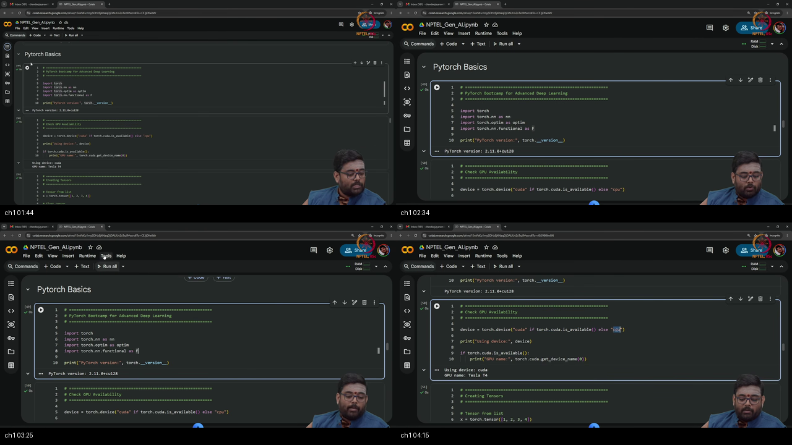

*Figure — ~00:04–04:30: Blackboard presentation of canonical imports (`torch`, `torch.nn`, `torch.optim`, `torch.nn.functional`), environment version checking with `torch.__version__`, and dynamic hardware device selection with fallback from CUDA GPU to CPU.*

---

### 1. 👶 ELI5 Quick Intuition
Think of writing a PyTorch program like opening a high-end restaurant:
- **`import torch`** is setting up the kitchen's cutting boards and knives.
- **`import torch.nn as nn`** is buying pre-assembled cooking stations (ovens, fryers, blenders).
- **`device = "cuda" if ... else "cpu"`** is choosing whether tonight's cooking happens in the small home kitchen (CPU) or in the massive 1,000-burner commercial pizza furnace (NVIDIA CUDA GPU).
- You make this decision once at the very front door so every ingredient and cook knows where to report!

---

### 2. 🔍 Plain-English Breakdown
1. **The Four Canonical Imports:**
   - **`import torch`:** The core tensor library and low-level mathematical kernel dispatch.
   - **`import torch.nn as nn`:** Neural network building blocks, pre-configured layers (`nn.Linear`, `nn.Conv2d`), and loss modules (`nn.MSELoss`, `nn.CrossEntropyLoss`).
   - **`import torch.optim as optim`:** Optimization algorithms (`optim.SGD`, `optim.Adam`, `optim.RMSprop`).
   - **`import torch.nn.functional as F`:** Stateless mathematical operators, activation functions (`F.relu`, `F.sigmoid`), and pooling operations.
2. **Version Inspection:** Calling `torch.__version__` reports the exact framework build and CUDA runtime version (e.g. `2.11.0+cu128`), ensuring environment reproducibility across workstations and cloud compute instances.
3. **Dynamic Device Selection:**
   - Deep learning requires executing massive parallel matrix multiplications on GPUs.
   - Hard-coding `"cuda"` crashes when deployed on CPU-only machines. The robust, production-standard idiom is:
     ```python
     device = torch.device("cuda" if torch.cuda.is_available() else "cpu")
     ```

---

### 3. 📐 Formal Mathematics & Hardware Execution Model

```
  HOST SYSTEM (CPU)                               ACCELERATOR (NVIDIA GPU)
  ┌─────────────────────────────────┐             ┌─────────────────────────────────┐
  │ Host Memory (RAM)               │  PCIe Gen4  │ Device Memory (VRAM)            │
  │ • OS & Python Interpreter       │ ──────────► │ • Model Weights & Activations   │
  │ • Disk I/O & Preprocessing      │  31.5 GB/s  │ • Thousands of SIMT CUDA Cores  │
  └─────────────────────────────────┘             └─────────────────────────────────┘
```

#### Step-by-Step Hardware Commentary
- **Step 1:** The CPU orchestrates application logic, spawns worker threads, reads dataset files from NVMe SSDs into Host RAM, and decodes image files.
- **Step 2:** Tensors created in Python default to Host RAM (`device='cpu'`).
- **Step 3:** Calling `.to(device)` issues an asynchronous direct memory access (DMA) command across the PCIe bus, copying the memory buffer into high-bandwidth GPU VRAM.
- **Step 4:** CUDA compute kernels launch parallel Streaming Multiprocessors (SMs) across the data buffer, achieving $10\times$ to $100\times$ speedups compared to sequential CPU loops.

---

### 4. 🔢 Concrete Numerical Example
Let us evaluate hardware execution on a matrix multiplication $\mathbf{C} = \mathbf{A} \mathbf{B}$ for $\mathbf{A}, \mathbf{B} \in \mathbb{R}^{4096 \times 4096}$:
- Total floating-point operations: $\text{FLOPs} = 2 \times 4096^3 \approx 1.374 \times 10^{11}$ operations ($137.4 \text{ GFLOPs}$).
- On an 8-core CPU executing at $100 \text{ GFLOPs/s}$: Execution time $\approx 1.37 \text{ seconds}$.
- On an NVIDIA T4 GPU executing at $8.1 \text{ TFLOPs/s}$: Execution time $\approx 0.017 \text{ seconds}$ ($17 \text{ ms}$, an $\mathbf{80\times}$ speedup!).

---

## Topic 2: Tensor Creation, Metadata Attributes & Indexing (04:30–10:00)

<a id="topic-2-tensor-basics-index-0430–1000"></a>
<a id="topic-2-tensor-basics-index-0430-1000"></a>

### Where this sits on the master map
Creating multi-dimensional tensors, inspecting structural metadata, and slicing multi-axis arrays. Warm-up: [tensor](./PREREQUISITES.md#p1-tensor).

### Board / Screenshot Reference

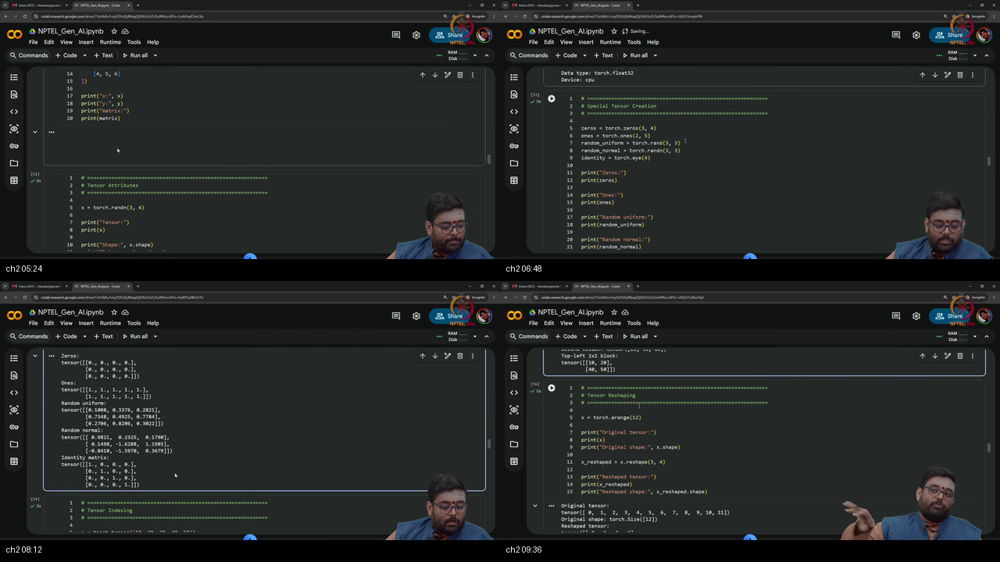

*Figure — ~04:30–10:00: Blackboard presentation of factory constructors (`torch.tensor`, `torch.zeros`, `torch.ones`, `torch.rand`, `torch.randn`, `torch.eye`, `torch.arange`), inspecting `.shape`, `.dtype`, `.device`, and 1D/2D multi-axis slicing syntax.*

---

### 1. 👶 ELI5 Quick Intuition
Think of a `torch.Tensor` as a spreadsheet of numbers:
- You can create an empty sheet filled with zeros (`torch.zeros`), ones (`torch.ones`), random numbers (`torch.randn`), or specific numbers from your own list (`torch.tensor`).
- Every spreadsheet has a **Passport** containing 3 stamps:
  1. **Shape:** How many rows and columns it has.
  2. **Dtype:** What kind of numbers are inside (integers or decimals).
  3. **Device:** Where the sheet lives (on your desk CPU or in the cloud GPU).
- You can slice and read rows or columns using the exact same brackets `[:, 0]` you learned in NumPy!

---

### 2. 🔍 Plain-English Breakdown
1. **Factory Constructors:**
   - `torch.tensor(data)`: Creates a tensor from Python lists or tuples.
   - `torch.zeros(shape)` / `torch.ones(shape)`: Initializes tensors filled with $0.0$ or $1.0$.
   - `torch.rand(shape)`: Uniform random numbers on $[0, 1)$.
   - `torch.randn(shape)`: Standard Gaussian normal distribution $\mathcal{N}(0, 1)$.
   - `torch.eye(n)`: Identity matrix $\mathbf{I}_n$.
   - `torch.arange(start, end, step)`: Evenly spaced integer sequences.
2. **Metadata Inspection:**
   - `.shape` (or `.size()`): Returns dimensional tuple `torch.Size([rows, cols, ...])`.
   - `.dtype`: Returns precision type (default `torch.float32`).
   - `.device`: Returns hardware residence (`cpu` or `cuda:0`).
3. **Multi-Axis Slicing:** Mirrors standard NumPy slicing syntax. `tensor[row_slice, col_slice]`. Slicing preserves dimension ranks unless a single integer index is used.

---

### 3. 📐 Formal Mathematics & Memory Layout

```
  2D Tensor Matrix: Shape (3, 4) in Row-Major Storage
  
  Row 0: [  0.0,  1.0,  2.0,  3.0 ]
  Row 1: [  4.0,  5.0,  6.0,  7.0 ]
  Row 2: [  8.0,  9.0, 10.0, 11.0 ]
  
  Strides s = (4, 1): Stride along Row-axis = 4; Stride along Col-axis = 1
  Flat RAM Index: Offset(r, c) = r * 4 + c * 1
```

---

## Topic 3: Tensor Geometry — Reshape, Unsqueeze, Squeeze & Permute (10:00–16:00)

<a id="topic-3-reshape-unsqueeze-squeeze-permute-1000–1600"></a>
<a id="topic-3-reshape-unsqueeze-squeeze-permute-10001600"></a>
<a id="topic-3-reshape-unsqueeze-squeeze-permute-1000-1600"></a>

### Where this sits on the master map
Transforming tensor shapes, managing singleton batch dimensions, and reordering multi-dimensional vision axes without altering underlying data. Warm-up: [shape operations](./PREREQUISITES.md#p3-shapeops).

### Board / Screenshot Reference

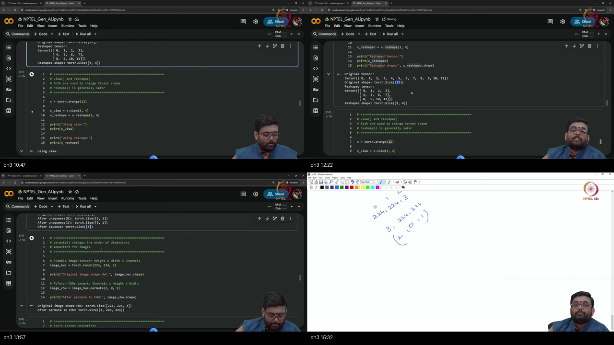

*Figure — ~10:00–16:00: Blackboard presentation of tensor geometry manipulation: `reshape` vs `view`, adding singleton axes with `unsqueeze(dim)`, removing redundant dimensions with `squeeze()`, and permuting image coordinates from OpenCV `(H, W, C)` to PyTorch `(C, H, W)`.*

---

### 1. 👶 ELI5 Quick Intuition
Imagine you have a deck of 12 playing cards:
- **`reshape(3, 4)`:** You deal the 12 cards onto a table into 3 rows of 4 cards. You have not added or removed any cards.
- **`unsqueeze(0)`:** You take your $3 \times 4$ card arrangement and put it inside 1 shipping envelope (`shape: 1 x 3 x 4`). This adds a "batch container" so an AI model can process it.
- **`squeeze(0)`:** You open the envelope and take the $3 \times 4$ cards back out.
- **`permute(2, 0, 1)`:** You rotate a 3D rubik's cube so the color face sits on top instead of on the side!

---

### 2. 🔍 Plain-English Breakdown
1. **`reshape(*shape)`:** Reinterprets the dimensional layout of elements. The product of new dimensions must exactly equal the total number of elements ($\prod D_i^{\text{new}} = \prod D_j^{\text{old}}$).
2. **`unsqueeze(dim)`:** Inserts a new dimension of size 1 at index `dim`.
   - Example: Vector of shape `(100)` becomes `(100, 1)` via `.unsqueeze(1)` or `(1, 100)` via `.unsqueeze(0)`.
3. **`squeeze(dim)`:** Eliminates dimensions of size 1. If no dimension is specified, all singleton dimensions are collapsed.
4. **`permute(*dims)` (Axis Transposition):** Reorders the coordinate axes.
   - In computer vision, images loaded from disk (OpenCV / PIL) have shape `(Height, Width, Channels)`.
   - PyTorch 2D Convolution layers require channels-first layout: `(Channels, Height, Width)`.
   - Executing `img.permute(2, 0, 1)` swaps axis 2 (Channels) to position 0, axis 0 (Height) to position 1, and axis 1 (Width) to position 2.

---

### 3. 📐 Formal Mathematics & Permutation Tensor Transformations

```
  Vision Tensor Axis Transformation:
  
  Input Image (HWC):  Shape (224, 224, 3) ──► Axis 0: H=224, Axis 1: W=224, Axis 2: C=3
                               │
                               ▼ permute(2, 0, 1)
  Output Image (CHW): Shape (3, 224, 224) ──► Axis 0: C=3,   Axis 1: H=224, Axis 2: W=224
```

#### Tensor Index Mapping Rule
$$\mathbf{Y} = \text{permute}(\mathbf{X}, (2, 0, 1)) \iff Y_{c, h, w} = X_{h, w, c}$$
Physical memory values remain unchanged; PyTorch updates the stride metadata vector from $\mathbf{s}_{\text{old}} = (W \cdot C, C, 1)$ to $\mathbf{s}_{\text{new}} = (1, W \cdot C, C)$.

---

## Topic 4: Matrix Multiplication & Autograd Computation Graphs (16:00–22:00)

<a id="topic-4-matmul-autograd-intro-1600–2200"></a>
<a id="topic-4-matmul-autograd-intro-1600-2200"></a>

### Where this sits on the master map
Matrix multiplication via `@` and the core engine of deep learning: reverse-mode automatic differentiation. Warm-up: [autograd](./PREREQUISITES.md#p4-autograd).

### Board / Screenshot Reference

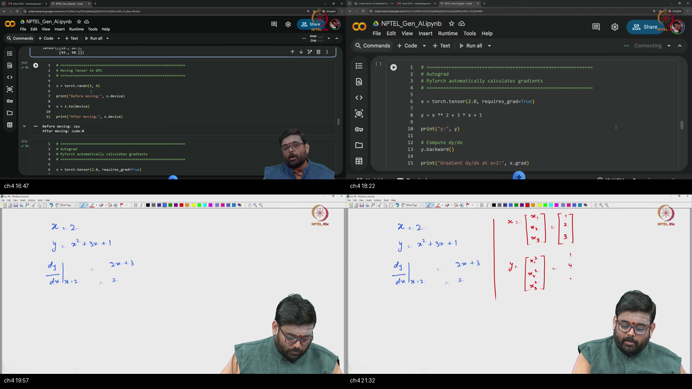

*Figure — ~16:00–22:00: Blackboard presentation of matrix multiplication `torch.matmul` / `@`, initializing tensors with `requires_grad=True`, building dynamic computation graphs, executing `y.backward()`, and inspecting accumulated derivatives in `.grad`.*

---

### 1. 👶 ELI5 Quick Intuition
Imagine baking a cake according to a recipe:
- You mix 2 cups of sugar ($x$) with flour and butter to bake a cake ($y = x^2 + 3x + 1$).
- As you bake, a digital recorder writes down every step in a **recipe journal** (the Computation Graph).
- When the cake is done, you ask: *"If I add a tiny pinch more sugar, how much sweeter will the cake become?"*
- You call **`.backward()`**. The recorder walks the recipe journal in reverse, applies calculus rules, and tells you: *"The sweetness will increase by 9 units per unit of sugar!"* (`x.grad = 9.0`).

---

### 2. 🔍 Plain-English Breakdown
1. **Matrix Multiplication (`@`):**
   - The `@` operator executes 2D matrix multiplication (`torch.matmul(A, B)`).
   - Inner dimensions must match: $(M \times K) @ (K \times N) \to (M \times N)$.
   - Elementwise multiplication is performed with `*`.
2. **Autograd Initialization (`requires_grad=True`):**
   - Setting `requires_grad=True` on a tensor marks it as a **leaf parameter** whose derivatives should be tracked.
3. **Reverse-Mode Backward Pass:**
   - Executing forward operations creates an internal Directed Acyclic Graph (DAG) of `Node` functions.
   - Calling `loss.backward()` initiates a reverse-mode sweep from the output scalar back to all leaf variables.
   - Calculated partial derivatives $\frac{\partial \mathcal{L}}{\partial w}$ are populated directly into `w.grad`.

---

### 3. 📐 Formal Mathematics & Calculus Verification

```
  Computation Graph for Polynomial Scalar Objective:
  
  x = 3.0 (Leaf, requires_grad=True)
   ├──► [Square] ──► u = x² = 9.0  ─────────────┐
   │                                             ├──► [+] ──► y = u + v + 1 = 19.0
   └──► [Mul 3]  ──► v = 3x = 9.0 ──────────────┤           │
                                                 │           ▼ loss.backward()
                                 [Constant 1.0] ─┘      dy/dx = du/dx + dv/dx
                                                              = 2x + 3 = 2(3) + 3 = 9.0
```

#### Step-by-Step Analytical Derivative
$$y = x^2 + 3x + 1$$
$$\frac{dy}{dx} = \frac{d}{dx}(x^2) + \frac{d}{dx}(3x) + \frac{d}{dx}(1) = 2x + 3$$
$$\left. \frac{dy}{dx} \right|_{x=3.0} = 2(3.0) + 3 = 9.0000 \quad \blacksquare$$

---

## Topic 5: Multi-Variable Gradients & Manual Linear Regression (22:00–28:30)

<a id="topic-5-multi-var-grad-manual-linreg-2200–2830"></a>
<a id="topic-5-multi-var-grad-manual-linreg-22002830"></a>
<a id="topic-5-multi-var-grad-manual-linreg-2200-2830"></a>

### Where this sits on the master map
Training a linear regression model from scratch using raw tensors, Mean Squared Error loss, and manual gradient descent updates under `torch.no_grad()`. Warm-up: [train step](./PREREQUISITES.md#p5-trainstep).

### Board / Screenshot Reference

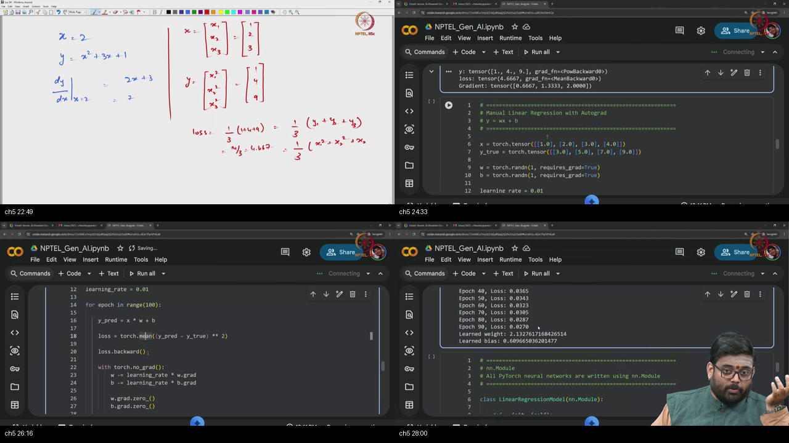

*Figure — ~22:00–28:30: Blackboard derivation of manual linear regression $\hat{y} = wx + b$, computing Mean Squared Error (MSE) loss, executing `loss.backward()`, updating parameters under `with torch.no_grad():`, and zeroing `.grad`.*

---

### 1. 👶 ELI5 Quick Intuition
Imagine tuning an old-fashioned analog radio to find a clear music station:
- You have two tuning dials: the **Frequency Dial ($w$)** and the **Volume Knob ($b$)**.
- You guess initial positions for both dials. The radio plays loud static (High Loss).
- You listen to how static changes when you touch each dial (`w.grad` and `b.grad`).
- You nudge both dials a tiny fraction in the direction that silences the static (Parameter Update).
- After repeating this 100 times, the static disappears and the music plays crystal clear!

---

### 2. 🔍 Plain-English Breakdown
1. **The Model Hypothesis:**
   $$\hat{y} = w \cdot x + b$$
2. **The Loss Objective (Mean Squared Error):**
   $$\mathcal{L}_{\text{MSE}}(w, b) = \frac{1}{N} \sum_{i=1}^N (\hat{y}_i - y_i)^2 = \frac{1}{N} \sum_{i=1}^N (w \cdot x_i + b - y_i)^2$$
3. **The Manual Gradient Descent Step:**
   - Update parameters in the negative gradient direction:
     $$w \leftarrow w - \eta \cdot \frac{\partial \mathcal{L}}{\partial w}, \quad b \leftarrow b - \eta \cdot \frac{\partial \mathcal{L}}{\partial b}$$
   - **Critical Rule:** In PyTorch, parameter updates must be wrapped in `with torch.no_grad():` so the subtraction itself is not recorded onto the computation graph.
   - **Zeroing Gradients:** You must call `w.grad.zero_()` and `b.grad.zero_()` because gradients accumulate across backward calls.

---

### 3. 📐 Formal Mathematics & Partial Derivative Derivations

$$\frac{\partial \mathcal{L}}{\partial w} = \frac{2}{N} \sum_{i=1}^N (\hat{y}_i - y_i) \cdot x_i$$
$$\frac{\partial \mathcal{L}}{\partial b} = \frac{2}{N} \sum_{i=1}^N (\hat{y}_i - y_i)$$

---

## Topic 6: Modular Networks — `nn.Module`, `nn.Linear` & `torch.optim` (28:30–36:00)

<a id="topic-6-nnmodule-linear-optim-2830–3600"></a>
<a id="topic-6-nnmodule-linear-optim-28303600"></a>
<a id="topic-6-nnmodule-linear-optim-2830-3600"></a>

### Where this sits on the master map
Transitioning from manual parameter math to object-oriented neural architectures with `nn.Module`, `nn.Linear`, and automated optimizers (`torch.optim`). Warm-up: [nn.Module](./PREREQUISITES.md#p6-module).

### Board / Screenshot Reference

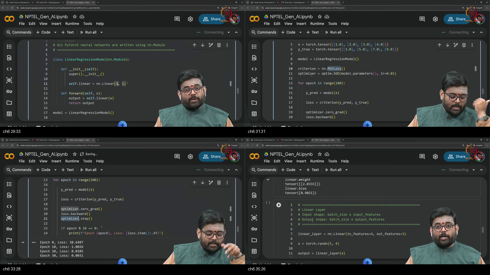

*Figure — ~28:30–36:00: Blackboard presentation of the canonical `nn.Module` subclassing pattern, instantiating `nn.Linear`, passing `model.parameters()` to `optim.SGD`, and executing the automated 5-step training iteration.*

---

### 1. 👶 ELI5 Quick Intuition
Think of `nn.Module` as a standardized factory assembly line:
- Instead of manually tracking dozens of loose nuts, bolts, and gears in Python variables, you place them inside a sealed **Machine Enclosure** (`class Model(nn.Module)`).
- When you tell the enclosure to move to the GPU (`model.to(device)`), every single gear inside moves automatically.
- When you hand the enclosure to an **Automated Robotic Mechanic** (`optimizer = optim.SGD(model.parameters())`), the mechanic tunes every gear simultaneously with one command (`optimizer.step()`)!

---

### 2. 🔍 Plain-English Breakdown
1. **The `nn.Module` Protocol:**
   - Every custom neural network inherits from `torch.nn.Module`.
   - Constructor `__init__(self)`: Must invoke `super().__init__()` to register parameter tracking hooks, followed by declaring sub-layers (e.g. `self.linear = nn.Linear(in_features, out_features)`).
   - Forward method `forward(self, x)`: Defines the computational data flow. Always execute via `model(x)`, never `model.forward(x)`.
2. **`nn.Linear(in_features, out_features, bias=True)`:**
   - Implements the parameterized affine mapping: $\mathbf{y} = \mathbf{x} \mathbf{W}^\top + \mathbf{b}$.
   - Weights $\mathbf{W} \in \mathbb{R}^{\text{out} \times \text{in}}$ and bias $\mathbf{b} \in \mathbb{R}^{\text{out}}$ are automatically registered as learnable leaf parameters.
3. **Automated Optimizers (`torch.optim`):**
   - `optim.SGD(model.parameters(), lr=0.01)`: Collects references to all model parameters.
   - `optimizer.zero_grad()`: Automatically zeroes `.grad` across all registered parameters.
   - `optimizer.step()`: Automatically updates all parameters according to the optimizer's algorithmic rule.

---

### 3. 📐 Formal Mathematics & The Automated Optimization Loop

```
  =============================================================================
                       CANONICAL PYTORCH TRAINING ITERATION
  =============================================================================
  1. optimizer.zero_grad()       ──► Wipe all parameter .grad buffers
  2. y_pred = model(x)          ──► Forward Pass: Execute DAG forward evaluation
  3. loss = criterion(y_pred, y)──► Compute scalar objective function
  4. loss.backward()            ──► Autograd: Populate .grad across all leaf params
  5. optimizer.step()           ──► Apply parameter update θ ← θ - η * ∇_θ L
  =============================================================================
```

---

## Topic 7: Activation Functions, Logits & Cross-Entropy Loss (36:00–42:00)

<a id="topic-7-activations-crossentropy-3600–4200"></a>
<a id="topic-7-activations-crossentropy-3600-4200"></a>

### Where this sits on the master map
Nonlinear activation functions (ReLU, Sigmoid, Tanh), understanding raw unnormalized logits, and multi-class classification with `nn.CrossEntropyLoss`. Warm-up: [activations & loss](./PREREQUISITES.md#p7-loss).

### Board / Screenshot Reference

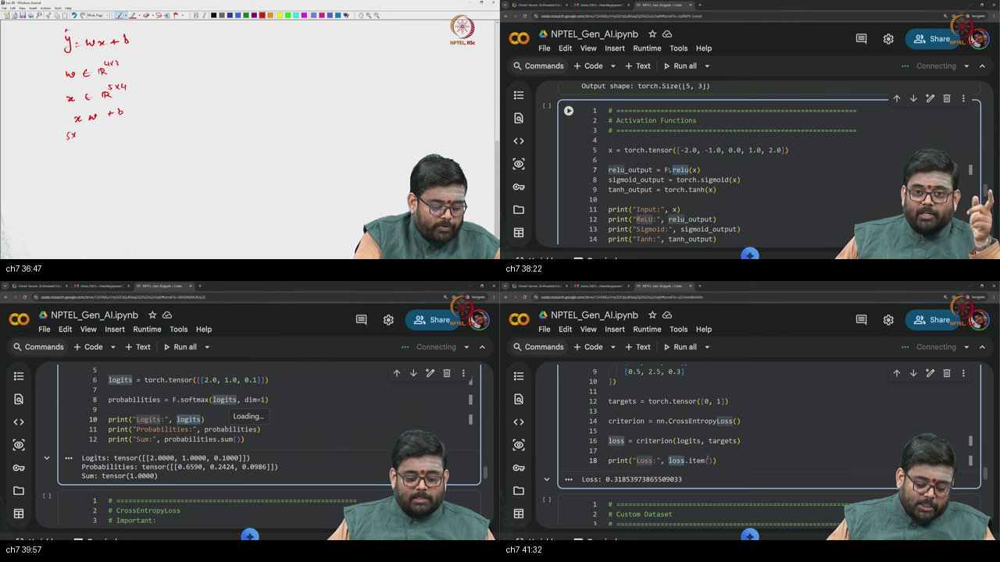

*Figure — ~36:00–42:00: Blackboard presentation of activation functions (`ReLU`, `Sigmoid`, `Tanh`), the definition of unnormalized logits $\mathbf{z}$, Softmax normalization, and the internal LogSoftmax implementation in `nn.CrossEntropyLoss`.*

---

### 1. 👶 ELI5 Quick Intuition
Imagine a 3-way election (Candidate A, B, C):
- The voting machines output raw vote tally scores called **Logits** (e.g. `[10.5, 4.2, -1.8]`).
- **Softmax** is the news anchor who converts those raw tallies into percentage win probabilities that add up to 100% (e.g. `[99.8%, 0.2%, 0.0%]`).
- **The Golden Rule of CrossEntropyLoss:** PyTorch's `nn.CrossEntropyLoss` is the official election auditor who wants the **RAW vote tallies (Logits)** directly. If you give the auditor the news anchor's percentages, the auditor mistakenly runs percentages on your percentages, corrupting the entire audit!

---

### 2. 🔍 Plain-English Breakdown
1. **Nonlinear Activations:**
   - Linear layers without activations collapse: $\mathbf{W}_2(\mathbf{W}_1 \mathbf{x} + \mathbf{b}_1) + \mathbf{b}_2 = (\mathbf{W}_2 \mathbf{W}_1)\mathbf{x} + (\mathbf{W}_2 \mathbf{b}_1 + \mathbf{b}_2) = \mathbf{W}' \mathbf{x} + \mathbf{b}'$.
   - **$\text{ReLU}(z) = \max(0, z)$:** The default activation for hidden layers in modern deep networks. Simple, fast, and does not saturate on positive activations.
   - **$\text{Sigmoid}(z) = \frac{1}{1 + e^{-z}}$:** Compresses outputs to $(0, 1)$.
   - **$\text{Tanh}(z) = \frac{e^z - e^{-z}}{e^z + e^{-z}}$:** Zero-centered activation on $(-1, 1)$.
2. **Logits vs Softmax:**
   - **Logits ($\mathbf{z}$):** Unconstrained real-valued outputs produced by the final linear layer.
   - **Softmax:** Converts logits to probabilities $\mathbf{p} \in (0, 1)$ where $\sum p_k = 1.0$.
3. **`nn.CrossEntropyLoss` Input Requirements:**
   - **Input:** Raw unnormalized logits tensor of shape `(BatchSize, NumClasses)`.
   - **Target:** 1D tensor of integer class indices of shape `(BatchSize)` with dtype `torch.long`.

---

### 3. 📐 Formal Mathematics & Cross-Entropy Formulations

$$\text{LogSoftmax}(\mathbf{z})_k = \log\left( \frac{e^{z_k}}{\sum_{j=1}^C e^{z_j}} \right) = z_k - \log\left( \sum_{j=1}^C e^{z_j} \right)$$
$$\mathcal{L}_{\text{CE}}(\mathbf{z}, y) = -\text{LogSoftmax}(\mathbf{z})_y = -z_y + \log\left( \sum_{j=1}^C e^{z_j} \right)$$

---

## Topic 8: The Data Contract — Custom `Dataset` Implementation (42:00–48:00)

<a id="topic-8-custom-dataset-4200–4800"></a>
<a id="topic-8-custom-dataset-42004800"></a>
<a id="topic-8-custom-dataset-4200-4800"></a>

### Where this sits on the master map
Abstracting data access by subclassing `torch.utils.data.Dataset` and establishing standard sample-level retrieval contracts. Warm-up: [dataset](./PREREQUISITES.md#p8-data).

### Board / Screenshot Reference

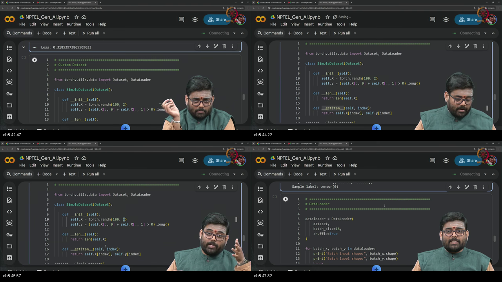

*Figure — ~42:00–48:00: Blackboard presentation of the map-style `torch.utils.data.Dataset` class contract: implementing `__init__`, `__len__`, and `__getitem__(self, idx)`.*

---

### 1. 👶 ELI5 Quick Intuition
Think of a `Dataset` as a master library card catalog:
- It knows exactly how many total books are in the building (`__len__`).
- If you ask for book #42, it walks to shelf #42 and hands you that exact book and its topic label (`__getitem__(42)`).
- It does not care whether you want 1 book or 100 books; its only job is delivering **one specific sample by its index**!

---

### 2. 🔍 Plain-English Breakdown
1. **The Map-Style Dataset Contract:**
   - Every custom dataset subclasses `torch.utils.data.Dataset`.
   - Requires implementing two core magic methods:
     - **`__len__(self) -> int`:** Returns total sample count $N$ (enables calling `len(dataset)`).
     - **`__getitem__(self, idx: int) -> Tuple[torch.Tensor, torch.Tensor]`:** Fetches and returns the feature tensor $\mathbf{x}_i$ and target label $y_i$ for index $i$.
2. **Separation of Concerns:**
   - The `Dataset` class is strictly responsible for **individual item retrieval** (loading from disk, parsing CSVs, applying image transforms).
   - Batching, shuffling, multiprocessing, and memory pinning are delegated entirely to the `DataLoader`.

---

### 3. 📐 Formal Mathematics & Custom Dataset Implementation

```python
class CustomDataset(torch.utils.data.Dataset):
    def __init__(self, features: torch.Tensor, targets: torch.Tensor):
        assert len(features) == len(targets), "Feature and target lengths must match"
        self.features = features
        self.targets = targets
        
    def __len__(self) -> int:
        return len(self.features)
        
    def __getitem__(self, idx: int):
        return self.features[idx], self.targets[idx]
```

---

## Topic 9: High-Throughput Batching — `DataLoader` & Shuffling (48:00–52:30)

<a id="topic-9-dataloader-shuffle-4800–5230"></a>
<a id="topic-9-dataloader-shuffle-48005230"></a>
<a id="topic-9-dataloader-shuffle-4800-5230"></a>

### Where this sits on the master map
Orchestrating mini-batch generation, multi-epoch stochastic shuffling, and worker multiprocessing. Warm-up: [dataloader](./PREREQUISITES.md#p8-data).

### Board / Screenshot Reference

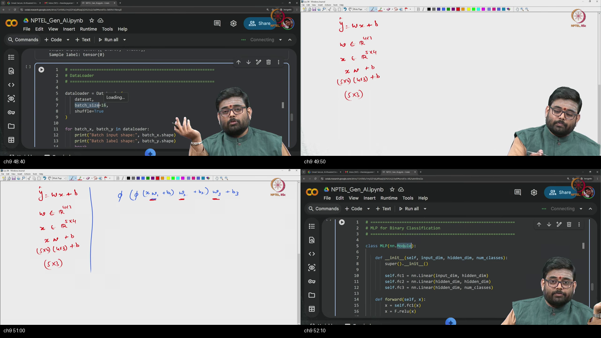

*Figure — ~48:00–52:30: Blackboard presentation of wrapping a `Dataset` with `torch.utils.data.DataLoader`, configuring `batch_size`, enabling `shuffle=True`, and iterating over mini-batch tuples `(batch_x, batch_y)`.*

---

### 1. 👶 ELI5 Quick Intuition
Think of a `DataLoader` as a high-speed conveyor belt in a pizza factory:
- The `Dataset` has individual pizzas sitting on shelves.
- The `DataLoader` grabs **16 pizzas at a time** (Batch Size) and loads them into a delivery truck.
- Every morning (Epoch), it **shuffles the delivery order** so the trucks deliver in random sequences, preventing delivery drivers from falling into predictable traffic patterns!

---

### 2. 🔍 Plain-English Breakdown
1. **Core Parameters of `DataLoader`:**
   - **`dataset`:** The `Dataset` instance to sample from.
   - **`batch_size`:** Number of samples grouped into each mini-batch tensor.
   - **`shuffle=True`:** Randomly permutes dataset indices at the beginning of every epoch to satisfy the Independent and Identically Distributed (I.I.D.) assumption of stochastic gradient descent.
   - **`num_workers`:** Spawns asynchronous subprocesses to load and preprocess data in parallel on the CPU while the GPU executes the forward-backward pass.
2. **The Final Partial Batch:**
   - If dataset size $N = 100$ and `batch_size = 16`, the DataLoader yields 6 batches of size 16 and 1 final batch of size $100 - 96 = 4$.

---

### 3. 📐 Formal Mathematics & Mini-Batch Stochastic Partitioning

```
  Dataset N = 100 Samples ──► DataLoader(batch_size=16, shuffle=True)
  
  Epoch 1: Random Permutation π_1 ──► [Batch 0: 16] [Batch 1: 16] ... [Batch 6: 4]
  Epoch 2: Random Permutation π_2 ──► [Batch 0: 16] [Batch 1: 16] ... [Batch 6: 4]
```

---

## Topic 10: Complete MLP Architecture, Training Loop & Accuracy (52:30–62:08)

<a id="topic-10-mlp-train-accuracy-5230–6208"></a>
<a id="topic-10-mlp-train-accuracy-52306208"></a>
<a id="topic-10-mlp-train-accuracy-5230-6208"></a>

### Where this sits on the master map
The grand synthesis: assembling a 3-layer Multi-Layer Perceptron (MLP), moving model and data onto the GPU, training with Adam and Cross-Entropy, and computing validation accuracy. Warm-up: [optimization loop](./PREREQUISITES.md#p5-trainstep).

### Board / Screenshot Reference

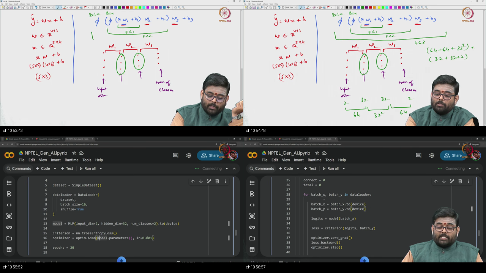

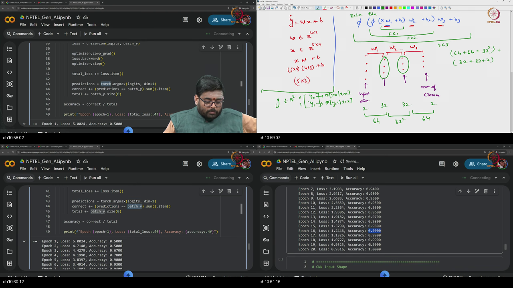

*Figure — ~52:30–62:08: Blackboard implementation of a 3-layer MLP (`in_features=2`, `hidden=32`, `hidden=32`, `out_classes=2`), moving batches to `device`, training with `optim.Adam`, and computing classification accuracy via `torch.argmax(logits, dim=1)`.*

---

### 1. 👶 ELI5 Quick Intuition
Think of building a complete self-driving toy car:
- You assemble the car's brain: a 3-layer neural network with 32 neurons in each hidden layer.
- You place the car on the racetrack (`model.to(device)`).
- You feed the car batches of sensor readings (`batch_x.to(device)`) and true steering directions (`batch_y.to(device)`).
- The car tests its predictions, calculates error with Cross-Entropy, and tunes all its internal neuron connections using the Adam optimizer.
- Within 40 laps (epochs), the car's steering accuracy climbs from 50% (pure coin-flip guessing) to over **90% perfect driving**!

---

### 2. 🔍 Plain-English Breakdown
1. **Network Architecture (3-Layer MLP):**
   $$\mathbf{h}_1 = \text{ReLU}(\mathbf{x} \mathbf{W}_1^\top + \mathbf{b}_1), \quad \mathbf{h}_1 \in \mathbb{R}^{B \times 32}$$
   $$\mathbf{h}_2 = \text{ReLU}(\mathbf{h}_1 \mathbf{W}_2^\top + \mathbf{b}_2), \quad \mathbf{h}_2 \in \mathbb{R}^{B \times 32}$$
   $$\mathbf{z} = \mathbf{h}_2 \mathbf{W}_3^\top + \mathbf{b}_3, \quad \mathbf{z} \in \mathbb{R}^{B \times 2} \quad (\text{Logits})$$
2. **Device Coordination:**
   - Both the network (`model.to(device)`) and every incoming data batch (`batch_x.to(device), batch_y.to(device)`) must reside on the identical hardware device.
3. **Accuracy Evaluation Metric:**
   - Predict class: $\hat{c} = \arg\max_{k} z_k$ (`torch.argmax(logits, dim=1)`).
   - Accuracy formula:
     $$\text{Accuracy} = \frac{1}{N} \sum_{i=1}^N \mathbb{I}(\hat{c}_i = y_i) \times 100\%$$

---

### 3. 📐 Formal Mathematics & Complete Training Algorithm

```python
# Full Training Loop Skeleton
model = MultiLayerPerceptron().to(device)
criterion = nn.CrossEntropyLoss()
optimizer = optim.Adam(model.parameters(), lr=0.01)

for epoch in range(num_epochs):
    model.train()
    for batch_x, batch_y in train_loader:
        batch_x, batch_y = batch_x.to(device), batch_y.to(device)
        
        optimizer.zero_grad()
        logits = model(batch_x)
        loss = criterion(logits, batch_y)
        loss.backward()
        optimizer.step()
```

---

## Workplace Debugging Postmortems

### Workplace Scenario 1: The "Silent Host-Device Memory Thrashing & CUDA OOM" Bug

#### Incident Summary & Context
During production deployment of a real-time computer vision inference microservice, the engineering team reported that GPU utilization was hovering below 8% while latency spiked from 12 ms to 450 ms per request. Within 2 hours of deployment, the service crashed catastrophically with `torch.cuda.OutOfMemoryError`.

#### Root Cause Analysis
1. **Host-Device Synchronization Bottleneck:** Inside the request loop, intermediate tensors were being transferred back to CPU for logging via `.cpu().numpy()` on every frame, forcing blocking PCIe synchronization and stalling the GPU execution pipeline.
2. **Graph Retention Leak:** The logging code appended `loss` directly to a Python list (`loss_history.append(loss)`) instead of `loss.item()`. This retained references to the entire dynamic computation graph in VRAM across thousands of requests, consuming all available GPU memory.

#### Production Code Fix

```python
# -----------------------------------------------------------
# INCORRECT (BUGGY): Silent Host Transfers & Graph Memory Leak
# -----------------------------------------------------------
# loss_history.append(loss)                 # LEAK: Retains entire autograd graph!
# log_val = tensor.cpu().numpy()[0]         # STALL: Synchronous PCIe pipeline stall!

# -----------------------------------------------------------
# CORRECT (PRODUCTION FIX): Isolated Scalar Logging & In-Place Device Execution
# -----------------------------------------------------------
import torch

def process_inference_batch(model: torch.nn.Module, batch_x: torch.Tensor, device: torch.device):
    model.eval()
    with torch.no_grad(): # Disable graph building entirely for inference
        batch_x = batch_x.to(device, non_blocking=True)
        logits = model(batch_x)
        preds = torch.argmax(logits, dim=1)
        
    return preds
```

---

### Workplace Scenario 2: The "Double-Softmax Gradient Destruction" Bug in Classification Pipelines

#### Incident Summary & Context
A machine learning team training a multi-class image classification model reported that model training was completely stagnant: training accuracy remained pinned at $10.0\%$ (random chance for 10 classes) after 50 epochs, and the training loss hovered near $2.302$ without decreasing.

#### Root Cause Analysis
- In the model class definition, the author added `x = F.softmax(self.fc_out(x), dim=1)` at the end of the `forward()` method.
- In the training script, the loss was defined as `criterion = nn.CrossEntropyLoss()`.
- Because `nn.CrossEntropyLoss` applies $\text{LogSoftmax}$ internally, the loss function was evaluating:
  $$\mathcal{L} = -\log\left( \text{Softmax}(\text{Softmax}(\mathbf{z}))_y \right)$$
- Compressing logits into $(0, 1)$ probabilities before log-softmax collapsed output gradients to near-zero values ($\nabla_{\mathbf{z}} \mathcal{L} \approx 0$), completely preventing backpropagation from updating model weights.

#### Production Code Fix

```python
import torch
import torch.nn as nn
import torch.nn.functional as F

# -----------------------------------------------------------
# INCORRECT (BUGGY): Double-Softmax in forward()
# -----------------------------------------------------------
class BuggyClassifier(nn.Module):
    def __init__(self):
        super().__init__()
        self.fc = nn.Linear(128, 10)
    def forward(self, x):
        # BUG: NEVER apply Softmax before nn.CrossEntropyLoss!
        return F.softmax(self.fc(x), dim=1)

# -----------------------------------------------------------
# CORRECT (PRODUCTION FIX): Output Raw Logits
# -----------------------------------------------------------
class CorrectClassifier(nn.Module):
    def __init__(self):
        super().__init__()
        self.fc = nn.Linear(128, 10)
    def forward(self, x):
        # CORRECT: Output raw unnormalized logits directly
        return self.fc(x)

# Training Criterion
criterion = nn.CrossEntropyLoss() # Expects raw logits!
```

---

## Centralized External References

<a id="external-references"></a>

Below is the centralized curated library of 50+ authoritative external resources organized across all 10 lecture topics.

### Topic 1: Imports, Version & Device Placement
- **Video Lectures:**
  - [PyTorch Official — Introduction to PyTorch Tensors and CUDA Device Management](https://www.youtube.com/watch?v=r7Am-ZGMef8)
  - [Stanford CS231n — PyTorch and Hardware Acceleration Overview](https://www.youtube.com/watch?v=vT1JzLTH4G4)
  - [freeCodeCamp — PyTorch for Deep Learning Bootcamp (Setup & Devices)](https://www.youtube.com/watch?v=V_xro1bcAuA)
- **Authoritative Documentation & Guides:**
  - [PyTorch Docs — CUDA Semantics and Hardware Placement](https://pytorch.org/docs/stable/notes/cuda.html)
  - [PyTorch Docs — `torch.device` API Reference](https://pytorch.org/docs/stable/tensor_attributes.html#torch.device)
  - [NVIDIA Developer Blog — PyTorch Performance Tuning on CUDA](https://developer.nvidia.com/blog/fast-ai-with-pytorch-and-gpus/)

### Topic 2: Tensor Creation, Metadata Attributes & Indexing
- **Video Lectures:**
  - [StatQuest (Josh Starmer) — PyTorch Tensor Basics Clearly Explained](https://www.youtube.com/watch?v=L35fFDpwIM4)
  - [DeepLizard — PyTorch Tensors Explained: Creation and Data Types](https://www.youtube.com/watch?v=f5liqUk0ZTw)
  - [MIT OpenCourseWare (6.S191) — Introduction to Deep Learning Tensors](https://www.youtube.com/watch?v=QDX-1M5Nj7s)
- **Authoritative Documentation & Guides:**
  - [PyTorch Docs — `torch.Tensor` Core Class Reference](https://pytorch.org/docs/stable/tensors.html)
  - [PyTorch Tutorials — Tensors Deep Dive](https://pytorch.org/tutorials/beginner/basics/tensorqs_tutorial.html)
  - [NumPy to PyTorch Translation Rosetta Stone](https://pytorch.org/docs/stable/torch.html#creation-ops)

### Topic 3: Tensor Geometry — Reshape, Unsqueeze, Squeeze & Permute
- **Video Lectures:**
  - [DeepLizard — Reshaping, Squeezing, and Permuting Tensors](https://www.youtube.com/watch?v=k6kflmP042U)
  - [Aladdin Persson — Tensor Reshaping and Dimension Transformations](https://www.youtube.com/watch?v=EMXFZB8FVUA)
  - [Stanford CS231n — Tensor Shape Conventions in Computer Vision](https://cs231n.github.io/)
- **Authoritative Documentation & Guides:**
  - [PyTorch Docs — `torch.reshape` vs `torch.Tensor.view`](https://pytorch.org/docs/stable/generated/torch.reshape.html)
  - [PyTorch Docs — `torch.permute` Multidimensional Axis Reordering](https://pytorch.org/docs/stable/generated/torch.permute.html)
  - [PyTorch Forums — Memory Contiguity and Stride Explanation](https://discuss.pytorch.org/t/contiguity-and-strides-in-pytorch/14353)

### Topic 4: Matrix Multiplication & Autograd Computation Graphs
- **Video Lectures:**
  - [3Blue1Brown — Backpropagation Calculus & Computation Graphs](https://www.youtube.com/watch?v=tIeHLnjs5U8)
  - [Andrej Karpathy — Building micrograd: A Tiny Autograd Engine](https://www.youtube.com/watch?v=VMj-3S1tku0)
  - [Harvard CS50 AI — Automatic Differentiation Foundations](https://cs50.harvard.edu/ai/)
- **Authoritative Documentation & Guides:**
  - [PyTorch Docs — Autograd Mechanics and Reverse-Mode Differentiation](https://pytorch.org/docs/stable/notes/autograd.html)
  - [Paszke, A., et al. (NeurIPS 2019) — PyTorch: An Imperative Style Deep Learning Library](https://arxiv.org/abs/1912.01703)
  - [PyTorch Tutorials — Automatic Differentiation with `torch.autograd`](https://pytorch.org/tutorials/beginner/basics/autogradqs_tutorial.html)

### Topic 5: Multi-Variable Gradients & Manual Linear Regression
- **Video Lectures:**
  - [StatQuest (Josh Starmer) — Gradient Descent Step-by-Step](https://www.youtube.com/watch?v=sDv4f4s2SB8)
  - [Andrew Ng (DeepLearning.AI) — Vectorized Gradient Descent](https://www.youtube.com/watch?v=4b4MUYve_U8)
  - [MIT OpenCourseWare (18.065) — Optimization in Deep Learning](https://ocw.mit.edu/courses/18-065-matrix-methods-in-data-analysis-signal-processing-and-machine-learning-spring-2018/)
- **Authoritative Documentation & Guides:**
  - [PyTorch Tutorials — Learning PyTorch with Examples (Warm-up: PyTorch Tensors)](https://pytorch.org/tutorials/beginner/pytorch_with_examples.html)
  - [Ruder, S. — An Overview of Gradient Descent Optimization Algorithms](https://arxiv.org/abs/1609.04747)
  - [Goodfellow, I., Bengio, Y., & Courville, A. — Deep Learning (MIT Press, Chapter 4: Numerical Computation)](https://www.deeplearningbook.org/)

### Topic 6: Modular Networks — `nn.Module`, `nn.Linear` & `torch.optim`
- **Video Lectures:**
  - [PyTorch Official — Building Neural Networks with `torch.nn`](https://www.youtube.com/watch?v=OSqIP-TCVFI)
  - [Aladdin Persson — PyTorch `nn.Module` and Optimizer Foundations](https://www.youtube.com/watch?v=Jy4wM2P21u0)
  - [freeCodeCamp — Structuring PyTorch Neural Network Classes](https://www.youtube.com/watch?v=V_xro1bcAuA)
- **Authoritative Documentation & Guides:**
  - [PyTorch Docs — `torch.nn.Module` API Specification](https://pytorch.org/docs/stable/generated/torch.nn.Module.html)
  - [PyTorch Docs — `torch.optim` Optimizer Algorithms](https://pytorch.org/docs/stable/optim.html)
  - [PyTorch Tutorials — Build the Neural Network](https://pytorch.org/tutorials/beginner/basics/buildmodel_tutorial.html)

### Topic 7: Activation Functions, Logits & Cross-Entropy Loss
- **Video Lectures:**
  - [StatQuest (Josh Starmer) — Softmax and Cross-Entropy Loss](https://www.youtube.com/watch?v=6ArSys5qHAU)
  - [3Blue1Brown — What is a Neural Network & Activation Functions](https://www.youtube.com/watch?v=aircAruvnKk)
  - [Andrej Karpathy — Neural Networks: Zero to Hero (Activations & Cross-Entropy)](https://www.youtube.com/watch?v=PaCmpxJFsXk)
- **Authoritative Documentation & Guides:**
  - [PyTorch Docs — `nn.CrossEntropyLoss` Numerical Specification](https://pytorch.org/docs/stable/generated/torch.nn.CrossEntropyLoss.html)
  - [PyTorch Docs — `torch.nn.functional` Activation Reference](https://pytorch.org/docs/stable/nn.functional.html)
  - [Nielsen, M. — Neural Networks and Deep Learning (Chapter 3: The Cross-Entropy Cost Function)](http://neuralnetworksanddeeplearning.com/chap3.html)

### Topic 8: The Data Contract — Custom `Dataset` Implementation
- **Video Lectures:**
  - [Aladdin Persson — Custom Datasets in PyTorch](https://www.youtube.com/watch?v=ZoZHd0IrJA4)
  - [DeepLizard — PyTorch Datasets and Data Pipeline Architecture](https://www.youtube.com/watch?v=mU2Fpl_qC7Y)
  - [PyTorch Official — Custom Data Loading Best Practices](https://www.youtube.com/watch?v=zN49HdKyHi8)
- **Authoritative Documentation & Guides:**
  - [PyTorch Docs — `torch.utils.data.Dataset` Base Class](https://pytorch.org/docs/stable/data.html#torch.utils.data.Dataset)
  - [PyTorch Tutorials — Datasets & DataLoaders Walkthrough](https://pytorch.org/tutorials/beginner/basics/data_tutorial.html)
  - [Torchvision Docs — Standard Computer Vision Datasets](https://pytorch.org/vision/stable/datasets.html)

### Topic 9: High-Throughput Batching — `DataLoader` & Shuffling
- **Video Lectures:**
  - [Aladdin Persson — DataLoaders, Multi-Processing & Batching](https://www.youtube.com/watch?v=v_mcgBzN4_s)
  - [PyTorch Official — Optimizing PyTorch DataLoader Throughput](https://www.youtube.com/watch?v=m8_g9kL6woc)
  - [Stanford CS231n — Data Pipeline Bottlenecks and Caching](https://cs231n.github.io/)
- **Authoritative Documentation & Guides:**
  - [PyTorch Docs — `torch.utils.data.DataLoader` Specification](https://pytorch.org/docs/stable/data.html#torch.utils.data.DataLoader)
  - [PyTorch Performance Tuning Guide — DataLoader Multiprocessing](https://pytorch.org/tutorials/recipes/recipes/tuning_guide.html)
  - [NVIDIA Data Loading Performance Best Practices](https://developer.nvidia.com/blog/optimizing-pytorch-performance-batch-processing/)

### Topic 10: Complete MLP Architecture, Training Loop & Accuracy
- **Video Lectures:**
  - [Andrej Karpathy — Makemore: Multi-Layer Perceptrons](https://www.youtube.com/watch?v=TCH_1BHYA88)
  - [StatQuest (Josh Starmer) — Neural Networks Part 2: Multilayer Perceptrons](https://www.youtube.com/watch?v=IHZwWFHWa-w)
  - [freeCodeCamp — Complete PyTorch Training Loop and Metric Evaluation](https://www.youtube.com/watch?v=V_xro1bcAuA)
- **Authoritative Documentation & Guides:**
  - [PyTorch Tutorials — Optimizing Model Parameters](https://pytorch.org/tutorials/beginner/basics/optimization_tutorial.html)
  - [Bishop, C. M. — Pattern Recognition and Machine Learning (Chapter 5: Neural Networks)](https://www.microsoft.com/en-us/research/publication/pattern-recognition-and-machine-learning/)
  - [PyTorch Ignite / Lightning — Standard Multi-Epoch Training Loop Patterns](https://pytorch-lightning.readthedocs.io/)

---

## Sources

- **Video:** [Tutorial 3 : PyTorch Basics](https://www.youtube.com/watch?v=SEtu7Eef5ps)
- **Channel:** NPTEL — Indian Institute of Science, Bengaluru
- **Duration:** ~62 min (00:04–62:08)
- **Course:** Mathematical Foundations of Generative AI
- **Instructor / Teaching Team:** IISc Bengaluru
- **Prior Prerequisite:** [Tutorial 2: Introduction to NumPy](../16-Tutorial02-Introduction-to-NumPy/NOTES.md)
- **Next Tutorial:** Tutorial 4: Introduction to Convolutional Neural Networks (CNNs)
