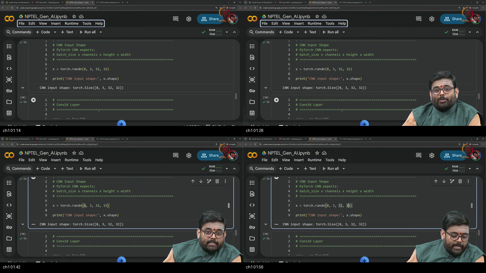
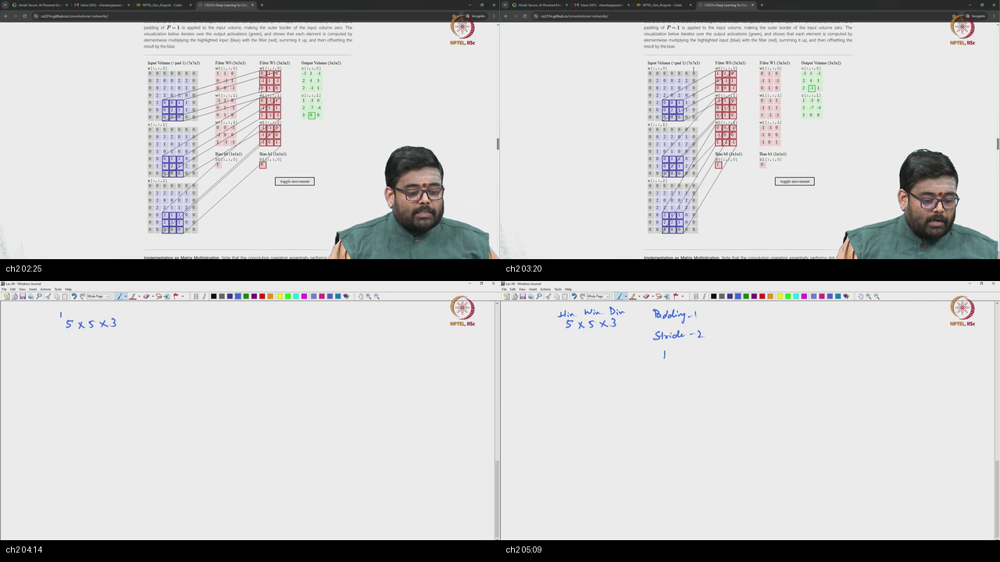
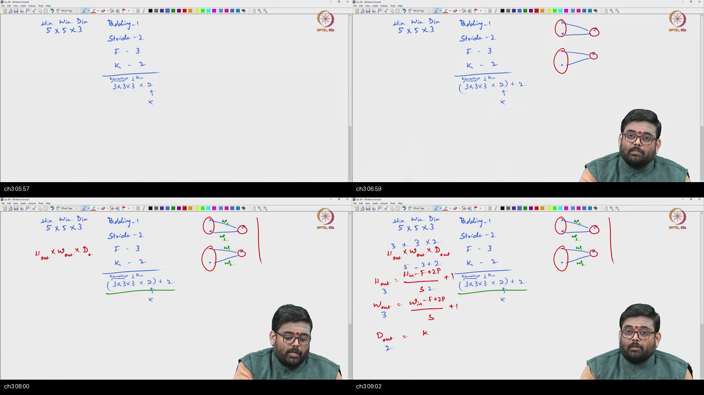
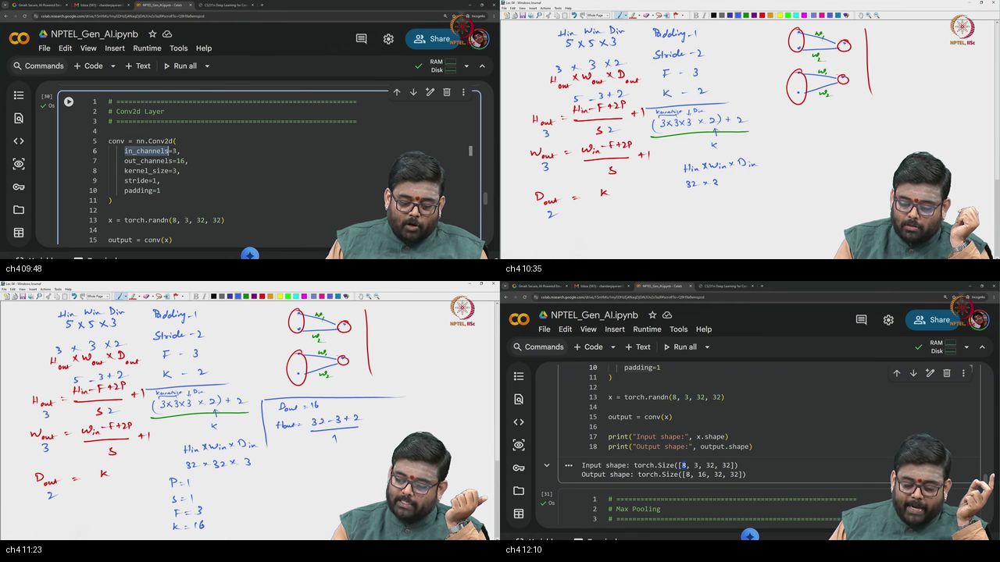
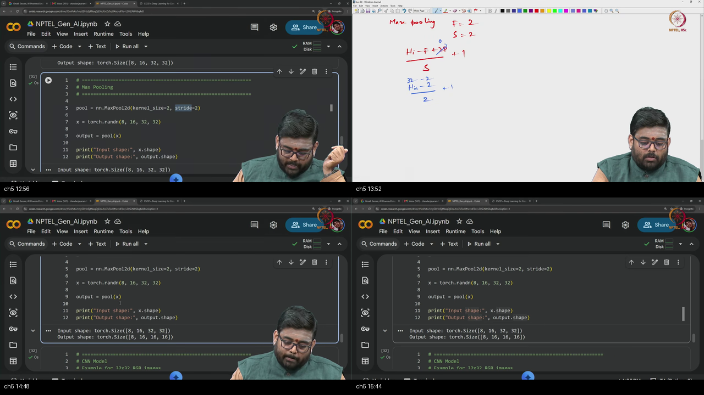
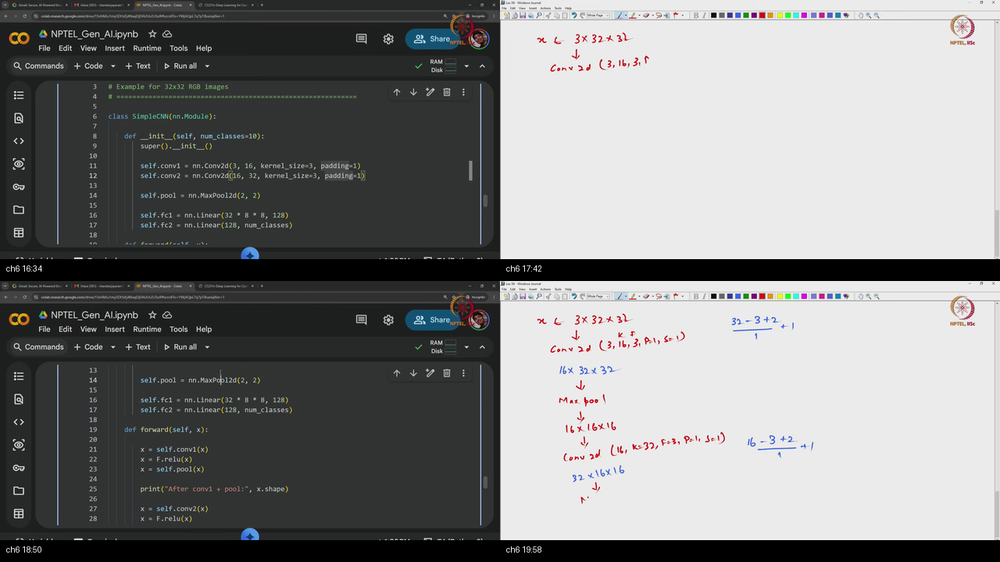
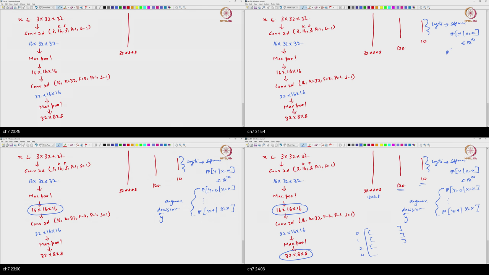
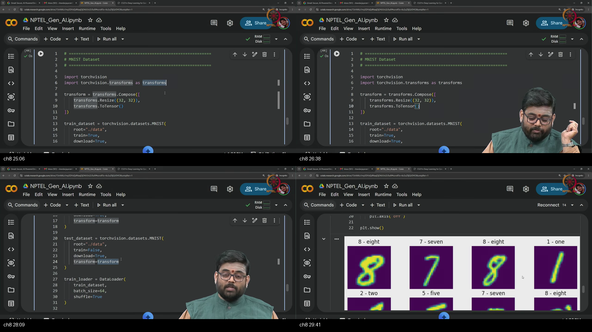
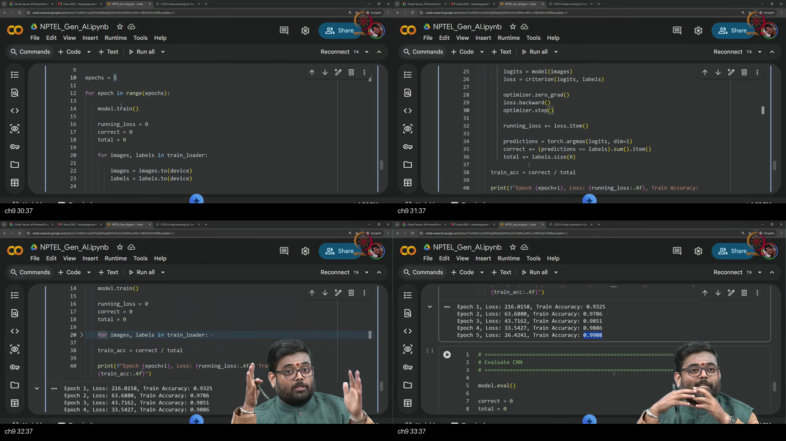
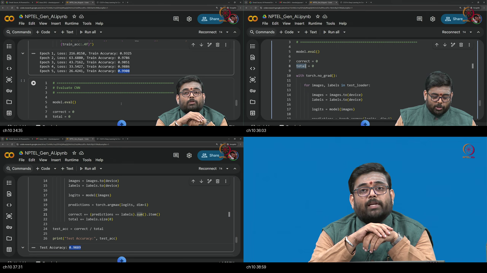

# Tutorial 4 — CNNs using PyTorch

**Video:** [Tutorial 4 : CNNs using PyTorch](https://www.youtube.com/watch?v=BhnGtsMwUCU) · NPTEL / IISc  
**Warm-up first:** [PREREQUISITES.md](./PREREQUISITES.md)  
**Previous:** [Tutorial 3 — PyTorch Basics](../17-Tutorial03-PyTorch-Basics/NOTES.md)  
**Course:** Mathematical Foundations of **Generative AI** (~39 min)  
**Speaker:** NPTEL IISc · Conv2d, MaxPool, SimpleCNN, MNIST train/eval

---

## Table of Contents

1. [Topic 1 — Roadmap NCHW batch](#topic-1-roadmap-nchw-batch-0002–0200) (00:02–02:00)
2. [Topic 2 — Conv GIF padding](#topic-2-conv-gif-padding-0200–0525) (02:00–05:25)
3. [Topic 3 — Stride weights sharing](#topic-3-stride-weights-sharing-0525–0920) (05:25–09:20)
4. [Topic 4 — Output formula Conv2d](#topic-4-output-formula-conv2d-0920–1224) (09:20–12:24)
5. [Topic 5 — MaxPool2d](#topic-5-maxpool2d-1224–1600) (12:24–16:00)
6. [Topic 6 — SimpleCNN stack shapes](#topic-6-simplecnn-stack-shapes-1600–2018) (16:00–20:18)
7. [Topic 7 — Flatten FC dummy forward](#topic-7-flatten-fc-dummy-forward-2018–2425) (20:18–24:25)
8. [Topic 8 — MNIST transforms loaders](#topic-8-mnist-transforms-loaders-2425–3008) (24:25–30:08)
9. [Topic 9 — Mini-batch train loop](#topic-9-mini-batch-train-loop-3008–3355) (30:08–33:55)
10. [Topic 10 — Eval accuracy recap](#topic-10-eval-accuracy-recap-3355–3929) (33:55–39:29)
11. [Apply it (scenarios)](#apply-it-scenarios)
12. [External references](#external-references)
13. [Sources](#sources)

---

## Executive Summary — architecture of this lecture

**Job:** make Tutorial 3’s Module/train skills **image-native** with CNNs.  
**Method:** filters (channels, pad, stride, shapes) → **Conv2d → ReLU → MaxPool** stack → flatten + **Linear** head → MNIST mini-batch **CE + Adam** → accuracy.  
**Fork:** own the shape pipeline so later ViT / transfer only change the backbone.

**Worldview arc:** from “MLP on flat vectors” **to** “CNN feature extractor + classifier head, trained and scored on images.”

### System context

```
  ╔══════════════════════════════════════╗
  ║ Outside: ViT, big ImageNet, MRI fine-║
  ║ Outside: heavy augments, multi-GPU   ║
  ╚══════════════╤═══════════════════════╝
                 │ this tutorial (~39 min)
                 ▼
        ┌────────────────────────────┐
        │ CNN stack in PyTorch       │
        │ Conv · Pool · Flatten · FC │
        │ MNIST train / eval         │
        └────────────────────────────┘
                 │
                 ▼
        next unit: RNN / LSTM / GRU sequences
```

### Main blueprint

```
  Image batch  (N, C, H, W)     [NCHW]
          │
          ▼
  nn.Conv2d(in_ch, out_ch=K, kernel=F, stride=S, padding=P)
    · each filter depth = in_ch
    · H_out = (H_in − F + 2P)/S + 1
    · params ≈ F·F·in_ch·K + K
          │
          ▼
  ReLU  (shape unchanged)
          │
          ▼
  nn.MaxPool2d(2, 2)  → half H,W · no params · C unchanged
          │
     (repeat Conv+ReLU+Pool)
          │
          ▼
  Flatten  →  vector length C·H·W
          │
          ▼
  Linear → ReLU → Linear  →  logits (N, num_classes)
          │
          ▼
  Train: CE + Adam, mini-batches, many updates / epoch
  Eval:  model.eval + no_grad + argmax accuracy
```

### Scenario walkthrough

1. Build a random NCHW batch; name the four axes.
2. Read the CS231 multi-channel conv GIF: filters, zero pad, mul-sum.
3. Count weights; connect weight sharing + local receptive fields to “regularized MLP.”
4. Use the output-size formula; call `nn.Conv2d(3,16,3,padding=1)` and keep 32×32.
5. MaxPool 2×2 stride 2 halves spatial size without parameters.
6. Walk SimpleCNN shapes from 3×32×32 down to 32×8×8.
7. Flatten to 2048, Linear to 10 logits; dummy-forward a batch of 4.
8. torchvision MNIST: Resize 32, ToTensor, train/test loaders batch 64.
9. Five-epoch Adam train; stress that **each batch** updates weights.
10. `eval` + `no_grad` test accuracy; recap; next = sequences.

### Failure / contrast path

```
  Feed HWC into Conv2d without permute          ──X──► shape / silent mess
  in_channels=3 on true 1-channel MNIST         ──X──► RuntimeError
  Forget padding with k=3                       ──X──► unexpected shrink
  Wrong flatten size (forgot last pool)         ──X──► Linear matmul error
  Softmax then CrossEntropy                     ──X──► double-softmax
  Assume one weight update per epoch            ──X──► misunderstand SGD
  Gradients on at test time                     ──X──► wasted memory / bugs
```

### STOP / out of scope

Vision Transformers (mentioned only); CIFAR download pain; advanced augmentations; pretrained ImageNet→MRI (promised later); RNN/LSTM/GRU (next tutorial).

### Load-bearing claims (closed-book)

- Images in PyTorch: **NCHW** batch tensors.
- **Out channels = number of filters**; each filter’s depth = **in channels**.
- Conv = slide, **elementwise mul**, sum (+ bias) → feature map.
- $H_{\mathrm{out}}=(H_{\mathrm{in}}-F+2P)/S+1$; $D_{\mathrm{out}}=K$.
- **MaxPool2d(2,2)** halves H,W; **no learnable params**.
- CNN stack extracts features; **flatten + Linear** → logits.
- Mini-batch: **many weight updates per epoch**.
- Eval: **`model.eval()` + `torch.no_grad()` + argmax accuracy**.

**Speaker / course:** NPTEL IISc · Mathematical Foundations of Generative AI · Tutorial 4.

---

## Topic 1: Roadmap NCHW batch (00:02–02:00)

### Where this sits on the master map

**SETUP** — Leave Tutorial 3’s generic Module skills and open the **image** track: CNN classification on MNIST. Warm-up: [NCHW](./PREREQUISITES.md#p1-nchw).

### Board / screenshot



**Figure — ~00:02–02:00:** Intro to CNN segment; random batch tensor with batch / channel / height / width axes.

### What he is establishing

Earlier tutorials covered **PyTorch** itself: datasets, simple **MLP** layers, forward and back propagation, automatic differentiation, losses, and optimizers. This segment continues from that point and focuses on **convolutional neural networks** — especially **how the internals work**.

Task for the notebook: build a network for an **image classification** task using the **MNIST** dataset (digits 0–9). Motivation: whenever you work with images, the **go-to lightweight** networks are **CNNs**. **Vision Transformers (ViT)** also exist and will appear later in the course; that is why he says “lightweight” rather than “the only option forever.”

Convenience demo: a **random input** with **batch size 8** and spatial size **32×32**. He labels the axes carefully: first is **batch size**, then **number of channels** in each image, then **height** and **width**. In PyTorch that is the **NCHW** layout. (Exact channel count in the first random cell may match the RGB design of 3 used later; the important skill is naming every axis.)

```python
import torch
import torch.nn as nn
import torch.nn.functional as F
import torch.optim as optim

# ============================================================
# CNN Input Shape — PyTorch expects NCHW
# batch_size × channels × height × width
# ============================================================
x = torch.randn(8, 3, 32, 32)
print("CNN input shape:", x.shape)
# torch.Size([8, 3, 32, 32])
# N=8 batch · C=3 channels · H=32 · W=32

# Name the axes so you never confuse them later
N, C, H, W = x.shape
print(f"batch={N}, channels={C}, height={H}, width={W}")
```

You can now open a notebook knowing this unit is **CNN internals + MNIST classifier**, not a second autograd lesson. Still missing: what a filter actually multiplies inside those 32×32 maps.

A common trap is treating the second axis as “something optional” — without channels, `Conv2d` has nothing to depth-match. Another trap is bringing a **flattened** MLP vector `(N, 3072)` into a CNN without reshaping back to `(N, C, H, W)`.

### Analogy for this topic only

Tutorial 3 gave you a **universal kitchen** (tensors, Module, train step). Topic 1 puts a **sign on the door**: today’s menu is **photographs**, served on **NCHW plates**, not flattened grocery lists. The random `randn` batch is a stack of blank Polaroids so you can practice the plate layout before the real MNIST photos arrive.

Question: **What do the four numbers in `(8, 3, 32, 32)` mean in order?**

In lecture words: this box is the on-ramp from MLP tutorials to vision.

### Local picture

```
  Prior: torch · nn · optim · Dataset · MLP train
                │
                ▼
  Today: CNN classification (MNIST)
                │
                ▼
  x.shape = (N, C, H, W) = (8, 3, 32, 32)
             │  │  │  └── width
             │  │  └───── height
             │  └──────── channels
             └─────────── batch

  Note: ViT later · CNN = lightweight go-to now
```

**Notice:** batch is always first in the demos that follow.

### Bridge

With a batch tensor in hand, the next need is the **definition of convolution** — filters, multi-channel mul-sum, and **zero padding**.

---

## Topic 2: Conv GIF padding (02:00–05:25)

### Where this sits on the master map

**CONV DEFINITION** — CS231-style multi-channel convolution: filters, input depth, 3×3 patches, elementwise mul + sum, zero pad. Warm-up: [convolution](./PREREQUISITES.md#p2-conv) · [filters](./PREREQUISITES.md#p3-filters).

### Board / screenshot



**Figure — ~02:00–05:25:** Stanford CS231 GIF / board: two filters, three input channels, 3×3 window, zero padding on 5×5×3.

### What he is establishing

Before coding, he walks a **GIF from Stanford CS231**. Two filters appear; **each filter has three components** because there are **three input channels**. Slogan: **number of filters → number of output channels**; **input channel count → depth of each filter**.

At each spatial location the filter looks at a **3×3** segment of the image (per channel). Operation: **elementwise multiplication** of the patch with the filter weights, **add** those products to a scalar **per input channel**, then **add those scalars (plus bias)** to get one output value at that location (demo shows a value like −1).

**Padding:** zeros around the border. Demo uses **padding of one layer**. Before padding the image is **5×5×3**; after pad **7×7×3**. Prefer **zero padding** among padding styles for this course.

```python
# Conceptual: one RGB image 5×5, pad=1 → spatial 7×7
img = torch.randn(1, 3, 5, 5)
padded = F.pad(img, (1, 1, 1, 1))  # pad last two dims: W then H
print(img.shape, "→", padded.shape)  # (1,3,5,5) → (1,3,7,7)
```

You can now explain a multi-channel 3×3 conv step on a padded map. Still missing: **stride**, **parameter counts**, and the “CNN = regularized MLP” story.

A common trap is thinking each filter is 3×3 only — on RGB it is **3×3×3**.

### Analogy for this topic only

Each filter is a **3-D cookie cutter** as thick as the input channels. Press it on a local cube of the image, multiply crumb-by-crumb, pour the crumbs into one number, stamp that number on the output map, then slide.

Question: **If input has 3 channels and you use 2 filters, how many output channels?**

In lecture words: this box is the atomic multiply-add of vision nets.

### Local picture

```
  Input: 5×5×3
  Pad P=1 (zeros) → 7×7×3

  Filter 1 (depth 3)   Filter 2 (depth 3)
       │                    │
       └──── mul-sum ───────┘
              │
              ▼
       Output: H'×W'×2   (K=2 filters)

  At one location:
    sum_c sum_{i,j}  X[...,i,j] * W[c,i,j]  + b
```

**Notice:** out channels come from **K**, not from H or W.

### Bridge

Next: how far the window **moves (stride)**, how many **weights** you learn, and why CNNs look like **weight-shared local MLPs**.

---

## Topic 3: Stride weights sharing (05:25–09:20)

### Where this sits on the master map

**HYPERPARAMS + BIAS** — Stride, kernel size, weight count, weight sharing, local receptive fields. Warm-up: [filters](./PREREQUISITES.md#p3-filters) · [shape formula](./PREREQUISITES.md#p4-shape).

### Board / screenshot



**Figure — ~05:25–09:20:** Stride-2 move; F×F×Din×K + biases; local receptive field + weight sharing sketch.

### What he is establishing

**Stride** is how far you move after each application. In the GIF demo, stride is **2** (jump two pixels). Prefer the **same stride** on both axes unless you have a reason not to.

**Kernel size F** is usually **square** (3×3 here); rectangular kernels are allowed. **K** = number of filters.

**Parameter count:** for the GIF setup, think $3 \times 3 \times 3 \times 2$ weights plus **2 biases** — one bias per filter. General form: **$F \times F \times D_{\mathrm{in}} \times K + K$**.

Second worldview: CNNs as **regularized MLPs** with two ideas:

1. **Local receptive fields** — a unit only looks at a **local** patch of the previous layer, not the entire map.  
2. **Weight sharing** — the **same** weights apply at every spatial position (the filter reuses itself).

Those two choices are hyperparameters in the same spirit as “how many MLP layers / how wide,” alongside **F, S, P, K**.

Output is thought of as **$H_{\mathrm{out}} \times W_{\mathrm{out}} \times D_{\mathrm{out}}$** with $D_{\mathrm{out}}=K$. The exact H formula lands fully in Topic 4.

```python
# Weight count for Conv2d matching the GIF spirit: Din=3, K=2, F=3
conv_small = nn.Conv2d(3, 2, kernel_size=3, stride=2, padding=1)
print(sum(p.numel() for p in conv_small.parameters()))
# 3*3*3*2 + 2 = 56
```

You can now count parameters and explain LRF + sharing. Still missing: the closed formula for $H_{\mathrm{out}}$ and the `nn.Conv2d` call you will type every day.

A common trap is counting only $F \times F \times K$ and forgetting **input depth** multiplies the cost.

### Analogy for this topic only

Weight sharing is one **rubber stamp** used on every tile of the floor. Local receptive fields mean each stamp press only covers a **small square**, not the whole room. Together they regularize a giant fully connected fantasy into a CNN.

Question: **Why is a 3×3×3×16 conv far cheaper than a Linear from all pixels to 16 maps?**

In lecture words: this box is the inductive bias that makes vision trainable.

### Local picture

```
  Hyperparams:  F (kernel) · S (stride) · P (pad) · K (filters)

  Params ≈ F·F·Din·K  +  K biases

  Local RF:     neuron sees only a local patch
  Weight share: same W reused at every (i,j)

  Output depth D_out = K
```

**Notice:** hyperparameters here play the role width/depth play in MLPs.

### Bridge

Plug F, P, S into the **output-size formula**, then implement the same ideas with **`nn.Conv2d`**.

---

## Topic 4: Output formula Conv2d (09:20–12:24)

### Where this sits on the master map

**SHAPE LAW + API** — $H_{\mathrm{out}}$ formula; `nn.Conv2d`; 32×32×3 → 32×32×16 demo. Warm-up: [shape formula](./PREREQUISITES.md#p4-shape).

### Board / screenshot



**Figure — ~09:20–12:24:** Formula on board; `nn.Conv2d(3,16,3)` with stride/pad; shape print 32→32×16.

### What he is establishing

Closed form (integer arithmetic as in the lecture):

$$
H_{\mathrm{out}} = \frac{H_{\mathrm{in}} - F + 2P}{S} + 1,\quad
W_{\mathrm{out}} = \frac{W_{\mathrm{in}} - F + 2P}{S} + 1,\quad
D_{\mathrm{out}} = K.
$$

GIF check: $H_{\mathrm{in}}=5$, $F=3$, $P=1$, $S=2$ → $(5-3+2)/2+1=3$, so **3×3×2** maps.

To **specify** a conv you must fix: previous **in channels**, **out channels / filters K**, **kernel size F**, **stride S**, **padding P**.

API:

```python
conv = nn.Conv2d(
    in_channels=3,
    out_channels=16,   # K filters
    kernel_size=3,     # F
    stride=1,
    padding=1,
)
# each filter: 3×3×3 = 27 weights; total 27*16 + 16 bias = 448
x = torch.randn(8, 3, 32, 32)
y = conv(x)
print(y.shape)  # torch.Size([8, 16, 32, 32])
```

Numeric walk for **32×32**, $F=3$, $P=1$, $S=1$:  
$32 - 3 + 2 = 31$, then $31/1 + 1 = 32$. Spatial size **preserved**; channels become **16**. Batch **8** stays. He reminds you to reason **per example** for spatial/channel math; batch is just repeated.

Defaults if omitted: **stride=1**, **padding=0**.

You can now predict shapes and call `Conv2d`. Still missing: **pooling** to shrink maps on purpose.

A common trap is omitting padding and wondering why 32 became 30 with a 3×3 kernel.

### Analogy for this topic only

The formula is a **floor-plan calculator**: given room size (H), window size (F), extra border (P), and step length (S), how many places can you plant the window? `nn.Conv2d` is just ordering that window from the catalog.

Question: **Why does pad=1 with 3×3 and stride 1 keep H=32?**

In lecture words: this box is the daily shape hygiene of CNN code.

### Local picture

```
  H_out = (H_in − F + 2P) / S + 1
  D_out = K

  Demo:  (8, 3, 32, 32)
     Conv2d(3,16, k=3, s=1, p=1)
          → (8, 16, 32, 32)

  Must specify: in_ch, out_ch, kernel, stride, padding
```

**Notice:** batch dim is untouched by the formula.

### Bridge

Convolution can preserve size; **MaxPool** is the standard way to **halve** H and W without learning extra weights.

---

## Topic 5: MaxPool2d (12:24–16:00)

### Where this sits on the master map

**POOL** — Downsample with max; standard 2×2 stride 2; no parameters. Warm-up: [pooling](./PREREQUISITES.md#p5-pool).

### Board / screenshot



**Figure — ~12:24–16:00:** MaxPool formula; 32→16; 2×2 max example; `nn.MaxPool2d(2,2)`.

### What he is establishing

**Max pooling** reduces dimension. Standard teaching config: **`nn.MaxPool2d(kernel_size=2, stride=2)`**. Same size formula with **P=0**: for H=32, $(32-2)/2+1=16$. So **32×32 → 16×16** on both height and width. Slogan: with this config the size is **reduced by half**.

**No parameters** — unlike Conv2d, pooling just takes the **maximum** in each window. 2×2 example: values in a block yield max 6, 8, … and a 4×4 map becomes 2×2.

**Channels unchanged.** If you see shape `(…, 16, 16, 16)` after a 16-channel map, the first 16 is channels and the spatial 16 is coincidence of half of 32 — not a rule that channels must equal H.

```python
pool = nn.MaxPool2d(kernel_size=2, stride=2)
x = torch.randn(8, 16, 32, 32)
z = pool(x)
print(z.shape)  # torch.Size([8, 16, 16, 16])  # C same, H/W half
print("pool params:", sum(p.numel() for p in pool.parameters()))  # 0

# 2×2 max on a tiny map (lecture-style)
t = torch.tensor([[[[1.0, 3.0],
                    [2.0, 6.0]]]])  # (1,1,2,2)
print(pool(t))  # max → 6
```

Other (kernel, stride) pairs are allowed; shapes change accordingly. This course’s default mental model is **2,2 → half**.

You can now downsample feature maps. Still missing: stacking **two** conv-pool blocks into a real **SimpleCNN**.

A common trap is thinking pooling learns weights like convolution. A second trap is assuming “16 after pool” means channels changed — on a 16-channel 32×32 map, **half of 32 is also 16**, pure coincidence.

### Analogy for this topic only

Pooling is **zipping a photo by keeping the brightest pixel in every 2×2 tile**. You throw away three numbers per tile; you keep a smaller grid and the strongest local response. No new ink (weights) — only a rule for which neighbor shouts loudest.

Question: **Does MaxPool2d change the number of channels?**

In lecture words: this box is intentional downsampling without new parameters.

### Local picture

```
  MaxPool2d(2, 2), P=0:
    H: 32 → 16
    W: 32 → 16
    C: unchanged

  2×2 window example:
    [1 3]      max → 6
    [2 6]

  Params: 0
```

**Notice:** half size is the **standard** config story, not the only legal config.

### Bridge

Assemble **conv → ReLU → pool** twice for a 32×32 RGB (or RGB-style) CNN and compute every intermediate shape.

---

## Topic 6: SimpleCNN stack shapes (16:00–20:18)

### Where this sits on the master map

**FEATURE EXTRACTOR** — Full `nn.Module` CNN stack down to 32×8×8. Warm-up: [head](./PREREQUISITES.md#p6-head) · [Module](../17-Tutorial03-PyTorch-Basics/PREREQUISITES.md#p6-module).

### Board / screenshot



**Figure — ~16:00–20:18:** SimpleCNN `__init__`; shape walk 3×32×32 → 16×32×32 → 16×16×16 → 32×16×16 → 32×8×8.

### What he is establishing

Example input: **32×32** image with **3 channels** (RGB / CIFAR-style). **SimpleCNN** is a child of **`nn.Module`** (same contract as the MLP tutorial): `super().__init__()`, layers as attributes, `forward` defines the graph. **`num_classes=10`**.

**Conv1:** `in=3, out=16, kernel=3, padding=1`. If you omit stride → default **1**; omit padding → default **0** (no pad). With p=1,s=1,k=3: **3×32×32 → 16×32×32**. **ReLU** is elementwise → **shape unchanged**. **MaxPool 2,2 → 16×16×16**.

**Conv2:** `16 → 32`, k=3, p=1, s=1 → **32×16×16**, then pool → **32×8×8**.

```python
class SimpleCNN(nn.Module):
    def __init__(self, num_classes=10):
        super().__init__()
        self.conv1 = nn.Conv2d(3, 16, kernel_size=3, padding=1)  # default stride=1
        self.conv2 = nn.Conv2d(16, 32, kernel_size=3, padding=1)
        self.pool = nn.MaxPool2d(kernel_size=2, stride=2)
        # FC head needs flatten length 32*8*8 after two pools from 32×32
        self.fc1 = nn.Linear(32 * 8 * 8, 128)
        self.fc2 = nn.Linear(128, num_classes)

    def forward(self, x, debug=False):
        x = F.relu(self.conv1(x))
        if debug:
            print("after conv1+relu:", x.shape)   # (N,16,32,32)
        x = self.pool(x)
        if debug:
            print("after pool1:", x.shape)        # (N,16,16,16)
        x = F.relu(self.conv2(x))
        if debug:
            print("after conv2+relu:", x.shape)   # (N,32,16,16)
        x = self.pool(x)
        if debug:
            print("after pool2:", x.shape)        # (N,32,8,8)
        x = x.view(x.size(0), -1)                 # (N,2048)
        if debug:
            print("after flatten:", x.shape)
        x = F.relu(self.fc1(x))
        x = self.fc2(x)                           # logits (N,10)
        return x

# Shape walk matching the board (one RGB 32×32, batch 4)
_ = SimpleCNN(10)(torch.randn(4, 3, 32, 32), debug=True)
```

The lecture prints intermediate shapes the same way; the math spine is **3×32×32 → 16×32×32 → 16×16×16 → 32×16×16 → 32×8×8**.

You can now narrate the full spatial/channel path of the feature extractor. Still missing: **why 32×8×8 becomes 2048**, logits, and a clean dummy forward without debug noise.

A common trap is putting ReLU **after** pool only and losing track of shapes — ReLU never saves you from wrong H. Another trap: registering `fc1` with the wrong flatten size after changing pad/stride.

### Analogy for this topic only

Two **detective floors**: each floor stamps the map with more filters, then **halves** the map so the next floor’s 3×3 window sees a wider world. By 8×8 you hold a compact stack of 32 clue sheets.

Question: **What is the shape after the second pool for one RGB 32×32 image?**

In lecture words: this box is the architecture body before the decision head.

### Local picture

```
  (N, 3, 32, 32)
    Conv1 3→16, k3 p1  → (N, 16, 32, 32)
    ReLU               → same
    Pool 2             → (N, 16, 16, 16)
    Conv2 16→32, k3 p1 → (N, 32, 16, 16)
    ReLU
    Pool 2             → (N, 32, 8, 8)
```

**Notice:** defaults matter — forgot padding and the 32s die early.

### Bridge

Turn **32×8×8** into a vector, map to **10 logits**, and verify with a **dummy batch** of 4.

---

## Topic 7: Flatten FC dummy forward (20:18–24:25)

### Where this sits on the master map

**CLASSIFIER HEAD** — Flatten, Linear stack, logits, argmax; dummy shapes. Warm-up: [head](./PREREQUISITES.md#p6-head) · [CE logits](../17-Tutorial03-PyTorch-Basics/PREREQUISITES.md#p7-loss).

### Board / screenshot



**Figure — ~20:18–24:25:** Flatten 32×8×8=2048; FC to 128 to 10; dummy batch shape prints including (4,10) logits.

### What he is establishing

After the CNN body you have **32×8×8** feature maps. For a **decision** you need a **vector**. Flatten: length **$32 \times 8 \times 8 = 2048$**. In code: `x.view(x.size(0), -1)` so batch is preserved.

**Fully connected head:** **2048 → 128 → num_classes (10)**. Final output is **logits**. Optional **softmax** yields $P(y\mid x) \in \mathbb{R}^{10}$; **argmax** of those scores (or of logits — same argmax) is $\hat y$.

Dummy check: `SimpleCNN(num_classes=10)`, input **`(4, 3, 32, 32)`**. After first conv+pool ≈ `(4,16,16,16)`; after second ≈ `(4,32,8,8)`; flatten `(4,2048)`; logits **`(4,10)`** — one 10-vector per example in the batch.

```python
model = SimpleCNN(num_classes=10)
dummy = torch.randn(4, 3, 32, 32)
logits = model(dummy)
print(logits.shape)  # torch.Size([4, 10])

# Optional probabilities for display (do NOT feed these to CrossEntropy)
probs = F.softmax(logits, dim=1)
pred = logits.argmax(dim=1)
print(pred.shape)  # torch.Size([4])
```

You can now close the architecture with a head and prove shapes. Still missing: **real MNIST** via torchvision instead of `randn`.

A common trap is hard-coding `view(-1, 2048)` with the wrong spatial size after a pad mistake upstream.

### Analogy for this topic only

Flatten is **zipping 32 clue sheets of size 8×8 into one evidence binder**. The Linear layers are the **judge’s scorecard** with 10 boxes. Softmax is optional “prize share” language; training with CE still wants the **raw scores**.

Question: **Why is flatten length 2048, not 32×32×3?**

In lecture words: this box finishes the forward architecture story.

### Local picture

```
  (N, 32, 8, 8) ──view(N,−1)──► (N, 2048)
        │
        ▼
  Linear 2048→128 → ReLU → Linear 128→10
        │
        ▼
  logits (N, 10) ──argmax dim=1──► class ids (N,)

  Dummy: N=4 → logits (4,10)
```

**Notice:** softmax is for probabilities / storytelling; CE wants logits.

### Bridge

Replace `randn` with **torchvision MNIST**, **Resize(32)**, **ToTensor**, and **DataLoaders**.

---

## Topic 8: MNIST transforms loaders (24:25–30:08)

### Where this sits on the master map

**DATA** — torchvision datasets, Compose transforms, train/test loaders. Warm-up: [batch train](./PREREQUISITES.md#p7-batch) · [Dataset](../17-Tutorial03-PyTorch-Basics/PREREQUISITES.md#p8-data).

### Board / screenshot



**Figure — ~24:25–30:08:** transforms.Compose Resize+ToTensor; MNIST download; DataLoader batch 64; sample grid.

### What he is establishing

When the dataset lives in the **PyTorch / torchvision** ecosystem, use **`torchvision.datasets`** and **`transforms`**. **Transforms** turn raw samples into model-ready tensors: convert to tensor, **resize**, and later (not now) heavier regularization augmentations.

**Compose** chains them. Here: **Resize to 32×32** (MNIST native **28×28**) then **`ToTensor`**. Why 32? The architecture walk assumed 32×32 (and originally **CIFAR-10** RGB); CIFAR download was slow on the demo machine, so he **switched to MNIST** for class use — small, cheap on Colab GPU quota. Expect more generative-model demos on MNIST later for the same reason.

```python
from torchvision import datasets, transforms
from torch.utils.data import DataLoader

transform = transforms.Compose([
    transforms.Resize((32, 32)),
    transforms.ToTensor(),
    # Practical fix if SimpleCNN expects 3 channels:
    # transforms.Lambda(lambda x: x.repeat(3, 1, 1)),
])

train_ds = datasets.MNIST(
    root="./data", train=True, download=True, transform=transform
)
test_ds = datasets.MNIST(
    root="./data", train=False, download=True, transform=transform
)

train_loader = DataLoader(train_ds, batch_size=64, shuffle=True)
test_loader = DataLoader(test_ds, batch_size=64, shuffle=False)

print(len(train_ds), len(test_ds))  # 60000, 10000
print(train_ds.classes)             # digit class names / ids 0–9
```

**Train vs test:** same **spatial size** transforms on both. `download=True` fetches if missing under `root`. **DataLoader** batch size **64**, **`shuffle=True`** on train; test can use another batch size and typically **no shuffle** (you run once).

**Visualization note:** plots may look “color” because **matplotlib** often **replicates** a grayscale image across 3 channels for display. The underlying MNIST sample is still grayscale unless you explicitly expand channels.

You can now stream real digits. Still missing: the **training loop** with CE/Adam and the **per-batch update** slogan.

A common trap: **channel mismatch** — architecture with `Conv2d(3,…)` vs `ToTensor` MNIST shape `(1,32,32)`. Fix with `in_channels=1` **or** `repeat(3,1,1)` as in the comment above.

### Analogy for this topic only

Torchvision is a **public library branch**. Transforms are the **checkout desk** that reshelves every book to the same height (32) and binds it as a tensor. DataLoader is the **cart** of 64 books. MNIST is the thin paperback everyone uses to check the scanner works before ordering rare art volumes (CIFAR/ImageNet).

Question: **Why must train and test share the same resize?**

In lecture words: this box is the data half of the MNIST experiment.

### Local picture

```
  MNIST 28×28 gray
       │  Resize(32) + ToTensor (+ optional ×3 channels)
       ▼
  train_ds 60k · test_ds 10k · classes 0..9
       │
       ▼
  DataLoader(batch=64, shuffle=True/False)
```

**Notice:** shuffle is for **train** diversity across epochs, not a test requirement.

### Bridge

Wire **model + CE + Adam**, iterate the loader for **5 epochs**, and distinguish **epoch** from **weight update**.

---

## Topic 9: Mini-batch train loop (30:08–33:55)

### Where this sits on the master map

**TRAIN** — Same five-step train contract as Tutorial 3, now inside a DataLoader over 60k images. Warm-up: [mini-batch](./PREREQUISITES.md#p7-batch) · [train step](../17-Tutorial03-PyTorch-Basics/PREREQUISITES.md#p5-trainstep).

### Board / screenshot



**Figure — ~30:08–33:55:** model.to(device); CE; Adam; epoch loop over train_loader; ~99% train acc; MNIST sanity metaphor.

### What he is establishing

Instantiate **`SimpleCNN(num_classes=10)`**, **`.to(device)`**, **`nn.CrossEntropyLoss()`**, **`optim.Adam(..., lr=0.001)`**, train **5 epochs**. Procedure matches earlier binary/MLP training **except** you cannot feed all examples at once — **iterate `train_loader`**.

Each epoch: **`model.train()`**, reset running loss / correct / total. Each batch: port **images and labels** to device → forward → loss → **`zero_grad`** → **`backward`** → **`step`** → accumulate metrics.

**Critical slogan:** **one epoch can contain many weight updates**. Batch 1 updates W; batch 2 uses the **new** W. Not like the tiny full-batch demos where one epoch meant one update. **Epoch** = one full pass over training data (here 60k). **Iteration** = one update. Total updates ≈ (batches per epoch) × (epochs).

Demo: after 5 epochs, training accuracy around **99%**. MNIST is a **beaten** dataset — like typing **2+2** on a calculator to see if it works. If your pipeline fails on MNIST, fix the pipeline before larger data. If it works, you have a **sanity check**, then extend to harder sets.

```python
device = torch.device("cuda" if torch.cuda.is_available() else "cpu")
model = SimpleCNN(num_classes=10).to(device)
# If using 1-channel MNIST without repeat: SimpleCNN needs Conv2d(1, 16, ...)

criterion = nn.CrossEntropyLoss()
optimizer = optim.Adam(model.parameters(), lr=1e-3)
epochs = 5

for epoch in range(epochs):
    model.train()
    running_loss = 0.0
    correct = 0
    total = 0
    for images, labels in train_loader:
        images = images.to(device)
        labels = labels.to(device)
        # if images are (N,1,32,32) and model expects 3:
        # images = images.repeat(1, 3, 1, 1)
        logits = model(images)
        loss = criterion(logits, labels)
        optimizer.zero_grad()
        loss.backward()
        optimizer.step()
        running_loss += loss.item()
        pred = logits.argmax(dim=1)
        correct += (pred == labels).sum().item()
        total += labels.size(0)
    acc = correct / total
    print(f"Epoch {epoch+1}, loss={running_loss:.4f}, acc={acc:.4f}")
```

You can now train the CNN mini-batch style. Still missing: **test-set evaluation** with `eval` / `no_grad` and the lecture recap.

A common trap is thinking “5 epochs = 5 updates” — with batch 64 you already have on the order of **~900 updates per epoch**.

### Analogy for this topic only

An epoch is a **full day of tutoring 60,000 students in stacks of 64**. After every stack you adjust your lesson plan (weights). You do **not** wait until midnight to adjust once.

Question: **How is an iteration different from an epoch here?**

In lecture words: this box ports the train step to real image loaders.

### Local picture

```
  model.train()
  for epoch in 1..5:
    for batch in train_loader:          # many times per epoch
      to(device) → forward → CE
      zero_grad → backward → step      # one update
    log loss / acc

  Updates ≈ (#batches) × (#epochs)
  MNIST: sanity check (2+2 on calculator)
```

**Notice:** Adam lr **1e-3** and CE on **integer labels** — Tutorial 3 CE rules still hold.

### Bridge

Freeze the student for the **exam**: `model.eval()`, `no_grad`, test accuracy, then close the tutorial arc.

---

## Topic 10: Eval accuracy recap (33:55–39:29)

### Where this sits on the master map

**EVAL + CLOSE** — Accuracy vs loss; eval mode; test ~98%; recap; next sequences. Warm-up: [eval](./PREREQUISITES.md#p8-eval).

### Board / screenshot



**Figure — ~33:55–39:29:** model.eval + no_grad; argmax dim=1; test acc ~98%; recap board; next RNN/LSTM/GRU.

### What he is establishing

**Metrics:** in **regression**, the training loss (e.g. MSE) can also serve as evaluation. In **classification**, use **accuracy** (and precision / recall / F1 when data is **skewed**). MNIST is **balanced** (similar counts per class) → **accuracy** = correct / total is enough.

**Evaluation mode:** `model.eval()`; **no gradient tracking** — weights fixed, forward only. Use **`with torch.no_grad():`**. Run **once** over the test loader (not multi-epoch). Port images/labels to device; logits → **`argmax(dim=1)`** (class axis for shape `(N,C)`); compare to labels; `sum` / `item`. Demo test accuracy about **98%**. Train and test metrics **can differ**.

```python
model.eval()
correct = 0
total = 0
with torch.no_grad():
    for images, labels in test_loader:
        images = images.to(device)
        labels = labels.to(device)
        # images = images.repeat(1, 3, 1, 1)  # if needed
        logits = model(images)
        pred = logits.argmax(dim=1)
        correct += (pred == labels).sum().item()
        total += labels.size(0)
print("Test accuracy:", correct / total)
```

**Recap of the section:** how convolutions work; how to compute **output size** from input size + hyperparameters; how to combine the **feature extractor** (conv stack) with a **classifier head** to decide.

**Next tutorial sequence:** **sequences** — **RNNs, LSTMs, GRUs**, sequence classifiers. Later still: **load pretrained models** (e.g. ImageNet) and adapt (example promised: **MRI** data). Tutorial closes with thank-you.

You can now train and fairly evaluate a small image CNN and know what comes next. Still missing (future units): sequence models and transfer learning.

A common trap is leaving `model.train()` on at test time when Dropout/BatchNorm appear in later nets — habit of `eval()` starts now.

### Analogy for this topic only

Training is **practice with a red pen**. Evaluation is a **proctored exam**: closed book (`no_grad`), fixed study notes (weights), score = fraction correct. MNIST is the practice quiz everyone aces; real life is the MRI transfer exam later.

Question: **Why run test evaluation inside `torch.no_grad()`?**

In lecture words: this box closes the CNN basics package for the course.

### Local picture

```
  model.eval()
  with no_grad:
    logits = model(x)
    pred = argmax(logits, dim=1)
    acc = (# pred==y) / N

  Recap: conv mechanics · shape formula · extractor+head
  Next:  RNN / LSTM / GRU · later pretrained → MRI
```

**Notice:** ~99% train vs ~98% test is normal noise on MNIST, not proof of a bug by itself.

### Bridge

You own the **image** path in PyTorch. The leftover problem is **ordered data** — next tutorials replace spatial conv stacks with **recurrent** sequence models.

---

## Apply it (scenarios)

1. **Shape homework.** For input `(1,3,64,64)`, compute shapes after `Conv2d(3,8,3,padding=1)`, ReLU, `MaxPool2d(2)`, second `Conv2d(8,16,3,padding=1)`, pool.  
2. **Param count.** Compare `Conv2d(3,16,3)` vs `Linear(3*32*32, 16*32*32)` parameter counts — feel weight sharing.  
3. **Channel fix.** Run MNIST with `in_channels=1` SimpleCNN **and** with `repeat(3,1,1)` — both should train.  
4. **Break pad.** Set `padding=0` on both convs; print shapes until Linear fails; fix flatten size.  
5. **Epoch math.** With 60k samples and batch 64, estimate updates in 5 epochs.  
6. **Eval discipline.** Train 1 epoch; report train acc vs test acc with proper `eval`/`no_grad`.

### Minimal end-to-end notebook skeleton (put it together)

```python
import torch
import torch.nn as nn
import torch.nn.functional as F
import torch.optim as optim
from torchvision import datasets, transforms
from torch.utils.data import DataLoader

device = torch.device("cuda" if torch.cuda.is_available() else "cpu")

transform = transforms.Compose([
    transforms.Resize((32, 32)),
    transforms.ToTensor(),
    transforms.Lambda(lambda t: t.repeat(3, 1, 1)),  # gray → 3ch for SimpleCNN
])
train_loader = DataLoader(
    datasets.MNIST("./data", train=True, download=True, transform=transform),
    batch_size=64, shuffle=True,
)
test_loader = DataLoader(
    datasets.MNIST("./data", train=False, download=True, transform=transform),
    batch_size=64, shuffle=False,
)

class SimpleCNN(nn.Module):
    def __init__(self, num_classes=10):
        super().__init__()
        self.conv1 = nn.Conv2d(3, 16, 3, padding=1)
        self.conv2 = nn.Conv2d(16, 32, 3, padding=1)
        self.pool = nn.MaxPool2d(2, 2)
        self.fc1 = nn.Linear(32 * 8 * 8, 128)
        self.fc2 = nn.Linear(128, num_classes)
    def forward(self, x):
        x = self.pool(F.relu(self.conv1(x)))
        x = self.pool(F.relu(self.conv2(x)))
        x = x.view(x.size(0), -1)
        return self.fc2(F.relu(self.fc1(x)))

model = SimpleCNN().to(device)
opt = optim.Adam(model.parameters(), lr=1e-3)
crit = nn.CrossEntropyLoss()

for epoch in range(5):
    model.train()
    for images, labels in train_loader:
        images, labels = images.to(device), labels.to(device)
        loss = crit(model(images), labels)
        opt.zero_grad(); loss.backward(); opt.step()

model.eval()
correct = total = 0
with torch.no_grad():
    for images, labels in test_loader:
        images, labels = images.to(device), labels.to(device)
        pred = model(images).argmax(dim=1)
        correct += (pred == labels).sum().item()
        total += labels.size(0)
print("test acc", correct / total)
```

---

## External references

**How to use:** finish the NOTES chain first (video closed if you can). When one map box still feels thin, open **only that topic’s group** below — **2–3 companions each** (prefer **teaching video + blog/notes + official docs**). All links live **here**, not inside topic bodies.

Prefer free, well-known teaching channels and official tutorials. Skip Wikipedia dumps and random SEO posts.

### Topic 1 — Roadmap + NCHW batch

| Resource | Type | Why it helps |
|----------|------|--------------|
| [PyTorch tensors tutorial (shapes / device habits)](https://pytorch.org/tutorials/beginner/basics/tensorqs_tutorial.html) | Official tutorial | Read NCHW as four axes before Conv2d |
| [Patrick Loeber — Deep Learning with PyTorch (CNN chapter later; start: tensors)](https://www.youtube.com/watch?v=c36lUUr864M) | Video course | Same course spine as Tutorial 3→4 |
| [Real Python — PyTorch tensors](https://realpython.com/pytorch-tensors/) | Blog | Batch/channel mental model in plain English |

### Topic 2 — Conv GIF + padding

| Resource | Type | Why it helps |
|----------|------|--------------|
| [CS231n — Convolutional Networks](https://cs231n.github.io/convolutional-networks/) | Course notes | **Same GIF lineage** the lecture opens; filters, depth, pad |
| [3Blue1Brown / Welch Labs — But what is a convolution?](https://www.youtube.com/watch?v=KuXjwB4LzSA) | Video | Sliding-window mul-sum intuition |
| [CNN Explainer (interactive)](https://poloclub.github.io/cnn-explainer/) | Interactive | Watch feature maps fill without writing code |

### Topic 3 — Stride, weights, weight sharing

| Resource | Type | Why it helps |
|----------|------|--------------|
| [StatQuest — Convolutional Neural Networks](https://www.youtube.com/watch?v=HGwBXDKFk9I) | Video | LRF + shared weights in plain language |
| [CS231n — number of parameters section](https://cs231n.github.io/convolutional-networks/#conv) | Course notes | $F\times F\times D_{\mathrm{in}}\times K$ counting |
| [distill.pub — Feature Visualization (why filters exist)](https://distill.pub/2017/feature-visualization/) | Blog | What learned filters look like later |

### Topic 4 — Output formula + `nn.Conv2d`

| Resource | Type | Why it helps |
|----------|------|--------------|
| [PyTorch `nn.Conv2d` docs](https://pytorch.org/docs/stable/generated/torch.nn.Conv2d.html) | Docs | Exact args; shape formula in library words |
| [Patrick Loeber — CNN from scratch in PyTorch](https://www.youtube.com/watch?v=pDdP0TFzsoQ) | Video | Live `Conv2d` + shape prints |
| [Made With ML — CNNs (shapes walkthrough)](https://madewithml.com/courses/foundations/convolutional-neural-networks/) | Blog/notes | Worked $H_{\mathrm{out}}$ examples |

### Topic 5 — MaxPool2d

| Resource | Type | Why it helps |
|----------|------|--------------|
| [PyTorch `MaxPool2d` docs](https://pytorch.org/docs/stable/generated/torch.nn.MaxPool2d.html) | Docs | kernel/stride; no parameters |
| [StatQuest — CNNs (pooling segment)](https://www.youtube.com/watch?v=HGwBXDKFk9I) | Video | Why max-of-window shrinks maps |
| [DeepLearning.AI / Coursera CNN course notes (pooling)](https://www.coursera.org/learn/convolutional-neural-networks) | Course | Standard 2×2 stride-2 story |

### Topic 6 — SimpleCNN stack shapes

| Resource | Type | Why it helps |
|----------|------|--------------|
| [PyTorch training a classifier (CIFAR tutorial)](https://pytorch.org/tutorials/beginner/blitz/cifar10_tutorial.html) | Official tutorial | Sibling Conv→Pool→FC stack |
| [3Blue1Brown — But what is a neural network?](https://www.youtube.com/watch?v=aircAruvnKk) | Video | Layers as successive transforms |
| [Sebastian Raschka — Custom nn.Module patterns](https://sebastianraschka.com/blog/2021/dl-course.html#l15-convolutional-neural-networks) | Notes | Module layout for vision nets |

### Topic 7 — Flatten + FC + dummy forward

| Resource | Type | Why it helps |
|----------|------|--------------|
| [PyTorch `Tensor.view` / reshape habits](https://pytorch.org/docs/stable/generated/torch.Tensor.view.html) | Docs | Keep batch with `size(0)`, collapse rest |
| [StatQuest — SoftMax / ArgMax](https://www.youtube.com/watch?v=KpKog-L9veg) | Video | Logits → class decision |
| [PyTorch CrossEntropyLoss docs](https://pytorch.org/docs/stable/generated/torch.nn.CrossEntropyLoss.html) | Docs | Logits in (no pre-softmax) |

### Topic 8 — MNIST transforms + loaders

| Resource | Type | Why it helps |
|----------|------|--------------|
| [torchvision MNIST dataset](https://pytorch.org/vision/stable/generated/torchvision.datasets.MNIST.html) | Docs | `train` / `download` / `transform` |
| [PyTorch Datasets & DataLoaders tutorial](https://pytorch.org/tutorials/beginner/basics/data_tutorial.html) | Official tutorial | Compose + loader flags |
| [Patrick Loeber — Dataset and DataLoader](https://www.youtube.com/watch?v=PXOzkkB5eC0) | Video | Live coding the data side |

### Topic 9 — Mini-batch train loop

| Resource | Type | Why it helps |
|----------|------|--------------|
| [PyTorch Optimization loop tutorial](https://pytorch.org/tutorials/beginner/basics/optimization_tutorial.html) | Official tutorial | zero_grad → backward → step |
| [3Blue1Brown — Gradient descent](https://www.youtube.com/watch?v=IHZwWFHWa-w) | Video | Why many small steps work |
| [ML Mastery — Training a PyTorch model](https://machinelearningmastery.com/training-a-pytorch-model/) | Blog | Readable epoch/batch metrics |

### Topic 10 — Eval + accuracy + recap

| Resource | Type | Why it helps |
|----------|------|--------------|
| [PyTorch Quickstart (train + test)](https://pytorch.org/tutorials/beginner/basics/quickstart_tutorial.html) | Official tutorial | `eval` + `no_grad` pattern |
| [Google ML Crash Course — Classification](https://developers.google.com/machine-learning/crash-course/classification/accuracy) | Notes | Accuracy when classes are balanced |
| [torch.argmax docs](https://pytorch.org/docs/stable/generated/torch.argmax.html) | Docs | `dim=1` on `(N, C)` logits |

### Whole-map companions

| Resource | Type | Why it helps |
|----------|------|--------------|
| [PREREQUISITES.md (this package)](./PREREQUISITES.md) | Warm-up | Beginner NCHW/conv/pool (#p1–#p8) |
| [Tutorial 3 PyTorch Basics](../17-Tutorial03-PyTorch-Basics/NOTES.md) | Prior unit | Module, CE, DataLoader spine |
| [Patrick Loeber — Deep Learning with PyTorch (full)](https://www.youtube.com/watch?v=c36lUUr864M) | Video course | End-to-end tensors → CNN |
| [CS231n notes hub](https://cs231n.github.io/) | Course notes | Canonical vision companion while replaying any cell |

---

## Sources

- Video: [Tutorial 4 : CNNs using PyTorch](https://www.youtube.com/watch?v=BhnGtsMwUCU)
- Channel: NPTEL — Indian Institute of Science, Bengaluru
- Course: Mathematical Foundations of Generative AI
- Duration: ~39 min (00:02–39:29)
- Skill: `youtube-lecture-tutor` · code_tutorial
- Captions cleaned via timed transcript / claim sheets (**10 topics**, merged from denser moves)
- Warm-up: [PREREQUISITES.md](./PREREQUISITES.md)
- Previous: [Tutorial 3 — PyTorch Basics](../17-Tutorial03-PyTorch-Basics/NOTES.md)
- Package path: `18-Tutorial04-CNNs-PyTorch`
