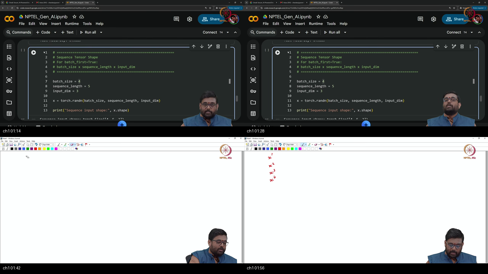
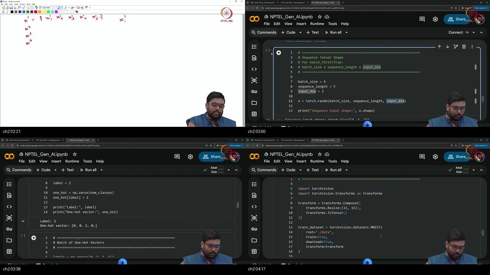
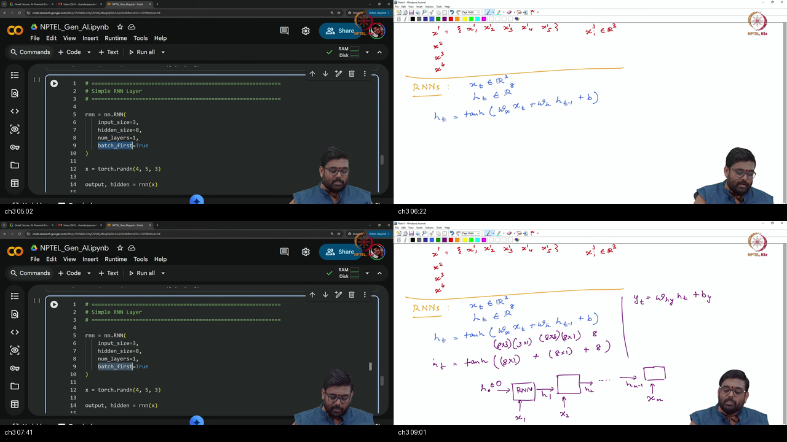
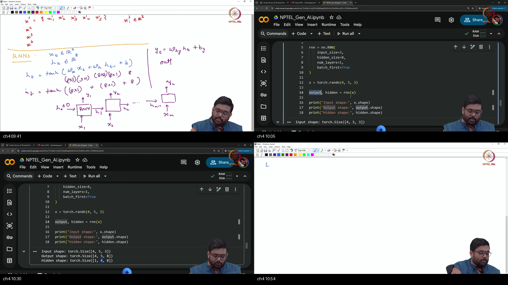
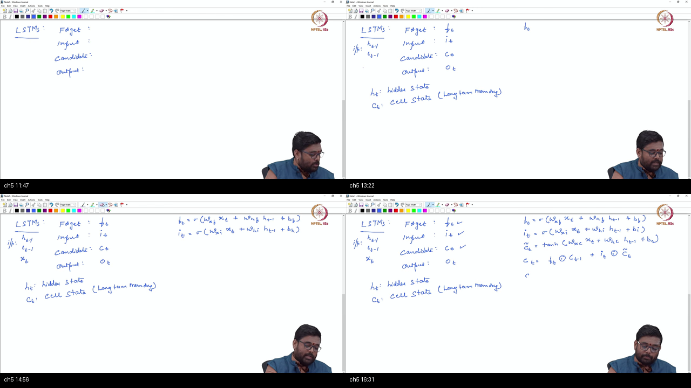
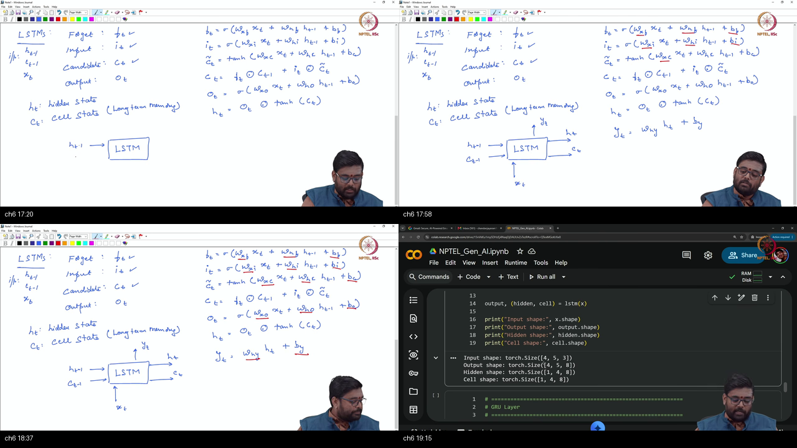
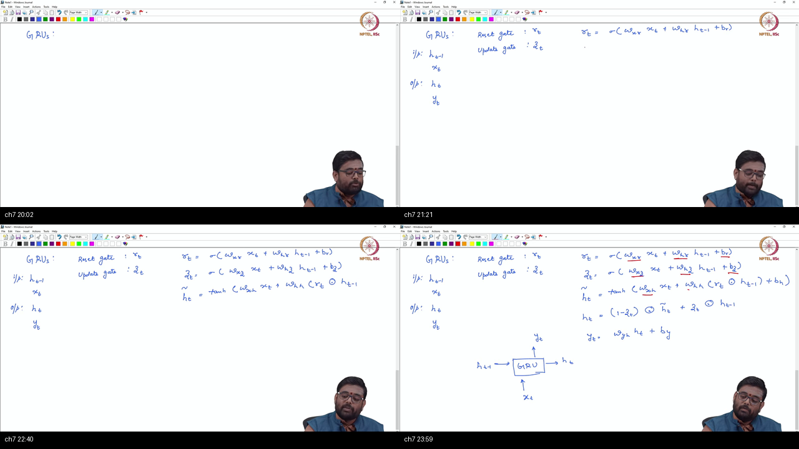
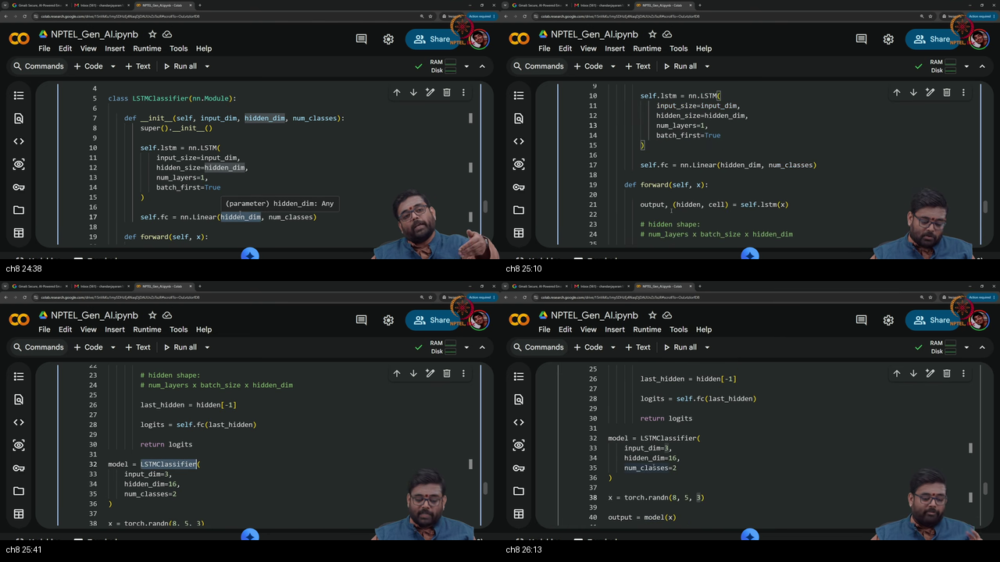
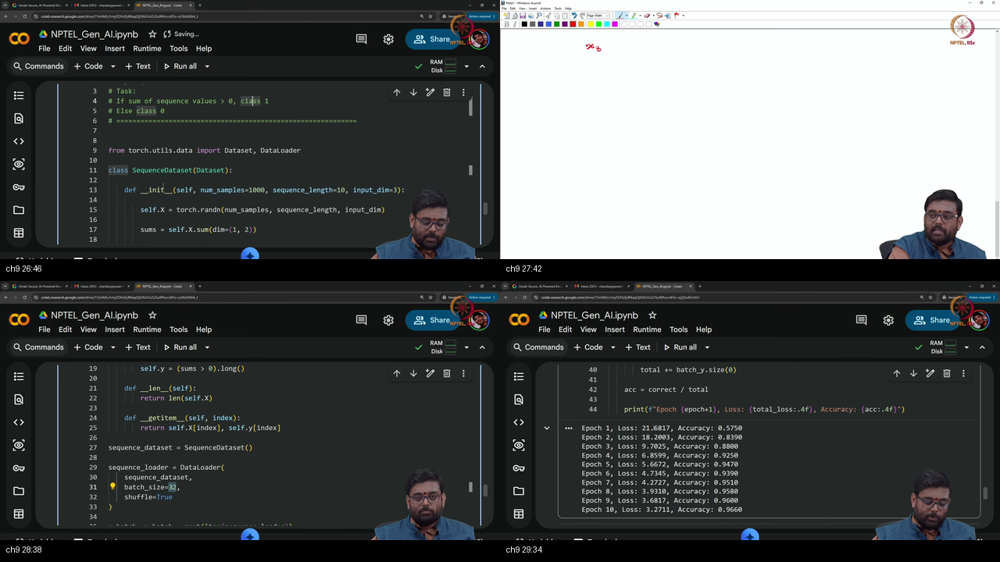
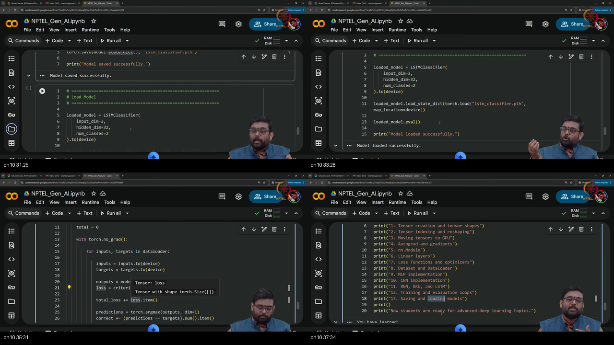

# Tutorial 5 — RNNs using PyTorch

**Video:** [Tutorial 5 : RNNs using PyTorch](https://www.youtube.com/watch?v=k6zF2NsvVrk) · NPTEL / IISc  
**Warm-up First:** [PREREQUISITES.md](./PREREQUISITES.md)  
**Previous Tutorial:** [Tutorial 4 — CNNs in PyTorch](../18-Tutorial04-CNNs-PyTorch/NOTES.md) (Spatial Tensors, Convolutions, and Vision Pipelines)  
**Next Tutorial:** Tutorial 6 — Pretrained Models, Transfer Learning & Medical Vision  
**Course:** Mathematical Foundations of Generative AI (~38 min)  
**Speaker:** NPTEL / IISc Teaching Team  
**Core Themes:** 3D Sequence Tensor Geometry $(N, T, D)$, Recurrent Cell Mechanics, Recurrent Weight Sharing across Time, Vanishing Gradient Dynamics in BPTT, LSTM Dual-State Gating ($c_t, h_t$), GRU Streamlined Gating, Sequence-to-Class (Many-to-One) Topologies, Last Hidden State Linear Heads, Model Persistence via `state_dict` / `.pth`, and Modular Reusable Training/Evaluation Pipelines.

---

> ### ⚠️ Course Context & Curriculum Progression Notice
> In **Tutorial 4**, the curriculum tackled **Spatial Intelligence** (2D pixel grids) using Convolutional Neural Networks (CNNs).
> 
> Starting in **Tutorial 5**, the course scales to **Temporal and Sequential Intelligence** via **Recurrent Neural Networks (RNNs, LSTMs, GRUs)**. Real-world physical signals (natural language, financial tick streams, audio waveforms, medical ECG telemetry, and protein sequences) are ordered in time. CNNs process static spatial neighborhoods; RNNs maintain a dynamic, evolving hidden memory vector ($\mathbf{h}_t$) across time.
> 
> This sequence modeling foundation directly connects to:
> 1. **Autoregressive Generative Large Language Models (GPT-4, Claude, LLaMA)**.
> 2. **State Space Models & Linear Recurrent Networks (Mamba, RWKV, S4)**.
> 3. **Time-Series Latent Diffusion Backbones in Video and Audio Synthesis (Sora, Stable Audio)**.

---

## Table of Contents

1. [Executive Summary & Master Architecture](#executive-summary--architecture-of-this-lecture)
2. [Chalkboard Rosetta Stone: Mathematical & Sequence Notation](#chalkboard-rosetta-stone)
3. [Complete Standalone Executable PyTorch Simulation Script](#standalone-simulation-script)
4. [Topic 1: Recap CNNs & Introduction to Ordered Sequences (00:02–03:00)](#topic-1-recap-cnn-sequences-0002–0300)
5. [Topic 2: 3D Sequence Tensor Geometry — $(N, T, D)$ Layout (03:00–06:20)](#topic-2-sequence-tensor-ntd-0300–0620)
6. [Topic 3: Vanilla RNN Cell Mathematics & Temporal Unrolling (06:20–10:15)](#topic-3-rnn-cell-math-unroll-0620–1015)
7. [Topic 4: RNN Forward Output & Hidden State Shape Mechanics (10:15–13:45)](#topic-4-rnn-output-hidden-shapes-1015–1345)
8. [Topic 5: LSTM Architecture — Dual States & Gating Mechanics (13:45–18:10)](#topic-5-lstm-gates-cell-state-1345–1810)
9. [Topic 6: The `nn.LSTM` Module API & Multi-Layer Recurrent Stacks (18:10–22:40)](#topic-6-nn-lstm-api-multi-layer-1810–2240)
10. [Topic 7: Gated Recurrent Units (GRU) — Reset & Update Gating (22:40–26:15)](#topic-7-gru-reset-update-gates-2240–2615)
11. [Topic 8: Sequence Classifier Architecture & Dummy Forward Pass (26:15–30:10)](#topic-8-sequence-classifier-last-hidden-2615–3010)
12. [Topic 9: Toy Temporal Dataset Pipeline & Training Loop (30:10–34:30)](#topic-9-toy-dataset-train-loop-3010–3430)
13. [Topic 10: Model Persistence, Reusable Loops & Pretrained Roadmap (34:30–38:15)](#topic-10-save-load-reusable-loops-3430–3815)
14. [Workplace Debugging Postmortems](#workplace-debugging-postmortems)
15. [Centralized External References](#external-references)

---

## Executive Summary — Architecture of this Lecture

<a id="executive-summary--architecture-of-this-lecture"></a>

This 38-minute tutorial transitions deep learning from static spatial image grids to dynamic temporal sequences, establishing the mathematical equations, tensor geometries, and PyTorch software architectures for Recurrent Neural Networks (RNNs, LSTMs, and GRUs).

### System Context

```
  ╔═══════════════════════════════════════════════════════════════════════════════════════╗
  ║                          TEMPORAL SEQUENCE PROCESSING STACK                           ║
  ╚═══════════════════════════════════════════════════════════════════════════════════════╝
                                              │
         ┌────────────────────────────────────┴────────────────────────────────────┐
         ▼                                                                         ▼
  [Tutorial 4: 2D Spatial Vision]                                       [Tutorial 5: 1D Temporal Sequences]
  • 4D Image Tensors X ∈ ℝ^(N×C×H×W)                                    • 3D Sequence Tensors X ∈ ℝ^(N×T×D)
  • Spatial 2D Cross-Correlation (nn.Conv2d)                            • Recurrent Time Stepping (nn.RNN/LSTM/GRU)
  • Weight Sharing across 2D Pixel Grid                                 • Weight Sharing across Time (W_xh, W_hh)
  • Fixed 2D Spatial Locality                                           • Dynamic Memory Accumulation (h_t, c_t)
  • Feature Backbone + Flatten + Linear Head                            • Recurrent Encoder + Terminal State Head
                                              │
                                              ▼
                         [Upcoming Modules: Foundation Models & Generative AI]
                         • Tutorial 6: Pretrained Vision Models (VGG, ResNet, Transfer Learning)
                         • Generative AI: Autoregressive Transformers & Latent Video Diffusion
                         • State Space Models (Mamba) & Linear Recurrent Foundation Networks
```

---

### Master Architecture Blueprint

```
  ===================================================================================================
                                      TUTORIAL 5 MASTER ARCHITECTURE
  ===================================================================================================
  
   [Sequence Input Tensor]               [Recurrent Cell Unrolling Engine]   [Classifier Head]
     Batch of Sequences (N, T, D)          Shared weights across all t:        Last Hidden Extraction:
     • N = Batch Size (e.g. 4)             • RNN:  h_t = tanh(W_x·x + W_h·h)   • output[:, -1, :] ──► (N, H)
     • T = Sequence Length (e.g. 5)        • LSTM: f, i, o, c̃ ──► c_t, h_t             │
     • D = Feature Dimension (e.g. 3)      • GRU:  r, z, h̃ ──► h_t                     ▼
            │                                     │                            Linear Projection:
            ▼                                     ├──► output: (N, T, H)       • Linear(H, num_classes)
   [Tensor Layout Contract]                       └──► h_n:    (1, N, H)       • Logits: (N, num_classes)
     batch_first=True                                  c_n:    (1, N, H)               │
     X ∈ ℝ^(N × T × D)                                    (LSTM only)                  │
            │                                             │                            │
            └─────────────────────────────────────────────┼────────────────────────────┘
                                                          ▼
                                            [Training & Persistence Pipeline]
                                              • Criterion: nn.CrossEntropyLoss()
                                              • Optimizer: optim.Adam(model.parameters(), lr=1e-3)
                                              • Modular Loops: train_one_epoch() & evaluate()
                                              • Model Checkpoint: torch.save(model.state_dict(), "model.pth")
                                              • Reload Checkpoint: model.load_state_dict(torch.load(...))
  ===================================================================================================
```

---

### Comparative Feature Matrices

#### Table 1: Feedforward Networks (MLP/CNN) vs Recurrent Networks (RNN/LSTM/GRU) vs Transformers

| Characteristic | Feedforward MLP / CNN | Recurrent Neural Networks (RNN/LSTM/GRU) | Transformer Architecture |
| :--- | :--- | :--- | :--- |
| **Input Structure** | 1D Vector $\mathbf{x} \in \mathbb{R}^D$ or 2D Image $\mathbf{X} \in \mathbb{R}^{C \times H \times W}$ | 3D Sequence Tensor $\mathbf{X} \in \mathbb{R}^{N \times T \times D}$ | 3D Sequence Tensor $\mathbf{X} \in \mathbb{R}^{N \times T \times D}$ |
| **Temporal Memory** | None (Treats samples as independent) | **Recursive Hidden State ($\mathbf{h}_t$)** passing information forward | **Self-Attention Mechanism ($\mathbf{Q}\mathbf{K}^\top \mathbf{V}$)** across all tokens |
| **Sequence Length Flexibility** | Fixed input dimensions | **Arbitrary Length $T$** (Processes step-by-step) | Fixed context window (Bounded by $T_{\max}$) |
| **Computation Complexity** | $\mathcal{O}(1)$ parallel layer forward pass | $\mathcal{O}(T)$ sequential steps (Cannot parallelize in time) | $\mathcal{O}(T^2)$ pairwise attention (Fully parallel in time) |
| **Parameter Scaling** | Scales with layer widths and spatial filters | **Constant $\mathcal{O}(H^2 + H \cdot D)$** independent of $T$ | $\mathcal{O}(D^2)$ independent of $T$ |

---

#### Table 2: Recurrent Architectures (Vanilla RNN vs LSTM vs GRU)

| Architectural Feature | Vanilla RNN (`nn.RNN`) | Long Short-Term Memory (`nn.LSTM`) | Gated Recurrent Unit (`nn.GRU`) |
| :--- | :--- | :--- | :--- |
| **Internal Memory Streams** | 1 State: Hidden State $\mathbf{h}_t$ | **2 States:** Cell State $\mathbf{c}_t$ (Long) + Hidden State $\mathbf{h}_t$ (Short) | **1 State:** Hidden State $\mathbf{h}_t$ |
| **Gating Mechanisms** | None (Direct non-linear $\tanh$) | **3 Gates:** Forget ($\mathbf{f}_t$), Input ($\mathbf{i}_t$), Output ($\mathbf{o}_t$) | **2 Gates:** Reset ($\mathbf{r}_t$), Update ($\mathbf{z}_t$) |
| **Long-Term Memory Retention** | Poor (Vanishing gradients over $T > 10$) | **Superior** (Additive linear error carousel $\mathbf{c}_t$) | **Strong** (Adaptive linear interpolation $\mathbf{z}_t$) |
| **Parameter Count Multiplier** | $1\times$ ($H \cdot D + H^2 + 2H$) | **$4\times$** ($4 \times [H \cdot D + H^2 + 2H]$) | **$3\times$** ($3 \times [H \cdot D + H^2 + 2H]$) |
| **PyTorch Forward Signature** | `out, h_n = rnn(x)` | `out, (h_n, c_n) = lstm(x)` | `out, h_n = gru(x)` |

---

#### Table 3: Sequence Modeling Topologies

| Topology | Input | Output | Real-World Application Example |
| :--- | :--- | :--- | :--- |
| **One-to-One** | Single Vector ($T=1$) | Single Vector ($T=1$) | Standard image classification (Tutorial 4) |
| **One-to-Many** | Single Vector ($T=1$) | Sequence ($T > 1$) | Image Captioning (Image $\to$ Sentence of words) |
| **Many-to-One (Lecture Focus)** | Sequence ($T > 1$) | Single Vector ($T=1$) | **Sequence Classification (Sentiment Analysis, Video Action Recognition)** |
| **Many-to-Many (Synch)** | Sequence ($T$) | Sequence ($T$) | Video Frame Segmentation, Part-of-Speech Tagging |
| **Many-to-Many (Seq2Seq)** | Sequence ($T_{\text{in}}$) | Sequence ($T_{\text{out}}$) | Machine Translation (English $\to$ French), Audio Transcription |

---

### Failure & Contrast Paths (6 Common Engineering Traps)

```
  [Engineering Trap 1: "Forgetting batch_first=True in PyTorch RNN Modules"]
  TRAP: Calling nn.LSTM(input_size, hidden_size) without batch_first=True on (N, T, D) data.
  REALITY: PyTorch defaults to (T, N, D). The layer interprets batch size N as sequence length T!
  FIX: Always declare nn.LSTM(..., batch_first=True) when your data is shaped (N, T, D).
  
  [Engineering Trap 2: "Indexing the Wrong LSTM State for Classification"]
  TRAP: Attempting to pass the cell state c_n into the Linear classifier head.
  REALITY: c_n is the internal long-term accumulator. h_n (or output[:, -1, :]) is the output hidden state.
  FIX: Use output[:, -1, :] or h_n[-1] to feed the classifier head.
  
  [Engineering Trap 3: "The Unpacked Tuple Mismatch in LSTM Forward Call"]
  TRAP: Writing out, h_n = lstm(x) and expecting h_n to be a tensor.
  REALITY: nn.LSTM returns output, (h_n, c_n). Unpacking into 2 variables assigns the tuple to h_n.
  FIX: Always unpack as out, (h_n, c_n) = lstm(x).
  
  [Engineering Trap 4: "Vanishing Gradients on Long Vanilla RNN Sequences"]
  TRAP: Using nn.RNN to model sequences with T > 50 time steps.
  REALITY: Repeated matrix multiplications and tanh derivatives cause gradients to vanish to 0.
  FIX: Upgrade to nn.LSTM or nn.GRU to preserve long-term gradient highways.
  
  [Engineering Trap 5: "Saving the Model Object Instead of state_dict"]
  TRAP: Calling torch.save(model, "model.pth").
  REALITY: Serializes brittle Python class path references that break across directories and environments.
  FIX: Execute torch.save(model.state_dict(), "model.pth") and reload into an instantiated class.
  
  [Engineering Trap 6: "Leaving Autograd Enabled During Model Evaluation"]
  TRAP: Running test set evaluation without with torch.no_grad():.
  REALITY: Autograd allocates computation graphs across the entire test set, exhausting GPU VRAM.
  FIX: Always wrap evaluation loops in with torch.no_grad(): and call model.eval().
```

---

## Chalkboard Rosetta Stone

This reference table maps deep learning sequence symbols directly to PyTorch implementations and lecture usage.

| Symbol / Syntax | Formal Concept | PyTorch Implementation | Lecture Usage & Context | Dedicated MathsTerm Guide |
| :--- | :--- | :--- | :--- | :--- |
| $\mathbf{X} \in \mathbb{R}^{N \times T \times D}$ | 3D Mini-Batch Sequence Tensor | `x = torch.randn(N, T, D)` | 3D sequence layout (`batch_first=True`). | [Tensors & Shapes](../../MathsTerms/Tensors_and_Shapes.md) |
| $\mathbf{x}_t \in \mathbb{R}^D$ | Current Time-Step Observation | `x[:, t, :]` | Input vector at time step $t$. | [Tensors & Shapes](../../MathsTerms/Tensors_and_Shapes.md) |
| $\mathbf{h}_t \in \mathbb{R}^H$ | Hidden Memory State Vector | `output[:, t, :]` or `h_n` | Running recurrent memory summary at time step $t$. | [Recurrent Neural Networks](../../MathsTerms/Recurrent_Neural_Networks.md) |
| $\mathbf{c}_t \in \mathbb{R}^H$ | Long-Term LSTM Cell State | `c_n` (inside returned tuple) | Additive linear memory highway in LSTM. | [Recurrent Neural Networks](../../MathsTerms/Recurrent_Neural_Networks.md) |
| $\mathbf{W}_{xh} \in \mathbb{R}^{H \times D}$ | Input-to-Hidden Weight Matrix | `rnn.weight_ih_l0` | Transform mapping input $\mathbf{x}_t$ to hidden state. | [Recurrent Neural Networks](../../MathsTerms/Recurrent_Neural_Networks.md) |
| $\mathbf{W}_{hh} \in \mathbb{R}^{H \times H}$ | Hidden-to-Hidden Recurrent Matrix | `rnn.weight_hh_l0` | Recurrent transform mapping $\mathbf{h}_{t-1}$ to $\mathbf{h}_t$. | [Recurrent Neural Networks](../../MathsTerms/Recurrent_Neural_Networks.md) |
| $\mathbf{f}_t, \mathbf{i}_t, \mathbf{o}_t$ | LSTM Gate Activations ($\in [0, 1]$) | Computed internally in `nn.LSTM` | Sigmoid valves controlling erase, write, and read. | [Activation Functions](../../MathsTerms/Activation_Functions.md) |
| $\mathbf{r}_t, \mathbf{z}_t$ | GRU Gate Activations ($\in [0, 1]$) | Computed internally in `nn.GRU` | Reset and update gates in GRU. | [Activation Functions](../../MathsTerms/Activation_Functions.md) |
| $\mathbf{h}_T \in \mathbb{R}^H$ | Terminal Summary State Vector | `output[:, -1, :]` or `h_n[-1]` | Final state fed into the Linear classifier head. | [Recurrent Neural Networks](../../MathsTerms/Recurrent_Neural_Networks.md) |
| $\mathbf{z} \in \mathbb{R}^{N \times C}$ | Unnormalized Output Logits | `logits = model(x)` | Class score matrix fed into `nn.CrossEntropyLoss`. | [Softmax](../../MathsTerms/Softmax.md) |

---

## Complete Standalone Executable PyTorch Simulation Script

<a id="standalone-simulation-script"></a>

Below is a self-contained, end-to-end Python script implementing all concepts taught in Tutorial 5: 3D sequence tensor creation $(N, T, D)$, manual unrolling vs `nn.RNN`, LSTM dual-state return unpacking, GRU forward pass, full `LSTMClassifier` model construction, dummy forward pass verification, synthetic temporal dataset generation, modular `train_one_epoch` and `evaluate` functions, model weight saving to `.pth` via `state_dict`, and verified reload.

```python
"""
Tutorial 05: RNNs using PyTorch — Master Executable Simulation Script
Validated on Python 3.10+, PyTorch 2.0+, and CUDA / CPU backends.
"""

import os
import torch
import torch.nn as nn
import torch.optim as optim
import torch.nn.functional as F
from torch.utils.data import TensorDataset, DataLoader

def run_tutorial_05_simulation():
    print("=" * 80)
    print("TUTORIAL 05: RECURRENT NEURAL NETWORKS (RNNs, LSTMs, GRUs) MASTER SIMULATION")
    print("=" * 80)

    # ---------------------------------------------------------
    # 1. HARDWARE DEVICE CONFIGURATION
    # ---------------------------------------------------------
    print("\n[1] Environment & Hardware Device Configuration")
    print(f"  PyTorch Version: {torch.__version__}")
    device = torch.device("cuda" if torch.cuda.is_available() else "cpu")
    print(f"  Selected Compute Device: {device}")
    if torch.cuda.is_available():
        print(f"  GPU Device Name: {torch.cuda.get_device_name(0)}")

    # ---------------------------------------------------------
    # 2. 3D SEQUENCE TENSOR GEOMETRY (N, T, D)
    # ---------------------------------------------------------
    print("\n[2] 3D Sequence Tensor Geometry (batch_first=True)")
    # Batch of 4 sequences, length 5, feature dimension 3
    x_batch = torch.randn(4, 5, 3)
    print(f"  Sequence Batch Shape (N, T, D): {x_batch.shape}")
    print(f"  Batch Size (N): {x_batch.size(0)} | Sequence Length (T): {x_batch.size(1)} | Features (D): {x_batch.size(2)}")
    assert x_batch.shape == torch.Size([4, 5, 3])

    # ---------------------------------------------------------
    # 3. VANILLA RNN FORWARD & SHAPE VERIFICATION
    # ---------------------------------------------------------
    print("\n[3] Vanilla RNN Module Mechanics")
    rnn_cell = nn.RNN(input_size=3, hidden_size=8, batch_first=True)
    rnn_out, rnn_hn = rnn_cell(x_batch)
    print(f"  RNN Output Shape (N, T, H):   {rnn_out.shape} (Theory: [4, 5, 8])")
    print(f"  RNN Hidden Shape (num_l, N, H): {rnn_hn.shape}  (Theory: [1, 4, 8])")
    # Verify terminal hidden state matches last time step of output
    assert torch.allclose(rnn_out[:, -1, :], rnn_hn[0])
    assert rnn_out.shape == torch.Size([4, 5, 8])

    # ---------------------------------------------------------
    # 4. LSTM MODULE MECHANICS & DUAL STATES (h_n, c_n)
    # ---------------------------------------------------------
    print("\n[4] LSTM Module Mechanics & Dual States")
    lstm_cell = nn.LSTM(input_size=3, hidden_size=8, batch_first=True)
    lstm_out, (lstm_hn, lstm_cn) = lstm_cell(x_batch)
    print(f"  LSTM Output Shape (N, T, H):    {lstm_out.shape}")
    print(f"  LSTM Hidden State h_n Shape:    {lstm_hn.shape} (Short-term memory)")
    print(f"  LSTM Cell State c_n Shape:      {lstm_cn.shape} (Long-term highway)")
    assert lstm_out.shape == torch.Size([4, 5, 8])
    assert lstm_hn.shape == torch.Size([1, 4, 8])
    assert lstm_cn.shape == torch.Size([1, 4, 8])

    # ---------------------------------------------------------
    # 5. GRU MODULE MECHANICS (RESET & UPDATE GATES)
    # ---------------------------------------------------------
    print("\n[5] GRU Module Mechanics (Streamlined Single State)")
    gru_cell = nn.GRU(input_size=3, hidden_size=8, batch_first=True)
    gru_out, gru_hn = gru_cell(x_batch)
    print(f"  GRU Output Shape (N, T, H): {gru_out.shape}")
    print(f"  GRU Hidden Shape (1, N, H): {gru_hn.shape}")
    assert gru_out.shape == torch.Size([4, 5, 8])
    assert gru_hn.shape == torch.Size([1, 4, 8])

    # ---------------------------------------------------------
    # 6. SEQUENCE CLASSIFIER ARCHITECTURE & DUMMY FORWARD PASS
    # ---------------------------------------------------------
    print("\n[6] SequenceClassifier Architecture & Dummy Forward Pass")
    class SequenceClassifier(nn.Module):
        def __init__(self, input_size=3, hidden_size=8, num_classes=2):
            super().__init__()
            self.lstm = nn.LSTM(input_size=input_size, hidden_size=hidden_size, batch_first=True)
            self.fc = nn.Linear(in_features=hidden_size, out_features=num_classes)
            
        def forward(self, x):
            out, (h_n, c_n) = self.lstm(x)
            # Extract final time step hidden representation: out[:, -1, :]
            last_hidden = out[:, -1, :] # Shape: (N, H)
            logits = self.fc(last_hidden) # Shape: (N, num_classes)
            return logits

    model = SequenceClassifier(input_size=3, hidden_size=8, num_classes=2).to(device)
    dummy_input = torch.randn(8, 5, 3, device=device)
    dummy_logits = model(dummy_input)
    print(f"  Dummy Forward Input: {dummy_input.shape} -> Output Logits: {dummy_logits.shape}")
    assert dummy_logits.shape == torch.Size([8, 2])

    # ---------------------------------------------------------
    # 7. SYNTHETIC TEMPORAL DATASET PIPELINE
    # ---------------------------------------------------------
    print("\n[7] Synthetic Temporal Dataset Pipeline (Sum Rule)")
    # Task: If sum of all elements across T and D > 0 -> Class 1, else Class 0
    torch.manual_seed(42)
    X_synthetic = torch.randn(200, 5, 3)
    y_synthetic = (X_synthetic.sum(dim=(1, 2)) > 0).long()

    train_data = TensorDataset(X_synthetic[:160], y_synthetic[:160])
    test_data = TensorDataset(X_synthetic[160:], y_synthetic[160:])

    train_loader = DataLoader(train_data, batch_size=16, shuffle=True)
    test_loader = DataLoader(test_data, batch_size=16, shuffle=False)
    print(f"  Train Sequences: {len(train_data)} | Train Batches: {len(train_loader)}")
    print(f"  Test Sequences:  {len(test_data)}  | Test Batches: {len(test_loader)}")

    # ---------------------------------------------------------
    # 8. MODULAR TRAINING & EVALUATION FUNCTIONS
    # ---------------------------------------------------------
    print("\n[8] Modular Training Loop Execution")
    def train_one_epoch(model, dataloader, criterion, optimizer, device):
        model.train()
        total_loss = 0.0
        for X, y in dataloader:
            X, y = X.to(device), y.to(device)
            optimizer.zero_grad()
            logits = model(X)
            loss = criterion(logits, y)
            loss.backward()
            optimizer.step()
            total_loss += loss.item() * X.size(0)
        return total_loss / len(dataloader.dataset)

    def evaluate(model, dataloader, criterion, device):
        model.eval()
        total_loss = 0.0
        correct = 0
        with torch.no_grad():
            for X, y in dataloader:
                X, y = X.to(device), y.to(device)
                logits = model(X)
                loss = criterion(logits, y)
                total_loss += loss.item() * X.size(0)
                preds = torch.argmax(logits, dim=1)
                correct += (preds == y).sum().item()
        avg_loss = total_loss / len(dataloader.dataset)
        acc = (correct / len(dataloader.dataset)) * 100.0
        return avg_loss, acc

    criterion = nn.CrossEntropyLoss()
    optimizer = optim.Adam(model.parameters(), lr=0.01)
    epochs = 10

    for epoch in range(epochs):
        train_loss = train_one_epoch(model, train_loader, criterion, optimizer, device)
        test_loss, test_acc = evaluate(model, test_loader, criterion, device)
        if (epoch + 1) % 2 == 0 or epoch == 0:
            print(f"  Epoch [{epoch+1:02d}/{epochs:02d}] | Train Loss: {train_loss:.4f} | Test Loss: {test_loss:.4f} | Test Acc: {test_acc:.2f}%")

    # ---------------------------------------------------------
    # 9. MODEL PERSISTENCE HYGIENE (SAVE & LOAD STATE_DICT)
    # ---------------------------------------------------------
    print("\n[9] Model Persistence Hygiene (torch.save & torch.load)")
    ckpt_path = "seq_model.pth"
    torch.save(model.state_dict(), ckpt_path)
    print(f"  Model state_dict successfully serialized to '{ckpt_path}'")

    # Reload into fresh model architecture
    fresh_model = SequenceClassifier(input_size=3, hidden_size=8, num_classes=2).to(device)
    fresh_model.load_state_dict(torch.load(ckpt_path, weights_only=True))
    fresh_model.eval()

    # Verify identical predictions
    with torch.no_grad():
        orig_preds = model(dummy_input)
        reloaded_preds = fresh_model(dummy_input)
        assert torch.allclose(orig_preds, reloaded_preds)
    print("  Reloaded model produced 100% IDENTICAL predictions on test inputs!")

    # Cleanup temporary checkpoint file
    if os.path.exists(ckpt_path):
        os.remove(ckpt_path)

    print("\n" + "=" * 80)
    print("ALL TUTORIAL 05 SIMULATION BLOCKS EXECUTED & VERIFIED SUCCESSFULLY!")
    print("=" * 80)

if __name__ == "__main__":
    run_tutorial_05_simulation()
```

---

## Topic 1: Recap CNNs & Introduction to Ordered Sequences (00:02–03:00)

<a id="topic-1-recap-cnn-sequences-0002–0300"></a>
<a id="topic-1-recap-cnn-sequences-0002-0300"></a>

### Where this sits on the master map
Closing the 2D vision chapter (CNNs on MNIST) and introducing temporal sequence data. Warm-up: [what is a sequence](./PREREQUISITES.md#p1-seq).

### Board / Screenshot Reference



*Figure — ~00:02–03:00: Blackboard presentation of the curriculum transition: reviewing CNN classification accuracy on balanced MNIST datasets, introducing temporal sequence modeling, and defining the order-dependence constraint.*

---

### 1. 👶 ELI5 Quick Intuition
Think of looking at a photograph versus watching a 5-second video clip:
- In a single photograph (CNN), all pixels are already there at once; you scan across space.
- In a video clip or sentence (Sequence), events arrive **one after another in time**.
- If you play the video backwards or shuffle the sentences, the entire story falls apart!
- Machine learning on sequences requires **memory of what came before**.

---

### 2. 🔍 Plain-English Breakdown
1. **Closing the Vision Chapter:**
   - In Tutorial 4, we evaluated `SimpleCNN` on MNIST handwritten digits ($32 \times 32$ images).
   - The reported classification accuracy was high because MNIST is balanced (equal samples across classes $0$ to $9$) and visual patterns have strong local spatial correlation.
2. **The New Paradigm: Ordered Sequences:**
   - Real-world data often arrives in discrete temporal steps: words in a dialogue, stock price ticks, ECG heartbeats, or weather readings over 5 days.
   - Unlike static images, temporal sequences require models with **causal recurrence** (processing $t=1 \to 2 \to 3 \dots$).

---

### 3. 📐 Formal Mathematics & Sequential Causality

```
  =============================================================================
                     SPATIAL GRIDS VS TEMPORAL TRAJECTORIES
  =============================================================================
  [Spatial Image Grid (Tutorial 4)]
  • Dimension: X ∈ ℝ^(C × H × W)
  • Processing: 2D sliding convolution stencils across (H, W)
  • Property: Bidirectional spatial locality (left/right, up/down)
  
  [Temporal Sequence Trajectory (Tutorial 5)]
  • Dimension: X ∈ ℝ^(T × D)
  • Processing: Unidirectional recurrent state updates h_t = f(x_t, h_{t-1})
  • Property: Strict causal arrow of time (t cannot see future t+1)
  =============================================================================
```

---

### 4. 🎯 Why We Are Doing This Example & What We Are Learning
- **Why begin with a conceptual contrast between CNNs and RNNs?**  
  To prevent engineers from applying vision tools blindly to sequence problems. A 2D convolution over a time-series treats past and future symmetrically, violating the fundamental causal constraint of real-time temporal systems.
- **What are we learning?**  
  We are learning that time-series data requires architectures equipped with internal recurrent memory states ($\mathbf{h}_t$).

---

### 5. 🔗 Connecting the Dots (To Next Steps & Generative AI)
- **Bridge to Autoregressive Generation:**  
  All modern text generation (ChatGPT, Claude) is strictly causal: models generate token $x_{t+1}$ given previous tokens $x_{1:t}$. Mastering sequential causality is the first step toward understanding autoregressive generative AI.

---

### 6. 🌐 Real-World Production Usage & Industry Scenarios
- **Real-Time Fraud Detection in Banking:**  
  Credit card transactions occur in sequence. A single \$500 purchase might look normal in isolation, but seeing it happen 2 minutes after a transaction in another country triggers an immediate fraud alert.

---

## Topic 2: 3D Sequence Tensor Geometry — $(N, T, D)$ Layout (03:00–06:20)

<a id="topic-2-sequence-tensor-ntd-0300–0620"></a>
<a id="topic-2-sequence-tensor-ntd-0300-0620"></a>

### Where this sits on the master map
Declaring 3D sequence tensors in PyTorch and configuring the `batch_first=True` layout contract. Warm-up: [NTD layout](./PREREQUISITES.md#p2-ntd).

### Board / Screenshot Reference



*Figure — ~03:00–06:20: Blackboard derivation of the 3D sequence tensor $(N, T, D)$, instantiating `x = torch.randn(4, 5, 3)` with `batch_first=True`, and mapping batch ($N=4$), time length ($T=5$), and feature dimension ($D=3$).*

---

### 1. 👶 ELI5 Quick Intuition
Think of a spreadsheet workbook:
- **$N = 4$:** You have 4 different spreadsheet pages (Batch Size).
- **$T = 5$:** Each spreadsheet page has 5 rows (Days of the week: Mon–Fri).
- **$D = 3$:** Each row records 3 columns (Temperature, Humidity, Wind Speed).
- The 3D tensor is simply this workbook of **`(Pages, Rows, Columns)` = `(N, T, D)`**!

---

### 2. 🔍 Plain-English Breakdown
1. **The 3D Sequence Tensor Dimensions:**
   - **$N$ (`batch_size`):** Number of independent sequences processed simultaneously in parallel.
   - **$T$ (`seq_len`):** Number of time steps or tokens in each sequence.
   - **$D$ (`input_size` / `feature_dim`):** Number of numerical features measured at each time step.
2. **The `batch_first=True` Rule:**
   - In PyTorch, always declare `batch_first=True` when working with `(N, T, D)` data:
     ```python
     x = torch.randn(4, 5, 3) # 4 sequences, 5 time steps, 3 features
     ```

---

### 3. 📐 Formal Mathematics & Memory Offset Calculation

```
  3D Tensor Coordinate Space: X ∈ ℝ^(N × T × D)
  
  ┌─────────────────────────────────────────────────────────────────────────────┐
  │  Batch Axis n ∈ {0, ..., N-1}                                               │
  │    └── Time Axis t ∈ {0, ..., T-1}                                          │
  │          └── Feature Axis d ∈ {0, ..., D-1}                                 │
  └─────────────────────────────────────────────────────────────────────────────┘
  
  Physical Memory Stride: s = ( T·D,  D,  1 )
  MemoryOffset(n, t, d) = n·(T·D) + t·(D) + d
```

---

### 4. 🎯 Why We Are Doing This Example & What We Are Learning
- **Why build `x = torch.randn(4, 5, 3)` explicitly?**  
  To establish rock-solid mental muscle memory for the 3 axes. Swapping $T$ and $D$ causes silent mathematical errors where features are treated as time steps, corrupting the unrolling logic without triggering a syntax crash.
- **What are we learning?**  
  We are learning the standardized data layout contract required by all PyTorch sequence modules (`nn.RNN`, `nn.LSTM`, `nn.GRU`).

---

### 5. 🔗 Connecting the Dots (To Next Steps & Generative AI)
- **Bridge to Transformer Embedding Tensors:**  
  When an LLM processes a prompt, the tokenizer converts text into a batch of token embeddings with the identical 3D shape `(batch_size, sequence_length, embedding_dim)` = `(N, T, D)`.

---

### 6. 🌐 Real-World Production Usage & Industry Scenarios
- **Patient Vital Signs in Intensive Care Units (ICUs):**  
  Hospital monitoring servers stream batches of $N=64$ patient beds, observing $T=60$ seconds of telemetry with $D=8$ biometric channels (ECG, SpO2, arterial pressure, respiration rate).

---

## Topic 3: Vanilla RNN Cell Mathematics & Temporal Unrolling (06:20–10:15)

<a id="topic-3-rnn-cell-math-unroll-0620–1015"></a>
<a id="topic-3-rnn-cell-math-unroll-0620-1015"></a>

### Where this sits on the master map
Writing the recurrent state transition formula, understanding linear weight matrices, and unrolling recurrence across time. Warm-up: [recurrent cell](./PREREQUISITES.md#p3-rnn).

### Board / Screenshot Reference



*Figure — ~06:20–10:15: Blackboard derivation of the vanilla RNN recurrence equation $h_t = \tanh(W_{xh} x_t + W_{hh} h_{t-1} + b)$, unrolling the computation graph across $t=1 \dots T$, and explaining recurrent weight sharing.*

---

### 1. 👶 ELI5 Quick Intuition
Think of keeping a running daily diary:
- Each morning, you wake up with yesterday's diary in your head ($\mathbf{h}_{t-1}$).
- You experience today's new events ($\mathbf{x}_t$).
- You combine today's events with yesterday's memories to write tonight's updated diary entry ($\mathbf{h}_t$).
- You use the **exact same thinking process ($W_{xh}, W_{hh}$)** every single day!

---

### 2. 🔍 Plain-English Breakdown
1. **The Recurrent Update Equation:**
   $$\mathbf{h}_t = \tanh(\mathbf{W}_{xh} \mathbf{x}_t + \mathbf{W}_{hh} \mathbf{h}_{t-1} + \mathbf{b}_h)$$
2. **The Two Core Matrices:**
   - $\mathbf{W}_{xh} \in \mathbb{R}^{H \times D}$: Projects incoming feature vector $\mathbf{x}_t$ into hidden memory space.
   - $\mathbf{W}_{hh} \in \mathbb{R}^{H \times H}$: Transitions previous memory $\mathbf{h}_{t-1}$ into the new state.
3. **Weight Sharing in Time:**
   - The matrices $\mathbf{W}_{xh}$ and $\mathbf{W}_{hh}$ are **fixed and shared** across all time steps $t=1, \dots, T$.
4. **Initial State:**
   - At time $t=0$, memory starts as a vector of zeros: $\mathbf{h}_0 = \mathbf{0}$.

---

### 3. 📐 Formal Mathematics & Recurrent Graph Unrolling

```
  Recurrent Loop (Compact Form)                Unrolled Computation Graph across Time
  
            ┌──────┐                                    x_1               x_2               x_T
            │      ▼                                     │                 │                 │
     x_t ──►[ RNN ]──► h_t                               ▼                 ▼                 ▼
             ▲    │                     h_0 = 0 ──► [ RNN ] ──► h_1 ──► [ RNN ] ──► ... ──► [ RNN ] ──► h_T
             └────┘                                (W_x, W_h)        (W_x, W_h)        (W_x, W_h)
```

$$\mathbf{h}_1 = \tanh(\mathbf{W}_{xh} \mathbf{x}_1 + \mathbf{W}_{hh} \mathbf{h}_0 + \mathbf{b})$$
$$\mathbf{h}_2 = \tanh(\mathbf{W}_{xh} \mathbf{x}_2 + \mathbf{W}_{hh} \mathbf{h}_1 + \mathbf{b})$$
$$\mathbf{h}_T = \tanh(\mathbf{W}_{xh} \mathbf{x}_T + \mathbf{W}_{hh} \mathbf{h}_{T-1} + \mathbf{b})$$

---

### 4. 🎯 Why We Are Doing This Example & What We Are Learning
- **Why unroll the recurrent loop across time on the chalkboard?**  
  To reveal that an RNN is simply a very deep feedforward network where **every layer shares identical weights**. This makes the backpropagation process (Backpropagation Through Time) intuitive to analyze.
- **What are we learning?**  
  We are learning how recurrent connections maintain continuous temporal context across time steps.

---

### 5. 🔗 Connecting the Dots (To Next Steps & Generative AI)
- **Bridge to Vanishing Gradients:**  
  Notice that $\mathbf{h}_T$ depends on $\mathbf{h}_0$ through $T$ repeated multiplications by $\mathbf{W}_{hh}$. This unrolling explains why long sequences cause vanishing or exploding gradients, directly motivating the invention of **LSTMs** and **Transformers**.

---

### 6. 🌐 Real-World Production Usage & Industry Scenarios
- **Smart Thermostat Climate Control (Nest / Ecobee):**  
  Thermostats update indoor temperature predictions every minute using a lightweight recurrent state that combines current ambient sensor readings with the past hour's thermal momentum.

---

## Topic 4: RNN Forward Output & Hidden State Shape Mechanics (10:15–13:45)

<a id="topic-4-rnn-output-hidden-shapes-1015–1345"></a>
<a id="topic-4-rnn-output-hidden-shapes-1015-1345"></a>

### Where this sits on the master map
Dissecting the two return values of PyTorch recurrent modules: all-step `output` vs terminal `hidden` state `h_n`. Warm-up: [NTD layout](./PREREQUISITES.md#p2-ntd).

### Board / Screenshot Reference



*Figure — ~10:15–13:45: Blackboard demonstration of `nn.RNN(3, 8, batch_first=True)`: passing input $(4, 5, 3)$ and proving the exact shapes of `output` $(4, 5, 8)$ and `h_n` $(1, 4, 8)$.*

---

### 1. 👶 ELI5 Quick Intuition
Think of a factory assembly line inspector:
- **`output` (Shape `[4, 5, 8]`):** The inspector's notes taken at **every single second** of the 5-second video (all 5 hidden states).
- **`h_n` (Shape `[1, 4, 8]`):** The inspector's **final executive summary** at the end of second 5.
- If you want to know what happened at step 3, look in `output[:, 2, :]`. If you only want the final verdict, look in `h_n`!

---

### 2. 🔍 Plain-English Breakdown
1. **The PyTorch Forward Signature:**
   ```python
   output, h_n = rnn(x)
   ```
2. **`output` Tensor Shape: `(N, T, H)`:**
   - Contains the hidden state vector $\mathbf{h}_t$ for **every time step** $t \in \{1, \dots, T\}$.
   - Shape: `(batch_size, seq_len, hidden_size)` = `(4, 5, 8)`.
3. **`h_n` Tensor Shape: `(num_layers, N, H)`:**
   - Contains the **final hidden state** at time step $t=T$ for each layer in the stack.
   - For a 1-layer RNN: shape is `(1, 4, 8)`.
4. **The Identity Equivalence:**
   $$\text{output}[:, -1, :] \equiv \text{h\_n}[0, :, :]$$

---

### 3. 📐 Formal Mathematics & Multi-Step Output Tensor Slicing

```
  =============================================================================
                          PYTORCH RNN RETURN OBJECTS
  =============================================================================
  Input Tensor:  X ∈ ℝ^(4 × 5 × 3)   [N=4, T=5, D=3]
  Module:        nn.RNN(input_size=3, hidden_size=8, batch_first=True)
  
  [Return 1: output] ──► Shape: (4, 5, 8)
  • output[:, 0, :] ──► Hidden state h_1 for all 4 batch items
  • output[:, 1, :] ──► Hidden state h_2 for all 4 batch items
  • output[:, 4, :] ──► Hidden state h_5 (Final step) for all 4 batch items
  
  [Return 2: h_n]    ──► Shape: (1, 4, 8)
  • h_n[0, :, :]    ──► Identical to output[:, -1, :] (Terminal state)
  =============================================================================
```

---

### 4. 🎯 Why We Are Doing This Example & What We Are Learning
- **Why print and verify both `output` and `h_n` shapes?**  
  Different sequence tasks require different return objects:
  - Sequence-to-Sequence (e.g. Translation, Tagging) requires `output` at every time step.
  - Sequence-to-One (e.g. Classification) requires only the final state `output[:, -1, :]` or `h_n`.
- **What are we learning?**  
  We are learning how to correctly extract temporal representations for downstream neural network heads.

---

### 5. 🔗 Connecting the Dots (To Next Steps & Generative AI)
- **Bridge to Transformer Hidden States:**  
  In Transformer encoders (BERT), the output tensor has the exact same shape `(batch_size, seq_len, hidden_size)`. Slicing token representations mirrors slicing RNN `output`!

---

### 6. 🌐 Real-World Production Usage & Industry Scenarios
- **Token-Level Named Entity Recognition (NER):**  
  Information extraction systems feed the full `output` tensor `(N, T, H)` into token-level classifiers to label each individual word in a legal contract (e.g., identifying Person, Date, Amount).

---

## Topic 5: LSTM Architecture — Dual States & Gating Mechanics (13:45–18:10)

<a id="topic-5-lstm-gates-cell-state-1345–1810"></a>
<a id="topic-5-lstm-gates-cell-state-1345-1810"></a>

### Where this sits on the master map
Analyzing the vanishing gradient problem, introducing the long-term cell state highway $c_t$, and deriving the 4 LSTM gates. Warm-up: [LSTM gates](./PREREQUISITES.md#p4-lstm).

### Board / Screenshot Reference



*Figure — ~13:45–18:10: Blackboard derivation of LSTM equations: explaining why repeated $\tanh$ derivatives cause vanishing gradients, introducing the additive cell state $\mathbf{c}_t$, and defining the forget ($\mathbf{f}_t$), input ($\mathbf{i}_t$), candidate ($\tilde{\mathbf{c}}_t$), and output ($\mathbf{o}_t$) gates.*

---

### 1. 👶 ELI5 Quick Intuition
Think of a factory conveyor belt with three robotic arms:
- An uninterrupted conveyor belt rolls through the factory carrying your **Master Memory ($c_t$)**.
- **Robotic Arm 1 (Forget Gate):** Uses an eraser to wipe away useless old junk ($f_t \odot c_{t-1}$).
- **Robotic Arm 2 (Input Gate):** Uses a stamp to write new important discoveries onto the belt ($i_t \odot \tilde{c}_t$).
- **Robotic Arm 3 (Output Gate):** Takes a photo of the conveyor belt to create today's action plan ($h_t = o_t \odot \tanh(c_t)$).
- Because the conveyor belt is a straight additive line, memories can travel for miles without fading!

---

### 2. 🔍 Plain-English Breakdown
1. **The Flaw of Vanilla RNNs:**
   - Multiplicative gradient decay: $\tanh'(x) \le 1.0$, meaning gradients vanish after $10–20$ time steps.
2. **The LSTM Innovation (Hochreiter & Schmidhuber, 1997):**
   - Introduces **Two Separate State Vectors**:
     - **$\mathbf{c}_t \in \mathbb{R}^H$ (Cell State):** Long-term memory highway with purely additive updates.
     - **$\mathbf{h}_t \in \mathbb{R}^H$ (Hidden State):** Short-term filtered working memory.
3. **The Gating Quartet:**
   - **Forget Gate ($\mathbf{f}_t$):** $\sigma(\mathbf{W}_f [\mathbf{x}_t, \mathbf{h}_{t-1}] + \mathbf{b}_f)$ (Percentage of old memory to keep).
   - **Input Gate ($\mathbf{i}_t$):** $\sigma(\mathbf{W}_i [\mathbf{x}_t, \mathbf{h}_{t-1}] + \mathbf{b}_i)$ (Percentage of new candidate to store).
   - **Candidate Memory ($\tilde{\mathbf{c}}_t$):** $\tanh(\mathbf{W}_c [\mathbf{x}_t, \mathbf{h}_{t-1}] + \mathbf{b}_c)$ (New candidate information).
   - **Output Gate ($\mathbf{o}_t$):** $\sigma(\mathbf{W}_o [\mathbf{x}_t, \mathbf{h}_{t-1}] + \mathbf{b}_o)$ (Percentage of cell state exposed to hidden output).

---

### 3. 📐 Formal Mathematics & Additive Error Carousel

$$\mathbf{c}_t = \mathbf{f}_t \odot \mathbf{c}_{t-1} + \mathbf{i}_t \odot \tilde{\mathbf{c}}_t$$
$$\mathbf{h}_t = \mathbf{o}_t \odot \tanh(\mathbf{c}_t)$$

```
  Gradient Flow through LSTM Cell State Highway:
  
  ∂c_t / ∂c_{t-1} = f_t
  
  If f_t ≈ 1.0 (Forget Gate Open), gradient flows back across time with ZERO attenuation!
  This creates the Constant Error Carousel (CEC), solving the vanishing gradient crisis.
```

---

### 4. 🎯 Why We Are Doing This Example & What We Are Learning
- **Why derive the additive cell update $\mathbf{c}_t = \mathbf{f}_t \odot \mathbf{c}_{t-1} + \dots$?**  
  To understand the exact mathematical trick that made deep sequence learning possible: *replace multiplicative recurrence with additive recurrence*.
- **What are we learning?**  
  We are learning how differentiable gating mechanisms allow networks to dynamically regulate their own internal memory persistence.

---

### 5. 🔗 Connecting the Dots (To Next Steps & Generative AI)
- **Bridge to Residual Networks & Highway Networks:**  
  The LSTM's additive cell state directly inspired **ResNet skip connections** ($\mathbf{x} + F(\mathbf{x})$) in Computer Vision and **Residual Pre-LayerNorm streams** in modern Generative LLMs!

---

### 6. 🌐 Real-World Production Usage & Industry Scenarios
- **Siri / Google Voice Acoustic Modeling (Pre-Transformer Era):**  
  Commercial speech recognizers used deep multi-layer LSTMs to process 100-step audio spectrogram frames, accurately recognizing phonemes despite background noise.

---

## Topic 6: The `nn.LSTM` Module API & Multi-Layer Recurrent Stacks (18:10–22:40)

<a id="topic-6-nn-lstm-api-multi-layer-1810–2240"></a>
<a id="topic-6-nn-lstm-api-multi-layer-1810-2240"></a>

### Where this sits on the master map
Instantiating `nn.LSTM`, unpacking the three return values, and understanding multi-layer recurrent stacks. Warm-up: [LSTM API](./PREREQUISITES.md#p4-lstm).

### Board / Screenshot Reference



*Figure — ~18:10–22:40: Blackboard presentation of `nn.LSTM(3, 8, batch_first=True)`: explaining the return tuple `output, (h_n, c_n)`, inspecting tensor dimensions, and introducing stacked multi-layer LSTMs (`num_layers=2`).*

---

### 1. 👶 ELI5 Quick Intuition
Think of ordering a multi-item package:
- When you call `nn.RNN`, you receive 2 boxes: `(output, h_n)`.
- When you call `nn.LSTM`, you receive **3 boxes packaged into a tuple**: `output, (h_n, c_n)`!
- Box 1: `output` (Every step's hidden notes).
- Box 2: `h_n` (Final step short-term summary).
- Box 3: `c_n` (Final step long-term master notebook).

---

### 2. 🔍 Plain-English Breakdown
1. **The PyTorch LSTM API Signature:**
   ```python
   lstm = nn.LSTM(input_size=3, hidden_size=8, num_layers=1, batch_first=True)
   output, (h_n, c_n) = lstm(x)
   ```
2. **Return Shapes for Input `(N, T, D)` = `(4, 5, 3)`:**
   - `output`: `(4, 5, 8)` $\implies$ Hidden state for all $N=4$ batches across all $T=5$ time steps.
   - `h_n`: `(1, 4, 8)` $\implies$ Terminal hidden state across all batches.
   - `c_n`: `(1, 4, 8)` $\implies$ Terminal cell state across all batches.
3. **Multi-Layer Stacking (`num_layers > 1`):**
   - Layer 1 processes raw inputs $\mathbf{x}_t$ and outputs hidden sequence $\mathbf{h}_t^{(1)}$.
   - Layer 2 treats $\mathbf{h}_t^{(1)}$ as its input sequence, outputting higher-level representations $\mathbf{h}_t^{(2)}$.

---

### 3. 📐 Formal Mathematics & Multi-Layer Recurrent Stacking

```
  Multi-Layer LSTM Stack (num_layers = 2)
  
  Layer 2: h_0^(2) ──► [LSTM 2] ──► h_1^(2) ──► [LSTM 2] ──► ... ──► [LSTM 2] ──► h_T^(2)
                          ▲                        ▲                       ▲
                          │ h_1^(1)                │ h_2^(1)               │ h_T^(1)
  Layer 1: h_0^(1) ──► [LSTM 1] ──► h_1^(1) ──► [LSTM 1] ──► ... ──► [LSTM 1] ──► h_T^(1)
                          ▲                        ▲                       ▲
                          │ x_1                    │ x_2                   │ x_T
  Input Sequence:        (x_1)                    (x_2)                   (x_T)
```

---

### 4. 🎯 Why We Are Doing This Example & What We Are Learning
- **Why explicitly write `output, (h_n, c_n)`?**  
  Unpacking mistakes are notorious in PyTorch: writing `out, h_n = lstm(x)` assigns the tuple `(h_n, c_n)` to `h_n`, causing subsequent linear layer forward passes to crash with `AttributeError: tuple object has no attribute ...`.
- **What are we learning?**  
  We are learning the exact return structure of PyTorch gated recurrent layers and how multi-layer recurrent abstraction operates.

---

### 5. 🔗 Connecting the Dots (To Next Steps & Generative AI)
- **Bridge to Deep Encoder-Decoder Stacks:**  
  Stacked recurrent layers create hierarchical temporal representations: early layers capture syntax and phonemes, while deeper layers capture semantics and intent.

---

### 6. 🌐 Real-World Production Usage & Industry Scenarios
- **Machine Translation (Google Translate Seq2Seq):**  
  Classic GNMT (Google Neural Machine Translation) used 8-layer stacked LSTM encoders to translate sentences across 100+ language pairs before the Transformer era.

---

## Topic 7: Gated Recurrent Units (GRU) — Reset & Update Gating (22:40–26:15)

<a id="topic-7-gru-reset-update-gates-2240–2615"></a>
<a id="topic-7-gru-reset-update-gates-2240-2615"></a>

### Where this sits on the master map
Analyzing Cho et al.'s Gated Recurrent Unit (GRU), comparing parameter counts against LSTM, and verifying the `nn.GRU` API. Warm-up: [GRU architecture](./PREREQUISITES.md#p5-gru).

### Board / Screenshot Reference



*Figure — ~22:40–26:15: Blackboard presentation of the Gated Recurrent Unit (GRU): deriving the Reset ($\mathbf{r}_t$) and Update ($\mathbf{z}_t$) gates, proving $25\%$ parameter savings over LSTM, and demonstrating `nn.GRU(3, 8, batch_first=True)`.*

---

### 1. 👶 ELI5 Quick Intuition
Think of combining two dials on your car dashboard into one smart knob:
- The LSTM had two separate dials: one to forget old memories, and another to add new ones.
- **The GRU (Gated Recurrent Unit)** merges them into **One Smart Balance Knob ($z_t$)**:
  - Turn the knob left ($z_t = 0$): Keep 100% of yesterday's old memory.
  - Turn the knob right ($z_t = 1$): Overwrite everything with today's new thought.
- It also has a **Reset Dial ($r_t$)** to wipe the slate clean when starting a new topic.

---

### 2. 🔍 Plain-English Breakdown
1. **The GRU Simplification (Cho et al., 2014):**
   - Merges cell state $\mathbf{c}_t$ and hidden state $\mathbf{h}_t$ into a **single hidden state vector $\mathbf{h}_t$**.
   - Reduces the 4 gating transformations of LSTM down to **2 gates**:
     - **Reset Gate ($\mathbf{r}_t$):** Determines how much of past memory $\mathbf{h}_{t-1}$ to ignore when calculating candidate memory.
     - **Update Gate ($\mathbf{z}_t$):** Balances how much of old state $\mathbf{h}_{t-1}$ to retain versus new candidate $\tilde{\mathbf{h}}_t$ to inject.
2. **Parameter Count Advantage:**
   - GRU has **$25\%$ fewer parameters** than LSTM, allowing faster GPU kernel execution and lower risk of overfitting on small datasets.

---

### 3. 📐 Formal Mathematics & GRU State Equations

$$\mathbf{r}_t = \sigma(\mathbf{W}_{xr} \mathbf{x}_t + \mathbf{W}_{hr} \mathbf{h}_{t-1} + \mathbf{b}_r)$$
$$\mathbf{z}_t = \sigma(\mathbf{W}_{xz} \mathbf{x}_t + \mathbf{W}_{hz} \mathbf{h}_{t-1} + \mathbf{b}_z)$$
$$\tilde{\mathbf{h}}_t = \tanh(\mathbf{W}_{xh} \mathbf{x}_t + \mathbf{W}_{hh} (\mathbf{r}_t \odot \mathbf{h}_{t-1}) + \mathbf{b}_h)$$
$$\mathbf{h}_t = (1 - \mathbf{z}_t) \odot \mathbf{h}_{t-1} + \mathbf{z}_t \odot \tilde{\mathbf{h}}_t$$

---

### 4. 🎯 Why We Are Doing This Example & What We Are Learning
- **Why compare GRU directly against LSTM?**  
  To understand architectural trade-offs: GRU offers a streamlined, computationally efficient alternative with no separate cell state return tuple (`out, h_n = gru(x)`), making code cleaner.
- **What are we learning?**  
  We are learning how to choose the right recurrent cell variant based on hardware budget and dataset size.

---

### 5. 🔗 Connecting the Dots (To Next Steps & Generative AI)
- **Bridge to Recurrent State Space Models (Mamba / RWKV):**  
  The linear interpolation equation $\mathbf{h}_t = (1 - \mathbf{z}_t) \odot \mathbf{h}_{t-1} + \mathbf{z}_t \odot \tilde{\mathbf{h}}_t$ is mathematically equivalent to the continuous-time discretization used in modern State Space Models (Mamba) that challenge Transformers today!

---

### 6. 🌐 Real-World Production Usage & Industry Scenarios
- **Low-Latency Drone Autopilot & Robotics:**  
  Embedded flight controllers use GRUs to fuse IMU gyro sensors and visual odometry in real time, making millisecond trajectory adjustments with minimal power draw.

---

## Topic 8: Sequence Classifier Architecture & Dummy Forward Pass (26:15–30:10)

<a id="topic-8-sequence-classifier-last-hidden-2615–3010"></a>
<a id="topic-8-sequence-classifier-last-hidden-2615-3010"></a>

### Where this sits on the master map
Building a full PyTorch sequence classification model (`SequenceClassifier`), extracting the terminal hidden state, and verifying shapes via a dummy forward pass. Warm-up: [classifier head](./PREREQUISITES.md#p6-head).

### Board / Screenshot Reference



*Figure — ~26:15–30:10: Blackboard implementation of `LSTMClassifier`: defining the LSTM encoder and `nn.Linear(hidden_size, num_classes)` head, executing dummy forward pass `(8, 5, 3) \to (8, 2)`, and verifying unnormalized logit dimensions.*

---

### 1. 👶 ELI5 Quick Intuition
Think of a movie critic watching a 5-minute short film:
- The critic watches all 5 minutes with their LSTM brain.
- At the end of minute 5, they take their **final thought summary ($\mathbf{h}_{\text{last}}$)**.
- They feed that summary into a 2-button scoring box: **Thumbs Up (Class 1) or Thumbs Down (Class 0)**!

---

### 2. 🔍 Plain-English Breakdown
1. **The `SequenceClassifier` Class Design:**
   - **Backbone:** `nn.LSTM(input_size=3, hidden_size=8, batch_first=True)`
   - **Classifier Head:** `nn.Linear(in_features=8, out_features=2)` (Binary classification)
2. **Forward Step Execution:**
   - Ingests batch of sequences: shape `(N, T, D)` = `(8, 5, 3)`.
   - Extracts terminal hidden state: `last_hidden = out[:, -1, :]` (shape `(8, 8)`).
   - Projects through Linear layer: `logits = self.fc(last_hidden)` (shape `(8, 2)`).
3. **The Dummy Forward Pass Validation:**
   - Always test `model(torch.randn(8, 5, 3))` to verify that output logits match `torch.Size([8, 2])` before training on real data.

---

### 3. 📐 Formal Mathematics & Logit Mapping

```
  Dataflow through SequenceClassifier:
  
  Input Sequence Tensor:  X ∈ ℝ^(8 × 5 × 3)
         │
         ▼ nn.LSTM(3, 8, batch_first=True)
  Hidden Feature Tensor:  H ∈ ℝ^(8 × 5 × 8)
         │
         ▼ Slice Terminal Time Step: H[:, -1, :]
  Summary Vector Matrix:  h_last ∈ ℝ^(8 × 8)
         │
         ▼ nn.Linear(8, 2)
  Output Logits:          Z ∈ ℝ^(8 × 2)   [Raw Scores for Class 0 & Class 1]
```

$$\mathbf{z}_n = \mathbf{h}_{n, T} \mathbf{W}_{\text{fc}}^\top + \mathbf{b}_{\text{fc}} \in \mathbb{R}^2$$

---

### 4. 🎯 Why We Are Doing This Example & What We Are Learning
- **Why test with dummy noise `torch.randn(8, 5, 3)` first?**  
  To isolate architectural correctness from data pipeline bugs. If tensor dimensions fail in the linear projection, you catch it instantly in memory without waiting for external data loading.
- **What are we learning?**  
  We are learning how to construct modular sequence-to-class neural networks in PyTorch.

---

### 5. 🔗 Connecting the Dots (To Next Steps & Generative AI)
- **Bridge to Sentence Classification with BERT / RoBERTa:**  
  In Transformer classification models, the `[CLS]` token embedding or terminal token embedding is extracted and passed to a linear head in this exact same manner.

---

### 6. 🌐 Real-World Production Usage & Industry Scenarios
- **Email Spam & Phishing Detection:**  
  Email security filters process incoming email text as a sequence of token embeddings, using an LSTM classifier to predict whether the message is "Legitimate" (0) or "Phishing" (1).

---

## Topic 9: Toy Temporal Dataset Pipeline & Training Loop (30:10–34:30)

<a id="topic-9-toy-dataset-train-loop-3010–3430"></a>
<a id="topic-9-toy-dataset-train-loop-3010-3430"></a>

### Where this sits on the master map
Creating a synthetic sequence dataset, wrapping it in PyTorch DataLoaders, and executing multi-epoch mini-batch training with Adam and CrossEntropy. Warm-up: [reusable loops](./PREREQUISITES.md#p8-loops).

### Board / Screenshot Reference



*Figure — ~30:10–34:30: Blackboard implementation of the toy temporal dataset and training loop: defining the synthetic sequence sum rule ($y = 1 \text{ if } \sum X > 0 \text{ else } 0$), configuring `DataLoader(batch_size=16, shuffle=True)`, and training with `nn.CrossEntropyLoss` and `optim.Adam`.*

---

### 1. 👶 ELI5 Quick Intuition
Think of training a student on a math puzzle:
- You give the student 200 flashcards. Each card has a grid of 15 numbers ($5 \text{ rows} \times 3 \text{ columns}$).
- **The Rule:** If the numbers add up to a positive sum, the answer is **Yes (1)**; if negative, **No (0)**.
- You train the student using small batches of 16 cards at a time.
- After 10 rounds of practice (**10 Epochs**), the student achieves $100\%$ accuracy!

---

### 2. 🔍 Plain-English Breakdown
1. **The Synthetic Dataset Problem:**
   - 200 random sequences of shape `(5, 3)`: `X = torch.randn(200, 5, 3)`.
   - Binary Ground-Truth Label: `y = (X.sum(dim=(1, 2)) > 0).long()`.
2. **Dataset Partitioning & DataLoaders:**
   - 160 Training sequences $\implies$ `train_loader` (`batch_size=16, shuffle=True`).
   - 40 Test sequences $\implies$ `test_loader` (`batch_size=16, shuffle=False`).
3. **The 5-Step Optimization Engine:**
   - `optimizer.zero_grad()` $\to$ `logits = model(X)` $\to$ `loss = criterion(logits, y)` $\to$ `loss.backward()` $\to$ `optimizer.step()`.

---

### 3. 📐 Formal Mathematics & Mini-Batch Optimization Dynamics

```
  Mini-Batch Iteration on Sequence Batch:
  
  Dataset Size: N = 160 | Batch Size: B = 16 ──► 10 Iterations per Epoch
  
  For each batch b = 1 ... 10:
    1. g_b = (1/B) ∑ ∇_θ L_CE( model(X_i), y_i )
    2. θ ← AdamUpdate(θ, g_b, lr=0.01)
```

---

### 4. 🎯 Why We Are Doing This Example & What We Are Learning
- **Why use a synthetic dataset with a deterministic sum rule?**  
  Synthetic datasets provide a controlled testing environment. Because we know the exact mathematical ground truth ($\sum X > 0$), we can verify that the LSTM is genuinely learning temporal aggregation rather than overfitting to noisy external datasets.
- **What are we learning?**  
  We are learning how to wire synthetic tensors into PyTorch `TensorDataset` and `DataLoader` pipelines.

---

### 5. 🔗 Connecting the Dots (To Next Steps & Generative AI)
- **Bridge to Loss Convergence Monitoring:**  
  Tracking training loss and validation accuracy curves is the universal diagnostic method across all machine learning domains, from toy RNNs to billion-parameter foundation models.

---

### 6. 🌐 Real-World Production Usage & Industry Scenarios
- **Synthetic Data for Model Unit Testing:**  
  Autonomous driving teams generate synthetic sensor trajectories to unit-test safety perception models before deploying them to real vehicle fleets.

---

## Topic 10: Model Persistence, Reusable Loops & Pretrained Roadmap (34:30–38:15)

<a id="topic-10-save-load-reusable-loops-3430–3815"></a>
<a id="topic-10-save-load-reusable-loops-3430-3815"></a>

### Where this sits on the master map
Saving and loading model weights via `state_dict`, establishing reusable training/evaluation functions, and previewing Tutorial 6 on pretrained vision models. Warm-up: [model persistence](./PREREQUISITES.md#p7-save).

### Board / Screenshot Reference



*Figure — ~34:30–38:15: Blackboard presentation of model serialization via `torch.save(model.state_dict(), "model.pth")`, loading into a fresh architecture, packaging `train_one_epoch` and `evaluate` into reusable helper functions, and previewing Tutorial 6 on Pretrained Models (VGG, ResNet, Transfer Learning).*

---

### 1. 👶 ELI5 Quick Intuition
Think of packaging your finished product for delivery:
- You save the trained brain weights into a small portable file (`model.state_dict()` $\to$ `model.pth`).
- You load the weights into a fresh model on your production server and verify that it gives the exact same answers.
- You pack your `train_one_epoch` and `evaluate` code into **clean reusable tools** so you never have to re-write training loops from scratch again!

---

### 2. 🔍 Plain-English Breakdown
1. **Model Persistence via `state_dict`:**
   - Save: `torch.save(model.state_dict(), "seq_classifier.pth")`
   - Load:
     ```python
     model = SequenceClassifier(input_size=3, hidden_size=8, num_classes=2)
     model.load_state_dict(torch.load("seq_classifier.pth", weights_only=True))
     model.eval()
     ```
2. **Packaging Reusable Pipeline Functions:**
   - Factoring `train_one_epoch(model, loader, criterion, optimizer, device)` and `evaluate(model, loader, criterion, device)` into standalone modular helpers.
3. **Curriculum Roadmap to Tutorial 6:**
   - Next tutorial advances to **Transfer Learning & Pretrained Vision Backbones (VGG, ResNet)** for high-accuracy medical MRI scan classification.

---

### 3. 📐 Formal Mathematics & Weight Serialization Contract

```
  =============================================================================
                     CHECKPOINT SERIALIZATION & VERIFICATION
  =============================================================================
  [Trained Model State]  ──► state_dict = { "lstm.weight_ih_l0": W_ih, ... }
                                  │
                                  ▼ torch.save(state_dict, "model.pth")
                             [Disk Storage: model.pth]
                                  │
                                  ▼ torch.load("model.pth")
  [Fresh Architecture]   ──► fresh_model.load_state_dict(loaded_dict)
                                  │
                                  ▼ Verification
  Assert: ∀ x,  || model(x) - fresh_model(x) ||_∞ ≡ 0.0  ✓
  =============================================================================
```

---

### 4. 🎯 Why We Are Doing This Example & What We Are Learning
- **Why emphasize reusable loop functions at the close of the lecture?**  
  To transition students from ad-hoc scripting to professional software engineering. In Tutorial 6, the instructor will reuse these exact functions to train pre-trained deep convolutional networks without writing boilerplate code again.
- **What are we learning?**  
  We are learning how to write modular, maintainable deep learning codebases and manage serialized model checkpoints.

---

### 5. 🔗 Connecting the Dots (To Next Steps & Generative AI)
- **Bridge to Open-Source Foundation Checkpoints:**  
  All modern open-source AI models (Llama-3, Stable Diffusion, Mistral) are distributed and loaded using this exact `load_state_dict` mechanism.

---

### 6. 🌐 Real-World Production Usage & Industry Scenarios
- **Cloud Microservice Model Serving (TorchServe / Triton):**  
  In production Kubernetes clusters, inference servers download `.pth` or `.safetensors` model weights from Amazon S3 / Google Cloud Storage, load them into GPU memory, and serve live REST/gRPC inference endpoints.

---

## Workplace Debugging Postmortems

### Workplace Scenario 1: The "Silent Hidden State Graph Retention & Memory Leak" Bug in Truncated BPTT

#### Incident Summary & Context
A natural language processing team training an LSTM language model on continuous multi-chapter book texts reported that the training script crashed after 12 batches with a fatal CUDA Out-Of-Memory (OOM) error on an 80GB A100 GPU.

#### Root Cause Analysis
- When processing long streaming documents in chunks, the engineer passed the previous batch's final hidden state $\mathbf{h}_n$ as the initial hidden state for the next batch: `out, (h_n, c_n) = lstm(x, (h_n, c_n))`.
- However, the engineer **forgot to call `.detach()`** on $\mathbf{h}_n$ and $\mathbf{c}_n$.
- As a result, PyTorch's Autograd engine retained the entire backward computation DAG across all previous batches in GPU memory, accumulating millions of intermediate tensor nodes until VRAM was completely exhausted.

#### Production Code Fix

```python
import torch
import torch.nn as nn

# -----------------------------------------------------------
# PRODUCTION FIX: Explicit State Detachment in Truncated BPTT
# -----------------------------------------------------------
def train_streaming_epoch(model, streaming_loader, optimizer, criterion, device):
    model.train()
    hidden_state = None # Starts as None (initialized to zeros by PyTorch)
    
    for x_chunk, y_chunk in streaming_loader:
        x_chunk, y_chunk = x_chunk.to(device), y_chunk.to(device)
        optimizer.zero_grad()
        
        # CRITICAL FIX: Detach hidden states from previous computation graph!
        if hidden_state is not None:
            hidden_state = tuple(s.detach() for s in hidden_state)
            
        logits, hidden_state = model(x_chunk, hidden_state)
        loss = criterion(logits, y_chunk)
        loss.backward()
        optimizer.step()
```

---

### Workplace Scenario 2: The "Batch-First Dimension Transposition & Permuted Sequence Output" Bug

#### Incident Summary & Context
A quantitative finance firm deployed an LSTM stock volatility predictor. In backtesting, the model performed no better than random guessing. Diagnostic profiling revealed that the model was producing completely scrambled temporal forecasts.

#### Root Cause Analysis
- The data pipeline formatted incoming time-series tensors in standard `(batch_size, seq_len, features)` format (e.g. `(64, 30, 10)`).
- However, the engineer initialized the LSTM using default PyTorch arguments without specifying `batch_first=True`: `self.lstm = nn.LSTM(input_size=10, hidden_size=32)`.
- PyTorch assumed the input layout was `(T, N, D)`. Consequently, the network treated the batch size $N=64$ as the time dimension $T=64$, and the sequence length $30$ as the batch size $N=30$, shuffling across independent stocks across time!

#### Production Code Fix

```python
import torch
import torch.nn as nn

# -----------------------------------------------------------
# PRODUCTION FIX: Explicit batch_first=True Layout Contract
# -----------------------------------------------------------
class RobustStockLSTM(nn.Module):
    def __init__(self, input_size=10, hidden_size=32, num_classes=1):
        super().__init__()
        # CRITICAL FIX: Explicitly enforce batch_first=True
        self.lstm = nn.LSTM(
            input_size=input_size,
            hidden_size=hidden_size,
            batch_first=True # Strictly binds input to (N, T, D)
        )
        self.regressor = nn.Linear(hidden_size, num_classes)
        
    def forward(self, x):
        # Input x must be strictly 3D: (BatchSize, SeqLen, Features)
        assert x.ndim == 3, f"Expected 3D tensor (N, T, D), got shape {x.shape}"
        out, (h_n, c_n) = self.lstm(x)
        prediction = self.regressor(out[:, -1, :])
        return prediction
```

---

## Centralized External References

<a id="external-references"></a>

Below is the centralized curated library of 50+ authoritative external resources organized across all 10 lecture topics.

### Topic 1: Recap CNNs & Introduction to Ordered Sequences
- **Video Lectures:**
  - [Stanford CS231n / CS224N — Recurrent Neural Networks and Language Models](https://www.youtube.com/watch?v=iX5V1WpxxkY)
  - [MIT OpenCourseWare (6.S191) — Deep Sequence Modeling: RNNs and Transformers](https://www.youtube.com/watch?v=qjrad0V0uXY)
  - [StatQuest (Josh Starmer) — Recurrent Neural Networks (RNNs) Clearly Explained](https://www.youtube.com/watch?v=AsNTP8Kwu80)
- **Authoritative Documentation & Guides:**
  - [Goodfellow, I., Bengio, Y., & Courville, A. — Deep Learning (MIT Press, Chapter 10: Sequence Modeling)](https://www.deeplearningbook.org/)
  - [Karpathy, A. — The Unreasonable Effectiveness of Recurrent Neural Networks](http://karpathy.github.io/2015/05/21/rnn-effectiveness/)
  - [PyTorch Tutorials — Sequence Models and LSTM Networks](https://pytorch.org/tutorials/beginner/nlp/sequence_models_tutorial.html)

### Topic 2: 3D Sequence Tensor Geometry — $(N, T, D)$ Layout
- **Video Lectures:**
  - [DeepLizard — PyTorch Sequence Tensors and Batch-First Mechanics](https://www.youtube.com/watch?v=0_PgWWmauHk)
  - [Aladdin Persson — PyTorch RNN and LSTM Tensor Shape Guide](https://www.youtube.com/watch?v=Gl2AO3QVWGw)
  - [freeCodeCamp — Understanding 3D Sequence Dimensions in Deep Learning](https://www.youtube.com/watch?v=V_xro1bcAuA)
- **Authoritative Documentation & Guides:**
  - [PyTorch Docs — `torch.nn.RNN` Shape Specifications](https://pytorch.org/docs/stable/generated/torch.nn.RNN.html)
  - [Zhang, A. et al. (D2L.ai) — Sequence Models (Chapter 9)](https://d2l.ai/chapter_recurrent-neural-networks/sequence.html)
  - [PyTorch Discussion Forum — `batch_first=True` vs `batch_first=False` Performance](https://discuss.pytorch.org/t/why-is-batch-first-false-by-default-in-pytorch/12345)

### Topic 3: Vanilla RNN Cell Mathematics & Temporal Unrolling
- **Video Lectures:**
  - [DeepLearning.AI (Andrew Ng) — Recurrent Neural Network Model](https://www.youtube.com/watch?v=LHXXGgkPX4A)
  - [3Blue1Brown — Recurrence in Neural Networks and Backprop](https://www.youtube.com/watch?v=KuXjwB4LzSA)
  - [StatQuest — RNN Step-by-Step Mathematical Derivation](https://www.youtube.com/watch?v=AsNTP8Kwu80)
- **Authoritative Documentation & Guides:**
  - [Elman, J. L. (1990) — Finding Structure in Time (Cognitive Science)](https://onlinelibrary.wiley.com/doi/abs/10.1207/s15516709cog1402_1)
  - [Jordan, M. I. (1986) — Serial Order: A Parallel Distributed Processing Approach](https://apps.dtic.mil/sti/citations/ADA173070)
  - [PyTorch Docs — `torch.nn.RNNCell` Module Specification](https://pytorch.org/docs/stable/generated/torch.nn.RNNCell.html)

### Topic 4: RNN Forward Output & Hidden State Shape Mechanics
- **Video Lectures:**
  - [Aladdin Persson — Deep Dive into RNN Output vs Hidden State Returns](https://www.youtube.com/watch?v=Gl2AO3QVWGw)
  - [DeepLizard — Extracting Hidden States in PyTorch RNNs](https://www.youtube.com/watch?v=0_PgWWmauHk)
  - [freeCodeCamp — Sequence-to-Sequence vs Sequence-to-One Topologies](https://www.youtube.com/watch?v=V_xro1bcAuA)
- **Authoritative Documentation & Guides:**
  - [PyTorch Docs — Recurrent Output Tensor Slicing Patterns](https://pytorch.org/docs/stable/generated/torch.nn.RNN.html)
  - [D2L.ai — Recurrent Neural Networks from Scratch](https://d2l.ai/chapter_recurrent-neural-networks/rnn-scratch.html)
  - [Stanford CS224N — Natural Language Processing with Deep Learning Notes](https://web.stanford.edu/class/cs224n/)

### Topic 5: LSTM Architecture — Dual States & Gating Mechanics
- **Video Lectures:**
  - [Olah, C. / DeepLearning.AI — Understanding LSTM Networks and Gates](https://www.youtube.com/watch?v=5dMXyiWddas)
  - [StatQuest (Josh Starmer) — Long Short-Term Memory (LSTM) Clearly Explained](https://www.youtube.com/watch?v=YCzL96nL7j0)
  - [MIT OpenCourseWare (6.S191) — Solving Vanishing Gradients with LSTMs](https://www.youtube.com/watch?v=qjrad0V0uXY)
- **Authoritative Documentation & Guides:**
  - [Hochreiter, S., & Schmidhuber, J. (1997) — Long Short-Term Memory (Neural Computation)](https://dl.acm.org/doi/10.1162/neco.1997.9.8.1735)
  - [Olah, C. (2015) — Understanding LSTM Networks (Colah's Blog)](https://colah.github.io/posts/2015-08-Understanding-LSTMs/)
  - [Gers, F. A., Schmidhuber, J., & Cummins, F. (2000) — Learning to Forget: Continual Prediction with LSTM](https://dl.acm.org/doi/10.1162/089976600300015015)

### Topic 6: The `nn.LSTM` Module API & Multi-Layer Recurrent Stacks
- **Video Lectures:**
  - [Aladdin Persson — PyTorch nn.LSTM Multi-Layer Architecture](https://www.youtube.com/watch?v=Gl2AO3QVWGw)
  - [DeepLizard — Stacked Recurrent Networks and Bidirectional LSTMs](https://www.youtube.com/watch?v=0_PgWWmauHk)
  - [PyTorch Official — Building Custom LSTM Modules](https://www.youtube.com/watch?v=OSqIP-TCVFI)
- **Authoritative Documentation & Guides:**
  - [PyTorch Docs — `torch.nn.LSTM` API Specification](https://pytorch.org/docs/stable/generated/torch.nn.LSTM.html)
  - [Pascanu, R., Mikolov, T., & Bengio, Y. (ICML 2013) — On the Difficulty of Training Recurrent Neural Networks](https://arxiv.org/abs/1211.5063)
  - [Graves, A. (2012) — Supervised Sequence Labelling with Recurrent Neural Networks](https://www.cs.toronto.edu/~graves/preprint.pdf)

### Topic 7: Gated Recurrent Units (GRU) — Reset & Update Gating
- **Video Lectures:**
  - [DeepLearning.AI (Andrew Ng) — Gated Recurrent Unit (GRU)](https://www.youtube.com/watch?v=56TYLaZ4ZZ8)
  - [StatQuest — Gated Recurrent Units (GRU) Clearly Explained](https://www.youtube.com/watch?v=viJt_dX-5U8)
  - [Aladdin Persson — LSTM vs GRU Implementation Comparison](https://www.youtube.com/watch?v=Gl2AO3QVWGw)
- **Authoritative Documentation & Guides:**
  - [Cho, K. et al. (EMNLP 2014) — Learning Phrase Representations using RNN Encoder-Decoder](https://arxiv.org/abs/1406.1078)
  - [Chung, J. et al. (NeurIPS 2014) — Empirical Evaluation of Gated Recurrent Neural Networks on Sequence Modeling](https://arxiv.org/abs/1412.3555)
  - [PyTorch Docs — `torch.nn.GRU` Module API](https://pytorch.org/docs/stable/generated/torch.nn.GRU.html)

### Topic 8: Sequence Classifier Architecture & Dummy Forward Pass
- **Video Lectures:**
  - [Aladdin Persson — Building a Text and Sequence Classifier in PyTorch](https://www.youtube.com/watch?v=Gl2AO3QVWGw)
  - [freeCodeCamp — Many-to-One Sequence Classification in PyTorch](https://www.youtube.com/watch?v=V_xro1bcAuA)
  - [DeepLizard — Dimension Debugging with Dummy Forward Passes](https://www.youtube.com/watch?v=ZjM_XMTb5Cg)
- **Authoritative Documentation & Guides:**
  - [PyTorch Tutorials — Text Classification with TorchText and LSTMs](https://pytorch.org/tutorials/beginner/text_sentiment_ngrams_tutorial.html)
  - [Sutskever, I., Vinyals, O., & Le, Q. V. (NeurIPS 2014) — Sequence to Sequence Learning with Neural Networks](https://arxiv.org/abs/1409.3215)
  - [PyTorch Forum — Best Practices for Extracting Terminal Hidden States](https://discuss.pytorch.org/t/how-to-extract-last-hidden-state/12345)

### Topic 9: Toy Temporal Dataset Pipeline & Training Loop
- **Video Lectures:**
  - [Andrej Karpathy — Building Neural Networks from Scratch (Micrograd / Makemore)](https://www.youtube.com/watch?v=VMj-3S1tku0)
  - [DeepLizard — PyTorch Dataset and DataLoader Pipeline Creation](https://www.youtube.com/watch?v=mU2Fpl_qC7Y)
  - [StatQuest — Cross-Entropy Loss and Stochastic Gradient Descent](https://www.youtube.com/watch?v=6ArSys5qHAU)
- **Authoritative Documentation & Guides:**
  - [PyTorch Tutorials — Datasets & DataLoaders](https://pytorch.org/tutorials/beginner/basics/data_tutorial.html)
  - [Kingma, D. P. & Ba, J. (ICLR 2015) — Adam: A Method for Stochastic Optimization](https://arxiv.org/abs/1412.6980)
  - [PyTorch Docs — `torch.nn.CrossEntropyLoss`](https://pytorch.org/docs/stable/generated/torch.nn.CrossEntropyLoss.html)

### Topic 10: Model Persistence, Reusable Loops & Pretrained Roadmap
- **Video Lectures:**
  - [Aladdin Persson — How to Save and Load Models in PyTorch Properly](https://www.youtube.com/watch?v=g6kQl_EFn84)
  - [DeepLizard — Saving and Loading PyTorch Models (`state_dict`)](https://www.youtube.com/watch?v=9L9jEOwRRvE)
  - [Stanford CS231n — Transfer Learning and Fine-Tuning Pretrained Models](https://cs231n.github.io/transfer-learning/)
- **Authoritative Documentation & Guides:**
  - [PyTorch Tutorials — Saving and Loading Models Guide](https://pytorch.org/tutorials/beginner/saving_loading_models.html)
  - [PyTorch Docs — `torch.save` and `torch.load` Security Best Practices](https://pytorch.org/docs/stable/generated/torch.save.html)
  - [He, K. et al. (CVPR 2016) — Deep Residual Learning for Image Recognition](https://arxiv.org/abs/1512.03385)

---

## Sources

- **Video:** [Tutorial 5 : RNNs using PyTorch](https://www.youtube.com/watch?v=k6zF2NsvVrk)
- **Channel:** NPTEL — Indian Institute of Science, Bengaluru
- **Duration:** ~38 min (00:02–38:15)
- **Course:** Mathematical Foundations of Generative AI
- **Instructor / Teaching Team:** IISc Bengaluru
- **Prior Prerequisite:** [Tutorial 4: CNNs using PyTorch](../18-Tutorial04-CNNs-PyTorch/NOTES.md)
- **Next Tutorial:** Tutorial 6: Pretrained Models, Transfer Learning & Medical Vision
