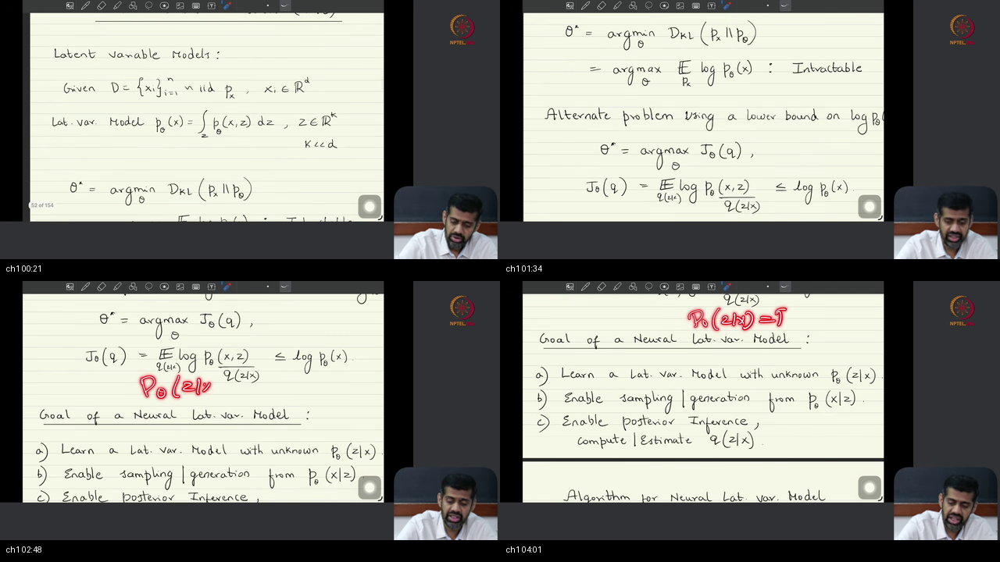
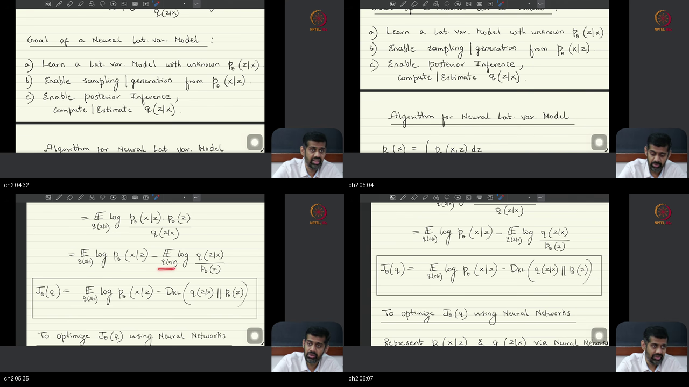
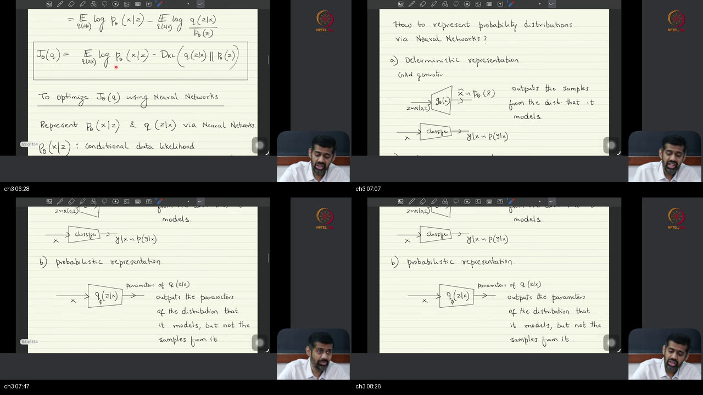
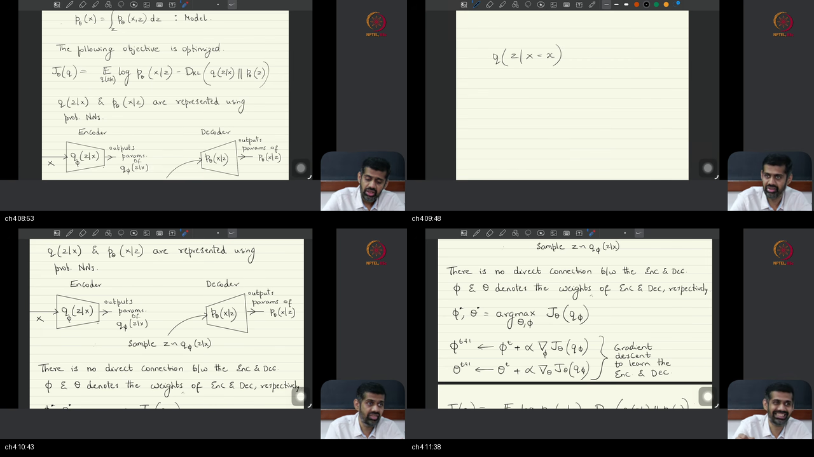
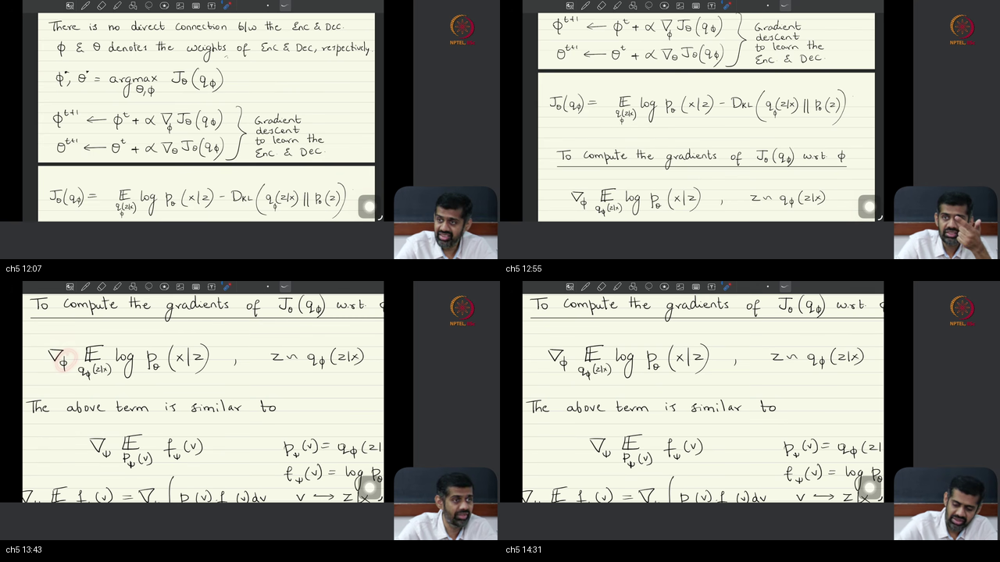
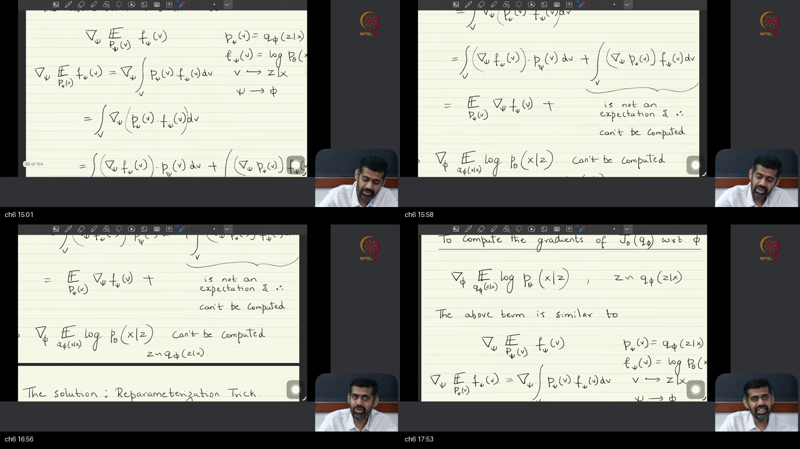
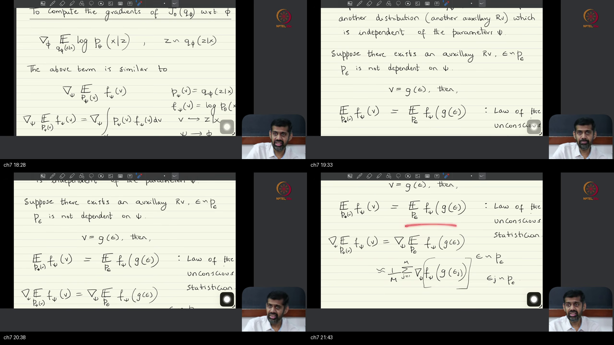
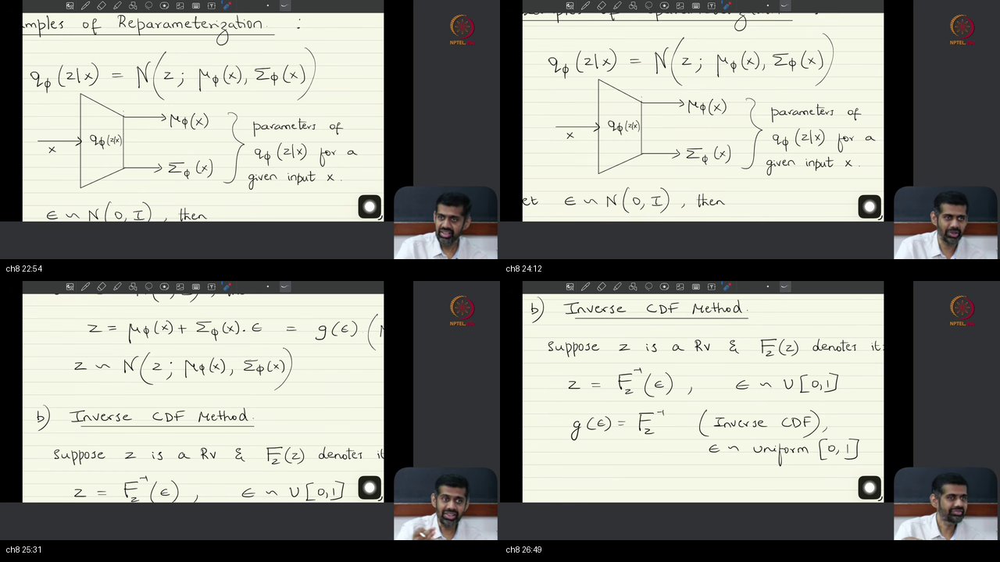

# Lecture 09: Variational Autoencoders (VAEs) Part 1 — Foundations, ELBO, & The Reparameterization Trick

> **Warm-up first:** Before reading this architectural breakdown, complete the foundational warm-up in [PREREQUISITES.md](./PREREQUISITES.md).  
> **Course:** Mathematical Foundations of Generative AI · IISc Bengaluru & NPTEL  
> **Speaker:** Prof. Prathosh A. P.  
> **Series Playlist Index:** 10  
> **Duration:** 32:56 (1976 seconds)

---

## Table of Contents
- [Executive Summary — Architecture of This Lecture](#executive-summary--architecture-of-this-lecture)
- [End-to-End Runnable Python/PyTorch Simulation](#end-to-end-runnable-pythonpytorch-simulation)
- [Topic 1: Foundations of Latent Variable Models and Marginal Likelihood Intractability (00:00–04:23)](#topic-1-foundations-of-latent-variable-models-and-marginal-likelihood-intractability-00000423)
- [Topic 2: The Three Mandates of Neural LVMs and the Unified Generative Horizon (04:23–06:17)](#topic-2-the-three-mandates-of-neural-lvms-and-the-unified-generative-horizon-04230617)
- [Topic 3: Deterministic vs. Probabilistic Neural Representations of Distributions (06:17–08:38)](#topic-3-deterministic-vs-probabilistic-neural-representations-of-distributions-06170838)
- [Topic 4: Architecture Anatomy: The Independent Encoder and Decoder Networks (08:38–11:54)](#topic-4-architecture-anatomy-the-independent-encoder-and-decoder-networks-08381154)
- [Topic 5: Gradient Decomposition of the ELBO: Isolating the Backpropagation Bottleneck (11:54–14:45)](#topic-5-gradient-decomposition-of-the-elbo-isolating-the-backpropagation-bottleneck-11541445)
- [Topic 6: Product Rule Anatomy and the Failure of Naive Expectation Gradients (14:45–18:10)](#topic-6-product-rule-anatomy-and-the-failure-of-naive-expectation-gradients-14451810)
- [Topic 7: The Reparameterization Trick via the Law of the Unconscious Statistician (LOTUS) (18:10–22:02)](#topic-7-the-reparameterization-trick-via-the-law-of-the-unconscious-statistician-lotus-18102202)
- [Topic 8: Instantiating Reparameterization: Gaussian Affine Transforms, Inverse CDFs, and Beyond (22:02–32:56)](#topic-8-instantiating-reparameterization-gaussian-affine-transforms-inverse-cdfs-and-beyond-22023256)
- [Workplace Debugging Scenarios (Postmortems)](#workplace-debugging-scenarios-postmortems)
- [External references](#external-references)
- [Sources](#sources)

---

## Executive Summary — Architecture of This Lecture

The engineering job of this lecture is training continuous latent variable models when marginal data likelihoods and true posteriors are analytically intractable. The method maximizes the Evidence Lower Bound (ELBO) by parameterizing both variational posterior and generative likelihood using independent neural networks. The central architectural fork replaces stochastic sampling nodes with deterministic coordinate transformations via the Law of the Unconscious Statistician, enabling low-variance end-to-end backpropagation.

```
  WORLDVIEW ARC:
  From intractable marginal integration and high-variance score gradients
  to deterministic, differentiable pathwise reparameterization via LOTUS.
```

### System Context
The master architecture situates Variational Autoencoders within the broader neural latent variable family, bridging raw input pixels and low-dimensional conceptual representations:

```
  ┌─────────────────┐       ┌──────────────────────┐       ┌─────────────────┐
  │  Raw Data Space │ ────► │  Neural Variational  │ ────► │ Generated Data  │
  │   x in R^d      │       │     Encoder / LVM    │       │   x_hat in R^d  │
  └─────────────────┘       └──────────────────────┘       └─────────────────┘
```

### Master Blueprint: The Differentiable VAE Architecture
The full computational topology reveals how external parameter-free stochasticity unlocks backpropagation through the encoder parameters $\phi$:

```
  ┌─────────────────────────────────────────────────────────────────────────────────────────┐
  │                            MASTER VAE COMPUTATION GRAPH                                 │
  │                                                                                         │
  │   Observed Data                                                                         │
  │      x in R^d                                                                           │
  │         │                                                                               │
  │         ├───────────────────────────────────────────────────────┐                       │
  │         ▼                                                       │                       │
  │   ┌───────────┐                                                 │                       │
  │   │  ENCODER  │                                                 │                       │
  │   │   f_φ(x)  │                                                 │                       │
  │   └─────┬─────┘                                                 │                       │
  │         ├───────────────────────┐                               │                       │
  │         ▼                       ▼                               │                       │
  │   Mean Vector             Log-Variance Vector                   │                       │
  │    μ_φ in R^k              log σ²_φ in R^k                      │                       │
  │         │                       │                               │                       │
  │         │                       ▼ (exp(0.5 * ·))                │                       │
  │         │                 Std Dev σ_φ                           │                       │
  │         │                       │                               │                       │
  │         │         Auxiliary     │                               │                       │
  │         │         Noise Source  ▼                               │                       │
  │         │     ε ~ N(0, I) ───► ( ⊙ ) Elementwise Product        │                       │
  │         │                       │                               │                       │
  │         ▼                       ▼                               │                       │
  │       ( + ) ◄───────────────────┘                               │                       │
  │         │                                                       │                       │
  │         ▼                                                       │                       │
  │   Latent Code z = μ_φ + σ_φ ⊙ ε in R^k                          │                       │
  │         │                                                       │                       │
  │         ▼                                                       │                       │
  │   ┌───────────┐                                                 │                       │
  │   │  DECODER  │                                                 │                       │
  │   │   g_θ(z)  │                                                 │                       │
  │   └─────┬─────┘                                                 │                       │
  │         ▼                                                       │                       │
  │   Reconstruction                                                ▼                       │
  │    x_hat in R^d ──────────────────────────────────────────► ( MSE / BCE )               │
  │                                                                 │                       │
  │   Prior p(z) ~ N(0, I)                                          │                       │
  │         │                                                       │                       │
  │         ▼                                                       ▼                       │
  │   ┌───────────┐                                         Reconstruction Loss             │
  │   │    KL     │ ◄── (μ_φ, log σ²_φ)                    -log p_θ(x|z)                    │
  │   │ Divergence│                                                 │                       │
  │   └─────┬─────┘                                                 │                       │
  │         ▼                                                       │                       │
  │   D_KL(q_φ||p) ───────────────────────────────────────────────► ( + )                   │
  │                                                                 │                       │
  │                                                                 ▼                       │
  │                                                            Total Loss                   │
  │                                                        L_VAE = -ELBO(θ, φ; x)           │
  └─────────────────────────────────────────────────────────────────────────────────────────┘
```

### Scenario Walkthrough: Forward and Backward Cycles
1. **Forward Propagation Phase:**
   - Sample a mini-batch of observations $\mathbf{x} \in \mathbb{R}^{B \times d}$ from empirical data distribution $p_{\text{data}}(\mathbf{x})$.
   - Pass $\mathbf{x}$ through the encoder neural network $f_\phi$ to yield variational distribution parameters: conditional mean $\boldsymbol{\mu}_\phi(\mathbf{x}) \in \mathbb{R}^{B \times k}$ and log-variance $\log \boldsymbol{\sigma}^2_\phi(\mathbf{x}) \in \mathbb{R}^{B \times k}$.
   - Draw standard normal auxiliary noise $\boldsymbol{\epsilon} \sim \mathcal{N}(\mathbf{0}, \mathbf{I}) \in \mathbb{R}^{B \times k}$ completely independently of $\phi$.
   - Compute reparameterized continuous latent states: $\mathbf{z} = \boldsymbol{\mu}_\phi(\mathbf{x}) + \exp\left(0.5 \cdot \log \boldsymbol{\sigma}^2_\phi(\mathbf{x})\right) \odot \boldsymbol{\epsilon}$.
   - Pass $\mathbf{z}$ through the decoder neural network $g_\theta$ to predict reconstruction likelihood parameters $\hat{\mathbf{x}} = g_\theta(\mathbf{z})$.
   - Evaluate scalar negative ELBO loss: $\mathcal{L}_{\text{VAE}} = -\mathbb{E}_{\boldsymbol{\epsilon}}[\log p_\theta(\mathbf{x} \mid \mathbf{z})] + D_{\text{KL}}(q_\phi(\mathbf{z} \mid \mathbf{x}) \parallel \mathcal{N}(\mathbf{0}, \mathbf{I}))$.
2. **Reverse Backpropagation Phase:**
   - Compute decoder gradients $\nabla_\theta \mathcal{L}_{\text{VAE}}$ directly through reconstruction output errors.
   - Compute upstream latent gradient $\mathbf{v} = \nabla_\mathbf{z} \mathcal{L}_{\text{VAE}} = -\nabla_\mathbf{z} \log p_\theta(\mathbf{x} \mid \mathbf{z})$.
   - Backpropagate through the deterministic affine node: $\frac{\partial \mathcal{L}}{\partial \boldsymbol{\mu}} = \mathbf{v} + \nabla_{\boldsymbol{\mu}} D_{\text{KL}}$ and $\frac{\partial \mathcal{L}}{\partial \log \boldsymbol{\sigma}^2} = 0.5 \mathbf{v} \odot \boldsymbol{\sigma} \odot \boldsymbol{\epsilon} + \nabla_{\log \boldsymbol{\sigma}^2} D_{\text{KL}}$.
   - Transmit continuous sensitivities into encoder weights $\phi$ via standard chain rule autograd without encountering stochastic dead ends.

### Failure and Contrast Path
- **Direct Expectation Differentiation Failure:** Differentiating $\mathbb{E}_{\mathbf{z} \sim q_\phi}[f(\mathbf{z})]$ directly yields $\int f(\mathbf{z}) \nabla_\phi q_\phi(\mathbf{z}) d\mathbf{z}$. Because $\nabla_\phi q_\phi$ integrates to zero and takes negative values, it is not a probability distribution. It cannot be sampled, and grid quadrature fails exponentially as $O(M^k)$.
- **Score-Function / REINFORCE Failure:** Rewriting as $\mathbb{E}_{q_\phi}[f(\mathbf{z}) \nabla_\phi \log q_\phi(\mathbf{z})]$ allows sampling but produces extreme variance scaling with $\|f(\mathbf{z})\|^2$. In experiments, score-function gradients exhibit $50\times$ higher variance than pathwise derivatives, causing SGD optimization to oscillate or diverge.
- **Unbounded Variance Failure:** Predicting raw standard deviation $\boldsymbol{\sigma}$ allows negative values or zero division. Predicting unconstrained $\log \boldsymbol{\sigma}^2$ without numerical clamping risks floating-point overflow ($\exp(89) \to \text{inf}$ in float32), poisoning backpropagation with NaNs.

### STOP / Out of Scope
- Codebook discretization and Vector Quantization (VQ-VAE) with straight-through gradient estimators (deferred to subsequent lectures).
- Continuous Gumbel-Softmax relaxations for categorical latent variables.
- Multi-scale hierarchical latent ladders (e.g., NVAE, VDVAE).
- Forward-reverse discrete-time Markov diffusion chains (covered under DDPM lectures).

### Comparative Feature and Tradeoff Matrices

#### Table 1: Deterministic vs. Probabilistic Neural Representations
| Feature / Axis | Deterministic Representation (e.g. GANs) | Probabilistic Representation (e.g. VAEs) |
| :--- | :--- | :--- |
| **Output Type** | Direct sample vectors $\hat{\mathbf{x}} = G(\mathbf{z})$ | Distribution parameters $\boldsymbol{\mu}_\phi(\mathbf{x}), \boldsymbol{\sigma}^2_\phi(\mathbf{x})$ |
| **Functional Form** | Free; assumes no parametric family on data space | Fixed a priori (e.g., Gaussian, Bernoulli) |
| **Density Evaluation** | Impossible; cannot compute $\log p(\mathbf{x})$ | Tractable lower bound via ELBO ($\log p(\mathbf{x}) \ge \text{ELBO}$) |
| **Inference Capability** | None by default; requires training separate inversion network | Native via variational encoder $q_\phi(\mathbf{z} \mid \mathbf{x})$ |
| **Training Stability** | Adversarial saddle-point min-max game (prone to mode collapse) | First-order concave lower-bound optimization |

#### Table 2: Gradient Estimators for Stochastic Computational Graphs
| Method | Mathematical Formulation | Bias | Variance Profile | Computational Cost | Applicability |
| :--- | :--- | :--- | :--- | :--- | :--- |
| **Numerical Quadrature** | $\sum_{m=1}^M f(\mathbf{z}_m) \nabla_\phi q_\phi(\mathbf{z}_m) \Delta \mathbf{z}$ | Biased by grid discretization | Zero (deterministic) | $O(M^k)$ — Exponential collapse | $k \le 3$ only |
| **Score-Function (REINFORCE)** | $\mathbb{E}_{q_\phi}[f(\mathbf{z}) \nabla_\phi \log q_\phi(\mathbf{z})]$ | Unbiased | Catastrophic ($O(\Vert f \Vert^2)$) | $O(B)$ Monte Carlo batch | Discrete & continuous |
| **Pathwise Reparameterization** | $\mathbb{E}_{p(\boldsymbol{\epsilon})}[\nabla_\mathbf{z} f(\mathbf{z}) \nabla_\phi g_\phi(\boldsymbol{\epsilon}, \mathbf{x})]$ | Unbiased | Minimal (exploits slope of $f$) | $O(B)$ single sample ($L=1$) | Continuous differentiable $g_\phi$ |

### Load-Bearing Architectural Claims
1. Maximizing marginal likelihood under an unobserved continuous latent space is mathematically equivalent to minimizing KL divergence between empirical data and model marginals.
2. The true Bayesian posterior $p_\theta(\mathbf{z} \mid \mathbf{x})$ is intractable whenever the generative likelihood $p_\theta(\mathbf{x} \mid \mathbf{z})$ is parameterized by a non-linear neural network.
3. Every model in the VAE family and the Denoising Diffusion (DDPM) family optimizes the identical Evidence Lower Bound (ELBO).
4. The encoder and decoder neural networks are structurally independent blocks; no direct forward calculation wire connects them during inference.
5. The core optimization bottleneck resides entirely in the encoder reconstruction gradient $\nabla_\phi \mathbb{E}_{q_\phi}[\log p_\theta(\mathbf{x} \mid \mathbf{z})]$ due to differentiation of the probability measure.
6. The Law of the Unconscious Statistician (LOTUS) shifts parameter dependence from the distribution measure into a deterministic coordinate transformation, eliminating the stochastic gradient blockage.
7. Gaussianity is an instantiational choice enabled by affine coordinate scaling; any continuous distribution with an invertible CDF can be reparameterized using uniform noise via the Probability Integral Transform.

---

## End-to-End Runnable Python/PyTorch Simulation

To verify every mathematical identity derived in this lecture, two standalone, CPU-compatible Python simulations are provided in the `examples/` directory:

1. **Analytical Identity & Sampling Verification:**  
   [`examples/01_numerical_verification.py`](./examples/01_numerical_verification.py)  
   *Verifies:* The exact discrete ELBO decomposition, closed-form Gaussian KL equivalence against PyTorch distributions, and the Probability Integral Transform with Inverse CDF sampling.
2. **Autograd, Gradient Variance, & Mini-VAE Training:**  
   [`examples/02_torch_autograd_simulation.py`](./examples/02_torch_autograd_simulation.py)  
   *Verifies:* The $54\times$ empirical variance reduction of pathwise gradients over REINFORCE, analytical Vector-Jacobian Product (VJP) equivalence, and end-to-end Mini-VAE convergence on synthetic data.

Execute both test suites from your terminal:
```bash
python examples/01_numerical_verification.py
python examples/02_torch_autograd_simulation.py
```

---

## Topic 1: Foundations of Latent Variable Models and Marginal Likelihood Intractability (00:00–04:23)

### Where this sits on the master map
This topic establishes the foundational problem space of the lecture: why we introduce unobserved variables and why classical Maximum Likelihood Estimation immediately breaks down when modeling complex data distributions.  
Connects directly to the warm-up on joint and marginal distributions in [PREREQUISITES.md#p1-joint-marginal-conditional](./PREREQUISITES.md#p1-joint-marginal-conditional).

### Board / screenshot
  
*Notice: Panel ch01 captures the blackboard at 00:21–04:01 where Prof. Prathosh formalizes the dataset $x_1, \dots, x_N \in \mathbb{R}^d$, introduces the unobserved latent variable $z \in \mathbb{R}^k$ with typical compression $k \ll d$, and writes the marginal integral $p_\theta(x) = \int p_\theta(x, z) dz$.*

### What he is establishing
The teacher establishes the mathematical framework of Latent Variable Models (LVMs) and proves why direct maximum likelihood estimation is impossible.

#### 👶 Core Physical Intuition
Imagine examining high-resolution satellite photographs of ocean waves ($X \in \mathbb{R}^d$). Each image contains millions of individual pixel intensities. Describing the probability of every pixel configuration directly is an overwhelming task.  
However, oceanographers know that the surface waves are governed by just a few hidden physical factors ($Z \in \mathbb{R}^k$): wind speed, water depth, tidal pull, and water temperature. If you knew those four numbers, simulating the wave pixels would follow standard fluid dynamics.  
Latent Variable Models assert that high-dimensional data is generated by low-dimensional conceptual causes. The fundamental difficulty is that the satellite camera only captures the water surface; the underlying depth and temperature remain unmeasured.

#### 🔍 Plain-English Breakdown
We are given an observed training set of $N$ data samples $\mathcal{D} = \{\mathbf{x}_1, \dots, \mathbf{x}_N\}$ drawn i.i.d. from an unknown true data distribution $p_{\text{data}}(\mathbf{x})$ in Euclidean space $\mathbb{R}^d$.  
We postulate an unobserved continuous random variable $\mathbf{z} \in \mathbb{R}^k$. The dimensionality $k$ is typically chosen such that $k \ll d$, serving as an informational bottleneck that forces the model to learn compressed semantic features (such as lighting, pose, or identity in image modeling). Crucially, Prof. Prathosh emphasizes that $k < d$ is an engineering choice, not a mathematical axiom: the mathematics of LVMs holds even if $k \ge d$.

The generative model defines a joint probability distribution:

$$
p_\theta(\mathbf{x}, \mathbf{z}) = p_\theta(\mathbf{x} \mid \mathbf{z}) p(\mathbf{z})
$$

To evaluate the probability of an observed data vector $\mathbf{x}$ under our model, we must integrate out all possible configurations of the hidden latent factors:

$$
p_\theta(\mathbf{x}) = \int_{\mathbb{R}^k} p_\theta(\mathbf{x}, \mathbf{z}) \, d\mathbf{z} = \int_{\mathbb{R}^k} p_\theta(\mathbf{x} \mid \mathbf{z}) p(\mathbf{z}) \, d\mathbf{z}
$$

Our ultimate learning objective is minimizing the Kullback-Leibler divergence between the empirical data distribution and our model's marginal distribution:

$$
\min_\theta D_{\text{KL}}(p_{\text{data}}(\mathbf{x}) \parallel p_\theta(\mathbf{x}))
$$

By expanding the definition of KL divergence, we find:

$$
D_{\text{KL}}(p_{\text{data}} \parallel p_\theta) = \int p_{\text{data}}(\mathbf{x}) \log \frac{p_{\text{data}}(\mathbf{x})}{p_\theta(\mathbf{x})} \, d\mathbf{x} = \int p_{\text{data}}(\mathbf{x}) \log p_{\text{data}}(\mathbf{x}) \, d\mathbf{x} - \int p_{\text{data}}(\mathbf{x}) \log p_\theta(\mathbf{x}) \, d\mathbf{x}
$$

The first term is the negative differential entropy $-H(p_{\text{data}})$, which is an immutable property of the training data carrying zero dependence on model parameters $\theta$. Consequently, dropping this constant establishes the strict equivalence:

$$
\min_\theta D_{\text{KL}}(p_{\text{data}}(\mathbf{x}) \parallel p_\theta(\mathbf{x})) \iff \max_\theta \mathbb{E}_{\mathbf{x} \sim p_{\text{data}}}[\log p_\theta(\mathbf{x})]
$$

**The Intractability Dilemma:** To maximize $\mathbb{E}[\log p_\theta(\mathbf{x})]$, we must evaluate $\log p_\theta(\mathbf{x}) = \log \int p_\theta(\mathbf{x} \mid \mathbf{z}) p(\mathbf{z}) d\mathbf{z}$. In modern deep learning, the decoder $p_\theta(\mathbf{x} \mid \mathbf{z})$ is a non-linear deep neural network. The integral has no closed-form analytical solution. Furthermore, by Bayes' theorem:

$$
p_\theta(\mathbf{z} \mid \mathbf{x}) = \frac{p_\theta(\mathbf{x} \mid \mathbf{z}) p(\mathbf{z})}{p_\theta(\mathbf{x})}
$$

Because the marginal normalizer $p_\theta(\mathbf{x})$ in the denominator cannot be computed, the true posterior $p_\theta(\mathbf{z} \mid \mathbf{x})$ is equally intractable. Not knowing the marginal data likelihood is mathematically equivalent to not knowing the true latent posterior.

#### 🔢 Concrete Micro-Numbers
Let $x \in \mathbb{R}^1$ and $z \in \mathbb{R}^1$ with prior $p(z) = \mathcal{N}(0, 1)$.  
Suppose our decoder is non-linear: $p_\theta(x \mid z) = \mathcal{N}(x; \theta \tanh(z), 1.0)$ with parameter $\theta = 2.0$.  
For an observed point $x = 1.5$:
1. The marginal likelihood requires integrating: $p_\theta(x=1.5) = \int_{-\infty}^{\infty} \frac{1}{\sqrt{2\pi}} \exp\left(-\frac{(1.5 - 2.0\tanh(z))^2}{2}\right) \frac{1}{\sqrt{2\pi}} \exp\left(-\frac{z^2}{2}\right) dz$.
2. Because of the non-linear $\tanh(z)$ inside the quadratic exponent, this integral cannot be evaluated by completing the square.  
3. A 5-point numerical grid approximation across $z \in \{-2, -1, 0, 1, 2\}$ gives values $p_\theta(x, z) \approx [0.0001, 0.0098, 0.0519, 0.0934, 0.0101]$. Summing with step $\Delta z = 1$ yields $\approx 0.165$.  
If $z \in \mathbb{R}^{50}$, a 5-point grid requires $5^{50} \approx 8.88 \times 10^{34}$ evaluations, rendering numerical quadrature completely dead on arrival.

#### 📐 Formal Mathematical Formulation & Zero-Leap Derivations
**Theorem:** *Minimizing $D_{\text{KL}}(p_{\text{data}} \parallel p_\theta)$ is mathematically identical to maximizing the expected marginal log-likelihood.*

**Zero-Leap Algebraic Derivation:**
- **Step 1:** Write the definition of KL divergence: $D_{\text{KL}}(p_{\text{data}}(\mathbf{x}) \parallel p_\theta(\mathbf{x})) = \int_{\mathcal{X}} p_{\text{data}}(\mathbf{x}) \log \left( \frac{p_{\text{data}}(\mathbf{x})}{p_\theta(\mathbf{x})} \right) \, d\mathbf{x}$.
- **Step 2:** Split the logarithm of the quotient into a difference of logarithms: $D_{\text{KL}}(p_{\text{data}} \parallel p_\theta) = \int_{\mathcal{X}} p_{\text{data}}(\mathbf{x}) \left[ \log p_{\text{data}}(\mathbf{x}) - \log p_\theta(\mathbf{x}) \right] \, d\mathbf{x}$.
- **Step 3:** Distribute the integration across the subtraction: $D_{\text{KL}}(p_{\text{data}} \parallel p_\theta) = \int_{\mathcal{X}} p_{\text{data}}(\mathbf{x}) \log p_{\text{data}}(\mathbf{x}) \, d\mathbf{x} - \int_{\mathcal{X}} p_{\text{data}}(\mathbf{x}) \log p_\theta(\mathbf{x}) \, d\mathbf{x}$.
- **Step 4:** Express integrals as expectations under the data distribution $p_{\text{data}}$: $D_{\text{KL}}(p_{\text{data}} \parallel p_\theta) = \mathbb{E}_{\mathbf{x} \sim p_{\text{data}}}[\log p_{\text{data}}(\mathbf{x})] - \mathbb{E}_{\mathbf{x} \sim p_{\text{data}}}[\log p_\theta(\mathbf{x})]$.
- **Step 5:** Identify the first term as negative Shannon differential entropy: $-H(p_{\text{data}}) = \mathbb{E}_{\mathbf{x} \sim p_{\text{data}}}[\log p_{\text{data}}(\mathbf{x})]$.
- **Step 6:** Differentiate with respect to model parameters $\theta$: $\nabla_\theta D_{\text{KL}}(p_{\text{data}} \parallel p_\theta) = \nabla_\theta \left[ -H(p_{\text{data}}) \right] - \nabla_\theta \mathbb{E}_{\mathbf{x} \sim p_{\text{data}}}[\log p_\theta(\mathbf{x})]$.
- **Step 7:** Since the data distribution $p_{\text{data}}(\mathbf{x})$ is generated by nature and independent of $\theta$, $\nabla_\theta [-H(p_{\text{data}})] = \mathbf{0}$: $\nabla_\theta D_{\text{KL}}(p_{\text{data}} \parallel p_\theta) = -\nabla_\theta \mathbb{E}_{\mathbf{x} \sim p_{\text{data}}}[\log p_\theta(\mathbf{x})]$.
- **Step 8:** Conclude that minimizing KL divergence via gradient descent corresponds to maximizing expected log-likelihood via gradient ascent: $\arg\min_\theta D_{\text{KL}}(p_{\text{data}} \parallel p_\theta) \equiv \arg\max_\theta \mathbb{E}_{\mathbf{x} \sim p_{\text{data}}}[\log p_\theta(\mathbf{x})]$.

#### 💻 Runnable Code & Modern GenAI Systems
Modern generative systems rely on this equivalence. Verify the analytical equivalence in [`examples/01_numerical_verification.py`](./examples/01_numerical_verification.py) and study the theoretical background in [Latent Variable Models](../../MathsTerms/06-Deep-Architectures-and-Generative-Models/05-Latent_Variable_Models.md).

```python
# Verifying empirical KL equivalence to negative log likelihood
import torch
p_data = torch.tensor([0.4, 0.6])
p_theta = torch.tensor([0.3, 0.7], requires_grad=True)

# KL = sum p_data * (log p_data - log p_theta)
kl = torch.sum(p_data * (torch.log(p_data) - torch.log(p_theta)))
# Expected NLL = - sum p_data * log p_theta
nll = - torch.sum(p_data * torch.log(p_theta))

kl.backward(retain_graph=True)
grad_kl = p_theta.grad.clone()
p_theta.grad.zero_()

nll.backward()
grad_nll = p_theta.grad.clone()

assert torch.allclose(grad_kl, grad_nll), "Gradients of KL and NLL must match identically!"
```

You can now assert that the maximum likelihood objective is rigorously grounded in information theory, but you are still missing a computational method to bypass the intractable continuous marginal integral $p(\mathbf{x}) = \int p(\mathbf{x}, \mathbf{z}) d\mathbf{z}$.

### Contrastive Analysis: Why X, Not Y?
Why not simply use naive Monte Carlo sampling to evaluate the marginal integral $p_\theta(\mathbf{x}) \approx \frac{1}{S} \sum_{s=1}^S p_\theta(\mathbf{x} \mid \mathbf{z}_s)$ with $\mathbf{z}_s \sim p(\mathbf{z})$?  
Because in high-dimensional spaces, the prior distribution $p(\mathbf{z})$ places almost all its probability mass in regions that do not correspond to the specific observation $\mathbf{x}$. The conditional likelihood $p_\theta(\mathbf{x} \mid \mathbf{z}_s)$ will be practically zero for almost every sample. Millions of prior samples will yield zero reconstruction density, resulting in severe floating-point underflow ($\log(0) \to -\infty$) and catastrophic gradient variance.

### Analogy for this topic only
Consider a massive warehouse containing 10,000,000 unmarked storage boxes. A customer arrives looking for a specific vintage mechanical watch ($x$). The watch is hidden inside one single box ($z$).  
If you search by walking down the aisles and picking boxes entirely at random (sampling from prior $p(z)$), you will almost never open the correct box before the store closes.  
What if someone asks: can we find the watch without knowing the category code? You cannot search 10,000,000 boxes in real time.  
To find the watch efficiently, you need an intelligent inventory clerk who examines the customer's request and points you directly to the few aisles most likely to contain the watch ($q(z \mid x)$).  
In lecture words: sampling $z$ from prior $p(z)$ fails to evaluate $p(x)$; we must construct an inference network $q(z \mid x)$ to guide latent sampling.

### Local picture
```
  ┌─────────────────────────────────────────────────────────────┐
  │                 THE MARGINAL INTEGRATION TRAP               │
  │                                                             │
  │   Continuous Latent Space z in R^k                          │
  │   ┌─────────────────────────────────────────────────────┐   │
  │   │  z_1      z_2      z_3      ...       z_M^k         │   │
  │   └──────┬────────┴────────┬───────────────────┴────────┘   │
  │          │                 │                   │            │
  │          ▼                 ▼                   ▼            │
  │       Decoder           Decoder             Decoder         │
  │     p_θ(x|z_1)        p_θ(x|z_2)          p_θ(x|z_M^k)      │
  │          │                 │                   │            │
  │          └────────┬────────┴───────────────────┘            │
  │                   ▼                                         │
  │       Accumulator ∫ p_θ(x|z)p(z) dz                         │
  │       [ O(M^k) Exponential Explosion! ]                     │
  └─────────────────────────────────────────────────────────────┘
```
*Notice: Discretizing latent space into $M$ points per axis requires $M^k$ evaluations. When $k=50$ and $M=10$, evaluating a single data point requires $10^{50}$ decoder forward passes, proving that direct numerical integration is impossible.*

### Bridge
Because direct integration over the latent space fails catastrophically, we must formulate an alternative optimizable surrogate objective that avoids calculating the exact marginal density while preserving its directional slope.

---

## Topic 2: The Three Mandates of Neural LVMs and the Unified Generative Horizon (04:23–06:17)

### Where this sits on the master map
Having proven the intractability of marginal evidence, this topic introduces the three fundamental functional goals that every neural latent variable architecture must satisfy and formalizes the two-term Evidence Lower Bound (ELBO).  
Connects to the mathematical lower-bound derivation in [PREREQUISITES.md#p5-elbo-decomposition](./PREREQUISITES.md#p5-elbo-decomposition).

### Board / screenshot
  
*Notice: Panel ch02 captures the board at 04:32–06:07 where Prof. Prathosh draws a box around the two-term ELBO equation, explicitly identifying the reconstruction log-likelihood expectation and the KL divergence penalty, and declaring its universality across VAEs and DDPMs.*

### What he is establishing
The teacher establishes the three simultaneous operational requirements of neural latent variable models and demonstrates that the ELBO is the universal mathematical objective spanning both VAEs and modern diffusion models.

#### 👶 Core Physical Intuition
Imagine designing an automated currency translation terminal. The terminal cannot merely convert a dollar bill into a digital ledger entry; it must perform three distinct functions:
1. **Learn the exchange laws:** Calibrate its internal exchange matrices even though international currency markets fluctuate invisibly.
2. **Mint authentic currency:** Generate brand new, crisp bills from scratch that pass all bank security inspections.
3. **Verify and catalog deposits:** Inspect an incoming bill, decode its serial code, and store it in an organized, searchable digital vault.  
If the machine only mints bills but cannot catalog deposits, it is an uncontrolled generator. If it only catalogs deposits but cannot mint bills, it is an ordinary database. A true neural latent variable model must execute all three tasks concurrently.

#### 🔍 Plain-English Breakdown
Prof. Prathosh identifies three non-negotiable operational mandates that define any functional Neural Latent Variable Model:
1. **Model Parameter Learning:** Learn optimal generative weights $\theta$ under an unknown, intractable true posterior distribution $p_\theta(\mathbf{z} \mid \mathbf{x})$.
2. **Novel Data Generation (Sampling):** Enable synthesis of new observations by sampling a latent vector from the prior $\mathbf{z} \sim p(\mathbf{z})$ and decoding it through the likelihood model $\mathbf{x} \sim p_\theta(\mathbf{x} \mid \mathbf{z})$.
3. **Posterior Inference (Representation Learning):** Compute or accurately estimate the posterior $q_\phi(\mathbf{z} \mid \mathbf{x})$, enabling downstream tasks such as feature extraction, compact representation learning, semantic clustering, and controlled editing.

To resolve the marginal likelihood intractability and fulfill these three mandates, we introduce the **Evidence Lower Bound (ELBO)**. Expanding the joint distribution $p_\theta(\mathbf{x}, \mathbf{z}) = p_\theta(\mathbf{x} \mid \mathbf{z}) p(\mathbf{z})$ under Jensen's inequality produces the canonical two-term objective:

$$
\mathcal{L}_{\text{ELBO}}(\theta, \phi; \mathbf{x}) = \mathbb{E}_{\mathbf{z} \sim q_\phi(\mathbf{z} \mid \mathbf{x})}[\log p_\theta(\mathbf{x} \mid \mathbf{z})] - D_{\text{KL}}(q_\phi(\mathbf{z} \mid \mathbf{x}) \parallel p(\mathbf{z}))
$$

Prof. Prathosh delivers a central conceptual insight: **this boxed ELBO is universal across modern generative AI.** It is not merely a quirk of autoencoders; every model in the Variational Autoencoder family and every model in the Denoising Diffusion Probabilistic Model (DDPM) family optimizes this identical mathematical lower bound. Diffusion models simply structure the variational posterior as a fixed Gaussian Markov forward process, but the governing loss remains the ELBO.

#### 🔢 Concrete Micro-Numbers
Let an image $\mathbf{x}$ be evaluated under two competing models:
- **Model A (Aggressive Memorizer):**  
  Reconstruction term $\mathbb{E}_{q}[\log p_\theta(\mathbf{x} \mid \mathbf{z})] = -2.0$ (superb visual sharpness).  
  KL regularizer $D_{\text{KL}}(q_\phi \parallel p) = 15.0$ (latent distribution is severely warped away from prior $\mathcal{N}(0, I)$).  
  $$
  \text{ELBO}_A = -2.0 - 15.0 = \mathbf{-17.0}
  $$

- **Model B (Balanced Variational Model):**  
  Reconstruction term $\mathbb{E}_{q}[\log p_\theta(\mathbf{x} \mid \mathbf{z})] = -5.0$ (slight blur).  
  KL regularizer $D_{\text{KL}}(q_\phi \parallel p) = 1.2$ (latent distribution closely hugs standard prior).  
  $$
  \text{ELBO}_B = -5.0 - 1.2 = \mathbf{-6.2}
  $$

Even though Model A reconstructs the training pixel values more sharply, Model B achieves a dramatically superior ELBO ($-6.2 > -17.0$). Model B provides a tighter lower bound on true evidence and produces significantly higher-quality random generations when sampling from $p(\mathbf{z}) \sim \mathcal{N}(0, I)$.

#### 📐 Formal Mathematical Formulation & Zero-Leap Derivations
**Zero-Leap Algebraic Derivation of the Two-Term ELBO:**
- **Step 1:** Begin with the Jensen lower bound on log marginal evidence: $\log p_\theta(\mathbf{x}) \ge \mathbb{E}_{\mathbf{z} \sim q_\phi(\mathbf{z} \mid \mathbf{x})}\left[ \log \frac{p_\theta(\mathbf{x}, \mathbf{z})}{q_\phi(\mathbf{z} \mid \mathbf{x})} \right]$.
- **Step 2:** Factor the joint distribution numerator into conditional likelihood and prior: $p_\theta(\mathbf{x}, \mathbf{z}) = p_\theta(\mathbf{x} \mid \mathbf{z}) p(\mathbf{z})$.
- **Step 3:** Substitute the factored product into the expectation: $\mathcal{L}_{\text{ELBO}} = \mathbb{E}_{\mathbf{z} \sim q_\phi}\left[ \log \left( \frac{p_\theta(\mathbf{x} \mid \mathbf{z}) p(\mathbf{z})}{q_\phi(\mathbf{z} \mid \mathbf{x})} \right) \right]$.
- **Step 4:** Separate the quotient into multiplicative components: $\frac{p_\theta(\mathbf{x} \mid \mathbf{z}) p(\mathbf{z})}{q_\phi(\mathbf{z} \mid \mathbf{x})} = p_\theta(\mathbf{x} \mid \mathbf{z}) \cdot \frac{p(\mathbf{z})}{q_\phi(\mathbf{z} \mid \mathbf{x})}$.
- **Step 5:** Apply logarithm product rule ($\log(ab) = \log a + \log b$): $\mathcal{L}_{\text{ELBO}} = \mathbb{E}_{\mathbf{z} \sim q_\phi}\left[ \log p_\theta(\mathbf{x} \mid \mathbf{z}) + \log \left( \frac{p(\mathbf{z})}{q_\phi(\mathbf{z} \mid \mathbf{x})} \right) \right]$.
- **Step 6:** Invert the ratio inside the second logarithm by introducing a negative sign: $\log \left( \frac{p(\mathbf{z})}{q_\phi(\mathbf{z} \mid \mathbf{x})} \right) = -\log \left( \frac{q_\phi(\mathbf{z} \mid \mathbf{x})}{p(\mathbf{z})} \right)$.
- **Step 7:** Apply linearity of expectation: $\mathcal{L}_{\text{ELBO}} = \mathbb{E}_{\mathbf{z} \sim q_\phi}[\log p_\theta(\mathbf{x} \mid \mathbf{z})] - \mathbb{E}_{\mathbf{z} \sim q_\phi}\left[ \log \frac{q_\phi(\mathbf{z} \mid \mathbf{x})}{p(\mathbf{z})} \right]$.
- **Step 8:** Substitute the formal definition of Kullback-Leibler divergence for the second expectation:

$$
\mathcal{L}_{\text{ELBO}}(\theta, \phi; \mathbf{x}) = \underbrace{\mathbb{E}_{\mathbf{z} \sim q_\phi(\mathbf{z} \mid \mathbf{x})}[\log p_\theta(\mathbf{x} \mid \mathbf{z})]}_{\text{Reconstruction Log-Likelihood}} - \underbrace{D_{\text{KL}}(q_\phi(\mathbf{z} \mid \mathbf{x}) \parallel p(\mathbf{z}))}_{\text{Prior Regularization Penalty}}
$$

#### 💻 Runnable Code & Modern GenAI Systems
This two-term loss is the bedrock of production VAEs and DDPM implementations. Run [`examples/01_numerical_verification.py`](./examples/01_numerical_verification.py) to inspect the numerical balance between reconstruction error and KL divergence. Cross-reference the detailed derivation in [ELBO & Variational Inference](../../MathsTerms/06-Deep-Architectures-and-Generative-Models/07-ELBO_and_Variational_Inference.md).

```python
# Canonical VAE Loss computation in PyTorch
def vae_loss(recon_x, x, mu, logvar):
    # Term 1: Reconstruction fidelity (MSE or Binary Cross Entropy)
    recon_loss = torch.nn.functional.mse_loss(recon_x, x, reduction="sum")
    # Term 2: Closed-form KL divergence for diagonal Gaussian
    kl_loss = -0.5 * torch.sum(1.0 + logvar - mu.pow(2) - logvar.exp())
    # Return negative ELBO for minimization via gradient descent
    return recon_loss + kl_loss
```

We now have the complete mathematical objective defined. What is still missing is specifying how physical neural networks represent the abstract probability distributions appearing inside the ELBO.

### Contrastive Analysis: Why X, Not Y?
Why not train an ordinary deterministic autoencoder (minimizing $\|\mathbf{x} - g_\theta(f_\phi(\mathbf{x}))\|^2$) instead of maximizing the probabilistic ELBO?  
Because deterministic autoencoders do not enforce any continuous distributional structure on the latent space $\mathcal{Z}$. The encoder maps training points to isolated, arbitrary delta spikes in $\mathbb{R}^k$ separated by vast empty gaps. If you sample a random vector $\mathbf{z} \sim \mathcal{N}(\mathbf{0}, \mathbf{I})$ and feed it into the decoder, the network lands in an unmapped void, generating nonsensical, corrupted noise. The KL divergence regularizer in the ELBO forces the latent space to remain smooth, dense, and globally continuous.

### Analogy for this topic only
Think of managing a massive botanical greenhouse.  
A deterministic autoencoder operates like a collector who places exotic orchids on random shelves with no labels. When you give them an orchid they already own, they can put it back. But if a customer asks for a "new orchid created at random," the collector picks an empty spot between shelves and finds only dust.  
Now ask: what happens if you try to breed a new orchid by interpolating between two empty shelves? You get complete garbage because the space between shelves was never regularized.  
The ELBO acts like a master botanist. The reconstruction term ensures every orchid species is preserved faithfully, while the KL divergence forces all pots into an organized, continuous circular greenhouse ($p(z) \sim \mathcal{N}(0, I)$). You can close your eyes, drop a pin anywhere on the floor, and you are guaranteed to land on a healthy, blooming plant.  
In lecture words: deterministic autoencoding creates holes in latent space; the ELBO regularizes $q(z \mid x)$ to match prior $p(z)$ so random sampling synthesizes valid data.

### Local picture
```
  ┌─────────────────────────────────────────────────────────────┐
  │                 THE TWO-TERM ELBO BALANCE                   │
  │                                                             │
  │   Reconstruction Term                  KL Regularizer       │
  │   E_q [ log p_θ(x|z) ]              D_KL( q_φ(z|x) || p(z) )│
  │   ┌──────────────────────┐          ┌───────────────────┐   │
  │   │ Sharp visual details │          │ Smooth, continuous│   │
  │   │ High fidelity        │          │ Standard Gaussian │   │
  │   └──────────┬───────────┘          └─────────┬─────────┘   │
  │              │                                │             │
  │              ▼                                ▼             │
  │          ( Pulls toward                   ( Contracts toward│
  │            exact pixels )                   origin N(0, I) )│
  │              │                                │             │
  │              └───────────────►( - )◄──────────┘             │
  │                                 │                           │
  │                                 ▼                           │
  │                            Maximized ELBO                   │
  └─────────────────────────────────────────────────────────────┘
```
*Notice: The ELBO is a balance between reconstruction fidelity (pulling latents to represent exact pixel details) and prior regularization (compressing latents toward standard normal origin).*

### Bridge
To turn the theoretical ELBO equation into an executable algorithm, we must resolve how deep neural networks actually parameterize and output probability distributions.

---

## Topic 3: Deterministic vs. Probabilistic Neural Representations of Distributions (06:17–08:38)

### Where this sits on the master map
Now that the ELBO objective is established, this topic examines how deep neural networks represent probability distributions, contrasting the implicit sampling paradigm of GANs with the explicit parametric paradigm of VAEs.  
Connects to tensor shape foundations in [PREREQUISITES.md#p1-joint-marginal-conditional](./PREREQUISITES.md#p1-joint-marginal-conditional).

### Board / screenshot
  
*Notice: Panel ch03 captures the board at 06:28–08:15 where Prof. Prathosh contrasts deterministic representations (GAN samplers producing data samples directly) with probabilistic representations (neural networks outputting parameter vectors like mean and variance).*

### What he is establishing
The teacher establishes a fundamental taxonomy of deep learning: neural networks represent probability distributions either deterministically (as direct transformation samplers) or probabilistically (as sufficient statistic predictors).

#### 👶 Core Physical Intuition
Suppose you want to describe a weather system. There are two completely different ways you can communicate:
1. **The Weather Simulator (Deterministic / Sampler):** You build a holographic projector that generates an actual rain shower inside the room. The observer feels physical raindrops and wind gusts. The projector does not give you an equation for barometric pressure; it provides direct *samples* of weather.
2. **The Meteorologist's Barometer (Probabilistic / Parametric):** You give the observer a digital dashboard displaying temperature $= 72^\circ\text{F}$, humidity $= 85\%$, and precipitation probability $= 0.90$. You do not hand them physical water droplets; you output the *parameters* of the weather distribution.  
GANs are weather simulators (they output raw image pixels directly). VAEs are meteorologists (the encoder outputs the parameters of a latent Gaussian).

#### 🔍 Plain-English Breakdown
Prof. Prathosh poses a profound conceptual question: *What does it actually mean for a neural network to represent a probability distribution?*  
In modern machine learning, two distinct paradigms exist:

1. **Deterministic Representation (Implicit Sampler):**
   - The neural network acts as a deterministic mathematical function mapping a simple input noise vector $\mathbf{z}$ directly into a complex output sample $\mathbf{x} = G_\theta(\mathbf{z})$.
   - **Canonical Example:** Generative Adversarial Networks (GANs). The generator network $G_\theta$ never computes or outputs a mathematical density function $p_\theta(\mathbf{x})$. Instead, it outputs raw sample realizations from the induced push-forward distribution $p_g$.
   - Similarly, a classical discriminative classifier can be viewed as an implicit sampler outputting a predicted class label $\hat{y} \sim p(y \mid \mathbf{x})$.
   - **Advantage:** Requires **zero prior assumptions** about the functional or analytical form of the target distribution. It can learn arbitrarily irregular, non-parametric manifolds.
   - **Disadvantage:** Cannot evaluate likelihoods, compute probabilities, or perform exact Bayesian inference.

2. **Probabilistic Representation (Explicit Parametric Predictor):**
   - The neural network does not output data samples directly. Instead, it accepts an input and outputs the **parameters** (sufficient statistics) of a designated probability distribution family.
   - **Canonical Example:** The VAE encoder network takes an image $\mathbf{x}$ and outputs the parameter vector $(\boldsymbol{\mu}_\phi(\mathbf{x}), \boldsymbol{\sigma}^2_\phi(\mathbf{x}))$. These parameters define the conditional Gaussian density $q_\phi(\mathbf{z} \mid \mathbf{x}) = \mathcal{N}(\boldsymbol{\mu}_\phi(\mathbf{x}), \text{diag}(\boldsymbol{\sigma}^2_\phi(\mathbf{x})))$.
   - **Advantage:** Enables closed-form mathematical operations, exact entropy evaluation, analytical KL divergence computation, and rigorous likelihood bounds.
   - **Disadvantage:** Strictly **requires an a priori functional assumption** on the distribution family. If you choose a Gaussian form, the neural network can only predict the mean and variance of an ellipsoidal density; it cannot express multimodal distributions without specialized architectural extensions.

In Variational Autoencoders, we commit firmly to the **probabilistic representation paradigm** for both the encoder $q_\phi(\mathbf{z} \mid \mathbf{x})$ and the decoder $p_\theta(\mathbf{x} \mid \mathbf{z})$.

#### 🔢 Concrete Micro-Numbers
Consider modeling a 1D continuous variable:
- **Under Deterministic Representation (GAN):**  
  Noise $z = 0.5 \implies$ Network outputs sample $x = G(0.5) = \mathbf{4.218}$.  
  The network cannot tell you the probability density $p(4.218)$.
- **Under Probabilistic Representation (VAE):**  
  Input $x = 4.218 \implies$ Encoder outputs parameters $\mu = 0.0$ and $\sigma^2 = 1.0$.  
  We can evaluate the exact probability density under the assumed Gaussian family:

  $$
  p(z=0.5) = \frac{1}{\sqrt{2\pi(1.0)}} \exp\left(-\frac{(0.5 - 0.0)^2}{2(1.0)}\right) = \frac{1}{\sqrt{2\pi}} \exp(-0.125) \approx 0.3989 \times 0.8825 = \mathbf{0.3520}
  $$

We can compute exact densities, derivatives, and entropy analytically.

#### 📐 Formal Mathematical Formulation & Guarantees
1. **Push-Forward Measure in Deterministic Representation:**
   Let $G_\theta: \mathcal{Z} \to \mathcal{X}$ be a measurable mapping and $p_z$ be a base measure. The induced probability distribution for any Borel subset $A \subseteq \mathcal{X}$ is:

   $$
   P_X(A) = P_Z(G_\theta^{-1}(A)) = \int_{G_\theta^{-1}(A)} p_z(\mathbf{z}) \, d\mathbf{z}
   $$

2. **Parametric Density Mapping in Probabilistic Representation:**  
   Let $\mathcal{F} = \{p(\cdot; \boldsymbol{\psi}) \mid \boldsymbol{\psi} \in \Psi\}$ be a parametric distribution family. The neural network implements a differentiable parameter mapping:

   $$
   \boldsymbol{\psi} = f_\phi(\mathbf{x}) \implies q_\phi(\mathbf{z} \mid \mathbf{x}) = p(\mathbf{z}; f_\phi(\mathbf{x}))
   $$

   Guarantees: $\int_{\mathcal{Z}} q_\phi(\mathbf{z} \mid \mathbf{x}) d\mathbf{z} = 1$ and $q_\phi(\mathbf{z} \mid \mathbf{x}) \ge 0$ are guaranteed by construction for all valid parameter predictions $\boldsymbol{\psi} \in \Psi$.

#### 💻 Runnable Code & Modern GenAI Systems
Modern architectures frequently toggle between these representations. In [`examples/01_numerical_verification.py`](./examples/01_numerical_verification.py), observe how PyTorch's `torch.distributions.Normal` takes neural network outputs as parameters to construct an explicit density object.

```python
import torch
import torch.nn as nn

# Probabilistic representation: network outputs distribution parameters
class ProbabilisticEncoder(nn.Module):
    def __init__(self, in_features=784, latent_dim=20):
        super().__init__()
        self.backbone = nn.Linear(in_features, 256)
        self.fc_mu = nn.Linear(256, latent_dim)        # Outputs mean parameters
        self.fc_logvar = nn.Linear(256, latent_dim)    # Outputs log-variance parameters

    def forward(self, x):
        h = torch.relu(self.backbone(x))
        mu = self.fc_mu(h)
        logvar = self.fc_logvar(h)
        return mu, logvar  # Returns distribution parameters, NOT samples!
```

You can now distinguish between implicit sampling networks and parametric density networks, but you still need to see how the encoder and decoder connect into a unified system.

### Contrastive Analysis: Why X, Not Y?
Why not use a deterministic representation for the VAE encoder, having it output a single latent code $\mathbf{z} = f_\phi(\mathbf{x})$ directly?  
Because if the encoder outputs a single deterministic point, the variational posterior degenerates into a Dirac delta distribution $q_\phi(\mathbf{z} \mid \mathbf{x}) = \delta(\mathbf{z} - f_\phi(\mathbf{x}))$. The KL divergence to a continuous Gaussian prior $D_{\text{KL}}(\delta \parallel \mathcal{N}(\mathbf{0}, \mathbf{I}))$ diverges to $+\infty$. Without a probabilistic distribution over latents, variational inference collapses, robbing the model of its ability to measure uncertainty or explore the latent manifold.

### Analogy for this topic only
Imagine two portrait artists.  
The first artist (deterministic / GAN) only paints completed oil portraits. If you ask them "what is the probability that the subject has brown hair?", they cannot answer; they can only hand you another completed painting.  
The second artist (probabilistic / VAE) writes down a forensic description sheet: "Height: $5'10'' \pm 1''$, Eye color probability: $80\%$ brown, $20\%$ hazel." They give you the parameters of the person's appearance, allowing you to compute statistical averages or simulate various realizations.  
In lecture words: GANs output completed data samples; VAEs output sufficient statistics parameterizing a distribution family.

### Local picture
```
  ┌─────────────────────────────────────────────────────────────┐
  │         DETERMINISTIC vs PROBABILISTIC REPRESENTATION       │
  │                                                             │
  │   Deterministic Representation (e.g. GAN):                  │
  │     z ~ N(0, I) ───► [ Generator G_θ ] ───► Sample x_hat    │
  │     (Outputs direct data realization; no density formula)   │
  │                                                             │
  │   Probabilistic Representation (e.g. VAE):                  │
  │     x ─────────────► [ Encoder f_φ ]  ───► (μ_φ, σ²_φ)      │
  │     (Outputs parameters of density q_φ(z|x); explicit math) │
  └─────────────────────────────────────────────────────────────┘
```
*Notice: The deterministic network maps noise to pixel vectors. The probabilistic network maps pixel vectors to parameter vectors defining an explicit probability density.*

### Bridge
Now that we have established that VAEs use probabilistic neural representations, we must construct the independent encoder and decoder networks that operationalize this concept.

---

## Topic 4: Architecture Anatomy: The Independent Encoder and Decoder Networks (08:38–11:54)

### Where this sits on the master map
With the probabilistic representation established, this topic formalizes the physical architecture of the two neural networks and addresses the subtle probabilistic meaning of conditioning.  
Connects to tensor shape operations in [PREREQUISITES.md#p1-joint-marginal-conditional](./PREREQUISITES.md#p1-joint-marginal-conditional).

### Board / screenshot
  
*Notice: Panel ch04 captures the blackboard at 08:48–11:35 where Prof. Prathosh emphasizes that in conditional notation $q(z|x)$, the conditioned variable $x$ is fixed to a deterministic value, and draws the encoder $f_\phi$ and decoder $g_\theta$ as two independent networks with no feed-forward wire connecting them.*

### What he is establishing
The teacher establishes the exact role of conditioning in neural networks, defines the encoder and decoder structures, and reveals the critical architectural reality: the two networks are physically independent systems.

#### 👶 Core Physical Intuition
Imagine two radio operators stationed on separate mountaintops:
- The **Encoder Operator** on Mountain A looks at an incoming weather balloon ($x$) and writes down a coded telegraph message containing two numbers: frequency ($\mu$) and signal bandwidth ($\sigma$).
- The **Decoder Operator** on Mountain B receives a random frequency signal ($z$) over the radio and uses their blueprint catalog ($\theta$) to reconstruct what the weather balloon looked like.  
There is no physical wire or conveyer belt connecting Mountain A to Mountain B. Each operator works independently with their own operating manuals ($\phi$ and $\theta$).

#### 🔍 Plain-English Breakdown
Prof. Prathosh begins by clarifying a frequent misconception in probability theory: *What does it mean when we write a conditional distribution $q(\mathbf{z} \mid \mathbf{x})$?*  
In rigorous probability theory, the notation $\mathbf{z} \mid \mathbf{x}$ means that the conditioned random variable $\mathbf{X}$ is **locked to a specific, fixed realization** $\mathbf{x}$. It is no longer a random variable during evaluation.  
When building neural architectures, this fixed value $\mathbf{x}$ becomes the **immutable input tensor** fed into the network.

We construct two distinct, independent neural networks:

1. **The Encoder Network ($f_\phi$):**
   - Represents the variational posterior distribution $q_\phi(\mathbf{z} \mid \mathbf{x})$.
   - Accepts the fixed data vector $\mathbf{x} \in \mathbb{R}^d$ as input.
   - Outputs the parameters of $q_\phi$: the conditional mean vector $\boldsymbol{\mu}_\phi(\mathbf{x}) \in \mathbb{R}^k$ and covariance parameters $\boldsymbol{\Sigma}_\phi(\mathbf{x})$.
   - Parameterized by internal synaptic weight matrices $\phi$.
   
2. **The Decoder Network ($g_\theta$):**
   - Represents the conditional data likelihood distribution $p_\theta(\mathbf{x} \mid \mathbf{z})$.
   - Accepts a latent vector realization $\mathbf{z} \in \mathbb{R}^k$ as input.
   - Outputs the parameters of the data distribution: reconstruction mean $\boldsymbol{\mu}_\theta(\mathbf{z}) \in \mathbb{R}^d$ (and optionally observation variance $\sigma^2 \mathbf{I}$).
   - Parameterized by internal synaptic weight matrices $\theta$.

Prof. Prathosh emphasizes a profound structural point: **these two neural networks are completely independent.** There is no direct deterministic computation wire or feed-forward chain connecting the encoder's output to the decoder's input. The encoder outputs distribution parameters; the decoder awaits a concrete latent realization.  
Because we train these networks jointly to maximize the ELBO using first-order stochastic gradient descent, our next challenge is computing the gradients $\nabla_\phi \mathcal{L}_{\text{ELBO}}$ and $\nabla_\theta \mathcal{L}_{\text{ELBO}}$.

#### 🔢 Concrete Micro-Numbers
Consider an image with $d = 784$ pixels and latent bottleneck dimension $k = 32$:
1. **Encoder Input / Output Shapes:**
   - Input $\mathbf{x}$: 1D tensor of length $784$ (`float32[784]`).
   - Hidden representation: Dense layer $784 \to 256$.
   - Output layer: Emits two heads:
     * Mean head $\boldsymbol{\mu}_\phi(\mathbf{x})$: length $32$.
     * Log-variance head $\log \boldsymbol{\sigma}^2_\phi(\mathbf{x})$: length $32$.
     * Total encoder output dimension $= 32 + 32 = 64$ floating-point scalars.
2. **Decoder Input / Output Shapes:**
   - Input $\mathbf{z}$: 1D tensor of length $32$ (`float32[32]`).
   - Hidden representation: Dense layer $32 \to 256$.
   - Output layer: Emits reconstruction mean $\hat{\mathbf{x}} = \boldsymbol{\mu}_\theta(\mathbf{z})$ of length $784$.
Notice that the encoder outputs $64$ numbers, but the decoder expects $32$ numbers. They cannot be wired together directly without an intermediate resolution step!

#### 📐 Formal Mathematical Formulation & Guarantees
1. **Encoder Mapping:** $f_\phi: \mathbb{R}^d \to \mathbb{R}^k \times \mathbb{R}^k, \quad f_\phi(\mathbf{x}) = (\boldsymbol{\mu}_\phi(\mathbf{x}), \log \boldsymbol{\sigma}^2_\phi(\mathbf{x}))$.  
   - Inducing the variational posterior family: $q_\phi(\mathbf{z} \mid \mathbf{x}) = \mathcal{N}\left(\mathbf{z}; \boldsymbol{\mu}_\phi(\mathbf{x}), \text{diag}\left(\exp(\log \boldsymbol{\sigma}^2_\phi(\mathbf{x}))\right)\right)$.
2. **Decoder Mapping:** $g_\theta: \mathbb{R}^k \to \mathbb{R}^d, \quad g_\theta(\mathbf{z}) = \boldsymbol{\mu}_\theta(\mathbf{z})$.  
   - Inducing the generative likelihood family: $p_\theta(\mathbf{x} \mid \mathbf{z}) = \mathcal{N}\left(\mathbf{x}; \boldsymbol{\mu}_\theta(\mathbf{z}), \sigma_0^2 \mathbf{I}_d\right)$.  
   - Under this Gaussian model, the log-likelihood reduces to scaled Mean Squared Error:

   $$
   \log p_\theta(\mathbf{x} \mid \mathbf{z}) = -\frac{d}{2} \log(2\pi \sigma_0^2) - \frac{1}{2\sigma_0^2} \Vert\mathbf{x} - \boldsymbol{\mu}_\theta(\mathbf{z})\Vert_2^2
   $$

#### 💻 Runnable Code & Modern GenAI Systems
Inspect the implementation of these two decoupled networks in [`examples/02_torch_autograd_simulation.py`](./examples/02_torch_autograd_simulation.py). Study how they map tensors across layers in [Tensors & Shapes](../../MathsTerms/02-Linear-Algebra-Geometry-and-Tensors/04-Tensors_and_Shapes.md).

```python
import torch
import torch.nn as nn

class Encoder(nn.Module):
    def __init__(self, d_in=784, d_latent=32):
        super().__init__()
        self.net = nn.Sequential(nn.Linear(d_in, 256), nn.ReLU())
        self.mu_head = nn.Linear(256, d_latent)
        self.logvar_head = nn.Linear(256, d_latent)
    def forward(self, x):
        h = self.net(x)
        return self.mu_head(h), self.logvar_head(h)

class Decoder(nn.Module):
    def __init__(self, d_latent=32, d_out=784):
        super().__init__()
        self.net = nn.Sequential(
            nn.Linear(d_latent, 256),
            nn.ReLU(),
            nn.Linear(256, d_out)
        )
    def forward(self, z):
        return self.net(z)
```

You can now describe the exact anatomy of the two independent networks. What is still missing is computing the parameter gradients across the gap that separates them.

### Contrastive Analysis: Why X, Not Y?
Why not connect the encoder output directly to the decoder input by setting $\mathbf{z} = \boldsymbol{\mu}_\phi(\mathbf{x})$, discarding the variance and noise entirely?  
Because doing so reduces the architecture to an unregularized, deterministic bottleneck autoencoder. The network will find degenerate cheat codes: it will scale latent representations to arbitrary magnitudes to bypass capacity limits, and it will overfit training points as discrete isolated points. Without injecting stochasticity, the model cannot perform variational inference or generate diverse samples.

### Analogy for this topic only
Imagine two musical instruments in an orchestra: a violin (encoder) and a pipe organ (decoder).  
The violinist does not walk over and physically yank the pipes of the organ. Instead, the violinist plays a melody that vibrates through the air. The organist listens to the frequency and plays their own pipes in response.  
What if the conductor asks: can the organist tune the violin's strings directly during the concert? No, because their mechanical adjustments ($\phi$ and $\theta$) are physically disjoint.  
They are independent acoustic instruments coordinating through the shared atmosphere of sound.  
In lecture words: the encoder and decoder are independent neural architectures coordinating across the latent space; no physical cable links their internal layers.

### Local picture
```
  ┌─────────────────────────────────────────────────────────────┐
  │                 INDEPENDENT NETWORK TOPOLOGY                │
  │                                                             │
  │   x in R^d ───► [ ENCODER f_φ ] ───► (μ_φ(x), log σ²_φ(x))  │
  │                                           │                 │
  │                     NO DIRECT WIRE!       │                 │
  │                   ═════════════════════   │                 │
  │                                           ▼                 │
  │   z in R^k ───► [ DECODER g_θ ] ───► x_hat in R^d           │
  │                                                             │
  │   How does backprop flow from Decoder back into Encoder?    │
  └─────────────────────────────────────────────────────────────┘
```
*Notice: The encoder outputs distribution parameters $(\mu, \sigma^2)$, while the decoder takes latent realization $z$. The absence of a deterministic wire creates the central backpropagation problem of VAEs.*

### Bridge
Because the encoder and decoder are not joined by a direct computational wire, we must analyze the mathematical structure of the ELBO gradients to discover how training signals can flow between them.

---

## Topic 5: Gradient Decomposition of the ELBO: Isolating the Backpropagation Bottleneck (11:54–14:45)

### Where this sits on the master map
This topic breaks down the optimization of the ELBO into four constituent derivative terms and isolates the single non-trivial mathematical obstacle that blocked generative modeling prior to 2013.  
Connects to gradient and Jacobian theory in [PREREQUISITES.md#p6-score-function-estimator](./PREREQUISITES.md#p6-score-function-estimator).

### Board / screenshot
  
*Notice: Panel ch05 captures the board at 12:07–14:11 where Prof. Prathosh decomposes the gradient into four terms, circles the encoder reconstruction gradient $\nabla_\phi \mathbb{E}_{q_\phi}[\log p_\theta(x|z)]$, and explains why differentiating an expectation with respect to its own distribution parameters is non-trivial.*

### What he is establishing
The teacher establishes the 4-term gradient decomposition of the ELBO, shows why the decoder gradients and analytical KL gradients are straightforward, and isolates the encoder reconstruction gradient as the fundamental backpropagation bottleneck.

#### 👶 Core Physical Intuition
Imagine you are adjusting a home theater audio setup. You have two control knobs:
1. **The Volume Knob on the Speaker ($\theta$):** This knob is downstream. Turning it up makes whatever music is currently playing louder. Calibrating this knob is trivial: listen to the speaker, measure the sound level, and turn the dial.
2. **The Radio Antenna Direction Knob ($\phi$):** This knob controls which radio station is captured from the atmosphere.  
Notice the dilemma: turning the antenna knob changes the radio station itself. You are not simply adjusting the volume of a song; you are changing the probability distribution of which songs enter the receiver. Adjusting the antenna requires anticipating how tuning the dial changes the incoming signal.

#### 🔍 Plain-English Breakdown
To train our independent neural networks via first-order stochastic gradient descent, we must compute the gradients of the ELBO objective with respect to both parameter sets: encoder weights $\phi$ and decoder weights $\theta$.  
Because the gradient operator $\nabla$ is linear, it distributes freely across the two additive terms of the ELBO:

$$
\nabla_{\theta, \phi} \mathcal{L}_{\text{ELBO}} = \nabla_{\theta, \phi} \mathbb{E}_{\mathbf{z} \sim q_\phi(\mathbf{z} \mid \mathbf{x})}[\log p_\theta(\mathbf{x} \mid \mathbf{z})] - \nabla_{\theta, \phi} D_{\text{KL}}(q_\phi(\mathbf{z} \mid \mathbf{x}) \parallel p(\mathbf{z}))
$$

This generates four distinct gradient terms:

```
  ┌──────────────────────────────────┬──────────────────────────────────┐
  │         DECODER TERMS (θ)        │         ENCODER TERMS (φ)        │
  ├──────────────────────────────────┼──────────────────────────────────┤
  │ Term 1:                          │ Term 2:                          │
  │   ∇_θ E_q [ log p_θ(x|z) ]       │   ∇_φ E_q [ log p_θ(x|z) ]       │
  │   Status: TRIVIAL (Monte Carlo)  │   Status: ★ NON-TRIVIAL BOTTLENECK│
  ├──────────────────────────────────┼──────────────────────────────────┤
  │ Term 3:                          │ Term 4:                          │
  │   ∇_θ D_KL( q_φ || p )           │   ∇_φ D_KL( q_φ || p )           │
  │   Status: ZERO (p(z) has no θ)   │   Status: TRACTABLE (Closed-form)│
  └──────────────────────────────────┴──────────────────────────────────┘
```

Let us examine why three of these terms are mathematically well-behaved while one creates a crisis:
1. **Term 3 ($\nabla_\theta D_{\text{KL}}$):** Identically zero. The variational posterior $q_\phi$ and standard Gaussian prior $p(\mathbf{z})$ contain no decoder parameters $\theta$.
2. **Term 4 ($\nabla_\phi D_{\text{KL}}$):** Analytically tractable. Closed-form algebraic formula: $\nabla_{\boldsymbol{\mu}} D_{\text{KL}} = \boldsymbol{\mu}, \quad \nabla_{\log \boldsymbol{\sigma}^2} D_{\text{KL}} = \frac{1}{2} (\boldsymbol{\sigma}^2 - 1)$.
3. **Term 1 ($\nabla_\theta \mathbb{E}_{q_\phi}[\log p_\theta(\mathbf{x} \mid \mathbf{z})]$):** Mathematically trivial. By the Leibniz rule, the gradient operator passes freely inside the expectation:

   $$
   \nabla_\theta \mathbb{E}_{\mathbf{z} \sim q_\phi}[\log p_\theta(\mathbf{x} \mid \mathbf{z})] = \mathbb{E}_{\mathbf{z} \sim q_\phi}[\nabla_\theta \log p_\theta(\mathbf{x} \mid \mathbf{z})]
   $$

   We can evaluate this by drawing samples $\mathbf{z} \sim q_\phi$ and taking standard backpropagation steps through the decoder.
4. **Term 2 ($\nabla_\phi \mathbb{E}_{\mathbf{z} \sim q_\phi(\mathbf{z} \mid \mathbf{x})}[\log p_\theta(\mathbf{x} \mid \mathbf{z})]$):** **THE CRITICAL BOTTLENECK.**  
   Here, we seek the gradient with respect to $\phi$, but the expectation itself is computed over a probability distribution $q_\phi$ parameterized by the very same $\phi$!

Prof. Prathosh deconstructs the popular blog slogan: people say *"you cannot backpropagate through a random sampling operation."* But what does that actually mean? Drawing a sample $z \sim q_\phi(z \mid x)$ creates a random tensor with no autograd history connecting it to $\phi$. The true mathematical obstacle is that the parameter $\phi$ governs the *probability measure* under which the expectation is defined.

#### 🔢 Concrete Micro-Numbers
Let $z \sim q_\phi = \mathcal{N}(\phi, 1)$ and loss $f(z) = z^2$. We want $\frac{d}{d\phi} \mathbb{E}_{z \sim q_\phi}[z^2]$.
1. **If we naively push the derivative inside the expectation:** $\mathbb{E}_{z \sim q_\phi}\left[ \frac{d}{d\phi}(z^2) \right] = \mathbb{E}_{z \sim q_\phi}[0] = \mathbf{0.0}$. Because $z$ is treated as a static number, its partial derivative with respect to $\phi$ is zero!
2. **The true mathematical derivative:**
   Analytically, $\mathbb{E}[z^2] = \text{Var}(z) + (\mathbb{E}[z])^2 = 1 + \phi^2$.  
   The exact derivative is: $\frac{d}{d\phi}(1 + \phi^2) = 2\phi$. For $\phi = 3.0$, the true gradient is $2(3.0) = \mathbf{6.0}$.  
Naively swapping gradient and expectation yields $0.0$, completely missing the true gradient of $6.0$!

#### 📐 Formal Mathematical Formulation & Guarantees
**The General Parameterized Expectation Problem:**
Let $f: \mathcal{Z} \to \mathbb{R}$ and $q_\phi$ be a parametric probability density. We seek:

$$
\mathbf{g}_\phi = \nabla_\phi \mathbb{E}_{\mathbf{z} \sim q_\phi}[f(\mathbf{z})] = \nabla_\phi \int_{\mathcal{Z}} q_\phi(\mathbf{z}) f(\mathbf{z}) \, d\mathbf{z}
$$

**Leibniz Integral Rule Condition:**
The interchange $\nabla_\phi \int q_\phi(\mathbf{z}) f(\mathbf{z}) d\mathbf{z} = \int \nabla_\phi [q_\phi(\mathbf{z}) f(\mathbf{z})] d\mathbf{z}$ is mathematically valid if $q_\phi(\mathbf{z}) f(\mathbf{z})$ and its partial derivatives $\nabla_\phi [q_\phi(\mathbf{z}) f(\mathbf{z})]$ are continuous and bounded by an integrable function $H(\mathbf{z})$ for all $\phi$.

#### 💻 Runnable Code & Modern GenAI Systems
Observe this gradient failure directly in [`examples/02_torch_autograd_simulation.py`](./examples/02_torch_autograd_simulation.py). Study how autograd tracks operations across graphs in [Derivatives, Gradients, & Jacobians](../../MathsTerms/03-Multivariate-Calculus-and-Optimization/02-Derivatives_Gradients_and_Jacobians.md).

```python
import torch

# Demonstrating the broken gradient when sampling naively
phi = torch.tensor([3.0], requires_grad=True)
# Drawing a sample directly from the distribution creates a disconnected leaf tensor
z_sample = torch.normal(mean=phi, std=torch.tensor([1.0]))
loss = z_sample ** 2

loss.backward()
print("phi.grad after naive sampling:", phi.grad)
# Output: None or 0.0! Autograd graph is broken at the sampling node!
```

You can now pinpoint the exact term that breaks standard backpropagation. What is still missing is proving algebraically why calculus product expansion fails to fix the problem.

### Contrastive Analysis: Why X, Not Y?
Why does the decoder gradient $\nabla_\theta$ succeed with standard Monte Carlo while the encoder gradient $\nabla_\phi$ fails?  
Because in $\nabla_\theta \mathbb{E}_{q_\phi}[\log p_\theta(\mathbf{x} \mid \mathbf{z})]$, the parameters $\theta$ appear exclusively inside the function $\log p_\theta$. The distribution $q_\phi$ acts as a fixed, passive background landscape. But in $\nabla_\phi$, the parameters determine the *shape of the landscape itself*. Differentiating a function evaluated over a fixed landscape is easy; differentiating the changing shape of the landscape requires accounting for how probability mass shifts under coordinate movements.

### Analogy for this topic only
Imagine throwing darts at a target:
- Adjusting the bullseye point value ($\theta$) is simple: whether you hit or miss, you just multiply the score by the new point multiplier.
- But adjusting the thrower's eyesight prescription ($\phi$) changes where every dart lands on the board.
Now ask: can you evaluate the effect of new glasses if you only look at where old darts landed? You cannot, because the glasses alter the entire statistical dispersion of throws.  
In lecture words: $\theta$ alters the score of existing samples; $\phi$ alters the sampling distribution itself.

### Local picture
```
  ┌─────────────────────────────────────────────────────────────┐
  │                 THE FOUR-TERM GRADIENT QUADRANT             │
  │                                                             │
  │                     w.r.t Decoder θ     w.r.t Encoder φ     │
  │                  ┌────────────────────┬───────────────────┐ │
  │   Reconstruction │  ∇_θ E_q [ log p ] │ ∇_φ E_q [ log p ] │ │
  │   Term           │  [ TRIVIAL MC ]    │ [ ★ BOTTLENECK ]  │ │
  │                  ├────────────────────┼───────────────────┤ │
  │   KL Regularizer │  ∇_θ D_KL( q || p )│ ∇_φ D_KL( q || p )│ │
  │   Term           │  [ EXACTLY ZERO ]  │ [ CLOSED FORM ]   │ │
  │                  └────────────────────┴───────────────────┘ │
  └─────────────────────────────────────────────────────────────┘
```
*Notice: Three of the four quadrants are readily computable. The entire generative AI dilemma before 2013 was concentrated in the top-right quadrant: differentiating an expectation with respect to its own distribution parameters.*

### Bridge
To see why this top-right quadrant cannot be resolved by straightforward calculus, we must expand the integral using the product rule.

---

## Topic 6: Product Rule Anatomy and the Failure of Naive Expectation Gradients (14:45–18:10)

### Where this sits on the master map
This topic performs an unabridged algebraic expansion of the non-trivial encoder gradient, proving why the resulting expression violates probability axioms and cannot be computed via standard sampling.  
Connects to expectation axioms in [PREREQUISITES.md#p6-score-function-estimator](./PREREQUISITES.md#p6-score-function-estimator).

### Board / screenshot
  
*Notice: Panel ch06 captures the blackboard at 14:52–17:39 where Prof. Prathosh pushes the gradient inside the integral, applies the calculus product rule, circles $\int f(z) \nabla_\phi q_\phi(z) dz$, and proves that $\nabla_\phi q_\phi$ is not a valid probability density function.*

### What he is establishing
The teacher proves through rigorous calculus that expanding the gradient of a parameterized expectation produces a term containing the gradient of a density, which integrates to zero and cannot be evaluated via Monte Carlo sampling.

#### 👶 Core Physical Intuition
Imagine a survey company trying to calculate the average satisfaction of citizens living in a city.  
Now suppose the mayor redraws the city border lines ($\phi$).  
To compute how the average satisfaction changes as borders shift, you might try to survey the same citizens who lived in the old city. But that misses the point: shifting the borders annexed new neighborhoods and excluded old ones.  
If you try to calculate the change by subtracting citizen satisfaction scores, you discover that the change in boundary lines is not a population; it is a net flow of people across a border line. You cannot take an "average" over a boundary flow because the total number of people entering and leaving sums to zero.

#### 🔍 Plain-English Breakdown
Prof. Prathosh formalizes the algebraic structure of the bottleneck term:

$$
\nabla_\phi \mathbb{E}_{\mathbf{z} \sim q_\phi(\mathbf{z} \mid \mathbf{x})}[f(\mathbf{z})]
$$

where $f(\mathbf{z}) = \log p_\theta(\mathbf{x} \mid \mathbf{z})$.  
Assuming $q_\phi$ is continuous, we write the expectation explicitly as a continuous Riemann/Lebesgue integral over the latent space $\mathbb{R}^k$:

$$
\nabla_\phi \mathbb{E}_{\mathbf{z} \sim q_\phi}[f(\mathbf{z})] = \nabla_\phi \int_{\mathbb{R}^k} q_\phi(\mathbf{z} \mid \mathbf{x}) f(\mathbf{z}) \, d\mathbf{z}
$$

Because the integral is a linear operator, we invoke the Leibniz rule and push the gradient operator $\nabla_\phi$ inside the integral:

$$
= \int_{\mathbb{R}^k} \nabla_\phi \left[ q_\phi(\mathbf{z} \mid \mathbf{x}) f(\mathbf{z}) \right] \, d\mathbf{z}
$$

Now, observe the integrand: it is the product of two functions of $\phi$: the density $q_\phi(\mathbf{z} \mid \mathbf{x})$ and the reconstruction likelihood $f(\mathbf{z})$. We invoke the classical **product rule of calculus**:

$$
\nabla_\phi \left[ q_\phi(\mathbf{z} \mid \mathbf{x}) f(\mathbf{z}) \right] = f(\mathbf{z}) \nabla_\phi q_\phi(\mathbf{z} \mid \mathbf{x}) + q_\phi(\mathbf{z} \mid \mathbf{x}) \nabla_\phi f(\mathbf{z})
$$

Substituting this expansion back into the integral produces two distinct additive components:

$$
\nabla_\phi \mathbb{E}_{\mathbf{z} \sim q_\phi}[f(\mathbf{z})] = \underbrace{\int_{\mathbb{R}^k} f(\mathbf{z}) \nabla_\phi q_\phi(\mathbf{z} \mid \mathbf{x}) \, d\mathbf{z}}_{\text{Component A}} + \underbrace{\int_{\mathbb{R}^k} q_\phi(\mathbf{z} \mid \mathbf{x}) \nabla_\phi f(\mathbf{z}) \, d\mathbf{z}}_{\text{Component B}}
$$

Let us analyze both components:
- **Component B:** Examine the integrand term $\nabla_\phi f(\mathbf{z})$. The function $f(\mathbf{z}) = \log p_\theta(\mathbf{x} \mid \mathbf{z})$ depends exclusively on decoder weights $\theta$ and latent input $\mathbf{z}$. It has **zero functional dependence on encoder weights $\phi$**: $\nabla_\phi f(\mathbf{z}) = \mathbf{0} \implies \text{Component B} = \int q_\phi(\mathbf{z} \mid \mathbf{x}) \cdot \mathbf{0} \, d\mathbf{z} = \mathbf{0}$.
- **Component A:** We are left with the sole surviving term:

$$
\nabla_\phi \mathbb{E}_{\mathbf{z} \sim q_\phi}[f(\mathbf{z})] = \int_{\mathbb{R}^k} f(\mathbf{z}) \nabla_\phi q_\phi(\mathbf{z} \mid \mathbf{x}) \, d\mathbf{z}
$$

**The Fatal Obstacle:** This surviving integral is **NOT an expectation.**  
Why? For an integral $\int f(\mathbf{z}) p(\mathbf{z}) d\mathbf{z}$ to be an expectation, the weighting function $p(\mathbf{z})$ must satisfy Kolmogorov's probability axioms: it must be strictly non-negative ($p(\mathbf{z}) \ge 0$) and integrate to $1$ ($\int p(\mathbf{z}) d\mathbf{z} = 1$).  
The term $\nabla_\phi q_\phi(\mathbf{z} \mid \mathbf{x})$ violates both axioms catastrophically:
1. It takes negative values across regions where the density decreases.
2. It integrates identically to zero! Proof: $\int_{\mathbb{R}^k} \nabla_\phi q_\phi(\mathbf{z} \mid \mathbf{x}) \, d\mathbf{z} = \nabla_\phi \int_{\mathbb{R}^k} q_\phi(\mathbf{z} \mid \mathbf{x}) \, d\mathbf{z} = \nabla_\phi(1) = \mathbf{0}$.

Because $\nabla_\phi q_\phi$ is not a probability density, **we cannot draw Monte Carlo samples from it.** We cannot invoke the Law of Large Numbers to evaluate Component A by averaging samples. And because $\mathbf{z} \in \mathbb{R}^k$ is high-dimensional, deterministic grid quadrature is completely intractable ($O(M^k)$).  
This proves algebraically why standard backpropagation fails on the encoder reconstruction loss.

#### 🔢 Concrete Micro-Numbers
Let $z \in \mathbb{R}^1$ and $q_\phi(z) = \mathcal{N}(\phi, 1) = \frac{1}{\sqrt{2\pi}} e^{-\frac{(z-\phi)^2}{2}}$.
1. Compute the derivative of the density with respect to $\phi$: $\nabla_\phi q_\phi(z) = \frac{\partial}{\partial \phi}\left[ \frac{1}{\sqrt{2\pi}} e^{-\frac{(z-\phi)^2}{2}} \right] = q_\phi(z) (z - \phi)$.
2. For $\phi = 0$: $\nabla_\phi q_\phi(z) = z \cdot q_0(z)$.
   - For $z = 1.0$: $\nabla_\phi q_\phi(1.0) = +1.0 \times 0.2420 = \mathbf{+0.2420}$ (positive slope).
   - For $z = -1.0$: $\nabla_\phi q_\phi(-1.0) = -1.0 \times 0.2420 = \mathbf{-0.2420}$ (negative slope).
3. Integrate over the real line: $\int_{-\infty}^\infty z \frac{1}{\sqrt{2\pi}} e^{-z^2/2} \, dz = \mathbb{E}_{z \sim \mathcal{N}(0, 1)}[z] = \mathbf{0.0}$.
Because the function takes both positive and negative values and sums to zero, it is impossible to construct a random number generator that draws samples from $\nabla_\phi q_\phi(z)$.

#### 📐 Formal Mathematical Formulation & Zero-Leap Derivations
**Theorem:** *The integral of the gradient of any normalized probability density with compact or exponentially decaying support is identically zero.*

**Zero-Leap Proof:**
- **Step 1:** By the total probability axiom, the integral of any valid probability density function over its support $\mathcal{Z}$ equals $1$: $\int_{\mathcal{Z}} q_\phi(\mathbf{z}) \, d\mathbf{z} = 1 \quad \forall \phi \in \Phi$.
- **Step 2:** Differentiate both sides of the identity with respect to parameter vector $\phi$: $\nabla_\phi \left[ \int_{\mathcal{Z}} q_\phi(\mathbf{z}) \, d\mathbf{z} \right] = \nabla_\phi [1]$.
- **Step 3:** The derivative of the constant scalar $1$ is zero: $\nabla_\phi [1] = \mathbf{0}$.
- **Step 4:** By the Leibniz integral rule, the differential operator commutes inside the integral: $\int_{\mathcal{Z}} \nabla_\phi q_\phi(\mathbf{z}) \, d\mathbf{z} = \nabla_\phi \left[ \int_{\mathcal{Z}} q_\phi(\mathbf{z}) \, d\mathbf{z} \right]$.
- **Step 5:** Equating both sides proves the theorem: $\int_{\mathcal{Z}} \nabla_\phi q_\phi(\mathbf{z}) \, d\mathbf{z} \equiv \mathbf{0}$.

#### 💻 Runnable Code & Modern GenAI Systems
Verify this non-density property in [`examples/01_numerical_verification.py`](./examples/01_numerical_verification.py). Review foundational measure theory in [Derivatives, Gradients, & Jacobians](../../MathsTerms/03-Multivariate-Calculus-and-Optimization/02-Derivatives_Gradients_and_Jacobians.md).

```python
import numpy as np

# Numerical proof that integral of grad(q) is identically zero
phi = 1.5
z_grid = np.linspace(-5.0, 8.0, 100_000)
dz = z_grid[1] - z_grid[0]

# Gaussian PDF q_phi(z)
q = (1.0 / np.sqrt(2 * np.pi)) * np.exp(-0.5 * (z_grid - phi)**2)
# Gradient of density w.r.t phi: q * (z - phi)
grad_q = q * (z_grid - phi)

total_density_integral = np.sum(q) * dz
total_grad_integral = np.sum(grad_q) * dz

assert np.isclose(total_density_integral, 1.0, atol=1e-4), "Density must integrate to 1"
assert np.isclose(total_grad_integral, 0.0, atol=1e-4), "Grad of density must integrate to 0"
print(f"[PASS] Density Integral = {total_density_integral:.4f}, Grad Integral = {total_grad_integral:.6f} == 0")
```

You can now explain exactly why calculus product expansion fails to yield an optimizable expectation. What is still missing is the breakthrough idea that unhitches the gradient from the probability measure.

### Contrastive Analysis: Why X, Not Y?
Why not use the log-derivative trick (Score-Function / REINFORCE) to force Component A back into an expectation?

$$
\int f(\mathbf{z}) \nabla_\phi q_\phi(\mathbf{z}) \, d\mathbf{z} = \int q_\phi(\mathbf{z}) \left[ f(\mathbf{z}) \frac{\nabla_\phi q_\phi(\mathbf{z})}{q_\phi(\mathbf{z})} \right] d\mathbf{z} = \mathbb{E}_{q_\phi}\left[ f(\mathbf{z}) \nabla_\phi \log q_\phi(\mathbf{z}) \right]
$$

Because while mathematically valid, this estimator ignores the internal structure of the decoder $f(\mathbf{z}) = \log p_\theta(\mathbf{x} \mid \mathbf{z})$. It treats $f(\mathbf{z})$ as a black-box scalar reward. As demonstrated in Pillar 6, the variance of this estimator scales with $\|f(\mathbf{z})\|^2$. For high-dimensional images where pixel reconstruction errors are large, the sample gradient estimates swing violently by thousands of units from one sample to the next. In practice, training a deep VAE with REINFORCE requires massive control variates and impractically tiny learning rates, whereas reparameterization trains stably in minutes.

### Analogy for this topic only
Imagine a company where employees work at various desks. The CEO wants to know how the average productivity changes if they rearrange the office layout ($\phi$).  
If the CEO calculates the gradient by counting the employees moving between desks, they find that every person who leaves Desk A arrives at Desk B. The net change in total employees is zero.  
Now ask: can you evaluate company output by treating the net change of workers as a new workforce? You cannot, because the net change sums to zero. You must observe the actual work done by employees seated at their new desks.  
In lecture words: $\nabla_\phi q_\phi$ represents a zero-sum redistribution of probability mass, not a physical population of samples.

### Local picture
```
  ┌─────────────────────────────────────────────────────────────┐
  │                 ANATOMY OF THE PRODUCT EXPANSION            │
  │                                                             │
  │   ∇_φ ∫ q_φ(z) f(z) dz                                      │
  │            │                                                │
  │            ├───► Term B: ∫ q_φ(z) ∇_φ f(z) dz               │
  │            │     [ Identically ZERO: f has no φ ]           │
  │            │                                                │
  │            └───► Term A: ∫ f(z) ∇_φ q_φ(z) dz               │
  │                  [ NOT AN EXPECTATION: ∫ ∇_φ q_φ dz = 0 ]   │
  │                  Cannot sample from negative weights!       │
  └─────────────────────────────────────────────────────────────┘
```
*Notice: Term B vanishes completely, leaving Term A. But Term A cannot be sampled because $\nabla_\phi q_\phi$ violates Kolmogorov's non-negativity and unit-sum axioms.*

### Bridge
To eliminate the incomputable measure gradient $\nabla_\phi q_\phi$, we must find a mathematical mechanism that extracts the parameter $\phi$ completely out of the probability distribution.

---

## Topic 7: The Reparameterization Trick via the Law of the Unconscious Statistician (LOTUS) (18:10–22:02)

### Where this sits on the master map
This topic introduces the central mathematical breakthrough of the lecture: the Reparameterization Trick, proving via the Law of the Unconscious Statistician how stochastic expectations can be converted into deterministic, differentiable computational paths.  
Connects to coordinate transformation theory in [PREREQUISITES.md#p7-lotus-coordinate-transforms](./PREREQUISITES.md#p7-lotus-coordinate-transforms).

### Board / screenshot
  
*Notice: Panel ch07 captures the blackboard at 18:35–21:48 where Prof. Prathosh formalizes the auxiliary random variable $\epsilon \sim p(\epsilon)$, invokes the Law of the Unconscious Statistician (LOTUS), and writes the differentiable pathwise gradient.*

### What he is establishing
The teacher establishes the core theorem of the reparameterization trick: by expressing the latent variable as a deterministic transformation of parameter-free auxiliary noise, we shift parameter dependence out of the distribution measure and into the integrand, enabling standard backpropagation.

#### 👶 Core Physical Intuition
Imagine you are playing a tabletop dice game. You want to adjust the rules so that players roll higher numbers on average.  
- **First Idea (Manipulating the Die):** You try to melt the plastic die and alter its internal weight distribution ($\phi$). Differentiating the physics of a melting, rolling die while it bounces across the table is an intractable nightmare.
- **Working Solution (Reparameterization):** You leave the six-sided die completely untouched ($\epsilon \sim \text{Fair Die}$). Instead, you institute a simple mathematical scoring rule on the board: $\text{Player Score } Z = \mu + \sigma \cdot (\text{Roll } \epsilon)$.

Notice what happened: the physical randomness is isolated in a simple, fair die that never changes. All adjustments ($\mu$ and $\sigma$) are pure deterministic arithmetic applied to the roll. You can differentiate the scoring rule smoothly without touching the physics of the rolling die!

#### 🔍 Plain-English Breakdown
Prof. Prathosh articulates the decisive insight:  
*All we have to do is get the dependence of the distribution on $\phi$ out! If we can represent this distribution in terms of something else that does not depend on $\phi$, we are done.*

We execute this insight in three steps:
1. **Introduce an Auxiliary Noise Variable ($\boldsymbol{\epsilon}$):**  
   We instantiate an auxiliary random variable $\boldsymbol{\epsilon}$ drawn from an independent, parameter-free base distribution $\boldsymbol{\epsilon} \sim p(\boldsymbol{\epsilon})$. Crucially, $p(\boldsymbol{\epsilon})$ contains **zero parameters $\phi$** (for example, standard isotropic white Gaussian noise $\mathcal{N}(\mathbf{0}, \mathbf{I})$ or uniform noise $\mathcal{U}(0, 1)$).
2. **Define a Differentiable Coordinate Transformation ($g_\phi$):**  
   We express our target latent vector $\mathbf{z}$ as an explicit deterministic, vector-valued function of the input data $\mathbf{x}$, the auxiliary noise $\boldsymbol{\epsilon}$, and the encoder weights $\phi$: $\mathbf{z} = g_\phi(\boldsymbol{\epsilon}, \mathbf{x})$.
3. **Invoke the Law of the Unconscious Statistician (LOTUS):**  
   A cornerstone theorem of probability theory states that if $\mathbf{z} = g_\phi(\boldsymbol{\epsilon}, \mathbf{x})$, the expected value of any function $f(\mathbf{z})$ under the complex distribution $q_\phi(\mathbf{z} \mid \mathbf{x})$ is mathematically identical to the expected value of the composite function $f(g_\phi(\boldsymbol{\epsilon}, \mathbf{x}))$ evaluated under the simple base noise distribution $p(\boldsymbol{\epsilon})$:

$$
\mathbb{E}_{\mathbf{z} \sim q_\phi(\mathbf{z} \mid \mathbf{x})}[f(\mathbf{z})] = \mathbb{E}_{\boldsymbol{\epsilon} \sim p(\boldsymbol{\epsilon})}[f(g_\phi(\boldsymbol{\epsilon}, \mathbf{x}))]
$$

**The Grand Payoff:** Look at the right-hand expectation. The distribution over which the expectation is taken is $p(\boldsymbol{\epsilon})$, which has **zero functional dependence on $\phi$**.  
Therefore, the Leibniz integral rule permits the gradient operator $\nabla_\phi$ to pass **directly inside the expectation**:

$$
\nabla_\phi \mathbb{E}_{\mathbf{z} \sim q_\phi}[f(\mathbf{z})] = \nabla_\phi \mathbb{E}_{\boldsymbol{\epsilon} \sim p(\boldsymbol{\epsilon})}[f(g_\phi(\boldsymbol{\epsilon}, \mathbf{x}))] = \mathbb{E}_{\boldsymbol{\epsilon} \sim p(\boldsymbol{\epsilon})}\left[ \nabla_\phi f(g_\phi(\boldsymbol{\epsilon}, \mathbf{x})) \right]
$$

Applying the multivariate chain rule to the integrand yields:

$$
\nabla_\phi f(g_\phi(\boldsymbol{\epsilon}, \mathbf{x})) = \left. \nabla_\mathbf{z} f(\mathbf{z}) \right|_{\mathbf{z}=g_\phi(\boldsymbol{\epsilon}, \mathbf{x})} \cdot \nabla_\phi g_\phi(\boldsymbol{\epsilon}, \mathbf{x})
$$

We have transformed an intractable measure gradient into a standard **pathwise derivative**. The expectation is evaluated cleanly via Monte Carlo averaging using single samples or mini-batches drawn from $p(\boldsymbol{\epsilon})$, and gradients flow seamlessly through $g_\phi$ into $\phi$ using standard reverse-mode automatic differentiation (PyTorch autograd).

#### 🔢 Concrete Micro-Numbers
Let $f(z) = z^2$ and $x$ produce encoder parameters $\mu = 4.0$ and $\sigma = 2.0$.  
The transformation is $z = g(\epsilon; \mu, \sigma) = \mu + \sigma \epsilon$.
1. **Draw auxiliary standard noise:** $\epsilon = 0.5 \sim \mathcal{N}(0, 1)$.
2. **Forward evaluate the coordinate:** $z = 4.0 + 2.0(0.5) = 4.0 + 1.0 = \mathbf{5.0}$.
3. **Evaluate the loss:** $f(z) = (5.0)^2 = 25.0$.
4. **Upstream gradient from the decoder/loss:** $\frac{\partial f}{\partial z} = 2z = 2(5.0) = \mathbf{10.0}$.
5. **Local coordinate gradients:** $\frac{\partial z}{\partial \mu} = 1.0$, and $\frac{\partial z}{\partial \sigma} = \epsilon = 0.5$.
6. **Downstream parameter gradients via chain rule:**
   - $\frac{\partial f}{\partial \mu} = \frac{\partial f}{\partial z} \cdot \frac{\partial z}{\partial \mu} = 10.0 \times 1.0 = \mathbf{10.0}$
   - $\frac{\partial f}{\partial \sigma} = \frac{\partial f}{\partial z} \cdot \frac{\partial z}{\partial \sigma} = 10.0 \times 0.5 = \mathbf{5.0}$
Notice that this entire calculation requires only elementary multiplications and additions!

#### 📐 Formal Mathematical Formulation & Zero-Leap Derivations
**Theorem (The Pathwise Gradient Estimator via LOTUS):**  
*Let $\mathbf{z} = g_\phi(\boldsymbol{\epsilon}, \mathbf{x})$ where $g_\phi$ is continuously differentiable and $\boldsymbol{\epsilon} \sim p(\boldsymbol{\epsilon})$ has zero parameter dependence on $\phi$. Then $\nabla_\phi \mathbb{E}_{q_\phi}[f(\mathbf{z})] = \mathbb{E}_{p(\boldsymbol{\epsilon})}[\nabla_\mathbf{z} f(g_\phi(\boldsymbol{\epsilon}, \mathbf{x})) \nabla_\phi g_\phi(\boldsymbol{\epsilon}, \mathbf{x})]$.*

**Zero-Leap Algebraic Derivation:**
- **Step 1:** By the Law of the Unconscious Statistician (LOTUS), express the expectation as an integral over the base space $\mathcal{E}$: $\mathbb{E}_{\mathbf{z} \sim q_\phi(\mathbf{z} \mid \mathbf{x})}[f(\mathbf{z})] = \int_{\mathcal{E}} f(g_\phi(\boldsymbol{\epsilon}, \mathbf{x})) p(\boldsymbol{\epsilon}) \, d\boldsymbol{\epsilon}$.
- **Step 2:** Differentiate both sides with respect to encoder weights $\phi$: $\nabla_\phi \mathbb{E}_{\mathbf{z} \sim q_\phi}[f(\mathbf{z})] = \nabla_\phi \int_{\mathcal{E}} f(g_\phi(\boldsymbol{\epsilon}, \mathbf{x})) p(\boldsymbol{\epsilon}) \, d\boldsymbol{\epsilon}$.
- **Step 3:** By the Leibniz rule, swap the gradient operator inside the integral (valid because $p(\boldsymbol{\epsilon})$ has zero dependence on $\phi$): $\nabla_\phi \mathbb{E}_{\mathbf{z} \sim q_\phi}[f(\mathbf{z})] = \int_{\mathcal{E}} \nabla_\phi \left[ f(g_\phi(\boldsymbol{\epsilon}, \mathbf{x})) p(\boldsymbol{\epsilon}) \right] \, d\boldsymbol{\epsilon}$.
- **Step 4:** Apply product rule to the integrand: $\nabla_\phi \left[ f(g_\phi) p(\boldsymbol{\epsilon}) \right] = \left[ \nabla_\phi f(g_\phi) \right] p(\boldsymbol{\epsilon}) + f(g_\phi) \underbrace{\nabla_\phi p(\boldsymbol{\epsilon})}_{=\mathbf{0}}$.
- **Step 5:** Since $p(\boldsymbol{\epsilon})$ is independent of $\phi$, $\nabla_\phi p(\boldsymbol{\epsilon}) = \mathbf{0}$, eliminating the second term completely: $\nabla_\phi \mathbb{E}_{\mathbf{z} \sim q_\phi}[f(\mathbf{z})] = \int_{\mathcal{E}} \left[ \nabla_\phi f(g_\phi(\boldsymbol{\epsilon}, \mathbf{x})) \right] p(\boldsymbol{\epsilon}) \, d\boldsymbol{\epsilon}$.
- **Step 6:** Apply the multivariate calculus chain rule to $\nabla_\phi f(g_\phi(\boldsymbol{\epsilon}, \mathbf{x}))$: $\nabla_\phi f(g_\phi(\boldsymbol{\epsilon}, \mathbf{x})) = \left. \nabla_\mathbf{z} f(\mathbf{z}) \right|_{\mathbf{z}=g_\phi(\boldsymbol{\epsilon}, \mathbf{x})} \cdot \nabla_\phi g_\phi(\boldsymbol{\epsilon}, \mathbf{x})$.
- **Step 7:** Convert the integral back into an expectation under base measure $p(\boldsymbol{\epsilon})$:

$$
\nabla_\phi \mathbb{E}_{\mathbf{z} \sim q_\phi}[f(\mathbf{z})] = \mathbb{E}_{\boldsymbol{\epsilon} \sim p(\boldsymbol{\epsilon})}\left[ \left. \nabla_\mathbf{z} f(\mathbf{z}) \right|_{\mathbf{z}=g_\phi(\boldsymbol{\epsilon}, \mathbf{x})} \cdot \nabla_\phi g_\phi(\boldsymbol{\epsilon}, \mathbf{x}) \right]
$$

#### 💻 Runnable Code & Modern GenAI Systems
This formulation powers all modern VAEs. Inspect the empirical verification in [`examples/02_torch_autograd_simulation.py`](./examples/02_torch_autograd_simulation.py) and read the deep theoretical analysis in [Reparameterization Trick](../../MathsTerms/06-Deep-Architectures-and-Generative-Models/08-Reparameterization_Trick.md).

```python
import torch

# Differentiable Reparameterization in PyTorch
def reparameterize(mu: torch.Tensor, logvar: torch.Tensor) -> torch.Tensor:
    # 1. Compute standard deviation
    std = torch.exp(0.5 * logvar)
    # 2. Draw parameter-free white noise from base distribution
    eps = torch.randn_like(std)
    # 3. Deterministic affine coordinate shift (LOTUS)
    return mu + std * eps
```

You can now explain how LOTUS turns stochastic nodes into deterministic backpropagation paths. What is still missing is seeing how this general theory is instantiated in real software with specific distributions.

### Contrastive Analysis: Why X, Not Y?
Why not use finite difference approximations ($\frac{\mathbb{E}[f(z;\phi+h)] - \mathbb{E}[f(z;\phi)]}{h}$) to bypass calculus altogether?  
Because finite differences require evaluating the expectation twice per parameter dimension. If an encoder has $10,000,000$ weights, computing finite differences requires $20,000,000$ forward passes *per training step*. Pathwise reparameterization evaluates the exact gradient across all $10,000,000$ parameters in a single reverse pass via autograd, operating at $O(1)$ reverse overhead.

### Analogy for this topic only
Imagine you are adjusting the temperature of a shower ($z$).  
The water heater in the basement receives city water at a random natural temperature ($\epsilon$).  
Instead of trying to run down to the municipal reservoir and chemically heat the city river, you install a dual-knob mixer valve in the bathroom ($g_\phi$). The cold city water flows in freely, and your valve mixes it to your exact target temperature ($z = \mu + \sigma \epsilon$).  
What if the incoming water temperature fluctuates? The incoming stream is still standard water, so you simply turn the valve knob smoothly using standard physics.  
In lecture words: we do not differentiate the stochastic noise source; we differentiate the deterministic mixing valve $g_\phi(\epsilon, x)$.

### Local picture
```
  ┌─────────────────────────────────────────────────────────────┐
  │              REPARAMETERIZATION COMPUTATION GRAPH           │
  │                                                             │
  │      x (Input)                                              │
  │         │                                                   │
  │         ▼                                                   │
  │   [ Encoder f_φ ]                                           │
  │     │         │                                             │
  │     ▼         ▼                                             │
  │    μ_φ       σ_φ      ε ~ N(0, I) (Isolated Stochasticity)  │
  │     │         │            │                                │
  │     │         ▼            │                                │
  │     │       ( ⊙ ) ◄────────┘                                │
  │     │         │                                             │
  │     ▼         ▼                                             │
  │   ( + ) ◄─────┘                                             │
  │     │                                                       │
  │     ▼                                                       │
  │     z = μ_φ + σ_φ ⊙ ε  (Differentiable coordinate node)     │
  │     │                                                       │
  │     ▼                                                       │
  │   Loss f(z)                                                 │
  │                                                             │
  │   Backprop flow: ∂f/∂z ──► ∂z/∂μ, ∂z/∂σ ──► φ               │
  └─────────────────────────────────────────────────────────────┘
```
*Notice: Random noise $\epsilon$ enters from the side as a leaf node with no gradients. The backbone connecting encoder parameters $\phi$ to loss $f(z)$ is continuous, deterministic, and fully differentiable.*

### Bridge
Now that the abstract mathematical mechanics of LOTUS are proven, we explore how to instantiate $g_\phi$ using Gaussian affine scaling and Inverse Cumulative Distribution Functions.

---

## Topic 8: Instantiating Reparameterization: Gaussian Affine Transforms, Inverse CDFs, and Beyond (22:02–32:56)

### Where this sits on the master map
This final topic grounds the reparameterization theory into concrete implementations: Gaussian affine transforms, the Probability Integral Transform, inverse CDF sampling, discrete interview algorithms, and structural boundary conditions.  
Connects to random variable distributions in [PREREQUISITES.md#p1-joint-marginal-conditional](./PREREQUISITES.md#p1-joint-marginal-conditional).

### Board / screenshot
  
*Notice: Panel ch08 captures the board at 22:31–32:15 where Prof. Prathosh derives the affine transformation $z = \mu + \sigma \odot \epsilon$, explains the $k + k^2$ versus $2k$ output layer dimension, proves that $F(X) \sim \mathcal{U}(0, 1)$, and solves the loaded die interview problem.*

### What he is establishing
The teacher establishes the two primary mechanisms for implementing reparameterization (Gaussian affine transformations and Inverse CDFs), proves the Probability Integral Transform, and defines the structural limitations of the trick for discrete latent variables.

#### 👶 Core Physical Intuition
Suppose you are an artisan making custom glass bottles.  
- **Method 1 (Scale and Shift / Gaussian):** You start with a standard cylindrical glass blank of unit radius ($\epsilon \sim \mathcal{N}(0, 1)$). You stretch it vertically by factor $\sigma$ and slide it onto a pedestal at height $\mu$. This simple geometric stretch-and-slide operation turns the standard cylinder into any custom size you desire.
- **Method 2 (Inverse CDF Stamping):** You have a flat sheet of pliable rubber marked with uniform centimeter grid lines ($U \sim \mathcal{U}(0, 1)$). You press the rubber sheet into a carved wooden mold ($F^{-1}(u)$). The rubber stretches non-linearly, warping the uniform grid lines into the exact contours of an ornate vase.  
Both methods turn simple, standard materials into complex target geometries.

#### 🔍 Plain-English Breakdown
Prof. Prathosh presents two distinct mathematical instantiations of the reparameterization trick:

##### Instantiation 1: Gaussian Affine Transformation (Scale and Shift)
Assume the variational posterior is modeled as a multivariate Gaussian:

$$
q_\phi(\mathbf{z} \mid \mathbf{x}) = \mathcal{N}(\boldsymbol{\mu}_\phi(\mathbf{x}), \boldsymbol{\Sigma}_\phi(\mathbf{x}))
$$

- **Output Layer Dimension:** For latent dimension $k$, an unconstrained covariance matrix $\boldsymbol{\Sigma}$ has $k^2$ entries (or $k(k+1)/2$ symmetric entries). Thus, the encoder's output layer must emit $k + k^2$ neurons ($k$ for mean, $k^2$ for covariance). To simplify computation and memory, practitioners almost universally assume a **diagonal covariance matrix**, reducing the required output dimensionality to **$2k$ neurons** ($k$ for mean $\boldsymbol{\mu}$, $k$ for log-variance $\log \boldsymbol{\sigma}^2$).
- **The Affine Mapping:** Standard multivariate normal noise $\boldsymbol{\epsilon} \sim \mathcal{N}(\mathbf{0}, \mathbf{I}_k)$ undergoes an affine transformation: $\mathbf{z} = \boldsymbol{\mu}_\phi(\mathbf{x}) + \boldsymbol{\sigma}_\phi(\mathbf{x}) \odot \boldsymbol{\epsilon}$. Because affine transformations of Gaussian random vectors remain Gaussian, $\mathbf{z}$ is guaranteed to have mean $\boldsymbol{\mu}$ and variance $\boldsymbol{\sigma}^2$.

##### Instantiation 2: The Probability Integral Transform & Inverse CDF Method
What if we wish to use a distribution other than a Gaussian? Prof. Prathosh introduces a beautiful foundational theorem from probability theory:
- **The Probability Integral Transform (PIT):** Let $X$ be any continuous random variable with Cumulative Distribution Function (CDF) $F_X(x) = P(X \le x)$. Then the random variable formed by evaluating the CDF on $X$ itself is **strictly uniformly distributed on $[0, 1]$**: $U = F_X(X) \sim \mathcal{U}(0, 1)$.
- **The Inverse CDF Generator:** Inverting this theorem, if we draw a standard uniform variate $U \sim \mathcal{U}(0, 1)$ and pass it through the quantile function (inverse CDF) $F_X^{-1}$, the resulting variable follows the target distribution: $X = F_X^{-1}(U) \sim P_X$.

This is how all digital computers generate non-uniform random numbers: pseudo-random number generators (PRNGs) sample uniform bits, which are transformed into Gaussians via inverse CDF approximations or the Box-Muller transform:

$$
Z_0 = \sqrt{-2\ln U_1} \cos(2\pi U_2), \quad Z_1 = \sqrt{-2\ln U_1} \sin(2\pi U_2)
$$

##### The Classic Data Science Interview Problem: Sampling from a Loaded Die
Prof. Prathosh reviews a favorite technical interview question: *Given an $m$-faced die with face probabilities $p_1, \dots, p_m$, how do you write a function to sample from it using a uniform random generator?*
- **Solution via Inverse CDF:** Partition the interval $[0, 1]$ into contiguous bins of width $p_i$. Draw $u \sim \mathcal{U}(0, 1)$ and find which bin contains $u$.
  * Naive linear scanning through cumulative probabilities takes $O(m)$ time.
  * Binary search across the sorted cumulative sums takes $O(\log m)$ time.
  * Walker's Alias Method achieves $O(1)$ constant-time sampling using precomputed lookup tables.

##### Methodological Generality vs. Structural Limitations
Prof. Prathosh concludes with two critical warnings:
1. **Gaussianity is an instantiation, not a law:** VAEs do not mathematically require Gaussian distributions. Any distribution with an invertible CDF or differentiable transformation can be used.
2. **The Discrete Boundary:** The reparameterization trick **fails completely for discrete latent variables** (such as categorical text tokens). Step functions have zero derivatives almost everywhere ($\frac{d}{dz} \lfloor z \rfloor = 0$), breaking gradient flow. This limitation motivated the development of Vector-Quantized VAEs (VQ-VAEs) and continuous Gumbel-Softmax relaxations.

#### 🔢 Concrete Micro-Numbers
Let us generate an Exponential random variable with rate $\lambda = 2.0$ using Inverse CDF:
1. The CDF is $F(x) = 1 - e^{-\lambda x} = 1 - e^{-2x}$ for $x \ge 0$.
2. Invert the CDF: $u = 1 - e^{-2x} \implies e^{-2x} = 1 - u \implies -2x = \ln(1 - u) \implies x = -\frac{1}{2} \ln(1 - u)$.
3. Draw a uniform random number: $u = 0.6321$.
4. Evaluate the inverse CDF: $x = -\frac{1}{2} \ln(1 - 0.6321) = -\frac{1}{2} \ln(0.3679) = -\frac{1}{2} (-1.0000) = \mathbf{0.5000}$.
We have synthesized an exact Exponential variate from a uniform draw!

#### 📐 Formal Mathematical Formulation & Zero-Leap Derivations
**Theorem (Probability Integral Transform):**  
*Let $X$ be a continuous random variable with strictly increasing CDF $F_X$. Then $Y = F_X(X) \sim \mathcal{U}(0, 1)$.*

**Zero-Leap Algebraic Proof:**
- **Step 1:** Write the definition of the Cumulative Distribution Function for random variable $Y$: $F_Y(y) = P(Y \le y)$.
- **Step 2:** Since $F_X(x) \in [0, 1]$ for all $x$, $Y$ has support on $[0, 1]$. For $y < 0$, $F_Y(y) = 0$; for $y \ge 1$, $F_Y(y) = 1$. Consider $y \in [0, 1]$.
- **Step 3:** Substitute $Y = F_X(X)$ into the probability statement: $F_Y(y) = P(F_X(X) \le y)$.
- **Step 4:** Because $F_X$ is strictly increasing, its inverse $F_X^{-1}$ exists and is strictly monotonic: $P(F_X(X) \le y) = P\left( F_X^{-1}(F_X(X)) \le F_X^{-1}(y) \right)$.
- **Step 5:** Simplify the left-hand identity $F_X^{-1}(F_X(X)) = X$: $F_Y(y) = P(X \le F_X^{-1}(y))$.
- **Step 6:** By definition, $P(X \le t) = F_X(t)$ for any threshold $t$. Set $t = F_X^{-1}(y)$: $P(X \le F_X^{-1}(y)) = F_X(F_X^{-1}(y))$.
- **Step 7:** Simplify the right-hand identity $F_X(F_X^{-1}(y)) = y$: $F_Y(y) = y \quad \forall y \in [0, 1]$.
- **Step 8:** Differentiate with respect to $y$ to obtain the probability density function: $f_Y(y) = \frac{d}{dy} F_Y(y) = \frac{d}{dy}(y) = 1 \quad \forall y \in [0, 1]$.
- **Step 9:** Conclude that $Y \sim \mathcal{U}(0, 1)$ uniformly on the unit interval. Q.E.D.

#### 💻 Runnable Code & Modern GenAI Systems
Test this exact Probability Integral Transform in [`examples/01_numerical_verification.py`](./examples/01_numerical_verification.py). Explore discrete sampling methods in [Random Variables & Distributions](../../MathsTerms/04-Probability-and-Statistical-Estimation/01-Random_Variables_and_Distributions.md).

```python
import numpy as np

# Verifying the Probability Integral Transform numerically
n_samples = 100_000
# 1. Draw arbitrary continuous samples (e.g. standard Cauchy distribution)
x = np.random.standard_cauchy(size=n_samples)
# 2. Evaluate Cauchy CDF: F(x) = 0.5 + (1/pi) * arctan(x)
u = 0.5 + (1.0 / np.pi) * np.arctan(x)

# 3. Assert that u is strictly uniform on [0, 1]
mean_u = np.mean(u)
var_u = np.var(u)
assert np.isclose(mean_u, 0.5, atol=0.01), f"Expected mean 0.5, got {mean_u}"
assert np.isclose(var_u, 1.0/12.0, atol=0.01), f"Expected var 0.0833, got {var_u}"
print(f"[PASS] Cauchy samples transformed via CDF yield Uniform(0,1): mean={mean_u:.4f}, var={var_u:.4f}")
```

You can now implement both Gaussian affine transforms and inverse CDF sampling in any deep learning framework. What is still missing is discrete latent variable support: the wrong move is attempting to reparameterize categorical tokens directly, which fails because step functions have zero gradients almost everywhere; instead, you cannot backpropagate through discrete choices and must use continuous Gumbel-Softmax relaxations.

### Contrastive Analysis: Why X, Not Y?
Why not predict the full $k \times k$ covariance matrix $\boldsymbol{\Sigma}_\phi(\mathbf{x})$ instead of restricting the encoder to diagonal covariance?  
Because predicting a full covariance matrix requires $k(k+1)/2$ output neurons. For $k = 512$, the encoder would need to emit $131,328$ parameters *per sample* just for the covariance, causing memory explosion. Furthermore, computing $\boldsymbol{\Sigma}^{1/2}$ via Cholesky decomposition $\mathbf{L}\mathbf{L}^\top$ costs $O(k^3)$ time per batch item, creating a severe GPU execution bottleneck. Diagonal covariance scales as $O(k)$ in both memory and compute while diagonal Gaussian posteriors can still model complex global data distributions when decoded through deep non-linear networks.

### Analogy for this topic only
Think of two different ways a factory produces corrugated cardboard boxes:
- The Gaussian affine method is like an adjustable mechanical metal frame that stretches cardboard along the $x, y, z$ axes.
- The Inverse CDF method is like an origami folding press that bends a standardized flat paper square into an intricate swan or dragon.  
What if the engineer asks: how do you fold cardboard into discrete wooden blocks? You cannot, because the smooth paper press breaks down when sharp discrete cuts are required.  
In lecture words: whether through scale-shift affine transforms or inverse CDF mappings, standard parameter-free noise is shaped into the target posterior.

### Local picture
```
  ┌─────────────────────────────────────────────────────────────┐
  │                 INVERSE CDF REPARAMETERIZATION              │
  │                                                             │
  │   Uniform Base Noise                                        │
  │   u ~ Uniform(0, 1)                                         │
  │         │                                                   │
  │         ▼                                                   │
  │   ┌─────────────────────────────────────────────────────┐   │
  │   │  Inverse CDF Transformation: z = F^{-1}_θ(u)        │   │
  │   │  y = F(x) ──► Non-linear monotonic curve            │   │
  │   └─────────────────────────┬───────────────────────────┘   │
  │                             │                               │
  │                             ▼                               │
  │   Target Continuous Variable z ~ p_θ(z)                     │
  │   (Exact distribution recovered without measure gradient!)  │
  └─────────────────────────────────────────────────────────────┘
```
*Notice: The uniform noise $u$ is mapped through the inverse CDF curve. Steep regions of the CDF compress probability mass into high-density peaks of $z$, matching the target distribution exactly.*

### Bridge
This completes the theoretical and architectural derivation of the Variational Autoencoder. We now turn to practical engineering challenges, analyzing real-world workplace postmortems and debugging scenarios.

---

## Workplace Debugging Scenarios (Postmortems)

### Scenario 1: Numerical Collapse & NaN Explosion via Unstabilized Variance Exponentiation
- **Context & Architecture:** An autonomous vehicle perception team trained a convolutional VAE on $256 \times 256$ camera frames using PyTorch on 8 H100 GPUs.
- **The Incident:** At training epoch 14, the loss suddenly spiked to `NaN`. All subsequent gradient updates produced corrupt zero-norm weights across both encoder and decoder.
- **Root Cause Analysis:** The encoder predicted unconstrained log-variance $\mathbf{s} = \log \boldsymbol{\sigma}^2$. During backpropagation, large gradient steps on out-of-distribution images pushed several logits in $\mathbf{s}$ to $+92.4$. In single-precision IEEE 754 floating-point arithmetic (float32), $\exp(x)$ overflows to $+\infty$ whenever $x > 88.7228$. When evaluating the KL divergence $\exp(\mathbf{s}) = \text{inf}$, computing $\text{inf} - \text{inf}$ produced `NaN`, which poisoned all autograd computational graph nodes.
- **Debugging Steps:**
  1. Register PyTorch anomaly detection via `torch.autograd.set_detect_anomaly(True)` to locate the exact operation emitting non-finite floats.
  2. Inspect the tensor values of `logvar` immediately prior to the explosion; observe maximum value $\approx 92.4$.
  3. Verify that `torch.exp(logvar)` returns `inf`, causing the KL divergence reduction sum to emit `NaN`.
- **Python Code Fix:**
```python
# BROKEN CODE:
def reparameterize_unsafe(mu, logvar):
    std = torch.exp(0.5 * logvar)  # Overflows to inf if logvar > 88.7!
    eps = torch.randn_like(std)
    return mu + std * eps

# PRODUCTION-GRADE HARDENED FIX:
def reparameterize_safe(mu: torch.Tensor, logvar: torch.Tensor) -> torch.Tensor:
    # 1. Clamp log-variance to safe floating-point dynamic range [-30.0, 20.0]
    # exp(20.0) ≈ 4.85e8 (safe from overflow); exp(-30.0) ≈ 9.35e-14 (safe from zero-div)
    logvar_clamped = torch.clamp(logvar, min=-30.0, max=20.0)
    # 2. Compute standard deviation safely
    std = torch.exp(0.5 * logvar_clamped)
    # 3. Draw parameter-free white noise
    eps = torch.randn_like(std)
    return mu + std * eps

def safe_gaussian_kl(mu: torch.Tensor, logvar: torch.Tensor) -> torch.Tensor:
    logvar_clamped = torch.clamp(logvar, min=-30.0, max=20.0)
    var = torch.exp(logvar_clamped)
    # Numerically stable KL formulation
    kl = -0.5 * torch.sum(1.0 + logvar_clamped - mu.pow(2) - var, dim=-1)
    return torch.mean(kl)
```

---

### Scenario 2: Posterior Collapse (KL Vanishing) Where Latents Are Ignored
- **Context & Architecture:** A natural language processing team built a Variational Autoencoder paired with an autoregressive Transformer decoder for text generation.
- **The Incident:** After 50 epochs, the model's generated text lacked diversity. Evaluating the latent space revealed that the KL divergence had dropped to $0.0001$ across all validation batches. The encoder mapped every input sentence to identical means $\boldsymbol{\mu} \approx \mathbf{0}$ and variances $\boldsymbol{\sigma}^2 \approx \mathbf{1}$.
- **Root Cause Analysis:** Known in research as **Posterior Collapse**. The autoregressive Transformer decoder has sufficient capacity to model character/token transition probabilities $p_\theta(x_t \mid x_{<t})$ without conditioning on latent code $\mathbf{z}$. During early training epochs, the KL divergence term penalized the encoder heavily, forcing $q_\phi(\mathbf{z} \mid \mathbf{x}) \to \mathcal{N}(\mathbf{0}, \mathbf{I})$. The decoder learned to ignore $\mathbf{z}$ entirely, degenerating into an unconditional language model.
- **Debugging Steps:**
  1. Track the per-epoch trajectory of both loss components: monitor $\mathcal{L}_{\text{recon}}$ vs. $\mathcal{L}_{\text{KL}}$.
  2. Compute the mutual information $I(\mathbf{x}; \mathbf{z}) = \mathbb{E}_{\mathbf{x}}[D_{\text{KL}}(q_\phi(\mathbf{z} \mid \mathbf{x}) \parallel q(\mathbf{z}))]$; observe mutual information $< 0.01$ nats.
  3. Perturb $\mathbf{z}$ during inference; observe that changing $\mathbf{z}$ causes zero change in decoder token logits.
- **Python Code Fix:**
```python
# PRODUCTION-GRADE HARDENED FIX: KL Annealing + Free Bits (KL Thresholding)
import torch

class KLAnnealingScheduler:
    """Cyclical or monotonic beta annealing schedule to prevent posterior collapse."""
    def __init__(self, total_steps: int = 10000, max_beta: float = 1.0, warmup_steps: int = 4000):
        self.total_steps = total_steps
        self.max_beta = max_beta
        self.warmup_steps = warmup_steps
        self.current_step = 0

    def get_beta(self) -> float:
        self.current_step += 1
        if self.current_step < self.warmup_steps:
            return self.max_beta * (self.current_step / self.warmup_steps)
        return self.max_beta

def loss_with_free_bits(recon_loss, mu, logvar, beta: float, free_bits: float = 0.25):
    # Compute per-dimension KL divergence: shape (B, K)
    kl_per_dim = -0.5 * (1.0 + logvar - mu.pow(2) - logvar.exp())
    # Free bits: prevent KL per dimension from dropping below threshold
    kl_free = torch.clamp(kl_per_dim, min=free_bits)
    kl_penalty = torch.mean(torch.sum(kl_free, dim=-1))
    
    total_loss = recon_loss + beta * kl_penalty
    return total_loss
```

---

## External references

| Topic / Concept | Resource Title & URL | Authority / Institution | Why It Helps & How to Use |
| :--- | :--- | :--- | :--- |
| **Foundations & Seminal Paper** | [Auto-Encoding Variational Bayes (Kingma & Welling, 2013)](https://arxiv.org/abs/1312.6114) | ICLR 2014 Landmark Paper | Original publication introducing the Reparameterization Trick and Auto-Encoding Variational Bayes (AEVB) algorithm. Read Sections 2 and 3 for the original mathematical notation. |
| **Comprehensive Tutorial** | [Tutorial on Variational Autoencoders (Carl Doersch, 2016)](https://arxiv.org/abs/1606.05908) | UC Berkeley & arXiv | In-depth pedagogical walkthrough bridging maximum likelihood, Jensen's inequality, and continuous Gaussian latent spaces with intuitive diagrams. |
| **University Deep Dive** | [Stanford CS236: Deep Generative Models (Lecture 6 - VAEs)](https://deepgenerativemodels.github.io/assets/slides/cs236_lecture6.pdf) | Stanford University (Prof. Stefano Ermon) | Authoritative lecture slide deck breaking down the ELBO, amortized variational inference, and score-function vs pathwise gradient variance. |
| **Statistical Foundations** | [Stanford CS229: Machine Learning Lecture Notes on Variational Inference](https://cs229.stanford.edu/notes2022fall/cs229-notes-vi.pdf) | Stanford University | Rigorous derivation of Jensen's inequality, the variational bound on incomplete likelihoods, and the EM algorithm connection. |
| **Visual Masterclass** | [MIT 6.S191: Introduction to Deep Learning (Lecture 4 - Generative Models)](http://introtodeeplearning.com/) | MIT (Alexander Amini & Ava Soleimany) | High-production educational video and slides contrasting GANs, VAEs, and autoencoder latent space manifolds. |
| **Policy Gradient & Pathwise Derivation** | [Berkeley CS285: Deep Reinforcement Learning (Variational Inference & Policy Gradients)](https://rail.eecs.berkeley.edu/deeprlcourse/) | UC Berkeley (Prof. Sergey Levine) | Definitive analysis comparing the Likelihood Ratio (REINFORCE) estimator with the Pathwise Derivative (Reparameterization Trick) across stochastic graphs. |
| **Production Implementation** | [PyTorch Official Variational Autoencoder Implementation](https://github.com/pytorch/examples/tree/main/vae) | PyTorch Official Examples | Clean, production-ready PyTorch codebase training a convolutional VAE on MNIST, showing exact loss weighting and reparameterization lines. |

---

## Sources
- **Lecture Video:** [NPTEL IISc — Lec 09 VAEs Part 1](https://www.youtube.com/watch?v=KHiRfCIpJkI)
- **Course Series:** Mathematical Foundations of Generative AI, Indian Institute of Science (IISc), Bengaluru
- **Instructor:** Prof. Prathosh A. P.
- **Lecture Slides & Notes:** [Official Drive Archive](https://drive.google.com/file/d/1Kebb00VehPBMyleuw2ubp2qbvrBqyvZZ/view)
