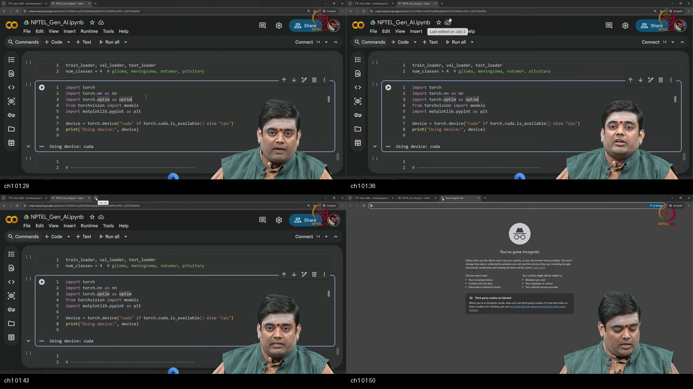
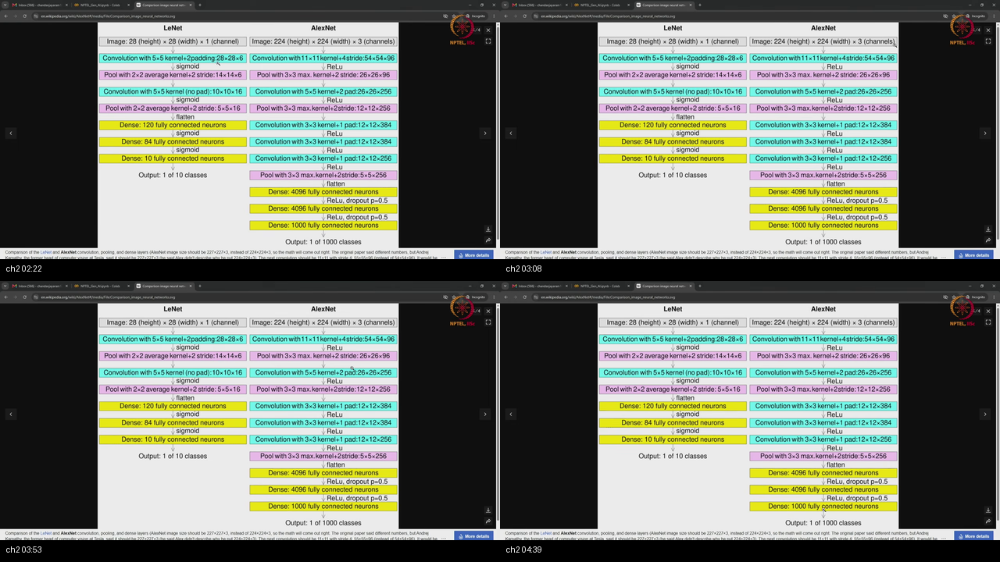
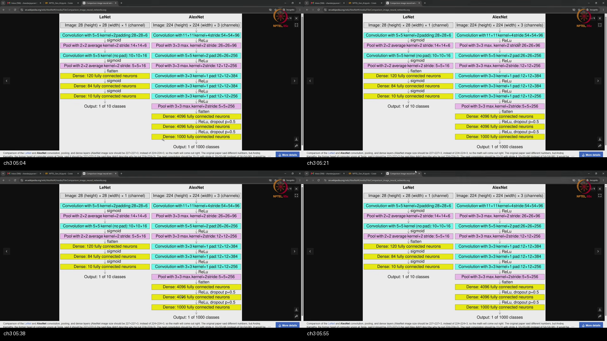
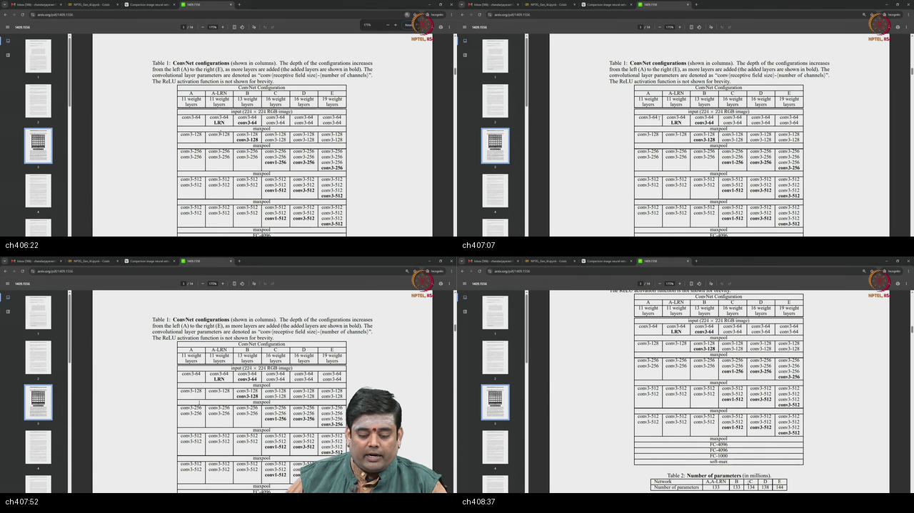
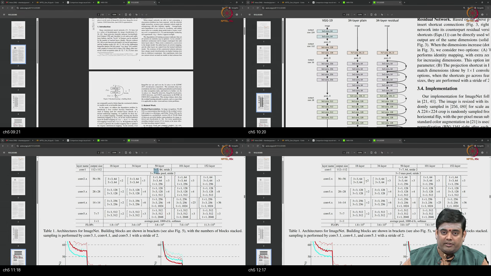
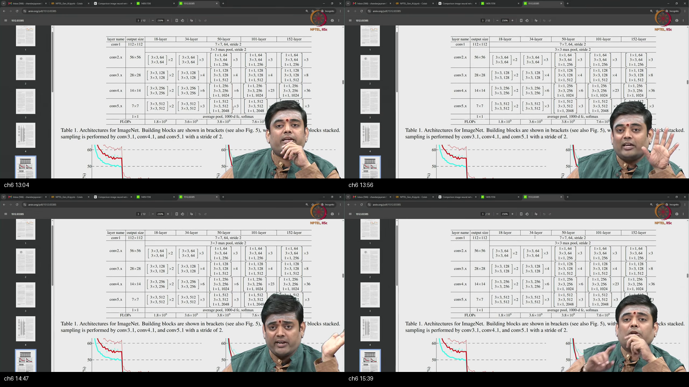
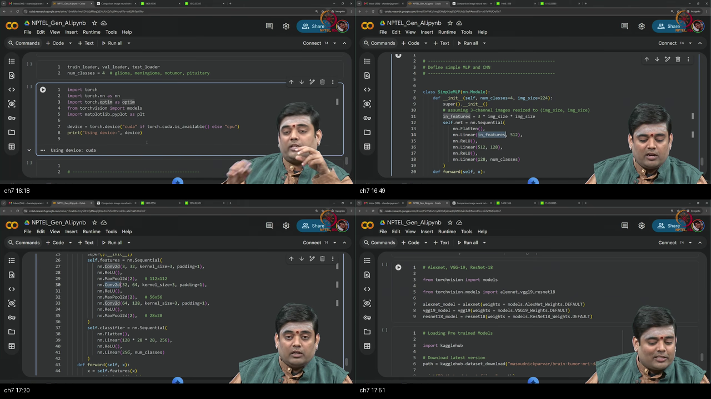
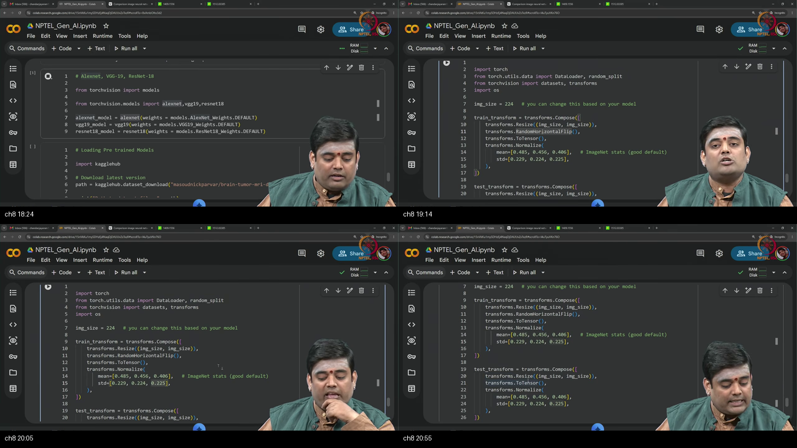
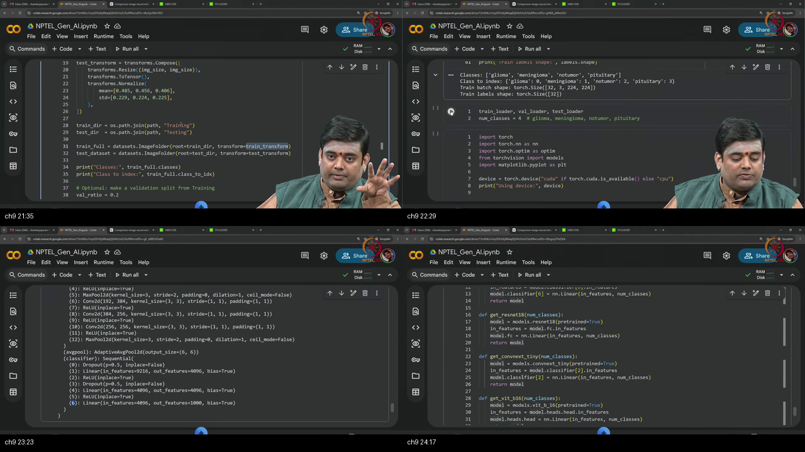
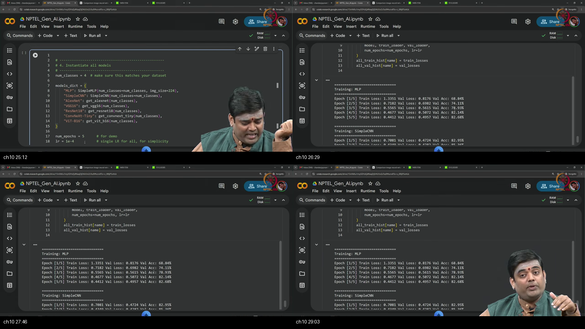

# Tutorial 6 — Transfer Learning with PyTorch

**Video:** [Tutorial 6 : Transfer Learning with PyTorch](https://www.youtube.com/watch?v=ETJG9mmeL5k) · NPTEL / IISc  
**Warm-up first:** [PREREQUISITES.md](./PREREQUISITES.md)  
**Previous:** [Tutorial 5 — RNNs](../19-Tutorial05-RNNs-PyTorch/NOTES.md)  
**Course:** Mathematical Foundations of **Generative AI** (~29 min)  
**Speaker:** NPTEL IISc · Pretrained AlexNet/VGG/ResNet, head swap, MRI fine-tune

---

## Table of Contents

1. [Topic 1 — LEGO layers pretrained intro](#topic-1-lego-layers-pretrained-intro-0003–0131) (00:03–01:31)
2. [Topic 2 — LeNet AlexNet](#topic-2-lenet-alexnet-0131–0452) (01:31–04:52)
3. [Topic 3 — Head swap resize](#topic-3-head-swap-resize-0452–0600) (04:52–06:00)
4. [Topic 4 — VGG family](#topic-4-vgg-family-0600–0850) (06:00–08:50)
5. [Topic 5 — ResNet skips](#topic-5-resnet-skips-0850–1234) (08:50–12:34)
6. [Topic 6 — Transfer fine-tune](#topic-6-transfer-fine-tune-1234–1554) (12:34–15:54)
7. [Topic 7 — MRI baselines](#topic-7-mri-baselines-1554–1800) (15:54–18:00)
8. [Topic 8 — Load transforms](#topic-8-load-transforms-1800–2110) (18:00–21:10)
9. [Topic 9 — ImageFolder head](#topic-9-imagefolder-head-2110–2433) (21:10–24:33)
10. [Topic 10 — Train recap](#topic-10-train-recap-2433–2928) (24:33–29:28)
11. [Apply it (scenarios)](#apply-it-scenarios)
12. [External references](#external-references)
13. [Sources](#sources)

---

## Executive Summary — architecture of this lecture

**Job:** stop training every vision net from random weights; **reuse ImageNet-pretrained** backbones on a small medical task.  
**Method:** read classic CNNs (AlexNet/VGG/ResNet), **resize to 224×224×3**, **replace the 1000-way head** with $C$ classes (MRI: 4), load weights via `torchvision.models`, fine-tune, and compare to MLP/CNN from scratch.  
**Fork:** own head surgery + ImageNet transforms so later generative work can still stand on these “LEGO” modules.

**Worldview arc:** from “build nets from scratch” **to** “transfer ImageNet features → fine-tune last layer (and more) on MRI.”

### System context

```
  ╔══════════════════════════════════════╗
  ║ Outside: ViT depth, full GenAI stack ║
  ║ Outside: train ImageNet from zero    ║
  ╚══════════════╤═══════════════════════╝
                 │ this tutorial (~29 min)
                 ▼
        ┌────────────────────────────┐
        │ Transfer learning stack    │
        │ pretrained · head · fine-tune│
        └────────────────────────────┘
                 │
                 ▼
        next: numerical ML refresh → generative models
```

### Main blueprint

```
  ImageNet-pretrained backbone
  (AlexNet / VGG19 / ResNet18 / ConvNeXt / …)
          │
          │  keep feature extractor
          ▼
  Replace classifier head: Linear(H, 1000) → Linear(H, C)
          │
          ▼
  Inputs: Resize(224) + ImageNet Normalize
  Train: optional RandomHorizontalFlip
          │
          ▼
  ImageFolder(train/test by class folders)
          │
          ▼
  Fine-tune CE/Adam (same train spine)
          │
          ▼
  Compare: MLP / SimpleCNN / pretrained family
```

### Scenario walkthrough

1. Layers as LEGO if shapes match; introduce pretrained goal.  
2. Read LeNet briefly; walk AlexNet to 1000 logits.  
3. For 4 classes: change last FC; prefer 224 resize.  
4. VGG variants and 3×3 stacks.  
5. ResNet skips and ResNet-18 sketch.  
6. Bicycle→bike transfer analogy; fine-tune language; ConvNeXt note.  
7. MRI 4-class task; MLP and SimpleCNN baselines.  
8. `torchvision.models` weights; train/test transforms.  
9. `ImageFolder`; replace `classifier[6]` / `fc`.  
10. Train ~5 epochs; accuracy story; close PyTorch tutorial block.

### Failure / contrast path

```
  Feed non-224 without rewrite          ──X──► broken internals / useless weights
  Keep 1000-way head for 4 classes      ──X──► wrong output dim
  Random flip on test set               ──X──► noisy metrics
  Custom Dataset when folders suffice   ──X──► wasted code
  Stack modules with shape mismatch     ──X──► RuntimeError
```

### STOP / out of scope

Training ImageNet from scratch; full ViT course (flagged for later); generative model recipes (next course block); pure equation homework (next tutorials).

### Load-bearing claims (closed-book)

- Modules are **LEGO**: shapes must match.  
- Classic vision nets assume **~224×224×3** and often a **1000-class** head.  
- **Transfer** = start from pretrained weights; **fine-tune** = keep training them.  
- Prefer **resize to 224** + **swap last Linear** for new $C$.  
- **ResNet** = residual / skip connections.  
- `torchvision.models` + **weights**; train flip, test no flip; **ImageNet normalize**.  
- **ImageFolder** for folder-per-class data.  
- Deeper pretrained models can beat MLP/simple CNN on MRI demo.

**Speaker / course:** NPTEL IISc · Tutorial 6.

---

## Topic 1: LEGO layers pretrained intro (00:03–01:31)

### Where this sits on the master map

**SETUP** — Programming freedom of `nn` modules; open pretrained path. Warm-up: [LEGO](./PREREQUISITES.md#p1-lego).

### Board / screenshot



**Figure — ~00:03–01:31 (board ~01:29–01:50):** Colab notebook boot — `num_classes = 4` header (glioma / meningioma / notumor / pituitary), torch imports, and `device = cuda`. LEGO speech is verbal over this setup; one tile may show a blank browser when the instructor switches windows — read the three code tiles for the notebook contract.

### What he is establishing

This tutorial is about **loading and using pre-trained models**. Prior sections already taught PyTorch construction. The durable slogan: every layer is a **LEGO block**. You can put blocks together; the only hard programming constraint is **no shape mismatch**. Whether a stack is a *good architecture* is a separate design question — nothing in the API stops a weird stack if shapes fit.

That modularity is what makes **pretrained** backbones usable: treat a whole AlexNet/VGG/ResNet as a super-block, then attach a new head. Programming freedom is the **enabler** of transfer; good design is still your job.

The notebook already telegraphs the target task: **four** MRI labels and a CUDA device check. You will return to that `num_classes = 4` line when the 1000-way ImageNet head gets swapped.

You can now state the LEGO rule. Still missing: what AlexNet actually looks like end-to-end.

A common trap is equating “I can stack it” with “I should stack it.” Another trap: treating pretrained models as magic black boxes with **no** shape rules — the head still has to snap on. A third trap: forgetting that after you attach a new brick, the **whole tower** must live on the same device as the data.

```python
# Imports you will reuse for the whole notebook
import torch
import torch.nn as nn
import torch.optim as optim
from torchvision import models
import matplotlib.pyplot as plt

device = torch.device("cuda" if torch.cuda.is_available() else "cpu")
print("Using device:", device)
# MRI demo classes (from the notebook header)
num_classes = 4  # glioma, meningioma, notumor, pituitary
# train_loader, val_loader, test_loader appear once data is ready
```

### Analogy for this topic only

Software modules are **LEGO**. Shape mismatch is missing studs. Pretrained models are **pre-built subassemblies** from a huge LEGO kit (ImageNet) you did not assemble yourself — you still check the studs when you attach a new roof (classifier). The four MRI class names are four **new roof tiles** waiting on the workbench.

Question: **What is the only non-negotiable rule when stacking layers?**

In lecture words: this box is the programming worldview of the lecture.

### Local picture

```
  Conv / Pool / Linear / Dropout / …
        │  shapes must match
        ▼
  any valid graph (design quality separate)

  pretrained net = big LEGO subassembly
  + new head for C=4 MRI labels
```

**Notice:** architecture taste ≠ API possibility.

### Bridge

Read **LeNet** quickly, then **AlexNet** as the ImageNet-era template with **224** input and **1000** outputs.

---

## Topic 2: LeNet AlexNet (01:31–04:52)

### Where this sits on the master map

**BACKBONE LITERACY** — Infer filters from channels; AlexNet path to 1000 logits. Warm-up: [ImageNet 224](./PREREQUISITES.md#p2-imagenet) · [archs](./PREREQUISITES.md#p5-archs).

### Board / screenshot



**Figure — ~01:31–04:52:** LeNet MNIST read; AlexNet 224×224×3 → 1000-way head.

### What he is establishing

Assumes you know major CNNs; reviews for completeness. **LeNet** (MNIST): input **28×28×1**. Example: conv **5×5**, pad **2**; if output has **6** channels → **6 filters**; unspecified stride → **1**; **2×2** average pool stride **2** halves spatial size. You should be able to walk the whole diagram with earlier size formulas.

**AlexNet**: input **224×224×3** — important because that is the **ImageNet** spatial convention. First conv: **11×11**, **stride 4**, **96 filters**, pad **0** if unspecified. Rule of thumb: unspecified **stride=1**, unspecified **padding=0**. Later **3×3 max-pool stride 2** can be **overlapping** (not the non-overlapping 2×2,s=2 default). After the stack: **flatten** → **4096** → **dropout 50%** → ReLU → **4096** → **1000** logits (1000 ImageNet classes) → softmax probabilities.

```python
# Reading an AlexNet-style final head
import torch.nn as nn
classifier = nn.Sequential(
    nn.Dropout(0.5),
    nn.Linear(256 * 6 * 6, 4096),  # spatial size depends on earlier layers
    nn.ReLU(inplace=True),
    nn.Dropout(0.5),
    nn.Linear(4096, 4096),
    nn.ReLU(inplace=True),
    nn.Linear(4096, 1000),  # ImageNet
)
```

You can now read a Wikipedia/paper diagram with channel→filter inference. Still missing: how to **adapt** the 1000-way head to a new task.

A common trap is inventing padding when the diagram is silent — lecture says silent pad means **zero**.

### Analogy for this topic only

AlexNet is a **factory pipeline** stamped for **suitcase size 224** and **1000 shipping labels**. LeNet was a smaller factory for **digit stamps**.

Question: **Why is 224×224×3 special here?**

In lecture words: this box is the reference architecture for transfer.

### Local picture

```
  LeNet:  28×28×1  → … → classes (MNIST)
  AlexNet: 224×224×3 → conv/pool/ReLU …
           → flatten → 4096 → drop → 4096 → 1000 logits
  defaults: stride 1, pad 0 if omitted
```

**Notice:** 1000 is task size of ImageNet, not a universal constant of nature.

### Bridge

For **four** new classes, change **only the last FC**; prefer **resizing** inputs to 224.

---

## Topic 3: Head swap resize (04:52–06:00)

### Where this sits on the master map

**HEAD SURGERY** — New $C$; keep 224. Warm-up: [head](./PREREQUISITES.md#p4-head).

### Board / screenshot



**Figure — ~04:52–06:00:** Still on the LeNet vs **AlexNet** architecture board (Wikipedia-style). The instructor points at the **Dense 1000** roof while explaining: swap that width to **C**, and **resize inputs to 224** rather than rewriting every conv. The diagram is the visual; head-swap is the spoken rule.

### What he is establishing

Take a non-ImageNet problem with **four classes**. The surgical change: the final fully connected **classification head** that produced **1000** outputs must produce **4** nodes instead. Prefer **reshaping/resizing** inputs to **224×224×3** so internal pretrained layers stay valid. If you **cannot** bring inputs to that size, you must **modify the whole architecture** — then using a pretrained model often **stops making sense**. Sweet spot of pretrained use: **input shape matches**, and **only the last layer’s width** changes.

Two failure modes to separate:

1. **Wrong head width** — model still emits 1000 logits; your labels are 0…3 → training math is nonsense.  
2. **Wrong input size** — every spatial size after the first conv drifts; pretrained filters no longer “see” the geometry they were trained for unless you redesign the stack.

```python
import torch.nn as nn
# Suppose last layer was Linear(4096, 1000)
old = nn.Linear(4096, 1000)
new = nn.Linear(old.in_features, 4)  # 4-class MRI-style task
# Prefer: image = resize(image, 224, 224)  before the net
# Avoid: rewrite every intermediate spatial size just to keep a weird H×W
```

You can now state the transfer surgery rule. Still missing: **VGG** as another huge backbone family.

A common trap is editing the first conv “because MRI is medical” while leaving the 1000-way head intact. Another trap: resizing only at train time and forgetting the same Resize on the test pipeline.

### Analogy for this topic only

Keep the **engine**, swap the **dashboard labels** from 1000 languages to 4. If the fuel tank neck is the wrong diameter (input size), you either **adapt the nozzle** (resize) or rebuild the car. Cheap transfer is “new stickers + same nozzle size,” not “new engine block.”

Question: **What is the preferred fix when input size differs from 224?**

In lecture words: this box is the operational definition of cheap transfer.

### Local picture

```
  pretrained net
       │
       ├─ feature stack  (keep)
       └─ FC → 1000     ──replace──► FC → C  (e.g. 4)
  input ──resize──► 224×224×3

  if resize impossible → rewrite whole stack → pretrained value collapses
```

**Notice:** if 224 is impossible, pretrained convenience collapses.

### Bridge

Walk **VGG** variants: same 224 story, stacks of **3×3** convolutions, enormous parameter counts.

---

## Topic 4: VGG family (06:00–08:50)

### Where this sits on the master map

**BACKBONE** — VGG A–E depths; 3×3 design. Warm-up: [archs](./PREREQUISITES.md#p5-archs).

### Board / screenshot



**Figure — ~06:00–08:50:** VGG table of variants; 3×3,64 then pool; 4096 head; millions of params.

### What he is establishing

**VGG** comes in **six variants** in the classic table: **A, A-LRN, B, C, D, E** with roughly **11 to 19** weight layers (A-LRN includes a local-response / normalization style block as named in the paper table). Input again **224×224 RGB**.

Early layer: **3×3** conv, **64** filters; unspecified stride → **1**, unspecified pad → **0** in the reading style of the lecture; input channels **3**, output **64**. Then **max-pool** default story **2×2 stride 2**. Next block: **64→128** with 3×3, again s=1 p=0, then pool; later **256** channels, etc. End: flatten after last pool → **4096 → 4096 → 1000** + softmax.

Parameter counts are huge: about **133M** (A/A-LRN/B), **134M** (C), **138M** (D), **144M** (E). Representative walk uses **VGG-11**; other depths same grammar.

```python
import torchvision.models as models
vgg = models.vgg19(weights=models.VGG19_Weights.DEFAULT)
print(vgg.classifier)  # last Linear is classifier[6]: 4096 → 1000
```

You can now skim a VGG table. Still missing: **ResNet** and why skips stabilize depth.

A common trap is assuming every VGG layer has explicit pad=1 “same conv” — the lecture’s paper-reading defaults may be pad 0 unless stated; always check the source diagram you implement.

### Analogy for this topic only

VGG is a **skyscraper of identical 3×3 windows**. Variants change how many floors you build; the lobby is still 224 and the roof sign still says 1000 classes.

Question: **About how many parameters does VGG-D have?**

In lecture words: this box is the second pretrained candidate family.

### Local picture

```
  224×224×3
    3×3, 64  → pool
    3×3, 128 → pool
    … 256 …
    flatten → 4096 → 4096 → 1000
  params ~ 1.3e8 – 1.4e8
```

**Notice:** depth variants share the same transfer surgery later.

### Bridge

**ResNet** adds **skip connections** so depth does not only mean pain.

---

## Topic 5: ResNet skips (08:50–12:34)

### Where this sits on the master map

**BACKBONE** — Residual connections; ResNet-18 sketch. Warm-up: [archs](./PREREQUISITES.md#p5-archs).

### Board / screenshot



**Figure — ~08:50–12:34:** Skip every two layers; ResNet-18 block counts; variants.

### What he is establishing

**ResNet**’s idea is **skip connections**. If you need the theory of why they stabilize training, review that offline; here the operational idea: after a transformation, **add the untransformed features** so the model can use or bypass the block.

$$
y = F(x) + x
$$

In the diagram, **every two layers** get a skip: transformed path plus identity (or projection) path. The original paper shows **five classic depth variants**; you may invent ResNet-20/22/32-style depths with the same motif.

**ResNet-18 sketch:** start **7×7** conv, **64** filters, **stride 2**, pad 0 if unspecified; **3×3 max-pool stride 2** (overlapping story); then residual blocks of **3×3** with **64** channels (brackets mark skip pairs), repeated; similar stages deeper; end with FC so total **18** layers in the classic count. Other variants scale block counts.

```python
import torchvision.models as models
resnet = models.resnet18(weights=models.ResNet18_Weights.DEFAULT)
print(resnet.fc)  # Linear(in_features=512, out_features=1000)
```

You can now point at a residual block. Still missing: the **bicycle transfer** story that motivates loading ImageNet weights.

A common trap is adding $F(x)+x$ when channels/spatial sizes differ without a projection skip.

### Analogy for this topic only

A skip is a **through lane** beside a construction detour. Cars (gradients/features) can detour through $F$, stay on the through road, or merge (addition). The network need not “destroy” the original road.

Question: **What is added to $F(x)$ in a basic residual block?**

In lecture words: this box is why ResNet is the default transfer backbone for many labs.

### Local picture

```
  x ──► F (two convs) ──► + ──► y
  └──────── skip ─────────┘

  ResNet-18: stem 7×7 s2 → pool → residual stages → FC
```

**Notice:** head for transfer is usually **`model.fc`**, not `classifier[6]`.

### Bridge

Name **transfer learning** and **fine-tuning**; motivate with everyday skill transfer; mention **ConvNeXt**.

---

## Topic 6: Transfer fine-tune (12:34–15:54)

### Where this sits on the master map

**WHY TRANSFER** — ImageNet weights in library; analogies; fine-tune term; ConvNeXt. Warm-up: [transfer](./PREREQUISITES.md#p3-transfer).

### Board / screenshot



**Figure — ~12:34–15:54:** Load ImageNet weights; cycle/bike and clutch analogies; fine-tuning.

### What he is establishing

Trained ImageNet weights ship in the **PyTorch / torchvision** ecosystem. Use them instead of **random initialization**.

**Analogy 1:** learning **balance** on a bicycle is hard; moving to a motorcycle, balance is mostly done — you learn controls. **Analogy 2:** clutch/gear skill on bikes transfers to **manual cars** better than moped-only experience.

**ImageNet scale:** ~**1000** classes, ~**1300** images each, order **~200 GB** — expensive to retrain. Starting from those weights and continuing training is called **fine-tuning**.

Two dials (know both; lecture leans on the second in demos):

| Mode | Backbone `requires_grad` | Who learns |
|------|--------------------------|------------|
| **Feature extract** | `False` (frozen) | New head only |
| **Fine-tune** | `True` (default after load) | Head + (usually) backbone |

**ConvNeXt** (brief): larger kernels than 3×3 so each layer sees more of a 224 image; look up architecture later. Goal of the rest of the tutorial: **load weights**, change head, classify.

```python
import torchvision.models as models
# Modern weights API (spirit of lecture's "default weights")
weights = models.ResNet18_Weights.DEFAULT
model = models.resnet18(weights=weights)

# Optional feature-extract mode (freeze backbone, train head only)
for p in model.parameters():
    p.requires_grad = False
for p in model.fc.parameters():
    p.requires_grad = True
# Full fine-tune: skip the freeze block — all params stay trainable
```

You can now motivate fine-tuning. Still missing: the **MRI 4-class** concrete task and from-scratch baselines.

A common trap is calling “load weights and freeze forever” the only transfer mode — lecture’s story includes **further training** (fine-tune). Another trap: freezing the head by accident so nothing trainable remains.

### Analogy for this topic only

ImageNet is a **giant driving school**. Fine-tuning is taking those hours onto a **hospital parking course** (MRI) instead of learning clutch control from zero in the rain. Freezing the backbone is **locking the steering geometry** and only re-learning where the parking lines are painted.

Question: **What word names “train further from pretrained weights”?**

In lecture words: this box is the conceptual heart of the tutorial.

### Local picture

```
  random init ──hard──► target task
  ImageNet weights ──fine-tune──► target task (easier start)
  ImageNet weights ──freeze backbone──► train head only (feature extract)

  transfer ≈ reuse features (edges, textures, parts)
```

**Notice:** 200 GB story = why we download **checkpoints**, not datasets, for class demos.

### Bridge

Define **MRI tumor** data with **4 classes** and show weak **MLP / CNN** baselines for contrast.

---

## Topic 7: MRI baselines (15:54–18:00)

### Where this sits on the master map

**TASK + BASELINES** — 4-class MRI; SimpleMLP; SimpleCNN. Warm-up: [head](./PREREQUISITES.md#p4-head).

### Board / screenshot



**Figure — ~15:54–18:00:** MRI 4 classes; MLP and 3-stage CNN sketches.

### What he is establishing

Target data: **brain tumor MRI** (Kaggle / kagglehub in the notebook), **4 classes** named in the demo: **glioma, meningioma, notumor, pituitary** (not 1000 ImageNet labels). Plan: pretrained weights + **last layer only** changed; **resize to 224×224×3** so internals stay intact.

**Baseline SimpleMLP:** input features `3 * image_size * image_size` with `image_size=224` → **512 → 128 → num_classes**.

**Baseline SimpleCNN:** three **Conv2d + max-pool** stages with **32 / 64 / 128** filters (demo choices), then a classifier head to `num_classes`.

These exist to **contrast** with transfer models later — homemade cameras vs factory-calibrated ones.

```python
class SimpleMLP(nn.Module):
    def __init__(self, image_size=224, num_classes=4):
        super().__init__()
        d = 3 * image_size * image_size
        self.net = nn.Sequential(
            nn.Flatten(),
            nn.Linear(d, 512), nn.ReLU(),
            nn.Linear(512, 128), nn.ReLU(),
            nn.Linear(128, num_classes),
        )
    def forward(self, x):
        return self.net(x)

class SimpleCNN(nn.Module):
    def __init__(self, num_classes=4):
        super().__init__()
        self.features = nn.Sequential(
            nn.Conv2d(3, 32, 3, padding=1), nn.ReLU(), nn.MaxPool2d(2),
            nn.Conv2d(32, 64, 3, padding=1), nn.ReLU(), nn.MaxPool2d(2),
            nn.Conv2d(64, 128, 3, padding=1), nn.ReLU(), nn.MaxPool2d(2),
        )
        self.classifier = nn.Sequential(
            nn.Flatten(),
            nn.Linear(128 * 28 * 28, 256), nn.ReLU(),  # 224/8=28 if three pools
            nn.Linear(256, num_classes),
        )
    def forward(self, x):
        return self.classifier(self.features(x))
```

You can now name the competition set. Still missing: **`torchvision.models` load** and **ImageNet transforms**.

A common trap is comparing MLP accuracy on raw 224 without acknowledging the enormous parameter/flatten cost.

### Analogy for this topic only

MLP is a **blunt spreadsheet** over all pixels. SimpleCNN is a **homemade camera**. Pretrained ResNet is a **factory camera** already calibrated on millions of photos — then re-labeled for hospital shelves.

Question: **How many MRI classes are in the demo task?**

In lecture words: this box sets the evaluation stage.

### Local picture

```
  MRI · C=4 · resize 224×224×3
  baselines: MLP (flatten) · CNN (32/64/128)
  transfer models: AlexNet · VGG · ResNet · …
```

**Notice:** helper loaders appear next; first get weights + transforms right.

### Bridge

Import **`torchvision.models`**, load **AlexNet / VGG19 / ResNet18** with default weights, and define **train/test transforms**.

---

## Topic 8: Load transforms (18:00–21:10)

### Where this sits on the master map

**DATA + WEIGHTS** — Pretrained constructors; Resize/Flip/Normalize. Warm-up: [transforms](./PREREQUISITES.md#p6-tf).

### Board / screenshot



**Figure — ~18:00–21:10:** models.alexnet/vgg/resnet; train flip + ImageNet norm; test no flip.

### What he is establishing

```python
from torchvision import models, transforms
```

Load **AlexNet**, **VGG19**, **ResNet18** with **default pretrained weights** (lecture: weights default API — older notebooks may show `pretrained=True`). Data: **Kaggle brain tumor MRI** via **`kagglehub`** (path printed after download).

**Train transform pipeline:** `Resize(224)` → **`RandomHorizontalFlip`** (regularizer; vertical flip also possible) → `ToTensor` → **`Normalize`** with **per-channel ImageNet mean and std** (three means, three stds). Those stats are the **ImageNet** convention — a good starting point because weights were trained that way.

**Test transform:** **resize + normalize only** — no random flip. Exercise: try **different mean/std** train vs test and compare final metrics.

```python
# Data path (notebook spirit — dataset slug may vary)
import kagglehub
path = kagglehub.dataset_download("masoudnickparvar/brain-tumor-mri-dataset")
# path → root that contains Training/ and Testing/ class folders

IMAGENET_MEAN = (0.485, 0.456, 0.406)
IMAGENET_STD = (0.229, 0.224, 0.225)
image_size = 224  # match ImageNet-style backbones

train_tf = transforms.Compose([
    transforms.Resize((image_size, image_size)),
    transforms.RandomHorizontalFlip(),  # regularizer; train only
    transforms.ToTensor(),
    transforms.Normalize(IMAGENET_MEAN, IMAGENET_STD),
])
test_tf = transforms.Compose([
    transforms.Resize((image_size, image_size)),
    transforms.ToTensor(),
    transforms.Normalize(IMAGENET_MEAN, IMAGENET_STD),  # same stats, no flip
])

alex = models.alexnet(weights=models.AlexNet_Weights.DEFAULT)
vgg = models.vgg19(weights=models.VGG19_Weights.DEFAULT)
res = models.resnet18(weights=models.ResNet18_Weights.DEFAULT)
```

You can now load weights and preprocess correctly. Still missing: **ImageFolder** and the **exact head-replacement lines**.

A common trap is applying **train augmentations at test time**, which noisily changes accuracy every run. Another trap: downloading data but pointing `ImageFolder` at the wrong nested folder so you get zero classes.

### Analogy for this topic only

Normalize with ImageNet stats is **tuning the room lighting** to the lighting the factory camera was calibrated under. Random flip is **practicing with the desk sometimes mirrored**; the exam desk stays fixed. `kagglehub` is the **shipping truck** that drops the hospital folder tree on your drive so you do not hand-build labels.

Question: **Which split uses RandomHorizontalFlip in the lecture?**

In lecture words: this box is the data-side contract of transfer.

### Local picture

```
  kagglehub → Training/ · Testing/  (class subfolders)
  train: Resize → Flip? → Tensor → Normalize(ImageNet)
  test:  Resize → Tensor → Normalize(ImageNet)

  models: AlexNet · VGG19 · ResNet18 (+ ConvNeXt, ViT later)
```

**Notice:** three-channel mean/std because RGB.

### Bridge

Point loaders at **folder-per-class** trees and **replace** `classifier[6]` / `fc`.

---

## Topic 9: ImageFolder head (21:10–24:33)

### Where this sits on the master map

**DATASET + SURGERY** — ImageFolder; replace last Linear. Warm-up: [ImageFolder](./PREREQUISITES.md#p7-folder) · [replace](./PREREQUISITES.md#p8-replace).

### Board / screenshot



**Figure — ~21:10–24:33:** ImageFolder; print AlexNet sequential; classifier[6] → 4; VGG/ResNet same idea.

### What he is establishing

Earlier tutorials used custom Datasets with indices/annotation files. Here train/test directories already **segregate classes into folders** — use **`datasets.ImageFolder`**. Optional **validation ratio** via `random_split`. **DataLoader** batch size **32** → batches **`(32, 3, 224, 224)`** + labels; four class names.

Print the model: AlexNet is largely **`nn.Sequential`** features + **classifier**. Change **`classifier[6]`**: read **`in_features`** (4096) and set **`nn.Linear(in_features, num_classes)`** so 4096→4. Same pattern for **VGG**. For **ResNet**, replace **`fc`**. Also constructs **ConvNeXt** and **ViT** for future reference — ignore ViT until transformers are taught.

```python
from torchvision import datasets
from torch.utils.data import DataLoader, random_split
import os

# Folder-per-class (Training/Testing under dataset root)
train_dir = os.path.join(path, "Training")
test_dir = os.path.join(path, "Testing")
train_full = datasets.ImageFolder(train_dir, transform=train_tf)
test_ds = datasets.ImageFolder(test_dir, transform=test_tf)
print("Classes:", train_full.classes)
# e.g. ['glioma', 'meningioma', 'notumor', 'pituitary']

# Optional validation split from training
val_ratio = 0.2
n_val = int(val_ratio * len(train_full))
n_train = len(train_full) - n_val
train_ds, val_ds = random_split(train_full, [n_train, n_val])
# val often uses test-style transforms (no flip) — set val_ds.dataset.transform if needed

train_loader = DataLoader(train_ds, batch_size=32, shuffle=True)
val_loader = DataLoader(val_ds, batch_size=32, shuffle=False)
test_loader = DataLoader(test_ds, batch_size=32, shuffle=False)

# Sanity: batch (32, 3, 224, 224)
images, labels = next(iter(train_loader))
print(images.shape, labels.shape)

num_classes = 4

def get_alexnet(num_classes):
    model = models.alexnet(weights=models.AlexNet_Weights.DEFAULT)
    in_f = model.classifier[6].in_features
    model.classifier[6] = nn.Linear(in_f, num_classes)
    return model

def get_resnet18(num_classes):
    model = models.resnet18(weights=models.ResNet18_Weights.DEFAULT)
    in_f = model.fc.in_features
    model.fc = nn.Linear(in_f, num_classes)
    return model

def get_vgg16(num_classes):
    model = models.vgg16(weights=models.VGG16_Weights.DEFAULT)
    in_f = model.classifier[6].in_features
    model.classifier[6] = nn.Linear(in_f, num_classes)
    return model

def get_convnext_tiny(num_classes):
    model = models.convnext_tiny(weights=models.ConvNeXt_Tiny_Weights.DEFAULT)
    # notebook spirit: classifier[-1] or classifier[2] depending on torchvision version
    in_f = model.classifier[2].in_features
    model.classifier[2] = nn.Linear(in_f, num_classes)
    return model

# ViT head (ignore until transformers unit — heads.head is the final Linear)
# def get_vit_b16(num_classes):
#     model = models.vit_b_16(weights=models.ViT_B_16_Weights.DEFAULT)
#     in_f = model.heads.head.in_features
#     model.heads.head = nn.Linear(in_f, num_classes)
#     return model
```

Print the model once: AlexNet’s last classifier line should show `out_features=num_classes` (4), not 1000. Same check for `resnet.fc`.

You can now wire data and heads. Still missing: **training outcomes** and the **end-of-PyTorch-block recap**.

A common trap is replacing the wrong Sequential index so Dropout/ReLU disappear accidentally — target the **final Linear**. Another trap: validation set still using **train flips** — prefer test-style transforms for val. A third trap: hardcoding `4096` for every backbone — ResNet uses **512** (ResNet-18), ConvNeXt/ViT use other widths.

### Analogy for this topic only

ImageFolder is the **sorted hospital mailroom** (one shelf per diagnosis). Head swap is changing the **destination stamp** from “1000 ImageNet cities” to **four MRI wards** without rebuilding the sorting machines. Helper functions are **pre-addressed envelopes** so you do not re-write the stamp every experiment. Batch shape print is the **postage scale**: if it is not `(32, 3, 224, 224)`, stop before training.

Question: **Which AlexNet attribute holds the final Linear?**

In lecture words: this box is the implementation heart of transfer in PyTorch.

### Local picture

```
  ImageFolder(train_dir) → classes from subfolders
  batch (32, 3, 224, 224)

  AlexNet/VGG: classifier[6] = Linear(in_f, C)
  ResNet:      fc = Linear(in_f, C)
  ConvNeXt:    classifier[2] = Linear(in_f, C)
  ViT (later): heads.head = Linear(in_f, C)
```

**Notice:** `in_features` read from the old layer — do not hardcode blindly across architectures.

### Bridge

Train for a few epochs; compare **MLP / CNN / pretrained** accuracies; close the tutorial series.

---

## Topic 10: Train recap (24:33–29:28)

### Where this sits on the master map

**RESULTS + CLOSE** — Multi-model train; accuracy trend; end of PyTorch basics path. Warm-up: [LEGO](./PREREQUISITES.md#p1-lego).

### Board / screenshot



**Figure — ~24:33–29:28:** Model dict train loop; MLP~82% CNN~90%; complexity↑ accuracy↑; series recap.

### What he is establishing

Dictionary of models (notebook spirit): **MLP, SimpleCNN, AlexNet, VGG16, ResNet18, ConvNeXt-Tiny, ViT-B16** — same `num_classes=4`. Train about **5 epochs**, shared **lr = 1e-4** for a fair demo. Live log excerpt from the board (validation):

| Model (live log) | Epoch 1 val acc | Epoch 5 val acc (approx) |
|------------------|-----------------|---------------------------|
| **MLP** | ~68.8% | **~82.7%** |
| **SimpleCNN** | ~82.9% early | rises further; instructor story ~**90%** class |

As **network complexity / pretrained strength** grows, accuracy tends to improve — run AlexNet/VGG/ResNet (and optional ConvNeXt) to completion and compare on the **same** loaders and lr.

Slogan return: take care of **shapes**; then modules are LEGO. This closes the **PyTorch basics** tutorial arc (Python → NumPy → tensors → CNN/RNN → pretrained). Next course block: **numerical examples / equations** reinforcing ML prerequisites, then **generative models**. Assumes a first ML course already.

```python
# Multi-model train (matches notebook structure)
num_classes = 4
num_epochs = 5
lr = 1e-4  # single LR for all, for a fair demo

models_dict = {
    "MLP": SimpleMLP(num_classes=num_classes, image_size=224),
    "SimpleCNN": SimpleCNN(num_classes=num_classes),
    "AlexNet": get_alexnet(num_classes),
    "VGG16": get_vgg16(num_classes),
    "ResNet18": get_resnet18(num_classes),
    # "ConvNeXt-Tiny": get_convnext_tiny(num_classes),
    # "ViT-B16": get_vit_b16(num_classes),  # after transformers unit
}

criterion = nn.CrossEntropyLoss()
all_train_hist, all_val_hist = {}, {}

def run_val(model, loader):
    model.eval()
    loss_sum = correct = total = 0
    with torch.no_grad():
        for xb, yb in loader:
            xb, yb = xb.to(device), yb.to(device)
            logits = model(xb)
            loss_sum += criterion(logits, yb).item() * yb.size(0)
            correct += (logits.argmax(1) == yb).sum().item()
            total += yb.size(0)
    return loss_sum / max(total, 1), correct / max(total, 1)

for name, model in models_dict.items():
    model = model.to(device)
    opt = torch.optim.Adam(model.parameters(), lr=lr)
    train_losses, val_losses = [], []
    print(f"=== Training: {name} ===")
    for epoch in range(num_epochs):
        model.train()
        running = 0.0
        for xb, yb in train_loader:
            xb, yb = xb.to(device), yb.to(device)
            loss = criterion(model(xb), yb)
            opt.zero_grad(); loss.backward(); opt.step()
            running += loss.item()
        train_losses.append(running / max(len(train_loader), 1))
        vloss, vacc = run_val(model, val_loader)
        val_losses.append(vloss)
        print(f"Epoch [{epoch+1}/{num_epochs}] "
              f"Train Loss: {train_losses[-1]:.4f} "
              f"Val Loss: {vloss:.4f} Val Acc: {100*vacc:.2f}%")
    all_train_hist[name] = train_losses
    all_val_hist[name] = val_losses
```

You can now run the transfer experiment end-to-end. Still missing (course next): pure math drills and generative modeling units.

A common trap is declaring victory from **train** accuracy alone — the board logs **val** loss/acc per epoch; use the held-out test set for the final report. Another trap: one huge learning rate for both frozen-head and full fine-tune — the demo uses a single small lr for simplicity. A third trap: comparing models trained for different epoch counts or different transforms and calling it architecture skill.

### Analogy for this topic only

MLP is a **bicycle** on the MRI path; SimpleCNN a **scooter**; ImageNet ResNet a **trained motorcyclist** learning a new hospital garage. Same road (CE + Adam loop); different prior skill. Logging five epochs is a **fair race**: same track length, same weather (lr), different bikes. Val accuracy is the **finish-line photo**, not the cheering from the training bleachers.

Question: **About what validation accuracy did the MLP reach by epoch 5 in the live log?**

In lecture words: this box ends the engineering PyTorch bootcamp.

### Local picture

```
  train each model ~5 epochs · lr=1e-4 · same loaders
  live board: MLP ~82.7% val · CNN starts ~83% and climbs (~90% story)
  pretrained family: run and compare (usually stronger)

  Recap: tensors → Module → CNN/RNN → pretrained heads
  Next: equations / problem solving → generative models
```

**Notice:** LEGO shape discipline is the permanent takeaway.

### Bridge

PyTorch tool-building pauses; generative modeling builds on this foundation next.

---

## Apply it (scenarios)

1. **Head audit.** Print `alex.classifier` and `resnet.fc` before/after swap to 4 classes; confirm `out_features == 4`.  
2. **Transform A/B.** Train 1 epoch with and without `RandomHorizontalFlip`; compare train loss curves.  
3. **Normalize experiment.** Use mean 0.5/std 0.5 vs ImageNet stats; report test acc delta.  
4. **Freeze backbone.** Set `requires_grad=False` on all but the new head; train; compare to full fine-tune (same epochs, same lr).  
5. **Wrong size.** Feed 128×128 without adaptive pool; observe failure mode.  
6. **ImageFolder.** Build a 2-class mini folder dataset and run one batch shape print — expect `(B, 3, 224, 224)`.  
7. **Device check.** After head swap, deliberately skip `.to(device)` once and read the error; fix by moving the whole model.

### Minimal transfer skeleton

```python
import torch, torch.nn as nn
from torch.utils.data import DataLoader
from torchvision import datasets, models, transforms

device = torch.device("cuda" if torch.cuda.is_available() else "cpu")
C = 4  # glioma, meningioma, notumor, pituitary
mean, std = (0.485, 0.456, 0.406), (0.229, 0.224, 0.225)
train_tf = transforms.Compose([
    transforms.Resize((224, 224)),
    transforms.RandomHorizontalFlip(),
    transforms.ToTensor(),
    transforms.Normalize(mean, std),
])
test_tf = transforms.Compose([
    transforms.Resize((224, 224)),
    transforms.ToTensor(),
    transforms.Normalize(mean, std),
])
train_loader = DataLoader(datasets.ImageFolder("mri/Training", train_tf), 32, shuffle=True)
test_loader = DataLoader(datasets.ImageFolder("mri/Testing", test_tf), 32)

model = models.resnet18(weights=models.ResNet18_Weights.DEFAULT)
model.fc = nn.Linear(model.fc.in_features, C)
model = model.to(device)
opt = torch.optim.Adam(model.parameters(), lr=1e-4)
crit = nn.CrossEntropyLoss()

def evaluate(model, loader):
    model.eval()
    correct = total = 0
    with torch.no_grad():
        for xb, yb in loader:
            xb, yb = xb.to(device), yb.to(device)
            pred = model(xb).argmax(1)
            correct += (pred == yb).sum().item()
            total += yb.size(0)
    return correct / max(total, 1)

for epoch in range(5):
    model.train()
    for xb, yb in train_loader:
        xb, yb = xb.to(device), yb.to(device)
        loss = crit(model(xb), yb)
        opt.zero_grad(); loss.backward(); opt.step()
    print(f"epoch {epoch+1} test acc {evaluate(model, test_loader):.3f}")
```

---

## External references

**How to use:** finish the NOTES chain first (video closed if you can). When one map box still feels thin, open **only that topic’s group** below — **2–3 companions each** (prefer **teaching video + blog/notes + official docs**). All links live **here**, not inside topic bodies.

Prefer free teaching channels and official docs. Skip Wikipedia dumps and random SEO posts.

### Topic 1 — LEGO modules + pretrained intro

| Resource | Type | Why it helps |
|----------|------|--------------|
| [PyTorch `nn.Module` tutorial](https://pytorch.org/tutorials/beginner/basics/buildmodel_tutorial.html) | Official tutorial | Composing layers as blocks |
| [Patrick Loeber — PyTorch full course](https://www.youtube.com/watch?v=c36lUUr864M) | Video | Building nets from pieces |
| [Tutorial 3 PyTorch Basics](../17-Tutorial03-PyTorch-Basics/NOTES.md) | Prior unit | Module / train spine |

### Topic 2 — LeNet / AlexNet / 224

| Resource | Type | Why it helps |
|----------|------|--------------|
| [CS231n — CNN architectures](https://cs231n.github.io/convolutional-networks/) | Course notes | AlexNet-era layout language |
| [Andrej Karpathy — CNNs (Stanford CS231n lecture)](https://www.youtube.com/watch?v=bNb2fEVKeEo) | Video | Filters, stacks, ImageNet-era nets |
| [ImageNet project](https://www.image-net.org/) | Dataset home | Why 1000-way heads exist |

### Topic 3 — Head swap + resize rule

| Resource | Type | Why it helps |
|----------|------|--------------|
| [PyTorch transfer learning tutorial](https://pytorch.org/tutorials/beginner/transfer_learning_tutorial.html) | Official tutorial | Replace final layer live |
| [CS231n — Transfer learning](https://cs231n.github.io/transfer-learning/) | Course notes | When to fine-tune vs freeze |
| [freeCodeCamp — Transfer Learning (PyTorch)](https://www.youtube.com/watch?v=xyymDGReKdY) | Video | Head surgery walkthrough |

### Topic 4 — VGG family

| Resource | Type | Why it helps |
|----------|------|--------------|
| [VGG paper (arXiv)](https://arxiv.org/abs/1409.1556) | Paper | Variants A–E table |
| [torchvision VGG docs](https://pytorch.org/vision/stable/models/vgg.html) | Docs | vgg11/vgg19 + weights |
| [3Blue1Brown — Convolutions](https://www.youtube.com/watch?v=KuXjwB4LzSA) | Video | Why stacked 3×3 filters work |

### Topic 5 — ResNet skips

| Resource | Type | Why it helps |
|----------|------|--------------|
| [ResNet paper (arXiv)](https://arxiv.org/abs/1512.03385) | Paper | Residual blocks |
| [torchvision ResNet docs](https://pytorch.org/vision/stable/models/resnet.html) | Docs | resnet18/50 constructors |
| [Yannic Kilcher — ResNet explained](https://www.youtube.com/watch?v=GWt6Fu05voI) | Video | Skip-connection intuition |

### Topic 6 — Transfer / fine-tune idea

| Resource | Type | Why it helps |
|----------|------|--------------|
| [CS231n transfer learning notes](https://cs231n.github.io/transfer-learning/) | Course notes | Fine-tune vs feature extract |
| [PyTorch finetuning torchvision models](https://pytorch.org/tutorials/beginner/finetuning_torchvision_models_tutorial.html) | Official tutorial | Freeze / unfreeze flags |
| [Aladdin Persson — Transfer Learning](https://www.youtube.com/watch?v=K0u_kAWLJOA) | Video | Fine-tune vs freeze in code |

### Topic 7 — MRI task + baselines

| Resource | Type | Why it helps |
|----------|------|--------------|
| [Tutorial 4 CNN NOTES](../18-Tutorial04-CNNs-PyTorch/NOTES.md) | Prior unit | SimpleCNN design language |
| [PyTorch CIFAR training tutorial](https://pytorch.org/tutorials/beginner/blitz/cifar10_tutorial.html) | Official tutorial | From-scratch CNN loop |
| [Kaggle brain tumor MRI dataset (Nickparvar)](https://www.kaggle.com/datasets/masoudnickparvar/brain-tumor-mri-dataset) | Data | Folder layout (glioma/meningioma/…) |

### Topic 8 — Weights + transforms

| Resource | Type | Why it helps |
|----------|------|--------------|
| [torchvision models hub](https://pytorch.org/vision/stable/models.html) | Docs | Weights enums for AlexNet/VGG/ResNet |
| [torchvision transforms](https://pytorch.org/vision/stable/transforms.html) | Docs | Resize, Flip, Normalize |
| [Aladdin Persson — Data augmentation](https://www.youtube.com/watch?v=rAdLwKJBvPM) | Video | Why train aug ≠ test aug |

### Topic 9 — ImageFolder + replace head

| Resource | Type | Why it helps |
|----------|------|--------------|
| [torchvision ImageFolder](https://pytorch.org/vision/stable/generated/torchvision.datasets.ImageFolder.html) | Docs | Folder-per-class Dataset |
| [PyTorch transfer learning tutorial](https://pytorch.org/tutorials/beginner/transfer_learning_tutorial.html) | Official tutorial | Head replacement code |
| [Daniel Bourke — PyTorch Custom Datasets](https://www.youtube.com/watch?v=Z_ikDlimN6A) | Video | ImageFolder-style loading + train loop |

### Topic 10 — Train compare + recap

| Resource | Type | Why it helps |
|----------|------|--------------|
| [PyTorch optimization loop](https://pytorch.org/tutorials/beginner/basics/optimization_tutorial.html) | Official tutorial | zero_grad → step |
| [ML Mastery — Transfer learning overview](https://machinelearningmastery.com/how-to-use-transfer-learning-when-developing-convolutional-neural-network-models/) | Blog | Practical checklist |
| [sentdex — Transfer learning with PyTorch](https://www.youtube.com/watch?v=8etXYjy9svM) | Video | Multi-model transfer practice |

### Whole-map companions

| Resource | Type | Why it helps |
|----------|------|--------------|
| [PREREQUISITES.md (this package)](./PREREQUISITES.md) | Warm-up | #p1–#p8 beginner unlocks |
| [PyTorch transfer learning tutorial](https://pytorch.org/tutorials/beginner/transfer_learning_tutorial.html) | Official hub | Canonical companion notebook |
| [CS231n notes hub](https://cs231n.github.io/) | Course | Architectures + transfer chapter |
| [Patrick Loeber — Deep Learning with PyTorch](https://www.youtube.com/watch?v=c36lUUr864M) | Video course | Full stack including transfer |

---

## Sources

- Video: [Tutorial 6 : Transfer Learning with PyTorch](https://www.youtube.com/watch?v=ETJG9mmeL5k)
- Channel: NPTEL — Indian Institute of Science, Bengaluru
- Duration: ~29 min (00:03–29:28)
- Skill: `youtube-lecture-tutor` · code_tutorial
- 10 topics · claim sheets · coverage receipt
- Previous: [Tutorial 5 RNNs](../19-Tutorial05-RNNs-PyTorch/NOTES.md)
- Package: `20-Tutorial06-Transfer-Learning-PyTorch`
