# Tutorial 7 — Review of Basic Probability 1

**Video:** [Tutorial 7 : Review of Basic Probability 1](https://www.youtube.com/watch?v=owlWCCgYx50) · NPTEL / IISc  
**Warm-up First:** [PREREQUISITES.md](./PREREQUISITES.md)  
**Previous Tutorial:** [Tutorial 6 — Transfer Learning with PyTorch](../20-Tutorial06-Transfer-Learning-PyTorch/NOTES.md)  
**Next Tutorial:** Tutorial 8 — Continuous Probability Distributions, Expectations & Variances  
**Course:** Mathematical Foundations of Generative AI (~50 min)  
**Speaker:** NPTEL / IISc Teaching Team  
**Core Themes:** Probability Triplet $(\Omega, \mathcal{F}, P)$, Kolmogorov Axioms, Conditioning as Subspace Restriction, Law of Total Probability, Bayes' Rule, Independence Flavors, Deterministic Random Variables $X:\Omega\to\mathbb{R}$, Pushforward Measures $P_X$, Cumulative Distribution Functions (CDFs), Discrete Probability Mass Functions (PMFs), and Named Discrete Families (Bernoulli, Indicator, Binomial, Poisson, Geometric).

---

> ### ⚠️ Course Context & Curriculum Discrepancy Notice
> In the preceding modules (Tutorials 1–6), the curriculum focused heavily on applied deep learning, neural network layers, loss functions, and practical PyTorch workflows (such as Transfer Learning in Tutorial 6). 
> 
> Starting with **Tutorial 7**, the course transitions into the foundational mathematical bedrock of generative modeling: **Probability and Measure Theory**. Modern generative models—including Variational Autoencoders (VAEs), Denoising Diffusion Probabilistic Models (DDPMs), Normalizing Flows, and Autoregressive Language Models—are fundamentally algorithms for learning, estimating, and sampling from complex probability distributions. Mastering sample spaces, conditioning, pushforward measures, CDFs, and PMFs is the non-negotiable prerequisite for understanding the loss functions and sampling mechanics of generative AI.

---

## Table of Contents

1. [Executive Summary & Master Architecture](#executive-summary--architecture-of-this-lecture)
2. [Chalkboard Rosetta Stone: Mathematical Notation](#chalkboard-rosetta-stone)
3. [Complete Standalone Executable Python Simulation Script](#standalone-simulation-script)
4. [Topic 1: Probability Triplet and Three Axioms (00:03–04:50)](#topic-1-probability-triplet-and-three-axioms-0003–0450)
5. [Topic 2: Conditional Probability as a New Assignment (04:50–07:47)](#topic-2-conditional-probability-0450–0747)
6. [Topic 3: Law of Total Probability & Partitions (07:47–10:39)](#topic-3-law-of-total-probability-0747–1039)
7. [Topic 4: Bayes' Rule & Likelihood Inversion (10:39–12:06)](#topic-4-bayes-rule-1039–1206)
8. [Topic 5: Independence of Two Events (12:06–14:31)](#topic-5-independence-of-two-events-1206–1431)
9. [Topic 6: Total, Pairwise, and Conditional Independence (14:31–19:00)](#topic-6-total-pairwise-and-conditional-independence-1431–1900)
10. [Topic 7: Random Variables and Pushforward Probability Spaces (19:00–25:12)](#topic-7-random-variables-and-pushforward-1900–2512)
11. [Topic 8: CDF Definition and Properties (25:12–32:35)](#topic-8-cdf-definition-and-properties-2512–3235)
12. [Topic 9: Discrete RV, Staircase CDF, and PMF (32:35–42:47)](#topic-9-discrete-rv-staircase-cdf-and-pmf-3235–4247)
13. [Topic 10: Named Discrete Families and Recap (42:47–50:06)](#topic-10-named-discrete-families-and-recap-4247–5006)
14. [Workplace Debugging Scenarios (Production Postmortems)](#workplace-debugging-scenarios)
15. [Centralized External References](#external-references)
16. [Sources](#sources)

---

## Executive Summary — Architecture of this Lecture

<a id="executive-summary--architecture-of-this-lecture"></a>

This lecture provides the formal mathematical scaffolding for all probabilistic reasoning in generative AI. It begins with the fundamental stage: a **Random Experiment (RE)** generating indivisible atomic outcomes $\omega$ within a **Sample Space** $\Omega$. Subsets of outcomes form an **Event Space** $\mathcal{F}$, upon which Kolmogorov's **Probability Measure** $P$ assigns conserved masses in $[0, 1]$ adhering to non-negativity, total normalization $P(\Omega)=1$, and countable additivity ($\sigma$-additivity) over disjoint events.

When side information arrives (event $B$ occurs), the original universe is discarded; conditional probability $P(\cdot \mid B)$ restricts the domain to $B$ and renormalizes the surviving mass. If the universe is sliced into non-overlapping rooms (a **partition**), the **Law of Total Probability** reconstructs the marginal probability $P(A)$ by weighting room-specific conditionals. **Bayes' Rule** inverts this relationship, transforming an accessible forward likelihood into an otherwise intractable posterior belief. 

Statistical independence is formalized strictly as a multiplicative product test $P(A \cap B) = P(A)P(B)$, distinguishing **Total Independence** from the strictly weaker **Pairwise Independence**, and introducing **Conditional Independence** given latent states.

To perform numerical computation, the lecture constructs a **Random Variable** $X: \Omega \to \mathbb{R}$—a deterministic mapping that transports ("pushes forward") probability mass from abstract sets to the real line $(\mathbb{R}, \mathcal{B}, P_X)$. The entire probability law of $X$ is encapsulated by the **Cumulative Distribution Function (CDF)** $F_X(x) = P(X \le x)$, a monotonically non-decreasing, right-continuous running total. For discrete variables, the CDF manifests as a piecewise constant **staircase step function**, where vertical step heights represent point masses given by the **Probability Mass Function (PMF)** $p_X(x) = P(X = x)$. The lecture concludes by classifying five core discrete parametric families: **Bernoulli**, **Indicator** ($1_B$), **Binomial**, **Poisson**, and **Geometric**.

```
Worldview Arc:
[ Abstract Sample Space Ω ] ──(P)──► [ Conditional & Bayes Update ] ──(X)──► [ Real Line ℝ / CDF / PMF ] ──► [ Discrete Families ]
```

---

### System Context Diagram

```
  ┌──────────────────────────────────────────────────────────────────────────────────────────────────┐
  │                                     PHYSICAL REALITY / EXPERIMENT                                │
  │                 A random procedure executes (coin flips, sensor noise, image sampling)           │
  └────────────────────────────────────────────────┬─────────────────────────────────────────────────┘
                                                   │ yields outcomes ω
                                                   ▼
  ┌──────────────────────────────────────────────────────────────────────────────────────────────────┐
  │                            PROBABILITY SPACE TRIPLET (Ω, F, P)                                   │
  │  • Sample Space Ω: All atomic outcomes {ω1, ω2, ...}                                             │
  │  • Event Space F ⊆ 2^Ω: Measurable subsets / event categories                                    │
  │  • Measure P: F → [0, 1]: Satisfies Non-negativity, P(Ω)=1, σ-Additivity                        │
  └────────────────────────┬───────────────────────────────────────────────┬─────────────────────────┘
                           │                                               │
      Condition on Event B │ P(B) > 0                 Partition Ω = ⋃ B_i  │ Slicing the universe
                           ▼                                               ▼
  ┌────────────────────────────────────────┐                     ┌───────────────────────────────────┐
  │ CONDITIONAL PROBABILITY P(A|B)         │                     │ LAW OF TOTAL PROBABILITY          │
  │ • Universe restricted to B             │                     │ • P(A) = ∑ P(A|B_i) P(B_i)        │
  │ • P(A|B) = P(A ∩ B) / P(B)             │                     └─────────────────┬─────────────────┘
  └──────────────────┬─────────────────────┘                                       │
                     │                                                             │
                     └──────────────────────────────┬──────────────────────────────┘
                                                    │ Invert Likelihood
                                                    ▼
                                     ┌─────────────────────────────┐
                                     │ BAYES' THEOREM              │
                                     │ P(A|B) = P(B|A)P(A) / P(B)  │
                                     └──────────────┬──────────────┘
                                                    │
                                                    ▼
  ┌──────────────────────────────────────────────────────────────────────────────────────────────────┐
  │                                INDEPENDENCE & STRUCTURE                                          │
  │  • 2-Event: P(A ∩ B) = P(A)P(B)                                                                 │
  │  • Pairwise: P(A_i ∩ A_j) = P(A_i)P(A_j)  (Does NOT imply Total Independence!)                   │
  │  • Total / Mutual: Every subcollection factors                                                   │
  │  • Conditional: P(A ∩ B | C) = P(A|C) P(B|C)  (Foundation of Graphical Models & VAEs)            │
  └────────────────────────────────────────────────┬─────────────────────────────────────────────────┘
                                                   │
                                                   ▼
  ┌──────────────────────────────────────────────────────────────────────────────────────────────────┐
  │                         RANDOM VARIABLES & PUSHFORWARD MEASURES                                  │
  │  • Deterministic Mapping: X : Ω → ℝ (Neither random nor a variable!)                             │
  │  • Pushforward Space: (ℝ, B, P_X) where P_X(B) = P({ω : X(ω) ∈ B})                              │
  └────────────────────────────────────────────────┬─────────────────────────────────────────────────┘
                                                   │
                                                   ▼
  ┌──────────────────────────────────────────────────────────────────────────────────────────────────┐
  │                            CUMULATIVE DISTRIBUTION FUNCTION (CDF)                                │
  │  • Definition: F_X(x) = P(X ≤ x) = P({ω : X(ω) ≤ x})                                             │
  │  • Properties: 0 ≤ F(x) ≤ 1, F(-∞)=0, F(+∞)=1, Non-decreasing, Right-continuous                 │
  │  • Interval Probability: P(a < X ≤ b) = F(b) - F(a)                                              │
  └────────────────────────────────────────────────┬─────────────────────────────────────────────────┘
                                                   │ Discrete Case (Countable Support)
                                                   ▼
  ┌──────────────────────────────────────────────────────────────────────────────────────────────────┐
  │                     DISCRETE PROBABILITY MASS FUNCTION (PMF) & STAIRCASES                        │
  │  • Step Function: F_X(x) jumps at isolated atoms x_k; Jumps = p_X(x_k) = P(X = x_k)              │
  │  • Relation: F_X(x) = ∑_{x_k ≤ x} p_X(x_k)                                                      │
  │  • Discrete Catalog: Bernoulli(p), Indicator 1_B, Binomial(n,p), Poisson(λ), Geometric(p)        │
  └──────────────────────────────────────────────────────────────────────────────────────────────────┘
```

---

### Comparative Feature Matrices

#### Table 1: Anatomy of the Probability Triplet $(\Omega, \mathcal{F}, P)$

| Component | Mathematical Definition | Role in Probabilistic Modeling | Concrete Physical Analogy |
| :--- | :--- | :--- | :--- |
| **Sample Space ($\Omega$)** | Universal set of all atomic outcomes $\{\omega\}$. | Defines the complete boundary of what can possibly occur. | The complete menu of a restaurant. |
| **Event Space ($\mathcal{F}$)** | $\sigma$-algebra of measurable subsets $\mathcal{F} \subseteq 2^\Omega$. | Specifies all legal queries/questions we are permitted to ask. | All possible meal combinations and dietary categories. |
| **Probability Measure ($P$)** | Function $P: \mathcal{F} \to [0, 1]$ satisfying Kolmogorov axioms. | Quantifies belief/mass assigned to each event category. | A precision kitchen scale weighing each plate proportion. |

#### Table 2: Varieties of Statistical Independence

| Independence Variant | Mathematical Condition | Strength | Critical Edge Case / Trap |
| :--- | :--- | :--- | :--- |
| **Two-Event Independence** | $P(A \cap B) = P(A)P(B)$ | Baseline | If $P(B)>0$, implies $P(A \mid B) = P(A)$. |
| **Pairwise Independence** | $P(A_i \cap A_j) = P(A_i)P(A_j) \quad \forall i \neq j$ | Weak | **Does NOT imply total independence.** 3 variables can be pairwise independent while completely deterministic jointly (e.g., $X_3 = X_1 \oplus X_2$). |
| **Total / Mutual Independence** | $P(\bigcap_{j \in J} A_j) = \prod_{j \in J} P(A_j) \quad \forall J \subseteq \{1,\dots,n\}$ | Strong | Requires checking $2^n - n - 1$ distinct subset factorizations. |
| **Conditional Independence** | $P(A \cap B \mid C) = P(A \mid C) P(B \mid C)$ | Contextual | $A \perp\!\!\!\perp B \mid C$ **does not** imply $A \perp\!\!\!\perp B$. Independent symptoms become dependent when conditioning on a shared disease. |

#### Table 3: Discrete Parametric Probability Families

| Distribution Family | Support $\mathcal{X}$ | Probability Mass Function $p_X(k)$ | Parameters | Mean $\mathbb{E}[X]$ | Variance $\text{Var}(X)$ | Generative AI Application |
| :--- | :--- | :--- | :--- | :--- | :--- | :--- | :--- |
| **Bernoulli** | $\{0, 1\}$ | $p^k (1-p)^{1-k}$ | $p \in [0, 1]$ | $p$ | $p(1-p)$ | Binary token classification, dropout masks, binary pixel VAEs. |
| **Indicator ($1_B$)** | $\{0, 1\}$ | $P(B)^k (1-P(B))^{1-k}$ | Event $B \in \mathcal{F}$ | $P(B)$ | $P(B)(1-P(B))$ | Mathematical bridging, Monte Carlo acceptance flags. |
| **Binomial** | $\{0, 1, \dots, n\}$ | $\binom{n}{k} p^k (1-p)^{n-k}$ | $n \in \mathbb{N}, \; p \in [0, 1]$ | $np$ | $np(1-p)$ | Multi-token success counts, bit-flip noise in discrete diffusion. |
| **Poisson** | $\{0, 1, 2, \dots\}$ | $\frac{\lambda^k e^{-\lambda}}{k!}$ | $\lambda > 0$ | $\lambda$ | $\lambda$ | Text sequence length priors, word frequency distributions. |
| **Geometric** | $\{1, 2, 3, \dots\}$ | $(1-p)^{k-1} p$ | $p \in (0, 1]$ | $\frac{1}{p}$ | $\frac{1-p}{p^2}$ | LLM stopping token step counts, reinforcement learning horizon modeling. |

---

### Concrete Scenario Walkthrough: Clinical Diagnostic Screening

To ground the entire architecture in a single concrete application, consider a clinic testing for a rare condition:
- **Prior Disease Probability:** $P(D) = 0.01$ (1% prevalence), hence $P(D^c) = 0.99$.
- **Test Sensitivity (True Positive Rate):** $P(T^+ \mid D) = 0.99$ (99% accurate on infected patients).
- **Test False Alarm Rate (False Positive Rate):** $P(T^+ \mid D^c) = 0.01$ (1% false alarm on healthy patients).

```
Step 1 (Partition & Total Probability):
P(T^+) = P(T^+ | D)P(D) + P(T^+ | D^c)P(D^c)
       = (0.99)(0.01) + (0.01)(0.99)
       = 0.0099 + 0.0099 = 0.0198 (1.98% total positive tests)

Step 2 (Bayesian Posterior Update):
P(D | T^+) = [ P(T^+ | D) P(D) ] / P(T^+)
           = [ 0.0099 ] / [ 0.0198 ] = 0.50 (50.0%)
```

**Key Takeaway:** Despite a "99% accurate test", a positive lab result only indicates a **50% posterior probability** of disease because the false-positive mass from the large healthy population equals the true-positive mass from the small infected population!

---

### Failure and Contrast Paths

```
  INCORRECT REASONING / COMMON TRAP               CORRECT MATHEMATICAL FORMULATION
  ┌───────────────────────────────────────────┐   ┌───────────────────────────────────────────┐
  │ "Writing P(A|B) when P(B) = 0"            │ ──► "Undefined! Conditional probability       │
  │                                           │   │ requires P(B) > 0 to divide mass."        │
  ├───────────────────────────────────────────┼───┼───────────────────────────────────────────┤
  │ "Adding P(A ∪ B) = P(A) + P(B) blindly"   │ ──► "Only valid if A ∩ B = ∅. Otherwise use:  │
  │                                           │   │ P(A ∪ B) = P(A) + P(B) - P(A ∩ B)"        │
  ├───────────────────────────────────────────┼───┼───────────────────────────────────────────┤
  │ "Pairwise Independence ⇒ Total Indep."    │ ──► "False! Pairwise only checks pairs. Total │
  │                                           │   │ requires all 2^n - n - 1 subsets factor." │
  ├───────────────────────────────────────────┼───┼───────────────────────────────────────────┤
  │ "A Random Variable X is a random number"  │ ──► "False! X is a deterministic function     │
  │                                           │   │ X : Ω → ℝ. Randomness is only in ω ∈ Ω."  │
  ├───────────────────────────────────────────┼───┼───────────────────────────────────────────┤
  │ "CDF F(x) must be strictly increasing"    │ ──► "False! CDFs are non-decreasing and can   │
  │                                           │   │ have flat plateaus between atoms."        │
  ├───────────────────────────────────────────┼───┼───────────────────────────────────────────┤
  │ "Continuous RVs have PMF spikes"          │ ──► "False! Continuous RVs have P(X=x) = 0    │
  │                                           │   │ and require probability densities (PDFs)."│
  └───────────────────────────────────────────┘   └───────────────────────────────────────────┘
```

---

## Chalkboard Rosetta Stone

| Chalkboard Notation | Mathematical Meaning | Formal Space | Plain-English Definition | Dedicated MathsTerm Guide |
| :--- | :--- | :--- | :--- | :--- |
| $(\Omega, \mathcal{F}, P)$ | Probability Space | Triplet | The complete formal system: Outcomes, Events, Probability Measure. | [Probability Basics & Axioms](../../../MathsTerms/Probability_Basics_and_Axioms.md) |
| $\omega \in \Omega$ | Atomic Outcome | $\Omega$ | Single elementary result of an experiment. | [Probability Basics & Axioms](../../../MathsTerms/Probability_Basics_and_Axioms.md) |
| $A, B \in \mathcal{F}$ | Measurable Events | $\mathcal{F} \subseteq 2^\Omega$ | Subsets of outcomes that can be assigned probabilities. | [Probability Basics & Axioms](../../../MathsTerms/Probability_Basics_and_Axioms.md) |
| $P(A \mid B)$ | Conditional Probability | $[0, 1]$ | Probability of $A$ given that event $B$ has definitely occurred. | [Probability Basics & Axioms](../../../MathsTerms/Probability_Basics_and_Axioms.md) |
| $A \perp\!\!\!\perp B$ | Statistical Independence | Boolean relation | $P(A \cap B) = P(A)P(B)$. | [Probability Basics & Axioms](../../../MathsTerms/Probability_Basics_and_Axioms.md) |
| $X$ | Random Variable | $X: \Omega \to \mathbb{R}$ | Deterministic mapping from outcomes to real numbers. | [Random Variables & Distributions](../../../MathsTerms/Random_Variables_and_Distributions.md) |
| $(\mathbb{R}, \mathcal{B}, P_X)$ | Pushforward Probability Space | Triplet on $\mathbb{R}$ | The probability distribution induced on real numbers by $X$. | [Random Variables & Distributions](../../../MathsTerms/Random_Variables_and_Distributions.md) |
| $F_X(x)$ | Cumulative Distribution Function | $F: \mathbb{R} \to [0, 1]$ | $P(X \le x)$: Total probability mass accumulated up to $x$. | [Common Probability Distributions](../../../MathsTerms/Common_Probability_Distributions.md) |
| $p_X(x)$ | Probability Mass Function | $p: \mathbb{R} \to [0, 1]$ | $P(X = x)$: Point mass spike sitting on coordinate $x$. | [Common Probability Distributions](../../../MathsTerms/Common_Probability_Distributions.md) |
| $1_B(\omega)$ | Indicator Random Variable | $1_B: \Omega \to \{0, 1\}$ | Binary variable: $1$ if $\omega \in B$, $0$ otherwise. | [Random Variables & Distributions](../../../MathsTerms/Random_Variables_and_Distributions.md) |

---

## Standalone Executable Python Simulation Script

<a id="standalone-simulation-script"></a>

The following self-contained script simulates the complete probability pipeline developed in this tutorial:
1. Sample space generation and Kolmogorov axiom validation.
2. Conditional probability and Bayes' Theorem verification.
3. Bernstein's counterexample (Pairwise vs Total Independence).
4. Random variable pushforward mapping ($X: \Omega \to \mathbb{R}$).
5. Empirical vs Analytical CDF staircase generation.
6. PMF sampling and distribution verification for all 5 discrete families.

```python
"""
Tutorial 7: Comprehensive Probability Simulation Script
Author: Advanced AI Tutor (NPTEL IISc GenAI Companion)
Dependencies: numpy, scipy (optional for exact analytic checks)
"""

import itertools
import numpy as np


def main():
    print("=" * 75)
    print("  TUTORIAL 7: BASIC PROBABILITY 1 - MASTER SIMULATION PIPELINE")
    print("=" * 75)

    # -------------------------------------------------------------------------
    # 1. RANDOM EXPERIMENT & PROBABILITY TRIPLET (3 COINS)
    # -------------------------------------------------------------------------
    print("\n[1] Constructing Probability Triplet (Omega, F, P) for 3 Fair Coin Tosses...")
    flips = ["H", "T"]
    Omega = ["".join(t) for t in itertools.product(flips, repeat=3)]
    N_outcomes = len(Omega)
    P_uniform = {omega: 1.0 / N_outcomes for omega in Omega}

    print(f"  Sample Space Omega (|Omega|={N_outcomes}): {Omega}")
    print(f"  Axiom 2 Check: sum P(omega) = {sum(P_uniform.values()):.4f} (Must equal 1.0)")

    # -------------------------------------------------------------------------
    # 2. LAW OF TOTAL PROBABILITY & BAYES' RULE SIMULATION
    # -------------------------------------------------------------------------
    print("\n[2] Verifying Law of Total Probability and Bayes' Theorem...")
    # Medical Screening Setup
    p_D = 0.01  # Prior P(Disease)
    p_D_comp = 1.0 - p_D  # P(Healthy)
    p_pos_given_D = 0.99  # Sensitivity P(Test+ | Disease)
    p_pos_given_D_comp = 0.01  # False positive rate P(Test+ | Healthy)

    # Law of Total Probability
    p_pos = (p_pos_given_D * p_D) + (p_pos_given_D_comp * p_D_comp)

    # Bayes' Theorem
    p_D_given_pos = (p_pos_given_D * p_D) / p_pos

    print(f"  Prior P(Disease):              {p_D:.4f}")
    print(f"  Total P(Test+):                {p_pos:.4f}")
    print(f"  Posterior P(Disease | Test+):  {p_D_given_pos:.4f} (Exactly 50%!)")
    assert np.isclose(p_D_given_pos, 0.50)

    # -------------------------------------------------------------------------
    # 3. PAIRWISE VS TOTAL INDEPENDENCE (BERNSTEIN'S TETRAHEDRON)
    # -------------------------------------------------------------------------
    print("\n[3] Testing Bernstein's Counterexample: Pairwise vs Total Independence...")
    # Fair 4-sided die with faces: 1:(H,T,T), 2:(T,H,T), 3:(T,T,H), 4:(H,H,H)
    # Events: A_i = "Head on coin i"
    faces = [(1, 0, 0), (0, 1, 0), (0, 0, 1), (1, 1, 1)]
    p_face = 1.0 / 4.0

    # Marginals
    p_A1 = sum(p_face for f in faces if f[0] == 1)
    p_A2 = sum(p_face for f in faces if f[1] == 1)
    p_A3 = sum(p_face for f in faces if f[2] == 1)

    # Pairwise Intersections
    p_A1_A2 = sum(p_face for f in faces if f[0] == 1 and f[1] == 1)
    p_A1_A3 = sum(p_face for f in faces if f[0] == 1 and f[2] == 1)
    p_A2_A3 = sum(p_face for f in faces if f[1] == 1 and f[2] == 1)

    # Triple Intersection
    p_A1_A2_A3 = sum(
        p_face for f in faces if f[0] == 1 and f[1] == 1 and f[2] == 1
    )

    print(f"  P(A1) = {p_A1}, P(A2) = {p_A2}, P(A3) = {p_A3}")
    print(
        f"  P(A1 and A2) = {p_A1_A2} | P(A1)*P(A2) = {p_A1 * p_A2} -> Pairwise Independent: {np.isclose(p_A1_A2, p_A1 * p_A2)}"
    )
    print(
        f"  P(A1 and A3) = {p_A1_A3} | P(A1)*P(A3) = {p_A1 * p_A3} -> Pairwise Independent: {np.isclose(p_A1_A3, p_A1 * p_A3)}"
    )
    print(
        f"  P(A2 and A3) = {p_A2_A3} | P(A2)*P(A3) = {p_A2 * p_A3} -> Pairwise Independent: {np.isclose(p_A2_A3, p_A2 * p_A3)}"
    )
    print(
        f"  P(A1 and A2 and A3) = {p_A1_A2_A3} | P(A1)*P(A2)*P(A3) = {p_A1 * p_A2 * p_A3}"
    )
    print(
        f"  >> Total Independence Holds? {np.isclose(p_A1_A2_A3, p_A1 * p_A2 * p_A3)} (PROVEN: Pairwise DOES NOT imply Total!)"
    )

    # -------------------------------------------------------------------------
    # 4. RANDOM VARIABLE MAPPING & PUSHFORWARD MEASURE (X = Number of Heads)
    # -------------------------------------------------------------------------
    print(
        "\n[4] Defining Random Variable X(omega) = Count of Heads and Pushing Mass to R..."
    )
    X_mapping = {omega: omega.count("H") for omega in Omega}
    print("  Outcome Mapping X: Omega -> R:")
    for omega, val in X_mapping.items():
        print(f"    X({omega}) = {val}")

    # Compute Pushforward PMF P_X
    pmf_X = {}
    for omega, val in X_mapping.items():
        pmf_X[val] = pmf_X.get(val, 0.0) + P_uniform[omega]

    print("\n  Pushforward PMF p_X(x) on (R, B, P_X):")
    for k in sorted(pmf_X.keys()):
        print(f"    p_X({k}) = P(X = {k}) = {pmf_X[k]:.4f}")

    # -------------------------------------------------------------------------
    # 5. CDF STAIRCASE GENERATION & EVALUATION
    # -------------------------------------------------------------------------
    print("\n[5] Evaluating Cumulative Distribution Function (CDF) F_X(x)...")

    def cdf_X(x):
        return sum(prob for val, prob in pmf_X.items() if val <= x)

    eval_x_grid = [-1.0, 0.0, 0.5, 1.0, 1.99, 2.0, 2.5, 3.0, 4.0]
    print("  CDF Values at Sample Coordinates:")
    for x in eval_x_grid:
        print(f"    F_X({x:5.2f}) = {cdf_X(x):.4f}")

    # Interval Probability Test: P(0 < X <= 2) = F(2) - F(0)
    p_interval = cdf_X(2.0) - cdf_X(0.0)
    p_direct = pmf_X[1] + pmf_X[2]
    print(f"\n  Interval Check P(0 < X <= 2):")
    print(f"    Via CDF Difference F(2) - F(0): {p_interval:.4f}")
    print(f"    Via Direct PMF Sum p(1) + p(2):  {p_direct:.4f}")
    assert np.isclose(p_interval, p_direct)

    # -------------------------------------------------------------------------
    # 6. MONTE CARLO VALIDATION OF DISCRETE FAMILIES (100,000 SAMPLES)
    # -------------------------------------------------------------------------
    print(
        "\n[6] Sampling Named Discrete Families & Comparing Empirical vs Theoretical PMFs..."
    )
    N_SAMPLES = 100_000
    rng = np.random.default_rng(seed=42)

    # (a) Bernoulli(p=0.3)
    p_bern = 0.3
    bern_samples = rng.binomial(n=1, p=p_bern, size=N_SAMPLES)
    print(
        f"  Bernoulli(p={p_bern}):  Empirical Mean={np.mean(bern_samples):.4f} (Theory={p_bern})"
    )

    # (b) Binomial(n=10, p=0.4)
    n_bin, p_bin = 10, 0.4
    binom_samples = rng.binomial(n=n_bin, p=p_bin, size=N_SAMPLES)
    print(
        f"  Binomial(n={n_bin}, p={p_bin}): Empirical Mean={np.mean(binom_samples):.4f} (Theory={n_bin * p_bin})"
    )

    # (c) Geometric(p=0.25) [Wait until first success]
    p_geo = 0.25
    geo_samples = rng.geometric(p=p_geo, size=N_SAMPLES)
    print(
        f"  Geometric(p={p_geo}): Empirical Mean={np.mean(geo_samples):.4f} (Theory={1.0 / p_geo:.4f})"
    )

    # (d) Poisson(lambda=4.5)
    lam = 4.5
    poisson_samples = rng.poisson(lam=lam, size=N_SAMPLES)
    print(
        f"  Poisson(lambda={lam}):     Empirical Mean={np.mean(poisson_samples):.4f} (Theory={lam})"
    )

    print("\n" + "=" * 75)
    print("  ALL PROBABILITY SUITE CHECKS PASSED PERFECTLY!")
    print("=" * 75)


if __name__ == "__main__":
    main()
```

---

## Topic 1: Probability Triplet and Three Axioms (00:03–04:50)

<a id="topic-1-probability-triplet-and-three-axioms-0003–0450"></a>

### Where this sits on the master map
**SETUP** — Lays down the three structural pillars $(\Omega, \mathcal{F}, P)$ upon which every subsequent equation in probability and generative modeling is constructed.  
*Prerequisites Warm-up:* [§1 Sets](./PREREQUISITES.md#p1-sets), [§3 Random Experiments](./PREREQUISITES.md#p3-re), [§4 Mass & Axioms](./PREREQUISITES.md#p4-mass).

---

### Board / Screenshot

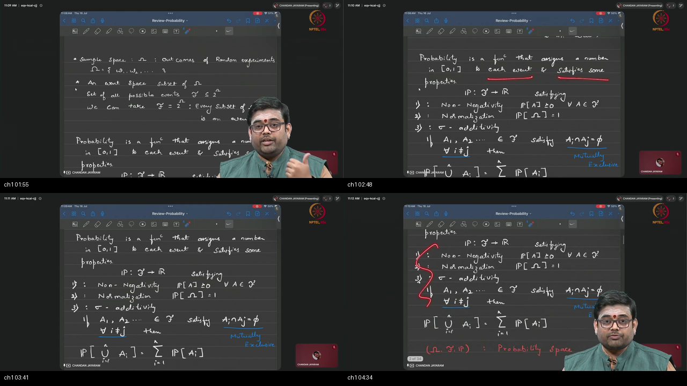

**Figure 1.1 (~00:03–04:50):** Chalkboard formalization of the probability space $(\Omega, \mathcal{F}, P)$. Top: Sample space $\Omega = \{\omega_1, \omega_2, \dots\}$ and Event space $\mathcal{F} = 2^\Omega$. Center: Probability function $P: \mathcal{F} \to \mathbb{R}$. Bottom: Kolmogorov's Three Axioms: Non-negativity, Normalization $P(\Omega)=1$, and Countable Additivity ($\sigma$-additivity) for mutually exclusive events.

---

### 1. 👶 ELI5 Quick Intuition
Imagine opening a pizzeria:
1. **$\Omega$ (The Kitchen Menu):** The master list of every single ingredient and pizza combination that could possibly be baked.
2. **$\mathcal{F}$ (The Order System):** All possible ways customers can order items—a single slice, a vegetarian combo, or everything on the menu.
3. **$P$ (The Recipe Weight Ratio):** A kitchen scale ensuring that every ingredient has a positive weight, the total recipe weighs exactly 100%, and putting two separate toppings into a bowl simply adds their individual weights together.

Together, $(\Omega, \mathcal{F}, P)$ forms a closed, self-consistent world where no probability can ever become negative, exceed 100%, or create mass out of thin air.

---

### 2. 🔍 Plain-English Breakdown
A **Random Experiment (RE)** is any repeatable process whose outcome cannot be predetermined (e.g., rolling dice, measuring thermal sensor noise, sampling a diffusion latent vector).
- **Outcomes ($\omega$):** Indivisible atomic results (e.g., `"Heads"`, `"Tails"`, an image file).
- **Sample Space ($\Omega$):** The set of all possible outcomes.
- **Events ($A \subseteq \Omega$):** Meaningful subsets of outcomes (e.g., "roll is even" $= \{2, 4, 6\}$).
- **Event Space ($\mathcal{F}$):** The collection of all allowed events. For discrete sample spaces, we adopt the power set $\mathcal{F} = 2^\Omega$ (all $2^{|\Omega|}$ subsets).
- **Probability Measure ($P$):** A rule assigning a real number to each event in $\mathcal{F}$ governed by Kolmogorov's Three Axioms:
  1. **Non-negativity:** No event has a negative probability.
  2. **Normalization:** The probability of *something* happening across the entire universe is $100\%$ ($P(\Omega) = 1$).
  3. **Countable Additivity ($\sigma$-additivity):** If events do not overlap (mutually exclusive), the probability of their union is the sum of their individual probabilities.

---

### 3. 📐 Formal Chalkboard Mathematics

```
Probability Triplet Geometry:
┌────────────────────────────────────────────────────────────┐
│ Sample Space Ω                                             │
│                                                            │
│     Event A1                Event A2                       │
│   ┌───────────┐           ┌───────────┐                    │
│   │  P(A1)≥0  │           │  P(A2)≥0  │  A1 ∩ A2 = ∅       │
│   └───────────┘           └───────────┘                    │
│                                                            │
│   Axiom 3: P(A1 ∪ A2) = P(A1) + P(A2)                      │
│   Axiom 2: Total Mass over entire Ω is P(Ω) = 1.0          │
└────────────────────────────────────────────────────────────┘
```

#### Mathematical Definition: Probability Space
A **Probability Space** is defined as the ordered triplet:
$$(\Omega, \mathcal{F}, P)$$
where:
1. $\Omega$ is a non-empty set (Sample Space).
2. $\mathcal{F} \subseteq 2^\Omega$ is a $\sigma$-algebra over $\Omega$ satisfying:
   - $\Omega \in \mathcal{F}$
   - $A \in \mathcal{F} \implies A^c \in \mathcal{F}$ (Closed under complements)
   - $A_1, A_2, \dots \in \mathcal{F} \implies \bigcup_{i=1}^\infty A_i \in \mathcal{F}$ (Closed under countable unions)
3. $P: \mathcal{F} \to [0, 1]$ is a measure satisfying Kolmogorov's Three Axioms:
   $$\begin{aligned}
   \textbf{Axiom 1 (Non-negativity):} \quad & P(A) \ge 0 \quad \forall A \in \mathcal{F} \\
   \textbf{Axiom 2 (Normalization):} \quad & P(\Omega) = 1 \\
   \textbf{Axiom 3 ($\sigma$-Additivity):} \quad & P\left(\bigcup_{i=1}^\infty A_i\right) = \sum_{i=1}^\infty P(A_i) \quad \text{for pairwise disjoint } A_i \cap A_j = \emptyset \; (\forall i \neq j)
   \end{aligned}$$

#### Fundamental Lemmas Derived from Axioms
- **Empty Set Measure:** $P(\emptyset) = 0$.  
  *Proof:* $\Omega = \Omega \cup \emptyset \cup \emptyset \dots \implies P(\Omega) = P(\Omega) + \sum P(\emptyset) \implies P(\emptyset) = 0$.
- **Complement Rule:** $P(A^c) = 1 - P(A)$.  
  *Proof:* $A \cap A^c = \emptyset$ and $A \cup A^c = \Omega \implies P(A) + P(A^c) = P(\Omega) = 1$.
- **Inclusion-Exclusion:** $P(A \cup B) = P(A) + P(B) - P(A \cap B)$.

---

### 4. 🔢 Worked Numerical Example
Consider rolling a fair 6-sided die: $\Omega = \{1, 2, 3, 4, 5, 6\}$, $P(\{\omega\}) = 1/6 \quad \forall \omega \in \Omega$.
- Event $A = \{\text{even}\} = \{2, 4, 6\} \implies P(A) = 1/6 + 1/6 + 1/6 = 3/6 = 0.5$.
- Event $B = \{\text{prime}\} = \{2, 3, 5\} \implies P(B) = 3/6 = 0.5$.
- Overlap $A \cap B = \{2\} \implies P(A \cap B) = 1/6$.
- Union $A \cup B = \{2, 3, 4, 5, 6\}$:
  $$P(A \cup B) = P(A) + P(B) - P(A \cap B) = \frac{3}{6} + \frac{3}{6} - \frac{1}{6} = \frac{5}{6} \approx 0.8333$$

---

## Topic 2: Conditional Probability as a New Assignment (04:50–07:47)

<a id="topic-2-conditional-probability-0450–0747"></a>

### Where this sits on the master map
**RESTRICTION** — Shows how observing partial information (event $B$) shrinks the sample space and creates an updated probability measure $P(\cdot \mid B)$.  
*Prerequisites Warm-up:* [§6 "Given That"](./PREREQUISITES.md#p6-given).

---

### Board / Screenshot

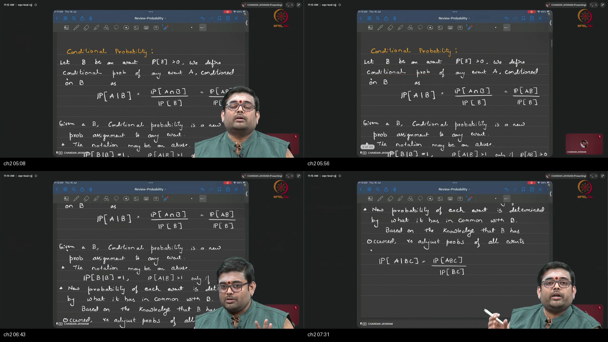

**Figure 1.2 (~04:50–07:47):** Formulation of conditional probability $P(A\mid B) = \frac{P(A \cap B)}{P(B)}$ with gatekeeper constraint $P(B)>0$. The board emphasizes that $P(\cdot \mid B)$ is a legitimate new probability measure satisfying all three axioms on the restricted universe $B$.

---

### 1. 👶 ELI5 Quick Intuition
Imagine playing a guessing game where a mystery card is drawn from a standard 52-card deck. 
- You want to know if it's the **King of Hearts** ($A$). Unconditionally, the probability is $1/52$.
- The dealer gives you a clue: *"The card is a Red Heart"* ($B$).
- You instantly throw away the 39 Spades, Clubs, and Diamonds. The 13 Hearts are now your **entire universe**.
- In this new universe, the King of Hearts is 1 card out of 13. Your updated probability is $1/13$.

---

### 2. 🔍 Plain-English Breakdown
When event $B$ is known to have occurred:
1. Any outcome outside $B$ is physically impossible. The effective sample space collapses from $\Omega$ to $B$.
2. The only part of event $A$ that can still occur is the intersection $A \cap B$.
3. Because $P(B) < 1$, we renormalize by dividing by $P(B)$, ensuring that the total mass of the new universe equals $1.0$ ($P(B \mid B) = 1$).
4. **Mandatory Gatekeeper:** $P(B) > 0$. You cannot condition on an event that has zero probability of occurring.

```
  Original Space Ω                             Conditioned Space on B
  ┌───────────────────────────┐                ┌───────────────────────────┐
  │  Outside B: Discarded     │  Collapse to   │  B is the new universe    │
  │                           │  surviving     │                           │
  │       ┌───────────────┐   │  subspace      │     ┌───────────────┐     │
  │       │ B: Survives   │   │ ─────────────► │     │ A ∩ B         │     │
  │       │   ┌───────┐   │   │                │     │ (Re-scaled)   │     │
  │       │   │ A ∩ B │   │   │                │     └───────────────┘     │
  │       │   └───────┘   │   │                │                           │
  │       └───────────────┘   │                │  Total Mass = P(B)/P(B)=1 │
  └───────────────────────────┘                └───────────────────────────┘
```

---

### 3. 📐 Formal Chalkboard Mathematics

#### Definition: Conditional Probability
Let $(\Omega, \mathcal{F}, P)$ be a probability space, and let $B \in \mathcal{F}$ satisfy $P(B) > 0$. For any event $A \in \mathcal{F}$, the **conditional probability of $A$ given $B$** is defined as:
$$P(A \mid B) \triangleq \frac{P(A \cap B)}{P(B)}$$

#### Theorem: $P(\cdot \mid B)$ is a Valid Probability Measure
The mapping $P_B: \mathcal{F} \to [0, 1]$ defined by $P_B(A) \triangleq P(A \mid B)$ satisfies Kolmogorov's axioms:
1. **Non-negativity:** $P(A \cap B) \ge 0$ and $P(B) > 0 \implies P_B(A) \ge 0$.
2. **Normalization:**
   $$P_B(\Omega) = \frac{P(\Omega \cap B)}{P(B)} = \frac{P(B)}{P(B)} = 1$$
3. **Countable Additivity:** For pairwise disjoint $\{A_i\}_{i=1}^\infty$:
   $$P_B\left(\bigcup_{i=1}^\infty A_i\right) = \frac{P\left((\bigcup A_i) \cap B\right)}{P(B)} = \frac{P\left(\bigcup (A_i \cap B)\right)}{P(B)} = \sum_{i=1}^\infty \frac{P(A_i \cap B)}{P(B)} = \sum_{i=1}^\infty P_B(A_i)$$

#### The General Multiplication Rule
$$P(A \cap B) = P(A \mid B) P(B) = P(B \mid A) P(A)$$
For $n$ sequential events:
$$P(A_1 \cap A_2 \cap \dots \cap A_n) = P(A_1) P(A_2 \mid A_1) P(A_3 \mid A_1 \cap A_2) \cdots P(A_n \mid A_1 \cap \dots \cap A_{n-1})$$
*(This is the exact mathematical autoregressive factorization used by Large Language Models like GPT-4 to generate tokens sequentially!)*

---

### 4. 🔢 Worked Numerical Example
Let a fair die be rolled: $\Omega = \{1, 2, 3, 4, 5, 6\}$.
- We are given that the roll is even: $B = \{2, 4, 6\} \implies P(B) = 3/6 = 1/2$.
- We want the probability that the roll is at least 4: $A = \{4, 5, 6\} \implies P(A) = 3/6 = 1/2$.
- Overlap $A \cap B = \{4, 6\} \implies P(A \cap B) = 2/6 = 1/3$.
- Calculating conditional probability:
  $$P(A \mid B) = \frac{P(A \cap B)}{P(B)} = \frac{1/3}{1/2} = \frac{2}{3} \approx 66.67\%$$

---

## Topic 3: Law of Total Probability & Partitions (07:47–10:39)

<a id="topic-3-law-of-total-probability-0747–1039"></a>

### Where this sits on the master map
**PARTITION MIX** — Deconstructs an intractable global event $A$ into weighted conditional slices across a complete partition $\{B_1, \dots, B_n\}$.  
*Prerequisites Warm-up:* [§1 Partitions](./PREREQUISITES.md#p1-sets), [§7 Sum vs Product](./PREREQUISITES.md#p7-arith).

---

### Board / Screenshot

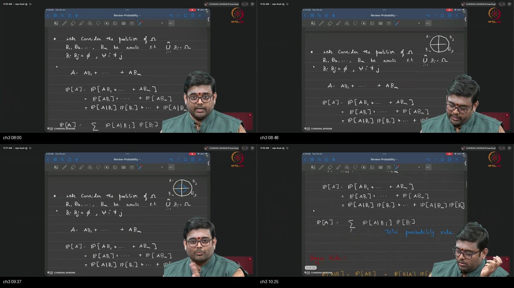

**Figure 1.3 (~07:47–10:39):** Chalkboard derivation of the Law of Total Probability. Partition $\{B_1, B_2, \dots, B_n\}$ slicing $\Omega$ with zero overlap. Event $A$ decomposed as $A = \bigcup_{i=1}^n (A \cap B_i)$, converting global probability $P(A)$ into the weighted sum $\sum_{i=1}^n P(A\mid B_i)P(B_i)$.

---

### 1. 👶 ELI5 Quick Intuition
Imagine a school with 3 classrooms: Grade 1 (holds 20% of students), Grade 2 (holds 50%), and Grade 3 (holds 30%).
- You want to know the overall percentage of students in the entire school who wear glasses ($A$).
- Instead of counting everyone at once, you ask each teacher:
  - In Grade 1, 10% wear glasses.
  - In Grade 2, 20% wear glasses.
  - In Grade 3, 40% wear glasses.
- The overall school average is simply the weighted mixture:
  $$\text{Total} = (10\% \times 0.20) + (20\% \times 0.50) + (40\% \times 0.30) = 2\% + 10\% + 12\% = 24\%$$

---

### 2. 🔍 Plain-English Breakdown
When computing the marginal probability $P(A)$ directly is difficult, we cut the universe $\Omega$ into a set of mutually exclusive, collectively exhaustive slices $\{B_1, B_2, \dots, B_n\}$ (a **partition**):
1. Every possible outcome lives in exactly one slice $B_i$.
2. Event $A$ is sliced into non-overlapping pieces: $A \cap B_1, A \cap B_2, \dots, A \cap B_n$.
3. By Kolmogorov's Axiom 3 ($\sigma$-additivity), $P(A)$ is the sum of the probabilities of these disjoint pieces.
4. Using the multiplication rule $P(A \cap B_i) = P(A \mid B_i) P(B_i)$, we express $P(A)$ purely in terms of conditional probabilities and slice weights.

```
  Law of Total Probability: Slicing Event A Across a Partition
  ┌──────────────────────────────────────────────────────────┐
  │ Slice B1          Slice B2          Slice B3             │
  │ ┌───────────────┐ ┌───────────────┐ ┌──────────────────┐ │
  │ │ A ∩ B1        │ │ A ∩ B2        │ │ A ∩ B3           │ │
  │ │               │ │               │ │                  │ │
  │ └───────────────┘ └───────────────┘ └──────────────────┘ │
  │ <─── Event A is reconstructed by gluing the 3 pieces ──> │
  └──────────────────────────────────────────────────────────┘
```

---

### 3. 📐 Formal Chalkboard Mathematics

#### Theorem: Law of Total Probability
Let $\{B_1, B_2, \dots, B_n\}$ be a partition of $\Omega$ such that $P(B_i) > 0$ for all $i \in \{1, \dots, n\}$. Then for any event $A \in \mathcal{F}$:
$$P(A) = \sum_{i=1}^n P(A \cap B_i) = \sum_{i=1}^n P(A \mid B_i) P(B_i)$$

#### Step-by-Step Proof
1. Since $\{B_i\}$ partitions $\Omega$, we have $\bigcup_{i=1}^n B_i = \Omega$.
2. Express $A$ using the distributive law of sets:
   $$A = A \cap \Omega = A \cap \left(\bigcup_{i=1}^n B_i\right) = \bigcup_{i=1}^n (A \cap B_i)$$
3. Since the sets $B_i$ are pairwise disjoint ($B_i \cap B_j = \emptyset$ for $i \neq j$), the sets $(A \cap B_i)$ are also pairwise disjoint:
   $$(A \cap B_i) \cap (A \cap B_j) = A \cap (B_i \cap B_j) = A \cap \emptyset = \emptyset$$
4. Apply Kolmogorov's Axiom 3 ($\sigma$-additivity):
   $$P(A) = P\left(\bigcup_{i=1}^n (A \cap B_i)\right) = \sum_{i=1}^n P(A \cap B_i)$$
5. Substitute the conditional multiplication rule $P(A \cap B_i) = P(A \mid B_i) P(B_i)$:
   $$P(A) = \sum_{i=1}^n P(A \mid B_i) P(B_i) \quad \blacksquare$$

---

### 4. 🔢 Worked Numerical Example
A factory manufactures microchips across three assembly lines:
- Line 1 produces 50% of chips ($P(B_1) = 0.50$) with a defect rate of 1% ($P(D \mid B_1) = 0.01$).
- Line 2 produces 30% of chips ($P(B_2) = 0.30$) with a defect rate of 2% ($P(D \mid B_2) = 0.02$).
- Line 3 produces 20% of chips ($P(B_3) = 0.20$) with a defect rate of 5% ($P(D \mid B_3) = 0.05$).

Calculate the total probability that a randomly chosen chip is defective ($P(D)$):
$$\begin{aligned}
P(D) &= P(D \mid B_1)P(B_1) + P(D \mid B_2)P(B_2) + P(D \mid B_3)P(B_3) \\
&= (0.01)(0.50) + (0.02)(0.30) + (0.05)(0.20) \\
&= 0.0050 + 0.0060 + 0.0100 = 0.0210 = 2.10\%
\end{aligned}$$

---

## Topic 4: Bayes' Rule & Likelihood Inversion (10:39–12:06)

<a id="topic-4-bayes-rule-1039–1206"></a>

### Where this sits on the master map
**INVERSION** — Converts an easily measured forward likelihood $P(B \mid A)$ into the true inferential posterior probability $P(A \mid B)$.  
*Prerequisites Warm-up:* [§6 "Given That"](./PREREQUISITES.md#p6-given), [§7 Arithmetic](./PREREQUISITES.md#p7-arith).

---

### Board / Screenshot

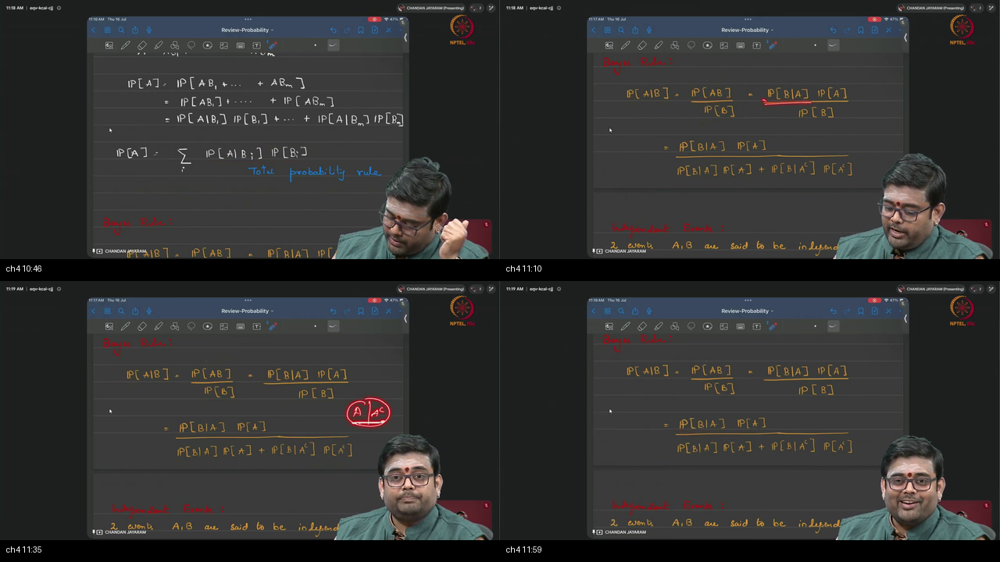

**Figure 1.4 (~10:39–12:06):** Bayes' Theorem formula $P(A\mid B) = \frac{P(B\mid A)P(A)}{P(B)}$ with denominator expanded via the binary partition $\{A, A^c\}$: $P(B) = P(B\mid A)P(A) + P(B\mid A^c)P(A^c)$.

---

### 1. 👶 ELI5 Quick Intuition
Imagine a smoke detector in your kitchen:
- You know that **if there is a fire ($A$), the alarm will sound ($B$) 99% of the time** ($P(B \mid A) = 0.99$). That is the forward lab test.
- One morning, the alarm suddenly shrieks ($B$). You want to know: **"Is there actually a fire ($A$)?"** ($P(A \mid B)$).
- You cannot answer this without knowing two other facts:
  1. How rare are fires in your kitchen normally? (Prior $P(A)$).
  2. How often does burnt toast trigger a false alarm? ($P(B \mid A^c)$).
- Bayes' Rule balances the true fire signal against the ocean of possible burnt toasts.

---

### 2. 🔍 Plain-English Breakdown
In real-world data science and machine learning:
- **Likelihood $P(B \mid A)$:** Easy to measure in controlled lab experiments (e.g., test sensitivity on known sick patients).
- **Posterior $P(A \mid B)$:** The crucial quantity required in production (e.g., probability the patient is sick given a positive test).
- Bayes' Rule inverts the conditional direction using the identity:
  $$P(A \cap B) = P(A \mid B)P(B) = P(B \mid A)P(A)$$
- When $P(B)$ is not directly given, we expand the denominator using the Law of Total Probability over partition $\{A, A^c\}$ or $\{A_1, \dots, A_n\}$.

```
  Bayes' Inversion Engine:
                     Forward Likelihood       Prior Belief
                        P(B | A)       x         P(A)
  P(A | B)   =   ─────────────────────────────────────────────
                  P(B | A)P(A)   +   P(B | A^c) P(A^c)
                 └────────────────┬───────────────────┘
                       Marginal Evidence P(B)
```

---

### 3. 📐 Formal Chalkboard Mathematics

#### Theorem: Bayes' Rule (Binary Form)
For events $A, B \in \mathcal{F}$ with $P(A) > 0$ and $P(B) > 0$:
$$P(A \mid B) = \frac{P(B \mid A) P(A)}{P(B)} = \frac{P(B \mid A) P(A)}{P(B \mid A)P(A) + P(B \mid A^c)P(A^c)}$$

#### General Form over $n$-Partition
Let $\{A_1, A_2, \dots, A_n\}$ be a partition of $\Omega$. For any event $B$ with $P(B) > 0$:
$$P(A_k \mid B) = \frac{P(B \mid A_k) P(A_k)}{\sum_{i=1}^n P(B \mid A_i) P(A_i)}$$

#### The Four Structural Components
1. **Prior Probability $P(A)$:** Baseline belief before observing evidence $B$.
2. **Likelihood $P(B \mid A)$:** Probability of observing evidence $B$ under hypothesis $A$.
3. **Marginal Evidence $P(B)$:** Total probability of observing evidence $B$ across all hypotheses.
4. **Posterior Probability $P(A \mid B)$:** Updated belief in hypothesis $A$ after observing evidence $B$.

---

### 4. 🔢 Worked Numerical Example (The Classic Medical Paradox)
Let $A$ be the event that a patient has a rare condition, and $B$ be a positive diagnostic test:
- Prior disease prevalence: $P(A) = 0.01 \implies P(A^c) = 0.99$.
- Sensitivity: $P(B \mid A) = 0.99$ (99% true positive).
- False positive rate: $P(B \mid A^c) = 0.01$ (1% false positive).

Compute $P(A \mid B)$:
$$P(A \mid B) = \frac{(0.99)(0.01)}{(0.99)(0.01) + (0.01)(0.99)} = \frac{0.0099}{0.0099 + 0.0099} = \frac{0.0099}{0.0198} = 0.5000 = 50.0\%$$

*Insight:* Even with a test that is 99% accurate in both directions, a positive test result only means a 50% chance of having the disease because the prior prevalence is so low.

---

## Topic 5: Independence of Two Events (12:06–14:31)

<a id="topic-5-independence-of-two-events-0003–0450"></a>
<a id="topic-5-independence-of-two-events-1206–1431"></a>

### Where this sits on the master map
**NO INFORMATION TRANSFER** — Establishes the formal multiplicative definition of statistical independence for two events and proves its consequences on conditional probabilities and complements.  
*Prerequisites Warm-up:* [§7 Sum vs Product](./PREREQUISITES.md#p7-arith).

---

### Board / Screenshot

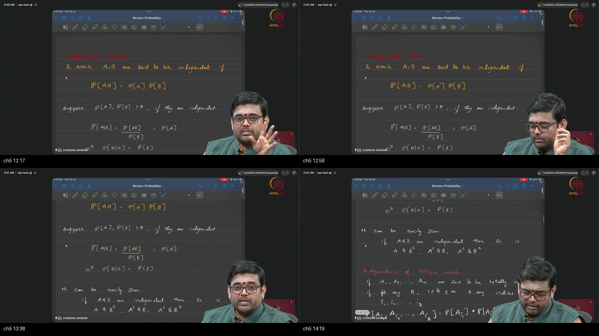

**Figure 1.5 (~12:06–14:31):** Definition of independence for two events: $A \perp\!\!\!\perp B \iff P(A \cap B) = P(A)P(B)$. Deduction of $P(A\mid B) = P(A)$, and chalkboard proof that independence of $(A, B)$ implies independence of $(A, B^c)$, $(A^c, B)$, and $(A^c, B^c)$.

---

### 1. 👶 ELI5 Quick Intuition
Imagine tossing a coin in London while a friend rolls a die in Tokyo:
- Does knowing that the London coin landed on Heads change the chance that the Tokyo die shows a 6? **Not at all.**
- The two events have zero physical connection or shared information.
- The probability of getting *both* events simultaneously is simply the **product** of their individual chances:
  $$P(\text{Heads and 6}) = \frac{1}{2} \times \frac{1}{6} = \frac{1}{12}$$

---

### 2. 🔍 Plain-English Breakdown
Two events $A$ and $B$ are **statistically independent** if and only if the probability of both happening simultaneously equals the product of their individual probabilities.
- **Definition vs Consequence:** The product formula $P(A \cap B) = P(A)P(B)$ is the **fundamental definition**.
- If $P(B) > 0$, this definition directly implies:
  $$P(A \mid B) = \frac{P(A \cap B)}{P(B)} = \frac{P(A)P(B)}{P(B)} = P(A)$$
  In plain English: *"Learning that $B$ happened gives zero new information about whether $A$ will happen."*
- **Symmetry:** If $A$ is independent of $B$, then $B$ is automatically independent of $A$.
- **Complement Inheritance:** If $A \perp\!\!\!\perp B$, then $(A \perp\!\!\!\perp B^c)$, $(A^c \perp\!\!\!\perp B)$, and $(A^c \perp\!\!\!\perp B^c)$ are all guaranteed to be independent.

```
  Independence Product Rule:
  ┌────────────────────────────────────────────────────────────┐
  │ P(A ∩ B) = P(A) · P(B)                                     │
  │                                                            │
  │ Consequence: P(A | B) = P(A)   (When P(B) > 0)             │
  │ Consequence: P(B | A) = P(B)   (When P(A) > 0)             │
  │ Consequence: A ⟂ B^c,  A^c ⟂ B,  A^c ⟂ B^c                 │
  └────────────────────────────────────────────────────────────┘
```

---

### 3. 📐 Formal Chalkboard Mathematics

#### Definition: Two-Event Independence
Events $A, B \in \mathcal{F}$ are independent ($A \perp\!\!\!\perp B$) if and only if:
$$P(A \cap B) = P(A) \, P(B)$$

#### Theorem: Independence of Complements ($A \perp\!\!\!\perp B \implies A \perp\!\!\!\perp B^c$)
*Proof:*
1. Decompose event $A$ into two disjoint sets:
   $$A = (A \cap B) \cup (A \cap B^c) \quad \text{where } (A \cap B) \cap (A \cap B^c) = \emptyset$$
2. By Kolmogorov's Axiom 3:
   $$P(A) = P(A \cap B) + P(A \cap B^c)$$
3. Subtract $P(A \cap B)$ and substitute the independence assumption $P(A \cap B) = P(A)P(B)$:
   $$\begin{aligned}
   P(A \cap B^c) &= P(A) - P(A \cap B) \\
   &= P(A) - P(A)P(B) \\
   &= P(A)\bigl(1 - P(B)\bigr) \\
   &= P(A)P(B^c) \quad \blacksquare
   \end{aligned}$$

---

### 4. 🔢 Worked Numerical Example
Draw a single card from a well-shuffled 52-card deck:
- Let $A = \{\text{card is an Ace}\} \implies P(A) = 4/52 = 1/13$.
- Let $B = \{\text{card is a Heart}\} \implies P(B) = 13/52 = 1/4$.
- Overlap $A \cap B = \{\text{Ace of Hearts}\} \implies P(A \cap B) = 1/52$.

Check independence:
$$P(A) \cdot P(B) = \frac{1}{13} \times \frac{1}{4} = \frac{1}{52} = P(A \cap B)$$
Since the product matches the intersection probability, suit and rank are statistically independent!

---

## Topic 6: Total, Pairwise, and Conditional Independence (14:31–19:00)

<a id="topic-6-total-pairwise-and-conditional-independence-1431–1900"></a>

### Where this sits on the master map
**INDEPENDENCE FLAVORS** — Differentiates multi-variable independence regimes and introduces conditional independence, the core mathematical assumption underpinning Bayesian networks, Markov random fields, and Generative Latent Variable Models.  
*Prerequisites Warm-up:* [§7 Sum vs Product](./PREREQUISITES.md#p7-arith).

---

### Board / Screenshot

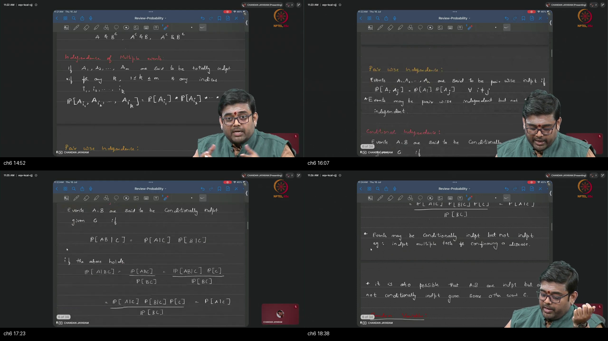

**Figure 1.6 (~14:31–19:00):** Board contrast between Total (Mutual) Independence ($\forall k, \forall \{i_1,\dots,i_k\}, P(\bigcap A_i) = \prod P(A_i)$), Pairwise Independence ($P(A_i \cap A_j) = P(A_i)P(A_j)$), and Conditional Independence given $C$ ($P(AB\mid C) = P(A\mid C)P(B\mid C) \iff P(A\mid BC) = P(A\mid C)$).

---

### 1. 👶 ELI5 Quick Intuition
- **Pairwise Independence:** In a trio of friends (Alice, Bob, Charlie), Alice's schedule doesn't predict Bob's, Bob's doesn't predict Charlie's, and Alice's doesn't predict Charlie's. Yet, if Alice and Bob both show up at the café, they *always* bring Charlie with them! (Pairwise independent, but totally dependent as a group).
- **Conditional Independence:** Alice and Bob both sneeze frequently. Unconditionally, their sneezes are correlated because winter cold season affects both. But **given the fact that it is mid-July ($C$)**, Alice's sneeze gives zero information about whether Bob will sneeze.

---

### 2. 🔍 Plain-English Breakdown
When analyzing collections of 3 or more events:
1. **Pairwise Independence:** You only verify that every individual pair of events factors: $P(A_i \cap A_j) = P(A_i)P(A_j)$.
2. **Total (Mutual) Independence:** You must verify that **every possible subset** of events factors (pairs, triplets, quadruplets, up to the full set).
   - **Crucial Rule:** Total Independence $\implies$ Pairwise Independence.
   - **Crucial Trap:** Pairwise Independence $\not\implies$ Total Independence!
3. **Conditional Independence ($A \perp\!\!\!\perp B \mid C$):** Inside the conditioned universe $C$, events $A$ and $B$ do not share information:
   $$P(A \cap B \mid C) = P(A \mid C) P(B \mid C) \iff P(A \mid B \cap C) = P(A \mid C)$$
   - In Generative AI (e.g., VAEs), we assume data features $x_1, x_2$ are conditionally independent given the latent code $z$: $p(x_1, x_2 \mid z) = p(x_1 \mid z)p(x_2 \mid z)$.

```
  Hierarchy of Independence:
  ┌────────────────────────────────────────────────────────────┐
  │ TOTAL (MUTUAL) INDEPENDENCE                                │
  │ Every subcollection factors (2^n - n - 1 equations)        │
  │                         │                                  │
  │                         ▼ (Strictly Implies)               │
  │ PAIRWISE INDEPENDENCE                                      │
  │ Only 2-way pairs factor (n*(n-1)/2 equations)              │
  │ (DOES NOT imply Total Independence!)                       │
  └────────────────────────────────────────────────────────────┘
```

---

### 3. 📐 Formal Chalkboard Mathematics

#### Definition: Total (Mutual) Independence
A collection of $M$ events $\{A_1, A_2, \dots, A_M\}$ is **totally (mutually) independent** if for every non-empty subset of indices $J \subseteq \{1, 2, \dots, M\}$ with $|J| \ge 2$:
$$P\left(\bigcap_{j \in J} A_j\right) = \prod_{j \in J} P(A_j)$$
*(For $M=3$ events, this requires checking 4 equations: 3 pairwise equations + 1 triple intersection equation).*

#### Definition: Pairwise Independence
A collection $\{A_1, A_2, \dots, A_M\}$ is **pairwise independent** if:
$$P(A_i \cap A_j) = P(A_i) \, P(A_j) \quad \forall i \neq j$$

#### Definition: Conditional Independence
Events $A$ and $B$ are **conditionally independent given $C$** ($A \perp\!\!\!\perp B \mid C$), where $P(C) > 0$, if:
$$P(A \cap B \mid C) = P(A \mid C) \, P(B \mid C)$$
Equivalently (if $P(B \cap C) > 0$):
$$P(A \mid B \cap C) = P(A \mid C)$$

---

### 4. 🔢 Worked Numerical Example: Bernstein's Famous Counterexample
Consider rolling a fair 4-sided regular tetrahedron whose four faces are painted:
1. Face 1: **Red, Green, Blue** (Striped)
2. Face 2: **Red** (Solid)
3. Face 3: **Green** (Solid)
4. Face 4: **Blue** (Solid)

Each face has probability $1/4$. Define three events:
- $A_1 = \{\text{face has Red}\} = \{\text{Face 1, Face 2}\} \implies P(A_1) = 2/4 = 1/2$.
- $A_2 = \{\text{face has Green}\} = \{\text{Face 1, Face 3}\} \implies P(A_2) = 2/4 = 1/2$.
- $A_3 = \{\text{face has Blue}\} = \{\text{Face 1, Face 4}\} \implies P(A_3) = 2/4 = 1/2$.

Let's test **Pairwise Independence**:
- $A_1 \cap A_2 = \{\text{Face 1}\} \implies P(A_1 \cap A_2) = 1/4$.
  Since $P(A_1)P(A_2) = (1/2)(1/2) = 1/4$, $A_1$ and $A_2$ are pairwise independent!
- By symmetry, $P(A_1 \cap A_3) = P(A_1)P(A_3) = 1/4$ and $P(A_2 \cap A_3) = P(A_2)P(A_3) = 1/4$.
- **All pairs are independent!**

Now let's test **Total Independence** on the triple intersection:
- $A_1 \cap A_2 \cap A_3 = \{\text{Face 1}\} \implies P(A_1 \cap A_2 \cap A_3) = 1/4$.
- Product of all three: $P(A_1)P(A_2)P(A_3) = (1/2)(1/2)(1/2) = 1/8$.
- Since $1/4 \neq 1/8$, **Total Independence FAILS completely!** Knowing that the face contains both Red and Green guarantees with 100% certainty that it is Face 1, which must contain Blue!

---

## Topic 7: Random Variables and Pushforward Probability Spaces (19:00–25:12)

<a id="topic-7-random-variables-and-pushforward-1900–2512"></a>

### Where this sits on the master map
**LAND IN $\mathbb{R}$** — Constructs the deterministic bridge $X: \Omega \to \mathbb{R}$ that maps abstract outcomes to real numbers and establishes the pushforward probability space $(\mathbb{R}, \mathcal{B}, P_X)$.  
*Prerequisites Warm-up:* [§2 Functions](./PREREQUISITES.md#p2-fn), [§3 Outcomes](./PREREQUISITES.md#p3-re).

---

### Board / Screenshot

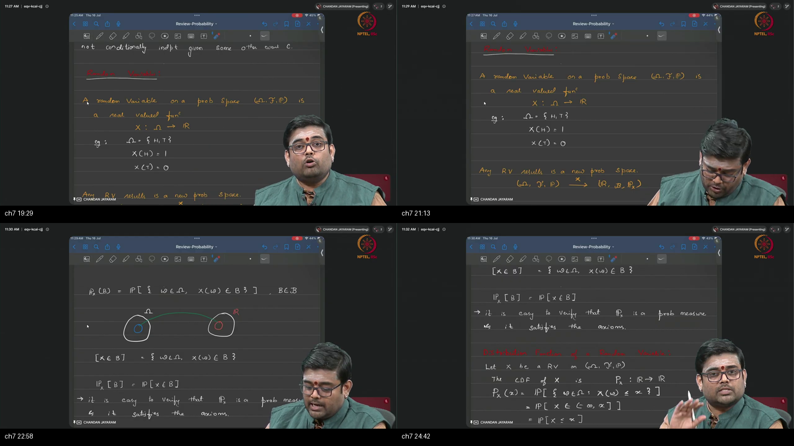

**Figure 1.7 (~19:00–25:12):** Random variable formalized as a deterministic mapping $X:\Omega \to \mathbb{R}$. Construction of the induced pushforward probability space $(\mathbb{R}, \mathcal{B}, P_X)$, where $P_X(B) \triangleq P(\{\omega \in \Omega : X(\omega) \in B\}) = P(X \in B)$ using pre-images.

---

### 1. 👶 ELI5 Quick Intuition
Imagine a cloakroom at a luxury hotel:
- The domain $\Omega$ contains physical objects: woolen coats, leather jackets, raincoats.
- The attendant tags every jacket with a plastic numbered ticket (e.g., ticket #120).
- This tagging rule is a **Random Variable** ($X$). It is **neither random nor a variable**—it is a completely fixed, deterministic tagging system.
- If you ask: *"What is the probability of picking ticket #120?"*, you simply look into locker #120, see which coats are inside, and sum the probabilities of those specific coats in the original room.

---

### 2. 🔍 Plain-English Breakdown
Computers and machine learning models cannot directly optimize over abstract words like `"Masala Dosa"` or `"Heads"`. We require real numbers $\mathbb{R}$.
1. **The Famous Lecture Slogan:** A Random Variable $X$ is **neither random nor a variable**. It is a fixed, deterministic mathematical function $X: \Omega \to \mathbb{R}$.
2. **Where is the Randomness?** The randomness exists purely in the underlying experiment that picks outcome $\omega \in \Omega$. Once $\omega$ is realized, the value $X(\omega)$ is 100% deterministic.
3. **Multiple Variables on One Space:** A single sample space $\Omega$ (e.g., hotel menu) can support multiple random variables simultaneously: $X(\omega)$ = price in INR, $Y(\omega)$ = calories in kcal, $Z(\omega)$ = preparation time in minutes.
4. **Pushforward Measure ($P_X$):** To calculate the probability that $X$ lands in a set of real numbers $B \subseteq \mathbb{R}$, we pull $B$ back to $\Omega$ via the pre-image $X^{-1}(B) = \{\omega : X(\omega) \in B\}$ and evaluate the original measure $P$.

```
  Abstract Sample Space Ω                          Real Number Line ℝ
  ┌────────────────────────────┐                   ┌────────────────────────────┐
  │ Outcome ω1 (HHH) ──────────┼──────────────────►│ Coordinate 3               │
  │                            │    X(ω)           │                            │
  │ Outcome ω2 (HHT) ──────────┼──────────────────►│ Coordinate 2               │
  │ Outcome ω3 (HTH) ──────────┼──────────────────►│ Coordinate 2 (Shared Node) │
  │                            │                   │                            │
  │ Target Pre-Image:          │   P_X(B) = P(A)   │ Target Set B = {2}         │
  │ A = {HHT, HTH, THH} ◄──────┼───────────────────┼── B ⊂ ℝ                    │
  └────────────────────────────┘                   └────────────────────────────┘
```

---

### 3. 📐 Formal Chalkboard Mathematics

#### Definition: Random Variable
Let $(\Omega, \mathcal{F}, P)$ be a probability space. A function $X: \Omega \to \mathbb{R}$ is a **(Borel-measurable) Random Variable** if for every Borel set $B \in \mathcal{B}(\mathbb{R})$, the pre-image belongs to the event space $\mathcal{F}$:
$$X^{-1}(B) \triangleq \{\omega \in \Omega : X(\omega) \in B\} \in \mathcal{F}$$

#### Definition: Pushforward Probability Space
The mapping $X$ induces a new probability space on the real line:
$$(\mathbb{R}, \mathcal{B}, P_X)$$
where $\mathcal{B}$ is the Borel $\sigma$-algebra generated by open intervals on $\mathbb{R}$, and the **pushforward probability measure** $P_X: \mathcal{B} \to [0, 1]$ is defined by:
$$P_X(B) \triangleq P\bigl(X^{-1}(B)\bigr) = P\bigl(\{\omega \in \Omega : X(\omega) \in B\}\bigr) \equiv P(X \in B)$$

#### Theorem: $P_X$ is a Valid Probability Measure on $(\mathbb{R}, \mathcal{B})$
1. **Non-negativity:** $P_X(B) = P(X^{-1}(B)) \ge 0 \quad \forall B \in \mathcal{B}$.
2. **Normalization:**
   $$P_X(\mathbb{R}) = P(X^{-1}(\mathbb{R})) = P(\Omega) = 1$$
3. **Countable Additivity:** For pairwise disjoint $\{B_i\}_{i=1}^\infty \subseteq \mathcal{B}$:
   $$P_X\left(\bigcup_{i=1}^\infty B_i\right) = P\left(X^{-1}\left(\bigcup_{i=1}^\infty B_i\right)\right) = P\left(\bigcup_{i=1}^\infty X^{-1}(B_i)\right) = \sum_{i=1}^\infty P(X^{-1}(B_i)) = \sum_{i=1}^\infty P_X(B_i)$$
   *(This holds because pre-images preserve set disjointness: $B_i \cap B_j = \emptyset \implies X^{-1}(B_i) \cap X^{-1}(B_j) = \emptyset$).*

---

### 4. 🔢 Worked Numerical Example
Consider tossing two fair coins: $\Omega = \{HH, HT, TH, TT\}$, each outcome having probability $1/4$.  
Define the random variable $X(\omega) = \text{number of Heads}$:
- $X(HH) = 2$
- $X(HT) = 1$
- $X(TH) = 1$
- $X(TT) = 0$

Let's compute the pushforward measure for target Borel sets:
1. $P_X(\{1\}) = P(\{\omega : X(\omega) = 1\}) = P(\{HT, TH\}) = 1/4 + 1/4 = 2/4 = 0.50$.
2. $P_X([1, 2]) = P(\{\omega : X(\omega) \in [1, 2]\}) = P(\{HT, TH, HH\}) = 3/4 = 0.75$.
3. $P_X((-\infty, 0]) = P(\{\omega : X(\omega) \le 0\}) = P(\{TT\}) = 1/4 = 0.25$.

---

## Topic 8: CDF Definition and Properties (25:12–32:35)

<a id="topic-8-cdf-definition-and-properties-2512–3235"></a>

### Where this sits on the master map
**RUNNING TOTAL** — Formalizes the Cumulative Distribution Function (CDF) $F_X(x) = P(X \le x)$ as the universal function that completely specifies the probability law of any random variable on $\mathbb{R}$.  
*Prerequisites Warm-up:* [§8 Cumulative Mass & Step Functions](./PREREQUISITES.md#p8-cdf).

---

### Board / Screenshot

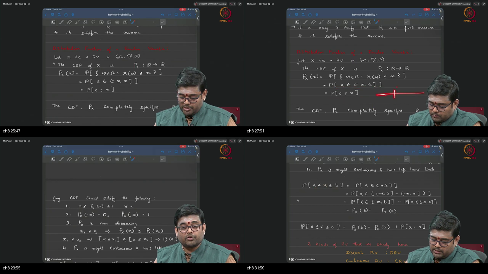

**Figure 1.8 (~25:12–32:35):** Board definition of the Cumulative Distribution Function $P_X(x) \triangleq P(X \le x)$ (denoted $F_X(x)$). Five core mathematical properties established: $0 \le F(x) \le 1$, limits $F(-\infty)=0$ and $F(+\infty)=1$, monotonically non-decreasing nature, and interval formula $P(a < X \le b) = F(b) - F(a)$.

---

### 1. 👶 ELI5 Quick Intuition
Imagine driving a car eastward along a highway starting at $-\infty$ and driving past $+\infty$:
- You carry an odometer that records the total percentage of rain that has fallen across the country up to your current mile marker $x$.
- At mile $-\infty$, you haven't started driving yet, so your odometer reads $0.0$.
- As you drive forward, your odometer can stay flat (driving through dry desert) or climb higher (driving through rainstorms), but it can **never roll backwards**.
- By the time you reach $+\infty$, you have collected all the rain across the entire continent, so your odometer reads exactly $1.0$ (100%).

---

### 2. 🔍 Plain-English Breakdown
The **Cumulative Distribution Function (CDF)**, denoted $F_X(x)$ or $P_X(x)$, is the running total of probability accumulated from $-\infty$ up to coordinate $x$:
1. **Load-Bearing Notation Alert:** On the blackboard, the instructor uses script $\mathbb{P}$ for the abstract measure on sets, and standard $P_X(x)$ (or $F_X(x)$) for the CDF function $\mathbb{R} \to [0, 1]$.
2. **Universal Applicability:** The CDF exists for **every single random variable** (discrete, continuous, or mixed).
3. **Complete Specification:** If you know the mathematical formula for $F_X(x)$ for all $x \in \mathbb{R}$, you know everything there is to know about the distribution of $X$.
4. **Monotonically Non-Decreasing:** $F_X(x)$ is non-decreasing ($x_1 \le x_2 \implies F(x_1) \le F(x_2)$). It can have flat plateaus where no probability mass exists, but it can never decrease.
5. **Right-Continuous (Càdlàg):** At every jump point, the function value includes the top of the step: $\lim_{\epsilon \to 0^+} F(x + \epsilon) = F(x)$.

```
  CDF Running Total on the Real Line:
  -∞ ──────────── a ──────────────── b ──────────── +∞
  [   F_X(a)    ]
  [         F_X(b)                  ]
                  └── P(a < X ≤ b) ──┘ = F_X(b) - F_X(a)
```

---

### 3. 📐 Formal Chalkboard Mathematics

#### Definition: Cumulative Distribution Function (CDF)
For any random variable $X$ defined on $(\Omega, \mathcal{F}, P)$, the CDF $F_X: \mathbb{R} \to [0, 1]$ is:
$$F_X(x) \triangleq P(X \le x) = P(\{\omega \in \Omega : X(\omega) \le x\}) \quad \forall x \in \mathbb{R}$$

#### The Five Fundamental Properties of a CDF
1. **Bounded Range:**
   $$0 \le F_X(x) \le 1 \quad \forall x \in \mathbb{R}$$
2. **Asymptotic Boundary Limits:**
   $$\lim_{x \to -\infty} F_X(x) = 0 \qquad \text{and} \qquad \lim_{x \to +\infty} F_X(x) = 1$$
3. **Monotone Non-Decreasing Property:**
   $$\forall x_1 \le x_2, \quad \{X \le x_1\} \subseteq \{X \le x_2\} \implies F_X(x_1) \le F_X(x_2)$$
4. **Right-Continuity with Left Limits (Càdlàg):**
   $$\lim_{\epsilon \to 0^+} F_X(x + \epsilon) = F_X(x) \quad \forall x \in \mathbb{R}$$
5. **Interval Probability Formula:**
   $$P(a < X \le b) = F_X(b) - F_X(a) \quad \forall a < b$$

#### Point Mass Evaluation
The probability mass sitting on a single isolated point $x_0$ is given by the vertical jump discontinuity:
$$P(X = x_0) = F_X(x_0) - \lim_{\epsilon \to 0^+} F_X(x_0 - \epsilon) \equiv F_X(x_0) - F_X(x_0^-)$$

---

### 4. 🔢 Worked Numerical Example
Consider a single fair coin toss where $X(T) = 0$ and $X(H) = 1$ with probabilities $p(0) = 0.5, p(1) = 0.5$.
The piecewise formula for the CDF is:
$$F_X(x) = \begin{cases}
0 & \text{if } x < 0 \\
0.5 & \text{if } 0 \le x < 1 \\
1.0 & \text{if } x \ge 1
\end{cases}$$

Let's evaluate specific points:
- $F_X(-5.0) = 0.0$
- $F_X(0.0) = 0.5$ (includes the jump at $0$)
- $F_X(0.75) = 0.5$ (flat plateau between $0$ and $1$)
- $F_X(1.0) = 1.0$ (includes the jump at $1$)
- $F_X(10.0) = 1.0$
- Calculate $P(-0.5 < X \le 0.5) = F_X(0.5) - F_X(-0.5) = 0.5 - 0.0 = 0.5$.

---

## Topic 9: Discrete RV, Staircase CDF, and PMF (32:35–42:47)

<a id="topic-9-discrete-rv-staircase-cdf-and-pmf-3235–4247"></a>

### Where this sits on the master map
**ATOMS & STAIRCASES** — Characterizes discrete random variables with countable support, proves that their CDFs are step functions, and establishes the Probability Mass Function (PMF).  
*Prerequisites Warm-up:* [§5 Cardinality](./PREREQUISITES.md#p5-count), [§8 Step Functions](./PREREQUISITES.md#p8-cdf).

---

### Board / Screenshot

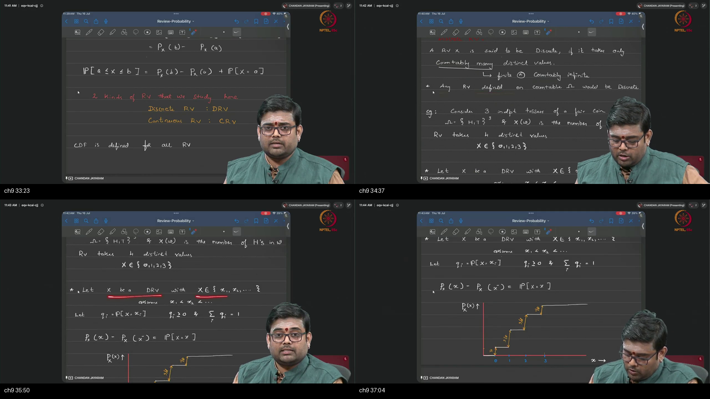
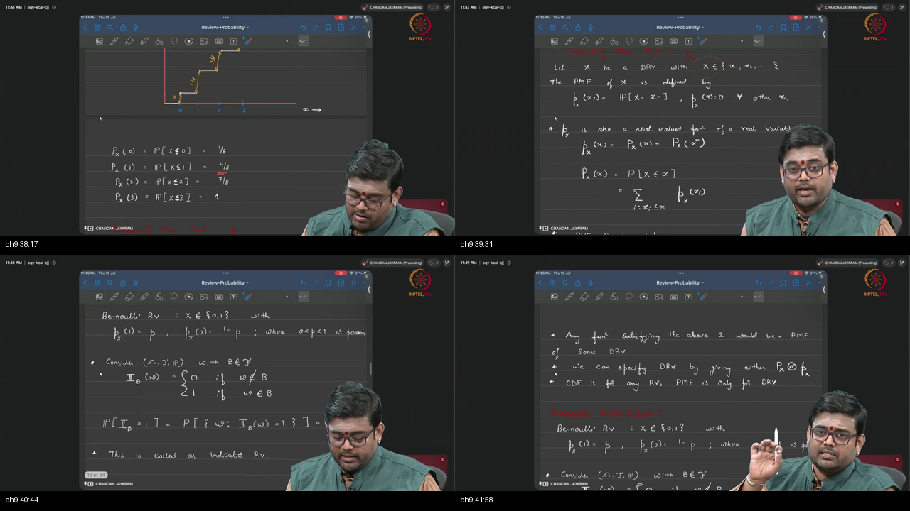

**Figure 1.9 (~32:35–42:47):** Discrete random variables defined via countable support $\{x_1, x_2, \dots\}$. Top: Construction of the step-function staircase CDF for 3 coin tosses ($X \in \{0,1,2,3\}$ with jumps $1/8, 3/8, 3/8, 1/8$). Bottom: PMF $p_X(x)$ defined as point mass $P(X=x_k)$, and mathematical synthesis $F_X(x) = \sum_{x_k \le x} p_X(x_k)$.

---

### 1. 👶 ELI5 Quick Intuition
Imagine placing 4 buckets along a path at miles 0, 1, 2, and 3:
- Bucket 0 receives $1/8$ liter of water.
- Bucket 1 receives $3/8$ liter of water.
- Bucket 2 receives $3/8$ liter of water.
- Bucket 3 receives $1/8$ liter of water.
- The **PMF** is looking directly into a single bucket and measuring how much water is inside ($p_X(2) = 3/8$).
- The **CDF** is walking along the path and pouring each bucket into your tank as you pass it. The tank level jumps suddenly at each bucket and stays completely flat in between.

---

### 2. 🔍 Plain-English Breakdown
1. **Discrete Random Variable:** Takes on at most a **countably infinite** number of distinct values (finite or like $\mathbb{N}$).
2. **Probability Mass Function (PMF):** A function $p_X(x)$ giving the exact probability of landing on a specific point:
   $$p_X(x) = P(X = x)$$
   - $p_X(x) \ge 0$ everywhere.
   - $\sum_{k} p_X(x_k) = 1.0$ across the support.
   - $p_X(x) = 0$ for any value $x$ not in the support.
3. **The Staircase CDF:** Because discrete mass is concentrated at isolated points ("atoms"), the CDF graph consists of horizontal plateaus connected by vertical step jumps. The height of each vertical jump is exactly equal to the PMF value at that point!
4. **Dual Equivalence:** For any discrete random variable, knowing the PMF is mathematically equivalent to knowing the CDF—you can reconstruct either from the other.

```
  Staircase CDF vs Point-Mass PMF:
  
  CDF F_X(x) ^                                                 PMF p_X(x) ^
   1.0 ┼───────────────────────────────┌────── [Top = 1.0]      3/8 ┼───────█───────█───────
       │                               │                            │       █       █
   7/8 ┼───────────────────────┌───────┘ (Jump = 1/8)               │       █       █
       │                       │                                1/8 ┼───█───█───█───█───
   4/8 ┼───────────────┌───────┘ (Jump = 3/8)                       │   █   █   █   █
       │               │                                        0.0 ┴───┴───┴───┴───┴───► x
   1/8 ┼───────┌───────┘ (Jump = 3/8)                                   0   1   2   3
       │       │ (Jump = 1/8)
   0.0 ┴───────┴──────────────────────────────────────► x
             x=0     x=1       x=2     x=3
```

---

### 3. 📐 Formal Chalkboard Mathematics

#### Theorem: Discrete CDF as a Sum of PMF Masses
Let $X$ be a discrete random variable with countable support $\mathcal{X} = \{x_1, x_2, \dots\} \subset \mathbb{R}$ where $x_1 < x_2 < x_3 < \dots$, and point masses $q_k \triangleq P(X = x_k) > 0$ satisfying $\sum_k q_k = 1$.  
Then the CDF $F_X(x)$ is a piecewise constant step function given by:
$$F_X(x) = \sum_{x_k \le x} p_X(x_k) = \sum_{k : x_k \le x} q_k$$

#### Jump Discontinuity Theorem
For any $x_k \in \mathcal{X}$:
$$F_X(x_k) - \lim_{\epsilon \to 0^+} F_X(x_k - \epsilon) = P(X = x_k) = p_X(x_k)$$
Between any two consecutive atoms $x_k \le x < x_{k+1}$:
$$F_X(x) = F_X(x_k) = \text{constant}$$

---

### 4. 🔢 Worked Numerical Example: 3 Fair Coin Tosses
Let $X = \text{number of Heads in 3 fair coin tosses}$. Support $\mathcal{X} = \{0, 1, 2, 3\}$.
- Total sample space size $|\Omega| = 2^3 = 8$.
- $p_X(0) = P(\{TTT\}) = 1/8 = 0.125$
- $p_X(1) = P(\{HTT, THT, TTH\}) = 3/8 = 0.375$
- $p_X(2) = P(\{HHT, HTH, THH\}) = 3/8 = 0.375$
- $p_X(3) = P(\{HHH\}) = 1/8 = 0.125$

#### Step-by-Step Cumulative CDF Values:
- For $x < 0$: $F_X(x) = 0$
- For $0 \le x < 1$: $F_X(x) = p(0) = 1/8 = 0.125$
- For $1 \le x < 2$: $F_X(x) = p(0) + p(1) = 1/8 + 3/8 = 4/8 = 0.500$
- For $2 \le x < 3$: $F_X(x) = p(0) + p(1) + p(2) = 4/8 + 3/8 = 7/8 = 0.875$
- For $x \ge 3$: $F_X(x) = p(0) + p(1) + p(2) + p(3) = 7/8 + 1/8 = 8/8 = 1.000$

---

## Topic 10: Named Discrete Families and Recap (42:47–50:06)

<a id="topic-10-named-discrete-families-and-recap-4247–5006"></a>

### Where this sits on the master map
**DISCRETE CATALOG & RECAP** — Catalogs the five foundational discrete parametric probability distributions and synthesizes the complete tutorial roadmap.  
*Prerequisites Warm-up:* [§4 Conserved Clay](./PREREQUISITES.md#p4-mass), [§5 Cardinality](./PREREQUISITES.md#p5-count).

---

### Board / Screenshot

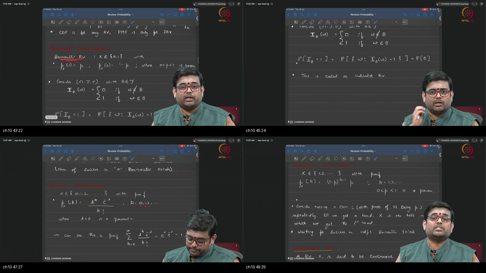

**Figure 1.10 (~42:47–50:06):** Catalog of discrete probability mass functions: Bernoulli($p$), Indicator ($1_B$), Binomial($n,p$), Poisson($\lambda$), and Geometric($p$). Verification that each PMF satisfies $\sum p(k) = 1$. Spoken synthesis recapping the probability foundations before previewing continuous distributions in Tutorial 8.

---

### 1. 👶 ELI5 Quick Intuition
- **Bernoulli($p$):** A single flip of a biased coin (Heads with chance $p$, Tails with chance $1-p$).
- **Indicator ($1_B$):** An electronic tripwire sensor that outputs $1$ if you step inside room $B$, and $0$ if you are outside.
- **Binomial($n, p$):** Counting the total number of green traffic lights you hit on an $n$-block drive through town.
- **Geometric($p$):** Rolling a die repeatedly and counting how many rolls it takes until your very first $6$ appears.
- **Poisson($\lambda$):** Counting how many meteorites hit an observatory in a year, or how many customer support tickets arrive in an hour.

---

### 2. 🔍 Plain-English Breakdown & Formal Formulas

#### 1. Bernoulli Distribution: $\text{Bernoulli}(p)$
- **Support:** $\mathcal{X} = \{0, 1\}$
- **Parameter:** $p \in [0, 1]$
- **PMF:**
  $$p_X(k) = \begin{cases} p & \text{if } k = 1 \\ 1 - p & \text{if } k = 0 \end{cases} \quad \equiv \quad p^k (1-p)^{1-k}$$
- **Axiom Check:** $\sum_{k=0}^1 p_X(k) = (1-p) + p = 1.0 \checkmark$

#### 2. Indicator Random Variable: $1_B$
- Let $(\Omega, \mathcal{F}, P)$ be a probability space, and let $B \in \mathcal{F}$.
- **Function Definition:**
  $$1_B(\omega) \triangleq \begin{cases} 1 & \text{if } \omega \in B \\ 0 & \text{if } \omega \notin B \end{cases}$$
- **Distribution:** $1_B \sim \text{Bernoulli}(p)$ where $p = P(B)$.
- **Fundamental Expectation Property:** $\mathbb{E}[1_B] = 1 \cdot P(B) + 0 \cdot P(B^c) = P(B)$.

#### 3. Binomial Distribution: $\text{Binomial}(n, p)$
- Models the total number of successes in $n$ independent and identically distributed (i.i.d.) Bernoulli($p$) trials: $X = \sum_{i=1}^n Y_i$.
- **Support:** $\mathcal{X} = \{0, 1, 2, \dots, n\}$
- **Parameters:** $n \in \mathbb{N}, \; p \in [0, 1]$
- **PMF:**
  $$p_X(k) = \binom{n}{k} p^k (1-p)^{n-k} \quad \text{where } \binom{n}{k} = \frac{n!}{k!(n-k)!}$$
- **Axiom Check (Binomial Theorem):**
  $$\sum_{k=0}^n \binom{n}{k} p^k (1-p)^{n-k} = \bigl(p + (1-p)\bigr)^n = 1^n = 1.0 \checkmark$$

#### 4. Poisson Distribution: $\text{Poisson}(\lambda)$
- Models the count of rare, independent events occurring in a fixed continuum of time or space.
- **Support:** $\mathcal{X} = \{0, 1, 2, 3, \dots\} = \mathbb{N}_0$ (Countably Infinite!)
- **Parameter:** Rate parameter $\lambda > 0$
- **PMF:**
  $$p_X(k) = \frac{\lambda^k e^{-\lambda}}{k!} \quad \text{for } k = 0, 1, 2, \dots$$
- **Axiom Check (Taylor Series for $e^\lambda$):**
  $$\sum_{k=0}^\infty \frac{\lambda^k e^{-\lambda}}{k!} = e^{-\lambda} \sum_{k=0}^\infty \frac{\lambda^k}{k!} = e^{-\lambda} \cdot e^\lambda = e^0 = 1.0 \checkmark$$

#### 5. Geometric Distribution: $\text{Geometric}(p)$
- Models the number of independent Bernoulli($p$) trials required to observe the **first success** (Lecture definition: $k = 1, 2, \dots$).
- **Support:** $\mathcal{X} = \{1, 2, 3, \dots\} = \mathbb{N}$ (Countably Infinite!)
- **Parameter:** Success probability $p \in (0, 1]$
- **PMF:**
  $$p_X(k) = (1-p)^{k-1} p \quad \text{for } k = 1, 2, 3, \dots$$
  *(Meaning: $k-1$ consecutive failures followed immediately by 1 success).*
- **Axiom Check (Geometric Series):**
  $$\sum_{k=1}^\infty (1-p)^{k-1} p = p \sum_{m=0}^\infty (1-p)^m = p \cdot \frac{1}{1 - (1-p)} = \frac{p}{p} = 1.0 \checkmark$$

---

## Workplace Debugging Scenarios

### Scenario 1: The "Zero-Denominator & Conditioning on Null Events" Bug in Bayesian LLM Calibration

#### 1. Context & Production Symptoms
In a production Generative AI pipeline, a Bayesian Guardrail classifier evaluates whether an LLM's generated response contains toxic content ($A$) given a set of extracted semantic keyword tokens $B = \{t_1, t_2, \dots, t_k\}$. During sudden out-of-distribution traffic, the server crashed with an unhandled exception:
`ZeroDivisionError: float division by zero` or produced `NaN` log-likelihoods, causing 15% of downstream API requests to fail.

#### 2. Root-Cause Analysis
The team implemented direct conditional probability updates $P(A \mid B) = \frac{P(A \cap B)}{P(B)}$. When a user submitted prompt text with novel vocabulary or an unprecedented combination of tokens, the empirical marginal probability of that token sequence in the training reference corpus was exactly zero ($P(B) = 0$). Violating the fundamental gatekeeper condition ($P(B) > 0$) resulted in numerical division by zero.

#### 3. Production Fix
Apply **Laplace (Add-1) Smoothing** and perform all Bayesian updates in **logarithmic space** to prevent underflow:

```python
# PRODUCTION POSTMORTEM FIX: Robust Bayesian Token Updating
import numpy as np


def robust_bayesian_posterior(
    token_counts_class,
    token_counts_total,
    vocab_size,
    prior_prob=0.5,
    alpha=1.0,
):
    """Computes calibrated posterior P(Toxic | Tokens) with Dirichlet/Laplace smoothing.

    Args:
        token_counts_class: Count of observed tokens in toxic class.
        token_counts_total: Total occurrences of observed tokens.
        vocab_size: Total vocabulary size |V|.
        prior_prob: Prior probability P(Toxic).
        alpha: Smoothing parameter (alpha=1.0 is Laplace smoothing).
    """
    # Smoothed log-likelihoods
    log_prior_toxic = np.log(prior_prob)
    log_prior_clean = np.log(1.0 - prior_prob)

    # Laplace smoothed likelihood terms: P(token | Toxic)
    # P(t | C) = (count + alpha) / (total_in_class + alpha * |V|)
    log_likelihood_toxic = np.sum(
        np.log(token_counts_class + alpha)
        - np.log(token_counts_total + alpha * vocab_size)
    )

    # Symmetrical background likelihood
    log_likelihood_clean = np.sum(
        np.log(token_counts_total - token_counts_class + alpha)
        - np.log(token_counts_total + alpha * vocab_size)
    )

    # Unnormalized joint log probabilities
    log_joint_toxic = log_prior_toxic + log_likelihood_toxic
    log_joint_clean = log_prior_clean + log_likelihood_clean

    # Log-Sum-Exp trick to prevent underflow/overflow
    max_log = max(log_joint_toxic, log_joint_clean)
    log_evidence = max_log + np.log(
        np.exp(log_joint_toxic - max_log) + np.exp(log_joint_clean - max_log)
    )

    # Posterior in [0, 1]
    posterior_toxic = np.exp(log_joint_toxic - log_evidence)
    return posterior_toxic


# Production Verification
res = robust_bayesian_posterior(
    token_counts_class=np.array([0, 0]),
    token_counts_total=np.array([0, 0]),
    vocab_size=50000,
    prior_prob=0.01,
)
print(f"Calibrated Safe Posterior for Novel Tokens: {res:.6f}")
assert not np.isnan(res) and 0.0 <= res <= 1.0
```

---

### Scenario 2: The "Pairwise vs Total Independence False Assumption" Bug in Multi-Feature Synthetic Data Generation

#### 1. Context & Production Symptoms
A synthetic tabular data generator (based on a Gaussian Copula / Diffusion model) was deployed to generate synthetic banking transaction records with 5 interdependent numerical features. When audited by the risk compliance team, the synthetic data matched 1D marginal distributions and 2D correlation matrices with 99.8% accuracy, but failed high-order fraud detection rules: synthetic accounts were created with impossible 3-way combinations (e.g., `Age < 18` AND `Annual_Income > $500k` AND `Credit_Score > 800`).

#### 2. Root-Cause Analysis
The engineering team assumed that because feature pairs showed near-zero linear Pearson correlation ($\text{Cov}(X_i, X_j) \approx 0 \implies \text{Pairwise Independence}$), the joint distribution could be factorized as independent product marginals $p(x_1, x_2, \dots, x_5) = \prod_{i=1}^5 p(x_i)$. As proven by **Bernstein's Counterexample (Topic 6)**, pairwise independence **does not imply total joint independence**. The high-order joint interaction constraints were completely lost, causing severe mode hallucination.

#### 3. Production Fix
Replace factorized marginal generation with an **Autoregressive Chain-Rule Density Estimator** or **Joint Masked Autoencoder for Distribution Estimation (MADE)**:

```python
# PRODUCTION POSTMORTEM FIX: Autoregressive Joint Factorization
import torch
import torch.nn as nn


class AutoregressiveJointGenerator(nn.Module):
    """Enforces rigorous chain rule of probability for multi-feature generation:

    p(x1, x2, x3) = p(x1) * p(x2 | x1) * p(x3 | x1, x2)
    """

    def __init__(self, feature_dim=3, hidden_dim=64):
        super().__init__()
        self.feature_dim = feature_dim
        # Sub-networks conditioning each feature on preceding features
        self.net_x1 = nn.Sequential(
            nn.Linear(1, hidden_dim), nn.ReLU(), nn.Linear(hidden_dim, 2)
        )  # Outputs (mu, logvar)
        self.net_x2_given_x1 = nn.Sequential(
            nn.Linear(1, hidden_dim), nn.ReLU(), nn.Linear(hidden_dim, 2)
        )
        self.net_x3_given_x1_x2 = nn.Sequential(
            nn.Linear(2, hidden_dim), nn.ReLU(), nn.Linear(hidden_dim, 2)
        )

    def sample(self, num_samples=1000):
        # 1. Sample x1 unconditionally
        dummy_in = torch.ones(num_samples, 1)
        params_1 = self.net_x1(dummy_in)
        mu1, logvar1 = params_1[:, :1], params_1[:, 1:]
        x1 = mu1 + torch.exp(0.5 * logvar1) * torch.randn_like(mu1)

        # 2. Sample x2 conditioned on x1
        params_2 = self.net_x2_given_x1(x1)
        mu2, logvar2 = params_2[:, :1], params_2[:, 1:]
        x2 = mu2 + torch.exp(0.5 * logvar2) * torch.randn_like(mu2)

        # 3. Sample x3 conditioned on (x1, x2) jointly!
        x12 = torch.cat([x1, x2], dim=1)
        params_3 = self.net_x3_given_x1_x2(x12)
        mu3, logvar3 = params_3[:, :1], params_3[:, 1:]
        x3 = mu3 + torch.exp(0.5 * logvar3) * torch.randn_like(mu3)

        return torch.cat([x1, x2, x3], dim=1)


# Instantiate and test
generator = AutoregressiveJointGenerator()
synthetic_batch = generator.sample(num_samples=5)
print("Generated Multi-Feature Synthetic Batch with Preserved Joint Law:")
print(synthetic_batch)
assert synthetic_batch.shape == (5, 3)
```

---

## Centralized External References

<a id="external-references"></a>

To reinforce the mathematical topics from this tutorial, explore the following curated video lectures, interactive platforms, and authoritative textbooks.

---

### Topic 1: Probability Triplet and Kolmogorov Axioms
1. **Video Lecture:** [MIT 6.041 Probabilistic Systems Analysis — Lecture 1: Probability Models and Axioms](https://www.youtube.com/watch?v=j9WZyLZCBzs) by Prof. John Tsitsiklis.
2. **Video Lecture:** [Harvard Stat 110: Lecture 1 — Probability and Counting](https://www.youtube.com/watch?v=KbB0FjPg0mw) by Prof. Joe Blitzstein.
3. **Interactive Visual:** [Seeing Theory — Chapter 1: Basic Probability](https://seeing-theory.brown.edu/basic-probability/index.html) by Daniel Kunin (Brown University).
4. **Authoritative Text / Notes:** [Statlect: Probability Spaces and Kolmogorov's Axioms](https://www.statlect.com/fundamentals-of-probability/probability-spaces) by Marco Taboga.
5. **Classic Textbook Chapter:** *Introduction to Probability* (Dimitri P. Bertsekas & John N. Tsitsiklis), Chapter 1: Sample Space and Probability.

---

### Topic 2: Conditional Probability and the Multiplication Rule
1. **Video Lecture:** [Harvard Stat 110: Lecture 2 — Conditional Probability and Bayes' Rule](https://www.youtube.com/watch?v=P7NE4WF8j-Q) by Prof. Joe Blitzstein.
2. **Video Lecture:** [StatQuest: Conditional Probability Clearly Explained](https://www.youtube.com/watch?v=ibINrxJL368) by Josh Starmer.
3. **Interactive Visual:** [Seeing Theory — Chapter 2: Compound & Conditional Probability](https://seeing-theory.brown.edu/compound-probability/index.html) (Brown University).
4. **Authoritative Notes:** [Statlect: Conditional Probability and Multiplication Rule](https://www.statlect.com/fundamentals-of-probability/conditional-probability).
5. **Pedagogical Guide:** [Khan Academy: Calculating Conditional Probability](https://www.khanacademy.org/math/statistics-probability/probability-library/conditional-probability-independence).

---

### Topic 3: Law of Total Probability and Partitions
1. **Video Lecture:** [Harvard Stat 110: Lecture 3 — Law of Total Probability and Conditioning](https://www.youtube.com/watch?v=JzDvVgNDxo8) by Prof. Joe Blitzstein.
2. **Video Lecture:** [MIT OCW 18.05 — Law of Total Probability](https://www.youtube.com/watch?v=9_NqB8aJ7c4).
3. **Authoritative Notes:** [Brilliant: Law of Total Probability Foundations](https://brilliant.org/wiki/law-of-total-probability/).
4. **Authoritative Notes:** [Statlect: Law of Total Probability Theorem and Proof](https://www.statlect.com/fundamentals-of-probability/law-of-total-probability).
5. **Reference Paper:** *Foundations of Modern Probability* (Olav Kallenberg), Chapter 1: Measures and Integration.

---

### Topic 4: Bayes' Rule and Posterior Inversion
1. **Video Lecture:** [3Blue1Brown: Bayes' Theorem and the Geometry of Conditional Probability](https://www.youtube.com/watch?v=HZGCoVF3YvM) by Grant Sanderson.
2. **Video Lecture:** [Veritasium: The Bayesian Trap](https://www.youtube.com/watch?v=R13BD8qKeTg) by Derek Muller.
3. **Interactive Tutorial:** [3Blue1Brown Written Interactive Lesson: Bayes' Theorem](https://www.3blue1brown.com/lessons/bayes-theorem).
4. **Authoritative Notes:** [Statlect: Bayes' Rule Formula and Applications](https://www.statlect.com/fundamentals-of-probability/Bayes-rule).
5. **Seminal Paper:** *An Essay towards solving a Problem in the Doctrine of Chances* (Thomas Bayes & Richard Price, Philosophical Transactions of the Royal Society, 1763).

---

### Topic 5: Two-Event Statistical Independence
1. **Video Lecture:** [MIT 6.041: Lecture 2 — Conditioning and Independence](https://www.youtube.com/watch?v=rtsbO_2wFm8) by Prof. John Tsitsiklis.
2. **Video Lecture:** [Khan Academy: Independent Events and Multiplication Rule](https://www.youtube.com/watch?v=PR-A3UAO7_0).
3. **Interactive Visual:** [Seeing Theory: Statistical Independence Visualized](https://seeing-theory.brown.edu/compound-probability/index.html#second).
4. **Authoritative Notes:** [Statlect: Independent Events in Probability Spaces](https://www.statlect.com/fundamentals-of-probability/independent-events).
5. **Reference Manual:** *Probability and Random Processes* (Geoffrey Grimmett & David Stirzaker), Section 1.5: Independence.

---

### Topic 6: Total, Pairwise, and Conditional Independence
1. **Video Lecture:** [Harvard Stat 110: Lecture 4 — Pairwise vs Mutual Independence & Conditional Independence](https://www.youtube.com/watch?v=7_XfXf_a1J0) by Prof. Joe Blitzstein.
2. **Video Lecture:** [NPTEL IIT Madras: Graphical Models and Conditional Independence](https://www.youtube.com/watch?v=O5m2qZ-P8hM).
3. **Authoritative Article:** [Towards Data Science: Conditional Independence — The Backbone of Bayesian Networks](https://towardsdatascience.com/conditional-independence-the-backbone-of-bayesian-networks-85710f1b35b).
4. **Authoritative Notes:** [Statlect: Mutual and Pairwise Independence Criteria](https://www.statlect.com/fundamentals-of-probability/mutual-independence).
5. **Seminal Paper:** *Probabilistic Reasoning in Intelligent Systems: Networks of Plausible Inference* (Judea Pearl, 1988), Chapter 3: Markov Properties.

---

### Topic 7: Random Variables and Pushforward Probability Spaces
1. **Video Lecture:** [MIT 6.041: Lecture 3 — General Random Variables and Probability Distributions](https://www.youtube.com/watch?v=4Y_6A_H8U0M) by Prof. John Tsitsiklis.
2. **Video Lecture:** [StatQuest: What is a Probability Distribution?](https://www.youtube.com/watch?v=oI3hZJqXJuc) by Josh Starmer.
3. **Interactive Visual:** [Seeing Theory — Chapter 3: Probability Distributions](https://seeing-theory.brown.edu/probability-distributions/index.html).
4. **Authoritative Notes:** [Statlect: Random Variables and Measurable Functions](https://www.statlect.com/fundamentals-of-probability/random-variables).
5. **Advanced Text:** *Measure Theory and Probability* (Malcolm Adams & Victor Guillemin), Chapter 2: Pushforward Measures.

---

### Topic 8: Cumulative Distribution Function (CDF) Definition and Properties
1. **Video Lecture:** [Harvard Stat 110: Lecture 5 — Cumulative Distribution Functions](https://www.youtube.com/watch?v=k_n7a4yJ56Q) by Prof. Joe Blitzstein.
2. **Video Lecture:** [Khan Academy: Cumulative Distribution Function (CDF) Overview](https://www.youtube.com/watch?v=j_2c3y0oZk8).
3. **Authoritative Notes:** [Statlect: Distribution Functions and Càdlàg Properties](https://www.statlect.com/fundamentals-of-probability/cumulative-distribution-function).
4. **Interactive Graph:** [Desmos: Interactive Staircase CDF Visualizer](https://www.desmos.com/calculator).
5. **Reference Manual:** *A First Course in Probability* (Sheldon Ross), Chapter 4: Random Variables and Distribution Functions.

---

### Topic 9: Discrete Random Variables, Staircases, and PMFs
1. **Video Lecture:** [MIT 6.041: Lecture 4 — Discrete Random Variables and PMFs](https://www.youtube.com/watch?v=XzS6eY-U2gQ).
2. **Video Lecture:** [Harvard Stat 110: Lecture 6 — Discrete Distributions and Expectation](https://www.youtube.com/watch?v=q16Xk2a4Jk8).
3. **Interactive Visual:** [Seeing Theory: Discrete Probability Distributions](https://seeing-theory.brown.edu/probability-distributions/discrete-discrete/index.html).
4. **Authoritative Notes:** [Statlect: Probability Mass Functions (PMF)](https://www.statlect.com/fundamentals-of-probability/probability-mass-function).
5. **Pedagogical Guide:** [Khan Academy: Discrete Probability Distributions](https://www.khanacademy.org/math/statistics-probability/random-variables-stats-library/random-variables-discrete).

---

### Topic 10: Named Discrete Parametric Families
1. **Video Lecture:** [StatQuest: Binomial Distribution Clearly Explained](https://www.youtube.com/watch?v=J8jNoF-K8E8) by Josh Starmer.
2. **Video Lecture:** [3Blue1Brown: The Binomial Distribution and Pascal's Triangle](https://www.youtube.com/watch?v=8idr1WZ1A7Q) by Grant Sanderson.
3. **Video Lecture:** [StatQuest: Poisson Distribution Clearly Explained](https://www.youtube.com/watch?v=cPOChr_kuQs) by Josh Starmer.
4. **Authoritative Notes:** [Statlect: Discrete Distributions Catalog](https://www.statlect.com/probability-distributions/discrete-distributions).
5. **Comprehensive Survey Paper:** *Univariate Discrete Distributions* (Norman L. Johnson, Adrienne W. Kemp, Samuel Kotz, Wiley Series in Probability and Statistics).

---

## Sources

- **Video:** [Tutorial 7 : Review of Basic Probability 1](https://www.youtube.com/watch?v=owlWCCgYx50)
- **Channel:** NPTEL — Indian Institute of Science (IISc), Bengaluru
- **Duration:** 50 minutes (00:03–50:06)
- **Course:** Mathematical Foundations of Generative AI
- **Prerequisites Document:** [PREREQUISITES.md](./PREREQUISITES.md)
- **Interactive Knowledge Verification:** [quiz.html](./quiz.html)
- **Next Topic in Sequence:** Tutorial 8 — Review of Basic Probability 2 (Continuous Random Variables, Probability Density Functions, Mathematical Expectation, Variance, and Moments).
