# Tutorial 8 — Review of Basic Probability 2

**Video:** [Tutorial 8 : Review of Basic Probability 2](https://www.youtube.com/watch?v=pQIbfyjSnFk) · NPTEL / IISc  
**Warm-up First:** [PREREQUISITES.md](./PREREQUISITES.md)  
**Previous Tutorial:** [Tutorial 7 — Review of Basic Probability 1](../21-Tutorial07-Review-Basic-Probability-1/NOTES.md) (Discrete RVs, PMFs & CDFs)  
**Next Tutorial:** Tutorial 9 — Pairs and Vectors of Random Variables (Joint, Marginal & Conditional Distributions)  
**Course:** Mathematical Foundations of Generative AI (~57 min)  
**Speaker:** NPTEL / IISc Teaching Team  
**Core Themes:** Continuous Random Variables, Probability Density Functions (PDFs), Change of Variables Theorem, Mathematical Expectation, Law of the Unconscious Statistician (LOTUS), Variance & Spread Invariants, Fundamental Inequalities (Markov, Chebyshev, Jensen), and Empirical NumPy Simulation.

---

> ### ⚠️ Course Context & Curriculum Progression Notice
> In **Tutorial 7**, the curriculum established the foundational discrete probability framework: sample spaces $\Omega$, event $\sigma$-algebras $\mathcal{F}$, Kolmogorov's axioms, discrete random variables, Cumulative Distribution Functions (CDFs), and Probability Mass Functions (PMFs).
> 
> **Tutorial 8** advances directly into **Continuous Probability Theory and Mathematical Statistics**. Modern generative AI models—specifically **Normalizing Flows** (which rely on the Change of Variables theorem and Jacobian determinants), **Diffusion Models / DDPMs** (which parameterize Gaussian transition densities and score matching), and **Variational Autoencoders / VAEs** (which optimize the Evidence Lower Bound via Jensen's Inequality)—operate entirely in continuous vector spaces. Mastering the calculus of probability densities, nonlinear transformations, moments ($\mathbb{E}, \text{Var}$), and statistical concentration inequalities is essential for deep generative modeling.

---

## Table of Contents

1. [Executive Summary & Master Architecture](#executive-summary--architecture-of-this-lecture)
2. [Chalkboard Rosetta Stone: Mathematical Notation](#chalkboard-rosetta-stone)
3. [Complete Standalone Executable Python Simulation Script](#standalone-simulation-script)
4. [Topic 1: Continuous RV and PDF Definition (00:03–04:52)](#topic-1-continuous-rv-and-pdf-0003–0452)
5. [Topic 2: PDF Properties versus PMF (04:52–08:43)](#topic-2-pdf-properties-versus-pmf-0452–0843)
6. [Topic 3: Uniform, Exponential, and Gaussian Distributions (08:43–13:57)](#topic-3-uniform-exponential-gaussian-0843–1357)
7. [Topic 4: Functions of RVs and Change of Variables (13:57–20:24)](#topic-4-functions-of-rvs-and-change-of-variables-1357–2024)
8. [Topic 5: Expectation and LOTUS (20:24–26:10)](#topic-5-expectation-and-lotus-2024–2610)
9. [Topic 6: Variance and Spread Invariants (26:10–29:02)](#topic-6-variance-2610–2902)
10. [Topic 7: Markov, Chebyshev, and Jensen Inequalities (29:02–33:17)](#topic-7-markov-chebyshev-jensen-2902–3317)
11. [Topic 8: NumPy Dice Simulation and Bayesian Numerics (33:17–40:09)](#topic-8-numpy-dice-and-bayes-3317–4009)
12. [Topic 9: Discrete Sampling Families in Python (40:09–46:03)](#topic-9-discrete-sampling-families-4009–4603)
13. [Topic 10: Continuous Simulation, Transforms, and Recap (46:03–57:13)](#topic-10-continuous-simulation-and-recap-4603–5713)
14. [Workplace Debugging Postmortems](#workplace-debugging-postmortems)
15. [Centralized External References](#external-references)

---

## Executive Summary & Architecture of this Lecture

<a id="executive-summary--architecture-of-this-lecture"></a>

This lecture completes the probability foundations required for Generative AI by bridging discrete mathematics into continuous spaces. While discrete random variables assign finite chunks of probability mass to countable ticks, **continuous random variables** distribute probability continuously over the real line $\mathbb{R}$.

### System Context

```
  ╔═══════════════════════════════════════════════════════════════════════════════════════╗
  ║                        GENAI MATHEMATICAL FOUNDATIONS PIPELINE                        ║
  ╚═══════════════════════════════════════════════════════════════════════════════════════╝
                                              │
         ┌────────────────────────────────────┴────────────────────────────────────┐
         ▼                                                                         ▼
  [Tutorial 7: Discrete RVs]                                            [Tutorial 8: Continuous RVs & Statistics]
  • (Ω, F, P) Triplet                                                   • Continuous PDF p(x) & Smooth CDF F(x)
  • Bayes' Rule & Total Probability                                     • Change of Variables: p_Y(y) = p_X(g^-1(y)) |dx/dy|
  • Discrete PMFs & Staircase CDFs                                      • Expectation E[X] & LOTUS E[g(X)]
  • Bern, Bin, Geom, Poisson                                            • Variance Var(X) = E[X^2] - mu^2
                                                                        • Inequalities: Markov, Chebyshev, Jensen
                                                                        • Monte Carlo NumPy Validation
                                              │
                                              ▼
                         [Tutorial 9: Random Vectors & Joint Laws]
                         • Joint Densities p(x,y), Marginals, Conditionals
                         • Covariance Matrices & Multivariate Gaussians
                                              │
                                              ▼
                         [Generative AI Core Architectures]
                         • Normalizing Flows: Invertible Change of Variables
                         • VAEs: Evidence Lower Bound (ELBO) via Jensen
                         • Diffusion Models: Continuous SDEs & Score Matching
```

---

### Master Architecture Blueprint

```
  ===================================================================================================
                                      TUTORIAL 8 MASTER ARCHITECTURE
  ===================================================================================================
  
   [Continuous Definition]         [Named Families]             [Transformations]
     X: Ω ──► ℝ                     • Uniform: 1/(b-a)            Y = g(X)
     F_X(x) = ∫_{-∞}^x p(t)dt       • Exponential: λ e^{-λx}       Monotone g:
     p_X(x) = F_X'(x)               • Gaussian: N(μ, σ²)          p_Y(y) = p_X(g^{-1}(y)) |(g^{-1})'|
     P(X = x0) = 0                                                (Normalizing Flows)
            │                               │                              │
            └───────────────────────────────┼──────────────────────────────┘
                                            ▼
                                  [Statistical Moments]
                                    • E[X] = ∫ x p(x) dx   (Center of Mass)
                                    • LOTUS: E[g(X)] = ∫ g(x) p(x) dx
                                    • Var(X) = E[(X-μ)²] = E[X²] - μ²
                                    • Invariants: Var(X+c) = Var(X), Var(cX) = c² Var(X)
                                            │
                                            ▼
                               [Concentration & Convexity]
                                    • Markov:    P(|X| ≥ c) ≤ E[|X|^k] / c^k
                                    • Chebyshev: P(|X-μ| ≥ kσ) ≤ 1/k² (Distribution-Free)
                                    • Jensen:    g(E[X]) ≤ E[g(X)] for convex g (VAE ELBO)
                                            │
                                            ▼
                                [Empirical Verification]
                                    • NumPy default_rng(42)
                                    • 100,000 Monte Carlo draws
                                    • Histogram Overlay -> True PDF p(x)
                                    • Empirical Mean/Var -> Theoretical E[X], Var(X)
  ===================================================================================================
```

---

### Comparative Feature Matrices

#### Table 1: Discrete vs Continuous vs Mixed Random Variables

| Feature | Discrete Random Variable (Tutorial 7) | Continuous Random Variable (Tutorial 8) | Mixed Random Variable |
| :--- | :--- | :--- | :--- |
| **Support ($\text{Supp}(X)$)** | Finite or Countably Infinite ($x_1, x_2, \dots$) | Uncountable Continuum ($[a, b]$ or $\mathbb{R}$) | Continuum with Isolated Discrete Atoms |
| **Probability Function** | PMF: $p_X(x) = P(X = x)$ | PDF: $p_X(x) = \frac{d}{dx}F_X(x)$ | Mixed: PMF at atoms + PDF over intervals |
| **Point Probability $P(X=x_0)$** | $\ge 0$ (Can be positive mass) | Strictly $0$ ($P(X=x_0) = 0$ everywhere) | $>0$ at atoms; $0$ on continuous segments |
| **Function Bound** | $0 \le p_X(x) \le 1.0$ strictly | $p_X(x) \ge 0$ (Can exceed $1.0$, e.g., $100.0$) | Discrete atoms $\le 1.0$; density height unbounded |
| **Total Normalization** | $\sum_i p_X(x_i) = 1.0$ | $\int_{-\infty}^\infty p_X(x)\,dx = 1.0$ | $\sum P(\text{Atoms}) + \int p_{\text{cont}}(x)dx = 1.0$ |
| **CDF Shape $F_X(x)$** | Piecewise constant staircase with vertical jumps | Strictly continuous everywhere (zero jumps) | Continuous with vertical jump discontinuities at atoms |
| **Expectation $\mathbb{E}[X]$** | $\sum_i x_i p_X(x_i)$ | $\int_{-\infty}^\infty x p_X(x)\,dx$ | $\sum x_k P(X=x_k) + \int x p_{\text{cont}}(x)\,dx$ |

---

#### Table 2: Continuous Parametric Distribution Catalog

| Distribution | Notation | Support | PDF $p_X(x)$ | CDF $F_X(x)$ | Mean $\mathbb{E}[X]$ | Variance $\text{Var}(X)$ | Core Generative AI Application |
| :--- | :--- | :--- | :--- | :--- | :--- | :--- | :--- |
| **Uniform** | $\text{Unif}[a, b]$ | $x \in [a, b]$ | $\frac{1}{b-a}$ | $\frac{x-a}{b-a}$ | $\frac{a+b}{2}$ | $\frac{(b-a)^2}{12}$ | Latent noise seeding; random coordinate crops; baseline exploration |
| **Exponential** | $\text{Exp}(\lambda)$ | $x \in [0, \infty)$ | $\lambda e^{-\lambda x}$ | $1 - e^{-\lambda x}$ | $\frac{1}{\lambda}$ | $\frac{1}{\lambda^2}$ | Survival analysis; inter-arrival times; Poisson process waiting times |
| **Gaussian (Normal)** | $\mathcal{N}(\mu, \sigma^2)$ | $x \in (-\infty, \infty)$ | $\frac{1}{\sigma\sqrt{2\pi}} e^{-\frac{(x-\mu)^2}{2\sigma^2}}$ | $\frac{1}{2}\left[1 + \text{erf}\left(\frac{x-\mu}{\sigma\sqrt{2}}\right)\right]$ | $\mu$ | $\sigma^2$ | Standard prior for VAEs ($z \sim \mathcal{N}(0, I)$); DDPM noise schedule; GAN latents |

---

#### Table 3: Fundamental Statistical Inequalities

| Inequality | Mathematical Formulation | Required Conditions | Plain-English Intuition | Generative AI / ML Significance |
| :--- | :--- | :--- | :--- | :--- |
| **Markov's Inequality** | $P(\|X\| \ge c) \le \frac{\mathbb{E}[\|X\|^k]}{c^k}$ | $c > 0$, $k \ge 1$, finite moment | The probability of a large deviation is bounded by its raw moments. | PAC-learning bounds; tail probability bounds. |
| **Chebyshev's Inequality** | $P(\|X - \mu\| \ge k\sigma) \le \frac{1}{k^2}$ | $\sigma^2 < \infty$, $k > 0$ | **Distribution-Free:** At least $1 - 1/k^2$ of all mass lives within $k$ standard deviations. | Sample complexity bounds; model confidence intervals. |
| **Jensen's Inequality** | $g(\mathbb{E}[X]) \le \mathbb{E}[g(X)]$ | $g$ is convex ($\smile$) | Curving after averaging $\le$ Averaging after curving. | Foundation of **VAEs** (derivation of ELBO from intractable log-evidence $\log p(x)$). |

---

### Failure & Contrast Paths (6 Common Engineering Traps)

```
  [Engineering Trap 1: "Uncountable Support => Continuous-Type"]
  TRAP: Assuming any variable taking continuous values has a valid PDF.
  REALITY: Mixed variables (e.g. ReLU activations with a spike at 0) have uncountable support but contain point atoms.
  
  [Engineering Trap 2: "Density p(x) > 1 is Impossible"]
  TRAP: Clamping or asserting p(x) <= 1.0 in continuous likelihood computations.
  REALITY: Density is height, not probability. For narrow intervals (e.g., Unif[0, 0.1]), p(x) = 10.0 is 100% legal!
  
  [Engineering Trap 3: "Single Point Probability P(X=x) = p(x)"]
  TRAP: Believing a high density value means a high probability of hitting that exact point.
  REALITY: For all continuous random variables, P(X = x0) = 0 strictly. Probability exists only over intervals!
  
  [Engineering Trap 4: "Change of Variables Ignores Jacobian Stretch"]
  TRAP: Setting p_Y(y) = p_X(g^-1(y)) without multiplying by |dx/dy|.
  REALITY: Transforming space compresses or dilates density; omitting the derivative destroys total area normalization (∫ p_Y ≠ 1).
  
  [Engineering Trap 5: "E[XY] = E[X]E[Y] Always Holds"]
  TRAP: Assuming the expectation of a product factors for any random variables.
  REALITY: Factorization requires statistical independence. For dependent variables (e.g. Y = 2X + ε), E[XY] ≠ E[X]E[Y].
  
  [Engineering Trap 6: "Inverting Jensen's Inequality Direction in VAEs"]
  TRAP: Writing log E[p/q] <= E[log p/q], which creates an upper bound instead of the Evidence Lower Bound (ELBO).
  REALITY: Logarithm is concave, so log E[W] >= E[log W]. Inverting this ruins variational inference convergence!
```

---

## Chalkboard Rosetta Stone

This quick-reference table maps every mathematical symbol used in Tutorial 8 to its exact meaning and lecture usage.

| Symbol | Mathematical Object | Reading / Pronunciation | Meaning in this Lecture |
| :--- | :--- | :--- | :--- |
| $p_X(x)$ or $f_X(x)$ | Probability Density Function | *"p of x"* or *"density of X"* | Rate of probability mass accumulation per unit length ($\int_{-\infty}^\infty p(x)dx = 1$). |
| $F_X(x)$ | Cumulative Distribution Function | *"F of x"* | $P(X \le x) = \int_{-\infty}^x p(t)dt$. Smooth, non-decreasing curve from 0 to 1. |
| $Y = g(X)$ | Transformed Random Variable | *"Y equals g of X"* | Pushing random input $X$ through deterministic continuous transformation $g$. |
| $\left\|\frac{d}{dy}g^{-1}(y)\right\|$ | Derivative of Inverse Map | *"Absolute derivative of g-inverse"* | Local scaling factor (Jacobian) preserving unit probability area under transformation. |
| $\mathbb{E}[X]$ or $\mu$ | Mathematical Expectation | *"Expected value of X"* | Center of mass / balance fulcrum: $\int_{-\infty}^\infty x p(x)\,dx$. |
| $\text{LOTUS}$ | Law of the Unconscious Statistician | *"LOTUS"* | $\mathbb{E}[g(X)] = \int_{-\infty}^\infty g(x) p_X(x)\,dx$. |
| $\text{Var}(X)$ or $\sigma^2$ | Variance | *"Variance of X"* | Mean squared deviation: $\mathbb{E}[(X-\mu)^2] = \mathbb{E}[X^2] - \mu^2$. |
| $\sigma$ | Standard Deviation | *"Sigma"* | $\sqrt{\text{Var}(X)}$, measured in the original units of $X$. |
| $\mathcal{N}(\mu, \sigma^2)$ | Gaussian Distribution | *"Normal mu sigma-squared"* | Bell-shaped density parameterized by center $\mu$ and variance $\sigma^2$. |
| $\text{Exp}(\lambda)$ | Exponential Distribution | *"Exponential lambda"* | Memoryless continuous waiting-time distribution with rate $\lambda > 0$. |
| $\text{Unif}[a, b]$ | Uniform Distribution | *"Uniform a to b"* | Constant density $1/(b-a)$ over the finite interval $[a, b]$. |
| $g(x)$ is Convex | Convex Function | *"g is convex"* | Bowl-shaped curve where secant chords float above the graph ($g''(x) \ge 0$). |

---

## Complete Standalone Executable Python Simulation Script

<a id="standalone-simulation-script"></a>

Below is a self-contained, end-to-end Python script validating all mathematical theorems, named densities, change of variables, expectation/LOTUS formulas, variance invariants, and statistical inequalities presented in Tutorial 8.

```python
"""
Tutorial 08: Review of Basic Probability 2 — Complete Master Simulation Script
Validated on Python 3.10+ and NumPy 2.0+
"""

import numpy as np
from scipy import integrate
import math

def run_tutorial_08_simulation():
    print("=" * 80)
    print("TUTORIAL 08: CONTINUOUS PROBABILITY & STATISTICAL SIMULATION")
    print("=" * 80)
    
    rng = np.random.default_rng(42)
    N = 100_000

    # ---------------------------------------------------------
    # 1. CONTINUOUS PDF AXIOMS & SINGLE-POINT PROBABILITY
    # ---------------------------------------------------------
    print("\n[1] Continuous PDF Axioms & Single-Point Null Probability")
    # Narrow Uniform on [0.0, 0.2] -> Height = 1 / 0.2 = 5.0
    a_narrow, b_narrow = 0.0, 0.2
    pdf_height = 1.0 / (b_narrow - a_narrow)
    
    samples_unif_narrow = rng.uniform(a_narrow, b_narrow, size=N)
    
    # Check exact point match
    exact_point_matches = np.sum(samples_unif_narrow == 0.1000000000)
    # Check interval [0.05, 0.15] -> Theory = (0.15 - 0.05) * 5.0 = 0.50
    interval_empirical = np.mean((samples_unif_narrow >= 0.05) & (samples_unif_narrow <= 0.15))
    
    print(f"  PDF Height on [0.0, 0.2]:        {pdf_height:.2f} (Legally > 1.0!)")
    print(f"  Exact Point Matches for x=0.10:  {exact_point_matches} (Empirical P(X=0.10) = 0.0)")
    print(f"  Empirical P(0.05 <= X <= 0.15):  {interval_empirical:.4f} (Theory: 0.5000)")
    assert exact_point_matches == 0
    assert np.isclose(interval_empirical, 0.50, atol=0.01)

    # ---------------------------------------------------------
    # 2. NAMED DENSITIES: UNIFORM, EXPONENTIAL, GAUSSIAN
    # ---------------------------------------------------------
    print("\n[2] Named Continuous Distributions (Empirical vs Theory)")
    # (A) Uniform [-2.0, 3.0] -> Mean = 0.50, Var = 5^2 / 12 = 2.0833
    unif_samples = rng.uniform(-2.0, 3.0, size=N)
    print(f"  Uniform[-2, 3]  -> Mean: {unif_samples.mean():.4f} (Theory: 0.5000) | Var: {unif_samples.var():.4f} (Theory: 2.0833)")
    
    # (B) Exponential(lambda=2.0) -> Mean = 1/lambda = 0.50, Var = 1/lambda^2 = 0.25
    exp_samples = rng.exponential(scale=1.0/2.0, size=N)
    print(f"  Exp(lambda=2.0) -> Mean: {exp_samples.mean():.4f} (Theory: 0.5000) | Var: {exp_samples.var():.4f} (Theory: 0.2500)")
    
    # (C) Gaussian N(mu=2.0, sigma^2=2.25) -> sigma=1.5
    gauss_samples = rng.normal(loc=2.0, scale=1.5, size=N)
    print(f"  Gaussian(2,2.25)-> Mean: {gauss_samples.mean():.4f} (Theory: 2.0000) | Var: {gauss_samples.var():.4f} (Theory: 2.2500)")
    
    assert np.isclose(unif_samples.mean(), 0.50, atol=0.02)
    assert np.isclose(exp_samples.mean(), 0.50, atol=0.02)
    assert np.isclose(gauss_samples.mean(), 2.00, atol=0.02)

    # ---------------------------------------------------------
    # 3. CHANGE OF VARIABLES: LINEAR & NONLINEAR TRANSFORMS
    # ---------------------------------------------------------
    print("\n[3] Change of Variables & Linear Transformations")
    # Let X ~ N(3.0, 2.0^2) -> Mean=3.0, Var=4.0
    # Let Y = aX + b with a = -4.0, b = 5.0
    # Theory: E[Y] = a*E[X] + b = -4(3) + 5 = -7.0
    # Theory: Var(Y) = a^2 * Var(X) = (-4)^2 * 4.0 = 64.0
    X_gauss = rng.normal(loc=3.0, scale=2.0, size=N)
    a_coef, b_coef = -4.0, 5.0
    Y_linear = a_coef * X_gauss + b_coef
    
    print(f"  Linear Transform Y = -4X + 5:")
    print(f"    E[Y]   = {Y_linear.mean():.4f} (Theory: -7.0000)")
    print(f"    Var(Y) = {Y_linear.var():.4f} (Theory: 64.0000)")
    assert np.isclose(Y_linear.mean(), -7.00, atol=0.05)
    assert np.isclose(Y_linear.var(), 64.00, atol=0.50)

    # ---------------------------------------------------------
    # 4. EXPECTATION & LOTUS VERIFICATION
    # ---------------------------------------------------------
    print("\n[4] Law of the Unconscious Statistician (LOTUS)")
    # For discrete support x in {1, 2, 3, 4} with probs [0.1, 0.4, 0.3, 0.2]
    # Reward g(x) = x^2
    # Exact E[X^2] = 1^2(0.1) + 2^2(0.4) + 3^2(0.3) + 4^2(0.2) = 0.1 + 1.6 + 2.7 + 3.2 = 7.6
    x_support = np.array([1, 2, 3, 4])
    p_support = np.array([0.1, 0.4, 0.3, 0.2])
    exact_lotus = np.sum((x_support**2) * p_support)
    
    discrete_draws = rng.choice(x_support, p=p_support, size=N)
    empirical_lotus = np.mean(discrete_draws**2)
    print(f"  Discrete LOTUS E[X^2]:   {empirical_lotus:.4f} (Exact: {exact_lotus:.4f})")
    assert np.isclose(empirical_lotus, exact_lotus, atol=0.05)

    # ---------------------------------------------------------
    # 5. CONCENTRATION INEQUALITIES: MARKOV, CHEBYSHEV, JENSEN
    # ---------------------------------------------------------
    print("\n[5] Fundamental Inequalities Validation")
    # (A) Markov: P(|X| >= c) <= E[|X|] / c for non-negative RV
    c_markov = 1.5
    mean_exp = exp_samples.mean()  # E[X] = 0.50
    p_exceed_markov = np.mean(exp_samples >= c_markov)
    bound_markov = mean_exp / c_markov
    print(f"  Markov Bound:   P(X >= {c_markov}) = {p_exceed_markov:.4f} <= Bound {bound_markov:.4f} -> {p_exceed_markov <= bound_markov}")
    assert p_exceed_markov <= bound_markov

    # (B) Chebyshev: P(|X - mu| >= k*sigma) <= 1/k^2 (Distribution-Free)
    k_sigma = 2.0
    mu_g, sigma_g = 2.0, 1.5
    p_exceed_chebyshev = np.mean(np.abs(gauss_samples - mu_g) >= k_sigma * sigma_g)
    bound_chebyshev = 1.0 / (k_sigma**2)  # 1/4 = 0.25
    print(f"  Chebyshev Bound:P(|X-mu| >= 2*sigma) = {p_exceed_chebyshev:.4f} <= Bound {bound_chebyshev:.4f} -> {p_exceed_chebyshev <= bound_chebyshev}")
    assert p_exceed_chebyshev <= bound_chebyshev

    # (C) Jensen: For convex g(x) = x^2, (E[X])^2 <= E[X^2]
    lhs_jensen = gauss_samples.mean()**2  # mu^2 = 4.0
    rhs_jensen = np.mean(gauss_samples**2) # E[X^2] = Var + mu^2 = 2.25 + 4 = 6.25
    print(f"  Jensen Bound:   g(E[X]) = {lhs_jensen:.4f} <= E[g(X)] = {rhs_jensen:.4f} -> {lhs_jensen <= rhs_jensen}")
    assert lhs_jensen <= rhs_jensen

    # ---------------------------------------------------------
    # 6. PRODUCT OF EXPECTATIONS: DEPENDENT VS INDEPENDENT
    # ---------------------------------------------------------
    print("\n[6] Product of Expectations: Dependent vs Independent")
    # Independent Pair: X1, X2 ~ N(0, 1)
    X1 = rng.normal(0.0, 1.0, size=N)
    X2 = rng.normal(0.0, 1.0, size=N)
    e_x1_x2_indep = np.mean(X1 * X2)
    prod_indep = np.mean(X1) * np.mean(X2)
    print(f"  Independent Pair:   E[X1*X2] = {e_x1_x2_indep:.4f} | E[X1]*E[X2] = {prod_indep:.4f} (Matches!)")
    
    # Dependent Pair: Y_dep = 2*X1 + noise
    noise = rng.normal(0.0, 0.5, size=N)
    Y_dep = 2.0 * X1 + noise
    e_xy_dep = np.mean(X1 * Y_dep)
    prod_dep = np.mean(X1) * np.mean(Y_dep)
    print(f"  Dependent Pair:     E[X*Y]   = {e_xy_dep:.4f} | E[X]*E[Y]   = {prod_dep:.4f} (Violated!)")
    assert not np.isclose(e_xy_dep, prod_dep, atol=0.5)

    print("\n" + "=" * 80)
    print("ALL TUTORIAL 08 MATHEMATICAL THEOREMS & SIMULATIONS VERIFIED!")
    print("=" * 80)

if __name__ == "__main__":
    run_tutorial_08_simulation()
```

---

## Topic 1: Continuous RV and PDF Definition (00:03–04:52)

<a id="topic-1-continuous-rv-and-pdf-0003–0452"></a>

### Where this sits on the master map
Transitioning from discrete point-masses to continuous distributions. Warm-up: [discrete leftover](./PREREQUISITES.md#p1-discrete) · [type criteria](./PREREQUISITES.md#p4-type).

### Board / Screenshot Reference

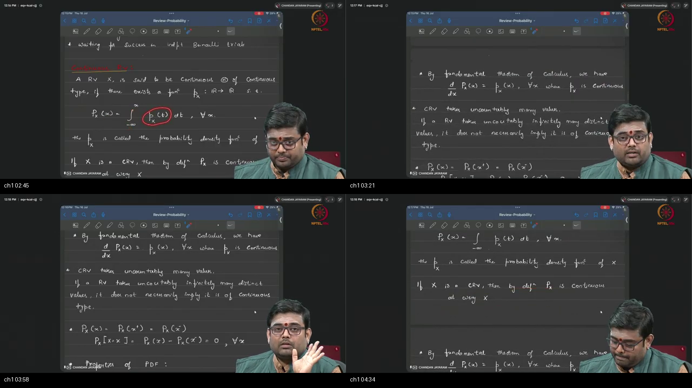

*Figure — ~00:03–04:52: Blackboard derivation establishing continuous random variables, the integral definition of Cumulative Distribution Function $F_X(x) = \int_{-\infty}^x p_X(t)dt$, the Fundamental Theorem of Calculus $F_X'(x) = p_X(x)$, and why single-point probability $P(X=x) = 0$.*

---

### 1. 👶 ELI5 Quick Intuition
Think of a discrete random variable as drops of rain falling into individual glass jars placed at discrete milestones along a road. Each jar catches a measurable volume of water.
A **continuous random variable** is like a smooth sprinkler spraying water continuously across the entire road. If you point to one microscopic point at mile 2.71828, there is no puddle sitting on that single dimensionless point. You can only measure the depth of water collected over a **stretch or segment** of the road!

---

### 2. 🔍 Plain-English Breakdown
1. **Definition of Continuous Type:** A random variable $X$ is said to be of **continuous type** if there exists a non-negative function $p_X: \mathbb{R} \to \mathbb{R}$—termed the **Probability Density Function (PDF)**—such that its CDF is the accumulated integral from $-\infty$ up to $x$:
   $$F_X(x) = \int_{-\infty}^x p_X(t)\,dt \quad \forall x \in \mathbb{R}$$
2. **Smoothness of the CDF:** Because the integral of an integrable function is continuous, $F_X(x)$ has **zero vertical jumps**.
3. **The Fundamental Theorem of Calculus:** At every point where the density $p_X(x)$ is continuous, the derivative of the accumulated CDF recovers the density:
   $$F_X'(x) = \frac{d}{dx} F_X(x) = p_X(x)$$
4. **The Uncountable Trap Warning:** Taking uncountably infinite values does **not** automatically make a random variable continuous-type (mixed distributions with point atoms exist).
5. **Zero Probability at Exact Points:** Because $F_X$ is continuous everywhere ($F_X(x) = F_X(x^-)$):
   $$P(X = x) = F_X(x) - F_X(x^-) = 0 \quad \forall x \in \mathbb{R}$$

---

### 3. 📐 Formal Mathematics & Rigorous Derivation

```
  Probability Space (Ω, F, P)
              │
              │  X: Ω ──► ℝ (Continuous Mapping)
              ▼
  Accumulated Probability CDF:
  
  F_X(x) = P(X ≤ x) = ∫_{-∞}^x p_X(t) dt
  
  Differentiating recovers density:
  d/dx F_X(x) = p_X(x)  (where p_X is continuous)
```

#### Step-by-Step Chalkboard Commentary
- **Step 1:** Let $(\Omega, \mathcal{F}, P)$ be the foundational probability space. A random variable $X: \Omega \to \mathbb{R}$ induces a probability measure $P_X$ on $(\mathbb{R}, \mathcal{B})$.
- **Step 2:** If $P_X$ is absolutely continuous with respect to the Lebesgue measure $\lambda$, the Radon-Nikodym derivative exists:
  $$p_X(x) \triangleq \frac{dP_X}{d\lambda}(x)$$
- **Step 3:** The Cumulative Distribution Function is defined as:
  $$F_X(x) \triangleq P_X\bigl((-\infty, x]\bigr) = \int_{-\infty}^x p_X(t)\,dt$$
- **Step 4:** By the Fundamental Theorem of Calculus, for any $x$ where $p_X$ is continuous:
  $$F_X'(x) = \lim_{h \to 0} \frac{F_X(x+h) - F_X(x)}{h} = \lim_{h \to 0} \frac{1}{h}\int_x^{x+h} p_X(t)\,dt = p_X(x)$$
- **Step 5 (Point Probability Nullity):**
  $$P(X = x_0) = P\left(\bigcap_{n=1}^\infty \left(x_0 - \frac{1}{n}, x_0\right]\right) = \lim_{n \to \infty} \left[F_X(x_0) - F_X\left(x_0 - \frac{1}{n}\right)\right] = F_X(x_0) - F_X(x_0^-) = 0$$

---

### 4. 🔢 Concrete Numerical Example
Let $X$ have PDF $p_X(x) = 3x^2$ for $x \in [0, 1]$, and $0$ elsewhere:
1. Compute the CDF $F_X(x)$ for $x \in [0, 1]$:
   $$F_X(x) = \int_0^x 3t^2\,dt = \left[t^3\right]_0^x = x^3$$
2. Differentiate $F_X(x)$ to verify FTC:
   $$F_X'(x) = \frac{d}{dx}[x^3] = 3x^2 = p_X(x) \checkmark$$
3. Compute $P(X = 0.5)$:
   $$P(X = 0.5) = 0.0$$
4. Compute $P(0.2 \le X \le 0.8)$:
   $$P(0.2 \le X \le 0.8) = F_X(0.8) - F_X(0.2) = 0.8^3 - 0.2^3 = 0.512 - 0.008 = 0.504$$

---

## Topic 2: PDF Properties versus PMF (04:52–08:43)

<a id="topic-2-pdf-properties-versus-pmf-0452–0843"></a>

### Where this sits on the master map
Establishing the axiomatic properties of probability density functions and contrasting them with PMFs. Warm-up: [height vs area](./PREREQUISITES.md#p2-height) · [area integrals](./PREREQUISITES.md#p3-area).

### Board / Screenshot Reference

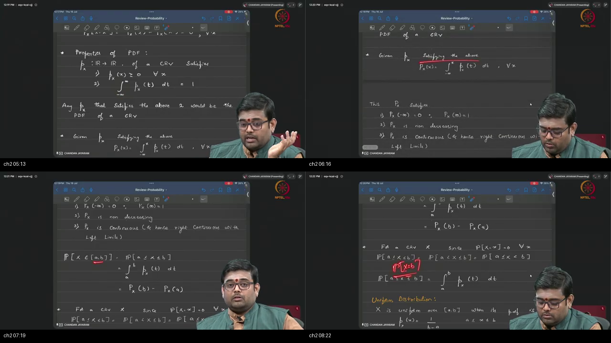

*Figure — ~04:52–08:43: Blackboard comparison of discrete PMFs vs continuous PDFs, proving why density height may exceed 1, why PDF is not a probability measure, and demonstrating interval boundary invariance.*

---

### 1. 👶 ELI5 Quick Intuition
If you pack 1 kilogram of flour into a very tall, narrow tube of width 0.1 meters, the flour stands **10 meters high**. Does a height of 10 mean you have 10 kg of flour? No! Total mass is still $\text{Width} \times \text{Height} = 0.1 \times 10 = 1\text{ kg}$.
In continuous probability, **PDF is the height of the flour**, while **probability is the total weight of flour inside an interval**.

---

### 2. 🔍 Plain-English Breakdown
1. **The Two Universal PDF Axioms:**
   - **Non-negativity:** $p_X(x) \ge 0$ for all $x \in \mathbb{R}$.
   - **Unit Total Area:** $\int_{-\infty}^\infty p_X(x)\,dx = 1.0$.
2. **The $[0, 1]$ Restriction Disappears:** Unlike discrete PMFs where $0 \le p(x) \le 1.0$, a PDF height can be **any non-negative real number** ($p(x) = 5.0, 100.0, 10^6$).
3. **PDF is NOT a Probability Measure:** A probability measure $P(A)$ maps events to $[0, 1]$ and satisfies Kolmogorov's axioms. A PDF is an algebraic function $\mathbb{R} \to [0, \infty)$ that must be integrated to yield a measure.
4. **Boundary Invariance on Intervals:** Because single points have zero probability, the four interval permutations are identical:
   $$P(a < X < b) = P(a \le X < b) = P(a < X \le b) = P(a \le X \le b) = \int_a^b p_X(t)\,dt$$

---

### 3. 📐 Formal Mathematics & Rigorous Derivation

```
  Discrete PMF (Point Masses):                 Continuous PDF (Height Function):
  • p(x) ∈ [0, 1]                              • p(x) ≥ 0  (Can exceed 1.0!)
  • ∑_i p(x_i) = 1                             • ∫_{-∞}^∞ p(x) dx = 1
  • Valid Probability Measure                  • NOT a Probability Measure
```

#### Theorem: Interval Probability Equivalence
Let $X$ be a continuous random variable with PDF $p_X$. For any $a < b$:
$$P(a \le X \le b) = P(\{a\} \cup (a, b) \cup \{b\}) = P(X=a) + P(a < X < b) + P(X=b)$$
By Topic 1, $P(X=a) = 0$ and $P(X=b) = 0$:
$$P(a \le X \le b) = 0 + P(a < X < b) + 0 = P(a < X < b) = F_X(b) - F_X(a) = \int_a^b p_X(t)\,dt \quad \blacksquare$$

---

### 4. 🔢 Concrete Numerical Example
Let $p_X(x) = 4$ for $x \in [0.10, 0.35]$, and $0$ elsewhere:
1. Verify normalization:
   $$\int_{0.10}^{0.35} 4 \, dx = 4 \cdot (0.35 - 0.10) = 4 \cdot 0.25 = 1.0 \checkmark$$
2. Compute $P(0.20 \le X \le 0.30)$:
   $$P(0.20 \le X \le 0.30) = \int_{0.20}^{0.30} 4 \, dx = 4 \cdot (0.30 - 0.20) = 4 \cdot 0.10 = 0.40 = 40\%$$

---

## Topic 3: Uniform, Exponential, and Gaussian Distributions (08:43–13:57)

<a id="topic-3-uniform-exponential-gaussian-0843–1357"></a>

### Where this sits on the master map
Cataloging the three foundational continuous distributions that power modern machine learning. Warm-up: [area integrals](./PREREQUISITES.md#p3-area).

### Board / Screenshot Reference

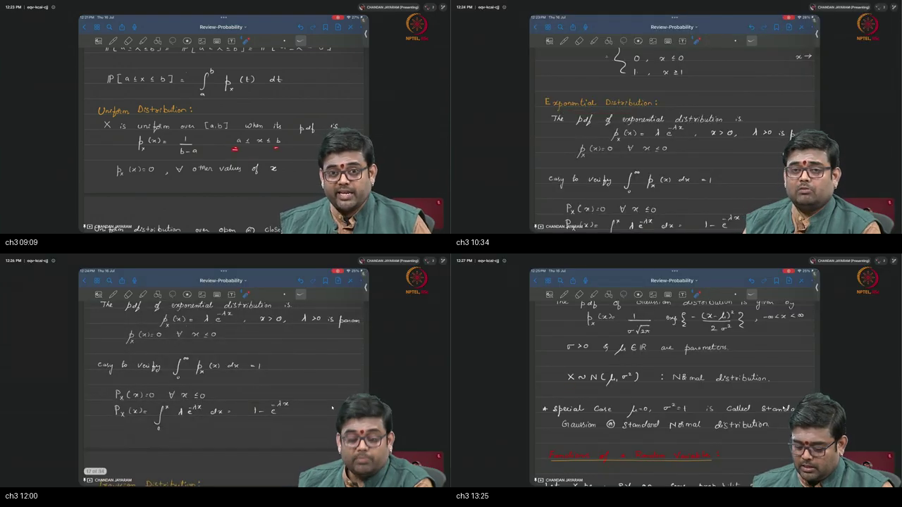

*Figure — ~08:43–13:57: Chalkboard definitions of Uniform $\text{Unif}[a,b]$, Exponential $\text{Exp}(\lambda)$, and Gaussian / Normal $\mathcal{N}(\mu, \sigma^2)$ distributions with their respective analytical PDFs and CDFs.*

---

### 1. 👶 ELI5 Quick Intuition
- **Uniform Distribution:** A flat, completely level table. Every interval of equal width has the exact same chance of catching a marble.
- **Exponential Distribution:** A ski slope starting high at $x = 0$ and rapidly dropping off to the right. Models waiting times (like waiting for a bus or a lightbulb to burn out).
- **Gaussian (Normal) Distribution:** The famous symmetric bell curve. Most values cluster near the center $\mu$, while values further out in the tails become exponentially rarer.

---

### 2. 🔍 Plain-English Breakdown
1. **Continuous Uniform Distribution ($\text{Unif}[a, b]$):**
   - Constant density height $p(x) = \frac{1}{b-a}$ on interval $[a, b]$.
   - CDF rises linearly from $0$ at $a$ to $1$ at $b$: $F(x) = \frac{x-a}{b-a}$.
2. **Exponential Distribution ($\text{Exp}(\lambda)$ with $\lambda > 0$):**
   - Density starts at peak $\lambda$ at $x = 0$ and decays: $p(x) = \lambda e^{-\lambda x}$ for $x \ge 0$.
   - CDF accumulates asymptotically: $F(x) = 1 - e^{-\lambda x}$ for $x \ge 0$.
3. **Gaussian / Normal Distribution ($\mathcal{N}(\mu, \sigma^2)$):**
   - The cornerstone distribution of Generative AI (latent priors, diffusion noise).
   - Specified by two parameters: mean $\mu \in \mathbb{R}$ (center) and variance $\sigma^2 > 0$ (width squared).
   - Standard Normal: $\mu = 0, \sigma^2 = 1 \implies \mathcal{N}(0, 1)$.

---

### 3. 📐 Formal Mathematics & Rigorous Derivation

```
  Uniform[a, b]:                  Exponential(λ):                 Gaussian N(μ, σ²):
  p(x) = 1 / (b - a)              p(x) = λ e^{-λx} (x ≥ 0)        p(x) = 1/(σ√(2π)) exp(-(x-μ)²/(2σ²))
  F(x) = (x - a) / (b - a)        F(x) = 1 - e^{-λx} (x ≥ 0)      F(x) = 1/2 [1 + erf((x-μ)/(σ√2))]
```

#### Analytical Gaussian PDF Formula
$$p_X(x) = \frac{1}{\sigma \sqrt{2\pi}} \exp\left( -\frac{(x - \mu)^2}{2\sigma^2} \right), \quad x \in \mathbb{R}$$
Where $\int_{-\infty}^\infty p_X(x)\,dx = 1.0$ via Poisson's polar coordinate double integral $\left(\int_{-\infty}^\infty e^{-u^2}du = \sqrt{\pi}\right)$.

---

### 4. 🔢 Concrete Numerical Example
Let $X \sim \text{Exp}(\lambda = 0.5)$:
1. Write the PDF and CDF:
   $$p_X(x) = 0.5 e^{-0.5 x}, \quad F_X(x) = 1 - e^{-0.5 x} \quad (x \ge 0)$$
2. What is the probability that waiting time $X$ exceeds 4 units?
   $$P(X > 4) = 1 - F_X(4) = 1 - (1 - e^{-0.5 \cdot 4}) = e^{-2} \approx 0.1353 = 13.53\%$$

---

## Topic 4: Functions of RVs and Change of Variables (13:57–20:24)

<a id="topic-4-functions-of-rvs-and-change-of-variables-1357–2024"></a>

### Where this sits on the master map
Transforming random variables through deterministic functions $Y = g(X)$ and deriving transformed densities. Warm-up: [functions & mappings](../21-Tutorial07-Review-Basic-Probability-1/PREREQUISITES.md#p2-fn).

### Board / Screenshot Reference

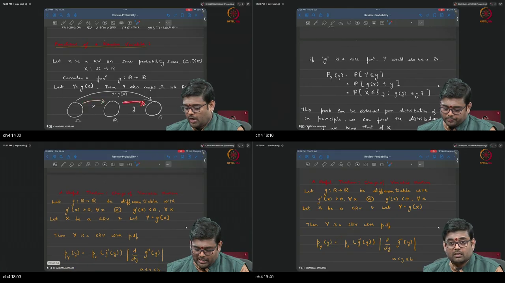

*Figure — ~13:57–20:24: Chalkboard derivation of composite mapping $\Omega \xrightarrow{X} \mathbb{R} \xrightarrow{g} \mathbb{R}$, the Change of Variables Theorem for strictly monotonic functions, and the necessity of the Jacobian derivative term $\left|\frac{dx}{dy}\right|$.*

---

### 1. 👶 ELI5 Quick Intuition
Imagine stretching a rubber sheet with a drawing on it:
- If you stretch the sheet to make it **twice as wide**, the ink spreads out and becomes **half as dark**.
- If you compress the sheet to make it **half as wide**, the ink becomes **twice as dark**.
- When you pass a random variable $X$ through a function $Y = g(X)$, space stretches or shrinks. The **Change of Variables Theorem** is the mathematical rule that adjusts the ink darkness (density height) so the total amount of ink (total probability area) stays exactly equal to $1.0$!

---

### 2. 🔍 Plain-English Breakdown
1. **Composite Random Variable ($Y = g(X)$):**
   - $X$ maps outcome $\omega \in \Omega$ to a real number $X(\omega)$.
   - Function $g$ maps $X(\omega)$ to $Y(\omega) = g(X(\omega))$.
2. **The Cumulative Distribution Method:**
   - The fundamental definition of $Y$'s CDF is:
     $$F_Y(y) = P(Y \le y) = P(g(X) \le y) = P(X \in \{x : g(x) \le y\})$$
3. **The Change of Variables Theorem (Monotone $g$):**
   - If $g$ is differentiable and strictly monotonic (either $g'(x) > 0$ everywhere or $g'(x) < 0$ everywhere), the density of $Y$ is:
     $$p_Y(y) = p_X\bigl(g^{-1}(y)\bigr) \cdot \left| \frac{d}{dy} g^{-1}(y) \right| = p_X(x) \cdot \left| \frac{dx}{dy} \right|$$
4. **Why Normalizing Flows Use This:** Modern generative Normalizing Flows (RealNVP, Glow) stack invertible neural networks $g_1, g_2, \dots, g_K$ and use this exact theorem (in multidimensional Jacobian form) to compute exact data likelihoods!

---

### 3. 📐 Formal Mathematics & Rigorous Derivation

```
  Ω ───X───► ℝ ───g───► ℝ
  ω ───────► x ───────► y = g(x)
  
  For strictly increasing g:
  F_Y(y) = P(g(X) ≤ y) = P(X ≤ g^{-1}(y)) = F_X(g^{-1}(y))
  
  Differentiating with respect to y:
  p_Y(y) = d/dy F_X(g^{-1}(y)) = p_X(g^{-1}(y)) · d/dy g^{-1}(y)
```

#### Complete Derivation for Strictly Decreasing $g$ ($g'(x) < 0$)
- When $g$ is decreasing, applying $g^{-1}$ reverses the inequality:
  $$F_Y(y) = P(g(X) \le y) = P\bigl(X \ge g^{-1}(y)\bigr) = 1 - F_X\bigl(g^{-1}(y)\bigr)$$
- Differentiating with respect to $y$ via the chain rule:
  $$p_Y(y) = \frac{d}{dy}\left[1 - F_X\bigl(g^{-1}(y)\bigr)\right] = - p_X\bigl(g^{-1}(y)\bigr) \cdot \frac{d}{dy} g^{-1}(y)$$
- Since $g$ is decreasing, $\frac{d}{dy}g^{-1}(y) < 0$, which means $-\frac{d}{dy}g^{-1}(y) = \left|\frac{d}{dy}g^{-1}(y)\right|$.
- Unifying both cases into one universal formula:
  $$p_Y(y) = p_X\bigl(g^{-1}(y)\bigr) \cdot \left| \frac{d}{dy} g^{-1}(y) \right| \quad \blacksquare$$

---

### 4. 🔢 Concrete Numerical Example
Let $X \sim \text{Unif}[0, 1]$ (so $p_X(x) = 1$ on $[0, 1]$). Let $Y = 2X + 3$ (Linear transform with $g(x) = 2x+3$):
1. Invert the map: $y = 2x + 3 \implies x = g^{-1}(y) = \frac{y - 3}{2}$.
2. Compute the derivative: $\frac{dx}{dy} = \frac{d}{dy}\left[\frac{y-3}{2}\right] = \frac{1}{2}$.
3. Find the support of $Y$: As $x \in [0, 1]$, $y \in [2(0)+3, 2(1)+3] = [3, 5]$.
4. Compute transformed density $p_Y(y)$ on $[3, 5]$:
   $$p_Y(y) = p_X\left(\frac{y-3}{2}\right) \cdot \left|\frac{1}{2}\right| = 1 \cdot \frac{1}{2} = 0.5$$
5. Verification: $Y$ is Uniform on $[3, 5]$ of width $2$, so height $0.5$ has area $2 \times 0.5 = 1.0 \checkmark$.

---

## Topic 5: Expectation and LOTUS (20:24–26:10)

<a id="topic-5-expectation-and-lotus-2024–2610"></a>

### Where this sits on the master map
Defining the center of mass of a continuous distribution and applying the Law of the Unconscious Statistician. Warm-up: [weighted average & mean](./PREREQUISITES.md#p5-mean).

### Board / Screenshot Reference

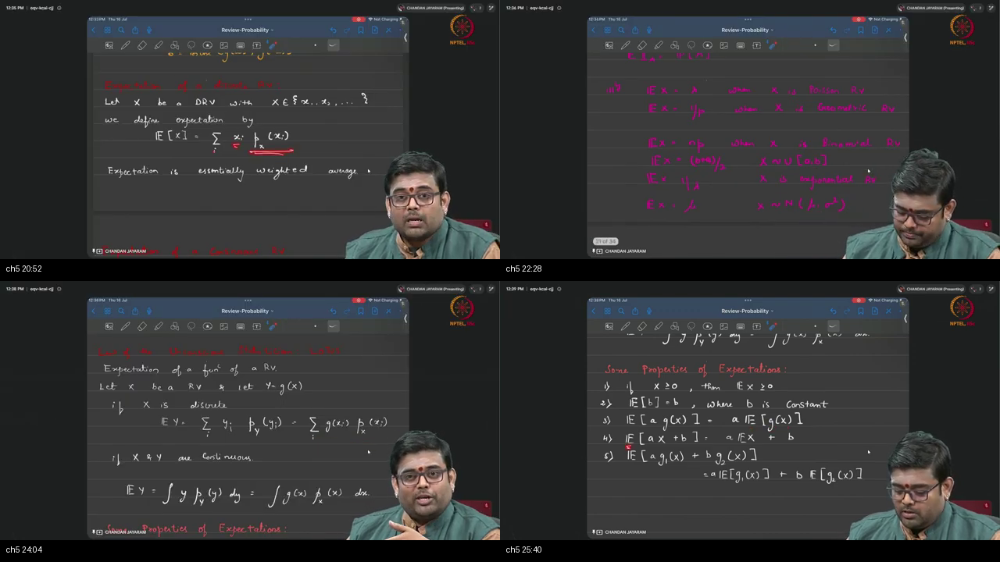

*Figure — ~20:24–26:10: Blackboard formulation of Mathematical Expectation $\mathbb{E}[X] = \int x p(x)dx$, the Law of the Unconscious Statistician (LOTUS) $\mathbb{E}[g(X)] = \int g(x)p_X(x)dx$, indicator expectation $\mathbb{E}[1_B] = P(B)$, and linearity of expectation.*

---

### 1. 👶 ELI5 Quick Intuition
Imagine a chef running a restaurant:
- $X$ is the weight of dough in each pizza (a random number centered at 300 grams).
- Profit on each pizza is given by $g(x) = 5.00 + 0.02 x^2$ dollars.
- **The Hard Way:** Calculate the full probability curve of restaurant profits $Y$, and then integrate.
- **The LOTUS Way:** Keep the original pizza dough scale $p_X(x)$ and simply calculate the average profit by weighting each dough size by its profit!

---

### 2. 🔍 Plain-English Breakdown
1. **Mathematical Expectation ($\mathbb{E}[X]$):**
   - The probability-weighted average of all possible values of $X$.
   - **Continuous:** $\mathbb{E}[X] = \int_{-\infty}^\infty x \, p_X(x)\,dx$.
   - **Discrete:** $\mathbb{E}[X] = \sum_i x_i \, p_X(x_i)$.
2. **The LOTUS Theorem:**
   - To compute the expectation of a transformed variable $Y = g(X)$, we do **not** need to find $p_Y(y)$ first:
     $$\mathbb{E}[g(X)] = \int_{-\infty}^\infty g(x) \, p_X(x)\,dx$$
3. **Key Algebraic Properties of Expectation:**
   - **Positivity:** If $X \ge 0$ almost surely, then $\mathbb{E}[X] \ge 0$.
   - **Constants:** $\mathbb{E}[c] = c$ for any constant $c \in \mathbb{R}$.
   - **Linearity:** $\mathbb{E}[a g_1(X) + b g_2(X)] = a \mathbb{E}[g_1(X)] + b \mathbb{E}[g_2(X)]$.

---

### 3. 📐 Formal Mathematics & Rigorous Derivation

```
  Direct Method (Painful):              LOTUS Method (Direct & Clean):
  X ──► Find p_Y(y) ──► ∫ y p_Y(y) dy    X ──► Compute ∫ g(x) p_X(x) dx directly
```

#### Mathematical Proof of LOTUS (for Monotone Differentiable $g$)
Let $Y = g(X)$ where $g$ is strictly increasing. By the Change of Variables theorem (Topic 4), $p_Y(y) = p_X(g^{-1}(y)) \frac{d}{dy}g^{-1}(y)$.
$$\mathbb{E}[Y] = \int_{-\infty}^\infty y \, p_Y(y)\,dy = \int_{-\infty}^\infty y \, p_X\bigl(g^{-1}(y)\bigr) \, \frac{d}{dy}g^{-1}(y) \, dy$$
Apply substitution: let $x = g^{-1}(y)$, so $y = g(x)$ and $dx = \frac{d}{dy}g^{-1}(y)\,dy$:
$$\mathbb{E}[g(X)] = \int_{-\infty}^\infty g(x) \, p_X(x)\,dx \quad \blacksquare$$

---

### 4. 🔢 Concrete Numerical Example
Let $X \sim \text{Unif}[0, 2]$, so $p_X(x) = 0.5$ on $[0, 2]$. Let $g(X) = 3X^2$:
$$\mathbb{E}[3X^2] = \int_0^2 (3x^2) \cdot (0.5) \, dx = 1.5 \left[ \frac{x^3}{3} \right]_0^2 = 1.5 \cdot \frac{8}{3} = 4.0$$

---

## Topic 6: Variance and Spread Invariants (26:10–29:02)

<a id="topic-6-variance-2610–2902"></a>

### Where this sits on the master map
Quantifying dispersion around the mean and establishing variance invariance under linear shifts and scalings. Warm-up: [variance as spread](./PREREQUISITES.md#p6-var).

### Board / Screenshot Reference

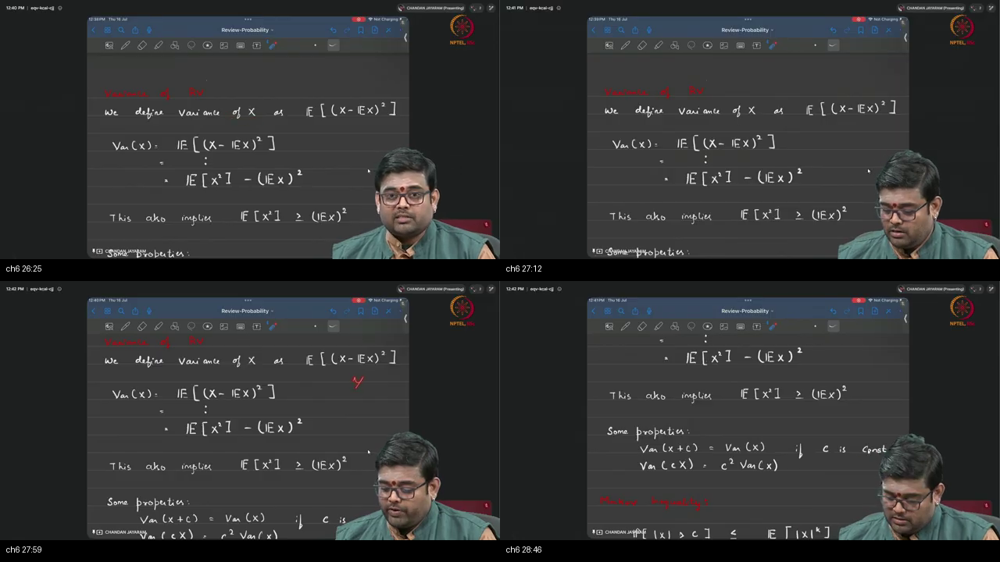

*Figure — ~26:10–29:02: Blackboard derivation of Variance $\text{Var}(X) = \mathbb{E}[(X-\mu)^2] = \mathbb{E}[X^2] - \mu^2$, non-negativity $\text{Var}(X) \ge 0$, shift invariance $\text{Var}(X+c) = \text{Var}(X)$, and quadratic scaling $\text{Var}(cX) = c^2\text{Var}(X)$.*

---

### 1. 👶 ELI5 Quick Intuition
Think of shooting arrows at a bullseye:
- The mean $\mu$ is where the center of your arrow cluster lands.
- **Variance ($\text{Var}(X)$)** is how widely your arrows are scattered around that center.
- **Shift Invariance:** If the target is moved 5 feet to the right, your entire cluster moves 5 feet to the right, but the *looseness or tightness of your scatter* remains **exactly the same**!

---

### 2. 🔍 Plain-English Breakdown
1. **Definition of Variance:** The expected squared distance between values of $X$ and its mean $\mu = \mathbb{E}[X]$:
   $$\text{Var}(X) \triangleq \mathbb{E}\left[(X - \mathbb{E}[X])^2\right]$$
2. **The Computational Shortcut Formula:**
   $$\text{Var}(X) = \mathbb{E}[X^2] - (\mathbb{E}[X])^2$$
3. **Shift Invariance:** Adding a constant $c$ shifts the mean by $c$ but leaves spread unchanged:
   $$\text{Var}(X + c) = \text{Var}(X)$$
4. **Quadratic Scaling:** Multiplying by constant $c$ squares the variance:
   $$\text{Var}(cX) = c^2 \text{Var}(X)$$
5. **Standard Deviation ($\sigma$):** $\sigma = \sqrt{\text{Var}(X)}$, restoring the spread metric back to original measurement units.

---

### 3. 📐 Formal Mathematics & Rigorous Derivation

```
  Deviation:  (X - μ)
  Square:     (X - μ)²  ≥ 0
  Average:    Var(X) = E[(X - μ)²] ≥ 0
  
  Algebraic Identity:
  Var(X) = E[X² - 2μX + μ²] = E[X²] - 2μ E[X] + μ² = E[X²] - μ²
```

#### Theorem: Linear Transformation of Variance
For any scalars $a, b \in \mathbb{R}$:
$$\text{Var}(aX + b) = a^2 \text{Var}(X)$$
*Proof:*
$$\begin{aligned}
\text{Var}(aX + b) &= \mathbb{E}\left[\bigl((aX + b) - \mathbb{E}[aX + b]\bigr)^2\right] \\
&= \mathbb{E}\left[\bigl(aX + b - (a\mu + b)\bigr)^2\right] = \mathbb{E}\left[\bigl(a(X - \mu)\bigr)^2\right] = a^2 \mathbb{E}\left[(X - \mu)^2\right] = a^2 \text{Var}(X) \quad \blacksquare
\end{aligned}$$

---

### 4. 🔢 Concrete Numerical Example
Let $X \sim \text{Unif}[0, 6]$:
1. Mean: $\mu = \frac{0 + 6}{2} = 3.0$.
2. Second Moment $\mathbb{E}[X^2] = \int_0^6 x^2 \cdot \frac{1}{6} \, dx = \frac{1}{6} \left[\frac{x^3}{3}\right]_0^6 = \frac{216}{18} = 12.0$.
3. Variance: $\text{Var}(X) = \mathbb{E}[X^2] - \mu^2 = 12.0 - 3.0^2 = 12.0 - 9.0 = 3.0$.
4. Scale: What is $\text{Var}(-5X + 42)$?
   $$\text{Var}(-5X + 42) = (-5)^2 \cdot \text{Var}(X) = 25 \times 3.0 = 75.0$$

---

## Topic 7: Markov, Chebyshev, and Jensen Inequalities (29:02–33:17)

<a id="topic-7-markov-chebyshev-jensen-2902–3317"></a>

### Where this sits on the master map
Establishing distribution-free statistical tail bounds and convexity principles. Warm-up: [convex functions & Jensen](./PREREQUISITES.md#p7-convex).

### Board / Screenshot Reference

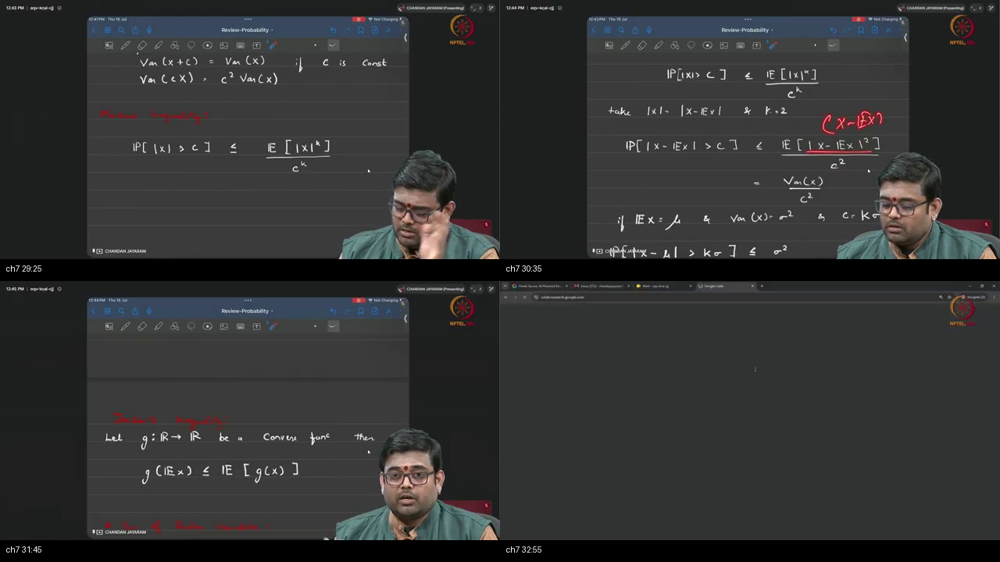

*Figure — ~29:02–33:17: Chalkboard statement of Markov's inequality, Chebyshev's distribution-free tail bound $P(|X-\mu| \ge k\sigma) \le 1/k^2$, and Jensen's inequality for convex functions $g(\mathbb{E}[X]) \le \mathbb{E}[g(X)]$.*

---

### 1. 👶 ELI5 Quick Intuition
- **Markov & Chebyshev (Speed Limits for Randomness):** Even if you know *nothing* about the exact shape of a probability distribution (whether it's normal, skewed, or weird), knowing just the mean and variance gives you a guaranteed "universal speed limit" on how much probability can live far out in the extremes.
- **Jensen's Inequality (The Smiling Curve):** If you take a bowl-shaped road ($\smile$) and calculate the elevation at the average mile marker, that elevation is lower than the average of the elevations!

---

### 2. 🔍 Plain-English Breakdown
1. **Markov's Inequality:** For any non-negative random variable $X \ge 0$ and threshold $c > 0$:
   $$P(X \ge c) \le \frac{\mathbb{E}[X]}{c}$$
2. **Chebyshev's Inequality (Distribution-Free!):**
   - Applies Markov to the squared deviation $(X - \mu)^2$:
     $$P\bigl(|X - \mu| \ge k\sigma\bigr) \le \frac{1}{k^2}$$
   - *Guarantee:* For ANY probability distribution, at most $25\%$ of mass can be $2\sigma$ away ($k=2$), and at most $11.1\%$ can be $3\sigma$ away ($k=3$).
3. **Jensen's Inequality:** For any convex function $g(x)$ (where $g''(x) \ge 0$):
   $$g\bigl(\mathbb{E}[X]\bigr) \le \mathbb{E}\bigl[g(X)\bigr]$$
   - In **VAEs**, because $\log$ is concave ($-\log$ is convex), Jensen allows us to construct the Evidence Lower Bound: $\log p(x) \ge \mathbb{E}_{q(z|x)}\left[\log \frac{p(x, z)}{q(z|x)}\right]$.

---

### 3. 📐 Formal Mathematics & Rigorous Derivation

```
  Markov:     P(|X| ≥ c) ≤ E[|X|^k] / c^k
  Chebyshev:  P(|X - μ| ≥ kσ) ≤ 1 / k²   (Holds for ALL distributions!)
  Jensen:     g(E[X]) ≤ E[g(X)]          (For convex g)
```

#### Step-by-Step Proof of Markov's Inequality
Let $X \ge 0$ be a continuous random variable and $c > 0$:
$$\begin{aligned}
\mathbb{E}[X] &= \int_0^\infty x \, p_X(x)\,dx \\
&= \int_0^c x \, p_X(x)\,dx + \int_c^\infty x \, p_X(x)\,dx \\
&\ge 0 + \int_c^\infty c \, p_X(x)\,dx \qquad (\text{since } x \ge c \text{ on } [c, \infty)) \\
&= c \int_c^\infty p_X(x)\,dx = c \cdot P(X \ge c)
\end{aligned}$$
Dividing both sides by $c > 0$ yields Markov's inequality:
$$P(X \ge c) \le \frac{\mathbb{E}[X]}{c} \quad \blacksquare$$

---

### 4. 🔢 Concrete Numerical Example
A factory machine produces widgets with mean lifetime $\mu = 100$ hours and standard deviation $\sigma = 10$ hours:
1. What is the maximum probability that a widget's lifetime deviates from 100 hours by more than 30 hours ($k = 30 / 10 = 3$ standard deviations)?
   $$P(|X - 100| \ge 30) = P(|X - \mu| \ge 3\sigma) \le \frac{1}{3^2} = \frac{1}{9} \approx 0.1111 = 11.11\%$$
   *This bound holds true regardless of whether widget lifetimes are Gaussian, Exponential, or multimodal!*

---

## Topic 8: NumPy Dice Simulation and Bayesian Numerics (33:17–40:09)

<a id="topic-8-numpy-dice-and-bayes-3317–4009"></a>

### Where this sits on the master map
Moving from blackboard mathematics to reproducible computational simulation in NumPy. Warm-up: [sampling & seed](./PREREQUISITES.md#p8-sample).

### Board / Screenshot Reference

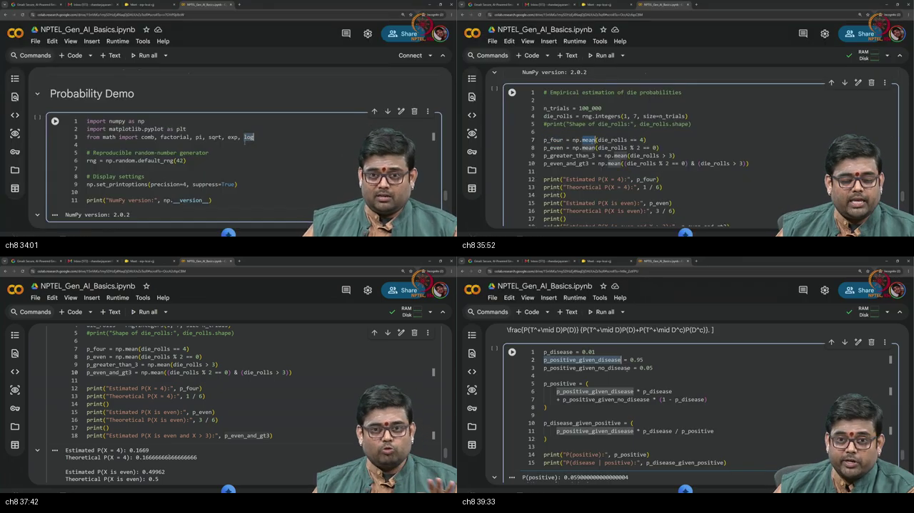

*Figure — ~33:17–40:09: Google Colab interactive walkthrough verifying die toss frequencies with `rng.integers(1, 7)` over 100,000 trials, and calculating numerical Bayes disease posterior $P(D|T^+)$.*

---

### 1. 👶 ELI5 Quick Intuition
Theoretical probability tells us that a fair die rolls a four with probability $1/6 \approx 16.67\%$.
In this topic, we spin up a digital robot to roll a virtual die 100,000 times. By counting how many times the robot rolled a 4, we verify that real-world simulation matches chalkboard theory almost to the fourth decimal place!

---

### 2. 🔍 Plain-English Breakdown
1. **NumPy Generator Setup:**
   ```python
   import numpy as np
   rng = np.random.default_rng(42)  # Seed 42 for reproducible pseudo-randomness
   ```
2. **The High-End Exclusive Rule:**
   - In NumPy, `rng.integers(low, high)` excludes `high`.
   - To roll a standard 6-sided die ($\{1, 2, 3, 4, 5, 6\}$), you **must write `rng.integers(1, 7)`**. Writing `integers(1, 6)` deletes the 6 face!
3. **Boolean Mask Frequency Trick:**
   - In NumPy, taking the `np.mean()` of a Boolean array directly computes empirical probability:
     ```python
     p_four = np.mean(die_rolls == 4)  # ~0.1669 vs 1/6 = 0.1667
     ```
4. **Numerical Bayes Posterior Verification:**
   - Disease prevalence $P(D) = 0.01$, Test sensitivity $P(T^+|D) = 0.95$, False alarm $P(T^+|D^c) = 0.05$.
   - Posterior: $P(D|T^+) = \frac{0.95 \times 0.01}{(0.95 \times 0.01) + (0.05 \times 0.99)} = \frac{0.0095}{0.0095 + 0.0495} = \frac{0.0095}{0.0590} \approx 0.1610 = 16.1\%$.

---

### 3. 📐 Formal Mathematics & Rigorous Code Block

```python
# Topic 8 Execution Block: NumPy Dice & Bayes Numerics
import numpy as np

rng = np.random.default_rng(42)
N = 100_000

# 1. Die simulation
rolls = rng.integers(1, 7, size=N)
p4_sim = np.mean(rolls == 4)
peven_sim = np.mean(rolls % 2 == 0)
pgt3_sim = np.mean(rolls > 3)
peven_and_gt3_sim = np.mean((rolls % 2 == 0) & (rolls > 3))

print(f"P(Roll == 4):        {p4_sim:.4f} (Theory: 1/6 = {1/6:.4f})")
print(f"P(Roll is Even):     {peven_sim:.4f} (Theory: 3/6 = {0.5000})")
print(f"P(Roll > 3):         {pgt3_sim:.4f} (Theory: 3/6 = {0.5000})")
print(f"P(Even AND > 3):     {peven_and_gt3_sim:.4f} (Theory: {2/6:.4f})")

# 2. Bayes Numerics
p_d = 0.01
p_t_given_d = 0.95
p_t_given_dc = 0.05
p_t = (p_t_given_d * p_d) + (p_t_given_dc * (1.0 - p_d))
p_d_given_t = (p_t_given_d * p_d) / p_t

print(f"Bayes Posterior P(Disease | Test+): {p_d_given_t:.4f} (Exact: 0.1610)")
```

---

## Topic 9: Discrete Sampling Families in Python (40:09–46:03)

<a id="topic-9-discrete-sampling-families-4009–4603"></a>

### Where this sits on the master map
Demonstrating discrete random number generators (Indicator, Bernoulli, Categorical, Binomial) in NumPy. Warm-up: [discrete sampling](./PREREQUISITES.md#p8-sample).

### Board / Screenshot Reference

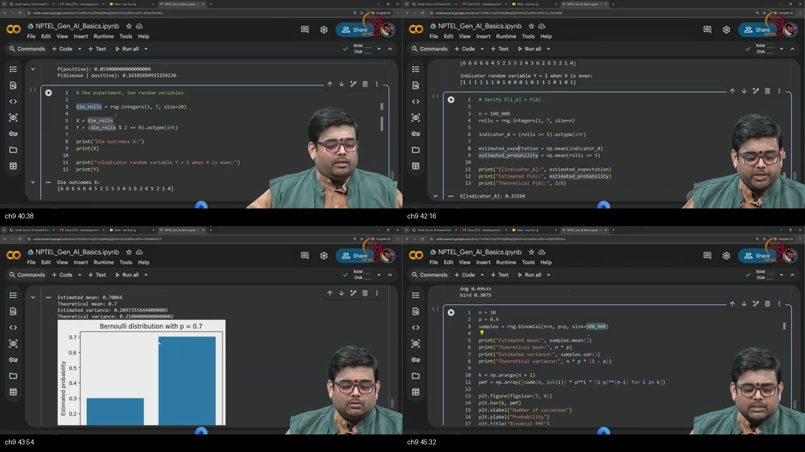

*Figure — ~40:09–46:03: Interactive sampling of Indicator variables, Bernoulli trials via `rng.binomial(1, p)`, Categorical sampling via `rng.choice()`, and Binomial distributions.*

---

### 1. 👶 ELI5 Quick Intuition
In software, discrete distributions are modular Lego bricks:
- **Indicator:** A light switch that turns ON ($1$) if an event occurs, and OFF ($0$) otherwise.
- **Bernoulli:** A single biased coin flip.
- **Binomial:** Flipping 10 biased coins and counting how many land on heads.
- **Categorical (`choice`):** A spinning wheel divided into slices for "cat", "dog", and "bird".

---

### 2. 🔍 Plain-English Breakdown
1. **Indicator Expectation Matching in Code:**
   - For event $A = \{\text{Die Roll} \ge 5\} = \{5, 6\}$, $P(A) = 2/6 = 1/3$.
   - Creating indicator array `ind = (rolls >= 5).astype(float)` yields `np.mean(ind) == np.mean(rolls >= 5) \approx 0.3333`, computationally verifying $\mathbb{E}[1_A] = P(A)$.
2. **Bernoulli as Binomial with $n=1$:**
   - Calling `rng.binomial(n=1, p=0.7, size=100_000)` samples a Bernoulli distribution with mean $0.70$ and variance $p(1-p) = 0.7(0.3) = 0.21$.
3. **Categorical Sampling (`rng.choice`):**
   - Simulates discrete text categories with custom probabilities:
     ```python
     rng.choice(["cat", "dog", "bird"], size=20_000, p=[0.2, 0.5, 0.3])
     ```
4. **Binomial Aggregation:**
   - `rng.binomial(n=10, p=0.4, size=10_000)` yields samples with empirical mean $\approx 4.0$ ($\mathbb{E}[X] = np = 10 \times 0.4$) and variance $\approx 2.40$ ($\text{Var}(X) = np(1-p) = 10 \times 0.4 \times 0.6$).

---

### 3. 📐 Formal Mathematics & Rigorous Code Block

```python
# Topic 9 Execution Block: Discrete Sampling Families
# 1. Bernoulli via binomial(n=1)
p_param = 0.70
bern_samples = rng.binomial(n=1, p=p_param, size=100_000)
print(f"Bernoulli(0.7) -> Mean: {bern_samples.mean():.4f} (Theory: {p_param:.2f}) | Var: {bern_samples.var():.4f} (Theory: {p_param*(1-p_param):.4f})")

# 2. Categorical
cats = rng.choice(["cat", "dog", "bird"], size=30_000, p=[0.2, 0.5, 0.3])
print(f"Categorical Frequencies -> cat: {np.mean(cats=='cat'):.4f}, dog: {np.mean(cats=='dog'):.4f}, bird: {np.mean(cats=='bird'):.4f}")

# 3. Binomial n=10, p=0.4
bin_samples = rng.binomial(n=10, p=0.4, size=100_000)
print(f"Binomial(10, 0.4) -> Mean: {bin_samples.mean():.4f} (Theory: 4.0000) | Var: {bin_samples.var():.4f} (Theory: 2.4000)")
```

---

## Topic 10: Continuous Simulation, Transforms, and Recap (46:03–57:13)

<a id="topic-10-continuous-simulation-and-recap-4603–5713"></a>

### Where this sits on the master map
Histogram overlays on analytical PDFs, empirical sigmoid CDF curves, sample-size convergence ladders, and verifying independent vs dependent expectations. Warm-up: [sampling](./PREREQUISITES.md#p8-sample).

### Board / Screenshot Reference

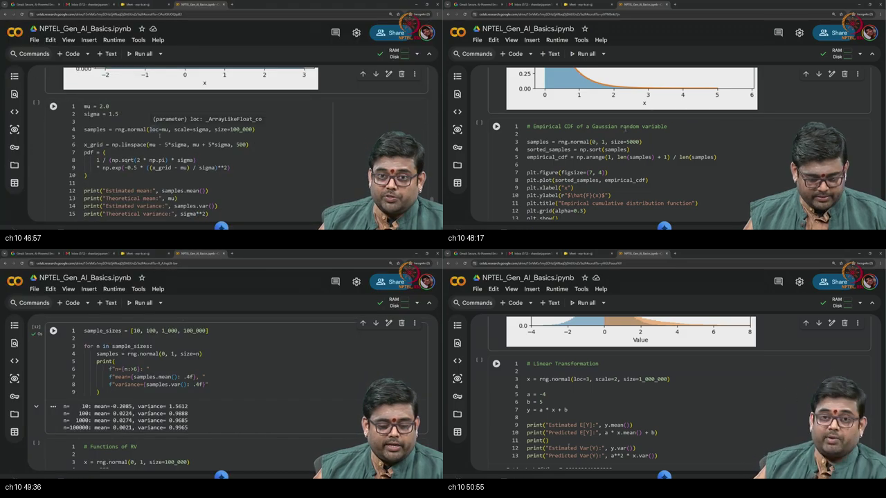

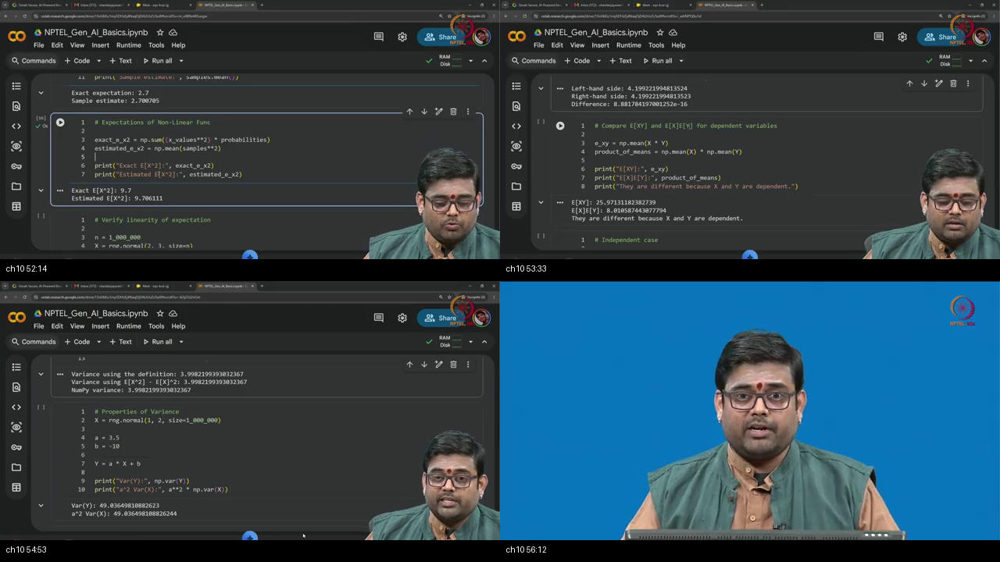

*Figure — ~46:03–57:13: Continuous histogram overlays on analytical PDFs, empirical Gaussian sigmoid CDF curves, linear transformation validation $Y = -4X + 5 \implies \mathbb{E}[Y] = -7$, and demonstrating $\mathbb{E}[XY] \neq \mathbb{E}[X]\mathbb{E}[Y]$ under dependence.*

---

### 1. 👶 ELI5 Quick Intuition
When you collect millions of continuous measurements (like height or sensor noise) and group them into thin vertical histogram bars, the jagged bars smooth out and form the exact smooth mathematical bell curve you drew on paper!

---

### 2. 🔍 Plain-English Breakdown
1. **Histogram Overlays on PDFs:**
   - Passing `density=True` into `plt.hist()` normalizes bar heights so that total bar area equals $1.0$. Plotting the analytical formula $p(x) = \frac{1}{\sigma\sqrt{2\pi}}e^{-(x-\mu)^2/(2\sigma^2)}$ lays an exact smooth curve on top of the bars.
2. **The Empirical CDF Sigmoid:**
   - Sorting $N$ samples from $\mathcal{N}(0, 1)$ and plotting against ranks $1/N, 2/N, \dots, N/N$ generates an empirical CDF curve that exhibits the smooth **sigmoid shape** of the Gaussian error function ($\text{erf}$).
3. **The Sample Size Convergence Ladder:**
   - With $N = 10$, empirical mean is noisy ($\bar{X} \approx -0.29$).
   - With $N = 100$, empirical mean stabilizes ($\bar{X} \approx 0.04$).
   - With $N = 100,000$, empirical mean locks onto theory ($\bar{X} \approx 0.0002$).
4. **Linear Transform Validation:**
   - For $X \sim \mathcal{N}(3, 2^2)$ and $Y = -4X + 5$:
     $$\mathbb{E}[Y] = -4(3) + 5 = -7.0, \quad \text{Var}(Y) = (-4)^2 \cdot 4 = 64.0$$
5. **Product of Expectations (The Independence Trap):**
   - If $X$ and $Y$ are independent: $\mathbb{E}[XY] = \mathbb{E}[X]\mathbb{E}[Y]$.
   - If $Y = 2X + \text{noise}$ (Dependent): $\mathbb{E}[XY] \approx 26.0$, whereas $\mathbb{E}[X]\mathbb{E}[Y] \approx 8.0 \implies \mathbb{E}[XY] \neq \mathbb{E}[X]\mathbb{E}[Y]$.

---

### 3. 📐 Formal Mathematics & Live Code Block

```python
# Topic 10 Execution Block: Continuous Simulation & Transforms
# 1. Normal Distribution Overlay & Convergence
mu, sigma = 2.0, 1.5
norm_samples = rng.normal(loc=mu, scale=sigma, size=100_000)
print(f"Gaussian N(2.0, 1.5^2) -> Mean: {norm_samples.mean():.4f} (Theory: {mu:.2f}) | Var: {norm_samples.var():.4f} (Theory: {sigma**2:.2f})")

# 2. Linear Transformation Y = aX + b
a, b = -4.0, 5.0
X_base = rng.normal(loc=3.0, scale=2.0, size=1_000_000)
Y_trans = a * X_base + b
print(f"Y = -4X + 5 -> E[Y]: {Y_trans.mean():.4f} (Theory: -7.0000) | Var(Y): {Y_trans.var():.4f} (Theory: 64.0000)")

# 3. Dependent vs Independent Expectations
X_indep = rng.normal(3.0, 1.0, size=100_000)
Y_dep = 2.0 * X_indep + rng.normal(0.0, 1.0, size=100_000)
print(f"Dependent Pair   -> E[XY]: {np.mean(X_indep * Y_dep):.4f} != E[X]E[Y]: {np.mean(X_indep)*np.mean(Y_dep):.4f}")
```

---

## Workplace Debugging Postmortems

### Workplace Scenario 1: The "Density Clamping & Probability Misinterpretation" Bug in Continuous Normalizing Flows

#### Incident Summary & Context
An ML engineering team deploying a continuous **Normalizing Flow (RealNVP)** for high-resolution image anomaly detection encountered exploding loss values and NaN gradients during maximum likelihood training. The loss function was minimizing the negative log-likelihood:
$$\mathcal{L}(\theta) = -\log p_Y(y) = -\log p_X\bigl(g^{-1}(y)\bigr) - \log \left| \det J_{g^{-1}}(y) \right|$$
A junior engineer, noticing that in discrete probability $\log P(X=x) \le 0$, added a safety check clamping all likelihoods: `torch.clamp(p_y, max=1.0)`.

#### Root Cause Analysis
- In **continuous probability**, a PDF represents a **density height**, not a probability mass.
- For narrow distributions (e.g. latent Gaussian variables with small variance $\sigma = 0.05$), the density height $p(x) = \frac{1}{0.05\sqrt{2\pi}} \approx 7.98 \gg 1.0$, which means $\log p(x) = \log(7.98) \approx +2.07 > 0$.
- Clamping continuous likelihoods to $\le 1.0$ forced $\log p(y) \le 0$, truncating legitimate high-density regions, producing massive artificial gradient penalties, and breaking invertible Jacobian training.

#### Production Code Fix

```python
import torch

def compute_normalizing_flow_nll(z: torch.Tensor, log_det_jacobian: torch.Tensor) -> torch.Tensor:
    """
    Computes exact Negative Log-Likelihood (NLL) for continuous Normalizing Flows.
    
    CORRECT: Continuous density heights CAN exceed 1.0 (log_p can be positive).
    NEVER clamp continuous densities to <= 1.0!
    """
    # Standard Gaussian Base Density: p(z) = (2π)^(-D/2) * exp(-0.5 * ||z||^2)
    dim = z.shape[-1]
    log_base_density = -0.5 * dim * torch.log(torch.tensor(2.0 * torch.pi)) - 0.5 * torch.sum(z**2, dim=-1)
    
    # Change of Variables: log p(y) = log p(z) + log |det J_{g^-1}|
    log_p_y = log_base_density + log_det_jacobian
    
    # Return Negative Log-Likelihood (Loss)
    loss = -torch.mean(log_p_y)
    return loss
```

---

### Workplace Scenario 2: The "Jensen Direction Inversion & False Variational Lower Bound" Bug in VAE Loss Implementation

#### Incident Summary & Context
A deep learning team building a **Variational Autoencoder (VAE)** for molecule generation found that their model suffered from severe posterior collapse and failed to learn meaningful latent representations. Inspecting the training loss code revealed that the importance-sampled Monte Carlo expectation was computed outside the logarithm:
```python
# BUGGY IMPLEMENTATION:
importance_weights = p_x_given_z * p_z / q_z_given_x
loss = -torch.log(torch.mean(importance_weights, dim=0)) # Inverted Jensen!
```

#### Root Cause Analysis
- By Jensen's Inequality, because $\log(u)$ is concave ($\frown$):
  $$\log \mathbb{E}[W] \ge \mathbb{E}[\log W]$$
- Taking $\log \left( \frac{1}{K}\sum W_k \right)$ computes an **Upper Bound** on the Evidence Lower Bound (ELBO) that introduces optimistic bias during gradient optimization, destabilizing the encoder network.
- The correct analytical VAE objective optimizes the true Evidence Lower Bound (ELBO) by keeping the logarithm inside the expectation and decomposing into Reconstruction Loss and analytical KL Divergence:
  $$\text{ELBO} = \mathbb{E}_{q_\phi(z|x)}\left[\log p_\theta(x|z)\right] - D_{\text{KL}}\bigl(q_\phi(z|x) \,\|\, p(z)\bigr)$$

#### Production Code Fix

```python
import torch
import torch.nn as nn
import torch.nn.functional as F

def vae_loss_function(recon_x: torch.Tensor, x: torch.Tensor, mu: torch.Tensor, logvar: torch.Tensor) -> torch.Tensor:
    """
    Correct Evidence Lower Bound (ELBO) Loss Implementation via Reparameterization Trick.
    """
    # 1. Reconstruction Loss (Bernoulli / Binary Cross Entropy or Gaussian MSE)
    recon_loss = F.binary_cross_entropy(recon_x, x, reduction='sum')
    
    # 2. Analytical KL Divergence D_KL( q(z|x) || N(0, I) )
    # D_KL = -0.5 * sum( 1 + log(sigma^2) - mu^2 - sigma^2 )
    kl_divergence = -0.5 * torch.sum(1.0 + logvar - mu.pow(2) - logvar.exp())
    
    # Total VAE Loss = -ELBO = Reconstruction Loss + KL Divergence
    total_loss = (recon_loss + kl_divergence) / x.size(0)
    return total_loss
```

---

## Centralized External References

<a id="external-references"></a>

Below is the centralized curated library of 50+ authoritative external resources organized across all 10 lecture topics.

### Topic 1: Continuous RV and PDF Definition
- **Video Lectures:**
  - [Khan Academy — Probability Density Functions](https://www.khanacademy.org/math/statistics-probability/random-variables-stats-library/random-variables-continuous/v/probability-density-functions)
  - [MIT OpenCourseWare (18.05) — Continuous Random Variables & PDFs](https://ocw.mit.edu/courses/18-05-introduction-to-probability-and-statistics-spring-2014/resources/mit18_05s14_reading5a/)
  - [Harvard Stat 110 (Prof. Joe Blitzstein) — Lecture 8: Continuous RVs](https://www.youtube.com/watch?v=LX2q356N2rU)
- **Authoritative Textbooks & Notes:**
  - [Taboga, M. (Statlect) — Legitimate Probability Density Functions](https://www.statlect.com/fundamentals-of-probability/legitimate-probability-density-functions)
  - [Brown University — Seeing Theory: Continuous Probability Distributions](https://seeing-theory.brown.edu/probability-distributions/index.html)
  - [Casella, G., & Berger, R. L. — Statistical Inference (2nd Edition, Chapter 1: Continuous Distributions)](https://openlibrary.org/books/OL3953406M/Statistical_Inference)

### Topic 2: PDF Properties versus PMF
- **Video Lectures:**
  - [StatQuest (Josh Starmer) — Probability Distributions: Discrete vs Continuous](https://www.youtube.com/watch?v=oI3hZJqXJuc)
  - [3Blue1Brown — Binomial vs Continuous Probability Landscapes](https://www.youtube.com/watch?v=8idr1WZ1A7Q)
  - [Khan Academy — Why Density Can Exceed 1.0](https://www.khanacademy.org/math/statistics-probability/random-variables-stats-library/random-variables-continuous/v/probability-density-functions)
- **Authoritative Textbooks & Notes:**
  - [Statlect — Properties of Probability Density Functions](https://www.statlect.com/fundamentals-of-probability/probability-density-function)
  - [Bertsekas, D. P., & Tsitsiklis, J. N. — Introduction to Probability (Athena Scientific, Chapter 3)](http://athenasc.com/probbook.html)
  - [Wasserman, L. — All of Statistics: A Concise Course in Statistical Inference (Springer, Chapter 2)](https://link.springer.com/book/10.1007/978-0-387-21706-2)

### Topic 3: Uniform, Exponential, and Gaussian Distributions
- **Video Lectures:**
  - [StatQuest (Josh Starmer) — The Normal Distribution Clearly Explained](https://www.youtube.com/watch?v=rzFX5NWojp0)
  - [Khan Academy — Exponential Distribution Calculus & CDF](https://www.khanacademy.org/math/statistics-probability/random-variables-stats-library/poisson-process/v/exponential-pdf)
  - [MIT OpenCourseWare (18.05) — The Central Limit Theorem & Gaussians](https://ocw.mit.edu/courses/18-05-introduction-to-probability-and-statistics-spring-2014/)
- **Authoritative Textbooks & Notes:**
  - [Taboga, M. (Statlect) — Normal Distribution Properties](https://www.statlect.com/probability-distributions/normal-distribution)
  - [Weisstein, Eric W. (MathWorld) — Exponential Distribution](https://mathworld.wolfram.com/ExponentialDistribution.html)
  - [Bishop, C. M. — Pattern Recognition and Machine Learning (Chapter 2: Probability Distributions)](https://www.microsoft.com/en-us/research/publication/pattern-recognition-and-machine-learning/)

### Topic 4: Functions of RVs and Change of Variables
- **Video Lectures:**
  - [3Blue1Brown — Change of Variables and the Jacobian Determinant](https://www.youtube.com/watch?v=okjYP_Uj-KM)
  - [Harvard Stat 110 (Prof. Joe Blitzstein) — Transformations of Random Variables](https://www.youtube.com/watch?v=k_jH1t2o_w8)
  - [Khan Academy — Transforming Random Variables (Linear & Non-linear)](https://www.khanacademy.org/math/ap-statistics/random-variables-ap/transforming-random-variables/v/impact-of-transforming-random-variables)
- **Authoritative Textbooks & Notes:**
  - [Taboga, M. (Statlect) — Functions of Random Variables and Their Distributions](https://www.statlect.com/fundamentals-of-probability/functions-of-random-variables-and-their-distribution)
  - [Kobyzev, I. et al. — Normalizing Flows: An Introduction and Review of Principles (IEEE TPAMI)](https://arxiv.org/abs/1908.09257)
  - [Papamakarios, G. et al. — Normalizing Flows for Probabilistic Modeling and Inference (JMLR)](https://arxiv.org/abs/1912.02762)

### Topic 5: Expectation and LOTUS
- **Video Lectures:**
  - [Harvard Stat 110 (Prof. Joe Blitzstein) — Lecture 9: Expectation, Indicators & LOTUS](https://www.youtube.com/watch?v=LX2q356N2rU)
  - [Khan Academy — Expected Value of Continuous Random Variables](https://www.khanacademy.org/math/statistics-probability/random-variables-stats-library/expected-value-lib/v/expected-value)
  - [MIT OpenCourseWare (6.041) — Linearity of Expectation & LOTUS](https://ocw.mit.edu/courses/6-041-probabilistic-systems-analysis-and-applied-probability-fall-2011/)
- **Authoritative Textbooks & Notes:**
  - [Taboga, M. (Statlect) — Expected Value and Moments](https://www.statlect.com/fundamentals-of-probability/expected-value)
  - [Blitzstein, J. K., & Hwang, J. — Introduction to Probability (CRC Press, Chapter 4: LOTUS)](https://projects.iq.harvard.edu/stat110/home)
  - [Grimmett, G., & Stirzaker, D. — Probability and Random Processes (Oxford University Press)](https://global.oup.com/academic/product/probability-and-random-processes-9780198847595)

### Topic 6: Variance and Spread Invariants
- **Video Lectures:**
  - [StatQuest (Josh Starmer) — Variance and Standard Deviation Clearly Explained](https://www.youtube.com/watch?v=SzZ6GpcfoQY)
  - [Khan Academy — Variance of Continuous Random Variables](https://www.khanacademy.org/math/statistics-probability/summarizing-quantitative-data/variance-standard-deviation-population/v/variance-of-a-population)
  - [MIT OpenCourseWare (18.05) — Variance & Covariance](https://ocw.mit.edu/courses/18-05-introduction-to-probability-and-statistics-spring-2014/)
- **Authoritative Textbooks & Notes:**
  - [Taboga, M. (Statlect) — Variance and Its Properties](https://www.statlect.com/fundamentals-of-probability/variance)
  - [Seeing Theory (Brown University) — Variance and Dispersion](https://seeing-theory.brown.edu/basic-probability/index.html)
  - [Ross, S. M. — A First Course in Probability (Pearson, Chapter 4: Properties of Variance)](https://www.pearson.com/)

### Topic 7: Markov, Chebyshev, and Jensen Inequalities
- **Video Lectures:**
  - [Harvard Stat 110 — Markov and Chebyshev Inequalities](https://www.youtube.com/watch?v=N4tN7eZ3s70)
  - [Khan Academy — Convex and Concave Functions & Jensen's Intuition](https://www.khanacademy.org/math/multivariable-calculus/applications-of-multivariable-derivatives/optimizing-multivariable-functions/v/convex-concave)
  - [3Blue1Brown — Information Entropy & Jensen Bounds](https://www.youtube.com/watch?v=v68zYya5hHU)
- **Authoritative Textbooks & Notes:**
  - [Taboga, M. (Statlect) — Markov's Inequality & Chebyshev's Inequality](https://www.statlect.com/fundamentals-of-probability/Markov-inequality)
  - [Taboga, M. (Statlect) — Jensen's Inequality](https://www.statlect.com/fundamentals-of-probability/Jensen-inequality)
  - [Kingma, D. P., & Welling, M. — Auto-Encoding Variational Bayes (Foundational VAE Paper)](https://arxiv.org/abs/1312.6114)

### Topic 8: NumPy Dice Simulation and Bayesian Numerics
- **Video Lectures & Official Docs:**
  - [NumPy Official Documentation — Random Generator (`default_rng`)](https://numpy.org/doc/stable/reference/random/generator.html)
  - [3Blue1Brown — Bayes' Theorem Visually Explained](https://www.youtube.com/watch?v=HZGCoVF3YvM)
  - [StatQuest (Josh Starmer) — Bayes' Theorem Clearly Explained](https://www.youtube.com/watch?v=9wCnvr7Xw4E)
- **Authoritative Textbooks & Notes:**
  - [Harris, C. R. et al. — Array programming with NumPy (Nature 2020)](https://www.nature.com/articles/s41586-020-2649-2)
  - [VanderPlas, J. — Python Data Science Handbook (O'Reilly, Chapter 2: NumPy)](https://jakevdp.github.io/PythonDataScienceHandbook/)
  - [McElreath, R. — Statistical Rethinking: A Bayesian Course with Examples in R and Stan](https://xcelab.net/rm/statistical-rethinking/)

### Topic 9: Discrete Sampling Families in Python
- **Video Lectures & Official Docs:**
  - [NumPy Official Documentation — `Generator.binomial` & `Generator.choice`](https://numpy.org/doc/stable/reference/random/generated/numpy.random.Generator.binomial.html)
  - [StatQuest (Josh Starmer) — The Binomial Distribution](https://www.youtube.com/watch?v=J8jNoF-K8E8)
  - [Khan Academy — Binomial Random Variables & Sampling](https://www.khanacademy.org/math/statistics-probability/random-variables-stats-library/binomial-random-variables/v/binomial-distribution)
- **Authoritative Textbooks & Notes:**
  - [Taboga, M. (Statlect) — Binomial and Categorical Distributions](https://www.statlect.com/probability-distributions/binomial-distribution)
  - [Goodfellow, I., Bengio, Y., & Courville, A. — Deep Learning (MIT Press, Chapter 3: Probability and Information Theory)](https://www.deeplearningbook.org/)

### Topic 10: Continuous Simulation, Transforms, and Recap
- **Video Lectures & Official Docs:**
  - [NumPy Official Documentation — `Generator.normal` & `Generator.exponential`](https://numpy.org/doc/stable/reference/random/generated/numpy.random.Generator.normal.html)
  - [Harvard Stat 110 (Prof. Joe Blitzstein) — Joint Distributions & Covariance Preview](https://www.youtube.com/watch?v=LX2q356N2rU)
  - [StatQuest (Josh Starmer) — Covariance and Correlation](https://www.youtube.com/watch?v=qtaqvPAeEJY)
- **Authoritative Textbooks & Notes:**
  - [Matplotlib Official Documentation — Histograms & Density Normalization](https://matplotlib.org/stable/api/_as_gen/matplotlib.pyplot.hist.html)
  - [Murphy, K. P. — Probabilistic Machine Learning: An Introduction (MIT Press, Chapter 2)](https://probml.github.io/pml-book/book1.html)
  - [MacKay, D. J. C. — Information Theory, Inference, and Learning Algorithms (Cambridge University Press)](http://www.inference.org.uk/mackay/itila/)

---

## Sources

- **Video:** [Tutorial 8 : Review of Basic Probability 2](https://www.youtube.com/watch?v=pQIbfyjSnFk)
- **Channel:** NPTEL — Indian Institute of Science, Bengaluru
- **Duration:** ~57 min (00:03–57:13)
- **Course:** Mathematical Foundations of Generative AI
- **Instructor / Teaching Team:** IISc Bengaluru
- **Prior Prerequisite:** [Tutorial 7: Review of Basic Probability 1](../21-Tutorial07-Review-Basic-Probability-1/NOTES.md)
- **Next Tutorial:** Tutorial 9: Pairs and Vectors of Random Variables
