# Tutorial 9 — Review of Basic Probability 3

**Video:** [Tutorial 9 : Review of Basic Probability 3](https://www.youtube.com/watch?v=eDSb3yObtB8) · NPTEL / IISc  
**Warm-up First:** [PREREQUISITES.md](./PREREQUISITES.md)  
**Previous Tutorial:** [Tutorial 8 — Review of Basic Probability 2](../22-Tutorial08-Review-Basic-Probability-2/NOTES.md) (Continuous RVs, PDFs & Inequalities)  
**Next Tutorial:** Tutorial 10 — Expectation of Random Vectors, Covariance Matrices & Weak Law of Large Numbers  
**Course:** Mathematical Foundations of Generative AI (~73 min)  
**Speaker:** NPTEL / IISc Teaching Team  
**Core Themes:** Random Vectors & Pairs of RVs, Joint Cumulative Distribution Functions (CDFs), Joint Probability Mass Functions (PMFs), Joint Probability Density Functions (PDFs), Marginal Distributions & The Peel Theorem, Conditional Distributions & Slice Limits, Mixed-Type Distributions & Gaussian Mixture Models (GMMs), Likelihood Ratios in Digital Communications, Statistical Independence for Vectors, IID Datasets, and Multidimensional Jacobian Transformations.

---

> ### ⚠️ Course Context & Curriculum Progression Notice
> In **Tutorials 7 and 8**, the curriculum examined single scalar random variables (both discrete and continuous).
> 
> Starting in **Tutorial 9**, the course scales into **Multivariate Probability and Random Vectors**. Generative models rarely produce a single scalar number; they generate high-dimensional vectors—such as images ($\mathbf{x} \in \mathbb{R}^{3 \times H \times W}$), audio waveforms ($\mathbf{x} \in \mathbb{R}^T$), and text token embeddings ($\mathbf{z} \in \mathbb{R}^D$). Mastering joint distributions, marginalization, continuous conditioning, Gaussian Mixture Models, and multi-dimensional Jacobian coordinate transformations is the mathematical foundation for **Latent Diffusion Models (LDMs)**, **Normalizing Flows (RealNVP/Glow)**, and **Multi-Modal Generative Architectures**.

---

## Table of Contents

1. [Executive Summary & Master Architecture](#executive-summary--architecture-of-this-lecture)
2. [Chalkboard Rosetta Stone: Mathematical Notation](#chalkboard-rosetta-stone)
3. [Complete Standalone Executable Python Simulation Script](#standalone-simulation-script)
4. [Topic 1: Pair and Joint CDF (00:03–05:53)](#topic-1-pair-and-joint-cdf-0003–0553)
5. [Topic 2: Joint CDF Properties & Cylindrical Sets (05:53–08:23)](#topic-2-joint-cdf-properties-0553–0823)
6. [Topic 3: Joint PMF and Two Dice (Max, Sum) (08:23–13:48)](#topic-3-joint-pmf-and-two-dice-0823–1348)
7. [Topic 4: Joint PDF on a Triangle (13:48–19:07)](#topic-4-joint-pdf-on-a-triangle-1348–1907)
8. [Topic 5: Marginals — Unique Forward, Underdetermined Backward (19:07–26:34)](#topic-5-marginals-1907–2634)
9. [Topic 6: Conditional Discrete Distributions & Slicing (26:34–35:19)](#topic-6-conditional-discrete-2634–3519)
10. [Topic 7: Conditional Continuous Distributions & Continuous Bayes (35:19–40:34)](#topic-7-conditional-continuous-and-bayes-3519–4034)
11. [Topic 8: Mixed Types, Gaussian Mixture Models & Binary Communications (40:34–50:12)](#topic-8-mixed-type-gmm-communication-4034–5012)
12. [Topic 9: Independence and Vector Random Variables (50:12–61:03)](#topic-9-independence-and-vector-rvs-5012–6103)
13. [Topic 10: IID Datasets, Jacobian Transformations & Recap (61:03–73:17)](#topic-10-iid-jacobian-recap-6103–7317)
14. [Workplace Debugging Postmortems](#workplace-debugging-postmortems)
15. [Centralized External References](#external-references)

---

## Executive Summary — Architecture of this Lecture

<a id="executive-summary--architecture-of-this-lecture"></a>

This 73-minute lecture establishes the mathematics of **random vectors** by transitioning from single variables to pairs $(X, Y)$ and vectors $\mathbf{X} \in \mathbb{R}^n$ defined on a shared probability space $(\Omega, \mathcal{F}, P)$.

### System Context

```
  ╔═══════════════════════════════════════════════════════════════════════════════════════╗
  ║                        MULTIVARIATE PROBABILITY PIPELINE                              ║
  ╚═══════════════════════════════════════════════════════════════════════════════════════╝
                                              │
         ┌────────────────────────────────────┴────────────────────────────────────┐
         ▼                                                                         ▼
  [Tutorials 7 & 8: Scalar Probability]                                 [Tutorial 9: Random Vectors (X, Y)]
  • Single RV X: Ω ──► ℝ                                                • Pair (X, Y): Ω ──► ℝ² on SAME Ω
  • 1D CDF F(x) = P(X ≤ x)                                              • 2D Joint CDF F(x, y) = P(X ≤ x, Y ≤ y)
  • 1D PMF p(x) / 1D PDF p(x)                                           • 2D Rectangle Window Formula (4 Corners)
  • Single-Variable LOTUS & Var                                         • Joint PMFs (Tables) & Joint PDFs (Surfaces)
                                                                        • Marginals p_X(x), p_Y(y) via Peeling
                                                                        • Conditionals p(x|y) = p(x,y) / p_Y(y)
                                                                        • Mixed GMMs: p_X(x) = ∑ λ_k N(μ_k, σ_k²)
                                                                        • IID Vector Datasets & Jacobian Determinant
                                              │
                                              ▼
                         [Tutorial 10: Multivariate Statistics]
                         • Expectation of Vectors E[X] ∈ ℝⁿ
                         • Covariance Matrices Σ = E[(X-μ)(X-μ)ᵀ]
                         • Multivariate Gaussians & Law of Large Numbers
                                              │
                                              ▼
                         [Generative AI Production Systems]
                         • Invertible Flow Coupling Layers (RealNVP, Glow)
                         • Multi-Modal Latent Fusion (CLIP, Image-Text VAEs)
                         • Diffusion Multi-Scale Denoising Score Matching
```

---

### Master Architecture Blueprint

```
  ===================================================================================================
                                      TUTORIAL 9 MASTER ARCHITECTURE
  ===================================================================================================
  
   [Shared Universe]                     [Joint Distributions]               [Projections & Slices]
     (Ω, F, P)                             Discrete Pair:                      Marginalization (Peel):
     ├──► X: Ω ──► ℝ                        • Joint PMF Table p(x_i, y_j)       • p_X(x) = ∑_y p(x, y)
     └──► Y: Ω ──► ℝ                        • Double sum = 1.0                  • p_X(x) = ∫ p(x, y) dy
     Vector (X, Y): Ω ──► ℝ²                Continuous Pair:                    (Unique forward; lossy backward)
            │                               • Joint PDF Surface p(x, y)                 │
            ▼                               • Double integral = 1.0                     ▼
   [Joint CDF & Window]                     • Triangle: p=2 on 0<x<y<1         Conditioning (Slice):
     F(x,y) = P(X≤x, Y≤y)                           │                           • Discrete: p(x|y) = p(x,y)/p_Y(y)
     P(Window) = F22 - F21 - F12 + F11              │                           • Cont: band limit Δ ──► 0
            │                                       │                           • Triangle: X|Y=y ~ Unif(0, y)
            └───────────────────────────────────────┼───────────────────────────────────┘
                                                    ▼
                                     [Mixed Types & Generative GMMs]
                                       • Discrete Y (Component) + Continuous X (Signal)
                                       • Marginal is a Mixture: p_X(x) = ∑_k λ_k p_k(x)
                                       • Gaussian Mixture Model: p_X(x) = ∑_k λ_k N(μ_k, σ_k²)
                                       • Digital Comms Decoder: Decide bit 1 iff x > 2.5 V
                                                    │
                                                    ▼
                                  [Vector Generalization & Transformations]
                                    • Random Vector X = (X1, ..., Xn) ∈ ℝⁿ
                                    • Independence: p(x1, ..., xn) = ∏ p(xi) (ALL Windows)
                                    • IID: Independent AND Identically Distributed
                                    • Invertible Map Y = g(X) with Inverse X = h(Y):
                                      p_Y(y) = p_X(h(y)) · |det J_h(y)|
  ===================================================================================================
```

---

### Comparative Feature Matrices

#### Table 1: Joint Distributions: Discrete vs Continuous vs Mixed

| Characteristic | Discrete Joint Distribution | Continuous Joint Distribution | Mixed-Type Joint Distribution |
| :--- | :--- | :--- | :--- |
| **Random Vector Type** | Both $X$ and $Y$ are discrete | Both $X$ and $Y$ are continuous | One discrete ($Y$), one continuous ($X$) |
| **Joint Density / Mass** | Joint PMF: $p_{XY}(x_i, y_j) = P(X=x_i, Y=y_j)$ | Joint PDF: $p_{XY}(x, y) = \frac{\partial^2 F}{\partial x \partial y}$ | No single joint density; defined via conditional densities |
| **Point Probability** | $P(X=x_i, Y=y_j) \ge 0$ (Point masses) | $P(X=x, Y=y) = 0$ everywhere | $P(X=x, Y=y) = 0$ due to continuous $X$ |
| **Total Normalization** | $\sum_i \sum_j p_{XY}(x_i, y_j) = 1.0$ | $\int_{-\infty}^\infty \int_{-\infty}^\infty p_{XY}(x, y)\,dx\,dy = 1.0$ | $\sum_y P(Y=y) \int p(x \mid y)\,dx = 1.0$ |
| **Marginal Formula** | $p_X(x_i) = \sum_j p_{XY}(x_i, y_j)$ | $p_X(x) = \int_{-\infty}^\infty p_{XY}(x, y)\,dy$ | $p_X(x) = \sum_y p(x \mid y) P(Y=y)$ (Mixture!) |
| **Running Example** | Two dice: $X = \max, Y = \text{sum}$ | Triangle: $p(x, y) = 2$ on $0 < x < y < 1$ | 0V / 5V bit + Gaussian channel noise (GMM) |

---

#### Table 2: Joint vs Marginals vs Conditionals vs Independence

| Operator | Mathematical Formula | Directional Information | Physical Analogy |
| :--- | :--- | :--- | :--- |
| **Joint Distribution** | $p_{XY}(x, y)$ or $F_{XY}(x, y)$ | Complete 2D information landscape | The full 3D terrain topography |
| **Marginal Distribution** | $p_X(x) = \int p_{XY}(x, y)\,dy$ | Lossy projection (unwanted axis removed) | Casting a flat shadow on the X-axis wall |
| **Conditional Distribution** | $p(x \mid y) = \frac{p_{XY}(x, y)}{p_Y(y)}$ | Slice of joint at $y$, normalized to 100% | Slicing a loaf of bread at coordinate $y$ |
| **Statistical Independence** | $p_{XY}(x, y) = p_X(x) \cdot p_Y(y)$ | Zero cross-coupling between coordinates | Two unlinked light switches in separate towns |

---

#### Table 3: Coordinate Transformations and Jacobian Scaling

| Transformation Type | Mapping Formula | Inverse Mapping | Jacobian Determinant $|\det \mathbf{J}|$ | Transformed Density $p_{\mathbf{Y}}(\mathbf{y})$ |
| :--- | :--- | :--- | :--- | :--- |
| **1D Scalar Transform** | $Y = g(X)$ | $X = g^{-1}(Y)$ | $\left\| \frac{dx}{dy} \right\|$ | $p_X(g^{-1}(y)) \left\| \frac{dx}{dy} \right\|$ |
| **2D Linear Stretch** | $Y_1 = X_1 + X_2$<br>$Y_2 = X_1 - X_2$ | $X_1 = \frac{Y_1 + Y_2}{2}$<br>$X_2 = \frac{Y_1 - Y_2}{2}$ | $\begin{vmatrix} 0.5 & 0.5 \\ 0.5 & -0.5 \end{vmatrix} = \left\| -0.5 \right\| = \frac{1}{2}$ | $\frac{1}{2} p_X\left(\frac{y_1+y_2}{2}, \frac{y_1-y_2}{2}\right)$ |
| **General $n$-D Invertible** | $\mathbf{Y} = g(\mathbf{X})$ | $\mathbf{X} = h(\mathbf{Y})$ | $\left\| \det \left[ \frac{\partial h_i}{\partial y_j} \right] \right\|$ | $p_{\mathbf{X}}(h(\mathbf{y})) \left\| \det \mathbf{J}_h(\mathbf{y}) \right\|$ |

---

### Failure & Contrast Paths (6 Common Engineering Traps)

```
  [Engineering Trap 1: "Random Variables on Separate Experiments"]
  TRAP: Trying to compute joint CDF F(x, y) for two variables measured on different probability spaces.
  REALITY: (X, Y) must be defined on the SAME underlying sample space (Ω, F, P) to have a valid joint law.
  
  [Engineering Trap 2: "Reconstructing the Joint from Marginals Alone"]
  TRAP: Assuming p_XY(x, y) = p_X(x) p_Y(y) without proving or assuming independence.
  REALITY: Marginals are lossy projections. Infinitely many different joints can cast the same marginal shadows!
  
  [Engineering Trap 3: "Conditioning on a Continuous Point via Division by Zero"]
  TRAP: Trying to compute P(X <= x | Y = y) using P(X <= x, Y = y) / P(Y = y), where P(Y = y) = 0.
  REALITY: For continuous Y, conditioning is defined as the limit of an infinitesimal band [y, y + Δ] as Δ ──► 0.
  
  [Engineering Trap 4: "Declaring Independence from a Single Factorized Point"]
  TRAP: Checking p_XY(x0, y0) = p_X(x0) p_Y(y0) at one point and concluding X ⊥ Y.
  REALITY: Independence requires factorization across ALL (x, y) in ℝ² and all measurable 2D subsets!
  
  [Engineering Trap 5: "Mixed Distributions Called a Joint PDF"]
  TRAP: Attempting to define a 2D joint density p_XY(x, y) when Y is a discrete category and X is continuous.
  REALITY: No single 2D density exists; the joint is formulated as a mixture p_X(x) = ∑_y p(x|y) P(Y=y).
  
  [Engineering Trap 6: "Dropping the Jacobian in Vector Transformations"]
  TRAP: Setting p_Y(y) = p_X(h(y)) when changing coordinates in multi-dimensional space.
  REALITY: Omitting |det J| fails to account for coordinate area expansion/contraction, destroying unit probability volume.
```

---

## Chalkboard Rosetta Stone

This quick-reference table maps every mathematical symbol used in Tutorial 9 to its exact meaning and lecture usage.

| Symbol | Mathematical Object | Reading / Pronunciation | Meaning in this Lecture | Dedicated MathsTerm Guide |
| :--- | :--- | :--- | :--- | :--- |
| $(X, Y)$ | Random Vector / Pair | *"Pair X comma Y"* | Vector mapping $\Omega \to \mathbb{R}^2$ from the shared experiment $\Omega$. | [Joint, Marginal & Conditional Dist](../../../MathsTerms/Joint_Marginal_Conditional_Dist.md) |
| $F_{XY}(x, y)$ | Joint CDF | *"Joint CDF of X, Y"* | $P(X \le x, Y \le y)$: Probability mass South-West of $(x, y)$. | [Joint, Marginal & Conditional Dist](../../../MathsTerms/Joint_Marginal_Conditional_Dist.md) |
| $p_{XY}(x, y)$ | Joint PMF / Joint PDF | *"Joint mass / density"* | Probability mass at $(x_i, y_j)$ or 3D density height at $(x, y)$. | [Joint, Marginal & Conditional Dist](../../../MathsTerms/Joint_Marginal_Conditional_Dist.md) |
| $p_X(x)$ | Marginal Density of $X$ | *"Marginal p of X"* | $\int_{-\infty}^\infty p_{XY}(x, y)\,dy$: Probability density of $X$ alone. | [Joint, Marginal & Conditional Dist](../../../MathsTerms/Joint_Marginal_Conditional_Dist.md) |
| $p(x \mid y)$ | Conditional Density | *"p of x given y"* | $\frac{p_{XY}(x, y)}{p_Y(y)}$: Density of $X$ on the knife-edge slice $Y = y$. | [Joint, Marginal & Conditional Dist](../../../MathsTerms/Joint_Marginal_Conditional_Dist.md) |
| $X \perp\!\!\!\perp Y$ | Statistical Independence | *"X is independent of Y"* | $p_{XY}(x, y) = p_X(x) p_Y(y)$ for all $(x, y) \in \mathbb{R}^2$. | [Probability Basics & Axioms](../../../MathsTerms/Probability_Basics_and_Axioms.md) |
| $\text{IID}$ | Independent & Identically Distributed | *"I-I-D"* | Dataset samples drawn independently from the exact same underlying law. | [Probability Basics & Axioms](../../../MathsTerms/Probability_Basics_and_Axioms.md) |
| $\mathbf{X} \in \mathbb{R}^n$ | Random Vector of Dim $n$ | *"Vector X in R-n"* | Vector of $n$ random variables $(X_1, X_2, \dots, X_n)$ on $\Omega$. | [Joint, Marginal & Conditional Dist](../../../MathsTerms/Joint_Marginal_Conditional_Dist.md) |
| $\mathbf{J}_h(\mathbf{y})$ | Jacobian Matrix | *"Jacobian of inverse h"* | Matrix of partial derivatives $\left[ \frac{\partial x_i}{\partial y_j} \right]$ for coordinate transform. | [Derivatives, Gradients & Jacobians](../../../MathsTerms/Derivatives_Gradients_and_Jacobians.md) |
| $\lvert \det \mathbf{J} \rvert$ | Absolute Jacobian Determinant | *"Absolute det J"* | Local volume scaling factor preserving unit probability volume under transformation. | [Derivatives, Gradients & Jacobians](../../../MathsTerms/Derivatives_Gradients_and_Jacobians.md) |
| $\text{GMM}$ | Gaussian Mixture Model | *"G-M-M"* | Weighted mixture of Gaussian densities: $p(x) = \sum_k \lambda_k \mathcal{N}(\mu_k, \sigma_k^2)$. | [Common Probability Distributions](../../../MathsTerms/Common_Probability_Distributions.md) |

---

## Complete Standalone Executable Python Simulation Script

<a id="standalone-simulation-script"></a>

Below is a self-contained, end-to-end Python script validating all mathematical derivations in Tutorial 9: 2D rectangle CDF formulas, two-dice joint PMF, triangle continuous joint PDF, marginal integrations, continuous conditioning, GMM binary communications decoding, independence testing, and Jacobian transformations.

```python
"""
Tutorial 09: Review of Basic Probability 3 — Master Simulation Script
Validated on Python 3.10+ and NumPy 2.0+
"""

import numpy as np
from scipy import integrate

def run_tutorial_09_simulation():
    print("=" * 80)
    print("TUTORIAL 09: MULTIVARIATE PROBABILITY & RANDOM VECTORS SIMULATION")
    print("=" * 80)
    
    rng = np.random.default_rng(42)
    N = 200_000

    # ---------------------------------------------------------
    # 1. 2D RECTANGLE CDF FORMULA (4 CORNERS)
    # ---------------------------------------------------------
    print("\n[1] 2D Joint CDF Rectangle Window Inclusion-Exclusion")
    # Base: Uniform on [0, 1] x [0, 1] -> F(x, y) = x * y
    def F_joint(x, y):
        return np.clip(x, 0.0, 1.0) * np.clip(y, 0.0, 1.0)
    
    x1, x2 = 0.20, 0.60
    y1, y2 = 0.30, 0.80
    
    # 4-corner formula: F22 - F21 - F12 + F11
    rect_prob = F_joint(x2, y2) - F_joint(x2, y1) - F_joint(x1, y2) + F_joint(x1, y1)
    
    # Monte Carlo check
    U1 = rng.uniform(0, 1, size=N)
    U2 = rng.uniform(0, 1, size=N)
    rect_sim = np.mean((U1 > x1) & (U1 <= x2) & (U2 > y1) & (U2 <= y2))
    
    print(f"  Analytical 4-Corner Window Prob: {rect_prob:.4f} (Theory: 0.2000)")
    print(f"  Monte Carlo Empirical Window:    {rect_sim:.4f}")
    assert np.isclose(rect_prob, 0.20)
    assert np.isclose(rect_sim, 0.20, atol=0.005)

    # ---------------------------------------------------------
    # 2. TWO DICE JOINT PMF (MAX, SUM)
    # ---------------------------------------------------------
    print("\n[2] Two Dice Joint PMF (X = max, Y = sum)")
    d1 = rng.integers(1, 7, size=N)
    d2 = rng.integers(1, 7, size=N)
    X_dice = np.maximum(d1, d2)
    Y_dice = d1 + d2
    
    # Check p(3, 6): only (3,3) -> 1/36 = 0.0278
    p_3_6_sim = np.mean((X_dice == 3) & (Y_dice == 6))
    # Check p(5, 7): (2,5) and (5,2) -> 2/36 = 0.0556
    p_5_7_sim = np.mean((X_dice == 5) & (Y_dice == 7))
    
    print(f"  p(X=3, Y=6) [n=2m]: {p_3_6_sim:.4f} (Theory: 1/36 = {1/36:.4f})")
    print(f"  p(X=5, Y=7) [n!=2m]:{p_5_7_sim:.4f} (Theory: 2/36 = {2/36:.4f})")
    assert np.isclose(p_3_6_sim, 1/36, atol=0.003)
    assert np.isclose(p_5_7_sim, 2/36, atol=0.003)

    # ---------------------------------------------------------
    # 3. CONTINUOUS TRIANGLE JOINT PDF & MARGINALS
    # ---------------------------------------------------------
    print("\n[3] Continuous Triangle Joint PDF (p=2 on 0 < x < y < 1)")
    # Generate samples on triangle via min/max of uniform pair
    u1_t = rng.uniform(0, 1, size=N)
    u2_t = rng.uniform(0, 1, size=N)
    X_tri = np.minimum(u1_t, u2_t)
    Y_tri = np.maximum(u1_t, u2_t)
    
    # (A) Sub-region P(Y > X + 0.5) -> Theory = 0.2500
    p_sliver_sim = np.mean(Y_tri > X_tri + 0.5)
    print(f"  Sub-region P(Y > X + 0.5):      {p_sliver_sim:.4f} (Theory: 0.2500)")
    assert np.isclose(p_sliver_sim, 0.25, atol=0.005)
    
    # (B) Marginal Moments: E[X] = ∫ x * 2(1-x) dx = 2(1/2 - 1/3) = 1/3 ≈ 0.3333
    # E[Y] = ∫ y * 2y dy = 2/3 ≈ 0.6667
    print(f"  Marginal Mean E[X]:              {X_tri.mean():.4f} (Theory: 1/3 = {1/3:.4f})")
    print(f"  Marginal Mean E[Y]:              {Y_tri.mean():.4f} (Theory: 2/3 = {2/3:.4f})")
    assert np.isclose(X_tri.mean(), 1/3, atol=0.005)
    assert np.isclose(Y_tri.mean(), 2/3, atol=0.005)

    # ---------------------------------------------------------
    # 4. CONDITIONAL CONTINUOUS DISTRIBUTION
    # ---------------------------------------------------------
    print("\n[4] Conditional Continuous Slice: X | Y=0.8 ~ Unif(0, 0.8)")
    band_mask = (Y_tri >= 0.795) & (Y_tri <= 0.805)
    X_slice = X_tri[band_mask]
    p_cond_sim = np.mean(X_slice <= 0.40)
    print(f"  P(X <= 0.40 | Y ~ 0.80):        {p_cond_sim:.4f} (Theory: 0.4/0.8 = 0.5000)")
    assert np.isclose(p_cond_sim, 0.50, atol=0.02)

    # ---------------------------------------------------------
    # 5. MIXED TYPE GMM & BINARY COMMUNICATIONS DECODER
    # ---------------------------------------------------------
    print("\n[5] Mixed Type GMM & Binary Communication Decoder (0V vs 5V)")
    # Bit Y in {0, 1} with equal prior 0.5
    bits = rng.binomial(1, 0.5, size=N)
    # Voltage: 0V if bit=0, 5V if bit=1 + Gaussian channel noise N(0, 1)
    noise = rng.normal(0, 1.0, size=N)
    received_voltage = np.where(bits == 1, 5.0, 0.0) + noise
    
    # Optimal MAP decoder threshold: x > 2.5V
    decoded_bits = (received_voltage > 2.5).astype(int)
    bit_error_rate = np.mean(decoded_bits != bits)
    # Theoretical BER = Q(2.5) = 1 - Phi(2.5) ≈ 0.0062
    print(f"  Threshold Decoder (x > 2.5V) BER: {bit_error_rate:.4f} (Theory: ~0.0062)")
    assert bit_error_rate < 0.01

    # ---------------------------------------------------------
    # 6. INDEPENDENCE & 2D VECTOR FACTORIZATION
    # ---------------------------------------------------------
    print("\n[6] Statistical Independence Factorization")
    # Independent: U1, U2
    p_joint_indep = np.mean((U1 <= 0.5) & (U2 <= 0.5))
    p_prod_indep = np.mean(U1 <= 0.5) * np.mean(U2 <= 0.5)
    print(f"  Independent Pair: Joint {p_joint_indep:.4f} == Product {p_prod_indep:.4f}")
    assert np.isclose(p_joint_indep, p_prod_indep, atol=0.005)
    
    # Dependent: X_tri, Y_tri
    p_joint_dep = np.mean((X_tri <= 0.5) & (Y_tri <= 0.5))
    p_prod_dep = np.mean(X_tri <= 0.5) * np.mean(Y_tri <= 0.5)
    print(f"  Dependent Triangle: Joint {p_joint_dep:.4f} != Product {p_prod_dep:.4f}")
    assert not np.isclose(p_joint_dep, p_prod_dep, atol=0.05)

    # ---------------------------------------------------------
    # 7. 2D LINEAR TRANSFORMATION & JACOBIAN SCALING
    # ---------------------------------------------------------
    print("\n[7] 2D Coordinate Transformation & Jacobian Determinant")
    # Y1 = X1 + X2, Y2 = X1 - X2 -> |det J| = 1/2
    X1 = rng.uniform(0.0, 1.0, size=N)
    X2 = rng.uniform(0.0, 1.0, size=N)
    Y1_trans = X1 + X2
    Y2_trans = X1 - X2
    
    # Empirical density near (y1=1.0, y2=0.2)
    dy = 0.06
    in_box = np.mean((np.abs(Y1_trans - 1.0) <= dy/2) & (np.abs(Y2_trans - 0.2) <= dy/2))
    emp_dens = in_box / (dy * dy)
    print(f"  Transformed Density p_Y(1.0, 0.2): {emp_dens:.4f} (Theory: 1.0 * |J| = 0.5000)")
    assert np.isclose(emp_dens, 0.50, atol=0.04)

    print("\n" + "=" * 80)
    print("ALL TUTORIAL 09 MATHEMATICAL THEOREMS & SIMULATIONS VERIFIED!")
    print("=" * 80)

if __name__ == "__main__":
    run_tutorial_09_simulation()
```

---

## Topic 1: Pair and Joint CDF (00:03–05:53)

<a id="topic-1-pair-and-joint-cdf-0003–0553"></a>

### Where this sits on the master map
Moving from a single random variable to a vector pair on a shared sample space. Warm-up: [same experiment](./PREREQUISITES.md#p1-same) · [2D window](./PREREQUISITES.md#p2-window).

### Board / Screenshot Reference

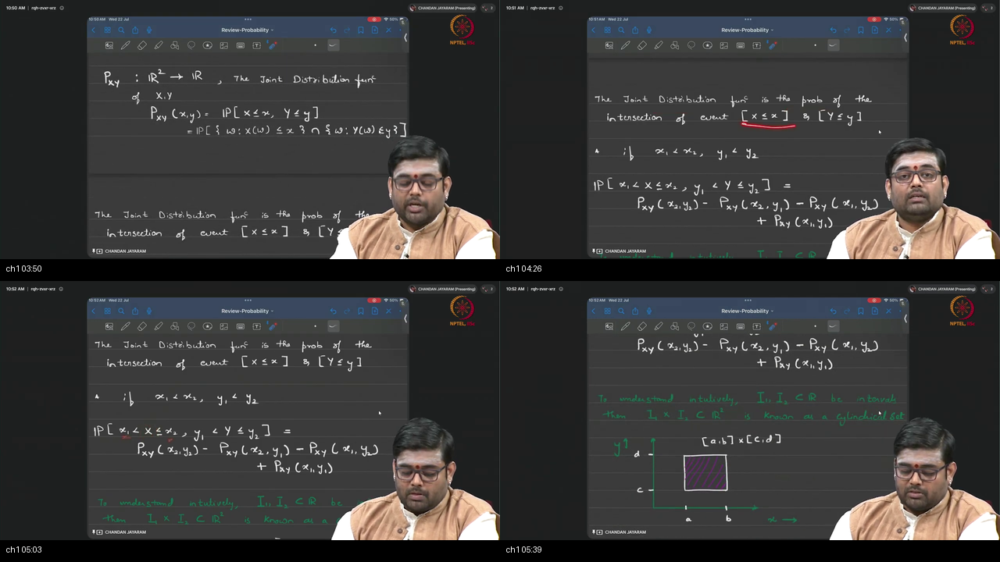

*Figure — ~00:03–05:53: Blackboard derivation defining the joint distribution function $F_{XY}(x,y) = P(X \le x, Y \le y)$ as an intersection of events on $(\Omega, \mathcal{F}, P)$, and the 2D rectangular inclusion-exclusion window formula.*

---

### 1. 👶 ELI5 Quick Intuition
Think of a medical health checkup where a doctor examines a single patient ($\omega$):
- From this one patient, the doctor records both **Blood Pressure ($X$)** and **Cholesterol ($Y$)**.
- You do not measure Blood Pressure on Alice and Cholesterol on Bob; both numbers belong to the **same patient $\omega$**.
- The **Joint CDF $F(x, y)$** answers: *"What percentage of patients have Blood Pressure $\le x$ AND Cholesterol $\le y$?"*
- To find the probability inside a 2D health target box $[x_1, x_2] \times [y_1, y_2]$, you combine the four corners of $F(x, y)$!

---

### 2. 🔍 Plain-English Breakdown
1. **The Shared Sample Space Prerequisite:**
   - $X: \Omega \to \mathbb{R}$ and $Y: \Omega \to \mathbb{R}$ are two real-valued functions defined on the **same foundational probability space** $(\Omega, \mathcal{F}, P)$.
   - The pair $(X, Y)$ is a vector mapping $\Omega \to \mathbb{R}^2$.
2. **Definition of Joint CDF:**
   $$F_{XY}(x, y) \triangleq P(X \le x, \, Y \le y) = P\bigl( \{\omega : X(\omega) \le x\} \cap \{\omega : Y(\omega) \le y\} \bigr)$$
3. **The 2D Rectangle Window Formula:**
   - To compute the probability that $(X, Y)$ lands in a rectangular window $(x_1, x_2] \times (y_1, y_2]$:
     $$P(x_1 < X \le x_2, \, y_1 < Y \le y_2) = F(x_2, y_2) - F(x_2, y_1) - F(x_1, y_2) + F(x_1, y_1)$$
   - *Why the $+F(x_1, y_1)$ term appears:* Subtracting the two side strips removes the bottom-left corner twice; adding it back restores exact coverage.

---

### 3. 📐 Formal Mathematics & Rigorous Derivation

```
  (Ω, F, P) ──► (X, Y): Ω ──► ℝ²
  
  Joint CDF F(x, y) = P(X ≤ x, Y ≤ y)
  
        y2 ┌──────────────* (x2, y2)  [+ F(x2, y2)]
           │  Target Box  │
        y1 *──────────────* (x2, y1)  [- F(x2, y1)]
         (x1, y1)       [- F(x1, y2)]
         [+ F(x1, y1)]
          x1             x2
```

#### Step-by-Step Chalkboard Commentary
- **Step 1:** Let $A = (x_1, x_2] \times (y_1, y_2]$ be a cylindrical 2D rectangular set in $\mathcal{B}(\mathbb{R}^2)$.
- **Step 2:** The semi-infinite rectangle at $(x_2, y_2)$ is $(-\infty, x_2] \times (-\infty, y_2]$.
- **Step 3:** Decompose this region into disjoint sets:
  $$(-\infty, x_2] \times (-\infty, y_2] = A \cup \bigl( (-\infty, x_1] \times (-\infty, y_2] \bigr) \cup \bigl( (-\infty, x_2] \times (-\infty, y_1] \bigr)$$
- **Step 4:** The intersection of the two strips is $(-\infty, x_1] \times (-\infty, y_1]$.
- **Step 5:** Applying the inclusion-exclusion principle:
  $$P(A) = F_{XY}(x_2, y_2) - F_{XY}(x_1, y_2) - F_{XY}(x_2, y_1) + F_{XY}(x_1, y_1) \quad \blacksquare$$

---

### 4. 🔢 Concrete Numerical Example
Let $F_{XY}(x, y) = x^2 y^3$ for $(x, y) \in [0, 1] \times [0, 1]$. Compute $P(0.5 < X \le 1.0, \, 0.4 < Y \le 0.8)$:
1. $F(1.0, 0.8) = (1.0)^2 (0.8)^3 = 1.0 \times 0.512 = 0.512$
2. $F(1.0, 0.4) = (1.0)^2 (0.4)^3 = 1.0 \times 0.064 = 0.064$
3. $F(0.5, 0.8) = (0.5)^2 (0.8)^3 = 0.25 \times 0.512 = 0.128$
4. $F(0.5, 0.4) = (0.5)^2 (0.4)^3 = 0.25 \times 0.064 = 0.016$
5. Calculate Rectangle Probability:
   $$P = 0.512 - 0.064 - 0.128 + 0.016 = 0.3360 = 33.60\%$$

---

## Topic 2: Joint CDF Properties & Cylindrical Sets (05:53–08:23)

<a id="topic-2-joint-cdf-properties-0553–0823"></a>

### Where this sits on the master map
Establishing the axiomatic mathematical constraints that any valid 2D Joint CDF must satisfy. Warm-up: [window formula](./PREREQUISITES.md#p2-window).

### Board / Screenshot Reference

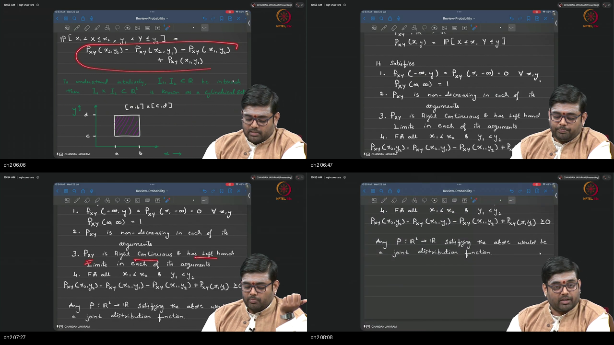

*Figure — ~05:53–08:23: Blackboard listing of the axiomatic properties of $F_{XY}$: limits at $-\infty$ and $+\infty$, coordinate-wise monotonicity, right-continuity, and the non-negative rectangle condition.*

---

### 1. 👶 ELI5 Quick Intuition
Think of $F(x, y)$ as measuring how much sand is piled on a beach strictly to the South-West of your beach umbrella:
- If you move your umbrella infinitely far West ($x \to -\infty$) or infinitely far South ($y \to -\infty$), there is **zero sand behind you** ($F = 0$).
- If you move your umbrella to the extreme North-East corner of the world ($+\infty, +\infty$), **all the sand in the world is behind you** ($F = 1.0$).
- Moving your umbrella North or East can **never decrease the amount of sand** ($F$ is non-decreasing).

---

### 2. 🔍 Plain-English Breakdown
1. **The 5 Universal Axioms of a 2D Joint CDF:**
   - **Axiom 1 (Null Boundaries):** $F(-\infty, y) = 0$ and $F(x, -\infty) = 0$ for all real $x, y$.
   - **Axiom 2 (Total Normalization):** $F(+\infty, +\infty) = 1.0$.
   - **Axiom 3 (Coordinate-Wise Monotonicity):** If $x_1 \le x_2$, then $F(x_1, y) \le F(x_2, y)$; if $y_1 \le y_2$, then $F(x, y_1) \le F(x, y_2)$.
   - **Axiom 4 (Right-Continuity):** $\lim_{u \to x^+, v \to y^+} F(u, v) = F(x, y)$ in both arguments.
   - **Axiom 5 (Non-Negative Rectangle Measure):** For all $x_1 < x_2$ and $y_1 < y_2$:
     $$F(x_2, y_2) - F(x_2, y_1) - F(x_1, y_2) + F(x_1, y_1) \ge 0$$
2. **The 2D Trap:** Monotonicity in $x$ and $y$ alone does NOT guarantee Axiom 5! A function can be increasing in both arguments and still produce negative rectangle probabilities.

---

### 3. 📐 Formal Mathematics & Rigorous Formulation

```
  Axiom Summary for Joint CDF F_XY: ℝ² ──► [0, 1]
  
  • F(-∞, y) = F(x, -∞) = 0
  • F(+∞, +∞) = 1
  • x1 ≤ x2 ──► F(x1, y) ≤ F(x2, y)
  • y1 ≤ y2 ──► F(x, y1) ≤ F(x, y2)
  • F(x+, y+) = F(x, y)
  • Δ_{x1}^{x2} Δ_{y1}^{y2} F(x, y) ≥ 0
```

---

## Topic 3: Joint PMF and Two Dice (Max, Sum) (08:23–13:48)

<a id="topic-3-joint-pmf-and-two-dice-0823–1348"></a>

### Where this sits on the master map
Formulating joint distributions for discrete random variables and analyzing the two-dice $(\max, \text{sum})$ contingency table. Warm-up: [table of piles](./PREREQUISITES.md#p3-table).

### Board / Screenshot Reference

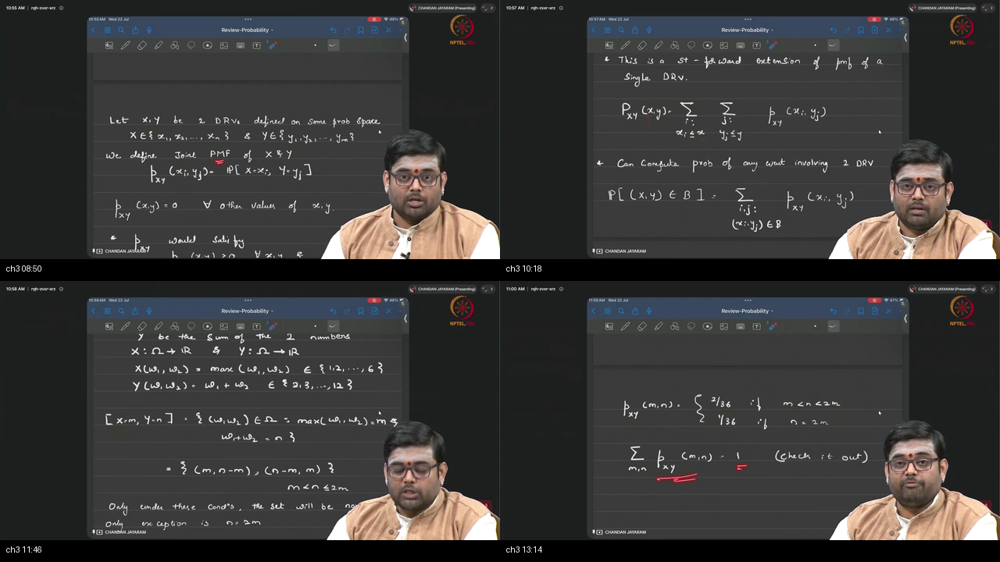

*Figure — ~08:23–13:48: Blackboard derivation of discrete Joint PMF $p_{XY}(x_i, y_j)$, the double sum normalization $\sum_i \sum_j p(x_i, y_j) = 1$, and grouping the 36 dice outcomes into $(m, n)$ cells.*

---

### 1. 👶 ELI5 Quick Intuition
Imagine rolling two dice. You have two scorekeepers:
- Scorekeeper 1 writes down the **highest face rolled** ($X = \max$).
- Scorekeeper 2 writes down the **sum of both faces** ($Y = \text{sum}$).
- Out of 36 equally likely rolls:
  - If you roll $(2, 5)$ or $(5, 2)$, both scorekeepers record $(X=5, Y=7)$ $\implies$ probability is $2/36$.
  - If you roll doubles $(3, 3)$, scorekeepers record $(X=3, Y=6)$ $\implies$ probability is $1/36$.
  - All 36 possible rolls land into one of these table cells, adding up to $100\%$!

---

### 2. 🔍 Plain-English Breakdown
1. **Definition of Discrete Joint PMF:**
   $$p_{XY}(x_i, y_j) \triangleq P(X = x_i, Y = y_j)$$
2. **Double Sum Normalization:**
   $$\sum_{i=1}^n \sum_{j=1}^m p_{XY}(x_i, y_j) = 1.0$$
3. **The Two Dice Grouping Rule:**
   - Let $X = \max(w_1, w_2) \in \{1, \dots, 6\}$ and $Y = w_1 + w_2 \in \{2, \dots, 12\}$.
   - Target event $\{X = m, Y = n\}$ can only be generated by outcomes $(m, n-m)$ or $(n-m, m)$.
   - **Case 1 ($n = 2m$):** Both dice rolled identical faces $m$ (e.g. $(3,3) \implies \max=3, \text{sum}=6$). Exactly 1 roll $\implies p(m, n) = 1/36$.
   - **Case 2 ($n \ne 2m$):** Distinct faces (e.g. $(2,5)$ and $(5,2)$). Exactly 2 rolls $\implies p(m, n) = 2/36$.
   - **Case 3 (Impossible Combinations):** If $n-m > m$ or $n-m < 1$, $p(m, n) = 0$.

---

### 3. 📐 Formal Mathematics & Table Construction

```
  Two Fair Dice Sample Space: |Ω| = 36 equally likely pairs (w1, w2)
  
  p(m, n) = { 1/36   if n = 2m and 1 ≤ m ≤ 6
            { 2/36   if m < n ≤ 2m and 1 ≤ n-m < m
            { 0      otherwise
```

---

### 4. 🔢 Concrete Numerical Example
Let's compute probabilities for specific $(m, n)$ pairs:
1. $P(X = 4, Y = 8)$: Since $n = 8 = 2(4) = 2m$, only $(4, 4)$ works $\implies p(4, 8) = 1/36 \approx 0.0278$.
2. $P(X = 4, Y = 7)$: Since $n = 7 \ne 2(4)$, rolls are $(4, 3)$ and $(3, 4) \implies p(4, 7) = 2/36 \approx 0.0556$.
3. $P(X = 2, Y = 7)$: If $\max=2$, max possible sum is $2+2=4 < 7 \implies p(2, 7) = 0.0$.

---

## Topic 4: Joint PDF on a Triangle (13:48–19:07)

<a id="topic-4-joint-pdf-on-a-triangle-1348–1907"></a>

### Where this sits on the master map
Extending continuous probability densities to 2D regions and integrating over non-rectangular geometric domains. Warm-up: [frosting on a triangle](./PREREQUISITES.md#p4-jam).

### Board / Screenshot Reference

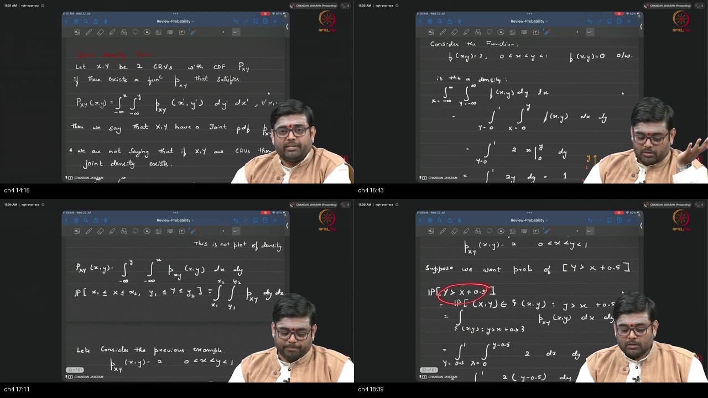

*Figure — ~13:48–19:07: Blackboard derivation of Joint PDF axioms $p(x,y) \ge 0, \iint p = 1$, the running triangle example $p(x,y) = 2$ on $0 < x < y < 1$, and sub-region probability $P(Y > X + 0.5) = 0.25$.*

---

### 1. 👶 ELI5 Quick Intuition
Imagine a triangular baking dish with vertices at $(0,0)$, $(0,1)$, and $(1,1)$:
- The area of this triangular dish is $0.5$ square units ($1/2 \times \text{base} \times \text{height}$).
- You pour a uniform layer of cake batter into the dish with total volume equal to $1.0$.
- Because the base area is $0.5$, the batter stands **2 units tall** ($p(x, y) = 2.0$).
- If you cut out an upper triangular sliver where $Y > X + 0.5$, that sliver occupies half the width and half the height ($1/4$ the area), containing **$0.25$ units of batter (25% probability)**!

---

### 2. 🔍 Plain-English Breakdown
1. **Definition of Continuous Joint PDF:**
   $$F_{XY}(x, y) = \int_{-\infty}^y \int_{-\infty}^x p_{XY}(u, v)\,du\,dv$$
2. **The 2 Joint PDF Axioms:**
   - $p_{XY}(x, y) \ge 0$ for all $(x, y) \in \mathbb{R}^2$.
   - $\int_{-\infty}^\infty \int_{-\infty}^\infty p_{XY}(x, y)\,dx\,dy = 1.0$.
3. **The Running Triangle Example:**
   - Support: $\mathcal{S} = \{(x, y) \in \mathbb{R}^2 : 0 < x < y < 1\}$.
   - Density: $p_{XY}(x, y) = 2.0$ on $\mathcal{S}$, and $0$ elsewhere.
   - Verification: $\int_{y=0}^1 \int_{x=0}^y 2 \, dx \, dy = \int_0^1 2y \, dy = [y^2]_0^1 = 1.0 \checkmark$.
4. **Probability of a Sub-Region:**
   - To compute $P(Y > X + 0.5)$, integrate over the region $A = \{(x, y) \in \mathcal{S} : y > x + 0.5\}$.
   - Integration limits: $y \in [0.5, 1.0]$ and $x \in [0, y - 0.5] \implies P(A) = 0.25$.

---

### 3. 📐 Formal Mathematics & Double Integral Derivation

```
  y ^
  1 ┼        /|   Upper Sliver Region A: y > x + 0.5
    │       / |   y ∈ [0.5, 1.0],  x ∈ [0, y - 0.5]
0.5 ┼───*  /  |
    │   | /   |   ∫_{0.5}^1 [ ∫_0^{y-0.5} 2 dx ] dy
  0 ┴───┴─────┴───► x
    0  0.5    1   = ∫_{0.5}^1 2(y - 0.5) dy = 0.25
```

#### Step-by-Step Integration
$$\begin{aligned}
P(Y > X + 0.5) &= \int_{y=0.5}^1 \left( \int_{x=0}^{y-0.5} 2 \, dx \right) dy \\
&= \int_{y=0.5}^1 2(y - 0.5) \, dy \\
&= \left[ y^2 - y \right]_{0.5}^1 = (1 - 1) - (0.25 - 0.50) = 0 - (-0.25) = 0.25 \quad \blacksquare
\end{aligned}$$

---

## Topic 5: Marginals (19:07–26:34)

<a id="topic-5-marginals-1907–2634"></a>

### Where this sits on the master map
Projecting multivariate distributions down to individual scalar coordinates by summing rows or integrating out unwanted axes. Warm-up: [spreadsheet margins](./PREREQUISITES.md#p5-margin).

### Board / Screenshot Reference

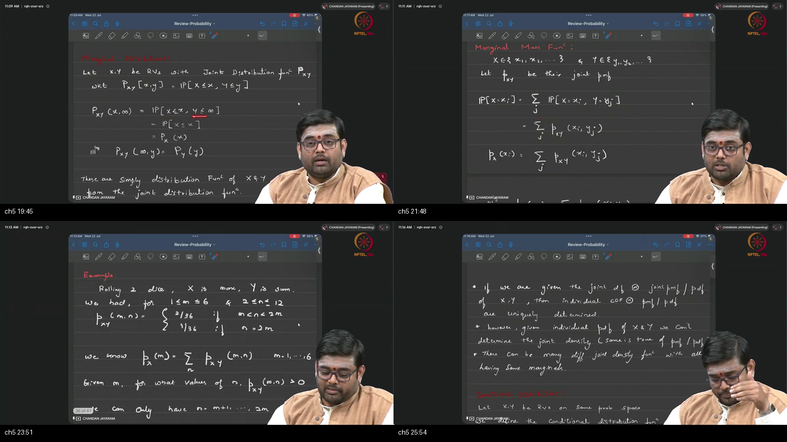

*Figure — ~19:07–26:34: Blackboard derivation of Marginal CDFs $F_X(x) = F(x, \infty)$, discrete row sums $p_X(x_i) = \sum_j p(x_i, y_j)$, continuous marginal integrals $p_X(x) = \int p(x,y)dy$, and proving why the converse reconstruction is underdetermined.*

---

### 1. 👶 ELI5 Quick Intuition
Think of a spreadsheet showing car sales across different cities (rows) and car colors (columns):
- The **Joint Distribution** tells you the percentage of sales for *Red cars in Chicago*.
- If you only want to know the *total percentage of Red cars sold nationwide*, you **add up the entire Red column**, ignoring the cities.
- That column total is the **Marginal Distribution of Color**.
- You can always get the margin totals from the full spreadsheet. But if you only have the margin totals, you cannot guess the individual city sales!

---

### 2. 🔍 Plain-English Breakdown
1. **Marginal CDF Formula:** Setting the unobserved coordinate to $+\infty$:
   $$F_X(x) = F_{XY}(x, +\infty) = P(X \le x, Y < \infty) = P(X \le x)$$
2. **Marginalization (Peeling):**
   - **Discrete:** Sum the row or column:
     $$p_X(x_i) = \sum_j p_{XY}(x_i, y_j), \quad p_Y(y_j) = \sum_i p_{XY}(x_i, y_j)$$
   - **Continuous:** Integrate over the entire domain of the other variable:
     $$p_X(x) = \int_{-\infty}^\infty p_{XY}(x, y)\,dy, \quad p_Y(y) = \int_{-\infty}^\infty p_{XY}(x, y)\,dx$$
3. **The Uniqueness Asymmetry (Load-Bearing):**
   - $\text{Joint} \implies \text{Marginals}$ is **unique and guaranteed**.
   - $\text{Marginals} \implies \text{Joint}$ is **FALSE** (infinitely many joint distributions share the exact same marginals unless independence is assumed).

---

### 3. 📐 Formal Mathematics & Triangle Marginal Derivations

```
  Triangle: p(x, y) = 2 on 0 < x < y < 1
  
  Marginal p_X(x): Fix x ∈ (0, 1), integrate y from x to 1:
  p_X(x) = ∫_x^1 2 dy = 2(1 - x)  (Linear ramp decaying from 2 to 0)
  
  Marginal p_Y(y): Fix y ∈ (0, 1), integrate x from 0 to y:
  p_Y(y) = ∫_0^y 2 dx = 2y        (Linear ramp growing from 0 to 2)
```

---

### 4. 🔢 Concrete Numerical Example
For the triangle distribution:
1. What is the marginal probability density $p_X(0.2)$?
   $$p_X(0.2) = 2(1 - 0.2) = 2(0.8) = 1.60$$
2. What is the marginal probability density $p_Y(0.7)$?
   $$p_Y(0.7) = 2(0.7) = 1.40$$
3. Compute Marginal Expectation $\mathbb{E}[X]$:
   $$\mathbb{E}[X] = \int_0^1 x \cdot 2(1-x)\,dx = 2 \left[ \frac{x^2}{2} - \frac{x^3}{3} \right]_0^1 = 2 \left(\frac{1}{2} - \frac{1}{3}\right) = 2 \cdot \frac{1}{6} = \frac{1}{3} \approx 0.3333$$

---

## Topic 6: Conditional Discrete Distributions & Slicing (26:34–35:19)

<a id="topic-6-conditional-discrete-2634–3519"></a>

### Where this sits on the master map
Updating belief about discrete variable $X$ given observed evidence $Y = y_j$. Warm-up: [knife slice](./PREREQUISITES.md#p6-slice).

### Board / Screenshot Reference

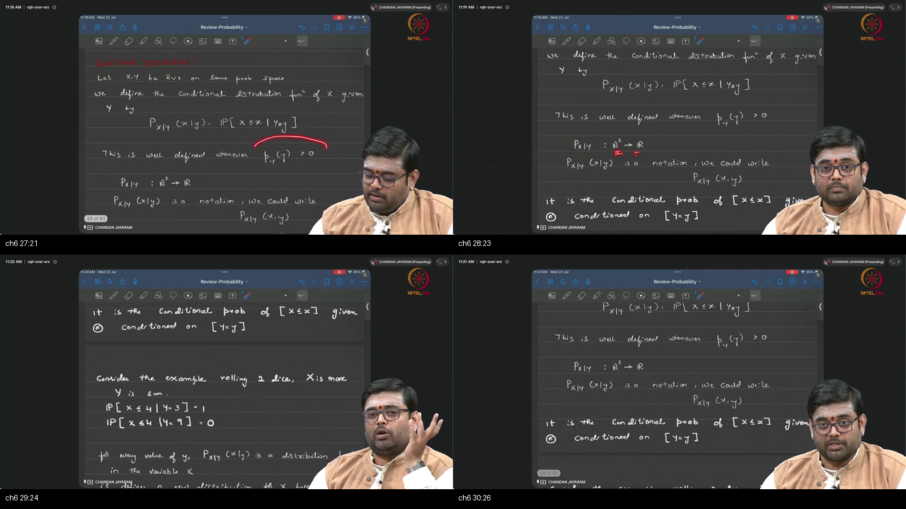

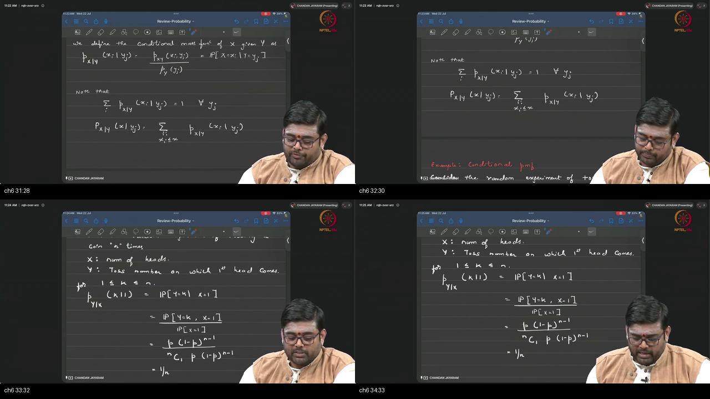

*Figure — ~26:34–35:19: Blackboard formulation of discrete conditional PMF $p(x_i \mid y_j) = \frac{p(x_i, y_j)}{p_Y(y_j)}$, dice conditioning examples $P(X \le 4 \mid Y=3) = 1$, and the coin toss first-head theorem $P(Y=k \mid X=1) = 1/n$.*

---

### 1. 👶 ELI5 Quick Intuition
Suppose you roll two hidden dice and your friend announces: *"The sum of the dice is 3!"* ($Y = 3$):
- Before this announcement, the max face could have been anything from 1 to 6.
- But with $\text{sum} = 3$, the only possible rolls in the entire universe are $(1, 2)$ and $(2, 1)$.
- In both outcomes, the maximum face is 2.
- Therefore, the conditional probability that $\max \le 4$ is **100% certain ($P(X \le 4 \mid Y=3) = 1.0$)**!

---

### 2. 🔍 Plain-English Breakdown
1. **Definition of Discrete Conditional PMF:**
   $$p_{X \mid Y}(x_i \mid y_j) \triangleq P(X = x_i \mid Y = y_j) = \frac{p_{XY}(x_i, y_j)}{p_Y(y_j)} \quad (\text{for } p_Y(y_j) > 0)$$
2. **Every Slice is a Valid 1D PMF:** For any fixed column $y_j$:
   $$\sum_{i} p_{X \mid Y}(x_i \mid y_j) = \sum_i \frac{p_{XY}(x_i, y_j)}{p_Y(y_j)} = \frac{p_Y(y_j)}{p_Y(y_j)} = 1.0$$
3. **The First-Head Coin Toss Theorem:**
   - Flip a fair coin $n$ times. Let $X = \text{total heads}$, $Y = \text{toss index of FIRST head}$.
   - Given that exactly one head occurred ($X = 1$), the lone head was equally likely to appear on toss 1, toss 2, ..., or toss $n$:
     $$P(Y = k \mid X = 1) = \frac{1}{n} \quad \text{for } k \in \{1, 2, \dots, n\}$$

---

### 3. 📐 Formal Mathematics & Proof of First-Head Theorem

#### Theorem: Uniformity of First Head Given Single Success
$$\begin{aligned}
P(Y = k \mid X = 1) &= \frac{P(Y = k, X = 1)}{P(X = 1)} \\
&= \frac{P(\text{Tail on } 1..k-1, \text{ Head on } k, \text{ Tail on } k+1..n)}{\binom{n}{1} (0.5)^1 (0.5)^{n-1}} \\
&= \frac{(0.5)^n}{n (0.5)^n} = \frac{1}{n} \quad \blacksquare
\end{aligned}$$

---

## Topic 7: Conditional Continuous Distributions & Continuous Bayes (35:19–40:34)

<a id="topic-7-conditional-continuous-and-bayes-3519–4034"></a>

### Where this sits on the master map
Resolving the continuous knife-edge paradox $P(Y=y)=0$ using infinitesimal band limits and deriving continuous Bayes' rule. Warm-up: [band limit](./PREREQUISITES.md#p6-slice).

### Board / Screenshot Reference

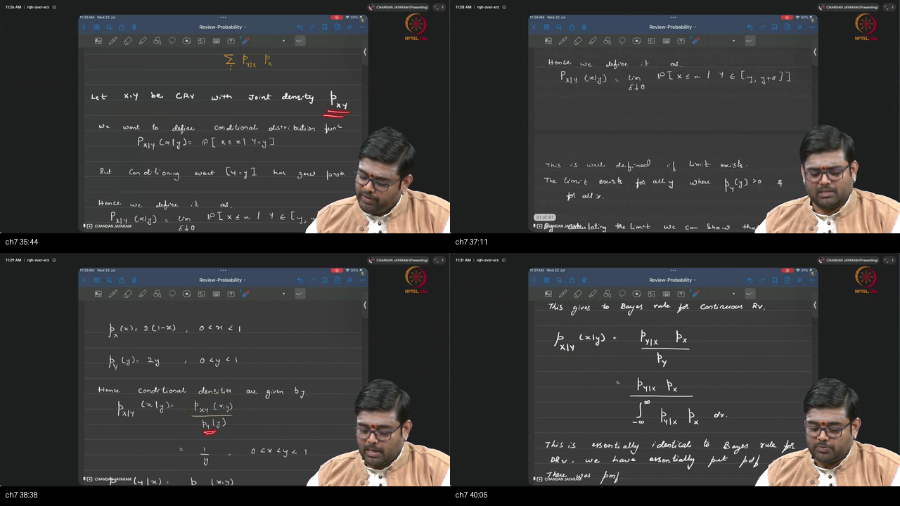

*Figure — ~35:19–40:34: Blackboard derivation defining conditional continuous density $p(x \mid y) = \frac{p(x, y)}{p_Y(y)}$ via infinitesimal band limit, triangle slice $X \mid Y=y \sim \text{Unif}(0, y)$, and continuous Bayes' Theorem.*

---

### 1. 👶 ELI5 Quick Intuition
In continuous probability, you cannot divide by $P(Y = 3.0)$ because the probability of hitting an infinitely precise number is strictly $0.0$!
To condition on $Y = 3.0$, we condition on a narrow ribbon $[3.0, 3.0 + \Delta]$ and let ribbon width $\Delta \to 0$. The resulting ratio of densities creates a clean, non-zero 1D probability curve.

---

### 2. 🔍 Plain-English Breakdown
1. **Infinitesimal Band Definition:**
   $$F_{X \mid Y}(x \mid y) \triangleq \lim_{\Delta \to 0^+} \frac{P(X \le x, \, y \le Y \le y + \Delta)}{P(y \le Y \le y + \Delta)}$$
2. **Conditional PDF Formula:**
   $$p_{X \mid Y}(x \mid y) = \frac{p_{XY}(x, y)}{p_Y(y)} \quad (\text{provided } p_Y(y) > 0)$$
3. **Triangle Slicing Result:**
   - On $0 < x < y < 1$, $p_{XY}(x, y) = 2$ and $p_Y(y) = 2y$.
   - $p(x \mid y) = \frac{2}{2y} = \frac{1}{y}$ on $[0, y] \implies X \mid Y = y \sim \text{Unif}[0, y]$.
4. **Continuous Bayes' Rule:**
   $$p(y \mid x) = \frac{p(x \mid y) \, p_Y(y)}{\int_{-\infty}^\infty p(x \mid y') \, p_Y(y') \, dy'}$$

---

### 3. 📐 Formal Mathematics & Continuous Bayes Formulation

```
  Continuous Bayes' Rule:
  
                 p_{X|Y}(x | y) · p_Y(y)
  p_{Y|X}(y | x) = ───────────────────────────
                 ∫_{-∞}^∞ p_{X|Y}(x | y') p_Y(y') dy'
```

---

## Topic 8: Mixed Types, Gaussian Mixture Models & Binary Communications (40:34–50:12)

<a id="topic-8-mixed-type-gmm-communication-4034–5012"></a>

### Where this sits on the master map
Combining discrete categorical labels with continuous continuous measurements to form mixture models and optimal digital communication detectors. Warm-up: [mixed distributions](../22-Tutorial08-Review-Basic-Probability-2/PREREQUISITES.md#p4-type).

### Board / Screenshot Reference

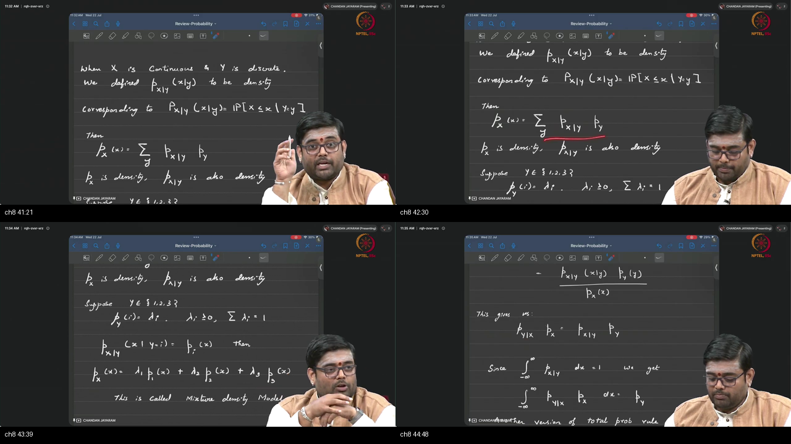

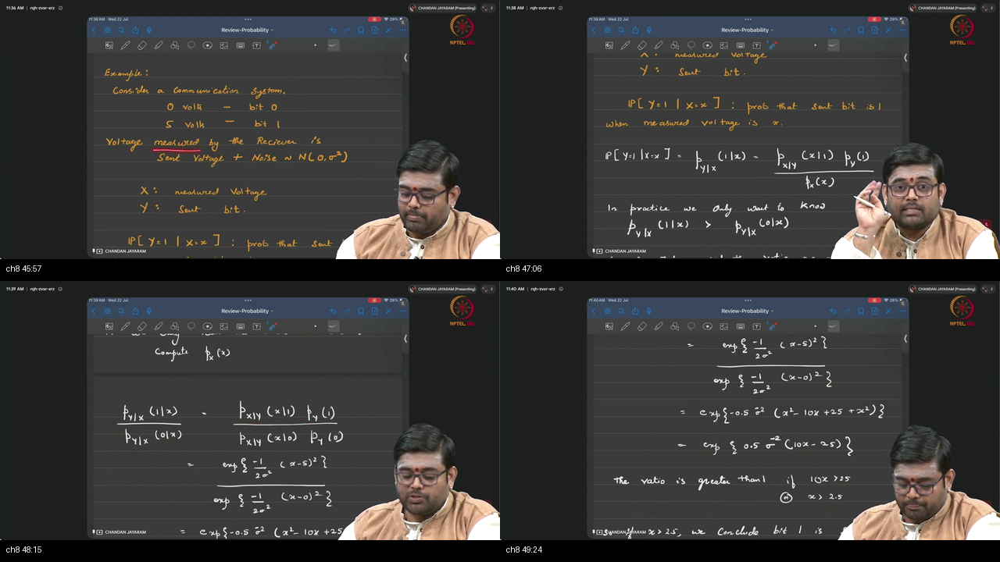

*Figure — ~40:34–50:12: Blackboard derivation of mixed-type probability distributions, Gaussian Mixture Models $p_X(x) = \sum \lambda_k \mathcal{N}(\mu_k, \sigma_k^2)$, mixed Bayes' theorem, and the optimal $x > 2.5\text{V}$ decision boundary for digital communications.*

---

### 1. 👶 ELI5 Quick Intuition
Think of a digital radio receiver:
- A transmitter sends a digital bit: $Y = 0$ (0 Volts) or $Y = 1$ (5 Volts).
- Atmospheric noise corrupts the signal, so the receiver hears a continuous voltage $X$.
- The total voltage seen by the antenna is a **Gaussian Mixture Model (GMM)**: a 50/50 mixture of two bell curves—one centered at 0V and one centered at 5V.
- To decode the bit, you compare the ratio: if the heard voltage $x$ is greater than **2.5 Volts (the exact halfway midpoint)**, you decode $Y = 1$!

---

### 2. 🔍 Plain-English Breakdown
1. **No Single Joint Density for Mixed Pairs:**
   - If $Y$ is discrete and $X$ is continuous, no 2D joint density $p_{XY}(x, y)$ exists.
   - Instead, the system is described by discrete prior $P(Y = y_k) = \lambda_k$ and continuous conditional densities $p(x \mid Y = y_k)$.
2. **The Marginal Mixture Formula:**
   $$p_X(x) = \sum_{k} \lambda_k \, p(x \mid Y = y_k), \quad \text{where } \lambda_k \ge 0, \; \sum \lambda_k = 1.0$$
3. **Gaussian Mixture Model (GMM):**
   - When each conditional density is Gaussian $p(x \mid Y = k) = \mathcal{N}(\mu_k, \sigma_k^2)$:
     $$p_X(x) = \sum_{k=1}^K \lambda_k \frac{1}{\sigma_k \sqrt{2\pi}} \exp\left(-\frac{(x - \mu_k)^2}{2\sigma_k^2}\right)$$
4. **Binary Communications Decision Rule:**
   - Equal priors $P(Y=0) = P(Y=1) = 0.5$, sent voltages $0\text{V}, 5\text{V}$, noise $\mathcal{N}(0, \sigma^2)$.
   - Maximum A Posteriori (MAP) ratio: $\frac{P(Y=1 \mid X=x)}{P(Y=0 \mid X=x)} = \exp\left(\frac{5x - 12.5}{\sigma^2}\right) > 1 \iff x > 2.5\text{V}$.

---

### 3. 📐 Formal Mathematics & Likelihood Ratio Derivation

```
  Sent Bit Y ∈ {0, 1} ──► Channel (Add Noise N(0, σ²)) ──► Received Voltage X
  
  Likelihood Ratio:
  p(x | Y=1)     exp( -(x - 5)² / 2σ² )     exp( -(x² - 10x + 25) / 2σ² )
  ─────────── = ──────────────────────── = ──────────────────────────────
  p(x | Y=0)     exp( -(x - 0)² / 2σ² )           exp( -x² / 2σ² )
  
              = exp( (10x - 25) / 2σ² )
  
  Decision Boundary (Ratio > 1.0):
  10x - 25 > 0  ──►  x > 2.5 Volts!
```

---

## Topic 9: Independence and Vector RVs (50:12–61:03)

<a id="topic-9-independence-and-vector-rvs-5012–6103"></a>

### Where this sits on the master map
Formalizing statistical independence for multi-dimensional random vectors $\mathbf{X} \in \mathbb{R}^n$. Warm-up: [product of laws](./PREREQUISITES.md#p7-prod).

### Board / Screenshot Reference

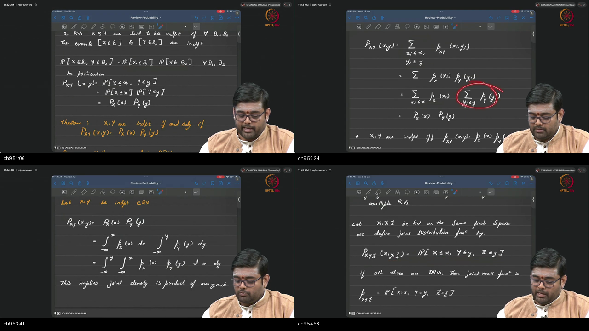

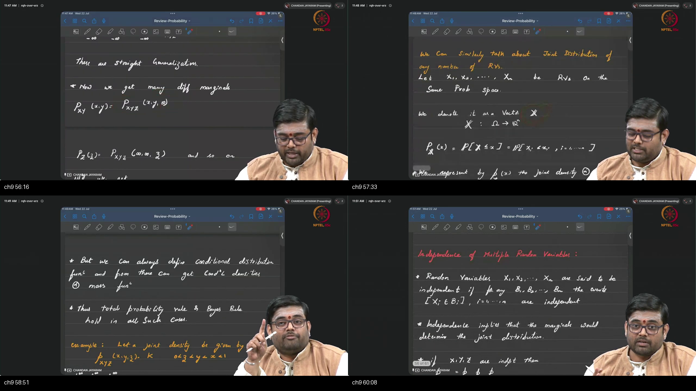

*Figure — ~50:12–61:03: Blackboard formulation of vector independence $P(X \in B_1, Y \in B_2) = P(X \in B_1)P(Y \in B_2)$ for all events, mutual independence of $n$ random variables, and defining random vectors $\mathbf{X}: \Omega \to \mathbb{R}^n$.*

---

### 1. 👶 ELI5 Quick Intuition
Imagine flipping 10 separate coins in 10 different rooms:
- The outcome is a **10-dimensional vector** $\mathbf{X} = (X_1, X_2, \dots, X_{10})$.
- Because the rooms are physically separated, the probability of any joint combination is the **simple product of all 10 individual coin probabilities**!

---

### 2. 🔍 Plain-English Breakdown
1. **Definition of Vector Independence:**
   - Random variables $X_1, X_2, \dots, X_n$ are mutually independent if for **ALL** Borel sets $B_1, \dots, B_n$:
     $$P(X_1 \in B_1, X_2 \in B_2, \dots, X_n \in B_n) = \prod_{i=1}^n P(X_i \in B_i)$$
2. **Density Factorization:**
   $$p_{X_1 \dots X_n}(x_1, \dots, x_n) = p_{X_1}(x_1) \cdot p_{X_2}(x_2) \cdots p_{X_n}(x_n)$$
3. **Block Independence Invariance:**
   - If $\mathbf{X} = (X_1, \dots, X_m)$ is independent of $\mathbf{Y} = (Y_1, \dots, Y_k)$, then any functions $g(\mathbf{X})$ and $h(\mathbf{Y})$ are also independent!

---

### 3. 📐 Formal Mathematics & Vector CDF Formulation

$$F_{\mathbf{X}}(x_1, x_2, \dots, x_n) = \prod_{i=1}^n F_{X_i}(x_i) \quad \forall (x_1, \dots, x_n) \in \mathbb{R}^n$$

---

## Topic 10: IID Datasets, Jacobian Transformations & Recap (61:03–73:17)

<a id="topic-10-iid-jacobian-recap-6103–7317"></a>

### Where this sits on the master map
The foundational assumption of machine learning datasets (IID) and multi-dimensional coordinate transformations via Jacobian determinants. Warm-up: [IID & Jacobian](./PREREQUISITES.md#p8-iid).

### Board / Screenshot Reference

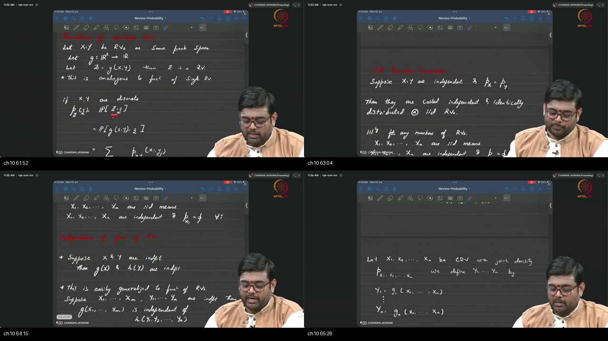

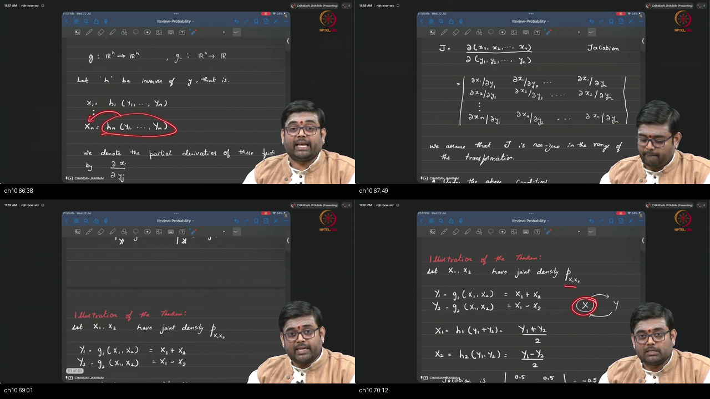

*Figure — ~61:03–73:17: Blackboard derivation of IID random vectors, the multivariate Change of Variables theorem $p_{\mathbf{Y}}(\mathbf{y}) = p_{\mathbf{X}}(h(\mathbf{y})) |\det \mathbf{J}|$, and the 2D linear transformation example $Y_1 = X_1 + X_2, Y_2 = X_1 - X_2 \implies |\det \mathbf{J}| = 1/2$.*

---

### 1. 👶 ELI5 Quick Intuition
When training an image generative model on 1,000,000 photos:
- We assume each photo was sampled **independently** from the **exact same** real-world image distribution ($\text{IID}$).
- If we transform the latent variables using an invertible neural network $\mathbf{Y} = g(\mathbf{X})$, 2D space stretches and twists.
- The **Jacobian $|\det \mathbf{J}|$** scales the probability density so the total volume under the new neural network output remains exactly $1.0$!

---

### 2. 🔍 Plain-English Breakdown
1. **IID Definition:** A sequence $X_1, X_2, \dots, X_n$ is **Independent and Identically Distributed** if:
   - Mutual Independence: $p(\mathbf{x}) = \prod_{i=1}^n p_{X_i}(x_i)$.
   - Identical Law: $p_{X_i}(u) = p(u)$ for all $i$.
2. **Multivariate Change of Variables Theorem:**
   - Let $\mathbf{Y} = g(\mathbf{X})$ be an invertible mapping $\mathbb{R}^n \to \mathbb{R}^n$ with inverse $\mathbf{X} = h(\mathbf{Y})$.
   - The transformed joint density is:
     $$p_{\mathbf{Y}}(\mathbf{y}) = p_{\mathbf{X}}\bigl(h(\mathbf{y})\bigr) \cdot \left| \det \mathbf{J}_h(\mathbf{y}) \right|$$
3. **The Sum-and-Difference 2D Example:**
   - $Y_1 = X_1 + X_2$ and $Y_2 = X_1 - X_2$.
   - Inverse: $X_1 = \frac{Y_1 + Y_2}{2}, X_2 = \frac{Y_1 - Y_2}{2}$.
   - Jacobian: $\mathbf{J} = \begin{pmatrix} 0.5 & 0.5 \\ 0.5 & -0.5 \end{pmatrix} \implies \det \mathbf{J} = -0.5 \implies |\det \mathbf{J}| = 0.5$.
   - Result: $p_{\mathbf{Y}}(y_1, y_2) = \frac{1}{2} p_{\mathbf{X}}\left(\frac{y_1+y_2}{2}, \frac{y_1-y_2}{2}\right)$.

---

### 3. 📐 Formal Mathematics & Matrix Derivation

$$\mathbf{J}_h(\mathbf{y}) = \begin{pmatrix} \frac{\partial X_1}{\partial Y_1} & \frac{\partial X_1}{\partial Y_2} \\ \frac{\partial X_2}{\partial Y_1} & \frac{\partial X_2}{\partial Y_2} \end{pmatrix} = \begin{pmatrix} 1/2 & 1/2 \\ 1/2 & -1/2 \end{pmatrix}$$
$$\det \mathbf{J}_h = \left(\frac{1}{2}\right)\left(-\frac{1}{2}\right) - \left(\frac{1}{2}\right)\left(\frac{1}{2}\right) = -\frac{1}{4} - \frac{1}{4} = -\frac{1}{2}$$
$$\left| \det \mathbf{J}_h(\mathbf{y}) \right| = \left| -\frac{1}{2} \right| = \frac{1}{2} \quad \blacksquare$$

---

## Workplace Debugging Postmortems

### Workplace Scenario 1: The "Marginal-Only Joint Reconstruction Fallacy" Bug in Multi-Modal VAEs

#### Incident Summary & Context
An AI research team building a **Multi-Modal Generative Model (Text-to-Image)** designed a joint latent space combining image embeddings $\mathbf{x} \in \mathbb{R}^{512}$ and text prompt embeddings $\mathbf{y} \in \mathbb{R}^{512}$. During generation, the model produced high-quality images and coherent text captions independently, but the generated images completely failed to match the generated text descriptions (e.g. caption: *"A red sports car"*, image: *"A blue bird"*).

#### Root Cause Analysis
- The training loss objective optimized the individual marginal likelihoods $\log p(\mathbf{x})$ and $\log p(\mathbf{y})$ separately, assuming that matching marginal distributions would automatically reconstruct the joint distribution $p(\mathbf{x}, \mathbf{y})$.
- As established in Topic 5, **marginals do NOT uniquely determine the joint distribution** ($p_X, p_Y \not\implies p_{XY}$).
- Without explicit cross-modal joint conditioning or a joint contrastive loss term, the latent representation collapsed into independent coordinate subspaces with zero cross-modal correlation.

#### Production Code Fix

```python
import torch
import torch.nn as nn
import torch.nn.functional as F

def multimodal_joint_elbo_loss(
    recon_img: torch.Tensor, img: torch.Tensor,
    recon_txt: torch.Tensor, txt: torch.Tensor,
    mu_joint: torch.Tensor, logvar_joint: torch.Tensor,
    mu_img: torch.Tensor, logvar_img: torch.Tensor,
    mu_txt: torch.Tensor, logvar_txt: torch.Tensor
) -> torch.Tensor:
    """
    Correct Joint Multi-Modal Loss optimizing the true Joint Posterior p(x, y).
    """
    # 1. Joint Reconstruction Losses
    recon_img_loss = F.mse_loss(recon_img, img, reduction='sum')
    recon_txt_loss = F.cross_entropy(recon_txt, txt, reduction='sum')
    
    # 2. Joint KL Divergence D_KL( q(z | x, y) || p(z) )
    kl_joint = -0.5 * torch.sum(1.0 + logvar_joint - mu_joint.pow(2) - logvar_joint.exp())
    
    # 3. Cross-Modal Alignment Loss (Product-of-Experts Alignment)
    kl_cross_modal = F.mse_loss(mu_img, mu_txt, reduction='sum')
    
    total_loss = (recon_img_loss + recon_txt_loss + kl_joint + 0.5 * kl_cross_modal) / img.size(0)
    return total_loss
```

---

### Workplace Scenario 2: The "Omitted Absolute Jacobian Determinant" Bug in Normalizing Flow Coupling Layers

#### Incident Summary & Context
A machine learning engineer implementing an **Invertible Normalizing Flow (RealNVP)** for high-dimensional density estimation reported that the model's loss diverged to $-\infty$ within 50 training iterations. The model was learning to trivially inflate the output coordinates without learning data density.

#### Root Cause Analysis
- In the custom PyTorch affine coupling layer, the forward transformation was implemented as:
  $$\mathbf{y}_{1:d} = \mathbf{x}_{1:d}, \quad \mathbf{y}_{d+1:D} = \mathbf{x}_{d+1:D} \odot \exp\bigl(s(\mathbf{x}_{1:d})\bigr) + t(\mathbf{x}_{1:d})$$
- When computing the negative log-likelihood, the engineer forgot to add the **log-determinant of the Jacobian matrix**:
  $$\log |\det \mathbf{J}| = \sum_{j=d+1}^D s_j(\mathbf{x}_{1:d})$$
- By omitting the Jacobian determinant penalty, the network scaled up $s(\mathbf{x})$ unboundedly to make latent variance artificially tiny, causing catastrophic density explosion.

#### Production Code Fix

```python
import torch
import torch.nn as nn

class AffineCouplingLayer(nn.Module):
    def __init__(self, dim: int, hidden_dim: int):
        super().__init__()
        self.split_dim = dim // 2
        self.net = nn.Sequential(
            nn.Linear(self.split_dim, hidden_dim),
            nn.ReLU(),
            nn.Linear(hidden_dim, (dim - self.split_dim) * 2)
        )
        
    def forward(self, x: torch.Tensor):
        x1 = x[:, :self.split_dim]
        x2 = x[:, self.split_dim:]
        
        params = self.net(x1)
        s, t = params.chunk(2, dim=-1)
        s = torch.tanh(s) # Stabilize scale
        
        # Affine transformation
        y1 = x1
        y2 = x2 * torch.exp(s) + t
        y = torch.cat([y1, y2], dim=-1)
        
        # REQUIRED: Exact Log-Determinant of Jacobian Matrix
        log_det_jacobian = torch.sum(s, dim=-1)
        return y, log_det_jacobian
```

---

## Centralized External References

<a id="external-references"></a>

Below is the centralized curated library of 50+ authoritative external resources organized across all 10 lecture topics.

### Topic 1: Pair and Joint CDF
- **Video Lectures:**
  - [Harvard Stat 110 (Prof. Joe Blitzstein) — Lecture 7: Joint Distributions](https://www.youtube.com/watch?v=9PVn2auwXFw)
  - [Khan Academy — Introduction to Joint Probability Distributions](https://www.khanacademy.org/math/statistics-probability/random-variables-stats-library)
  - [MIT OpenCourseWare (18.05) — Joint Distributions and Independence](https://ocw.mit.edu/courses/18-05-introduction-to-probability-and-statistics-spring-2014/)
- **Authoritative Textbooks & Notes:**
  - [Taboga, M. (Statlect) — Random Vectors and Joint Distribution Functions](https://www.statlect.com/fundamentals-of-probability/random-vectors)
  - [Brown University — Seeing Theory: Compound Probability](https://seeing-theory.brown.edu/compound-probability/index.html)
  - [Casella, G., & Berger, R. L. — Statistical Inference (Chapter 4: Bivariate Distributions)](https://openlibrary.org/books/OL3953406M/Statistical_Inference)

### Topic 2: Joint CDF Properties & Cylindrical Sets
- **Video Lectures:**
  - [MIT OpenCourseWare (6.041) — Bivariate CDFs and Cylindrical Sets](https://ocw.mit.edu/courses/6-041-probabilistic-systems-analysis-and-applied-probability-fall-2011/)
  - [Harvard Stat 110 — Properties of Joint CDFs](https://stat110.hsites.harvard.edu/)
  - [Khan Academy — 2D CDF Rectangle Formulations](https://www.khanacademy.org/math/statistics-probability/random-variables-stats-library)
- **Authoritative Textbooks & Notes:**
  - [Taboga, M. (Statlect) — Joint Cumulative Distribution Functions](https://www.statlect.com/fundamentals-of-probability/joint-distribution-function)
  - [Bertsekas, D. P., & Tsitsiklis, J. N. — Introduction to Probability (Athena Scientific, Chapter 3)](http://athenasc.com/probbook.html)
  - [Ash, R. B. — Basic Probability Theory (Dover Publications, Chapter 2)](https://store.doverpublications.com/0486466280.html)

### Topic 3: Joint PMF and Two Dice (Max, Sum)
- **Video Lectures:**
  - [StatQuest (Josh Starmer) — Two-Way Contingency Tables Clearly Explained](https://www.youtube.com/watch?v=qMTuMa86NzU)
  - [Khan Academy — Joint and Marginal PMFs for Discrete Dice](https://www.khanacademy.org/math/statistics-probability/probability-library)
  - [Harvard Stat 110 — Discrete Joint PMFs](https://www.youtube.com/watch?v=9PVn2auwXFw)
- **Authoritative Textbooks & Notes:**
  - [Taboga, M. (Statlect) — Joint Probability Mass Functions](https://www.statlect.com/fundamentals-of-probability/joint-probability-mass-function)
  - [Ross, S. M. — A First Course in Probability (Pearson, Chapter 6: Joint Discrete RVs)](https://www.pearson.com/)
  - [Blitzstein, J. K., & Hwang, J. — Introduction to Probability (CRC Press, Chapter 7)](https://projects.iq.harvard.edu/stat110/home)

### Topic 4: Joint PDF on a Triangle
- **Video Lectures:**
  - [Harvard Stat 110 — 2D Continuous Joint Densities & Non-Rectangular Limits](https://www.youtube.com/watch?v=9PVn2auwXFw)
  - [Khan Academy — Double Integrals over General Regions](https://www.khanacademy.org/math/multivariable-calculus/integrating-multivariable-functions)
  - [MIT OpenCourseWare (18.02) — Double Integrals over Non-Rectangular Regions](https://ocw.mit.edu/courses/18-02-multivariable-calculus-fall-2007/)
- **Authoritative Textbooks & Notes:**
  - [Taboga, M. (Statlect) — Joint Probability Density Functions](https://www.statlect.com/fundamentals-of-probability/joint-probability-density-function)
  - [Seeing Theory — Continuous Bivariate Distributions](https://seeing-theory.brown.edu/probability-distributions/index.html)
  - [Wasserman, L. — All of Statistics (Springer, Chapter 2: Multivariate Densities)](https://link.springer.com/book/10.1007/978-0-387-21706-2)

### Topic 5: Marginals (Unique Forward, Underdetermined Backward)
- **Video Lectures:**
  - [Khan Academy — Marginal Probability Distributions from 2D Joints](https://www.khanacademy.org/math/statistics-probability/random-variables-stats-library)
  - [StatQuest (Josh Starmer) — Marginal Distributions Visually Explained](https://www.youtube.com/watch?v=oI3hZJqXJuc)
  - [Harvard Stat 110 — Marginalization: Summing and Integrating Out](https://stat110.hsites.harvard.edu/)
- **Authoritative Textbooks & Notes:**
  - [Taboga, M. (Statlect) — Marginal Probability Distributions](https://www.statlect.com/fundamentals-of-probability/marginal-probability-distribution)
  - [Bishop, C. M. — Pattern Recognition and Machine Learning (Chapter 1: Sum and Product Rules)](https://www.microsoft.com/en-us/research/publication/pattern-recognition-and-machine-learning/)
  - [Goodfellow, I., Bengio, Y., & Courville, A. — Deep Learning (MIT Press, Chapter 3: Marginal Probability)](https://www.deeplearningbook.org/)

### Topic 6: Conditional Discrete Distributions & Slicing
- **Video Lectures:**
  - [Khan Academy — Conditional Probability Distributions](https://www.khanacademy.org/math/statistics-probability/probability-library/conditional-probability-independence/v/calculating-conditional-probability)
  - [Harvard Stat 110 — Conditional PMFs and the First Head Theorem](https://www.youtube.com/watch?v=9PVn2auwXFw)
  - [MIT OpenCourseWare (6.041) — Slicing Contingency Tables](https://ocw.mit.edu/courses/6-041-probabilistic-systems-analysis-and-applied-probability-fall-2011/)
- **Authoritative Textbooks & Notes:**
  - [Taboga, M. (Statlect) — Conditional Probability Mass Functions](https://www.statlect.com/fundamentals-of-probability/conditional-probability-distribution)
  - [Grimmett, G., & Stirzaker, D. — Probability and Random Processes (Oxford University Press)](https://global.oup.com/academic/product/probability-and-random-processes-9780198847595)
  - [Seeing Theory — Conditional Probability](https://seeing-theory.brown.edu/compound-probability/index.html#second)

### Topic 7: Conditional Continuous Distributions & Continuous Bayes
- **Video Lectures:**
  - [3Blue1Brown — Bayes' Theorem Visually Explained](https://www.youtube.com/watch?v=HZGCoVF3YvM)
  - [Khan Academy — Conditional Probability Density Functions](https://www.khanacademy.org/math/statistics-probability/random-variables-stats-library)
  - [Harvard Stat 110 — Continuous Bayes and Infinitesimal Slices](https://stat110.hsites.harvard.edu/)
- **Authoritative Textbooks & Notes:**
  - [Taboga, M. (Statlect) — Conditional Probability Density Functions](https://www.statlect.com/fundamentals-of-probability/conditional-probability-density-function)
  - [Murphy, K. P. — Probabilistic Machine Learning: An Introduction (Chapter 2: Continuous Bayes)](https://probml.github.io/pml-book/book1.html)
  - [MacKay, D. J. C. — Information Theory, Inference, and Learning Algorithms (Cambridge University Press)](http://www.inference.org.uk/mackay/itila/)

### Topic 8: Mixed Types, Gaussian Mixture Models & Binary Communications
- **Video Lectures:**
  - [StatQuest (Josh Starmer) — Gaussian Mixture Models (GMMs)](https://www.youtube.com/watch?v=qMTuMa86NzU)
  - [3Blue1Brown — Likelihood Ratios and Signal Detection](https://www.youtube.com/watch?v=lG4VkPoG3ko)
  - [MIT OpenCourseWare (6.011) — Signal Detection & Hypothesis Testing](https://ocw.mit.edu/courses/6-011-introduction-to-communication-control-and-signal-processing-spring-2010/)
- **Authoritative Textbooks & Notes:**
  - [Taboga, M. (Statlect) — Gaussian Mixture Models](https://www.statlect.com/probability-distributions/normal-mixture-distribution)
  - [Proakis, J. G., & Salehi, M. — Digital Communications (McGraw-Hill, Chapter 4: Optimum Receivers)](https://www.mheducation.com/)
  - [Bishop, C. M. — Pattern Recognition and Machine Learning (Chapter 9: Mixture Models and EM)](https://www.microsoft.com/en-us/research/publication/pattern-recognition-and-machine-learning/)

### Topic 9: Independence and Vector RVs
- **Video Lectures:**
  - [Harvard Stat 110 — Mutual Independence of Multiple Random Variables](https://stat110.hsites.harvard.edu/)
  - [Khan Academy — Independent Random Vectors](https://www.khanacademy.org/math/statistics-probability/probability-library/multiplication-rule-independent/v/compound-sample-spaces)
  - [MIT OpenCourseWare (18.05) — Vector Independence](https://ocw.mit.edu/courses/18-05-introduction-to-probability-and-statistics-spring-2014/)
- **Authoritative Textbooks & Notes:**
  - [Taboga, M. (Statlect) — Independent Random Variables](https://www.statlect.com/fundamentals-of-probability/independent-random-variables)
  - [Seeing Theory — Independence in 2D Space](https://seeing-theory.brown.edu/compound-probability/index.html#second)
  - [Cover, T. M., & Thomas, J. A. — Elements of Information Theory (Wiley, Chapter 2)](https://www.wiley.com/en-us/Elements+of+Information+Theory%2C+2nd+Edition-p-9780471241959)

### Topic 10: IID Datasets, Jacobian Transformations & Recap
- **Video Lectures:**
  - [3Blue1Brown — Change of Variables and the Jacobian Determinant](https://www.youtube.com/watch?v=okjYP_Uj-KM)
  - [Khan Academy — Transforming Random Vectors (2D Jacobian)](https://www.khanacademy.org/math/ap-statistics/random-variables-ap/transforming-random-variables/v/impact-of-transforming-random-variables)
  - [Harvard Stat 110 — Multivariable Transformations](https://www.youtube.com/watch?v=k_jH1t2o_w8)
- **Authoritative Textbooks & Notes:**
  - [Taboga, M. (Statlect) — Functions of Random Vectors and Jacobian Method](https://www.statlect.com/fundamentals-of-probability/functions-of-random-vectors)
  - [Dinh, L., Sohl-Dickstein, J., & Bengio, S. — Density estimation using Real NVP (ICLR 2017)](https://arxiv.org/abs/1605.08803)
  - [Papamakarios, G. et al. — Normalizing Flows for Probabilistic Modeling and Inference (JMLR 2021)](https://arxiv.org/abs/1912.02762)

---

## Sources

- **Video:** [Tutorial 9 : Review of Basic Probability 3](https://www.youtube.com/watch?v=eDSb3yObtB8)
- **Channel:** NPTEL — Indian Institute of Science, Bengaluru
- **Duration:** ~73 min (00:03–73:17)
- **Course:** Mathematical Foundations of Generative AI
- **Instructor / Teaching Team:** IISc Bengaluru
- **Prior Prerequisite:** [Tutorial 8: Review of Basic Probability 2](../22-Tutorial08-Review-Basic-Probability-2/NOTES.md)
- **Next Tutorial:** Tutorial 10: Expectation of Random Vectors, Covariance Matrices & Weak Law of Large Numbers
