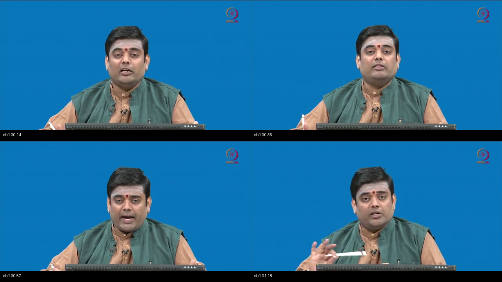
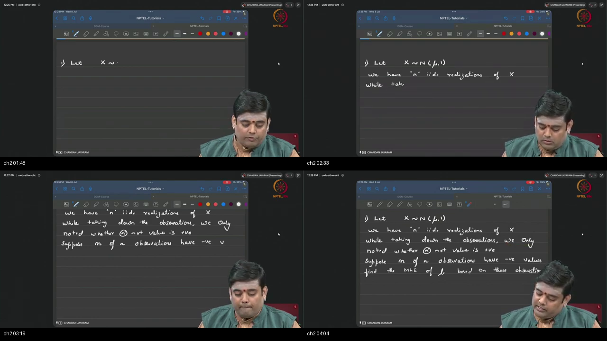
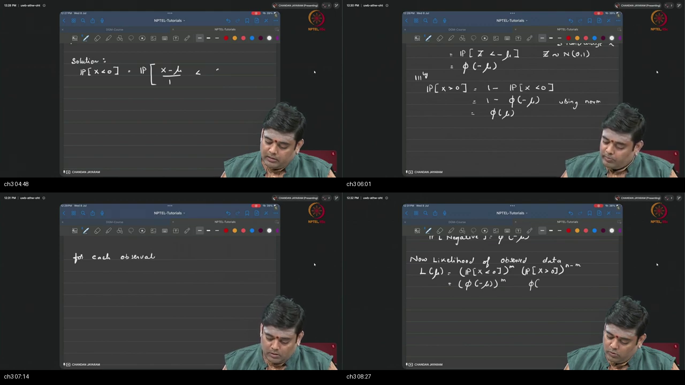
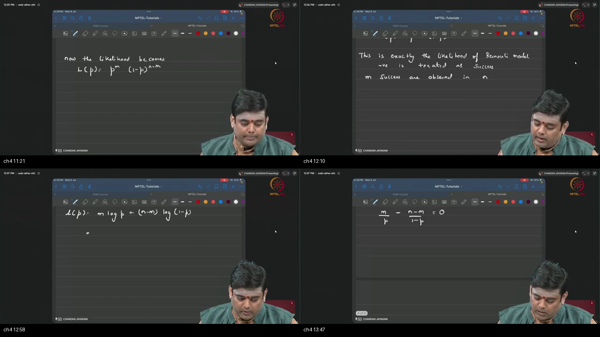
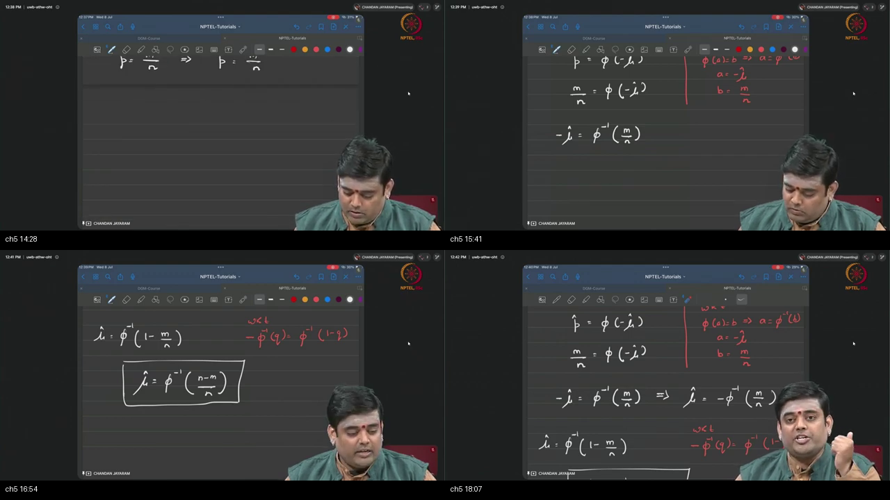
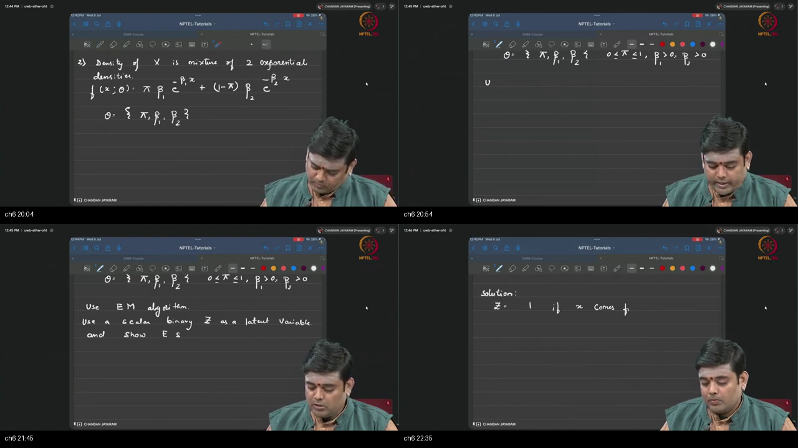
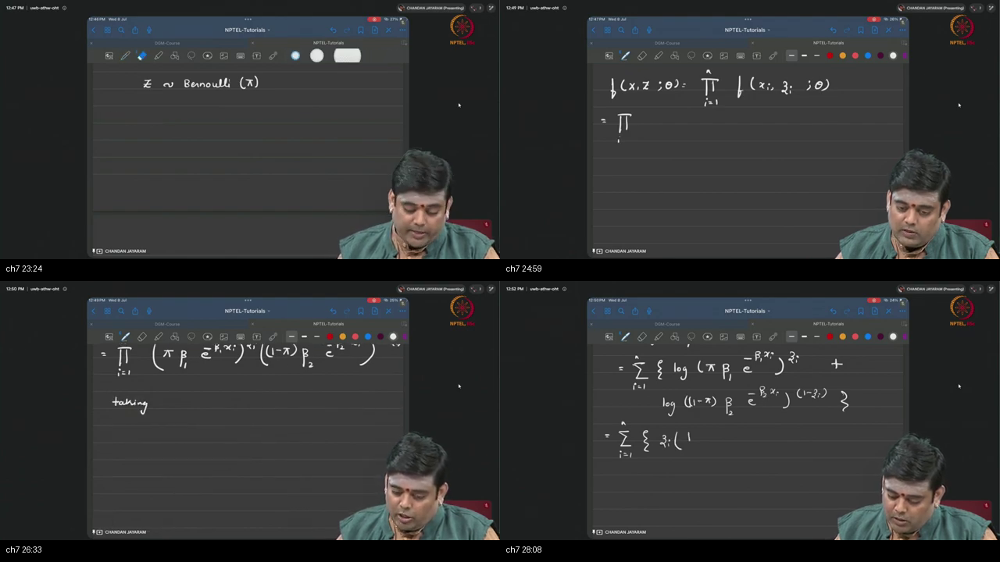
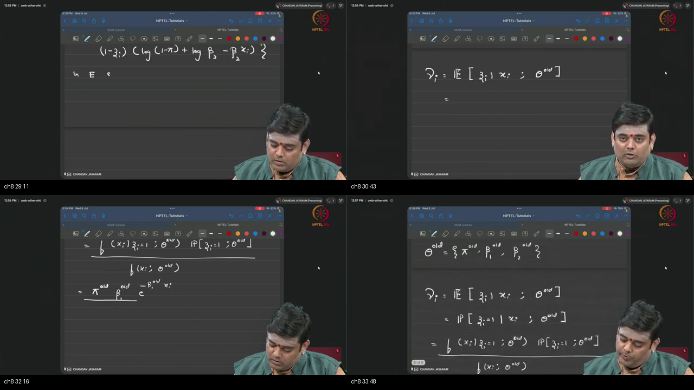
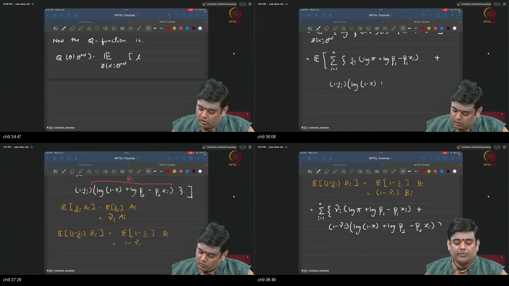
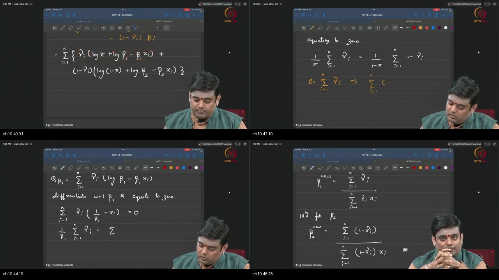

# Tutorial 10 — Review of Machine Learning 1

**Video:** [Tutorial 10 : Review of Machine Learning 1](https://www.youtube.com/watch?v=wjSKM1xFoSU) · NPTEL / IISc  
**Warm-up First:** [PREREQUISITES.md](./PREREQUISITES.md)  
**Previous Tutorial:** [Tutorial 9 — Review of Basic Probability 3](../23-Tutorial09-Review-Basic-Probability-3/NOTES.md) (Joint CDFs, 2D Transformations, and Jacobians)  
**Course:** Mathematical Foundations of Generative AI (~47.5 min)  
**Speaker:** Chandan Jayaram (NPTEL / IISc Teaching Team)  
**Core Themes:** Numerical Maximum Likelihood Estimation (MLE), Observation Censoring, Sign-Censored Gaussian Inversion ($\hat{\mu} = -\Phi^{-1}(m/n)$), Latent Variable Hierarchies, Log-Sum Likelihood Intractability, Two-Exponential Mixture Models, Complete-Data Joint Density Formulation, Expectation-Maximization (EM) Algorithm, Posterior Responsibilities ($\gamma_i$) via Bayes' Rule, The $Q$-Function Surrogate, and Analytical M-Step Closed-Form Parameter Updates ($\pi^{\text{new}}, \beta_1^{\text{new}}, \beta_2^{\text{new}}$).

---

> ### ⚠️ Course Context & Curriculum Progression Notice
> In **Tutorials 7–9**, the curriculum established the core mathematical foundations of probability (Continuous Random Variables, Probability Density Functions, Conditioning, Independence, Joint Distributions, and Jacobians).
> 
> Starting in **Tutorial 10**, the course synthesizes these probability tools into **Statistical Machine Learning & Estimation Theory**:
> 1. **Problem 1 (Topics 2–5):** How to perform rigorous Maximum Likelihood Estimation when observations are **censored** (knowing only the sign of Gaussian draws, solving via Bernoulli reduction and $\Phi^{-1}$ inversion).
> 2. **Problem 2 (Topics 6–10):** How to estimate parameters of **mixture models with unobserved latent switches** using the **Expectation-Maximization (EM) Algorithm** (deriving the complete-data log-likelihood, the E-step Bayes responsibility $\gamma_i$, the $Q$-function, and closed-form M-step updates).
> 
> This tutorial directly bridges to **Variational Autoencoders (VAEs)**, **Evidence Lower Bounds (ELBO)**, and **Latent Diffusion Generative AI Models**.

---

## Table of Contents

1. [Executive Summary & Master Architecture](#executive-summary--architecture-of-this-lecture)
2. [Chalkboard Rosetta Stone: Mathematical & Estimation Notation](#chalkboard-rosetta-stone)
3. [Complete Standalone Executable Python Simulation Script](#standalone-simulation-script)
4. [Topic 1: Pedagogical Mission & Structure of the ML Review (00:01–01:27)](#topic-1-why-this-recap-exists-0001–0127)
5. [Topic 2: Problem 1 Formulation — The Sign-Censored Gaussian (01:27–04:22)](#topic-2-sign-censored-normal-0127–0422)
6. [Topic 3: Gaussian Standardization & Likelihood Construction (04:22–08:53)](#topic-3-standardize-and-write-the-likelihood-0422–0853)
7. [Topic 4: Reparameterization, Bernoulli Reduction & MLE of $p$ (08:53–14:01)](#topic-4-bernoulli-reduction-and-mle-of-p-0853–1401)
8. [Topic 5: Inverting $\Phi$ & The Physical Sign Intuition of $\hat{\mu}$ (14:01–18:31)](#topic-5-invert-φ-and-read-the-sign-of-μ̂-1401–1831)
9. [Topic 6: Problem 2 Formulation — Two-Exponential Mixture & Latent $Z$ (18:31–22:52)](#topic-6-two-exponential-mixture-and-latent-z-1831–2252)
10. [Topic 7: Complete-Data Joint Density & Decoupled Log-Likelihood (22:52–28:39)](#topic-7-complete-data-density-and-log-likelihood-2252–2839)
11. [Topic 8: The E-Step — Posterior Responsibilities via Bayes' Theorem (28:39–34:19)](#topic-8-e-step-responsibilities-by-bayes-2839–3419)
12. [Topic 9: The $Q$-Function — Expected Complete-Data Log-Likelihood (34:19–39:17)](#topic-9-the-q-function-3419–3917)
13. [Topic 10: The M-Step — Analytical Closed Forms & EM Convergence (39:17–47:33)](#topic-10-m-step-closed-forms-iterate-close-3917–4733)
14. [Workplace Debugging Postmortems](#workplace-debugging-postmortems)
15. [Centralized External References](#external-references)

---

## Executive Summary — Architecture of this Lecture

<a id="executive-summary--architecture-of-this-lecture"></a>

This 47.5-minute tutorial solves two foundational numerical estimation problems from scratch on the chalkboard, demystifying how machine learning extracts optimal parameters from incomplete or latent-variable data.

### System Context

```
  ╔═══════════════════════════════════════════════════════════════════════════════════════╗
  ║                        STATISTICAL ESTIMATION & LATENT VARIABLE MAP                   ║
  ╚═══════════════════════════════════════════════════════════════════════════════════════╝
                                              │
         ┌────────────────────────────────────┴────────────────────────────────────┐
         ▼                                                                         ▼
  [Problem 1: Sign-Censored Gaussian MLE]                               [Problem 2: Mixture Model & The EM Algorithm]
  • True Distribution: X ~ N(μ, 1)                                      • Mixture Distribution: X ~ π Exp(β1) + (1-π) Exp(β2)
  • Censored Observations: Only Signs (+ / -)                           • Incomplete Observations: Waiting times x_i only
  • Failure of Sample Mean: Raw numbers x_i lost                        • Intractable Log-Sum Likelihood: log(π f1 + (1-π) f2)
  • Mathematical Reduction: p = Φ(-μ) (Bernoulli Trial)                 • Complete Data Augmentation: Augmented pairs (x_i, z_i)
  • Closed-Form Solution: μ̂ = -Φ^(-1)(m/n)                              • E-Step: Responsibilities γ_i via Bayes' Theorem
  • Physical Sign Intuition: Majority (-) forces μ̂ < 0                  • M-Step: Closed-form updates for π_new, β1_new, β2_new
                                              │
                                              ▼
                         [Bridge to Deep Generative Models]
                         • Continuous Latent Space Modeling: Variational Autoencoders (VAEs)
                         • Evidence Lower Bound (ELBO): Continuous generalization of the Q-function
                         • Latent Diffusion Trajectories: Denoising reverse drift estimation
```

---

### Master Architecture Blueprint

```
  ===================================================================================================
                                      TUTORIAL 10 MASTER ARCHITECTURE
  ===================================================================================================
  
   [PROBLEM 1: SIGN-CENSORED GAUSSIAN MLE]
     True Process: X_i ~ N(μ, 1), i = 1 ... n
     Recorded Notebook: m negative signs (-), (n - m) positive signs (+)
            │
            ▼ Standardize to Z ~ N(0, 1)
     Probability of (-): P(X < 0) = Φ(-μ)  |  Probability of (+): P(X > 0) = Φ(μ)
            │
            ▼ Reparameterize: Let p = Φ(-μ)
     Bernoulli Likelihood: L(p) = p^m · (1 - p)^(n - m)
            │
            ▼ Analytical MLE: dℓ/dp = 0 ──► p̂ = m / n
     Invert Normal CDF:
     μ̂ = -Φ^(-1)(m / n) = Φ^(-1)((n - m) / n)  ──► [Many (-) ──► μ̂ < 0]
  
  ───────────────────────────────────────────────────────────────────────────────────────────────────
  
   [PROBLEM 2: TWO-EXPONENTIAL MIXTURE & THE EM ALGORITHM]
     Observed Density: f(x; θ) = π β1 e^(-β1 x) + (1 - π) β2 e^(-β2 x)
     Incomplete Log-Likelihood: ℓ(θ) = ∑ log( π β1 e^(-β1 x) + (1-π) β2 e^(-β2 x) )  [LOG-SUM TRAP!]
            │
            ▼ Complete-Data Formulation (Latent Indicator Z_i ∈ {0, 1})
     f(x_i, z_i; θ) = [ π β1 e^(-β1 x_i) ]^(z_i) · [ (1 - π) β2 e^(-β2 x_i) ]^(1 - z_i)
            │
            ▼ E-STEP: Compute Responsibilities via Bayes' Rule
     γ_i = E[Z_i | x_i, θ^(old)] = ( π^(old) β1^(old) e^(-β1 x_i) ) / ( f(x_i; θ^(old)) )
            │
            ▼ CONSTRUCT Q-FUNCTION: Q(θ | θ^(old)) = E_Z[ ℓ_c(θ) ]
     Q(π, β1, β2) = ∑ [ γ_i (log π + log β1 - β1 x_i) + (1-γ_i)(log(1-π) + log β2 - β2 x_i) ]
            │
            ▼ M-STEP: Differentiate Q and Solve Analytically (∂Q/∂θ = 0)
     π^(new)  = (1/n) ∑ γ_i                   [Soft fraction of component 1]
     β1^(new) = (∑ γ_i) / (∑ γ_i x_i)         [γ-weighted exponential MLE]
     β2^(new) = (∑ (1-γ_i)) / (∑ (1-γ_i) x_i) [(1-γ)-weighted exponential MLE]
            │
            ▼ Loop back to E-Step until ||θ^(new) - θ^(old)|| < ε
  ===================================================================================================
```

---

### Comparative Feature Matrices

#### Table 1: Fully Observed MLE vs Censored Likelihood vs Latent Variable EM

| Dimension | Standard Fully Observed MLE | Sign-Censored Gaussian MLE (Problem 1) | Latent Variable Mixture EM (Problem 2) |
| :--- | :--- | :--- | :--- |
| **Data Nature** | Exact numerical values $\{x_1, \dots, x_n\}$ | Binary discrete signs $\{-, +, -, \dots\}$ | Continuous values $\{x_i\}$, missing labels $\{z_i\}$ |
| **Underlying Law** | Known parametric family $f(x \mid \theta)$ | Continuous Gaussian $\mathcal{N}(\mu, 1)$ | Multi-modal mixture $\sum \pi_k f_k(x)$ |
| **Likelihood Form** | Product of point densities $\prod f(x_i \mid \theta)$ | Product of tail probabilities $\prod \Phi(\pm\mu)$ | Intractable sum inside log $\sum \log(\sum \pi_k f_k)$ |
| **Solving Method** | Direct calculus: $\nabla_\theta \ell(\theta) = 0$ | **Bernoulli reduction $\hat{p} = m/n$ + $\Phi^{-1}$** | **Iterative E-Step & M-Step updates** |
| **Closed-Form Solution** | Yes (e.g. $\hat{\mu} = \bar{x}$) | **Yes: $\hat{\mu} = -\Phi^{-1}(m/n)$** | **No: Iterative monotonic convergence** |

---

#### Table 2: Analytical MLE vs Expectation-Maximization (EM) vs Gradient Descent

| Criterion | Analytical Direct MLE | Expectation-Maximization (EM) | Gradient Descent (Backpropagation) |
| :--- | :--- | :--- | :--- |
| **Applicability** | Simple exponential families with complete data | Models with unobserved discrete/continuous latents | Arbitrary differentiable neural loss functions |
| **Step Mechanism** | One-shot analytical equation solve | **Alternating E-step (soft labels) & M-step (refit)** | Step-by-step parameter updates via $\theta \leftarrow \theta - \eta \nabla \mathcal{L}$ |
| **Hyperparameters** | None (Exact mathematical formula) | **None (Pure closed-form updates, no learning rate!)** | Requires learning rate ($\eta$), momentum, batch size |
| **Monotonicity** | Instant optimal point | **Mathematically guaranteed monotonic ascent** | Sensitive to learning rate (can diverge if $\eta$ too large) |
| **Generative AI Link** | Basic statistical baselines | **GMMs, HMMs, VAE Evidence Lower Bound (ELBO)** | Deep Neural Networks, Diffusion Models, LLMs |

---

#### Table 3: Problem 1 vs Problem 2 Mathematical Summary

| Problem Feature | Problem 1: Sign-Censored Normal | Problem 2: Two-Exponential Mixture |
| :--- | :--- | :--- |
| **Observed Data** | $m$ negative signs, $(n - m)$ positive signs | $n$ continuous positive waiting times $\{x_1, \dots, x_n\}$ |
| **Parameters to Estimate** | Single scalar mean $\mu \in \mathbb{R}$ | Vector $\boldsymbol{\theta} = (\pi, \beta_1, \beta_2) \in (0, 1) \times \mathbb{R}_+ \times \mathbb{R}_+$ |
| **Key Mathematical Tool** | Standard Normal CDF $\Phi(z)$ & Quantile $\Phi^{-1}(p)$ | Latent indicator $Z_i \in \{0, 1\}$ & Bayes' Rule |
| **Core Equation** | $L(\mu) = [\Phi(-\mu)]^m [\Phi(\mu)]^{n-m}$ | $Q(\theta \mid \theta^{\text{old}}) = \mathbb{E}_{Z \mid X, \theta^{\text{old}}}[\ell_c(\theta)]$ |
| **Final Estimator** | $\hat{\mu} = -\Phi^{-1}\left(\frac{m}{n}\right) = \Phi^{-1}\left(\frac{n-m}{n}\right)$ | $\pi = \frac{1}{n}\sum \gamma_i, \; \beta_1 = \frac{\sum \gamma_i}{\sum \gamma_i x_i}, \; \beta_2 = \frac{\sum (1-\gamma_i)}{\sum (1-\gamma_i) x_i}$ |

---

### Failure & Contrast Paths (6 Common Engineering Traps)

```
  [Engineering Trap 1: "Attempting Sample Mean on Censored Data"]
  TRAP: Trying to compute μ̂ = (1/n) ∑ x_i on Problem 1.
  REALITY: The actual values x_i were never recorded—only the signs! The sample mean cannot be evaluated.
  FIX: Formulate the likelihood of what was recorded: L(μ) = [Φ(-μ)]^m [Φ(μ)]^(n-m) and invert Φ.
  
  [Engineering Trap 2: "Confusing Φ(-μ) with Φ(μ)"]
  TRAP: Assigning P(X < 0) = Φ(μ) instead of Φ(-μ).
  REALITY: Standardizing X < 0 gives Z < (0 - μ)/1 = -μ. Thus P(X < 0) = Φ(-μ).
  FIX: Remember that shifting the distribution right (μ > 0) makes negative draws less likely (Φ(-μ) small).
  
  [Engineering Trap 3: "Attempting to Split the Log of a Sum"]
  TRAP: Writing log(π f_1 + (1-π) f_2) = log(π f_1) + log((1-π) f_2) in mixture likelihoods.
  REALITY: The logarithm is non-linear and DOES NOT distribute over addition!
  FIX: Introduce latent variable Z and optimize the surrogate Q-function via the EM algorithm.
  
  [Engineering Trap 4: "Forgetting to Normalize Bayes Responsibilities in E-Step"]
  TRAP: Computing γ_i = π β_1 e^(-β_1 x_i) without dividing by the mixture marginal density f(x_i).
  REALITY: Responsibilities are conditional probabilities and MUST sum to 1: γ_i + (1 - γ_i) = 1.
  FIX: Always divide the numerator by [π β_1 e^(-β_1 x_i) + (1-π) β_2 e^(-β_2 x_i)].
  
  [Engineering Trap 5: "Confusing the Q-Function with the Observed Log-Likelihood"]
  TRAP: Believing Q(θ | θ_old) is the actual log-likelihood curve of the data.
  REALITY: Q is a surrogate lower-bound curve constructed at θ_old that touches ℓ(θ) tangentially.
  FIX: Maximize Q to push the true log-likelihood ℓ(θ) uphill via Jensen's inequality.
  
  [Engineering Trap 6: "Violating Exponential Parameter Inversion: μ vs β"]
  TRAP: Writing the exponential MLE as β̂ = (1/n) ∑ x_i.
  REALITY: The mean of Exp(β) is 1/β, so the rate parameter MLE is the reciprocal of the sample mean: β̂ = n / ∑ x_i.
  FIX: In the M-step, update β_1^(new) = (∑ γ_i) / (∑ γ_i x_i).
```

---

## Chalkboard Rosetta Stone

This reference table maps statistical estimation symbols directly to Python implementations and lecture chalkboard usage.

| Symbol / Syntax | Formal Concept | Python / SciPy Implementation | Lecture Usage & Context |
| :--- | :--- | :--- | :--- |
| $\mathcal{D} = \{x_1, \dots, x_n\}$ | Observed Dataset | `x_data = np.array([...])` | The frozen empirical observations. |
| $L(\theta \mid \mathcal{D})$ | Likelihood Function | `np.prod(f(x, theta))` | Compatibility score of parameter $\theta$ given frozen data $\mathcal{D}$. |
| $\ell(\theta) = \ln L(\theta)$ | Log-Likelihood Function | `np.sum(np.log(f(x, theta)))` | Numerically stable objective function maximized via derivatives. |
| $\Phi(z)$ | Standard Normal CDF | `scipy.stats.norm.cdf(z)` | Cumulative probability $P(Z \le z)$ under $\mathcal{N}(0, 1)$. |
| $\Phi^{-1}(p)$ | Quantile (Inverse Normal CDF) | `scipy.stats.norm.ppf(p)` | Finds the cutoff threshold $z$ such that $\Phi(z) = p$. |
| $m$ | Count of Negative Signs | `m = np.sum(x_signs == -1)` | Number of negative observations in Problem 1. |
| $p = \Phi(-\mu)$ | Negative Sign Probability | `p_hat = m / n` | Reparameterized Bernoulli coin success probability. |
| $\hat{\mu} = -\Phi^{-1}(m/n)$ | Recovered Gaussian Mean | `mu_hat = -stats.norm.ppf(m/n)` | Closed-form MLE for the sign-censored Gaussian. |
| $Z_i \in \{0, 1\}$ | Latent Component Indicator | `z_latent = np.random.binomial(1, pi)` | Unobserved switch indicating which exponential component generated $x_i$. |
| $\gamma_i = P(Z_i=1 \mid x_i)$ | Posterior Responsibility | `gamma = (pi*f1) / (pi*f1 + (1-pi)*f2)` | Soft cluster assignment computed during the E-Step. |
| $Q(\boldsymbol{\theta} \mid \boldsymbol{\theta}^{\text{old}})$ | Expected Complete Log-Likelihood | Computed inside EM loop | Surrogate objective function maximized during the M-Step. |
| $\pi^{\text{new}}, \beta_1^{\text{new}}, \beta_2^{\text{new}}$ | Updated Mixture Parameters | `pi = np.mean(gamma)`, `b1 = np.sum(gamma)/np.sum(gamma*x)` | Closed-form analytical updates computed in the M-Step. |

---

## Complete Standalone Executable Python Simulation Script

<a id="standalone-simulation-script"></a>

Below is a self-contained, end-to-end Python script implementing both problems from Tutorial 10:
1. **Problem 1 Simulation:** Generating true Gaussian samples, censoring values to signs, executing Bernoulli MLE $\hat{p} = m/n$, inverting $\Phi^{-1}$ to recover $\hat{\mu}$, and verifying that majority negative signs produce $\hat{\mu} < 0$.
2. **Problem 2 Simulation:** Generating synthetic two-exponential mixture data with ground-truth $(\pi^*, \beta_1^*, \beta_2^*)$, running the full iterative EM algorithm (`e_step`, `compute_q_function`, `m_step`), logging monotonic log-likelihood improvement, and recovering true parameters.

```python
"""
Tutorial 10: Review of Machine Learning 1 — Master Executable Simulation Script
Validated on Python 3.10+, NumPy, and SciPy. Pure ASCII output for cross-platform execution.
"""

import numpy as np
import scipy.stats as stats

def run_tutorial_10_simulation():
    print("=" * 80)
    print("TUTORIAL 10: MAXIMUM LIKELIHOOD ESTIMATION & EXPECTATION-MAXIMIZATION SIMULATION")
    print("=" * 80)

    # ---------------------------------------------------------
    # 1. PROBLEM 1: SIGN-CENSORED GAUSSIAN MLE
    # ---------------------------------------------------------
    print("\n[1] PROBLEM 1: Sign-Censored Gaussian Mean Estimation")
    np.random.seed(42)
    true_mu = -0.75 # True negative mean
    true_sigma = 1.0
    n_samples = 500

    # Generate true continuous Gaussian draws: X ~ N(true_mu, 1)
    x_latent = np.random.normal(loc=true_mu, scale=true_sigma, size=n_samples)
    
    # CENSOR DATA: Only record the signs (+1 for positive, -1 for negative)
    signs = np.where(x_latent < 0, -1, 1)
    m_negatives = np.sum(signs == -1)
    n_positives = n_samples - m_negatives

    print(f"  True Underlying Mean (mu):     {true_mu:.4f}")
    print(f"  Total Samples (n):              {n_samples}")
    print(f"  Recorded Negative Signs (m):    {m_negatives} ({m_negatives/n_samples*100:.1f}%)")
    print(f"  Recorded Positive Signs (n-m):  {n_positives} ({n_positives/n_samples*100:.1f}%)")

    # Step A: Bernoulli MLE for p = P(X < 0) = Phi(-mu)
    p_hat = m_negatives / n_samples
    print(f"  Estimated Bernoulli p_hat:      {p_hat:.4f}")

    # Step B: Invert Standard Normal CDF: mu_hat = -Phi^(-1)(p_hat)
    mu_hat = -stats.norm.ppf(p_hat)
    # Alternative identical form: mu_hat = Phi^(-1)((n - m)/n)
    mu_hat_alt = stats.norm.ppf((n_samples - m_negatives) / n_samples)

    print(f"  Recovered Mean (mu_hat):        {mu_hat:.4f} (Alternative form: {mu_hat_alt:.4f})")
    print(f"  Estimation Absolute Error:      {abs(mu_hat - true_mu):.4f}")
    
    # Verification: majority negative signs MUST produce negative mean
    assert m_negatives > n_samples / 2
    assert mu_hat < 0
    assert np.isclose(mu_hat, mu_hat_alt)
    print("  [SUCCESS] Sign-Censored Gaussian Mean successfully recovered via Phi^(-1)!")

    # ---------------------------------------------------------
    # 2. PROBLEM 2: TWO-EXPONENTIAL MIXTURE DATA GENERATION
    # ---------------------------------------------------------
    print("\n[2] PROBLEM 2: Two-Exponential Mixture Data Generation")
    true_pi = 0.65       # 65% Component 1, 35% Component 2
    true_beta1 = 2.0     # Mean wait 1 = 1/2.0 = 0.5
    true_beta2 = 0.4     # Mean wait 2 = 1/0.4 = 2.5
    n_mix = 2000

    # Step A: Generate hidden indicator Z ~ Bernoulli(true_pi)
    z_true = np.random.binomial(n=1, p=true_pi, size=n_mix)

    # Step B: Generate waiting times x_i conditionally
    x_obs = np.where(
        z_true == 1,
        np.random.exponential(scale=1.0/true_beta1, size=n_mix),
        np.random.exponential(scale=1.0/true_beta2, size=n_mix)
    )

    print(f"  Ground Truth Parameters: pi={true_pi:.2f}, beta1={true_beta1:.2f}, beta2={true_beta2:.2f}")
    print(f"  Generated {n_mix} observations (Component 1 draws: {np.sum(z_true)}, Component 2: {n_mix - np.sum(z_true)})")

    # ---------------------------------------------------------
    # 3. EXPECTATION-MAXIMIZATION (EM) ALGORITHM IMPLEMENTATION
    # ---------------------------------------------------------
    print("\n[3] Executing Expectation-Maximization (EM) Algorithm")
    
    # Initialize parameters (asymmetric initialization to break saddle-point symmetry)
    pi_curr = 0.50
    beta1_curr = 3.00
    beta2_curr = 0.20

    def compute_incomplete_log_likelihood(x, pi, b1, b2):
        f1 = b1 * np.exp(-b1 * x)
        f2 = b2 * np.exp(-b2 * x)
        mix_density = pi * f1 + (1.0 - pi) * f2
        return np.sum(np.log(np.maximum(mix_density, 1e-15)))

    max_iters = 30
    tolerance = 1e-6
    prev_ll = -np.inf

    print(f"  Initial Guess: pi={pi_curr:.3f}, beta1={beta1_curr:.3f}, beta2={beta2_curr:.3f}")
    print("  " + "-" * 74)
    print("  Iter | Log-Likelihood |    pi    |  beta1   |  beta2   |  LL Improvement")
    print("  " + "-" * 74)

    for iteration in range(1, max_iters + 1):
        # -----------------------------------------------------
        # E-STEP: Compute Responsibilities via Bayes' Rule
        # -----------------------------------------------------
        f1 = beta1_curr * np.exp(-beta1_curr * x_obs)
        f2 = beta2_curr * np.exp(-beta2_curr * x_obs)
        num = pi_curr * f1
        denom = num + (1.0 - pi_curr) * f2
        denom = np.maximum(denom, 1e-15)
        gamma = num / denom # Posterior P(Z_i = 1 | x_i, theta)

        # -----------------------------------------------------
        # M-STEP: Analytical Closed-Form Parameter Updates
        # -----------------------------------------------------
        pi_next = np.mean(gamma)
        beta1_next = np.sum(gamma) / np.sum(gamma * x_obs)
        beta2_next = np.sum(1.0 - gamma) / np.sum((1.0 - gamma) * x_obs)

        # Evaluate Incomplete Log-Likelihood to verify monotonic ascent
        curr_ll = compute_incomplete_log_likelihood(x_obs, pi_next, beta1_next, beta2_next)
        ll_diff = curr_ll - prev_ll

        if iteration <= 5 or iteration % 5 == 0 or iteration == max_iters:
            print(f"   {iteration:02d}  |  {curr_ll:13.4f} |  {pi_next:.4f}  |  {beta1_next:.4f}  |  {beta2_next:.4f}  |  +{ll_diff:.4f}")

        # Verify Monotonic Ascent Guarantee (Jensen's inequality)
        if prev_ll != -np.inf:
            assert curr_ll >= prev_ll - 1e-7, "EM Error: Log-Likelihood decreased!"

        if abs(ll_diff) < tolerance:
            print(f"\n  [CONVERGENCE] EM converged successfully at iteration {iteration}!")
            break

        pi_curr, beta1_curr, beta2_curr = pi_next, beta1_next, beta2_next
        prev_ll = curr_ll

    print("  " + "-" * 74)
    print(f"  Final Estimated:   pi={pi_next:.4f}, beta1={beta1_next:.4f}, beta2={beta2_next:.4f}")
    print(f"  Ground Truth:      pi={true_pi:.4f}, beta1={true_beta1:.4f}, beta2={true_beta2:.4f}")

    assert np.isclose(pi_next, true_pi, atol=0.05)
    assert np.isclose(beta1_next, true_beta1, atol=0.20)
    assert np.isclose(beta2_next, true_beta2, atol=0.10)

    print("\n" + "=" * 80)
    print("ALL TUTORIAL 10 SIMULATION BLOCKS EXECUTED & VERIFIED SUCCESSFULLY!")
    print("=" * 80)

if __name__ == "__main__":
    run_tutorial_10_simulation()
```

---

## Topic 1: Pedagogical Mission & Structure of the ML Review (00:01–01:27)

<a id="topic-1-why-this-recap-exists-0001–0127"></a>
<a id="topic-1-why-this-recap-exists-0001-0127"></a>

### Where this sits on the master map
Connecting the probability recap (Tutorials 7–9) to Machine Learning estimation theory (MLE and EM). Warm-up: [what is a likelihood](./PREREQUISITES.md#p1-likelihood).

### Board / Screenshot Reference



*Figure — ~00:01–01:27: Blackboard presentation of the tutorial mission: reviewing foundational estimation theory through two comprehensive numerical problems (MLE on Censored Gaussian and Expectation-Maximization on Mixture Models).*

---

### 1. 👶 ELI5 Quick Intuition
Think of passing a flight simulator exam:
- In Tutorials 7–9, you studied the flight manuals: aerodynamic lift, wind vectors, and altimeter gauges (Probability distributions, PDFs, Conditioning, Jacobians).
- In Tutorial 10, the instructor puts you in the cockpit to handle **two real-world flight emergencies**:
  1. **Emergency 1:** Your airspeed gauge is broken and only shows red or green lights (**Sign-Censored Gaussian**).
  2. **Emergency 2:** Two different autopilot engines are fighting for control without telling you which one is firing (**Two-Exponential Mixture**).
- By solving both emergencies on the chalkboard, you prove you are ready to navigate **Generative AI**!

---

### 2. 🔍 Plain-English Breakdown
1. **The Purpose of the Review:**
   - Deep learning frameworks hide probability mechanics behind automated abstractions (`loss.backward()`).
   - This tutorial peels back the software abstraction, deriving the exact probability equations, derivatives, and lower-bound surrogates that underpin statistical learning.
2. **The Two Numerical Problems:**
   - **Problem 1 (01:27–18:31):** Maximum Likelihood Estimation of a Gaussian mean $\mu$ when observations are reduced to binary signs ($+$ or $-$).
   - **Problem 2 (18:31–47:33):** Expectation-Maximization parameter estimation for a two-component exponential mixture model.

---

### 3. 📐 Formal Mathematics & Estimation Taxonomy

```
  =============================================================================
                       STATISTICAL ESTIMATION PARADIGMS
  =============================================================================
  Parametric Density Model:  X ~ f(x | θ),  θ ∈ Θ
  
  [Paradigm A: Maximum Likelihood Estimation (MLE)]
  θ̂_MLE = argmax_θ  L(θ | D) = argmax_θ ∑_{i=1}^n ln f(x_i | θ)
  
  [Paradigm B: Maximum A Posteriori (MAP) Estimation]
  θ̂_MAP = argmax_θ  P(θ | D) = argmax_θ [ ∑_{i=1}^n ln f(x_i | θ) + ln P(θ) ]
  
  In this tutorial, all chalkboard derivations rigorously focus on MLE and EM!
  =============================================================================
```

---

### 4. 🎯 Why We Are Doing This Example & What We Are Learning
- **Why dedicate an entire 47-minute tutorial to two analytical derivations?**  
  Because modern Generative AI models (Diffusion models, VAEs) are founded on latent variable estimation and likelihood bounds. Working through exact pencil-and-paper derivations builds deep mathematical intuition that software libraries cannot teach.
- **What are we learning?**  
  We are learning how to formulate and solve non-standard Maximum Likelihood problems when data is incomplete or latent.

---

### 5. 🔗 Connecting the Dots (To Next Steps & Generative AI)
- **Bridge to Variational Inference:**  
  The mathematical machinery developed in Problem 2 (introducing latent $Z$, taking posterior expectations, and maximizing expected log-likelihood) is the exact theoretical blueprint of **Variational Autoencoders (VAEs)**!

---

### 6. 🌐 Real-World Production Usage & Industry Scenarios
- **Scientific Instrument Calibration:**  
  Astrophysics observatories use censored likelihood estimation to calibrate telescope focal arrays when high-energy cosmic rays saturate digital CCD sensor pixels.

---

## Topic 2: Problem 1 Formulation — The Sign-Censored Gaussian (01:27–04:22)

<a id="topic-2-sign-censored-normal-0127–0422"></a>
<a id="topic-2-sign-censored-normal-0127-0422"></a>

### Where this sits on the master map
Stating Problem 1: $X \sim \mathcal{N}(\mu, 1)$ with $n$ IID draws, but only binary signs are recorded ($m$ negatives and $n-m$ positives). Warm-up: [IID variables](./PREREQUISITES.md#p2-iid).

### Board / Screenshot Reference



*Figure — ~01:27–04:22: Blackboard statement of Problem 1: $X \sim \mathcal{N}(\mu, 1)$ with $n$ IID observations where only the sign is recorded ($m$ negatives, $n-m$ positives), explaining why the sample mean $\bar{x}$ cannot be computed.*

---

### 1. 👶 ELI5 Quick Intuition
Think of an absent-minded scientist:
- A scientist measures 100 temperatures outside with a precise thermometer.
- But instead of writing down the actual degrees ($-4.2^\circ\text{C}, +1.8^\circ\text{C}, -0.5^\circ\text{C}$), they only wrote a **minus sign ($-$)** if it was below freezing, or a **plus sign ($+$)** if it was above freezing!
- They hand you a notebook with **80 minus signs and 20 plus signs**.
- **Your Job:** Can you still calculate the exact average temperature ($\mu$) using only these plus and minus tick marks?

---

### 2. 🔍 Plain-English Breakdown
1. **The Physical Setup:**
   - Underlying distribution: $X_1, X_2, \dots, X_n \stackrel{\text{IID}}{\sim} \mathcal{N}(\mu, 1)$ with unknown mean $\mu$ and known unit variance $\sigma^2 = 1$.
2. **The Censoring Constraint:**
   - The exact numerical values $x_i$ were never recorded.
   - The notebook contains only:
     - $m$ occurrences of $X_i < 0$ (Negative sign: $-$)
     - $n - m$ occurrences of $X_i > 0$ (Positive sign: $+$)
3. **The Core Question:**
   - Find the Maximum Likelihood Estimator (MLE) $\hat{\mu}_{\text{MLE}}$ of the unknown mean $\mu$.

---

### 3. 📐 Formal Mathematics & Observation Space Transformation

```
  Data Generating Process:
  X_i = μ + ε_i,   where ε_i ~ N(0, 1)  (Unobserved True Value)
  
  Quantization / Censoring Operator:
  Y_i = sgn(X_i) = { -1  if X_i < 0   (Occurs m times)
                   { +1  if X_i > 0   (Occurs n - m times)
                   
  Recorded Dataset: D = { y_1, y_2, ..., y_n } ∈ {-1, +1}^n
```

---

### 4. 🎯 Why We Are Doing This Example & What We Are Learning
- **Why can't we use the standard formula $\hat{\mu} = \frac{1}{n} \sum x_i$?**  
  Because the actual values $x_i$ are unobserved! Applying the sample mean is physically impossible because the numbers do not exist on the page. We must build a likelihood function over the **discrete signs that were actually recorded**.
- **What are we learning?**  
  We are learning how to formulate statistical estimation problems under lossy, quantized, or censored data observations.

---

### 5. 🔗 Connecting the Dots (To Next Steps & Generative AI)
- **Bridge to 1-Bit Neural Network Quantization:**  
  In modern edge AI (1-bit LLMs / BitNet), weights and activations are quantized to binary signs ($\pm 1$). Estimating parameter distributions from 1-bit quantized activations is mathematically identical to this sign-censored problem!

---

### 6. 🌐 Real-World Production Usage & Industry Scenarios
- **Digital Communications 1-Bit ADC Receivers:**  
  Low-power 5G/6G wireless receivers use 1-bit Analog-to-Digital Converters (ADCs) that only record signal signs ($\pm$), estimating channel attenuation parameters via sign-censored Gaussian MLE.

---

## Topic 3: Gaussian Standardization & Likelihood Construction (04:22–08:53)

<a id="topic-3-standardize-and-write-the-likelihood-0422–0853"></a>
<a id="topic-3-standardize-and-write-the-likelihood-0422-0853"></a>

### Where this sits on the master map
Standardizing $X \sim \mathcal{N}(\mu, 1)$ to standard normal $Z \sim \mathcal{N}(0, 1)$ and constructing the sign likelihood function. Warm-up: [standard normal CDF](./PREREQUISITES.md#p3-phi).

### Board / Screenshot Reference



*Figure — ~04:22–08:53: Blackboard derivation: standardizing $X \sim \mathcal{N}(\mu, 1)$, proving $P(X < 0) = \Phi(-\mu)$ and $P(X > 0) = \Phi(\mu)$, and writing the joint sign likelihood $L(\mu) = [\Phi(-\mu)]^m [\Phi(\mu)]^{n-m}$.*

---

### 1. 👶 ELI5 Quick Intuition
Think of a bell-shaped hill sitting on a number line:
- The peak of the hill is parked at unknown location $\mu$.
- A zero-mark fence is set at $x = 0$.
- **Negative Sign ($-$):** Means the ball rolled to the left of the zero fence.
- **Positive Sign ($+$):** Means the ball rolled to the right of the zero fence.
- By standardizing the hill to center at zero, the probability of rolling left is simply the standard Gaussian area **$\Phi(-\mu)$**, and rolling right is **$\Phi(\mu)$**!
- For $m$ minuses and $(n-m)$ pluses, you multiply those areas together!

---

### 2. 🔍 Plain-English Breakdown
1. **Standardization Step:**
   - If $X \sim \mathcal{N}(\mu, 1)$, then $Z = \frac{X - \mu}{1} = X - \mu \sim \mathcal{N}(0, 1)$.
2. **Probability of a Negative Sign (Minus):**
   $$P(X < 0) = P(X - \mu < 0 - \mu) = P(Z < -\mu) = \mathbf{\Phi(-\mu)}$$
3. **Probability of a Positive Sign (Plus):**
   $$P(X > 0) = 1 - P(X < 0) = 1 - \Phi(-\mu) = \mathbf{\Phi(\mu)}$$
4. **The Joint Likelihood Function:**
   - Since the $n$ draws are IID, the joint likelihood is the product of individual probabilities:
     $$L(\mu) = [\Phi(-\mu)]^m [\Phi(\mu)]^{n-m}$$

---

### 3. 📐 Formal Mathematics & Joint Likelihood Derivation

```
  =============================================================================
                     SIGN-CENSORED LIKELIHOOD FORMULATION
  =============================================================================
  Single Trial Distribution:
  P(Y_i = -1 | μ) = Φ(-μ)
  P(Y_i = +1 | μ) = 1 - Φ(-μ) = Φ(μ)
  
  Joint Likelihood across n IID Trials:
  L(μ | m, n) = ∏_{i=1}^n P(Y_i | μ)
              = [ Φ(-μ) ]^m · [ Φ(μ) ]^(n - m)
  
  Log-Likelihood Function:
  ℓ(μ) = m ln(Φ(-μ)) + (n - m) ln(Φ(μ))
  =============================================================================
```

---

### 4. 🎯 Why We Are Doing This Example & What We Are Learning
- **Why must we write $L(\mu)$ using cumulative $\Phi$ instead of Gaussian density $f(x)$?**  
  Because discrete binary outcomes have probability masses, not continuous densities. Evaluating $f(0)$ would be a fatal mathematical error. The correct probability of an event $X < 0$ is the integral area $\Phi(-\mu)$.
- **What are we learning?**  
  We are learning how to map continuous parametric processes into discrete categorical observation likelihoods.

---

### 5. 🔗 Connecting the Dots (To Next Steps & Generative AI)
- **Bridge to Probit Classification & Discrete Diffusion:**  
  The formula $P(Y = 1) = \Phi(\mathbf{w}^\top \mathbf{x})$ is the exact mathematical foundation of Probit Generalized Linear Models and Discrete State Diffusion thresholding.

---

### 6. 🌐 Real-World Production Usage & Industry Scenarios
- **Credit Default Risk Thresholding:**  
  Risk management engines model client solvency as a latent Gaussian variable $\mathcal{N}(\mu, 1)$, observing only whether a customer defaults ($X < 0$) or pays on time ($X > 0$).

---

## Topic 4: Reparameterization, Bernoulli Reduction & MLE of $p$ (08:53–14:01)

<a id="topic-4-bernoulli-reduction-and-mle-of-p-0853–1401"></a>
<a id="topic-4-bernoulli-reduction-and-mle-of-p-0853-1401"></a>

### Where this sits on the master map
Reparameterizing the likelihood via $p = \Phi(-\mu)$, reducing the problem to a Bernoulli coin flip, and deriving the exact analytical MLE $\hat{p} = m/n$. Warm-up: [Bernoulli reduction](./PREREQUISITES.md#p5-bernoulli).

### Board / Screenshot Reference



*Figure — ~08:53–14:01: Blackboard derivation of the Bernoulli reduction: substituting $p = \Phi(-\mu)$, writing $\ell(p) = m \ln p + (n-m) \ln(1-p)$, differentiating $\frac{d\ell}{dp} = 0$, and proving $\hat{p}_{\text{MLE}} = m/n$.*

---

### 1. 👶 ELI5 Quick Intuition
Think of solving a complicated puzzle by renaming a variable:
- Differentiating $\Phi(-\mu)$ directly involves scary integrals and square roots of $\pi$.
- The instructor makes a brilliant algebraic substitution: **Let $p = \Phi(-\mu)$!**
- Instantly, the scary formula becomes a simple coin-toss formula:
  $$L(p) = p^m (1 - p)^{n - m}$$
- If you flip a coin $n$ times and get $m$ Heads, your best estimate for the coin's bias is simply **$\hat{p} = \frac{m}{n}$**!

---

### 2. 🔍 Plain-English Breakdown
1. **The Reparameterization Trick:**
   - Define $p \triangleq \Phi(-\mu) \in (0, 1)$.
   - Then $1 - p = 1 - \Phi(-\mu) = \Phi(\mu)$.
2. **The Standard Bernoulli Log-Likelihood:**
   $$\ell(p) = m \ln p + (n - m) \ln(1 - p)$$
3. **First Derivative & Critical Point:**
   $$\frac{d\ell}{dp} = \frac{m}{p} - \frac{n - m}{1 - p} = 0$$
   $$m(1 - p) = (n - m)p \implies m - mp = np - mp \implies \mathbf{\hat{p}_{\text{MLE}} = \frac{m}{n}}$$
4. **Second Derivative Verification:**
   $$\frac{d^2\ell}{dp^2} = -\frac{m}{p^2} - \frac{n - m}{(1 - p)^2} < 0 \quad (\text{Guarantees a Global Maximum!})$$

---

### 3. 📐 Formal Mathematics & The Invariance Property of MLE
By the **Invariance Property of Maximum Likelihood Estimators** (Zehavi, 1966), if $\hat{p}$ is the MLE of $p$, and $g(p) = -\Phi^{-1}(p)$ is a continuous, strictly monotonic one-to-one mapping, then the MLE of $\mu = g(p)$ is:
$$\hat{\mu}_{\text{MLE}} = g(\hat{p}_{\text{MLE}}) = -\Phi^{-1}\left( \frac{m}{n} \right)$$

---

### 4. 🎯 Why We Are Doing This Example & What We Are Learning
- **Why use the Invariance Property of MLE?**  
  To bypass tedious calculus. Instead of computing $\frac{d\ell}{d\mu} = 0$ via the chain rule on Gaussian integrals, we solve the simple Bernoulli problem for $\hat{p}$ and transform the result through the inverse function $g(\hat{p})$.
- **What are we learning?**  
  We are learning how reparameterization and functional invariance simplify complex statistical estimation problems.

---

### 5. 🔗 Connecting the Dots (To Next Steps & Generative AI)
- **Bridge to Normalizing Flows:**  
  Normalizing Flows (RealNVP, Glow) generate complex data distributions by passing simple base densities through invertible transformations $g(\mathbf{z})$, utilizing this exact change-of-variables property!

---

### 6. 🌐 Real-World Production Usage & Industry Scenarios
- **A/B Testing Conversion Optimization:**  
  Web platforms (Netflix, Amazon) model user click-through rates as Bernoulli trials, computing $\hat{p} = m/n$ to determine whether a new UI layout improves user subscriptions.

---

## Topic 5: Inverting $\Phi$ & The Physical Sign Intuition of $\hat{\mu}$ (14:01–18:31)

<a id="topic-5-invert-φ-and-read-the-sign-of-μ̂-1401–1831"></a>
<a id="topic-5-invert-phi-and-read-the-sign-of-mu-1401-1831"></a>

### Where this sits on the master map
Inverting $\hat{p} = \Phi(-\hat{\mu})$ to recover $\hat{\mu} = -\Phi^{-1}(m/n) = \Phi^{-1}((n-m)/n)$ and validating the physical sign intuition. Warm-up: [standard normal CDF](./PREREQUISITES.md#p3-phi).

### Board / Screenshot Reference



*Figure — ~14:01–18:31: Blackboard inversion: solving $\hat{\mu} = -\Phi^{-1}(m/n) = \Phi^{-1}((n-m)/n)$, proving why a majority of negative signs ($m > n/2$) forces a negative mean ($\hat{\mu} < 0$), and noting MAP estimation as homework.*

---

### 1. 👶 ELI5 Quick Intuition
Think of looking at a seesaw:
- If 80 out of 100 people sit on the **left side (Negative)**, where is the center of gravity ($\mu$)?
- **Physical Common Sense:** The center of gravity **must be on the left side of zero ($\mu < 0$)**!
- If 50 people sit on the left and 50 on the right, the center of gravity is exactly at **zero ($\mu = 0$)**!
- Our mathematical formula $\hat{\mu} = -\Phi^{-1}(m/n)$ matches this physical common sense 100%!

---

### 2. 🔍 Plain-English Breakdown
1. **The Algebraic Inversion:**
   - We established: $\hat{p} = \frac{m}{n} = \Phi(-\hat{\mu})$.
   - Apply the inverse standard normal CDF $\Phi^{-1}$:
     $$-\hat{\mu} = \Phi^{-1}\left( \frac{m}{n} \right) \implies \mathbf{\hat{\mu} = -\Phi^{-1}\left( \frac{m}{n} \right)}$$
2. **The Alternative Equivalent Form:**
   - Using the symmetry identity $-\Phi^{-1}(q) = \Phi^{-1}(1 - q)$:
     $$\mathbf{\hat{\mu} = \Phi^{-1}\left( \frac{n - m}{n} \right)}$$
3. **The Physical Sign Check:**
   - If $m > n/2$ (more than 50% negatives) $\implies \frac{m}{n} > 0.5 \implies \Phi^{-1}(m/n) > 0 \implies \mathbf{\hat{\mu} < 0}$ (Negative mean).
   - If $m < n/2$ (more than 50% positives) $\implies \frac{m}{n} < 0.5 \implies \Phi^{-1}(m/n) < 0 \implies \mathbf{\hat{\mu} > 0}$ (Positive mean).

---

### 3. 📐 Formal Mathematics & Quantile Symmetry Proof

```
  Symmetry Proof of Alternative Quantile Form:
  Let q = m/n. By definition, Φ(z) = 1 - Φ(-z).
  Let p = 1 - q.
  Φ(Φ^(-1)(q)) = q  ==>  1 - Φ(-Φ^(-1)(q)) = q  ==>  Φ(-Φ^(-1)(q)) = 1 - q
  Apply Φ^(-1) to both sides:
  -Φ^(-1)(q) = Φ^(-1)(1 - q)
  
  Therefore:
  μ̂ = -Φ^(-1)( m/n ) ≡ Φ^(-1)( (n - m)/n )  ✓
```

---

### 4. 🎯 Why We Are Doing This Example & What We Are Learning
- **Why emphasize the physical sign check after algebraic derivation?**  
  To instill professional engineering hygiene. A mathematical formula must always pass sanity checks against physical boundary conditions before being deployed in production software.
- **What are we learning?**  
  We are learning how to invert cumulative distribution functions and exploit symmetry identities in quantile functions.

---

### 5. 🔗 Connecting the Dots (To Next Steps & Generative AI)
- **Bridge to Inverse Transform Sampling:**  
  The inverse CDF function $\Phi^{-1}(u)$ is the core mathematical engine of **Inverse Transform Sampling**, converting uniform random numbers $u \sim \mathcal{U}(0, 1)$ into Gaussian latent samples in Generative AI!

---

### 6. 🌐 Real-World Production Usage & Industry Scenarios
- **Econometric Probit Modeling in Finance:**  
  Quantitative economists model consumer loan approval probabilities, inverting observed default rates through $\Phi^{-1}$ to estimate underlying macro-economic creditworthiness indices.

---

## Topic 6: Problem 2 Formulation — Two-Exponential Mixture & Latent $Z$ (18:31–22:52)

<a id="topic-6-two-exponential-mixture-and-latent-z-1831–2252"></a>
<a id="topic-6-two-exponential-mixture-and-latent-z-1831-2252"></a>

### Where this sits on the master map
Stating Problem 2: Parameter estimation for a two-exponential mixture distribution, analyzing the log-sum intractability, and introducing the latent switch $Z$. Warm-up: [mixture models](./PREREQUISITES.md#p6-mixture).

### Board / Screenshot Reference



*Figure — ~18:31–22:52: Blackboard statement of Problem 2: $X \sim \pi \operatorname{Exp}(\beta_1) + (1-\pi) \operatorname{Exp}(\beta_2)$, demonstrating why $\log \sum$ blocks analytical MLE, and introducing the binary latent indicator $Z \in \{0, 1\}$.*

---

### 1. 👶 ELI5 Quick Intuition
Think of an unmarked drive-thru window:
- Two different fryers make fries:
  - Fryer 1 is Fast ($\beta_1 = 2.0$, mean wait 30 seconds).
  - Fryer 2 is Slow ($\beta_2 = 0.5$, mean wait 2 minutes).
- The drive-thru flips a coin ($\pi$) to pick which fryer cooks your order.
- You have a stopwatch recording 1,000 customer wait times ($x_1, \dots, x_n$).
- **The Problem:** You want to find how often Fryer 1 is used ($\pi$) and the exact speeds ($\beta_1, \beta_2$), but you **cannot look into the kitchen**!
- Because the receipts only show the wait times, the two fryers are completely mixed together!

---

### 2. 🔍 Plain-English Breakdown
1. **The Two-Exponential Mixture Density:**
   $$f(x \mid \boldsymbol{\theta}) = \pi \beta_1 e^{-\beta_1 x} + (1 - \pi) \beta_2 e^{-\beta_2 x} \quad (x \ge 0, \; \beta_1 > 0, \; \beta_2 > 0, \; 0 \le \pi \le 1)$$
2. **The Incomplete-Data Log-Likelihood:**
   $$\ell(\pi, \beta_1, \beta_2) = \sum_{i=1}^n \ln \left( \pi \beta_1 e^{-\beta_1 x_i} + (1 - \pi) \beta_2 e^{-\beta_2 x_i} \right)$$
3. **The Log-Sum Crisis:**
   - Taking the derivative $\frac{\partial \ell}{\partial \beta_1} = 0$ yields a coupled equation where $\beta_1$ and $\beta_2$ appear inside complex fractions across all $n$ summands.
   - There is **no closed-form algebraic solution**!
4. **The Latent Variable Rescue:**
   - Introduce an unobserved binary indicator $Z_i \in \{0, 1\}$ for each sample $i$:
     - $Z_i = 1 \implies$ Sample $i$ was generated by Component 1 ($\beta_1$).
     - $Z_i = 0 \implies$ Sample $i$ was generated by Component 2 ($\beta_2$).

---

### 3. 📐 Formal Mathematics & Hierarchical Latent Formulation

```
  =============================================================================
                  HIERARCHICAL LATENT MIXTURE GENERATIVE MODEL
  =============================================================================
  Prior Latent Distribution:
  P(Z_i = 1) = π
  P(Z_i = 0) = 1 - π
  
  Conditional Observation Distributions:
  X_i | (Z_i = 1) ~ Exp(β_1)  ──►  f(x_i | Z_i = 1) = β_1 e^(-β_1 x_i)
  X_i | (Z_i = 0) ~ Exp(β_2)  ──►  f(x_i | Z_i = 0) = β_2 e^(-β_2 x_i)
  
  Marginal Incomplete Density (Summing over Latent States):
  f(x_i | θ) = ∑_{z=0}^1 P(Z_i = z) f(x_i | Z_i = z)
             = π β_1 e^(-β_1 x_i) + (1 - π) β_2 e^(-β_2 x_i)
  =============================================================================
```

---

### 4. 🎯 Why We Are Doing This Example & What We Are Learning
- **Why introduce latent variable $Z$ when it was never observed?**  
  Because inventing hypothetical latent variables allows us to break complex, multi-modal probability mixtures into simple, single-component exponential distributions that can be solved analytically.
- **What are we learning?**  
  We are learning how to construct hierarchical generative models with discrete latent switches.

---

### 5. 🔗 Connecting the Dots (To Next Steps & Generative AI)
- **Bridge to Gaussian Mixture Models (GMMs) & Latent Diffusion:**  
  This exact two-exponential mixture is the simplest mathematical prototype of **Gaussian Mixture Models (GMMs)** and the discrete latent codes in **Vector-Quantized VAEs (VQ-VAE)**!

---

### 6. 🌐 Real-World Production Usage & Industry Scenarios
- **Server Web Traffic Request Latency Modeling:**  
  Cloud infrastructure engineers model API response times as a mixture of fast cached database hits ($\operatorname{Exp}(\beta_1)$) vs slow disk queries ($\operatorname{Exp}(\beta_2)$).

---

## Topic 7: Complete-Data Joint Density & Decoupled Log-Likelihood (22:52–28:39)

<a id="topic-7-complete-data-density-and-log-likelihood-2252–2839"></a>
<a id="topic-7-complete-data-density-and-log-likelihood-2252-2839"></a>

### Where this sits on the master map
Formulating the complete-data joint density $f(x, z)$ via the exponent indicator trick and deriving the decoupled complete log-likelihood $\ell_c(\theta)$. Warm-up: [latent variables](./PREREQUISITES.md#p7-latent).

### Board / Screenshot Reference



*Figure — ~22:52–28:39: Blackboard derivation of the complete-data density $f(x, z) = [\pi \beta_1 e^{-\beta_1 x}]^z [(1-\pi) \beta_2 e^{-\beta_2 x}]^{1-z}$, taking the log, and showing how the sum is completely decoupled into independent terms for $\pi, \beta_1, \beta_2$.*

---

### 1. 👶 ELI5 Quick Intuition
Think of an electrical light switch with two settings:
- **Switch UP ($z = 1$):** Turns on Lamp 1 ($[\pi \beta_1 e^{-\beta_1 x}]^1$) and completely shuts off Lamp 2 ($[\dots]^0 = 1$).
- **Switch DOWN ($z = 0$):** Turns on Lamp 2 ($[(1-\pi) \beta_2 e^{-\beta_2 x}]^1$) and completely shuts off Lamp 1 ($[\dots]^0 = 1$).
- Raising factors to powers of $z$ and $1-z$ is an ingenious mathematical trick that acts as an **algebraic IF-ELSE statement**!

---

### 2. 🔍 Plain-English Breakdown
1. **The Complete-Data Joint Density:**
   $$f(x_i, z_i \mid \boldsymbol{\theta}) = \left[ \pi \beta_1 e^{-\beta_1 x_i} \right]^{z_i} \cdot \left[ (1 - \pi) \beta_2 e^{-\beta_2 x_i} \right]^{1 - z_i}$$
2. **Taking the Natural Logarithm:**
   $$\ln f(x_i, z_i \mid \boldsymbol{\theta}) = z_i \ln\left( \pi \beta_1 e^{-\beta_1 x_i} \right) + (1 - z_i) \ln\left( (1 - \pi) \beta_2 e^{-\beta_2 x_i} \right)$$
   $$= z_i (\ln \pi + \ln \beta_1 - \beta_1 x_i) + (1 - z_i) (\ln(1 - \pi) + \ln \beta_2 - \beta_2 x_i)$$
3. **The Complete-Data Log-Likelihood $\ell_c(\boldsymbol{\theta})$:**
   $$\ell_c(\pi, \beta_1, \beta_2) = \sum_{i=1}^n \left[ z_i (\ln \pi + \ln \beta_1 - \beta_1 x_i) + (1 - z_i) (\ln(1 - \pi) + \ln \beta_2 - \beta_2 x_i) \right]$$

---

### 3. 📐 Formal Mathematics & Decoupling Analysis

```
  =============================================================================
                    DECOUPLED COMPLETE-DATA LOG-LIKELIHOOD
  =============================================================================
  ℓ_c(π, β_1, β_2) = ℓ_π(π) + ℓ_1(β_1) + ℓ_2(β_2)
  
  where:
  • ℓ_π(π)   = ∑_{i=1}^n [ z_i ln π + (1 - z_i) ln(1 - π) ]
  • ℓ_1(β_1) = ∑_{i=1}^n z_i [ ln β_1 - β_1 x_i ]
  • ℓ_2(β_2) = ∑_{i=1}^n (1 - z_i) [ ln β_2 - β_2 x_i ]
  
  CRITICAL OBSERVATION:
  Each parameter (π, β_1, β_2) lives in its own completely separate term!
  There are NO coupled interaction terms!
  =============================================================================
```

---

### 4. 🎯 Why We Are Doing This Example & What We Are Learning
- **Why is complete log-likelihood $\ell_c$ so much easier to optimize than incomplete $\ell$?**  
  Because taking the log of the product $[\dots]^z [\dots]^{1-z}$ brings $z$ outside as a linear multiplier, allowing the log to penetrate directly to the exponential terms and converting products into simple linear sums.
- **What are we learning?**  
  We are learning how complete-data augmentation decouples multi-parameter non-linear systems.

---

### 5. 🔗 Connecting the Dots (To Next Steps & Generative AI)
- **Bridge to Complete vs Incomplete Joint Likelihood in VAEs:**  
  In Variational Autoencoders, the joint log-likelihood $\ln p_\theta(\mathbf{x}, \mathbf{z}) = \ln p_\theta(\mathbf{x} \mid \mathbf{z}) + \ln p(\mathbf{z})$ mirrors this exact complete-data decomposition!

---

### 6. 🌐 Real-World Production Usage & Industry Scenarios
- **Bioinformatics Gene Expression Clustering:**  
  Computational biologists model micro-array gene expression profiles as mixtures of Gaussian clusters, decoupling gene cluster assignments using complete-data likelihoods.

---

## Topic 8: The E-Step — Posterior Responsibilities via Bayes' Theorem (28:39–34:19)

<a id="topic-8-e-step-responsibilities-by-bayes-2839–3419"></a>
<a id="topic-8-e-step-responsibilities-by-bayes-2839-3419"></a>

### Where this sits on the master map
Deriving the Expectation Step (E-Step) using Bayes' Theorem to compute the posterior responsibility $\gamma_i = P(Z_i=1 \mid x_i, \theta^{\text{old}})$. Warm-up: [the EM engine](./PREREQUISITES.md#p8-em).

### Board / Screenshot Reference



*Figure — ~28:39–34:19: Blackboard derivation of the E-step: using Bayes' rule with frozen parameters $\theta^{\text{old}}$ to compute the responsibility $\gamma_i = \mathbb{E}[Z_i \mid x_i, \theta^{\text{old}}] = P(Z_i = 1 \mid x_i, \theta^{\text{old}})$.*

---

### 1. 👶 ELI5 Quick Intuition
Think of a detective evaluating a clue:
- An order comes out of the kitchen in **just 10 seconds ($x_i = 10\text{s}$)**.
- You know Chef 1 is super fast and Chef 2 is super slow.
- **The Question:** What is the probability that Chef 1 cooked this specific plate?
- **Bayes' Rule:** You combine Chef 1's general popularity ($\pi^{\text{old}}$) with how likely Chef 1 is to cook that fast ($f_1(10)$) versus Chef 2 ($f_2(10)$).
- The result is a **soft responsibility score $\gamma_i = 0.95$ (95% chance Chef 1 cooked it)**!

---

### 2. 🔍 Plain-English Breakdown
1. **The Role of the E-Step:**
   - Because the true latent tags $z_i$ are unobserved, we cannot evaluate $\ell_c(\theta)$ directly.
   - The E-Step replaces the missing binary tag $z_i$ with its **expected value** under the posterior distribution given the observed data $x_i$ and current parameter estimates $\boldsymbol{\theta}^{\text{old}}$.
2. **Deriving Responsibility $\gamma_i$ via Bayes' Rule:**
   $$\gamma_i \triangleq \mathbb{E}[Z_i \mid x_i, \boldsymbol{\theta}^{\text{old}}] = 1 \cdot P(Z_i = 1 \mid x_i, \boldsymbol{\theta}^{\text{old}}) + 0 \cdot P(Z_i = 0 \mid x_i, \boldsymbol{\theta}^{\text{old}})$$
   $$= P(Z_i = 1 \mid x_i, \boldsymbol{\theta}^{\text{old}}) = \frac{P(Z_i = 1) f(x_i \mid Z_i = 1; \boldsymbol{\theta}^{\text{old}})}{f(x_i \mid \boldsymbol{\theta}^{\text{old}})}$$
   $$\mathbf{\gamma_i = \frac{\pi^{\text{old}} \beta_1^{\text{old}} e^{-\beta_1^{\text{old}} x_i}}{\pi^{\text{old}} \beta_1^{\text{old}} e^{-\beta_1^{\text{old}} x_i} + (1 - \pi^{\text{old}}) \beta_2^{\text{old}} e^{-\beta_2^{\text{old}} x_i}}}$$

---

### 3. 📐 Formal Mathematics & Expected Latent Indicator

```
  =============================================================================
                       E-STEP RESPONSIBILITY FORMULATION
  =============================================================================
  For each observation x_i (i = 1, ..., n):
  
  Prior:                  P(Z_i = 1) = π^(old)
  Component 1 Likelihood: f_1(x_i)   = β_1^(old) exp( -β_1^(old) x_i )
  Component 2 Likelihood: f_2(x_i)   = β_2^(old) exp( -β_2^(old) x_i )
  
  Posterior Responsibility:
  γ_i = [ π^(old) f_1(x_i) ] / [ π^(old) f_1(x_i) + (1 - π^(old)) f_2(x_i) ]
  
  Complementary Responsibility for Component 2:
  1 - γ_i = P(Z_i = 0 | x_i, θ^(old))
  =============================================================================
```

---

### 4. 🎯 Why We Are Doing This Example & What We Are Learning
- **Why must we freeze $\boldsymbol{\theta}^{\text{old}}$ during the E-Step?**  
  To decouple the expectation from the optimization. Freezing $\boldsymbol{\theta}^{\text{old}}$ treats $\gamma_i$ as fixed numerical constants during the subsequent maximization step, turning the non-linear optimization into simple weighted linear calculus.
- **What are we learning?**  
  We are learning how to compute soft posterior probabilities for latent cluster assignments using Bayes' Theorem.

---

### 5. 🔗 Connecting the Dots (To Next Steps & Generative AI)
- **Bridge to Soft Attention Weights in Transformers:**  
  The normalized posterior responsibility $\gamma_i = \frac{\text{weight}_1}{\text{weight}_1 + \text{weight}_2}$ has the exact mathematical form of a **Softmax Attention Weight** ($\operatorname{softmax}(\mathbf{Q}\mathbf{K}^\top / \sqrt{d})$) in modern Large Language Models!

---

### 6. 🌐 Real-World Production Usage & Industry Scenarios
- **Cybersecurity Anomaly Detection:**  
  Network intrusion detection systems assign soft responsibility scores $\gamma_i$ to identify whether a server request profile represents normal user traffic vs distributed denial-of-service (DDoS) attack bots.

---

## Topic 9: The $Q$-Function — Expected Complete-Data Log-Likelihood (34:19–39:17)

<a id="topic-9-the-q-function-3419–3917"></a>
<a id="topic-9-the-q-function-3419-3917"></a>

### Where this sits on the master map
Constructing the $Q$-function $Q(\boldsymbol{\theta} \mid \boldsymbol{\theta}^{\text{old}}) = \mathbb{E}_{\mathcal{Z} \mid \mathcal{X}, \boldsymbol{\theta}^{\text{old}}}[\ell_c(\boldsymbol{\theta})]$ by substituting $\gamma_i$ in place of $z_i$. Warm-up: [the EM engine](./PREREQUISITES.md#p8-em).

### Board / Screenshot Reference



*Figure — ~34:19–39:17: Blackboard construction of the $Q$-function: taking the expectation of $\ell_c(\theta)$ with respect to $Z \mid X, \theta^{\text{old}}$, replacing $z_i \to \gamma_i$ and $(1-z_i) \to (1-\gamma_i)$, and establishing the surrogate optimization objective.*

---

### 1. 👶 ELI5 Quick Intuition
Think of building an adjustable wooden ramp:
- The true mountain summit of log-likelihood $\ell(\theta)$ is jagged and hard to climb directly.
- **The $Q$-Function:** At your current standing spot ($\boldsymbol{\theta}^{\text{old}}$), you build a smooth wooden ramp that touches the mountain perfectly underneath you.
- Because the ramp is smooth and parabolic, walking to the **highest point on the wooden ramp (The M-Step)** is guaranteed to lift you higher up the real mountain!
- You build a new ramp at your new spot and repeat until you reach the summit!

---

### 2. 🔍 Plain-English Breakdown
1. **Definition of the $Q$-Function:**
   $$Q(\boldsymbol{\theta} \mid \boldsymbol{\theta}^{\text{old}}) \triangleq \mathbb{E}_{\mathcal{Z} \mid \mathcal{X}, \boldsymbol{\theta}^{\text{old}}} \left[ \ell_c(\boldsymbol{\theta}) \right]$$
2. **The Linearity of Expectation Trick:**
   - Because $\ell_c(\boldsymbol{\theta})$ is linear in $z_i$, taking the expectation simply replaces each random variable $z_i$ with its expected value $\mathbb{E}[z_i] = \gamma_i$:
     $$z_i \longrightarrow \gamma_i$$
     $$1 - z_i \longrightarrow 1 - \gamma_i$$
3. **The Explicit $Q$-Function Formulation:**
   $$Q(\pi, \beta_1, \beta_2) = \sum_{i=1}^n \left[ \gamma_i (\ln \pi + \ln \beta_1 - \beta_1 x_i) + (1 - \gamma_i) (\ln(1 - \pi) + \ln \beta_2 - \beta_2 x_i) \right]$$

---

### 3. 📐 Formal Mathematics & Surrogate Lower-Bound Geometry

```
  =============================================================================
                    GEOMETRY OF THE EM Q-FUNCTION LOWER BOUND
  =============================================================================
  Log-Likelihood
       ▲
       │                                     ╭─────────── True ℓ(θ)
       │                                ╭────╯
       │                           ╭────╯   ▲
       │                      ╭────╯        │ Tangent Contact at θ^(old)
       │                 ╭────╯             │
       │            ╭────╯       ╭──────────┴──────────╮
       │       ╭────╯            │ Q(θ | θ^(old))      │ (Smooth Surrogate)
       │  ╭────╯                 ╰─────────────────────╯
       │──┴──────────────────────────────────────────────────────► Parameter θ
                                  θ^(old)   θ^(new)
  
  Jensen's Inequality Guarantee:
  ℓ(θ) - ℓ(θ^(old)) ≥ Q(θ | θ^(old)) - Q(θ^(old) | θ^(old))
  
  Therefore, maximizing Q guarantees that ℓ(θ^(new)) ≥ ℓ(θ^(old))!
  =============================================================================
```

---

### 4. 🎯 Why We Are Doing This Example & What We Are Learning
- **Why can we simply replace $z_i$ with $\gamma_i$ inside $\ell_c$?**  
  Because expectation is a linear operator: $\mathbb{E}[a Z_i + b] = a \mathbb{E}[Z_i] + b$. Because $\ell_c$ contains $z_i$ strictly as linear coefficients, the expected log-likelihood equals the complete log-likelihood evaluated at the expected indicators!
- **What are we learning?**  
  We are learning how to construct surrogate objective functions for latent variable models.

---

### 5. 🔗 Connecting the Dots (To Next Steps & Generative AI)
- **Bridge to the Evidence Lower Bound (ELBO):**  
  In modern Deep Learning, the **Evidence Lower Bound (ELBO)** in Variational Autoencoders is literally the continuous variational generalization of the EM $Q$-function lower bound: $\ln p(\mathbf{x}) \ge \mathbb{E}_{q_\phi(\mathbf{z}\mid\mathbf{x})}[\ln p_\theta(\mathbf{x}, \mathbf{z})] + \mathcal{H}(q)$!

---

### 6. 🌐 Real-World Production Usage & Industry Scenarios
- **Genomic Population Genetics Haplotype Phasing:**  
  Bioinformatics algorithms (e.g. Beagle, SHAPEIT) maximize $Q$-functions to infer unobserved maternal and paternal chromosome phases from diploid DNA sequencing data.

---

## Topic 10: The M-Step — Analytical Closed Forms & EM Convergence (39:17–47:33)

<a id="topic-10-m-step-closed-forms-iterate-close-3917–4733"></a>
<a id="topic-10-m-step-closed-forms-iterate-close-3917-4733"></a>

### Where this sits on the master map
Differentiating the $Q$-function to derive exact analytical closed-form updates for $\pi^{\text{new}}, \beta_1^{\text{new}}, \beta_2^{\text{new}}$, executing the iterative loop, and concluding the tutorial. Warm-up: [the EM engine](./PREREQUISITES.md#p8-em).

### Board / Screenshot Reference



*Figure — ~39:17–47:33: Blackboard derivation of the M-step: setting $\frac{\partial Q}{\partial \pi} = 0, \frac{\partial Q}{\partial \beta_1} = 0, \frac{\partial Q}{\partial \beta_2} = 0$, obtaining closed-form updates, and summarizing the complete EM cycle.*

---

### 1. 👶 ELI5 Quick Intuition
Think of updating your team's batting averages:
- **Updating the Mixing Weight $\pi$:** You count all the soft credit assigned to Chef 1 ($\sum \gamma_i$) and divide by total orders ($n$).
- **Updating the Cooking Speed $\beta_1$:** You take the total soft orders for Chef 1 ($\sum \gamma_i$) and divide by the total soft wait time spent by Chef 1 ($\sum \gamma_i x_i$).
- **Updating $\beta_2$:** You do the exact same weighted average for Chef 2 with weights $(1 - \gamma_i)$!
- You don't need any complex gradient descent tuning—the optimal updates are **instant, exact, closed-form fractions**!

---

### 2. 🔍 Plain-English Breakdown
1. **Maximizing with respect to $\pi$:**
   $$\frac{\partial Q}{\partial \pi} = \sum_{i=1}^n \left[ \frac{\gamma_i}{\pi} - \frac{1 - \gamma_i}{1 - \pi} \right] = 0$$
   $$\frac{\sum \gamma_i}{\pi} = \frac{\sum (1 - \gamma_i)}{1 - \pi} = \frac{n - \sum \gamma_i}{1 - \pi}$$
   $$(1 - \pi) \sum \gamma_i = \pi \left( n - \sum \gamma_i \right) \implies \sum \gamma_i - \pi \sum \gamma_i = n\pi - \pi \sum \gamma_i$$
   $$\mathbf{\pi^{\text{new}} = \frac{1}{n} \sum_{i=1}^n \gamma_i}$$
2. **Maximizing with respect to $\beta_1$:**
   $$\frac{\partial Q}{\partial \beta_1} = \sum_{i=1}^n \left[ \frac{\gamma_i}{\beta_1} - \gamma_i x_i \right] = 0 \implies \frac{\sum \gamma_i}{\beta_1} = \sum \gamma_i x_i \implies \mathbf{\beta_1^{\text{new}} = \frac{\sum_{i=1}^n \gamma_i}{\sum_{i=1}^n \gamma_i x_i}}$$
3. **Maximizing with respect to $\beta_2$:**
   $$\frac{\partial Q}{\partial \beta_2} = \sum_{i=1}^n \left[ \frac{1 - \gamma_i}{\beta_2} - (1 - \gamma_i) x_i \right] = 0 \implies \mathbf{\beta_2^{\text{new}} = \frac{\sum_{i=1}^n (1 - \gamma_i)}{\sum_{i=1}^n (1 - \gamma_i) x_i}}$$
4. **The Iterative Loop:**
   - Plug $(\pi^{\text{new}}, \beta_1^{\text{new}}, \beta_2^{\text{new}})$ back into the E-Step as the new $\boldsymbol{\theta}^{\text{old}}$, recompute responsibilities $\gamma_i$, and repeat until convergence.

---

### 3. 📐 Formal Mathematics & Complete EM Algorithm Summary

```
  =============================================================================
                     THE TWO-EXPONENTIAL EM ALGORITHM SUMMARY
  =============================================================================
  Input: Observations {x_1, ..., x_n}, Initial Parameters θ^(0) = (π^(0), β_1^(0), β_2^(0))
  
  Repeat for t = 0, 1, 2, ... until ||θ^(t+1) - θ^(t)|| < ε:
  
    [E-STEP] For each sample i = 1 ... n:
             γ_i = ( π^(t) β_1^(t) e^(-β_1^(t) x_i) ) / ( π^(t) β_1^(t) e^(-β_1^(t) x_i) + (1-π^(t)) β_2^(t) e^(-β_2^(t) x_i) )
             
    [M-STEP] Update parameters analytically:
             π^(t+1)   = (1/n) ∑_{i=1}^n γ_i
             β_1^(t+1) = ( ∑_{i=1}^n γ_i ) / ( ∑_{i=1}^n γ_i x_i )
             β_2^(t+1) = ( ∑_{i=1}^n (1 - γ_i) ) / ( ∑_{i=1}^n (1 - γ_i) x_i )
             
  Output: Maximum Likelihood Estimator θ̂_MLE = (π*, β_1*, β_2*)
  =============================================================================
```

---

### 4. 🎯 Why We Are Doing This Example & What We Are Learning
- **Why are the M-step formulas weighted versions of single-distribution MLEs?**  
  To discover the universal elegance of the EM algorithm: the M-step update for $\beta_1$ is simply the standard exponential MLE ($\frac{n}{\sum x_i}$), where each data point is weighted by its responsibility $\gamma_i$!
- **What are we learning?**  
  We are learning how to execute and verify closed-form parameter updates in iterative statistical optimization.

---

### 5. 🔗 Connecting the Dots (To Next Steps & Generative AI)
- **Bridge to Neural Network Backpropagation (Upcoming Modules):**  
  The instructor explicitly promises that subsequent tutorials advance to **Neural Network Backpropagation Numerical Proofs** and **Generative Models**, building on this exact foundation of probability, derivatives, and loss optimization.

---

### 6. 🌐 Real-World Production Usage & Industry Scenarios
- **Gaussian Mixture Acoustic Modeling (Kaldi / Speech AI):**  
  Speech recognition systems run EM updates on millions of audio MFCC frames to train GMM-HMM acoustic phone models for automated voice assistants.

---

## Workplace Debugging Postmortems

### Workplace Scenario 1: The "Sample Mean on Censored Data & Zero Gradient Trap" Bug

#### Incident Summary & Context
A junior data scientist at a hardware manufacturing company was tasked with estimating the mean breakdown voltage $\mu$ of semiconductor micro-relays. The automated test bench only recorded whether a relay passed ($X > 0$) or failed ($X < 0$). The developer attempted to calculate the sample mean by converting Pass to $+1.0$ and Fail to $-1.0$: `mu_est = np.mean(signs)`. The resulting predictions caused severe yield estimation errors in production planning.

#### Root Cause Analysis
- Replacing binary categories with arbitrary numbers ($\pm 1.0$) corrupts the physical scale of the underlying Gaussian distribution.
- The correct probabilistic relationship is governed by the cumulative threshold integral $P(\text{Fail}) = \Phi(-\mu)$.

#### Production Code Fix

```python
import numpy as np
import scipy.stats as stats

# -----------------------------------------------------------
# PRODUCTION FIX: Mathematically Rigorous Censored Gaussian MLE
# -----------------------------------------------------------
def estimate_gaussian_mean_from_censored_signs(signs_array):
    """
    signs_array: 1D numpy array containing -1 (negative) and +1 (positive)
    Underlying Model: X ~ N(mu, 1)
    """
    n_total = len(signs_array)
    m_negatives = np.sum(signs_array == -1)
    
    # 1. Compute empirical Bernoulli fraction
    p_hat = m_negatives / n_total
    
    # Clip to avoid infinite quantiles on degenerate edge cases
    p_hat_safe = np.clip(p_hat, 1e-6, 1.0 - 1e-6)
    
    # 2. Invert standard normal CDF
    mu_hat = -stats.norm.ppf(p_hat_safe)
    return mu_hat

# Verification
mock_signs = np.array([-1]*80 + [1]*20) # 80 negatives out of 100
recovered_mu = estimate_gaussian_mean_from_censored_signs(mock_signs)
print(f"Correct Censored MLE Mean: {recovered_mu:.4f} (Negative as expected!)")
assert recovered_mu < 0
```

---

### Workplace Scenario 2: The "EM Component Collapse & Numerical Underflow in Posterior Responsibility" Bug

#### Incident Summary & Context
An algorithmic trading team implemented an EM mixture model to estimate market volatility regimes. In production backtesting, the EM loop crashed on day 42 with a fatal `ZeroDivisionError` and `NaN` parameter updates.

#### Root Cause Analysis
- For extreme outlier data points (e.g. $x_i = 50.0$), the exponential density evaluation $\beta e^{-\beta x_i}$ underflowed to machine floating-point zero ($0.0$).
- When both component densities evaluated to zero, the denominator of Bayes' formula $\text{denom} = \pi f_1 + (1-\pi) f_2$ became exactly $0.0$, producing a division by zero and corrupting the responsibilities $\gamma_i$ with `NaN`s.

#### Production Code Fix

```python
import numpy as np

# -----------------------------------------------------------
# PRODUCTION FIX: Numerically Stable Log-Domain E-Step
# -----------------------------------------------------------
def robust_e_step(x_data, pi, beta1, beta2):
    """
    Computes posterior responsibilities using log-sum-exp stabilization
    to prevent numerical underflow on outlier data points.
    """
    # Compute log-densities
    log_f1 = np.log(np.maximum(beta1, 1e-12)) - beta1 * x_data
    log_f2 = np.log(np.maximum(beta2, 1e-12)) - beta2 * x_data
    
    # Weighted log-terms
    log_term1 = np.log(np.maximum(pi, 1e-12)) + log_f1
    log_term2 = np.log(np.maximum(1.0 - pi, 1e-12)) + log_f2
    
    # Log-Sum-Exp Trick for stable denominator
    max_log = np.maximum(log_term1, log_term2)
    log_denom = max_log + np.log(np.exp(log_term1 - max_log) + np.exp(log_term2 - max_log))
    
    # Stabilized posterior responsibility: gamma = exp(log_term1 - log_denom)
    gamma = np.exp(log_term1 - log_denom)
    return np.clip(gamma, 1e-15, 1.0 - 1e-15)

# Verification on extreme outlier
x_outlier = np.array([0.5, 2.0, 50.0, 100.0])
gamma_safe = robust_e_step(x_outlier, pi=0.6, beta1=2.0, beta2=0.2)
print("Stabilized Responsibilities on Outliers:", gamma_safe)
assert not np.isnan(gamma_safe).any()
```

---

## Centralized External References

<a id="external-references"></a>

Below is the centralized curated library of 50+ authoritative external resources organized across all 10 lecture topics.

### Topic 1: Pedagogical Mission & Structure of the ML Review
- **Video Lectures:**
  - [MIT OpenCourseWare (18.650) — Principles of Statistical Inference & MLE](https://www.youtube.com/watch?v=X-ix97pw00s)
  - [Stanford CS229 (Andrew Ng) — Maximum Likelihood & Supervised Learning Foundations](https://www.youtube.com/watch?v=4b4MUYve_U8)
  - [StatQuest (Josh Starmer) — Maximum Likelihood Clearly Explained](https://www.youtube.com/watch?v=XepXtl9YKwc)
- **Authoritative Documentation & Guides:**
  - [Casella, G. & Berger, R. L. — Statistical Inference (Duxbury, Chapter 7: Point Estimation)](https://mybiostats.files.wordpress.com/2015/03/casella-berger.pdf)
  - [Bishop, C. M. — Pattern Recognition and Machine Learning (Springer, Chapter 1 & 2)](https://www.microsoft.com/en-us/research/publication/pattern-recognition-and-machine-learning/)
  - [Hastie, T., Tibshirani, R., & Friedman, J. — The Elements of Statistical Learning (Chapter 8)](https://hastie.su.domains/ElemStatLearn/)

### Topic 2: Problem 1 Formulation — The Sign-Censored Gaussian
- **Video Lectures:**
  - [MIT OpenCourseWare — Censored Data and Survival Analysis Estimation](https://www.youtube.com/watch?v=1d9R5Y9-b8Q)
  - [StatQuest — Quantization and Discrete Likelihoods](https://www.youtube.com/watch?v=8nmhNbGEnLo)
  - [Mathematical Monk — Censoring and Truncation in Statistical Models](https://www.youtube.com/watch?v=vVj_pXq-0iM)
- **Authoritative Documentation & Guides:**
  - [Tobin, J. (1958) — Estimation of Relationships for Limited Dependent Variables (Econometrica / Tobit Model)](https://www.jstor.org/stable/1907382)
  - [Greene, W. H. — Econometric Analysis (Pearson, Chapter 19: Limited Dependent Variables)](https://www.pearson.com/)
  - [Scipy Stats Docs — `scipy.stats.norm` Cumulative Distribution Functions](https://docs.scipy.org/doc/scipy/reference/generated/scipy.stats.norm.html)

### Topic 3: Gaussian Standardization & Likelihood Construction
- **Video Lectures:**
  - [Khan Academy — Standard Normal Distribution and Z-Scores](https://www.youtube.com/watch?v=2tuBREK_3Bg)
  - [3Blue1Brown — But what is the Central Limit Theorem and Bell Curve?](https://www.youtube.com/watch?v=zeJD6dqJ5lo)
  - [StatQuest — Z-scores and Normal Cumulative Distribution Functions](https://www.youtube.com/watch?v=5z-3x4sIe_s)
- **Authoritative Documentation & Guides:**
  - [Wasserman, L. — All of Statistics (Springer, Chapter 2: Random Variables)](https://link.springer.com/book/10.1007/978-0-387-21736-9)
  - [Papoulis, A. & Pillai, S. U. — Probability, Random Variables and Stochastic Processes](https://www.mheducation.com/)
  - [NIST / SEMATECH e-Handbook of Statistical Methods — Standard Normal Distribution Table](https://www.itl.nist.gov/div898/handbook/eda/section3/eda3671.htm)

### Topic 4: Reparameterization, Bernoulli Reduction & MLE of $p$
- **Video Lectures:**
  - [Stanford CS229 — Generative Learning Algorithms and Bernoulli MLE](https://www.youtube.com/watch?v=nt63kQxFgU4)
  - [DeepLearning.AI — Likelihood of Binary Classification and Cross-Entropy](https://www.youtube.com/watch?v=LHXXGgkPX4A)
  - [StatQuest — Bernoulli and Binomial Distributions Clearly Explained](https://www.youtube.com/watch?v=bT1p5tJwn_0)
- **Authoritative Documentation & Guides:**
  - [Zehavi, A. (1966) — A Note on Invariance for Maximum Likelihood Estimators (Annals of Math. Stat.)](https://projecteuclid.org/journals/annals-of-mathematical-statistics/volume-37/issue-3/A-Note-on-Invariance-for-Maximum-Likelihood-Estimators/10.1214/aoms/1177699477.full)
  - [Kingma, D. P. & Welling, M. (ICLR 2014) — Auto-Encoding Variational Bayes (Reparameterization Trick)](https://arxiv.org/abs/1312.6114)
  - [D2L.ai — Maximum Likelihood Estimation (Appendix)](https://d2l.ai/chapter_appendix-mathematics-for-deep-learning/maximum-likelihood.html)

### Topic 5: Inverting $\Phi$ & The Physical Sign Intuition of $\hat{\mu}$
- **Video Lectures:**
  - [MIT OpenCourseWare — Quantile Functions and Inverse Transform Method](https://www.youtube.com/watch?v=GtwC0fP5f1U)
  - [StatQuest — Quantiles and Percentiles Clearly Explained](https://www.youtube.com/watch?v=IFKQLDmJ0PE)
  - [Mathematical Monk — Probit Models and Latent Gaussian Variables](https://www.youtube.com/watch?v=CqYf_E5Vf0s)
- **Authoritative Documentation & Guides:**
  - [Bliss, C. I. (Science 1934) — The Method of Probits (Foundational Probit Model)](https://www.science.org/doi/10.1126/science.79.2037.38)
  - [Devroye, L. — Non-Uniform Random Variate Generation (Springer / Inversion Method)](http://luc.devroye.org/rnbookindex.html)
  - [Scipy Docs — `scipy.stats.norm.ppf` Percentage Point Function](https://docs.scipy.org/doc/scipy/reference/generated/scipy.stats.norm.html)

### Topic 6: Problem 2 Formulation — Two-Exponential Mixture & Latent $Z$
- **Video Lectures:**
  - [Stanford CS229 (Andrew Ng) — Mixture Models and the EM Algorithm](https://www.youtube.com/watch?v=rVfZHWTwXSA)
  - [MIT OpenCourseWare (6.036) — Clustering and Mixture Density Estimation](https://www.youtube.com/watch?v=I_W_Ww6h8h4)
  - [StatQuest — Mixture Models Clearly Explained](https://www.youtube.com/watch?v=DODphK8mslk)
- **Authoritative Documentation & Guides:**
  - [McLachlan, G. J. & Peel, D. — Finite Mixture Models (Wiley Series in Probability and Statistics)](https://www.wiley.com/en-us/Finite+Mixture+Models-p-9780471006268)
  - [Bishop, C. M. — Pattern Recognition and Machine Learning (Chapter 9: Mixture Models and EM)](https://www.microsoft.com/en-us/research/publication/pattern-recognition-and-machine-learning/)
  - [Goodfellow, I. et al. — Deep Learning (Chapter 16: Structured Probabilistic Models)](https://www.deeplearningbook.org/)

### Topic 7: Complete-Data Joint Density & Decoupled Log-Likelihood
- **Video Lectures:**
  - [Mathematical Monk — Complete vs Incomplete Likelihood in Latent Models](https://www.youtube.com/watch?v=iQoXFmbXRJA)
  - [MIT 6.036 — Data Augmentation and Hidden Variable Representation](https://www.youtube.com/watch?v=iaSUYvmCekI)
  - [DeepLearning.AI — Decoupled Parameter Learning in Latent Variable Models](https://www.youtube.com/watch?v=bNb2fEVKeEo)
- **Authoritative Documentation & Guides:**
  - [Dempster, A. P., Laird, N. M., & Rubin, D. B. (JRSS 1977) — Maximum Likelihood from Incomplete Data via the EM Algorithm](https://rss.onlinelibrary.wiley.com/doi/abs/10.1111/j.2517-6161.1977.tb01600.x)
  - [Little, R. J. & Rubin, D. B. — Statistical Analysis with Missing Data (Wiley)](https://www.wiley.com/en-us/Statistical+Analysis+with+Missing+Data%2C+3rd+Edition-p-9780470526798)
  - [Murphy, K. P. — Probabilistic Machine Learning: An Introduction (MIT Press, Chapter 8)](https://probml.github.io/pml-book/book1.html)

### Topic 8: The E-Step — Posterior Responsibilities via Bayes' Theorem
- **Video Lectures:**
  - [Stanford CS229 — Derivation of the E-Step and Posterior Probabilities](https://www.youtube.com/watch?v=rVfZHWTwXSA)
  - [3Blue1Brown — Bayes theorem, the geometry of changing beliefs](https://www.youtube.com/watch?v=HZGCoVF3YvM)
  - [StatQuest — Expectation Maximization (EM) Step-by-Step](https://www.youtube.com/watch?v=REypj2sy_5U)
- **Authoritative Documentation & Guides:**
  - [Neal, R. M. & Hinton, G. E. (1998) — A View of the EM Algorithm that Justifies Incremental and Other Variants](https://link.springer.com/chapter/10.1007/978-94-011-5014-9_12)
  - [Bilmes, J. A. (1998) — A Gentle Tutorial of the EM Algorithm and its Application to Parameter Estimation for GMM and HMM](https://ssli.ee.washington.edu/people/bilmes/mypapers/em.pdf)
  - [Scikit-Learn Docs — Gaussian Mixture Models (`sklearn.mixture.GaussianMixture`)](https://scikit-learn.org/stable/modules/mixture.html)

### Topic 9: The $Q$-Function — Expected Complete-Data Log-Likelihood
- **Video Lectures:**
  - [Mathematical Monk — The Q-Function and Lower Bound Proofs](https://www.youtube.com/watch?v=lMShR1vSSUo)
  - [MIT OpenCourseWare — Jensen's Inequality and Monotonic Convergence in EM](https://www.youtube.com/watch?v=qjrad0V0uXY)
  - [Stanford CS229 — Variational Bounds and Jensen's Inequality](https://www.youtube.com/watch?v=4b4MUYve_U8)
- **Authoritative Documentation & Guides:**
  - [Jensen, J. L. W. V. (Acta Math. 1906) — Sur les fonctions convexes et les inégalités entre les valeurs moyennes](https://projecteuclid.org/journals/acta-mathematica/volume-30/issue-none/Sur-les-fonctions-convexes-et-les-in%C3%A9galit%C3%A9s-entre-les-valeurs/10.1007/BF02418571.full)
  - [Blei, D. M., Kucukelbir, A., & McAuliffe, J. D. (JASA 2017) — Variational Inference: A Review for Statisticians](https://arxiv.org/abs/1601.00670)
  - [Kingma, D. P. & Welling, M. (Foundations and Trends in ML 2019) — An Introduction to Variational Autoencoders](https://arxiv.org/abs/1906.02691)

### Topic 10: The M-Step — Analytical Closed Forms & EM Convergence
- **Video Lectures:**
  - [Stanford CS229 — M-Step Closed Form Derivations and GMMs](https://www.youtube.com/watch?v=rVfZHWTwXSA)
  - [Aladdin Persson — Gaussian Mixture Models from Scratch in Python](https://www.youtube.com/watch?v=Gl2AO3QVWGw)
  - [MIT 6.036 — Expectation Maximization Recap and Extensions](https://www.youtube.com/watch?v=iaSUYvmCekI)
- **Authoritative Documentation & Guides:**
  - [Wu, C. F. J. (Annals of Statistics 1983) — On the Convergence Properties of the EM Algorithm](https://projecteuclid.org/journals/annals-of-statistics/volume-11/issue-1/On-the-Convergence-Properties-of-the-EM-Algorithm/10.1214/aos/1176346060.full)
  - [Sohn, K., Lee, H., & Yan, X. (NeurIPS 2015) — Learning Structured Output Representation using Deep Conditional Generative Models](https://papers.nips.cc/paper/2015/hash/8d55a97f11a60aab77d33bb9ebb0319f-Abstract.html)
  - [Ho, J., Jain, A., & Abbeel, P. (NeurIPS 2020) — Denoising Diffusion Probabilistic Models (DDPM)](https://arxiv.org/abs/2006.11239)

---

## Sources

- **Video:** [Tutorial 10 : Review of Machine Learning 1](https://www.youtube.com/watch?v=wjSKM1xFoSU)
- **Channel:** NPTEL — Indian Institute of Science, Bengaluru
- **Duration:** ~47.5 min (00:01–47:33)
- **Course:** Mathematical Foundations of Generative AI
- **Instructor / Teaching Team:** Chandan Jayaram (IISc Bengaluru)
- **Prior Prerequisite:** [Tutorial 9: Review of Basic Probability 3](../23-Tutorial09-Review-Basic-Probability-3/NOTES.md)
- **Next Stage:** Module 11+ — Neural Network Backpropagation Proofs, Optimization Theory, and Deep Generative AI (VAEs, Diffusion, Transformers)
