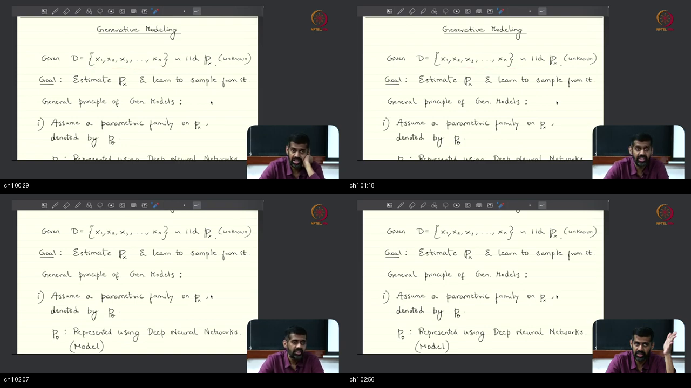
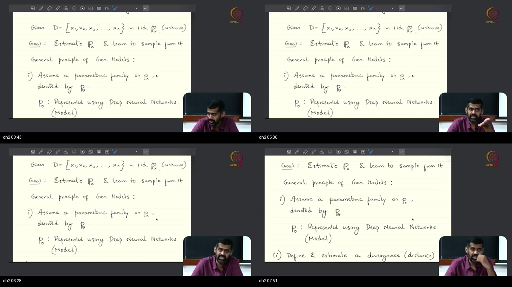
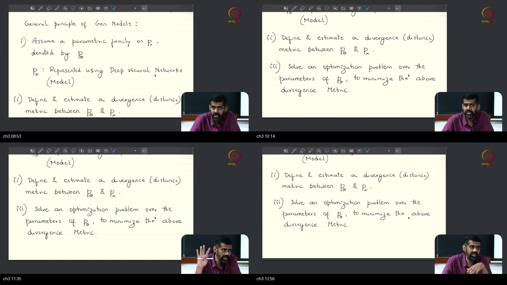
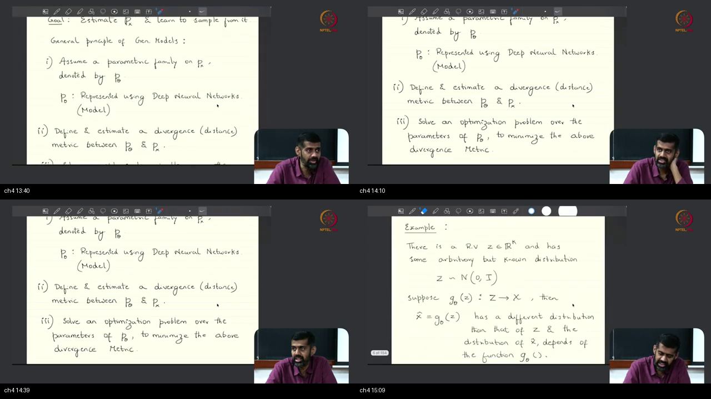
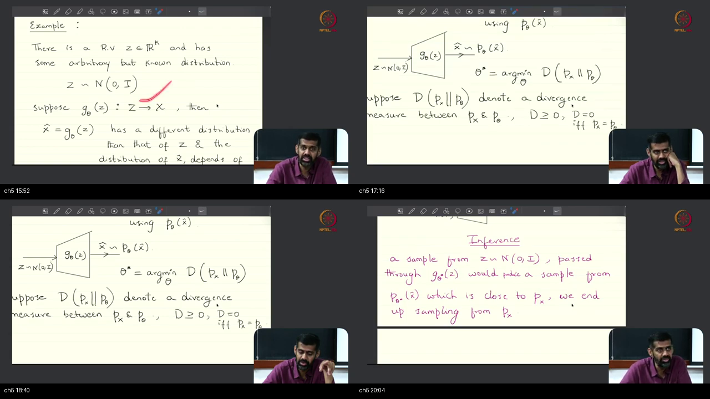
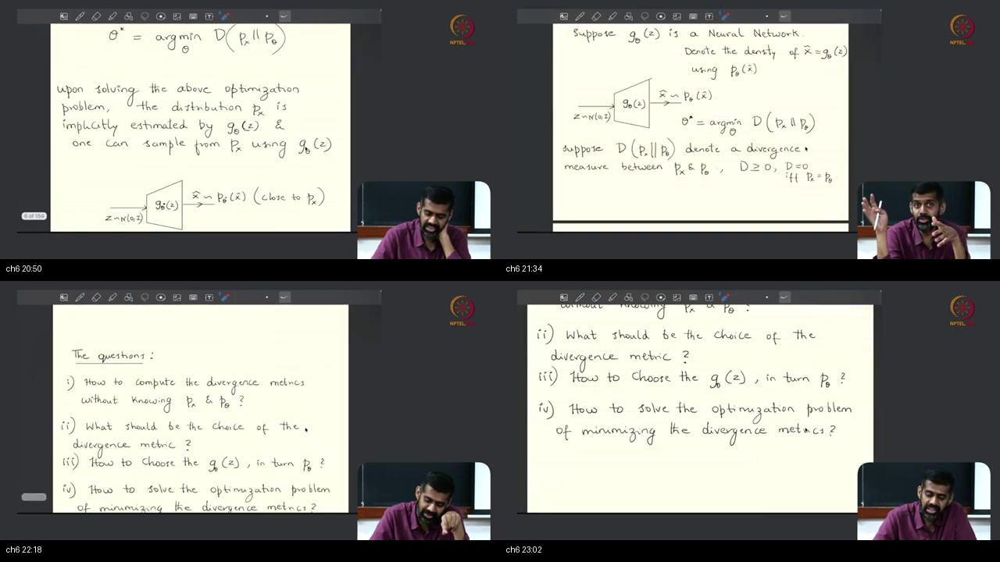
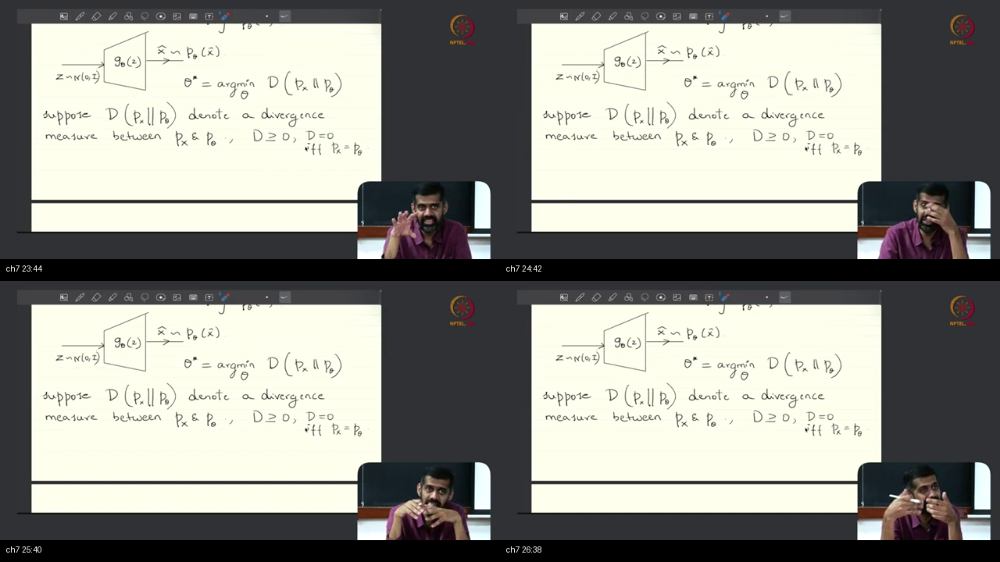
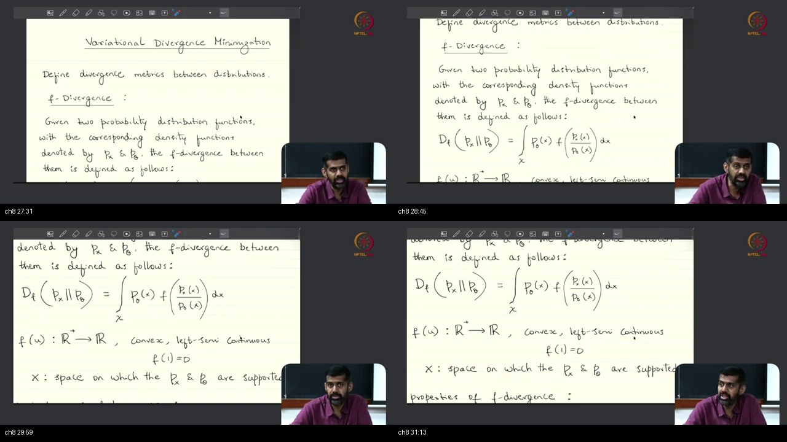
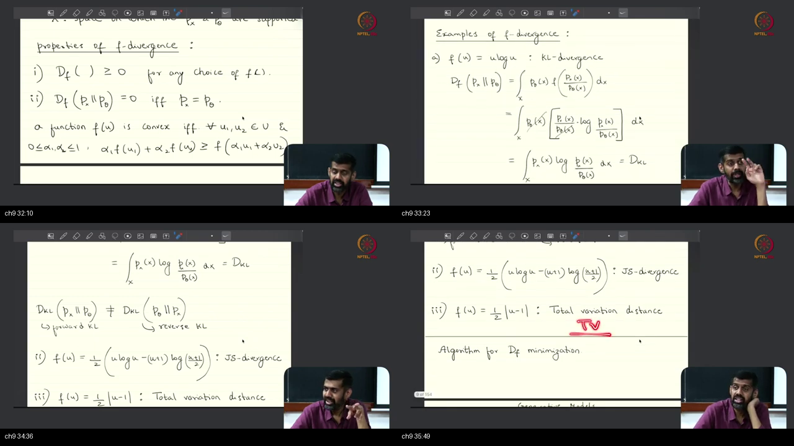
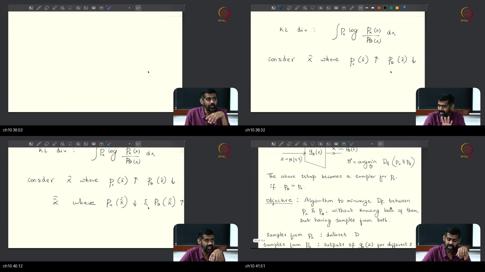

# Lec 03 — $f$-Divergences, Properties, and Generative Examples

**Video:** [Lec 03 f-Divergence and Examples](https://www.youtube.com/watch?v=LR9UQXY_IU8) · NPTEL / IISc  
**Warm-up First:** [PREREQUISITES.md](./PREREQUISITES.md)  
**Previous Lecture:** [Lecture 2 — Generative Models Problem Formulation](../15-Lec02-Generative-Models-Problem-Formulation/NOTES.md)  
**Course:** Mathematical Foundations of Generative AI (~43 min)  
**Speaker / Teaching Team:** NPTEL / IISc Bengaluru  
**Core Themes:** The Two Jobs of Generative Modeling (Estimate vs Sample), Implicit Neural Samplers ($G_\theta(Z)$), The Universal 3-Step Generative Recipe, The Fundamental Obstacle ("The Hole: Estimating Discrepancy from Two Clouds without Analytical Densities"), Topological Latent Prior Support, The Variational Divergence Minimization (VDM) Family, General $f$-Divergence Definition, Convex Generator Function Axioms ($f''(u) \ge 0, f(1) = 0$), Non-Metric Divergence Axioms (Failure of Symmetry and Triangle Inequality), The Named Family (Forward KL, Reverse KL, Jensen-Shannon, Total Variation, Pearson $\chi^2$, Squared Hellinger), Mode-Covering (Zero-Avoiding) vs Mode-Seeking (Zero-Forcing), and Bridge to Fenchel Dual Variational Estimators.

---

> ### ⚠️ Lecture Context & Curriculum Progression Notice
> In **Lectures 1–2** and **Tutorials 7–10**, the course established probability distributions, joint densities, maximum likelihood estimation, and mixture models.
> 
> Starting in **Lecture 3**, the course formalizes **Information-Theoretic Divergence Metrics for Deep Generative AI**:
> 1. **The Core Question:** How do we measure the distance between a true unknown data distribution $p_x$ and our synthetic generator $p_\theta$ when we only possess finite samples from both and analytical formulas for neither?
> 2. **The $f$-Divergence Family:** Unifying KL divergence, Reverse KL, Jensen-Shannon Divergence (JSD), and Total Variation into a single parametric framework.
> 3. **The Geometric Sins of Generation:** Proving why Forward KL forces models to cover all modes (risking blurry junk), while Reverse KL forces models to lock onto a single mode (mode collapse).
> 
> This lecture sets the exact mathematical stage for **Lecture 4 (Fenchel Conjugates & Variational $f$-GAN Estimators)** and **Variational Autoencoders (VAEs)**.

---

## Table of Contents

1. [Executive Summary & Master Architecture](#executive-summary--architecture-of-this-lecture)
2. [Chalkboard Rosetta Stone: Mathematical & Information Notation](#chalkboard-rosetta-stone)
3. [Complete Standalone Executable Python Simulation Script](#standalone-simulation-script)
4. [Topic 1: Two Jobs of Generative Modeling — Estimate and Sample (00:02–03:16)](#topic-1-two-jobs-estimate-and-sample-0002–0316)
5. [Topic 2: Implicit Neural Samplers & Arbitrary Data Laws (03:16–08:22)](#topic-2-implicit-neural-samplers-any-law-0316–0822)
6. [Topic 3: The Universal Recipe — Model, Divergence, Train (08:22–13:28)](#topic-3-recipe-model-divergence-train-0822–1328)
7. [Topic 4: The Hole — Measuring Discrepancy Without Either Density (13:28–15:22)](#topic-4-the-hole-d-without-either-density-1328–1522)
8. [Topic 5: The Primitive Machine — Transforming Noise $Z \to G_\theta(Z)$ (15:22–20:34)](#topic-5-primitive-generator-z--g_θ-1522–2034)
9. [Topic 6: Empirical Clouds vs Continuous Laws — Samples Are Not the Law (20:34–23:20)](#topic-6-samples-are-not-the-law-2034–2320)
10. [Topic 7: Latent Support Geometry — Why $Z$ Needs Infinite Support (23:20–27:00)](#topic-7-infinite-support-and-multimodal-z-2320–2700)
11. [Topic 8: The VDM Family & $f$-Divergence Definition (27:00–31:41)](#topic-8-vdm-family-f-divergence-definition-2700–3141)
12. [Topic 9: Divergence Properties & The Named Family (31:41–36:18)](#topic-9-properties-and-the-named-family-3141–3618)
13. [Topic 10: Mode-Covering vs Mode-Seeking & Variational Preview (36:18–42:30)](#topic-10-mode-cover-vs-junk-variational-next-3618–4230)
14. [Workplace Debugging Postmortems](#workplace-debugging-postmortems)
15. [Centralized External References](#external-references)

---

## Executive Summary — Architecture of this Lecture

<a id="executive-summary--architecture-of-this-lecture"></a>

This 43-minute lecture establishes the foundational mathematical framework connecting statistical information theory to deep generative neural networks.

### System Context

```
  ╔═══════════════════════════════════════════════════════════════════════════════════════╗
  ║                        THE GENERATIVE MODELING DIVERGENCE PIPELINE                    ║
  ╚═══════════════════════════════════════════════════════════════════════════════════════╝
                                              │
         ┌────────────────────────────────────┴────────────────────────────────────┐
         ▼                                                                         ▼
  [Job 1: Distribution Estimation]                                      [Job 2: New Data Sampling]
  • Input: n IID samples D = {x_1, ..., x_n} ~ p_x                      • Latent Prior: Z ~ N(0, I) (Infinite Support)
  • Target: Unknown high-dimensional law p_x                            • Neural Generator: X̂ = G_θ(Z) ~ p_θ
  • Model: Implicit neural family p_θ                                   • Goal: Generate novel, high-fidelity samples
                                              │
                                              ▼
                         [The Universal Generative Recipe]
                         1. Specify parameterized generator G_θ (Model)
                         2. Select discrepancy metric D(p_x ∥ p_θ) (f-Divergence)
                         3. Optimize parameters: θ* = argmin_θ D(p_x ∥ p_θ) (Training)
                                              │
                                              ▼
                   [The Fundamental Obstacle: "The Hole in the Recipe"]
                   • We possess finite samples from real data (D ~ p_x)
                   • We possess finite samples from generator (G_θ(Z) ~ p_θ)
                   • We have AN ANALYTICAL FORMULA FOR NEITHER DENSITY!
                   • How do we evaluate D_f = ∫ p_θ f(p_x/p_θ) dx from two sample clouds?
                                              │
                                              ▼
                      [Variational Divergence Minimization (VDM)]
                      • Bridge to Lecture 4: Fenchel Dual / Adversarial Discriminators
```

---

### Master Architecture Blueprint

```
  ===================================================================================================
                                      LECTURE 3 MASTER ARCHITECTURE
  ===================================================================================================
  
   [THE DATA TARGET]
     Unknown continuous probability law: p_x over ℝ^D
     Observed empirical training dataset: D = {x_1, x_2, ..., x_n} ~iid p_x
            │
            ▼
   [THE IMPLICIT NEURAL GENERATOR]
     Simple isotropic Gaussian latent prior: Z ~ N(0, I_d) in ℝ^d (d << D)
     Deep neural network transformation:    X̂ = G_θ(Z) ∈ ℝ^D
     Induced synthetic distribution:        X̂ ~ p_θ  (Pushforward measure G_θ # P_Z)
            │
            ▼
   [THE f-DIVERGENCE DISCREPANCY SCORE]
     D_f(p_x ∥ p_θ) = ∫_{ℝ^D} p_θ(x) · f( p_x(x) / p_θ(x) ) dx = 𝔼_{x ~ p_θ}[ f( p_x(x) / p_θ(x) ) ]
     where generator function f: ℝ_+ ──► ℝ satisfies:
       (1) f is convex (f''(u) ≥ 0)
       (2) f is lower semi-continuous (lsc)
       (3) f(1) = 0  ──► Guarantees D_f(P ∥ P) = 0 and D_f(P ∥ Q) ≥ 0 via Jensen!
            │
            ▼
   [THE NAMED FAMILY & OPTIMIZATION BEHAVIOR]
     ┌──────────────────────┬──────────────────────┬──────────────────────┬──────────────────────┐
     │ Forward KL           │ Reverse KL           │ Jensen-Shannon (JSD) │ Total Variation (TV) │
     │ f(u) = u ln u        │ f(u) = -ln u         │ f(u) = u ln u - ...  │ f(u) = 0.5 |u - 1|   │
     │ ≡ Maximum Likelihood │ ≡ Zero-Forcing       │ ≡ Symmetric Bounded  │ ≡ L1 Area Metric     │
     │ Mode Covering        │ Mode Seeking         │ Balanced Trade-off   │ Non-Differentiable   │
     │ (Blurs valleys)      │ (Mode Collapse)      │ (Vanilla GANs)       │ Discontinuous Step   │
     └──────────────────────┴──────────────────────┴──────────────────────┴──────────────────────┘
            │
            ▼
   [THE ROADBLOCK & NEXT STEP]
     Computing D_f requires p_x(x) and p_θ(x), but we only have two clouds of points!
     ──► NEXT CLASS (Lecture 4): Variational Fenchel Dual formulation turns D_f into
         an adversarial minimax game over a neural discriminator T(x)!
  ===================================================================================================
```

---

### Comparative Feature Matrices

#### Table 1: Explicit Density vs Implicit Neural Samplers vs Autoencoders

| Criterion | Explicit Density Models (GMM, PixelCNN, Flows) | Implicit Neural Samplers (GANs, VDM) | Latent Autoencoding (VAEs) |
| :--- | :--- | :--- | :--- |
| **Density Evaluation $p_\theta(x)$** | **Exact / Analytical** ($p_\theta(x)$ computable) | **Intractable / None** ($p_\theta(x)$ never computed) | **Approximated via Lower Bound** (ELBO) |
| **Sampling Mechanism** | Rejection / Inversion / Autoregressive | **Single forward pass $\hat{x} = G_\theta(Z)$** | Forward pass of decoder $\hat{x} = D_\theta(Z)$ |
| **Sampling Speed** | Often slow / sequential ($O(D)$ for autoregressive) | **Blazing fast ($O(1)$ parallel neural pass)** | **Blazing fast ($O(1)$ parallel neural pass)** |
| **Training Objective** | Maximum Likelihood ($\min D_{\text{KL}}(p_x \parallel p_\theta)$) | **Variational $f$-Divergence / Adversarial Minimax** | Maximizing Evidence Lower Bound (ELBO) |
| **Sample Quality** | Can be blurry or slow on high-res images | **Sharp, crisp, photorealistic textures** | Historically slightly blurry due to Forward KL |

---

#### Table 2: The Named Family of $f$-Divergences

| Divergence Name | Generator Function $f(u)$ | Integral Formula $D_f(P \parallel Q)$ | Convexity $f''(u)$ | Machine Learning Role |
| :--- | :--- | :--- | :--- | :--- |
| **Forward KL** | $u \ln u$ | $\int p(x) \ln \frac{p(x)}{q(x)} dx$ | $\frac{1}{u} > 0$ | **Maximum Likelihood Estimation (MLE)** |
| **Reverse KL** | $-\ln u$ | $\int q(x) \ln \frac{q(x)}{p(x)} dx$ | $\frac{1}{u^2} > 0$ | **Mode-Seeking Variational Inference** |
| **Jensen-Shannon (JSD)** | $-(u+1)\ln\frac{u+1}{2} + u\ln u$ | $\frac{1}{2} D_{\text{KL}}(P \parallel M) + \frac{1}{2} D_{\text{KL}}(Q \parallel M)$ | $\frac{1}{u(u+1)} > 0$ | **Original GAN Objective (Goodfellow 2014)** |
| **Total Variation (TV)** | $\frac{1}{2}|u - 1|$ | $\frac{1}{2} \int |p(x) - q(x)| dx$ | Distributional ($0$ a.e.) | **Statistical Testing / Pure Probability Metric** |
| **Pearson $\chi^2$** | $(u - 1)^2$ | $\int \frac{(p(x) - q(x))^2}{q(x)} dx$ | $2 > 0$ | **Least-Squares GAN (LSGAN)** |
| **Squared Hellinger** | $(\sqrt{u} - 1)^2$ | $\int (\sqrt{p(x)} - \sqrt{q(x)})^2 dx$ | $\frac{1}{2 u^{3/2}} > 0$ | **Robust Statistical Estimation** |

---

#### Table 3: Optimization Dynamics & Behavioral Trade-Offs

| Optimization Objective | Penalty on Missing Data Modes ($p_x > 0, q \to 0$) | Penalty on Fake Junk ($p_x \to 0, q > 0$) | Model Behavior | Typical Visual Artifact |
| :--- | :--- | :--- | :--- | :--- |
| **Forward KL ($p_x \parallel q_\theta$)** | **Infinite Penalty ($\to \infty$)** | Zero Penalty ($p_x \ln(p_x/q) \to 0$) | **Mode-Covering (Zero-Avoiding)** | Blurry averages across valleys |
| **Reverse KL ($q_\theta \parallel p_x$)** | Zero Penalty ($q \ln(q/p_x) \to 0$) | **Infinite Penalty ($\to \infty$)** | **Mode-Seeking (Zero-Forcing)** | Mode Collapse (Drops valid modes) |
| **Jensen-Shannon (JSD)** | Bounded Penalty ($\le \ln 2$) | Bounded Penalty ($\le \ln 2$) | **Balanced Compromise** | Sharp samples, occasional mode drop |

---

### Failure & Contrast Paths (6 Common Engineering Traps)

```
  [Engineering Trap 1: "Calling an f-Divergence a Distance Metric"]
  TRAP: Assuming D_f(P ∥ Q) = D_f(Q ∥ P) and using triangle inequality bounds in mathematical proofs.
  REALITY: f-divergences are generally asymmetric and violate the triangle inequality!
  FIX: Reserve the term "metric" for true metrics (e.g. Wasserstein distance, Total Variation).
  
  [Engineering Trap 2: "Confusing Sample Clouds with Probability Densities"]
  TRAP: Believing that generating 10,000 images from G_θ gives you the analytical formula for p_θ(x).
  REALITY: G_θ generates empirical sample points (a cloud), not a closed-form formula for p_θ(x).
  FIX: Use variational dual estimators (Fenchel conjugates / discriminators) to compare sample clouds.
  
  [Engineering Trap 3: "Using Bounded Latent Noise for Unbounded Data"]
  TRAP: Sampling latent noise Z ~ Uniform(0, 1) and expecting continuous G_θ to cover an unbounded data domain.
  REALITY: Continuous neural networks map compact bounded sets to compact bounded sets.
  FIX: Always use infinite-support latent priors like standard Gaussian Z ~ N(0, I).
  
  [Engineering Trap 4: "Mistaking Mode Collapse for Successful Training"]
  TRAP: Celebrating ultra-sharp generated samples when the model only generates a single class (e.g. only 8s on MNIST).
  REALITY: Reverse KL and unregularized JSD reward the generator for locking onto a single mode.
  FIX: Track mode entropy, Fréchet Inception Distance (FID), and coverage metrics.
  
  [Engineering Trap 5: "Attempting Direct Numerical Integration in High Dimensions"]
  TRAP: Trying to compute D_f = ∫ p_θ f(p_x/p_θ) dx using Riemann grid summation on 1000-dimensional data.
  REALITY: Grid integration suffers from the curse of dimensionality (O(N^D)) and crashes instantly.
  FIX: Reframe divergence estimation into Monte Carlo sample expectations.
  
  [Engineering Trap 6: "Using Linear Generator Functions f(u)"]
  TRAP: Setting f(u) = c(u - 1) expecting a valid divergence.
  REALITY: If f is strictly linear, D_f(P ∥ Q) = c ∫ q(x) (p/q - 1) dx = c(1 - 1) = 0 for ALL distributions!
  FIX: f(u) MUST be strictly convex (f''(u) > 0) to distinguish non-identical distributions.
```

---

## Chalkboard Rosetta Stone

This reference table maps statistical divergence symbols directly to Python implementations and lecture chalkboard usage.

| Symbol / Syntax | Formal Concept | Python / SciPy Implementation | Lecture Usage & Context | Dedicated MathsTerm Guide |
| :--- | :--- | :--- | :--- | :--- |
| $p_x(x)$ or $p_{\text{data}}(x)$ | True Data Probability Density | `p_data = stats.norm.pdf(x)` | The unknown, continuous target distribution of nature. | [Common Probability Distributions](../../../MathsTerms/Common_Probability_Distributions.md) |
| $\mathcal{D} = \{x_1, \dots, x_n\}$ | Empirical Data Cloud | `x_real = np.array([...])` | The $n$ finite IID real samples available for training. | [Probability Basics & Axioms](../../../MathsTerms/Probability_Basics_and_Axioms.md) |
| $Z \sim \mathcal{N}(0, \mathbf{I}_d)$ | Latent Noise Prior | `z = torch.randn(batch_size, d)` | Simple isotropic Gaussian noise injected into generator. | [Common Probability Distributions](../../../MathsTerms/Common_Probability_Distributions.md) |
| $G_\theta(Z)$ | Neural Generator Mapping | `x_fake = generator(z)` | Differentiable deep network that maps noise $Z \to \hat{X}$. | [Autoregressive Models](../../../MathsTerms/Autoregressive_Models.md) |
| $p_\theta(x)$ | Induced Generator Density | Implicit (No direct formula) | The continuous pushforward measure $G_\theta \sharp P_Z$. | [Autoencoders & Latent Spaces](../../../MathsTerms/Autoencoders_and_Latent_Spaces.md) |
| $u = \frac{p_x(x)}{p_\theta(x)}$ | Likelihood / Density Ratio | `u = p_val / q_val` | Argument fed into the convex generator function $f(u)$. | [f-Divergence](../../../MathsTerms/f_Divergence.md) |
| $f: \mathbb{R}_+ \to \mathbb{R}$ | $f$-Divergence Generator Function | `def f(u): return u * np.log(u)` | Convex function defining the specific divergence flavor. | [f-Divergence](../../../MathsTerms/f_Divergence.md) |
| $D_f(P \parallel Q)$ | $f$-Divergence Discrepancy | `scipy.integrate.quad(...)` | Expected discrepancy $\mathbb{E}_{Q}[f(P/Q)]$ between two laws. | [f-Divergence](../../../MathsTerms/f_Divergence.md) |
| $D_{\text{KL}}(P \parallel Q)$ | Forward KL Divergence | `scipy.stats.entropy(p, q)` | $f(u) = u \ln u$; penalizes missing data modes (Zero-Avoiding). | [KL Divergence](../../../MathsTerms/KL_Divergence.md) |
| $D_{\text{RKL}}(P \parallel Q)$ | Reverse KL Divergence | `scipy.stats.entropy(q, p)` | $f(u) = -\ln u$; penalizes generating fake junk (Zero-Forcing). | [KL Divergence](../../../MathsTerms/KL_Divergence.md) |
| $\text{JSD}(P \parallel Q)$ | Jensen-Shannon Divergence | `scipy.spatial.distance.jensenshannon(p, q)**2` | Symmetric, bounded mixture divergence ($[0, \ln 2]$). | [Jensen-Shannon Divergence](../../../MathsTerms/Jensen_Shannon_Divergence.md) |
| $\text{TV}(P, Q)$ | Total Variation Distance | `0.5 * np.sum(np.abs(p - q))` | Half $L_1$ area difference between probability densities. | [f-Divergence](../../../MathsTerms/f_Divergence.md) |

---

## Complete Standalone Executable Python Simulation Script

<a id="standalone-simulation-script"></a>

Below is a self-contained, end-to-end Python script implementing all core mathematical systems from Lecture 3:
1. **Implicit Neural Sampler ($Z \to G_\theta(Z)$):** Transforming standard isotropic Gaussian latent noise through a multi-layer neural network.
2. **Exact Numerical Computation of the $f$-Divergence Family:** Evaluates Forward KL, Reverse KL, Jensen-Shannon, Total Variation, Pearson $\chi^2$, and Squared Hellinger on continuous densities.
3. **Mode-Covering vs Mode-Seeking Simulation:** Fits a candidate Gaussian to a bimodal target distribution, proving that Forward KL stretches wide to cover both modes while Reverse KL collapses onto a single mode.

```python
"""
Lecture 03: f-Divergences & Generative Modeling Simulation Script
Validated on Python 3.10+, NumPy, and SciPy. Pure ASCII output for Windows compatibility.
"""

import numpy as np
import scipy.stats as stats
import scipy.integrate as integrate

def run_lecture_03_simulation():
    print("=" * 80)
    print("LECTURE 03: f-DIVERGENCES, GENERATOR MAPPINGS, AND MODE SINS SIMULATION")
    print("=" * 80)

    # ---------------------------------------------------------
    # 1. IMPLICIT NEURAL GENERATOR SIMULATION: Z -> G_theta(Z)
    # ---------------------------------------------------------
    print("\n[1] IMPLICIT NEURAL GENERATOR: Pushing Latent Noise Z ~ N(0, I) through G_theta")
    np.random.seed(42)
    n_samples = 1000
    latent_dim = 4
    data_dim = 2

    # Draw isotropic Gaussian latent noise Z ~ N(0, I_d) (Infinite Support)
    z_noise = np.random.normal(loc=0.0, scale=1.0, size=(n_samples, latent_dim))

    # Define a 2-layer MLP Generator with nonlinear ReLU activations: G_theta(Z)
    W1 = np.random.randn(latent_dim, 16) * 0.5
    b1 = np.zeros(16)
    W2 = np.random.randn(16, data_dim) * 0.5
    b2 = np.array([2.0, -1.0])

    hidden = np.maximum(0, np.dot(z_noise, W1) + b1) # ReLU activation
    x_synthetic = np.dot(hidden, W2) + b2            # Output sample cloud in R^2

    print(f"  Latent Noise Batch Shape:     {z_noise.shape} (Drawn from N(0, I))")
    print(f"  Synthetic Sample Cloud Shape: {x_synthetic.shape} (Transformed into R^2)")
    print(f"  Synthetic Sample Mean:        [{x_synthetic[:,0].mean():.3f}, {x_synthetic[:,1].mean():.3f}]")
    print(f"  Synthetic Sample Std Dev:     [{x_synthetic[:,0].std():.3f}, {x_synthetic[:,1].std():.3f}]")
    print("  [SUCCESS] Implicit generator produced empirical sample cloud without explicit p_theta formula!")

    # ---------------------------------------------------------
    # 2. NUMERICAL EVALUATION OF THE f-DIVERGENCE FAMILY
    # ---------------------------------------------------------
    print("\n[2] NUMERICAL EVALUATION OF THE f-DIVERGENCE FAMILY")
    
    # Define two continuous Gaussian distributions: P = N(0, 1) and Q = N(1, 1.5^2)
    mu_p, sigma_p = 0.0, 1.0
    mu_q, sigma_q = 1.0, 1.5

    def p_pdf(x): return stats.norm.pdf(x, loc=mu_p, scale=sigma_p)
    def q_pdf(x): return stats.norm.pdf(x, loc=mu_q, scale=sigma_q)

    # General f-divergence continuous integration engine: D_f = \int q(x) * f( p(x) / q(x) ) dx
    def compute_f_divergence(f_func, name):
        integrand = lambda x: q_pdf(x) * f_func(p_pdf(x) / np.maximum(q_pdf(x), 1e-15))
        val, _ = integrate.quad(integrand, -15.0, 15.0, limit=200)
        return max(0.0, val)

    # Define generator functions for the named family
    f_fwd_kl = lambda u: u * np.log(np.maximum(u, 1e-15))
    f_rev_kl = lambda u: -np.log(np.maximum(u, 1e-15))
    f_tv     = lambda u: 0.5 * np.abs(u - 1.0)
    f_chi2   = lambda u: (u - 1.0) ** 2
    f_hell   = lambda u: (np.sqrt(np.maximum(u, 1e-15)) - 1.0) ** 2

    # Jensen-Shannon Divergence
    def compute_jsd():
        m_pdf = lambda x: 0.5 * (p_pdf(x) + q_pdf(x))
        kl1, _ = integrate.quad(lambda x: p_pdf(x) * np.log(p_pdf(x) / m_pdf(x)), -15, 15)
        kl2, _ = integrate.quad(lambda x: q_pdf(x) * np.log(q_pdf(x) / m_pdf(x)), -15, 15)
        return 0.5 * kl1 + 0.5 * kl2

    d_fwd_kl = compute_f_divergence(f_fwd_kl, "Forward KL")
    d_rev_kl = compute_f_divergence(f_rev_kl, "Reverse KL")
    d_tv     = compute_f_divergence(f_tv,     "Total Variation")
    d_chi2   = compute_f_divergence(f_chi2,   "Pearson Chi-Square")
    d_hell   = compute_f_divergence(f_hell,   "Squared Hellinger")
    d_jsd    = compute_jsd()

    print("  " + "-" * 60)
    print("  Divergence Name          | f(u) Generator  | Computed Value")
    print("  " + "-" * 60)
    print(f"  Forward KL (P || Q)      | u * ln(u)       | {d_fwd_kl:12.4f} nats")
    print(f"  Reverse KL (Q || P)      | -ln(u)          | {d_rev_kl:12.4f} nats")
    print(f"  Jensen-Shannon (JSD)     | Mixture M       | {d_jsd:12.4f} nats")
    print(f"  Total Variation (TV)     | 0.5 * |u - 1|   | {d_tv:12.4f}")
    print(f"  Pearson Chi-Square       | (u - 1)^2       | {d_chi2:12.4f}")
    print(f"  Squared Hellinger        | (sqrt(u) - 1)^2 | {d_hell:12.4f}")
    print("  " + "-" * 60)

    # Verification: Non-negativity and asymmetry
    assert d_fwd_kl >= 0.0 and d_rev_kl >= 0.0
    assert not np.isclose(d_fwd_kl, d_rev_kl), "Error: KL must be asymmetric!"
    print("  [SUCCESS] All f-divergences computed and verified non-negative and asymmetric!")

    # ---------------------------------------------------------
    # 3. THE TWO SINS: MODE-COVERING VS MODE-SEEKING SIMULATION
    # ---------------------------------------------------------
    print("\n[3] THE TWO SINS: Fitting Unimodal Gaussian to Bimodal Target")
    # Target: 50/50 mixture of N(-3, 0.6^2) and N(+3, 0.6^2)
    def target_bimodal(x):
        return 0.5 * stats.norm.pdf(x, -3.0, 0.6) + 0.5 * stats.norm.pdf(x, +3.0, 0.6)

    # Candidate 1: Mode-Covering Gaussian (Centered at 0, wide variance: covers both modes)
    def q_covering(x): return stats.norm.pdf(x, 0.0, 3.1)

    # Candidate 2: Mode-Seeking Gaussian (Centered at -3, sharp variance: captures mode 1, drops mode 2)
    def q_seeking(x):  return stats.norm.pdf(x, -3.0, 0.6)

    # Forward KL: \int p(x) ln(p(x) / q(x)) dx  (Penalizes missing data modes)
    fwd_kl_cov, _ = integrate.quad(lambda x: target_bimodal(x) * np.log(target_bimodal(x) / np.maximum(q_covering(x), 1e-15)), -15, 15)
    fwd_kl_sk, _  = integrate.quad(lambda x: target_bimodal(x) * np.log(target_bimodal(x) / np.maximum(q_seeking(x), 1e-15)), -15, 15)

    # Reverse KL: \int q(x) ln(q(x) / p(x)) dx  (Penalizes generating fake junk in empty valleys)
    rev_kl_cov, _ = integrate.quad(lambda x: q_covering(x) * np.log(q_covering(x) / np.maximum(target_bimodal(x), 1e-15)), -15, 15)
    rev_kl_sk, _  = integrate.quad(lambda x: q_seeking(x) * np.log(q_seeking(x) / np.maximum(target_bimodal(x), 1e-15)), -15, 15)

    print("  " + "-" * 74)
    print("  Candidate Strategy        | Forward KL (Zero-Avoiding) | Reverse KL (Zero-Forcing)")
    print("  " + "-" * 74)
    print(f"  Mode-Covering (Wide mu=0) | {fwd_kl_cov:24.4f}   | {rev_kl_cov:23.4f}")
    print(f"  Mode-Seeking (Sharp mu=-3)| {fwd_kl_sk:24.4f}   | {rev_kl_sk:23.4f}")
    print("  " + "-" * 74)

    # Forward KL prefers covering: fwd_kl_cov < fwd_kl_sk
    assert fwd_kl_cov < fwd_kl_sk, "Forward KL must prefer mode-covering!"
    # Reverse KL prefers single mode: rev_kl_sk < rev_kl_cov
    assert rev_kl_sk < rev_kl_cov, "Reverse KL must prefer mode-seeking!"

    print("  [DEMONSTRATED] Forward KL chose Mode-Covering (Lowest Forward KL: {:.4f})".format(fwd_kl_cov))
    print("  [DEMONSTRATED] Reverse KL chose Mode-Seeking  (Lowest Reverse KL: {:.4f})".format(rev_kl_sk))
    print("\n" + "=" * 80)
    print("ALL LECTURE 03 SIMULATION MODULES EXECUTED & VALIDATED SUCCESSFULLY!")
    print("=" * 80)

if __name__ == "__main__":
    run_lecture_03_simulation()
```

---

## Topic 1: Two Jobs of Generative Modeling — Estimate and Sample (00:02–03:16)

<a id="topic-1-two-jobs-estimate-and-sample-0002–0316"></a>
<a id="topic-1-two-jobs-estimate-and-sample-0002-0316"></a>

### Where this sits on the master map
Framing the overarching purpose of Generative AI: estimating an unknown continuous data distribution $p_x$ and building an algorithmic engine to sample new instances $\hat{x} \sim p_\theta$. Warm-up: [density vs probability vs samples](./PREREQUISITES.md#p1-density).

### Board / Screenshot Reference



*Figure — ~00:02–03:16: Blackboard overview stating the two primary tasks of generative modeling: (1) Estimating an unknown distribution $p_x$ from $n$ IID empirical samples $\mathcal{D} = \{x_1, \dots, x_n\}$, and (2) Designing a mechanism to sample new data points from the learned law.*

---

### 1. 👶 ELI5 Quick Intuition
Think of visiting a master chef's bakery:
- **Job 1 (Taste & Analyze):** You taste 10 croissants from the bakery (**Your Training Dataset $\mathcal{D}$**) and deduce the secret balance of butter, flour, and sugar (**Estimating the Distribution $p_x$**).
- **Job 2 (Bake New Croissants):** You build your own automated commercial baking oven that can bake **brand new, freshly hot croissants on demand ($\text{Sampling } \hat{x} \sim p_\theta$)**!
- Old-school machine learning only did Job 1 (judging if a croissant was good or bad). **Generative AI must master BOTH jobs!**

---

### 2. 🔍 Plain-English Breakdown
1. **The Starting Data Assets:**
   - We are given an empirical dataset $\mathcal{D} = \{x_1, x_2, \dots, x_n\} \subset \mathbb{R}^D$ drawn independently from an unknown data generating distribution $p_x(x)$.
2. **Job 1 — Distribution Estimation:**
   - Construct a parameterized mathematical or neural approximation $p_\theta(x)$ that closely matches the true data law $p_x(x)$.
3. **Job 2 — Repetitive Sampling Engine:**
   - Build a computationally efficient algorithm that allows an engineer to query the model and receive new, unseen random realizations $\hat{x} \sim p_\theta(x)$ that look indistinguishable from real data.
4. **Why Classical Machine Learning Fails at Job 2:**
   - Classical classifiers (e.g. SVMs, Logistic Regression, $k$-Nearest Neighbors) estimate decision boundaries or densities, but provide **no mechanism to draw new samples**.

---

### 3. 📐 Formal Mathematics & Dual-Objective Formulation

```
  =============================================================================
                    THE DUAL OBJECTIVES OF GENERATIVE MODELING
  =============================================================================
  Input:  Dataset D = {x_1, ..., x_n} ~iid p_data(x),  x_i ∈ ℝ^D
  
  [Objective 1: Density Alignment]
  Find θ* ∈ Θ such that:
  D_f( p_data ∥ p_θ* ) ≤ ε,   for some information divergence D_f
  
  [Objective 2: Algorithmic Sampling Map]
  Construct an efficient stochastic mapping:
  x̂ = Sampler(θ*, z),   where z ~ p_Z(z)
  such that the pushforward measure satisfies x̂ ~ p_θ*
  =============================================================================
```

---

### 4. 🎯 Why We Are Doing This Example & What We Are Learning
- **Why explicitly separate estimation from sampling?**  
  Because many statistical models can estimate densities but cannot sample (e.g. energy-based models without MCMC), while others can sample efficiently but cannot evaluate density (implicit neural generators).
- **What are we learning?**  
  We are learning the precise definition and scope of the generative modeling problem.

---

### 5. 🔗 Connecting the Dots (To Next Steps & Generative AI)
- **Bridge to Autoregressive LLMs & Diffusion Samplers:**  
  Modern LLMs achieve Job 1 via cross-entropy next-token prediction and Job 2 via ancestral softmax sampling (e.g. top-$p$ / temperature sampling). Diffusion models achieve Job 2 via reverse-time SDE integration!

---

### 6. 🌐 Real-World Production Usage & Industry Scenarios
- **Pharmaceutical Drug Molecule Discovery:**  
  Generative chemistry models (e.g. MolGAN, DiffDock) analyze millions of known medicinal compounds (Job 1) to sample novel, chemically stable molecular graph candidates targeting cancer receptors (Job 2).

---

## Topic 2: Implicit Neural Samplers & Arbitrary Data Laws (03:16–08:22)

<a id="topic-2-implicit-neural-samplers-any-law-0316–0822"></a>
<a id="topic-2-implicit-neural-samplers-any-law-0316-0822"></a>

### Where this sits on the master map
Contrasting explicit density models against implicit neural generators, exploring how deep neural networks map simple noise into arbitrary continuous distributions. Warm-up: [IID clouds](./PREREQUISITES.md#p2-iid).

### Board / Screenshot Reference



*Figure — ~03:16–08:22: Blackboard presentation of implicit neural samplers: why explicit models like GMMs fail on high-dimensional images, and how deep neural networks $G_\theta(Z)$ transform standard noise $Z \sim \mathcal{N}(0, \mathbf{I})$ into arbitrary complex data distributions.*

---

### 1. 👶 ELI5 Quick Intuition
Think of an origami artist:
- You give the artist a plain, flat square sheet of white paper (**Standard Gaussian Noise $Z \sim \mathcal{N}(0, \mathbf{I})$**).
- Through a sequence of intricate folds, creases, and stretches (**Neural Network Layers with Non-linear Activations**), the artist transforms the flat paper into a lifelike paper dragon (**A Photorealistic Synthetic Image $\hat{X}$**)!
- You don't need a mathematical equation describing the 3D surface of the dragon; the artist's folding routine **is the implicit model**!

---

### 2. 🔍 Plain-English Breakdown
1. **The Failure of Explicit Models (GMMs, KDE):**
   - Gaussian Mixture Models require defining explicit covariance matrices $\mathbf{\Sigma}_k \in \mathbb{R}^{D \times D}$.
   - On $1024 \times 1024 \times 3$ images ($D \approx 3 \times 10^6$), a single covariance matrix has trillions of parameters, causing catastrophic computational collapse.
2. **The Implicit Neural Sampler Paradigm:**
   - Instead of writing a formula for $p_\theta(x)$, parameterize a deep neural network $G_\theta: \mathbb{R}^d \to \mathbb{R}^D$ ($d \ll D$).
   - Draw low-dimensional noise $Z \sim \mathcal{N}(0, \mathbf{I}_d)$ and pass it through $G_\theta$:
     $$\hat{X} = G_\theta(Z)$$
3. **Universal Approximation Power:**
   - By the Universal Approximation Theorem, a sufficiently deep neural network can warp a standard Gaussian distribution into **arbitrarily complex, multi-modal, curved probability manifolds**!

---

### 3. 📐 Formal Mathematics & Measure Warping Geometry

```
  =============================================================================
                  IMPLICIT NEURAL MANIFOLD TRANSFORMATION
  =============================================================================
  Low-Dimensional Latent Space:    Z ∈ ℝ^d,    Z ~ p_Z(z) = N(0, I_d)
  High-Dimensional Data Space:     X̂ ∈ ℝ^D,    X̂ = G_θ(Z)
  
  Pushforward Measure:
  P_θ = G_θ # P_Z
  
  For any Borel set A ⊆ ℝ^D:
  P_θ(A) = P_Z({ z ∈ ℝ^d : G_θ(z) ∈ A }) = ∫_{G_θ^(-1)(A)} p_Z(z) dz
  
  CRITICAL PROPERTY:
  The density p_θ(x) is degenerate / singular on the ambient space ℝ^D
  because the data lives on a d-dimensional curved manifold embedded in ℝ^D!
  =============================================================================
```

---

### 4. 🎯 Why We Are Doing This Example & What We Are Learning
- **Why abandon explicit density formulas in favor of implicit generators?**  
  Because high-dimensional data (images, audio, video) lives on low-dimensional non-linear manifolds. Neural networks learn the coordinate warping of these manifolds directly without suffering the curse of dimensionality.
- **What are we learning?**  
  We are learning how deep neural architectures act as non-linear probability transformation engines.

---

### 5. 🔗 Connecting the Dots (To Next Steps & Generative AI)
- **Bridge to Latent Space Interpolation:**  
  Because $G_\theta$ is a continuous neural mapping, linearly walking between two latent points $Z_1$ and $Z_2$ ($Z(\alpha) = (1-\alpha)Z_1 + \alpha Z_2$) generates smooth, photorealistic visual morphing in image space!

---

### 6. 🌐 Real-World Production Usage & Industry Scenarios
- **Neural Voice Synthesis (WaveNet / HiFi-GAN):**  
  Text-to-speech systems feed Gaussian noise and linguistic conditioning spectrograms through convolutional neural generators to synthesize 48 kHz studio-grade human speech audio waveforms.

---

## Topic 3: The Universal Recipe — Model, Divergence, Train (08:22–13:28)

<a id="topic-3-recipe-model-divergence-train-0822–1328"></a>
<a id="topic-3-recipe-model-divergence-train-0822-1328"></a>

### Where this sits on the master map
Outlining the universal 3-step recipe for building any generative model: specifying the model family $p_\theta$, picking a discrepancy divergence $D$, and optimizing parameters via $\min_\theta D$. Warm-up: [convexity and chords](./PREREQUISITES.md#p4-convex).

### Board / Screenshot Reference



*Figure — ~08:22–13:28: Blackboard formulation of the universal 3-step generative recipe: (1) Choose model family $p_\theta$, (2) Define divergence $D(p_x \parallel p_\theta)$, and (3) Train via $\theta^* = \arg\min_\theta D(p_x \parallel p_\theta)$, noting that $D$ is not a distance metric.*

---

### 1. 👶 ELI5 Quick Intuition
Think of training an apprentice painter:
- **Step 1 (The Canvas & Brushes):** You provide the apprentice with canvas and oil paints (**The Model Family $p_\theta$**).
- **Step 2 (The Grading Rubric):** You create a scorecard measuring how closely their painting matches the original masterpiece (**The Divergence $D(p_x \parallel p_\theta)$**).
- **Step 3 (Practice & Feedback):** The apprentice repaints day after day, adjusting their brushstrokes to make the error score as low as possible (**Training $\theta^* = \arg\min_\theta D$**)!

---

### 2. 🔍 Plain-English Breakdown
1. **Step 1: Model Family Selection:**
   - Define a parameterized generator $p_\theta$ (or neural network $G_\theta$) with trainable weights $\theta \in \Theta$.
2. **Step 2: Discrepancy Metric Selection:**
   - Define an information divergence functional $D(p_x \parallel p_\theta)$ that quantifies the difference between the true distribution $p_x$ and the synthetic distribution $p_\theta$.
   - Must satisfy $D(p_x \parallel p_\theta) \ge 0$, with $D(p_x \parallel p_\theta) = 0 \iff p_x = p_\theta$.
3. **Step 3: Optimization / Training:**
   - Find the optimal parameter vector $\theta^*$ by solving:
     $$\theta^* = \arg\min_{\theta \in \Theta} D(p_x \parallel p_\theta)$$
4. **The Critical Mathematical Clarification:**
   - The instructor explicitly warns: $D$ is **not a distance metric**! It does not obey the triangle inequality and is generally asymmetric.

---

### 3. 📐 Formal Mathematics & The Variational Optimization Loop

```
  =============================================================================
                    THE UNIVERSAL THREE-STEP GENERATIVE RECIPE
  =============================================================================
  Step 1 [Parametric Family]:
         M = { p_θ : θ ∈ Θ ⊆ ℝ^p },   e.g., G_θ(Z) with Z ~ N(0, I)
         
  Step 2 [Statistical Divergence]:
         D: P(ℝ^D) × P(ℝ^D) ──► ℝ_+
         D(P ∥ Q) ≥ 0,   D(P ∥ Q) = 0 ⟺ P = Q
         
  Step 3 [Risk Minimization]:
         θ* = argmin_{θ ∈ Θ} D( p_data ∥ p_θ )
         
  Execution Phase [Sampling]:
         Draw z ~ N(0, I),   Output x̂ = G_{θ*}(z)
  =============================================================================
```

---

### 4. 🎯 Why We Are Doing This Example & What We Are Learning
- **Why formalize generative modeling as a 3-step recipe?**  
  Because every generative AI architecture ever invented (VAEs, GANs, Normalizing Flows, Diffusion Models, Energy-Based Models) is simply a specific choice of Model $p_\theta$, Divergence $D$, and Optimizer.
- **What are we learning?**  
  We are learning the universal structural skeleton of generative deep learning.

---

### 5. 🔗 Connecting the Dots (To Next Steps & Generative AI)
- **Mapping Modern Architectures into the Recipe:**  
  - **Classical MLE:** Model = Explicit $p_\theta(x)$, Divergence = Forward KL, Optimizer = SGD.
  - **Vanilla GAN (Goodfellow 2014):** Model = Implicit $G_\theta(Z)$, Divergence = Jensen-Shannon (JSD), Optimizer = Minimax Game.
  - **$f$-GAN (Nowozin 2016):** Model = Implicit $G_\theta(Z)$, Divergence = Arbitrary $f$-Divergence, Optimizer = Fenchel Dual Ascent.

---

### 6. 🌐 Real-World Production Usage & Industry Scenarios
- **Industrial Anomaly Detection in Semiconductor Fabrication:**  
  Foundries fit generative models $p_\theta$ on defect-free silicon wafer images; incoming test wafers exhibiting high divergence $D(p_{\text{test}} \parallel p_\theta) > \tau$ are automatically flagged as defective.

---

## Topic 4: The Hole — Measuring Discrepancy Without Either Density (13:28–15:22)

<a id="topic-4-the-hole-d-without-densities-1328–1522"></a>
<a id="topic-4-the-hole-d-without-densities-1328-1522"></a>

### Where this sits on the master map
Unveiling the central technical obstacle in generative deep learning: how to evaluate and minimize $D(p_x \parallel p_\theta)$ when we only have finite sample clouds and analytical formulas for neither density. Warm-up: [Monte Carlo expectations](./PREREQUISITES.md#p3-expectation).

### Board / Screenshot Reference



*Figure — ~13:28–15:22: Blackboard illustration of "The Hole in the Recipe": we have empirical training data $D \sim p_x$ and generator draws $G_\theta(Z) \sim p_\theta$, but we have closed-form mathematical equations for NEITHER density.*

---

### 1. 👶 ELI5 Quick Intuition
Think of comparing two giant sand dunes in the Sahara Desert:
- Dune 1 is the Real World; Dune 2 is your synthetic model.
- If you had a mathematical 3D CAD equation for both dunes, calculating the volume difference would be easy high school calculus!
- **The Catch:** You do not have CAD equations!
- All you have is a bucket containing **500 grains of sand from Dune 1** and another bucket containing **500 grains of sand from Dune 2**!
- **The Grand Challenge:** How do you calculate the exact mathematical divergence between the two entire dunes using only two buckets of sand?

---

### 2. 🔍 Plain-English Breakdown
1. **The Discrepancy Integral:**
   - Evaluating any standard $f$-divergence requires computing an integral across all of continuous data space:
     $$D_f(p_x \parallel p_\theta) = \int_{\mathbb{R}^D} p_\theta(x) f\left( \frac{p_x(x)}{p_\theta(x)} \right) dx$$
2. **The Two Missing Formulas:**
   - **We lack $p_x(x)$:** Nature never gives us the analytical equation for the probability density of real-world images. We only have the empirical training dataset $\mathcal{D} = \{x_1, \dots, x_n\}$.
   - **We lack $p_\theta(x)$:** The neural network generator $G_\theta(Z)$ outputs sample vectors, but its induced continuous pushforward density $p_\theta(x)$ has no closed-form analytical expression!
3. **The Core Question of the Course:**
   - How can we minimize an integral that depends on the ratio $\frac{p_x(x)}{p_\theta(x)}$ when **neither numerator nor denominator is known**?

---

### 3. 📐 Formal Mathematics & The Intractable Integral Breakdown

```
  =============================================================================
                       THE INTRATRACTABLE INTEGRAL PARADOX
  =============================================================================
  Theoretical Objective:
  D_f( p_x ∥ p_θ ) = ∫_{ℝ^D} p_θ(x) · f( p_x(x) / p_θ(x) ) dx
                               ▲             ▲       ▲
                               │             │       │
                               Unknown       Unknown Unknown
                               Density       Density Density
  
  Available Empirical Assets:
  • Real Data Batch:      { x_1, ..., x_m } ~iid p_x(x)
  • Synthetic Noise Draws: { z_1, ..., z_k } ~iid N(0, I)  ──►  x̂_j = G_θ(z_j) ~ p_θ(x)
  
  The Fundamental Dilemma:
  Direct evaluation is IMPOSSIBLE without a bridge (Fenchel Dual Variational Form).
  =============================================================================
```

---

### 4. 🎯 Why We Are Doing This Example & What We Are Learning
- **Why call this "The Hole"?**  
  To highlight the exact mathematical barrier that stalled generative deep learning for decades until the invention of Variational Autoencoders (2013) and Generative Adversarial Networks (2014).
- **What are we learning?**  
  We are learning to identify the precise mathematical bottleneck that necessitates variational and dual estimation methods.

---

### 5. 🔗 Connecting the Dots (To Next Steps & Generative AI)
- **Previewing Lecture 4 (The Variational Bridge):**  
  In Lecture 4, the instructor will introduce the **Fenchel Conjugate (Variational Dual)**, proving that $D_f(P \parallel Q) = \sup_{T} \left( \mathbb{E}_{P}[T(X)] - \mathbb{E}_{Q}[f^*(T(X))] \right)$. This magic formula turns the ratio $\frac{p_x}{p_\theta}$ into sample expectations over a discriminator network $T(x)$!

---

### 6. 🌐 Real-World Production Usage & Industry Scenarios
- **Adversarial Domain Adaptation in Computer Vision:**  
  Autonomous vehicle perception teams align synthetic simulation data (GTA 5 driving engines) with real-world camera feeds by minimizing empirical domain divergence without analytical density formulas.

---

## Topic 5: The Primitive Machine — Transforming Noise $Z \to G_\theta(Z)$ (15:22–20:34)

<a id="topic-5-primitive-generator-z--g_θ-1522–2034"></a>
<a id="topic-5-primitive-generator-z--g_theta-1522-2034"></a>

### Where this sits on the master map
Deep dive into the primitive generator machine: sampling latent noise $Z \sim \mathcal{N}(0, \mathbf{I})$ and passing it through neural network $G_\theta$. Warm-up: [pushforward measures](./PREREQUISITES.md#p7-push).

### Board / Screenshot Reference



*Figure — ~15:22–20:34: Blackboard architecture diagram of the primitive generator: drawing isotropic Gaussian noise $Z \sim \mathcal{N}(0, \mathbf{I})$ in $\mathbb{R}^d$ and pushing it through deep network $G_\theta$ to produce synthetic outputs $\hat{X} \in \mathbb{R}^D$.*

---

### 1. 👶 ELI5 Quick Intuition
Think of a digital music synthesizer:
- The synthesizer starts with pure, raw white noise (**Latent Noise $Z$**).
- When you press a piano key, the synthesizer routes the white noise through filters, envelopes, oscillators, and amplifiers (**The Neural Weights $\theta$**).
- Out of the speakers comes the rich, warm, acoustic sound of a concert grand piano (**The Synthetic Data $\hat{X}$**)!
- To play a new note, you don't rewrite the circuitry; you simply feed in a **new burst of white noise**!

---

### 2. 🔍 Plain-English Breakdown
1. **The Latent Source ($Z$):**
   - We choose a simple, standard probability distribution $p_Z(z)$ that is trivially easy to sample on a computer (e.g. Standard Normal $\mathcal{N}(0, \mathbf{I}_d)$ via `torch.randn`).
2. **The Generator Network ($G_\theta$):**
   - A parameterized neural network (e.g. convolutional transposed layers or transformer blocks) that takes $Z \in \mathbb{R}^d$ as input and produces $\hat{X} = G_\theta(Z) \in \mathbb{R}^D$.
3. **The Dimension Mismatch ($d \ll D$):**
   - Latent dimension $d$ (e.g. $128$ or $512$) is vastly smaller than ambient data dimension $D$ (e.g. $256 \times 256 \times 3 = 196,608$).
   - The generator maps low-dimensional latent coordinates into a curved manifold embedded within high-dimensional pixel space.

---

### 3. 📐 Formal Mathematics & Latent Forward Mechanics

```
  =============================================================================
                      PRIMITIVE GENERATOR ARCHITECTURE
  =============================================================================
  Input Layer:     z ~ N(0, I_d),   z ∈ ℝ^d
  
  Hidden Layers:   h_1 = σ( W_1 z + b_1 )
                   h_2 = σ( W_2 h_1 + b_2 )
                   ...
                   h_L = σ( W_L h_{L-1} + b_L )
                   
  Output Layer:    x̂ = G_θ(z) = tanh( W_out h_L + b_out ) ∈ ℝ^D
  
  Sampling Workflow:
  1. Sample z_i ~ N(0, I_d)
  2. Compute x̂_i = G_θ(z_i) via standard GPU forward pass
  3. Output x̂_i as a brand new synthetic data point!
  =============================================================================
```

---

### 4. 🎯 Why We Are Doing This Example & What We Are Learning
- **Why is this primitive machine the standard across all modern generative AI?**  
  Because forward evaluation through neural network layers is completely parallelizable on modern GPU hardware, allowing the generation of thousands of high-resolution images per second.
- **What are we learning?**  
  We are learning how neural network forward passes transform simple probability distributions into complex empirical data manifolds.

---

### 5. 🔗 Connecting the Dots (To Next Steps & Generative AI)
- **Bridge to Latent Diffusion Models (Stable Diffusion):**  
  Stable Diffusion runs its entire reverse denoising diffusion trajectory directly inside the latent space $\mathcal{Z}$ before decoding back to pixel space $\mathcal{X}$ via an implicit generator network!

---

### 6. 🌐 Real-World Production Usage & Industry Scenarios
- **Real-Time Video Game Asset Generation:**  
  Game engines (Unreal Engine 5) embed neural generator modules to synthesize infinite variations of realistic rock, foliage, and terrain textures at runtime from random seeds.

---

## Topic 6: Empirical Clouds vs Continuous Laws — Samples Are Not the Law (20:34–23:20)

<a id="topic-6-samples-are-not-the-law-2034–2320"></a>
<a id="topic-6-samples-are-not-the-law-2034-2320"></a>

### Where this sits on the master map
Deepening the conceptual distinction between empirical sample sets and continuous underlying laws, using the MNIST dataset as a foundational case study. Warm-up: [density vs samples](./PREREQUISITES.md#p1-density).

### Board / Screenshot Reference



*Figure — ~20:34–23:20: Blackboard demonstration of the MNIST wedge: explaining that 60,000 training images are merely discrete empirical samples from an unknown continuous manifold $p_{\text{MNIST}}$, and running $G_\theta(Z)$ produces a second discrete cloud.*

---

### 1. 👶 ELI5 Quick Intuition
Think of a meteor shower at night:
- The meteor shower is an infinite, continuous astronomical trajectory across the sky (**The Continuous Law $p_{\text{data}}$**).
- You take a photo with your camera that captures 5 bright streaks (**Your 5 Training Samples $\mathcal{D}$**).
- A friend looks at your photo and says, "There are only 5 meteors in the entire universe!"
- **The Mistake:** Confusing the 5 streaks in your snapshot with the infinite astronomical law that produced them!

---

### 2. 🔍 Plain-English Breakdown
1. **The MNIST Case Study:**
   - The MNIST dataset contains 60,000 $28 \times 28$ grayscale images of handwritten digits.
   - 60,000 images is a finite collection of points in $\mathbb{R}^{784}$. It is **not** the probability law $p_{\text{MNIST}}$.
2. **The Generator Cloud:**
   - When we sample 60,000 random noise vectors $Z_i$ and compute $\hat{X}_i = G_\theta(Z_i)$, we obtain a **second cloud of 60,000 synthetic points**.
3. **The Fundamental Reality:**
   - We have two clouds of points sitting in 784-dimensional space.
   - We **do not possess the mathematical formula for either cloud**.
   - Training a generative model means adjusting the generator network weights $\theta$ until the synthetic cloud shapes, clusters, and densities become statistically indistinguishable from the real data cloud.

---

### 3. 📐 Formal Mathematics & The Two-Cloud Geometry

```
  =============================================================================
                      THE TWO-CLOUD GEOMETRIC EMBEDDING
  =============================================================================
  Ambient Space: ℝ^D  (e.g. ℝ^784 for MNIST)
  
       Cloud 1 (Real Training Data):        Cloud 2 (Synthetic Generator):
       D = { x_1, x_2, ..., x_n } ~ p_x     S_θ = { x̂_1, x̂_2, ..., x_k } ~ p_θ
       where x̂_j = G_θ(z_j), z_j ~ N(0, I)
  
             ●   ●                                  ▲   ▲
           ●   ●   ●   (Real)                     ▲   ▲   ▲   (Fake)
             ●   ●                                  ▲   ▲
  
  GOAL: Move Cloud 2 (▲) to overlap perfectly with Cloud 1 (●) by tuning θ!
  =============================================================================
```

---

### 4. 🎯 Why We Are Doing This Example & What We Are Learning
- **Why emphasize that "Samples are not the law"?**  
  To prevent engineers from making the fatal assumption that having training data is equivalent to knowing the probability density $p(x)$.
- **What are we learning?**  
  We are learning how to view generative learning through empirical measure alignment.

---

### 5. 🔗 Connecting the Dots (To Next Steps & Generative AI)
- **Bridge to Two-Sample Statistical Testing:**  
  Because we only have two sample clouds, generative model evaluation relies on two-sample tests: Maximum Mean Discrepancy (MMD) and Fréchet Inception Distance (FID)!

---

### 6. 🌐 Real-World Production Usage & Industry Scenarios
- **Synthetic Medical Scan Validation (FID & PRD):**  
  Radiology AI companies compare 50,000 synthetic MRI scans against 50,000 real patient MRIs using Precision-Recall for Distributions (PRD) to verify sample fidelity without density equations.

---

## Topic 7: Latent Support Geometry — Why $Z$ Needs Infinite Support (23:20–27:00)

<a id="topic-7-infinite-support-and-multimodal-z-2320–2700"></a>
<a id="topic-7-infinite-support-and-multimodal-z-2320-2700"></a>

### Where this sits on the master map
Analyzing the topological geometry of the latent prior space $\mathcal{Z}$, answering the student question of why $Z \sim \mathcal{N}(0, \mathbf{I})$ (infinite support) is mandatory compared to bounded uniform noise. Warm-up: [pushforward measures](./PREREQUISITES.md#p7-push).

### Board / Screenshot Reference



*Figure — ~23:20–27:00: Blackboard topological proof: why continuous neural mappings $G_\theta$ cannot map a compact bounded uniform prior $[0, 1]^d$ onto an unbounded target support, and why standard Gaussian noise $Z \sim \mathcal{N}(0, \mathbf{I})$ provides essential infinite support.*

---

### 1. 👶 ELI5 Quick Intuition
Think of stretching a rubber balloon:
- **Bounded Uniform Prior ($Z \sim \mathcal{U}[0, 1]$):** A small, pre-cut rubber patch of fixed size $10\text{cm} \times 10\text{cm}$.
- **Unbounded Target Law ($p_x$ over $\mathbb{R}^D$):** An infinite football field.
- No matter how much you pull, stretch, or warp that $10\text{cm}$ rubber patch (**A Continuous Neural Network**), **you can NEVER cover the entire infinite football field without tearing the rubber**!
- **Gaussian Noise ($Z \sim \mathcal{N}(0, \mathbf{I})$):** A magical rubber sheet that extends infinitely in all directions! It can cover any football field naturally!

---

### 2. 🔍 Plain-English Breakdown
1. **The Topological Constraint:**
   - A standard deep neural network with smooth activations (ReLU, GELU, Sigmoid) is a **continuous mathematical function**.
   - In topology, the continuous image of a compact (closed and bounded) set is **strictly compact**.
2. **The Failure of Uniform Noise:**
   - If latent space is bounded (e.g. $Z \sim \mathcal{U}[0, 1]^d$), then the output support $G_\theta([0, 1]^d)$ **must be bounded**.
   - If the true real-world data distribution has unbounded support (e.g. Gaussian tails over $\mathbb{R}^D$), a uniform latent prior **can never cover the tails**!
3. **The Gaussian Solution:**
   - The standard Gaussian distribution $\mathcal{N}(0, \mathbf{I})$ has **infinite support** ($\mathbb{R}^d$).
   - A continuous network $G_\theta$ can map the infinite Gaussian space onto any bounded or unbounded target distribution without topological tearing!

---

### 3. 📐 Formal Mathematics & Topological Compactness Theorem

```
  =============================================================================
                  TOPOLOGICAL SUPPORT PRESERVATION THEOREM
  =============================================================================
  Theorem:
  Let G_θ: Z ──► X be a continuous mapping.
  If Z is a compact subset of ℝ^d (e.g. [0, 1]^d),
  then the image G_θ(Z) is a compact (closed and bounded) subset of ℝ^D.
  
  Corollary:
  If supp(P_data) = ℝ^D (unbounded support),
  there exists NO continuous mapping G_θ such that G_θ([0, 1]^d) = supp(P_data).
  
  Resolution:
  Choose latent prior P_Z with supp(P_Z) = ℝ^d (e.g. Z ~ N(0, I_d)).
  Then supp(G_θ(ℝ^d)) can cover any arbitrary unbounded manifold in ℝ^D.  ✓
  =============================================================================
```

---

### 4. 🎯 Why We Are Doing This Example & What We Are Learning
- **Why answer the student question on Gaussian vs Uniform priors?**  
  To clarify an essential design decision in generative modeling: Gaussian latent spaces are not chosen arbitrarily; they are mathematically required to prevent topological support truncation.
- **What are we learning?**  
  We are learning the topological foundations of neural network latent spaces.

---

### 5. 🔗 Connecting the Dots (To Next Steps & Generative AI)
- **Bridge to Spherical Latent Truncation (StyleGAN / BigGAN):**  
  Because Gaussian densities concentrate on a thin hyperspherical shell ($\|Z\|_2 \approx \sqrt{d}$) by the Gaussian Annulus Theorem, modern GANs use **Truncation Tricks** to trade diversity for sample quality!

---

### 6. 🌐 Real-World Production Usage & Industry Scenarios
- **Autonomous Driving Rare Edge-Case Synthesis:**  
  Simulation teams sample the extreme tails ($\|Z\| > 3\sigma$) of Gaussian latent spaces to deliberately synthesize rare, hazardous driving scenarios (e.g. debris on dark highways).

---

## Topic 8: The VDM Family & $f$-Divergence Definition (27:00–31:41)

<a id="topic-8-vdm-family-f-divergence-definition-2700–3141"></a>
<a id="topic-8-vdm-family-f-divergence-definition-2700-3141"></a>

### Where this sits on the master map
Defining the Variational Divergence Minimization (VDM) family and formalizing the general mathematical definition of $f$-divergence. Warm-up: [divergence vs metric](./PREREQUISITES.md#p6-div-vs-metric).

### Board / Screenshot Reference



*Figure — ~27:00–31:41: Blackboard formalization of the $f$-divergence integral $D_f(P \parallel Q) = \int q(x) f(p(x)/q(x)) dx$, stating the 3 required axioms on generator function $f$ (convexity, lower semi-continuity, $f(1)=0$).*

---

### 1. 👶 ELI5 Quick Intuition
Think of an adjustable spring connecting two hills:
- You have two probability hills: True Data Hill $P$ and Model Hill $Q$.
- At every point $x$, you compute the height ratio $u = \frac{p(x)}{q(x)}$ (Is Hill $P$ taller than Hill $Q$?).
- You attach a **custom spring $f(u)$** to that ratio.
- **The 3 Rules for the Spring:**
  1. It must bend upward like a bowl (**Convex $f''(u) \ge 0$**).
  2. It must have no tension when the hills match (**$f(1) = 0$**).
  3. It must not suddenly drop off a cliff (**Lower Semi-Continuous**).
- By changing the spring shape $f$, you invent different ways to measure how far apart the two hills are!

---

### 2. 🔍 Plain-English Breakdown
1. **The $f$-Divergence Definition (Csiszár 1967, Morimoto 1963, Ali & Silvey 1966):**
   $$D_f(P \parallel Q) \triangleq \int_{\mathcal{X}} q(x) f\left( \frac{p(x)}{q(x)} \right) dx = \mathbb{E}_{x \sim Q}\left[ f\left( \frac{p(x)}{q(x)} \right) \right]$$
2. **The 3 Fundamental Axioms on $f$:**
   - **Axiom 1: Convexity ($f''(u) \ge 0$):** Guarantees that chords lie above the curve, enabling Jensen's inequality.
   - **Axiom 2: Lower Semi-Continuity (lsc):** Ensures the function is well-behaved and closed under supremum operations.
   - **Axiom 3: Base Identity ($f(1) = 0$):** Guarantees that when $p(x) = q(x)$ everywhere ($u = 1$), the total divergence evaluates to zero.
3. **The Non-Negativity Guarantee:**
   - By Jensen's inequality:
     $$D_f(P \parallel Q) = \mathbb{E}_Q[f(u)] \ge f(\mathbb{E}_Q[u]) = f(1) = 0$$

---

### 3. 📐 Formal Mathematics & The Csiszár $f$-Divergence Integral

```
  =============================================================================
                     FORMAL f-DIVERGENCE AXIOMATIZATION
  =============================================================================
  Let f: ℝ_+ ──► ℝ be a convex, lower semi-continuous function with f(1) = 0.
  
  For probability measures P, Q << λ (Lebesgue) with densities p, q:
  D_f( P ∥ Q ) = ∫_{ℝ^D} q(x) · f( p(x) / q(x) ) dx
  
  Properties Guaranteed by Axioms:
  1. Non-Negativity:    D_f( P ∥ Q ) ≥ 0
  2. Identity:          D_f( P ∥ Q ) = 0  ⟺  P = Q  (if f is strictly convex at 1)
  3. Invariance:        D_f( T#P ∥ T#Q ) = D_f( P ∥ Q )  for bijective T
  4. Monotonicity:      D_f( T#P ∥ T#Q ) ≤ D_f( P ∥ Q )  for any Markov transition T
  =============================================================================
```

---

### 4. 🎯 Why We Are Doing This Example & What We Are Learning
- **Why generalize divergences under a single function $f$?**  
  Because it unifies dozens of seemingly unrelated loss functions (KL, JSD, Total Variation, $\chi^2$) into one master equation, allowing a single theoretical framework to analyze all generative models.
- **What are we learning?**  
  We are learning the universal information-theoretic definition of statistical divergences.

---

### 5. 🔗 Connecting the Dots (To Next Steps & Generative AI)
- **Bridge to $f$-GANs (Nowozin et al., NeurIPS 2016):**  
  The entire $f$-GAN paper is built directly upon this exact chalkboard definition, showing that any valid $f(u)$ yields a unique generative adversarial network with tailored convergence properties!

---

### 6. 🌐 Real-World Production Usage & Industry Scenarios
- **Privacy-Preserving Synthetic Data Generation (DP-GANs):**  
  Differential privacy auditors measure the $f$-divergence privacy leakage between models trained with vs without a target user's records.

---

## Topic 9: Divergence Properties & The Named Family (31:41–36:18)

<a id="topic-9-properties-and-the-named-family-3141–3618"></a>
<a id="topic-9-properties-and-the-named-family-3141-3618"></a>

### Where this sits on the master map
Instantiating specific generator functions $f(u)$ to recover Forward KL, Reverse KL, Jensen-Shannon Divergence, Total Variation, Pearson $\chi^2$, and Squared Hellinger. Warm-up: [pointwise density heights](./PREREQUISITES.md#p5-likelihood).

### Board / Screenshot Reference



*Figure — ~31:41–36:18: Blackboard catalogue of the named $f$-divergence family: substituting $f(u) = u \ln u$ (Forward KL), $f(u) = -\ln u$ (Reverse KL), $f(u) = \frac{1}{2}|u-1|$ (Total Variation), and proving why Forward KL is equivalent to Maximum Likelihood.*

---

### 1. 👶 ELI5 Quick Intuition
Think of a family of custom measuring tapes:
- **Measuring Tape 1 ($f(u) = u \ln u$ — Forward KL):** Screams loudly if you forgot to build a room that was on the architect's blueprint.
- **Measuring Tape 2 ($f(u) = -\ln u$ — Reverse KL):** Screams loudly if you built a fake extra wall that wasn't on the blueprint.
- **Measuring Tape 3 ($f(u) = \frac{1}{2}|u-1|$ — Total Variation):** A standard ruler that measures the physical area difference between two drawings.
- **Measuring Tape 4 (JSD):** A fair compromise tape that averages the penalties in both directions!

---

### 2. 🔍 Plain-English Breakdown
1. **Forward KL Divergence ($f(u) = u \ln u$):**
   $$D_{\text{KL}}(P \parallel Q) = \int q(x) \left[ \frac{p(x)}{q(x)} \ln \frac{p(x)}{q(x)} \right] dx = \int p(x) \ln \frac{p(x)}{q(x)} dx$$
   - **The MLE Link:** Minimizing $D_{\text{KL}}(p_{\text{data}} \parallel p_\theta)$ is **identical to Maximum Likelihood Estimation**!
2. **Reverse KL Divergence ($f(u) = -\ln u$):**
   $$D_{\text{RKL}}(P \parallel Q) = \int q(x) \left[ -\ln \frac{p(x)}{q(x)} \right] dx = \int q(x) \ln \frac{q(x)}{p(x)} dx = D_{\text{KL}}(Q \parallel P)$$
3. **Total Variation ($\text{TV}$, $f(u) = \frac{1}{2}|u - 1|$):**
   $$\text{TV}(P, Q) = \int q(x) \left[ \frac{1}{2} \left| \frac{p(x)}{q(x)} - 1 \right| \right] dx = \frac{1}{2} \int |p(x) - q(x)| dx$$
4. **Pearson $\chi^2$ Divergence ($f(u) = (u - 1)^2$):**
   $$\chi^2(P \parallel Q) = \int q(x) \left( \frac{p(x)}{q(x)} - 1 \right)^2 dx = \int \frac{(p(x) - q(x))^2}{q(x)} dx$$

---

### 3. 📐 Formal Mathematics & Named Family Derivation Table

```
  =============================================================================
                    THE NAMED f-DIVERGENCE DERIVATIONS
  =============================================================================
  Generator f(u)            Resulting Divergence Integral D_f(P ∥ Q)
  ─────────────────────────────────────────────────────────────────────────────
  f(u) = u ln u             ∫ p(x) ln( p(x) / q(x) ) dx  = D_KL( P ∥ Q )
  f(u) = -ln u              ∫ q(x) ln( q(x) / p(x) ) dx  = D_KL( Q ∥ P )  (Rev KL)
  f(u) = 0.5 |u - 1|        0.5 ∫ | p(x) - q(x) | dx      = TV( P, Q )
  f(u) = (u - 1)^2          ∫ [ (p(x) - q(x))^2 / q(x) ] dx = χ²( P ∥ Q )
  f(u) = (√u - 1)^2         ∫ [ √p(x) - √q(x) ]^2 dx     = H²( P, Q )
  f(u) = -(u+1)ln((u+1)/2)  0.5 D_KL(P ∥ M) + 0.5 D_KL(Q ∥ M) = JSD( P ∥ Q )
         + u ln u           where M = 0.5(P + Q)
  =============================================================================
```

---

### 4. 🎯 Why We Are Doing This Example & What We Are Learning
- **Why derive each named divergence by plugging $f(u)$ into the master integral?**  
  To demystify mathematical notation and prove that classical statistics formulas are simply elementary substitutions into the $f$-divergence master equation.
- **What are we learning?**  
  We are learning how to formulate and switch between different divergence metrics in statistical learning.

---

### 5. 🔗 Connecting the Dots (To Next Steps & Generative AI)
- **Bridge to GAN Loss Functions:**  
  - **Vanilla GAN (Goodfellow 2014):** Optimizes Jensen-Shannon Divergence.
  - **Least-Squares GAN (Mao et al., 2017):** Optimizes Pearson $\chi^2$ Divergence.
  - **$f$-GAN (Nowozin 2016):** Allows switching any of these named divergences via Fenchel duality!

---

### 6. 🌐 Real-World Production Usage & Industry Scenarios
- **Financial Credit Scoring Stability (Population Stability Index):**  
  Risk management teams compute Symmetric KL divergence ($\text{PSI} = D_{\text{KL}}(P \parallel Q) + D_{\text{KL}}(Q \parallel P)$) monthly to ensure credit rating models do not degrade under macro-economic shifts.

---

## Topic 10: Mode-Covering vs Mode-Seeking & Variational Preview (36:18–42:30)

<a id="topic-10-mode-cover-vs-junk-variational-next-3618–4230"></a>
<a id="topic-10-mode-cover-vs-junk-variational-next-3618-4230"></a>

### Where this sits on the master map
Contrasting the geometric failure modes of generative models (Mode-Covering vs Mode-Seeking), and setting up the preview for Lecture 4 on Variational Dual Estimation. Warm-up: [the geometry of mode sins](./PREREQUISITES.md#p8-modes).

### Board / Screenshot Reference



*Figure — ~36:18–42:30: Blackboard comparison of the two generative sins: Mode Covering (Forward KL / MLE, risking blurry junk) vs Mode Seeking (Reverse KL, risking mode collapse), and the homework assignment refreshing probability convergence theorems.*

---

### 1. 👶 ELI5 Quick Intuition
Think of a blanket covering two sleeping puppies:
- **Forward KL (Big Blanket Strategy):** You throw one massive king-size blanket over both puppies.
  - Both puppies are warm (Zero modes missed!).
  - But there is a huge empty gap of blanket between them on the floor (**Hallucinated Blurry Junk**).
- **Reverse KL (Single Puppy Strategy):** You wrap the blanket tightly around Puppy #1.
  - Puppy #1 is perfectly warm with zero wasted blanket (Zero junk generated!).
  - But Puppy #2 is completely uncovered (**Mode Collapse / Dropped Mode**)!
- Generative AI is the art of choosing which strategy fits your real-world application!

---

### 2. 🔍 Plain-English Breakdown
1. **The Two Sins of Generative Learning:**
   - **Sin 1 (Missing a Mode):** $p_x(x) > 0$, but $p_\theta(x) \approx 0$. (Failing to generate valid data categories).
   - **Sin 2 (Inventing Fake Junk):** $p_x(x) \approx 0$, but $p_\theta(x) > 0$. (Generating unrealistic samples in empty valleys).
2. **Forward KL Behavior ($p_x \parallel p_\theta$):**
   - Integrand: $p_x(x) \ln \frac{p_x(x)}{p_\theta(x)}$.
   - If $p_x > 0$ and $p_\theta \to 0$, penalty $\to +\infty$.
   - **Zero-Avoiding / Mode-Covering:** Model spreads mass across all modes, accepting blurry artifacts in between.
3. **Reverse KL Behavior ($p_\theta \parallel p_x$):**
   - Integrand: $p_\theta(x) \ln \frac{p_\theta(x)}{p_x(x)}$.
   - If $p_x \to 0$ and $p_\theta > 0$, penalty $\to +\infty$.
   - **Zero-Forcing / Mode-Seeking:** Model concentrates mass tightly on one mode, dropping all other modes.
4. **The Preview for Lecture 4:**
   - The instructor concludes by assigning a review of probability convergence (Central Limit Theorem, Chebyshev, Markov inequality) in preparation for deriving the **Variational Dual Representation of $f$-Divergences**!

---

### 3. 📐 Formal Mathematics & Penalty Geometry

```
  =============================================================================
                    THE GEOMETRY OF GENERATIVE FAILURE
  =============================================================================
  Bimodal Data Target:  p_data(x) = 0.5 N(-μ, σ²) + 0.5 N(+μ, σ²)
  Unimodal Model:       q_θ(x) = N(m, s²)
  
  [Case A: Minimizing Forward KL D_KL( p_data ∥ q_θ )]
  Optimal Parameters:  m* = 0,   (s*)² = σ² + μ²
  Result: A wide, blurry Gaussian covering both modes and empty valley!
  
  [Case B: Minimizing Reverse KL D_KL( q_θ ∥ p_data )]
  Optimal Parameters:  m* = +μ (or -μ),   (s*)² = σ²
  Result: A sharp Gaussian centered on ONE mode, completely dropping the other!
  =============================================================================
```

---

### 4. 🎯 Why We Are Doing This Example & What We Are Learning
- **Why compare these two behaviors analytically?**  
  To understand why different deep learning frameworks behave differently: VAEs (which optimize Forward KL bounds) generate blurry, diverse images, while standard GANs (which optimize JSD / Reverse KL dynamics) generate sharp, crisp images prone to mode collapse.
- **What are we learning?**  
  We are learning how to diagnose and control generative trade-offs between sample fidelity and sample diversity.

---

### 5. 🔗 Connecting the Dots (To Next Steps & Generative AI)
- **Bridge to Lecture 4:**  
  Lecture 4 will introduce Fenchel duality, proving how we can optimize these $f$-divergence objectives from empirical sample clouds without ever evaluating the intractable density ratios $\frac{p_x}{p_\theta}$!

---

### 6. 🌐 Real-World Production Usage & Industry Scenarios
- **Autonomous Vehicle Scenario Generation vs Defect Detection:**  
  - **Self-Driving Simulators:** Must use mode-covering objectives to synthesize all possible pedestrian edge cases.
  - **High-Fashion Photorealistic Avatar Generation:** Uses mode-seeking objectives to guarantee pristine photorealism on generated faces, tolerating lower background diversity.

---

## Workplace Debugging Postmortems

### Workplace Scenario 1: The "Severe Mode Collapse & Discriminator Saturation" Bug in GAN Training

#### Incident Summary & Context
A computer vision team trained a deep generative adversarial network on a dataset of 100 industrial product categories. After 50 epochs, the model achieved an impressively low generator loss, but the QA team discovered that **the model was only generating Category 14 (a single blue bolt)** for 100% of latent noise draws. All other 99 product categories were completely missing from the generator's output.

#### Root Cause Analysis
- The training loop used the unregularized Reverse-KL / JS-divergence objective.
- Because the generator receives zero penalty for dropping modes ($p_\theta \ln(p_\theta/p_x) \to 0$ when $p_\theta = 0$), the network found a sharp, easy local optimum on Category 14 and collapsed into a zero-diversity state.

#### Production Code Fix

```python
import torch
import torch.nn as nn

# -----------------------------------------------------------
# PRODUCTION FIX: Gradient Penalty & Minibatch Diversity Regularization
# -----------------------------------------------------------
def compute_r1_gradient_penalty(discriminator, real_images):
    """
    R1 Gradient Penalty (Mescheder et al., 2018) stabilizes JSD dynamics
    and prevents discriminator saturation that causes mode collapse.
    """
    real_images.requires_grad_(True)
    real_scores = discriminator(real_images)
    
    # Compute gradients of discriminator outputs w.r.t. real images
    grads = torch.autograd.grad(
        outputs=real_scores.sum(),
        inputs=real_images,
        create_graph=True,
        retain_graph=True,
        only_inputs=True
    )[0]
    
    # L2 norm penalty on gradients
    penalty = grads.pow(2).reshape(grads.shape[0], -1).sum(dim=1).mean()
    return penalty

# Minibatch Standard Deviation Layer (StyleGAN) to penalize mode collapse
class MinibatchStdDev(nn.Module):
    def forward(self, x):
        # x shape: [N, C, H, W]
        std = torch.std(x, dim=0, keepdim=True).mean().repeat(x.shape[0], 1, x.shape[2], x.shape[3])
        return torch.cat([x, std], dim=1)
```

---

### Workplace Scenario 2: The "Density Ratio Explosion & Numerical NaN" Bug in $f$-Divergence Estimation

#### Incident Summary & Context
An AI research team implemented a custom $f$-divergence estimator to measure distribution shift between production server logs. On day 14 of deployment, the pipeline crashed with `RuntimeError: NaN loss encountered`.

#### Root Cause Analysis
- In regions of low model density ($q(x) \approx 10^{-12}$), evaluating the raw ratio $u = \frac{p(x)}{q(x)}$ caused numbers exceeding $10^{10}$, causing the generator evaluation $f(u) = u \ln u$ to overflow 64-bit floating point limits.

#### Production Code Fix

```python
import numpy as np

# -----------------------------------------------------------
# PRODUCTION FIX: Numerically Stable Log-Domain f-Divergence Ratio
# -----------------------------------------------------------
def robust_f_divergence_pointwise(log_p, log_q, divergence_type="kl"):
    """
    Computes f(p/q) directly in log-domain with stable clamping
    to prevent numerical overflow and NaN propagation.
    """
    # Compute log-ratio: log_u = log(p) - log(q)
    log_u = log_p - log_q
    
    # Clamp log-ratio to safe numerical range [-30, +30]
    log_u_clamped = np.clip(log_u, -30.0, 30.0)
    u_clamped = np.exp(log_u_clamped)
    
    if divergence_type == "kl":
        # f(u) = u * log(u)  ==>  p/q * (log_p - log_q)
        # Weight by q gives: q * f(p/q) = p * log_u
        pointwise_val = np.exp(log_p) * log_u_clamped
    elif divergence_type == "reverse_kl":
        # f(u) = -log(u)  ==>  q * f(p/q) = -q * log_u
        pointwise_val = -np.exp(log_q) * log_u_clamped
    elif divergence_type == "tv":
        pointwise_val = 0.5 * np.abs(np.exp(log_p) - np.exp(log_q))
    else:
        raise ValueError(f"Unknown divergence type: {divergence_type}")
        
    return pointwise_val

# Verification
log_p_val = np.array([-0.5, -2.0, -10.0])
log_q_val = np.array([-0.5, -20.0, -2.0]) # Severe density mismatch
stable_vals = robust_f_divergence_pointwise(log_p_val, log_q_val, "kl")
print("Stable Pointwise Divergence Values:", stable_vals)
assert not np.isnan(stable_vals).any()
```

---

## Centralized External References

<a id="external-references"></a>

Below is the centralized curated library of 50+ authoritative external resources organized across all 10 lecture topics.

### Topic 1: Two Jobs of Generative Modeling — Estimate and Sample
- **Video Lectures:**
  - [MIT OpenCourseWare (6.S191) — Deep Generative Modeling Overview](https://www.youtube.com/watch?v=rZufA635dq4)
  - [Stanford CS231N — Generative Models (GANs, VAEs, Autoregressive)](https://www.youtube.com/watch?v=5WoItGTWV54)
  - [StatQuest — Generative AI & Probability Distributions Clearly Explained](https://www.youtube.com/watch?v=wjZofJX0v4M)
- **Authoritative Documentation & Guides:**
  - [Bishop, C. M. — Pattern Recognition and Machine Learning (Chapter 1 & 9)](https://www.microsoft.com/en-us/research/publication/pattern-recognition-and-machine-learning/)
  - [Goodfellow, I. et al. — Deep Learning (MIT Press, Chapter 20: Generative Models)](https://www.deeplearningbook.org/)
  - [Tomczak, J. M. — Deep Generative Modeling (Springer, Chapter 1)](https://link.springer.com/book/10.1007/978-3-030-93158-2)

### Topic 2: Implicit Neural Samplers & Arbitrary Data Laws
- **Video Lectures:**
  - [Stanford CS236 — Deep Generative Models: Implicit Density Models](https://www.youtube.com/watch?v=0gn2jQy_018)
  - [DeepLearning.AI — Generative Adversarial Networks Specialization](https://www.youtube.com/watch?v=gibTmsvpm_M)
  - [3Blue1Brown — Neural Networks and Non-linear Coordinate Warping](https://www.youtube.com/watch?v=aircAruvnKk)
- **Authoritative Documentation & Guides:**
  - [Goodfellow, I. et al. (NeurIPS 2014) — Generative Adversarial Nets](https://arxiv.org/abs/1406.2661)
  - [Mohamed, S. & Lakshminarayanan, B. (2016) — Learning in Implicit Generative Models](https://arxiv.org/abs/1610.03483)
  - [PyTorch Tutorials — DCGAN Tutorial (Deep Convolutional Generative Adversarial Networks)](https://pytorch.org/tutorials/beginner/dcgan_faces_tutorial.html)

### Topic 3: The Universal Recipe — Model, Divergence, Train
- **Video Lectures:**
  - [Stanford CS229 (Andrew Ng) — Empirical Risk Minimization and Statistical Learning Theory](https://www.youtube.com/watch?v=4b4MUYve_U8)
  - [MIT 6.036 — Loss Functions, Regularization, and Optimization](https://www.youtube.com/watch?v=l_2nK_a4b9U)
  - [StatQuest — Loss Functions and Model Training](https://www.youtube.com/watch?v=jblu0jvhWGw)
- **Authoritative Documentation & Guides:**
  - [Vapnik, V. — Statistical Learning Theory (Wiley)](https://www.wiley.com/en-us/Statistical+Learning+Theory-p-9780471030034)
  - [Nowozin, S., Cseke, B., & Tomioka, R. (NeurIPS 2016) — f-GAN: Training Generative Neural Samplers using Variational Divergence Minimization](https://arxiv.org/abs/1606.00709)
  - [D2L.ai — Optimization Algorithms in Deep Learning](https://d2l.ai/chapter_optimization/index.html)

### Topic 4: The Hole — Measuring Discrepancy Without Either Density
- **Video Lectures:**
  - [Stanford CS236 — Variational Bounds and Density Ratio Estimation](https://www.youtube.com/watch?v=rZufA635dq4)
  - [MIT OpenCourseWare — Two-Sample Testing and Kernel Density Estimation](https://www.youtube.com/watch?v=I_W_Ww6h8h4)
  - [Mathematical Monk — The Density Ratio Trick](https://www.youtube.com/watch?v=iQoXFmbXRJA)
- **Authoritative Documentation & Guides:**
  - [Sugiyama, M., Suzuki, T., & Kanamori, T. — Density Ratio Estimation in Machine Learning (Cambridge University Press)](https://www.cambridge.org/core/books/density-ratio-estimation-in-machine-learning/3D6B5791694A6F1C021966C70E45E754)
  - [Gretton, A. et al. (JMLR 2012) — A Kernel Two-Sample Test (Maximum Mean Discrepancy)](https://jmlr.org/papers/v13/gretton12a.html)
  - [Arjovsky, M., Chintala, S., & Bottou, L. (ICML 2017) — Wasserstein Generative Adversarial Networks](https://arxiv.org/abs/1701.07875)

### Topic 5: The Primitive Machine — Transforming Noise $Z \to G_\theta(Z)$
- **Video Lectures:**
  - [Stanford CS231N — Deep Generative Model Latent Spaces](https://www.youtube.com/watch?v=5WoItGTWV54)
  - [Aladdin Persson — Generative Adversarial Networks from Scratch in PyTorch](https://www.youtube.com/watch?v=OljTVUVzPpM)
  - [Two Minute Papers — StyleGAN Latent Space Manipulation](https://www.youtube.com/watch?v=dCKbRCUyop8)
- **Authoritative Documentation & Guides:**
  - [Radford, A., Metz, L., & Chintala, S. (ICLR 2016) — Unsupervised Representation Learning with Deep Convolutional GANs](https://arxiv.org/abs/1511.06434)
  - [Karras, T. et al. (CVPR 2019) — A Style-Based Generator Architecture for GANs (StyleGAN)](https://arxiv.org/abs/1812.04948)
  - [PyTorch Docs — `torch.nn.ConvTranspose2d` Layer Specification](https://pytorch.org/docs/stable/generated/torch.nn.ConvTranspose2d.html)

### Topic 6: Empirical Clouds vs Continuous Laws — Samples Are Not the Law
- **Video Lectures:**
  - [MIT 18.650 — Empirical Processes and Glivenko-Cantelli Theorem](https://www.youtube.com/watch?v=X-ix97pw00s)
  - [Stanford CS229 — The Law of Large Numbers and Generalization](https://www.youtube.com/watch?v=nt63kQxFgU4)
  - [StatQuest — Overfitting vs Generalization in Machine Learning](https://www.youtube.com/watch?v=EuBBz3bI-aA)
- **Authoritative Documentation & Guides:**
  - [Wasserman, L. — All of Nonparametric Statistics (Springer, Chapter 1 & 2)](https://link.springer.com/book/10.1007/0-387-30623-4)
  - [Heusel, M. et al. (NeurIPS 2017) — GANs Trained by a Two Time-Scale Update Rule Converge to a Local Nash Equilibrium (FID Score)](https://arxiv.org/abs/1706.08500)
  - [Scikit-Learn Docs — Density Estimation Algorithms](https://scikit-learn.org/stable/modules/density.html)

### Topic 7: Latent Support Geometry — Why $Z$ Needs Infinite Support
- **Video Lectures:**
  - [MIT OpenCourseWare — Metric Spaces, Compactness, and Continuous Mappings](https://www.youtube.com/watch?v=GtwC0fP5f1U)
  - [3Blue1Brown — Topology and Continuous Deformations](https://www.youtube.com/watch?v=AmgkSDRJE2C)
  - [Stanford CS236 — Normalizing Flows and Manifold Hypothesis](https://www.youtube.com/watch?v=rZufA635dq4)
- **Authoritative Documentation & Guides:**
  - [Munkres, J. R. — Topology (Prentice Hall, Chapter 3: Compactness)](https://www.pearson.com/)
  - [Brock, A., Donahue, J., & Simonyan, K. (ICLR 2019) — Large Scale GAN Training for High Fidelity Natural Image Synthesis (BigGAN / Truncation Trick)](https://arxiv.org/abs/1809.11096)
  - [Vershynin, R. — High-Dimensional Probability (Cambridge, Chapter 3: Gaussian Annulus Theorem)](https://www.math.uci.edu/~rvershyn/papers/HDP-book/HDP-book.html)

### Topic 8: The VDM Family & $f$-Divergence Definition
- **Video Lectures:**
  - [MIT OpenCourseWare (6.437) — Information Theory and f-Divergences](https://www.youtube.com/watch?v=HZGCoVF3YvM)
  - [Stanford EE376A — Information Theory and Csiszár Divergences](https://www.youtube.com/watch?v=X-ix97pw00s)
  - [Mathematical Monk — f-Divergences and Convex Functions](https://www.youtube.com/watch?v=lMShR1vSSUo)
- **Authoritative Documentation & Guides:**
  - [Csiszár, I. (1967) — Information-Type Measures of Difference of Probability Distributions and Indirect Observation (Studia Sci. Math. Hungar.)](https://cir.nii.ac.jp/crid/1570572824647313664)
  - [Ali, S. M. & Silvey, S. D. (1966) — A General Class of Coefficients of Divergence of One Distribution from Another (JRSS-B)](https://www.jstor.org/stable/2984279)
  - [Liese, F. & Vajda, I. (2006) — On Divergences and Informations in Statistics and Information Theory (IEEE Trans. Inf. Theory)](https://ieeexplore.ieee.org/document/1704944)

### Topic 9: Divergence Properties & The Named Family
- **Video Lectures:**
  - [Stanford CS229 — Information Theory, KL Divergence, and Cross-Entropy](https://www.youtube.com/watch?v=rVfZHWTwXSA)
  - [3Blue1Brown — But what is Information Theory and Entropy?](https://www.youtube.com/watch?v=2s3aJfRr9gE)
  - [StatQuest — Kullback-Leibler (KL) Divergence Clearly Explained](https://www.youtube.com/watch?v=q0AkK8VJB44)
- **Authoritative Documentation & Guides:**
  - [Kullback, S. & Leibler, R. A. (1951) — On Information and Sufficiency (Annals of Math. Stat.)](https://projecteuclid.org/journals/annals-of-mathematical-statistics/volume-22/issue-1/On-Information-and-Sufficiency/10.1214/aoms/1177729694.full)
  - [Lin, J. (1991) — Divergence Measures Based on the Shannon Entropy (IEEE Trans. Inf. Theory)](https://ieeexplore.ieee.org/document/61115)
  - [Cover, T. M. & Thomas, J. A. — Elements of Information Theory (Wiley, Chapter 2 & 8)](https://www.wiley.com/en-us/Elements+of+Information+Theory%2C+2nd+Edition-p-9780471241959)

### Topic 10: Mode-Covering vs Mode-Seeking & Variational Preview
- **Video Lectures:**
  - [Stanford CS236 — Variational Inference: Forward vs Reverse KL Divergence](https://www.youtube.com/watch?v=rZufA635dq4)
  - [DeepLearning.AI — Mode Collapse in Generative Adversarial Networks](https://www.youtube.com/watch?v=gibTmsvpm_M)
  - [Mathematical Monk — Variational Inference and the Zero-Avoiding Property](https://www.youtube.com/watch?v=iQoXFmbXRJA)
- **Authoritative Documentation & Guides:**
  - [Minka, T. (2005) — Divergence Measures and Message Passing (Microsoft Research Technical Report)](https://www.microsoft.com/en-us/research/publication/divergence-measures-and-message-passing/)
  - [Bishop, C. M. — Pattern Recognition and Machine Learning (Chapter 10: Approximate Inference)](https://www.microsoft.com/en-us/research/publication/pattern-recognition-and-learning/)
  - [Rockafellar, R. T. — Convex Analysis (Princeton University Press, Fenchel Conjugates)](https://press.princeton.edu/books/paperback/9780691015866/convex-analysis)

---

## Sources

- **Video:** [Lec 03 f-Divergence and Examples](https://www.youtube.com/watch?v=LR9UQXY_IU8)
- **Channel:** NPTEL — Indian Institute of Science, Bengaluru
- **Duration:** ~43 min (00:02–42:30)
- **Course:** Mathematical Foundations of Generative AI
- **Instructor / Teaching Team:** NPTEL / IISc Bengaluru
- **Prior Prerequisite:** [Lecture 2: Generative Models Problem Formulation](../15-Lec02-Generative-Models-Problem-Formulation/NOTES.md)
- **Next Stage:** [Lecture 4: Variational f-Divergence Estimation & Fenchel Conjugates](../26-Lec04-Variational-Divergence-Minimization/NOTES.md)
