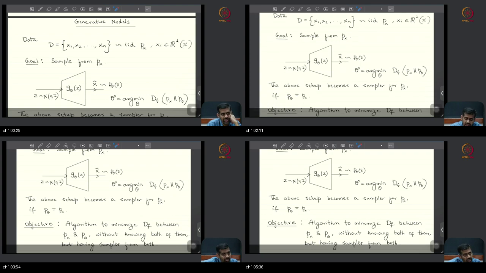
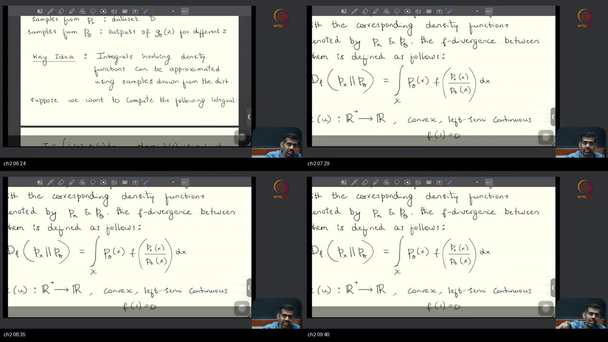
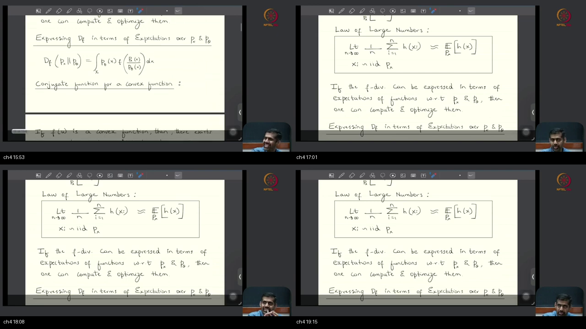
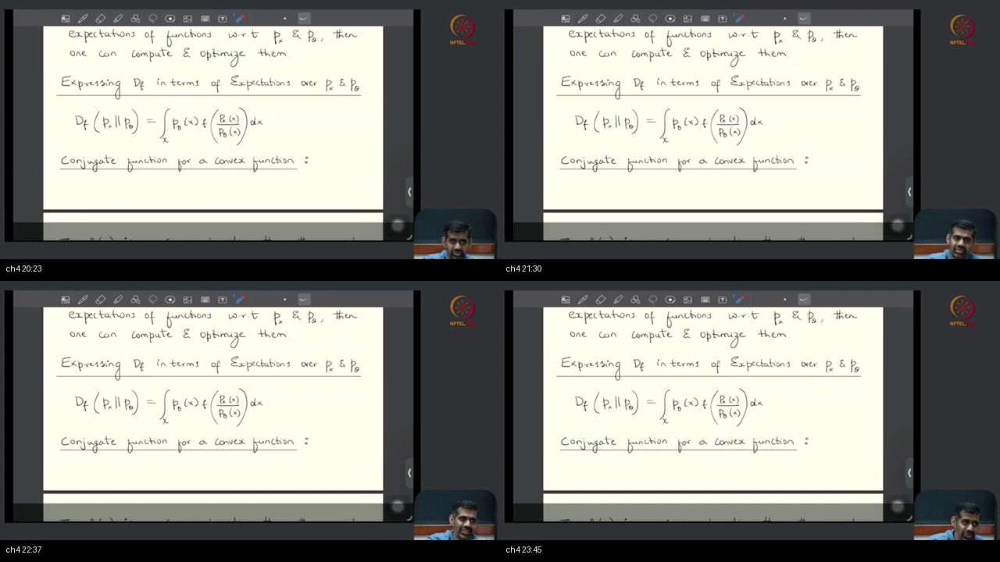
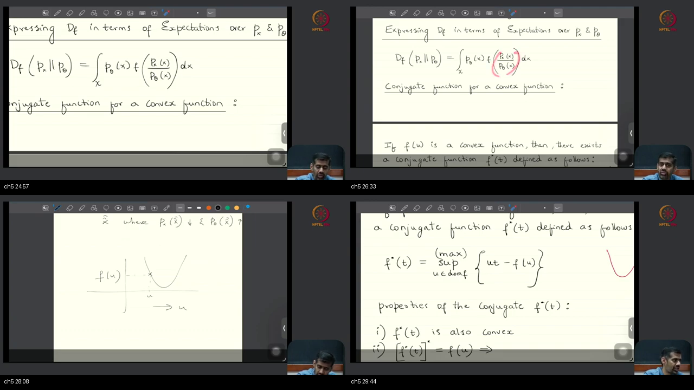
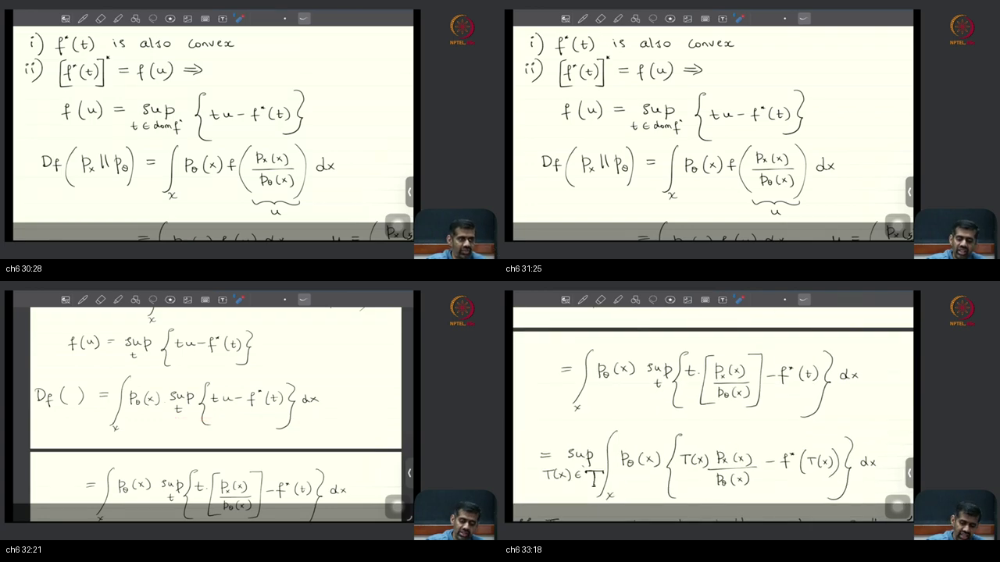
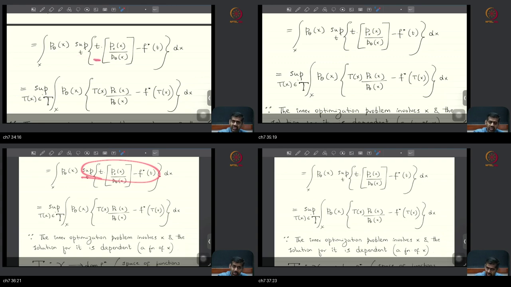
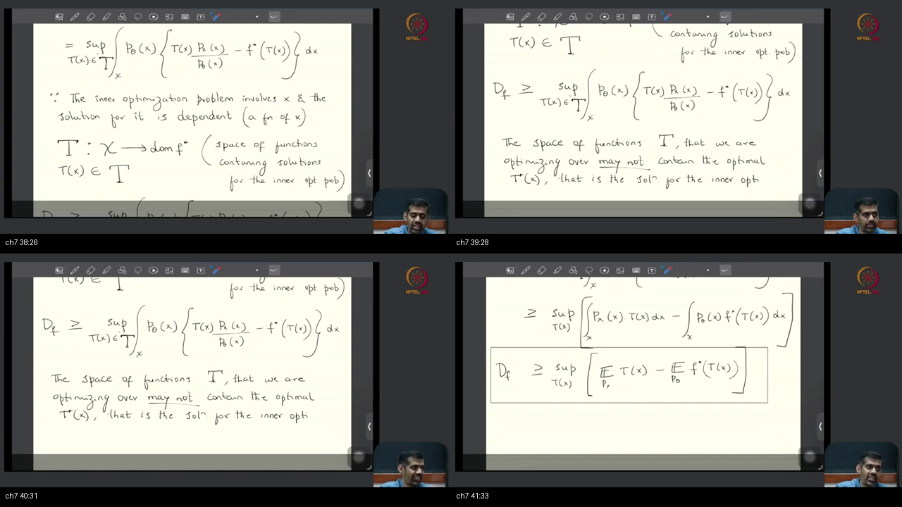
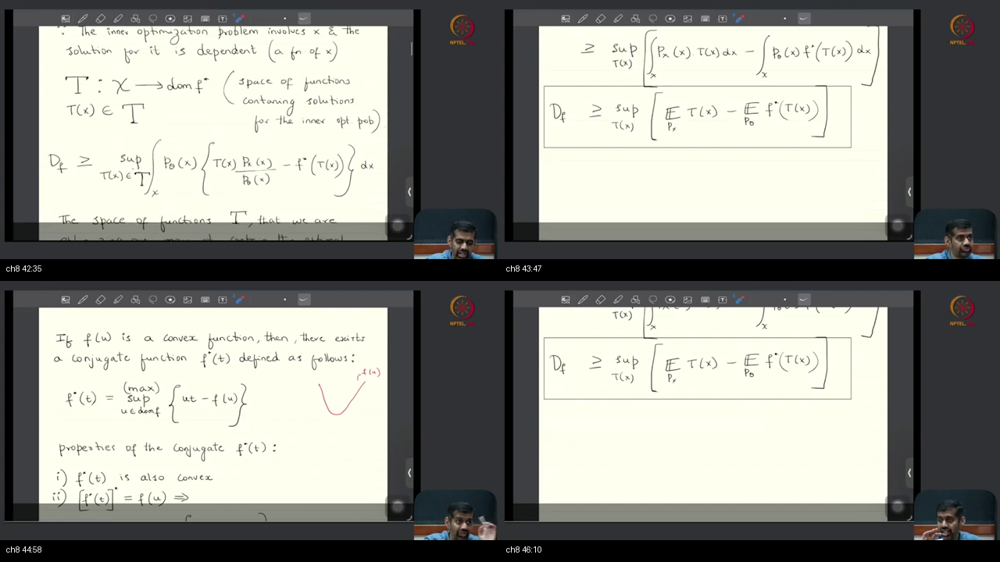
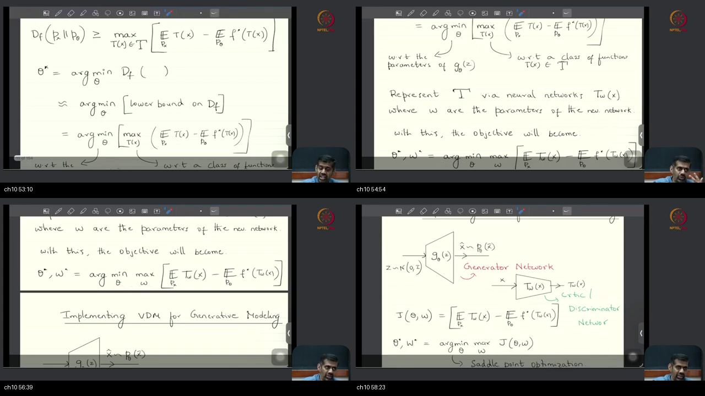

# Lec 04 — Variational Divergence Minimization

> **Video:** [Lec 04 Variational Divergence Minimization (VDM)](https://www.youtube.com/watch?v=4vtL3NhCkgg) · **~59 min**  
> **Warm-up first:** [PREREQUISITES.md](./PREREQUISITES.md) · **Quiz:** [quiz.html](./quiz.html)

**Do PREREQUISITES before this article.**  
**Previous:** [Lec 03 f-Divergence and Examples](../25-Lec03-f-Divergence-Examples/NOTES.md)  
**Course:** Mathematical Foundations of **Generative AI**  
**Speaker:** NPTEL IISc · Prof. Prathosh · conjugate, two-E bound, minmax saddle

| When the lecture hits… | Warm-up |
|------------------------|---------|
| Two piles, not two PDFs | [p1-clouds](./PREREQUISITES.md#p1-clouds) |
| Integral = expectation | [p2-expect](./PREREQUISITES.md#p2-expect) |
| Sample average vs $\mathbb{E}$ | [p3-lln](./PREREQUISITES.md#p3-lln) |
| Average $h$ on the original $x$'s | [p4-lotus](./PREREQUISITES.md#p4-lotus) |
| Convex cup | [p5-convex](./PREREQUISITES.md#p5-convex) |
| Fenchel conjugate unzips $u$ | [p6-conjugate](./PREREQUISITES.md#p6-conjugate) |
| Sup vs max; function $T(x)$ | [p7-sup-T](./PREREQUISITES.md#p7-sup-T) |
| Minmax / saddle | [p8-saddle](./PREREQUISITES.md#p8-saddle) |

---

## Table of Contents

1. [Topic 1 — Recap: two sample clouds](#topic-1-recap-two-sample-clouds-0002–0606) (00:02–06:06)
2. [Topic 2 — Integrals become expectations, then LLN](#topic-2-integrals-become-expectations-then-lln-0606–0959) (06:06–09:59)
3. [Topic 3 — LOTUS and sample averages](#topic-3-lotus-and-sample-averages-0959–1509) (09:59–15:09)
4. [Topic 4 — IID, Gaussian $Z$, prompts](#topic-4-iid-gaussian-z-prompts-1509–2430) (15:09–24:30)
5. [Topic 5 — Convex conjugate](#topic-5-convex-conjugate-2430–3012) (24:30–30:12)
6. [Topic 6 — Plug the conjugate into $D_f$](#topic-6-plug-the-conjugate-into-d_f-3012–3335) (30:12–33:35)
7. [Topic 7 — Supremum out: a function $T(x)$](#topic-7-supremum-out-a-function-tx-3335–4215) (33:35–42:15)
8. [Topic 8 — Two expectations; the GAN-looking bound](#topic-8-two-expectations-the-gan-looking-bound-4215–4631) (42:15–46:31)
9. [Topic 9 — Why “variational”](#topic-9-why-variational-4631–5241) (46:31–52:41)
10. [Topic 10 — Minmax saddle; two nets; next](#topic-10-minmax-saddle-two-nets-next-5241–5853) (52:41–58:53)
11. [External references](#external-references)
12. [Sources](#sources)

---

## Executive Summary — architecture of this lecture

You hold two files, not two formulas: a dataset of real $x$'s and a pile of fakes $G_\theta(Z)$. The job is to minimize $D_f$ between the unknown laws those files came from. The method is to rewrite the integral as an expectation — or a bound that is an expectation — then replace each expectation by a sample average on the file you hold. The fork is exact-$\mathbb{E}$ versus bound-then-$\mathbb{E}$. Conjugacy peels the unknown density ratio out of $f$, leaving a variational lower bound, two nets, and a $\min_\theta\max_w$ saddle. How those averages, $f^*$, and gradients are implemented is the next sitting.

**Worldview arc:** from “minimize $D_f(p_x\|p_\theta)$ but we know neither density” **to** “a variational lower bound as two expectations, then a saddle on two nets.”

**Hour at a glance (whole video).** He redraws last hour’s job: you want a sampler for unknown $p_x$. You hold a data file $D$ and you can make a fake file by pushing Gaussian $Z$ through a net $G_\theta$. You still cannot type $\int p_\theta\,f(p_x/p_\theta)$ because neither density is a formula.

First third: name that integral an expectation, then replace $\mathbb{E}$ by a sample average (law of large numbers), using the original $x$’s (LOTUS). Two regimes: some divergences *are* exact expectations; $f$-divergence is not usable that way, so this hour will bound then average. Q&A: the course still assumes IID; Gaussian $Z$ is the usual start for *marginals*; a *conditional* sampler starts from the prompt $Y$, not from $\mathcal{N}(0,I)$.

Middle: the naive rewrite $\mathbb{E}_{p_\theta}[f(\text{ratio})]$ still needs the unknown ratio inside $f$. The Fenchel conjugate $f^*(t)=\sup_u(ut-f(u))$ unzips $u$. Homework: $f^*$ convex and $(f^*)^*=f$, so $f(u)=\sup_t(tu-f^*(t))$. Plug $u=p_x/p_\theta$. You cannot pull a scalar $t$ out of $\int dx$ — the inner winner depends on $x$ — so the opt is over functions $T:\mathcal{X}\to\mathrm{dom}(f^*)$. A short bag $\mathcal{T}$ may miss $T^*$, hence a **lower** bound. After $p_\theta$ cancels: $D_f\ge\sup_T\bigl(\mathbb{E}_{p_x}[T]-\mathbb{E}_{p_\theta}[f^*(T)]\bigr)$.

Last third: that two-$\mathbb{E}$ score is the GAN-looking loss; the last activation of $T$ must land in $\mathrm{dom}(f^*)$; minimizing a *lower* bound is the wrong direction in principle. “Variational” means optimize over functions (shortest path is a line). Statisticians poll the two bags instead of staying in function space. Realize as $\min_\theta\max_w J$ on two nets; seek a saddle on purpose. STOP: implement the $\mathbb{E}$s, choose $f^*$, watch gradients — next sitting. Chalkboard only — do not invent Python.

### Method card (the approach)

Read this seven-step recipe first. The blueprint below is the same path drawn as boxes.

```
  1. HOLD two clouds
        D = {x1..xn} ~ p_x          (album / data file)
        x̂ = G_θ(z), z ~ N(0,I)      (prints / fake file)
        G_θ is deterministic; chance lives in Z
        (diffusion is the named exception: that net is not the sampler)

  2. NAME the integral an expectation
        D_f = ∫ p_θ f(p_x/p_θ) dx
        (function × density) = an E
        LOTUS: average h on the original x’s
        LLN:  sample average → E  (same law, IID)

  3. REFUSE the naive rewrite
        E_{p_θ}[ f(ratio) ] still needs the unknown ratio inside f
        that begs the question

  4. UNZIP with the conjugate
        f*(t) = sup_u (u t − f(u))     t = slope
        homework: f* convex,  (f*)* = f
        so f(u) = sup_t (t u − f*(t))

  5. PLUG  u = p_x/p_θ
        inner sup_t now sits inside ∫ dx
        a single t cannot win at every x
        → opt over functions T: X → dom(f*)

  6. PAY for a lower bound
        bag 𝒯 may miss T*  ⇒  D_f ≥ sup_T ( E_{p_x}[T] − E_{p_θ}[f*(T)] )
        p_θ cancelled; two Es on the two clouds we hold
        last layer of T must land in dom(f*)
        min of a floor is the wrong direction in principle

  7. TWO NETS, one score
        T ← net T_w  (critic = T-approximator, not a Hollywood character)
        J(θ,w) = E_data[T_w] − E_fakes[f*(T_w)]
        θ*, w* = argmin_θ max_w J     ← seek a saddle on purpose

  STOP  implement the Es, choose f*, freeze-one / train-the-other  → next class
        homework: brush backprop. No loop today.
```

### System context

```
  ╔══════════════════════════════════════╗
  ║ Lec 03: defined D_f, named springs   ║
  ║ Tutorial 11: proved ≥0, =0 iff       ║
  ║ Next: implement Es, f*, gradient flow║
  ╚════════════════╤═════════════════════╝
                   │ this lecture (~59 min)
                   ▼
        ┌──────────────────────────┐
        │ Variational lower bound  │
        │ + min_θ max_w saddle     │
        └──────────────────────────┘
```

### Main blueprint

```
  ╔════ JOB ════╗
  ║ min D_f     ║
  ║ p_x vs p_θ  ║
  ║ neither PDF ║
  ╚════╤════════╝
       │ two clouds
       ▼
  data D ~ p_x          Z~N(0,I) --> G_θ --> x̂ ~ p_θ
       │
       ▼
  ┌─ REWRITE ─────────────────┐
  │ integral = E (or a bound  │
  │ that is an E)             │
  │ LOTUS + LLN               │
  └──────────┬────────────────┘
             │ naive E_{p_θ}[f(ratio)]
             │ begs the question
             ▼
  ┌─ CONJUGATE ───────────────┐
  │ f*(t)=sup_u (u t − f(u))  │
  │ (f*)*=f   (homework)      │
  │ f(u)=sup_t (t u − f*(t))  │
  └──────────┬────────────────┘
             │ u = p_x / p_θ
             ▼
  D_f = ∫ p_θ  sup_t { t (p_x/p_θ) − f*(t) } dx
             │ cannot pull a scalar t
             ▼
  ┌─ FUNCTIONS T ─────────────┐
  │ T: X → dom(f*)            │
  │ 𝒯 may miss T*             │
  │  ⇒ LOWER BOUND            │
  └──────────┬────────────────┘
             │ p_θ cancels
             ▼
  D_f ≥ sup_T ( E_{p_x}[T] − E_{p_θ}[f*(T)] )
             │ T ← net T_w
             ▼
  ┌─ SADDLE ──────────────────┐
  │ min_θ max_w J(θ,w)        │
  │ G_θ sampler               │
  │ T_w critic = T-approximator│
  └──────────┬────────────────┘
             │
  ┌ · · · · ·┴ · · · · · ┐
  │ STOP: implement Es,  │
  │ choose f*, backprop  │
  │ (next sitting)       │
  └ · · · · · · · · · · ┘
```

### Scenario walkthrough

Walk this **one** story through the blueprint above. Each step answers “so what?” for the next box.

**Story:** you want a net $G_\theta$ that can draw new MNIST digits that look like they came from the same pile $D$. You will drive $D_f$ down **without** a formula for $p_x$ or for $p_\theta$.

1. **What is the job?** Minimize $D_f(p_x\|p_\theta)$ so $G_\theta$ becomes a sampler if $p_\theta=p_x$. That is the JOB box.

2. **What do you actually hold?** A dataset cloud $D\sim p_x$ and a fake cloud $\hat x=G_\theta(Z)$ with $Z\sim\mathcal{N}(0,I)$. The net does not roll dice. That is TWO CLOUDS.

3. **Why rewrite the integral?** $D_f$ is $\int p_\theta f(p_x/p_\theta)\,dx$, a function times a density, hence an expectation. LLN plus LOTUS let you average on the $x$’s you have. That is REWRITE.

4. **Why not stop at $\mathbb{E}_{p_\theta}[f(\text{ratio})]$?** You still need the unknown density ratio inside $f$. That begs the question.

5. **What unzips the ratio?** The Fenchel conjugate $f^*(t)=\sup_u(ut-f(u))$. Homework: $f^*$ convex and $(f^*)^*=f$. That is CONJUGATE.

6. **Where does the ratio go?** Set $u=p_x/p_\theta$ and $f(u)=\sup_t(tu-f^*(t))$ sits inside the $x$-integral. That is PLUG.

7. **Why a function $T(x)$?** A single $t$ cannot be the inner winner at every digit-location $x$. $T:\mathcal{X}\to\mathrm{dom}(f^*)$. If your bag $\mathcal{T}$ is short, you only **lower-bound** $D_f$. That is FUNCTIONS $T$.

8. **What is the usable score?** After $p_\theta$ cancels: $\mathbb{E}_{p_x}[T]-\mathbb{E}_{p_\theta}[f^*(T)]$. Average $T$ on real digits; average $f^*(T)$ on fakes. Last layer of $T$ must land in $\mathrm{dom}(f^*)$. That is TWO Es.

9. **Why “variational”?** The inner problem is optimization over **functions**, same family as “shortest path is a line.” Statisticians poll the two bags instead of solving in function space. That is VDM.

10. **How do two nets share one number?** $T_w$ maximizes $J$; $G_\theta$ minimizes $J$. Seek a saddle on purpose. Do **not** write a training loop today. That is SADDLE / STOP.

```
  MNIST pile D          (samples of p_x, not p_x)
       │
       ▼
  draw Z ~ N(0,I)  →  G_θ  →  fake digits   (samples of p_θ)
       │
       ▼
  cannot evaluate ∫ p_θ f(p_x/p_θ)          (neither hill)
       │  conjugate unzips the ratio
       ▼
  D_f ≥ E_data[ T_w ] − E_fakes[ f*(T_w) ]
       │  min_θ max_w of that J
       ▼
  G_θ forger  vs  T_w critic     (same score; a saddle)
       │
  STOP: Es / f* / gradients  →  next class
```

### Failure / contrast path

```
  treat sample average as E              ──X──►  statistician’s trap
  write E_{p_θ}[f(ratio)] and stop       ──X──►  begs the question
  pull a scalar t out of ∫_x             ──X──►  inner winner depends on x
  treat restricted 𝒯 as equality         ──X──►  may miss T*; bound only
  last activation of T outside dom(f*)   ──X──►  T not a legal probe
  min a lower bound, think you min D_f   ──X──►  floor ≠ ceiling
  Hollywood terrorist story              ──X──►  discriminator = T-approximator
  start a conditional from Gaussian Z    ──X──►  conditionals start from Y
  invent a training loop / f* table      ──X──►  next sitting, not today
```

### STOP / out of scope

- How to **implement** the two $\mathbb{E}$s, **choose $f^*$**, last activation, and **gradient flow** with one net frozen (next class).
- Named interchange theorems or Fenchel–Moreau hypotheses (biconjugate $=f$ is homework as assigned).
- Python / a training loop. No code on this tablet.

### Load-bearing claims (closed-book)

- Two clouds: $D\sim p_x$ and $G_\theta(Z)\sim p_\theta$; randomness lives in $Z$; NN-as-sampler **except diffusion**.
- An integral of (function $\times$ density) is an expectation; LLN needs IID draws from the **same** law; LOTUS says data $x_i$ suffice for $\mathbb{E}[h(X)]$.
- Naive $\mathbb{E}_{p_\theta}[f(p_x/p_\theta)]$ begs the question. $f^*(t)=\sup_u(ut-f(u))$ unzips $u$; $(f^*)^*=f$ is homework.
- Plug $u=p_x/p_\theta$. You cannot pull a pointwise $\sup_t$ out of $\int_x$; optimize over $T:\mathcal{X}\to\mathrm{dom}(f^*)$.
- Restricted $\mathcal{T}$ may miss $T^*$ → **lower** bound. $p_\theta$ cancels: $D_f\ge\sup_T(\mathbb{E}_{p_x}[T]-\mathbb{E}_{p_\theta}[f^*(T)])$.
- Range$(T)=\mathrm{dom}(f^*)$; last activation must respect it. Min of a lower bound is the wrong direction in principle.
- VDM = variational calculus (optimize over functions). $\min_\theta\max_w J(\theta,w)$ seeks saddles **on purpose**.

**Speaker / course:** NPTEL IISc, Mathematical Foundations of Generative AI — Lecture 04.

---

## Topic 1: Recap: two sample clouds (00:02–06:06)

### Where this sits on the master map

**RECAP / TWO CLOUDS.** Last lecture left the job as $\min_\theta D_f(p_x\|p_\theta)$ with a net $G_\theta$ as the sampler. This hour’s job is to *estimate* that $D_f$ from files, not formulas. Warm-up: [two piles, not two PDFs](./PREREQUISITES.md#p1-clouds).

### Board / screenshot



**Figure — ~00:29–05:36:** “Generative Models.” Data $D=\{x_1,\ldots,x_n\}\sim_{\mathrm{iid}}p_x$, $x_i\in\mathbb{R}^d$ (script $\mathcal{X}$). Goal: sample from $p_x$. Trapezoid net: $Z\sim\mathcal{N}(0,I)$ into $G_\theta(z)$, output $\hat x\sim p_\theta$. $\theta^*=\arg\min_\theta D_f(p_x\|p_\theta)$. The setup is a sampler for $p_x$ **if** $p_\theta=p_x$. Objective (bottom, filled in by ~03:54): an algorithm that minimizes $D_f$ between $p_x$ and $p_\theta$ **without knowing both of them, but having samples from both.**

### What he is establishing

This class continues last hour’s formulation: generative modeling, as sampling, is **sampling from an unknown law**. What you hold is $n$ data points, **IID** draws from that law. The construction is to start from an **arbitrary known** law — typically **Gaussian** — and push it through a neural net (a function approximator) so that some **divergence** between the true law and the law the model imposes is **minimized**.

The divergences here are the **$f$-divergence** family from last class. Choose a **convex** $f$ and you get a divergence with a particular personality; then you solve an optimization over the parameters of the map that sends an arbitrary random variable to the law of interest. Three questions this hour actually takes up: when you **do not know** the underlying distribution, (i) how do you **estimate** the divergence, (ii) how do you **solve** that optimization, (iii) **which** divergence to choose. He will not finish (iii) today.

On the tablet, data are $n$ IID draws from the law you are trying to estimate. Without loss of generality they live in **$d$-dimensional Euclidean** space $\mathbb{R}^d$. He writes that ambient space as **script $\mathcal{X}$** from now on.

$$
D=\{x_1,\ldots,x_n\}\sim_{\mathrm{iid}}p_x,\qquad x_i\in\mathbb{R}^d\equiv\mathcal{X}.
$$

The **goal** is to **sample from** the underlying $p_x$. The trapezoid drawing of the net is not decoration: the polygon is shaped by input versus output dimension. Typically $\dim(Z)<\dim(\text{data})$, so a short vertical edge on the $Z$ side and a long edge on the $\hat x$ side. $G_\theta$ is a parametric function. The board optimization is

$$
\theta^*=\arg\min_\theta D_f(p_x\|p_\theta).
$$

That cartoon **becomes a sampler for $p_x$ if** the model-imposed law matches the true law: **if $p_\theta=p_x$**.

The objective of *this* lecture is an **algorithm** that minimizes $D_f$ between $p_x$ and $p_\theta$ **without knowing both densities**, **but having samples from both**. You are not totally blind.

The two clouds: samples from **$p_x$** *are* the **dataset**. Samples from **$p_\theta$** *are* the outputs of the net, written $\hat x\sim p_\theta$, because $\hat x=G_\theta(Z)$. Course-wide: in **most** algorithms here the neural net **is itself a sampler** — its output *is* the sample you want. **Exception: diffusion.** There the net is an **estimator of some other parameter**, not a sampler.

All so-called **randomness** lives in $Z$. The net is **deterministic**: a fixed input always gives a fixed output. Different samples of $p_\theta$ come from sampling $Z$, then passing it through $G_\theta$. You already know how to sample $\mathcal{N}(0,I)$: **PRNGs** give Uniform draws; **fixed deterministic maps** (Box–Muller / inverse-transform; the packages’ `randn`) convert Uniform to Gaussian. The joke he cannot resist: a **deterministic algorithm** is treated as sampling a random law. Assuming those Gaussian $Z$-samples, every pass through $G_\theta$ is a sample from $p_\theta$. Then you have **both** clouds — and you still need a way at the divergence.

You can now name the two files you actually possess. You cannot yet turn them into a number $D_f$.

### Analogy for this topic only

Two unlabeled photo piles on a table. One pile is the **album** you inherited (the dataset). The other pile is **new prints** a machine made by feeding noise through a fixed recipe $G_\theta$. You never get the camera’s mixing card.

**Can you write $D_f$ from those two piles?** Not yet — you have files, not formulas. The hour’s job is to compare the *piles*, not the cards. The machine does not roll dice; the noise bag does. Same noise in, same print out.

In lecture words: album = $D\sim p_x$, new prints = $G_\theta(Z)\sim p_\theta$, noise bag = $Z$.

### Local picture

```
  Data D = {x1, ..., xn}  ~ iid p_x ,  xi in R^d = script X

  z ~ N(0,I)  --->  / G_θ \  --->  x̂ ~ p_θ
                    trapezoid
                    (short Z-edge, long x̂-edge)

  θ* = argmin_θ  D_f(p_x || p_θ)
  sampler for p_x  IFF  p_θ = p_x

  HAVE:  cloud D          (samples of p_x)
         cloud G_θ(Z)     (samples of p_θ)
  LACK:  formula for p_x, formula for p_θ
```

Notice: randomness lives in $Z$; the net is a deterministic map. Diffusion is the named exception where the net is *not* the sampler.

### Bridge

Both clouds are on the table. $D_f$ is still an **integral of densities**. The next box names that integral an **expectation**, so a sample average can stand in.

---

## Topic 2: Integrals become expectations, then LLN (06:06–09:59)

### Where this sits on the master map

**INTEGRALS → EXPECTATIONS → LLN.** Course-wide move: rewrite $D$ as an expectation (or a bound that is an expectation), then replace $\mathbb{E}$ by a sample average. Warm-ups: [expectation as $\int h\,p$](./PREREQUISITES.md#p2-expect), [LLN](./PREREQUISITES.md#p3-lln).

### Board / screenshot



**Figure — ~06:24–09:40:** Tile 1 (~06:24) is the payload: two clouds named, then “Key idea: integrals involving density functions can be approximated using samples drawn from the dist.” Tiles 2–4 freeze on last lecture’s $D_f$ recap while he *speaks* expectation, LLN, and the exact-E vs bound-then-E fork — the board does not redraw LLN in this slice. Recap (not a new theorem):

$$
D_f(p_x\|p_\theta)=\int_{\mathcal{X}} p_\theta(x)\,f\Bigl(\frac{p_x(x)}{p_\theta(x)}\Bigr)\,dx,
$$

with $f:\mathbb{R}_+\to\mathbb{R}$ convex, left-semi-continuous, $f(1)=0$.

### What he is establishing

The two clouds, restated: samples from $p_x$ are the **dataset $D$**; samples from $p_\theta$ are **outputs of $G_\theta(z)$ for different $z$**. The recurrent theme of the course — the key idea in most generative models people have built — is that you need **estimates of a divergence** (or of related functions). Those divergences, as defined last class, are **integrals** of some function **times a density**. The $D_f$ formula on this tablet is a **recap**, not a new theorem.

An integral of (a function $\times$ a density) **is** an expectation. That is the definition. Once a quantity is an expectation, you may invoke statistical techniques that **approximate expectations by sample estimates**. First tool: the **law of large numbers**.

As he states it — no almost-sure versus in-probability, no extra moment hypotheses — **asymptotically**, with enough samples, the **sample mean approaches the true expectation**, **provided** the samples are drawn from the **same law** with respect to which the expectation is computed. The recurring algorithm pattern is: write the divergence as some form of **expectation with respect to $p_x$ and $p_\theta$**; then LLN gives **sample-average** estimates of $D$.

The cost of this move: the estimates are **statistical**. “Your algorithm is as good as the estimate that you have for these expectations.”

Not every $D$ is an exact $\mathbb{E}$. **Some** divergences can be represented **exactly** as expectations — invoke LLN **directly**. **Others cannot** — **bound** the divergence, **estimate the bound** as expectations, then invoke LLN. Next-best when you cannot estimate the thing itself: estimate a bound on it. That fork is the whole hour’s fork. This lecture will take the bound path for $f$-divergence.

Course in three sentences, as he summarizes it: there is a divergence; rewrite its integrals as expectations; approximate those by sample averages via LLN. “The rest is all algebra.” We will do this for a class of divergence metrics.

You can now recite the rewrite-then-average pattern and name the two regimes. You cannot yet say *why* $D_f$ is not already a usable $\mathbb{E}$ — that is Topic 5’s “begs the question.”

### Analogy for this topic only

Three streets in data-town. Visit-rate is how often you go there. A thermometer is what you measure:

- street 1, visit often, reading 20
- street 2, visit sometimes, reading 10
- street 3, visit rarely, reading 5

The city-wide average is a walk you cannot finish, so you poll a handful of addresses.

**Are those addresses enough to name the whole-city average?** Only if they were drawn from the **same city** the walk used. Poll fake-town and report it as data-town and the ticket is void. Some scores *are* city-wide averages. Some scores are not — then you poll a **bound** on the score instead. This hour’s divergence is the second kind.

In lecture words: streets = support of $x$, visit-rate = density, poll = IID sample average, city-wide average = $\mathbb{E}$.

### Local picture

```
  D_f = ∫_X  p_θ(x) · f( p_x(x)/p_θ(x) ) dx
        f: R+ → R, convex, left-semi-continuous, f(1)=0

  integral of (function × density)  =  an expectation

           rewrite as E
                │
                ▼
        LLN: sample average  →  E
        (draws must be from the SAME law as the E)

  FORK:
    some D  =  exact E          →  LLN directly
    some D  cannot              →  bound, then E, then LLN
```

Notice: quality of the later algorithm tracks quality of those sample estimates. Samples from the *wrong* law do not estimate *this* $\mathbb{E}$.

### Bridge

Naming an integral an expectation is cheap. Using **our** $x_i$ for $\mathbb{E}[h(X)]$ needs a reason: why is that expectation still under $p_x$, not under the law of $h(X)$? That reason has a name.

---

## Topic 3: LOTUS and sample averages (09:59–15:09)

### Where this sits on the master map

**LOTUS / SAMPLE AVERAGES.** Why the dataset itself is enough: $\mathbb{E}[h(X)]$ remains an integral against $p_x$. Warm-ups: [LLN](./PREREQUISITES.md#p3-lln), [LOTUS](./PREREQUISITES.md#p4-lotus).

### Board / screenshot

![I = ∫ h(x) p_x(x) dx = E_{p_x}[h]; boxed LLN with ≃; philosophy: if D_f is expectations wrt p_x and p_θ one can compute and optimize; D_f integral restated](./screenshots/composites/ch03-topic-03-lotus-sample-averages-panel1of1.png)

**Figure — ~10:23–14:44:** Running integral $I=\int_{\mathcal{X}} h(x)\,p_x(x)\,dx$, with $h$ a function of the RV and $p_x$ the density. Samples $x_1,\ldots,x_n\sim_{\mathrm{iid}}p_x$. $I=\mathbb{E}_{p_x}[h(x)]$. Boxed law of large numbers (his symbol $\simeq$, not a mode-of-convergence glyph):

$$
\lim_{n\to\infty}\frac1n\sum_{i=1}^n h(x_i)\;\simeq\;\mathbb{E}_{p_x}[h(x)],\qquad x_i\sim_{\mathrm{iid}}p_x.
$$

Bottom (from ~13:17): if the $f$-divergence can be expressed in terms of expectations of functions w.r.t. $p_x$ and $p_\theta$, then one can compute and optimize them. Heading: “Expressing $D_f$ in terms of Expectations over $p_x$ and $p_\theta$,” with the $D_f$ integral restated.

### What he is establishing

The key idea, now operational: integrals involving density functions can be approximated using **samples drawn from that distribution**. The running integral on the board is

$$
I=\int_{\mathcal{X}} h(x)\,p_x(x)\,dx,
$$

where $h$ is a function of the random variable and $p_x$ is the density. You hold samples $x_1,\ldots,x_n\sim_{\mathrm{iid}}p_x$. That integral **is** $I=\mathbb{E}_{p_x}[h(x)]$.

**Homework (LOTUS).** Naive reading: $\mathbb{E}[X]=\int x\,p_x(x)\,dx$, so $\mathbb{E}[h(X)]$ “should” use the **density of $h(X)$**, because $h(X)$ is a composite RV with its own law. Still one writes $\mathbb{E}[h(X)]=\int h(x)\,p_x(x)\,dx$. **Prove** that. Named: **law of the unconscious statistician (LOTUS)**. A refresher, not a new course theorem.

Why LOTUS is load-bearing here: if the expectation were with respect to the law of **$h(X)$**, LLN would need samples from **that** law. Because it remains with respect to **$p_x$**, **our data** suffice.

Trap, spoken slowly: for people who have not studied statistics, the sample average and the expectation **look the same**. For a **statistician they are very different** — the average is an **estimate** of $\mathbb{E}$ and can **behave very differently**. LLN as written on the board (his $\simeq$): the sample average **approaches the true expectation asymptotically**, with $x_i\sim_{\mathrm{iid}}p_x$. Do not upgrade his $\simeq$ to a mode-of-convergence symbol he did not write.

“Data is the new oil,” and why NVIDIA: the **technique** has existed for centuries (Gauss, Euler). What did not exist was **$n$ large enough** for the asymptotic to be real. A decade ago $10{,}000$ samples was a “large” set; he would not even assign $10$k now. Models today train on **multiple trillions** of points, so the sample-average approximation of $\mathbb{E}$ “makes sense today.”

The bypass: the sample average asks only for **samples from the distribution**, **not** the distribution itself. You no longer need the underlying density to compute the (approximate) expectation.

Philosophy, boxed on the board: **if** the $f$-divergence can be expressed as expectations of functions with respect to **$p_x$ and $p_\theta$**, then one can **compute and optimize** them. Once $D_f$ is in hand as such a quantity, optimize the neural net with **gradient-based algorithms**. That is what we will do. This is the **general philosophy**; next comes the **algebra** of putting $D_f$ into that form.

You can now say why the dataset is enough for $\mathbb{E}_{p_x}[h]$ and why a statistician will not confuse $\bar h$ with $\mathbb{E}[h]$. You cannot yet write $D_f$ as those two expectations — and you should not pretend the naive rewrite already did it.

### Analogy for this topic only

You have a list of cities. At each city you can read a temperature. **Do you need a new experiment whose outcomes are temperatures, or is the city list enough?** Walk the city list and average the readings — that is enough. A ten-roll die averaging $3.2$ is an **estimate** of $3.5$, not a proof that the mean *is* $3.2$.

In lecture words: city list = samples of $X$, temperature = $h$, LOTUS = average $h$ on the original $x$’s.

### Local picture

```
  I = ∫_X h(x) p_x(x) dx

  homework LOTUS:  E[h(X)] = ∫ h(x) p_x(x) dx
                   (NOT ∫ h · p_{h(X)} )

  because of LOTUS, LLN uses OUR x_i:

    (1/n) Σ h(x_i)   ≃   E_{p_x}[h]     (board symbol)
    x_i ~ iid p_x

  sample average  ≠  expectation     (statistician)

  PHILOSOPHY (boxed):
    IF D_f = expectations wrt p_x AND p_θ
    THEN compute them from samples and GD the net
```

Notice: board LLN uses $\simeq$, not a named mode of convergence. $n\sim 10{,}000$ used to be “large”; $n$ in the trillions is why the asymptotic is no longer a fairy tale.

### Bridge

Philosophy is in place. Before the algebra, students ask whether LLN’s IID is even true, and why $Z$ is Gaussian rather than “some other dataset.” That Q&A is the next box.

---

## Topic 4: IID, Gaussian $Z$, prompts (15:09–24:30)

### Where this sits on the master map

**Q&A — IID, $Z$, CONDITIONALS.** Course still assumes IID data. Marginals start from Gaussian $Z$; conditionals start from the conditioner $Y$ (the prompt). Warm-ups: [two clouds](./PREREQUISITES.md#p1-clouds), [LLN needs IID](./PREREQUISITES.md#p3-lln).

### Board / screenshot



**Figure — panel 1, ~15:53–19:15:** Spoken payload is Q&A (IID / shift); the tablet barely moves. Tiles 2–4 are the same LLN box plus the philosophy sentence. First tile (~15:53) already peeks the next heading, “Conjugate function for a convex function.” Read the speech in establishing, not these four nearly-identical tiles.



**Figure — panel 2, ~20:23–23:45:** $D_f(p_x\|p_\theta)=\int_{\mathcal{X}} p_\theta(x)\,f(p_x(x)/p_\theta(x))\,dx$ under the heading “Expressing $D_f$ in terms of Expectations over $p_x$ and $p_\theta$.” New underline: “Conjugate function for a convex function :” — the algebra starts next; this panel’s speech is still Q&A (why Gaussian $Z$, prompts as sampling $Y$, math as language).

### What he is establishing

He opens with a lighter aside (not load-bearing): no questions means $100\%$ comprehension or $0\%$. Polar-coordinates joke — $\theta=0$ no education / not employable, $\theta=2\pi$ a PhD, same point — then he is glad someone asked.

**Q:** How do we **ensure** the samples we have are **IID**? LLN is only valid if data are IID. What if data are **non-IID**?

Community answer 1: **non-IID by construction / distribution shift**. If you build a sampler for one law, the algorithm **breaks** when the law shifts. Whole research community (including his lab). Healthcare example: a generative model trained on one clinical modality (X-ray or MRI) **does not work** on **histopathological** images — a known fact. Deal with non-IID **inside the model**.

Community answer 2: model **all data in the entire universe** as draws from **one** distribution; then all data are IID by assumption. That is how some modern algorithms are run, and **why** they have **multi-trillion parameters**. Those models started **text-based**. APIs look like one model for everything but **invoke different models per modality** (image, speech, …). Within a modality (e.g. text) they treat the stream as **one** distribution and make the **IID** assumption. Super-multimodal laws need **more samples** → models are **data hungry**. With **small** samples, IID is a **bottleneck** and must be built into the model.

**Q:** What if the distribution is **continuously evolving** (train on one law, inference another, or adapt online)? He names **continual learning** — what humans do. **Open question**; people have tried many ways; the problem still exists. **This course:** most things assume the underlying data are **IID**. He does not prove a non-IID LLN; do not invent one.

Immediate technical goal after Q&A: **express $D_f$ in terms of expectations over $p_x$ and $p_\theta$**, because those are what we know how to approximate by sample averages.

**Q:** Why start from **$Z\sim$ Normal** as input to the parametric map? Why not start from some **other dataset**, or from samples of **$p_x$ itself**, and transform that into another dataset?

You cannot start from samples of **$p_x$**: what would you transform them **into**? We want the parametric function to **sample from** the law of interest. You **may** start from **any** known arbitrary distribution — not only Gaussian. Usual practice: if you want samples from a **marginal**, start from a **Gaussian-kind** law. If you want samples from a **conditional**, you should always start from samples of the **conditioning / conditioned random variable** — not from $\mathcal{N}$.

ChatGPT-like systems are **samplers from conditional distributions**. This part of the course is still sampling **marginals** $p_x$; later he will tweak the construction for conditionals. For conditionals the **input prompt** is samples from the RV **$Y$**; we sample the conditional given $Y$. **Prompt engineering** = how to **effectively sample the conditioned RV** so that sampling from the conditional is meaningful. The whole activity can be formulated as a **distribution-estimation** problem (later).

Slogan: mathematics is converting **common sense into formality** so gaps in common sense are filled. “Mathematics is no less, no more than **language**.” Philosophy of science / why math: things that **cannot be quantified cannot be debated**. Do not run **opinion** debates. “You are a bad person” cannot be debated — no algorithm or instrument for amount of badness. Put the claim in an **equation / algorithm**. Precision is what is needed; math as a language gives that precision; no other language has it. Not force-fitting.

You can now say the course assumes IID, name two community tactics for when it fails, and say why a **conditional** sampler starts from $Y$ not from $\mathcal{N}$. The algebra of peeling $p_x/p_\theta$ out of $f$ is still unopened.

### Analogy for this topic only

A hospital trains a generator on **chest X-rays**. **Will that sampler still work on histopathology slides?** No — the law shifted; LLN’s IID ticket is void. A chatbot is a different machine: you do not feed it Gaussian noise as the *question*. You feed it a **prompt**, which is a draw of the conditioner $Y$, and you sample $X\mid Y$. Prompt engineering is choosing those $Y$-draws so the conditional sample is a sample you actually wanted.

In lecture words: modality shift = non-IID, prompt = samples of $Y$, Gaussian $Z$ = start for **marginals**.

### Local picture

```
  LLN ticket: x_i  iid  from the SAME law as the E
       │
       ├─ shift the hospital modality (X-ray/MRI → histopathology)
       │     sampler BREAKS          (community: put non-IID in the model)
       ├─ “one law for the universe” + trillion parameters
       │     data look IID by assumption
       └─ continual learning (law evolves)  =  OPEN
              this course: assume IID

  start of G_θ:
    MARGINAL     p_x     ←  start from known law, usually Gaussian Z
    CONDITIONAL  p(x|y)  ←  start from samples of Y  (the prompt)
                           not from N(0,I)

  goal still: write D_f as Es over p_x and p_θ
```

Notice: he never claims a non-IID LLN. Prompt engineering, as he formulates it, is **sampling the conditioner**.

### Bridge

The rewrite target is now on the board: $D_f=\int p_\theta\,f(p_x/p_\theta)$. Writing that as $\mathbb{E}_{p_\theta}[f(\text{ratio})]$ looks like an expectation and **still needs the unknown ratio inside $f$**. The tool that unzips $u$ from $f(u)$ is the conjugate.

---

## Topic 5: Convex conjugate (24:30–30:12)

### Where this sits on the master map

**CONJUGATE.** Obstacle: $D_f$ has $p_x/p_\theta$ **inside** $f$, and we know neither density. The conjugate **disentangles** the argument of a convex $f$ from $f$ itself. Warm-ups: [convex cup](./PREREQUISITES.md#p5-convex), [Fenchel conjugate](./PREREQUISITES.md#p6-conjugate).

### Board / screenshot



**Figure — ~24:57–29:44:** Heading “Expressing $D_f$ in terms of Expectations over $p_x$ and $p_\theta$,” with the ratio $p_x/p_\theta$ circled in pink inside $f$. “If $f(u)$ is a convex function, then there exists a conjugate function $f^*(t)$ defined as follows:”

$$
f^*(t)=\sup_{u\in\mathrm{dom}\,f}\{\,ut-f(u)\,\}
$$

(he also writes **max** in parentheses because many students do not know **supremum**). Pink cup $f(u)$ on the right. Geometry tile (~28:08): axes $f(u)$ versus $u$, a convex cup, a marked point; leftover header from last lecture’s mode cartoon is still visible at the top. Properties: (i) $f^*(t)$ is also convex; (ii) $[f^*(t)]^*=f(u)$.

### What he is establishing

Goal of the algebra: express $D_f$ as expectations over $p_x$ and $p_\theta$. The board still shows

$$
D_f(p_x\|p_\theta)=\int_{\mathcal{X}} p_\theta(x)\,f\Bigl(\frac{p_x(x)}{p_\theta(x)}\Bigr)\,dx.
$$

The naive rewrite **begs the question**. One **can** write $D_f$ as an expectation **under $p_\theta$** of $f(p_x/p_\theta)$, but that still needs the **density ratio inside $f$**, and the whole problem is that we **do not know the densities**. Stopping there looks like progress and is the wrong lock still closed. Therefore: somehow **bring the density ratio outside** of $f$. We have a **convex** $f$ of some argument; we need to take that argument **out of the convexity**. Tool from convex optimization: **conjugacy / duality** of convex functions. Every convex function has a **dual / conjugate**.

What the conjugate **does**: **disentangle** the **argument** of the function from the **function itself**.

Notation: $f(u)$ with **$u$ a dummy**. The $f$ that appears in $f$-divergence is **scalar-valued**, $\mathbb{R}_+\to\mathbb{R}$. Everything **inside** that $f$ is a scalar, because the **density ratio is a positive real**.

**Definition** (board; pointwise). If $f(u)$ is convex, there exists a conjugate $f^*(t)$ ($t$ another dummy)

$$
f^*(t)=\sup_{u\in\mathrm{dom}(f)}\bigl(ut-f(u)\bigr).
$$

He also writes **max** because many students do not know **supremum**; it is a **sup** because the bound **may not be achieved**. Domain of the sup is the domain of $f$.

Geometric intuition as drawn: convex curve $f(u)$ versus $u$. The objects $ut-f(u)$ are **many lines**. Among those lines, the conjugate at a given $t$ is the one with the **maximum** value at that $t$. Pointwise: linear bounds on the function; pick the highest. Do not replace his line picture with a cleaned textbook supporting-hyperplane derivation he did not give.

**Q&A (board geometry).** Student: at a particular $t$, is $t$ constant? He settles: **$t$ is the slope**, **$u$ varies**; we are **fixing the intercept**; which slope gives the **maximum bound** at that functional value. Spoken intercept/slope assignment is messy before this correction; teach the board definition plus this Q&A settlement.

This conjugate is also called the **Fenchel** conjugate of a convex function.

**Homework** — prove both properties of the conjugate (as **assigned**, no extra hypotheses stated): (i) $f^*$ is **also convex**; (ii) conjugate of the conjugate recovers the original: **$(f^*)^*=f$**. Board: $[f^*(t)]^*=f(u)$. Do not add Fenchel–Moreau hypotheses (lsc, proper, …) that he did not state. Biconjugate equals $f$ is **homework as assigned**.

You can now write $f^*$ and say what it is *for*: unzipping $u$ from $f(u)$. Next we substitute that unzip back into $D_f$.

### Analogy for this topic only

A locked box holds the **ratio**. You cannot sample a ratio of two unknown densities. **Can you average $f$ of that ratio under the fake cloud and call the job done?** No — the lock is still closed. The conjugate is a key that lets you write the box as “best linear probe minus a tax.” Then the contents sit **outside** as a multiplier you will later cancel against $p_\theta$.

In lecture words: lock = $f(\cdot)$, contents = $u=p_x/p_\theta$, key = $f^*$.

### Local picture

```
  WANT:  D_f as Es over p_x and p_θ
  NAIVE: D_f = E_{p_θ}[ f(p_x/p_θ) ]     ← still needs the ratio inside f

  f(u) convex,  u dummy in R+  (density ratio is a positive scalar)

        f(u)
          |      /
          |     /   cup
          |    *
          |   /
    ------+--------→ u
          |
    family of lines:  u t − f(u)
    t = slope (Q&A settlement)
    f*(t) = highest of those lines at that t

  f*(t) = sup_{u in dom f} { u t − f(u) }     (sup: may not be attained)

  homework:  (i) f* convex
             (ii) (f*)* = f
```

Notice: $t$ is the dummy of $f^*$ (later the **output of a net** $T(x)$). $u$ is the dummy of $f$ (later $p_x/p_\theta$). He said **Fenchel** conjugate; he did not name Fenchel–Moreau.

### Bridge

Homework property (ii) rewrites $f$ itself as a pointwise sup over $t$. That is the substitution that goes *into* the integral.

---

## Topic 6: Plug the conjugate into $D_f$ (30:12–33:35)

### Where this sits on the master map

**PLUG.** $(f^*)^*=f$ recovers $f$ as a pointwise sup; substitute the density ratio into $D_f$ so the conjugate sits inside the integral. Warm-up: [Fenchel conjugate](./PREREQUISITES.md#p6-conjugate).

### Board / screenshot



**Figure — ~30:28–33:18:** Carry-over: (i) $f^*(t)$ is also convex; (ii) $[f^*(t)]^*=f(u)$, hence

$$
f(u)=\sup_{t\in\mathrm{dom}(f^*)}\{\,tu-f^*(t)\,\}.
$$

$D_f$ restated with a brace under the ratio labeled $u$. Middle tiles substitute: $D_f=\int_{\mathcal{X}} p_\theta(x)\,\sup_t\{\,t\cdot(p_x(x)/p_\theta(x))-f^*(t)\,\}\,dx$. Last tile (~33:18) already *writes* $\sup_{T(x)\in\mathcal{T}}$ outside the integral; the **justification** is Topic 7.

### What he is establishing

Carry-over property (homework from the conjugate): **$f^*(t)$ is itself convex**. Second property: the conjugate of the conjugate recovers the original convex function: **$(f^*)^*=f$**. Goal of the algebra, restated: rewrite **$f$-divergence as expectations** involving objects we can sample.

Because $(f^*)^*=f$, the original $f$ is the pointwise supremum over the **domain of $f^*$**:

$$
f(u)=\sup_{t\in\mathrm{dom}(f^*)}\bigl(tu-f^*(t)\bigr).
$$

Dummy **$u$** is in the domain of $f$; dummy **$t$** is in the domain of $f^*$. Writing $ut$ versus $tu$ only flags which dummy’s domain you are on. (A filled water bottle is a prop, not math.)

$f$-divergence on the board:

$$
D_f(p_x\|p_\theta)=\int_{\mathcal{X}} p_\theta(x)\,f\Bigl(\frac{p_x(x)}{p_\theta(x)}\Bigr)\,dx,
$$

and the ratio is the dummy **$u$**. Plug that representation of $f(u)$ in:

$$
D_f=\int_{\mathcal{X}} p_\theta(x)\;\sup_t\Bigl\{\,t\cdot\frac{p_x(x)}{p_\theta(x)}-f^*(t)\,\Bigr\}\,dx.
$$

The sup is still over the **scalar** $t$ (pointwise), not yet over a function. Freeze two pixel-locations:

- at $x=A$ the unknown ratio happens to be $2$: inner job $\sup_t\{2t-f^*(t)\}$
- at $x=B$ the unknown ratio happens to be $0.5$: inner job $\sup_t\{0.5\,t-f^*(t)\}$

Those two inner winners need not be the same number $t$. Substituting the key is **not** the same as opening the integral — you still cannot average those inner numbers on a file of photos until the sup has left $\int dx$.

Crux of the whole derivation is the **next** move: to get expectations one must **bring the supremum outside the integral**. Rest of the algebra is easy once that is justified. He does not name an interchange theorem. Do not name Fenchel–Moreau; biconjugate $=f$ is the homework property from Topic 5, reused here.

You can now see $f(p_x/p_\theta)$ unzipped into a pointwise sup sitting *inside* $\int dx$. You cannot yet legally pull that sup out.

### Analogy for this topic only

Three photo-pixels on one MNIST digit. At each pixel the unknown density ratio is a different number — say $2$, $0.5$, and $1$. The key from last box rewrites the locked $f$ as “best probe minus tax” at *that* pixel.

**Is substituting the key the same as opening the integral over the whole digit?** No. You have unzipped $f$ at each pixel, but a little inner opt over a *number* still sits inside the sum. Opening the integral is a different job — next you must justify moving that inner opt outside.

If you treat the substitution as finished progress, you still cannot average anything on the two files.

In lecture words: dummy $u$ is the density ratio at $x$; inner opt still a scalar $t$.

### Local picture

```
  homework:  f* convex,   (f*)* = f

  f(u) = sup_{t in dom(f*)} { t u − f*(t) }

  D_f = ∫_X p_θ(x) f( p_x(x)/p_θ(x) ) dx
                      └── u ─────────┘

  plug:
  D_f = ∫_X p_θ(x) · [ sup_t { t · (p_x/p_θ) − f*(t) } ] dx
                         └── scalar t, pointwise ──┘

  CRUX (next): the sup must come OUT of the integral
```

Notice: last board panel already writes $\sup_{T(x)\in\mathcal{T}}$; the verbal reason you are allowed to — and the price you pay — is the next topic.

### Bridge

A sup over $t$ *inside* an integral over $x$ looks movable, because $t$ is not $x$. A student will say the sup is **pointwise**. That is exactly why a single number $t$ cannot leave the integral unchanged.

---

## Topic 7: Supremum out: a function $T(x)$ (33:35–42:15)

### Where this sits on the master map

**CRUX.** You cannot pull a **pointwise** $\sup_t$ out of $\int_x$ unchanged; the opt becomes one over **functions** $T:\mathcal{X}\to\mathrm{dom}(f^*)$. Restricted class $\mathcal{T}$ may miss $T^*$, so equality dies and a **lower bound** remains. Then $p_\theta$ cancels and two expectations appear. Warm-up: [sup vs max; function $T(x)$](./PREREQUISITES.md#p7-sup-T).

### Board / screenshot



**Figure — panel 1, ~34:16–37:23:** Inner $\sup_t\{\,t\cdot[p_x/p_\theta]-f^*(t)\,\}$ circled. Then

$$
=\sup_{T(x)\in\mathcal{T}}\int_{\mathcal{X}} p_\theta(x)\Bigl\{\,T(x)\frac{p_x(x)}{p_\theta(x)}-f^*(T(x))\,\Bigr\}\,dx.
$$

Spoken reason (written underneath): the inner optimization problem involves $x$ and the solution for it is dependent (a function of $x$). $\mathcal{T}:\mathcal{X}\to\mathrm{dom}(f^*)$, space of functions containing solutions for the inner opt.



**Figure — panel 2, ~38:26–41:33:** Same integral now with **$\ge$**. Board sentence: the space of functions $\mathcal{T}$ that we optimize over **may not** contain the optimal $T^*(x)$ (the solution of the inner opt). After $p_\theta$ cancels:

$$
D_f\;\ge\;\sup_{T(x)}\Bigl(\mathbb{E}_{p_x}[T(x)]-\mathbb{E}_{p_\theta}[f^*(T(x))]\Bigr).
$$

### What he is establishing

Obstacle: the supremum is over **$t$**, the integral is over **$x$**. It *looks* as if you may push sup outside because it is not an $x$-integral, but you **cannot** treat it as the same scalar-$t$ problem.

Student: the sup is **pointwise**. Instructor: yes — the inner objective is a **function of $x$**. You cannot bring a single $t$ outside and still keep the pointwise inner optimum for every $x$.

Remedy: push the sup out; it is no longer over a scalar $t$ but over a **class of functions**. Those functions map **$\mathcal{X}\to\mathrm{dom}(f^*)$**. Capital **$T$** is the function; small **$t$** was the dummy. $T(x)\in\mathcal{T}$.

Why a function: **fix $x$**, solve the inner opt, get a value that is fed to the integral. When the sup sits **outside**, the chosen $T$ must **preserve that inner solution at every $x$** — so $T$ has to be a map $x\mapsto t$. Space of functions “containing solutions for the inner opt problem.”

He calls this a **standard analysis trick**: a sup over one variable **inside** an integral with respect to another variable, once moved outside, becomes an optimization over functions from the integration variable to the inner optimization variable. No named interchange theorem.

Because we have a **supremum** (not necessarily an attained max) and because the bag $\mathcal{T}$ **may not contain** a $T$ that hits the inner solution **at all $x$**, the pulled-out expression is a **bound**, not an equality. Best case: $\mathcal{T}$ contains that $T^*$ and equality is recovered. Board sentence: the space of functions $\mathcal{T}$ that we optimize over **may not contain the optimal $T^*(x)$**. Therefore a bound instead of exact equality.

Direction of the inequality (student Q): densities are positive reals; we are taking a sup inside. Whatever you compute with a restricted $\mathcal{T}$ can only be **less than** the quantity you actually want → **lower bound**:

$$
D_f\;\ge\;\sup_{T(x)\in\mathcal{T}}\int_{\mathcal{X}} p_\theta(x)\Bigl\{\,T(x)\frac{p_x(x)}{p_\theta(x)}-f^*(T(x))\,\Bigr\}\,dx.
$$

Quick algebra: **$p_\theta$ cancels** in the first term. Expand:

$$
\int p_x(x)\,T(x)\,dx\;-\;\int p_\theta(x)\,f^*(T(x))\,dx.
$$

Micro check of the cancel (one location, not a proof): if $p_\theta(x)=0.1$, $p_x(x)=0.3$, and $T(x)=2$, then $p_\theta\cdot T\cdot(p_x/p_\theta)=0.1\cdot 2\cdot 3=0.6$, which is exactly $p_x\cdot T$. The $p_\theta$ in the prefactor and the $p_\theta$ in the denominator eat each other. After that, both remaining integrals are expectations you already know how to estimate.

($f^*$ of the **function** $T(x)$, not of a scalar $t$.) Those integrals **are** the expectations we wanted:

$$
D_f\;\ge\;\sup_T\Bigl(\mathbb{E}_{p_x}[T(x)]-\mathbb{E}_{p_\theta}[f^*(T(x))]\Bigr).
$$

First $\mathbb{E}$ with respect to **$p_x$** (data); second $\mathbb{E}$ with respect to **$p_\theta$** (generator samples).

He **names** this expression as the so-called **loss of GANs / generative adversarial nets**. He **rejects** the generator–discriminator / terrorist–counterterrorist stories: this is how the expression is **derived**. Adversaries / saddle-point language comes later.

What was constructed: a **bound** on $f$-divergence involving expectations of functions, and those expectations are over the two laws **whose samples we have**.

You can now write the two-E lower bound and say why it is a bound. You cannot yet name the last-activation constraint, or the fact that minimizing a *lower* bound is the wrong direction in principle — next box.

### Analogy for this topic only

A restaurant wants the best wine **at each table**. One bottle for the whole dining room is a number $t$. A sommelier who walks table-to-table is $T(x)$.

**If your sommelier list is short, did you serve the ideal dinner?** No. You only **lower-bound** “best possible dining.” You do not get to print equality.

In lecture words: tables = locations $x$, bottle = scalar $t$, sommelier = $T$, short list = restricted $\mathcal{T}$.

### Local picture

```
  D_f = ∫ p_θ(x)  sup_t { t (p_x/p_θ) − f*(t) } dx
                 └── pointwise in x ──────────┘

  cannot pull a SINGLE t out of ∫_x
  (inner winner at x=0 may be t=2; at x=1 may be t=−1)

  T : script X  →  dom(f*)     T(x) in bag 𝒯

  𝒯 may miss T*  ⇒  bound, not equality

  D_f  ≥  sup_{T in 𝒯} ∫ p_θ { T (p_x/p_θ) − f*(T) } dx

  p_θ cancels:

  D_f  ≥  sup_T [  E_{p_x}[ T(x) ]  −  E_{p_θ}[ f*(T(x)) ]  ]

  first E: data cloud
  second E: G_θ(Z) cloud
```

Notice: he names this the GAN loss **here** (~41:18) and refuses the Hollywood story. Direction is a **lower** bound (board $\ge$), because a restricted sup can only undershoot.

### Bridge

The two expectations sit on the two laws whose samples we have. The next box actually *uses* those clouds, then records the trap: we wanted to **minimize** $D_f$, and we built a **lower** bound.

---

## Topic 8: Two expectations; the GAN-looking bound (42:15–46:31)

### Where this sits on the master map

**SAMPLES / TRAP.** The two $\mathbb{E}$s are approximated by the two sample clouds; range of $T$ is $\mathrm{dom}(f^*)$ so the last activation must respect that; we built a **lower** bound but we want to **minimize** $D_f$. Warm-ups: [two clouds](./PREREQUISITES.md#p1-clouds), [function $T$ and $\mathrm{dom}(f^*)$](./PREREQUISITES.md#p7-sup-T).

### Board / screenshot



**Figure — ~42:35–46:10:** Payload is the boxed bound

$$
D_f\;\ge\;\sup_{T(x)}\Bigl(\mathbb{E}_{p_x}[T(x)]-\mathbb{E}_{p_\theta}[f^*(T(x))]\Bigr)
$$

and the expanded integrals $\int p_x T-\int p_\theta f^*(T)$. At ~44:58 he scrolls back to the conjugate tablet — $f^*(t)=\sup_u\{ut-f(u)\}$, pink cup, properties (i)–(ii) — because a student asked what the **range** of $T$ is. Spoken: that range is always $\mathrm{dom}(f^*)$; the last activation of the $T$-net must respect it.

### What he is establishing

Approximate the two expectations by **samples**: data cloud for $\mathbb{E}_{p_x}[T]$, generator cloud for $\mathbb{E}_{p_\theta}[f^*(T)]$. That was the original goal — $f$-div in terms of expectations on $p_x$ and $p_\theta$. How to **get** $T(x)$ and $f^*(T(x))$ is postponed; $T$ is “all functions” mapping $x$ to **domain of $f^*$**. Implementation comes next. Do not invent a training loop.

Price paid: we **sacrificed equality for a bound**. Treating the two-E score as $D_f$ itself is the wrong reading — it is a floor, not the ceiling. “Whatever we have is what we have.”

Student Q on the range of $T$: it **depends on $f$**. Choose a convex $f$ → that defines $f^*$ → that defines **$\mathrm{dom}(f^*)$**. Different $f$ give different $f^*$ and different domains. Symbol $t$ was always the dummy in **$\mathrm{dom}(f^*)$**. **Range of capital $T(x)$ is always $\mathrm{dom}(f^*)$** — not an arbitrary output space.

Practical constraint: when we build the generative model, the **final activation** of the $T$-network **must respect $\mathrm{dom}(f^*)$**. Choice of $f$ therefore constrains the $T$-net head. Choice of $f^*$ / concrete last activation is **promised**, not given today.

Student Q: we want to **minimize** $D_f$; what we constructed is a **lower bound**. For a minimization problem an **upper bound** would be the nicer object. Instructor: the observation is **true**; this is all we can do here; a nicer upper bound would yield a nicer algorithm.

A tiny furniture picture, not on the tablet: suppose the true $D_f$ is $5$ and a short bag $\mathcal{T}$ only reaches $3$. You then train $G_\theta$ until that floor reads $2$. You have **not** shown that the ceiling dropped — the floor can fall while the true height stays put. That is why minimizing a lower bound is recorded as a true objection, not waved away.

These algorithms are **notoriously hard** to solve (why: next). People still use them in some applications. Most of the community later **moved off** this style. SOTA he points to is **exact** minimization that does **not** involve a lower bound — one reason being that **minimizing a lower bound on a divergence you wanted to minimize is not the greatest idea**. (ASR “scale minimiz minimization”; lecture sense / course arc: **exact KL-style methods**, not a named “score matching” lecture.)

You can now Monte-Carlo the two $\mathbb{E}$s and state the last-activation seatbelt. You still owe a name for “optimize over functions,” and the two-net saddle.

### Analogy for this topic only

The two bags from Topic 1 are now **polls**. Average the critic on the album bag. Average the tax on the fake-print bag. Subtract. That difference lower-bounds the true divergence. The last door of the critic-house must fit the hinge the conjugate demands.

**You wanted to push a ceiling down. You only built a floor. Does pushing the floor down lower the ceiling?** Not necessarily — that is the furniture problem.

In lecture words: album bag = $\mathbb{E}_{p_x}[T]$, fake bag = $\mathbb{E}_{p_\theta}[f^*(T)]$, hinge = last activation, floor = lower bound.

### Local picture

```
  E_{p_x}[T]      ≈  (1/n) Σ T(x_i)          x_i from dataset D
  E_{p_θ}[f*(T)]  ≈  (1/m) Σ f*(T(x̂_j))     x̂_j = G_θ(z_j)

  range(T) = dom(f*)     (depends on which convex f you picked)
  T-net last activation MUST land in that domain

  WANT:  min_θ D_f
  HAVE:  D_f  ≥  (variational expression)
         an UPPER bound would be the nicer object for a min
         community later moved to exact (no-lower-bound) methods
```

Notice: no code, no named $f^*$, no last-activation table today. Minimizing a lower bound is recorded as a true objection, not waved away.

### Bridge

Why is this family called **variational** divergence minimization? Because the inner problem is optimization **over functions**. That is a field with a name, and a first example everyone thinks is obvious.

---

## Topic 9: Why “variational” (46:31–52:41)

### Where this sits on the master map

**VARIATIONAL.** Named Variational Divergence Minimization because the inner problem is optimization **over functions** (variational calculus). Statisticians then bypass function-space analysis with sample averages; the workhorse that “cracked intelligence” is first-order GD. Warm-up: [sup and $T(x)$](./PREREQUISITES.md#p7-sup-T).

### Board / screenshot


**Figure — ~47:00:** Heading “Realization of VDM.” The handwriting **does not change** for the next five minutes (shortest-path talk, Fermat as color), so this topic uses the single readable frame instead of a four-copy composite. Given data $D=\{x_1,x_2,\ldots,x_n\}\sim_{\mathrm{iid}}p_x$. Trapezoid: $Z\sim\mathcal{N}(0,I)$ through $G_\theta$ to $\hat x\sim p_\theta$, $\theta^*=\arg\min_\theta D_f(p_x\|p_\theta)$. Lower bound already on the tablet:

$$
D_f(p_x\|p_\theta)\;\ge\;\max_{T(x)\in\mathcal{T}}\Bigl(\mathbb{E}_{p_x}[T(x)]-\mathbb{E}_{p_\theta}[f^*(T(x))]\Bigr).
$$

Spoken payload of this slice is **why the word variational**, the shortest-path example, and a color anecdote; the $\min_\theta\max_T$ algebra is Topic 10.

### What he is establishing

This class of algorithms is called **variational divergence minimization (VDM)**. “Variational” because of **variational calculus**: how to **optimize with respect to functions**.

Favorite use-case: given two points, which **curve** minimizes the distance between them? The Euclidean length of a connecting curve is a functional of that curve; the opt is over **all functions** joining the points. The solution is a **straight line**. He insists this is **not obvious / not mere common sense** — it is one of the **first problems** solved in variational calculus. Formalizing common sense is the job.

Color, not a theorem to prove (he spends minutes; keep them as asides). Axiom anecdote: **$0+1=1$** is **axiomatic** (Peano), not a theorem we prove from nothing. **Fermat’s Last Theorem**: $x^n+y^n=z^n$ has **no integer triples** for **$n>2$**; $n=2$ are Pythagorean triples. Fermat (16th/17th c.) wrote that he had a proof but **the margin was too small**. Euler and others failed; a British mathematician in the **1990s** proved it and (he says) got a Fields Medal. Moral: what looks exceedingly simple need not be.

We call it VDM **because we are solving optimization problems over functions**. **Statisticians’ bypass:** we have samples and we know how to replace integrals by **sample averages**. To a mathematician this is **not** how one would actually solve a variational problem (methods that optimize over function spaces). The function spaces here are **parametric neural nets with (up to) trillions of parameters** — not analytically solvable.

Joke / slogan: of all the optimization we study (second-order, Hessian inversion, Newton, …), the one that **cracked intelligence** (human/AI as he phrases it) is **first-order gradient descent** — the “naivest,” implemented as **backprop**, still the workhorse. Engineering versus mathematics.

You can now say why the family is named VDM and why a statistician does not solve the inner problem as a mathematician would. The two-net saddle is the last box.

### Analogy for this topic only

Two pins on a table. Infinite strings can connect them:

- a looping ribbon
- a zigzag
- a taut thread

**Which string is shortest?** Pull one taut: a **straight line**. That is an optimization over *shapes of string*, not over a number. Reciting “obviously a line” without the opt-over-functions picture is the wrong move — he insists the first variational problem is *not* mere common sense.

The same kind of question is: which *function* $T$ makes the two-E score as large as it can be? A mathematician would stay in function space. A statistician polls the two bags and lets a net with a trillion knobs stand in for $T$.

In lecture words: pins = endpoints, string = curve, taut string = line, $T$ = the function we optimize.

### Local picture

```
  VARIATIONAL CALCULUS = optimize over functions

  two points  --?-->  shortest connecting curve
                      opt over all paths
                      answer: a straight line
                      (first variational problem; not “common sense”)

  VDM: inner problem is  sup over T(·), not over a number t

  statistician bypass:  replace the integrals by sample averages
  (a mathematician would optimize in function space)

  the “functions” here = nets with up to trillions of parameters
  workhorse that cracked intelligence: first-order GD / backprop
```

Notice: the board already shows “Realization of VDM”; $\min_\theta\max_w$ is the next topic. Fermat / Peano / $0+1=1$ are color.

### Bridge

Original goal was $\min_\theta D_f$. We cannot touch $D_f$, so we minimize the lower bound, and that bound is itself a max over $T$. Two optimizations, opposite directions, one score.

---

## Topic 10: Minmax saddle; two nets; next (52:41–58:53)

### Where this sits on the master map

**SADDLE.** Realize VDM as **$\min_\theta$ of a lower bound that is itself a max over $T$**; two nets ($G_\theta$ sampler, $T_w$ “discriminator” = $T$-approximator); deliberately seek a **saddle**. Next: implement the $\mathbb{E}$s, choose $f^*$, watch gradient flow; brush backprop. Warm-up: [minmax / saddle](./PREREQUISITES.md#p8-saddle).

### Board / screenshot



**Figure — ~53:10–58:23:** $D_f\ge\max_{T\in\mathcal{T}}(\mathbb{E}_{p_x}T-\mathbb{E}_{p_\theta}f^*(T))$. $\theta^*=\arg\min_\theta D_f(\cdot)\;\approx\;\arg\min_\theta[\text{lower bound on }D_f]=\arg\min_\theta[\max_T(\mathbb{E}_{p_x}T-\mathbb{E}_{p_\theta}f^*(T))]$, inner max over a class of functions $T(x)\in\mathcal{T}$, outer min over parameters of $G_\theta$. Represent $\mathcal{T}$ via a neural network $T_w(x)$. Then

$$
\theta^*,w^*=\arg\min_\theta\max_w\Bigl(\mathbb{E}_{p_x}[T_w(x)]-\mathbb{E}_{p_\theta}[f^*(T_w(x))]\Bigr).
$$

Heading “Implementing VDM for Generative Modeling.” Cartoon: $Z\sim\mathcal{N}(0,I)\to G_\theta\to\hat x\sim p_\theta$ labeled **Generator Network**; $T_w(x)$ labeled **Critic / Discriminator Network**; $J(\theta,w)=\mathbb{E}_{p_x}T_w-\mathbb{E}_{p_\theta}f^*(T_w)$; $\theta^*,w^*=\arg\min_\theta\max_w J(\theta,w)$; “Saddle point optimization.”

### What he is establishing

Name: **VDM**. Realization starts from the usual setup (data $D$ iid $\sim p_x$; $z\sim\mathcal{N}(0,I)$ through $G_\theta$; $\theta^*=\arg\min_\theta D_f(p_x\|p_\theta)$) plus the **lower bound** written with max over $T\in\mathcal{T}$.

Original goal was **$\min_\theta D_f$**. We **cannot** minimize $D_f$ itself, so we **minimize the lower bound** instead. Equality on the board becomes **$\approx$** because we are not minimizing the actual functional. (Student’s earlier point: not the best thing to do; it is what we have.)

The lower bound **itself** involves an optimization over the class of functions $T$. Inner opt: over $T$; outer opt: over **$\theta$ / $G_\theta$**. That is a **minmax** problem.

$$
\theta^*\;\approx\;\arg\min_\theta\Bigl[\max_T\bigl(\mathbb{E}_{p_x}[T]-\mathbb{E}_{p_\theta}[f^*(T)]\bigr)\Bigr].
$$

Engineering move: we do not know the function $T$, so **throw a universal approximator** at it — a **neural net**. The holy function we always go to. This is where the so-called **discriminator** comes from: it is just an **approximator of $T$**. Two nets: (1) **$G_\theta$ sampler**, (2) $T$-net that constructs the lower bound on the divergence we optimize.

Write **$T_w(x)$** with **$w$** the $T$-net parameters. Objective becomes

$$
\theta^*,w^*=\arg\min_\theta\max_w\Bigl(\mathbb{E}_{p_x}[T_w(x)]-\mathbb{E}_{p_\theta}[f^*(T_w(x))]\Bigr).
$$

Maximize the same objective with respect to **$w$**; then minimize that lower bound with respect to **$\theta$** (the sampler).

Such problems — **maximize** an objective with respect to one parameter block and **minimize** the **same** objective with respect to another — are **saddle-point optimization** problems. In typical optimization one **avoids** saddles; here we **deliberately seek** a saddle. That is why **training is hard**.

The scalar $J$ is a function of **both** $(\theta,w)$. A saddle as he draws it: move in the **$w$** direction and the function **decreases** (we were maximizing over $w$); move in the **$\theta$** direction and the function **increases** (we were minimizing over $\theta$). Seek such a point in $(\theta,w)$-space.

Board diagram: $z\sim\mathcal{N}(0,I)\to G_\theta\to\hat x\sim p_\theta$; $T_w$ scores real/generated $x$; labels **Generator Network** and **Critic / Discriminator Network**; $J(\theta,w)=\mathbb{E}_{p_x}T_w-\mathbb{E}_{p_\theta}f^*(T_w)$; $\theta^*,w^*=\arg\min_\theta\max_w J(\theta,w)$. Discriminator = $T$-approximator, not the terrorist story.

Student Q: are the expectations computed via samples? **Yes — that is all we have.**

**Next class** (one sitting): practical implementation — how the $\mathbb{E}$s turn out, **choice of $f^*$**, how **gradients flow**, completing VDM as an optimizer. Come in knowing what “saddle-point problem” means. Homework: **brush neural-net training / backprop**. Next time: gradient flows from here / there, freeze one net, train the other. No training-loop code today; do not invent one.

You can now name the two nets and the saddle. You cannot implement the averages, pick $f^*$, or write a freeze-one-train-the-other loop — that is the next sitting.

### Analogy for this topic only

A horse saddle: sit in the middle; left–right you go **up** the flaps; front–back you go **down** the horse. Two axes, opposite curvature. The critic inflates one shared score; the forger deflates it.

**Is this the usual “avoid saddles” training?** No. Ordinary training **avoids** saddles. This problem **seeks** them. He does **not** want the Hollywood “terrorist versus counter-terrorist” story — the score is the variational bound, not a morality play.

In lecture words: flaps / horse = $(w,\theta)$ axes, $J$ = the shared score, critic = $T_w$, forger = $G_\theta$.

### Local picture

```
  WANT:     θ* = argmin_θ D_f(p_x || p_θ)
  CANNOT:   touch D_f
  INSTEAD:  θ* ≈ argmin_θ [ lower bound ]
                   └── itself max_T ( E_{p_x} T − E_{p_θ} f*(T) )

  throw a net at T:   T_w(x),  w = weights
  keep the sampler:   G_θ(z)

        z ~ N(0,I) ---> G_θ ---> x̂ ~ p_θ     Generator
                                 \
                                  × ---> T_w(x) ---> score
                                 /                   Critic /
                            data x                   Discriminator

  J(θ, w) = E_{p_x}[ T_w ] − E_{p_θ}[ f*(T_w) ]

  θ*, w* = argmin_θ  max_w  J(θ, w)     ← saddle-point problem

  typical opt AVOIDS saddles; here we SEEK them  →  hard to train

  NEXT SITTING: implement the two Es, choose f*, gradient flow
  HW: brush backprop (freeze one net, train the other)
```

Notice: board labels both **Critic** and **Discriminator Network**. Both mean **approximator of $T$**. No Python, no freeze-train loop, no table of $f^*$ today.

```
  objects named today (NOT a training loop)

    D          real cloud          x_i from the dataset
    x̂ = G_θ(z) fake cloud         z ~ N(0,I), G_θ frozen as a map
    T_w        probe / critic     last layer must land in dom(f*)
    J(θ, w)    E_D[T_w] − E_fakes[ f*(T_w) ]
    seek       min_θ  max_w  J     a saddle, on purpose

  next sitting writes how those two means
  are batched, which f* you pick, and
  which net is frozen while the other moves
```

### Bridge

$f$-divergence is now a two-expectation lower bound on two nets that share a saddle. The missing sitting is the **implementation**: how those $\mathbb{E}$s are written, which $f^*$ you pick, and which way the gradients flow.

---

## External references

Two layers, **both kept**. All companions live **here**, not under the topics. Mix of **video** and **blog/notes**. No Wikipedia. Series recap: [Lec 03](../25-Lec03-f-Divergence-Examples/NOTES.md).

1. **Start here** — a few widely used companions for the hard boxes.
2. **Full topic map** — two or three companions **per topic** (video + blog/notes). Use a group when one box still feels thin.

### Start here — high-signal companions

**If the two piles are still a slogan (Topics 1–2).** This lecture’s [Drive notes](https://drive.google.com/file/d/1Kebb00VehPBMyleuw2ubp2qbvrBqyvZZ/view) are the original tablet. Lilian Weng’s [From GAN to WGAN](https://lilianweng.github.io/posts/2017-08-20-gan/) is the field’s usual written menu of “generator = sampler from noise.”

**If LOTUS or LLN will not close (Topics 2–3).** Khan Academy’s [Law of large numbers](https://www.youtube.com/watch?v=VpuN8vCQ--M) is the poll-the-city picture. Harvard Stat 110 [Lecture 14 — LOTUS](https://www.youtube.com/watch?v=9vp1Ll2NpRw) is why you average $h$ on the original $x$’s.

**If the conjugate is still a locked box (Topics 5–6).** Boyd’s [EE364A Lecture 4](https://www.youtube.com/watch?v=lEN2xvTTr0E) draws $f^*(y)=\sup_x(y^\top x-f(x))$ as the biggest gap under a line of slope $y$. Then Nguyen [arXiv:0809.0853](https://arxiv.org/abs/0809.0853) is the original variational $f$-div.

**If $T(x)$ and the two-E bound will not stick (Topics 7–8).** Stanford CS236 [GAN notes, f-GAN section](https://deepgenerativemodels.github.io/notes/gan/) writes $\sup_T(\mathbb{E}_P T-\mathbb{E}_Q f^*(T))$ in one page. Cornell [CS 6785 Lec 10](https://www.youtube.com/watch?v=Ml15crPldBk) does the plug-in on a board.

**If “variational” or the saddle is still Hollywood (Topics 9–10).** Physics Demos [shortest path is a line](https://www.youtube.com/watch?v=HluK24001K8) is his first variational example. Nowozin’s [MSR talk](https://www.youtube.com/watch?v=y7pUN2t5LrA) names VDM and the critic as a $T$-approximator. Then **stop** — IITM [W2_L5](https://www.youtube.com/watch?v=stZC0Zk5KYo) is the *next* sitting (implement $\mathbb{E}$s, choose $f^*$).

**How to use.** One famous teacher per stuck box. Do not invent a training loop from these links.

### Full topic map — 2–3 companions each

Two or three companions **per topic**, listed **only here**. Prefer a video *and* a written page for each box.

| Resource | Type | Matches lecture… | Why it helps |
|----------|------|------------------|--------------|
| [This lecture’s Drive notes (Prathosh)](https://drive.google.com/file/d/1Kebb00VehPBMyleuw2ubp2qbvrBqyvZZ/view) | notes | Topic 1 · two clouds | Original tablet: $D$, trapezoid $G_\theta$, samples from both. |
| [Lilian Weng — From GAN to WGAN](https://lilianweng.github.io/posts/2017-08-20-gan/) | blog | Topic 1 · generator as sampler | Noise $z$ through a net is the fake cloud. |
| [IITM W1_L4 VDM (same instructor)](https://www.youtube.com/watch?v=nfZQYopzv20) | video | Topic 1 · recap | Second pass of the two-cloud setup. |
| [Khan Academy — Law of large numbers](https://www.youtube.com/watch?v=VpuN8vCQ--M) | video | Topic 2 · LLN | Sample average approaches $\mathbb{E}$ when $n$ is huge. |
| [Seeing Theory — frequentist inference](https://seeing-theory.brown.edu/frequentist-inference/index.html) | demo | Topic 2 · poll vs $\mathbb{E}$ | Drag $n$; watch a sample mean stand in for a fixed number. |
| [Steve Brunton — Law of Large Numbers](https://www.youtube.com/watch?v=0VoRWJMt6mk) | video | Topic 2 · IID ticket | Same-law draws; the average is still an *estimate*. |
| [Harvard Stat 110 Lec 14 — LOTUS (Blitzstein)](https://www.youtube.com/watch?v=9vp1Ll2NpRw) | video | Topic 3 · LOTUS | Classroom English: average $h$ on the original $x$’s. |
| [Chessability — LoTUS](https://www.youtube.com/watch?v=S_cwvwWTTns) | video | Topic 3 · why data suffice | Weighted average of $g(x)$ with the law of $X$, not of $g(X)$. |
| [The Art of Chance — LotUS](https://dlsun.github.io/skis/discrete/lotus-variance.html) | notes | Topic 3 · written proof | Discrete LOTUS: $\mathbb{E}[g(X)]=\sum g(x)\,p(x)$. |
| [3Blue1Brown — why $\pi$ is in the Gaussian](https://www.youtube.com/watch?v=cy8r7WSuT1I) | video | Topic 4 · why $Z\sim\mathcal{N}$ | The usual start for a **marginal** sampler. |
| [NPTEL-NOC IITM — Box–Muller](https://www.youtube.com/watch?v=1JQ0BF4MwOs) | video | Topic 4 · Uniform $\to$ Gaussian | The deterministic map he names for `randn`. |
| [Lec 03 — $f$-divergence](../25-Lec03-f-Divergence-Examples/NOTES.md) | notes | Topic 4 · shift / two clouds | Why a sampler trained on one law breaks on another. |
| [Stanford EE364A Lec 4 — conjugate (Boyd)](https://www.youtube.com/watch?v=lEN2xvTTr0E) | video | Topic 5 · $f^*$ | Spoken $f^*(y)=\sup_x(y^\top x-f(x))$; $t$ is the slope. |
| [Boyd & Vandenberghe, Convex Optimization §3.3](https://web.stanford.edu/~boyd/cvxbook/bv_cvxbook.pdf) | notes | Topic 5 · homework $(f^*)^*=f$ | Textbook conjugate and biconjugate. Extra hypotheses he did not assign. |
| [Andersen Ang — What is a conjugate?](https://angms.science/doc/CVX/what_is_conjugate.pdf) | notes | Topic 5 · lines picture | Worked $x^2$ example of $f^*$; matches his family-of-lines drawing. |
| [Nguyen, Wainwright, Jordan (arXiv:0809.0853)](https://arxiv.org/abs/0809.0853) | paper | Topic 6 · unzip then plug | Original variational $f$-div: $f(u)=\sup_t(tu-f^*(t))$. |
| [Nowozin et al. — $f$-GAN (arXiv:1606.00709)](https://arxiv.org/abs/1606.00709) | paper | Topic 6 · named VDM | Same plug-in. Table of $f$ and $f^*$ (promised next sitting). |
| [Cornell CS 6785 Lec 10 — Advanced GANs](https://www.youtube.com/watch?v=Ml15crPldBk) | video | Topic 6 · substitution on a board | $(f^*)^*=f$, then $u=p/q$ inside $D_f$. |
| [Stanford CS236 GAN notes — f-GAN](https://deepgenerativemodels.github.io/notes/gan/) | notes | Topic 7 · $\sup_T$ bound | Written $D_f\ge\sup_T(\mathbb{E}_P T-\mathbb{E}_Q f^*(T))$; discriminator is $T$. |
| [UW CSE599i L10 GAN notes](https://courses.cs.washington.edu/courses/cse599i/20au/resources/L10_gans.pdf) | notes | Topic 7 · restricted class | One-page $\sup_T$ bound when $\mathcal{T}$ is a net. |
| [IIT Kanpur NPTEL — conjugate function](https://www.youtube.com/watch?v=b8864Bu5-u8) | video | Topic 7 · $f^*$ convex even if $f$ is not | Why the inner tax $f^*$ is itself a cup. |
| [Stanford CS236 2023 Lec 10 — GANs (Ermon)](https://www.youtube.com/watch?v=M3Fkvu78ZXc) | video | Topic 8 · two-E + minmax | Implicit sampler, variational $f$-div, last-activation idea. |
| [Lilian Weng — From GAN to WGAN](https://lilianweng.github.io/posts/2017-08-20-gan/) | blog | Topic 8 · floor vs ceiling | Why two-player training is hard. He refuses the terrorist story; the math is the same $J$. |
| [Berkeley CS294-158 SP24 L5 — GANs](https://www.youtube.com/watch?v=lFAHPJS2HHc) | video | Topic 8 · $f$-GAN as VDM | 2024 large-course hour; slides label “fGAN – variational divergence.” |
| [Physics Demos — shortest path is a line](https://www.youtube.com/watch?v=HluK24001K8) | video | Topic 9 · variational calculus | His first example: opt over *curves*, answer is a straight line. |
| [Nowozin — MSR talk, From GANs to VDM](https://www.youtube.com/watch?v=y7pUN2t5LrA) | video | Topic 9 · why “variational” | Spoken companion to the $f$-GAN paper; critic = $T$-approximator. |
| [3Blue1Brown — gradient descent](https://www.youtube.com/watch?v=IHZwWFHWa-w) | video | Topic 9 · first-order GD | “The naivest method cracked intelligence.” |
| [Off the Convex Path — Training GANs](http://www.offconvex.org/2020/07/06/GAN-min-max/) | blog | Topic 10 · $\min\max$ saddle | Why this problem *seeks* a saddle that ordinary training avoids. |
| [StatQuest — Backpropagation Main Ideas](https://www.youtube.com/watch?v=IN2XmBhILt4) | video | Topic 10 · homework | Brush backprop before the next sitting. |
| [IITM W2_L5 — implementing VDM](https://www.youtube.com/watch?v=stZC0Zk5KYo) | video | Topic 10 · STOP / next | The sitting this lecture **defers**: choice of $f^*$, how the $\mathbb{E}$s are written, gradient flow. |

**How to use.** Topics 1–3: Drive notes + Khan LLN + Stat 110 LOTUS. After Topic 5, Boyd Lec 4 or Andersen Ang. After Topic 7, CS236 notes or Cornell Lec 10. After Topic 8, Ermon or Lilian Weng. After Topic 10, StatQuest backprop — then **stop**. No invented Python; the tablet has no code.

---

## Sources

- Video: [Lec 04 Variational Divergence Minimization](https://www.youtube.com/watch?v=4vtL3NhCkgg) · NPTEL IISc · Prof. Prathosh
- Description: Variational Divergence Minimization, Conjugate Function for Convex Function; [Drive notes](https://drive.google.com/file/d/1Kebb00VehPBMyleuw2ubp2qbvrBqyvZZ/view)
- Auto-captions in `raw/captions.en.timed.txt` (cleaned: Gaussian, $f^*$, IID, LLN, LOTUS, Euclidean, histopathological, Fenchel conjugate, supremum)
- Boards transcribed from `screenshots/composites/`
- **Code audit:** no code on the tablet. No invented Python or training loop. Topic 10 local picture lists the *objects* named today (two clouds, $T_w$, $J$, saddle) as ASCII, not a runnable loop. Math in `$` / `$$` only.
