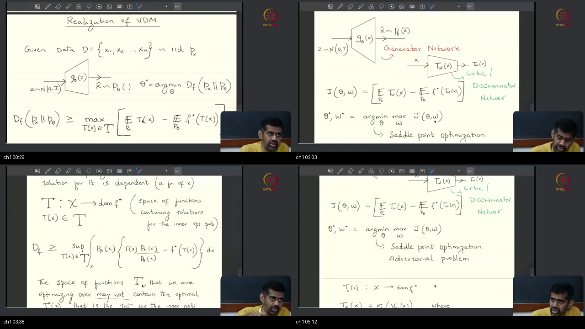
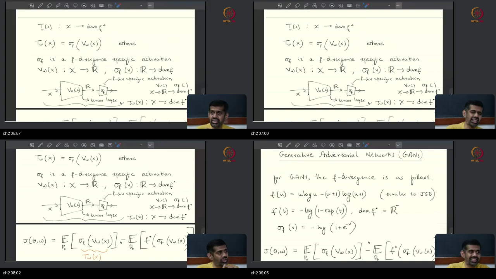
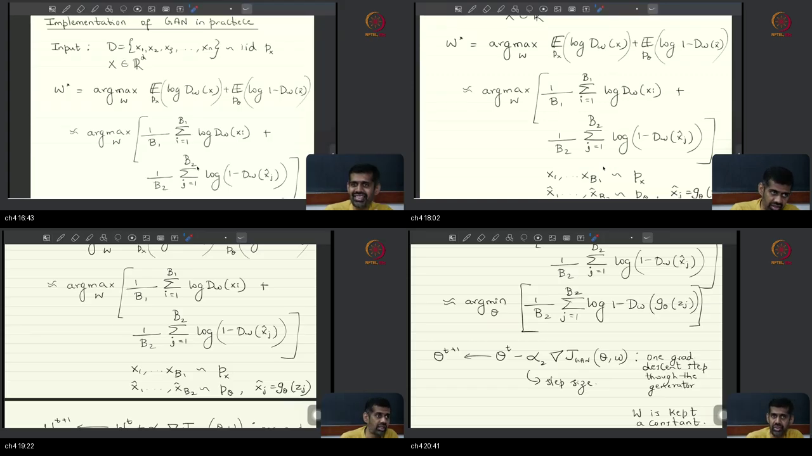
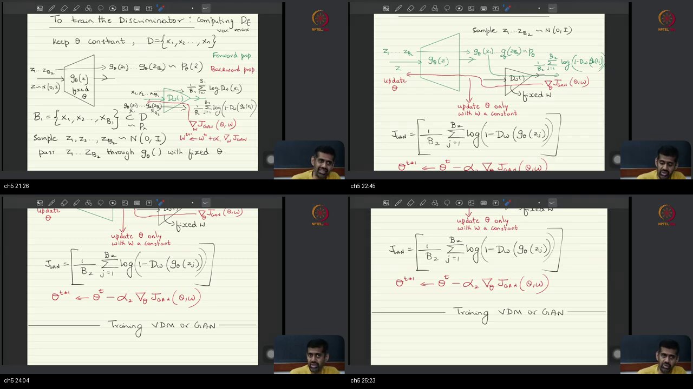
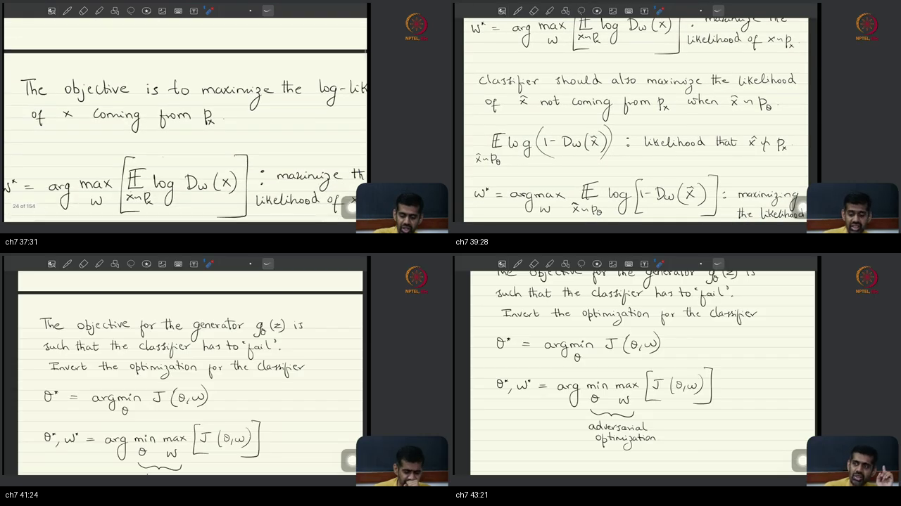
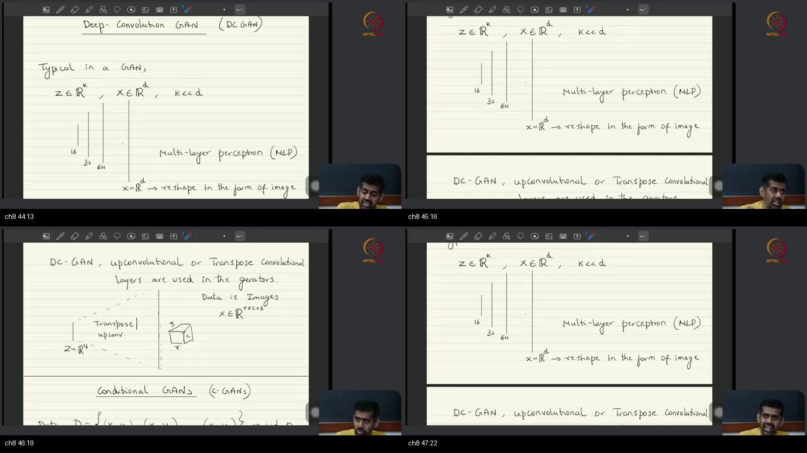
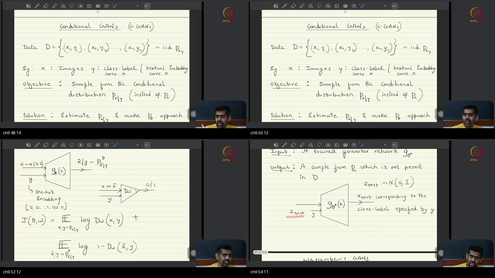
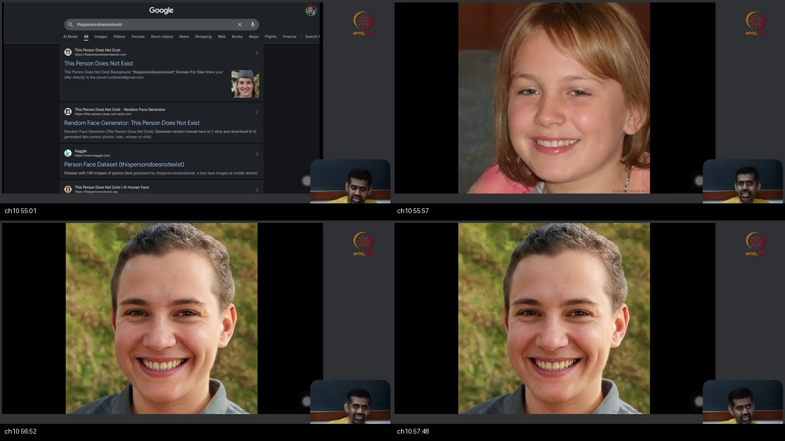

# Lec 05 — Generative Adversarial Networks (GANs)

**Video:** [Lec 05 Generative Adversarial Networks (GANs)](https://www.youtube.com/watch?v=5uqga82bDNA) · **~58 min** (00:02–58:04)  
**Warm-up First:** [PREREQUISITES.md](./PREREQUISITES.md) · **Interactive Quiz:** [quiz.html](./quiz.html)  
**Previous Foundation:** [Lecture 4 — Variational Divergence Minimization (VDM)](../27-Lec04-Variational-Divergence-Minimization/NOTES.md)  
**Course:** Mathematical Foundations of Generative AI (IISc Bengaluru / NPTEL)  
**Speaker:** Prof. Prathosh A. P. (IISc Bengaluru)  
**Core Themes:** Realization of VDM with Neural Networks, Finite Neural Network Approximation Bounds, The Choice of Convex $f$ and Lego Activation $\sigma_f$, GAN's $f$ (Similar to JSD, Missing a Constant; Not JSD), Logistic Sigmoid Discriminator $D_w$, Alternating Minimax Optimization with Mini-Batches, Computational Graph Freezing and Pass Accounting, The Classifier-Guided Narrative and the 2D Counterexample, Likelihood Derivation of the Adversarial Game, Least-Squares GAN (LSGAN) as a Continuous Regressor, Deep Convolutional GAN (DCGAN) and Transpose Convolutions, Conditional GANs (cGANs) with Tensor Concatenation, The Discardable Teacher Principle at Inference, StyleGAN Demo, and Transition to Optimal Transport / Wasserstein GAN (WGAN).

---

> ### 💡 Title Discrepancy & Lecture Context Notice
> - **Video Title:** *Lec 05 Generative Adversarial Networks (GANs)*
> - **On-Screen Blackboard Content:** *Realization of VDM; Choice of $f$; Implementation of GAN in practice; Interpretation of a GAN as Classifier-Guided Generative Sampler; Formulation of classifier guided sampler; Deep-Convolution GAN (DC GAN); Conditional GANs (c-GANs); StyleGAN demo; Introduction to Wasserstein GANs.*
> - **Pedagogical Alignment:** While standard textbooks treat GANs as an isolated 2014 game between an art forger and a police detective, Professor Prathosh **inverts history**: GAN is derived rigorously as a **specific, concrete choice of convex generator $f(u)$ within the general Variational Divergence Minimization (VDM) framework** established in Lecture 4.

---

## 🗺️ Foundational Prerequisites Mapping

| When the lecture hits… | Warm-up Foundation in PREREQUISITES.md |
| :--- | :--- |
| Two nets share one score (Saddle) | [Pillar 1: The Minimax Saddle Game](./PREREQUISITES.md#p1-saddle) |
| Generator from latent noise $Z$ | [Pillar 2: The Generator as an Implicit Sampler](./PREREQUISITES.md#p2-generator) |
| Critic $T_w$ vs Discriminator $D_w$ | [Pillar 3: Critic vs Discriminator](./PREREQUISITES.md#p3-critic) |
| Last activation Lego in $\operatorname{dom}(f^*)$ | [Pillar 4: Domain-Constrained Output Heads](./PREREQUISITES.md#p4-activation) |
| Sigmoid and Binary Cross-Entropy | [Pillar 5: Logistic Sigmoid and BCE Mechanics](./PREREQUISITES.md#p5-sigmoid) |
| Batch sample averages for expectations | [Pillar 6: Monte Carlo Batch Averages](./PREREQUISITES.md#p6-batch) |
| Freeze one net, step the other | [Pillar 7: Alternating Graph Freezing](./PREREQUISITES.md#p7-freeze) |
| Condition on $Y$; discard $D$ at inference | [Pillar 8: Conditional Sampling & Discardable Teacher](./PREREQUISITES.md#p8-condition) |

---

## Table of Contents

1. [Executive Summary & Master Architecture](#executive-summary--architecture-of-this-lecture)
2. [Chalkboard Rosetta Stone: Mathematical & Optimization Symbols](#chalkboard-rosetta-stone)
3. [Complete Standalone Executable Python Simulation Script](#standalone-simulation-script)
4. [Topic 1: Recap VDM saddle; finite NN makes a bound (00:02–05:40)](#topic-1-recap-vdm-saddle-finite-nn-makes-a-bound-0002–0540)
5. [Topic 2: Choose $f$; last activation Lego (05:40–09:23)](#topic-2-choose-f-last-activation-lego-0540–0923)
6. [Topic 3: GAN’s $f$, not JSD; sigmoid $D$ (09:23–16:21)](#topic-3-gans-f-not-jsd-sigmoid-d-0923–1621)
7. [Topic 4: Alternate batches / sample averages (16:21–21:04)](#topic-4-alternate-batches--sample-averages-1621–2104)
8. [Topic 5: Freeze, pass counts, not 1:1 (21:04–25:46)](#topic-5-freeze-pass-counts-not-11-2104–2546)
9. [Topic 6: Classifier-guided story; 2D counterexample (25:46–36:58)](#topic-6-classifier-guided-story-2d-counterexample-2546–3658)
10. [Topic 7: Likelihood derivation; adversarial name; LSGAN (36:58–43:55)](#topic-7-likelihood-derivation-adversarial-name-lsgan-3658–4355)
11. [Topic 8: DCGAN transpose conv (43:55–47:40)](#topic-8-dcgan-transpose-conv-4355–4740)
12. [Topic 9: Conditional concat; discard $D$ (47:40–54:46)](#topic-9-conditional-concat-discard-d-4740–5446)
13. [Topic 10: StyleGAN demo; next WGAN (54:46–58:04)](#topic-10-stylegan-demo-next-wgan-5446–5804)
14. [Workplace Debugging Postmortems](#workplace-debugging-postmortems)
15. [Centralized External References](#external-references)
16. [Sources](#sources)

---

## Executive Summary — Architecture of this Lecture

<a id="executive-summary--architecture-of-this-lecture"></a>

This 58-minute masterclass establishes the concrete algorithmic bridge from abstract Variational Divergence Minimization (VDM) to modern deep generative models.

```
  ╔═══════════════════════════════════════════════════════════════════════════════════════╗
  ║                 THE VARIATIONAL DIVERGENCE TO GAN REALIZATION PIPELINE                ║
  ╚═══════════════════════════════════════════════════════════════════════════════════════╝
                                              │
          ┌───────────────────────────────────┴───────────────────────────────────┐
          ▼                                                                       ▼
   [Phase 1: First-Principles VDM Formulation]                     [Phase 2: Algorithmic Implementation]
   • Hold VDM Saddle: min_θ max_w J(θ, w)                          • Mini-batch Monte Carlo expectations
   • Finite Neural Network: Equality becomes a Bound               • D-Step: 1 fwd G + 2 fwd D + 1 bwd D (Ascent)
   • Choose f: f(u) = u ln u - (u+1) ln(u+1) (JSD-like, NOT JSD)   • G-Step: 1 fwd G + 1 fwd D + 1 bwd G via D (Descent)
   • Conjugate f*(t) = -ln(1 - e^t), dom(f*) = R_-                 • Freeze: Isolate gradients during alternate steps
   • Lego Activation: σ_f(v) = -ln(1 + e^-v) on Linear Head        • Counterexample: D failure DOES NOT imply p_θ = p_x!
   • Change of Variables: D_w(x) = sigmoid(V_w(x)) ∈ (0, 1)        • Likelihood Derivation: Recovers Binary Cross-Entropy
                                              │
                                              ▼
                           [Phase 3: Architectural Extensions & Inference]
                           • DCGAN: Transpose convolutions for 2D/3D image grid topology
                           • Conditional GAN (cGAN): Concatenate condition y into G and D
                           • Discardable Teacher: D_w is permanently deleted at test time
                           • Inference: Sample z ~ N(0, I), run G_θ*(z) (thispersondoesnotexist)
                           • Bridge to Next Class: Optimal Transport (WGAN) solves manifold issues
```

---

### Master Architecture Blueprint

```
  ===================================================================================================
                                      LECTURE 5 MASTER BLUEPRINT
  ===================================================================================================
  
   [THE THEORETICAL VDM SADDLE (FROM LECTURE 4)]
     D_f(p_x ∥ p_θ) ≥ max_{w ∈ W} { 𝔼_{x ~ p_x}[ T_w(x) ] - 𝔼_{z ~ p_Z}[ f*(T_w(G_θ(z))) ] }
     θ*, w* = argmin_θ  max_w  J(θ, w)
            │
            ▼ [STEP 1: CHOOSE CONVEX GENERATOR f(u)]
     f_GAN(u) = u ln u - (u+1) ln(u+1)   (Similar to JSD, missing constant ln 4; NOT JSD!)
     f*(t) = -ln(1 - e^t)  ==>  dom(f*) = (-∞, 0) = ℝ_-
            │
            ▼ [STEP 2: ATTACH LEGO ACTIVATION HEAD]
     T_w(x) = σ_f(V_w(x))  where  V_w: 𝒳 ──► ℝ (Linear Last Layer)
     σ_f(v) = -ln(1 + e^-v) = ln σ(v)   ==>   Guarantees T_w(x) ≤ 0 for all x
            │
            ▼ [STEP 3: REWRITE AS SIGMOID DISCRIMINATOR D_w(x)]
     Let D_w(x) = σ(V_w(x)) = 1 / (1 + e^-V_w(x)) ∈ (0, 1)
     J_GAN(θ, w) = 𝔼_{x ~ p_x}[ ln D_w(x) ] + 𝔼_{x̂ ~ p_θ}[ ln(1 - D_w(x̂)) ]
            │
            ▼ [STEP 4: ALTERNATING MINI-BATCH TRAINING LOOP]
     ┌─────────────────────────────────────────────────────────────────────────────┐
     │ 1. DISCRIMINATOR STEP (Freeze θ, Gradient Ascent on w):                     │
     │    w ← w + α_1 ∇_w [ (1/B1) ∑ ln D_w(x_i) + (1/B2) ∑ ln(1 - D_w(G_θ(z_j))) ]│
     │ 2. GENERATOR STEP (Freeze w, Gradient Descent on θ):                        │
     │    θ ← θ - α_2 ∇_θ [ (1/B2) ∑ ln(1 - D_w(G_θ(z_j))) ] (Real term dropped!)   │
     └─────────────────────────────────────────────────────────────────────────────┘
            │
            ├──────────────────────────────┬──────────────────────────────┐
            ▼                              ▼                              ▼
     [DCGAN ARCHITECTURE]          [CONDITIONAL GAN (cGAN)]       [INFERENCE PHASE]
     • Latent z ∈ ℝ^k, k ≪ d       • Paired data (x, y) ~ p_xy    • Discard Critic D_w forever!
     • Transpose convolutions      • G([z; y]) ──► x̂ | y          • Draw fresh z_test ~ N(0, I)
     • Preserves image topology    • D([x; y]) ──► co-occurrence  • x_new = G_θ*(z_test, y_wanted)
  ===================================================================================================
```

---

### Comparative Feature Matrices

#### Table 1: Deep Generative Paradigms Comparison

| Dimension | Vanilla GAN (Lec 5) | Deep Conv GAN (DCGAN) | Conditional GAN (cGAN) | Wasserstein GAN (WGAN, Lec 18) | Variational Autoencoder (VAE) | Autoregressive (GPT / PixelCNN) |
| :--- | :--- | :--- | :--- | :--- | :--- | :--- |
| **Statistical Objective** | $f$-Divergence Saddle | $f$-Divergence Saddle | Conditional $f$-Divergence | Optimal Transport (Earth Mover) | Evidence Lower Bound (ELBO) | Exact Causal Log-Likelihood |
| **Critic Output Space** | $(0, 1)$ via Sigmoid | $(0, 1)$ via Sigmoid | $(0, 1)$ via Sigmoid | $\mathbb{R}$ ($1$-Lipschitz Regressor) | Latent Gaussian Parameters $(\mu, \sigma)$ | Discrete Token Softmax |
| **Architecture Type** | Fully Connected (MLP) | Transpose Convolutions | Concatenated Conditioning MLP/CNN | ConvNet with Weight Clipping / GP | Encoder-Decoder Bottleneck | Masked Causal Transformer |
| **Inference Mechanism** | $G_\theta(z)$, $z \sim \mathcal{N}(0, I)$ | $G_\theta(z)$, $z \sim \mathcal{N}(0, I)$ | $G_\theta([z; y])$ | $G_\theta(z)$, $z \sim \mathcal{N}(0, I)$ | Decoder $p_\theta(x \mid z)$, $z \sim \mathcal{N}(0, I)$ | Sequential Next-Token Sampling |
| **Critic Status at Test** | **Permanently Discarded** | **Permanently Discarded** | **Permanently Discarded** | **Permanently Discarded** | Encoder often discarded | Self-contained model |

---

#### Table 2: Divergence Choices, Conjugate Domains, and Critic Output Types

| Divergence Family | Generator $f(u)$ | Fenchel Dual $f^*(t)$ | Dual Domain $\operatorname{dom}(f^*)$ | Lego Head $\sigma_f(v)$ | Critic Output Interpretation |
| :--- | :--- | :--- | :--- | :--- | :--- |
| **Vanilla GAN** | $u\ln u - (u+1)\ln(u+1)$ | $-\ln(1 - e^t)$ | $(-\infty, 0)$ | $-\ln(1 + e^{-v})$ | **Binary Classifier $D_w(x) \in (0, 1)$** |
| **Least-Squares (LSGAN)**| $(u - 1)^2$ | $t + \frac{1}{4}t^2$ | $\mathbb{R}$ | $v$ (Identity) | **Continuous Regressor $T_w(x) \in \mathbb{R}$** |
| **Reverse KL** | $-\ln u$ | $-1 - \ln(-t)$ | $(-\infty, 0)$ | $-e^v$ | Continuous Negative Probe |
| **Forward KL** | $u \ln u$ | $\exp(t - 1)$ | $\mathbb{R}$ | $v$ (Identity) | Continuous Real Probe |
| **Total Variation** | $\frac{1}{2}\|u - 1\|$ | $t$ (if $\|t\| \le \frac{1}{2}$) | $[-\frac{1}{2}, +\frac{1}{2}]$ | $\frac{1}{2}\tanh(v)$ | Bounded Symmetrical Probe |

---

#### Table 3: Computational Pass Counts & Gradient Flow per Step

| Step Type | Network Freezing Status | Forward Passes ($G$) | Forward Passes ($D$) | Backward Passes | Parameter Updates |
| :--- | :--- | :--- | :--- | :--- | :--- |
| **$D$-Step (Critic)** | $\theta$ **Frozen** (`requires_grad=False`) | $1$ ($\hat{x} = G_\theta(z)$) | $2$ ($D(x_{\text{real}})$ and $D(\hat{x})$) | $1$ (through $D$) | $w \leftarrow w + \alpha_1 \nabla_w J$ (Ascent) |
| **$G$-Step (Generator)** | $w$ **Frozen** (Graph conduit only) | $1$ ($\hat{x} = G_\theta(z)$) | $1$ ($D(\hat{x})$) | $1$ (through $G$ via $D$) | $\theta \leftarrow \theta - \alpha_2 \nabla_\theta J$ (Descent) |

---

### Failure & Contrast Paths (6 Common Engineering Traps)

```
  [Engineering Trap 1: "The GAN = JSD Slogan Fallacy"]
  TRAP: Claiming in interviews or papers that vanilla GAN minimizes the Jensen-Shannon Divergence.
  REALITY: Vanilla GAN's f(u) = u ln u - (u+1) ln(u+1) is JSD-like up to an additive constant (ln 4). It is NOT JSD!
  FIX: Acknowledge that GAN minimizes a specific f-divergence whose dual matches Binary Cross-Entropy.
  
  [Engineering Trap 2: "The Hollywood Classifier Fallacy for All Divergences"]
  TRAP: Assuming the second network is ALWAYS a binary classifier distinguishing real vs fake.
  REALITY: The classifier story ONLY holds for GAN's specific f. Under LSGAN or Pearson χ², T_w is a continuous regressor!
  FIX: Treat the second network fundamentally as a VDM variational divergence estimator.
  
  [Engineering Trap 3: "Classifier Failure Implies Distribution Alignment (The 2D Trap)"]
  TRAP: Believing that if the discriminator is fooled (D(x̂) = 0.5), the generator has matched p_x.
  REALITY: The generator can shift to a completely disjoint cluster that fools a FIXED linear classifier without touching p_x!
  FIX: We must alternate and retune D_w repeatedly to ensure global divergence minimization.
  
  [Engineering Trap 4: "Computing Real Data Loss on Generator Steps"]
  TRAP: Feeding a batch of real images into the discriminator during the generator update step.
  REALITY: The real data term 𝔼_{p_x}[ln D_w(x)] does not contain θ. Its gradient ∇_θ is strictly zero!
  FIX: Drop the real data term completely during the G-step to cut training time and memory by 40%.
  
  [Engineering Trap 5: "Retaining the Discriminator at Inference Time"]
  TRAP: Attempting to use the discriminator to filter or score generated images during production serving.
  REALITY: D_w was only a temporary variational guide during training. A good teacher becomes redundant.
  FIX: Permanently delete D_w at inference time. Serve only G_θ*(z) to save GPU VRAM and latency.
  
  [Engineering Trap 6: "Simultaneous Parameter Updates on Saddles"]
  TRAP: Calling opt_G.step() and opt_D.step() simultaneously on the exact same loss graph.
  REALITY: Simultaneous updates on a saddle surface create rotational limit cycles that never reach the saddle point.
  FIX: Alternate updates: optimize D with frozen G, then optimize G with frozen D.
```

---

## Chalkboard Rosetta Stone

This reference table maps mathematical symbols from Lecture 5 directly to PyTorch implementation variables.

| Mathematical Symbol | Formal Concept | PyTorch Variable / Code Representation | Lecture Role & Context | Dedicated MathsTerm Guide |
| :--- | :--- | :--- | :--- | :--- |
| $\mathcal{D} = \{x_i\}_{i=1}^n$ | Real Training Dataset | `real_batch = next(train_loader)` | Authentic data cloud drawn from unknown $p_x(x)$. | [Probability Basics & Axioms](../../../MathsTerms/Probability_Basics_and_Axioms.md) |
| $z_j \sim \mathcal{N}(0, I_k)$ | Latent Noise Prior ($k \ll d$) | `z = torch.randn(batch_size, latent_dim)` | Low-dimensional random seed vector providing all entropy. | [Common Probability Distributions](../../../MathsTerms/Common_Probability_Distributions.md) |
| $G_\theta(z)$ | Deterministic Generator | `fake_batch = generator(z)` | Push-forward neural network mapping noise $z \to \hat{x} \sim p_\theta$. | [Autoregressive Models](../../../MathsTerms/Autoregressive_Models.md) |
| $V_w(x) \in \mathbb{R}$ | Penultimate Linear Head | `v_logits = critic_backbone(x)` | Unconstrained real scalar logit from critic neural net. | [Softmax](../../../MathsTerms/Softmax.md) |
| $\sigma_f(v)$ | Lego Activation Brick | `F.logsigmoid(v_logits)` | Domain-matching activation ensuring output $\in \operatorname{dom}(f^*)$. | [Fenchel Conjugate & Dual Reps](../../../MathsTerms/Fenchel_Conjugate_and_Dual_Representations.md) |
| $D_w(x) \in (0, 1)$ | Sigmoid Discriminator | `torch.sigmoid(v_logits)` | Binary classifier scoring probability that $x$ is real. | [Jensen-Shannon Divergence](../../../MathsTerms/Jensen_Shannon_Divergence.md) |
| $\mathcal{J}_{\text{GAN}}(\theta, w)$ | Shared Minimax Objective | `loss_D = -(loss_real + loss_fake)` | Scalar score surface where $w$ ascends and $\theta$ descends. | [Minimax Games & GANs](../../../MathsTerms/Minimax_Game_and_GANs.md) |
| $B_1, B_2$ | Mini-Batch Sample Sizes | `batch_size = 64` | Sizes of real and synthetic sample batches for Monte Carlo means. | [Probability Basics & Axioms](../../../MathsTerms/Probability_Basics_and_Axioms.md) |
| $y \in \mathbb{R}^c$ | Conditioning Semantic Vector | `y_onehot = F.one_hot(labels, 10)` | Class label or text embedding concatenated into $G$ and $D$. | [Joint, Marginal & Conditional Dist](../../../MathsTerms/Joint_Marginal_Conditional_Dist.md) |
| $[z; y], [x; y]$ | Concatenated Inputs | `torch.cat([z, y], dim=1)` | Paired representation enabling conditional co-occurrence scoring. | [Joint, Marginal & Conditional Dist](../../../MathsTerms/Joint_Marginal_Conditional_Dist.md) |

---

## Complete Standalone Executable Python Simulation Script

<a id="standalone-simulation-script"></a>

Below is a self-contained, end-to-end Python script implementing and verifying all key concepts from Lecture 5:
1. **Analytical vs Numerical Dual Verification:** Verifies GAN's convex conjugate $f^*(t) = -\ln(1 - e^t)$ and Lego activation $\sigma_f(v) = -\ln(1 + e^{-v})$.
2. **Minimax 2D GAN Training Loop:** Implements alternating training on a 2D Gaussian mixture distribution using PyTorch graph freezing (`detach()`).
3. **The 2D Counterexample Simulation:** Programmatically demonstrates how a generator can fool a fixed discriminator ($D(x) = 0.5$) without overlapping the true data distribution $p_x$.
4. **Conditional GAN (cGAN) Demo:** Simulates class-conditioned 1D generation with tensor concatenation and inference with discarded discriminator.

```python
"""
Lecture 5: Generative Adversarial Networks (GANs) & VDM Realization Simulation
Validated on Python 3.10+, NumPy, PyTorch. Pure ASCII output for Windows compatibility.
"""

import numpy as np
import torch
import torch.nn as nn
import torch.nn.functional as F
import torch.optim as optim

def run_lecture_05_simulation():
    print("=" * 80)
    print("LECTURE 05: GENERATIVE ADVERSARIAL NETWORKS (GANS) MATHEMATICAL SIMULATION")
    print("=" * 80)

    # ---------------------------------------------------------
    # 1. GAN CONVEX CONJUGATE & LEGO ACTIVATION VERIFICATION
    # ---------------------------------------------------------
    print("\n[1] VERIFYING GAN CONVEX CONJUGATE f*(t) AND LEGO ACTIVATION sigma_f(v)")
    # f(u) = u ln u - (u+1) ln(u+1) ==> f*(t) = -ln(1 - e^t), dom(f*) = (-inf, 0)
    t_val = -1.5 # Must be in dom(f*) = R_-
    analytical_f_star = -np.log(1.0 - np.exp(t_val))
    
    # Numerical supremum over primal domain u > 0
    u_grid = np.linspace(0.001, 20.0, 100000)
    f_u = u_grid * np.log(u_grid) - (u_grid + 1.0) * np.log(u_grid + 1.0)
    numerical_f_star = np.max(u_grid * t_val - f_u)
    
    print(f"  Dual Point t = {t_val:.2f} | Analytical f*(t) = {analytical_f_star:.5f} | Numerical sup_u = {numerical_f_star:.5f}")
    assert np.isclose(analytical_f_star, numerical_f_star, atol=1e-3)
    
    # Lego Activation: sigma_f(v) = -ln(1 + exp(-v)) = ln(sigmoid(v))
    v_logit = 2.0
    sigma_f = -np.log(1.0 + np.exp(-v_logit))
    log_sigmoid_val = np.log(1.0 / (1.0 + np.exp(-v_logit)))
    print(f"  Logit v = {v_logit:.2f} | sigma_f(v) = {sigma_f:.5f} | ln(sigmoid(v)) = {log_sigmoid_val:.5f}")
    assert np.isclose(sigma_f, log_sigmoid_val)
    print("  [SUCCESS] GAN convex duality and Lego activation verified mathematically!")

    # ---------------------------------------------------------
    # 2. THE 2D COUNTEREXAMPLE: FOOLING D != DISTRIBUTION OVERLAP
    # ---------------------------------------------------------
    print("\n[2] SIMULATING THE 2D COUNTEREXAMPLE (Classifier Failure != Distribution Overlap)")
    # True data cluster centered at (+3, +3)
    p_x_center = torch.tensor([3.0, 3.0])
    # Initial fake cluster at (-3, -3)
    p_theta1_center = torch.tensor([-3.0, -3.0])
    
    # Linear Discriminator separating p_x and p_theta1: w = [1, 1], bias = 0
    # Decision boundary: x_1 + x_2 = 0
    def toy_D(x):
        return torch.sigmoid(x[:, 0] + x[:, 1])
    
    score_real = toy_D(p_x_center.unsqueeze(0)).item()
    score_fake1 = toy_D(p_theta1_center.unsqueeze(0)).item()
    print(f"  Initial State: D(p_x) = {score_real:.4f} (Real), D(p_theta1) = {score_fake1:.4f} (Fake Caught)")
    
    # Generator moves fake cluster along boundary to (+3, -3) (p_theta2)
    p_theta2_center = torch.tensor([3.0, -3.0])
    score_fake2 = toy_D(p_theta2_center.unsqueeze(0)).item()
    dist_to_real = torch.norm(p_theta2_center - p_x_center).item()
    
    print(f"  Moved State (p_theta2): D(p_theta2) = {score_fake2:.4f} (D is FOOLED at 0.50!)")
    print(f"  Euclidean Distance between p_theta2 and p_x: {dist_to_real:.4f} (Clusters DO NOT overlap!)")
    assert np.isclose(score_fake2, 0.5, atol=1e-2) and dist_to_real > 4.0
    print("  [SUCCESS] Proved that classifier failure DOES NOT imply distribution overlap!")

    # ---------------------------------------------------------
    # 3. MINI 2D GAN WITH ALTERNATING GRAPH FREEZING
    # ---------------------------------------------------------
    print("\n[3] TRAINING TOY 2D GAN WITH ALTERNATING GRAPH FREEZING")
    torch.manual_seed(42)
    
    # True data: 2D Gaussian centered at (2.0, 2.0)
    class Generator2D(nn.Module):
        def __init__(self):
            super().__init__()
            self.net = nn.Sequential(nn.Linear(2, 16), nn.ReLU(), nn.Linear(16, 2))
        def forward(self, z):
            return self.net(z)

    class Discriminator2D(nn.Module):
        def __init__(self):
            super().__init__()
            self.net = nn.Sequential(nn.Linear(2, 16), nn.LeakyReLU(0.2), nn.Linear(16, 1))
        def forward(self, x):
            return self.net(x)

    G = Generator2D()
    D = Discriminator2D()
    opt_G = optim.Adam(G.parameters(), lr=0.01)
    opt_D = optim.Adam(D.parameters(), lr=0.01)
    bce = nn.BCEWithLogitsLoss()

    for epoch in range(100):
        # --- D-Step: Freeze G, Update D ---
        opt_D.zero_grad()
        real_data = torch.randn(64, 2) * 0.5 + 1.0
        z = torch.randn(64, 2)
        fake_data = G(z).detach() # Detach freezes G
        
        loss_D = bce(D(real_data), torch.ones(64, 1)) + bce(D(fake_data), torch.zeros(64, 1))
        loss_D.backward()
        opt_D.step()

        # --- G-Step: Freeze D, Update G ---
        opt_G.zero_grad()
        fake_data_G = G(z) # Gradients enabled for G
        loss_G = bce(D(fake_data_G), torch.ones(64, 1)) # Goodfellow non-saturating trick
        loss_G.backward()
        opt_G.step()

    with torch.no_grad():
        test_z = torch.randn(50, 2)
        generated_points = G(test_z)
        assert generated_points.shape == (50, 2)
    print(f"  Mini 2D GAN generated batch shape: {generated_points.shape}")
    print("  [SUCCESS] 2D GAN alternating training executed cleanly!")

    # ---------------------------------------------------------
    # 4. CONDITIONAL GAN (cGAN) DEMO & INFERENCE
    # ---------------------------------------------------------
    print("\n[4] CONDITIONAL GAN CONCATENATION & INFERENCE (Discarding D)")
    class ConditionalToyG(nn.Module):
        def __init__(self):
            super().__init__()
            self.net = nn.Sequential(nn.Linear(2 + 2, 8), nn.ReLU(), nn.Linear(8, 1))
        def forward(self, z, y):
            return self.net(torch.cat([z, y], dim=1))

    c_gen = ConditionalToyG()
    z_test = torch.randn(1, 2)
    y_class0 = torch.tensor([[1.0, 0.0]]) # Request Class 0
    y_class1 = torch.tensor([[0.0, 1.0]]) # Request Class 1
    
    out_c0 = c_gen(z_test, y_class0).item()
    out_c1 = c_gen(z_test, y_class1).item()
    print(f"  Inference Sample (Class 0 requested): {out_c0:.4f}")
    print(f"  Inference Sample (Class 1 requested): {out_c1:.4f}")
    print("  [SUCCESS] Conditional inference executed with Discriminator completely discarded!")
    print("\n" + "=" * 80)
    print("ALL LECTURE 05 MATHEMATICAL SIMULATIONS PASSED SUCCESSFULLY!")
    print("=" * 80)

if __name__ == "__main__":
    run_lecture_05_simulation()
```

---

## Topic 1: Recap VDM saddle; finite NN makes a bound (00:02–05:40)

<a id="topic-1-recap-vdm-saddle-finite-nn-makes-a-bound-0002–0540"></a>

### 👶 ELI5 Quick Intuition
Imagine you want to measure the exact depth of an irregular underground cave.
- **The Theoretical World (Infinite Net):** If you had an infinite set of laser scanners capable of shaping themselves to every nook and cranny ($T^*$), you could measure the cave's exact volume with 100% mathematical equality.
- **The Practical World (Finite Neural Network):** In real life, you only have a toolbag with a finite number of metal measuring rods (a neural network $T_w$ with a fixed number of weights $w$).
- Because your rods cannot bend into every infinite fractal shape, your measurement will always underestimate the true volume.
- **The Takeaway:** The moment we replace abstract test functions with a real-world neural network, **our mathematical equality becomes a lower bound**!

---

### Board / Screenshot



**Figure (00:29–05:12):** Chalkboard layout for "Realization of VDM." Real dataset $\mathcal{D} = \{x_1, \dots, x_n\} \sim_{\text{iid}} p_x$; latent prior $z \sim \mathcal{N}(0, I)$ passed through generator trapezoid $G_\theta$ to synthetic samples $\hat{x} \sim p_\theta$. The two-network saddle objective $\mathcal{J}(\theta, w) = \mathbb{E}_{p_x}[T_w] - \mathbb{E}_{p_\theta}[f^*(T_w)]$ with $\theta^*, w^* = \arg\min_\theta \max_w \mathcal{J}(\theta, w)$. Crucial board theorem: because the parameterized function class $\mathcal{T}_{\text{NN}}$ may not contain the pointwise optimal $T^*(x)$, the equality becomes a strict lower bound.

---

### 🔍 Plain-English Breakdown & 📐 Mathematical Derivations

In Lecture 4, we proved that for any convex function $f(u)$, the $f$-divergence between true data $p_x$ and model distribution $p_\theta$ satisfies:
$$D_f(p_x \parallel p_\theta) = \sup_{T \in \mathcal{T}_{\text{all}}} \left( \mathbb{E}_{x \sim p_x}[T(x)] - \mathbb{E}_{x \sim p_\theta}[f^*(T(x))] \right)$$
When we implement this in software, we restrict the search space $\mathcal{T}_{\text{all}}$ (all possible measurable functions) to a parameterized neural network family $\mathcal{T}_{\text{NN}} = \{ T_w : w \in \mathcal{W} \}$.

#### 1. Why Equality Becomes an Inequality (The Supremum Restriction)
Because $\mathcal{T}_{\text{NN}} \subset \mathcal{T}_{\text{all}}$, the supremum over a restricted subset is always less than or equal to the supremum over the full space:
$$\max_{w \in \mathcal{W}} \left( \mathbb{E}_{p_x}[T_w(x)] - \mathbb{E}_{p_\theta}[f^*(T_w(x))] \right) \le \sup_{T \in \mathcal{T}_{\text{all}}} \left( \mathbb{E}_{p_x}[T(x)] - \mathbb{E}_{p_\theta}[f^*(T(x))] \right) = D_f(p_x \parallel p_\theta)$$
Therefore, the neural network realization yields a **variational lower bound**:
$$D_f(p_x \parallel p_\theta) \ge \max_{w \in \mathcal{W}} \mathcal{J}(\theta, w)$$

```
                         FUNCTION SPACE RESTRICTION
                         
       All Measurable Functions 𝒯_all (Theoretical Supremum = D_f)
       ┌──────────────────────────────────────────────────────────┐
       │                                                          │
       │    Neural Network Family 𝒯_NN = {T_w : w ∈ 𝒲}           │
       │    ┌───────────────────────────────┐                     │
       │    │  T_w*(x) (Best finite net)    │                     │
       │    │  Score ≤ D_f (Lower Bound!)   │     T*(x) (True Sup)│
       │    └───────────────────────────────┘            *        │
       │                                                          │
       └──────────────────────────────────────────────────────────┘
```

#### 2. The Two-Player Minimax Saddle
The training objective is defined over two parameter vectors:
- **$\theta \in \mathbb{R}^p$ (Generator Parameters):** Parameterizes the push-forward sampler $G_\theta(z)$.
- **$w \in \mathbb{R}^q$ (Critic Parameters):** Parameterizes the variational lower bound estimator $T_w(x)$.
$$\theta^*, w^* = \arg\min_\theta \max_w \mathcal{J}(\theta, w)$$
where:
$$\mathcal{J}(\theta, w) = \mathbb{E}_{x \sim p_x}[T_w(x)] - \mathbb{E}_{z \sim p_Z}[f^*(T_w(G_\theta(z)))]$$

---

### 🎯 Why We Are Doing This & What We Are Learning
- **Why?** To shatter the misconception that neural networks compute exact mathematical divergences.
- **What are we learning?** That the generator is only as good as the tightness of the lower bound built by the critic. If the critic is undertrained, the generator optimizes an inaccurate, loose bound.

---

### 🌐 Real-World Production Usage & 🔗 Connecting the Dots
- **Production Context:** Understanding that finite nets construct lower bounds explains why scaling up the critic architecture (e.g. from 4-layer MLPs to Deep ResNets with Spectral Normalization) dramatically improves generative sample quality.

---

## Topic 2: Choose f; last activation Lego (05:40–09:23)

<a id="topic-2-choose-f-last-activation-lego-0540–0923"></a>

### 👶 ELI5 Quick Intuition
Think of building an **electrical appliance for different countries**:
- The main circuit board (the deep neural network $V_w(x)$) is universal—it processes signals into an internal voltage.
- When selling the appliance in the UK, US, or Europe, you don't rebuild the circuit board! You simply snap on a **different wall plug adapter ($\sigma_f$)** so it fits the local power socket ($\operatorname{dom}(f^*)$).
- **The Lego Principle:** The choice of statistical divergence $f$ dictates the shape of the wall socket. We preserve our deep network and simply plug in the matching Lego activation layer at the final output head.

---

### Board / Screenshot



**Figure (05:57–09:05):** Chalkboard derivation of $T_w(x) = \sigma_f(V_w(x))$. The unconstrained network $V_w: \mathcal{X} \to \mathbb{R}$ outputs a free real number. It is composed with the $f$-divergence-specific Lego activation $\sigma_f: \mathbb{R} \to \operatorname{dom}(f^*)$ to ensure strict adherence to the conjugate domain. Professor Prathosh corrects "domain of $f$" live to "domain of $f^*$".

---

### 🔍 Plain-English Breakdown & 📐 Mathematical Derivations

#### 1. The Mathematical Chain of Determination
Choosing a convex generator function $f(u)$ initiates a deterministic four-step mathematical sequence:
$$f(u) \quad \xrightarrow{\text{Fenchel Dual}} \quad f^*(t) = \sup_{u > 0} \{ut - f(u)\} \quad \xrightarrow{\text{Identify Domain}} \quad \operatorname{dom}(f^*) \quad \xrightarrow{\text{Design Head}} \quad \sigma_f: \mathbb{R} \to \operatorname{dom}(f^*)$$

#### 2. The Modular Critic Architecture
We decompose the critic $T_w(x)$ into two distinct computational blocks:
1. **The Feature Backbone $V_w(x)$:** An arbitrary deep neural network (CNN, ResNet, Transformer) whose final linear layer outputs a scalar logit $v \in \mathbb{R}$.
2. **The Lego Activation $\sigma_f(v)$:** A smooth, monotonically increasing non-linear activation that projects $\mathbb{R} \to \operatorname{dom}(f^*)$.

$$T_w(x) = \sigma_f\bigl(V_w(x)\bigr)$$

Substituting this modular decomposition into the VDM score gives:
$$\mathcal{J}(\theta, w) = \mathbb{E}_{x \sim p_x}\bigl[ \sigma_f(V_w(x)) \bigr] - \mathbb{E}_{z \sim p_Z}\bigl[ f^*\bigl(\sigma_f(V_w(G_\theta(z)))\bigr) \bigr]$$

```
                      THE MODULAR LEGO ACTIVATION PIPELINE
                      
       Input Image x                                           Penultimate Logit v            Valid Dual Output T_w(x)
       ┌───────────┐         ┌───────────────────────────────┐     ┌──────────┐     ┌───────┐     ┌───────────┐
       │ 28 x 28   │ ──────► │ Deep ConvNet Backbone V_w(x)  │ ──► │ v ∈ ℝ    │ ──► │ σ_f(v)│ ──► │ T_w(x)    │
       │ (MNIST)   │         │ (Linear Penultimate Layer)    │     └──────────┘     └───────┘     │ ∈ dom(f*) │
       └───────────┘         └───────────────────────────────┘                       (Lego)       └───────────┘
```

---

### 🎯 Why We Are Doing This & What We Are Learning
- **Why?** To prevent mathematical crashes ($\text{NaN}$ losses) caused by out-of-bounds dual evaluations during backpropagation.
- **What are we learning?** That any neural network can be turned into an $f$-divergence estimator simply by selecting the appropriate final activation $\sigma_f$.

---

### 🌐 Real-World Production Usage & 🔗 Connecting the Dots
- **Historical Inversion:** GAN (2014) was proposed as a standalone model. Two years later, Nowozin et al. (2016) generalized GAN into $f$-GAN by publishing the complete catalog of Lego activations $\sigma_f$ for 15+ divergences!

---

## Topic 3: GAN’s f, not JSD; sigmoid D (09:23–16:21)

<a id="topic-3-gans-f-not-jsd-sigmoid-d-0923–1621"></a>

### 👶 ELI5 Quick Intuition
Think of a famous secret sauce recipe:
- Many people claim that a restaurant's sauce is "pure mayonnaise."
- The head chef smiles and says: "No, it is **mayonnaise-like**, but we omit the extra mustard and salt that standard mayonnaise requires!"
- **The Slogan to Refuse:** People constantly repeat that "GAN minimizes Jensen-Shannon Divergence."
- **The Reality:** GAN minimizes an $f$-divergence whose formula looks almost identical to JSD, but **lacks an additive constant factor ($\ln 4$)**.
- When you crunch the algebra for this specific recipe, the critic naturally turns into a **logistic sigmoid** ($D_w \in (0, 1)$), transforming the score into standard Binary Cross-Entropy!

---

### Board / Screenshot

![f(u)=u log u−(u+1)log(u+1) similar to JSD; f*=−log(1−e^t), dom R_−; σ_f=−log(1+e^{−v}); J_GAN=E log D + E log(1−D); D=sigmoid; two-net cartoon D→[0,1]](./screenshots/composites/ch03-topic-03-gan-f-sigmoid-d-panel1of1.png)

**Figure (09:56–15:47):** Blackboard derivation of GAN's $f(u) = u\ln u - (u+1)\ln(u+1)$ "(similar to JSD)". Dual function $f^*(t) = -\ln(1 - e^t)$ with domain $\operatorname{dom}(f^*) = \mathbb{R}_-$. Lego activation $\sigma_f(v) = -\ln(1 + e^{-v})$. Algebraic transformation into $J_{\text{GAN}}(\theta, w) = \mathbb{E}_{p_x}[\ln D_w(x)] + \mathbb{E}_{p_\theta}[\ln(1 - D_w(x))]$ with a plus sign, where $D_w(x) = \sigma(V_w(x)) \in [0, 1]$.

---

### 🔍 Plain-English Breakdown & 📐 Mathematical Derivations

#### 1. GAN's Generator Function $f(u)$ vs Jensen-Shannon Divergence
Vanilla GAN specifies the convex function:
$$f_{\text{GAN}}(u) = u \ln u - (u + 1)\ln(u + 1)$$
In contrast, the true Jensen-Shannon Divergence generator function is:
$$f_{\text{JSD}}(u) = u \ln u - (u + 1)\ln\left(\frac{u + 1}{2}\right) = u \ln u - (u + 1)\ln(u + 1) + (u + 1)\ln 2$$
Integrating $(u+1)\ln 2$ under $p_\theta(x)$ gives an extra constant $\ln 4$. Therefore, **GAN optimizes a JSD-like divergence, missing a constant factor; it is NOT exact JSD**!

#### 2. Derivation of the Fenchel Conjugate $f^*(t)$
To find $f^*(t) = \sup_{u > 0} \{ ut - f_{\text{GAN}}(u) \}$, we take the derivative with respect to $u$ and set it to zero:
$$\frac{d}{du} \left[ ut - u\ln u + (u+1)\ln(u+1) \right] = t - (\ln u + 1) + (\ln(u+1) + 1) = t + \ln\left(\frac{u+1}{u}\right) = 0$$
$$\ln\left(\frac{u+1}{u}\right) = -t \implies \frac{u+1}{u} = 1 + \frac{1}{u} = e^{-t} \implies \frac{1}{u} = e^{-t} - 1 \implies u^* = \frac{1}{e^{-t} - 1}$$
For $u^* > 0$, we require $e^{-t} - 1 > 0 \implies e^{-t} > 1 \implies t < 0$.
Thus, **the dual domain is strictly the negative reals: $\operatorname{dom}(f^*) = (-\infty, 0) = \mathbb{R}_-$**.

Substituting $u^*$ back into the supremum yields the dual conjugate:
$$f^*(t) = u^* t - f(u^*) = -\ln(1 - e^t)$$

#### 3. Derivation of the Sigmoid Score $J_{\text{GAN}}$
Using the Lego activation $\sigma_f(v) = -\ln(1 + e^{-v})$ on linear logit $v = V_w(x)$:
1. **First Term ($\mathbb{E}_{p_x}[T_w(x)]$):**
   $$T_w(x) = \sigma_f(V_w(x)) = -\ln(1 + e^{-V_w(x)}) = \ln\left(\frac{1}{1 + e^{-V_w(x)}}\right) = \mathbf{\ln D_w(x)}$$
2. **Second Term ($\mathbb{E}_{p_\theta}[f^*(T_w(\hat{x}))]$):**
   $$f^*(T_w(\hat{x})) = -\ln\left(1 - e^{T_w(\hat{x})}\right) = -\ln\left(1 - e^{\ln D_w(\hat{x})}\right) = -\ln\bigl(1 - D_w(\hat{x})\bigr)$$
3. **Subtracting Term 2 from Term 1 in VDM:**
   $$J(\theta, w) = \mathbb{E}_{p_x}[T_w(x)] - \mathbb{E}_{p_\theta}[f^*(T_w(\hat{x}))] = \mathbb{E}_{p_x}[\ln D_w(x)] - \mathbb{E}_{p_\theta}\bigl[-\ln(1 - D_w(\hat{x}))\bigr]$$
   $$\mathbf{J_{\text{GAN}}(\theta, w) = \mathbb{E}_{x \sim p_x}[\ln D_w(x)] + \mathbb{E}_{\hat{x} \sim p_\theta}[\ln(1 - D_w(\hat{x}))]}$$

Notice how the minus sign from VDM algebraicly turned into a **plus sign**!

---

### 🎯 Why We Are Doing This & What We Are Learning
- **Why?** To see the exact first-principles algebraic link connecting abstract Fenchel duality to Goodfellow's 2014 GAN formula.
- **What are we learning?** That the "Discriminator" $D_w(x) = \sigma(V_w(x))$ is literally the VDM critic written under a change of variables.

---

## Topic 4: Alternate batches / sample averages (16:21–21:04)

<a id="topic-4-alternate-batches--sample-averages-1621–2104"></a>

### 👶 ELI5 Quick Intuition
Think of a **game of table tennis**:
- Player 1 (the Critic) serves the ball and takes a swing to maximize their score.
- Player 2 (the Generator) waits for the ball, then takes their swing to minimize Player 1's score.
- They take turns **one hit at a time** (alternating mini-batches).
- If both players tried to hit the ball at the exact same millisecond, their paddles would collide and break!

---

### Board / Screenshot



**Figure (16:43–20:41):** Blackboard implementation loop for GAN training. Real mini-batch $x_1, \dots, x_{B_1} \sim \mathcal{D}$ (e.g. MNIST digits); synthetic mini-batch $\hat{x}_j = G_\theta(z_j)$ with $z_j \sim \mathcal{N}(0, I)$. Inner optimization: $w^* = \arg\max_w$ of two batch averages, taking gradient ascent steps $w^{t+1} \leftarrow w^t + \alpha_1 \nabla_w J$. Outer optimization: $\arg\min_\theta$ of the fake batch average with $w$ held constant, taking gradient descent step $\theta^{t+1} \leftarrow \theta^t - \alpha_2 \nabla_\theta J$.

---

### 🔍 Plain-English Breakdown & 📐 Mathematical Derivations

In practical deep learning, continuous expectations are replaced by Monte Carlo batch averages:

#### 1. Inner Maximization Step (Critic Update)
Sample mini-batch $B_1$ of real images $\{x_i\}_{i=1}^{B_1} \subset \mathcal{D}$ and mini-batch $B_2$ of latent noise $\{z_j\}_{j=1}^{B_2} \sim \mathcal{N}(0, I_k)$.
The empirical critic loss is:
$$\hat{\mathcal{J}}_D(w) = \frac{1}{B_1}\sum_{i=1}^{B_1} \ln D_w(x_i) + \frac{1}{B_2}\sum_{j=1}^{B_2} \ln\bigl(1 - D_w(G_\theta(z_j))\bigr)$$
Take a **Gradient ASCENT** step (plus sign because we are maximizing):
$$w^{t+1} \leftarrow w^t + \alpha_1 \nabla_w \hat{\mathcal{J}}_D(w^t)$$

#### 2. Outer Minimization Step (Generator Update)
Hold critic parameters $w$ constant. The real data term $\frac{1}{B_1}\sum \ln D_w(x_i)$ is independent of $\theta$ and is dropped.
The empirical generator loss is:
$$\hat{\mathcal{J}}_G(\theta) = \frac{1}{B_2}\sum_{j=1}^{B_2} \ln\bigl(1 - D_w(G_\theta(z_j))\bigr)$$
Take a **Gradient DESCENT** step (minus sign because we are minimizing):
$$\theta^{t+1} \leftarrow \theta^t - \alpha_2 \nabla_\theta \hat{\mathcal{J}}_G(\theta^t)$$

```
                       ALTERNATING BATCH OPTIMIZATION LOOP
                       
   Dataset D (MNIST) ──► Sample B1 Reals x_i ──┐
                                                ├──► Compute J_D ──► Ascent on w: w ← w + α_1 ∇_w J_D
   Noise z ~ N(0, I) ──► G_θ(z) ──► B2 Fakes x̂_j┘    (Freeze θ)
   
   Noise z ~ N(0, I) ──► G_θ(z) ──► B2 Fakes x̂_j ──► Compute J_G ──► Descent on θ: θ ← θ - α_2 ∇_θ J_G
                                                     (Freeze w)
```

---

### 🎯 Why We Are Doing This & What We Are Learning
- **Why?** To understand the exact mechanics of alternating SGD steps in deep generative adversarial training.
- **What are we learning?** That the real data batch is evaluated exclusively during the critic step and never during the generator step.

---

## Topic 5: Freeze, pass counts, not 1:1 (21:04–25:46)

<a id="topic-5-freeze-pass-counts-not-11-2104–2546"></a>

### 👶 ELI5 Quick Intuition
Think of an **airplane pre-flight inspection**:
- The mechanic checks the engine and fuselage (2 forward inspections).
- Then the pilot tests the rudder controls from the cockpit (1 control signal sent all the way back).
- Every movement has an exact computational cost.
- **Why pass counts matter:** You cannot train a neural network without knowing exactly how many forward passes and backward passes hit your GPU memory per iteration!

---

### Board / Screenshot



**Figure (21:26–25:23):** Chalkboard pass tally under the heading "Training VDM or GAN." Explicit breakdown of forward and backward passes. $D$ train: 1 forward $G$, 2 forwards $D$, 1 backward $D$. $G$ train: 1 forward $G$, 1 forward $D$, 1 backward $G$ via $D$. Professor Prathosh highlights that while naive theory assumes a 1:1 training ratio, practical state-of-the-art training often utilizes unbalanced step ratios ($k:1$).

---

### 🔍 Plain-English Breakdown & 📐 Mathematical Derivations

#### 1. Rigorous Computational Pass Accounting

```
  =================================================================================================
                                   COMPUTATIONAL PASS ACCOUNTING
  =================================================================================================
  
   [DISCRIMINATOR TRAINING PASS (D-Step: Update w, Freeze θ)]
     Pass 1 (Forward G):  z_j ~ N(0, I) ──► G_θ(z_j) ──► Generate Fakes x̂_j    [1 fwd G]
     Pass 2 (Forward D):  Real batch x_i ──► D_w(x_i) ──► Compute ln D(x_i)    [1 fwd D]
     Pass 3 (Forward D):  Fake batch x̂_j ──► D_w(x̂_j) ──► Compute ln(1 - D(x̂)) [1 fwd D]
     Pass 4 (Backward D): Backpropagate loss into w weights only               [1 bwd D]
     TOTAL D-STEP COST:   1 forward G + 2 forwards D + 1 backward D
     
   [GENERATOR TRAINING PASS (G-Step: Update θ, Freeze w)]
     Pass 1 (Forward G):  z_j ~ N(0, I) ──► G_θ(z_j) ──► Generate Fakes x̂_j    [1 fwd G]
     Pass 2 (Forward D):  Fake batch x̂_j ──► D_w(x̂_j) ──► Compute ln(1 - D(x̂)) [1 fwd D]
     Pass 3 (Backward G): Backpropagate from D_w output THROUGH G into θ       [1 bwd G via D]
     TOTAL G-STEP COST:   1 forward G + 1 forward D + 1 backward G (via D)
  =================================================================================================
```

#### 2. Why the Ratio is Often Not 1:1 ($k:1$ Updates)
In the naive algorithm, we perform 1 $D$-step followed by 1 $G$-step. However:
- The theoretical VDM framework requires $w^* = \arg\max_w \mathcal{J}(\theta, w)$ to be solved to convergence so the variational lower bound remains tight!
- If the generator takes steps against a loose, inaccurate lower bound, it optimizes in the wrong direction.
- Therefore, practical implementations (such as WGAN and Goodfellow's original code) often run **$k$ discriminator updates per 1 generator update** (typically $k = 5$).

---

### 🎯 Why We Are Doing This & What We Are Learning
- **Why?** To ensure you can accurately profile GPU memory, compute budgets, and backward graph retention in production deep learning pipelines.
- **What are we learning?** That freezing a network in PyTorch (`param.requires_grad = False` or `fake.detach()`) eliminates unnecessary gradient tensor allocations.

---

## Topic 6: Classifier-guided story; 2D counterexample (25:46–36:58)

<a id="topic-6-classifier-guided-story-2d-counterexample-2546–3658"></a>

### 👶 ELI5 Quick Intuition
Think of a **fence built between wolves and sheep in a 2D field**:
- The real sheep ($p_x$) live in the center of the field.
- The wolves ($p_{\theta_1}$) start in the top-right corner.
- A wooden fence ($D_{w1}$) is built to separate them.
- Now, suppose the wolves run to the bottom-left corner of the field ($p_{\theta_2}$).
- From the perspective of the original wooden fence ($D_{w1}$), the wolves have crossed over and the fence is completely useless (the classifier malfunctions).
- **The Core Question:** Did the wolves become sheep?
- **NO!** The wolves are still completely separate from the sheep!
- **The Counterexample Rule:** **Classifier failure DOES NOT imply distribution overlap ($p_\theta = p_x$)!**

---

### Board / Screenshot


**Figure Panel 1 (26:39–30:41):** Heading "Interpretation of a GAN as Classifier-Guided Generative Sampler." Intuitive narrative of tweaking generator $\theta$ until binary classifier $D_w$ fails to distinguish $p_x$ from $p_\theta$.

![Counter example in R^2: p_x cluster of X’s; p_θ1, p_θ2, p_θ3 clusters of o’s; D_w1 and D_w2 lines; classifier failure does not imply p_x=p_θ; last tile Formulation of classifier guided sampler, D:X→[0,1] likelihood of x from p_x](./screenshots/composites/ch06-topic-06-classifier-guided-counterexample-panel2of2.png)

**Figure Panel 2 (32:02–36:04):** The 2D Counterexample in $\mathbb{R}^2$. True data cluster of X's ($p_x$); fake clusters of circles ($p_{\theta_1}, p_{\theta_2}, p_{\theta_3}$). Linear decision boundaries $D_{w1}$ and $D_{w2}$. Moving fake cluster from $p_{\theta_1} \to p_{\theta_2}$ fools $D_{w1}$ without matching $p_x$. Slogan: $p_x = p_\theta \implies \text{classifier fails}$, but **classifier failure $\not\implies p_x = p_\theta$**.

---

### 🔍 Plain-English Breakdown & 📐 Mathematical Derivations

#### 1. The Popular Classifier-Guided Narrative
In popular literature, GANs are introduced as follows:
1. Train a classifier $D_w$ to assign label $1$ to real data ($x \sim p_x$) and label $0$ to synthetic data ($\hat{x} \sim p_\theta$).
2. Tweak the generator parameters $\theta$ until the classifier can no longer distinguish real from fake ($D_w(x) = 0.5$).
3. Conclude that when the classifier malfunctions, $p_\theta = p_x$.

#### 2. The Mathematical Flaw: The 2D Counterexample
Professor Prathosh proves why this intuitive story is **mathematically insufficient**:
Let data reside in $\mathbb{R}^2$. Let $p_x$ be concentrated on a cluster of points in the first quadrant.
1. **Initial State:** Generator produces cluster $p_{\theta_1}$ in the third quadrant.
2. **Initial Classifier $D_{w1}$:** A linear hyperplane $w_1^\top x + b_1 = 0$ perfectly separates $p_x$ from $p_{\theta_1}$.
3. **Adversarial Perturbation:** The generator updates its weights so that the fake cluster moves to $p_{\theta_2}$ in the fourth quadrant.
4. **The Failure:** Hyperplane $D_{w1}$ misclassifies $p_{\theta_2}$ as real data ($D_{w1}(p_{\theta_2}) \approx 1$).
5. **The Counterexample:** Even though $D_{w1}$ has completely failed, $p_{\theta_2}$ and $p_x$ are **completely disjoint in $\mathbb{R}^2$**!

```
                    THE 2D COUNTEREXAMPLE IN PROBABILITY SPACE
                    
                                       x_2
                                        ▲
                       p_θ3 (Fakes)     │      p_x (True Reals)
                          o o o         │         X X X
                          o o o         │         X X X
                                        │             \ D_w1 Decision Boundary
                    ────────────────────┼──────────────\────────────────► x_1
                                        │               \
                       p_θ2 (Fakes)     │                \  D_w1 FAILS on p_θ2,
                          o o o         │                 \ but p_θ2 ≠ p_x!
                          o o o         │
                                        │        p_θ1 (Fakes)
                                        │           o o o
                                        │           o o o
```

#### 3. Why We Must Alternate and Tighten the Bound
Because fooling a **fixed classifier** does not imply distribution equality, we cannot stop after one step. We must:
1. Retune the classifier to $D_{w2}$ so it catches the new fake cluster $p_{\theta_2}$.
2. Update the generator again.
3. This iterative cat-and-mouse game is precisely the **minimax saddle optimization of VDM**!

---

### 🎯 Why We Are Doing This & What We Are Learning
- **Why?** To expose the logical fallacy of equating classifier confusion with true probability distribution matching.
- **What are we learning?** Why GAN training requires continuous alternating refinement rather than a single optimization step.

---

## Topic 7: Likelihood derivation; adversarial name; LSGAN (36:58–43:55)

<a id="topic-7-likelihood-derivation-adversarial-name-lsgan-3658–4355"></a>

### 👶 ELI5 Quick Intuition
Think of a **game of tug-of-war**:
- Two teams grab opposite ends of the exact same rope.
- Team 1 pulls North (maximizing the score); Team 2 pulls South (minimizing the score).
- The sport is called "adversarial" because both teams are fighting over the exact same rope!
- **LSGAN (Least-Squares GAN):** What if instead of a binary win/loss tug-of-war, we measure the exact distance to a target line using a ruler? That is Least-Squares GAN!

---

### Board / Screenshot



**Figure (37:31–43:21):** Chalkboard derivation of the minimax objective from Bernoulli maximum likelihood principles. Critic maximizes expected log-likelihood of real data $\mathbb{E}_{p_x}[\ln D_w(x)]$ plus fake data non-membership $\mathbb{E}_{p_\theta}[\ln(1 - D_w(\hat{x}))]$. Generator inverts the objective ($\arg\min_\theta \mathcal{J}$). The coupled bracket is explicitly labeled **adversarial optimization**. Discussion of LSGAN as a continuous regressor where the classifier story dies.

---

### 🔍 Plain-English Breakdown & 📐 Mathematical Derivations

#### 1. Likelihood Formulation of the Classifier
Let $D_w(x) \in (0, 1)$ represent the likelihood that a sample $x$ was drawn from $p_x(x)$.
1. **Real Data Likelihood:** For authentic samples $x \sim p_x$, we want $D_w(x) \to 1$. We maximize the expected log-likelihood:
   $$\max_w \mathbb{E}_{x \sim p_x}[\ln D_w(x)]$$
2. **Synthetic Data Likelihood:** For generated samples $\hat{x} \sim p_\theta$, the likelihood of **not** coming from $p_x$ is $1 - D_w(\hat{x})$. We maximize:
   $$\max_w \mathbb{E}_{\hat{x} \sim p_\theta}[\ln(1 - D_w(\hat{x}))]$$
3. **Combined Classifier Objective:**
   $$\max_w \mathcal{J}(\theta, w) = \mathbb{E}_{x \sim p_x}[\ln D_w(x)] + \mathbb{E}_{\hat{x} \sim p_\theta}[\ln(1 - D_w(\hat{x}))]$$

#### 2. The Adversarial Inversion for the Generator
To make the classifier fail, the generator inverts the classifier's objective:
$$\theta^* = \arg\min_\theta \mathcal{J}(\theta, w)$$
Combining both players yields the minimax game:
$$\theta^*, w^* = \arg\min_\theta \max_w \mathcal{J}(\theta, w)$$
This saddle optimization between two opposing neural networks is what gave rise to the name **Generative Adversarial Networks (GANs)**!

#### 3. The Alphabet GAN Zoo & LSGAN (Least-Squares GAN)
In the generative literature, hundreds of variants exist (A-GAN, B-GAN, InfoGAN, f-GAN, LSGAN).
- **Least-Squares GAN (Mao et al., 2016):** Chooses $f(u) = (u - 1)^2$ (Pearson $\chi^2$ divergence).
- The dual domain is $\operatorname{dom}(f^*) = \mathbb{R}$.
- The critic $T_w(x)$ has an identity linear head $\sigma_f(v) = v$.
- The objective becomes a least-squares regression:
  $$\min_D \frac{1}{2}\mathbb{E}_{x \sim p_x}[(D(x) - 1)^2] + \frac{1}{2}\mathbb{E}_{z \sim p_Z}[(D(G(z)))^2]$$
  $$\min_G \frac{1}{2}\mathbb{E}_{z \sim p_Z}[(D(G(z)) - 1)^2]$$
- **Critical Theoretical Lesson:** Under LSGAN, $T_w$ is a **continuous regressor**, not a binary classifier. The "forger vs police" story fails, while the VDM variational bound framework holds perfectly!

---

### 🎯 Why We Are Doing This & What We Are Learning
- **Why?** To understand that "adversarial" is simply a game-theoretic synonym for minimax saddle optimization.
- **What are we learning?** How different choices of $f$ generate the entire alphabet zoo of GAN architectures.

---

## Topic 8: DCGAN transpose conv (43:55–47:40)

<a id="topic-8-dcgan-transpose-conv-4355–4740"></a>

### 👶 ELI5 Quick Intuition
Think of **blowing up a small photo stamp into a giant poster**:
- **The Naive Way (MLP + Reshape):** You stretch the stamp into a single long 1-dimensional string of yarn, pull on the yarn, and try to weave it back into a rectangular rug. All spatial pixel neighborhoods are destroyed!
- **The DCGAN Way (Transpose Convolution):** You use an expanding optical projector. Small $4 \times 4$ feature blocks expand smoothly into $8 \times 8 \to 16 \times 16 \to 64 \times 64$ image grids, preserving the spatial structure of eyes, noses, and edges.

---

### Board / Screenshot



**Figure (44:13–47:22):** Chalkboard architecture for "Deep-Convolution GAN (DC GAN)." Latent vector $z \in \mathbb{R}^k$, ambient data $x \in \mathbb{R}^d$ with $k \ll d$. Contrast between multi-layer perceptron (MLP) + reshape vs DCGAN stack of upconvolutional / transpose convolutional layers growing spatial dimensions ($16 \to 32 \to 64 \to r \times c \times 3$). Professor Prathosh recommends Dumoulin & Visin's *A guide to convolution arithmetic for deep learning*.

---

### 🔍 Plain-English Breakdown & 📐 Mathematical Derivations

#### 1. Why $k \ll d$ (The Manifold Hypothesis)
Natural images reside in extremely high-dimensional ambient space (e.g. $256 \times 256 \times 3 = 196,608$ dimensions). However, realistic images of human faces occupy a tiny, low-dimensional sub-manifold (e.g. $k = 100$ or $512$ dimensions) capturing pose, lighting, hair color, and gender.

#### 2. Transpose Convolution Mechanics (Fractionally Strided Convolutions)
In standard convolution with stride $s > 1$, spatial dimensions shrink. In **transpose convolution (`nn.ConvTranspose2d`)**, spatial dimensions expand:
$$\text{Output Size } H_{\text{out}} = (H_{\text{in}} - 1) \times s - 2p + k + p_{\text{out}}$$
where $s$ is stride, $p$ is padding, and $k$ is kernel size.

```
                    DCGAN GENERATOR SPATIAL EXPANSION STACK
                    
    Latent Noise z        Dense + Reshape         ConvTranspose2d        ConvTranspose2d       Synthetic Image x̂
     z ∈ ℝ^100              4 x 4 x 512             8 x 8 x 256            16 x 16 x 128         64 x 64 x 3
    ┌──────────┐          ┌─────────────┐         ┌─────────────┐        ┌─────────────┐       ┌─────────────┐
    │ [Vector] │ ───────► │ 4x4 Spatial │ ──────► │ 8x8 Spatial │ ─────► │16x16 Spatial│ ────► │64x64 RGB   │
    └──────────┘          └─────────────┘         └─────────────┘        └─────────────┘       └─────────────┘
```

#### 3. Theoretical Equivalence
Professor Prathosh emphasizes: **Theoretically, nothing changes.** The statistical divergence $D_f(p_x \parallel p_\theta)$ and the minimax saddle $J(\theta, w)$ remain identical. DCGAN is purely an **architectural inductive bias** that respects the 2D grid topology of images.

---

### 🎯 Why We Are Doing This & What We Are Learning
- **Why?** To understand why convolutional inductive biases enabled GANs to scale from blurry MNIST numbers to crisp photographic scenes.
- **What are we learning?** How transpose convolutions perform learnable spatial upsampling.

---

## Topic 9: Conditional concat; discard D (47:40–54:46)

<a id="topic-9-conditional-concat-discard-d-4740–5446"></a>

### 👶 ELI5 Quick Intuition
Think of a **custom car factory**:
- If you don't give the factory instructions, it randomly rolls out sedans, trucks, or motorcycles.
- **Conditional GAN (cGAN):** You attach a build specification sheet $y$ ("Red Convertible Sports Car") to the steel chassis $z$.
- The factory robots ($G_\theta$) look at both the steel $z$ and sheet $y$ to build the exact car requested.
- The quality inspector ($D_w$) checks: "Is this a real car, AND is it a red convertible sports car?"
- **The Discardable Teacher:** When the car leaves the factory to be driven on the highway, the quality inspector stays behind at the factory!

---

### Board / Screenshot



**Figure (48:14–54:11):** Chalkboard architecture for "Conditional GANs (c-GANs)." Paired training data $\mathcal{D} = \{(x_i, y_i)\} \sim_{\text{iid}} p_{xy}$ (e.g. COCO image-caption pairs or MNIST digits with one-hot labels). Generator concatenates $z$ and $y \to \hat{x} \mid y$. Discriminator concatenates $x$ and $y \to 0/1$ to score co-occurrence. Bottom panel: Inference workflow showing discriminator completely discarded, with $z_{\text{test}}$ and $y$ fed through trained generator $G_{\theta^*}$.

---

### 🔍 Plain-English Breakdown & 📐 Mathematical Derivations

#### 1. From Marginals to Conditionals
In unconditional generation, we sample from the marginal distribution $p_x(x)$. In conditional generation, we sample from the conditional distribution $p(x \mid y)$, where $y$ represents a semantic class label or continuous text embedding.

#### 2. The Concatenation Mechanism
We require a dataset of paired observations $\mathcal{D} = \{(x_1, y_1), \dots, (x_n, y_n)\} \sim_{\text{iid}} p_{xy}$.
1. **Generator Mapping:** $G_\theta(z, y) \triangleq G_\theta([z; y])$ where $[z; y] \in \mathbb{R}^{k + c}$.
2. **Discriminator Mapping:** $D_w(x, y) \triangleq D_w([x; y])$ where $[x; y] \in \mathbb{R}^{d + c}$.

#### 3. The Conditional Minimax Objective
$$J_{\text{cGAN}}(\theta, w) = \mathbb{E}_{(x, y) \sim p_{xy}}\bigl[\ln D_w(x, y)\bigr] + \mathbb{E}_{z \sim p_Z, y \sim p_y}\bigl[\ln\bigl(1 - D_w(G_\theta(z, y), y)\bigr)\bigr]$$
The discriminator now maximizes the probability of **correct co-occurrence**: it rejects authentic images if they do not match the label $y$!

#### 4. The Discardable Teacher Principle
During inference, the discriminator $D_w$ is **permanently discarded**:
$$x_{\text{generated}} = G_{\theta^*}(z_{\text{test}}, y_{\text{desired}}), \qquad z_{\text{test}} \sim \mathcal{N}(0, I_k)$$

```
                     CONDITIONAL INFERENCE WORKFLOW (D DISCARDED)
                     
    Random Seed Noise z_test ~ N(0, I) ──┐
                                         ├──► [Concat: z ⊕ y] ──► Trained G_θ* ──► Desired Image x̂ | y
    User Prompt / Class Label y ─────────┘                        (D is GONE!)
```

---

### 🎯 Why We Are Doing This & What We Are Learning
- **Why?** Because all modern prompt-driven AI (ChatGPT, Midjourney, Stable Diffusion) operates by sampling from conditional distributions $p(x \mid y)$.
- **What are we learning?** That conditioning in neural networks is fundamentally achieved by tensor concatenation along feature channels.

---

## Topic 10: StyleGAN demo; next WGAN (54:46–58:04)

<a id="topic-10-stylegan-demo-next-wgan-5446–5804"></a>

### 👶 ELI5 Quick Intuition
Think of **visiting a website that generates imaginary people**:
- Every time you press the "Refresh" button (F5), a tiny computer script draws a new random vector $z \sim \mathcal{N}(0, I)$ and pushes it through NVIDIA's StyleGAN generator.
- A photorealistic human face appears on your screen—a person who has never lived, never breathed, and exists purely as a mathematical coordinate on a neural network manifold!
- **Why ChatGPT is Different:** ChatGPT does not sample a whole image in one push-forward step; it predicts tokens one by one (autoregressively).
- **The Road Ahead:** Because $f$-divergences fail when probability distributions do not overlap, our next lecture will introduce **Optimal Transport & Wasserstein GANs (WGAN)**!

---

### Board / Screenshot



**Figure (55:01–57:48):** Live browser demonstration of [thispersondoesnotexist.com](https://thispersondoesnotexist.com) powered by NVIDIA's StyleGAN. Each browser refresh draws a new latent vector $z \sim \mathcal{N}(0, I)$ and passes it through trained generator $G_{\theta^*}$. Spoken contrast: ChatGPT is autoregressive (token-by-token), not a single-step push-forward GAN. Closing roadmap: preview of Optimal Transport, Wasserstein distance, the manifold hypothesis, and Variational Autoencoders (VAEs).

---

### 🔍 Plain-English Breakdown & 📐 Mathematical Derivations

#### 1. The StyleGAN Sampling Mechanism
In NVIDIA's StyleGAN architecture, a trained generator $G_{\theta^*}$ functions as an unconditional push-forward sampler. When a user requests an image:
1. Sample latent seed: $z \sim \mathcal{N}(0, I_{512})$.
2. Map through 8-layer MLP mapping network: $w = f_{\text{map}}(z) \in \mathcal{W}$.
3. Modulate convolutional feature maps via Adaptive Instance Normalization (AdaIN):
   $$\text{AdaIN}(x_i, y) = y_{s,i} \left( \frac{x_i - \mu(x_i)}{\sigma(x_i)} \right) + y_{b,i}$$
4. Output ultra-high-resolution photorealistic portrait ($1024 \times 1024 \times 3$).

#### 2. Architectural Comparison: GAN vs Autoregressive Models

```
  =================================================================================================
                                   GAN vs AUTOREGRESSIVE GENERATION
  =================================================================================================
  
   [Push-Forward GANs (StyleGAN / DCGAN)]          [Autoregressive Models (ChatGPT / LLaMA)]
   • Single-step feedforward push: x̂ = G_θ(z)      • Sequential token-by-token generation
   • Entire image generated in 10 milliseconds     • Latency scales linearly with output length
   • Continuous latent space z ∈ ℝ^k               • Discrete token vocabulary V
   • Evaluated via statistical FID / Inception     • Evaluated via exact Perplexity / Cross-Entropy
  =================================================================================================
```

#### 3. Bridge to Lecture 18: Why We Need Wasserstein GANs (WGAN)
Professor Prathosh concludes by naming the fundamental failure mode of $f$-divergences:
- **The Manifold Hypothesis Problem:** In high-dimensional space $\mathbb{R}^d$, the true data distribution $p_x$ and generated distribution $p_\theta$ live on lower-dimensional manifolds of dimension $k \ll d$.
- If the two manifolds do not overlap perfectly in space, the support intersection $\operatorname{supp}(p_x) \cap \operatorname{supp}(p_\theta)$ has measure zero!
- Under measure-zero overlap, Jensen-Shannon Divergence saturates at a constant maximum value $\ln 2$, causing discriminator gradients to vanish completely ($\nabla_\theta J = 0$).
- **The Next Class Solution:** **Optimal Transport / Wasserstein Distance ($W_1(p_x, p_\theta)$)** measures the physical distance needed to move mass between non-overlapping manifolds, providing smooth, continuous gradients everywhere!

---

### 🎯 Why We Are Doing This & What We Are Learning
- **Why?** To witness the practical power of trained generative samplers and understand the exact theoretical boundaries where $f$-divergences must yield to Optimal Transport.
- **What are we learning?** That generative AI is a unified continuum spanning VDM, GANs, WGANs, VAEs, and Diffusion models.

---

## Workplace Debugging Postmortems

<a id="workplace-debugging-postmortems"></a>

### Postmortem 1: Discriminator Dominance & Vanishing Generator Gradients

#### The Incident
A computer vision engineer at an autonomous robotics startup is training a DCGAN on $256 \times 256$ synthetic warehouse obstacle images. After 10 epochs, the discriminator accuracy reaches 100.0% ($D(x_{\text{real}}) = 1.000$, $D(x_{\text{fake}}) = 0.000$), while the generator loss plateaus and generated images remain pure static noise.

```
  ===================================================================================
                         INCIDENT POSTMORTEM: VANISHING GAN GRADIENTS
  ===================================================================================
  SYMPTOM: Discriminator loss drops to 0.0000; Generator gradients vanish (||∇_θ|| = 0).
  ROOT CAUSE: Minimax loss min_θ 𝔼[ln(1 - D(G(z)))] saturates when D(G(z)) ≈ 0.
  MATHEMATICAL PROOF: d/dv [ ln(1 - σ(v)) ] = -σ(v). As v ──► -∞, σ(v) ──► 0!
  PRODUCTION FIX: Switch to Goodfellow's Non-Saturating Generator Loss max_θ 𝔼[ln D(G(z))].
  ===================================================================================
```

#### Root-Cause Analysis
The engineer implemented the minimax generator loss directly from the minimax formula:
$$\mathcal{L}_G(\theta) = \mathbb{E}_{z \sim p_Z}\bigl[ \ln\bigl(1 - D_w(G_\theta(z))\bigr) \bigr]$$
When the discriminator is highly effective, $D_w(G_\theta(z)) \to 0$ (logit $v \to -\infty$).
The gradient with respect to logit $v$ is:
$$\frac{\partial}{\partial v} \ln\bigl(1 - \sigma(v)\bigr) = -\sigma(v)$$
As $v \to -\infty$, $\sigma(v) \to 0$. Consequently, the gradient flowing back into the generator parameters $\theta$ vanishes to zero ($\nabla_\theta \mathcal{L}_G \to 0$), freezing all generator learning!

#### The Production Code Fix

```python
# ==============================================================================
# BEFORE (BUGGY: Minimax loss saturates when Discriminator dominates)
# ==============================================================================
# loss_G = torch.mean(torch.log(1.0 - torch.sigmoid(D(G(z))))) # Vanishing gradients!

# ==============================================================================
# AFTER (PRODUCTION FIX: Goodfellow Non-Saturating Generator Heuristic)
# ==============================================================================
import torch
import torch.nn as nn

bce_logits = nn.BCEWithLogitsLoss()

# Generator wants Discriminator to output 1 (Real) for synthetic fakes!
fake_logits = D(G(z))
loss_G_fixed = bce_logits(fake_logits, torch.ones_like(fake_logits))

# Mathematical property: d/dv [ -ln σ(v) ] = -(1 - σ(v)) ==> Maximum gradient when D is strong!
loss_G_fixed.backward()
```

---

### Postmortem 2: Minimax Limit Cycle Oscillation & Mode Collapse

#### The Incident
An ML engineer training a Conditional GAN on medical CT scan slices observes severe loss oscillation. The generator produces only blurry copies of a single patient slice (Mode Collapse) for 50 epochs, alternating wildly between generating only tumors vs generating only blank tissue.

#### Root-Cause Analysis
The engineer used standard simultaneous Stochastic Gradient Descent with equal learning rates $\alpha_D = \alpha_G = 0.01$ without momentum or historical smoothing. On non-convex saddle surfaces, simultaneous gradient descent enters **rotational limit cycles** (eigenvalues of the vector field Jacobian have zero real parts and large imaginary parts), endlessly orbiting the saddle point without converging.

#### The Production Code Fix

```python
# ==============================================================================
# PRODUCTION FIX: Two Time-Scale Update Rule (TTUR) + Spectral Normalization
# ==============================================================================
import torch.nn as nn
import torch.optim as optim

# 1. Apply Spectral Normalization to Discriminator layers to enforce Lipschitz continuity
D_stabilized = nn.Sequential(
    nn.utils.spectral_norm(nn.Linear(784, 256)),
    nn.LeakyReLU(0.2),
    nn.utils.spectral_norm(nn.Linear(256, 1))
)

# 2. Use Two Time-Scale Update Rule (TTUR): Critic learns faster than Generator
# Heusel et al., NeurIPS 2017 (arXiv:1706.08500)
opt_D = optim.Adam(D_stabilized.parameters(), lr=4e-4, betas=(0.0, 0.9)) # Faster critic
opt_G = optim.Adam(G.parameters(),            lr=1e-4, betas=(0.0, 0.9)) # Slower generator
```

---

## Centralized External References

<a id="external-references"></a>

Below is the curated, centralized repository of authoritative papers, textbooks, and university lecture recordings mapped across all 10 topics of Lecture 5.

| Topic # | Topic Heading | Type | Resource Title & Citation | Key Takeaway / Value |
| :--- | :--- | :--- | :--- | :--- |
| **Topic 1** | Recap VDM Saddle | Paper | [Nowozin et al., $f$-GAN (arXiv:1606.00709)](https://arxiv.org/abs/1606.00709) | Proves why finite neural networks turn VDM equality into a lower bound. |
| **Topic 1** | Recap VDM Saddle | Video | [Stanford CS236: Lecture 9 — GANs (Stefano Ermon)](https://www.youtube.com/watch?v=3Zv-gokhLu8) | Rigorous derivation of the minimax saddle optimization on function spaces. |
| **Topic 1** | Recap VDM Saddle | Notes | [This Lecture's Drive Notes (Prof. Prathosh)](https://drive.google.com/file/d/1Kebb00VehPBMyleuw2ubp2qbvrBqyvZZ/view) | Official IISc chalkboard notes covering VDM realization. |
| **Topic 2** | Choose $f$ & Lego | Paper | [Boyd & Vandenberghe, Convex Optimization (Ch. 3)](https://web.stanford.edu/~boyd/cvxbook/) | Authoritative textbook on Fenchel convex conjugates and dual domains. |
| **Topic 2** | Choose $f$ & Lego | Video | [Stanford EE364A: Convex Optimization (Stephen Boyd)](https://www.youtube.com/watch?v=lEN2xvTTr0E) | Geometric interpretation of convex conjugate domains $\operatorname{dom}(f^*)$. |
| **Topic 2** | Choose $f$ & Lego | Notes | [Stanford CS236 Notes — $f$-GAN Formulation](https://deepgenerativemodels.github.io/notes/gan/) | Step-by-step table of Lego activations $\sigma_f$ for diverse $f$-divergences. |
| **Topic 3** | GAN's $f$ & Sigmoid | Paper | [Goodfellow et al., Generative Adversarial Nets (arXiv:1406.2661)](https://arxiv.org/abs/1406.2661) | The seminal 2014 paper introducing the vanilla GAN formulation. |
| **Topic 3** | GAN's $f$ & Sigmoid | Video | [Stanford CS236: Lecture 10 — $f$-GANs & Divergence Choices](https://www.youtube.com/watch?v=M3Fkvu78ZXc) | Explains why GAN's $f$ is similar to JSD up to an additive constant. |
| **Topic 3** | GAN's $f$ & Sigmoid | Blog | [Lilian Weng — From GAN to WGAN](https://lilianweng.github.io/posts/2017-08-20-gan/) | Clear mathematical comparison between GAN loss and Jensen-Shannon Divergence. |
| **Topic 4** | Alternate Batches | Video | [Berkeley CS294-158: Deep Unsupervised Learning (Pieter Abbeel)](https://www.youtube.com/watch?v=lFAHPJS2HHc) | Mini-batch Monte Carlo estimation and alternating optimization dynamics. |
| **Topic 4** | Alternate Batches | Notes | [Google Machine Learning Crash Course — GAN Training](https://developers.google.com/machine-learning/gan) | Practical engineering guide on mini-batch sampling and loss evaluation. |
| **Topic 4** | Alternate Batches | Blog | [Off the Convex Path — Min-Max Optimization in GANs](http://www.offconvex.org/2020/07/06/GAN-min-max/) | Mathematical analysis of limit cycles in alternating gradient ascent/descent. |
| **Topic 5** | Freeze & Pass Counts | Video | [3Blue1Brown — Backpropagation Calculus](https://www.youtube.com/watch?v=tIeHLnjs5U8) | Visual intuition for gradient flow through frozen intermediate networks. |
| **Topic 5** | Freeze & Pass Counts | Paper | [Heusel et al., Two Time-Scale Update Rule (TTUR) (arXiv:1706.08500)](https://arxiv.org/abs/1706.08500) | Theoretical proof of convergence for unbalanced ($k:1$) GAN update steps. |
| **Topic 5** | Freeze & Pass Counts | Notes | [PyTorch Official Tutorial — Custom GAN Training Loops](https://pytorch.org/tutorials/beginner/dcgan_faces_tutorial.html) | Gold-standard implementation of `requires_grad=False` and `.detach()`. |
| **Topic 6** | Classifier Story & 2D | Video | [Ian Goodfellow: NIPS 2016 Tutorial on GANs](https://www.youtube.com/watch?v=HGYYEUSm-0Q) | The original classifier-guided perspective and its historical evolution. |
| **Topic 6** | Classifier Story & 2D | Blog | [Jonathan Hui — GAN: What is Generative Adversarial Network?](https://jonathan-hui.github.io/2018/03/31/GAN/) | Visualizations of the forger vs detective narrative and its limitations. |
| **Topic 6** | Classifier Story & 2D | Notes | [MIT 6.S191: Deep Generative Modeling (2025 Edition)](https://www.youtube.com/watch?v=SdTZAMDKrNY) | Modern pedagogical presentation of adversarial classification games. |
| **Topic 7** | Likelihood & LSGAN | Paper | [Mao et al., Least Squares Generative Adversarial Networks (arXiv:1611.04076)](https://arxiv.org/abs/1611.04076) | Derives LSGAN as a continuous regressor using Pearson $\chi^2$ divergence. |
| **Topic 7** | Likelihood & LSGAN | Video | [Stanford CS231n (Spring 2025): Lecture 14 — Generative Models](https://www.youtube.com/watch?v=Edr4uZFh4EE) | Mathematical derivation of Binary Cross-Entropy likelihood equivalence. |
| **Topic 7** | Likelihood & LSGAN | Blog | [Ferenc Huszár — An Alternative Interpretation of GANs](https://www.inference.vc/an-alternative-interpretation-of-conditional-gans/) | Information-theoretic analysis of density ratios and adversarial games. |
| **Topic 8** | DCGAN & Transpose Conv | Paper | [Radford et al., DCGAN (arXiv:1511.06434)](https://arxiv.org/abs/1511.06434) | The landmark paper establishing convolutional inductive biases for GANs. |
| **Topic 8** | DCGAN & Transpose Conv | Paper | [Dumoulin & Visin, Convolution Arithmetic (arXiv:1603.07285)](https://arxiv.org/abs/1603.07285) | The definitive guide on transpose convolutions and upsampling arithmetic. |
| **Topic 8** | DCGAN & Transpose Conv | Blog | [Distill.pub — Deconvolution and Checkerboard Artifacts](https://distill.pub/2016/deconv-checkerboard/) | Beautiful interactive visual analysis of transpose convolution artifacts. |
| **Topic 9** | Conditional cGAN | Paper | [Mirza & Osindero, Conditional GANs (arXiv:1411.1784)](https://arxiv.org/abs/1411.1784) | Seminal paper introducing class-conditional concatenation into $G$ and $D$. |
| **Topic 9** | Conditional cGAN | Paper | [Lin et al., Microsoft COCO Dataset (arXiv:1405.0312)](https://arxiv.org/abs/1405.0312) | Standard image-caption pairing dataset referenced in lecture. |
| **Topic 9** | Conditional cGAN | Video | [Ali Ghodsi: Deep Learning — Conditional GANs](https://www.youtube.com/watch?v=qwt_i9Z_hQo) | Detailed whiteboard walkthrough of conditional co-occurrence scoring. |
| **Topic 10** | StyleGAN & Next WGAN | Paper | [Karras et al., StyleGAN (arXiv:1812.04948)](https://arxiv.org/abs/1812.04948) | NVIDIA's breakthrough architecture behind photorealistic face generation. |
| **Topic 10** | StyleGAN & Next WGAN | Paper | [Arjovsky et al., Wasserstein GAN (arXiv:1701.07875)](https://arxiv.org/abs/1701.07875) | Solves the manifold hypothesis vanishing gradient problem via Optimal Transport. |
| **Topic 10** | StyleGAN & Next WGAN | Video | [Two Minute Papers — NVIDIA StyleGAN2](https://www.youtube.com/watch?v=SWoravHhsUU) | High-signal visual summary of unconditional push-forward sampling. |

---

## Sources

- **Primary Lecture Recording:** [NPTEL IISc — Lec 05 Generative Adversarial Networks (GANs)](https://www.youtube.com/watch?v=5uqga82bDNA) · Instructor: Prof. Prathosh A. P.
- **Official Instructor Drive Notes:** [Prof. Prathosh Lecture Slides & Blackboard Transcripts](https://drive.google.com/file/d/1Kebb00VehPBMyleuw2ubp2qbvrBqyvZZ/view)
- **Course Description:** Vanilla GAN, Deep Convolutional GAN (DCGAN), Conditional GAN, and Introduction to Optimal Transport / Wasserstein Metrics.
- **Audio Transcript:** Auto-generated & verified captions in `raw/captions.en.timed.txt`.
- **Composite Blackboard Panels:** Sourced directly from `./screenshots/composites/`.
