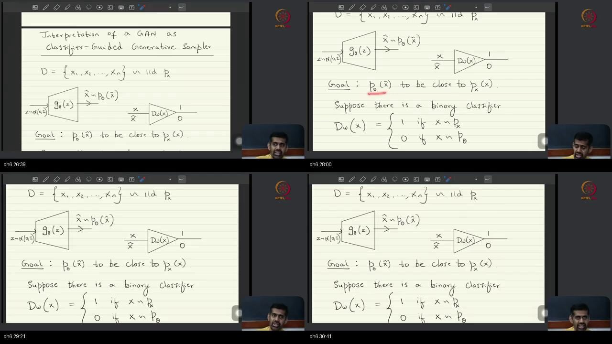

# Lec 05 — Generative Adversarial Networks (GANs)

> **Video:** [Lec 05 Generative Adversarial Networks (GANs)](https://www.youtube.com/watch?v=5uqga82bDNA) · **~58 min**  
> **Warm-up first:** [PREREQUISITES.md](./PREREQUISITES.md) · **Quiz:** [quiz.html](./quiz.html)

**Do PREREQUISITES before this article.**  
**Previous:** [Lec 04 Variational Divergence Minimization](../27-Lec04-Variational-Divergence-Minimization/NOTES.md)  
**Course:** Mathematical Foundations of **Generative AI**  
**Speaker:** NPTEL IISc · Prof. Prathosh · GAN as one $f$ of VDM, alternate training, cGAN

| When the lecture hits… | Warm-up |
|------------------------|---------|
| Two nets, one score | [p1-saddle](./PREREQUISITES.md#p1-saddle) |
| Generator from $Z$ | [p2-generator](./PREREQUISITES.md#p2-generator) |
| Critic vs discriminator | [p3-critic](./PREREQUISITES.md#p3-critic) |
| Last activation / $\mathrm{dom}(f^*)$ | [p4-activation](./PREREQUISITES.md#p4-activation) |
| Sigmoid / $\log D$ | [p5-sigmoid](./PREREQUISITES.md#p5-sigmoid) |
| Batch average | [p6-batch](./PREREQUISITES.md#p6-batch) |
| Freeze one net | [p7-freeze](./PREREQUISITES.md#p7-freeze) |
| Condition on $Y$; discard $D$ | [p8-condition](./PREREQUISITES.md#p8-condition) |

---

## Table of Contents

1. [Topic 1 — Recap VDM saddle; finite NN makes a bound](#topic-1-recap-vdm-saddle-finite-nn-makes-a-bound-0002–0540) (00:02–05:40)
2. [Topic 2 — Choose $f$; last activation Lego](#topic-2-choose-f-last-activation-lego-0540–0923) (05:40–09:23)
3. [Topic 3 — GAN’s $f$, not JSD; sigmoid $D$](#topic-3-gans-f-not-jsd-sigmoid-d-0923–1621) (09:23–16:21)
4. [Topic 4 — Alternate batches / sample averages](#topic-4-alternate-batches--sample-averages-1621–2104) (16:21–21:04)
5. [Topic 5 — Freeze, pass counts, not 1:1](#topic-5-freeze-pass-counts-not-11-2104–2546) (21:04–25:46)
6. [Topic 6 — Classifier-guided story; 2D counterexample](#topic-6-classifier-guided-story-2d-counterexample-2546–3658) (25:46–36:58)
7. [Topic 7 — Likelihood derivation; adversarial name; LSGAN](#topic-7-likelihood-derivation-adversarial-name-lsgan-3658–4355) (36:58–43:55)
8. [Topic 8 — DCGAN transpose conv](#topic-8-dcgan-transpose-conv-4355–4740) (43:55–47:40)
9. [Topic 9 — Conditional concat; discard $D$](#topic-9-conditional-concat-discard-d-4740–5446) (47:40–54:46)
10. [Topic 10 — StyleGAN demo; next WGAN](#topic-10-stylegan-demo-next-wgan-5446–5804) (54:46–58:04)
11. [External references](#external-references)
12. [Sources](#sources)

---

## Executive Summary — architecture of this lecture

Last hour left a shared score $J$ and a saddle: maximize in the critic, minimize in the sampler. This hour **implements** that saddle for **one** convex $f$. Choosing $f$ fixes the last activation; GAN’s $f$ turns the critic into a sigmoid $D$ and the score into $\mathbb{E}\log D+\mathbb{E}\log(1-D)$. You then alternate frozen batch steps. A classifier story is the **same math for this $f$ only** — fooling one frozen $D$ is not $p_x=p_\theta$. Code is Tutorial 12; Wasserstein is next.

**Worldview arc:** from “VDM as an abstract $\min_\theta\max_w$ saddle” **to** “GAN as one $f$-choice of VDM (JS-similar, not JS), trained by alternating frozen steps, with a special-case classifier story.”

**Hour at a glance (whole video).** He redraws last hour’s two-net cartoon and answers a leftover: pushing $\sup$ out was an **equality** only if the bag $\mathcal{T}$ contains a pointwise winner. A **finite** net is not a universal approximator **by construction**, so today we really have a **bound**. First implementation move: **choose $f$**. That fixes $f^*$, $\mathrm{dom}(f^*)$, and a Lego last activation $\sigma_f$ on a linear-headed $V_w$.

GAN (2014) is that choice: $f(u)=u\log u-(u+1)\log(u+1)$ — **similar to JSD, missing a constant; not JSD**. Homework $f^*=-\log(1-e^t)$, domain $\mathbb{R}_-$, $\sigma_f(v)=-\log(1+e^{-v})$. Algebra yields a **sigmoid** $D_w$ and $J_{\mathrm{GAN}}=\mathbb{E}_{p_x}[\log D]+\mathbb{E}_{p_\theta}[\log(1-D)]$. People nickname $D$ a **discriminator** because it lands in $(0,1)$; change $f$ and that nickname dies (LSGAN: $T$ is a regressor). Architectures are free (MLP/CNN/transformer).

Middle: **alternate**. Inner $\max_w$ on batch averages of those logs (ascent, plus). Outer $\min_\theta$ **drops** the real term (independent of $\theta$), freezes $w$, backprops from $D$ through $G$. $D$-step: 1 fwd $G$ + 2 fwd $D$ + 1 bwd $D$. $G$-step: 1 fwd $G$ + 1 fwd $D$ + 1 bwd $G$ via $D$. Naive $1{:}1$; practice often not.

Then the GAN-paper story: tweak $G$ until a classifier fails. Student: we do not have the classifier, so **alternate**. 2D counterexample: move the fake cluster to fool $D_{w1}$ **without** overlapping $p_x$; retune $D_{w2}$. **No convergence guarantee**; $\theta$ is only as good as the bound; inner max tightens it; saddles **oscillate**. Likelihood reading of $D$ recovers the **same** $J$; “adversarial” = opposite objectives.

Last stretch: DCGAN grows $z\in\mathbb{R}^k$ to an image with **transpose convolution** ($k\ll d$; manifold hyp next class). Conditional GAN **concatenates** $y$ into $G$ and $D$ (one-hot / text embedding / COCO pairs). **Inference discards $D$**. Demo: thispersondoesnotexist / StyleGAN. ChatGPT is **autoregressive**, not this. Next: optimal transport / WGAN. Chalkboard plus a browser demo — do not invent Python.

### Method card (the approach)

```
  1. HOLD last hour’s saddle
        J(θ,w) = E_{p_x}[T_w] − E_{p_θ}[f*(T_w)]
        min_θ max_w     (finite net ⇒ bound, not equality)

  2. CHOOSE f
        f* and dom(f*) are determined
        T_w = σ_f ∘ V_w     V: X→R linear head; σ_f last Lego

  3. GAN’s f (not JSD)
        f(u)=u log u − (u+1)log(u+1)
        D_w = sigmoid(V_w) ∈ (0,1)
        J_GAN = E log D + E log(1−D)

  4. ALTERNATE on batches
        D-step: freeze θ; two D-forwards; ascent on w
        G-step: freeze w; drop real term; bwd G via D

  5. OPTIONAL reading (this f only)
        D as classifier; tweak G until it fails
        2D: fail ≠ overlap; retune D; no guarantee

  6. VARIANTS
        DCGAN: transpose conv, k≪d
        cGAN: concat y into G and D
        inference: discard D; sample z (and y) through G

  STOP  Tutorial 12 codes it; next class OT / WGAN
```

### System context

```
  ╔══════════════════════════════════════╗
  ║ Lec 04: VDM two-E bound + saddle     ║
  ║ Tut 12: vanilla / DC / cGAN in code  ║
  ║ Lec 18: WGAN / OT / manifold hyp     ║
  ╚════════════════╤═════════════════════╝
                   │ this lecture (~58 min)
                   ▼
        ┌──────────────────────────┐
        │ GAN = one f of VDM       │
        │ + alternate training     │
        └──────────────────────────┘
```

### Main blueprint

```
  ╔════ JOB ════╗
  ║ implement   ║
  ║ last hour’s ║
  ║ min_θ max_w ║
  ╚════╤════════╝
       │ two nets
       ▼
  z~N(0,I) --> G_θ --> x̂ ~ p_θ     generator
  x or x̂  --> T_w / D_w --> score  critic
       │
       ▼
  ┌─ CHOOSE f ────────────────┐
  │ f* , dom(f*), σ_f Lego    │
  │ GAN f ≈ JSD, not JSD      │
  │ D = sigmoid ∈ (0,1)       │
  └──────────┬────────────────┘
             ▼
  J_GAN = E_real[log D] + E_fake[log(1−D)]
             │
       ┌─────┴──────┐
       ▼            ▼
  ALTERNATE      CLASSIFIER STORY
  freeze one     (this f only)
  batch avgs     fail ⇏ overlap
  not always 1:1  no guarantee
       │
       ├─ DCGAN: upconv, k≪d
       ├─ cGAN: concat y; discard D
       ▼
  sample: z (⊕ y) --> G_θ* --> new x
       │
  ┌ · · · · ·┴ · · · · · ┐
  │ STOP: Tut 12 code;   │
  │ WGAN / OT next       │
  └ · · · · · · · · · · ┘
```

### Scenario walkthrough

**Story:** you hold the MNIST file and want a net that prints **new** digits. Optional: print a **3** on purpose.

1. **Job?** Realize last hour’s saddle so $G_\theta$ samples $p_x$. That is JOB.
2. **Two nets?** Noise through $G_\theta$ makes fakes; $T_w$ scores the bound. TWO NETS.
3. **Which $f$?** GAN’s $f$, not JSD. Last brick a sigmoid. $D\in(0,1)$. CHOOSE $f$.
4. **How to step?** Batch of reals + batch of fakes; max $w$; freeze $w$; min $\theta$ on fakes only. ALTERNATE.
5. **Classifier story?** Same $J$ if you read $D$ as “likelihood real.” Fooling one frozen line in 2D is **not** overlap. SPECIAL CASE.
6. **Control the digit?** Concat a one-hot $y$ into $G$ and $D$. At test time **throw $D$ away**. cGAN / INFERENCE.

```
  MNIST file D
       │
       ▼
  z ~ N(0,I) → G_θ → fake digits
       │
       ▼
  D_w scores real vs fake   (sigmoid)
       │  alternate max_w / min_θ
       ▼
  (optional) concat class y
       │
       ▼
  throw D away; sample z (⊕ y) through G
```

### Failure / contrast path

```
  finite NN as equality not bound          ──X──►  UFA-by-construction
  “GAN optimizes JSD”                      ──X──►  missing constant
  last layer outside dom(f*)               ──X──►  illegal T
  train G without freezing D               ──X──►  not a saddle step
  keep the real term when stepping θ       ──X──►  that E does not see θ
  fool one frozen D ⇒ p_x = p_θ            ──X──►  2D counterexample
  classifier story for every f             ──X──►  LSGAN is a regressor
  keep D at inference                      ──X──►  good teacher leaves
  start a conditional from Gaussian only   ──X──►  concat Y
  invent a training loop today             ──X──►  Tutorial 12
```

### STOP / out of scope

- **Tutorial 12** codes vanilla / DCGAN / cGAN. No PyTorch on this tablet.
- **Why not 1:1** in practice (promised, not finished).
- **Manifold hypothesis** and why $f$-div is not the best metric — **WGAN / OT** next.
- Full $f^*$ / $\sigma_f$ table for other divergences (Nowozin); only GAN’s brick today.
- Autoregressive / ChatGPT later.

### Load-bearing claims (closed-book)

- Finite-parameter $T_w$ makes last hour’s equality a **bound**. $J(\theta,w)$ is a $\min_\theta\max_w$ saddle.
- Choose $f$ first: $T_w=\sigma_f(V_w)$. GAN’s $f$ is **JSD-like, not JSD**. $D_w=\mathrm{sigmoid}$; $J_{\mathrm{GAN}}=\mathbb{E}\log D+\mathbb{E}\log(1-D)$.
- Alternate: $D$-step uses reals **and** fakes; $G$-step **drops** the real term and freezes $w$.
- Classifier-guided reading is **this $f$ only**. Fooling a **fixed** $D$ $\not\Rightarrow$ $p_x=p_\theta$. No convergence guarantee.
- DCGAN: transpose conv, $k\ll d$, theory unchanged. cGAN: concat $y$; **discard $D$** at inference.
- ChatGPT is **not** this paradigm. Next: OT / Wasserstein because of the manifold hypothesis.

**Speaker / course:** NPTEL IISc, Mathematical Foundations of Generative AI — Lecture 05.

---

## Topic 1: Recap VDM saddle; finite NN makes a bound (00:02–05:40)

### Where this sits on the master map

**VDM SADDLE / TWO NETS.** Last hour left a variational lower bound on an $f$-divergence and a min-then-max that *seeks* a saddle. This sitting starts to realize that saddle with two finite nets: a sampler and a critic. Warm-ups: [saddle](./PREREQUISITES.md#p1-saddle), [generator](./PREREQUISITES.md#p2-generator), [critic vs D](./PREREQUISITES.md#p3-critic).

### Board / screenshot


**Figure — ~00:29–05:12:** Heading “Realization of VDM.” Data $D=\{x_1,\ldots,x_n\}\sim_{\mathrm{iid}}p_x$; trapezoid $z\sim\mathcal{N}(0,I)$ through $G_\theta$ to $\hat x\sim p_\theta$; $\theta^*=\arg\min_\theta D_f(p_x\|p_\theta)$; the $f$-div already written as a max over $T$ of two expectations. Two-net cartoon: Generator versus Critic / Discriminator. Shared score $J=\mathbb{E}_{p_x}[T]-\mathbb{E}_{p_\theta}[f^*(T)]$; $\theta^*,w^*=\arg\min_\theta\max_w J$; saddle-point optimization, later labeled an adversarial problem. Mid-board: $\mathcal{T}$ is a bag of maps $\mathcal{X}\to\mathrm{dom}(f^*)$ that may **not** contain the optimal $T^*(x)$. Last tile already starts $T_w=\sigma_f(V_w)$ — spoken derivation is the next box.

### What he is establishing

Last time they formulated $f$-divergence minimization by constructing a **lower bound**. The optimization that remains is a **saddle**: maximize over a class of functions $T(x)$ to *build* that bound on the divergence, then **minimize** the bound over the parameters of the sampler $G_\theta$. $\theta^*$ is the parameter set that would minimize the $f$-divergence itself. The $f$-divergence only **adheres to** a lower bound whose inner problem is over $T$. Treating $\theta^*$ as “just train the sampler, ignore $T$” is the wrong reading — the inner max is how the bound even exists.

So the final problem is with respect to **two** parametric objects. $\theta$: the sampler / generator — minimize the $f$-div with respect to it. $w$: parameters of the net that **approximates $T$**, the function that defines the lower bound. Today’s job is to **realize VDM in practice** with neural nets. The name is **variational divergence minimization (VDM)**. Two nets, not one.

The first net is the generator $G_\theta$. It takes samples of an arbitrary random variable — **Gaussian** here — and maps them to the generated law $p_\theta$. It is called a **generator** because it is sampling from the model’s distribution. Chance lives in $Z$; the net is the map. Same $z$ in, same $\hat x$ out.

$$
z\sim\mathcal{N}(0,I)\;\longrightarrow\;G_\theta(z)\;\longrightarrow\;\hat x\sim p_\theta.
$$

The second net is the critic $T_w$, which approximates $T$. The class of such $T$ has domain the data space $\mathcal{X}$ and **range equal to $\mathrm{dom}(f^*)$**, where $f^*$ is the **convex conjugate** of the convex $f$ they started with. A critic that dumps values outside that domain is not a legal $T$ for this bound.

Completeness from last class’s question. When the supremum was pushed outside, he **kept an equality**. That equality **assumes** the bag $\mathcal{T}$ contains functions that give a **pointwise** solution of the inner supremum — a $T$ that wins at every $x$, not merely on average. The equality **becomes an inequality** the moment $\mathcal{T}$ may **not** contain that inner-sup solution in a pointwise sense. “The bag might miss the winner at some $x$” is the fork; “the bag is all functions, so equality is automatic for a finite net” is the wrong reading.

Why raise this now: they will **approximate $T$ by a neural net**. Nets are **universal function approximators in theory**, but a **particular architecture with finitely many parameters** is **not** a UFA **by construction**. Therefore the constructed **equality** on the $f$-divergence **becomes a bound**. The restricted net **cannot** approximate all functions to **arbitrary closeness**. Board sentence: the space of functions $\mathcal{T}$ that we are optimizing over **may not contain** the optimal $T^*(x)$ — that is the solution of the inner problem.

$$
D_f(p_x\|p_\theta)\;\ge\;\max_{T\in\mathcal{T}}\Bigl(\mathbb{E}_{p_x}[T(x)]-\mathbb{E}_{p_\theta}[f^*(T(x))]\Bigr).
$$

Long story short: approximate $T$ by a parametric net called the **critic** (or **discriminator** — the historical name is postponed; do not cash that nickname yet). Its role is the approximator of $T$ that **constructs the lower bound** on the $f$-div we want to minimize. It is not, in this box, a Hollywood classifier.

The whole point of VDM was to rewrite the $f$-div as **expectations over laws we can sample from**, then replace those by **sample averages**. The objective is the **difference of two expectations**: one under $p_x$, one under $p_\theta$. Board algebra, with $J$ depending on **both** generator parameters and critic parameters (the board also writes $\omega$ for $w$):

$$
J(\theta,w)=\mathbb{E}_{p_x}[T_w(x)]-\mathbb{E}_{p_\theta}[f^*(T_w(x))].
$$

The problem to solve is a **saddle / minimax**. Maximize over $w$, minimize over $\theta$:

$$
\theta^*,w^*=\arg\min_\theta\max_w J(\theta,w).
$$

The board also labels this an **adversarial problem**. Ordinary training **avoids** saddles. This problem **seeks** one. One shared score, two opposite jobs — not two separate losses added into a bowl.

You can now name the two nets, write the shared score $J$, and say why a finite architecture turns last hour’s equality into a bound. You cannot yet pick $f$ or attach the last activation that lands $T$ in $\mathrm{dom}(f^*)$.

### Analogy for this topic only

A warehouse of measuring tapes and two doorways: the album doorway and the print-shop doorway. You want the true gap between them. If the warehouse holds every possible tape, including the one that fits both frames at every inch, the recorded gap **equals** the true gap. Today you only get a **kit with finitely many tapes**.

**If the kit never contains the perfect tape, is the recorded gap still the true gap?** No. You get a **floor** — the best reading the kit can produce — not equality with the true gap. Treating the kit’s best reading as the true gap is the wrong reading. Two workers share that floor-reading: one tries to inflate it (the inspector with the kit), one tries to deflate it (the print shop). That shared height is a saddle, not a bowl.

In lecture words: kit = finite $\mathcal{T}$, perfect tape = $T^*$, floor = the two-$\mathbb{E}$ bound, inspector = $T_w$, print shop = $G_\theta$.

### Local picture

```
  Realization of VDM

  D = {x1,...,xn} ~ iid p_x
  z ~ N(0,I) --> G_θ(z) --> x̂ ~ p_θ     generator / sampler
  θ* = argmin_θ D_f(p_x || p_θ)

  T : X --> dom(f*)                     critic scores in the conjugate's domain
  T_w approximates T

  IF  bag 𝒯 contains a pointwise inner-sup winner T*(x) at every x
      --> last hour's EQUALITY
  IF  𝒯 may miss T*(x)  (finite NN: not a UFA by construction)
      --> INEQUALITY, a bound:

  D_f(p_x || p_θ)  ≥  max_{T in 𝒯} [ E_{p_x} T(x) − E_{p_θ} f*(T(x)) ]

  J(θ, w) = E_{p_x}[ T_w(x) ] − E_{p_θ}[ f*(T_w(x)) ]

  θ*, w* = argmin_θ  max_w  J(θ, w)     saddle / adversarial problem
           (ordinary opt AVOIDS saddles; this SEEKS one)
```

Notice: last tile already writes $T_w=\sigma_f(V_w)$; that composition is not taught in this box. “Discriminator” is a postponed nickname, not today’s definition.

### Bridge

$J$ is two expectations and a saddle on finite nets. To *code* the critic you still have to pick a particular $f$, because that pick freezes the legal range of $T$.

---

## Topic 2: Choose f; last activation Lego (05:40–09:23)

### Where this sits on the master map

**CHOOSE $f$ / LAST ACTIVATION.** Implementation starts by picking a particular convex $f$, which freezes $f^*$ and $\mathrm{dom}(f^*)$. The critic is then built so its last activation is the plug-and-play Lego that lands in that domain. Warm-up: [last activation](./PREREQUISITES.md#p4-activation).

### Board / screenshot


**Figure — ~05:57–09:05:** $T_w(x)=\sigma_f(V_w(x))$, with $\sigma_f$ an $f$-divergence-specific activation. $V_w:\mathcal{X}\to\mathbb{R}$ (linear last layer), $\sigma_f:\mathbb{R}\to\mathrm{dom}(f^*)$. Trapezoid: $x\to V_w(x)\in\mathbb{R}\to\sigma_f\to T_w(x)\in\mathrm{dom}(f^*)$. Next tile substitutes that composition into $J$. Last tile already heads “Generative Adversarial Networks (GANs)” and writes GAN’s $f$, $f^*$, $\sigma_f$ — the spoken algebra of that $f$ is the next box.

### What he is establishing

First implementation step: **choose a particular $f$**. They are minimizing an **$f$-divergence**, so $f$ comes first. Choosing a convex $f$ **deterministically** fixes the conjugate $f^*$ (the convex / Fenchel conjugate — he said “differential or the convex conjugate”; the object is the conjugate, not a derivative). Once $f^*$ is known, **$\mathrm{dom}(f^*)$ is fixed**. “Pick an architecture first and worry about $f$ later” is the wrong lock: the critic’s legal range is not free.

Why that matters: the critic $T$ used to build the lower bound **must respect $\mathrm{dom}(f^*)$**. Choose $f$ $\Rightarrow$ $f^*$ chosen $\Rightarrow$ $\mathrm{dom}(f^*)$ fixed $\Rightarrow$ $T$’s range is constrained. A $T$ that outputs outside that domain does not even give a well-defined $f^*(T(x))$.

Practice construction: $T_w$ is a **composition** of an $f$-specific activation $\sigma_f$ with a net $V_w$,

$$
T_w(x)=\sigma_f\bigl(V_w(x)\bigr).
$$

$V_w$ is **not** “a linear function.” He starts to call it that and corrects: it is a **neural net with a linear activation at the last layer**. $V_w:\mathcal{X}\to\mathbb{R}$. The range of $V_w$ is **all reals**. Because the $f$ they look at always has **scalars** as range, $\mathbb{R}$ as $V_w$’s range is OK. Then compose with $\sigma_f:\mathbb{R}\to\mathrm{dom}(f^*)$ — a map that **projects $\mathbb{R}$ into the conjugate domain**. He first said “domain of $f$,” then corrected live to **domain of $f^*$**. Teach the correction: the hinge is $\mathrm{dom}(f^*)$, not $\mathrm{dom}(f)$.

Picture of $T$: a net whose **last linear layer** outputs a real, then a **final activation** that sends $\mathbb{R}\to\mathrm{dom}(f^*)$. Spoken: “linear at the penultimate, activation at the final” — same block diagram as the board: $V_w$ then $\sigma_f$. Prefer the board.

**Lego / plug-and-play:** the original $f$-divergence-minimization paper **lists $\sigma_f$ for each $f$**. The block you always swap is the **last-layer activation**, so the critic **respects $\mathrm{dom}(f^*)$**. Rebuilding the whole house to change $f$ is the wrong move; swapping that last brick is the designed move.

Substitute into the objective: $\mathbb{E}[T(x)]$ becomes $\mathbb{E}[\sigma_f(V_w(x))]$; $f^*(T(x))$ becomes $f^*(\sigma_f(V_w(x)))$.

$$
J(\theta,w)=\mathbb{E}_{p_x}\bigl[\sigma_f(V_w(x))\bigr]-\mathbb{E}_{p_\theta}\bigl[f^*\bigl(\sigma_f(V_w(x))\bigr)\bigr].
$$

Next: one **instantiation** of this general VDM idea — **generative adversarial networks (GANs)**. History, inverted in this course: **GAN was proposed in 2014** as a **stand-alone** idea; the **VDM generalization** came **about two years later (~2016)**. He **prefers** the inverted narrative: treat GAN as a **specialization / special case** of the general VDM algorithm. Historically it was the other way around. The last tile already writes GAN’s $f$; do not run that algebra here.

You can now choose $f$ first, freeze $f^*$ and its domain, and build $T$ as last-activation composed with a real-valued net. You cannot yet plug GAN’s particular $f$ through the algebra to a sigmoid $D$.

### Analogy for this topic only

A house and a door. You may build any house you like — any number of rooms, any wiring. The **last brick** on the door is a Lego block whose shape is not free: it must fit the **hinge** the chosen recipe demands. Recipe A needs a brick that only opens onto one legal range. Recipe B needs a different brick. The original paper is a catalog of those last bricks.

**Can you leave the last brick as a free real number and still use the recipe?** No. The recipe freezes the hinge. Dumping a free real through the wrong last brick lands you outside the legal range, and the tax that belongs on the critic’s score is not even defined. Keeping last week’s brick after swapping the recipe leaves the door jammed. Swapping **only** that last brick is how you change recipes without rebuilding the house.

In lecture words: recipe = $f$, hinge = $\mathrm{dom}(f^*)$, house = $V_w$, last brick = $\sigma_f$.

### Local picture

```
  1. choose convex f
  2. f* is then determined (conjugate, not a derivative)
  3. dom(f*) is then fixed
  4. T must land in that domain

  x --> V_w(x) in R --> σ_f --> T_w(x) in dom(f*)
        net with a LINEAR last layer
        (not "a linear function")

  T_w(x) = σ_f( V_w(x) )
  σ_f : R --> dom(f*)     the Lego / plug-and-play last activation
                          (paper lists σ_f for each f)

  J(θ,w) = E_{p_x}[ σ_f(V_w(x)) ] − E_{p_θ}[ f*( σ_f(V_w(x)) ) ]

  next instantiation: GAN
  history: GAN 2014 stand-alone; VDM ~2016 generalization
  he prefers: GAN as a special case of VDM
```

Notice: he corrected “dom($f$)” to **dom($f^*$)** live. Last tile already writes GAN’s $f$, $f^*$, and $\sigma_f$; the spoken algebra of that $f$ is the next box.

### Bridge

The catalog now has a first recipe on the tablet. What $f$ *is*, whether it is Jensen–Shannon, and why the critic suddenly looks like a $0$–$1$ stamp, are still unopened.

---

## Topic 3: GAN’s f, not JSD; sigmoid D (09:23–16:21)

### Where this sits on the master map

**GAN = ONE $f$ OF VDM.** Not “GAN optimizes JSD.” One convex $f$ (JSD-like, missing a constant) forces $\mathrm{dom}(f^*)=\mathbb{R}_-$, a last activation $\sigma_f$, and after algebra a sigmoid $D_w\in(0,1)$ that people nickname a discriminator. Warm-ups: [critic vs D](./PREREQUISITES.md#p3-critic), [last activation](./PREREQUISITES.md#p4-activation), [sigmoid](./PREREQUISITES.md#p5-sigmoid).

### Board / screenshot

![f(u)=u log u−(u+1)log(u+1) similar to JSD; f*=−log(1−e^t), dom R_−; σ_f=−log(1+e^{−v}); J_GAN=E log D + E log(1−D); D=sigmoid; two-net cartoon D→[0,1]](./screenshots/composites/ch03-topic-03-gan-f-sigmoid-d-panel1of1.png)

**Figure — ~09:56–15:47:** GAN’s $f(u)=u\log u-(u+1)\log(u+1)$ “(similar to JSD)”; $f^*(t)=-\log(1-e^t)$, $\mathrm{dom}(f^*)=\mathbb{R}_-$; $\sigma_f(v)=-\log(1+e^{-v})$. After algebra, $J_{\mathrm{GAN}}=\mathbb{E}_{p_x}[\log D_w(x)]+\mathbb{E}_{p_\theta}[\log(1-D_w(x))]$ with a **plus** between the two $\mathbb{E}$s, and $D_w(x)=1/(1+e^{-V_w(x)})$ the sigmoid. Two-net cartoon: generator $G_\theta(z)$, discriminator $D_w(x)$ outputting a number in $[0,1]$; $D_w$ labeled a neural net (CNN, MLP, …). Bottom heading already says “Implementation of GAN in practice.”

### What he is establishing

Treat **GAN as an instantiation / special case of VDM**. Start as always with a **choice of $f$**. For this algorithm the convex $f$ is

$$
f(u)=u\log u-(u+1)\log(u+1).
$$

This $f$ is **similar to Jensen–Shannon** but **not exactly JSD**: JSD’s $f$ has a **constant factor** that this $f$ does **not**. People tend to think **GAN optimizes JSD**. It does **not**. It optimizes an $f$-divergence whose $f$ is JSD-like **up to a constant**. Remember this. “GAN = JSD minimization” is the slogan he wants refused.

Next VDM step: the conjugate. $f^*(t)=-\log(1-e^t)$. That formula is **homework** — a standard convex-opt drill (given primal convex $f$, find the conjugate / dual). Do not invent a derivation he did not give. Because of that formula, **$\mathrm{dom}(f^*)=\mathbb{R}_-$** (the negative reals). The critic net’s output **must** land there. A last layer that can go positive is the wrong hinge for *this* $f$.

Last activation that enforces $\mathbb{R}_-$:

$$
\sigma_f(v)=-\log(1+e^{-v}),
$$

with $v=V(x)\in\mathbb{R}$ the output of the linear-headed net. Plug $\sigma_f$ and $f^*$ into $J$ and do algebra. The objective **becomes**

$$
J_{\mathrm{GAN}}(\theta,w)=\mathbb{E}_{p_x}[\log D_w(x)]+\mathbb{E}_{p_\theta}[\log(1-D_w(x))].
$$

The board writes a **plus** between the two $\mathbb{E}$s, not the old minus. Keeping VDM’s minus after this rewrite is the wrong reading — the algebra changed the arithmetic. He does not unpack the steps; the payload is the resulting score.

$D_w$ is introduced because that algebra produces it:

$$
D_w(x)=\frac{1}{1+e^{-V_w(x)}},
$$

the **sigmoid**. $V_w:\mathcal{X}\to\mathbb{R}$. He started to say $V$ “gives you a positive,” then corrected to **a real number**. Teach the correction: the head is a free real, then the sigmoid squashes it.

Why introduce $D_w$ at all: the **original GAN paper** writes this objective from a **totally different angle** (postponed). Point for now: the **$T$-lower-bound** is **exactly this**, different notation. After the rewrite, the critic is $V:\mathcal{X}\to\mathbb{R}$ followed by the sigmoid — the usual classification activation. He identifies $D_w$ with that composed $T$. Do not invent a $T$-versus-$D$ split he did not make in this box: $D_w$ *is* the old $T$, written as linear-headed net composed with sigmoid.

GAN architecture on the board: **generator** $G_\theta(z)$, $z\sim\mathcal{N}(0,I)$, $\hat x\sim p_\theta$; **discriminator** $D_w(x)$ outputting a number in **$[0,1]$** (sigmoid). Same sampler as VDM plus this $D$-net.

$$
J_{\mathrm{GAN}}(\theta,w)=\mathbb{E}_{x\sim p_x}[\log D_w(x)]+\mathbb{E}_{\hat x\sim p_\theta}[\log(1-D_w(\hat x))].
$$

Sigmoid is bounded between **$0$ and $1$**. So $D_w$’s output is in $(0,1)$ (he says $0$ and $1$; the cartoon writes $[0,1]$) and **can be interpreted as a binary classifier**. **Hence the name discriminator.** A discriminator **is** a binary classifier. What it discriminates: later. **Otherwise** — other $f$ — this net is just the **critic** that builds the $f$-div lower bound. The classifier reading is **this $f$-choice only**. Calling every VDM critic a discriminator is the Hollywood shortcut he does not want as the *definition*.

**Architecture-agnostic.** $G_\theta$ and $D_w$ may be **MLP / fully connected, CNN, RNN, transformer** — the VDM treatment does not care. Still two nets and a **saddle** on this $J_{\mathrm{GAN}}$. He promises a completely different classifier-guided interpretation; wait for that. No training loop yet.

You can now write GAN’s $f$, refuse the slogan “GAN optimizes JSD,” and name $D$ as a sigmoid that licenses the word discriminator. You cannot yet turn the two expectations into batches and alternate steps.

### Analogy for this topic only

Two kitchen recipes that look like the same stew. The restaurant’s Jensen–Shannon stew uses a constant of salt this kitchen omitted. The stew is **similar**, not the same dish. After the last brick, the inspector’s stamp happens to be a number between zero and one — a squash of a free volume knob — so people nickname the inspector a **discriminator**. That nickname is this recipe only. Change the recipe and you may be left with a napkin score, not a pass/fail stamp.

Instances of the squash: knob at two reads about 0.88; knob at zero reads 0.50; knob at minus two reads about 0.12.

**Is the kitchen optimizing the restaurant’s JSD stew?** No. Similar, missing a constant. Reciting “GAN minimizes JSD” is the slogan to refuse. **Does a zero-to-one stamp make every critic a classifier?** No — only this recipe licenses that reading.

In lecture words: stew = $f(u)=u\log u-(u+1)\log(u+1)$, missing salt = JSD’s constant, stamp = $D_w=\mathrm{sigmoid}(V_w)$, nickname = discriminator.

### Local picture

```
  GAN's f (convex; similar to JSD, NOT JSD):
    f(u) = u log u − (u+1) log(u+1)

  homework (not derived):  f*(t) = −log(1 − e^t)
                           dom(f*) = R_−

  last brick:  σ_f(v) = −log(1 + e^{−v})     always ≤ 0
               V_w : X → R                   (he corrected "positive" to real)

  algebra (steps not unpacked) becomes a PLUS of two logs:
    J_GAN(θ,w) = E_{p_x}[ log D_w(x) ] + E_{p_θ}[ log(1 − D_w(x)) ]

  D_w(x) = 1 / (1 + e^{−V_w(x)})     sigmoid
  V =  2.0  →  D ≈ 0.88
  V =  0.0  →  D = 0.50
  V = −2.0  →  D ≈ 0.12

  z ~ N(0,I) --> G_θ --> x̂ ~ p_θ          generator (any arch)
  x or x̂     --> D_w --> number in [0,1]  discriminator *this f only*
                                          (MLP / CNN / RNN / transformer: agnostic)

  other f  →  this net is just the critic; classifier story can die
```

Notice: $f^*$ is **homework**. Original GAN paper’s other angle is promised, not given. $D_w$ *is* the composed $T$ after algebra — not a second object.

### Bridge

$J_{\mathrm{GAN}}$ is still two expectations. A file of digits is on the table; an expectation is not a number you can type. How do you poll both clouds, and in which order do the two nets move?

---

## Topic 4: Alternate batches / sample averages (16:21–21:04)

### Where this sits on the master map

**ALTERNATE / SAMPLE AVERAGES.** Code the saddle as alternating steps. Inner: max $w$ by Monte Carlo on a real batch $B_1$ and a fake batch $B_2=G_\theta(z)$. Outer: freeze $w$, drop the $p_x$ term, one gradient-descent step on $\theta$ through $\hat x=G_\theta(z)$. Warm-ups: [batch](./PREREQUISITES.md#p6-batch), [generator](./PREREQUISITES.md#p2-generator), [freeze](./PREREQUISITES.md#p7-freeze).

### Board / screenshot


**Figure — ~16:43–20:41:** Heading “Implementation of GAN in practice.” Input $D=\{x_1,\ldots,x_n\}\sim_{\mathrm{iid}}p_x$, $x\in\mathbb{R}^d$. Inner: $w^*=\arg\max_w$ of $\mathbb{E}_{p_x}\log D_w(x)+\mathbb{E}_{p_\theta}\log(1-D_w(\hat x))$, replaced by two batch averages of sizes $B_1$ and $B_2$; $x_1,\ldots,x_{B_1}\sim p_x$ and $\hat x_j=G_\theta(z_j)$. Ascent $w^{t+1}\leftarrow w^t+\alpha\nabla_w J$ (plus because max). Outer: $\arg\min_\theta$ of only the fake average $(1/B_2)\sum_j\log(1-D_w(G_\theta(z_j)))$; $\theta^{t+1}\leftarrow\theta^t-\alpha_2\nabla_\theta J_{\mathrm{GAN}}$; “one grad descent step through the generator”; “$w$ is kept a constant.”

### What he is establishing

When you code it, the algorithm’s input is **$n$ samples drawn from $p_x$** — the dataset. Concrete running example: **MNIST**, $n$ images of handwritten digits, “**hello world of machine learning**.” You do not get a formula for $p_x$; you get a file of digits.

The minimax is solved **alternating** (he says “alternative manner”). Inner: solve for $w^*$; **fix $w^*$**; optimize $\theta$; **repeat**. Solving both nets in one joint bowl is the wrong reading of a saddle.

The inner problem is **$\arg\max_w$** of the GAN objective — a **maximization** of that score, not a descent on it.

$$
w^*=\arg\max_w\Bigl(\mathbb{E}_{p_x}[\log D_w(x)]+\mathbb{E}_{p_\theta}[\log(1-D_w(\hat x))]\Bigr).
$$

Both expectations are replaced by **sample averages**. $B_1$ samples from $p_x$, $B_2$ samples from $p_\theta$ — **batch sizes**. How to get the batches. $B_1$: draw from the **$n$ dataset points** (he says “end points”; the $n$ points in the file). $B_2$: sample $z\sim\mathcal{N}(0,I)$ ($B_2$ times), push through $G_\theta$, get $\hat x\sim p_\theta$. Polling the album to estimate the print-shop expectation, or the other way around, is the wrong city.

Monte Carlo of the two log terms, **same $D_w$**, two inputs — real $x$ and generated $\hat x$:

$$
\frac{1}{B_1}\sum_{i=1}^{B_1}\log D_w(x_i)
\qquad\text{and}\qquad
\frac{1}{B_2}\sum_{j=1}^{B_2}\log\bigl(1-D_w(\hat x_j)\bigr).
$$

$x$ = samples from $p_x$; $\hat x$ = samples from $p_\theta$. Forward: dataset $\to D_w\to\log D(x_i)$; noise $\to G_\theta\to\hat x\to D_w\to\log(1-D(\hat x))$. **Add both terms**, then **one backward pass through the $w$-net** (discriminator / $T_w$) to take an inner step. **Plus** because we are **maximizing** (ascent, not descent). A minus on the $w$-update would be climbing the wrong way on a max.

$$
w^{t+1}\leftarrow w^t+\alpha\nabla_w J.
$$

Tiny poll, not a train: two reals with $D=0.8$ and $0.6$ give one average of $\log D$; two generated points with $D=0.3$ and $0.2$ give one average of $\log(1-D)$; add. That sum is one inner step’s reading.

Outer problem: **$\min_\theta$**. While doing it, **keep $w$ constant** (freeze the critic). Drop the first term: $\mathbb{E}_{p_x}[\log D_w(x)]$ is **independent of $\theta$**, so it can be **taken off** when optimizing the generator. Keeping the album term on the $\theta$-step is dead weight — it does not know the shop’s knobs. The second term **depends on $\theta$ through $\hat x$**. $\hat x=G_\theta(z)$. Sample $z$, pass through $G$, get $\hat x$; that is what is optimized for the $G$-net.

$$
\frac{1}{B_2}\sum_{j=1}^{B_2}\log\bigl(1-D_w(G_\theta(z_j))\bigr).
$$

With **$w$ frozen**, take **one gradient-descent step on $\theta$**:

$$
\theta^{t+1}\leftarrow\theta^t-\alpha_2\nabla_\theta J_{\mathrm{GAN}}(\theta,w).
$$

Board: “one grad descent step through the generator”; **$w$ is kept a constant**. Minus, because this side is a min.

**Alternate** those two steps. That is how VDM / GAN is trained in practice (ASR said “the video”). Summary slide starts: first train the **critic / discriminator**, **keep $\theta$ constant**. Pass counts, true/fake labels, and why the ratio is not $1{:}1$ are the next box.

You can now replace both expectations by batch averages, climb $w$, freeze $w$, drop the real term, and take one descent step on $\theta$. You cannot yet count forward and backward passes, or say why practice is not one-for-one.

### Analogy for this topic only

Two neighborhoods, one inspector. Poll two album houses whose stamps read 0.8 and 0.6; average the log of those stamps. Poll two new prints whose stamps read 0.3 and 0.2; average the log of one-minus-stamp. Add. Climb the inspector’s stairs — **plus**, because this is a max. Then freeze the inspector. The album average does not know the shop’s recipe, so drop it. One step of the shop through the remaining print term — **minus**, because this is a min. Repeat.

**Can you step the shop using the album average?** No — the album term does not depend on the shop’s knobs. **Can you maximize and minimize in one joint step of both nets?** No — the saddle is solved by alternating, not by adding both jobs into a bowl.

In lecture words: album poll = $(1/B_1)\sum\log D_w(x_i)$, print poll = $(1/B_2)\sum\log(1-D_w(\hat x_j))$, climb = $w\leftarrow w+\alpha\nabla_w J$, shop step = $\theta\leftarrow\theta-\alpha_2\nabla_\theta J$ with $w$ frozen.

### Local picture

```
  Input:  D = {x1,...,xn} ~ iid p_x     (MNIST: hello world)
          x in R^d

  ALTERNATE (not one joint bowl):
    inner:  get w*     (max)
    freeze  w*
    outer:  step θ     (min)
    repeat

  B1 from the n file points:     x1,...,x_{B1} ~ p_x
  B2: z_j ~ N(0,I) --> G_θ -->   x̂_j = G_θ(z_j) ~ p_θ

  same D_w, two inputs:
    (1/B1) Σ_i log D_w(x_i)           +
    (1/B2) Σ_j log(1 − D_w(x̂_j))

  micro poll (shape, not a train):
    B1=2, D=0.8 and 0.6  →  avg log D
    B2=2, D=0.3 and 0.2  →  avg log(1−D)
    add; that sum is one inner reading

  inner (PLUS because MAX):   w^{t+1} ← w^t + α   ∇_w J
  outer (MINUS because MIN):  drop E_{p_x} log D   (independent of θ)
                              (1/B2) Σ_j log(1 − D_w(G_θ(z_j)))
                              θ^{t+1} ← θ^t − α2 ∇_θ J_GAN
                              w kept a constant
```

Notice: same $D_w$ on both clouds. The $p_x$ term is dropped on the $\theta$-step because it does not depend on $\theta$, not because the album vanished. Summary slide already says “keep $\theta$ constant”; pass counts are the next box.

### Bridge

Both steps still *walk through* $D_w$. Frozen is not deleted, and a $D$-step needs more than one walk. How many forwards, how many backwards, and whether the two nets take turns one-for-one, are still uncounted.

---

## Topic 5: Freeze, pass counts, not 1:1 (21:04–25:46)

### Where this sits on the master map

**LOOP.** One $D$ step (real batch plus fake batch, add terms, one backprop on $w$) then one $G$ step (no real data; forward $D$ with $w$ frozen; backprop from $D$’s output through $G$). Naive: alternate $1{:}1$ because it is a saddle. Practice is not $1{:}1$ (why later). Warm-ups: [freeze](./PREREQUISITES.md#p7-freeze), [batch](./PREREQUISITES.md#p6-batch).

### Board / screenshot


**Figure — ~21:26–25:23:** “To train the Discriminator: computing $D_f$ for max — keep $\theta$ constant.” Dataset $D=\{x_1,\ldots,x_n\}$; $z_1,\ldots,z_{B_2}\sim\mathcal{N}(0,I)$ through frozen $G_\theta$ to fakes; real batch $B_1$ and fake batch both into $D_w$; two log averages; ascent $w\leftarrow w+\alpha\nabla_w J_{\mathrm{GAN}}$. $G$ train: sample $z$, $J_{\mathrm{GAN}}$ is only the fake average $\log(1-D_w(G_\theta(z_j)))$; “update $\theta$ only with $w$ a constant”; $\theta^{t+1}\leftarrow\theta^t-\alpha_2\nabla_\theta J_{\mathrm{GAN}}$. Closing heading: “Training VDM or GAN.”

### What he is establishing

Fake-batch construction, restated as a loop: sample a batch from the **normal**, pass it through $G_\theta$, get $\hat x$ (samples of $p_\theta$). Also sample one batch from the **true** distribution $p_x$. Terminology that now gets names: **true data** = samples from $p_x$; **fake data** = samples from $p_\theta$. The words are labels for the two clouds, not a morality play.

$D$ step, first term: pass the **true** batch through the discriminator to compute the **first term** of the objective. $D$ step, second term: pass the **$p_\theta$** batch through $D_w$ to get the **second term**. **Add** the two terms, compute the gradient, **one backprop through $D_w$**, **one gradient step** on the weights of $D_w$. That is **one training pass** of $D_w$. Skipping the fake forward, or the real forward, leaves one term of the inner max uncomputed.

While updating the **sampler** ($G_\theta$), we **do not need** samples from the true data / $p_x$. Why no real data: the first term — expectation of $T_w$ (the $p_x$ term in the objective) — is **independent of $\theta$** and **goes away**. All we need are samples from **$p_\theta$**. $G$-step sampling: again sample a batch from the **normal**, pass through $G_\theta$, get $\hat x\sim p_\theta$.

Even when taking a gradient step on the **generator**, you **still need** the discriminator: you must compute $D_w(G_\theta(Z))$. Keep $D_w$ **parameters constant**, but still **forward** the $\hat x$ batch through $D$ to evaluate that term. Frozen is not deleted. Then a **backward pass from the output of $D$ all the way through the input of $G$**. In frameworks such as PyTorch: you can keep the gradient of **part** of a net from updating. While updating $G_\theta$, make $D_w$ **not updatable** (treat it as a **constant**) and pass gradients from $D$’s output into $G$; **one backward pass**. No training-loop code in this lecture.

**$D$ train accounting:** **$1$ forward through $G$** + **$2$ forwards through $D$** (one for $D_w(x)$, one for $D_w(\hat x)$) + **$1$ backward through $D$**.

**$G$ train accounting:** **$1$ forward through $G$** + **$1$ forward through $D$** + **$1$ backward through $G$ via $D$** (the output is computed at $D$). Counting “one forward each and done” misses the extra $D$ walk on a $D$-step, and misses that the $G$-backward *starts* at $D$.

Tutorials will code this. **Typically $G$ and $D$ are not trained in the exact same ratio — not $1{:}1$.** He will discuss **why later**. The **naive** practical loop: **one update of $G$ parameters**, **one update of $D$ parameters**, **keep alternating** — because this is a **saddle-point** problem. Naive $1{:}1$ is the default picture, not the reported practice.

Bridge he already speaks: the moment you choose a particular **$f$**, the kind of **$T$** used to construct the **lower bound** changes. That change of $T$ is the leftover.

You can now count the passes, freeze one net while still walking through it, and name the naive $1{:}1$ loop. You cannot yet say why the ratio is not $1{:}1$, or why this $f$ lets people tell a classifier story.

### Analogy for this topic only

Two rooms, one shared scoreboard. Inspector’s training day: the forger is frozen. Walk a tray of album photos into the inspector’s room (first term). Walk a tray of new prints into the same room (second term) — two walks through that door. Add. One backward through the inspector; the forger’s furniture does not move. Forger’s training day: no album tray. Still walk the new prints *through* the inspector’s room to read the score, but do not move the inspector’s furniture. Backward from the inspector’s stamp all the way into the shop.

**If the inspector is frozen, can you skip walking through their room?** No. Frozen is not deleted. You still need the stamp on the shop’s print. **Is the work one inspector step per forger step?** Naive yes, because it is a saddle. Practice is not one-to-one; he postpones why.

In lecture words: inspector day = $1$ fwd $G$ + $2$ fwd $D$ + $1$ bwd $D$; forger day = $1$ fwd $G$ + $1$ fwd $D$ + $1$ bwd $G$ via $D$; freeze = $w$ constant, not removed.

### Local picture

```
  true data  = samples from p_x          (album)
  fake data  = samples from p_θ          x̂ = G_θ(Z), Z ~ N(0,I)

  D-step  (keep θ constant; ASCENT on w):
    z ~ N --> G_θ --> x̂                 1 fwd G
    real x  --> D_w --> log D(x)        1 fwd D
    fake x̂ --> D_w --> log(1−D(x̂))     1 fwd D
    add; one backprop through D_w       1 bwd D
    w ← w + α ∇_w J_GAN
    tally:  1 fwd G + 2 fwd D + 1 bwd D

  G-step  (no p_x samples; w FROZEN, not deleted):
    z ~ N --> G_θ --> x̂                 1 fwd G
    x̂ --> D_w  (evaluate only)          1 fwd D
    backward from D's output through G  1 bwd G via D
    J_GAN = (1/B2) Σ_j log(1 − D_w(G_θ(z_j)))
    θ ← θ − α2 ∇_θ J_GAN
    tally:  1 fwd G + 1 fwd D + 1 bwd G via D

  naive schedule:  one D step, one G step, alternate   (saddle)
  practice:        NOT 1:1                             (why later)

  heading on the tablet:  Training VDM or GAN
```

Notice: a $G$-step still **evaluates** $D(G_\theta(z))$. Disable grad on $D$ while stepping $G$; that is freeze, not delete. No PyTorch loop in this lecture.

### Bridge

Choose a particular $f$ and the *kind* of $T$ that builds the lower bound changes. This $f$ made $T$ look like a $0$–$1$ stamp — so people will try to *guide* the sampler with a classifier story. Whether that story is the definition, or only a special case, is the leftover.

---

## Topic 6: Classifier-guided story; 2D counterexample (25:46–36:58)

### Where this sits on the master map

**STORY vs VDM.** Depending on $\mathrm{dom}(f^*)$, the same VDM saddle can be *read* as a **classifier-guided sampler** — but that reading is a **special case** of GAN’s $f$, where $T$ becomes a $D_w$ in $(0,1)$. The Hollywood goal is: tweak $G$ until the classifier fails. A 2D picture then shows why failure of a *fixed* $D$ does **not** mean $p_x=p_\theta$. He is **not a fan** of this story versus the VDM lower-bound story; same math. Warm-ups: [critic vs D](./PREREQUISITES.md#p3-critic), [saddle](./PREREQUISITES.md#p1-saddle).

### Board / screenshot



**Figure — panel 1, ~26:39–30:41:** Heading “Interpretation of a GAN as Classifier-Guided Generative Sampler.” Dataset $D=\{x_1,\ldots,x_n\}\sim_{\mathrm{iid}}p_x$. Trapezoid $G_\theta$: $z\sim\mathcal{N}(0,I)$ to $\hat x\sim p_\theta$. Triangle $D_w$ scores either $x$ or $\hat x$ as $1$ or $0$. Goal: $p_\theta(\hat x)$ close to $p_x(x)$. Then the binary-classifier reading

$$
D_w(x)=1 \text{ if } x\sim p_x,\qquad 0 \text{ if } x\sim p_\theta.
$$

![Counter example in R^2: p_x cluster of X’s; p_θ1, p_θ2, p_θ3 clusters of o’s; D_w1 and D_w2 lines; classifier failure does not imply p_x=p_θ; last tile Formulation of classifier guided sampler, D:X→[0,1] likelihood of x from p_x](./screenshots/composites/ch06-topic-06-classifier-guided-counterexample-panel2of2.png)

**Figure — panel 2, ~32:02–36:04:** **Counter example** in $\mathbb{R}^2$. Cluster of **X**’s labeled $p_x$; three clouds of **o**’s labeled $p_{\theta_1}$ (upper-right), $p_{\theta_2}$ (lower-left), $p_{\theta_3}$ (upper-left). Two separating lines $D_{w1}$ and $D_{w2}$. Board slogan: $p_x=p_\theta\Rightarrow$ classifier fails, but **classifier failure $\not\Rightarrow$ $p_x=p_\theta$**. Last tile: heading “Formulation of classifier guided sampler”; $D_w:\mathcal{X}\to[0,1]$; let $D_w(x)$ represent the **likelihood** of the sample $x$ coming from $p_x$ (algebra of that reading is the next topic).

### What he is establishing

Depending on **$\mathrm{dom}(f^*)$**, variational divergence minimization can be *interpreted* in a different way. That is what the algorithm called **GAN** does. GAN is **not** projected, in the literature, as a minimizer of a **lower bound on $f$-divergence**. It is projected as a **classifier-guided generator / sampler**.

That interpretation is **only true** for the **particular $f$ used in GAN**, wherein $D_w$ (the $T$ function) **becomes / can be read as a classifier**. It is **not the general interpretation**. Change the underlying $f$-divergence and the story is **completely different**: the output of $T_w$ is **no longer bounded in $(0,1)$**, so you **cannot** read it as a classifier. For GAN’s $f$ you can, and then the whole training can be looked at another way. He will **derive the same objective and the same optimization paradigm from a totally different angle**.

Sampling paradigm, with **no divergence metric** for a while. Start with an **arbitrary random variable**, pass it through a **deterministic function**; the **output law changes**. You **control** that output law by **tweaking the function**. Goal for now: make the function-approximator output law **$p_\theta$ as close as possible to $p_x$**.

Suppose we have a **binary classifier** of samples from $p_x$ versus samples from $p_\theta$. Every binary classifier can be seen as a **discriminator between two distributions**. Recap (previous course): a binary classifier is $P(Y=1\mid X)$ versus $P(Y=0\mid X)$. Here: output **$1$** if the input comes from $p_x$, **$0$** if from $p_\theta$.

Setting: we have a function approximator **and** a binary classifier of true versus sampler-imposed samples. **Can this classifier be used to force $p_\theta$ as close as possible to $p_x$?** One idea: keep **tweaking the sampler parameters** until the classifier **starts malfunctioning**. When does the classifier stop functioning? When it **cannot distinguish** samples of $p_x$ and $p_\theta$. When can it not distinguish? If **$p_x$ and $p_\theta$ are the same distributions**.

**Student:** we **don’t know the classifier**. **Therefore we alternate** between **finding the classifier** and **tweaking $\theta$** — that is how we get the **saddle-point** problem. Who gives us the classifier? We **train it along the way**.

He did not want those two ideas mixed yet. First, **assuming** we have a classifier of $p_x$ versus $p_\theta$ samples: tweak generator parameters until that classifier **starts failing**. It fails if the two distributions are **indistinguishable**. The answer he wanted: **tweak $\theta$ of $G_\theta$ until the classifier fails to distinguish** $p_x$ versus $p_\theta$ samples.

New question: does **failure of the classifier always imply $p_x=p_\theta$**? Think of **failure modes** — a situation where the classifier fails but **$p_x\neq p_\theta$**. It turns out we can.

**2D counterexample.** Data in two dimensions $(X_1,X_2)$. Points marked **X** are from $p_x$. Initial $\theta$ puts a **$p_\theta$ cluster** in a **different region** of the same plane ($p_{\theta_1}$; the tablet also draws $p_{\theta_3}$ as another off-cloud). What we actually want: tweak $\theta$ so the $p_\theta$ cluster **overlaps** the $p_x$ cluster — $p_\theta$ becomes $p_x$, i.e. $G_\theta$ points **overlap** $p_x$ points.

$D_{w1}$ is the first classifier; it **correctly distinguishes** $p_x$ from $p_{\theta_1}$. Ask: move $p_{\theta_1}$ so **this** classifier fails — move it to $p_{\theta_2}$. Counterexample: moving $p_{\theta_1}\to p_{\theta_2}$ can make **$D_{w1}$ fail without making $p_x=p_\theta$**. Making the classifier fail is **not enough** to make the two laws **overlap**. The generator can adjust so it **fools the classifier into believing they are the same class**, but they are **not from the same distribution**.

$p_{\theta_2}$ is **not** what we want. **Retune the classifier**: $D_{w1}$ becomes $D_{w2}$, now able to distinguish $p_{\theta_2}$ from $p_x$. **Keep playing this game:** ask the classifier to distinguish $p_x$ versus $p_\theta$; ask the generator to **move $p_\theta$ so the classifier fails**; repeat between the two networks.

**If you read the GAN paper, this is how it presents it.** Sounds like a **nice story**; he is **not convinced**. Prefer: there is a **divergence** to **minimize**, construct a **lower bound**, solve the **saddle**. It is the **exact same math**, but he is **not a fan** of this interpretation — it is **in the literature**.

Hence the classifier has to be **tweaked simultaneously** with the generator (the student’s question). We **do not have the classifier to begin with**. Also: making the classifier fail for a **particular $\theta$** is **not enough** for $p_x=p_\theta$, so we **must keep alternating**. Name: **classifier-guided sampler** — a sampler network whose parameters are changed **guided by a classifier**.

**All of this works only if you interpret $D$ as a classifier.** Change the underlying **$f$** and **none of this interpretation makes sense** — it is no longer a classifier. Think in the **most generalized** (VDM) sense; all of these become **special cases**.

**Student Q: how do we know it will converge?** **No guarantee whatsoever.** Same question as: how do we know constructing a **lower bound on $f$-divergence and minimizing it** yields the **actual minimum of $f$-divergence**? **We don’t.** The **optimizer on $\theta$ is only as good as the lower bound** you constructed. A **bad lower bound** $\Rightarrow$ the $\theta$-minimizer **optimizes that bad bound**. That is why, **every time you solve the inner optimization**, you are (hopefully) making the **bound on $f$-divergence tighter**. That is why GAN training is **not stable**: it can **oscillate** between the two. You are seeking a **saddle point**.

You can now tell the Hollywood story, name it special-case only, and draw the 2D counterexample. You cannot yet write $D_w$ as a likelihood and recover $J$ — that formulation is the next box.

### Analogy for this topic only

Two flocks in a field. A fence keeps the **real** flock (the X’s) on one side and the **fake** flock on the other.

- Leave the fakes where they start: this fence works.
- Slide the fake flock along the fence to a new patch of grass: **this** fence fails; the flocks did **not** merge.
- Build a new fence: it separates the new fake patch from the reals again.

**If this fence fails, did the two flocks merge?** No. Failure of **this** fence is not overlap. You have to keep building a new fence, and keep moving the flock — that *game* is the saddle, not a proof the two laws are the same.

In lecture words: real flock = $p_x$, fake flock = $p_{\theta_1}\to p_{\theta_2}$, fence = $D_{w1}$ then $D_{w2}$, merge = the overlap we actually wanted.

### Local picture

```
  GAN's f  ⇒  T lands in (0,1)  ⇒  people read T as a classifier D
  change f  ⇒  T not in (0,1)   ⇒  this story DIES

  assume a D of p_x vs p_θ:
      tweak θ of G until D fails
      hoped: D fails  iff  p_x = p_θ

  student: we do not HAVE D  →  alternate: train D, then tweak θ
           (that is the saddle)

  2-D counterexample, x = (x1, x2)

           x2
            |
   p_θ3 o o     X X p_x      o o p_θ1
        o o     X X          o o
                    \ D_w1
                     \
   p_θ2 o o           \         ---- x1
        o o            \
                        \ D_w2

  D_w1 separates p_x from p_θ1
  move p_θ1 → p_θ2 : D_w1 fails, clusters still DISTINCT
  retune D_w2      : now separates p_θ2 from p_x
  keep playing the game

  classifier failure  =/=>  p_x = p_θ

  same math as VDM lower-bound + min; he is NOT a fan of this story
  no convergence guarantee
  θ-step is only as good as the bound; inner max (hopefully) TIGHTENS it
  training can OSCILLATE because it is a saddle
```

Notice: panel 2 already titles “Formulation of classifier guided sampler” and writes $D_w:\mathcal{X}\to[0,1]$ as a likelihood. The algebra of $\log D$ and $\log(1-D)$ is the next topic, not this one.

### Bridge

A binary $D$ in $[0,1]$ *can* be read as a likelihood that $x$ came from $p_x$. That reading has not been turned into an objective yet. The leftover problem is to **write that likelihood, add the fake term, and invert it for $G$** — and to see why that saddle was named **adversarial**.

---

## Topic 7: Likelihood derivation; adversarial name; LSGAN (36:58–43:55)

### Where this sits on the master map

**NAME.** Formalize $D_w(x)$ as the **likelihood that $x$ comes from $p_x$** (range $(0,1)$). Maximize expected log-likelihood of real-from-$p_x$ **and** of fake-not-from-$p_x$; invert the same $J$ for $G$. That opposite-objectives saddle **is** the name **adversarial**. Same $J$ as VDM. **LSGAN:** $T$ is a **regressor** — the story **fails** if you change $f$. Warm-ups: [critic vs D](./PREREQUISITES.md#p3-critic), [saddle](./PREREQUISITES.md#p1-saddle).

### Board / screenshot


**Figure — ~37:31–43:21:** Objective: maximize the log-likelihood of $x$ coming from $p_x$.

$$
w^*=\arg\max_w\mathbb{E}_{x\sim p_x}\bigl[\log D_w(x)\bigr]
$$

as the expected log-likelihood of $x\sim p_x$. Classifier should **also** maximize the likelihood of $\hat x$ **not** coming from $p_x$ when $\hat x\sim p_\theta$: $\mathbb{E}_{\hat x\sim p_\theta}\log\bigl(1-D_w(\hat x)\bigr)$. Generator $G_\theta(z)$: the classifier has to **fail** — invert the classifier’s optimization,

$$
\theta^*=\arg\min_\theta J(\theta,w),\qquad \theta^*,w^*=\arg\min_\theta\max_w\bigl[J(\theta,w)\bigr],
$$

brace labeled **adversarial optimization**.

### What he is establishing

Mathematically: $D_w$ takes samples from the sample space of $X$ and maps them to a **bounded $(0,1)$** range. **Let $D_w$ represent the likelihood of a sample $x$ coming from $p_x$.** Likelihood is represented using **density functions**. If $D_w$ is that likelihood, it is an **estimator for the density / likelihood** of $x$ from $p_x$.

Classifier objective: **maximize the log-likelihood of $x$ coming from $p_x$**. A classifier should maximize the likelihood of a sample coming from the class it is assigned to. Binary classifier / **Bernoulli**: maximizing one class also maximizes the likelihood that the sample is **not** from the other class, via **$1$ minus** that probability.

$D_w(x)$ is the likelihood that $x$ comes from $p_x$; log of that is the log-likelihood. Maximize **over $w$** the **expectation over samples from $p_x$**: this is the **average / expected log-likelihood** of $x$ coming from $p_x$, **modeled with $D_w$**. Maximize that term **with respect to $w$** because $D_w$ is representing the likelihood that $x$ comes from $p_x$.

$$
\max_w\;\mathbb{E}_{p_x}\bigl[\log D_w(x)\bigr].
$$

The classifier must **also** maximize the likelihood that **$\hat x$ is not coming from $p_x$** (rather: $\hat x$ comes from $p_\theta$). We know $\hat x$ comes from $p_\theta$, not $p_x$. Likelihood of **not** coming from $p_x$ is **$1-D_w(\hat x)$**, because $D_w$ is the likelihood of coming from $p_x$. Log of that: log-likelihood that $\hat x$ is **not** from $p_x$. Take **expectation over samples from $p_\theta$** and **maximize with respect to $w$** again.

$$
\max_w\;\mathbb{E}_{p_\theta}\bigl[\log\bigl(1-D_w(\hat x)\bigr)\bigr].
$$

Classifier does **both simultaneously**: maximize likelihood of a point $x$ coming from $p_x$ **and** maximize likelihood of $\hat x$ **not** coming from $p_x$ — **which is exactly the objective we already had**.

$$
J(\theta,w)=\mathbb{E}_{p_x}\bigl[\log D_w(x)\bigr]+\mathbb{E}_{p_\theta}\bigl[\log\bigl(1-D_w(\hat x)\bigr)\bigr].
$$

In words: the classifier ensures those two likelihoods are maximized — it **classifies** points of $x$ versus $\hat x$, i.e. **$p_x$ versus $p_\theta$**.

Sampler / generator objective: the **classifier has to fail**. Tweak $\theta$ of the sampler so that the classifier fails. What “an objective failing” means: if an optimizer is **maximizing** an objective, the failure mode is to **reverse** it. Therefore sampler parameters are chosen so the **same objective is minimized** with respect to those parameters.

That is the **adversarial / saddle-point / minimax** problem. **That opposite-objectives saddle is what gave the name adversarial networks.** Same point as VDM.

This is classifier-guided sampling, and it is true **if and only if** you choose that **particular $f$** for which the **$T$ used to construct the lower bound can be interpreted as a classifier**.

**Alphabet GAN zoo:** every alphabet has a GAN — **A-GAN, B-GAN, L-GAN, X-GAN**, etc. **LSGAN** $=$ **least-squares GAN**. It uses an $f$-divergence where the **$T$ function becomes a regressor instead of a classifier**. Then you **cannot** interpret the so-called discriminator as a classifier, and **this story cannot be told**.

The **original GAN papers present** this objective **this way**: there is a classifier that **maximizes those likelihoods**, and a sampler that **nullifies the classifier**. **What is actually happening:** construct a **lower bound on the $f$-divergence**, then **minimize that lower bound**, **alternating** between the two. The name **adversarial** comes because we are solving a **saddle-point** problem. Neural-net view: two nets, one the **adversary** of the other — one solves the **opposite** of the other’s objective.

You can now write $J$ from the likelihood story and say why the word adversarial is just a saddle. You cannot yet change the *architecture* of $G$ for images — that is an implementation special case, not a new theory.

### Analogy for this topic only

An inspector stamps two scores on every photo:

- on a **real** photo: how likely it came from the true album ($D$; want this near $1$; $\log D$ near $0$)
- on a **print**: how likely it did *not* come from the album ($1-D$; want this near $1$ on fakes)

The inspector **adds** those two expected log-likelihoods and **climbs**. The print shop is told: **make that same number fall**.

**Why call the pair adversarial?** Not because of a morality play. Because one net **maxes** $J$ and the other **mins the same $J$**. Swap $f$ so $T$ is a **regressor** (LSGAN) and there is no inspector left to tell the story to — only the VDM bound remains.

In lecture words: inspector $=D_w$, album $=p_x$, prints $=p_\theta$, shared score $=J$, invert $=$ $\min_\theta$ of the classifier’s $\max_w$.

### Local picture

```
  D_w : X → (0,1)
  read D_w(x)     = likelihood that x  came from p_x
  read 1−D_w(x̂)  = likelihood that x̂ did NOT

  classifier (Bernoulli / binary):
      max_w  E_{p_x}[ log D_w(x) ]          real-from-p_x
    + max_w  E_{p_θ}[ log(1 − D_w(x̂)) ]    fake-not-from-p_x
      ────────────────────────────────
      J(θ,w)   both at once  =  the VDM/GAN score

  generator: the maximizer must FAIL
      failure of a max  =  reverse it
      θ* = argmin_θ J(θ,w)

  θ*, w* = argmin_θ  max_w  J(θ,w)     ← adversarial = opposite objectives / saddle

  iff GAN's f (T readable as a classifier)

  LSGAN = least-squares GAN: T is a REGRESSOR
          discriminator-as-classifier story CANNOT be told
  alphabet zoo: A-GAN, B-GAN, L-GAN, X-GAN, …

  original paper: classifier maxes likelihoods; sampler nullifies it
  actual math:    lower bound on f-div, then min, alternating
```

Notice: he recovers the **same** $J$ as VDM. The Hollywood derivation is licensed only for this $f$. Changing $f$ (LSGAN) kills the classifier reading; the bound-then-min reading survives.

### Bridge

The objective is named and the saddle is named. Nothing in the theory required $G$ to be an MLP. Images have a **grid topology**, and people grow $G$ with **transpose convolutions** so the sample space of $p_\theta$ is an image. That is an implementation special case — leftover for the next box.

---

## Topic 8: DCGAN transpose conv (43:55–47:40)

### Where this sits on the master map

**DCGAN.** An **implementation special case** of GAN / VDM for **image topology**, not a new theory. Grow spatial size of $G$ so the sample space of $p_\theta$ matches that of $p_x$ (an image). Tool: **transpose convolution / up-convolution**. Empirically better than MLP-then-reshape; theoretically nothing changes. Manifold hypothesis is **named and deferred**. Warm-up: [generator](./PREREQUISITES.md#p2-generator).

### Board / screenshot


**Figure — ~44:13–47:22:** Heading “Deep-Convolution GAN (DC GAN).” Typical in a GAN: $z\in\mathbb{R}^k$, $x\in\mathbb{R}^d$, $k\ll d$; growing bars $16$, $32$, $64$; **multi-layer perceptron (MLP)** then “$x\in\mathbb{R}^d\to$ reshape in the form of image.” Alternative: **DC-GAN**, upconvolutional or transpose convolutional layers used in the generator; $Z\in\mathbb{R}^{16}$ through transpose / upconv to an image cube $x\in\mathbb{R}^{r\times c\times 3}$. Last tiles already peek the next heading **Conditional GANs (c-GANs)** and paired data $D=\{(x_i,y_i)\}$.

### What he is establishing

**DCGAN / DC GAN** is a typical **implementation special case** used in adversarial nets. Do **not** treat it as a completely different thing. Name: **deep convolutional GANs**. “Not a complicated idea.”

Typically in a GAN (or this VDM), **dimension of the input RV $Z$ is much less than dimension of the ambient data space** being constructed. Board: $z\in\mathbb{R}^k$, $x\in\mathbb{R}^d$, $k\ll d$. The reason $\dim(Z)\ll\dim(\text{data})$ is the **manifold hypothesis**. He **defers** that discussion to **the next class**, when they look at **Wasserstein metrics**. (Named, not derived.)

**Everything so far is modality-agnostic.** The same idea works with an **image**, a **speech signal**, or whatever modality one is interested in. Image modality has **2D or 3D grid topology**. For that topology people use **convolutional layers / convolutional neural networks**.

DCGAN construction: start from the **lower-dimensional** input RV and **keep increasing the dimensions of the generator** so the **output dimension matches the dimension of the data**. The **sample space of $p_\theta$ and of $p_x$ must be the same**; finally you need an **image at the output**.

The layers used to grow spatial size are **transpose convolution** or **up-convolution**. The idea is **upsampling**: start lower-dim, go to higher-dim. To turn a **vector** into a **2D/3D topological grid / tensor**, use these activations.

Recommended reading: a nice **arXiv** article he names **“convolutional arithmetic”** — a comprehensive / handy document covering all kinds of convolutions (transpose, 2D, 3D). Have a look at it. Named paper: Dumoulin & Visin, *A guide to convolution arithmetic for deep learning* ([arXiv:1603.07285](https://arxiv.org/abs/1603.07285)).

That architecture is what people refer to as a **DCGAN**. **Theoretically nothing changes.** Instead of **fully connected layers**, use transpose / up-convolution layers **to preserve the topology of the data**. That’s all.

There is **no necessity** to use convolutions. One **can** use an **MLP**, match the **final-layer dimension** to the number of dimensions in the actual data, and **reshape** so it starts looking like an image. Board alternative: MLP then “reshape in the form of image.” People have found **empirically** that putting a transpose / up-convolution layer **in the architecture itself** leads to **better empirical results**. Theoretically **nothing changes**.

You can now grow $G$ from $z\in\mathbb{R}^k$ to an image without touching $J$. You cannot yet **condition** on a class or a caption — that heading is already peeking at the bottom of the tablet.

### Analogy for this topic only

Two ways to blow a postcard up from a seed:

- flatten the seed through a long fully-connected hose, then **fold the vector back** into a rectangle (MLP then reshape)
- **grow the rectangle in place** with an upsampling stamp (transpose / up-convolution)

**Did either stamp change the score $J$?** No. Same saddle, same $f$. The second stamp just respects the grid the photo already had. Why start from a **tiny** seed at all? He names **manifold hypothesis** and **leaves it for Wasserstein class** — do not invent the statement today.

In lecture words: seed $=z\in\mathbb{R}^k$, postcard $=x\in\mathbb{R}^{r\times c\times 3}$, hose $=$ MLP+reshape, stamp $=$ DCGAN upconv, $k\ll d$ $=$ typical latent versus ambient.

### Local picture

```
  DCGAN = deep convolutional GAN
        = implementation special case of GAN / VDM
        ≠ a new theory

  z ∈ R^k ,  x ∈ R^d ,  k << d
  (why k << d: manifold hypothesis → NEXT class / Wasserstein)

  everything so far is MODALITY-AGNOSTIC
  (image, speech, …)
  images = 2D / 3D grid topology  →  convolutions

  sample space of p_θ must MATCH sample space of p_x
  (you need an IMAGE at the output of G)

  two paths, same J:

    MLP then reshape
      z --MLP--> R^d --reshape--> image

    DCGAN (transpose / up-convolution = upsampling)
      z ∈ R^{16} --upconv stack--> grow 16, 32, 64 --> x ∈ R^{r×c×3}

  empirically: upconv in the architecture is BETTER
  theoretically: NOTHING CHANGES

  named reading: Dumoulin & Visin,
    "A guide to convolution arithmetic for deep learning"
    arXiv:1603.07285
    (he said “convolutional arithmetic”)
```

Notice: the tablet already writes **Conditional GANs (c-GANs)** under the DCGAN cartoon. Manifold hypothesis is a **name plus a deferral**, not a claim you can unpack this sitting. No training-loop code; no invented layer recipe.

### Bridge

A marginal GAN prints *some* digit. It does not let you ask for a **$3$**, or for “two people crossing a road.” That leftover is **conditional sampling** $p(x\mid y)$: you need paired $(x,y)$ and you concatenate $y$ into **both** nets.

---

## Topic 9: Conditional concat; discard D (47:40–54:46)

### Where this sits on the master map

**CONDITIONAL.** So far we sampled **marginals** $p_x$. To sample $p(x\mid y)$ ($y$ = class or any semantic; a GPT **prompt is a sample of the conditioner $Y$**) you need **paired $(x,y)$** and you **concatenate $y$ into both $G$ and $D$**. $T$ then maximizes likelihood of **co-occurrence** of $x$ and $y$. At inference, **discard $T/D$** — a good teacher becomes redundant. Warm-up: [condition](./PREREQUISITES.md#p8-condition).

### Board / screenshot


**Figure — ~48:14–54:11:** Heading **Conditional GANs (c-GANs)**. Data $D=\{(x_1,y_1),\ldots,(x_n,y_n)\}\sim_{\mathrm{iid}}p_{xy}$. Example: $x$ images, $y$ class-label corresponding to $x$ **or** textual embedding corresponding to $x$. Objective: sample from the conditional $p_{x\mid y}$ (instead of $p_x$). Solution: estimate $p_{x\mid y}$ and make $p_\theta$ approach it. Concat cartoon: $z\sim\mathcal{N}(0,I)$ **and** $y$ (one-hot embedding $[0,0,\ldots,1,\ldots,0]$) into $G_\theta$ to $\hat x\mid y\sim p^\theta_{x\mid y}$; $x$ or $\hat x$ **and** $y$ into $D_w\to 0/1$.

$$
J(\theta,w)=\mathbb{E}_{x,y\sim p_{x\mid y}}\bigl[\log D_w(x,y)\bigr]+\mathbb{E}_{\hat x,y\sim p^\theta_{x\mid y}}\bigl[\log\bigl(1-D_w(\hat x,y)\bigr)\bigr].
$$

Inference tablet: input a **trained** $G_{\theta^*}$ only; $z_{\mathrm{test}}\sim\mathcal{N}(0,I)$ **and** $y$ through $G$; output $x_{\mathrm{test}}$ corresponding to the class-label specified by $y$. ($D$ is gone.) Footer already peeks **Wasserstein’s GANs**.

### What he is establishing

Recurrent course question: how do you **sample from conditional distributions**? All discussion so far was **sampling from the marginals**: start from an arbitrary RV $Z$ and sample from $p_x$. Now: sample from **$p(x\mid y)$**. The conditioner $y$ **can denote a class**, or **any kind of semantic**.

In today’s generative models (GPTs etc.), the **input prompt is the conditioning** — it is a **sample from the conditioning RV $Y$**. The question is: given that, sample from $p(x\mid y)$. Easiest demonstration: generate **MNIST-like data conditioned on class labels**.

A **marginal** sampler on MNIST, at GAN inference, yields **images of digits** with **no control** over what semantics those outputs have. To **control which digit** is sampled, you must learn to sample from the **conditional**.

Same idea across **all generative models** in this course: instead of starting from samples of $p_x$, start from samples of **$p_{xy}$** (the **joint**) **or** the **conditional** — either of them. In other words you need **paired data**: an image **and** the class label (whatever semantic conditioning you want to impose). You cannot condition on a semantic you never paired.

State-of-the-art **text$\to$image** generators are trained on **pairs of images and text**. Famous dataset: **COCO** $=$ **Common Objects in Context** — millions of images with corresponding **descriptions** (people sat down and described what is in the image, e.g. two people crossing the road). The data you need, if you want to sample from the conditional, is pairs of **the RV you want to sample from** and **the conditioning variable**. Example: **$x=$ images**, **$y=$ class label corresponding to $x$**, **or** a **textual embedding** corresponding to $x$.

He has **not yet defined embedding**. Working picture: every **sentence** associated with an image can be represented as a **vector**. We cannot process natural text; we need **real numbers**. That vector-of-reals representation is what he calls an **embedding**. The data are **pairs (image, corresponding embedding)**.

Objective: sample from **$p(x\mid y)$** instead of **$p(x)$**. How to tweak GAN / VDM: **estimate $p(x\mid y)$** and **make $p_\theta$ approach $p(x\mid y)$ instead of $p(x)$**. That’s it.

The modification is “pretty simple”: **concatenate the arbitrary input RV $Z$ with the conditioning RV $y$**. That’s it — feed the concat as input to the **generator**. **Do the same thing with the discriminator.** What the **$T$** function is then maximizing is the likelihood of **co-occurrence of $x$ and $y$**.

MNIST instantiation: convert class labels to **one-hot representations / one-hot embeddings**, take a $z$, **concatenate** that one-hot, feed to $G$; **same concat into $D$**. That’s it. This **keeps happening** later: in **diffusion models**, a similar thing — the net whose likelihood you optimize just has to **see the RV you are sampling from along with the conditioning RV**.

Board (GAN-style) objective with the concat: $G_\theta$ maps $(z,y)$ to $\hat x\sim p^\theta_{x\mid y}$; $D_w$ maps $(x\text{ or }\hat x,\,y)$ to $0/1$; $J$ as on the tablet (he writes the expectation as $x,y\sim p_{x\mid y}$ even though the pairs are joint samples; he verbally allowed **joint or conditional**).

**Training:** nothing else changes. Every time, $G/D$ either see the **one-hot** of the class or the **textual embedding** corresponding to that label.

**Inference:** the **$T$ network** that was used to construct the **lower bound** is **discarded**. Like a trusted friend / teacher discarded after the job is done. Once the minimization is done, you don’t need $T$ anymore. Slogan from “the other teacher”: the definition of a **good teacher** is that he or she **becomes redundant after some time**. A student who remains a student for entire life is the wrong mode; you have to make the student **independent**. The discriminator does its job that way.

During inference you **completely discard** $D/T$ — it is not needed at all. **Sample from the arbitrary RV $z$** and pass it through the **trained $G_\theta$**. If you want conditioning, **also give $y$** (one-hot class **or** textual embedding). What you get is the sample corresponding to that class / embedding.

(Spoken wrap still says “match $p_x$”; the inference header still says “a sample from $p_x$ which is not present in $D$,” with $y$ then specifying the class. Leftover **marginal** language after the whole point was $p(x\mid y)$ — do not silently rewrite the last sentence as if he said $p(x\mid y)$ there.)

You can now concat $y$ into both nets and throw $D$ away at sample time. You have not yet *watched* a trained $G$ print faces.

### Analogy for this topic only

A drawing class.

- **Unconditional:** the student draws *some* digit. You cannot ask for a three.
- **Conditional:** you slide a request $y$ across the desk — a one-hot “$3$”, or a caption vector “two people crossing a road.” The student **and** the teacher both see that request. The teacher scores whether the drawing **co-occurs** with the request.

**After the exam, do you still bring the teacher?** No. A **good teacher becomes redundant**. At showtime you only bring the student — plus the request $Y$ if you asked for a class. A chatbot prompt is that request: a draw of $Y$, not of Gaussian $Z$.

In lecture words: request $=y$ (class, caption, prompt), pairs $=$ COCO / labeled MNIST, concat $=$ $(z,y)$ into $G$ and $(x,y)$ into $D$, co-occurrence $=$ what $T$ maxes, discard $=$ inference.

### Local picture

```
  so far:  sample the MARGINAL p_x     (any MNIST digit; no control)
  now:     sample the CONDITIONAL p(x|y)

  y = class, or ANY semantic
  a GPT prompt = a sample of the conditioner Y   (not of Gaussian Z)

  need PAIRED data
      D = {(x1,y1), …, (xn,yn)}  ~ iid p_{xy}
      x = images
      y = class label  OR  textual embedding of a caption
  cannot condition on a semantic you never paired

  COCO = Common Objects in Context
         millions of images + descriptions
         e.g. “two people crossing the road”

  embedding (working def): a sentence as a VECTOR OF REALS
         (nets eat numbers, not natural text)

  job: make p_θ approach p(x|y), not p(x)

  concat trick (same idea returns in diffusion):
      z  ⊕  y  -->  G_θ  -->  x̂ | y
      x  ⊕  y  -->  D_w  -->  score of the PAIR
                              (T maxes co-occurrence of x and y)

  MNIST: y = one-hot  [0,0,…,1,…,0]

  J(θ,w) = E_{x,y}[ log D_w(x,y) ]  +  E_{x̂,y}[ log(1 − D_w(x̂,y)) ]

  TRAIN:  nothing else changes (one-hot or text embedding every time)

  INFERENCE:  discard T / D     (good teacher → redundant)
              z_test ~ N(0,I)  ⊕  y_wanted  -->  G_{θ*}  -->  new x
              D is gone
```

Notice: board $J$ writes $\mathbb{E}_{x,y\sim p_{x\mid y}}$ even though the file is pairs from the joint; he allowed joint or conditional in speech. Last inference sentence still says “match $p_x$” — leftover marginal language.

### Bridge

A trained $G$ **is** the sampler. The leftover is to **watch it**: refresh a face GAN, remember ChatGPT is **not** this recipe, and name the next sitting — optimal transport / Wasserstein / WGAN, then VAEs.

---

## Topic 10: StyleGAN demo; next WGAN (54:46–58:04)

### Where this sits on the master map

**SAMPLER DEMO / NEXT.** A trained GAN **is** a sampler: refresh $= z\sim\mathcal{N}(0,I)$ through $G$ (StyleGAN; **unconditional** faces). Power of samplers if the density is estimated well. **ChatGPT is not this paradigm** (autoregressive, later). Next sitting: **optimal transport / Wasserstein / WGAN** (also a saddle); $f$-div is **not** the best metric because of the **manifold hypothesis**; then **VAEs**. Warm-up: [generator](./PREREQUISITES.md#p2-generator).

### Board / screenshot


**Figure — ~55:01–57:48:** Browser this person does not exist / StyleGAN faces on refresh. He Googles the spoken name, then refreshes: a face that is **not** a person in the training file. Not a math tablet — **the demo IS the board.** Each new picture is one draw of $z$ through a trained $G$.

### What he is establishing

Website **thispersondoesnotexist.com**: people have **trained a GAN**. Every time he **refreshes**, they are **sampling from a normal distribution** and **passing it through a trained GAN**. The picture is of **somebody who does not exist** — it is the **output** of **StyleGAN**, one particular architecture **NVIDIA** came up with.

Every refresh is sampling from the **unconditional** distribution: a sample from the **normal** is fed through the **generator**; what you see is that output. None of these people exist. This is **how you sample**. The samples are from the **distribution of human faces**, but **these people don’t exist**. You can construct them this way.

**Assignment:** this will be one of the first assignments — **build a nice GAN**. It **depends on compute capacity**. If you have a **good GPU**, you can use **high-definition datasets** and **train a StyleGAN**. They have trained StyleGAN and get similar results.

Mechanism, restated while refreshing: **sample from $Z$, pass it through the generator network**, and that is what you get. (Color, not a must-teach: around 2016 he trained his first GAN on **CelebA**, showed family members “this is somebody who is not there.”)

Slogan: this is the **power of samplers**. If you can **estimate the underlying distribution well**, and the **neural nets / samplers** are good enough to estimate it, and you have **enough data** and **good architectures**, you can **mimic human intelligence** (he gestures at “AGI etc.”). The teachable contrast is the sampler, not a claim that GANs *are* AGI.

This is the **adversarial** way of doing it (ASR “or rather the medium way” $\approx$ **VDM** way). **ChatGPT etc. does not work with this particular generative paradigm.** Those are **auto-regressive** models. They will be talked about **later in this course**.

Next idea related to adversarial optimization: a **different algorithm** called **optimal transport (OT)**, also called **Wasserstein metrics** and **Wasserstein GAN**, because that **also leads to a saddle-point optimization problem**. They will look at that. **$f$-divergence turns out not to be the best metric**, because of a problem that arises from the **manifold hypothesis**. They will talk about that. (Named again; still **not derived**.)

**Optimal transport** is the **next class of algorithm** — it will boil down to a **very similar paradigm** to adversarial networks / VDM. Then they move on to the next framework: **variational autoencoders** and so on. That’s it for today.

You can now say what a refresh *is*. You cannot yet write a Wasserstein formula or unpack the manifold hypothesis — next sitting.

### Analogy for this topic only

A print shop with the inspector already gone. Each time you hit refresh you feed a **new** speckled blank ($z\sim\mathcal{N}(0,I)$) through the **same** frozen recipe $G$. A new face comes out. None of those people exist. No class label, no prompt — **unconditional**.

**Is ChatGPT this print shop?** No. ChatGPT is **autoregressive** (later in the course), not a $z$-through-$G$ GAN. The next shop in *this* aisle is **optimal transport / WGAN** — still a saddle, because $f$-div is not the best metric once the **manifold hypothesis** is on the table.

In lecture words: refresh $=$ new $z$, recipe $=$ StyleGAN $G$, inspector already discarded, ChatGPT $=$ AR not GAN, next $=$ OT / WGAN then VAE.

### Local picture

```
  TRAINED GAN = a SAMPLER

  refresh:
      z ~ N(0,I)  -->  G  (StyleGAN, NVIDIA)  -->  a face
      UNCONDITIONAL: no y / no prompt
      none of these people exist
      (spoken demo name: thispersondoesnotexist)

  assignment: train a GAN
              scale is compute-limited
              StyleGAN on HD data if you have a GPU

  power of samplers:
      estimate the law well + enough data + good architecture
      → mimic the face distribution (new samples, not copies)

  ChatGPT is NOT this paradigm
      ChatGPT = auto-regressive   (later in the course)
      this hour = z through G     (adversarial / VDM)

  NEXT SITTING:
      optimal transport (OT)
      = Wasserstein metrics
      = Wasserstein GAN (WGAN)
        also a SADDLE
      f-div is NOT the best metric
        (reason named: manifold hypothesis; still not derived)
      then: variational autoencoders
```

Notice: no math tablet this slice — the **browser faces** are the board. Manifold hypothesis is named as the reason $f$-div is not best, still not a statement you can prove today. He does not write a Wasserstein formula. Domain names change; capture the **demo** (refresh $=$ $z$ through $G$), not a URL that may 404.

### Bridge

GAN is now one $f$-choice of VDM, implemented, named, conditioned, and demoed as a sampler. The leftover problem is a **different metric**: optimal transport / Wasserstein, still a saddle, because $f$-divergence plus the **manifold hypothesis** will not be the last word — then VAEs.

---

## External references

Two layers, **both kept**. All companions live **here**, not under the topics. Mix of **video** and **paper/notes**. No Wikipedia.

1. **Start here** — original papers plus a recent university hour that teaches *this* map.
2. **Full topic map** — two or three companions **per topic**.

### Start here — high-signal companions

**If last hour is still foggy (Topics 1–2).** Reopen this course’s [Lec 04 VDM](../27-Lec04-Variational-Divergence-Minimization/NOTES.md). Then Nowozin, Cseke, Tomioka — [$f$-GAN / VDM (arXiv:1606.00709)](https://arxiv.org/abs/1606.00709) — the paper that *named* variational divergence minimization and tabulated $\sigma_f$.

**If GAN’s $f$ vs JSD will not stay apart (Topic 3).** Goodfellow et al. — [Generative Adversarial Nets (arXiv:1406.2661)](https://arxiv.org/abs/1406.2661) is the 2014 original. Stanford CS236 [GAN notes, f-GAN section](https://deepgenerativemodels.github.io/notes/gan/) writes the same two-E bound and says original GAN is a JSD *variant*.

**If alternate training is mushy (Topics 4–5).** Stanford CS236 2023 [Lecture 9 — GANs (Ermon)](https://www.youtube.com/watch?v=3Zv-gokhLu8) and [Lecture 10 — f-GANs](https://www.youtube.com/watch?v=M3Fkvu78ZXc). Written slides: [cs236 lecture 9 PDF](https://cs236.stanford.edu/assets/slides/cs236_lecture9.pdf).

**If the classifier story took over (Topics 6–7).** The 2D counterexample is in these notes. Mao et al. — [LSGAN (arXiv:1611.04076)](https://arxiv.org/abs/1611.04076) is the named case where $T$ is a **regressor** and the inspector story dies.

**If DCGAN / cGAN / StyleGAN (Topics 8–10).** Radford et al. [DCGAN (arXiv:1511.06434)](https://arxiv.org/abs/1511.06434); Dumoulin and Visin [convolutional arithmetic (arXiv:1603.07285)](https://arxiv.org/abs/1603.07285); Mirza and Osindero [Conditional GAN (arXiv:1411.1784)](https://arxiv.org/abs/1411.1784); Karras et al. [StyleGAN (arXiv:1812.04948)](https://arxiv.org/abs/1812.04948). MIT 6.S191 **2025** [Deep Generative Modeling](https://www.youtube.com/watch?v=SdTZAMDKrNY) (slides/labs: [introtodeeplearning.com](http://introtodeeplearning.com)). Stanford CS231N **Spring 2025** [Lecture 14: Generative Models 2](https://www.youtube.com/watch?v=Edr4uZFh4EE).

**How to use.** One original paper plus one recent lecture per stuck box. Tutorial 12 of *this* course is the code sitting — do not invent a loop from these links.

### Full topic map — 2–3 companions each

Two or three companions **per topic**, listed **only here**. Prefer a **video** and a **blog/notes** for each box. Original papers stay (he named them).

| Resource | Type | Matches lecture… | Why it helps |
|----------|------|------------------|--------------|
| [This lecture’s Drive notes (Prathosh)](https://drive.google.com/file/d/1Kebb00VehPBMyleuw2ubp2qbvrBqyvZZ/view) | notes | Topic 1 · VDM cartoon | Same tablet family as Lec 04: two nets, $J$, saddle. |
| [Lec 04 — VDM](../27-Lec04-Variational-Divergence-Minimization/NOTES.md) | notes | Topic 1 · bound | Why a restricted $\mathcal{T}$ is a **lower** bound. |
| [Serrano — Friendly introduction to GANs](https://www.youtube.com/watch?v=8L11aMN5KY8) | video | Topic 1 · two nets | Visual $G$ vs $D$ before the algebra. He will later distrust the Hollywood reading. |
| [Nowozin et al. — $f$-GAN (arXiv:1606.00709)](https://arxiv.org/abs/1606.00709) | paper | Topic 2 · $\sigma_f$ Lego | Original VDM paper; table of $f$, $f^*$, last activations. |
| [Stanford CS236 notes — f-GAN](https://deepgenerativemodels.github.io/notes/gan/) | notes | Topic 2 · conjugate | Written $T=\sigma_f\circ V$; Fenchel plug-in. |
| [Stanford EE364A Lec 4 — conjugate (Boyd)](https://www.youtube.com/watch?v=lEN2xvTTr0E) | video | Topic 2 · $f^*$ as a slope | Spoken $f^*(y)=\sup_x(y^\top x-f(x))$; why last layer must land in $\mathrm{dom}(f^*)$. |
| [Goodfellow et al. — GAN (arXiv:1406.2661)](https://arxiv.org/abs/1406.2661) | paper | Topic 3 · 2014 original | The stand-alone 2014 idea he inverts historically. |
| [Stanford CS236 2023 Lec 10 — f-GANs](https://www.youtube.com/watch?v=M3Fkvu78ZXc) | video | Topic 3 · not exactly JSD | Ermon: original GAN is a JSD *variant*; then any $f$. |
| [CS236 Lec 9 slides (PDF)](https://cs236.stanford.edu/assets/slides/cs236_lecture9.pdf) | notes | Topic 3 · $J_{\mathrm{GAN}}$ | Same $\mathbb{E}\log D+\mathbb{E}\log(1-D)$ on a slide. |
| [Stanford CS236 2023 Lec 9 — GANs](https://www.youtube.com/watch?v=3Zv-gokhLu8) | video | Topic 4 · alternate | Minibatch ascent on $D$, descent on $G$. |
| [Lilian Weng — From GAN to WGAN](https://lilianweng.github.io/posts/2017-08-20-gan/) | blog | Topic 4 · two-player $J$ | Written menu of the score he derives. |
| [Google MLCC — GAN training](https://developers.google.com/machine-learning/gan) | notes | Topic 4 · batches | Short written loop: real batch, fake batch, two updates. |
| [Off the Convex Path — Training GANs](http://www.offconvex.org/2020/07/06/GAN-min-max/) | blog | Topic 5 · freeze / saddle | Why this problem *seeks* a min-max. |
| [IITM W2_L5 — implementing VDM](https://www.youtube.com/watch?v=stZC0Zk5KYo) | video | Topic 5 · same instructor | Second offering of the freeze / pass-count sitting. |
| [3Blue1Brown — gradient descent](https://www.youtube.com/watch?v=IHZwWFHWa-w) | video | Topic 5 · backprop through $G$ | Why a $G$-step still walks through frozen $D$. |
| [Goodfellow 2016 NIPS tutorial](https://www.youtube.com/watch?v=HGYYEUSm-0Q) | video | Topic 6 · paper’s story | The classifier-guided narrative he is not a fan of. |
| [Berkeley CS294-158 SP24 L5 — GANs](https://www.youtube.com/watch?v=lFAHPJS2HHc) | video | Topic 6 · 2024 hour | Recent large-course hour; $f$-GAN as VDM. |
| [Jonathan Hui — GAN — What is GAN?](https://jonathan-hui.github.io/2018/03/31/GAN/) | blog | Topic 6 · inspector story | Written counterfeiter picture; keep the 2D “fail $\neq$ overlap” from *these* notes. |
| [Mao et al. — LSGAN (arXiv:1611.04076)](https://arxiv.org/abs/1611.04076) | paper | Topic 7 · regressor $T$ | Named case where the inspector story **cannot** be told. |
| [Stanford CS231N Spring 2025 Lec 14](https://www.youtube.com/watch?v=Edr4uZFh4EE) | video | Topic 7 · minimax $V(G,D)$ | Latest Stanford vision lecture: alternate ascent/descent. |
| [Understanding GANs](https://www.youtube.com/watch?v=RAa55G-oEuk) | video | Topic 7 · likelihood / BCE | Derives the same $\log D$ + $\log(1-D)$ as expected log-likelihood. |
| [Radford et al. — DCGAN (arXiv:1511.06434)](https://arxiv.org/abs/1511.06434) | paper | Topic 8 · conv generator | Original DCGAN; transpose-conv stack. |
| [Dumoulin and Visin — conv arithmetic (arXiv:1603.07285)](https://arxiv.org/abs/1603.07285) | notes | Topic 8 · named reading | The “convolutional arithmetic” article he recommends. |
| [3Blue1Brown — But what is a convolution?](https://www.youtube.com/watch?v=KuXjwB4LzSA) | video | Topic 8 · grid topology | Why an image wants a conv, not only an MLP-then-reshape. |
| [Distill — Deconvolution and checkerboard artifacts](https://distill.pub/2016/deconv-checkerboard/) | blog | Topic 8 · transpose conv | What up-convolution *does* to a grid (empirically better, still the same $J$). |
| [Mirza and Osindero — cGAN (arXiv:1411.1784)](https://arxiv.org/abs/1411.1784) | paper | Topic 9 · concat $y$ | Original conditional GAN: condition $G$ and $D$. |
| [COCO dataset](https://cocodataset.org/) | data | Topic 9 · image-caption pairs | The named source of image–text pairs. |
| [MIT 6.S191 2025 — Deep Generative Modeling](https://www.youtube.com/watch?v=SdTZAMDKrNY) | video | Topic 9 · prompt as conditioner | 2025 MIT hour; slides/labs at introtodeeplearning.com. |
| [Karras et al. — StyleGAN (arXiv:1812.04948)](https://arxiv.org/abs/1812.04948) | paper | Topic 10 · NVIDIA demo | Architecture behind the faces he refreshes. |
| [Two Minute Papers — StyleGAN2 faces](https://www.youtube.com/watch?v=SWoravHhsUU) | video | Topic 10 · refresh $=z$ through $G$ | Same demo energy as his browser tab. |
| [Arjovsky et al. — WGAN (arXiv:1701.07875)](https://arxiv.org/abs/1701.07875) | paper | Topic 10 · next class | Wasserstein / OT saddle he points to. |
| [This X Does Not Exist](https://thisxdoesnotexist.com/) | demo | Topic 10 · sampler zoo | Catalog of StyleGAN “does not exist” sites. The original thispersondoesnotexist.com domain is **for sale** (he still demoed it live). |

**How to use.** Topics 1–2: Lec 04 + Nowozin + Boyd conjugate. After Topic 3, Goodfellow 2014 *and* CS236 notes (JSD-variant). After Topic 6, stay in these notes for the 2D picture, then LSGAN if the inspector story still feels general. After Topic 8, Dumoulin or Distill. After Topic 9, Mirza. After Topic 10, StyleGAN paper then **stop** — WGAN is Lec 18. No invented Python. Tutorial 12 of *this* course is the code sitting.

---

## Sources

- Video: [Lec 05 Generative Adversarial Networks (GANs)](https://www.youtube.com/watch?v=5uqga82bDNA) · NPTEL IISc · Prof. Prathosh
- Description: Vanilla GAN, Deep Convolutional GAN (DCGAN), Conditional GAN; [Drive notes](https://drive.google.com/file/d/1Kebb00VehPBMyleuw2ubp2qbvrBqyvZZ/view)
- Auto-captions in `raw/captions.en.timed.txt` (cleaned: $G_\theta$, $T_w$, $D_w$, $f^*$, JSD, MNIST, DCGAN, COCO, StyleGAN, Wasserstein)
- Boards transcribed from `screenshots/composites/`
- **Code audit:** no training-loop code on the tablet (promised in Tutorial 12). These notes add **no invented Python**. Math in `$` / `$$` only. Topic 10 board is a **browser demo**.
