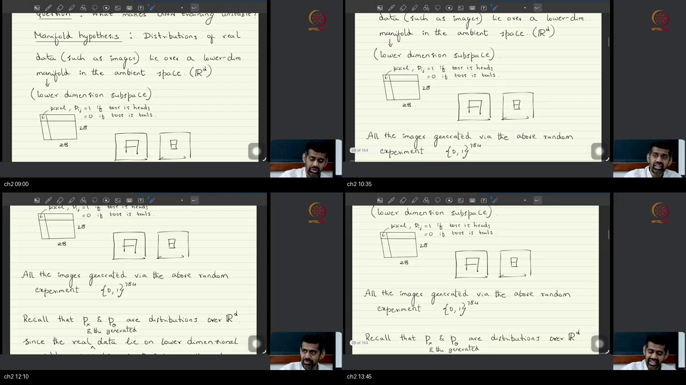
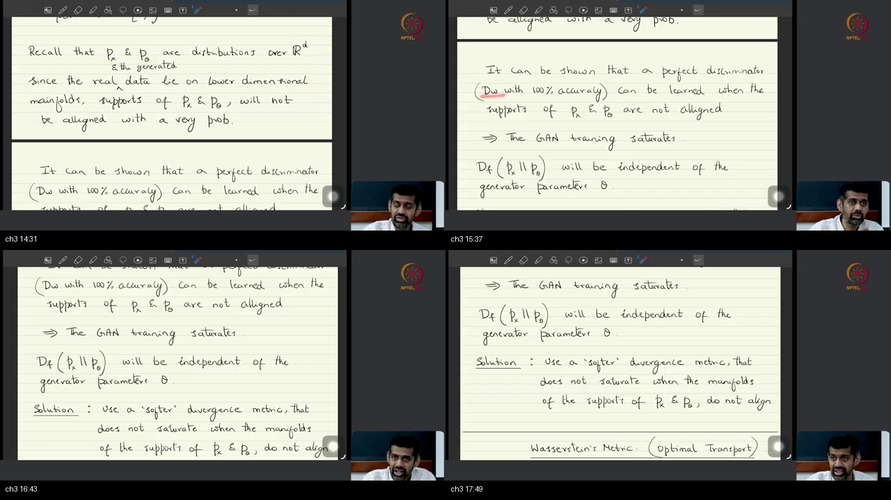
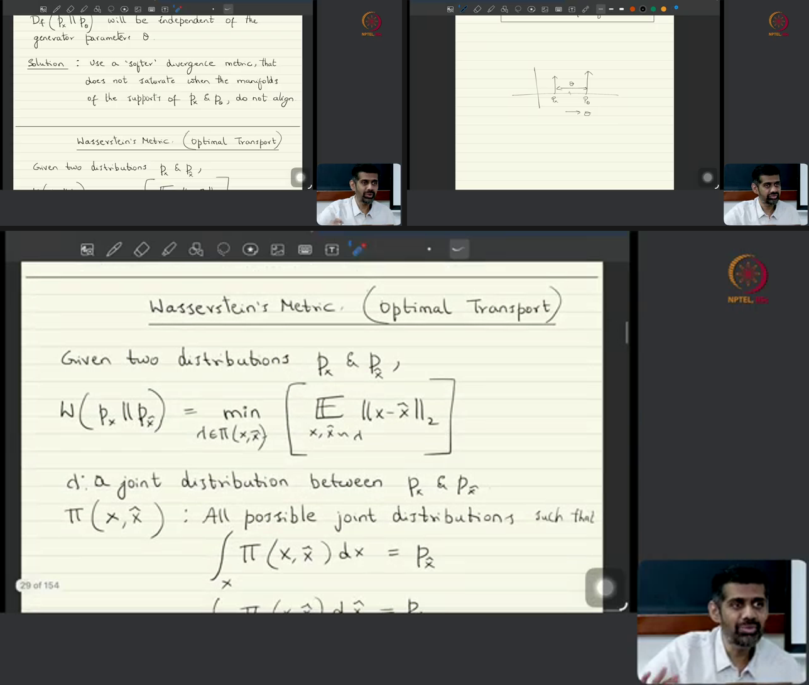
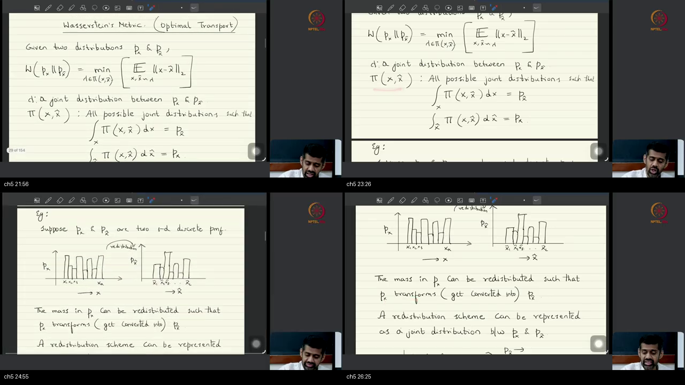
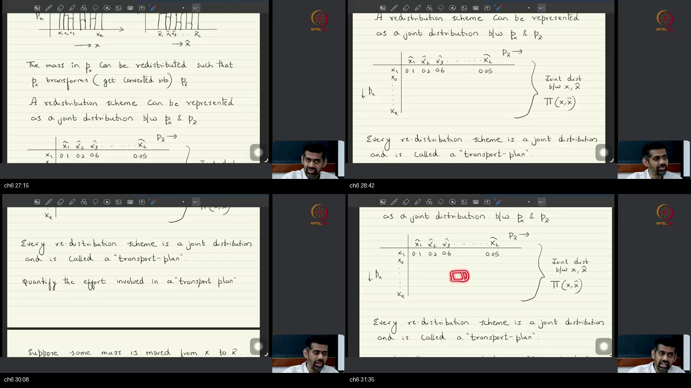
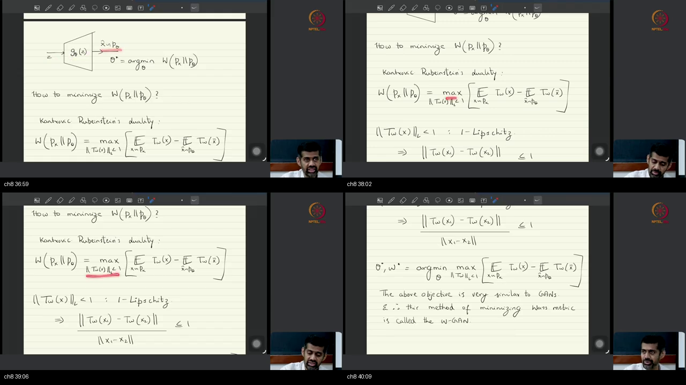
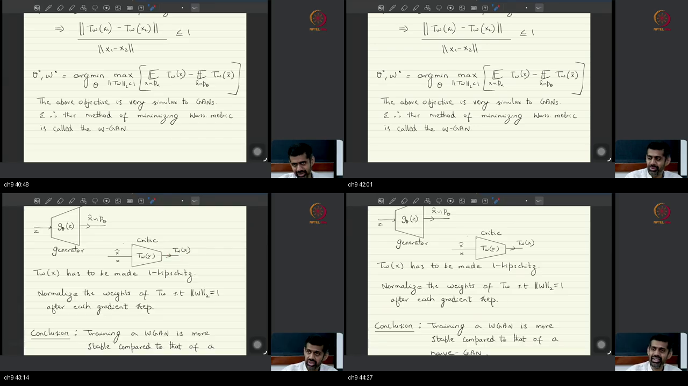

# Lec 18 — Wasserstein GAN (WGAN)

> **Video:** [Lec 18 Wasserstein GAN (WGAN)](https://www.youtube.com/watch?v=1neDqqgaXhE) · **~45 min**  
> **Warm-up first:** [PREREQUISITES.md](./PREREQUISITES.md) · **Quiz:** [quiz.html](./quiz.html)

**Do PREREQUISITES before this article.**  
**Previous:** [Lec 05 GANs](../28-Lec05-Generative-Adversarial-Networks/NOTES.md) · [Tutorial 12 code](../29-Tutorial12-Implementations-Vanilla-GAN-DCGAN-cGAN/NOTES.md)  
**Course:** Mathematical Foundations of **Generative AI**  
**Speaker:** NPTEL IISc · Prof. Prathosh · Wasserstein / OT saddle, 1-Lipschitz critic

The URL is playlist index 3. The **actual title** is Lec 18 WGAN — not a second “vanilla GAN” hour.

| When the lecture hits… | Warm-up |
|------------------------|---------|
| Still a minmax saddle | [p1-saddle](./PREREQUISITES.md#p1-saddle) |
| Support vs ambient $\mathbb{R}^d$ | [p2-support](./PREREQUISITES.md#p2-support) |
| Thin sheet, not a subspace | [p3-manifold](./PREREQUISITES.md#p3-manifold) |
| 100% inspector, no slope | [p4-perfect-d](./PREREQUISITES.md#p4-perfect-d) |
| Two spikes; overlap vs how far | [p5-dirac](./PREREQUISITES.md#p5-dirac) |
| Table = joint = plan | [p6-coupling](./PREREQUISITES.md#p6-coupling) |
| Work = mass × distance | [p7-work](./PREREQUISITES.md#p7-work) |
| Slope at most 1 | [p8-lipschitz](./PREREQUISITES.md#p8-lipschitz) |

---

## Table of Contents

1. [Topic 1 — Agenda still a saddle; Hessian; stop on surrogates](#topic-1-agenda-still-a-saddle-hessian-stop-on-surrogates-0002–0833) (00:02–08:33)
2. [Topic 2 — Manifold hypothesis; thread, paper, MNIST coin-toss](#topic-2-manifold-hypothesis-thread-paper-mnist-coin-toss-0833–1413) (08:33–14:13)
3. [Topic 3 — Perfect discriminator; saturation is $D_f \perp \theta$](#topic-3-perfect-discriminator-saturation-is-d_f--θ-1413–1808) (14:13–18:08)
4. [Topic 4 — Two Diracs; KL/JSD max out](#topic-4-two-diracs-kljsd-max-out-1808–2131) (18:08–21:31)
5. [Topic 5 — Wasserstein = min over couplings](#topic-5-wasserstein--min-over-couplings-2131–2651) (21:31–26:51)
6. [Topic 6 — Transport plan is a joint table](#topic-6-transport-plan-is-a-joint-table-2651–3200) (26:51–32:00)
7. [Topic 7 — Earth-mover work; $W_2 \propto |\theta|$](#topic-7-earth-mover-work-w_2-propto-θ-3200–3641) (32:00–36:41)
8. [Topic 8 — Kantorovich–Rubinstein dual; WGAN minmax](#topic-8-kantorovich–rubinstein-dual-wgan-minmax-3641–4028) (36:41–40:28)
9. [Topic 9 — Weight 2-norm $=1$; more stable than naive GAN](#topic-9-weight-2-norm-1-more-stable-than-naive-gan-4028–4448) (40:28–44:48)
10. [External references](#external-references)
11. [Sources](#sources)

---

## Executive Summary — architecture of this lecture

Last hour’s $f$-div GAN can lose the generator’s slope: when the two supports miss, a perfect critic exists and the score no longer depends on $\theta$. This hour changes the **yardstick** to **Wasserstein / earth-mover / optimal transport (OT)** — the **least work** to shovel one pile into the other. The sampler stays: $z$ through $G_\theta$, now $\min_\theta W(p_x,p_\theta)$. **Kantorovich–Rubinstein** rewrites $W$ as a max of $\mathbb{E}T-\mathbb{E}T$ over **1-Lipschitz** $T$, so it is still a minmax saddle — hence **WGAN**. After each step, set critic $\|W\|_2=1$ at every layer. **Inversion** and **FID** are next class.

**Worldview arc:** from “GAN saturates when supports miss” **to** “$W$ still sees the gap; dual over 1-Lipschitz $T$; still a saddle, made stable by weight-norm.”

**Code this hour:** none. Chalk only. Tutorial 12 already coded vanilla / DC / cGAN. Do **not** invent a WGAN loop from these notes.

### System context

```
  ╔══════════════════════════════════════════╗
  ║ Lec 04 VDM saddle · Lec 05 GAN one f     ║
  ║ Tut 12 code  ·  Lec 19 invert + FID STOP ║
  ╚══════════════════╤═══════════════════════╝
                     │ ~45 min chalk
                     ▼
          swap D_f → Wasserstein; keep minmax
```

### Method card — the approach (hold this)

The whole sitting is **one recipe**. Diagnose why last hour’s yardstick dies, swap it, train the dual, keep the critic’s slope $\le 1$.

```
  HOLD     z → G_θ → p_θ     (sampler unchanged)

  DIAGNOSE  manifold sheet in R^d
            supports miss w.h.p. → 100% D → D_f ⟂ θ
            two Diracs: KL/JSD max out for any gap θ

  SWAP     W = min_π E_π[ ||x−x̂||_2 ]
           π = joint table whose margins are the two piles
           work = mass × distance; W = least work
           homework: two-Dirac W_2 ∝ |θ|  (does not max out)

  DUAL     cannot list π in training
           KR (fact, not proved): W = max_{T 1-Lip} (E T − E T)
           no f*; outer min_θ of that max = WGAN saddle

  ENFORCE  after every gradient step: ||W||_2 = 1 at all layers
           (he says: composition of sigmoids)
           board: more stable than naive GAN

  STOP     invert G, FID  — next sitting
           KR proof, two-Dirac algebra — homework / paper
           no Python this hour
```

**Hour in English.** OT is a **new family** of divergences; the **problem is still a saddle**, so it is still called a GAN. A billion-parameter Hessian almost never has all eigenvalue signs the same ($0.99^{10^9}$ is tiny) — stop on a **surrogate** of sample quality, not on “did both losses drop.” The systematic reason is the **manifold hypothesis**: images/text sit on a thin **sheet** (thread in $\mathbb{R}^3$, paper in $\mathbb{R}^3$, not a linear subspace). Coin-toss MNIST pixels live in $\{0,1\}^{784}$; landing on a digit is the infinite-monkey / Shakespeare odds. $f$-div assumed both laws on $\mathbb{R}^d$; training $p_x$ does not, so supports miss, a $100\%$ $D$ exists, and $D_f$ **drops $\theta$**. Last hour’s $5{:}1$ was a knob to dodge that. Two spikes: a threshold is a perfect $D$ for **any** $\theta\neq 0$; KL/JSD max out. $W$ is the cheapest shovel bill among tables $\pi$ with the right row/col sums. Dual: max height-gap of a slope-$\le 1$ road. Practice: rescale critic weights every step. Exams: original GAN paper **and** $f$-GAN / VDM. OT itself is 1950s–60s, **used** here because of the manifold.

### Main blueprint

```
  ╔════ JOB ════╗
  ║ sample from ║
  ║ p_x via G_θ ║
  ║ without the ║
  ║ slope dying ║
  ╚════╤════════╝
       │ last hour’s saddle used f-div
       ▼
  z --> G_θ --> x̂ ~ p_θ          sampler UNCHANGED
  x or x̂ --> T_w --> score       critic, now 1-Lipschitz
       │
       ├──X──► f-div / JS GAN
       │         manifold hyp
       │         supports miss  =>  100% D
       │         D_f ⟂ θ        =>  G stuck
       │         two Diracs: KL/JSD max out
       │
       ══════► Wasserstein / earth-mover / OT
                 W = min_π E_π[||x−x̂||]
                 π = table = joint = plan
                 work = mass × distance
                 least work still sees |θ|
                       │
                       ▼
                 KR dual (no f*)
                 W = max_{Lip T ≤ 1} (E T − E T)
                       │
                       ▼
                 min_θ of that max  =  WGAN saddle
                       │
                       ▼
                 after each step: ||W||_2 = 1
                 more stable than naive GAN
                       │
            ┌ · · · · ·┴ · · · · · ┐
            │ STOP: invert G, FID  │
            │ next sitting         │
            └ · · · · · · · · · · ┘
```

### Scenario walkthrough (two spikes on a line)

```
  p_x = Dirac at 0          p_θ = Dirac at θ
           *  ---------------gap θ---------------  *
                      threshold |  = 100% D
  f-div (KL / JSD):  maxed out  (same number for θ=1 or θ=100)
  shovel bill:       move mass 1 a distance |θ|  =>  W ∝ |θ|
  dual T:            a road of slope ≤ 1; height gap ≤ |θ|
  train:             slide the fake spike; critic stays 1-Lip
                     by rescaling its weights after each step
```

1. Draw two spikes. A fence between them classifies perfectly for **any** $\theta\neq 0$.
2. $f$-div does not care whether the fence is one metre or a kilometre — **no signal** for $G$.
3. Earth-mover asks the shovel bill. The cheapest plan moves all mass across the gap: $W_2\propto|\theta|$.
4. Dual: maximize $\mathbb{E}_{p_x}T-\mathbb{E}_{p_\theta}T$ over slope-at-most-1 functions; that height gap **is** $W$.
5. Keep $T$ 1-Lipschitz by $\|W\|_2=1$ after each step. That is the whole implementation change he writes.

### Failure / contrast path

```
  track both GAN losses until they "go down"     ──X──► one is a MAX
  train D to 100% then hope G still moves        ──X──► D_f ⟂ θ
  treat a manifold as a linear subspace          ──X──► thread is curved
  list all couplings π in high-d training        ──X──► use the dual
  skip weight-norm and call it WGAN              ──X──► critic not 1-Lip
  write inversion / FID from this sitting        ──X──► not delivered
```

Ordinary nets already cannot hunt a global min in a trillion-parameter Hessian. A **saddle** plus a **perfect $D$** is why naive GAN training feels cursed. The Hessian story is **vague**; the **systematic** story is the manifold.

### STOP / out of scope

- **GAN inversion** and **evaluating generators / FID** — promised at $\sim$01:00, **not taught**. Next class.
- Proof of **Kantorovich–Rubinstein**. He sends you to the original paper.
- Algebra that two-Dirac $f$-divs max out, and that $W_2\propto|\theta|$ — **homework**, not ground in class.
- Spectral norm, gradient penalty, weight **clipping** as later named tricks. He said: **2-norm $=1$ after each step**, activations = **sigmoids**.

### Load-bearing claims (closed-book)

- OT is a **new family** of divergences; the **problem is still a saddle** $\Rightarrow$ still called **WGAN**.
- Stop on a **surrogate** quality metric; the two losses will not both decrease.
- **Manifold hypothesis:** practical data lie on a **very low-dimensional sheet** (not a subspace) in ambient $\mathbb{R}^d$.
- Supports not **perfectly aligned** (no bijection) $\Rightarrow$ $\exists$ $100\%$ $D$ $\Rightarrow$ $D_f$ **independent of $\theta$**.
- Two Diracs: KL / JSD **max out** independent of $\theta$; $W_2\propto|\theta|$ (homework).
- $W=\min_\pi\mathbb{E}_\pi[\|x-\hat x\|]$ over joints with the two **marginals**; a plan **is** that joint.
- KR dual: $W=\max_{\|T\|_{\mathrm{Lip}}\le 1}(\mathbb{E}_{p_x}T-\mathbb{E}_{p_\theta}T)$ — **no $f^*$**.
- Enforce 1-Lipschitz by $\|W\|_2=1$ **after each gradient step**; WGAN is **more stable than naive GAN**.

**Speaker / course.** NPTEL IISc · Prof. Prathosh A. P. · Mathematical Foundations of Generative AI · Lec 18 of the uploaded block (Lec 06–17 not on this playlist yet). Same tablet family as Lec 04–05 ([Drive notes](https://drive.google.com/file/d/1Kebb00VehPBMyleuw2ubp2qbvrBqyvZZ/view)).

---

## Topic 1: Agenda still a saddle; Hessian; stop on surrogates (00:02–08:33)

### Where this sits on the master map

**WGAN AGENDA / SADDLE UNSTABLE.** Last sitting closed adversarial learning as $f$-divergence minimization. This hour is the **conclusion of that block**: a **different family** of divergences (Wasserstein / OT), with the warning that the **final problem is still a minmax saddle** — which is why it is still called a GAN. Warm-up: [saddle](./PREREQUISITES.md#p1-saddle). The Hessian / Bernoulli story is the **vague** instability; the systematic reason is the next box.

### Board / screenshot


Title: **Wasserstein’s GANs**. “$f$-divergence minimization leads to unstable training.” Question: **What makes GAN training unstable?** Then a preview sentence he will **define** next: manifold hypothesis — distributions of real data (such as images) lie over a lower-dim manifold in the ambient space $(\mathbb{R}^d)$. The Hessian / Bernoulli argument in this slice is **spoken** — the tablet never leaves this title card (a second composite of the same board exists in `screenshots/` and is not repeated here).

### What he is establishing

Last time: **adversarial learning** for **distribution estimation and sampling**. Today is the **final lecture** of that adversarial block. The new paradigm is **Wasserstein optimization / optimal transport (OT)** — a **different** way of estimating distributional divergences, not the same family as $f$-divergence.

However, the **final problem** we solve is **again a saddle-point minmax**, as in $f$-divergence minimization. **That is why** it is also called a **Wasserstein generative adversarial network (WGAN)**. New family of divergences; **same shape of problem**.

He also promises two extras this class will look at: **GAN inversion** (inverting the adversarial learning, plus applications **beyond sampling** that an adversarial problem can solve), and **evaluating the quality of generative models** — you have a trained generator and samples; how good is the generation? **OT also helps answer that.** Those two items **do not arrive this sitting**. Treat them as agenda, not as taught content.

The observation that motivated the move: **$f$-divergence minimization is not stable** for training. Anyone who has trained GANs knows it is **extremely hard to make the models converge**.

Why, by construction. You are looking at a **saddle-point** optimization. The loss landscape can have **multiple saddle points**, and you **do not know which saddle is better** than the other. In fact **any** gradient-based optimization in a **very high-parameter** space is already hard to get into a **global** optimum. **More so** if you are looking for saddles.

Neural-net training today involves **billions / trillions** of parameters. The space you operate in is a billion- or trillion-parameter space.

Optimization theory, 1-D. To call a point an extremum, the **derivative must vanish**. The **second-derivative test**: one sign of $f''$ $\Rightarrow$ maxima, the other $\Rightarrow$ minima. The higher-dimensional analogue is the **Hessian**. You **cannot** look at the Hessian matrix itself to call a point max/min; you look at the **signs of the eigenvalues** of the Hessian.

A point is a **maximum** if the Hessian is **negative definite** — **not even** negative **semidefinite**; it must be **negative definite**. Minima the other way (**positive definite**). All eigenvalues of the same sign: **all positive $\Rightarrow$ PD**, vice versa **ND**.

Thought experiment: model the **sign of each Hessian eigenvalue** as a **Bernoulli** random variable. With probability $p$ the sign is positive, with $1-p$ it is negative. For a matrix of **order $n$** to be positive definite, you need **$n$ independent Bernoulli trials all of one particular type**. For a billion-parameter model he calls the Hessian “of order **billion squared**” and wants **that many** same-sign trials. Keep both phrasings; the probability argument is **one trial per eigenvalue** ($n$ parameters $\Rightarrow$ $n$ eigenvalues), not per entry.

Even if the same-sign probability is **very high**, say $0.99$, then $0.99^{\text{billion}}$ is a **very very small** number. **The more dimensions, the lower the likelihood of hitting a global extremum.**

Consequence: the **only hope** in neural-net training is that whatever minimum / extremum we hit is **better than the other** extremum. **There is nothing called a global minimum** here. **That is why**, when training neural networks, people look at **surrogate metrics** — **not** the loss landscape — to decide **when to stop**.

Generative-model instance: if we have a metric of **how good the generated data** is, we **do not track the loss** to stop. We track that **other / surrogate** quality objective, because it is **not about the loss getting minimized** (you **cannot** hit the global optimum). It is whether the **performance you seek** has been reached.

That was already the case for **well-defined** (non-saddle) optimization. **Here** we have a **saddle-point** problem. If you track the losses of the **two nets** — the **sampler** and the **critic** — you will **not** see them both **decreasing**. That is **not** the objective: for the **$T$ function** the objective is **maximization**, and the other way around for the sampler. So you **must** look at a **surrogate metric**.

The Hessian story is only a **vague** way of saying why GAN training is not stable. People have done a **systematic study** of why minmax paradigms are much more difficult — that study is the **manifold hypothesis**, next.

You can now state why this hour still says “GAN”: new divergence, **old saddle**. You can also state why “both losses going down” is the wrong stopping rule. What is still open: the **systematic** reason supports fail to line up.

### Analogy for this topic only

Two riders share one horse. One wants the **highest** point of the saddle flap; the other wants the **lowest** point of the seat. They share a height number $J$. Watching “did both riders’ scores drop?” is the wrong dashboard — one of them is supposed to climb.

The horse has a billion joints. Asking whether you sit in a perfect bowl is asking every joint to curve the same way at once. Even if each joint is “almost surely” the right sign, **almost surely a billion times** is still never.

In lecture words: shared height $=J$, climber $=$ critic $T$, sitter $=$ sampler $G$, “bowl” $=$ definite Hessian, dashboard $=$ **surrogate**, not the two losses.

### Local picture

```
  1-D:  f'(x*)=0,   f''(x*)<0  => max,   f''(x*)>0  => min

  high-d:  look at eigenvalues of Hessian H
           all λ_i < 0  =>  negative DEFINITITE  =>  max   (not merely NSD)
           all λ_i > 0  =>  positive DEFINITE    =>  min

  Bernoulli model:  each sign + with prob p
                    P(all n the same) = p^n
                    p=0.99, n ~ 10^9  =>  tiny

  GAN:  max_w J(θ,w)   and   min_θ J(θ,w)   on the SAME J
        the two plotted losses will NOT both decrease
        stop on a SURROGATE of sample quality
```

Notice: he flirts with “semidefinite,” then **corrects** — maxima need **negative definite**, not NSD. The product he writes is $0.99^{\text{billion}}$, one trial per eigenvalue.

### Bridge

A vague “the Hessian is huge” does not yet explain why **this** minmax, on **images**, dies in a special way. The leftover is: why can the critic become **perfect**, and why does that kill the generator’s slope? That needs where real data actually sit in $\mathbb{R}^d$.

---

## Topic 2: Manifold hypothesis; thread, paper, MNIST coin-toss (08:33–14:13)

### Where this sits on the master map

**MANIFOLD HYPOTHESIS.** Completes the last box: minmax is **much more difficult**. The conjecture is that practical data occupy a **tiny sheet** in a huge ambient cube — so later, the support of $p_x$ and the support of $p_\theta$ will miss each other. Warm-up: [manifold as a sheet](./PREREQUISITES.md#p3-manifold), [support](./PREREQUISITES.md#p2-support).

### Board / screenshot



Board: “Manifold hypothesis: Distributions of real data (such as images) lie over a lower-dim manifold in the ambient space $(\mathbb{R}^d)$.” Parenthetical “(lower dimension subspace)” — he will **reject** “subspace” in speech. A $28\times 28$ grid: pixel $p_{ij}=1$ if the toss is heads, $=0$ if tails. Sketches of a **7** and a **0**. “All the images generated via the above random experiment $\{0,1\}^{784}$.” Bottom already teases: $p_x$ and $p_\theta$ are distributions over $\mathbb{R}^d$.

### What he is establishing

Minmax optimization is **much more difficult**. To understand that, look at the **manifold hypothesis**.

What a **hypothesis** is, in his mouth: some **conjecture that does not have a proof yet**. That is why this is a hypothesis — there is no way we can prove it here.

**Statement:** distributions of the **real data** that we get **lie over a low-dimensional manifold in the ambient space**.

First define a **manifold**. Think of it as a lower-dimensional “subspace” of a vector space. Then the correction: it is **not** a subspace. It does **not** satisfy the properties of vector spaces. Roughly a lower-dimensional **sheet** sitting in a vector space. He will **not** give the full definition (a collection of vectors such that a few properties are satisfied). Do not import a textbook atlas.

**Thread.** Hold a thread — not straight; **curvy**. All points on that thread can be represented as a **one-dimensional manifold in $\mathbb{R}^3$**. Why $\mathbb{R}^3$? Because the space we live in is $\mathbb{R}^3$. A thread in 3-D **is** a 1-D manifold in $\mathbb{R}^3$.

What he **means** by manifold here: there exists a **bijection** between the points on the manifold and a **low-dimensional** space.

**Paper.** Hold a thin paper of **zero thickness** (does not exist in practice; assume it). That is a **two-dimensional manifold in $\mathbb{R}^3$**. And so on.

Hypothesis applied: data we get **in practice** — **images, text**, and the kinds of data we deal with — lie on a **very very low-dimensional manifold** in the **ambient space**.

Intuitive thought experiment. Take a **$28\times 28$ grid** because we are trying to generate the **MNIST** dataset, which has $28\times 28$ dimensions. Toss a coin per pixel. **Heads $\to$ white**; **tails $\to$ black**. Binary image.

Filling the $28\times 28$ grid is filling **$784$** numbers (one coin toss per pixel). (ASR once says “724”; the board and the next sentence are **$784$**.) All images from this random experiment live in the discrete space $\{0,1\}^{784}$: $784$ **binary** dimensions. That is the **ambient space**.

Question: if you do this random experiment, what are the **odds** you land on the **MNIST** digits? MNIST can be **binarized**. The odds are **very low**.

Same idea as the **infinite-monkey / typewriter** problem: sit a monkey at a typewriter (a dedicated typing machine — aside for Gen Z) randomly pressing keys. Odds it comes up with **Shakespeare**? **Non-zero**, but **very low**.

Moral of both experiments: the **effective space** that a dataset like **MNIST** occupies in the ambient space is **very tiny**. Of all binarized $784$-pixel images, MNIST occupies a **very very tiny manifold**.

**Universal form:** no matter what sort of data occurs **in practice**, all the data we get lies on a **very low-dimensional manifold compared to the ambient space** it lives in.

Color-image instance: **CelebA** — pictures of **human faces**. How much space does it occupy among **all color images of that size**? There are **infinitely many** possible images, including ones that make **no perceptual sense**. Among all those, CelebA occupies a **tiny** amount of ambient space (the last clause straddles the Topic 3 cut).

You can now say “sheet, not subspace,” and run the MNIST coin-toss. What is still open: **why this is an issue for $f$-divergence**.

### Analogy for this topic only

The room is $\mathbb{R}^3$. A piece of sewing thread dumped on the floor is almost a curve — you can name points on it with **one** number (arc length). A sheet of paper (idealized zero thickness) needs **two**. Neither object is a **linear subspace**: bend the thread and it is still a 1-D sheet.

Now raise the room to $784$ binary dimensions. Random heads/tails fill the room. **What are the odds a random grid is a handwritten 7?** Memory of “28×28 pixels” does not answer that — you need the occupied-sheet picture. Handwritten sevens occupy a wisp of that room, the way English occupies a wisp of all key-smash. Treating the sheet as a linear subspace (closed under addition) is the wrong move; the thread is **curved**.

In lecture words: room $=$ ambient $\{0,1\}^{784}$, thread $=$ 1-manifold, MNIST $=$ the occupied sheet, Shakespeare $=$ non-zero tiny probability.

### Local picture

```
  ambient R^3
      thread  ~~~~~~~~~~~~~~~~~~~~~~~~     1-manifold (curved; NOT a subspace)
      paper   [  thin sheet  ]             2-manifold (zero thickness)

  ambient {0,1}^784     (28×28 coin-toss; heads=white, tails=black)
      all random grids     ################################  huge
      MNIST digits         ~~                              tiny sheet

  P(random grid is a '7')  ≈  P(monkey types Hamlet)  > 0,  practically 0
```

Notice: he **refuses** the full manifold definition. Keep sheet + bijection. CelebA’s “tiny fraction” finishes as Topic 3 opens.

### Bridge

If real $p_x$ lives on a wisp, and we wrote $f$-divergence as if both laws live on all of $\mathbb{R}^d$, the two supports will miss. The leftover is the theorem that a miss gives a **perfect** discriminator — and that this **kills** the generator.

---

## Topic 3: Perfect discriminator; saturation is $D_f \perp \theta$ (14:13–18:08)

### Where this sits on the master map

**PERFECT DISCRIMINATOR SATURATES.** The manifold box becomes an **issue for $f$-div**: supports fail to align, a $100\%$ $D$ exists, and the GAN objective **stops depending on $\theta$**. Warm-up: [perfect separator](./PREREQUISITES.md#p4-perfect-d), [support](./PREREQUISITES.md#p2-support). Board already names the **softer** metric — Wasserstein / OT — as a teaser.

### Board / screenshot



“Recall that $p_x$ and $p_\theta$ are distributions over $\mathbb{R}^d$.” “Since the real data lie on lower dimensional manifolds, supports of $p_x$ and $p_\theta$ will not be aligned with a very [high] prob.” “A perfect discriminator ($D_w$ with $100\%$ accuracy) can be learned when the supports of $p_x$ and $p_\theta$ are not aligned $\Rightarrow$ The GAN training saturates. $D_f(p_x\|p_\theta)$ will be independent of the generator parameters $\theta$.” “Solution: Use a ‘softer’ divergence metric, that does not saturate when the manifolds of the supports of $p_x$ and $p_\theta$ do not align. **Wasserstein’s Metric (Optimal Transport).**”

### What he is establishing

Completing CelebA: amongst **all** those possible images, the dataset occupies a **very tiny** amount of space in the ambient manifold. **Now why is this an issue for us?**

The way we constructed $p_x$ and $p_\theta$, between which we defined the **$f$-divergence**, they are **both supported on $\mathbb{R}^d$**. By the **manifold hypothesis**, the limited **training data** — samples of $p_x$ — are supported over a **very small manifold** in the ambient space. Board: supports of $p_x$ and $p_\theta$ will **not** be aligned, **with very high probability**.

**Perfect discriminator theorem** (can be proved): if two distributions have supports that are **not perfectly aligned**, one can **always** come up with a **$T$ function / discriminator** that gives **$100\%$ accuracy**.

**Perfect alignment (working definition):** take the two **sets** on which the distributions are supported. If you can find a **bijective map** between them, they are **perfectly aligned**. He flags that there is a **precise** definition; this is the working one.

So what? If you can find a **discriminator / critic** with $100\%$ accuracy, then **GAN training saturates** there.

How a GAN is trained (at least for **Jensen–Shannon**): the discriminator tries to **separate samples of $p_x$ from samples of $p_\theta$**. A $100\%$-accurate $D$ **completely separates**. The **generator has no signal** to move forward; it **gets stuck**.

That is why, in the **previous class**, this minmax problem is **not** solved in a **$1{:}1$** ratio. To **avoid** a perfect discriminator: train the **generator more** and the **discriminator less**, ratios like **$5{:}1$**, etc. — a **hyperparameter** — so you do not hit a perfect $D$ and saturate.

**Why** it saturates: **manifold hypothesis** plus the fact that the supports of $p_\theta$ and $p_x$ are **not perfectly aligned**. If they are not aligned, you can find a **perfect discriminator**, and therefore training **saturates**.

What saturation **is**: if you find a perfect discriminator, the **$f$-divergence** being computed **becomes independent of the generator parameters $\theta$**. The moment the **objective is independent of $\theta$**, you **cannot push** the generator parameters any further.

**Homework:** prove that if you can find a discriminator with **$100\%$ accuracy**, then the underlying **$f$-divergence becomes independent of $\theta$**. Once it is independent of $\theta$, training **stops** — **no signal** for the generator.

Board **solution** (teaser): use a **‘softer’ divergence metric** that does **not** saturate when the support manifolds of $p_x$ and $p_\theta$ do **not** align — **Wasserstein’s metric (optimal transport)**. The two-Dirac calculation that *shows* $f$-div maxing out is the next box.

You can now state saturation as a sentence: **$D_f\perp\theta$**. You can also state why last hour’s $5{:}1$ existed. What is still open: a **picture** where “independent of $\theta$” is obvious — two spikes on a line.

### Analogy for this topic only

Two flocks, one real, one forged, on opposite sides of a fence. The inspector who stands on the fence is **always** $100\%$ right. **If the forger walks the fake flock a mile further, does the inspector’s score change?** No — still $100\%$, no “warmer / colder.” The forger’s parameters $\theta$ have **dropped out** of the score. The wrong move is to keep training that inspector to perfection and hope the forger still gets a slope.

Last hour’s dodge — let the forger practice five times for each inspector update — is a **knob**, not a theorem. It tries not to let the inspector become that fence.

In lecture words: fence $=$ perfect $D$, flocks $=$ supports, dropped-out score $=D_f\perp\theta$, $5{:}1$ $=$ hyperparameter.

### Local picture

```
  f-div written as if     supp(p_x) = supp(p_θ) = R^d
  manifold hyp            supp(p_x) ⊂ tiny sheet ⊂ R^d
                          supports fail to align  w.h.p.

  aligned  ⇔  ∃ bijection between the two support SETS
  not aligned  ⇒  ∃ T / D_w with 100% accuracy     (theorem)

  100% D  ⇒  GAN saturates
           ⇒  D_f(p_x ∥ p_θ) independent of θ
           ⇒  G has no signal

  dodge from last class:  not 1:1;  e.g. 5:1  (G more, D less)
  board teaser:           ‘softer’ metric = Wasserstein / OT
```

Notice: spoken “what is the solution?” is answered **first** by the independence-of-$\theta$ fact, then homework. Wasserstein on this board is a **pointer**, not yet a formula.

### Bridge

Independence of $\theta$ is still an abstract slogan. The leftover is a **degenerate 1-D pair** where a perfect classifier is a **threshold**, and KL / JSD visibly **max out** no matter how far the spikes sit.

---

## Topic 4: Two Diracs; KL/JSD max out (18:08–21:31)

### Where this sits on the master map

**TWO DIRACS / $F$-DIV MAXES OUT.** Makes saturation visible: two spikes, gap $=\theta$, perfect classifier $=$ a threshold, KL / JSD independent of $\theta$. This is the **motivation to leave $f$-div**. Warm-up: [two spikes](./PREREQUISITES.md#p5-dirac). The spoken $W$ formula is the next box — do not steal it.

### Board / screenshot



Rebuilt panel (the auto 2×2 had one empty axes frame). Top-left: Topic 3 solution card — $D_f$ independent of $\theta$, ‘softer’ metric, heading **Wasserstein’s Metric (Optimal Transport)**. Top-right: 1-D sketch — two arrows $p_x$ and $p_\theta$, horizontal **$\theta$-axis**, gap $=\theta$. Bottom: the min-over-$\pi$ formula **starts** to be written — the **spoken** definition is Topic 5.

### What he is establishing

Recap / saturation: the moment the objective is **independent of $\theta$**, training **stops** — **no signal** for the generator. Question: how do you **solve** this.

**Degenerate 1-D construction** (ASR: “degenerative case”) to show the failure. Build **two distributions in one dimension**. One **Dirac delta** at some place $=p_x$. Another **Dirac delta** at some **other** place $=p_\theta$. Compute the $f$-divergence.

Things like **KL, JSD, etc. just max out**. They are **independent of $\theta$**.

Board picture: operating in **1-D**. Two spikes labeled $p_x$ and $p_\theta$. Horizontal axis is the **$\theta$-axis**; the **gap between the spikes is $\theta$**. The two laws are **not supported on the same point** — they **do not align**.

A **perfect classifier** between the two Diracs is obvious: know **where the two points are supported**, **draw / learn a threshold between them**, then decide. **No matter where** the two Diracs sit, **no matter what $\theta$ is**, **as long as they do not overlap**, you can find a **perfect discriminator**.

In these cases **most $f$-divergences** will be **either zero or $-\infty$**, still **independent of $\theta$**. (Spoken clash with the earlier “KL/JSD max out.” Record both; do **not** invent $\log 2$ / $+\infty$.)

Better idea: construct a divergence that **QUANTIFIES how far** the two Diracs are, **instead of just saying whether they overlap or not**.

Argument (at least in the **Wasserstein-metric paper**): construct metrics that **quantify how far or close the manifolds** the laws are supported on are — **not** merely whether the supports are **well aligned**.

**Exercise:** two **Dirac deltas** $\to$ **most $f$-divergences used in practice will max out**. Can be shown **algebraically**.

This is the **motivation to move away from** (or rather: **consider some other divergence metric than**) **$f$-divergence**. Board already: $D_f(p_x\|p_\theta)$ independent of generator parameter $\theta$; **solution** $=$ a **“softer”** metric that **does not saturate** when the **manifolds of the supports** of $p_x$ and $p_\theta$ **do not align**. Heading **Wasserstein’s metric (optimal transport)** starts on the board.

You can now draw the two spikes and say why a threshold kills $\theta$. What is still open: an actual formula that **grows with the gap**.

### Analogy for this topic only

Two sandcastles on a beach. “Do they occupy the **same footprint**?” is a yes/no. Once the answer is no, asking again from a kilometre away still says no. That is KL / JSD on two Diracs.

The question you **wish** you had asked: **how many metres of sand** must I shovel? That number should grow when you drag one castle down the beach.

In lecture words: footprint overlap $=$ support alignment, yes/no $=f$-div maxing out, metres of sand $=$ the softer metric still unnamed in speech.

### Local picture

```
  1-D line,  θ-axis
       p_x *          * p_θ
           |←—— θ ——→|
           threshold |

  θ ≠ 0  ⇒  supports do not align
         ⇒  a threshold is a perfect D   (for ANY θ)

  KL / JSD / most practical f-divs:  max out  (or "0 or −∞")
                                     independent of θ

  want:  a number that GROWS with how far the spikes are
  board: ‘softer’ metric = Wasserstein / OT
  exercise: prove algebraically that practical f-divs max out here
```

Notice: the $W$ formula on the last panel is **preview**. Spoken definition starts at $21{:}31$.

### Bridge

We know we want “how far,” not “whether they overlap.” The leftover is to **write** that distance as an optimization — minimum work over ways of moving mass — and to name it Wasserstein / earth-mover / OT.

---

## Topic 5: Wasserstein = min over couplings (21:31–26:51)

### Where this sits on the master map

**WASSERSTEIN $=$ OT / EARTH-MOVER.** Installs the **definition**: $W$ is the **minimum** (not the minimizer) of expected sample-level distance over joints whose **marginals are the two constituent laws**. Warm-up: [work](./PREREQUISITES.md#p7-work), [coupling](./PREREQUISITES.md#p6-coupling). The table/plan naming is next; here we only see that mass **can** be redistributed, in **multiple** ways.

### Board / screenshot



“Wasserstein’s Metric (Optimal Transport). Given two distributions $p_x$ and $p_{\hat x}$,

$$
W(p_x\|p_{\hat x})=\min_{\pi\in\Pi(x,\hat x)}\mathbb{E}_{x,\hat x\sim\pi}\big[\|x-\hat x\|_2\big].
$$

$\pi$: a joint distribution between $p_x$ and $p_{\hat x}$. $\Pi(x,\hat x)$: all possible joints such that $\int\pi(x,\hat x)\,dx=p_{\hat x}$ and $\int\pi(x,\hat x)\,d\hat x=p_x$.” Example: two 1-D discrete PMFs drawn as histograms; “the mass in $p_x$ can be redistributed such that $p_x$ transforms (gets converted into) $p_{\hat x}$.” Last panel already starts “a redistribution scheme can be represented as a joint” — spoken table is Topic 6.

### What he is establishing

People came up with **optimal transport** — a **classical** divergence — to get a metric with the “quantify how far the supports are” properties. Open (this lecture): how to **translate** that metric into a **paradigm that builds a sampler** for generative modeling.

The metric is the **Wasserstein** metric, **also called earth-mover distance** (reasons later). It is **based on optimal transport**.

**Definition.** Given two laws $p_x$ and $p_{\hat x}$, the Wasserstein distance between them is the **solution of an optimization problem**.

Sample-level cost: distance between a draw $x\sim p_x$ and a draw $\hat x\sim p_{\hat x}$. Board / speech: $\|x-\hat x\|_2$ (the **2-norm**). In general one may use a **$p$-norm**. Here: 2-norm.

Take the **expectation** of that distance over a **joint** of the two random variables $x$ and $\hat x$. Consider **all possible joints** of the two RVs.

Wasserstein $=$ the **minimum**, **not the minimizer**, of that expected distance, over all such joints. Looks complicated; it is **intuitive** (why next). The wrong move is to treat $W$ as “the best table $\pi^*$” and throw the cost away, or to minimize over **all** joints including those that do not recover the two laws. The right move: the **value** of a **constrained** min.

Search space $\pi$ (board $\Pi(x,\hat x)$; spoken “lambda” then $\pi$): **not** all unconstrained joints. **Marginal of one RV** must be **one** of the two laws in the distance. **Other marginal** must be the **other constituent law**. Choose joints such that the **marginals of the joint are the two constituent distributions** between which you measure the divergence.

That **is** the definition of the Wasserstein metric. Two questions postponed: **why** this weird definition is a **good distance**, and **how to optimize it into a sampler**.

The inner cost can be **any** distance; take the **$p$-norm** and you get the **$p$-Wasserstein** distance ($W_p$). What he just defined (2-norm) is **Wasserstein-2 / 2-Wasserstein**.

1-D example to motivate why this is meaningful and why the names **earth-mover** / **optimal transport**. **Constituent** laws $p_x$ and $p_{\hat x}$ are two **1-D discrete PMFs**, both discrete, supported in **one dimension**. Goal: how **far or close** they are.

Picture: both look like **histograms** (1-D discrete RVs). Question: is there a way to **redistribute the mass in $p_x$** so it **transforms / converts into $p_{\hat x}$**? **Yes.** Example: lots of mass at $x_1$ — take some of it, **put it at $x_3$**, and so on, until you recover $p_{\hat x}$ from $p_x$.

Next question (to the class): **how many ways** can one redistribute the mass in $p_x$ so it becomes $p_{\hat x}$? **One fixed scheme**, or **multiple ways**? (Answer next.)

You can now write $W$ as a **constrained min of an expectation**, and say **minimum not minimizer**. You can also say $p$-norm $\to W_p$. What is still open: what one redistribution **is**, as an object you can write on paper.

### Analogy for this topic only

Two histograms of dirt on a number line. You are allowed to pick dirt from one bar and dump it on another, as long as when you are done the **new** skyline **is** the second histogram, and you did not create or destroy dirt. **Is there only one legal shoveling, or many — and is Wasserstein “pick any legal shoveling”?** Many. The score of a scheme is “on average, how far did each grain travel.” Wasserstein is **not** “pick your favourite.” It is the **cheapest** average journey among legal schemes.

In lecture words: dirt skyline $=p_x$ / $p_{\hat x}$, legal scheme $=$ joint with those margins, cheapest average $=\min$ not $\arg\min$, 2-norm journey $=W_2$.

### Local picture

```
  W(p_x ∥ p_x̂)  =  min_{π ∈ Π(x,x̂)}  E_{x,x̂ ~ π} [ ||x − x̂||_2 ]

  Π is NOT all joints.  Marginals of π ARE the two laws:
      ∫ π(x,x̂) dx    = p_x̂
      ∫ π(x,x̂) d x̂  = p_x

  p-norm in the cost  →  W_p
  this board’s 2-norm →  W_2

  1-D discrete PMFs = two histograms
      mass at x_1 can be split onto x̂_1, x̂_2, … until the skyline is p_x̂
      Q: one scheme, or MANY?
```

Notice: board writes $W(p_x\|p_{\hat x})$ with the $f$-div bar; same object as $W(p_x,p_{\hat x})$. He uses $p_{\hat x}$ here, not $p_\theta$.

### Bridge

He asked the class: one redistribution, or many? The leftover is to **name** a scheme — it is a **table**, that table **is** a joint, and that joint is called a **transport plan**. Then we still owe the **effort** of a plan.

---

## Topic 6: Transport plan is a joint table (26:51–32:00)

### Where this sits on the master map

**TRANSPORT PLAN $=$ JOINT.** Answers Topic 5: **multiple** ways. Every redistribution is a **table** whose entries are mass moved; that table **is** a joint $\pi$; row/col sums recover the two PMFs. Name: **transport scheme** / **transport plan**. Optimality is **not** yet. Warm-up: [coupling](./PREREQUISITES.md#p6-coupling).

### Board / screenshot



Histograms, then a table: columns $\hat x_1,\hat x_2,\hat x_3,\ldots,\hat x_L$ (brace $p_{\hat x}$), rows $x_1,x_2,\ldots,x_K$ (brace $p_x$). First row example $0.1,\ 0.2,\ 0.6,\ \ldots,\ 0.05$. Brace: “joint dist. b/w $x,\hat x$ $\pi(x,\hat x)$.” Slogan: **every re-distribution scheme is a joint distribution and is called a “transport-plan.”** Then “Quantify the effort involved in a transport plan.” A cell highlighted in red: that entry is the mass moved from this $x$ to that $\hat x$.

### What he is establishing

Answer to Topic 5: there **are multiple ways** to redistribute $p_x$ into $p_{\hat x}$.

**Every** redistribution scheme that transforms one law into the other can be represented as a **joint** between $p_x$ and $p_{\hat x}$. The wrong move is to say there is **one** scheme, or to call the table a mere conditional $p(\hat x\mid x)$ and forget the margins. The right move: a **joint table** whose row and column sums **are** the two piles.

Before calling it a joint: it can be represented as a **TABLE**. Rows $=$ values $p_x$ takes; columns $=$ values $p_{\hat x}$ takes. What the table does: take some mass from $p_x$ and **put it at different other places** so the histogram **converts into $p_{\hat x}$**. Can be done in **multiple ways at every support point** of $p_x$.

Constraints on entries: the table **sums to one** (you have **$100\%$ mass** to redistribute); every entry is **bounded in $[0,1]$** (it is a **percentage of mass**). After redistribution, **one row or one column** has to **look like the other distribution**.

Therefore the table **is a joint**. Summing a joint over one RV is **marginalization**. Why the name: you are **summing over the margin of the table** to get the other law — **marginalization, literally**. Row/col sums recover the two PMFs.

Easy in the **discrete** case (hence the histogram table). **Similar argument** in the **continuous** case.

A redistribution scheme is also called a **transport scheme** — that is why the name **optimal** (transport). **Optimality not yet**: we are only talking about the **transport scheme**. Every scheme that moves mass on the support of one law so it **becomes** the other is a transport scheme, and it **is a joint**.

**Vice versa:** every joint of the two RVs **is** a redistribution scheme that makes one law into the other (and back).

**Infinitely many** such tables: infinitely many joints whose **marginals are the constituent laws**.

Board slogan: **every redistribution scheme is a joint distribution and is called a “transport plan.”** Converting one law into the other is quantified by that joint.

Next question: what is the **effort** associated with moving that mass? Given **so many** transport plans, we will need **optimality** among them — so we must **quantify the effort** to turn one law into the other.

Quantify the effort of **one** transport plan (one redistribution $=$ one joint). Dummy points $x$ and $\hat x$ on the two supports. Move some mass **from $x$ to $\hat x$**. Distance of the move $=\|x-\hat x\|$ (norm of the difference). Mass actually moved $=$ **likelihood of those two points under the joint**. Board: each **table entry** is the amount of mass moved **from this point to that point**.

**Work** of that move: **multiply** mass $\times$ distance. **High-school physics**: work done in moving the mass from $x$ to $\hat x$. **That’s why the name earth-mover.** Next: average work of a plan / min over plans.

You can now draw the table and say plan $=$ joint. You can form **cell-wise** work. What is still open: average that work, then **minimize** it — that min **is** $W$.

### Analogy for this topic only

Shipping crates from warehouses to stores. Each spreadsheet of “warehouse $i$ sends this many tonnes to store $j$” is one plan. Row totals must equal warehouse stock. Column totals must equal store demand. **How many legal spreadsheets are there, and have we picked the cheapest yet?** Infinitely many. We have **not** picked the cheapest — we have only named the spreadsheet a transport plan.

One cell of the spreadsheet: tonnes $\times$ kilometres $=$ the work of that shipment. We have not yet asked which spreadsheet is cheapest. We have only named the spreadsheet a **transport plan**.

In lecture words: spreadsheet $=\pi$, row/col totals $=$ the two PMFs, cell $=$ mass moved, tonnes $\times$ km $=$ work, name $=$ transport plan, cheapest $=$ not yet.

### Local picture

```
              dest  x̂_1   x̂_2   x̂_3  …  x̂_L     | row sums = p_x
  src x_1        0.1    0.2    0.6  …  0.05    |
      x_2         .      .      .        .     |
      …                                        |
      x_K                                      |
      ------------------------------------------
      col sums = p_x̂

  entries ∈ [0,1],  total mass = 1
  summing a row or column = MARGINALIZATION (the margin of the table)

  every redistribution scheme  =  this TABLE  =  a JOINT  =  a TRANSPORT PLAN
  infinitely many tables with those margins
  optimality NOT yet

  one cell:  distance = ||x − x̂||
             mass     = π(x, x̂)
             work     = π(x, x̂) · ||x − x̂||     ← earth-mover
```

Notice: average work as an integral, and $\min_\pi=$ $W$, wait for Topic 7. The slogan on the board is the whole box.

### Bridge

Cell-wise work has a physics name. The leftover is to **average** that work over the whole plan, then pick the **least** average among plans whose margins are the two laws — and check that this number **does not max out** on the two Diracs.

---

## Topic 7: Earth-mover work; $W_2 \propto |\theta|$ (32:00–36:41)

### Where this sits on the master map

**WORK.** Completes the definition: average work of a plan is $\mathbb{E}_\pi[\|x-\hat x\|]$; **Wasserstein is the least** such work among plans with the right marginals. That is **why $W$ is a good divergence**. Homework: two-Dirac $W_2\propto|\theta|$. Fact: $W$ **does not saturate** when supports misalign, even in high dimension. Warm-up: [work](./PREREQUISITES.md#p7-work).

### Board / screenshot

![Topic 7 board — average work = E_π[||x−x̂||]; min = W; fact: W does not saturate](./screenshots/composites/ch07-topic-07-earth-mover-work-w-proportional-theta-panel1of1.png)

“Avg. work done in a transport plan: $\int \pi(x,\hat x)\cdot\|x-\hat x\|\,dx\,d\hat x=\mathbb{E}_\pi[\|x-\hat x\|]$.” Then

$$
\min_{\pi\in\Pi(x,\hat x)}\mathbb{E}_\pi[\|x-\hat x\|]=W(p_x\|p_{\hat x}),
$$

with $\Pi$ the family of joints s.t. $\int_{\hat x}\pi(x,\hat x)\,d\hat x=p_x$ and $\int_x\pi(x,\hat x)\,dx=p_{\hat x}$. “The closer $p_x$ and $p_{\hat x}$ are, the lesser $W$ will be.” **Fact:** Wasserstein’s metric does **not saturate**, unlike $f$-div, when the supports of $p_x$ and $p_\theta$ do not align. Bottom: generator cartoon $z\to g_\theta(z)\to\hat x\sim p_\theta$ — spoken sampler restart is Topic 8.

### What he is establishing

Earth-mover picture: you are **moving earth / dirt** from one point to the other **so the distributions get converted**. That product (mass $\times$ distance) is the **effort** needed to move a mass $\pi(x,\hat x)$ from $x$ to $\hat x$.

Need **average work**. High-school physics: to quantify average work, **integrate that product over all possible masses**. Jump **discrete $\to$ continuous**: either a **sum** over all possible values or an **integral**. The moment you have integrals and distribution functions, those objects **are expectations**.

The expectation of a **norm of the difference** of the two support vectors, taken **over the joint / transport plan $\pi$**, is the **average effort / work** needed to convert one law into the other **using that particular plan**. Board: $\int\pi(x,\hat x)\cdot\|x-\hat x\|\,dx\,d\hat x=\mathbb{E}_\pi[\|x-\hat x\|]$.

Next question: **multiple** transport plans (joints) exist between the two RVs. **Which** corresponds to the **least amount of work**? Quantify by posing an **optimization problem** over average work.

Constraint: the plans you consider must be such that **operating the plan always leads to the constituent distributions**. That is the constraint of the opt. Search space: **all joint distributions whose marginals become the underlying constituent laws**. Among all such transport plans, pick the one of **least effort**. **That optimum is defined to be the Wasserstein metric.**

Intuition: the **closer** the two laws are, the **smaller** the **least** effort needed to turn one into the other. We **do not care** about higher-effort plans. Ask: **what is the least work I have to do** to convert one distribution to the other? Board: “the closer $p_x$ and $p_{\hat x}$ are, the lesser $W(p_x\|p_{\hat x})$ will be.”

Among all transport plans, the **least-effort** one tells **how far or close** the constituent laws are. That is **why Wasserstein is a good divergence metric** between a pair of distributions.

**Homework:** go back to the **degenerative two-Dirac** example and show that the **Wasserstein-2 metric is proportional to $\theta$** — in fact to the **magnitude $|\theta|$**. The closer the Diracs, the smaller $W_2$. **Unlike $f$-divergences, which max out.**

He does not grind the algebra. The one-plan picture is enough to see why it cannot max out: mass $1$ at $0$, mass $1$ at $\theta$, the only legal table sends all mass across the gap, distance $|\theta|$, so average work is $|\theta|$ (up to the constant of the $p$-norm he asked you to check). Double $\theta$, double the bill. KL would already have shouted its maximum at the first millimetre.

General definition of the **$p$-Wasserstein metric**: the solution of this opt — **minimum among all joints whose marginals are the constituent laws**, of the **($p$-)norm of the difference** between all pairs of values on those supports. Restate: minimization is over the **norm of the difference** between all possible pairs on the support of the constituent distributions. That is the definition of the **$p$-th Wasserstein metric**. Any questions?

**Fact (board):** Wasserstein **does not saturate**, unlike $f$-divergence, **when the supports of $p_x$ and $p_\theta$ do not align**. Degenerate case already discussed: two Diracs **supported at two different points**. Same fact in **higher dimensions**: even if the supports of the two laws are **not perfectly aligned**, Wasserstein **would not saturate**. (He just defined what alignment is.)

You can now say $W=$ **least shovel bill**, and why that is a **how-far**. Homework is on you for the two-Dirac algebra. What is still open: we **cannot list $\pi$s** in training — how does this become a **sampler** with a critic net?

### Analogy for this topic only

You must flatten hill A into hill B. Many truck routes. Some send every grain on a grand tour; some send each grain to the nearest matching hole. **Do you pay the average of all routes, or only the cheapest?** Only the cheapest. That bill is the earth-mover distance — not a yes/no “are they the same hill.”

Two Dirac hills a gap apart: the cheapest bill is “move the whole tonne across the gap.” Double the gap, double the bill. KL would have already shouted its maximum at the first millimetre.

In lecture words: truck bill of a route $=$ average work of $\pi$, cheapest bill $=W$, two Dirac hills $=$ homework $W_2\propto|\theta|$.

### Local picture

```
  one cell:     work = π(x,x̂) · ||x − x̂||
  one plan:     average work = ∫ π · ||x−x̂|| dx d x̂  =  E_π[ ||x−x̂|| ]
                (sum if discrete, integral if continuous)

  legal plans:  Π = { joints π : margins = the two constituent laws }

  Wasserstein:  W(p_x ∥ p_x̂)  =  min_{π ∈ Π}  E_π[ ||x−x̂|| ]
                the LEAST work   (ignore expensive plans)

  closer piles  =>  smaller least work     (why W is a good “how far”)

  two Diracs gap θ:   W_2 ∝ |θ|     (homework; does NOT max out)
  fact:  W does not saturate when supports misalign — even in high dim
```

Notice: he does **not** write a $(\cdot)^{1/p}$ power on the board. Homework is $W_2\propto|\theta|$. The $z\to G_\theta$ cartoon at the bottom is the **next** box’s spoken start.

### Bridge

$W$ is a good yardstick, and it still sees $\theta$. The leftover is **practical**: we have expectations over unknown laws, we cannot enumerate couplings. Last hour unzipped $f$-div with $f^*$. What is the **dual** of this min-over-plans — and is the sampler problem **still a saddle**?

---

## Topic 8: Kantorovich–Rubinstein dual; WGAN minmax (36:41–40:28)

### Where this sits on the master map

**DUAL.** Sampler framework **unchanged**; swap $D_f$ for $W$. **Kantorovich–Rubinstein** writes $W$ as a **max** over **1-Lipschitz** $T$ of $\mathbb{E}T-\mathbb{E}T$ (**no $f^*$**). Outer $\min_\theta$ of that max $\Rightarrow$ again **minmax** $\Rightarrow$ **WGAN**. Proof **not** given. Warm-up: [1-Lipschitz](./PREREQUISITES.md#p8-lipschitz), [saddle](./PREREQUISITES.md#p1-saddle).

### Board / screenshot



$z\to G_\theta(z)\to\hat x\sim p_\theta$, $\theta^*=\arg\min_\theta W(p_x\|p_\theta)$. “How to minimize $W$? **Konkrovic Rubinstein’s duality**” (spoken Kantorovich–Rubinstein):

$$
W(p_x\|p_\theta)=\max_{\|T_w\|_L\le 1}\Big(\mathbb{E}_{x\sim p_x}T_w(x)-\mathbb{E}_{\hat x\sim p_\theta}T_w(\hat x)\Big).
$$

$\|T_w\|_L\le 1$ means **1-Lipschitz**, i.e. $\|T_w(x_1)-T_w(x_2)\|/\|x_1-x_2\|\le 1$. Then

$$
\theta^*,w^*=\arg\min_\theta\max_{\|T_w\|_L\le 1}\Big(\mathbb{E}_{p_x}T_w-\mathbb{E}_{p_\theta}T_w\Big).
$$

“The above objective is very similar to GANs, and this method of minimizing Wasserstein is called the **W-GAN**.”

### What he is establishing

Back to constructing **samplers**. The **paradigm / framework remains exactly the same**: start with an **arbitrary RV**, push it through a function, tweak that function’s **parameters** so that **some distance metric is minimized**. The only change: instead of **$f$-divergence** (used so far), the distance to optimize is now the **Wasserstein metric**. “All we did was **change the distance metric**.”

Next question: **how do you minimize Wasserstein?** Same practical problem as before: we have **expectations**, we **do not know the underlying distributions**.

**Kantorovich–Rubinstein duality:** Wasserstein can be expressed as a **maximization** problem which is the **dual of the original minimization**. That max has a **very similar form** to the **$f$-divergence variational lower bound**: a **difference of two expectations**. He will **not** prove this.

All this is saying: $W$ can be written as a **max over a class of functions** (class defined next). First: $\mathbb{E}[T_w(x)]$ under one law; second: the same $T$ under the other law.

Similar, **but not exactly the same**, as $f$-div: $f$-divergence had an **$f^*$** there. Here there is **no $f^*$** — it is **simply the difference of two expectations of $T$**, which we **can estimate**, because the expectations are over the **distributions of interest**.

Rough idea: **every** optimization problem has a **dual**. A **primal** has a dual; **the same duality** leads to this representation.

Proof of how you get the dual: **not given**. If interested, **read the original paper**. Take it as a **fact** that $W$ can be represented as this maximization.

Contrast with the **old $T$**: that $T$ was the function used to define the **bound** when **moving the supremum outside the integral** (VDM / $f$-div). **$T$ here** $=$ **all functions that are 1-Lipschitz**. Definition of **1-Lipschitz continuity**: their **derivatives are bounded at all points**.

Equivalent: take two points $x_1,x_2$, evaluate $T$ at both, **divide by the norm of the difference**; that ratio should be **bounded by $1$**. Board: $\|T_w\|_L\le 1$ means 1-Lipschitz, i.e. $\|T_w(x_1)-T_w(x_2)\|/\|x_1-x_2\|\le 1$. (Board numerator is written with $\|\cdot\|$; for a scalar critic this is $|T(x_1)-T(x_2)|$. Do not invent a vector-valued critic.)

Therefore: **solve an optimization over all possible 1-Lipschitz functions** to get the Wasserstein metric.

Final sampler problem **again boils down to**: **inner max** to **evaluate $W$**, and an **outer optimization wrt the sampler** so that **$p_\theta$ is close to $p_x$**.

This **is a GAN / is adversarial again**, because it is a **minmax** — just like the $f$-divergence minimizer. The objective is **very similar to GANs**. Therefore this method of minimizing Wasserstein is called **WGAN**.

You can now write the dual and the minmax. You cannot prove KR from this hour. What is still open: how a **neural net** is forced to be 1-Lipschitz, and the **exam chronology**.

### Analogy for this topic only

You cannot list every legal shipping spreadsheet in a $784$-dimensional warehouse. **So how do you still compute the shovel bill during training?** Duality (take as a fact) says: instead of searching spreadsheets, search **roads whose grade never exceeds $1$**, and look at the difference of average altitude under the real pile minus average altitude under the fake pile. The steepest legal road’s height gap **is** the shovel bill. The wrong move is to reuse last hour’s unconstrained $T$ with an $f^*$ on the fake term.

Last hour’s critic was “any $T$ whose last Lego landed in $\mathrm{dom}(f^*)$.” This hour’s critic is “any $T$ whose slope is $\le 1$.” No $f^*$ on the fake term.

In lecture words: spreadsheets $=\pi$ (primal), legal roads $=1$-Lipschitz $T$, height gap $=\mathbb{E}T-\mathbb{E}T$, outer slide of the fake pile $=\min_\theta$, name $=$ WGAN.

### Local picture

```
  sampler UNCHANGED:   z --> G_θ(z) --> x̂ ~ p_θ
                       θ* = argmin_θ W(p_x ∥ p_θ)

  primal (Topic 7):    W = min_π  E_π[ ||x−x̂|| ]
  dual  (this box):    W = max_{||T_w||_L ≤ 1} ( E_{p_x} T_w − E_{p_θ} T_w )
                       NO f*

  1-Lipschitz:  derivatives bounded everywhere
                |T(x1)−T(x2)| / ||x1−x2||  ≤  1

  train:  θ*, w* = argmin_θ  max_{Lip T ≤ 1} ( E T − E T )
          inner MAX evaluates W; outer MIN moves p_θ toward p_x
          still a SADDLE  =>  still called WGAN

  proof of the dual:  not in class; original paper
```

Notice: board spelling “Konkrovic Rubinstein.” Same object as Kantorovich–Rubinstein. Naming “people call it WGAN” continues in the first sentence of Topic 9.

### Bridge

The dual needs $T$ in a **restricted class**, not “any net.” The leftover is practice: represent $T_w$ as another net, **force** it 1-Lipschitz, and compare to **naive GAN**. Also: which papers to read for the exam, and an honest STOP on inversion / FID.

---

## Topic 9: Weight 2-norm $=1$; more stable than naive GAN (40:28–44:48)

### Where this sits on the master map

**WGAN PRACTICE.** Chronology and papers (exams). The only extra constraint: the **critic must be 1-Lipschitz**. How, as taught here: a net is a **composition of sigmoids**; **after every iteration** normalize weights so **$\|W\|_2=1$ at all layers**. Conclusion: **more stable than naive GAN**. **STOP:** inversion and FID were promised at the open and **not delivered**. Warm-up: [1-Lipschitz](./PREREQUISITES.md#p8-lipschitz).

### Board / screenshot



The minmax from Topic 8 stays on screen, then the architecture: $z\to G_\theta(z)\to\hat x\sim p_\theta$ (generator); $x$ or $\hat x$ into a **critic** $T_w$ outputting $T_w(x)$. “$T_w(x)$ has to be made 1-Lipschitz. Normalize the weights of $T_w$ s.t. $\|W\|_2=1$ **after each gradient step**.” **Conclusion: Training a WGAN is more stable compared to that of a naive-GAN.**

### What he is establishing

People call it **WGAN / Wasserstein GAN** for obvious reasons. See how the ideas **converge**: **optimal transport / Wasserstein** do **not** have any bearing **as such** with the **$f$-divergence minimizer**.

Strongly recommend going back and **studying the original papers** being discussed. Two papers: (1) the **original GAN paper**; (2) the **$f$-GAN / variational $f$-divergence minimizer** paper. Hint he “should not be saying”: **exams** (and the other things) will depend on some of the ideas in **that** paper. Many things **cannot be covered in class** — go read the originals.

**Chronology.** First the **GAN paper** came; the treatment there is **classifier-guided sampling** (the story from last class). A **couple of years after** that came the **$f$-divergence paper**: the GAN that was proposed is a **special case** of a large class of methods called **$f$-divergence minimizers**. **In between**, people were **struggling to train these GANs** because of the **saturation** problem. Then **optimal transport**: why is saturation happening? Because of the **manifold hypothesis** — the **supports are not aligned**. Therefore look at **another divergence metric**. OT was **used** (not invented for GANs): the idea **dates back several decades — 1950s and 60s**.

Even with a Wasserstein metric, **nothing much changes**. Only a **slight change in the objective function**. The so-called **critic** still realizes $T_w$ as **another neural net**, just as before. WGAN **also** has this function that defines Wasserstein, represented as another net. **The only constraint:** the **critic must be 1-Lipschitz**.

Board architecture: generator $G_\theta(z)\to\hat x\sim p_\theta$; **critic $T_w$** takes $x$ or $\hat x$ and outputs $T_w(x)$. **$T_w(x)$ has to be made 1-Lipschitz.** Question: how do you ensure a neural net is 1-Lipschitz / has **bounded derivatives**?

A neural net is a **composite function of sigmoids**. Multiple compositions of sigmoids all have **well-defined derivatives**. How do you make sure those derivatives stay **bounded**?

One thing to do: **after every iteration**, **normalize the weights** so the **2-norm of the weights equals $1$ at all layers**. Do it with **every single individual weight**. Board: normalize the weights of $T_w$ s.t. **$\|W\|_2=1$ after each gradient step**. This **ensures** the nets you train are **1-Lipschitz**. That’s all.

You are **doing nothing else** — only by **normalizing the weights during training** you get **so much advantage**. **Conclusion:** training a **WGAN is more stable** compared to a **naive GAN**.

When people train GANs **today**, it is **always WGAN that is trained — in the sense that the weights are normalized**. You don’t have to do anything much: **the same GAN is being trained**. Just do **weight normalization** and you get the benefit that it is **stabler than naive-GAN training**.

Close: **“that’s it for today… next class.”** Coverage STOP: **GAN inversion** and **evaluating generators / FID**, **promised at the open**, are **not delivered this sitting**.

Do not upgrade this box. He did **not** speak the year 2014; chronology is “first the GAN paper” then “a couple of years after.” He said **sigmoids**, not ReLU. He said **2-norm $=1$ after each step**, not spectral norm, not gradient penalty, not clipping under another name.

You can now state the one implementation change and the stability slogan. You should also know which two papers he assigned. You should **not** pretend inversion / FID were derived today.

### Analogy for this topic only

The inspector is still a neural net. The new rule is a **speed limit on the inspector’s slopes**. **How do you keep a net from growing a slope bigger than 1 after a gradient step?** After every step, rescale the inspector’s weights so each layer’s 2-norm is $1$ — like checking that no gear in the inspector has a ratio bigger than one. Skipping that rescale and still calling it WGAN is the wrong move.

You did not rebuild the print shop. Same generator, same two-player loop, **slightly** different score, plus that speed limit. The shop stops catching fire as often as the unconstrained inspector shop.

In lecture words: inspector $=$ critic $T_w$, speed limit $=1$-Lipschitz, rescale $=$ $\|W\|_2=1$ after each step, unconstrained shop $=$ naive GAN, this shop $=$ WGAN.

### Local picture

```
  chronology (as spoken, no year-stamps):
      GAN paper  (classifier-guided sampling)
         →  people struggle (saturation)
         →  ~2 years later: f-GAN / VDM  (GAN is a special case)
         →  OT used because manifold / supports  (OT itself is 1950s–60s)

  papers to read (exams):  original GAN  +  f-GAN / VDM

  architecture:
      z --> G_θ --> x̂ ~ p_θ                 generator
      (x or x̂) --> critic T_w --> T_w(x)    MUST be 1-Lipschitz

  how (this sitting):
      NN = composition of SIGMOIDS
      after EVERY gradient step:
          normalize weights so  ||W||_2 = 1  at ALL layers
          (every single individual weight / layer)

  conclusion on the board:
      WGAN is MORE STABLE than naive-GAN
      today: train WGAN “in the sense that the weights are normalized”

  STOP:  inversion of G, FID / eval of generators  — next class
```

Notice: “that’s it for today” — inversion / FID are a coverage STOP from the **open promise**, not a spoken derivation at the close.

### Bridge

The adversarial block, as uploaded, ends here: new yardstick, same saddle, one extra constraint on $T$. The leftover promised at minute one — **invert** $G$, **score** samples (FID) — is the next sitting, not a hidden appendix of this hour.

---

## External references

Two layers, **both kept**. All companions live **here**, not under the topics. Mix of **video**, **course notes**, and **original papers**. No Wikipedia.

The URL you pasted is playlist index 3. The video **is Lec 18 WGAN**, not a second GAN intro.

1. **Start here** — original papers plus a recent university hour that teaches *this* map.
2. **Full topic map** — two or three companions **per topic**.

### Start here — high-signal companions

**If last hour is still foggy (Topics 1, 8).** Reopen this course’s [Lec 05 GANs](../28-Lec05-Generative-Adversarial-Networks/NOTES.md) and [Lec 04 VDM](../27-Lec04-Variational-Divergence-Minimization/NOTES.md). Then Goodfellow et al. — [GAN (arXiv:1406.2661)](https://arxiv.org/abs/1406.2661) — and Nowozin, Cseke, Tomioka — [$f$-GAN / VDM (arXiv:1606.00709)](https://arxiv.org/abs/1606.00709). He **assigned both** for exams.

**If saturation / two Diracs will not stay apart (Topics 3–4, 7).** Arjovsky, Chintala, Bottou — [Wasserstein GAN (arXiv:1701.07875)](https://arxiv.org/abs/1701.07875) is the original WGAN paper (KR dual, 1-Lipschitz critic). The earlier diagnosis that JS maxes out on Diracs is Arjovsky and Bottou — [Towards principled methods for training GANs (arXiv:1701.04862)](https://arxiv.org/abs/1701.04862). Lilian Weng — [From GAN to WGAN](https://lilianweng.github.io/posts/2017-08-20-gan/) draws the two-Dirac figure and the dual.

**If the OT / plan / work boxes are mushy (Topics 5–7).** Gabriel Peyré — [Course notes on Optimal Transport (PDF, updated 2024 with Wasserstein flows)](https://mathematical-tours.github.io/book-sources/optimal-transport/CourseOT.pdf) and the 2025 book [Optimal Transport for Machine Learners (arXiv:2505.06589)](https://arxiv.org/abs/2505.06589). Computational companion: Peyré and Cuturi — [Computational Optimal Transport (arXiv:1803.00567)](https://arxiv.org/abs/1803.00567). Teaching site: [gpeyre.com/ot4ml](https://www.gpeyre.com/ot4ml/).

**If you want a recent university hour of the same map (Topics 8–9).** Same instructor, second offering: IIT Madras BS [W4L11 Wasserstein GANs](https://www.youtube.com/watch?v=_IBfVkrvqAI) (notes in that catalog). Stanford CS236 2023 [Lecture 9 — GANs (Ermon)](https://www.youtube.com/watch?v=3Zv-gokhLu8) with [written GAN / $f$-GAN notes](https://deepgenerativemodels.github.io/notes/gan/) and [lecture-9 slides (PDF)](https://cs236.stanford.edu/assets/slides/cs236_lecture9.pdf). MIT 6.S191 **2026** [Lecture 4 — Deep Generative Modeling](https://www.youtube.com/watch?v=R8V8CbuxryI) (slides/labs: [introtodeeplearning.com](https://introtodeeplearning.com/)); **2025** recording [same slot](https://www.youtube.com/watch?v=SdTZAMDKrNY). Berkeley CS294-158 Spring 2024 [Lecture 5 — GANs](https://www.youtube.com/watch?v=lFAHPJS2HHc). Stanford CS231N **Spring 2025** [Lecture 14: Generative Models 2](https://www.youtube.com/watch?v=Edr4uZFh4EE). University of Toronto ECE324 [WGAN lecture slides (PDF)](https://www.cs.toronto.edu/~guerzhoy/324/lec/W09/WGAN.pdf).

**How to use.** One original paper plus one recent lecture per stuck box. He did **not** code this hour. Do not invent a training loop from these links. Weight **clipping** / **WGAN-GP** (Gulrajani et al. [arXiv:1704.00028](https://arxiv.org/abs/1704.00028)) are later practice — this sitting said **$\|W\|_2=1$ after each step**. Inversion / FID are Lec 19.

### Full topic map — 3 companions each (video + blog/notes + original)

Listed **only here**, not under the topics. Aim: one **video**, one **blog/notes**, one **paper** (or a second video) per box. He named the GAN and $f$-GAN papers for exams.

| Topic | Resource | Type | Why it helps |
|------|----------|------|--------------|
| **1** saddle / Hessian | [Imperial M4ML — The Hessian](https://www.youtube.com/watch?v=5qD53Exg6kQ) | video | 5 min: max vs min vs **saddle** from Hessian signs. |
| **1** | [Off the Convex Path — Training GANs](http://www.offconvex.org/2020/07/06/GAN-min-max/) | blog | Why this problem *seeks* a min-max. |
| **1** | [3Blue1Brown — Gradient descent](https://www.youtube.com/watch?v=IHZwWFHWa-w) | video | Huge-parameter “bowl” intuition; he then says a saddle is worse. |
| **2** manifold / MNIST | [Chris Olah — Visualizing MNIST](https://colah.github.io/posts/2014-10-Visualizing-MNIST/) | blog | How little of pixel-space digits occupy. |
| **2** | [Stanford CS231N Spring 2025 Lec 14](https://www.youtube.com/watch?v=Edr4uZFh4EE) | video | Latest Stanford vision hour; images as thin sheets. |
| **2** | [IITM W4L11 — Wasserstein GANs](https://www.youtube.com/watch?v=_IBfVkrvqAI) | video | Same instructor, second offering of this manifold $\to$ WGAN hour. |
| **3** perfect $D$ | [Arjovsky–Bottou — Principled methods (arXiv:1701.04862)](https://arxiv.org/abs/1701.04862) | paper | Original diagnosis: JS saturates when supports miss. |
| **3** | [Stanford CS236 2023 Lec 9 — GANs](https://www.youtube.com/watch?v=3Zv-gokhLu8) | video | Ermon: when $D$ is perfect the generator gradient dies. |
| **3** | [Stanford CS236 GAN / $f$-GAN notes](https://deepgenerativemodels.github.io/notes/gan/) | notes | Written $f$-GAN / JS story this hour is leaving. |
| **4** two Diracs | [Lilian Weng — From GAN to WGAN](https://lilianweng.github.io/posts/2017-08-20-gan/) | blog | Two-spike figure: JS jumps, $W$ grows with $\theta$. |
| **4** | [Arjovsky et al. — WGAN (arXiv:1701.07875)](https://arxiv.org/abs/1701.07875) | paper | Example 1 is exactly two Diracs. |
| **4** | [Wasserstein Distance is Just Moving Dirt](https://www.youtube.com/watch?v=aaQ2Mxgx-Vg) | video | Two piles, KL infinity vs $W=t$ when you slide one. |
| **5** $W=\min_\pi$ | [Peyré — Course OT (PDF)](https://mathematical-tours.github.io/book-sources/optimal-transport/CourseOT.pdf) | notes | Original course notes: couplings, $W_p$. |
| **5** | [Uni Heidelberg — OT intro / EMD (CVF20)](https://www.youtube.com/watch?v=ASTGFZ0d6Ps) | video | 12 min shovel story; cost $=$ distance. |
| **5** | [Peyré–Cuturi — Computational OT (arXiv:1803.00567)](https://arxiv.org/abs/1803.00567) | paper | Monge / Kantorovich in print. |
| **6** plan $=$ table | [Peyré OT4ML teaching site](https://www.gpeyre.com/ot4ml/) | notes | Notebooks: OT as a linear program on a joint table. |
| **6** | [Adams — LP 47 Optimal transport](https://www.youtube.com/watch?v=yGrOtXwBKfk) | video | Transport plan $=$ joint whose margins are the two measures. Notes: [CSU PDF](https://www.math.colostate.edu/~adams/teaching/math510fall2020/LinearProgrammingNotes.pdf). |
| **6** | [The Most Elegant Way to Compare Distributions](https://www.youtube.com/watch?v=2NQPzoRBn9I) | video | Table $T_{ij}=$ mass from $i$ to $j$; cheapest plan. |
| **7** least work | [Weng — Earth-mover section](https://lilianweng.github.io/posts/2017-08-20-gan/) | blog | Written “minimum energy to move dirt.” |
| **7** | [Toronto ECE324 WGAN slides](https://www.cs.toronto.edu/~guerzhoy/324/lec/W09/WGAN.pdf) | notes | University slides: $W$ stays informative in $\theta$. |
| **7** | [AATN — Introduction to the Wasserstein distance](https://www.youtube.com/watch?v=CDiol4LG2Ao) | video | Finite-support plans, then $W_1=\min$ cost. |
| **8** KR dual | [Arjovsky et al. — WGAN Theorem 1](https://arxiv.org/abs/1701.07875) | paper | $W=\sup_{\|f\|_L\le 1}(\mathbb{E}f-\mathbb{E}f)$. He did not prove this. |
| **8** | [MIT 6.S191 2026 L4 — Deep Generative Modeling](https://www.youtube.com/watch?v=R8V8CbuxryI) | video | Latest MIT hour; slides at [introtodeeplearning.com](https://introtodeeplearning.com/). |
| **8** | [Jonathan Hui — WGAN & WGAN-GP](https://jonathan-hui.medium.com/gan-wasserstein-gan-wgan-gp-6a1a2aa1b490) | blog | Dual + 1-Lipschitz. He **clips** weights; this sitting said **$\|W\|_2=1$**. |
| **9** weight-norm | [Nowozin et al. — $f$-GAN (arXiv:1606.00709)](https://arxiv.org/abs/1606.00709) | paper | The VDM paper he says exams will use. |
| **9** | [Goodfellow et al. — GAN (arXiv:1406.2661)](https://arxiv.org/abs/1406.2661) | paper | The other exam paper (classifier-guided). |
| **9** | [IITM W4T9 — Implementation of WGAN](https://www.youtube.com/watch?v=ZApQpSKjazs) | video | Same instructor’s **code** sitting (not this chalk). Contrast: Gulrajani [WGAN-GP (arXiv:1704.00028)](https://arxiv.org/abs/1704.00028) is later practice, **not** $\|W\|_2=1$. |

**How to use.** Stuck on the saddle (Topic 1): Imperial Hessian + Offconvex. Stuck on MNIST (Topic 2): Olah, then IITM W4L11. After Topic 4: Weng’s two-Dirac figure **and** Arjovsky 1701.04862. After Topic 5: Peyré CourseOT, then Heidelberg shovel video. After Topic 8: WGAN Theorem 1 (he did not prove KR). After Topic 9: Goodfellow + Nowozin, then **stop**. Hui/GP **clip or penalize** — this tablet said **2-norm $=1$ after each step**. **No invented Python.** Inversion / FID $=$ Lec 19. Extra book-length notes if you want depth: Peyré [OT for ML 2025](https://arxiv.org/abs/2505.06589). Drive tablet for *this* board: [1Kebb00VehPBMyleuw2ubp2qbvrBqyvZZ](https://drive.google.com/file/d/1Kebb00VehPBMyleuw2ubp2qbvrBqyvZZ/view).

---

## Sources

- Video: [Lec 18 Wasserstein GAN (WGAN)](https://www.youtube.com/watch?v=1neDqqgaXhE) · NPTEL IISc · Prof. Prathosh · playlist [PLgMDNELGJ1CaWZJn3tyRPI8JDrMQ_RqWK](https://www.youtube.com/playlist?list=PLgMDNELGJ1CaWZJn3tyRPI8JDrMQ_RqWK) index 3
- Description: Wasserstein GAN (WGAN), Manifold Hypothesis, 1-Lipschitz constraint; [Drive notes](https://drive.google.com/file/d/1Kebb00VehPBMyleuw2ubp2qbvrBqyvZZ/view)
- Auto-captions in `raw/captions.en.timed.txt` (cleaned: Wasserstein, Hessian, eigenvalue, Bernoulli, MNIST, CelebA, Dirac, Kantorovich–Rubinstein, Lipschitz, WGAN, naive GAN)
- Boards transcribed from `screenshots/composites/` (unique path per topic). Topic 1: one title card (Hessian is spoken; a duplicate composite was dropped). Topic 4: rebuilt without the empty-axes frame.
- **Code audit:** no training-loop code on the tablet. These notes add **no invented Python** and no fenced `python`/`bash` blocks. Math in `$` / `$$` only. Tutorial 12 is the code sitting for vanilla/DC/cGAN. Inversion / FID were promised and **not delivered**.
