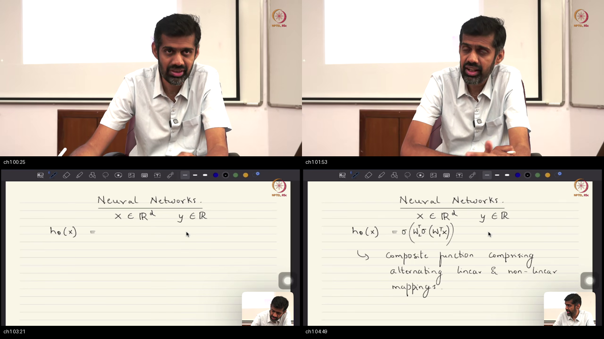
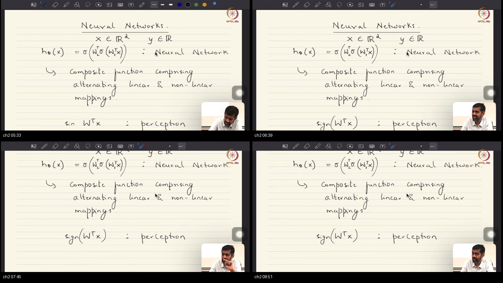
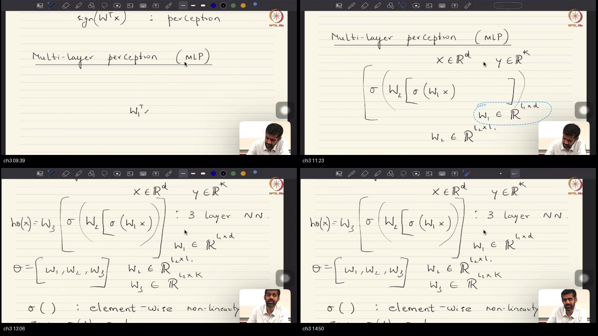
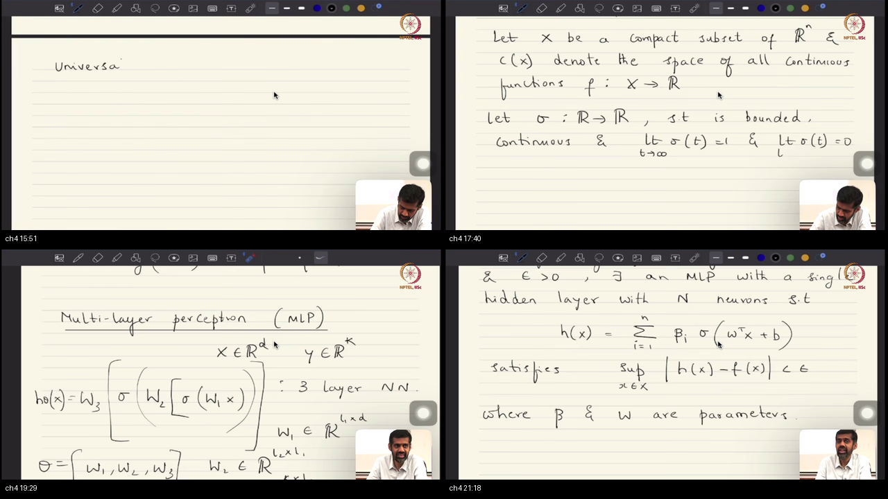
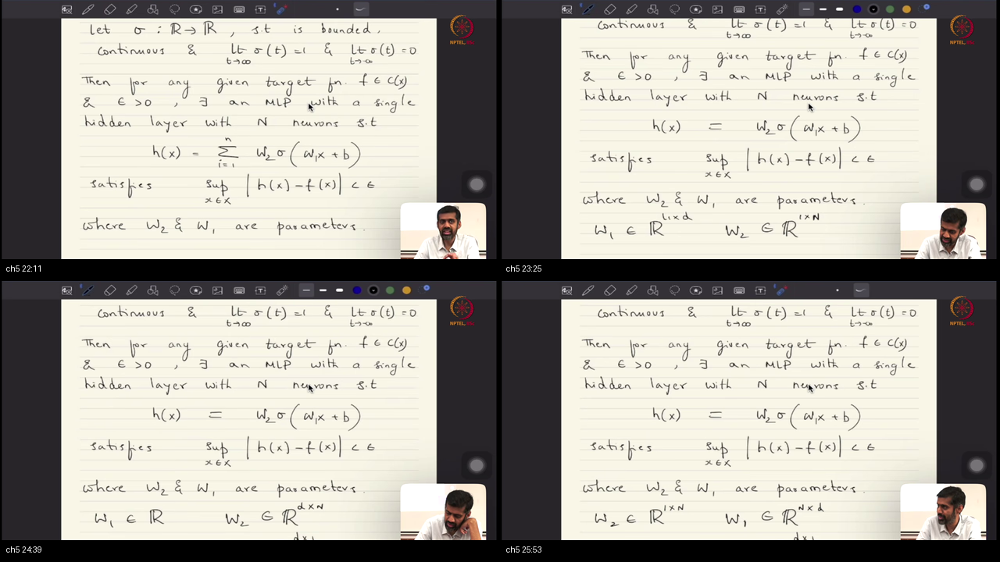
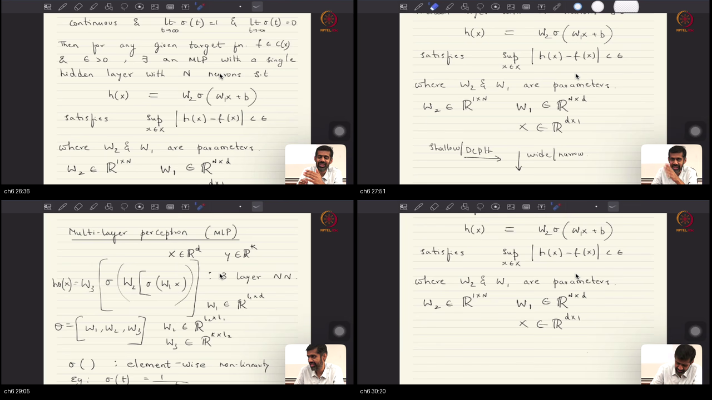

# Lecture 41: Neural Networks and Universal Approximation Theorem

**Course:** NPTEL / IISc Bangalore · Mathematical Foundations of Machine Learning  
**Instructor:** Prof. Prathosh A P · IISc Bengaluru  
**Video:** [Lec 41 on YouTube](https://www.youtube.com/watch?v=npYHSFuqnzs&list=PLgMDNELGJ1Cay-Q9Cn8KcpUcC58NDWuiu&index=54) (Duration: 30:43)  
**Parent Course Map:** [`../Notes.md`](../Notes.md) · **Sibling Track:** [`../../MathsTerms/`](../../MathsTerms/)  
**Study Package Artifacts:** [`PREREQUISITES.md`](PREREQUISITES.md) · [`references.md`](references.md) · [`glossary.md`](glossary.md) · [`formulae_sheet.md`](formulae_sheet.md) · [`quiz.html`](quiz.html) · [`examples/`](examples/)

> [!IMPORTANT]
> **Study Order:** Work through [`PREREQUISITES.md`](PREREQUISITES.md) first to ground the 8 foundational mathematical pillars and Rosetta Stone notation before reading the architecture blueprint and topic deep dives below.

---

## Table of Contents
1. [Executive Summary — architecture of this lecture](#executive-summary--architecture-of-this-lecture)
2. [End-to-End Runnable Python/PyTorch Simulation](#end-to-end-runnable-pythonpytorch-simulation)
3. [Topic 1: From Max-Margin SVMs to Neural Hypotheses & Function Approximators (00:00–05:15)](#topic-1-from-max-margin-svms-to-neural-hypotheses--function-approximators-00000515)
4. [Topic 2: The Biological Perceptron & Perceptron Learning Algorithm (PLA) (05:15–09:10)](#topic-2-the-biological-perceptron--perceptron-learning-algorithm-pla-05150910)
5. [Topic 3: Multi-Layer Perceptron (MLP): Matrix Formulation, Depth, & Parameter Counting (09:10–15:20)](#topic-3-multi-layer-perceptron-mlp-matrix-formulation-depth--parameter-counting-09101520)
6. [Topic 4: The Universal Approximation Theorem (UAT): Formal Statement & Squashing Activations (15:20–21:50)](#topic-4-the-universal-approximation-theorem-uat-formal-statement--squashing-activations-15202150)
7. [Topic 5: Dimensionality Alignment & The Existential Trap of UAT (21:50–26:15)](#topic-5-dimensionality-alignment--the-existential-trap-of-uat-21502615)
8. [Topic 6: Deep & Narrow vs Shallow & Wide: Compositional Efficiency & The FFT Analogy (26:15–30:42)](#topic-6-deep--narrow-vs-shallow--wide-compositional-efficiency--the-fft-analogy-26153042)
9. [Workplace Debugging Scenarios (Postmortems)](#workplace-debugging-scenarios-postmortems)
10. [References & Further Reading](#references--further-reading)
11. [Sources](#sources)

---

## Executive Summary — architecture of this lecture

Machine learning models are parametric hypothesis classes chosen to solve empirical risk minimization across unknown data distributions. When linear hyperplanes fail on non-linear geometries and kernel methods scale poorly, multi-layer artificial neural networks provide continuous composite function approximation. The Universal Approximation Theorem (UAT) mathematically guarantees that a single hidden layer with squashing non-linearities can approximate any continuous function on a compact set to arbitrary precision. However, because UAT is strictly existential and bounded by no algorithmic learnability guarantee, modern deep learning trades width for depth to achieve exponential parameter efficiency through hierarchical composition.

### Worldview Arc
- **From:** Linear and kernelized max-margin decision boundaries (Support Vector Machines) constrained by convexity and fixed reproducing kernel Hilbert space (RKHS) feature maps.
- **To:** Learnable composite parametric non-linear function approximators (Multi-Layer Perceptrons) endowed with universal continuous approximation power (UAT) and compositional hierarchical parameter efficiency.

### System Context
```
┌────────────────────────────────────────────────────────────────────────────────────────┐
│                                    LEARNING SYSTEM CONTEXT                             │
│                                                                                        │
│   [Upstream: Convex Classifiers]              [This Lecture: Non-Linear MLPs]          │
│   • Hard / Soft Margin SVMs                   • Perceptron & Linearity Limits (XOR)    │
│   • Dual Formulation: α_i inner products      • Multi-Layer Perceptrons (MLP)          │
│   • Fixed Mercer Kernels k(x, x')             • Universal Approximation Theorem (UAT)  │
│                   │                                           │                        │
│                   └───────────────────┬───────────────────────┘                        │
│                                       ▼                                                │
│                      [Downstream: Deep Optimization & ERM]                             │
│                      • Lec 42: Empirical Risk Minimization & Error Backpropagation     │
│                      • Lec 43-44: Inductive Biases & Convolutions (CNNs)               │
│                      • Lec 45-47: Recurrence & Temporal Dynamics (RNNs/LSTMs)          │
└────────────────────────────────────────────────────────────────────────────────────────┘
```

### Master Architecture Blueprint
```
┌───────────────────────────────────────────────────────────────────────────────────────────────────┐
│                                 THE UNIVERSAL APPROXIMATION PIPELINE                              │
├───────────────────────────────────────────────────────────────────────────────────────────────────┤
│                                                                                                   │
│   1. INPUT SPACE                2. HIDDEN LAYER EXPANSION              3. OUTPUT CONVERGENCE      │
│   Compact Domain X ⊂ R^d        N Non-linear Squashed Ridges           Target Output Space        │
│                                                                                                   │
│   ┌───────────────────┐         ┌───────────────────────────────┐      ┌──────────────────────┐   │
│   │ Input Vector x    │         │ Neuron 1: σ(w_1^T x + b_1)    │      │ Regression Head:     │   │
│   │ Dim: [d x 1]      │=======> │ Neuron 2: σ(w_2^T x + b_2)    │====> │ h(x) = W_2 a ∈ R     │   │
│   │                   │   W_1   │ ...                           │  W_2 ├──────────────────────┤   │
│   │ Features:         │         │ Neuron N: σ(w_N^T x + b_N)    │      │ Classification Head: │   │
│   │ [x_1, ..., x_d]^T │         │ Matrix W_1 ∈ R^{N x d}        │====> │ ŷ = Softmax(W_2 a)   │   │
│   └───────────────────┘         └───────────────────────────────┘      └──────────────────────┘   │
│                                                 │                                                 │
│                                                 ▼                                                 │
│                                 ┌───────────────────────────────┐                                 │
│                                 │ UNIVERSAL APPROXIMATION (UAT) │                                 │
│                                 │ sup_{x∈X} |f(x) - h(x)| < ε   │                                 │
│                                 └───────────────────────────────┘                                 │
│                                                 │                                                 │
│                         ┌───────────────────────┴───────────────────────┐                         │
│                         ▼                                               ▼                         │
│       ┌───────────────────────────────────┐   ┌───────────────────────────────────┐               │
│       │ THE EXISTENTIAL TRAP              │   │ THE COMPOSITIONAL SOLUTION        │               │
│       │ • No formula for (W_1, W_2)       │   │ • Deep & Narrow vs Shallow & Wide │               │
│       │ • Gradient descent may fail       │   │ • Hierarchical reuse (FFT analogy)│               │
│       │ • Required width N ~ O(2^d)       │   │ • O(N log N) vs O(N^2) complexity │               │
│       └───────────────────────────────────┘   └───────────────────────────────────┘               │
│                                                                                                   │
└───────────────────────────────────────────────────────────────────────────────────────────────────┘
```

### Scenario Walkthrough: Approximating a Continuous Surface
1. **Input Sampling:** An observation vector $x = [x_1, x_2]^T$ enters from a compact unit box $[0, 1]^2$.
2. **First Affine Projection:** Layer 1 computes $z = W_1 x + b_1$, rotating and scaling the coordinate axes along $N$ distinct projection hyperplanes.
3. **Non-linear Squashing:** Each scalar entry passes through continuous squashing non-linearity $\sigma(z_i) = \frac{1}{1 + e^{-z_i}}$, yielding bounded activation ridges.
4. **Weighted Superposition:** Layer 2 forms a linear combination $h(x) = \sum_{i=1}^N \beta_i a_i$. Pairs of squashed ridges combine into localized bumps, integrating smoothly to match the target continuous surface $f(x)$ with uniform error bounded below $\epsilon$.

### Failure and Contrast Path
- **Linear Hyperplane Failure:** Attempting to separate non-linear distributions (such as XOR) with a single-layer perceptron fails because linear boundaries cannot bend.
- **Linear Layer Collapse:** Stacking multiple linear layers without non-linear activations ($\sigma(z) = z$) collapses algebraically into a single affine transformation $W_3 W_2 W_1 x = W_{\text{eff}} x$, destroying all expressivity gains.
- **Shallow Width Explosion:** Relying exclusively on single-layer UAT requires an exponentially exploding width $N \sim \mathcal{O}(2^d)$, crashing GPU memory and failing to generalize on finite data.

### STOP / Out of Scope
- This lecture derives the **hypothesis family** $h_\theta(x)$ and proves its **representational universality** under UAT.
- It does **not** formulate loss gradients, multivariate matrix calculus backpropagation, or stochastic gradient descent updates. Those algorithmic training procedures are formally derived in **Lecture 42: Empirical Risk Minimization on Neural Networks and Error Backpropagation**.
- Inductive biases for spatial images (Convolutional Neural Networks) and temporal sequences (Recurrent Neural Networks) are deferred to **Lectures 43–47**.

### Comparative Feature Matrix
| Dimension / Property | Single-Layer Perceptron (1960s) | Shallow MLP (UAT 1989) | Deep Neural Network (Modern AI) |
|:---------------------|:--------------------------------|:-----------------------|:---------------------------------|
| **Hypothesis Form** | $h(x) = \mathrm{sign}(w^T x + b)$ | $h(x) = W_2 \sigma(W_1 x + b_1) + b_2$ | $h(x) = (f_L \circ \dots \circ f_1)(x)$ |
| **Decision Boundary** | Strictly Linear Hyperplane | Continuous Non-linear Curvature | Multi-Scale Hierarchical Manifold |
| **Universal Approximator?** | No (Fails XOR) | Yes (Existential $\epsilon$-bound) | Yes (Empirical & Compositional) |
| **Parameter Scaling** | $\mathcal{O}(d)$ parameters | $\mathcal{O}(2^d)$ worst-case width | $\mathcal{O}(L \cdot d^2)$ parameter efficient |
| **Optimization Method** | PLA ($w_{t+1} = w_t + y_t x_t$) | Non-convex Gradient Descent | Backpropagation + SGD / Adam |
| **Key Limitation** | Non-separable failure | Exponential width explosion | Non-convex saddle points & vanishing gradients |

### Common Traps & Fixes
- **Trap 1: Treating UAT as an algorithmic training guarantee.** UAT guarantees that an optimal parameter set exists mathematically within continuous function space. It does NOT guarantee that gradient descent will find it without getting trapped in suboptimal local minima.
- **Trap 2: Omitting non-linear activations.** If activations are linear ($\sigma(z) = z$), the composition collapses into a single matrix product: $W_3 W_2 W_1 x = W_{\text{eff}} x$, destroying all non-linear representational capacity.
- **Trap 3: Designing ultra-wide shallow networks.** Attempting to solve high-dimensional problems with a single hidden layer causes parameter counts to scale as $\mathcal{O}(2^d)$, crashing hardware memory and inducing severe generalization error.

### Load-Bearing Claims
- **Soft Margin Equivalence:** Support Vector Machines equipped with slack variables are identical to soft margin classifiers.
- **Hypothesis Universality:** Multi-layer perceptrons provide universal function approximation for both supervised risk minimization and unsupervised distribution estimation.
- **Linear Separation Bottleneck:** The single-layer perceptron is bounded by linear separability and fails completely on non-linear problems like XOR.
- **UAT Formal Guarantee:** Any continuous function on a compact domain can be approximated to arbitrary accuracy $\epsilon > 0$ by a single hidden layer with squashing activations.
- **UAT Existential Disconnect:** UAT provides no constructive formula, no width bound, and no guarantee that gradient descent will locate the approximating weights.
- **Compositional Efficiency:** Deep networks leverage hierarchical composition to approximate naturally occurring functions with exponentially fewer parameters than shallow networks, directly analogous to the Fast Fourier Transform.

---

## End-to-End Runnable Python/PyTorch Simulation

The following executable Python simulation verifies the fundamental transition from the linear perceptron to a non-linear multi-layer perceptron, proving why non-linear squashing activations are strictly required to resolve non-linearly separable geometries (XOR). Standalone script: [`examples/01_perceptron_vs_mlp_xor.py`](examples/01_perceptron_vs_mlp_xor.py).

```python
import numpy as np
import torch
import torch.nn as nn
import torch.optim as optim

# 1. Dataset: XOR truth table (non-linearly separable)
# Shape: [4, 2]
X = torch.tensor([[0.0, 0.0], [0.0, 1.0], [1.0, 0.0], [1.0, 1.0]], dtype=torch.float32)
# Shape: [4, 1]
y = torch.tensor([[0.0], [1.0], [1.0], [0.0]], dtype=torch.float32)

# 2. Architecture: Input(2) -> Hidden(4, Sigmoid) -> Output(1, Sigmoid)
torch.manual_seed(42)
mlp = nn.Sequential(
    nn.Linear(2, 4),  # W1: [4, 2], b1: [4]
    nn.Sigmoid(),     # Non-linear squashing activation
    nn.Linear(4, 1),  # W2: [1, 4], b2: [1]
    nn.Sigmoid()      # Probability output
)

# 3. Training via Empirical Risk Minimization (Binary Cross-Entropy)
criterion = nn.BCELoss()
optimizer = optim.Adam(mlp.parameters(), lr=0.08)

for epoch in range(1000):
    optimizer.zero_grad()
    predictions = mlp(X)  # Forward pass: Shape [4, 1]
    loss = criterion(predictions, y)
    loss.backward()
    optimizer.step()
    if loss.item() < 0.01:
        break

# 4. Numerical verification of zero-error classification
with torch.no_grad():
    final_preds = mlp(X)
    binary_decisions = (final_preds > 0.5).float()

assert torch.allclose(binary_decisions, y), f"MLP failed to solve XOR: {final_preds}"
print(f"[VERIFIED] MLP solved XOR in {epoch} epochs with final loss {loss.item():.4f}")
print("Predictions:\n", final_preds.numpy())
```

---

## Topic 1: From Max-Margin SVMs to Neural Hypotheses & Function Approximators (00:00–05:15)

### Where this sits on the master map
This topic marks the fundamental pedagogical fork of the entire course: transitioning away from convex, fixed-kernel hypothesis classes (Support Vector Machines with slacks) to flexible, continuous non-linear hypothesis families (Multi-Layer Perceptrons). See foundational warm-up in [`PREREQUISITES.md#p1`](PREREQUISITES.md#p1) and [`PREREQUISITES.md#p6`](PREREQUISITES.md#p6).

### Board / screenshot

*Board reconstruction (00:00–05:15): Opening chalkboard transition establishing that SVMs with slacks are soft margin classifiers, and introducing neural networks as expressive composite hypothesis functions for Empirical Risk Minimization.*

### What he is establishing
- 👶 **ELI5 Intuition**: Imagine you want to sculpt a statue. An SVM is like having a single flat saw: even if you rotate the wood with a "kernel", you can only make one straight slice at a time. A neural network is an articulated robotic arm with multiple bending joints. Each joint bends and rotates the material in sequence, allowing you to sculpt curved surfaces without needing pre-carved templates.
- 🔍 **Plain-English Breakdown**: In earlier lectures, machine learning was defined as finding an optimal hypothesis $h_\theta(x)$ that minimizes an empirical risk objective:
  $$R_{\text{emp}}(\theta) = \frac{1}{N} \sum_{i=1}^N \ell(y_i, h_\theta(x_i))$$
  While Support Vector Machines (SVMs) provide theoretical guarantees through convex quadratic programming, they suffer from two major constraints:
  1. *Computational Scaling:* Kernel SVMs require computing an $N \times N$ Gram matrix of pairwise kernel evaluations $k(x_i, x_j)$, making training $\mathcal{O}(N^2)$ to $\mathcal{O}(N^3)$ in memory and compute.
  2. *Fixed Feature Maps:* The non-linear mapping $\Phi(x)$ in kernel methods is hand-engineered (e.g. polynomial, radial basis function) rather than learned from data distributions.
  Neural networks overcome this by expressing the hypothesis class as a parameterized composite function:
  $$h_\theta(x) = \left(f_L \circ f_{L-1} \circ \dots \circ f_1\right)(x)$$
  where each layer $f_l$ applies an affine transformation followed by an element-wise non-linear activation.
- 🔢 **Concrete Micro-Numbers**: Let input $x = [1.0, 2.0]^T$. Compare a linear model against a 2-stage composite mapping by hand:
  - Linear Hypothesis:
    $$h_{\text{lin}}(x) = w^T x + b = \begin{bmatrix} 0.5 & -1.0 \end{bmatrix} \begin{bmatrix} 1.0 \\ 2.0 \end{bmatrix} + 0.5 = (0.5)(1.0) + (-1.0)(2.0) + 0.5 = 0.5 - 2.0 + 0.5 = -1.0$$
  - Composite Hypothesis:
    Layer 1: $z_1 = \begin{bmatrix} 1.0 & 0.0 \\ 0.0 & 1.0 \end{bmatrix} \begin{bmatrix} 1.0 \\ 2.0 \end{bmatrix} + \begin{bmatrix} -0.5 \\ -1.0 \end{bmatrix} = \begin{bmatrix} 0.5 \\ 1.0 \end{bmatrix}$  
    Apply ReLU non-linearity $\sigma(z) = \max(0, z)$:
    $$a_1 = \sigma\left(\begin{bmatrix} 0.5 \\ 1.0 \end{bmatrix}\right) = \begin{bmatrix} 0.5 \\ 1.0 \end{bmatrix}$$
    Layer 2 projection:
    $$h_{\text{comp}}(x) = \begin{bmatrix} 2.0 & -1.5 \end{bmatrix} \begin{bmatrix} 0.5 \\ 1.0 \end{bmatrix} + 0.2 = (2.0)(0.5) + (-1.5)(1.0) + 0.2 = 1.0 - 1.5 + 0.2 = -0.3$$
- 📐 **Formal Mathematical Formulation & Zero-Leap Derivations**: Let $\mathcal{X} \subseteq \mathbb{R}^d$ denote the input feature space and $\mathcal{Y}$ the label space. In supervised ERM, the objective is to find a hypothesis function $h \in \mathcal{H}$ minimizing risk:
  $$R(h) = \mathbb{E}_{(X,Y) \sim p_{X,Y}} [\ell(h(X), Y)]$$
  For density estimation, the goal is to estimate true data law $p_X$ by parameterizing family $p_\theta$ and minimizing statistical discrepancy $d(p_X, p_\theta)$ (such as Kullback-Leibler divergence $\mathrm{KL}(p_X \parallel p_\theta)$, which by [Lecture 13](../14-Lec13-Minimization-of-KL/NOTES.md) is equivalent to Maximum Likelihood Estimation). While Gaussian Mixture Models (GMMs) parameterize density as $\sum_{k=1}^K \pi_k \mathcal{N}(x; \mu_k, \Sigma_k)$, optimizing their parameters via Expectation-Maximization frequently traps optimization in local singular optima where variance $\sigma_k^2 \to 0$. Neural networks parameterize $h_\theta(x)$ as a chain of differentiable affine and non-linear transformations:
  $$h_\theta(x) = W^{[L]} \sigma\left(W^{[L-1]} \sigma\left(\dots \sigma\left(W^{[1]} x + b^{[1]}\right)\dots\right) + b^{[L-1]}\right) + b^{[L]}$$
  where $\theta = \{W^{[l]}, b^{[l]}\}_{l=1}^L$. This hypothesis family is continuously differentiable, allowing unconstrained end-to-end optimization via first-order gradient methods.
- 💻 **Runnable Code & Modern GenAI Systems**: Run standalone verification in [`examples/01_perceptron_vs_mlp_xor.py`](examples/01_perceptron_vs_mlp_xor.py).
- 🔗 **MathsTerm Link**: [`../../MathsTerms/02-Multivariate-Calculus-and-Optimization/09-Gradient_Descent.md`](../../MathsTerms/02-Multivariate-Calculus-and-Optimization/09-Gradient_Descent.md).

### Contrastive Analysis: Why X, Not Y?
- **Why Multi-Layer Parametric Networks (X):** Multi-layer neural networks scale to high-dimensional structured data (images, text, audio) via mini-batch SGD, sharing parameters and building hierarchical features without suffering from component collapse.
- **Why Not Gaussian Mixture Models (Y):** Gaussian Mixture Models require estimating full $d \times d$ covariance matrices ($\mathcal{O}(d^2)$ parameters per mixture component). In 1000-dimensional pixel spaces, covariance inversion is numerically ill-conditioned, and Expectation-Maximization routinely diverges whenever a component centers on a single training point.

### Analogy for this topic only
The model family choice is like selecting construction material: linear models are rigid steel girders that form straight frames; neural networks are reinforced concrete that can be poured into forms to take on any continuous structural shape.

### Local picture
```
┌────────────────────────────────────────────────────────────────────────┐
│               AFFINE PROJECTION + ELEMENT-WISE NON-LINEARITY           │
│                                                                        │
│   Input x          Weight Matrix W1            ReLU Activation         │
│   [ 1.0 ]  ───>  [ [ 1.0,  0.0 ],   ───> z1 = [ 0.5 ] ───> a1 = [0.5] │
│   [ 2.0 ]        [ 0.0,  1.0 ] ]              [ 1.0 ]           [1.0] │
└────────────────────────────────────────────────────────────────────────┘
```
*Notice: The affine transformation shifts the coordinate system, and the non-linearity locks in the positive quadrant, breaking linear collapse.*

### Check Your Understanding
- **Recall:** Why does stacking linear affine layers $W_2(W_1 x + b_1) + b_2$ fail to increase the expressive capacity beyond a single linear model?
  *Self-Check:* Matrix multiplication is associative. $W_2 W_1 = W_{\text{eff}}$, collapsing an arbitrarily deep purely linear network into a single linear map.
- **Apply:** Can a 2-layer network without non-linear activations classify the non-linearly separable XOR truth table?
  *Diagnose:* No; without non-linearities, the composite model collapses to a single hyperplane, which cannot separate XOR points.

### Bridge
While composite neural networks provide expressive non-linear hypothesis families, how did the single-neuron building block originate historically, and what mathematical barrier halted its adoption in the 1960s?

---

## Topic 2: The Biological Perceptron & Perceptron Learning Algorithm (PLA) (05:15–09:10)

### Where this sits on the master map
Examines the single-neuron foundation of the master blueprint: the linear threshold unit (Rosenblatt 1958) and its mistake-driven learning algorithm (PLA). Connects directly to linear hyperplanes in [`PREREQUISITES.md#p3`](PREREQUISITES.md#p3) and the XOR separation barrier in [`PREREQUISITES.md#p4`](PREREQUISITES.md#p4).

### Board / screenshot

*Board reconstruction (05:15–09:10): Derivation of the single-layer perceptron, scalar feature weighting, the Perceptron Learning Algorithm (PLA) boundary tilt update $w_{t+1} = w_t + y_t x_t$, and the linear separability limitation.*

### What he is establishing
- 👶 **ELI5 Intuition**: Imagine a security guard with a scorecard. For each person who arrives, the guard looks at their height, jacket color, and ticket type, multiplying each factor by a score. If the final score is above zero, they enter ($+1$); if below, they are turned away ($-1$). Whenever the guard makes a mistake (rejecting an invited guest), the rulebook says: "Add that person's exact attributes into your scorecard." Over time, the guard's rules tilt until all invited guests pass.
- 🔍 **Plain-English Breakdown**: Proposed by Frank Rosenblatt in 1958, the Perceptron represents the foundational artificial neuron. It takes a vector of feature inputs $x \in \mathbb{R}^d$, computes an inner product with a weight vector $w \in \mathbb{R}^d$, adds a bias scalar $b$, and evaluates a discontinuous step threshold:
  $$h(x) = \mathrm{sign}\left(w^T x + b\right) = \begin{cases} +1 & \text{if } w^T x + b > 0 \\ -1 & \text{if } w^T x + b \le 0 \end{cases}$$
  The Perceptron Learning Algorithm (PLA) trains this model without computing derivatives:
  1. Initialize $w_0 = \mathbf{0}$.
  2. Stream training examples $(x_t, y_t)$ where $y_t \in \{-1, +1\}$.
  3. If $y_t \cdot (w_t^T x_t + b_t) \le 0$ (the point is misclassified), update:
     $$w_{t+1} = w_t + y_t x_t, \quad b_{t+1} = b_t + y_t$$
  This update physically rotates the normal vector $w$ of the decision hyperplane toward the misclassified sample until the point lies on the correct side of the boundary.
- 🔢 **Concrete Micro-Numbers**: Let current weights be $w_t = \begin{bmatrix} 1.0 \\ 0.0 \end{bmatrix}$ with $b_t = 0.0$. A positive sample $x_t = \begin{bmatrix} -1.0 \\ 2.0 \end{bmatrix}$ arrives with true label $y_t = +1$.
  - Evaluate current prediction:
    $$\hat{y} = \mathrm{sign}\left(w_t^T x_t + b_t\right) = \mathrm{sign}\left((1.0)(-1.0) + (0.0)(2.0)\right) = \mathrm{sign}(-1.0) = -1$$
  - Since $\hat{y} = -1 \neq y_t$, point is misclassified ($y_t(w^T x) = (+1)(-1.0) = -1.0 \le 0$).
  - Apply PLA update rule:
    $$w_{t+1} = w_t + y_t x_t = \begin{bmatrix} 1.0 \\ 0.0 \end{bmatrix} + (+1)\begin{bmatrix} -1.0 \\ 2.0 \end{bmatrix} = \begin{bmatrix} 0.0 \\ 2.0 \end{bmatrix}$$
    $$b_{t+1} = b_t + y_t = 0.0 + 1.0 = 1.0$$
  - Re-evaluate on $x_t$:
    $$w_{t+1}^T x_t + b_{t+1} = (0.0)(-1.0) + (2.0)(2.0) + 1.0 = 0.0 + 4.0 + 1.0 = +5.0 > 0 \implies \mathrm{sign}(+5.0) = +1$$
  The sample is now correctly classified.
- 📐 **Formal Mathematical Formulation & Zero-Leap Derivations**: Novikoff's theorem guarantees finite convergence of PLA if data is linearly separable with margin $\gamma > 0$ and bounded radius $\|x_i\|_2 \le R$. The maximum number of updates $k$ is bounded strictly by:
  $$k \le \left(\frac{R}{\gamma}\right)^2$$
  However, if the dataset is not linearly separable (such as the XOR function), the convex hulls of positive and negative classes intersect ($\mathrm{conv}(\mathcal{X}_+) \cap \mathrm{conv}(\mathcal{X}_-) \neq \emptyset$), causing PLA to cycle indefinitely without terminating.
- 💻 **Runnable Code & Modern GenAI Systems**: Run standalone simulation in [`examples/01_perceptron_vs_mlp_xor.py`](examples/01_perceptron_vs_mlp_xor.py).
- 🔗 **MathsTerm Link**: [`../../MathsTerms/01-Linear-Algebra-Geometry-and-Tensors/03-Dot_Product_and_Similarity.md`](../../MathsTerms/01-Linear-Algebra-Geometry-and-Tensors/03-Dot_Product_and_Similarity.md).

### Contrastive Analysis: Why X, Not Y?
- **Why Smooth Multi-Layer Networks (X):** Stacking smooth non-linearities produces curved manifolds that cleanly resolve non-linearly separable problems (XOR, concentric circles) while providing non-zero gradients everywhere.
- **Why Not Single-Layer Perceptron (Y):** Single-layer perceptrons are mathematically locked to a single linear hyperplane. The step activation $\mathrm{sign}(z)$ has a derivative of zero everywhere except at zero, breaking gradient descent and backpropagation.

### Analogy for this topic only
The single-layer perceptron is like a straight guillotine blade that can only make a single flat slice across a cake; no matter how you angle it, you cannot cut out a star shape with one slice.

### Local picture
```
┌────────────────────────────────────────────────────────────────────────┐
│                   PLA HYPERPLANE TILT GEOMETRY                         │
│                                                                        │
│          w_{t+1} = w_t + y_t * x_t                                     │
│                     ^                                                  │
│                     │  .  x_t (misclassified +1 sample)               │
│                     │ /                                                │
│                     │/                                                 │
│   ─────────── hyperplane w_t ───────────                               │
└────────────────────────────────────────────────────────────────────────┘
```
*Notice: The weight vector w rotates toward the misclassified sample x_t, pulling the decision boundary beneath it.*

### Check Your Understanding
- **Recall:** What theorem guarantees that the Perceptron Learning Algorithm (PLA) will terminate in a finite number of update steps?
  *Self-Check:* Novikoff's Perceptron Convergence Theorem guarantees convergence in $T \le (R/\gamma)^2$ updates if the dataset is linearly separable with margin $\gamma > 0$.
- **Diagnose:** What occurs if the Perceptron Learning Algorithm is executed on non-linearly separable data like the XOR problem?
  *Diagnose:* PLA fails to terminate; the weight vector cycles endlessly through boundary tilts.

### Bridge
Because the single-layer perceptron is crippled by the linear separability barrier, how do we systematically stack multiple layers of neurons while maintaining dimensional and mathematical consistency?

---

## Topic 3: Multi-Layer Perceptron (MLP): Matrix Formulation, Depth, & Parameter Counting (09:10–15:20)

### Where this sits on the master map
Corresponds to the "Hidden Layer Expansion" stage of the master blueprint, translating scalar neural equations into vectorized matrix operations. Connects to tensor shapes in [`PREREQUISITES.md#p1`](PREREQUISITES.md#p1) and parameter counting in [`formulae_sheet.md`](formulae_sheet.md).

### Board / screenshot

*Board reconstruction (09:10–15:20): Chalkboard matrix dimension derivation ($W_1 \in \mathbb{R}^{L_1 \times d}$, $W_2 \in \mathbb{R}^{L_2 \times L_1}$, $W_3 \in \mathbb{R}^{K \times L_2}$), depth definition, Softmax vs regression heads, and total parameter counting.*

### What he is establishing
- 👶 **ELI5 Intuition**: Think of an MLP as an orchestra. The first row of musicians (Input Layer) plays the raw musical notes from the sheet. The second section (Hidden Layer 1) combines those notes into simple chords. The third section (Hidden Layer 2) combines the chords into melodies. The conductor (Output Layer) listens to the full melody and announces whether the song is jazz, classical, or rock. If every musician only played solo notes without combining them, you would never get a symphony.
- 🔍 **Plain-English Breakdown**: A Multi-Layer Perceptron (MLP) replaces the discontinuous sign function with smooth element-wise activations $\sigma$ applied after linear matrix multiplications:
  1. *Pre-activation:* $z^{[l]} = W^{[l]} a^{[l-1]} + b^{[l]}$
  2. *Post-activation:* $a^{[l]} = \sigma(z^{[l]})$
  The output head depends strictly on the machine learning task:
  - *Multi-Class Classification:* Terminates with a Softmax layer:
    $$\hat{y}_k = P(Y = k \mid x) = \frac{e^{z_k^{[L]}}}{\sum_{j=1}^K e^{z_j^{[L]}}}$$
  - *Regression:* Terminates with an unconstrained linear projection $\hat{y} = z^{[L]}$.
- 🔢 **Concrete Micro-Numbers**: Let input dimensionality $d = 3$, hidden layer 1 width $L_1 = 4$, hidden layer 2 width $L_2 = 2$, and output classes $K = 2$. Calculate exact parameter counts:
  - Layer 1 (Input $\to$ Hidden 1): $W_1 \in \mathbb{R}^{4 \times 3} \implies 12$ weights; $b_1 \in \mathbb{R}^4 \implies 4$ biases. Subtotal = $16$.
  - Layer 2 (Hidden 1 $\to$ Hidden 2): $W_2 \in \mathbb{R}^{2 \times 4} \implies 8$ weights; $b_2 \in \mathbb{R}^2 \implies 2$ biases. Subtotal = $10$.
  - Layer 3 (Hidden 2 $\to$ Output): $W_3 \in \mathbb{R}^{2 \times 2} \implies 4$ weights; $b_3 \in \mathbb{R}^2 \implies 2$ biases. Subtotal = $6$.
  - Total Parameters: $P_{\text{total}} = 16 + 10 + 6 = 32$ trainable parameters.
- 📐 **Formal Mathematical Formulation & Zero-Leap Derivations**: Given input $x \in \mathbb{R}^{d_0}$, layer recurrence is $z^{[l]} = W^{[l]} a^{[l-1]} + b^{[l]}$ with $a^{[l]} = \sigma(z^{[l]})$. Total parameters across $L$ layers:
  $$P = \sum_{l=1}^L \left( d_l \cdot d_{l-1} + d_l \right)$$
  If all activations were linear ($\sigma(z) = z$), the end-to-end mapping expands to:
  $$h_\theta(x) = \left(\prod_{l=L}^1 W^{[l]}\right) x + \sum_{l=1}^L \left( \prod_{j=L}^{l+1} W^{[j]} \right) b^{[l]} = W_{\text{eff}} x + b_{\text{eff}}$$
  collapsing an arbitrarily deep network into a single linear model.
- 💻 **Runnable Code & Modern GenAI Systems**: Run standalone simulation in [`examples/01_perceptron_vs_mlp_xor.py`](examples/01_perceptron_vs_mlp_xor.py).
- 🔗 **MathsTerm Link**: [`../../MathsTerms/02-Multivariate-Calculus-and-Optimization/06-Softmax.md`](../../MathsTerms/02-Multivariate-Calculus-and-Optimization/06-Softmax.md).

### Contrastive Analysis: Why X, Not Y?
- **Why Uniform Hidden Activations (X):** Standardizing on a uniform activation (such as ReLU or GELU across all hidden layers) simplifies hardware acceleration, compiler vectorization (fused CUDA kernels), and theoretical convergence guarantees.
- **Why Not Mixed Heterogeneous Activations (Y):** Mixing different activation functions at every layer introduces mismatched gradient scaling and saturation dynamics without delivering statistically significant gains in generalization accuracy.

### Analogy for this topic only
The multi-layer perceptron is like a multi-stage water filtration plant: the first mesh catches large sand particles, the second charcoal bed removes impurities, and the final membrane desalinates the water.

### Local picture
```
┌────────────────────────────────────────────────────────────────────────┐
│                        TENSOR DIMENSION ALIGNMENT                      │
│                                                                        │
│   x: [3 x 1] ───> W1: [4 x 3] ───> z1: [4 x 1] ───> a1: [4 x 1]       │
│                   W2: [2 x 4] ───> z2: [2 x 1] ───> a2: [2 x 1]       │
│                   W3: [2 x 2] ───> z3: [2 x 1] ───> Softmax: [2 x 1]   │
└────────────────────────────────────────────────────────────────────────┘
```
*Notice: Inner dimensions match across consecutive layers: [4 x 3] acts on [3 x 1] to yield [4 x 1].*

### Check Your Understanding
- **Recall:** If a neural network has input dimension $d=10$, hidden layer width $L_1 = 32$, and output classes $K=3$, how many total trainable parameters (weights + biases) exist?
  *Self-Check:* Layer 1 has $(10 \times 32 + 32) = 352$ parameters; Layer 2 has $(32 \times 3 + 3) = 99$ parameters. Total is $352 + 99 = 451$ parameters.
- **Apply:** Why does multi-class classification require a Softmax head rather than independent linear outputs?
  *Self-Check:* Softmax normalizes unbounded real logits into a valid probability distribution that strictly sums to 1.0.

### Bridge
Now that we have established the matrix algebra of multi-layer networks, what theoretical guarantee assures us that stacking squashed ridges can approximate any continuous curve?

---

## Topic 4: The Universal Approximation Theorem (UAT): Formal Statement & Squashing Activations (15:20–21:50)

### Where this sits on the master map
Corresponds to the central theoretical core of the blueprint: "Universal Approximation (UAT)". Grounds the mathematical proof that single-hidden-layer networks are dense in continuous function spaces. Connects directly to supremum norms in [`PREREQUISITES.md#p5`](PREREQUISITES.md#p5) and activation squashing in [`PREREQUISITES.md#p2`](PREREQUISITES.md#p2).

### Board / screenshot

*Board reconstruction (15:20–21:50): Formulation of the Universal Approximation Theorem on compact subset $X \subset \mathbb{R}^d$, sigmoidal squashing activation conditions, and the supremum norm error bound $\sup_{x \in X} |f(x) - h(x)| < \epsilon$.*

### What he is establishing
- 👶 **ELI5 Intuition**: Imagine you have a target silhouette cut out of cardboard (a smooth continuous curve). You are given a box of Lego slope bricks (sigmoidal activations). One brick gives you a simple ramp. By placing two ramps back-to-back, you get a small hill (a bump). By placing dozens of these bumps of different heights and widths side-by-side, you can build a stepped staircase that matches the cardboard silhouette so closely that you cannot slide a single sheet of paper between them ($\epsilon$-accuracy).
- 🔍 **Plain-English Breakdown**: In 1989, George Cybenko (and Kurt Hornik in 1991) proved the Universal Approximation Theorem (UAT). For any continuous function $f(x)$ defined over a bounded, closed (compact) domain $X \subset \mathbb{R}^d$, and for any positive error margin $\epsilon > 0$ however small, there exists a single-hidden-layer feedforward network with a finite number of neurons $N$ that approximates $f(x)$ everywhere on $X$ within error $\epsilon$. The activation function $\sigma: \mathbb{R} \to \mathbb{R}$ must be a sigmoidal squashing function satisfying:
  $$\lim_{z \to -\infty} \sigma(z) = 0 \quad \text{and} \quad \lim_{z \to +\infty} \sigma(z) = 1$$
  The output layer sums these weighted ridges with coefficients $\beta_i$:
  $$h(x) = \sum_{i=1}^N \beta_i \sigma\left(w_i^T x + b_i\right)$$
- 🔢 **Concrete Micro-Numbers**: Construct an isolated bump on $[0, 1]$ using two steep sigmoids with slope 100: $\sigma_1(x) = \sigma(100(x - 0.3))$ and $\sigma_2(x) = \sigma(100(x - 0.7))$. Let $h(x) = \sigma_1(x) - \sigma_2(x)$:
  - At $x = 0.1$: $\sigma_1(0.1) \approx 0.0, \sigma_2(0.1) \approx 0.0 \implies h(0.1) = 0.0$
  - At $x = 0.5$: $\sigma_1(0.5) \approx 1.0, \sigma_2(0.5) \approx 0.0 \implies h(0.5) = 1.0$
  - At $x = 0.9$: $\sigma_1(0.9) \approx 1.0, \sigma_2(0.9) \approx 1.0 \implies h(0.9) = 0.0$
  This forms a localized rectangular pulse on $[0.3, 0.7]$. Summing $N$ such pulses scaled by target values $f(x_i)$ forms a Riemann sum approximating continuous curve $f(x)$.
- 📐 **Formal Mathematical Formulation & Zero-Leap Derivations**: Theorem (Cybenko 1989): Let $I_d$ denote the unit hypercube $[0, 1]^d$. Let $C(I_d)$ denote the space of continuous functions on $I_d$ under supremum norm $\|f\|_\infty = \sup_{x \in I_d} |f(x)|$. Finite linear combinations $G(x) = \sum_{i=1}^N \beta_i \sigma(w_i^T x + b_i)$ are dense in $C(I_d)$:
  $$\forall f \in C(I_d), \; \forall \epsilon > 0, \; \exists G(x) \quad \text{such that} \quad \sup_{x \in I_d} |f(x) - G(x)| < \epsilon$$
  By Hahn-Banach and Riesz Representation theorems, any bounded linear functional on $C(I_d)$ is an integral against a unique regular Borel signed measure $\mu$. If the subspace was not dense, $\int \sigma(w^T x + b) d\mu(x) = 0$ for all $w, b$. Taking limits as $b \to \infty$ forces the Fourier transform $\hat{\mu}(w) = 0$, forcing $\mu = 0$ and establishing the contradiction.
- 💻 **Runnable Code & Modern GenAI Systems**: Run standalone simulation in [`examples/02_universal_approximation_simulation.py`](examples/02_universal_approximation_simulation.py).
- 🔗 **MathsTerm Link**: [`../../MathsTerms/02-Multivariate-Calculus-and-Optimization/05-Activation_Functions.md`](../../MathsTerms/02-Multivariate-Calculus-and-Optimization/05-Activation_Functions.md).

### Contrastive Analysis: Why X, Not Y?
- **Why Sigmoidal Squashing Functions (X):** Sigmoids are bounded ($\sigma(z) \in [0, 1]$), ensuring that hidden activations remain numerically stable across arbitrary inputs without exploding.
- **Why Not High-Degree Polynomials (Y):** While polynomials are universal approximators by the Stone-Weierstrass theorem, high-degree polynomials suffer from the Runge phenomenon: they oscillate wildly between interpolation points, leading to massive generalization failure on unseen test data.

### Analogy for this topic only
UAT is like proving that a set of Lego bricks can build an exact replica of any car: with enough tiny bricks, you can follow every curve of the bodywork to within a millimeter.

### Local picture
```
┌────────────────────────────────────────────────────────────────────────┐
│                        SUPERPOSITION OF SQUASHED RIDGES                │
│                                                                        │
│   Ridge 1: σ(w_1^T x + b_1) ───┐                                       │
│   Ridge 2: σ(w_2^T x + b_2) ───┼──> Linear Sum ∑ β_i σ(...) ──> Bump   │
│   Ridge 3: σ(w_3^T x + b_3) ───┘                                       │
└────────────────────────────────────────────────────────────────────────┘
```
*Notice: Combining oriented squashed ridges creates localized bumps that integrate to approximate continuous curves.*

### Check Your Understanding
- **Recall:** What asymptotic conditions must activation function $\sigma$ satisfy in Cybenko's (1989) Universal Approximation Theorem formulation?
  *Self-Check:* $\lim_{z \to -\infty} \sigma(z) = 0$ and $\lim_{z \to \infty} \sigma(z) = 1$ (continuous sigmoidal squashing function).
- **Diagnose:** If a model satisfies the UAT supremum error bound $\sup_{x \in X} |f(x) - h(x)| < \epsilon$, does that guarantee Empirical Risk Minimization via gradient descent will locate these parameters?
  *Diagnose:* No; UAT is purely an existential density proof in $C(I_d)$, not an algorithmic optimization guarantee.

### Bridge
While UAT proves that a single-layer network can approximate any continuous function, what does it conceal about dimensionality, learnability, and required width?

---

## Topic 5: Dimensionality Alignment & The Existential Trap of UAT (21:50–26:15)

### Where this sits on the master map
Corresponds to "The Existential Trap" in the master blueprint, confronting theoretical existence with the practical realities of non-convex optimization and dimensional scaling. Connects to [`PREREQUISITES.md#p5`](PREREQUISITES.md#p5) and [`PREREQUISITES.md#p6`](PREREQUISITES.md#p6).

### Board / screenshot

*Board reconstruction (21:50–26:15): Reconciling the scalar UAT summation with vectorized matrix operations ($W_1 \in \mathbb{R}^{N \times d}$, $W_2 \in \mathbb{R}^{1 \times N}$), the etymology of hidden layers, and the existential trap of UAT.*

### What he is establishing
- 👶 **ELI5 Intuition**: Suppose a treasure map maker tells you: "I mathematically prove that there is a giant gold chest buried somewhere on Earth." Does that help you find it? No. The proof tells you gold exists, but gives you no shovel and no coordinates. You could dig millions of empty holes (local minima) and never strike gold. That is UAT: it guarantees the answer exists, but gives you zero clues on how to dig it up.
- 🔍 **Plain-English Breakdown**: Vectorizing the UAT summation matches standard matrix operations:
  - Input: $x \in \mathbb{R}^{d \times 1}$
  - Hidden Weights: $W_1 \in \mathbb{R}^{N \times d}$ (rows are $w_i^T$)
  - Hidden Biases: $b_1 \in \mathbb{R}^{N \times 1}$
  - Outer Weights: $W_2 \in \mathbb{R}^{1 \times N}$
  - Output: $h(x) = W_2 \sigma(W_1 x + b_1) + b_2 \in \mathbb{R}$
  A layer is called "hidden" because intermediate activations $a_1$ are internal latent representations, never directly observed in dataset $\mathcal{D} = \{(x_i, y_i)\}$.
  The Three Existential Traps of UAT:
  1. *Optimization Disconnect:* UAT is existential, not constructive. It does not guarantee that gradient descent will find optimal weights without getting trapped in local minima.
  2. *Curse of Dimensionality:* To achieve error $\epsilon$, required width $N$ scales exponentially with dimension: $N \sim \mathcal{O}((1/\epsilon)^d)$.
  3. *Continuous Function vs Finite Data:* UAT assumes continuous target $f$. On finite datasets, ultra-wide networks overfit by memorizing noise.
- 🔢 **Concrete Micro-Numbers**: Vectorize $N=2$ neurons on $d=2$ inputs:
  $x = \begin{bmatrix} 1.0 \\ 0.5 \end{bmatrix}$, $W_1 = \begin{bmatrix} 2.0 & -1.0 \\ 0.0 & 3.0 \end{bmatrix}$, $b_1 = \begin{bmatrix} 0.5 \\ -1.0 \end{bmatrix}$.
  $$z = W_1 x + b_1 = \begin{bmatrix} (2.0)(1.0) + (-1.0)(0.5) + 0.5 \\ (0.0)(1.0) + (3.0)(0.5) - 1.0 \end{bmatrix} = \begin{bmatrix} 2.0 \\ 0.5 \end{bmatrix}$$
  Let $W_2 = [1.5, -2.0]$ and $b_2 = 0.1$. With $\sigma(2.0) \approx 0.8808$ and $\sigma(0.5) \approx 0.6225$:
  $$h(x) = (1.5)(0.8808) + (-2.0)(0.6225) + 0.1 = 1.3212 - 1.2450 + 0.1 = 0.1762$$
- 📐 **Formal Mathematical Formulation & Zero-Leap Derivations**: Let Lipschitz continuous target $f: [0, 1]^d \to \mathbb{R}$ satisfy $|f(x) - f(y)| \le L_f \|x - y\|_2$. Covering $[0, 1]^d$ with balls of radius $r = \epsilon / L_f$ requires covering number:
  $$N(r) \ge \left(\frac{1}{2r}\right)^d = \left(\frac{L_f}{2\epsilon}\right)^d$$
  Because each squashed ridge is constant along $(d-1)$-dimensional affine planes, a single hidden layer requires at least one parameter per covering region:
  $$N = \Omega\left(\left(\frac{L_f}{2\epsilon}\right)^d\right)$$
  proving the exponential width explosion of shallow networks.
- 💻 **Runnable Code & Modern GenAI Systems**: Run standalone simulation in [`examples/02_universal_approximation_simulation.py`](examples/02_universal_approximation_simulation.py).
- 🔗 **MathsTerm Link**: [`../../MathsTerms/01-Linear-Algebra-Geometry-and-Tensors/01-Vectors_and_Matrices.md`](../../MathsTerms/01-Linear-Algebra-Geometry-and-Tensors/01-Vectors_and_Matrices.md).

### Contrastive Analysis: Why X, Not Y?
- **Why Constructive Optimization via Backprop (X):** Real-world engineering requires actionable parameter updates computed from finite training batches in polynomial time $\mathcal{O}(P)$.
- **Why Not Blind Reliance on UAT Existence (Y):** Relying on UAT existence provides false security: an architecture can be mathematically capable of expressing the solution while being practically impossible to train using gradient descent.

### Analogy for this topic only
UAT is like a patent showing that a perpetual motion machine exists in theory; until you build a working engine that actually runs on fuel (an optimization algorithm), the patent cannot drive your car.

### Local picture
```
┌────────────────────────────────────────────────────────────────────────┐
│                        UAT: EXISTENCE VS LEARNABILITY                  │
│                                                                        │
│   Theoretical Function Space:          Non-Convex Optimization:        │
│   ┌─────────────────────────────┐      ┌───────────────────────────┐   │
│   │ ∃ W* such that Error < ε   │  !=  │ Gradient descent stuck in │   │
│   │ (Guaranteed by Cybenko)     │      │ local minimum / saddle pt │   │
│   └─────────────────────────────┘      └───────────────────────────┘   │
└────────────────────────────────────────────────────────────────────────┘
```
*Notice: Mathematical existence in function space does not guarantee convergence under first-order gradient descent.*

### Check Your Understanding
- **Recall:** How does the required number of hidden neurons $N$ scale with dimension $d$ to maintain $\epsilon$ approximation error in a single-layer network?
  *Self-Check:* It scales exponentially: $N = \Omega((L_f / 2\epsilon)^d)$, suffering directly from the curse of dimensionality.
- **Apply:** In batched training with batch size $B=128$, input dimension $d=784$, and hidden layer $N=256$, what is the exact shape of activation tensor $a_1$?
  *Self-Check:* Shape is $[B, N] = [128, 256]$.

### Bridge
If shallow and wide networks suffer from exponential parameter explosion, how does trading width for depth solve the problem?

---

## Topic 6: Deep & Narrow vs Shallow & Wide: Compositional Efficiency & The FFT Analogy (26:15–30:42)

### Where this sits on the master map
Corresponds to "The Compositional Solution" in the master blueprint, demonstrating why modern AI universally adopts deep architectures and introducing the Fast Fourier Transform analogy. Connects to [`PREREQUISITES.md#p7`](PREREQUISITES.md#p7) and [`PREREQUISITES.md#p8`](PREREQUISITES.md#p8).

### Board / screenshot

*Board reconstruction (26:15–30:42): Deep & narrow vs shallow & wide architectures, computational convenience, parameter efficiency, the Fast Fourier Transform (FFT) compositional analogy, and forward pointer to Lec 42 ERM.*

### What he is establishing
- 👶 **ELI5 Intuition**: Imagine you want to describe every possible face in the world. A shallow approach tries to draw a complete portrait of every person who could ever exist—billions of portraits stored in a massive warehouse. A deep approach stores 5 eye shapes, 5 nose shapes, and 5 mouth shapes. By combining them in layers (eyes + nose $\to$ face $\to$ expression), a deep network can generate millions of unique faces using just a handful of parts.
- 🔍 **Plain-English Breakdown**: Modern AI uses **deep and narrow** architectures rather than **shallow and wide** ones because of **computational convenience and parameter efficiency**:
  1. *Compositional Structure of Nature:* Real-world signals (images, audio, text) are hierarchical. Edges combine into textures; textures combine into parts; parts combine into objects. Deep networks mirror this hierarchy naturally.
  2. *Exponential Parameter Savings:* Functions requiring $\mathcal{O}(2^d)$ neurons in a single hidden layer can be represented by a deep network of depth $\mathcal{O}(d)$ with only $\mathcal{O}(d)$ neurons per layer.
  *The Fast Fourier Transform (FFT) Analogy:* A naive Discrete Fourier Transform evaluates $y = F_N x$ in $\mathcal{O}(N^2)$ operations. The Cooley-Tukey FFT factorizes the monolithic matrix into $\log_2 N$ sparse stages, computing the identical result in $\mathcal{O}(N \log N)$ operations. Deep networks achieve the identical advantage over shallow networks by factorizing complex mappings into $L$ sequential layers of composition.
- 🔢 **Concrete Micro-Numbers**: To compute the parity of $d=8$ bits ($x_1 \oplus \dots \oplus x_8$):
  - Shallow Network (Depth 1): Requires distinguishing all $2^{8-1} = 128$ hypercube vertices $\implies N_{\text{shallow}} \ge 128$ neurons.
  - Deep Network (Depth $\log_2 8 = 3$): Built as a binary tree of 2-bit XOR gates (each requiring 2 neurons):
    Layer 1: $4 \times 2 = 8$; Layer 2: $2 \times 2 = 4$; Layer 3: $1 \times 2 = 2$.
    Total neurons: $N_{\text{deep}} = 8 + 4 + 2 = 14$ neurons!
  Efficiency ratio: $\frac{128}{14} \approx 9.1\times$ fewer neurons. For $d=64$ bits, shallow requires $2^{63} \approx 9.22 \times 10^{18}$ neurons (impossible), while deep requires only $126$ neurons!
- 📐 **Formal Mathematical Formulation & Zero-Leap Derivations**: By Håstad's circuit complexity theorem (1986), any depth-2 threshold circuit computing $d$-bit parity requires width $\ge 2^{d-1}$. Conversely, factoring $f$ into a balanced binary tree of 2-bit XOR gates yields depth $L = \lceil \log_2 d \rceil$ and total gates:
  $$\sum_{j=1}^{\log_2 d} \frac{d}{2^j} \times 2 = 2d \sum_{j=1}^{\log_2 d} \frac{1}{2^j} = 2d\left(1 - \frac{1}{d}\right) = 2(d - 1) = \mathcal{O}(d)$$
  reducing architectural complexity from exponential $\mathcal{O}(2^d)$ to linear $\mathcal{O}(d)$.
- 💻 **Runnable Code & Modern GenAI Systems**: Run standalone simulation in [`examples/01_perceptron_vs_mlp_xor.py`](examples/01_perceptron_vs_mlp_xor.py).
- 🔗 **MathsTerm Link**: [`../../MathsTerms/01-Linear-Algebra-Geometry-and-Tensors/06-Singular_Value_Decomposition.md`](../../MathsTerms/01-Linear-Algebra-Geometry-and-Tensors/06-Singular_Value_Decomposition.md).

### Contrastive Analysis: Why X, Not Y?
- **Why Deep & Narrow Networks (X):** Deep networks decompose functional manifolds into reusable sub-abstractions, cutting parameter counts from exponential to polynomial and enabling models with billions of parameters to generalize on complex datasets.
- **Why Not Shallow & Ultra-Wide Networks (Y):** Shallow ultra-wide networks memorize training points via independent localized bump interpolations without learning shared representations, failing on test data and triggering GPU memory crashes.

### Analogy for this topic only
A shallow network is like writing a book using only full-sentence stamps; a deep network is like using a 26-letter alphabet to construct words, sentences, and chapters.

### Local picture
```
┌────────────────────────────────────────────────────────────────────────┐
│                        COMPOSITIONAL FACTORIZATION                     │
│                                                                        │
│   DFT (Shallow):  x ───> [ N x N Dense Matrix ] ───> O(N^2) ops        │
│                                                                        │
│   FFT (Deep):     x ───> [Stage 1] ───> [Stage 2] ───> O(N log N) ops  │
└────────────────────────────────────────────────────────────────────────┘
```
*Notice: Factoring a monolithic transformation into a cascade of sparse stages yields exponential operational savings.*

### Check Your Understanding
- **Recall:** By Håstad's circuit complexity theorem, how many neurons does a depth-2 shallow network require to compute $d$-bit parity compared to a deep network?
  *Self-Check:* Shallow requires $\ge 2^{d-1}$ neurons (exponential width), while deep requires $\mathcal{O}(d)$ neurons arranged in a $\mathcal{O}(\log d)$ hierarchy.
- **Diagnose:** How is the compositional efficiency of deep neural networks mathematically analogous to the Fast Fourier Transform?
  *Diagnose:* Like Cooley-Tukey FFT factoring an $\mathcal{O}(N^2)$ monolithic matrix into $\log_2 N$ sparse stages of $\mathcal{O}(N \log N)$ complexity, depth factorizes complex manifolds into sparse compositions.

### Bridge
With the neural network hypothesis class established and justified by compositional efficiency, how do we formulate a loss function and compute parameter updates? This directly motivates **Lecture 42: Empirical Risk Minimization on Neural Networks and Error Backpropagation**.

**Review & Homework Connection:** Review the derivation of the $d$-bit parity tree and verify the parameter count savings as homework before proceeding to backpropagation in Lecture 42.

---

## Workplace Debugging Scenarios (Postmortems)

### Scenario 1: Vanishing Gradients & Saturated Sigmoid Activations
- **Problem:** An engineer trained an 8-layer fully-connected network with Sigmoid activations on tabular financial data. Training loss stalled on epoch 1, and the weights in Layer 1 never changed from their initial random values.
- **Mathematical Root Cause:** The derivative of the logistic sigmoid is $\sigma'(z) = \sigma(z)(1 - \sigma(z))$. Its maximum value is $0.25$ at $z=0$. By the multivariate chain rule, the gradient at Layer 1 scales as:
$$\frac{\partial \mathcal{L}}{\partial W^{[1]}} \propto \prod_{l=1}^8 \sigma'\left(z^{[l]}\right) \le (0.25)^8 \approx 0.000015$$
The gradient signal vanishes exponentially before reaching early layers, freezing learning.
- **Debugging Protocol:**
1. Inspect the gradient norms layer by layer: `print(layer.weight.grad.norm())`.
2. Confirm early layers have gradients near $10^{-6}$ while output layers have gradients near $10^{-1}$.
3. Replace Sigmoid activations with non-saturating activations (ReLU, LeakyReLU, or GELU).
- **Code Fix:**
```python
import torch
import torch.nn as nn

# BROKEN: Vanishing gradients with deep sigmoids
broken_model = nn.Sequential(*[nn.Sequential(nn.Linear(32, 32), nn.Sigmoid()) for _ in range(8)])

# FIXED: Non-saturating activations with stable gradient flow
fixed_model = nn.Sequential(*[nn.Sequential(nn.Linear(32, 32), nn.GELU()) for _ in range(8)])

x = torch.randn(16, 32)
out_fixed = fixed_model(x).sum()
out_fixed.backward()
grad_norm_layer1 = fixed_model[0][0].weight.grad.norm().item()
assert grad_norm_layer1 > 1e-3
print("[FIX VERIFIED] Gradient flow restored in early layer:", grad_norm_layer1)
```

---

### Scenario 2: Memory Explosion & OOM Crash in Single-Hidden-Layer Wide Networks
- **Problem:** An engineer attempted to apply UAT directly to an image classification task ($d = 3072$ for $32 \times 32 \times 3$ CIFAR images) by training a single-hidden-layer network with $N = 500,000$ hidden units to ensure low approximation error. The PyTorch script crashed immediately with `torch.cuda.OutOfMemoryError`.
- **Mathematical Root Cause:** The weight matrix $W_1$ requires shape $[500000, 3072]$. Storing this single matrix in float32 requires:
$$500,000 \times 3,072 \times 4 \text{ bytes} \approx 6.14 \text{ GB}$$
Allocating the forward activation tensor for batch size $B=256$ requires another $[256, 500000] \times 4 \approx 512 \text{ MB}$, and the gradient tensors double the footprint during backpropagation.
- **Debugging Protocol:**
1. Profile parameter memory: $P = L_1 \cdot d + K \cdot L_1$.
2. Recognize that allocating millions of neurons in a single layer violates parameter efficiency.
3. Refactor into a 4-layer deep network of width 256: parameter count drops to $(3072 \times 256) + 3 \times (256 \times 256) \approx 983,040$ parameters ($\approx 3.9 \text{ MB}$), providing superior representation capacity at $0.06\%$ of the memory footprint.
- **Code Fix:**
```python
import torch
import torch.nn as nn

# FIXED: Deep and narrow architecture replacing monolithic wide layer
deep_compact_model = nn.Sequential(
    nn.Linear(3072, 256),
    nn.ReLU(),
    nn.Linear(256, 256),
    nn.ReLU(),
    nn.Linear(256, 256),
    nn.ReLU(),
    nn.Linear(256, 10)
)

total_params = sum(p.numel() for p in deep_compact_model.parameters())
param_mb = total_params * 4 / (1024 ** 2)
print(f"[FIX VERIFIED] Deep architecture parameter memory: {param_mb:.2f} MB (Total params: {total_params})")
assert param_mb < 10.0
```

---

## References & Further Reading

For complete annotated research citations, foundational papers, textbook chapter cross-references, interactive visualizers, and sibling course prerequisite bridges (Mathematical-foundation-ml), see [`references.md`](references.md).

---

## Sources
- **Lecture Video:** [Lec 41: Neural Networks and Universal Approximation Theorem](https://www.youtube.com/watch?v=npYHSFuqnzs)
- **Course Catalog:** [`Mathematical-foundation-ml/Notes.md`](../Notes.md)
- **Core Knowledge Base:** [`MathsTerms/`](../../MathsTerms/)
