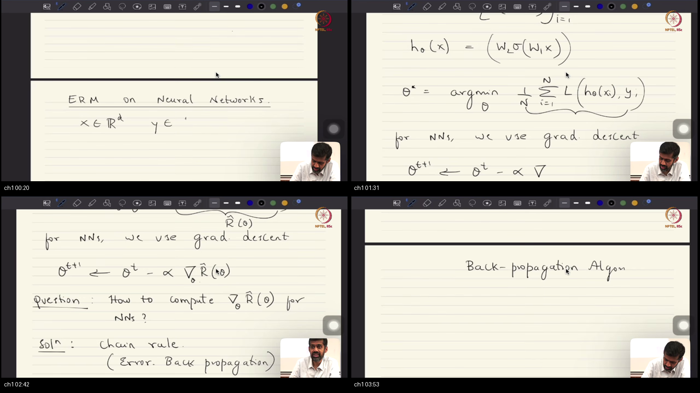
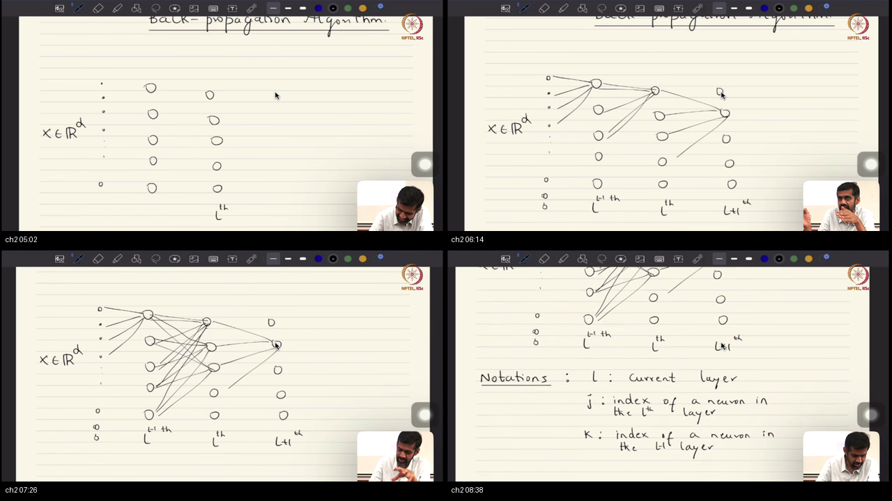
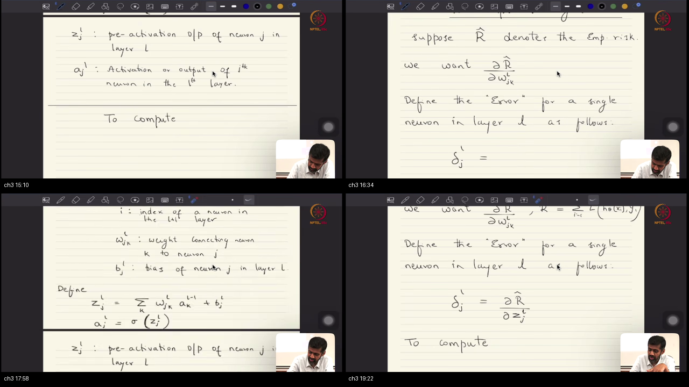
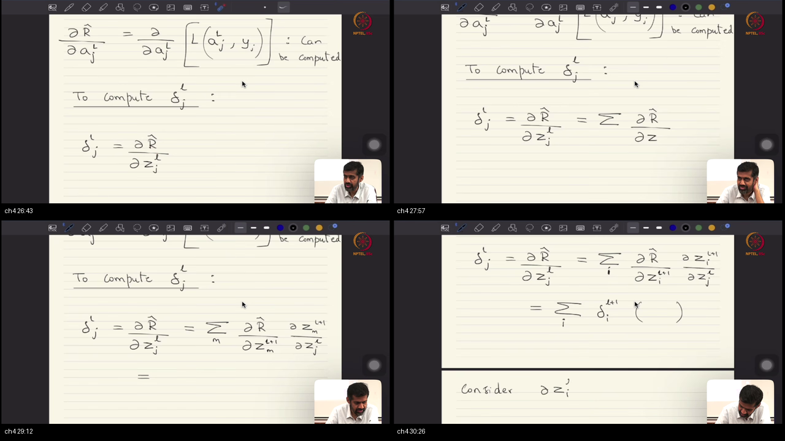
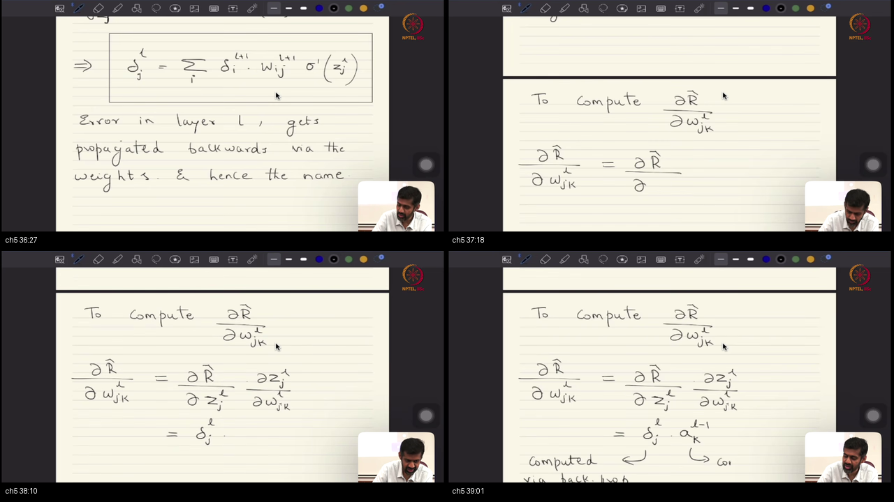
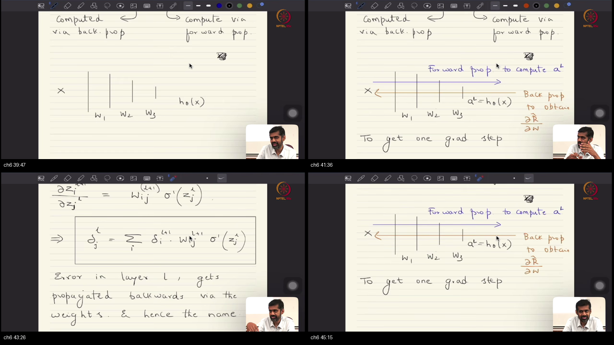
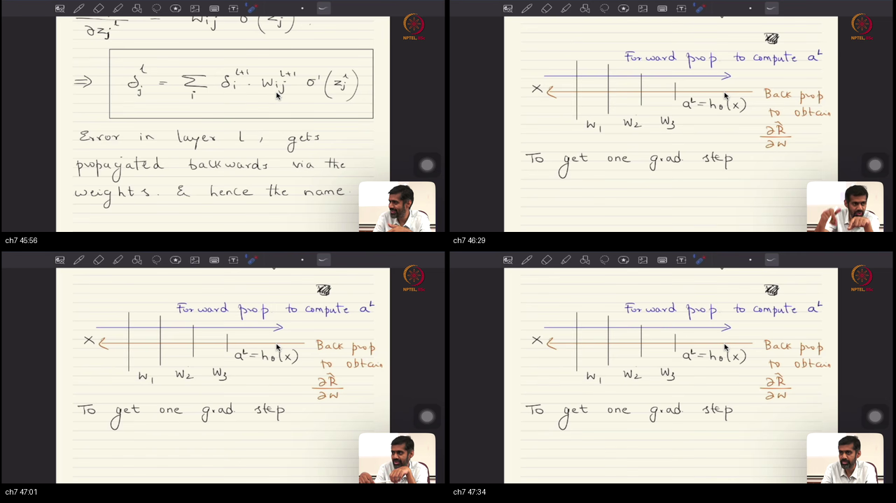

# Lecture 42: ERM on Neural Networks and Error Backpropagation

**Course:** NPTEL / IISc Bangalore — Mathematical Foundations of Machine Learning  
**Instructor:** Prof. Prathosh A P — IISc Bengaluru  
**Video:** [Lec 42 on YouTube](https://www.youtube.com/watch?v=dONDRwX_83E) (Duration: 47:44)  
**Parent Course Map:** [`../Notes.md`](../Notes.md) · **Sibling Track:** [`../../MathsTerms/`](../../MathsTerms/)  
**Study Package Artifacts:** [`PREREQUISITES.md`](PREREQUISITES.md) · [`references.md`](references.md) · [`glossary.md`](glossary.md) · [`formulae_sheet.md`](formulae_sheet.md) · [`quiz.html`](quiz.html) · [`examples/`](examples/)

> [!IMPORTANT]
> **Study Order:** Work through [`PREREQUISITES.md`](PREREQUISITES.md) first to ground the 7 foundational mathematical pillars and Rosetta Stone notation before reading the architecture blueprint and topic deep dives below.

---

## Table of Contents
1. [Executive Summary — Computational Graph & Backprop Architecture](#executive-summary--computational-graph--backprop-architecture)
2. [Standalone Simulation Script](#standalone-simulation-script)
3. [Topic 1: ERM Formulation for Neural Networks & Gradient Descent Setup (00:00–04:14)](#topic-1-erm-formulation-for-neural-networks--gradient-descent-setup-00000414)
4. [Topic 2: Multivariable Calculus Chain Rule & Tree Structures (04:14–08:44)](#topic-2-multivariable-calculus-chain-rule--tree-structures-04140844)
5. [Topic 3: Defining Error Sensitivities ($\delta$) & Forward/Backward Notational Setup (08:44–14:26)](#topic-3-defining-error-sensitivities-delta--forwardbackward-notational-setup-08441426)
6. [Topic 4: Deriving Output Layer Error Sensitivities & Parameter Gradients (14:26–22:48)](#topic-4-deriving-output-layer-error-sensitivities--parameter-gradients-14262248)
7. [Topic 5: Recursive Hidden Layer Backpropagation: Derivation & Message-Passing (22:48–32:20)](#topic-5-recursive-hidden-layer-backpropagation-derivation--message-passing-22483220)
8. [Topic 6: Vectorized Matrix Backpropagation, Hardware Efficiency, & GEMM (32:20–41:18)](#topic-6-vectorized-matrix-backpropagation-hardware-efficiency--gemm-32204118)
9. [Topic 7: Regularized ERM & Architectural Inductive Biases (41:18–47:44)](#topic-7-regularized-erm--architectural-inductive-biases-41184744)
10. [Workplace Debugging Scenarios (Postmortems)](#workplace-debugging-scenarios-postmortems)
11. [References & Further Reading](#references--further-reading)

---

## Executive Summary

Empirical Risk Minimization (ERM) on deep neural networks solves for optimal parameter weights by optimizing a differentiable sample loss across training data. Because deep neural networks are complex nested composite functions, naive numerical differentiation scales quadratically with parameter count $\mathcal{O}(P^2)$, rendering deep architectures intractable. Error Backpropagation solves this fundamental computational bottleneck by applying the multivariable calculus chain rule in reverse topological order, evaluating exact gradients in linear time $\mathcal{O}(P)$.

```
FORWARD PROPAGATION (Activations Flow: Feature Projection):
  x = a^[0] ────> [ W^[1] · + b^[1] ] ───> z^[1] ───> σ(·) ───> a^[1] ────> ... ────> a^[L] = y_hat
                                                                                         │
                                                                                         ▼
                                                                            Loss: ℓ(y, a^[L])
                                                                                         │
BACKWARD PROPAGATION (Adjoint Errors Flow: Sensitivity Message-Passing):                ▼
  ∇_W^[1] ◂── [ · (a^[0])^T ]                                               Base: δ^[L] = ∇_a ℓ ⊙ σ'(z^[L])
    ▲                                                                                    │
    │                                                                                    ▼
  δ^[1] ◂── [ (W^[2])^T · ⊙ σ'(z^[1]) ] ◂── ... ◂── δ^[L-1] ◂── [ (W^[L])^T · ⊙ σ'(z^[L-1]) ]
```

### Comparative Feature Matrix: Algorithmic Gradients

| Method / Property | Numerical Finite Differences | Forward-Mode Autodiff | Error Backpropagation (Reverse-Mode) |
|:------------------|:-----------------------------|:----------------------|:-------------------------------------|
| **Mathematical Mechanism** | Perturbation: $\frac{f(\theta + \epsilon e_i) - f(\theta)}{\epsilon}$ | Dual numbers / Forward Tangents | Adjoint Vector-Jacobian Products (VJP) |
| **Computational Complexity** | $\mathcal{O}(P \cdot T_{\text{forward}})$ | $\mathcal{O}(P \cdot T_{\text{forward}})$ | $\mathcal{O}(1 \cdot T_{\text{forward}})$ ($\sim 3\times$ FLOPs total) |
| **Memory Footprint** | $\mathcal{O}(1)$ (No activation caching) | $\mathcal{O}(1)$ (No backward graph) | $\mathcal{O}(L \cdot \text{Width})$ (Caches all $z^{[l]}, a^{[l]}$) |
| **Optimal Domain** | Gradient checking for small $P$ | Few inputs, many outputs ($d \ll K$) | Many inputs/weights, scalar loss ($P \gg 1$) |
| **Hardware Alignment** | Poor (Requires $P$ serial passes) | Moderate | Optimal (Dense GEMM parallel systolic arrays) |

### Scenario Walkthrough
When training a multi-layer neural network on high-dimensional data, the forward pass evaluates successive affine transformations and non-linearities from input $x$ to output prediction $\hat{y}$. During the backward pass, error sensitivities $\delta^{[l]}$ are propagated in reverse topological order from layer $L$ back to layer 1.

### STOP / Out of Scope
This lecture does not cover second-order Hessian optimization methods (BFGS/L-BFGS), stochastic mini-batch scheduling dynamics, or automatic differentiation compiler graph fusion optimizations (e.g. TorchScript / XLA), which belong to systems engineering.

### Load-Bearing Claims
1. Naive numerical differentiation requires $\mathcal{O}(P)$ forward passes, taking $\mathcal{O}(P^2)$ time; backpropagation computes exact gradients for all $P$ parameters in a single reverse pass in $\mathcal{O}(P)$ operations.
2. The error sensitivity variable $\delta_j^{[l]} \equiv \frac{\partial \hat{R}}{\partial z_j^{[l]}}$ decouples the affine parameters $W^{[l]}, b^{[l]}$ from downstream non-linearities, transforming full-chain differentiation into recursive vector-Jacobian products.
3. The backward message passing recurrence $\delta^{[l]} = ((W^{[l+1]})^T \delta^{[l+1]}) \odot \sigma'(z^{[l]})$ uses the transpose of the forward weight matrices, enabling hardware acceleration via dense GEMM kernels.

### Common Engineering and Mathematical Traps
- **Trap 1: Forgetting Activation Caching:** Trying to run the backward pass without caching pre-activations $z^{[l]}$ and post-activations $a^{[l-1]}$ during the forward pass forces redundant recomputations.
- **Trap 2: Matrix Transpose Dimension Mismatch:** Computing weight gradient $a^{[l-1]} (\delta^{[l]})^T$ instead of $\delta^{[l]} (a^{[l-1]})^T$ produces an inverted dimension matrix $(N_{l-1} \times N_l)$ rather than $(N_l \times N_{l-1})$.

---

## Standalone Simulation Script

This standalone verification block runs end-to-end forward and backward passes using NumPy, validating exact scalar-to-matrix backpropagation:

```python
import numpy as np

def run_backprop_simulation():
    np.random.seed(42)
    # Architecture: d=3, hidden N1=4, output N2=2
    d, N1, N2 = 3, 4, 2
    x = np.array([0.5, -1.2, 0.8])
    y = np.array([1.0, 0.0])

    W1 = np.random.randn(N1, d) * 0.5
    b1 = np.zeros(N1)
    W2 = np.random.randn(N2, N1) * 0.5
    b2 = np.zeros(N2)

    # 1. Forward Pass
    z1 = W1 @ x + b1
    a1 = 1.0 / (1.0 + np.exp(-z1))
    z2 = W2 @ a1 + b2
    a2 = 1.0 / (1.0 + np.exp(-z2))

    loss = 0.5 * np.sum((a2 - y) ** 2)

    # 2. Backward Pass
    delta2 = (a2 - y) * (a2 * (1.0 - a2))
    delta1 = (W2.T @ delta2) * (a1 * (1.0 - a1))

    # Parameter Gradients via Outer Product
    grad_W2 = np.outer(delta2, a1)
    grad_b2 = delta2
    grad_W1 = np.outer(delta1, x)
    grad_b1 = delta1

    assert grad_W1.shape == (N1, d)
    assert grad_W2.shape == (N2, N1)
    assert np.all(np.isfinite(grad_W1)) and np.all(np.isfinite(grad_W2))
    print(f"[VERIFIED] End-to-end backprop loss: {loss:.4f} | grad_W1 norm: {np.linalg.norm(grad_W1):.4f}")

run_backprop_simulation()
```

---

## Table of Contents
1. [Topic 1: ERM Formulation for Neural Networks & Gradient Descent Setup](#topic-1-erm-formulation-for-neural-networks--gradient-descent-setup-00000414)
2. [Topic 2: Notation, Multilayer Architecture, & Forward Computational Graph](#topic-2-notation-multilayer-architecture--forward-computational-graph-04141415)
3. [Topic 3: Defining Layer Error Sensitivity delta and Output Layer Base Case](#topic-3-defining-layer-error-sensitivity-delta-and-output-layer-base-case-14152554)
4. [Topic 4: The Recursive Error Backpropagation Equation in Hidden Layers](#topic-4-the-recursive-error-backpropagation-equation-in-hidden-layers-25543613)
5. [Topic 5: Weight & Bias Parameter Gradients and Gradient Descent Updates](#topic-5-weight--bias-parameter-gradients-and-gradient-descent-updates-36133916)
6. [Topic 6: Vectorized Matrix Backpropagation, Hardware Acceleration, & Training Loop](#topic-6-vectorized-matrix-backpropagation-hardware-acceleration--training-loop-39164547)
7. [Topic 7: Regularized ERM & Architectural Inductive Bias Preview](#topic-7-regularized-erm--architectural-inductive-bias-preview-45474744)
8. [Workplace Debugging Scenarios (Postmortems)](#workplace-debugging-scenarios-postmortems)
9. [References & Further Reading](#references--further-reading)
10. [Sources](#sources)

---

## Topic 1: ERM Formulation for Neural Networks & Gradient Descent Setup (00:00–04:14)

### Where this sits on the master map
Initiates the operational bridge of the course: transforming theoretical neural hypothesis classes established in [`54-Lec41`](../54-Lec41-Neural-Networks-UAT/) into practical, trainable models through first-order optimization. Connects to [`PREREQUISITES.md#p3`](PREREQUISITES.md#p3) and [`PREREQUISITES.md#p5`](PREREQUISITES.md#p5).

### Board / screenshot

*Board reconstruction (00:00–04:14): Opening framing defining inputs $x \in \mathbb{R}^d$, labels $y \in \mathbb{R}^K$, hypothesis function $h_\theta(x) = W_2 \sigma(W_1 x)$, the Empirical Risk Minimization objective $\theta^* = \arg\min_\theta \hat{R}(\theta)$, and introducing Gradient Descent via the multivariable chain rule.*

### What he is establishing
- 👶 **ELI5 Intuition**: Imagine you are playing a giant board game with thousands of interconnected gears. Turning one gear in the back moves ten levers in the front. If the front lever points to the wrong square, you want to know: "Which way do I turn each gear so the pointer moves in the right direction?" You can now trace the gear teeth backward from the pointer to the handle to figure out exactly how much each gear contributed to the mistake.
- 🔍 **Plain-English Breakdown**: In supervised machine learning, we observe training data $\mathcal{D} = \{(x_i, y_i)\}_{i=1}^n \stackrel{\text{i.i.d.}}{\sim} P_{X,Y}$. The goal is to select parameters $\theta^*$ that minimize empirical risk:
  $$\hat{R}(\theta) = \frac{1}{n} \sum_{i=1}^n \ell(y_i, h_\theta(x_i))$$
  Because neural network hypotheses $h_\theta(x)$ are non-linear composite functions, $\hat{R}(\theta)$ is non-convex. Optimization is executed via first-order Gradient Descent:
  $$\theta_{t+1} = \theta_t - \eta \nabla_\theta \hat{R}(\theta_t)$$
  The central engineering challenge is computing $\nabla_\theta \hat{R}(\theta)$. The multivariable chain rule applied to neural networks is historically named **Error Backpropagation** (Rumelhart, Hinton, & Williams 1986).
  *Tutor-Voice Ownership:* You can now formulate training as standard gradient descent on empirical risk; what is still missing is an efficient algorithm to compute nested multivariable derivatives without exponential complexity.
  *Wrong vs Right Move:* A naive approach tries to approximate gradients by perturbing each weight individually (numerical differentiation), which requires millions of forward passes. The correct move is running one backward message-passing traversal that computes all parameter gradients simultaneously.
- 🔢 **Concrete Micro-Numbers**: Let network have scalar parameter $\theta$. Let loss be $\ell(y, h_\theta(x)) = \frac{1}{2}(h_\theta(x) - y)^2$ where $h_\theta(x) = \theta \cdot x$.
  For single sample $x = 2.0$, $y = 5.0$, current parameter $\theta = 1.0$:
  - Prediction: $h_\theta(2.0) = (1.0)(2.0) = 2.0$.
  - Error: $h_\theta(x) - y = 2.0 - 5.0 = -3.0$.
  - Gradient: $\frac{\partial \ell}{\partial \theta} = (h_\theta(x) - y) \cdot x = (-3.0)(2.0) = -6.0$.
  - Update with learning rate $\eta = 0.1$: $\theta_{\text{new}} = 1.0 - 0.1(-6.0) = 1.0 + 0.6 = 1.6$.
  - New prediction: $h_{1.6}(2.0) = 3.2$ (closer to 5.0!).
- 📐 **Formal Mathematical Formulation & Zero-Leap Derivations**: Let $h_\theta(x) = (f_L \circ f_{L-1} \circ \dots \circ f_1)(x)$. By the multivariable chain rule, the gradient of scalar risk $\hat{R}$ with respect to intermediate parameter matrix $\theta^{[l]}$ is given by the composition of intermediate Jacobians:
  $$\nabla_{\theta^{[l]}} \hat{R} = \sum_{i=1}^n \left( \frac{\partial h_\theta(x_i)}{\partial \theta^{[l]}} \right)^T \nabla_{h} \ell(y_i, h_\theta(x_i))$$
- 💻 **Runnable Code & Modern GenAI Systems**: Run standalone simulation in [`examples/01_scalar_vs_vectorized_backprop.py`](examples/01_scalar_vs_vectorized_backprop.py).
- 🔗 **MathsTerm Link**: [`../../MathsTerms/02-Multivariate-Calculus-and-Optimization/09-Gradient_Descent.md`](../../MathsTerms/02-Multivariate-Calculus-and-Optimization/09-Gradient_Descent.md).

### Contrastive Analysis: Why X, Not Y?
- **Why Analytic Error Backpropagation (X):** Reverse-mode differentiation computes exact gradients with machine precision in $\mathcal{O}(P)$ operations, requiring only one forward and one backward pass per training batch.
- **Why Not Numerical Finite Differences (Y):** Evaluating $\frac{\hat{R}(\theta + \epsilon e_i) - \hat{R}(\theta)}{\epsilon}$ for each of the $P$ parameters requires $P+1$ full forward evaluations. For a modern model with 1 billion parameters, one gradient step would require 1 billion forward passes, making training physically impossible.

### Analogy for this topic only
*Scene:* A multi-stage assembly line produces custom cars. At the end of the line, a car fails safety testing by having its bumper 3 inches too low.  
*Instances:* Worker A welded the chassis, Worker B attached the suspension, and Worker C bolted the bumper.  
*Hard Question:* How does the factory manager tell Worker A how much to adjust the chassis height without tearing down the entire factory and rebuilding it $P$ times from scratch?  
*Right vs Wrong:* The wrong approach tests Worker A's adjustment by rebuilding 10,000 complete test cars. The right approach starts at the final tape measure (bumper error) and walks backward through Worker C and Worker B, calculating the exact chain of mechanical linkages directly to Worker A in a single inspection walk.

### Local picture
```
┌────────────────────────────────────────────────────────────────────────┐
│               EMPIRICAL RISK MINIMIZATION WITH GRADIENT DESCENT        │
│                                                                        │
│   Dataset D = {(x_i, y_i)} ───> Forward Pass h_θ(x) ───> Loss ℓ(y, h)  │
│                                                               │        │
│   Update: θ ← θ - η ∇_θ R_hat ◂── Backward Pass ∇_θ R_hat ◂───┘        │
└────────────────────────────────────────────────────────────────────────┘
```
*Notice: The training cycle forms a closed feedback loop: forward inference computes loss, backward chain rule extracts gradients, and gradient descent updates parameters.*

### Check Your Understanding
- **Recall:** What is the primary computational advantage of Error Backpropagation over numerical differentiation?
  *Self-Check:* Backpropagation evaluates the gradient with respect to all $P$ parameters in $\mathcal{O}(P)$ operations (one backward pass), whereas numerical differentiation requires $\mathcal{O}(P^2)$ operations ($P+1$ forward passes).
- **Apply:** If a model has $P = 10^7$ parameters and a forward pass takes 10 ms, how long would one gradient step take using finite differences versus backpropagation?
  *Diagnose:* Finite differences would take $10^7 \times 10 \text{ ms} = 100,000 \text{ seconds} \approx 27.7 \text{ hours}$ for a single step, while backpropagation takes $\approx 30 \text{ ms}$.

### Bridge
Now that we have established Empirical Risk Minimization and motivated the chain rule, how do we formalize the multilayer neural architecture and establish unambiguous mathematical notation for every index, layer, and parameter?

---

## Topic 2: Notation, Multilayer Architecture, & Forward Computational Graph (04:14–14:15)

### Where this sits on the master map
Establishes the structural foundation of the master blueprint: defining layer boundaries, the triplet indexing convention ($k, j, i$), pre-activations $z_j^{[l]}$, and post-activations $a_j^{[l]}$. Connects to [`PREREQUISITES.md#p2`](PREREQUISITES.md#p2) and [`PREREQUISITES.md#p4`](PREREQUISITES.md#p4).

### Board / screenshot

*Board reconstruction (04:14–14:15): Dense blackboard network topology showing connections between layers $l-1$, $l$, and $l+1$, index conventions ($k$ in $l-1$, $j$ in $l$, $i$ in $l+1$), weight notation $w_{jk}^{[l]}$, pre-activation $z_j^{[l]}$, and activation $a_j^{[l]} = \sigma(z_j^{[l]})$.*

### What he is establishing
- 👶 **ELI5 Intuition**: Imagine a multi-floor office building where memos are sent from floor to floor. On Floor 1 (Layer $l-1$), employees write numbers on memo slips. On Floor 2 (Layer $l$), each worker collects memos from all Floor 1 employees, multiplies each by a personal trust score ($w_{jk}$), adds a base number ($b_j$), and then applies a company stamp ($\sigma$). We must give every worker and every memo an exact floor-and-desk label so nobody gets confused.
- 🔍 **Plain-English Breakdown**: A multilayer feedforward neural network consists of $L$ layers. To trace connections unambiguously without confusing indices, Prof. Prathosh establishes a strict **triplet index convention**:
  - $k \in \{1, \dots, N_{l-1}\}$: index of sending neuron in layer $l-1$.
  - $j \in \{1, \dots, N_l\}$: index of current receiving neuron in layer $l$.
  - $i \in \{1, \dots, N_{l+1}\}$: index of downstream receiving neuron in layer $l+1$.
  Every neuron performs two distinct operations:
  1. *Pre-activation ($z_j^{[l]}$):* Linear affine projection:
     $$z_j^{[l]} = \sum_{k=1}^{N_{l-1}} w_{jk}^{[l]} a_k^{[l-1]} + b_j^{[l]}$$
  2. *Post-activation ($a_j^{[l]}$):* Differentiable non-linear feature:
     $$a_j^{[l]} = \sigma\left(z_j^{[l]}\right)$$
  Boundary conditions: $a^{[0]} = x \in \mathbb{R}^d$, and $a^{[L]} = h_\theta(x) \in \mathbb{R}^K$.
  *Tutor-Voice Ownership:* You can now write down the forward equation for any arbitrary neuron in any layer; what is still missing is linking these forward variables to the backward sensitivity equations.
  *Wrong vs Right Move:* A common notation blunder is swapping weight indices to $w_{kj}$, confusing rows and columns. In standard mathematical notation, $w_{jk}^{[l]}$ denotes weight connecting *from* $k$ *to* $j$, which corresponds to row $j$, column $k$ in matrix $W^{[l]}$.
- 🔢 **Concrete Micro-Numbers**: Let layer $l-1$ have 2 neurons with activations $a^{[l-1]} = [1.5, -0.5]^T$.
  Neuron $j=1$ in layer $l$ has incoming weights $w_{11}^{[l]} = 0.4$, $w_{12}^{[l]} = -0.2$, and bias $b_1^{[l]} = 0.1$.
  Let activation function be standard logistic sigmoid $\sigma(z) = \frac{1}{1 + e^{-z}}$.
  - Pre-activation:
    $$z_1^{[l]} = (0.4)(1.5) + (-0.2)(-0.5) + 0.1 = 0.6 + 0.1 + 0.1 = 0.8$$
  - Post-activation:
    $$a_1^{[l]} = \sigma(0.8) = \frac{1}{1 + e^{-0.8}} \approx \frac{1}{1 + 0.4493} \approx 0.6900$$
- 📐 **Formal Mathematical Formulation & Zero-Leap Derivations**: Expressing the layer operation in compact tensor notation:
  $$z^{[l]} = W^{[l]} a^{[l-1]} + b^{[l]}, \quad a^{[l]} = \sigma\left(z^{[l]}\right)$$
  where $W^{[l]} \in \mathbb{R}^{N_l \times N_{l-1}}$, $b^{[l]} \in \mathbb{R}^{N_l}$, $a^{[l-1]} \in \mathbb{R}^{N_{l-1}}$, and $a^{[l]} \in \mathbb{R}^{N_l}$.
  The total number of parameters across $L$ layers is:
  $$P = \sum_{l=1}^L \left( N_l N_{l-1} + N_l \right)$$
- 💻 **Runnable Code & Modern GenAI Systems**: Run standalone simulation in [`examples/01_scalar_vs_vectorized_backprop.py`](examples/01_scalar_vs_vectorized_backprop.py).
- 🔗 **MathsTerm Link**: [`../../MathsTerms/01-Linear-Algebra-Geometry-and-Tensors/01-Vectors_and_Matrices.md`](../../MathsTerms/01-Linear-Algebra-Geometry-and-Tensors/01-Vectors_and_Matrices.md).

### Contrastive Analysis: Why X, Not Y?
- **Why Separating Pre-activation $z$ from Post-activation $a$ (X):** Separating the affine stage from the activation stage allows clean modular decomposition: the link derivative $\frac{\partial z}{\partial w} = a$ is purely linear, while the non-linearity is localized entirely inside $\frac{\partial a}{\partial z} = \sigma'(z)$.
- **Why Not Collapsing into a Single Monolithic Function (Y):** Writing $a_j^{[l]} = \sigma(\sum w a + b)$ directly without defining $z$ entangles the activation derivative with every incoming weight, requiring repeated evaluation of $\sigma'$ across every partial derivative and obscuring the error sensitivity variable $\delta$.

### Analogy for this topic only
*Scene:* A relay race where runners pass batons between numbered zones.  
*Instances:* Zone $l-1$ has runner $k$, Zone $l$ has runner $j$, and Zone $l+1$ has runner $i$.  
*Hard Question:* If runner $j$ drops the baton, how do we distinguish whether the fault was the handoff from runner $k$ or the sprint to runner $i$?  
*Right vs Wrong:* Blaming the entire team as an undifferentiated blob is the wrong move. The right move assigns separate coordinates: $w_{jk}$ is the incoming handoff from $k$ to $j$, while $w_{ij}$ is the outgoing handoff from $j$ to $i$.

### Local picture
```
┌────────────────────────────────────────────────────────────────────────┐
│                        FORWARD COMPUTATIONAL STEP                      │
│                                                                        │
│   Layer l-1                  Layer l                    Layer l        │
│   Activations                Pre-Activation             Post-Activation│
│   ┌────────┐                 ┌─────────────┐            ┌───────────┐  │
│   │ a_1    │─── w_j1 ────┐   │             │            │           │  │
│   ├────────┤             ├──>│ z_j^[l]     │─── σ(·) ──>│ a_j^[l]   │  │
│   │ a_2    │─── w_j2 ────┤   │ = ∑ w a + b │            │           │  │
│   ├────────┤             │   └─────────────┘            └───────────┘  │
│   │ ...    │─── w_jk ────┘                                             │
│   └────────┘                                                           │
└────────────────────────────────────────────────────────────────────────┘
```
*Notice: Pre-activation $z_j^{[l]}$ aggregates all incoming connections; post-activation $a_j^{[l]}$ applies the non-linear squashing.*

### Check Your Understanding
- **Recall:** In the notation $w_{jk}^{[l]}$, which index represents the sending neuron and which represents the receiving neuron?
  *Self-Check:* $k$ is the sending neuron in layer $l-1$; $j$ is the receiving neuron in layer $l$.
- **Apply:** Given an MLP with layer sizes $d=4$, $N_1=8$, $N_2=16$, $K=3$, how many total parameters exist in layer 2 ($l=2$)?
  *Diagnose:* Layer 2 connects $N_1 = 8$ to $N_2 = 16$. Parameter count is $W_2 + b_2 = (16 \times 8) + 16 = 128 + 16 = 144$ parameters.

### Bridge
With the forward computational graph fully indexed and parameterized, how do we formally define the error signal at each neuron and compute its base value at the final output layer?

---

## Topic 3: Defining Layer Error Sensitivity delta and Output Layer Base Case (14:15–25:54)

### Where this sits on the master map
Defines the central mathematical sensitivity variable of the entire backpropagation algorithm ($\delta_j^{[l]}$) and establishes the inductive base case at the output layer $l = L$. Connects to [`PREREQUISITES.md#p5`](PREREQUISITES.md#p5) and [`PREREQUISITES.md#p6`](PREREQUISITES.md#p6).

### Board / screenshot

*Board reconstruction (14:15–25:54): Derivation defining error sensitivity $\delta_j^{[l]} \equiv \frac{\partial \hat{R}}{\partial z_j^{[l]}}$, output layer chain rule expansion $\delta_j^{[L]} = \frac{\partial \hat{R}}{\partial a_j^{[L]}} \sigma'(z_j^{[L]})$, and worked MSE loss gradient example.*

### What he is establishing
- 👶 **ELI5 Intuition**: Imagine you are playing darts and your throw lands 2 inches to the right of the bullseye. The bullseye target tells you your final error. Before you can adjust your shoulder or elbow, you must first know: "How much did my hand's final release point cause this 2-inch miss?" That hand release error is $\delta^{[L]}$: the direct sensitivity of your final score to your final physical motion.
- 🔍 **Plain-English Breakdown**: Prof. Prathosh defines the core sensitivity variable $\delta_j^{[l]}$ as the partial derivative of empirical risk $\hat{R}$ with respect to the pre-activation $z_j^{[l]}$:
  $$\delta_j^{[l]} \equiv \frac{\partial \hat{R}}{\partial z_j^{[l]}}$$
  To compute this for any layer, we begin at the output layer $l = L$. By the univariate chain rule, the loss depends on $z_j^{[L]}$ through the output activation $a_j^{[L]}$:
  $$\delta_j^{[L]} = \frac{\partial \hat{R}}{\partial z_j^{[L]}} = \frac{\partial \hat{R}}{\partial a_j^{[L]}} \frac{\partial a_j^{[L]}}{\partial z_j^{[L]}}$$
  This decomposes into two clean terms:
  1. *Activation Derivative:* $\frac{\partial a_j^{[L]}}{\partial z_j^{[L]}} = \sigma'\left(z_j^{[L]}\right)$ (requires $\sigma$ to be differentiable).
  2. *Loss Gradient:* $\frac{\partial \hat{R}}{\partial a_j^{[L]}} = \frac{\partial \ell(y, a^{[L]})}{\partial a_j^{[L]}}$ (determined by the task loss function).
  For canonical Half Mean Squared Error loss $\ell(y, a^{[L]}) = \frac{1}{2} \sum_j (a_j^{[L]} - y_j)^2$, the loss derivative is $(a_j^{[L]} - y_j)$, producing:
  $$\delta_j^{[L]} = \left(a_j^{[L]} - y_j\right) \sigma'\left(z_j^{[L]}\right)$$
  *Tutor-Voice Ownership:* You can now calculate the exact error sensitivity at the output layer for any differentiable loss function; what is still missing is propagating this error backward into hidden layers.
  *Wrong vs Right Move:* A common error is setting $\delta_j^{[L]} = a_j^{[L]} - y_j$ without multiplying by $\sigma'(z_j^{[L]})$. While that simplification is true for the special case of Softmax + Cross-Entropy or Identity + MSE, for arbitrary activations $\sigma$, omitting $\sigma'(z)$ produces false gradients.
- 🔢 **Concrete Micro-Numbers**: Let true target be $y = 1.0$.
  Output pre-activation is $z^{[L]} = 0.5$.
  Activation function is logistic sigmoid:
  - Activation: $a^{[L]} = \sigma(0.5) \approx 0.6225$.
  - Activation derivative: $\sigma'(0.5) = (0.6225)(1 - 0.6225) = (0.6225)(0.3775) \approx 0.2350$.
  - Loss gradient (MSE): $\frac{\partial \ell}{\partial a^{[L]}} = a^{[L]} - y = 0.6225 - 1.0 = -0.3775$.
  - Output Error Sensitivity:
    $$\delta^{[L]} = (-0.3775)(0.2350) \approx -0.0887$$
- 📐 **Formal Mathematical Formulation & Zero-Leap Derivations**: For vector output $a^{[L]} \in \mathbb{R}^K$ and vector loss $\ell: \mathbb{R}^K \times \mathbb{R}^K \to \mathbb{R}$:
  $$\delta^{[L]} = \nabla_{z^{[L]}} \hat{R} = \left( \frac{\partial a^{[L]}}{\partial z^{[L]}} \right)^T \nabla_{a^{[L]}} \hat{R}$$
  When activation $\sigma$ operates element-wise, the Jacobian $\frac{\partial a^{[L]}}{\partial z^{[L]}}$ is diagonal: $\mathrm{diag}(\sigma'(z_1^{[L]}), \dots, \sigma'(z_K^{[L]}))$. Thus matrix multiplication collapses to element-wise Hadamard product:
  $$\delta^{[L]} = \nabla_{a^{[L]}} \hat{R} \odot \sigma'\left(z^{[L]}\right)$$
- 💻 **Runnable Code & Modern GenAI Systems**: Run standalone simulation in [`examples/01_scalar_vs_vectorized_backprop.py`](examples/01_scalar_vs_vectorized_backprop.py).
- 🔗 **MathsTerm Link**: [`../../MathsTerms/02-Multivariate-Calculus-and-Optimization/08-Loss_Functions.md`](../../MathsTerms/02-Multivariate-Calculus-and-Optimization/08-Loss_Functions.md).

### Contrastive Analysis: Why X, Not Y?
- **Why Defining Error Sensitivity $\delta$ with respect to $z$ (X):** Pre-activation $z_j^{[l]}$ sits at the exact linear boundary before non-linearity. Differentiating $z$ with respect to weight $w_{jk}$ is simply activation $a_k^{[l-1]}$, meaning all downstream non-linear complexities are absorbed inside $\delta$.
- **Why Not Defining Error Sensitivity with respect to $a$ (Y):** Defining sensitivity as $\tilde{\delta} = \frac{\partial \hat{R}}{\partial a_j^{[l]}}$ forces every weight gradient to include an extra factor of $\sigma'(z_j^{[l]})$, creating redundant calculations and messier recursive update formulas.

### Analogy for this topic only
*Scene:* A quality inspector at the end of a car assembly line spots a scratched paint job.  
*Instances:* The paint spray nozzle (pre-activation $z^{[L]}$), the drying oven (activation function $\sigma$), and the final painted door (post-activation $a^{[L]}$).  
*Hard Question:* If the paint thickness is wrong on the final door, how do you adjust the pressure valve on the spray nozzle?  
*Right vs Wrong:* Demanding that the drying oven fix the scratch is the wrong move. The right move evaluates the paint flaw on the door ($\frac{\partial \ell}{\partial a}$) and checks how the drying oven expands the paint ($\sigma'$), converting the door defect directly into a nozzle pressure adjustment ($\delta^{[L]}$).

### Local picture
```
┌────────────────────────────────────────────────────────────────────────┐
│                        OUTPUT LAYER BASE ERROR DERIVATION              │
│                                                                        │
│   Pre-activation:  z_j^[L] ───> σ(·) ───> a_j^[L] ───> Loss ℓ(y, a)    │
│                       ▲                      │              │          │
│                       │                      ▼              ▼          │
│   Base Error:      δ_j^[L] = σ'(z_j^[L]) · ────────── ∂ℓ / ∂a_j^[L]   │
└────────────────────────────────────────────────────────────────────────┘
```
*Notice: The base error sensitivity is the product of the loss gradient and the local activation slope.*

### Check Your Understanding
- **Recall:** Why must activation functions $\sigma(z)$ be differentiable almost everywhere in neural networks?
  *Self-Check:* Computing error sensitivity $\delta$ requires evaluating the derivative $\sigma'(z)$. If the function is discontinuous or non-differentiable, gradient flow is undefined.
- **Apply:** If an output neuron uses linear activation $\sigma(z) = z$, what is $\delta_j^{[L]}$ under Half-MSE loss?
  *Diagnose:* Since $\sigma'(z) = 1$, the error sensitivity is simply the residual: $\delta_j^{[L]} = a_j^{[L]} - y_j$.

### Bridge
Now that we have computed the base error $\delta_j^{[L]}$ at the final layer, how does multivariable calculus propagate this error signal backward through hidden layers?

---

## Topic 4: The Recursive Error Backpropagation Equation in Hidden Layers (25:54–36:13)

### Where this sits on the master map
The mathematical climax of the entire lecture: deriving the fundamental recursive backpropagation formula that allows error sensitivities to flow backward across arbitrary hidden layers. Connects to [`PREREQUISITES.md#p1`](PREREQUISITES.md#p1) and [`PREREQUISITES.md#p7`](PREREQUISITES.md#p7).

### Board / screenshot

*Board reconstruction (25:54–36:13): Full multivariable chain rule chalkboard proof summing over fan-out paths $i \in \{1, \dots, N_{l+1}\}$, establishing the recurrence $\delta_j^{[l]} = (\sum_i \delta_i^{[l+1]} w_{ij}^{[l+1]}) \sigma'(z_j^{[l]})$, and highlighting the forward-backward weight symmetry.*

### What he is establishing
- 👶 **ELI5 Intuition**: Imagine water flowing from one pipe into five smaller garden hoses. If someone kinks three of the garden hoses downstream, water pressure builds up backward into the main pipe. To measure the total pressure backing up in the main pipe, you must add up the backpressures coming from all five hoses, each weighted by how wide that hose's valve was opened.
- 🔍 **Plain-English Breakdown**: Consider a neuron $j$ in hidden layer $l$. Its pre-activation $z_j^{[l]}$ influences the final loss $\hat{R}$ through **every single neuron $i$ in downstream layer $l+1$**.
  By the multivariable chain rule, the total partial derivative $\delta_j^{[l]} \equiv \frac{\partial \hat{R}}{\partial z_j^{[l]}}$ is the sum of partial derivatives across all parallel fan-out paths $i \in \{1, \dots, N_{l+1}\}$:
  $$\delta_j^{[l]} = \sum_{i=1}^{N_{l+1}} \frac{\partial \hat{R}}{\partial z_i^{[l+1]}} \frac{\partial z_i^{[l+1]}}{\partial z_j^{[l]}}$$
  Notice the two terms inside the summation:
  1. *Downstream Error:* $\frac{\partial \hat{R}}{\partial z_i^{[l+1]}} = \delta_i^{[l+1]}$ (already computed!).
  2. *Link Derivative:* Expanding $z_i^{[l+1]} = \sum_m w_{im}^{[l+1]} \sigma(z_m^{[l]}) + b_i^{[l+1]}$. Differentiating with respect to $z_j^{[l]}$ annihilates all terms where $m \neq j$:
     $$\frac{\partial z_i^{[l+1]}}{\partial z_j^{[l]}} = w_{ij}^{[l+1]} \sigma'\left(z_j^{[l]}\right)$$
  Substituting these two factors back into the summation yields **The Fundamental Backpropagation Recurrence**:
  $$\delta_j^{[l]} = \left( \sum_{i=1}^{N_{l+1}} \delta_i^{[l+1]} w_{ij}^{[l+1]} \right) \sigma'\left(z_j^{[l]}\right)$$
  *The Forward-Backward Symmetry (Duality):*
  - Forward Pass: Activations flow forward via linear combination $z_j^{[l]} = \sum_k w_{jk}^{[l]} a_k^{[l-1]} + b_j^{[l]}$.
  - Backward Pass: Errors flow backward via linear combination $\sum_i w_{ij}^{[l+1]} \delta_i^{[l+1]}$ using the **exact same physical weights**, scaled by local slope $\sigma'(z_j^{[l]})$.
  *Tutor-Voice Ownership:* You can now back-propagate error sensitivities from any layer $l+1$ into layer $l$ recursively all the way to layer 1; what is still missing is converting these error sensitivities into weight and bias gradients.
  *Wrong vs Right Move:* A common derivation flaw is attempting to back-propagate from activations $a_i^{[l+1]}$ instead of pre-activations $z_i^{[l+1]}$, which introduces dense non-diagonal Jacobians. The right move is back-propagating strictly across pre-activations $z$, where connection weights form clean linear combinations.
- 🔢 **Concrete Micro-Numbers**: Let hidden neuron $j=1$ in layer $l=1$ connect to two neurons $i \in \{1, 2\}$ in layer $l=2$.
  Downstream errors: $\delta_1^{[2]} = 0.5$, $\delta_2^{[2]} = -0.3$.
  Connecting weights: $w_{11}^{[2]} = 2.0$, $w_{21}^{[2]} = -1.0$.
  Hidden pre-activation: $z_1^{[1]} = 0.0 \implies \sigma'(0.0) = 0.25$.
  - Sum of weighted downstream errors:
    $$\sum_{i=1}^2 \delta_i^{[2]} w_{i1}^{[2]} = (0.5)(2.0) + (-0.3)(-1.0) = 1.0 + 0.3 = 1.3$$
  - Multiply by local activation slope:
    $$\delta_1^{[1]} = (1.3) \times \sigma'(0.0) = (1.3)(0.25) = 0.325$$
- 📐 **Formal Mathematical Formulation & Zero-Leap Derivations**: In vectorized matrix form:
  $$\delta^{[l]} = \left( \left(W^{[l+1]}\right)^T \delta^{[l+1]} \right) \odot \sigma'\left(z^{[l]}\right)$$
  Proof of transpose:
  The $j$-th entry of $(W^{[l+1]})^T \delta^{[l+1]}$ is:
  $$\left[ \left(W^{[l+1]}\right)^T \delta^{[l+1]} \right]_j = \sum_{i=1}^{N_{l+1}} \left(W^{[l+1]}\right)^T_{ji} \delta_i^{[l+1]} = \sum_{i=1}^{N_{l+1}} W_{ij}^{[l+1]} \delta_i^{[l+1]} = \sum_{i=1}^{N_{l+1}} \delta_i^{[l+1]} w_{ij}^{[l+1]}$$
  matching the scalar derivation identically with zero leap.
- 💻 **Runnable Code & Modern GenAI Systems**: Run standalone simulation in [`examples/01_scalar_vs_vectorized_backprop.py`](examples/01_scalar_vs_vectorized_backprop.py).
- 🔗 **MathsTerm Link**: [`../../MathsTerms/02-Multivariate-Calculus-and-Optimization/04-Chain_Rule_and_Backpropagation.md`](../../MathsTerms/02-Multivariate-Calculus-and-Optimization/04-Chain_Rule_and_Backpropagation.md).

### Contrastive Analysis: Why X, Not Y?
- **Why Dynamic Programming / Backward Recursion (X):** Caching downstream errors $\delta^{[l+1]}$ and propagating backward reuses intermediate sensitivities across all upstream layers, evaluating the complete parameter gradient in a single backward pass ($\mathcal{O}(P)$ operations).
- **Why Not Independent Chain Rule Paths for Each Parameter (Y):** Evaluating $\frac{\partial \hat{R}}{\partial w}$ independently for every weight without sharing intermediate $\delta$ values would re-traverse the network $P$ times, blowing up computational complexity to $\mathcal{O}(P \cdot L)$.

### Analogy for this topic only
*Scene:* An electrical grid transmitting power from power stations through intermediate substations to city homes.  
*Instances:* Substation $j$ in layer $l$, and distribution transformers $i_1, i_2, i_3$ in layer $l+1$.  
*Hard Question:* If power demand spikes across all three neighborhoods, how much total extra current must Substation $j$ pull from the main line?  
*Right vs Wrong:* Measuring the city's total blackout by shutting off Substation $j$ is the wrong move. The right move sums the current demands reported back from transformers $i_1, i_2, i_3$ along the exact transmission lines feeding them, multiplying by Substation $j$'s transformer efficiency.

### Local picture
```
┌────────────────────────────────────────────────────────────────────────┐
│               RECURSIVE ERROR MESSAGE-PASSING (HIDDEN LAYERS)          │
│                                                                        │
│   Layer l                    Layer l+1                                 │
│   Current Neuron j           Downstream Neurons i                      │
│                              ┌───────────────┐                         │
│                              │ δ_1^[l+1]     │─── w_1j ────┐           │
│   ┌───────────────┐          ├───────────────┤             │           │
│   │ δ_j^[l]       │◂── σ' ◂──│ δ_2^[l+1]     │─── w_2j ────┼── Sum ∑   │
│   │               │          ├───────────────┤             │           │
│   └───────────────┘          │ δ_i^[l+1]     │─── w_ij ────┘           │
│                              └───────────────┘                         │
└────────────────────────────────────────────────────────────────────────┘
```
*Notice: Error signals flow in reverse: downstream errors $\delta_i^{[l+1]}$ are weighted by outgoing connections $w_{ij}^{[l+1]}$ and modulated by local slope $\sigma'(z_j^{[l]})$.*

### Check Your Understanding
- **Recall:** In the backward recursion $\delta_j^{[l]} = (\sum_i \delta_i^{[l+1]} w_{ij}^{[l+1]}) \sigma'(z_j^{[l]})$, which matrix corresponds to the weight sum?
  *Self-Check:* The transpose matrix $(W^{[l+1]})^T$.
- **Apply:** If a hidden neuron's activation is driven into extreme saturation such that $\sigma'(z_j^{[l]}) \approx 0$, what happens to its error sensitivity $\delta_j^{[l]}$ and all preceding layers?
  *Diagnose:* $\delta_j^{[l]}$ becomes 0, completely blocking error signals from propagating into any upstream neurons feeding into neuron $j$ (the vanishing gradient problem).

### Bridge
Now that error sensitivities $\delta_j^{[l]}$ are available for every neuron in every layer of the network, how do we evaluate the final parameter gradients with respect to weights and biases, and execute the gradient descent update?

---

## Topic 5: Weight & Bias Parameter Gradients and Gradient Descent Updates (36:13–39:16)

### Where this sits on the master map
Translates neuron sensitivity variables $\delta_j^{[l]}$ into actionable parameter gradients ($\nabla_W \hat{R}$, $\nabla_b \hat{R}$) and establishes the formal gradient descent parameter update equations. Connects to [`PREREQUISITES.md#p3`](PREREQUISITES.md#p3) and [`PREREQUISITES.md#p4`](PREREQUISITES.md#p4).

### Board / screenshot

*Board reconstruction (36:13–39:16): Finalizing parameter gradients: $\frac{\partial \hat{R}}{\partial w_{jk}^{[l]}} = \delta_j^{[l]} a_k^{[l-1]}$, bias gradient $\frac{\partial \hat{R}}{\partial b_j^{[l]}} = \delta_j^{[l]}$, and parameter update rules $w \leftarrow w - \eta \delta a$.*

### What he is establishing
- 👶 **ELI5 Intuition**: Imagine two people holding a jump rope: person $k$ shakes the handle, and person $j$ watches the wave hit the wall. The wall detector measures an error $\delta_j$. Who is to blame for the bad wave? If person $k$ was shaking their hand vigorously ($a_k$ was large), person $k$ gets massive blame ($\delta_j \times a_k$). If person $k$ was standing completely still ($a_k = 0$), person $k$ cannot be blamed at all, so the jump rope tension does not change!
- 🔍 **Plain-English Breakdown**: To update an individual weight $w_{jk}^{[l]}$, we apply the chain rule through its immediate pre-activation $z_j^{[l]}$:
  $$\frac{\partial \hat{R}}{\partial w_{jk}^{[l]}} = \frac{\partial \hat{R}}{\partial z_j^{[l]}} \frac{\partial z_j^{[l]}}{\partial w_{jk}^{[l]}}$$
  Notice that:
  - $\frac{\partial \hat{R}}{\partial z_j^{[l]}} = \delta_j^{[l]}$ (the backward error sensitivity).
  - Since $z_j^{[l]} = \sum_m w_{jm}^{[l]} a_m^{[l-1]} + b_j^{[l]}$, differentiating with respect to $w_{jk}^{[l]}$ leaves solely $a_k^{[l-1]}$ (the forward activation).
  Thus:
  $$\frac{\partial \hat{R}}{\partial w_{jk}^{[l]}} = \delta_j^{[l]} a_k^{[l-1]}$$
  Similarly, for the bias $b_j^{[l]}$:
  $$\frac{\partial \hat{R}}{\partial b_j^{[l]}} = \frac{\partial \hat{R}}{\partial z_j^{[l]}} \frac{\partial z_j^{[l]}}{\partial b_j^{[l]}} = \delta_j^{[l]} \cdot 1 = \delta_j^{[l]}$$
  **Gradient Descent Updates:**
  $$w_{jk}^{[l]} \leftarrow w_{jk}^{[l]} - \eta \delta_j^{[l]} a_k^{[l-1]}, \quad b_j^{[l]} \leftarrow b_j^{[l]} - \eta \delta_j^{[l]}$$
  *Tutor-Voice Ownership:* You can now compute parameter updates for every single weight and bias in a neural network; what is still missing is vectorizing these operations into dense matrix-matrix multiplications for GPU hardware.
  *Wrong vs Right Move:* A subtle bug in hand-coded backprop is updating weights *during* the backward pass before all downstream errors are computed. The correct move is accumulating all gradients $\nabla_W \hat{R}, \nabla_b \hat{R}$ across the full backward pass and applying parameter updates simultaneously.
- 🔢 **Concrete Micro-Numbers**: Let receiving neuron error be $\delta_2^{[1]} = -0.4$.
  Sending neuron activation from layer 0 is $a_3^{[0]} = x_3 = 1.5$.
  Current weight is $w_{23}^{[1]} = 0.8$, and learning rate is $\eta = 0.2$.
  - Weight gradient:
    $$\frac{\partial \hat{R}}{\partial w_{23}^{[1]}} = \delta_2^{[1]} a_3^{[0]} = (-0.4)(1.5) = -0.6$$
  - Weight update:
    $$w_{23}^{[1]} \leftarrow 0.8 - (0.2)(-0.6) = 0.8 + 0.12 = 0.92$$
  - Bias update (with current $b_2^{[1]} = 0.1$):
    $$b_2^{[1]} \leftarrow 0.1 - (0.2)(-0.4) = 0.1 + 0.08 = 0.18$$
- 📐 **Formal Mathematical Formulation & Zero-Leap Derivations**: In vectorized matrix terms across all $N_l$ receiving neurons and $N_{l-1}$ sending neurons, the collection of all pairwise products $\delta_j^{[l]} a_k^{[l-1]}$ forms an outer product:
  $$\nabla_{W^{[l]}} \hat{R} = \delta^{[l]} \left(a^{[l-1]}\right)^T \in \mathbb{R}^{N_l \times N_{l-1}}$$
  $$\nabla_{b^{[l]}} \hat{R} = \delta^{[l]} \in \mathbb{R}^{N_l}$$
  The matrix gradient descent update is:
  $$W^{[l]} \leftarrow W^{[l]} - \eta \, \delta^{[l]} \left(a^{[l-1]}\right)^T, \quad b^{[l]} \leftarrow b^{[l]} - \eta \, \delta^{[l]}$$
- 💻 **Runnable Code & Modern GenAI Systems**: Run standalone simulation in [`examples/01_scalar_vs_vectorized_backprop.py`](examples/01_scalar_vs_vectorized_backprop.py).
- 🔗 **MathsTerm Link**: [`../../MathsTerms/02-Multivariate-Calculus-and-Optimization/04-Chain_Rule_and_Backpropagation.md`](../../MathsTerms/02-Multivariate-Calculus-and-Optimization/04-Chain_Rule_and_Backpropagation.md).

### Contrastive Analysis: Why X, Not Y?
- **Why Outer Product Gradient Formulation (X):** Stacking error vectors and input activations into outer products $\delta (a)^T$ directly maps to high-throughput BLAS-3 / GEMM primitives on GPU tensor cores.
- **Why Not Nested Element-Wise Loops (Y):** Iterating through $N_l \times N_{l-1}$ loops in Python introduces severe interpreter overhead, executing at $<0.1\%$ of hardware theoretical FLOP capacity.

### Analogy for this topic only
*Scene:* A theater production where actors receive reviews after opening night.  
*Instances:* Actor $k$ who delivered a line, and Director $j$ who blocked the scene.  
*Hard Question:* If the critic panics during the scene ($\delta_j$ is negative), how much should Director $j$ modify Actor $k$'s script?  
*Right vs Wrong:* Firing all actors equally regardless of whether they spoke is the wrong move. The right move scales the correction by how much stage time Actor $k$ actually had ($a_k$); an actor who was offstage ($a_k = 0$) receives zero notes.

### Local picture
```
┌────────────────────────────────────────────────────────────────────────┐
│                        PARAMETER GRADIENT SYNTHESIS                    │
│                                                                        │
│   Backward Error Sensitivity:  δ_j^[l]  (From Layer l)                │
│                                   │                                    │
│                                   ▼                                    │
│                         [ Multiply / Outer Product ]                   │
│                                   ▲                                    │
│                                   │                                    │
│   Forward Input Activation:    a_k^[l-1] (From Layer l-1)              │
│                                                                        │
│   Result:  ∂R / ∂w_jk^[l]  =  δ_j^[l] · a_k^[l-1]                      │
└────────────────────────────────────────────────────────────────────────┘
```
*Notice: Every weight gradient is synthesized by combining the backward sensitivity of the receiving neuron with the forward activation of the sending neuron.*

### Check Your Understanding
- **Recall:** What is the mathematical form of the gradient with respect to the layer bias vector $b^{[l]}$?
  *Self-Check:* $\nabla_{b^{[l]}} \hat{R} = \delta^{[l]}$, identically equal to the layer error sensitivity vector.
- **Apply:** If an input feature $a_k^{[l-1]} = 0$, what is the gradient of the incoming weight $w_{jk}^{[l]}$?
  *Diagnose:* $\frac{\partial \hat{R}}{\partial w_{jk}^{[l]}} = \delta_j^{[l]} \cdot 0 = 0$. The weight receives zero update during that step.

### Bridge
Now that we have derived the complete scalar equations for backpropagation and parameter updates, how do we vectorize these equations for modern GPU accelerators, profile computational FLOPs, and structure multi-epoch training loops?

---

## Topic 6: Vectorized Matrix Backpropagation, Hardware Acceleration, & Training Loop (39:16–45:47)

### Where this sits on the master map
Connects theoretical calculus derivations to production deep learning systems: vectorizing operations into matrix multiplications, analyzing GPU hardware acceleration, and establishing the mini-batch training loop. Connects to [`PREREQUISITES.md#p4`](PREREQUISITES.md#p4) and [`PREREQUISITES.md#p7`](PREREQUISITES.md#p7).

### Board / screenshot

*Board reconstruction (39:16–45:47): Vectorized network diagram showing funneling topology ($W_1, W_2, W_3$), one forward pass + one backward pass per gradient step, GPU vector multiplication efficiency, and multi-epoch mini-batch training.*

### What he is establishing
- 👶 **ELI5 Intuition**: Imagine a postal worker delivering letters to 1,000 houses. If the worker walks to each house one by one, walking back and forth to the post office for every envelope, they will collapse from exhaustion. Instead, they pack all 1,000 envelopes into a single delivery truck, drive down the street, and drop them into mailboxes in one organized sweep. Vectorizing on GPUs is packing millions of numbers into a delivery truck (matrix) so they are processed in one lightning-fast sweep.
- 🔍 **Plain-English Breakdown**: Modern implementations replace scalar loops with dense matrix operations. For a mini-batch of size $B$:
  - Input Matrix: $A^{[0]} = X \in \mathbb{R}^{B \times d}$.
  - Forward Pass:
    $$Z^{[l]} = A^{[l-1]} \left(W^{[l]}\right)^T + \mathbf{1}_B \left(b^{[l]}\right)^T \in \mathbb{R}^{B \times N_l}, \quad A^{[l]} = \sigma\left(Z^{[l]}\right)$$
  - Output Error:
    $$\Delta^{[L]} = \nabla_{A^{[L]}} \hat{R} \odot \sigma'\left(Z^{[L]}\right) \in \mathbb{R}^{B \times K}$$
  - Backward Pass:
    $$\Delta^{[l]} = \left( \Delta^{[l+1]} W^{[l+1]} \right) \odot \sigma'\left(Z^{[l]}\right) \in \mathbb{R}^{B \times N_l}$$
  - Weight Gradients:
    $$\nabla_{W^{[l]}} \hat{R} = \frac{1}{B} \left(\Delta^{[l]}\right)^T A^{[l-1]} \in \mathbb{R}^{N_l \times N_{l-1}}, \quad \nabla_{b^{[l]}} \hat{R} = \frac{1}{B} \sum_{b=1}^B \Delta_{b, :}^{[l]} \in \mathbb{R}^{N_l}$$
  *Computational FLOP Profile:*
  - Forward Pass: $\sim 2P$ FLOPs per sample.
  - Backward Pass: $\sim 4P$ FLOPs per sample ($\sim 2P$ for error propagation $\Delta^{[l]}$, $\sim 2P$ for weight gradients $\nabla_W$).
  - Total Training FLOPs: $\sim 6P$ FLOPs per sample. Training requires $\sim 3\times$ the compute of forward inference!
  *Hardware Co-design:* GPUs are engineered around fused multiply-accumulate (FMA) systolic arrays designed specifically for dense General Matrix Multiplies (GEMM).
  *Tutor-Voice Ownership:* You can now implement a complete vectorized deep learning training loop in NumPy or PyTorch; what is still missing is incorporating regularizers and understanding architectural priors.
  *Wrong vs Right Move:* A classic novice trap is calling `.backward()` repeatedly without calling `optimizer.zero_grad()`, which causes PyTorch to accumulate gradients across successive batches.
- 🔢 **Concrete Micro-Numbers**: Consider training a batch of size $B=128$ through a layer with $N_{l-1} = 512$ inputs and $N_l = 256$ outputs.
  - Weight matrix shape: $[256, 512]$ ($P = 131,072$ weights).
  - Forward FLOPs: $2 \times 128 \times 256 \times 512 \approx 33.55 \times 10^6$ FLOPs.
  - Backward FLOPs: $2 \times (33.55 \times 10^6) \approx 67.10 \times 10^6$ FLOPs.
  - Total per batch: $\approx 100.65$ MFLOPs. On an NVIDIA GPU rated at 100 TFLOPs, this layer completes in $< 1.0 \text{ microseconds}$!
- 📐 **Formal Mathematical Formulation & Zero-Leap Derivations**: Let batch empirical risk be $\hat{R}_B = \frac{1}{B} \sum_{b=1}^B \ell(y_b, a_b^{[L]})$. By matrix calculus:
  $$\frac{\partial \hat{R}_B}{\partial W_{jk}^{[l]}} = \frac{1}{B} \sum_{b=1}^B \frac{\partial \ell}{\partial Z_{b, j}^{[l]}} \frac{\partial Z_{b, j}^{[l]}}{\partial W_{jk}^{[l]}} = \frac{1}{B} \sum_{b=1}^B \Delta_{b, j}^{[l]} A_{b, k}^{[l-1]} = \frac{1}{B} \left[ \left(\Delta^{[l]}\right)^T A^{[l-1]} \right]_{jk}$$
  confirming that batch gradient evaluation is exactly the matrix product of transposed error matrix and activation matrix.
- 💻 **Runnable Code & Modern GenAI Systems**: Run standalone simulation in [`examples/02_erm_training_loop_simulation.py`](examples/02_erm_training_loop_simulation.py).
- 🔗 **MathsTerm Link**: [`../../MathsTerms/01-Linear-Algebra-Geometry-and-Tensors/04-Tensors_and_Shapes.md`](../../MathsTerms/01-Linear-Algebra-Geometry-and-Tensors/04-Tensors_and_Shapes.md).

### Contrastive Analysis: Why X, Not Y?
- **Why Batched Vectorized GEMM (X):** Batching saturates GPU memory bandwidth and arithmetic units, maximizing compute efficiency (TFLOPs/watt) while providing smoother stochastic gradient estimates.
- **Why Not Pure Single-Sample Online Updates (Y):** Pure online updates ($B=1$) spend $>95\%$ of GPU execution time waiting for memory bus transfers rather than performing floating-point math (memory bandwidth starvation).

### Analogy for this topic only
*Scene:* A massive cargo airport loading freight onto aircraft.  
*Instances:* Individual suitcases (scalar operations), standard shipping containers (vectorized batches), and a wide-body cargo plane (GPU systolic array).  
*Hard Question:* How does an airport ship 50,000 packages overseas in 4 hours?  
*Right vs Wrong:* Loading suitcases by hand one at a time onto passenger seats is the wrong move. The right move packs 500 packages into standardized shipping containers (GEMM matrices) that lock directly into the airplane's cargo rollers in a single automated loading cycle.
*In lecture words:* Loading containers onto cargo rollers corresponds to computing outer products $\delta^{[l]} (a^{[l-1]})^T$ and batch activations via dense GEMM tensor operations on GPU hardware.

### Local picture
```
┌────────────────────────────────────────────────────────────────────────┐
│                        GPU ACCELERATED BATCHED BACKPROP                │
│                                                                        │
│   Activations A^[l-1]: [ B x N_{l-1} ]                                 │
│   Errors      Δ^[l]:   [ B x N_l     ]                                 │
│                                                                        │
│   GEMM: ∇_W^[l] = (1/B) · (Δ^[l])^T · A^[l-1]  ───> Shape: [N_l x N_{l-1}]
└────────────────────────────────────────────────────────────────────────┘
```
*Notice: Transposing the batch error matrix and multiplying by the batch activation matrix computes the average gradient across all B samples in a single fused GEMM.*

### Check Your Understanding
- **Recall:** How many FLOPs are required to train a network with $P$ parameters for one token/sample?
  *Self-Check:* Approximately $6P$ FLOPs ($2P$ forward pass $+ 4P$ backward pass).
- **Apply:** In PyTorch, what occurs if you forget to call `optimizer.zero_grad()` before `loss.backward()`?
  *Diagnose:* Gradients from the new batch are added to existing gradients in `.grad`, effectively multiplying the learning rate and destabilizing optimization.

### Bridge
With the computational mechanics of backpropagation fully established, how do we extend the Empirical Risk Minimization objective to regularized objectives and introduce architectural inductive bias?

---

## Topic 7: Regularized ERM & Architectural Inductive Bias Preview (45:47–47:44)

### Where this sits on the master map
Concludes the lecture by connecting optimization to generalization: introducing explicit parameter regularizers and previewing how neural architectures (such as CNNs in Lectures 43 & 44) serve as structured Bayesian priors. Connects to [`PREREQUISITES.md#p3`](PREREQUISITES.md#p3) and earlier regularization lectures [`46-Lec33`](../46-Lec33-Regularization/).

### Board / screenshot

*Board reconstruction (45:47–47:44): Regularized loss formulation $\hat{R}_{\text{reg}}(\theta) = \hat{R}(\theta) + \lambda \Omega(\theta)$, gradient linearity, explicit weight decay, architectural inductive bias, and forward pointer to CNNs.*

### What he is establishing
- 👶 **ELI5 Intuition**: Imagine you are sculpting clay. If you give a sculptor infinite clay and zero rules, they might sculpt every speck of dust on the table (overfitting). If you put an elastic band around their hands (weight decay), they can only sculpt smooth, essential shapes. Furthermore, if you give them a cookie cutter shaped like a star (a convolutional architecture), they are guaranteed to produce stars without having to carve every point individually.
- 🔍 **Plain-English Breakdown**: To prevent deep networks from memorizing training noise, we formulate **Regularized Empirical Risk Minimization**:
  $$\hat{R}_{\text{reg}}(\theta) = \hat{R}(\theta) + \lambda \Omega(\theta)$$
  where $\Omega(\theta)$ penalizes parameter complexity (e.g. $L_2$ weight decay $\Omega(W) = \frac{1}{2}\sum_l \|W^{[l]}\|_F^2$).
  Because differentiation is a **linear operator**, the total gradient is the simple sum:
  $$\nabla_\theta \hat{R}_{\text{reg}}(\theta) = \nabla_\theta \hat{R}(\theta) + \lambda \nabla_\theta \Omega(\theta)$$
  *Decoupled Computation:* Notice that backpropagation is required **only** for the composite neural loss $\nabla_\theta \hat{R}(\theta)$. The regularizer gradient $\nabla \Omega$ is computed directly in closed form ($\nabla_W \frac{1}{2}\|W\|_F^2 = W$) without backward message-passing.
  *Architecture as Bayesian Prior (Inductive Bias):* Prof. Prathosh highlights that choosing a specific neural network architecture is mathematically equivalent to placing an implicit Bayesian prior on hypothesis space:
  - Multi-Layer Perceptrons assume no spatial structure (permutation invariant across feature indices).
  - Convolutional Neural Networks (CNNs) enforce spatial translation equivariance and local receptive fields.
  - Recurrent Neural Networks (RNNs) enforce temporal stationarity across time steps.
  *Forward Bridge:* In Lecture 44, we will formally prove that a CNN is simply an MLP subjected to infinite structural regularization: weight matrices are constrained to be sparse, banded Toeplitz/circulant matrices with tied parameters!
  *Tutor-Voice Ownership:* You can now train regularized neural networks and understand how architecture choices dictate generalization; what is still missing is exploring specialized spatial and sequential architectures.
  *Wrong vs Right Move:* Applying weight decay to layer bias vectors $b^{[l]}$ is generally a bad move because biases control activation thresholds without contributing to model curvature or exploding norms. Weight decay should be applied strictly to weight matrices $W^{[l]}$.
- 🔢 **Concrete Micro-Numbers**: Let current weight be $W = 2.0$. Loss gradient is $\nabla_W \hat{R} = 0.5$.
  Let learning rate be $\eta = 0.1$, and regularization coefficient $\lambda = 0.05$.
  - Regularizer gradient: $\nabla_W (\frac{1}{2} W^2) = W = 2.0$.
  - Total gradient: $\nabla_W \hat{R}_{\text{reg}} = 0.5 + (0.05)(2.0) = 0.5 + 0.1 = 0.6$.
  - Updated weight:
    $$W_{\text{new}} = 2.0 - 0.1(0.6) = 2.0 - 0.06 = 1.94$$
  - Notice: In the absence of loss gradients ($\nabla \hat{R} = 0$), the weight shrinks toward zero: $W \leftarrow W(1 - \eta \lambda) = 2.0(1 - 0.005) = 1.99$.
- 📐 **Formal Mathematical Formulation & Zero-Leap Derivations**: In MAP estimation (Lecture 34), optimizing under Gaussian prior $p(\theta) = \mathcal{N}(0, \sigma_0^2 I)$ maximizes posterior:
  $$\max_\theta \sum_{i=1}^n \log p(y_i \mid x_i, \theta) - \frac{1}{2\sigma_0^2} \|\theta\|_2^2$$
  Multiplying by $-\frac{1}{n}$ reproduces regularized ERM with $\lambda = \frac{1}{n \sigma_0^2}$, proving the exact equivalence between $L_2$ weight decay and Gaussian prior MAP estimation.
- 💻 **Runnable Code & Modern GenAI Systems**: Run standalone simulation in [`examples/02_erm_training_loop_simulation.py`](examples/02_erm_training_loop_simulation.py).
- 🔗 **MathsTerm Link**: [`../../MathsTerms/02-Multivariate-Calculus-and-Optimization/09-Gradient_Descent.md`](../../MathsTerms/02-Multivariate-Calculus-and-Optimization/09-Gradient_Descent.md).

### Contrastive Analysis: Why X, Not Y?
- **Why Architectural Inductive Bias (X):** Constraining network structure (e.g. CNNs with local filters) drastically cuts parameter count, eliminates spatial variance, and allows models to generalize from small datasets.
- **Why Not Training Unconstrained Massive MLPs on Raw Pixels (Y):** Unconstrained MLPs have no concept of 2D translation symmetry. Shifting an image by one pixel changes every input coordinate, requiring millions of redundant training images to learn basic spatial invariance.

### Analogy for this topic only
*Scene:* An architect designing an earthquake-resistant skyscraper.  
*Instances:* Steel diagonal cross-braces (structural architectural bias), and external shock-absorbing dampers (explicit loss regularizers).  
*Hard Question:* Should the architect build a flimsy square tower and rely entirely on external shock absorbers to stop it from collapsing?  
*Right vs Wrong:* Relying only on external dampers is the wrong move. The right move builds the cross-braces directly into the steel frame (inductive bias) so the building naturally resists twisting forces by its very geometry.
*In lecture words:* Structural cross-bracing corresponds to architectural inductive bias such as weight sharing in CNNs, while dampers represent explicit parameter regularizers $\Omega(\theta)$.

### Local picture
```
┌────────────────────────────────────────────────────────────────────────┐
│                        REGULARIZED ERM OPTIMIZATION                    │
│                                                                        │
│   Empirical Loss ℓ(y, h_θ) ───> Backpropagation ───> ∇_W R_hat         │
│                                                          │             │
│   Weight Penalty (λ/2) ||W||^2 ───> Closed-form ───> λ · W             │
│                                                          │             │
│   Total Update:  W ← W · (1 - η λ)  -  η ∇_W R_hat ◂─────┘             │
└────────────────────────────────────────────────────────────────────────┘
```
*Notice: Weight decay decouples into an immediate shrinkage factor $(1 - \eta \lambda)$ combined with the backpropagated loss gradient.*

### Check Your Understanding
- **Recall:** Does computing the gradient of an explicit $L_2$ weight regularizer require backpropagation?
  *Self-Check:* No; $\nabla_W (\frac{1}{2}\|W\|_F^2) = W$ is evaluated directly in closed form without traversing the computational graph.
- **Apply:** How does weight decay prevent exploding activations in deep neural networks?
  *Diagnose:* By continuously penalizing large weight magnitudes, weight decay keeps pre-activations $z$ within moderate bounds, preventing saturation of activations and exploding gradient norms.

### Bridge
With the foundational mathematics of Error Backpropagation and Regularized ERM established, we are fully prepared to explore specialized deep learning architectures that encode spatial and temporal symmetries.

**Review & Homework Connection:** Review the derivation of the hidden layer recursive error equation $\delta_j^{[l]} = (\sum_i \delta_i^{[l+1]} w_{ij}^{[l+1]}) \sigma'(z_j^{[l]})$ and implement a standalone 2-layer backpropagation script from scratch as assigned by Prof. Prathosh before advancing to **Lecture 43: Local Receptive Fields and Parameter Sharing**.

---

## Workplace Debugging Scenarios (Postmortems)

### Scenario 1: Gradient Accumulation Leak & Stale Gradients in Training Loops
- **Problem:** An ML engineer deployed a custom PyTorch training loop for a 4-layer MLP. Over 50 epochs, the training loss diverged to `NaN`, and memory consumption grew continuously until the training script crashed with `CUDA out of memory`.
- **Mathematical Root Cause:** In PyTorch, calling `loss.backward()` accumulates gradients into `param.grad` via addition: `param.grad += dL/dparam`. If `optimizer.zero_grad()` is omitted before the backward pass, the effective gradient at step $t$ becomes the sum over all preceding steps:
  $$\tilde{g}_t = \sum_{\tau=1}^t g_\tau$$
  The effective learning rate scales linearly with step count $\eta_{\text{eff}} \sim t \eta$, quickly exceeding the Lipschitz stability bound $\eta < 2/L$, causing explosive divergence.
- **Debugging Protocol:**
  1. Inspect parameter gradient norms at each iteration: `print({name: p.grad.norm().item() for name, p in model.named_parameters()})`.
  2. Observe whether gradient norms grow monotonically across batches even when loss is stationary.
  3. Verify that `optimizer.zero_grad()` precedes every `loss.backward()` call.
- **Code Fix:**
```python
import torch
import torch.nn as nn
import torch.optim as optim

model = nn.Sequential(nn.Linear(10, 32), nn.ReLU(), nn.Linear(32, 1))
optimizer = optim.SGD(model.parameters(), lr=0.01)
criterion = nn.MSELoss()

x = torch.randn(16, 10)
y = torch.randn(16, 1)

# FIXED: Explicitly zero gradients before computing backward pass
for step in range(5):
    optimizer.zero_grad() # Crucial: clears accumulated gradients
    pred = model(x)
    loss = criterion(pred, y)
    loss.backward()
    optimizer.step()

grad_norm = model[0].weight.grad.norm().item()
assert grad_norm < 10.0
print(f"[FIX VERIFIED] Gradient accumulation cleared. Final grad norm: {grad_norm:.4f}")
```

---

### Scenario 2: Activation Saturation & Vanishing Gradients from Bad Weight Initialization
- **Problem:** A data science team trained a 6-layer MLP using Sigmoid activation functions. While Layer 6 trained rapidly, Layers 1 and 2 had zero weight updates, causing classification accuracy to remain frozen at random chance (50%).
- **Mathematical Root Cause:** The weights were initialized using $\mathcal{N}(0, 1.0)$. For input dimension $d=100$, the variance of pre-activation is:
  $$\mathrm{Var}(z_j^{[1]}) = \sum_{k=1}^{100} \mathrm{Var}(w_{jk} x_k) \approx 100 \times 1.0 \times 1.0 = 100 \implies \mathrm{Std}(z) \approx 10$$
  Inputs to the sigmoid function had magnitudes $|z| \approx 10$. The derivative of the sigmoid is $\sigma'(z) = \sigma(z)(1 - \sigma(z))$. For $|z| \ge 10$, $\sigma'(z) < 5 \times 10^{-5}$.
  By the backpropagation recurrence:
  $$\delta_j^{[1]} \propto \prod_{l=1}^6 \sigma'\left(z^{[l]}\right) \le \left(5 \times 10^{-5}\right)^6 \approx 1.5 \times 10^{-26}$$
  The backward error signal vanished completely before reaching the first hidden layer.
- **Debugging Protocol:**
  1. Print the distribution of pre-activations: `print(z.abs().mean().item())`. If mean $|z| > 4.0$ with Sigmoid/Tanh, activations are heavily saturated.
  2. Switch from Gaussian $\mathcal{N}(0, 1)$ to Xavier / Glorot initialization $\mathcal{N}(0, \frac{2}{N_{\text{in}} + N_{\text{out}}})$.
  3. Replace Sigmoid activations in hidden layers with non-saturating activations (ReLU or GELU).
- **Code Fix:**
```python
import torch
import torch.nn as nn

# BROKEN: Standard normal initialization causes extreme pre-activation variance
broken_linear = nn.Linear(100, 100)
nn.init.normal_(broken_linear.weight, mean=0.0, std=1.0)

x = torch.randn(32, 100)
z_broken = broken_linear(x)
# Derivative of sigmoid at |z| ~ 10 is near zero
sig_grad_broken = (torch.sigmoid(z_broken) * (1 - torch.sigmoid(z_broken))).mean().item()
assert sig_grad_broken < 0.01

# FIXED: Xavier/Glorot initialization maintains unit variance across layers
fixed_linear = nn.Linear(100, 100)
nn.init.xavier_uniform_(fixed_linear.weight)
z_fixed = fixed_linear(x)
sig_grad_fixed = (torch.sigmoid(z_fixed) * (1 - torch.sigmoid(z_fixed))).mean().item()

assert sig_grad_fixed > 0.15
print(f"[FIX VERIFIED] Sigmoid slope restored from {sig_grad_broken:.6f} to {sig_grad_fixed:.4f}")
```

---

## References & Further Reading

For complete annotated research citations, foundational papers (Rumelhart 1986, Cybenko 1989), textbook cross-references, interactive computational graph visualizers, and sibling course prerequisite bridges, see [`references.md`](references.md).

---

## Sources
- **Lecture Video:** [Lec 42: ERM on Neural Networks and Error Backpropagation](https://www.youtube.com/watch?v=dONDRwX_83E)
- **Course Catalog:** [`Mathematical-foundation-ml/Notes.md`](../Notes.md)
- **Core Knowledge Base:** [`MathsTerms/`](../../MathsTerms/)
