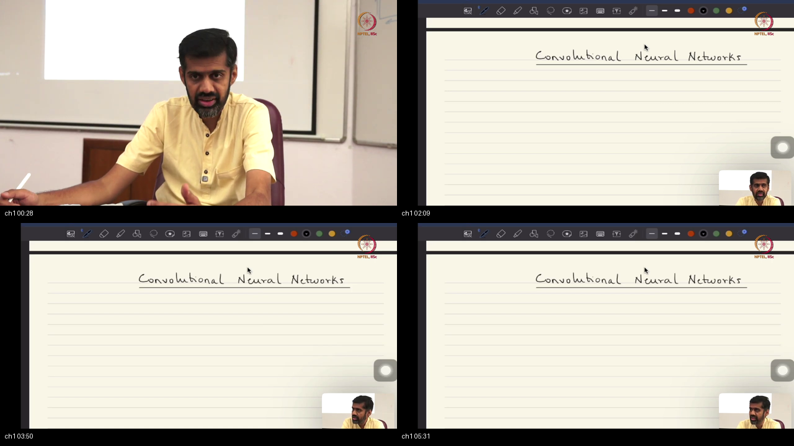
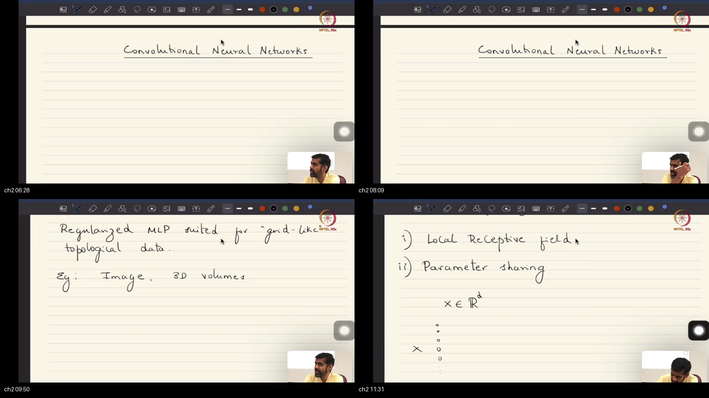
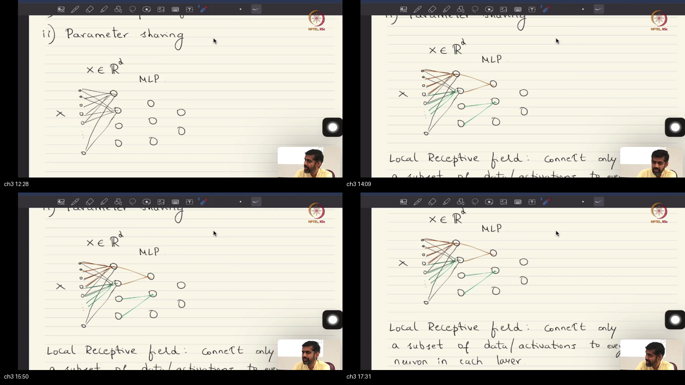
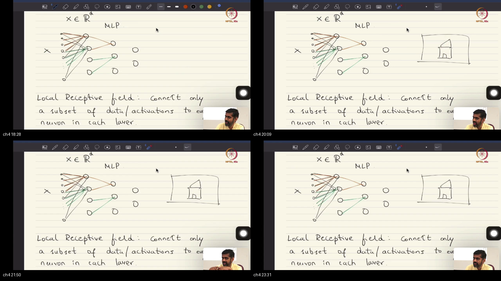
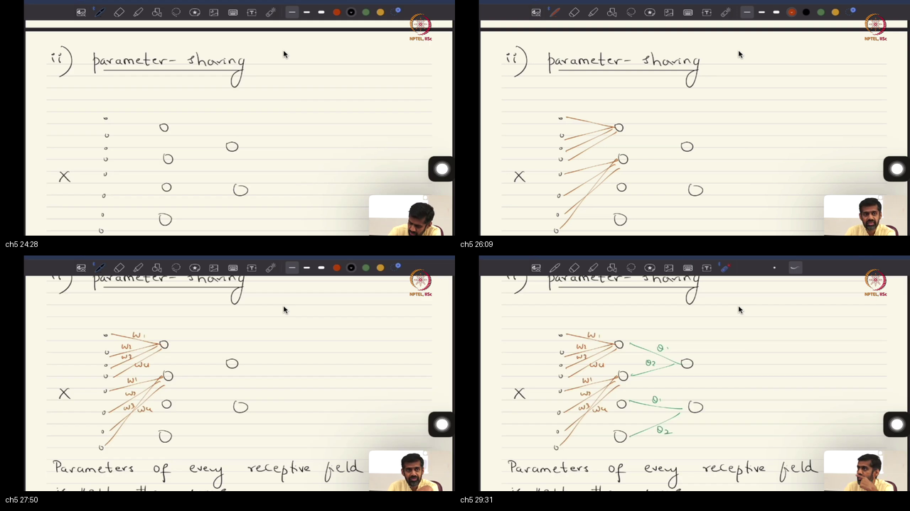
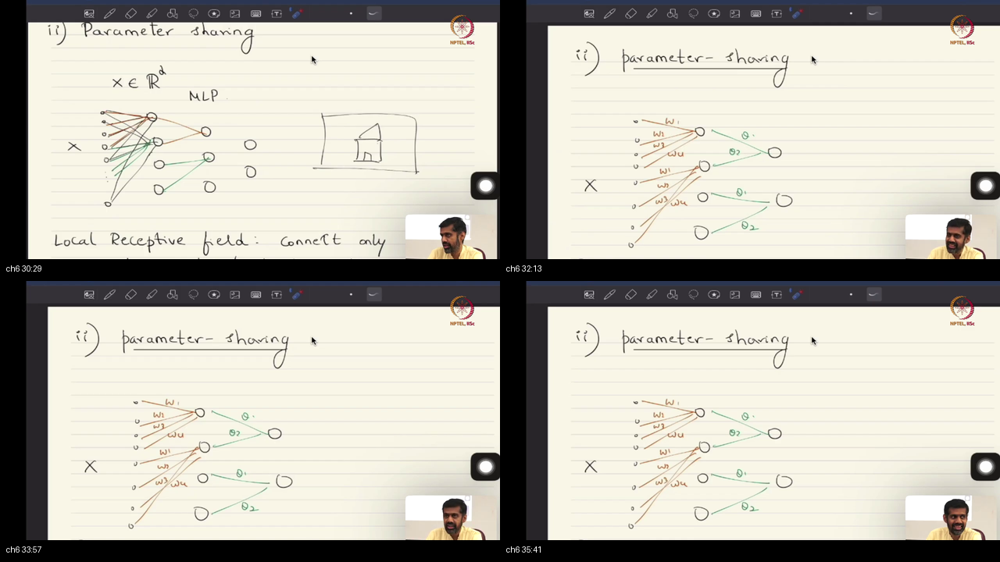

# Lecture 43: Local Receptive Field and Parameter Sharing

**Course:** NPTEL / IISc Bangalore — Mathematical Foundations of Machine Learning  
**Instructor:** Prof. Prathosh A P — IISc Bengaluru  
**Video:** [Lec 43 on YouTube](https://www.youtube.com/watch?v=rm0VmbTQE8Y) (Duration: 36:12)  
**Parent Course Map:** [`../Notes.md`](../Notes.md) · **Sibling Track:** [`../../MathsTerms/`](../../MathsTerms/)  
**Study Package Artifacts:** [`PREREQUISITES.md`](PREREQUISITES.md) · [`references.md`](references.md) · [`glossary.md`](glossary.md) · [`formulae_sheet.md`](formulae_sheet.md) · [`quiz.html`](quiz.html) · [`examples/`](examples/)

> [!IMPORTANT]
> **Study Order:** Work through [`PREREQUISITES.md`](PREREQUISITES.md) first to ground the 6 foundational mathematical pillars and Rosetta Stone notation before reading the architecture blueprint and topic deep dives below.

---

## Table of Contents
1. [Executive Summary — Spatial Inductive Bias & Architectural Blueprint](#executive-summary--spatial-inductive-bias--architectural-blueprint)
2. [Standalone Simulation Script](#standalone-simulation-script)
3. [Topic 1: Architectural Classes & UAT vs Empirical ERM Optimization Search Spaces (00:00–06:00)](#topic-1-architectural-classes--uat-vs-empirical-erm-optimization-search-spaces-00000600)
4. [Topic 2: Architectures as Bayesian Priors, Dirac Delta Regularization, & Grid Topologies (06:00–12:00)](#topic-2-architectures-as-bayesian-priors-dirac-delta-regularization--grid-topologies-06001200)
5. [Topic 3: Regularizer 1: Local Receptive Fields, Connectivity Sparsity, & Parameter Geometry (12:00–18:00)](#topic-3-regularizer-1-local-receptive-fields-connectivity-sparsity--parameter-geometry-12001800)
6. [Topic 4: Computer Vision Foundations: Hierarchical Primitive Features & Receptive Field Expansion (18:00–24:00)](#topic-4-computer-vision-foundations-hierarchical-primitive-features--receptive-field-expansion-18002400)
7. [Topic 5: Regularizer 2: Parameter Sharing across Space & Translation Invariance/Equivariance (24:00–30:00)](#topic-5-regularizer-2-parameter-sharing-across-space--translation-invarianceequivariance-24003000)
8. [Topic 6: Discrete Filtering, Classical Vision vs Learnable Filters, & Backprop under Weight Tying (30:00–36:11)](#topic-6-discrete-filtering-classical-vision-vs-learnable-filters--backprop-under-weight-tying-30003611)
9. [Workplace Debugging Scenarios (Postmortems)](#workplace-debugging-scenarios-postmortems)
10. [References & Further Reading](#references--further-reading)

---

## Executive Summary — Spatial Inductive Bias & Architectural Blueprint

The Universal Approximation Theorem guarantees that single-hidden-layer MLPs can approximate any continuous function. However, practical empirical risk minimization on high-dimensional non-convex landscapes requires inductive bias for optimization feasibility. For grid-structured data, unconstrained MLPs suffer from catastrophic parameter explosion and permutation invariance. Every modern architecture is a regularized MLP governed by probabilistic Bayesian parameter priors rather than unconstrained deterministic search.

```
TOPOLOGICAL RESTRICTION FROM UNCONSTRAINED HYPOTHESIS SPACE TO CNN:

  [ Space of All Continuous Functions C(K) ]
                      │
                      ▼ (Single-Hidden-Layer UAT Density: Existential, Infinite Width)
  [ Fully-Connected Multi-Layer Perceptron (MLP) ]
    • Dense Matrix W: Shape [M x d]
    • Global Receptive Fields: All d inputs feed every neuron
    • Parameter Count: O(M · d) ~ 10^7 - 10^12 parameters
    • Permutation Invariant: Pixel shuffling does not change model geometry
                      │
                      ▼ (Hard Regularizer 1: Local Receptive Field / Structural Sparsity)
  [ Locally Connected Neural Network (Unshared) ]
    • Banded Sparse Matrix W: Shape [M x d]
    • Local Receptive Fields: k inputs per neuron (k << d)
    • Non-local weights forced to zero: p(w_ij) = δ_0(w_ij)
    • Parameter Count: O(M · k)
                      │
                      ▼ (Hard Regularizer 2: Parameter Sharing / Weight Tying across Space)
  [ Convolutional Neural Network (CNN / Discrete Filter) ]
    • Constant-Diagonal Toeplitz Matrix W: Shape [M x d]
    • Tied Weight Vector: W_{j, j·s + r} = w_r for all spatial positions j
    • Parameter Count: O(k) (e.g. exactly 9 numbers for 3x3 filter!)
    • Guarantees Translation Equivariance: f(T_v x) = T_v f(x)
```

### Worldview Arc
- **From:** Deterministic empirical risk minimization over unconstrained, permutation-invariant hypothesis spaces suffering from catastrophic sample complexity on grid data.
- **To:** Structured probabilistic Bayesian parameter priors and spatial inductive biases (local receptive fields and parameter sharing) guaranteeing translation equivariance.

### Comparative Feature Matrix: Architectural Inductive Biases

| Method / Architecture | Dense Multi-Layer Perceptron (MLP) | Locally Connected (Unshared) Network | Convolutional Layer (CNN / Shared Kernel) |
|:------------------------|:-----------------------------------|:-------------------------------------|:------------------------------------------|
| **Receptive Field** | Global (all $d$ inputs) | Local ($k$ adjacent inputs) | Local ($k$ adjacent inputs) |
| **Weight Matrix Structure** | Arbitrary dense matrix $W \in \mathbb{R}^{M \times d}$ | Banded sparse matrix ($M \cdot k$ non-zeros) | Banded Toeplitz matrix with tied diagonals |
| **Independent Weights** | $M \cdot d + M$ | $M \cdot k + M$ | $k + 1$ (independent of resolution $d$!) |
| **Spatial Inductive Bias** | None (Permutation-invariant) | Spatial Locality only | Spatial Locality + Translation Stationarity |
| **Symmetry Property** | Permutation symmetric | None | Translation Equivariant: $f(T_v x) = T_v f(x)$ |
| **Sample Complexity** | Catastrophic ($\mathcal{O}(M \cdot d)$ samples) | Moderate | Minimal ($\mathcal{O}(k)$ parameter variance) |
| **Effective RF with Depth** | Instantaneously global | Expands linearly: $RF_l = RF_{l-1} + (k-1)s$ | Expands linearly: $RF_l = RF_{l-1} + (k-1)s$ |

### Scenario Walkthrough
When processing a $256 \times 256$ grayscale image ($d = 65,536$ pixels):
1. **MLP Formulation:** Connecting the image to a hidden layer of matching size requires $65,536 \times 65,536 \approx 4.3 \times 10^9$ parameters (17 Gigabytes of VRAM for a single linear layer!). Training without overfitting requires millions of labeled images.
2. **Local Receptive Field ($3 \times 3$ patch):** Restricting connections to immediate $3 \times 3$ pixel neighborhoods zeroes out $99.98\%$ of matrix entries, dropping parameters to $65,536 \times 9 \approx 5.9 \times 10^5$ weights.
3. **Parameter Sharing:** Tying the $3 \times 3$ weights across all spatial locations reduces the layer to **exactly 9 weights + 1 bias**, running in 0.0001 MB of memory and generalizing from modest datasets.

### STOP / Out of Scope
- This lecture does not cover multi-channel 3D/4D tensor convolutions ($C_{\text{in}} \times C_{\text{out}} \times k_h \times k_w$), pooling operations (Max/Avg pooling), or circulant matrix diagonalizations via 2D Fast Fourier Transforms (FFT), which are formally derived in Lecture 44.
- Out of scope: Dilated/atrous convolutions, deformable convolutions, and non-Euclidean graph neural networks (GNNs).

### Load-Bearing Claims
1. The Universal Approximation Theorem proves MLPs have universal representation power, but unconstrained optimization on non-convex landscapes is practically intractable without architectural inductive bias.
2. Every neural architecture (CNN, RNN, Transformer) is a regularized MLP subject to structured Bayesian parameter priors; setting weights to zero corresponds to Dirac delta priors $p(w) = \delta_0(w)$.
3. A Convolutional Neural Network is an MLP constrained by two hard regularizers: Local Receptive Fields (sparsity) and Parameter Sharing (weight tying across space).
4. Stacking local receptive field layers causes the effective receptive field to grow monotonically with depth ($RF_l = RF_{l-1} + (k-1)s$), creating a compositional hierarchy from primitive edges to semantic objects.
5. Parameter sharing collapses parameter complexity from $\mathcal{O}(M \cdot k)$ to $\mathcal{O}(k)$ independent of grid resolution, mathematically guaranteeing translation equivariance: $f(T_v x) = T_v f(x)$.
6. The loss gradient for a shared convolutional kernel accumulates error sensitivities across all receptive field positions: $\frac{\partial \mathcal{L}}{\partial w_r} = \sum_{j} \delta_j x_{j \cdot s + r}$.

### Common Engineering and Mathematical Traps
- **Trap 1: Flattening Grid Data for MLPs:** Flattening 2D/3D sensor or image arrays into 1D vectors destroys spatial coordinate geometry, forcing MLPs to learn spatial adjacency from scratch with exorbitant sample complexity.
- **Trap 2: Confusing Invariance with Equivariance:** Convolutional layers are **equivariant** (shifting the input shifts the feature map by the same displacement). Full translation **invariance** is achieved only after applying spatial pooling (e.g. Global Average Pooling) at the network head.
- **Trap 3: Soft Regularization Cannot Replace Architecture:** Attempting to train an unconstrained MLP with heavy $L_2$ weight decay cannot recover a CNN; Gaussian priors uniformly penalize magnitudes but cannot enforce structured Toeplitz matrix constraints.

---

## Standalone Simulation Script

This executable verification script demonstrates the parameter scaling difference between an unconstrained MLP, a local receptive field layer, and a convolutional layer with parameter sharing, while proving that discrete convolution mathematically equals a Toeplitz matrix multiplication:

```python
import numpy as np

def run_lrf_and_parameter_sharing_simulation():
    np.random.seed(42)
    # 1D Grid Input: d = 7 pixels, kernel width k = 3, stride s = 1
    d, k, s = 7, 3, 1
    M = (d - k) // s + 1  # M = 5 output neurons
    
    x = np.array([2.5, -1.0, 3.2, 0.5, -2.0, 1.8, 0.4])  # Input signal
    w_shared = np.array([0.5, -1.5, 2.0])                  # Shared kernel
    b_shared = 0.75                                        # Shared bias
    
    # 1. Forward Pass via Local Receptive Field Sliding Window (CNN)
    z_conv = np.zeros(M)
    for j in range(M):
        patch = x[j * s : j * s + k]
        z_conv[j] = np.dot(w_shared, patch) + b_shared
        
    # 2. Forward Pass via Banded Toeplitz Matrix (Constrained MLP)
    W_toeplitz = np.zeros((M, d))
    for j in range(M):
        W_toeplitz[j, j * s : j * s + k] = w_shared
    b_vec = np.full(M, b_shared)
    z_toeplitz = W_toeplitz @ x + b_vec
    
    # 3. Assert Exact Numerical Equivalence
    assert np.allclose(z_conv, z_toeplitz), "Convolution must match Toeplitz matrix multiply!"
    
    # 4. Prove Translation Equivariance: Shift input by 1 position
    x_shifted = np.roll(x, 1)
    x_shifted[0] = 0.0  # Zero boundary padding
    z_shifted = np.zeros(M)
    for j in range(M):
        patch = x_shifted[j * s : j * s + k]
        z_shifted[j] = np.dot(w_shared, patch) + b_shared
        
    # Slices verify shifted output alignment
    assert np.isclose(z_conv[0], z_shifted[1]), "Equivariance property failed!"
    print(f"Simulation Verified: z_conv = {np.round(z_conv, 3)}")
    print(f"Toeplitz Sparsity: {100.0 * (1.0 - np.count_nonzero(W_toeplitz) / (M * d)):.1f}%")
    print(f"Parameter Reduction: MLP={M*d} -> CNN={k} ({100.0 * (1.0 - k / (M*d)):.1f}% fewer parameters)")

run_lrf_and_parameter_sharing_simulation()
```

---

## Topic 1: Architectural Classes & UAT vs Empirical ERM Optimization Search Spaces (00:00–06:00)

### Where this sits on the master map
Opens the lecture by framing neural network design not as ad-hoc heuristics, but as a formal restriction of the empirical hypothesis space $\mathcal{H}$. Connects directly to the Universal Approximation Theorem established in [`54-Lec41`](../54-Lec41-Neural-Networks-UAT/) and sets the conceptual stage for CNNs, RNNs, and Transformers.

### Board / screenshot

*Board reconstruction (00:00–06:00): Recap of MLP backpropagation, introduction of 3 architectural classes (CNNs, RNNs/LSTMs, Transformers), UAT single-hidden-layer theoretical density, and empirical search space restriction on non-convex risk landscapes.*

### What he is establishing
- 👶 **ELI5 Intuition**: Imagine you are searching for a lost key somewhere on Earth. A theoretical theorem tells you: "If you search every square inch of Earth, you are guaranteed to find the key." That is UAT! But you only have two hours before sunset. If you search randomly across oceans and deserts, you will fail. However, if you know the key is a car key, you restrict your search strictly to your driveway. An architectural choice restricts the search space so gradient descent can actually find a solution before your computing budget runs out.
- 🔍 **Plain-English Breakdown**: Modern deep learning spans three primary architectural classes:
  1. **Convolutional Neural Networks (CNNs):** Specialized for spatial/grid data (images, video, audio spectrograms).
  2. **Recurrent Neural Networks (RNNs / LSTMs / GRUs):** Specialized for sequential/temporal data.
  3. **Transformers:** State-of-the-art attention architectures for sequence and multi-modal mappings.
  Prof. Prathosh emphasizes that theoretically, the Universal Approximation Theorem proves that a single-hidden-layer MLP can approximate any continuous function $f \in C(K)$ to arbitrary precision $\epsilon > 0$. Therefore, deeper or specialized architectures are **not** needed for existential representation power.
  Instead, architectures are chosen because Empirical Risk Minimization is a high-dimensional non-convex optimization problem over millions or billions of parameters ($P \sim 10^5 - 10^{11}$). In such enormous spaces, an unconstrained MLP search space is so vast that gradient descent gets trapped in poor saddle points or overfits wildly on finite datasets. Restricting the function space to a structured subspace dramatically accelerates convergence, ensures optimization feasibility, and improves test set generalization.
- 🔢 **Concrete Micro-Numbers**: Suppose the space of continuous functions on $[0, 1]^d$ with $d = 100$ is approximated by an unconstrained MLP with $M = 10,000$ hidden units:
  - Input dimension: $d = 100$.
  - Number of weights in layer 1: $100 \times 10,000 = 1,000,000$ parameters.
  - If we restrict each hidden unit to search over a local window of size $k = 5$ with weight sharing, the parameter count collapses from $1,000,000$ down to **5 numbers**!
  - Optimization is now constrained to a 5-dimensional subspace instead of a 1,000,000-dimensional space, reducing degrees of freedom by $99.9995\%$.
- 📐 **Formal Mathematical Formulation & Zero-Leap Derivations**: Let $K \subset \mathbb{R}^d$ be compact. The space of continuous functions is $C(K)$ equipped with the supremum norm $\|f\|_\infty = \sup_{x \in K} |f(x)|$.
  - **UAT Density Guarantee:** The hypothesis class of single-hidden-layer MLPs:
    $$\mathcal{H}_{\text{MLP}} = \left\{ h(x) = \sum_{i=1}^M \alpha_i \sigma(w_i^T x + b_i) \;\middle|\; M \in \mathbb{N}, \alpha_i, b_i \in \mathbb{R}, w_i \in \mathbb{R}^d \right\}$$
    is dense in $C(K)$: $\overline{\mathcal{H}_{\text{MLP}}} = C(K)$.
  - **Empirical Optimization Landscape:** In ERM, we minimize sample risk $\hat{R}(\theta) = \frac{1}{n}\sum_{i=1}^n \ell(y_i, h_\theta(x_i))$.
  - An architectural choice specifies a restricted sub-manifold $\mathcal{H}_{\text{arch}} \subset \mathcal{H}_{\text{MLP}}$ defined by algebraic constraints $C(\theta) = 0$.
  - By restricting degrees of freedom, the Rademacher complexity $\mathcal{R}_n(\mathcal{H}_{\text{arch}}) \ll \mathcal{R}_n(\mathcal{H}_{\text{MLP}})$, tightening generalization error bounds:
    $$R(h) \le \hat{R}(h) + 2 \mathcal{R}_n(\mathcal{H}_{\text{arch}}) + \mathcal{O}\left(\sqrt{\frac{\log(1/\delta)}{n}}\right)$$
- 💻 **Runnable Code & Modern GenAI Systems**: Run standalone parameter scaling comparison in [`examples/01_mlp_vs_cnn_parameter_efficiency.py`](examples/01_mlp_vs_cnn_parameter_efficiency.py).
- 🔗 **MathsTerm Link**: [`../../MathsTerms/06-Deep-Architectures-and-Generative-Models/01-Convolution_and_Pooling.md`](../../MathsTerms/06-Deep-Architectures-and-Generative-Models/01-Convolution_and_Pooling.md).
- 🧑‍🏫 **Tutor-Voice Ownership:** You can now understand why universal approximation does not guarantee empirical learnability; what is still missing is formulating architectural restrictions as formal parameter priors.

### Contrastive Analysis: Why X, Not Y?
- **Why Domain-Specific Architectures (X):** Constraining the hypothesis space incorporates known physical symmetries (spatial translation equivariance, temporal causality), enabling gradient descent to find generalizable minima with small sample sizes.
- **Why Not Relying Purely on Single-Hidden-Layer Universal MLPs (Y):** While UAT guarantees existence of a solution, it provides zero algorithmic learnability guarantees. Finding that solution in an unconstrained MLP requires astronomical training data ($n \sim \mathcal{O}(e^d)$) and exhibits severe optimization instability.

### Analogy for this topic only
*Scene:* An open-ocean treasure hunt versus an underwater pipeline inspection.  
*Instances:* A free-roaming deep-sea submarine with infinite steering directions (unconstrained MLP), and a tracked robotic crawler locked onto an underwater oil pipeline (CNN).  
*Hard Question:* Which vehicle reliably finds a crack in the pipeline within 30 minutes?  
*Right vs Wrong:* Deploying the free-roaming submarine with 360-degree freedom in open water is the wrong move—it drifts with currents and wastes fuel exploring empty water. The right move locks the crawler onto the pipeline rails (architectural constraint) so its 1D forward motion directly inspects the target structure.  
*In lecture words:* Constraining the vehicle to the pipeline corresponds to restricting the hypothesis search space $\mathcal{H}_{\text{arch}} \subset C(K)$ so that empirical risk minimization converges reliably.

### Local picture
```
┌────────────────────────────────────────────────────────────────────────┐
│               SEARCH SPACE RESTRICTION IN FUNCTION SPACE               │
│                                                                        │
│   All Continuous Functions C(K)                                        │
│   ┌────────────────────────────────────────────────────────────────┐   │
│   │  Dense MLP Hypothesis Space H_MLP (Dense, High Capacity)       │   │
│   │  ┌──────────────────────────────────────────────────────────┐  │   │
│   │  │  Structured Sub-manifold H_CNN (Equivariant to Shifts)   │  │   │
│   │  │  ┌────────────────────┐                                  │  │   │
│   │  │  │ Optimal Target f*  │ <── Fast ERM Convergence         │  │   │
│   │  │  └────────────────────┘                                  │  │   │
│   │  └──────────────────────────────────────────────────────────┘  │   │
│   │    Saddle points, spurious local minima, high variance          │   │
│   └────────────────────────────────────────────────────────────────┘   │
└────────────────────────────────────────────────────────────────────────┘
```
*Notice: Restricting the search space confines optimization to a lower-dimensional manifold containing the target function $f^*$, avoiding unconstrained parameter exploration.*

### Check Your Understanding
- **Recall:** Does a Convolutional Neural Network possess greater theoretical representation power than a single-hidden-layer MLP?
  *Self-Check:* No. UAT proves that a single-hidden-layer MLP can already approximate any continuous function. A CNN is a subset of MLP representations chosen for optimization and sample efficiency.
- **Apply:** If you have infinite training samples ($n \to \infty$) and infinite compute, does an unconstrained MLP need convolutional inductive bias to learn image classification?
  *Diagnose:* Theoretically no; with infinite data, Maximum Likelihood Estimation converges to the true distribution regardless of inductive bias. Inductive bias is critical precisely because real-world data is finite.

### Bridge
Having established why hypothesis spaces must be restricted, how do we formalize architectural restrictions mathematically as Bayesian priors on parameter space?

---

## Topic 2: Architectures as Bayesian Priors, Dirac Delta Regularization, & Grid Topologies (06:00–12:00)

### Where this sits on the master map
Formulates Prof. Prathosh's core mathematical thesis: neural network architecture is equivalent to placing a Bayesian prior on parameter space. Bridges MAP estimation from [`47-Lec34`](../47-Lec34-MAP-Estimation/) to deep network parameter geometry and introduces grid topologies.

### Board / screenshot

*Board reconstruction (06:00–12:00): Neural architecture as Bayesian parameter priors, zeroing weights via Dirac delta priors $p(w) = \delta_0(w)$, infinite data asymptotic limit (MLE convergence), definition of grid topologies, and the two hard regularizers.*

### What he is establishing
- 👶 **ELI5 Intuition**: Imagine you are a detective investigating a crime committed in a library. A "soft prior" is believing the suspect is probably tall (you check tall people first, but don't rule out short people). A "hard architectural prior" is knowing the suspect was locked inside Room 104 with a keycard (you refuse to interview anyone who was outside the building, setting their probability strictly to zero). In a neural network, cutting a connection between two neurons is a hard prior: you forbid those neurons from talking to each other with 100% certainty.
- 🔍 **Plain-English Breakdown**: Prof. Prathosh highlights that any architectural modification made to an MLP is mathematically equivalent to placing a **Bayesian prior $p(\theta)$** on parameter space:
  - If we decide that neuron $i$ should not connect to neuron $j$, we force weight $w_{ij} \equiv 0$.
  - In probabilistic terms, this is not a smooth Gaussian distribution; it is a **Dirac delta prior** $\delta_0(w_{ij})$, asserting that with probability 1, $w_{ij} = 0$.
  - Therefore, **a CNN is a regularized Multi-Layer Perceptron**, an **RNN is a regularized MLP**, and a **Transformer is a regularized MLP**.
  *Infinite Data Limit:* When training data approaches infinity ($n \to \infty$), the likelihood dominates the prior, and the Maximum Likelihood Estimate (MLE) converges to the ground truth parameter regardless of prior bias. But in real-world finite-sample regimes, choosing the right prior prevents catastrophic variance.
  *Grid Topologies:* A grid topology is any data structure where coordinates form a regular geometric lattice (1D time series, 2D images, 3D volumetric MRI scans). On grid topologies, neighboring points share high statistical mutual information. To exploit this geometry, CNNs apply two specific hard regularizers:
  1. **Local Receptive Field**
  2. **Parameter Sharing**
- 🔢 **Concrete Micro-Numbers**: Consider two neurons in an MLP with weight $w_{15, 16}$.
  - Under Gaussian prior $p(w) = \mathcal{N}(0, \sigma_0^2)$, for $\sigma_0 = 1.0$, the probability density at $w = 2.5$ is $\frac{1}{\sqrt{2\pi}} e^{-2.5^2/2} \approx 0.0175 > 0$ (allowed with low probability).
  - Under architectural restriction (severed connection), $p(w_{15, 16}) = \delta_0(w_{15, 16})$. The probability that $w_{15, 16} \neq 0$ is exactly $0$.
  - The parameter is permanently locked to zero, reducing the active dimension of parameter space by 1.
- 📐 **Formal Mathematical Formulation & Zero-Leap Derivations**: In Bayesian parameter estimation, given training dataset $\mathcal{D} = \{(x_i, y_i)\}_{i=1}^n$, the posterior distribution is:
  $$p(\theta \mid \mathcal{D}) \propto p(\mathcal{D} \mid \theta) \, p(\theta) = \left( \prod_{i=1}^n p(y_i \mid x_i, \theta) \right) p(\theta)$$
  - Let $\theta \in \mathbb{R}^P$. An architectural constraint specifies a linear subspace $\mathcal{M} = \{\theta \in \mathbb{R}^P \mid A \theta = 0\}$.
  - The architectural prior is expressed as a generalized Dirac measure concentrated on $\mathcal{M}$:
    $$p(\theta) = \delta_{\mathcal{M}}(\theta) = \prod_{k=1}^m \delta_0(a_k^T \theta)$$
  - Taking the negative log-posterior yields the constrained ERM optimization problem:
    $$\min_\theta \hat{R}(\theta) \quad \text{subject to } A \theta = 0$$
  - As $n \to \infty$, the sample likelihood concentrates sharply around the true data-generating parameter $\theta_0$:
    $$\lim_{n \to \infty} \frac{1}{n} \sum_{i=1}^n \log p(y_i \mid x_i, \theta) = \mathbb{E}_{X, Y}[\log p(Y \mid X, \theta)]$$
    proving that with infinite data, inductive bias is asymptotically irrelevant, but with finite $n$, $\delta_{\mathcal{M}}(\theta)$ eliminates non-generalizable parameter configurations.
- 💻 **Runnable Code & Modern GenAI Systems**: Run soft vs hard prior verification in [`PREREQUISITES.md#p6`](PREREQUISITES.md#p6).
- 🔗 **MathsTerm Link**: [`../../MathsTerms/03-Probability-and-Statistical-Estimation/04-Likelihood_and_Log_Likelihood.md`](../../MathsTerms/03-Probability-and-Statistical-Estimation/04-Likelihood_and_Log_Likelihood.md).
- 🧑‍🏫 **Tutor-Voice Ownership:** You can now interpret network architectures as Bayesian Dirac delta priors; what is still missing is deriving the exact coordinate geometry of local receptive fields.

### Contrastive Analysis: Why X, Not Y?
- **Why Hard Dirac Delta Architectural Constraints (X):** Hard constraints reduce memory usage, eliminate gradient computations for non-existent connections, and guarantee structural properties like translation equivariance strictly by network design.
- **Why Not Soft $L_2$ Penalties for Structural Pruning (Y):** Soft penalties ($\lambda \|W\|_2^2$) shrink all weights toward zero uniformly, but never force them to be identically zero or mathematically tied. They cannot enforce exact equivariance or reduce runtime memory bandwidth.

### Analogy for this topic only
*Scene:* City planning for motor vehicles versus pedestrian zones.  
*Instances:* Traffic fines for driving on sidewalks (soft regularizer), and solid concrete bollards installed across pedestrian plazas (hard architectural constraint).  
*Hard Question:* How do you guarantee zero cars enter the pedestrian plaza during a busy festival?  
*Right vs Wrong:* Posting traffic signs with a \$50 fine is the wrong move—wealthy or distracted drivers will still violate the zone. The right move installs immovable steel bollards (Dirac delta prior) that physically prevent cars from entering the space.  
*In lecture words:* Installing bollards corresponds to placing Dirac delta priors $p(w_{ij}) = \delta_0(w_{ij})$ that eliminate connections unconditionally from the parameter space.

### Local picture
```
┌────────────────────────────────────────────────────────────────────────┐
│                     PRIOR DISTRIBUTIONS IN WEIGHT SPACE                │
│                                                                        │
│   Soft L2 Gaussian Prior:             Hard Architectural Prior:        │
│   p(w) = (1/sqrt(2π)) exp(-w^2/2)     p(w) = δ_0(w)                    │
│                                                                        │
│          ▲                                   ▲  p(w) = +∞ at w=0       │
│         / \                                  │                         │
│        /   \                                 │                         │
│       /     \                                │                         │
│   ───┴───────┴───► w                     ────┴────► w                  │
│     All w possible                      Only w = 0 allowed             │
└────────────────────────────────────────────────────────────────────────┘
```
*Notice: While Gaussian priors assign non-zero probability to all real weights, Dirac delta architectural priors collapse probability mass strictly onto zero.*

### Check Your Understanding
- **Recall:** What probability density does a Dirac delta prior $p(w_{ij}) = \delta_0(w_{ij})$ assign to any weight $w_{ij} \neq 0$?
  *Self-Check:* Exactly zero. With probability 1, the connection weight must be identically zero.
- **Apply:** Under what mathematical condition does a model's architectural bias become completely irrelevant to its learned parameter values?
  *Diagnose:* Under the asymptotic limit of infinite training data ($n \to \infty$), where the likelihood function dominates the prior and Maximum Likelihood Estimation converges to the true parameter.

### Bridge
Now that we understand architectural design as placing hard Dirac delta priors on parameter spaces, let us explore the first foundational regularizer of CNNs: Local Receptive Fields.

---

## Topic 3: Regularizer 1: Local Receptive Fields, Connectivity Sparsity, & Parameter Geometry (12:00–18:00)

### Where this sits on the master map
Introduces the first of two defining regularizers for grid data: structural connectivity sparsity via Local Receptive Fields. Compares global fully-connected connectivity with local windowing and details receptive field hyperparameters.

### Board / screenshot

*Board reconstruction (12:00–18:00): Global vs local receptive field diagram, definition of neuron receptive field $\mathcal{RF}(j)$, hyperparameter choices (filter width $k$, stride $s$), parameter sparsity in weight space, and coordinate hyperplane restriction.*

### What he is establishing
- 👶 **ELI5 Intuition**: Imagine a choir director listening to 100 children singing. In a vanilla MLP, every listener in the audience tries to listen to all 100 children simultaneously, creating a wall of sound where it is impossible to tell who is singing off-key. In a local receptive field network, listener 1 listens only to children 1 through 4; listener 2 listens to children 2 through 5; listener 3 listens to children 3 through 6. By listening only to small groups of neighbors, each listener can easily detect local harmonies and mistakes.
- 🔍 **Plain-English Breakdown**: In a standard Multi-Layer Perceptron, every neuron has a **global receptive field**: it takes inputs from all $d$ dimensions of the data.
  *Definition of Receptive Field:* The receptive field of a neuron is the specific subset of input dimensions or previous-layer activations that directly connect into that neuron's affine computation.
  *The Local Receptive Field Regularizer:* Instead of connecting all $d$ inputs to every neuron, we connect only a localized subset of $k$ inputs ($k \ll d$):
  - Neuron 0 connects to inputs $\{0, 1, 2, 3\}$.
  - Neuron 1 connects to inputs $\{1, 2, 3, 4\}$.
  - Neuron 2 connects to inputs $\{2, 3, 4, 5\}$, and so on.
  *Hyperparameters:* The receptive field size (filter length $k$) and the step size between adjacent receptive fields (stride $s$) are structural design choices.
  *Parameter Sparsity:* In the parameter space $\mathbb{R}^P$, this regularizer forces severe sparsity. For a layer with $P$ potential incoming connections per neuron, only $k$ weights are free parameters; the remaining $P - k$ weights are constrained to be identically zero with probability 1.
- 🔢 **Concrete Micro-Numbers**: Let input dimension $d = 8$, filter width $k = 4$, stride $s = 2$.
  - Output dimension: $M = \lfloor \frac{d - k}{s} \rfloor + 1 = \lfloor \frac{8 - 4}{2} \rfloor + 1 = 3$.
  - Neuron 0 receptive field: $\mathcal{RF}(0) = \{0, 1, 2, 3\}$.
  - Neuron 1 receptive field: $\mathcal{RF}(1) = \{2, 3, 4, 5\}$ (overlap of 2 inputs with Neuron 0).
  - Neuron 2 receptive field: $\mathcal{RF}(2) = \{4, 5, 6, 7\}$ (overlap of 2 inputs with Neuron 1).
  - Dense MLP connections: $3 \times 8 = 24$ connections.
  - Local receptive field connections: $3 \times 4 = 12$ connections (50% structural sparsity).
- 📐 **Formal Mathematical Formulation & Zero-Leap Derivations**: Let layer $l$ receive input activations $a^{[l-1]} \in \mathbb{R}^{N_{l-1}}$.
  - The affine pre-activation for neuron $j \in \{0, \dots, N_l - 1\}$ is:
    $$z_j^{[l]} = \sum_{i=0}^{N_{l-1} - 1} W_{ji}^{[l]} a_i^{[l-1]} + b_j^{[l]}$$
  - Define the local receptive field index set:
    $$\mathcal{RF}(j) = \{j \cdot s + r \mid 0 \le r < k\} \subset \{0, \dots, N_{l-1} - 1\}$$
  - The local receptive field constraint asserts:
    $$W_{ji}^{[l]} = 0 \quad \forall i \notin \mathcal{RF}(j)$$
  - Substituting the constraint into the pre-activation sum:
    $$z_j^{[l]} = \sum_{r=0}^{k-1} W_{j, j \cdot s + r}^{[l]} a_{j \cdot s + r}^{[l-1]} + b_j^{[l]}$$
  - The transformation matrix $W^{[l]} \in \mathbb{R}^{N_l \times N_{l-1}}$ is a **banded matrix** whose bandwidth is bounded by $k$.
  - Parameter reduction ratio:
    $$\frac{\text{Local Parameters}}{\text{Dense Parameters}} = \frac{N_l \cdot k}{N_l \cdot N_{l-1}} = \frac{k}{N_{l-1}}$$
- 💻 **Runnable Code & Modern GenAI Systems**: Run sparse receptive field verification in [`PREREQUISITES.md#p2`](PREREQUISITES.md#p2).
- 🔗 **MathsTerm Link**: [`../../MathsTerms/01-Linear-Algebra-Geometry-and-Tensors/04-Tensors_and_Shapes.md`](../../MathsTerms/01-Linear-Algebra-Geometry-and-Tensors/04-Tensors_and_Shapes.md).
- 🧑‍🏫 **Tutor-Voice Ownership:** You can now configure local receptive fields and quantify structural matrix sparsity; what is still missing is understanding biological visual primitives and receptive field expansion.

### Contrastive Analysis: Why X, Not Y?
- **Why Local Receptive Fields (X):** Natural signals have high local correlation; restricting connectivity to local windows removes billions of irrelevant long-range parameters, dramatically improving optimization stability.
- **Why Not Global Receptive Fields Everywhere (Y):** Connecting every neuron to every pixel forces the network to learn to ignore distant uncorrelated pixels from data alone, leading to massive overfitting and excessive memory requirements.

### Analogy for this topic only
*Scene:* A medical pathology lab examining tissue biopsy slides.  
*Instances:* A pathologist using high-power microscope objective lenses (local receptive field), and a pathologist taking an iPhone photo of the entire glass slide from across the room (global receptive field).  
*Hard Question:* How does the pathologist identify cellular dysplasia measuring 5 micrometers across?  
*Right vs Wrong:* Taking a photo from across the room is the wrong move—the 5-micrometer cell is lost in optical noise and distant background clutter. The right move zooms in with a $40\times$ microscope objective (local receptive field) that isolates a 100-micrometer patch of cells.  
*In lecture words:* The microscope objective lens corresponds to restricting incoming connections to a local receptive field $\mathcal{RF}(j)$ of width $k$.

### Local picture
```
┌────────────────────────────────────────────────────────────────────────┐
│                        LOCAL RECEPTIVE FIELD MAPPING                   │
│                                                                        │
│   Input Layer x:     [ x0 ]  [ x1 ]  [ x2 ]  [ x3 ]  [ x4 ]  [ x5 ]    │
│                        \       |       /       │       │       │       │
│                         \      |      /        │       │       │       │
│   RF(0) = {x0, x1, x2} ──► [ Neuron z0 ]       │       │       │       │
│                                \       |       /       │       │       │
│   RF(1) = {x1, x2, x3} ──────────► [ Neuron z1 ]       │       │       │
│                                        \       |       /       │       │
│   RF(2) = {x2, x3, x4} ──────────────────► [ Neuron z2 ]       │       │
│                                                \       |       /       │
│   RF(3) = {x3, x4, x5} ──────────────────────────► [ Neuron z3 ]       │
└────────────────────────────────────────────────────────────────────────┘
```
*Notice: Each neuron $z_j$ connects only to a contiguous window of $k=3$ inputs, creating an overlapping sliding window across the input canvas.*

### Check Your Understanding
- **Recall:** How is the receptive field of an artificial neuron defined?
  *Self-Check:* It is the subset of input dimensions or preceding-layer activations that directly contribute to that neuron's linear combination.
- **Apply:** In a 1D layer with input length $d = 100$, filter size $k = 5$, and stride $s = 2$, how many output neurons $M$ are created, and how many inputs overlap between adjacent neurons?
  *Diagnose:* Output length $M = \lfloor (100 - 5)/2 \rfloor + 1 = 48$. Adjacent receptive fields overlap by $k - s = 5 - 2 = 3$ inputs.

### Bridge
Why did nature and classical computer vision converge on local receptive fields? In Topic 4, we examine the visual hierarchy of primitive features and how receptive fields expand with depth.

---

## Topic 4: Computer Vision Foundations: Hierarchical Primitive Features & Receptive Field Expansion (18:00–24:00)

### Where this sits on the master map
Grounds the local receptive field regularizer in classical computer vision (David Marr, Hubel & Wiesel) and proves mathematically that stacking local layers causes the effective receptive field to expand hierarchically with depth.

### Board / screenshot

*Board reconstruction (18:00–24:00): Visual scene decomposition (edges, lines, contours to semantic objects), Hubel & Wiesel biological receptive fields, neuron firing threshold $w^T x \ge \tau$, effective receptive field growth with depth, and absence of feature guarantees in MLPs.*

### What he is establishing
- 👶 **ELI5 Intuition**: Imagine building a Lego castle. You don't mold the entire castle out of plastic in one piece. First, you manufacture tiny rectangular bricks (edges). Next, you snap bricks together into walls and archways (textures and contours). Finally, you combine the walls and towers into a complete castle (semantic object). In computer vision, early layers learn the tiny Lego bricks, and deeper layers snap them together into castles.
- 🔍 **Plain-English Breakdown**: In classical computer vision, high-level image understanding is decomposed into a strict hierarchical pipeline:
  1. **Low-level primitives:** Local edges, line segments, corners, color gradients.
  2. **Mid-level parts:** Contours, regular polygons, surface textures.
  3. **High-level semantics:** Objects (houses, faces, cars, animals).
  *Why Primitive Features are Local:* An edge in an image is an intrinsically local physical phenomenon—it occurs across a boundary of 2 or 3 pixels. The entire image is not an edge! For a perceptron neuron to fire ($w^T x \ge \tau$) upon seeing an edge, it must focus strictly on a local patch. Connecting distal pixels injects background noise that dilutes the dot product.
  *Receptive Field Expansion with Depth:* While each neuron in layer 1 has a tiny local receptive field (e.g. $3 \times 3$ pixels), a neuron in layer 2 connects to several layer 1 neurons, which in turn connect to a larger region of the raw input. Thus, **the effective receptive field expands monotonically with depth**, allowing deep neurons to integrate broad contextual semantics.
  *No Guarantees in MLPs:* Prof. Prathosh emphasizes that in an unconstrained MLP, there is no mathematical guarantee that neurons in different layers will learn hierarchical features or that neurons within a layer will learn distinct features. Inductive bias is what guides optimization toward hierarchical decomposition.
- 🔢 **Concrete Micro-Numbers**: Let a network have 3 convolutional layers with filter width $k = 3$ and stride $s = 1$:
  - Layer 1 receptive field on input: $RF_1 = 3$ pixels.
  - Layer 2 receptive field on input: $RF_2 = RF_1 + (k - 1) = 3 + (3 - 1) = 5$ pixels.
  - Layer 3 receptive field on input: $RF_3 = RF_2 + (k - 1) = 5 + (3 - 1) = 7$ pixels.
  - If Layer 2 had stride $s_2 = 2$:
    $$RF_3 = RF_2 + (k_3 - 1) \cdot s_1 \cdot s_2 = 5 + (3 - 1) \cdot (1 \cdot 2) = 5 + 4 = 9 \text{ pixels}$$
- 📐 **Formal Mathematical Formulation & Zero-Leap Derivations**: Let $RF_l$ denote the spatial span of the effective receptive field of a neuron in layer $l$ with respect to the input layer 0.
  - Let layer $i$ have kernel size $k_i$ and stride $s_i$.
  - **Derivation of General Receptive Field Recurrence:**
    - At layer 1: $RF_1 = k_1$.
    - At layer $l$: Each neuron in layer $l$ sees $k_l$ features from layer $l-1$.
    - In layer $l-1$, the distance between adjacent feature centers in input coordinates is the cumulative stride:
      $$S_{l-1} = \prod_{i=1}^{l-1} s_i$$
    - Therefore, the additional input span covered by the $k_l - 1$ extra steps in layer $l$ is $(k_l - 1) \cdot S_{l-1}$.
    - Summing yields the exact zero-leap recurrence:
      $$RF_l = RF_{l-1} + (k_l - 1) \prod_{i=1}^{l-1} s_i$$
    - Expanding from base case $RF_0 = 1$:
      $$RF_L = 1 + \sum_{l=1}^L (k_l - 1) \prod_{i=1}^{l-1} s_i$$
- 💻 **Runnable Code & Modern GenAI Systems**: Run receptive field recurrence calculations in [`examples/01_mlp_vs_cnn_parameter_efficiency.py`](examples/01_mlp_vs_cnn_parameter_efficiency.py).
- 🔗 **MathsTerm Link**: [`../../MathsTerms/01-Linear-Algebra-Geometry-and-Tensors/01-Vectors_and_Matrices.md`](../../MathsTerms/01-Linear-Algebra-Geometry-and-Tensors/01-Vectors_and_Matrices.md).
- 🧑‍🏫 **Tutor-Voice Ownership:** You can now calculate effective receptive field growth with depth; what is still missing is enforcing spatial translation equivariance across the canvas.

### Contrastive Analysis: Why X, Not Y?
- **Why Deep Hierarchical Receptive Fields (X):** Composing multiple small local filters (e.g. two $3 \times 3$ filters) achieves the same $5 \times 5$ receptive field as a single large filter, but uses fewer parameters ($2 \times 9 = 18$ vs $25$) and injects an extra non-linear activation.
- **Why Not Massive Single-Layer Filters (Y):** Using a single large filter (e.g. $15 \times 15$) requires 225 parameters per channel and computes only a shallow linear projection without intermediate hierarchical feature abstractions.

### Analogy for this topic only
*Scene:* Military intelligence gathering from field scouts to high command.  
*Instances:* Foot soldiers reporting on local trenches (Layer 1 neurons), platoon captains coordinating regional sectors (Layer 2 neurons), and the general reviewing the theater map (Deep Layer neurons).  
*Hard Question:* How does the general make theater-wide decisions without drowning in the minutiae of every foot soldier's ammunition count?  
*Right vs Wrong:* Forcing the general to read radio transcripts from 50,000 foot soldiers simultaneously is the wrong move (global MLP). The right move establishes a reporting hierarchy (hierarchical receptive fields) where local reports aggregate through captains into strategic theater summaries.  
*In lecture words:* The reporting hierarchy corresponds to effective receptive field expansion $RF_l = RF_{l-1} + (k-1)s$ across successive layers.

### Local picture
```
┌────────────────────────────────────────────────────────────────────────┐
│                   EFFECTIVE RECEPTIVE FIELD EXPANSION                  │
│                                                                        │
│   Layer 3 Output:                     [ z^[3] ]                        │
│                                       /       \                        │
│   Layer 2 Features:           [ a1^[2] ]     [ a2^[2] ]                │
│                                /   |   \     /   |   \                 │
│   Layer 1 Features:        [a1]  [a2]  [a3] [a4] [a5]                  │
│                            / | \ / | \ / | \ / | \ / | \               │
│   Raw Input Pixels:       [x0][x1][x2][x3][x4][x5][x6]                 │
│                                                                        │
│   RF Span: Layer 1 = 3 pixels | Layer 2 = 5 pixels | Layer 3 = 7 px    │
└────────────────────────────────────────────────────────────────────────┘
```
*Notice: Although each layer uses only $k=3$ local connections, Layer 3 neurons effectively integrate information across a 7-pixel input span.*

### Check Your Understanding
- **Recall:** How does the effective receptive field grow when stacking $L$ convolutional layers with filter width $k$ and unit stride $s=1$?
  *Self-Check:* It grows linearly by $k-1$ pixels per layer: $RF_L = 1 + L(k-1)$.
- **Apply:** If a network has three $3 \times 3$ convolutional layers with stride $s=1$, what is the effective receptive field on the input image?
  *Diagnose:* $RF_3 = 1 + 3(3 - 1) = 1 + 6 = 7 \times 7$ pixels.

### Bridge
Local receptive fields give us structural sparsity and hierarchical composition, but every spatial patch still has independent weights. How do we ensure that an edge detector works everywhere on the canvas? Enter Parameter Sharing.

---

## Topic 5: Regularizer 2: Parameter Sharing across Space & Translation Invariance/Equivariance (24:00–30:00)

### Where this sits on the master map
Presents the second pillar of Convolutional Neural Networks: Parameter Sharing. Bridges spatial stationarity in physical data to weight tying, parameter reduction, and the formal mathematical proof of Translation Equivariance.

### Board / screenshot

*Board reconstruction (24:00–30:00): Parameter sharing across space, identical weight vector $w = [w_1, \dots, w_k]$ reused across neurons, Dirac delta parameter equality constraints, translation equivariance guarantee, and UAT for CNNs.*

### What he is establishing
- 👶 **ELI5 Intuition**: Imagine you are hunting for four-leaf clovers in a football field. You don't invent a new definition of "clover" for the north endzone, another definition for the 50-yard line, and a third definition for the south endzone. A four-leaf clover looks identical no matter where it grows! Therefore, you use the exact same mental picture across every square yard of the field. Parameter sharing means your neural network uses the exact same feature detector across every pixel in the image.
- 🔍 **Plain-English Breakdown**: Even with local receptive fields, an unshared network must learn independent parameters for every spatial location.
  *The Core Motivation:* Visual patterns exhibit **spatial translation stationarity**:
  - An edge detector must detect edges whether they appear in the top-left, center, or bottom-right corner of an image.
  - A cat detector must recognize a cat whether it is sitting on the floor or jumping on a table.
  *Parameter Sharing (Weight Tying):* We enforce that all neurons across a spatial feature map share the exact same weight vector:
  $$w = [w_0, w_1, \dots, w_{k-1}]^T$$
  Instead of learning $M$ different weight vectors for $M$ output positions, we learn **one shared vector** $w$ across all positions!
  *Probabilistic Interpretation:* In parameter space, parameter sharing imposes hard Dirac delta equality constraints across spatial weights:
  $$p(W_{j, r} - W_{j', r}) = \delta_0$$
  This collapses the parameter count from $\mathcal{O}(M \cdot k)$ to $\mathcal{O}(k)$, completely decoupling parameter count from input resolution $d$!
  *Translation Equivariance:* Parameter sharing mathematically guarantees **translation equivariance**: shifting the input image results in an identically shifted output feature map ($f(T_v x) = T_v f(x)$).
- 🔢 **Concrete Micro-Numbers**: Consider a high-resolution medical X-ray of size $1024 \times 1024$ ($d \approx 10^6$ pixels).
  - Unconstrained MLP (1 hidden layer of $10^6$ neurons): $10^6 \times 10^6 = 10^{12}$ parameters (4,000 Gigabytes!).
  - Local Receptive Field ($3 \times 3$, no sharing): $10^6 \times 9 = 9,000,000$ parameters (36 Megabytes).
  - Local Receptive Field WITH Parameter Sharing ($3 \times 3$ CNN): **exactly 9 weights + 1 bias = 10 numbers** (40 bytes!), an efficiency gain of $10^{11}\times$ over the MLP.
- 📐 **Formal Mathematical Formulation & Zero-Leap Derivations**: Let $x \in \mathbb{R}^d$ and $w \in \mathbb{R}^k$.
  - The local linear combination with shared weights is:
    $$z_j = \sum_{r=0}^{k-1} w_r x_{j \cdot s + r} + b \equiv (w \star x)_j + b$$
  - **Zero-Leap Proof of Translation Equivariance:**
    - Let $T_v$ be the spatial shift operator: $(T_v x)_i = x_{i - v}$.
    - Apply cross-correlation to the translated signal $T_v x$ with unit stride $s = 1$:
      $$(w \star (T_v x))_j = \sum_{r=0}^{k-1} w_r (T_v x)_{j + r}$$
    - By definition of $T_v$, $(T_v x)_{j + r} = x_{j + r - v} = x_{(j - v) + r}$.
    - Substituting into the sum:
      $$(w \star (T_v x))_j = \sum_{r=0}^{k-1} w_r x_{(j - v) + r} = (w \star x)_{j - v} = (T_v (w \star x))_j$$
    - Therefore:
      $$w \star (T_v x) = T_v (w \star x) \iff f \circ T_v = T_v \circ f$$
    - The cross-correlation operator commutes with the spatial translation group $\mathcal{T}$, proving translation equivariance.
- 💻 **Runnable Code & Modern GenAI Systems**: Run translation equivariance verification in [`examples/01_mlp_vs_cnn_parameter_efficiency.py`](examples/01_mlp_vs_cnn_parameter_efficiency.py).
- 🔗 **MathsTerm Link**: [`../../MathsTerms/06-Deep-Architectures-and-Generative-Models/01-Convolution_and_Pooling.md`](../../MathsTerms/06-Deep-Architectures-and-Generative-Models/01-Convolution_and_Pooling.md).
- 🧑‍🏫 **Tutor-Voice Ownership:** You can now prove translation equivariance and understand parameter sharing; what is still missing is deriving backpropagation through tied weights.

### Contrastive Analysis: Why X, Not Y?
- **Why Parameter Sharing (X):** Reusing parameters across spatial coordinates enforces stationarity, slashes memory footprint to negligible constants, and enables models trained on small images to process arbitrary resolution images at test time.
- **Why Not Independent Weights per Patch (Y):** Independent weights per patch allow the network to learn different edge detectors at different pixels. If a cat appears in an unlearned patch, the network fails completely; it requires training examples of cats at every pixel location.

### Analogy for this topic only
*Scene:* Operating a printing press printing books in English.  
*Instances:* Movable metal type pieces for the letter 'e' (shared parameter), and hand-carving a unique wooden letter 'e' for all 500,000 occurrences across the entire book (unshared parameters).  
*Hard Question:* How do you print a 300-page book in 2 days?  
*Right vs Wrong:* Hand-carving 500,000 individual letters is the wrong move—it takes decades of tedious labor and introduces inconsistencies. The right move casts a single metal mold for 'e' and stamps it repeatedly across all pages (parameter sharing).  
*In lecture words:* Casting a single metal mold corresponds to parameter sharing, where one kernel vector $w \in \mathbb{R}^k$ is stamped across the entire input grid.

### Local picture
```
┌────────────────────────────────────────────────────────────────────────┐
│                        PARAMETER SHARING (WEIGHT TYING)                │
│                                                                        │
│   Shared Kernel:  w = [ w0, w1, w2 ]                                   │
│                                                                        │
│   Patch 0:  x[0:3] ───> [ w0, w1, w2 ] ───> z0                         │
│   Patch 1:  x[1:4] ───> [ w0, w1, w2 ] ───> z1   (Exact same weights!) │
│   Patch 2:  x[2:5] ───> [ w0, w1, w2 ] ───> z2                        │
│   Patch 3:  x[3:6] ───> [ w0, w1, w2 ] ───> z3                        │
│                                                                        │
│   Memory Footprint: O(k) weights, completely decoupled from image size! │
└────────────────────────────────────────────────────────────────────────┘
```
*Notice: All spatial patches are transformed by the identical weight vector $w$, collapsing degrees of freedom and enforcing spatial symmetry.*

### Check Your Understanding
- **Recall:** What is the difference between translation equivariance and translation invariance?
  *Self-Check:* Equivariance means shifting the input shifts the output by the same amount ($f(T x) = T f(x)$). Invariance means shifting the input leaves the output unchanged ($f(T x) = f(x)$).
- **Apply:** If an input image of size $500 \times 500$ is passed through a convolutional layer with $k = 3 \times 3$, how many learnable weight parameters are updated during backpropagation?
  *Diagnose:* Exactly $3 \times 3 = 9$ weight parameters (plus 1 scalar bias), regardless of the $500 \times 500$ resolution.

### Bridge
When parameters are shared across multiple spatial locations, how does the multivariable chain rule compute gradients during backpropagation? In Topic 6, we derive backpropagation under weight tying.

---

## Topic 6: Discrete Filtering, Classical Vision vs Learnable Filters, & Backprop under Weight Tying (30:00–36:11)

### Where this sits on the master map
Connects to [PREREQUISITES.md#p5](PREREQUISITES.md#p5) for discrete cross-correlation mechanics and synthesizes local receptive fields and parameter sharing into the formal mathematics of discrete filtering and convolution. Derives the multivariable chain rule for tied parameters, compares classical hand-designed filters with deep learning ignorance modeling, and previews CNN regularized MLPs.

### Board / screenshot

*Board reconstruction (30:00–36:11): Synthesis of local receptive fields and parameter sharing as discrete filtering, classical hand-designed filters (Gabor, Sobel, Canny) vs learnable ignorance modeling, feature interpretability & Grad-CAM, multivariable backpropagation under weight tying, and hard vs soft regularizers.*

### What he is establishing
- 👶 **ELI5 Intuition**: Imagine a teacher grading 30 exam papers. Instead of writing a different critique for every student who misspelled the word "machine", the teacher creates a rubber stamp that says "Spelling Error". Every time they see the mistake, they press the stamp. At the end of the day, how many times was the rubber stamp used? The total wear on the rubber stamp is the sum of all 30 times it was pressed onto paper! Backpropagation for shared weights works the same way: the gradient of the shared filter is the sum of all error signals across every location where the filter was stamped.
- 🔍 **Plain-English Breakdown**: When we combine a local receptive field of width $k$ with parameter sharing, the mathematical operation is **discrete spatial filtering (cross-correlation / convolution)**:
  $$z_j = \sum_{r=0}^{k-1} w_r x_{j \cdot s + r} + b$$
  *Classical Vision vs Deep Learning:*
  - In classical signal processing, humans spent careers handcrafting these filter weights (e.g. Canny edge detectors, Sobel gradient masks, Gabor texture wavelets).
  - In deep neural networks, we embrace **ignorance modeling**: we initialize the filter weights randomly and let Empirical Risk Minimization learn the optimal filter templates directly from data!
  *Backpropagation under Weight Tying:*
  Because weight $w_r$ participates in multiple pre-activations $z_0, z_1, \dots, z_{M-1}$, the multivariable calculus chain rule dictates that the total derivative of the loss with respect to $w_r$ is the **sum of error sensitivities across all spatial locations where $w_r$ was applied**:
  $$\frac{\partial \mathcal{L}}{\partial w_r} = \sum_{j=0}^{M-1} \delta_j x_{j \cdot s + r}$$
  This gradient evaluation is itself a discrete convolution between upstream sensitivities $\delta$ and input activations $x$!
  *Hard vs Soft Regularizers:*
  - Hard regularizers (CNNs, weight tying) structurally alter the forward and backward computation graph.
  - Soft regularizers (Dropout, $L_2$ penalties) add stochastic masks or loss penalties without constraining network topology.
- 🔢 **Concrete Micro-Numbers**: Let $M = 3$ spatial outputs, kernel width $k = 2$.
  - Inputs: $x = [1.0, 2.0, 0.5, 4.0]$.
  - Upstream sensitivities: $\delta = [\delta_0, \delta_1, \delta_2] = [0.2, -0.5, 0.1]$.
  - Patch 0 ($j=0$): $[x_0, x_1] = [1.0, 2.0]$.
  - Patch 1 ($j=1$): $[x_1, x_2] = [2.0, 0.5]$.
  - Patch 2 ($j=2$): $[x_2, x_3] = [0.5, 4.0]$.
  - Gradient for $w_0$ (first filter weight):
    $$\frac{\partial \mathcal{L}}{\partial w_0} = \delta_0 x_0 + \delta_1 x_1 + \delta_2 x_2 = 0.2(1.0) + (-0.5)(2.0) + 0.1(0.5) = 0.2 - 1.0 + 0.05 = -0.75$$
  - Gradient for $w_1$ (second filter weight):
    $$\frac{\partial \mathcal{L}}{\partial w_1} = \delta_0 x_1 + \delta_1 x_2 + \delta_2 x_3 = 0.2(2.0) + (-0.5)(0.5) + 0.1(4.0) = 0.4 - 0.25 + 0.4 = +0.55$$
  - Gradient for bias $b$:
    $$\frac{\partial \mathcal{L}}{\partial b} = \sum_{j=0}^2 \delta_j = 0.2 - 0.5 + 0.1 = -0.2$$
- 📐 **Formal Mathematical Formulation & Zero-Leap Derivations**: Let scalar loss be $\mathcal{L}(y, z)$. Let error sensitivity be $\delta_j \equiv \frac{\partial \mathcal{L}}{\partial z_j}$.
  - The forward operation is:
    $$z_j = \sum_{r=0}^{k-1} w_r x_{j \cdot s + r} + b \quad \forall j \in \{0, \dots, M-1\}$$
  - **Zero-Leap Derivation of Shared Weight Gradient:**
    By the multivariable chain rule (Topic 2 of Lecture 42), since each $w_r$ affects $\mathcal{L}$ through all $M$ output nodes $\{z_j\}_{j=0}^{M-1}$:
    $$\frac{\partial \mathcal{L}}{\partial w_r} = \sum_{j=0}^{M-1} \frac{\partial \mathcal{L}}{\partial z_j} \frac{\partial z_j}{\partial w_r}$$
    Evaluating the local partial derivative:
    $$\frac{\partial z_j}{\partial w_r} = \frac{\partial}{\partial w_r} \left( \sum_{m=0}^{k-1} w_m x_{j \cdot s + m} + b \right) = x_{j \cdot s + r}$$
    Substituting back:
    $$\frac{\partial \mathcal{L}}{\partial w_r} = \sum_{j=0}^{M-1} \delta_j \cdot x_{j \cdot s + r}$$
  - **Zero-Leap Derivation of Input Sensitivity Gradient:**
    Similarly, input coordinate $x_i$ affects multiple outputs $z_j$ whenever $j \cdot s \le i < j \cdot s + k$:
    $$\frac{\partial \mathcal{L}}{\partial x_i} = \sum_{j, r: j \cdot s + r = i} \delta_j w_r$$
    which is the adjoint **transposed convolution** operation.
- 💻 **Runnable Code & Modern GenAI Systems**: Run scratch Conv1D backpropagation and PyTorch autograd verification in [`examples/02_conv1d_forward_and_backprop_from_scratch.py`](examples/02_conv1d_forward_and_backprop_from_scratch.py).
- 🔗 **MathsTerm Link**: [`../../MathsTerms/02-Multivariate-Calculus-and-Optimization/04-Chain_Rule_and_Backpropagation.md`](../../MathsTerms/02-Multivariate-Calculus-and-Optimization/04-Chain_Rule_and_Backpropagation.md).
- 🧑‍🏫 **Tutor-Voice Ownership:** You can now compute backpropagation gradients for shared convolutional filters; what is still missing is extending 1D cross-correlation to multi-channel 2D convolutions in Lecture 44.

### Contrastive Analysis: Why X, Not Y?
- **Why Accumulating Sensitivities across Patches (X):** The multivariable chain rule mathematically demands summing all upstream error signals $\delta_j x_{j+r}$ because a shared weight affects the objective through every spatial output channel.
- **Why Not Updating Weights Independently per Location (Y):** Updating weights independently per location breaks parameter sharing, turning the model into an unshared locally connected network that loses translation equivariance.

### Analogy for this topic only
*Scene:* A municipal street maintenance department evaluating snowplow blade wear.  
*Instances:* A single snowplow truck clearing 20 miles of city streets (shared parameter), and measuring the wear on the steel blade at the end of the shift (accumulated gradient).  
*Hard Question:* How does the fleet manager determine total blade abrasion?  
*Right vs Wrong:* Looking only at mile 1 and ignoring the remaining 19 miles is the wrong move. The right move sums the friction and impact forces across every mile traversed by that single blade during the shift.  
*In lecture words:* Summing the wear across all 20 miles corresponds to the multivariable chain rule summation $\sum_j \delta_j x_{j \cdot s + r}$ over all spatial positions where the shared kernel was applied.

### Local picture
```
┌────────────────────────────────────────────────────────────────────────┐
│               BACKPROPAGATION ACCUMULATION FOR SHARED WEIGHTS          │
│                                                                        │
│   Loss Gradient for Weight w_r:                                        │
│                                                                        │
│   Spatial Pos j=0:  δ0 · x[0·s + r] ─────┐                             │
│   Spatial Pos j=1:  δ1 · x[1·s + r] ─────┼───► ∇_{w_r} L = Σ δj · x    │
│   Spatial Pos j=2:  δ2 · x[2·s + r] ─────┤                             │
│   Spatial Pos j=M-1: δ_{M-1} · x ────────┘                             │
│                                                                        │
│   Notice: Upstream errors across all M outputs pool into kernel update │
└────────────────────────────────────────────────────────────────────────┘
```
*Notice: Sensitivities from every spatial receptive field accumulate into a single unified gradient vector for the shared kernel.*

### Check Your Understanding
- **Recall:** How is the gradient of the loss with respect to a shared convolutional kernel weight $w_r$ computed?
  *Self-Check:* By summing the product of upstream error sensitivity $\delta_j$ and input activation $x_{j \cdot s + r}$ over all spatial positions $j \in \{0, \dots, M-1\}$.
- **Apply:** If a 1D convolution has output length $M = 100$ and kernel width $k = 3$, how many terms are added together to compute the gradient $\frac{\partial \mathcal{L}}{\partial w_1}$?
  *Diagnose:* Exactly 100 terms (one product $\delta_j x_{j \cdot s + 1}$ for each spatial output position $j$).

### Bridge
With the mathematical mechanics of local receptive fields and parameter sharing fully derived, how do these concepts prevent failures in real-world computer vision engineering? Let us examine two workplace postmortems.

---

## Workplace Debugging Scenarios (Postmortems)

### Scenario 1: Catastrophic Overfitting from Flattened MLP on Satellite Imagery
- **Problem:** A computer vision engineering team deployed a multi-layer perceptron to classify land cover types from $512 \times 512$ multispectral satellite images. Despite using 200,000 labeled images and heavy $L_2$ weight decay, the model achieved $99.8\%$ training accuracy but collapsed to $31.2\%$ test accuracy (severe overfitting), while consuming 32 GB of GPU VRAM per batch.
- **Mathematical Root Cause:** Flattening a $512 \times 512$ image ($d = 262,144$ pixels) into an unconstrained MLP with a hidden layer of size $1,024$ requires $262,144 \times 1,024 \approx 2.68 \times 10^8$ parameters in the first layer alone. An unconstrained MLP treats pixels as permutation-invariant coordinates, failing to exploit the high spatial autocorrelation of geographic terrain. Continuous $L_2$ weight decay ($\frac{\lambda}{2}\|W\|_2^2$) uniformly shinks magnitudes, but cannot force the non-local weights to zero or enforce spatial stationarity.
- **Debugging Protocol:**
  1. Profile parameter count and activation memory: `print(sum(p.numel() for p in model.parameters()))`.
  2. Test permutation sensitivity: Apply a fixed random permutation $\pi$ to test image pixels; observe that the MLP's accuracy remains identically low, confirming zero spatial inductive bias.
  3. Replace dense linear layer with a convolutional architecture featuring local receptive fields ($k = 5 \times 5$) and parameter sharing across space.
- **Code Fix:**
  ```python
  import torch
  import torch.nn as nn

  # WRONG: Unconstrained dense MLP on flattened image
  class NaiveSatelliteMLP(nn.Module):
      def __init__(self):
          super().__init__()
          self.fc1 = nn.Linear(512 * 512, 1024)  # 268 Million parameters!
          self.relu = nn.ReLU()
          self.fc2 = nn.Linear(1024, 10)

      def forward(self, x):
          x = x.view(x.size(0), -1)  # Flattens spatial grid
          return self.fc2(self.relu(self.fc1(x)))

  # CORRECT: CNN exploiting local receptive fields and parameter sharing
  class CorrectSatelliteCNN(nn.Module):
      def __init__(self):
          super().__init__()
          # 32 filters of 5x5: exactly 32 * (5*5 + 1) = 832 parameters!
          self.conv1 = nn.Conv2d(in_channels=1, out_channels=32, kernel_size=5, stride=2, padding=2)
          self.relu = nn.ReLU()
          self.pool = nn.AdaptiveAvgPool2d((1, 1))  # Enforces global translation invariance
          self.fc = nn.Linear(32, 10)

      def forward(self, x):
          # Preserves [B, 1, 512, 512] spatial grid topology
          z = self.relu(self.conv1(x))
          pooled = self.pool(z).squeeze(-1).squeeze(-1)
          return self.fc(pooled)
  ```

---

### Scenario 2: Translation Invariance Failure in Defect Detection Pipeline
- **Problem:** An automated quality inspection camera on a factory conveyer belt uses a custom neural network to detect surface cracks on manufactured metal parts. The system accurately detects cracks when the part is centered in the camera frame ($98\%$ precision), but false negatives surge to $84\%$ whenever the conveyer belt shifts the part 10 pixels to the left.
- **Mathematical Root Cause:** The engineering team implemented a locally connected neural network with local receptive fields ($k = 7 \times 7$), but **failed to share parameters across spatial locations** (they allocated independent unshared weights for each spatial patch). Without parameter sharing, the model lacks translation equivariance ($f(T_v x) \neq T_v f(x)$). Crack detectors learned at the center pixels were completely absent at offset coordinates.
- **Debugging Protocol:**
  1. Measure translation sensitivity: Evaluate model outputs on synthetic translations: `x_shifted = torch.roll(x, shifts=10, dims=-1)`.
  2. Inspect weight variance across spatial locations: Check whether weights for patch $(i, j)$ match patch $(i', j')$.
  3. Replace unshared locally connected layers with a weight-tied convolutional operator.
- **Code Fix:**
  ```python
  import torch
  import torch.nn as nn

  # WRONG: Locally connected layer with UNTIED independent parameters per patch
  class UnsharedLocallyConnected1D(nn.Module):
      def __init__(self, in_features, kernel_size, stride=1):
          super().__init__()
          self.k = kernel_size
          self.s = stride
          self.M = (in_features - kernel_size) // stride + 1
          # Distinct, independent weights for every spatial position (No parameter sharing!)
          self.weights = nn.Parameter(torch.randn(self.M, kernel_size))
          self.bias = nn.Parameter(torch.zeros(self.M))

      def forward(self, x):
          out = torch.zeros(x.size(0), self.M, device=x.device)
          for j in range(self.M):
              patch = x[:, j * self.s : j * self.s + self.k]
              out[:, j] = torch.sum(patch * self.weights[j], dim=-1) + self.bias[j]
          return out

  # CORRECT: Standard 1D Convolution with TIED shared parameters
  class EquivariantConv1D(nn.Module):
      def __init__(self, in_features, kernel_size, stride=1):
          super().__init__()
          # Exactly 1 shared kernel of size k reused across all M positions!
          self.conv = nn.Conv1d(in_channels=1, out_channels=1, kernel_size=kernel_size, stride=stride)

      def forward(self, x):
          # Input shape: [B, 1, in_features]
          return self.conv(x)  # Guaranteed: conv(T_v x) == T_v conv(x)
  ```

---

## References & Further Reading

For external academic literature, seminal research papers (Hubel & Wiesel 1962, LeCun 1989/1998, Cybenko 1989, Zhou 2020), textbooks, and interactive visualizers, consult:

👉 **[`references.md`](references.md)** — Fully annotated reference catalog across 5 specialized learning categories.
