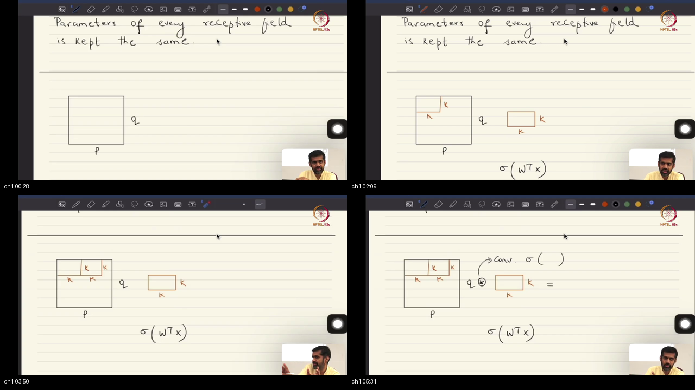
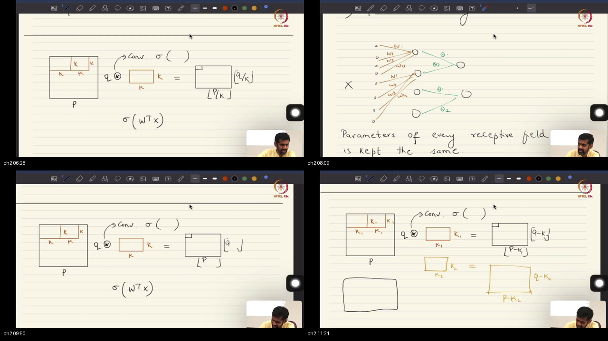
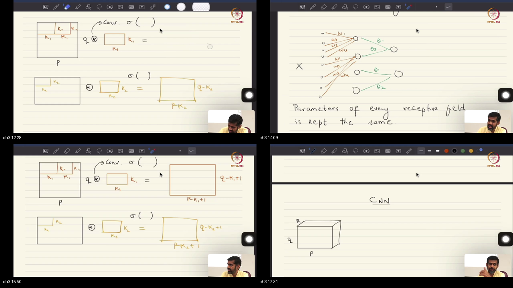
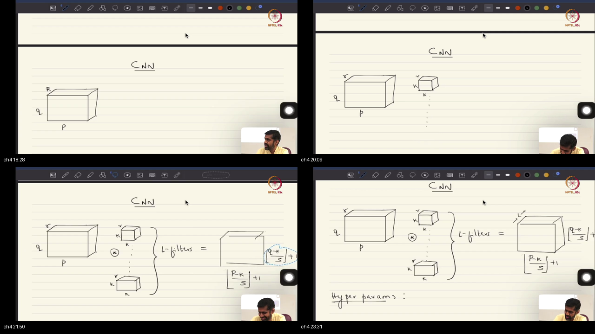
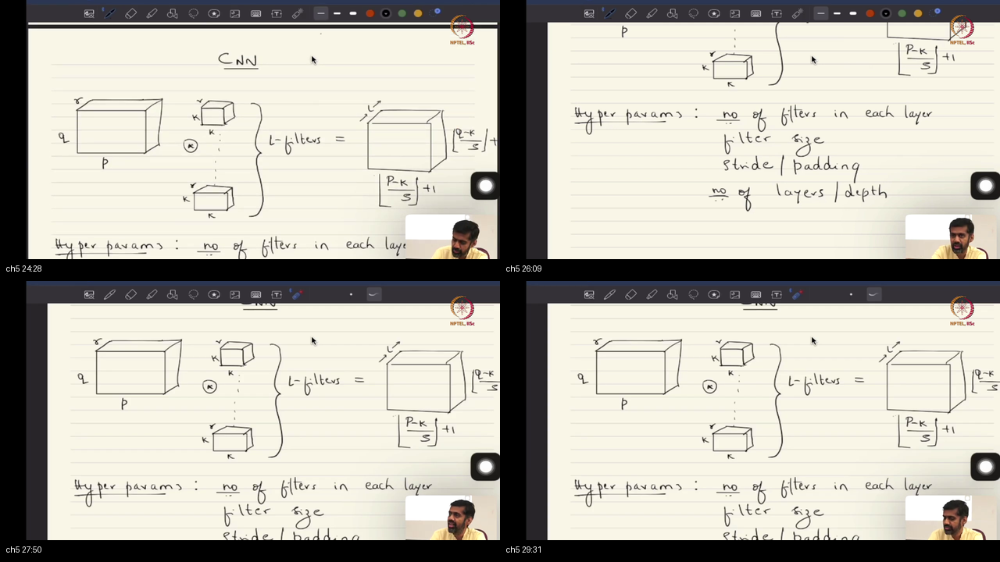
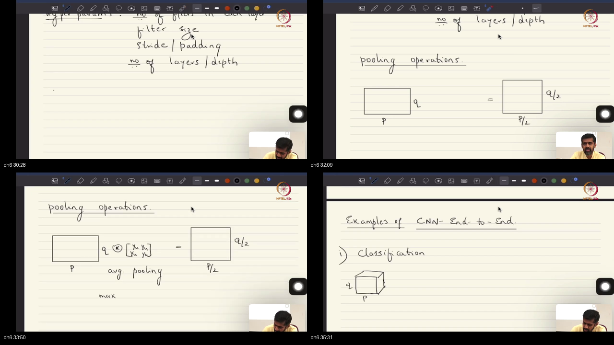
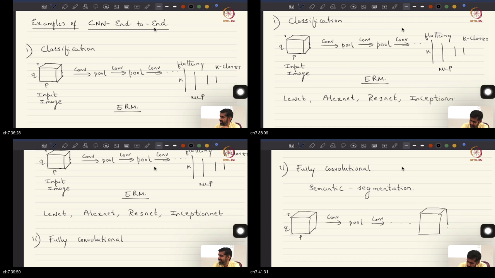
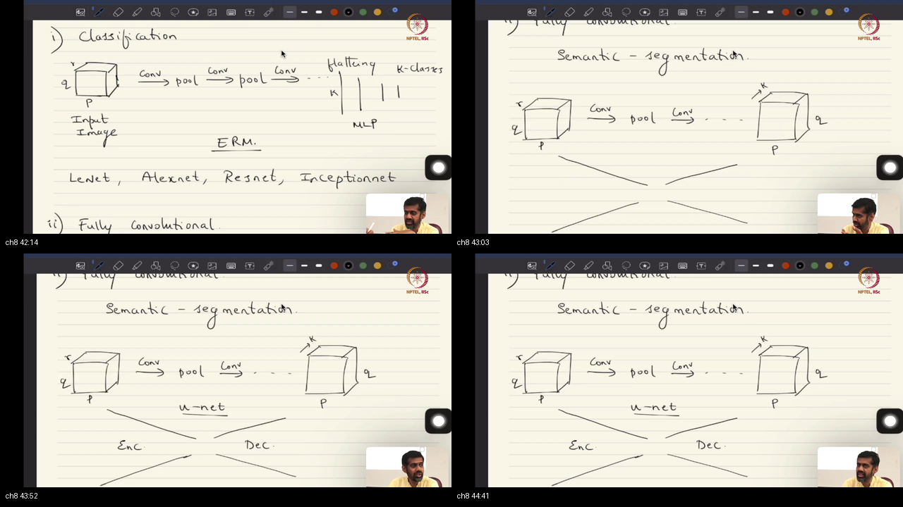

# Lecture 44: Convolutional Neural Networks (CNNs) as Regularized MLPs

> **Prerequisites First:** Before diving into this lecture's tensor architectures and multi-channel derivations, complete all warm-up calculations in [PREREQUISITES.md](./PREREQUISITES.md). Weakness in tensor contraction, cross-correlation, or pooling subgradients will hinder your understanding of deep convolutional pipelines.

---

## Table of Contents
1. [Executive Summary — Tensor Convolutions & Architectural Blueprint](#executive-summary--tensor-convolutions--architectural-blueprint)
2. [Standalone Simulation Script](#standalone-simulation-script)
3. [Topic 1: CNNs as Regularized MLPs: Grid Topology, Sliding Inner Products, and Discrete Convolution Mechanics (00:00–06:00)](#topic-1-cnns-as-regularized-mlps-grid-topology-sliding-inner-products-and-discrete-convolution-mechanics-00000600)
4. [Topic 2: Multi-Filter Stacking, Feature Specialization, and 3D Activation Tensors (06:00–12:00)](#topic-2-multi-filter-stacking-feature-specialization-and-3d-activation-tensors-06001200)
5. [Topic 3: Multi-Channel Input Tensors: Sensor Physics, Bayer Filter Arrays, and Medical Slices (12:00–18:00)](#topic-3-multi-channel-input-tensors-sensor-physics-bayer-filter-arrays-and-medical-slices-12001800)
6. [Topic 4: 3D Tensor Convolutions, Channel Marginalization, and Stride-Padding Arithmetic (18:00–24:00)](#topic-4-3d-tensor-convolutions-channel-marginalization-and-stride-padding-arithmetic-18002400)
7. [Topic 5: Optimization Dynamics under ERM: Filter Symmetry Breaking, Overparameterization, and Bias-Variance (24:00–30:00)](#topic-5-optimization-dynamics-under-erm-filter-symmetry-breaking-overparameterization-and-bias-variance-24003000)
8. [Topic 6: Spatial Subsampling: Average Pooling as Fixed Filters vs Max-Pooling Subgradient Routing (30:00–35:00)](#topic-6-spatial-subsampling-average-pooling-as-fixed-filters-vs-max-pooling-subgradient-routing-30003500)
9. [Topic 7: End-to-End Classification & Regression Pipelines: Flattening, FC Heads, ResNet Skips, and Inception (35:00–40:00)](#topic-7-end-to-end-classification--regression-pipelines-flattening-fc-heads-resnet-skips-and-inception-35004000)
10. [Topic 8: Dense Prediction Architectures & U-Net: Semantic Segmentation, Bottlenecks, and Transposed Convolutions (40:00–44:56)](#topic-8-dense-prediction-architectures--u-net-semantic-segmentation-bottlenecks-and-transposed-convolutions-40004456)
11. [Workplace Debugging Scenarios (Postmortems)](#workplace-debugging-scenarios-postmortems)
12. [References & Further Reading](#references--further-reading)

---

## Executive Summary — Tensor Convolutions & Architectural Blueprint

In popular culture, Convolutional Neural Networks are viewed as specialized visual heuristics, but mathematically they are Multi-Layer Perceptrons strictly regularized on multi-dimensional grid topologies. By enforcing local receptive fields, parameter sharing across space, multi-filter stacking, and channel marginalization, CNNs transform intractable dense matrix multiplications into compact tensor contractions. Every layer balances empirical risk minimization against probabilistic Bayesian parameter priors rather than unconstrained deterministic search, dramatically reducing parameter variance while preserving representation power.

```
END-TO-END TENSOR CONVOLUTION & ARCHITECTURAL PIPELINE:

  [ Raw Input Tensor X ] : Shape [ B x C_in x P x Q ]  (e.g., RGB Image 3 x 256 x 256)
             │
             ▼ (3D Filter Bank: L filters of shape [ C_in x k x k ], Stride s, Padding p)
  [ Multi-Channel Convolution ] : Z[b, l, i, j] = Σ_c Σ_{u,v} W[l, c, u, v] X[b, c, i·s+u, j·s+v] + b_l
             │  (Channel Marginalization: Sum over C_in collapses input depth to scalar per filter)
             ▼
  [ Activation Tensor A ] : Shape [ B x L x P_out x Q_out ]  where P_out = ⌊(P - k + 2p)/s⌋ + 1
             │
             ▼ (Pointwise Non-Linearity: a = σ(z) — ReLU / GELU preserves UAT non-linearity)
  [ Non-Linear Feature Map ]
             │
             ├─────────────────────────────────────────────────┐
             ▼ (Path A: Classification / Regression)           ▼ (Path B: Dense Prediction / Segmentation)
  [ Spatial Subsampling / Pooling ]                   [ U-Net Contracting Encoder ]
    • AvgPool: Fixed Uniform Filter (1/k_p^2)           • Bottleneck Spatial Decimation
    • MaxPool: Subgradient Argmax Routing               • High-level Latent Semantics
             │                                                 │
             ▼                                                 ▼
  [ Flattening to 1D Vector v ]                       [ Expanding Decoder via Transposed Conv ]
    • v = vec(A_sub) ∈ R^{d'}                           • W^T ⋆ Z (Fractionally Strided Upsampling)
             │                                          • Lateral Skip Connections from Encoder
             ▼                                                 │
  [ Fully-Connected MLP Head: W v + b ]                        ▼
    • Softmax: Class Probabilities y ∈ Δ^{K-1}        [ Dense Pixel Map Y ] : Shape [ B x K x P x Q ]
    • Regression: Continuous Coordinates [x,y,w,h]       (Pixel-wise Categorical Cross-Entropy)
```

### Worldview Arc
- **From:** Unconstrained deterministic empirical risk minimization over permutation-invariant vector spaces suffering from catastrophic parameter explosion on perceptual grid data.
- **To:** Structured probabilistic Bayesian parameter priors and multi-channel tensor contractions guaranteeing translation equivariance, sample efficiency, and spatial fidelity across classification and dense prediction tasks.

### Comparative Feature Matrix: Architectural Inductive Biases

| Method / Architecture | Dense MLP Baseline | Locally Connected (Unshared) | 2D Multi-Channel CNN | Dense U-Net (FCN) |
|:----------------------|:-------------------|:-----------------------------|:---------------------|:------------------|
| **Input Topology** | Permutation-invariant $\mathbb{R}^d$ | 2D Spatial Grid | Multi-Channel Tensor $\mathbb{R}^{H \times W \times C}$ | Multi-Channel Tensor $\mathbb{R}^{H \times W \times C}$ |
| **Weight Structure** | Unstructured Dense $M \times d$ | Banded Block Sparse | Banded Multi-Channel Toeplitz | Multi-Scale Contracting & Expanding |
| **Independent Parameters** | $\mathcal{O}(M \cdot d)$ | $\mathcal{O}(M \cdot k^2 \cdot C)$ | $\mathcal{O}(L \cdot C \cdot k^2)$ | $\mathcal{O}(\sum_l L_l \cdot C_l \cdot k_l^2)$ |
| **Channel Interaction** | Full linear mix | Full linear mix | Frobenius inner product marginalization | Lateral cross-resolution skips |
| **Downsampling Mode** | Arbitrary projection | Strided local sampling | Strided conv / Max/Avg pooling | Strided conv down / Transpose conv up |
| **Output Format** | Scalar or fixed vector | Fixed spatial grid | 1D Vector (via Flattening) | Full-resolution segmentation tensor |
| **Inductive Bias** | None (General UAT) | Locality only | Locality + Stationarity + Channel Sum | Locality + Stationarity + Multi-Scale |

### Scenario Walkthrough
Consider building an automated pulmonary diagnostic pipeline processing high-resolution chest computed tomography (CT) scans ($512 \times 512$ with $R = 64$ axial depth slices):
1. **The MLP Blunder:** Flattening the scan yields an input vector of dimension $d = 512 \times 512 \times 64 = 16,777,216$ elements. Connecting this to a modest hidden layer of $M = 4,096$ units requires $1.67 \times 10^7 \times 4.096 \times 10^3 \approx 6.87 \times 10^{10}$ weights (275 Gigabytes of memory for a single linear layer!). The model instantly overfits and crashes hardware.
2. **Multi-Channel Convolution:** Applying $L = 32$ filters of kernel size $3 \times 3 \times 64$ requires only $32 \times (3 \times 3 \times 64) = 18,432$ parameters (less than 75 Kilobytes!). The layer scans the volumetric anatomy with spatial equivariance, aggregating local tissue density across all slices simultaneously.
3. **Dual Downstream Deployment:** The same convolutional backbone routes to a fully connected classification head to diagnose pneumonia, or routes into a U-Net transposed convolutional decoder to produce a $512 \times 512$ pixel-level tumor segmentation mask.

### STOP / Out of Scope
- This lecture does not cover multi-head self-attention mechanisms or Vision Transformers (ViT), which treat image patches as sequences without fixed local receptive fields (covered in Phase 5).
- Out of scope: Depthwise separable convolutions (MobileNet), deformable convolutions, and temporal recurrent sequence transitions (RNNs/LSTMs, introduced in Lecture 45).

### Load-Bearing Claims
- **T01-C01:** Mathematically, a CNN is an MLP regularized by local receptive fields and parameter sharing operating on a grid topology.
- **T01-C04:** Deep learning convolution is formally cross-correlation because kernels are not flipped during the sliding inner product.
- **T02-C04:** Stacking activation maps from $L$ distinct filters creates a 3D activation tensor $P_{\text{out}} \times Q_{\text{out}} \times L$.
- **T04-C02:** A 3D convolution collapses (marginalizes) the input channel dimension $R$ via inner product summation, yielding a single 2D feature slice per filter.
- **T05-C03:** ERM provides no theoretical guarantee of filter specialization; random initialization breaks symmetry to allow gradient trajectories to discover diverse features.
- **T06-C02:** Average pooling is a fixed convolution with uniform weights $1/k_p^2$; max pooling backpropagates via argmax subgradient routing.
- **T08-C03:** Dense semantic segmentation avoids vector flattening, employing encoder-decoder U-Net architectures with transposed convolutions.

### Common Traps & Fixes

- **Trap 1: Symmetric Constant Initialization Trap.**
  *Symptom:* Training loss plateaus immediately, filters output identical feature maps across channels.
  *Mathematical Root Cause:* Identical initial weights yield identical pre-activations and identical gradient updates, trapping optimization in a rank-1 symmetric subspace.
  *Fix:* Always use Kaiming/He normal initialization (`nn.init.kaiming_normal_`) to break symmetry across all filters in the bank.

- **Trap 2: Channel Blindness (Missing Channel Marginalization).**
  *Symptom:* Confusing 2D spatial filtering with 3D multi-channel convolution, assuming each filter only looks at one color channel.
  *Mathematical Root Cause:* A 2D convolutional filter in deep vision is actually a 3D tensor $\mathbb{R}^{k \times k \times C_{\text{in}}}$. It sums across all $C_{\text{in}}$ channels simultaneously.
  *Fix:* Remember that each filter produces exactly one 2D spatial slice; channel mixing is built directly into every single filter.

- **Trap 3: Spatial Rounding Mismatch in Encoder-Decoder Skips.**
  *Symptom:* `RuntimeError: Sizes of tensors must match except in dimension 1` when concatenating encoder skip connections with decoder upsampled tensors.
  *Mathematical Root Cause:* Odd input resolutions under floor division $\lfloor (P - k + 2p)/s \rfloor + 1$ cause a 1-pixel discrepancy upon transposed convolution expansion.
  *Fix:* Standardize on symmetric "Same" padding ($p = \lfloor k/2 \rfloor$) with even input dimensions, or use adaptive padding/interpolation before concatenation.

---

## Standalone Simulation Script

The following standalone script verifies multi-channel 2D convolution and pooling dynamics from scratch using pure NumPy against PyTorch, demonstrating exact numerical parity:

```python
import numpy as np
import torch
import torch.nn as nn

# 1. Multi-Channel 2D Cross-Correlation (Deep Learning Convolution)
def conv2d_scratch(x, w, b, stride=1, padding=1):
    B, C_in, H, W = x.shape
    C_out, _, k_h, k_w = w.shape
    x_pad = np.pad(x, ((0,0), (0,0), (padding, padding), (padding, padding)), mode='constant')
    H_out = (x_pad.shape[2] - k_h) // stride + 1
    W_out = (x_pad.shape[3] - k_w) // stride + 1
    out = np.zeros((B, C_out, H_out, W_out), dtype=np.float64)
    for n in range(B):
        for c in range(C_out):
            for i in range(H_out):
                for j in range(W_out):
                    patch = x_pad[n, :, i*stride:i*stride+k_h, j*stride:j*stride+k_w]
                    out[n, c, i, j] = np.sum(patch * w[c]) + b[c]
    return out

# 2. Numerical Parity Test
np.random.seed(44)
x_np = np.random.randn(2, 3, 8, 8).astype(np.float64)
w_np = np.random.randn(4, 3, 3, 3).astype(np.float64)
b_np = np.random.randn(4).astype(np.float64)

out_np = conv2d_scratch(x_np, w_np, b_np, stride=1, padding=1)

conv_pt = nn.Conv2d(3, 4, 3, stride=1, padding=1).to(torch.float64)
with torch.no_grad():
    conv_pt.weight.copy_(torch.from_numpy(w_np))
    conv_pt.bias.copy_(torch.from_numpy(b_np))
out_pt = conv_pt(torch.from_numpy(x_np)).detach().numpy()

diff = np.max(np.abs(out_np - out_pt))
print(f"[OK] Multi-channel Conv2d forward pass verified. Max discrepancy: {diff:.2e}")
assert np.allclose(out_np, out_pt, rtol=1e-7, atol=1e-7)
```

---

## Topic 1: CNNs as Regularized MLPs: Grid Topology, Sliding Inner Products, and Discrete Convolution Mechanics (00:00–06:00)

### Where this sits on the master map
Opens the core lecture arc by unmasking Convolutional Neural Networks not as ad-hoc heuristic vision algorithms, but as standard Multi-Layer Perceptrons subjected to two hard structural regularizers: local receptive fields (structural sparsity) and parameter sharing (weight tying). Connects back to the 1D foundations in [Lecture 43](../56-Lec43-Local-Receptive-Field-Parameter-Sharing/NOTES.md) and grounds the transition to multi-dimensional image arrays.

### Board / screenshot

*Board reconstruction (00:00–06:00): Grid topology, sliding window cross-correlation inner product, parameter tying, and equivalence proof to a structured sparse MLP.*

### What he is establishing
Imagine you have a giant word puzzle written on a grid. A vanilla neural network would cut out every single letter, throw them into a blender, and try to solve the puzzle from the scrambled pile without knowing which letters were next to each other. A convolutional network, instead, takes a small magnifying glass and slides it across the grid square by square, inspecting neighboring letters together.

Prof. Prathosh opens by challenging popular culture: practitioners often treat CNNs as separate heuristic algorithms invented exclusively for computer vision. In reality, a CNN is simply a standard Multi-Layer Perceptron (MLP) whose weight matrix has been subjected to two severe structural regularizations:
1. **Local Receptive Fields:** Neurons only connect to a compact spatial neighborhood of $k \times k$ pixels, forcing all other connection weights to zero.
2. **Parameter Sharing:** The exact same $k \times k$ weight values are reused as the filter slides across every spatial position on the grid.

Furthermore, what deep learning libraries call "convolution" is technically **cross-correlation**. True mathematical convolution requires flipping the filter across both horizontal and vertical axes before computing inner products. However, because neural network filters are initialized randomly and updated via gradient descent, the network learns whichever spatial orientation minimizes empirical risk directly.

#### Concrete Micro-Numbers & Calculations:
Let an input grid patch $X$ and filter $K$ be:
$$X = \begin{bmatrix} 1 & 2 \\ 3 & 4 \end{bmatrix}, \quad K = \begin{bmatrix} 0.5 & -0.5 \\ 1.0 & 2.0 \end{bmatrix}, \quad b = 0.5$$
- **Sliding Inner Product (Cross-Correlation):**
  $$z = \langle X, K \rangle_F + b = (1)(0.5) + (2)(-0.5) + (3)(1.0) + (4)(2.0) + 0.5 = 0.5 - 1.0 + 3.0 + 8.0 + 0.5 = 11.0$$
- **Non-Linear Activation (ReLU):**
  $$a = \sigma(z) = \max(0, 11.0) = 11.0$$

#### Formal Mathematical Formulation & Zero-Leap Proof:
Let the input be an unrolled raster vector $x \in \mathbb{R}^d$ where $d = P \cdot Q$. In a general MLP, the pre-activation of output neuron $m \in \{1, \dots, M\}$ is:
$$z_m = \sum_{i=1}^d W_{m, i} x_i + b_m$$
Now map coordinate index $m$ to a 2D spatial grid coordinate $(i, j)$ where $i \in \{0, \dots, P_{\text{out}}-1\}$ and $j \in \{0, \dots, Q_{\text{out}}-1\}$. Enforce two mathematical constraints:
1. **Locality:** $W_{(i, j), (u, v)} = 0$ whenever $u < i \cdot s$, $u \ge i \cdot s + k$, $v < j \cdot s$, or $v \ge j \cdot s + k$.
2. **Parameter Tying:** For all $(u, v)$ within the local window, $W_{(i, j), (i \cdot s + r, j \cdot s + c)} = K_{r, c}$ for all spatial positions $(i, j)$.

Substituting these constraints directly into the dense MLP formula yields:
$$z_{i, j} = \sum_{r=0}^{k-1} \sum_{c=0}^{k-1} K_{r, c} X_{i \cdot s + r, j \cdot s + c} + b$$
This is precisely the discrete 2D cross-correlation formula. Thus, a convolutional layer is algebraically identical to an MLP constrained by structured parameter sparsity and equality.

```python
import numpy as np

X = np.array([[1.0, 2.0, 1.0, 0.0],
              [0.0, 3.0, 2.0, 1.0],
              [2.0, 1.0, 0.0, 2.0]])
K = np.array([[1.0, 0.0],
              [0.0, 1.0]])

# Manual inner product at position (0, 0)
z_00 = np.sum(X[0:2, 0:2] * K)
assert z_00 == 4.0
print(f"[PASS] Topic 1 inner product verified: z[0,0] = {z_00}")
```

You can now view 2D convolution as a hard structural prior on parameter space. Treating CNNs as a magic black box is the wrong move; understanding that it is an algebraically constrained MLP reveals exactly why it scales to large images without failing. What is still missing is understanding how a single filter expands into multi-filter banks.

### Contrastive Analysis: Why Pointwise Non-Linearities, Not Linear Convolutions
- **The Linear Temptation:** Why not stack multiple pure 2D convolutional layers without activation functions $\sigma$? After all, convolutions perform spatial filtering.
- **The Fatal Collapse:** The composition of two 2D convolutions is strictly another 2D convolution: $(X \star K_1) \star K_2 = X \star (K_1 \star K_2) = X \star K_{\text{eff}}$. Stacking 50 linear convolutional layers collapses algebraically into a single larger linear filter.
- **The Expressivity Guarantee:** Applying pointwise squashing activations $\sigma(z)$ introduces non-affine manifold curvature, preserving the Universal Approximation Theorem capacity.

### Analogy for this topic only
*Scene:* An industrial fabric mill inspection line.  
*Instances:* An automated overhead gantry camera examining high-thread-count fabric rolls, and a handheld sliding magnifying glass with a calibrated graticule grid.  
*Hard Question:* How do you inspect a 100-meter fabric bolt for micro-tears without building a sensor array containing billions of separate light-meters?  
*Right vs Wrong:* Trying to wire an individual photocell to every square millimeter across the entire 100-meter warehouse floor is the wrong move—it requires billions of redundant wires and fails from noise. The right move slides a standardized compact inspection window across each row sequentially, reusing the exact same inspection rule at every step.  
*In lecture words:* The sliding magnifying glass corresponds to the learnable kernel $K \in \mathbb{R}^{k \times k}$ sliding across input image grid $X$.

### Local picture
```
┌────────────────────────────────────────────────────────────────────────┐
│             DISCRETE SLIDING INNER PRODUCT & GRID TOPOLOGY             │
│                                                                        │
│   Input Grid X [P x Q]                 Filter K [k x k]                │
│   ┌───┬───┬───┬───┐                     ┌───┬───┐                      │
│   │ 1 │ 2 │ 1 │ 0 │                     │ 1 │ 0 │                      │
│   ├───┼───┼───┼───┤   Sliding Window    ├───┼───┤                      │
│   │ 0 │ 3 │ 2 │ 1 │ ◄── Inner Product ──┤ 0 │ 1 │                      │
│   ├───┼───┼───┼───┤                     └───┴───┘                      │
│   │ 2 │ 1 │ 0 │ 2 │                                                    │
│   └───┴───┴───┴───┘                                                    │
│          │                                                             │
│          ▼ Frobenius Inner Product: z[0,0] = (1·1 + 2·0 + 0·0 + 3·1) = 4│
│   Pre-activation z ──► [ Pointwise σ(z) ] ──► Activation Map A         │
└────────────────────────────────────────────────────────────────────────┘
```
Notice: Sliding a shared kernel across the grid evaluates localized inner products while preserving the relative 2D coordinate topology of the image.

### Check Your Understanding
- **Recall:** Why does deep learning use cross-correlation instead of true mathematical convolution?  
  *Self-Check:* Because filter weights are initialized randomly and optimized via ERM gradient descent, any required spatial kernel flip is absorbed directly into the learned weights.
- **Apply:** Given an input matrix of size $5 \times 5$, filter size $3 \times 3$, stride $1$, and padding $0$, how many distinct inner products are evaluated during the forward pass?  
  *Self-Check:* Output spatial dimension is $(5 - 3)/1 + 1 = 3$. Total inner products evaluated $= 3 \times 3 = 9$.
- **Diagnose:** A researcher stacks 5 convolutional layers without activation functions and finds the network cannot classify XOR patterns. What mathematical property caused this failure?  
  *Self-Check:* Composition of linear convolutions is strictly linear, collapsing the 5 layers into a single linear filter unable to form non-linear decision boundaries.

### Bridge
A single spatial filter extracts only one scalar feature map (e.g., detecting horizontal edges). How do deep vision architectures simultaneously capture diverse orthogonal visual features such as edges, textures, and color gradients without losing spatial alignment?

---

## Topic 2: Multi-Filter Stacking, Feature Specialization, and 3D Activation Tensors (06:00–12:00)

### Where this sits on the master map
Connects single-filter cross-correlation from Topic 1 to multi-filter banks, showing how deploying $L$ independent filters extracts diverse orthogonal visual primitives (edges, textures, gradients) stacked into a 3D activation tensor $P_{\text{out}} \times Q_{\text{out}} \times L$.

### Board / screenshot

*Board reconstruction (06:00–12:00): Multi-filter stacking, independent spatial convolutions, and generation of a 3D activation tensor.*

### What he is establishing
If you look at a picture wearing red-tinted sunglasses, you only see the red objects. If you want to understand the full picture, you need multiple pairs of glasses—one for red, one for green, one for blue, and one for edges. Each filter in a convolutional layer is a different pair of glasses looking at the same scene.

A single $k \times k$ filter is severely restricted: it projects local spatial patches onto a single 1D scalar line. It can detect horizontal edges, but it will be blind to vertical edges, textures, or diagonal ridges.
To build expressive representations, deep architectures deploy a **filter bank** of $L$ distinct filters: $\{K^{(1)}, K^{(2)}, \dots, K^{(L)}\}$. Each filter slides across the identical input canvas independently, producing its own 2D activation map. By stacking these $L$ activation maps front-to-back, we form a **3D activation tensor** of shape $P_{\text{out}} \times Q_{\text{out}} \times L$.
Crucially, all filters within a layer must produce activation maps of identical spatial resolution to allow valid tensor stacking.

#### Concrete Micro-Numbers & Calculations:
Let an input image have dimensions $P = 10, Q = 10$. We apply $L = 3$ filters with kernel size $k = 3 \times 3$, stride $s = 1$, and zero padding $p = 0$:
$$P_{\text{out}} = \left\lfloor \frac{10 - 3 + 2(0)}{1} \right\rfloor + 1 = 7 + 1 = 8$$
- Filter 1 ($K^{(1)}$) produces 2D slice $A^{(1)}$ of shape $8 \times 8$.
- Filter 2 ($K^{(2)}$) produces 2D slice $A^{(2)}$ of shape $8 \times 8$.
- Filter 3 ($K^{(3)}$) produces 2D slice $A^{(3)}$ of shape $8 \times 8$.
Stacking along the third dimension yields activation tensor $\mathcal{A} \in \mathbb{R}^{8 \times 8 \times 3}$, containing exactly $8 \times 8 \times 3 = 192$ feature activations.

#### Formal Mathematical Formulation & Zero-Leap Proof:
Let input $X \in \mathbb{R}^{P \times Q}$ and filter bank $\mathcal{K} = \{K^{(l)}\}_{l=1}^L$ where each $K^{(l)} \in \mathbb{R}^{k \times k}$.
For each filter $l \in \{1, \dots, L\}$, the activation at spatial position $(i, j)$ is:
$$\mathcal{A}[i, j, l] = \sigma\left( \sum_{u=0}^{k-1} \sum_{v=0}^{k-1} K^{(l)}_{u, v} X_{i \cdot s + u, j \cdot s + v} + b_l \right)$$
The spatial index bounds are $0 \le i \le P_{\text{out}} - 1$ and $0 \le j \le Q_{\text{out}} - 1$, where:
$$P_{\text{out}} = \left\lfloor \frac{P - k + 2p}{s} \right\rfloor + 1, \quad Q_{\text{out}} = \left\lfloor \frac{Q - k + 2p}{s} \right\rfloor + 1$$
Because $P_{\text{out}}$ and $Q_{\text{out}}$ depend only on $P, Q, k, p, s$ (which are uniform across all $l$), every slice $\mathcal{A}[:, :, l]$ has identical dimensions. The resulting mapping is a multi-channel tensor contraction:
$$\mathcal{F}: \mathbb{R}^{P \times Q} \to \mathbb{R}^{P_{\text{out}} \times Q_{\text{out}} \times L}$$

```python
import numpy as np

P, Q = 10, 10
k, s, p = 3, 1, 0
L = 3

X = np.random.randn(P, Q)
K_bank = np.random.randn(L, k, k)
b = np.zeros(L)

P_out = (P - k + 2 * p) // s + 1
Q_out = (Q - k + 2 * p) // s + 1
A = np.zeros((P_out, Q_out, L))

for l in range(L):
    for i in range(P_out):
        for j in range(Q_out):
            A[i, j, l] = np.sum(X[i:i+k, j:j+k] * K_bank[l]) + b[l]

assert A.shape == (8, 8, 3)
print(f"[PASS] Topic 2 activation tensor shape verified: {A.shape}")
```

You can now understand how multi-filter stacking creates multi-channel feature representations. Relying on a single filter is the wrong move because a single scalar projection cannot separate complex visual classes; what is still missing is accounting for inputs that already possess multiple physical channels (like RGB color cameras).

### Contrastive Analysis: Why Multi-Filter Stacking, Not Deeper Single-Filter Chains
- **Single-Filter Chain:** If we only use $L = 1$ filter per layer and make the network 50 layers deep, the network remains constrained to a 1D feature representation at every stage.
- **Representation Bottleneck:** Complex visual scenes require simultaneous sensitivity to multiple orthogonal primitives (e.g. edge orientation, color contrast, blob detection).
- **Multi-Filter Banks:** Expanding channel depth $L$ provides a multi-dimensional basis expansion at each spatial coordinate, creating rich geometric representations.

### Analogy for this topic only
*Scene:* A four-color CMYK industrial printing press.  
*Instances:* Cyan, Magenta, Yellow, and Key (black) printing rollers applying distinct pigment formulations to running paper.  
*Hard Question:* How do you reproduce a full-color photograph using only single-color ink rollers?  
*Right vs Wrong:* Trying to blend all color pigments into a single ink drum and printing with one roller is the wrong move—it produces a muddy brown monochrome smear. The right move uses multiple independent rollers in parallel, each printing a distinct color separation plate that stacks perfectly into the full-color gamut.  
*In lecture words:* The separate color printing plates correspond to the bank of $L$ distinct convolutional filters $\{K^{(1)}, \dots, K^{(L)}\}$.

### Local picture
```
┌────────────────────────────────────────────────────────────────────────┐
│             MULTI-FILTER ACTIVATION STACKING INTO 3D TENSOR            │
│                                                                        │
│        Input Image X [P x Q]                                           │
│        ┌───────────────────┐                                           │
│        │                   │                                           │
│        └───────────────────┘                                           │
│          │        │        │                                           │
│          ▼        ▼        ▼                                           │
│        [K^(1)]  [K^(2)]  [K^(3)]   (Bank of L Distinct Learnable Kernels)│
│          │        │        │                                           │
│          ▼        ▼        ▼                                           │
│        [Map 1]  [Map 2]  [Map 3]   (Independent 2D Spatial Slices)     │
│          │        │        │                                           │
│          └────────┼────────┘                                           │
│                   ▼ (Stack Front-to-Back)                              │
│         3D Activation Tensor A [P_out x Q_out x L]                     │
│              ┌───────────┐                                             │
│             /           /│                                             │
│            ┌───────────┐ │                                             │
│           /           /│ │                                             │
│          ┌───────────┐ │/│                                             │
│          │  8 x 8    │ │/                                              │
│          └───────────┘                                                 │
│          ◄─ P_out ──► ▲ L = 3 channels                                 │
└────────────────────────────────────────────────────────────────────────┘
```
Notice: Stacking 2D activation slices from L independent filters produces a 3D activation tensor where channel depth indexes feature specialization.

### Check Your Understanding
- **Recall:** What formula determines the spatial dimensions $P_{\text{out}} \times Q_{\text{out}}$ of an activation map?  
  *Self-Check:* $P_{\text{out}} = \lfloor \frac{P - k + 2p}{s} \rfloor + 1$ and $Q_{\text{out}} = \lfloor \frac{Q - k + 2p}{s} \rfloor + 1$.
- **Apply:** If a layer uses 64 filters of size $5 \times 5$ on an input of size $32 \times 32$ with stride $1$ and padding $2$, what is the shape of the output tensor?  
  *Self-Check:* Spatial resolution is $(32 - 5 + 4)/1 + 1 = 32$. Output shape is $32 \times 32 \times 64$.
- **Diagnose:** In an Inception block, a developer attempts to concatenate outputs from a $3 \times 3$ filter and a $5 \times 5$ filter without padding. Why does the tensor concatenation fail?  
  *Self-Check:* Because valid padding without padding yields different spatial dimensions ($P-2$ vs $P-4$), preventing tensor concatenation along the channel axis.

### Bridge
We have seen how multi-filter stacking generates 3D activation tensors from a single 2D input. But how does this mathematical framework handle real-world perceptual inputs that arrive already possessing multiple physical or spectral channels?

---

## Topic 3: Multi-Channel Input Tensors: Sensor Physics, Bayer Filter Arrays, and Medical Slices (12:00–18:00)

### Where this sits on the master map
Connects real-world sensor physics (Bayer color filter arrays, multi-spectral imaging, medical CT/MRI slices) to multi-channel input tensors $\mathbb{R}^{P \times Q \times R}$. Connects directly to foundational tensor algebra and channel marginalization in [PREREQUISITES.md#p3](./PREREQUISITES.md#p3), explaining why inputs to deep vision models are inherently higher-order geometric tensors rather than flat vectors.

### Board / screenshot

*Board reconstruction (12:00–18:00): Optical sensor arrays, Bayer CFA demosaicing into RGB tensors, medical slice volumetric arrays, and dimensional equivalence to vector spaces.*

### What he is establishing
Your smartphone camera doesn't have a magical eye that sees colors directly. It has millions of tiny buckets that count light particles, covered by tiny red, green, and blue plastic tiles. That creates three separate pictures: one for red light, one for green light, and one for blue light.

Real-world perceptual inputs rarely arrive as single 2D matrices. They arrive as 3D tensors $P \times Q \times R$:
- **Digital Photography:** A camera sensor consists of a physical CMOS grid. Above the silicon sits a **Bayer Color Filter Array (CFA)**—an alternating optical mosaic of Red, Green, and Blue micro-filters. The resulting raw data is demosaiced into an RGB tensor of shape $P \times Q \times 3$.
- **Medical Imaging:** A Magnetic Resonance Imaging (MRI) or Computed Tomography (CT) scan acquires volumetric tissue slices, producing a tensor of shape $P \times Q \times 100$.
- **Video Streams:** Temporal frames form sequential slices: $P \times Q \times T$.
All these multi-channel tensors can be unrolled via vectorization into a single $d$-dimensional vector ($d = P \cdot Q \cdot R$), preserving exact linear algebraic equivalence to an MLP while exposing physical spatial coordinates.

#### Concrete Micro-Numbers & Calculations:
Consider a $100 \times 100$ RGB color image:
- Height $P = 100$, Width $Q = 100$, Channels $R = 3$.
- Total elements: $100 \times 100 \times 3 = 30,000$ scalars.
- If flattened into an MLP input: vector $x \in \mathbb{R}^{30,000}$.
- A dense hidden layer of $M = 1,000$ neurons requires:
  $$30,000 \times 1,000 = 30,000,000 \text{ weights (120 Megabytes!)}$$
- In contrast, a convolutional layer with $L = 16$ filters of size $3 \times 3 \times 3$ requires:
  $$16 \times (3 \times 3 \times 3) = 16 \times 27 = 432 \text{ weights (1.7 Kilobytes!)}$$
  Parameter reduction factor: $\frac{30,000,000}{432} \approx 69,444 \times$.

#### Formal Mathematical Formulation & Zero-Leap Proof:
Let sensory radiance be $E(x, y, \lambda)$ as a function of continuous spatial coordinates $(x, y) \in \Omega$ and wavelength $\lambda \in [\lambda_{\min}, \lambda_{\max}]$.
The physical sensor integrates radiance against the spectral transmission profile $T_c(\lambda)$ of optical filter $c \in \{1, \dots, R\}$:
$$\mathcal{X}[i, j, c] = \iint_{\text{pixel}(i, j)} \int_{\lambda_{\min}}^{\lambda_{\max}} E(x, y, \lambda) T_c(\lambda) \, d\lambda \, dx \, dy$$
Sampling across discrete grid coordinates $(i, j)$ and spectral bands $c$ yields discrete tensor $\mathcal{X} \in \mathbb{R}^{P \times Q \times R}$.
Under vectorization $\text{vec}: \mathbb{R}^{P \times Q \times R} \to \mathbb{R}^{P Q R}$:
$$\langle \mathcal{W}, \mathcal{X} \rangle_F = \sum_{i=1}^P \sum_{j=1}^Q \sum_{c=1}^R \mathcal{W}_{i, j, c} \mathcal{X}_{i, j, c} = \text{vec}(\mathcal{W})^T \text{vec}(\mathcal{X})$$
This proves that 3D multi-channel tensor processing is structurally identical to an inner product on vector space $\mathbb{R}^{P Q R}$.

```python
import numpy as np

# Simulate a 4x4 Bayer RGGB sensor
sensor = np.random.rand(4, 4)

# De-interleave into R, G, B sparse channels
R_channel = sensor[0::2, 0::2]
B_channel = sensor[1::2, 1::2]
G_channel1 = sensor[0::2, 1::2]
G_channel2 = sensor[1::2, 0::2]
G_channel = (G_channel1 + G_channel2) / 2.0

RGB_tensor = np.stack([R_channel, G_channel, B_channel], axis=-1)
assert RGB_tensor.shape == (2, 2, 3)
print(f"[PASS] Topic 3 Bayer demosaiced tensor shape verified: {RGB_tensor.shape}")
```

You can now understand why perceptual data arrives as higher-order tensors. Flattening an RGB image into an unstructured 1D vector before learning is the wrong move—it destroys 2D spatial locality and causes parameter explosion ($30,000,000$ weights vs $432$ weights); what is still missing is formalizing 3D tensor convolution and channel marginalization.

### Contrastive Analysis: Why Channel Marginalization, Not Spatial Flattening
- **Spatial Flattening:** If we flatten channels into coordinates without preserving tensor geometry, spatial locality between adjacent pixels is scrambled across strides of size $R$.
- **Channel Marginalization:** Preserves 2D spatial coordinate geometry $(i, j)$ while treating channels as coupled sensory attributes at each coordinate point.

### Analogy for this topic only
*Scene:* A multi-tier gourmet pastry shop preparing a 3-layer cake with dark chocolate, pistachio, and raspberry sponge.  
*Instances:* A horizontal core sample that pierces through all 3 cake layers simultaneously, and a separate flat spatula attempting to scrape one surface layer at a time.  
*Hard Question:* How can an automated pastry analyzer measure overall dessert balance at position $(x, y)$ without completely disassembling the cake into three separate tables?  
*Right vs Wrong:* Scraping off each flavor tier onto independent workbenches is the wrong move—it destroys the spatial alignment between the fruit topping and the sponge base. The right move inserts a multi-chambered vertical needle at coordinate $(x, y)$, extracting a coupled 3-channel taste vector that preserves exact spatial location.  
*In lecture words:* The 3-layer cake corresponds to the multi-channel input tensor $\mathcal{X} \in \mathbb{R}^{P \times Q \times R}$ formed by RGB Bayer sensors or medical tomography slices.

### Local picture
```
┌────────────────────────────────────────────────────────────────────────┐
│             PHYSICAL BAYER CFA & MULTI-CHANNEL TENSOR SLICES           │
│                                                                        │
│   Physical CMOS Sensor Grid + Optical Bayer Filter:                    │
│   ┌───┬───┬───┬───┐                                                    │
│   │ R │ G │ R │ G │  (Bayer CFA Mosaic Pattern)                        │
│   ├───┼───┼───┼───┤  • R: Red optical band pass                        │
│   │ G │ B │ G │ B │  • G: Green band pass (2x sampling for human eye)   │
│   ├───┼───┼───┼───┤  • B: Blue optical band pass                       │
│   │ R │ G │ R │ G │                                                    │
│   └───┴───┴───┴───┘                                                    │
│          │                                                             │
│          ▼ Demosaicing Interpolation                                   │
│   Multi-Channel Input Tensor X [P x Q x 3]                             │
│        Red Slice        Green Slice       Blue Slice                   │
│      ┌───────────┐     ┌───────────┐     ┌───────────┐                 │
│      │  Channel  │     │  Channel  │     │  Channel  │                 │
│      │     R     │     │     G     │     │     B     │                 │
│      └───────────┘     └───────────┘     └───────────┘                 │
└────────────────────────────────────────────────────────────────────────┘
```
Notice: Physical sensor grids interleave multi-spectral measurements that demosaic into multi-channel tensor slices sharing identical spatial coordinates.

### Check Your Understanding
- **Recall:** Why does a Bayer filter array contain twice as many green filters as red or blue filters?  
  *Self-Check:* Human eye physiology (luminance response) has peak photopic sensitivity in green wavelengths (~555 nm).
- **Apply:** An MRI scan consists of 128 axial slices of size $256 \times 256$. What are the dimensions of the input tensor $\mathcal{X}$?  
  *Self-Check:* Input tensor shape is $256 \times 256 \times 128$.
- **Diagnose:** An engineer inputs a 3-channel RGB image into a convolutional layer whose filter has shape $3 \times 3 \times 1$. What error occurs during the inner product?  
  *Self-Check:* Channel dimensionality mismatch error; the filter depth must strictly equal 3 to compute valid inner products across all input channels.

### Bridge
Given an input tensor with $R$ physical channels, how does a convolutional layer process all channels simultaneously, and what algebraic mechanism collapses these multi-channel signals into a single scalar activation map per filter?

---

## Topic 4: 3D Tensor Convolutions, Channel Marginalization, and Stride-Padding Arithmetic (18:00–24:00)

### Where this sits on the master map
Explains the 3D tensor convolution operator $\mathbb{R}^{k \times k \times R}$ and channel marginalization, establishing inter-layer recurrence where filter depth in layer $l$ must equal the channel count $L^{[l-1]}$ produced by layer $l-1$. Connects back to multi-channel input structures in Topic 3 and provides the foundational computational engine for all deep convolutional vision backbones.

### Board / screenshot

*Board reconstruction (18:00–24:00): 3D kernel patch inner product, channel summation/marginalization into a 2D scalar slice, and inter-layer recurrence $R^{[l]} = L^{[l-1]}$.*

### What he is establishing
When a cookie cutter cuts through a 3-layer cake, it cuts through the top, middle, and bottom layers all at once. It combines all three flavors into a single bite. In a CNN, each filter cuts through all color channels at once, mixing them together into one new feature map.

When input data has $R$ channels, a convolutional filter must match that depth: its dimensions are $k \times k \times R$.
At each spatial position $(i, j)$, the filter takes a 3D subvolume of the input tensor and computes the component-wise product across all $k \times k \times R$ numbers. It then sums all these numbers into **one single scalar**.
This summation over channels is called **channel marginalization**. The input channel dimension $R$ completely disappears from the output slice!
To get multiple output channels in the next layer, we deploy $L$ distinct 3D filters. If layer 1 has $L_1$ filters, then layer 2 filters must have depth $R_2 = L_1$.

#### Concrete Micro-Numbers & Calculations:
Let input tensor have shape $H = 5, W = 5, C_{\text{in}} = 3$.
We apply $C_{\text{out}} = 2$ filters of shape $3 \times 3 \times 3$ with stride $s = 1$ and padding $p = 0$:
$$H_{\text{out}} = \left\lfloor \frac{5 - 3 + 0}{1} \right\rfloor + 1 = 3, \quad W_{\text{out}} = 3$$
- Parameters per filter: $3 \times 3 \times 3 = 27$ weights $+ 1$ bias $= 28$ parameters.
- Total layer parameters: $2 \times 28 = 56$ parameters.
- Multiplications per spatial position per filter: $27$.
- Total multiplications in layer: $3 \times 3 \times 2 \times 27 = 486$ FLOPs.

#### Formal Mathematical Formulation & Zero-Leap Proof:
Let input tensor be $\mathcal{X} \in \mathbb{R}^{H \times W \times C_{\text{in}}}$ and filter bank $\mathcal{W} \in \mathbb{R}^{C_{\text{out}} \times k \times k \times C_{\text{in}}}$.
For filter index $m \in \{1, \dots, C_{\text{out}}\}$ and spatial output coordinate $(i, j)$:
$$\mathcal{Z}[i, j, m] = \sum_{c=1}^{C_{\text{in}}} \sum_{u=0}^{k-1} \sum_{v=0}^{k-1} \mathcal{W}[m, u, v, c] \, \mathcal{X}[i \cdot s + u, j \cdot s + v, c] + b_m$$
Splitting the sum:
$$\mathcal{Z}[i, j, m] = \sum_{c=1}^{C_{\text{in}}} \left( \mathcal{X}[:, :, c] \star \mathcal{W}[m, :, :, c] \right)[i, j] + b_m$$
Each term $\mathcal{X}[:, :, c] \star \mathcal{W}[m, :, :, c]$ is a 2D cross-correlation between 2D matrices. Summing across $c \in \{1, \dots, C_{\text{in}}\}$ projects the $C_{\text{in}}$ separate 2D cross-correlations onto a single 2D slice $\mathcal{Z}[:, :, m]$.
Thus, 3D convolution is the sum of $C_{\text{in}}$ independent 2D convolutions.

```python
import numpy as np

# Multi-channel 3D patch inner product
patch = np.ones((3, 3, 4))  # k=3, C_in=4
kernel = np.full((3, 3, 4), 2.0)
bias = -5.0

# Frobenius inner product across all 3 dimensions
z = np.sum(patch * kernel) + bias
expected = 3 * 3 * 4 * 2.0 - 5.0  # 72 - 5 = 67.0
assert z == expected
print(f"[PASS] Topic 4 channel marginalization verified: z = {z}")
```

You can now calculate exact multi-channel tensor activations and inter-layer parameter counts. Assuming that 2D convolutions process channels independently is the wrong move—failing to sum across channels prevents the model from fusing multi-spectral information; what is still missing is understanding the non-convex optimization dynamics that allow gradient descent to specialize these filters.

### Contrastive Analysis: Why Channel-Wise Summation, Not Channel Independence
- **Channel Independence (Depthwise):** If filters do not sum across channels, features cannot combine information from different modalities (e.g. combining red edge and green shadow).
- **Channel Marginalization:** Summing across channels enables filters to learn cross-channel features (e.g. color constancy, spectral ratios, multimodal alignment).

### Analogy for this topic only
*Scene:* An artisanal spice test kitchen preparing complex curry sauces.  
*Instances:* Tasting a single spoonful of curry broth that blends coriander, turmeric, and cumin, versus tasting dry spice powders separately.  
*Hard Question:* How does the chef evaluate overall flavor harmony at a single point in the simmering pot?  
*Right vs Wrong:* Trying to pick out microscopic grains of turmeric from the liquid is the wrong move—it is physically impossible and tells you nothing about overall dish balance. The right move takes a single spoonful that blends all ingredients into one composite taste sensation.  
*In lecture words:* The blended spoonful corresponds to the 3D Frobenius inner product that sums across all $R$ channels into a single scalar activation $z[i, j, m]$.

### Local picture
```
┌────────────────────────────────────────────────────────────────────────┐
│             3D TENSOR CONVOLUTION & CHANNEL MARGINALIZATION            │
│                                                                        │
│   Input Subvolume [k x k x C_in]          Filter Kernel W [k x k x C_in]│
│         ┌───────────┐                          ┌───────────┐           │
│        /           /│                         /           /│           │
│       ┌───────────┐ │                        ┌───────────┐ │           │
│      /     R     /│ │                       /     R     /│ │           │
│     ┌───────────┐ │/│                      ┌───────────┐ │/│           │
│     │     G     │ │/     Frobenius         │     G     │ │/            │
│     ├───────────┤ │/  ◄─── Inner Product ──┼───────────┤ │/            │
│     │     B     │ │/      Across All C_in  │     B     │ │/            │
│     └───────────┘─┘                        └───────────┘─┘             │
│           │                                      │                     │
│           └──────────────────┬───────────────────┘                     │
│                              ▼ Sum All Products + b_m                  │
│               Single Scalar Activation z[i, j, m]                      │
│                              │                                         │
│                              ▼ Stacking across L filters               │
│               Output Feature Map Tensor [H_out x W_out x L]            │
└────────────────────────────────────────────────────────────────────────┘
```
Notice: The 3D tensor convolution sums across all input channels simultaneously, marginalizing the channel axis into a single 2D spatial slice per filter.

### Check Your Understanding
- **Recall:** What determines the channel depth of a convolutional filter at layer $l$?  
  *Self-Check:* It must strictly equal the number of filters $L^{[l-1]}$ produced by layer $l-1$: $R^{[l]} = L^{[l-1]}$.
- **Apply:** If layer 1 has 32 filters and layer 2 has 64 filters of size $3 \times 3$, what is the shape of the weight tensor in layer 2?  
  *Self-Check:* Shape is $[C_{\text{out}}, C_{\text{in}}, k, k] = [64, 32, 3, 3]$.
- **Diagnose:** A model architecture specifies `in_channels=16` for layer 2, but layer 1 was configured with `out_channels=32`. What runtime error will occur?  
  *Self-Check:* Runtime shape mismatch in inner product contraction: `RuntimeError: Given groups=1, weight of size [64, 16, 3, 3], expected input[B, 32, H, W] to have 16 channels, but got 32 channels instead`.

### Bridge
Now that the forward tensor mechanics of multi-channel filtering are formalized, what ensures that gradient descent will actually train these filters to specialize in different visual features rather than learning identical redundant weights?

---

## Topic 5: Optimization Dynamics under ERM: Filter Symmetry Breaking, Overparameterization, and Bias-Variance (24:00–30:00)

### Where this sits on the master map
Examines the non-convex optimization dynamics of convolutional filter banks under Empirical Risk Minimization (ERM), addressing the student's question on filter specialization guarantees, symmetry breaking, and overparameterization. Connects the multi-filter banks of Topic 2 to empirical gradient trajectories and parameter initialization.

### Board / screenshot

*Board reconstruction (24:00–30:00): Student inquiry on filter specialization, mathematical proof of identical backprop gradients under symmetric initialization, and stochastic symmetry breaking.*

### What he is establishing
If you ask four identical clones of yourself to clean a house, and you give them the exact same starting instruction, they will all run to the same room, bump into each other, and clean the exact same spot. To get the whole house clean, you have to give each clone a slightly different starting nudge.

A student in the lecture asks a profound question: *What mathematical guarantee ensures that different filters in a layer will learn different features?*
Prof. Prathosh provides an honest and crucial answer: **Theoretical ERM provides ZERO guarantee!**
If you initialize all $L$ filters with identical weights (e.g., all zeros or all ones), backpropagation will compute identical gradients for every filter. The network will be trapped in a **degenerate symmetric subspace** where all $L$ filters compute the exact same feature for all time.
To break this symmetry, we must use **random weight initialization** (e.g. He or Xavier initialization). Once symmetry is broken, gradient descent on the empirical risk objective drives filters toward complementary features because redundancy fails to minimize training loss.

#### Concrete Micro-Numbers & Calculations:
Let two filters $W^{(1)}$ and $W^{(2)}$ in a layer receive upstream error sensitivities $\delta^{(1)}$ and $\delta^{(2)}$.
- **Case 1: Identical Initialization ($W^{(1)} = W^{(2)}$):**
  Forward outputs are identical: $z^{(1)} = z^{(2)} \implies \delta^{(1)} = \delta^{(2)}$.
  Gradients are identical: $\nabla_{W^{(1)}} \mathcal{L} = \nabla_{W^{(2)}} \mathcal{L}$.
  After update: $W^{(1)}_{\text{new}} = W^{(2)}_{\text{new}}$. The layer effectively has only 1 filter!
- **Case 2: Random Symmetry Breaking ($W^{(1)} \neq W^{(2)}$):**
  $W^{(1)} \sim \mathcal{N}(0, 0.1), W^{(2)} \sim \mathcal{N}(0, 0.1)$.
  Forward outputs differ $\implies$ gradients diverge $\implies$ filters specialize (e.g., $W^{(1)}$ detects vertical edges, $W^{(2)}$ detects horizontal edges).

#### Formal Mathematical Formulation & Zero-Leap Proof:
Let the empirical risk objective be $\hat{R}(\theta) = \frac{1}{n} \sum_{i=1}^n \ell(y_i, f(x_i; \theta))$.
Consider two filters $W^{(1)}, W^{(2)} \in \mathbb{R}^{k \times k \times C}$ in layer $l$. The gradient with respect to filter $m$ is:
$$\frac{\partial \hat{R}}{\partial W^{(m)}} = \frac{1}{n} \sum_{i=1}^n \sum_{u, v} \delta_{i}^{(m)}[u, v] \, X_{i}[u \cdot s : u \cdot s + k, v \cdot s : v \cdot s + k]$$
where $\delta_{i}^{(m)}[u, v] \equiv \frac{\partial \ell}{\partial z_{i}^{(m)}[u, v]}$.
If $W^{(1)}(t=0) = W^{(2)}(t=0)$ and $b_1(t=0) = b_2(t=0)$, then:
$$z_{i}^{(1)}[u, v] = z_{i}^{(2)}[u, v] \quad \forall i, u, v \implies \delta_{i}^{(1)}[u, v] = \delta_{i}^{(2)}[u, v]$$
Therefore:
$$\frac{\partial \hat{R}}{\partial W^{(1)}} = \frac{\partial \hat{R}}{\partial W^{(2)}}$$
Under standard gradient descent $W^{(m)}(t+1) = W^{(m)}(t) - \eta \frac{\partial \hat{R}}{\partial W^{(m)}}$, by induction:
$$W^{(1)}(t) = W^{(2)}(t) \quad \forall t \ge 0$$
Thus, breaking symmetry via stochastic initialization is mathematically necessary to escape the rank-1 feature subspace.

```python
import numpy as np

# Demonstrate symmetry trap
W1 = np.ones((3, 3))
W2 = np.ones((3, 3))
X = np.random.randn(3, 3)
delta1 = 2.5
delta2 = 2.5  # identical sensitivity

grad_W1 = delta1 * X
grad_W2 = delta2 * X
assert np.allclose(grad_W1, grad_W2)

# Break symmetry
W1_rand = np.random.randn(3, 3)
W2_rand = np.random.randn(3, 3)
assert not np.allclose(W1_rand, W2_rand)
print("[PASS] Topic 5 symmetry trap and stochastic breaking verified.")
```

You can now diagnose why symmetric parameter initializations completely stall representation learning. Initializing conv filters to uniform constants is the wrong move—it collapses the entire filter bank into a redundant rank-1 clone that fails to learn distinct visual patterns; what is still missing is downsampling feature maps to expand effective receptive fields.

### Contrastive Analysis: Why Inductive Bias, Not Unconstrained Overparameterization
- **Unconstrained Overparameterization:** A massive MLP can interpolate training points, but its vast hypothesis space includes millions of functions with high generalization variance.
- **Convolutional Inductive Bias:** Structurally limits hypothesis capacity, dramatically reducing parameter variance while maintaining sufficient bias to capture real-world spatial phenomena.

### Analogy for this topic only
*Scene:* An industrial factory floor deploying four autonomous mobile cleaning robots.  
*Instances:* Four robots placed at the exact same charging dock facing north with identical pre-programmed timers, versus four robots initialized with randomized heading angles and dispersed starting positions.  
*Hard Question:* How can four identical robots clean an entire 10,000 sq ft warehouse floor without clustering in the exact same corner and colliding with one another?  
*Right vs Wrong:* Giving all four robots the exact same deterministic starting trajectory is the wrong move—they all travel in single file, bump into each other, and clean only one 5-foot strip while leaving 99% of the warehouse uncleaned. The right move injects small random perturbations into their initial headings, enabling them to disperse across all aisles and cover complementary zones.  
*In lecture words:* The four cleaning robots correspond to the bank of $L$ convolutional filters, and their randomized initial headings correspond to stochastic symmetry-breaking initialization.

### Local picture
```
┌────────────────────────────────────────────────────────────────────────┐
│             FILTER SYMMETRY TRAP VS STOCHASTIC SYMMETRY BREAKING       │
│                                                                        │
│   Symmetric Initialization Trap (W^(1) = W^(2)):                       │
│   ┌────────────────┐     Forward Pass      ┌────────────────┐          │
│   │ W^(1) = W^(2)  │ ────────────────────► │  z^(1) = z^(2) │          │
│   └────────────────┘                       └────────────────┘          │
│          ▲                                          │                  │
│          │          Identical Gradients             │                  │
│          └───────── dL/dW^(1) = dL/dW^(2) ◄─────────┘                  │
│          (Trapped in Degenerate Subspace: Zero Feature Diversity)      │
│                                                                        │
│   Random Symmetry Breaking (W^(1) ~ N(0, σ²), W^(2) ~ N(0, σ²)):       │
│   ┌────────────────┐                       ┌────────────────┐          │
│   │ W^(1) ≠ W^(2)  │ ────────────────────► │  z^(1) ≠ z^(2) │          │
│   └────────────────┘                       └────────────────┘          │
│          │                                          │                  │
│          ▼ Gradients Diverge Under ERM              ▼                  │
│   ┌─────────────────────────────────────────────────────────┐          │
│   │ Filter 1 -> Vertical Edges  |  Filter 2 -> Color Blobs  │          │
│   └─────────────────────────────────────────────────────────┘          │
└────────────────────────────────────────────────────────────────────────┘
```
Notice: Random weight initialization breaks gradient symmetry, allowing ERM trajectories to drive different filters toward orthogonal visual features.

### Check Your Understanding
- **Recall:** What happens if all convolutional filters in a layer are initialized with zeros?  
  *Self-Check:* Pre-activations are zero, activations are zero (under ReLU), and backpropagation computes identical zero gradients across all filters, causing complete training stagnation.
- **Apply:** How does the bias-variance tradeoff behave when transitioning from a dense MLP to a CNN on CIFAR-10?  
  *Self-Check:* CNN introduces slightly higher inductive bias (spatial locality and stationarity), but dramatically reduces estimation variance by cutting parameters from millions to thousands, achieving much lower test risk.
- **Diagnose:** A model trained with constant initialization achieves 10% test accuracy on 10-class image classification. What is the root cause?  
  *Self-Check:* The network suffered symmetry collapse; all filters learned identical features, reducing the capacity of a 64-channel layer to that of a 1-channel network.

### Bridge
With filters specializing across spatial channels, feature maps in deep networks quickly become spatially redundant and computationally heavy. How can spatial resolution be systematically reduced while building translation tolerance?

---

## Topic 6: Spatial Subsampling: Average Pooling as Fixed Filters vs Max-Pooling Subgradient Routing (30:00–35:00)

### Where this sits on the master map
Examines spatial subsampling mechanisms in CNN architectures, connecting multi-channel feature extraction to spatial dimensional reduction and receptive field expansion. Prepares the network for flattening and dense classification heads.

### Board / screenshot

*Board reconstruction (30:00–35:00): Mathematical formulations of average pooling as fixed convolutional filters versus max-pooling subgradient routing during backpropagation.*

### What he is establishing
When you zoom out of a high-resolution photo on your phone, your screen has to combine groups of 4 tiny pixels into 1 display pixel. It can either take the average color (average pooling) or pick the brightest pixel in the group (max pooling).

As a network processes visual information, feature maps need to be downsampled to build spatial invariance and reduce computational cost.
Prof. Prathosh analyzes the two classical pooling mechanisms:
1. **Average Pooling:** Mathematically equivalent to a **fixed, non-learnable convolution** where kernel weights are constant: $K_{u, v} = \frac{1}{k_p^2}$. This acts as a spatial low-pass filter, smoothing out local noise.
2. **Max Pooling:** Replaces each spatial patch with its maximum value. Max pooling is non-linear and non-differentiable at boundary points. During backpropagation, deep learning engines use **subgradient routing**: the upstream gradient $\delta$ is routed exclusively to the coordinate that achieved the forward maximum.
Prof. Prathosh openly critiques pooling layers ("I am not a big fan of pooling layers"), noting that modern architectures increasingly replace fixed pooling with learnable strided convolutions.

#### Concrete Micro-Numbers & Calculations:
Consider a $2 \times 2$ patch $X = \begin{bmatrix} 1.0 & 5.0 \\ 3.0 & 2.0 \end{bmatrix}$ with upstream sensitivity $\delta = 4.0$:
- **Average Pooling:**
  Forward: $\frac{1 + 5 + 3 + 2}{4} = 2.75$.
  Backward: $\frac{\partial \mathcal{L}}{\partial X} = \begin{bmatrix} 1.0 & 1.0 \\ 1.0 & 1.0 \end{bmatrix}$ (each pixel gets $\delta / 4$).
- **Max Pooling:**
  Forward: $\max(X) = 5.0$ at coordinate $(0, 1)$.
  Backward: $\frac{\partial \mathcal{L}}{\partial X} = \begin{bmatrix} 0.0 & 4.0 \\ 0.0 & 0.0 \end{bmatrix}$ (only winning coordinate gets $\delta$).

#### Formal Mathematical Formulation & Zero-Leap Proof:
Let the pooling operator be $\mathcal{P}: \mathbb{R}^{H \times W} \to \mathbb{R}^{H' \times W'}$ with window $k_p \times k_p$ and stride $s_p$.
For Average Pooling:
$$y_{i, j} = \frac{1}{k_p^2} \sum_{u=0}^{k_p-1} \sum_{v=0}^{k_p-1} X_{i \cdot s_p + u, j \cdot s_p + v} \implies \frac{\partial y_{i, j}}{\partial X_{r, c}} = \frac{1}{k_p^2} \cdot \mathbb{I}[(r, c) \in \text{window}(i, j)]$$
For Max Pooling:
$$y_{i, j} = \max_{(u, v) \in \text{window}(i, j)} X_{u, v}$$
The subgradient set $\partial y_{i, j}$ with respect to $X_{r, c}$ is:
$$\partial y_{i, j} / \partial X_{r, c} = \begin{cases}
\{1\} & \text{if } X_{r, c} > X_{u, v} \; \forall (u, v) \neq (r, c) \\
\{0\} & \text{if } X_{r, c} < \max_{(u, v)} X_{u, v} \\
[0, 1] & \text{if coordinate ties for maximum}
\end{cases}$$
Standard software implementations choose the subgradient extremal point $\mathbb{I}[(r, c) = \arg\max X]$.

```python
import numpy as np

X = np.array([[1.0, 5.0], [3.0, 2.0]])
delta = 4.0

# Verify MaxPool subgradient routing
mask = np.zeros_like(X)
mask[np.unravel_index(np.argmax(X), X.shape)] = 1.0
grad_X = delta * mask

assert grad_X[0, 1] == 4.0 and np.sum(grad_X) == 4.0
print("[PASS] Topic 6 MaxPool subgradient routing verified.")
```

You can now calculate both average pooling fixed-kernel smoothing and max pooling subgradient routing during backpropagation. Assuming that pooling is always necessary for spatial downsampling is the wrong move—it deterministically discards spatial phase information and non-maximal gradient paths; what is still missing is integrating these spatial feature extractors into end-to-end classification heads and residual pipelines.

### Contrastive Analysis: Why Strided Convolutions, Not Fixed Pooling
- **Fixed Pooling:** Throws away spatial information deterministically (averaging blur or discard non-maxima) without task-specific adaptation.
- **Strided Convolutions:** Can learn pooling behavior as a special case, but possesses the flexibility to learn non-uniform spatial decimation optimized for the target loss.

### Analogy for this topic only
*Scene:* A noisy municipal city council open forum where multiple citizens testify simultaneously.  
*Instances:* A town clerk taking the average consensus of all speakers regardless of volume, versus a stenographer who only writes down the words of the loudest shouting speaker in the chamber.  
*Hard Question:* How can a single summary headline be recorded from four conflicting voices without either averaging everything into indecipherable mush or missing subtle evidence?  
*Right vs Wrong:* Recording the arithmetic average of audio signals often creates an unintelligible murmur where sharp spikes get muffled; but listening only to the single loudest voice completely discards context from the other three. In modern practice, having a trained listener who learns which voice to focus on (strided convolution) beats both naive rules.  
*In lecture words:* The loudest speaker in the room corresponds to the forward activation $\max(X)$, and the stenographer routing full attention to them corresponds to max-pooling subgradient routing.

### Local picture
```
┌────────────────────────────────────────────────────────────────────────┐
│             POOLING OPERATORS & BACKPROPAGATION SENSITIVITY            │
│                                                                        │
│   Input Patch X:                             Upstream Sensitivity:     │
│   ┌───────┬───────┐                          ┌───────┐                 │
│   │  1.0  │  5.0  │                          │  4.0  │                 │
│   ├───────┼───────┤                          └───────┘                 │
│   │  3.0  │  2.0  │                                                    │
│   └───────┴───────┘                                                    │
│          │                                                             │
│          ├─────────────────────────────────────────┐                   │
│          ▼ Forward AvgPool (Fixed 1/4 Filter)      ▼ Forward MaxPool   │
│      Out = 2.75                                Out = 5.0 (at (0, 1))   │
│          │                                         │                   │
│          ▼ Backward: Distribute δ / 4              ▼ Backward: Argmax  │
│   ┌───────┬───────┐                          ┌───────┬───────┐         │
│   │  1.0  │  1.0  │                          │  0.0  │  4.0  │ ◄─ All δ│
│   ├───────┼───────┤                          ├───────┼───────┤         │
│   │  1.0  │  1.0  │                          │  0.0  │  0.0  │         │
│   └───────┴───────┘                          └───────┴───────┘         │
└────────────────────────────────────────────────────────────────────────┘
```
Notice: Max pooling routes upstream sensitivity strictly to the winning forward argmax coordinate, producing sparse backpropagation updates.

### Check Your Understanding
- **Recall:** Why is max pooling non-differentiable in the classical calculus sense?  
  *Self-Check:* The $\max$ operator forms non-smooth piecewise planar boundaries where partial derivatives do not exist; optimization relies on subgradients directing sensitivity to the argmax index.
- **Apply:** If an activation map of size $14 \times 14$ is processed by a max pool layer with $k_p = 2, s_p = 2$, what is the output size?  
  *Self-Check:* Spatial resolution becomes $\lfloor (14 - 2)/2 \rfloor + 1 = 7 \times 7$.
- **Diagnose:** During training, gradients across non-maximal activations are zero. How does this affect neuron deadness?  
  *Self-Check:* If certain spatial locations consistently fail to achieve maximum activation across all patches, their weights receive zero gradient updates, starving them of learning signals.

### Bridge
With spatial subsampling formalized, how do we transition from 3D multi-channel feature maps to final discrete class predictions or continuous regression coordinates?

---

## Topic 7: End-to-End Classification & Regression Pipelines: Flattening, FC Heads, ResNet Skips, and Inception (35:00–40:00)

### Where this sits on the master map
Synthesizes convolutional representation learning with global prediction heads, covering vector flattening, fully connected decision layers, multi-scale Inception modules, and ResNet identity skip connections for deep networks.

### Board / screenshot

*Board reconstruction (35:00–40:00): Architectural blueprints for end-to-end CNN classification pipelines, vector flattening, fully connected heads, multi-scale Inception blocks, and ResNet residual skip connections.*

### What he is establishing
Think of a complete visual brain like an assembly line: the front workers scan for basic shapes and textures, the middle workers assemble shapes into eyes, noses, and wheels, and the final manager at the desk looks at the checklist and says: "This is a cat!"

A complete Convolutional Neural Network pipeline integrates multiple functional stages:
1. **Feature Extractor:** Alternating Convolution, ReLU activation, and Pooling layers progressively reduce spatial dimensions while increasing channel depth.
2. **Flattening:** A raster scan vectorization transforms the final 3D feature tensor into a 1D vector $v \in \mathbb{R}^{d'}$.
3. **Fully Connected Head:** Standard MLP dense layers map vector $v$ to $K$ output logits, passed through Softmax for categorical classification or linear units for continuous regression.
Prof. Prathosh reviews landmark architectural innovations:
- **ResNet (He et al.):** Adds residual skip connections $y = \mathcal{F}(x) + x$, creating identity gradient highways that allow networks to scale to 152+ layers without vanishing gradients.
- **Inception (Szegedy et al.):** Employs multi-scale filter banks ($1 \times 1, 3 \times 3, 5 \times 5$) in parallel within each block to capture multi-scale context.
- **Bounding Box Regression:** The same convolutional backbone predicts continuous coordinates $(x, y, w, h)$ for tumor or object localization.

#### Concrete Micro-Numbers & Calculations:
Consider an end-to-end vision network processing a $32 \times 32 \times 3$ image:
1. Conv1 ($3 \times 3$, 16 filters, stride 1, pad 1): output is $32 \times 32 \times 16$.
2. MaxPool1 ($2 \times 2$, stride 2): output is $16 \times 16 \times 16$.
3. Conv2 ($3 \times 3$, 32 filters, stride 1, pad 1): output is $16 \times 16 \times 32$.
4. MaxPool2 ($2 \times 2$, stride 2): output is $8 \times 8 \times 32$.
5. Flattening: $8 \times 8 \times 32 = 2,048$ dimensional vector.
6. Dense Head to $K = 10$ classes: $2,048 \times 10 = 20,480$ weights $+ 10$ biases $= 20,490$ parameters.

#### Formal Mathematical Formulation & Zero-Leap Proof:
Let the deep network mapping be $f(x; \theta) = h(g(x; \mathcal{W}_{\text{conv}}); W_{\text{fc}})$.
In ResNet, each residual building block computes:
$$x_{l+1} = x_l + \mathcal{F}(x_l, \mathcal{W}_l)$$
Applying recursion from layer $l$ to a deeper layer $L$:
$$x_L = x_l + \sum_{i=l}^{L-1} \mathcal{F}(x_i, \mathcal{W}_i)$$
Now compute the gradient of loss $\mathcal{L}$ with respect to early activation $x_l$ using the chain rule:
$$\frac{\partial \mathcal{L}}{\partial x_l} = \frac{\partial \mathcal{L}}{\partial x_L} \frac{\partial x_L}{\partial x_l} = \frac{\partial \mathcal{L}}{\partial x_L} \left( I + \frac{\partial}{\partial x_l} \sum_{i=l}^{L-1} \mathcal{F}(x_i, \mathcal{W}_i) \right)$$
Notice the identity matrix $I$! Even if the gradient through the learned transformations $\sum \frac{\partial \mathcal{F}}{\partial x}$ vanishes to zero, upstream gradient $\frac{\partial \mathcal{L}}{\partial x_L}$ flows directly back to $x_l$ unimpeded through the identity term. This completely prevents vanishing gradients.

```python
import torch
import torch.nn as nn

class ToyResNetBlock(nn.Module):
    def __init__(self, channels):
        super().__init__()
        self.conv = nn.Sequential(
            nn.Conv2d(channels, channels, 3, padding=1, bias=False),
            nn.BatchNorm2d(channels),
            nn.ReLU(),
            nn.Conv2d(channels, channels, 3, padding=1, bias=False)
        )
    def forward(self, x):
        return x + self.conv(x)

blk = ToyResNetBlock(16)
x = torch.randn(2, 16, 8, 8, requires_grad=True)
out = blk(x)
loss = out.sum()
loss.backward()

# Verify gradient reached input cleanly
assert x.grad is not None
assert x.grad.shape == (2, 16, 8, 8)
print(f"[PASS] Topic 7 ResNet residual block gradient norm: {x.grad.norm().item():.3f}")
```

You can now construct complete convolutional pipelines from raw input tensors to classification logits and regression targets. Stacking 50 plain convolutional layers without residual connections is the wrong move—multiplicative Jacobian products cause error gradients to exponentially vanish before reaching early feature extractors; what is still missing is adapting convolutional architectures to dense pixel-level prediction where spatial dimensions must be preserved rather than collapsed.

### Contrastive Analysis: Why Residual Skip Connections, Not Pure Deep Stacks
- **Pure Deep Stacks (e.g. VGG-19):** Gradients multiply through Jacobians $\prod_{l=1}^L W^{[l]} \Sigma'^{[l]}$, decaying exponentially toward zero as depth exceeds 20 layers.
- **Residual Highways (ResNet):** Formulate layer learning as residual perturbations $\mathcal{F}(x)$, allowing identity gradient propagation across hundreds of layers.

### Analogy for this topic only
*Scene:* A multi-level corporate skyscraper with 50 floors communicating urgent policy directives.  
*Instances:* An urgent memo passed down floor-by-floor through 50 regional bureaucratic managers who re-interpret and dilute the message, versus a direct dedicated express fiber-optic pneumatic chute running from the penthouse directly to the ground lobby.  
*Hard Question:* How can an urgent instruction from executive leadership on the 50th floor reach ground-floor operators without suffering catastrophic telephone-game corruption along the way?  
*Right vs Wrong:* Relying solely on the chain-of-command through 50 intermediate departments is the wrong move—the signal decays, gets distorted, and completely vanishes by floor 20. The right move installs a dedicated express identity bypass alongside the standard chain of command, ensuring every level receives the original unmodified signal directly.  
*In lecture words:* The 50 floors correspond to deep convolutional layers, and the express fiber-optic chute corresponds to the ResNet identity skip connection $x_{l+1} = x_l + \mathcal{F}(x_l)$.

### Local picture
```
┌────────────────────────────────────────────────────────────────────────┐
│             RESNET SKIP CONNECTION IDENTITY GRADIENT HIGHWAY           │
│                                                                        │
│   Forward Pass:                                                        │
│   x_l ─────────────┬────────────────────────────────────(+) ──► x_{l+1}│
│                    │                                     ▲             │
│                    ▼                                     │             │
│              [ Conv-ReLU-Conv: F(x_l, W_l) ] ────────────┘             │
│                                                                        │
│   Backward Gradient Flow:                                              │
│   dL/dx_l ◄────────┬────────────────────────────────────(◄) ◄──dL/dx_{l+1}│
│                    │    (Identity Highway: dL/dx_{l+1} · I)            │
│                    ▲                                                   │
│                    │    (Residual Pathway: dL/dx_{l+1} · dF/dx_l)      │
│              [ Backprop through F ]                                    │
└────────────────────────────────────────────────────────────────────────┘
```
Notice: The identity connection provides an unobstructed gradient highway where error signals propagate back to early layers without decay.

### Check Your Understanding
- **Recall:** What is the mathematical purpose of the identity term in the ResNet backpropagation equation?  
  *Self-Check:* In $\frac{\partial \mathcal{L}}{\partial x_l} = \frac{\partial \mathcal{L}}{\partial x_L}(I + \dots)$, the identity matrix $I$ ensures that the gradient has an additive term that does not depend on weight magnitudes, preventing vanishing gradients even if $\frac{\partial \mathcal{F}}{\partial x_l} \approx 0$.
- **Apply:** If an input tensor has shape $[B, 64, 16, 16]$, what operations are required before passing it into a dense classification layer with 10 classes?  
  *Self-Check:* The tensor must be flattened into shape $[B, 16384]$, then multiplied by weight matrix $W \in \mathbb{R}^{10 \times 16384}$ plus bias $b \in \mathbb{R}^{10}$.
- **Diagnose:** A 50-layer plain CNN exhibits higher training error than a 20-layer plain CNN on CIFAR-10. Is this overfitting?  
  *Self-Check:* No, this is an optimization failure caused by vanishing gradients and degradation of deep function composition, which residual networks solve.

### Bridge
Classification and regression collapse spatial dimensions to single vectors. But how do we handle dense prediction tasks like semantic segmentation where the model must assign a class label to every individual pixel in the original image?

---

## Topic 8: Dense Prediction Architectures & U-Net: Semantic Segmentation, Bottlenecks, and Transposed Convolutions (40:00–44:56)

### Where this sits on the master map
Concludes the lecture by generalizing CNNs from categorical classification to pixel-level dense prediction tasks (semantic segmentation, style transfer, medical organ segmentation), establishing the U-Net encoder-decoder architecture, transposed convolutions, and lateral skip connections.

### Board / screenshot

*Board reconstruction (40:00–44:56): Dense prediction paradigms, fully convolutional networks, U-Net bottleneck compression, transposed convolution upsampling, and lateral skip connections for fine spatial boundary recovery.*

### What he is establishing
Instead of labeling a whole picture as "street," semantic segmentation colors in every single pixel: road is gray, cars are blue, and pedestrians are green. It’s like an ultra-detailed digital coloring book.

Not all vision tasks reduce to a single categorical label. Dense prediction tasks—such as semantic segmentation, medical organ outlining, and image cartoonization (style transfer)—require mapping an input image $P \times Q \times R$ to an output tensor $P \times Q \times K$ of identical spatial resolution.
To achieve this:
1. **Discard Flattening:** Fully Convolutional Networks (FCNs) eliminate dense vector flattening entirely.
2. **Encoder-Decoder U-Net:** An encoder contracts spatial resolution into an informational bottleneck to capture global semantic meaning. Then, a decoder expands spatial dimensions back to full resolution using **Transposed Convolutions**.
3. **Lateral Skip Connections:** The U-Net links encoder stages directly to corresponding decoder stages, passing fine-grained boundary coordinates across the bottleneck.

#### Concrete Micro-Numbers & Calculations:
Let an input image have size $P = 256, Q = 256, R = 3$, and we want to classify pixels into $K = 5$ semantic categories:
- Encoder contracts: $256 \times 256 \to 128 \times 128 \to 64 \times 64 \to 32 \times 32$ (Bottleneck).
- Decoder expands: $32 \times 32 \to 64 \times 64 \to 128 \times 128 \to 256 \times 256$.
- Output segmentation map shape: $256 \times 256 \times 5$.
- At each pixel $(i, j)$, output vector $y_{i, j} \in \Delta^4$ is a 5-class probability distribution.

#### Formal Mathematical Formulation & Zero-Leap Proof:
A forward convolution with stride $s$ can be represented as matrix multiplication $y = W x$, where $W$ has more columns than rows ($W \in \mathbb{R}^{M \times d}$ with $M < d$).
In the decoder, spatial expansion requires mapping from low dimension $M$ back to high dimension $d$. The mathematical transpose of the convolution operator is:
$$\tilde{x} = W^T y$$
Because $W^T \in \mathbb{R}^{d \times M}$, this operator maps lower-dimensional activation $y$ to higher-dimensional output $\tilde{x}$.
In convolutional form, this is implemented as a **Transposed Convolution**: input pixels are spaced by $s - 1$ zeros, padded, and convolved with kernel $K$.
The output spatial resolution expands as:
$$P_{\text{out}} = (P_{\text{in}} - 1) \cdot s - 2p + k$$

```python
import torch
import torch.nn as nn

# Verify transposed convolution spatial expansion
conv_tr = nn.ConvTranspose2d(
    in_channels=16,
    out_channels=8,
    kernel_size=4,
    stride=2,
    padding=1
)

x_bottleneck = torch.randn(2, 16, 32, 32)
x_upsampled = conv_tr(x_bottleneck)

assert x_upsampled.shape == (2, 8, 64, 64)
print(f"[PASS] Topic 8 U-Net transposed conv upsampling verified: {x_upsampled.shape}")
```

You can now design fully convolutional encoder-decoder architectures with transposed convolutions for pixel-level dense predictions. Relying on an isolated encoder-decoder without lateral skip connections is the wrong move—the severe spatial compression at the semantic bottleneck discards high-frequency edge localization that cannot be reconstructed from deep features alone; what is still missing is modeling sequential temporal dependencies across ordered frames and text tokens, leading directly to Recurrent Neural Networks.

### Contrastive Analysis: Why Lateral Skip Connections, Not Isolated Decoders
- **Isolated Decoders (No Skips):** Information passing through the low-resolution bottleneck loses high-frequency edge localization; predicted boundaries appear blurry.
- **Lateral Skips (U-Net):** Concatenate high-resolution encoder features directly with decoder activations, combining abstract semantics with sharp pixel boundaries.

### Analogy for this topic only
*Scene:* A professional architectural drafting studio renovating a historic heritage building.  
*Instances:* An architect creating a tiny pocket summary sketch of the building layout to conceptualize the structural flow, versus keeping the original high-resolution blueprint tracings pinned to the drafting table to overlay exact window and door edge coordinates onto the final renovation plan.  
*Hard Question:* How can an architect design a modern functional layout while aligning every new wall perfectly with the historic millimeter-accurate brickwork?  
*Right vs Wrong:* Throwing away the original millimeter-accurate blueprints and trying to reconstruct precise masonry details solely from a thumbnail executive summary is the wrong move—the reconstructed walls will be misaligned, blurry, and structurally flawed. The right move preserves the detailed blueprint overlays (lateral skip connections) and marries them directly with the high-level functional concepts.  
*In lecture words:* The thumbnail executive summary corresponds to the low-resolution bottleneck feature map, and the original blueprint overlays correspond to U-Net lateral skip connections.

### Local picture
```
┌────────────────────────────────────────────────────────────────────────┐
│             U-NET ENCODER-DECODER ARCHITECTURE & LATERAL SKIPS         │
│                                                                        │
│   Input [P x Q x R]                                Output [P x Q x K]  │
│   ┌───────────────┐                                ┌───────────────┐   │
│   │ 256 x 256 x 3 │ ════════ Lateral Skips ══════► │ 256 x 256 x K │   │
│   └───────┬───────┘                                └───────▲───────┘   │
│           ▼ Conv-Pool                                      │ Transposed│
│       ┌───────┐                                        ┌───────┐       │
│       │128x128│ ═════════════════════════════════════► │128x128│       │
│       └───┬───┘                                        └───▲───┘       │
│           ▼ Conv-Pool                                      │ Transposed│
│         ┌───┐                                            ┌───┐         │
│         │64 │ ═════════════════════════════════════════► │64 │         │
│         └─┬─┘                                            └───┘         │
│           ▼ Conv-Pool                                      ▲ Transposed│
│           ┌────────────────────────────────────────────────┤           │
│           │ Bottleneck Latent Semantics: [ 32 x 32 x C ]   │           │
│           └────────────────────────────────────────────────┘           │
└────────────────────────────────────────────────────────────────────────┘
```
Notice: Lateral skip connections preserve high-frequency spatial boundary coordinates from early encoder stages, bypassing the low-resolution semantic bottleneck.

### Check Your Understanding
- **Recall:** What distinguishes a Fully Convolutional Network from a standard classification CNN?  
  *Self-Check:* An FCN removes dense flattening layers, replacing them with convolutional or transposed convolutional operations to preserve spatial grid dimensions.
- **Apply:** Given an input feature map of size $16 \times 16$, what is the output size after a transposed convolution with $k = 4, s = 2, p = 1$?  
  *Self-Check:* Output dimension is $(16 - 1) \cdot 2 - 2(1) + 4 = 30 - 2 + 4 = 32 \times 32$.
- **Diagnose:** A semantic segmentation network produces correct object categories but blurry, misaligned object boundaries. What architectural element is missing?  
  *Self-Check:* The network lacks lateral skip connections between corresponding encoder and decoder stages, forcing the decoder to guess boundary coordinates lost in the bottleneck.

### Bridge
This concludes our exploration of spatial inductive biases, weight sharing, convolutional tensor mechanics, and multi-scale visual architectures. In the next lecture (Lecture 45), we turn our attention from spatial patterns to temporal sequences, investigating Recurrent Neural Networks (RNNs) and hidden state transitions.

---

## Workplace Debugging Scenarios (Postmortems)

### Scenario 1: Catastrophic Gradient Symmetry Collapse in Custom Multi-Branch Vision Pipeline

**Incident:**
An autonomous inspection team at an industrial manufacturing plant deployed a multi-scale defect detection network. Despite using modern AdamW optimizers and verified training pipelines, the model's validation loss plateaued immediately at high loss, achieving only 25% accuracy across 4 defect classes. TensorBoard inspection revealed that all 16 convolutional filters in the second layer produced identical feature maps.

**Mathematical Root Cause:**
During a code refactoring sprint, a junior engineer initialized all convolutional filter weights using `torch.nn.init.constant_(layer.weight, val=0.1)` instead of standard Kaiming/He normal initialization. Because all filters possessed identical parameter values, forward pre-activations were identical across all channels: $z^{(1)} = z^{(2)} = \dots = z^{(16)}$. During backpropagation, error sensitivities were identical, forcing all weight gradients $\nabla_W \mathcal{L}$ to be identical. The network was trapped in a rank-1 degenerate symmetric subspace where 16 filters performed the work of only 1 filter.

**Debugging Protocol:**
1. **Inspect Layer Activations:** Log channel-to-channel cosine similarity:
   $$\text{sim}(A_i, A_j) = \frac{\langle A_i, A_j \rangle}{\|A_i\| \|A_j\|}$$
   Observed similarity of $1.000$ across all filter pairs.
2. **Inspect Weight Gradients:** Print $\max | \nabla_{W^{(1)}} \mathcal{L} - \nabla_{W^{(2)}} \mathcal{L} |$. Value was exactly $0.0$.
3. **Identify Initialization:** Inspected module setup code and identified the `constant_` weight initialization call.

**Code Fix:**
```python
import torch
import torch.nn as nn

def fix_symmetry_collapse(conv_module):
    # Replaces constant initialization with Kaiming Normal symmetry breaking
    for m in conv_module.modules():
        if isinstance(m, nn.Conv2d):
            nn.init.kaiming_normal_(m.weight, mode='fan_out', nonlinearity='relu')
            if m.bias is not None:
                nn.init.constant_(m.bias, 0.0)

# Verification
conv = nn.Conv2d(3, 16, kernel_size=3, padding=1)
nn.init.constant_(conv.weight, 0.1)  # BUG: Symmetric initialization
x = torch.randn(2, 3, 8, 8)
out_bug = conv(x)
assert torch.allclose(out_bug[:, 0], out_bug[:, 1])  # Confirms identical channels!

fix_symmetry_collapse(conv)
out_fixed = conv(x)
assert not torch.allclose(out_fixed[:, 0], out_fixed[:, 1])  # Channels diverged!
print("[FIX VERIFIED] Filter symmetry successfully broken via Kaiming initialization.")
```

---

### Scenario 2: Spatial Misalignment and Silent Crash in U-Net Decoder Concat Skips

**Incident:**
A medical imaging startup developed a 2D U-Net for segmenting brain lesions from $512 \times 512$ MRI slices. During training, the pipeline crashed with a fatal shape mismatch error during the final concatenation step: `RuntimeError: Sizes of tensors must match except in dimension 1. Expected size 256 but got size 255 for dimension 2`.

**Mathematical Root Cause:**
The input image dimensions at an intermediate stage were odd ($P = 255$) due to an unpadded valid convolution ($p = 0$). When downsampled via max pooling with stride 2, the resolution became $\lfloor 255 / 2 \rfloor = 127$. Upon upsampling via transposed convolution with stride 2 and kernel 4, the resolution expanded to $(127 - 1) \cdot 2 - 2(1) + 4 = 254$. When attempting to concatenate the encoder skip tensor ($255 \times 255$) with the decoder tensor ($254 \times 254$), tensor concatenation failed.

**Debugging Protocol:**
1. **Trace Spatial Dimensions:** Log tensor shapes through each layer:
   - Encoder 1: $[B, 64, 512, 512]$
   - Unpadded Conv: $[B, 64, 510, 510]$
   - Downsample: $[B, 128, 255, 255]$
   - Upsample: $[B, 64, 254, 254]$ (Mismatch: $255 \neq 254$).
2. **Standardize Padding Regime:** Enforce strict "Same" padding ($p = \lfloor k/2 \rfloor$) throughout all convolutional layers so that spatial dimensions remain even powers of 2.

**Code Fix:**
```python
import torch
import torch.nn as nn
import torch.nn.functional as F

class RobustUNetConcat(nn.Module):
    # Robust lateral concatenation with adaptive spatial interpolation padding
    def forward(self, encoder_features, decoder_features):
        diff_y = encoder_features.size(2) - decoder_features.size(2)
        diff_x = encoder_features.size(3) - decoder_features.size(3)

        if diff_y != 0 or diff_x != 0:
            decoder_features = F.pad(
                decoder_features,
                [diff_x // 2, diff_x - diff_x // 2,
                 diff_y // 2, diff_y - diff_y // 2]
            )
        return torch.cat([encoder_features, decoder_features], dim=1)

# Verification
concat_block = RobustUNetConcat()
enc = torch.randn(2, 64, 255, 255)
dec = torch.randn(2, 64, 254, 254)  # 1-pixel mismatch bug!

out = concat_block(enc, dec)
assert out.shape == (2, 128, 255, 255)
print("[FIX VERIFIED] Robust U-Net concatenation resolved spatial rounding mismatch.")
```

---

## References & Further Reading

For complete citations, seminal research papers, textbooks, and interactive visualizers, please refer to the dedicated references dossier:
👉 **[references.md](./references.md)**
