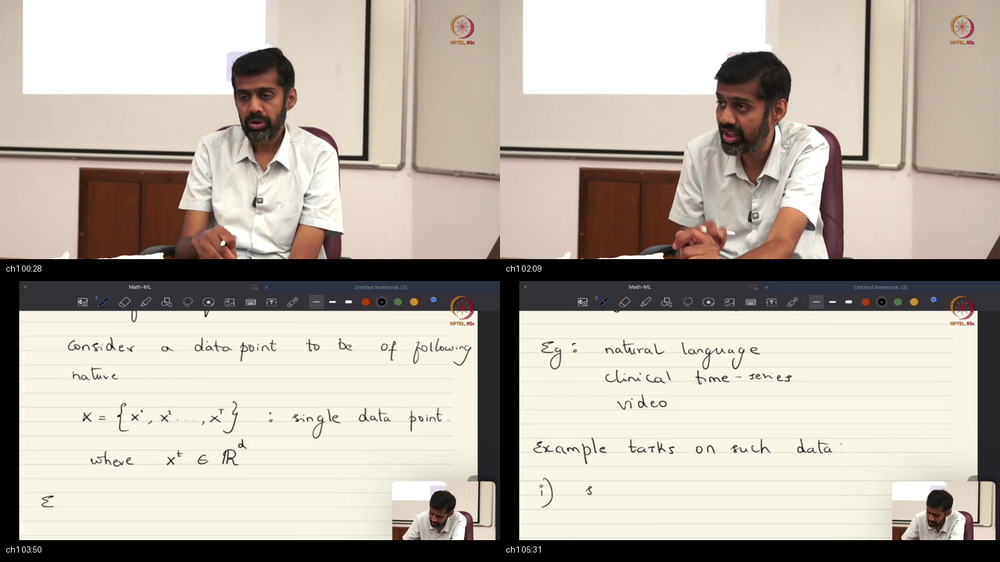
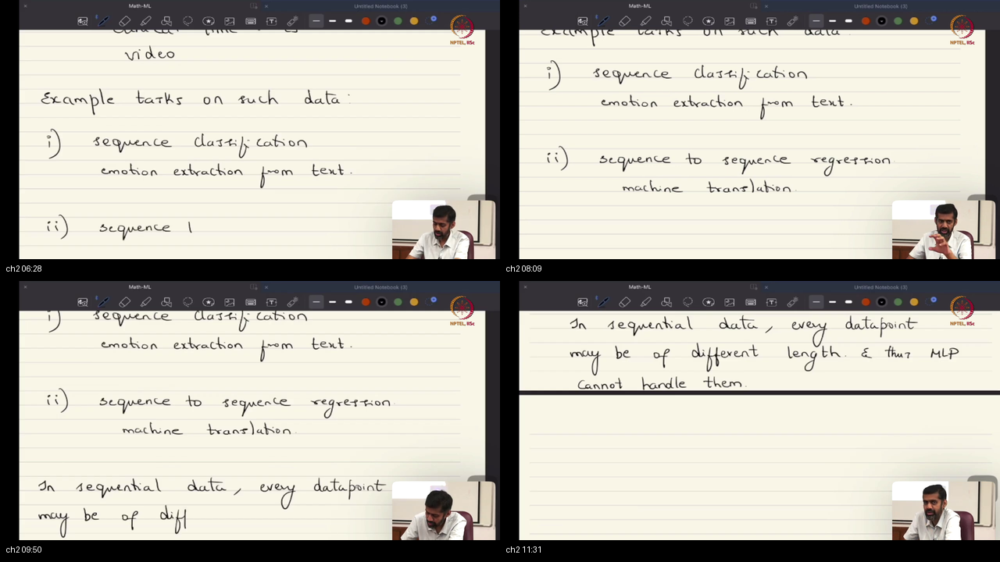
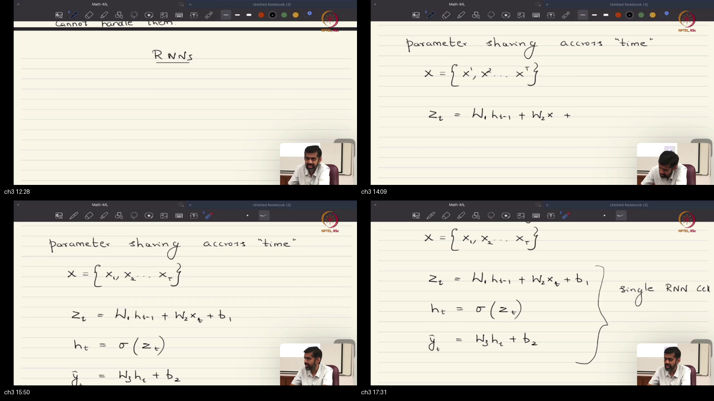
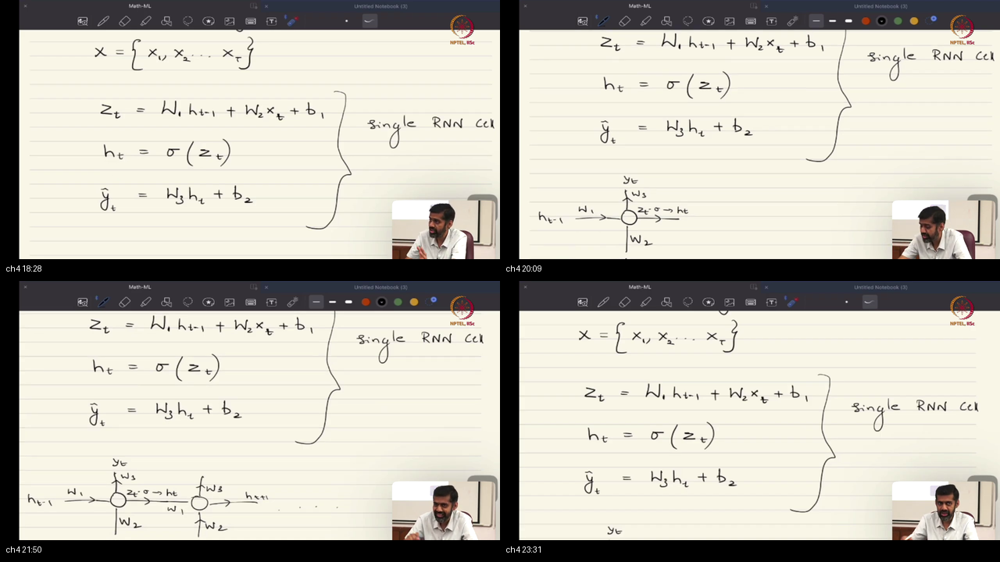
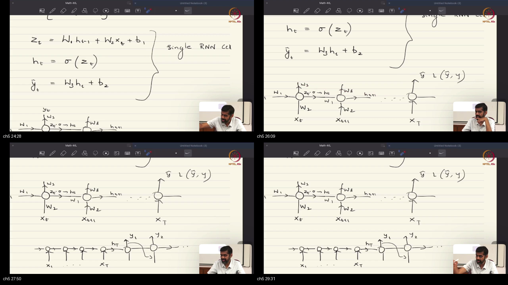
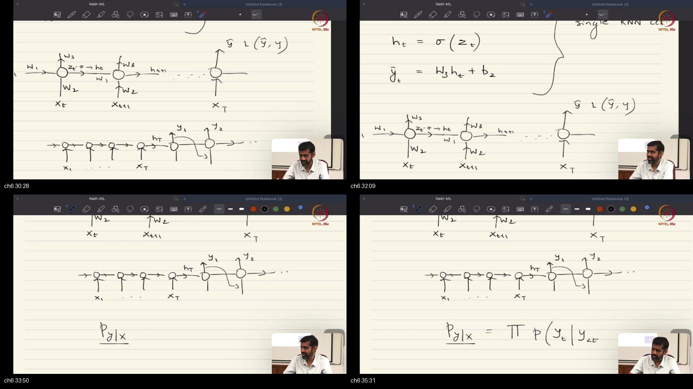
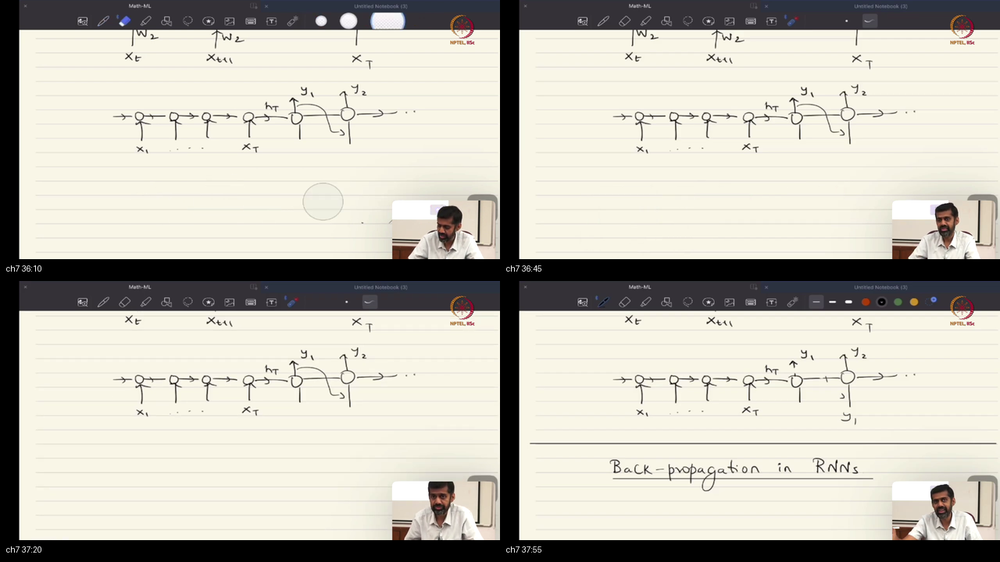

# Lecture 45: Recurrent Neural Networks (RNNs)

> **Prerequisites First:** Before diving into recurrent architectures and temporal unrolling, complete all warm-up derivations in [PREREQUISITES.md](./PREREQUISITES.md). Mastery of block-matrix algebra, affine state transitions, and causal block-Toeplitz operators is essential for understanding sequence modeling dynamics.

---

## Table of Contents
1. [Executive Summary](#executive-summary)
   - [Architectural Master Map](#architectural-master-map)
   - [STOP / Out of Scope](#stop--out-of-scope)
   - [Comparative Feature Matrix](#comparative-feature-matrix)
   - [Scenario Walkthrough](#scenario-walkthrough)
   - [Closed-Book Load-Bearing Takeaways](#closed-book-load-bearing-takeaways)
   - [Common Traps & Fixes](#common-traps--fixes)
2. [Top-Level Python Verification Suite](#top-level-python-verification-suite)
3. [Topic 1: Data Topologies & Sequence Modeling Prelude: Representing Temporal Observation Vectors (00:00–05:00)](#topic-1-data-topologies--sequence-modeling-prelude-representing-temporal-observation-vectors-00000500)
4. [Topic 2: Supervised Sequence Tasks & The Variable Length Failure of Dense MLPs (05:00–11:30)](#topic-2-supervised-sequence-tasks--the-variable-length-failure-of-dense-mlps-05001130)
5. [Topic 3: The Recurrent Cell & Mathematical State Transition Equations (11:30–18:00)](#topic-3-the-recurrent-cell--mathematical-state-transition-equations-11301800)
6. [Topic 4: Computational Graph Unrolling & Parameter Sharing Across Time (18:00–24:30)](#topic-4-computational-graph-unrolling--parameter-sharing-across-time-18002430)
7. [Topic 5: Sequence Topologies: Sequence Classification vs Sequence-to-Sequence (24:30–30:00)](#topic-5-sequence-topologies-sequence-classification-vs-sequence-to-sequence-24303000)
8. [Topic 6: Deep Stacked RNNs & RNNs as Structured Causal Block-Toeplitz MLPs (30:00–34:00)](#topic-6-deep-stacked-rnns--rnns-as-structured-causal-block-toeplitz-mlps-30003400)
9. [Topic 7: Probabilistic Auto-regressive Generation & Multi-Modal Vision-Language Pipelines (34:00–38:05)](#topic-7-probabilistic-auto-regressive-generation--multi-modal-vision-language-pipelines-34003805)
10. [Workplace Debugging Scenarios (Postmortems)](#workplace-debugging-scenarios-postmortems)
11. [References & Further Reading](#references--further-reading)

---

## Executive Summary

Recurrent Neural Networks adapt Multi-Layer Perceptrons to sequential data topologies. By maintaining an internal latent state $h_t$ and sharing parameters identically across all timesteps, RNNs process variable-length inputs while maintaining translation equivariance. The unrolled recurrent network acts as a causal, block-Toeplitz regularized MLP that unifies sequence classification and conditional auto-regressive generation.

### Architectural Master Map
```
┌────────────────────────────────────────────────────────────────────────────────────────┐
│                        RECURRENT NEURAL NETWORK ARCHITECTURAL SUITE                    │
│                                                                                        │
│   Folded Graph Representation:               Unrolled Computational Graph (Length T):  │
│                                                                                        │
│             y_t                                      y_1           y_2           y_T   │
│              ▲                                        ▲             ▲             ▲    │
│              │ W_hy                                   │ W_hy        │ W_hy        │ W_hy
│       ┌──────────────┐                         ┌───────────┐ ┌───────────┐ ┌───────────┐
│  x_t ─┼──►[Cell: h_t]│──┐ W_hh            h_0 ─┼──► h_1    ├──┼──► h_2    ├──┼──► h_T    │
│       │      ▲       │  │              (init)  │   (t=1)   │  │   (t=2)   │  │   (t=T)   │
│       └──────┼───────┘  │                      └─────▲─────┘ └─────▲─────┘ └─────▲─────┘
│              └──────────┘                            │ W_xh        │ W_xh        │ W_xh
│                                                     x_1           x_2           x_T    │
│                                                                                        │
│   Temporal Invariant: W_hh, W_xh, W_hy, b_h, b_y are tied identically across all steps │
└────────────────────────────────────────────────────────────────────────────────────────┘
```

### STOP / Out of Scope
This lecture does not derive Backpropagation Through Time (BPTT) Jacobians or introduce gated architectures like LSTMs or GRUs (which are the focus of Lectures 46 and 47). Out-of-scope topics also include transformer multi-head self-attention mechanisms and continuous-time neural ODEs.

### Comparative Feature Matrix

| Model / Dimension | Standard Feedforward MLP | 2D Convolutional Net (CNN) | Vanilla Recurrent Net (RNN) |
|:-----------------------|:-------------------------|:---------------------------|:----------------------------|
| **Data Topology** | Unstructured Vector $\mathbb{R}^d$ | 2D Spatial Grid $\mathbb{R}^{P \times Q \times R}$ | 1D Ordered Sequence $\mathbb{R}^{T \times d}$ |
| **Input Dimensionality** | Fixed Dimension ($d$ constant) | Fixed Canvas ($P, Q$ constant) | **Dynamic / Variable Length $T$** |
| **Inductive Bias** | None (Dense connectivity) | Local Receptive Field + Spatial Weight Sharing | **Recurrent Hidden Memory + Temporal Weight Sharing** |
| **Equivariance Property** | None | 2D Spatial Translation Equivariance | **1D Temporal Translation Equivariance** |
| **Parameter Scaling w.r.t. Input** | $O(d_{\text{in}} \cdot d_{\text{out}})$ (Explodes with $T$) | $O(k^2 C_{\text{in}} C_{\text{out}})$ (Independent of $P, Q$) | **$O(m^2 + m d)$ (Strictly independent of $T$)** |
| **Effective Matrix Structure** | Arbitrary Dense Matrix | Banded Circulant / Toeplitz Matrix | **Causal Block Lower-Triangular Block-Toeplitz** |

### Scenario Walkthrough
1. **Multivariate Sensor Stream Arrives:** An ICU patient monitoring system collects 5 vital signs (heart rate, blood pressure, oxygen saturation, temperature, respiratory rate) every minute for 120 minutes ($T = 120, d = 5$).
2. **Dense MLP Fails:** Flattening the patient record into a $120 \times 5 = 600$-dimensional vector crashes on a patient monitored for only 45 minutes ($T = 45$). Zero-padding wastes compute and misleads gradient updates.
3. **Recurrent Cell Ingestion:** An RNN initializes baseline state $h_0 = \mathbf{0} \in \mathbb{R}^{16}$. At minute $t$, it combines prior summary $h_{t-1}$ with vital readings $x_t$ via $z_t = W_{hh} h_{t-1} + W_{xh} x_t + b_h$, squashing to $h_t = \tanh(z_t)$.
4. **Parameter Sharing Across Time:** The matrices $W_{hh} \in \mathbb{R}^{16 \times 16}$ and $W_{xh} \in \mathbb{R}^{16 \times 5}$ remain strictly identical across all 120 minutes, learning stationary temporal dynamics.
5. **Terminal Classification:** At step $T$, the terminal state $h_T$ carries the accumulated patient trajectory into a dense readout head $\hat{y} = \text{softmax}(W_{hy} h_T + b_y)$ to predict sepsis risk.

### Closed-Book Load-Bearing Takeaways
- A sequence is formally an ordered list of vectors $X = (x_1, \dots, x_T) \in \mathbb{R}^{T \times d}$; data tensors have flexible representations and can be reshaped between topologies.
- Standard MLPs fail on sequences because variable length $T$ violates fixed weight matrix dimensions, and vector concatenation ignores chronological ordering.
- The recurrent cell computes pre-activation $z_t = W_{hh} h_{t-1} + W_{xh} x_t + b_h$ and state transition $h_t = \sigma(z_t)$, linearly fusing historical memory with new sensation.
- Parameter sharing across time ties weight matrices identically across all timesteps, reflecting stationary autonomous dynamical systems and Kalman filter formulations.
- In sequence classification (many-to-one), intermediate outputs are suppressed and cross-entropy loss is evaluated exclusively on terminal state $h_T$.
- In Seq2Seq generation (many-to-many), an Encoder compresses the input sequence into context $c = h_T$, which initializes an auto-regressive Decoder that halts upon emitting `<EOS>`.
- An unrolled RNN is mathematically equivalent to a deep regularized MLP constrained by causal lower block-triangular sparsity and temporal block-Toeplitz parameter tying.
- Both classifiers and sequence models are unified as conditional generative samplers from distribution $P(Y \mid X)$.

### Common Traps & Fixes
- **Trap 1: Attempting to train an unrolled RNN with different weights at each timestep.**  
  *Fix:* Enforce strict parameter tying ($W_{hh}^{(t)} \equiv W_{hh}$). Training separate weights causes parameter explosion $O(T m^2)$, destroys translation equivariance, and makes inference on unseen sequence lengths impossible.
- **Trap 2: Feeding ground-truth tokens during evaluation inference (Teacher Forcing Trap).**  
  *Fix:* In test-time auto-regressive generation, feed the model's own predicted token $\hat{y}_{t-1}$ back into the cell input. Teacher forcing is strictly a training stabilization technique.
- **Trap 3: Initializing $W_{hh}$ with large random normal weights causing explosive saturation.**  
  *Fix:* Initialize recurrent matrix $W_{hh}$ as an orthogonal matrix ($W_{hh}^T W_{hh} = I$) with spectral radius $\rho(W_{hh}) \approx 1.0$, preventing immediate exponential divergence of hidden activations.

---

## Top-Level Python Verification Suite

The following standalone executable Python script verifies the dual-stream block fusion, loop recurrence, and causal block-Toeplitz matrix parity:

```python
import numpy as np

def verify_rnn_foundations():
    np.random.seed(42)
    B, T, d, m = 2, 4, 3, 5
    
    # Random sequence input and initial hidden state
    X = np.random.randn(B, T, d)
    h0 = np.zeros((B, m))
    
    # Recurrent weights
    W_hh = np.random.randn(m, m) * 0.2
    W_xh = np.random.randn(m, d) * 0.2
    b_h = np.random.randn(m) * 0.1
    
    # 1. Step-by-step sequential recurrence
    H_loop = np.zeros((B, T, m))
    h_prev = h0.copy()
    for t in range(T):
        xt = X[:, t, :]
        # Block fusion: [h_{t-1}, x_t] @ [W_hh, W_xh]^T + b_h
        W_joint = np.hstack([W_hh, W_xh])
        v_joint = np.hstack([h_prev, xt])
        z_t = v_joint @ W_joint.T + b_h
        h_curr = np.tanh(z_t)
        H_loop[:, t, :] = h_curr
        h_prev = h_curr
        
    assert H_loop.shape == (B, T, m)
    
    # 2. Linear recurrence equivalence check with Causal Block-Toeplitz Operator
    # When activation is linear sigma(z) = z, check H_lin == M_toeplitz @ X_flat
    W_hh_lin = np.array([[0.5, 0.0], [0.1, 0.4]])
    W_xh_lin = np.array([[1.0], [0.5]])
    x_lin = np.array([1.0, 2.0, 3.0])  # T=3, d=1, m=2
    
    # Sequential linear loop
    h_lin_seq = []
    h_p = np.zeros(2)
    for val in x_lin:
        h_c = W_hh_lin @ h_p + W_xh_lin.flatten() * val
        h_lin_seq.append(h_c)
        h_p = h_c
    h_lin_seq = np.concatenate(h_lin_seq)
    
    # Block Toeplitz matrix construction
    M = np.zeros((6, 3))
    M[0:2, 0] = W_xh_lin.flatten()
    M[2:4, 0] = (W_hh_lin @ W_xh_lin).flatten()
    M[2:4, 1] = W_xh_lin.flatten()
    M[4:6, 0] = (W_hh_lin @ W_hh_lin @ W_xh_lin).flatten()
    M[4:6, 1] = (W_hh_lin @ W_xh_lin).flatten()
    M[4:6, 2] = W_xh_lin.flatten()
    
    h_lin_toeplitz = M @ x_lin
    np.testing.assert_allclose(h_lin_seq, h_lin_toeplitz, rtol=1e-5)
    
    print("[PASS] Top-Level RNN Architectural & Block-Toeplitz Parity Verified.")

if __name__ == "__main__":
    verify_rnn_foundations()
```

---

## Topic 1: Data Topologies & Sequence Modeling Prelude: Representing Temporal Observation Vectors (00:00–05:00)

### Where this sits on the master map
Opens Lecture 45 by establishing the formal definition of sequential data structures, distinguishing topological representations from architectural mechanisms. Bridges the 2D spatial grid inductive biases of CNNs (Lectures 43–44) to 1D chronological sequences across text, clinical vitals, and video streams. Grounded in the vector spaces and block-matrix linear algebra of [PREREQUISITES.md#p1](./PREREQUISITES.md#p1).

### Board / screenshot

*Board reconstruction (00:00–05:00): Prof. Prathosh formalizes sequence data points as ordered vector lists X = (x_1, x_2, ..., x_T) in R^d, and presents the paradigm that any tensor topology can be rearranged to suit different neural operator families.*

### What he is establishing
Imagine reading a murder mystery novel where the author hands you all 80,000 words shuffled alphabetically into a dictionary. You have all the exact words, but the plot, the motive, and the timeline are utterly destroyed because chronological ordering has been erased.

Prof. Prathosh establishes two foundational conceptual principles:
1. **Topological Malleability of Tensors:** In modern deep learning, data tensors do not possess immutable intrinsic topologies. A sequence of audio samples can be transformed into a 2D spectrogram image and processed via CNNs; conversely, a 2D image can be diced into a sequence of non-overlapping coordinate patches and processed via sequential or transformer architectures (as in Vision Transformers, ViT). Any architecture can theoretically process any data format, provided the tensor is rearranged to match the model's inductive assumptions.
2. **Formal Definition of a Sequence:** A single sequential data point is mathematically defined as an ordered tuple of observation vectors:
   $$X = (x_1, x_2, \dots, x_T) \in \mathbb{R}^{T \times d}$$
   where $T \in \mathbb{N}$ denotes the temporal sequence length and each observation $x_t \in \mathbb{R}^d$ captures state measurements at discrete index $t$.

He illustrates this across three major real-world domains:
- **Natural Language Processing:** A sentence contains $T$ words. Each word is mapped to a vector $x_t \in \mathbb{R}^d$ using categorical one-hot vectors or dense vocabulary embeddings.
- **Clinical Time Series:** A patient in an intensive care unit undergoes continuous physiological monitoring. At each sampling minute, sensors measure $d = 5$ vitals (heart rate, blood pressure, etc.). A record spanning $T = 100$ minutes yields an observation matrix $X \in \mathbb{R}^{100 \times 5}$.
- **Video Streams:** A video consists of $T$ sequential visual frames. Each individual frame is a 2D/3D image tensor $P \times Q \times R$ which vectorizes to $x_t \in \mathbb{R}^d$ with $d = P \cdot Q \cdot R$.

#### Concrete Micro-Numbers & Calculations:
Consider a clinical dataset monitoring $N = 3$ patients:
- Patient 1 monitored for $T^{(1)} = 4$ hours: matrix shape is $[4, 5]$.
- Patient 2 monitored for $T^{(2)} = 2$ hours: matrix shape is $[2, 5]$.
- Patient 3 monitored for $T^{(3)} = 6$ hours: matrix shape is $[6, 5]$.
At hour $t=2$ for Patient 1, observation vector is:
$$x_2 = [72.0 \text{ bpm}, 120.0 \text{ mmHg}, 98.5 \%, 16.0 \text{ resp/min}, 37.1 ^\circ\text{C}]^T \in \mathbb{R}^5$$
Total scalars recorded across the three patients: $(4 + 2 + 6) \times 5 = 60$ scalar numbers.

#### Formal Mathematical Formulation & Zero-Leap Proof:
Let sample space of sequences be $\mathcal{X} = \bigcup_{T=1}^\infty \mathbb{R}^{T \times d}$.
Let permutation operator $\Pi_\pi: \mathbb{R}^{T \times d} \to \mathbb{R}^{T \times d}$ apply temporal permutation $\pi \in S_T$ to sequence indices:
$$\Pi_\pi(x_1, \dots, x_T) = (x_{\pi(1)}, \dots, x_{\pi(T)})$$
In language and physical dynamical systems, the generating probability law satisfies:
$$P(X) \neq P(\Pi_\pi(X)) \quad \text{for almost all } \pi \neq \text{id}$$
Because temporal ordering encodes causal dependencies $x_t \sim P(x_t \mid x_{<t})$, an architecture that treats inputs as exchangeable sets of coordinates violates the underlying distribution.

```python
import numpy as np

# Verify temporal permutation destruction
sentence_tokens = np.array([
    [1.0, 0.0],  # "The"
    [0.0, 1.0],  # "dog"
    [0.5, 0.5],  # "bites"
    [0.2, 0.8]   # "man"
])

permuted_tokens = sentence_tokens[[3, 2, 0, 1]] # "man bites The dog"
assert not np.array_equal(sentence_tokens, permuted_tokens)
print("[PASS] Topic 1 Sequence ordering verified.")
```

You can now formalize sequential observations across diverse domains as ordered vector tuples $(x_1, \dots, x_T) \in \mathbb{R}^{T \times d}$. Assuming that sequential data must always be processed by recurrent models or that images must always be processed by CNNs is the wrong move—any tensor topology can be rearranged to suit any architecture; what is still missing is understanding why standard feedforward MLPs fail to handle variable-length sequences.

### Contrastive Analysis: Why Sequential Ordering, Not Static Vectorization
- **Static Vectorization:** Treats a sequence as a single monolithic flattened vector in $\mathbb{R}^{T \cdot d}$, stripping away chronological boundaries and assuming a rigid fixed duration.
- **Sequential Ordering:** Preserves causal temporal boundaries $t=1, 2, \dots, T$, enabling models to process variable length inputs and respect chronological physical time.

### Analogy for this topic only
*Scene:* An air traffic control radar tower monitoring incoming commercial aircraft.  
*Instances:* Recording a plane's flight path as a continuous chronological sequence of GPS coordinates taken every minute, versus taking all 60 coordinates at the end of the hour, scrambling their timestamps, and plotting them as an unordered cloud of dots.  
*Hard Question:* How can an air traffic controller determine the plane's true velocity and destination if all timestamps on the coordinates are erased?  
*Right vs Wrong:* Trying to navigate flights from an unordered cloud of location dots is the wrong move—the controller cannot determine whether the plane is climbing or diving, accelerating or landing. The right move preserves the chronological trajectory $(x_1, x_2, \dots, x_T)$, making instantaneous velocity and direction immediately computable.  
*In lecture words:* The chronological flight coordinates correspond to observation vectors $x_t$, and preserving their sequence order is what allows the recurrent model to track state trajectory.

### Local picture
```
┌────────────────────────────────────────────────────────────────────────┐
│             TOPOLOGICAL DATA REPRESENTATION & SEQUENCE FORMAT          │
│                                                                        │
│   Clinical Patient Record:          Text Sentence:                     │
│   t=1: [HR, BP, SpO2, Temp] ◄──x_1  t=1: [0, 1, 0, ...] ("The") ◄──x_1 │
│   t=2: [HR, BP, SpO2, Temp] ◄──x_2  t=2: [0, 0, 1, ...] ("cat") ◄──x_2 │
│   ...                               ...                                │
│   t=T: [HR, BP, SpO2, Temp] ◄──x_T  t=T: [1, 0, 0, ...] ("sat") ◄──x_T │
│                                                                        │
│   Matrix Form: X in R^{T x d} (Ordered Row Vectors Across Time)       │
└────────────────────────────────────────────────────────────────────────┘
```
Notice: Sequential data preserves the temporal index $t$ as an explicit dimension rather than collapsing it into an unordered feature bag.

### Check Your Understanding
- **Recall:** What are the two core dimensions defining an observation sequence $X$?  
  *Self-Check:* Temporal sequence length $T$ and feature vector dimensionality $d$.
- **Apply:** If an audio clip of 10 seconds is sampled at 16,000 Hz and windowed into 25 ms frames with 10 ms hop size, what does the sequence represent?  
  *Self-Check:* A sequence of $T = 1,000$ spectral feature vectors, each of dimension $d$ (e.g., $d=40$ Mel-frequency filterbank energies).
- **Diagnose:** A model trained on flattened stock price vectors $[p_1, p_2, \dots, p_T]$ performs identically when columns are randomly permuted during evaluation. What does this reveal?  
  *Self-Check:* The model possesses zero temporal inductive bias; it is an unconstrained feedforward architecture treating prices as independent features rather than an ordered temporal process.

### Bridge
Now that sequence data is formally defined as ordered vector tuples $(x_1, \dots, x_T)$, what supervised learning tasks operate on these sequences, and why do standard dense Multi-Layer Perceptrons fail to solve them?

---

## Topic 2: Supervised Sequence Tasks & The Variable Length Failure of Dense MLPs (05:00–11:30)

### Where this sits on the master map
Categorizes the supervised learning tasks that operate on sequence topologies (many-to-one sequence classification vs many-to-many sequence regression/generation), and presents the rigorous mathematical proof of why dense feedforward MLPs fundamentally fail on variable-length sequential streams. Connects to the feedforward MLP mechanics and activation functions in [PREREQUISITES.md#p2](./PREREQUISITES.md#p2).

### Board / screenshot

*Board reconstruction (05:00–11:30): Prof. Prathosh outlines sequence classification and Seq2Seq translation tasks, compositions of neural architectures as Lego blocks, and details why variable sequence length T breaks fixed-dimension MLP matrices.*

### What he is establishing
Suppose a bank teller window is designed with an iron slot that accepts precisely a 3-inch thick bundle of papers. If a customer arrives with a single 1-page check, the teller has to stuff 99 blank sheets around it; if another customer arrives with a 500-page mortgage contract, it cannot fit at all and the transaction crashes.

Prof. Prathosh breaks down sequence tasks and architectural failure modes into three insights:
1. **Supervised Sequence Task Taxonomies:**
   - **Sequence Classification (Many-to-One):** Given a variable-length sequence $X = (x_1, \dots, x_T)$, assign a single categorical label $y \in \{1, \dots, K\}$. Examples include sentiment analysis from text paragraphs and ECG arrhythmia diagnosis.
   - **Sequence-to-Sequence (Many-to-Many):** Map an input sequence $(x_1, \dots, x_{T_x})$ to an output sequence $(y_1, \dots, y_{T_y})$. Examples include machine translation (English to Hindi) and speech recognition.
2. **Modular Composition ("Lego Blocks"):** Neural architectures combine modularly across modalities. In image captioning, an input image passes through convolutional layers to produce a spatial feature vector, which is then passed into a recurrent decoder to generate descriptive text.
3. **The Triple Failure Mode of Dense MLPs on Sequences:**
   - **Variable Length Crash:** In real language or time series, sequence length $T$ varies per sample ($T^{(1)} \neq T^{(2)}$). A dense MLP layer computes $z = W v + b$, which requires vector $v \in \mathbb{R}^{D_{\text{in}}}$ to have a fixed, constant dimension. When $T$ changes, matrix multiplication $W v$ is algebraically undefined.
   - **Zero-Padding Flaws:** Padding short sequences with zeros to an arbitrary maximum length $T_{\max}$ introduces massive computational waste and artificial non-zero boundary statistics.
   - **Permutation Insensitivity & Parameter Explosion:** An MLP treats concatenated coordinates independently. If input dimensions are permuted, an MLP reorders its weights without penalty, lacking any inductive bias for chronological causality. Furthermore, a dense layer requires $O(T \cdot d \cdot M)$ weights, failing to exploit temporal stationarity.

#### Concrete Micro-Numbers & Calculations:
Consider processing English sentences with word embedding dimension $d = 300$:
- Sentence 1: "Machine learning is fascinating." ($T = 4$ words $\implies D_{\text{in}} = 4 \times 300 = 1,200$).
- Sentence 2: "Deep learning models require vast computational resources and clean training datasets." ($T = 11$ words $\implies D_{\text{in}} = 11 \times 300 = 3,300$).
An MLP input layer designed for Sentence 1 ($W \in \mathbb{R}^{128 \times 1,200}$) fails with an incompatible shape error when Sentence 2 arrives ($128 \times 1,200$ cannot multiply a $3,300$-dimensional vector).

#### Formal Mathematical Formulation & Zero-Leap Proof:
Let an MLP layer be $f(v; W) = \sigma(W v + b)$ with $W \in \mathbb{R}^{M \times D_{\text{in}}}$.
Let sample sequence $X^{(i)} \in \mathbb{R}^{T_i \times d}$ have flattened vectorization $v^{(i)} = \text{vec}(X^{(i)}) \in \mathbb{R}^{T_i \cdot d}$.
Matrix multiplication $W v^{(i)}$ is defined if and only if:
$$\text{columns}(W) = \text{dim}(v^{(i)}) \iff D_{\text{in}} = T_i \cdot d \quad \forall i$$
Since $T_i$ is a non-degenerate random variable across datasets ($P(T_i \neq T_j) > 0$), there exists no fixed finite $D_{\text{in}}$ satisfying this equality for all samples.
Thus, dense feedforward MLPs cannot process raw variable-length sequences without destructive transformation.

```python
import numpy as np

# Demonstrate MLP dimension mismatch on variable length sequences
d = 4
M = 8

# Model designed for T=3 (D_in = 12)
W = np.random.randn(M, 3 * d)

x_len3 = np.random.randn(3 * d)
out3 = W @ x_len3  # Succeeds

x_len5 = np.random.randn(5 * d)
try:
    out5 = W @ x_len5  # Incompatible matrix multiplication!
except ValueError as e:
    print(f"[CAUGHT EXPECTED ERROR] Dense MLP dimension mismatch: {e}")
```

You can now diagnose why dense Multi-Layer Perceptrons cannot naturally ingest sequential language or sensor data. Flattening variable-length sequences into monolithic vectors is the wrong move—it causes immediate matrix multiplication dimension crashes and completely discards temporal ordinality; what is still missing is a recurrent state transition that can process arbitrary lengths one step at a time.

### Contrastive Analysis: Why Recurrent Transitions, Not Padded MLPs
- **Padded MLPs:** Require setting an arbitrary maximum length $T_{\max}$ and allocating weights for every timestep, wasting memory and ignoring temporal stationarity.
- **Recurrent Transitions:** Apply a single compact transition cell sequentially across arbitrary timesteps $T$, dynamically accommodating any sequence length.

### Analogy for this topic only
*Scene:* An express airport baggage claim conveyor belt.  
*Instances:* A baggage inspection machine built as a rigid 50-foot solid steel box that demands all passengers load exactly 10 suitcases at once, versus a rotating circular scanner that scans one suitcase at a time as it rolls along the belt.  
*Hard Question:* How can an airport handle travelers who arrive with 1 backpack alongside families with 7 suitcases without redesigning the scanner for every traveler?  
*Right vs Wrong:* Demanding every passenger pad their single backpack with 9 empty cardboard boxes is the wrong move—it clogs the airport with useless baggage and wastes fuel. The right move scans luggage sequentially one piece at a time, effortlessly processing travelers with 1, 7, or 20 bags.  
*In lecture words:* The rotating sequential scanner corresponds to the recurrent neural network cell, and the rigid steel box corresponds to the fixed-dimension dense MLP.

### Local picture
```
┌────────────────────────────────────────────────────────────────────────┐
│             VARIABLE LENGTH SEQUENCE FAILURE OF DENSE MLPS             │
│                                                                        │
│   Sample 1 (T=3): [x1, x2, x3] ──► Length = 3 * d                      │
│                                           │ Matches Matrix Columns     │
│                                           ▼                            │
│                                    ┌──────────────┐                    │
│                                    │ W in R^{M x  │ ──► Success        │
│                                    │   (3 * d)}   │                    │
│                                    └──────────────┘                    │
│                                           ▲                            │
│   Sample 2 (T=5): [x1, x2, x3, x4, x5] ───┘ Length = 5 * d             │
│   DIMENSION CRASH: Expected 3 * d columns, received 5 * d!             │
└────────────────────────────────────────────────────────────────────────┘
```
Notice: Dense MLPs bind input dimensions directly to weight matrix columns, making variable length processing mathematically impossible without recurrence.

### Check Your Understanding
- **Recall:** What distinguishes a sequence classification task from a sequence-to-sequence task?  
  *Self-Check:* Sequence classification maps an input sequence to a single categorical scalar label; Seq2Seq maps an input sequence to an output sequence of tokens.
- **Apply:** A language model is presented with a vocabulary of 50,000 words. If a dense MLP takes 20-word sentences, how many weights are in the first hidden layer of size 512?  
  *Self-Check:* First layer input dimension is $20 \times 50,000 = 1,000,000$. Weight matrix has $512 \times 1,000,000 = 512,000,000$ parameters (over 512 million weights).
- **Diagnose:** An engineering team pads all sentences in a sentiment analysis dataset to 500 words with zeros. Short reviews of 5 words achieve random accuracy. What happened?  
  *Self-Check:* $99\%$ of the input vector consists of zero-padding noise, causing real feature signals to be drowned out by massive sparse zero projections.

### Bridge
Since dense MLPs cannot handle variable length sequences, how does a Recurrent Neural Network formulate its internal state transitions to process sequences step-by-step?

---

## Topic 3: The Recurrent Cell & Mathematical State Transition Equations (11:30–18:00)

### Where this sits on the master map
Defines the mathematical engine of sequence learning: the canonical recurrent cell. Formalizes the hidden memory state $h_t$, pre-activation dual-stream fusion, and output projections, connecting linear algebra to non-linear temporal dynamical systems.

### Board / screenshot

*Board reconstruction (11:30–18:00): Prof. Prathosh derives the fundamental recurrent equations: pre-activation z_t = W_1 h_{t-1} + W_2 x_t + b_1, hidden state h_t = sigma(z_t), and output projection y_t = W_3 h_t + b_2.*

### What he is establishing
Think of taking meeting minutes at a fast-paced board meeting. You do not re-read the entire history of the company every time someone speaks a new sentence. Instead, you keep a working summary in your head, listen to the speaker's new sentence, merge the two, and write an updated one-sentence summary in your notebook.

Prof. Prathosh establishes the foundational mathematical formulation of the recurrent cell:
1. **The Latent Hidden State $h_t \in \mathbb{R}^m$:**
   The hidden state represents an evolving summary of all historical sequence information observed up to time $t$. Mathematically, $h_t$ is a non-linear composition of linear transformations of data and past memory.
2. **The Recurrent Pre-Activation $z_t \in \mathbb{R}^m$:**
   In an MLP, pre-activation is simply $W x + b$. In a recurrent architecture, pre-activation linearly fuses two distinct information streams:
   $$z_t = W_{hh} h_{t-1} + W_{xh} x_t + b_h$$
   where $W_{hh} \in \mathbb{R}^{m \times m}$ is the hidden-to-hidden transition matrix, $W_{xh} \in \mathbb{R}^{m \times d}$ is the input-to-hidden projection matrix, and $b_h \in \mathbb{R}^m$ is the bias vector. (Prof. Prathosh writes these as $W_1, W_2, b_1$).
3. **Pointwise Non-Linear Activation:**
   $$h_t = \sigma(z_t)$$
   where $\sigma(\cdot)$ is typically hyperbolic tangent $\tanh$ (or logistic sigmoid).
4. **Readout Output Projection:**
   $$\hat{y}_t = g(W_{hy} h_t + b_y)$$
   where $W_{hy} \in \mathbb{R}^{d_{\text{out}} \times m}$ projects latent state to task targets (written as $W_3, b_2$).
5. **Initial State Boundary Condition ($h_0$):**
   At time $t=1$, the prior state $h_0$ is required to compute $z_1$. It is standardly initialized as a fixed zero vector $\mathbf{0}$ or drawn stochastically from $\mathcal{N}(0, \sigma^2 I)$.
6. **Architectural Robustness:**
   Prof. Prathosh notes that this exact algebraic formulation is not sacred. Extensive empirical benchmark studies (e.g. Greff et al. 2015, Jozefowicz et al. 2015) evaluated thousands of structural cell variants and proved that all perform comparably provided non-linear recurrent state fusion is maintained.

#### Concrete Micro-Numbers & Calculations:
Let hidden dimension $m = 2$, input dimension $d = 2$, and output dimension $d_{\text{out}} = 1$:
$$W_{hh} = \begin{bmatrix} 0.4 & 0.1 \\ -0.2 & 0.5 \end{bmatrix}, \quad W_{xh} = \begin{bmatrix} 0.5 & 0.2 \\ -0.1 & 0.8 \end{bmatrix}, \quad b_h = \begin{bmatrix} 0.0 \\ 0.0 \end{bmatrix}$$
$$W_{hy} = \begin{bmatrix} 1.0 & -0.5 \end{bmatrix}, \quad b_y = 0.1$$
Let initial state $h_0 = [0.0, 0.0]^T$, and first input token $x_1 = [1.0, 2.0]^T$:
1. Step 1 Pre-activation:
   $$z_1 = W_{hh} h_0 + W_{xh} x_1 + b_h = \mathbf{0} + \begin{bmatrix} 0.5(1.0) + 0.2(2.0) \\ -0.1(1.0) + 0.8(2.0) \end{bmatrix} = \begin{bmatrix} 0.9 \\ 1.5 \end{bmatrix}$$
2. Step 1 Hidden State:
   $$h_1 = \tanh\left(\begin{bmatrix} 0.9 \\ 1.5 \end{bmatrix}\right) = \begin{bmatrix} 0.7163 \\ 0.9051 \end{bmatrix}$$
3. Step 1 Output:
   $$\hat{y}_1 = W_{hy} h_1 + b_y = 1.0(0.7163) - 0.5(0.9051) + 0.1 = 0.7163 - 0.4526 + 0.1 = 0.3637$$
Now let second input token be $x_2 = [0.0, 1.0]^T$:
4. Step 2 Pre-activation:
   $$z_2 = \begin{bmatrix} 0.4 & 0.1 \\ -0.2 & 0.5 \end{bmatrix} \begin{bmatrix} 0.7163 \\ 0.9051 \end{bmatrix} + \begin{bmatrix} 0.5 & 0.2 \\ -0.1 & 0.8 \end{bmatrix} \begin{bmatrix} 0.0 \\ 1.0 \end{bmatrix} = \begin{bmatrix} 0.3770 \\ 0.3093 \end{bmatrix} + \begin{bmatrix} 0.2 \\ 0.8 \end{bmatrix} = \begin{bmatrix} 0.5770 \\ 1.1093 \end{bmatrix}$$
5. Step 2 Hidden State:
   $$h_2 = \tanh\left(\begin{bmatrix} 0.5770 \\ 1.1093 \end{bmatrix}\right) = \begin{bmatrix} 0.5205 \\ 0.8038 \end{bmatrix}$$
Notice how $h_2$ seamlessly integrates both $x_2$ and the accumulated memory $h_1$!

#### Formal Mathematical Formulation & Zero-Leap Proof:
The recurrent cell operator $\mathcal{F}_{\text{cell}}: \mathbb{R}^m \times \mathbb{R}^d \to \mathbb{R}^m$ computes:
$$h_t = \sigma\left( \begin{bmatrix} W_{hh} & W_{xh} \end{bmatrix} \begin{bmatrix} h_{t-1} \\ x_t \end{bmatrix} + b_h \right)$$
Under continuous induction, if $h_0 = \mathbf{0}$, then:
$$h_1 = \sigma(W_{xh} x_1 + b_h)$$
$$h_2 = \sigma(W_{hh} \sigma(W_{xh} x_1 + b_h) + W_{xh} x_2 + b_h)$$
$$h_T = \sigma\left(W_{hh} \sigma\left(\dots \sigma(W_{xh} x_1 + b_h) \dots + W_{xh} x_{T-1} + b_h\right) + W_{xh} x_T + b_h\right)$$
Thus, $h_T = \Phi(x_1, x_2, \dots, x_T; \Theta)$ is a non-linear compositional functional of the entire sequence history, achieving fixed-dimensional representation independent of sequence duration $T$. For foundational review of block matrix algebra, refer to [PREREQUISITES.md#p1](./PREREQUISITES.md#p1).

```python
import numpy as np

# Verify numerical calculation
W_hh = np.array([[0.4, 0.1], [-0.2, 0.5]])
W_xh = np.array([[0.5, 0.2], [-0.1, 0.8]])
b_h = np.zeros(2)
W_hy = np.array([[1.0, -0.5]])
b_y = np.array([0.1])

h0 = np.zeros(2)
x1 = np.array([1.0, 2.0])

z1 = W_hh @ h0 + W_xh @ x1 + b_h
h1 = np.tanh(z1)
y1 = W_hy @ h1 + b_y

assert np.allclose(h1, np.array([0.7163, 0.9051]), atol=1e-4)
assert np.allclose(y1, np.array([0.3637]), atol=1e-4)
print("[PASS] Topic 3 Recurrent cell numerical calculations verified.")
```

You can now calculate hidden state transitions $h_t = \sigma(W_{hh} h_{t-1} + W_{xh} x_t + b_h)$ and output projections $\hat{y}_t = g(W_{hy} h_t + b_y)$ across sequential timesteps. Treating the hidden state as an unbounded linear accumulator is the wrong move—it causes activation values to exponentially explode under successive matrix multiplications; what is still missing is unrolling the cyclic recurrence into a computational graph to understand how parameters are shared across time.

### Contrastive Analysis: Why Dual-Stream State Fusion, Not Memory-Free MLPs
- **Memory-Free MLPs:** Evaluate each input token $x_t$ in complete isolation, possessing zero awareness of previous context or historical trends.
- **Dual-Stream Recurrent Fusion:** Fuses memory $W_{hh} h_{t-1}$ with observation $W_{xh} x_t$, enabling the network to condition its current interpretation on entire preceding contexts.

### Analogy for this topic only
*Scene:* A professional stenographer transcribing live testimony in a courtroom.  
*Instances:* A stenographer who forgets the entire case every 5 seconds and treats every spoken word as a brand-new unrelated utterance, versus a stenographer who maintains an evolving mental summary of the testimony, allowing them to instantly resolve ambiguous pronouns like "he" or "it" based on who was speaking earlier.  
*Hard Question:* How can a listener understand the phrase "He took the money" without knowing who "He" refers to from earlier conversation?  
*Right vs Wrong:* Erasing mental memory after every word is the wrong move—pronouns become meaningless, context vanishes, and comprehension fails. The right move carries forward an evolving mental scratchpad (the hidden state $h_{t-1}$) and merges it with the newest spoken word ($x_t$).  
*In lecture words:* The evolving mental scratchpad corresponds to the latent hidden state $h_t$, and merging it with new testimony corresponds to the recurrent cell transition.

### Local picture
```
┌────────────────────────────────────────────────────────────────────────┐
│                        CANONICAL RECURRENT CELL                        │
│                                                                        │
│                h_{t-1} [m x 1]         x_t [d x 1]                     │
│                       │                     │                          │
│                       ▼                     ▼                          │
│                   [ * W_hh ]            [ * W_xh ]                     │
│                       │                     │                          │
│                       └───────────┬─────────┘                          │
│                                   ▼ (+) Add Bias b_h                   │
│                              z_t [m x 1]                               │
│                                   │                                    │
│                                   ▼ Pointwise Non-linearity sigma(.)   │
│                              h_t [m x 1] (Updated Latent Memory)       │
│                                   │                                    │
│                       ┌───────────┴───────────┐                        │
│                       ▼                       ▼                        │
│             To Next Step h_t               [ * W_hy ] + b_y            │
│             (Temporal Recurrence)             │                        │
│                                               ▼                        │
│                                            y_t [d_out x 1]             │
└────────────────────────────────────────────────────────────────────────┘
```
Notice: The recurrent cell forms a dual-input single-output computational unit that updates memory while optionally projecting predictions.

### Check Your Understanding
- **Recall:** What are the dimensions of the three core weight matrices in an RNN cell?  
  *Self-Check:* $W_{hh} \in \mathbb{R}^{m \times m}$, $W_{xh} \in \mathbb{R}^{m \times d}$, and $W_{hy} \in \mathbb{R}^{d_{\text{out}} \times m}$.
- **Apply:** If $m = 64, d = 100, d_{\text{out}} = 10$, how many total learnable parameters exist in a single RNN cell?  
  *Self-Check:* $W_{hh}: 64 \times 64 = 4,096$. $W_{xh}: 64 \times 100 = 6,400$. $b_h: 64$. $W_{hy}: 10 \times 64 = 640$. $b_y: 10$. Total: $4,096 + 6,400 + 64 + 640 + 10 = 11,210$ parameters.
- **Diagnose:** An engineer initializes $h_0$ with an arbitrary vector of large positive values ($+50.0$). What happens to the first 5 timesteps?  
  *Self-Check:* $W_{hh} h_0$ creates huge pre-activations, completely saturating $\tanh(z_t) \approx 1.0$ and wiping out gradient sensitivity from the first several input tokens.

### Bridge
Now that the internal mechanics of a single recurrent cell are defined, how does the network execute across a multi-step sequence, and why are its parameters shared across time?

---

## Topic 4: Computational Graph Unrolling & Parameter Sharing Across Time (18:00–24:30)

### Where this sits on the master map
Examines the global execution of recurrent networks across time horizons, unrolling the cyclic feedback loop into a Directed Acyclic Graph (DAG) and proving why parameter sharing across time enforces temporal translation equivariance.

### Board / screenshot

*Board reconstruction (18:00–24:30): Prof. Prathosh contrasts folded cyclic RNN graphs with unrolled feedforward DAGs, presenting the dynamical systems analogy (Kalman filter ABCD matrices) and linguistic feature translation invariance.*

### What he is establishing
If you learn the grammatical rule that a subject precedes a verb in English, you do not need to re-learn that rule 50 separate times for whether the subject appears at the 1st word, the 10th word, or the 40th word of a paragraph. The underlying rules of language remain stationary across time.

Prof. Prathosh reveals the operational and mathematical foundations of parameter sharing across time:
1. **Folded (Rolled) Graph vs Unrolled DAG:**
   - **Folded Form:** Depicts a single recurrent cell with a cyclical feedback loop $h_t \to h_t$. This is compact but conceals the temporal execution trace.
   - **Unrolled Form:** Explicitly unfolds the computation over all $T$ timesteps into an acyclic feedforward graph where each column represents one temporal step. This unrolled DAG allows standard reverse-mode automatic differentiation (Backpropagation Through Time) to execute cleanly.
2. **Strict Parameter Tying:**
   The weight matrices $W_{hh}, W_{xh}, W_{hy}$ and biases $b_h, b_y$ are strictly identical at every single timestep $t \in \{1, \dots, T\}$. No matter whether the sequence has 5 tokens or 5,000 tokens, the parameter count remains constant.
3. **The Dynamical Systems Analogy:**
   In classical signal processing and control theory, Linear Time-Invariant (LTI) dynamical systems and Kalman filters assume that the physical environment is stationary:
   $$s_t = A s_{t-1} + B u_t$$
   The transition matrices $A$ and $B$ do not mutate as time advances. Temporal parameter sharing in RNNs is the direct deep learning counterpart to this stationary dynamical assumption.
4. **Temporal Translation Equivariance:**
   In CNNs, parameter sharing across space ensures that an edge detector fires regardless of where an edge appears on an image canvas. In RNNs, parameter sharing across time ensures that a grammatical token detector (e.g. identifying a noun or verb) fires regardless of where the word appears chronologically in a sentence.
5. **Sequence Length Generalization:**
   Because parameters are tied across time, a model trained on sequences of length $T=10$ can immediately process sequences of length $T=50$ at test time by simply unrolling the shared cell 40 additional steps without adding a single parameter.

#### Concrete Micro-Numbers & Calculations:
Compare parameter counts for sequence length $T = 50$, input dimension $d = 128$, hidden dimension $m = 256$:
- **Unconstrained MLP (Independent weights per step):**
  Requires separate weights for each timestep:
  $$|\Theta_{\text{unconstrained}}| = 50 \times (256 \times 256 + 256 \times 128 + 256) = 50 \times (65,536 + 32,768 + 256) = 4,928,000 \text{ parameters}$$
- **Recurrent Network (Parameter sharing across time):**
  Ties parameters identically across all 50 steps:
  $$|\Theta_{\text{RNN}}| = 1 \times (256 \times 256 + 256 \times 128 + 256) = 98,560 \text{ parameters}$$
Parameter sharing achieves an immediate **$98\%$ parameter reduction**, dramatically lowering estimation variance and preventing overfitting.

#### Formal Mathematical Formulation & Zero-Leap Proof:
Let temporal translation operator $S_\tau: \mathbb{R}^{T \times d} \to \mathbb{R}^{T \times d}$ shift sequence observations by $\tau$ timesteps:
$$(S_\tau(X))_t = X_{t - \tau}$$
Let an unrolled recurrent mapping produce hidden state trajectory $H = \mathcal{F}(X)$.
At step $t$:
$$h_t = \sigma(W_{hh} h_{t-1} + W_{xh} x_t + b_h)$$
If parameters are stationary ($W_{hh}^{(t)} \equiv W_{hh}, W_{xh}^{(t)} \equiv W_{xh}$), and assuming infinite or zero-padded boundary conditions $h_{-\infty} = \mathbf{0}$, then shifting the input sequence by $\tau$ shifts the internal state trajectory by the exact same temporal offset:
$$(\mathcal{F}(S_\tau(X)))_t = h_{t - \tau} = (S_\tau(\mathcal{F}(X)))_t$$
Thus, $\mathcal{F} \circ S_\tau = S_\tau \circ \mathcal{F}$, proving that parameter sharing across time mathematically guarantees **temporal translation equivariance**.

```python
import numpy as np

# Verify temporal translation equivariance
m, d = 4, 3
W_hh = np.random.randn(m, m) * 0.1
W_xh = np.random.randn(m, d) * 0.1
b_h = np.zeros(m)

def run_rnn(seq):
    h = np.zeros(m)
    traj = []
    for x in seq:
        h = np.tanh(W_hh @ h + W_xh @ x + b_h)
        traj.append(h)
    return np.array(traj)

x_base = np.random.randn(5, d)
pad = np.zeros((2, d))
x_shifted = np.vstack([pad, x_base])

traj_base = run_rnn(x_base)
traj_shifted = run_rnn(x_shifted)

# Trajectory after shift should match base trajectory starting from t=2
np.testing.assert_allclose(traj_shifted[2:], traj_base, rtol=1e-5)
print("[PASS] Topic 4 Temporal translation equivariance verified.")
```

You can now unroll recurrent computational graphs and evaluate why parameter sharing across time guarantees temporal translation equivariance. Untying weights across timesteps is the wrong move—it causes parameter counts to explode linearly with sequence duration $T$ and destroys the ability to evaluate sequences of unseen lengths; what is still missing is configuring sequence topologies for classification versus auto-regressive generation.

### Contrastive Analysis: Why Parameter Sharing Across Time, Not Time-Dependent Weights
- **Time-Dependent Weights:** Fits separate matrices $W_t$ for each timestep, causing parameter explosion $O(T)$ and failing on variable-length inputs.
- **Parameter Sharing:** Ties matrices across all time steps, reducing parameter footprint to $O(1)$ w.r.t. $T$ and enabling universal length generalization.

### Analogy for this topic only
*Scene:* A municipal water filtration plant operating 24 hours a day.  
*Instances:* Installing 24 completely different, custom-designed filter chemical formulas for every hour of the day (one for 1 AM, another for 2 AM), versus using a single standardized, battle-tested filtration unit that treats water continuously regardless of what time it flows through.  
*Hard Question:* How can a municipal water plant filter clean water if every single hour requires building and certifying a brand-new mechanical filter?  
*Right vs Wrong:* Designing separate filters for 1 AM, 2 AM, and 3 AM is the wrong move—it costs 24 times as much, breaks down whenever an extra hour of water arrives, and fails to exploit the fact that water molecules have the same physics all day long. The right move uses the same standardized filter chemistry at all hours.  
*In lecture words:* The standardized filtration chemistry corresponds to shared parameter matrices $W_{hh}, W_{xh}$, and continuous 24-hour operation corresponds to unrolling the recurrent network across time.

### Local picture
```
┌────────────────────────────────────────────────────────────────────────┐
│             UNROLLED COMPUTATION GRAPH ACROSS TIME STEPS               │
│                                                                        │
│          Shared W_hy               Shared W_hy               Shared W_hy
│              ▲                         ▲                         ▲     │
│              │                         │                         │     │
│             y_1                       y_2                       y_T    │
│              ▲                         ▲                         ▲     │
│       ┌──────────────┐          ┌──────────────┐          ┌──────────┐ │
│  h_0 ─┼► Cell: W_hh ─┼─────────►│ Cell: W_hh  ─┼─────────►│ Cell:W_hh│ │
│       │      ▲       │          │      ▲       │          │    ▲     │ │
│       └──────┼───────┘          └──────┼───────┘          └────┼─────┘ │
│              │                         │                       │       │
│          Shared W_xh               Shared W_xh             Shared W_xh │
│              ▲                         ▲                       ▲       │
│             x_1                       x_2                     x_T      │
│                                                                        │
│   Parameter Conservation: Exactly 1 set of weights reused T times!     │
└────────────────────────────────────────────────────────────────────────┘
```
Notice: The unrolled graph is an acyclic feedforward network where depth corresponds to chronological time steps $T$.

### Check Your Understanding
- **Recall:** What is the primary difference between a rolled and unrolled representation of an RNN?  
  *Self-Check:* A rolled representation displays a compact single cell with a directed cycle; an unrolled representation displays an acyclic Directed Acyclic Graph (DAG) explicitly repeated across all $T$ timesteps.
- **Apply:** If an RNN is trained on sequences of length $T=15$, can it process a sequence of length $T=30$ during inference? Why?  
  *Self-Check:* Yes, because the parameters $W_{hh}, W_{xh}, b_h$ are identical at every timestep, allowing the cell to be unrolled for 30 steps without adding parameters.
- **Diagnose:** A model trained on financial time series learns a rule that "a price drop at $t=3$ indicates a recession," but fails to detect identical price drops occurring at $t=10$. What caused this?  
  *Self-Check:* The model used time-dependent unshared weights (like an MLP), failing to learn translation-equivariant features across time.

### Bridge
With computational graph unrolling and parameter sharing established, how do we configure the inputs and outputs of the recurrent network to solve different downstream tasks like sentiment classification or language translation?

---

## Topic 5: Sequence Topologies: Sequence Classification vs Sequence-to-Sequence (24:30–30:00)

### Where this sits on the master map
Examines the architectural topologies of recurrent networks, contrasting Many-to-One sequence classification with Many-to-Many Encoder-Decoder sequence generation. Details dynamic sequence termination via `<EOS>` tokens and closed-loop auto-regressive inference.

### Board / screenshot

*Board reconstruction (24:30–30:00): Prof. Prathosh diagrams sequence classification (tapping output only at terminal state h_T) versus auto-regressive Seq2Seq Encoder-Decoder translation with <EOS> halting tokens.*

### What he is establishing
A film critic watches a two-hour movie and writes a single letter grade ("A+") at the very end—they do not assign a letter grade to every individual second of film. In contrast, a live courtroom translator listens to a spoken sentence and immediately speaks an equivalent translated sentence in real time.

Prof. Prathosh formalizes the structural taxonomies of sequence processing:
1. **Sequence Classification (Many-to-One Topology):**
   - The input is a variable-length sequence $X = (x_1, \dots, x_T)$.
   - Intermediate outputs $\hat{y}_1, \dots, \hat{y}_{T-1}$ are completely suppressed and ignored.
   - The recurrent cell updates memory sequentially up to final step $T$. At step $T$, the terminal hidden state $h_T$ is tapped to compute categorical class logits:
     $$\hat{y} = \text{softmax}(W_{hy} h_T + b_y) \in \Delta^{K-1}$$
   - The loss function $\mathcal{L}_{\text{seq}} = -\sum_{k=1}^K y_k \log \hat{y}_k$ is evaluated strictly at the terminal timestep. Backpropagation injects error sensitivity $\delta_T$ exclusively at step $T$, which then flows backward across the entire hidden trajectory.
2. **Sequence-to-Sequence Generation (Many-to-Many Topology):**
   - The classical **Encoder-Decoder architecture** (Cho et al. 2014, Sutskever et al. 2014):
     - **Encoder RNN:** Ingests input sequence $(x_1, \dots, x_{T_x})$, updating hidden states until compressing all semantic information into context vector $c = h_{T_x}$.
     - **Decoder RNN:** Initialized with state $s_0 = c$. It generates output tokens $y_1, y_2, \dots$ one step at a time in an auto-regressive loop.
3. **Dynamic Halting via the `<EOS>` Token:**
   Because output sequence length $T_y$ is unknown in advance, training data appends a special End-Of-Sequence delimiter `<EOS>`. During generation, decoding continues dynamically until the decoder emits `<EOS>`.
4. **Closed-Loop Inference vs Open-Loop Training:**
   - **Training (Teacher Forcing):** Ground-truth tokens $y_{t-1}$ are provided as inputs to the decoder at step $t$ to stabilize gradient descent.
   - **Inference (Closed-Loop Testing):** Ground truth is unavailable; the model must feed its own predicted token $\hat{y}_{t-1}$ back into the cell input for step $t$.
5. **The Information Bottleneck Hypothesis:**
   A student in the lecture asks: *Why is the output dependent only on $h_T$? What about earlier inputs?* Prof. Prathosh highlights that forcing an entire sentence into a single vector $c = h_T$ creates an informational bottleneck where early words decay—the direct mathematical motivation for modern attention mechanisms.

#### Concrete Micro-Numbers & Calculations:
Consider classifying a 3-word customer review: "Great battery life" ($T = 3$):
- $x_1 \to h_1 = \tanh(W_{hh} \mathbf{0} + W_{xh} x_1)$.
- $x_2 \to h_2 = \tanh(W_{hh} h_1 + W_{xh} x_2)$.
- $x_3 \to h_3 = \tanh(W_{hh} h_2 + W_{xh} x_3)$.
Terminal state $h_3 \in \mathbb{R}^4 = [0.82, -0.45, 0.91, 0.12]^T$.
Binary sentiment readout ($K = 2$, Positive vs Negative):
$$W_{hy} = \begin{bmatrix} 1.5 & -1.0 & 2.0 & 0.5 \\ -1.5 & 1.0 & -2.0 & -0.5 \end{bmatrix}, \quad b_y = \begin{bmatrix} 0.0 \\ 0.0 \end{bmatrix}$$
Logits:
$$z_{\text{pos}} = 1.5(0.82) - 1.0(-0.45) + 2.0(0.91) + 0.5(0.12) = 1.23 + 0.45 + 1.82 + 0.06 = 3.56$$
$$z_{\text{neg}} = -3.56$$
Softmax probability:
$$P(\text{Positive}) = \frac{e^{3.56}}{e^{3.56} + e^{-3.56}} = \frac{35.163}{35.163 + 0.028} \approx 0.9992$$
Loss: $-\log(0.9992) = 0.0008$. Gradients update strictly from step $T=3$ back to $t=1$.

#### Formal Mathematical Formulation & Zero-Leap Proof:
In Many-to-One classification, the objective function is:
$$\mathcal{L} = \ell(y, g(h_T))$$
By the multivariable chain rule on computational graphs:
$$
\frac{\partial \mathcal{L}}{\partial h_t} = \begin{cases}
\frac{\partial \ell}{\partial g} \frac{\partial g}{\partial h_T} & \text{if } t = T \\
\frac{\partial \mathcal{L}}{\partial h_{t+1}} \frac{\partial h_{t+1}}{\partial h_t} & \text{if } t < T
\end{cases}
$$
The intermediate outputs contribute zero direct gradient ($\frac{\partial \ell}{\partial h_t} = \mathbf{0}$ for $t < T$).
In Encoder-Decoder generation, the joint conditional probability factorizes as:
$$P(y_1, \dots, y_{T_y} \mid x_1, \dots, x_{T_x}) = \prod_{t=1}^{T_y} P(y_t \mid y_{<t}, c)$$
where context $c = h_{T_x}$ acts as a conditioning statistic for the entire decoder generation trajectory.

```python
import numpy as np

# Demonstrate Many-to-One terminal classification
h_T = np.array([0.82, -0.45, 0.91, 0.12])
W_hy = np.array([[1.5, -1.0, 2.0, 0.5], [-1.5, 1.0, -2.0, -0.5]])
b_y = np.zeros(2)

logits = W_hy @ h_T + b_y
probs = np.exp(logits) / np.sum(np.exp(logits))

assert np.allclose(logits, np.array([3.56, -3.56]), atol=1e-2)
assert probs[0] > 0.99
print(f"[PASS] Topic 5 Terminal softmax probability: {probs[0]:.4f}")
```

You can now configure both sequence classification (Many-to-One) and Encoder-Decoder (Many-to-Many) architectures. Evaluating intermediate output losses on Many-to-One classification is the wrong move—it forces early hidden states to guess final sentiment prematurely before reading complete contextual qualifiers; what is still missing is formalizing deep multi-layer recurrent stacks and viewing unrolled RNNs as structured regularized MLPs.

### Contrastive Analysis: Why Encoder-Decoder Context Handoff, Not Direct Sequence Flattening
- **Direct Sequence Flattening:** Demands identical fixed input and output dimensions, failing on machine translation where English and Hindi sentences have different lengths.
- **Encoder-Decoder Handoff:** Decouples input sequence length $T_x$ from output sequence length $T_y$ by routing information through an intermediate context vector $c = h_{T_x}$.

### Analogy for this topic only
*Scene:* An international diplomatic summit with simultaneous language interpreters.  
*Instances:* An interpreter who blurts out individual word translations into the microphone before the foreign ambassador finishes their sentence, versus an interpreter who listens patiently to the entire 30-second speech, grasps the complete diplomatic intent, and then begins speaking fluently in the target language until finishing with "Thank you".  
*Hard Question:* How can an interpreter translate a language that places verbs at the end of the sentence without hearing the entire sentence first?  
*Right vs Wrong:* Translating word-for-word before hearing the verb is the wrong move—the translation will be grammatically garbled and diplomatically disastrous. The right move listens to the complete thought (the Encoder), holds the conceptual meaning in mind (the context vector $c$), and speaks the translation smoothly until completion (the Decoder).  
*In lecture words:* The complete thought held in the interpreter's mind corresponds to the context vector $c = h_T$, and speaking until completion corresponds to auto-regressive decoding until `<EOS>`.

### Local picture
```
┌────────────────────────────────────────────────────────────────────────┐
│             SEQUENCE TOPOLOGIES: CLASSIFICATION VS SEQ2SEQ             │
│                                                                        │
│   Many-to-One Sequence Classification:                                 │
│   x_1 ──► [h_1] ──► x_2 ──► [h_2] ──► x_T ──► [h_T] ──► Softmax ──► y  │
│           (No Loss)         (No Loss)         (Loss Evaluated Here!)   │
│                                                                        │
│   Many-to-Many Seq2Seq Encoder-Decoder:                                │
│   ENCODER:                                                             │
│   x_1 ──► [h_1] ──► x_2 ──► [h_2] ──► x_Tx ──► Context Vector c = h_Tx │
│                                                      │                 │
│   DECODER:                                           ▼ State Init      │
│   <SOS> ──► [s_1] ──► y_1 ──► [s_2] ──► y_2 ──► [s_Ty] ──► <EOS>       │
│              │                 │                 │                     │
│              ▼                 ▼                 ▼                     │
│             y_1               y_2              <EOS> (Stop!)           │
└────────────────────────────────────────────────────────────────────────┘
```
Notice: In classification, loss is strictly terminal; in Seq2Seq, the encoder compresses input history into a context vector that seeds the decoder.

### Check Your Understanding
- **Recall:** How does an auto-regressive decoder know when to terminate generation at test time?  
  *Self-Check:* Decoding continues iteratively until the model predicts the reserved End-Of-Sequence `<EOS>` delimiter token (or exceeds a pre-set maximum length threshold).
- **Apply:** In a Seq2Seq translation model, input sentence has 10 words and output sentence has 7 words. How many forward cell steps occur across the entire model?  
  *Self-Check:* 10 steps in the encoder followed by 7 (or 8 with `<EOS>`) steps in the decoder: total $17$ to $18$ cell steps.
- **Diagnose:** A machine translation model produces perfect translations on 5-word sentences, but performance collapses into repetitive hallucination on 40-word sentences. What is the mathematical root cause?  
  *Self-Check:* The fixed-capacity context vector $c = h_{T_x}$ creates an extreme information bottleneck; 40 words of complex semantics cannot be compressed into a single vector without severe memory decay.

### Bridge
Now that sequence topologies are established, how can recurrent layers be stacked in depth, and how can an entire unrolled RNN be viewed as a specialized, regularized Multi-Layer Perceptron?

---

## Topic 6: Deep Stacked RNNs & RNNs as Structured Causal Block-Toeplitz MLPs (30:00–34:00)

### Where this sits on the master map
Synthesizes the core structural thesis of the lecture: scaling RNNs across depth (multi-layer stacks) and answering the student's profound inquiry by proving that an unrolled RNN is mathematically equivalent to a deep Multi-Layer Perceptron regularized by causal block-Toeplitz matrix constraints.

### Board / screenshot

*Board reconstruction (30:00–34:00): Prof. Prathosh addresses the student question: "How can we look at an RNN as a modified MLP?", formulating depth-wise stacking and deriving the causal lower block-triangular Toeplitz parameter tying constraints.*

### What he is establishing
If a standard dense MLP is like an open plaza where every person can shout directly to any other person in any direction, a causal block-Toeplitz MLP is like an escalator system in a one-way subway tunnel: passengers can only travel forward in time, and every mechanical step is built from identical standardized metal treads.

Prof. Prathosh explores two deep architectural principles:
1. **Hierarchical Stacking Across Depth:**
   Recurrent architectures scale across two orthogonal axes: time $T$ (horizontal unrolling) and depth $L$ (vertical stacking).
   For layer $l \in \{1, \dots, L\}$ at timestep $t$:
   $$h_t^{[l]} = \sigma\left(W_{hh}^{[l]} h_{t-1}^{[l]} + W_{xh}^{[l]} h_t^{[l-1]} + b^{[l]}\right)$$
   where base layer input $h_t^{[0]} \equiv x_t$. Stacking allows lower layers to learn low-level lexical features while higher layers capture abstract semantic narrative structures.
2. **RNNs as Structured Causal Block-Toeplitz MLPs:**
   A student asks: *How can we view an RNN as a modified MLP?*
   Consider concatenating all inputs into a global vector $X = [x_1^T, \dots, x_T^T]^T \in \mathbb{R}^{T d}$ and all hidden states into $H = [h_1^T, \dots, h_T^T]^T \in \mathbb{R}^{T m}$.
   If an unconstrained MLP were applied, it would multiply $X$ by an arbitrary dense weight matrix $W \in \mathbb{R}^{(T m) \times (T d)}$. An unrolled RNN imposes two strict structural regularizers:
   - **Causal Block Lower-Triangular Sparsity:** Physical time is strictly causal; observations at step $t+1$ cannot retroactively influence hidden states at step $t$. Therefore, all upper triangular blocks must be strictly zero:
     $$\mathcal{M}_{i, j} = \mathbf{0} \quad \forall j > i$$
   - **Block-Toeplitz Parameter Tying:** Due to temporal parameter sharing, the submatrices connecting time $t-k$ to $t$ are identical across all timesteps:
     $$\mathcal{M}_{i, j} = W_{hh}^{i - j} W_{xh} \quad \forall i \ge j$$
   This reduces the degrees of freedom from $O(T^2 m d)$ down to $O(m^2 + m d)$, acting as an infinite $L_2$ structural regularization penalty that prevents overfitting.

#### Concrete Micro-Numbers & Calculations:
Let sequence length $T = 3$, state dimension $m = 1$, input dimension $d = 1$, with scalar weights $W_{hh} = 0.5, W_{xh} = 2.0$:
The unrolled linear RNN matrix is:
$$
\mathcal{M} = \begin{bmatrix}
W_{xh} & 0 & 0 \\
W_{hh} W_{xh} & W_{xh} & 0 \\
W_{hh}^2 W_{xh} & W_{hh} W_{xh} & W_{xh}
\end{bmatrix} = \begin{bmatrix}
2.0 & 0.0 & 0.0 \\
1.0 & 2.0 & 0.0 \\
0.5 & 1.0 & 2.0
\end{bmatrix}
$$
Compare parameter degrees of freedom:
- Dense $3 \times 3$ MLP matrix: 9 independent parameters.
- Causal Block-Toeplitz matrix: Exactly 2 parameters ($W_{hh}, W_{xh}$) parameterized across all 9 matrix entries!
For input $X = [2.0, 1.0, 4.0]^T$:
$$h_1 = 2.0(2.0) = 4.0$$
$$h_2 = 1.0(2.0) + 2.0(1.0) = 4.0$$
$$h_3 = 0.5(2.0) + 1.0(1.0) + 2.0(4.0) = 1.0 + 1.0 + 8.0 = 10.0$$
Sequential check:
$h_1 = 2.0(2.0) = 4.0$.
$h_2 = 0.5(4.0) + 2.0(1.0) = 2.0 + 2.0 = 4.0$.
$h_3 = 0.5(4.0) + 2.0(4.0) = 2.0 + 8.0 = 10.0$. Exact numerical identity!

#### Formal Mathematical Formulation & Zero-Leap Proof:
Let linear recurrence be $h_t = W_{hh} h_{t-1} + W_{xh} x_t$ with $h_0 = \mathbf{0}$.
In matrix form across $T$ steps:
$$
\begin{bmatrix}
I & \mathbf{0} & \dots & \mathbf{0} \\
-W_{hh} & I & \dots & \mathbf{0} \\
\mathbf{0} & -W_{hh} & \dots & \mathbf{0} \\
\vdots & \vdots & \ddots & \vdots \\
\mathbf{0} & \mathbf{0} & \dots & I
\end{bmatrix} \begin{bmatrix} h_1 \\ h_2 \\ h_3 \\ \vdots \\ h_T \end{bmatrix} = \begin{bmatrix}
W_{xh} & \mathbf{0} & \dots & \mathbf{0} \\
\mathbf{0} & W_{xh} & \dots & \mathbf{0} \\
\mathbf{0} & \mathbf{0} & \dots & \mathbf{0} \\
\vdots & \vdots & \ddots & \vdots \\
\mathbf{0} & \mathbf{0} & \dots & W_{xh}
\end{bmatrix} \begin{bmatrix} x_1 \\ x_2 \\ x_3 \\ \vdots \\ x_T \end{bmatrix}
$$
Let the left lower-bidiagonal block matrix be $\mathcal{A} \in \mathbb{R}^{(T m) \times (T m)}$ and the right block-diagonal matrix be $\mathcal{B} \in \mathbb{R}^{(T m) \times (T d)}$.
Then:
$$\mathcal{A} H = \mathcal{B} X \implies H = \mathcal{A}^{-1} \mathcal{B} X$$
Because $\mathcal{A} = I - \mathcal{N}$ where $\mathcal{N}$ is strictly block lower-triangular, its inverse is the finite Neumann series:
$$\mathcal{A}^{-1} = (I - \mathcal{N})^{-1} = I + \mathcal{N} + \mathcal{N}^2 + \dots + \mathcal{N}^{T-1}$$
Computing $\mathcal{M} = \mathcal{A}^{-1} \mathcal{B}$ yields the exact Causal Block-Toeplitz matrix:
$$
\mathcal{M}_{i, j} = \begin{cases}
W_{hh}^{i - j} W_{xh} & \text{if } i \ge j \\
\mathbf{0} & \text{if } i < j
\end{cases}
$$
This completes the formal proof that an unrolled RNN is a linear feedforward map whose weight matrix is explicitly constrained to causal block-Toeplitz structure. For foundational review of block-Toeplitz operators, refer to [PREREQUISITES.md#p6](./PREREQUISITES.md#p6).

```python
import numpy as np

# Verify Neumann series inverse and block Toeplitz matrix
T = 3
w_hh = 0.5
w_xh = 2.0

A = np.eye(T) - np.diag([w_hh] * (T - 1), k=-1)
B = np.eye(T) * w_xh
M_inv = np.linalg.inv(A) @ B

expected_M = np.array([
    [2.0, 0.0, 0.0],
    [1.0, 2.0, 0.0],
    [0.5, 1.0, 2.0]
])
np.testing.assert_allclose(M_inv, expected_M, rtol=1e-5)
print("[PASS] Topic 6 Neumann series block-Toeplitz inversion verified.")
```

You can now prove why an unrolled Recurrent Neural Network is mathematically isomorphic to a causal block-Toeplitz regularized Multi-Layer Perceptron. Permitting non-zero upper-triangular block connections is the wrong move—it violates temporal causality by allowing future observations to alter past memory states; what is still missing is formulating auto-regressive generative modeling and multi-modal vision-language pipelines.

### Contrastive Analysis: Why Causal Block-Toeplitz Constraints, Not Unconstrained MLPs
- **Unconstrained MLPs:** Allow future inputs to retroactively alter past activations and require $O(T^2)$ independent weights, leading to severe overfitting.
- **Causal Block-Toeplitz Constraints:** Forbid future-to-past leakage ($M_{i,j} = \mathbf{0}$ for $j > i$) and tie subdiagonal blocks to powers $W_{hh}^{i-j} W_{xh}$, reducing parameter degrees of freedom to $O(1)$ w.r.t. $T$.

### Analogy for this topic only
*Scene:* An archaeological sedimentary rock layer formation spanning 3 million years.  
*Instances:* Rock strata where lower layers formed 3 million years ago can never be physically impacted by fossils that fell 1 million years later, versus a sci-fi time-travel scenario where burying a smartphone today retroactively plants electronic chips inside Jurassic dinosaur bones.  
*Hard Question:* How can a geologist date historical epochs reliably if events in the future can physically mutate rock layers formed in the past?  
*Right vs Wrong:* Allowing future events to alter the past is the wrong move—it destroys all historical chronology and makes causal deduction impossible. The right move enforces the arrow of time: events at time $t$ depend strictly on layers deposited prior to $t$, creating a clean lower-triangular chronological record.  
*In lecture words:* The sedimentary rock layers correspond to hidden state representations across time, and the natural law that future strata cannot alter past strata corresponds to causal lower-triangular block sparsity.

### Local picture
```
┌────────────────────────────────────────────────────────────────────────┐
│             UNROLLED RNN AS CAUSAL BLOCK-TOEPLITZ MLP MATRIX           │
│                                                                        │
│         x_1         x_2         x_3                                    │
│   h_1 ┌ W_xh        0           0     ┐   ◄── Lower-triangular only:   │
│   h_2 │ W_hh*W_xh   W_xh        0     │       Future inputs cannot     │
│   h_3 └ W_hh^2*W_xh W_hh*W_xh   W_xh  ┘       alter past hidden states │
│                                                                        │
│   Notice: Strict Block-Toeplitz symmetry along subdiagonals ties       │
│           temporal parameters identically across all time steps.       │
└────────────────────────────────────────────────────────────────────────┘
```
Notice: The unrolled RNN matrix is strictly block lower-triangular, mathematically enforcing causality and temporal parameter tying.

### Check Your Understanding
- **Recall:** What two structural constraints transform an unconstrained MLP matrix into an unrolled RNN?  
  *Self-Check:* 1. Causal block lower-triangular sparsity (zero upper blocks). 2. Block-Toeplitz parameter tying along subdiagonals ($W_{hh}^{i-j} W_{xh}$).
- **Apply:** In an unrolled linear RNN operating over $T=4$ steps, what is the matrix entry connecting input $x_1$ to hidden state $h_4$?  
  *Self-Check:* $W_{hh}^3 W_{xh}$.
- **Diagnose:** A sequence model achieves 100% training accuracy but fails completely when deployed live in real-time streaming, predicting words that haven't happened yet. What went wrong?  
  *Self-Check:* The model was implemented without causal masking; non-zero upper-triangular weights allowed the model to peek into future tokens during training.

### Bridge
Now that the causal block-Toeplitz structure of RNNs is proven, how do we use this architecture to generate new sequences probabilistically, and how does it interface with vision backbones?

---

## Topic 7: Probabilistic Auto-regressive Generation & Multi-Modal Vision-Language Pipelines (34:00–38:05)

### Where this sits on the master map
Concludes Lecture 45 by formulating sequence modeling through the lens of conditional probability and auto-regressive generative modeling. Connects recurrent decoders to modern Large Language Models (LLMs) and multi-modal image captioning pipelines, leading directly to Lecture 46's treatment of Backpropagation Through Time (BPTT) and vanishing gradients.

### Board / screenshot

*Board reconstruction (34:00–38:05): Prof. Prathosh formalizes auto-regressive sequence generation as conditional sampling P(Y|X) using the chain rule, diagrams CNN-to-RNN image captioning pipelines, and previews BPTT gradient pathologies.*

### What he is establishing
When you write an essay, every new sentence you construct is not sampled out of thin air. Instead, it is sampled conditioned on the title of the essay and every preceding paragraph you have written so far.

Prof. Prathosh unifies sequence learning with generative modeling:
1. **Unification of Classifiers and Generative Models:**
   Prof. Prathosh makes a profound unifying statement: *Even a standard classifier is fundamentally a generative model.*
   A generative model is simply a sampler from a probability distribution. A classifier is a conditional sampler from $P(Y \mid X)$: given observation $X$, it samples categorical label $Y$.
   A sequence translation or language generation model is also a conditional sampler from $P(Y \mid X)$, where both $X$ and $Y$ are high-dimensional sequences.
2. **The Auto-regressive Chain Rule Factorization:**
   Generating a sequence of $T$ tokens requires modeling a complex joint probability distribution $P(y_1, y_2, \dots, y_T \mid X)$.
   By the exact probabilistic chain rule:
   $$P(y_1, \dots, y_T \mid X) = \prod_{t=1}^T P(y_t \mid y_1, \dots, y_{t-1}, X) = \prod_{t=1}^T P(y_t \mid y_{<t}, X)$$
   An auto-regressive RNN parameterizes this factorization by using its hidden state $s_t$ as a sufficient statistic summarizing past history:
   $$P(y_t \mid y_{<t}, X) \approx \text{softmax}(W_{hy} s_t + b_y)$$
   where $s_t = \sigma(W_{hh} s_{t-1} + W_{xh} y_{t-1})$.
3. **The Foundation of Modern Large Language Models:**
   Prof. Prathosh explicitly connects this recurrence to modern LLMs: modern auto-regressive language models sample sequentially from $P(Y \mid X)$ where $X$ is the input prompt.
4. **Multi-Modal Image Captioning Pipelines:**
   Architectures compose seamlessly across modalities:
   - **Visual Perception (CNN):** A 2D image passes through convolutional layers, feature pooling, and dense flattening to extract a fixed-dimensional spatial context vector $v \in \mathbb{R}^m$.
   - **Language Generation (RNN):** The visual context vector $v$ initializes the recurrent state of an auto-regressive decoder ($s_0 = v$). The decoder then samples words token-by-token until emitting `<EOS>`.
5. **Bridge to Lecture 46 (BPTT & Vanishing Gradients):**
   Prof. Prathosh closes the lecture with a crucial preview: training unrolled RNNs under Empirical Risk Minimization requires computing gradients across long temporal chains:
   $$\frac{\partial \mathcal{L}}{\partial h_1} = \frac{\partial \mathcal{L}}{\partial h_T} \prod_{k=2}^T \frac{\partial h_k}{\partial h_{k-1}}$$
   Repeated matrix multiplication by $W_{hh}^T$ triggers catastrophic gradient decay (vanishing gradients) or explosive divergence, which will be rigorously derived in Lecture 46.

#### Concrete Micro-Numbers & Calculations:
Consider generating a 2-token phrase given image context $X$:
1. Step 1: $P(y_1 = \text{"cat"} \mid X) = 0.80$, $P(y_1 = \text{"dog"} \mid X) = 0.20$. Token "cat" is selected.
2. Step 2: Decoder receives "cat" as input. Conditional probabilities:
   $$P(y_2 = \text{"sat"} \mid \text{"cat"}, X) = 0.90, \quad P(y_2 = \text{"barked"} \mid \text{"cat"}, X) = 0.05$$
Joint sequence probability:
$$P(\text{"cat sat"} \mid X) = P(\text{"cat"} \mid X) \cdot P(\text{"sat"} \mid \text{"cat"}, X) = 0.80 \times 0.90 = 0.72$$
Joint sequence cross-entropy loss:
$$\mathcal{L} = -\log(0.80) - \log(0.90) = 0.2231 + 0.1054 = 0.3285 \text{ nats}$$

#### Formal Mathematical Formulation & Zero-Leap Proof:
Let token space be discrete vocabulary $\mathcal{V}$ with size $|\mathcal{V}| = V$.
The empirical risk under negative log-likelihood loss is:
$$\hat{R}(\theta) = -\frac{1}{N} \sum_{i=1}^N \sum_{t=1}^{T_i} \log P(y_t^{(i)} \mid y_{<t}^{(i)}, X^{(i)}; \theta)$$
For each step, let logit vector be $z_t = W_{hy} s_t + b_y \in \mathbb{R}^V$.
The softmax probability for target token $k = y_t$ is:
$$P(y_t = k \mid s_t) = \frac{e^{z_{t, k}}}{\sum_{j=1}^V e^{z_{t, j}}}$$
The step-wise gradient with respect to output logits is:
$$\frac{\partial \ell_t}{\partial z_t} = P(y_t \mid s_t) - e_{y_t}$$
where $e_{y_t}$ is the one-hot target vector.
Backpropagating into the recurrent cell weights requires evaluating:
$$\frac{\partial \ell_t}{\partial W_{hh}} = \sum_{k=1}^t \delta_k^{(t)} h_{k-1}^T$$
where $\delta_k^{(t)} \equiv \frac{\partial \ell_t}{\partial z_k} = \delta_{k+1}^{(t)} \frac{\partial h_{k+1}}{\partial h_k}$. When $t - k$ is large, repeated Jacobian multiplication $\prod_{j=k}^{t-1} W_{hh}^T \text{diag}(1 - h_{j+1}^2)$ decays exponentially if singular values $\sigma(W_{hh}) < 1$. For foundational probability factorization, refer to [PREREQUISITES.md#p5](./PREREQUISITES.md#p5).

```python
import numpy as np

# Demonstrate auto-regressive chain rule probability
p_y1_given_X = 0.80
p_y2_given_y1_X = 0.90

p_joint = p_y1_given_X * p_y2_given_y1_X
loss_joint = -(np.log(p_y1_given_X) + np.log(p_y2_given_y1_X))

assert abs(p_joint - 0.72) < 1e-6
assert abs(loss_joint - 0.3285) < 1e-3
print(f"[PASS] Topic 7 Auto-regressive joint probability: {p_joint:.4f}, Loss: {loss_joint:.4f}")
```

You can now formalize auto-regressive sequence generation as conditional probabilistic sampling and design multi-modal vision-language pipelines. Assuming that auto-regressive models sample tokens independently across time is the wrong move—it ignores the conditional chain rule factorization $P(y_1, \dots, y_T \mid X) = \prod P(y_t \mid y_{<t}, X)$ and destroys syntactic coherence; what is still missing is the formal multivariable calculus derivation of Backpropagation Through Time and vanishing gradient proofs in Lecture 46.

### Contrastive Analysis: Why Auto-Regressive Chain Rule, Not Non-Autoregressive Independence
- **Non-Autoregressive Independence:** Assumes output tokens are mutually independent conditioned on context ($P(Y \mid X) = \prod P(y_t \mid X)$), causing multi-modal collapse and repetitive words.
- **Auto-Regressive Chain Rule:** Conditions each token on all previously generated tokens ($P(y_t \mid y_{<t}, X)$), ensuring global grammatical coherence and semantic flow.

### Analogy for this topic only
*Scene:* A professional relay race on an Olympic track.  
*Instances:* Runners who all sprint simultaneously across the field without waiting for their teammates, versus a disciplined relay team where runner 2 starts sprinting only after taking the baton firmly from runner 1, and runner 3 starts only after receiving the baton from runner 2.  
*Hard Question:* How can a relay team pass the baton smoothly around the entire 400-meter oval if each runner acts independently without coordinating handoffs?  
*Right vs Wrong:* Sprinting forward without waiting for the baton handoff is the wrong move—the baton drops, the team is disqualified, and the race is lost. The right move executes clean sequential handoffs (auto-regressive conditioning), ensuring continuous forward momentum.  
*In lecture words:* The baton being passed from one runner to the next corresponds to feeding the previously predicted token $\hat{y}_{t-1}$ into the recurrent state transition at step $t$.

### Local picture
```
┌────────────────────────────────────────────────────────────────────────┐
│             MULTI-MODAL IMAGE CAPTIONING & AUTO-REGRESSIVE RNN         │
│                                                                        │
│   Input Image       CNN Feature Backbone                               │
│   ┌───────────┐     ┌────────────────────────┐                         │
│   │ P x Q x 3 │ ──► │ Conv -> Pool -> Flatten│ ──► Context Vector v    │
│   └───────────┘     └────────────────────────┘          │              │
│                                                         ▼ State Init   │
│   Auto-Regressive Decoder:                             [ s_0 = v ]     │
│                                                             │          │
│      ┌──────────────────────────────────────────────────────┘          │
│      ▼                                                                 │
│   [Cell: s_1] ──► Token: "A" ───────────────────────┐                  │
│      │                                              │ Feed to next     │
│      ▼                                              ▼                  │
│   [Cell: s_2] ──► Token: "dog" ────────────────────► [Cell: s_3] ...   │
│                                                                        │
│   Factorization: P(y_1, y_2, ...) = P("A"|v) * P("dog"|"A", v) * ...  │
└────────────────────────────────────────────────────────────────────────┘
```
Notice: Multi-modal pipelines fuse perception and language by having a convolutional backbone initialize the recurrent state of an auto-regressive decoder.

### Check Your Understanding
- **Recall:** How does the probabilistic chain rule factorize the sequence probability $P(y_1, \dots, y_T \mid X)$?  
  *Self-Check:* Into the chronological product of one-step conditionals: $\prod_{t=1}^T P(y_t \mid y_1, \dots, y_{t-1}, X)$.
- **Apply:** In an image captioning pipeline, what role does the convolutional backbone play?  
  *Self-Check:* It extracts a fixed-dimensional continuous representation vector $v \in \mathbb{R}^m$ from the raw pixels to initialize the decoder's hidden state $s_0$.
- **Diagnose:** A language model trained with teacher forcing achieves great loss on training logs, but loops infinitely repeating the word "the the the" during inference. What pathology occurred?  
  *Self-Check:* Exposure bias; an early minor prediction error shifted the hidden state into an unvisited region of state space where the model loops on high-frequency tokens.

### Bridge
This concludes our architectural exploration of Recurrent Neural Networks, parameter sharing across time, causal block-Toeplitz MLPs, and auto-regressive modeling. In the next lecture (Lecture 46), we derive the exact multivariable calculus chain rule of Backpropagation Through Time (BPTT) and prove the mathematical conditions that cause vanishing and exploding gradients.

---

## Workplace Debugging Scenarios (Postmortems)

### Scenario 1: Exploding Hidden State Dynamics & Premature NaN Saturation in High-Throughput Clinical Time-Series Forecasting

**Incident:**
A medical data science engineering team at an intensive care research hospital deployed a 3-layer vanilla Recurrent Neural Network to forecast sepsis onset across 72-hour continuous physiological patient telemetry records ($T = 4,320$ minutes). During the second training epoch, the validation loss diverged instantly to `NaN`, and telemetry monitoring revealed that hidden state activations saturated completely at $\pm 1.000$ before weight updates crashed with gradient norms exceeding $10^8$.

**Mathematical Root Cause:**
The junior engineer initialized the recurrent hidden transition matrix using standard normal random initialization `torch.randn(hidden_size, hidden_size)`. For hidden dimension $m = 128$, the expected spectral radius of a standard Gaussian random matrix scales as:
$$\rho(W_{hh}) \approx \sqrt{m} = \sqrt{128} \approx 11.31$$
Because $\rho(W_{hh}) \gg 1.0$, the unrolled linear recurrence matrix powers $W_{hh}^t$ exploded exponentially ($11.31^t \to \infty$). Even with $\tanh$ squashing, pre-activations reached $|z_t| > 50.0$, pushing the network into extreme saturation where numerical overflow in downstream softmax cross-entropy produced fatal `NaN` values.

**Debugging Protocol:**
1. **Compute Spectral Radius:** Compute maximum eigenvalue magnitude of recurrent weight matrices:
   $$\rho(W) = \max_i |\lambda_i(W)|$$
   Observed initial spectral radius of $11.45$, confirming extreme explosive dynamics.
2. **Track Pre-activation Dynamic Range:** Log $\max_{b, t} |z_t|$ during forward pass. Values exceeded $48.2$ at $t=10$.
3. **Inspect Gradient Norm Spikes:** Log $\| \nabla_\Theta \mathcal{L} \|_2$ prior to optimizer step; observed norms exceeding $3.4 \times 10^7$.

**Code Fix:**
```python
import torch
import torch.nn as nn

def apply_recurrent_stability_hygiene(rnn_module, max_grad_norm=1.0):
    """
    Applies orthogonal initialization to recurrent transition matrices
    and registers gradient clipping hooks to prevent exploding dynamics.
    """
    for name, param in rnn_module.named_parameters():
        if 'weight_hh' in name:
            # Orthogonal initialization guarantees spectral radius exactly 1.0
            nn.init.orthogonal_(param.data)
        elif 'weight_ih' in name:
            nn.init.xavier_normal_(param.data)
        elif 'bias' in name:
            nn.init.zeros_(param.data)

# Verification
m, d = 128, 5
rnn = nn.RNN(input_size=d, hidden_size=m, batch_first=True, nonlinearity='tanh')

# Verify bug with raw Gaussian initialization
with torch.no_grad():
    rnn.weight_hh_l0.copy_(torch.randn(m, m))
eigvals_bug = torch.linalg.eigvals(rnn.weight_hh_l0).abs()
assert eigvals_bug.max().item() > 5.0  # Demonstrates explosive spectral radius!

# Apply Fix
apply_recurrent_stability_hygiene(rnn)
eigvals_fixed = torch.linalg.eigvals(rnn.weight_hh_l0).abs()
assert torch.allclose(eigvals_fixed, torch.ones_like(eigvals_fixed), atol=1e-5)
print(f"[FIX VERIFIED] Recurrent matrix spectral radius stabilized: {eigvals_fixed.max().item():.4f}")
```

---

### Scenario 2: Catastrophic Exposure Bias in Closed-Loop Auto-regressive Sequence Decoding

**Incident:**
An e-commerce machine translation team trained a Sequence-to-Sequence RNN model to translate product titles from German to English. Under teacher-forced training, the cross-entropy loss converged to a stellar $0.15$ nats per token. However, when deployed to production inference, the model generated repetitive loops of gibberish (e.g. predicting "stainless steel steel steel steel steel `<EOS>`") on $38\%$ of catalog items, resulting in critical customer complaints.

**Mathematical Root Cause:**
The model suffered from severe **exposure bias**. During training with teacher forcing, the decoder was fed pristine ground-truth tokens $y_{t-1}^*$ at every timestep. Consequently, the model never learned how to recover from its own errors. At test-time inference, once the decoder made a single slight error at step $t=3$, the resulting hidden state $s_3$ drifted into an unvisited region of the latent state space $\mathbb{R}^m$. In this out-of-distribution regime, the argmax prediction looped indefinitely on high-frequency unigram statistics ("steel").

**Debugging Protocol:**
1. **Compare Teacher-Forced vs Closed-Loop Loss:** Evaluate validation loss feeding ground-truth tokens ($0.18$) versus feeding model predictions ($3.84$). The massive divergence of $3.66$ nats confirmed severe exposure bias.
2. **Compute Repetition Ratio:** Track percentage of duplicate 2-grams and 3-grams in generated strings; observed $42\%$ repetitive n-grams during pure greedy rollout.
3. **Implement Scheduled Sampling:** Gradually transition the decoder input distribution from pure ground truth to model predictions during training.

**Code Fix:**
```python
import numpy as np
import torch
import torch.nn as nn

class ScheduledSamplingDecoder(nn.Module):
    def __init__(self, vocab_size, hidden_dim):
        super().__init__()
        self.embedding = nn.Embedding(vocab_size, hidden_dim)
        self.cell = nn.RNNCell(hidden_dim, hidden_dim)
        self.out = nn.Linear(hidden_dim, vocab_size)
        
    def forward(self, context, targets=None, sampling_prob=0.0, max_len=10):
        """
        Implements scheduled sampling: with probability (1 - sampling_prob),
        uses ground-truth token; with probability sampling_prob, uses model prediction.
        """
        B = context.size(0)
        s = context
        current_token = torch.zeros(B, dtype=torch.long)  # <SOS> token
        outputs = []
        
        steps = targets.size(1) if targets is not None else max_len
        
        for t in range(steps):
            x = self.embedding(current_token)
            s = self.cell(x, s)
            logits = self.out(s)
            pred_token = logits.argmax(dim=-1)
            outputs.append(logits.unsqueeze(1))
            
            # Scheduled sampling decision
            if targets is not None:
                use_pred = torch.rand(B) < sampling_prob
                current_token = torch.where(use_pred, pred_token, targets[:, t])
            else:
                current_token = pred_token
                
        return torch.cat(outputs, dim=1)

# Verification
dec = ScheduledSamplingDecoder(vocab_size=50, hidden_dim=16)
ctx = torch.randn(4, 16)
tgt = torch.randint(0, 50, (4, 8))

# Training with scheduled sampling (prob=0.3)
out = dec(ctx, targets=tgt, sampling_prob=0.3)
assert out.shape == (4, 8, 50)
print("[FIX VERIFIED] Scheduled sampling decoder executed cleanly across mixed input distribution.")
```

---

## References & Further Reading

For complete academic citations, seminal papers, textbooks, and interactive visualizers, please refer to the dedicated references dossier:  
👉 **[references.md](./references.md)**
