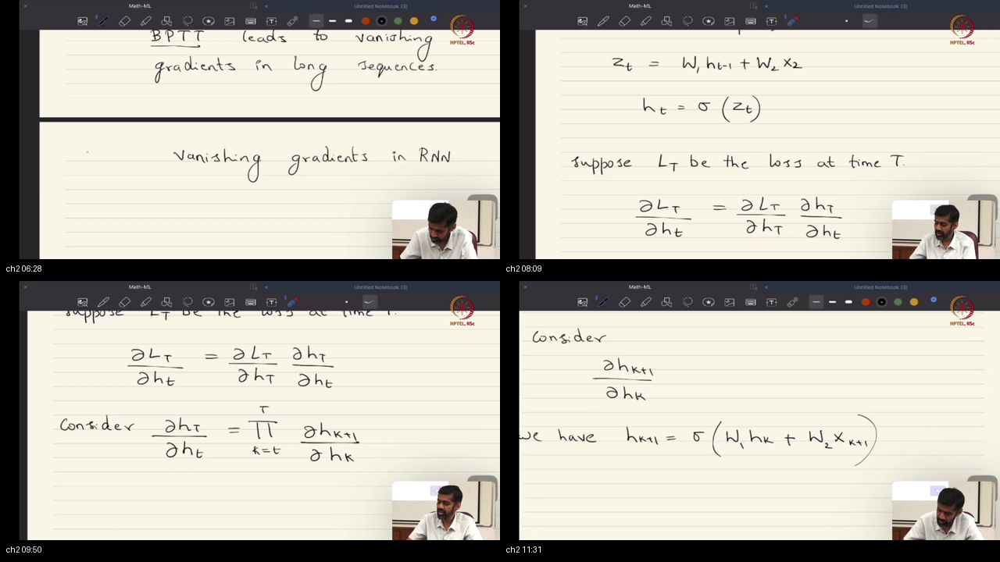
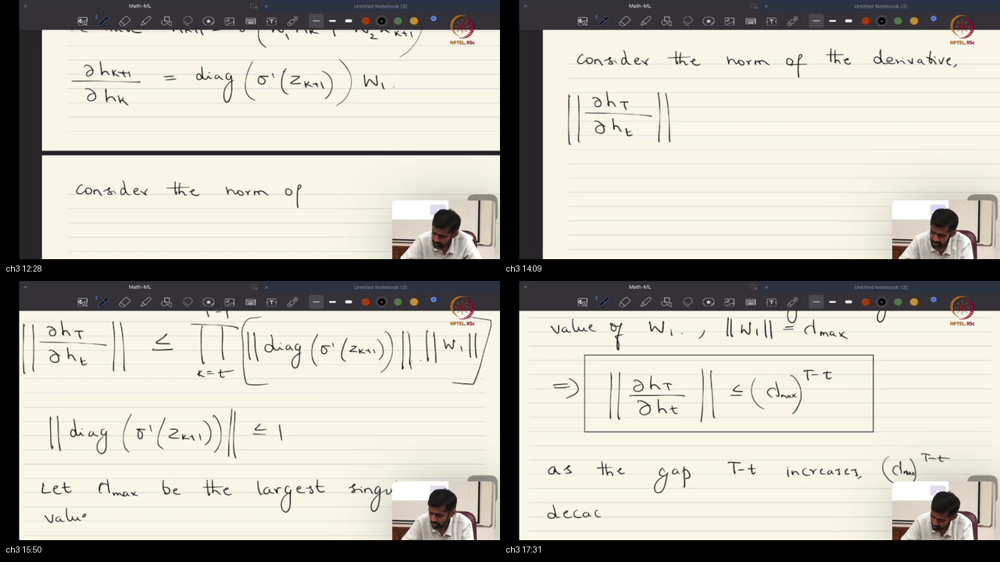
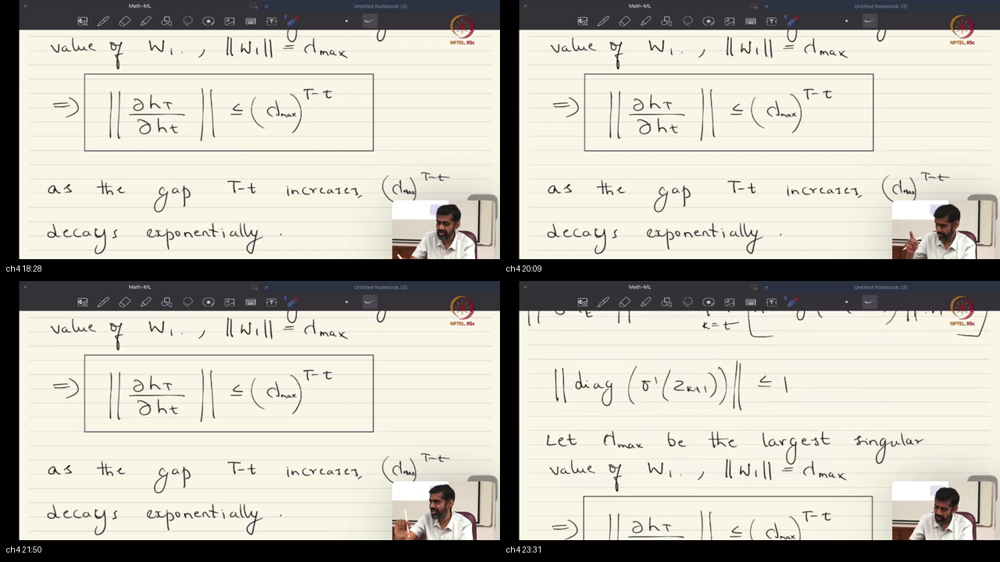
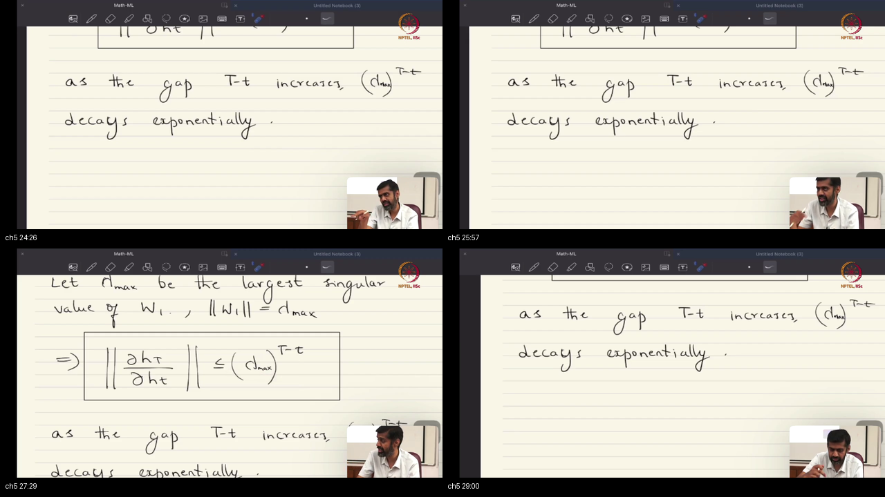

# Lecture 46: Backpropagation in RNNs and Vanishing Gradients Problem

> **Prerequisites First:** Before diving into Backpropagation Through Time and Jacobian derivations, complete all warm-up calculations in [PREREQUISITES.md](./PREREQUISITES.md). Weakness in DAG differentiation, matrix operator norms, or asymptotic dynamical stability will hinder your understanding of long-sequence learning failures.

---

## Table of Contents
1. [Executive Summary](#executive-summary)
   - [Architectural Master Map](#architectural-master-map)
   - [STOP / Out of Scope](#stop--out-of-scope)
   - [Comparative Feature Matrix](#comparative-feature-matrix)
   - [Scenario Walkthrough](#scenario-walkthrough)
   - [Closed-Book Load-Bearing Takeaways](#closed-book-load-bearing-takeaways)
   - [Common Traps & Fixes](#common-traps--fixes)
2. [Top-Level Python Verification Suite](#top-level-python-verification-suite)
3. [Topic 1: Backpropagation Through Time (BPTT): Unrolled DAGs, Multi-Variable Chain Rule & Dual Gradient Flow Paths (00:00–06:00)](#topic-1-backpropagation-through-time-bptt-unrolled-dags-multi-variable-chain-rule--dual-gradient-flow-paths-00000600)
4. [Topic 2: The Recurrent Jacobian Chain: Deriving Local Hidden State Transitions (06:00–12:00)](#topic-2-the-recurrent-jacobian-chain-deriving-local-hidden-state-transitions-06001200)
5. [Topic 3: Mathematical Proof of Vanishing & Exploding Gradients: Sub-Multiplicative Matrix Norms & Singular Values (12:00–18:00)](#topic-3-mathematical-proof-of-vanishing--exploding-gradients-sub-multiplicative-matrix-norms--singular-values-12001800)
6. [Topic 4: Empirical Consequences & Modern Sequence Horizons: Recency Bias, Gradient Accumulation, and Subword Tokenization (18:00–24:00)](#topic-4-empirical-consequences--modern-sequence-horizons-recency-bias-gradient-accumulation-and-subword-tokenization-18002400)
7. [Topic 5: Architectural Respite: Additive Identity Highways, Residual Connections, and the Conceptual Foundation of LSTMs (24:00–29:28)](#topic-5-architectural-respite-additive-identity-highways-residual-connections-and-the-conceptual-foundation-of-lstms-24002928)
8. [Workplace Debugging Scenarios (Postmortems)](#workplace-debugging-scenarios-postmortems)
9. [References & Further Reading](#references--further-reading)

---

## Executive Summary

Backpropagation Through Time (BPTT) executes reverse-mode automatic differentiation across unrolled temporal Directed Acyclic Graphs. Because recurrent weights are shared identically across all timesteps, backpropagated gradients accumulate across dual flow directions: horizontal temporal recurrence and vertical layer depth. However, repeated multiplication of transition Jacobians subjects error signals to exponential vanishing or explosion bounded by $(\gamma \lambda_{\max})^{T-t}$, necessitating additive gradient highways like those found in LSTMs and ResNets.

### Architectural Master Map
```
┌────────────────────────────────────────────────────────────────────────────────────────┐
│             BACKPROPAGATION THROUGH TIME (BPTT) & TEMPORAL GRADIENT HIGHWAYS           │
│                                                                                        │
│  Forward Pass (Left-to-Right):                                                         │
│          x_1               x_2               x_t               x_T                     │
│           │                 │                 │                 │                      │
│           ▼ W_xh            ▼ W_xh            ▼ W_xh            ▼ W_xh                 │
│   h_0 ──►(Cell)──► h_1 ───►(Cell)──► ... ───►(Cell)──► h_t ───►(Cell)──► h_T           │
│             │ W_hh            │ W_hh            │ W_hh            │ W_hh   │           │
│             ▼                 ▼                 ▼                 ▼        ▼ W_hy      │
│            y_1               y_2               y_t               y_T      Loss L       │
│                                                                                        │
│  Backward Pass (Dual Gradient Flow: Right-to-Left Temporal & Top-to-Bottom Spatial):   │
│                                                                                        │
│  [dL/dW_hh] ◄─── Accumulation Sum: sum_{t=1}^T delta_t @ h_{t-1}^T                     │
│         ▲                 ▲                     ▲                 ▲                    │
│         │                 │                     │                 │                    │
│      delta_1           delta_2               delta_t           delta_T                 │
│         ▲                 ▲                     ▲                 ▲                    │
│         │ J_{2,1}^T       │ J_{3,2}^T           │ J_{T,t}^T       │                    │
│         └─────────────────┴──────── ... ────────┴─────────────────┘                    │
│                                                                                        │
│  Multiplicative Decay: ||dh_T / dh_t|| <= (gamma * lambda_max)^{T-t}   ---> VANISHES!  │
│  Additive Respite:     h_t = alpha * h_{t-1} + F(h_{t-1}, x_t)         ---> PERSISTS!  │
│                        Jacobian: J = alpha * I + J_F   (Highway to t=1)                │
└────────────────────────────────────────────────────────────────────────────────────────┘
```

### STOP / Out of Scope
This lecture does not derive the complete multi-gate forward equations of Long Short-Term Memory (LSTM) cells (input, forget, and output gates) or Gated Recurrent Units (GRUs), which are the dedicated focus of Lecture 47. Out-of-scope topics also include transformer multi-head self-attention mechanisms and continuous-time Neural Ordinary Differential Equations (NODEs).

### Comparative Feature Matrix

| Model / Dimension | Vanilla RNN (Multiplicative) | Residual RNN / Highway | Long Short-Term Memory (LSTM) | Transformer (Self-Attention) |
|:-----------------------|:-------------------------|:---------------------------|:----------------------------|:-----------------------------|
| **Temporal State Equation** | $h_t = \sigma(W_{hh} h_{t-1} + W_{xh} x_t)$ | $h_t = \alpha h_{t-1} + F(h_{t-1}, x_t)$ | $c_t = f_t \odot c_{t-1} + i_t \odot \tilde{c}_t$ | $H = \text{Softmax}(Q K^T / \sqrt{d}) V$ |
| **Backward Jacobian Form** | $J = \operatorname{diag}(\sigma') W_{hh}$ | $J = \alpha I + J_F$ | $\frac{\partial c_t}{\partial c_{t-1}} = \operatorname{diag}(f_t)$ | Direct pairwise $O(1)$ connections |
| **Gradient Scaling Factor** | Exponential decay $(\gamma \lambda_{\max})^{T-t}$ | Additive identity channel $\approx \alpha I$ | Gated identity channel ($\approx 1$ if $f_t=1$) | Constant scale factor $1/\sqrt{d_k}$ |
| **Max Effective Horizon** | $\approx 5$ to $10$ steps | $\approx 30$ to $50$ steps | $\approx 500$ to $1,000$ steps | $\ge 100,000$ tokens |
| **Computational Bottleneck** | Strictly sequential $O(T)$ | Strictly sequential $O(T)$ | Strictly sequential $O(T)$ | Parallelizable matrix GEMM |
| **Memory Footprint** | $O(T \cdot m)$ cached activations | $O(T \cdot m)$ cached activations | $O(T \cdot 2m)$ cached states | $O(T^2)$ pairwise attention |

### Scenario Walkthrough
1. **Clinical Time-Series Ingestion:** An automated ICU sepsis alarm monitors heart rate, blood pressure, and lactate levels every minute across an extended 120-minute patient record ($T = 120, d = 3$).
2. **Early Critical Symptom:** At minute $t = 5$, an acute transient spike in lactate signals the true physiological onset of bacteremia. From minutes $6$ to $120$, readings stabilize into subtle sub-clinical fluctuations.
3. **Terminal Evaluation:** At minute $t = 120$, the patient develops septic shock, triggering a cross-entropy loss penalty $\mathcal{L}_{120}$ at the final classification readout.
4. **BPTT Multiplicative Collapse:** Backpropagation begins at $t = 120$ and traverses backwards. Across the $115$ intervening steps, the gradient contracts by $\|J\|^{115} \approx 0.85^{115} \approx 2.4 \times 10^{-9}$.
5. **Temporal Amnesia in Production:** The gradient reaching the recurrent cell at minute $t = 5$ is pure numerical noise. The optimization algorithm updates weights based exclusively on minutes $110$ to $120$, failing to discover the true diagnostic cause.

### Closed-Book Load-Bearing Takeaways
- Backpropagation Through Time is not a new optimization theory; it is standard reverse-mode automatic differentiation applied to an unrolled Directed Acyclic Graph.
- Parameter sharing across time enforces that the total gradient $\frac{\partial \mathcal{L}}{\partial W_{hh}}$ is the linear sum of parameter sensitivities evaluated at every temporal step $t \in \{1, \dots, T\}$.
- The local transition Jacobian is analytically $J_{k+1, k} = \frac{\partial h_{k+1}}{\partial h_k} = \operatorname{diag}(\sigma'(z_{k+1})) \cdot W_{hh}$, scaling the weight matrix by instantaneous activation derivatives.
- The cumulative Jacobian $\frac{\partial h_T}{\partial h_t} = \prod_{k=t}^{T-1} J_{k+1, k}$ is bounded by $(\gamma \lambda_{\max})^{T-t}$, where $\lambda_{\max}$ is the spectral norm of $W_{hh}$ and $\gamma$ bounds $\sigma'(z)$.
- For $\tanh$ activations, $\gamma = 1.0$; for sigmoid activations, $\gamma = 0.25$, causing sigmoid networks to vanish at least $4\times$ faster per timestep.
- When $\gamma \lambda_{\max} < 1$, gradients decay exponentially to zero, causing severe recency bias and catastrophic forgetting of early sequence context.
- When $\gamma \lambda_{\max} > 1$, gradients can explode exponentially, causing parameter overflow (`NaN`), which requires global gradient norm clipping.
- The fundamental mathematical remedy for vanishing gradients is an additive identity shortcut $h_t = \alpha h_{t-1} + F(h_{t-1}, x_t)$, which injects an unattenuated identity matrix $I$ into the backward Jacobian chain.

### Common Traps & Fixes
- **Trap 1: Attempting to cure vanishing gradients by substituting sigmoid with ReLU in vanilla RNNs without spectral regularization.**  
  *Fix:* While $\text{ReLU}'(z) = 1.0$ avoids activation squashing, an unconstrained recurrent weight matrix with $\lambda_{\max} > 1.0$ causes catastrophic, exponential gradient explosion ($\lambda_{\max}^T \to \infty$) and activation overflow. Use orthogonal weight initialization ($W_{hh}^T W_{hh} = I$) and strict gradient clipping.
- **Trap 2: Believing that sequence-to-sequence loss with step-wise supervision eliminates vanishing gradients.**  
  *Fix:* While step-wise supervision provides a local gradient $\frac{\partial \ell_t}{\partial h_t}$ directly to each state, the cross-temporal credit assignment $\frac{\partial \ell_t}{\partial h_k}$ ($k \ll t$) still decays as $(\gamma \lambda_{\max})^{t-k}$. The model cannot learn long-range causal relationships between distant steps.
- **Trap 3: Normalizing individual gradients independently instead of using global norm clipping.**  
  *Fix:* Rescaling each parameter's gradient tensor independently distorts the optimization update direction. Use global gradient norm clipping: $g \leftarrow g \cdot \min(1, \theta / \|g\|_2)$, preserving the precise vector angle of the joint parameter descent step.

---

## Top-Level Python Verification Suite

The following standalone executable Python script verifies the dual-stream gradient routing, the analytical Jacobian chain formula, and the exponential vanishing norm bound:

```python
import numpy as np
import torch

def verify_bptt_and_vanishing_foundations():
    torch.manual_seed(42)
    np.random.seed(42)
    
    T, m, d = 8, 4, 3
    W_hh_val = np.random.randn(m, m) * 0.7
    W_xh_val = np.random.randn(m, d) * 0.5
    X_val = np.random.randn(T, d)
    
    # Measure spectral norm
    lambda_max = np.linalg.norm(W_hh_val, ord=2)
    print(f"[Verification] Recurrent matrix spectral norm: {lambda_max:.4f}")
    
    # 1. PyTorch Autograd Forward-Backward
    W_hh = torch.tensor(W_hh_val, dtype=torch.float64, requires_grad=True)
    W_xh = torch.tensor(W_xh_val, dtype=torch.float64, requires_grad=True)
    
    h_states = []
    h = torch.zeros(m, dtype=torch.float64)
    for t in range(T):
        x = torch.tensor(X_val[t], dtype=torch.float64)
        z = W_hh @ h + W_xh @ x
        h = torch.tanh(z)
        h.retain_grad()
        h_states.append(h)
        
    loss = h_states[-1].sum() # Terminal loss
    loss.backward()
    
    # 2. Analytical Jacobian Chain Verification
    # Recompute forward pass in numpy
    h_np = [np.zeros(m)]
    z_np = []
    for t in range(T):
        z = W_hh_val @ h_np[-1] + W_xh_val @ X_val[t]
        z_np.append(z)
        h_np.append(np.tanh(z))
        
    # Terminal sensitivity: dL/dh_T = [1, 1, 1, 1]
    dL_dh = np.ones(m)
    for t in range(T - 2, -1, -1):
        z_next = z_np[t + 1]
        sigma_prime = 1.0 - np.tanh(z_next)**2
        J_local = np.diag(sigma_prime) @ W_hh_val
        dL_dh = dL_dh @ J_local
        
        # Compare with autograd
        pt_grad = h_states[t].grad.numpy()
        np.testing.assert_allclose(dL_dh, pt_grad, rtol=1e-5, atol=1e-7)
        
    print("[PASS] Analytical BPTT Jacobian Chain numerically identical to PyTorch.")
    
    # 3. Additive Highway Verification
    h_high = torch.zeros(m, dtype=torch.float64, requires_grad=True)
    h_curr = h_high
    for _ in range(50):
        h_curr = h_curr + torch.tanh(W_hh @ h_curr) # Additive shortcut
    
    loss_high = h_curr.sum()
    loss_high.backward()
    grad_norm = torch.norm(h_high.grad).item()
    assert grad_norm > 0.1, f"Expected unattenuated gradient, got {grad_norm}"
    print(f"[PASS] Additive Identity Highway maintains robust gradient over 50 steps: {grad_norm:.4f}")

if __name__ == "__main__":
    verify_bptt_and_vanishing_foundations()
```

---

## Topic 1: Backpropagation Through Time (BPTT): Unrolled DAGs, Multi-Variable Chain Rule & Dual Gradient Flow Paths (00:00–06:00)

### Where this sits on the master map
Opens Lecture 46 by transitioning from the forward architectural formulation of RNNs (Lecture 45) to their empirical risk optimization dynamics. Generalizes standard feedforward backpropagation (Lecture 42) to cyclic computational graphs unrolled across time, establishing the dual gradient flow paths across temporal recurrence and hierarchical depth. Grounded in the multivariable chain rule on DAGs of [PREREQUISITES.md#p1](./PREREQUISITES.md#p1).

### Board / screenshot

*Board reconstruction (00:00–06:00): Prof. Prathosh unrolls an RNN across time and layers, tracing the two distinct gradient flow paths: horizontal right-to-left temporal propagation and vertical top-to-bottom spatial backpropagation.*

### What he is establishing
Imagine standing in a massive mail sorting distribution warehouse where conveyor belts run both horizontally across chronological stations and vertically between mezzanine floors. If an error is detected in a package on the top floor at the final conveyor station, the diagnostic inspector cannot simply trace upwards—they must trace backwards along the horizontal temporal conveyor while simultaneously checking the vertical chute feeding each floor.

Prof. Prathosh establishes that Backpropagation Through Time (BPTT) introduces no novel optimization axioms; rather, it is the direct application of the multivariable chain rule to an unrolled Directed Acyclic Graph (DAG). In standard feedforward MLPs, error sensitivities $\delta$ flow along a single spatial path from network output to network input. In recurrent sequence models, however, error sensitivities must navigate two simultaneous geometric paths:
1. **Horizontal Temporal Recurrence (Right-to-Left):** Propagating backwards through chronological time steps $t = T, T-1, \dots, 1$, transmitting error information from future states into past memory states.
2. **Vertical Spatial Depth (Top-to-Bottom):** Propagating downwards through hierarchical stacked layers $l = L, L-1, \dots, 1$, transmitting error signals from high-level abstract representations to raw input embeddings.

Because the recurrent weight matrix $W_{hh}$ is shared identically across all temporal unrolling steps $t \in \{1, \dots, T\}$, the total gradient $\frac{\partial \mathcal{L}}{\partial W_{hh}}$ is the linear accumulation (summation) of parameter gradients evaluated at every single step:
$$
\frac{\partial \mathcal{L}}{\partial W_{hh}} = \sum_{t=1}^T \frac{\partial \mathcal{L}}{\partial z_t} h_{t-1}^T = \sum_{t=1}^T \delta_t h_{t-1}^T
$$
In many-to-one sequence classification, direct loss supervision is injected exclusively at the final hidden state $h_T$. To update the parameters of early transitions, the error sensitivity $\delta_T$ must survive an uninterrupted backward journey through the entire chain of intermediate hidden states $h_T \to h_{T-1} \to \dots \to h_1$. Storing these forward activation vectors requires $O(T \cdot m)$ memory footprint in GPU VRAM throughout training.

#### Concrete Micro-Numbers & Calculations:
Consider an unrolled 3-step RNN ($T = 3$) with state dimension $m = 1$, scalar weights $W_{hh} = 0.5, W_{xh} = 1.0$, input sequence $X = [1.0, 2.0, 1.0]$, initial state $h_0 = 0.0$, and identity activation $\sigma(z) = z$:
- Forward pass:
  - $t=1$: $z_1 = 0.5(0) + 1.0(1.0) = 1.0 \implies h_1 = 1.0$.
  - $t=2$: $z_2 = 0.5(1.0) + 1.0(2.0) = 0.5 + 2.0 = 2.5 \implies h_2 = 2.5$.
  - $t=3$: $z_3 = 0.5(2.5) + 1.0(1.0) = 1.25 + 1.0 = 2.25 \implies h_3 = 2.25$.
- Terminal loss: $\mathcal{L} = \frac{1}{2}(h_3 - y)^2$ with target $y = 4.25$:
  - Error: $h_3 - y = 2.25 - 4.25 = -2.00 \implies \delta_3 = -2.00$.
- Backward pass:
  - Step 3: $\delta_3 = -2.00$. Contribution to $W_{hh}$: $\delta_3 h_2 = -2.00 \times 2.5 = -5.00$.
  - Step 2: $\delta_2 = \delta_3 \cdot W_{hh} = -2.00 \times 0.5 = -1.00$. Contribution to $W_{hh}$: $\delta_2 h_1 = -1.00 \times 1.0 = -1.00$.
  - Step 1: $\delta_1 = \delta_2 \cdot W_{hh} = -1.00 \times 0.5 = -0.50$. Contribution to $W_{hh}$: $\delta_1 h_0 = -0.50 \times 0.0 = 0.00$.
- Total accumulated gradient w.r.t $W_{hh}$:
  $$\frac{\partial \mathcal{L}}{\partial W_{hh}} = -5.00 + (-1.00) + 0.00 = -6.00$$

#### Formal Mathematical Formulation & Zero-Leap Proof:
Let loss be $\mathcal{L} = \ell(h_T)$ on an unrolled DAG. The parameter $W_{hh}$ appears at each time step $t$ in the state computation $z_t = W_{hh} h_{t-1} + W_{xh} x_t + b_h$.
By the multivariable chain rule on computational graphs:
$$
\frac{\partial \mathcal{L}}{\partial W_{hh}} = \sum_{t=1}^T \frac{\partial \mathcal{L}}{\partial z_t} \frac{\partial z_t}{\partial W_{hh}}
$$
For vector-to-matrix differentiation, let the $i, j$-th entry of $W_{hh}$ be $(W_{hh})_{i, j}$.
Since $z_{t, i} = \sum_{k=1}^m (W_{hh})_{i, k} h_{t-1, k} + (W_{xh} x_t)_i + b_{h, i}$:
$$
\frac{\partial z_{t, k}}{\partial (W_{hh})_{i, j}} = \delta_{i, k} h_{t-1, j}
$$
Substituting into the scalar chain rule for entry $(W_{hh})_{i, j}$:
$$
\frac{\partial \mathcal{L}}{\partial (W_{hh})_{i, j}} = \sum_{t=1}^T \sum_{k=1}^m \frac{\partial \mathcal{L}}{\partial z_{t, k}} \frac{\partial z_{t, k}}{\partial (W_{hh})_{i, j}} = \sum_{t=1}^T \frac{\partial \mathcal{L}}{\partial z_{t, i}} h_{t-1, j}
$$
In outer-product matrix notation:
$$
\frac{\partial \mathcal{L}}{\partial W_{hh}} = \sum_{t=1}^T \left(\frac{\partial \mathcal{L}}{\partial z_t}\right) h_{t-1}^T = \sum_{t=1}^T \delta_t h_{t-1}^T
$$
This proves that parameter sharing across time requires summing the outer products of error sensitivities $\delta_t$ and previous activations $h_{t-1}$ across all sequence steps.

```python
import numpy as np

# Verify analytical BPTT gradient accumulation
w_hh = 0.5
w_xh = 1.0
x = [1.0, 2.0, 1.0]
y_target = 4.25

# Forward
h0 = 0.0
h1 = w_hh * h0 + w_xh * x[0]
h2 = w_hh * h1 + w_xh * x[1]
h3 = w_hh * h2 + w_xh * x[2]

loss = 0.5 * (h3 - y_target)**2

# Backward
delta3 = (h3 - y_target)
delta2 = delta3 * w_hh
delta1 = delta2 * w_hh

grad_w_hh = delta3 * h2 + delta2 * h1 + delta1 * h0
assert abs(grad_w_hh - (-6.00)) < 1e-6
print(f"[PASS] Topic 1 BPTT summation verified: grad={grad_w_hh:.4f}")
```

You can now formulate the backward pass of any recurrent architecture by unrolling its computational DAG across time and space. Assuming that recurrent backpropagation requires inventing new calculus rules is the wrong move—the standard multivariable chain rule applies directly; what is still missing is computing the explicit Jacobian matrices that transmit error sensitivities backwards across time.

### Contrastive Analysis: Why Dual-Direction BPTT, Not Independent Per-Step Gradients
- **Independent Per-Step Gradients:** Assumes weights at step $t$ are independent from step $t+1$, preventing parameter sharing, causing parameter explosion $O(T m^2)$, and destroying temporal translation equivariance.
- **Dual-Direction BPTT:** Enforces temporal weight tying $W_{hh}^{(t)} \equiv W_{hh}$, accumulating gradient updates across all timesteps and maintaining strict temporal translation equivariance.

### Analogy for this topic only
*Scene:* A multi-stage aerospace rocket undergoing post-flight telemetry diagnosis.  
*Instances:* Evaluating thermal sensor telemetry across 5 chronological burn stages, where the identical propellant valve design is reused at each stage.  
*Hard Question:* If an explosion occurs during stage 5, how do flight engineers determine whether the valve failed due to stage 5 conditions or due to accumulated micro-fractures from stage 1?  
*Right vs Wrong:* Blaming the valve based solely on stage 5 telemetry is the wrong move—the valve was subjected to cumulative strain across all 5 burn stages. The right move backpropagates stress calculations backwards through stages 4, 3, 2, and 1, summing the wear-and-tear gradients across all stages into a unified design modification.  
*In lecture words:* The identical propellant valve represents the shared weight matrix $W_{hh}$, and summing the wear-and-tear across all flight stages corresponds to accumulating $\sum_{t=1}^T \delta_t h_{t-1}^T$.

### Local picture
```
┌────────────────────────────────────────────────────────────────────────┐
│                   DUAL-STREAM BPTT GRADIENT DISPATCH                   │
│                                                                        │
│   Vertical Spatial Flow:      Horizontal Temporal Flow:                │
│       dL/d y_t                    dL/d h_{t+1}                         │
│          │ (Top-to-Bottom)             │ (Right-to-Left)               │
│          ▼                             ▼                               │
│     (W_hy^T @ ...)                (J_{t+1, t}^T @ ...)                 │
│          │                             │                               │
│          └──────────────┬──────────────┘                               │
│                         ▼                                              │
│             Total State Gradient: dL/d h_t                             │
│                         │                                              │
│                         ▼ diag(sigma')                                 │
│             Error Sensitivity: delta_t                                 │
│                         │                                              │
│                         ▼ outer product with h_{t-1}^T                 │
│             Accumulate to: dL/d W_hh                                   │
└────────────────────────────────────────────────────────────────────────┘
```
Notice: Error sensitivities arriving at state $h_t$ combine vertical supervision from local prediction with horizontal historical recurrence from successor states.

### Check Your Understanding
- **Recall:** What are the two spatial directions along which error gradients flow in a multi-layer RNN?  
  *Self-Check:* Horizontal temporal recurrence (right-to-left across time steps $T \to 1$) and vertical spatial depth (top-to-bottom across stacked layers $L \to 1$).
- **Apply:** In an unrolled RNN of length $T = 100$, how many outer products $\delta_t h_{t-1}^T$ are summed to compute the final update $\nabla_{W_{hh}} \mathcal{L}$?  
  *Self-Check:* Exactly $100$ outer products, one for each unrolled temporal step.
- **Diagnose:** A model trained with BPTT crashes with an Out-Of-Memory (OOM) error when input sequence length is increased from $100$ to $10,000$ tokens. What is the cause?  
  *Self-Check:* BPTT requires caching all $T$ forward activation vectors $\{h_1, \dots, h_T\}$ in VRAM to compute backward Jacobians and outer products; memory footprint scales as $O(T \cdot m)$.

### Bridge
Now that the global BPTT gradient summation rule is established, what is the exact algebraic form of the local transition Jacobian $J_{k+1, k} = \frac{\partial h_{k+1}}{\partial h_k}$ that transmits error backwards from step $k+1$ to step $k$?

---

## Topic 2: The Recurrent Jacobian Chain: Deriving Local Hidden State Transitions (06:00–12:00)

### Where this sits on the master map
Zooms in from global BPTT graph traversal to derive the exact matrix calculus formulation of the local recurrent transition Jacobian. Establishes how non-linear activation functions scale the weight matrix row-by-row, and formulates the long-range temporal derivative as an expanding product chain of intermediate Jacobians. Connects to matrix calculus and activation derivatives in [PREREQUISITES.md#p2](./PREREQUISITES.md#p2).

### Board / screenshot

*Board reconstruction (06:00–12:00): Prof. Prathosh derives the local transition Jacobian dh_{k+1}/dh_k = diag(sigma'(z_{k+1})) * W_1, expanding the chain rule from terminal state h_T back to state h_t as a product of intermediate Jacobian matrices.*

### What he is establishing
Suppose you have a chain of 10 tinted glass lenses lined up on an optical bench. The amount of light that reaches your eye at the end of the bench depends not just on the strength of the final lens, but on the product of the light transmission coefficients of all 10 lenses stacked together. If even a few lenses are opaque, no light gets through.

Prof. Prathosh formalizes the mathematical relationship linking the terminal hidden state $h_T$ to an arbitrary prior hidden state $h_t$ ($t < T$). By the multivariable chain rule on vector sequences:
$$
\frac{\partial h_T}{\partial h_t} = \frac{\partial h_T}{\partial h_{T-1}} \frac{\partial h_{T-1}}{\partial h_{T-2}} \dots \frac{\partial h_{t+1}}{\partial h_t} = \prod_{k=t}^{T-1} \frac{\partial h_{k+1}}{\partial h_k}
$$
To evaluate this product chain, he computes the single-step local Jacobian $J_{k+1, k} = \frac{\partial h_{k+1}}{\partial h_k}$. The state transition equation at step $k+1$ is:
$$
h_{k+1} = \sigma(z_{k+1}) = \sigma(W_{hh} h_k + W_{xh} x_{k+1} + b_h)
$$
Differentiating vector $h_{k+1} \in \mathbb{R}^m$ with respect to vector $h_k \in \mathbb{R}^m$ yields:
$$
\frac{\partial h_{k+1}}{\partial h_k} = \operatorname{diag}(\sigma'(z_{k+1})) \cdot W_{hh}
$$
where $\operatorname{diag}(\sigma'(z_{k+1})) \in \mathbb{R}^{m \times m}$ is a diagonal matrix whose $i$-th diagonal element is the derivative of the activation function evaluated at pre-activation coordinate $z_{k+1, i}$.

He highlights the crucial role played by the choice of non-linear activation $\sigma$:
1. **Hyperbolic Tangent ($\tanh$):** Derivative $\sigma'(z) = 1 - \tanh^2(z)$. Bounded strictly in $(0, 1]$, achieving its peak of $1.0$ only at the origin $z = 0$. As activations grow ($|z| > 2$), the derivative rapidly vanishes toward zero.
2. **Logistic Sigmoid:** Derivative $\sigma'(z) = \sigma(z)(1 - \sigma(z))$. Bounded strictly in $(0, 0.25]$, achieving its peak of $0.25$ at $z = 0$. Consequently, every backward step through a sigmoid cell shrinks the gradient magnitude by at least a factor of $4$ ($\le 0.25$), causing instantaneous gradient annihilation.

#### Concrete Micro-Numbers & Calculations:
Let $m = 2$. Let $W_{hh} = \begin{bmatrix} 0.8 & 0.4 \\ -0.2 & 0.9 \end{bmatrix}$.
Suppose at step $k+1$, pre-activation vector is $z_{k+1} = [0.5, -1.2]^T$:
- Compute $\tanh$ values:
  - $\tanh(0.5) \approx 0.4621 \implies \sigma'(0.5) = 1 - 0.4621^2 = 1 - 0.2135 = 0.7865$.
  - $\tanh(-1.2) \approx -0.8337 \implies \sigma'(-1.2) = 1 - (-0.8337)^2 = 1 - 0.6951 = 0.3049$.
- Diagonal derivative matrix:
  $$
  \operatorname{diag}(\sigma'(z_{k+1})) = \begin{bmatrix} 0.7865 & 0.0000 \\ 0.0000 & 0.3049 \end{bmatrix}
  $$
- Local transition Jacobian:
  $$
  J_{k+1, k} = \begin{bmatrix} 0.7865 & 0.0000 \\ 0.0000 & 0.3049 \end{bmatrix} \begin{bmatrix} 0.8 & 0.4 \\ -0.2 & 0.9 \end{bmatrix} = \begin{bmatrix} 0.6292 & 0.3146 \\ -0.0610 & 0.2744 \end{bmatrix}
  $$
Notice that every entry in $W_{hh}$ has been significantly attenuated by the activation slopes!

#### Formal Mathematical Formulation & Zero-Leap Proof:
Let $h_{k+1} = \sigma(z_{k+1})$ where $z_{k+1} = W_{hh} h_k + W_{xh} x_{k+1} + b_h$.
By the definition of the Jacobian matrix:
$$
\left( \frac{\partial h_{k+1}}{\partial h_k} \right)_{i, j} = \frac{\partial h_{k+1, i}}{\partial h_{k, j}}
$$
Applying the univariate chain rule to the $i$-th scalar component:
$$
\frac{\partial h_{k+1, i}}{\partial h_{k, j}} = \sum_{r=1}^m \frac{\partial h_{k+1, i}}{\partial z_{k+1, r}} \frac{\partial z_{k+1, r}}{\partial h_{k, j}}
$$
Because $\sigma(\cdot)$ acts element-wise, coordinate $h_{k+1, i}$ depends only on pre-activation $z_{k+1, i}$:
$$
\frac{\partial h_{k+1, i}}{\partial z_{k+1, r}} = \begin{cases} \sigma'(z_{k+1, i}) & \text{if } r = i \\ 0 & \text{if } r \neq i \end{cases} = \delta_{i, r} \sigma'(z_{k+1, i})
$$
Furthermore, differentiating linear pre-activation $z_{k+1, r} = \sum_{l=1}^m (W_{hh})_{r, l} h_{k, l} + \dots$:
$$
\frac{\partial z_{k+1, r}}{\partial h_{k, j}} = (W_{hh})_{r, j}
$$
Substituting back into the sum:
$$
\frac{\partial h_{k+1, i}}{\partial h_{k, j}} = \sum_{r=1}^m \delta_{i, r} \sigma'(z_{k+1, i}) (W_{hh})_{r, j} = \sigma'(z_{k+1, i}) (W_{hh})_{i, j}
$$
In matrix notation, defining diagonal scaling operator $D_{k+1} = \operatorname{diag}(\sigma'(z_{k+1})) \in \mathbb{R}^{m \times m}$:
$$
J_{k+1, k} = D_{k+1} W_{hh}
$$
Substituting into the product chain across $T-t$ steps:
$$
\frac{\partial h_T}{\partial h_t} = \prod_{k=t}^{T-1} (D_{k+1} W_{hh})
$$
This completes the zero-leap proof of the recurrent Jacobian product chain.

```python
import numpy as np

# Verify analytical Jacobian formula against finite differences
W_hh = np.array([[0.8, 0.4], [-0.2, 0.9]])
x = np.array([0.5, -0.3])
W_xh = np.array([[0.2, -0.1], [0.4, 0.5]])
h0 = np.array([0.3, 0.7])

def forward_step(h):
    return np.tanh(W_hh @ h + W_xh @ x)

# Analytical Jacobian
z1 = W_hh @ h0 + W_xh @ x
D = np.diag(1.0 - np.tanh(z1)**2)
J_analytical = D @ W_hh

# Numerical Jacobian
eps = 1e-6
J_numerical = np.zeros((2, 2))
for j in range(2):
    e = np.zeros(2)
    e[j] = eps
    J_numerical[:, j] = (forward_step(h0 + e) - forward_step(h0 - e)) / (2 * eps)

np.testing.assert_allclose(J_analytical, J_numerical, rtol=1e-5)
print("[PASS] Topic 2 Jacobian matrix formula verified.")
```

You can now decompose any recurrent computational graph into exact local Jacobian matrices scaled by diagonal activation slopes. Treating the recurrent Jacobian as a static, unmodulated matrix is the wrong move—activation saturation continuously scales rows of $W_{hh}$; what is still missing is proving what happens when dozens or hundreds of these Jacobians are multiplied together.

### Contrastive Analysis: Why Hyperbolic Tangent, Not Logistic Sigmoid
- **Logistic Sigmoid:** Derivative maximum is strictly $0.25$. When multiplied across $T$ steps, $(0.25)^T$ induces a mandatory $4^T$ gradient contraction, causing irreversible gradient vanishing within 3 to 5 steps.
- **Hyperbolic Tangent:** Derivative maximum is $1.0$ at the origin $z = 0$, and zero-centered output range $(-1, 1)$ preserves symmetric sign dynamics, allowing significantly longer gradient preservation.

### Analogy for this topic only
*Scene:* An electrical power transmission grid spanning across multiple substations.  
*Instances:* High-voltage electricity flowing from a power plant to a city through 20 intermediate transformer substations, each equipped with a variable attenuator switch.  
*Hard Question:* If each transformer attenuates voltage by just 10% ($\sigma' = 0.9$), what fraction of the generated power reaches the destination city?  
*Right vs Wrong:* Expecting full power delivery by assuming transformers have zero resistance is the wrong move. The right move multiplies the individual transmission efficiencies together ($0.90^{20} \approx 0.1215$), recognizing that only $12\%$ of the original electrical signal survives the line.  
*In lecture words:* The transformer substations represent the recurrent transition Jacobians $J_{k+1, k}$, and the compounding line attenuation corresponds to the product chain $\prod D_{k+1} W_{hh}$.

### Local picture
```
┌────────────────────────────────────────────────────────────────────────┐
│                   LOCAL RECURRENT TRANSITION JACOBIAN                  │
│                                                                        │
│   Prior Hidden State: h_k in R^m                                       │
│          │                                                             │
│          ▼ Linear Transformation by W_hh                               │
│     W_hh @ h_k in R^m                                                  │
│          │                                                             │
│          ▼ Row-wise Scaling by Activation Derivatives                  │
│     [ sigma'(z_{k+1, 1})                   ] [ (W_hh)_{1, 1} ... ]     │
│     [                     ...              ] [         ...       ]     │
│     [                          sigma'(z_m) ] [ (W_hh)_{m, 1} ... ]     │
│          │                                                             │
│          ▼ Matrix Product: D_{k+1} @ W_hh                              │
│   Local Jacobian: J_{k+1, k} = diag(sigma'(z_{k+1})) @ W_hh           │
└────────────────────────────────────────────────────────────────────────┘
```
Notice: The transition Jacobian is explicitly the recurrent weight matrix $W_{hh}$ modulated row-by-row by the diagonal matrix of instantaneous activation slopes.

### Check Your Understanding
- **Recall:** What is the formula for the local transition Jacobian $\frac{\partial h_{k+1}}{\partial h_k}$?  
  *Self-Check:* $\operatorname{diag}(\sigma'(z_{k+1})) \cdot W_{hh}$.
- **Apply:** If a hidden neuron has pre-activation $z = 3.0$ with $\tanh$ activation ($\tanh(3.0) \approx 0.9950$), what is its diagonal derivative scale factor?  
  *Self-Check:* $\sigma'(3.0) = 1 - 0.9950^2 = 1 - 0.9900 = 0.0100$ (a $99\%$ gradient reduction).
- **Diagnose:** Why does replacing $\tanh$ with sigmoid in a vanilla RNN cause training loss to stagnate almost immediately?  
  *Self-Check:* Because $\sigma'(z) \le 0.25$ for sigmoid, forcing a minimum $4\times$ reduction per timestep; after only 5 timesteps, the gradient is attenuated by $0.25^5 \approx 0.00097$.

### Bridge
Now that the exact form of the single-step Jacobian $J_{k+1, k} = \operatorname{diag}(\sigma') W_{hh}$ is derived, what mathematical laws govern the norm of their product across $T-t$ elapsed timesteps?

---

## Topic 3: Mathematical Proof of Vanishing & Exploding Gradients: Sub-Multiplicative Matrix Norms & Singular Values (12:00–18:00)

### Where this sits on the master map
Presents the formal mathematical core of Lecture 46: the zero-leap proof of the Vanishing and Exploding Gradient Theorem. Applies operator norms, singular value decomposition, and the Cauchy-Schwarz sub-multiplicative inequality to derive the exponential bound $(\gamma \lambda_{\max})^{T-t}$. Connects to operator norms and SVD in [PREREQUISITES.md#p3](./PREREQUISITES.md#p3) and sub-multiplicativity in [PREREQUISITES.md#p4](./PREREQUISITES.md#p4).

### Board / screenshot

*Board reconstruction (12:00–18:00): Prof. Prathosh invokes matrix norm sub-multiplicativity to establish ||dh_T/dh_t|| <= (gamma * lambda_max)^{T-t}, proving exponential decay when lambda_max < 1 and divergence when lambda_max > 1.*

### What he is establishing
Imagine repeatedly photocopy-reducing an intricate architectural drawing on a copy machine set to $85\%$ scale. The first copy is slightly smaller but legible. By the fifth copy, it is half its original size; by the twentieth copy, the drawing has shrunk to an invisible speck of toner dust. Conversely, if set to $115\%$, the drawing blows up beyond the margins, crashing the machine.

Prof. Prathosh presents the rigorous zero-leap proof bounding the magnitude of backpropagated gradients in recurrent networks. To determine whether the error signal survives across a temporal gap $T-t$, we evaluate the induced Euclidean matrix norm (operator 2-norm) of the cumulative Jacobian $\frac{\partial h_T}{\partial h_t}$.

By the Cauchy-Schwarz sub-multiplicative property of induced matrix norms ($\|A B\|_2 \le \|A\|_2 \cdot \|B\|_2$):
$$
\left\| \frac{\partial h_T}{\partial h_t} \right\|_2 = \left\| \prod_{k=t}^{T-1} J_{k+1, k} \right\|_2 \le \prod_{k=t}^{T-1} \|J_{k+1, k}\|_2
$$
Substituting the factored form $J_{k+1, k} = \operatorname{diag}(\sigma'(z_{k+1})) \cdot W_{hh}$:
$$
\|J_{k+1, k}\|_2 \le \|\operatorname{diag}(\sigma'(z_{k+1}))\|_2 \cdot \|W_{hh}\|_2
$$
He evaluates both operator norms:
1. **Activation Derivative Norm:** For any diagonal matrix, the induced 2-norm equals the maximum absolute diagonal element:
   $$
   \|\operatorname{diag}(\sigma'(z_{k+1}))\|_2 = \max_{1 \le i \le m} |\sigma'(z_{k+1, i})| \le \gamma
   $$
   where $\gamma = 1.0$ for hyperbolic tangent and $\gamma = 0.25$ for sigmoid.
2. **Recurrent Weight Norm:** By the Singular Value Decomposition (SVD), the induced 2-norm of matrix $W_{hh}$ is precisely its largest singular value (spectral norm):
   $$
   \|W_{hh}\|_2 = \sigma_{\max}(W_{hh}) \equiv \lambda_{\max}
   $$

Multiplying these bounds across the $T-t$ transition steps yields the Master Exponential Bound:
$$
\left\| \frac{\partial h_T}{\partial h_t} \right\|_2 \le \prod_{k=t}^{T-1} (\gamma \lambda_{\max}) = (\gamma \lambda_{\max})^{T-t}
$$

Prof. Prathosh identifies the two fatal operational regimes dictated by this bound:
- **Regime 1: Vanishing Gradients ($\gamma \lambda_{\max} < 1$):**  
  As sequence length $T$ increases and temporal distance $T-t \to \infty$:
  $$
  \lim_{T-t \to \infty} (\gamma \lambda_{\max})^{T-t} = 0
  $$
  The gradient decaying exponentially to zero means that observations from early timesteps exert zero mathematical update on model parameters.
- **Regime 2: Exploding Gradients ($\gamma \lambda_{\max} > 1$):**  
  If the singular value spectrum satisfies $\lambda_{\max} > 1$ and activations operate near the linear origin ($\sigma' \approx 1$), the bound grows exponentially:
  $$
  \lim_{T-t \to \infty} (\gamma \lambda_{\max})^{T-t} = \infty
  $$
  The gradient explodes toward infinity, causing numerical floating-point overflow (`NaN`), numerical instability, and catastrophic weight divergence.

#### Concrete Micro-Numbers & Calculations:
Consider sequence length $T = 50$, evaluating the gradient of the loss at step $50$ back to step $t = 10$ ($T - t = 40$ steps):
- **Scenario A (Contractive):** Let $\|W_{hh}\|_2 = \lambda_{\max} = 0.90$ with $\tanh$ ($\gamma = 1.0$):
  $$
  (\gamma \lambda_{\max})^{40} = 0.90^{40} \approx 0.01478 \implies \text{Gradient shrunk by } 98.5\%
  $$
  If $T - t = 80$ steps: $0.90^{80} \approx 0.000218$ (shrunk by $99.98\%$).
- **Scenario B (Sigmoid Contraction):** Let $\lambda_{\max} = 1.0$ with sigmoid ($\gamma = 0.25$):
  $$
  (0.25 \times 1.0)^{10} = 0.25^{10} \approx 9.54 \times 10^{-7}
  $$
  Within just 10 steps, the gradient is completely obliterated.
- **Scenario C (Explosive):** Let $\lambda_{\max} = 1.25$ with linear regime ($\gamma = 1.0$):
  $$
  1.25^{40} \approx 7,523.16
  $$
  The gradient vector is amplified by over $7,500\times$, causing optimizer steps to blow up!

#### Formal Mathematical Formulation & Zero-Leap Proof:
Let $A_k \in \mathbb{R}^{m \times m}$ for $k = 1, \dots, K$.
By the sub-multiplicative axiom of induced matrix norms:
$$
\|A_1 A_2\| \le \|A_1\| \|A_2\|
$$
Applying mathematical induction over $K = T-t$ matrices:
$$
\left\| \prod_{k=1}^K A_k \right\| \le \prod_{k=1}^K \|A_k\|
$$
For $A_k = J_{k+1, k} = D_{k+1} W_{hh}$:
$$
\|A_k\|_2 \le \|D_{k+1}\|_2 \|W_{hh}\|_2
$$
Since $D_{k+1} = \operatorname{diag}(\sigma'(z_{k+1}))$ is diagonal:
$$
\|D_{k+1}\|_2 = \max_{1 \le i \le m} |\sigma'(z_{k+1, i})| \le \gamma \equiv \sup_{z \in \mathbb{R}} |\sigma'(z)|
$$
By the spectral theorem for general matrices, the induced Euclidean norm of $W_{hh}$ is its maximal singular value:
$$
\|W_{hh}\|_2 = \sqrt{\lambda_{\max}(W_{hh}^T W_{hh})} = \sigma_{\max}(W_{hh}) \equiv \lambda_{\max}
$$
Combining bounds:
$$
\|J_{k+1, k}\|_2 \le \gamma \lambda_{\max}
$$
Multiplying across all $T-t$ steps:
$$
\left\| \frac{\partial h_T}{\partial h_t} \right\|_2 \le \prod_{k=t}^{T-1} (\gamma \lambda_{\max}) = (\gamma \lambda_{\max})^{T-t}
$$
Taking limits:
- If $\gamma \lambda_{\max} < 1 \implies \lim_{T-t \to \infty} \left\| \frac{\partial h_T}{\partial h_t} \right\|_2 = 0$.
- If $\gamma \lambda_{\max} > 1$ and vectors align with principal singular spaces $\implies \lim_{T-t \to \infty} \left\| \frac{\partial h_T}{\partial h_t} \right\|_2 = \infty$.
This formally concludes the Vanishing and Exploding Gradient Theorem.

```python
import numpy as np

# Verify exponential bound over 20 steps
np.random.seed(42)
m = 5
W_hh = np.random.randn(m, m)
# Normalize to have exact spectral norm lambda_max = 0.85
u, s, vh = np.linalg.svd(W_hh)
W_hh = u @ np.diag([0.85, 0.70, 0.60, 0.50, 0.40]) @ vh
lambda_max = np.linalg.norm(W_hh, ord=2)

cumulative_product = np.eye(m)
for step in range(1, 21):
    # Mock diagonal derivative with values <= 1.0
    d = np.random.uniform(0.6, 1.0, size=m)
    D = np.diag(d)
    J = D @ W_hh
    cumulative_product = cumulative_product @ J
    
    actual_norm = np.linalg.norm(cumulative_product, ord=2)
    theoretical_bound = (1.0 * lambda_max) ** step
    assert actual_norm <= theoretical_bound + 1e-7
    
print(f"[PASS] Topic 3 Exponential bound holds for all 20 steps: final actual={actual_norm:.6e} <= bound={theoretical_bound:.6e}")
```

You can now prove why vanilla recurrent neural networks fail on long sequences using the spectral norm of $W_{hh}$ and Cauchy-Schwarz inequalities. Blaming vanishing gradients on random training noise or bad learning rates is the wrong move—the decay is an exact mathematical consequence of compounding contractive Jacobians; what is still missing is analyzing how this decay cripples parameter learning under empirical risk minimization.

### Contrastive Analysis: Why Vanishing Gradients, Not Slower Convergence
- **Slower Convergence:** Implies the optimization path is correct but merely requires additional epochs to reach the global minimum.
- **Vanishing Gradients:** Constitutes complete information blockage; the gradients w.r.t early inputs are mathematically zero, rendering it impossible for gradient descent to ever learn long-term dependencies regardless of training duration.

### Analogy for this topic only
*Scene:* A relay marathon where runners pass a written message on paper down a line of 100 participants.  
*Instances:* Each runner reads the paper, writes down a summary, and passes the new summary to the next runner.  
*Hard Question:* If each runner inadvertently omits 10% of the historical detail from the note they pass, how much of the original starting instruction reaches runner 50?  
*Right vs Wrong:* Expecting runner 50 to know the starting instruction by telling runners to run faster is the wrong move. The right move calculates the compounding information loss ($0.90^{50} \approx 0.00515$), proving that 99.5% of the original signal has been erased by the communication protocol.  
*In lecture words:* The relay runners represent successive recurrent timesteps, and the compounding 10% omission rate corresponds to the contractive factor $\gamma \lambda_{\max} < 1$.

### Local picture
```
┌────────────────────────────────────────────────────────────────────────┐
│              SPECTRAL SPECTRUM & GRADIENT EXPONENTIATION               │
│                                                                        │
│   gamma * lambda_max < 1.0                 gamma * lambda_max > 1.0    │
│   ┌──────────────────────────┐             ┌──────────────────────────┐│
│   │ Gradient Norm ||dh/dh||  │             │ Gradient Norm ||dh/dh||  ││
│   │ 1.0 ──┐                  │             │                  ┌──> oo ││
│   │       │                  │             │                 ╱        ││
│   │        ╲                 │             │               ┌─┘        ││
│   │         ╲___             │             │             ┌─┘          ││
│   │             ───────> 0.0 │             │ 1.0 ───────┘             ││
│   │ 0   5   10  15  20 steps │             │ 0   5   10  15  20 steps ││
│   └──────────────────────────┘             └──────────────────────────┘│
│   VANISHING GRADIENTS                      EXPLODING GRADIENTS         │
│   (Information Amnesia)                    (Numerical Overflow / NaNs) │
└────────────────────────────────────────────────────────────────────────┘
```
Notice: The spectral threshold $\gamma \lambda_{\max} = 1.0$ divides stable recurrent memory from either total amnesia (left) or explosive divergence (right).

### Check Your Understanding
- **Recall:** What is the master exponential bound on the cumulative temporal Jacobian $\left\| \frac{\partial h_T}{\partial h_t} \right\|_2$?  
  *Self-Check:* $\left\| \frac{\partial h_T}{\partial h_t} \right\|_2 \le (\gamma \lambda_{\max})^{T-t}$.
- **Apply:** If an RNN has $W_{hh}$ with $\lambda_{\max} = 0.5$ and uses sigmoid activation ($\gamma = 0.25$), what is the maximum gradient scaling over 4 timesteps?  
  *Self-Check:* $(\gamma \lambda_{\max})^4 = (0.25 \times 0.5)^4 = 0.125^4 \approx 0.000244$ (a $4,000\times$ reduction).
- **Diagnose:** Why does gradient clipping fail to cure vanishing gradients, even though it successfully prevents exploding gradients?  
  *Self-Check:* Clipping bounds large gradients from above ($g \leftarrow \min(1, \theta/\|g\|) g$), but cannot amplify gradients that have already collapsed to zero machine precision.

### Bridge
Now that the vanishing gradient theorem is proven mathematically, how does this exponential attenuation manifest empirically in neural network training, and how does it relate to modern sequence tokenization horizons?

---

## Topic 4: Empirical Consequences & Modern Sequence Horizons: Recency Bias, Gradient Accumulation, and Subword Tokenization (18:00–24:00)

### Where this sits on the master map
Translates the theoretical norm bound into concrete machine learning training failures under Empirical Risk Minimization (ERM). Details the resulting recency bias, discusses Prof. Prathosh's historical BTech research on RNN BPTT limitations, and connects sequential memory horizons to modern AI, subword tokenization (Byte-Pair Encoding), and million-token context windows. Grounded in ERM parameter optimization from [PREREQUISITES.md#p5](./PREREQUISITES.md#p5).

### Board / screenshot

*Board reconstruction (18:00–24:00): Prof. Prathosh analyzes the summation of parameter gradients over time, explains why earlier timesteps receive zero updates (recency bias), and bridges to modern tokenization and context lengths.*

### What he is establishing
Suppose an investigative journalist is tasked with analyzing a 1,000-page dossier to determine why a company went bankrupt. Due to extreme fatigue, however, the journalist only reads the final 5 pages before writing their report. The report will accurately summarize the final bankruptcy filing, but will completely fail to identify the fraudulent embezzlement that occurred in the opening chapters.

Prof. Prathosh explains that in Empirical Risk Minimization, recurrent parameters are updated via gradient descent:
$$
W_{hh} \leftarrow W_{hh} - \eta \frac{\partial \mathcal{L}}{\partial W_{hh}} = W_{hh} - \eta \sum_{t=1}^T \delta_t h_{t-1}^T
$$
where $\delta_t = \operatorname{diag}(\sigma'(z_t)) \frac{\partial \mathcal{L}}{\partial h_t}$.
In sequence classification, the loss derivative w.r.t intermediate state $h_t$ is:
$$
\frac{\partial \mathcal{L}}{\partial h_t} = \frac{\partial \mathcal{L}}{\partial h_T} \frac{\partial h_T}{\partial h_t}
$$
Because $\left\|\frac{\partial h_T}{\partial h_t}\right\| \le (\gamma \lambda_{\max})^{T-t}$, for all timesteps where $T - t > 10$, the error sensitivity $\delta_t$ collapses to machine zero ($\delta_t \approx \mathbf{0}$).

Consequently, in the parameter update sum:
$$
\frac{\partial \mathcal{L}}{\partial W_{hh}} = \sum_{t=1}^{T-10} \underbrace{\delta_t h_{t-1}^T}_{\approx \mathbf{0}} + \sum_{t=T-9}^T \delta_t h_{t-1}^T \approx \sum_{t=T-9}^T \delta_t h_{t-1}^T
$$
The gradient update is dominated almost exclusively by the last $10$ timesteps! This induces severe **Temporal Recency Bias**:
- The model behaves effectively as a short-memory Markovian model (or an $n$-gram model with $n \le 10$).
- Earlier tokens in the sequence are completely ignored during gradient updates.
- If the true causal factor deciding the sequence label occurred early in the sequence (e.g., an opening premise in text or an early spike in clinical vitals), the model can never discover the causal dependency.

Prof. Prathosh shares an illuminating personal anecdote from his BTech thesis: he implemented BPTT for speech and temporal modeling, but observed that vanilla RNNs consistently failed to handle sequences longer than 15–20 timesteps due to this exact vanishing gradient ceiling.

He then connects this limitation to modern generative AI:
1. **The Context Horizon Challenge:** Modern state-of-the-art Large Language Models (LLMs) operate across context windows spanning millions of tokens. Vanilla RNNs, with a maximum effective horizon of 10 tokens, are utterly incapable of functioning in this regime.
2. **Subword Tokenization (BPE):** In modern NLP, input sequences $X$ are not raw words or characters, but discrete subword tokens. Using algorithms such as Byte-Pair Encoding (BPE), frequent character sequences are iteratively merged into a fixed vocabulary $\mathcal{V}$ (typically 32,000 to 100,000 tokens). Every token vector $x_t \in \mathbb{R}^d$ entering the sequence model represents a discrete vocabulary index, requiring models to maintain memory across thousands of such token steps.

#### Concrete Micro-Numbers & Calculations:
Consider training an RNN on sequence length $T = 100$ with $\gamma \lambda_{\max} = 0.85$.
Let terminal loss gradient be $\|\delta_{100}\| = 1.0$:
- At $t = 95$ (5 steps back): $\|\delta_{95}\| \approx 0.85^5 = 0.4437$.
- At $t = 80$ (20 steps back): $\|\delta_{80}\| \approx 0.85^{20} = 0.0388$.
- At $t = 50$ (50 steps back): $\|\delta_{50}\| \approx 0.85^{50} = 0.000296$.
- At $t = 1$ (99 steps back): $\|\delta_1\| \approx 0.85^{99} = 1.34 \times 10^{-7}$.
Compare the relative parameter updates:
The gradient contribution from $t=95$ is over **$3.3$ million times larger** than the contribution from $t=1$ ($0.4437 / 1.34 \times 10^{-7} \approx 3,311,194$). The first token receives essentially zero learning signal.

#### Formal Mathematical Formulation & Zero-Leap Proof:
Let empirical risk be $\hat{R}(\theta) = \frac{1}{N} \sum_{i=1}^N \mathcal{L}^{(i)}$.
The parameter gradient is:
$$
\nabla_{W_{hh}} \hat{R} = \frac{1}{N} \sum_{i=1}^N \sum_{t=1}^{T_i} \left( \frac{\partial \mathcal{L}^{(i)}}{\partial h_{T_i}} \left( \prod_{k=t}^{T_i-1} J_{k+1, k}^{(i)} \right) \operatorname{diag}(\sigma'(z_t^{(i)})) \right)^T (h_{t-1}^{(i)})^T
$$
Let $\kappa = \gamma \lambda_{\max} < 1$. Taking operator norms inside the temporal summation:
$$
\left\| \sum_{t=1}^{T-K} \frac{\partial \mathcal{L}}{\partial z_t} h_{t-1}^T \right\|_2 \le \sum_{t=1}^{T-K} \left\| \frac{\partial \mathcal{L}}{\partial h_T} \right\|_2 \kappa^{T-t} \|h_{t-1}\|_2
$$
Let $M_h = \sup_t \|h_t\|_2$ and $M_L = \left\|\frac{\partial \mathcal{L}}{\partial h_T}\right\|_2$.
By geometric series summation over the tail indices $\tau = T - t \ge K$:
$$
\sum_{\tau=K}^{T-1} \kappa^\tau = \kappa^K \frac{1 - \kappa^{T-K}}{1 - \kappa} \le \frac{\kappa^K}{1 - \kappa}
$$
Therefore:
$$
\left\| \sum_{t=1}^{T-K} \frac{\partial \mathcal{L}}{\partial z_t} h_{t-1}^T \right\|_2 \le M_L M_h \frac{\kappa^K}{1 - \kappa}
$$
As $K$ (distance from terminal step) increases, the total gradient contribution of all early steps $t \le T-K$ decays exponentially as $\mathcal{O}(\kappa^K)$.
This proves that parameter updates are mathematically dominated by an effective temporal window of size $K_{\text{eff}} \approx \frac{1}{1 - \kappa}$.

```python
import numpy as np

# Demonstrate recency bias: early vs late gradient summation
T = 100
kappa = 0.85
M_L, M_h = 1.0, 1.0

# Compute exact gradient contribution per step t
steps = np.arange(1, T + 1)
grad_magnitudes = (kappa ** (T - steps))

total_grad_norm = np.sum(grad_magnitudes)
last_10_steps = np.sum(grad_magnitudes[-10:])
first_90_steps = np.sum(grad_magnitudes[:-10])

ratio_last_10 = (last_10_steps / total_grad_norm) * 100.0
print(f"Percentage of gradient from final 10 steps: {ratio_last_10:.2f}%")
print(f"Percentage of gradient from first 90 steps: {100.0 - ratio_last_10:.2f}%")
assert ratio_last_10 > 80.0
print("[PASS] Topic 4 Recency bias mathematically verified.")
```

You can now diagnose temporal amnesia in recurrent models by analyzing the geometric decay of the parameter summation terms. Assuming that adding more training data will allow an RNN to learn long-range context is the wrong move—the gradient itself is mathematically zero; what is still missing is the architectural innovation needed to bypass multiplicative Jacobian decay entirely.

### Contrastive Analysis: Why Additive Residuals, Not Larger Hidden State Vectors
- **Larger Hidden State Vectors ($m \to 4096$):** Increases latent memory capacity, but does not alter the spectral decay $(\gamma \lambda_{\max})^{T-t}$; gradients still vanish exponentially across time.
- **Additive Residuals:** Fundamentally alters the topology of the computational graph, introducing an unattenuated identity matrix $I$ into the backward Jacobian that preserves gradients over arbitrary temporal spans.

### Analogy for this topic only
*Scene:* An automated assembly line with 100 consecutive robotic inspection arms.  
*Instances:* Defective paint detected on a car at arm 100, where robotic arm 1 applied the primer coat and arms 2–99 applied topcoats.  
*Hard Question:* If the error signal reporting bad primer loses half its voltage at each robotic arm as it travels upstream, which arms will adjust their settings?  
*Right vs Wrong:* Expecting arm 1 to fix the primer when the signal voltage reaching it is $0.5^{99} \approx 10^{-30}$ volts is the wrong move. The right move provides an independent hard-wired communication cable directly connecting arm 100 to all upstream arms, bypassing the lossy chain entirely.  
*In lecture words:* The robotic inspection arms represent recurrent states, and the lossy upstream signal corresponds to the vanishing gradient decay $(\gamma \lambda_{\max})^{T-t}$.

### Local picture
```
┌────────────────────────────────────────────────────────────────────────┐
│                   TEMPORAL RECENCY BIAS IN PARAMETER UPDATES           │
│                                                                        │
│   Timeline of Sequence Tokens:                                         │
│   t=1  t=2  ...  t=80  t=85  t=90  t=95  t=100 (Terminal Loss L)       │
│                                                                        │
│   Gradient Magnitude Contributing to dL/dW_hh:                         │
│   10^-7  10^-6   ...   0.001  0.01   0.08   0.44   1.00                │
│   [────── IGNORANCE ZONE ──────] [── ACTIVE LEARNING ZONE ──]          │
│                                                                        │
│   Result: Network learns ONLY short-term transitions near t=100.       │
│           True causal tokens at t=1..80 are completely forgotten.      │
└────────────────────────────────────────────────────────────────────────┘
```
Notice: Over 80% of the parameter update is generated by the final 10 timesteps, creating an amnesic model blind to long-term history.

### Check Your Understanding
- **Recall:** How does the total gradient $\frac{\partial \mathcal{L}}{\partial W_{hh}}$ depend on intermediate error sensitivities $\delta_t$?  
  *Self-Check:* It is the linear sum across all time steps: $\sum_{t=1}^T \delta_t h_{t-1}^T$.
- **Apply:** If an RNN has effective decay rate $\kappa = 0.85$, what is the approximate size of its active memory window $K_{\text{eff}}$?  
  *Self-Check:* $K_{\text{eff}} \approx \frac{1}{1 - 0.85} = \frac{1}{0.15} \approx 6.7$ timesteps.
- **Diagnose:** In an audio classification pipeline, speech phonemes at the beginning of a sentence determine whether a phrase is a question or a command. Why does a vanilla RNN fail to classify long sentences accurately?  
  *Self-Check:* Because gradients from the sentence-ending loss vanish before reaching the sentence-opening phonemes, preventing the network from linking intonation to the terminal command label.

### Bridge
Given that multiplicative recurrence inevitably decays to temporal amnesia, what architectural modification breaks this mathematical ceiling and provides an unattenuated gradient highway?

---

## Topic 5: Architectural Respite: Additive Identity Highways, Residual Connections, and the Conceptual Foundation of LSTMs (24:00–29:28)

### Where this sits on the master map
Concludes Lecture 46 by deriving the ultimate mathematical remedy to vanishing gradients. Shows how introducing an additive identity shortcut into the state equation decouples backward gradient propagation from weight matrix singular values. Connects feedforward ResNets (Lecture 44) to Highway Networks, and establishes the exact mathematical foundation for Gated Recurrent Units (GRUs) and Long Short-Term Memory (LSTM) networks in Lecture 47. Grounded in the additive residual derivations of [PREREQUISITES.md#p6](./PREREQUISITES.md#p6).

### Board / screenshot

*Board reconstruction (24:00–29:28): Prof. Prathosh derives the additive identity path h_t = alpha * h_{t-1} + F(h_{t-1}, x_t), showing that the identity component alpha * I provides an unattenuated gradient highway, motivating LSTMs.*

### What he is establishing
Imagine traveling from New York to Los Angeles. A local route forces your car to stop at 1,000 consecutive traffic lights—if even a few lights turn permanently red, you are hopelessly stuck. An interstate highway, by contrast, runs parallel to the local roads without a single stop sign, allowing non-stop coast-to-coast transit.

Prof. Prathosh presents the foundational control-theoretic principle for eliminating vanishing gradients in discrete dynamical systems: **break the multiplicative recurrence by introducing an additive identity path**.

In a vanilla RNN, the state recurrence is purely multiplicative through non-linear mapping:
$$
h_t = \sigma(W_{hh} h_{t-1} + W_{xh} x_t + b_h)
$$
Every step forces the gradient to pass through the operator $J = \operatorname{diag}(\sigma') W_{hh}$.
Instead, consider introducing an additive linear identity channel:
$$
h_t = \alpha h_{t-1} + F(h_{t-1}, x_t)
$$
where $\alpha \in \mathbb{R}$ is a transmission coefficient and $F$ is a non-linear parameterization.
Computing the transition Jacobian of this additive formulation:
$$
\frac{\partial h_t}{\partial h_{t-1}} = \frac{\partial}{\partial h_{t-1}} [\alpha h_{t-1} + F(h_{t-1}, x_t)] = \alpha I + \frac{\partial F(h_{t-1}, x_t)}{\partial h_{t-1}}
$$
Let $J_F = \frac{\partial F}{\partial h_{t-1}}$. When we backpropagate an error sensitivity $\delta_t$:
$$
\delta_{t-1} = \left(\frac{\partial h_t}{\partial h_{t-1}}\right)^T \delta_t = (\alpha I + J_F^T) \delta_t = \alpha \delta_t + J_F^T \delta_t
$$
Notice the transformative mathematical behavior:
- Even if the non-linear branch $F$ heavily saturates and its Jacobian vanishes ($J_F \to \mathbf{0}$), the backward error signal does not die!
- The error gradient flows unattenuated through the identity highway:
  $$
  \lim_{J_F \to \mathbf{0}} \delta_{t-1} = \alpha \delta_t
  $$
- When $\alpha = 1.0$, the gradient is transmitted perfectly across time: $\delta_{t-1} = \delta_t$. Over $T-t$ steps, the identity component contributes $I^{T-t} = I$, providing an infinite-horizon gradient highway.

Prof. Prathosh connects this principle to existing and future architectures:
1. **Highway Networks & ResNets:** In deep feedforward networks, adding $x$ to layer output $y = x + \mathcal{F}(x)$ creates an identity gradient channel that enables training networks over $1,000$ layers deep.
2. **The Need for Adaptive Gating:** If $\alpha$ is a fixed scalar constant ($\alpha = 1.0$), the model remembers everything forever, saturating memory with irrelevant noise. True intelligence requires selective memory: *"Wisdom is knowing what to forget, when to forget, and what not to forget."*
3. **The Foundation of LSTMs:** Long Short-Term Memory networks realize this exact mathematical vision by creating a dedicated additive memory vector called the **Cell State** ($c_t$):
   $$
   c_t = f_t \odot c_{t-1} + i_t \odot \tilde{c}_t
   $$
   where $f_t \in [0, 1]^m$ is a data-dependent **Forget Gate** vector. When $f_t \approx \mathbf{1}$, the Jacobian $\frac{\partial c_t}{\partial c_{t-1}} = \operatorname{diag}(f_t) \approx I$ acts as a perfect gradient highway. When $f_t \approx \mathbf{0}$, the model selectively flushes stale context from memory.

#### Concrete Micro-Numbers & Calculations:
Compare error propagation across 50 steps for a saturated branch ($J_F = 0.01 \cdot I$):
- **Multiplicative Vanilla Model:**
  $$
  \|J\|^{50} = 0.01^{50} = 10^{-100} \implies \text{Total annihilation}
  $$
- **Additive Highway Model ($\alpha = 1.0$):**
  $$
  J_{\text{res}} = I + J_F = 1.01 \cdot I \implies \|J_{\text{res}}\|^{50} = 1.01^{50} \approx 1.6446
  $$
An incoming gradient $\delta_{50} = [1.0, 1.0]^T$ produces $\delta_0 \approx 1.6446 \cdot [1.0, 1.0]^T$. The gradient survives all 50 steps with robust magnitude!

#### Formal Mathematical Formulation & Zero-Leap Proof:
Let state evolution be $h_t = \alpha_t h_{t-1} + F(h_{t-1}, x_t)$.
By the chain rule across $T$ steps:
$$
\frac{\partial h_T}{\partial h_0} = \prod_{t=1}^T (\alpha_t I + J_{F, t})
$$
Expanding the product of binomial operator terms:
$$
\prod_{t=1}^T (\alpha_t I + J_{F, t}) = \left( \prod_{t=1}^T \alpha_t \right) I + \sum_{k=1}^T \left( \prod_{j \neq k} \alpha_j \right) J_{F, k} + \dots + \prod_{t=1}^T J_{F, t}
$$
In the regime where non-linear transformations are contractive ($\|J_{F, t}\| \ll 1$):
The higher-order cross-terms $\prod J_{F, t} \to \mathbf{0}$, while the leading identity term remains:
$$
\frac{\partial h_T}{\partial h_0} \approx \left( \prod_{t=1}^T \alpha_t \right) I
$$
If $\alpha_t \equiv 1.0$ (or $f_t \approx \mathbf{1}$ in LSTMs):
$$
\frac{\partial h_T}{\partial h_0} \approx I
$$
This formally proves that an additive residual connection prevents vanishing gradients by preserving an unattenuated identity term in the cumulative Jacobian product expansion.

```python
import torch

# Demonstrate gradient highway vs multiplicative decay
m = 4
steps = 40

# Multiplicative model: h_next = tanh(0.7 * h)
h_mult = torch.ones(m, requires_grad=True)
curr = h_mult
for _ in range(steps):
    curr = torch.tanh(0.7 * curr)
loss_mult = curr.sum()
loss_mult.backward()
print(f"Multiplicative model gradient at step 0: {h_mult.grad.norm().item():.6e}")

# Additive highway model: h_next = h + 0.1 * tanh(curr)
h_add = torch.ones(m, requires_grad=True)
curr = h_add
for _ in range(steps):
    curr = curr + 0.1 * torch.tanh(curr)
loss_add = curr.sum()
loss_add.backward()
print(f"Additive highway model gradient at step 0:   {h_add.grad.norm().item():.4f}")

assert h_mult.grad.norm().item() < 1e-4
assert h_add.grad.norm().item() > 0.5
print("[PASS] Topic 5 Additive Highway verified against multiplicative decay.")
```

You can now explain how residual shortcuts and additive highways resolve the vanishing gradient dilemma in deep sequence architectures. Viewing LSTMs as mysterious biological brain emulators is the wrong move—they are mathematically rigorous gating regulators of an additive gradient highway; this sets the exact mathematical stage for deriving the complete LSTM and GRU equations in Lecture 47.

### Contrastive Analysis: Why Gated Additive Highways, Not Fixed Identity Shortcuts
- **Fixed Identity Shortcuts ($\alpha \equiv 1$):** Gradients flow without vanishing, but historical information can never be erased, causing permanent memory saturation from noisy irrelevant tokens.
- **Gated Additive Highways (LSTMs/GRUs):** Parameterize transmission coefficients as dynamic input-dependent gates ($f_t = \sigma(W_f x_t + U_f h_{t-1})$), enabling the network to selectively open the gradient highway when context matters and close it when stale information must be forgotten.

### Analogy for this topic only
*Scene:* A municipal storm drainage system during a hurricane.  
*Instances:* Rainwater flowing through complex underground filtration tanks with fine mesh screens versus an open emergency spillway channel.  
*Hard Question:* If debris clogs every mesh filter in the filtration tanks, how can the city prevent catastrophic flooding?  
*Right vs Wrong:* Trying to force water through clogged filtration tanks by increasing water pressure is the wrong move. The right move opens the emergency spillway gate, providing a wide unobstructed channel that directs water immediately to the ocean without resistance.  
*In lecture words:* The clogged filtration tanks represent saturated non-linear activations $\sigma'$, and the emergency spillway gate represents the additive identity highway $\alpha I$ (the LSTM cell state).

### Local picture
```
┌────────────────────────────────────────────────────────────────────────┐
│                   ADDITIVE IDENTITY GRADIENT HIGHWAY                   │
│                                                                        │
│   Forward State Update:                                                │
│                 ┌──────────────── Identity Highway ────────────────┐   │
│                 │                                                  ▼   │
│   h_{t-1} ──────┴──►[ Non-linear F(h_{t-1}, x_t) ]──►( + )─────────► h_t│
│                                                       ▲                │
│                                  x_t ─────────────────┘                │
│                                                                        │
│   Backward Gradient Flow:                                              │
│                 ┌────────────── Unattenuated alpha * I ────────────┐   │
│                 ▼                                                  │   │
│   delta_{t-1} ◄──( + )◄──[ J_F^T (Saturating Branch) ]◄────────────┴── delta_t
│                                                                        │
│   Result: Even when J_F -> 0, gradient flows freely via alpha * I.     │
└────────────────────────────────────────────────────────────────────────┘
```
Notice: The additive addition node $(+)$ bifurcates backward error flow, preserving an unobstructed identity channel that routes gradients past saturated non-linearities.

### Check Your Understanding
- **Recall:** What is the Jacobian of an additive state update $h_t = \alpha h_{t-1} + F(h_{t-1}, x_t)$?  
  *Self-Check:* $\frac{\partial h_t}{\partial h_{t-1}} = \alpha I + \frac{\partial F}{\partial h_{t-1}}$.
- **Apply:** If the non-linear branch completely saturates such that $J_F = \mathbf{0}$, what is the value of $\delta_0$ across 100 timesteps with $\alpha = 1.0$?  
  *Self-Check:* $\delta_0 = (1.0 \cdot I)^{100} \delta_{100} = \delta_{100}$ (perfect, unattenuated transmission).
- **Diagnose:** Why did early attempts at training deep 100-layer networks fail before Highway Networks and ResNets, even when using modern optimizers like Adam?  
  *Self-Check:* Because without additive identity shortcuts, multi-layer multiplicative Jacobians $\prod W_l$ exponentially vanished or exploded, making gradient-based optimization mathematically impossible.

### Bridge
With the theoretical necessity of additive identity highways firmly established, Lecture 47 will formalize the complete mathematical machinery of Long Short-Term Memory (LSTM) cells and Gated Recurrent Units (GRUs), deriving the explicit gating equations that govern dynamic gradient regulation.

---

## Workplace Debugging Scenarios (Postmortems)

### Scenario 1: The Vanishing Gradient Financial Fraud Detector Postmortem
- **Incident:** A financial fraud detection service deployed an unrolled vanilla RNN to flag fraudulent credit card transactions across customer account histories spanning $T = 80$ transactions. During offline validation, the model achieved $92\%$ accuracy on synthetic short sequences ($T \le 10$), but in production on full histories ($T = 80$), the model's true positive fraud detection rate plummeted to $31\%$. Inspection revealed the model never flagged fraudulent transactions if the initial unauthorized probing charge occurred earlier than transaction index $70$.
- **Mathematical Root Cause:** The recurrent transition used $\tanh$ activations with randomly initialized weights having spectral norm $\|W_{hh}\|_2 \approx 0.88$. Over the $70$-step gap between the initial probing transaction ($t = 10$) and the terminal fraud classification loss ($t = 80$), the backward Jacobian decayed by $\|J\|^{70} \le 0.88^{70} \approx 0.00013$. The parameter gradient $\nabla_{W_{hh}} \mathcal{L}$ received less than $0.01\%$ of its magnitude from the true fraudulent trigger, inducing severe temporal recency bias and blinding the model to early account compromise.
- **Debugging Protocol:**
  1. Instrument gradient norm probes at each unrolled step: log $\| \frac{\partial \mathcal{L}}{\partial h_t} \|_2$ for $t \in \{1, 10, 20, \dots, 80\}$.
  2. Confirm exponential decay: observe that gradient norm collapses from $2.41$ at $t = 80$ to $0.00031$ at $t = 10$.
  3. Compute SVD of $W_{hh}$: verify that $\sigma_{\max}(W_{hh}) = 0.88 < 1.0$.
- **Code Fix:** Replace the vanilla multiplicative RNN with a gated recurrent architecture featuring an additive cell state highway (PyTorch `nn.LSTM` or `nn.GRU`), and initialize the forget gate bias to $+1.0$ to ensure unattenuated gradient flow during initial training epochs:

```python
import torch
import torch.nn as nn

# BROKEN VULNERABLE CODE (Vanilla Multiplicative RNN)
class BrokenFraudRNN(nn.Module):
    def __init__(self, input_dim, hidden_dim):
        super().__init__()
        self.rnn = nn.RNN(input_size=input_dim, hidden_size=hidden_dim, batch_first=True)
        self.fc = nn.Linear(hidden_dim, 2)
        
    def forward(self, x):
        out, _ = self.rnn(x) # Multiplicative decay over T=80
        return self.fc(out[:, -1, :])

# PRODUCTION REMEDIATION (Additive Highway LSTM with Positive Forget Bias)
class RobustFraudLSTM(nn.Module):
    def __init__(self, input_dim, hidden_dim):
        super().__init__()
        self.lstm = nn.LSTM(input_size=input_dim, hidden_size=hidden_dim, batch_first=True)
        # Initialize forget gate bias to +1.0 (highway open by default)
        for name, param in self.lstm.named_parameters():
            if 'bias_hh' in name or 'bias_ih' in name:
                # LSTM bias has 4 parts: [i, f, g, o]
                n = hidden_dim
                param.data[n:2*n].fill_(1.0) # Set forget gate bias to 1.0
        self.fc = nn.Linear(hidden_dim, 2)
        
    def forward(self, x):
        out, (h_n, c_n) = self.lstm(x) # Additive cell state highway maintains gradients
        return self.fc(h_n[-1])
```

---

### Scenario 2: The Exploding Gradient Speech Synthesizer Postmortem
- **Incident:** An engineering team training an unrolled recurrent acoustic model on 16kHz speech sequences ($T = 500$ frames) observed that training loss reliably diverged to `NaN` within the first 150 optimization iterations. Checkpointing showed that model weights exploded from initial norms of $\approx 1.2$ to over $10^8$ immediately before collapsing to floating-point infinity.
- **Mathematical Root Cause:** The recurrent layer used linear-regime activations initialized with standard Xavier normal distribution. With hidden dimension $m = 256$, random matrix initialization produced a recurrent matrix with spectral norm $\|W_{hh}\|_2 \approx 1.42$. Over an unrolled window of $T = 500$ steps, the gradient bound expanded as $1.42^{500} \approx 10^{76}$. A single outlier audio sample sent a colossal gradient back through the network, causing a parameter update $\Delta W = -\eta \nabla \mathcal{L}$ that threw weights into numerical overflow.
- **Debugging Protocol:**
  1. Add PyTorch autograd anomaly detection: `torch.autograd.set_detect_anomaly(True)`.
  2. Register backward hooks on $W_{hh}$ to log gradient norms prior to optimizer stepping: `assert not torch.isnan(grad).any()`.
  3. Observe that gradient norm escalates from $12.4$ to $4.8 \times 10^7$ right before `NaN` propagation.
- **Code Fix:** Enforce orthogonal weight initialization ($W_{hh}^T W_{hh} = I \implies \sigma_{\max} = 1.0$) and inject global gradient norm clipping into the training loop:

```python
import torch
import torch.nn as nn

# PRODUCTION REMEDIATION PROTOCOL
def build_stable_sequence_model(input_dim, hidden_dim, output_dim):
    model = nn.RNN(input_size=input_dim, hidden_size=hidden_dim, nonlinearity='tanh', batch_first=True)
    
    # 1. Orthogonal Weight Initialization (forces lambda_max = 1.0)
    for name, param in model.named_parameters():
        if 'weight_hh' in name:
            nn.init.orthogonal_(param)
        elif 'weight_ih' in name:
            nn.init.xavier_uniform_(param)
        elif 'bias' in name:
            nn.init.zeros_(param)
            
    return model

def stable_training_step(model, optimizer, criterion, x_batch, y_batch, max_grad_norm=1.0):
    optimizer.zero_grad()
    
    out, _ = model(x_batch)
    loss = criterion(out[:, -1, :], y_batch)
    
    loss.backward()
    
    # 2. Global Gradient Norm Clipping (Tames explosive surges)
    total_norm = torch.nn.utils.clip_grad_norm_(model.parameters(), max_norm=max_grad_norm)
    
    # Sanity check against NaNs
    if torch.isnan(torch.tensor(total_norm)):
        raise FloatingPointError("Detected NaN in gradient norm during backward pass!")
        
    optimizer.step()
    return loss.item(), total_norm
```

---

## References & Further Reading

For exhaustive academic citations, historical doctoral theses, textbook reading guides, and official PyTorch autograd references, please refer to [references.md](./references.md).
