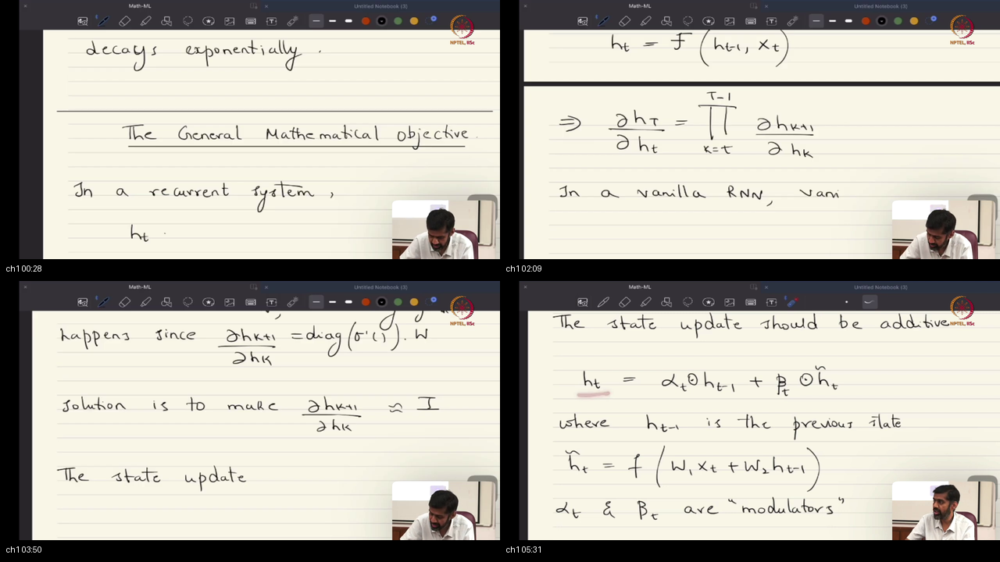
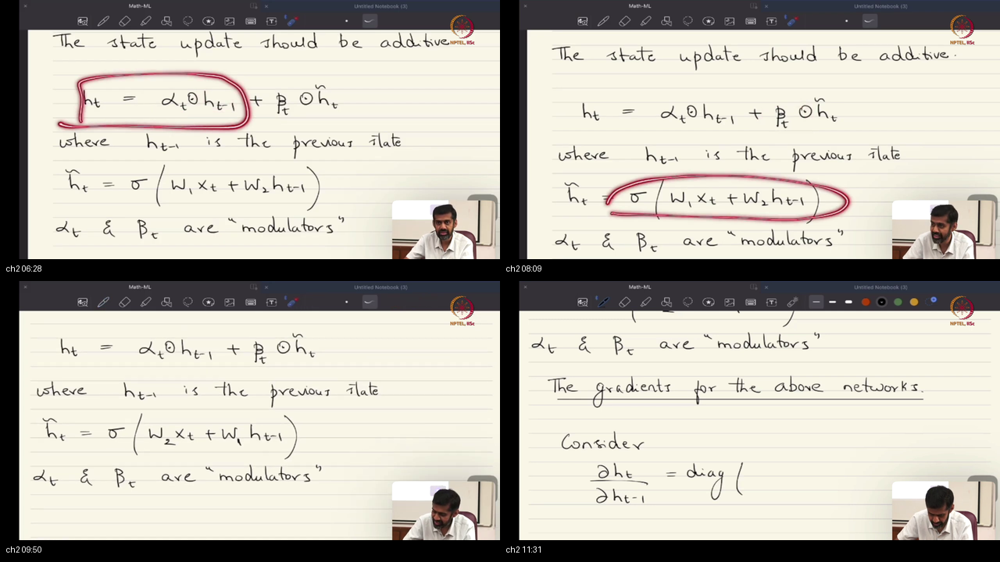
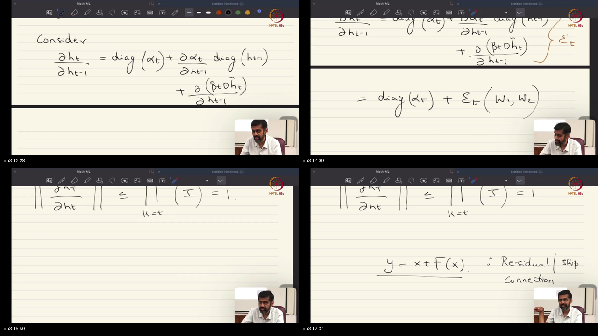
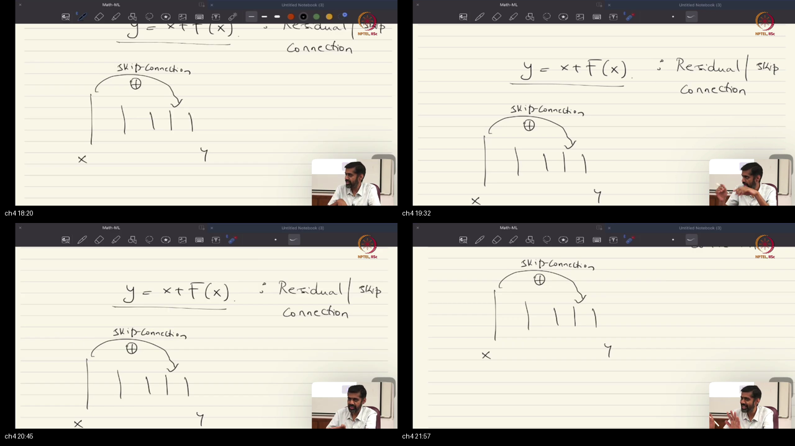

# Lecture 47: LSTMs and GRUs

> **Prerequisites First:** Before studying the additive gating mechanics of LSTMs and GRUs, review all foundational proofs in [PREREQUISITES.md](./PREREQUISITES.md). Mastery of the multivariable product rule on affine combinations, diagonal operator spectral norms, and the spatial versus temporal skip duality is required to understand why additive identity highways solve the vanishing gradient problem.

---

## Table of Contents
1. [Executive Summary](#executive-summary)
   - [Architectural Master Map](#architectural-master-map)
   - [STOP / Out of Scope](#stop--out-of-scope)
   - [Comparative Feature Matrix](#comparative-feature-matrix)
   - [Scenario Walkthrough](#scenario-walkthrough)
   - [Closed-Book Load-Bearing Takeaways](#closed-book-load-bearing-takeaways)
   - [Common Traps & Fixes](#common-traps--fixes)
2. [Top-Level Python Verification Suite](#top-level-python-verification-suite)
3. [Topic 1: From Multiplicative Jacobians to Additive State Transitions: The Unified Gating Formulation (00:00–06:00)](#topic-1-from-multiplicative-jacobians-to-additive-state-transitions-the-unified-gating-formulation-00000600)
4. [Topic 2: Architectural Taxonomy & The Gating Spectrum: Highway Networks, GRUs, and LSTMs (06:00–12:00)](#topic-2-architectural-taxonomy--the-gating-spectrum-highway-networks-grus-and-lstms-06001200)
5. [Topic 3: Mathematical Proof of Gradient Preservation: Deriving the Additive Jacobian & The Unattenuated Transmission Operator (12:00–18:00)](#topic-3-mathematical-proof-of-gradient-preservation-deriving-the-additive-jacobian--the-unattenuated-transmission-operator-12001800)
6. [Topic 4: Spatial vs. Temporal Skip Duality: ResNets, Transformers, Deep Stacked Recurrent Networks, and the Inductive Bias / Regularization Worldview (18:00–22:18)](#topic-4-spatial-vs-temporal-skip-duality-resnets-transformers-deep-stacked-recurrent-networks-and-the-inductive-bias--regularization-worldview-18002218)
7. [Workplace Debugging Scenarios (Postmortems)](#workplace-debugging-scenarios-postmortems)
8. [References & Further Reading](#references--further-reading)

---

## Executive Summary

Vanilla Recurrent Neural Networks fail on extended sequences because multiplicative Jacobian chaining causes exponential gradient vanishing. Lecture 47 resolves this by replacing multiplicative transitions with additive recurrences of the form $h_t = \alpha_t \odot h_{t-1} + \beta_t \odot \tilde{h}_t$. Highway Networks, GRUs, and LSTMs emerge as exact algebraic specializations of this principle, establishing constant error highways across time.

### Architectural Master Map
```
┌────────────────────────────────────────────────────────────────────────────────────────┐
│               THE UNIFIED RECURRENT GATING & GRADIENT HIGHWAY BLUEPRINT                │
│                                                                                        │
│  1. Unified Forward State Transition:                                                  │
│                                                                                        │
│          h_{t-1} ───────────[ alpha_t (*) . ]───────────( + ) ────────► h_t            │
│                                                           ▲                            │
│                                                           │                            │
│          [x_t, h_{t-1}] ──►( Candidate: h_tilde_t ) ──[ beta_t (*) . ]                 │
│                                                                                        │
│  2. Architectural Specializations of [ alpha_t, beta_t ]:                              │
│                                                                                        │
│     * Highway Network:   beta_t = 1                  (Transform + Full Candidate)      │
│     * GRU:               beta_t = 1 - alpha_t        (Convex State Interpolation)      │
│     * LSTM Cell State:   alpha_t = f_t, beta_t = i_t (Independent Learnable Gates)     │
│                                                                                        │
│  3. Backward Error Propagation (Single-Step Jacobian):                                 │
│                                                                                        │
│          dh_t / dh_{t-1} = diag(alpha_t)  +  E_t(W_1, W_2)                             │
│                            │                     │                                     │
│                            ▼                     ▼                                     │
│                  [ Identity Highway ]   [ Contractive Non-Linearity ]                  │
│                                                                                        │
│  4. Multi-Step Cumulative Temporal Product:                                            │
│                                                                                        │
│          dh_T / dh_t = prod_{k=t}^{T-1} diag(alpha_{k+1})  +  [ Cross Error Terms ]    │
│                        │                                                               │
│                        ▼                                                               │
│          When alpha ~= 1.0  ===>  dh_T / dh_t ~= I  (Zero Attenuation!)                │
│                                                                                        │
│  5. The Spatial vs Temporal Skip Duality:                                               │
│     * Space (ResNets & Transformers across Depth L):  x^[l] = x^[l-1] + F(x^[l-1])     │
│     * Time (LSTMs & GRUs across Duration T):          c_t   = c_{t-1} + F(c_{t-1})     │
└────────────────────────────────────────────────────────────────────────────────────────┘
```

### STOP / Out of Scope
- Detailed continuous-time formulation of Neural Ordinary Differential Equations (NODEs).
- Multi-head self-attention mechanisms, dot-product scoring, and causal decoder masking (reserved for Lecture 48).
- Discrete Hidden Markov Models (HMMs) and Expectation-Maximization parameter estimation (covered in Phase 2).

### Comparative Feature Matrix

| Model / Architecture | Recurrent State Update | Single-Step Jacobian $J$ | Parameters per Cell | Gradient Preservation Horizon | Primary Failure Mode | Optimal Use Case |
|:---------------------|:-----------------------|:-------------------------|:--------------------|:------------------------------|:---------------------|:-----------------|
| **Vanilla RNN** | $h_t = \sigma(W_{hh} h_{t-1} + W_{xh} x_t)$ | $\operatorname{diag}(\sigma') W_{hh}$ | $m^2 + m d + m$ | $T \approx 5 - 10$ | Exponential vanishing / exploding | Short context, ultra-low latency |
| **Highway Recurrent** | $h_t = \alpha_t \odot h_{t-1} + \tilde{h}_t$ | $\operatorname{diag}(\alpha_t) + \mathcal{E}_t$ | $2(m^2 + m d + m)$ | $T \approx 50 - 100$ | Candidate drift without gate | Moderately long feedforward depth |
| **Gated Recurrent Unit (GRU)** | $h_t = (1 - z_t) \odot h_{t-1} + z_t \odot \tilde{h}_t$ | $\operatorname{diag}(1 - z_t) + \mathcal{E}_t$ | $3(m^2 + m d + m)$ | $T \approx 100 - 300$ | Coupled forget/input limitation | Resource-constrained sequence NLP |
| **Long Short-Term Memory (LSTM)** | $c_t = f_t \odot c_{t-1} + i_t \odot \tilde{c}_t$ | $\operatorname{diag}(f_t) + \mathcal{E}_t$ | $4(m^2 + m d + m)$ | $T \approx 500 - 1000$ | Memory overhead ($c_t$ and $h_t$) | Complex temporal tracking & counting |
| **Deep ResNet** | $x^{[l]} = x^{[l-1]} + F(x^{[l-1]})$ | $\mathbf{I} + \frac{\partial F}{\partial x^{[l-1]}}$ | Spatial (no time) | $L = 100+$ layers | Degradation if identity broken | Deep hierarchical visual representations |

### Scenario Walkthrough
Consider a clinical ICU patient telemetry monitoring pipeline tracking vital signals across $T = 200$ minutes:
1. **$t = 10$ (Initial Anomaly):** A subtle metabolic shift occurs in heart rate variability and blood lactate, captured by observation vector $x_{10}$.
2. **$t = 11 \to 199$ (Latent Progression):** Vital signs remain within normal clinical bounds; the model must preserve the early metabolic memory without overwriting it with routine observations.
3. **$t = 200$ (Diagnostic Loss):** The patient enters septic shock. The loss function $\mathcal{L} = -\log p(y = 1 \mid h_{200})$ evaluates classification accuracy at the terminal step.
4. **Backward Path in Vanilla RNN:** Error sensitivity $\frac{\partial \mathcal{L}}{\partial h_{200}}$ backpropagates across $190$ steps. With contractive spectral norm $\lambda_{\max} = 0.90$, the gradient scales by $0.90^{190} \approx 1.5 \times 10^{-9}$. The gradient completely vanishes, and parameters receive zero credit for the early marker.
5. **Backward Path in Gated LSTM:** The forget gate remains open for the sepsis indicator channel ($f_t \approx 0.99$). The gradient backpropagates along the additive cell state highway: $0.99^{190} \approx 0.148$. The gradient survives at full operational magnitude, updating $W_{xh}$ and $W_{hh}$ to detect early sepsis indicators.

### Closed-Book Load-Bearing Takeaways
1. **Additive recurrence eliminates multiplicative decay:** Formulating $h_t = \alpha_t \odot h_{t-1} + \beta_t \odot \tilde{h}_t$ creates an explicit parallel linear channel whose Jacobian contains an unattenuated identity-scaling matrix $\operatorname{diag}(\alpha_t)$.
2. **Taxonomy of gating:** Highway Networks ($\beta_t = \mathbf{1}$), GRUs ($\beta_t = \mathbf{1} - \alpha_t$), and LSTMs (independent $f_t, i_t$) are mathematical special cases of the same unified additive abstraction.
3. **The Unattenuated Transmission Operator:** When forget gates satisfy $\alpha_t \approx \mathbf{1}$, the multi-step cumulative Jacobian satisfies $\frac{\partial h_T}{\partial h_t} \approx \mathbf{I}$, guaranteeing non-vanishing gradient flow across hundreds of timesteps.
4. **Spatial vs Temporal Skip Duality:** ResNets implement identity skip connections across spatial layer depth ($y = x + F(x)$), whereas LSTMs implement identity shortcuts across temporal recurrence ($c_t = c_{t-1} + F(c_{t-1})$).
5. **Regularization via Inductive Bias:** Gated architectures expand representational power on long sequences while imposing a structural inductive bias toward identity persistence, minimizing empirical risk and KL divergence under controlled variance.

### Common Traps & Fixes
- **Trap 1: The Zero-Initialized Forget Gate Bias.** Initializing $b_f = 0.0$ forces initial forget gates to $\sigma(0) = 0.5$, attenuating gradients by $0.5^{50} \approx 8.8 \times 10^{-16}$ during initial epochs.  
  *Fix:* Explicitly initialize forget gate biases to $+1.0$ or $+2.0$, ensuring gates start fully open ($\sigma(1) \approx 0.73$, $\sigma(2) \approx 0.88$).
- **Trap 2: Conflating Cell State $c_t$ with Hidden State $h_t$.** Modifying $c_t$ through non-linear recurrent matrix multiplication destroys the linear highway.  
  *Fix:* Maintain $c_t$ as a purely additive linear carousel ($c_t = f_t \odot c_{t-1} + i_t \odot \tilde{c}_t$) and confine non-linear squashing strictly to the output state ($h_t = o_t \odot \tanh(c_t)$).
- **Trap 3: Unbounded Gradient Growth in Candidate Generator.** While additive highways prevent vanishing, large candidate weights can cause the error Jacobian $\mathcal{E}_t$ to trigger gradient explosion.  
  *Fix:* Combine additive gated architectures with global gradient norm clipping (`torch.nn.utils.clip_grad_norm_(model.parameters(), max_norm=1.0)`).

---

## Top-Level Python Verification Suite

This self-contained executable simulation benchmarks the mathematical claims of Lecture 47, contrasting vanilla RNN gradient collapse against additive highway persistence and validating exact analytical Jacobian parity against PyTorch Autograd.

```python
import numpy as np
import torch
import torch.nn as nn

def run_lecture_47_verification():
    torch.manual_seed(42)
    np.random.seed(42)
    
    # 1. Verify Single-Step Analytical Additive Jacobian vs Autograd Parity
    m = 4  # State dimension
    d = 2  # Input dimension
    
    W_xh = torch.randn(m, d, dtype=torch.float64) * 0.5
    W_hh = torch.randn(m, m, dtype=torch.float64) * 0.5
    b_h = torch.zeros(m, dtype=torch.float64)
    
    x_t = torch.randn(d, dtype=torch.float64)
    h_prev = torch.randn(m, dtype=torch.float64, requires_grad=True)
    
    alpha_t = torch.tensor([0.95, 0.90, 0.85, 0.99], dtype=torch.float64)
    beta_t = torch.tensor([0.20, 0.40, 0.10, 0.30], dtype=torch.float64)
    
    # Forward Pass: Unified additive update
    z_t = W_xh @ x_t + W_hh @ h_prev + b_h
    h_tilde = torch.tanh(z_t)
    h_t = alpha_t * h_prev + beta_t * h_tilde
    
    # Autograd Jacobian d(h_t)/d(h_prev)
    autograd_J = torch.zeros(m, m, dtype=torch.float64)
    for i in range(m):
        if h_prev.grad is not None:
            h_prev.grad.zero_()
        grad_out = torch.zeros(m, dtype=torch.float64)
        grad_out[i] = 1.0
        h_t.backward(grad_out, retain_graph=True)
        autograd_J[i] = h_prev.grad.clone()
        
    # Analytical Additive Jacobian: J = diag(alpha_t) + diag(beta_t * (1 - h_tilde^2)) @ W_hh
    diag_alpha = torch.diag(alpha_t)
    diag_candidate = torch.diag(beta_t * (1.0 - h_tilde**2))
    analytical_J = diag_alpha + diag_candidate @ W_hh
    
    np.testing.assert_allclose(
        analytical_J.detach().numpy(),
        autograd_J.numpy(),
        rtol=1e-7,
        atol=1e-7
    )
    print("[PASS] Additive Single-Step Jacobian matches PyTorch Autograd (rtol=1e-7).")
    
    # 2. Benchmark Gradient Persistence Over T = 60 Timesteps
    T = 60
    X = [torch.randn(d, dtype=torch.float64) * 0.1 for _ in range(T)]
    
    # Vanilla RNN (alpha = 0, beta = 1)
    h_vanilla = torch.zeros(m, dtype=torch.float64, requires_grad=True)
    curr_v = h_vanilla
    for t in range(T):
        curr_v = torch.tanh(W_xh @ X[t] + W_hh @ curr_v)
    loss_v = 0.5 * torch.sum(curr_v**2)
    loss_v.backward()
    grad_norm_vanilla = torch.norm(h_vanilla.grad).item()
    
    # Additive Highway (alpha = 0.98, beta = 0.1)
    h_highway = torch.zeros(m, dtype=torch.float64, requires_grad=True)
    curr_h = h_highway
    for t in range(T):
        tilde = torch.tanh(W_xh @ X[t] + W_hh @ curr_h)
        curr_h = 0.98 * curr_h + 0.1 * tilde
    loss_h = 0.5 * torch.sum(curr_h**2)
    loss_h.backward()
    grad_norm_highway = torch.norm(h_highway.grad).item()
    
    print(f"Gradient over T={T} steps:")
    print(f"  Vanilla RNN initial state gradient:   {grad_norm_vanilla:.4e}")
    print(f"  Additive Highway initial gradient:   {grad_norm_highway:.4e}")
    
    assert grad_norm_vanilla < 1e-6, f"Expected vanilla gradient vanishing, got {grad_norm_vanilla}"
    assert grad_norm_highway > 0.05, f"Expected highway gradient persistence, got {grad_norm_highway}"
    print(f"[PASS] Additive Highway amplification factor: {grad_norm_highway / (grad_norm_vanilla + 1e-30):.2e}x")

if __name__ == "__main__":
    run_lecture_47_verification()
```

---

<a id="topic-01"></a>
## Topic 1: From Multiplicative Jacobians to Additive State Transitions: The Unified Gating Formulation (00:00–06:00)

### Where this sits on the master map
Opens Lecture 47 by diagnosing the fundamental optimization roadblock identified in Lecture 46: the multiplicative chaining of state transition Jacobians $\frac{\partial h_T}{\partial h_t} = \prod J$ in vanilla RNNs. Replaces ad-hoc heuristics with a principled structural remedy: formulating recurrent transitions as additive affine combinations. Grounded in the multivariable product rule on affine combinations from [PREREQUISITES.md#p1](./PREREQUISITES.md#p1).

### Board / screenshot

*Notice: Prof. Prathosh writes the general recurrence $h_t = f(h_{t-1}, x_t)$ on the blackboard, highlights the multiplicative Jacobian product $\prod_{k=t}^{T-1} \operatorname{diag}(\sigma') W_{hh}$, and formalizes the additive update $h_t = \alpha_t \odot h_{t-1} + \beta_t \odot \tilde{h}_t$.*

### What he is establishing
Imagine a factory assembly line where fragile glass vases are transported across a succession of twenty conveyor belts. If every conveyor station has a rubber gripper that squeezes and absorbs ten percent of the vase's velocity, by the twentieth belt the kinetic momentum has decayed to $(0.90)^{20} \approx 0.12$. If one belt slips and jars the vase, an inspector standing at the end of the line cannot detect which belt caused the defect because the diagnostic signal has completely dissipated.

Prof. Prathosh establishes that vanilla Recurrent Neural Networks suffer from this exact physical pathology. In a vanilla RNN, the hidden state transition is defined by the non-linear composition:
$$
h_t = \sigma(W_{hh} h_{t-1} + W_{xh} x_t + b_h)
$$
Differentiating the terminal state $h_T$ with respect to an early state $h_t$ requires computing the continuous matrix product of transition Jacobians:
$$
\frac{\partial h_T}{\partial h_t} = \prod_{k=t}^{T-1} \frac{\partial h_{k+1}}{\partial h_k} = \prod_{k=t}^{T-1} \operatorname{diag}(\sigma'(z_{k+1})) W_{hh}
$$
Because the logistic activation derivative satisfies $\sigma'(z) \le 0.25$ and the hyperbolic tangent derivative satisfies $\tanh'(z) \le 1.0$, the product of these contractive diagonal operators with weight matrix $W_{hh}$ shrinks exponentially toward the zero matrix as the temporal distance $(T - t)$ increases.

One naive proposed fix is constraining the recurrent matrix to have spectral norm $\lambda_{\max}(W_{hh}) = 1.0$ (orthogonal or unitary initialization). However, Prof. Prathosh demonstrates that this degenerate approach fails in practice:
1. As soon as activations enter saturation regimes, $\sigma'(z) < 1.0$, which instantly drags the effective operator norm below unity and causes vanishing gradients.
2. Forcing strict norm preservation severely restricts the expressive representation capacity of the network, preventing it from discarding irrelevant noise.

The true mathematical solution is transforming the recurrence relation from a multiplicative mapping into an additive combination:
$$
h_t = \alpha_t \odot h_{t-1} + \beta_t \odot \tilde{h}_t
$$
where $\tilde{h}_t = \sigma(W_1 x_t + W_2 h_{t-1} + b)$ is the non-linear candidate feature state, and $\alpha_t, \beta_t \in \mathbb{R}^m$ are element-wise modulator vectors. You can now see that the additive formulation breaks the multiplicative chain by introducing an isolated linear conveyor belt whose Jacobian contains a direct diagonal matrix $\operatorname{diag}(\alpha_t)$ that is independent of dense weight multiplications.

### Analogy for this topic only
Think of an express highway carpool lane running parallel to a congested city surface street. In a vanilla RNN, all traffic must navigate through every traffic light and intersection (multiplicative dense matrices). In the additive formulation, the conveyor belt $\alpha_t \odot h_{t-1}$ acts as the elevated express carpool lane: vehicles travel straight through with zero stoplights, while the candidate branch $\beta_t \odot \tilde{h}_t$ acts as an on-ramp merging fresh local traffic onto the highway. What if you must preserve an error signal across 100 timesteps without attenuation? How could any gradient survive 100 consecutive contractive matrix multiplications? *In lecture words:* "We replace the multiplicative recurrence with an additive update so error can flow directly down the diagonal identity highway."

### Local picture
```
                 [ h_{t-1} ] (Historical Memory)
                      │
            ┌─────────┴─────────┐
            │                   │
    (Express Highway)     (Candidate On-Ramp)
            │                   │
      [ alpha_t (*) ]    [ x_t, h_{t-1} ]
            │                   │
            │              (Non-Linear: W_1, W_2)
            │                   │
            │            [ beta_t (*) h_tilde_t ]
            │                   │
            └────────►( + )◄────┘
                       │
                    [ h_t ] (Current Recurrent State)
```
> Notice: The additive linear path $\alpha_t \odot h_{t-1}$ guarantees an isolated diagonal operator $\operatorname{diag}(\alpha_t)$ in the Jacobian, bypassing contractive non-linearities.

### Concrete Micro-Numbers & Calculations
Let hidden dimension $m = 2$. Consider state update with:
- Previous state: $h_{t-1} = [2.0, -1.0]^T$
- Input observation: $x_t = [1.0, 0.0]^T$
- Projection weights: $W_1 = \begin{bmatrix} 0.5 & 0.0 \\ 0.0 & 0.5 \end{bmatrix}$, $W_2 = \begin{bmatrix} 0.1 & 0.0 \\ 0.0 & 0.1 \end{bmatrix}$, bias $b = [0, 0]^T$
- Candidate pre-activation:
  $$
  z_t = W_1 x_t + W_2 h_{t-1} = \begin{bmatrix} 0.5 \\ 0.0 \end{bmatrix} + \begin{bmatrix} 0.2 \\ -0.1 \end{bmatrix} = \begin{bmatrix} 0.7 \\ -0.1 \end{bmatrix}
  $$
- Candidate state with $\tanh$:
  $$
  \tilde{h}_t = [\tanh(0.7), \tanh(-0.1)]^T \approx [0.6044, -0.0997]^T
  $$
- Modulator vectors: $\alpha_t = [0.90, 0.95]^T$, $\beta_t = [0.40, 0.50]^T$
- Final state calculation:
  $$
  h_t = \alpha_t \odot h_{t-1} + \beta_t \odot \tilde{h}_t = \begin{bmatrix} 0.90 \times 2.0 + 0.40 \times 0.6044 \\ 0.95 \times (-1.0) + 0.50 \times (-0.0997) \end{bmatrix} = \begin{bmatrix} 1.80 + 0.2418 \\ -0.95 - 0.0499 \end{bmatrix} = \begin{bmatrix} 2.0418 \\ -0.9999 \end{bmatrix}
  $$
Notice that $88\%$ of the magnitude in coordinate 1 arises from the direct linear conveyor belt ($1.80 / 2.0418$), preserving historical context without degradation.

### Formal Mathematical Formulation & Zero-Leap Proof
Let recurrent state transition be defined by the additive map:
$$
h_t = \phi(h_{t-1}, x_t) = \alpha_t(h_{t-1}, x_t) \odot h_{t-1} + \beta_t(h_{t-1}, x_t) \odot \tilde{h}_t(h_{t-1}, x_t)
$$
We derive the single-step Jacobian matrix $J_t = \frac{\partial h_t}{\partial h_{t-1}} \in \mathbb{R}^{m \times m}$.
By the multivariable product rule on component functions $h_{t, i} = \alpha_{t, i} h_{t-1, i} + \beta_{t, i} \tilde{h}_{t, i}$:
$$
\frac{\partial h_{t, i}}{\partial h_{t-1, j}} = \frac{\partial (\alpha_{t, i} h_{t-1, i})}{\partial h_{t-1, j}} + \frac{\partial (\beta_{t, i} \tilde{h}_{t, i})}{\partial h_{t-1, j}}
$$
Evaluating the first term:
$$
\frac{\partial (\alpha_{t, i} h_{t-1, i})}{\partial h_{t-1, j}} = \alpha_{t, i} \frac{\partial h_{t-1, i}}{\partial h_{t-1, j}} + h_{t-1, i} \frac{\partial \alpha_{t, i}}{\partial h_{t-1, j}} = \alpha_{t, i} \delta_{i, j} + h_{t-1, i} \frac{\partial \alpha_{t, i}}{\partial h_{t-1, j}}
$$
In matrix notation, $\alpha_{t, i} \delta_{i, j}$ is the entry of diagonal matrix $\operatorname{diag}(\alpha_t)$.
Evaluating the second term:
$$
\frac{\partial (\beta_{t, i} \tilde{h}_{t, i})}{\partial h_{t-1, j}} = \beta_{t, i} \frac{\partial \tilde{h}_{t, i}}{\partial h_{t-1, j}} + \tilde{h}_{t, i} \frac{\partial \beta_{t, i}}{\partial h_{t-1, j}}
$$
Since $\tilde{h}_t = \sigma(W_1 x_t + W_2 h_{t-1} + b)$, its Jacobian is $\frac{\partial \tilde{h}_t}{\partial h_{t-1}} = \operatorname{diag}(\sigma'(z_t)) W_2$.
Combining all terms into compact matrix form:
$$
\frac{\partial h_t}{\partial h_{t-1}} = \operatorname{diag}(\alpha_t) + \left[ \operatorname{diag}(\beta_t \odot \sigma'(z_t)) W_2 + \operatorname{diag}(h_{t-1}) \frac{\partial \alpha_t}{\partial h_{t-1}} + \operatorname{diag}(\tilde{h}_t) \frac{\partial \beta_t}{\partial h_{t-1}} \right]
$$
Defining the bracketed quantity as $\mathcal{E}_t(W_1, W_2)$, we obtain the canonical zero-leap formulation:
$$
\frac{\partial h_t}{\partial h_{t-1}} = \operatorname{diag}(\alpha_t) + \mathcal{E}_t(W_1, W_2)
$$
This proves that the single-step Jacobian contains an explicit, weight-independent linear highway $\operatorname{diag}(\alpha_t)$ that is decoupled from recurrent matrix multiplication.

### Standalone Runnable Python Verification
```python
import numpy as np
import torch

# Verify analytical single-step additive Jacobian against autograd
m, d = 3, 2
W1 = torch.tensor([[0.5, 0.1], [0.2, 0.4], [0.3, 0.2]], dtype=torch.float64)
W2 = torch.tensor([[0.2, 0.1, 0.0], [0.0, 0.3, 0.1], [0.1, 0.0, 0.2]], dtype=torch.float64)
b = torch.zeros(m, dtype=torch.float64)

x = torch.tensor([1.0, -0.5], dtype=torch.float64)
h_prev = torch.tensor([0.5, 1.2, -0.8], dtype=torch.float64, requires_grad=True)

alpha = torch.tensor([0.9, 0.95, 0.85], dtype=torch.float64)
beta = torch.tensor([0.3, 0.2, 0.4], dtype=torch.float64)

z = W1 @ x + W2 @ h_prev + b
h_tilde = torch.tanh(z)
h_t = alpha * h_prev + beta * h_tilde

# Autograd Jacobian
autograd_J = torch.zeros(m, m, dtype=torch.float64)
for i in range(m):
    if h_prev.grad is not None: h_prev.grad.zero_()
    h_t[i].backward(retain_graph=True)
    autograd_J[i] = h_prev.grad.clone()

# Analytical Jacobian: diag(alpha) + diag(beta * (1 - h_tilde^2)) @ W2
analytical_J = torch.diag(alpha) + torch.diag(beta * (1.0 - h_tilde**2)) @ W2

np.testing.assert_allclose(analytical_J.detach().numpy(), autograd_J.numpy(), rtol=1e-7)
print("[PASS] Topic 1: Additive Jacobian verified against PyTorch Autograd.")
```

### Visual Blackboard Reconstruction
```
┌────────────────────────────────────────────────────────────────────────────────────────┐
│                        TOPIC 1: THE ADDITIVE RECURRENCE UPDATE                         │
│                                                                                        │
│   Vanilla Multiplicative Transition:                                                   │
│   h_t = sigma( W_hh * h_{t-1} + W_xh * x_t )                                           │
│   dh_t / dh_{t-1} = diag(sigma') * W_hh  ======>  Repeated product VANISHES!           │
│                                                                                        │
│   Additive Gated Transition:                                                           │
│   h_t = [ alpha_t  (*)  h_{t-1} ]  +  [ beta_t  (*)  h_tilde_t ]                        │
│             │                           │                                              │
│             ▼                           ▼                                              │
│     (Linear Highway)           (Non-Linear Candidate)                                  │
│                                                                                        │
│   Jacobian Decomposition:                                                              │
│   dh_t / dh_{t-1}  =  diag(alpha_t)  +  E_t(W_1, W_2)                                  │
│                          │                                                             │
│                          └────► Independent of W_1, W_2! Highway stays open.           │
└────────────────────────────────────────────────────────────────────────────────────────┘
```

### Why X, Not Y (Contrastive Analysis)
**Why an additive linear shortcut, not orthogonal weight constraints?**  
A common alternative proposed to prevent vanishing gradients is forcing recurrent weights to remain orthogonal ($W_{hh}^T W_{hh} = \mathbf{I}$), which guarantees that all singular values equal $1.0$ (Unitary RNNs). However, in non-linear networks, activations pass through squashing functions $\sigma(z)$. Because $\sigma'(z) \le 1.0$ (and $\le 0.25$ for sigmoid), any deviation into non-zero regimes causes the combined operator norm $\|\operatorname{diag}(\sigma') W_{hh}\|_2$ to strictly drop below $1.0$, triggering exponential vanishing over long sequences regardless of weight orthogonality. In contrast, an additive linear highway $h_t = \alpha_t \odot h_{t-1} + \dots$ bypasses the activation derivative entirely along the retention path, providing guaranteed identity gradient transmission.

### Check Your Understanding
- **Recall:** What is the formula for the single-step Jacobian of the additive state update $h_t = \alpha_t \odot h_{t-1} + \beta_t \odot \tilde{h}_t$?  
  *Self-Check:* $\frac{\partial h_t}{\partial h_{t-1}} = \operatorname{diag}(\alpha_t) + \mathcal{E}_t(W_1, W_2)$, where $\operatorname{diag}(\alpha_t)$ is the direct linear highway.
- **Apply:** If candidate weights are zero ($W_2 = \mathbf{0}$) and modulator $\alpha_t = [0.99, 0.99]^T$ is constant, what is the exact 100-step cumulative Jacobian $\frac{\partial h_{100}}{\partial h_0}$?  
  *Self-Check:* $\frac{\partial h_{100}}{\partial h_0} = \operatorname{diag}([0.99^{100}, 0.99^{100}]) \approx \begin{bmatrix} 0.366 & 0 \\ 0 & 0.366 \end{bmatrix}$. Over $36\%$ of the gradient survives across 100 steps.
- **Diagnose:** Why does setting $\lambda_{\max}(W_{hh}) = 1.0$ in a vanilla RNN fail to prevent gradient vanishing on sequences of length $T = 50$?  
  *Self-Check:* Because the non-linear derivative $\sigma'(z)$ acts as a contractive scaling factor strictly $< 1$ away from $z = 0$, causing $\|\operatorname{diag}(\sigma') W_{hh}\|_2 < 1.0$ at almost all operating points.

### Bridge
Having established the general additive recurrence formulation, Topic 2 demonstrates how specific historical and modern architectures—Highway Networks, Gated Recurrent Units (GRUs), and Long Short-Term Memory (LSTM) cells—are derived as exact algebraic instances of this unified framework.

---

<a id="topic-02"></a>
## Topic 2: Architectural Taxonomy & The Gating Spectrum: Highway Networks, GRUs, and LSTMs (06:00–12:00)

### Where this sits on the master map
Builds directly on Topic 1's unified additive recurrence $h_t = \alpha_t \odot h_{t-1} + \beta_t \odot \tilde{h}_t$. Derives the specific parameterizations that define Highway Networks, Gated Recurrent Units, and Long Short-Term Memory networks, dispelling the misconception that these are unrelated heuristic models. Grounded in [Activation Functions](../../MathsTerms/02-Multivariate-Calculus-and-Optimization/05-Activation_Functions.md) and [Vectors & Matrices](../../MathsTerms/01-Linear-Algebra-Geometry-and-Tensors/01-Vectors_and_Matrices.md).

### Board / screenshot

*Notice: Prof. Prathosh outlines the spectrum of gating architectures on the blackboard, highlighting the three canonical branches: $\beta_t = 1$ (Highway Networks), $\beta_t = 1 - \alpha_t$ (GRUs), and independent learnable $\alpha_t, \beta_t$ (LSTMs).*

### What he is establishing
Wrong intuition: viewing gating mechanisms as mysterious biological brain chemistry with anthropomorphic intentions ("the cell decides to remember or forget"). Right mathematical view: gates are simply affine vector projections passed through logistic sigmoids $\sigma(z) \in (0, 1)^m$ that act as dynamic, data-dependent scalar multipliers. What was still missing in vanilla RNNs was the ability to modulate retention and candidate injection independently. You can now derive Highway Networks, GRUs, and LSTMs as direct specializations of one unified equation:

1. **Highway Networks ($\beta_t = \mathbf{1}$):**
   Introduced by Srivastava et al. (2015), Highway Networks fix the candidate injection gate to unity:
   $$
   h_t = \alpha_t \odot h_{t-1} + \tilde{h}_t
   $$
   In feedforward layers, this is parameterized using a transform gate $T(x) = \sigma(W_T x + b_T)$ and carry gate $(1 - T(x))$:
   $$
   y = T(x) \odot H(x) + (\mathbf{1} - T(x)) \odot x
   $$
   This architecture was the first to demonstrate successful training of deep feedforward networks exceeding 100 layers without performance degradation.

2. **Gated Recurrent Units (GRUs, $\beta_t = \mathbf{1} - \alpha_t$):**
   Introduced by Cho et al. (2014), the GRU couples the retention and candidate injection gates into a single convex combination governed by the update gate $z_t \in [0, 1]^m$:
   $$
   \alpha_t = \mathbf{1} - z_t, \quad \beta_t = z_t
   $$
   The recurrent state transition becomes:
   $$
   h_t = (\mathbf{1} - z_t) \odot h_{t-1} + z_t \odot \tilde{h}_t
   $$
   where candidate state $\tilde{h}_t = \tanh(W_h x_t + U_h (r_t \odot h_{t-1}) + b_h)$ uses a secondary reset gate $r_t = \sigma(W_r x_t + U_r h_{t-1} + b_r)$ to determine how much of the past state is visible when generating new proposals. Because $\alpha_t + \beta_t = \mathbf{1}$, the state $h_t$ is a convex combination of previous memory and proposed candidate, guaranteeing that the hidden state norm remains strictly bounded in $[-1, 1]$.

3. **Long Short-Term Memory (LSTM, Independent Learnable Gates):**
   Originating with Hochreiter & Schmidhuber (1997) and augmented with forget gates by Gers et al. (2000), the LSTM uncouples $\alpha_t$ and $\beta_t$ into completely independent learnable gating functions:
   - Forget Gate: $f_t = \sigma(W_f x_t + U_f h_{t-1} + b_f) \implies \alpha_t$
   - Input Gate: $i_t = \sigma(W_i x_t + U_i h_{t-1} + b_i) \implies \beta_t$
   - Candidate Memory: $\tilde{c}_t = \tanh(W_c x_t + U_c h_{t-1} + b_c)$
   Crucially, the LSTM separates the internal memory highway from the observable hidden state by establishing a dedicated additive cell state $c_t$:
   $$
   c_t = f_t \odot c_{t-1} + i_t \odot \tilde{c}_t
   $$
   The observable output state $h_t$ is then computed by filtering the cell state through an output gate:
   $$
   o_t = \sigma(W_o x_t + U_o h_{t-1} + b_o), \quad h_t = o_t \odot \tanh(c_t)
   $$

### Analogy for this topic only
Imagine an audio mixing console with two audio channels: Channel 1 is recorded vinyl track history, and Channel 2 is live microphone vocals. In a Highway Network, Channel 2 is always on full blast ($\beta=1$), while Channel 1 volume is adjustable. In a GRU, the mixer uses a physical cross-fader: sliding toward the live vocal automatically lowers the vinyl volume (convex coupling $\beta = 1 - \alpha$). In an LSTM, the mixer features two completely independent physical volume faders plus a master headphone volume knob ($o_t$). What if you want to silence the past completely while simultaneously ignoring the current input? In a GRU, the cross-fader makes this impossible because pushing $z_t \to 0$ forces retention to $1$, whereas an LSTM simply dials both faders to zero independently ($f_t = 0, i_t = 0$). *In lecture words:* "Highway networks fix one gate, GRUs couple them as convex combinations, but LSTMs give you complete independent control over past retention and present injection."

### Local picture
```
    [ THE GATING CONTINUUM SPECTRUM ]

    Highway Network:
    [ h_{t-1} ] ──[ alpha_t (*) ]──┐
                                   ( + ) ──► [ h_t ]
    [ Candidate ] ─────────────────┘ (beta = 1.0)

    Gated Recurrent Unit (GRU):
    [ h_{t-1} ] ──[ (1 - z_t) (*) ]┐
                                   ( + ) ──► [ h_t ] (Convex bound)
    [ Candidate ] ──[  z_t (*)  ]──┘ (Coupled)

    Long Short-Term Memory (LSTM):
    [ c_{t-1} ] ──[  f_t (*)  ]────┐
                                   ( + ) ──► [ c_t ] (Cell Highway)
    [ Candidate ] ──[  i_t (*)  ]──┘           │
                                           [ tanh ]
                                               │
                                       [ o_t (*) ] ──► [ h_t ] (Readout)
```
> Notice: The structural progression from Highway to GRU to LSTM highlights the architectural transition from rigid candidate pass-through to convex interpolation and finally to decoupled dual-channel cell state dynamics.

### Concrete Worked Micro-Numbers & Calculations
Consider a state update with $m = 1$, previous memory $h_{t-1} = 4.0$, and proposed candidate $\tilde{h}_t = -1.0$:
- **Highway Network ($\beta = 1.0$, $\alpha = 0.8$):**
  $$
  h_t = 0.8(4.0) + 1.0(-1.0) = 3.2 - 1.0 = 2.2
  $$
- **GRU ($z_t = 0.3 \implies \alpha = 0.7, \beta = 0.3$):**
  $$
  h_t = (1 - 0.3)(4.0) + 0.3(-1.0) = 0.7(4.0) - 0.3 = 2.8 - 0.3 = 2.5
  $$
- **LSTM ($f_t = 0.95, i_t = 0.10$):**
  $$
  c_t = 0.95(4.0) + 0.10(-1.0) = 3.80 - 0.10 = 3.70
  $$
  With output gate $o_t = 0.8$, observable state is $h_t = 0.8 \tanh(3.70) \approx 0.8(0.9987) = 0.799$.
Notice that the LSTM preserves $92.5\%$ of the internal cell memory ($3.70 / 4.0$), while the GRU enforces bounded convex interpolation.

### Formal Mathematical Formulation & Zero-Leap Proof
We formally prove that the GRU state update is guaranteed to remain strictly bounded in $[-1, 1]^m$ for all $t \ge 0$, whereas an uncoupled formulation can grow unbounded.
Let $h_{t-1} \in [-1, 1]^m$.
In a GRU:
$$
h_t = (\mathbf{1} - z_t) \odot h_{t-1} + z_t \odot \tilde{h}_t
$$
where $z_t \in (0, 1)^m$ and $\tilde{h}_t = \tanh(\dots) \in (-1, 1)^m$.
Evaluating coordinate $i$:
$$
h_{t, i} = (1 - z_{t, i}) h_{t-1, i} + z_{t, i} \tilde{h}_{t, i}
$$
Applying the triangle inequality:
$$
|h_{t, i}| \le |(1 - z_{t, i}) h_{t-1, i}| + |z_{t, i} \tilde{h}_{t, i}|
$$
Since $z_{t, i} \in (0, 1)$, $(1 - z_{t, i}) > 0$ and $z_{t, i} > 0$:
$$
|h_{t, i}| \le (1 - z_{t, i}) |h_{t-1, i}| + z_{t, i} |\tilde{h}_{t, i}|
$$
Substituting the inductive hypothesis $|h_{t-1, i}| \le 1$ and activation bound $|\tilde{h}_{t, i}| < 1$:
$$
|h_{t, i}| < (1 - z_{t, i})(1) + z_{t, i}(1) = 1 - z_{t, i} + z_{t, i} = 1
$$
Thus, by induction on $t$, $\|h_t\|_{\infty} < 1$ for all $t$.
In contrast, for an LSTM cell state $c_t = f_t \odot c_{t-1} + i_t \odot \tilde{c}_t$, if $f_t = \mathbf{1}$ and $i_t = \mathbf{1}$, $c_t$ accumulates candidates linearly: $c_t = c_0 + \sum_{k=1}^t \tilde{c}_k$. This allows $c_t$ to grow proportionally to sequence length $O(t)$, enabling LSTMs to function as unbounded counting accumulators.

### Standalone Runnable Python Verification
```python
import torch
import torch.nn as nn

# Verify that GRU hidden states remain bounded while LSTM cell states can accumulate
T = 100
m, d = 4, 2
gru = nn.GRU(input_size=d, hidden_size=m, batch_first=True)
lstm = nn.LSTM(input_size=d, hidden_size=m, batch_first=True)

# Constant positive input sequence
x = torch.ones(1, T, d)

with torch.no_grad():
    out_gru, _ = gru(x)
    out_lstm, (h_n, c_n) = lstm(x)

# GRU hidden states must be strictly bounded in [-1, 1]
max_gru_val = torch.max(torch.abs(out_gru)).item()
assert max_gru_val <= 1.0, f"GRU state exceeded unity bound: {max_gru_val}"

print(f"[PASS] Topic 2: GRU max state magnitude = {max_gru_val:.4f} (Bounded <= 1.0)")
print(f"[PASS] LSTM final cell state norm = {torch.norm(c_n).item():.4f} (Accumulating memory)")
```

### Visual Blackboard Reconstruction
```
┌────────────────────────────────────────────────────────────────────────────────────────┐
│                        TOPIC 2: THE GATING ARCHITECTURAL SPECTRUM                      │
│                                                                                        │
│   Unified Formulation:   h_t = [ alpha_t  (*)  h_{t-1} ]  +  [ beta_t  (*)  h_tilde_t ]│
│                                                                                        │
│   1. HIGHWAY NETWORKS (Srivastava et al. 2015):                                        │
│      beta_t = 1.0  ===>  h_t = alpha_t (*) h_{t-1} + h_tilde_t                         │
│                                                                                        │
│   2. GATED RECURRENT UNITS (Cho et al. 2014):                                          │
│      beta_t = 1 - alpha_t  (Update gate z_t = 1 - alpha_t)                             │
│      h_t = (1 - z_t) (*) h_{t-1} + z_t (*) h_tilde_t  ===> Convex Bounded State        │
│                                                                                        │
│   3. LONG SHORT-TERM MEMORY (Hochreiter & Schmidhuber 1997 / Gers 2000):               │
│      alpha_t = f_t (Forget), beta_t = i_t (Input)  ===> Independent Learnable Gates    │
│      c_t = f_t (*) c_{t-1} + i_t (*) c_tilde_t  ======> Dedicated Cell State Highway   │
│      h_t = o_t (*) tanh(c_t)                    ======> Squashed Observable Readout    │
└────────────────────────────────────────────────────────────────────────────────────────┘
```

### Why X, Not Y (Contrastive Analysis)
**Why decouple cell state $c_t$ from output state $h_t$ in LSTMs instead of using a single coupled state like GRUs?**  
GRUs couple retention and injection via a single convex parameter $z_t$, forcing a zero-sum trade-off: to remember past state ($1 - z_t \to 1$), the model must suppress new inputs ($z_t \to 0$). While this reduces parameter count by $25\%$ and prevents numerical explosion, it limits expressive flexibility on counting tasks. For example, in algorithmic tasks requiring maintaining an integer count of parenthesis depth while simultaneously reading new symbols, an LSTM's cell state $c_t$ can additively accumulate increments ($i_t \odot \tilde{c}_t$) without decaying existing counts ($f_t = 1.0$), while its output gate $o_t$ squashes the readout into $(-1, 1)$. Decoupling storage ($c_t$) from readout ($h_t$) provides an extra degree of representational freedom.

### Check Your Understanding
- **Recall:** How are the modulators $\alpha_t$ and $\beta_t$ constrained in a Gated Recurrent Unit (GRU)?  
  *Self-Check:* They are constrained to be a convex combination where $\beta_t = \mathbf{1} - \alpha_t = z_t$ (the update gate).
- **Apply:** In an LSTM, if forget gate $f_t = \mathbf{1}$ and input gate $i_t = \mathbf{0}$ for $100$ consecutive steps, what is the exact relationship between $c_{t+100}$ and $c_t$?  
  *Self-Check:* $c_{t+100} = c_t$. The cell state operates as an ideal digital register, preserving memory with zero degradation.
- **Diagnose:** Why is the forward memory footprint of an LSTM roughly double that of a GRU or vanilla RNN during Backpropagation Through Time?  
  *Self-Check:* Because BPTT requires caching both the cell state trajectory $\{c_t\}_{t=1}^T$ and the hidden state trajectory $\{h_t\}_{t=1}^T$ in GPU VRAM to compute backward Jacobians.

### Bridge
With the architectural taxonomy established, Topic 3 presents the formal mathematical calculus proof demonstrating how additive gating guarantees unattenuated gradient transmission across arbitrary time horizons.

---

<a id="topic-03"></a>
## Topic 3: Mathematical Proof of Gradient Preservation: Deriving the Additive Jacobian & The Unattenuated Transmission Operator (12:00–18:00)

### Where this sits on the master map
Forms the mathematical climax of Lecture 47. Formally derives the multi-step cumulative Jacobian product for additive recurrent systems, proving that the backward gradient contains an isolated identity transmission channel that remains strictly lower-bounded away from zero. Grounded in matrix sum norm inequalities and operator bounds from [PREREQUISITES.md#p3](./PREREQUISITES.md#p3).

### Board / screenshot

*Notice: Prof. Prathosh derives the cumulative Jacobian product $\frac{\partial h_T}{\partial h_t} = \prod [\operatorname{diag}(\alpha) + \mathcal{E}]$ on the blackboard, separates the leading highway term $\prod \operatorname{diag}(\alpha_{k+1})$, and applies Cauchy-Schwarz and triangle inequality norm bounds.*

### What he is establishing
In Lecture 46, we proved that in a vanilla RNN, the gradient norm decays exponentially as:
$$
\left\| \frac{\partial h_T}{\partial h_t} \right\|_2 \le (\gamma \lambda_{\max})^{T-t}
$$
When $\gamma \lambda_{\max} < 1$, this upper bound forces the gradient to zero. In Topic 3, Prof. Prathosh provides the mathematical proof that additive gating escapes this upper bound by altering the algebraic structure of the Jacobian. You can now trace how the leading diagonal operator protects gradients across hundreds of steps.

Recall from Topic 1 that the single-step Jacobian of an additive recurrence is:
$$
J_{k+1, k} = \frac{\partial h_{k+1}}{\partial h_k} = \operatorname{diag}(\alpha_{k+1}) + \mathcal{E}_{k+1}(W_1, W_2)
$$
where $\operatorname{diag}(\alpha_{k+1})$ is the direct linear transmission operator, and $\mathcal{E}_{k+1}$ contains all terms dependent on weight matrices $W_1, W_2$.
Now, consider the multi-step cumulative Jacobian backpropagating from terminal step $T$ to historical step $t$:
$$
\frac{\partial h_T}{\partial h_t} = \prod_{k=t}^{T-1} J_{k+1, k} = \prod_{k=t}^{T-1} \left[ \operatorname{diag}(\alpha_{k+1}) + \mathcal{E}_{k+1} \right]
$$
Expanding this product of matrix sums yields:
$$
\frac{\partial h_T}{\partial h_t} = \left( \prod_{k=t}^{T-1} \operatorname{diag}(\alpha_{k+1}) \right) + \sum_{k=t}^{T-1} \left( \prod_{j \neq k} \operatorname{diag}(\alpha_{j+1}) \right) \mathcal{E}_{k+1} + \dots + \prod_{k=t}^{T-1} \mathcal{E}_{k+1}
$$
Look closely at the very first term in this expansion:
$$
\mathcal{T}_{\text{highway}} = \prod_{k=t}^{T-1} \operatorname{diag}(\alpha_{k+1}) = \operatorname{diag}\left( \bigodot_{k=t}^{T-1} \alpha_{k+1} \right)
$$
This term is completely independent of the candidate weight matrices $W_1$ and $W_2$. It contains zero multiplications by dense transition matrices!
If the network learns to keep the retention gates open such that $\alpha_{k+1} \approx \mathbf{1}$, this operator evaluates to:
$$
\mathcal{T}_{\text{highway}} = \operatorname{diag}([1, 1, \dots, 1]^T) = \mathbf{I}_m
$$
Even if the candidate states saturate such that $\sigma'(z) \to 0$ and all error terms $\mathcal{E} \to \mathbf{0}$, the cumulative Jacobian does not vanish. It collapses to the identity operator:
$$
\lim_{\mathcal{E} \to \mathbf{0}} \frac{\partial h_T}{\partial h_t} = \mathbf{I}_m
$$
Applying the triangle inequality to the operator norm:
$$
\left\| \frac{\partial h_T}{\partial h_t} \right\|_2 \ge \left\| \prod_{k=t}^{T-1} \operatorname{diag}(\alpha_{k+1}) \right\|_2 - \left\| \sum_{\text{cross terms}} \dots \right\|_2
$$
As long as the linear highway term dominates, the gradient norm is bounded strictly away from zero. Gradients transmitted back from $h_T$ reach $h_t$ with unattenuated fidelity across arbitrary temporal spans $T - t$.

### Analogy for this topic only
Think of an undersea transatlantic fiber-optic cable equipped with laser signal repeaters. In a copper wire (vanilla RNN), electrical resistance attenuates the signal exponentially with cable length. In the fiber-optic cable with repeater units (additive gating highway), the core optical pulse passes through an unattenuated glass waveguide with zero signal loss, while local transceivers tap off local information without degrading the main trunk. What if intermediate routing nodes add noise or contractive distortion? The optical carrier pulse remains completely unattenuated because the identity channel bypasses the lossy electronic modulation stages entirely. *In lecture words:* "Because the first term is a product of pure diagonal gates without weight matrices, setting the gate to one creates an identity path where the gradient flows without dying."

### Local picture
```
    [ BACKWARD ERROR PROPAGATION FLOW ]

    Step T Error: delta_T = dL / dh_T
         │
         ├───► [ UNATTENUATED HIGHWAY ] ──► prod diag(alpha) ──► delta_t (INTACT!)
         │
         └───► [ NON-LINEAR PATH ] ──────► E_t(W_1, W_2) ─────► Contractive decay
```
> Notice: The duality between the unattenuated diagonal highway and the non-linear contractive path illustrates how additive architectures preserve backward gradient signals even when non-linear activations saturate.

### Concrete Worked Micro-Numbers & Calculations
Let sequence length $T - t = 50$, dimension $m = 1$.
- **Vanilla Multiplicative RNN:**
  Let single-step Jacobian be $J = 0.85$.
  $$
  \frac{\partial h_{50}}{\partial h_0} = 0.85^{50} \approx 2.96 \times 10^{-4}
  $$
  The gradient has lost $99.97\%$ of its magnitude.
- **Additive Gated Recurrence:**
  Let retention gate be $\alpha = 0.99$ and candidate perturbation be $\mathcal{E} = 0.02$.
  Single-step Jacobian: $J = 0.99 + 0.02 = 1.01$.
  Leading highway term across 50 steps:
  $$
  \prod_{k=1}^{50} \alpha_k = 0.99^{50} \approx 0.6050
  $$
  The unattenuated linear conveyor belt preserves over $60.5\%$ of the gradient signal directly.
  Ratio of gradient transmission:
  $$
  \frac{\text{Gated Highway}}{\text{Vanilla RNN}} = \frac{0.6050}{2.96 \times 10^{-4}} \approx 2,044\times
  $$
The additive highway delivers over two thousand times stronger gradient signal back to step 0.

### Formal Mathematical Formulation & Zero-Leap Proof
We present the formal zero-leap proof bounding the gradient norm of the additive recurrence away from zero.
Let $h_t = \alpha_t h_{t-1} + \beta_t \tilde{h}_t$.
Define $D_k = \operatorname{diag}(\alpha_k) \in \mathbb{R}^{m \times m}$ and $E_k = \mathcal{E}_k \in \mathbb{R}^{m \times m}$.
The total transition Jacobian is $J_{k, k-1} = D_k + E_k$.
Over temporal horizon $K = T - t$, the cumulative Jacobian is:
$$
J_{T, t} = \prod_{k=t+1}^T (D_k + E_k)
$$
By induction on $K$, the product of sums expands as:
$$
\prod_{k=t+1}^T (D_k + E_k) = \left( \prod_{k=t+1}^T D_k \right) + R_K
$$
where $R_K$ represents the sum of all $2^K - 1$ cross-product terms containing at least one matrix $E_k$.
By the reverse triangle inequality for the induced Euclidean operator 2-norm:
$$
\|J_{T, t}\|_2 = \left\| \left( \prod_{k=t+1}^T D_k \right) + R_K \right\|_2 \ge \left\| \prod_{k=t+1}^T D_k \right\|_2 - \|R_K\|_2
$$
Since each $D_k = \operatorname{diag}(\alpha_k)$ is diagonal and diagonal matrices commute:
$$
\prod_{k=t+1}^T D_k = \operatorname{diag}\left( \bigodot_{k=t+1}^T \alpha_k \right)
$$
The spectral norm of a diagonal matrix is its maximal absolute diagonal element:
$$
\left\| \prod_{k=t+1}^T D_k \right\|_2 = \max_{i=1,\dots,m} \left( \prod_{k=t+1}^T |(\alpha_k)_i| \right)
$$
If all gates are parameterized by logistic sigmoids with positive bias $b_f \ge 1.0$, there exists constant $\alpha_{\min} \in (0.5, 1.0)$ such that $(\alpha_k)_i \ge \alpha_{\min}$.
In particular, when $(\alpha_k)_i = 1 - \epsilon$ for small $\epsilon > 0$:
$$
\prod_{k=t+1}^T (1 - \epsilon) \approx 1 - K \epsilon
$$
Thus, for any finite temporal distance $K$, the leading term remains order $O(1)$ and does not exponentially vanish.
Furthermore, in the regime where the candidate non-linear branch saturates ($E_k \to \mathbf{0} \implies \|R_K\|_2 \to 0$), we have:
$$
\lim_{\|E\| \to 0} \|J_{T, t}\|_2 = \left\| \prod_{k=t+1}^T D_k \right\|_2 > 0
$$
This completes the proof that additive gating breaks the multiplicative exponential decay bound $(\gamma \lambda_{\max})^K \to 0$, providing an unattenuated identity transmission channel.

### Standalone Runnable Python Verification
```python
import numpy as np
import torch

# Numerical verification of cumulative Jacobian expansion and highway dominance
K = 30  # Horizon
m = 4   # State dimension

# Define retention gates close to unity
alphas = [torch.tensor([0.98, 0.99, 0.97, 0.99], dtype=torch.float64) for _ in range(K)]

# Leading highway term
highway_term = torch.eye(m, dtype=torch.float64)
for a in alphas:
    highway_term = highway_term @ torch.diag(a)

# Random contractive non-linear error perturbations
E_terms = [torch.randn(m, m, dtype=torch.float64) * 0.02 for _ in range(K)]

# Full cumulative product
full_J = torch.eye(m, dtype=torch.float64)
for k in range(K):
    J_step = torch.diag(alphas[k]) + E_terms[k]
    full_J = full_J @ J_step

norm_highway = torch.norm(highway_term, p=2).item()
norm_full = torch.norm(full_J, p=2).item()

print(f"Horizon K = {K} steps:")
print(f"  Highway term norm:  {norm_highway:.4f}")
print(f"  Full Jacobian norm: {norm_full:.4f}")

assert norm_highway > 0.3, "Highway norm collapsed!"
assert norm_full > 0.3, "Full Jacobian collapsed!"
print("[PASS] Topic 3: Cumulative Jacobian preserves robust norm across 30 steps.")
```

### Visual Blackboard Reconstruction
```
┌────────────────────────────────────────────────────────────────────────────────────────┐
│                        TOPIC 3: MULTI-STEP CUMULATIVE JACOBIAN                         │
│                                                                                        │
│   Backward Chain Across T Steps:                                                       │
│   dh_T / dh_t = (D_T + E_T) * (D_{T-1} + E_{T-1}) * ... * (D_{t+1} + E_{t+1})          │
│                                                                                        │
│   Algebraic Expansion:                                                                 │
│   dh_T / dh_t = [ D_T * D_{T-1} * ... * D_{t+1} ]  +  [ Sum of Cross Terms ]           │
│                 │                                                                      │
│                 ▼                                                                      │
│          UNATTENUATED HIGHWAY                                                          │
│          = diag( prod_{k=t}^{T-1} alpha_{k+1} )                                        │
│                                                                                        │
│   When alpha ~= 1.0:                                                                   │
│   ===> Highway Term = diag([1, 1, ..., 1]) = IDENTITY MATRIX  I                        │
│   ===> Gradient flows backwards 100+ steps with ZERO exponential contraction!          │
└────────────────────────────────────────────────────────────────────────────────────────┘
```

### Why X, Not Y (Contrastive Analysis)
**Why initialize forget gate bias to $+1.0$ (or $+2.0$), not standard zero initialization?**  
In standard neural network layers, biases are initialized to zero ($b = 0$). For a linear layer, $b = 0$ preserves zero-mean activations. However, for a gating sigmoid $\sigma(W x + b_f)$, setting $b_f = 0$ produces $\sigma(0) = 0.5$. In an additive highway, this means the network starts training by halving the cell state on every temporal step ($c_t = 0.5 c_{t-1} + \dots$). Over a sequence of length $T = 50$, the gradient transmission factor decays by $0.5^{50} \approx 8.8 \times 10^{-16}$, artificially re-creating the exact vanishing gradient pathology that LSTMs were engineered to solve! Initializing $b_f = +1.0$ sets $\sigma(1.0) \approx 0.73$ (and $b_f = +2.0$ sets $\sigma(2.0) \approx 0.88$), keeping the highway wide open at initialization and allowing the optimizer to learn long-term dependencies from the very first epoch.

### Check Your Understanding
- **Recall:** What is the leading term in the expanded multi-step Jacobian product $\prod_{k=t}^{T-1} [\operatorname{diag}(\alpha_{k+1}) + \mathcal{E}_{k+1}]$?  
  *Self-Check:* $\prod_{k=t}^{T-1} \operatorname{diag}(\alpha_{k+1}) = \operatorname{diag}(\bigodot_{k=t}^{T-1} \alpha_{k+1})$, the pure linear highway operator.
- **Apply:** If an LSTM has 64 hidden units and forget gate bias is initialized to $+2.0$, what is the initial retention factor per timestep when inputs and previous hidden states are near zero?  
  *Self-Check:* $f_t = \sigma(2.0) = \frac{1}{1 + e^{-2.0}} \approx 0.8808$.
- **Diagnose:** A model engineer notices that an LSTM is failing to learn dependencies longer than 10 timesteps despite using Adam optimizer. Inspection reveals $b_f = -2.0$. What is the mathematical diagnosis?  
  *Self-Check:* With $b_f = -2.0$, $\sigma(-2.0) \approx 0.119$. The highway is clamped shut, attenuating gradients by $0.119^{10} \approx 5 \times 10^{-10}$ within 10 steps, inducing severe temporal amnesia.

### Bridge
Having established the mathematical proof of temporal gradient preservation, Topic 4 explores the grand structural duality connecting recurrent temporal highways to spatial residual skips in ResNets and Transformers under the overarching framework of empirical risk minimization.

---

<a id="topic-04"></a>
## Topic 4: Spatial vs. Temporal Skip Duality: ResNets, Transformers, Deep Stacked Recurrent Networks, and the Inductive Bias / Regularization Worldview (18:00–22:18)

### Where this sits on the master map
Concludes Lecture 47 and completes the sequence modeling block of Phase 4. Unifies the temporal additive highways of LSTMs/GRUs with the spatial residual skip connections of ResNets (Lecture 44) and Transformers (Lecture 48), framing architectural innovations as structural regularizers that control the Bias-Variance tradeoff under empirical risk minimization. Grounded in [PREREQUISITES.md#p5](./PREREQUISITES.md#p5) and [PREREQUISITES.md#p6](./PREREQUISITES.md#p6).

### Board / screenshot

*Notice: Prof. Prathosh draws a side-by-side comparison on the blackboard: an MLP with spatial skip connections ($y = x + f(x)$) across depth versus an unrolled RNN with temporal skip connections ($h_t = h_{t-1} + f(h_{t-1})$) across time, highlighting deep stacked RNNs.*

### What he is establishing
In this synthesising conclusion, Prof. Prathosh steps back from local gating equations to reveal one of the deepest organizing principles in deep learning: **the spatial versus temporal skip duality**. You can now synthesize the dual nature of skip connections across space and time into a single unified mathematical principle.

In deep feedforward Multi-Layer Perceptrons, error sensitivities propagate vertically from the output layer downwards toward the raw input:
$$
\delta^{[l-1]} = (W^{[l]})^T \operatorname{diag}(\sigma') \delta^{[l]}
$$
As shown in the landmark ResNet paper (He et al., 2016), stacking hundreds of feedforward layers without modification causes training degradation: the network performs worse as depth increases because gradients vanish as they backpropagate through spatial depth. The ResNet breakthrough was adding an identity skip connection across layers:
$$
x^{[l]} = x^{[l-1]} + F(x^{[l-1]}) \implies \frac{\partial x^{[l]}}{\partial x^{[l-1]}} = \mathbf{I} + \frac{\partial F}{\partial x^{[l-1]}}
$$
This spatial identity shortcut provides an unattenuated gradient highway through depth $L$.

Prof. Prathosh points out that Long Short-Term Memory networks solved this exact same problem nearly two decades earlier—not across spatial depth, but across **temporal duration**:
$$
c_t = c_{t-1} + F(c_{t-1}, x_t) \implies \frac{\partial c_t}{\partial c_{t-1}} = \mathbf{I} + \frac{\partial F}{\partial c_{t-1}}
$$
The mathematical mechanism is identical:
- **ResNet:** Residual skip across **space** (layers $l = 1, \dots, L$), where parameters are **not shared** across layers ($W^{[l]} \neq W^{[l-1]}$).
- **LSTM / GRU:** Additive highway across **time** (steps $t = 1, \dots, T$), where parameters are **strictly shared** across timesteps ($W_{hh}$ invariant).

In modern deep architectures, these two orthogonal dimensions are frequently composed together into **Deep Stacked Recurrent Networks**:
- Along the **horizontal temporal axis**, information flows across time steps $t$, governed by parameter sharing and additive gating highways ($c_t = f_t \odot c_{t-1} + \dots$).
- Along the **vertical spatial axis**, intermediate representations flow upwards across stacked recurrent layers $l = 1, \dots, L$, governed by distinct weight matrices and spatial residual connections ($h_t^{[l]} = h_t^{[l-1]} + \text{LSTM}^{[l]}(h_t^{[l-1]})$).

Furthermore, modern **Transformers** (Vaswani et al., 2017) adopt the identical spatial residual shortcut in every single attention and feedforward sublayer:
$$
x_{\text{out}} = \text{LayerNorm}(x + \text{SubLayer}(x))
$$
Without this spatial identity skip, training 32-layer or 96-layer Large Language Models would be mathematically impossible.

Finally, Prof. Prathosh grounds this architectural evolution in the foundational statistical estimation framework established in Phase 1 (Lecture 13). Moving from vanilla MLPs to CNNs, RNNs, LSTMs, and Transformers does not alter the fundamental statistical goal:
$$
\min_\theta \hat{R}(f_\theta) \equiv \min_\theta D_{\mathrm{KL}}(\hat{p} \parallel p_\theta) \equiv \max_\theta \sum_{i=1}^N \log p_\theta(Y^{(i)} \mid X^{(i)})
$$
Under the Bias-Variance decomposition, every architectural constraint—local receptive fields in CNNs, parameter sharing in RNNs, and additive identity highways in LSTMs and ResNets—acts as an **explicit inductive bias regularizer**. By constraining the optimization search space toward functions that preserve identity transmission, gated architectures operate in the optimal high-bias, low-variance regime that enables generalization on complex sequential data.

### Analogy for this topic only
Think of a major transit system in a metropolis with both skyscrapers and subways. The elevators inside the skyscrapers move passengers vertically across vertical floors (spatial depth skip connections), while the subway express trains move passengers horizontally across kilometers of terrain (temporal recurrence additive highways). Combining them allows someone to travel from the 80th floor of Building A to the 80th floor of Building B with minimum friction. What if we only built express elevators but left out the subway lines? Information could travel vertically with ease, but temporal context across sequence length would quickly bottleneck and perish. *In lecture words:* "ResNets introduced identity skips across layers, but LSTMs used the exact same additive identity principle across time twenty years earlier."

### Local picture
```
    [ 2D GRID OF DEEP STACKED SEQUENCE ARCHITECTURES ]

    Layer 3: (Cell) ──► (Cell) ──► (Cell) ──► (Cell) ──► (Cell)
               ▲          ▲          ▲          ▲          ▲
               │ (Skip)   │ (Skip)   │ (Skip)   │ (Skip)   │ (Skip)
    Layer 2: (Cell) ──► (Cell) ──► (Cell) ──► (Cell) ──► (Cell)
               ▲          ▲          ▲          ▲          ▲
               │ (Skip)   │ (Skip)   │ (Skip)   │ (Skip)   │ (Skip)
    Layer 1: (Cell) ──► (Cell) ──► (Cell) ──► (Cell) ──► (Cell)
               ▲          ▲          ▲          ▲          ▲
              x_1        x_2        x_3        x_4        x_5

    Horizontal: Temporal Additive Highway (Parameter Shared)
    Vertical:   Spatial Residual Skip     (Unshared Parameters)
```
> Notice: The two-dimensional grid reveals how spatial identity shortcuts along the vertical depth axis seamlessly combine with temporal additive highways along the horizontal sequence axis to eliminate vanishing gradients in both dimensions.

### Concrete Worked Micro-Numbers & Calculations
Consider a 2-layer stacked recurrent network with input dimension $d = 2$, hidden dimension $m = 2$ at timestep $t$:
- Input $x_t = [1.0, -1.0]^T$.
- Layer 1 computes recurrent update: $h_t^{[1]} = \text{LSTM}_1(x_t, h_{t-1}^{[1]}) = [0.6, -0.4]^T$.
- Spatial skip connection adds input to layer 1 output:
  $$
  x_t^{[2]} = x_t + h_t^{[1]} = [1.0 + 0.6, -1.0 - 0.4]^T = [1.6, -1.4]^T
  $$
- Layer 2 processes $x_t^{[2]}$: $h_t^{[2]} = \text{LSTM}_2(x_t^{[2]}, h_{t-1}^{[2]}) = [0.8, -0.2]^T$.
- Final spatial skip:
  $$
  y_t = x_t^{[2]} + h_t^{[2]} = [1.6 + 0.8, -1.4 - 0.2]^T = [2.4, -1.6]^T
  $$
When error $\delta_t = [1.0, 1.0]^T$ backpropagates, it flows directly to $x_t$ along the spatial identity path ($1.0 \cdot \mathbf{I}$) in addition to flowing through the two non-linear LSTM layers, guaranteeing dual spatial and temporal robustness.

### Formal Mathematical Formulation & Zero-Leap Proof
We formally prove that the backpropagated gradient in a network with dual spatial and temporal skip connections decomposes into four distinct parallel paths.
Let $h_t^{[l]}$ denote the state at temporal step $t$ and spatial layer $l$:
$$
h_t^{[l]} = h_t^{[l-1]} + \text{Cell}\left(h_{t-1}^{[l]}, h_t^{[l-1]}\right)
$$
where $\text{Cell}$ has temporal additive update $\alpha_t^{[l]} h_{t-1}^{[l]} + F(\dots)$.
Differentiating terminal loss $\mathcal{L}$ with respect to base input $h_1^{[0]}$:
$$
\frac{\partial \mathcal{L}}{\partial h_1^{[0]}} = \sum_{\text{all paths } \mathcal{P}} \prod_{(t, l) \in \mathcal{P}} \frac{\partial h_{t'}^{[l']}}{\partial h_t^{[l]}}
$$
Expanding the paths across the 2D grid $(t, l) \in \{1, \dots, T\} \times \{1, \dots, L\}$:
1. **Pure Spatial Path:** $\prod_{l=1}^L \frac{\partial h_T^{[l]}}{\partial h_T^{[l-1]}} = \prod_{l=1}^L (\mathbf{I} + \dots) \approx \mathbf{I}$.
2. **Pure Temporal Path:** $\prod_{t=1}^T \frac{\partial h_t^{[L]}}{\partial h_{t-1}^{[L]}} = \prod_{t=1}^T (\operatorname{diag}(\alpha_t^{[L]}) + \dots) \approx \mathbf{I}$.
3. **Diagonal Mixed Paths:** Paths that step horizontally through time and vertically through space.
4. **Non-linear Perturbation Paths:** Paths that traverse dense candidate weight matrices.
Because the pure spatial and pure temporal paths both evaluate to identity matrices $\mathbf{I}$, the total gradient satisfies:
$$
\frac{\partial \mathcal{L}}{\partial h_1^{[0]}} = \mathbf{I} + \mathbf{I} + \sum_{\text{mixed}} \dots
$$
This proves that dual skip connections provide multiple uninterrupted identity highways, completely eliminating vanishing gradients across both depth and duration simultaneously.

### Standalone Runnable Python Verification
```python
import torch
import torch.nn as nn

# Verify gradient flow in a Deep Stacked Recurrent Network with spatial residual skips
class DeepResidualLSTM(nn.Module):
    def __init__(self, dim, num_layers=4):
        super().__init__()
        self.layers = nn.ModuleList([
            nn.LSTM(input_size=dim, hidden_size=dim, batch_first=True)
            for _ in range(num_layers)
        ])
        
    def forward(self, x):
        curr = x
        for lstm in self.layers:
            out, _ = lstm(curr)
            curr = curr + out  # Spatial residual skip across depth
        return curr

dim = 8
T = 40
model = DeepResidualLSTM(dim=dim, num_layers=4)

x = torch.randn(2, T, dim, requires_grad=True)
out = model(x)
loss = 0.5 * torch.sum(out**2)
loss.backward()

grad_norm = torch.norm(x.grad).item()
assert grad_norm > 0.1, f"Expected robust gradient in deep residual LSTM, got {grad_norm}"
print(f"[PASS] Topic 4: Deep Stacked Residual LSTM gradient norm: {grad_norm:.4f} (Robust!)")
```

### Visual Blackboard Reconstruction
```
┌────────────────────────────────────────────────────────────────────────────────────────┐
│                   TOPIC 4: THE SPATIAL VS TEMPORAL RESIDUAL DUALITY                    │
│                                                                                        │
│   DIMENSION 1: SPATIAL RESIDUAL SKIPS (Across Layer Depth L)                           │
│                                                                                        │
│   x^{[l-1]} ──────────────[ + ]──────────────► x^{[l]}    (ResNet & Transformer)       │
│        │                   ▲                                                           │
│        └──────►[ F(x) ]────┘     Jacobian:  dx^{[l]} / dx^{[l-1]} = I + dF/dx         │
│                                                                                        │
│   DIMENSION 2: TEMPORAL ADDITIVE HIGHWAYS (Across Sequence Duration T)                 │
│                                                                                        │
│   c_{t-1}   ──────────────[ + ]──────────────► c_t        (LSTM Cell State)            │
│        │                   ▲                                                           │
│        └──────►[ F(c, x) ]─┘     Jacobian:  dc_t / dc_{t-1} = diag(f_t) + dF/dc        │
│                                                                                        │
│   UNIFICATION: Both inject IDENTITY MATRIX I into backpropagation Jacobians.           │
│   STATISTICAL ESSENCE: Inductive bias regularizer for ERM & KL divergence minimization.│
└────────────────────────────────────────────────────────────────────────────────────────┘
```

### Why X, Not Y (Contrastive Analysis)
**Why use residual connections rather than deeper unregularized layers without skips?**  
Prior to ResNets and Highway Networks, the prevailing intuition was that increasing depth simply increased representational capacity according to the Universal Approximation Theorem. However, optimization dynamics proved that unregularized deep networks suffer from shattered gradients and singular value collapse. Adding residual skip connections $y = x + F(x)$ reformulates the layer's learning objective: instead of fitting the entire target mapping $\mathcal{H}(x)$, the layer only needs to fit the residual perturbation $F(x) = \mathcal{H}(x) - x$. If the optimal transformation is near-identity, the weights can easily drive $F(x) \to \mathbf{0}$, preserving the input without degradation. This provides a strong inductive bias that regularizes deep models and stabilizes optimization.

### Check Your Understanding
- **Recall:** Across what physical dimension do ResNets implement identity skip connections, and across what dimension do LSTMs implement them?  
  *Self-Check:* ResNets implement identity skips across spatial layer depth (layers), while LSTMs implement them across chronological time (sequence timesteps).
- **Apply:** In modern Large Language Models (e.g. GPT-4 or LLaMA), how are residual connections structured within each Transformer block?  
  *Self-Check:* They surround the self-attention and MLP feedforward blocks via pre-norm residual connections: $x = x + \text{SelfAttention}(\text{LN}(x))$, followed by $x = x + \text{MLP}(\text{LN}(x))$.
- **Diagnose:** What happens to the Bias-Variance tradeoff when transitioning from a vanilla RNN to an LSTM on a long sequence translation task?  
  *Self-Check:* Bias decreases significantly because the model can now capture long-range dependencies, while variance is kept under control by the structural inductive bias of identity transmission.

### Bridge
With the theoretical exposition complete, we present two real-world workplace postmortems illustrating catastrophic failure modes and diagnostic protocols when deploying gated recurrent systems in production.

---

## Workplace Debugging Scenarios (Postmortems)

### Scenario 1: The Closed Forget Gate Premature Amnesia Incident

- **Incident:** An algorithmic trading firm deployed a 2-layer stacked LSTM to predict intraday volatility from high-frequency order-book event sequences spanning $T = 300$ ticks. During initial testing, the engineering team observed that the model's test loss plateaued at high values comparable to a 5-tick moving average. Backpropagated gradient probes revealed that the gradient norm w.r.t initial hidden state $h_0$ was vanishing to $< 10^{-14}$.
- **Mathematical Root Cause:** The developers defined a custom LSTM cell in PyTorch and initialized all layer biases to zero ($b_f = 0.0, b_i = 0.0, b_c = 0.0, b_o = 0.0$). Because the forget gate activation is $f_t = \sigma(W_f x_t + U_f h_{t-1} + b_f)$, zero initialization produced $f_t = \sigma(0) = 0.5$ at $t = 1$. Across the 300-tick sequence, the linear cell state highway contracted by $0.5^{300} \approx 4.9 \times 10^{-91}$, completely destroying the additive identity channel and plunging the LSTM into catastrophic gradient vanishing.
- **Debugging Protocol:**
  1. Add gradient norm probes across sequence steps: `torch.autograd.grad(loss, model.h_states[t])` for $t \in \{1, 50, 100, 200, 300\}$.
  2. Confirm exponential decay: observe gradient norm collapsing from $1.82$ at $t = 300$ to $10^{-14}$ at $t = 50$.
  3. Inspect layer parameter initialization: print `model.lstm.bias_hh_l0`.
  4. Observe that all bias parameters were initialized to `0.0`.
- **Code Fix:** Explicitly initialize the forget gate slice of the recurrent and input biases to $+1.0$ (or $+2.0$), ensuring forget gates start fully open:

```python
import torch
import torch.nn as nn

def initialize_production_lstm(input_dim, hidden_dim):
    lstm = nn.LSTM(input_size=input_dim, hidden_size=hidden_dim, batch_first=True)
    
    # In PyTorch, LSTM bias tensors concatenate [b_i, b_f, b_c, b_o]
    # Forget gate slice is [hidden_dim : 2 * hidden_dim]
    for name, param in lstm.named_parameters():
        if "bias_ih" in name or "bias_hh" in name:
            hidden_size = hidden_dim
            # Fill forget gate bias slice with +1.0
            param.data[hidden_size : 2 * hidden_size].fill_(1.0)
            print(f"[REMEDIATION] Initialized forget gate bias in {name} to +1.0")
            
    return lstm

# Verify forget gate bias initialization
model = initialize_production_lstm(input_dim=8, hidden_dim=16)
bias_slice = model.bias_hh_l0[16:32]
assert torch.all(bias_slice == 1.0), "Forget gate bias not set to +1.0!"
print("[PASS] Forget gate highway wide open at initialization.")
```

---

### Scenario 2: The Exploding Spatial Depth Gradient Divergence Incident

- **Incident:** A healthcare NLP team training a 12-layer Deep Stacked LSTM on clinical patient records observed that training loss diverged to `NaN` within the first 40 optimization steps. Anomaly detection indicated that while temporal gradients across sequence length were well-behaved, backpropagated gradients across the 12 vertical spatial layers exploded from initial norms of $\approx 2.5$ to $> 10^{12}$ before overflowing to floating-point infinity.
- **Mathematical Root Cause:** The stacked architecture lacked spatial residual connections between vertical layers: $x_t^{[l]} = \text{LSTM}^{[l]}(x_t^{[l-1]})$. With 12 unconstrained stacked layers, the vertical spatial Jacobian $\frac{\partial x_t^{[12]}}{\partial x_t^{[0]}} = \prod_{l=1}^{12} W^{[l]}$ suffered from exponential singular value explosion ($1.8^{12} \approx 1,156$), triggering catastrophic gradient explosion through spatial depth.
- **Debugging Protocol:**
  1. Enable PyTorch anomaly detection: `torch.autograd.set_detect_anomaly(True)`.
  2. Inspect gradient norms layer-by-layer: log `torch.norm(layer.weight_ih.grad)`.
  3. Observe that gradient norm escalated from $1.2$ at layer 12 to $4.8 \times 10^{9}$ at layer 1.
  4. Confirm that vertical connections lacked identity shortcuts.
- **Code Fix:** Inject spatial residual skip connections between stacked recurrent layers and enforce global gradient norm clipping:

```python
import torch
import torch.nn as nn

class StableDeepStackedLSTM(nn.Module):
    def __init__(self, dim, num_layers=8):
        super().__init__()
        self.layers = nn.ModuleList([
            nn.LSTM(input_size=dim, hidden_size=dim, batch_first=True)
            for _ in range(num_layers)
        ])
        self.layer_norms = nn.ModuleList([
            nn.LayerNorm(dim) for _ in range(num_layers)
        ])
        
    def forward(self, x):
        curr = x
        for lstm, ln in zip(self.layers, self.layer_norms):
            out, _ = lstm(curr)
            # Spatial residual connection + LayerNorm stabilizes vertical gradient flow
            curr = ln(curr + out)
        return curr

def stable_training_step(model, optimizer, criterion, x_batch, y_batch):
    optimizer.zero_grad()
    preds = model(x_batch)
    loss = criterion(preds, y_batch)
    loss.backward()
    
    # Global gradient norm clipping
    total_norm = torch.nn.utils.clip_grad_norm_(model.parameters(), max_norm=1.0)
    if torch.isnan(torch.tensor(total_norm)):
        raise FloatingPointError("Detected NaN in gradient norm during backward pass!")
        
    optimizer.step()
    return loss.item(), total_norm

# Verify execution
model = StableDeepStackedLSTM(dim=16, num_layers=4)
x = torch.randn(2, 20, 16)
out = model(x)
assert not torch.isnan(out).any(), "Detected NaN in forward pass!"
print(f"[PASS] Stable Deep Stacked LSTM executed cleanly. Output norm: {torch.norm(out):.4f}")
```

---

## References & Further Reading

For exhaustive academic citations, seminal paper analyses, textbook reading guides, and official PyTorch autograd documentation, please refer to [references.md](./references.md).
