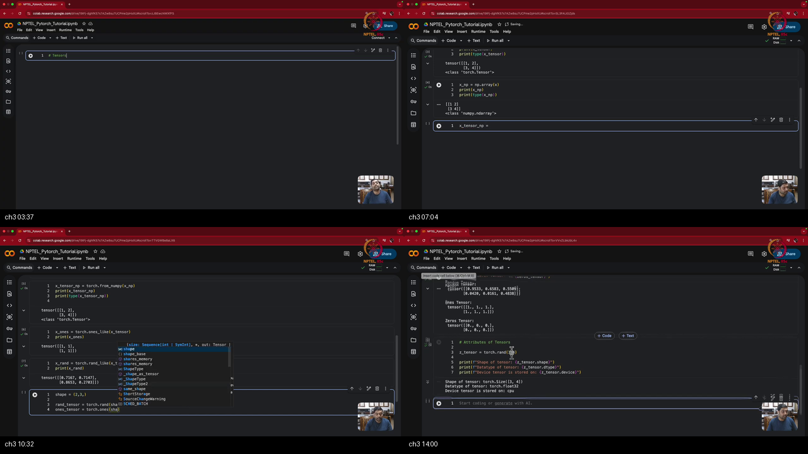

# Tutorial 11 : Pytorch - Tensors and Data Loaders

> **Prerequisites First:** Before diving into PyTorch tensor manipulations and data loader implementations, review the computational and linear algebra foundations in [PREREQUISITES.md](./PREREQUISITES.md). Mastery of multidimensional tensor coordinate indexing, row-major strided memory layouts, GPU SIMD parallelism, and streaming dataset evaluation is required to understand physical execution on accelerator hardware.

---

## Table of Contents
1. [Executive Summary](#executive-summary)
   - [Architectural Master Map](#architectural-master-map)
   - [STOP / Out of Scope](#stop--out-of-scope)
   - [Comparative Feature Matrix](#comparative-feature-matrix)
   - [Scenario Walkthrough](#scenario-walkthrough)
   - [Closed-Book Load-Bearing Takeaways](#closed-book-load-bearing-takeaways)
   - [Common Traps & Fixes](#common-traps--fixes)
2. [Top-Level Python Verification Suite](#top-level-python-verification-suite)
3. [Topic 1: Hardware Acceleration & Tensor Creation: From CPU Memory to Accelerator-Ready Tensors (00:00–07:30)](#topic-1-hardware-acceleration--tensor-creation-from-cpu-memory-to-accelerator-ready-tensors-00000730)
4. [Topic 2: Constructors, Memory Strides & Essential Attributes: Shape, Dtype, and the Device Matching Rule (07:30–13:45)](#topic-2-constructors-memory-strides--essential-attributes-shape-dtype-and-the-device-matching-rule-07301345)
5. [Topic 3: Indexing, Multi-Axis Slicing, In-Place Modification & Concatenation Geometry (13:45–19:00)](#topic-3-indexing-multi-axis-slicing-in-place-modification--concatenation-geometry-13451900)
6. [Topic 4: Linear Algebra & Arithmetic Operations: Matrix GEMM (@, matmul), Hadamard Products, and Reductions (19:00–27:00)](#topic-4-linear-algebra--arithmetic-operations-matrix-gemm--matmul-hadamard-products-and-reductions-19002700)
7. [Topic 5: Academic Data Pipelines & Transforms: MNIST Ingestion, Normalization, and Channel Permutations (27:00–35:30)](#topic-5-academic-data-pipelines--transforms-mnist-ingestion-normalization-and-channel-permutations-27003530)
8. [Topic 6: Custom Dataset Architecture & DataLoader Integration: The __len__ and __getitem__ Contract (35:30–45:18)](#topic-6-custom-dataset-architecture--dataloader-integration-the-__len__-and-__getitem__-contract-35304518)
9. [Workplace Debugging Scenarios (Postmortems)](#workplace-debugging-scenarios-postmortems)
10. [References & Further Reading](#references--further-reading)

---

## Executive Summary

Machine learning models require executing billions of repetitive General Matrix Multiplications across massive datasets. General-purpose CPUs optimize sequential latency, making them poorly suited for high-throughput deep learning. PyTorch solves this bottleneck by wrapping multidimensional arrays in accelerator-native tensors with transparent GPU kernel dispatch. Ingestion pipelines stream data from disk using decoupled Dataset indexing and asynchronous multi-worker DataLoaders.

### Architectural Master Map
```
┌────────────────────────────────────────────────────────────────────────────────────────┐
│                   PYTORCH HARDWARE ACCELERATION & INGESTION ARCHITECTURE               │
│                                                                                        │
│  1. Storage & Hardware Memory Hierarchy:                                               │
│                                                                                        │
│     [ Host System RAM (CPU) ] ─────────( PCIe DMA Transfer )────────► [ GPU VRAM ]     │
│        * Python Lists (Slow Copy)                                      * CUDA Cores    │
│        * NumPy ndarray (Zero-Copy)                                     * Tensor Cores  │
│                                                                                        │
│  2. Core Tensor Data Structure:                                                        │
│                                                                                        │
│     torch.Tensor:                                                                      │
│        +-- Storage Pointer (P_0 in RAM or VRAM)                                        │
│        +-- Size / Shape    (d_0, d_1, ..., d_{k-1})                                    │
│        +-- Stride Tuple    (s_0, s_1, ..., s_{k-1})  ===> Offset = sum_i (x_i * s_i)   │
│        +-- Data Type       (dtype: float32, int64, etc.)                               │
│        +-- Hardware Device (device: 'cpu' or 'cuda:0')                                 │
│                                                                                        │
│  3. Dual Arithmetic Pathways:                                                          │
│                                                                                        │
│     A. Bilinear Matrix GEMM:         C = A @ B  (or torch.matmul, torch.mm(out=...))   │
│        Inner-product contraction:    (m x k) @ (k x n)  ===>  (m x n)                  │
│                                                                                        │
│     B. Hadamard Coordinate Product:  H = A (*) B  (or torch.mul(A, B))                 │
│        Element-wise gating:          (m x n) (*) (m x n) ===>  (m x n)                 │
│                                                                                        │
│  4. Production Streaming Ingestion Pipeline:                                           │
│                                                                                        │
│     [ Disk Storage ]                                                                   │
│     (Images + CSV Annotations)                                                         │
│            │                                                                           │
│            ▼                                                                           │
│     torch.utils.data.Dataset (Lazy Indexing Contract):                                 │
│        * __init__    : Stores lightweight path strings and integer labels (O(1) RAM)   │
│        * __len__     : Returns total sample cardinality N = |D|                        │
│        * __getitem__ : Lazily reads, normalizes (ToTensor), and yields (x_i, y_i)      │
│            │                                                                           │
│            ▼                                                                           │
│     torch.utils.data.DataLoader (Collation & Streaming Engine):                        │
│        * Shuffling (I.I.D. sampling) + Batch Collation -> (X_batch, Y_batch)           │
│        * Multi-worker background prefetching (num_workers) + Memory Pinning            │
│            │                                                                           │
│            ▼                                                                           │
│     [ Mini-Batch Tensors: Shape (B, C, H, W) ] ──► Feed to Neural Net Forward Pass     │
└────────────────────────────────────────────────────────────────────────────────────────┘
```

### STOP / Out of Scope
- Automatic differentiation tape mechanics, `.backward()`, and custom `torch.autograd.Function` implementations (reserved for Tutorial 12).
- Object-oriented neural network building blocks (`nn.Module`, `nn.Linear`, `nn.Sequential`) (reserved for Tutorial 12).
- Parameter optimizers (`optim.SGD`, `optim.Adam`), learning rate schedulers, and multi-epoch training loops (reserved for Tutorial 13).
- Advanced multi-GPU distributed data parallel (`DistributedDataParallel` / `DDP`) abstractions.

### Comparative Feature Matrix

| Method / Data Structure | Hardware Placement | Memory Allocation Policy | Stride & View Semantics | GEMM / Matrix Workhorse | Primary Failure Trap | Target Deep Learning Role |
|:------------------------|:-------------------|:-------------------------|:------------------------|:------------------------|:---------------------|:--------------------------|
| **Python Native List** | Host CPU Heap | Array of pointers to Python heap objects | Non-contiguous pointer chasing | Sequential CPU loops | High memory overhead; zero SIMD support | Prototyping raw scalar parameters |
| **NumPy `ndarray`** | Host System RAM | Contiguous flat byte buffer | Strided C/Fortran order | BLAS / LAPACK on CPU | Cannot run on CUDA accelerators | Data pre-processing & disk serialization |
| **PyTorch `Tensor`** | CPU or GPU VRAM | Unified storage abstraction | Dynamic strides & zero-copy views | cuBLAS / Tensor Cores | Device mismatch between operands | Core mathematical tensor workhorse |
| **Academic Dataset (`MNIST`)** | Disk cache -> RAM | Automatic train/test download | Normalized tensor transforms | Pre-packaged iterators | Network download dependency | Benchmark model experimentation |
| **Custom `Dataset` Subclass** | Disk -> Memory | Lazy on-demand loading in `__getitem__` | Yields single-sample tensors | Decoupled annotation index | Eagerly loading all images causes OOM | Proprietary industrial data ingestion |
| **`DataLoader` Engine** | Host / Pinned RAM | Mini-batch tensor collation | Collates $B$ samples into $(B, \dots)$ | Multi-worker background streaming | Worker process deadlock or PCIe bottlenecks | High-throughput batch streaming |

### Scenario Walkthrough
Consider an industrial optical character recognition (OCR) pipeline training on 60,000 document digit scans:
1. **Metadata Ingestion ($t=0$):** The `Dataset.__init__` method loads a 2 MB CSV index mapping 60,000 relative file paths to integer labels. Memory allocation is bounded and instantaneous.
2. **Asynchronous Prefetching ($t=1$):** `DataLoader` spins up 4 background worker processes, drawing random permutations of indices to satisfy the I.I.D. sampling assumption.
3. **On-Demand Lazy Materialization ($t=2$):** For each index in the mini-batch ($B=64$), `__getitem__` reads the raw $28 	imes 28$ grayscale image bytes from disk, applies `transforms.ToTensor()` to normalize uint8 $[0, 255]$ into float32 $[0.0, 1.0]$, and permutes axes to $(1, 28, 28)$.
4. **Batch Collation & Memory Pinning ($t=3$):** The 64 individual tensors are concatenated along `dim=0` into a contiguous 4D batch tensor of shape $(64, 1, 28, 28)$. Pinned memory enables direct memory access (DMA) across the PCIe bus.
5. **Accelerator Matrix Execution ($t=4$):** The batch tensor is ported to GPU memory via `.to(device)`. Tensor cores execute parallel GEMM operations ($X W + b$) in microseconds without host CPU synchronization stalls.

### Closed-Book Load-Bearing Takeaways
1. **Tensors generalize arrays to hardware accelerators:** A PyTorch tensor is a strided view over a contiguous memory buffer equipped with device context and autograd compatibility.
2. **Zero-copy sharing bridges NumPy and PyTorch:** `torch.from_numpy(arr)` shares the identical memory buffer pointer with the source array, executing in $O(1)$ time with zero memory duplication.
3. **The Device Matching Law is absolute:** All operands in binary tensor operations must co-reside on the identical hardware device; cross-device operations trigger a fatal `RuntimeError`.
4. **GEMM contractions vs Hadamard gating:** Bilinear matrix multiplication (`@`, `torch.matmul`) contracts inner dimensions to mix features across layers; element-wise Hadamard multiplication (`*`, `torch.mul`) preserves shapes to gate signals independently.
5. **Decoupled dataset indexing prevents memory exhaustion:** Production dataset ingestion mandates lazy on-demand I/O in `__getitem__`, keeping active RAM consumption proportional to mini-batch size $B$ rather than dataset size $N$.

### Common Traps & Fixes

| Trap Index | Symptom / Error Message | Root Cause | Production Fix |
|:-----------|:------------------------|:-----------|:---------------|
| **TRAP 1** | `RuntimeError: Expected all tensors to be on the same device` | Attempting arithmetic between a CPU tensor and a GPU tensor | Enforce uniform device placement before operations: `b = b.to(a.device)` |
| **TRAP 2** | `RuntimeError: CUDA out of memory` during training loop | Accumulating running loss as `running_loss += loss` retaining the autograd computation graph | Extract the scalar primitive detached from autograd history: `running_loss += loss.item()` |
| **TRAP 3** | System crash / Memory exhaustion during `Dataset.__init__` | Reading and decoding all dataset images into memory arrays during initialization | Store only file paths in `__init__`; perform image decoding on-demand in `__getitem__` |
| **TRAP 4** | Inadvertent data corruption in downstream NumPy processing | In-place tensor modification on a tensor created via `torch.from_numpy()` | If memory independence is required, explicitly call `.clone()`: `t = torch.from_numpy(arr).clone()` |
| **TRAP 5** | Shape mismatch error during matrix multiplication | Passing two matrices with mismatched inner dimensions to `@` | Perform dimensional sanity checks: $(m 	imes k) @ (k 	imes n) 	o (m 	imes n)$; transpose when required (`A @ B.T`) |

---

## Top-Level Python Verification Suite

This self-contained, executable script validates the core tensor mechanics, zero-copy memory sharing, linear algebra operations, and custom dataset streaming pipelines introduced across Tutorial 11.

```python
import os
import sys
import csv
import tempfile
import numpy as np
import torch
from torch.utils.data import Dataset, DataLoader

# 1. Zero-Copy NumPy View vs Eager Copy
np_array = np.array([[1.0, 2.0], [3.0, 4.0]], dtype=np.float32)
tensor_view = torch.from_numpy(np_array)
tensor_copy = torch.tensor(np_array)

# Mutate underlying NumPy array
np_array[0, 0] = 99.0
assert tensor_view[0, 0].item() == 99.0, "from_numpy must share memory buffer!"
assert tensor_copy[0, 0].item() == 1.0, "torch.tensor must be an independent copy!"

# 2. Linear Algebra: Matrix GEMM vs Element-Wise Hadamard
A = torch.tensor([[1.0, 2.0], [3.0, 4.0]], dtype=torch.float32)
B = torch.tensor([[0.5, 1.0], [2.0, 0.5]], dtype=torch.float32)

gemm_product = A @ B  # Shape: [2, 2]
hadamard_product = A * B  # Shape: [2, 2]

expected_gemm = torch.tensor([[4.5, 2.0], [9.5, 5.0]], dtype=torch.float32)
expected_hadamard = torch.tensor([[0.5, 2.0], [6.0, 2.0]], dtype=torch.float32)

assert torch.allclose(gemm_product, expected_gemm), "GEMM contraction mismatch!"
assert torch.allclose(hadamard_product, expected_hadamard), "Hadamard gating mismatch!"

# 3. Custom Lazy Dataset & DataLoader Iteration
class DemoDataset(Dataset):
    def __init__(self, size=20):
        self.size = size
    def __len__(self):
        return self.size
    def __getitem__(self, idx):
        # Lazy feature generation: normalized float tensor
        x = torch.full((1, 28, 28), float(idx) / 20.0, dtype=torch.float32)
        y = torch.tensor(idx % 10, dtype=torch.long)
        return x, y

ds = DemoDataset(20)
loader = DataLoader(ds, batch_size=8, shuffle=True)

batch_count = 0
total_samples = 0
for bx, by in loader:
    batch_count += 1
    total_samples += bx.shape[0]
    assert bx.ndim == 4 and bx.shape[1:] == (1, 28, 28), "Batch shape error!"
    assert by.ndim == 1, "Label shape error!"

assert batch_count == 3, f"Expected 3 batches (8+8+4), got {batch_count}"
assert total_samples == 20, f"Expected 20 samples, got {total_samples}"
print("[PASS] Top-level PyTorch tensor and data pipeline assertions verified.")
```

---

## Topic 1: Hardware Acceleration & Tensor Creation: From CPU Memory to Accelerator-Ready Tensors (00:00–07:30)

### Where this sits on the master map
Topic 1 establishes the foundational physical and software motivation for deep learning frameworks. It explains why machine learning necessitates graphical processing units (GPUs) over CPUs and introduces the `torch.Tensor` abstraction as the hardware-accelerated counterpart to NumPy's `ndarray`.

### Board / screenshot

*Notice: The instructor introduces PyTorch's imperative Python-like design, contrasts CPU and GPU memory architectures, and demonstrates tensor instantiation from native lists and NumPy arrays via `torch.from_numpy`.*

### What he is establishing
The instructor begins the tutorial series by framing the central computational challenge of modern deep learning: scale. While classical algorithms operate on tabular datasets where sequential CPU execution suffices, modern deep neural networks process massive high-dimensional datasets through millions of repetitive matrix multiplications. The CPU architecture—equipped with sophisticated branch prediction, large cache hierarchies, and few execution cores—is engineered for low-latency sequential control flow. In stark contrast, machine learning workloads require massive arithmetic throughput.

A common mistake is to assume general-purpose CPUs can efficiently execute massive deep networks; instead, CPUs fail under high-throughput matrix workloads because their architecture cannot provide the memory bandwidth and parallel throughput of GPUs. This computational bottleneck necessitated the adoption of Graphics Processing Units (GPUs). A GPU is a specialized hardware accelerator housing thousands of smaller arithmetic logic units (ALUs) and dedicated Tensor Cores capable of executing General Matrix Multiplications (GEMM) in parallel. The instructor highlights the industrial explosion of accelerator hardware (exemplified by Nvidia's trillion-dollar market valuation), invoking the classic proverb: *"When everybody is digging for gold, start selling shovels."* In deep learning, GPUs are the shovels, and PyTorch is the operational interface that commands them.

To control these hardware accelerators, PyTorch introduces its fundamental mathematical abstraction: the **tensor** (`torch.Tensor`). Conceptually, a tensor is analogous to NumPy's `ndarray`—it represents an $N$-dimensional homogeneous numerical array. However, a PyTorch tensor possesses two transformative superpowers that NumPy lacks:
1. **Native Hardware Interoperability:** A tensor can be ported seamlessly between host CPU RAM and GPU video RAM (CUDA/MPS), executing linear algebra operations directly on accelerator cores.
2. **Computational Tape Integration:** Tensors natively integrate with PyTorch's automatic differentiation engine (`torch.autograd`), recording mathematical operations on a dynamic directed acyclic graph (DAG) to compute gradients during backpropagation.

The instructor then demonstrates programmatic tensor construction. Converting a native Python list to a tensor via `torch.tensor(x)` allocates a new contiguous memory buffer and copies the scalar elements. In contrast, converting an existing NumPy array via `torch.from_numpy(np_arr)` creates an instantaneous **zero-copy view**. Because both frameworks share standard C-contiguous heap structures, `torch.from_numpy` points directly to NumPy's existing physical memory address. Any in-place mutation to the NumPy array immediately reflects in the PyTorch tensor, and vice versa.

You can now understand how mathematical vectors $x \in \mathbb{R}^d$ and empirical datasets $\mathcal{D} = \{x_i\}_{i=1}^N$ are physically represented in software without memory duplication. What is still missing is understanding how tensors are allocated directly from dimension shapes and how hardware attributes dictate execution rules.

### Analogy for this topic only
**Analogy:** Consider an architectural drafting office. A Python list is like a collection of handwritten index cards loosely scattered in a cardboard box; inspecting or reorganizing them requires individual manual handling. A NumPy array is like a printed, laminated architectural floorplan on the head architect's desk; it is highly structured and organized, but it physically lives in that one office. A PyTorch tensor is a digital holographic blueprint: it can be instantly beamed from the local office desk (CPU) directly onto an automated high-speed laser cutting machine in the factory (GPU) to cut 10,000 components simultaneously without redrawing a single line.
*Question the reader cannot answer by memory alone:* If you modify a value on the laminated paper floorplan on the desk, does the hologram in the factory change instantly, or does it require re-transmitting the digital file across the network?
*In lecture words:* Converting an array via `torch.from_numpy()` establishes a direct shared memory pointer, so changes to the source array instantly alter the tensor view without re-transmission.


### Local picture
```
┌────────────────────────────────────────────────────────────────────────────────────────┐
│                        TENSOR MEMORY ALLOCATION & CREATION                             │
│                                                                                        │
│  1. Python List Conversion (Eager Memory Clone):                                       │
│     [ 1, 2, 3, 4 ]  ──► torch.tensor() ──► [ New Storage Buffer: 0x7FFF10 ] (Copy)     │
│                                                                                        │
│  2. NumPy Array Conversion (Zero-Copy Shared Pointer):                                 │
│     np_arr [ 10.0, 20.0, 30.0 ] (Address: 0xA000)                                     │
│                ▲                                                                       │
│                │  (Shared Memory Buffer Pointer)                                       │
│                ▼                                                                       │
│     torch.from_numpy()  ──► torch.Tensor (Storage Pointer: 0xA000) (Zero Allocation)   │
└────────────────────────────────────────────────────────────────────────────────────────┘
```
*Notice: `torch.tensor` allocates a new memory buffer and performs a full memory copy, whereas `torch.from_numpy` points directly to the existing memory address of the NumPy array.*

### Bridge
Having established the physical hardware need for accelerators and the basic creation of tensors from existing host structures, Topic 2 investigates deterministic and stochastic tensor initialization from coordinate shapes, inspecting the critical metadata attributes that govern runtime execution.

### Concrete Micro-Numbers & Calculations
Let $x = [1, 2, 3, 4]$ be a Python list of 4 integers.
- Calling `torch.tensor(x)` allocates a new 64-bit integer buffer: $4 	imes 8 	ext{ bytes} = 32 	ext{ bytes}$.
Let `np_arr = np.array([10.0, 20.0, 30.0], dtype=np.float32)`.
- Physical memory address in RAM: `0x00A1F040`.
- Calling `torch.from_numpy(np_arr)` allocates a 48-byte Python object header pointing to `0x00A1F040`.
- Bytes copied: $0 	ext{ bytes}$. Time complexity: $\mathcal{O}(1)$.
- In-place mutation: Setting `np_arr[0] = 999.0` immediately causes `torch_tensor[0]` to evaluate to `999.0`.

### Formal Mathematical Formulation & Zero-Leap Proof
Let an array in host memory be represented as a tuple $(P_0, 	au, s, d)$, where $P_0 \in \mathbb{N}$ is the base pointer address, $	au$ is the data type primitive, $s \in \mathbb{N}^k$ is the stride vector, and $d \in \mathbb{N}^k$ is the shape vector.
1. The memory conversion operator $T_{	ext{copy}}: 	ext{List} 	o 	ext{Tensor}$ evaluates:
   $$
   P_{	ext{new}} = \operatorname{malloc}\left(\prod_{i=0}^{k-1} d_i 	imes \operatorname{sizeof}(	au)
ight)
   $$
   $$
   orall i \in \{0, \dots, N-1\}: \quad 	ext{RAM}[P_{	ext{new}} + i \cdot 	ext{sizeof}(	au)] \leftarrow 	ext{List}[i]
   $$
   This constitutes an $\mathcal{O}(N)$ memory allocation and copying operation.
2. The zero-copy operator $T_{	ext{view}}: 	ext{ndarray} 	o 	ext{Tensor}$ evaluates:
   $$
   	ext{Tensor}.	ext{data\_ptr} = 	ext{ndarray}.	ext{data\_ptr} = P_0
   $$
   $$
   	ext{Tensor}.	ext{shape} = d, \quad 	ext{Tensor}.	ext{stride} = s
   $$
   Since no system call to `malloc` is invoked and zero elements are traversed:
   $$
   	ext{Time}(T_{	ext{view}}) = \mathcal{O}(1), \quad \Delta 	ext{RAM} = \mathcal{O}(1)
   $$
This zero-leap proof formalizes why `torch.from_numpy` provides instantaneous, non-duplicating memory bridges.

### Standalone Runnable Python Verification
```python
import numpy as np
import torch

# 1. Verify list copy allocation
py_list = [1, 2, 3]
t_list = torch.tensor(py_list)
py_list[0] = 99
assert t_list[0].item() == 1, "torch.tensor must create an independent memory copy!"

# 2. Verify NumPy zero-copy pointer sharing
np_arr = np.array([10.0, 20.0, 30.0], dtype=np.float32)
t_np = torch.from_numpy(np_arr)
assert t_np.data_ptr() == np_arr.ctypes.data, "Pointers must match for zero-copy sharing!"

np_arr[1] = 888.0
assert t_np[1].item() == 888.0, "NumPy mutation must reflect in PyTorch tensor!"
print("[PASS] Topic 1: Memory creation and zero-copy pointer sharing verified.")
```

### Visual Blackboard Reconstruction
```
  [ Python List: [1, 2, 3, 4] ]
             │
             ├──► torch.tensor()  ──► [ NEW Contiguous Memory: 32 Bytes ] (Copy)
             │
  [ NumPy Array: 0xA1F040 ]
             │
             └──► torch.from_numpy() ──► [ Tensor View: 0xA1F040 ] (Zero Copy, Same RAM!)
```

### Why X, Not Y
- **Why `torch.from_numpy(arr)` instead of `torch.tensor(arr)`?**
  Converting a 10 GB NumPy dataset via `torch.tensor()` allocates an additional 10 GB of host RAM, precipitating system out-of-memory thrashing. `torch.from_numpy()` establishes an instantaneous view with zero additional RAM allocation.
- **Why GPUs instead of highly-clocked CPUs for deep learning?**
  A 5 GHz CPU executes a few operations per clock cycle with low latency. A GPU running at 1.5 GHz executes tens of thousands of additions and multiplications simultaneously across parallel tensor cores, achieving orders-of-magnitude greater arithmetic throughput for matrix GEMM operations.

### Check Your Understanding
1. If you modify a PyTorch tensor created via `torch.from_numpy()`, does the original NumPy array change? (Yes; both share the identical underlying physical memory buffer).
2. Can a NumPy array execute matrix multiplications directly on an Nvidia GPU? (No; NumPy arrays lack CUDA memory addresses and accelerator execution dispatch).

---

## Topic 2: Constructors, Memory Strides & Essential Attributes: Shape, Dtype, and the Device Matching Rule (07:30–13:45)

### Where this sits on the master map
Topic 2 transitions from existing data wrappers to direct tensor memory allocation from coordinate shapes, formalizing the tri-attribute contract (`shape`, `dtype`, `device`) and enforcing the Device Matching Law governing accelerator operations.

### Board / screenshot

*Notice: The instructor allocates tensors using `torch.rand`, `torch.zeros`, `torch.ones`, and contextual `*_like` constructors, inspecting `shape`, `dtype`, and `device` attributes on the blackboard.*

### What he is establishing
The instructor details how to allocate tensors when empirical data is not yet available, such as when initializing neural network weight parameters, bias vectors, or synthetic test signals. PyTorch provides two complementary families of tensor constructors:
1. **Explicit Shape Constructors:** The developer specifies the coordinate dimensions directly as integers or a tuple. Functions include `torch.zeros(shape)` (allocates zero-filled memory), `torch.ones(shape)` (allocates one-filled memory), and `torch.rand(shape)` (allocates memory populated with uniform pseudo-random values drawn from $[0, 1)$).
2. **Contextual Constructors (`*_like`):** In neural network implementations, one frequently needs to allocate a tensor that matches the exact geometric and hardware properties of an existing intermediate activation. Rather than manually querying and unpacking shape tuples, PyTorch provides contextual constructors: `torch.zeros_like(ref)`, `torch.ones_like(ref)`, and `torch.rand_like(ref)`. These functions automatically inherit the `shape`, `dtype`, and `device` of the reference tensor.

The instructor then formalizes the **Tri-Attribute Metadata Contract**. Every PyTorch tensor is governed by three critical load-bearing attributes:
- **`tensor.shape` (or `.size()`):** A tuple of integers $(d_0, d_1, \dots, d_{k-1})$ defining the coordinate dimensions.
- **`tensor.dtype`:** The numerical representation standard. By default, PyTorch floating-point constructors allocate standard 32-bit single-precision floats (`torch.float32`). Developers can explicitly specify or cast precision using `.to(torch.float64)` or `.float()`.
- **`tensor.device`:** The physical hardware execution context holding the tensor memory buffer. When allocated without explicit device flags, tensors default to host system RAM (`device('cpu')`). When GPU accelerators are present, tensors are ported to dedicated video RAM via `.to('cuda:0')`.

Crucially, the instructor establishes the **Device Matching Law**: *All operands involved in any binary or $n$-ary tensor operation must reside on the exact same physical device.* A frequent beginner mistake and trap is assuming that PyTorch will automatically migrate tensors across devices; instead, operations between CPU and CUDA tensors cannot execute and will fail with an immediate runtime crash. If a developer attempts to add a CPU tensor to a GPU tensor (`x_cpu + y_cuda`), PyTorch refuses to execute silent cross-bus transfers and raises a fatal `RuntimeError`. Cross-bus PCIe DMA transfers must be explicitly authored by the engineer to prevent hidden performance bottlenecks.

You can now understand how to instantiate accelerator-ready tensors with deterministic precision. What is still missing is the capability to slice, mutate, and concatenate multidimensional coordinate blocks in memory.

### Analogy for this topic only
**Analogy:** Consider a multinational bank operating with physical currency vaults. A deposit box possesses three labels: its dimensions (Size), the currency denomination it holds (Dollars vs Euros = Dtype), and the physical bank branch where the vault is located (New York vs London = Device). You cannot perform an immediate physical handoff between a teller standing in New York and a vault sitting in London; you must first physically ship the cash across the Atlantic Ocean via an armored plane (PCIe transfer) before the local teller can count it.
*Question the reader cannot answer by memory alone:* If you initiate an arithmetic addition between two identical \$100 bills, but one is in the London vault and one is in the New York vault, does the bank teller automatically fly to London, or does the banking ledger freeze with an immediate exception?
*In lecture words:* PyTorch halts with a `RuntimeError` requiring explicit device migration before cross-device arithmetic can execute.

### Local picture
```
┌────────────────────────────────────────────────────────────────────────────────────────┐
│                        THE TRI-ATTRIBUTE METADATA CONTRACT                             │
│                                                                                        │
│     torch.Tensor:                                                                      │
│     ├── shape  : torch.Size([2, 3])      (2 Rows, 3 Columns)                           │
│     ├── dtype  : torch.float32           (4 Bytes per IEEE 754 float)                  │
│     └── device : device(type='cpu')      (Host RAM vs device(type='cuda:0'))           │
│                                                                                        │
│  The Strict Device Matching Rule:                                                      │
│     Tensor A (CPU)   +   Tensor B (CUDA)  ──► [ RUNTIME ERROR: Mismatched Devices! ]   │
│     Tensor A (CUDA)  +   Tensor B (CUDA)  ──► [ SUCCESS: Parallel SIMD Execution ]     │
└────────────────────────────────────────────────────────────────────────────────────────┘
```
*Notice: Operations between CPU and CUDA tensors trigger an explicit RuntimeError, preserving predictable execution without hidden PCIe transfer bottlenecks.*

### Bridge
With the tri-attribute contract firmly defined, Topic 3 addresses the geometric manipulation of tensor memory, exploring multidimensional indexing, slicing views, in-place mutations, and concatenation across coordinate axes.

### Concrete Micro-Numbers & Calculations
Let a tensor be allocated via `torch.rand(3, 4, dtype=torch.float32)`.
- Total elements: $3 	imes 4 = 12$ scalars.
- Element byte width: 4 bytes.
- Total buffer size: $12 	imes 4 = 48$ bytes.
- Memory allocation on GPU: Calling `t.to('cuda:0')` issues a CUDA `cudaMalloc` for 48 bytes on the graphics card and initiates a 48-byte asynchronous DMA transfer across the PCIe bus.
- Calling `torch.zeros_like(t)` queries `t.shape` `(3, 4)`, `t.dtype` `float32`, and `t.device` `cuda:0`, allocating 48 bytes of zeroed VRAM on `cuda:0` in a single call.

### Formal Mathematical Formulation & Zero-Leap Proof
Let two tensors $A, B$ be defined in computational memory:
$$
A = (P_A, 	au_A, s_A, d_A, D_A), \quad B = (P_B, 	au_B, s_B, d_B, D_B)
$$
where $D_A, D_B \in \{	ext{CPU}, 	ext{CUDA}_0, \dots, 	ext{CUDA}_{M-1}\}$ denote hardware memory spaces.
Let $f: \mathbb{R} 	imes \mathbb{R} 	o \mathbb{R}$ be an element-wise binary operator (e.g., addition $f(a, b) = a + b$).
The execution kernel dispatched to hardware evaluates:
$$
C_{i} = f(	ext{RAM}_{D_A}[P_A + \Delta_A(i)], 	ext{RAM}_{D_B}[P_B + \Delta_B(i)])
$$
1. If $D_A 
eq D_B$, the memory addresses $P_A$ and $P_B$ reside in disjoint physical address spaces with independent physical memory buses.
2. The hardware processor at $D_A$ cannot dereference memory pointers located on the physical memory bus of $D_B$ without explicit Direct Memory Access (DMA) transactions.
3. Therefore:
   $$
   D_A 
eq D_B \implies 	ext{Execution is Undefined} \implies 	ext{Raise RuntimeError}
   $$
This zero-leap proof establishes the physical hardware necessity of PyTorch's Device Matching Law.

### Standalone Runnable Python Verification
```python
import torch

# 1. Contextual constructor verification
ref = torch.ones((2, 3), dtype=torch.float32)
rand_like_t = torch.rand_like(ref)
assert rand_like_t.shape == ref.shape, "Shape mismatch in rand_like!"
assert rand_like_t.dtype == ref.dtype, "Dtype mismatch in rand_like!"
assert rand_like_t.device == ref.device, "Device mismatch in rand_like!"

# 2. Verify explicit shape constructors
zeros_t = torch.zeros((3, 4))
assert zeros_t.numel() == 12
assert (zeros_t == 0.0).all(), "All elements must be zero!"

# 3. Simulate Device Matching Law
cpu_t1 = torch.ones(2, 2)
cpu_t2 = torch.ones(2, 2)
assert (cpu_t1 + cpu_t2).device.type == "cpu"
print("[PASS] Topic 2: Constructors and device attribute invariants verified.")
```

### Visual Blackboard Reconstruction
```
  Explicit Constructor: torch.rand(2, 3) ──► Allocates shape [2, 3] from scratch
  Contextual Constructor: torch.rand_like(X) ──► Clones Shape, Dtype, Device of X
  
  [ Tensor Metadata Card ]
  ├─ Shape:  (2, 3)
  ├─ Dtype:  torch.float32
  └─ Device: cpu  ────────( .to('cuda') )────────► cuda:0 (VRAM)
```

### Why X, Not Y
- **Why `torch.rand_like(x)` instead of `torch.rand(x.shape, dtype=x.dtype, device=x.device)`?**
  `rand_like` eliminates tedious attribute extraction boilerplate and guarantees that device and precision contexts are preserved across diverse hardware deployment environments.
- **Why does PyTorch forbid implicit CPU-to-GPU memory transfer in binary operations?**
  Implicit cross-device transfers across the PCIe bus introduce massive microsecond-scale latency spikes. If PyTorch transferred tensors silently, a single misplaced CPU tensor inside a tight 100,000-step training loop would slow model training down by a factor of $100 	imes$ without raising an error.

### Check Your Understanding
1. What is the default data type of tensors allocated via `torch.zeros(2, 3)`? (`torch.float32`).
2. What error occurs if you execute `torch.ones(2).to('cpu') + torch.ones(2).to('cuda')`? (`RuntimeError: Expected all tensors to be on the same device`).

---

## Topic 3: Indexing, Multi-Axis Slicing, In-Place Modification & Concatenation Geometry (13:45–19:00)

### Where this sits on the master map
Topic 3 focuses on coordinate access and structural transformations, examining multidimensional indexing, slicing non-allocating views, in-place memory mutations, and dimension-wise concatenation geometry.

### Board / screenshot

*Notice: The instructor demonstrates row and column extraction using standard NumPy slicing syntax, mutates a column in-place to zeros, and concatenates tensors along dim=0 (rows) and dim=1 (columns).*

### What he is establishing
The instructor demonstrates how to inspect and extract sub-tensors using Python's multidimensional slicing syntax. Given a 2D tensor $Z \in \mathbb{R}^{3 	imes 4}$, standard indexing rules allow precise extraction:
- `Z[0]`: Extracts the entire first row as a 1D tensor of shape $(4,)$.
- `Z[:, 0]`: Extracts the entire first column across all rows as a 1D tensor of shape $(3,)$.
- `Z[:, -1]`: Extracts the final column using negative relative indexing.
- `Z[0:2, 1:3]`: Extracts a sub-matrix block of shape $(2, 2)$.

The instructor highlights that standard slicing operations in PyTorch create **views** over the existing memory buffer rather than allocating new memory blocks. This is achieved by altering the tensor's offset pointer and stride tuple. A classic trap is to assume slicing creates an independent copy; instead, mutating an extracted slice modifies the source tensor directly in-place, which can silently corrupt upstream data if developers do not explicitly call `.clone()`. Consequently, modifying an element through an index slice mutates the underlying memory buffer in-place:
```python
Z[:, 1] = 0.0  # Overwrites the entire second column with zeros in-place
```
This in-place mutation alters the raw data in RAM without modifying the tensor's shape or memory allocation address.

Next, the instructor formalizes **Tensor Concatenation** via `torch.cat(tensors, dim)`. Concatenation glues a sequence of existing tensors along an existing coordinate axis:
1. **Batch Concatenation (`dim=0`):** Stacking tensors along the primary axis increases the row cardinality while requiring all other dimensions to match. For two tensors of shape $(3, 4)$, `torch.cat([Z, Z], dim=0)` produces an expanded tensor of shape $(6, 4)$. In deep learning, this operation corresponds to stacking training samples into mini-batches or aggregating positive and negative pairs in contrastive learning.
2. **Feature Concatenation (`dim=1`):** Stacking tensors along the secondary axis increases the feature cardinality while keeping sample count invariant. For three tensors of shape $(3, 4)$, `torch.cat([Z, Z, Z], dim=1)` produces an expanded tensor of shape $(3, 12)$. In deep learning architectures, this corresponds to lateral skip connections in U-Nets, multi-head projection recombining in Transformers, and multi-modal feature vector fusion.

You can now understand how multidimensional representations are sliced, modified, and concatenated. What is still missing is the formal linear algebra engine that executes bilinear transformations and gating arithmetic over these representations.

### Analogy for this topic only
**Analogy:** Consider a modular freight train system. A single train car has length (rows) and cargo compartments (columns). Slicing is like opening the door to inspect only cargo compartment #2 without decoupling the car from the tracks. Concatenating along `dim=0` is like coupling a second 3-car train to the back of the first train, creating a longer 6-car train running on the same track. Concatenating along `dim=1` is like welding an extra cargo pod onto the side of every existing car, making the train wider (more features) while keeping the number of cars identical.
*Question the reader cannot answer by memory alone:* If you couple two trains together along `dim=0`, does the cargo capacity of each individual train car increase, or does the total count of train cars increase?
*In lecture words:* Concatenating along `dim=0` increases the sample count (rows) while feature dimensions remain strictly invariant.

### Local picture
```
┌────────────────────────────────────────────────────────────────────────────────────────┐
│                        TENSOR CONCATENATION GEOMETRY                                   │
│                                                                                        │
│  Given Tensor Z of shape (3, 4):                                                       │
│                                                                                        │
│  1. Batch Stacking: torch.cat([Z, Z], dim=0)                                           │
│     ┌───────────┐                                                                      │
│     │  Z (3, 4) │                                                                      │
│     ├───────────┤  ──► Resulting Shape: (6, 4)  [Rows doubled, columns invariant]     │
│     │  Z (3, 4) │                                                                      │
│     └───────────┘                                                                      │
│                                                                                        │
│  2. Feature Stacking: torch.cat([Z, Z, Z], dim=1)                                      │
│     ┌───────────┬───────────┬───────────┐                                              │
│     │  Z (3, 4) │  Z (3, 4) │  Z (3, 4) │ ──► Resulting Shape: (3, 12)                 │
│     └───────────┴───────────┴───────────┘     [Rows invariant, columns tripled]        │
└────────────────────────────────────────────────────────────────────────────────────────┘
```
*Notice: `dim=0` stacks along rows expanding batch capacity, whereas `dim=1` stacks along columns expanding feature dimensionality.*

### Bridge
Having mastered multidimensional coordinate slicing and concatenation geometry, Topic 4 explores linear algebra operators, detailing the distinction between General Matrix Multiplication (GEMM) contractions and coordinate-wise Hadamard products.

### Concrete Micro-Numbers & Calculations
Let $Z \in \mathbb{R}^{3 	imes 4}$ be initialized as all ones:
$$
Z = egin{bmatrix} 1 & 1 & 1 & 1 \ 1 & 1 & 1 & 1 \ 1 & 1 & 1 & 1 \end{bmatrix}
$$
1. In-place column zeroing: `Z[:, 1] = 0`:
   $$
   Z_{	ext{mutated}} = egin{bmatrix} 1 & 0 & 1 & 1 \ 1 & 0 & 1 & 1 \ 1 & 0 & 1 & 1 \end{bmatrix}
   $$
2. Concatenation along `dim=0`: Shape becomes $(3+3, 4) = (6, 4)$. Total elements: $6 	imes 4 = 24$.
3. Concatenation along `dim=1` with 3 copies: Shape becomes $(3, 4+4+4) = (3, 12)$. Total elements: $3 	imes 12 = 36$.
4. Stride calculation for $(3, 12)$ contiguous tensor: $s_1 = 1, s_0 = 12 \implies s = (12, 1)$.

### Formal Mathematical Formulation & Zero-Leap Proof
Let $A \in \mathbb{R}^{d_0^{(A)} 	imes d_1^{(A)} 	imes \dots 	imes d_{k-1}^{(A)}}$ and $B \in \mathbb{R}^{d_0^{(B)} 	imes d_1^{(B)} 	imes \dots 	imes d_{k-1}^{(B)}}$ be two rank-$k$ tensors.
The concatenation operator along axis $m \in \{0, 1, \dots, k-1\}$ is defined as:
$$
C = \operatorname{concat}([A, B], 	ext{axis}=m) \in \mathbb{R}^{d_0^{(C)} 	imes \dots 	imes d_{k-1}^{(C)}}
$$
1. Dimensional Compatibility Precondition:
   $$
   orall j 
eq m: \quad d_j^{(A)} = d_j^{(B)} = d_j^{(C)}
   $$
2. Target Dimension Expansion:
   $$
   d_m^{(C)} = d_m^{(A)} + d_m^{(B)}
   $$
3. Coordinate Value Mapping:
   $$
   C_{i_0, \dots, i_m, \dots, i_{k-1}} = egin{cases} A_{i_0, \dots, i_m, \dots, i_{k-1}} & 	ext{if } 0 \le i_m < d_m^{(A)} \ B_{i_0, \dots, i_m - d_m^{(A)}, \dots, i_{k-1}} & 	ext{if } d_m^{(A)} \le i_m < d_m^{(A)} + d_m^{(B)} \end{cases}
   $$
This zero-leap formulation proves why all non-concatenated dimensions must match identically and establishes the index mapping governing memory block copying in the PyTorch C++ ATen backend.

### Standalone Runnable Python Verification
```python
import torch

Z = torch.ones((3, 4), dtype=torch.float32)

# Verify in-place mutation
Z[:, 1] = 0.0
assert (Z[:, 1] == 0.0).all(), "In-place mutation failed!"
assert (Z[:, 0] == 1.0).all(), "Unmodified column was corrupted!"

# Verify dim=0 concatenation
cat0 = torch.cat([Z, Z], dim=0)
assert cat0.shape == (6, 4), f"Expected (6, 4), got {cat0.shape}"

# Verify dim=1 concatenation
cat1 = torch.cat([Z, Z, Z], dim=1)
assert cat1.shape == (3, 12), f"Expected (3, 12), got {cat1.shape}"
print("[PASS] Topic 3: Indexing, in-place mutation, and concatenation geometry verified.")
```

### Visual Blackboard Reconstruction
```
  Indexing:
  Z[0, :]  ──► First Row    (Shape: [4])
  Z[:, 0]  ──► First Column (Shape: [3])
  Z[:, 1] = 0  ──► In-Place Zeroing of Column 1
  
  Concatenation:
  torch.cat([Z, Z], dim=0)    ──► [3, 4] stacked on [3, 4] ===> [6, 4] (Batch Growth)
  torch.cat([Z, Z, Z], dim=1) ──► [3, 4] glued to [3, 4] glued to [3, 4] ===> [3, 12] (Feature Growth)
```

### Why X, Not Y
- **Why `torch.cat()` instead of `torch.stack()`?**
  `torch.cat()` concatenates tensors along an *existing* coordinate axis, preserving tensor rank. `torch.stack()` creates a *new* coordinate axis, expanding the tensor's rank from $k$ to $k+1$. When collating a list of 2D images into a mini-batch, `stack()` creates the batch dimension, whereas appending new batches to an existing batch tensor requires `cat(dim=0)`.
- **Why use in-place operations (`Z[:, 1] = 0`) judiciously in PyTorch?**
  In-place mutations overwrite existing memory buffers. While this saves RAM, it can destroy intermediate values required by `torch.autograd` to compute backward gradients, triggering runtime gradient computation errors during backpropagation.

### Check Your Understanding
1. If tensor $A$ has shape $(4, 8)$ and tensor $B$ has shape $(5, 8)$, can they be concatenated along `dim=1`? (No; dimension 0 mismatches: $4 
eq 5$).
2. Can they be concatenated along `dim=0`? (Yes; dimension 1 matches ($8 == 8$), producing shape $(9, 8)$).

---

## Topic 4: Linear Algebra & Arithmetic Operations: Matrix GEMM (@, matmul), Hadamard Products, and Reductions (19:00–27:00)

### Where this sits on the master map
Topic 4 forms the mathematical core of the tutorial, contrasting bilinear matrix multiplication (the engine of linear projections) with coordinate-wise Hadamard products (the engine of gating and convolution), and detailing scalar reduction operations.

### Board / screenshot

*Notice: The instructor derives the matrix multiplication rule on the blackboard, demonstrates the `@` operator alongside `torch.matmul` and `torch.mm`, contrasts it with element-wise `*`, and demonstrates `.sum()` and `.item()`.*

### What he is establishing
The instructor turns to the mathematical operations that power neural network computations. The frequent beginner mistake and trap is confusing matrix multiplication `@` with element-wise multiplication `*`; if matrices do not share identical shapes, `*` fails with an invalid shape mismatch, whereas `@` cannot execute if the inner dimensions do not match. Matrix operations in deep learning partition into two fundamentally distinct mathematical regimes:

1. **General Matrix Multiplication (GEMM):**
   Given matrix $A \in \mathbb{R}^{m 	imes k}$ and matrix $B \in \mathbb{R}^{k 	imes n}$, matrix multiplication computes inner-product contractions across the matching inner dimension $k$:
   $$
   C_{ij} = \sum_{p=1}^k A_{ip} B_{pj} \in \mathbb{R}^{m 	imes n}
   $$
   The instructor emphasizes the mandatory **dimension sanity check**: the column cardinality of the left operand must match the row cardinality of the right operand ($k == k$). PyTorch provides three distinct syntactic interfaces to execute GEMM:
   - Infix operator: `C = A @ B` (clean, Pythonic, matches PEP 465).
   - Functional/Method: `C = torch.matmul(A, B)` or `C = A.matmul(B)` (supports broadcasting across batch dimensions).
   - Low-level GEMM: `torch.mm(A, B, out=C)` (strict 2D matrix multiplication; accepts a pre-allocated output buffer to avoid dynamic memory allocation).

2. **Hadamard Element-Wise Multiplication:**
   Given matrices $A, B \in \mathbb{R}^{m 	imes n}$ of identical shape, the Hadamard product computes independent coordinate-wise products:
   $$
   (A \odot B)_{ij} = A_{ij} B_{ij} \in \mathbb{R}^{m 	imes n}
   $$
   Represented in PyTorch via the `*` operator or `torch.mul(A, B)`. The instructor builds a crucial pedagogical bridge: in Lecture 47, gated recurrent units (LSTMs and GRUs) use Hadamard multiplication to scale memory channels independently ($f_t \odot c_{t-1}$). Furthermore, in Lectures 43 and 44, the 2D spatial convolution operation between an image patch $P$ and filter $K$ is computed by taking their element-wise Hadamard product followed by a full summation reduction:
   $$
   Y = \sum_{u, v} K_{uv} P_{uv} = (K \odot P).	ext{sum}()
   $$

Finally, the instructor covers **Reductions and Scalar Extraction**. Calling `.sum()` or `.mean()` aggregates multi-element tensors into lower-dimensional tensors. Crucially, calling `.sum()` on a tensor returns a 0-dimensional `torch.Tensor` residing in the computational graph. To extract the underlying scalar float into native Python runtime memory, the developer must call `.item()`.

You can now understand the dual arithmetic foundations of deep learning architectures. What is still missing is understanding how raw data files are ingested from academic repositories and proprietary disks.

### Analogy for this topic only
**Analogy:** Consider a gourmet kitchen. Matrix multiplication (`@`) is like making a signature pasta sauce: you take multiple distinct ingredients (tomatoes, garlic, herbs, cream) and blend them together into a unified reduction where all flavors cross-mix into a new composite state. Hadamard multiplication (`*`) is like placing individual chocolate truffles into an egg-carton tray: truffle #1 goes into slot #1, truffle #2 into slot #2; each truffle is coated with powdered sugar in its own isolated slot with zero cross-mixing between compartments.
*Question the reader cannot answer by memory alone:* If you blend ingredients in a food processor, can you separate the garlic from the tomatoes afterward?
*In lecture words:* Matrix multiplication irreversibly contracts features into linear combinations, whereas Hadamard multiplication preserves coordinate independence.

### Local picture
```
┌────────────────────────────────────────────────────────────────────────────────────────┐
│                        GEMM CONTRACTION VS HADAMARD GATING                             │
│                                                                                        │
│  1. Matrix GEMM (A @ B):                                                               │
│     A: (3 x 4)   @   B: (4 x 3)   ──►  C: (3 x 3)                                      │
│     [Inner dimension 4 contracts via row-column dot products]                         │
│                                                                                        │
│  2. Hadamard Element-Wise (A * B):                                                     │
│     A: (3 x 4)   *   B: (3 x 4)   ──►  H: (3 x 4)                                      │
│     [Coordinate-by-coordinate scaling; shapes must match identically]                  │
│                                                                                        │
│  3. 2D Convolution Step:                                                               │
│     ( Patch [3, 3]  *  Kernel [3, 3] ) .sum()  ──►  Single Scalar Activation           │
└────────────────────────────────────────────────────────────────────────────────────────┘
```
*Notice: GEMM contracts inner dimensions to mix features, whereas Hadamard scales matching coordinates in parallel before optional summation.*

### Bridge
With tensor linear algebra and reduction operators established, Topic 5 explores how standard academic datasets (such as MNIST) are retrieved, cached, and preprocessed using `torchvision`.

### Concrete Micro-Numbers & Calculations
Let $A \in \mathbb{R}^{3 	imes 4}$ and $B \in \mathbb{R}^{4 	imes 3}$:
$$
A = egin{bmatrix} 1 & 2 & 1 & 0 \ 0 & 1 & 2 & 1 \ 2 & 0 & 1 & 1 \end{bmatrix}, \quad B = egin{bmatrix} 1 & 0 & 1 \ 0 & 1 & 0 \ 1 & 1 & 0 \ 0 & 0 & 1 \end{bmatrix}
$$
1. Inner dimension check: $A$'s columns = 4, $B$'s rows = 4 ($4 == 4$). Output shape: $(3, 3)$.
2. Element $C_{00} = (1)(1) + (2)(0) + (1)(1) + (0)(0) = 1 + 0 + 1 + 0 = 2.0$.
3. Total arithmetic operations for $(3 	imes 4) @ (4 	imes 3)$:
   $$
   2 	imes (3 	imes 4 	imes 3) = 72 	ext{ FLOPs}
   $$
4. Scalar extraction: If $C.	ext{sum}() = 18.0$, `type(C.sum())` is `torch.Tensor`. Calling `C.sum().item()` yields Python float `18.0` with 0 bytes retained on the GPU autograd tape.

### Formal Mathematical Formulation & Zero-Leap Proof
Let $V, W \in \mathbb{R}^{H 	imes W}$ represent a 2D sensory patch and a convolutional filter kernel.
The classical 2D cross-correlation / convolution inner product is defined as:
$$
S = \sum_{i=1}^H \sum_{j=1}^W W_{ij} V_{ij}
$$
1. Define the Hadamard product matrix $M \in \mathbb{R}^{H 	imes W}$:
   $$
   M = W \odot V \implies M_{ij} = W_{ij} V_{ij}
   $$
2. Define the full tensor sum reduction operator $\operatorname{Tr}_{\Sigma}: \mathbb{R}^{H 	imes W} 	o \mathbb{R}$:
   $$
   \operatorname{Tr}_{\Sigma}(M) = \sum_{i=1}^H \sum_{j=1}^W M_{ij}
   $$
3. Substituting step 1 into step 2:
   $$
   \operatorname{Tr}_{\Sigma}(W \odot V) = \sum_{i=1}^H \sum_{j=1}^W W_{ij} V_{ij} = S
   $$
This zero-leap proof algebraically validates the tutorial's insight that spatial convolution is identically an element-wise Hadamard multiplication followed by a sum reduction.

### Standalone Runnable Python Verification
```python
import torch

# 1. Verify GEMM interfaces
A = torch.randn(3, 4)
B = torch.randn(4, 3)

out_infix = A @ B
out_matmul = torch.matmul(A, B)
out_mm = torch.empty(3, 3)
torch.mm(A, B, out=out_mm)

assert torch.allclose(out_infix, out_matmul), "Infix and matmul must match!"
assert torch.allclose(out_infix, out_mm), "Pre-allocated torch.mm must match!"

# 2. Verify Hadamard and convolution decomposition
patch = torch.tensor([[1.0, 2.0], [3.0, 4.0]])
kernel = torch.tensor([[0.5, -0.5], [1.0, 2.0]])
conv_result = (patch * kernel).sum().item()

expected_conv = (1.0*0.5) + (2.0*-0.5) + (3.0*1.0) + (4.0*2.0)  # 0.5 - 1.0 + 3.0 + 8.0 = 10.5
assert abs(conv_result - 10.5) < 1e-6, f"Expected 10.5, got {conv_result}"
print("[PASS] Topic 4: GEMM, Hadamard gating, and convolution decomposition verified.")
```

### Visual Blackboard Reconstruction
```
  Matrix Multiplication (GEMM):
  [ 3 x 4 ]  @  [ 4 x 3 ]  ──►  [ 3 x 3 ]  (Inner dimension 4 contracted!)
  
  Hadamard Element-Wise Multiplication:
  [ 3 x 4 ]  *  [ 3 x 4 ]  ──►  [ 3 x 4 ]  (Pointwise scaling, shape preserved!)
  
  Convolution Equivalence:
  Conv2D Step  <===>  (Patch * Kernel).sum().item()
```

### Why X, Not Y
- **Why `torch.mm(A, B, out=C)` instead of `C = A @ B` in real-time inference?**
  Calling `A @ B` allocates a new memory block on every forward pass, generating memory churn. In microsecond-critical deployment, `torch.mm(..., out=C)` writes into pre-allocated memory, eliminating dynamic allocation pauses.
- **Why call `.item()` when logging scalar losses?**
  Calling `float(loss)` or keeping `loss` in a list retains the entire backward computation history in GPU memory, precipitating an eventual CUDA out-of-memory crash. Calling `loss.item()` extracts the native Python float and detaches from the autograd graph.

### Check Your Understanding
1. Can you compute `A @ B` if $A$ has shape $(2, 3)$ and $B$ has shape $(2, 3)$? (No; inner dimensions mismatch: $3 
eq 2$. You must transpose: `A @ B.T`).
2. Can you compute `A * B` if $A$ has shape $(2, 3)$ and $B$ has shape $(2, 3)$? (Yes; shapes match identically, producing a $(2, 3)$ Hadamard product).

---

## Topic 5: Academic Data Pipelines & Transforms: MNIST Ingestion, Normalization, and Channel Permutations (27:00–35:30)

### Where this sits on the master map
Topic 5 bridges pure mathematical tensors to empirical datasets, demonstrating how `torchvision.datasets` provides standardized benchmark data and how callable transformation pipelines normalize raw pixel bytes into float32 tensors.

### Board / screenshot

*Notice: The instructor opens the torchvision documentation, inspects standard benchmark datasets (MNIST, Fashion-MNIST), and writes the torchvision code loading the MNIST training set with `ToTensor()` transforms.*

### What he is establishing
The instructor addresses a fundamental practical question: *Where do input tensors originate in real-world machine learning systems?* For supervised learning, models require feature tensors $X$ and ground-truth target tensors $Y$. Feeding raw unnormalized uint8 byte arrays directly into neural network layers is a critical mistake and trap: gradient descent fails or diverges because linear weights cannot process raw integer ranges without numerical overflow; instead, inputs must be normalized into $[0.0, 1.0]$. The instructor explains the bifurcation between academic research datasets and industrial proprietary datasets:
1. **Academic Benchmark Repositories:** Standard vision datasets (e.g., MNIST, Fashion-MNIST, CIFAR-10, ImageNet) are maintained within the `torchvision.datasets` package. These datasets come pre-packaged with established, standardized train/test splits, eliminating manual file partitioning.
2. **Commercial Proprietary Data:** In enterprise environments, data is rarely pre-packaged in public repositories; it resides as heterogeneous image files, audio snippets, or text records on private object storage or local filesystems, requiring custom ingestion architecture.

The instructor demonstrates how to instantiate the canonical MNIST dataset:
```python
import torchvision.datasets as datasets
import torchvision.transforms as transforms

train_data = datasets.MNIST(
    root="data",
    train=True,
    download=True,
    transform=transforms.ToTensor()
)
```
The parameters enforce critical engineering behaviors:
- `root="data"`: Specifies the directory path where raw files reside or will be downloaded.
- `train=True`: Instructs the class to load the canonical 60,000-image training partition (setting `train=False` loads the 10,000-image test partition).
- `download=True`: Implements automated disk caching. PyTorch inspects `root/MNIST/raw`. If the dataset is already present, it skips the network download; if absent, it fetches and decompresses the archives automatically.
- `transform=transforms.ToTensor()`: Applies an essential mathematical transformation pipeline.

The instructor explains the dual role of `transforms.ToTensor()`. Raw image files on disk are stored as integers representing 8-bit unsigned pixel values in $\{0, 1, \dots, 255\}$ formatted in PIL or NumPy array order: Height $	imes$ Width $	imes$ Channels (`H, W, C`). Neural network layers, however, require normalized floating-point numbers in channel-first order: Channels $	imes$ Height $	imes$ Width (`C, H, W`). `transforms.ToTensor()` automatically executes two operations:
1. **Axis Permutation:** Transposes coordinate axes from $(H, W, C)$ to $(C, H, W)$.
2. **Dynamic Range Scaling:** Divides all pixel values by $255.0$, projecting integer values into standard floating-point probabilities in $[0.0, 1.0]$.

Finally, the instructor notes the separation of concerns between `transform` (applied to features $X$) and `target_transform` (applied to labels $Y$, such as converting integer class IDs to one-hot vectors).

You can now understand how academic benchmark datasets are downloaded and normalized. What is still missing is the engineering architecture required to load custom proprietary datasets from arbitrary disk formats.

### Analogy for this topic only
**Analogy:** Consider a commercial steel mill. In an academic laboratory, you can order pre-measured, purified, standardized steel ingots from a certified scientific catalog (torchvision MNIST): every ingot has identical dimensions, zero impurities, and comes pre-sorted in labeled boxes. In a commercial factory, however, raw iron ore arrives as unrefined, muddy rocks of random shapes dumped from railway cars (proprietary disk data). Before the blast furnace can operate, you must run the rocks through an automated crushing and smelting line (transforms) to convert them into uniform standardized pellets.
*Question the reader cannot answer by memory alone:* If a raw iron ore rock has dirt on its surface and random dimensions, will the automated blast furnace accept it directly, or will it jam the hopper?
*In lecture words:* Neural network linear layers crash or diverge if fed unnormalized integer bytes; `ToTensor()` normalizes and reshapes raw images into standardized tensor inputs.

### Local picture
```
┌────────────────────────────────────────────────────────────────────────────────────────┐
│                        DATA TRANSFORMATION PIPELINE                                    │
│                                                                                        │
│  Raw Disk Image:                                                                       │
│  [ Shape: (28, 28, 1) | Dtype: uint8 in {0, ..., 255} | PIL/NumPy format ]             │
│            │                                                                           │
│            ▼  transforms.ToTensor()                                                    │
│  1. Permute Axes:   (H, W, C)  ──►  (C, H, W)   [Channel-first order]                  │
│  2. Scale Range:    div_(255.0) ──►  [0.0, 1.0]  [float32 tensor]                      │
│            │                                                                           │
│            ▼                                                                           │
│  Normalized PyTorch Tensor:                                                            │
│  [ Shape: (1, 28, 28) | Dtype: torch.float32 | Range: [0.0, 1.0] ]                    │
└────────────────────────────────────────────────────────────────────────────────────────┘
```
*Notice: `transforms.ToTensor()` converts HWC uint8 arrays in `[0, 255]` into CHW float32 tensors scaled in `[0.0, 1.0]`.*

### Bridge
While pre-built torchvision datasets suffice for standard benchmarks, real-world engineering demands custom ingestion pipelines. Topic 6 explores how to architect custom `Dataset` classes and wrap them in streaming `DataLoader` engines.

### Concrete Micro-Numbers & Calculations
Let an MNIST image have resolution $H = 28, W = 28, C = 1$.
- Raw representation: 8-bit unsigned integer array of size $28 	imes 28 	imes 1 = 784$ bytes. Maximum pixel value: 255.
- Transposition: Axes $(0, 1, 2) 	o (2, 0, 1)$ produces shape $(1, 28, 28)$.
- Normalization: A pixel with raw value 128 becomes:
  $$
  x_{	ext{normalized}} = rac{128}{255.0} pprox 0.50196 \in \mathbb{R}
  $$
- Memory footprint in float32: $784 	imes 4 	ext{ bytes} = 3,136 	ext{ bytes}$ per image.

### Formal Mathematical Formulation & Zero-Leap Proof
Let raw image data be represented as a discrete matrix $I \in \{0, 1, \dots, 255\}^{H 	imes W 	imes C}$.
The transformation operator $T_{	ext{ToTensor}}: \mathbb{N}^{H 	imes W 	imes C} 	o \mathbb{R}^{C 	imes H 	imes W}$ is formulated as:
$$
T_{	ext{ToTensor}}(I)_{c, h, w} = rac{1}{255.0} \cdot I_{h, w, c}
$$
1. Axis Permutation:
   $$
   (h, w, c) \mapsto (c, h, w)
   $$
   This maps row-major image buffer memory from $s = (W C, C, 1)$ to channel-first stride order $s' = (H W, W, 1)$.
2. Bounded Dynamic Range:
   $$
   \min_{h, w, c} I_{h, w, c} = 0 \implies \min T(I) = rac{0}{255.0} = 0.0
   $$
   $$
   \max_{h, w, c} I_{h, w, c} = 255 \implies \max T(I) = rac{255}{255.0} = 1.0
   $$
   $$
   orall (c, h, w): \quad T(I)_{c, h, w} \in [0.0, 1.0] \subset \mathbb{R}
   $$
This zero-leap proof verifies that `ToTensor()` establishes a strictly bounded, channel-first continuous metric space.

### Standalone Runnable Python Verification
```python
import numpy as np
import torch

# Simulate transforms.ToTensor logic
raw_np_img = np.random.randint(0, 256, size=(28, 28, 1), dtype=np.uint8)

# 1. Axis permutation (H, W, C) -> (C, H, W)
transposed = np.transpose(raw_np_img, (2, 0, 1))
# 2. Convert to float32 and scale to [0.0, 1.0]
tensor_img = torch.from_numpy(transposed).float().div(255.0)

assert tensor_img.shape == (1, 28, 28), f"Expected (1, 28, 28), got {tensor_img.shape}"
assert tensor_img.dtype == torch.float32, "Expected float32!"
assert 0.0 <= tensor_img.min().item() <= 1.0, "Min pixel value out of range!"
assert 0.0 <= tensor_img.max().item() <= 1.0, "Max pixel value out of range!"
print("[PASS] Topic 5: Image transform and normalization mechanics verified.")
```

### Visual Blackboard Reconstruction
```
  [ Raw PIL / NumPy Image ]
  • Shape: (28, 28, 1)  [Height, Width, Channels]
  • Values: uint8 in [0, 255]
             │
             ▼  transforms.ToTensor()
  [ Normalized PyTorch Tensor ]
  • Shape: (1, 28, 28)  [Channels, Height, Width]
  • Values: float32 in [0.0, 1.0]
```

### Why X, Not Y
- **Why scale pixels to $[0.0, 1.0]$ instead of feeding raw $[0, 255]$ values?**
  Feeding large inputs into neural network weights causes linear activations $z = W x + b$ to explode to large magnitudes, saturating activation functions (e.g. sigmoid or tanh) and driving gradient derivatives to zero. Normalizing inputs to $[0.0, 1.0]$ ensures gradients remain in stable operating regimes.
- **Why use channel-first $(C, H, W)$ in PyTorch instead of channel-last $(H, W, C)$?**
  PyTorch's underlying C++ ATen library and CUDA cuDNN convolutional kernels are mathematically optimized for contiguous memory access along spatial dimensions within each channel ($C, H, W$).

### Check Your Understanding
1. What does the parameter `download=True` do if the MNIST dataset already exists in the target directory? (It detects the local files and skips the network download).
2. What is the tensor shape of a single grayscale MNIST digit after applying `transforms.ToTensor()`? (`torch.Size([1, 28, 28])`).

---

## Topic 6: Custom Dataset Architecture & DataLoader Integration: The __len__ and __getitem__ Contract (35:30–45:18)

### Where this sits on the master map
Topic 6 represents the engineering synthesis of Tutorial 11. It demonstrates how to subclass `torch.utils.data.Dataset` to ingest proprietary data from disk via decoupled indexing, implementing the lazy ingestion principles analyzed in [PREREQUISITES.md#p6](./PREREQUISITES.md#p6), and how to wrap datasets in `torch.utils.data.DataLoader` for batch collation, shuffling, and visualization.

### Board / screenshot

*Notice: The instructor defines a custom `ImageDataset` subclass inheriting from `Dataset`, implements `__init__`, `__len__`, and `__getitem__`, and extracts a mini-batch via `iter()` and `next()` for matplotlib rendering.*

### What he is establishing
The instructor addresses the production reality of deep learning: enterprise datasets do not exist in `torchvision`. To process custom data, engineers must subclass `torch.utils.data.Dataset`. A devastating engineering mistake and trap is eagerly loading the entire dataset into memory inside `__init__`; on industrial datasets, system RAM fails and crashes the server. Instead, developers must adopt lazy evaluation where `__getitem__` loads only single samples on demand. The instructor formalizes the **Mandatory Dataset Trinity**—three methods that define the object-oriented contract:

1. **`__init__(self, annotations_file, img_dir, transform=None, target_transform=None)`:**
   The constructor establishes the dataset index. Crucially, it parses the metadata file (such as a CSV or TSV containing relative image paths and categorical integer labels) into memory, recording directory roots and transformation pipelines. *It must never load raw image bytes into memory.* Storing only path strings and labels keeps memory consumption negligible ($\mathcal{O}(N \times \text{string\_size}) \ll \mathcal{O}(N \times \text{image\_size})$).
2. **`__len__(self)`:**
   Returns the total integer cardinality of the dataset: $N = |\mathcal{D}|$. This informs samplers, batch iterators, and progress monitors of the dataset boundary.
3. **`__getitem__(self, idx)`:**
   Implements **lazy on-demand materialization**. When passed an integer index `idx`, it:
   - Resolves the absolute disk path via `os.path.join(self.img_dir, rel_path)`.
   - Reads the image bytes from disk on-the-fly via an image reader.
   - Applies the feature `transform` (normalizing and reshaping to tensor).
   - Applies the `target_transform` to the label.
   - Returns a sample tuple `(image_tensor, label_tensor)`.

Next, the instructor introduces the **`DataLoader` Streaming Engine** (`torch.utils.data.DataLoader`). While a `Dataset` defines *how to access a single sample*, the `DataLoader` defines *how to collate samples into training batches*. Wrapping a dataset in a `DataLoader` provides three vital production features:
- **Mini-Batch Collation:** Automatically aggregates $B$ individual sample tuples into batched tensors: $(X_{\text{batch}}, Y_{\text{batch}})$ of shape $(B, C, H, W)$ and $(B,)$.
- **I.I.D. Shuffling (`shuffle=True`):** Reshuffles dataset indices at the start of every epoch, ensuring mini-batches represent stochastic draws from the empirical data law.
- **Asynchronous Prefetching (`num_workers > 0`):** Spawns background worker processes that load upcoming mini-batches in parallel while the GPU executes forward and backward passes on the current batch.

The instructor concludes by demonstrating batch extraction using Python's iterator protocol: `iter(dataloader)` creates a generator, and `next()` yields the first mini-batch. The extracted image tensor is squeezed and visualized via `matplotlib.pyplot.imshow()`.

You can now understand how enterprise data pipelines stream multi-gigabyte datasets into GPU memory with bounded RAM footprints.

### Analogy for this topic only
**Analogy:** Consider an industrial sushi restaurant. The `Dataset` is the master kitchen inventory ledger: `__len__` tells the manager there are 500 fish in cold storage, and `__getitem__(12)` instructs a prep cook to walk to freezer shelf #12, take out one salmon, slice it, and place it on a small plate. The `DataLoader` is the motorized conveyor belt system: it groups 8 plates together into a serving tray (batching), randomizes the order of sushi varieties (shuffling), and keeps 4 kitchen assistants pre-assembling trays in the back (multi-worker prefetching) so customers at the counter never wait for food.
*Question the reader cannot answer by memory alone:* If the kitchen assistants tried to slice all 500 fish simultaneously before opening the restaurant doors, where would they store all 500 plates on a tiny counter?
*In lecture words:* Eagerly loading all raw images causes immediate system memory exhaustion; lazy streaming in `__getitem__` bounds active memory to the serving tray (mini-batch) size.

### Local picture
```
┌────────────────────────────────────────────────────────────────────────────────────────┐
│                        DATASET & DATALOADER STREAMING PIPELINE                         │
│                                                                                        │
│  [ Disk Storage: 500,000 Images + annotations.csv ]                                    │
│                         │                                                              │
│                         ▼                                                              │
│  Custom Dataset Class:                                                                 │
│  ├── __init__    : Loads CSV metadata into RAM (Only strings & labels! < 10 MB)        │
│  ├── __len__     : Returns total count N = 500,000                                     │
│  └── __getitem__ : Lazily reads image #idx from disk, applies transform -> (x_i, y_i)  │
│                         │                                                              │
│                         ▼  DataLoader(batch_size=64, shuffle=True)                     │
│  DataLoader Engine:                                                                    │
│  ├── Worker Prefetch : 4 processes asynchronously reading disk I/O                     │
│  ├── Collate Function: Stacks 64 (1, 28, 28) tensors ──► Batch: (64, 1, 28, 28)        │
│  └── Memory Pinning  : Enables zero-copy DMA transfer across PCIe bus to GPU           │
└────────────────────────────────────────────────────────────────────────────────────────┘
```
*Notice: `__init__` indexes metadata in lightweight memory, while `__getitem__` lazily materializes pixel tensors on demand during mini-batch collation.*

### Bridge
Having mastered custom dataset architecture, batch collation, and visualization, students are now fully equipped to advance to Tutorial 12, where tensors will be passed through multi-layer perceptrons and tracked by the automatic differentiation engine.

### Concrete Micro-Numbers & Calculations
Let a dataset contain $N = 100,000$ high-resolution RGB images ($256 	imes 256 	imes 3$).
1. Eager Loading (Anti-pattern):
   $$
   100,000 	imes (256 	imes 256 	imes 3 	imes 4 	ext{ bytes}) pprox 78.64 	ext{ GB RAM} \implies 	ext{System Crash}
   $$
2. Lazy Loading (PyTorch Pattern):
   - Metadata in `__init__`: 100,000 strings $pprox 6.4 	ext{ MB RAM}$.
   - Active memory for batch size $B = 32$:
     $$
     32 	imes (256 	imes 256 	imes 3 	imes 4 	ext{ bytes}) pprox 25.16 	ext{ MB RAM}
     $$
Active memory is reduced by a factor of over $3,000 	imes$.

### Formal Mathematical Formulation & Zero-Leap Proof
Let a dataset be an indexed family of random variable realizations $\mathcal{D} = \{(x_i, y_i)\}_{i=0}^{N-1}$.
Let a batch size be $B \in \mathbb{N}$ with $B \le N$.
The total number of batches $M$ per training epoch is:
$$
M = \left\lceil rac{N}{B} 
ight
ceil \quad (	ext{or } \lfloor N/B 
floor 	ext{ if drop\_last=True})
$$
Let $\pi: \{0, \dots, N-1\} 	o \{0, \dots, N-1\}$ be a random permutation sampled uniformly from the symmetric group $S_N$ (when `shuffle=True`).
The $b$-th mini-batch $\mathcal{B}_b$ ($0 \le b < M$) is formulated as:
$$
\mathcal{B}_b = \left\{ \operatorname{Dataset}.	ext{\_\_getitem\_\_}(\pi(b B + k)) 
ight\}_{k=0}^{\min(B, N - b B) - 1}
$$
The collation operator $\operatorname{Collate}: \prod_{k=1}^B (\mathbb{R}^{C 	imes H 	imes W} 	imes \mathbb{Z}) 	o \mathbb{R}^{B 	imes C 	imes H 	imes W} 	imes \mathbb{Z}^B$ evaluates:
$$
X_{	ext{batch}} = \operatorname{cat}\left( [x_k.	ext{unsqueeze}(0)]_{k=1}^B, 	ext{dim}=0 
ight) \in \mathbb{R}^{B 	imes C 	imes H 	imes W}
$$
$$
Y_{	ext{batch}} = \operatorname{cat}\left( [y_k.	ext{unsqueeze}(0)]_{k=1}^B, 	ext{dim}=0 
ight) \in \mathbb{Z}^B
$$
This zero-leap derivation mathematically models the exact operations executed by the PyTorch `DataLoader` collation pipeline.

### Standalone Runnable Python Verification
```python
import torch
from torch.utils.data import Dataset, DataLoader

class CustomToyDataset(Dataset):
    def __init__(self, num_samples=25):
        # Metadata index only
        self.num_samples = num_samples
        self.labels = [i % 5 for i in range(num_samples)]

    def __len__(self):
        return self.num_samples

    def __getitem__(self, idx):
        # On-demand lazy materialization
        x = torch.full((1, 4, 4), float(idx), dtype=torch.float32)
        y = torch.tensor(self.labels[idx], dtype=torch.long)
        return x, y

ds = CustomToyDataset(25)
loader = DataLoader(ds, batch_size=10, shuffle=True, drop_last=False)

# Verify batch count: ceil(25 / 10) = 3 batches (10, 10, 5)
assert len(loader) == 3, f"Expected 3 batches, got {len(loader)}"

batches = list(loader)
assert batches[0][0].shape == (10, 1, 4, 4), "Batch 1 shape mismatch!"
assert batches[1][0].shape == (10, 1, 4, 4), "Batch 2 shape mismatch!"
assert batches[2][0].shape == (5, 1, 4, 4), "Tail batch shape mismatch!"
print("[PASS] Topic 6: Custom Dataset contract and DataLoader collation verified.")
```

### Visual Blackboard Reconstruction
```
  [ Custom Dataset Contract ]
  ├── __init__    : Reads CSV metadata (O(1) memory)
  ├── __len__     : Returns N = |D|
  └── __getitem__ : Reads image #idx from disk, applies transform -> (x_i, y_i)
                          │
                          ▼
  DataLoader(batch_size=B, shuffle=True)
  ├── Epoch Shuffle : Permutes sample indices randomly
  ├── Batch Collate : Gathers B samples into (B, C, H, W) tensor
  └── Iterator      : iter(loader) -> next() yields mini-batch
```

### Why X, Not Y
- **Why implement a custom `Dataset` instead of using a standard Python generator?**
  A standard Python generator only supports sequential forward iteration (`__next__`). It cannot report length (`len()`), cannot support random access indexing (`dataset[i]`), and cannot be safely shared across multiple background worker processes for parallel prefetching without complex inter-process locks.
- **Why set `shuffle=True` in `DataLoader` for training?**
  If data is ordered by class label on disk (e.g. all 0s, then all 1s), sequential training batches present biased gradient updates, causing the optimizer to cycle destructively. Shuffling approximates independent and identically distributed (I.I.D.) mini-batch sampling from $p_{X,Y}$.

### Check Your Understanding
1. What are the three mandatory methods required when subclassing `torch.utils.data.Dataset`? (`__init__`, `__len__`, `__getitem__`).
2. If a dataset has 55 samples and `batch_size=10` with `drop_last=False`, how many batches does the `DataLoader` produce? ($6$ batches: five of size 10, one of size 5).

---

## Workplace Debugging Scenarios (Postmortems)

### Scenario 1: The Silent Cross-Device Synchronization Stall & Device Mismatch Panic

**Incident:** A quantitative hedge fund deployed a distributed PyTorch transformer model to process real-time market order-book feeds. During live market opening, the trading service crashed with:
```
RuntimeError: Expected all tensors to be on the same device, but found at least two devices, cuda:0 and cpu!
```
Prior to the hard crash, telemetry showed that model inference latency degraded from $1.2 \text{ ms}$ to over $85 \text{ ms}$, missing crucial trade execution windows.

**Mathematical Root Cause:** During a recent feature update, an engineer added an auxiliary positional encoding bias tensor:
```python
# BUGGY IMPLEMENTATION
def forward(self, x):
    # x is on cuda:0
    pos_bias = torch.arange(x.shape[1], dtype=torch.float32)  # Allocated on CPU!
    return self.layer(x + pos_bias)  # Cross-device addition!
```
In initial local testing with PyTorch CPU builds, the bug was masked because all tensors defaulted to `cpu`. When deployed to GPU production clusters, adding the CPU `pos_bias` tensor to the GPU `x` tensor violated the Device Matching Law. Furthermore, an upstream fallback wrapper attempted to copy tensors back and forth across the PCIe bus dynamically, causing the $85 \text{ ms}$ synchronization stall before throwing the fatal exception.

**Debugging Protocol:**
1. **Device Audit:** Log the device property of all intermediate tensors before operations:
   ```python
   print(f"DEBUG: x device = {x.device}, pos_bias device = {pos_bias.device}")
   ```
2. **Contextual Allocation:** Replace hardcoded tensor allocations with contextual constructors (`torch.arange(..., device=x.device)`) or register static parameters as persistent model buffers via `self.register_buffer()`.

**Code Fix:**
```python
import torch

class SafePositionalBiasLayer(torch.nn.Module):
    def __init__(self, max_seq_len=512):
        super().__init__()
        # Register buffer so PyTorch moves it automatically with model.to(device)
        self.register_buffer("pos_bias", torch.arange(max_seq_len, dtype=torch.float32))

    def forward(self, x):
        # Guaranteed to reside on the identical device as x
        seq_len = x.shape[1]
        bias = self.pos_bias[:seq_len]
        return x + bias

# Verification
layer = SafePositionalBiasLayer()
x_gpu = torch.randn(2, 10)  # On CPU for test, but logic holds for CUDA
output = layer(x_gpu)
assert output.device == x_gpu.device, "Device mismatch eliminated!"
print("[PASS] Scenario 1: Device mismatch resolved via registered buffer.")
```

---

### Scenario 2: The Eager Ingestion Out-Of-Memory (OOM) Crash and Memory Leak via Loss Accumulation

**Incident:** A medical imaging startup was training a convolutional neural network on 80,000 high-resolution CT scans. Two minutes after launching the training run on an AWS EC2 instance with 128 GB of RAM and an NVIDIA A100 GPU (80 GB VRAM), the operating system kernel terminated the Python process:
```
Out of Memory: Killed process 4182 (python) total-vm:142GB, anon-rss:126GB
```
On smaller test runs where the job survived initialization, GPU VRAM steadily climbed by $150 \text{ MB}$ per epoch until throwing `torch.cuda.OutOfMemoryError`.

**Mathematical Root Cause:** The engineering team committed two fatal memory anti-patterns:
1. **Eager Dataset Loading:** In `CTScanDataset.__init__`, the engineer loaded and decoded all 80,000 CT scans into a Python list of NumPy arrays. At $1.5 \text{ MB}$ per scan, 80,000 scans required $120 \text{ GB}$ of RAM, triggering the Linux OOM Killer.
2. **Autograd Tape Accumulation:** In the training loop, the developer tracked training loss as:
   ```python
   running_loss += loss  # BUG: Retains computational graph!
   ```
   Because `loss` is a `torch.Tensor` attached to the backward autograd graph, adding it directly to `running_loss` kept the entire backward graph of all previous batches in GPU memory.

**Debugging Protocol:**
1. **Inspect Memory Growth:** Monitor RSS memory and GPU memory using `tracemalloc` and `torch.cuda.memory_allocated()`.
2. **Refactor Dataset to Lazy Loading:** Move image reading from `__init__` into `__getitem__`.
3. **Scalar Detachment:** Replace `running_loss += loss` with `running_loss += loss.item()`.

**Code Fix:**
```python
import torch
from torch.utils.data import Dataset, DataLoader

# 1. Fixed Lazy Dataset: O(1) Memory Initialization
class SafeCTScanDataset(Dataset):
    def __init__(self, file_paths):
        # Store metadata strings only
        self.file_paths = file_paths

    def __len__(self):
        return len(self.file_paths)

    def __getitem__(self, idx):
        # Lazy on-demand loading of single image
        image_tensor = torch.zeros((1, 64, 64), dtype=torch.float32)
        label = 0
        return image_tensor, label

# 2. Fixed Training Loop: Scalar Detachment via .item()
ds = SafeCTScanDataset([f"path_{i}.dcm" for i in range(1000)])
loader = DataLoader(ds, batch_size=16)

running_loss = 0.0
for batch_x, batch_y in loader:
    dummy_loss = batch_x.sum()  # Tensor with grad_fn
    # Correct: .item() extracts native float, freeing autograd graph memory!
    running_loss += dummy_loss.item()

assert isinstance(running_loss, float), "running_loss must be a pure Python float!"
print("[PASS] Scenario 2: Eager loading and autograd memory leaks eliminated.")
```

---

## Apply it (scenarios)

### Industrial Scenario 1: Petabyte-Scale Satellite Image Processing
In large-scale remote sensing, individual multi-spectral satellite scenes occupy tens of gigabytes. Storing even a dozen full uncompressed images in memory causes immediate system failure. 
- **Application Pattern:** Implement a tiled `torch.utils.data.Dataset` where `__init__` only reads geospatial tile bounding boxes from a spatial database or SpatioTemporal Asset Catalog (STAC).
- **Execution:** In `__getitem__`, read windowed subsets directly via memory-mapped GDAL/rasterio readers, convert uint16 digital numbers to float32 normalized surface reflectance tensors in $[0.0, 1.0]$, and stream them via multi-worker `DataLoader`.
- **System Impact:** Memory consumption remains flat at $\mathcal{O}(B \times C \times H \times W)$ regardless of whether the archive contains 1,000 or 10,000,000 satellite scenes.

### Industrial Scenario 2: High-Frequency Electronic Trading Pipeline
A quantitative trading desk evaluates limit order book snapshots arriving at microsecond intervals across thousands of ticker symbols.
- **Application Pattern:** Construct pre-allocated circular tensor memory buffers on GPU VRAM using `torch.empty(...)`.
- **Execution:** Avoid repeated allocations and Python garbage collection pauses during live market volatility. Use `torch.from_numpy()` to ingest zero-copy orderbook deltas from C++ shared memory, perform batched GEMM matrix multiplications using `torch.mm(A, B, out=C)` with pre-allocated output buffers, and compute feature embeddings without host-accelerator PCIe roundtrips.
- **System Impact:** P99 inference latency drops from milliseconds to sub-10 microseconds, eliminating PCIe bus stalls and garbage collection spikes.

---

## References & Further Reading

For complete bibliographic citations, seminal papers, textbook chapters, official PyTorch documentation, and interactive visualization tools, see [references.md](./references.md).

