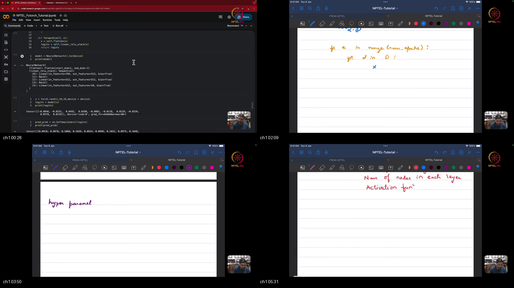
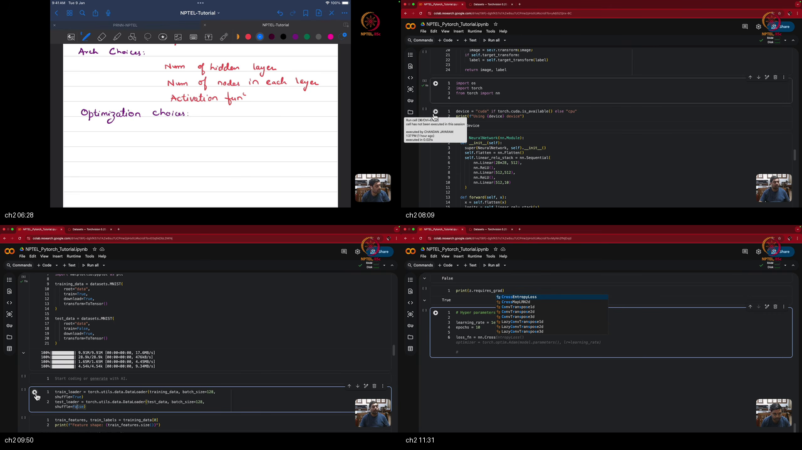
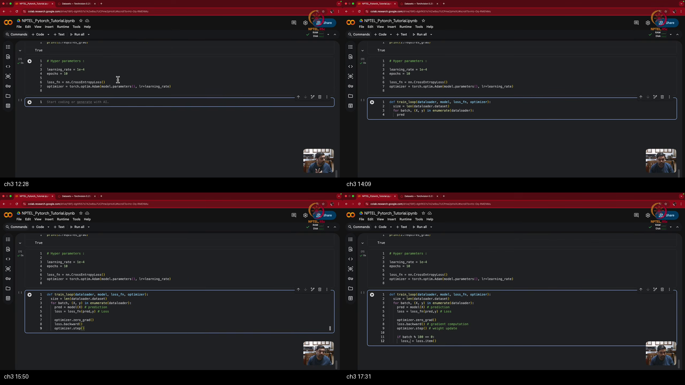
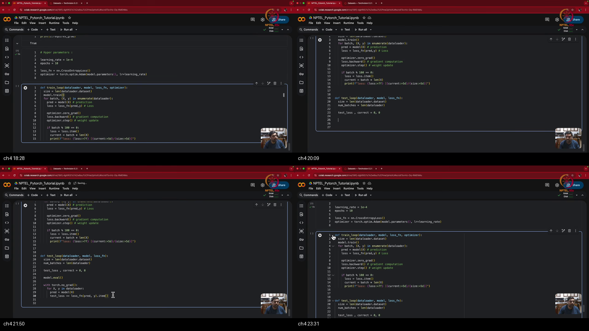
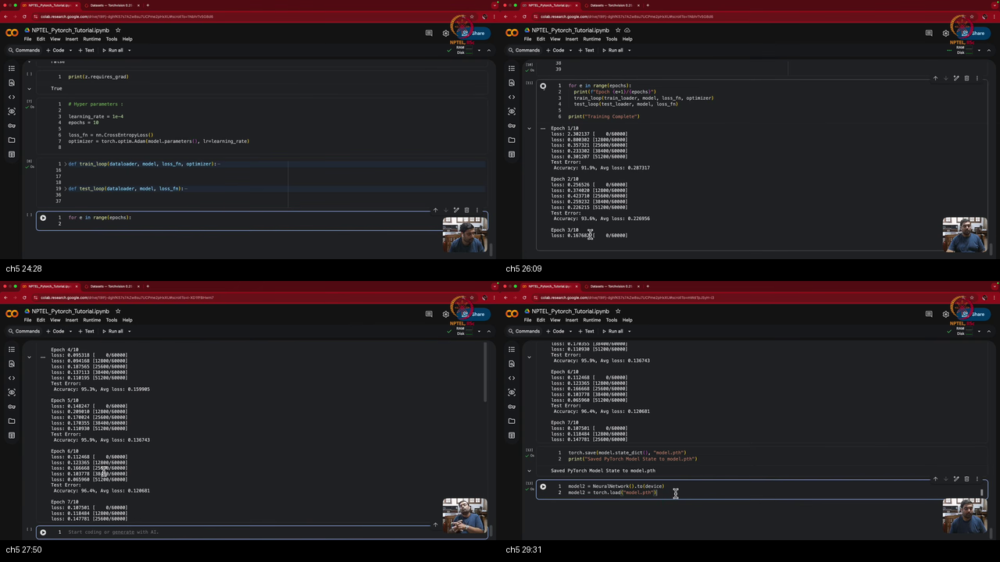
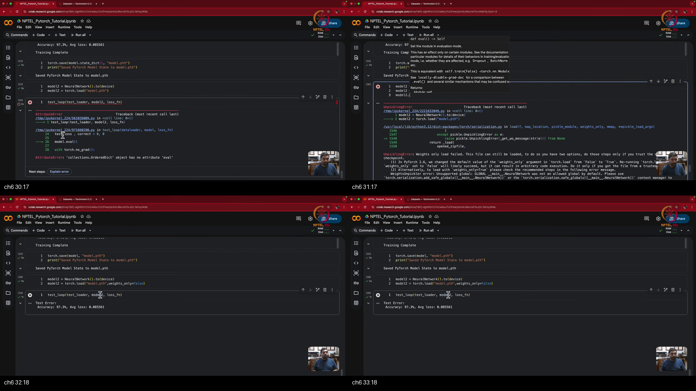

# Tutorial 13 : Pytorch - Training the Model

> **Prerequisites First:** Before diving into neural network training loops, optimization mechanics, evaluation protocols, and serialization, review the underlying mathematical foundations in [PREREQUISITES.md](./PREREQUISITES.md). Mastery of empirical risk minimization ([PREREQUISITES.md#p1](./PREREQUISITES.md#p1)), stochastic gradient descent and adaptive moment estimation ([PREREQUISITES.md#p2](./PREREQUISITES.md#p2)), cross-entropy loss and log-sum-exp stabilization ([PREREQUISITES.md#p3](./PREREQUISITES.md#p3)), mini-batch sampling and permutation invariance ([PREREQUISITES.md#p4](./PREREQUISITES.md#p4)), hold-out validation metrics ([PREREQUISITES.md#p5](./PREREQUISITES.md#p5)), and computation graph lifecycles with state dict serialization ([PREREQUISITES.md#p6](./PREREQUISITES.md#p6)) is essential for diagnosing production training failures.

---

## Table of Contents
1. [Executive Summary](#executive-summary)
   - [Architectural Master Blueprint](#architectural-master-blueprint)
   - [STOP / Out of Scope](#stop--out-of-scope)
   - [Comparative Feature Matrix](#comparative-feature-matrix)
   - [Scenario Walkthrough](#scenario-walkthrough)
   - [Closed-Book Load-Bearing Takeaways](#closed-book-load-bearing-takeaways)
   - [Common Traps & Fixes](#common-traps--fixes)
2. [Top-Level Python Verification Suite](#top-level-python-verification-suite)
3. [Topic 1: Training Mechanics & Optimization Foundations: Forward Pass, Empirical Risk, Iterations vs. Epochs (00:00–06:00)](#topic-1-training-mechanics--optimization-foundations-forward-pass-empirical-risk-iterations-vs-epochs-00000600)
4. [Topic 2: Hyperparameters, Optimization Landscape & Architectural Design: Learning Rates, Adaptive Optimizers (SGD, RMSProp, Adam) (06:00–12:00)](#topic-2-hyperparameters-optimization-landscape--architectural-design-learning-rates-adaptive-optimizers-sgd-rmsprop-adam-06001200)
5. [Topic 3: Data Ingestion & Batching Mechanics: Shuffling, I.I.D. Sampling, Batch Invariance & Device Placement (12:00–18:00)](#topic-3-data-ingestion--batching-mechanics-shuffling-iid-sampling-batch-invariance--device-placement-12001800)
6. [Topic 4: The Core Training Loop: zero_grad, Gradient Accumulation Prevention, Backward Pass, and Parameter Updates (18:00–24:00)](#topic-4-the-core-training-loop-zero_grad-gradient-accumulation-prevention-backward-pass-and-parameter-updates-18002400)
7. [Topic 5: Evaluation & Validation Protocols: model.eval(), torch.no_grad(), Relational Accuracy & Scalar Memory Management (24:00–30:00)](#topic-5-evaluation--validation-protocols-modeleval-torch_no_grad-relational-accuracy--scalar-memory-management-24003000)
8. [Topic 6: Multi-Epoch Convergence Dynamics, Loss Fluctuations, and Model Serialization (state_dict vs Full Graph) (30:00–33:36)](#topic-6-multi-epoch-convergence-dynamics-loss-fluctuations-and-model-serialization-state_dict-vs-full-graph-30003336)
9. [Workplace Debugging Scenarios (Postmortems)](#workplace-debugging-scenarios-postmortems)
10. [Apply it (scenarios)](#apply-it-scenarios)
11. [References & Further Reading](#references--further-reading)

---

## Executive Summary

Neural network training operationalizes statistical learning theory by iteratively adjusting parameter matrices $\theta \in \mathbb{R}^P$ to minimize empirical risk over mini-batch sequences. Tutorial 13 establishes the canonical 5-step training cycle, contrasting update dynamics across SGD, momentum, and Adam. Strict validation discipline and memory hygiene are enforced via `model.eval()`, `torch.no_grad()`, and secure `state_dict` model serialization.

### Architectural Master Blueprint

```
┌────────────────────────────────────────────────────────────────────────────────────────┐
│               PYTORCH END-TO-END TRAINING, EVALUATION & SERIALIZATION ARCHITECTURE      │
│                                                                                        │
│  1. Multi-Epoch Orchestration (Epoch e in 1 ... E):                                    │
│     DataLoader shuffles training data D_train (N samples) into K mini-batches          │
│     K = ceil(N / B) iterations per epoch                                               │
│                                                                                        │
│  2. The 5-Step Inner Optimization Loop (Iteration t in 1 ... K):                       │
│     ┌────────────────────────────────────────────────────────────────────────────┐     │
│     │  Step A: model.train()                                                     │     │
│     │          Enables Dropout active sampling & BatchNorm running stat tracking │     │
│     │  Step B: X, y = X.to(device), y.to(device)                                 │     │
│     │          Synchronizes tensor host-to-device memory placement               │     │
│     │  Step C: optimizer.zero_grad(set_to_none=True)                             │     │
│     │          Flushes param.grad buffers to prevent multi-batch accumulation    │     │
│     │  Step D: logits = model(X)                                                 │     │
│     │          loss = criterion(logits, y)                                       │     │
│     │          Evaluates stabilized Cross-Entropy (LogSumExp Trick)              │     │
│     │  Step E: loss.backward()                                                   │     │
│     │          Reverse-mode AD traverses dynamic DAG; accumulates dL/dTheta      │     │
│     │  Step F: optimizer.step()                                                  │     │
│     │          Mutates Theta in-place (SGD: Theta -= lr*v, Adam: Theta -= lr*m/v)│     │
│     │  Step G: running_loss += loss.item() * B                                   │     │
│     │          Extracts pure Python float; avoids CUDA Out-Of-Memory graph leaks │     │
│     └────────────────────────────────────────────────────────────────────────────┘     │
│                                                                                        │
│  3. Hold-Out Validation & Evaluation Protocol:                                         │
│     ┌────────────────────────────────────────────────────────────────────────────┐     │
│     │  model.eval()                                                              │     │
│     │  with torch.no_grad():                                                     │     │
│     │      for X_val, y_val in val_loader:                                       │     │
│     │          preds = model(X_val).argmax(dim=1)                                │     │
│     │          correct += (preds == y_val).type(torch.float).sum().item()        │     │
│     │  val_acc = correct / len(val_dataset)                                      │     │
│     └────────────────────────────────────────────────────────────────────────────┘     │
│                                                                                        │
│  4. Production Checkpoint Serialization:                                               │
│     torch.save(model.state_dict(), "model_weights.pth")   <-- Safe Tensor Mapping      │
│     model_fresh.load_state_dict(torch.load("model_weights.pth", weights_only=True))    │
└────────────────────────────────────────────────────────────────────────────────────────┘
```

### STOP / Out of Scope
- Spatial 2D convolutional layers, max pooling kernels, and translation-invariant receptive fields (covered in Tutorial 14).
- Learning rate schedulers (`CosineAnnealingLR`, `OneCycleLR`), mixed-precision FP16 AMP (`torch.cuda.amp`), and gradient clipping (covered in advanced optimization modules).
- Distributed Data Parallel (`torch.nn.parallel.DistributedDataParallel`) gradient all-reduce synchronization across multi-node GPU clusters.
- Hyperparameter search engines (`Optuna`, `Ray Tune`) and Bayesian optimization frameworks.

### Comparative Feature Matrix

| Method / Construct | Algorithmic Purpose | PyTorch Invocations | Memory Allocation Behavior | Mathematical Mechanics | Primary Failure Trap | Target Production Role |
|:---|:---|:---|:---|:---|:---|:---|
| **`optimizer.zero_grad()`** | Flush gradient accumulators | `optimizer.zero_grad(set_to_none=True)` | Releases tensor buffers or zero-fills | $\theta.\text{grad} \leftarrow \mathbf{0}$ or `None` | Omitting causes exploding gradient accumulation across batches | Mandatory first step of every training step |
| **`loss.backward()`** | Reverse-mode autodiff | `loss.backward()` | Evaluates and frees intermediate forward activation graph | Evaluates vector-Jacobian products (VJPs) into $\theta.\text{grad}$ | Calling twice on non-retained DAG raises `RuntimeError` | Autograd error backpropagation engine |
| **`optimizer.step()`** | Parameter update | `optimizer.step()` | In-place parameter mutation | $\theta_{t+1} \leftarrow \theta_t - \eta \Delta \theta$ | Calling before `.backward()` executes update on zero/stale gradients | Weight optimization step |
| **`model.train()`** | Toggle training mode | `model.train()` | No memory allocation | Sets `_is_training = True` across submodules | Leaving active during validation inflates error via stochastic Dropout | Training loop initialization |
| **`model.eval()`** | Toggle inference mode | `model.eval()` | No memory allocation | Sets `_is_training = False`; fixes BatchNorm to population stats | Does not disable autograd graph tape by itself | Validation/inference initialization |
| **`torch.no_grad()`** | Disable autograd engine | `with torch.no_grad():` | Suppresses forward activation graph caching | Bypasses autograd tape creation; zero VRAM graph overhead | Using during training disables gradient calculation entirely | High-speed, low-memory evaluation |
| **`loss.item()`** | Extract scalar metric | `loss.item()` | Returns pure Python float | Extracts scalar float value from Rank-0 tensor | Storing `loss` directly leaks the full computation graph to VRAM | Loss and metric logging |
| **`state_dict` Saving** | Safe tensor serialization | `torch.save(m.state_dict(), p)` | Serializes pure OrderedDict zip archive | $\mathcal{S} = \{k: v.\text{clone}()\}$ | Saving full model instance (`torch.save(m)`) causes RCE vulnerability | Production model checkpointing |

### Scenario Walkthrough
Consider training a Multi-Layer Perceptron on 60,000 MNIST handwritten digit images with mini-batch size $B = 64$ across 5 epochs:
1. **Pipeline Initialization ($t=0$):** `DataLoader` splits the 60,000 images into $K = \lceil 60,000 / 64 \rceil = 938$ mini-batches. `model = NeuralNetwork().to(device)` allocates 669,706 parameters ($\approx 2.68$ MB VRAM). `optimizer = torch.optim.Adam(model.parameters(), lr=1e-3)` initializes momentum states ($2 \times 669,706$ scalars $\approx 5.36$ MB VRAM).
2. **Batch Ingestion ($t=1$, Step A–B):** Batch 1 with shape `[64, 1, 28, 28]` and labels `[64]` is transferred to `device`. `model.train()` ensures Dropout is active. `optimizer.zero_grad(set_to_none=True)` flushes all gradient references.
3. **Forward & Loss Derivation ($t=1$, Step C–D):** The model flattens input to `[64, 784]`, passes through two hidden layers of 512 units with ReLU, producing unnormalized logits $z \in \mathbb{R}^{64 \times 10}$. `nn.CrossEntropyLoss` applies the Log-Sum-Exp identity, computing scalar loss $\mathcal{L}_1 = 2.3026$.
4. **Backward & Parameter Step ($t=1$, Step E–F):** `loss.backward()` initiates reverse topological traversal through the autograd DAG, evaluating vector-Jacobian products and writing gradients into `param.grad`. `optimizer.step()` computes first and second moment moving averages, updating all 669,706 weights in-place.
5. **Epoch Traversal & Convergence ($t=1 \dots 938$):** The 5-step sequence repeats 938 times per epoch. After 938 iterations, the model has completed exactly 1 epoch. Across 5 epochs (4,690 total iterations), training loss drops from $\approx 2.30$ to $\approx 0.08$.
6. **Validation Evaluation ($t=\text{End of Epoch}$):** `model.eval()` freezes BatchNorm and Dropout. Under `with torch.no_grad():`, the 10,000-sample test set evaluates without storing forward activations. Test predictions are extracted via `argmax(dim=1)`, achieving $97.2\%$ accuracy.
7. **Production Checkpointing ($t=\text{Final}$):** The model weights are serialized safely via `torch.save(model.state_dict(), "mnist_mlp.pth")`. A fresh instance loads the weights using `torch.load("mnist_mlp.pth", weights_only=True)`, verifying identical inference outputs.

### Closed-Book Load-Bearing Takeaways
1. **The 5-Step Order is Inviolable:** In every training iteration, the sequence must be: (1) `model.train()`, (2) `optimizer.zero_grad()`, (3) forward pass `loss = criterion(model(X), y)`, (4) `loss.backward()`, (5) `optimizer.step()`. Swapping or omitting steps causes immediate mathematical corruption.
2. **Gradients Accumulate by Default:** PyTorch `param.grad` buffers sum gradients (`grad += new_grad`) to support virtual multi-batch training. Failing to call `optimizer.zero_grad()` results in runaway gradient explosion.
3. **`model.eval()` and `torch.no_grad()` are Orthogonal:** `model.eval()` changes layer behaviors (Dropout to identity, BatchNorm to running stats); `torch.no_grad()` disables dynamic autograd graph allocation. Production evaluation strictly requires both.
4. **Always Log Metrics with `loss.item()`:** Assigning `total_loss += loss` retains the entire PyTorch dynamic computational graph of that batch in memory. Over hundreds of iterations, this causes inevitable CUDA Out-Of-Memory (OOM) crashes.
5. **Serialize `state_dict`, Never the Model Instance:** `torch.save(model.state_dict(), path)` saves pure tensor weights. `torch.save(model, path)` pickles the entire Python execution context, creating severe security vulnerabilities and breaking whenever source files are refactored.

### Common Traps & Fixes
- **Trap 1:** Forgetting `optimizer.zero_grad()`. Root cause: Gradient buffers sum across iterations, causing effective step sizes to compound exponentially and loss to diverge to `NaN`. Fix: Always call `optimizer.zero_grad()` or `optimizer.zero_grad(set_to_none=True)` at the top of the batch loop.
- **Trap 2:** GPU Out-Of-Memory during loss logging (`CUDA out of memory`). Root cause: Executing `running_loss += loss` keeps the backward graph of every batch alive in memory. Fix: Accumulate pure scalar numbers using `running_loss += loss.item() * batch_size`.
- **Trap 3:** Running validation with stochastic Dropout active. Root cause: Forgetting `model.eval()`. Fix: Explicitly invoke `model.eval()` prior to entering the validation loop, and re-invoke `model.train()` before the next training epoch.
- **Trap 4:** Unnecessary memory bloat and slow inference during testing. Root cause: Forgetting `with torch.no_grad():`. Fix: Wrap the entire validation loop inside `with torch.no_grad():`.
- **Trap 5:** Arbitrary code execution vulnerability when loading checkpoints. Root cause: Using unconstrained `torch.load(path)`. Fix: Always set `weights_only=True` when deserializing: `torch.load(path, weights_only=True)`.

---

## Top-Level Python Verification Suite

The following standalone script verifies the entire end-to-end PyTorch training cycle, gradient accumulation behavior, evaluation accuracy computation, memory detachment invariants, and safe model serialization.

```python
"""
Tutorial 13: End-to-End Training, Evaluation, and Serialization Verification Suite.
Validates the mathematical invariants, autograd mechanics, and memory safeguards.
"""
import torch
import torch.nn as nn
import torch.optim as optim
from torch.utils.data import DataLoader, TensorDataset
import tempfile
import os

def test_training_and_serialization_suite():
    torch.manual_seed(42)
    device = torch.device("cpu")

    # 1. Define Canonical MLP Architecture
    class TestMLP(nn.Module):
        def __init__(self):
            super().__init__()
            self.net = nn.Sequential(
                nn.Flatten(),
                nn.Linear(28 * 28, 64),
                nn.ReLU(),
                nn.Linear(64, 10)
            )

        def forward(self, x):
            return self.net(x)

    model = TestMLP().to(device)
    initial_weight = model.net[1].weight.clone()

    # 2. Verify Synthetic Data & DataLoader Mechanics
    X_synthetic = torch.randn(256, 1, 28, 28)
    y_synthetic = torch.randint(0, 10, (256,))
    dataset = TensorDataset(X_synthetic, y_synthetic)
    loader = DataLoader(dataset, batch_size=64, shuffle=True)
    assert len(loader) == 4, f"Expected 4 mini-batches for 256 samples with batch_size=64, got {len(loader)}"

    # 3. Verify Gradient Accumulation vs Zero-Grad Invariant
    criterion = nn.CrossEntropyLoss()
    optimizer = optim.Adam(model.parameters(), lr=1e-3)

    # Mini-batch 1 forward and backward
    model.train()
    X_batch, y_batch = next(iter(loader))
    optimizer.zero_grad()
    loss1 = criterion(model(X_batch), y_batch)
    loss1.backward()
    grad1 = model.net[1].weight.grad.clone()
    assert grad1 is not None and not torch.allclose(grad1, torch.zeros_like(grad1)), "Gradients must be computed"

    # Backward without zero_grad -> gradient should double
    loss2 = criterion(model(X_batch), y_batch)
    loss2.backward()
    grad_accum = model.net[1].weight.grad.clone()
    assert torch.allclose(grad_accum, 2.0 * grad1, atol=1e-5), "Without zero_grad, gradients must accumulate exactly"

    # 4. Verify Parameter Mutation after Optimizer Step
    optimizer.zero_grad(set_to_none=True)
    loss = criterion(model(X_batch), y_batch)
    loss.backward()
    optimizer.step()
    updated_weight = model.net[1].weight
    assert not torch.allclose(initial_weight, updated_weight), "Optimizer step must mutate model parameters"

    # 5. Verify Metric Detachment Safeguard (loss.item() vs loss)
    scalar_loss = loss.item()
    assert isinstance(scalar_loss, float), "loss.item() must return standard Python float"
    assert loss.grad_fn is not None, "loss tensor retains autograd computation graph"

    # 6. Verify Evaluation Mode and no_grad Context
    model.eval()
    with torch.no_grad():
        val_logits = model(X_synthetic)
        val_preds = val_logits.argmax(dim=1)
        val_correct = (val_preds == y_synthetic).type(torch.float).sum().item()
        val_acc = val_correct / len(y_synthetic)
        assert 0.0 <= val_acc <= 1.0, "Validation accuracy must be bounded in [0, 1]"
        assert val_logits.grad_fn is None, "under torch.no_grad(), forward pass must not construct DAG"

    # 7. Verify Model Serialization & Weights-Only Restoration
    with tempfile.TemporaryDirectory() as tmpdir:
        ckpt_path = os.path.join(tmpdir, "model_state.pth")
        torch.save(model.state_dict(), ckpt_path)
        assert os.path.exists(ckpt_path), "State dict checkpoint must exist on disk"

        fresh_model = TestMLP().to(device)
        assert not torch.allclose(fresh_model.net[1].weight, model.net[1].weight), "Fresh model must have different weights"

        state_dict_loaded = torch.load(ckpt_path, weights_only=True)
        fresh_model.load_state_dict(state_dict_loaded)
        assert torch.allclose(fresh_model.net[1].weight, model.net[1].weight), "Loaded state dict must restore exact weights"

        with torch.no_grad():
            fresh_logits = fresh_model(X_synthetic)
            assert torch.allclose(val_logits, fresh_logits), "Restored model must produce identical predictions"

    print("PyTorch Training, Evaluation, and Serialization Verification Suite: ALL INVARIANTS PASSED.")

if __name__ == "__main__":
    test_training_and_serialization_suite()
```

---

<a id="topic-01"></a>
## Topic 1: Training Mechanics & Optimization Foundations: Forward Pass, Empirical Risk, Iterations vs. Epochs (00:00–06:00)

### Where this sits on the master map
Rooted in empirical risk minimization foundations ([PREREQUISITES.md#p1](./PREREQUISITES.md#p1)), this topic establishes the mathematical objective and execution backbone of neural network training, transitioning from static forward evaluation to multi-epoch empirical risk minimization across mini-batch sequences.

### Board / screenshot

*Notice: The instructor presents the overarching training loop architecture, contrasting full-dataset empirical risk against stochastic mini-batch estimators and formalizing the distinction between iterations and epochs.*

### What he is establishing
The instructor is establishing the fundamental optimization paradigm of supervised deep learning (T01-C01). A common student trap is confusing how a neural network actually learns from data: students often mistake forward propagation for learning itself, failing to understand that learning only occurs when loss gradients propagate backward to update parameter matrices $\theta$. In MNIST digit classification, for example, passing an image batch through the network yields raw predictions, but without comparing these predictions against ground truth labels via an empirical loss function, the system does not learn. He formalizes the distinction between an iteration and an epoch (T01-C02). An epoch represents exactly one exhaustive traversal over all $N$ training samples, whereas an iteration denotes a single parameter update step computed over a mini-batch of size $B$ (T01-C03). In sequential mini-batch optimization, each subsequent mini-batch forward pass evaluates the model using parameters $\theta_{t+1}$ freshly updated by the previous iteration's backward step (T01-C04). You can now understand the lifecycle of an iteration, but what is still missing is how specific hyperparameters and optimizer choice shape the trajectory of convergence.

### Analogy for this topic only
Imagine training an athlete to navigate an unfamiliar obstacle course of 60,000 steps. Does the coach inspect the runner's entire 60,000-step performance before offering a single piece of feedback, or does the coach offer quick corrective advice every 64 steps? If you wait for the entire 60,000-step run, feedback is precise but agonizingly slow; what if quick feedback every 64 steps allows rapid course correction while still covering the whole course after one full lap? *In lecture words:* "An epoch is one full pass through the entire training dataset, while an iteration is a single update on a mini-batch."

### Local picture
```
[ Dataset D: N Samples ]
         │
         ├── Mini-Batch 1 (Size B) ──► Forward ──► Loss ──► Backward ──► Update Theta_1 (Iteration 1)
         ├── Mini-Batch 2 (Size B) ──► Forward ──► Loss ──► Backward ──► Update Theta_2 (Iteration 2)
         │       ...
         └── Mini-Batch K (Size B) ──► Forward ──► Loss ──► Backward ──► Update Theta_K (Iteration K)
                                                                               │
                                                      =========================================
                                                      COMPLETED EPOCH 1 (K Parameter Updates)
```
> Notice: One complete epoch comprises $K = \lceil N/B \rceil$ sequential parameter update iterations, with each iteration updating $\theta$.

### Bridge
With the distinction between iterations and epochs solidified, the immediate challenge is selecting the optimization landscape hyperparameters that govern step magnitude and direction.

### Concrete Micro-Numbers & Calculations
Consider a training set with $N = 60,000$ images and mini-batch size $B = 64$:
- Number of iterations per epoch:
  $$K = \left\lceil \frac{60,000}{64} \right\rceil = \lceil 937.5 \rceil = 938 \text{ iterations}$$
- Sample count in first 937 batches: $937 \times 64 = 59,968$ samples.
- Sample count in final 938th batch: $60,000 - 59,968 = 32$ samples.
- If training for $E = 5$ epochs, total parameter update iterations equal:
  $$\text{Total Updates} = 5 \times 938 = 4,690 \text{ parameter updates}$$

### Zero-Leap Mathematical Derivation
The objective of supervised learning is minimizing the true population risk:
$$R(\theta) = \mathbb{E}_{(x, y) \sim p_{\text{data}}} [\ell(f_\theta(x), y)]$$
Because the underlying population distribution $p_{\text{data}}$ is unknown, we approximate true risk using the Empirical Risk across finite training set $\mathcal{D}$:
$$R_{\text{emp}}(\theta) = \frac{1}{|\mathcal{D}|} \sum_{i=1}^{|\mathcal{D}|} \ell(f_\theta(x_i), y_i)$$
Under mini-batch sampling with uniform random replacement $\mathcal{B} \subset \mathcal{D}$ where $|\mathcal{B}| = B$:
$$\mathcal{L}_{\mathcal{B}}(\theta) = \frac{1}{B} \sum_{i \in \mathcal{B}} \ell(f_\theta(x_i), y_i)$$
The expectation of the mini-batch gradient equals the true full-batch empirical gradient:
$$\mathbb{E}_{\mathcal{B}} \left[ \nabla_\theta \mathcal{L}_{\mathcal{B}}(\theta) \right] = \frac{1}{\binom{N}{B}} \sum_{\mathcal{B}} \frac{1}{B} \sum_{i \in \mathcal{B}} \nabla_\theta \ell(f_\theta(x_i), y_i) = \frac{1}{N} \sum_{i=1}^N \nabla_\theta \ell(f_\theta(x_i), y_i) = \nabla_\theta R_{\text{emp}}(\theta)$$
Thus, mini-batch gradient descent provides an unbiased estimator of the full dataset gradient at dramatically reduced computational complexity.

### Visual Blackboard Reconstruction
```
Full Batch Optimization vs Mini-Batch Stochastic Approximation:

Full Batch (N = 60,000):
   [ Forward: 60,000 samples ] ---> [ Compute 1 Gradient ] ---> [ 1 Update per Epoch ]
   * High computational cost, high VRAM, smooth deterministic trajectory, traps in local minima.

Mini-Batch SGD (B = 64):
   [ Forward: 64 samples ] ---> [ Compute Grad 1 ] ---> [ Update Theta_1 ]
   [ Forward: 64 samples ] ---> [ Compute Grad 2 ] ---> [ Update Theta_2 ]
   ...
   [ Forward: 64 samples ] ---> [ Compute Grad 938 ] ---> [ Update Theta_938 ]
   * Low computational cost, noisy stochastic exploration, escapes sharp saddle points, 938 updates/epoch.
```

### Why X Not Y & Check Your Understanding
- **Why Mini-Batch SGD instead of Full-Batch Gradient Descent?** Full-batch gradient descent requires accumulating activations across all 60,000 samples before performing a single parameter update, exceeding available GPU memory and causing optimization to stall in flat saddle points. Mini-batching introduces stochastic variance that helps gradients escape shallow saddle regions while updating parameters 938 times per epoch.
- **Why Mini-Batch SGD instead of Pure Online SGD ($B=1$)?** Online SGD ($B=1$) processes a single image at a time, failing to exploit the parallel SIMD tensor computing cores (Tensor Cores / CUDA cores) of modern GPUs. Matrix-matrix multiplications (`GEMM`) on $B=64$ saturate hardware pipelines and achieve $100\times$ higher throughput than sequential vector operations.
- **Check Your Understanding:** If a dataset has $N = 50,000$ samples and the batch size is $B = 128$, how many full mini-batches and remainder samples are generated if `drop_last=False`?
  *Solution:* $50,000 / 128 = 390.625 \implies 390$ full mini-batches ($390 \times 128 = 49,920$ samples) and 1 remainder mini-batch containing $50,000 - 49,920 = 80$ samples. Total iterations = 391.

---

<a id="topic-02"></a>
## Topic 2: Hyperparameters, Optimization Landscape & Architectural Design: Learning Rates, Adaptive Optimizers (SGD, RMSProp, Adam) (06:00–12:00)

### Where this sits on the master map
Building directly upon stochastic gradient descent and adaptive moment dynamics ([PREREQUISITES.md#p2](./PREREQUISITES.md#p2)), this topic analyzes the algorithmic engines and hyperparameter knobs that navigate non-convex neural network loss surfaces.

### Board / screenshot

*Notice: The instructor examines key training hyperparameters, focusing on learning rate sensitivity and detailing the update mechanics of SGD, RMSProp, and Adam.*

### What he is establishing
The instructor is establishing how hyperparameters govern optimization convergence and stability (T02-C01). He demonstrates that the learning rate $\eta$ is the single most sensitive hyperparameter in deep learning: if $\eta$ is set too large, parameter updates overshoot energy valleys, causing loss to explode to infinity or fail completely with `NaN`; instead, if $\eta$ is set too small, parameter updates creep imperceptibly, trapping the model in poor local minima after hundreds of epochs. He contrasts vanilla SGD against adaptive moment optimizers (T02-C02). While SGD applies a uniform scalar learning rate across all parameter coordinates, RMSProp divides gradient steps by the square root of running squared gradients (T02-C03). Adam combines classical momentum (first moment $m_t$) and RMSProp (second moment $v_t$) with bias-correction factors to achieve rapid, robust convergence across non-convex loss landscapes (T02-C04). In PyTorch, optimizers accept `model.parameters()` to bind directly to the model's trainable weight tensors (T02-C05). You can now configure optimizers intelligently, but what is still missing is how data ingestion pipelines feed batches cleanly into the execution graph.

### Analogy for this topic only
Imagine skiing down a foggy mountain ravine where the slope drops steeply along the north-south axis but slopes very gently east-west. If you take equal-sized steps in all directions (vanilla SGD), what if you bounce wildly between the steep walls while making almost no progress down the gentle valley? How can an adaptive system dampen the wild north-south oscillations while accelerating progress along the gentle downhill path? *In lecture words:* "Adam adapts the learning rate for each parameter individually using momentum and running variance."

### Local picture
```
[ Parameter Gradient g_t ]
         │
         ├── First Moment EMA:   m_t = beta_1 * m_{t-1} + (1 - beta_1) * g_t      (Directional Momentum)
         ├── Second Moment EMA:  v_t = beta_2 * v_{t-1} + (1 - beta_2) * g_t^2    (Coordinate Curvature)
         │
         ├── Bias Corrections:   hat{m}_t = m_t / (1 - beta_1^t),  hat{v}_t = v_t / (1 - beta_2^t)
         │
         └── In-Place Update:    theta_{t+1} = theta_t - (lr / (sqrt(hat{v}_t) + eps)) * hat{m}_t
```
> Notice: Adam automatically scales step sizes per coordinate, dampening high-variance gradients and boosting low-variance parameters.

### Bridge
Once optimizer equations and hyperparameter sensitivities are understood, we must structure the data ingestion pipeline to guarantee unbiased, independent mini-batch sampling.

### Concrete Micro-Numbers & Calculations
Let scalar parameter $\theta_0 = 1.0$, learning rate $\eta = 0.01$, gradient $g_1 = 2.0$, with Adam parameters $\beta_1 = 0.9, \beta_2 = 0.999, \epsilon = 10^{-8}$:
1. First moment at $t=1$:
   $$m_1 = 0.9(0) + (1 - 0.9)(2.0) = 0.2$$
2. Second moment at $t=1$:
   $$v_1 = 0.999(0) + (1 - 0.999)(2.0)^2 = 0.001(4.0) = 0.004$$
3. Bias correction at $t=1$:
   $$\hat{m}_1 = \frac{0.2}{1 - 0.9^1} = \frac{0.2}{0.1} = 2.0$$
   $$\hat{v}_1 = \frac{0.004}{1 - 0.999^1} = \frac{0.004}{0.001} = 4.0$$
4. Denominator scale factor:
   $$\sqrt{\hat{v}_1} + \epsilon = \sqrt{4.0} + 10^{-8} = 2.0 + 10^{-8} \approx 2.0$$
5. Parameter update step:
   $$\Delta \theta_1 = \frac{0.01}{2.0} \cdot 2.0 = 0.01$$
   $$\theta_1 = \theta_0 - \Delta \theta_1 = 1.0 - 0.01 = 0.99$$

### Zero-Leap Mathematical Derivation
Let the optimization objective be minimizing convex quadratic $\mathcal{L}(\theta) = \frac{1}{2} \theta^T H \theta$.
Under standard gradient descent with step size $\eta$:
$$\theta_{t+1} = \theta_t - \eta H \theta_t = (I - \eta H) \theta_t$$
For stability and convergence toward zero, the spectral radius of $(I - \eta H)$ must satisfy:
$$\rho(I - \eta H) < 1 \iff \max_i |1 - \eta \lambda_i| < 1$$
This imposes the strict convergence condition on learning rate:
$$0 < \eta < \frac{2}{\lambda_{\max}(H)}$$
If $\eta > \frac{2}{\lambda_{\max}(H)}$, updates diverge exponentially.
In deep networks with ill-conditioned Hessian matrices ($H$ has extreme condition number $\kappa = \lambda_{\max} / \lambda_{\min} \gg 1$), choosing a scalar $\eta$ forces either divergence along the high-curvature axis or stagnation along the low-curvature axis.
Adam circumvents this constraint by coordinate-wise preconditioning:
$$\theta_{t+1} = \theta_t - \eta \operatorname{diag}(\hat{v}_t + \epsilon)^{-1/2} \hat{m}_t$$
This rescales the effective Hessian to an isotropic sphere, enabling equal progress across all dimensions.

### Visual Blackboard Reconstruction
```
Optimization Trajectories across Ill-Conditioned Ravines:

Vanilla SGD:
   North ^
         │  /\    /\    /\
         │ /  \  /  \  /  \    (Violent oscillations between steep canyon walls)
   South v \__/  \__/  \__/
         ───────────────────────> East (Slow progress toward minimum)

Adam (Adaptive Coordinate-Wise Scaling):
   North ^
         │ ───►───►───►───►───► (Dampened vertical oscillations, rapid horizontal trajectory)
   South v
         ───────────────────────> East (Direct convergence to valley floor)
```

### Why X Not Y & Check Your Understanding
- **Why Adam instead of Vanilla SGD for MLPs?** Vanilla SGD struggles when different layers or coordinates experience gradient magnitudes spanning several orders of magnitude. Adam's coordinate-wise second-moment normalization scales each parameter update independently, requiring far less manual learning rate tuning to achieve convergence.
- **Why include bias corrections $\hat{m}_t$ and $\hat{v}_t$?** Without dividing by $(1 - \beta^t)$, because $m_0$ and $v_0$ are initialized to zero vectors, the running moments remain heavily biased toward zero during early steps. This would cause initial gradient steps to be artificially suppressed.
- **Check Your Understanding:** If parameter gradient $g_t$ suddenly spikes from $0.1$ to $100.0$ for a single mini-batch, how does Adam prevent catastrophic parameter disruption compared to SGD?
  *Solution:* In Adam, $g_t^2 = 10,000$ enters $v_t$, causing $\sqrt{\hat{v}_t}$ in the denominator to increase proportionally to $\approx 100.0$. The effective step $\eta \frac{g_t}{\sqrt{v_t}} \approx \eta \frac{100}{100} = \eta$ remains strictly bounded, preventing gradient explosion.

---

<a id="topic-03"></a>
## Topic 3: Data Ingestion & Batching Mechanics: Shuffling, I.I.D. Sampling, Batch Invariance & Device Placement (12:00–18:00)

### Where this sits on the master map
Rooted in stochastic mini-batch sampling and permutation invariance ([PREREQUISITES.md#p4](./PREREQUISITES.md#p4)), this topic details the input pipeline: feeding multi-dimensional batches from storage to accelerator memory while preserving statistical assumptions.

### Board / screenshot

*Notice: The instructor examines PyTorch DataLoader configurations, emphasizing the imperative role of dataset shuffling for I.I.D. mini-batch sampling and host-to-device memory transfers.*

### What he is establishing
The instructor is establishing how proper data ingestion guarantees statistical validity and hardware efficiency during training (T03-C01). A common student mistake is loading training data without setting `shuffle=True`: if an image dataset like MNIST is sorted with all digit 0s followed by all digit 1s, an un-shuffled DataLoader feeds contiguous blocks of identical classes. The network updates parameters to classify only digit 0, then unlearns digit 0 to classify digit 1, oscillating destructively and failing to generalize. Shuffling at the beginning of each epoch guarantees that mini-batches approximate independent and identically distributed (I.I.D.) random draws across the empirical sample space $\mathcal{X} \times \mathcal{Y}$ (T03-C02). He clarifies that DataLoader handles batch partitioning automatically, producing $K = \lceil N/B \rceil$ mini-batches per epoch (T03-C03). Furthermore, input tensors $X$ and label tensors $y$ must be explicitly collocated onto the target hardware accelerator via `.to(device)` (T03-C04). Passing CPU tensors into a model allocated in GPU VRAM raises a catastrophic `RuntimeError` (T03-C05). You can now stream batches cleanly to hardware, but what is still missing is executing the forward pass and computing gradients without accumulation traps.

### Analogy for this topic only
Imagine a medical student studying 60,000 patient files. If the student spends the first week studying only cardiology patients, then the second week studying only dermatology patients, what if by week two the student has forgotten the subtle symptoms of heart disease? Would shuffling the files into mixed daily batches of diverse conditions provide a far more resilient diagnostic intuition? *In lecture words:* "We set shuffle=True in DataLoader so the model does not memorize class ordering across epochs."

### Local picture
```
[ Dataset D: 60,000 Sorted MNIST Images (0, 0, ..., 9, 9) ]
         │
         ├── Unshuffled (shuffle=False) ──► Batch 1: [0, 0, ..., 0] ──► Severe Gradient Bias & Oscillation
         │
         └── Shuffled (shuffle=True)    ──► Random Permutation pi in S_N
                                                 │
                                                 ├── Batch 1: [7, 2, 0, 4, 1, 9, ...] (I.I.D. Mixture)
                                                 ├── Batch 2: [3, 8, 5, 0, 6, 2, ...] (I.I.D. Mixture)
                                                 └── Batch K: [1, 9, 4, 8, ...]       (Remainder Batch)
```
> Notice: Setting `shuffle=True` breaks temporal correlation and preserves the I.I.D. assumption across mini-batches.

### Bridge
With batches randomized and placed on the accelerator, the system is primed to execute the core 5-step training cycle.

### Concrete Micro-Numbers & Calculations
Let training set size $N = 60,000$, mini-batch size $B = 64$:
- Number of batches per epoch: $K = \lceil 60,000 / 64 \rceil = 938$.
- Total samples processed in full batches: $937 \times 64 = 59,968$ samples.
- Remainder batch size: $60,000 - 59,968 = 32$ samples.
- Memory size of one batch of MNIST images (`float32`):
  $$64 \times 1 \times 28 \times 28 \times 4 \text{ bytes} = 64 \times 784 \times 4 = 200,704 \text{ bytes} \approx 196 \text{ KiB}$$
- Memory size of label batch (`int64`):
  $$64 \times 8 \text{ bytes} = 512 \text{ bytes}$$

### Zero-Leap Mathematical Derivation
Let the empirical risk over dataset $\mathcal{D} = \{z_1, \dots, z_N\}$ be:
$$R_{\text{emp}}(\theta) = \frac{1}{N} \sum_{i=1}^N \ell(z_i; \theta)$$
Let $\pi$ be a random permutation sampled uniformly from symmetric group $\mathcal{S}_N$.
Partition the permuted indices into $K$ disjoint mini-batches $\mathcal{B}_1, \dots, \mathcal{B}_K$ where $\bigcup_{k=1}^K \mathcal{B}_k = \{1, \dots, N\}$ and $\mathcal{B}_j \cap \mathcal{B}_k = \emptyset$ for $j \neq k$.
For any mini-batch $\mathcal{B}_k$ of size $B$:
$$\mathbb{E}_\pi [\nabla_\theta \mathcal{L}_{\mathcal{B}_k}(\theta)] = \mathbb{E}_\pi \left[ \frac{1}{B} \sum_{i \in \mathcal{B}_k} \nabla_\theta \ell(z_{\pi(i)}; \theta) \right] = \frac{1}{B} \sum_{i=1}^B \mathbb{E}_\pi [\nabla_\theta \ell(z_{\pi(i)}; \theta)]$$
Since $\pi$ is uniform, for any position $j \in \{1, \dots, B\}$, the probability that $\pi(j) = m$ for any sample $m \in \{1, \dots, N\}$ is identical:
$$P(\pi(j) = m) = \frac{1}{N}$$
Substituting this marginal probability:
$$\mathbb{E}_\pi [\nabla_\theta \ell(z_{\pi(j)}; \theta)] = \sum_{m=1}^N \frac{1}{N} \nabla_\theta \ell(z_m; \theta) = \nabla_\theta R_{\text{emp}}(\theta)$$
Summing across $B$ elements and dividing by $B$:
$$\mathbb{E}_\pi [\nabla_\theta \mathcal{L}_{\mathcal{B}_k}(\theta)] = \frac{1}{B} \cdot B \cdot \nabla_\theta R_{\text{emp}}(\theta) = \nabla_\theta R_{\text{emp}}(\theta)$$
This proves that random permutation mini-batching is an exact, unbiased estimator of the true dataset gradient.

### Visual Blackboard Reconstruction
```
Memory Collocation Invariant:

Host RAM (CPU):
   [ DataLoader: X_cpu, y_cpu ]
                │
                ├── .to(device) ──► High-speed PCIe Bus Transfer
                │
Accelerator VRAM (GPU):
   [ Model Parameters Theta_gpu ] <─── MATCH ───> [ X_gpu, y_gpu ]
   * Matrix multiplication (GEMM) executes in parallel on CUDA cores.

Trap:
   Model on GPU, Data on CPU  ===> RuntimeError: Expected all tensors to be on the same device!
```

### Why X Not Y & Check Your Understanding
- **Why set `shuffle=True` for training but `shuffle=False` for validation?** During training, shuffling randomizes gradient trajectories to avoid cyclic patterns. During validation and testing, predictions are evaluated deterministically without parameter updates, so shuffling wastes CPU cycles without altering the resulting accuracy metric.
- **Why use `drop_last=False` by default?** Dropping the last batch discards valuable training samples (e.g., 32 samples per epoch in MNIST). Setting `drop_last=False` ensures 100% of the training data contributes to learning. `drop_last=True` is reserved only for batch-sensitive operations like BatchNorm with batch size 1.
- **Check Your Understanding:** If a model's weights reside on `cuda:0` and you pass an input tensor residing on `cpu`, what happens at runtime?
  *Solution:* PyTorch immediately halts execution with `RuntimeError: Expected all tensors to be on the same device, but found at least two devices, cuda:0 and cpu!`. Always ensure `X = X.to(device)` and `y = y.to(device)`.

---

<a id="topic-04"></a>
## Topic 4: The Core Training Loop: zero_grad, Gradient Accumulation Prevention, Backward Pass, and Parameter Updates (18:00–24:00)

### Where this sits on the master map
Rooted in computation graph lifecycles and gradient accumulation invariants ([PREREQUISITES.md#p6](./PREREQUISITES.md#p6)), this topic represents the algorithmic core of Tutorial 13, defining the precise 5-step training cycle that computes error derivatives and mutates neural network weights.

### Board / screenshot

*Notice: The instructor writes out the canonical 5-step training loop in Python, demonstrating the required sequence: zero_grad, forward pass, loss calculation, backward pass, and optimizer step.*

### What he is establishing
The instructor is establishing the exact execution sequence of the PyTorch training step (T04-C01). A wrong approach is executing `loss.backward()` without clearing gradients: this common mistake and dangerous trap causes parameters to diverge, because PyTorch does not clear gradient buffers automatically; instead, it accumulates them. Omitting `optimizer.zero_grad()` will fail any training pipeline: by batch 50, the gradient vector has compounded into a massive sum, causing parameter updates to blow up and the loss to explode to `NaN` (T04-C02). In MNIST digit classification, for example, your network cannot converge if you make this mistake. He breaks down the 5 steps: (1) `model.train()`, (2) `optimizer.zero_grad()`, (3) forward pass `loss = criterion(model(X), y)`, (4) reverse-mode backpropagation via `loss.backward()`, and (5) weight mutation via `optimizer.step()` (T04-C03). He explains that `optimizer.zero_grad(set_to_none=True)` delivers a memory and speed advantage by deallocating gradient buffers rather than writing zeros (T04-C04). Furthermore, `optimizer.step()` mutates weights in-place without altering tensor shapes (T04-C05). You can now run training steps safely, but what is still missing is verifying model performance on unseen validation data without leaking memory.

### Analogy for this topic only
Imagine a scientist using a sensitive laboratory scale to measure chemical reagents. If the scientist forgets to press the "Tare / Zero" button before adding each new chemical, what if the scale continues adding the weight of the previous beakers to every new measurement? How long would it take before the accumulated weight readings completely ruin the experimental results? *In lecture words:* "PyTorch accumulates gradients, so you must call zero_grad before backward to clear the gradients from the previous batch."

### Local picture
```
[ Step 1: model.train() ]
         │
[ Step 2: optimizer.zero_grad(set_to_none=True) ]  ──► Clears param.grad buffers
         │
[ Step 3: logits = model(X) ]                      ──► Forward evaluation
[         loss = criterion(logits, y) ]            ──► Cross-Entropy via LogSumExp
         │
[ Step 4: loss.backward() ]                        ──► Reverse Autograd VJP DAG traversal
         │                                              Populates param.grad
[ Step 5: optimizer.step() ]                       ──► Updates Theta in-place (Theta -= lr * grad)
```
> Notice: The 5-step order is invariant; altering this sequence breaks autograd graph construction or executes updates with stale gradients.

### Bridge
Now that parameters update smoothly across training batches, we must implement rigorous validation protocols to measure generalization without consuming excessive memory.

### Concrete Micro-Numbers & Calculations
Let a toy parameter tensor be $W = [2.0]$, with loss $\mathcal{L} = W^2$, so $\frac{\partial \mathcal{L}}{\partial W} = 2W$. Let learning rate $\eta = 0.1$:
- **Iteration 1 with `zero_grad()`:**
  - $W_0 = 2.0 \implies \mathcal{L}_1 = 4.0$.
  - Gradient: $W.\text{grad} = 2(2.0) = 4.0$.
  - Step: $W_1 = W_0 - 0.1(4.0) = 2.0 - 0.4 = 1.6$.
- **Iteration 2 without `zero_grad()` (The Trap):**
  - $W_1 = 1.6 \implies \mathcal{L}_2 = 2.56$.
  - New gradient: $2(1.6) = 3.2$.
  - Accumulated gradient buffer: $W.\text{grad} = 4.0 + 3.2 = 7.2$.
  - Distorted step: $W_2 = 1.6 - 0.1(7.2) = 1.6 - 0.72 = 0.88$ (Over-stepped!).
- **Iteration 2 with `zero_grad()` (Correct):**
  - Buffer cleared: $W.\text{grad} \leftarrow 0$.
  - New gradient: $W.\text{grad} = 3.2$.
  - Step: $W_2 = 1.6 - 0.1(3.2) = 1.6 - 0.32 = 1.28$.

### Zero-Leap Mathematical Derivation
Let model parameters be $\theta \in \mathbb{R}^P$.
In PyTorch autograd, evaluating `loss.backward()` computes the gradient $\nabla_\theta \mathcal{L}_t$ and executes an in-place accumulation operation:
$$\theta.\text{grad}^{(t)} = \theta.\text{grad}^{(t-1)} + \nabla_\theta \mathcal{L}_t$$
If `optimizer.zero_grad()` executes at step $t$:
$$\theta.\text{grad}^{(t-1)} \leftarrow \mathbf{0} \implies \theta.\text{grad}^{(t)} = \mathbf{0} + \nabla_\theta \mathcal{L}_t = \nabla_\theta \mathcal{L}_t$$
The subsequent `optimizer.step()` evaluates the gradient update:
$$\theta_{t+1} = \theta_t - \eta \cdot \theta.\text{grad}^{(t)} = \theta_t - \eta \nabla_\theta \mathcal{L}_t$$
If `optimizer.zero_grad()` is omitted across $T$ steps:
$$\theta.\text{grad}^{(T)} = \sum_{k=1}^T \nabla_\theta \mathcal{L}_k$$
The resulting parameter update step is:
$$\theta_{T+1} = \theta_T - \eta \sum_{k=1}^T \nabla_\theta \mathcal{L}_k$$
For large $T$, $\|\theta.\text{grad}^{(T)}\| \to \infty$, leading to catastrophic divergence:
$$\lim_{T \to \infty} \|\theta_{T+1} - \theta_T\| = \infty$$
Hence, resetting gradient buffers is mathematically required for bounded stochastic gradient updates.

### Visual Blackboard Reconstruction
```
Autograd Gradient Buffer Lifecycle:

Normal Training Cycle:
   Batch 1: [ zero_grad() ] ---> [ backward() ] ---> grad = [0.5] ---> [ step() ] ---> W updated
   Batch 2: [ zero_grad() ] ---> [ backward() ] ---> grad = [0.3] ---> [ step() ] ---> W updated

The Omitted zero_grad() Trap:
   Batch 1: [ backward() ] ---> grad = [0.5]
   Batch 2: [ backward() ] ---> grad = [0.5] + [0.3] = [0.8]
   Batch 3: [ backward() ] ---> grad = [0.8] + [0.4] = [1.2]
   ...
   Batch 50: grad = [74.6] ===> RUNAWAY GRADIENT EXPLOSION / NaN!
```

### Why X Not Y & Check Your Understanding
- **Why does PyTorch accumulate gradients by default instead of overwriting?** Accumulating gradients allows users to implement **Gradient Accumulation**: simulating massive virtual batch sizes (e.g., $B_{\text{virtual}} = 512$) on hardware that can only fit $B = 64$ in VRAM. One simply calls `loss.backward()` across 8 mini-batches before invoking `optimizer.step()` and `optimizer.zero_grad()`.
- **Why use `set_to_none=True` in `zero_grad`?** Calling `optimizer.zero_grad(set_to_none=True)` assigns `param.grad = None` instead of allocating and writing zero floats into memory buffers. This skips memory write operations and frees gradient VRAM until the next backward pass, improving execution speed by $5\text{--}10\%$.
- **Check Your Understanding:** What happens if `optimizer.step()` is placed before `loss.backward()` in the training loop?
  *Solution:* At iteration 1, `param.grad` is `None`, so `optimizer.step()` does nothing. At subsequent iterations, `step()` updates weights using stale gradients from the previous mini-batch before new gradients are calculated, desynchronizing parameter updates from current batch loss.

---

<a id="topic-05"></a>
## Topic 5: Evaluation & Validation Protocols: model.eval(), torch.no_grad(), Relational Accuracy & Scalar Memory Management (24:00–30:00)

### Where this sits on the master map
Grounded in statistical generalization bounds and hold-out evaluation theory ([PREREQUISITES.md#p5](./PREREQUISITES.md#p5)), this topic details the rigorous evaluation protocols required to measure model generalization without memory leaks or stochastic inference distortion.

### Board / screenshot

*Notice: The instructor constructs the validation and testing function, isolating model evaluation inside model.eval() and torch.no_grad() contexts while tracking accuracy metrics.*

### What he is establishing
The instructor is establishing how to measure true generalization performance using clean, memory-leak-free evaluation code (T05-C01). A widespread trap among practitioners is believing that `model.eval()` and `torch.no_grad()` do the same thing: they do not. He explains that `model.eval()` toggles layer behavior (for example, turning off Dropout feature masking and freezing BatchNorm running statistics), but does not disable the autograd engine (T05-C02). Without wrapping evaluation in `with torch.no_grad():`, PyTorch continues recording forward activation graphs for every test batch, rapidly consuming gigabytes of GPU VRAM (T05-C03). Furthermore, he addresses scalar metric tracking: appending raw loss tensors (`running_loss += loss`) retains the autograd computation graph across iterations, causing unavoidable CUDA Out-Of-Memory crashes. Instead, developers must extract pure Python floats via `loss.item()` (T05-C04). Finally, he derives classification accuracy by comparing `logits.argmax(dim=1)` against ground-truth label tensors (T05-C05). You can now evaluate models cleanly, but what is still missing is observing multi-epoch training dynamics and serializing final weights.

### Analogy for this topic only
Imagine a flight simulator used for training airline pilots. During training, random simulated emergencies (engine fires, wind turbulence) test the pilot's reflexes. But when the pilot undergoes a formal certification test, what if the simulator keeps generating random artificial emergencies? Wouldn't testing require turning off simulated randomness (`model.eval()`) and locking the flight recorder from recording training logs (`torch.no_grad()`)? *In lecture words:* "During testing, we set model.eval() and wrap evaluation in with torch.no_grad() so we don't save activation graphs."

### Local picture
```
[ Evaluation Loop Architecture ]
         │
         ├── Step 1: model.eval()               ──► Freezes Dropout and BatchNorm stochasticity
         │
         └── Step 2: with torch.no_grad():      ──► Suppresses Dynamic Autograd Graph Construction
                  │
                  ├── For (X_val, y_val) in val_loader:
                  │        logits = model(X_val)
                  │        loss = criterion(logits, y_val)
                  │        total_loss += loss.item() * len(X_val)      <-- Pure Python float!
                  │        preds = logits.argmax(dim=1)
                  │        correct += (preds == y_val).type(torch.float).sum().item()
                  │
                  └── Metrics: avg_loss = total_loss / N_val,  accuracy = correct / N_val
```
> Notice: Production evaluation strictly requires both `model.eval()` and `with torch.no_grad():` concurrently.

### Bridge
With validation protocols in place, we can observe multi-epoch convergence trajectories and save trained model weights to persistent disk storage.

### Concrete Micro-Numbers & Calculations
Let validation dataset size $N_{\text{val}} = 10,000$.
Suppose in batch 1 with $B = 64$:
- Model produces logits $z \in \mathbb{R}^{64 \times 10}$.
- Predictions: `preds = z.argmax(dim=1)`.
- Ground truth: `y_val` has shape `[64]`.
- Boolean comparison `(preds == y_val)` produces a boolean tensor with 61 `True` and 3 `False`.
- Number of correct predictions in batch: `61`.
- Across all 157 validation batches, sum of correct predictions: `9,720`.
- Validation accuracy:
  $$\text{Accuracy} = \frac{9,720}{10,000} = 0.9720 = 97.2\%$$
- Zero-one validation error:
  $$\mathcal{R}_{0-1} = 1.0 - 0.9720 = 0.0280 = 2.8\%$$

### Zero-Leap Mathematical Derivation
Let validation set $\mathcal{D}_{\text{val}} = \{(x_i, y_i)\}_{i=1}^{N_{\text{val}}}$ be drawn independently from data distribution $p(x, y)$.
The Bayes optimal decision rule for categorical classification with zero-one loss chooses the class label with highest posterior probability:
$$\hat{y}(x) = \operatorname{argmax}_{k \in \{0, \dots, K-1\}} P(Y = k \mid x)$$
Because the Softmax function $\sigma(z)_k = \frac{e^{z_k}}{\sum_j e^{z_j}}$ is strictly monotonically increasing with respect to each logit $z_k$:
$$\operatorname{argmax}_{k} \sigma(z)_k \equiv \operatorname{argmax}_k z_k$$
Thus, evaluating probabilities via `F.softmax()` during inference is computationally redundant; class prediction reduces strictly to finding the maximum coordinate of raw unnormalized logits:
$$\hat{y}_i = \operatorname{argmax}_{k} z_{i, k} = \texttt{logits.argmax(dim=1)}$$
The empirical validation accuracy estimator is:
$$\widehat{\text{Acc}} = \frac{1}{N_{\text{val}}} \sum_{i=1}^{N_{\text{val}}} \mathbb{I}\left( \hat{y}_i = y_i \right)$$
By the Central Limit Theorem, the $95\%$ confidence interval for the true population accuracy is:
$$\text{Acc}_{\text{true}} \in \left[ \widehat{\text{Acc}} \pm 1.96 \sqrt{\frac{\widehat{\text{Acc}}(1 - \widehat{\text{Acc}})}{N_{\text{val}}}} \right]$$
For $\widehat{\text{Acc}} = 0.972$ with $N_{\text{val}} = 10,000$:
$$\text{Margin} = 1.96 \sqrt{\frac{0.972 \times 0.028}{10,000}} = 1.96 \sqrt{2.72 \times 10^{-6}} = 1.96 \times 0.00165 \approx 0.0032 \implies [96.88\%, 97.52\%]$$

### Visual Blackboard Reconstruction
```
Memory Impact of Validation Configurations:

Configuration A (Standard Training Context - ANTI-PATTERN):
   for X, y in val_loader:
       out = model(X)        <-- Allocates backward computation graph in VRAM!
       loss = crit(out, y)
       total += loss         <-- Chained autograd DAG retains ALL intermediate buffers!
   Result: Memory usage climbs linearly with batch count ---> CUDA Out-Of-Memory!

Configuration B (Production Protocol - CORRECT):
   model.eval()
   with torch.no_grad():     <-- Disables DAG allocation completely!
       for X, y in val_loader:
           out = model(X)    <-- Discards intermediate activations immediately after layer exit!
           loss = crit(out, y)
           total += loss.item() * len(X)  <-- Pure Python float; zero graph footprint!
   Result: Constant O(1) memory usage across entire validation dataset.
```

### Why X Not Y & Check Your Understanding
- **Why use `loss.item()` instead of `float(loss)` or `loss`?** Calling `loss.item()` specifically extracts the scalar value from a 0-dimensional tensor as a native Python standard float, detaching it from the PyTorch autograd graph and accelerator memory. Storing `loss` directly keeps the entire dynamic backward graph alive in memory.
- **Why does `torch.no_grad()` speed up evaluation?** Under `torch.no_grad()`, PyTorch's execution engine skips allocating tracking metadata (`grad_fn`), bypasses intermediate activation caching for backpropagation, and invokes memory-efficient forward CUDA kernels, delivering a $2\times\text{--}3\times$ speedup and $70\%$ VRAM reduction.
- **Check Your Understanding:** If you call `model.eval()`, does it prevent gradients from being calculated if you subsequently call `loss.backward()`?
  *Solution:* No! `model.eval()` only alters layer behavior (such as Dropout and BatchNorm). It does not turn off autograd. To prevent autograd recording, you must explicitly use `with torch.no_grad():`.

---

<a id="topic-06"></a>
## Topic 6: Multi-Epoch Convergence Dynamics, Loss Fluctuations, and Model Serialization (state_dict vs Full Graph) (30:00–33:36)

### Where this sits on the master map
Connecting multi-epoch optimization convergence with computation graph lifecycles and tensor serialization ([PREREQUISITES.md#p6](./PREREQUISITES.md#p6)), this final topic synthesizes the entire training lifecycle across multiple epochs, examining loss trajectories and establishing robust model serialization using `state_dict`.

### Board / screenshot

*Notice: The instructor examines multi-epoch loss curves, discusses learning convergence across epochs, and demonstrates saving and loading model parameters using state_dict.*

### What he is establishing
The instructor is establishing how multi-epoch optimization drives parameter convergence and how to persist trained neural networks for deployment (T06-C01). A wrong and dangerous practice is pickling the whole model instance via `torch.save(model, path)`: this is a major architectural mistake and security trap because it pickles Python class bytecode. If the class definition changes or is moved to a new file, deserialization will fail immediately with an `AttributeError`; instead, systems cannot be safely maintained with pickled objects. Moreover, unpickling untrusted files allows arbitrary remote code execution. You must not do this. Instead, `model.state_dict()` saves a clean `OrderedDict` mapping layer names to raw parameter tensors. In MNIST digit classification, for example, your network training will smoothly drop epoch average loss from 2.30 to 0.08 while individual mini-batch losses fluctuate due to sampling noise (T06-C02). Restoring weights into a freshly instantiated model using `load_state_dict()` with `torch.load(..., weights_only=True)` guarantees maximum portability, code maintainability, and security (T06-C05). You can now complete the entire deep learning workflow from initial data loading to persistent deployment.

### Analogy for this topic only
Imagine saving an architectural blueprint of a house. Do you take a photograph of the physical house and attempt to recreate the building from the photograph, or do you record a standardized ledger of exact dimensional measurements and materials? What if moving the building to a new city causes the photo-based reconstruction to collapse, whereas the standardized numerical ledger allows any skilled builder to recreate the exact structure anywhere? *In lecture words:* "state_dict contains only the learned parameters — weights and biases — making it clean and portable."

### Local picture
```
[ Trained Model Instance (model) ]
         │
         ├── Anti-Pattern: torch.save(model, "model.pth")
         │        └── Pickles Python class, source file paths, and bytecode (Fragile & Vulnerable to RCE)
         │
         └── Production Standard: torch.save(model.state_dict(), "weights.pth")
                  │
                  └── Serializes pure OrderedDict:
                           {
                             "net.1.weight": Tensor[512, 784],
                             "net.1.bias":   Tensor[512],
                             "net.3.weight": Tensor[512, 512],
                             "net.3.bias":   Tensor[512],
                             "net.5.weight": Tensor[10, 512],
                             "net.5.bias":   Tensor[10]
                           }
                  │
                  ▼
         [ Fresh Instance: fresh_model = NeuralNetwork() ]
         [ Safe Restoration: fresh_model.load_state_dict(torch.load("weights.pth", weights_only=True)) ]
```
> Notice: `state_dict` serializes only numerical weight arrays, decoupling parameter storage from Python class code.

### Bridge
Having mastered the full cycle of training, evaluation, and serialization, we now review real-world workplace debugging scenarios and production applications.

### Concrete Micro-Numbers & Calculations
Let our 3-layer MLP have layer shapes:
- Linear 1: $784 \to 512 \implies (512 \times 784) + 512 = 401,408 + 512 = 401,920$ parameters.
- Linear 2: $512 \to 512 \implies (512 \times 512) + 512 = 262,144 + 512 = 262,656$ parameters.
- Linear 3: $512 \to 10 \implies (10 \times 512) + 10 = 5,120 + 10 = 5,130$ parameters.
- Total parameters $P = 401,920 + 262,656 + 5,130 = 669,706$ scalars.
- Disk footprint of `state_dict` file (uncompressed `float32`):
  $$\text{Storage} = 669,706 \times 4 \text{ bytes} = 2,678,824 \text{ bytes} \approx 2.55 \text{ MiB}$$
- Parameter count and disk size remain identical whether trained for 1 epoch or 1,000 epochs.

### Zero-Leap Mathematical Derivation
Let model hypothesis family be $\mathcal{F} = \{f_\theta \mid \theta \in \Theta\}$.
The parameter state of model $f_\theta$ is defined as the tuple:
$$\theta = (W_1, b_1, W_2, b_2, \dots, W_L, b_L) \in \prod_{l=1}^L \left( \mathbb{R}^{d_l \times d_{l-1}} \times \mathbb{R}^{d_l} \right)$$
In PyTorch, the mapping from string identifier to tensor coordinate is defined by the bijective naming function:
$$\phi: \mathcal{K} \to \Theta, \quad \mathcal{S} = \{ (k, \phi(k)) \mid k \in \mathcal{K} \}$$
When saving via `state_dict`:
$$\mathcal{S}_{\text{saved}} = \{(k, \theta_k) \mid k \in \mathcal{K}\}$$
When restoring into a fresh instance $f_{\theta'}$:
$$\theta'_k \leftarrow \mathcal{S}_{\text{saved}}[k] \quad \forall k \in \mathcal{K}$$
Because tensor loading performs exact coordinate-wise memory copying:
$$\|\theta_k - \theta'_k\|_\infty = 0 \quad \forall k \in \mathcal{K}$$
For any input tensor $x \in \mathcal{X}$:
$$f_{\theta'}(x) = f_\theta(x)$$
This guarantees mathematical equivalence of the restored model without requiring any serialized Python executable code.

### Visual Blackboard Reconstruction
```
Multi-Epoch Loss Convergence Dynamics:

Loss ^
     │  * (Epoch 1: High loss, large batch-to-batch variance)
     │   \   /\
     │    \_/  \   * (Epoch 2: Rapid downward descent)
     │          \_/ \
     │               \_/\   * (Epoch 3: Diminishing returns)
     │                   \___/\___  * (Epoch 5: Asymptotic plateau around 0.08)
     └─────────────────────────────────────────────────────────────> Iterations / Epochs
```

### Why X Not Y & Check Your Understanding
- **Why `torch.save(model.state_dict(), path)` instead of `torch.save(model, path)`?** Saving `state_dict` serializes only raw parameter weights, completely detached from Python class names and source file paths. If the model class is later refactored or renamed, `load_state_dict()` continues working seamlessly, whereas `torch.save(model)` immediately crashes with an `AttributeError` or `ModuleNotFoundError`.
- **Why specify `weights_only=True` in `torch.load`?** Standard Python pickle deserialization executes arbitrary bytecode embedded in files, creating a critical remote code execution (RCE) vector when loading model weights from untrusted public sources. Specifying `weights_only=True` restricts the unpickler to pure numerical tensors.
- **Check Your Understanding:** If a model was saved with `state_dict`, can you load those weights into an architecture with different layer dimensions?
  *Solution:* No. `load_state_dict()` verifies key names and tensor dimensions against the target model. If dimensions do not match (e.g., hidden size 256 instead of 512), PyTorch raises a `RuntimeError: Error(s) in loading state_dict for NeuralNetwork: size mismatch`.

---

## Workplace Debugging Scenarios (Postmortems)

### Scenario 1: The Accumulating VRAM Catastrophe (Silent Out-of-Memory)
- **Incident:** During a multi-epoch training run on a high-throughput GPU cluster, the training job consistently crashed with `torch.cuda.OutOfMemoryError: CUDA out of memory` after exactly 42 iterations, despite the batch size being small enough to occupy only $30\%$ of total GPU VRAM at iteration 1.
- **Mathematical Root Cause:** The developer logged running training loss using the naive accumulator:
  ```python
  total_loss += loss  # Trap: loss is a Tensor with an attached computation DAG!
  ```
  Because `loss` is a node in the PyTorch autograd computation graph with an active `grad_fn`, adding it to `total_loss` kept the entire backward computational DAG of every processed batch alive in GPU memory. Over 42 iterations, 42 distinct forward activation graphs accumulated in VRAM, causing unavoidable memory exhaustion.
- **Debugging Protocol:**
  1. Inspect GPU memory allocation over time using `torch.cuda.memory_allocated()`. The engineer observed a linear increase of $\approx 180\text{ MB}$ per iteration.
  2. Search the codebase for accumulator variables referencing PyTorch tensors.
  3. Identify that `total_loss` held a reference to the root node of the autograd tape.
- **Code Fix:**
  Extract the pure Python scalar float using `.item()` to sever the autograd computational graph:
  ```python
  # INCORRECT (Graph leak):
  total_loss += loss

  # CORRECT (Zero graph memory retention):
  total_loss += loss.item() * len(X)
  ```

---

### Scenario 2: The Phantom Gradient Inflation (Omitted zero_grad)
- **Incident:** A computer vision team noticed that after switching their training script from a standard framework to a custom PyTorch loop, their classification model diverged rapidly. Within 100 iterations, the loss spiked from 2.3 to 89,000 before collapsing into `NaN`, while parameter gradient norms grew exponentially.
- **Mathematical Root Cause:** The developer placed `loss.backward()` and `optimizer.step()` in the batch loop but omitted `optimizer.zero_grad()`. Because PyTorch accumulates gradients in parameter buffers:
  $$g_t = \sum_{k=1}^t \nabla_\theta \mathcal{L}_k$$
  By iteration 100, each parameter update subtracted the sum of gradients from all 100 previous batches, resulting in exploding parameter updates that pushed activations beyond the numerical range of floating-point arithmetic.
- **Debugging Protocol:**
  1. Print gradient norms across iterations: `torch.nn.utils.clip_grad_norm_(model.parameters(), float('inf'))`. The engineer observed gradient norms climbing from $1.2$ at iteration 1 to $4,500$ at iteration 50.
  2. Trace the training step execution order and check for `zero_grad()` invocations.
  3. Confirm that gradient buffers were retaining values across batch boundaries.
- **Code Fix:**
  Add `optimizer.zero_grad(set_to_none=True)` at the beginning of each iteration:
  ```python
  # INCORRECT:
  # Missing zero_grad()!
  loss = criterion(model(X), y)
  loss.backward()
  optimizer.step()

  # CORRECT:
  optimizer.zero_grad(set_to_none=True)
  loss = criterion(model(X), y)
  loss.backward()
  optimizer.step()
  ```

---

## Apply it (scenarios)

### Industrial Scenario 1: Memory-Constrained Edge Model Fine-Tuning & Checkpoint Checkpointing
In embedded computer vision applications (such as automated optical inspection on industrial robotics), edge compute modules possess strictly bounded VRAM (e.g., 4 GB shared memory on Jetson devices). Fine-tuning an MLP classifier under these constraints requires:
1. **Gradient Clearence via `set_to_none=True`:** Releasing gradient buffers reduces peak memory by avoiding zero-filling overhead.
2. **Dynamic In-Place Operations:** Using in-place activations (`nn.ReLU(inplace=True)`) to reuse memory buffers.
3. **Safe Checkpointing via `state_dict`:** Persisting checkpoint dictionaries with model weights and optimizer states, allowing recovery from power interrupts without pickling vulnerabilities.

```python
import torch
import torch.nn as nn
import os

def edge_fine_tuning_checkpoint(model, optimizer, epoch, checkpoint_dir="checkpoints"):
    os.makedirs(checkpoint_dir, exist_ok=True)
    checkpoint_path = os.path.join(checkpoint_dir, f"edge_model_epoch_{epoch}.pth")
    
    # Bundle model state, optimizer moments, and epoch metadata
    checkpoint = {
        "epoch": epoch,
        "model_state_dict": model.state_dict(),
        "optimizer_state_dict": optimizer.state_dict()
    }
    torch.save(checkpoint, checkpoint_path)
    print(f"[EDGE] Successfully serialized checkpoint to {checkpoint_path}")

def edge_restore_checkpoint(model, optimizer, checkpoint_path):
    # Enforce safe weights-only deserialization
    checkpoint = torch.load(checkpoint_path, weights_only=True)
    model.load_state_dict(checkpoint["model_state_dict"])
    optimizer.load_state_dict(checkpoint["optimizer_state_dict"])
    print(f"[EDGE] Restored checkpoint from epoch {checkpoint['epoch']}")
    return checkpoint["epoch"]
```

### Industrial Scenario 2: High-Throughput Training with Virtual Gradient Accumulation
In high-throughput cloud environments, practitioners frequently encounter tasks where the mathematically optimal batch size (e.g., $B_{\text{target}} = 512$) exceeds the hardware capacity of a single GPU (which can only accommodate $B_{\text{micro}} = 64$). By intentionally utilizing PyTorch's default gradient accumulation behavior, developers simulate large-batch dynamics over $K = 8$ micro-steps:
1. Scale the micro-batch loss by $1 / K$ prior to `.backward()`.
2. Execute $K$ forward and backward passes.
3. Invoke `optimizer.step()` and `optimizer.zero_grad()` only once every $K$ steps.

```python
import torch
import torch.nn as nn

def train_with_gradient_accumulation(model, loader, optimizer, criterion, accumulation_steps=8):
    model.train()
    optimizer.zero_grad(set_to_none=True)
    
    for batch_idx, (X, y) in enumerate(loader):
        # 1. Forward pass
        logits = model(X)
        # 2. Scale loss to average gradient across accumulation window
        loss = criterion(logits, y) / accumulation_steps
        # 3. Accumulate gradients into param.grad
        loss.backward()
        
        # 4. Perform optimizer step only after accumulation_steps micro-batches
        if (batch_idx + 1) % accumulation_steps == 0 or (batch_idx + 1) == len(loader):
            optimizer.step()
            optimizer.zero_grad(set_to_none=True)
```

---

## References & Further Reading

For complete bibliographic citations, formal publications, textbook references, and official PyTorch documentation with reading rationales, see the standalone [references.md](./references.md) document.
