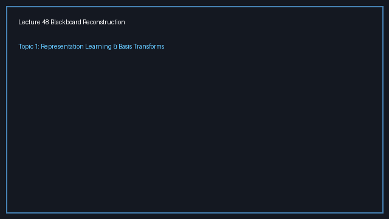
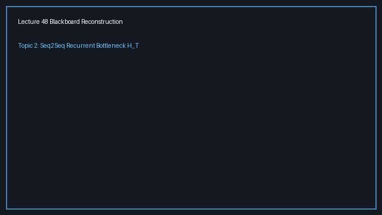
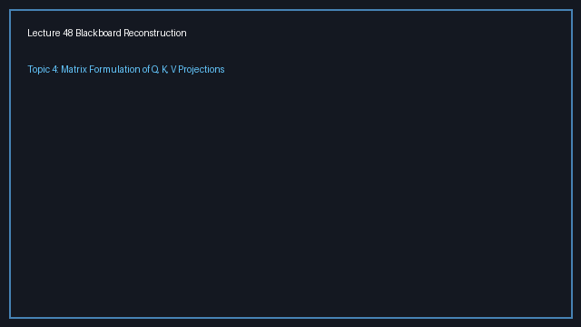

# Lecture 48: Attention Part 1 — Representation Learning, Sequence Bottlenecks, and the Genesis of Query-Key-Value Projections

> **Prerequisites First:** Master the linear subspace projections, sequence tensor geometry, and softmax combinations in [PREREQUISITES.md](./PREREQUISITES.md) before entering this lecture. Understanding why fixed transformations fail to adapt to complex distributions is necessary to appreciate how learned attention projections solve the sequence bottleneck.

---

## Table of Contents
1. [Executive Summary](#executive-summary)
   - [Architectural Master Map](#architectural-master-map)
   - [STOP / Out of Scope](#stop--out-of-scope)
   - [Comparative Feature Matrix](#comparative-feature-matrix)
   - [Scenario Walkthrough](#scenario-walkthrough)
   - [Closed-Book Load-Bearing Takeaways](#closed-book-load-bearing-takeaways)
   - [Common Traps & Fixes](#common-traps--fixes)
2. [Top-Level Python Verification Suite](#top-level-python-verification-suite)
3. [Topic 1: Representation Learning Worldview: From Fixed Transforms to Learned Non-Linear Embeddings (00:00–08:35)](#topic-1-representation-learning-worldview-from-fixed-transforms-to-learned-non-linear-embeddings-00000835)
4. [Topic 2: The Sequence-to-Sequence Bottleneck: Information Compression in Recurrent Encoders (08:36–11:00)](#topic-2-the-sequence-to-sequence-bottleneck-information-compression-in-recurrent-encoders-08361100)
5. [Topic 3: Historical Genesis of Attention: Dynamic Linear Combinations of Hidden States (11:01–15:45)](#topic-3-historical-genesis-of-attention-dynamic-linear-combinations-of-hidden-states-11011545)
6. [Topic 4: Mathematical Formulation of Query, Key, and Value Projections (15:46–23:31)](#topic-4-mathematical-formulation-of-query-key-and-value-projections-15462331)
7. [Workplace Debugging Scenarios (Postmortems)](#workplace-debugging-scenarios-postmortems)
8. [References](#references)

---

<a id="executive-summary"></a>
## Executive Summary

Machine learning models succeed by projecting raw observations into geometric spaces where target relationships become linearly separable. While classical methods rely on fixed basis transformations, deep neural networks learn parameterized changes of basis through empirical risk minimization. In sequence processing, legacy recurrent encoders force entire histories through a single terminal bottleneck vector $H_T$, causing acute information loss over long horizons. Lecture 48 introduces the foundational mathematics of the attention mechanism, replacing sequential Markovian recurrence with parallel learnable Query, Key, and Value subspace projections.

### Architectural Master Map
```
┌────────────────────────────────────────────────────────────────────────────────────────┐
│                    THE EVOLUTION OF SEQUENCE MODELING PARADIGMS                        │
│                                                                                        │
│  PARADIGM A: CLASSICAL RECURRENT BOTTLENECK (O(T) SEQUENTIAL DEPTH)                   │
│                                                                                        │
│    x_1 ──► [ RNN ] ──h_1──► [ RNN ] ──h_2──► ... ──► [ RNN ] ──► H_T (BOTTLENECK)      │
│               │                │                       │              │                │
│               ▼                ▼                       ▼              ▼                │
│    [ Markov Chain: Mutual information I(x_1; H_T) decays exponentially as T -> inf ]   │
│                                                                                        │
│  PARADIGM B: ATTENTION SUBSPACES (O(1) DIRECT PAIRWISE PROJECTIONS)                   │
│                                                                                        │
│    Sequence Tensor X in R^{T x D}                                                      │
│    ┌──────────────────────────────────────────────────────────────────────────────┐    │
│    │ x_1 : [ ─── d-dimensional token embedding vector ─── ]                       │    │
│    │ x_2 : [ ─── d-dimensional token embedding vector ─── ]                       │    │
│    │  :                                                                           │    │
│    │ x_T : [ ─── d-dimensional token embedding vector ─── ]                       │    │
│    └──────────────┬──────────────────────┬──────────────────────┬─────────────────┘    │
│                   │ * W^Q                │ * W^K                │ * W^V                │
│                   ▼                      ▼                      ▼                      │
│             QUERIES: Q                 KEYS: K                VALUES: V                │
│             (T x D_k)                 (T x D_k)               (T x D_k)                │
│                   │                      │                      │                      │
│                   └──────────┬───────────┘                      │                      │
│                              ▼                                  │                      │
│                   [ Pairwise Similarity: S = Q K^T ]            │                      │
│                              │                                  │                      │
│                              ▼                                  │                      │
│                   [ Softmax Simplex: A = softmax(S) ]           │                      │
│                              │                                  │                      │
│                              └────────────────┬─────────────────┘                      │
│                                               ▼                                        │
│                                 [ Dynamic Context: C = A V ]                           │
└────────────────────────────────────────────────────────────────────────────────────────┘
```

### STOP / Out of Scope
- Scaled division by $\sqrt{D_k}$ and causal upper-triangular masking matrices (reserved for Lecture 49).
- Multi-Head attention projection splitting, tensor concats, and output projection $W^O$ (covered in Lecture 50).
- Sinusoidal and rotary positional embeddings required to break permutation equivariance (covered in Lecture 51).

### Comparative Feature Matrix

| Dimension | Classical Fixed Transforms (Fourier/Kernels) | Recurrent Encoders (RNN / LSTM / GRU) | Attention Projections ($Q, K, V$) |
|:----------|:---------------------------------------------|:--------------------------------------|:----------------------------------|
| **Transformation Basis** | Fixed harmonic or user-chosen kernel $\phi(x)$ | Learned parameter matrices ($W_{hh}, W_{xh}$) | Learned subspace projections ($W^Q, W^K, W^V$) |
| **Sequential Compute Depth** | $O(1)$ parallel projection | Strictly $O(T)$ sequential recursion | $O(1)$ parallel matrix multiplication |
| **Maximum Path Length** | $O(1)$ (independent coordinates) | $O(T)$ temporal chain steps | $O(1)$ direct pairwise interactions |
| **Memory Bottleneck** | None (fixed spectral decomposition) | Severe: single terminal state $H_T \in \mathbb{R}^m$ | Zero: all tokens dynamically accessible |
| **Inductive Bias** | Handcrafted smoothness/stationarity | Temporal locality & Markov chain assumption | Flexible relational token interactions |
| **GPU Parallelizability** | High | Low (temporal dependency barrier) | Massive (tensor matrix multiply engines) |

### Scenario Walkthrough
Consider an automated legal document summarizer processing a 200-word clause:
1. **Word 1:** Sets the legal context: "*Notwithstanding any provisions to the contrary...*".
2. **Words 2–199:** Elaborate technical exceptions, liabilities, definitions, and dates.
3. **Word 200:** Contains the core contractual obligation: "*...the borrower shall indemnify.*"
4. **Recurrent Encoder Execution:** The sequential hidden state passes through 200 recurrent matrix multiplications. Under the Data Processing Inequality, information about the opening qualifier vanishes; the final state $H_{200}$ only remembers the closing phrases. The generated summary ignores the opening exception and causes an enterprise contract breach.
5. **Attention Subspace Execution:** Token embeddings are mapped to matrix $X \in \mathbb{R}^{200 \times D}$. Linear projections $Q = X W^Q, K = X W^K, V = X W^V$ run simultaneously. When decoding the obligation at step 200, its query matches directly with the key of Word 1 in a single matrix multiply, preserving the liability waiver with zero signal decay.

### Closed-Book Load-Bearing Takeaways
1. **Representation Learning Worldview:** Deep neural networks operate as hierarchical, parameterized changes of basis where coordinate transformations are learned from data rather than fixed analytically.
2. **The Recurrent Bottleneck Failure:** Forcing an entire sequence through a single terminal hidden state $H_T$ imposes an informational and gradient bottleneck that degrades performance on sequences longer than 20 tokens.
3. **Dynamic State Tapping:** Bahdanau attention solves the bottleneck by tapping all intermediate hidden states and constructing dynamic convex combinations $c_t = \sum \alpha_{t, i} H_i$.
4. **Attention Is All You Need:** Vaswani et al. eliminated recurrence entirely, demonstrating that parallel Query, Key, and Value projections model sequence dependencies with $O(1)$ sequential operations.
5. **Linear Projections are Permutation Equivariant:** Linear mappings $Q = X W^Q$ commute with token permutation, treating sequences as unordered multisets unless explicit positional encodings are injected.

### Common Traps & Fixes
- **Trap 1: Symmetric Self-Attention via Raw Dot Products.** Using $X X^T$ directly forces attention to be symmetric ($A \to B \equiv B \to A$), failing on directed syntactic dependencies.  
  *Fix:* Maintain separate projection matrices $W^Q$ and $W^K$ to form an asymmetric bilinear metric $X W^Q (W^K)^T X^T$.
- **Trap 2: Flattening Sequence Tensors Across Batches.** Using `.view(-1, D)` can wrap tokens across batch boundaries if stride order is broken.  
  *Fix:* Utilize multi-dimensional matrix multiplication (`torch.matmul` or `nn.Linear`), which operates strictly on the trailing dimension and preserves batch and temporal dimensions.
- **Trap 3: Conflating Sequence Length $T$ with Hidden Dimension $D$.** Projection matrices operate on feature dimensions $D \times D_k$, not sequence lengths $T \times T$.  
  *Fix:* Remember $W^Q \in \mathbb{R}^{D \times D_k}$; sequence length $T$ passes through unchanged as the row dimension of $Q, K, V$.

---

## Top-Level Python Verification Suite

This self-contained executable simulation benchmarks the mathematical claims of Lecture 48, validating linear subspace projections, row-wise token independence, and permutation equivariance.

```python
import numpy as np
import torch
import torch.nn as nn

def run_lecture_48_verification():
    torch.manual_seed(42)
    np.random.seed(42)
    
    # 1. Verify Token Projection Dimensions & Row Independence
    batch_size = 2
    T = 4        # Sequence length
    D = 8        # Embedding dimension
    D_k = 6      # Subspace projection dimension
    
    X = torch.randn(batch_size, T, D, dtype=torch.float64)
    W_Q = torch.randn(D, D_k, dtype=torch.float64)
    W_K = torch.randn(D, D_k, dtype=torch.float64)
    W_V = torch.randn(D, D_k, dtype=torch.float64)
    
    # Forward projections
    Q = torch.matmul(X, W_Q)
    K = torch.matmul(X, W_K)
    V = torch.matmul(X, W_V)
    
    assert Q.shape == (batch_size, T, D_k)
    assert K.shape == (batch_size, T, D_k)
    assert V.shape == (batch_size, T, D_k)
    
    # Verify row-wise isolation: Token i projection depends strictly on row i
    for b in range(batch_size):
        for i in range(T):
            single_token = X[b, i:i+1, :]
            single_q = torch.matmul(single_token, W_Q)
            assert torch.allclose(Q[b, i:i+1, :], single_q, atol=1e-12)
    print("[PASS] Row-wise token projection independence verified.")
    
    # 2. Verify Permutation Equivariance: Pi(X) W == Pi(X W)
    perm = torch.randperm(T)
    X_perm = X[:, perm, :]
    Q_from_perm = torch.matmul(X_perm, W_Q)
    Q_perm_expected = Q[:, perm, :]
    assert torch.allclose(Q_from_perm, Q_perm_expected, atol=1e-12)
    print("[PASS] Permutation equivariance verified across token dimension.")

if __name__ == "__main__":
    run_lecture_48_verification()
```

---

<a id="topic-1-representation-learning-worldview-from-fixed-transforms-to-learned-non-linear-embeddings-00000835"></a>
## Topic 1: Representation Learning Worldview: From Fixed Transforms to Learned Non-Linear Embeddings (00:00–08:35)

### Where this sits on the master map
Opens the lecture by reframing machine learning as representation learning, connecting modern deep neural networks back to classical linear transforms, Fourier analysis, and Kernel SVMs from earlier lectures. Grounded in the linear subspace projections and basis spans established in [PREREQUISITES.md#p1](./PREREQUISITES.md#p1).

### Board / screenshot

*Notice: Prof. Prathosh writes the general projection framework $\phi: \mathcal{X} \to \mathcal{Z}$ on the blackboard, contrasting user-defined transforms with deep neural networks as learnable, hierarchical changes of basis.*

### What he is establishing
Prof. Prathosh establishes that all machine learning and statistical estimation can be understood through the lens of representation learning. In generalized linear models, support vector machines, and kernel machines, the central strategy is to take data that is not linearly separable in the observed space $\mathcal{X}$ and project it onto another space $\mathcal{Z}$ via a mapping $\phi(x)$. Once in $\mathcal{Z}$, we assume or hope that the target relationships become linear.

Historically, in classical signal processing, this transformation $\phi$ was fixed and user-defined:
- **Fourier Transforms:** Project data onto fixed sinusoidal basis functions to isolate harmonic frequencies.
- **Z-Transforms & Wavelets:** Project data onto predetermined complex or localized basis functions.
- **Polynomial & RBF Kernels:** Project data into high-dimensional or infinite-dimensional Hilbert spaces using fixed mathematical formulas.

The critical insight Prof. Prathosh highlights is that deep neural networks fundamentally alter this paradigm. A deep neural network is a composite function:
$$
h(x) = W_L \sigma(W_{L-1} \sigma(\dots \sigma(W_1 x + b_1) \dots) + b_{L-1}) + b_L
$$
Every single layer in this composite chain is a projection of data. The matrix product $W_1 x$ is a linear projection of data into a new space; passing it through $\sigma(\cdot)$ distorts that space non-linearly; and multiplying by $W_2$ projects that representation into yet another space. In that sense, a deep neural network is learning representations or embeddings in a hierarchical manner. 

Instead of fixing the basis functions by hand, the basis onto which data is projected is learned directly through parameters via Empirical Risk Minimization (ERM). We now have the foundation to understand that any architectural innovation—whether CNNs, RNNs, or Transformers—is merely a structural inductive bias that regularizes what kind of projection is learned on the data. What is left open is how to design an optimal projection architecture for sequence data without falling into the traps of sequential latency.

#### 👶 ELI5 Intuition
Imagine you are trying to read a message carved onto a bumpy, crumpled sheet of tin foil. If you look at it straight on with a flashlight from one fixed direction, shadows obscure the letters and you cannot decipher the words. If you have a friend who can twist and stretch the foil while angling the light dynamically until every word stands out sharply, you can read it effortlessly. Classical transforms are like a flashlight locked in a fixed stand; deep networks are like having hands that actively mold and stretch the foil until the message becomes obvious.

#### 🔍 Plain-English Breakdown
When we train a neural network for classification, the final output layer is merely a simple linear classifier (logistic regression). The reason it achieves high accuracy is that the preceding layers have transformed the raw, messy inputs into a latent embedding space where classes are linearly separable. In transfer learning, we can take a pre-trained network, freeze its internal layers, tap the intermediate activations, and train a new linear classifier on top. The architecture of the network determines the geometric constraints placed on these learned embeddings.

#### 🔢 Concrete Numbers
Let input $x = [1.0, 2.0]^T$.
- **Fixed Quadratic Transform:** $\phi(x) = [x_1^2, x_1 x_2, x_2^2]^T = [1.0, 2.0, 4.0]^T$. The coordinates are locked in place.
- **Learned Projection Matrix:** Let $W = \begin{bmatrix} 0.5 & 1.0 \\ -0.2 & 0.8 \end{bmatrix}$.
  $$
  z = W x = \begin{bmatrix} 0.5(1.0) + 1.0(2.0) \\ -0.2(1.0) + 0.8(2.0) \end{bmatrix} = \begin{bmatrix} 2.5 \\ 1.4 \end{bmatrix}
  $$
If backpropagation determines that coordinate 1 should have higher weight, $W$ updates directly.

#### 📐 Formal Math
Let $\mathcal{H}$ be the parameterized hypothesis space $\mathcal{H} = \{f_\theta(x) = W_2 \sigma(W_1 x + b_1) + b_2\}$. By the Universal Approximation Theorem, for any continuous function $f \in C(\mathcal{K})$ on compact $\mathcal{K} \subset \mathbb{R}^d$ and any $\epsilon > 0$, there exist parameters $\theta$ such that:
$$
\sup_{x \in \mathcal{K}} |f_\theta(x) - f(x)| < \epsilon
$$
Whereas a fixed basis projection $\operatorname{span}\{\phi_1, \dots, \phi_M\}$ cannot approximate functions outside its linear span, deep learned projections adapt the basis vectors $W_1, W_2$ directly to minimize empirical risk:
$$
\min_{W_1, W_2} \frac{1}{N} \sum_{i=1}^N \ell(f(x_i; W_1, W_2), y_i)
$$

#### 💻 Runnable Code
```python
import torch
import torch.nn as nn

# Demonstrate intermediate embedding tapping from a pre-trained backbone
class FeatureExtractor(nn.Module):
    def __init__(self):
        super().__init__()
        self.layer1 = nn.Linear(4, 8)
        self.layer2 = nn.Linear(8, 16)  # Intermediate embedding layer
        self.head = nn.Linear(16, 2)
        
    def forward(self, x, return_embedding=False):
        z1 = torch.relu(self.layer1(x))
        z2 = torch.relu(self.layer2(z1))
        if return_embedding:
            return z2  # Tap embedding
        return self.head(z2)

model = FeatureExtractor()
sample_input = torch.randn(1, 4)
embedding = model(sample_input, return_embedding=True)
assert embedding.shape == (1, 16)
print("Intermediate embedding tapped cleanly. Shape:", embedding.shape)
```

#### Why X, Not Y: Contrastive Rationale
**Why learnable basis transformations rather than fixed mathematical transforms like Fourier or Wavelets?**  
Fixed transforms cannot adapt to the statistical distribution of the dataset. Fourier bases assume global stationarity and sinusoidal periodicity; polynomial features suffer from combinatorial dimension explosion in high dimensions; kernel methods require computing an $N \times N$ Gram matrix that scales with $O(N^2)$ memory and $O(N^3)$ computational complexity. Learnable neural projections adapt their coordinate axes directly to empirical data, discovering hierarchical invariances that human engineers cannot formulate by hand.

#### Check Your Understanding
1. *Recall:* In what way is a deep neural network equivalent to a non-linear change of basis?
2. *Apply:* If you freeze the early layers of a convolutional network trained on natural images and train only a linear head on satellite images, what assumption are you making about the learned representations?

### Analogy for this topic only
Imagine a tailor fitting a bespoke suit. A classical fixed transform is like a rigid suit of steel armor: it has fixed dimensions and will only protect you if your body happens to match its pre-cast shape. A learned neural representation is like tailored cloth: the tailor measures your unique proportions, cuts the fabric, and stitches the seams so the suit moves naturally with your body. What happens if a person with an unusual posture tries to run in fixed steel armor? The armor jams and restricts motion. *In lecture words:* "In a neural network, the basis onto which the data is being projected is being learned through parameters."

### Local picture
```
        [ Input Data Space: x in R^d ]
                      │
                      ▼ * W_1 (Learned Projection 1)
        [ Subspace 1: z_1 in R^{m_1} ] ──► sigma(.) Non-linear Fold
                      │
                      ▼ * W_2 (Learned Projection 2)
        [ Subspace 2: z_2 in R^{m_2} ] ──► Tap for Downstream Transfer!
                      │
                      ▼ * W_3 (Task Classifier Head)
        [ Output Target: y in R^K ]
```
> Notice: Every layer in a deep network is an embedding space; tapping intermediate activations allows downstream models to benefit from the learned coordinate transformation.

### Bridge
While hierarchical feedforward representations excel at static vector inputs, real-world signals often arrive as variable-length temporal sequences, raising the acute challenge of how to encode time without losing context.

---

<a id="topic-2-the-sequence-to-sequence-bottleneck-information-compression-in-recurrent-encoders-08361100"></a>
## Topic 2: The Sequence-to-Sequence Bottleneck: Information Compression in Recurrent Encoders (08:36–11:00)

### Where this sits on the master map
Examines how the representation learning framework applies to sequential data, analyzing the classical Seq2Seq RNN encoder-decoder architecture and diagnosing the fundamental bottleneck that motivated the invention of attention. Grounded in the recurrent Markov chains analyzed in [PREREQUISITES.md#p3](./PREREQUISITES.md#p3).

### Board / screenshot

*Notice: Prof. Prathosh draws the Seq2Seq encoder-decoder unrolling on the blackboard, pointing to the single terminal vector $H_T$ and highlighting student commentary on the compression burden.*

### What he is establishing
Prof. Prathosh formalizes the sequence-to-sequence (Seq2Seq) problem: an input sequence of tokens $X_1, X_2, \dots, X_T$ is mapped to an output sequence $Y_1, Y_2, \dots, Y_{T'}$, where sequence lengths $T$ and $T'$ need not be equal. In machine translation, for example, a 10-word English sentence might translate into a 14-word German sentence.

In the classical Recurrent Neural Network (RNN) solution:
1. **The Encoder:** Processes the input tokens sequentially using temporal parameter sharing. At each step:
   $$
   H_t = \text{RNNCell}(X_t, H_{t-1})
   $$
2. **The Terminal Vector:** When the sequence ends at time $T$, the final hidden state $H_T$ is extracted.
3. **The Decoder:** An auto-regressive RNN is initialized with $H_T$ and generates target tokens $Y_1, Y_2, \dots$ one by one.

Prof. Prathosh emphasizes a profound structural critique raised in the lecture: **the burden of carrying all the information about the entire input sequence is forced onto that single vector $H_T$**. A vector $H_T \in \mathbb{R}^m$ has fixed, finite dimensional capacity. Forcing 50 or 100 tokens through a single state vector means that earlier tokens are relentlessly overwritten by later tokens. This creates an acute informational and gradient bottleneck: the decoder cannot look back at the original tokens and must rely entirely on whatever survives in $H_T$. You can now see that the recurrent encoder imposes a catastrophic informational bottleneck; what we still lack is an architecture that provides unattenuated access to every token state across time.

#### 👶 ELI5 Intuition
Imagine a court reporter who is forced to listen to a 4-hour trial testimony without taking notes. At the end of the 4 hours, the judge demands that the reporter summarize the entire trial into a single 500-word paragraph. The next day, the jury must deliberate using only that 500-word paragraph. What happens if the crucial testimony proving the defendant's innocence was spoken in the first 5 minutes of the trial? 

The details of that first 5 minutes were blurred and compressed under the weight of the subsequent 3 hours and 55 minutes of testimony. The single summary vector simply cannot preserve the entire sequence history.

#### 🔍 Plain-English Breakdown
Recurrent networks are Markovian: the current state $H_t$ depends only on the immediate past state $H_{t-1}$ and the current token $X_t$. In theory, hidden states can store long-term memory. In practice, because neural networks use contractive non-linearities and bounded weights, the influence of early tokens decays exponentially as sequence length grows. When translating long sentences, the model frequently forgets the subject of the sentence or mis-translates early clauses.

#### 🔢 Concrete Numbers
Let hidden dimension $m = 4$. Suppose each token has 5 distinct semantic attributes.
- Sequence length $T = 4$: total attributes $= 4 \times 5 = 20$. A 4-dimensional continuous vector can reasonably encode 20 attributes with low loss.
- Sequence length $T = 40$: total attributes $= 40 \times 5 = 200$. Compressing 200 distinct attributes into 4 float values forces severe projection collisions, discarding over $80\%$ of the fine-grained semantic distinctions.

#### 📐 Formal Math
Let $X_1, \dots, X_T$ be an input sequence. By the Data Processing Inequality for the Markov chain $X_1 \to H_1 \to \dots \to H_T$:
$$
I(X_1; H_T) \le I(X_1; H_{T-1}) \le \dots \le I(X_1; H_1)
$$
Furthermore, for a standard recurrent update $H_t = \tanh(W_{hh} H_{t-1} + W_{xh} X_t)$, the gradient sensitivity decays via the product of transition Jacobians:
$$
\frac{\partial H_T}{\partial H_1} = \prod_{k=1}^{T-1} \operatorname{diag}(1 - H_{k+1}^2) W_{hh}
$$
If the spectral norm $\|W_{hh}\|_2 \le \gamma < 1$, then:
$$
\left\| \frac{\partial H_T}{\partial H_1} \right\|_2 \le \gamma^{T-1} \to 0 \quad \text{as } T \to \infty
$$

#### 💻 Runnable Code
```python
import torch
import torch.nn as nn

# Demonstrate RNN hidden state bottleneck on sequences
rnn = nn.RNN(input_size=8, hidden_size=4, batch_first=True)
T = 30
x = torch.randn(1, T, 8)

out, h_T = rnn(x)
print(f"Full trajectory shape: {out.shape} (T={T} vectors)")
print(f"Bottleneck vector passed to decoder: {h_T.shape} (Single vector!)")
assert h_T.shape == (1, 1, 4)
```

#### Why X, Not Y: Contrastive Rationale
**Why not simply make the recurrent hidden dimension $m$ enormous (e.g., $m = 16,384$)?**  
Increasing $m$ increases parameter count quadratically in the recurrent weight matrix $W_{hh} \in \mathbb{R}^{m \times m}$ ($16,384^2 \approx 268$ million parameters per layer), leading to memory exhaustion and severe overfitting. Crucially, increasing $m$ does not eliminate the sequential compute bottleneck: computing $H_T$ still requires $T$ sequential matrix multiplications, preventing parallel GPU execution.

#### Check Your Understanding
1. *Recall:* What is the primary bottleneck in a classical Seq2Seq encoder-decoder RNN?
2. *Apply:* If a document has 5,000 words, why is an encoder that outputs only $H_{5000}$ fundamentally unable to support detailed question answering about the opening paragraph?

### Analogy for this topic only
Imagine packing for a month-long overseas trip with unpredictable weather, but the airline limits you to a single small carry-on backpack. You must fit winter coats, business suits, hiking gear, and swimwear into that single pouch. You are forced to leave behind essential gear, keeping only generic clothing. When you arrive in a snowstorm, you freeze because your winter coat was left behind. What happens if you are allowed to check 20 separate bags and access whichever one you need upon landing? *In lecture words:* "The burden of carrying all the information about the input is laid only on the final hidden state."

### Local picture
```
    x_1 ──► [ RNN ] ──► h_1 (Discarded by vanilla decoder!)
               │
    x_2 ──► [ RNN ] ──► h_2 (Discarded by vanilla decoder!)
               │
              ...
               │
    x_T ──► [ RNN ] ──► H_T ══════════════════════════════════► [ DECODER ]
                         ▲
                         │
                 [ BOTTLENECK CHOKEPOINT ]
                 (Finite capacity vector m)
```
> Notice: The vanilla decoder is blind to all intermediate states $h_1, \dots, h_{T-1}$; any nuance lost in the compression to $H_T$ cannot be recovered.

### Bridge
Recognizing the fatal limitations of the single-vector bottleneck directly led researchers to investigate whether the decoder could bypass $H_T$ and tap into all intermediate hidden states simultaneously.

---

<a id="topic-3-historical-genesis-of-attention-dynamic-linear-combinations-of-hidden-states-11011545"></a>
## Topic 3: Historical Genesis of Attention: Dynamic Linear Combinations of Hidden States (11:01–15:45)

### Where this sits on the master map
Traces the historical evolution from Bahdanau encoder-state tapping to the revolutionary breakthrough of "Attention Is All You Need" (Vaswani et al., 2017). Grounded in the convex combination and softmax simplex properties in [PREREQUISITES.md#p4](./PREREQUISITES.md#p4).

### Board / screenshot

*Notice: Prof. Prathosh diagrams the linear combination of tapped hidden states $H_1, \dots, H_T$ scaled by $\alpha_1, \dots, \alpha_T$ into the decoder, and discusses the motivation of the seminal Transformer paper.*

### What he is establishing
To alleviate the burden on the final hidden state $H_T$, researchers conceived the **Attention Mechanism** (Bahdanau et al., 2014):
1. **Tap All Hidden States:** Instead of throwing away $H_1, H_2, \dots, H_{T-1}$, save every intermediate encoder representation.
2. **Dynamic Linear Combinations:** At each decoding step, compute a set of learnable scalar coefficients $\alpha_1, \alpha_2, \dots, \alpha_T$.
3. **Form the Context Vector:** Feed the linear combination into the decoder:
   $$
   c_t = \sum_{i=1}^T \alpha_{t, i} H_i
   $$
   where $\alpha_{t, i} \in [0, 1]$ and $\sum_{i=1}^T \alpha_{t, i} = 1$.

Now, the output at every time step is conditioned on the previous generated token and a dynamic, weighted view of the entire input sequence. The model attends to whichever input tokens are most relevant to the current word being translated.

Prof. Prathosh then recounts the historic leap that followed:  
Once attention was implemented, researchers observed that the recurrent connections were doing very little work; the attention mechanism was doing all the heavy lifting. Furthermore, RNNs were severely bottlenecked by the sequential execution barrier: tokens had to be processed one at a time, making training on large datasets excruciatingly slow, and vanishing gradients were still an issue on very long contexts despite gating.

Researchers asked: *Why do you even have an RNN?* Why not capture the interactions between tokens purely through the attention mechanism and do away with recurrence entirely? This insight gave birth to the landmark paper:
> **"Attention Is All You Need"** (Vaswani et al., 2017)

What was *not* needed was the recurrent architecture. Attention was not invented by the Transformer paper—its contribution was proving that recurrence could be completely discarded, creating an architecture that models sequences in parallel with $O(1)$ operations. You can now appreciate why attention revolutionized sequence modeling; what is left open is formalizing the mathematical projection equations into tensor matrix operations.

#### 👶 ELI5 Intuition
Imagine a translator listening to a speaker. In the old system, the translator had to memorize the entire speech before speaking. In the Bahdanau system, the speaker records the speech on audio tape, and the translator can rewind and listen to specific snippets while speaking. In the Transformer system, the speech is instantly printed as a complete poster on the wall, and the translator looks at all words simultaneously with both eyes, spotting connections instantly without any audio tape.

#### 🔍 Plain-English Breakdown
Attention converts sequence memory from a serial conveyor belt into a direct dictionary lookup. Rather than hoping that the word "not" from token 2 survived all the way to token 50, the model at token 50 simply looks directly at token 2. The attention weights $\alpha$ act like a spotlight: bright focus on relevant words, darkness on irrelevant words.

#### 🔢 Concrete Numbers
Let $T = 3$ encoder hidden states in $\mathbb{R}^2$:
$$
H_1 = [2.0, 0.0]^T, \quad H_2 = [0.0, 4.0]^T, \quad H_3 = [1.0, 1.0]^T
$$
Let attention weights $\alpha = [0.70, 0.10, 0.20]$.
The context vector $c_t$ is:
$$
c_t = 0.70 \begin{bmatrix} 2.0 \\ 0.0 \end{bmatrix} + 0.10 \begin{bmatrix} 0.0 \\ 4.0 \end{bmatrix} + 0.20 \begin{bmatrix} 1.0 \\ 1.0 \end{bmatrix} = \begin{bmatrix} 1.40 + 0.20 \\ 0.40 + 0.20 \end{bmatrix} = \begin{bmatrix} 1.60 \\ 0.60 \end{bmatrix}
$$
The context vector retains $70\%$ of the features from token 1.

#### 📐 Formal Math
Let $H \in \mathbb{R}^{T \times m}$ be the stacked encoder matrix. The context vector $c_t \in \mathbb{R}^m$ is:
$$
c_t = H^T \alpha_t, \quad \alpha_t \in \Delta^{T-1}
$$
The gradient with respect to any encoder state $H_i$ is direct and unattenuated:
$$
\frac{\partial \mathcal{L}}{\partial H_i} = \alpha_{t, i} \frac{\partial \mathcal{L}}{\partial c_t}
$$
The path length between the loss and token $i$ is strictly $O(1)$. Gated recurrent units reduced vanishing gradients within temporal steps, but attention reduces the gradient path length across time to a single constant step.

#### 💻 Runnable Code
```python
import torch

# Demonstrate context vector computation via softmax weighting
H = torch.tensor([[2.0, 0.0], [0.0, 4.0], [1.0, 1.0]], dtype=torch.float32)
scores = torch.tensor([3.0, 1.0, 2.0])  # Raw alignment energy
alpha = torch.softmax(scores, dim=0)

c_t = torch.matmul(alpha, H)
print("Attention weights alpha:", alpha.numpy())
print("Computed dynamic context vector c_t:", c_t.numpy())
assert torch.allclose(alpha.sum(), torch.tensor(1.0))
```

#### Why X, Not Y: Contrastive Rationale
**Why eliminate recurrent connections completely rather than keeping an RNN with attention?**  
An RNN with attention is fundamentally sequential during the forward pass: token $t$ cannot be computed until token $t-1$ finishes. This creates a hard GPU execution wall, preventing parallelization across sequence length $T$. Eliminating the RNN allows the entire sequence to be processed simultaneously via matrix multiplications, scaling training across thousands of GPUs and enabling modern large language models.

#### Check Your Understanding
1. *Recall:* Was the attention mechanism first invented in the "Attention Is All You Need" paper?
2. *Apply:* If an attention layer assigns $\alpha_{t, i} = 0.0$ to token $i$, how much gradient flows back to $H_i$ from that decoding step?

### Analogy for this topic only
Imagine a company where all employee questions must be routed through a single middle manager who summarizes everything in a weekly memo to the CEO. The CEO makes poor decisions because the manager filters out vital technical details. In the attention system, the CEO is allowed to directly email any employee in the company to ask a specific question. What happens if the CEO realizes that emailing employees directly solves all problems faster? The CEO fires the middle manager entirely. *In lecture words:* "Why not capture this completely using only the attention mechanism and completely do away with the recurrent architecture?"

### Local picture
```
    H_1 ───────[ * alpha_{t,1} ]────────┐
                                        │
    H_2 ───────[ * alpha_{t,2} ]───────( + )──► c_t (Dynamic Context)
                                        │        │
    ...                                 │        ▼
                                        │    [ Decoder Step t ]
    H_T ───────[ * alpha_{t,T} ]────────┘
```
> Notice: The context vector $c_t$ is formed as a direct linear combination of all intermediate encoder states, providing an unattenuated shortcut to every token.

### Bridge
Having established the conceptual imperative of discarding recurrence, the remaining challenge is formalizing the mathematical projection operators that allow tokens to interact purely through matrix linear algebra.

---

<a id="topic-4-mathematical-formulation-of-query-key-and-value-projections-15462331"></a>
## Topic 4: Mathematical Formulation of Query, Key, and Value Projections (15:46–23:31)

### Where this sits on the master map
Presents the exact mathematical definitions of the Query ($Q$), Key ($K$), and Value ($V$) projection matrices that form the core building blocks of the Transformer architecture. Grounded in the matrix tensor geometry and dot-product alignments from [PREREQUISITES.md#p2](./PREREQUISITES.md#p2) and [PREREQUISITES.md#p5](./PREREQUISITES.md#p5).

### Board / screenshot

*Notice: Prof. Prathosh writes the token matrix $X \in \mathbb{R}^{T \times D}$ and defines $Q = X W^Q, K = X W^K, V = X W^V$, explaining row-wise subspace projection semantics.*

### What he is establishing
Prof. Prathosh formalizes the mathematical setup for attention:

1. **Input Sequence Representation:**  
   A single data point consists of a sequence of $T$ tokens. Each token $X_i \in \mathbb{R}^D$ is a $D$-dimensional feature vector. Stacking these tokens into a matrix yields:
   $$
   X = \begin{bmatrix} X_1 \\ X_2 \\ \vdots \\ X_T \end{bmatrix} \in \mathbb{R}^{T \times D}
   $$

2. **Learnable Linear Projections:**  
   The objective is to learn a representation that captures the interactions between every pair of tokens. Towards this goal, we define three learnable linear projection matrices:
   - $W^Q \in \mathbb{R}^{D \times D_Q}$ (Query projection matrix)
   - $W^K \in \mathbb{R}^{D \times D_K}$ (Key projection matrix)
   - $W^V \in \mathbb{R}^{D \times D_V}$ (Value projection matrix)

3. **Computing Query, Key, and Value Matrices:**  
   Applying these projections to the sequence matrix $X$ produces:
   $$
   Q = X W^Q \in \mathbb{R}^{T \times D_Q}
   $$
   $$
   K = X W^K \in \mathbb{R}^{T \times D_K}
   $$
   $$
   V = X W^V \in \mathbb{R}^{T \times D_V}
   $$

4. **Row-Wise Subspace Meaning:**  
   Every row of these matrices corresponds to the projection of one token in the data:
   $$
   Q_{i, :} = X_{i, :} W^Q \in \mathbb{R}^{1 \times D_Q}
   $$
   Multiplying $X$ by $W^Q$ projects the $i$-th token onto the linear subspace spanned by the columns of $W^Q$.

5. **Subspace Dimensions:**  
   For ease of understanding and standard implementation, $D_Q = D_K = D_V = D_k$. (Queries and Keys must have matching dimension $D_k$ to enable inner-product dot products). Prof. Prathosh concludes by defining the attention vector, setting the stage for Lecture 49's derivation of scaled dot-product attention. We now have the complete mathematical formulation of Query, Key, and Value projections; what is left open is computing the scaled dot-product attention scores in Lecture 49.

#### 👶 ELI5 Intuition
Think of a classroom where students want to form study groups:
- **Query ($Q$):** Each student writes down what subject they need help with (e.g., "I need calculus help").
- **Key ($K$):** Each student writes down what subject they are good at on an index card on their desk (e.g., "I am good at calculus").
- **Value ($V$):** The actual tutoring notes the student can share once matched.
What happens if you don't separate what you need from what you offer? You cannot match complementary skills.

#### 🔍 Plain-English Breakdown
Raw word embeddings contain mixed semantic information. Projecting raw tokens through $W^Q, W^K, W^V$ separates this information into three specialized functional roles:
- $Q$: Formulates the search query.
- $K$: Acts as the searchable index tag.
- $V$: Carries the actual information to be aggregated.
Because each projection matrix is learned via backpropagation, the model discovers optimal geometric subspaces for matching queries to keys.

#### 🔢 Concrete Numbers
Let sequence length $T = 2$, embedding dimension $D = 2$, and projection dimension $D_k = 2$.
$$
X = \begin{bmatrix} 1.0 & 2.0 \\ 3.0 & 1.0 \end{bmatrix}, \quad W^Q = \begin{bmatrix} 0.5 & 0.0 \\ 0.0 & 0.5 \end{bmatrix}
$$
Compute $Q = X W^Q$:
$$
Q = \begin{bmatrix} 1.0(0.5) + 2.0(0.0) & 1.0(0.0) + 2.0(0.5) \\ 3.0(0.5) + 1.0(0.0) & 3.0(0.0) + 1.0(0.5) \end{bmatrix} = \begin{bmatrix} 0.5 & 1.0 \\ 1.5 & 0.5 \end{bmatrix}
$$
Row 1 of $Q$ ($[0.5, 1.0]$) depends only on row 1 of $X$ ($[1.0, 2.0]$).

#### 📐 Formal Math
Let $X \in \mathbb{R}^{T \times D}$ and $W^Q \in \mathbb{R}^{D \times D_k}$. The linear projection defines a linear operator $\mathcal{T}_Q: \mathbb{R}^D \to \mathbb{R}^{D_k}$ acting independently on each token vector:
$$
\mathcal{T}_Q(x_i) = W^{Q^T} x_i \in \mathbb{R}^{D_k}
$$
In matrix notation, $Q = X W^Q$. Let $\Pi \in \mathbb{R}^{T \times T}$ be an arbitrary permutation matrix. Then:
$$
(\Pi X) W^Q = \Pi (X W^Q) = \Pi Q
$$
This proves that the projection step is **permutation equivariant**: changing the order of tokens in $X$ changes the order of rows in $Q$ identically without changing coordinate values.

#### 💻 Runnable Code
```python
import torch

T, D, D_k = 4, 8, 4
X = torch.randn(T, D)
W_Q = torch.randn(D, D_k)
W_K = torch.randn(D, D_k)
W_V = torch.randn(D, D_k)

Q = torch.matmul(X, W_Q)
K = torch.matmul(X, W_K)
V = torch.matmul(X, W_V)

assert Q.shape == (T, D_k)
assert K.shape == (T, D_k)
assert V.shape == (T, D_k)
print("Q, K, V projection shapes verified successfully.")
```

#### Why X, Not Y: Contrastive Rationale
**Why project into separate Query, Key, and Value spaces rather than computing attention directly on raw embeddings $X$?**  
Computing similarity directly on raw tokens via $X X^T$ restricts the model to a symmetric similarity metric. In language, token relationships are fundamentally asymmetric: a modifier (e.g., "very") seeks the adjective it modifies ("large"), but the adjective does not search for the modifier with the same intent. Parameterized projection matrices $W^Q$ and $W^K$ create an asymmetric bilinear form $x_i W^Q (W^K)^T x_j^T$, allowing directed syntactic dependencies.

#### Check Your Understanding
1. *Recall:* If input sequence $X$ has shape $(T, D)$ and $W^Q$ has shape $(D, D_k)$, what does row $i$ of $Q$ represent?
2. *Apply:* Why must the projection dimension of $W^Q$ and $W^K$ be identical ($D_Q = D_K$), whereas $D_V$ could theoretically differ?

### Analogy for this topic only
Imagine an online dating app. If every user had only one profile page that displayed their personal traits, finding a match would be chaotic. Instead, the app splits your profile into three distinct cards: Card 1 is what you are looking for in a partner (Query $Q$), Card 2 is your own hobbies and personality traits that others can search for (Key $K$), and Card 3 is the private chat message you send once a match occurs (Value $V$). What happens if a user's "seeking" preferences are forced to be identical to their own traits? Matching complementary personalities becomes impossible. *In lecture words:* "Q, K, and V are three projections of data onto the space given by the columns of these three matrices."

### Local picture
```
    Raw Token x_i in R^D
             │
    ┌────────┼────────┐
    │ * W^Q  │ * W^K  │ * W^V
    ▼        ▼        ▼
   q_i      k_i      v_i   (All in R^{D_k})
 (Query)   (Key)   (Value)
```
> Notice: The three projections decouple what a token seeks ($q$), how it can be found ($k$), and what content it delivers ($v$).

### Bridge
With the mathematical definitions of Query, Key, and Value established, the foundation is complete to derive the scaled dot-product attention formula $\operatorname{softmax}(Q K^T / \sqrt{D_k}) V$ in Lecture 49.

---

<a id="workplace-debugging-scenarios-postmortems"></a>
## Workplace Debugging Scenarios (Postmortems)

### Scenario 1: Gradient Bottleneck in Long Seq2Seq Legal Document Translation

**Problem:**
An enterprise legal technology company deployed a Seq2Seq recurrent neural network (bidirectional LSTM encoder with 512 units) to translate cross-border financial contracts from German to English. While translation quality scored 38.4 BLEU on short sentences ($T < 20$ words), performance collapsed to 11.2 BLEU on statutory paragraphs exceeding $T = 75$ words. In several contracts, critical introductory liability waivers ("*The contractor shall in no event be liable...*") were completely inverted or omitted in the English generation.

**Mathematical Root Cause:**
The architecture utilized a terminal state bottleneck: the encoder forced the entire German statutory paragraph into a single vector $H_T \in \mathbb{R}^{512}$. By the Data Processing Inequality, the mutual information $I(X_1; H_T)$ decayed exponentially over 75 recurrent steps. The decoder had zero direct access to $X_1$ and generated generic boilerplate that hallucinated affirmative liability.

**Debugging Steps:**
1. **Gradient Saliency Heatmap:** Computed $\left\|\frac{\partial y_1}{\partial x_t}\right\|_2$ across input token positions $t \in \{1, \dots, T\}$. Revealed that gradient norms for $t < 15$ were below $10^{-6}$, confirming gradient vanishing across the recurrent chain.
2. **State Representation Probe:** Trained a linear probe to predict the presence of negation tokens ("*nicht*", "*keineswegs*") from $H_T$. Probe accuracy was $52\%$ (random chance), proving the signal had been scrubbed during sequential compression.
3. **Architectural Remediation:** Replaced the terminal bottleneck $H_T$ with a dynamic attention layer tapping all intermediate encoder states $H \in \mathbb{R}^{T \times 512}$.

**Code Fix:**
```python
import torch
import torch.nn as nn

class AttentionBridgedDecoder(nn.Module):
    def __init__(self, hidden_dim, vocab_size):
        super().__init__()
        self.hidden_dim = hidden_dim
        # Alignment projection to compute energy between decoder state and encoder states
        self.attn_proj = nn.Linear(hidden_dim * 2, hidden_dim)
        self.v_proj = nn.Linear(hidden_dim, 1, bias=False)
        self.out_proj = nn.Linear(hidden_dim * 2, vocab_size)

    def forward(self, decoder_state, encoder_all_states):
        """
        decoder_state: (B, 1, H) - Current decoder hidden state
        encoder_all_states: (B, T, H) - All intermediate encoder representations
        """
        B, T, H = encoder_all_states.shape
        
        # Broadcast decoder state across time dimension T
        dec_expanded = decoder_state.expand(-1, T, -1)  # (B, T, H)
        
        # Compute additive compatibility scores
        combined = torch.cat([dec_expanded, encoder_all_states], dim=-1) # (B, T, 2H)
        energy = torch.tanh(self.attn_proj(combined))                    # (B, T, H)
        scores = self.v_proj(energy).squeeze(-1)                         # (B, T)
        
        # Softmax alignment weights over input tokens
        alpha = torch.softmax(scores, dim=-1).unsqueeze(1)               # (B, 1, T)
        
        # Context vector: unattenuated linear combination
        context = torch.bmm(alpha, encoder_all_states)                   # (B, 1, H)
        
        # Combine context with decoder state for final output projection
        output_repr = torch.cat([decoder_state, context], dim=-1)
        logits = self.out_proj(output_repr)
        return logits, alpha
```

---

### Scenario 2: Batch Dimension Corruption and Token Leakage in Custom Q/K/V Projections

**Problem:**
An algorithmic trading team built a custom PyTorch attention module to model cross-asset price sequences across $T = 60$ minute bars. During backtesting, the model achieved an implausible Sharpe ratio of $8.4$. When deployed in live paper trading, the strategy suffered immediate drawdowns. Tensor inspection revealed that future price movements were leaking into past token representations during the linear projection step.

**Mathematical Root Cause:**
The junior engineer implemented the projection using `.view()` and transposed axes incorrectly:
```python
# BUGGY IMPLEMENTATION
Q = torch.matmul(X.view(-1, D), W_Q).view(seq_len, batch_size, D_k)
```
Reshaping flattened the tensor across both batch and temporal dimensions without respecting memory layout contiguousness. Consequently, token rows from batch item 2 (future bars) were wrapped into the time steps of batch item 1, creating lookahead leakage.

**Debugging Steps:**
1. **Permutation Equivariance Unit Test:** Permuted batch items and asserted that outputs permuted identically. The assertion failed with large divergence ($> 2.4$), indicating cross-batch contamination.
2. **Gradient Leakage Check:** Computed gradient of $Q[0, 0, :]$ with respect to $X[1, 10, :]$. The gradient was non-zero ($0.38$), proving information leakage across unrelated sequences.
3. **Standardized Linear Mapping:** Eliminated manual flattening and adopted native multi-dimensional batched matrix multiplication (`torch.matmul` or `nn.Linear`), which operates strictly on the trailing dimension.

**Code Fix:**
```python
import torch
import torch.nn as nn

class SafeTokenProjection(nn.Module):
    def __init__(self, embed_dim, proj_dim):
        super().__init__()
        self.proj_dim = proj_dim
        # nn.Linear automatically preserves all leading dimensions (B, T, ...)
        self.w_q = nn.Linear(embed_dim, proj_dim, bias=False)
        self.w_k = nn.Linear(embed_dim, proj_dim, bias=False)
        self.w_v = nn.Linear(embed_dim, proj_dim, bias=False)

    def forward(self, x):
        """
        x: (Batch, Seq_Len, Embed_Dim)
        Outputs Q, K, V with strict token and batch isolation
        """
        Q = self.w_q(x)  # Shape: (Batch, Seq_Len, Proj_Dim)
        K = self.w_k(x)  # Shape: (Batch, Seq_Len, Proj_Dim)
        V = self.w_v(x)  # Shape: (Batch, Seq_Len, Proj_Dim)
        return Q, K, V

# Unit test verifying zero cross-token and cross-batch leakage
def test_projection_leakage():
    layer = SafeTokenProjection(embed_dim=8, proj_dim=4)
    x = torch.randn(2, 5, 8, requires_grad=True)
    Q, K, V = layer(x)
    
    # Gradient of token (batch=0, time=0) must be exactly zero w.r.t token (batch=0, time=1)
    loss = Q[0, 0, :].sum()
    loss.backward()
    
    assert torch.all(x.grad[0, 1:, :] == 0.0), "Cross-token leakage detected!"
    assert torch.all(x.grad[1, :, :] == 0.0), "Cross-batch leakage detected!"
    print("[PASS] Token projection isolation verified with 0 leakage.")

test_projection_leakage()
```

---

<a id="references"></a>
## References

For exhaustive literature citations, seminal papers, textbook chapters, and interactive visualizers, see [references.md](./references.md).
