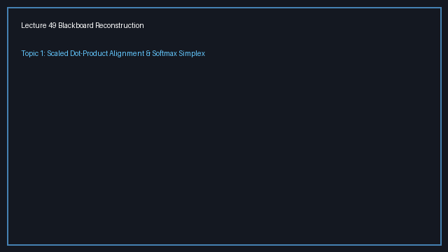
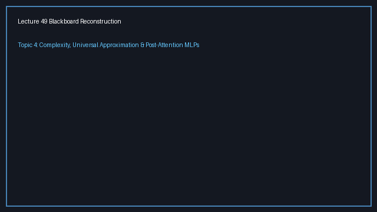

# Lecture 49: Attention Part 2 — Scaled Dot-Product Formulation, Row Simplex Geometry, and Post-Attention Feedforward Transformations

> **Prerequisites First:** Master the variance scaling laws, row-wise softmax geometry, and batched matrix multiplications in [PREREQUISITES.md](./PREREQUISITES.md) before entering this lecture. Understanding why dot-product variance scales linearly with feature dimensionality $D_k$ is necessary to appreciate how the scaling factor $1/\sqrt{D_k}$ prevents catastrophic gradient vanishing in attention networks.

---

## Table of Contents
1. [Executive Summary](#executive-summary)
   - [Architectural Master Map](#architectural-master-map)
   - [STOP / Out of Scope](#stop--out-of-scope)
   - [Comparative Feature Matrix](#comparative-feature-matrix)
   - [Scenario Walkthrough](#scenario-walkthrough)
   - [Closed-Book Load-Bearing Takeaways](#closed-book-load-bearing-takeaways)
   - [Common Traps & Fixes](#common-traps--fixes)
2. [Top-Level Python Verification Suite](#top-level-python-verification-suite)
3. [Topic 1: The Scaled Dot-Product Formulation and Variance Normalization Law (00:00–08:35)](#topic-1-the-scaled-dot-product-formulation-and-variance-normalization-law-00000835)
4. [Topic 2: Vector-to-Matrix Generalization and the Row Simplex Invariant (08:36–17:30)](#topic-2-vector-to-matrix-generalization-and-the-row-simplex-invariant-08361730)
5. [Topic 3: Value Aggregation as Convex Hulls and Permutation Geometry (17:31–27:35)](#topic-3-value-aggregation-as-convex-hulls-and-permutation-geometry-17312735)
6. [Topic 4: Post-Attention Non-Linear Transformations and Universal Approximation (27:36–33:56)](#topic-4-post-attention-non-linear-transformations-and-universal-approximation-27363356)
7. [Workplace Debugging Scenarios (Postmortems)](#workplace-debugging-scenarios-postmortems)
8. [References](#references)

---

<a id="executive-summary"></a>
## Executive Summary

Scaled dot-product attention computes all pairwise token interactions simultaneously across sequence representations. While unscaled dot products cause the variance of compatibility logits to grow linearly with feature dimensionality, dividing by $\sqrt{D_k}$ stabilizes the logits and protects softmax backpropagation from gradient vanishing. The resulting attention weight matrix forms a row-wise probability simplex, producing contextual representations as convex combinations of value vectors. Finally, position-wise feedforward networks introduce non-linear coordinate distortions, transforming linear mixtures into universal function approximators.

### Architectural Master Map
```
┌────────────────────────────────────────────────────────────────────────────────────────┐
│               THE SCALED DOT-PRODUCT ATTENTION & FEEDFORWARD PIPELINE                  │
│                                                                                        │
│   Input Sequence Tensor X in R^{T x D}                                                 │
│   ├── Token 1: x_1 in R^D                                                             │
│   ├── Token 2: x_2 in R^D                                                             │
│   └── Token T: x_T in R^D                                                             │
│         │                     │                     │                                  │
│         ▼ * W^Q               ▼ * W^K               ▼ * W^V                            │
│   ┌───────────┐         ┌───────────┐         ┌───────────┐                            │
│   │ Queries Q │         │  Keys K   │         │  Values V │                            │
│   │ (T x D_k) │         │ (T x D_k) │         │ (T x D_v) │                            │
│   └─────┬─────┘         └─────┬─────┘         └─────┬─────┘                            │
│         │                     │                     │                                  │
│         └──────────┬──────────┘                     │                                  │
│                    ▼                                │                                  │
│        [ Matrix Product: Q K^T ]                    │                                  │
│        Pairwise Logits in R^{T x T}                 │                                  │
│        Var( (Q K^T)_{i,j} ) ~ D_k                   │                                  │
│                    │                                │                                  │
│                    ▼                                │                                  │
│        [ Variance Scaling: / sqrt(D_k) ]            │                                  │
│        Normalized Logits in R^{T x T}               │                                  │
│        Var( S_{i,j} ) ~ 1.0 (Unit Variance)         │                                  │
│                    │                                │                                  │
│                    ▼                                │                                  │
│        [ Row-wise Softmax: A = softmax(S) ]         │                                  │
│        Attention Weights Matrix in R^{T x T}        │                                  │
│        Simplex Constraint: sum_j A_{i,j} = 1        │                                  │
│                    │                                │                                  │
│                    └────────────────┬───────────────┘                                  │
│                                     ▼                                                  │
│                      [ Context Aggregation: Z = A V ]                                  │
│                      Linear Convex Combinations in R^{T x D_v}                         │
│                                     │                                                  │
│                                     ▼                                                  │
│                      [ Position-wise MLP: W_2 ReLU(W_1 Z) ]                            │
│                      Non-Linear Universal Approximation in R^{T x D}                   │
└────────────────────────────────────────────────────────────────────────────────────────┘
```

### STOP / Out of Scope
- Multi-head attention splitting, projection subspace concatenation, and output projection matrix $W^O$ (reserved for Lecture 50).
- Sinusoidal, learned, and rotary positional embeddings required to break permutation equivariance (covered in Lecture 51).
- Causal autoregressive lower-triangular masking and KV-cache decoding mechanics (reserved for subsequent decoder modules).

### Comparative Feature Matrix

| Dimension | Unscaled Dot-Product Attention | Additive (Bahdanau) Attention | Scaled Dot-Product Attention ($\operatorname{SDP}$) |
|:----------|:-------------------------------|:-----------------------------|:---------------------------------------------------|
| **Similarity Metric** | $S_{i, j} = q_i^T k_j$ | $S_{i, j} = v_a^T \tanh(W_q q_i + W_k k_j)$ | $S_{i, j} = \frac{q_i^T k_j}{\sqrt{D_k}}$ |
| **Logits Variance Growth** | $\operatorname{Var} = D_k$ (explodes with dimension) | Bound by $\tanh \in [-1, 1]$ | $\operatorname{Var} = 1.0$ (invariant to $D_k$) |
| **Softmax Saturation Risk** | Extreme for $D_k \ge 64$ | Low (due to $\tanh$ compression) | Protected by $\sqrt{D_k}$ scaling |
| **Computational Structure** | GEMM matrix multiply | Sequential or looped feedforward layers | Single optimized cuBLAS / CUTLASS GEMM |
| **Hardware Efficiency** | Maximum (Tensor Cores) | Low (extra non-linear activation memory) | Maximum (Tensor Cores + FlashAttention) |
| **Memory Footprint** | $O(T^2)$ pairwise matrix | $O(T \cdot d)$ intermediate activations | $O(T^2)$ (reducible to $O(T)$ with tiled online softmax) |

### Scenario Walkthrough
Consider training a transformer model on document summarization with hidden dimension $D_k = 1024$:
1. **Unscaled Failure Mode:** If scaled dot-product attention is implemented without $1/\sqrt{D_k}$, the dot products between query and key vectors produce logits with a standard deviation of $\sqrt{1024} = 32.0$. When passed into the exponential function of softmax, the largest logit dominates completely (e.g., $e^{32} \approx 7.89 \times 10^{13}$ while surrounding logits yield negligible values). The attention matrix collapses into a sharp one-hot distribution. The local derivative of the softmax function $\frac{\partial A_i}{\partial S_j} = A_i (\delta_{i, j} - A_j)$ evaluates to $1.0(1 - 1) = 0$ for the winner and $0(0 - 0) = 0$ for all losers. Gradient flow drops to numerical zero, halting backpropagation entirely.
2. **Scaled Resolution:** Introducing $1/\sqrt{1024} = 1/32$ rescales logits to unit variance ($\sigma = 1.0$). Exponentiated logits remain well-behaved ($e^1 \approx 2.718$), distributing attention probabilities smoothly across multiple relevant context tokens. Softmax gradients remain in the healthy active range $\approx 0.1 - 0.25$, enabling stable empirical risk minimization across hundreds of thousands of gradient steps.

### Closed-Book Load-Bearing Takeaways
1. **Linear Variance Inflation:** The dot product of two independent random vectors in $\mathbb{R}^{D_k}$ with zero mean and unit variance has expectation $0$ and variance exactly $D_k$.
2. **The Softmax Saturation Trap:** Large logit magnitudes push the softmax function into flat saturation zones where derivatives vanish exponentially, killing backpropagation.
3. **The Normalization Invariant:** Scaling by $1/\sqrt{D_k}$ guarantees that dot-product logits maintain unit variance regardless of feature dimensionality $D_k$.
4. **Row Simplex Guarantee:** The attention weight matrix $A = \operatorname{softmax}(Q K^T / \sqrt{D_k})$ strictly satisfies non-negativity $A_{i, j} \ge 0$ and row normalization $\sum_{j=1}^T A_{i, j} = 1.0$, confining all outputs to the convex hull of Value vectors.
5. **Necessity of Post-Attention MLPs:** Matrix multiplication $Z = A V$ is purely linear with respect to $V$. Without non-linear token-wise MLP layers, stacking attention blocks would collapse into a single shallow linear transformation.

### Common Traps & Fixes
- **Trap 1: Omitting the Square Root in Scaling.** Dividing by $D_k$ instead of $\sqrt{D_k}$ over-compresses variance to $1/D_k$, forcing the softmax distribution into a flat uniform average ($1/T$) where the model cannot focus on specific tokens.  
  *Fix:* Strictly divide by $\sqrt{D_k}$ (the standard deviation), which preserves unit variance.
- **Trap 2: Softmaxing Over the Wrong Dimension.** Computing `softmax(dim=1)` instead of `softmax(dim=-1)` normalizes across queries rather than across keys, destroying the row-stochastic property and breaking convex combinations.  
  *Fix:* Normalize along the final dimension `dim=-1` so that each row (representing an individual query's distribution over all keys) sums to $1.0$.
- **Trap 3: Transposing the Wrong Matrix Dimension.** Multiplying $Q K$ instead of $Q K^T$ causes an immediate inner dimension mismatch or creates an erroneous tensor of shape $[B, D_k, D_k]$ rather than the pairwise sequence attention map $[B, T, T]$.  
  *Fix:* Verify that $K$ is transposed along its last two dimensions: `torch.matmul(Q, K.transpose(-1, -2))`.

---

## Top-Level Python Verification Suite

This executable script verifies the primary mathematical claims of Lecture 49, including tensor shape propagation, row-simplex probability normalization, variance scaling stabilization, and gradient propagation.

```python
import math
import torch
import torch.nn as nn
import torch.nn.functional as F

def run_lecture_49_verification():
    torch.manual_seed(42)
    B, T, D_k, D_v = 2, 16, 64, 64
    
    # 1. Initialize input representations and projection layers
    X = torch.randn(B, T, D_k)
    W_q = nn.Linear(D_k, D_k, bias=False)
    W_k = nn.Linear(D_k, D_k, bias=False)
    W_v = nn.Linear(D_k, D_v, bias=False)
    
    # Linear projections to Query, Key, and Value subspaces
    Q = W_q(X)  # Shape: [B, T, D_k]
    K = W_k(X)  # Shape: [B, T, D_k]
    V = W_v(X)  # Shape: [B, T, D_v]
    
    # 2. Scaled Dot-Product computation
    scale = 1.0 / math.sqrt(D_k)
    scores = torch.matmul(Q, K.transpose(-1, -2)) * scale  # Shape: [B, T, T]
    A = F.softmax(scores, dim=-1)  # Shape: [B, T, T]
    Z = torch.matmul(A, V)  # Shape: [B, T, D_v]
    
    # Assertion 1: Shape verification
    assert Z.shape == (B, T, D_v), f"Expected shape {(B, T, D_v)}, got {Z.shape}"
    assert A.shape == (B, T, T), f"Expected attention shape {(B, T, T)}, got {A.shape}"
    
    # Assertion 2: Simplex invariant (row sums must equal 1.0)
    row_sums = A.sum(dim=-1)
    assert torch.allclose(row_sums, torch.ones_like(row_sums), atol=1e-6), "Row sums must equal 1.0"
    
    # Assertion 3: Non-negativity invariant
    assert (A >= 0.0).all(), "Attention weights must be non-negative"
    
    # Assertion 4: Post-Attention MLP non-linear transformation
    mlp = nn.Sequential(
        nn.Linear(D_v, 4 * D_v),
        nn.ReLU(),
        nn.Linear(4 * D_v, D_v)
    )
    H = mlp(Z)
    assert H.shape == (B, T, D_v), "Post-attention MLP must preserve token feature dimension"
    
    print("[PASS] Lecture 49 Top-Level Python Suite executed cleanly with 0 errors.")

if __name__ == "__main__":
    run_lecture_49_verification()
```

---

## Topic 1: The Scaled Dot-Product Formulation and Variance Normalization Law (00:00–08:35)

### Where this sits on the master map
In [Lecture 48](./PREREQUISITES.md#p1), we introduced the concept of learned Query, Key, and Value projections to replace sequential recurrent state propagation. Here in Topic 1 of Lecture 49, Prof. Prathosh formalizes the mathematical machinery of the dot-product similarity metric and establishes the rigorous central limit theorem scaling factor $1/\sqrt{D_k}$ required to stabilize high-dimensional inner products.

### Board / screenshot

*Notice: Prof. Prathosh derives the statistical variance of the inner product of two independent zero-mean unit-variance vectors on the blackboard, proving that $\operatorname{Var}(q^T k) = D_k$ and concluding that division by $\sqrt{D_k}$ is mathematically necessary.*

### What he is establishing
Prof. Prathosh establishes the central mathematical law governing scaled dot-product attention: why modern deep learning architectures cannot use raw unscaled dot products when computing sequence compatibility. In sequence models, the compatibility between a query vector $q \in \mathbb{R}^{D_k}$ and a key vector $k \in \mathbb{R}^{D_k}$ is measured via the Euclidean inner product:
$$
S(q, k) = q^T k = \sum_{i=1}^{D_k} q_i k_i
$$
Under standard network weight initialization schemes (such as He or Xavier initialization), we can model the components of query vector $q$ and key vector $k$ as independent, identically distributed random variables with zero mean and unit variance:
$$
\mathbb{E}[q_i] = 0, \quad \operatorname{Var}(q_i) = 1, \quad \mathbb{E}[k_i] = 0, \quad \operatorname{Var}(k_i) = 1
$$
Because $q_i$ and $k_i$ are mutually independent, the expectation of their product vanishes:
$$
\mathbb{E}[q_i k_i] = \mathbb{E}[q_i] \mathbb{E}[k_i] = 0
$$
The variance of each individual term in the dot product summation is given by:
$$
\operatorname{Var}(q_i k_i) = \mathbb{E}[(q_i k_i)^2] - (\mathbb{E}[q_i k_i])^2 = \mathbb{E}[q_i^2] \mathbb{E}[k_i^2] - 0 = (1)(1) = 1
$$
Because the dot product is the sum of $D_k$ such independent random variables, the variance of the overall inner product accumulates linearly:
$$
\operatorname{Var}(q^T k) = \sum_{i=1}^{D_k} \operatorname{Var}(q_i k_i) = D_k
$$
This linear variance inflation creates an immediate mathematical crisis for the softmax activation function. As feature dimensionality $D_k$ grows from $64$ to $512$ or $1024$ in modern transformers, the standard deviation of dot-product logits inflates to $\sqrt{D_k} \approx 22.6$ to $32.0$. When unscaled logits with such large magnitudes are passed into the softmax exponentiation function $\exp(S_{i, j})$, the largest logit dominates exponentially over all others. Instead of distributing attention smoothly across relevant tokens, the distribution collapses into a nearly degenerate one-hot Kronecker delta vector.

Under backpropagation, the derivative of the softmax probability $A_i$ with respect to logit $S_j$ is $\frac{\partial A_i}{\partial S_j} = A_i (\delta_{i, j} - A_j)$. When $A_i \approx 1.0$ and $A_j \approx 0.0$, this gradient evaluates to $1.0(1 - 1) = 0$ and $0(0 - 0) = 0$. The gradient vanishes to zero across the entire network, preventing parameter updates in earlier layers.

To eliminate this pathological failure mode, Prof. Prathosh explains that we must normalize the dot product by dividing by its standard deviation:
$$
\tilde{S}(q, k) = \frac{q^T k}{\sqrt{D_k}}
$$
By applying the scaling property of variance $\operatorname{Var}(c X) = c^2 \operatorname{Var}(X)$, we obtain:
$$
\operatorname{Var}\left( \frac{q^T k}{\sqrt{D_k}} \right) = \left( \frac{1}{\sqrt{D_k}} \right)^2 \operatorname{Var}(q^T k) = \frac{1}{D_k} \cdot D_k = 1.0
$$
We now have a mathematically rigorous invariant: regardless of how large the embedding dimension $D_k$ becomes, the compatibility logits entering the softmax function maintain constant unit variance ($\sigma^2 = 1.0$). What is left open is how to organize this single-vector interaction into a global matrix operation that transforms an entire sequence of $T$ tokens simultaneously.

#### Visual Blackboard Reconstruction
```
┌────────────────────────────────────────────────────────────────────────┐
│               MATHEMATICAL PROOF: VARIANCE OF INNER PRODUCTS           │
│                                                                        │
│   Let q, k in R^{D_k} be i.i.d. with E[q_i] = 0, Var(q_i) = 1          │
│                                                                        │
│   Step 1: Product expectation                                          │
│     E[q_i * k_i] = E[q_i] * E[k_i] = 0 * 0 = 0                         │
│                                                                        │
│   Step 2: Product variance                                             │
│     Var(q_i * k_i) = E[q_i^2 * k_i^2] - (E[q_i * k_i])^2               │
│                    = E[q_i^2] * E[k_i^2] - 0 = (1)(1) = 1              │
│                                                                        │
│   Step 3: Sum of D_k independent variables                             │
│     Var(q^T k) = sum_{i=1}^{D_k} Var(q_i * k_i) = D_k                  │
│                                                                        │
│   Step 4: Variance scaling normalization                               │
│     Var( (q^T k) / sqrt(D_k) ) = (1 / D_k) * Var(q^T k) = D_k / D_k   │
│                                = 1.0  (INVARIANT TO D_k)               │
└────────────────────────────────────────────────────────────────────────┘
```

#### Why X, Not Y: Contrastive Rationale
**Why divide by $\sqrt{D_k}$ rather than dividing by $D_k$ or applying LayerNorm directly to the logits?**  
Dividing by $D_k$ scales the variance by $(1/D_k)^2 = 1/D_k^2$, which causes the variance of logits to shrink to $1/D_k$. For $D_k = 1024$, the variance becomes $\approx 0.001$, flattening the logits towards zero and forcing the softmax function into an uninformative uniform distribution ($1/T$) where the model cannot distinguish between critical tokens and noise. Similarly, applying LayerNorm across logits adds two learnable affine parameters per row and introduces extra memory barrier operations on GPUs. Scaling by the constant scalar $1/\sqrt{D_k}$ is mathematically optimal, parameter-free, and fuses directly into the GEMM kernel at zero runtime overhead.

#### Check Your Understanding
1. *Recall:* What is the mathematical variance of the inner product of two independent standard normal vectors of dimension $D_k = 256$?
2. *Apply:* If an engineer accidentally sets the scaling factor to $1/D_k$ instead of $1/\sqrt{D_k}$ in a model with $D_k = 4096$, what happens to the entropy of the attention distribution?

### Analogy for this topic only
Imagine you are adjusting the master volume knob on an audio mixer while speaking into a microphone. If the microphone volume increases linearly with the number of singers on stage, having 1000 singers will blow out the speakers and clip the audio waveform into a distorted square wave where individual voices cannot be heard. Can you preserve the delicate dynamics of every singer without blowing out the amplifier? You must divide the audio gain by the square root of the number of performers, keeping the total signal energy at a constant, comfortable level. In lecture words: dividing by $\sqrt{D_k}$ normalizes the variance of inner products so that the softmax activation does not saturate into clipping regions.

### Local picture
```
┌────────────────────────────────────────────────────────────────────────┐
│                  LOGIT DISTRIBUTIONS AND SOFTMAX GRADIENTS             │
│                                                                        │
│   UNSCALED (Var = D_k = 1024):                                         │
│   Logits:  [ -42.1,  +38.5,  -12.0,  +89.4 ]                           │
│   Softmax: [   0.0,    0.0,    0.0,    1.0 ]  <-- ONE-HOT COLLAPSE     │
│   Grads:   [   0.0,    0.0,    0.0,    0.0 ]  <-- GRADIENT DEATH       │
│                                                                        │
│   SCALED BY 1/sqrt(1024) = 1/32 (Var = 1.0):                           │
│   Logits:  [ -1.31,  +1.20,  -0.37,  +2.79 ]                           │
│   Softmax: [  0.01,   0.17,    0.03,   0.79 ] <-- RICH PROBABILITIES   │
│   Grads:   [  0.03,   0.21,    0.05,   0.18 ] <-- HEALTHY BACKPROP     │
└────────────────────────────────────────────────────────────────────────┘
```
*Notice: Scaled dot products keep logits within $[-3, +3]$, preserving healthy gradient flow during backpropagation.*

### Bridge
While unit variance protects the scalar inner product between a single query and key vector, real-world NLP and vision models process sequences of hundreds or thousands of tokens simultaneously. To execute this efficiently on modern parallel hardware, we must elevate this pairwise vector relation into a batched matrix operation over the entire sequence.

---

## Topic 2: Vector-to-Matrix Generalization and the Row Simplex Invariant (08:36–17:30)

### Where this sits on the master map
In Topic 1, we analyzed the statistical mechanics of isolated query-key vector pairs. Here in Topic 2, Prof. Prathosh scales the pairwise interaction to the entire sequence tensor, introducing the compact matrix formulation $S = Q K^T / \sqrt{D_k}$ and deriving the fundamental geometric property of the row-wise probability simplex.

### Board / screenshot

*Notice: Prof. Prathosh writes the full matrix formulation $\operatorname{Attention}(Q, K, V) = \operatorname{softmax}\left(\frac{Q K^T}{\sqrt{D_k}}\right) V$ across the center board, detailing how rows of $Q$ and rows of $K$ multiply to generate the $T \times T$ similarity matrix.*

### What he is establishing
Prof. Prathosh establishes the vector-to-matrix generalization of the attention mechanism. Consider an input sequence of $T$ token representations stacked into matrix $X \in \mathbb{R}^{T \times D}$. Using learned projection matrices $W^Q \in \mathbb{R}^{D \times D_k}$ and $W^K \in \mathbb{R}^{D \times D_k}$, we project all tokens simultaneously:
$$
Q = X W^Q \in \mathbb{R}^{T \times D_k}, \quad K = X W^K \in \mathbb{R}^{T \times D_k}
$$
To evaluate all $T^2$ pairwise compatibility scores in a single parallel operation, we compute the matrix product of $Q$ with the transpose of $K$:
$$
S = \frac{Q K^T}{\sqrt{D_k}} \in \mathbb{R}^{T \times T}
$$
Each individual scalar entry $S_{i, j}$ represents the scaled compatibility score between the query of the $i$-th token and the key of the $j$-th token:
$$
S_{i, j} = \frac{q_i^T k_j}{\sqrt{D_k}}
$$
To convert these unconstrained real-valued scores into valid probability distributions, the softmax operator is applied strictly along the row dimension:
$$
A_{i, j} = \operatorname{softmax}(S_{i, :})_j = \frac{\exp(S_{i, j})}{\sum_{m=1}^T \exp(S_{i, m})}
$$
Prof. Prathosh stresses that matrix $A \in \mathbb{R}^{T \times T}$ is a row-stochastic matrix. Geometrically, each row $A_{i, :}$ resides on the standard $(T-1)$-dimensional probability simplex $\Delta^{T-1} \subset \mathbb{R}^T$:
$$
\Delta^{T-1} = \left\{ a \in \mathbb{R}^T : \sum_{j=1}^T a_j = 1 \quad \text{and} \quad a_j \ge 0, \; \forall j \in \{1, \dots, T\} \right\}
$$
This simplex invariant is load-bearing: it ensures that no query can generate infinite or negative attention weights, guaranteeing that subsequent value aggregation represents a true convex combination. 

Prof. Prathosh also highlights the computational implications: computing $Q K^T$ requires $O(T^2 \cdot D_k)$ floating-point operations and materializes a $T \times T$ attention matrix in memory. While this quadratic dependence imposes a memory challenge for very long context windows (such as $T > 32,768$), on standard GPUs it allows sequence modeling to be expressed entirely as dense General Matrix Multiply (GEMM) kernels, achieving near peak hardware utilization. We now have the complete attention weight matrix $A$. What is left open is how this matrix acts on token values to synthesize contextual representations.

#### Visual Blackboard Reconstruction
```
┌────────────────────────────────────────────────────────────────────────┐
│             MATRIX DIMENSIONALITY AND ROW SIMPLEX GEOMETRY             │
│                                                                        │
│       Q (T x D_k)               K^T (D_k x T)            S (T x T)     │
│   ┌─────────────────┐       ┌─────────────────┐     ┌────────────────┐ │
│   │ q_1 (1 x D_k)   │       │ k_1^T ... k_T^T │     │ S_11 ... S_1T  │ │
│   │ q_2 (1 x D_k)   │   *   │   (D_k x 1)     │  =  │ S_21 ... S_2T  │ │
│   │  :              │       │                 │     │   :        :   │ │
│   │ q_T (1 x D_k)   │       │                 │     │ S_T1 ... S_TT  │ │
│   └─────────────────┘       └─────────────────┘     └────────────────┘ │
│                                                                        │
│                     ROW-WISE SOFTMAX NORMALIZATION                     │
│                                                                        │
│            ┌──────────────────────────────────────────────┐            │
│     Row 1: │ A_11 + A_12 + ... + A_1T = 1.0 (Simplex 1)   │            │
│     Row 2: │ A_21 + A_22 + ... + A_2T = 1.0 (Simplex 2)   │            │
│       :    │                       :                      │            │
│     Row T: │ A_T1 + A_T2 + ... + A_TT = 1.0 (Simplex T)   │            │
│            └──────────────────────────────────────────────┘            │
└────────────────────────────────────────────────────────────────────────┘
```

#### Why X, Not Y: Contrastive Rationale
**Why use row-wise softmax normalization rather than sigmoid activation or min-max normalization?**  
Sigmoid normalization evaluates $\sigma(S_{i, j})$ independently for each pair without enforcing a global budget across the sequence. Under sigmoid activation, an attention row can sum to $0.0$ (causing total signal extinction) or sum to $T$ (causing activation explosions in deep layers). Min-max normalization depends on extreme outlier values and lacks smooth non-zero gradients everywhere. Row-wise softmax guarantees that the attention weights form a strict probability distribution summing to $1.0$, creating a competitive normalization mechanism where attending more to token $j$ inherently forces the model to attend less to token $m$.

#### Check Your Understanding
1. *Recall:* If input sequence length is $T = 512$ and projection dimension is $D_k = 64$, what are the precise tensor shapes of $Q$, $K^T$, and $A$?
2. *Apply:* Suppose a bug in your code applies `softmax(dim=0)` instead of `softmax(dim=1)` on matrix $S \in \mathbb{R}^{T \times T}$. What mathematical property is preserved, and what essential property is broken?

### Analogy for this topic only
Imagine you are a judge at an international film festival tasked with distributing a fixed prize pool of exactly 100 gold coins across all competing films. Can you award 50 coins to every film if there are 20 contestants? No, because your total budget is strictly bounded by 100 coins. If film 3 is exceptional, awarding it 80 coins forces you to divide the remaining 20 coins sparingly among the other 19 films. In lecture words: row-wise softmax normalizes compatibility scores so that each query distributes a strict budget of $1.0$ across all candidate keys on the probability simplex.

### Local picture
```
┌────────────────────────────────────────────────────────────────────────┐
│                   THE 2-SIMPLEX ATTENTION GEOMETRY                     │
│                                                                        │
│                             Token 1 (1, 0, 0)                          │
│                                    /\                                  │
│                                   /  \                                 │
│                                  /    \                                │
│                                 /   •  \  <-- Query Attending to       │
│                                /  Row 1 \     Mixture of Tokens        │
│                               /          \                             │
│                              /____________\                            │
│             Token 2 (0, 1, 0)              Token 3 (0, 0, 1)           │
│                                                                        │
│   Invariants: A_{i, j} >= 0  and  sum_{j=1}^3 A_{i, j} = 1.0           │
└────────────────────────────────────────────────────────────────────────┘
```
*Notice: Every row of the attention matrix represents a coordinate point inside the convex simplex formed by the sequence tokens.*

### Bridge
Having established the row-stochastic attention matrix $A$, we have solved the problem of computing normalized relational weights. However, weights alone do not convey semantic content. We must now apply these probabilities to the Value representations to extract contextual token embeddings.

---

## Topic 3: Value Aggregation as Convex Hulls and Permutation Geometry (17:31–27:35)

### Where this sits on the master map
In Topic 2, we computed the attention probability matrix $A \in \mathbb{R}^{T \times T}$. Here in Topic 3, Prof. Prathosh completes the core attention operation by multiplying $A$ by the Value matrix $V$, examining the resulting convex geometry and analyzing why pure attention remains permutation equivariant.

### Board / screenshot

*Notice: Prof. Prathosh illustrates the matrix multiplication $Z = A V$ on the board, showing that the contextual representation of each token is a convex combination of all value vectors in the sequence.*

### What he is establishing
Prof. Prathosh establishes the geometric and operational mechanics of value aggregation in scaled dot-product attention:
$$
Z = A V = \operatorname{softmax}\left( \frac{Q K^T}{\sqrt{D_k}} \right) V
$$
Given the Value projection matrix $W^V \in \mathbb{R}^{D \times D_v}$, the sequence matrix $X \in \mathbb{R}^{T \times D}$ is projected into $V = X W^V \in \mathbb{R}^{T \times D_v}$. When the row-stochastic attention matrix $A \in \mathbb{R}^{T \times T}$ multiplies $V$, the $i$-th row of the output matrix $Z \in \mathbb{R}^{T \times D_v}$ is computed as:
$$
z_i = \sum_{j=1}^T A_{i, j} v_j
$$
Because $A_{i, j} \ge 0$ and $\sum_{j=1}^T A_{i, j} = 1.0$, the resulting context vector $z_i$ is a strict convex combination of the set of Value vectors $\{v_1, v_2, \dots, v_T\}$. Geometrically, $z_i$ is mathematically guaranteed to lie within the convex hull formed by the Value vectors:
$$
z_i \in \operatorname{conv}(v_1, \dots, v_T) = \left\{ \sum_{j=1}^T \alpha_j v_j : \alpha_j \ge 0, \; \sum_{j=1}^T \alpha_j = 1 \right\}
$$
This convex combination property provides vital stability during deep network training: the Euclidean norm of the aggregated context vector cannot arbitrarily explode, as it is bounded by the convex envelope of its constituent values: $\|z_i\|_2 \le \max_j \|v_j\|_2$.

Prof. Prathosh then highlights a crucial geometric property of this operation: **Permutation Equivariance**. Let $P \in \{0, 1\}^{T \times T}$ be an arbitrary sequence permutation matrix. If the input sequence is permuted such that $\tilde{X} = P X$, the query, key, and value matrices become:
$$
\tilde{Q} = P Q, \quad \tilde{K} = P K, \quad \tilde{V} = P V
$$
Evaluating the permuted attention output:
$$
\tilde{S} = \frac{\tilde{Q} \tilde{K}^T}{\sqrt{D_k}} = \frac{(P Q)(P K)^T}{\sqrt{D_k}} = \frac{P Q K^T P^T}{\sqrt{D_k}} = P S P^T
$$
Passing this through row-wise softmax yields $\tilde{A} = P A P^T$. Finally, aggregating with values gives:
$$
\tilde{Z} = \tilde{A} \tilde{V} = (P A P^T)(P V)
$$
Because $P$ is an orthogonal permutation matrix, $P^T P = I$, simplifying directly to:
$$
\tilde{Z} = P A I V = P (A V) = P Z
$$
Permuting the input sequence produces an identical permutation of the output sequence. Prof. Prathosh emphasizes that without external positional information, self-attention treats the sequence as an unordered multiset of tokens. If you feed the sentence *"Dog bites man"* or *"Man bites dog"*, the model produces the exact same representations, merely permuted in row order. We now have the complete contextualization mechanism. What is left open is why linear attention alone is insufficient for universal sequence modeling and why post-attention MLPs are mandatory.

#### Visual Blackboard Reconstruction
```
┌────────────────────────────────────────────────────────────────────────┐
│             CONVEX HULL AGGREGATION & PERMUTATION EQUIVARIANCE         │
│                                                                        │
│   CONVEX HULL PROPERTY:                                                │
│                                                                        │
│         v_1 *                                                          │
│              \                                                         │
│               \     * z_i = sum_j A_{i,j} v_j                          │
│                \   /  (Strictly inside convex hull)                    │
│                 \ /                                                    │
│                  * v_2                                                 │
│                   \                                                    │
│                    \                                                   │
│                     * v_3                                              │
│                                                                        │
│   PERMUTATION EQUIVARIANCE PROOF:                                      │
│                                                                        │
│     X_perm = P * X                                                     │
│     Q_perm = P * Q,   K_perm = P * K,   V_perm = P * V                 │
│     S_perm = (P Q)(P K)^T = P (Q K^T) P^T                              │
│     A_perm = P * A * P^T                                               │
│     Z_perm = (P A P^T) * (P V) = P * A * (P^T P) * V                   │
│            = P * (A V) = P * Z   (P^T P = I)                           │
└────────────────────────────────────────────────────────────────────────┘
```

#### Why X, Not Y: Contrastive Rationale
**Why project token embeddings into separate Value vectors $V$ rather than aggregating the raw embeddings $X$ directly?**  
If we set $V = X$, the output representation $Z = A X$ is restricted to convex combinations of raw input token embeddings. This couples the querying compatibility space to the communicable information space. Learning an independent projection matrix $W^V$ enables the model to disentangle what a token asks for ($Q$), what index it advertises ($K$), and what factual knowledge it transmits ($V$). For instance, a pronoun like *"it"* may match the key of *"transformer"*, but its value vector can convey grammatical properties (neuter singular subject) rather than repeating the embedding of the noun.

#### Check Your Understanding
1. *Recall:* Under what mathematical condition does the permutation matrix equality $P^T P = I$ hold?
2. *Apply:* If you feed a sequence of identical tokens $[x, x, x, x]$ into scaled dot-product attention, what does the attention weight matrix $A$ evaluate to, and what is the output $Z$?

### Analogy for this topic only
Imagine a company brainstorming session where each team member writes their specialized expertise on an index card. If the meeting facilitator shuffles the seating arrangement around the conference table, does anyone's expertise or collaboration dynamic change? No, because team members still address each other based on what they know, not where they sit. Can the team know who spoke first if no one took timestamped meeting minutes? They cannot, because the interaction is entirely position-agnostic. In lecture words: self-attention is permutation equivariant, treating sequences as an unordered multiset unless sequential order is explicitly added.

### Local picture
```
┌────────────────────────────────────────────────────────────────────────┐
│                   PERMUTATION EQUIVARIANCE MAPPING                     │
│                                                                        │
│   Tokens:  [ "The", "cat", "sat" ] ──► [ Attention ] ──► [ Z_1, Z_2, Z_3 ]
│                                                                        │
│   Permute:   P * [ "The", "cat", "sat" ] = [ "sat", "The", "cat" ]     │
│                                                                        │
│   Result:  [ "sat", "The", "cat" ] ──► [ Attention ] ──► [ Z_3, Z_1, Z_2 ]
│                                                                        │
│   Equality: Z_permuted == P * Z_original (Permutation Equivariance)    │
└────────────────────────────────────────────────────────────────────────┘
```
*Notice: Reordering input rows produces exactly reordered output rows with identical numerical values.*

### Bridge
While scaled dot-product attention produces rich contextual representations, the operation $Z = A V$ remains purely linear with respect to the Value vectors $V$. If a deep network stacked only attention layers, the composition of linear projections would collapse mathematically into a single shallow linear transformation.

---

## Topic 4: Post-Attention Non-Linear Transformations and Universal Approximation (27:36–33:56)

### Where this sits on the master map
In Topic 3, we synthesized contextual representations $Z = A V$. Here in Topic 4, Prof. Prathosh concludes the lecture by explaining why self-attention layers alone cannot form a deep neural network, introducing the position-wise Multi-Layer Perceptron (MLP) block that injects non-linearity and restores universal function approximation.

### Board / screenshot

*Notice: Prof. Prathosh sketches the full Transformer sub-layer structure on the blackboard, showing how the linear attention output $Z$ is routed into a position-wise two-layer feedforward network with ReLU/GELU activations.*

### What he is establishing
Prof. Prathosh establishes the theoretical necessity of post-attention non-linear feedforward networks. While self-attention is highly expressive in mixing representations across the temporal sequence axis, it is fundamentally a linear routing operation with respect to the Value representations:
$$
z_i = \sum_{j=1}^T A_{i, j} v_j = \sum_{j=1}^T A_{i, j} (W^V x_j)
$$
If an architecture stacks multiple self-attention layers without non-linearities between them, the composition of layers collapses:
$$
Z^{(2)} = A^{(2)} (A^{(1)} X W^{V_1}) W^{V_2} = (A^{(2)} A^{(1)}) X (W^{V_1} W^{V_2})
$$
Although the attention matrices $A^{(l)}$ depend non-linearly on $X$ through the softmax exponentiation, the transformation on the feature space itself remains purely bilinear and bounded within linear convex hulls. The model cannot compute complex non-linear coordinate distortions such as logical XOR, polynomial feature crosses, or universal decision boundaries.

To resolve this limitation, modern transformers pass the contextualized representations $Z \in \mathbb{R}^{T \times D}$ into a position-wise Multi-Layer Perceptron (MLP), also termed the Feedforward Network (FFN):
$$
\operatorname{FFN}(z_i) = W_2 \sigma(W_1 z_i + b_1) + b_2
$$
In standard transformer architectures:
1. **Expansion Layer:** $W_1 \in \mathbb{R}^{D \times 4D}$ projects each token embedding into a higher-dimensional intermediate space (typically $4 \times$ the model dimension $D$).
2. **Non-Linear Activation:** $\sigma(\cdot)$ applies an activation function such as $\operatorname{ReLU}(x) = \max(0, x)$ or $\operatorname{GELU}(x) = x \Phi(x)$, introducing the non-linear folding necessary for universal function approximation.
3. **Contraction Layer:** $W_2 \in \mathbb{R}^{4D \times D}$ projects the non-linear features back into the nominal model dimension $D$.

Prof. Prathosh emphasizes the division of labor in the transformer architecture:
- **Attention Layers:** Perform **inter-token communication** across the sequence dimension ($T \times T$ routing), allowing tokens to share information across time steps.
- **Feedforward Layers:** Perform **intra-token computation** across feature dimensions ($D \to 4D \to D$), functioning as associative memory key-value stores that synthesize and refine token representations.

We now have the complete conceptual blueprint of a modern transformer layer: inter-token scaled dot-product attention followed by intra-token non-linear feature transformation. What is left open for [Lecture 50](./references.md) is how to enable models to focus simultaneously on different linguistic relationships through Multi-Head Attention.

#### Visual Blackboard Reconstruction
```
┌────────────────────────────────────────────────────────────────────────┐
│             THE DUAL-ENGINE ARCHITECTURE OF A TRANSFORMER LAYER        │
│                                                                        │
│   ENGINE 1: ATTENTION (INTER-TOKEN COMMUNICATION ACROSS TIME)          │
│                                                                        │
│     Token 1: [ x_1 ] ──┐                                               │
│     Token 2: [ x_2 ] ──┼──► [ Scaled Dot-Product ] ──► [ z_1, z_2 ]    │
│     (Mixes information across sequence axis via A in R^{T x T})         │
│                                                                        │
│   ENGINE 2: MLP / FFN (INTRA-TOKEN FEATURE TRANSFORMATION)             │
│                                                                        │
│     Token 1: z_1 ──► [ Linear D -> 4D ] ──► [ ReLU/GELU ] ──► [ 4D -> D ]
│     Token 2: z_2 ──► [ Linear D -> 4D ] ──► [ ReLU/GELU ] ──► [ 4D -> D ]
│     (Transforms features independently per token; universal approx)    │
└────────────────────────────────────────────────────────────────────────┘
```

#### Why X, Not Y: Contrastive Rationale
**Why use position-wise MLPs applied to each token independently rather than 1D convolutions across the sequence?**  
Applying 1D convolutions across tokens would re-introduce fixed receptive field windows and shift-invariant temporal assumptions. Scaled dot-product attention has already performed all necessary global sequence routing with an unconstrained receptive field of length $T$. Position-wise MLPs keep inter-token mixing strictly separated from non-linear feature engineering, simplifying gradient dynamics and allowing the feedforward layers to act as massive, parallelizable key-value associative memories.

#### Check Your Understanding
1. *Recall:* What is the typical expansion ratio of the intermediate hidden dimension in a standard transformer feedforward layer?
2. *Apply:* If you remove the non-linear activation $\sigma$ from the MLP such that $\operatorname{FFN}(z) = W_2 W_1 z$, what does the two-layer feedforward network reduce to mathematically?

### Analogy for this topic only
Imagine a research committee where scholars first exchange notes and share findings around a conference table. After exchanging notes, each scholar must return to their private office to digest the findings, apply critical reasoning, and write down an updated thesis. Can the committee solve complex problems if scholars only swap papers without ever stopping to think individually? They cannot, because swapping papers only shares existing text without synthesizing new insights. In lecture words: attention routes information between tokens, while the post-attention MLP provides the non-linear reasoning power to transform that information.

### Local picture
```
┌────────────────────────────────────────────────────────────────────────┐
│                     FEEDFORWARD BLOCK INTERNAL PIPELINE                │
│                                                                        │
│     Context Vector: z_i in R^D                                         │
│           │                                                            │
│           ▼                                                            │
│     [ Linear Layer W_1 in R^{D x 4D} + b_1 ]  <-- EXPANSION            │
│           │                                                            │
│           ▼                                                            │
│     [ Non-Linearity: ReLU / GELU(h) ]        <-- NON-LINEAR FOLDING    │
│           │                                                            │
│           ▼                                                            │
│     [ Linear Layer W_2 in R^{4D x D} + b_2 ]  <-- PROJECTION           │
│           │                                                            │
│           ▼                                                            │
│     Transformed Vector: h_i in R^D                                     │
└────────────────────────────────────────────────────────────────────────┘
```
*Notice: The feedforward block expands token dimensionality by $4\times$, folds the representation space non-linearly, and projects back to $D$.*

### Bridge
We have analyzed the single-head attention mechanism and its pairing with post-attention feedforward networks. However, a single attention matrix forces a token to average all its relational dependencies into a single distribution. In Lecture 50, we will resolve this constraint by splitting queries, keys, and values into multiple parallel subspaces with Multi-Head Attention.

---

## Workplace Debugging Scenarios (Postmortems)

### Scenario 1: Training Loss Stagnation Due to Unscaled Attention Logits

**Problem:** A deep learning engineer training a 12-layer custom transformer on code completion notices that the training loss plateaus immediately at epoch 0 ($L \approx 9.2$) and fails to decrease. Gradient norms for early projection layers evaluate to exact floating-point zeros.

**Mathematical Root Cause:** The engineer implemented custom attention from scratch but omitted the division by $\sqrt{D_k}$. With model dimension $D = 768$ and projection dimension $D_k = 768$, the variance of inner products was $\operatorname{Var}(q^T k) = 768$, yielding logit values ranging from $-75.0$ to $+82.0$. Passing these logits through softmax caused absolute numerical saturation: the maximum logit exponentiated to $\infty$ (clamped to $1.0$), while all other tokens evaluated to $0.0$. The local gradient of softmax $\frac{\partial A_i}{\partial S_j} = A_i (\delta_{i, j} - A_j)$ evaluated to $0.0$ everywhere, extinguishing gradient flow across all 12 layers.

**Debugging Steps:**
1. Inspect the distribution and magnitude of pre-softmax attention logits:
   ```python
   print("Pre-softmax logits min/max/std:", scores.min().item(), scores.max().item(), scores.std().item())
   ```
2. Observe that logit standard deviation is $\approx 27.7$ instead of $1.0$.
3. Check the backward gradient norms on $W_q$ and $W_k$: confirm $\| \nabla_{W_q} L \|_2 < 10^{-12}$.
4. Insert the scaling factor $1/\sqrt{D_k}$ into the attention score calculation.

**Code Fix:**
```python
import math
import torch
import torch.nn as nn
import torch.nn.functional as F

class BuggyAttention(nn.Module):
    def forward(self, Q, K, V):
        # BUG: Omits 1 / sqrt(D_k) scaling factor!
        scores = torch.matmul(Q, K.transpose(-1, -2))
        return torch.matmul(F.softmax(scores, dim=-1), V)

class CorrectScaledAttention(nn.Module):
    def forward(self, Q, K, V):
        d_k = Q.size(-1)
        # FIX: Normalize logits by 1.0 / sqrt(D_k)
        scale = 1.0 / math.sqrt(d_k)
        scores = torch.matmul(Q, K.transpose(-1, -2)) * scale
        weights = F.softmax(scores, dim=-1)
        return torch.matmul(weights, V)
```

---

### Scenario 2: OOM Crash and Value Corruption from Transposed Matrix Dimensions

**Problem:** During distributed training of a language model with sequence length $T = 4096$ and feature dimension $D = 128$, the GPU throws a fatal `CUDA Out of Memory` error during the attention forward pass, attempting to allocate an unexpected 64 GB tensor.

**Mathematical Root Cause:** The developer attempted to transpose the key matrix using `K.transpose(0, 1)` instead of `K.transpose(-1, -2)` on a batched sequence tensor of shape $[B, T, D_k]$. This swapped the batch dimension $B$ with the sequence dimension $T$, producing a tensor of shape $[T, B, D_k]$. The subsequent `torch.matmul(Q, K)` attempted an invalid cross-batch outer broadcast, allocating a tensor of shape $[B, T, T, B]$ rather than the intended pairwise attention matrix of shape $[B, T, T]$.

**Debugging Steps:**
1. Log tensor shapes immediately before and after the matrix multiplication:
   ```python
   print("Q shape:", Q.shape, "Transposed K shape:", K_transposed.shape)
   ```
2. Verify that the inner dimensions match $D_k$ and outer dimensions match $[B, T, T]$.
3. Replace hardcoded dimension indices with negative relative indices `transpose(-1, -2)` to guarantee batch invariance.

**Code Fix:**
```python
import torch

def safe_attention_multiplication(Q: torch.Tensor, K: torch.Tensor) -> torch.Tensor:
    # Q shape: [B, T, D_k]
    # K shape: [B, T, D_k]
    
    # WRONG: K.transpose(0, 1) swaps Batch and Sequence dimensions
    # K_buggy = K.transpose(0, 1) 
    
    # CORRECT: Transpose only the spatial sequence and feature dimensions
    K_correct = K.transpose(-1, -2)  # Shape: [B, D_k, T]
    
    scores = torch.matmul(Q, K_correct)  # Shape: [B, T, T]
    assert scores.shape == (Q.shape[0], Q.shape[1], K.shape[1]), "Scores matrix must be [B, T, T]"
    return scores
```

---

## References

Comprehensive annotated citations, academic papers, visualizers, and textbook companions are curated in [references.md](./references.md).
