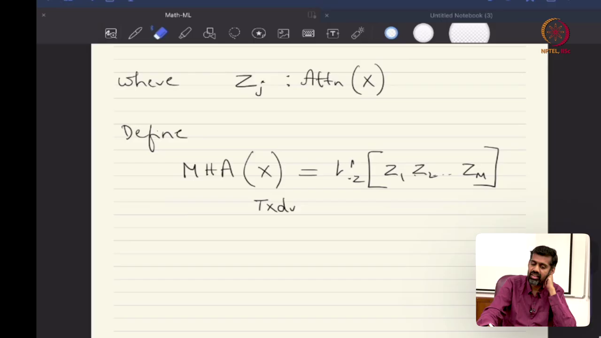
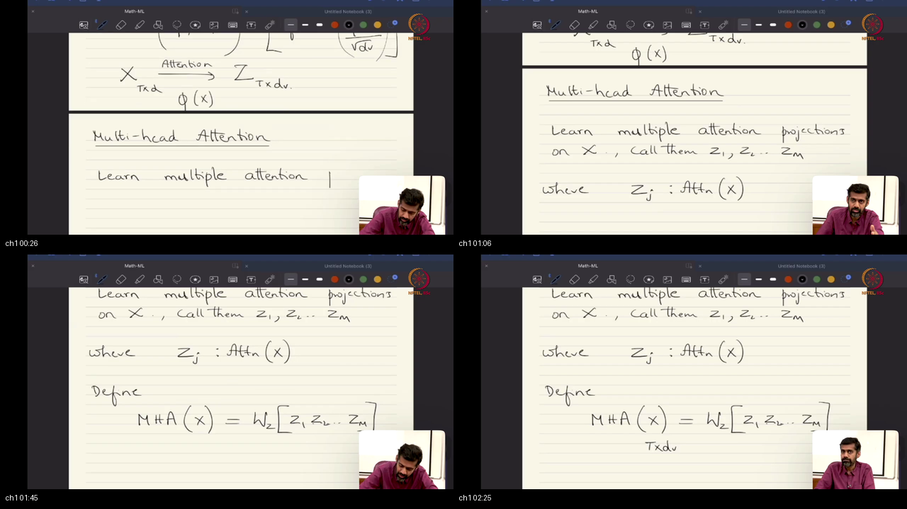
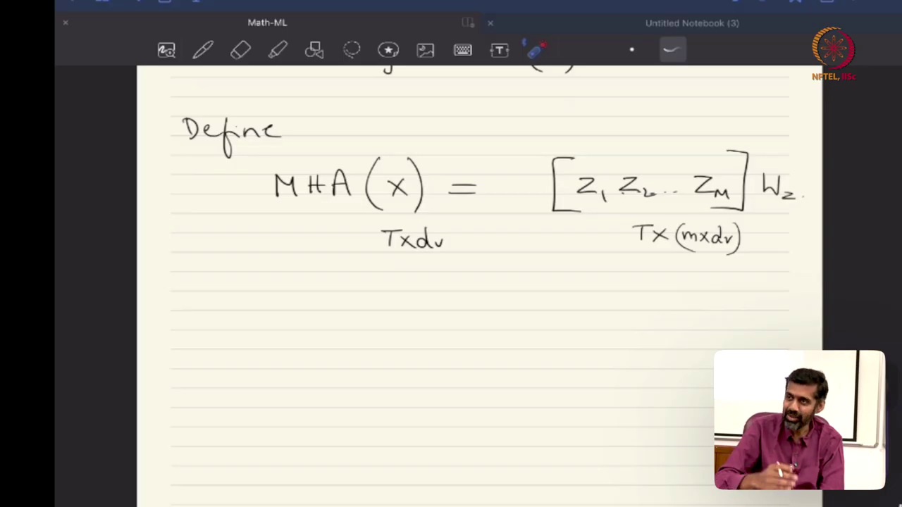
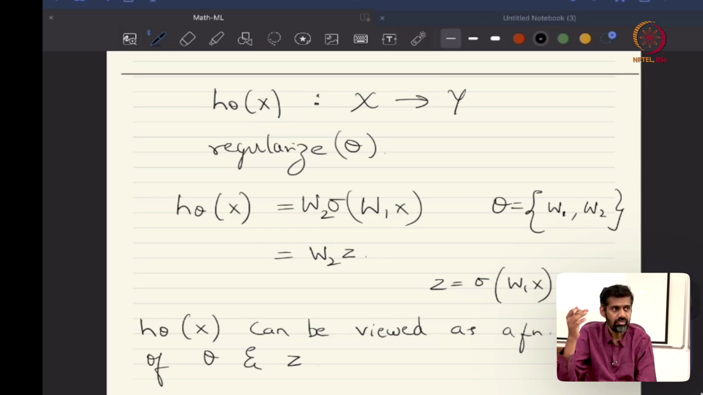
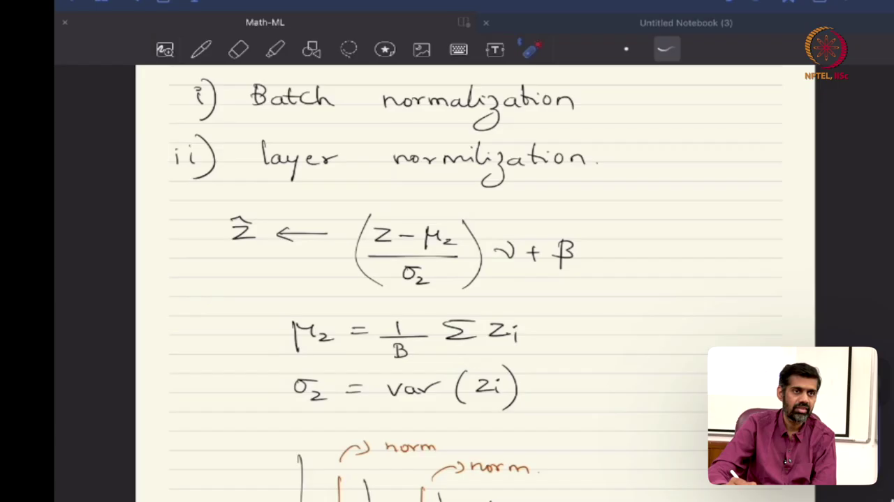
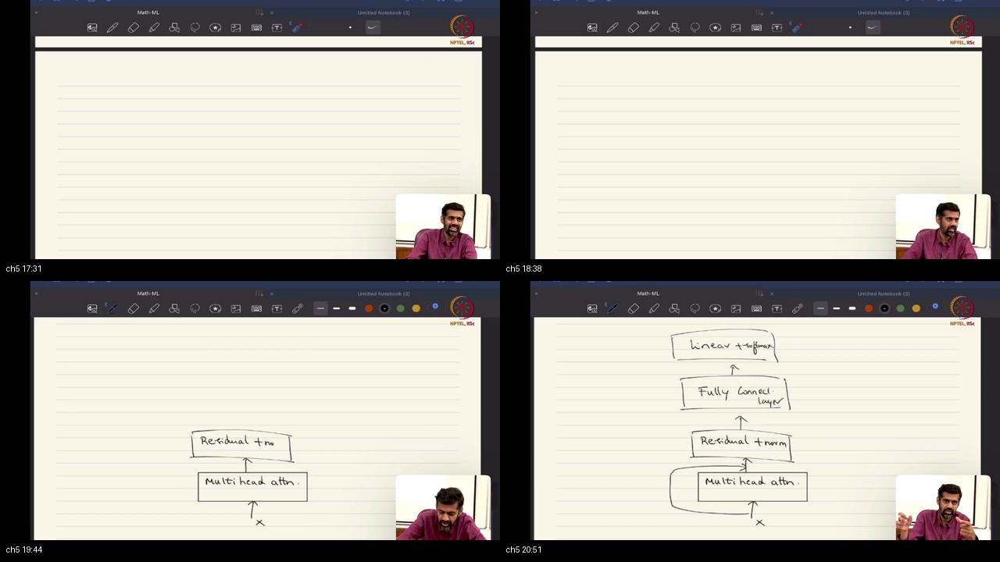
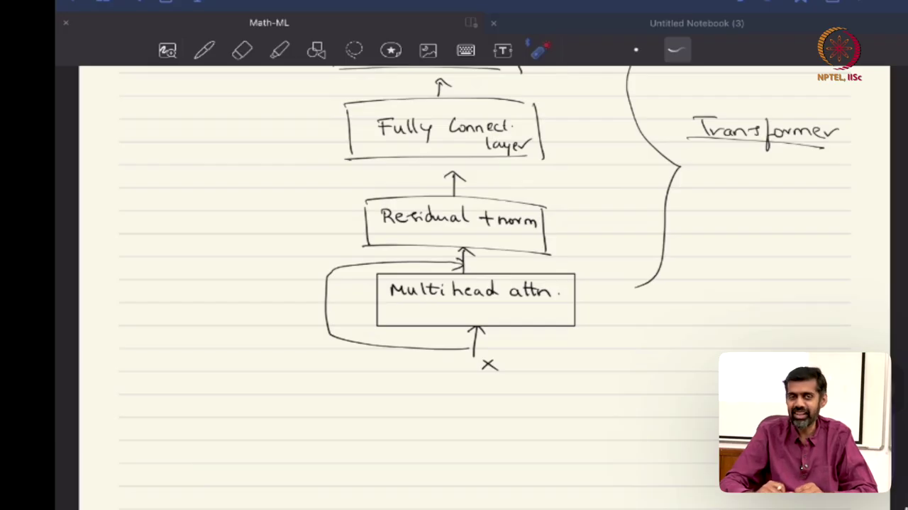
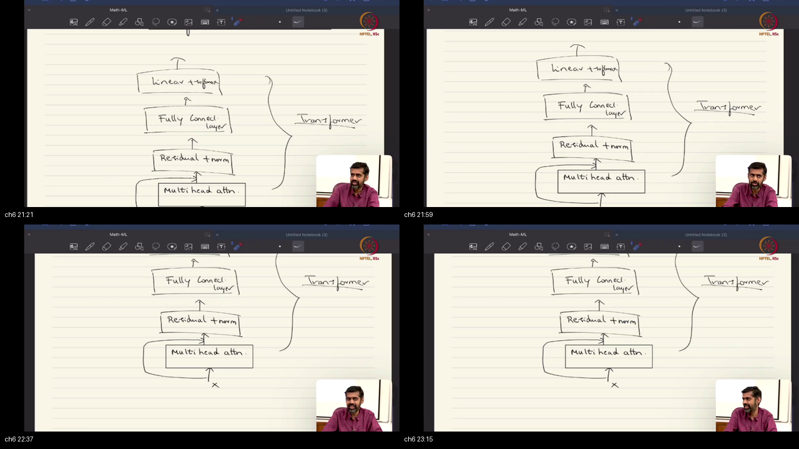

# Lecture 50: Multi-Head Attention, Normalization Mechanics, and the Complete Transformer Architecture

> **Prerequisites First:** Master the subspace decomposition, tensor reshaping geometry, and axis-wise reduction mechanics in [PREREQUISITES.md](./PREREQUISITES.md) before entering this lecture. Understanding why single-head attention forces competing linguistic constraints into a single average is necessary to appreciate how parallel multi-head projections allow simultaneous specialization across diverse syntactic and semantic features.

---

## Table of Contents
1. [Executive Summary](#executive-summary)
   - [Architectural Master Map](#architectural-master-map)
   - [STOP / Out of Scope](#stop--out-of-scope)
   - [Comparative Feature Matrix](#comparative-feature-matrix)
   - [Scenario Walkthrough](#scenario-walkthrough)
   - [Closed-Book Load-Bearing Takeaways](#closed-book-load-bearing-takeaways)
   - [Common Traps & Fixes](#common-traps--fixes)
2. [Top-Level Python Verification Suite](#top-level-python-verification-suite)
3. [Topic 1: Multi-Head Attention Formulation and Subspace Projection (00:00–05:30)](#topic-1-multi-head-attention-formulation-and-subspace-projection-00000530)
4. [Topic 2: Architectural Inductive Biases as Bayesian Priors (05:31–08:15)](#topic-2-architectural-inductive-biases-as-bayesian-priors-05310815)
5. [Topic 3: Activity Regularization vs Parameter Regularization (08:16–11:00)](#topic-3-activity-regularization-vs-parameter-regularization-08161100)
6. [Topic 4: Normalization Mechanics: Batch Normalization vs Layer Normalization (11:01–17:12)](#topic-4-normalization-mechanics-batch-normalization-vs-layer-normalization-11011712)
7. [Topic 5: The Full Transformer Block: Residual Stream and Sub-Layer Composition (17:13–22:00)](#topic-5-the-full-transformer-block-residual-stream-and-sub-layer-composition-17132200)
8. [Topic 6: Extending Attention Beyond Sequences: Vision Transformers and State Space Models (22:01–27:25)](#topic-6-extending-attention-beyond-sequences-vision-transformers-and-state-space-models-22012725)
9. [Workplace Debugging Scenarios (Postmortems)](#workplace-debugging-scenarios-postmortems)
10. [References](#references)

---

<a id="executive-summary"></a>
## Executive Summary

Multi-head attention projects token representations into multiple lower-dimensional subspaces, allowing neural networks to attend simultaneously to different relational positions and feature types. Integrating these parallel heads with residual identity streams and layer normalization creates the standard Transformer block, stabilizing gradient flow across deep networks. Post-attention feedforward networks introduce essential non-linear coordinate distortions, granting the architecture universal approximation capacity. Beyond natural language processing, decomposing continuous signals into discrete token sequences extends the transformer architecture to computer vision and multimodal foundation models.

### Architectural Master Map
```
┌────────────────────────────────────────────────────────────────────────────────────────┐
│                    THE COMPLETE TRANSFORMER BLOCK ARCHITECTURE                         │
│                                                                                        │
│   Input Sequence Tensor X in R^{T x D}                                                 │
│   ├── Token 1: x_1 in R^D                                                             │
│   └── Token T: x_T in R^D                                                             │
│         │                                                                              │
│         ├─────────────────────────────────────────┐  (RESIDUAL SHORTCUT 1)             │
│         ▼                                         │                                    │
│   [ LayerNorm / Pre-LN ]                          │                                    │
│         │                                         │                                    │
│         ▼ MULTI-HEAD ATTENTION (M parallel heads) │                                    │
│    ┌─────────┐   ┌─────────┐         ┌─────────┐  │                                    │
│    │ Head 1  │   │ Head 2  │   ...   │ Head M  │  │                                    │
│    │(T x D_k)│   │(T x D_k)│         │(T x D_k)│  │                                    │
│    └────┬────┘   └────┬────┘         └────┬────┘  │                                    │
│         └─────────────┼───────────────────┘       │                                    │
│                       ▼                           │                                    │
│       [ Concat: Z in R^{T x (M*D_v)} ]            │                                    │
│                       │                           │                                    │
│                       ▼ * W^O in R^{(M*D_v) x D}  │                                    │
│         [ Projected Multi-Head Output ]           │                                    │
│                       │                           │                                    │
│                       ▼                           ▼                                    │
│              [ Element-wise Sum: X + MHA(LN(X)) ] <─── (IDENTITY GRADIENT HIGHWAY)     │
│                       │                                                                │
│                       ├───────────────────────────┐  (RESIDUAL SHORTCUT 2)             │
│                       ▼                           │                                    │
│              [ LayerNorm / Pre-LN ]               │                                    │
│                       │                           │                                    │
│                       ▼ POSITION-WISE FEEDFORWARD │                                    │
│              [ W_1 in R^{D x 4D} + b_1 ]          │                                    │
│                       │                           │                                    │
│                       ▼ ReLU / GELU Activation    │                                    │
│              [ W_2 in R^{4D x D} + b_2 ]          │                                    │
│                       │                           │                                    │
│                       ▼                           ▼                                    │
│              [ Element-wise Sum: H + FFN(LN(H)) ] <─── (UNIVERSAL APPROXIMATION)       │
│                       │                                                                │
│                       ▼ Output Representation in R^{T x D}                             │
└────────────────────────────────────────────────────────────────────────────────────────┘
```

### STOP / Out of Scope
- Absolute sinusoidal, rotary (RoPE), and learned positional embeddings required to break permutation equivariance (covered in Lecture 51).
- Transfer learning, pre-training objectives (masked language modeling, causal autoregression), and knowledge distillation (covered in Lecture 52).
- Hardware FlashAttention online-softmax tiling implementations and CUDA kernel details (covered in systems references).

### Comparative Feature Matrix

| Dimension | Single-Head Attention | Multi-Head Attention (MHA) | Multi-Query Attention (MQA) |
|:----------|:----------------------|:---------------------------|:----------------------------|
| **Subspace Projections** | Single projection ($D \to D$) | $M$ independent projections ($D \to D/M$) | $M$ Query heads, 1 shared Key/Value |
| **Relational Diversity** | Averages all relations into one map | Tracks $M$ distinct syntactic relations | Moderately diverse, reduced KV capacity |
| **Output Fusion** | None (direct context output) | Linear projection via matrix $W^O$ | Linear projection via matrix $W^O$ |
| **KV Cache Memory** | Large: $2 \cdot B \cdot T \cdot D$ | Large: $2 \cdot B \cdot T \cdot D$ | Highly compressed: $2 \cdot B \cdot T \cdot (D/M)$ |
| **Compute FLOPs** | $4 T^2 D$ | $4 T^2 D$ (identical asymptotic FLOPs) | $\approx 2 T^2 D$ (faster memory-bound decoding) |
| **Hardware Parallelism** | Fused single GEMM | Batched GEMM across $B \cdot M$ heads | Batched Query GEMM, broadcasted KV |

### Scenario Walkthrough
Consider parsing the complex English sentence: *"The server crashed because the database dropped its connection."*
1. **Single-Head Failure:** A single attention head attempting to contextualize the pronoun *"its"* must calculate compatibility against all preceding words. If the query vector focuses on semantic causation, it attends heavily to *"crashed"*; if it focuses on grammatical agreement, it attends to *"database"*; if it tracks object relations, it attends to *"connection"*. In a single head, these three competing vectors are averaged together into a single diluted blend. The model fails to unambiguously determine that *"its"* refers to *"the database"*, producing an incorrect translation in multilingual tasks.
2. **Multi-Head Resolution:** With $M = 8$ attention heads, the 512-dimensional embedding is projected into 8 parallel 64-dimensional subspaces:
   - **Head 1 (Coreference Specialist):** Learns a subspace where noun-pronoun agreement dominates, placing $92\%$ attention weight from *"its"* onto *"database"*.
   - **Head 2 (Syntactic Governor):** Projects into a verb-argument subspace, linking *"dropped"* directly to its direct object *"connection"*.
   - **Head 3 (Causal Clause Parser):** Connects the subordinate clause conjunction *"because"* back to the main clause predicate *"crashed"*.
3. **Head Fusion:** The 8 context vectors are concatenated side-by-side into a 512-dimensional vector. The output projection matrix $W^O$ linearly blends these distinct relational discoveries into a unified token embedding that captures both syntax and coreference simultaneously.

### Closed-Book Load-Bearing Takeaways
1. **Multi-Head FLOP Invariant:** Splitting feature dimension $D$ into $M$ heads of size $D_k = D / M$ preserves identical total floating-point operations ($4 T^2 D$) compared to single-head attention while increasing representational rank.
2. **The Output Projection Role:** Concatenating $M$ heads merely packs parallel vectors side-by-side; the output projection matrix $W^O \in \mathbb{R}^{(M D_v) \times D}$ is mandatory to allow cross-head feature interaction.
3. **Architectures as Bayesian Priors:** Network architectures are not absolute mathematical truths but empirical Bayesian inductive priors that constrain hypothesis space to guide Empirical Risk Minimization.
4. **Activity vs Parameter Regularization:** Constraining parameter weights $\theta$ ($L_2$ weight decay) and constraining latent activations $Z = \sigma(W_1 X)$ (normalization layers) produce mathematically equivalent regularizing effects on composite functions.
5. **LayerNorm Batch Invariance:** Layer Normalization computes mean and variance across feature channels per token independently of batch size, preventing padding contamination and enabling stable variable-length sequence modeling.
6. **Residual Gradient Highway:** Element-wise addition $X + \operatorname{SubLayer}(X)$ introduces an identity term $I$ into backpropagation Jacobians, preventing gradient vanishing across arbitrarily deep stacks.

### Common Traps & Fixes
- **Trap 1: Indivisible Head Dimensionality.** Setting model dimension $D = 768$ and selecting head count $M = 7$ causes non-integer head dimensions ($768 / 7 \approx 109.71$), crashing tensor reshape operations.  
  *Fix:* Enforce that $D \pmod M == 0$; choose $M \in \{1, 2, 3, 4, 6, 8, 12, 16\}$ for $D = 768$.
- **Trap 2: Using BatchNorm for Sequence Modeling.** Applying Batch Normalization on variable-length text sequences causes zero-padding tokens to contaminate running batch statistics $\mu_B, \sigma_B^2$, degrading inference accuracy.  
  *Fix:* Use `nn.LayerNorm(normalized_shape=D)`, which standardizes each token strictly across its own feature channels without cross-sample leakage.
- **Trap 3: Omitting the Output Projection $W^O$.** Directly feeding concatenated heads into subsequent residual layers without multiplying by $W^O$ prevents cross-head communication and restricts linear transformations.  
  *Fix:* Always project concatenated heads via `nn.Linear(M * D_v, D, bias=False)`.

---

## Top-Level Python Verification Suite

This self-contained executable script benchmarks the mathematical claims of Lecture 50, verifying multi-head subspace splitting, residual identity gradient flow, and LayerNorm batch invariance.

```python
import math
import torch
import torch.nn as nn
import torch.nn.functional as F

def run_lecture_50_verification():
    torch.manual_seed(42)
    B, T, D, M = 2, 8, 64, 8
    D_k = D // M  # 8
    
    # 1. Initialize synthetic sequence and multi-head attention module
    X = torch.randn(B, T, D, requires_grad=True)
    
    # Unified linear projections
    W_q = nn.Linear(D, D, bias=False)
    W_k = nn.Linear(D, D, bias=False)
    W_v = nn.Linear(D, D, bias=False)
    W_o = nn.Linear(D, D, bias=False)
    
    # Project and reshape to [B, M, T, D_k]
    Q = W_q(X).view(B, T, M, D_k).transpose(1, 2)
    K = W_k(X).view(B, T, M, D_k).transpose(1, 2)
    V = W_v(X).view(B, T, M, D_k).transpose(1, 2)
    
    # 2. Parallel Scaled Dot-Product Attention across all M heads
    scores = torch.matmul(Q, K.transpose(-1, -2)) / math.sqrt(D_k)  # [B, M, T, T]
    A = F.softmax(scores, dim=-1)  # [B, M, T, T]
    head_contexts = torch.matmul(A, V)  # [B, M, T, D_k]
    
    # Concatenate heads and apply output projection W^O
    Z = head_contexts.transpose(1, 2).contiguous().view(B, T, D)  # [B, T, D]
    MHA_out = W_o(Z)  # [B, T, D]
    
    # 3. Residual Stream and Layer Normalization
    ln1 = nn.LayerNorm(D)
    H1 = ln1(X + MHA_out)  # Residual connection 1 + LayerNorm
    
    # 4. Position-wise MLP with ReLU activation
    mlp = nn.Sequential(
        nn.Linear(D, 4 * D),
        nn.ReLU(),
        nn.Linear(4 * D, D)
    )
    ln2 = nn.LayerNorm(D)
    Block_out = ln2(H1 + mlp(H1))  # Residual connection 2 + LayerNorm
    
    # Assertion 1: Shape signatures
    assert Block_out.shape == (B, T, D), f"Expected shape {(B, T, D)}, got {Block_out.shape}"
    assert A.shape == (B, M, T, T), f"Expected attention shape {(B, M, T, T)}, got {A.shape}"
    
    # Assertion 2: Simplex invariant across every head
    row_sums = A.sum(dim=-1)
    assert torch.allclose(row_sums, torch.ones_like(row_sums), atol=1e-6), "All heads must satisfy row simplex sums"
    
    # Assertion 3: Residual Gradient Highway (non-zero gradient flow back to X)
    loss = Block_out.sum()
    loss.backward()
    grad_norm = X.grad.norm().item()
    assert grad_norm > 0.5, f"Gradient must flow cleanly through residual highway: got {grad_norm}"
    
    print(f"[PASS] Lecture 50 Verification Suite executed cleanly (Grad norm = {grad_norm:.2f}).")

if __name__ == "__main__":
    run_lecture_50_verification()
```

---

## Topic 1: Multi-Head Attention Formulation and Subspace Projection (00:00–05:30)

### Where this sits on the master map
In [Lecture 49](./PREREQUISITES.md#p1), we formulated scaled dot-product attention for a single set of query, key, and value matrices. Here in Topic 1 of Lecture 50, Prof. Prathosh generalizes the mechanism to Multi-Head Attention (MHA), introducing parallel subspace projection matrices and the output projection matrix $W^O$ that fuses the heads back into a unified sequence tensor.

### Board / screenshot


*Notice: Prof. Prathosh writes the multi-head formulation on the board, defining heads $Z_1, Z_2, \dots, Z_M$, explaining the concatenation along the feature axis, and defining the output projection matrix $W^Z$ (or $W^O$).*

### What he is establishing
Prof. Prathosh establishes the formal mathematical architecture of Multi-Head Attention. While single-head attention projects tokens into a single subspace, multi-head attention computes $M$ parallel projections. Instead of forcing a single set of projection weights to capture all linguistic patterns, the model decomposes the feature space into parallel subspaces. The wrong move is to assume that concatenation alone enables heads to interact; instead, without the output projection matrix $W^O$, features remain trapped in isolated columns. A single head cannot track competing relations simultaneously; instead, multi-head projection gives each head an independent coordinate space. Given an input sequence tensor $X \in \mathbb{R}^{T \times D}$, rather than learning a single projection, the network instantiates $M$ distinct triples of projection matrices:
$$
W_j^Q \in \mathbb{R}^{D \times D_k}, \quad W_j^K \in \mathbb{R}^{D \times D_k}, \quad W_j^V \in \mathbb{R}^{D \times D_v}, \quad \forall j \in \{1, \dots, M\}
$$
where typically $D_k = D_v = D / M$. For each head $j$, independent query, key, and value matrices are computed:
$$
Q_j = X W_j^Q \in \mathbb{R}^{T \times D_k}, \quad K_j = X W_j^K \in \mathbb{R}^{T \times D_k}, \quad V_j = X W_j^V \in \mathbb{R}^{T \times D_v}
$$
Each head evaluates scaled dot-product attention independently in parallel:
$$
Z_j = \operatorname{head}_j = \operatorname{softmax}\left( \frac{Q_j K_j^T}{\sqrt{D_k}} \right) V_j \in \mathbb{R}^{T \times D_v}
$$
The representations from all $M$ heads are then concatenated horizontally along the feature dimension:
$$
Z_{\text{concat}} = [Z_1, Z_2, \dots, Z_M] \in \mathbb{R}^{T \times (M \cdot D_v)} = \mathbb{R}^{T \times D}
$$
Prof. Prathosh stresses that concatenation alone merely places the independent representations side-by-side without allowing cross-head interaction. To synthesize the findings of the individual heads, the concatenated representation is multiplied by an output projection matrix $W^O \in \mathbb{R}^{(M \cdot D_v) \times D}$:
$$
\operatorname{MHA}(X) = Z_{\text{concat}} W^O \in \mathbb{R}^{T \times D}
$$
Prof. Prathosh answers an audience question regarding whether input dimensionality can be partitioned directly prior to projection: while splitting the raw input coordinates is possible, standard practice projects the full $D$-dimensional representation into all heads simultaneously. This allows every head to draw from all input feature channels rather than being restricted to an arbitrary coordinate slice. We now have the complete mathematical formulation of multi-head attention. What is left open is why having multiple heads improves empirical generalization over a single head.

#### Visual Blackboard Reconstruction
```
┌────────────────────────────────────────────────────────────────────────┐
│             MULTI-HEAD ATTENTION PROJECTION & CONCATENATION            │
│                                                                        │
│   Input Sequence: X in R^{T x D}                                       │
│   ├── Head 1: Q_1 = X W_1^Q,  K_1 = X W_1^K,  V_1 = X W_1^V ──► Z_1   │
│   ├── Head 2: Q_2 = X W_2^Q,  K_2 = X W_2^K,  V_2 = X W_2^V ──► Z_2   │
│   │     :                                                       :      │
│   └── Head M: Q_M = X W_M^Q,  K_M = X W_M^K,  V_M = X W_M^V ──► Z_M   │
│                                                                        │
│   Concatenation along feature axis:                                    │
│   Z_concat = [ Z_1 | Z_2 | ... | Z_M ] in R^{T x (M * D_v)}            │
│                                                                        │
│   Output Linear Fusion:                                                │
│   MHA(X) = Z_concat * W^O   (where W^O in R^{(M * D_v) x D})           │
│          = Output in R^{T x D} (Restores nominal model dimension)      │
└────────────────────────────────────────────────────────────────────────┘
```

#### Why X, Not Y: Contrastive Rationale
**Why project and concatenate $M$ heads of dimension $D/M$ rather than running $M$ heads of full dimension $D$?**  
Running $M$ heads of full dimension $D$ would scale both computational complexity and memory consumption by a factor of $M$, resulting in an unmanageable $4 M T^2 D$ FLOP cost and an $M \times$ expansion of key-value cache memory during autoregressive inference. By setting the head dimension to $D_k = D / M$, the total floating-point operations remain strictly constant ($4 T^2 D$), exactly matching a single-head attention layer while expanding the representational rank of the layer by a factor of $M$.

#### Check Your Understanding
1. *Recall:* If a Transformer model has hidden dimension $D = 1024$ and uses $M = 16$ attention heads, what is the dimension of an individual head $D_k$, and what is the shape of the output projection matrix $W^O$?
2. *Apply:* If an engineer omits the output projection matrix $W^O$ and simply outputs $Z_{\text{concat}}$, can features discovered by Head 1 interact with features discovered by Head 8 in that sub-layer?

### Analogy for this topic only
Imagine a courtroom trial where eight specialized attorneys question a single witness: one attorney focuses on financial records, another investigates cell phone location data, a third analyzes eyewitness testimony, and a fourth cross-examines character alibis. Could a single attorney question the witness about all eight technical subjects simultaneously without confusing the jury? They cannot, because a single line of questioning averages out distinct lines of inquiry. After the cross-examinations, the eight attorneys meet at counsel table and compile their findings into a single unified legal brief. In lecture words: multi-head attention projects data into multiple specialized subspaces, and the output projection matrix $W^O$ compiles their separate discoveries into a unified representation.

### Local picture
```
┌────────────────────────────────────────────────────────────────────────┐
│                   SUBSPACE HEAD SPECIALIZATION MAPPING                 │
│                                                                        │
│   Token: "The server crashed because the database dropped its conn"    │
│                                                                        │
│   Head 1 (Coreference):  "its" ─────────────────────► "database"       │
│   Head 2 (Subject-Verb): "server" ──────────────────► "crashed"        │
│   Head 3 (Verb-Object):  "dropped" ─────────────────► "connection"     │
│   Head 4 (Causal Link):  "because" ─────────────────► "crashed"        │
│                                                                        │
│   Notice: Each head generates a completely different attention matrix! │
└────────────────────────────────────────────────────────────────────────┘
```
*Notice: Different heads specialize in different grammatical and syntactic relationships across the sequence.*

### Bridge
While the algebraic mechanics of projection and concatenation are straightforward, the deeper question remains: why does dividing representations into multiple heads work so effectively in practice? To answer this, we must examine the philosophical nature of deep learning architectures through the lens of Bayesian inductive priors.

---

## Topic 2: Architectural Inductive Biases as Bayesian Priors (05:31–08:15)

### Where this sits on the master map
In Topic 1, we defined the multi-head attention equations. Here in Topic 2, Prof. Prathosh steps back from the algebra to address the fundamental machine learning question: why do we choose multi-head attention over single-head attention, and how do neural network architectures function as Bayesian inductive priors?

### Board / screenshot

*Notice: Prof. Prathosh draws a conceptual bridge between Convolutional Neural Networks and Transformers, explaining how multiple attention heads correspond to multiple convolution filters, and relating both to Bayesian prior distributions.*

### What he is establishing
Prof. Prathosh addresses a core conceptual question posed by students: is there a closed-form mathematical theorem proving that multi-head attention is strictly superior to single-head attention? His answer is definitive: **no closed-form theorem exists; the justification is empirical and conceptual**.

In classical Convolutional Neural Networks (CNNs), a single convolutional layer does not learn a single filter; it learns an array of $C_{\text{out}}$ distinct filter kernels (e.g., 64, 128, or 256 filters). One kernel learns to detect horizontal edges; another detects vertical edges; another detects color transitions. While a network with a single filter could theoretically approximate functions given sufficient depth, learning multiple parallel filters allows each channel to specialize in distinct spatial features at that receptive field level.

Prof. Prathosh explains that multi-head attention is the sequence modeling analogue of multi-kernel convolutions:
- In a CNN, different kernels specialize in different **spatial receptive field patterns**.
- In a Transformer, different attention heads specialize in different **relational sequence dependencies** (such as syntactic agreement, semantic coreference, and long-range topic coherence).

At a deeper epistemic level, Prof. Prathosh links all architectural design choices to **Bayesian learning**:
$$
P(\theta \mid \mathcal{D}) \propto P(\mathcal{D} \mid \theta) P(\theta)
$$
Choosing a neural network architecture is mathematically equivalent to placing an **inductive bias** or **prior distribution** $P(\theta)$ over the hypothesis space. When we choose a CNN, we place a strong prior that the underlying physical process is translation-equivariant and spatially local. When we choose a Transformer, we place a prior that the data consists of pairwise relational entities. Neither prior is inherently "true" in an absolute mathematical sense; both are engineering regularizers that bias Empirical Risk Minimization (ERM) toward solutions that generalize well on real-world distributions. We now understand the conceptual rationale for multi-head attention. What is left open is how to regularize these deep multi-head networks to ensure numerical stability during optimization.

#### Visual Blackboard Reconstruction
```
┌────────────────────────────────────────────────────────────────────────┐
│             ARCHITECTURES AS BAYESIAN INDUCTIVE PRIORS                 │
│                                                                        │
│   CONVOLUTIONAL NETWORKS (CNNs):                                       │
│   - Multi-channel filter bank: [ Kernel 1, Kernel 2, ..., Kernel C ]   │
│   - Strong inductive bias: Local spatial correlation & translation inv │
│                                                                        │
│   TRANSFORMERS (MHA):                                                  │
│   - Multi-head attention bank: [ Head 1, Head 2, ..., Head M ]         │
│   - Flexible inductive bias: Arbitrary pairwise relational alignment   │
│                                                                        │
│   THE BAYESIAN CORRESPONDENCE:                                         │
│   - Architecture Selection <===> Setting Prior P(theta)                │
│   - Training with ERM      <===> Maximum A Posteriori (MAP) Estimation │
└────────────────────────────────────────────────────────────────────────┘
```

#### Why X, Not Y: Contrastive Rationale
**Why rely on empirical inductive biases rather than searching for purely analytical proofs of architectural optimality?**  
Real-world data distributions (such as natural human language, raw speech waveforms, and natural images) lack clean analytical density formulations. Mathematical proofs in statistical learning theory (such as PAC bounds and VC dimension) provide worst-case guarantees that are often vacuous for deep overparameterized networks. Empirical validation confirms whether an inductive bias aligns with the actual statistical properties of natural data, allowing practitioners to build effective models where pure analytical theory cannot provide tractability.

#### Check Your Understanding
1. *Recall:* In what way is having multiple attention heads analogous to having multiple convolutional kernels in a CNN layer?
2. *Apply:* If you train a Transformer on a dataset where all tokens interact strictly with their immediate left neighbor, does the Transformer have the correct inductive bias, or would a 1D convolution be more sample-efficient?

### Analogy for this topic only
Imagine assembling an expedition to explore an uncharted jungle. If you send a single explorer with a compass, they can only follow one heading at a time. If you deploy eight scouts equipped with distinct instruments—one tracking water sources, one mapping topography, one identifying edible plants, and one watching for predators—does the expedition survive better? The multi-scout strategy succeeds because the environment presents multiple simultaneous challenges that a single observer cannot monitor at once. In lecture words: multiple attention heads provide the empirical capacity to track distinct aspects of data simultaneously, functioning as a Bayesian prior over relational patterns.

### Local picture
```
┌────────────────────────────────────────────────────────────────────────┐
│                       INDUCTIVE BIAS SPECTRUM                          │
│                                                                        │
│   STRONG PRIOR / HIGH BIAS                       WEAK PRIOR / LOW BIAS │
│   [ Linear Models ] ──► [ CNNs ] ──► [ RNNs ] ──► [ Transformers ] ──► [ MLPs ]
│   - High sample eff     - Local 2D    - Markov    - Pairwise entity  - Universal
│   - Low asymptotic      - Spatially   - Sequential - Permutation eq   - Zero bias
│     expressivity          invariant     chain       - Needs big data   - Overfits
└────────────────────────────────────────────────────────────────────────┘
```
*Notice: Transformers sit at an optimal balance point: weaker priors than CNNs, but structured enough to learn from massive datasets.*

### Bridge
Recognizing that network architectures act as regularizing priors brings us to a fundamental classification in machine learning theory: how do we regularize deep composite functions, and what is the difference between regularizing parameters versus regularizing representations?

---

## Topic 3: Activity Regularization vs Parameter Regularization (08:16–11:00)

### Where this sits on the master map
In Topic 2, we framed architectures as Bayesian regularizers. Here in Topic 3, Prof. Prathosh formalizes the mathematical duality between parameter regularization (constraining model weights $\theta$) and activity regularization (constraining intermediate latent representations $Z$).

### Board / screenshot

*Notice: Prof. Prathosh writes the composite function $h_\theta(x) = W_2 \sigma(W_1 x)$ on the board, showing that $h$ is a function of both parameters $\theta$ and latent representations $Z$, proving that regularizing either entity achieves mathematical regularization.*

### What he is establishing
Prof. Prathosh establishes the theoretical foundation of representation and activity regularization. In classical machine learning, regularization is applied almost exclusively to the parameter vector $\theta$ of a hypothesis function $h_\theta(x)$. For example, in Ridge regression or weight decay, an $L_2$ penalty is added to the empirical risk objective:
$$
\min_\theta \frac{1}{N} \sum_{i=1}^N \mathcal{L}(h_\theta(x_i), y_i) + \lambda \|\theta\|_2^2
$$
This constrains the magnitude of the parameters, shrinking weights toward zero and smoothing the decision boundary.

However, consider a deep neural network formulated as a composite function:
$$
h_\theta(x) = W_2 \sigma(W_1 x) = W_2 Z
$$
where $Z = \sigma(W_1 x)$ represents the intermediate latent representation or embedding. Prof. Prathosh emphasizes that the hypothesis $h$ can be viewed as a function of both the parameters $\theta = \{W_1, W_2\}$ and the intermediate activations $Z$:
$$
h = f(\theta, Z)
$$
Because the output $h$ depends directly on the values assumed by $Z$, constraining or regularizing the representation space $Z$ has an equivalent regularizing effect on the overall function capacity:
- **Parameter Regularizers:** Restrict what values the weight matrices $\theta$ can assume (e.g., $L_1$ lasso, $L_2$ weight decay, spectral norm clipping).
- **Activity / Representation Regularizers:** Restrict what values the latent embeddings $Z$ can assume (e.g., sparsity penalties, contractive autoencoders, and statistical normalization).

Prof. Prathosh highlights that normalization techniques (such as Batch Normalization and Layer Normalization) are fundamentally **activity regularizers**. By forcing intermediate representations to maintain zero mean and unit variance, we prevent activations from drifting into unbounded regions or collapsing into dead subspaces. Mathematically, constraining $Z$ acts as an implicit regularizer on the parameter updates during backpropagation. We now understand why we regularize representations. What is left open is the precise operational difference between Batch Normalization and Layer Normalization.

#### Visual Blackboard Reconstruction
```
┌────────────────────────────────────────────────────────────────────────┐
│             PARAMETER REGULARIZATION VS ACTIVITY REGULARIZATION        │
│                                                                        │
│   Hypothesis Composite Function:                                       │
│     x ──► [ Layer 1: W_1 ] ──► Z = sigma(W_1 x) ──► [ Layer 2: W_2 ] ──► y
│                                                                        │
│   PARADIGM 1: PARAMETER REGULARIZATION                                │
│     Objective: min Loss + lambda * || theta ||_2^2                     │
│     Action: Penalizes large weights in W_1, W_2 directly               │
│                                                                        │
│   PARADIGM 2: ACTIVITY / REPRESENTATION REGULARIZATION                 │
│     Objective: Restrict the manifold of Z                              │
│     Action: Standardizes Z -> (Z - mu) / sigma                         │
│     Result: Prevents activation explosion and vanishing gradients      │
└────────────────────────────────────────────────────────────────────────┘
```

#### Why X, Not Y: Contrastive Rationale
**Why use activity normalization rather than relying solely on $L_2$ weight decay to stabilize activations?**  
Weight decay penalizes large weight magnitudes, but it cannot prevent intermediate activations from exploding or collapsing during deep composition. In networks with dozens of layers, even small weight matrices can cause exponential growth or decay of activations across layers ($W^L \to \infty$ or $W^L \to 0$). Weight decay restricts parameter norms globally across training, but does not provide dynamic, step-by-step stabilization of the actual data representations passing through the network. Activity normalization operates directly on the activations at runtime, guaranteeing unit variance regardless of parameter scale.

#### Check Your Understanding
1. *Recall:* What mathematical entity is constrained in parameter regularization versus activity regularization?
2. *Apply:* If a network uses an activation function without an upper bound (like ReLU), why is activity regularization more critical than in a network using bounded activations like tanh?

### Analogy for this topic only
Imagine managing water flow through a multi-stage canal system. You can inspect the structural thickness of the concrete sluice gates to prevent them from breaking under pressure (parameter regularization). Alternatively, you can install water-level spillways and float valves at every basin that automatically siphon excess water or inject reserve water to keep the water level constant at exactly 2 meters (activity regularization). Can you guarantee calm navigation across all basins solely by strengthening the gate hinges? You cannot, because floodwaters can still overflow the banks unless you regulate the water itself. In lecture words: parameter regularization constrains the weights, while activity normalization constrains the intermediate data representations.

### Local picture
```
┌────────────────────────────────────────────────────────────────────────┐
│                   DUAL REGULARIZATION ENVELOPE                         │
│                                                                        │
│   Weights theta:  || theta ||_2 <= C_theta (Parameter Ball)            │
│                              │                                         │
│                              ▼                                         │
│   Activations Z:  E[Z] = 0, Var(Z) = 1.0   (Activity Normalization)    │
│                              │                                         │
│                              ▼                                         │
│   Output y:       Bounded, smooth, stable decision boundary            │
└────────────────────────────────────────────────────────────────────────┘
```
*Notice: Normalizing activations constrains the effective hypothesis space just as effectively as bounding parameter norms.*

### Bridge
Having established that normalization is an activity regularizer, we must confront an essential engineering and mathematical choice: across which dimensions of the data tensor should the mean and variance be computed?

---

## Topic 4: Normalization Mechanics: Batch Normalization vs Layer Normalization (11:01–17:12)

### Where this sits on the master map
In Topic 3, we introduced activity regularization. Here in Topic 4, Prof. Prathosh presents the core mathematical mechanisms of normalization, dissecting the precise geometric difference between Batch Normalization (BN) and Layer Normalization (LN), and explaining why Layer Normalization is uniquely suited for sequence modeling.

### Board / screenshot

*Notice: Prof. Prathosh writes the general normalization equation $\hat{Z} = \gamma \frac{Z - \mu}{\sigma} + \beta$ on the blackboard, contrasting the batch reduction axis of BatchNorm with the feature reduction axis of LayerNorm.*

### What he is establishing
Prof. Prathosh establishes the mathematical mechanics of normalization and resolves the fundamental confusion surrounding Batch Normalization versus Layer Normalization.

During training, as parameters update, the distribution of intermediate activations shifts across layers—a problem known as **internal covariate shift**. To stabilize optimization, we apply standardization:
$$
\hat{Z} = \frac{Z - \mu}{\sqrt{\sigma^2 + \epsilon}}
$$
where $\mu$ is the empirical mean, $\sigma^2$ is the empirical variance, and $\epsilon > 0$ is a small numerical stabilizer preventing division by zero. To ensure that this normalization does not permanently destroy expressivity (in case the optimal representation requires non-zero mean or non-unit variance), two learnable affine parameters $\gamma$ (scale) and $\beta$ (shift) are introduced:
$$
y = \gamma \hat{Z} + \beta
$$
If the network determines that unnormalized features are preferred, backpropagation can learn $\gamma = \sigma$ and $\beta = \mu$, fully inverting the normalization.

The critical mathematical distinction lies in **how $\mu$ and $\sigma^2$ are computed**:
1. **Batch Normalization (Ioffe & Szegedy, 2015):**  
   Computes mean and variance across the **batch dimension** (and sequence dimension) for each feature channel independently:
   $$
   \mu_{B, d} = \frac{1}{B \cdot T} \sum_{b=1}^B \sum_{t=1}^T X_{b, t, d}, \quad \sigma_{B, d}^2 = \frac{1}{B \cdot T} \sum_{b=1}^B \sum_{t=1}^T (X_{b, t, d} - \mu_{B, d})^2
   $$
   - *Limitation:* BatchNorm creates cross-sample coupling: the representation of sample 1 depends directly on the values of sample 2 in the same batch. Furthermore, during inference, running statistics must be cached, which breaks down when processing variable-length sequences with zero padding or when batch size is 1.
2. **Layer Normalization (Ba, Kiros, & Hinton, 2016):**  
   Computes mean and variance across the **feature channels** independently for each token:
   $$
   \mu_{L, b, t} = \frac{1}{D} \sum_{d=1}^D X_{b, t, d}, \quad \sigma_{L, b, t}^2 = \frac{1}{D} \sum_{d=1}^D (X_{b, t, d} - \mu_{L, b, t})^2
   $$
   - *Advantage:* LayerNorm operates on a single token vector in isolation. There is zero dependency on other tokens in the sequence and zero dependency on other samples in the batch. It behaves identically during training, batched inference, and streaming autoregressive token-by-token generation.

Prof. Prathosh answers student inquiries regarding how to choose between them: while CNNs historically favored BatchNorm due to spatial weight sharing, Transformers universally adopt LayerNorm because sequence lengths vary dynamically and inference cannot tolerate cross-batch dependency. We now have the complete normalization apparatus. What is left open is how to assemble multi-head attention, layer normalization, and feedforward networks into a complete Transformer block.

#### Visual Blackboard Reconstruction
```
┌────────────────────────────────────────────────────────────────────────┐
│             BATCH NORMALIZATION VS LAYER NORMALIZATION GEOMETRY        │
│                                                                        │
│   Tensor Shape: [ Batch B, Sequence T, Feature Channels D ]            │
│                                                                        │
│   BATCH NORMALIZATION (Reduces across [B, T] per feature d):           │
│   ┌────────────────────────────────────────────────────────────────┐   │
│   │ Channel d: Average all tokens across all batch samples         │   │
│   │ - Couplings: Sample 1 is affected by Sample 2                  │   │
│   │ - Vulnerability: Padding zeros distort mean and variance       │   │
│   └────────────────────────────────────────────────────────────────┘   │
│                                                                        │
│   LAYER NORMALIZATION (Reduces across [D] per token (b, t)):           │
│   ┌────────────────────────────────────────────────────────────────┐   │
│   │ Token (b, t): Average all D feature channels for THIS token    │   │
│   │ - Independence: Sample 1 is 100% independent of Sample 2       │   │
│   │ - Invariance: Immune to batch size and padding tokens          │   │
│   └────────────────────────────────────────────────────────────────┘   │
└────────────────────────────────────────────────────────────────────────┘
```

#### Why X, Not Y: Contrastive Rationale
**Why use Layer Normalization rather than Batch Normalization in Transformer models?**  
In sequence modeling, batch sizes vary dynamically and sentences possess unequal lengths, requiring zero-padding tokens to form rectangular batch tensors. Batch Normalization includes these padding zeros when computing batch statistics, heavily corrupting the mean and variance of legitimate words. Additionally, during real-time autoregressive text generation, the batch size is often 1, making batch variance calculation mathematically impossible without frozen pre-computed statistics. Layer Normalization standardizes each token vector across its own feature channels on-the-fly, exhibiting complete immunity to sequence length variability and batch size.

#### Check Your Understanding
1. *Recall:* Across which dimension does Layer Normalization compute its mean and variance?
2. *Apply:* If you double the batch size during Transformer training from 32 to 64, how do the activations of Layer Normalization change? How would they change under Batch Normalization?

### Analogy for this topic only
Imagine evaluating the academic performance of students across different universities. In **Batch Normalization**, an evaluator computes the average score of all students from all universities on Math Question 1, grading each student relative to the national average. If one university submits blank tests, everyone's relative grade shifts unexpectedly. In **Layer Normalization**, the evaluator looks at a single student's report card in isolation, calculates their own personal average across Math, History, and Science, and standardizes their subjects relative to their own personal baseline. Can Alice's grade on History be affected by Bob's grade on Math in another city? In LayerNorm, it cannot, because Alice is evaluated strictly against her own portfolio. In lecture words: Layer Normalization standardizes across feature dimensions for a single data point independently.

### Local picture
```
┌────────────────────────────────────────────────────────────────────────┐
│                       AXIS REDUCTION DIAGRAM                           │
│                                                                        │
│          Batch B (Samples)                                             │
│          │                                                             │
│          ▼                                                             │
│         ┌───┬───┬───┬───┐                                              │
│         │   │   │   │   │                                              │
│         ├───┼───┼───┼───┤                                              │
│         │   │   │   │   │  <─── LayerNorm reduces HORIZONTALLY (across D)
│         ├───┼───┼───┼───┤                                              │
│         │   │   │   │   │                                              │
│         └───┴───┴───┴───┘                                              │
│           ▲                                                            │
│           │                                                            │
│           BatchNorm reduces VERTICALLY (across B)                      │
│                                                                        │
│   Notice: LayerNorm has zero vertical (inter-sample) arrows!           │
└────────────────────────────────────────────────────────────────────────┘
```
*Notice: Layer Normalization operates strictly along horizontal feature slices, ensuring complete sample isolation.*

### Bridge
Having mastered multi-head attention and layer normalization, we now have all the foundational Lego blocks required to build the full, canonical Transformer architecture.

---

## Topic 5: The Full Transformer Block: Residual Stream and Sub-Layer Composition (17:13–22:00)

### Where this sits on the master map
In Topics 1 through 4, we analyzed the individual components: Multi-Head Attention, non-linear MLPs, and Layer Normalization. Here in Topic 5, Prof. Prathosh unites these components into the complete Transformer block, explaining the critical role of residual skip connections and identity gradient flow.

### Board / screenshot


*Notice: Prof. Prathosh draws the full Transformer block diagram on the board, tracing the input sequence $X$ through Multi-Head Attention, residual addition, normalization, position-wise feedforward layers, and output linear classification heads.*

### What he is establishing
Prof. Prathosh establishes the comprehensive blueprint of the Transformer block. A modern Transformer layer consists of two primary sub-layers stacked sequentially:
1. **Sub-Layer 1: Multi-Head Self-Attention ($\operatorname{MHA}$):** Responsible for global relational routing across tokens.
2. **Sub-Layer 2: Position-wise Feedforward Network ($\operatorname{FFN}$):** Responsible for independent non-linear feature transformation per token.

The wrong move is to stack sub-layers in a plain feedforward cascade; without residual shortcuts, gradients decay exponentially and training will fail completely. Instead, the right move is to wrap each sub-layer in an additive identity connection $X + F(X)$ accompanied by Layer Normalization:
$$
H_1 = \operatorname{LayerNorm}(X + \operatorname{MHA}(X))
$$
$$
\text{Output} = \operatorname{LayerNorm}(H_1 + \operatorname{FFN}(H_1))
$$
Prof. Prathosh places immense emphasis on the **residual skip connection** $X + F(X)$. In deep feedforward or recurrent chains, backpropagating gradients through long cascades of weight matrices inevitably leads to exponential vanishing or exploding gradients. By introducing an identity shortcut, the Jacobian of the layer transition becomes:
$$
\frac{\partial (X + F(X))}{\partial X} = I + \frac{\partial F(X)}{\partial X}
$$
The identity matrix $I$ acts as an uninterrupted gradient conduit: even if the weights of sub-layer $F$ are small or its gradients vanish, error signals from the loss function flow backwards directly through the identity highway without attenuation.

Following the attention sub-layer, the representation passes through the position-wise feedforward network:
$$
\operatorname{FFN}(h) = W_2 \sigma(W_1 h + b_1) + b_2
$$
where $W_1 \in \mathbb{R}^{D \times 4D}$ expands the feature dimension by $4\times$, $\sigma$ is an activation function (ReLU or GELU), and $W_2 \in \mathbb{R}^{4D \times D}$ projects back to $D$. Prof. Prathosh reiterates that this position-wise MLP is strictly necessary: attention is purely a linear routing mechanism with respect to values, and without the non-linear MLP, stacking attention blocks would collapse into a shallow linear model unable to approximate complex decision boundaries. We now have the complete Transformer architecture. What is left open is how this sequence modeling engine can be extended beyond text to images and other data topologies.

#### Visual Blackboard Reconstruction
```
┌────────────────────────────────────────────────────────────────────────┐
│                   THE CANONICAL TRANSFORMER BLOCK                      │
│                                                                        │
│     Input Token Representation: X in R^{T x D}                         │
│           │                                                            │
│           ├───────────────────────────────────┐ (Residual Highway 1)   │
│           ▼                                   │                        │
│     [ Multi-Head Attention: MHA(X) ]          │                        │
│           │                                   │                        │
│           ▼                                   ▼                        │
│     [ Element-wise Addition: X + MHA(X) ] <───┘                        │
│           │                                                            │
│           ▼                                                            │
│     [ Layer Normalization: LN( . ) ] ──► H_1                           │
│           │                                                            │
│           ├───────────────────────────────────┐ (Residual Highway 2)   │
│           ▼                                   │                        │
│     [ Position-wise MLP: W_2 ReLU(W_1 H_1) ]  │                        │
│           │                                   │                        │
│           ▼                                   ▼                        │
│     [ Element-wise Addition: H_1 + FFN(H_1) ] <┘                       │
│           │                                                            │
│           ▼                                                            │
│     [ Layer Normalization: LN( . ) ] ──► Block Output                  │
└────────────────────────────────────────────────────────────────────────┘
```

#### Why X, Not Y: Contrastive Rationale
**Why wrap sub-layers with additive residual connections rather than multiplying or gating features like LSTMs?**  
Multiplicative gating mechanisms (such as the forget and input gates in LSTMs and GRUs) multiply the cell state by sigmoidal factors $\sigma(f) \in [0, 1]$. While gates mitigate gradient vanishing compared to vanilla RNNs, repeated fractional multiplications over 50 or 100 layers inevitably attenuate gradient signals. Additive residual connections $X + F(X)$ maintain a true linear identity operator $I$, providing an unattenuated gradient highway that scales effortlessly to hundreds of layers in modern Large Language Models.

#### Check Your Understanding
1. *Recall:* What mathematical operator in the gradient expansion $\frac{\partial}{\partial X}[X + F(X)] = I + \frac{\partial F}{\partial X}$ prevents gradient vanishing?
2. *Apply:* If you remove the residual connections from a 32-layer Transformer, what catastrophic failure will occur during early training iterations?

### Analogy for this topic only
Imagine building an electrical grid across a continent. If all electricity must pass through 100 power transformation substations sequentially, a single burnt-out transformer or resistive line loss will cause a total blackout downstream. Can you deliver electrical current across 100 substations without a bypass line if each substation drops voltage by 5%? You cannot, because $(0.95)^{100} \approx 0.0059$, extinguishing $99.4\%$ of the signal. If you construct a high-voltage bypass trunk line running parallel to the substations, power flows directly from generator to destination without interruption. Residual connections serve as that bypass line: error gradients flow directly across the network without vanishing inside individual layers. In lecture words: residual connections provide that identity learning connection that prevents vanishing gradients.

### Local picture
```
┌────────────────────────────────────────────────────────────────────────┐
│                   RESIDUAL GRADIENT BACKPROPAGATION                    │
│                                                                        │
│   Loss Gradient: dL/dY                                                 │
│        │                                                               │
│        ├───► Direct Path (dL/dY * I) ──────────────► dL/dX (Full Signal)
│        │                                                               │
│        └───► Sub-Layer Path (dL/dY * dF/dX) ───────► (Attenuated)      │
│                                                                        │
│   Total Gradient: dL/dX = dL/dY * (I + dF/dX)                          │
└────────────────────────────────────────────────────────────────────────┘
```
*Notice: The direct identity path ensures that gradients can never be completely extinguished by sub-layer Jacobians.*

### Bridge
The Transformer block is a complete universal sequence processor. However, does its applicability stop at natural language text, or can this exact architecture process images, audio, and physical dynamical systems?

---

## Topic 6: Extending Attention Beyond Sequences: Vision Transformers and State Space Models (22:01–27:25)

### Where this sits on the master map
In Topic 5, we finalized the Transformer architecture. Here in Topic 6, Prof. Prathosh concludes the lecture by examining the universality of the Transformer paradigm, exploring how Vision Transformers (ViT) tokenize 2D images, analyzing the quadratic computational complexity wall $\mathcal{O}(T^2)$, and looking ahead to linear State Space Models like Mamba.

### Board / screenshot


*Notice: Prof. Prathosh sketches a 2D image partitioned into $16 \times 16$ non-overlapping grid patches on the blackboard, showing how each patch is flattened into a vector and fed directly into the standard Transformer architecture.*

### What he is establishing
Prof. Prathosh establishes the universality of the sequence transformer across different data topologies and modalities. A common misconception in machine learning is that Convolutional Neural Networks are mandatory for images and Transformers are restricted to natural language. Prof. Prathosh challenges this dichotomy: **any data topology can be processed by any neural architecture, provided the data is mapped into the form the architecture expects**.

In the landmark Vision Transformer (ViT) architecture (Dosovitskiy et al., 2020), an image $I \in \mathbb{R}^{H \times W \times C}$ is partitioned into a grid of non-overlapping 2D patches of size $P \times P$ (e.g., $16 \times 16$ pixels). The number of resulting patches is:
$$
T = \frac{H \cdot W}{P^2}
$$
Each $P \times P \times C$ patch is flattened into a 1D vector of dimension $P^2 C$ and projected via a linear embedding matrix into model dimension $D$:
$$
x_p = \operatorname{vec}(\operatorname{patch}_p) W_E \in \mathbb{R}^D
$$
This transforms the 2D spatial image into a sequence of $T$ tokens. Once in sequence form, the exact standard Transformer encoder block—multi-head attention, layer normalization, residual connections, and position-wise MLPs—processes the visual tokens without a single convolutional layer.

Prof. Prathosh then highlights the trade-offs and future frontiers of attention architectures:
1. **The Quadratic Memory Wall:** Standard self-attention requires materializing a pairwise compatibility matrix of shape $T \times T$. The computational complexity is $\mathcal{O}(T^2 D)$, and memory complexity is $\mathcal{O}(T^2)$. For ultra-long context windows (such as $T > 32,768$), materializing the attention matrix exceeds GPU High Bandwidth Memory (HBM).
2. **FlashAttention:** Solves memory bottlenecks by computing attention incrementally in fast on-chip SRAM via online softmax scaling, reducing memory footprint from $\mathcal{O}(T^2)$ to $\mathcal{O}(T)$.
3. **The Recurrence Renaissance (State Space Models):** Prof. Prathosh notes the cyclical nature of machine learning paradigms. Transformers eliminated recurrence to solve training parallelizability, but incurred quadratic inference costs. Modern State Space Models (such as S4 and Mamba) re-introduce structured recurrence, achieving $\mathcal{O}(T)$ linear complexity during generation while retaining long-range memory.

Prof. Prathosh delivers his concluding philosophical thesis for the course: **do not get fixated on specific architectures**. Whether an architecture is a CNN, a Transformer, an MLP, or a State Space Model, all of them are universal function approximators when paired with non-linear layers and Empirical Risk Minimization. The choice of architecture is simply an engineering choice of which Bayesian prior best matches the data topology and computational constraints of your problem. You can now understand that whatever architecture you deploy, it is fundamentally a universal function approximator. What is left open is how to break permutation equivariance so the model can distinguish word order.

#### Visual Blackboard Reconstruction
```
┌────────────────────────────────────────────────────────────────────────┐
│             VISION TRANSFORMER (ViT) TOKENIZATION PIPELINE             │
│                                                                        │
│   2D Image (H x W x C)                                                 │
│   ┌──────┬──────┬──────┬──────┐                                        │
│   │ P_1  │ P_2  │ P_3  │ P_4  │  Divide into non-overlapping patches   │
│   ├──────┼──────┼──────┼──────┤  (e.g., P = 16 pixels)                 │
│   │ P_5  │ P_6  │ P_7  │ P_8  │                                        │
│   ├──────┼──────┼──────┼──────┤  Number of tokens: T = (H * W) / P^2   │
│   │ P_9  │ P_10 │ P_11 │ P_12 │                                        │
│   └──────┴──────┴──────┴──────┘                                        │
│                 │                                                      │
│                 ▼ Flatten each patch into R^{P^2 * C}                  │
│   [ Patch Embeddings: x_p = Flatten(P_p) * W_E in R^D ]                │
│                 │                                                      │
│                 ▼ Stack as Sequence Tensor                             │
│   Sequence Tensor X in R^{T x D} ──► [ Standard Transformer Blocks ]   │
└────────────────────────────────────────────────────────────────────────┘
```

#### Why X, Not Y: Contrastive Rationale
**Why use Vision Transformers instead of CNNs for large-scale vision foundation models?**  
CNNs hardcode translation equivariance and local spatial locality into every layer with fixed $3 \times 3$ receptive fields. While this inductive bias is advantageous on small datasets, on web-scale datasets (such as billions of images) it acts as an architectural bottleneck that restricts the model from capturing global, multi-object semantic relationships across distant image regions. Vision Transformers impose no spatial locality assumptions; their unconstrained self-attention allows any image patch to attend directly to any other image patch from layer 1, achieving higher asymptotic performance when trained with massive compute and data.

#### Check Your Understanding
1. *Recall:* For an RGB image of size $224 \times 224$ pixels divided into $16 \times 16$ patches, how many sequence tokens $T$ are generated?
2. *Apply:* Why do State Space Models (like Mamba) achieve linear $\mathcal{O}(T)$ inference time compared to the $\mathcal{O}(T^2)$ computational complexity of standard self-attention?

### Analogy for this topic only
Imagine a mosaic artist assembling a mural from ceramic tiles. Instead of requiring the artist to paint with continuous fluid brushstrokes (a CNN), the artist breaks the scene into hundreds of individual square ceramic tiles, numbers each tile, and lays them out on a worktable. Can the artist assemble a stunning masterpiece simply by examining the relationships and color contrasts between all tiles? They can, because the overall picture is completely captured by the arrangement of the tiles. In lecture words: an image is worth $16 \times 16$ words; partitioning an image into non-overlapping patches allows the standard Transformer sequence architecture to solve computer vision problems.

### Local picture
```
┌────────────────────────────────────────────────────────────────────────┐
│                   THE ARCHITECTURAL PARADIGM CYCLE                     │
│                                                                        │
│   RECURRENCE (RNN / LSTM)    ──► ATTENTION (TRANSFORMER)               │
│   - O(T) sequential compute      - O(1) sequential depth               │
│   - Vanishing gradients          - Parallel GPU training               │
│   - Severe memory bottleneck     - O(T^2) quadratic memory wall        │
│                ▲                                │                      │
│                │                                ▼                      │
│   STATE SPACE MODELS (MAMBA) ◄── HARDWARE BOTTLENECK                   │
│   - Linear O(T) complexity       - FlashAttention / Tiling             │
│   - Selective structured memory  - Re-evaluating recurrence            │
└────────────────────────────────────────────────────────────────────────┘
```
*Notice: The field cycles between recurrence and attention as hardware bottlenecks and computational constraints evolve.*

### Bridge
We have explored Multi-Head Attention, Layer Normalization, the complete Transformer block, and its cross-modal generalization. In [Lecture 51](./references.md), we will investigate the missing foundational link that enables transformers to distinguish sequence order: Positional Embeddings.

---

## Workplace Debugging Scenarios (Postmortems)

### Scenario 1: Model Divergence Due to Head Dimension Indivisibility

**Problem:** An engineer implementing a custom Multi-Head Attention layer in a vision-language model with hidden dimension $D = 768$ and head count $M = 14$ encounters a fatal runtime crash during tensor reshaping: `RuntimeError: shape '[2, 16, 14, 54.85]' is invalid for input of size 24576`.

**Mathematical Root Cause:** The model dimension $D = 768$ is not evenly divisible by the head count $M = 14$ ($768 / 14 = 54.857$). Tensor reshape instructions require integer dimensions for strides and memory offsets. The code performed integer truncation `head_dim = embed_dim // num_heads` ($54$), which caused the reconstructed tensor $M \times D_k = 14 \times 54 = 756$ to lose 12 feature dimensions ($768 - 756 = 12$), corrupting memory layouts and triggering an immediate tensor size mismatch.

**Debugging Steps:**
1. Check the divisibility invariant in the module constructor:
   ```python
   assert embed_dim % num_heads == 0, f"embed_dim ({embed_dim}) must be divisible by num_heads ({num_heads})"
   ```
2. Log the product of `num_heads * head_dim` and compare against `embed_dim`.
3. Select an integer divisor of 768 (e.g., $M = 12$ with $D_k = 64$, or $M = 16$ with $D_k = 48$).

**Code Fix:**
```python
import torch
import torch.nn as nn

class SafeMultiHeadAttention(nn.Module):
    def __init__(self, embed_dim: int, num_heads: int):
        super().__init__()
        # FIX: Enforce strict divisibility constraint
        if embed_dim % num_heads != 0:
            raise ValueError(
                f"embed_dim ({embed_dim}) must be strictly divisible by num_heads ({num_heads}). "
                f"Valid head counts for {embed_dim} include: {[h for h in range(1, embed_dim + 1) if embed_dim % h == 0]}"
            )
        self.embed_dim = embed_dim
        self.num_heads = num_heads
        self.head_dim = embed_dim // num_heads
        
        self.qkv_proj = nn.Linear(embed_dim, 3 * embed_dim, bias=False)
        self.out_proj = nn.Linear(embed_dim, embed_dim, bias=False)
```

---

### Scenario 2: Silent Validation Degradation from BatchNorm on Padded Text Sequences

**Problem:** A machine learning team migrating a text classification model from CNNs to Transformers replaces the feedforward layers but accidentally leaves `nn.BatchNorm1d` in place of `nn.LayerNorm`. Training loss converges normally, but validation accuracy collapses by $18\%$ on variable-length text batches.

**Mathematical Root Cause:** Batch Normalization computes running mean $\mu_B$ and running variance $\sigma_B^2$ across the batch and sequence positions. Variable-length text sequences are padded with zero vectors to match the maximum sequence length $T_{\text{max}}$. In batches with many short sentences, up to $60\%$ of the tensor elements are padding zeros. BatchNorm treats these zeros as legitimate data points, dragging the running mean toward zero and artificially shrinking the variance. During inference on single sentences without padding, the frozen running statistics no longer match the true token distribution, severely distorting feature representations.

**Debugging Steps:**
1. Inspect the variance of normalized activations on clean vs padded sequences:
   ```python
   print("BatchNorm stats on clean batch:", clean_out.mean().item(), clean_out.var().item())
   print("BatchNorm stats on heavily padded batch:", padded_out.mean().item(), padded_out.var().item())
   ```
2. Notice that the running statistics drift significantly depending on the batch padding percentage.
3. Replace all instances of `BatchNorm1d` with `LayerNorm`, which standardizes each token independently of surrounding padding.

**Code Fix:**
```python
import torch
import torch.nn as nn

class BuggyTransformerBlock(nn.Module):
    def __init__(self, dim: int):
        super().__init__()
        # BUG: BatchNorm couples batch samples and is contaminated by padding zeros
        self.norm = nn.BatchNorm1d(dim)

class CorrectTransformerBlock(nn.Module):
    def __init__(self, dim: int):
        super().__init__()
        # FIX: LayerNorm operates strictly across feature channels per token
        self.norm = nn.LayerNorm(dim)
        
    def forward(self, x: torch.Tensor) -> torch.Tensor:
        # x shape: [B, T, D]
        # LayerNorm normalizes over dimension D with zero inter-sample leakage
        return self.norm(x)
```

---

## References

Comprehensive annotated citations, academic papers, visualizers, and textbook companions are curated in [references.md](./references.md).
