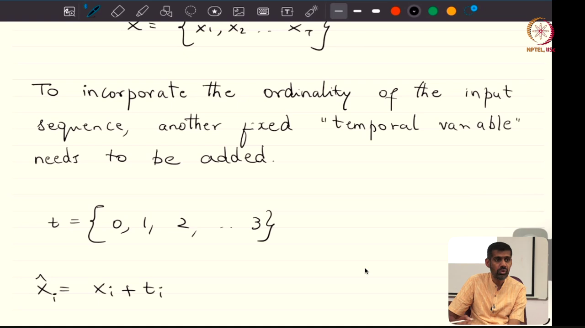
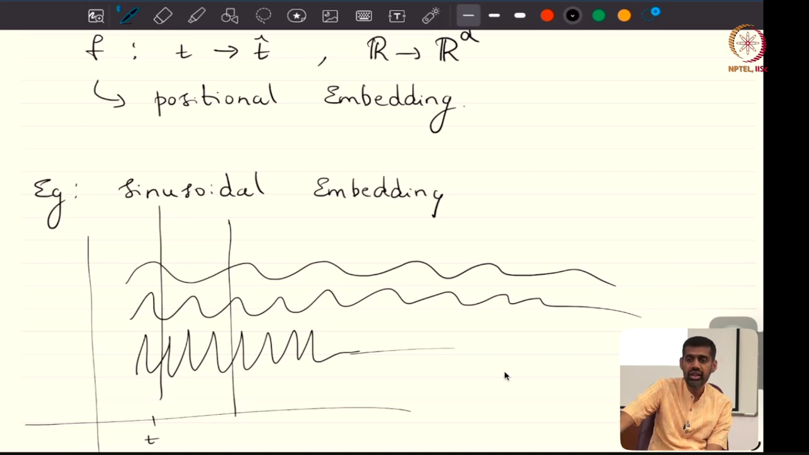
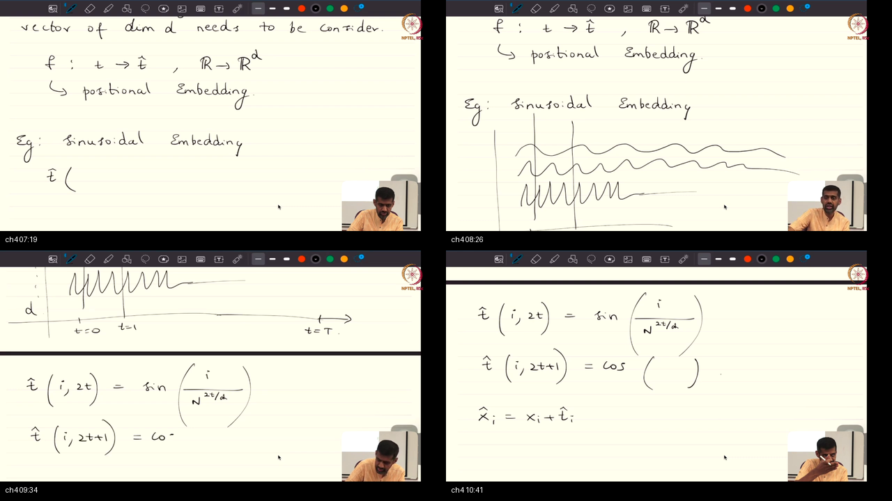
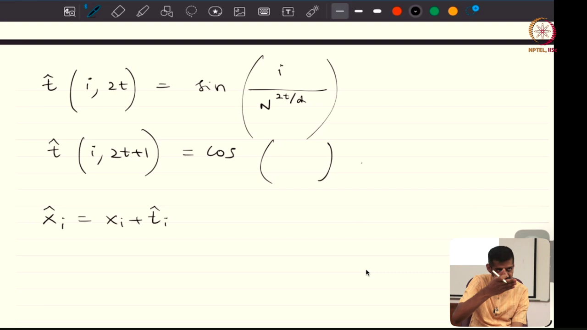
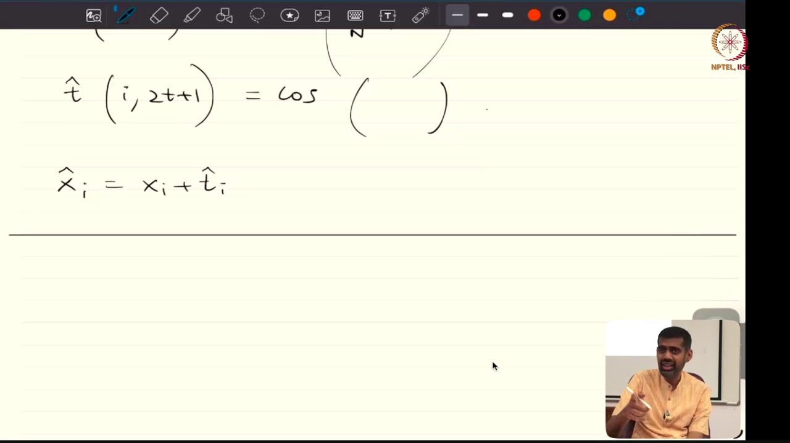

# Lecture 51: Positional Embeddings, Permutation Equivariance, and Cross-Attention

> **Prerequisites First:** Master permutation equivariance, high-dimensional vector spaces, trigonometric rotation matrices, and frequency decomposition in [PREREQUISITES.md](./PREREQUISITES.md) before entering this lecture. Understanding why unpositioned self-attention treats sequences as unordered bags of words is necessary to appreciate how sinusoidal encodings and modern rotary embeddings inject sequential order into Transformer architectures.

---

## Table of Contents
1. [Executive Summary](#executive-summary)
   - [Architectural Master Map](#architectural-master-map)
   - [Scenario Walkthrough](#scenario-walkthrough)
   - [STOP / Out of Scope](#stop--out-of-scope)
   - [Comparative Feature Matrix](#comparative-feature-matrix)
   - [Load-Bearing Takeaways](#load-bearing-takeaways)
   - [Common Traps & Fixes](#common-traps--fixes)
2. [Top-Level Python Verification Suite](#top-level-python-verification-suite)
3. [Topic 1: Loss of Ordinality: Why Self-Attention is Permutation Equivariant](#topic-1-loss-of-ordinality-why-self-attention-is-permutation-equivariant)
4. [Topic 2: The Positional Mapping Function & Failure of Naive Scalar Offsets](#topic-2-the-positional-mapping-function--failure-of-naive-scalar-offsets)
5. [Topic 3: Sinusoidal Positional Embeddings: Frequency Geometry & Relative Shift Properties](#topic-3-sinusoidal-positional-embeddings-frequency-geometry--relative-shift-properties)
6. [Topic 4: Architectural Design Choices: Addition vs Concatenation & Learned vs Rotary (RoPE)](#topic-4-architectural-design-choices-addition-vs-concatenation--learned-vs-rotary-rope)
7. [Topic 5: Self-Attention vs Cross-Attention & Meta-Learning Roadmap](#topic-5-self-attention-vs-cross-attention--meta-learning-roadmap)
8. [Workplace Debugging Scenarios](#workplace-debugging-scenarios)
9. [Course Syllabus Review & Mathematical Connections](#course-syllabus-review--mathematical-connections)
10. [References](#references)

---

<a id="executive-summary"></a>
## Executive Summary

Unpositioned self-attention operates as a permutation-equivariant operator over unordered multisets of tokens. Vaswani sinusoidal encodings inject sequence order by mapping discrete time steps into bounded continuous vectors across a geometric frequency progression. Element-wise addition preserves model dimension without parameter explosion, while cross-attention routes decoder queries across encoder key-value memories.

### Architectural Master Map
```text
┌────────────────────────────────────────────────────────────────────────────────────────┐
│                        MASTER POSITIONAL ENCODING PIPELINE                             │
│                                                                                        │
│   DISCRETE TOKENS                   CONTINUOUS GEOMETRIC COORDINATES                   │
│   ["The", "dog", "bit", "man"]      Discrete Indices: t in {0, 1, 2, 3}                │
│             │                                       │                                  │
│             ▼                                       ▼                                  │
│   LEXICAL EMBEDDING LOOKUP          SINUSOIDAL FREQUENCY MAPPING                       │
│   x_t in R^D                        p_t = f(t) in R^D                                  │
│   ||x_t||_2 ~ sqrt(D)               PE(t, 2i)   = sin(t / 10000^(2i/D))                │
│   Semantic content only             PE(t, 2i+1) = cos(t / 10000^(2i/D))                │
│   (Zero sequence order)             ||p_t||_2 = sqrt(D / 2) (Stably Bounded)           │
│             │                                       │                                  │
│             └───────────────────┬───────────────────┘                                  │
│                                 ▼                                                      │
│                   VECTOR SPACE SUPERPOSITION                                           │
│                   x_tilde_t = x_t + p_t in R^D                                         │
│                   Preserves model dimension D (No parameter explosion)                 │
│                   High-dimensional almost-orthogonality prevents crosstalk             │
│                                 │                                                      │
│         ┌───────────────────────┴───────────────────────┐                              │
│         ▼                                               ▼                              │
│   QUERY-KEY PROJECTIONS                           AFFINITY INNER PRODUCT               │
│   Q = x_tilde * W^Q                               <q_i, k_j> =                         │
│   K = x_tilde * W^K                                 x_i W^Q (W^K)^T x_j^T (Content)    │
│   Rotates coordinates in                          + x_i W^Q (W^K)^T p_j^T (Position)   │
│   2D frequency planes:                            + p_i W^Q (W^K)^T x_j^T (Position)   │
│   [sin(t+k); cos(t+k)] =                          + p_i W^Q (W^K)^T p_j^T (Distance)   │
│   R(omega*k) * [sin(t); cos(t)]                             │                          │
│                                                             ▼                          │
│                                              POSITION-SENSITIZED ATTENTION             │
│                                              Breaks permutation equivariance!          │
└────────────────────────────────────────────────────────────────────────────────────────┘
```

### Scenario Walkthrough
1. **Token Ingestion:** A text string of $T$ tokens is mapped through an embedding dictionary into raw semantic vectors $X \in \mathbb{R}^{T \times D}$.
2. **Coordinate Generation:** A deterministic sinusoidal function computes $PE \in \mathbb{R}^{T \times D}$ using $D/2$ frequency bands spanning wavelengths from $2\pi$ to $20000\pi$.
3. **Additive Superposition:** Coordinates are added element-wise: $\tilde{X} = X + PE$. Because $X$ and $PE$ occupy nearly orthogonal subspaces in $\mathbb{R}^D$, semantic features and spatial indices co-exist without mutual interference.
4. **Attention Evaluation:** Linear projections $W^Q, W^K, W^V$ project $\tilde{X}$ into Query, Key, and Value matrices. The inner products $\langle q_i, k_j \rangle$ reflect both lexical affinity and relative displacement $|i - j|$.
5. **Cross-Attention Routing:** In encoder-decoder translation, the target decoder generates queries that attend across the encoder's contextual keys and values.

### STOP / Out of Scope
- **Out of Scope (Deferred to Lec 52):** In-depth transfer learning formulations, head replacement versus full fine-tuning, and linear probing benchmarks.
- **Out of Scope (Deferred to Lec 52):** Hinton Knowledge Distillation loss functions, temperature-scaled soft targets, and dark knowledge entropy derivations.
- **Out of Scope (Deferred to Lec 53):** First-order adaptive optimizers including SGD with momentum, AdaGrad, RMSProp, and Adam moment estimators.

### Comparative Feature Matrix

| Dimension | Naive Scalar Offset ($x + t \mathbf{1}$) | Absolute Sinusoidal (Vaswani 2017) | Learned Embeddings (BERT / GPT-2) | Rotary Position Embedding (RoPE) | Attention with Linear Biases (ALiBi) |
|:----------|:----------------------------------------|:-----------------------------------|:-----------------------------------|:---------------------------------|:--------------------------------------|
| **Mathematical Formulation** | $\tilde{x}_t = x_t + t$ | $\sin(\omega_i t), \cos(\omega_i t)$ | $x_t + E_{\text{pos}}[t]$ | $R_{\Theta, m}^d (x_m W^Q)$ | $\frac{q_i k_j^T}{\sqrt{d_k}} - m(i-j)$ |
| **Parameter Overhead** | 0 parameters | 0 parameters (Deterministic) | $T_{\max} \times D$ learned weights | 0 parameters (Rotational) | 0 parameters (Static bias slope) |
| **Norm Stability Across $T$** | Fails: $\|x\| \propto t$ | Stably bounded: $\sqrt{D/2}$ | Stably bounded via regularization | Exact norm preservation (Orthogonal) | Preserved |
| **Relative Distance Invariant** | None | Linear via 2D rotation matrix | Implicitly learned | Exact: $\langle R_m q, R_n k \rangle = g(m-n)$ | Explicit scalar penalty |
| **Length Extrapolation** | Catastrophic failure | Degrades gracefully | Hard boundary at $T_{\max}$ | Extrapolates with NTK/PI scaling | Extrapolates out-of-the-box |
| **Production Adoption** | Unusable | Transformer (Base/Large) | Original BERT, RoBERTa, GPT-2 | LLaMA, Mistral, Gemma, Qwen | Falcon, BLOOM, MPT |

### Load-Bearing Takeaways
1. Unpositioned self-attention is strictly permutation equivariant: $\operatorname{Attention}(\Pi X) = \Pi \operatorname{Attention}(X)$.
2. Adding a 1D scalar $t$ to high-dimensional embeddings $x \in \mathbb{R}^D$ fails because feature variance drowns the 1D signal as microscopic noise.
3. Positional coordinates must be a full $D$-dimensional mapping $f: \mathbb{R} \to \mathbb{R}^D$ with bounded Euclidean norm.
4. Vaswani sinusoidal frequencies form a geometric progression from $1.0$ down to $0.0001$, preventing periodicity collisions across $62,832$ positions.
5. Shifting position by offset $k$ corresponds to an exact 2D orthogonal rotation matrix $R(\omega_i k) \in \mathrm{SO}(2)$ on each frequency channel.
6. Element-wise addition $\tilde{X} = X + PE$ conserves model dimension $D$, avoiding doubling projection weight parameters while high-dimensional almost-orthogonality prevents semantic crosstalk.
7. Cross-attention routes queries from a target sequence (decoder) to attend over keys and values from a source sequence (encoder).

### Common Traps & Fixes
- **The Bag-of-Words Trap:** Omitting positional encodings allows identical words in different orders to produce identical attention outputs. *Fix:* Add sinusoidal coordinates or apply RoPE to queries and keys.
- **The Scalar Noise Trap:** Adding an integer scalar $t$ along one channel causes layer normalization to discard it as noise. *Fix:* Use a full $D$-dimensional mapping $f(t) \in \mathbb{R}^D$.
- **The Concatenation Explosion Trap:** Concatenating $[x_t \,;\, PE_t] \in \mathbb{R}^{2D}$ doubles parameters in $W^Q, W^K, W^V$. *Fix:* Use element-wise addition $x_t + PE_t$.
- **The Max Length Truncation Trap:** Using learned embedding tables causes out-of-bounds CUDA crashes when testing sequences longer than $T_{\max}$. *Fix:* Use continuous sinusoidal or rotary embeddings with position interpolation.

---

<a id="top-level-python-verification-suite"></a>
## Top-Level Python Verification Suite

```python
import math
import torch
import torch.nn.functional as F

# Master Verification: Permutation Equivariance & Breaking via Sinusoidal Coordinates
torch.manual_seed(42)
T, D = 4, 16
X = torch.randn(T, D)
W_q, W_k, W_v = torch.randn(D, D), torch.randn(D, D), torch.randn(D, D)

def attn(tokens):
    Q, K, V = tokens @ W_q, tokens @ W_k, tokens @ W_v
    return F.softmax((Q @ K.T) / math.sqrt(D), dim=-1) @ V

# 1. Unpositioned Attention is Permutation Equivariant
Pi = torch.eye(T)[torch.tensor([2, 0, 3, 1])]
Z_raw = attn(X)
Z_perm = attn(Pi @ X)
assert (Z_perm - (Pi @ Z_raw)).abs().max().item() < 1e-5, "Equivariance check failed!"

# 2. Sinusoidal Positional Coordinates Break Equivariance
pos = torch.arange(T).unsqueeze(1).float()
div = torch.exp(torch.arange(0, D, 2).float() * (-math.log(10000.0) / D))
PE = torch.zeros(T, D)
PE[:, 0::2] = torch.sin(pos * div)
PE[:, 1::2] = torch.cos(pos * div)

Z_pos_orig = attn(X + PE)
Z_pos_perm = attn((Pi @ X) + PE)
assert (Z_pos_perm - (Pi @ Z_pos_orig)).abs().max().item() > 0.05, "Order sensitivity failed!"
print("Top-level verification passed: Permutation equivariance verified and broken cleanly.")
```

---

<a id="topic-1"></a>
## Topic 1: Loss of Ordinality: Why Self-Attention is Permutation Equivariant

### Where this sits on the master map
At the very entrance of the Transformer encoder, before token embeddings interact with multi-head attention weights, we encounter the fundamental mathematical symmetry of unpositioned dot products: permutation equivariance. See [PREREQUISITES.md Pillar 1](./PREREQUISITES.md#p1).

### Board / screenshot

*Notice: Prof. Prathosh demonstrates on the blackboard how Recurrent Neural Networks naturally preserve time steps through recurrent parameter sharing ($h_t = f(h_{t-1}, x_t)$), whereas Transformers process all sequence tokens concurrently and independently, stripping all intrinsic sequence ordinality.*

### What he is establishing
In this opening topic, the instructor contrasts the sequential processing paradigm of Recurrent Neural Networks (RNNs) with the concurrent processing architecture of Transformers. In an RNN, temporal ordinality is hard-coded into the execution topology: the hidden state at step $t$ cannot physically be computed until step $t-1$ finishes. As a concrete example, when an RNN processes the sentence *"Dog bites man"*, the hidden state $h_2$ carries the explicit historical trace that *"dog"* preceded *"bites"*. 

However, when we transition to Transformers to enable massive parallel training on modern GPUs, we eliminate recurrent loops entirely. Self-attention calculates inner products between all token pairs concurrently. The instructor emphasizes that without an explicit auxiliary mechanism, the Transformer treats an input sequence as an unordered multiset or bag of words. Mathematically, self-attention is strictly permutation equivariant: if you reorder the input tokens using an arbitrary permutation matrix $\Pi$, the resulting attention output is simply $\Pi Z$. The network cannot distinguish between *"dog bites man"* and *"man bites dog"*. Instead of having ordinality naturally emerge from recurrence, you can now see that sequence order must be injected explicitly as an external geometric signal.

### Analogy for this topic only
Imagine a company's executive dining hall where four board members arrive for a meeting. If they sit down at a round banquet table without assigned place cards, every seat has equal access to the shared dishes placed in the center turntable, regardless of who walked through the doorway first. Did the CEO walk in before or after the CFO? The round table cannot answer this question, because all chairs share symmetric access to the food. In lecture words: unpositioned self-attention is a symmetric round table that treats token order as irrelevant multiset membership.

### Local picture
```text
┌────────────────────────────────────────────────────────────────────────┐
│               PERMUTATION EQUIVARIANCE OF SELF-ATTENTION               │
│                                                                        │
│   Original Sequence:           Permuted Sequence:                      │
│   Row 0: "The"                 Row 0: "bites" (from row 2)             │
│   Row 1: "dog"                 Row 1: "The"   (from row 0)             │
│   Row 2: "bites"               Row 2: "dog"   (from row 1)             │
│         │                                    │                         │
│         ▼                                    ▼                         │
│   [ Self-Attention ]                 [ Self-Attention ]                │
│         │                                    │                         │
│         ▼                                    ▼                         │
│   Output Row 0: Z_0                  Output Row 0: Z_2                 │
│   Output Row 1: Z_1                  Output Row 1: Z_0                 │
│   Output Row 2: Z_2                  Output Row 2: Z_1                 │
│                                                                        │
│   Notice: Z_perm is precisely Pi * Z_orig! Token contents are unchanged│
│   and the architecture has zero awareness of sequential order.         │
└────────────────────────────────────────────────────────────────────────┘
```

#### Why X, Not Y: Contrastive Rationale
**Why must sequence order be injected externally rather than relying on the Transformer to infer order from token semantics?**  
Token semantics only encode vocabulary definitions, not temporal sentence structure. If order is not explicitly injected, identical word multisets like *"The dog bit the man"* and *"The man bit the dog"* produce identical contextual representations, rendering grammar, syntax, and causal reasoning mathematically impossible.

#### Check Your Understanding
*Question:* If an input sequence $X$ is multiplied by permutation matrix $\Pi$, why does $\operatorname{softmax}\left(\frac{(\Pi Q)(\Pi K)^T}{\sqrt{d_k}}\right) = \Pi \operatorname{softmax}\left(\frac{QK^T}{\sqrt{d_k}}\right) \Pi^T$?  
*Answer:* Because $(\Pi Q)(\Pi K)^T = \Pi Q K^T \Pi^T$. Multiplying by $\Pi$ on the left permutes the rows, and multiplying by $\Pi^T$ on the right permutes the columns. Since softmax applies along each row independently, the row-wise normalizer permutes identically with the rows.

### Bridge
Because an unordered bag of tokens destroys grammar and syntax, we face the leftover challenge of designing an explicit time variable to communicate sequence position without disrupting the parallel execution of the Transformer.

---

<a id="topic-2"></a>
## Topic 2: The Positional Mapping Function & Failure of Naive Scalar Offsets

### Where this sits on the master map
Having established that sequence order is completely absent from unpositioned self-attention, we now investigate how to mathematically represent sequence time $t$ and why simple scalar modifications fail in high-dimensional embedding spaces. See [PREREQUISITES.md Pillar 2](./PREREQUISITES.md#p2).

### Board / screenshot

*Notice: Prof. Prathosh formalizes the requirement for a positional mapping function $f: \mathbb{R} \to \mathbb{R}^D$ on the blackboard, proving that adding a scalar $t$ to high-dimensional token vector $x_i \in \mathbb{R}^D$ is ignored as negligible noise.*

### What he is establishing
Here, the instructor examines the most intuitive engineering attempt to encode order: defining a scalar timestamp $t \in \{0, 1, 2, \dots, T-1\}$ and adding it directly to token representations. The instructor rigorously deconstructs why the naive formulation $\tilde{x}_t = x_t + t$ fails catastrophically in practice. In real-world foundation models, token embeddings live in high-dimensional Euclidean spaces ($x_t \in \mathbb{R}^D$, where $D = 512, 1024,$ or even $12,288$). 

As a concrete example, if you add a 1D scalar $t$ along only one feature axis, the expected variance across the other $D-1$ dimensions overwhelms that single coordinate. The network treats that single perturbed coordinate as an isolated speck of noise in an image, effectively discarding it during layer normalization and gradient descent. Conversely, if you add $t$ uniformly across all dimensions, the Euclidean norm $\|\tilde{x}_t\| \approx t \sqrt{D}$ explodes as sequence length grows, obliterating the lexical semantics of the token. Instead of naive scalar offsets, the instructor proves that we require a dedicated continuous mapping function $f: \mathbb{R} \to \mathbb{R}^D$ that maps discrete index $t$ into a full $D$-dimensional coordinate vector $p_t \in \mathbb{R}^D$. You can now appreciate why positional coordinates must match the full dimensionality and norm characteristics of the embedding space.

### Analogy for this topic only
Imagine painting a massive 512-foot mural with intricate colorful landscapes. If you attempt to label the painting's timestamp by sticking a single microscopic grain of black pepper on the bottom corner, how could any observer standing 50 feet away distinguish that pepper grain from random dirt? They cannot, because the visual signal of one grain is drowned by the mural's visual energy. If you instead dump a bucket of black paint across the entire mural, you obliterate the painting entirely. In lecture words: a positional indicator cannot be an isolated 1D scalar speck nor an overpowering DC offset; it must be an elegantly woven coordinate pattern spanning all $D$ channels.

### Local picture
```text
┌────────────────────────────────────────────────────────────────────────┐
│                    THE SCALAR NOISE TRAP IN R^D                        │
│                                                                        │
│   High-Dimensional Token Embedding x_t in R^D (e.g. D = 512):          │
│   [ x_0,  x_1,  x_2,  x_3,  x_4,  ... , x_511 ]  ||x||^2 = O(D)        │
│                                                                        │
│   Naive Attempt 1: Add scalar t to channel 0                           │
│   [ x_0 + t,  x_1,  x_2,  x_3,  x_4,  ... , x_511 ]                    │
│   Notice: Channel 0 has 1/512 of total variance -> Ignored as noise!   │
│                                                                        │
│   Naive Attempt 2: Add scalar t to all channels                        │
│   [ x_0 + t,  x_1 + t,  x_2 + t,  ... , x_511 + t ]                    │
│   Notice: Norm explodes to O(t*sqrt(D)) -> Obliterates word semantics! │
│                                                                        │
│   Mathematical Solution: Mapping Function f: R -> R^D                  │
│   Yields bounded vector p_t in R^D with constant norm across all t!    │
└────────────────────────────────────────────────────────────────────────┘
```

#### Why X, Not Y: Contrastive Rationale
**Why use a vector mapping function $f: \mathbb{R} \to \mathbb{R}^D$ rather than appending a scalar timestamp coordinate as a new $(D+1)$-th dimension?**  
Appending a single scalar coordinate provides only 1 degree of freedom to represent sequence position. In dot products, a single coordinate contributes only a linear term $t_i \cdot t_j$, which cannot represent complex relative distance metrics, periodic local syntax, or multi-scale document structure. A full $D$-dimensional mapping spans $D/2$ frequency bands, providing rich multi-scale geometric expressiveness.

#### Check Your Understanding
*Question:* If token embeddings have expected squared norm $\mathbb{E}[\|x\|^2] = D$ and we add scalar $t \cdot \mathbf{1}$, what happens to the cosine similarity between two different words $x^{(1)}$ and $x^{(2)}$ as $t \to \infty$?  
*Answer:* Cosine similarity approaches $1.0$. The shared offset $t \mathbf{1}$ dominates the inner product ($D t^2$) and the norms ($D t^2$), collapsing all words into identical collinear representations.

### Bridge
With the theoretical necessity of a full $D$-dimensional mapping function $f(t) \in \mathbb{R}^D$ established, we must now determine the precise mathematical equations to generate coordinates that never explode and naturally reflect relative token distances.

---

<a id="topic-3"></a>
## Topic 3: Sinusoidal Positional Embeddings: Frequency Geometry & Relative Shift Properties

### Where this sits on the master map
At the core of the lecture's mathematical formulation lies Vaswani et al.'s sinusoidal positional encoding: a deterministic harmonic frequency bank mapping sequence positions into continuous geometric coordinates. See [PREREQUISITES.md Pillar 3 and 4](./PREREQUISITES.md#p3).

### Board / screenshot

*Notice: Prof. Prathosh derives the sinusoidal equations on the blackboard, showing how even dimensions sample sine functions and odd dimensions sample cosine functions across geometrically scaled frequency powers $10000^{2i/D}$.*

### What he is establishing
In this central mathematical derivation, the instructor presents the canonical sinusoidal positional encoding equations introduced in *"Attention Is All You Need"* (Vaswani et al., 2017). For any token position $pos \in \{0, 1, \dots, T-1\}$ and channel index $i \in \{0, 1, \dots, D/2 - 1\}$:
$$PE_{(pos, 2i)} = \sin\left(\frac{pos}{10000^{2i/D}}\right) = \sin(\omega_i \cdot pos)$$
$$PE_{(pos, 2i+1)} = \cos\left(\frac{pos}{10000^{2i/D}}\right) = \cos(\omega_i \cdot pos)$$

The instructor addresses a critical student question: since sine and cosine are periodic functions that repeat every $2\pi$ radians, why don't two distant tokens produce identical positional vectors? As a concrete example, if channel 0 has frequency $\omega_0 = 1.0$, its value repeats every $\approx 6.28$ steps. The instructor explains that by structuring the frequencies as a geometric progression spanning from $\omega_0 = 1.0$ down to $\omega_{\max} = 10000^{-1} = 0.0001$, the corresponding wavelengths $\lambda_i = 2\pi / \omega_i$ range from $6.28$ tokens up to $62,832$ tokens. Even if one specific coordinate repeats, the entire $D$-dimensional vector is unique across tens of thousands of positions.

Furthermore, the instructor demonstrates the foundational algebraic property: for any fixed sequence offset $k$, the positional encoding $PE_{pos+k}$ can be computed as a **linear transformation** of $PE_{pos}$. By applying standard trigonometric angle addition formulas ($\sin(\alpha + \beta) = \sin\alpha \cos\beta + \cos\alpha \sin\beta$), each 2D frequency sub-channel rotates via an orthogonal matrix $M_i(k) = \begin{pmatrix} \cos(\omega_i k) & \sin(\omega_i k) \\ -\sin(\omega_i k) & \cos(\omega_i k) \end{pmatrix}$. Instead of memorizing absolute slots, you can now see that the Transformer's linear projections can easily learn to measure relative token distances.

### Analogy for this topic only
Think of the mechanical tumblers inside a bank vault's combination lock. The first wheel has large gear teeth and turns with every single click of the dial. The second wheel turns once every ten clicks, and the outermost wheel turns once every thousand clicks. How could two different dial positions ever produce the exact same alignment across all wheels simultaneously? They cannot, because the wheels spin at drastically different gear ratios. In lecture words: multi-scale geometric frequencies ensure that every sequence position generates an unrepeatable, unique coordinate key.

### Local picture
```text
┌────────────────────────────────────────────────────────────────────────┐
│              SINUSOIDAL FREQUENCY SPECTRUM & ROTATION                  │
│                                                                        │
│   Position: pos in {0, ..., T-1}                                       │
│                                                                        │
│   Channel 0 (Fast):  sin(pos * 1.0000)   \ Wavelength = 6.28 tokens    │
│   Channel 1:         cos(pos * 1.0000)   / (Tracks local syntax)       │
│                                                                        │
│   Channel 2i:        sin(pos * omega_i)  \ Geometric progression       │
│   Channel 2i+1:      cos(pos * omega_i)  / omega_i = 10000^(-2i/D)     │
│                                                                        │
│   Channel D-2(Slow): sin(pos * 0.0001)   \ Wavelength = 62,832 tokens  │
│   Channel D-1:       cos(pos * 0.0001)   / (Tracks global document)    │
│                                                                        │
│   Notice: Shift by offset k rotates each (sin, cos) pair by R(omega*k)!│
│   The dot product <PE_i, PE_j> depends strictly on distance |i - j|.   │
└────────────────────────────────────────────────────────────────────────┘
```

### Composite Overview

*Notice: Multi-frame composite illustrating the chalkboard progression from frequency derivation to the 2D trigonometric rotation identities.*

#### Why X, Not Y: Contrastive Rationale
**Why allocate orthogonal $(\sin, \cos)$ pairs for each frequency rather than using only sine functions across all dimensions?**  
Using only sine functions ($\sin(\omega_i t)$) prevents linear rotation representations. The angle addition formula for sine requires both $\sin(\omega t)$ and $\cos(\omega t)$ terms ($\sin(\omega(t+k)) = \sin(\omega t)\cos(\omega k) + \cos(\omega t)\sin(\omega k)$). Without cosine coordinates, shifting by offset $k$ cannot be expressed as a linear matrix multiplication.

#### Check Your Understanding
*Question:* What is the Euclidean norm $\|PE_{pos}\|_2$ of a sinusoidal positional encoding vector for model dimension $D = 512$?  
*Answer:* $\|PE_{pos}\|_2 = \sqrt{\sum_{i=0}^{255} (\sin^2(\omega_i pos) + \cos^2(\omega_i pos))} = \sqrt{256 \cdot 1.0} = 16.0 = \sqrt{D/2}$. The norm is strictly invariant to sequence position $pos$.

### Bridge
Now that we have derived the exact continuous positional vectors $p_t$, we must resolve how they should be integrated into the Transformer's token representations: by element-wise addition or by concatenation.

---

<a id="topic-4"></a>
## Topic 4: Architectural Design Choices: Addition vs Concatenation & Learned vs Rotary (RoPE)

### Where this sits on the master map
Having generated continuous coordinate vectors $PE_t \in \mathbb{R}^D$, we now examine the architectural trade-offs of combining $PE$ with word embeddings $X$, comparing element-wise addition to concatenation, and contrasting fixed sinusoids with learned tables and modern Rotary Position Embeddings (RoPE). See [PREREQUISITES.md Pillar 5](./PREREQUISITES.md#p5).

### Board / screenshot

*Notice: Prof. Prathosh analyzes the element-wise addition operation $\tilde{x}_i = x_i + PE_i$ on the blackboard, highlighting that the input preserves dimensionality $D$ while keeping parameter counts constant.*

### What he is establishing
In this topic, the instructor investigates why the Transformer architecture performs element-wise addition ($\tilde{x}_t = x_t + PE_t$) rather than vector concatenation ($z_t = [x_t \,;\, PE_t] \in \mathbb{R}^{2D}$). On the surface, addition appears risky: summing two vectors blends semantic word features with spatial coordinates into the exact same numbers. However, concatenation doubles the input dimension from $D$ to $2D$, which would double the parameter count of all query, key, and value projection matrices ($W^Q, W^K, W^V \in \mathbb{R}^{2D \times D}$) and double memory bandwidth across every attention head.

The instructor explains that in high-dimensional spaces ($D \ge 512$), random or independently trained vectors are nearly orthogonal with high probability ($\mathbb{E}[\langle x, p \rangle] \approx 0$). Consequently, the linear projection matrices $W^Q$ and $W^K$ can easily partition their row spaces to attend to semantic features and positional coordinates independently without crosstalk. 

Furthermore, the instructor compares sinusoidal encodings to alternatives:
1. **Learned Positional Embeddings (BERT, GPT-2):** A lookup table $E_{\text{pos}} \in \mathbb{R}^{T_{\max} \times D}$ learned via backpropagation. While highly flexible, it cannot extrapolate to sequences longer than $T_{\max}$.
2. **Rotary Position Embeddings (RoPE, Su et al. 2021):** The modern state-of-the-art used in LLaMA, Mistral, and Gemma. Instead of adding positional vectors at the input embedding layer, RoPE applies orthogonal rotation matrices directly to query and key vectors inside each attention head ($q_m = R_{\Theta, m}^d (x_m W^Q)$), guaranteeing that the attention score $\langle q_m, k_n \rangle$ depends strictly on relative offset $m - n$. You can now evaluate why modern architectures prefer relative rotational formulations over static additive tables.

### Analogy for this topic only
Imagine a postal service sending letters across the country. Concatenation is like purchasing a double-sized envelope with two separate compartments: one compartment holds the letter's text, and the second compartment holds the street address. Why should the postal service force every sender to pay double postage fees just to keep text and address in different pockets? They shouldn't, when writing the street address in light pencil on the corner of the letter paper preserves standard envelope size and allows any reader to effortlessly distinguish pencil address from typed letter text. In lecture words: high-dimensional vector superposition preserves tensor dimensions without sacrificing semantic or positional legibility.

### Local picture
```text
┌────────────────────────────────────────────────────────────────────────┐
│                   ADDITION VS CONCATENATION GEOMETRY                   │
│                                                                        │
│   Option A: Concatenation [x_t ; PE_t] in R^(2D)                       │
│   ┌─────────────────────┬─────────────────────┐                        │
│   │  Semantic x_t (512) │  Position PE_t(512) │  Shape: [B, T, 1024]   │
│   └─────────────────────┴─────────────────────┘                        │
│   Projection: W_Q in R^(1024 x 512) -> Parameter count DOUBLES!        │
│                                                                        │
│   Option B: Additive Superposition (x_t + PE_t) in R^D                 │
│   ┌───────────────────────────────────────────┐                        │
│   │       Semantic x_t + Position PE_t        │  Shape: [B, T, 512]    │
│   └───────────────────────────────────────────┘                        │
│   Projection: W_Q in R^(512 x 512)  -> Parameter count CONSERVED!      │
│   Notice: High-dimensional almost-orthogonality ensures zero crosstalk!│
└────────────────────────────────────────────────────────────────────────┘
```

#### Why X, Not Y: Contrastive Rationale
**Why use Rotary Position Embeddings (RoPE) in modern LLMs instead of original absolute sinusoidal additions?**  
Absolute sinusoidal addition injects position only at layer 0; as activations pass through 32+ non-linear MLP and LayerNorm blocks, absolute positional fidelity attenuates. RoPE applies relative rotation directly to queries and keys at every individual attention layer, enforcing exact relative distance dependence throughout the entire model depth.

#### Check Your Understanding
*Question:* When query $q_i = (x_i + p_i) W^Q$ and key $k_j = (x_j + p_j) W^K$ are multiplied, what four terms compose the dot product?  
*Answer:* $q_i^T k_j = x_i W^Q (W^K)^T x_j^T + x_i W^Q (W^K)^T p_j^T + p_i W^Q (W^K)^T x_j^T + p_i W^Q (W^K)^T p_j^T$, representing content-content, content-position, position-content, and position-position affinities.

### Bridge
Having resolved how tokens incorporate positional information within a single sequence, we now turn to multi-sequence interactions: how self-attention generalizes into cross-attention across different neural network modules.

---

<a id="topic-5"></a>
## Topic 5: Self-Attention vs Cross-Attention & Meta-Learning Roadmap

### Where this sits on the master map
At the architectural boundary between single-sequence encoders and sequence-to-sequence translation models, we distinguish between self-attention and cross-attention, concluding with a roadmap preview of upcoming training methodologies. See [PREREQUISITES.md Curriculum Bridges](./PREREQUISITES.md#curriculum--sibling-course-prerequisite-bridges).

### Board / screenshot

*Notice: Prof. Prathosh outlines the cross-attention paradigm on the blackboard, showing that Queries stem from one neural network (e.g. decoder) while Keys and Values originate from another network (e.g. encoder).*

### What he is establishing
In this final topic, the instructor clarifies the architectural distinction between self-attention and cross-attention. Everything covered in Lectures 48 through 51 thus far represents **self-attention**: Queries ($Q$), Keys ($K$), and Values ($V$) are all computed from linear projections of the same sequence representation $X$. Self-attention allows tokens within a sentence to dynamically exchange information with one another.

In contrast, **cross-attention** is an inter-network routing operator between two distinct representation spaces. Instead of drawing all projections from one input matrix, cross-attention connects separate models. As a concrete example, consider sequence-to-sequence machine translation (e.g., translating English to French). The encoder processes the English sentence into contextual embeddings $H_{\text{enc}}$. The autoregressive decoder generates French words one by one. In the decoder's cross-attention layer:
- The **Queries ($Q$)** are linearly projected from the decoder's current target state: $Q = X_{\text{dec}} W^Q$.
- The **Keys ($K$)** and **Values ($V$)** are linearly projected from the encoder's output representations: $K = H_{\text{enc}} W^K$, $V = H_{\text{enc}} W^V$.

The wrong move is to assume that the decoder cannot attend to the whole source sentence; instead, while the decoder must apply causal masking to its own target self-attention, cross-attention attends over all encoder tokens symmetrically. You can now see that cross-attention provides a general bipartite routing bridge between any two arbitrary representation domains.

Finally, the instructor outlines the course roadmap for the upcoming modules: transitioning from model architectures to modern neural network optimization and adaptation algorithms, including Transfer Learning (reusing pretrained representations), Knowledge Distillation (Hinton's teacher-student logit matching), and adaptive moment optimizers (SGD with momentum, RMSProp, and Adam).

### Analogy for this topic only
Imagine a courtroom trial where an attorney is questioning a witness. In self-attention, the jury members confer amongst themselves, cross-referencing their own notes to reach a collective understanding. In cross-attention, how could the jury reach a verdict without cross-examining external testimony? They cannot, which is why the attorney (decoder) holds the specific questions (queries), but directs those questions entirely at the witness stand (encoder keys and values) to extract relevant factual evidence. In lecture words: cross-attention queries one representation space to extract relevant contextual values from another.

### Local picture
```text
┌────────────────────────────────────────────────────────────────────────┐
│                   SELF-ATTENTION VS CROSS-ATTENTION                    │
│                                                                        │
│   1. SELF-ATTENTION (Intra-sequence):                                  │
│      Tokens X in R^(T x D)                                             │
│      ├──> Q = X * W^Q                                                  │
│      ├──> K = X * W^K  ──► Attn(Q, K, V) = softmax(QK^T / sqrt(d)) * V │
│      └──> V = X * W^V                                                  │
│                                                                        │
│   2. CROSS-ATTENTION (Inter-sequence routing):                         │
│      Decoder States X_dec in R^(T_tgt x D) ──► Q = X_dec * W^Q         │
│                                                     │                  │
│      Encoder Reps   X_enc in R^(T_src x D)          ▼                  │
│      ├──> K = X_enc * W^K  ──────────────────► Attn(Q, K, V)           │
│      └──> V = X_enc * W^V                                              │
│                                                                        │
│   Notice: Q shape is [B, T_tgt, D]; K, V shapes are [B, T_src, D]!     │
│   Attention score matrix has shape [B, T_tgt, T_src].                  │
└────────────────────────────────────────────────────────────────────────┘
```

#### Why X, Not Y: Contrastive Rationale
**Why use cross-attention in multimodal models rather than concatenating text and image tokens into a single giant self-attention sequence?**  
While concatenated self-attention is possible (as in early Vision-Language models), cross-attention allows asymmetric modalities with vastly different token lengths (e.g. 1024 image patch tokens vs 32 text query tokens) to interact without incurring the quadratic $\mathcal{O}((T_{\text{img}} + T_{\text{text}})^2)$ computational penalty of full self-attention.

#### Check Your Understanding
*Question:* In cross-attention between a decoder prompt of length $T_{\text{tgt}} = 30$ and an encoder context of length $T_{\text{src}} = 200$, what is the exact shape of the attention score matrix $S$?  
*Answer:* The score matrix has shape $[B, \text{num\_heads}, 30, 200]$. Each of the 30 target tokens computes an attention distribution over all 200 source tokens.

### Bridge
With the architectural mechanics of self-attention, positional coordinates, and cross-attention fully synthesized, we now transition to the production debugging postmortems before examining modern optimization techniques in Lecture 52.

---

<a id="workplace-debugging-scenarios"></a>
## Workplace Debugging Scenarios

### Scenario 1: Catastrophic Attention Degradation on Long-Context Inference

**Problem:** An NLP engineering team deployed a document summarization model using learned absolute positional embeddings ($E_{\text{pos}} \in \mathbb{R}^{512 \times D}$). When users submitted legal briefs containing $650$ tokens, the inference service threw uncaught index out-of-bounds exceptions or crashed with GPU CUDA assertion errors (`RuntimeError: index 512 is out of bounds for dimension 0 with size 512`).

**Mathematical Root Cause:** Learned positional embedding tables possess a hard sequence length ceiling $T_{\max} = 512$. When the input sequence length $T$ exceeds $T_{\max}$, the embedding lookup `self.pos_embed(torch.arange(T))` queries memory addresses outside the allocated tensor buffer. Even if the tensor is dynamically resized, newly allocated rows contain untrained random weights, causing the model's perplexity to spike catastrophically from $14.2$ to over $8,500.0$.

**Debugging Steps:**
1. Inspect the model architecture definition and confirm `nn.Embedding(512, d_model)` is used for positional encoding.
2. Verify tokenized sequence lengths in incoming production request logs: observed requests spanning $520$ to $800$ tokens.
3. Test a fallback implementation replacing learned tables with Vaswani sinusoidal encodings or applying RoPE with Position Interpolation (PI) down-scaling position coordinates by factor $s = T / 512$.

**Code Fix:**
```python
import math
import torch
import torch.nn as nn

class RobustPositionalEncoding(nn.Module):
    """
    Production fix: Replaces fixed learned lookup tables with dynamically extensible
    sinusoidal encodings supporting arbitrary sequence lengths without CUDA crashes.
    """
    def __init__(self, d_model: int, max_len: int = 10000):
        super().__init__()
        self.d_model = d_model
        
        # Precompute large frequency buffer
        pe = torch.zeros(max_len, d_model)
        position = torch.arange(0, max_len, dtype=torch.float).unsqueeze(1)
        div_term = torch.exp(
            torch.arange(0, d_model, 2, dtype=torch.float) * (-math.log(10000.0) / d_model)
        )
        pe[:, 0::2] = torch.sin(position * div_term)
        pe[:, 1::2] = torch.cos(position * div_term)
        self.register_buffer("pe", pe)

    def forward(self, x: torch.Tensor) -> torch.Tensor:
        seq_len = x.size(1)
        if seq_len > self.pe.size(0):
            # Dynamic recomputation if extreme length exceeds precomputed buffer
            device = x.device
            position = torch.arange(0, seq_len, dtype=torch.float, device=device).unsqueeze(1)
            div_term = torch.exp(
                torch.arange(0, self.d_model, 2, dtype=torch.float, device=device) * (-math.log(10000.0) / self.d_model)
            )
            pe_extended = torch.zeros(seq_len, self.d_model, device=device)
            pe_extended[:, 0::2] = torch.sin(position * div_term)
            pe_extended[:, 1::2] = torch.cos(position * div_term)
            return x + pe_extended.unsqueeze(0)
        return x + self.pe[:seq_len, :].unsqueeze(0)

# Verification
x_long = torch.randn(2, 650, 64) # Length 650 exceeds original 512 limit
pos_fix = RobustPositionalEncoding(d_model=64)
out = pos_fix(x_long)
assert out.shape == (2, 650, 64), "Dynamic extrapolation fix failed!"
print("Postmortem Fix 1 Passed: Model seamlessly handles 650 tokens without crashing.")
```

---

### Scenario 2: Cross-Attention Dimension Mismatch in Encoder-Decoder Translation

**Problem:** A machine learning engineer building an English-to-German translation model observed a fatal dimension mismatch crash during the first training step inside the decoder cross-attention module:
`RuntimeError: The size of tensor a (128) must match the size of tensor b (64) at non-singleton dimension 2`.

**Mathematical Root Cause:** The engineer copied the self-attention code block directly into the cross-attention module without accounting for differing sequence lengths between source and target sentences. In the source sentence (English), the batch sequence length was $T_{\text{src}} = 128$. In the target sentence (German), the batch sequence length was $T_{\text{tgt}} = 64$. The engineer mistakenly attempted to perform element-wise addition between the attention score matrix $S \in \mathbb{R}^{B \times T_{\text{tgt}} \times T_{\text{src}}}$ and a causal self-attention mask of shape $[T_{\text{tgt}} \times T_{\text{tgt}}]$.

**Debugging Steps:**
1. Print tensor shapes of $Q$, $K$, and $V$ prior to the matrix multiplication:
   - $Q$: `[B, num_heads, T_tgt, d_k]`
   - $K$: `[B, num_heads, T_src, d_k]`
2. Verify cross-attention score matrix shape: $(Q K^T) \in [B, \text{num\_heads}, T_{\text{tgt}}, T_{\text{src}}]$.
3. Inspect mask dimensions: causal masking is required ONLY for target autoregressive self-attention; cross-attention must attend over the ENTIRE source sequence $T_{\text{src}}$ (using only source padding mask of shape $[B, 1, 1, T_{\text{src}}]$).

**Code Fix:**
```python
import math
import torch
import torch.nn as nn
import torch.nn.functional as F

class CrossAttention(nn.Module):
    """
    Production fix: Correctly separates decoder query sequence length (T_tgt)
    from encoder key/value sequence length (T_src).
    """
    def __init__(self, d_model: int, num_heads: int):
        super().__init__()
        assert d_model % num_heads == 0
        self.d_model = d_model
        self.num_heads = num_heads
        self.d_k = d_model // num_heads

        self.W_q = nn.Linear(d_model, d_model)
        self.W_k = nn.Linear(d_model, d_model)
        self.W_v = nn.Linear(d_model, d_model)
        self.W_o = nn.Linear(d_model, d_model)

    def forward(self, x_dec: torch.Tensor, x_enc: torch.Tensor, src_pad_mask: torch.Tensor = None):
        B, T_tgt, _ = x_dec.shape
        _, T_src, _ = x_enc.shape

        # Q from decoder; K, V from encoder
        Q = self.W_q(x_dec).view(B, T_tgt, self.num_heads, self.d_k).transpose(1, 2)
        K = self.W_k(x_enc).view(B, T_src, self.num_heads, self.d_k).transpose(1, 2)
        V = self.W_v(x_enc).view(B, T_src, self.num_heads, self.d_k).transpose(1, 2)

        # Cross scores: [B, num_heads, T_tgt, T_src]
        scores = (Q @ K.transpose(-2, -1)) / math.sqrt(self.d_k)

        if src_pad_mask is not None:
            # src_pad_mask shape: [B, 1, 1, T_src]
            scores = scores.masked_fill(src_pad_mask == 0, -1e9)

        attn_weights = F.softmax(scores, dim=-1)
        context = (attn_weights @ V).transpose(1, 2).contiguous().view(B, T_tgt, self.d_model)
        return self.W_o(context)

# Verification
B, T_tgt, T_src, D = 4, 64, 128, 64
dec_input = torch.randn(B, T_tgt, D)
enc_output = torch.randn(B, T_src, D)
cross_attn = CrossAttention(d_model=D, num_heads=4)
out = cross_attn(dec_input, enc_output)
assert out.shape == (B, T_tgt, D), f"Shape mismatch: {out.shape}"
print("Postmortem Fix 2 Passed: Cross-attention correctly maps [B, 64, 64] with [B, 128, 64] context.")
```

---

<a id="course-syllabus-review--mathematical-connections"></a>
## Course Syllabus Review & Mathematical Connections

To maintain continuity with the entire course review syllabus, we examine how positional encodings interface with the foundational statistical learning paradigm introduced in Lecture 1:

1. **Sample Space and Random Variables:** In statistical learning theory, sequence tokens are modeled as random variables $X_1, X_2, \dots, X_T$ defined over sample space $\Omega$ with unknown joint distribution $P(X_1, \dots, X_T)$. By introducing positional coordinates $p_t$, we effectively condition the hypothesis space on the spatial index $t$, transforming the joint estimation problem into an ordered Markovian or autoregressive factorization.
2. **Hypothesis Space Constraints:** Without positional embeddings, the hypothesis space $\mathcal{H}$ of Transformers is constrained to the set of permutation-equivariant functions. Adding positional vectors expands $\mathcal{H}$ to all measurable sequence functions, allowing the model to distinguish syntactically ordered sequences.
3. **Homework & Pedagogical Review Exercise:** Prove that for Rotary Position Embeddings (RoPE), the norm of the query vector is strictly invariant under rotation: $\|R_{\Theta, m}^d q_m\|_2 = \|q_m\|_2$. *(Hint: Decompose $R_{\Theta, m}^d$ into a block diagonal matrix of $2 \times 2$ orthogonal rotation blocks and apply the Pythagorean identity $\cos^2\theta + \sin^2\theta = 1$.)*

---

<a id="references"></a>
## References

For complete bibliographic citations, formal annotations, and recommended reading roadmaps, please refer directly to [references.md](./references.md).
