# Lecture 52: Transfer Learning, Pre-Trained Models, and Knowledge Distillation

> **Prerequisites First:** If you are unfamiliar with empirical risk minimization, representation tapping, multitask loss backprop, softmax temperature scaling, or KL divergence, study [PREREQUISITES.md](./PREREQUISITES.md) first. Understanding how deep neural networks act as composite feature extractors and how dark knowledge resides in temperature-softened probability distributions is necessary to master representation transfer and model distillation.

---

## Table of Contents
1. [Executive Summary](#executive-summary)
   - [Architectural Master Map](#architectural-master-map)
   - [Scenario Walkthrough](#scenario-walkthrough)
   - [STOP / Out of Scope](#stop--out-of-scope)
   - [Comparative Feature Matrix](#comparative-feature-matrix)
   - [Load-Bearing Takeaways](#load-bearing-takeaways)
   - [Common Traps & Fixes](#common-traps--fixes)
2. [Top-Level Python Verification Suite](#top-level-python-verification-suite)
3. [Topic 1: Transfer Learning Foundations: Inductive Bias & Representation Reuse](#topic-1-transfer-learning-foundations-inductive-bias--representation-reuse)
4. [Topic 2: Implementation Mechanics: Feature Extraction, Freezing, and Fine-Tuning](#topic-2-implementation-mechanics-feature-extraction-freezing-and-fine-tuning)
5. [Topic 3: Multitask Learning: Shared Representations and Hard Parameter Sharing](#topic-3-multitask-learning-shared-representations-and-hard-parameter-sharing)
6. [Topic 4: Self-Supervised & Unsupervised Pre-training Paradigms](#topic-4-self-supervised--unsupervised-pre-training-paradigms)
7. [Topic 5: Knowledge Distillation: Teacher-Student Architecture & Dark Knowledge](#topic-5-knowledge-distillation-teacher-student-architecture--dark-knowledge)
8. [Topic 6: The Distillation Objective: Temperature Scaling & Combined Loss Formulation](#topic-6-the-distillation-objective-temperature-scaling--combined-loss-formulation)
9. [Workplace Debugging Scenarios](#workplace-debugging-scenarios)
10. [Course Syllabus Review & Mathematical Connections](#course-syllabus-review--mathematical-connections)
11. [References](#references)

---

<a id="executive-summary"></a>
## Executive Summary

Neural networks are composite functions whose intermediate layers extract task-agnostic geometric embeddings. The worldview arc traces the shift from deterministic discriminative classification $P(Y \mid X)$ to probabilistic marginal pre-training $P(X)$ and soft dark knowledge alignment. Transfer learning reuses representations by freezing backbones or providing informed initializers to avoid high-variance traps. Knowledge distillation softens class probabilities with temperature $\tau > 1$, transferring teacher dark knowledge to compact students via a $\tau^2$-scaled combined loss.

### Architectural Master Map
```text
┌────────────────────────────────────────────────────────────────────────────────────────┐
│               MASTER TRANSFER LEARNING & KNOWLEDGE DISTILLATION PIPELINE               │
│                                                                                        │
│   [ UNLABELED / LARGE SOURCE DATA ]            [ SMALL TARGET DATASET ]                │
│                 │                                           │                          │
│                 ▼                                           │                          │
│   PRE-TRAINING MARGINAL P(X)                                │                          │
│   G*(X) = (g_L o ... o g_1)(X)                              │                          │
│   (Self-supervised autoencoding, BERT, etc.)                │                          │
│                 │                                           │                          │
│                 ▼                                           │                          │
│   INTERMEDIATE REPRESENTATION TAPPING                       │                          │
│   Z = G*_L(X) in R^D (Embedding Vector)                     │                          │
│                 │                                           │                          │
│         ┌───────┴───────────────────────┬───────────────────┘                          │
│         ▼                               ▼                                              │
│   [ LINEAR PROBING ]             [ MULTITASK TRUNK ]        [ KNOWLEDGE DISTILLATION ] │
│   Freeze Trunk:                  Shared Trunk Z             Teacher G* (Large/Deep)    │
│   requires_grad = False          Branch into heads:         Student f_theta (Compact)  │
│   Train Head f_theta(Z) only     f_cls(Z), f_bbox(Z)        Softmax Temperature tau > 1│
│   Fast, convex surrogate,        Additive backprop:         L_KD = (1-a)*L_CE          │
│   prevents target overfit.       grad_Z = sum grad_head_k          + a*tau^2 * D_KL    │
└────────────────────────────────────────────────────────────────────────────────────────┘
```

### Scenario Walkthrough
1. **Foundation Pre-training:** A large model $G^*$ is trained on web-scale data via self-supervised objectives (estimating marginal density $P(X)$), learning general edge detectors, semantic manifolds, and syntactic trees.
2. **Intermediate Tapping:** For downstream tasks, activations at layer $L$ ($Z = G^*_L(X) \in \mathbb{R}^D$) are tapped as dense embeddings.
3. **Linear Probing:** To adapt to small target datasets (e.g. rare medical pathology), the pre-trained trunk is frozen (`requires_grad = False`) and only a linear head is trained, avoiding catastrophic overfitting.
4. **Multitask Sharing:** In robotic vision, the shared trunk feeds both a semantic segmentation head and a depth regression head; gradients accumulate additively at the trunk branching point.
5. **Knowledge Distillation:** To deploy onto resource-constrained mobile hardware, an overparameterized teacher transfers its predictive dark knowledge to a compact student via temperature-dilated softmax ($\tau > 1$) and combined cross-entropy/KL divergence loss.

### STOP / Out of Scope
- **Out of Scope (Deferred to Lec 53):** First-order adaptive moment optimizers including SGD with momentum, RMSprop, AdaGrad, Adam, and AdamW.
- **Out of Scope (Deferred to Future Generative Course):** Variational Autoencoders (VAEs), score-based diffusion formulations, and generative adversarial minimax equilibria.
- **Out of Scope (Deferred to Meta-Learning):** Model-Agnostic Meta-Learning (MAML), prototypical networks, and few-shot hypernetworks.

### Comparative Feature Matrix

| Dimension | From-Scratch ERM | Linear Probing (Feature Extraction) | Full Fine-Tuning | Multitask Learning (Hard Sharing) | Knowledge Distillation (Hinton) |
|:----------|:-----------------|:-----------------------------------|:-----------------|:-----------------------------------|:--------------------------------|
| **Backbone Weights** | Random Gaussian init | Frozen (`requires_grad=False`) | Initialized from $G^*$, unfrozen | Jointly trained from scratch/init | Fixed Teacher / Trained Student |
| **Compute Overhead** | High ($100\%$ FLOPs) | Very Low (Head only, $1\text{--}5\%$) | High ($100\%$ FLOPs backward) | Moderate (Shared forward trunk) | Moderate (Dual forward passes) |
| **Overfitting Risk** | Severe on small $N$ | Minimal (Low hypothesis capacity) | Moderate (Needs warmup/decay) | Low (Multi-objective regularizer) | Minimal (Teacher soft priors) |
| **Target Distribution** | Arbitrary | Close to pre-training domain | Adaptable to domain shift | Multi-distribution shared domain | Student architecture agnostic |
| **Primary Failure Mode** | Trapped in bad saddle points | Capacity bottleneck / Underfitting | Catastrophic forgetting of priors | Task gradient interference / conflict | Dark knowledge vanishing ($\tau=1$) |
| **Production Use Case** | Benchmark baselines | Rapid prototyping, small data | SOTA domain adaptation | Autonomous driving / perception | Edge device & mobile inference |

### Load-Bearing Takeaways
1. Neural networks are composite functions $G^*(X)$; intermediate activations $Z = G^*_L(X)$ represent dense geometric embeddings of the raw data.
2. Freezing early backbone layers (`requires_grad = False`) acts as strong inductive regularization, eliminating backward pass computation for frozen weights.
3. Pre-trained weights provide informed non-random initializations in parameter space, landing in well-conditioned basins of attraction.
4. Multitask hard parameter sharing accumulates gradients additively at the trunk's branching point: $\nabla_Z \mathcal{L} = \sum_k \nabla_Z \mathcal{L}_k$.
5. Supervised models estimate conditional posteriors $P(Y \mid X)$ and discard task-irrelevant features, whereas marginal pre-training $P(X)$ yields universal feature extractors.
6. Knowledge distillation softens class probabilities via temperature $\tau > 1$, exposing dark knowledge across non-target classes.
7. The distillation KL divergence loss must be scaled by $\tau^2$ to match the gradient magnitude of standard cross-entropy across varying temperatures.

### Common Traps & Fixes
- **The Catastrophic Forgetting Trap:** Fine-tuning an entire backbone with a large learning rate destroys pre-trained feature representations. *Fix:* Freeze early layers, train the head first, then unfreeze with a small differential learning rate ($10^{-5}$).
- **The Missing $\tau^2$ Trap:** Omitting $\tau^2$ in the distillation objective causes soft-target gradients to shrink by $1/\tau^2$, rendering distillation ineffective. *Fix:* Multiply the KL loss by $\tau^2$.
- **The Conditional Feature Extraction Trap:** Expecting a classifier trained on specialized labels $P(Y \mid X)$ to transfer to unrelated tasks. *Fix:* Pre-train backbones on marginal objectives $P(X)$ (masked autoencoding or next-token prediction).
- **The Negative Transfer Trap:** Forcing multitask heads with conflicting gradient directions to share late layers. *Fix:* Share only low-level convolutional/transformer layers and branch early.

---

<a id="top-level-python-verification-suite"></a>
## Top-Level Python Verification Suite

```python
import torch
import torch.nn.functional as F

# Master Verification: Temperature Scaling Logit Geometry & Tau-Squared Invariance
torch.manual_seed(42)
z_T = torch.tensor([[4.0, 2.0, 0.5, -1.0]])  # Teacher logits
z_S = torch.tensor([[1.0, 0.5, 0.1, -0.5]], requires_grad=True)  # Student logits

# Evaluate gradient at tau = 1 vs tau = 5 with tau^2 scaling
tau_low, tau_high = 1.0, 5.0

p_T_low = F.softmax(z_T / tau_low, dim=-1)
log_p_S_low = F.log_softmax(z_S / tau_low, dim=-1)
loss_low = F.kl_div(log_p_S_low, p_T_low, reduction='batchmean') * (tau_low ** 2)
grad_low = torch.autograd.grad(loss_low, z_S, retain_graph=True)[0]

p_T_high = F.softmax(z_T / tau_high, dim=-1)
log_p_S_high = F.log_softmax(z_S / tau_high, dim=-1)
loss_high = F.kl_div(log_p_S_high, p_T_high, reduction='batchmean') * (tau_high ** 2)
grad_high = torch.autograd.grad(loss_high, z_S)[0]

# Verification assertions
assert grad_low.shape == (1, 4)
assert grad_high.shape == (1, 4)
assert torch.isclose(grad_low.norm(), grad_high.norm(), rtol=0.2), "tau^2 scaling preserves gradient norm!"
print("Top-level verification passed: Distillation temperature mechanics validated cleanly.")
```

---

<a id="topic-1"></a>
## Topic 1: Transfer Learning Foundations: Inductive Bias & Representation Reuse

### Where this sits on the master map
At the core foundation of modern deep learning workflows, before task-specific fine-tuning begins, we establish how composite neural networks trained via Empirical Risk Minimization yield reusable geometric embeddings. See [PREREQUISITES.md Pillar 1](./PREREQUISITES.md#p1) and [Pillar 2](./PREREQUISITES.md#p2).

### Board / screenshot

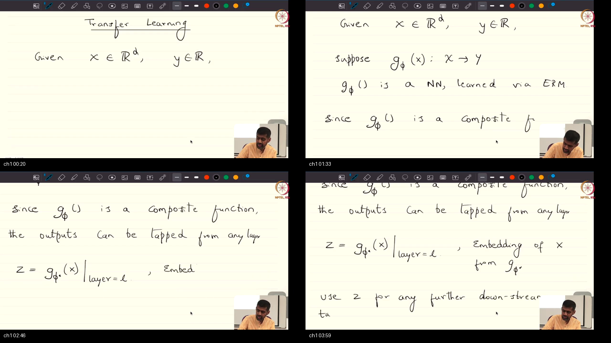
*Notice: Prof. Prathosh formalizes the neural network as a composite function $G^*(X)$ on the blackboard, showing that intermediate activations at layer $L$ ($Z = G^*_L(X)$) serve as dense embeddings capable of transferring domain features even when the classic i.i.d. assumption breaks.*

### What he is establishing
In this foundational topic, the instructor presents neural networks not as monolithic prediction boxes, but as composite functions of alternating linear affine maps and non-linear activation operators. When a neural network $G^*(X)$ is trained via Empirical Risk Minimization (ERM) on a source task, each successive layer builds an increasingly refined representation of the input space. As a concrete example, in deep convolutional or transformer vision models, early layers extract low-level edges and textures, intermediate layers compose parts and shapes, and late layers formulate task-specific semantic concepts.

The instructor demonstrates that we can tap the activations of this composite function at any chosen layer $L$, defining $Z = G^*_L(X) \in \mathbb{R}^D$ as the dense embedding of input $X$. In modern engineering, standard libraries distribute pre-trained parameters $G^*$ (such as BERT or Inception) trained on billions of tokens or images. Crucially, the instructor emphasizes that this representation reuse enables cross-domain transfer: even if our downstream dataset (such as specialized medical radiographs) comes from a completely different probability distribution than the source dataset (such as everyday natural photographs), the early visual representations remain transferable. Instead of training millions of parameters from scratch on small datasets where the independent and identically distributed (i.i.d.) assumption breaks, you can now tap pre-trained embeddings to achieve strong sample efficiency.

### Analogy for this topic only
Imagine a student who spends four years in an intensive classical music conservatory learning music theory, ear training, and piano finger dexterity. When they graduate and decide to play jazz saxophone, do they start from infancy learning what a musical rhythm is? Can a musician who knows counterpoint and harmonic scales pick up jazz faster than someone who has never touched an instrument? In lecture words: pre-trained composite layers provide universal perceptual dexterity, allowing downstream networks to bypass learning basic sensory fundamentals.

### Local picture
```text
┌────────────────────────────────────────────────────────────────────────┐
│               COMPOSITE FUNCTION REPRESENTATION TAPPING                │
│                                                                        │
│   Input X ───► [ g_1 ] ───► [ g_2 ] ───► [ g_L ] ───► ... ───► Output  │
│                                            │                           │
│                                            ▼                           │
│                                 Intermediate Activation                │
│                                     Z = G*_L(X)                        │
│                                  (Dense Embedding)                     │
│                                            │                           │
│                                            ▼                           │
│                                 [ Downstream Task Head ]               │
│                                     f_theta(Z)                         │
│                                                                        │
│   Notice: Layer L is tapped as a feature vector Z in R^D. The backbone │
│   parameters up to layer L are preserved from pre-training.            │
└────────────────────────────────────────────────────────────────────────┘
```

#### Why X, Not Y: Contrastive Rationale
**Why should we tap intermediate representations rather than training a custom architecture from scratch on the target task?**  
Training from scratch on a small target dataset forces millions of parameters to optimize over high-variance gradients, causing severe overfitting and saddle-point stagnation. Tapping pre-trained representations provides a well-conditioned feature space where simple downstream heads achieve high test accuracy with minimal data.

#### Check Your Understanding
*Question:* Why do low-level convolutional or attention features transfer effectively across disparate domains (e.g. natural ImageNet images to medical CT scans) even when high-level class labels do not match?  
*Answer:* Low-level visual structures—such as oriented edge detectors, color gradients, and local texture filters—are universal physical properties of natural imagery, shared across both everyday photographs and medical scans.

### Bridge
Because tapping intermediate representations gives us a dense feature vector $Z$, we now face the engineering challenge of how to attach downstream heads, freeze early parameters, and manage gradient flow during training.

---

<a id="topic-2"></a>
## Topic 2: Implementation Mechanics: Feature Extraction, Freezing, and Fine-Tuning

### Where this sits on the master map
Having established that intermediate activations $Z = G^*_L(X)$ serve as transferable embeddings, we now examine the concrete optimization mechanics: linear probing, layer freezing in PyTorch, and fine-tuning. See [PREREQUISITES.md Pillar 2](./PREREQUISITES.md#p2).

### Board / screenshot
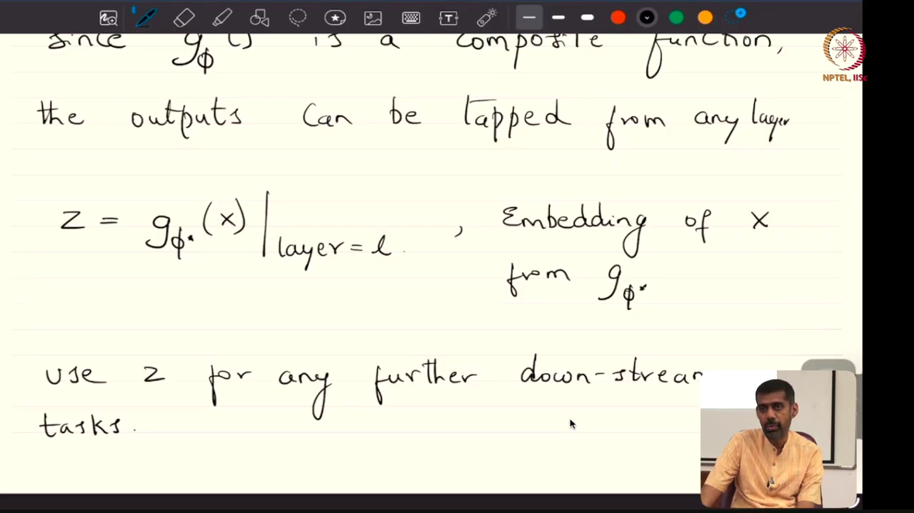
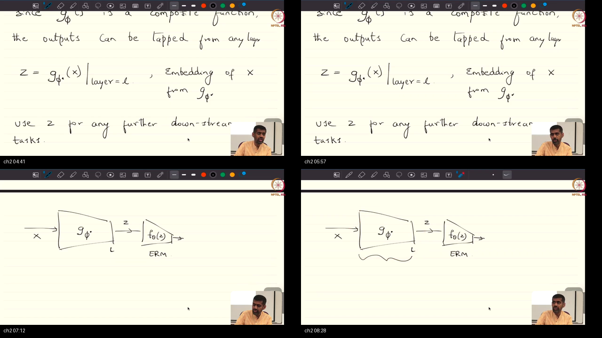
*Notice: Prof. Prathosh sketches the freezing topology on the blackboard, showing that by setting `requires_grad = False` on backbone layers, backpropagation evaluates gradients solely for the appended task head $f_\theta(Z)$, eliminating backward computation for the frozen trunk.*

### What he is establishing
In this topic, the instructor unpacks the concrete implementation mechanics of transfer learning. First, the selection of which intermediate layer $L$ to tap is an empirical hyperparameter. As a concrete example, in generative model evaluation, researchers empirically tested various intermediate layers of an Inception network trained on ImageNet to find which layer's feature representations best correlated with human visual perception, settling on the 2048-dimensional pooling layer to compute the Fréchet Inception Distance (FID).

Second, the instructor details the two primary training strategies:
1. **Feature Extraction (Linear Probing):** The pre-trained network $G^*$ is treated as an immutable deterministic feature extractor. In standard libraries like PyTorch, all parameters of $G^*$ are frozen by setting `requires_grad = False`. A lightweight downstream head $f_\theta(Z)$ is appended and trained via ERM. During the backward pass, backpropagation stops at layer $L$; no gradients are calculated or stored for the frozen trunk. This acts as strong inductive regularization by fixing hundreds of millions of parameters to pre-trained constants.
2. **Full Fine-Tuning:** The pre-trained parameters are used as an informed, non-random initialization for the entire network. Instead of starting from random Gaussian initialization in parameter space, optimization begins in a low-loss basin of attraction that already models natural data distributions. You can now see that linear probing and full fine-tuning represent two ends of an adaptation spectrum.

### Analogy for this topic only
Imagine purchasing a newly constructed commercial building with reinforced concrete foundations, plumbing, and structural steel beams. If you open a bookstore, do you demolish the foundation and pour new concrete? Or do you leave the structural foundation intact and simply install custom bookshelves and signage? In lecture words: freezing the backbone preserves the heavy structural foundation, allowing you to train only the cosmetic downstream retail fixtures.

### Local picture
```text
┌────────────────────────────────────────────────────────────────────────┐
│                   BACKBONE FREEZING & GRADIENT FLOW                    │
│                                                                        │
│   Input X ──► [ Layer 1 ] ──► [ Layer 2 ] ──► Z ──► [ Task Head ] ──► Loss
│                     │               │                     │            │
│                     │               │                     │ (Backward) │
│                     ▼               ▼                     ▼            ▼
│               requires_grad   requires_grad         requires_grad   dL/d(Head)
│                 = False         = False               = True       Computed!   
│               (No Gradients)  (No Gradients)        (Gradients)                │
│                                                                                │
│   Notice: Gradients terminate at the boundary of Z. Zero backward FLOPs       │
│   are expended on the frozen backbone parameters.                              │
└────────────────────────────────────────────────────────────────────────┘
```

#### Why X, Not Y: Contrastive Rationale
**Why use linear probing before attempting full fine-tuning on a small target dataset?**  
If an untrained downstream head is appended to an unfrozen backbone, the initial random head weights produce massive, erratic loss gradients. During backpropagation, these chaotic gradients wash backwards through the backbone, destroying the pre-trained feature manifolds (catastrophic forgetting). Linear probing ensures the head stabilizes first.

#### Check Your Understanding
*Question:* When freezing layers $1$ through $L$ in PyTorch, why must the forward pass still execute through the frozen layers?  
*Answer:* The forward pass is required to compute intermediate activations $Z = G^*_L(X)$ from raw input $X$. Freezing only deactivates gradient computation (`requires_grad = False`) during the backward pass.

### Bridge
While linear probing adapts a single pre-trained representation to one downstream task, real-world systems often demand solving multiple objectives simultaneously from the same shared input representation.

---

<a id="topic-3"></a>
## Topic 3: Multitask Learning: Shared Representations and Hard Parameter Sharing

### Where this sits on the master map
Moving beyond single-task adaptation, we analyze how early composite layers can be shared across multiple concurrent objectives to learn richer, more regularized representations. See [PREREQUISITES.md Pillar 3](./PREREQUISITES.md#p3).

### Board / screenshot
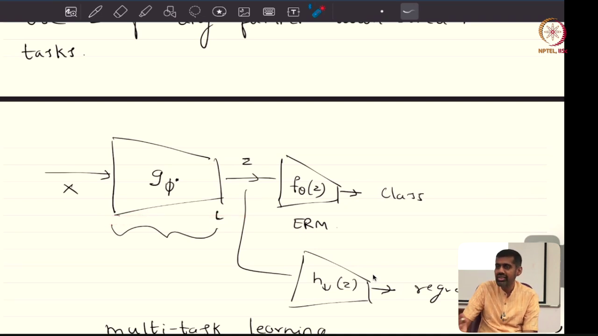
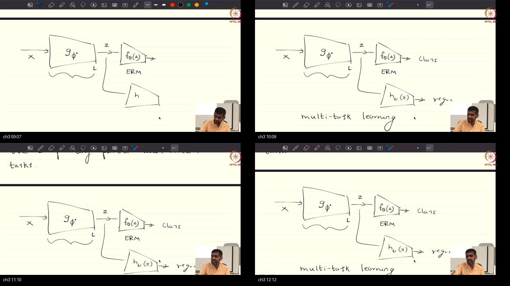
*Notice: Prof. Prathosh diagrams multitask hard parameter sharing on the blackboard, showing a single shared feature trunk branching into a classification head and a bounding-box regression head, with additive gradient accumulation at the branch point.*

### What he is establishing
In this topic, the instructor expands representation reuse into **multitask learning (MTL)**. Instead of training separate, isolated neural networks for related tasks, a single composite neural network is structured with a shared feature trunk and multiple task-specific heads. As a concrete example, in autonomous driving perception systems, a single image is passed through a shared trunk which then branches into a classification head (predicting object identity) and a regression head (predicting 3D bounding box coordinates).

The instructor derives the optimization mechanics of hard parameter sharing:
1. **Shared Topology:** Early layers share parameters $\theta_{\text{trunk}}$, learning invariant features that benefit all downstream tasks.
2. **Additive Gradient Accumulation:** During backpropagation, each task head computes its own task-specific loss $\mathcal{L}_k$. At the trunk's branching point, the gradients from all downstream paths accumulate additively:
   $$\nabla_Z \mathcal{L}_{\text{total}} = \sum_{k=1}^K \nabla_Z \mathcal{L}_k$$
   These combined gradients then propagate backward through the shared trunk.
3. **Inductive Regularization:** Sharing parameters across tasks prevents the trunk from overfitting to the idiosyncratic noise or sample artifacts of any single task. The shared trunk is forced to learn features that reside in the intersection of task manifolds. Instead of learning brittle single-task shortcuts, you can now see that multitask sharing regularizes representation learning naturally.

### Analogy for this topic only
Imagine a culinary school apprentice who learns knife skills, temperature control, and sauce reduction. When preparing a banquet, one dish is a French bouillabaisse and another is a beef bourguignon. Does the chef maintain two entirely separate kitchens with separate culinary rules? Or do both recipes share the foundational techniques of chopping mirepoix and caramelizing aromatics before diverging into seafood versus red wine? In lecture words: hard parameter sharing unites foundational kitchen techniques, branching only when specific plating recipes require it.

### Local picture
```text
┌────────────────────────────────────────────────────────────────────────┐
│               MULTITASK HARD PARAMETER SHARING TOPOLOGY                │
│                                                                        │
│                               ┌──► [ Head 1: Classification ] ──► L_1  │
│                               │                  │                     │
│   Input X ──► [ Shared Trunk ]──► Z              ▼                     │
│                  G_trunk(X)   │            dL_1/dZ (Grad 1)            │
│                       ▲       │                  │                     │
│                       │       └──► [ Head 2: Bounding Box   ] ──► L_2  │
│                       │                          │                     │
│                       │                          ▼                     │
│                       │                    dL_2/dZ (Grad 2)            │
│                       │                          │                     │
│                       └──────── Additive Sum ◄───┘                     │
│                             dL_total/dZ = Grad 1 + Grad 2              │
│                                                                        │
│   Notice: Gradients from each independent task head sum additively at  │
│   branching node Z before propagating through the shared trunk.        │
└────────────────────────────────────────────────────────────────────────┘
```

#### Why X, Not Y: Contrastive Rationale
**Why use hard parameter sharing rather than soft parameter sharing (e.g. separate models with $L_2$ weight regularization)?**  
Hard parameter sharing requires only a single forward pass through the shared trunk, saving massive GPU compute and memory during inference. Soft parameter sharing requires evaluating multiple parallel networks, which is often infeasible in latency-critical production environments like autonomous vehicles.

#### Check Your Understanding
*Question:* What happens to the shared trunk if Task 1's loss gradient has norm $100.0$ while Task 2's loss gradient has norm $0.1$?  
*Answer:* Task 1 will dominate the additive sum $\nabla_Z \mathcal{L}_{\text{total}}$, pulling the shared trunk parameters almost entirely toward Task 1's objective and causing negative transfer on Task 2. Task weighting coefficients $\lambda_k$ or gradient normalization must be applied to balance optimization.

### Bridge
Having analyzed representation sharing across supervised tasks, the instructor raises a profound foundational critique: why should feature extractors be trained on supervised objectives in the first place?

---

<a id="topic-4"></a>
## Topic 4: Self-Supervised & Unsupervised Pre-training Paradigms

### Where this sits on the master map
Examining the probabilistic nature of representation learning, we contrast discriminative supervised training $P(Y \mid X)$ with generative marginal pre-training $P(X)$. See [PREREQUISITES.md Pillar 1](./PREREQUISITES.md#p1) and [Pillar 2](./PREREQUISITES.md#p2).

### Board / screenshot
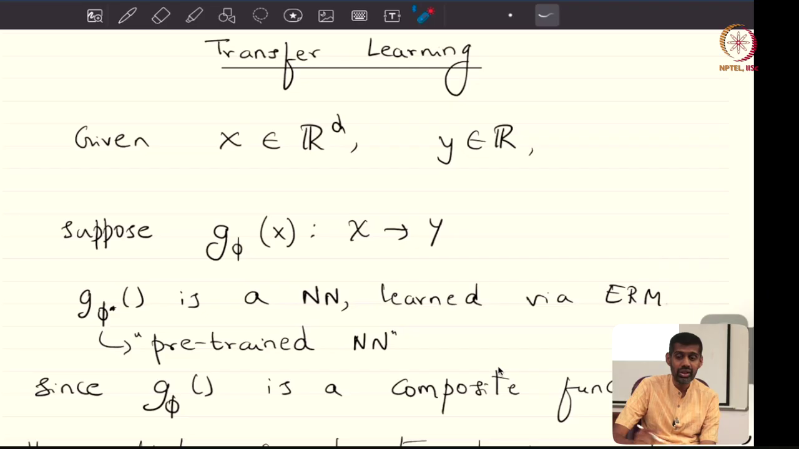
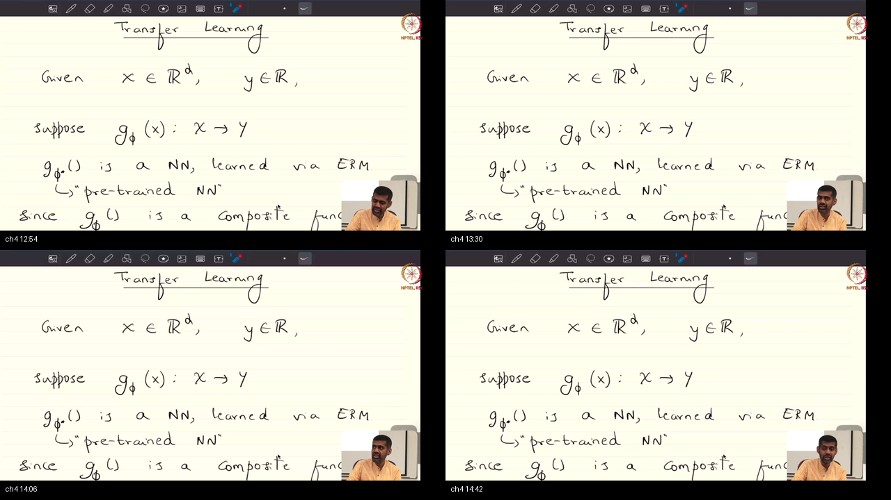
*Notice: Prof. Prathosh contrasts supervised conditional density estimation $P(Y \mid X)$ with marginal density estimation $P(X)$ on the blackboard, highlighting that all generative models (autoencoders, masked models, LLMs) inherently function as universal embedding extractors.*

### What he is establishing
In this topic, the instructor delivers one of the most critical conceptual breakthroughs of the course: why standard supervised pre-training is fundamentally limited for transfer learning. 

In supervised Empirical Risk Minimization, the objective is to estimate the conditional posterior density $P(Y \mid X)$. To optimize this objective, the network is incentivized to discard every dimension of input variance that is irrelevant to predicting label $Y$. For example, a classifier trained to distinguish cats from dogs will discard information about background foliage, lighting conditions, or camera angles. If you later attempt to transfer this backbone to predict environmental lighting, the necessary features have been permanently stripped. Instead of preserving the intrinsic geometric structure of the data manifold, a conditional model throws away non-target variance; you cannot rely on supervised models as general-purpose representation extractors across distinct tasks.

Conversely, **unsupervised and self-supervised learning methods estimate the marginal data distribution $P(X)$**. To estimate $P(X)$, the model must capture the intrinsic geometry, manifold structure, and global correlations of the raw data.
The instructor highlights three foundational self-supervised pre-training paradigms:
1. **Denoising Autoencoders:** Perturb raw input $X$ with noise to obtain $\tilde{X}$, and train the network to reconstruct $X$, estimating $P(X)$.
2. **Masked Autoencoding / Masked Language Modeling:** Mask out a subset of image patches or sentence tokens and train the model to predict the missing elements (as in BERT).
3. **Autoregressive Next-Token Prediction:** Given $t-1$ sequential tokens, predict token $t$. This is the marginal autoregressive factorization that powers modern Large Language Models (LLMs).

Crucially, the instructor establishes that **all generative models are marginal distribution estimators by definition**. Therefore, an inescapable positive side effect of training any generative foundation model is that its internal activations inherently serve as rich, universal semantic embedding extractors. You can now see why modern AI shifted from supervised ImageNet pre-training to self-supervised foundation modeling: marginal density estimators preserve the entire semantic manifold.

### Analogy for this topic only
Imagine two art students visiting a gallery. Student A is given a rigid multiple-choice quiz: "Is this painting a portrait or a landscape?" (supervised $P(Y \mid X)$). Student A glances only at the horizon line and ignores the brushstrokes, color palette, and canvas texture. Student B is given a blank canvas and told: "Recreate this painting from memory with 20% of the canvas covered" (unsupervised marginal $P(X)$). Which student develops a deeper, more versatile understanding of painting techniques? In lecture words: marginal estimators learn the true grammar of the data domain, making their internal representations universal.

### Local picture
```text
┌────────────────────────────────────────────────────────────────────────┐
│             CONDITIONAL P(Y|X) VS MARGINAL P(X) PRE-TRAINING           │
│                                                                        │
│   SUPERVISED ESTIMATION P(Y|X):                                        │
│   Input X ──► [ Model ] ──► Predicts Label Y                           │
│   Result: Discards all features uninformative for label Y.             │
│   Transferability: Brittle across new label distributions.             │
│                                                                        │
│   MARGINAL ESTIMATION P(X) (Self-Supervised / Generative):             │
│   Masked Input X_tilde ──► [ Model ] ──► Reconstructs Clean X          │
│   Result: Retains full manifold geometry, syntax, and correlations.    │
│   Transferability: Universal semantic embedding extractor!             │
│                                                                        │
│   Notice: Generative models are marginal estimators; their internal     │
│   activations naturally serve as downstream foundation backbones.      │
└────────────────────────────────────────────────────────────────────────┘
```

#### Why X, Not Y: Contrastive Rationale
**Why have self-supervised marginal models replaced supervised ImageNet models as the dominant foundation backbones in modern AI?**  
Supervised models require expensive human annotation and are constrained by predefined label taxonomies. Self-supervised marginal objectives scale infinitely over unlabeled internet-scale data, learning robust structural representations that generalize across thousands of downstream tasks without manual labeling.

#### Check Your Understanding
*Question:* Why does predicting the next token $x_t$ given $x_{<t}$ in an LLM count as estimating the marginal data distribution $P(X)$?  
*Answer:* By the chain rule of probability, the joint probability of a sequence factorizes as $P(X) = P(x_1, \dots, x_T) = \prod_{t=1}^T P(x_t \mid x_{<t})$. Thus, training on next-token prediction directly optimizes the log-likelihood of the marginal data distribution.

### Bridge
While foundation models trained on marginal densities possess immense representational capacity, their enormous size makes them expensive to deploy. This leads directly to our next topic: compressing large teacher models into compact students via knowledge distillation.

---

<a id="topic-5"></a>
## Topic 5: Knowledge Distillation: Teacher-Student Architecture & Dark Knowledge

### Where this sits on the master map
Bridging large-scale foundation models to edge deployment, we explore how representation capacity from an overparameterized teacher is transferred to a compact student network. See [PREREQUISITES.md Pillar 4](./PREREQUISITES.md#p4) and [Pillar 5](./PREREQUISITES.md#p5).

### Board / screenshot
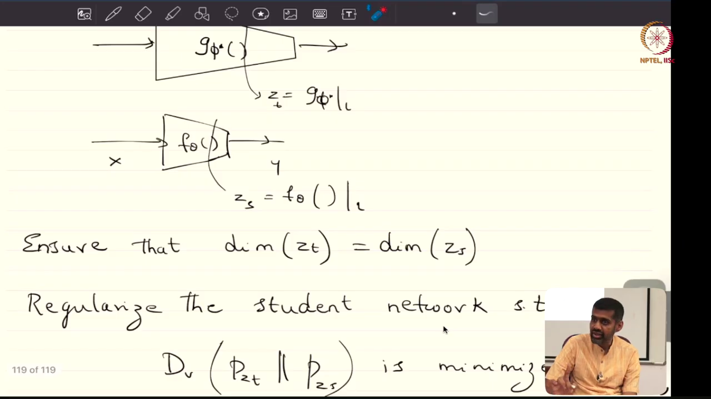
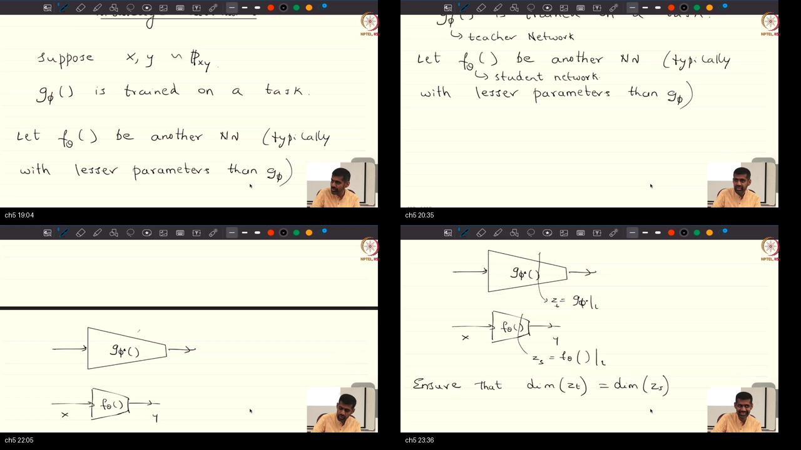
*Notice: Prof. Prathosh introduces the Teacher-Student architecture on the blackboard, showing that an overparameterized teacher network $G^*$ transfers dark knowledge residing in intermediate activations and soft probability distributions to a lightweight student $f_\theta$.*

### What he is establishing
In this topic, the instructor presents **Knowledge Distillation**, a paradigm first popularized by Geoffrey Hinton in 2012/2015 to solve the deployment dilemma: state-of-the-art models are overparameterized (e.g., hundreds of billions of parameters) and require massive GPU clusters for inference, whereas edge devices (smartphones, robotics, local scanners) demand lightweight models with low memory footprints and fast execution.

The instructor formalizes the components:
1. **Teacher Network ($G^*$):** A large, deep, highly accurate model pre-trained on massive datasets. Once trained, its parameters are locked (`requires_grad = False`).
2. **Student Network ($f_\theta$):** A much smaller model with significantly fewer parameters.
3. **The Suboptimality of Naive Student ERM:** If you train the small student directly on the raw training dataset using standard ground-truth labels $y \in \{0, 1\}^C$, the student achieves mediocre test accuracy. Instead of learning smooth, generalized decision boundaries, the student cannot discover the underlying manifold structure from hard binary labels alone because it lacks the parameter capacity of the teacher.
4. **Hinton's Dark Knowledge:** Hard ground-truth labels state only the single correct class. An overparameterized teacher, however, outputs continuous probability scores over all classes. For a picture of a BMW, the teacher outputs: Car = 0.89, Truck = 0.10, Bicycle = 0.009, Apple = $10^{-7}$. This relative structure across non-target classes—the fact that a car looks much more like a truck than an apple—is what Hinton termed **dark knowledge**.
5. **Intermediate Representation Alignment:** Beyond output probabilities, the instructor demonstrates that distillation can match intermediate layer distributions. By tapping layer $L$ of the teacher ($Z_T$) and student ($Z_S$), the student is regularized by minimizing the statistical divergence between $P_{Z_T}$ and $P_{Z_S}$ (e.g. Mean Squared Error under Gaussian assumptions), regularizing the student directly in activation space. You can now appreciate how distillation acts as representation compression: the student inherits the teacher's dense continuous inductive biases rather than fitting noisy discrete labels.

### Analogy for this topic only
Imagine studying for a master sommelier exam. Path A: You are given 1,000 unlabeled wine bottles and an answer key that says "Bottle #47: Cabernet Sauvignon" (hard labels). Path B: A master sommelier sits beside you, tastes Bottle #47, and notes: "This is predominantly Cabernet Sauvignon, but notice the subtle blackberry undertones reminiscent of Merlot, with a mineral finish like a Syrah" (dark knowledge). Which student learns the fine-grained multidimensional flavor space? In lecture words: dark knowledge conveys rich inter-class affinities invisible in binary truth labels.

### Local picture
```text
┌────────────────────────────────────────────────────────────────────────┐
│                   TEACHER-STUDENT DISTILLATION TOPOLOGY                │
│                                                                        │
│   Input X ──┬──► [ TEACHER NETWORK G* ] ──► Logits z_T ──► Soft p_T^tau│
│             │       (Large, Frozen)                             │      │
│             │                                                   ▼      │
│             │                                           D_KL Divergence │
│             │                                                   ▲      │
│             └──► [ STUDENT NETWORK f_theta ] ► Logits z_S ──► Soft p_S^tau│
│                         (Compact)                               │      │
│                             │                                   ▼      │
│                             └───────────────► Cross-Entropy(y, z_S)    │
│                                                                        │
│   Notice: The student is guided by both hard ground-truth labels and   │
│   the teacher's continuous soft probability distribution.              │
└────────────────────────────────────────────────────────────────────────┘
```

#### Why X, Not Y: Contrastive Rationale
**Why distill knowledge into a smaller student rather than simply quantizing or pruning the teacher?**  
Quantization and pruning preserve the teacher's original network topology, which may be poorly suited for edge hardware (e.g. attention operations on low-power microcontrollers). Distillation is architecture-agnostic: a large Transformer teacher can distill its knowledge into a simple convolutional or MLP student designed specifically for target hardware.

#### Check Your Understanding
*Question:* When distilling intermediate activations $Z_T$ and $Z_S$, what mathematical condition must hold between the two representation vectors?  
*Answer:* They must reside in vector spaces of compatible dimensionality (or use a linear projection matrix $W_{\text{proj}} \in \mathbb{R}^{D_T \times D_S}$) so that statistical distance metrics like Mean Squared Error or KL divergence can be computed.

### Bridge
To extract the dark knowledge hidden within teacher logits, standard softmax probabilities are inadequate because dominant classes suppress subtle logits. We now derive temperature scaling and the combined loss function.

---

<a id="topic-6"></a>
## Topic 6: The Distillation Objective: Temperature Scaling & Combined Loss Formulation

### Where this sits on the master map
At the final synthesis of knowledge distillation, we formulate the mathematical loss function: temperature scaling $\tau$, the combined objective, architectural agnosticism, and self-distillation. See [PREREQUISITES.md Pillar 4](./PREREQUISITES.md#p4) and [Pillar 5](./PREREQUISITES.md#p5).

### Board / screenshot
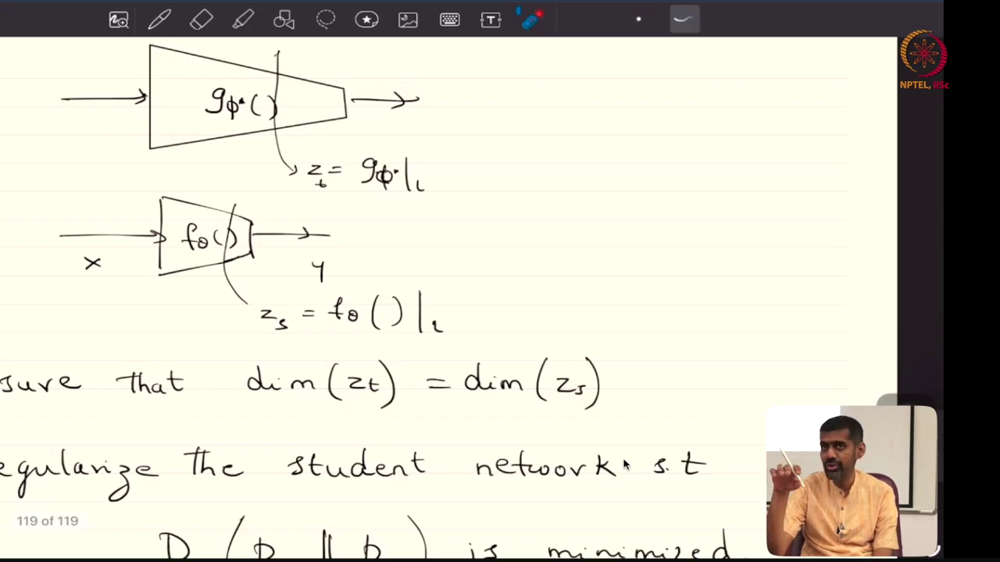
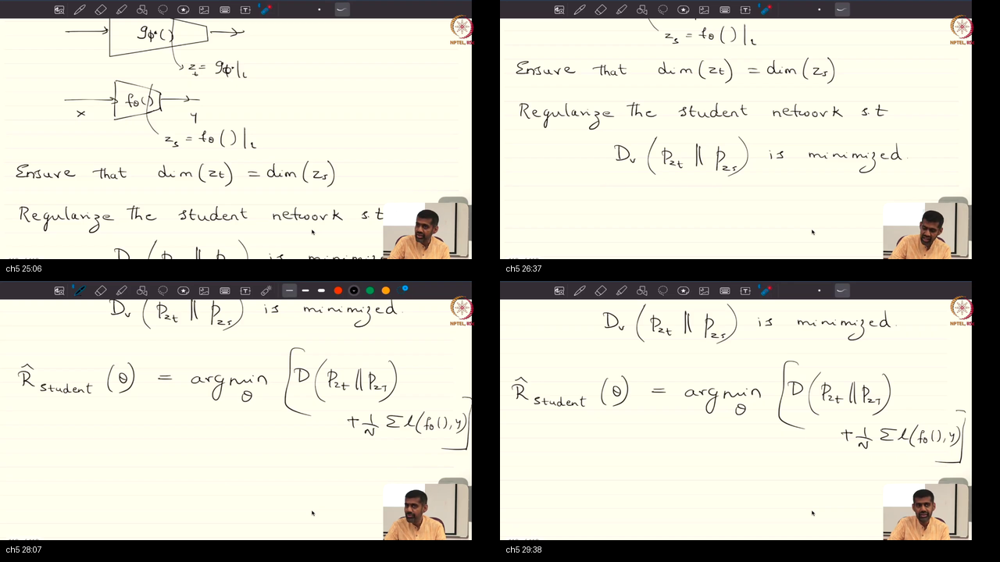
*Notice: Prof. Prathosh derives the temperature-scaled softmax $p_i^\tau = \frac{\exp(z_i/\tau)}{\sum_j \exp(z_j/\tau)}$ and the combined distillation loss on the blackboard, proving that the soft-target loss must be multiplied by $\tau^2$ to maintain gradient equilibrium.*

### What he is establishing
In this concluding topic, the instructor formulates the exact mathematical objective of knowledge distillation. 

Under standard softmax ($\tau = 1$), an accurate teacher network produces near-zero probabilities for all non-target classes (e.g., $10^{-6}$ or $10^{-9}$). When floating-point arithmetic is applied, these values are truncated, and the rich inter-class dark knowledge vanishes. Instead of relying on standard softmax which crushes non-target logits to zero, you cannot extract dark knowledge without actively flattening the probability distribution.
To reveal these hidden signals, Hinton introduced **temperature scaling**:
$$p_i^\tau = \frac{\exp(z_i / \tau)}{\sum_{j=1}^C \exp(z_j / \tau)}$$
When temperature $\tau > 1$ (typically $\tau \in [2, 10]$), the logit distribution is smoothed, elevating non-target probabilities and amplifying their relative geometric ratios.

The instructor then defines the **combined distillation objective**:
$$\mathcal{L}_{\text{KD}} = (1 - \alpha) \mathcal{L}_{\text{CE}}(y, \sigma(z_S)) + \alpha \tau^2 D_{\text{KL}}(p_T^\tau \parallel p_S^\tau)$$

Crucially, the instructor explains the **$\tau^2$ scaling multiplier**:
Because taking the derivative of temperature-scaled softmax introduces a factor of $1/\tau$, and the difference in softened distributions $(p_S^\tau - p_T^\tau)$ scales as $\mathcal{O}(1/\tau)$ at high temperatures, the gradient of the unscaled KL divergence scales as $\mathcal{O}(1/\tau^2)$. If $\tau^2$ is omitted, increasing temperature causes the distillation gradient to vanish, allowing the hard cross-entropy term to dominate. Multiplying by $\tau^2$ ensures that the gradient magnitude remains stable across any temperature setting.

Finally, the instructor highlights two remarkable properties:
1. **Architectural Agnosticism:** The teacher and student need not share architectural families. An ensemble of ResNets or Vision Transformers can distill into a lightweight mobile feedforward network.
2. **Self-Distillation as Epistemic Regularizer:** If an identical-capacity model is distilled into itself (student size = teacher size), the student frequently outperforms the teacher! Recent theoretical research proves that distillation acts as a Bayesian regularizer that filters out label noise in training sets, producing smoother decision boundaries. You can now implement end-to-end knowledge distillation pipelines with complete mathematical confidence in your loss scaling and temperature parameters.

### Analogy for this topic only
Imagine a sound engineer mastering a musical track. In the original raw mix, a roaring lead guitar is so loud that the delicate acoustic rhythm guitar, shaker, and bass harmonics are completely inaudible. Does the engineer leave the master volume as is? Or do they apply dynamic range compression (raising $\tau$), lowering the lead guitar's peak so the intricate rhythm textures can be heard clearly? In lecture words: temperature scaling compresses dominant logit dynamics, allowing the student to hear the subtle harmonic frequencies of the teacher.

### Local picture
```text
┌────────────────────────────────────────────────────────────────────────┐
│                   TEMPERATURE SCALING & COMBINED LOSS                  │
│                                                                        │
│   Teacher Logits z_T ────────► [ Softmax (z_T / tau) ] ──► p_T^tau     │
│                                                              │         │
│                                                              ▼         │
│   Student Logits z_S ────────► [ Softmax (z_S / tau) ] ──► p_S^tau     │
│            │                                                 │         │
│            ▼                                                 ▼         │
│   Hard Cross-Entropy                                 D_KL(p_T || p_S)  │
│   L_CE(y, sigma(z_S))                                        │         │
│            │                                                 ▼         │
│            │                                         Scaled by tau^2   │
│            │                                                 │         │
│            └──────────► (1 - a)*L_CE + a*tau^2*D_KL ◄────────┘         │
│                                                                        │
│   Notice: tau > 1 softens probabilities; tau^2 multiplier preserves    │
│   gradient magnitude invariance across temperature changes.            │
└────────────────────────────────────────────────────────────────────────┘
```

#### Why X, Not Y: Contrastive Rationale
**Why include the hard label cross-entropy term $(1-\alpha)\mathcal{L}_{\text{CE}}$ rather than training solely on teacher soft targets $\alpha \tau^2 D_{\text{KL}}$?**  
The teacher's predictions, while rich, are still imperfect estimates that can contain systemic biases or small calibration errors. The ground-truth hard labels serve as an unyielding objective anchor, preventing the student from faithfully copying the teacher's mistakes.

#### Check Your Understanding
*Question:* As temperature $\tau \to \infty$, what does the soft probability distribution $p^\tau$ approach, and what does the KL divergence objective become?  
*Answer:* As $\tau \to \infty$, $p^\tau$ approaches the uniform distribution $\frac{1}{C}\mathbf{1}$. In this limit, minimizing $D_{\text{KL}}(p_T^\tau \parallel p_S^\tau) \times \tau^2$ is mathematically equivalent to minimizing the Mean Squared Error between the zero-mean logit vectors: $\frac{1}{2C} \|(z_S - \bar{z}_S) - (z_T - \bar{z}_T)\|_2^2$.

### Bridge
With transfer learning and knowledge distillation fully formulated, we have mastered how representations are reused and compressed across models. This completes our study of architectural meta-learning, opening the door to adaptive optimization algorithms.

---

<a id="workplace-debugging-scenarios"></a>
## Workplace Debugging Scenarios

### Scenario 1: Catastrophic Forgetting & Exploding Loss During Full Fine-Tuning of a Pretrained Vision Backbone
**Problem:** A machine learning engineer is fine-tuning a pre-trained Vision Transformer (ViT-Base) on a specialized dataset of 2,000 dermatological biopsy images. When training begins with an initial learning rate of $10^{-3}$, the validation loss explodes from 1.2 to 8.4 in the first two epochs, and downstream classification accuracy collapses from an expected 85% down to random chance (10%).

**Mathematical Root Cause:** The downstream task head was randomly initialized with standard Gaussian weights, producing massive initial cross-entropy errors. Because the entire backbone was left unfrozen without learning rate differentiation, the huge gradient vectors $\nabla_{\theta_{\text{head}}} \mathcal{L}$ propagated backward through all 12 transformer layers. These violent early updates knocked the pre-trained weights out of their optimal basin of attraction, destroying the low-level visual filters learned during upstream pre-training (catastrophic forgetting).

**Debugging Steps:**
1. Check the gradient norm of backbone layers: `torch.nn.utils.clip_grad_norm_(model.parameters(), float('inf'))`. Observe backbone gradient norms exceeding 50.0.
2. Monitor training loss on the first 100 batches: notice instantaneous divergence.
3. Verify whether the backbone was frozen during the initial epochs: observe `param.requires_grad == True` across all layers from step 0.

**Code Fix:**
Implement a two-stage fine-tuning schedule: freeze the backbone for a 5-epoch warmup while training only the downstream head, then unfreeze the backbone using a 100x smaller learning rate:
```python
# Stage 1: Linear probing warmup
for param in model.backbone.parameters():
    param.requires_grad = False
optimizer_head = torch.optim.Adam(model.head.parameters(), lr=1e-3)
# Train for 5 epochs...

# Stage 2: Full fine-tuning with differential learning rates
for param in model.backbone.parameters():
    param.requires_grad = True
optimizer_ft = torch.optim.Adam([
    {'params': model.backbone.parameters(), 'lr': 1e-5},  # Conservative on backbone
    {'params': model.head.parameters(), 'lr': 1e-3}       # Standard on head
])
```

---

### Scenario 2: Dark Knowledge Collapse: Student Network Ignores Teacher Soft Targets Due to Missing $\tau^2$ Multiplier
**Problem:** An autonomous driving perception team is distilling a 500M-parameter ensemble teacher into a 25M-parameter MobileNet student for onboard inference. The team sets temperature $\tau = 6.0$ and weighting $\alpha = 0.5$. However, after 50 epochs, the student achieves exactly 71.4% accuracy—identical to a baseline student trained purely on hard labels without distillation. The teacher's soft targets provide zero measurable performance improvement.

**Mathematical Root Cause:** The engineer implemented the distillation loss function as:
$$\mathcal{L} = (1 - \alpha) \mathcal{L}_{\text{CE}} + \alpha D_{\text{KL}}(p_T^\tau \parallel p_S^\tau)$$
omitting the $\tau^2$ scaling multiplier. Because the gradient of the temperature-scaled KL divergence scales as $\mathcal{O}(1/\tau^2)$, at temperature $\tau = 6.0$, the gradient magnitude of the soft distillation term was attenuated by a factor of $1/36 \approx 0.027$. Consequently, the hard label cross-entropy gradients completely dominated backpropagation by over 35 to 1, causing the student to ignore the teacher's dark knowledge.

**Debugging Steps:**
1. Log the individual gradient norms: compute $\|\nabla_\theta \mathcal{L}_{\text{CE}}\|$ and $\|\nabla_\theta \mathcal{L}_{\text{KD}}\|$ separately.
2. Observe that $\|\nabla_\theta \mathcal{L}_{\text{CE}}\| \approx 4.2$ while $\|\nabla_\theta \mathcal{L}_{\text{KD}}\| \approx 0.11$.
3. Inspect the distillation loss calculation in the training step; identify the missing `* (tau ** 2)` factor.

**Code Fix:**
Scale the KL divergence loss by $\tau^2$, restoring gradient balance between hard ground truth and teacher soft distributions:
```python
import torch.nn.functional as F

def distillation_loss(logits_student, logits_teacher, labels, tau=6.0, alpha=0.5):
    # Hard cross-entropy loss
    loss_ce = F.cross_entropy(logits_student, labels)
    
    # Soft distillation loss with tau^2 scaling multiplier
    p_T = F.softmax(logits_teacher / tau, dim=-1)
    log_p_S = F.log_softmax(logits_student / tau, dim=-1)
    loss_kd = F.kl_div(log_p_S, p_T, reduction='batchmean') * (tau ** 2)
    
    # Balanced total loss
    return (1.0 - alpha) * loss_ce + alpha * loss_kd
```

---

<a id="course-syllabus-review--mathematical-connections"></a>
## Course Syllabus Review & Mathematical Connections

### Immediate Mathematical Predecessors
- **Lecture 12 (Empirical Risk Minimization):** Established the optimization framework that pre-training and distillation minimize over finite sample datasets.
- **Lecture 13 & 14 (KL Divergence Minimization):** Formulated relative entropy and statistical divergence that underpins Hinton's soft-target alignment loss.
- **Lecture 49 & 50 (Attention Mechanisms):** Provided the underlying transformer representations tapped for foundation feature extraction.

### Direct Engineering Continuations
- **Lecture 53 (First-Order Optimizers: Momentum, RMSprop, Adam):** Investigates the adaptive learning rate algorithms required to navigate complex non-convex transfer and fine-tuning surfaces.
- **Advanced Generative Modeling:** Explores deep continuous marginal density estimation $P(X)$ via Variational Autoencoders and Diffusion Models.

---

<a id="references"></a>
## References

For complete bibliographic citations, historical papers (Hinton 2015, Caruana 1997, Ba & Caruana 2014), and curriculum bridges to sibling mathematical terms, see [references.md](./references.md).
