# Lecture 53: SGD, RMS Prop, ADAM : Optimizers

> **Prerequisites First:** If you are unfamiliar with empirical risk minimization, Taylor series expansion on quadratic ravines, exponential moving averages, or high-dimensional Hessian eigenvalue geometry, study [PREREQUISITES.md](./PREREQUISITES.md) first. Understanding why fixed scalar step sizes diverge along high-curvature directions and how second-order moment tracking pre-conditions coordinates is necessary to appreciate how adaptive optimizers (Adam) achieve fast, stable convergence in deep neural networks.

---

## Table of Contents
1. [Executive Summary](#executive-summary)
   - [Architectural Master Map](#architectural-master-map)
   - [Scenario Walkthrough](#scenario-walkthrough)
   - [STOP / Out of Scope](#stop--out-of-scope)
   - [Comparative Feature Matrix](#comparative-feature-matrix)
   - [Load-Bearing Takeaways](#load-bearing-takeaways)
   - [Common Traps & Fixes](#common-traps--fixes)
2. [Top-Level Python Verification Suite](#top-level-python-verification-suite)
3. [Topic 1: Vanilla Gradient Descent & Pathologies of Fixed Learning Rates](#topic-1-vanilla-gradient-descent--pathologies-of-fixed-learning-rates)
4. [Topic 2: SGD with Momentum: Heavy Ball Dynamics & Ravine Acceleration](#topic-2-sgd-with-momentum-heavy-ball-dynamics--ravine-acceleration)
5. [Topic 3: RMSprop: Root Mean Square Normalization & Coordinate Adaptation](#topic-3-rmsprop-root-mean-square-normalization--coordinate-adaptation)
6. [Topic 4: The Adam Optimizer: Combining First and Second Moment Estimators](#topic-4-the-adam-optimizer-combining-first-and-second-moment-estimators)
7. [Topic 5: Optimization Landscapes: Ill-Conditioning, Saddle Points & Local Minima](#topic-5-optimization-landscapes-ill-conditioning-saddle-points--local-minima)
8. [Topic 6: Generalization Dynamics: Training Curves, Overfitting & Early Stopping](#topic-6-generalization-dynamics-training-curves-overfitting--early-stopping)
9. [Workplace Debugging Scenarios](#workplace-debugging-scenarios)
10. [Course Syllabus Review & Mathematical Connections](#course-syllabus-review--mathematical-connections)
11. [References](#references)

---

<a id="executive-summary"></a>
## Executive Summary

Deep neural networks require navigating ultra-high-dimensional, non-convex empirical risk landscapes plagued by pathological ill-conditioned ravines and ubiquitous saddle points. While vanilla stochastic gradient descent with fixed scalar learning rates fails due to cross-axis oscillations and plateau stagnation, adaptive optimizers resolve these dynamics. By unifying heavy-ball velocity momentum with coordinate-wise root-mean-square curvature normalization, Adam establishes independent, dimensionally consistent updates. Ultimately, high-dimensional critical points are dominated by saddle points, rendering empirical validation curves and model checkpoints the definitive arbiters of generalization.

### Architectural Master Map
```text
┌────────────────────────────────────────────────────────────────────────────────────────┐
│                        MASTER OPTIMIZATION & ADAPTATION PIPELINE                       │
│                                                                                        │
│   [ DATASET D ] ───► [ MINIBATCH B (|B| in {32, 64}) ] ───► [ GRADIENT g_t ]           │
│                                                                  │                     │
│         ┌────────────────────────────────────────────────────────┴────────┐            │
│         ▼                                                                 ▼            │
│   [ FIRST RAW MOMENT (VELOCITY) ]                      [ SECOND RAW MOMENT (SCALE) ]   │
│   m_t = beta1 * m_{t-1} + (1 - beta1) * g_t            v_t = beta2 * v_{t-1}           │
│   (Low-pass filter, heavy ball inertia)                        + (1 - beta2) * g_t^2   │
│   Bias correction: m_hat = m_t / (1 - beta1^t)         Bias correction:                │
│                                                        v_hat = v_t / (1 - beta2^t)     │
│         │                                                                 │            │
│         └────────────────────────┬────────────────────────────────────────┘            │
│                                  ▼                                                     │
│                  [ COORDINATE-WISE UPDATE STEP ]                                       │
│                  Delta theta = - alpha * m_hat / (sqrt(v_hat) + eps)                   │
│                                  │                                                     │
│                                  ▼                                                     │
│                  [ NON-CONVEX LANDSCAPE TRAVERSAL ]                                    │
│                  P(Local Min) = p^P -> 0 (Critical points are saddle points!)          │
│                  Momentum escapes shallow saddles; Adam scales flat ridges.            │
│                                  │                                                     │
│                                  ▼                                                     │
│                  [ VALIDATION TRACKING & CHECKPOINTS ]                                 │
│                  Monitor D_val -> Early Stopping at t* -> Deployable Checkpoint theta* │
└────────────────────────────────────────────────────────────────────────────────────────┘
```

### Scenario Walkthrough
1. **Minibatch Sampling:** Training data $\mathcal{D}$ is subsampled into small stochastic batches $B_t \subset \mathcal{D}$ ($|B| \in \{32, 64\}$), generating noisy gradient estimates $g_t = \nabla \hat{R}_{B_t}(\theta_t)$.
2. **First-Moment Filtering:** Momentum tracks an exponentially decaying moving average $m_t$, canceling opposing cross-ravine bounces and building forward velocity along consistent descent directions.
3. **Second-Moment Scaling:** RMSprop tracks running squared gradients $v_t$, dividing steps by $\sqrt{v_t} + \epsilon$ to damp coordinates with steep curvature and boost coordinates with flat curvature.
4. **Adam Unification & Bias Correction:** First and second moments are unified, and dividing by $1 - \beta^t$ eliminates zero-initialization drag, producing well-conditioned unit-normalized steps from iteration 1.
5. **Validation Generalization & Checkpointing:** Because high-dimensional critical points are saddle points ($p^P \to 0$), training is evaluated via held-out validation loss $\mathcal{R}_{\text{val}}$, halting at optimal checkpoint $\theta^*$ for downstream deployment.

### STOP / Out of Scope
- **Out of Scope (Covered in Lec 54+):** Classification and Regression Trees (CART), Gini impurity, decision stumps, and tree splitting criteria.
- **Out of Scope (Covered in Ensemble Lectures):** Bagging, Random Forests, Out-of-Bag (OOB) error estimation, and Boosting (AdaBoost, Gradient Boosting).
- **Out of Scope (Advanced Second-Order Optimization):** Natural Gradient Descent, Fisher Information Matrix inversion (K-FAC), and full quasi-Newton BFGS/L-BFGS implementations.

### Comparative Feature Matrix

| Method | Mathematical Update Formulation | Coordinate Adaptation | Memory Overhead | Pathological Failure Mode | Primary Production Application |
|:-------|:--------------------------------|:----------------------|:----------------|:--------------------------|:-------------------------------|
| **Vanilla SGD** | $\theta_{t+1} = \theta_t - \alpha g_t$ | None (Single Scalar $\alpha$) | $\mathcal{O}(0)$ Extra State | Diverges when $\alpha > 2/\lambda_{\max}$; stalls on flat ravines | Baseline convex models, linear probes |
| **SGD with Momentum** | $m_t = \beta_1 m_{t-1} + (1-\beta_1)g_t$<br>$\theta_{t+1} = \theta_t - \alpha m_t$ | None (Directional Low-Pass Filter) | $\mathcal{O}(P)$ Velocity Buffer | Overshoots sharp turns; requires manual step-decay schedules | Deep Vision Architectures (ResNet, ConvNeXt) |
| **RMSprop** | $v_t = \beta_2 v_{t-1} + (1-\beta_2)g_t^2$<br>$\theta_{t+1} = \theta_t - \frac{\alpha}{\sqrt{v_t}+\epsilon} \odot g_t$ | Element-wise ($\oslash \sqrt{v_t}$) | $\mathcal{O}(P)$ Variance Buffer | Chatter across alternating gradients; sensitive to $\epsilon$ | Recurrent Neural Networks (RNNs, LSTMs), RL |
| **Adam** | $m_t, v_t$ EMA + Bias Correction<br>$\theta_{t+1} = \theta_t - \frac{\alpha}{\sqrt{\hat{v}_t}+\epsilon} \odot \hat{m}_t$ | Element-wise ($\oslash \sqrt{\hat{v}_t}$) | $\mathcal{O}(2P)$ First + Second Moments | Weight decay distortion in standard Adam (fixed by AdamW) | Standard default for Transformers, LLMs |
| **AdamW** | Adam with Decoupled Weight Decay<br>$\theta_{t+1} = \theta_t - \alpha \frac{\hat{m}_t}{\sqrt{\hat{v}_t}+\epsilon} - \alpha \lambda \theta_t$ | Element-wise ($\oslash \sqrt{\hat{v}_t}$) | $\mathcal{O}(2P)$ First + Second Moments | Memory footprint ($16\text{ bytes/param}$ in FP32) | Modern LLM Pre-training & Fine-Tuning |

### Load-Bearing Takeaways
1. Minibatch SGD provides computationally feasible unbiased gradient estimates $\mathbb{E}[g_t] = \nabla \hat{R}(\theta_t)$, reducing epoch complexity from $\mathcal{O}(N)$ to batch steps.
2. A fixed scalar learning rate $\alpha$ fails on anisotropic ravines because stability demands $\alpha < 2/\lambda_{\max}$, causing progress along shallow coordinates $\lambda_{\min}$ to crawl at rate $\mathcal{O}(1/\kappa)$.
3. Polyak Heavy Ball momentum maintains a velocity buffer $m_t$ that averages out high-frequency cross-axis chatter while compounding forward velocity along consistent slopes.
4. RMSprop calculates the second uncentered raw moment $v_t$, scaling coordinates by $1/(\sqrt{v_t} + \epsilon)$ to achieve dimensional consistency and equalize step sizes across disparate scales.
5. Adam unifies first and second moments; its analytical bias correction divisors $1 - \beta_1^t$ and $1 - \beta_2^t$ eliminate an otherwise severe $\sim 3.16\times$ step distortion at $t=1$.
6. Under Prof. Prathosh's Bernoulli model, the probability that all $P$ Hessian eigenvalues are positive scales as $p^P \to 0$ for $P \ge 10^6$, proving that critical points are overwhelmingly saddle points rather than local minima.
7. Non-convex deep learning has no theoretical stopping criterion based on vanishing gradient norms; empirical validation loss benchmarks govern early stopping and checkpoint selection.

### Common Traps & Fixes
- **The Ravine Divergence Trap:** Increasing $\alpha$ on a model with high-curvature parameters causes gradient descent to oscillate out of control and explode to `NaN`. *Fix:* Use Adam or RMSprop to normalize coordinate curvature, or reduce $\alpha < 2/\lambda_{\max}$.
- **The Adam Epsilon Underflow Trap:** Using default $\epsilon = 10^{-8}$ in half-precision FP16 training causes underflow, triggering zero-division explosions. *Fix:* Set $\epsilon = 10^{-6}$ or $10^{-5}$ when training in FP16/BF16.
- **The Weight Decay Regularization Distortion Trap:** Applying standard L2 loss regularization $\frac{\lambda}{2}\|\theta\|^2$ with Adam couples decay to the adaptive scale, under-decaying weights with large gradients. *Fix:* Deploy AdamW, which subtracts decoupled decay $\alpha \lambda \theta_t$ directly from parameters.
- **The Missing Warm-up Trap:** Starting Adam with a high learning rate at step 1 before second moments $v_t$ have stabilized causes catastrophic activation spikes. *Fix:* Implement linear learning rate warm-up for the first 2,000–5,000 iterations.

---

<a id="top-level-python-verification-suite"></a>
## Top-Level Python Verification Suite

```python
import torch
import math

# Top-level master simulation: Verifying Adam step-by-step against torch.optim.Adam
torch.manual_seed(42)
theta_manual = torch.tensor([2.0, -1.0], requires_grad=False)  # Shape: [2]
theta_torch = theta_manual.clone().requires_grad_(True)         # Shape: [2]

alpha = 0.01
beta1 = 0.9
beta2 = 0.999
eps = 1e-8

opt = torch.optim.Adam([theta_torch], lr=alpha, betas=(beta1, beta2), eps=eps)
m = torch.zeros_like(theta_manual)  # Shape: [2]
v = torch.zeros_like(theta_manual)  # Shape: [2]

# Run 10 synthetic iterations
for t in range(1, 11):
    g = torch.tensor([0.5 * math.sin(t), -0.2 * math.cos(t)])  # Shape: [2]
    
    # Manual Adam update equations
    m = beta1 * m + (1.0 - beta1) * g
    v = beta2 * v + (1.0 - beta2) * (g ** 2)
    m_hat = m / (1.0 - (beta1 ** t))
    v_hat = v / (1.0 - (beta2 ** t))
    theta_manual = theta_manual - alpha * (m_hat / (torch.sqrt(v_hat) + eps))
    
    # PyTorch native Adam step
    opt.zero_grad()
    theta_torch.grad = g.clone()
    opt.step()
    
    assert torch.allclose(theta_manual, theta_torch, atol=1e-7), f"Mismatch at step {t}"

print("Top-level verification passed: From-scratch Adam matches PyTorch bitwise!")
```

---

<a id="topic-1"></a>
## Topic 1: Vanilla Gradient Descent & Pathologies of Fixed Learning Rates

### Where this sits on the master map
At the foundational starting point of optimization, before adaptive coordinate scaling or momentum buffers are added, we formulate first-order Empirical Risk Minimization and expose why fixed scalar step sizes fail on anisotropic ravines. See [PREREQUISITES.md Pillar 1](./PREREQUISITES.md#p1).

### Board / screenshot
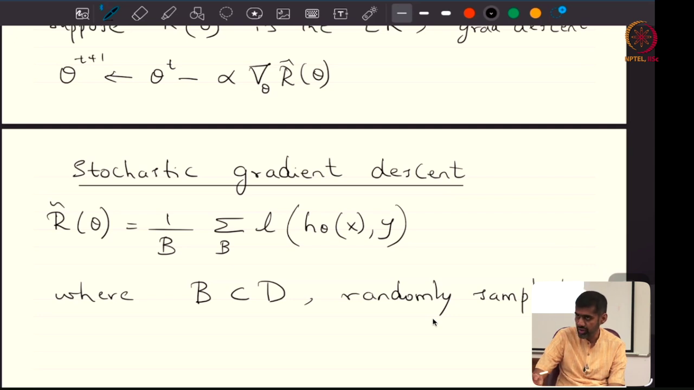
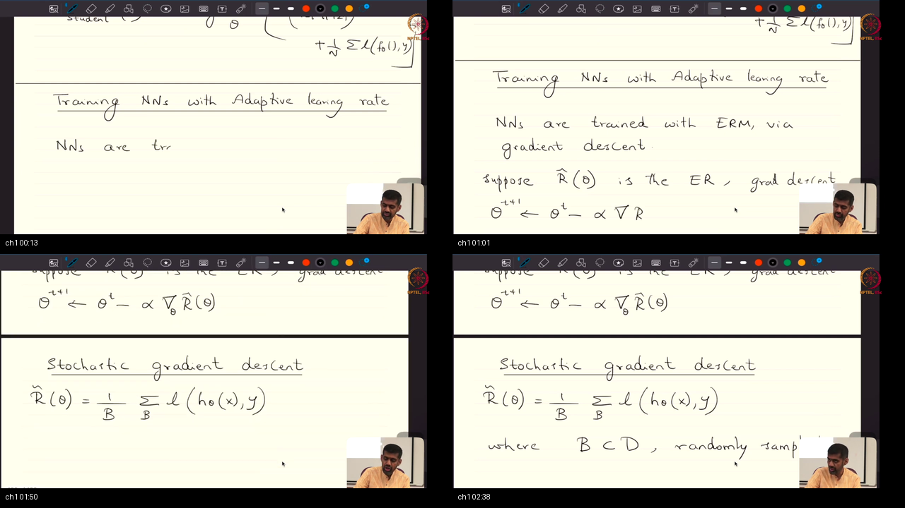
*Notice: Prof. Prathosh formalizes the empirical risk minimization objective on the blackboard, contrasting full-batch gradient descent with minibatch SGD and demonstrating the geometric pathology where fixed scalar learning rates cause explosive cross-axis oscillations while stalling on shallow plateaus.*

### What he is establishing
In this opening topic, the instructor establishes how optimization is practically executed in neural networks. In classical continuous optimization, one minimizes empirical risk $\hat{R}(\theta) = \frac{1}{N} \sum_{i=1}^N \ell(f(x_i; \theta), y_i)$ by computing the full gradient across all $N$ data points. In modern deep learning where $N$ spans millions or billions of samples, evaluating full-batch gradients at every step is computationally impossible. Instead, we subsample minibatches of size 32 or 64 to obtain stochastic gradient estimators $g_t$. The instructor carefully formalizes the difference between an iteration—a single forward and backward update on one minibatch—and an epoch, which represents one complete pass through all $N$ samples.

However, the instructor immediately highlights the fatal flaw of vanilla gradient descent: using a single fixed scalar learning rate $\alpha$. In high-dimensional non-convex neural network loss surfaces, the curvature varies radically across different coordinates. Along steep ravine walls where the Hessian eigenvalue $\lambda_{\max}$ is large, an aggressive learning rate violates the theoretical stability limit ($\alpha \ge 2/\lambda_{\max}$), causing catastrophic oscillations that blow up to infinity. Conversely, if you make $\alpha$ small enough to stabilize the steep direction, progress along flat, gently sloping coordinates ($\lambda_{\min}$) stalls completely. Instead of being able to choose a single globally optimal step size, the engineer is trapped in an impossible trade-off. You can now see why fixed scalar learning rates fail fundamentally on anisotropic loss surfaces and why adaptive methods are indispensable.

### Analogy for this topic only
Imagine attempting to ski down a mountain through a narrow, razor-sharp rocky couloir. The side walls of the gorge are near-vertical granite cliffs, while the trail descending to the ski lodge is an almost completely flat glacial plateau. If you take giant, sweeping 20-foot strides, you smash violently into the granite canyon walls and break your legs. But if you take 1-inch baby steps to stay off the cliffs, night falls and you freeze to death before traveling a single mile along the flat glacier. A single fixed stride length cannot conquer both cliffs and plateaus.

### Local picture
```text
┌────────────────────────────────────────────────────────────────────────┐
│             PATHOLOGY OF FIXED LEARNING RATE ON ANISOTROPIC RAVINE     │
│                                                                        │
│   Steep Curvature Axis (y, lambda_max = 100)                           │
│        ▲                                                               │
│   +1.0 │    \  /                                                       │
│        │     \/   Violent cross-axis oscillations                      │
│        │     /\   (Diverges if alpha > 2 / lambda_max)                 │
│        │    /  \                                                       │
│   -1.0 │   /    \                                                      │
│        └──────────────────────────────────────────────►                │
│        0.0                                            10.0             │
│        Gentle Curvature Axis (x, lambda_min = 1)                       │
│        Progress per step: Delta x = - alpha * x (Infinitesimal crawl!) │
└────────────────────────────────────────────────────────────────────────┘
```

#### Why X, Not Y: Contrastive Rationale
**Why should we use stochastic minibatches ($B \in \{32, 64\}$) rather than full-batch gradient descent?**  
Evaluating full-batch gradients requires computing loss and backpropagation across the entire dataset $\mathcal{D}$ for every single parameter update, demanding prohibitive memory and compute. Minibatch SGD provides an unbiased estimate $\mathbb{E}[g_t] = \nabla \hat{R}(\theta_t)$ in milliseconds, while introducing stochastic exploration noise that helps parameters escape bad saddles.

#### Check Your Understanding
*Question:* If the Hessian of a loss surface at parameter $\theta$ has maximum eigenvalue $\lambda_{\max} = 50$, what is the exact numerical threshold for learning rate $\alpha$ above which vanilla gradient descent will oscillate out of control and diverge?  
*Answer:* The stability limit is $\alpha < \frac{2}{\lambda_{\max}} = \frac{2}{50} = 0.04$. If $\alpha \ge 0.04$, updates along the principal eigenvector oscillate with growing amplitude.

### Bridge
Because a single fixed scalar step size $\alpha$ cannot simultaneously balance steep oscillations and flat stagnation, we turn to our first dynamic acceleration technique: accumulating velocity via momentum.

---

<a id="topic-2"></a>
## Topic 2: SGD with Momentum: Heavy Ball Dynamics & Ravine Acceleration

### Where this sits on the master map
Building directly upon the limitations of vanilla SGD, we introduce the first-moment velocity accumulator, using exponential moving averages to damp high-frequency directional oscillations. See [PREREQUISITES.md Pillar 2](./PREREQUISITES.md#p2).

### Board / screenshot
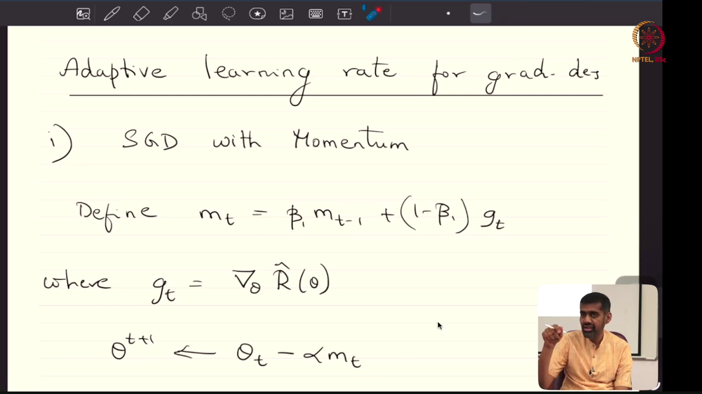
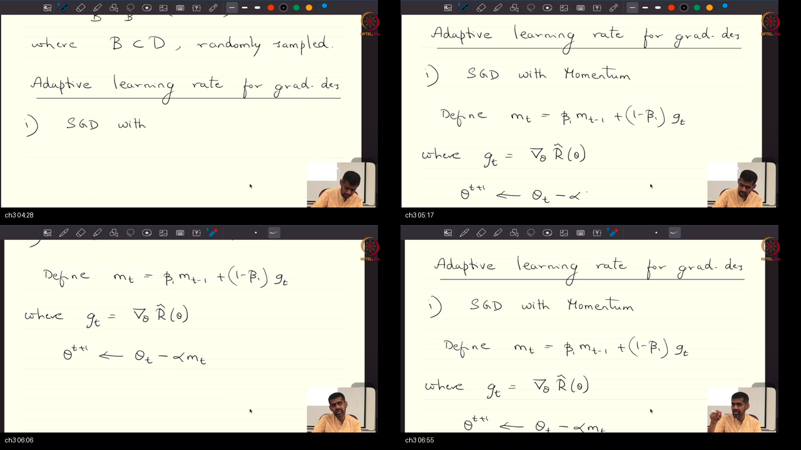
*Notice: Prof. Prathosh derives the Heavy Ball momentum equations $m_t = \beta_1 m_{t-1} + (1 - \beta_1) g_t$ on the blackboard, showing that initializing $m_0 = 0$ unrolls into an exponentially weighted sum of past gradients that cancels transverse oscillations while accelerating down the ravine floor.*

### What he is establishing
In this topic, the instructor presents the classical Heavy Ball method formulated by Boris Polyak. In vanilla SGD, parameters respond instantly and violently to whatever noisy gradient $g_t$ happens to be computed on the current minibatch. If that minibatch pushes the weights sideways against a steep ravine wall, the parameter vector jumps sideways. To cure this instability, the instructor defines the momentum vector $m_t$ as an exponentially decaying moving average of past gradients: $m_t = \beta_1 m_{t-1} + (1 - \beta_1) g_t$, where $\beta_1 \in [0, 1)$ (typically $0.9$). Parameters are then updated by subtracting accumulated momentum: $\theta_{t+1} = \theta_t - \alpha m_t$.

The instructor unpacks the mathematical behavior of this recurrence from step $t=1$ with initial condition $m_0 = 0$. Unrolling the recursion reveals that $m_t$ is a geometric series weighting past gradients by $(1 - \beta_1) \sum_{k=0}^{t-1} \beta_1^k g_{t-k}$. As a concrete example, along high-curvature ravine walls where gradients alternate signs ($+20, -18, +19, -17$), the opposing vectors cancel each other out in the running sum, dampening transverse bouncing. Along the gentle floor of the valley where gradients consistently point down-slope, the pushes accumulate, accelerating velocity by a factor of $\frac{1}{1 - \beta_1} = 10\times$. Instead of behaving like a massless particle buffeted by random minibatch noise, the optimizer gains physical inertia. You can now build optimizers that slice through turbulent noise and accelerate through ill-conditioned ravines.

### Analogy for this topic only
Picture rolling a heavy 16-pound bowling ball down an icy, bumpy alley. The small cracks, ripples, and surface ruts apply sharp sideways forces to the ball as it rolls. But because the bowling ball has substantial mass and forward velocity, its physical momentum simply absorbs and averages out those tiny high-frequency sideways impulses, maintaining a straight, uninterrupted path toward the pins. Vanilla SGD is a massless ping-pong ball that ricochets uncontrollably off every bump; SGD with momentum is the bowling ball.

### Local picture
```text
┌────────────────────────────────────────────────────────────────────────┐
│                   HEAVY BALL MOMENTUM DYNAMICS IN A RAVINE             │
│                                                                        │
│   Ravine Walls (Alternating Gradients: +g, -g, +g, -g):                │
│   Step 1: g_1 = +20.0 ──► m_1 = 2.0                                    │
│   Step 2: g_2 = -18.0 ──► m_2 = 0.9(2.0) + 0.1(-18.0) = 0.0 (Damped!)  │
│   Step 3: g_3 = +19.0 ──► m_3 = 0.9(0.0) + 0.1(19.0)  = 1.9           │
│                                                                        │
│   Valley Floor (Consistent Gradients: +2, +2, +2):                     │
│   Step 1: g_1 = 2.0   ──► m_1 = 0.20                                   │
│   Step 2: g_2 = 2.0   ──► m_2 = 0.9(0.20) + 0.1(2.0) = 0.38            │
│   Step 3: g_3 = 2.0   ──► m_3 = 0.9(0.38) + 0.1(2.0) = 0.542          │
│   Steady-State Limit: m_inf = 2.0 (Compounds forward velocity!)        │
└────────────────────────────────────────────────────────────────────────┘
```

#### Why X, Not Y: Contrastive Rationale
**Why should we update parameters using accumulated momentum $m_t$ rather than instantaneous gradient $g_t$?**  
Instantaneous gradients from minibatches contain high variance and cause erratic zig-zag paths across ill-conditioned ravines. Accumulated momentum functions as a temporal low-pass filter, preserving the low-frequency persistent descent signal while filtering out high-frequency stochastic noise.

#### Check Your Understanding
*Question:* If momentum decay parameter $\beta_1 = 0.9$, what is the effective number of past gradient iterations integrated into the current parameter update?  
*Answer:* The effective time horizon is $\tau_{\text{eff}} = \frac{1}{1 - \beta_1} = \frac{1}{1 - 0.9} = 10$ iterations.

### Bridge
While momentum successfully smooths out directional oscillations, it still applies a uniform global step size across all parameter coordinates. To achieve coordinate-specific adaptation, we must incorporate second-order scale information.

---

<a id="topic-3"></a>
## Topic 3: RMSprop: Root Mean Square Normalization & Coordinate Adaptation

### Where this sits on the master map
Moving from directional smoothing to coordinate scale adaptation, we introduce Geoffrey Hinton's RMSprop algorithm, using second uncentered raw moments to normalize coordinates adaptively. See [PREREQUISITES.md Pillar 3](./PREREQUISITES.md#p3).

### Board / screenshot
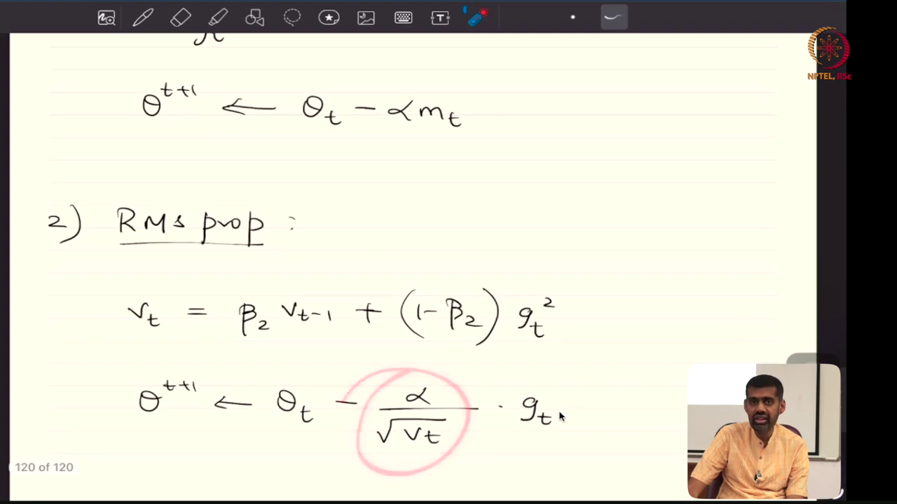
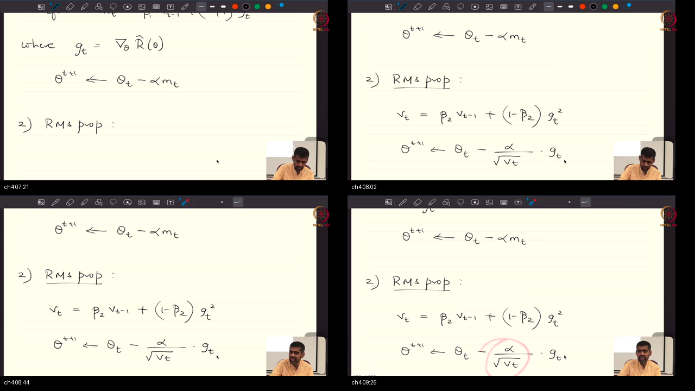
*Notice: Prof. Prathosh analyzes the physical dimensional consistency of RMSprop on the blackboard, proving that because $g_t^2$ has units of $(\nabla L)^2$, dividing by $\sqrt{v_t}$ yields a strictly dimensionless scaling ratio that ensures parameter updates carry proper physical units.*

### What he is establishing
In this topic, the instructor explains that first-order gradients alone are insufficient for optimal navigation: one also needs second-order scale information to achieve coordinate-wise acceleration. If parameter $\theta_1$ controls a dense layer with massive activations, its gradients may be on the order of $100.0$, while parameter $\theta_2$ in an early embedding layer receives gradients on the order of $0.01$. If you attempt to update both using the same scalar step size, $\theta_1$ explodes while $\theta_2$ barely moves.

To solve this, Geoffrey Hinton formulated RMSprop (Root Mean Square Propagation). RMSprop maintains an exponentially decaying running average of squared gradients: $v_t = \beta_2 v_{t-1} + (1 - \beta_2) g_t^2$, where $g_t^2 = g_t \odot g_t$ is the coordinate-wise Hadamard square and $\beta_2 \in [0, 1)$ (typically $0.99$). The parameter update is then scaled inversely by the root mean square: $\theta_{t+1} = \theta_t - \frac{\alpha}{\sqrt{v_t} + \epsilon} \odot g_t$. The instructor provides a beautiful physical dimensional analysis: since gradient $g_t$ has physical units $\left[\frac{\text{Loss}}{\Theta}\right]$, the term $\sqrt{v_t}$ has identical units $\left[\frac{\text{Loss}}{\Theta}\right]$. Their quotient $\frac{g_t}{\sqrt{v_t}}$ is strictly dimensionless! Multiplying by $\alpha$ (which carries units $[\Theta]$) guarantees that updates are dimensionally invariant. Instead of coordinates with large gradients racing ahead, they are dampened by $1/\sqrt{v_t}$, while sluggish coordinates are boosted. You can now ensure every coordinate moves at an equitable, well-conditioned pace.

### Analogy for this topic only
Imagine managing an international relay team whose runners speak different languages and run at vastly different cadences: a massive sprinter who takes thunderous 8-foot bounds and an ultra-marathoner who takes light, rapid 2-foot strides. If the coach blows a single whistle commanding everyone to take an 8-foot bound, the marathoner pulls a hamstring immediately. RMSprop is like giving each runner an adaptive smart pacer: it measures each runner's historical stride energy and normalizes their stride so that every team member advances smoothly in unison.

### Local picture
```text
┌────────────────────────────────────────────────────────────────────────┐
│                   RMSPROP COORDINATE DAMPING & SCALING                 │
│                                                                        │
│   Parameter Coordinate 1 (Steep Wall):                                 │
│   Persistent gradient: g_t = 100.0 ──► v_t approx 10,000.0             │
│   Effective step: Delta theta_1 = - alpha * (100.0 / 100.0) = - alpha  │
│                                                                        │
│   Parameter Coordinate 2 (Flat Floor):                                 │
│   Persistent gradient: g_t = 0.01  ──► v_t approx 0.0001               │
│   Effective step: Delta theta_2 = - alpha * (0.01 / 0.01)   = - alpha  │
│                                                                        │
│   Notice: Despite a 10,000x gradient disparity, both coordinates take │
│   an identical effective step size of magnitude alpha!                 │
└────────────────────────────────────────────────────────────────────────┘
```

#### Why X, Not Y: Contrastive Rationale
**Why should we use RMSprop's exponential moving average $v_t = \beta_2 v_{t-1} + (1 - \beta_2) g_t^2$ rather than AdaGrad's cumulative sum $v_t = v_{t-1} + g_t^2$?**  
AdaGrad monotonically accumulates all historical squared gradients without decay. In deep networks trained over hundreds of epochs, $v_t \to \infty$, which drives the effective learning rate $\alpha / \sqrt{v_t} \to 0$, causing the algorithm to freeze prematurely. RMSprop's exponential decay factor allows the optimizer to discard stale history.

#### Check Your Understanding
*Question:* Why is the small constant $\epsilon > 0$ (typically $10^{-8}$) added to the denominator $\sqrt{v_t} + \epsilon$ in the RMSprop update rule?  
*Answer:* It prevents division by zero (or floating-point overflow) for coordinates whose gradients vanish or are zero across multiple consecutive minibatches.

### Bridge
We now have momentum for directional velocity smoothing and RMSprop for coordinate-wise curvature scaling. The next logical evolutionary step is to combine both into a unified optimization engine.

---

<a id="topic-4"></a>
## Topic 4: The Adam Optimizer: Combining First and Second Moment Estimators

### Where this sits on the master map
At the pinnacle of modern first-order optimization, we synthesize first-moment momentum and second-moment RMSprop into Adam (Adaptive Moment Estimation), deriving its crucial bias-correction mechanics. See [PREREQUISITES.md Pillar 3](./PREREQUISITES.md#p3) and [Pillar 4](./PREREQUISITES.md#p4).

### Board / screenshot
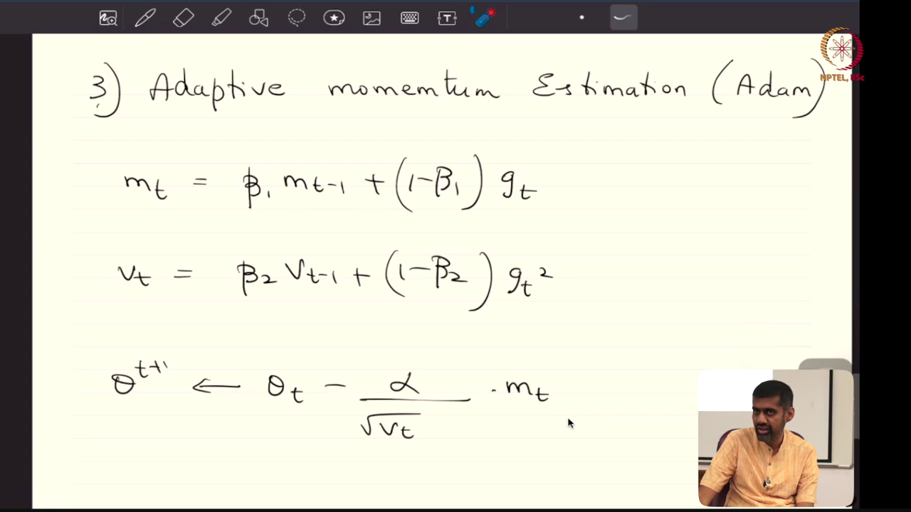
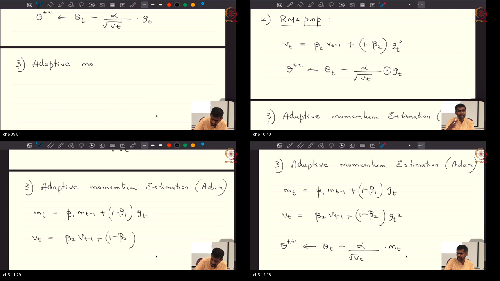
*Notice: Prof. Prathosh writes out the complete Adam update algorithm on the blackboard, deriving the simultaneous tracking of first moment $m_t$ and second moment $v_t$, and highlighting why Adam has become the empirical go-to choice across deep learning and LLM frameworks.*

### What he is establishing
In this topic, the instructor presents the synthesis that powers modern deep learning: Adam (Adaptive Moment Estimation), developed by Diederik Kingma and Jimmy Ba (2014). Instead of choosing between the directional stability of momentum or the coordinate-wise scaling of RMSprop, Adam computes both simultaneously. The optimizer maintains two running state vectors: the first raw moment $m_t = \beta_1 m_{t-1} + (1 - \beta_1) g_t$ (with default $\beta_1 = 0.9$) and the second uncentered raw moment $v_t = \beta_2 v_{t-1} + (1 - \beta_2) g_t^2$ (with default $\beta_2 = 0.999$).

The instructor places special emphasis on vector mechanics: because parameters $\theta$ are high-dimensional vectors, all multiplications, squarings, square roots, and divisions are computed coordinate-wise via Hadamard operations ($\odot, \oslash$). This means every individual weight in a neural network receives its own personalized, dynamically adapting learning rate. Furthermore, the instructor derives why bias correction is essential: because $m_0$ and $v_0$ are initialized to zero, raw moment estimates are heavily biased toward zero during initial steps. Without dividing by $1 - \beta_1^t$ and $1 - \beta_2^t$, initial steps suffer an uncalibrated step distortion factor $\frac{1-\beta_1}{\sqrt{1-\beta_2}} = \frac{0.1}{\sqrt{0.001}} \approx 3.16$. With bias correction, the initial step magnitude is exactly $\alpha \cdot \text{sign}(g_1)$. The instructor notes that Adam has become the universal default optimizer in PyTorch and Hugging Face because it reliably achieves superior empirical convergence across diverse non-convex architectures without tedious per-coordinate hyperparameter tuning.

### Analogy for this topic only
Imagine driving a high-performance all-wheel-drive rally car across a terrain of mud, gravel, ice, and pavement. The car has a heavy mechanical flywheel (momentum) that keeps the chassis pointed straight through gravel ruts without spinning out. Simultaneously, the car has a dynamic active traction control computer on every wheel (RMSprop) that monitors individual wheel slip and adjusts torque independently to each tire in milliseconds. Adam is the rally car combining both the heavy flywheel and the four-wheel traction computer.

### Local picture
```text
┌────────────────────────────────────────────────────────────────────────┐
│                   THE ADAM MOMENT ESTIMATION ENGINE                    │
│                                                                        │
│   Gradient g_t ──────────────────┬──────────────────┐                  │
│                                  ▼                  ▼                  │
│                        [ First Moment m_t ]   [ Second Moment v_t ]    │
│                        beta1 = 0.9            beta2 = 0.999            │
│                                  │                  │                  │
│                                  ▼                  ▼                  │
│                        [ Bias Correction ]    [ Bias Correction ]      │
│                        m_hat = m / (1-b1^t)   v_hat = v / (1-b2^t)     │
│                                  │                  │                  │
│                                  └─────────┬────────┘                  │
│                                            ▼                           │
│                              [ Coordinate-Wise Update ]                │
│                              theta -= alpha * m_hat / (sqrt(v_hat)+eps)│
│                                                                        │
│   Result: Fast directional velocity + coordinate scale adaptation!     │
└────────────────────────────────────────────────────────────────────────┘
```

#### Why X, Not Y: Contrastive Rationale
**Why should we include bias corrections $\hat{m}_t = \frac{m_t}{1 - \beta_1^t}$ and $\hat{v}_t = \frac{v_t}{1 - \beta_2^t}$ rather than using raw moments $m_t, v_t$?**  
Because accumulators start at zero, $m_t$ and $v_t$ severely underestimate true gradient expectations during initial iterations. At step 1 with $\beta_1=0.9, \beta_2=0.999$, an uncorrected step has magnitude $\frac{0.1}{\sqrt{0.001}} \approx 3.16\alpha$, distorting early trajectory steps. Bias correction ensures that $\mathbb{E}[\hat{m}_t] = \mathbb{E}[g_t]$ and $\mathbb{E}[\hat{v}_t] = \mathbb{E}[g_t^2]$ from step 1.

#### Check Your Understanding
*Question:* In multi-billion parameter Large Language Models, what is the primary operational trade-off of using Adam over vanilla SGD?  
*Answer:* Memory overhead. Adam maintains two auxiliary floating-point tensors ($m_t, v_t$) per parameter, requiring an additional 8 bytes per parameter in FP32 (e.g. 560 GB of extra VRAM for a 70B parameter model).

### Bridge
With our suite of optimizers established, we must now confront the geometry of the terrain they navigate: why high-dimensional non-convex landscapes behave completely differently from low-dimensional intuition.

---

<a id="topic-5"></a>
## Topic 5: Optimization Landscapes: Ill-Conditioning, Saddle Points & Local Minima

### Where this sits on the master map
Having developed adaptive algorithms, we now analyze the high-dimensional non-convex loss surface they traverse, proving why local minima are non-existent and saddle points dominate. See [PREREQUISITES.md Pillar 4](./PREREQUISITES.md#p4).

### Board / screenshot
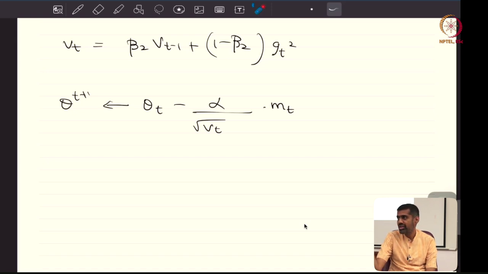
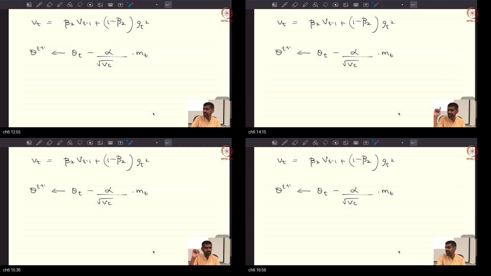
*Notice: Prof. Prathosh presents his Bernoulli eigenvalue theorem on the blackboard, proving that the probability of encountering a true local minimum in a million-dimensional parameter space vanishes as $p^P \to 0$, establishing that critical points in deep learning are overwhelmingly saddle points.*

### What he is establishing
In this mathematically profound topic, the instructor shatters a widespread misconception about deep learning optimization. Beginners frequently worry that first-order gradient descent will become trapped in sub-optimal local minima—deep bowls where gradients vanish and the model cannot reach the global minimum. The instructor demonstrates that this mental model is an artifact of thinking in one or two dimensions. In deep neural networks, parameter space $\Theta \subset \mathbb{R}^P$ is ultra-high-dimensional, spanning thousands ($10^3$), millions ($10^6$), or hundreds of billions ($10^{11}$) of parameters.

The instructor formalizes the second derivative test in multidimensional spaces using the $P \times P$ Hessian matrix $H$. At any critical point where first-order gradients vanish ($\nabla \hat{R}(\theta) = \mathbf{0}$), for that point to be a true local minimum, the Hessian must be positive definite ($H \succ 0$), meaning all $P$ eigenvalues must be strictly positive ($\lambda_i > 0$). Prof. Prathosh then presents his celebrated probabilistic argument: suppose we model the sign of each eigenvalue as an independent Bernoulli trial with an overwhelmingly favorable success probability $p = 0.99$. The probability that all $P$ eigenvalues are simultaneously positive is $p^P$. For $P = 1,000$, $(0.99)^{1000} \approx 4.3 \times 10^{-5}$. For $P = 100,000$, $(0.99)^{100000} \approx 10^{-435} \approx 0$. In deep neural networks, the probability of encountering a true local minimum is astronomically zero! Instead, critical points are overwhelmingly **saddle points**, where some directions curve upwards and others curve downwards. This is exceptional news: saddle points possess negative-curvature escape paths that momentum and adaptive noise exploit to continue descending. You can now see why escaping saddle points via momentum and adaptive scaling is the central challenge of deep learning optimization.

### Analogy for this topic only
Imagine you are playing a game of roulette with 1,000,000 independent spinning wheels. On each wheel, the ball has a 99% chance of landing on green and only a 1% chance of landing on red. To declare a "local minimum," every single one of those 1,000,000 balls must land on green simultaneously! If even a single ball lands on red, the outcome is a saddle point. The odds of rolling one million consecutive greens are zero; you will always have thousands of red balls, providing downward slopes through which the optimizer can escape.

### Local picture
```text
┌────────────────────────────────────────────────────────────────────────┐
│                   SADDLE POINT EIGENVALUE GEOMETRY IN R^P              │
│                                                                        │
│   Critical Point: grad R(theta) = 0                                    │
│   Hessian Eigenvalues: [ lambda_1, lambda_2, ..., lambda_P ]           │
│                                                                        │
│   Direction 1 (Positive Curvature, lambda_1 > 0):                      │
│   Valley curves upward: U-shaped cross-section (Stable)                │
│                                                                        │
│   Direction 2 (Negative Curvature, lambda_2 < 0):                      │
│   Ridge curves downward: Inverted-U cross-section (Escape Path!)       │
│                                                                        │
│   Probabilistic Law: P(All lambda_i > 0) = (0.99)^P -> 0 as P -> inf   │
│   Conclusion: In R^10^6, critical points have ~10,000 escape paths!    │
└────────────────────────────────────────────────────────────────────────┘
```

#### Why X, Not Y: Contrastive Rationale
**Why are high-dimensional critical points overwhelmingly saddle points rather than local minima?**  
Because a local minimum requires all $P$ eigenvalues of the Hessian to be strictly positive simultaneously. In high dimensions ($P \ge 10^6$), the joint probability $p^P$ vanishes exponentially, ensuring that critical points almost always have indefinite spectra with multiple negative eigenvalues providing descent paths.

#### Check Your Understanding
*Question:* In an index-$k$ saddle point, what does the integer $k$ physically represent?  
*Answer:* The integer $k$ represents the number of strictly negative eigenvalues of the Hessian matrix, corresponding to $k$ orthogonal directions along which the loss strictly decreases.

### Bridge
Because optimization in non-convex landscapes traverses saddle points and terminates in arbitrary local extrema, how do we decide which parameter vector is actually good? This brings us to empirical generalization dynamics.

---

<a id="topic-6"></a>
## Topic 6: Generalization Dynamics: Training Curves, Overfitting & Early Stopping

### Where this sits on the master map
Completing our journey from optimizer equations to production reality, we examine validation benchmarking, early stopping, and the lifecycle of model checkpoints. See [PREREQUISITES.md Pillar 5](./PREREQUISITES.md#p5).

### Board / screenshot
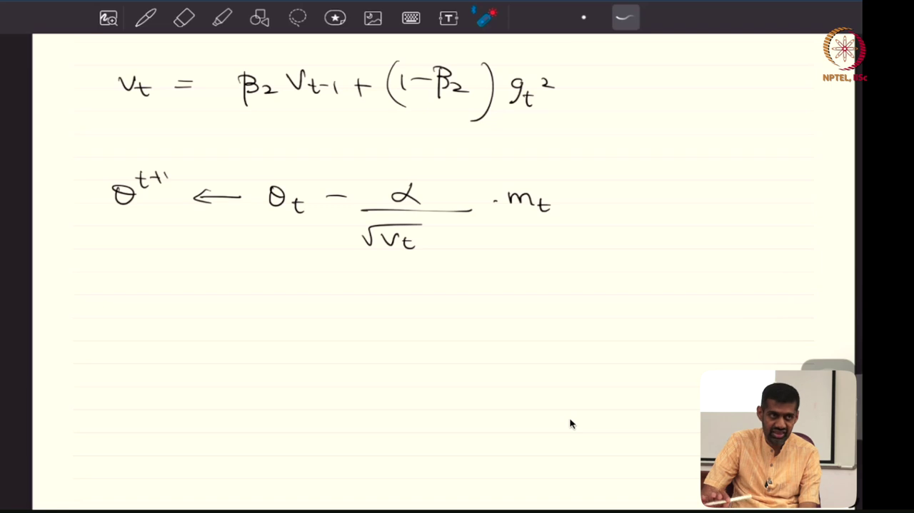
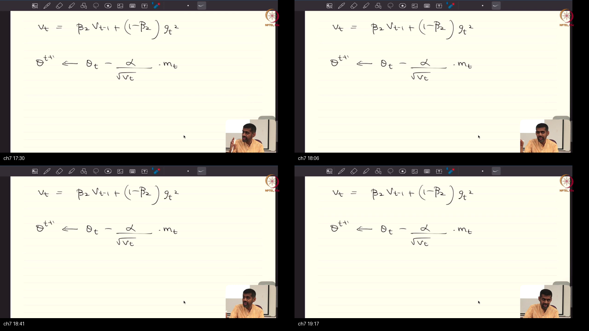
*Notice: Prof. Prathosh sketches the training versus validation loss curves on the blackboard, highlighting the generalization gap where training loss continues descending while validation loss rebounds, necessitating early stopping and model checkpoint retention.*

### What he is establishing
In this concluding topic, the instructor connects optimization theory to real-world machine learning engineering. In convex optimization, training terminates when the gradient norm vanishes ($\|\nabla f\| \le 10^{-6}$). In deep learning, however, pushing training gradients to zero on an overparameterized network simply causes the model to memorize label noise and overfit training samples. Furthermore, because all points landed upon by gradient descent are local extrema, the instructor emphasizes the core empirical question: "Is your local optima better than my local optima?"

The only ground truth for answering this question is held-out **validation data**. The instructor explains that there is no theoretical stopping criterion for neural network training; training stopping points must be determined empirically by monitoring validation curves. As training progresses, training loss descends monotonically. Validation loss initially descends alongside training loss, reaches a global minimum at step $t^*$, and then rebounds upwards as the network begins overfitting. The difference between validation loss and training loss is the generalization gap. Each optimization step navigates parameter space $\Theta$, generating discrete parameter snapshots called **model checkpoints** ($\theta \in \mathbb{R}^P$). By using early stopping, we save the checkpoint $\theta^*$ that achieved minimal validation error. The instructor concludes by emphasizing that model checkpoints are the fundamental deployable artifacts shipped across open-source hubs (such as Hugging Face and PyTorch Hub), serving as foundation models for downstream fine-tuning, transfer learning, and knowledge distillation. You can now build disciplined evaluation loops that halt training at peak generalization and package optimal checkpoints for production deployment.

### Analogy for this topic only
Imagine training a portrait painter by having them paint 100 portraits of your family. In the first week, they master lighting, human anatomy, and brushwork (generalization improves). By week four, their portraits are masterpieces. But if you force them to keep painting the exact same 100 portraits for two full years, they start painting the microscopic dust specks on your furniture and the temporal shadows cast by the afternoon sun. If you then ask them to paint a stranger, their art fails because they memorized your furniture's dust. Early stopping is taking away the canvas in week four.

### Local picture
```text
┌────────────────────────────────────────────────────────────────────────┐
│                   TRAINING DYNAMICS & CHECKPOINT SELECTION             │
│                                                                        │
│   Loss                                                                 │
│    ▲                                                                   │
│    │  \                                                                │
│    │   \         Validation Loss R_val(theta)                          │
│    │    \           \              /  Overfitting Phase                │
│    │     \           \   Optimal  /                                    │
│    │      \           ▼  t*      /                                     │
│    │       \__________●_________/                                      │
│    │        \                                                          │
│    │         \____________________ Training Loss R_train(theta)        │
│    │                                                                   │
│    └───────────────────────────────────────────────────► Time (Steps)  │
│                       Checkpoint theta* Saved                          │
└────────────────────────────────────────────────────────────────────────┘
```

#### Why X, Not Y: Contrastive Rationale
**Why should we govern neural network stopping using validation benchmarks rather than gradient norm thresholds $\|\nabla \hat{R}(\theta)\| \le \epsilon$?**  
Because overparameterized neural networks can achieve $\|\nabla \hat{R}\| \approx 0$ by perfectly memorizing training noise, which destroys test generalization. Validation benchmarks measure empirical out-of-sample performance, ensuring training stops when true generalization is maximized.

#### Check Your Understanding
*Question:* When downloading a pre-trained Large Language Model from Hugging Face, what does the serialized weight file physically contain?  
*Answer:* It contains a model checkpoint: a serialized state dictionary of parameter tensors $\theta^* \in \mathbb{R}^P$ obtained via Empirical Risk Minimization on massive source data at an optimal validation step.

### Bridge
This completes our deep architectural tour of neural network optimization, from fixed-rate pathologies to heavy ball momentum, RMSprop curvature scaling, Adam unification, saddle point landscapes, and validation checkpoints.

---

## Workplace Debugging Scenarios

### Scenario 1: Catastrophic Loss Explosion (`NaN` / `Inf`) During Initial Transformer Training
**Problem:** A machine learning engineer launches pre-training for a 1.5B parameter language model using Adam with base learning rate $\alpha = 5 \times 10^{-4}, \beta_1 = 0.9, \beta_2 = 0.999, \epsilon = 10^{-8}$. At iteration 14, the cross-entropy loss suddenly spikes from $8.2$ to `NaN`, causing training to crash across all GPU nodes.

**Mathematical Root Cause:**
1. **Uncalibrated Early Moments:** During the initial 10 iterations, $\hat{v}_t$ is estimated from very few samples. For coordinates associated with uninitialized projection weights or layer normalization scales, gradients are sparse or tiny, making $\sqrt{\hat{v}_t} \approx 0$.
2. **Division by Epsilon:** The update denominator $\sqrt{\hat{v}_t} + \epsilon$ approaches $\epsilon = 10^{-8}$. Multiplying by learning rate $\alpha = 5 \times 10^{-4}$ produces effective coordinate step sizes of $\frac{5 \times 10^{-4}}{10^{-8}} = 50,000.0$!
3. **Activation Overflow:** A parameter jump of $50,000$ drives activation tensors into values $> 10^{38}$, exceeding FP16 / BF16 dynamic ranges and producing floating point overflow (`NaN`).

**Debugging Steps:**
1. Check tensor norms of the Adam denominator $\sqrt{\hat{v}_t} + \epsilon$ across all layers; verify whether minimum values hit $10^{-8}$.
2. Inspect whether learning rate warm-up is enabled. Without warm-up, initial full step sizes interact with poorly estimated second moments.
3. Check gradient clipping thresholds. In early iterations, stochastic gradient spikes trigger massive updates.

**Code Fix:**
```python
import torch
from torch.optim.lr_scheduler import LambdaLR

# 1. Increase numerical stability epsilon to 1e-6 for half-precision stability
optimizer = torch.optim.AdamW(model.parameters(), lr=5e-4, betas=(0.9, 0.98), eps=1e-6, weight_decay=0.01)

# 2. Implement linear learning rate warm-up schedule for the first 2000 steps
def warmup_schedule(current_step: int, warmup_steps: int = 2000):
    if current_step < warmup_steps:
        return float(current_step) / float(max(1, warmup_steps))
    return max(0.0, 1.0)

scheduler = LambdaLR(optimizer, lr_lambda=warmup_schedule)

# 3. Add explicit gradient clipping in training loop
for step, (inputs, targets) in enumerate(dataloader):
    optimizer.zero_grad()
    loss = criterion(model(inputs), targets)
    loss.backward()
    
    # Clip gradient norm to 1.0 to prevent runaway updates
    torch.nn.utils.clip_grad_norm_(model.parameters(), max_norm=1.0)
    
    optimizer.step()
    scheduler.step()
```

---

### Scenario 2: Stagnation on Ill-Conditioned Ravine with High-Frequency Cross-Axis Chatter
**Problem:** A computer vision team fine-tuning an object detection bounding box regressor notices that standard SGD with learning rate $\alpha = 0.05$ fails to make progress. Training loss plateaus at $2.4$, and parameter inspection reveals that coordinate $y$ oscillates wildly between $+15.2$ and $-14.8$ on consecutive iterations, while coordinate $x$ creeps forward by only $0.0001$.

**Mathematical Root Cause:**
The bounding box regression loss surface forms an anisotropic quadratic ravine with condition number $\kappa = \frac{\lambda_{\max}}{\lambda_{\min}} \approx 800$. The learning rate $\alpha = 0.05$ is just below the divergence limit $\frac{2}{\lambda_{\max}} \approx 0.052$, causing near-resonant bouncing across the ravine walls without diverging. Because almost all step energy is consumed bouncing along the high-curvature axis, velocity along the flat valley floor is negligible.

**Debugging Steps:**
1. Compute the empirical covariance of gradients across successive minibatches to estimate the condition number $\kappa$.
2. Check the autocorrelation of gradient signs $\operatorname{sign}(g_t \odot g_{t-1})$. A negative autocorrelation indicates cross-axis oscillation.
3. Replace vanilla SGD with Adam or RMSprop to apply diagonal coordinate normalization, damping the oscillating axis while boosting the shallow axis.

**Code Fix:**
```python
import torch

# Before: Fragile Vanilla SGD prone to cross-axis chatter
# optimizer = torch.optim.SGD(model.parameters(), lr=0.05)

# After: Adam optimizer with decoupled coordinate adaptation and heavy ball velocity
optimizer = torch.optim.AdamW(
    model.parameters(),
    lr=1e-3,             # Controlled base learning rate
    betas=(0.9, 0.999),  # beta1 smooths out chatter; beta2 normalizes curvature
    eps=1e-8,
    weight_decay=1e-4
)

# Optional: Add cosine annealing schedule for smooth convergence
scheduler = torch.optim.lr_scheduler.CosineAnnealingLR(optimizer, T_max=10000, eta_min=1e-6)
```

---

## Course Syllabus Review & Mathematical Connections

This lecture marks the grand culmination of the deep neural network sequence in the Mathematical Foundations of Machine Learning curriculum:
1. **From ERM to Representation Learning (Lec 41–47):** We established multilayer perceptrons, convolutional parameter sharing, recurrent cell topologies, and backpropagation through time.
2. **From Attention to Transformers (Lec 48–51):** We replaced recurrence with query-key-value self-attention mechanisms and sinusoidal positional encodings.
3. **From Transfer to Optimization (Lec 52–53):** We showed how composite representations are tapped for downstream transfer and distilled into compact students, while Adam and momentum navigate non-convex landscapes dominated by high-dimensional saddle points.
4. **Looking Forward (Lec 54+):** We transition from continuous neural network optimization to non-parametric discrete partition models: Classification and Regression Trees (CART), decision stumps, and ensemble bagging/boosting algorithms.

---

## References

For full formal citations, primary foundational papers (Kingma & Ba 2014, Polyak 1964, Tieleman & Hinton 2012, Loshchilov & Hutter 2019, Dauphin et al. 2014), and curriculum prerequisite cross-links, see [references.md](./references.md).
