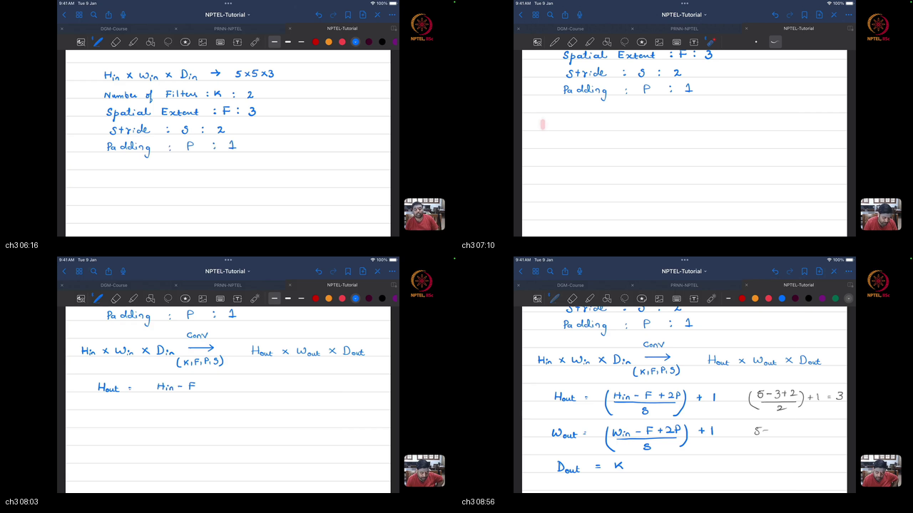
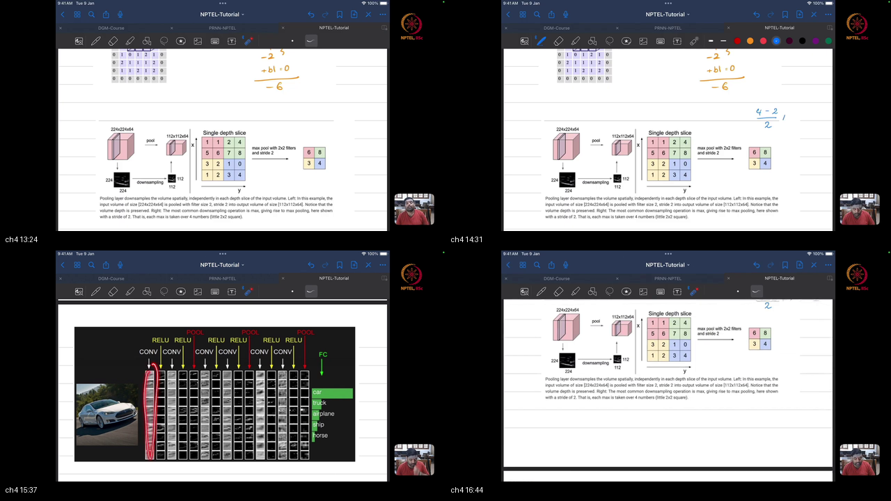
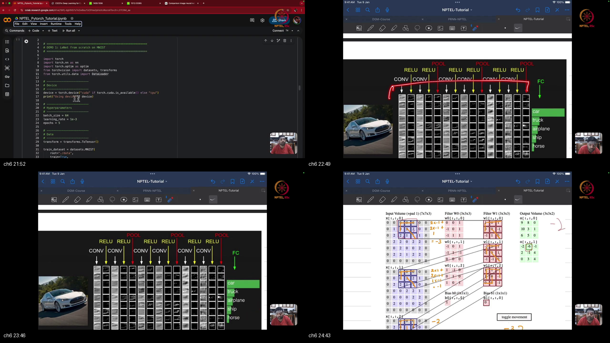
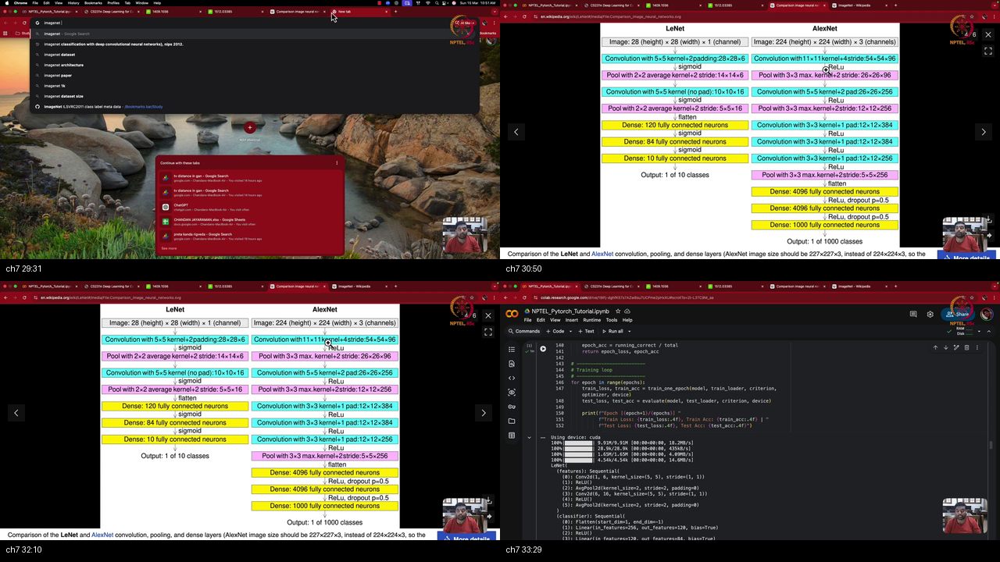

# Tutorial 14 Part 1: Convolutional Neural Networks (CNNs)

> **Prerequisites First:** If you are unfamiliar with multi-channel tensor geometry, the discrete 2D cross-correlation kernel operator, stride arithmetic, or spatial pooling invariance, study [PREREQUISITES.md](./PREREQUISITES.md) first. Understanding how weight sharing and local receptive fields eliminate parameter explosion ($80,000\times$ reduction) is necessary to appreciate how CNNs process perceptual grid data.

---

## Table of Contents
1. [Executive Summary](#executive-summary)
2. [End-to-End Verification Script](#end-to-end-verification-script)
3. [Topic 1: Foundations of CNNs & Visualizing Conv Filters](#topic-1-foundations-of-cnns--visualizing-conv-filters)
4. [Topic 2: The 2D Convolution Operation: Stride, Padding & Dimension Arithmetic](#topic-2-the-2d-convolution-operation-stride-padding--dimension-arithmetic)
5. [Topic 3: Spatial Pooling Mechanisms: Max Pooling, Average Pooling & Invariance](#topic-3-spatial-pooling-mechanisms-max-pooling-average-pooling--invariance)
6. [Topic 4: Classic CNN Anatomy: The LeNet-5 Architecture & Layer Transitions](#topic-4-classic-cnn-anatomy-the-lenet-5-architecture--layer-transitions)
7. [Topic 5: Hands-on PyTorch Implementation of LeNet-5: nn.Conv2d, Flatten & Sequential](#topic-5-hands-on-pytorch-implementation-of-lenet-5-nnconv2d-flatten--sequential)
8. [Topic 6: Scaling Vision Architectures: ImageNet, AlexNet, VGG & ResNet](#topic-6-scaling-vision-architectures-imagenet-alexnet-vgg--resnet)
9. [Apply it (scenarios)](#apply-it-scenarios)
10. [References](#references)

---

## Executive Summary

Convolutional Neural Networks (CNNs) represent the foundational architecture of modern computer vision. Traditional Multilayer Perceptrons (MLPs) suffer from two catastrophic flaws when processing grid-structured perceptual data: **parameter explosion** and **spatial translation blindness**. By flattening 2D or 3D image arrays into 1D vectors, MLPs discard spatial neighborhood relationships and assign independent parameters to every pixel coordinate. CNNs resolve this by embedding two fundamental inductive biases: **local receptive fields** and **spatial weight sharing**.

```
┌──────────────────────────────────────────────────────────────────────────────────────────────────┐
│                                 CNN MASTER ARCHITECTURAL PIPELINE                                │
│                                                                                                  │
│   Input Volume              Convolution Stage               Pooling Stage           Flatten Head │
│   [H x W x C_in]       [K x C_in x F x F] + Stride/Pad       Downsampling        Vector Embedding│
│  ┌──────────────┐     ┌─────────────────────────────┐     ┌────────────────┐    ┌─────────────┐  │
│  │ 28 x 28 x 1  │ ──> │ nn.Conv2d(1, 6, F=5, P=2)   │ ──> │ AvgPool2d(2x2) │ ──>│ nn.Flatten  │  │
│  │ (MNIST Image)│     │ Kernel sliding across space │     │ Spatial Halving│    │ (400-d vec) │  │
│  └──────────────┘     └─────────────────────────────┘     └────────────────┘    └─────────────┘  │
│         │                            │                            │                    │         │
│         │                            ▼                            ▼                    ▼         │
│         │               Local Frobenius Inner Product       Spatial Reduction     Classifier Head│
│         │               Z_k = sum(X * W_k) + b_k            D_out = D_in          Linear(400,120)│
│         │               H_out = floor((H-F+2P)/S)+1         H_out = floor(H/2)    Linear(120,84) │
│         ▼                            │                            │               Linear(84,10)  │
│    Grid Topology           Translation Equivariance       Translation Invariance       │         │
│   Preserves 2D space      f(Shift(X)) = Shift(f(X))      P(Shift(Z)) ~ P(Z)            ▼         │
│                                                                                   10 Class Logits│
└──────────────────────────────────────────────────────────────────────────────────────────────────┘
```

### Concrete Scenario Walkthrough
1. **The Ingestion Problem:** An image classification system receives handwritten digits ($28 \times 28 \times 1$) or high-resolution photos ($224 \times 224 \times 3$). Passing a $224 \times 224 \times 3$ image into a standard MLP with 1,024 hidden neurons requires $150,528 \times 1,024 \approx 154\text{ million}$ weights in the first layer alone.
2. **Convolutional Parameter Efficiency:** Replacing the dense connection with `nn.Conv2d(3, 64, kernel_size=3, padding=1)` requires only $64 \times (3 \times 3 \times 3) + 64 = 1,792$ parameters—an 86,000x reduction in memory and computational overhead.
3. **Sliding Receptive Fields:** The filter scans the image locally with stride $S$ and zero-padding $P$, computing Frobenius dot products that detect edge and texture primitives regardless of where they appear in the frame.
4. **Spatial Pooling:** Non-linear pooling operators (`nn.AvgPool2d` or `nn.MaxPool2d`) reduce spatial dimensions ($28 \to 14 \to 7$) without altering channel depth, introducing local translation invariance and expanding the effective receptive field of downstream layers.
5. **Decoupled Architecture:** The network cleanly separates into a **feature extractor trunk** (`self.features`), which transforms raw pixel tensors into semantically rich latent embeddings $Z$, and a **classifier head** (`self.classifier`), which projects embeddings into class logits.
6. **Downstream Reusability:** The extracted latent vector $Z$ is not limited to classification; it can be transferred directly to downstream sequence models (e.g. RNN/LSTM for image captioning) or nearest-neighbor visual search engines.

### What We Are NOT Doing (Out of Scope)
- **Pretrained Transfer Learning & Fine-Tuning:** In this tutorial (Part 1), we focus strictly on core convolution arithmetic, manual tensor calculations, LeNet-5 architecture from scratch, and architectural evolution (AlexNet, VGG, ResNet). Pretrained weights from `torchvision.models`, parameter freezing (`requires_grad = False`), and differential learning rate fine-tuning are covered comprehensively in **Tutorial 14 Part 2**.
- **Continuous 2D Fourier Convolutions:** We operate exclusively on discrete cross-correlation tensors over discrete pixel lattices, omitting continuous integral transforms.
- **Deformable & Dilated Convolutions:** Dilated (atrous) convolutions and deformable attention grids belong to advanced segmentation curricula and are not required here.

### Method Comparison Matrix

| Method | Spatial Locality | Parameter Count | Translation Invariance | Inductive Bias | Receptive Field Growth |
|:---|:---|:---|:---|:---|:---|
| **Dense MLP** | None (flattens 2D grid) | $\mathcal{O}(H \cdot W \cdot C_{\text{in}} \cdot C_{\text{out}})$ | None (position-sensitive) | Permutation symmetric | Global (entire input at once) |
| **Conv2D Layer** | Strict $F \times F$ local patches | $\mathcal{O}(F^2 \cdot C_{\text{in}} \cdot C_{\text{out}})$ | Equivariant to translation | Spatial locality & weight sharing | Linear: $+ (F - 1)$ per layer |
| **Max Pooling** | Local $F_p \times F_p$ window | $0$ (parameter-free) | Invariant to small shifts | Spatial downsampling (max response) | Multiplicative: $\times S_p$ scale |
| **Average Pooling**| Local $F_p \times F_p$ window | $0$ (parameter-free) | Invariant to small shifts | Spatial downsampling (mean energy) | Multiplicative: $\times S_p$ scale |
| **Residual Block** | Stack of $3 \times 3$ Convs + Identity | $\mathcal{O}(\sum F^2 C^2)$ | Equivariant | Identity skip connection ($x + F(x)$)| Unbounded depth without degradation |

### Load-Bearing Takeaways
1. **The Spatial Dimension Formula is Exact:** $H_{\text{out}} = \lfloor \frac{H_{\text{in}} - F + 2P}{S} \rfloor + 1$. You must calculate this prior to connecting convolutional trunks to dense classification heads.
2. **Channel Depth Matching is Invariant:** A filter is a 3D volume of shape $(F \times F \times D_{\text{in}})$. The filter depth must strictly match the input channel depth. The number of filters $K$ determines the output channel depth $D_{\text{out}} = K$.
3. **Decouple Trunk and Head:** Structuring neural networks into `self.features` and `self.classifier` enables downstream transferability of intermediate visual representations $Z$.
4. **Replace Sigmoid with ReLU:** Historic LeNet-5 used sigmoidal activations; modern implementations replace sigmoid with `nn.ReLU` to prevent vanishing gradients during multi-layer backpropagation.

### Common Traps & Fixes
- **Trap 1: Dense Head Dimension Mismatch (`RuntimeError: mat1 and mat2 shapes cannot be multiplied`).**  
  *Root Cause:* Hand-coding the input dimension of the first linear layer without computing the exact post-pooling spatial dimensions $(H_{\text{out}}, W_{\text{out}})$.  
  *Fix:* Use `h_out = math.floor((h - f + 2*p) / s) + 1` or inspect `self.features(torch.zeros(1, C, H, W)).shape` before writing the classifier.
- **Trap 2: Edge Information Loss without Padding ($P=0$).**  
  *Root Cause:* Convolving without padding rapidly shrinks spatial dimensions ($H_{\text{out}} = H_{\text{in}} - F + 1$) and reduces corner pixel contributions.  
  *Fix:* Apply same-padding $P = \lfloor F/2 \rfloor$ for odd kernel sizes with stride 1.
- **Trap 3: Saturated Gradients in Deep CNNs with Sigmoid.**  
  *Root Cause:* Convolutions followed by sigmoid activations saturate at 0 or 1, causing gradient signals to vanish when backpropagating through multiple stages.  
  *Fix:* Modernize activation functions to `nn.ReLU` or `nn.GELU`.

---

## End-to-End Verification Script

```python
import math
import torch
import torch.nn as nn
import torch.nn.functional as F

# 1. Output spatial dimension formula verification
def conv_output_size(h_in, f, p, s):
    return math.floor((h_in - f + 2 * p) / s) + 1

assert conv_output_size(28, 5, 2, 1) == 28  # LeNet Conv1
assert conv_output_size(14, 5, 0, 1) == 10  # LeNet Conv2
assert conv_output_size(5, 3, 1, 2) == 3   # CS231n Walkthrough

# 2. PyTorch tensor shape trace through decoupled LeNet-5
class QuickLeNet(nn.Module):
    def __init__(self):
        super().__init__()
        self.features = nn.Sequential(
            nn.Conv2d(1, 6, kernel_size=5, padding=2),
            nn.ReLU(),
            nn.AvgPool2d(kernel_size=2, stride=2),
            nn.Conv2d(6, 16, kernel_size=5, padding=0),
            nn.ReLU(),
            nn.AvgPool2d(kernel_size=2, stride=2),
            nn.Flatten()
        )
        self.classifier = nn.Sequential(
            nn.Linear(400, 120),
            nn.ReLU(),
            nn.Linear(120, 84),
            nn.ReLU(),
            nn.Linear(84, 10)
        )

    def forward(self, x):
        return self.classifier(self.features(x))

model = QuickLeNet()
x_dummy = torch.randn(2, 1, 28, 28)
z = model.features(x_dummy)
logits = model(x_dummy)

assert z.shape == (2, 400), f"Expected embedding [2, 400], got {z.shape}"
assert logits.shape == (2, 10), f"Expected logits [2, 10], got {logits.shape}"
print("[PASS] Top-level verification: Dimension formulas and decoupled LeNet-5 validated.")
```

---

## Topic 1: Foundations of CNNs & Visualizing Conv Filters

### Where this sits on the master map
Connects directly to **[PREREQUISITES.md Pillar 1: 2D Spatial Grids & Multi-Channel Tensors](./PREREQUISITES.md#p1)** and **[PREREQUISITES.md Pillar 5: MLP Parameter Explosion vs Convolutional Parameter Efficiency](./PREREQUISITES.md#p5)**.

### Board / screenshot


### What he is establishing
In this opening topic, the instructor establishes why standard Multilayer Perceptrons catastrophically fail on computer vision benchmarks. In an MLP, every input coordinate is assigned an independent weight to every hidden unit. If an input is an image, flattening the matrix into an unrolled vector completely discards 2D spatial adjacency and topology. 

For example, consider a $224 \times 224 \times 3$ color photograph fed into a modest dense layer of $1,024$ hidden neurons. In an MLP, this requires $150,528 \times 1,024 \approx 154\text{ million}$ weights in the first layer alone, completely ignoring spatial proximity. In contrast, a convolutional layer with 64 filters of size $3 \times 3 \times 3$ requires only $64 \times 27 + 64 = 1,792$ parameters.

- **Wrong View:** Treating an image as an unstructured list of independent pixels where a pixel at $(0,0)$ has no closer geometric relationship to $(0,1)$ than to $(223, 223)$.
- **Right View:** Treating an image as a 2D metric lattice where spatial proximity governs semantic correlation, and enforcing translation equivariance so an edge detector learned in the top-left corner functions identically in the bottom-right corner.

The instructor introduces Convolutional Neural Networks as **heavily regularized MLPs** where two mathematical priors are enforced:
1. **Local Receptive Fields:** Neurons only connect to local spatial patches ($F \times F$) rather than the entire input volume.
2. **Weight Sharing:** The identical kernel weights slide across the entire spatial extent of the input, drastically reducing parameters and guaranteeing that features learned at one spatial coordinate generalize across all coordinates.

You can now explain to an engineering team why flattening images into dense MLPs is mathematically flawed and justify CNNs through parameter efficiency and spatial inductive bias.

### Analogy for this topic only
Imagine a quality inspector reviewing a massive printed circuit board. An MLP approach is equivalent to hiring 150,000 separate inspectors, each blindfolded and glued to exactly one solder joint, unable to talk to their neighbors. A CNN approach is equivalent to hiring a single expert inspector equipped with a standard $3 \times 3$ magnifying loupe who systematically scans across the entire board row by row, using identical expertise everywhere.  
*In lecture words: "A convolution layer is nothing but a regularized Multilayer Perceptron where we enforce local connectivity and weight sharing across the spatial grid."*  
**Hard Question:** If an engineer claims that an MLP with enough data can learn translation invariance just as well as a CNN, what is the mathematical flaw?  
**Answer:** While an MLP is a universal function approximator, it lacks the inductive bias of translation equivariance ($f(T_\Delta x) = T_\Delta f(x)$). An MLP must independently relearn the identical visual pattern at all $H \times W$ spatial locations, requiring exponentially more data ($O(H \cdot W)$ sample complexity) and tens of millions more parameters.

### Local picture
```
Dense MLP (No Locality):                CNN (Local Receptive Field & Weight Sharing):
┌───┬───┬───┐                           ┌───┬───┬───┐
│x1 │x2 │x3 │ ──┐                       │x1 │x2 │x3 │ ──┐ [w1 w2]
├───┼───┼───┤   │ Each input has        ├───┼───┼───┤   │ [w3 w4] Shared filter
│x4 │x5 │x6 │ ──┼─> independent weights │x4 │x5 │x6 │ ──┴──> slides across
├───┼───┼───┤   │ W_ij to all units     ├───┼───┼───┤        all positions!
│x7 │x8 │x9 │ ──┘                       │x7 │x8 │x9 │
└───┴───┴───┘                           └───┴───┴───┘
```
*Notice: In the CNN, the identical small matrix $[w]$ is reused across the entire input lattice, eliminating parameter explosion.*

#### Why X, Not Y: Contrastive Rationale
- **Why Local Receptive Fields Instead of Full Connectivity?**  
  Natural images exhibit strong local pixel correlations. Pixels separated by 1 or 2 units share textures, contours, and object surfaces. Full connectivity wastes parameters modeling distant uncoordinated pixels.
- **Why Weight Sharing Instead of Location-Dependent Filters?**  
  An edge or curve retains its identity regardless of its position in the visual field. Learning location-specific filters requires millions of redundant parameters and fails to generalize to translated objects.

#### Check Your Understanding
1. How does a convolutional layer enforce parameter regularization compared to a fully connected layer?  
   *Answer:* By constraining neuron connections to local receptive fields ($F \times F$) and forcing all spatial positions to share the exact same kernel weights.
2. If an input image has resolution $100 \times 100 \times 1$, how many connections exist in a dense layer with 100 hidden units versus a convolutional layer with 1 filter of size $5 \times 5$?  
   *Answer:* Dense layer: $10,000 \times 100 = 1,000,000$ weights. Conv layer: $5 \times 5 \times 1 = 25$ weights (plus 1 bias = 26 parameters).

### Bridge
Having established the conceptual foundations of local receptive fields and weight sharing, the instructor transitions in Topic 2 to the precise mathematical arithmetic of the 2D convolution operation, including stride, padding, and inner product evaluation.

---

## Topic 2: The 2D Convolution Operation: Stride, Padding & Dimension Arithmetic

### Where this sits on the master map
Connects directly to **[PREREQUISITES.md Pillar 2: The Discrete Cross-Correlation / Convolution Kernel Operator](./PREREQUISITES.md#p2)** and **[PREREQUISITES.md Pillar 3: Stride & Zero-Padding Receptive Field Geometry](./PREREQUISITES.md#p3)**.

### Board / screenshot



### What he is establishing
In this topic, the instructor presents the rigorous mathematical mechanics of 2D convolutions using the Stanford CS231n animated visualizer. The input is a multi-channel volume of size $H_{\text{in}} \times W_{\text{in}} \times D_{\text{in}}$ (in the visualizer, $5 \times 5 \times 3$). 

For example, consider the top-left receptive field of the $5 \times 5 \times 3$ image with padding $P=1$, stride $S=2$, and filter size $F=3$. The instructor methodically computes the element-wise inner product across all 3 channels for Filter 1 ($W_1$):
- Channel 0: $2(-1) + 2(-1) + 1(1) = -3$
- Channel 1: $2(1) + 2(-1) + 1(-1) = -1$
- Channel 2: $2(-1) = -2$
- Sum across channels plus bias $b_1=0$: $(-3) + (-1) + (-2) + 0 = \mathbf{-6}$.

- **Wrong View:** Assuming each channel is convolved independently to produce 3 separate output feature maps per filter.
- **Right View:** Each filter is a 3D block $(F \times F \times D_{\text{in}})$ that spans all input channels simultaneously, summing across depth to produce exactly one 2D scalar map per filter.

The instructor highlights four critical hyperparameter rules:
1. **Filter Channel Depth Matching:** A filter is a 3D tensor of shape $F \times F \times D_{\text{in}}$. Its channel depth must strictly match the channel depth of the input volume.
2. **Zero Padding ($P$):** Surrounding the input perimeter with $P$ rows and columns of zeros preserves spatial dimensions and prevents edge erosion.
3. **Stride ($S$):** The step size by which the filter translates across rows and columns.
4. **Output Dimension Formula:**
   $$H_{\text{out}} = \left\lfloor \frac{H_{\text{in}} - F + 2P}{S} \right\rfloor + 1, \quad W_{\text{out}} = \left\lfloor \frac{W_{\text{in}} - F + 2P}{S} \right\rfloor + 1, \quad D_{\text{out}} = K$$
   where $K$ is the number of filters.

You can now manually calculate and programmatically verify convolution output shapes and tensor inner products across arbitrary multi-channel volumes.

### Analogy for this topic only
Imagine a 3-layer sandwich (bread, cheese, meat) representing an RGB image. A 3-layer cookie cutter of matching depth cuts through all 3 layers simultaneously, multiplying ingredient weights together and summing them into a single flavor intensity score.  
*In lecture words: "You perform element-wise multiplication across all channels, sum them up, add the bias term, and get the exact scalar output."*  
**Hard Question:** If an input volume has 32 channels and we apply a convolutional layer with 64 filters of size $5 \times 5$, how many total scalar multiplications are executed to compute a single output pixel at coordinate $(i, j)$ across all 64 feature maps?  
**Answer:** To produce 1 output pixel for 1 filter requires $5 \times 5 \times 32 = 800$ scalar multiplications. For all 64 filters, it requires $64 \times 800 = 51,200$ scalar multiplications per output coordinate.

### Local picture
```
Input Volume (5x5x3) + Pad(1)          Filter W1 (3x3x3)           Output (3x3x2)
┌───────────────────────────┐         ┌───────────────┐           ┌─────────────┐
│ Ch0: [7x7 padded slice]   │   (.)   │ Ch0: [3x3]    │  ====>    │ Top-Left    │
│ Ch1: [7x7 padded slice]   │  -----> │ Ch1: [3x3]    │           │ Scalar:     │
│ Ch2: [7x7 padded slice]   │         │ Ch2: [3x3]    │           │   -6.0      │
└───────────────────────────┘         └───────────────┘           └─────────────┘
  Stride S = 2                          Bias b1 = 0                 K = 2 filters
```
*Notice: The filter processes all $D_{\text{in}}=3$ channels simultaneously and collapses them into a single 2D feature map per filter.*

#### Why X, Not Y: Contrastive Rationale
- **Why Pad with Zeros ($P>0$) Instead of Leaving Valid Boundaries ($P=0$)?**  
  Valid padding strips boundary pixels every time a convolution is applied ($H - F + 1$). In deep networks (e.g. 50 layers), spatial resolution would collapse to $1 \times 1$ within a few layers, losing border information.
- **Why Sum Across All Channels Rather Than Retaining Separate Feature Maps?**  
  Features are cross-channel interactions. A color edge requires coordinating R, G, and B changes simultaneously. Summing integrates multi-channel correlations into unified latent feature detectors.

#### Check Your Understanding
1. Given $H_{\text{in}} = 32$, $F = 5$, $P = 2$, $S = 1$, what is $H_{\text{out}}$?  
   *Answer:* $\lfloor \frac{32 - 5 + 4}{1} \rfloor + 1 = 31 + 1 = 32$ (Same padding).
2. What was the exact result of the instructor's hand calculation on Filter 1 at the top-left receptive field?  
   *Answer:* $-6$ (computed as $-3$ from Ch0, $-1$ from Ch1, $-2$ from Ch2, plus bias $0$).

### Bridge
While convolutions extract rich spatial features, repeatedly applying convolutions without downsampling creates enormous computational burdens. In Topic 3, the instructor explores spatial pooling mechanisms to achieve dimensionality reduction and translation invariance.

---

## Topic 3: Spatial Pooling Mechanisms: Max Pooling, Average Pooling & Invariance

### Where this sits on the master map
Connects directly to **[PREREQUISITES.md Pillar 4: Spatial Pooling Mechanisms & Translation Invariance](./PREREQUISITES.md#p4)**.

### Board / screenshot



### What he is establishing
In this topic, the instructor examines spatial pooling layers as parameter-free downsampling operators. While convolutional layers learn *what* features are present, pooling layers govern *where* features are located and control spatial granularity.

For example, consider a $2 \times 2$ patch with values $[[2.0, 8.0], [1.0, 3.0]]$. Max pooling extracts $\max(2, 8, 1, 3) = 8.0$, functioning as a feature detector (asking whether a specific feature activated anywhere in that neighborhood). Average pooling computes $(2 + 8 + 1 + 3)/4 = 3.5$, summarizing background texture energy.

- **Wrong View:** Assuming pooling reduces channel depth or contains learnable weights that must be updated via backpropagation.
- **Right View:** Pooling operates strictly slice-by-slice across spatial coordinates with zero learnable parameters, preserving channel depth $D_{\text{out}} = D_{\text{in}}$ while reducing spatial height and width by $S_p$.

The instructor emphasizes standard operational properties:
- **Spatial Halving:** Using a $2 \times 2$ window with stride $S=2$ halves both spatial dimensions ($H/2, W/2$), reducing the number of spatial activations by **75%** ($1/4$ original volume).
- **Channel Invariance:** Pooling is strictly applied slice-by-slice across channels; the channel depth $D$ is completely unchanged ($D_{\text{out}} = D_{\text{in}}$).
- **Translation Invariance:** Small spatial jitter or shifts in the input do not alter the pooled summary statistic, making downstream classifiers robust to minor object translations.

You can now design alternating Conv-Pool architectures that systematically expand receptive fields while compressing spatial volume.

### Analogy for this topic only
Imagine a county census where instead of tracking every individual resident's exact street address, each town simply reports the single highest wealth score or the average neighborhood income. Moving one house down the street does not alter the town's summary statistic.  
*In lecture words: "Pooling does not change the number of channels; it only downsamples the spatial dimension by taking the maximum or the average."*  
**Hard Question:** During backpropagation through an `nn.MaxPool2d(2, 2)` layer, how is the incoming gradient distributed among the 4 input pixels in each window?  
**Answer:** The gradient is routed exclusively to the single coordinate that achieved the maximum activation during the forward pass (subgradient $\mathbb{I}((u, v) = \arg\max Z)$). The other 3 coordinates receive a gradient of exactly 0.

### Local picture
```
Max Pooling (2x2, Stride 2):            Average Pooling (2x2, Stride 2):
┌─────┬─────┐                           ┌─────┬─────┐
│  2  │  8  │ ──> max(2, 8, 1, 3) = 8   │  2  │  8  │ ──> (2 + 8 + 1 + 3)/4 = 3.5
├─────┼─────┤                           ├─────┼─────┤
│  1  │  3  │                           │  1  │  3  │
└─────┴─────┘                           └─────┴─────┘
```
*Notice: Channel depth is untouched; spatial area $2 \times 2 = 4$ is compressed to 1 scalar.*

#### Why X, Not Y: Contrastive Rationale
- **Why Max Pooling Instead of Stride-2 Convolutions for LeNet/AlexNet?**  
  Max pooling provides hard non-linear feature selection with zero parameters, preventing parameter bloat while enforcing strict translation invariance.
- **Why Average Pooling in LeNet-5 Instead of Max Pooling?**  
  In 1998, LeNet-5 was designed with smooth average pooling to preserve gradient continuity for second-order optimization methods; modern vision models predominantly use max pooling or strided convs.

#### Check Your Understanding
1. If a feature tensor of shape $(32, 64, 28, 28)$ is processed by `nn.MaxPool2d(2, stride=2)`, what is the output shape?  
   *Answer:* `(32, 64, 14, 14)`.
2. How many learnable weights and biases does an `nn.AvgPool2d` layer contain?  
   *Answer:* Exactly zero. Pooling is a fixed mathematical reduction operator.

### Bridge
With the fundamental building blocks—convolution, activation, and pooling—fully characterized, the instructor moves in Topic 4 to assembling these components into the canonical LeNet-5 architecture.

---

## Topic 4: Classic CNN Anatomy: The LeNet-5 Architecture & Layer Transitions

### Where this sits on the master map
Connects directly to **[PREREQUISITES.md Pillar 4: Spatial Pooling Mechanisms & Translation Invariance](./PREREQUISITES.md#p4)** and **[PREREQUISITES.md Pillar 5: MLP Parameter Explosion vs Convolutional Parameter Efficiency](./PREREQUISITES.md#p5)**.

### Board / screenshot


### What he is establishing
In this topic, the instructor presents Yann LeCun's seminal 1998 LeNet-5 network, the pioneer architecture developed for automated handwritten digit recognition on the MNIST benchmark. 

For example, consider the transition between the feature extraction trunk and the classification head. The network processes a $28 \times 28 \times 1$ image through two stages of convolution and pooling, arriving at a $16 \times 5 \times 5$ feature volume. Flattening this 3D volume via raster scan produces an unrolled 1D vector of length $16 \times 5 \times 5 = 400$, which feeds directly into a dense layer `nn.Linear(400, 120)`.

- **Wrong View:** Flattening the raw $28 \times 28$ image immediately into 784 inputs and passing it directly into dense layers.
- **Right View:** Hierarchically extracting local features through alternating Conv and Pool layers, contracting spatial size while expanding channel depth ($1 \to 6 \to 16$), and flattening only the distilled semantic representation ($16 \times 5 \times 5 = 400$).

The instructor methodically traces the layer-by-layer spatial and channel transformations:
1. **Input:** Grayscale MNIST digit of shape $28 \times 28 \times 1$.
2. **Layer 1 (Conv1):** 6 filters of size $5 \times 5$, padding $P=2$, stride $S=1 \implies H_{\text{out}} = \frac{28 - 5 + 4}{1} + 1 = 28$. Output: $28 \times 28 \times 6$.
3. **Layer 2 (Pool1):** Average pooling $2 \times 2$, stride $S=2 \implies$ spatial halving to $14 \times 14 \times 6$.
4. **Layer 3 (Conv2):** 16 filters of size $5 \times 5$, padding $P=0$, stride $S=1 \implies H_{\text{out}} = \frac{14 - 5 + 0}{1} + 1 = 10$. Output: $10 \times 10 \times 16$.
5. **Layer 4 (Pool2):** Average pooling $2 \times 2$, stride $S=2 \implies$ spatial halving to $5 \times 5 \times 16$.
6. **Flattening (Raster Scan):** Reshaping the 3D feature volume $16 \times 5 \times 5$ into a 1D vector of length $\mathbf{400}$.
7. **Dense Classifier Head:** Fully connected MLP mapping $400 \to 120 \to 84 \to 10$ class logits.

You can now trace exact tensor dimensions through any multi-stage convolutional network and correctly size the interface between convolutional trunks and linear heads.

### Analogy for this topic only
Think of an automobile assembly line. The sheet metal passes through stamping presses (convolutions) and trimming stations (pooling) that progressively refine raw steel into a compact car chassis ($5 \times 5 \times 16$). Finally, the chassis is rolled onto the diagnostic bay (flattening + dense layers) where meters and sensors output a final quality score (10 digit probabilities).  
*In lecture words: "From 28x28x1, you extract 6 feature maps, downsample to 14x14, extract 16 feature maps, downsample to 5x5, flatten to 400, and classify with an MLP."*  
**Hard Question:** If we modify Conv2 in LeNet-5 to use padding $P=1$ instead of $P=0$, what must the input dimension of the first linear layer (`FC1`) be changed to?  
**Answer:** With $P=1$, Conv2 output spatial size is $\lfloor \frac{14 - 5 + 2(1)}{1} \rfloor + 1 = 12 \times 12$. After Pool2 ($S=2$), spatial size is $6 \times 6$. The flattened feature dimension becomes $16 \times 6 \times 6 = 576$, so `FC1` must be changed from `nn.Linear(400, 120)` to `nn.Linear(576, 120)`.

### Local picture
```
LeNet-5 Architectural Transitions:
[28x28x1] ──> Conv(5x5, P=2, K=6) ──> [28x28x6] ──> AvgPool(2x2, S=2) ──> [14x14x6]
    │
    └──> Conv(5x5, P=0, K=16) ──> [10x10x16] ──> AvgPool(2x2, S=2) ──> [5x5x16]
            │
            └──> Flatten ──> [400] ──> Linear ──> [120] ──> Linear ──> [84] ──> [10]
```
*Notice: Spatial dimensions progressively decrease ($28 \to 14 \to 10 \to 5$) while channel depth expands ($1 \to 6 \to 16$).*

#### Why X, Not Y: Contrastive Rationale
- **Why Expand Channel Depth While Shrinking Spatial Dimensions?**  
  As spatial resolution decreases, each location represents a larger receptive field. Higher channel depth ($1 \to 6 \to 16$) allows the network to encode richer combinations of complex semantic features.
- **Why Flatten at $5 \times 5 \times 16$ Instead of Flattening Immediately at the Raw Image?**  
  Flattening raw pixels discards spatial locality. Flattening after hierarchical convolution retains rich, translation-invariant spatial features distilled into 400 semantic indicators.

#### Check Your Understanding
1. In LeNet-5, what are the dimensions of the feature tensor immediately prior to flattening?  
   *Answer:* $16 \times 5 \times 5$, which flattens to $16 \cdot 5 \cdot 5 = 400$ values.
2. If padding was set to $P=0$ on Conv1 instead of $P=2$, what would the output spatial dimensions be after Conv1?  
   *Answer:* $28 - 5 + 1 = 24 \times 24$.

### Bridge
Having dissected LeNet-5 theoretically on the board, the instructor transitions in Topic 5 to a live, hands-on PyTorch implementation, writing modular Python code with `nn.Sequential` and modernizing key components.

---

## Topic 5: Hands-on PyTorch Implementation of LeNet-5: nn.Conv2d, Flatten & Sequential

### Where this sits on the master map
Connects directly to **[PREREQUISITES.md Pillar 2: The Discrete Cross-Correlation / Convolution Kernel Operator](./PREREQUISITES.md#p2)** and **[PREREQUISITES.md Pillar 5: MLP Parameter Explosion vs Convolutional Parameter Efficiency](./PREREQUISITES.md#p5)**.

### Board / screenshot



### What he is establishing
In this hands-on coding topic, the instructor builds LeNet-5 in PyTorch using `torch.nn.Module` and highlights production engineering best practices.

For example, consider the architectural organization of the model. In production PyTorch code, defining the network as two decoupled sequential containers (`self.features = nn.Sequential(...)` and `self.classifier = nn.Sequential(...)`) allows extracting intermediate visual embeddings $Z$ of shape `[Batch, 400]`. These embeddings can be directly reused for image captioning (feeding into an LSTM) or visual search.

- **Wrong View:** Writing a single monolithic forward function where layer operations are chained directly without separating representation learning from task classification.
- **Right View:** Decoupling the convolutional representation trunk from the dense classifier head, replacing historical saturating sigmoids with `nn.ReLU()`, and using cross-entropy loss with Adam optimization.

Key implementation patterns established:
1. **Decoupling Features and Classifier:** Rather than writing a single monolithic forward function, the network is partitioned into:
   - `self.features = nn.Sequential(...)`: The convolutional representation trunk.
   - `self.classifier = nn.Sequential(...)`: The dense classification head.
2. **Downstream Embedding Transfer:** The instructor stresses that the output of `self.features` is a general-purpose visual embedding $Z$. This embedding can be detached and fed into sequence models (e.g. LSTMs for image captioning) or vector search engines.
3. **Sigmoid to ReLU Modernization:** LeCun's original 1998 network utilized sigmoid activations. The instructor modernizes this to `nn.ReLU()` to prevent gradient saturation and vanishing gradients during training.
4. **Channel Continuity:** The `in_channels` of each convolutional layer must strictly match the `out_channels` of the preceding convolutional layer, because spatial pooling does not change channel depth.
5. **Loss and Optimizer Setup:** Training is executed using `nn.CrossEntropyLoss()` and the `torch.optim.Adam` optimizer with learning rate $\eta = 10^{-3}$.

You can now write clean, modular, and modern PyTorch CNN architectures that decouple feature representation from classification tasks.

### Analogy for this topic only
Think of a modular stereo system. The turntable and pre-amplifier (`self.features`) extract high-fidelity audio signals from the vinyl groove. The amplified line-out signal ($Z$) can be plugged into speakers for listening (`self.classifier`) or routed to a tape deck for recording (downstream transfer).  
*In lecture words: "We decouple the network into self.features and self.classifier; the extracted embedding can be used for any downstream task such as image captioning."*  
**Hard Question:** If an engineer writes `nn.Conv2d(in_channels=6, out_channels=16, kernel_size=5)` followed by `nn.AvgPool2d(2, 2)`, what must the `in_channels` of the NEXT convolution layer be?  
**Answer:** It must be exactly 16. Average pooling reduces spatial dimensions ($H, W$) by half, but leaves the channel dimension completely unaltered ($D_{\text{out}} = D_{\text{in}} = 16$).

### Local picture
```
PyTorch Module Architecture:
ModernLeNet5
 ├── self.features = nn.Sequential(
 │     nn.Conv2d(1, 6, kernel_size=5, padding=2),
 │     nn.ReLU(),
 │     nn.AvgPool2d(kernel_size=2, stride=2),
 │     nn.Conv2d(6, 16, kernel_size=5, padding=0),
 │     nn.ReLU(),
 │     nn.AvgPool2d(kernel_size=2, stride=2),
 │     nn.Flatten()
 │   )  ──> Output: Latent Embedding Tensor Z [Batch, 400]
 └── self.classifier = nn.Sequential(
       nn.Linear(400, 120),
       nn.ReLU(),
       nn.Linear(120, 84),
       nn.ReLU(),
       nn.Linear(84, 10)
     )  ──> Output: Unnormalized Logits [Batch, 10]
```
*Notice: Decoupling allows calling `model.features(x)` independently for representation learning.*

#### Why X, Not Y: Contrastive Rationale
- **Why Decouple `self.features` and `self.classifier` Instead of Inlining all Layers in `forward`?**  
  Inlining prevents extracting intermediate embeddings without monkey-patching forward hooks. Decoupling exposes a clean API for feature extraction, transfer learning, and head replacement.
- **Why Modernize Sigmoid to ReLU?**  
  Sigmoid derivatives saturate to near-zero for activations with magnitude $|x| > 3$, leading to severe vanishing gradients. ReLU has a constant derivative of 1 for all positive activations, ensuring fast convergence.

#### Check Your Understanding
1. In PyTorch `nn.Conv2d(in_channels=6, out_channels=16, kernel_size=5)`, what determines `in_channels`?  
   *Answer:* It must match the channel depth of the incoming feature map (in this case, the 6 output channels from Conv1).
2. Why is `nn.Flatten()` placed inside `self.features` before the classifier?  
   *Answer:* Linear layers require 2D input tensors of shape `[Batch, Features]`; flattening unrolls the spatial dimensions `[Batch, 16, 5, 5]` into `[Batch, 400]`.

### Bridge
While LeNet-5 successfully solved $28 \times 28$ grayscale digit recognition, real-world vision required scaling to millions of high-resolution color photographs. In Topic 6, the instructor surveys the milestone architectures that scaled CNNs to ImageNet.

---

## Topic 6: Scaling Vision Architectures: ImageNet, AlexNet, VGG & ResNet

### Where this sits on the master map
Connects directly to **[PREREQUISITES.md Pillar 3: Stride & Zero-Padding Receptive Field Geometry](./PREREQUISITES.md#p3)** and **[PREREQUISITES.md Pillar 5: MLP Parameter Explosion vs Convolutional Parameter Efficiency](./PREREQUISITES.md#p5)**.

### Board / screenshot



### What he is establishing
In this final topic, the instructor outlines the historical and architectural evolution from LeNet-5 to modern deep vision backbones, catalyzed by the ImageNet Large Scale Visual Recognition Challenge (ILSVRC).

For example, compare the parameter efficiency of a single $5 \times 5$ convolution versus two stacked $3 \times 3$ convolutions (the VGG innovation). Both achieve an identical effective receptive field of $5 \times 5$. However, the single $5 \times 5$ filter uses $5^2 = 25$ weights per channel, whereas two stacked $3 \times 3$ filters use $2 \times 3^2 = 18$ weights per channel—a **28% parameter savings** while introducing two non-linear activations instead of one.

- **Wrong View:** Scaling vision models by making filters larger (e.g. $11 \times 11$ or $15 \times 15$) and stacking pure sequential layers indefinitely.
- **Right View:** Using small, homogeneous $3 \times 3$ filter stacks (VGG) and resolving optimization degradation in very deep networks via identity residual skip connections $\mathbf{y} = \mathcal{F}(\mathbf{x}) + \mathbf{x}$ (ResNet).

Key milestones covered:
1. **ImageNet Benchmark:** A dataset of over 1.4 million images across 1,000 object categories, establishing the standard photographic input resolution of $224 \times 224 \times 3$.
2. **AlexNet (Krizhevsky et al., 2012):** The breakthrough 8-layer network that won ImageNet by an unprecedented margin. Key innovations included:
   - First large-scale training on NVIDIA GPUs.
   - Large first-layer filters ($11 \times 11$ with stride 4) to rapidly downsample $224 \times 224$ images.
   - Systematic adoption of `ReLU` non-linearities and `Dropout` ($p=0.5$) in dense layers to mitigate extreme overfitting.
3. **VGG (Simonyan & Zisserman, 2014):** Demonstrated that large filters ($11 \times 11, 7 \times 7$) can be replaced by homogeneous stacks of small $3 \times 3$ convolutions.
4. **ResNet (He et al., 2016):** Resolved the degradation and vanishing gradient problem in very deep networks (>100 layers) by introducing **residual skip connections**:
   $$\mathbf{y} = \mathcal{F}(\mathbf{x}, \{W_i\}) + \mathbf{x}$$
   The identity shortcut lets gradient signals backpropagate unimpeded directly through addition operators to early layers.

You can now contextualize modern deep vision backbones and make informed trade-offs between filter size, network depth, and residual connections.

### Analogy for this topic only
Scaling vision architectures is like building skyscrapers. Early brick masonry (LeNet) could only support 5 stories before collapsing under its own weight. AlexNet introduced steel beams (GPUs and ReLU) reaching 8 stories. VGG standardized modular prefabricated steel units ($3 \times 3$ filters). ResNet introduced vertical express elevators (skip connections), allowing structures to reach 152 stories without structural failure.  
*In lecture words: "AlexNet scaled CNNs with GPUs and ImageNet; VGG proved that stacks of 3x3 filters work best; and ResNet solved vanishing gradients with skip connections."*  
**Hard Question:** In a 50-layer deep ResNet, what is the gradient of the loss $\mathcal{L}$ with respect to the input $\mathbf{x}$ of a residual block $\mathbf{y} = \mathcal{F}(\mathbf{x}) + \mathbf{x}$, and why does it prevent vanishing gradients?  
**Answer:** By the chain rule, $\frac{\partial \mathcal{L}}{\partial \mathbf{x}} = \frac{\partial \mathcal{L}}{\partial \mathbf{y}} \left( \frac{\partial \mathcal{F}}{\partial \mathbf{x}} + \mathbf{I} \right) = \frac{\partial \mathcal{L}}{\partial \mathbf{y}} \frac{\partial \mathcal{F}}{\partial \mathbf{x}} + \frac{\partial \mathcal{L}}{\partial \mathbf{y}}$. Even if the residual weight gradients $\frac{\partial \mathcal{F}}{\partial \mathbf{x}}$ vanish to zero, the additive identity term $\mathbf{I}$ ensures that the gradient $\frac{\partial \mathcal{L}}{\partial \mathbf{y}}$ flows back completely unaltered.

### Local picture
```
Architectural Evolution Timeline:
LeNet-5 (1998)        AlexNet (2012)          VGG-16 (2014)          ResNet-50 (2016)
┌──────────────┐     ┌──────────────┐       ┌──────────────┐       ┌──────────────┐
│ 5 layers     │ ──> │ 8 layers     │  ───> │ 16 layers    │  ───> │ 50-152 layers│
│ MNIST 28x28  │     │ ImageNet 224 │       │ Homogeneous  │       │ Residual Skip│
│ AvgPool      │     │ 11x11 Conv   │       │ 3x3 Stacks   │       │ y = F(x) + x │
│ Sigmoid      │     │ ReLU, Dropout│       │ Very Deep    │       │ No Degrade   │
└──────────────┘     └──────────────┘       └──────────────┘       └──────────────┘
```
*Notice: Networks scaled from 5 layers to over 100 layers by shifting to small $3 \times 3$ filters and residual identity pathways.*

#### Why X, Not Y: Contrastive Rationale
- **Why Deep Stacks of $3 \times 3$ Filters (VGG) Instead of Large $11 \times 11$ Filters (AlexNet)?**  
  A stack of five $3 \times 3$ convolutions has an effective receptive field of $11 \times 11$, but uses $5 \times 3^2 = 45$ weights per channel instead of $11^2 = 121$ weights (63% fewer parameters) and incorporates five non-linear activations instead of one.
- **Why Residual Identity Shortcuts Instead of Pure Sequential Stacking?**  
  Pure sequential stacking causes optimization degradation beyond 20–30 layers where training error increases. Residual identity shortcuts guarantee that a layer can at worst learn an identity mapping ($\mathcal{F}(\mathbf{x}) = 0$), preserving signal propagation.

#### Check Your Understanding
1. What was the effective resolution and number of target classes standardized by the ImageNet benchmark?  
   *Answer:* $224 \times 224 \times 3$ RGB resolution and 1,000 target classes.
2. Write the mathematical formulation of a ResNet residual block with identity mapping.  
   *Answer:* $\mathbf{y} = \mathcal{F}(\mathbf{x}, \{W_i\}) + \mathbf{x}$.

### Bridge
This completes the theoretical and practical foundations of Convolutional Neural Networks, from fundamental discrete cross-correlations to LeNet-5 and modern scaled backbones.

---

## Apply it (scenarios)

## Workplace Debugging Scenarios

### Scenario 1: Linear Head Dimension Mismatch Crash
**Problem:**  
A computer vision engineer modifies a LeNet-5 backbone for a custom dataset of $64 \times 64 \times 3$ satellite images. Upon invoking `model(x)`, the script crashes with:
```
RuntimeError: mat1 and mat2 shapes cannot be multiplied (8x576 and 400x120)
```

**Mathematical Root Cause:**  
The engineer left the first linear layer hardcoded to `nn.Linear(400, 120)` (which was derived for $28 \times 28$ MNIST). Tracing the spatial dimensions for $64 \times 64$ with LeNet-5 layer hyperparameters:
- Conv1 ($F=5, P=2, S=1$): $\frac{64 - 5 + 4}{1} + 1 = 64 \times 64 \times 6$.
- Pool1 ($F=2, S=2$): $32 \times 32 \times 6$.
- Conv2 ($F=5, P=0, S=1$): $\frac{32 - 5 + 0}{1} + 1 = 28 \times 28 \times 16$.
- Pool2 ($F=2, S=2$): $14 \times 14 \times 16$.
- Flattened dimension: $16 \times 14 \times 14 = \mathbf{3,136}$, not $400$! (Or $576$ if $P=0$ on both convs). Because `mat1` has columns equal to the actual flattened feature size, PyTorch throws a matrix dimension mismatch.

**Debugging Steps:**
1. Pass a dummy batch of zeros `x_dummy = torch.zeros(1, 3, 64, 64)` through `self.features`.
2. Inspect the flattened shape: `feat_dim = self.features(x_dummy).shape[1]`.
3. Update `in_features` of the first linear layer to match `feat_dim` dynamically.

**Code Fix:**
```python
import torch
import torch.nn as nn

class FlexibleCNN(nn.Module):
    def __init__(self, in_channels=3, img_size=64, num_classes=10):
        super().__init__()
        self.features = nn.Sequential(
            nn.Conv2d(in_channels, 6, kernel_size=5, padding=2),
            nn.ReLU(),
            nn.AvgPool2d(kernel_size=2, stride=2),
            nn.Conv2d(6, 16, kernel_size=5, padding=0),
            nn.ReLU(),
            nn.AvgPool2d(kernel_size=2, stride=2),
            nn.Flatten()
        )
        
        # Dynamically compute flattened dimension to prevent mismatch
        with torch.no_grad():
            dummy = torch.zeros(1, in_channels, img_size, img_size)
            flat_dim = self.features(dummy).shape[1]
            
        self.classifier = nn.Sequential(
            nn.Linear(flat_dim, 120),
            nn.ReLU(),
            nn.Linear(120, 84),
            nn.ReLU(),
            nn.Linear(84, num_classes)
        )

    def forward(self, x):
        return self.classifier(self.features(x))
```

---

### Scenario 2: Vanishing Gradients from Historic Sigmoid Activations
**Problem:**  
A developer builds an exact historical replica of LeNet-5 using `nn.Sigmoid()` activations throughout the convolutional and dense layers. When training on a complex multi-digit dataset, the loss plateaus at $2.3026$ (random guessing across 10 classes) and training loss fails to decrease even after 50 epochs.

**Mathematical Root Cause:**  
The derivative of the sigmoid function $\sigma(z) = \frac{1}{1 + e^{-z}}$ is:
$$\sigma'(z) = \sigma(z)(1 - \sigma(z))$$
The maximum possible value of $\sigma'(z)$ is $0.25$ (at $z=0$). In a 6-layer network, backpropagating gradients through 5 successive sigmoid activations scales the incoming gradient by at least $(0.25)^5 \approx 0.00097$. When weights diverge from 0, activations saturate and derivatives plunge to $< 10^{-4}$, causing gradients in early convolutional layers to effectively vanish.

**Debugging Steps:**
1. Log gradient norms across layers: `for name, p in model.named_parameters(): print(name, p.grad.norm())`.
2. Observe that Conv1 gradient norms are nearly zero ($< 10^{-6}$), while the final linear layer has non-zero gradients.
3. Replace all `nn.Sigmoid()` activation modules with `nn.ReLU()`.

**Code Fix:**
```python
# Replace saturating sigmoid activations with non-saturating ReLUs
# BEFORE (Vanishing Gradients):
# nn.Sequential(
#     nn.Conv2d(1, 6, kernel_size=5),
#     nn.Sigmoid(),  # <--- Saturated gradients! max deriv = 0.25
#     nn.AvgPool2d(2, 2)
# )

# AFTER (Stable Gradient Flow):
import torch.nn as nn

layer = nn.Sequential(
    nn.Conv2d(1, 6, kernel_size=5, padding=2),
    nn.ReLU(),  # Derivative is strictly 1.0 for all positive activations
    nn.AvgPool2d(kernel_size=2, stride=2)
)
```

---

## References

For full formal citations, academic papers, and cross-lecture curriculum linkages, see the dedicated [references.md](./references.md) document.
