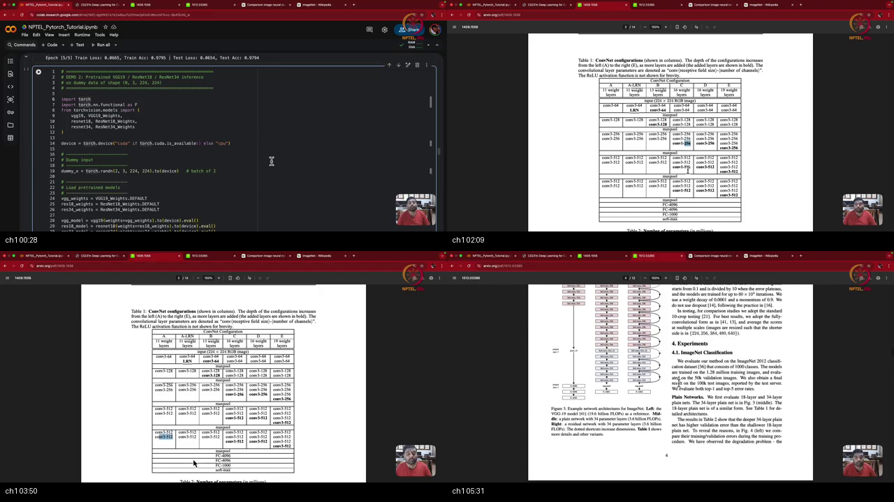
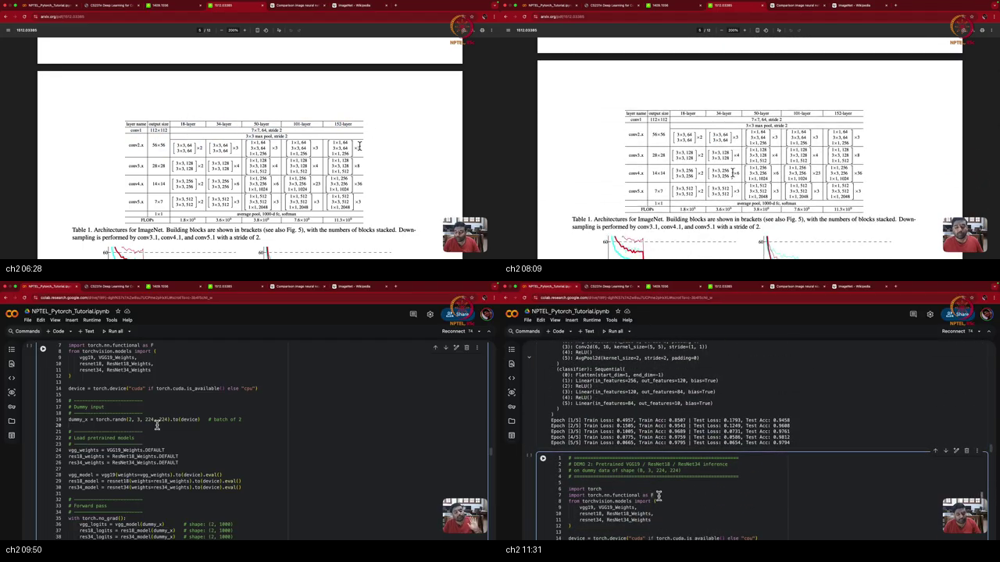
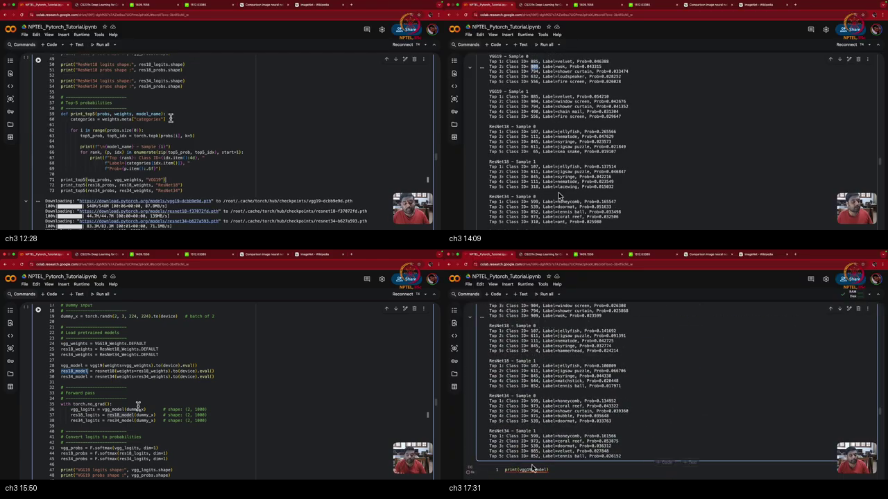
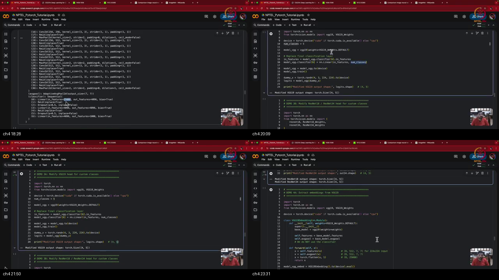
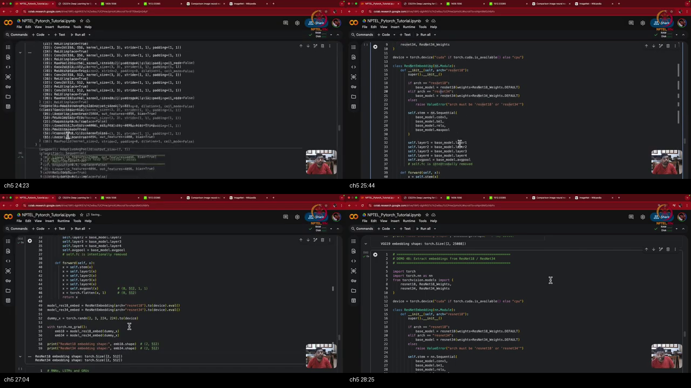

# Tutorial 14 Part 2 : Transfer Learning using CNNs

> **Prerequisites First:** If you are unfamiliar with pretrained feature hierarchies, linear probing, gradient freezing with `requires_grad = False`, top-K softmax evaluation, or ResNet skip connection dynamics, study [PREREQUISITES.md](./PREREQUISITES.md) first. Understanding how generic early visual filters transfer across domains and how surgical head replacement prevents catastrophic forgetting is essential for mastering computer vision transfer learning.

---

## Table of Contents
1. [Executive Summary](#executive-summary)
2. [End-to-End Verification Script](#end-to-end-verification-script)
3. [Topic 1: Pretrained Vision Models: VGG & ResNet Architectures](#topic-1-pretrained-vision-models-vgg--resnet-architectures)
4. [Topic 2: Pretrained Inference & Top-K Predictions on ImageNet](#topic-2-pretrained-inference--top-k-predictions-on-imagenet)
5. [Topic 3: Modifying Classifier Heads & Parameter Freezing](#topic-3-modifying-classifier-heads--parameter-freezing)
6. [Topic 4: Spatial Input Resolution & Dimension Recomputation](#topic-4-spatial-input-resolution--dimension-recomputation)
7. [Topic 5: Decoupled Feature Extraction & Latent Embeddings](#topic-5-decoupled-feature-extraction--latent-embeddings)
8. [Apply it (scenarios)](#apply-it-scenarios)
9. [Workplace Debugging Scenarios](#workplace-debugging-scenarios)
10. [References](#references)

---

## Executive Summary

Transfer learning is the foundational paradigm of modern computer vision. Rather than training high-capacity models from scratch, engineers reuse pretrained backbones (VGG, ResNet) trained on ImageNet. Locking the generic convolutional feature trunk and training a custom classification head enables high sample efficiency and prevents catastrophic forgetting.

```
┌──────────────────────────────────────────────────────────────────────────────────────────────────┐
│                             TRANSFER LEARNING MASTER PIPELINE                                    │
│                                                                                                  │
│   Input Volume              Pretrained Convolutional Trunk           Embedding       Target Head │
│   [B x 3 x 224 x 224]       (Locked: param.requires_grad=False)          Z          (Trainable)  │
│  ┌──────────────────┐     ┌────────────────────────────────────┐    ┌─────────┐    ┌───────────┐ │
│  │ Target Images    │ ──> │ Conv1 -> Layer1 -> ... -> Layer4   │ ──>│ 512-dim │ ──>│ Linear    │ │
│  │ (e.g. Chest Xray)│     │ Pretrained ImageNet Weights Locked │    │ Vector  │    │ (512, 5)  │ │
│  └──────────────────┘     └────────────────────────────────────┘    └─────────┘    └───────────┘ │
│           │                                  │                           │               │       │
│           │                                  ▼                           ▼               ▼       │
│           │                        Zero Gradient Buffer            Decoupled Latent   Softmax    │
│           │                        param.grad is None!             Downstream Modals  Logits (5) │
│           ▼                                  │                     (Captioning LSTM)     │       │
│      Standard Grid                  Invariant Spatial Repr.              │               ▼       │
│     224x224 RGB image               Preserves General Features           ▼        Target Loss    │
│                                                                     Visual Search  CrossEntropy  │
└──────────────────────────────────────────────────────────────────────────────────────────────────┘
```

### Concrete Scenario Walkthrough
1. **The Data Scarcity Problem:** A medical research lab needs to classify chest X-ray radiographs into 5 pulmonary disease categories, but possesses only 1,200 annotated scans. Training an 11-million-parameter ResNet-18 from random initialization leads to catastrophic overfitting within 3 epochs.
2. **Backbone Loading:** The engineering team instantiates a pretrained ResNet-18 (`torchvision.models.resnet18(weights=ResNet18_Weights.DEFAULT)`), inheriting representations learned from 1.4 million ImageNet photographs.
3. **Parameter Freezing:** They freeze all 11,176,512 parameters of the feature extraction trunk (`for p in model.parameters(): p.requires_grad = False`), isolating the convolutional feature extractor.
4. **Classifier Head Surgery:** They surgically replace the final 1,000-class linear layer (`model.fc = nn.Linear(512, 5)`), initializing only 2,565 trainable parameters for the 5 target disease classes.
5. **Fast Training Convergence:** They train only the newly initialized head using `Adam` with learning rate $\eta = 10^{-3}$ and `CrossEntropyLoss`. Because the objective is convex with respect to the linear head, the model converges rapidly in 5 epochs without disturbing the trunk.
6. **Decoupled Embedding Extraction:** In parallel, the lab decouples the representation trunk to produce 512-dimensional latent feature vectors $Z$. These vectors are passed to an LSTM decoder for automated radiological report generation (image captioning).

### What We Are NOT Doing (Out of Scope)
- **Recurrent Sequence Modeling:** While we extract and prepare latent embeddings $Z$ for downstream sequence models (such as image captioning), the internal mechanics of RNNs, LSTMs, GRUs, and sequence-to-sequence decoders are formally covered in **Tutorial 15**.
- **Self-Supervised Masked Autoencoding:** We focus strictly on supervised transfer from ImageNet classification backbones, omitting self-supervised contrastive learning (SimCLR, MoCo) and masked autoencoders (MAE).
- **Object Detection Bounding Box Heads:** We focus on image classification head replacement, omitting multi-stage anchor regression (Faster R-CNN) and anchor-free grid heads (YOLO).

### Method Comparison Matrix

| Method | Trainable Params | Gradient Target | Feature Transferability | Risk of Forgetting | Compute Cost |
|:---|:---|:---|:---|:---|:---|
| **Training From Scratch** | 100% of network | All layers simultaneously | Low (requires massive data) | High (overfits small datasets) | Extremely high ($10^2$ GPU-hrs) |
| **Linear Probe (Frozen Trunk)**| < 0.1% (Head only) | `model.fc` exclusively | High (universal early features) | Zero (trunk weights locked) | Minimal (minutes on CPU/GPU) |
| **Full Fine-Tuning** | 100% of network | All layers ($\eta_{\text{trunk}} \ll \eta_{\text{head}}$)| Very High | Moderate (gradient disruption) | Moderate ($10^1$ GPU-hrs) |
| **Embedding Extractor ($Z$)** | 0% (Inference only) | None (no backprop) | Universal perceptual vectors | Zero | Negligible (forward pass only) |

### Load-Bearing Takeaways
1. **Early Layers are Universal Primitives:** Early convolutional layers encode oriented edges, corners, and textures that generalize across completely disparate optical domains (e.g. from ImageNet animals to medical X-rays).
2. **Gradient Freezing Isolates Autograd:** Setting `param.requires_grad = False` prevents autograd from allocating gradient tensors for the trunk (`param.grad is None`), preventing catastrophic forgetting and halving memory overhead.
3. **Head Surgery Targets Specific Attributes:** In VGG-19, head surgery targets layer index 6: `vgg.classifier[6] = nn.Linear(4096, num_classes)`. In ResNet, it targets the fully connected attribute: `resnet.fc = nn.Linear(512, num_classes)`.
4. **VGG vs ResNet Embedding Dimensionality:** VGG flattens unpooled spatial feature maps into a massive 25,088-dimensional vector, whereas ResNet applies Global Average Pooling to produce a compact, efficient 512-dimensional vector.
5. **Always Set `model.eval()` for Inference:** Forgetting evaluation mode leaves Dropout active and uses uncalibrated batch statistics instead of frozen population running means, producing stochastic non-deterministic predictions.

### Common Traps & Fixes
- **Trap 1: Catastrophic Forgetting via Unfrozen Trunk.**  
  *Root Cause:* Passing `model.parameters()` to an optimizer when the new classification head is randomly initialized. Large initial gradients violently destroy pretrained convolutional features.  
  *Fix:* Freeze the trunk (`param.requires_grad = False`) and pass only `model.fc.parameters()` to the optimizer.
- **Trap 2: Matrix Dimension Mismatch on Non-Standard Resolutions.**  
  *Root Cause:* Feeding non-$224 \times 224$ images (e.g. $28 \times 28$ MNIST) into a VGG backbone. The final spatial feature map is no longer $7 \times 7$, so flattening produces a shape mismatch with `Linear(25088, ...)`.  
  *Fix:* Recompute intermediate spatial shapes or use adaptive pooling (`nn.AdaptiveAvgPool2d((1, 1))`).
- **Trap 3: Stochastic Inference due to Missing `model.eval()`.**  
  *Root Cause:* Running inference while the model remains in training mode (`model.train()`). Dropout randomly zeros 50% of activations and BatchNorm computes batch-specific stats.  
  *Fix:* Explicitly invoke `model.eval()` before running forward inference.

---

## End-to-End Verification Script

```python
import torch
import torch.nn as nn
import torch.nn.functional as F
import torchvision.models as models

# 1. Load backbone and verify evaluation mode
model = models.resnet18(weights=None)
model.eval()
assert not model.training, "Model should be in evaluation mode"

# 2. Forward pass with standard ImageNet resolution [B=2, C=3, H=224, W=224]
x = torch.randn(2, 3, 224, 224)
with torch.no_grad():
    logits = model(x)
assert logits.shape == (2, 1000), f"Expected [2, 1000], got {logits.shape}"

# 3. Softmax probabilities and Top-5 evaluation
probs = F.softmax(logits, dim=1)
assert torch.allclose(probs.sum(dim=1), torch.tensor([1.0, 1.0]))
top5_vals, top5_indices = torch.topk(probs, k=5, dim=1)
assert top5_vals.shape == (2, 5)

# 4. Head surgery and parameter freezing
for param in model.parameters():
    param.requires_grad = False

target_classes = 5
model.fc = nn.Linear(512, target_classes)
assert model.fc.weight.requires_grad == True
assert model.conv1.weight.requires_grad == False

# 5. Backward pass isolation
criterion = nn.CrossEntropyLoss()
dummy_y = torch.tensor([0, 3])
loss = criterion(model(x), dummy_y)
loss.backward()

assert model.fc.weight.grad is not None
assert model.conv1.weight.grad is None
print("[PASS] Top-level verification: ResNet-18 inference, head surgery, and gradient isolation validated.")
```

---

## Topic 1: Pretrained Vision Models: VGG & ResNet Architectures

### Where this sits on the master map
Connects directly to **[PREREQUISITES.md Pillar 1: Pretrained Visual Representations & Inductive Feature Hierarchies](./PREREQUISITES.md#p1)** and **[PREREQUISITES.md Pillar 5: Residual Identity Skip Connections vs Vanishing Gradients](./PREREQUISITES.md#p5)**.

### Board / screenshot



### What he is establishing
In this opening topic, the instructor explains the industrial and research shift from training scratch models to downloading open pretrained weights published by ImageNet benchmark winners. Training a vision model on 1.4 million images requires massive computing infrastructure; distributing trained checkpoints democratizes state-of-the-art vision capabilities.

For example, consider the VGG architectural family introduced by Simonyan and Zisserman (2014). VGG explored six standardized network configurations (A through E), scaling from 11 layers up to 19 layers using modular stacks of $3 \times 3$ convolutions and $2 \times 2$ max pooling, terminating in a dense classification head ($4096 \to 4096 \to 1000$). However, the instructor highlights a fundamental optimization barrier: VGG could not scale beyond 19 layers. Stacking additional sequential convolution layers resulted in severe vanishing gradients during backpropagation, starving early layers of learning signals.

- **Wrong View:** Assuming that deeper networks can always be trained simply by stacking more convolutional layers sequentially.
- **Right View:** Pure sequential stacking suffers from exponential gradient decay ($\mathcal{O}(\prod \|\mathbf{J}_l\|)$); scaling beyond 20 layers requires residual identity skip connections ($\mathbf{y} = \mathcal{F}(\mathbf{x}) + \mathbf{x}$) that create an unattenuated gradient highway, enabling models like ResNet-152.

The instructor shows how ResNet (He et al., 2016) resolves this degradation problem through residual skip connections that pass untransformed inputs directly to subsequent stages, allowing 18, 34, 50, and 152-layer networks to train stably.

You can now explain why deep vision backbones transitioned from sequential VGG stacks to residual architectures and evaluate the depth trade-offs across ResNet variants.

### Analogy for this topic only
Imagine a company telephone game where a message is whispered sequentially through 20 employees. By person 19, the message is completely garbled or inaudible (vanishing gradients in VGG). ResNet is equivalent to installing a direct loudspeaker intercom (skip connection) that broadcasts the original message directly to every desk simultaneously, while allowing each employee to add their small piece of commentary.  
*In lecture words: "In VGG they stopped at 19 layers because of vanishing gradients; ResNet solved this by allowing an untransformed identity path, scaling up to 152 layers."*  
**Hard Question:** If an engineer proposes adding 10 more sequential conv layers to VGG-19 without residual connections, why will training accuracy fail to improve?  
**Answer:** Because the Jacobian product across 29 sequential non-linear layers causes gradient norms in early layers to decay to zero ($\|\nabla_{W_1} \mathcal{L}\| \to 0$). The network suffers from the degradation problem where deeper un-skidded networks exhibit higher training error than shallower ones.

### Local picture
```
Sequential VGG-19 (Gradient Vanishes):         ResNet Residual Block (Gradient Preserved):
[x] ──> Conv ──> ReLU ──> Conv ──> ... ──> Loss      [x] ──────────────────( + )──> y = F(x) + x
         │        │        │                              │                  ▲
        *J1      *J2      *J3                             └──> Conv ──> ReLU ┘
         Exponential Decay: dL/dx1 -> 0                       Direct Gradient Highway: dy/dx = dF/dx + I
```
*Notice: In ResNet, the identity addition operator guarantees that an unattenuated unit gradient flows backward to early layers.*

#### Why X, Not Y: Contrastive Rationale
- **Why Choose ResNet-18/34 Over VGG-19 for Transfer Learning?**  
  VGG-19 contains over 143 million parameters (over 500 MB), primarily concentrated in its massive dense head ($4096 \times 4096$). ResNet-18 contains only 11.2 million parameters (44 MB) and achieves equal or superior accuracy due to residual connections and Global Average Pooling.
- **Why Use $3 \times 3$ Convolutions Universally Instead of $5 \times 5$ or $7 \times 7$?**  
  Two stacked $3 \times 3$ convolutions cover the same $5 \times 5$ receptive field with 28% fewer parameters and incorporate two non-linear activations instead of one, maximizing expressiveness per parameter.

#### Check Your Understanding
1. How many layers are in VGG configuration A versus configuration E?  
   *Answer:* Configuration A has 11 weight layers; Configuration E (VGG-19) has 19 weight layers.
2. In ResNet-18, how many total residual blocks are present across its 4 feature stages?  
   *Answer:* 8 residual blocks (each stage contains 2 residual blocks; $4 \times 2 = 8$ blocks with 2 convolutions each = 16 convs).

### Bridge
Having established the structural differences between VGG and ResNet backbones, the instructor transitions in Topic 2 to importing these models in PyTorch, executing forward inference, and interpreting Top-K class posteriors on ImageNet.

---

## Topic 2: Pretrained Inference & Top-K Predictions on ImageNet

### Where this sits on the master map
Connects directly to **[PREREQUISITES.md Pillar 4: Softmax Calibration & Top-K Retrieval Metrics](./PREREQUISITES.md#p4)**.

### Board / screenshot



### What he is establishing
In this topic, the instructor demonstrates hands-on loading and inference using PyTorch's `torchvision.models` API, highlighting production evaluation practices.

For example, when loading ResNet-18 via `models.resnet18(weights=ResNet18_Weights.DEFAULT)`, the network is immediately placed into evaluation mode via `model.eval()`. Passing a dummy batch of two images of shape `[2, 3, 224, 224]` produces an unnormalized logits tensor of shape `[2, 1000]`. Applying `F.softmax(logits, dim=1)` normalizes these logits into valid probability distributions.

- **Wrong View:** Evaluating model predictions purely on Top-1 accuracy in a 1,000-class problem, or running inference without setting `model.eval()`.
- **Right View:** Using `torch.topk(probabilities, k=5)` to evaluate the top 5 candidate predictions, recognizing that uniform chance in 1,000 classes is $0.001$, and freezing stochastic layers (Dropout and BatchNorm) via `model.eval()`.

The instructor emphasizes why Top-5 evaluation is standard in 1,000-class tasks:
1. **Low Prior Probability:** With 1,000 classes, random uniform probability is only $0.1\%$.
2. **Fine-Grained Category Overlap:** ImageNet contains dozens of closely related dog breeds, vehicle types, and reptile species where secondary predictions reflect valid visual hypotheses.
3. **Retrieval via `torch.topk`:** `torch.topk(probs, k=5)` efficiently returns both the sorted confidence values and their corresponding ImageNet class IDs.

You can now execute production-grade inference pipelines on pretrained vision models and interpret categorical confidence distributions.

### Analogy for this topic only
Imagine asking a botanist to identify a tree species from a single blurry photograph among 1,000 botanical species. Demanding only one single guess (Top-1) is unforgiving, but allowing the botanist to provide their top 5 plausible candidate species (Top-5) accurately reflects real-world diagnostic competence.  
*In lecture words: "With 1,000 classes, each class has a very low prior probability; that is why we extract top-5 probabilities using torch.topk."*  
**Hard Question:** What happens to the outputs of `model(x)` if you forget to invoke `model.eval()` before running inference on a batch of size 1?  
**Answer:** In training mode (`model.train()`), Batch Normalization attempts to compute mean and variance across the batch. With batch size 1, variance is 0, causing division by zero or NaN activations, and Dropout randomly zeroes out 50% of the dense features.

### Local picture
```
ImageNet Inference Pipeline:
Input [B, 3, 224, 224] ──> model.eval() ──> Logits [B, 1000] ──> F.softmax(dim=1) ──> Probs [B, 1000]
                                                                                              │
                                                                                              ▼
                                                                                    torch.topk(k=5)
                                                                                              │
                                                                                ┌─────────────┴─────────────┐
                                                                                ▼                           ▼
                                                                        Top-5 Probabilities        Top-5 Class Indices
                                                                        [B, 5] (e.g. 0.85, 0.08)   [B, 5] (e.g. 281, 282)
```
*Notice: `model.eval()` ensures deterministic forward inference prior to Softmax and Top-K extraction.*

#### Why X, Not Y: Contrastive Rationale
- **Why Softmax Along `dim=1` Instead of `dim=0`?**  
  `dim=0` indexes the mini-batch dimension. Normalizing along `dim=0` would force probabilities across different images to sum to 1. Normalizing along `dim=1` ensures each independent image has its own valid probability distribution over the 1,000 classes.
- **Why Top-5 Rather than Top-10 or Top-1?**  
  Top-1 penalizes benign taxonomic ambiguities, whereas Top-10 is overly permissive; Top-5 was standardized by the ImageNet challenge as the optimal metric balancing precision and taxonomic tolerance.

#### Check Your Understanding
1. In PyTorch, what is the default tensor shape required for standard ImageNet models?  
   *Answer:* `[Batch, 3, 224, 224]` (3 RGB channels, 224 height, 224 width).
2. What does `torch.topk(probs, k=5, dim=1)` return?  
   *Answer:* A named tuple `(values, indices)` containing the 5 highest probabilities and their corresponding class index positions for each sample in the batch.

### Bridge
While running inference on pretrained models is useful for general object recognition, most real-world applications require classifying custom domain-specific datasets with fewer than 1,000 classes. In Topic 3, the instructor covers modifying classifier heads and freezing feature backbones.

---

## Topic 3: Modifying Classifier Heads & Parameter Freezing

### Where this sits on the master map
Connects directly to **[PREREQUISITES.md Pillar 2: The Linear Probe & Classifier Head Surgery](./PREREQUISITES.md#p2)** and **[PREREQUISITES.md Pillar 3: Gradient Freezing Dynamics & Subgraph Isolation](./PREREQUISITES.md#p3)**.

### Board / screenshot



### What he is establishing
In this central topic, the instructor explains the mechanics and intuition of transfer learning for custom target tasks (e.g. 5-class medical pathology or MRI classification).

For example, when adapting ResNet-18 to a 5-class problem:
1. The 11.1 million parameters of the feature extraction trunk are frozen by setting `param.requires_grad = False`.
2. The final classification head `model.fc` is replaced with `nn.Linear(512, 5)`.
3. The new linear layer is initialized with random weights, requiring only $512 \times 5 + 5 = \mathbf{2,565}$ trainable parameters.

- **Wrong View:** Retraining the entire network from scratch on a small custom dataset, or allowing large initial loss gradients from the uninitialized head to backpropagate into pretrained weights.
- **Right View:** Locking the pretrained feature extraction trunk (`requires_grad = False`) and optimizing only the newly initialized linear head, preserving universal edge and texture detectors while learning task-specific class boundaries.

The instructor presents the **bicycle-to-motorbike analogy**: an individual who knows how to ride a bicycle does not need to learn balance, steering, and road awareness from scratch when learning to ride a motorcycle. They transfer balance and spatial coordination directly, focusing their learning strictly on motor controls and throttle. Similarly, a CNN pretrained on ImageNet already knows how to balance visual representations (detecting edges, contours, textures), requiring only a new classification head to map those representations to novel targets.

You can now surgically replace classifier heads on arbitrary PyTorch vision architectures and isolate gradient updates via parameter freezing.

### Analogy for this topic only
Think of hiring an experienced master illustrator to draw clinical anatomical diagrams. You do not need to teach them how to hold a pen, sketch straight lines, blend shading, or render perspective (pretrained trunk). You simply hand them a medical textbook with 5 specific diagnostic criteria and ask them to apply their lifelong drafting skills to those 5 targets (new classifier head).  
*In lecture words: "Early layers recognize basic shapes like edges and corners; like learning to ride a motorbike when you already know how to balance a bicycle, we reuse what is already learned."*  
**Hard Question:** If you freeze all backbone parameters but fail to pass only `model.fc.parameters()` to the optimizer (passing `model.parameters()` instead), does training still work?  
**Answer:** Yes, PyTorch will execute without error because parameters with `requires_grad = False` have `param.grad = None`, so the optimizer skips them. However, passing `filter(lambda p: p.requires_grad, model.parameters())` is superior practice because it avoids allocating unneeded optimizer state buffers (momentum and second moments) for the 11 million frozen weights.

### Local picture
```
Surgical Head Replacement on ResNet-18:
Pretrained Feature Trunk (FROZEN)                       Old Head (DISCARDED)    New Head (TRAINABLE)
┌──────────────────────────────────────────────┐       ┌─────────────────┐    ┌─────────────────┐
│ Conv1 -> Layer1 -> Layer2 -> Layer3 -> Layer4│ ──x── │ Linear(512,1000)│    │ Linear(512, 5)  │
│ [requires_grad = False]                      │       └─────────────────┘    │ [req_grad=True] │
└──────────────────────────────────────────────┘                               └─────────────────┘
                      │                                                                 ▲
                      └─────────────────────────────────────────────────────────────────┘
                                      Latent Feature Vector Z [B, 512]
```
*Notice: Pretrained representations are locked; only the new 2,565-parameter linear head updates during backpropagation.*

#### Why X, Not Y: Contrastive Rationale
- **Why Freeze the Feature Trunk Instead of Fine-Tuning the Whole Network Immediately?**  
  The newly initialized head produces random, massive gradients in early epochs. Propagating these random gradients through the trunk destroys the fragile pretrained representations (catastrophic forgetting). Freezing the trunk guarantees stable convergence.
- **Why Replace `model.fc` in ResNet vs `model.classifier[6]` in VGG?**  
  ResNet directly exposes its final linear projection as the attribute `model.fc`. VGG encapsulates its dense MLP head in an `nn.Sequential` container named `classifier`, where layer index 6 is the final linear layer ($4096 \to 1000$).

#### Check Your Understanding
1. In VGG-19, what code surgically replaces the 1,000-class head with a 10-class head?  
   *Answer:* `model.classifier[6] = nn.Linear(4096, 10)`.
2. How do you freeze all parameters in a PyTorch model?  
   *Answer:* `for param in model.parameters(): param.requires_grad = False`.

### Bridge
While modifying classification heads is straightforward when input images match the standard $224 \times 224$ ImageNet resolution, custom datasets often possess different spatial dimensions. In Topic 4, the instructor examines spatial input adaptations and dimension recomputations.

---

## Topic 4: Spatial Input Resolution & Dimension Recomputation

### Where this sits on the master map
Connects directly to **[PREREQUISITES.md Pillar 2: The Linear Probe & Classifier Head Surgery](./PREREQUISITES.md#p2)**.

### Board / screenshot



### What he is establishing
In this topic, the instructor addresses what happens when input image resolutions deviate from the standard $224 \times 224 \times 3$ ImageNet format (e.g. $28 \times 28 \times 1$ MNIST, $32 \times 32 \times 3$ CIFAR-10, or $152 \times 152$ medical scans).

For example, consider passing a $152 \times 152$ image through a VGG backbone. In standard VGG, five $2 \times 2$ max pooling stages reduce spatial resolution from $224 \to 112 \to 56 \to 28 \to 14 \to 7$, yielding a feature volume of $512 \times 7 \times 7 = \mathbf{25,088}$ before flattening into `Linear(25088, 4096)`. If the input is $152 \times 152$, the final feature map shrinks to $512 \times 4 \times 4 = \mathbf{8,192}$. Attempting to pass this into the unchanged linear layer immediately crashes with:
```
RuntimeError: mat1 and mat2 shapes cannot be multiplied (1x8192 and 25088x4096)
```

- **Wrong View:** Assuming pretrained backbones automatically handle arbitrary image sizes without checking linear layer input dimensions.
- **Right View:** Whenever input spatial resolution is changed, you must either resize inputs to $224 \times 224$, recompute the flattened feature size to reconstruct the linear head, or deploy Adaptive Average Pooling (`nn.AdaptiveAvgPool2d((7, 7))`) to force consistent spatial dimensions.

The instructor demonstrates passing dummy input tensors (`x_dummy = torch.zeros(1, C, H, W)`) through `model.features` to programmatically inspect the exact output tensor shape before constructing the classifier head.

You can now diagnose spatial resolution mismatches and adapt pretrained networks to arbitrary image dimensions.

### Analogy for this topic only
Imagine a factory bottling line designed for 12-ounce glass bottles. If you switch suppliers to 8-ounce short bottles without adjusting the capping machine height, the pneumatic press will smash down into empty air or jam the conveyor belt. You must recalibrate the machine height (recomputing spatial dimensions) before turning on the motor.  
*In lecture words: "If your input size is 152x152, the output size of all operations will change; you have to sit through and recompute the input feature size."*  
**Hard Question:** Why does ResNet handle variable input resolutions (e.g. $300 \times 300$ vs $224 \times 224$) much more gracefully than VGG?  
**Answer:** ResNet terminates its convolutional trunk with Global Average Pooling (`nn.AdaptiveAvgPool2d((1, 1))`), which averages across the spatial grid regardless of whether it is $7 \times 7$ or $10 \times 10$, always producing an exact output shape of `[Batch, 512, 1, 1]`. VGG uses fixed unpooled flattening ($512 \times 7 \times 7$), which breaks if spatial size changes.

### Local picture
```
VGG Spatial Dimension Collapse with Non-Standard Input:
Input [224x224x3] ──> Conv/Pool Stages ──> Feature Map [512x7x7] ──> Flatten ──> [25088] ──> Linear(25088, 4096) [OK]
Input [152x152x3] ──> Conv/Pool Stages ──> Feature Map [512x4x4] ──> Flatten ──> [ 8192] ──> Linear(25088, 4096) [CRASH!]
                                                                                         ▲
                                                                          Dimension Mismatch: 8192 != 25088
```
*Notice: Fixed unpooled flattening binds linear head input dimensions strictly to input spatial resolution.*

#### Why X, Not Y: Contrastive Rationale
- **Why Use `torchvision.transforms.Resize((224, 224))` Instead of Recomputing Heads?**  
  Resizing input images to $224 \times 224$ allows preserving the pretrained dense weights in VGG's intermediate layers (`Linear(25088, 4096)` and `Linear(4096, 4096)`), transferring both convolutional and dense semantic representations.
- **Why Adaptive Average Pooling Instead of Fixed Max Pooling?**  
  `nn.AdaptiveAvgPool2d((H_out, W_out))` dynamically adjusts kernel size and stride to guarantee fixed spatial outputs regardless of input resolution, eliminating shape mismatch errors.

#### Check Your Understanding
1. What error message does PyTorch throw when flattened convolutional features do not match the linear head's `in_features`?  
   *Answer:* `RuntimeError: mat1 and mat2 shapes cannot be multiplied`.
2. How can you programmatically verify the output feature size of `model.features` without manual math?  
   *Answer:* Pass a dummy tensor: `feat_dim = model.features(torch.zeros(1, C, H, W)).shape`.

### Bridge
Beyond using pretrained networks as classifiers, CNNs serve as powerful general-purpose feature encoders. In Topic 5, the instructor demonstrates decoupling backbones to extract visual embeddings for multimodal tasks like image captioning.

---

## Topic 5: Decoupled Feature Extraction & Latent Embeddings

### Where this sits on the master map
Connects directly to **[PREREQUISITES.md Pillar 1: Pretrained Visual Representations & Inductive Feature Hierarchies](./PREREQUISITES.md#p1)**.

### Board / screenshot



### What he is establishing
In this concluding topic, the instructor elevates CNNs from task-specific classifiers to general-purpose perceptual vector encoders. A convolutional network transforms complex high-dimensional pixel lattices into compact, semantically organized latent feature vectors $Z$.

For example, consider the automated **image captioning** pipeline:
1. An input photograph $\mathbf{X}$ is passed through a convolutional representation trunk (e.g. ResNet-18 up to the average pooling layer).
2. The classification head `model.fc` is discarded entirely.
3. The network outputs a compact visual embedding vector $Z \in \mathbb{R}^{512}$.
4. This embedding $Z$ serves as the initial hidden state or context vector for a sequence-to-sequence recurrent model (RNN/LSTM), which generates natural language tokens step by step: *"A brown dog playing fetch in the park."*

- **Wrong View:** Believing that CNNs can only be used for classification and that intermediate layers cannot be detached from dense heads.
- **Right View:** Treating deep networks as modular **Lego blocks**: the representation trunk (`self.features`) is an independent feature extractor whose output embeddings $Z$ can be routed to classification heads, nearest-neighbor vector search, or sequence-to-sequence caption decoders.

The instructor contrasts the embedding geometries of VGG and ResNet:
- **VGG Embedding Extractor:** Retains `features` and `avgpool`, flattening into a high-dimensional vector $Z \in \mathbb{R}^{25,088}$.
- **ResNet Embedding Extractor:** Retains `conv1`, `bn1`, `relu`, `maxpool`, and `layer1` through `layer4` plus `avgpool`, producing a dense, semantically distilled vector $Z \in \mathbb{R}^{512}$.

You can now decouple pretrained CNN trunks to generate latent feature vectors for downstream multimodal architectures.

### Analogy for this topic only
Think of an optical spectrometer in a chemistry laboratory. The spectrometer takes an unknown chemical sample and outputs a clean numerical spectral fingerprint (the embedding $Z$). That fingerprint can be fed into an identification database (classifier), an automated compound synthesizer (sequence model), or an anomaly detection alarm (similarity search).  
*In lecture words: "CNNs are like Lego blocks; we discard the classifier, extract the embedding vector, and pass it to sequence-to-sequence models for image captioning."*  
**Hard Question:** Why is ResNet's 512-dimensional embedding generally preferred over VGG's 25,088-dimensional embedding for downstream sequence captioning models?  
**Answer:** Passing a 25,088-dimensional vector into an LSTM hidden state of size 512 requires an input projection matrix with $25,088 \times 512 \approx 12.8\text{ million}$ weights in the sequence model. ResNet's 512-dimensional vector requires only $512 \times 512 \approx 262,000$ weights—a 48x reduction in sequence model parameter overhead that prevents overfitting on captioning datasets.

### Local picture
```
Multimodal Decoupled Pipeline (Image Captioning):
Input Image [3x224x224] ──> ResNet Trunk (Frozen) ──> AvgPool ──> Latent Embedding Z [512]
                                                                        │
                                                                        ▼
                                                             LSTM / GRU Sequence Model
                                                                        │
                                                   ┌────────────────────┼────────────────────┐
                                                   ▼                    ▼                    ▼
                                              Token 1 ("A")       Token 2 ("dog")     Token 3 ("runs")
```
*Notice: Decoupling the visual trunk produces a static latent vector $Z$ that conditions the autoregressive decoder.*

#### Why X, Not Y: Contrastive Rationale
- **Why Global Average Pooling in ResNet Instead of Flattening in VGG?**  
  Global Average Pooling collapses spatial height and width ($7 \times 7 \to 1 \times 1$) with zero parameters, enforcing translation invariance and producing compact embeddings ($512$ vs $25,088$).
- **Why Extract Embeddings Before Rather Than After the Linear Head?**  
  Pre-logits embeddings contain rich, multi-dimensional geometric representations of visual attributes (color, posture, texture). Output logits collapse this rich space into task-specific class likelihoods, discarding visual details.

#### Check Your Understanding
1. What is the dimensionality of the latent visual embedding extracted from ResNet-18 after average pooling?  
   *Answer:* 512 dimensions.
2. In an image captioning architecture, what role does the extracted CNN embedding $Z$ play?  
   *Answer:* It acts as the visual context conditioning vector (or initial hidden state) for the autoregressive sequence decoder.

### Bridge
This concludes Tutorial 14 Part 2. You now possess a comprehensive mastery of transfer learning with CNNs, including pretrained weight loading, inference evaluation, classifier head surgery, parameter freezing, and multimodal embedding extraction. This directly prepares you for **Tutorial 15**, where we introduce Recurrent Neural Networks, LSTMs, and GRUs to model temporal and textual sequences.

---

## Apply it (scenarios)

## Workplace Debugging Scenarios

### Scenario 1: Catastrophic Forgetting from Unfrozen Feature Trunk
**Problem:**  
A machine learning engineer fine-tunes a pretrained ResNet-50 on a fine-grained butterfly dataset (10 classes, 500 images). Instead of freezing the trunk, the engineer passes `model.parameters()` directly to an Adam optimizer with standard learning rate $\eta = 10^{-3}$. Within the first epoch, the validation accuracy drops to near zero and never recovers, performing significantly worse than a linear probe.

**Mathematical Root Cause:**  
The newly instantiated classification head `model.fc = nn.Linear(2048, 10)` contains randomly initialized weights. In initial iterations, loss gradients with respect to logits $\frac{\partial \mathcal{L}}{\partial \mathbf{z}}$ are enormous. Because the backbone is unfrozen, backpropagation scales these random gradients across all 50 layers:
$$\Theta_{\text{trunk}}^{(1)} = \Theta_{\text{trunk}}^{(0)} - \eta \nabla_{\Theta} \mathcal{L}$$
With $\eta = 10^{-3}$, these violent updates overwrite the carefully structured ImageNet feature detectors in the convolutional trunk, destroying the network's visual feature representation.

**Debugging Steps:**
1. Inspect gradient norms across layers during iteration 1: `for name, p in model.named_parameters(): print(name, p.grad.norm())`.
2. Notice that early layer weights experience massive parameter shifts ($\|\Delta \Theta\| > 2.0$).
3. Freeze the entire feature extraction trunk before initializing the optimizer.
4. Pass strictly `model.fc.parameters()` to the optimizer.

**Code Fix:**
```python
import torch
import torch.nn as nn
import torchvision.models as models

# 1. Load pretrained model
model = models.resnet50(weights=models.ResNet50_Weights.DEFAULT)

# 2. Freeze all trunk parameters (CRITICAL: prevents catastrophic forgetting)
for param in model.parameters():
    param.requires_grad = False

# 3. Replace classification head
model.fc = nn.Linear(model.fc.in_features, 10)

# 4. Pass ONLY trainable head parameters to optimizer
optimizer = torch.optim.Adam(model.fc.parameters(), lr=1e-3)
```

---

### Scenario 2: Non-Deterministic Predictions from Missing Evaluation Mode
**Problem:**  
A production deployment team wraps a fine-tuned ResNet-18 model into a FastAPI microservice. During QA testing, client requests send the exact same test image repeatedly, but the API returns fluctuating probability confidence scores and differing top-1 labels across requests.

**Mathematical Root Cause:**  
The model was left in training mode (`model.training == True`). In training mode:
1. `nn.Dropout` randomly zeroes out 50% of feature activations using an active pseudo-random number generator, creating non-deterministic output logits.
2. `nn.BatchNorm2d` computes mean and variance dynamically across the incoming mini-batch rather than utilizing the frozen population running statistics ($\mu_{\text{running}}, \sigma^2_{\text{running}}$). For a single inference image ($B=1$), batch variance is zero, corrupting feature normalization.

**Debugging Steps:**
1. Check `print(model.training)` inside the prediction endpoint.
2. Observe that `model.training == True`.
3. Call `model.eval()` immediately after loading model checkpoints.
4. Wrap inference passes inside `with torch.no_grad():`.

**Code Fix:**
```python
import torch
import torchvision.models as models

# Initialize and load model checkpoint
model = models.resnet18(weights=None)
model.fc = torch.nn.Linear(512, 10)
model.load_state_dict(torch.load("checkpoint.pt", map_location="cpu"))

# CRITICAL FIX: Set model to evaluation mode
model.eval()

def predict(image_tensor: torch.Tensor):
    # Ensure gradients are not tracked
    with torch.no_grad():
        logits = model(image_tensor)
        probs = torch.nn.functional.softmax(logits, dim=1)
        top_prob, top_class = torch.topk(probs, k=1, dim=1)
    return {"class_id": top_class.item(), "confidence": top_prob.item()}
```

---

## References

For full formal citations, academic papers, and cross-lecture curriculum linkages, see the dedicated [references.md](./references.md) document.
