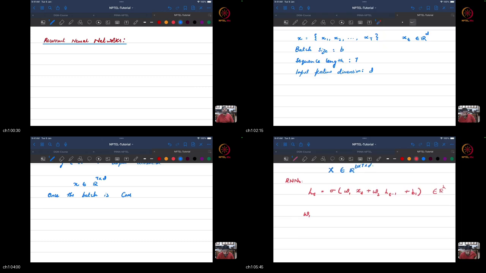
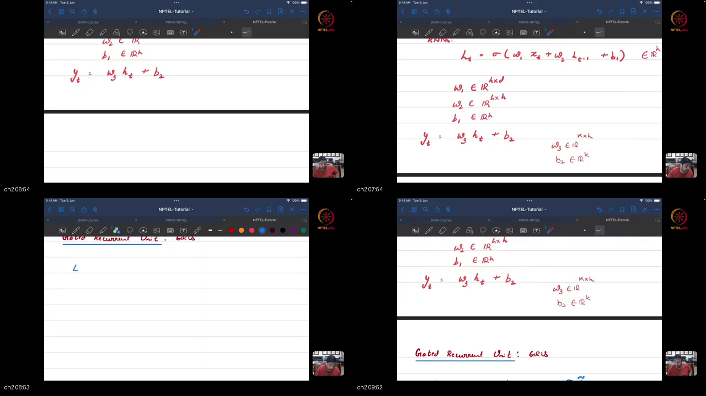
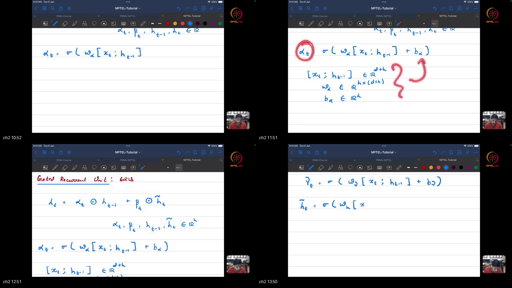
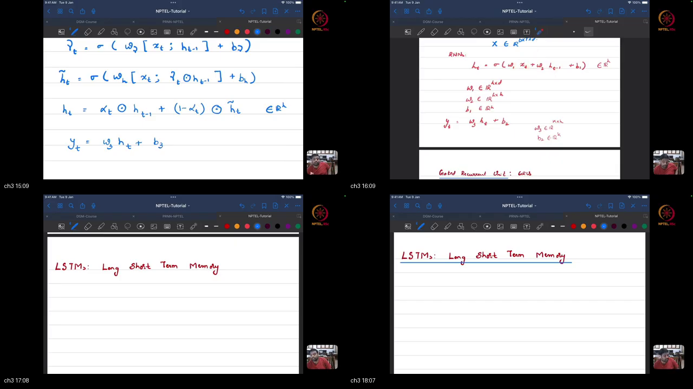
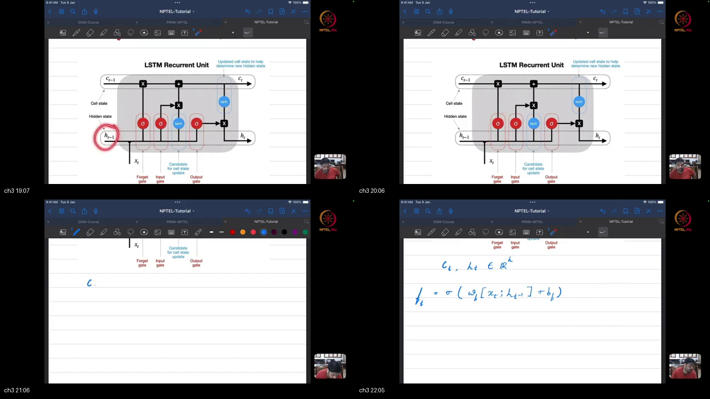
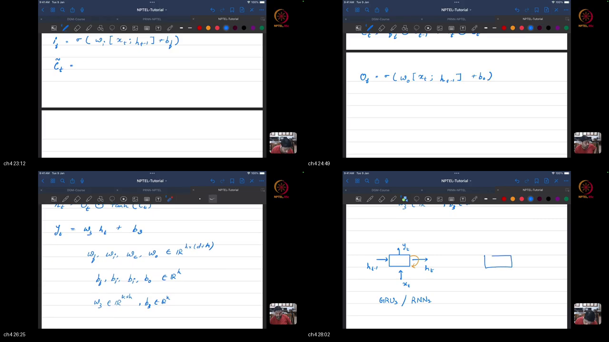
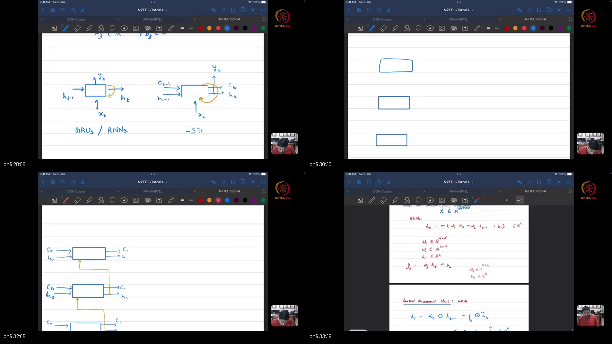

# Tutorial 15 Part 1 : RNNs, LSTMs and GRUs

> **Prerequisites First:** If you are unfamiliar with sequence tensor layouts, discrete dynamical recurrence, backpropagation through time, constant error carousels, or gate parameter counting, study [PREREQUISITES.md](./PREREQUISITES.md) first. Understanding how recurrent memory states evolve and how additive gating resolves vanishing gradients is essential for mastering sequential deep learning.

---

## Table of Contents
1. [Executive Summary](#executive-summary)
2. [End-to-End Verification Script](#end-to-end-verification-script)
3. [Topic 1: Sequence Tensor Geometry & Vanilla RNN Cell Mechanics](#topic-1-sequence-tensor-geometry--vanilla-rnn-cell-mechanics)
4. [Topic 2: Vanishing Gradients & Gated Recurrent Unit (GRU) Formulation](#topic-2-vanishing-gradients--gated-recurrent-unit-gru-formulation)
5. [Topic 3: Long Short-Term Memory (LSTM): Cell States & Triple Gating](#topic-3-long-short-term-memory-lstm-cell-states--triple-gating)
6. [Topic 4: Mathematical Parameter Counting & Recurrent Cell Comparison](#topic-4-mathematical-parameter-counting--recurrent-cell-comparison)
7. [Topic 5: PyTorch Recurrent Layers & Sequence Classification Architecture](#topic-5-pytorch-recurrent-layers--sequence-classification-architecture)
8. [Apply it (scenarios)](#apply-it-scenarios)
9. [Workplace Debugging Scenarios](#workplace-debugging-scenarios)
10. [References](#references)

---

## Executive Summary

Sequential deep learning processes ordered temporal tokens where past context informs present meaning. Unlike feedforward networks that process independent inputs, recurrent models maintain an evolving hidden state vector $h_t$ across time. This lecture establishes the mathematical mechanics of Vanilla RNNs, explores gradient failure modes during Backpropagation Through Time, formulates GRU and LSTM gating architectures, and implements sequence classification in PyTorch.

```
┌──────────────────────────────────────────────────────────────────────────────────────────────────┐
│                            RECURRENT ARCHITECTURE MASTER BLUEPRINT                               │
│                                                                                                  │
│  Input Sequence Batch            Recurrent State Accumulator               Terminal Classification│
│  X in R^{B x T x D}             (Shared Weights Across Time)               Head (Many-to-One)    │
│  ┌──────────────────┐           ┌────────────────────────────┐             ┌───────────────────┐ │
│  │ [x_1, ..., x_T]  │ ────────> │ Step t: x_t and h_{t-1}    │ ──────────> │ Linear Projection │ │
│  │ (e.g. Text/Signal│           │ Vanilla: h_t = tanh(W h+x) │  Terminal   │ Logits = W h_T + b│ │
│  └──────────────────┘           │ GRU:     r_t, z_t, ~h_t    │  State h_T  └─────────┬─────────┘ │
│           │                     │ LSTM:    f_t, i_t, C_t, o_t│  [B x H]              │           │
│           │                     └──────────────┬─────────────┘                       ▼           │
│           │                                    │                              Softmax Posteriors │
│           ▼                                    ▼                              p in Delta^{C-1}   │
│   Standard 3D Layout                Linear Gradient Highway                          │           │
│    batch_first=True                 LSTM: dC_t/dC_{t-1} = f_t                        ▼           │
│   [Batch, Time, Dim]                Constant Error Carousel (CEC)              Target Loss       │
│                                                                               CrossEntropyLoss   │
└──────────────────────────────────────────────────────────────────────────────────────────────────┘
```

### Concrete Scenario Walkthrough
1. **The Sequence Dependency Problem:** An AI engineering team builds a customer review sentiment classifier where words arrive in variable-length sequences ($T \in [5, 50]$). A standard MLP flattens tokens, losing word ordering and failing on dependent clauses.
2. **Sequential Ingestion:** The team passes word embeddings $x_t \in \mathbb{R}^{128}$ into an `nn.LSTM(128, 256, batch_first=True)`.
3. **Temporal Context Accumulation:** At each time step $t$, the LSTM updates its long-term cell state $C_t$ and working hidden memory $h_t$, using forget, input, and output gates to retain sentiments.
4. **Gradient Flow Protection:** Because cell updates are additive ($C_t = f_t \odot C_{t-1} + i_t \odot \tilde{C}_t$), error gradients propagate across all 50 time steps without vanishing.
5. **Terminal Head Projection:** At step $T$, the terminal hidden state $h_T \in \mathbb{R}^{B \times 256}$ is passed to `nn.Linear(256, 2)` to generate positive/negative logits.
6. **Convergence:** The pipeline trains stably with CrossEntropyLoss and Adam optimizer, maintaining long-range context across clauses.

### What We Are NOT Doing (Out of Scope)
- **Deep Multi-Layer Stacked Recurrence:** In this lecture, all mathematical derivations and implementations focus strictly on single-layer recurrent cells and modules; stacking multiple recurrent layers (`num_layers > 1`) is covered in **Tutorial 15 Part 2**.
- **Bidirectional Recurrent Networks:** We focus exclusively on forward causal recurrence; bidirectional processing (`bidirectional=True`) is reserved for **Tutorial 15 Part 2**.
- **Variable-Length Sequence Packing:** Padding batches with dynamic masking and `pack_padded_sequence` utility functions is formally treated in **Tutorial 15 Part 2**.

### Method Comparison Matrix

| Method | Memory Vectors | Number of Gates | Gradient Channel | Vanishing Gradient Vulnerability | Parameter Proportionality |
|:---|:---|:---|:---|:---|:---|
| **Vanilla RNN** | Single $h_t \in \mathbb{R}^H$ | 0 gates | Multiplied by $W_{hh}^T$ at every step | Severe ($T > 10$ steps) | $1.0\times$ ($H(D+H)+2H$) |
| **Gated Recurrent Unit (GRU)** | Single $h_t \in \mathbb{R}^H$ | 2 gates ($r_t, z_t$) | Additive shortcut $(1 - z_t)\mathbf{I}$ | Low (stable over 100+ steps) | $3.0\times$ ($3[H(D+H)+2H]$) |
| **Long Short-Term Memory (LSTM)** | Dual: Cell $C_t$ + Hidden $h_t$ | 3 gates ($f_t, i_t, o_t$) | Linear Constant Error Carousel ($f_t \mathbf{I}$) | Minimal (retains long-range context) | $4.0\times$ ($4[H(D+H)+2H]$) |
| **Transformer Self-Attention** | Context matrix $\mathbf{Z}$ | Softmax weights | Direct pairwise paths $\mathcal{O}(1)$ | None (direct non-sequential routing) | Quadratic in $T$ |

### Load-Bearing Takeaways
1. **Sequence Tensors Require 3D Layout:** Sequential data is organized as $[B, T, D]$ under PyTorch `batch_first=True`.
2. **Weight Sharing Ensures Length Invariance:** The recurrent weight matrices $W_{xh}$ and $W_{hh}$ are shared across all time steps, allowing models to evaluate sequences of arbitrary lengths.
3. **Vanilla RNNs Suffer BPTT Gradient Decay:** Backpropagation through time multiplies temporal Jacobians containing $W_{hh}^T$, decaying error signals exponentially to zero for $T > 10$.
4. **GRU Provides 25% Parameter Savings:** By eliminating the separate cell state and output gate, GRU requires 3 linear projections rather than 4, saving 25% memory while matching LSTM performance.
5. **LSTM Constant Error Carousel (CEC):** The additive cell update $C_t = f_t \odot C_{t-1} + i_t \odot \tilde{C}_t$ yields $\frac{\partial C_t}{\partial C_{t-1}} = f_t$, enabling unattenuated gradient propagation.

### Common Traps & Fixes
- **Trap 1: Omission of `batch_first=True`.**  
  *Root Cause:* PyTorch defaults to $[T, B, D]$. Passing $[B, T, D]$ tensors without setting `batch_first=True` silently mixes batch samples across time steps.  
  *Fix:* Always pass `batch_first=True` when instantiating `nn.RNN`, `nn.GRU`, or `nn.LSTM`.
- **Trap 2: Exploding Gradients during BPTT.**  
  *Root Cause:* Long sequence unrolling causes backpropagated gradient norms to exceed numerical thresholds, leading to `NaN` loss.  
  *Fix:* Apply gradient clipping: `torch.nn.utils.clip_grad_norm_(model.parameters(), max_norm=1.0)`.
- **Trap 3: Slicing the Wrong Hidden State for Classification.**  
  *Root Cause:* Taking `out_seq[:, 0, :]` (the first token) or averaging before pooling.  
  *Fix:* Extract the final time-step representation `out_seq[:, -1, :]` or use `h_n[-1]`.

---

## End-to-End Verification Script

```python
import torch
import torch.nn as nn
import torch.nn.functional as F

# 1. Instantiate single-layer LSTM with batch_first=True
B, T, D, H, C = 2, 6, 8, 16, 3
x = torch.randn(B, T, D)
targets = torch.randint(0, C, (B,))

lstm = nn.LSTM(input_size=D, hidden_size=H, batch_first=True)
head = nn.Linear(H, C)

# 2. Forward pass and verify tensor dimensions
out_seq, (h_n, c_n) = lstm(x)
assert out_seq.shape == (B, T, H), f"Expected [2, 6, 16], got {out_seq.shape}"
assert h_n.shape == (1, B, H), f"Expected [1, 2, 16], got {h_n.shape}"
assert c_n.shape == (1, B, H), f"Expected [1, 2, 16], got {c_n.shape}"

# 3. Terminal state extraction equivalence
h_T = out_seq[:, -1, :]
assert torch.allclose(h_T, h_n.squeeze(0), atol=1e-6)

# 4. Classification logits and backward pass
logits = head(h_T)
assert logits.shape == (B, C)
loss = F.cross_entropy(logits, targets)
loss.backward()

# 5. Gradient norm clipping
total_norm = nn.utils.clip_grad_norm_(list(lstm.parameters()) + list(head.parameters()), max_norm=1.0)
assert total_norm > 0.0

print(f"[PASS] Recurrent end-to-end simulation verified cleanly: Loss={loss.item():.4f}")
```

---

## Topic 1: Sequence Tensor Geometry & Vanilla RNN Cell Mechanics

### Where this sits on the master map
Connects directly to **[PREREQUISITES.md Pillar 1: Temporal Hidden State Transitions & Parameter Sharing](./PREREQUISITES.md#p1)**.

### Board / screenshot



### What he is establishing
In this opening topic, the instructor establishes how sequential datasets are mathematically structured into three-dimensional tensors and how the vanilla recurrent cell processes them sequentially.

For example, when handling sequence data like natural language sentences or audio frames, each batch consists of $B$ independent sequences. Each sequence has length $T$ (the time dimension), and every time step contains a $D$-dimensional feature vector. The complete dataset is represented as a 3D tensor $\mathbf{X} \in \mathbb{R}^{B \times T \times D}$.

- **Wrong View:** Assuming that sequence inputs can be treated like standard static tabular matrices by flattening time and feature dimensions into a 2D matrix $\mathbb{R}^{B \times (T \cdot D)}$.
- **Right View:** Preserving the temporal ordering by maintaining an evolving hidden state $h_t \in \mathbb{R}^H$ updated via shared affine transformations: $h_t = \tanh(W_{xh} x_t + W_{hh} h_{t-1} + b_h)$.

The instructor demonstrates why parameter sharing across time is crucial: the weight matrices $W_{xh} \in \mathbb{R}^{H \times D}$ and $W_{hh} \in \mathbb{R}^{H \times H}$ remain identical across all time steps $t \in \{1, \dots, T\}$. This allows the model to process variable sequence lengths without altering its parameter count.

You can now formulate sequence tensor dimensions, trace the hidden state transition forward through time, and calculate tensor shapes across recurrent transformations.

### Analogy for this topic only
Imagine reading a lengthy mystery novel. You do not photograph all 400 pages simultaneously (as a feedforward CNN would). Instead, you read one sentence at a time ($x_t$), updating your ongoing mental summary of the plot ($h_t$). The rules of language comprehension ($W_{xh}, W_{hh}$) remain identical whether you are on chapter 1 or chapter 30.  
*In lecture words: "Whenever we say input feature dimension is D, we are considering tokens in R^D; the sequence has length T, and batch size is B, giving R^{B x T x D}."*  
**Hard Question:** If an input sequence has length $T = 100$ and we double the sequence length to $T = 200$, how many additional weights must be allocated in the vanilla RNN cell?  
**Answer:** Zero additional weights. Because the recurrent weights $W_{xh}$ and $W_{hh}$ are strictly shared across time, parameter count is entirely independent of sequence length $T$.

### Local picture
```
Time Step t-1                     Time Step t                     Time Step t+1
┌─────────────┐                  ┌─────────────┐                  ┌─────────────┐
│ Input x_{t-1}│                 │   Input x_t │                  │ Input x_{t+1}│
└──────┬──────┘                  └──────┬──────┘                  └──────┬──────┘
       │                                │                                │
       ▼                                ▼                                ▼
  [ W_{xh} ]                       [ W_{xh} ]                       [ W_{xh} ]
       │                                │                                │
       ▼                                ▼                                ▼
     ( + ) <── [ W_{hh} ] ─ h_{t-1} ──> ( + ) <── [ W_{hh} ] ─ h_t ────> ( + )
       │                                │                                │
       ▼                                ▼                                ▼
     tanh                             tanh                             tanh
       │                                │                                │
       ▼                                ▼                                ▼
    h_{t-1}                            h_t                            h_{t+1}
```
*Notice: In the vanilla RNN, the identical matrices $W_{xh}$ and $W_{hh}$ are reused across every single step.*

#### Why X, Not Y: Contrastive Rationale
- **Why Use Hyperbolic Tangent ($\tanh$) Instead of ReLU in Vanilla RNNs?**  
  In a recurrent loop, activations are repeatedly multiplied by transition matrices over many steps. ReLU is unbounded in $[0, \infty)$, causing activations to explode exponentially; $\tanh$ squashes outputs strictly within $(-1, 1)$, stabilizing the dynamical system.
- **Why Shared Weights Across Time Instead of Step-Specific Weights $W_t$?**  
  Step-specific weights would scale parameter count linearly with sequence length $T$ ($\mathcal{O}(T)$), preventing the network from evaluating sequences longer than the maximum length observed during training.

#### Check Your Understanding
1. What are the three dimensions in a sequence tensor under PyTorch `batch_first=True`?  
   *Answer:* Batch size $B$, sequence length $T$, and feature dimension $D$.
2. What are the dimensions of $W_{xh}$ and $W_{hh}$ for an input of dimension $D=32$ and hidden size $H=64$?  
   *Answer:* $W_{xh} \in \mathbb{R}^{64 \times 32}$ and $W_{hh} \in \mathbb{R}^{64 \times 64}$.

### Bridge
Having established the forward state transition of vanilla RNN cells, the instructor moves in Topic 2 to analyzing the failure modes of this simple transition during backpropagation and introduces the Gated Recurrent Unit (GRU).

---

## Topic 2: Vanishing Gradients & Gated Recurrent Unit (GRU) Formulation

### Where this sits on the master map
Connects directly to **[PREREQUISITES.md Pillar 2: Backpropagation Through Time (BPTT) & Exponential Gradient Decay](./PREREQUISITES.md#p2)** and **[PREREQUISITES.md Pillar 3: Gated Recurrent Units (GRU) & Adaptive Convex Interpolation](./PREREQUISITES.md#p3)**.

### Board / screenshot




### What he is establishing
In this topic, the instructor presents the fundamental optimization limitation of vanilla recurrent networks: the vanishing gradient problem during Backpropagation Through Time (BPTT).

For example, when computing the gradient of loss $\mathcal{L}_T$ with respect to the initial hidden state $h_1$, the chain rule requires evaluating the product $\prod_{k=2}^T \frac{\partial h_k}{\partial h_{k-1}}$. Because each Jacobian involves $W_{hh}^T$ and $\operatorname{diag}(1 - h_k^2)$, repeated multiplication acts as power iteration. If the spectral radius $\rho(W_{hh}) < 1$, the gradient norm decays exponentially to zero as $(T - k) \to \infty$, rendering early tokens completely untrainable.

- **Wrong View:** Believing that vanilla RNNs fail because they lack capacity or parameters.
- **Right View:** Recognizing that vanilla RNNs fail due to optimization pathologies; multiplicative gradient chains destroy long-range credit assignment.

To solve this, the instructor details the Gated Recurrent Unit (Cho et al., 2014), which introduces adaptive gating:
1. **Reset Gate ($r_t$):** Controls how much past context $h_{t-1}$ is incorporated into the candidate state: $r_t = \sigma(W_{xr} x_t + W_{hr} h_{t-1} + b_r)$.
2. **Update Gate ($z_t$):** Controls the balance between retaining past memory and writing candidate information: $z_t = \sigma(W_{xz} x_t + W_{hz} h_{t-1} + b_z)$.
3. **Candidate State ($\tilde{h}_t$):** $\tilde{h}_t = \tanh(W_{xh} x_t + W_{hh} (r_t \odot h_{t-1}) + b_h)$.
4. **Convex Combination State Update:** $h_t = (1 - z_t) \odot h_{t-1} + z_t \odot \tilde{h}_t$.

You can now formulate the GRU state transition equations, explain how the additive shortcut $(1 - z_t) h_{t-1}$ protects gradients, and contrast its mechanics with vanilla RNNs.

### Analogy for this topic only
Imagine managing a shared meeting whiteboard. A vanilla RNN erases and rewrites the entire board at every meeting, inevitably smudging and losing early notes. A GRU installs an "update shutter" ($z_t$): if no new decisions were made, the shutter stays closed ($z_t = 0$), preserving previous notes intact for subsequent meetings without touching them.  
*In lecture words: "What they do in GRU is consider this beta_t to be 1 minus alpha_t; that creates a convex combination between the old state and the candidate state."*  
**Hard Question:** If the update gate $z_t$ evaluates to $\mathbf{0}$ across all dimensions for 50 consecutive time steps, what happens to the hidden state and its gradient?  
**Answer:** The hidden state remains perfectly constant ($h_{t+50} = h_t$), and the gradient with respect to $h_t$ propagates backward with factor $1.0$, completely unaffected by vanishing gradients.

### Local picture
```
          x_t ────────┬──────────────┬──────────────────┐
                      │              │                  │
                      ▼              ▼                  ▼
     h_{t-1} ──────> Reset Gate    Update Gate    Candidate State
                      r_t in (0,1)   z_t in (0,1)   ~h_t in (-1,1)
                           │              │             │
                           └─ ( * h_{t-1})│             │
                                          │             │
     h_{t-1} ───────( * [1 - z_t] )───────┼──────(+)────┼─────> h_t
                                          │       ▲     │
                                          └───────┼─( * z_t )
                                                  │
                                                  └─────┘
```
*Notice: In GRU, the additive combination $(1 - z_t) h_{t-1} + z_t \tilde{h}_t$ establishes an unattenuated gradient highway when $z_t \to 0$.*

#### Why X, Not Y: Contrastive Rationale
- **Why Use Sigmoid ($\sigma$) for Gates and Tanh for Candidate States?**  
  Sigmoid outputs strictly in $(0, 1)$, acting as a valid probability or retention fraction. Tanh outputs in $(-1, 1)$, allowing candidate representations to encode both positive and negative semantic directions.
- **Why a Convex Combination $(1 - z_t) h_{t-1} + z_t \tilde{h}_t$ Instead of Independent Gates?**  
  Coupling the retention factor and the candidate insertion factor ensures that memory capacity remains conserved and bounded without exploding.

#### Check Your Understanding
1. What mathematical condition causes gradients to vanish during Backpropagation Through Time in vanilla RNNs?  
   *Answer:* When the spectral norm of recurrent weight matrix $\|W_{hh}\|_2 < 1$, repeated multiplication causes gradient magnitudes to decay exponentially.
2. What are the two gates present in a GRU cell?  
   *Answer:* The Reset Gate ($r_t$) and the Update Gate ($z_t$).

### Bridge
While GRU couples memory retention and update into a single hidden state, the Long Short-Term Memory (LSTM) architecture completely decouples memory into dual pathways. The instructor explores this in Topic 3.

---

## Topic 3: Long Short-Term Memory (LSTM): Cell States & Triple Gating

### Where this sits on the master map
Connects directly to **[PREREQUISITES.md Pillar 4: Long Short-Term Memory (LSTM) & Dual State Constant Error Carousels](./PREREQUISITES.md#p4)**.

### Board / screenshot




### What he is establishing
In this topic, the instructor presents the canonical Long Short-Term Memory architecture introduced by Hochreiter & Schmidhuber (1997).

For example, unlike vanilla RNN and GRU which only maintain a single state $h_t$, the LSTM maintains two parallel state vectors:
1. **Cell State ($C_t \in \mathbb{R}^H$):** An unconstrained linear memory channel running horizontally across the top of the cell.
2. **Hidden State ($h_t \in \mathbb{R}^H$):** The squashed, gated working representation emitted to downstream layers.

- **Wrong View:** Thinking that the cell state $C_t$ and hidden state $h_t$ are redundant copies of the same information.
- **Right View:** Recognizing that $C_t$ is a long-term linear memory carrier that is protected from non-linear squashing, while $h_t$ is the filtered, squashed output visible to external layers.

The instructor breaks down the triple gating mechanism:
1. **Forget Gate ($f_t$):** $f_t = \sigma(W_{xf} x_t + W_{hf} h_{t-1} + b_f)$ determines what portion of past cell state $C_{t-1}$ to retain.
2. **Input Gate ($i_t$):** $i_t = \sigma(W_{xi} x_t + W_{hi} h_{t-1} + b_i)$ controls which elements of the candidate state to admit.
3. **Candidate Cell State ($\tilde{C}_t$):** $\tilde{C}_t = \tanh(W_{xc} x_t + W_{hc} h_{t-1} + b_c)$ generates new candidate features.
4. **Additive Cell Update:** $C_t = f_t \odot C_{t-1} + i_t \odot \tilde{C}_t$.
5. **Output Gate ($o_t$) & Emitted Hidden State:** $o_t = \sigma(W_{xo} x_t + W_{ho} h_{t-1} + b_o)$, emitting $h_t = o_t \odot \tanh(C_t)$.

You can now formulate the complete five-equation LSTM forward pass, explain the Constant Error Carousel (CEC), and trace information flow through the cell state.

### Analogy for this topic only
Imagine a secure bank vault and a front-desk teller window. The vault stores the accumulated gold reserves undisturbed. An archival clerk decides what obsolete ledgers to shred, while a deposit clerk decides what new cash to store. The front-desk teller only displays cash needed for the current customer transaction, keeping the core vault reserves protected. Renaming to our architecture: the vault is the long-term cell state $C_t$, the clerks are the forget gate $f_t$ and input gate $i_t$, and the teller is the output gate $o_t$ modulating the working hidden state $h_t$.  
*In lecture words: "Normally you have three controls in LSTMs: forget cell, input cell, and output cell; that is how we control what to retain, what to add, and what to expose."*  
**Hard Question:** What happens to gradient backpropagation if the forget gate bias $b_f$ is initialized to a large positive constant such that $f_t \approx 1.0$?  
**Answer:** The partial derivative $\frac{\partial C_t}{\partial C_{t-1}} = f_t \approx 1.0$. The error gradient flows backward across hundreds of time steps with near-zero attenuation, establishing an ideal Constant Error Carousel.

### Local picture
```
           C_{t-1} ───────────────────( * f_t )────────( + )──────────────────────────> C_t
                                          ▲             ▲                               │
                                          │             │ ( * i_t )                     ▼
                                     Forget Gate        │                             tanh
                                     f_t in (0,1)   Input Gate & Candidate              │
                                          │         i_t in (0,1), ~C_t in (-1,1)        ▼
           [x_t, h_{t-1}] ────────────────┴─────────────────────────────( Output Gate o_t )──> h_t
```
*Notice: In LSTM, the cell state line at the top has no matrix multiplications, only an elementwise multiplication by $f_t$ and addition.*

#### Why X, Not Y: Contrastive Rationale
- **Why Decouple Cell State $C_t$ and Hidden State $h_t$ in LSTM?**  
  Decoupling allows the network to carry long-term memory in $C_t$ without forcing it to participate in immediate token predictions, preventing premature saturation.
- **Why Use an Output Gate Instead of Emitting $\tanh(C_t)$ Directly?**  
  The output gate allows the cell to keep certain memories private in $C_t$ while only revealing context relevant to the immediate time step in $h_t$.

#### Check Your Understanding
1. What is the derivative of the cell state $C_t$ with respect to the previous cell state $C_{t-1}$?  
   *Answer:* $\frac{\partial C_t}{\partial C_{t-1}} = \operatorname{diag}(f_t)$.
2. Which activation function squashes the cell state $C_t$ before the output gate modulates it into $h_t$?  
   *Answer:* The hyperbolic tangent function ($\tanh$).

### Bridge
Having mastered the internal gating mechanics of both GRU and LSTM, the instructor transitions in Topic 4 to rigorous parameter counting and structural trade-off analysis.

---

## Topic 4: Mathematical Parameter Counting & Recurrent Cell Comparison

### Where this sits on the master map
Connects directly to **[PREREQUISITES.md Pillar 5: Parameter Counting Arithmetic & Architectural Trade-offs](./PREREQUISITES.md#p5)**.

### Board / screenshot



### What he is establishing
In this topic, the instructor derives exact mathematical parameter formulas across recurrent cells and contrasts memory overheads.

For example, every linear affine projection taking concatenated input $x_t \in \mathbb{R}^D$ and previous hidden state $h_{t-1} \in \mathbb{R}^H$ requires:
- Input weight matrix $W_x$: shape $[H \times D]$, containing $H \cdot D$ parameters.
- Recurrent weight matrix $W_h$: shape $[H \times H]$, containing $H^2$ parameters.
- Bias vector $b$: size $H$ (or $2H$ in PyTorch's dual-bias implementation).

- **Wrong View:** Assuming that LSTMs and GRUs have similar parameter counts because both are "gated recurrent units".
- **Right View:** Calculating parameters based on gate projections: Vanilla RNN has 1 projection ($1\times$), GRU has 3 projections ($3\times$), and LSTM has 4 projections ($4\times$).

The instructor shows that for input dimension $D$ and hidden size $H$:
- **Vanilla RNN Parameters:** $P_{\text{RNN}} = H(D + H) + 2H$
- **GRU Parameters:** $P_{\text{GRU}} = 3 \times [H(D + H) + 2H]$
- **LSTM Parameters:** $P_{\text{LSTM}} = 4 \times [H(D + H) + 2H]$

This leads to an exact mathematical conclusion: **GRU saves exactly 25% of the parameters of an LSTM** while offering comparable sequence expressivity.

You can now audit model parameter footprints, calculate memory budgets for embedded hardware, and justify architecture selection based on capacity constraints.

### Analogy for this topic only
Imagine choosing an engine for a delivery truck. A vanilla RNN is a 1-cylinder engine (cheap, 1 set of valves, but stalls on steep hills). A GRU is a 3-cylinder engine (3 sets of valves, strong, efficient). An LSTM is a 4-cylinder engine (4 sets of valves, maximum power, but burns 25% more fuel).  
*In lecture words: "Now how many weights will come into picture? For LSTM we have four sets of weights; for GRU we have three sets of weights."*  
**Hard Question:** If an embedded device has only 1.2 MB of SRAM available for model weights, can an LSTM with $D = 256$ and $H = 256$ fit in memory (using float32)?  
**Answer:** Total parameters: $4 \times [256 \times (256 + 256) + 2 \times 256] = 4 \times [131,072 + 512] = 526,336$ parameters. In float32 (4 bytes per parameter), memory footprint is $526,336 \times 4 = 2,105,344$ bytes $\approx 2.1$ MB. It exceeds the 1.2 MB budget! However, a GRU would take $1.58$ MB, and a quantized int8 LSTM (0.52 MB) would fit comfortably.

### Local picture
```
Recurrent Projections Comparison:
┌─────────────────┬──────────────────────┬──────────────────────┐
│  Vanilla RNN    │        GRU           │        LSTM          │
│  (1 Projection) │   (3 Projections)    │   (4 Projections)    │
├─────────────────┼──────────────────────┼──────────────────────┤
│  • W_xh, W_hh   │  • Reset (W_xr,W_hr) │  • Forget (W_xf,W_hf)│
│                 │  • Update (W_xz,W_hz)│  • Input  (W_xi,W_hi)│
│                 │  • Cand  (W_xh,W_hh) │  • Cand   (W_xc,W_hc)│
│                 │                      │  • Output (W_xo,W_ho)│
│  1.0x Params    │  3.0x Params (-25%)  │  4.0x Params         │
└─────────────────┴──────────────────────┴──────────────────────┘
```
*Notice: Because all internal gates share the same $[D+H] \to H$ projection shape, parameters scale strictly in the ratio $1 : 3 : 4$.*

#### Why X, Not Y: Contrastive Rationale
- **Why Choose GRU Over LSTM in Low-Resource Edge Deployments?**  
  GRU achieves a 25% reduction in parameter count and memory bandwidth, enabling faster inference loops on constrained edge devices without noticeable accuracy loss.
- **Why Choose LSTM Over GRU for Highly Complex Syntactic Hierarchies?**  
  The decoupled cell state $C_t$ and dedicated output gate $o_t$ in LSTMs provide an extra degree of freedom, allowing long-term dependencies to be preserved independently of immediate hidden outputs.

#### Check Your Understanding
1. What is the parameter formula for a PyTorch `nn.GRUCell(input_size=D, hidden_size=H)`?  
   *Answer:* $3 \times [H \cdot (D + H) + 2H]$.
2. How many parameters are saved by using a GRU instead of an LSTM when $D=50$ and $H=100$?  
   *Answer:* Exactly 1 gate projection: $100 \times (50 + 100) + 2 \times 100 = 15,000 + 200 = 15,200$ parameters saved.

### Bridge
With the mathematical properties and parameter arithmetic established, the instructor moves in Topic 5 to integrating these recurrent modules into PyTorch sequence classification architectures.

---

## Topic 5: PyTorch Recurrent Layers & Sequence Classification Architecture

### Where this sits on the master map
Connects directly to **[PREREQUISITES.md Pillar 1: Temporal Hidden State Transitions & Parameter Sharing](./PREREQUISITES.md#p1)** and **[PREREQUISITES.md Pillar 5: Parameter Counting Arithmetic & Architectural Trade-offs](./PREREQUISITES.md#p5)**.

### Board / screenshot



### What he is establishing
In this final topic, the instructor demonstrates constructing end-to-end sequence classification pipelines using PyTorch's recurrent layers (`nn.RNN`, `nn.GRU`, `nn.LSTM`).

For example, when an input sequence tensor $\mathbf{X} \in \mathbb{R}^{B \times T \times D}$ is passed to `lstm(x)`, the forward pass returns:
- `out_seq`: A tensor of shape $[B, T, H]$ containing the hidden state $h_t$ at every individual time step.
- `h_n`: A tensor of shape $[N_{\text{layers}}, B, H]$ containing the terminal hidden state at time step $T$.
- `c_n`: A tensor of shape $[N_{\text{layers}}, B, H]$ containing the terminal cell state at time step $T$ (for LSTM).

- **Wrong View:** Thinking that for sequence classification (e.g. sentiment analysis), we must pool or concatenate all intermediate hidden states across all time steps.
- **Right View:** Extracting the terminal hidden state $h_T = \text{out\_seq}[:, -1, :]$ (or $h_n[-1]$) as the comprehensive sequence summary, and passing it to a linear projection head `nn.Linear(H, num_classes)`.

The instructor contrasts:
1. **Many-to-One Architecture (Classification):** Maps sequence $[x_1, \dots, x_T]$ to a single categorical label $y$ using $h_T$.
2. **Many-to-Many Architecture (Sequence Labeling):** Maps sequence $[x_1, \dots, x_T]$ to an aligned sequence of predictions $[\hat{y}_1, \dots, \hat{y}_T]$ using all intermediate states in `out_seq`.

You can now implement production-grade sequence classifiers in PyTorch, extract the appropriate terminal representations, and configure training loops with gradient clipping.

### Analogy for this topic only
Imagine a jury listening to closing arguments over 5 days ($T=5$). In a many-to-one task (sequence classification), the jury does not vote at the end of each day; they wait until the final gavel ($h_T$) to deliver a single final verdict (guilty/not guilty). In a many-to-many task (sequence labeling), the judge rules on objections at every individual minute.  
*In lecture words: "If you want to go ahead with sequence classification, you take this final hidden state h_T and pass it through a linear MLP head to predict class scores."*  
**Hard Question:** If your model has 1 recurrent layer and `batch_first=True`, why is `out_seq[:, -1, :]` mathematically identical to `h_n[0]`?  
**Answer:** Because `out_seq[:, -1, :]` selects the final temporal step of the unrolled sequence, which is exactly the final hidden state vector stored in `h_n[0]`.

### Local picture
```
Many-to-One Sequence Classification Pipeline:
[x_1] ──> [x_2] ──> ... ──> [x_T]
  │         │                 │
  ▼         ▼                 ▼
[RNN] ──> [RNN] ──> ... ──> [RNN]
  │         │                 │
 h_1       h_2               h_T  (Terminal Summary Representation)
                              │
                              ▼
                     [ Linear Head: W_y h_T + b_y ]
                              │
                              ▼
                     [ Logits in R^{B x C} ]
                              │
                              ▼
                     [ Softmax Classification: p in Delta^{C-1} ]
```
*Notice: Intermediate hidden states $h_1, \dots, h_{T-1}$ are discarded; only the final summary vector $h_T$ feeds the linear classification head.*

#### Why X, Not Y: Contrastive Rationale
- **Why Use the Terminal State $h_T$ Instead of Mean-Pooling Over Time?**  
  In causal recurrent networks, $h_T$ has already observed and accumulated context from all previous tokens $x_1, \dots, x_{T-1}$ through recurrent transitions, making it an autoregressive summary.
- **Why Set `batch_first=True` Universally?**  
  Standardizing to `[Batch, Time, Dim]` prevents tensor permutation errors when interfacing recurrent layers with embedding layers, linear heads, convolutional backbones, and loss functions.

#### Check Your Understanding
1. What tensor shape does `nn.Linear(hidden_size, num_classes)` produce when fed the terminal hidden state $h_T \in \mathbb{R}^{B \times H}$?  
   *Answer:* Logits tensor of shape $[B, C]$ where $C$ is `num_classes`.
2. In PyTorch `out_seq, (h_n, c_n) = lstm(x)`, what does the first dimension of `h_n` correspond to?  
   *Answer:* The number of stacked recurrent layers (multiplied by 2 if `bidirectional=True`).

### Bridge
This concludes the fundamental mechanics of single-layer recurrent architectures. In **Tutorial 15 Part 2**, we build directly on these foundations to explore deep stacked multi-layer RNNs, bidirectional processing, and dynamic sequence packing.

---

## Apply it (scenarios)

### Scenario A: Real-Time Fraud Detection on Transaction Streams
A fintech payment platform evaluates streams of credit card events (amounts, merchant categories, geographic coordinates) to detect fraudulent card takeovers.
- **Problem Setup:** Transactions arrive sequentially; an account may have 3 to 30 events in a rolling 24-hour window.
- **Architecture:** A GRU model with input dimension $D=32$, hidden dimension $H=64$, and `batch_first=True`.
- **Pipeline:** Each transaction is mapped to a vector $x_t \in \mathbb{R}^{32}$. The GRU updates its hidden state $h_t$ as each transaction occurs. The terminal state $h_T$ summarizes the account's recent activity and passes to `nn.Linear(64, 2)` for fraud scoring.
- **Advantage:** Low inference latency (< 5ms on CPU) and 25% lower memory footprint than LSTM, crucial for high-throughput real-time payment gateways.

### Scenario B: Medical Telemetry Patient Deterioration Monitoring
An intensive care unit monitors continuous vital signs (heart rate, blood pressure, oxygen saturation, respiration) recorded every minute over 2-hour windows ($T=120, D=8$).
- **Problem Setup:** Predicting whether a patient will experience sepsis or hemodynamic collapse in the next 6 hours.
- **Architecture:** An LSTM model with $H=128$ and `batch_first=True`.
- **Pipeline:** Vital sign vectors $x_t \in \mathbb{R}^8$ flow through the LSTM. The Constant Error Carousel in the cell state $C_t$ preserves early subtle physiological warning signs across the 120-minute window without vanishing.
- **Advantage:** Unlike vanilla RNNs that forget vital signs from minute 10 by minute 120, LSTM's linear cell state retains early deterioration patterns.

---

## Workplace Debugging Scenarios

### Scenario 1: Severe Performance Degradation Due to Inverted Batch Dimension
- **Problem:** A sentiment classification model achieves only 51% accuracy on binary classification (random guess level), and loss remains flat across 20 epochs.
- **Mathematical Root Cause:** The input data loader generates batches of shape `[batch_size=32, seq_len=50, dim=64]`, but the recurrent layer was instantiated without `batch_first=True` (`nn.LSTM(64, 128)`). PyTorch interprets 32 as the sequence length and 50 as the batch size. Consequently, time steps are mixed across different sentences, corrupting temporal sequences.
- **Debugging Protocol:**
  1. Inspect the shape of the input tensor right before the model forward pass: `print("Input shape:", x.shape)`.
  2. Inspect the output sequence shape: `out, (h_n, c_n) = model.lstm(x); print("Out shape:", out.shape)`.
  3. Verify that `out.shape[0] == x.shape[0]` (batch size preserved at index 0). If `out.shape[0] == x.shape[1]`, the batch dimension is inverted.
- **Code Fix:**
  ```python
  # Instantiate LSTM with batch_first=True to align with [Batch, SeqLen, Dim]
  self.lstm = nn.LSTM(input_size=64, hidden_size=128, batch_first=True)
  ```

### Scenario 2: Training Divergence to `NaN` Loss on Long Sequences
- **Problem:** During training on text sequences with length $T = 200$, the loss suddenly becomes `NaN` during epoch 3.
- **Mathematical Root Cause:** Exploding gradients during Backpropagation Through Time. Backpropagating through 200 time steps causes gradient norms to grow exponentially, resulting in floating-point overflow.
- **Debugging Protocol:**
  1. Print the total gradient norm immediately after `loss.backward()`:
     ```python
     total_norm = torch.norm(torch.stack([torch.norm(p.grad.detach()) for p in model.parameters() if p.grad is not None]))
     print("Gradient Norm:", total_norm.item())
     ```
  2. If the gradient norm spikes above $10.0$ or shows `inf`/`nan`, gradient explosion is confirmed.
- **Code Fix:**
  ```python
  # Add gradient norm clipping before optimizer step
  loss.backward()
  torch.nn.utils.clip_grad_norm_(model.parameters(), max_norm=1.0)
  optimizer.step()
  ```

---

## References

For primary academic papers, textbook chapters, engineering documentation, and interactive visualizers supporting this tutorial, see:

👉 **[Complete Academic References & Citations](./references.md)**
