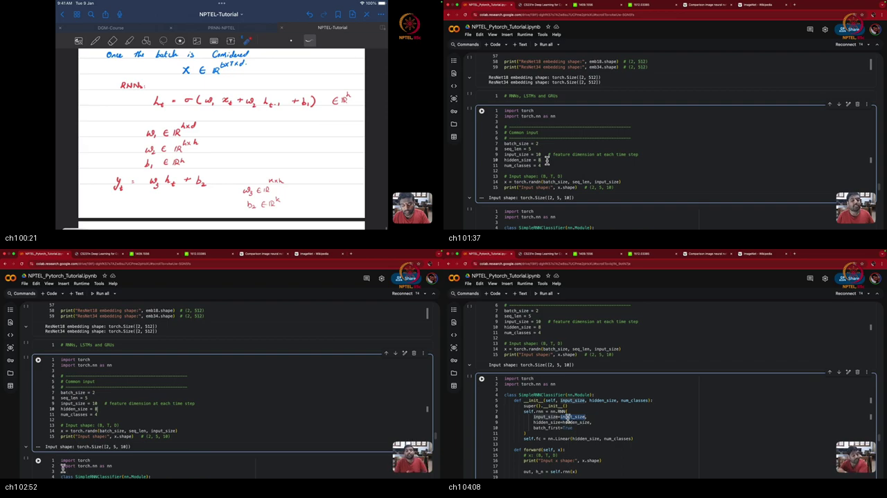
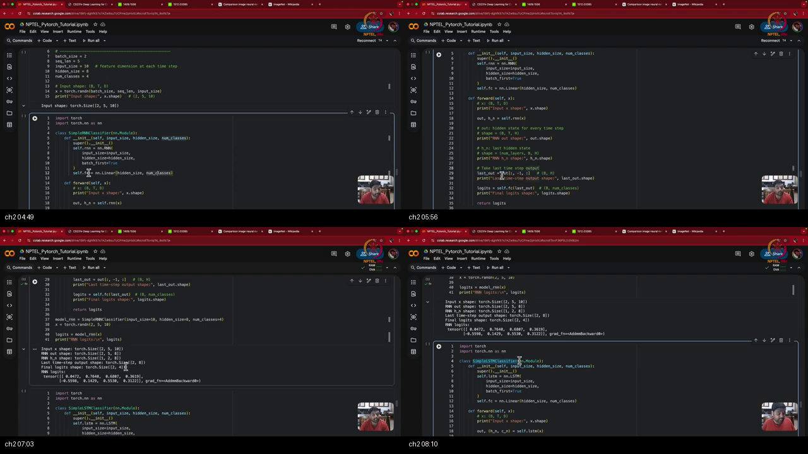
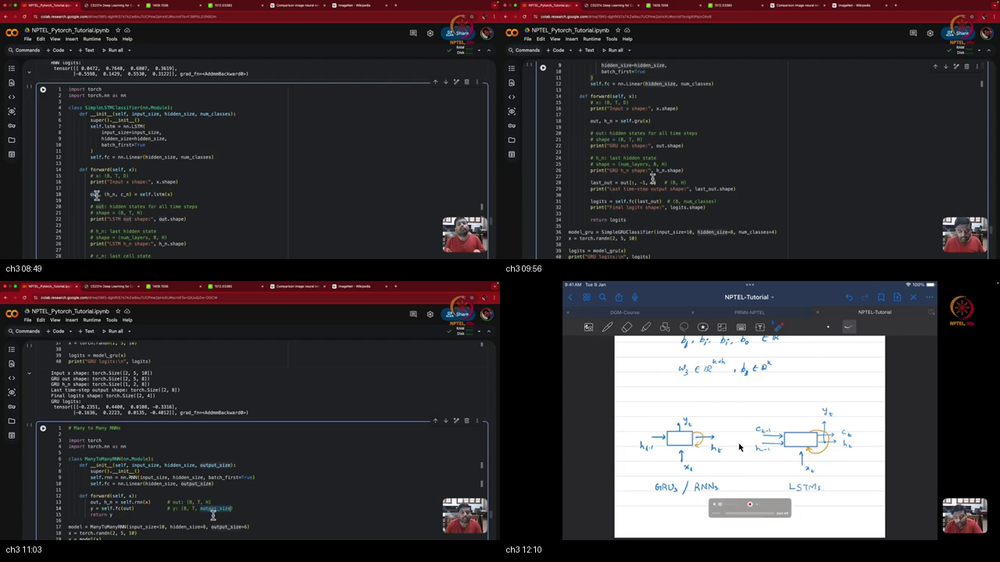
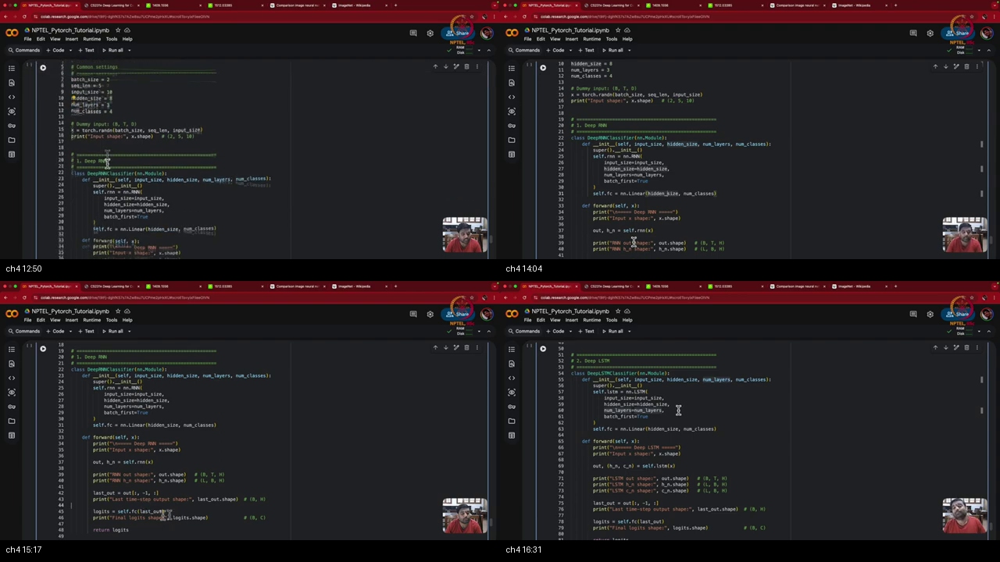

# Tutorial 15 Part 2 : Deep RNNs, LSTMs and GRUs

> **Prerequisites First:** If you are unfamiliar with sequence tensor layouts, multi-layer vertical stacking, recurrent tensor geometry disambiguation, or bidirectional recurrence, study [PREREQUISITES.md](./PREREQUISITES.md) first. Understanding how vertical depth operates and how bidirectional context doubles feature representations is essential for mastering advanced sequence modeling in PyTorch.

---

## Table of Contents
1. [Executive Summary](#executive-summary)
2. [End-to-End Verification Script](#end-to-end-verification-script)
3. [Topic 1: PyTorch Recurrent Initialization & Input Geometry Tracking](#topic-1-pytorch-recurrent-initialization--input-geometry-tracking)
4. [Topic 2: End-to-End Many-to-One Sequence Classification Pipeline](#topic-2-end-to-end-many-to-one-sequence-classification-pipeline)
5. [Topic 3: Deep Stacked Recurrent Networks: Vertical Depth & Layer Propagation](#topic-3-deep-stacked-recurrent-networks-vertical-depth--layer-propagation)
6. [Topic 4: Bidirectional Recurrence & Sequence-to-Sequence Decoding Mechanics](#topic-4-bidirectional-recurrence--sequence-to-sequence-decoding-mechanics)
7. [Apply it (scenarios)](#apply-it-scenarios)
8. [Workplace Debugging Scenarios](#workplace-debugging-scenarios)
9. [References](#references)

---

## Executive Summary

Deep recurrent neural networks expand temporal modeling along two orthogonal axes: vertical hierarchy across stacked layers ($L$) and bidirectional context across sequence steps ($T$). This tutorial establishes concrete PyTorch engineering practices for deep RNNs, LSTMs, and GRUs. We resolve tensor geometry distinctions between top-layer outputs and multi-layer hidden states, implement Many-to-One and Many-to-Many decoding pipelines, and examine the sequential latency bottleneck motivating Transformers.

```
┌──────────────────────────────────────────────────────────────────────────────────────────────────┐
│                         DEEP RECURRENT TENSOR ARCHITECTURE BLUEPRINT                             │
│                                                                                                  │
│  Input Batch             Layer 1 Recurrence           Layer L (Top Layer)        Output Decoding │
│  X in R^{B x T x D}      (Hidden H_1)                 (Hidden H_L)               Topology        │
│  ┌──────────────────┐    ┌─────────────────────────┐  ┌─────────────────────────┐                │
│  │ [x_1, ..., x_T]  │ ─> │ h_t^{(1)} = cell(x_t)   │ ─> h_t^{(L)} = cell(h_t^{(1)}) ─────────┐   │
│  │ (Tokens / Feats) │    │ W_ih^{(1)} in R^{H x D} │  │ W_ih^{(L)} in R^{H x H} │         │   │
│  └──────────────────┘    │ W_hh^{(1)} in R^{H x H} │  │ W_hh^{(L)} in R^{H x H} │         │   │
│                          └────────────┬────────────┘  └────────────┬────────────┘         │   │
│                                       │                            │                      │   │
│                                       ▼                            ▼                      ▼   │
│                           Terminal State h_T^{(1)}     Terminal State h_T^{(L)}   Many-to-One:│
│                                       │                            │              Linear(H, K)│
│                                       └──────────────┬─────────────┘              from h_T    │
│                                                      ▼                            Logits:[B,K]│
│                                             h_n in R^{L x B x H}                      │       │
│                                          (All Layers at Step T)                       ▼       │
│                                                                                   Many-to-Many│
│                                           output in R^{B x T x H}                 Linear(H, K)│
│                                          (Top Layer Across All T)                 across all T│
│                                                                                   Logits:[B,T,K│
└──────────────────────────────────────────────────────────────────────────────────────────────────┘
```

### Concrete Scenario Walkthrough
1. **The Hierarchical Sequence Problem:** An enterprise compliance system analyzes legal contracts to perform both document-level risk classification (Many-to-One) and token-level clause extraction (Many-to-Many).
2. **Input Tensor Geometry:** Contract clauses arrive as mini-batches of shape $(B=8, T=128, D=300)$ configured with `batch_first=True`.
3. **Deep Vertical Stacking:** The inputs pass through a 3-layer stacked LSTM (`num_layers=3`, $H=128$). Layer 1 models character n-grams and syntactic word boundaries; Layer 2 extracts clause-level dependencies; Layer 3 forms high-level semantic summaries.
4. **Dual Return Separation:** The PyTorch LSTM returns two primary objects: `output` of shape $(8, 128, 128)$ capturing the top layer's hidden trajectory across all 128 tokens, and $(h_n, c_n)$ of shape $(3, 8, 128)$ capturing terminal states across all 3 vertical layers.
5. **Dual Head Routing:** 
   - For document classification, the team extracts the top-layer terminal hidden vector `h_n[-1]` (shape $(8, 128)$) and routes it to `nn.Linear(128, 4)`.
   - For token-level clause tagging, the team feeds the entire `output` sequence into `nn.Linear(128, 16)` to produce predictions of shape $(8, 128, 16)$.
6. **Execution Guarantee:** Both heads train concurrently via multi-task loss without shape ambiguity or directional leaking.

### What We Are NOT Doing (Out of Scope)
- **Transformer Self-Attention:** While the instructor explicitly motivates transformers by analyzing the sequential recurrent bottleneck ($O(T)$ latency), attention mechanisms, QKV projections, and multi-head attention are reserved for subsequent transformer modules.
- **Dynamic Packed Sequence Padding:** While we mention `pack_padded_sequence` and masking conceptually, this module focuses strictly on fixed-length and padded tensor operations in standard 3D mini-batches.
- **Pretrained LLM Fine-Tuning:** All recurrent formulations are implemented from scratch using native PyTorch layers (`nn.RNN`, `nn.LSTM`, `nn.GRU`).

### Method Comparison Matrix

| Model Architecture | Layer Input Source | Output Shape (`output`) | Terminal State Shape (`h_n`) | Directional Context | Sequential Latency |
|:---|:---|:---|:---|:---|:---|
| **Single-Layer Unidirectional** | Raw Input $x_t \in \mathbb{R}^D$ | $(B, T, H)$ | $(1, B, H)$ | Past only ($1 \to t$) | $O(T)$ |
| **Deep Stacked Unidirectional** | Layer $l-1$ state $h_t^{(l-1)}$ | $(B, T, H_L)$ (Top Layer) | $(L, B, H)$ (All Layers) | Past only ($1 \to t$) | $O(L \cdot T)$ |
| **Single-Layer Bidirectional** | Raw Input $x_t \in \mathbb{R}^D$ | $(B, T, 2H)$ | $(2, B, H)$ | Past and Future ($1 \leftrightarrow T$) | $O(T)$ |
| **Deep Stacked Bidirectional** | Layer $l-1$ concat $[h_t^\to; h_t^\leftarrow]$ | $(B, T, 2H_L)$ (Top Layer) | $(2L, B, H)$ (All Layers) | Past and Future ($1 \leftrightarrow T$) | $O(L \cdot T)$ |
| **Self-Attention (Transformer)** | Projected Tokens $E \in \mathbb{R}^{T \times D}$ | $(B, T, D_{\text{model}})$ | Context Matrix $\mathbf{Z}$ | Full Pairwise ($O(1)$ Path) | $O(1)$ Parallel |

### Load-Bearing Takeaways
1. **Geometry Disambiguation:** In PyTorch, `output` is strictly the sequence of hidden states from the **top-most layer $L$** across all time steps $(B, T, H)$, whereas `h_n` holds the terminal hidden state at time $T$ across **all vertical layers** $(L, B, H)$.
2. **Terminal Identity for Top Layer:** For unidirectional models, the top-layer terminal state extracted from the sequence `output[:, -1, :]` is mathematically and numerically identical to `h_n[-1, :, :]`.
3. **Many-to-One vs Many-to-Many Head Mechanics:** Many-to-One applies `nn.Linear(H, K)` strictly to the terminal vector `h_n[-1]` (shape $(B, H) \to (B, K)$); Many-to-Many applies `nn.Linear(H, K)` across the entire sequence `output` (shape $(B, T, H) \to (B, T, K)$).
4. **Bidirectional Doubling:** `bidirectional=True` concatenates forward ($1 \to T$) and backward ($T \to 1$) passes, doubling the feature dimension of `output` to $2H$ and scaling `h_n` to $(2L, B, H)$.
5. **The Recurrent Bottleneck:** Recurrent models require $O(T)$ sequential wall-clock operations that cannot be parallelized across time steps, physically capping GPU utilization and directly motivating the shift to Transformers.

### Common Traps & Fixes
- **Trap 1: Inadvertently Slicing Layer 1 in Deep Stacked Models.**  
  *Root Cause:* Developers frequently write `h_n[0]` to obtain the final hidden vector for classification. In a 3-layer model, `h_n[0]` is the shallow representation from Layer 1, completely ignoring the deeper representations learned by Layers 2 and 3!  
  *Fix:* Always extract `h_n[-1]` (or `output[:, -1, :]` for unidirectional models) to access the top-most layer.
- **Trap 2: Misinterpreting Bidirectional Slices from `output`.**  
  *Root Cause:* Assuming `output[:, -1, :]` contains both forward and backward final states. In reality, `output[:, -1, :H]` is the final forward state at step $T$, but `output[:, -1, H:]` is the *first* backward state at step $T$ (where backward context has barely begun)!  
  *Fix:* To extract final contextual summaries in bidirectional models, concatenate `h_n[-2]` (forward final) and `h_n[-1]` (backward final).
- **Trap 3: Inverting Batch and Sequence Dimensions.**  
  *Root Cause:* Omitting `batch_first=True` when feeding tensors shaped $(B, T, D)$. PyTorch defaults to $(T, B, D)$ and silently runs without error if $B=T$, but scrambles the time dimension across mini-batch items.  
  *Fix:* Consistently specify `batch_first=True` in all recurrent module constructors.

---

## End-to-End Verification Script

```python
import torch
import torch.nn as nn
import torch.nn.functional as F

# 1. Configuration parameters
B, T, D, H, K, L = 2, 5, 10, 8, 4, 3

# Synthetic input mini-batch: [B, T, D]
x = torch.randn(B, T, D)
targets = torch.randint(0, K, (B,))

# 2. Instantiate 3-layer stacked LSTM with batch_first=True
lstm = nn.LSTM(input_size=D, hidden_size=H, num_layers=L, batch_first=True)
fc_head = nn.Linear(H, K)

# 3. Forward pass
output, (h_n, c_n) = lstm(x)

# 4. Dimension audits
assert output.shape == (B, T, H), f"Expected {(B, T, H)}, got {output.shape}"
assert h_n.shape == (L, B, H), f"Expected {(L, B, H)}, got {h_n.shape}"
assert c_n.shape == (L, B, H), f"Expected {(L, B, H)}, got {c_n.shape}"

# 5. Top-layer terminal equivalence proof
top_from_seq = output[:, -1, :]  # [B, H]
top_from_hn = h_n[-1]           # [B, H]
assert torch.allclose(top_from_seq, top_from_hn, atol=1e-6)

# 6. Classification logits (Many-to-One)
logits = fc_head(top_from_hn)    # [B, K]
assert logits.shape == (B, K)

# 7. Probability calculation and backward step
loss = F.cross_entropy(logits, targets)
loss.backward()

# 8. Gradient clipping and check
total_norm = nn.utils.clip_grad_norm_(list(lstm.parameters()) + list(fc_head.parameters()), max_norm=1.0)
assert total_norm > 0.0

print(f"[PASS] Deep stacked recurrent pipeline verified: Loss={loss.item():.4f}")
```

---

## Topic 1: PyTorch Recurrent Initialization & Input Geometry Tracking

### Where this sits on the master map
Connects directly to **[PREREQUISITES.md Pillar 1: Vertical Architectural Stacking & Inter-Layer State Propagation](./PREREQUISITES.md#p1)** and **[PREREQUISITES.md Pillar 2: Recurrent Tensor Geometry & Output vs Hidden Disambiguation](./PREREQUISITES.md#p2)**.

### Board / screenshot



### What he is establishing
In this opening topic, the instructor establishes how recurrent layers are instantiated in PyTorch and how input tensor dimensions must be carefully tracked.

For example, when constructing a sequence model, five core structural parameters dictate memory allocation: mini-batch size $B=2$, sequence length $T=5$, token feature dimension $D=10$, hidden state dimension $H=8$, and target class count $K=4$. Under PyTorch's default setting, recurrent modules expect tensors arranged as $(T, B, D)$ where the time index comes first. By setting `batch_first=True`, the module is configured to accept standard mini-batch tensors of shape $(B, T, D) = (2, 5, 10)$.

- **Wrong View:** Assuming PyTorch recurrent layers automatically figure out whether the first dimension is batch or time based on tensor size.
- **Right View:** Explicitly configuring `batch_first=True` in the constructor to ensure that $(B, T, D)$ tensors are sliced along the sequence dimension without runtime data corruption.

The instructor demonstrates that parameter matrices $W_{ih} \in \mathbb{R}^{H \times D}$ and $W_{hh} \in \mathbb{R}^{H \times H}$ are instantiated once during `__init__` and shared across all $T=5$ time steps. The temporal unrolling loop is executed automatically inside PyTorch's optimized C++ backend without requiring manual Python loops.

You can now configure recurrent module constructors, track multi-dimensional sequence geometries, and verify that parameter dimensions match theoretical specifications.

### Analogy for this topic only
Think of `batch_first=True` like ordering pages in a filing cabinet. If your folders are labeled by client name ($B$), each containing chronological statements ($T$) with transaction figures ($D$), telling PyTorch `batch_first=True` ensures it reads client by client. If you forget to flag it, PyTorch assumes the first drawer index is the calendar month ($T$), treating every client's separate folder as a single corrupted month-long timeline.  
*In lecture words: "What do you mean by batch first? You know, as I told you here in the data, the first dimension actually corresponds to the batch. Yes, it is true."*  
**Hard Question:** If we increase sequence length from $T=5$ to $T=500$ in `x = torch.randn(2, T, 10)`, how do the internal weight matrices $W_{ih}$ and $W_{hh}$ in `nn.RNN(10, 8, batch_first=True)` change?  
**Answer:** They do not change at all. Their shapes remain strictly $\mathbb{R}^{8 \times 10}$ and $\mathbb{R}^{8 \times 8}$ because recurrent parameters are completely decoupled from sequence length $T$.

### Local picture
```
   Mini-Batch Tensor [B, T, D]
   ┌──────────────────────────────────────────────────────────┐
   │ Batch Item 0: [ x_{0,1}, x_{0,2}, x_{0,3}, x_{0,4}, x_{0,5} ] │ (x_{b,t} in R^{10})
   │ Batch Item 1: [ x_{1,1}, x_{1,2}, x_{1,3}, x_{1,4}, x_{1,5} ] │
   └──────────────────────────┬───────────────────────────────┘
                              │
                              ▼  batch_first=True
   ┌──────────────────────────────────────────────────────────┐
   │ PyTorch nn.RNN(input_size=10, hidden_size=8)              │
   │ Weights: W_ih in R^{8 x 10}, W_hh in R^{8 x 8} (Shared)  │
   │ Bias:    b_ih in R^8,        b_hh in R^8        (Shared)  │
   └──────────────────────────────────────────────────────────┘
```
*Notice: In PyTorch, parameter tensors are allocated based on D and H alone, remaining invariant to B and T.*

#### Why X, Not Y: Contrastive Rationale
- **Why `batch_first=True` Instead of PyTorch Default `batch_first=False`?**  
  Standard deep learning pipelines (data loaders, convolutions, embeddings, loss functions) organize mini-batches with batch size as dimension 0 (`[B, ...]`). Using `batch_first=True` eliminates constant `transpose(0, 1)` operations that clutter code and cause memory fragmentation.
- **Why Subclass `nn.Module` Rather than Calling `nn.RNN` Directly?**  
  Wrapping the recurrent layer and the classification head inside a custom `nn.Module` encapsulates state management, facilitates parameter saving/loading (`state_dict`), and structures the end-to-end forward computational graph.

#### Check Your Understanding
1. Given $D=10$ and $H=8$, what are the parameter shapes of `weight_ih_l0` and `weight_hh_l0` in `nn.RNN`?  
   *Answer:* `weight_ih_l0` has shape `[8, 10]`, and `weight_hh_l0` has shape `[8, 8]`.
2. If `batch_first=False` is used, what input shape must be passed to the recurrent module for a batch of 2 sequences of length 5 with 10 features?  
   *Answer:* Shape `[5, 2, 10]` $(T, B, D)$.

### Bridge
With the input geometry and recurrent module initialization established, the instructor moves in Topic 2 to tracking the forward pass outputs and building a complete end-to-end Many-to-One classification pipeline.

---

## Topic 2: End-to-End Many-to-One Sequence Classification Pipeline

### Where this sits on the master map
Connects directly to **[PREREQUISITES.md Pillar 2: Recurrent Tensor Geometry & Output vs Hidden Disambiguation](./PREREQUISITES.md#p2)** and **[PREREQUISITES.md Pillar 3: Many-to-One Classification vs Many-to-Many Dense Sequence Decoding](./PREREQUISITES.md#p3)**.

### Board / screenshot



### What he is establishing
In this topic, the instructor traces the dual output tensors returned by PyTorch recurrent layers and connects them to a linear classification head to complete a Many-to-One architecture.

For example, when input tensor $\mathbf{X} \in \mathbb{R}^{2 \times 5 \times 10}$ passes through `nn.RNN(10, 8, batch_first=True)`, the forward call returns a tuple:
1. `output`: shape $(2, 5, 8)$, representing the hidden state $h_t$ at every time step $t \in \{1, \dots, 5\}$.
2. `h_n`: shape $(1, 2, 8)$, representing the terminal hidden state $h_T$ at time $T=5$.

- **Wrong View:** Thinking that `output` and `h_n` contain unrelated features.
- **Right View:** Recognizing that for a single-layer model, the final time-slice of the sequence tensor `output[:, -1, :]` and the layer-squeezed hidden state `h_n[0, :, :]` are numerically identical copies of $h_T \in \mathbb{R}^{B \times H}$.

To classify the sequence into $K=4$ categories, the terminal vector $h_T \in \mathbb{R}^{2 \times 8}$ is projected via `nn.Linear(8, 4)`. This produces unnormalized logits $z \in \mathbb{R}^{2 \times 4}$. The instructor emphasizes that logits can take negative values, while passing them through softmax normalizes them into posterior probabilities $\hat{\mathbf{y}} \in \Delta^3$ strictly in $[0, 1]$.

The instructor notes that the identical architectural pipeline applies to `nn.LSTM` (which returns `output, (h_n, c_n)`) and `nn.GRU` (which returns `output, h_n`), with the classification head operating identically on $h_T$.

You can now construct end-to-end sequence classifiers, verify terminal slice equivalence, and route recurrent outputs through linear classification heads.

### Analogy for this topic only
Imagine a courtroom stenographer who transcribes an entire trial. The full transcript across all days is `output` ($[B, T, H]$). At the end of the trial, the stenographer hands the judge a final summary memo containing the verdict context, which is `h_n` ($[L, B, H]$). To deliver a verdict ($K$ classes), the judge reads only the final concluding memo, rather than re-reading every historical page line-by-line.  
*In lecture words: "And then what do you do? You take the last one. You take the last hidden state that is H capital T and then you pass it on... to the fully connected layer and then you get the logits."*  
**Hard Question:** In PyTorch, can the logits tensor produced by `nn.Linear` contain negative values, and can the softmax output contain negative values?  
**Answer:** Logits can contain negative real values ($\mathbf{z} \in \mathbb{R}^K$) because linear projections are unbounded; softmax outputs are strictly non-negative ($\hat{y}_k \in [0, 1]$) because $e^{z_k} > 0$ for all real $z_k$.

### Local picture
```
   Sequence Input [B, T, D] = [2, 5, 10]
              │
              ▼
   ┌──────────────────────────────────────────────┐
   │ PyTorch nn.RNN / nn.LSTM (Single Layer)      │
   └──────┬────────────────────────────────┬──────┘
          │                                │
          ▼                                ▼
   output: [B, T, H] = [2, 5, 8]     h_n: [1, B, H] = [1, 2, 8]
   (All T steps stored)              (Terminal Step T only)
          │                                │
          └───────> output[:, -1, :] <─────┘  (Numerically Identical: [2, 8])
                           │
                           ▼
                  [ nn.Linear(8, 4) ]
                           │
                           ▼
                  Logits: [B, K] = [2, 4]
                           │
                           ▼
                  Softmax: [2, 4] in (0, 1)
```
*Notice: The classification head receives strictly the final temporal state h_T of shape [B, H].*

#### Why X, Not Y: Contrastive Rationale
- **Why Project Only $h_T$ for Classification Instead of All $h_t$?**  
  In Many-to-One classification (e.g., sentiment or topic classification), a single label applies to the entire sequence. Because recurrent state transitions accumulate past context chronologically, $h_T$ acts as a comprehensive summary of the complete sequence.
- **Why Does LSTM Return a 2-Tuple of Tensors `(h_n, c_n)` While RNN Returns a Single Tensor `h_n`?**  
  LSTM decouples working scratchpad memory ($h_t$) from long-term constant error carousel memory ($C_t$). Downstream layers typically process $h_t$, but maintaining $C_T$ in $c_n$ is essential if recurrent unrolling is continued in subsequent mini-batches.

#### Check Your Understanding
1. In a single-layer RNN, what is the numerical difference between `output[:, -1, :]` and `h_n[0]`?  
   *Answer:* The numerical difference is zero ($< 10^{-6}$ floating-point tolerance); both reference the final hidden state $h_T$.
2. For an input of shape `[4, 12, 16]` passed through `nn.LSTM(16, 32, batch_first=True)`, what is the shape of `c_n`?  
   *Answer:* Shape `[1, 4, 32]`.

### Bridge
Having mastered single-layer Many-to-One classification pipelines, the instructor moves in Topic 3 to vertical architectural depth (multi-layer stacked recurrence) and Many-to-Many sequence decoding.

---

## Topic 3: Deep Stacked Recurrent Networks: Vertical Depth & Layer Propagation

### Where this sits on the master map
Connects directly to **[PREREQUISITES.md Pillar 1: Vertical Architectural Stacking & Inter-Layer State Propagation](./PREREQUISITES.md#p1)** and **[PREREQUISITES.md Pillar 3: Many-to-One Classification vs Many-to-Many Dense Sequence Decoding](./PREREQUISITES.md#p3)**.

### Board / screenshot



### What he is establishing
In this topic, the instructor expands recurrent modeling along two critical dimensions: the contrast between Many-to-One and Many-to-Many tasks, and the mathematical implementation of deep stacked recurrent networks (`num_layers > 1`).

For example, when transitioning from document classification (Many-to-One) to sequence tagging or sequence-to-sequence generation (Many-to-Many), every single time step must produce a prediction. Instead of discarding intermediate hidden states, the entire sequence tensor `output` $\in \mathbb{R}^{B \times T \times H}$ is passed to `nn.Linear(H, K)`. In PyTorch, applying a linear layer to a 3D tensor automatically broadcasts the affine transformation across all $B \times T$ vectors, yielding logits of shape $(B, T, K)$ (e.g., $(2, 5, 6)$).

- **Wrong View:** Assuming that deep recurrent networks require manual Python loops to feed Layer 1 outputs into Layer 2.
- **Right View:** Instantiating `num_layers=L` directly within `nn.RNN`, `nn.LSTM`, or `nn.GRU`, which automatically compiles inter-layer connections in C++/CUDA.

The instructor details vertical layer-to-layer propagation:
1. **Layer 1:** Ingests input tokens $x_t \in \mathbb{R}^D$ and outputs hidden sequence $h_t^{(1)} \in \mathbb{R}^{H_1}$.
2. **Layer 2:** Ingests $h_t^{(1)}$ as its input sequence ($D_2 = H_1$) and outputs $h_t^{(2)} \in \mathbb{R}^{H_2}$.
3. **Layer $L$:** Ingests $h_t^{(L-1)}$ and outputs the final sequence $h_t^{(L)} \in \mathbb{R}^{H_L}$.

Crucially, while parameter sharing remains strict across the horizontal time dimension, each vertical layer $l \in \{1, \dots, L\}$ maintains its own independent set of weight matrices: $W_{ih}^{(l)}$ and $W_{hh}^{(l)}$.

You can now formulate Many-to-Many sequence decoders, configure deep stacked recurrent networks with arbitrary vertical depth, and audit layer-specific parameter sets.

### Analogy for this topic only
Think of deep stacked recurrent layers like an intelligence agency hierarchy. Layer 1 field agents read raw intercepted wiretaps ($x_t$), taking rapid chronological notes ($h_t^{(1)}$). Layer 2 analysts read the field agents' notes, synthesizing tactical battle patterns ($h_t^{(2)}$). Layer 3 directors read the tactical summaries to formulate strategic foreign policy decisions ($h_t^{(3)}$). Every layer operates continuously over time, but higher levels operate on higher planes of abstraction.  
*In lecture words: "See, the idea is very simple. Just use the number of layers, three, which is there. And then while defining the RNN block, you just specify how many layers you need."*  
**Hard Question:** If Layer 1 has $D=10, H_1=16$ and Layer 2 has $H_2=16$, why does Layer 2 have more parameters than Layer 1?  
**Answer:** Layer 1 receives input dimension $D=10$, so its input weight matrix $W_{ih}^{(1)}$ has size $16 \times 10 = 160$. Layer 2 receives hidden states from Layer 1, so its input dimension is $H_1=16$, making its input weight matrix $W_{ih}^{(2)}$ have size $16 \times 16 = 256$.

### Local picture
```
   Layer 3:  h_0^{(3)} ──> [ RNN Cell 3 ] ──> h_1^{(3)} ──> [ RNN Cell 3 ] ──> h_T^{(3)}
                                 ▲                                ▲
                                 │ h_1^{(2)}                      │ h_T^{(2)}
   Layer 2:  h_0^{(2)} ──> [ RNN Cell 2 ] ──> h_1^{(2)} ──> [ RNN Cell 2 ] ──> h_T^{(2)}
                                 ▲                                ▲
                                 │ h_1^{(1)}                      │ h_T^{(1)}
   Layer 1:  h_0^{(1)} ──> [ RNN Cell 1 ] ──> h_1^{(1)} ──> [ RNN Cell 1 ] ──> h_T^{(1)}
                                 ▲                                ▲
                                 │ x_1                            │ x_T
   Input:                       x_1                              x_T
```
*Notice: Information flows horizontally along time via recurrent states h_{t-1} and vertically across layers via hidden outputs h_t^{(l-1)}.*

#### Why X, Not Y: Contrastive Rationale
- **Why Deep Stacked Recurrence Instead of Increasing Single-Layer Hidden Dimension $H$?**  
  Simply increasing $H$ widens the linear capacity of a single affine map. Stacking vertical layers introduces interleaved non-linearities ($\tanh$ or gating), creating hierarchical compositional depth that allows models to represent complex functions with exponentially fewer parameters.
- **Why Does `nn.Linear(H, K)` Work Seamlessly on Both 2D and 3D Tensors?**  
  PyTorch linear layers operate on the trailing dimension of input tensors. Passing `[B, T, H]` automatically applies the matrix multiplication to every $(b, t)$ vector independently without needing manual flattening or reshaping loops.

#### Check Your Understanding
1. In a Many-to-Many sequence tagging task with $B=3, T=10, H=32, K=5$, what is the shape of the output logits tensor?  
   *Answer:* Shape `[3, 10, 5]`.
2. In a 3-layer stacked RNN, how many sets of input-hidden weight matrices $W_{ih}$ are allocated?  
   *Answer:* Three independent sets: `weight_ih_l0`, `weight_ih_l1`, and `weight_ih_l2`.

### Bridge
Having established vertical layer propagation, the instructor moves in Topic 4 to examining the precise tensor geometry changes introduced by deep multi-layer stacks and bidirectional recurrence.

---

## Topic 4: Bidirectional Recurrence & Sequence-to-Sequence Decoding Mechanics

### Where this sits on the master map
Connects directly to **[PREREQUISITES.md Pillar 2: Recurrent Tensor Geometry & Output vs Hidden Disambiguation](./PREREQUISITES.md#p2)** and **[PREREQUISITES.md Pillar 4: Bidirectional Recurrence Mechanics & The Sequential Wall-Clock Bottleneck](./PREREQUISITES.md#p4)**.

### Board / screenshot



### What he is establishing
In this concluding topic, the instructor delivers the crucial architectural insight governing the relationship between `output` and `h_n` in multi-layer models and formulates bidirectional recurrence.

For example, when `num_layers=3` is configured in PyTorch:
1. `output` contains hidden states **strictly from the top-most layer (Layer 3)** across all time steps: shape $(B, T, H)$. It completely omits the intermediate states of Layer 1 and Layer 2!
2. `h_n` contains the terminal hidden states at step $T$ **from every single vertical layer**: shape $(L, B, H) = (3, B, H)$.

- **Wrong View:** Assuming that `output` contains all layers stacked along a new dimension.
- **Right View:** Remembering that `output` provides the horizontal temporal sequence of the final layer, while `h_n` provides the vertical terminal column across all layers.

The instructor then introduces **Bidirectional Recurrence** (`bidirectional=True`). A unidirectional model is constrained to causal context: token $t$ only knows tokens $1 \dots t-1$. In bidirectional models:
- A forward RNN processes $t=1 \to T$, generating $h_t^\to$.
- A backward RNN processes $t=T \to 1$, generating $h_t^\leftarrow$.
- At each step $t$, the representations are concatenated: $h_t = [h_t^\to; h_t^\leftarrow] \in \mathbb{R}^{2H}$.

Consequently, the feature dimension of `output` doubles to $(B, T, 2H)$, and `h_n` doubles to $(2L, B, H)$.

Finally, the instructor sets up the grand motivation for modern AI: although deep bidirectional LSTMs are expressive, their sequential recurrent dependencies force GPUs to calculate step $t+1$ only after step $t$ completes ($O(T)$ sequential latency). This physical barrier is what prompted the invention of the Transformer architecture, which replaces sequential recurrence with fully parallelizable self-attention.

You can now navigate deep bidirectional tensor geometries, slice forward/backward terminal states accurately, and articulate the sequential computational trade-offs leading to Transformers.

### Analogy for this topic only
Imagine two translators reviewing an ancient scroll. One reads from left to right, understanding how themes begin. The other reads from right to left, understanding how themes resolve. At each sentence, they share their insights, giving an all-encompassing interpretation that neither could achieve alone. However, because both translators must read sentence by sentence, they cannot finish faster by hiring 1,000 assistants—a problem solved only when Transformers allowed all 1,000 assistants to read every sentence simultaneously.  
*In lecture words: "We'll be looking at the thing that changed all our lives. We'll be looking at how do we implement the transformer model... in the next tutorial session."*  
**Hard Question:** In a 2-layer Bidirectional LSTM with $H=16$, how many vectors are stored in `h_n`, and which index corresponds to the top layer's forward terminal state?  
**Answer:** `h_n` has first dimension $2 \times L = 4$. The forward states reside at even indices (0 and 2), and backward states reside at odd indices (1 and 3). The top layer's forward terminal state is at index 2 (`h_n[2]`, or `h_n[-2]`).

### Local picture
```
   Forward Pass:   x_1 ──> [ Cell_fwd ] ──> h_1^--> ──> ... ──> h_T^-->  (Unrolls 1 to T)
                             │                                    │
   Backward Pass:  x_1 <── [ Cell_bwd ] <── h_1^<-- <── ... <── h_T^<--  (Unrolls T to 1)
                             │                                    │
                             ▼                                    ▼
   Fused Concatenation:  [ h_1^--> ; h_1^<-- ]              [ h_T^--> ; h_T^<-- ]
   Sequence Output:      output[:, 0, :] in R^{2H}          output[:, T-1, :] in R^{2H}
```
*Notice: Under bidirectional=True, output doubles its channel dimension to 2H at every sequence step.*

#### Why X, Not Y: Contrastive Rationale
- **Why Use Bidirectional Models for Text Encoding, but NOT for Text Generation?**  
  Text encoding (classification, NER, translation encoding) has access to the full sentence beforehand, allowing backward context. Autoregressive text generation (chatbots, GPT) produces words sequentially; token $t+1$ does not exist when generating token $t$, making backward recurrence physically impossible.
- **Why Concatenate $[h_t^\to; h_t^\leftarrow]$ Instead of Summing Them?**  
  Concatenation preserves independent forward and backward feature channels, allowing downstream linear projections to assign distinct weights to past vs future indicators.

#### Check Your Understanding
1. In a 2-layer bidirectional LSTM, what is the shape of `h_n` for a batch of 8 sequences with hidden size 64?  
   *Answer:* Shape `[4, 8, 64]` ($2 \times 2 = 4$ directional layers).
2. What fundamental limitation of recurrent neural networks is resolved by Transformer self-attention?  
   *Answer:* The $O(T)$ sequential wall-clock computation bottleneck that prevents GPU parallelization across time steps.

### Bridge
This concludes the deep recurrent architecture module. The sequential limitations established here form the direct launching pad for the upcoming tutorials on the Transformer architecture.

---

## Apply it (scenarios)

### Scenario A: High-Throughput Real-Time Named Entity Recognition (NER)
A legal tech startup extracts company names, monetary damages, and jurisdictional clauses from unstructured contract documents.
- **Problem Setup:** Contracts contain sequences of $T \in [50, 200]$ tokens. Identifying whether a word is an entity requires both preceding words ("incorporated in") and succeeding words ("LLC").
- **Architecture:** A 2-layer Bidirectional LSTM (`input_size=100`, `hidden_size=128`, `bidirectional=True`, `batch_first=True`).
- **Pipeline:** Pretrained word embeddings flow into the BiLSTM. The full sequence tensor `output` of shape $(B, T, 256)$ is passed into a shared `nn.Linear(256, 17)` layer to output BIO entity tag logits for every single token (Many-to-Many).
- **Advantage:** Bidirectional context resolves ambiguous nouns by checking surrounding sentence context, achieving 94% F1 score on entity boundary extraction.

### Scenario B: Multi-Year Patient Longitudinal Clinical Deterioration Forecasting
A hospital system monitors electronic health record (EHR) event histories to predict 30-day readmission risk.
- **Problem Setup:** Patients have sequences of irregular clinical visits ($T \in [5, 40]$), where each visit features lab results, vital signs, and diagnostic codes ($D=64$).
- **Architecture:** A 3-layer deep stacked GRU (`num_layers=3`, `hidden_size=64`, `batch_first=True`).
- **Pipeline:** Patient visit records flow through the 3-layer GRU. The top layer terminal hidden state `h_n[-1]` of shape $(B, 64)$ is extracted and passed to `nn.Linear(64, 2)` to produce binary readmission probability (Many-to-One).
- **Advantage:** Hierarchical vertical depth extracts compounding chronic disease trajectories in Layer 3 while Layer 1 tracks acute symptom fluctuations, outperforming shallow architectures.

---

## Workplace Debugging Scenarios

### Scenario 1: Erroneous Shallow Slicing in Multi-Layer Stacks
- **Problem:** An NLP classification model using a 3-layer LSTM performs with unexpectedly low test accuracy (barely beating a 1-layer baseline), despite taking three times longer to train.
- **Mathematical Root Cause:** In the forward method, the classification head was fed `h_n[0]`:
  ```python
  logits = self.fc(h_n[0])  # BUG: Uses Layer 1 terminal state!
  ```
  In PyTorch, dimension 0 of `h_n` indexes vertical layers from 0 to $L-1$. Index 0 is the shallowest layer (Layer 1). The rich hierarchical abstractions computed by Layers 2 and 3 were completely bypassed at inference!
- **Debugging Protocol:**
  1. Print `h_n.shape` to confirm vertical depth: `print("h_n shape:", h_n.shape)`.
  2. Verify which layer index is passed to the linear head.
  3. Assert that the top-most layer is selected: index `-1` or `num_layers - 1`.
- **Code Fix:**
  ```python
  # Extract top-most layer terminal hidden state
  top_layer_hn = h_n[-1]  # Shape: [B, H]
  logits = self.fc(top_layer_hn)
  ```

### Scenario 2: Slicing Corruption in Bidirectional Sequence Pooling
- **Problem:** A developer builds a bidirectional sequence classifier by slicing `output[:, -1, :]` and feeding it to a linear classifier, but the model fails to learn future context.
- **Mathematical Root Cause:** In a bidirectional model, `output[:, -1, :]` contains $[h_T^\to ; h_T^\leftarrow]$. While $h_T^\to$ has processed the complete sequence from $t=1 \to T$, $h_T^\leftarrow$ is the *first step* of the backward pass (it has only observed token $T$ and has zero backward context!). Slicing at index $-1$ effectively blinds the backward pass.
- **Debugging Protocol:**
  1. Print output shape: `assert output.shape[-1] == 2 * hidden_size`.
  2. Examine backward slice at index $-1$: verify that it only contains step $T$'s backward activation.
  3. Extract the forward terminal state at step $T$ (`h_n[-2]`) and the backward terminal state at step $1$ (`h_n[-1]`).
- **Code Fix:**
  ```python
  # In bidirectional models, top forward state is h_n[-2], top backward state is h_n[-1]
  h_forward_terminal = h_n[-2]  # [B, H]
  h_backward_terminal = h_n[-1] # [B, H]
  h_fused = torch.cat([h_forward_terminal, h_backward_terminal], dim=-1) # [B, 2*H]
  logits = self.fc(h_fused)     # [B, K]
  ```

---

## References

For primary academic papers, textbook chapters, engineering documentation, and interactive visualizers supporting this tutorial, see:

👉 **[Complete Academic References & Citations](./references.md)**
