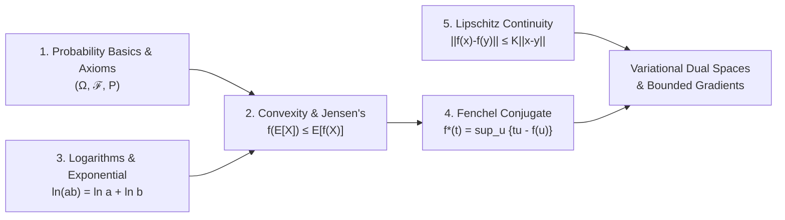
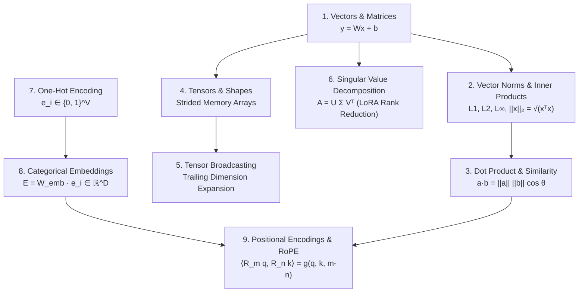
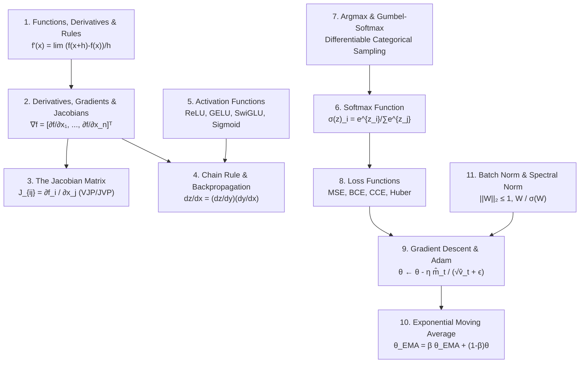
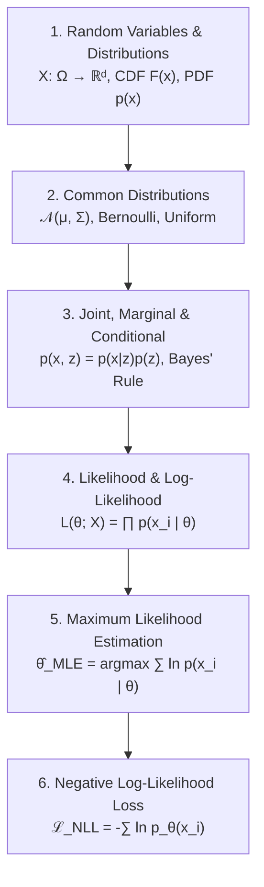
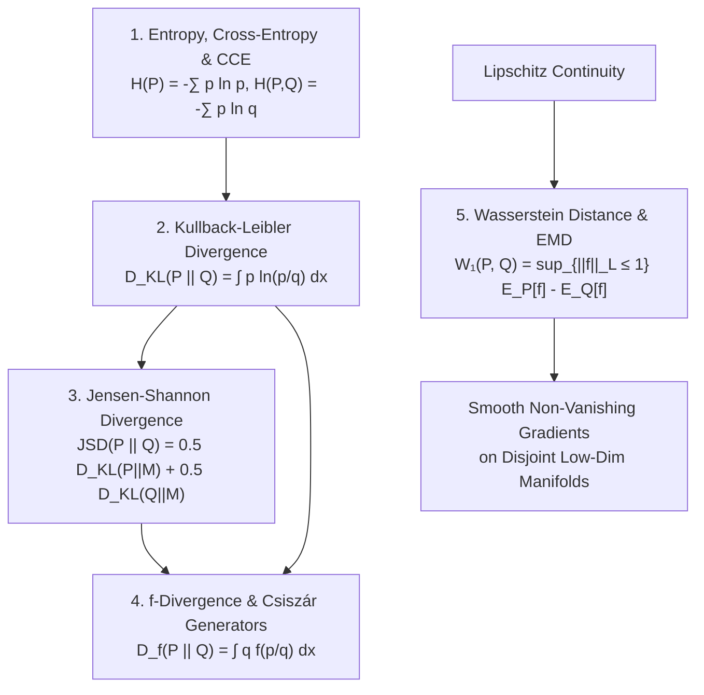
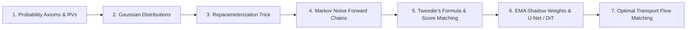
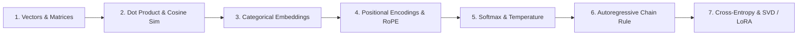
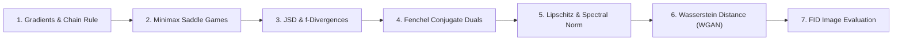

# 🌌 The Grand Unified Concept Map & Mathematical Dependency Graph

## From Axiomatic Primitives to Modern Generative AI Architectures

> `🏷️ Document Type:` Master Concept Roadmap & Dependency Matrix
> `🎯 Purpose:` Connect all 46 mathematical foundation guides in `MathsTerms/` into an unbroken logical lineage from foundational math to state-of-the-art Generative AI (Diffusion Models, Autoregressive LLMs, VAEs, GANs, Flow Matching).
> `📐 Pedagogical Standard:` 5-Point Pedagogical Bridge (ELI5 $\iff$ Plain English $\iff$ Micro-Numbers $\iff$ Formal Proofs $\iff$ PyTorch Code)

---

## 📌 Table of Contents

1. [🧭 Master Architecture & Knowledge Topology](#1--master-architecture--knowledge-topology)
2. [🗺️ The Global End-to-End Dependency Graph (Mermaid)](#2--the-global-end-to-end-dependency-graph-mermaid)
3. [⚡ The 6 Thematic Mathematical Sub-Clusters](#3--the-6-thematic-mathematical-sub-clusters)
   - [Cluster 1: Primal Mathematical Primitives & Analysis](#cluster-1-primal-mathematical-primitives--analysis)
   - [Cluster 2: Linear Algebra, Geometry, Tensors & Embeddings](#cluster-2-linear-algebra-geometry-tensors--embeddings)
   - [Cluster 3: Multivariate Calculus, Automatic Differentiation & Optimization](#cluster-3-multivariate-calculus-automatic-differentiation--optimization)
   - [Cluster 4: Probability Theory, Random Variables & Statistical Estimation](#cluster-4-probability-theory-random-variables--statistical-estimation)
   - [Cluster 5: Information Theory, Divergence Families & Optimal Transport](#cluster-5-information-theory-divergence-families--optimal-transport)
   - [Cluster 6: Deep Architectures, Variational & Adversarial Generative Models](#cluster-6-deep-architectures-variational--adversarial-generative-models)
4. [🌉 Cross-Cluster Bridges & "Aha!" Unification Principles](#4--cross-cluster-bridges--aha-unification-principles)
5. [🚀 4 Specialized "Zero-to-Hero" Learning Pathways](#5--4-specialized-zero-to-hero-learning-pathways)
   - [Track 1: The Path to Diffusion Models & Flow Matching](#track-1-the-path-to-diffusion-models--flow-matching)
   - [Track 2: The Path to LLMs, Transformers & Autoregressive AI](#track-2-the-path-to-llms-transformers--autoregressive-ai)
   - [Track 3: The Path to Variational Autoencoders (VAEs) & Latent Diffusion](#track-3-the-path-to-variational-autoencoders-vaes--latent-diffusion)
   - [Track 4: The Path to GANs, Optimal Transport & WGAN-GP](#track-4-the-path-to-gans-optimal-transport--wgan-gp)
6. [📚 Complete 46-Guide Master Rosetta Cross-Reference Table](#6--complete-46-guide-master-rosetta-cross-reference-table)

---

## 1. 🧭 Master Architecture & Knowledge Topology

Every algorithm in modern Generative AI is built upon a layered stack of mathematical truths. No concept exists in isolation:

```
========================================================================================================================
                                     THE 6-TIER FOUNDATIONAL TO GENERATIVE AI KNOWLEDGE TOPOLOGY
========================================================================================================================

  [TIER 1: PRIMAL AXIOMS & ANALYSIS]
  Kolmogorov Axioms ──► Convexity & Jensen's ──► Lipschitz Bounds ──► Fenchel Duality ──► Log/Exp Arithmetic
            │                                             │                         │
            ▼                                             ▼                         ▼
  [TIER 2: LINEAR ALGEBRA & SPACES]             [TIER 3: MULTIVARIATE CALCULUS & OPTIMIZATION]
  • Vectors, Matrices & Spans                   • Functions, Derivatives & Calculus Rules
  • Vector Norms (L1, L2, L∞) & Inner Products  • Gradients, Directional Derivatives & Jacobians
  • Dot Product & Cosine Similarity             • Chain Rule & Reverse-Mode Backpropagation (DAGs)
  • Tensors, Shapes & Stride Layouts            • Activation Functions (ReLU, GELU, SwiGLU)
  • Tensor Broadcasting Arithmetic              • Softmax (Logit Squashing) & Argmax / Gumbel-Softmax
  • Singular Value Decomposition (SVD / LoRA)   • Loss Functions (MSE, BCE, CCE, Huber, Hinge)
  • One-Hot, Categorical & Position (RoPE)      • Gradient Descent, Momentum & Adam Optimizers
            │                                   • Exponential Moving Average (EMA Shadow Weights)
            │                                   • Batch Normalization & Spectral Normalization (1-Lipschitz)
            └───────────────────────────┬───────────────────────────────────────────┘
                                        ▼
  [TIER 4: PROBABILITY THEORY & STATISTICAL ESTIMATION]
  • Random Variables (Discrete PMF vs Continuous PDF) & LOTUS Expectations
  • Common Distributions: Gaussian / Multivariate Normal, Bernoulli, Categorical, Uniform
  • Joint, Marginal & Conditional Distributions (Bayes' Theorem & Chain Rule)
  • Likelihood & Log-Likelihood Formulations
  • Maximum Likelihood Estimation (MLE) & Score Equations
  • Negative Log-Likelihood (NLL) Loss as Empirical Risk Minimization
                                        │
                                        ▼
  [TIER 5: INFORMATION THEORY, DIVERGENCES & OPTIMAL TRANSPORT]
  • Shannon Entropy, Surprisal & Cross-Entropy (CCE)
  • Kullback-Leibler (KL) Divergence (Forward / Mode-Covering vs Reverse / Mode-Dropping)
  • Jensen-Shannon Divergence (JSD) & Symmetrical Bounded Divergences
  • f-Divergence Family (Csiszár Generators, Variational Duals)
  • Wasserstein-1 Distance & Earth Mover's Distance (EMD, Kantorovich-Rubinstein Dual)
                                        │
                                        ▼
  [TIER 6: DEEP ARCHITECTURES, VARIATIONAL & ADVERSARIAL GENERATIVE MODELS]
  • Convolutional Networks, Transposed Convolutions & DCGAN Generators
  • Recurrent Neural Networks (RNN, LSTM, GRU) & Backpropagation Through Time (BPTT)
  • Autoregressive Models, Causal Masking & KV-Cache Generation (LLMs)
  • Autoencoders, Manifold Hypothesis & Latent Bottlenecks
  • Latent Variable Models (LVMs) & Intractable Posterior Marginals
  • Expectation-Maximization (EM) Algorithm for GMMs
  • Evidence Lower Bound (ELBO) & Variational Inference (VI)
  • Reparameterization Trick (Gaussian Pathwise Differentiable Sampling)
  • Minimax Games & GANs (Vanilla, Non-Saturating, f-GAN, WGAN-GP)
  • Fréchet Inception Distance (FID / 2-Wasserstein Feature Evaluation)
========================================================================================================================
```

---

## 2. 🗺️ The Global End-to-End Dependency Graph (Mermaid)

The interactive flowchart below depicts how the mathematical guides interconnect. Every arrow represents an explicit mathematical dependency or derivation:

```mermaid
flowchart TD
    %% Styling Classes
    classDef t1 fill:#e1f5fe,stroke:#0288d1,stroke-width:2px,color:#01579b;
    classDef t2 fill:#ede7f6,stroke:#512da8,stroke-width:2px,color:#311b92;
    classDef t3 fill:#e8f5e9,stroke:#388e3c,stroke-width:2px,color:#1b5e20;
    classDef t4 fill:#fff3e0,stroke:#f57c00,stroke-width:2px,color:#e65100;
    classDef t5 fill:#fce4ec,stroke:#c2185b,stroke-width:2px,color:#880e4f;
    classDef t6 fill:#fffde7,stroke:#fbc02d,stroke-width:2px,color:#f57f17;

    subgraph TIER1 ["⚡ Tier 1: Primal Mathematical Primitives & Analysis"]
        P_Axioms["Probability Basics & Kolmogorov Axioms"]:::t1
        LogExp["Logarithms & Exponential Functions"]:::t1
        Convexity["Convexity & Jensen's Inequality"]:::t1
        Lipschitz["Lipschitz Continuity & Metric Slopes"]:::t1
        Fenchel["Fenchel Conjugate & Duality"]:::t1
    end

    subgraph TIER2 ["📐 Tier 2: Linear Algebra, Geometry & Tensors"]
        VecMat["Vectors & Matrices"]:::t2
        VecNorms["Vector Norms & Inner Products"]:::t2
        DotProd["Dot Product & Cosine Similarity"]:::t2
        Tensors["Tensors & Memory Shapes"]:::t2
        Broadcasting["Tensor Broadcasting"]:::t2
        SVD["Singular Value Decomposition (SVD)"]:::t2
        OneHot["One-Hot Encoding"]:::t2
        Embeddings["Categorical Encodings & Embeddings"]:::t2
        PosEnc["Positional Encodings & RoPE"]:::t2
    end

    subgraph TIER3 ["⚡ Tier 3: Multivariate Calculus & Optimization"]
        CalcRules["Functions, Derivatives & Rules"]:::t3
        Gradients["Derivatives, Gradients & Jacobians"]:::t3
        Jacobian["The Jacobian Matrix & Volume Warping"]:::t3
        ChainRule["Chain Rule & Backpropagation (DAGs)"]:::t3
        Activations["Activation Functions (ReLU, GELU, SwiGLU)"]:::t3
        SoftmaxFn["Softmax Function & Temperature"]:::t3
        ArgmaxFn["Argmax & Soft-Argmax / Gumbel"]:::t3
        LossFns["Loss Functions (MSE, BCE, CCE)"]:::t3
        GradDesc["Gradient Descent & Optimizers (Adam)"]:::t3
        EMA["Exponential Moving Average (EMA)"]:::t3
        Norms["Batch Norm & Spectral Normalization"]:::t3
    end

    subgraph TIER4 ["🎲 Tier 4: Probability Theory & Statistical Estimation"]
        RandVars["Random Variables & Distributions (PDF/PMF)"]:::t4
        Distributions["Common Probability Distributions (Gaussian)"]:::t4
        JointMargCond["Joint, Marginal & Conditional (Bayes)"]:::t4
        Likelihood["Likelihood & Log-Likelihood"]:::t4
        MLE["Maximum Likelihood Estimation (MLE)"]:::t4
        NLL["Negative Log-Likelihood (NLL) Loss"]:::t4
    end

    subgraph TIER5 ["📡 Tier 5: Information Theory, Divergences & Optimal Transport"]
        Entropy["Entropy, Cross-Entropy & CCE"]:::t5
        KLDivergence["Kullback-Leibler (KL) Divergence"]:::t5
        JSDivergence["Jensen-Shannon Divergence (JSD)"]:::t5
        FDivergence["f-Divergence Family & Csiszár Generators"]:::t5
        Wasserstein["Wasserstein Distance & Earth Mover's (EMD)"]:::t5
    end

    subgraph TIER6 ["🧠 Tier 6: Deep Architectures, Variational & Adversarial Generative AI"]
        ConvPool["Convolution & Pooling (DCGAN)"]:::t6
        RNNs["Recurrent Neural Networks (RNN/LSTM)"]:::t6
        Autoencoders["Autoencoders & Latent Space Manifolds"]:::t6
        Autoregressive["Autoregressive Models & Causal LLMs"]:::t6
        LVM["Latent Variable Models (LVMs)"]:::t6
        EMAlgo["Expectation-Maximization (EM) Algorithm"]:::t6
        ELBO["ELBO & Variational Inference (VAEs)"]:::t6
        Reparam["Reparameterization Trick"]:::t6
        Minimax["Minimax Games & GANs"]:::t6
        FID["Fréchet Inception Distance (FID)"]:::t6
    end

    %% Inter-Tier Primary Linkages
    P_Axioms --> RandVars
    LogExp --> Likelihood
    LogExp --> SoftmaxFn
    Convexity --> KLDivergence
    Convexity --> ELBO
    Convexity --> Fenchel
    Lipschitz --> Wasserstein
    Lipschitz --> Norms
    Fenchel --> FDivergence
    Fenchel --> Minimax

    VecMat --> VecNorms
    VecNorms --> DotProd
    VecMat --> Tensors
    Tensors --> Broadcasting
    VecMat --> SVD
    OneHot --> Embeddings
    Embeddings --> PosEnc
    DotProd --> PosEnc

    CalcRules --> Gradients
    Gradients --> Jacobian
    Gradients --> ChainRule
    ChainRule --> GradDesc
    Activations --> ChainRule
    SoftmaxFn --> LossFns
    ArgmaxFn --> SoftmaxFn
    LossFns --> GradDesc
    GradDesc --> EMA
    Norms --> GradDesc

    RandVars --> Distributions
    Distributions --> JointMargCond
    JointMargCond --> Likelihood
    Likelihood --> MLE
    MLE --> NLL
    NLL --> LossFns

    Likelihood --> Entropy
    Entropy --> KLDivergence
    KLDivergence --> JSDivergence
    KLDivergence --> FDivergence
    JSDivergence --> FDivergence
    FDivergence --> Minimax
    Wasserstein --> Minimax
    Wasserstein --> FID

    ConvPool --> Minimax
    RNNs --> Autoregressive
    Embeddings --> Autoregressive
    PosEnc --> Autoregressive
    SoftmaxFn --> Autoregressive

    JointMargCond --> LVM
    Distributions --> Reparam
    LVM --> EMAlgo
    LVM --> ELBO
    ELBO --> Reparam
    Autoencoders --> ELBO
    ChainRule --> Reparam
    Jacobian --> SVD
    Norms --> Minimax
    Distributions --> FID
```



---

## 3. ⚡ The 6 Thematic Mathematical Sub-Clusters

---

### Cluster 1: Primal Mathematical Primitives & Analysis

The foundational rules governing measure spaces, numerical computation, curvature, bounding slopes, and dual representation transforms:



#### 📐 Mathematical Transition Equations

1. **From Axioms to Jensen's Inequality:**
   Because $P$ is a valid probability measure ($P(\Omega) = 1, P(A) \ge 0$), the expectation operator $\mathbb{E}[X] = \int x dP$ acts as a convex combination of points. For any convex function $f$:
   $$
   \mathbb{E}[f(X)] \ge f(\mathbb{E}[X])

   $$
2. **From Convexity to Fenchel-Legendre Duality:**
   Every strictly convex function $f(u)$ is fully represented by the upper envelope of its supporting affine tangent lines with slopes $t$:
   $$
   f^*(t) = \sup_{u \in \text{dom}(f)} \left\{ t \cdot u - f(u) \right\} \iff f(u) = \sup_{t \in \text{dom}(f^*)} \left\{ t \cdot u - f^*(t) \right\}

   $$
3. **From Lipschitz Continuity to Dual Bounding:**
   Restricting test functions to $1$-Lipschitz ($\|\nabla f(x)\| \le 1$) prevents gradient explosion in dual variational objectives ($W_1(P, Q) = \sup_{\|f\|_L \le 1} \mathbb{E}_P[f] - \mathbb{E}_Q[f]$).

#### 📚 Key Sub-Terms Lineage

- **Sample Space ($\Omega$):** Universe of all outcomes.
- **$\sigma$-Algebra ($\mathcal{F}$):** Collection of legal measurable events closed under complement and countable unions.
- **Epigraph ($\text{epi}(f)$):** Region of space lying on or above the graph of $f$; convex iff $f$ is convex.
- **Fenchel-Young Inequality:** $t u \le f(u) + f^*(t)$, with equality holding iff $t \in \partial f(u)$.
- **Lipschitz Constant ($K$):** Maximum rate of change $\|f(x) - f(y)\| / \|x - y\| \le K$.

---

### Cluster 2: Linear Algebra, Geometry, Tensors & Embeddings

The structural machinery transforming discrete symbolic data into high-dimensional geometric spaces, vector projections, and tensor operations:



#### 📐 Mathematical Transition Equations

1. **From Inner Products to Attention Projections:**
   Cosine similarity between normalized vectors computes directional alignment:
   $$
   \text{Sim}(\vec{q}, \vec{k}) = \frac{\vec{q}^T \vec{k}}{\|\vec{q}\|_2 \|\vec{k}\|_2} \implies \text{Attention}(Q, K, V) = \text{softmax}\left(\frac{Q K^T}{\sqrt{d_k}}\right) V

   $$
2. **From SVD to LoRA Parameter Efficient Fine-Tuning:**
   By the Eckart-Young-Mirsky Theorem, the optimal rank-$r$ approximation of weight delta $\Delta W \in \mathbb{R}^{d \times k}$ is:
   $$
   W_{\text{new}} = W_0 + \Delta W = W_0 + \frac{\alpha}{r} (B \cdot A), \quad B \in \mathbb{R}^{d \times r}, A \in \mathbb{R}^{r \times k} \quad (r \ll \min(d, k))

   $$
3. **From Absolute Coordinates to Rotary Complex Embeddings (RoPE):**
   Rotating Query $\vec{q}$ at position $m$ and Key $\vec{k}$ at position $n$ via block-diagonal rotation matrices $R_{\Theta, m}$:
   $$
   \langle R_{\Theta, m} \vec{q}, R_{\Theta, n} \vec{k} \rangle = \vec{q}^T R_{\Theta, n-m} \vec{k}

   $$

#### 📚 Key Sub-Terms Lineage

- **Cauchy-Schwarz Inequality:** $|\vec{a} \cdot \vec{b}| \le \|\vec{a}\|_2 \|\vec{b}\|_2$.
- **Tensor Stride:** The step size in physical memory required to advance one element along a specific tensor dimension.
- **Singular Values ($\Sigma$):** Square roots of eigenvalues of $A^T A$, measuring geometric stretching along orthogonal axes.
- **ALiBi (Attention with Linear Biases):** Static slope penalties added directly to the attention matrix $q_i k_j^T - m \cdot |i - j|$.

---

### Cluster 3: Multivariate Calculus, Automatic Differentiation & Optimization

The mathematical engine that computes directional derivatives, executes backpropagation across DAGs, stabilizes layer activations, and navigates parameter loss surfaces:



#### 📐 Mathematical Transition Equations

1. **From Vector Calculus to Reverse-Mode Automatic Differentiation:**
   Given scalar loss $\mathcal{L}$ and vector transformations $\vec{y} = f(\vec{x})$, reverse-mode autograd evaluates the **Vector-Jacobian Product (VJP)**:
   $$
   \frac{\partial \mathcal{L}}{\partial \vec{x}} = \left(\frac{\partial \mathcal{L}}{\partial \vec{y}}\right) \cdot J_{\vec{y}}(\vec{x}) = \vec{v}^T J

   $$
2. **From Softmax to Cross-Entropy Gradient Cancellation:**
   When calculating the gradient of Categorical Cross-Entropy loss $\mathcal{L} = -\sum y_k \ln \hat{y}_k$ with respect to pre-softmax logit $z_i$:
   $$
   \frac{\partial \mathcal{L}}{\partial z_i} = \hat{y}_i - y_i \quad \text{(Remarkable numerical simplicity and zero saturation!)}

   $$
3. **From Gradient Descent to Adam Adaptive Moments:**
   Correcting first and second raw moment biases:
   $$
   m_t = \beta_1 m_{t-1} + (1-\beta_1) g_t, \quad v_t = \beta_2 v_{t-1} + (1-\beta_2) g_t^2 \implies \theta_{t+1} = \theta_t - \frac{\eta}{\sqrt{\hat{v}_t} + \epsilon} \hat{m}_t

   $$

#### 📚 Key Sub-Terms Lineage

- **Hessian Matrix ($H$):** Matrix of second-order partial derivatives $H_{ij} = \frac{\partial^2 f}{\partial x_i \partial x_j}$, determining local curvature.
- **Gumbel-Max Trick:** Transforming uniform samples $u \sim \text{Uniform}(0, 1)$ into discrete categorical draws: $G = -\ln(-\ln(u))$.
- **Power Iteration:** Rapid iterative algorithm used in Spectral Normalization to find the top singular value $\sigma_1(W) = \max_{\|h\|_2=1} \|Wh\|_2$.
- **Polyak Averaging / EMA:** Decoupling fast optimization trajectories from smooth evaluation weights to prevent overfitting in Diffusion.

---

### Cluster 4: Probability Theory, Random Variables & Statistical Estimation

The rigorous quantification of uncertainty, probability densities, likelihood scoring, and parameter estimation:



#### 📐 Mathematical Transition Equations

1. **From Marginalization to Bayes' Posterior Inversion:**
   Given observed evidence $x$ and latent causes $z$:
   $$
   p(z \mid x) = \frac{p(x \mid z) p(z)}{p(x)} = \frac{p(x \mid z) p(z)}{\int p(x, z) dz}

   $$
2. **From I.I.D. Data to Log-Likelihood Additivity:**
   Under the Independent and Identically Distributed (I.I.D.) assumption, joint likelihood products become tractable sums:
   $$
   L(\theta; X) = \prod_{i=1}^N p(x_i \mid \theta) \implies \ell(\theta) = \sum_{i=1}^N \ln p(x_i \mid \theta)

   $$
3. **From MLE to Empirical Risk Minimization:**
   Maximizing log-likelihood is mathematically equivalent to minimizing the Negative Log-Likelihood (NLL) and empirical Cross-Entropy:
   $$
   \hat{\theta}_{\text{MLE}} = \arg\max_\theta \frac{1}{N} \sum_{i=1}^N \ln p_\theta(x_i) = \arg\min_\theta \mathbb{E}_{x \sim P_{\text{data}}}[-\ln p_\theta(x)]

   $$

#### 📚 Key Sub-Terms Lineage

- **Law of the Unconscious Statistician (LOTUS):** $\mathbb{E}[g(X)] = \int g(x) p(x) dx$, eliminating the need to find the explicit distribution of $g(X)$.
- **Covariance Matrix ($\Sigma$):** Positive semi-definite matrix $\Sigma_{ij} = \text{Cov}(X_i, X_j)$ defining the multi-dimensional Gaussian ellipsoid.
- **Score Function:** $\nabla_\theta \ln p_\theta(x)$, the gradient of log-likelihood whose expectation is identically zero ($\mathbb{E}[\nabla_\theta \ln p_\theta(x)] = 0$).
- **Fisher Information Matrix ($I(\theta)$):** Variance of the score function, defining the Riemannian metric curvature on statistical manifolds.

---

### Cluster 5: Information Theory, Divergence Families & Optimal Transport

The mathematical measurement of statistical distances, relative entropy, divergence geometries, and mass transportation:



#### 📐 Mathematical Transition Equations

1. **From Shannon Surprise to KL Divergence:**
   Cross-entropy decomposes into intrinsic entropy plus relative divergence:

   $$
   H(P, Q) = -\int p(x) \ln q(x) dx = H(P) + D_{\text{KL}}(P \parallel Q)

   $$

   $$
   \implies \arg\min_Q D_{\text{KL}}(P \parallel Q) \equiv \arg\min_Q H(P, Q) \equiv \arg\max_\theta \sum \ln q_\theta(x) \quad \text{(MLE equivalence!)}

   $$
2. **Forward KL vs Reverse KL Asymmetry:**

   - **Forward KL ($D_{\text{KL}}(P_{\text{data}} \parallel Q_\theta)$):** Penalizes $Q_\theta(x) \to 0$ when $P(x) > 0 \implies$ **Zero-Avoiding / Mode Covering** (covers all modes, risks generating blur).
   - **Reverse KL ($D_{\text{KL}}(Q_\theta \parallel P_{\text{data}})$):** Penalizes $Q_\theta(x) > 0$ when $P(x) \to 0 \implies$ **Zero-Forcing / Mode Dropping** (sharp samples, risks dropping modes).
3. **Csiszár Generator Generalization:**
   Every choice of convex $f$ with $f(1) = 0$ yields a distinct statistical divergence:

   | Divergence           | Generator$f(u)$                                | Fenchel Dual$f^*(t)$    |
   | :--------------------- | :----------------------------------------------- | :------------------------ |
   | **KL Divergence**    | $u \ln u$                                      | $e^{t-1}$               |
   | **Reverse KL**       | $-\ln u$                                       | $-1 - \ln(-t)$          |
   | **Jensen-Shannon**   | $u \ln u - (u+1)\ln\left(\frac{u+1}{2}\right)$ | $-\ln(2 - e^t)$         |
   | **Pearson $\chi^2$** | $(u - 1)^2$                                    | $\frac{1}{4} t^2 + t$   |
   | **Total Variation**  | $\frac{1}{2} |u - 1|$                          | $t$ (for $|t| \le 1/2$) |
4. **The Kantorovich-Rubinstein Duality for Optimal Transport:**
   Transforming the intractable infimum over all coupling distributions $\Pi(P, Q)$ into a supremum over 1-Lipschitz witness functions:

   $$
   W_1(P, Q) = \inf_{\gamma \in \Pi(P, Q)} \mathbb{E}_{(x, y) \sim \gamma}[\|x - y\|] = \sup_{\|f\|_L \le 1} \left( \mathbb{E}_{x \sim P}[f(x)] - \mathbb{E}_{y \sim Q}[f(y)] \right)

   $$

---

### Cluster 6: Deep Architectures, Variational & Adversarial Generative Models

Where all mathematical threads converge into production-grade generative architectures:

```mermaid
flowchart TD
    subgraph LATENT_VARIATIONAL ["Variational & Latent Inference"]
        LVM["1. Latent Variable Models<br/>p(x) = ∫ p(x,z) dz"] --> EM["2. Expectation-Maximization<br/>E-step: q(z), M-step: max Q"]
        LVM --> ELBO["3. Evidence Lower Bound (ELBO)<br/>ln p(x) ≥ E_q[ln p(x|z)] - D_KL(q||p)"]
        ELBO --> Reparam["4. Reparameterization Trick<br/>z = μ(x) + σ(x) ⊙ ϵ, ϵ ~ 𝒩(0, I)"]
        Reparam --> VAE["Variational Autoencoders (VAEs)<br/>Latent Diffusion (SD3 / Flux)"]
    end

    subgraph ADVERSARIAL_MODELS ["Adversarial & Metric Learning"]
        Minimax["5. Minimax Games & GANs<br/>min_G max_D V(G, D)"] --> WGAN["Wasserstein GAN (WGAN-GP)<br/>1-Lipschitz Critic + EMD"]
        Minimax --> fGAN["f-GAN Variational Duality<br/>sup_T { E_P[T] - E_Q[f*(T)] }"]
        WGAN --> FID["6. Fréchet Inception Distance (FID)<br/>||μ_r - μ_g||² + Tr(Σ_r + Σ_g - 2(Σ_rΣ_g)^{1/2})"]
    end

    subgraph AUTOREGRESSIVE_SEQ ["Sequence & Autoregressive AI"]
        RNN["7. Recurrent Neural Networks (RNN)<br/>h_t = tanh(Wh_{t-1} + Ux_t)"] --> AutoReg["8. Autoregressive Models<br/>p(x) = ∏ p(x_t | x_{<t})"]
        AutoReg --> LLMs["Large Language Models (LLMs)<br/>GPT-4, LLaMA-3, Mistral"]
    end
```



#### 📐 Mathematical Transition Equations

1. **The Complete Algebraic Derivation of ELBO from Jensen's Inequality:**

   $$
   \ln p_\theta(x) = \ln \int p_\theta(x, z) dz = \ln \int q_\phi(z \mid x) \frac{p_\theta(x, z)}{q_\phi(z \mid x)} dz = \ln \mathbb{E}_{q_\phi(z \mid x)}\left[ \frac{p_\theta(x, z)}{q_\phi(z \mid x)} \right]

   $$

   Applying Jensen's Inequality to concave $\ln(\cdot)$:
   $$
   \ge \mathbb{E}_{q_\phi(z \mid x)}\left[ \ln \frac{p_\theta(x, z)}{q_\phi(z \mid x)} \right] = \mathbb{E}_{q_\phi(z \mid x)}[\ln p_\theta(x \mid z)] - D_{\text{KL}}(q_\phi(z \mid x) \parallel p(z)) \equiv \mathcal{L}_{\text{ELBO}}(\theta, \phi; x)

   $$
2. **The Reparameterization Trick Gradient Flow:**
   If $z \sim \mathcal{N}(\mu_\phi(x), \sigma_\phi^2(x))$, we cannot backpropagate through random sampling. Rewriting $z = g_\phi(\epsilon, x) = \mu_\phi(x) + \sigma_\phi(x) \odot \epsilon$ where $\epsilon \sim \mathcal{N}(0, I)$:

   $$
   \nabla_\phi \mathbb{E}_{q_\phi(z \mid x)}[f(z)] = \nabla_\phi \mathbb{E}_{\epsilon \sim \mathcal{N}(0, I)}[f(g_\phi(\epsilon, x))] = \mathbb{E}_{\epsilon}\left[ \nabla_z f(z) \cdot \nabla_\phi g_\phi(\epsilon, x) \right] \quad \text{(Differentiable!)}

   $$
3. **The Nash Equilibrium of Vanilla GANs:**
   Given fixed generator $G$, optimal discriminator is $D^*(x) = \frac{p_{\text{data}}(x)}{p_{\text{data}}(x) + p_g(x)}$. Substituting $D^*(x)$ back into the minimax objective:

   $$
   V(G, D^*) = 2 \cdot D_{\text{JS}}(p_{\text{data}} \parallel p_g) - 2 \ln 2

   $$

   Minimizing $V(G, D^*)$ forces $p_g = p_{\text{data}}$ where $D^*(x) = \frac{1}{2}$ and $V(G^*, D^*) = -\ln 4$.
4. **Fréchet Inception Distance as 2-Wasserstein Metric:**
   Evaluating generative image quality by calculating the $W_2$ distance between two continuous multivariate Gaussian embeddings $\mathcal{N}(\mu_r, \Sigma_r)$ and $\mathcal{N}(\mu_g, \Sigma_g)$:

   $$
   \text{FID} = \|\mu_r - \mu_g\|_2^2 + \text{Tr}\left(\Sigma_r + \Sigma_g - 2(\Sigma_r \Sigma_g)^{1/2}\right)

   $$

---

## 4. 🌉 Cross-Cluster Bridges & "Aha!" Unification Principles

```
========================================================================================================================
                                 THE 5 GRAND UNIFICATION BRIDGES IN GENERATIVE AI
========================================================================================================================

  BRIDGE 1: LINEAR ALGEBRA ────► PROBABILITY
  • Covariance Matrix Σ = E[(X-μ)(X-μ)ᵀ] defines the hyper-ellipsoid geometry of Multivariate Gaussians.
  • SVD on data matrix X = U Σ Vᵀ is identical to Principal Component Analysis (PCA) on Σ.
  • Mahalanobis distance d_M(x, μ) = √((x-μ)ᵀ Σ⁻¹ (x-μ)) rescales Euclidean space by directional variance.

  BRIDGE 2: CONVEXITY ────► VARIATIONAL INFERENCE
  • Logarithm is concave (ln''(x) = -1/x² < 0) ──► Jensen's Inequality holds: E[ln X] ≤ ln E[X].
  • Pulling ln inside expectation yields ELBO lower bound on true marginal likelihood ln p(x).
  • Guarantee: Exact gap between true ln p(x) and ELBO is precisely D_KL(q_ϕ(z|x) || p(z|x)) ≥ 0.

  BRIDGE 3: CALCULUS ────► DIVERGENCES ────► DUAL SPACES
  • Pointwise likelihood ratio p(x)/q(x) is intractable in implicit generative models (GANs).
  • Applying Fenchel Conjugate transforms D_f(P || Q) = ∫ q f(p/q) into sup_T { E_P[T] - E_Q[f*(T)] }.
  • A neural network T_w(x) parameterizes the slope space, allowing divergence minimization from raw samples!

  BRIDGE 4: PROBABILITY CHAIN RULE ────► NEURAL LLM ARCHITECTURES
  • Exact joint factorization: p(x₁, x₂, ..., x_T) = ∏ p(x_t | x₁, ..., x_{t-1}).
  • Parameterized by causal self-attention + Rotary Position Embeddings (RoPE) + Softmax logits.
  • Trained with Negative Log-Likelihood (Teacher Forcing) ──► Generates text via autoregressive KV-cache decoding.

  BRIDGE 5: SCORE MATCHING ────► GAUSSIAN NOISE CHAINS (DIFFUSION)
  • Adding Gaussian noise x_t = √(ᾱ_t) x₀ + √(1-ᾱ_t) ϵ transforms any complex data distribution into pure noise.
  • Score function ∇_x ln p_t(x) points toward high-density data regions.
  • Tweedie's Formula: The optimal denoiser x̂₀ = (x_t + σ_t² ∇_x ln p_t(x_t)) / √ᾱ_t directly reverses time!
========================================================================================================================
```

---

## 5. 🚀 4 Specialized "Zero-to-Hero" Learning Pathways

---

### Track 1: The Path to Diffusion Models & Flow Matching

*For mastering Denoising Diffusion Probabilistic Models (DDPM), Score-Based SDEs, and Flow Matching (Stable Diffusion, Flux, Midjourney).*



1. **[Probability Basics & Axioms](./Probability_Basics_and_Axioms.md)** $\to$ Master sample spaces, conditioning, and independence.
2. **[Common Probability Distributions](./Common_Probability_Distributions.md)** $\to$ Deep dive into Multivariate Gaussian marginals and conditioning.
3. **[Reparameterization Trick](./Reparameterization_Trick.md)** $\to$ Learn pathwise sampling $x_t = \sqrt{\bar{\alpha}_t} x_0 + \sqrt{1-\bar{\alpha}_t} \epsilon$.
4. **[Chain Rule & Backpropagation](./Chain_Rule_and_Backpropagation.md)** $\to$ Understand reverse-time score network updates.
5. **[Exponential Moving Average (EMA)](./Exponential_Moving_Average_EMA.md)** $\to$ Maintain stable shadow weights for high-fidelity generation.
6. **[Wasserstein Distance & Optimal Transport](./Wasserstein_Distance_and_EMD.md)** $\to$ Understand straight-line vector field trajectories in modern Flow Matching.

---

### Track 2: The Path to LLMs, Transformers & Autoregressive AI

*For mastering Modern Generative Large Language Models (GPT-4, LLaMA-3, Mistral, DeepSeek, Qwen).*



1. **[Vectors & Matrices](./Vectors_and_Matrices.md)** & **[Tensors & Shapes](./Tensors_and_Shapes.md)** $\to$ Master linear projections and memory strides.
2. **[Dot Product & Similarity](./Dot_Product_and_Similarity.md)** $\to$ Understand scaled dot-product attention queries and keys.
3. **[Encodings & Categorical Embeddings](./Encodings_Categorical_and_Embeddings.md)** $\to$ Map discrete BPE token IDs to dense vector manifolds.
4. **[Positional Encodings & RoPE](./Positional_Encodings.md)** $\to$ Implement Rotary Position Embeddings in complex coordinate planes.
5. **[Softmax Function](./Softmax.md)** & **[Argmax](./Argmax.md)** $\to$ Logit temperature scaling and top-$p$/top-$k$ generation.
6. **[Autoregressive Models](./Autoregressive_Models.md)** $\to$ Probability chain rule, causal attention masks, and KV-cache.
7. **[Singular Value Decomposition (SVD)](./Singular_Value_Decomposition.md)** $\to$ Low-Rank Adaptation (LoRA) parameter-efficient fine-tuning.

---

### Track 3: The Path to Variational Autoencoders (VAEs) & Latent Diffusion

*For mastering Latent Variable Models, ELBO, Disentangled Representations, and Latent Decoders.*


1. **[Joint, Marginal & Conditional Distributions](./Joint_Marginal_Conditional_Dist.md)** $\to$ Understand intractable evidence $p(x) = \int p(x, z)dz$.
2. **[Latent Variable Models](./Latent_Variable_Models.md)** $\to$ Formulate generative models with unobserved factors.
3. **[Convexity & Jensen's Inequality](./Convexity_and_Jensens_Inequality.md)** $\to$ Derive the fundamental lower-bounding inequality.
4. **[ELBO & Variational Inference](./ELBO_and_Variational_Inference.md)** $\to$ Construct the reconstruction fidelity vs prior matching objective.
5. **[KL Divergence](./KL_Divergence.md)** $\to$ Closed-form Gaussian relative entropy $D_{\text{KL}}(\mathcal{N}(\mu, \sigma^2) \parallel \mathcal{N}(0, I))$.
6. **[Reparameterization Trick](./Reparameterization_Trick.md)** $\to$ Enable backpropagation through stochastic bottleneck layers.
7. **[Autoencoders & Latent Spaces](./Autoencoders_and_Latent_Spaces.md)** $\to$ Train autoencoders for high-resolution latent space compression.

---

### Track 4: The Path to GANs, Optimal Transport & WGAN-GP

*For mastering Adversarial Learning, Saddle Point Optimization, 1-Lipschitz Constraints, and Fréchet Evaluation.*



1. **[Derivatives, Gradients & Jacobians](./Derivatives_Gradients_and_Jacobians.md)** $\to$ Multivariable calculus on parameter loss surfaces.
2. **[Minimax Games & GANs](./Minimax_Game_and_GANs.md)** $\to$ Two-player zero-sum games, discriminator optimality, and Nash equilibrium.
3. **[Jensen-Shannon Divergence](./Jensen_Shannon_Divergence.md)** & **[$f$-Divergence](./f_Divergence.md)** $\to$ Vanishing gradients on disjoint manifolds.
4. **[Fenchel Conjugate & Duality](./Fenchel_Conjugate_and_Dual_Representations.md)** $\to$ Variational $f$-GAN formulation with discriminator witness functions.
5. **[Lipschitz Continuity](./Lipschitz_Continuity.md)** & **[Batch Normalization & Spectral Norm](./Batch_Normalization_and_Spectral_Norm.md)** $\to$ Enforcing $\|\nabla D(x)\| \le 1$.
6. **[Wasserstein Distance & EMD](./Wasserstein_Distance_and_EMD.md)** $\to$ Kantorovich-Rubinstein dual and WGAN with Gradient Penalty (WGAN-GP).
7. **[Fréchet Inception Distance (FID)](./Frechet_Inception_Distance.md)** $\to$ Benchmark synthetic image quality via Gaussian 2-Wasserstein metrics.

---

## 6. 📚 Complete 46-Guide Master Rosetta Cross-Reference Table


|   #   | Guide Title & Link                                                                  | Core Formula / Concept                                                                                                           | Upstream Prerequisites       | Downstream AI Paradigms             | Primary Course Modules |
| :------: | :------------------------------------------------------------------------------------ | :--------------------------------------------------------------------------------------------------------------------------------- | :----------------------------- | :------------------------------------ | :----------------------- |
| **01** | **[Activation Functions](./Activation_Functions.md)**                               | $\text{GELU}(x) = x \Phi(x), \text{SwiGLU}(x) = (xW) \odot \sigma(xV)$                                                           | CalcRules, Gradients         | Transformers, MLPs, CNNs            | Lec 01, Tut 03         |
| **02** | **[Argmax & Soft-Argmax](./Argmax.md)**                                             | $y_i = \frac{\exp((g_i + G_i)/\tau)}{\sum \exp((g_j + G_j)/\tau)}$                                                               | Softmax, RandVars            | Gumbel-Softmax, Discrete VAEs       | Tut 03, Lec 02         |
| **03** | **[Autoencoders & Latent Spaces](./Autoencoders_and_Latent_Spaces.md)**             | $\mathcal{L}_{\text{AE}} = \|x - D(E(x))\|_2^2$                                                                                  | VecMat, LossFns              | Latent Diffusion, VAEs, VQ-GAN      | Tut 06, Lec 19         |
| **04** | **[Autoregressive Models](./Autoregressive_Models.md)**                             | $p(x) = \prod_{t=1}^T p(x_t \mid x_{<t})$                                                                                        | JointMargCond, ChainRule     | LLMs (GPT-4, LLaMA-3), PixelCNN     | Lec 02, Tut 05         |
| **05** | **[Batch Norm & Spectral Norm](./Batch_Normalization_and_Spectral_Norm.md)**        | $W_{\text{SN}} = \frac{W}{\sigma_1(W)}, \sigma_1(W) = \max \frac{\|Wh\|}{\|h\|}$                                                 | VecNorms, Lipschitz          | WGAN-GP, SNGAN, ResNets             | Tut 04, Lec 18         |
| **06** | **[Chain Rule & Backpropagation](./Chain_Rule_and_Backpropagation.md)**             | $\frac{\partial \mathcal{L}}{\partial x_i} = \sum_j \frac{\partial \mathcal{L}}{\partial y_j} \frac{\partial y_j}{\partial x_i}$ | CalcRules, Gradients         | All Deep Learning Autograd          | Tut 03, Tut 04         |
| **07** | **[Common Probability Distributions](./Common_Probability_Distributions.md)**       | $\mathcal{N}(x; \mu, \Sigma) = \frac{\exp(-\frac{1}{2}(x-\mu)^T \Sigma^{-1}(x-\mu))}{(2\pi)^{d/2}|\Sigma|^{1/2}}$                | RandVars, VecMat             | Diffusion, VAE Priors, GMMs         | Tut 07, Tut 08         |
| **08** | **[Convexity & Jensen's Inequality](./Convexity_and_Jensens_Inequality.md)**        | $f(\mathbb{E}[X]) \le \mathbb{E}[f(X)] \text{ for convex } f$                                                                    | CalcRules, RandVars          | ELBO, Gibbs Inequality, EM          | Lec 03, Lec 20         |
| **09** | **[Convolution & Pooling](./Convolution_and_Pooling.md)**                           | $(I * K)_{ij} = \sum_m \sum_n I_{i-m, j-n} K_{mn}$                                                                               | Tensors, VecMat              | DCGAN, U-Net Denoiser               | Tut 04, Tut 12         |
| **10** | **[Derivatives, Gradients & Jacobians](./Derivatives_Gradients_and_Jacobians.md)**  | $\nabla f(\vec{x}) = \left[\frac{\partial f}{\partial x_1}, \dots, \frac{\partial f}{\partial x_n}\right]^T$                     | CalcRules                    | Backpropagation, Optimizers         | Tut 03, Lec 04         |
| **11** | **[Dot Product & Similarity](./Dot_Product_and_Similarity.md)**                     | $\vec{a} \cdot \vec{b} = \|\vec{a}\|_2 \|\vec{b}\|_2 \cos\theta$                                                                 | VecMat, VecNorms             | Scaled Dot-Product Attention        | Tut 02, Tut 03         |
| **12** | **[ELBO & Variational Inference](./ELBO_and_Variational_Inference.md)**             | $\ln p(x) \ge \mathbb{E}_q[\ln p(x\mid z)] - D_{\text{KL}}(q \parallel p)$                                                       | Convexity, KLDivergence      | VAEs, Latent Diffusion,$\beta$-VAE  | Lec 20                 |
| **13** | **[Encodings & Embeddings](./Encodings_Categorical_and_Embeddings.md)**             | $\vec{e} = W_{\text{emb}} \cdot \vec{e}_i \in \mathbb{R}^D$                                                                      | OneHot, VecMat               | LLM Embeddings, Vector DBs          | Tut 03, Lec 01         |
| **14** | **[Entropy, Cross-Entropy & CCE](./Entropy_CrossEntropy_CCE.md)**                   | $H(P, Q) = -\sum p(x) \ln q(x) = H(P) + D_{\text{KL}}(P \parallel Q)$                                                            | LogExp, Likelihood           | Classification, LLM Training        | Lec 01, Tut 10         |
| **15** | **[Expectation-Maximization (EM)](./Expectation_Maximization_Algorithm.md)**        | $Q(\theta \mid \theta^{(t)}) = \mathbb{E}_{Z \mid X, \theta^{(t)}}[\ln p(X, Z \mid \theta)]$                                     | LVM, Convexity               | Gaussian Mixture Models, HMMs       | Tut 10, Lec 20         |
| **16** | **[Exponential Moving Average (EMA)](./Exponential_Moving_Average_EMA.md)**         | $\theta_{\text{EMA}}^{(t)} = \beta \theta_{\text{EMA}}^{(t-1)} + (1-\beta)\theta^{(t)}$                                          | GradDesc                     | Diffusion Shadow Weights, Adam      | Tut 03, Lec 01         |
| **17** | **[Fenchel Conjugate & Duality](./Fenchel_Conjugate_and_Dual_Representations.md)**  | $f^*(t) = \sup_{u} \{t u - f(u)\}$                                                                                               | Convexity                    | $f$-GAN, MINE, Energy Models        | Lec 04, Lec 05         |
| **18** | **[Fréchet Inception Distance (FID)](./Frechet_Inception_Distance.md)**            | $\|\mu_r - \mu_g\|_2^2 + \text{Tr}(\Sigma_r + \Sigma_g - 2(\Sigma_r\Sigma_g)^{1/2})$                                             | Wasserstein, Distributions   | Generative Image Benchmarking       | Tut 12, Lec 19         |
| **19** | **[Functions, Derivatives & Rules](./Functions_Derivatives_and_Rules.md)**          | $f'(x) = \lim_{h \to 0} \frac{f(x+h) - f(x)}{h}$                                                                                 | Pure Math                    | Gradient Foundations                | Tut 03, Lec 01         |
| **20** | **[Gradient Descent & Optimizers](./Gradient_Descent.md)**                          | $\theta_{t+1} = \theta_t - \eta \frac{\hat{m}_t}{\sqrt{\hat{v}_t} + \epsilon}$                                                   | Gradients, LossFns           | SGD, Momentum, AdamW                | Tut 03, Lec 05         |
| **21** | **[The Jacobian Matrix](./Jacobian_Matrix.md)**                                     | $J_{ij} = \frac{\partial f_i}{\partial x_j}, \text{VJP}: \vec{v}^T J$                                                            | Gradients, VecMat            | Normalizing Flows, Autograd         | Tut 03, Tut 06         |
| **22** | **[Jensen-Shannon Divergence](./Jensen_Shannon_Divergence.md)**                     | $\text{JSD}(P \parallel Q) = \frac{1}{2} D_{\text{KL}}(P \parallel M) + \frac{1}{2} D_{\text{KL}}(Q \parallel M)$                | KLDivergence                 | Vanilla GAN Nash Equilibrium        | Lec 03, Lec 05         |
| **23** | **[Joint, Marginal & Conditional Dist](./Joint_Marginal_Conditional_Dist.md)**      | $p(x, z) = p(x \mid z) p(z), p(x) = \int p(x, z) dz$                                                                             | RandVars, P_Axioms           | Latent Variable Models, Bayes       | Tut 09, Lec 19         |
| **24** | **[KL Divergence](./KL_Divergence.md)**                                             | $D_{\text{KL}}(P \parallel Q) = \int p(x) \ln \frac{p(x)}{q(x)} dx$                                                              | Entropy, Convexity           | VAE Regularization, Policy Grad     | Lec 02, Lec 03         |
| **25** | **[Latent Variable Models](./Latent_Variable_Models.md)**                           | $p(x) = \int p(x \mid z) p(z) dz$                                                                                                | JointMargCond, Distributions | VAEs, GMMs, Diffusion Models        | Lec 19, Lec 20         |
| **26** | **[Likelihood & Log-Likelihood](./Likelihood_and_Log_Likelihood.md)**               | $\ell(\theta; X) = \sum_{i=1}^N \ln p(x_i \mid \theta)$                                                                          | JointMargCond, LogExp        | MLE, NLL, Model Fitting             | Tut 08, Tut 10         |
| **27** | **[Lipschitz Continuity](./Lipschitz_Continuity.md)**                               | $\|f(x) - f(y)\| \le K \|x - y\|$                                                                                                | CalcRules, VecNorms          | WGAN Critic, Spectral Norm          | Lec 18, Tut 12         |
| **28** | **[Logarithms & Exponential Functions](./Logarithms_and_Exponential_Functions.md)** | $\text{LogSumExp}(z) = c + \ln \sum e^{z_i - c}$                                                                                 | Pure Math                    | Numerical Stability in Softmax/Loss | Tut 02, Lec 01         |
| **29** | **[Loss Functions in Machine Learning](./Loss_Functions.md)**                       | $\mathcal{L}_{\text{MSE}} = \frac{1}{N} \|y - \hat{y}\|_2^2, \mathcal{L}_{\text{BCE}} = -y \ln \hat{y} - (1-y)\ln(1-\hat{y})$    | Gradients, Softmax           | Objective Optimization              | Tut 03, Tut 10         |
| **30** | **[Maximum Likelihood Estimation (MLE)](./MLE.md)**                                 | $\hat{\theta}_{\text{MLE}} = \arg\max_\theta \sum \ln p_\theta(x_i)$                                                             | Likelihood, Gradients        | Foundation of Model Training        | Tut 10, Lec 02         |
| **31** | **[Minimax Games & GANs](./Minimax_Game_and_GANs.md)**                              | $\min_G \max_D \mathbb{E}_{x \sim P}[\ln D(x)] + \mathbb{E}_{z \sim p_z}[\ln(1 - D(G(z)))]$                                      | JSDivergence, Gradients      | GANs, BigGAN, StyleGAN              | Lec 04, Lec 05         |
| **32** | **[Negative Log-Likelihood (NLL)](./NLL.md)**                                       | $\mathcal{L}_{\text{NLL}}(\theta) = -\sum \ln p_\theta(y_i \mid x_i)$                                                            | MLE, LogExp                  | Supervised Learning, LLM Loss       | Lec 01, Tut 10         |
| **33** | **[One-Hot Encoding](./One_Hot_Encoding.md)**                                       | $\vec{e}_k = [0, \dots, 0, 1, 0, \dots, 0]^T$                                                                                    | VecMat                       | Categorical Targets, Embeddings     | Lec 01, Tut 10         |
| **34** | **[Positional Encodings & RoPE](./Positional_Encodings.md)**                        | $\langle R_{\Theta, m} \vec{q}, R_{\Theta, n} \vec{k} \rangle = g(\vec{q}, \vec{k}, m-n)$                                        | DotProd, Embeddings          | Transformers, LLaMA-3, SD3          | Tut 03, Lec 01         |
| **35** | **[Probability Basics & Axioms](./Probability_Basics_and_Axioms.md)**               | $P(\Omega) = 1, P(A) \ge 0, P(A \cup B) = P(A) + P(B)$                                                                           | Set Theory                   | Bedrock of Uncertainty in AI        | Tut 07                 |
| **36** | **[Random Variables & Distributions](./Random_Variables_and_Distributions.md)**     | $F(x) = P(X \le x), p(x) = F'(x), \mathbb{E}[X] = \int x p(x) dx$                                                                | P_Axioms, CalcRules          | Data Models, Sampling               | Tut 07, Tut 08         |
| **37** | **[Recurrent Neural Networks (RNNs)](./Recurrent_Neural_Networks.md)**              | $h_t = \tanh(W x_t + U h_{t-1} + b)$                                                                                             | ChainRule, VecMat            | Sequential Autoregressive Models    | Tut 05                 |
| **38** | **[Reparameterization Trick](./Reparameterization_Trick.md)**                       | $z = \mu_\phi(x) + \sigma_\phi(x) \odot \epsilon, \quad \epsilon \sim \mathcal{N}(0, I)$                                         | Distributions, ChainRule     | VAEs, Diffusion Samplers            | Lec 20                 |
| **39** | **[Singular Value Decomposition (SVD)](./Singular_Value_Decomposition.md)**         | $A = U \Sigma V^T = \sum \sigma_i \vec{u}_i \vec{v}_i^T$                                                                         | VecMat, VecNorms             | LoRA Fine-Tuning, PCA               | Tut 06, Lec 01         |
| **40** | **[Softmax Function](./Softmax.md)**                                                | $\sigma(z)_i = \frac{e^{z_i / \tau}}{\sum_{j=1}^C e^{z_j / \tau}}$                                                               | LogExp, VecMat               | Categorical Logits, Attention       | Lec 01, Tut 03         |
| **41** | **[Tensor Broadcasting](./Tensor_Broadcasting.md)**                                 | Matching trailing dimensions with dimension size$1$                                                                              | Tensors                      | Zero-Copy GPU Arithmetic            | Tut 02, Tut 03         |
| **42** | **[Tensors, Shapes & Dimensions](./Tensors_and_Shapes.md)**                         | Contiguous Strides:$\text{Offset} = \sum i_k \times \text{stride}_k$                                                             | VecMat                       | PyTorch Tensor Execution            | Tut 02, Tut 03         |
| **43** | **[Vector Norms & Inner Products](./Vector_Norms_and_Inner_Products.md)**           | $\|x\|_p = \left(\sum |x_i|^p\right)^{1/p}, \langle x, y \rangle = x^T y$                                                        | VecMat                       | Weight Decay, Distance Metrics      | Tut 02, Lec 18         |
| **44** | **[Vectors & Matrices](./Vectors_and_Matrices.md)**                                 | $y = Wx + b, \quad \text{rank}(A) \le \min(m, n)$                                                                                | Linear Algebra               | Dense Neural Network Layers         | Tut 02, Tut 03         |
| **45** | **[Wasserstein Distance & EMD](./Wasserstein_Distance_and_EMD.md)**                 | $W_1(P, Q) = \sup_{\|f\|_L \le 1} \mathbb{E}_P[f] - \mathbb{E}_Q[f]$                                                             | Lipschitz, Distributions     | WGAN-GP, Flow Matching, FID         | Lec 18, Tut 12         |
| **46** | **[$f$-Divergence & Csiszár Generators](./f_Divergence.md)**                       | $D_f(P \parallel Q) = \int q(x) f\left(\frac{p(x)}{q(x)}\right) dx$                                                              | Convexity, KLDivergence      | $f$-GAN, Variational Bounds         | Lec 03, Tut 11         |

---

## 🏆 Final Summary: The Complete Lineage in One Sentence

> **All of Generative AI** is simply: taking **Axiomatic Measure & Probability Spaces** (Tier 1), projecting data onto **Vector & Embedding Manifolds** (Tier 2), optimizing parameters along **Multivariable Gradients & Autograd DAGs** (Tier 3), modeling uncertainty via **Statistical Likelihoods** (Tier 4), measuring probability errors through **Divergence & Optimal Transport Geometries** (Tier 5), and executing generation via **Autoregressive, Variational, Adversarial, and Diffusion Architectures** (Tier 6).
