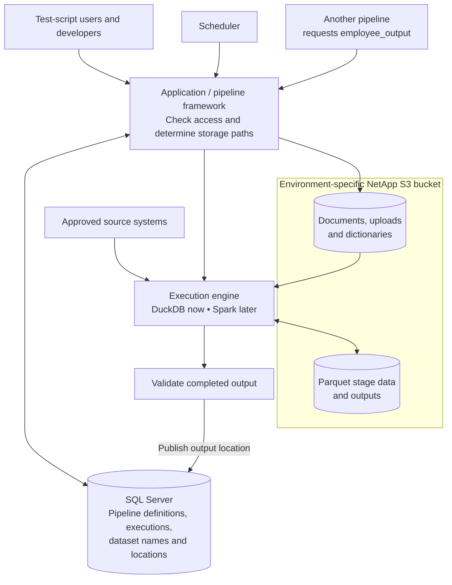

Agreed. **Here is a first concrete approach:** use a centrally controlled storage structure, keep each execution’s data identifiable, and let developers reference outputs by table name through your existing SQL Server metadata.

This is a **discussion draft**. DuckDB and Parquet are confirmed; the refresh and governance rules below are proposals we can refine.



The “pipeline framework” can be part of your existing application. Its responsibility is to translate metadata into an authorized execution, generate the correct paths, and register completed outputs.

**I propose the following storage structure.**

The common root is configured centrally:

`s3://<environment-bucket>/<project-root>/`

```text
<project-root>/
│
├── data-sources/
│   └── source=<source-id>/
│       ├── agreements/agreement=<id>/<document-file>
│       └── dictionaries/schema=<id>/version=<id>/dictionary.json
│
├── test-scripts/
│   └── test-script=<id>/byod/upload=<id>/
│       ├── original.xlsx              ← or original.csv
│       └── dictionary.json
│
├── pipeline-assets/
│   └── pipeline=<id>/asset=<id>/
│       └── original.sas               ← or original.sql
│
├── test-runs/
│   └── test-script=<id>/pipeline=<id>/execution=<id>/
│       ├── stages/stage=<id>/part-*.parquet
│       ├── outputs/dataset=<id>/part-*.parquet
│       └── manifest.json
│
└── shared-runs/
    └── pipeline=<id>/execution=<id>/
        ├── stages/stage=<id>/part-*.parquet
        ├── outputs/dataset=<id>/part-*.parquet
        └── manifest.json
```

This arrangement gives each type of information a clear home:

- **`data-sources`** holds agreements and source dictionaries independently of individual test executions.
- **`test-scripts`** holds original BYOD uploads and their dictionaries.
- **`pipeline-assets`** holds uploaded SAS/SQL files for either kind of pipeline. Generated SQL and pipeline definitions remain in SQL Server.
- **`test-runs`** holds execution data associated with test scripts, where the 30-day requirement applies once its precise scope is agreed.
- **`shared-runs`** holds standalone pipeline executions, with a separate refresh and cleanup policy.

Source dictionaries remain in SQL Server and S3. BYOD dictionary descriptions remain only in S3. Engagement, control, and MRU information stays in SQL Server; stable IDs connect those records to the stored files.

The proposed `manifest.json` records the execution’s exact output files, schemas, and input references. That makes it possible to distinguish a complete dataset from files still being written.

**Here is how your pipeline `100`, execution `200` example works.**

Suppose the pipeline produces `employee_output`. Its output files would live under:

```text
<project-root>/shared-runs/pipeline=100/execution=200/
    outputs/dataset=employee_output/
        part-00000.parquet
        part-00001.parquet
```

SQL Server would hold a small output registry:

| Registry field | Example |
|---|---|
| Dataset name | `employee_output` |
| Producing pipeline | `100` |
| Published execution | `200` |
| Storage location | The execution-specific output location above |
| Format | Parquet |
| Status | Published |
| Governance information | Owner, access rules, schema version, applicable expiry |

A developer creating another pipeline specifies **`employee_output` as an input**.

At execution time, the framework:

1. Checks whether that pipeline/user may consume the dataset.
2. Resolves `employee_output` to published execution `200`.
3. Registers those Parquet files in DuckDB under the name `employee_output`.
4. Keeps that input version fixed for the duration of the consuming run.

The developer can then write:

```sql
SELECT department, COUNT(*)
FROM employee_output
GROUP BY department;
```

**The developer-facing table name stays stable. The framework owns the physical path.** For tools that require a physical path, the same lookup can return the authorized published location.

DuckDB supports reading and writing through S3-compatible APIs; compatibility with your endpoint still needs a focused connectivity check. [DuckDB S3 documentation](https://duckdb.org/docs/current/core_extensions/httpfs/s3api)

**For scheduled refreshes, I propose publishing a completed replacement.**

When pipeline `100` runs again:

1. Write the new data under `execution=201`.
2. Finish and validate its output files.
3. Update SQL Server so `employee_output` points to execution `201`.
4. Let existing readers finish using execution `200`.
5. Remove the superseded data according to the agreed cleanup rule.

If execution `201` fails, execution `200` remains the published output, with its age and refresh failure visible.

This achieves your requirement that consumers receive refreshed data, while avoiding a period where deleting and rewriting the current location leaves them with missing or incomplete files. The proposal requires temporary overlap between old and new data; that remains one of our recorded decisions.

**Governance belongs in the same design.**

| Concern | Proposed approach |
|---|---|
| Everyone writes in the correct place | Central path generation plus storage permissions restricting where each writer can write. |
| Sensitive data access | Separate runtime, developer, and cleanup identities; authorize access to datasets and their underlying objects. |
| Direct developer access | Use scoped permissions and the registered output locations. Direct access must enforce the same restrictions as the application. |
| Test execution retention | Apply the 30-day rule to the agreed execution artifacts; keep document and upload retention separate. |
| Shared output cleanup | Retain the current published version; remove obsolete versions after the agreed reader/retention window. |
| Traceability | Record which source extracts, BYOD uploads, dictionary versions, and upstream executions produced each output. |
| Protection and audit | HTTPS, encryption at rest, managed credentials, and records of access, publication, and deletion. |

NetApp documents access policies scoped to object prefixes, although availability in your deployment remains an internal check. **The folder structure itself is not an access control.** [NetApp policy examples](https://docs.netapp.com/us-en/storagegrid/s3/example-group-policies.html)

I’ve saved the [architecture draft and outstanding decisions](</C:/Users/sivan/Documents/Codex/2026-09-24/play/outputs/s3-architecture-draft.md>). It preserves the unanswered points about output naming, refresh behavior, retention, access boundaries, and dictionary authority/review so we can return to them after reviewing this structure.